## 全国大学生数学建模竞赛 赛题与优秀论文评析

(2005年—2011年A题)

主编 姚泽清 郑旭东 赵颖

责任编辑：崔晓莉 xlcui@ndip.cn

文字编辑：李玉昌

责任校对：钱辉玲

封面设计：王晓军 xjwang@ndip.cn

## 数学建模系列丛书

全国大学生数学建模竞赛赛题与优秀论文评析

(2005年——2011年A题)

全国大学生数学建模竞赛赛题与优秀论文评析

(2005年——2011年B题)

国际数学建模竞赛赛题与优秀论文评析

数学建模

数学实验

上架建议：数理科学  


<details>
<summary>text_image</summary>

http://www.ndip.cn
ISBN 978-7-118-07506-9
9 787118 075069 >
</details>

总定价：76.00元 $\frac{上册：45.00元}{下册：31.00元}$

# 全国大学生数学建模竞赛 赛题与优秀论文评析

# (2005 年—2011 年 A 题)

主编 姚泽清 郑旭东 赵颖

副主编 刘守生 田作威 沈锦仁 郑琴 滕加俊

史汉生 刘海峰 张瑰 姚奎 唐庆国

國防工業出版社

· 北京 ·

## 内容简介

本书对2005年至2011年的全国大学生数学建模竞赛的赛题进行了评析，并逐一给出问题解答要点，同时从解放军理工大学获得全国一、二等奖的论文中精选了30篇优秀论文进行点评，评价其优劣，总结其得失。该校在这7年中参加国际、国内数学建模竞赛共获得国际一等奖10项，全国一等奖19项，产生了全国优秀论文3篇，全国优秀建模指导教师1人，并于2010年成功地举办了军队院校军事数学建模邀请赛。本书可作为本科生、专科生的“数学建模”课程的教学参考书，也可作为大学生、研究生参加国际数学建模竞赛、全国大学生数学建模竞赛和研究生数学建模竞赛的培训教材，还可作为从事复杂问题建模的工程技术人员的建模指导书。

## 图书在版编目(CIP)数据

全国大学生数学建模竞赛赛题与优秀论文评析. 2005 年—2011 年 A 题 / 姚泽清, 郑旭东, 赵颖主编. — 北京: 国防工业出版社, 2012.5

ISBN 978-7-118-07506-9

I. ①全... II. ①姚... ②郑... ③赵... III. ①数学模型 - 竞赛 - 高等学校 - 教学参考资料 IV. ①0141.4

中国版本图书馆 CIP 数据核字(2011)第 221748 号

※

国防工業出版社出版发行

(北京市海淀区紫竹院南路23号 邮政编码100048)

北京奥鑫印刷厂印刷

新华书店经售

\*

开本 $787 \times 1092$ 1/16 印张 $25\frac{1}{4}$ 字数 590 千字

2012年5月第1版第1次印刷 印数1—4000册 总定价76.00元 上册 45.00元 下册 31.00元

# 数学建模系列丛书 编委会名单

主编 金丰年 姚泽清 郑旭东

副主编 赵颖 刘守生 田作威 沈锦仁

编 委 （以姓氏笔画为序）

王璞 王岩青 毛自森 史汉生 刘希强

刘海峰 严榴香 苏慧琳 杨素娟 吴欧

汪鹏 张瑰 张燕 陆小庆 陈蓓

郑琴俞珊姚奎徐兵徐丹丹

唐庆国 廖洪林 滕加俊 颜超颜锋

戴毅

## 前言

进入20世纪,随着计算机技术的快速发展,数学以空前的广度和深度向自然科学、工程技术及管理科学等领域渗透,与之发生交叉与融合,数学思维对人类认识自然和改造自然起着越来越重要的作用,数学与计算机技术相结合而形成的数学技术已经成为当代高新技术的一个重要组成部分,而数学建模作为联系数学与实际问题的桥梁已成为数学科学向数学技术转化的主要途径。

数学发展史,就是一部人们不断发现问题和解决问题的历史。数学可以锻炼学生的思维,对学生在完成从应试到应用、从学生到学者、从知识到学识的转化过程,有着无可替代的作用。然而,由于传统教学模式的影响,长期以来我们的数学教育过于追求理论的完美和逻辑的严谨,使得生动的、充满活力的数学教学被淹没在大量枯燥的公式推导与理论证明之中,严重挫伤了学生的学习积极性,束缚了学生创新意识、创新精神和创新能力的发展。

1985 年,美国率先举办了数学建模竞赛(the Mathematical Contest in Modeling, MCM),旨在鼓励大学生运用数学知识参与解决实际问题的全过程,为改变这一状况提供了契机。1989 年,北京大学、清华大学、北京理工大学首次派队参加了美国的数学建模竞赛,数学建模作为一种全新的学习方式在国内悄然兴起。

1992 年,中国工业与应用数学学会举办了首届全国大学生数学建模联赛,1994 年转而为教育部高教司直接组织领导,并更名为全国大学生数学建模竞赛。数学建模活动的兴起,对提高学生的综合素质,培养学生的创新能力,起到了催化作用;数学建模活动的开展,推动了数学建模教学在全国各高校的迅速发展,推进了整个数学教学的改革。

数学建模活动在全国兴起后,原中国人民解放军空军气象学院、中国人民解放军通信工程学院就先后开设了数学建模课程,并分别在1995年和1996年获得了自己的第一个全国一等奖,中国人民解放军通信工程学院还因其突出的成绩成为1997年全国大学生数学建模竞赛颁奖大会的承办单位。1999年中国人民解放军通信工程学院、工程兵工程学院和空军气象学院合并组建为解放军理工大学后,着眼培养高素质创新型人才,以实施“现代化教学工程”为牵引,以培养学员“战略眼光、科学思维方法、信息素养以及较强国际交流能力”为着力点,将数学建模活动的重点由成绩的获取转移到能力的培养上来,为培养创新型人才搭建实践平台,使学员的聪明才智和创造精神得到了充分发挥。

进入21世纪,解放军理工大学共获得全国大学生数学建模竞赛一等奖28项,二等奖46项,其中有3篇被评为全国优秀论文。2006年,解放军理工大学首战国际数学建模竞赛,就获得了一等奖1项;2007年,再战跨学科建模竞赛(the Interdisciplinary Contest in Modeling, ICM),又获得了国际一等奖2项的好成绩,5年来共获得国际一等奖10项、二等奖11项。2008年,解放军理工大学的经验成果《开展数学建模活动,为培养创新型人才搭建实践平台》获军队级教学成果二等奖;2011年,又成功举办了军队院校军事数学建模邀请赛,推动了数学建模活动在军队院校的广泛、深入开展。

为了总结解放军理工大学开展数学建模活动的经验,检验学员参加数学建模活动的成果,我们在大学和理学院首长的支持下,着手编写了这部数学建模系列丛书。作为丛书的第一部分,《全国大学生数学建模竞赛赛题与优秀论文评析》一书,邀请具有丰富实战经验的专家对2005年至2011年的赛题进行了评析,并逐一给出问题解答要点,同时从解放军理工大学获得全国一、二等奖的51篇论文中,精选了30篇优秀论文进行点评,评价其优劣,总结其得失,以期对后来者有所裨益。

鉴于全国大学生数学建模竞赛 A 题偏理论、B 题偏应用的特点,本书按 A、B 两题分两辑出版。本书可作为专科生、本科生《数学建模》课程的教学参考书,大学生、研究生参加国际数学建模竞赛、全国大学生数学建模竞赛和研究生数学建模竞赛的培训教材,以及从事复杂问题建模的工程技术人员的建模指导书。

值本书出版之际,谨向解放军理工大学成立以来对数学建模活动的开展给予精心呵护与悉心指导的唐万年校长、张亚非校长、训练部张建军部长、政治部张华伟主任、校务部苏晓冰部长致以崇高的敬意,向多年来对数学建模活动的组织给予全力支持与大力帮助的大学训练部李建新副部长、费建芳副部长、周雷副部长表示诚挚的谢意,并借此机会向对解放军理工大学数学建模活动给予关心指导的解放军信息工程大学韩中庚教授、东南大学朱道元教授,以及曾经在解放军理工大学数学建模团队中工作过并做出重要贡献的汤光华、罗剑等同志表示衷心的感谢!

由于时间和水平所限,书中错漏之处在所难免,恳请各位专家学者和读者批评指正,信寄:lgdxlxyzqy@yahoo.com.cn。

姚泽清

2012年1月11日于南京

## 目录

## 2005年A题 长江水质的评价和预测 …… (1)

长江水质的评价和预测的数学模型(全国一等奖) …… 罗文明、温莹、胡水根(4)

长江水质的评价和预测(全国一等奖)…… 李云锋、王勇、杨林(26)

长江水质的评价和预测的数学模型(全国二等奖)……胡超、顾亚、张怡(58)

## 2006年A题 出版社的资源配置 …… (71)

出版社资源配置的数学模型(全国一等奖)…… 苏正炼、江勋林、卢本胜(73)

出版社资源配置的数学模型(全国一等奖) …… 王腾飞、田金鑫、徐晓虎(101)

## 2007年A题 中国人口增长预测 …… (126)

人口预测的数学模型(全国一等奖) …… 曹瑞飞、郑长友、姜明云(127)

中国人口增长模型(全国二等奖) …… 黎爱兵、余运科、姚雪峰(150)

中国人口增长预测(全国二等奖) …… 李文超、于斌、查海波(175)

## 2008年A题 数码相机定位 …… (192)

数码相机定位问题(全国一等奖) …… 张应宪、樊琳娜、姜青竹(195)

数码相机定位研究(全国一等奖) 王平、郑建超、黄涛(220)

数码相机定位标定方法研究(全国一等奖) …… 魏垚名、杨诚、邰相进(239)

## 2009年A题 制动器试验台的控制方法分析 …… (258)

制动器试验台的控制方法分析(全国一等奖) …… 徐兵、王光华、程四海(261)

制动器试验台控制方法的模型研究(全国一等奖) … 李志坚、郑钢锤、孟宪宇(276)

制动器试验台的控制方法分析(全国二等奖) …… 王平、郑建超、黄涛(294)

## 2010年A题 储油罐的变位识别与罐容表标定 …… (312)

储油罐的变位识别与罐容表标定设计模型(全国一等奖)

许晓明、高枫越、张驭龙(316)

储油罐的变位识别与罐容表标定(全国二等奖) …… 朱锐杰、张鹏、杨明梦(334)

## 2011年A题 城市表层土壤重金属污染分析 …… (347)

城市表层土壤重金属污染分析(全国一等奖) …… 范志强、吕华平、胡帅(349)

城市表层土壤重金属污染分析(全国二等奖) …… 曾治、杨志才、柴卓慧(379)

## 附录 全国大学生数学建模竞赛历年赛题……（397）

# 2005 年 A 题 长江水质的评价和预测

水是人类赖以生存的资源,保护水资源就是保护我们自己,对于我国大江大河水资源的保护和治理应是重中之重。专家们呼吁:“以人为本,建设文明和谐社会,改善人与自然的环境,减少污染。”

长江是我国第一、世界第三大河流，长江水质的污染程度日趋严重，已引起了相关政府部门和专家们的高度重视。2004年10月，由全国政协与中国发展研究院联合组成“保护长江万里行”考察团，从长江上游宜宾到下游上海，对沿线21个重点城市做了实地考察，揭示了一幅长江污染的真实画面，其污染程度让人触目惊心。为此，专家们提出“若不及时拯救，长江生态10年内将濒临崩溃”（附件1），并发出了“拿什么拯救癌变长江”的呼唤（附件2）。

附件3给出了长江沿线17个观测站(地区)近两年多主要水质指标的检测数据,以及干流上7个观测站近一年多的基本数据(站点距离、水流量和水流速)。通常认为一个观测站(地区)的水质污染主要来自于本地区的排污和上游的污水。一般说来,江河自身对污染物都有一定的自然净化能力,即在水环境中通过物理降解、化学降解和生物降解等,使水中污染物的浓度降低。反映江河自然净化能力的指标称为降解系数。事实上,长江干流的自然净化能力可以认为是近似均匀的,根据检测可知,主要污染物高锰酸盐指数和氨氮的降解系数通常介于0.1\~0.5之间,比如可以考虑取0.2(单位:1/天)。附件4是“1995—2004年长江流域水质报告”给出的主要统计数据。下面的附表是国家标准(GB 3838—2002)给出的《地表水环境质量标准》中4个主要项目标准限值,其中I、II、III类为可饮用水。

请你们研究下列问题：

（1）对长江近两年多的水质情况做出定量的综合评价，并分析各地区水质的污染状况。

(2) 研究、分析长江干流近一年多主要污染物高锰酸盐指数和氨氮的污染源主要在哪些地区?

（3）假如不采取更有效的治理措施，依照过去10年的主要统计数据，对长江未来水质污染的发展趋势做出预测分析，比如研究未来10年的情况。

（4）根据你的预测分析,如果未来10年内每年都要求长江干流的Ⅳ类和V类水的比例控制在20%以内,且没有劣V类水,那么每年需要处理多少污水?

(5) 你对解决长江水质污染问题有什么切实可行的建议和意见。

附表:《地表水环境质量标准》(GB 3838—2002)中4个主要项目标准限值

(单位:mg/L)

<table><tr><td>序号</td><td>项目\标准值\分类</td><td>I类</td><td>II类</td><td>III类</td><td>IV类</td><td>V类</td><td>劣V类</td></tr><tr><td>1</td><td>溶解氧(DO) ≥</td><td>7.5(或饱和率90%)</td><td>6</td><td>5</td><td>3</td><td>2</td><td>0</td></tr><tr><td>2</td><td>高锰酸盐指数(CODMn) ≤</td><td>2</td><td>4</td><td>6</td><td>10</td><td>15</td><td>∞</td></tr><tr><td>3</td><td>氨氮( $NH_3-N$ ) ≤</td><td>0.15</td><td>0.5</td><td>1.0</td><td>1.5</td><td>2.0</td><td>∞</td></tr><tr><td>4</td><td>pH值(无量纲)</td><td colspan="5">6~9</td><td></td></tr></table>

（注：附件1～附件4位于压缩文件A2005Data.rar中，可从http://mcm.edu.cn/mcm05/problems2005c.asp下载）

## 【试题评析】

沈锦仁

本题是根据长江水质 1995 年到 2004 年的大量统计数据来分析评价长江水质,并预测后十年长江水质变化状况及后十年每年要处理污水的数量。

问题一,根据17个观察点的28个月的4个指标的三维数据来综合分析长江的水质情况,分析各地区的污染状况。

问题二,根据干流七个观察点的水质数据,来分析长江污染排污的情况。

问题三和问题四,根据 1995 年到 2004 年 10 年的长江六类水质的分类、水流量、沿途的排废水量来预测以后十年长江六类水质的比例和排废量及要处理的废水量。

## 【问题解答要点】

问题一,根据17个观察点,28个月,4种水质指标,来分析各地区污染情况和综合分析长江水质情况。第一步,先将4种水质指标综合,在综合时应将4种指标进行单位化,要注意质的问题和方向问题。综合时一般采用平均数,考虑到水质的问题,一个指标不能达到饮用水标准就不是饮用水了,因而也应该采用最大值方法综合。第二步,在同一观察点采用28个月的综合,从而可以分析出17个观察点严重程度的排序。第三步,对17个观察点的综合,可得长江总体上是属于二类水。

问题二, 探求污染源。长江干流上的 7 个观察点 $x_{i} (i = 1,2,\dots,7)$ , 简单处理为 $x_{i}$ 的指标值 $\rho_{i}$ 流到 $x_{i+1}$ 处, 由于自降价的原因, 指标值应该为 $\rho_{i} \mathrm{e}^{-\lambda \Delta t_{i}}$ , 而观察值为 $\rho_{i+1}$ , 其差 $\rho_{i+1} - \rho_{i} \mathrm{e}^{-\lambda \Delta t_{i}}$ 可以相对地反映 $x_{i}$ 到 $x_{i+1}$ 之间污染的程度。水质问题理论上应该是反应—扩散方程问题, 右端函数 $f(x,t)$ 就是污染源。可利用方程来反演 $f(x,t)$ , 也可以简化反应扩散方程为常微分方程求解, 也可以用差分格式来反演。

问题三,利用1995年到2004年10年的六类水质的百分比来预测后十年的百分比,用统计数据来预测,一般采用回归的方法。六类分别回归,F检验不易通过;将Ⅰ、Ⅱ、Ⅲ类水质合并,Ⅳ、Ⅴ类合并,劣Ⅴ类单独,分三类水质分别回归。

问题四,利用十年的长江总流量,流域内排废水量,用统计方法,因果分析,“因”是流域排废水量,“果”是长江水质IV、V类水比例 $y_{4}$ ,劣V类水质比例 $y_{6}$ ,用统计数来进行回归。要求:IV、V类低于20%,劣V类要不存在,从而 $y_{4}=20,y_{6}=0$ ,从而得排废水量的临界值和 $M_{4}^{*}$ 和 $M_{6}^{*},M^{*}=\min(M_{4},M_{6})$ ,再用回归方法来预测后十年流域的排废水量,超过 $M^{*}$ 的部分就是每年要处理的废水的流量。

# 长江水质的评价和预测的数学模型

## 摘要

本文利用微分方程、线性回归和曲线拟合的方法(通过简化长江水流速度的变化情况和污水排放情况)建立了长江水质的评价和预测的线性回归模型。模型考虑了数据相对于时间的变化情况、数据之间存在的相互联系,对未来长江的水质情况进行了合理的预测。本文通过微分方程求解、曲线拟合和线性回归算法并利用数学软件 MATLAB 进行编程计算,给出了问题的解答:(1)长江中,Ⅱ类水、Ⅲ类水、Ⅳ类水、劣Ⅴ类水所占比重分别为:52.9%、35.3%、5.8%、5.9%,Ⅰ类水和Ⅴ类水所占比重非常小。(2)高锰酸盐(CODMn)的主要污染源为3\~4观测站之间的地区,即湖北宜昌南津关到湖南岳阳城陵矶。氮氨( $\mathrm{NH}_{3}-\mathrm{N}$ )污染源主要是4\~5观测站之间的地区,即湖南岳阳城陵矶到江西九江河西水厂和湖北宜昌南津关到湖南岳阳城陵矶。(3)可饮用水(I、Ⅱ、Ⅲ类水的总和)所占的百分比越来越小,而不可饮用水所占的百分比越来越大,特别是劣Ⅴ类水所占百分比增加显著。(4)根据预测分析,未来十年需要处理的污水量分别为79.4、92.3、105.1、118.0、130.9、140.5、143.7、169.4、183.3、195.1(亿t)。(5)我们对解决长江水质污染问题最主要的意见就是要完善规章制度、加大治理力度,发挥政府部门的职能作用。在文章的最后,分析了模型的优缺点,给出了模型的若干推广。

## 1 问题的重述

水是人类赖以生存的资源,保护水资源就是保护我们自己,对于我国大江大河水资源的保护和治理应是重中之重。专家们呼吁:“以人为本,建设文明和谐社会,改善人与自然的环境,减少污染。”

长江是我国第一、世界第三大河流，长江水质的污染程度日趋严重，已引起了相关政府部门和专家们的高度重视。2004年10月，由全国政协与中国发展研究院联合组成“保护长江万里行”考察团，从长江上游宜宾到下游上海，对沿线21个重点城市做了实地考察，揭示了一幅长江污染的真实画面，其污染程度让人触目惊心。为此，专家们提出“若不及时拯救，长江生态10年内将濒临崩溃”（附件1），并发出了“拿什么拯救癌变长江”的呼唤（附件2）。

附件3给出了长江沿线17个观测站(地区)近两年多主要水质指标的检测数据,以及干流上7个观测站近一年多的基本数据(站点距离、水流量和水流速)。通常认为一个观测站(地区)的水质污染主要来自于本地区的排污和上游的污水。一般说来,江河自身对污染物都有一定的自然净化能力,即在水环境中通过物理降解、化学降解和生物降解等,使水中污染物的浓度降低。反映江河自然净化能力的指标称为降解系数。事实上,长江干流的自然净化能力可以认为是近似均匀的,根据检测可知,主要污染物高锰酸盐指数和氨氮的降解系数通常介于0.1\~0.5之间,比如可以考虑取0.2(单位:1/天)。附件4是“1995—2004年长江流域水质报告”给出的主要统计数据。下面的附表是国家标准(GB 3838—2002)给出的《地表水环境质量标准》中4个主要项目标准限值,其中Ⅰ、Ⅱ、Ⅲ类为可饮用水。

请你们研究下列问题:

(1) 对长江近两年多的水质情况做出定量的综合评价,并分析各地区水质的污染状况。

(2) 研究、分析长江干流近一年多主要污染物高锰酸盐指数和氨氮的污染源主要在哪些地区?

（3）假如不采取更有效的治理措施，依照过去10年的主要统计数据，对长江未来水质污染的发展趋势做出预测分析，比如研究未来10年的情况。

（4）根据你的预测分析,如果未来10年内每年都要求长江干流的Ⅳ类和Ⅴ类水的比例控制在20%以内,且没有劣Ⅴ类水,那么每年需要处理多少污水?

(5) 你对解决长江水质污染问题有什么切实可行的建议和意见。

## 2 问题的分析

本题要求对长江现状进行分析评价和对长江以后的状况进行合理的预测,并对污水处理量提出自己的意见。从题意中可以看出,对于第一个问题,可以将所有的检测项目进行无量纲化,然后进行定时间的整体综合评价和固定地点的整体综合评价。而对于污染情况的分析,则可以根据流体力学的知识获得求解。在本题中,就可以使用流体力学中的扩散方程来解决水质污染的问题。为了能够将问题简单化,在考虑的时候,可以将问题进行简单化处理。

在第三问中,需要求解的问题是依照过去十年的数据来预测未来十年的数据。考虑使用曲线拟合的方法来找出过去十年的各种水质的百分比变化的规律。在数据拟合的过程中,为了使得规律性变得明显,可以进行合理的数据预处理,如进行平滑性处理、剔除不合理的数据点。通过对数据的分析,发现数据点比较离散且规律性不强,为了得到规律性较为明显的结果,在拟合的过程中可以将几类水进行合理的合并,将可饮用水作为一类,将Ⅳ、Ⅴ类水作为同一类,劣Ⅴ类作为一类。在找到合适的函数来进行拟合之后,可以使用这些函数来对未来十年的长江水质情况进行预测。

在附件4中,可以发现给出了前十年的污水排放数量,对这十个数据进行拟合,可以预测未来十年的年污水排放总量。而观察长江十年的水流总量可以发现,长江水流总量的变化较小,所以可以忽略长江总流量的变化。为了达到题目中所要求的水质,可以计算在这种情况下长江能够承受的最大污水排放量,将这个排放量与预测的排放量进行比较,多出来的部分就是需要每年处理掉的。

## 3 符号约定

$u(x,t)$ :污染浓度;

v:水流速度;

$\gamma_{i}$ : 第 i 类水质的水所占的百分比;

x:污水的数量。

## 4 模型的假设与名词解释

在解题的过程中,认为长江水的自净能力是不变的,取0.2(单位:1/天)。因为长江水流的实际情况非常复杂,所以在计算的时候考虑对它进行简化。在计算17个观测点的具体位置时,因为没有能够找到非常有效的数据来说明它们,所以在实际的运用中是根据地图中它们的位置来大略地计算它们的相对位置,确定它们在长江中的各个坐标。因为沿江的污染物排放是没有固定地点的,为了分析计算的方便,假设污水在各观测点之间是均匀排放的。

## 5 问题I模型的建立与求解

## 5.1 无量纲化模型的建立

对于问题一,要紧紧抓住两个方面的内容:一个是要对两年多的长江水质作一个定量的综合评价;另一个是要对各地区的水质污染情况做一个分析。在综合评价的时候,可以对长江的水质进行固定时间的综合评价或者不固定时间不固定地点的整体评价。在具体的求解过程中对这两种情况都要进行计算分析。首先对已经给出的水质分级标准进行无量纲化,然后利用已经给出的水质分级结果对照无量纲化处理结果进行处理,最后进行综合就可以得到想要的各地的水质状况分析以及长江整体的水质状况。

## 5.2 理论分析及算法思想

因为在《长江流域主要城市水质检测报告》中已经给出了17个不同观测点在28个不同时间各主要监测项目的各项数值,所以可以对这些数据进行合理的处理以求解得到需要的结果。同时在题目中也可以看到对各个不同指标的水质判断标准,所以也可以比较容易地对这四个项目进行无量纲化处理,进行处理后就可以利用这个处理结果对给出的不同时间的17个观测点的水质类别进行处理,然后对这个处理结果进行适当的分析,就应该可以得到需要求解的结果。在这个问题的求解过程中需要运用的最主要的算法思想,就是对给定的数据如何进行合适的处理分析,解决好这个问题之后,需要求解的问题就可以迎刃而解了。对现有的标准进行无量纲化的好处就是对所有的监测项目进行了处理,使它们统一到了相同的一个判断标准上,这样在进行综合求平均值的时候就能够比较容易地进行分析了。

## 5.3 模型的求解

为了使四个监测项目的判断标准统一到相同的值上,需要对这四项判断标准进行无量纲化处理,在处理过程中用氨氮的判断值除以2得到的结果为新的判断标准,那么Ⅰ类水至劣Ⅴ类水的新的判断标准分别为0\~0.075、0.075\~0.25、0.25\~0.5、0.5\~0.75、0.75\~1、1\~∞,所以现在需要做的就是将其他的检测项目统一到这个标准上来。

采用分段函数对高锰酸盐指数进行无量纲化,具体的分段函数为

$$
f (M) = \left\{ \begin{array}{l} \frac {M}{2} \cdot 0. 0 7 5 \quad M \leqslant 2 \\ \frac {M - 2}{2} (0. 2 5 - 0. 0 7 5) + 0. 0 7 5 \quad 2 <   M \leqslant 4 \\ \frac {M - 4}{2} (0. 5 - 0. 2 5) + 0. 2 5 \quad 4 <   M \leqslant 6 \\ \frac {M - 6}{1 0 - 6} (0. 7 5 - 0. 5) + 0. 5 \quad 6 <   M \leqslant 1 0 \\ \frac {M - 8}{1 5 - 1 0} (1 - 0. 7 5) + 0. 7 5 \quad 1 0 <   M \leqslant 1 5 \\ \frac {M - 1 0}{1 5 - 1 0} + 1 \quad 1 5 <   M \end{array} \right.
$$

经过处理后的新标准就与氨氮标准判断值的结果相一致，I类水至劣V类水的判断标准分别为0\~0.075、0.075\~0.25、0.25\~0.5、0.5\~0.75、0.75\~1、1\~∞。

利用同样的方法对溶解氧指数无量纲化处理,使得它们能够与氨氮的判断标准相统一。因为溶解氧的含量是越多越好,这与其他两项正好相反,为了能够使它们统一,需要对它们进行反转,的做法是使用7.5-D,得到的数值就变化为0、1.5、2.5、4.5、5.5、∞,具体的分段函数为

$$
f (D) = \left\{ \begin{array}{l} 7. 5 - D + 0. 0 2 5 \quad D \geqslant 7. 5 \\ \frac {7 . 5 - D}{7 . 5 - 6} (0. 2 5 - 0. 0 7 5) + 0. 0 7 5 \quad 6 \leqslant D <   7. 5 \\ \frac {7 . 5 - D - 1 . 5}{1 . 5} (0. 5 - 0. 2 5) + 0. 2 5 \quad 5 \leqslant D <   6 \\ \frac {7 . 5 - D - 2 . 5}{2 . 5 - 1 . 5} (0. 7 5 - 0. 5) + 0. 5 \quad 3 \leqslant D <   5 \\ \frac {7 . 5 - D - 4 . 5}{4 . 5 - 2 . 5} (1 - 0. 7 5) + 0. 7 5 \quad 2 \leqslant D <   3 \\ \frac {7 . 5 - D - 5 . 5}{5 . 5 - 4 . 5} + 1 \quad D <   2 \end{array} \right.
$$

经过处理后的新标准就与氨氮标准判断值的结果相一致，I类水至劣V类水的判断标准分别为0\~0.075、0.075\~0.25、0.25\~0.5、0.5\~0.75、0.75\~1、1\~∞。

对于 $\mathrm{pH}$ 值的无量纲化处理中可以发现， $\mathrm{pH}$ 值只需要区别两类，即 $6 \sim 9$ 之间和这个范围之外的数值，所以在计算的过程中认为只要 $\mathrm{pH}$ 值在 $6 \sim 9$ 之间的就为I类水至V类水,其他的就是劣V类水,具体的分段计算函数为

$$
f (P) = \left\{ \begin{array}{l l} \frac {| P - 7 |}{1} \cdot 0. 0 7 5 & 6 \leqslant P <   7 \\ \frac {| P - 7 |}{2} \cdot 0. 0 7 5 & 7 \leqslant P \leqslant 9 \\ \frac {| P - 7 . 5 |}{1 . 5} & \text {其他} \end{array} \right.
$$

经过处理后的新标准就与氨氮标准判断值的结果相一致，I类水至V类水及劣V类水的判断标准分别为0\~0.075、∞。

将四个监测项目的28个不同时间数值代入各个分段函数,并将四个监测项目相加求平均值,就可以得到最后的无量纲化结果,见表1(完整数据表见附录)。

表1

<table><tr><td></td><td>1</td><td>2</td><td>3</td><td>4</td><td>5</td><td>6</td><td>7</td><td>8</td><td>9</td></tr><tr><td>2003-06</td><td>0.16</td><td>0.17</td><td>0.47</td><td>0.20</td><td>0.23</td><td>0.19</td><td>0.17</td><td>0.60</td><td>0.13</td></tr><tr><td>2003-07</td><td>0.45</td><td>0.13</td><td>0.40</td><td>0.24</td><td>0.22</td><td>0.16</td><td>0.21</td><td>0.55</td><td>0.63</td></tr><tr><td>...</td><td>...</td><td>...</td><td>...</td><td>...</td><td>...</td><td>...</td><td>...</td><td>...</td><td>...</td></tr><tr><td>2005-08</td><td>0.13</td><td>0.15</td><td>0.32</td><td>0.28</td><td>0.10</td><td>0.14</td><td>0.23</td><td>0.43</td><td>0.17</td></tr><tr><td>2005-09</td><td>0.25</td><td>0.15</td><td>0.19</td><td>0.36</td><td>0.15</td><td>0.14</td><td>0.24</td><td>0.18</td><td>0.08</td></tr><tr><td></td><td>10</td><td>11</td><td>12</td><td>13</td><td>14</td><td>15</td><td>16</td><td>17</td><td></td></tr><tr><td>2003-06</td><td>0.62</td><td>0.07</td><td>0.50</td><td>0.22</td><td>0.20</td><td>0.46</td><td>0.15</td><td>0.14</td><td></td></tr><tr><td>2003-07</td><td>0.54</td><td>0.07</td><td>0.20</td><td>0.19</td><td>0.41</td><td>0.52</td><td>0.24</td><td>0.56</td><td></td></tr><tr><td>...</td><td>...</td><td>...</td><td>...</td><td>...</td><td>...</td><td>...</td><td>...</td><td>...</td><td></td></tr><tr><td>2005-08</td><td>0.18</td><td>0.07</td><td>0.32</td><td>0.17</td><td>0.24</td><td>0.64</td><td>0.14</td><td>0.37</td><td></td></tr><tr><td>2005-09</td><td>0.22</td><td>0.07</td><td>0.28</td><td>0.32</td><td>0.17</td><td>0.70</td><td>0.10</td><td>0.21</td><td></td></tr><tr><td colspan="10">注:其中1~17为17个按附录表中顺序排列的不同观测点</td></tr></table>

## 5.4 模型的结果与分析

对 5.3 节中计算得到的无量纲化结果进行定时间的相加求平均, 结果见表 2。

表 2

<table><tr><td>时间</td><td>03-06</td><td>03-07</td><td>03-08</td><td>03-09</td><td>03-10</td><td>03-11</td><td>03-12</td></tr><tr><td>水质</td><td>0.27529</td><td>0.33647</td><td>0.30471</td><td>0.30765</td><td>0.42353</td><td>0.64235</td><td>0.72059</td></tr><tr><td>时间</td><td>04-01</td><td>04-02</td><td>04-03</td><td>04-04</td><td>04-05</td><td>04-06</td><td>04-07</td></tr><tr><td>水质</td><td>0.74882</td><td>1.0706</td><td>0.50353</td><td>0.38235</td><td>0.28941</td><td>0.30118</td><td>0.29471</td></tr><tr><td>时间</td><td>04-08</td><td>04-09</td><td>04-10</td><td>04-11</td><td>04-12</td><td>05-01</td><td>05-02</td></tr><tr><td>水质</td><td>0.26765</td><td>0.23353</td><td>0.39647</td><td>0.35941</td><td>0.55412</td><td>0.41059</td><td>0.34</td></tr><tr><td>时间</td><td>05-03</td><td>05-04</td><td>05-05</td><td>05-06</td><td>05-07</td><td>05-08</td><td>05-09</td></tr><tr><td>水质</td><td>0.23824</td><td>0.22647</td><td>0.22647</td><td>0.23412</td><td>0.24647</td><td>0.24</td><td>0.22412</td></tr></table>

将上面得到的结果与在无量纲化时得到的新判断标准作比较,就可以得到不同时间的长江水质类别的整体评价,具体的结果见表3。

表 3

<table><tr><td>时间</td><td>03-06</td><td>03-07</td><td>03-08</td><td>03-09</td><td>03-10</td><td>03-11</td><td>03-12</td></tr><tr><td>水质</td><td>III</td><td>III</td><td>III</td><td>III</td><td>III</td><td>IV</td><td>IV</td></tr><tr><td>时间</td><td>04-01</td><td>04-02</td><td>04-03</td><td>04-04</td><td>04-05</td><td>04-06</td><td>04-07</td></tr><tr><td>水质</td><td>IV</td><td>劣V</td><td>IV</td><td>III</td><td>III</td><td>III</td><td>III</td></tr><tr><td>时间</td><td>04-08</td><td>04-09</td><td>04-10</td><td>04-11</td><td>04-12</td><td>05-01</td><td>05-02</td></tr><tr><td>水质</td><td>III</td><td>II</td><td>III</td><td>III</td><td>IV</td><td>III</td><td>III</td></tr><tr><td>时间</td><td>05-03</td><td>05-04</td><td>05-05</td><td>05-06</td><td>05-07</td><td>05-08</td><td>05-09</td></tr><tr><td>水质</td><td>II</td><td>II</td><td>II</td><td>II</td><td>II</td><td>II</td><td>II</td></tr></table>

从表 3 中可以统计出长江整体上有 28.6% 时间的水质为Ⅱ类水, 而有 50% 时间的水质为Ⅲ类水, 有 17.9% 时间的水质为Ⅳ类水, 还有 3.5% 时间的水质为劣Ⅴ类水。

对 5.3 中计算得到的无量纲化结果进行固定不同地点的相加求平均, 结果见表 4。

表 4

<table><tr><td>地点</td><td>1</td><td>2</td><td>3</td><td>4</td><td>5</td><td>6</td></tr><tr><td>水质</td><td>0.18214</td><td>0.19286</td><td>0.18107</td><td>0.25071</td><td>0.14</td><td>0.16929</td></tr><tr><td>时间</td><td>7</td><td>8</td><td>9</td><td>10</td><td>11</td><td>12</td></tr><tr><td>水质</td><td>0.17643</td><td>0.5425</td><td>0.27679</td><td>0.49214</td><td>0.075714</td><td>0.46536</td></tr><tr><td>时间</td><td>13</td><td>14</td><td>15</td><td>16</td><td>17</td><td></td></tr><tr><td>水质</td><td>0.30714</td><td>0.24</td><td>2.3507</td><td>0.27179</td><td>0.24179</td><td></td></tr></table>

将上面得到的结果与在无量纲化时得到的新判断标准作比较,就可以得到不同地点的近两年多长江水质类别的整体评价,具体的结果见表5。

表 5

<table><tr><td>地点</td><td>1</td><td>2</td><td>3</td><td>4</td><td>5</td><td>6</td></tr><tr><td>水质</td><td>II</td><td>II</td><td>II</td><td>III</td><td>II</td><td>II</td></tr><tr><td>时间</td><td>7</td><td>8</td><td>9</td><td>10</td><td>11</td><td>12</td></tr><tr><td>水质</td><td>II</td><td>IV</td><td>III</td><td>III</td><td>II</td><td>III</td></tr><tr><td>时间</td><td>13</td><td>14</td><td>15</td><td>16</td><td>17</td><td></td></tr><tr><td>水质</td><td>III</td><td>II</td><td>劣V</td><td>III</td><td>II</td><td></td></tr></table>

从表 5 中可以统计出, 在长江中, 有 52.9% 地区的水质为Ⅱ类水, 有 35.3% 地区的水质为Ⅲ类水, 有 5.8% 地区的水质为Ⅳ类水, 有 5.9% 地区的水质为劣Ⅴ类。

从地区的分布可以看出,在长江干流的水质要好于长江支流的,这说明长江支流的沿江污染情况严重,干流的水质受到支流的严重影响。这也是合理的,因为长江干流的水流量要明显大于支流的:一方面支流的污水进入干流后得到了稀释;另一方面干流的自净能力也要大于支流。

## 6 问题Ⅱ模型的建立与求解

## 6.1 模型的建立

根据流体力学扩散方程,考虑定点的浓度变化情况,建立微分方程:

$$
\frac {\partial u}{\partial t} + v \frac {\partial u}{\partial x} = E \frac {\partial^ {2} u}{\partial x ^ {2}} - \lambda u + f (x, t) \tag {1}
$$

式中： $u(x,t)$ 为浓度，是关于时间 $t$ 和距离 $x$ 的函数，是外部污染源导致的浓度变化； $\frac{\partial u}{\partial t}$ 为浓度随着时间的变化率； $v(x,t)$ 为流速，是关于时间 $t$ 和距离 $x$ 的函数； $v\frac{\partial u}{\partial x}$ 为平流项； $E$ 为扩散系数， $E\frac{\partial^2u}{\partial x^2}$ 为扩散项； $\lambda$ 为主要污染物的降解系数，通常介于0.1\~0.5之间，在本文中取0.2（单位：1/天）。

现在已知各个观测点的检测项目的浓度,那么就可以通过反演的方法来求解得到E,f,u。

分析浓度随着时间的变化率 $\frac{\partial u}{\partial t}$ ，根据附件3中相同观测点相邻两月污染物的浓度变化数据，相邻的30天中浓度的变化几乎为零。

分析扩散项 $E\frac{\partial^2u}{\partial x^2}$ , 根据经验扩散系数 $E$ 取值范围为 $5 \sim 45$ 。扩散项是对距离 $x$ 求二阶偏导。在题目中距离 $x$ 非常大, 因此相对平流项 $v\frac{\partial u}{\partial x}$ 来说, 扩散项 $E\frac{\partial^2u}{\partial x^2}$ 非常小。

根据 $\frac{\partial u}{\partial t}$ 、 $E\frac{\partial^{2}u}{\partial x^{2}}$ 相对于平流项 $v\frac{\partial u}{\partial x}$ 来说要小得多,所以可以不考虑 $\frac{\partial u}{\partial t}$ 、 $E\frac{\partial^{2}u}{\partial x^{2}}$ 。那么经过简化就能够得到 $v\frac{\partial u}{\partial x}=-\lambda u+f(x)$ ，其中 $f(x)$ 为分段常数，所以令 $f(x)$ 为k,k为分段常数，表示两观测站之间污染源每天每升江水所接受的污染物，假设两观测站的污染源在两观测站之间均匀分布。

水流速度 $v(x,t)$ 是关于时间 $t$ 和距离 $x$ 的函数，其速度方向实际上是空间的三个方向。相对于长江的长来说，其江宽和江的深都是微乎其微的，因此假定长江是一条曲线，故其水流速度也简化成一个方向，即向前流动。在这里考虑流速情况，由于水是受到重力的原因而往低处走，若没有阻力，则应是一个加速的过程，但由于水本身有黏稠性，再加上受到外界的阻力，因此假设在没有支流汇入的前提下，假定在长江曲线上的任何两点水匀速下流，只要两点之间不存在支流，其水流速度 $v(x,t)$ 一定，因此 $v(x,t)$ 为分断常数。

对于长江曲线上的没有支流的任何两点,其速度为一常值 v,建立微分方程:

$$
v \frac {\partial u}{\partial x} = - 0. 2 u + k
$$

移项得

$$
v \frac {\partial u}{\partial x} + 0. 2 u = k
$$

同除以 $v$ 得

$$
\frac {\partial u}{\partial x} + \frac {0 . 2}{v} u = \frac {k}{v}
$$

因此求解微分方程就可以得

$$
u = C \mathrm{e} ^ {- \int \frac {0 . 2}{v} \mathrm{d} x} + \mathrm{e} ^ {- \int \frac {0 . 2}{v} \mathrm{d} x} \int \frac {k}{v} \mathrm{e} ^ {\int \frac {0 . 2}{v} \mathrm{d} x} \mathrm{d} x = C \mathrm{e} ^ {- \frac {0 . 2}{v} x} + \frac {k}{0 . 2}
$$

即

$$
u = C \mathrm{e} ^ {- \frac {0 . 2}{v} x} + \frac {k}{0 . 2} \tag {2}
$$

所以只要知道两个观测点之间的浓度以及距离就能够求得 $C, k$ 。

## 6.2 理论分析及算法思想

从流体力学微观上考虑,很容易从流体力学的扩散方程入手考虑定点的浓度变化情况,建立微分方程的数学模型。在处理微分方程时,由于定点浓度随时间变化以及定点浓度的扩散的变化十分微弱,因此忽略其对浓度的影响。然后从实际地图的具体位置出发,找到各观测点的具体位置进行计算,充分考虑了各支流的位置的情况。在考虑水的流速时,从微观上看,水由于受到重力、阻力的影响,由于地势的原因下游地势较为平缓,因此下游比上游水的流速小,充分考虑以上情况,建立模型。

## 6.3 模型的求解

现在对长江的各观测站进行分析,水系图如图1所示。

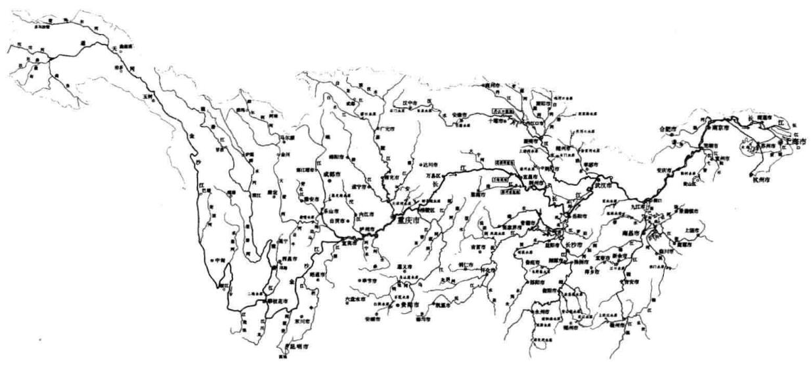

<details>
<summary>text_image</summary>

Historical map of China showing major cities and river systems with labeled geographical features
</details>

图1

为方便表示,将长江沿线17个观测站进行编号,见表6。

找到各观测站水系中的位置,可以得到图2所示的水系简图。

表6

<table><tr><td>序号</td><td>点位名称</td><td>断面情况</td><td>序号</td><td>点位名称</td><td>断面情况</td></tr><tr><td>1</td><td>四川攀枝花龙洞</td><td>干流</td><td>10</td><td>四川泸州沱江二桥</td><td>沱江(入长江前)</td></tr><tr><td>2</td><td>重庆朱沱</td><td>干流(川-渝省界)</td><td>11</td><td>湖北丹江口胡家岭</td><td>丹江口水库(库体)</td></tr><tr><td>3</td><td>湖北宜昌南津关</td><td>干流(三峡水库出口)</td><td>12</td><td>湖南长沙新港</td><td>湘江(洞庭湖入口)</td></tr><tr><td>4</td><td>湖南岳阳城陵矶</td><td>干流</td><td>13</td><td>湖南岳阳岳阳楼</td><td>洞庭湖出口</td></tr><tr><td>5</td><td>江西九江河西水厂</td><td>干流(鄂-赣省界)</td><td>14</td><td>湖北武汉宗关</td><td>汉江(入长江前)</td></tr><tr><td>6</td><td>安徽安庆皖河口</td><td>干流</td><td>15</td><td>江西南昌滁槎</td><td>赣江(鄱阳湖入口)</td></tr><tr><td>7</td><td>江苏南京林山</td><td>干流(皖-苏省界)</td><td>16</td><td>江西九江蛤蟆石</td><td>鄱阳湖出口</td></tr><tr><td>8</td><td>四川乐山岷江大桥</td><td>岷江(与大渡河汇合前)</td><td>17</td><td>江苏扬州三江营</td><td>夹江(南水北调取水口)</td></tr><tr><td>9</td><td>四川宜宾凉姜沟</td><td>岷江(入长江前)</td><td colspan="3"></td></tr></table>

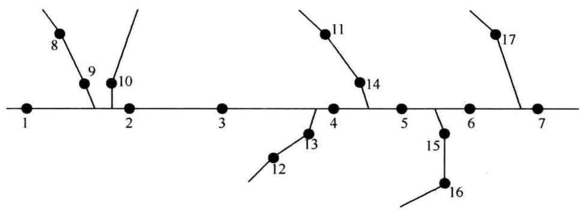

<details>
<summary>scatter</summary>

| Point | X Position | Y Position |
| --- | --- | --- |
| 8 | ~1.2 | ~0.9 |
| 9 | ~1.5 | ~0.6 |
| 10 | ~1.8 | ~0.6 |
| 11 | ~4.2 | ~0.9 |
| 12 | ~3.5 | ~0.3 |
| 13 | ~3.8 | ~0.4 |
| 14 | ~4.5 | ~0.5 |
| 15 | ~5.5 | ~0.3 |
| 16 | ~5.7 | ~0.2 |
| 17 | ~6.5 | ~0.9 |
</details>

图2

通过估计各支流与干流交汇点的位置,若以点1为坐标原点,可以得到干流上支流与干流交汇点以及干流上各观测点的坐标,见表7。

表7

<table><tr><td>点</td><td>1</td><td>支流1</td><td>支流2</td><td>2</td><td>3</td><td>支流3</td><td>4</td><td>支流4</td><td>5</td><td>支流5</td><td>6</td><td>支流6</td><td>7</td></tr><tr><td>坐标/km</td><td>0</td><td>844.6</td><td>902.5</td><td>950</td><td>1728</td><td>2110</td><td>2123</td><td>2373</td><td>2623</td><td>2705</td><td>2787</td><td>3095</td><td>2251</td></tr></table>

由图 2 可知干流上分三种情况。

（1）两观测站之间没有支流(图3):如2、3观测站之间的干流,则可由两点的浓度,根据式(1),可以解得C、k。  
(2) 两观测站之间有一条支流(图4): 如3、4、4、5、5、6和6、7观测站之间的干流。

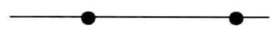  
图3

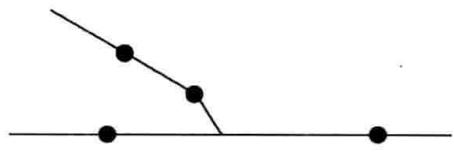

<details>
<summary>natural_image</summary>

Simple geometric diagram with three connected dots and lines, no text or symbols present
</details>

图4

两干流上的点,知道其浓度和流量,而支流的流量可以用干流上两观测点的流量差得到,因为水是不可压缩的,即 $L_{1}=L_{2}-L_{0}$ 。对于干流和支流的交汇点的浓度和流量,可以通过其上游和支流上的浓度和流量得到,若设其分别为 $u_{0}(x_{1}),L_{0},u^{\prime}_{1}(x_{1}),L_{1}$ ,则可得交

汇点的干流浓度 $u_{1}(x_{1})$ 为

$$
u _ {1} (x _ {1}) = \frac {u _ {0} (x _ {1}) \cdot L _ {0} + u _ {1} ^ {\prime} (x _ {1}) \cdot L _ {1}}{L _ {0} + L _ {1}}
$$

因此得到干流上三点的浓度,且对于干流上两观测点之间的污染源均匀分布,则可以得到上游观测点和支流交汇点的 k,与支流交汇和下游观测点的 k 相同,因此可以得到下面的方程组:

$$
\left\{ \begin{array}{l} u _ {0} (x _ {0}) = C _ {1} \mathrm{e} ^ {- \frac {0 . 2}{v _ {0}} x _ {0}} + \frac {k}{0 . 2} \\ u _ {2} (x _ {2}) = C _ {2} \mathrm{e} ^ {- \frac {0 . 2}{v _ {2}} x _ {2}} + \frac {k}{0 . 2} \end{array} \right.
$$

因为支流和干流交汇以后,交汇点的速度和下游观测点的速度相同,速度是连续的,因此可以通过下游点的常数 $C_{2}$ 来表达交汇点的浓度。

$$
u _ {0} (x _ {1}) = C _ {2} \mathrm{e} ^ {- \frac {0 . 2}{v _ {1}} x _ {1}} + \frac {k}{0 . 2}
$$

又因为

$$
v _ {1} = v _ {2}
$$

故可以解得 $k$ 。

(3) 两观测站之间有两条支流(图 5): 如 1、2 观测站之间的干流。

设干流上的观测点和支流与干流的交汇点从上游到下游其浓度分别为： $u_{0}(x_{0})$ ， $u_{1}(x_{1}), u_{2}(x_{2}), u_{3}(x_{3})$ ，同情况(2)，并假设两条支流的流量相同，即 $L_{1}=L_{2}=\frac{L_{3}-L_{0}}{2}$ ，可以得

$$
\left\{ \begin{array}{l} u _ {1} (x _ {1}) = \frac {u _ {0} (x) \cdot L _ {0} + u _ {1} ^ {\prime} (x _ {1}) \cdot L _ {1}}{L _ {0} + L _ {1}} \\ u _ {2} (x _ {2}) = \frac {u _ {1} (x _ {1}) \cdot (L _ {0} + L _ {1}) + u _ {2} ^ {\prime} (x _ {2}) \cdot L _ {2}}{L _ {0} + L _ {1} + L _ {2}} \\ u _ {0} (x) = C _ {1} \mathrm{e} ^ {- \frac {0 . 2}{v _ {0}} x} + \frac {k}{0 . 2} \\ u _ {1} (x _ {1}) = C _ {2} \mathrm{e} ^ {- \frac {0 . 2}{v _ {1}} x _ {1}} + \frac {k}{0 . 2} \\ u _ {2} (x _ {2}) = C _ {3} \mathrm{e} ^ {- \frac {0 . 2}{v _ {2}} x _ {2}} + \frac {k}{0 . 2} \\ u _ {3} (x _ {3}) = C _ {3} \cdot \mathrm{e} ^ {- \frac {0 . 2}{v _ {3}} x _ {0}} + \frac {k}{0 . 2} \end{array} \right.
$$

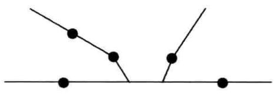

<details>
<summary>natural_image</summary>

Pure geometric lines with dots and intersecting lines, no text or symbols present
</details>

图 5

其中 $v_{2}=v_{3}$ ，考虑 $v_{1}$ ，通过上下游观测点的情况，可以知道由于河面变缓，流速变慢，假设流速均匀变缓，因此有

$$
v _ {1} = v _ {2} + \frac {v _ {2} - v _ {1}}{6} = 1 8 7. 5 3 \mathrm{km/天}
$$

化解方程组,得到一个四元一次方程,可以解得 $k_{0}$ 。

综上所述,可以解得长江干流各区域主要污染物 CODMn、 $NH_{3}-N$ 的污染情况(表8、表9)。

表8  
(单位:mg/L·天)

<table><tr><td>段号</td><td>1~2</td><td>2~3</td><td>3~4</td><td>4~5</td><td>5~6</td><td>6~7</td></tr><tr><td>k(污染物排放量)</td><td>0.540</td><td>0.5174</td><td>0.8736</td><td>0.2848</td><td>0.4056</td><td>0.3854</td></tr></table>

表9  
(单位:mg/L·天)

<table><tr><td>段号</td><td>1~2</td><td>2~3</td><td>3~4</td><td>4~5</td><td>5~6</td><td>6~7</td></tr><tr><td>k(污染物排放量)</td><td>0.02025</td><td>0.0414</td><td>0.0781</td><td>0.09957</td><td>0.06291</td><td>0.0022</td></tr></table>

## 6.4 模型的结果与分析

根据问题的结果可以看出:高锰酸盐(CODMn)的主要污染源为3\~4号地区,即湖北宜昌南津关到湖南岳阳城陵矶。氮氨( $NH_{3}-N$ )主要污染源主要是3\~4和4\~5之间,即湖南岳阳城陵矶到江西九江河西水厂和湖北宜昌南津关到湖南岳阳城陵矶。

## 7 问题Ⅲ模型的建立与求解

## 7.1 回归模型的建立

根据附件4中给出的十年的长江流域水质报告,发现各年的评价都不相同,所以考虑使用每年的各类水质水的百分比来预测未来十年的长江污染情况。对于给出的数据,可以使用数据拟合的方法对它进行处理以获得这些数据中隐含的规律,然后使用获得的这个规律来预测未来十年的情况。而两年之间的污染情况认为是没有多少直接关系的,因为每年从源头上来的水都认为是没有被污染的,之所以这些水会被污染,是因为在它流动的过程中不断有污水排放到这些水中,所以这些水的被污染情况只会和今年的污水排放情况有关系。

## 7.2 理论分析及算法思想

从给出的数据可以发现这样的情况,很多的数据看起来杂乱无章,似乎没有什么规律性可言,但是仔细分析后还是可以得到这样的结论:从全局看,这些数据在整体上是上升或者下降的。所以在处理的过程中可以对它进行一定的平滑性处理或者剔出一些变化幅度特别大的年份,经过这一系列的处理后,就可以看到原来似乎没有规律性的数据开始出现一定的规律性。当使用这些规律对未来进行预测的时候,因为把握住了这些数据最本质的东西,所以这些数据应该能够表达出未来十年污染情况大概的变化情况。在拟合的过程中,因为水质Ⅰ、Ⅱ、Ⅲ类均为可饮用水,Ⅳ、Ⅴ类为污染水,劣Ⅴ类水为严重污染水,所以在预测的时候只需要将这三种水的变化趋势得出来,就能够说明整个水质的变化情况了,而且这样做的好处就是原来没有规律性的数据能够变得更加具有规律性。

## 7.3 模型的求解

将 I、II、III 类水质的水作为一类, 将 IV、V 类水质的水作为一类, 将劣 V 类水质的水作为一类。同一类的数据首先要进行内部数据处理, 即对相同年份的数据求平均。因为要保证百分比相加后最后的结果为 100%，所以在合并后的三类中选择规律性较好的两类进行拟合，剩下的一类由 100% 减去预测出来的其他两类数据来得到。

经过计算后发现Ⅳ、V类数据之和的这一组和劣V类水这一组的规律性较为明显,所以决定使用这两组来进行拟合,具体的数据见表10(单位:%)。

表10

<table><tr><td>年份</td><td>1995</td><td>1996</td><td>1997</td><td>1998</td><td>1999</td><td>2000</td><td>2001</td><td>2002</td><td>2003</td><td>2004</td></tr><tr><td>IV+V</td><td>6.9</td><td>11.6</td><td>15.9</td><td>10</td><td>15.7</td><td>21</td><td>19.5</td><td>13.2</td><td>12.2</td><td>20.7</td></tr><tr><td>劣V</td><td>0</td><td>3.1</td><td>3.4</td><td>1.6</td><td>4.1</td><td>5.3</td><td>6.8</td><td>10</td><td>10.3</td><td>11.3</td></tr></table>

以 1995 年为第一年, 记为 0, 建立坐标, 对Ⅳ、V 组的数据进行平滑处理, 即将所有连续的四个数据求均值, 然后从这些均值中查看隐含的规律性, 这样处理后原来的 10 个点就变为了 7 个, 最后得到的结果见表 11。

表 11

<table><tr><td>y</td><td>11.1</td><td>13.3</td><td>15.65</td><td>16.55</td><td>17.35</td><td>16.475</td><td>16.4</td></tr><tr><td>x</td><td>2.5</td><td>3.5</td><td>4.5</td><td>5.5</td><td>6.5</td><td>7.5</td><td>8.5</td></tr></table>

进行拟合后得到的结果如图6所示。

拟合函数的方程为

$$
y = 0. 8 5 5 4 x + 1 0. 5 5 6 3
$$

使用线性假设的显著性检验 $^{[1]}$ 来检验得到的直线。因为

$$
| t | = \frac {| \widehat {b} |}{\widehat {\sigma}} \sqrt {S _ {x x}} \geqslant t _ {\alpha / 2} (n - 2)
$$

将得到的数据代入上述公式得到结果为

$$
| t | = \frac {| 0 . 8 5 5 4 |}{\widehat {\sigma}} \sqrt {S _ {x x}} = 1. 8 6 4
$$

通过查表 $t_{0.1}(7 - 2) = 1.4759, |t| = 1.8464 \geqslant 1.4759$ ，因此 $\alpha = 0.2$ ，所以其置水平度为 $80\%$ 。

因为劣V类组的规律性本身就较为明显,所以不需要进行平滑性处理,直接拟合得到的结果如图7所示。

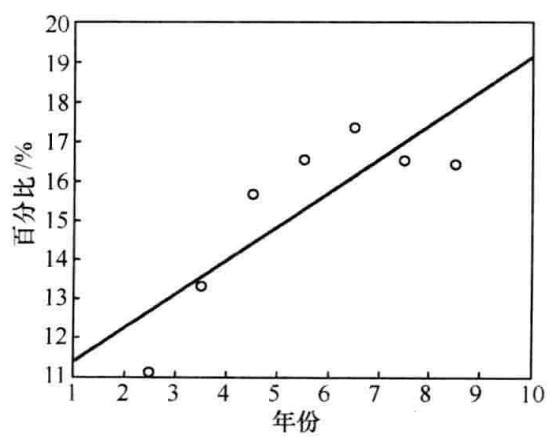

<details>
<summary>scatter</summary>

| 年份 | 百分比 (%) |
| --- | --- |
| ~2.5 | ~11.1 |
| ~3.6 | ~13.3 |
| ~4.6 | ~15.7 |
| ~5.6 | ~16.6 |
| ~6.6 | ~17.4 |
| ~7.6 | ~16.5 |
| ~8.6 | ~16.4 |
</details>

图6

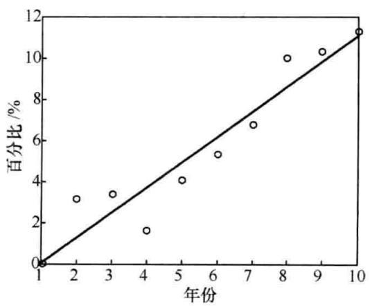

<details>
<summary>scatter</summary>

| 年份 | 百分比 (%) |
| --- | --- |
| 1 | 0 |
| 2 | ~3.1 |
| 3 | ~3.4 |
| 4 | ~1.6 |
| 5 | ~4.0 |
| 6 | ~5.3 |
| 7 | ~6.7 |
| 8 | ~10.0 |
| 9 | ~10.3 |
| 10 | ~11.3 |
</details>

图7

拟合后的直线方程为

$$
y = 1. 2 2 3 6 x - 1. 1 4
$$

用线性假设的显著性检验：

$$
| t | = \frac {| 1 . 2 2 3 6 |}{\widehat {\sigma}} \sqrt {S _ {x x}} = 8. 8 4 0 7
$$

通过查表 $t_{0.005}(10-2)=3.3554,|t|=8.8407\geqslant3.3554$ ，因此 $\alpha=0.01$ ，所以其置信水平为99%。

同样地,也可以对得到的其他数据进行回归拟合。给Ⅰ类\~劣Ⅴ类水分别赋予一个权重,用权重和各年的各种水质的百分比相乘,然后将它们相加,那么就可以得到一个代表这个年份整体污染程度的指标。那么通过研究每年水质整体指标的一个变化趋势也可以预测出未来十年的水质变化情况。

根据在问题一中的无量纲化结果,可以分别赋Ⅰ类\~劣Ⅴ类水的权重为0.0375、0.1625、0.375、0.625、0.875和1.5,那么经过整体的赋权求平均计算之后,可以得到一张关于过去十年水质整体指标的表格(表12)。

表 12

<table><tr><td>年份</td><td>1995</td><td>1996</td><td>1997</td><td>1998</td><td>1999</td><td>2000</td><td>2001</td><td>2002</td><td>2003</td><td>2004</td></tr><tr><td>指标</td><td>22.22</td><td>34.91</td><td>36.54</td><td>33.22</td><td>37.38</td><td>41.07</td><td>42.38</td><td>41.98</td><td>43.18</td><td>50.74</td></tr></table>

对这些指标进行拟合,可以得到结果,如图8所示。

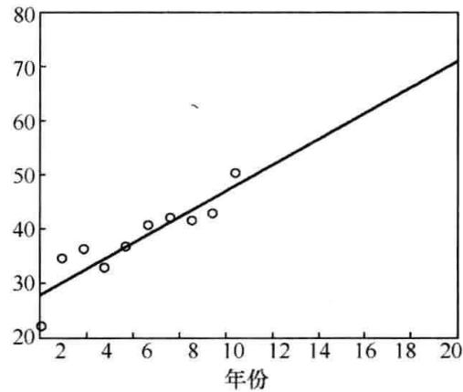

<details>
<summary>scatter</summary>

| 年份 | Value |
| --- | --- |
| 1 | ~22 |
| 2 | ~35 |
| 3 | ~37 |
| 4 | ~33 |
| 5 | ~37 |
| 6 | ~41 |
| 7 | ~42 |
| 8 | ~42 |
| 9 | ~43 |
| 10 | ~51 |
</details>

图8

从图中的各点经过拟合,得到的直线方程为

$$
y = 2. 2 6 0 6 x + 2 5. 9 2 6 8
$$

所以使用这个函数对未来十年的综合指标进行预测,预测的结果见表13。

表 13

<table><tr><td>年份</td><td>2005</td><td>2006</td><td>2007</td><td>2008</td><td>2009</td><td>2010</td><td>2011</td><td>2012</td><td>2013</td><td>2014</td></tr><tr><td>指标/%</td><td>50.79</td><td>53.05</td><td>55.32</td><td>57.58</td><td>59.84</td><td>62.10</td><td>64.36</td><td>66.62</td><td>68.88</td><td>71.14</td></tr></table>

从表 13 中也能够很容易地看出,污染指数的综合指标是一个呈现不断上升趋势的指标,所以可以肯定,按照现在这样的治理水平发展,长江的水质将会越来越差。

## 7.4 模型的结果与分析

从求解过程中已经得到了两个关于长江水质变化的函数。由Ⅳ类、V类水组的函数 $y = 0.8554x + 10.5563$ ，代入后十年的坐标，就可以得到一个关于Ⅳ类、V类水质组的预测结果，见表14。

表 14

<table><tr><td>年份</td><td>2005</td><td>2006</td><td>2007</td><td>2008</td><td>2009</td><td>2010</td><td>2011</td><td>2012</td><td>2013</td><td>2014</td></tr><tr><td>百分比/%</td><td>19.97</td><td>20.82</td><td>21.68</td><td>22.53</td><td>23.39</td><td>24.24</td><td>25.10</td><td>25.95</td><td>26.81</td><td>27.66</td></tr></table>

由劣V类水质组的函数 $y = 1.2236x - 1.14$ ，代入后十年的坐标，就可以得到一个关于劣V类水质组的预测结果，见表15。

表 15

<table><tr><td>年份</td><td>2005</td><td>2006</td><td>2007</td><td>2008</td><td>2009</td><td>2010</td><td>2011</td><td>2012</td><td>2013</td><td>2014</td></tr><tr><td>百分比/%</td><td>12.32</td><td>13.54</td><td>14.77</td><td>16.00</td><td>17.21</td><td>18.44</td><td>19.66</td><td>20.89</td><td>22.11</td><td>23.33</td></tr></table>

又因为长江水质组还要由Ⅰ、Ⅱ、Ⅲ类水质组组成,所以这组数据的预测可以由100%减去Ⅳ类、Ⅴ类水质组和劣Ⅴ类水质组得到,计算后的结果见表16。

表 16

<table><tr><td>年份</td><td>2005</td><td>2006</td><td>2007</td><td>2008</td><td>2009</td><td>2010</td><td>2011</td><td>2012</td><td>2013</td><td>2014</td></tr><tr><td>百分比/%</td><td>67.71</td><td>65.64</td><td>63.55</td><td>61.47</td><td>59.40</td><td>57.32</td><td>55.24</td><td>53.16</td><td>51.08</td><td>49.01</td></tr></table>

从表 14 \~ 表 16 可以清楚看到, 对未来十年的水质预测结果, 从这些结果中可以发现, 可饮用水 (Ⅰ、Ⅱ、Ⅲ类水质组) 所占的百分比越来越小, 而不可饮用的水量所占的百分比越来越多, 特别是劣 V 类水质的水量变化特别明显, 按照这样的预测结果来看, 专家们对未来十年后的长江水质的忧虑是很有道理的。这个预测结果与使用综合指标预测时得到的结果也是一致的。这两样预测的结果都同样说明了长江水质在变差这样一个结论。

## 8 问题IV模型的建立与求解

## 8.1 线性回归模型的建立

在本问中, 经过对长江以前十年的总流量和污水排放总量的研究发现, 长江的总流量虽然有一些波动, 但是总体保持稳定, 而污水排放量则是呈逐年上升的趋势, 具体的上升规律可以通过对十年来的排污量的线性拟合来获得。同时, 还可以根据十年来Ⅳ类、V类水所占百分比之和 $y_{45}$ 与排污量 $x$ 来建立关于Ⅳ类、V类水所占百分比之和与排污量的函数关系。为了便于计算、便于对模型进行检验, 采取线性回归的方法来寻找它们二者之间的关系, 可以得到下面的函数:

$$
y _ {4 5} = a _ {1} x + b _ {1}
$$

式中： $a_1$ 表示每增加排污量一个单位，IV类、V类水所占百分比之和就增加 $a_1$ 个百分比。

基于同样的考虑,可以得到劣V类水所占百分比 $y_{6}$ 与排污量的函数关系:

$$
y _ {6} = a _ {2} x + b _ {2}
$$

式中： $a_2$ 表示每增加排污量一个单位，劣V类水所占百分比之和就增加 $a_2$ 个百分比。

由于Ⅳ类、V类水的百分比和 $y_{45}$ 不超过20%：

$$
y _ {4 5} = a _ {1} x + b _ {1} \leqslant 2 0
$$

即

$$
x \leqslant \frac {2 0 - b _ {1}}{a _ {1}}
$$

又由于劣V类水所占百分比为零：

$$
y _ {6} = a _ {2} x + b _ {2} = 0
$$

$$
x = \frac {- b _ {2}}{a _ {2}}
$$

显然在实际情况中: $x\leqslant\frac{-b_{2}}{a_{2}}$ ,因此污水的排放量x应满足:

$$
x \leqslant \min \left(\frac {2 0 - b _ {1}}{a _ {1}}, \frac {- b _ {2}}{a _ {2}}\right)
$$

十年来的污水排放量是可以预测未来十年的污水排放量的,那么预测量中多于 $\min\left(\frac{20-b_{1}}{a_{1}},\frac{-b_{2}}{a_{2}}\right)$ 的部分就是这一年需要处理的污水量。

## 8.2 模型的求解

因为需要估计的是长江干流上的污水排放情况,所以在计算的时候就需要找到长江干流上的水质与废物排放之间的关系。所以在拟合函数的时候选用的数据是过去十年中干流的污染情况与污水排放总量。

根据过去十年的污水排放总量的数据与时间的关系,对它进行线性回归,得到每年的污水总量应该满足函数:

$$
X = 1 2. 8 6 3 6 t + 1 4 9. 0
$$

根据这个函数就能够得到未来十年的污水排放总量的预测值。预测得到的未来十年的污水排放量见表17(单位:亿t)。

表 17

<table><tr><td>年份</td><td>2005</td><td>2006</td><td>2007</td><td>2008</td><td>2009</td><td>2010</td><td>2011</td><td>2012</td><td>2013</td><td>2014</td></tr><tr><td>污水</td><td>290.5</td><td>303.4</td><td>316.2</td><td>329.1</td><td>342.0</td><td>354.8</td><td>367.7</td><td>380.5</td><td>393.4</td><td>406.2</td></tr></table>

将十年来每一年的IV类、V类水所占百分比之和 $y_{45}$ 与污水总量标到坐标上，可以得到结果如图9中的各点。

在图 9 中发现两个值有些特异,为了保证能够表现出大部分点的实际规律,在拟合的时候要将这两个点进行剔除。剔除特异点后拟合得到的函数为

$$
y _ {4 5} = 0. 1 7 6 0 x - 2 1. 4 3 9 6
$$

用线性假设的显著性检验：

$$
| t | = \frac {| 0 . 1 7 6 0 |}{\widehat {\sigma}} \sqrt {S _ {x x}} = 2. 9 1 1 3
$$

通过查表 $t_{0.025}(8 - 2) = 2.4469, |t| = 2.9113 \geqslant 2.4469$ ，因此 $\alpha = 0.05$ ，所以其置信水平为 $95\%$ 。

又因为 $y_{45} \leqslant 20$ ，有

$$
y _ {4 5} = 0. 1 7 6 0 x - 2 1. 4 3 9 6 \leqslant 2 0
$$

$$
x \leqslant 2 3 5. 4 5 \quad \text {亿} t
$$

将 $y_{6}$ 的百分比与污水总量标到坐标上，可以得到结果，如图10中的各点。

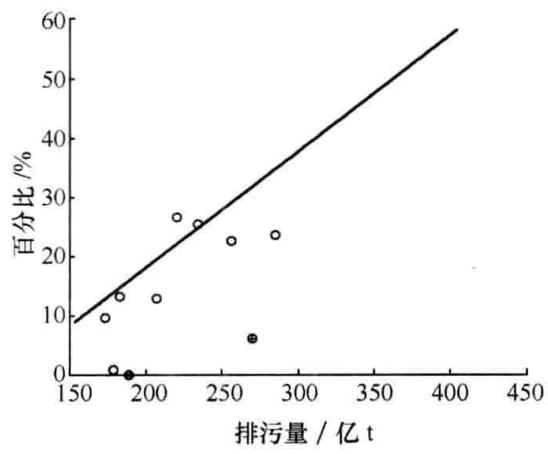

<details>
<summary>scatter</summary>

| 排污量 / 亿 t | 百分比 / % |
| --- | --- |
| ~175 | ~9.5 |
| ~180 | ~0.5 |
| ~185 | ~13 |
| ~190 | 0 |
| ~205 | ~13 |
| ~220 | ~26.5 |
| ~235 | ~25.5 |
| ~255 | ~22.5 |
| ~270 | ~6.5 |
| ~285 | ~23.5 |
</details>

图9

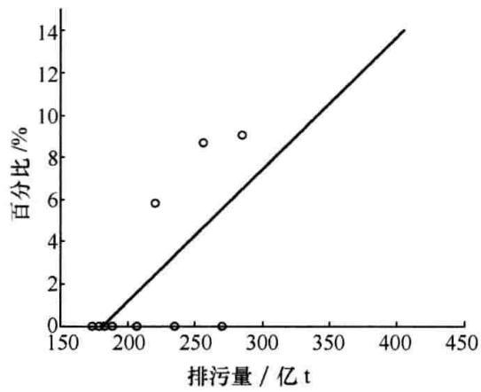

<details>
<summary>scatter</summary>

| 排污量 / 亿 t | 百分比 / % |
| --- | --- |
| ~175 | 0 |
| ~180 | 0 |
| ~185 | 0 |
| ~210 | 0 |
| ~220 | 6 |
| ~235 | 0 |
| ~255 | 8.8 |
| ~270 | 0 |
| ~285 | 9.2 |
</details>

图10

对这些点进行拟合,拟合后得到的结果为

$$
y _ {6} = 0. 0 6 2 5 x - 1 1. 3 8 3 4
$$

用线性假设的显著性检验：

$$
| t | = \frac {| 0 . 0 6 2 5 |}{\widehat {\sigma}} \sqrt {S _ {x x}} = 2. 4 0 4 8
$$

通过查表 $t_{0.025}(10 - 2) = 2.3060, |t| = 2.4048 \geqslant 2.3060$ ，因此 $\alpha = 0.05$ ，所以其置信水平为 $95\%$ 。又因为 $y_6 = 0$ ，即

$$
y _ {6} = 0. 0 6 2 5 x - 1 1. 3 8 3 4 \leqslant 0
$$

$$
x \leqslant 1 8 2. 1 3 4 4 \quad \text {亿} t
$$

所以为了达到要求,长江每年能够排放的污水总量应小于182.1344亿t。将预测得到的未来十年长江的污水排放总量减去每年长江所能够排放的污水总量就得到每年需要处理的污水数量,见表18(单位:亿t)。

表18

<table><tr><td>年份</td><td>2005</td><td>2006</td><td>2007</td><td>2008</td><td>2009</td><td>2010</td><td>2011</td><td>2012</td><td>2013</td><td>2014</td></tr><tr><td>污水</td><td>108.4</td><td>121.2</td><td>134.1</td><td>147.0</td><td>159.8</td><td>172.7</td><td>185.5</td><td>198.4</td><td>211.3</td><td>224.1</td></tr></table>

## 8.3 模型的改进

在上面的模型的求解过程中, 对 $y_{45}$ 和 $y_{6}$ 对于排污量的关系分别进行了线性回归, 找出了它们各自与排污量之间的线性关系。在这个过程中忽略了 $y_{45}$ 和 $y_{6}$ 之间的相互影响。而实际上它们二者之间是存在相互影响的, 因此对模型进行改进, 将 $y_{45}$ 和 $y_{6}$ 作为两个变量, 直接寻找它们与排污量的关系, 也就是

$$
x = a _ {1} y _ {4 5} + a _ {2} y _ {6} + b
$$

利用前十年的数据,进行多元线性回归可以求出:

$$
x = 0. 7 1 6 6 y _ {4 5} + 5. 4 8 9 0 y _ {6} + 1 9 6. 7 8 2 2
$$

同时求出其显著性水平为 0.13346，因此其置信水平为 86.654%。

又因为 $y_{45} \leqslant 20, y_6 = 0$ ，所以有

$$
x = 0. 7 1 6 6 y _ {4 5} + 5. 4 8 9 0 y _ {6} + 1 9 6. 7 8 2 2 \leqslant 0. 7 1 6 6 \times 2 0 + 1 9 6. 7 8 2 2
$$

即

$$
x \leqslant 2 1 1. 1
$$

求解后得到 $x \leqslant 211.1$ 亿 $\mathrm{t}$ , 也就是未来十年每年最多可以排放到长江里去的污水为 $211.1$ 亿 $\mathrm{t}$ 。最后得到的未来十年需要处理的污水数量见表19。

表 19

<table><tr><td>年份</td><td>2005</td><td>2006</td><td>2007</td><td>2008</td><td>2009</td><td>2010</td><td>2011</td><td>2012</td><td>2013</td><td>2014</td></tr><tr><td>污水/亿t</td><td>79.4</td><td>92.3</td><td>105.1</td><td>118.0</td><td>130.9</td><td>140.5</td><td>143.7</td><td>169.4</td><td>183.3</td><td>195.1</td></tr></table>

从表 18、表 19 可以看到,每年需要处理的污水数量是不断增加的,这是因为每年产生的污水总量是不断变化的。使用两种方法求解得到的结果是比较接近的,这也相互证明了它们的正确性。

## 9 模型的结论

通过对本题的各个问题的分析与求解,现在可以给出各个问题的解答。

对于问题一,使用了无量纲化各监测项目标准,得出的结论是长江整体上有28.6%时间的水质为Ⅱ类水,而有50%时间的水质为Ⅲ类水,有17.9%时间的水质为Ⅳ类水,还有3.5%时间的水质为劣V类水。在整个长江中,大概有52.9%地区的水质为Ⅱ类水,有大概35.3%地区的水质为Ⅲ类水,有5.8%地区的水质为Ⅳ类水,而有5.9%地区的水质为劣V类。从地区的分布可以看出,在长江干流的水质要好于长江支流的,长江支流的沿江污染情况严重,干流的水质受到支流的严重影响。

对于问题二,使用的是扩散方程进行求解,求解的结果为:高锰酸盐(CODMn)的污染源为3\~4号地区,即湖北宜昌南津关到湖南岳阳城陵矶。氮氨( $NH_{3}-N$ )污染源主要是3\~4和4\~5之间,即为湖南岳阳城陵矶到江西九江河西水厂和湖北宜昌南津关到湖南岳阳城陵矶。

对于问题三,使用了回归的方法进行了求解,得到的Ⅳ类、Ⅴ类水的百分比之和的预测结果见表20。

表20

<table><tr><td>年份</td><td>2005</td><td>2006</td><td>2007</td><td>2008</td><td>2009</td><td>2010</td><td>2011</td><td>2012</td><td>2013</td><td>2014</td></tr><tr><td>百分比/%</td><td>19.97</td><td>20.82</td><td>21.68</td><td>22.53</td><td>23.39</td><td>24.24</td><td>25.10</td><td>25.95</td><td>26.81</td><td>27.66</td></tr></table>

劣V类水的预测结果见表21。

表 21

<table><tr><td>年份</td><td>2005</td><td>2006</td><td>2007</td><td>2008</td><td>2009</td><td>2010</td><td>2011</td><td>2012</td><td>2013</td><td>2014</td></tr><tr><td>百分比/%</td><td>12.32</td><td>13.54</td><td>14.77</td><td>16.00</td><td>17.21</td><td>18.44</td><td>19.66</td><td>20.89</td><td>22.11</td><td>23.33</td></tr></table>

## I、II、Ⅲ类可饮用水的百分比之和的预测结果见表22。

表 22

<table><tr><td>年份</td><td>2005</td><td>2006</td><td>2007</td><td>2008</td><td>2009</td><td>2010</td><td>2011</td><td>2012</td><td>2013</td><td>2014</td></tr><tr><td>百分比/%</td><td>67.71</td><td>65.64</td><td>63.55</td><td>61.47</td><td>59.40</td><td>57.32</td><td>55.24</td><td>53.16</td><td>51.08</td><td>49.01</td></tr></table>

从表 20 \~ 表 22 可以清楚看到对未来十年的水质预测结果,从这些结果中可以发现,可饮用水(Ⅰ、Ⅱ、Ⅲ类水质组)所占的百分比越来越小,而不可饮用的水量所占的百分比越来越多,特别是劣Ⅴ类水质的水所占百分比量变化特别明显,按照这样的预测结果来看,专家们对未来十年后的长江水质的忧虑是很有道理的。

对于问题四,使用的还是线性回归的方法,最后得到的结论是:未来十年每年最多可以排放到长江里去的污水为211.1亿t。得到的未来十年需要处理的污水数量见表23。

表 23

<table><tr><td>年份</td><td>2005</td><td>2006</td><td>2007</td><td>2008</td><td>2009</td><td>2010</td><td>2011</td><td>2012</td><td>2013</td><td>2014</td></tr><tr><td>污水/亿t</td><td>79.4</td><td>92.3</td><td>105.1</td><td>118.0</td><td>130.9</td><td>140.5</td><td>143.7</td><td>169.4</td><td>183.3</td><td>195.1</td></tr></table>

对于问题五,根据全国政协与中国发展研究院联合组成“保护长江万里行”考察团进行的调查:做出以下建议和意见:

（1）保护长江立法，促成全国人大在明年全国两会期间进行讨论。根据调查“一方面制定促进循环经济发展的政策和法律法规；另一方面，还将建议加大对违法排污行为的处罚力度，要罚就应该罚到不法企业破产，把对长江的生态环境的合理开发纳入沿江城市政府官员的政绩考核体系，对严重破坏生态环境并造成生态恶果的地区，应执行官员任用的一票否决制。”

（2）对污染严重地区进行重点治理。根据水质污染检测的结果，进行重点处理。根据调查“由于污染严重，长江岸边形成了许多污染带，在干流21个城市中，重庆、岳阳、武汉、南京、镇江、上海六大城市累计污染带长度占长江干流污染带总长的73%。”

（3）加大处罚力度。根据调查“《新民周刊》:对污染排放超标企业最多处罚10万的力度是否过低？例如章琦:我听到这样一个案例:有个工厂污染排放超标,环保局为了处罚它必须取样、化验……一系列取证工作就花了50万。投入如此巨大,罚款却寥寥无几,环保局哪里来积极性？排污企业窃喜:有本事你就罚我。”

（4）严格进行检测，处理违规企业，严惩腐败。根据调查：“有的工厂更缺德，它的污水处理出水有上下两根管道，上面那根是领导参观时的装饰品，真正的排污管在下面。”

（5）加强宣传，增强民众保护长江的意识。因为根据调查：“在他们眼中，提出的污染治理话题实在是奇谈怪论。他们把我当外星人看，最可怕的是这种无意识。那个城市并不闭塞，经济很发达，但依然没有环保意识，从上到下只知道抓GDP，这让人不得不警觉。”

## 10 模型的检验及其鲁棒性

对于模型 I 的求解,使用了无量纲化的处理方法,在处理后的结果分析中,发现和现实情况吻合得比较好,而且这个模型使用的理论较为简单,就是普通的统计,所以在处理后具有较强的展现原有数据特征的能力。这种方法在平常使用就较多,在很多的场合都能使用,具有较好的鲁棒性。

模型Ⅱ使用的是高等数学中的微分方程的理论,在使用过程中充分考虑了所有因素的影响,得到的结果与从所给的数据中大致分析的结果相似,这种计算方法得出的结论都比较精确,所以结果有很高的可信度,所以认为这种方法的鲁棒性是很不错的。

模型Ⅲ使用的是曲线拟合的方法,在进行单项拟合的同时还进行了一个综合指标变化情况的拟合,最后得到的结果是这两种方法的结论是一样的,即未来几年的水质会越来越差。从它们俩的相互印证中可以看出,这个模型的结论是比较正确的,且对拟合得到的函数都进行了t分布函数的验证,验证结果也是满足条件要求的,所以认为这个模型也基本上是正确的。这种处理方法在非常多的实际情况中都有运用,而且效果都很不错,这种方法具有较好的鲁棒性,是值得信赖的一种方法。

模型IV也使用了两种方法进行了求解,但是使用的方法是相同的,即利用了水质的百分比和污染物之间的关系,使用曲线拟合的方法以及线性回归的方法进行预测,两种方法最后得到的结果比较接近,而且使用t分布函数检验和F分布函数检验都已经通过,所以认为模型是正确的,这种方法和模型Ⅲ是相同的,一样具有良好的鲁棒性,在现实中广泛被使用。

## 11 模型的优缺点分析与推广

模型 I 在考虑问题的时候对数据在整体上给出了一个分析,这种方法适合在宏观上对数据进行分析,而且在进行分析的时候将量纲都统一到了一个相同的水平上,这样使得数据看上去更加直观也更加容易进行处理和利用,但是这种方法需要能够正确地划分处理后的数据划分范围,否则容易使数据发生失真,就不能够明显地区分各种不同的情况。这种方法使得处理后的数据看上去很直观。它适用于对数据总体的分析,但是不适合对数据进行精确的分析。在数据挖掘方面应该可以得到运用。

模型Ⅱ的优点是计算结果比较精确,使用的理论可靠,缺点是计算过程复杂,在计算过程中容易出现错误。这种方法适用于对问题的精确求解时,若要求不是很精确,那么使用其他的方法可能比较好一些。这种方法在时间或者费用等方面的计算中运用的比较多一些。

模型Ⅲ和模型Ⅳ使用的都是曲线拟合和线性回归的方法,这种方法的好处是使用方便,利用数学运算软件的帮助可以较为容易地得到结果,而且对短期情况的预计结果会比较接近,但是在预测一段较长时间的情况时会出现较大的误差甚至错误。这个模型可以在预测短期的人口数量、经济的增长等方面得到广泛的运用。

## 参考文献

[1] 盛骤, 谢世千, 潘承毅. 概率论与数理统计(第三版). 北京: 高等教育出版社, 2001.  
[2] 刘则毅. 科学计算技术与 Matlab. 北京: 科学出版社, 2001.

附录 无量纲化结果

<table><tr><td></td><td>1</td><td>2</td><td>3</td><td>4</td><td>5</td><td>6</td><td>7</td><td>8</td><td>9</td></tr><tr><td>2003-2006</td><td>0.16</td><td>0.17</td><td>0.47</td><td>0.20</td><td>0.23</td><td>0.19</td><td>0.17</td><td>0.60</td><td>0.13</td></tr><tr><td>2003-2007</td><td>0.45</td><td>0.13</td><td>0.40</td><td>0.24</td><td>0.22</td><td>0.16</td><td>0.21</td><td>0.55</td><td>0.63</td></tr><tr><td>2003-2008</td><td>0.07</td><td>0.10</td><td>0.17</td><td>0.16</td><td>0.16</td><td>0.16</td><td>0.20</td><td>0.96</td><td>0.25</td></tr><tr><td>2003-2009</td><td>0.06</td><td>0.12</td><td>0.21</td><td>0.17</td><td>0.10</td><td>0.38</td><td>0.18</td><td>0.70</td><td>0.14</td></tr><tr><td>2003-2010</td><td>0.17</td><td>0.14</td><td>0.13</td><td>0.50</td><td>0.19</td><td>0.15</td><td>0.15</td><td>0.46</td><td>0.16</td></tr><tr><td>2003-2011</td><td>0.06</td><td>0.23</td><td>0.18</td><td>0.20</td><td>0.13</td><td>0.11</td><td>0.14</td><td>0.66</td><td>0.42</td></tr><tr><td>2003-2012</td><td>0.12</td><td>0.21</td><td>0.10</td><td>0.38</td><td>0.11</td><td>0.17</td><td>0.14</td><td>0.67</td><td>0.83</td></tr><tr><td>2004-2001</td><td>0.21</td><td>0.25</td><td>0.17</td><td>0.28</td><td>0.12</td><td>0.16</td><td>0.14</td><td>0.93</td><td>0.80</td></tr><tr><td>2004-2002</td><td>0.61</td><td>0.30</td><td>0.21</td><td>0.26</td><td>0.13</td><td>0.16</td><td>0.14</td><td>0.96</td><td>0.48</td></tr><tr><td>2004-2003</td><td>0.10</td><td>0.21</td><td>0.22</td><td>0.23</td><td>0.11</td><td>0.15</td><td>0.14</td><td>0.94</td><td>1.00</td></tr><tr><td>2004-2004</td><td>0.10</td><td>0.21</td><td>0.14</td><td>0.19</td><td>0.15</td><td>0.14</td><td>0.10</td><td>0.67</td><td>0.34</td></tr><tr><td>2004-2005</td><td>0.29</td><td>0.14</td><td>0.16</td><td>0.21</td><td>0.17</td><td>0.19</td><td>0.20</td><td>0.57</td><td>0.21</td></tr><tr><td>2004-2006</td><td>0.12</td><td>0.16</td><td>0.23</td><td>0.21</td><td>0.13</td><td>0.21</td><td>0.23</td><td>0.33</td><td>0.19</td></tr><tr><td>2004-2007</td><td>0.11</td><td>0.19</td><td>0.18</td><td>0.28</td><td>0.15</td><td>0.25</td><td>0.28</td><td>0.52</td><td>0.32</td></tr><tr><td>2004-2008</td><td>0.50</td><td>0.09</td><td>0.17</td><td>0.25</td><td>0.22</td><td>0.25</td><td>0.21</td><td>0.30</td><td>0.09</td></tr><tr><td>2004-2009</td><td>0.51</td><td>0.30</td><td>0.20</td><td>0.24</td><td>0.20</td><td>0.16</td><td>0.20</td><td>0.31</td><td>0.12</td></tr><tr><td>2004-2010</td><td>0.07</td><td>0.12</td><td>0.22</td><td>0.21</td><td>0.10</td><td>0.24</td><td>0.23</td><td>0.14</td><td>0.04</td></tr><tr><td>2004-2011</td><td>0.14</td><td>0.14</td><td>0.12</td><td>0.18</td><td>0.11</td><td>0.16</td><td>0.21</td><td>0.13</td><td>0.16</td></tr><tr><td>2004-2012</td><td>0.06</td><td>0.26</td><td>0.11</td><td>0.21</td><td>0.10</td><td>0.07</td><td>0.07</td><td>0.29</td><td>0.12</td></tr><tr><td>2005-2001</td><td>0.04</td><td>0.27</td><td>0.11</td><td>0.39</td><td>0.11</td><td>0.13</td><td>0.12</td><td>0.80</td><td>0.17</td></tr><tr><td>2005-2002</td><td>0.07</td><td>0.28</td><td>0.09</td><td>0.22</td><td>0.17</td><td>0.14</td><td>0.16</td><td>0.99</td><td>0.20</td></tr><tr><td>2005-2003</td><td>0.13</td><td>0.27</td><td>0.10</td><td>0.26</td><td>0.07</td><td>0.14</td><td>0.07</td><td>0.44</td><td>0.16</td></tr><tr><td>2005-2004</td><td>0.05</td><td>0.32</td><td>0.11</td><td>0.21</td><td>0.07</td><td>0.10</td><td>0.15</td><td>0.67</td><td>0.13</td></tr><tr><td>2005-2005</td><td>0.12</td><td>0.26</td><td>0.11</td><td>0.16</td><td>0.08</td><td>0.17</td><td>0.24</td><td>0.34</td><td>0.12</td></tr><tr><td>2005-2006</td><td>0.15</td><td>0.09</td><td>0.12</td><td>0.34</td><td>0.17</td><td>0.14</td><td>0.16</td><td>0.21</td><td>0.10</td></tr><tr><td>2005-2007</td><td>0.25</td><td>0.14</td><td>0.13</td><td>0.20</td><td>0.17</td><td>0.18</td><td>0.23</td><td>0.44</td><td>0.19</td></tr><tr><td>2005-2008</td><td>0.13</td><td>0.15</td><td>0.32</td><td>0.28</td><td>0.10</td><td>0.14</td><td>0.23</td><td>0.43</td><td>0.17</td></tr><tr><td>2005-2009</td><td>0.25</td><td>0.15</td><td>0.19</td><td>0.36</td><td>0.15</td><td>0.14</td><td>0.24</td><td>0.18</td><td>0.08</td></tr><tr><td></td><td>10</td><td>11</td><td>12</td><td>13</td><td>14</td><td>15</td><td>16</td><td>17</td><td></td></tr><tr><td>2003-2006</td><td>0.62</td><td>0.07</td><td>0.50</td><td>0.22</td><td>0.20</td><td>0.46</td><td>0.15</td><td>0.14</td><td></td></tr><tr><td>2003-2007</td><td>0.54</td><td>0.07</td><td>0.20</td><td>0.19</td><td>0.41</td><td>0.52</td><td>0.24</td><td>0.56</td><td></td></tr><tr><td>2003-2008</td><td>0.20</td><td>0.12</td><td>0.58</td><td>0.22</td><td>0.28</td><td>1.09</td><td>0.21</td><td>0.25</td><td></td></tr><tr><td>2003-2009</td><td>0.27</td><td>0.12</td><td>0.38</td><td>0.21</td><td>0.21</td><td>1.53</td><td>0.14</td><td>0.31</td><td></td></tr><tr><td>2003-2010</td><td>0.50</td><td>0.08</td><td>0.56</td><td>0.14</td><td>0.22</td><td>3.25</td><td>0.20</td><td>0.20</td><td></td></tr><tr><td>2003-2011</td><td>0.29</td><td>0.10</td><td>0.74</td><td>0.24</td><td>0.34</td><td>6.45</td><td>0.44</td><td>0.19</td><td></td></tr><tr><td>2003-2012</td><td>0.69</td><td>0.08</td><td>0.69</td><td>0.29</td><td>0.18</td><td>7.00</td><td>0.41</td><td>0.18</td><td></td></tr><tr><td>2004-2001</td><td>0.80</td><td>0.08</td><td>0.62</td><td>0.17</td><td>0.21</td><td>7.25</td><td>0.40</td><td>0.14</td><td></td></tr><tr><td>2004-2002</td><td>1.05</td><td>0.07</td><td>0.60</td><td>0.25</td><td>0.21</td><td>12.1</td><td>0.55</td><td>0.12</td><td></td></tr><tr><td>2004-2003</td><td>2.75</td><td>0.07</td><td>0.60</td><td>0.40</td><td>0.15</td><td>1.04</td><td>0.35</td><td>0.10</td><td></td></tr><tr><td>2004-2004</td><td>2.75</td><td>0.07</td><td>0.52</td><td>0.13</td><td>0.13</td><td>0.46</td><td>0.20</td><td>0.20</td><td></td></tr><tr><td>2004-2005</td><td>0.51</td><td>0.06</td><td>0.60</td><td>0.21</td><td>0.11</td><td>0.74</td><td>0.29</td><td>0.26</td><td></td></tr><tr><td>2004-2006</td><td>0.23</td><td>0.06</td><td>0.49</td><td>0.58</td><td>0.31</td><td>1.26</td><td>0.15</td><td>0.23</td><td></td></tr><tr><td>2004-2007</td><td>0.40</td><td>0.06</td><td>0.48</td><td>0.53</td><td>0.28</td><td>0.59</td><td>0.15</td><td>0.24</td><td></td></tr><tr><td>2004-2008</td><td>0.07</td><td>0.07</td><td>0.38</td><td>0.36</td><td>0.23</td><td>0.81</td><td>0.15</td><td>0.40</td><td></td></tr><tr><td>2004-2009</td><td>0.07</td><td>0.09</td><td>0.19</td><td>0.21</td><td>0.15</td><td>0.50</td><td>0.14</td><td>0.38</td><td></td></tr><tr><td>2004-2010</td><td>0.07</td><td>0.07</td><td>0.38</td><td>0.46</td><td>0.19</td><td>3.52</td><td>0.51</td><td>0.17</td><td></td></tr><tr><td>2004-2011</td><td>0.18</td><td>0.07</td><td>0.38</td><td>0.38</td><td>0.24</td><td>2.69</td><td>0.70</td><td>0.12</td><td></td></tr><tr><td>2004-2012</td><td>0.14</td><td>0.08</td><td>0.73</td><td>0.24</td><td>0.28</td><td>5.65</td><td>0.66</td><td>0.35</td><td></td></tr><tr><td>2005-2001</td><td>0.14</td><td>0.07</td><td>0.46</td><td>0.43</td><td>0.29</td><td>3.01</td><td>0.23</td><td>0.21</td><td></td></tr><tr><td>2005-2002</td><td>0.14</td><td>0.07</td><td>0.63</td><td>0.53</td><td>0.20</td><td>1.50</td><td>0.21</td><td>0.18</td><td></td></tr><tr><td>2005-2003</td><td>0.19</td><td>0.07</td><td>0.45</td><td>0.46</td><td>0.15</td><td>0.74</td><td>0.19</td><td>0.16</td><td></td></tr><tr><td>2005-2004</td><td>0.20</td><td>0.07</td><td>0.41</td><td>0.44</td><td>0.09</td><td>0.50</td><td>0.10</td><td>0.23</td><td></td></tr><tr><td>2005-2005</td><td>0.24</td><td>0.07</td><td>0.34</td><td>0.38</td><td>0.27</td><td>0.53</td><td>0.18</td><td>0.24</td><td></td></tr><tr><td>2005-2006</td><td>0.17</td><td>0.07</td><td>0.23</td><td>0.24</td><td>0.58</td><td>0.59</td><td>0.21</td><td>0.41</td><td></td></tr><tr><td>2005-2007</td><td>0.17</td><td>0.07</td><td>0.29</td><td>0.20</td><td>0.40</td><td>0.70</td><td>0.21</td><td>0.22</td><td></td></tr><tr><td>2005-2008</td><td>0.18</td><td>0.07</td><td>0.32</td><td>0.17</td><td>0.24</td><td>0.64</td><td>0.14</td><td>0.37</td><td></td></tr><tr><td>2005-2009</td><td>0.22</td><td>0.07</td><td>0.28</td><td>0.32</td><td>0.17</td><td>0.70</td><td>0.10</td><td>0.21</td><td></td></tr></table>

## 【论文点评】

沈锦仁

文章通顺流畅,表达清晰,理论推导正确,结果表达清楚。

首先在第一个问题,数据的综合分析中,先对四个指标进行无量纲化,且统一到1是可引用和不可饮用水的分界;并求四指标的平均值,再对28个月时间求平均值,可对17个观察点进行评价。

对于问题二,长江水污染源的分析,其采用污染问题通常用的反应扩散方程,将其方程简化为常微分方程求解,对支流问题也进行了考虑,并求出污染最严重的地区为3号\~

4号。

对于问题三,预测后十年六类水的百分比问题,采用了回归统计模型,得V类水依赖于时间的近似表达式和劣V类水的表达式,并进行检验。

对于问题四,预测后十年处理废水量,文章先分别建立了Ⅳ、Ⅴ类水和劣Ⅴ类水百分比依赖于排废水量的近似公式,用回归方法来建立,从而得到排废水量的临界值,同时建立了排废水量依赖于时间的回归公式,从而预测后十年的排废水量,将其减去临界值得出了后十年每年要处理的污水量,方法是合理的。考虑长江总流量的因素,最好采用Ⅳ、Ⅴ类水百分比依赖于相对排废量(相对于总流量)的依赖公式。

# 长江水质的评价和预测

## 摘要

本文针对文章提出的不同问题,应用不同的理论对问题进行分析求解。

对于问题(1)，在对原始数据进行归一化综合处理的基础上，确定了水质新的综合评判指标，并对整个长江流域所有观测站的位置关系进行简化假设，得到长江综合评定函数值 $\Psi=0.4331$ ，水质为良好，主要污染物为氨氮，次要污染物为溶解氧，污染严重的地区为四川乐山和江西南昌，较为严重的地区为四川泸州沱江和湖南长沙新港（详细结果见表3）。

对于问题(2)，首先建立了关于污染浓度的反应扩散方程，然后用三种方法来反演污染源强迫函数 $f(x,t)$ 。解法一为用差分离散法来反演出f，解法二是简化扩散方程后用微分方程来分段反演出f，解法三是考虑支流影响得出解析解来反演出f。分别分析f的数据结果1、2、3并综合考虑这三批数据结果，得出相同的结论：高锰酸盐污染源主要在湖北宜昌南津关—湖南岳阳城陵矶地区，氨氮污染源主要分布在四川攀枝花—重庆朱沱地区和湖北宜昌南津关—湖南岳阳城陵矶地区。

对于问题(3)，仅考虑水文年全流域各类水质百分比的变化情况，建立回归分析模型并对回归系数进行 F 检验，得到预测结果为：可饮用水逐年下降，10 年后将低于 50%，受污染水质逐年递增，其中劣 V 类水增长速率较快，10 年后达到 25%。

在对问题(4)的讨论中,首先利用一元线性回归模型对污水处理量进行预测分析,出现了两组与实际情况不符的数据;然后将IV + V类和劣V类综合考虑,建立了二元线性回归模型并进行了F检验,得到了较好的结果:

<table><tr><td>年份</td><td>2005年</td><td>2006年</td><td>2007年</td><td>2008年</td><td>2009年</td><td>2010年</td><td>2011年</td><td>2012年</td><td>2013年</td><td>2014年</td></tr><tr><td> $\Delta M_{i}$ /亿t</td><td>75.195</td><td>89.047</td><td>102.9</td><td>116.75</td><td>130.6</td><td>143.46</td><td>157.32</td><td>171.17</td><td>185.02</td><td>198.87</td></tr></table>

污水处理量逐年递增,最小处理量为75.195亿t,最大处理量为198.87亿t。

最后,在问题(5)中提出了解决长江水质污染问题的一些意见和建议。

## 1 问题的重述

水是人类赖以生存的资源,保护水资源就是保护我们自己,对于我国大江大河水资源的保护和治理应是重中之重。长江是我国第一、世界第三大河流,长江水质的污染程度日趋严重,已引起了相关政府部门和专家们的高度重视。

2004年10月，由全国政协与中国发展研究院联合组成“保护长江万里行”考察团，从长江上游宜宾到下游上海,对沿线21个重点城市做了实地考察,揭示了一幅长江污染的真实画面,其污染程度让人触目惊心。为此,专家们提出“若不及时拯救,长江生态10年内将濒临崩溃”(附件1),并发出了“拿什么拯救癌变长江”的呼唤(附件2)。

附件3给出了长江沿线17个观测站(地区)近两年多主要水质指标的检测数据,以及干流上7个观测站近一年多的基本数据(站点距离、水流量和水流速)。通常认为一个观测站(地区)的水质污染主要来自于本地区的排污和上游的污水。一般说来,江河自身对污染物都有一定的自然净化能力,即在水环境中通过物理降解、化学降解和生物降解等,使水中污染物的浓度降低。反映江河自然净化能力的指标称为降解系数。事实上,长江干流的自然净化能力可以认为是近似均匀的,根据检测可知,主要污染物高锰酸盐指数和氨氮的降解系数通常介于0.1\~0.5之间,比如可以考虑取0.2(单位:1/天)。附件4是“1995—2004年长江流域水质报告”给出的主要统计数据。下面的附表是国家标准(GB 3838—2002)给出的《地表水环境质量标准》中4个主要项目标准限值,其中I、II、III类为可饮用水。

请你们研究下列问题：

（1）对长江近两年多的水质情况做出定量的综合评价，并分析各地区水质的污染状况。

(2) 研究、分析长江干流近一年多主要污染物高锰酸盐指数和氨氮的污染源主要在哪些地区？

(3) 假如不采取更有效的治理措施,依照过去10年的主要统计数据,对长江未来水质污染的发展趋势做出预测分析,比如研究未来10年的情况。

(4) 根据你的预测分析,如果未来10年内每年都要求长江干流的IV类和V类水的比例控制在20%以内,且没有劣V类水,那么每年需要处理多少污水?

(5) 你对解决长江水质污染问题有什么切实可行的建议和意见。

## 2 问题的分析

对于长江水质的评价和预测,主要是基于对大量统计数据的处理。因此对于问题的解决需要抓住关键有用的数据,对数据进行转变、筛选。

问题(1)对长江近两年水质定量的综合评价,是对附件3中数据的综合分析,由于原始数据是17个站点、28个月份、4个项目指标量值的离散数据,因此对于数据的处理应该分步骤进行,考虑到要求分析不同地区的污染状况,将地区间的水质综合放到最后处理;考虑到不同项目指标的量纲不同,在对数据进行综合前应首先对数据进行归一化处理。在最后综合评价水质时,由于数据的综合可能导致有效信息的丢失,考虑从多个角度对水质情况进行评价。

问题(2)从简单情况入手,首先考虑水体具有自净能力和污染物融入水流时扩散速度等性质,确立一个符合情况并满足其性质的模型,分析该模型得出的数据结果,判定污染源在哪些地区。继续进一步修正、简化模型,分析结果。再考虑支流带来的影响建立新模型,分析结果。最后综合考虑三个模型得到的结果,得出结论。

问题(3)是预测分析问题,文章提供了枯水期、丰水期、整个水文年的全流域、干流、支流六类水质的百分比。由于是对整个长江水质污染发展趋势的预测分析,主要考虑水文年全流域各类水质百分比的变化趋势,采用回归分析的方法进行预测,当然,对于六类水,主要关心的是污水的变化,可以尝试将可饮用水(即Ⅰ、Ⅱ、Ⅲ类水)综合起来回归分析。

问题(4)是长江水质控制问题,由于要用Ⅳ、Ⅴ类水质百分比和劣Ⅴ类水质百分比来控制污水处理量,因此需要根据已知数据寻找污水排放量与两个百分比的关系,当满足百分比要求时,污水流入量有一个限值,同时污水排放量随年份也有一个变化趋势,污水排放量和流入量限值决定了需要处理的污水量。从本质上来讲,也是一个回归分析问题。

问题(5)相当于一个报告性质的短文,文章应该在前四问的基础上,结合实际情况,综合考虑多方面的因素,给出合理化建议。文章不仅要反映前四问的理论成果,更要注重实际指导意义;不仅要提出意见,更要提出建议;不仅要有技术性,同时要有鼓动性。

## 3 符号系统

$Q_{i} = [Q_{i1}\quad Q_{i2}]$ :水质综合指标向量；

$P_{ij}$ : 第 i 个观测点第 j 个月的水质综合指标值(单位:1);

$Q_{i1}$ : 第 i 个观测站水质的综合量值(单位:1);

$Q_{i2}$ : 第 i 个观测站水质为不可饮用水的月份个数(单位: 个);

L:长江水年总流量(单位:亿 $m^{3}$ );

L:长江水年平均总流量(单位:亿 $m^{3}$ );

M: 年废水排放总量(单位: 亿 t);

$\Delta M$ :年废水处理量(单位:亿 t);

H: 相对排污量(单位: $t/m^{3}$ );

$N_{1}:IV+V$ 类水百分比；

$N_{2}$ : 劣 V 类水百分比;

w: 污染物质在长江内浓度(单位: mg/L);

v:河流水流速度(单位:m/s);

f: 外界加入的污染物浓度, 且在任意一个分段内 f 为常数, 即 f 整个是一个分段的常数函数;

E: 扩散系数；

p:各站点的水流量(单位: $m^{3}/s$ )。

## 4 问题(1):长江水质的综合评价

## 4.1 问题的分析

附件 3-1(长江流域主要城市水质检测报告)从多方面反映了长江近两年多的水质情况,因此对于长江流域水质的综合评价,主要是对水质检测报告原始数据的处理。由于数据量较大,因此对于数据的综合分析分步进行,考虑如图1所示的处理步骤。

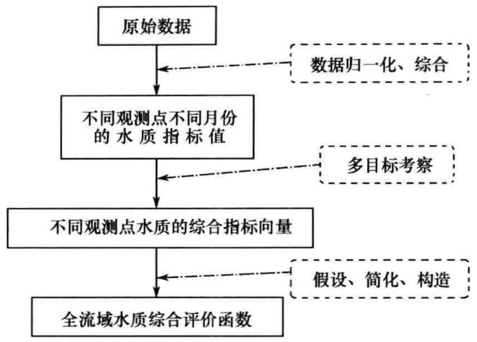

<details>
<summary>flowchart</summary>

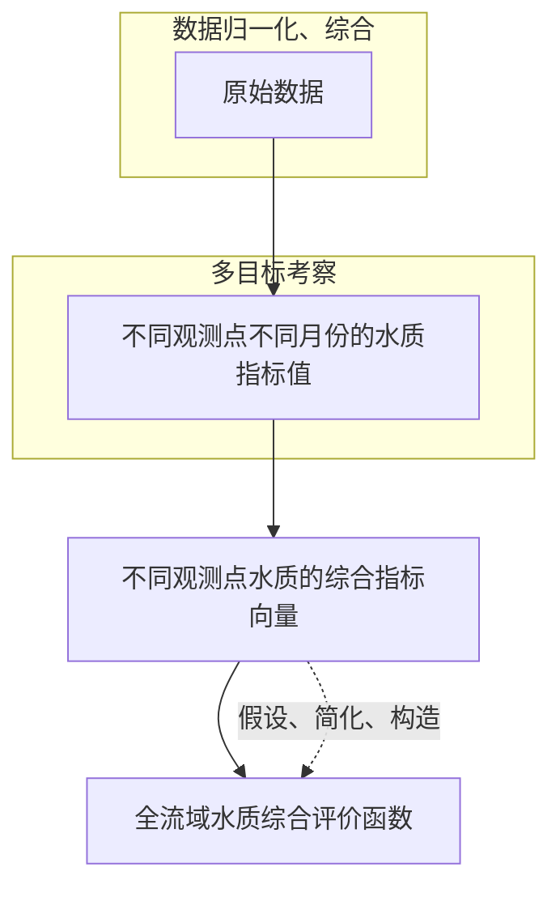
```mermaid
graph TD
  A["原始数据"] --> B["不同观测点不同月份的水质指标值"]
  B --> C["不同观测点水质的综合指标向量"]
  C --> D["全流域水质综合评价函数"]
  
  subgraph Process_1 ["数据归一化、综合"]
    A
  end
  
  subgraph Process_2 ["多目标考察"]
    B
  end
  
  %% Feedback Loop
  C -.->|"假设、简化、构造"| D
```
</details>

图1

## 4.2 理论分析与算法步骤

## 1. 数据的归一化和综合

对于地表水环境质量标准的四个主要项目指标来讲,原始数据的量纲各不相同,考虑下面要求。

（1）归一化后的数据能够反映可饮用水与不可饮用水的区别,为此将Ⅲ类与Ⅳ类水的分界点作为界值点,赋值为1。

(2) 对于任一个项目指标值来讲, 数据越小, 水质越好。

（3）四个项目指标的数据综合后仍以1作为可饮用水与不可饮用水的分界点，且数据越小，水质越好。

按照上述要求,根据附表中提供的项目标准限值,对数据归一化处理。

以一个观测点某一时刻为例,分别记四个主要项目指标为 $P_{1}$ 、 $P_{2}$ 、 $P_{3}$ 、 $P_{4}$ , 对于溶解氧 (DO), 定义

$$
P _ {1} = \frac {5}{P _ {1} (x)} \tag {1}
$$

对于高锰酸盐指数(CODMn),定义

$$
P _ {2} = \frac {P _ {2} (x)}{6} \tag {2}
$$

对于氨氮 $(\mathrm{NH}_{3}-\mathrm{N})$ ，定义

$$
P _ {3} = \frac {P _ {3} (x)}{1 . 0} \tag {3}
$$

对于 pH 值来讲,从表中可以看出,对于 6\~9 之间的 pH 值来讲,均为可饮用水,假设当 pH 值 =7 时,水质是最好的,因此可以作如下定义:

$$
P _ {4} = \left\{ \begin{array}{c c} \frac {1}{2} \times (P _ {4} (x) - 7) & P _ {4} (x) \geqslant 7 \\ 7 - P _ {4} (x) & P _ {4} (x) <   7 \end{array} \right. \tag {4}
$$

式中： $P_{1}(x), P_{2}(x), P_{3}(x)$ 和 $P_{4}(x)$ 为实际测量值； $P_{1}, P_{2}, P_{3}$ 和 $P_{4}$ 为转化后的水质指标

值,均以1为界值点,当大于1时为不可饮用水,当小于1时为可饮用水。

考虑不同项目指标对水质影响程度的不同,将四个项目指标的权重设为 $a_{1}$ 、 $a_{2}$ 、 $a_{3}$ 、 $a_{4}$ ,则水质指标值为

$$
P = \sum_ {k = 1} ^ {4} a _ {k} \times P _ {k} \big (\sum_ {k = 1} ^ {4} a _ {k} = 1 \big)
$$

但是,对于水质情况来讲,当有一项指标不符合饮用水的要求时,即为不可饮用水,考虑以1作为饮用水和非饮用水的分界,即上述要求3,改进水质指标值表达式为

$$
P = \left\{ \begin{array}{l l} \sum_ {k = 1} ^ {4} a _ {k} \times P _ {k} & P _ {k} \leqslant 1 (k = 1, 2, 3, 4) \\ \max \left\{P _ {k} \right\} & \exists P _ {k} > 1 \end{array} \quad \left(\sum_ {k = 1} ^ {4} a _ {k} = 1\right) \right. \tag {5}
$$

将 17 个观测点顺次记编号,并将 2003 年 6 月到 2005 年 10 月按照月份顺序编号,根据式(5),有

$$
P _ {i j} = \left\{ \begin{array}{l l} \sum_ {k = 1} ^ {4} a _ {k} \times (P _ {k}) _ {i j} & (P _ {k}) _ {i j} \leqslant 1 (k = 1, 2, 3, 4) \\ \max \{(P _ {k}) _ {i j} \} & \exists (P _ {k}) _ {i j} > 1 \end{array} \right. (\sum_ {k = 1} ^ {4} a _ {k} = 1) \tag {6}
$$

式中： $i=1,2,\cdots,17;j=1,2,\cdots,28,P_{ij}$ 为第i个观测点第j个月的水质综合指标值。

## 2. 单个观测点水质的评估向量

知道了一个观测点 28 个月的水质综合指标值, 如何对该水域的水质做出一个综合评价, 要求给出的综合评价能够反映下述多个目标:

(1) 水质情况；

(2) 是否可饮用及可饮用的程度。

按照上述目标要求构造观测点水质综合指标向量 $Q_{i} = [Q_{i1} - Q_{i2}]$ 。其中， $Q_{i1}$ 为第 $i$ 个观测站水质的综合量值，即

$$
Q _ {i 1} = \frac {1}{2 8} \sum_ {j = 1} ^ {2 8} P _ {i j} \tag {7}
$$

式中： $Q_{i2}$ 为第 i 个观测站水质为不可饮用水的月份个数。

## 3.长江流域水质的综合评价函数

假设一个观测站代表一块水域,该水域内水质均匀,设该水域内水量为 $R_{i}$ ,17 个观测站代表的水域覆盖了整个长江流域且不重复覆盖,构造整个长江流域水质综合评价函数为

$$
\Psi = \frac {\sum_ {i = 1} ^ {1 7} Q _ {i 1} R _ {i}}{\sum_ {i = 1} ^ {1 7} R _ {i}} \tag {8}
$$

## 4.3 水质等级标准的确定

根据上述对数据的处理方法,计算附表中四个项目标准限值对应指标值,为了便于以后的讨论计算,不妨将 pH 值也进行严格分类,具体分类结果见表 1。

表1  
(单位:1)

<table><tr><td>序号</td><td>项目\标准值\分类</td><td>I类</td><td>II类</td><td>III类</td><td>IV类</td><td>V类</td><td>劣V类</td></tr><tr><td>1</td><td>溶解氧(DO) ≤</td><td>0.6667</td><td>0.8333</td><td>1</td><td>1.6667</td><td>2.5</td><td>∞</td></tr><tr><td>2</td><td>高锰酸盐指数(CODMn) ≤</td><td>0.3333</td><td>0.6667</td><td>1</td><td>1.6667</td><td>2.5</td><td>∞</td></tr><tr><td>3</td><td>氨氮( $NH_3$ -N) ≤</td><td>0.15</td><td>0.5</td><td>1</td><td>0.15</td><td>0.5</td><td>∞</td></tr><tr><td>4</td><td>pH值(无量纲)</td><td>0.15</td><td>0.5</td><td>1</td><td>0.15</td><td>0.5</td><td>∞</td></tr></table>

取 $a_1 = 0.2, a_2 = a_3 = 0.35, a_4 = 0.1$ ，根据

$$
P = \left\{ \begin{array}{l l} \sum_ {k = 1} ^ {4} a _ {k} \times P _ {k} & P _ {k} \leqslant 1 (k = 1, 2, 3, 4) \\ \max \{P _ {k} \} & \exists P _ {k} > 1 \end{array} \right.
$$

计算四个项目标准对应的综合指标值,同时考虑出项水质污染月份的个数,将其分别对应到水质为优质、良好、轻微污染、污染和严重污染,则得到水质等级的划分标准(表2)。

表 2

<table><tr><td>分 类</td><td>I类</td><td>II类</td><td>III类</td><td>IV类</td><td>V类</td><td>劣V类</td></tr><tr><td>水质类别</td><td>优质</td><td>良好</td><td>轻微污染</td><td>污染</td><td>严重污染</td><td>强严重污染</td></tr><tr><td>综合指标值 $Q_{i1} \leqslant$ </td><td>0.317495</td><td>0.625005</td><td>1</td><td>1.6667</td><td>2.5</td><td>100</td></tr><tr><td>综合指标值 $Q_{i2} \leqslant$ </td><td>0</td><td>1</td><td>7</td><td>13</td><td>19</td><td>28</td></tr></table>

## 4.4 长江全线总体综合指标的建立与计算

首先根据式(1)\~式(4)对原始数据进行归一化处理,然后利用式(6)计算第i个观测点第j个月的水质综合指标值 $P_{ij}$ ,根据式(7)计算水质综合指标向量 $Q_{i}=\left[Q_{i1}\quad Q_{i2}\right]$ ,结合表2的水质标准,对应写出对应水质类别,给出相应的评价(表3)。

表 3

<table><tr><td>序号</td><td>点位名称</td><td>水质综合量值 $Q_{i1}$ </td><td>污染月份个数 $Q_{i2}$ </td><td>水质类别</td><td>污染程度评价</td></tr><tr><td>1</td><td>四川攀枝花龙洞</td><td>0.41643</td><td>2</td><td>轻微污染</td><td>★</td></tr><tr><td>2</td><td>重庆朱沱</td><td>0.39753</td><td>0</td><td>良好</td><td></td></tr><tr><td>3</td><td>湖北宜昌南津关</td><td>0.41844</td><td>0</td><td>良好</td><td></td></tr><tr><td>4</td><td>湖南岳阳城陵矶</td><td>0.4944</td><td>0</td><td>良好</td><td></td></tr><tr><td>5</td><td>江西九江河西水厂</td><td>0.35241</td><td>0</td><td>良好</td><td></td></tr><tr><td>6</td><td>安徽安庆皖河口</td><td>0.38901</td><td>0</td><td>良好</td><td></td></tr><tr><td>7</td><td>江苏南京林山</td><td>0.33801</td><td>0</td><td>良好</td><td></td></tr><tr><td>8</td><td>四川乐山岷江大桥</td><td>1.0663</td><td>15</td><td>严重污染</td><td>★★★</td></tr><tr><td>9</td><td>四川宜宾凉姜沟</td><td>0.59022</td><td>4</td><td>轻微污染</td><td>★</td></tr><tr><td>10</td><td>四川泸州沱江二桥</td><td>1.0023</td><td>8</td><td>污染</td><td>★★</td></tr><tr><td>11</td><td>湖北丹江口胡家岭</td><td>0.30089</td><td>0</td><td>优质</td><td></td></tr><tr><td>12</td><td>湖南长沙新港</td><td>0.8341</td><td>11</td><td>污染</td><td>★★</td></tr><tr><td>13</td><td>湖南岳阳岳阳楼</td><td>0.58384</td><td>3</td><td>轻微污染</td><td>★</td></tr><tr><td>14</td><td>湖北武汉宗关</td><td>0.46857</td><td>1</td><td>良好</td><td></td></tr><tr><td>15</td><td>江西南昌滁槎</td><td>4.6691</td><td>25</td><td>强严重污染</td><td>★★★★</td></tr><tr><td>16</td><td>江西九江蛤蟆石</td><td>0.55782</td><td>4</td><td>轻微污染</td><td>★</td></tr><tr><td>17</td><td>江苏扬州三江营</td><td>0.4669</td><td>1</td><td>良好</td><td></td></tr></table>

下面利用式(8)来综合评定整个长江流域的水质情况。

问题的关键在于如何确定 $R_{i}$ ，已知主干流和各观测点的相对位置关系如图2所示（该相对距离关系图根据地图近似取得）。

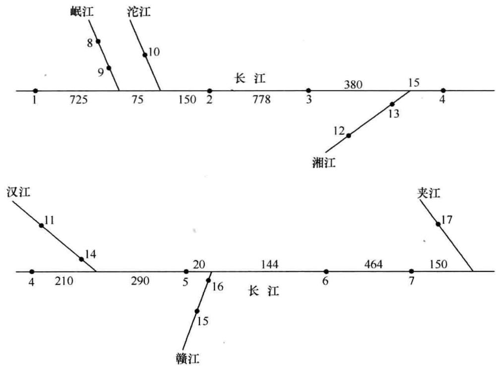  
图2

设每一个观测点对应的水域长度为 $D_{i}$ ，对应水流横截面积为 $S_{i}$ ，则有

$$
R _ {i} = S _ {i} \times D _ {i} = \frac {L _ {i}}{v _ {i}} \times D _ {i} \tag {9}
$$

不考虑支流的情况,则干流观测站对应的 $D_{i}$ 、 $S_{i}$ 可以根据附件 3-2(长江干流主要观测站点的基本数据)求得。考虑支流的 $D_{i}$ 、 $S_{i}$ ,有如下假设:

（1）干流相邻两个观测站的水流横截面积之差，即为两观测站之间所有支流水流横截面积之和。

(2) 两观测站之间所有支流水流横截面积相等。

(3) 支流汇入干流的水量在下一个观测点处瞬间与干流水质均匀混合, 即在支流进入干流到下一个观测点水质不混合。

(4) 对于支流对应水域的长度,考虑观测点与干流间的距离,根据观察适当赋值即可。

(5) 当一个支流上有两个观测点时, 认为两者对应的水流截面积相等。

(6) 任意观测站到下一个干流观测站之间水质均匀,与该观测站水质相同。

假设第 $i$ 个观测点第 $j$ 个月的水流量为 $L_{ij}$ , 第 $i$ 个观测点第 $j$ 个月的水流速度为 $v_{ij}$ , 则第 $i$ 个观测点的平均水流横截面积为

$$
S _ {i} = \frac {1}{1 2} \sum_ {j = 1} ^ {1 2} \frac {L _ {i j}}{v _ {i j}} (i = 1, 2, \dots , 7) \tag {10}
$$

可以得到长江干流个各站点间距离和水流横截面积(表4)。

表 4

<table><tr><td>观测站点</td><td>四川攀枝花</td><td>重庆朱沱</td><td>湖北宜昌</td><td>湖南岳阳</td><td>江西九江</td><td>安徽安庆</td><td>江苏南京</td></tr><tr><td>标号i</td><td>1</td><td>2</td><td>3</td><td>4</td><td>5</td><td>6</td><td>7</td></tr><tr><td>站点间距离/km</td><td>0</td><td>950</td><td>1728</td><td>2123</td><td>2623</td><td>2787</td><td>3251</td></tr><tr><td> $S_i/m^2$ </td><td>736.59</td><td>5586.5</td><td>16549</td><td>17459</td><td>20529</td><td>21879</td><td>21721</td></tr></table>

根据上述假设和处理结果,来确定所有观测点的 $D_{i}$ 和 $S_{i}$ 。

## 1. $D_{i}$ 的确定

对于观测站 7, 其对应的 $D_{7}$ 是该观测点到长江入海口的距离, 从图 2 上仅能知道 $D_{7} > 150$ , 不妨设 $D_{7} = 350$ , 结合表 4 得出表 5。

表 5

<table><tr><td>观测点标号</td><td>1</td><td>2</td><td>3</td><td>4</td><td>5</td><td>6</td><td>7</td></tr><tr><td> $D_{i}$ </td><td>950</td><td>778</td><td>395</td><td>500</td><td>164</td><td>464</td><td>350</td></tr></table>

对于支流上的观测点, $D_{i}$ 由观测站到干流距离 $D_{i1}$ 和干流入口处到下一干流观测站距离 $D_{i2}$ 共同决定,结合图2,得出表6。

表6

<table><tr><td>观测点标号</td><td>8</td><td>9</td><td>10</td><td>11</td><td>12</td><td>13</td><td>14</td><td>15</td><td>16</td><td>17</td></tr><tr><td> $D_{i1}$ </td><td>100</td><td>0</td><td>50</td><td>200</td><td>100</td><td>25</td><td>0</td><td>100</td><td>0</td><td>100</td></tr><tr><td> $D_{i2}$ </td><td>225</td><td>225</td><td>150</td><td>290</td><td>15</td><td>15</td><td>290</td><td>144</td><td>144</td><td>200</td></tr><tr><td> $D_i$ </td><td>325</td><td>225</td><td>200</td><td>490</td><td>115</td><td>40</td><td>290</td><td>244</td><td>144</td><td>300</td></tr></table>

## 2. $S_{i}$ 的确定

干流的平均截面积已知,下面来分析分析各个支流观测点的 $S_{i}$ , 根据假设(1)、(2)、(5), 结合图示位置关系, 则有

$$
S _ {2} - S _ {1} = S _ {8} + S _ {9} + S _ {1 0}, S _ {4} - S _ {3} = S _ {1 2} + S _ {1 3}, S _ {5} - S _ {4} = S _ {1 1} + S _ {1 4} S _ {6} - S _ {5} = S _ {1 5} + S _ {1 6};
$$

$$
S _ {8} = S _ {9}, S _ {1 2} = S _ {1 3}, S _ {1 1} = S _ {1 4}, S _ {1 5} = S _ {1 6}; S _ {1 0} = S _ {8} + S _ {9}
$$

结合表4中 $S_{i}$ 的数值，可以解得 $S_{8} \sim S_{16}$ ，对于 $S_{17}$ 无法定量解得，靠其他支流的水流横截面积情况，令 $S_{17} = S_{10}$ ，则得出表7。

表7

<table><tr><td>观测点标号</td><td>8</td><td>9</td><td>10</td><td>11</td><td>12</td><td>13</td><td>14</td><td>15</td><td>16</td><td>17</td></tr><tr><td> $S_i$ </td><td>1062.5</td><td>1062.5</td><td>2125</td><td>1535</td><td>455</td><td>455</td><td>1535</td><td>675</td><td>675</td><td>2125</td></tr></table>

确定了所有观测点的 $D_{i}$ 和 $S_{i}$ ，即可利用式(9)计算 $R_{i}$ ，得出表8。

表8

<table><tr><td>观测点标号</td><td>1</td><td>2</td><td>3</td><td>4</td><td>5</td><td>6</td><td>7</td><td>8</td><td>9</td></tr><tr><td> $R_{i}(\times 10^{3})$ </td><td>69.76</td><td>4346.3</td><td>6536.9</td><td>8729.5</td><td>3366.8</td><td>10152</td><td>7602.4</td><td>345.31</td><td>239.06</td></tr><tr><td>观测点标号</td><td>10</td><td>11</td><td>12</td><td>13</td><td>14</td><td>15</td><td>16</td><td>17</td><td></td></tr><tr><td> $R_{i}(\times 10^{3})$ </td><td>425</td><td>752.15</td><td>52.325</td><td>18.2</td><td>445.15</td><td>164.7</td><td>97.2</td><td>637.5</td><td></td></tr></table>

利用式(8)计算整个长江流域的综合评价值 $\Psi=0.4331$ 。

## 4.5 整体综合指标结果分析

根据上述求解结果,从整体、地域分布、污染物种类三个方面给出整个长江流域水质情况的综合评价。

(1) 从整体来看: 综合评定函数值 $\Psi=0.4331$ , 水质为良好。  
(2) 从被污染的地域范围来看, 结果见表9。

表9

<table><tr><td>水质类别</td><td>优质</td><td>良好</td><td>轻微污染</td><td>污染</td><td>严重污染</td><td>强严重污染</td></tr><tr><td>地域分布/%</td><td>5.88</td><td>47.06</td><td>23.53</td><td>11.76</td><td>5.88</td><td>5.88</td></tr></table>

(3)从主要污染物次数分布来看,结果见表10。

表 10

<table><tr><td>污染物</td><td>溶解氧(DO)</td><td>高锰酸盐指数(CODMn)</td><td>氨氮( $NH_3-N$ )</td><td>pH值(无量纲)</td></tr><tr><td>出现次数</td><td>22</td><td>14</td><td>48</td><td>1</td></tr></table>

对于 17 个地区的水质污染情况, 表 3 已经给出了比较详细的分析。

## 5 问题(2):长江污染源的判定

在问题(2)中,通过考虑不同的条件,建立了三个模型,首先单独作分析,然后综合三个模型得出结论,具体情况分析如下。

## 5.1 差分方程反演模型的建立与求解

## 5.1.1 模型I的建立

问题(2)研究和分析的是长江干流近一年多来受高锰酸盐指数及氨氮的污染源情况,建立该模型主要考虑以下几个因素。

(1) 浓度是随时间、距离变化的量。  
(2) 长江中的水流量及水中污染物在消耗减少,同时也在补充,支流以及干流的排污

都是其“外援”。

(3) 长江自身具有自净能力,由于降解系数 $\lambda$ 介于 0.1\~0.5 之间,考虑 $\lambda$ 取值 0.2。

(4) 考虑河流在受污染时的扩散能力,其扩散系数为 E。

根据以上考虑的因素及流体力学的基本理论,建立一个反应扩散方程来反映长江流域污染物浓度的变化情况:

$$
\frac {\partial w}{\partial t} + v \frac {\partial w}{\partial x} = E \frac {\partial^ {2} w}{\partial x ^ {2}} + f (x, t) - \lambda w \tag {11}
$$

式中：w 为污染物质在长江内浓度；v 为该段河流水流速度；f 为外界输入的污染物浓度。根据现有数据资料，不妨先假设，在任意一个分段内 f 为常数，即 f 整个是一个分段的常数函数，E 为扩散系数， $\lambda$ 为降解系数。

## 5.1.2 差分方程反演模型对污染源的判定

根据每一段已经给出的数据,确定每一小段的水流速度 $v_{i}$ 。

首先考虑整条长江流域的平均流速：

$$
\bar {v} = \frac {1}{7} \sum_ {i = 1} ^ {7} v _ {i} \tag {12}
$$

式中： $v_{i}$ 是第 i 个干流站点的水流速度。

假设考虑权重 $0 \leqslant \theta_{i}(x) \leqslant 1$ ，可以用于表示任一小段的平均水流速度，并且和整条长江的平均水流速度联系起来，表示为

$$
\overline {{v _ {i}}} = \bar {v} + \theta_ {i} (v _ {i} - \bar {v}) + (1 - \theta_ {i}) (v _ {i + 1} - \bar {v}) \tag {13}
$$

式中： $i=1,2,\cdots,6$ 。

由于沿长江往下,水流速度在逐渐减少,在上游速度比较大时可以用后一个点的流速决定该流水段的水流速度,到下游时可以将权重逐渐转移到 $v_{i}$ 上,由此取 $\theta_{i}(x)=x_{i+1}/3251$ ,其中3215是干流上站点之间的总间隔,表示从上游往下权重的变化情况。依据式(13)可以依次解出 $\overline{v_{i}}(i=1,2,\cdots,6)$ ,见表11。

表 11

<table><tr><td></td><td>第一段</td><td>第二段</td><td>第三段</td><td>第四段</td><td>第五段</td><td>第六段</td></tr><tr><td>第1月</td><td>2.5675</td><td>1.5378</td><td>0.9</td><td>0.91932</td><td>1.0143</td><td>1.1</td></tr><tr><td>第2月</td><td>2.426</td><td>1.3847</td><td>0.8347</td><td>0.93863</td><td>1.1</td><td>1.1</td></tr><tr><td>第3月</td><td>2.626</td><td>1.6784</td><td>1.2347</td><td>1.3386</td><td>1.5</td><td>1.5</td></tr><tr><td>第4月</td><td>2.826</td><td>1.8784</td><td>1.4347</td><td>1.5</td><td>1.5143</td><td>1.6</td></tr><tr><td>第5月</td><td>2.5968</td><td>1.7721</td><td>1.4</td><td>1.4193</td><td>1.5285</td><td>1.7</td></tr><tr><td>第6月</td><td>4.8877</td><td>3.3477</td><td>1.7694</td><td>1.9386</td><td>2.2855</td><td>3.4</td></tr><tr><td>第7月</td><td>2.5338</td><td>1.9252</td><td>1.5347</td><td>1.6</td><td>1.6143</td><td>1.7</td></tr><tr><td>第8月</td><td>2.1338</td><td>1.3378</td><td>0.7347</td><td>0.81932</td><td>0.9</td><td>0.9</td></tr><tr><td>第9月</td><td>1.9675</td><td>1.1252</td><td>0.7347</td><td>0.8</td><td>0.8</td><td>0.8</td></tr><tr><td>第10月</td><td>1.6753</td><td>1.0315</td><td>0.5347</td><td>0.61932</td><td>0.7</td><td>0.7</td></tr><tr><td>第11月</td><td>1.2922</td><td>0.71892</td><td>0.46939</td><td>0.61932</td><td>0.7</td><td>0.7</td></tr><tr><td>第12月</td><td>1.1922</td><td>0.66576</td><td>0.46939</td><td>0.63863</td><td>0.8</td><td>0.8</td></tr><tr><td>第13月</td><td>1.463</td><td>0.82522</td><td>0.4347</td><td>0.53863</td><td>0.71427</td><td>0.8</td></tr></table>

从文献[1]中查得,扩散系数E取 $13km^{2}/天$ 。

对微分方程 $\frac{\partial w}{\partial t}+v\frac{\partial w}{\partial x}=E\frac{\partial^{2}w}{\partial x^{2}}+f(x,t)-\lambda w$ 两边积分,积分区间为 $(x_{i-1},x_{i})$ ,其中 $i=2,\cdots,7$ 。

$$
\frac {\partial}{\partial t} \int_ {x _ {i - 1}} ^ {x _ {i}} w \mathrm{d} x + v (w _ {i} - w _ {i - 1}) = E \left(\frac {\partial w}{\partial x} | x _ {i} - \frac {\partial w}{\partial x} | x _ {i - 1}\right) - \lambda \int_ {x _ {i - 1}} ^ {x _ {i}} w \mathrm{d} x + f _ {i - 1} ^ {n} \Delta x _ {i - 1}
$$

式中： $\Delta x_{i-1}=x_{i}-x_{i-1}$ 。

对上式进行处理,含积分项利用梯形公式,含偏导数项利用一阶向前差商,得到 $f_{i}^{n}$ 的表达式:

$$
\begin{array}{l} f _ {i - 1} ^ {n} = \frac {\left(w _ {i} ^ {n + 1} + w _ {i - 1} ^ {n + 1}\right) - \left(w _ {i} ^ {n} + w _ {i - 1} ^ {n}\right)}{2 \Delta t _ {n}} + \frac {v}{\Delta x _ {i - 1}} (w _ {i} ^ {n} - w _ {i - 1} ^ {n}) \tag {14} \\ - \frac {E}{\Delta x _ {i - 1}} \left(\frac {w _ {i + 1} ^ {n} - w _ {i} ^ {n}}{\Delta x _ {i}} - \frac {w _ {i} ^ {n} - w _ {i - 1} ^ {n}}{\Delta x _ {i - 1}}\right) + \frac {\lambda}{2} (w _ {i} ^ {n} - w _ {i - 1} ^ {n}) \\ \end{array}
$$

式中： $n=1,2,\cdots,12;i=2,3,\cdots,6$ 。

当 $n=13, i=2,3,\cdots,7$ 时，时间偏导的差分用向后差商，得到的结果为

$$
\begin{array}{l} f _ {i - 1} ^ {1 3} = \frac {\left(w _ {i} ^ {1 3} + w _ {i - 1} ^ {1 3}\right) - \left(w _ {i} ^ {1 2} + w _ {i - 1} ^ {1 2}\right)}{2 \Delta t _ {n}} + \frac {v}{\Delta x _ {i - 1}} (w _ {i} ^ {1 2} - w _ {i - 1} ^ {1 2}) \tag {15} \\ - \frac {E}{\Delta x _ {i - 1}} \left(\frac {w _ {i + 1} ^ {1 2} - w _ {i} ^ {1 2}}{\Delta x _ {i}} - \frac {w _ {i} ^ {1 2} - w _ {i - 1} ^ {1 2}}{\Delta x _ {i - 1}}\right) + \frac {\lambda}{2} (w _ {i} ^ {1 2} - w _ {i - 1} ^ {1 2}) \\ \end{array}
$$

当 $i = 7, n = 1, 2, \dots, 13$ 时，扩散项对距离偏导的差分用向后差商处理，得到的结果为

$$
f _ {6} ^ {n} = \frac {\left(w _ {7} ^ {n + 1} + w _ {6} ^ {n + 1}\right) - \left(w _ {7} ^ {n} + w _ {6} ^ {n}\right)}{2 \Delta t _ {n}} + \frac {v}{\Delta x _ {6}} \left(w _ {7} ^ {n} - w _ {6} ^ {n}\right) \tag {16}
$$

$$
- \frac {E}{\Delta x _ {6}} \left(\frac {w _ {7} ^ {n} - w _ {6} ^ {n}}{\Delta x _ {6}} - \frac {w _ {6} ^ {n} - w _ {5} ^ {n}}{\Delta x _ {5}}\right) + \frac {\lambda}{2} (w _ {7} ^ {n} - w _ {6} ^ {n})
$$

## 5.1.3 模型的结果与分析

根据式(14)\~式(16)，利用 MATLAB 编程代入数据分别求解出污染物高锰酸盐在各段流域的 f 的值，由于 f 表示的是长江水流中污染物的浓度，所以 f 总是不小于零的数，故将其中负数归零处理（其他关于 f 的数值同样处理），见表 12。

对表 12 进行分析, 可以看出在一年多时间里, 每个月的高锰酸盐的 f 的最大值主要分布在第三段, 即湖北宜昌南津关到湖南岳阳城陵矶, 年度和最大的也是第三段, 因此主要受高锰酸盐污染的河段为第三段。

同样根据式(14)\~式(16)，可以编程代入数据求解出污染物氨氮在各段流域的f的

值,见表13。

表 12

<table><tr><td>钾盐</td><td>第一段</td><td>第二段</td><td>第三段</td><td>第四段</td><td>第五段</td><td>第六段</td></tr><tr><td>第1月</td><td>0.87192</td><td>0.33957</td><td>0.785</td><td>0.56479</td><td>0.52674</td><td>0.17498</td></tr><tr><td>第2月</td><td>0.16995</td><td>0.66968</td><td>0.7813</td><td>0.57886</td><td>0.65324</td><td>0.18947</td></tr><tr><td>第3月</td><td>0.67274</td><td>0.82414</td><td>0.65068</td><td>0.41359</td><td>0</td><td>0.47018</td></tr><tr><td>第4月</td><td>0.83633</td><td>0.60576</td><td>1.049</td><td>0.25701</td><td>0</td><td>0.38149</td></tr><tr><td>第5月</td><td>0</td><td>0.77146</td><td>0.98913</td><td>0.2047</td><td>0.086061</td><td>0.30163</td></tr><tr><td>第6月</td><td>0.15931</td><td>0.36651</td><td>0.92202</td><td>0</td><td>0</td><td>0.83506</td></tr><tr><td>第7月</td><td>0.46433</td><td>0.95571</td><td>0.60795</td><td>0.087517</td><td>0.57689</td><td>0.33663</td></tr><tr><td>第8月</td><td>0.29307</td><td>0.37178</td><td>0.58591</td><td>0.44001</td><td>0.4334</td><td>0.32784</td></tr><tr><td>第9月</td><td>0.22963</td><td>0.4991</td><td>0.78528</td><td>0.44248</td><td>0.16345</td><td>0.43812</td></tr><tr><td>第10月</td><td>0.26856</td><td>0.39861</td><td>1.0447</td><td>0.44088</td><td>0.5872</td><td>0.49527</td></tr><tr><td>第11月</td><td>0.38078</td><td>0.39925</td><td>0.65998</td><td>0.61269</td><td>0.4107</td><td>0.4394</td></tr><tr><td>第12月</td><td>0.38842</td><td>0.42137</td><td>0.81066</td><td>0.31925</td><td>0.82657</td><td>0.30398</td></tr><tr><td>第13月</td><td>0.43142</td><td>0.48331</td><td>0.56264</td><td>0.38947</td><td>0.53984</td><td>0.24891</td></tr><tr><td>年度和</td><td>5.16646</td><td>7.10625</td><td>10.23425</td><td>4.751247</td><td>4.804091</td><td>4.94296</td></tr></table>

表 13

<table><tr><td>氨氮</td><td>第一段</td><td>第二段</td><td>第三段</td><td>第四段</td><td>第五段</td><td>第六段</td></tr><tr><td>第1月</td><td>0.049677</td><td>0.059749</td><td>0.05253</td><td>0.054764</td><td>0.021959</td><td>0</td></tr><tr><td>第2月</td><td>0.07613</td><td>0.06078</td><td>0.066826</td><td>0.037104</td><td>0.061927</td><td>0</td></tr><tr><td>第3月</td><td>0.055435</td><td>0.078825</td><td>0.068881</td><td>0.004057</td><td>0.048833</td><td>0</td></tr><tr><td>第4月</td><td>0.073818</td><td>0.030152</td><td>0.11479</td><td>0.000973</td><td>0.086257</td><td>0</td></tr><tr><td>第5月</td><td>0</td><td>0.04143</td><td>0.096056</td><td>0.034601</td><td>0</td><td>0</td></tr><tr><td>第6月</td><td>0.057115</td><td>0.0935</td><td>0.062874</td><td>0.038265</td><td>0</td><td>0</td></tr><tr><td>第7月</td><td>0.065902</td><td>0.046828</td><td>0.10283</td><td>0.008493</td><td>0.01867</td><td>0</td></tr><tr><td>第8月</td><td>0.07809</td><td>0.049204</td><td>0.077137</td><td>0.035688</td><td>0</td><td>0.006414</td></tr><tr><td>第9月</td><td>0.13629</td><td>0.02475</td><td>0.073964</td><td>0.020055</td><td>0.036946</td><td>0.021029</td></tr><tr><td>第10月</td><td>0.13412</td><td>0.038827</td><td>0.086922</td><td>0.03935</td><td>0.035637</td><td>0.04578</td></tr><tr><td>第11月</td><td>0.11869</td><td>0.043441</td><td>0.086709</td><td>0.023371</td><td>0.049941</td><td>0.061985</td></tr><tr><td>第12月</td><td>0.1092</td><td>0.047605</td><td>0.083654</td><td>0.019254</td><td>0.083836</td><td>0</td></tr><tr><td>第13月</td><td>0.14237</td><td>0.030655</td><td>0.081617</td><td>0.030423</td><td>0.031926</td><td>0.044131</td></tr><tr><td>年度和</td><td>1.096837</td><td>0.645746</td><td>1.05479</td><td>0.346398</td><td>0.475932</td><td>0.179339</td></tr></table>

对表 13 进行分析,在一年多时间里,每个月的氨氮的 f 的最大值主要分布在第一段和第三段,即四川攀枝花到重庆朱沱,年度和最大的两个分别也是第一段和第三段,因此主要受污染的河段有第一段和第三段,两者中第一段污染是在最后半年内剧增的,在后半年内污染最重。第三段的污染一直处于平稳增加的状态,污染也在一步步加剧。

综合该六段水域在近一年多内受两种污染物污染的情况,可以得出污染物高锰酸盐指数的污染源主要在第三段,污染物氨氮的污染源主要在第一段和第三段。

另外,分析差分方程 $\frac{\partial w}{\partial t}+v\frac{\partial w}{\partial x}=E\frac{\partial^{2}w}{\partial x^{2}}+f(x,t)-\lambda w$ 中的扩散项 $E\frac{\partial^{2}w}{\partial x^{2}}$ 及浓度随时间变化率,根据其差分格式计算出结果,可以观察得出其中扩散项非常小,接近于零;又将浓度随时间的变化率项 $\frac{\partial w}{\partial t}$ 与平流项 $v\frac{\partial w}{\partial x}$ 两者的绝对值作比较,浓度随时间的变化率在短时间内很小,而平流项是一个不小的数值,因此可以将浓度随时间的变化率项 $\frac{\partial w}{\partial t}$ 省略。通过两者的实际数据(分别在表F-1和表F-2中),可以观察得出 $v\frac{\partial w}{\partial x}$ 的绝对值远大于 $\frac{\partial w}{\partial t}$ 绝对值,因此在实际计算中,扩散项 $E\frac{\partial^{2}w}{\partial x^{2}}$ 及浓度随时间变化率项 $\frac{\partial w}{\partial t}$ 省略对整个等式不影响。

## 5.2 微分方程反演模型对污染源的判定

## 5.2.1 微分模型的建立与求解

对反应扩散方程(11)进行简化,考虑以下两点。

（1）考虑在一个很小的时间段内任一处浓度的变化比较小，将反应扩散方程的项 $\frac{\partial w}{\partial t}$ 忽略不计，简化方程式为

$$
v \frac {\partial w}{\partial x} = E \frac {\partial^ {2} w}{\partial x ^ {2}} + f (x) - \lambda w \tag {17}
$$

(2) 进一步省略(17)中的扩散项, 即将扩散系数视为零, 物理上即是考虑理想情况下, 污染物在水中扩散的过程省略, 即将扩散视为在瞬间完成, 可以得出 $E = 0$ 。式(17)在固定时刻 $t$ 可以变化为常微分方程:

$$
v \frac {\mathrm{d} w}{\mathrm{d} x} = f (x) - \lambda w \tag {18}
$$

参照模型I中对扩散项 $E\frac{\partial^2w}{\partial x^2}$ 及浓度随时间变化率项 $\frac{\partial w}{\partial t}$ 定量分析得出的结果，说明这样考虑是完全可行的。

根据 17 个观察点在长江流域的分布情况, 干流的七个观察点相邻两点之间作为一小段。把支流也看作是污染源, 即反演出的浓度随时间的变化率项 f 中会有支流的影响, 如图 3 所示。

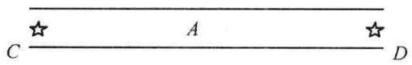

<details>
<summary>text_image</summary>

C\nA\nD
</details>

图3

假设 $CD$ 两点之间的距离为 $A$ , 以某一种污染物质为例, 假设该物质在两点的浓度分别为 $w_0, w_A$ , 以这三个数为初始条件解出 $w(x)$ 以及该段的污染源排出的污染物浓度 $f$ , 其数学模型为

$$
\left\{ \begin{array}{l} v \frac {\mathrm{d} w}{\mathrm{d} x} = f (x) - \lambda w \\ w \mid_ {0} = w _ {0} \\ w \mid_ {A} = w _ {A} \end{array} \right.
$$

对该微分方程积分求解：

$$
w (x) = \frac {1}{1 - \mathrm{e} ^ {- \frac {\lambda}{v} A}} \left[ w _ {0} (\mathrm{e} ^ {- \frac {\lambda}{v} x} - \mathrm{e} ^ {- \frac {\lambda}{v} A}) + w _ {A} (1 - \mathrm{e} ^ {- \frac {\lambda}{v} x}) \right] \tag {19}
$$

$$
f = \frac {\lambda}{1 - \mathrm{e} ^ {- \frac {\lambda}{v} A}} (w _ {A} - w _ {0} \mathrm{e} ^ {- \frac {\lambda}{v} A}) \quad (f \text {的表达式} 1)
$$

## 5.2.2 模型的结果与分析

根据得出的速度 $v_{i}$ 以及已知数据,代入式(19),利用 MATLAB 软件编程可以分别求出高锰酸盐 f 值大小,结果见表 14。

表14

<table><tr><td></td><td>第一段</td><td>第二段</td><td>第三段</td><td>第四段</td><td>第五段</td><td>第六段</td></tr><tr><td>第1月</td><td>0.87714</td><td>0.32317</td><td>0.78486</td><td>0.54828</td><td>0.51594</td><td>0.1429</td></tr><tr><td>第2月</td><td>0.15536</td><td>0.65989</td><td>0.78029</td><td>0.57888</td><td>0.68853</td><td>0.19081</td></tr><tr><td>第3月</td><td>0.67631</td><td>0.84315</td><td>0.64531</td><td>0.38901</td><td>0</td><td>0.47646</td></tr><tr><td>第4月</td><td>0.81287</td><td>0.62757</td><td>1.0644</td><td>0.24491</td><td>0</td><td>0.3809</td></tr><tr><td>第5月</td><td>0</td><td>0.74479</td><td>0.99533</td><td>0.19021</td><td>0.096233</td><td>0.2946</td></tr><tr><td>第6月</td><td>0.28161</td><td>0.3993</td><td>0.9278</td><td>0</td><td>0</td><td>0.83685</td></tr><tr><td>第7月</td><td>0.43578</td><td>1.0113</td><td>0.65089</td><td>0.078508</td><td>0.57087</td><td>0.3346</td></tr><tr><td>第8月</td><td>0.31125</td><td>0.37296</td><td>0.57665</td><td>0.41425</td><td>0.44</td><td>0.32519</td></tr><tr><td>第9月</td><td>0.23084</td><td>0.53562</td><td>0.78902</td><td>0.38614</td><td>0.14239</td><td>0.42121</td></tr><tr><td>第10月</td><td>0.26736</td><td>0.40536</td><td>1.1613</td><td>0.38147</td><td>0.57556</td><td>0.4945</td></tr><tr><td>第11月</td><td>0.40015</td><td>0.40356</td><td>0.67991</td><td>0.61635</td><td>0.42889</td><td>0.43801</td></tr><tr><td>第12月</td><td>0.41005</td><td>0.42287</td><td>0.88651</td><td>0.27024</td><td>0.83641</td><td>0.29637</td></tr><tr><td>第13月</td><td>0.45149</td><td>0.49017</td><td>0.5939</td><td>0.37624</td><td>0.54553</td><td>0.24344</td></tr><tr><td>年度和</td><td>5.31021</td><td>7.23971</td><td>10.53617</td><td>4.474488</td><td>4.840353</td><td>4.87584</td></tr></table>

对表 14 分析可以得出,第三段为主要污染源。

同样根据得出的速度 $v_{i}$ 以及已知条件可以分别求出每一个月每一段的对氨氮的f值大小,见表15。

对表 15 进行分析,在一年多时间里,每个月的氨氮的 f 的最大值主要分布也是在第一段和第三段,年度和最大的两个也是第一段和第三段,因此主要受污染的河段有第一段和第三段,两者中第一段污染是在最后半年内剧增的,在后半年内污染最重。第三段的污染一直处于平稳增加的状态,污染也在一步步加剧。

综合该六段水域在近一年多内受两种污染物污染的情况,可以得出污染物高锰酸盐指数的污染源主要在第三段,污染物氨氮的污染源主要在第一段和第三段。

表 15

<table><tr><td></td><td>第一段</td><td>第二段</td><td>第三段</td><td>第四段</td><td>第五段</td><td>第六段</td></tr><tr><td>第1月</td><td>0.050857</td><td>0.059392</td><td>0.050865</td><td>0.054793</td><td>0.021971</td><td>0</td></tr><tr><td>第2月</td><td>0.081108</td><td>0.062246</td><td>0.06601</td><td>0.035776</td><td>0.064558</td><td>0</td></tr><tr><td>第3月</td><td>0.057367</td><td>0.08463</td><td>0.071823</td><td>0.00089</td><td>0.047889</td><td>0</td></tr><tr><td>第4月</td><td>0.05978</td><td>0.029513</td><td>0.11687</td><td>0</td><td>0.086116</td><td>0</td></tr><tr><td>第5月</td><td>0</td><td>0.040269</td><td>0.096385</td><td>0.033717</td><td>0</td><td>0</td></tr><tr><td>第6月</td><td>0.05664</td><td>0.094491</td><td>0.062956</td><td>0.037756</td><td>0</td><td>0</td></tr><tr><td>第7月</td><td>0.067709</td><td>0.046</td><td>0.10392</td><td>0.005967</td><td>0.018913</td><td>0</td></tr><tr><td>第8月</td><td>0.077298</td><td>0.045889</td><td>0.081711</td><td>0.034988</td><td>0</td><td>0.003909</td></tr><tr><td>第9月</td><td>0.14379</td><td>0.014303</td><td>0.074139</td><td>0.012305</td><td>0.034587</td><td>0.017172</td></tr><tr><td>第10月</td><td>0.14261</td><td>0.030472</td><td>0.092832</td><td>0.034337</td><td>0.037222</td><td>0.045099</td></tr><tr><td>第11月</td><td>0.12784</td><td>0.029419</td><td>0.094314</td><td>0.015053</td><td>0.049889</td><td>0.069146</td></tr><tr><td>第12月</td><td>0.11852</td><td>0.032984</td><td>0.091649</td><td>0.009902</td><td>0.085521</td><td>0</td></tr><tr><td>第13月</td><td>0.15632</td><td>0.013289</td><td>0.092062</td><td>0.020607</td><td>0.032851</td><td>0.043535</td></tr><tr><td>年度和</td><td>1.139839</td><td>0.582897</td><td>1.095536</td><td>0.29609</td><td>0.479517</td><td>0.178861</td></tr></table>

## 5.3 含支流的微分方程反演模型

## 5.3.1 模型Ⅲ的建立与求解

考虑两站点之间出现支流情况,根据地图描述的相邻干流站点间出现支流数量将这类情况分为两种,并可以依据地图近似得出支流入口处距相邻两干流站点的距离(参考问题Ⅰ):

## 1. 两站点间只有一个支点情况(图4)

假设 C、D 各点的浓度和支流上站点（也即看作是支流入口点处）的浓度分别为 $w_{1}$ 、 $w_{2}$ 、 $w_{3}$ ，当支流汇入长江时，支流入口处干流上的点 E 的浓度发生突变，因此该点处三个方向的浓度是不同的，具体假设可结合图 5 说明。

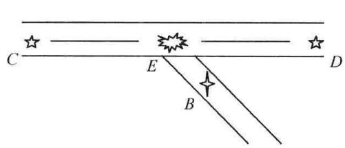

<details>
<summary>text_image</summary>

C
E
B
D
</details>

图4

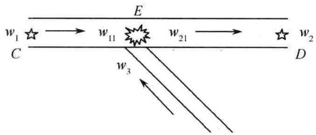

<details>
<summary>text_image</summary>

E
w₁ → w₁₁ → w₂₁ → w₂
C → D
w₃
</details>

图5

假设在 $E$ 点处突变后三处的单位时间水流量分别为 $p_1, p_2, p_3$ ，则有

$$
w _ {2 1} = \frac {w _ {1 1} p _ {1} + w _ {3} p _ {3}}{p _ {1} + p _ {3}} \tag {20}
$$

$f$ 是在分段的常数函数, 在某一个 $CD$ 段内 $f$ 是不变的待定常数。由 $C$ 到 $E, C$ 到 $D$ 点, 两段距离可以依据地图近似测量, 分别记为 $E, D$ , 根据两点间无支流情况得出两个含

边界条件的微分方程：

首先由 $C$ 到 $E$ 点有

$$
\left\{ \begin{array}{l} v \frac {\mathrm{d} w}{\mathrm{d} x} = f (x) - \lambda w \\ w | _ {C} = w _ {1} \\ w | _ {E} = w _ {1 1} \end{array} \right.
$$

积分后代入边界条件消去积分常数可以得出：

$$
w _ {1 1} - \frac {f}{\lambda} = \left(w _ {1} - \frac {f}{\lambda}\right) \mathrm{e} ^ {- \frac {\lambda}{v} E} \tag {21}
$$

同理可以得出 $E$ 到 $D$ 点微分方程：

$$
\left\{ \begin{array}{l} v \frac {\mathrm{d} w}{\mathrm{d} x} = f (x) - \lambda w \\ w | _ {E} = w _ {2 1} \\ w | _ {C} = w _ {2} \end{array} \right.
$$

积分后代入边界条件消去积分常数可以得出：

$$
w _ {2} - \frac {f}{\lambda} = \left(w _ {2 1} - \frac {f}{\lambda}\right) \mathrm{e} ^ {- \frac {\lambda}{v} (D - E)} \tag {22}
$$

根据式(20)\~式(22)可以消去 $w_{11}$ 和 $w_{12}$ ，求解出 $f$ 的表达式2为

$$
f = \frac {\lambda \left(w _ {1} p _ {1} \mathrm{e} ^ {- \frac {\lambda}{v} E} - w _ {2} (p _ {1} + p _ {3}) \mathrm{e} ^ {\frac {\lambda}{v} (D - E)} + w _ {3} p _ {3}\right)}{p _ {1} \mathrm{e} ^ {- \frac {\lambda}{v} E} - (p _ {1} + p _ {3}) \mathrm{e} ^ {\frac {\lambda}{v} (D - E)} + p _ {3}} (\text {f表达式2})
$$

2. 两站点间有两个支点情况(图6)

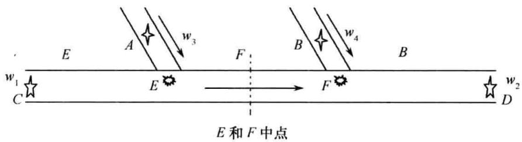

<details>
<summary>text_image</summary>

w₁
C
E
A
w₃
F
B
w₄
F
B
w₂
D
E 和 F 中点
</details>

图6

由于题目给出支流的信息不多,为简化模型做一些必要的假设:

（1）假设各个支流进入长江前的污染物浓度取决于该支流上距干流最近的一个观察站点，即图6各支流的污染物浓度为 $A$ 观察站和 $B$ 观察站的污染物浓度。  
(2) 假设支流污染物进入长江后使得入口处污染物浓度立即变化, 这种变化视为一种突变。

记干流上的点 $E, F, D$ 与段始点 $C$ 的距离分别用 $E, F, D$ 表示。

由 $A \sim E$ 根据微分方程可以得

$$
\left\{ \begin{array}{l} v \frac {\mathrm{d} w}{\mathrm{d} x} = f (x) - \lambda w \\ w | _ {C} = w _ {1} \end{array} \right.
$$

保留常数 $C_1$ 得出微分结果：

$$
\left\{ \begin{array}{l} w (x) = C _ {1} \mathrm{e} ^ {- \frac {\lambda}{v} x} + \frac {f}{\lambda} \\ C _ {1} + \frac {f}{\lambda} = w _ {1} \end{array} \right. \tag {23}
$$

则水流到达 E 处发生突变前时,有

$$
w (E) = C _ {1} \mathrm{e} ^ {- \frac {\lambda}{v} E} + \frac {f}{\lambda}
$$

由于支流路口处发生突变,所以在 $E \sim F$ 时,E 处的某种污染物的浓度发生变化,根据式(23)得出的结果,假设在 $E \sim F$ 这段流域内的常数变为 $C_{2}$ ,则此时 E 处的某污染物浓度为: $w(E) = C_{2} e^{-\frac{\lambda}{v} E} + \frac{f}{\lambda}$ ,根据单个支流得出的式(20),可以得

$$
\frac {\left(C _ {1} \mathrm{e} ^ {- \frac {\lambda}{v} E} + \frac {f}{\lambda}\right) p _ {1} + w _ {3} p _ {3}}{p _ {1} + p _ {3}} = C _ {2} \mathrm{e} ^ {- \frac {\lambda}{v} E} + \frac {f}{\lambda} \tag {24}
$$

同样在 $F$ 处发生突变前有 $w(F) = C_2\mathrm{e}^{-\frac{\lambda}{v} F} + \frac{f}{\lambda}$ , 当其发生突变后, $w(F)$ 改变, 假设在 $F \sim D$ 段常数为 $C_3$ :

$$
w (F) = C _ {3} \mathrm{e} ^ {- \frac {\lambda}{v} F} + \frac {f}{\lambda}
$$

同理根据单个支流得出的式(20)，可以得

$$
\frac {\left(C _ {2} \mathrm{e} ^ {- \frac {\lambda}{v} F} + \frac {f}{\lambda}\right) (p _ {1} + p _ {3}) + w _ {4} p _ {4}}{p _ {1} + p _ {3} + p _ {4}} = C _ {3} \mathrm{e} ^ {- \frac {\lambda}{v} F} + \frac {f}{\lambda} \tag {25}
$$

在点 $D$ 处，由于在 $F\sim D$ 段内常数为 $C_3$ ，根据方程组(23)得出的结果，则可以得

$$
w (D) = C _ {3} \mathrm{e} ^ {- \frac {\lambda}{v} D} + \frac {f}{\lambda} = w _ {2} \tag {26}
$$

联立方程组(23)及式(24)\~式(26)可以消去未知常数 $C_{1}$ 、 $C_{2}$ 和 $C_{3}$ ，求解出f的表达式(3)为

$$
f = \lambda \frac {w _ {1} p _ {1} + w _ {3} p _ {3} \mathrm{e} ^ {\frac {\lambda}{v} E} + w _ {4} p _ {4} \mathrm{e} ^ {\frac {\lambda}{v} F} - w _ {2} (p _ {1} + p _ {3} + p _ {4}) \mathrm{e} ^ {\frac {\lambda}{v} D}}{p _ {1} + p _ {3} \mathrm{e} ^ {\frac {\lambda}{v} E} + p _ {4} \mathrm{e} ^ {\frac {\lambda}{v} F} - (p _ {1} + p _ {3} + p _ {4}) \mathrm{e} ^ {\frac {\lambda}{v} D}} \quad (f \text {表达式(3)})
$$

联立 $f$ 表达式1、2、3，得到整个长江流域六段的 $f$ 表达式为

$$
\left\{ \begin{array}{l} f = \frac {\lambda}{1 - \mathrm{e} ^ {- \frac {\lambda}{v} A}} \left(w _ {A} - w _ {0} \mathrm{e} ^ {- \frac {\lambda}{v} A}\right) \\ f = \frac {\lambda \left(w _ {1} p _ {1} \mathrm{e} ^ {- \frac {\lambda}{v} E} - w _ {2} \left(p _ {1} + p _ {3}\right) \mathrm{e} ^ {\frac {\lambda}{v} (D - E)} + w _ {3} p _ {3}\right)}{p _ {1} \mathrm{e} ^ {- \frac {\lambda}{v} E} - \left(p _ {1} + p _ {3}\right) \mathrm{e} ^ {\frac {\lambda}{v} (D - E)} + p _ {3}} (\text {有一个支流}) \\ f = \lambda \frac {w _ {1} p _ {1} + w _ {3} p _ {3} \mathrm{e} ^ {\frac {\lambda}{v} E} + w _ {4} p _ {4} \mathrm{e} ^ {\frac {\lambda}{v} F} - w _ {2} \left(p _ {1} + p _ {3} + p _ {4}\right) \mathrm{e} ^ {\frac {\lambda}{v} D}}{p _ {1} + p _ {3} \mathrm{e} ^ {\frac {\lambda}{v} E} + p _ {4} \mathrm{e} ^ {\frac {\lambda}{v} F} - \left(p _ {1} + p _ {3} + p _ {4}\right) \mathrm{e} ^ {\frac {\lambda}{v} D}} (\text {有两个支流}) \end{array} \right.
$$

## 5.3.2 模型的结果与分析

根据地图描述的17个站点的相对位置,可以确定任意两干流站点间需要哪一类计算,即确定该段水域使用的f的表达式。然后分别根据f的表达式,利用MATLAB编程求出高锰酸盐的f的结果,见表16。

表 16

<table><tr><td></td><td>第一段</td><td>第二段</td><td>第三段</td><td>第四段</td><td>第五段</td><td>第六段</td></tr><tr><td>第1月</td><td>1.0969</td><td>0.32317</td><td>0.79272</td><td>0.55428</td><td>0.5396</td><td>0.1429</td></tr><tr><td>第2月</td><td>0.009481</td><td>0.65989</td><td>0.77834</td><td>0.62561</td><td>0.88768</td><td>0.19081</td></tr><tr><td>第3月</td><td>0.5239</td><td>0.84315</td><td>0.54454</td><td>0.3517</td><td>0</td><td>0.47646</td></tr><tr><td>第4月</td><td>0.35912</td><td>0.62757</td><td>1.0112</td><td>0.26045</td><td>0</td><td>0.3809</td></tr><tr><td>第5月</td><td>0.20822</td><td>0.74479</td><td>0.96333</td><td>0.14921</td><td>0.068238</td><td>0.2946</td></tr><tr><td>第6月</td><td>2.1653</td><td>0.3993</td><td>0.92561</td><td>0</td><td>0</td><td>0.83685</td></tr><tr><td>第7月</td><td>0.43783</td><td>1.0113</td><td>0.54617</td><td>0.057366</td><td>0.57621</td><td>0.3346</td></tr><tr><td>第8月</td><td>0.1563</td><td>0.37296</td><td>0.52763</td><td>0.37555</td><td>0.083583</td><td>0.32519</td></tr><tr><td>第9月</td><td>0.12901</td><td>0.53562</td><td>0.74691</td><td>0.34751</td><td>0.07053</td><td>0.42121</td></tr><tr><td>第10月</td><td>0.24168</td><td>0.40536</td><td>1.0928</td><td>0.3532</td><td>0.48847</td><td>0.4945</td></tr><tr><td>第11月</td><td>0.39403</td><td>0.40356</td><td>0.52387</td><td>0.61028</td><td>0.53687</td><td>0.43801</td></tr><tr><td>第12月</td><td>0.43569</td><td>0.42287</td><td>0.83177</td><td>0.24508</td><td>1.1124</td><td>0.29637</td></tr><tr><td>第13月</td><td>0.3616</td><td>0.49017</td><td>0.53546</td><td>0.37759</td><td>0.72891</td><td>0.24344</td></tr><tr><td>年度和</td><td>6.519061</td><td>7.23971</td><td>9.82035</td><td>4.307826</td><td>5.092491</td><td>4.87584</td></tr></table>

对表 16 进行分析, 可以观察得出第三段为主要污染源。同样求解得到的氨氮的 f 的结果见表 17。

表 17

<table><tr><td></td><td>第一段</td><td>第二段</td><td>第三段</td><td>第四段</td><td>第五段</td><td>第六段</td></tr><tr><td>第1月</td><td>0</td><td>0.059392</td><td>0.05138</td><td>0.055702</td><td>0.008438</td><td>0</td></tr><tr><td>第2月</td><td>0.049443</td><td>0.062246</td><td>0.065807</td><td>0.039249</td><td>0</td><td>0</td></tr><tr><td>第3月</td><td>0.051551</td><td>0.08463</td><td>0.070848</td><td>0.001971</td><td>0</td><td>0</td></tr><tr><td>第4月</td><td>0.05313</td><td>0.029513</td><td>0.11495</td><td>0</td><td>0</td><td>0</td></tr><tr><td>第5月</td><td>0</td><td>0.040269</td><td>0.095002</td><td>0.038508</td><td>0</td><td>0</td></tr><tr><td>第6月</td><td>0.097137</td><td>0.094491</td><td>0.062878</td><td>0.046604</td><td>0</td><td>0</td></tr><tr><td>第7月</td><td>0.090237</td><td>0.046</td><td>0.094648</td><td>0.009659</td><td>0</td><td>0</td></tr><tr><td>第8月</td><td>0.090362</td><td>0.045889</td><td>0.080384</td><td>0.038104</td><td>0</td><td>0.003909</td></tr><tr><td>第9月</td><td>0.16241</td><td>0.014303*</td><td>0.069657</td><td>0.013127</td><td>0</td><td>0.017172</td></tr><tr><td>第10月</td><td>0.15262</td><td>0.030472</td><td>0.067686</td><td>0.03556</td><td>0</td><td>0.045099</td></tr><tr><td>第11月</td><td>0.13497</td><td>0.029419</td><td>0.071098</td><td>0.016049</td><td>0</td><td>0.069146</td></tr><tr><td>第12月</td><td>0.13345</td><td>0.032984</td><td>0.086192</td><td>0.010431</td><td>0</td><td>0</td></tr><tr><td>第13月</td><td>0.18782</td><td>0.013289</td><td>0.092367</td><td>0.026697</td><td>0</td><td>0.043535</td></tr><tr><td>年度和</td><td>1.20313</td><td>0.582897</td><td>1.022897</td><td>0.331661</td><td>0.008438</td><td>0.178861</td></tr></table>

对表 17 进行分析,在一年多时间里,每个月的氨氮的 f 的最大值主要分布也是在第一段和第三段,年度和最大的两个也是第一段和第三段,并且差距很小,因此主要受污染的河段有第一段和第三段,两者中第一段污染是剧增的,污染最重。第三段的污染一直处于平稳增加的状态,污染也在一步步加剧。

综合该六段水域在近一年多内受两种污染物污染的情况,可以得出污染物高锰酸盐指数的污染源主要在第三段,污染物氨氮的污染源主要在第一段和第三段。

## 5.4 问题(2)的结果分析

综合三个模型得出的六个表格的结果取出年度和组成两个表格，见表18、表19。

表 18

<table><tr><td>高锰酸盐</td><td>第一段</td><td>第二段</td><td>第三段</td><td>第四段</td><td>第五段</td><td>第六段</td></tr><tr><td>模型I</td><td>5.31021</td><td>7.23971</td><td>10.53617</td><td>4.474488</td><td>4.84035</td><td>4.87584</td></tr><tr><td>模型II</td><td>5.16646</td><td>7.10625</td><td>10.23425</td><td>4.751247</td><td>4.80409</td><td>4.94296</td></tr><tr><td>模型III</td><td>6.519061</td><td>7.23971</td><td>9.82035</td><td>4.307826</td><td>5.09249</td><td>4.87584</td></tr><tr><td>总和</td><td>16.99573</td><td>21.58567</td><td>30.59077</td><td>13.53356</td><td>14.7369</td><td>14.69464</td></tr></table>

表 19

<table><tr><td>氨氮</td><td>第一段</td><td>第二段</td><td>第三段</td><td>第四段</td><td>第五段</td><td>第六段</td></tr><tr><td>模型I</td><td>1.139839</td><td>0.582897</td><td>1.095536</td><td>0.29609</td><td>0.479517</td><td>0.178861</td></tr><tr><td>模型II</td><td>1.096837</td><td>0.645746</td><td>1.05479</td><td>0.346398</td><td>0.475932</td><td>0.179339</td></tr><tr><td>模型III</td><td>1.20313</td><td>0.582897</td><td>1.022897</td><td>0.331661</td><td>0.008438</td><td>0.178861</td></tr><tr><td>总和</td><td>3.439806</td><td>1.81154</td><td>3.173223</td><td>0.974149</td><td>0.963887</td><td>0.537061</td></tr></table>

从表 18、表 19 可以分析得到,在这六段流域中高锰酸盐污染源主要分布在第三段即湖北宜昌南津关—湖南岳阳城陵矶地区,第二段受污染程度也比较高,其他几段都是偶尔出现受污染比较严重的情况,但随后又恢复正常。氨氮污染源主要分布在第一段和第三段,即在四川攀枝花—重庆朱沱和湖北宜昌南津关—湖南岳阳城陵矶地区,两者 f 值的差距比较小,但与其他四段相比较差距比较大,第五、六段 f 值比较小,几乎不受污染物影响。

在这个问题的计算中, 把 $f$ 看作分段常数, 因为 $f(x, t)$ 在固定 $t$ 时, 先暂时看作常数, 相当于在该段处处都有一个相同的排放量在向江中排放污染物, 而事实上污染源是在某些点上集中向江中排放的, 但根据现有数据无法得到污染源的确切地点, 因此做的假设是合理的。在这里, $f$ 的数值只需乘以该段的长度就可以得到该段上污染物的排放浓度量。

## 6 问题(3): 回归模型对水质的预测分析

## 6.1 问题的分析

对于长江未来水质的污染状况的预测分析,首先应该对附件4的数据进行处理,提取有用信息,首先考虑水文年长江流域水质变化,对于河流的污染状况,只需考虑各类水所占百分比即可。仅考虑全流域,则可以提取相应数据得到表20。

表 20

<table><tr><td>标号</td><td>年份</td><td>I类百分比</td><td>II类百分比</td><td>III类百分比</td><td>IV类百分比</td><td>V类百分比</td><td>劣V类百分比</td></tr><tr><td>1</td><td>1995年</td><td>25.8</td><td>42.6</td><td>24.7</td><td>3.9</td><td>3.0</td><td>0</td></tr><tr><td>2</td><td>1996年</td><td>15.3</td><td>20.2</td><td>49.8</td><td>9.7</td><td>1.9</td><td>3.1</td></tr><tr><td>3</td><td>1997年</td><td>12.2</td><td>24.9</td><td>43.6</td><td>13.3</td><td>2.6</td><td>3.4</td></tr><tr><td>4</td><td>1998年</td><td>11.5</td><td>24.1</td><td>52.8</td><td>8.3</td><td>1.7</td><td>1.6</td></tr><tr><td>5</td><td>1999年</td><td>5.2</td><td>39.8</td><td>35.2</td><td>9.5</td><td>6.2</td><td>4.1</td></tr><tr><td>6</td><td>2000年</td><td>5.6</td><td>32.8</td><td>35.6</td><td>16.6</td><td>4.4</td><td>5.3</td></tr><tr><td>7</td><td>2001年</td><td>5.9</td><td>33.1</td><td>34.7</td><td>14</td><td>5.5</td><td>6.8</td></tr><tr><td>8</td><td>2002年</td><td>4.4</td><td>44</td><td>28.3</td><td>10.0</td><td>3.2</td><td>10.0</td></tr><tr><td>9</td><td>2003年</td><td>4.7</td><td>41.5</td><td>31.3</td><td>6.4</td><td>5.8</td><td>10.3</td></tr><tr><td>10</td><td>2004年</td><td>1.2</td><td>26.9</td><td>39.9</td><td>14.8</td><td>5.9</td><td>11.3</td></tr></table>

## 6.2 回归模型的建立 $^{[2]}$

## 1. 模型建立

已知有 n 组观测值 $(x_{i}, y_{i}), i = 1, 2, \cdots, n$ ，要对 y 值进行预测分析，可以建立线性回归模型：

$$
\left\{ \begin{array}{l} y = A x + B + \varepsilon \\ E (\varepsilon) = 0, D (\varepsilon) = \sigma^ {2} \end{array} \right. \tag {27}
$$

式中：A、B 为未知参数； $\varepsilon$ 为其他随机因素对 y 的影响， $E(\varepsilon)=0$ 。

## 2. 参数估计

根据已知观测值,利用最小二乘法容易估计参数 A 和 B,这里不再罗列求解过程,仅直接列出结果:

$$
\left\{ \begin{array}{l} \widehat {A} = \frac {\sum_ {i = 1} ^ {n} \left(x _ {i} - \bar {x}\right) \left(y _ {i} - \bar {y}\right)}{\sum_ {i = 1} ^ {n} \left(x _ {i} - \bar {x}\right)} \\ \widehat {B} = \bar {y} - \widehat {A} \bar {x} \end{array} \right. \tag {28}
$$

在实际计算的过程中,可以直接应用 MATLAB 等数学软件进行求解。

## 3. 回归系数的假设检验

对于回归系数的检验,这里直接引用 F 检验法:

$$
\sum_ {i = 1} ^ {n} (y _ {i} - \bar {y}) ^ {2} = \sum_ {i = 1} ^ {n} (y _ {i} - \widehat {y}) ^ {2} + \sum_ {i = 1} ^ {n} (\widehat {y} _ {i} - \bar {y}) ^ {2} = Q + U
$$

考虑检验假设 $H_0: A = 0; H_1: A \neq 0$ 。当 $H_0$ 为真时，可以证明

$$
F = \frac {U}{Q / (n - 2)} \sim F (1, n - 2) \tag {29}
$$

给定显著性水平 $\alpha$ ，则检验准则为：当 $F > F_{1 - \alpha}(1,n - 2)$ ，拒绝 $H_0$ ，回归效果好；否则，接受 $H_0$ ，回归效果差。

## 6.3 回归模型对问题的求解

根据表20,对于六类水质,分别给出最近十年的观测数据,可以记为 $(i,x_{ij}),(i=1,2,\cdots,10;j=1,2,\cdots,6)$ ,其中i表示年份, $x_{ij}$ 表示第i年第j类水所占百分比。分别令 $j=1,2,\cdots,6$ ,建立线性回归模型:

$$
\left\{ \begin{array}{l} y _ {j} = A _ {j} x + B _ {j} + \varepsilon_ {j} \\ E (\varepsilon_ {j}) = 0, D (\varepsilon_ {j}) = \sigma_ {j} ^ {2} \end{array} \quad j = 1, 2, \dots , 6 \right. \tag {30}
$$

首先利用 MATLAB 进行参数估计, 分别求得六类水的线性回归方程。给定显著性水平 $\alpha = 0.05$ , 查表 $F_{0.95}(1,8) = 5.32$ , 然后利用 F 检验法对回归系数进行假设检验, 确定回归分析的效果, 见表 21。

表 21

<table><tr><td>j值</td><td>水质类别</td><td>回归方程</td><td>F</td><td>F~5.32比较</td><td>回归效果</td></tr><tr><td>1</td><td>I</td><td> $y_1 = -2.1273x + 20.88$ </td><td>29.6124</td><td>&gt;</td><td>好</td></tr><tr><td>2</td><td>II</td><td> $y_2 = 0.7473x + 28.88$ </td><td>0.5836</td><td>&lt;</td><td>差</td></tr><tr><td>3</td><td>III</td><td> $y_3 = -0.7461x + 41.6933$ </td><td>0.5355</td><td>&lt;</td><td>差</td></tr><tr><td>4</td><td>IV</td><td> $y_4 = 0.5012x + 7.8933$ </td><td>1.3597</td><td>&lt;</td><td>差</td></tr><tr><td>5</td><td>V</td><td> $y_5 = 0.4x + 1.82$ </td><td>7.4387</td><td>&gt;</td><td>好</td></tr><tr><td>6</td><td>劣V</td><td> $y_6 = 1.2236x - 1.14$ </td><td>78.1631</td><td>&gt;</td><td>好</td></tr></table>

由上面表格可知,对于j=2,3,4的回归方程,回归效果很差,所以不能用该方程来预测未来10年的水质发展趋势。因此,需要对原始数据进行适当的处理,然后再进行回归分析。

为了剔除数据中的偶然因素,保持长远趋势,将原始数据进行去除波动处理,利用三项移动平均法对数据进行平滑处理,具体方法为:令

$$
x _ {i} = \frac {x _ {i - 1} + x _ {i} + x _ {i + 1}}{3}, \quad i = 2, 3, \dots , n - 1 \tag {31}
$$

这样原始数据点减少了两个,数据得到了平滑处理。

利用式(31)将表19中的Ⅱ、Ⅲ、Ⅳ类水质对应的数据进行处理,处理后的数据见表22。

表 22

<table><tr><td>类别\标号</td><td>1</td><td>2</td><td>3</td><td>4</td><td>5</td><td>6</td><td>7</td><td>8</td></tr><tr><td>II类水</td><td>29.233</td><td>23.067</td><td>29.6</td><td>32.233</td><td>35.233</td><td>36.633</td><td>39.533</td><td>37.467</td></tr><tr><td>III类水</td><td>39.367</td><td>48.733</td><td>43.867</td><td>41.2</td><td>35.167</td><td>32.867</td><td>31.433</td><td>33.167</td></tr><tr><td>IV类水</td><td>8.9667</td><td>10.433</td><td>10.367</td><td>11.467</td><td>13.367</td><td>13.533</td><td>10.133</td><td>10.4</td></tr></table>

同样,首先利用 MATLAB 求解回归方程,给定显著性水平 $\alpha=0.05$ , 查表 $F_{0.95}(1,6)=5.99$ , 然后利用 F 检验法对回归系数进行假设检验, 得到表 23。

表 23

<table><tr><td>j值</td><td>水质类别</td><td>回归方程</td><td>F</td><td>F~5.99比较</td><td>回归效果</td></tr><tr><td>2</td><td>II</td><td> $y_{2}=1.9532x+24.0857$ </td><td>63.1492</td><td>&gt;</td><td>好</td></tr><tr><td>3</td><td>III</td><td> $y_{3}=-2.0111x+47.275$ </td><td>14.7212</td><td>&gt;</td><td>好</td></tr><tr><td>4</td><td>IV</td><td> $y_{4}=0.2373x+10.0155$ </td><td>1.1988</td><td>&lt;</td><td>差</td></tr></table>

由表 23 可知,Ⅳ类水质的线性回归效果依然不好,为此,将Ⅳ类水质的原始数据进行深度光滑处理,即令

$$
x _ {i} = \frac {x _ {i - 2} + x _ {i - 1} + x _ {i} + x _ {i + 1} + x _ {i + 2}}{5}, \quad i = 3, 4, \dots , n - 2
$$

得到六个处理后的数据,仍按照同样的方法步骤进行回归分析,得到表24。

表 24

<table><tr><td>j值</td><td>水质类别</td><td>回归方程</td><td>F</td><td>F~5.71比较</td><td>回归效果</td></tr><tr><td>4</td><td>IV</td><td> $y_4=0.3711x+10.1844$ </td><td>3.34</td><td>&lt;</td><td>差</td></tr></table>

回归效果仍然很差,因此可以认为:不存在理想的线性回归方程,来描述Ⅳ类水的变化趋势。

根据上述的分析求解,考虑到各类水质百分比是正值,最终得到各类水质百分比随时间变化的线性回归方程为

$$
\begin{array}{l} y _ {1} = \max (0, - 2. 1 2 7 3 x + 2 0. 8 8) \\ y _ {2} = 1. 9 5 3 2 x + 2 4. 0 8 5 7 \\ y _ {3} = \max (0, - 2. 0 1 1 1 x + 4 7. 2 7 5) \\ y _ {5} = 0. 4 x + 1. 8 2 \\ y _ {6} = 1. 2 2 3 6 x - 1. 1 4 \\ \end{array}
$$

由于六类水质的总的百分比之和为 100, 因此可以定义

$$
y _ {4} = \max \left\{0, (1 0 0 - y _ {1} - y _ {2} - y _ {3} - y _ {5} - y _ {6}) \right\}
$$

根据上述表达式即可进行预测,但是为了保证六类水质的总的百分比之和为100,需要对预测值进行标准化处理,即将预测值乘以系数 $\lambda = \frac{100}{\sum_{j=1}^{6} y_{j}}$ , 则得出未来10年预测值(表25)。

表 25

<table><tr><td>x</td><td>年份</td><td>I类百分比</td><td>II类百分比</td><td>III类百分比</td><td>IV类百分比</td><td>V类百分比</td><td>劣V类百分比</td></tr><tr><td>11</td><td>2006年</td><td>0</td><td>45.571</td><td>25.153</td><td>10.737</td><td>6.22</td><td>12.32</td></tr><tr><td>12</td><td>2007年</td><td>0</td><td>47.524</td><td>23.142</td><td>9.1709</td><td>6.62</td><td>13.544</td></tr><tr><td>13</td><td>2008年</td><td>0</td><td>49.477</td><td>21.131</td><td>7.6051</td><td>7.02</td><td>14.767</td></tr><tr><td>14</td><td>2009年</td><td>0</td><td>51.43</td><td>19.119</td><td>6.0395</td><td>7.42</td><td>15.991</td></tr><tr><td>15</td><td>2010年</td><td>0</td><td>53.383</td><td>17.108</td><td>4.4739</td><td>7.82</td><td>17.215</td></tr><tr><td>16</td><td>2011年</td><td>0</td><td>55.337</td><td>15.097</td><td>2.9081</td><td>8.22</td><td>18.438</td></tr><tr><td>17</td><td>2012年</td><td>0</td><td>57.29</td><td>13.086</td><td>1.3424</td><td>8.62</td><td>19.662</td></tr><tr><td>18</td><td>2013年</td><td>0</td><td>59.243</td><td>11.075</td><td>0</td><td>9.02</td><td>20.886</td></tr><tr><td>19</td><td>2014年</td><td>0</td><td>61.196</td><td>9.0639</td><td>0</td><td>9.42</td><td>22.109</td></tr><tr><td>20</td><td>2015年</td><td>0</td><td>63.149</td><td>7.0528</td><td>0</td><td>9.82</td><td>23.333</td></tr></table>

## 6.4 模型的改进

上述回归分析中Ⅱ、Ⅲ、Ⅳ类水质在首次回归分析中不满足对回归系数的假设检验，而且在预测中出现了负值，这是不符合实际情况的。而且对于长江未来水质污染发展趋势的预测分析，主要考虑的是Ⅳ、V、劣Ⅴ类水质的变化趋势，为此，对回归分析模型作如下改进。

（1）将可饮用水，即Ⅰ、Ⅱ、Ⅲ类水综合考虑。  
（2）由于Ⅳ类水没有符合要求的线性回归函数，则同样采取总量减去其余预测量的方法求得。

首先对表 19 数据进行转化处理, 得到新的数据, 见表 26。

表 26

<table><tr><td>标号</td><td>年份</td><td>可饮用水百分比</td><td>IV类百分比</td><td>V类百分比</td><td>劣V类百分比</td></tr><tr><td>1</td><td>1995年</td><td>93.1</td><td>3.9</td><td>3.0</td><td>0</td></tr><tr><td>2</td><td>1996年</td><td>85.3</td><td>9.7</td><td>1.9</td><td>3.1</td></tr><tr><td>3</td><td>1997年</td><td>80.7</td><td>13.3</td><td>2.6</td><td>3.4</td></tr><tr><td>4</td><td>1998年</td><td>88.4</td><td>8.3</td><td>1.7</td><td>1.6</td></tr><tr><td>5</td><td>1999年</td><td>80.2</td><td>9.5</td><td>6.2</td><td>4.1</td></tr><tr><td>6</td><td>2000年</td><td>73.7</td><td>16.6</td><td>4.4</td><td>5.3</td></tr><tr><td>7</td><td>2001年</td><td>73.7</td><td>14</td><td>5.5</td><td>6.8</td></tr><tr><td>8</td><td>2002年</td><td>76.8</td><td>10.0</td><td>3.2</td><td>10.0</td></tr><tr><td>9</td><td>2003年</td><td>77.5</td><td>6.4</td><td>5.8</td><td>10.3</td></tr><tr><td>10</td><td>2004年</td><td>68</td><td>14.8</td><td>5.9</td><td>11.3</td></tr></table>

根据表 26 提供的数据,首先对数据光滑处理,然后进行线性回归,求出回归方程并检验,则有表 27。

表 27

<table><tr><td>水质类别</td><td>回归方程</td><td>F</td><td>F~5.99 比较</td><td>回归效果</td></tr><tr><td>可饮用水</td><td> $z_{1} = 1.9056x + 88.067$ </td><td>64.712</td><td>&gt;</td><td>好</td></tr><tr><td>V类</td><td> $z_{5} = 0.41627x + 2.08937$ </td><td>16.861</td><td>&gt;</td><td>好</td></tr><tr><td>劣V类</td><td> $z_{6} = 1.2496x - 0.13571$ </td><td>95.384</td><td>&gt;</td><td>好</td></tr></table>

同样有： $z_{4}=100-z_{1}-z_{5}-z_{6}$ ，根据方程 $z_{1}$ 、 $z_{4}$ 、 $z_{5}$ 、 $z_{6}$ 的表达式预测未来10年的水质情况，见表28。

表28

<table><tr><td>x</td><td>年份</td><td>可饮用水百分比</td><td>IV类百分比</td><td>V类百分比</td><td>劣V类百分比</td></tr><tr><td>11</td><td>2006年</td><td>67.106</td><td>12.616</td><td>6.6683</td><td>13.61</td></tr><tr><td>12</td><td>2007年</td><td>65.2</td><td>12.856</td><td>7.0845</td><td>14.86</td></tr><tr><td>13</td><td>2008年</td><td>63.294</td><td>13.096</td><td>7.5008</td><td>16.109</td></tr><tr><td>14</td><td>2009年</td><td>61.389</td><td>13.335</td><td>7.9171</td><td>17.359</td></tr><tr><td>15</td><td>2010年</td><td>59.483</td><td>13.575</td><td>8.3333</td><td>18.608</td></tr><tr><td>16</td><td>2011年</td><td>57.578</td><td>13.815</td><td>8.7496</td><td>19.858</td></tr><tr><td>17</td><td>2012年</td><td>55.672</td><td>14.054</td><td>9.1659</td><td>21.108</td></tr><tr><td>18</td><td>2013年</td><td>53.767</td><td>14.294</td><td>9.5821</td><td>22.357</td></tr><tr><td>19</td><td>2014年</td><td>51.861</td><td>14.534</td><td>9.9984</td><td>23.607</td></tr><tr><td>20</td><td>2015年</td><td>49.956</td><td>14.773</td><td>10.415</td><td>24.856</td></tr></table>

## 6.5 长江水质污染发展预测的结果分析

观察分析表 25 和表 28 对未来十年水质污染发展的预测,有以下分析结果。

(1) 表 25 中预测值里出现较多的 0 值, 这会对预测的结果造成较大的影响, 而且最后三年的每年预测百分比总和超过了 100, 表 28 没有这些情况, 因此认为表 28 的预测情况较好。

(2) 可饮用水呈逐年递减的趋势,10年以后将低于50%。  
(3) IV类、V类和劣V类水均呈逐年递增的趋势,而且劣V类递增的速率较快。  
(4) 长江流域水质呈整体下降的趋势,需要及时治理。

对于表 28 各类水变化的趋势,可以用曲线图更直观地表示出来(图 7)。

对于表 28 的预测结果, 可以将可饮用水预测值按照三类水的平均比例关系重新分配, 从而得到三类水各自的预测值, 平均比例关系可以由近 10 年三类水所占百分比的相对比例综合求得, 具体结果见附表 F-3。但事实上, 对于水质的污染趋势的预测分析, 主要关心的是不同污水所占百分比的变化, 对于可饮用水的不同分类, 完全可以视为一体, 详细的分析并无太大的实际意义。

用同样的方法,可以得到长江干流和支流的预测结果,具体结果见附表 F-4、附表 F-5。

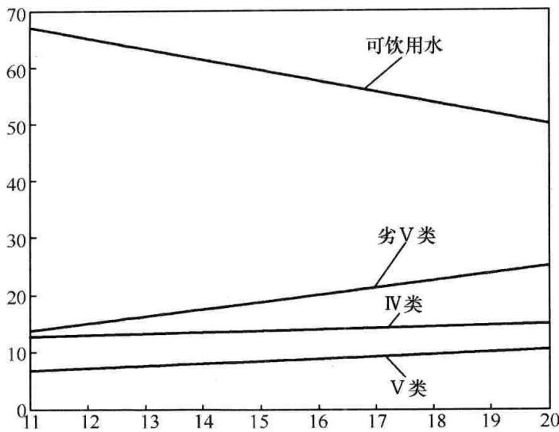

<details>
<summary>line</summary>

| Category | 11 | 17 | 20 |
| --- | --- | --- | --- |
| 可饮用水 | ~68 | ~57 | ~51 |
| 劣V类 | ~14 | ~22 | ~26 |
| IV类 | ~13 | ~15 | ~16 |
| V类 | ~7 | ~10 | ~11 |
</details>

图7

## 7 问题(4):基于回归模型的预测控制

## 7.1 问题的分析

考虑影响污水处理量的因素：

$$
\text {污水处理量} = \text {污水排放量} - \text {长江允许排污量}
$$

其中:污水排放量可以由预测得到,长江允许排污量与干流Ⅳ+Ⅴ类水百分比和劣Ⅴ类水百分比有关,可以从附表F-4中提取所需要的数据信息,经过提取处理后的数据见表29。

表 29

<table><tr><td>年份</td><td>长江总流量/亿 $m^3$ </td><td>废水排放总量/亿t</td><td>相对排污量/(t/ $m^3$ )</td><td>IV+V类水百分比/%</td><td>劣V类水百分比/%</td></tr><tr><td>1995年</td><td>9205</td><td>174</td><td>0.0189</td><td>9.6</td><td>0</td></tr><tr><td>1996年</td><td>9513</td><td>179</td><td>0.0188</td><td>0.8</td><td>0</td></tr><tr><td>1997年</td><td>9171.26</td><td>183</td><td>0.0200</td><td>13.3</td><td>0</td></tr><tr><td>1998年</td><td>13127</td><td>189</td><td>0.0144</td><td>0</td><td>0</td></tr><tr><td>1999年</td><td>9513</td><td>207</td><td>0.0218</td><td>12.8</td><td>0</td></tr><tr><td>2000年</td><td>9924</td><td>234</td><td>0.0236</td><td>25.4</td><td>0</td></tr><tr><td>2001年</td><td>8892.8</td><td>220.5</td><td>0.0248</td><td>26.5</td><td>5.8</td></tr><tr><td>2002年</td><td>10210</td><td>256</td><td>0.0251</td><td>22.5</td><td>8.7</td></tr><tr><td>2003年</td><td>9980</td><td>270</td><td>0.0271</td><td>6.1</td><td>0</td></tr><tr><td>2004年</td><td>9405</td><td>285</td><td>0.0303</td><td>23.5</td><td>9.0</td></tr></table>

## 7.2 理论分析及算法流程

分别记长江总流量为 $L(\text{亿}\mathrm{m}^3)$ 、废水排放总量为 $M(\text{亿}\mathrm{t})$ 、相对排污量为 $H = \frac{M}{L}$ $(\mathrm{t} / \mathrm{m}^{3})$ 和 $\mathrm{IV} + \mathrm{V}$ 类水百分比为 $N_{1}$ 、劣 $\mathrm{V}$ 类水百分比为 $N_{2}$ 。由于 $M$ 决定了 $N_{1}$ 和 $N_{2}$ 的取值，同时考虑 $L$ 的影响，不妨设

$$
N _ {1} = f (H), N _ {2} = g (H)
$$

如果 $f(R)$ 和 $g(R)$ 已知, 根据同时满足 $N_{1}$ 和 $N_{2}$ 的取值要求, 那么需要处理的相对污水量为

$$
\Delta H = \max \left\{H - f ^ {- 1} (2 0), H - g ^ {- 1} (0), 0 \right\} \tag {32}
$$

则废水处理量为

$$
\Delta M = \Delta H \times \bar {L} = \bar {L} \times \max \left\{H - f ^ {- 1} (2 0), H - g ^ {- 1} (0), 0 \right\} \tag {33}
$$

式中： $\bar{L}$ 为长江平均总流量。

在式(32)中,f和g的表达式可以根据已知10组数据点分别回归分析得到H,预测得到 $\bar{L}=\frac{1}{10}\sum_{i=1}^{10}L_{i}$ 为10年长江总流量的平均值。

根据上述分析过程可以确定基本算法流程图,如图8所示。

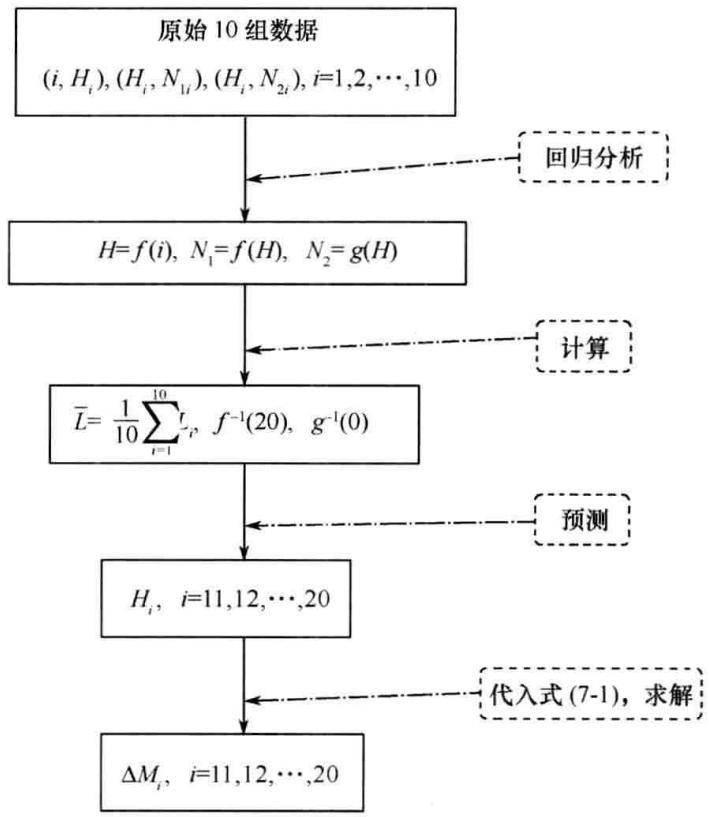

<details>
<summary>flowchart</summary>

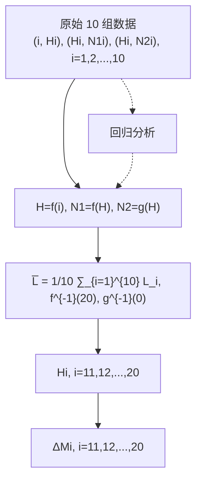
```mermaid
graph TD
  A["原始 10 组数据\n(i, Hi), (Hi, N1i), (Hi, N2i), i=1,2,...,10"] --> B["H=f(i), N1=f(H), N2=g(H)"]
  B --> C["L̅ = 1/10 ∑_{i=1}^{10} L_i, f^{-1}(20), g^{-1}(0)"]
  C --> D["Hi, i=11,12,...,20"]
  D --> E["ΔMi, i=11,12,...,20"]
  
  %% Feedback loop
  A -.-> F["回归分析"]
  F -.-> B
  %% Calculation & Prediction Loop
  %% Calculation
  %% Prediction
  %% Prediction
  %% Prediction
  %% Prediction
  %% Prediction
  %% Prediction
  %% Prediction
  %% Prediction
  %% Prediction
  %% Prediction
  %% Prediction
  %% Prediction
  %% Prediction
  %% Prediction
  %% Prediction
  %% Prediction
  %% Prediction
  %% Prediction
  %% Prediction
  %% Prediction
  %% Prediction
  %% Prediction
  %% Prediction
  %% Prediction
  %% Prediction
  %%Prediction
  %%Prediction
```
</details>

图8

## 7.3 回归模型对污水处理量的预测

## 1. 回归分析求线性回归方程

按照7.2的理论分析与算法流程对问题进行求解。首先按照问题三的回归分析模型求解线性回归方程 $H = f(i), N_1 = f(H), N_2 = g(H)$ 。在求解回归方程的过程中，为了使结果更符合普遍情况，适当剔除了一些点，在求 $N_1 = f(H)$ 时，剔除了2003年的点（该点是一个突变量），在求 $N_2 = g(H)$ 时，剔除了1998年的点（该点的自变量太小），并对回归方程进行了 $F$ 检验。结果见表30。

表30

<table><tr><td>回归方程</td><td>F</td><td>F与F1-α(1,n-1)比较</td><td>F1-α(1,n-1)</td><td>回归效果</td></tr><tr><td>H=f(i)=0.0014i+0.015</td><td>16.8547</td><td>&gt;</td><td>5.32</td><td>好</td></tr><tr><td>N1=f(H)=1891.9H-26.6</td><td>19.2461</td><td>&gt;</td><td>5.99</td><td>好</td></tr><tr><td>N2=g(H)=702.7222H-13.817</td><td>6.1097</td><td>&gt;</td><td>5.99</td><td>好</td></tr></table>

## 2. 计算

令 $N_{1} = 20$ ，解得 $H_{1} = 0.0246$ 。令 $N_{1} = 0$ ，解得 $H_{2} = 0.0197$ 。记 $H = \min (H_1,H_2) = 0.0197$ ，求得 $\overline{L} = \frac{1}{10}\sum_{i = 1}^{10}L_i = 9894.1$ 。

## 3. 预测与求解

根据 $H = f(i)$ 预测未来十年的污水排放量 $H_{i} (i = 11, 12, \cdots, 20)$ ，根据 $\Delta H_{i} = H_{i} - H$ 和 $\Delta M_{i} = \Delta H_{i} \times \bar{L}$ 可以得到未来 10 年每年要处理的污水量（表 31）。

表 31

<table><tr><td>年份</td><td>2005年</td><td>2006年</td><td>2007年</td><td>2008年</td><td>2009年</td><td>2010年</td><td>2011年</td><td>2012年</td><td>2013年</td><td>2014年</td></tr><tr><td>i值</td><td>11</td><td>12</td><td>13</td><td>14</td><td>15</td><td>16</td><td>17</td><td>18</td><td>19</td><td>20</td></tr><tr><td> $H_i$ </td><td>0.0303</td><td>0.0317</td><td>0.0331</td><td>0.0345</td><td>0.0359</td><td>0.0372</td><td>0.0386</td><td>0.0400</td><td>0.0414</td><td>0.0428</td></tr><tr><td> $\Delta H_i$ </td><td>0.0106</td><td>0.012</td><td>0.0134</td><td>0.0148</td><td>0.0162</td><td>0.0175</td><td>0.0189</td><td>0.0203</td><td>0.0217</td><td>0.0231</td></tr><tr><td> $\Delta M_i/亿t$ </td><td>104.88</td><td>118.73</td><td>132.58</td><td>146.43</td><td>160.28</td><td>173.15</td><td>187</td><td>200.85</td><td>214.7</td><td>228.55</td></tr></table>

## 7.4 二元线性回归模型的建立与求解

在上面对 $N_{1} = f(H)$ 和 $N_{2} = g(H)$ 进行回归分析的过程中，都剔除了特殊点，而且在对回归方程 $N_{2} = 702.7222H - 13.817$ 进行 $F$ 检验时发现， $F$ 检验刚好满足要求，说明回归的效果并不是太好。对原始数据进行观察，由于劣V类所占百分比出现了大量的0值，仅有三个非零点，所以考虑将IV类、V类和劣V类综合考虑，这样可以减少0值的影响。

1. 建立二元线性回归模型 $^{[3]}$

$$
\left\{ \begin{array}{l} Y = \beta_ {0} + \beta_ {1} x _ {1} + \beta_ {2} x _ {2} + \varepsilon \\ \varepsilon \sim N (0, \sigma^ {2}) \end{array} \right.
$$

对于参数的确定,利用最小二乘法即可求得。

## 2. 回归模型的检验

问题可转化为对 $H_0: \beta_0 = \beta_1 = \beta_2 = 0$ 的检验, 给定 $\alpha$ , 检验标准如下: 若 $F = \frac{U / 2}{Q / (n - 3)} > F_{1 - \alpha}(2, n - 3)$ , 拒绝 $H_0$ , 回归效果好; 否则, 接受 $H_0$ , 回归效果不好。

## 3. 问题的求解

假设 $H = AN_{1} + BN_{2} + C$ ，利用最小二乘法用MATLAB编程，求得回归方程：

$$
H = 0. 0 0 2 N _ {1} + 0. 0 0 5 N _ {2} + 0. 0 1 8 7
$$

对回归模型进行检验,给定 $\alpha=0.05$ , 查表有 $F_{1-\alpha}(2,7)=4.74$ , 计算得 F=8.0168, 满足 $F>F_{1-\alpha}(2,7)$ , 回归效果较好。

令 $N_{1} = 20, N_{2} = 0$ ，计算出临界值 $H = 0.0227$ ，其他值不变，则有新的结果(表32)。

表 32

<table><tr><td>年份</td><td>2005年</td><td>2006年</td><td>2007年</td><td>2008年</td><td>2009年</td><td>2010年</td><td>2011年</td><td>2012年</td><td>2013年</td><td>2014年</td></tr><tr><td>i值</td><td>11</td><td>12</td><td>13</td><td>14</td><td>15</td><td>16</td><td>17</td><td>18</td><td>19</td><td>20</td></tr><tr><td> $H_i$ </td><td>0.0303</td><td>0.0317</td><td>0.0331</td><td>0.0345</td><td>0.0359</td><td>0.0372</td><td>0.0386</td><td>0.0400</td><td>0.0414</td><td>0.0428</td></tr><tr><td> $\Delta H_i$ </td><td>0.0076</td><td>0.009</td><td>0.0104</td><td>0.0118</td><td>0.0132</td><td>0.0145</td><td>0.0159</td><td>0.0173</td><td>0.0187</td><td>0.0201</td></tr><tr><td> $\Delta M_i/亿t$ </td><td>75.195</td><td>89.047</td><td>102.9</td><td>116.75</td><td>130.6</td><td>143.46</td><td>157.32</td><td>171.17</td><td>185.02</td><td>198.87</td></tr></table>

## 7.5 未来10年污水处理量预测的结果分析

对比分析两次不同的预测值, 二者的不同在于临界值 H 不同, 将两个不同的 H 值结合原始数据进行分析。

若 $H = 0.0197$ ，即当相对排污量大于0.0197时，即需要对污水进行处理，对于1997年和1999年来讲，虽然相对排污量大于0.0197，但是IV类、V类百分比小于20，劣V类百分比为0，符合要求，不需要进行污水处理，所以认为 $H = 0.0197$ 与实际情况不是很符合。

若 $H = 0.0227$ ，观察原始数据，当相对排污量大于0.0227时，IV类、V类百分比均大于20，当相对排污量小于0.0227时，IV类、V类百分比均小于20，对于劣V类百分比，临界值 $H = 0.0227$ 恰好出现在百分比不为0的前面附近，这时符合实际情况的。

基于上述分析,可以认为,利用二元线性回归对污水处理量的预测比较符合实际情况,因此将表33作为最终预测结果。

表33

<table><tr><td>年份</td><td>2005年</td><td>2006年</td><td>2007年</td><td>2008年</td><td>2009年</td><td>2010年</td><td>2011年</td><td>2012年</td><td>2013年</td><td>2014年</td></tr><tr><td> $\Delta M_i$ /亿t</td><td>75.195</td><td>89.047</td><td>102.9</td><td>116.75</td><td>130.6</td><td>143.46</td><td>157.32</td><td>171.17</td><td>185.02</td><td>198.87</td></tr></table>

在上面对处理的污水量求解中,将污水视为长江流量的一部分,这样当污水经过处理后排入长江,对长江的总流量不会造成影响。

## 8 问题(5):拯救长江 还我清秀河山

长江是我国第一大河,几千年来养育了一代又一代的华夏儿女,如果说黄河是“母亲河”,那么长江无愧于“父亲河”的称号。然而,“父亲”一天一天地衰老了:近年来长江的污染日益严重。如不及时治理,长江将面临崩溃,本题对长江水质的评价和预测,也充分说明了这一点。

## 1. 治理长江,势在必行

在对本题进行分析解决的过程中,注意到以下几个现实:

(1) 长江整体水质呈下降趋势,可饮用水的百分比在未来 10 年内将低于 50%。  
(2) 废水排放呈总体上升的趋势,1995年为174亿t,2004年为285亿t,10年期间增加了100多亿t,而长江总流量基本不变。按照这种趋势,如果不加治理,长江将不堪重负。

...

不用一一列举了,长江的治理已经迫在眉睫!

## 2. 治理长江,赶紧行动

长江没有太多的时间来等待治理,长江也没有太大的能力承受这么多的污染了,对长江的治理与保护必须马上进行,有以下的意见和建议。

(1) 完善法制, 治理长江有法可依; 加强管理, 做到有法必依。长期以来, 对于长江的治理不能够从法律的角度给予强有力的保证, 导致治理不能够坚持进行; 对于危害长江的不法活动, 打击力度不够。因此, 要加强依法治江, 对那些违法行为, 坚决打击, 决不丢软

(2) 加大检查力度,注重长期效果。环保部门和长江治理管理部门应该制定严格的环保标准,更重要的是坚持检查,不仅要突击检查,更重要的是经常检查,坚持不懈,不给不法分子可乘之机。

(3) 加强对污染源的治理。污染源包括工业污水和生活污水的排放。对于工业污染源的治理方法有减少直排、建造污水处理厂、采用不同污水中和处理方法等。对于污染严重的工厂企业, 坚决关闭; 对于生活污水的治理, 要加强宣传力度, 培养居民良好的环保意识、生活习惯, 如避免使用含磷洗衣粉、生活用水的重复利用、污染物的回收处理等。

(4) 加强对长江源头的治理,长江源头的水质恶化和水量减少,对长江流域的影响巨大,比如在长江源头植树造林等。

(5) 兴修水利,保护天然水库——湖泊,建造水库、大坝。水库、湖泊对污染物有巨大的净化能力,在本文对前4个问题的研究过程中也能发现这一点。因此,建造大的水库和保护湖泊十分重要,一定禁止围湖造田等破坏湖泊的行为出现。

(6) 重点区域重点治理。从上文中可以发现, 四川乐山和江西南昌污染比较严重, 应该重点突出, 加强治理力度; 在问题 (2) 对污染源的判断分析中, 对污染源所在地域同样要重点治理。

(7) 建立长江全流域的水质监控体系,及时快速地了解水质的变化,及时制定相应的整治措施,这个体系的建立全国人民的通力协作,包括自觉监督、主动服务等。只有全国人民都认识到治理长江的重要意义,自觉行动起来,这个系统才会真正生效。

（8）控制人口增长，减轻环境压力。从长远情况来看，人口的增多必然增加资源的压力，同样也包括对长江的压力，因此，控制人口，也是治理长江的一个重要方面。

## 3. 全国动员,还我清秀河山

总之,对于长江的治理,是一个综合的问题,包括经济、环境、人文等多个方面,是一个庞大的工程。对于中国这个人口大国来讲,如果不引起全国人民的足够重视,那么污染永远大于治理。所以,宣传是十分重要的,我们要大声地呼吁:赶快行动吧!还我清秀河山!

## 参考文献

[1] 徐祖信, 廖振良, 张锦平. 基于数学模型的苏州河上游和支流水质对干流水质的影响分析. 水动力学研究与发展, 2004, A19(16):733-743.  
[2] 傅鹂, 刘琼荪, 何中市. 数学实验. 北京: 科学出版社, 2003.  
[3] 梁之舜,邓集贤,杨维权,等.概率论与数理统计.北京:高等教育出版社,2003.

## 附录 相关表格

表 F-1 含速度项 $( \times 10^{3})$

<table><tr><td></td><td>第一段</td><td>第二段</td><td>第三段</td><td>第四段</td><td>第五段</td><td>第六段</td></tr><tr><td>第1月</td><td>14.011</td><td>10.247</td><td>1.9686</td><td>1.5886</td><td>26.717</td><td>0</td></tr><tr><td>第2月</td><td>44.128</td><td>4.6132</td><td>3.6515</td><td>16.22</td><td>17.385</td><td>0</td></tr><tr><td>第3月</td><td>33.436</td><td>29.822</td><td>2.7007</td><td>46.263</td><td>15.805</td><td>0</td></tr><tr><td>第4月</td><td>35.982</td><td>4.172</td><td>62.763</td><td>51.84</td><td>47.866</td><td>0</td></tr><tr><td>第5月</td><td>196.02</td><td>3.9359</td><td>42.872</td><td>22.073</td><td>64.423</td><td>0</td></tr><tr><td>第6月</td><td>31.116</td><td>48.331</td><td>3.8703</td><td>16.75</td><td>132.45</td><td>0</td></tr><tr><td>第7月</td><td>34.566</td><td>0</td><td>43.64</td><td>47.002</td><td>17.009</td><td>0</td></tr><tr><td>第8月</td><td>40.753</td><td>4.4572</td><td>19.284</td><td>19.821</td><td>47.415</td><td>0</td></tr><tr><td>第9月</td><td>76.946</td><td>43.736</td><td>24.106</td><td>26.266</td><td>8.4293</td><td>0</td></tr><tr><td>第10月</td><td>71.612</td><td>36.658</td><td>23.391</td><td>22.474</td><td>3.6878</td><td>0</td></tr><tr><td>第11月</td><td>47.01</td><td>29.54</td><td>25.668</td><td>32.105</td><td>18.439</td><td>0</td></tr><tr><td>第12月</td><td>30.36</td><td>25.878</td><td>23.615</td><td>34.21</td><td>50.576</td><td>0</td></tr><tr><td>第13月</td><td>70.519</td><td>5.822</td><td>27.574</td><td>26.061</td><td>3.763</td><td>7.4483</td></tr></table>

表 F-2 浓度随时间变化率项 $\frac{\partial w}{\partial t}$ $(\times10^{3})$

<table><tr><td></td><td>第一段</td><td>第二段</td><td>第三段</td><td>第四段</td><td>第五段</td><td>第六段</td></tr><tr><td>第1月</td><td>0.33333</td><td>1.5</td><td>1.5</td><td>0.16667</td><td>0.33333</td><td>0</td></tr><tr><td>第2月</td><td>2</td><td>0.83333</td><td>1.1667</td><td>0.66667</td><td>2.5</td><td>0</td></tr><tr><td>第3月</td><td>0</td><td>3</td><td>2.8333</td><td>0.33333</td><td>1</td><td>0</td></tr><tr><td>第4月</td><td>15.833</td><td>0.33333</td><td>0</td><td>0.83333</td><td>0.33333</td><td>0</td></tr><tr><td>第5月</td><td>15.333</td><td>1.5</td><td>1.1667</td><td>0.33333</td><td>0.16667</td><td>0</td></tr><tr><td>第6月</td><td>1</td><td>0.16667</td><td>0</td><td>0</td><td>0.5</td><td>0</td></tr><tr><td>第7月</td><td>0.33333</td><td>0.83333</td><td>0.16667</td><td>0.5</td><td>0.33333</td><td>0</td></tr><tr><td>第8月</td><td>4.3333</td><td>2.6667</td><td>2.1667</td><td>2.5</td><td>1.3333</td><td>0</td></tr><tr><td>第9月</td><td>0.33333</td><td>1.5</td><td>2.8333</td><td>3.3333</td><td>2.5</td><td>0</td></tr><tr><td>第10月</td><td>1.5</td><td>0.5</td><td>0.5</td><td>1.1667</td><td>1.6667</td><td>0</td></tr><tr><td>第11月</td><td>1.6667</td><td>0</td><td>0</td><td>0.5</td><td>0.5</td><td>0</td></tr><tr><td>第12月</td><td>1.1667</td><td>0.5</td><td>1</td><td>0.5</td><td>0.83333</td><td>0</td></tr><tr><td>第13月</td><td>1.1667</td><td>0.5</td><td>1</td><td>0.5</td><td>0.83333</td><td>1.6667</td></tr></table>

表 F-3 未来十年长江水质污染发展预测

<table><tr><td>x</td><td>年份</td><td>I类百分比/%</td><td>II类百分比/%</td><td>III类百分比/%</td><td>IV类百分比/%</td><td>V类百分比/%</td><td>劣V类百分比/%</td></tr><tr><td>11</td><td>2006年</td><td>18.596</td><td>30.706</td><td>17.804</td><td>12.616</td><td>6.6683</td><td>13.61</td></tr><tr><td>12</td><td>2007年</td><td>11.695</td><td>15.44</td><td>38.065</td><td>12.856</td><td>7.0845</td><td>14.86</td></tr><tr><td>13</td><td>2008年</td><td>9.5687</td><td>19.53</td><td>34.196</td><td>13.096</td><td>7.5008</td><td>16.109</td></tr><tr><td>14</td><td>2009年</td><td>7.9861</td><td>16.736</td><td>36.667</td><td>13.335</td><td>7.9171</td><td>17.359</td></tr><tr><td>15</td><td>2010年</td><td>3.8568</td><td>29.519</td><td>26.107</td><td>13.575</td><td>8.3333</td><td>18.608</td></tr><tr><td>16</td><td>2011年</td><td>4.3572</td><td>25.521</td><td>27.7</td><td>13.815</td><td>8.7496</td><td>19.858</td></tr><tr><td>17</td><td>2012年</td><td>4.4568</td><td>25.003</td><td>26.212</td><td>14.054</td><td>9.1659</td><td>21.108</td></tr><tr><td>18</td><td>2013年</td><td>3.0844</td><td>30.844</td><td>19.838</td><td>14.294</td><td>9.5821</td><td>22.357</td></tr><tr><td>19</td><td>2014年</td><td>3.1451</td><td>27.771</td><td>20.945</td><td>14.534</td><td>9.9984</td><td>23.607</td></tr><tr><td>20</td><td>2015年</td><td>0.88157</td><td>19.762</td><td>29.312</td><td>14.773</td><td>10.415</td><td>24.856</td></tr></table>

表 F-4 未来十年长江支流水质污染发展预测

<table><tr><td>x</td><td>年份</td><td>可饮用水百分比/%</td><td>IV类百分比/%</td><td>V类百分比/%</td><td>劣V类百分比/%</td></tr><tr><td>11</td><td>2006年</td><td>71.327</td><td>9.0996</td><td>6.021</td><td>13.552</td></tr><tr><td>12</td><td>2007年</td><td>70.512</td><td>8.5976</td><td>6.2845</td><td>14.606</td></tr><tr><td>13</td><td>2008年</td><td>69.697</td><td>8.0956</td><td>6.548</td><td>15.66</td></tr><tr><td>14</td><td>2009年</td><td>68.882</td><td>7.5937</td><td>6.8115</td><td>16.713</td></tr><tr><td>15</td><td>2010年</td><td>68.067</td><td>7.0917</td><td>7.075</td><td>17.767</td></tr><tr><td>16</td><td>2011年</td><td>67.252</td><td>6.5897</td><td>7.3385</td><td>18.82</td></tr><tr><td>17</td><td>2012年</td><td>66.437</td><td>6.0877</td><td>7.602</td><td>19.874</td></tr><tr><td>18</td><td>2013年</td><td>65.621</td><td>5.5857</td><td>7.8655</td><td>20.927</td></tr><tr><td>19</td><td>2014年</td><td>64.806</td><td>5.0837</td><td>8.129</td><td>21.981</td></tr><tr><td>20</td><td>2015年</td><td>63.991</td><td>4.5817</td><td>8.3925</td><td>23.035</td></tr></table>

表 F-5 未来十年长江干流水质污染发展预测

<table><tr><td>x</td><td>年份</td><td>可饮用水百分比/%</td><td>IV类百分比/%</td><td>V类百分比/%</td><td>劣V类百分比/%</td></tr><tr><td>11</td><td>2006年</td><td>62.062</td><td>21.24</td><td>8.173</td><td>8.525</td></tr><tr><td>12</td><td>2007年</td><td>58.799</td><td>22.821</td><td>8.8798</td><td>9.5</td></tr><tr><td>13</td><td>2008年</td><td>55.535</td><td>24.403</td><td>9.5865</td><td>10.475</td></tr><tr><td>14</td><td>2009年</td><td>52.272</td><td>25.985</td><td>10.293</td><td>11.45</td></tr><tr><td>15</td><td>2010年</td><td>49.008</td><td>27.567</td><td>11</td><td>12.425</td></tr><tr><td>16</td><td>2011年</td><td>45.745</td><td>29.148</td><td>11.707</td><td>13.4</td></tr><tr><td>17</td><td>2012年</td><td>42.481</td><td>30.73</td><td>12.413</td><td>14.375</td></tr><tr><td>18</td><td>2013年</td><td>39.218</td><td>32.312</td><td>13.12</td><td>15.35</td></tr><tr><td>19</td><td>2014年</td><td>35.954</td><td>33.894</td><td>13.827</td><td>16.325</td></tr><tr><td>20</td><td>2015年</td><td>32.691</td><td>35.475</td><td>14.534</td><td>17.3</td></tr></table>

## 【论文点评】

沈锦仁

此论文内容丰富,层次清楚,理论推导严谨,统计检验完善,计算结果表述清晰,被评为全国优秀论文。

对于问题一的综合分析,论文的特色如下:

（1）对四指标的归一化处理，紧紧抓住“质”的要点，六类水的分界点统归于相同，而1是可饮用与不可饮用水的分界点。  
(2) 三维数据, 按四水质指标, 28 个月, 17 个观察点的次序进行综合, 这是最合理的次序。  
(3) 四水质指标综合, 来用平均数和最大值相结合, 因水质问题的特点, 一个指标使之成为不可饮用水, 该水质已不是饮用水了。  
(4) 计算结果列出了 17 个观察点水质综合指标的次序、达到不可饮用水情况的月份等,从各个角度反映长江流域各地水质情况的分析。

对于问题二,文章采用水质污染问题的最科学方法,反映扩散方程的反演问题,在实现求解时采用了两种方法:一是简化为常微分方程反演问题,求近似解析解;二是用差分方程反演的方法,并将两种方法进行比较,其后还进行支流问题的考虑。

对于问题三和四,文章中用前十年的统计数据,得到六类水依赖于时间(年)的回归方程,F检验通不过,再采用三类移动平均的滤波方法,和水质分类合并的方法重新回归,并通过了F检验。引入了相对排废水量的概念(相对于长江总流量),这样处理比绝对数更趋于合理。因果分析,其“因”是长江沿岸相对排废水量m,“果”是长江IV、V类水百分比 $y_{45}$ 和劣V类水百分比 $y_{6}$ ,用前十年数据回归出其依赖关系,而要求 $y_{6}=0,y_{45}<20$ ,从而得到相对排废水量的临界值 $m^{*}$ ,而转化为绝对数时,超过 $m^{*}$ 部分的就是各年要处理废水量数量,通过回归方程可以预测后十年各年要处理的废水的数量。

# 长江水质的评价和预测的数学模型

## 摘要

本文是对长江水质的评价和预测,用主成分分析法对长江的水质情况做了定量的综合评价,并给出了各地区水质污染状况的总体排名。对于干流污染源的主要分布,通过解微分方程的方法得到长江干流近一年多主要污染物的污染源都分布在宜昌至岳阳之间。在预测未来水质污染的问题上,选择了在长期预测中较理想的灰色理论做模型,并利用已知值对模型进行了检验,在相对误差较小的情况下对未来的水质情况进行了预测。在求解处理的污水量时,先根据约束条件求出污水量的最大值,再利用灰色系统预测出每年实际的污水排放量,两者之差即为要处理的污水量。最后,在对解决长江污染问题上,提出了一些原则如最大化原则、最优经济治污原则等,并在此基础上以经济效益为目标建立了线性规划的模型。

## 1 问题的重述

水是人类赖以生存的资源,保护水资源就是保护我们自己,对于我国大江大河水资源的保护和治理应是重中之重。专家们呼吁:“以人为本,建设文明和谐社会,改善人与自然的环境,减少污染。”

长江是我国第一、世界第三大河流，长江水质的污染程度日趋严重，已引起了相关政府部门和专家们的高度重视。2004年10月，由全国政协与中国发展研究院联合组成“保护长江万里行”考察团，从长江上游宜宾到下游上海，对沿线21个重点城市做了实地考察，揭示了一幅长江污染的真实画面，其污染程度让人触目惊心。为此，专家们提出“若不及时拯救，长江生态10年内将濒临崩溃”（附件1），并发出了“拿什么拯救癌变长江”的呼唤。

附件3给出了长江沿线17个观测站(地区)近两年多主要水质指标的检测数据,以及干流上7个观测站近一年多的基本数据(站点距离、水流量和水流速)。通常认为一个观测站(地区)的水质污染主要来自于本地区的排污和上游的污水。一般说来,江河自身对污染物都有一定的自然净化能力,即在水环境中通过物理降解、化学降解和生物降解等,使水中污染物的浓度降低。反映江河自然净化能力的指标称为降解系数。事实上,长江干流的自然净化能力可以认为是近似均匀的,根据检测可知,主要污染物高锰酸盐指数和氨氮的降解系数通常介于0.1\~0.5之间,比如可以考虑取0.2(单位:1/天)。附件4是“1995—2004年长江流域水质报告”给出的主要统计数据。下面的附表是国家标准(GB 3838—2002)给出的《地表水环境质量标准》中4个主要项目标准限值,其中I、II、III类为可饮用水。

请你们研究下列问题：

（1）对长江近两年多的水质情况做出定量的综合评价，并分析各地区水质的污染状况。

(2) 研究、分析长江干流近一年多主要污染物高锰酸盐指数和氨氮的污染源主要在哪些地区？

（3）假如不采取更有效的治理措施,依照过去10年的主要统计数据,对长江未来水质污染的发展趋势做出预测分析,比如研究未来10年的情况。

（4）根据你的预测分析,如果未来10年内每年都要求长江干流的Ⅳ类和V类水的比例控制在20%以内,且没有劣V类水,那么每年需要处理多少污水?

(5) 你对解决长江水质污染问题有什么切实可行的建议和意见。

## 2 问题的分析

对长江水质的综合评价有多种方法。通常情况下,从影响水质的各因素出发,并赋予它们相应的权重来进行分析。如果人为给定加权系数则显得很主观,所以考虑主成分分析法,从而较客观地对长江水质进行评价。

对于长江干流污染源区分析,乍一看不是简简单单就可以解决的。因为污染物在时间和空间上是动态变化的,为简化起见,不考虑支流的因素,只从纵向一维的角度,结合本地与上游污水进行水质的污染分析。

向来预测分析都是用简单的曲线拟合,再做线性回归分析,就可以获得较好的预测结果,而本题是对未来十年的水质污染预测,对于长期预测拟合显得过于粗糙。由近十年预测下十年,就相当于半白半黑,称为灰色。

处理污水量的问题,用拟合就可以求出污水量与Ⅳ、V和劣V类水的约束限定关系,问题就迎刃而解了。

## 3 符号约定

α:长江的降解系数;

ρ:污染源释放污染物的流量(单位:g/s);

z: 主成分分析中的第一主成分;

$s_{1}$ : 水中的溶解氧的含量(单位:mg/L);

$s_{2}$ :水中高锰酸盐的含量(单位:mg/L);

$s_{3}$ :水中氨氮的含量(单位:mg/L)。

## 4 模型的假设与名词解释

（1）假设长江的水流速率的变化是一个近似的线性过程,即水流速率不发生突变,并且两点之间的中点的水流速率等于这两点水流速率的平均值。

(2) 假设两个观察点之间的污染源沿两岸均匀分布,集中作点处理时可看作在两个

观察站的中点。

(3) 不考虑支流对主流水质的污染。

## 5 模型的建立与求解

## 5.1 问题一(主成分分析模型)

题目要求对近两年的水质情况进行定量的综合评价,从附件三中可以看出水质质量标准是按照木桶原理进行评估的,即按照所有的四项指标中分别达到的分类标准中的最低类别进行分类。显然,仅仅通过对水的类别的研究来对水质进行综合评价是不够的,必须找出更合理的方法来对水质观测点进行综合评价。

## 1. 模型的建立

主成分分析是一种化多个指标为少数综合指标的统计方法,本题要求“对长江近两年多的水质情况做出定量的综合评价”,因此可通过主成分分析法对水质情况进行综合评价。

通过分析已经发现,单从水的类别看没有太大的意义,应对水环境质量各项指标进行综合衡量。显然,水环境质量的各项指标对水质的综合评价的贡献率是有所差别的。如果考虑人为地给予加权系数,则主观因素太大。而利用主成分分析法,可以利用已有的数据得出各水环境质量标准的贡献率,进而对各观测点进行综合评价。

另外,观察附件三中近两年17个水质观测点的数据,pH值超标的情况只在2004年12月的江西南昌滁槎出现过一次,其他任何时间任何地点都没有这种情况,因此可以忽略pH值对水质综合情况的影响,只考虑溶解氧、高锰酸盐、氨氮这三个指标。

## 2. 模型的求解

首先,对17个水质观测点近两年多的三项指标分别求28个月的均值,并以这17个观测点作为样本,可以得到17个三维向量(见附录A)。

设地点 $j$ 的样品数据为

$$
\boldsymbol {x} _ {(j)} = \left( \begin{array}{c c c} x _ {j 1} & x _ {j 2} & x _ {j 3} \end{array} \right) ^ {\mathrm{T}} \quad (j = 1, 2, \dots , 1 7)
$$

令 $\bar{x} = \frac{1}{17}\sum_{j = 1}^{17}x_{(j)}$ ，用 $y_{(j)} = x_{(j)} - \bar{x}$ 来代替原始数据 $x_{(j)}$ 。记

$$
\boldsymbol {X} _ {1 7 \times 3} = (\boldsymbol {y} _ {i j}) = \left( \begin{array}{c} \boldsymbol {y} _ {(1)} ^ {\mathrm{T}} \\ \vdots \\ \boldsymbol {y} _ {(1 7)} ^ {\mathrm{T}} \end{array} \right)
$$

则协方差估计量为

$$
S = \frac {1}{1 7} X ^ {\mathrm{T}} X = \left( \begin{array}{c c c} 1. 1 4 7 9 & - 0. 3 2 8 1 & - 0. 6 9 0 6 \\ - 0. 3 2 8 1 & 0. 7 1 8 1 & - 0. 0 5 8 0 \\ - 0. 6 9 0 6 & - 0. 0 5 8 0 & 1. 0 6 9 7 \end{array} \right)
$$

根据得到的 $S$ 方阵, 利用 MATLAB 得出三个特征根分别为 0.2540、0.8443、1.8373, 各个特征根对应的特征向量依次为

$$
(- 0. 6 3 3 6 \quad - 0. 5 1 9 5 - 0. 5 7 3 3) ^ {\mathrm{T}}
$$

$$
\begin{array}{l} (- 0. 2 3 2 9 \quad 0. 8 3 4 7 - 0. 4 9 8 9) ^ {\mathrm{T}} \\ (- 0. 7 3 7 8 \quad 0. 1 8 2 6 \quad 0. 6 4 9 9) ^ {\mathrm{T}} \\ \end{array}
$$

最大特征值 1.8373 对应的向量是第一主成分, 综合指标为

$$
z = - 0. 7 3 7 8 \times s _ {1} + 0. 1 8 2 6 \times s _ {2} + 0. 6 4 9 9 \times s _ {3} \tag {1}
$$

又因为 $|-0.7378|>|0.6499|>|0.1826|$ ，所以近两年多影响长江水质的最主要因数是溶解氧。

将各地区平均值代入式(1)，得到17个地区的z值，见表1。

表1

<table><tr><td>地区</td><td>1</td><td>2</td><td>3</td><td>4</td><td>5</td><td>6</td><td>7</td><td>8</td><td>9</td></tr><tr><td>z值</td><td>-6.19</td><td>-5.99</td><td>-5.58</td><td>-5.50</td><td>-5.17</td><td>-4.88</td><td>-5.06</td><td>-2.54</td><td>-5.84</td></tr><tr><td>地区</td><td>10</td><td>11</td><td>12</td><td>13</td><td>14</td><td>15</td><td>16</td><td>17</td><td></td></tr><tr><td>z值</td><td>-3.93</td><td>-6.44</td><td>-4.20</td><td>-5.12</td><td>-4.74</td><td>-0.77</td><td>-4.97</td><td>-5.26</td><td></td></tr></table>

将这些数据从小到大排列,得到各地区水质的污染状况见表2。

表 2

<table><tr><td>污染排名</td><td>1</td><td>2</td><td>3</td><td>4</td><td>5</td><td>6</td></tr><tr><td>观测站</td><td>江西南昌滁槎</td><td>四川乐山岷江大桥</td><td>四川泸州沱江二桥</td><td>湖南长沙新港</td><td>湖北武汉宗关</td><td>安徽安庆皖河口</td></tr><tr><td>污染排名</td><td>7</td><td>8</td><td>9</td><td>10</td><td>11</td><td>12</td></tr><tr><td>观测站</td><td>江西九江蛤蟆石</td><td>江苏南京林山</td><td>湖南岳阳岳阳楼</td><td>江西九江河西水厂</td><td>江苏扬州三江营</td><td>湖南岳阳城陵矶</td></tr><tr><td>污染排名</td><td>13</td><td>14</td><td>15</td><td>16</td><td>17</td><td></td></tr><tr><td>观测站</td><td>湖北宜昌南津关</td><td>四川宜宾凉姜沟</td><td>重庆朱沱</td><td>四川攀枝花龙洞</td><td>湖北丹江口胡家岭</td><td></td></tr><tr><td colspan="7">注:污染严重程度从重到轻</td></tr></table>

下面利用主成分分析再对各地区两年来水质变化的情况进行讨论,利用上面同样的原理,得出第一个月份(即2003年6月)的最大特征值对应的向量为(0.6350 - 0.7628 - 0.1221) $^{T}$ ,综合指标为

$$
z = 0. 6 3 5 0 \times s _ {1} - 0. 7 6 2 8 \times s _ {2} - 0. 1 2 2 1 \times s _ {3}
$$

同理,可以得到最后一个月(即2005年九月)各地区水质的污染状况。

将这两年多的总体、第一个月、最后一个月的污染状况列表,见表3。

表 3

<table><tr><td>总体</td><td>15</td><td>8</td><td>10</td><td>12</td><td>14</td><td>6</td><td>16</td><td>7</td><td>13</td></tr><tr><td>一月</td><td>8</td><td>10</td><td>3</td><td>12</td><td>6</td><td>4</td><td>7</td><td>14</td><td>16</td></tr><tr><td>后月</td><td>15</td><td>8</td><td>7</td><td>14</td><td>12</td><td>5</td><td>3</td><td>6</td><td>16</td></tr><tr><td>总体</td><td>5</td><td>17</td><td>4</td><td>3</td><td>9</td><td>2</td><td>1</td><td>11</td><td></td></tr><tr><td>一月</td><td>15</td><td>5</td><td>13</td><td>9</td><td>17</td><td>2</td><td>1</td><td>11</td><td></td></tr><tr><td>后月</td><td>17</td><td>9</td><td>11</td><td>2</td><td>13</td><td>1</td><td>10</td><td>4</td><td></td></tr><tr><td colspan="10">注:一月表示第一个月,后月表示最后一个月,序号代表2003年6月的表中的点位名称,例如:2代表朱沱,14代表湖北武汉宗关</td></tr></table>

从表 3 可以详细地查出各地区水质的污染状况和变化情况。

## 5.2 问题二(一维微分模型)

## 1. 模型的建立

由于长江的宽度与它的长度之比是一个非常小的值,因此可以将整个长江拉直转化为一维的直线来进行考虑,长江截面中污染物的密度就转化为对应点的污染物的密度,取四川攀枝花为坐标原点0,这样就可以得到长江干流上各个观测点的坐标位置关系,如图1所示。

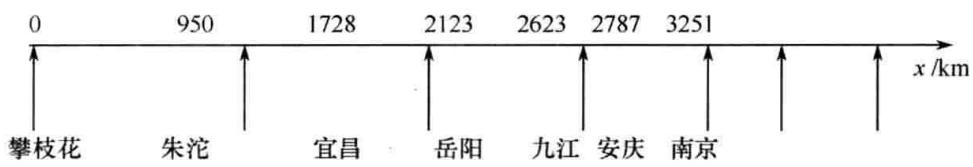

<details>
<summary>text_image</summary>

0
950
1728
2123
2623
2787
3251
x /km
攀枝花
朱沱
宜昌
岳阳
九江
安庆
南京
</details>

图1

将长江干流上的7个观测点分成6个区间段进行考虑,根据假设,对于每一个区间段,污染源集中在观测点的中间部位(图2)。

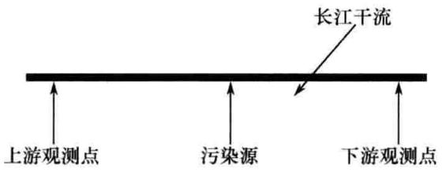

<details>
<summary>text_image</summary>

长江干流
上游观测点
污染源
下游观测点
</details>

图2

下面对其中的一段进行分析(依然用图2)。

下游观测点所测得的污染物数据由以下两方面构成。

(1) 上游观测点的污染物经过自然降解后到达的数量。  
(2) 从污染源排放出来的污水经过自然降解后到达的数量。

取长江的降解系数 $\alpha=0.2$ ，也就是说单位时间内污染物的变化量，即

$$
\frac {\mathrm{d} \rho}{\mathrm{d} t} = - \alpha \times \rho
$$

解上面的微分方程可得

$$
\rho = \rho_ {0} \mathrm{e} ^ {- 0. 2 t}
$$

式中： $\rho_{0}$ 为上游观测站的污染物的流量(g/s)。

由于假定了长江的水流速的变化是一个近似于线性变化的过程,而上游观测点的水流速度 $v_{1}$ 以及下游观测点的水流速度 $v_{2}$ 已知,因此在中点污染源处水流速度为 $\frac{v_{1}+v_{2}}{2}$ ,水流从上游观测点到达下游观测点所花的时间 $t_{1}=\frac{s}{\frac{v_{1}+v_{2}}{2}}=\frac{2s}{v_{1}+v_{2}}=\frac{2s}{(v_{1}+v_{2})}$ (s为两个观测点之间的距离),而水流从中点的污染源处到达下游观测点的时间为

$$
t _ {2} = \frac {\frac {s}{2}}{(\frac {v _ {1} + v _ {2}}{2} + v _ {2}) / 2} = \frac {2 s}{v _ {1} + 3 v _ {2}} = \frac {2 s}{(v _ {1} + 3 v _ {2})}
$$

这样从上游观测点和污染源到达下游观测点的污染物流量为

$$
\rho_ {2} = \rho_ {1} \mathrm{e} ^ {- 0. 2 \times \frac {2 s}{(v _ {1} + v _ {2})}} + \rho \mathrm{e} ^ {- 0. 2 \times \frac {2 s}{(v _ {1} + 3 v _ {2})}}
$$

将上面这个式子进行转换可以得

$$
\rho = \left(\rho_ {2} - \rho_ {1} \mathrm{e} ^ {- \frac {0 . 4 s}{\left(v _ {1} + v _ {2}\right)}}\right) \mathrm{e} ^ {\frac {0 . 4 s}{\left(v _ {1} + 3 v _ {2}\right)}} \tag {2}
$$

## 2. 模型的求解

式(2)中, $s=x_{2}-x_{1}(x_{2},x_{1}$ 是区间段终点与起点的坐标),由于对于每段来说, $\rho_{2},\rho_{1},v_{1},v_{2},x_{2},x_{1}$ 都是已知的,所以每区间段中高锰酸盐和氨氮的量都可以求出来,利用MATLAB编程得到每月每段高锰酸盐和氨氮的量(具体结果见附录B)。

## 3. 模型的结果

对六个污染源近一年所排放的污染物的数量求期望,得到的结果见表4(单位为 $\times10^{4}$ g/s):

表 4

<table><tr><td>污染物\区间</td><td>攀枝花至朱沱</td><td>朱沱至宜昌</td><td>宜昌至岳阳</td><td>岳阳至九江</td><td>九江至安庆</td><td>安庆至南京</td></tr><tr><td>高锰酸盐</td><td>4.7929</td><td>7.4680</td><td>7.5326</td><td>5.4747</td><td>2.0697</td><td>4.7940</td></tr><tr><td>氨氮</td><td>0.47979</td><td>0.64614</td><td>0.74241</td><td>0.43608</td><td>0.15076</td><td>0.06934</td></tr></table>

从表 4 的数据可以看出:长江干流近一年多主要污染物高锰酸盐指数和氨氮的污染源都主要集中在宜昌至岳阳之间。

## 5.3 问题三(灰色模型)

## 1. 背景资料

灰色系统 $^{[2]}$ (Grey System)即指信息不完全、不充分的系统,它介于白色系统与黑色系统之间。灰色系统理论被用来解决信息不完备的系统,它是自动控制与运筹学相结合的产物。灰色预报的基本思想是将与时间有关的已知数据按某种规则加以组合,构成白色模块,最后按某种规则提高灰色模块的白化度。

## 2. 问题的分析与模型的建立

附件 4 给出了近十年之中长江水质的主要统计数据,而我们的目标是根据这十年的数据来预测未来十年长江水质污染的发展趋势,根据地表水环境质量标准的分类 I、II、III 类均为可饮用水,其余三类为不可饮用水,可以通过对长江全流域可饮用水变化研究来对长江未来水质污染的发展趋势做出预测分析。首先从附表中得出数据,见表 5。

表 5

<table><tr><td>年份</td><td>1995</td><td>1996</td><td>1997</td><td>1998</td><td>1999</td><td>2000</td><td>2001</td><td>2002</td><td>2003</td><td>2004</td></tr><tr><td>可引饮水/%</td><td>93.1</td><td>85.3</td><td>80.7</td><td>88.4</td><td>80.2</td><td>73.7</td><td>73.7</td><td>76.7</td><td>77.5</td><td>68</td></tr></table>

模拟出可饮用水与年份的关系,如图3所示。从图3上可以看出,这些点的随机性大,规律性小,而灰色理论对灰量、灰过程的处理,目的就是求得随机性弱化、规律性强化的新数列。

这里利用灰色模型进行预测,因为灰色模型在数据处理前先叠加,这样就可以减少一部分的误差,使预测更加准确。因此用灰色理论分析此问题。

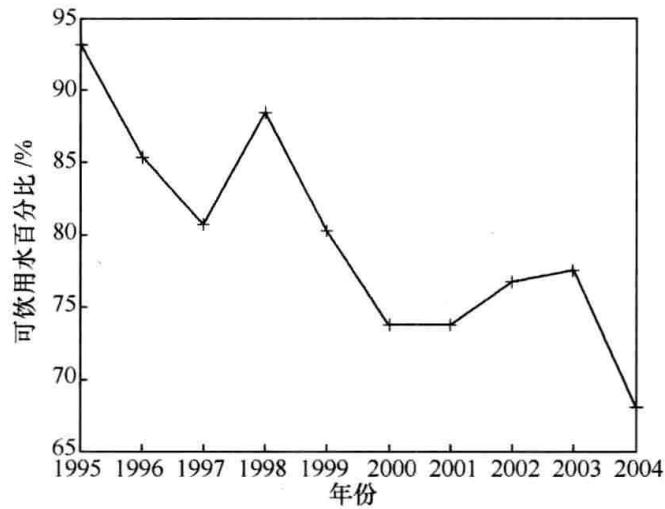

<details>
<summary>line</summary>

| 年份 | 可饮用水百分比 (%) |
| --- | --- |
| 1995 | ~93 |
| 1996 | ~85 |
| 1997 | ~80.5 |
| 1998 | ~88 |
| 1999 | ~80 |
| 2000 | ~73.5 |
| 2001 | ~73.5 |
| 2002 | ~76.5 |
| 2003 | ~77.5 |
| 2004 | ~68 |
</details>

图3

## 3. 模型的求解

第一步:从附件4中提取数据,形成原始数据列:

$$
X ^ {0} = [ 9 3. 1 8 5. 3 8 0. 7 8 8. 4 8 0. 2 7 3. 7 7 3. 7 7 6. 7 7 7. 5 6 8 ]
$$

第二步:对数据列进行一次累加生成,得

$$
X ^ {1} = [ 9 3. 1 1 7 8. 4 2 5 9. 1 3 4 7. 5 4 2 7. 7 5 0 1. 4 5 7 5. 1 6 5 1. 8 7 2 9. 3 7 9 7. 3 ]
$$

第三步:构造矩阵 $B、Y_{n}$ :

$$
\boldsymbol {B} = \left[ \begin{array}{c c} - \frac {1}{2} \times \left[ \boldsymbol {Y} _ {(1)} ^ {1} + \boldsymbol {Y} _ {(2)} ^ {1} \right] & 1 \\ - \frac {1}{2} \times \left[ \boldsymbol {Y} _ {(2)} ^ {1} + \boldsymbol {Y} _ {(3)} ^ {1} \right] & 1 \\ \vdots & \vdots \\ - \frac {1}{2} \times \left[ \boldsymbol {Y} _ {(n - 1)} ^ {1} + \boldsymbol {Y} _ {(n)} ^ {1} \right] & 1 \end{array} \right] = \left[ \begin{array}{l l} - 1 3 5. 7 5 & 1 \\ - 2 1 8. 7 5 & 1 \\ - 3 0 3. 3 0 & 1 \\ - 3 8 7. 6 0 & 1 \\ - 4 6 4. 5 5 & 1 \\ - 5 3 8. 2 5 & 1 \\ - 6 1 3. 4 5 & 1 \\ - 6 9 0. 5 5 & 1 \\ - 7 6 3. 3 0 & 1 \end{array} \right]
$$

$$
\begin{array}{l} \boldsymbol {Y} _ {n} = \left[ \begin{array}{l l l l} \boldsymbol {X} _ {(2)} ^ {0} & \boldsymbol {X} _ {(3)} ^ {0} & \dots & \boldsymbol {X} _ {(n)} ^ {0} \end{array} \right] ^ {\mathrm{T}} \\ = [ 8 5. 3 8 0. 7 8 8. 4 8 0. 2 7 3. 7 7 3. 7 7 6. 7 7 7. 5 6 8. 0 ] ^ {\mathrm{T}} \\ \end{array}
$$

第四步:求解常系数 a、b:

$$
\binom {b} {a} = (\boldsymbol {B} ^ {\mathrm{T}} \times \boldsymbol {B}) ^ {- 1} \times \boldsymbol {Y} _ {n} = \binom {0. 0 2 3 1} {8 8. 8 1 5 7}
$$

第五步:得出表达式:

$$
\boldsymbol {Y} _ {(k + 1)} ^ {1} = \left(\boldsymbol {X} _ {(1)} ^ {1} - \frac {\boldsymbol {a}}{b}\right) \times \mathrm{e} ^ {- a \times k} + \frac {\boldsymbol {a}}{b} = - 3 7 5 1. 7 \times \mathrm{e} ^ {- 0. 0 2 3 1 \times k} 3 8 4 4 8 \tag {3}
$$

令

$$
\boldsymbol {Y} _ {(k)} ^ {0} = \boldsymbol {Y} _ {(k + 1)} ^ {1} - \boldsymbol {Y} _ {(k)} ^ {1} \tag {4}
$$

所以 $Y_{(k)}^{0}$ 表示还原后的值。

## 4. 模型的结果与检验

根据上面的公式,可以得到表6。

表6

<table><tr><td>年份</td><td>1995</td><td>1996</td><td>1997</td><td>1998</td><td>1999</td><td>2000</td><td>2001</td><td>2002</td><td>2003</td><td>2004</td></tr><tr><td>还原值 $Y^0$ /%</td><td>93.1</td><td>85.7</td><td>83.7</td><td>81.8</td><td>79.9</td><td>78.1</td><td>76.3</td><td>74.6</td><td>72.9</td><td>71.2</td></tr><tr><td>实际值/%</td><td>93.1</td><td>85.3</td><td>80.7</td><td>88.4</td><td>80.2</td><td>73.7</td><td>73.7</td><td>76.7</td><td>77.5</td><td>68</td></tr><tr><td>误差/%</td><td>0</td><td>0.4</td><td>3.0</td><td>-6.6</td><td>-0.3</td><td>4.4</td><td>2.6</td><td>-2.1</td><td>-4.6</td><td>3.2</td></tr><tr><td>相对误差/%</td><td>0</td><td>0.43</td><td>3.73</td><td>-7.47</td><td>-0.34</td><td>5.97</td><td>3.55</td><td>-2.77</td><td>-5.97</td><td>4.71</td></tr></table>

从表 6 可以看出, 相对误差的绝对值最大为 7.47%, 在误差的允许范围之内, 因此可以利用此模型进行预测。

利用式(3)、式(4)对2005—2014年进行预测,见表7。

表7

<table><tr><td>年份</td><td>2005</td><td>2006</td><td>2007</td><td>2008</td><td>2009</td><td>2010</td><td>2011</td><td>2012</td><td>2013</td><td>2014</td></tr><tr><td>预测值/%</td><td>69.58</td><td>67.99</td><td>66.43</td><td>64.92</td><td>63.43</td><td>61.98</td><td>60.56</td><td>59.18</td><td>57.83</td><td>56.51</td></tr></table>

从未来十年的预测值看,可饮用水所占的比例越来越低,所以可以看出水质越来越差,从2012年起甚至低于60%,所以应该引起足够重视,采用合理的措施来减少对长江水的污染。

## 5.4 问题四

要通过处理污水来控制长江干流的Ⅳ类和V类水的比例,首先要模拟出污水的量与两类水之和的关系,对于这个关系用曲线拟合:

$$
X = [ 1 7 4 1 7 9 1 8 3 1 8 9 2 0 7 2 3 4 2 2 0. 5 2 5 6 2 7 0 2 8 5 ]
$$

$$
\mathbf {Y} = [ 9. 6 0. 8 1 3. 3 0 1 2. 8 2 5. 4 2 6. 5 2 2. 5 6. 1 2 3. 5 ]
$$

经过MATLAB拟合得

$$
Y = 0. 1 3 1 9 \times X - 1 4. 9 2 5 3
$$

若要求 $Y < 20$ ，则

$$
0. 1 3 1 9 \times X - 1 4. 9 2 5 3 <   2 0
$$

$$
X <   2 6 4. 7 8 6 2 \quad (\text {亿} t / \text {年}) \tag {5}
$$

再观察劣 V 类水与污水的关系, 它们的关系图如图 4 所示(注: 作图时已将污水含量从小到大排列)。

从图 4 可以看出在污水少于 220 亿 t/年时, 劣 V 类的含量为 0, 而在污水大于 220 亿 t/年时, 劣 V 类的含量不为 0, 所以要控制劣 V 类水的含量为零, 就要使

$$
X <   2 2 0 \quad (\text {亿} t / \text {年}) \tag {6}
$$

综合式(5)、式(6)得

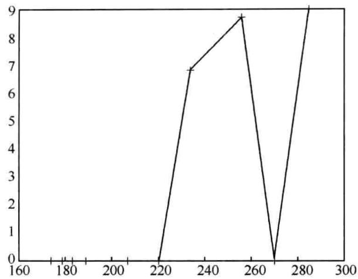

<details>
<summary>line</summary>

| X | Y |
| --- | --- |
| 220 | 0 |
| 233 | 6.9 |
| 254 | 8.8 |
| 267 | 0 |
| 283 | 9 |
</details>

图4

$$
X <   2 2 0 \quad (\text {亿} t / \text {年})
$$

所以要满足所有条件,就要使每年的污水排放量少于220亿t,如果大于220亿t时就要对污水进行处理。

那么在未来的10年内污水的排放量到底是多少呢？

由于知道了前十年的排放情况,依然可以利用问题三的灰色模拟进行估计,过程同问题三,得到表8。

表8

<table><tr><td>年份</td><td>1995</td><td>1996</td><td>1997</td><td>1998</td><td>1999</td><td>2000</td><td>2001</td><td>2002</td><td>2003</td><td>2004</td></tr><tr><td>估计值/亿t</td><td>174.0</td><td>172.8</td><td>183.9</td><td>195.8</td><td>208.4</td><td>221.8</td><td>236.1</td><td>251.3</td><td>267.5</td><td>284.7</td></tr><tr><td>实际值/亿t</td><td>174</td><td>179</td><td>183</td><td>189</td><td>207</td><td>234</td><td>220.5</td><td>256</td><td>270</td><td>285</td></tr><tr><td>误差/亿t</td><td>0</td><td>-6.2</td><td>0.9</td><td>-3.2</td><td>1.4</td><td>12.2</td><td>15.6</td><td>-4.7</td><td>-2.5</td><td>-0.3</td></tr><tr><td>相对误差/亿t</td><td>0</td><td>3.46</td><td>0.51</td><td>3.59</td><td>0.67</td><td>5.21</td><td>1.84</td><td>0.94</td><td>0.11</td><td>1.84</td></tr><tr><td>年份</td><td>2005</td><td>2006</td><td>2007</td><td>2008</td><td>2009</td><td>2010</td><td>2011</td><td>2012</td><td>2013</td><td>2014</td></tr><tr><td>估计值/亿t</td><td>303.0</td><td>322.5</td><td>343.3</td><td>365.4</td><td>388.9</td><td>414.0</td><td>440.6</td><td>469.0</td><td>499.2</td><td>531.3</td></tr></table>

所以未来十年每年的污水处理量见表9。

表9

<table><tr><td>年份</td><td>2005</td><td>2006</td><td>2007</td><td>2008</td><td>2009</td><td>2010</td><td>2011</td><td>2012</td><td>2013</td><td>2014</td></tr><tr><td>处理量/亿t</td><td>83.0</td><td>102.5</td><td>123.3</td><td>145.4</td><td>168.9</td><td>194.0</td><td>220.6</td><td>249.0</td><td>279.2</td><td>311.3</td></tr></table>

## 5.5 问题五 （线性规划模型）

## 1. 理论的分析

要解决长江水质的污染问题一定要结合客观实际,将经济因素、环境因素等方面进行综合评价。

从经济方面看,如果不向长江之中排放污水,而将工农业等方面产生的污水完全进行代价高昂的污水处理是极不明智的,长江自身有自然降解能力,只要排放的污水没有超过一定限度,长江水资源能够通过自身的净化使水质达到较高的标准,不会影响环境;从环境方面来考虑,水质并不是要求一定要最好,只要达到符合饮用水的标准是能够接受的。因此解决长江水质污染问题可以从以下两个方面来考虑:

(1) 使长江的水质能够达到规定的标准。

(2) 使国民经济的发展尽可能不受到太大的影响。

综合以上两个目标,制定了以下原则。

（1）最大化原则:它是指在同一地区各污染源允许所有污染源排放的污染总量。这项原则是以最有利的方式利用河流的自然降解能力和环境自然容量。

(2) 分离控制原则: 如果污染源 $i$ 的超标项目是该地区程度较轻的, 则不要求污染源 $i$ 控制或减少排污量; 相反, 如果污染源 $i$ 的超标项目是该地区程度较重的, 那么就要求污染源 $i$ 控制后减少排污量。这项原则对重污染源提供了有效的措施。

(3) 最优经济治污原则: 把所考虑的所有污染源看成一个整体, 对总的超标项目建立最优的经济治污方案, 公平合理地实现各污染源之间的效用转移, 通过这种效用转移, 从而实现最佳经济的治理水污染目标。这项原则使得在治理污染的同时, 经济效益能够达到最大。

## 2. 模型的建立

假定某地区有 n 个污染源，且污染源 i 排放的污水对溶解氧、高锰酸盐、氨氮、pH 值的影响分别为 $\lambda_{i1}$ 、 $\lambda_{i2}$ 、 $\lambda_{i3}$ 、 $\lambda_{i4}$ ，它进行生产所能够创造的经济价值为 $W_{i}$ ， $W_{i}$ 与 $\lambda_{i1}$ 、 $\lambda_{i2}$ 、 $\lambda_{i3}$ 、 $\lambda_{i4}$ 的值成正比，比例系数分别为 $\beta_{i1}$ 、 $\beta_{i2}$ 、 $\beta_{i3}$ 、 $\beta_{i4}$ ，并且规定该地区四项指标所能够受到影响的极值分别为 $\lambda_{1}$ 、 $\lambda_{2}$ 、 $\lambda_{3}$ 、 $\lambda_{4}$ 。

为了使经济效益达到最高,根据最优经济治污原则可以得到目标函数为

$$
\max \sum_ {i = 1} ^ {n} W _ {i} = \max \sum_ {i = 1} ^ {n} (\beta_ {i 1} \lambda_ {i 1} + \beta_ {i 2} \lambda_ {i 2} + \beta_ {i 3} \lambda_ {i 3} + \beta_ {i 4} \lambda_ {i 4})
$$

根据最大化原则,可以确定约束条件为

$$
\left\{ \begin{array}{l} \sum_ {i = 1} ^ {n} \lambda_ {i 1} \leqslant \lambda_ {1} \\ \sum_ {i = 1} ^ {n} \lambda_ {i 2} \leqslant \lambda_ {2} \\ \sum_ {i = 1} ^ {n} \lambda_ {i 3} \leqslant \lambda_ {3} \\ \sum_ {i = 1} ^ {n} \lambda_ {i 4} \leqslant \lambda_ {4} \end{array} \right.
$$

利用所列目标函数以及约束条件,通过线性规划的方法就可以求出各个污染源允许排放的各种污水数量,得到这一地区最佳统筹安排方案,使得环境保持稳定的同时达到经济效益的最优化。

因此在治理长江水质污染问题时,可以利用以上三种原则,首先确定长江沿岸的各个地区所能排放的最大污水数量,然后再对具体的地区进行线性规划分析,安排好该地区的各项工农业生产,从而达到经济和环境的双赢。

## 6 模型的结论

（1）近两年多影响长江水质的最主要因数是溶解氧。

各地区水质的污染状况见表10。

表 10

<table><tr><td>污染排名</td><td>1</td><td>2</td><td>3</td><td>4</td><td>5</td><td>6</td></tr><tr><td>观测站</td><td>江西南昌滁槎</td><td>四川乐山岷江大桥</td><td>四川泸州沱江二桥</td><td>湖南长沙新港</td><td>湖北武汉宗关</td><td>安徽安庆皖河口</td></tr><tr><td>污染排名</td><td>7</td><td>8</td><td>9</td><td>10</td><td>11</td><td>12</td></tr><tr><td>观测站</td><td>江西九江蛤蟆石</td><td>江苏南京林山</td><td>湖南岳阳岳阳楼</td><td>江西九江河西水厂</td><td>江苏扬州三江营</td><td>湖南岳阳城陵矶</td></tr><tr><td>污染排名</td><td>13</td><td>14</td><td>15</td><td>16</td><td>17</td><td></td></tr><tr><td>观测站</td><td>湖北宜昌南津关</td><td>四川宜宾凉姜沟</td><td>重庆朱沱</td><td>四川攀枝花龙洞</td><td>湖北丹江口胡家岭</td><td></td></tr><tr><td colspan="7">注:污染严重程度从重到轻</td></tr></table>

(2) 长江干流近一年多主要污染物高锰酸盐指数和氨氮的污染源都主要集中在宜昌至岳阳之间。

(3) 未来十年内长江全流域的可饮用水的预测值见表11。

表11

<table><tr><td>年份</td><td>2005</td><td>2006</td><td>2007</td><td>2008</td><td>2009</td><td>2010</td><td>2011</td><td>2012</td><td>2013</td><td>2014</td></tr><tr><td>预测值/%</td><td>69.58</td><td>67.99</td><td>66.43</td><td>64.92</td><td>63.43</td><td>61.98</td><td>60.56</td><td>59.18</td><td>57.83</td><td>56.51</td></tr></table>

(4) 每年处理的污水量见表 12。

表12

<table><tr><td>年份</td><td>2005</td><td>2006</td><td>2007</td><td>2008</td><td>2009</td><td>2010</td><td>2011</td><td>2012</td><td>2013</td><td>2014</td></tr><tr><td>处理量/亿t</td><td>83.0</td><td>102.5</td><td>123.3</td><td>145.4</td><td>168.9</td><td>194.0</td><td>220.6</td><td>249.0</td><td>279.2</td><td>311.3</td></tr></table>

## 7 模型的优缺点分析与推广

(1) 问题一的主成分模型避免了模糊评价的人为因素,而且化多指标为一指标,简便了分析,同时由对模型的检验结果可以看出此模型与实际符合得较好。在实际生活中较实用,学校质量的评价、国民经济的状况等方面都可以用此模型来衡量。  
（2）问题二的模型，简化了许多因素，忽略了支流的影响，但这种理想化还是有合理性的，较符合实际情况。  
（3）灰度模型应用较成熟，对长期预测是一个可取的模型，但在此问题的预测中还存在一定的误差，这是不可避免的。当然可以对其进行改进，如先取对数，误差应会减小，再作指数进行还原；也可结合马尔科夫进行两次拟合以减小预测误差。

## 参考文献

[2] 叶舟. 灰色理论在预测丰水、枯水年份中的应用. www.zjwater.com. 2005-9-18.

附录 A: 问题一主成分分析中的 17 个向量

<table><tr><td>x = [9.1543</td><td>2.4321</td><td>0.1829</td></tr><tr><td>8.9304</td><td>2.0964</td><td>0.3318</td></tr><tr><td>8.5054</td><td>2.8750</td><td>0.2643</td></tr><tr><td>8.6832</td><td>3.7857</td><td>0.3300</td></tr><tr><td>7.7536</td><td>2.4286</td><td>0.1604</td></tr><tr><td>7.4554</td><td>2.5750</td><td>0.2289</td></tr><tr><td>7.4911</td><td>2.0929</td><td>0.1279</td></tr><tr><td>5.5586</td><td>5.2429</td><td>0.9243</td></tr><tr><td>8.9761</td><td>2.7357</td><td>0.4304</td></tr><tr><td>6.8650</td><td>3.3393</td><td>0.8118</td></tr><tr><td>9.2911</td><td>1.9536</td><td>0.0921</td></tr><tr><td>7.1100</td><td>2.4857</td><td>0.9164</td></tr><tr><td>8.3150</td><td>4.1929</td><td>0.3857</td></tr><tr><td>7.4214</td><td>3.3250</td><td>0.1975</td></tr><tr><td>5.6982</td><td>2.3239</td><td>4.6332</td></tr><tr><td>7.9104</td><td>3.7429</td><td>0.2864</td></tr><tr><td>8.1379</td><td>3.0214</td><td>0.2871</td></tr></table>

## 附录 B: 高锰酸盐与氨氮的具体排放量

表 1 6 个区段在 13 个月的高锰酸盐排放量  
(单位: $10^{5}\mathrm{g / s}$ )

<table><tr><td></td><td>1</td><td>2</td><td>3</td><td>4</td><td>5</td><td>6</td></tr><tr><td>1</td><td>0.6881</td><td>0.6705</td><td>1.1260</td><td>1.0230</td><td>0.3082</td><td>0.1933</td></tr><tr><td>2</td><td>0.3437</td><td>1.1972</td><td>0.9028</td><td>1.2005</td><td>0.5155</td><td>0.3055</td></tr><tr><td>3</td><td>0.5815</td><td>1.1821</td><td>0.6009</td><td>0.6274</td><td>-0.0929</td><td>0.5698</td></tr><tr><td>4</td><td>0.7233</td><td>0.9084</td><td>0.8529</td><td>0.3443</td><td>-0.0081</td><td>0.4065</td></tr><tr><td>5</td><td>0.1686</td><td>1.1837</td><td>0.8994</td><td>0.4026</td><td>0.0586</td><td>0.3557</td></tr><tr><td>6</td><td>2.3165</td><td>0.8858</td><td>1.2851</td><td>0.2744</td><td>-0.0188</td><td>1.1680</td></tr><tr><td>7</td><td>0.3845</td><td>1.0296</td><td>0.5196</td><td>0.1329</td><td>0.3098</td><td>0.4962</td></tr><tr><td>8</td><td>0.2486</td><td>0.3950</td><td>0.4554</td><td>0.4674</td><td>0.2017</td><td>0.4025</td></tr><tr><td>9</td><td>0.1415</td><td>0.4380</td><td>0.5809</td><td>0.4442</td><td>0.0644</td><td>0.4254</td></tr><tr><td>10</td><td>0.0969</td><td>0.2598</td><td>0.8886</td><td>0.4506</td><td>0.2199</td><td>0.5671</td></tr><tr><td>11</td><td>0.1532</td><td>0.4383</td><td>0.5531</td><td>0.6511</td><td>0.2417</td><td>0.5178</td></tr><tr><td>12</td><td>0.2306</td><td>0.5732</td><td>0.6226</td><td>0.4373</td><td>0.5295</td><td>0.4132</td></tr><tr><td>13</td><td>0.1539</td><td>0.5468</td><td>0.5052</td><td>0.6613</td><td>0.3610</td><td>0.4112</td></tr><tr><td>平均值</td><td>0.47929</td><td>0.74680</td><td>0.75326</td><td>0.54747</td><td>0.20697</td><td>0.47940</td></tr></table>

表 2 6 个区段在 13 个月的氨氮排放量  
(单位： $10^{4}\mathrm{g / s}$ )

<table><tr><td></td><td>1</td><td>2</td><td>3</td><td>4</td><td>5</td><td>6</td></tr><tr><td>1</td><td>0.4096</td><td>1.0161</td><td>0.7650</td><td>1.0172</td><td>0.1438</td><td>-0.3087</td></tr><tr><td>2</td><td>0.5458</td><td>1.1574</td><td>0.7646</td><td>0.7799</td><td>0.4584</td><td>-0.0372</td></tr><tr><td>3</td><td>0.3815</td><td>1.1370</td><td>0.6568</td><td>0.1438</td><td>0.2294</td><td>-0.1045</td></tr><tr><td>4</td><td>0.4263</td><td>0.4380</td><td>0.9193</td><td>0.0455</td><td>0.4102</td><td>-0.2832</td></tr><tr><td>5</td><td>0.0042</td><td>0.6937</td><td>0.8558</td><td>0.5710</td><td>-0.0822</td><td>-0.1489</td></tr><tr><td>6</td><td>0.9089</td><td>1.6027</td><td>0.8712</td><td>1.2136</td><td>-0.5813</td><td>-0.1281</td></tr><tr><td>7</td><td>0.5605</td><td>0.5008</td><td>0.7476</td><td>0.1174</td><td>0.1710</td><td>-0.1826</td></tr><tr><td>8</td><td>0.3665</td><td>0.4902</td><td>0.6437</td><td>0.4078</td><td>-0.0082</td><td>0.0558</td></tr><tr><td>9</td><td>0.5906</td><td>0.1453</td><td>0.5352</td><td>0.1656</td><td>0.1253</td><td>0.1722</td></tr><tr><td>10</td><td>0.4198</td><td>0.2149</td><td>0.7196</td><td>0.4029</td><td>0.1481</td><td>0.5160</td></tr><tr><td>11</td><td>0.4725</td><td>0.3396</td><td>0.7580</td><td>0.1793</td><td>0.2213</td><td>0.8183</td></tr><tr><td>12</td><td>0.6571</td><td>0.4579</td><td>0.6426</td><td>0.2179</td><td>0.4999</td><td>-0.1776</td></tr><tr><td>13</td><td>0.4938</td><td>0.2063</td><td>0.7720</td><td>0.4073</td><td>0.2243</td><td>0.7100</td></tr><tr><td>平均值</td><td>0.47979</td><td>0.64614</td><td>0.74241</td><td>0.43608</td><td>0.15076</td><td>0.06934</td></tr></table>

## 【论文点评】

沈锦仁

该文章解题方法简洁合理,文章通顺清晰,推导正确清楚。

在第一问题数据综合分析中,先分别对三指标进行时间上求平均,然后对17个观察点求数据的协方差,用主成分分析法,求 $3 \times 3$ 的协方差矩阵最大特征值,其最大特征值对应的特征向量作为主成分,从而得到17个观察点的污染情况的排队,这种方法也是合理的,缺点是三指标最好进行无量纲化,溶解氧与另两个指标不同,溶解氧指标越小,污染越严重,时间因素的影响已经平均化掉了。

对于第二问污染源的寻求问题,文章采用了简明的指数化自降解的方法,用 $\rho_{i+1} = \rho_{i} e^{-\lambda \Delta t_{i}}$ 来作为 $x_{i}$ 点到 $x_{i+1}$ 点的污染程度,这是简明合理的方法。

对于第三问题,用统计数据来预测后十年中长江六类水质的百分比问题,文章采用灰色预测模型,组成对可饮用水比例进行预测,没有对Ⅳ、Ⅴ类水及劣Ⅴ类水进行预测。灰色预测模型也是合理的,但最好进行统计中的回归预测。

对于问题四,关于后十年处理排废水量的预测,文章先用回归的方法求出Ⅳ、V类水和劣V类水依赖于排废水量的计算公式,再用灰色预测模型求得后十年Ⅳ、V类水和劣V类水的百分比,从而得到后十年要处理废水量,其中排废水量最好用长江总流量来相对化,因总流量的增大会减轻污染程度,如1998年长江发大水。

必须指出的是文章中的回归预测最好进行检验。

# 2006年A题 出版社的资源配置

出版社的资源主要包括人力资源、生产资源、资金和管理资源等,它们都捆绑在书号上,经过各个部门的运作,形成成本(策划成本、编辑成本、生产成本、库存成本、销售成本、财务与管理成本等)和利润。

某个以教材类出版物为主的出版社,总社领导每年需要针对分社提交的生产计划申请书、人力资源情况以及市场信息分析,将总量一定的书号数合理地分配给各个分社,使出版的教材产生最好的经济效益。事实上,由于各个分社提交的需求书号总量远大于总社的书号总量,因此总社一般以增加强势产品支持力度的原则优化资源配置。资源配置完成后,各个分社(分社以学科划分)根据分配到的书号数量,再重新对学科所属每个课程做出出版计划,付诸实施。

资源配置是总社每年进行的重要决策,直接关系到出版社的当年经济效益和长远发展战略。由于市场信息(主要是需求与竞争力)通常是不完全的,企业自身的数据收集和积累也不足,这种情况下的决策问题在我国企业中是普遍存在的。

本题附录中给出了该出版社所掌握的一些数据资料,请根据这些数据资料,利用数学建模的方法,在信息不足的条件下,提出以量化分析为基础的资源(书号)配置方法,给出一个明确的分配方案,向出版社提供有益的建议。

[附录]

附件1:问卷调查表;

附件2:问卷调查数据(5年);

附件3:各课程计划及实际销售数据表(5年);

附件4:各课程计划申请或实际获得的书号数列表(6年);

附件 5:9 个分社人力资源细目。

## 【试题评析】

滕加俊

本问题要求根据一些问卷调查数据和出版社内部分配、销售数据，在有限的信息条件下，按照产生最好的经济效益和增加强势产品的支持力度的原则，将总社总量一定的书号数合理地分配到各个分社，各个分社再按照一定的原则具体分配到每个学科，完成资源的最优配置。

## 【问题解答要点】

根据问题的要求,对总量一定的书号数进行合理的分配,可以有以下两种处理方法:

1. 将整个分配过程分成两个阶段

（1）第一阶段：总社分到分社。总社针对分社提交的生产计划申请书、人力资源配置情况和市场信息分析,按增加强势产品的支持力度的原则和市场经济效益,将书号总量合理地分配到各个分社。

(2) 第二阶段: 分社分到各个课程。各个分社根据分配到的书号数量对其所属的每个课程也同样按照增加强势产品的支持力度和最大市场经济效益的原则作出具体出版计划, 完成分配方案。

在这两个阶段的处理过程中,怎样对分配时依据的生产计划、人力资源、市场信息三个条件进行合理地刻画和描述以及怎样对经济效益进行具体量化,是处理问题的关键。而所有的这些信息,都包含在附件2、3、4、5的大量数据中,因此,对附件中给出的大量数据进行合理的统计、分析和处理,是一个复杂的数据处理过程,是解决问题的难点和关键。

## 2. 将整个分配过程一次完成

将 A 出版社所关注的 72 门课程看作是 72 个小的分社, 因此, 针对各门课程的生产计划申请书、人力资源配置情况和市场信息分析, 按照增加强势产品的支持力度和最大市场经济效益的原则, 将总社的书号数一次分配到各个课程。但这仍然避免不了对附件中大量数据的处理。

每门课程的市场信息体现了该部门出版的该类课程书籍的市场竞争力,而市场竞争力主要由消费者对产品的满意度和该产品的市场占有量来决定,消费者的满意度越大,产品的市场占有量越大,产品的市场竞争力也就越大。而产品的市场竞争力越大,产品也就越强势。在问卷调查中的出版社的满意度(课程级)的均值除以所有出版社的满意值的均值,可以作为该课程的满意度,这里“度”是率的含意。对附件2中的问卷调查信息中对该课程教材的满意度和出版社的该课程教材的市场占有率进行处理,可以得到72门课程的市场竞争力系数。

市场经济效益的定量刻画就是出版社的利润,利润越大,经济效益越好,而本题所研究的 A 出版社在定价时保持对所有教材利润率同一,因此,出版社的经济效益完全可由销售总价来定量描述。而销售总价与每门课程的销售总量和销售单价有关,销售单价是确定的,所以销售总价越大就要求销售单价高的课程的销售总量越大。

问题解决的是书号数量的分配,不同课程的书号所对应的销售量是不相同的,因此,找出不同课程的书号与其对应的销售量之间的关系,从而将经济效益与不同课程的书号之间建立关系,从而建立优化模型,也是解决问题的难点和关键。这里应该恰当地表示“计划准确性因子”,数据给出的计划销量和实际销量之比应该是比较合适的表示。

在建立数学模型的过程中要考虑目标函数的构成成分,给出具体的销售额表达式。销售额表达式可以以课程为单位,也可以以学科为单位,包括由市场信息产生的对于不同课程的调控因子(竞争力系数),但也应该包括每个课程的申报需求量的“计划准确性因子”。构造每个课程的、用书号数表达的销售额,然后将所有书号的销售额的表达式累加,形成总社的销售额的基本表达式,这是目标函数的主体部分。

同时要正确给出约束条件,对于出版社来说,所谓产能主要是人力资源,即策划、编辑和版面设计人员的分布形成主要约束;此外,书号总量(500)也应该作为约束条件;同时,在数据说明中指出的“满足申请书号量的一半”也应该以约束方式表达。

# 出版社资源配置的数学模型

## 摘要

本文基于对 2001 年至 2005 年的问卷调查数据和该五年的计划及实际销售数据的处理、综合、提炼与分析, 找出有用信息, 建立了五个数学模型, 并由此获得了书号的明确分配方案, 解决了出版社书号分配的资源配置问题。

文章首先对附件2中的大量数据进行了包括筛选、统计、调整和计算等一系列的数据处理过程,得到了每门课程每年的满意度和市场占有率,通过加权平均得到了每门课程的市场竞争力。然后对附件3和附件4中的数据进行处理,运用趋势性指数平滑法,预测出了2006年每门课程单位书号所对应的销售量。在这两个数据处理步骤的前提下,模型一以增加市场竞争力强的产品支持力度为原则,按照先分配到各分社,再由各分社分配到各课程的分配流程,建立了初等模型,完成了所有书号数的分配。在对模型的结论进行了分析之后,提出了第二阶段以市场经济效益最大为目标的改进模型,求得了结果。模型二以所能获得的销售总额最大为目标函数,考虑到各个约束条件,建立了整数规划的优化模型,运用MATLAB软件编程计算,求得了分配的结果,并作了分析。模型三综合了前两个模型的优点,综合考虑市场竞争力和市场经济效益两方面的要求,由于两者的数量级相差太大,在对两者分别进行了归一化处理后将两者加权综合,得到一个综合指标,在目标函数为综合指标最大的条件下分两步进行分配,建立了整数规划模型,求得了模型的解。模型四的建立过程中,考虑到前面模型对预测2006年每门课程单位书号所对应的销售量处理得过于简单和粗糙,首先综合考虑了课程自身的市场满意度、市场占有率、销售增长率以及其他出版社同种课程的市场满意度、市场占有率对单位书号所对应的销售量随时间变化的共同影响,建立了一个具体的时间序列函数关系,采用神经网络的预测方法计算出了该函数关系的参数在2006年的值,从而得到2006年每门课程单位书号所对应的销售量,再按照一次性从总社分到各课程的分配方法,建立以获得最大销售总额为目标函数的整数规划模型,其约束条件增加了市场饱和量的控制,编写MATLAB程序,求得了各课程实际分得的书号数,分析结论并对约束条件强化后,求得了分配结果。模型五从考虑出版社的长远发展战略入题,把目标的重点放在企业的品牌效应即消费者的满意度上面,次要考虑经济效益,并将两个目标在无量纲化后进行综合得到一个综合指标,建立整数规划的优化模型求得了分配的具体方案,见下表:

<table><tr><td>分社名称</td><td>计算机类</td><td>经管类</td><td>数学类</td><td>英语类</td><td>两课类</td><td>机械能源类</td><td>化学、化工类</td><td>地理、地质类</td><td>环境类</td></tr><tr><td>书号数</td><td>95</td><td>28</td><td>148</td><td>90</td><td>36</td><td>44</td><td>15</td><td>24</td><td>20</td></tr></table>

在文章的最后,分析了模型的优缺点提出了改进意见,并对模型进行了一定的推广。

关键字:书号分配,市场竞争力,经济效益,整数规划,趋势性指数,平滑预测,神经网络

## 1 问题的重述

出版社的资源主要包括人力资源、生产资源、资金和管理资源等,它们都捆绑在书号上,经过各个部门的运作,形成成本(策划成本、编辑成本、生产成本、库存成本、销售成本、财务与管理成本等)和利润。

某个以教材类出版物为主的出版社,总社领导每年需要针对分社提交的生产计划申请书、人力资源情况以及市场信息分析,将总量一定的书号数合理地分配给各个分社,使出版的教材产生最好的经济效益。事实上,由于各个分社提交的需求书号总量远大于总社的书号总量,因此总社一般以增加强势产品支持力度的原则优化资源配置。资源配置完成后,各个分社(分社以学科划分)根据分配到的书号数量,再重新对学科所属每个课程做出版计划,付诸实施。

资源配置是总社每年进行的重要决策,直接关系到出版社的当年经济效益和长远发展战略。由于市场信息(主要是需求与竞争力)通常是不完全的,企业自身的数据收集和积累也不足,这种情况下的决策问题在我国企业中是普遍存在的。

本题附录中给出了该出版社所掌握的一些数据资料,请根据这些数据资料,利用数学建模的方法,在信息不足的条件下,提出以量化分析为基础的资源(书号)配置方法,给出一个明确的分配方案,向出版社提供有益的建议。

## 2 问题的分析

现代市场经济条件下,各企业之间的竞争日趋激烈,合理地运用现代企业经营管理理论,优化配置企业内部现有的资源信息,产生最大的经济效益,是摆在每个现代企业面前一个急需解决的课题。随着中国人世带来的影响深入到社会的各个方面,中国的出版界面临改制的迫切需求,因此,研究出版社的资源配置问题,使得企业产生最大的经济效益,有着深刻的社会背景和迫切的现实需求。

本问题要求根据一些问卷调查数据和出版社内部分配、销售数据，在有限的信息条件下，按照产生最好的经济效益和增加强势产品的支持力度的原则，将总社总量一定的书号数合理地分配到各个分社，各个分社再按照一定的原则具体分配到每个学科，完成资源的最优配置。

根据问题的要求,对总量一定的书号数进行合理的分配,可以有以下两种处理方法。

## 1. 将整个分配过程分成两个阶段

(1) 第一阶段: 总社分到分社。总社针对分社提交的生产计划申请书、人力资源配置情况和市场信息分析, 按增加强势产品的支持力度的原则和市场经济效益, 将书号总量合理地分配到各个分社。  
(2) 第二阶段: 分社分到各个课程。各个分社根据分配到的书号数量, 对其所属的每个课程也同样按照增加强势产品的支持力度和最大市场经济效益的原则作出具体出版计

划,完成分配方案。

在这两个阶段的处理过程中,怎样对分配时依据的生产计划、人力资源和市场信息三个条件进行合理地刻画和描述以及怎样对经济效益进行具体量化,是处理问题的关键。而所有的这些信息,都包含在附件2、3、4、5的大量数据中,因此,对附件中给出的大量数据进行合理的统计、分析和处理,是一个复杂的数据处理过程,是解决问题的难点和关键。

## 2. 将整个分配过程一次完成

将 A 出版社所关注的 72 门课程看作是 72 个小的分社(只含一个课程), 因此, 针对各门课程的生产计划申请书、人力资源配置情况和市场信息分析, 按照增加强势产品的支持力度和最大市场经济效益的原则, 将总社的书号数一次分配到各个课程。但这仍然避免不了对附件中大量数据的处理。

每门课程的市场信息体现了该部门出版的该类课程书籍的市场竞争力,而市场竞争力主要由消费者对产品的满意度和该产品的市场占有量来决定,消费者的满意度越大,产品的市场占有量越大,产品的市场竞争力也就越大。而产品的市场竞争力越大,产品也就越强势。因此,对附件2中的问卷调查信息进行处理得到72门课程的市场竞争力,数据初步处理流程图,如图1所示。

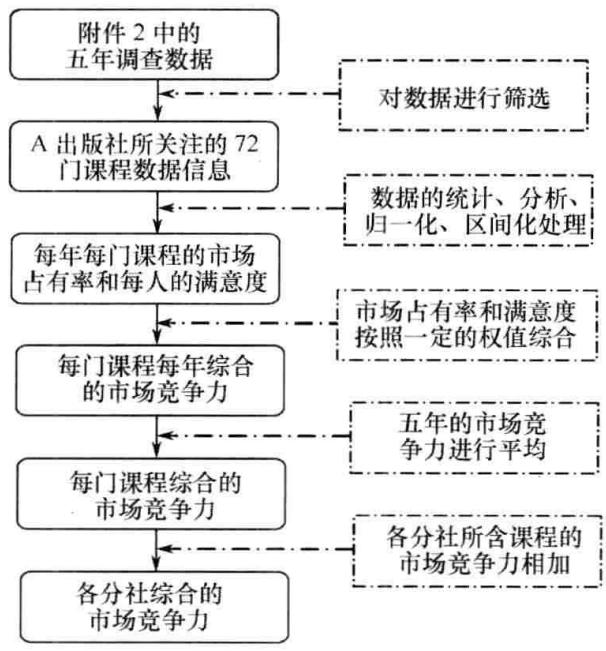

<details>
<summary>flowchart</summary>

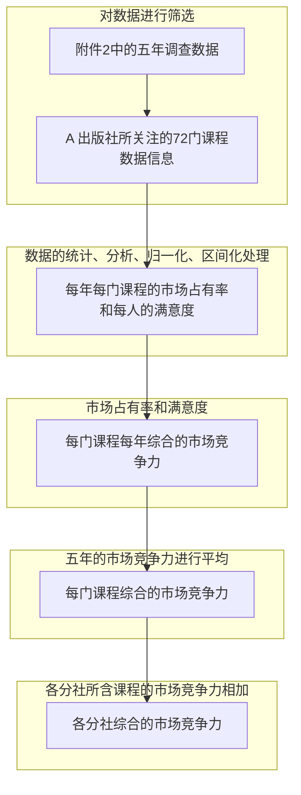
```mermaid
graph TD
  A["附件2中的五年调查数据"] --> B["A 出版社所关注的72门课程数据信息"]
  B --> C["每年每门课程的市场占有率和每人的满意度"]
  C --> D["每门课程每年综合的市场竞争力"]
  D --> E["每门课程综合的市场竞争力"]
  E --> F["各分社综合的市场竞争力"]
  
  subgraph Data_Screen ["对数据进行筛选"]
    A
    B
  end
  
  subgraph Statistical_Process ["数据的统计、分析、归一化、区间化处理"]
      C
    end
  
  subgraph Market_Compliance ["市场占有率和满意度\n按照一定的权值综合"]
      D
    end
  
  subgraph Average ["五年的市场竞争力进行平均"]
      E
    end
  
  subgraph Final_Evaluation ["各分社所含课程的市场竞争力相加"]
      F
    end
```
</details>

图 1 附件 2 的数据初步处理流程图

市场经济效益的定量刻画就是出版社的利润,利润越大,经济效益越好,而本题所研究的A出版社在定价时保持对所有教材利润率同一,因此,出版的经济效益完全可由销售总价来定量描述。而销售总价与每门课程的销售总量和销售单价有关,销售单价是确定的,所以销售总价越大就要求销售单价高的课程的销售总量越大。问题解决的是书号数量的分配,不同课程的书号所对应的销售量是不相同的,因此,找出不同课程的书号与其对应的销售量之间的关系,从而将经济效益与不同课程的书号之间建立关系,从而建立优化模型,也是解决问题的难点和关键。

按照上面的分析,对附件2、3、4中的数据进行处理,得到每门课程的书号与其销售量之间的关系的初步处理流程图,如图2所示。

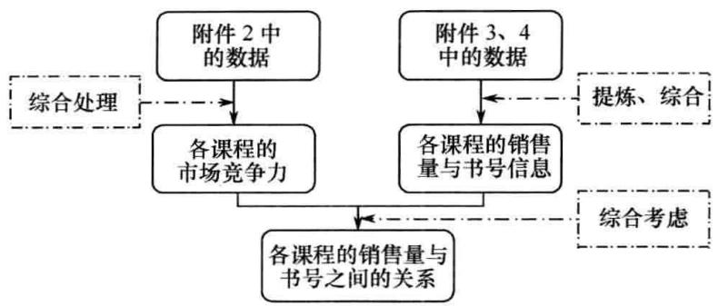

<details>
<summary>flowchart</summary>

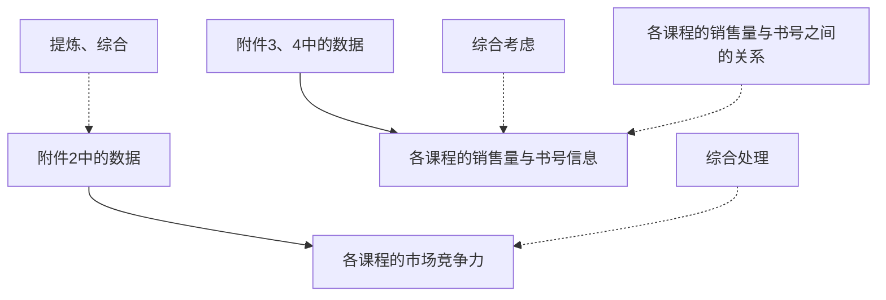
```mermaid
graph TD
  A["附件2中的数据"] --> B["各课程的市场竞争力"]
  C["附件3、4中的数据"] --> D["各课程的销售量与书号信息"]
  E["提炼、综合"] -.-> A
  F["综合处理"] -.-> B
  G["综合考虑"] -.-> D
  H["各课程的销售量与书号之间的关系"] -.-> D
```
</details>

图 2 寻找各课程书号与销售量之间的关系的初步流程图

## 3 符号系统

$\alpha_{ij}$ : 第 i 年第 j 门课程的市场占有率( $1 \leqslant i \leqslant 5, 1 \leqslant j \leqslant 72$ , 下同);

$p_{ij}$ : 第 i 年第 j 门课程的受调查人数中 A 部门所占人数;

$P_{ij}$ : 第 i 年第 j 门课程的受调查总人数;

$\beta_{ijk}$ : 第 i 年第 j 门课程的第 k 个消费者的满意度;

$\beta_{ij}$ : 第 i 年第 j 门课程的消费者的总满意度;

$\xi_{n}$ : 满意度的第 n 个方面的贡献系数( $1 \leqslant n \leqslant 4$ );

$q_{i j k n}$ : 第 i 年第 j 门课程的第 k 个消费者对满意度的第 n 个方面的评分；

$\varepsilon_{1},\varepsilon_{2}$ : 市场占有率和消费者满意度对市场竞争力的贡献系数；

$s_{ij}$ : 第 i 年第 j 门课程的市场综合竞争力;

$s_{j}$ : 第 j 门课程五年的市场综合竞争力;

$S_{t}$ : 第 t 个分社五年的市场综合竞争力( $1 \leqslant t \leqslant 9$ );

$\bar{S}_{t}$ : 第 t 个分社五年的市场综合竞争力的极差规范化数值;

$\lambda_{tj}$ : 第 j 门课程的分社属性;

E: 总社的书号总数;

$E_{t}$ : 各分社 2006 年申请的书号总量;

$f_{j}$ : 第 j 门课程 2006 年申请的书号量;

$e_{j}$ : 第 j 门课程 2006 年分得的书号数;

$r_{t}$ : 第 t 个分社 2006 年共分得的书号数;

$\sigma$ : 平滑常数 $(0 \leqslant \sigma \leqslant 1)$ ;

δ: 趋势平滑常数(0≤δ≤1);

$a_{j}$ : 预测得到的 2006 年第 j 门课程的单位书号所对应的销售量；

$b_{t}$ : 预测得到的 2006 年第 t 个分社总体上单位书号所对应的销售量；

$c_{j}$ : 第 j 门课程的课程均价;

$D_{ij}$ : 第 i 年第 j 门课程的实际销售量;

$q_{t}$ : 第 t 个分社现有的人力资源。

## 4 模型的假设

(1) 附录中给出的各数据表的信息真实有效。

(2) 问卷调查的对象的分布是随机的, 其调查结果基本真实地反映了客观的市场信息。

(3) 在信息量不足的情况下,由前五年已知的数据通过分析处理得到第六年的信息,尽管存在较大的误差,但这种处理方法仍然是合理的。

## 5 模型一:初等分配模型,以市场竞争力为目标函数

## 5.1 问题的分析

由于解决这个问题可以分两个阶段完成分配,也可以只进行一个阶段而完成分配,所以在本模型中,首先分两个阶段分别以增加市场竞争力强的产品的支持力度和经济效益为最好两方面为两个单目标,分别建立分配模型,同时考虑上面两个单目标而形成多目标,再建立分配模型,求得每个模型具体的分配方案和总销售价。同样,将这个问题按一个阶段完成,仍考虑上面几种情况,得到不同的解。将这些不同的结果进行比较分析,从而得到最优的分配方案。

## 5.2 数据的处理

无论哪种分配方案,都避免不了对大量数据的处理,因此,首先对各种有用数据进行处理。

## 1. 对附件2的数据的处理

由以上对问题的两点分析,为了从附件2中的大量数据得到各分社综合的市场竞争力,分四个步骤对其处理。

1）A出版社每年每门课程的市场占有率 $\alpha_{ij}$

出版社某门课程的市场占有率是指使用该出版社出版的某门课程的人数与使用某门课程的总人数的比值。这个比值越大，说明出版社出版的某门课程的书籍的市场占有率越大。但题目和附件中均未给出这两方面的数据，因此应从其他方面来近似处理。

根据假设2,受调查的人员的分布是随机的,其调查结果反映了客观事实,即是说,对大量的受调查人员,使用A出版社出版的某门课程的书籍的人数 $p_{ij}$ 与所有出版社出版的某门课程的书籍的使用人数 $P_{ij}$ 的比率就近似反映了整个市场中A出版社某门课程书籍的市场占有率 $\alpha_{ij}$ 。又由于数据与时间j有关,故有如下的计算公式:

$$
\alpha_ {i j} = \frac {P _ {i j}}{P _ {i j}} \tag {1}
$$

式中： $p_{ij}$ 和 $P_{ij}$ 的值均可由附件2中的数据直接统计得到，市场占有率 $\alpha_{ij}$ 的计算结果为一个 $5\times 72$ 的矩阵。

2）A 出版社每年每门课程的消费者总满意度 $\beta_{ij}$

消费者的对教材的满意度由教材内容、教材作者的权威、印刷质量和教材价格这四个方面来确定。由于这四个方面在消费者心中的地位是不一样的，因此每个方面对教材满意度的贡献系数 $\xi_{n}$ 的值是不相同的，因此，对每一位消费者来说，其对某一门课程教材的满意度有如下的计算公式：

$$
\beta_ {i j k} = \xi_ {1} q _ {i j k 1} + \xi_ {2} q _ {i j k 2} + \xi_ {3} q _ {i j k 3} + \xi_ {4} q _ {i j k 4} \tag {2}
$$

式中： $\beta_{ijkn}$ 的值在附件2中已经直接给出， $\xi_{n}$ 的值满足约束 $\sum_{n1}^{4} \xi_{n} = 1$ ，在本文的计算中，考虑到一般人对满意度四个方面的重视程度，取

$$
\xi_ {1} = 0. 4, \xi_ {2} = 0. 3, \xi_ {3} = 0. 1, \xi_ {4} = 0. 2
$$

在某一年对同一门课程的教材的满意度,不同的消费者是不同的,因此,对第i年第j门课程的总满意度 $\beta_{ij}$ 是 $p_{ij}$ 个消费者的满意度评价 $\beta_{ijk}$ 的综合平均,其计算公式为

$$
\beta_ {i j} = \frac {1}{p _ {i j}} \sum_ {k = 1} ^ {p _ {i j}} \beta_ {i j k} \tag {3}
$$

联立式(2)和式(3)，得到消费者的总满意度 $\beta_{ij}$ 的计算结果也为一个 $5\times 72$ 的矩阵。

3）A 出版社各课程书籍五年的市场综合竞争能力 $s_{j}$

市场综合竞争能力由市场占有率和消费者满意度这两项来决定,但又不是两者简单的相加,二者对竞争能力的贡献大小受权重系数的影响。由于对教材四个方面的评价分数的取值为1\~5,所以 $\beta_{ijk}$ 和 $\beta_{ij}$ 的取值都不在0\~1的区间范围内,而市场占有率 $\alpha_{ij}$ 的取值在0\~1的区间范围内,为了便于和市场占有率进行线性组合从而综合评价市场竞争力,首先需要对消费者每年的总满意度 $\beta_{ij}$ 进行0\~1区间化处理。

将消费者对不同课程的总满意度 $\beta_{ij}$ 极差规范化, 设最高满意度与最低满意度的差 (极差) 记为 M, 则 $\beta_{ij}$ 的区间化处理公式为

$$
\bar {\beta} _ {i j} = \frac {\beta_ {i j} - \min _ {j} \beta_ {i j}}{M} \tag {4}
$$

式中： $\min_{j}\beta_{ij}$ 是指第i年中所有72门课程的满意度最小值，即只对j下标取最小值，而不对i下标取最小值。 $M=\max\beta_{ij}-\min\beta_{ij}$ ，体现了极差的大小。

有了上面规范化的课程总满意度 $\bar{\beta}_{ij}$ 后，又由于市场占有率和消费者满意度对市场竞争力的贡献系数分别为 $\varepsilon_{1}$ 和 $\varepsilon_{2}$ ，因此，对第 $i$ 年第 $j$ 门课程的市场综合竞争力 $s_{ij}$ 的计算公式为

$$
s _ {i j} = \varepsilon_ {1} \alpha_ {i j} + \varepsilon_ {2} \bar {\beta} _ {i j} \tag {5}
$$

式中： $\varepsilon_{1}$ 和 $\varepsilon_{2}$ 的取值应由决策者根据大量销售利润的统计得出最大利润时的两系数取值，但问题中缺乏这样的统计资料。因此，按照自身购买书籍的经验，本题中，取 $\varepsilon_{1} = 0.4, \varepsilon_{2} = 0.6$ 。

得到每门课程五年中每年分别的市场竞争力后,要求得五年的市场综合竞争能力 $s_{j}$ , 需要对五年分别求得的市场综合竞争力 $s_{ij}$ 进行平均,因此有

$$
s _ {j} = \frac {1}{5} \sum_ {i = 1} ^ {5} s _ {i j} \tag {6}
$$

联立式(4)、式(5)和式(6)，得到每门课程五年的市场综合竞争能力 $s_{j}$ 。

4）九个分社的市场综合竞争能力 $S_{t}$

总社按照学科类型划分为9个分社,每个分社所属的课程数目不同,按照客观常理,分社所属的课程数目越多,每个课程的社会竞争力越强,其分得的书号数就应该越多,分社总的社会竞争力也就越强,因此,各分社总的市场综合竞争力可由其所属的各个课程的市场竞争力之和来描述,故有

$$
S _ {t} = \sum_ {j = 1} ^ {7 2} \lambda_ {i j} s _ {j} \tag {7}
$$

式中： $\lambda_{tj}$ 表示第 j 门课程的分社属性，属于第 t 个分社，则 $\lambda_{tj}=1$ ，否则， $\lambda_{tj}=0$ ，而且对第 j 门课程来说，满足属于分社的唯一性，即 $\sum_{t=1}^{9}\lambda_{tj}=1$ 。

根据式(7)，计算得到九个分社的市场综合竞争能力 $S_{t}$ ，见表1。

表 1 九个分社五年的市场综合竞争能力 ${S}_{t}$ 值表

<table><tr><td>分社名称</td><td>计算机类</td><td>经管类</td><td>数学类</td><td>英语类</td><td>两课类</td><td>机械能源类</td><td>化学、化工类</td><td>地理、地质类</td><td>环境类</td></tr><tr><td> $S_t$ </td><td>4.5058</td><td>5.3377</td><td>6.6829</td><td>4.8049</td><td>4.3493</td><td>3.8544</td><td>3.5638</td><td>4.4123</td><td>4.2818</td></tr></table>

## 2. 寻找不同课程的书号与销售量之间的关系

## 1）对两者之间存在的关系的分析

由附件 3 和附件 4 所给数据来分析,不管各个分社每年分得的书号数怎么变化,其总销售量是随着年份的增加而增加的。因此,这是一个时间序列。

为了寻找不同课程的书号与销售量之间的关系,考查附件3、附件4的数据,很难发现两者存在的关系,因此,将目标定为寻找每个课程分得的单位书号所对应的实际销售量随时间的变化规律。于是,首先将附件3中2001年--2005年每年的实际销售量除以附件4中每年对应的实际分得的书号数,得到72门课程每个书号对应的销售量随时间的5年变化规律。

考虑到每门课程每个书号对应的销售量是一个变化不太稳定,而且趋势有变大趋势。因此,用趋势性指数平滑预测法 $^{[2]}$ 来预测每个书号对应的销售量随时间的变化。

## 2）趋势性指数平滑预测法的理论基础

对时间序列下一个值的预测公式是在指数平滑预测的基础上加上一个趋势估计而修改得到的,其公式为

$$
\text {预测值} = \sigma (\text {上期值}) + (1 - \sigma) (\text {上次预测值}) + \text {趋势估计} \tag {8}
$$

式中： $\sigma (0 \leqslant \sigma \leqslant 1)$ 称为平滑常数。上期值指上一个时间段结束时的目标值，对第一个预测数据来说，预测值 $=$ 上期值。而趋势估计计算公式为

$$
\text {趋势估计} = \delta (\text {最近的趋势}) + (1 - \delta) (\text {上次趋势估计}) \tag {9}
$$

式中： $\delta(0\leqslant\delta\leqslant1)$ 称为趋势平滑常数。最近的趋势是指基于时间序列的最后两个最高值以及后两个预测值的趋势，计算公式为

$$
\text {最近的趋势} = \sigma (\text {上期值} - \text {倒数第二个值}) +
$$

$$
(1 - \sigma) (\text {上次预测值} - \text {倒数第二个预测值}) \tag {10}
$$

上面的计算式中,第一个时期(2001)的预测值为其本身的值,趋势的初始估计为0。第二次的预测值可从式(8)的计算得出。第二次预测的最近趋势仍为0,趋势估计也为0。从第三次预测开始,上面三个公式都可以计算了。

平滑常数 $\sigma$ 的选取与趋势平滑常数 $\delta$ 的选取类似, 值越大的对最近的变化比较敏感, 使得对变化的响应时间加快。考虑到本问题需要对变化的响应比较敏感, 因此, 在计算时取 $\sigma = 0.5, \delta = 0.6$ 。

## 3）预测结果

按照上面的预测理论,代入相应的数值,得到了72门课程和9个分社在2006年时,每个书号对应的销售量,列举9个分社单位书号对应的销售量,见表2。

表 2 9 个分社单位书号对应的销售量在 2006 年的预测值 ${a}_{t}$

<table><tr><td>分社名称</td><td>计算机类</td><td>经管类</td><td>数学类</td><td>英语类</td><td>两课类</td><td>机械能源类</td><td>化学、化工类</td><td>地理、地质类</td><td>环境类</td></tr><tr><td>2001</td><td>153.80</td><td>506.81</td><td>1412.46</td><td>152.53</td><td>2261.86</td><td>267.85</td><td>152.29</td><td>320.64</td><td>205.22</td></tr><tr><td>2002</td><td>149.16</td><td>502.69</td><td>1453.11</td><td>184.85</td><td>2404.65</td><td>298.76</td><td>159.40</td><td>383.57</td><td>301.05</td></tr><tr><td>2003</td><td>173.55</td><td>615.09</td><td>1664.97</td><td>253.09</td><td>3267.45</td><td>393.85</td><td>253.65</td><td>427.09</td><td>292.52</td></tr><tr><td>2004</td><td>242.74</td><td>869.21</td><td>2201.80</td><td>312.78</td><td>3615.68</td><td>500.53</td><td>386.12</td><td>433.89</td><td>363.89</td></tr><tr><td>2005</td><td>282.68</td><td>968.68</td><td>2817.45</td><td>394.29</td><td>4930.09</td><td>666.08</td><td>442.58</td><td>571.63</td><td>535.92</td></tr><tr><td>2006(预测)</td><td>301.04</td><td>1059.66</td><td>2936.00</td><td>433.41</td><td>5165.25</td><td>711.14</td><td>507.15</td><td>586.71</td><td>551.48</td></tr></table>

从结果来看,预测出的值保持了增长的趋势,幅度也比较合理,说明用时间序列来预测2006年各门课程的单位书号对应的销售量是可行的。

## 5.3 初等分配模型:以市场竞争力为目标函数

在这个模型中,只把增加强势产品的支持力度作为分配准则,即分社的社会竞争力越好,则书号数分得的就越多。

1. 第一阶段: 将总书号数合理地分配到各个分社

## 1）模型的建立

统计附件4中每年各分社实际分得的书号数之和,得到总社的书号总量为E=500,因此,我们的工作就是按照一定的规则将这500个书号合理地分配到72门课程中。

按照题目所给的信息,总社一般以增加强势产品的支持力度的原则优化资源配置,因此,总社对各分社所要求的书号数的分配主要考虑各分社的市场综合竞争力。又因为附件4明确指出了出版社在分配书号时至少保证分给各分社申请量的1/2,且要满足各分社的人力资源配置情况,所以总社书号的分配必须满足以下三个条件:

(1) 各分社分得的书号数量至少为其申请量的 1/2。  
(2) 分配时按照市场竞争力越大分得的书号数越多的原则分配。  
(3) 各分社分得的书号数必须符合其人力资源的配置情况。

以上三点要求的约束强弱关系逐渐递减,因此,联想比赛席位的分配问题,有如下的初等方法分配方案,其具体分配步骤如下:

Step1: 分配给各分社其书号申请量的 1/2（为小数者向上取整，保证至少分得 1/2）。

Step2: 将剩余未分配的书号数按各分社市场竞争力占总竞争力的比例分配到各分社, 比例越大分配得到的书号越多, 保证分配完全。

Step3: 将各分社分到的书号数按其人力资源进行检验, 不满足要求的部分按照 Step2 的方案进行二次分配。

至此，总社书号分到各分社的分配过程结束。

## 2）模型的求解

在上面 Step2 的处理过程中,由于各分社间的市场竞争力除以竞争力总和后的数值很小,所以进行余额分配时相互间的差异不大,因此,考虑用极差规范化将市场竞争力之间的差异放大,从而体现出市场竞争力的重要性。为此,首先将各分社市场竞争力 $S_{t}$ 作如下处理:

$$
\overline {{S}} _ {t} = \frac {S _ {t} - \min _ {t} S _ {t}}{\max _ {t} S _ {t} - \min _ {t} S _ {t}} \tag {11}
$$

再将极差规范化数值 $\bar{S}_{t}$ 作归一化处理,有

$$
\overline {{S}} _ {t} ^ {*} = \frac {\overline {{S}} _ {t}}{\sum_ {t = 1} ^ {9} \overline {{S}} _ {t}} \tag {12}
$$

计算得到各分社市场竞争力的极差规范化数值 $\bar{S}_{t}$ 的归一化值, 见表 3。

表 3 各分社市场竞争力的极差规范化数值的归一化值 $\bar{S}_{t}^{*}$

<table><tr><td>分社名称</td><td>计算机类</td><td>经管类</td><td>数学类</td><td>英语类</td><td>两课类</td><td>机械能源类</td><td>化学、化工类</td><td>地理、地质类</td><td>环境类</td></tr><tr><td> $\overline{S}_{t}^{*}$ </td><td>0.0969</td><td>0.1825</td><td>0.3209</td><td>0.1277</td><td>0.0808</td><td>0.0299</td><td>0</td><td>0.0873</td><td>0.0739</td></tr></table>

## 3) 模型的结论与分析

按照上面的 Step2 对书号进行分配, 在不进行 Step3 时, 得到的分配结果见表 4。

表 4 总社书号数分配到各分社的分配结果表

<table><tr><td>分社名称</td><td>计算机类</td><td>经管类</td><td>数学类</td><td>英语类</td><td>两课类</td><td>机械能源类</td><td>化学、化工类</td><td>地理、地质类</td><td>环境类</td></tr><tr><td>初步分配</td><td>55</td><td>33</td><td>111</td><td>59</td><td>36</td><td>38</td><td>20</td><td>20</td><td>20</td></tr><tr><td>余量分配</td><td>10.468</td><td>19.713</td><td>34.661</td><td>13.792</td><td>8.7289</td><td>3.2294</td><td>0</td><td>9.4292</td><td>7.9787</td></tr><tr><td>总的分配结果</td><td>65</td><td>53</td><td>146</td><td>73</td><td>45</td><td>41</td><td>20</td><td>29</td><td>28</td></tr></table>

对表 4 的计算结果, 按照 Step3 的要求, 结合附件 5 给出的数据, 对各分社的人力资源进行检验, 发现数学类分配的书号数所要求的人力资源 (146) 大于数学分社现有所能提供的最大人力资源数 (120)。分析产生这种结果的原因, 查看附件 4 中 2001 年—2005 年, 数学类分得的书号数分别为 147、148、153、150、146, 可见其每个值都大于 120, 因此, 按照题目所给意思, 120 是历年的平均值这一说法, 则 120 这个数据是有问题的。而且从另一方面来考虑, 表 4 中除了数学的人力资源无法满足外, 其余各分社都有较大剩余, 因此, 在实际的操作中, 我们完全可进行人力资源调配, 使得满足各部门的需求。因此, 从以上两方面来考虑, 本文认为上面的结果虽然不满足 Step3 的要求, 但完全可以放宽数学人力资源的约束, 不再对表 4 的结果进行调整, 所以表 4 的分配结果就是最终的分配结果。

对表 4 的分配结果进行分析, 发现经管类所分得的书号数较其他学科有明显的增加, 这主要是由于他申报书号的增长比例较大和其具有很强的市场竞争力这两者共同决定的, 因此, 结果是合理的, 整个模型的建立是成功的。

## 2. 第二阶段: 将各分社的书号分配到各个课程

按照第一阶段解决问题的思路,由于各课程没有人力资源限制,因此上面的 Step3 不需要再考虑,故只按照上面的 Step1 和 Step2 来进行书号分配。下面以计算机分社内书号的分配为例作分配计算说明。

（1）将计算机分社第j门课程的 $S_{j}$ 进行极差规范化处理。由于各门课程间的市场竞争力的数值相差不大，为了能体现出着微小的差异，同样用极差规范化将各课程间市场竞争力之间的差异放大，按式(8)和式(9)的处理方法，求得计算机分社各课程的市场综合竞争力的极差规范化数值的归一化值 $\overline{S}_{j}^{*}$ ，见表5。

表 5 计算机分社中各课程的市场综合竞争力的极差规范化数的归一化值 ${\bar{S}}_{j}^{ * }$ 表

<table><tr><td>课程名称</td><td>C++程序设计</td><td>C程序设计</td><td>DSP技术及应用</td><td>Java</td><td>编译原理</td><td>数据结构</td><td>软件工程</td><td>单片机</td><td>多媒体</td><td>人工智能</td></tr><tr><td> $\overline{S}_{j}^{*}$ </td><td>0.1731</td><td>0.0866</td><td>0</td><td>0.0973</td><td>0.0136</td><td>0.0932</td><td>0.1555</td><td>0.0263</td><td>0.1676</td><td>0.1869</td></tr></table>

（2）按照 Step1 的条件要求, 先保证每门课程至少分到其申请量的 1/2, 再将剩余未分配完的书号按 Step2 的要求, 按各课程的 $\bar{S}_{j}^{*}$ 值分到各课程, 得到最终的分配结果为, 见表 6。

表 6 计算机分社中各课程分得的书号数

<table><tr><td>课程名称</td><td>C++程序设计</td><td>C程序设计</td><td>DSP技术及应用</td><td>Java</td><td>编译原理</td><td>数据结构</td><td>软件工程</td><td>单片机</td><td>多媒体</td><td>人工智能</td></tr><tr><td>书号数量</td><td>11</td><td>10</td><td>2</td><td>4</td><td>3</td><td>9</td><td>7</td><td>3</td><td>10</td><td>6</td></tr></table>

（3）按照同样的分配理论,将剩余8个分社的书号数分别分到各个课程,得到最终的书号分配结果,见表7。

表 7 按照增加强势产品的支持力度的原则,各课程分得的书号数值表

<table><tr><td>课程代号</td><td>书号数</td><td>课程代号</td><td>书号数</td><td>课程代号</td><td>书号数</td><td>课程代号</td><td>书号数</td><td>课程代号</td><td>书号数</td><td>课程代号</td><td>书号数</td></tr><tr><td>1</td><td>11</td><td>13</td><td>3</td><td>25</td><td>17</td><td>37</td><td>3</td><td>49</td><td>11</td><td>61</td><td>6</td></tr><tr><td>2</td><td>10</td><td>14</td><td>2</td><td>26</td><td>21</td><td>38</td><td>3</td><td>50</td><td>2</td><td>62</td><td>6</td></tr><tr><td>3</td><td>2</td><td>15</td><td>3</td><td>27</td><td>11</td><td>39</td><td>6</td><td>51</td><td>7</td><td>63</td><td>5</td></tr><tr><td>4</td><td>4</td><td>16</td><td>5</td><td>28、</td><td>3</td><td>40</td><td>5</td><td>52</td><td>10</td><td>64</td><td>6</td></tr><tr><td>5</td><td>3</td><td>17</td><td>7</td><td>29</td><td>14</td><td>41</td><td>2</td><td>53</td><td>5</td><td>65</td><td>2</td></tr><tr><td>6</td><td>9</td><td>18</td><td>5</td><td>30</td><td>9</td><td>42</td><td>6</td><td>54</td><td>6</td><td>66</td><td>4</td></tr><tr><td>7</td><td>7</td><td>19</td><td>7</td><td>31</td><td>20</td><td>43</td><td>5</td><td>55</td><td>2</td><td>67</td><td>6</td></tr><tr><td>8</td><td>3</td><td>20</td><td>7</td><td>32</td><td>2</td><td>44</td><td>6</td><td>56</td><td>3</td><td>68</td><td>7</td></tr><tr><td>9</td><td>10</td><td>21</td><td>8</td><td>33</td><td>1</td><td>45</td><td>5</td><td>57</td><td>3</td><td>69</td><td>6</td></tr><tr><td>10</td><td>6</td><td>22</td><td>24</td><td>34</td><td>15</td><td>46</td><td>5</td><td>58</td><td>2</td><td>70</td><td>4</td></tr><tr><td>11</td><td>9</td><td>23</td><td>31</td><td>35</td><td>7</td><td>47</td><td>7</td><td>59</td><td>4</td><td>71</td><td>2</td></tr><tr><td>12</td><td>5</td><td>24</td><td>8</td><td>36</td><td>11</td><td>48</td><td>9</td><td>60</td><td>6</td><td>72</td><td>3</td></tr></table>

计算得到总的销售价格为

$$
Q = \sum_ {j = 1} ^ {7 2} c _ {j} e _ {j} a _ {j} = 1 9 3 3. 1 3 1 4 5 9 (\mathrm{万元})
$$

式中： $c_{j}$ 为单价； $e_j$ 为书号数； $a_{j}$ 为单位书号对应的销售量。

## 3. 对模型的评价

本问题只考虑了各部门的市场竞争力,以增加强势产品的支持力度即竞争力越强,分得的书号数越多的原则来实施分配。在整个分配中,模型的思路非常简单也很清晰,将人力资源的约束条件处理为检验分配结果是否合理的检验标准,简化了问题的处理,使得分配过程的复杂性大大降低。

虽然增加强势产品的支持力度,会加快提高企业的市场竞争力和知名度,会带来许多无形的市场经济效益,但他仍没有直接考虑有形的经济效益,因此将问题处理得过于简单和片面,需要再增加目标函数,使得其刻画更接近于现实生活,具有更大的现实指导意义。

## 4. 对模型进行改进

上面模型的两个分配阶段都是按照增加强势产品的市场竞争力的原则来分配的。按照题目的说明,第二阶段以市场经济效益为目标函数来进行分配,有如下的处理过程:

目标函数为销售总额：

$$
\max Q _ {t} = \sum_ {j = 1} ^ {7 2} \lambda_ {j t _ {j}} c _ {j} e _ {j} a _ {j} (t = 1, 2, \dots , 9)
$$

约束条件为

$$
\text {s. t.} \left\{ \begin{array}{l} 0. 5 f _ {j} \leqslant e _ {j} \leqslant f _ {j} (1 \leqslant j \leqslant 7 2) \\ \sum_ {j = 1} ^ {7 2} \lambda_ {j t _ {j}} e _ {j} = e _ {t} \\ G i n (e _ {j}) \\ t _ {j} = t, \lambda_ {j t _ {j}} = 1; t _ {j} \neq t, \lambda_ {j t _ {j}} = 0 \end{array} \right.
$$

式中： $\lambda_{jt_j}$ 为一判断系数，当第 $j$ 门课程所在的分社 $t_j$ 是要求解的分社 $t$ 时， $t_j = 1$ ，否则， $t_j = 0$ ，故 $\lambda_{jt_j}$ 的值可以观察得出， $c_j$ 的值在附件4中有直接给出， $a_j$ 的值由第一步的数据处理已经得到，见附录（附录2-表格5）， $e_j$ 是决策变量。

由上面的模型,编写程序,计算得出分配结果,见表8。

表 8 第二分配阶段按照经济效益最好的原则,各课程分得的书号数值表

<table><tr><td>课程代号</td><td>书号数</td><td>课程代号</td><td>书号数</td><td>课程代号</td><td>书号数</td><td>课程代号</td><td>书号数</td><td>课程代号</td><td>书号数</td><td>课程代号</td><td>书号数</td></tr><tr><td>1</td><td>9</td><td>13</td><td>4</td><td>25</td><td>12</td><td>37</td><td>3</td><td>49</td><td>9</td><td>61</td><td>4</td></tr><tr><td>2</td><td>9</td><td>14</td><td>4</td><td>26</td><td>20</td><td>38</td><td>3</td><td>50</td><td>2</td><td>62</td><td>8</td></tr><tr><td>3</td><td>2</td><td>15</td><td>3</td><td>27</td><td>6</td><td>39</td><td>5</td><td>51</td><td>5</td><td>63</td><td>4</td></tr><tr><td>4</td><td>3</td><td>16</td><td>6</td><td>28</td><td>3</td><td>40</td><td>3</td><td>52</td><td>13</td><td>64</td><td>7</td></tr><tr><td>5</td><td>3</td><td>17</td><td>6</td><td>29</td><td>12</td><td>41</td><td>2</td><td>53</td><td>4</td><td>65</td><td>2</td></tr><tr><td>6</td><td>8</td><td>18</td><td>8</td><td>30</td><td>12</td><td>42</td><td>7</td><td>54</td><td>8</td><td>66</td><td>4</td></tr><tr><td>7</td><td>12</td><td>19</td><td>6</td><td>31</td><td>33</td><td>43</td><td>8</td><td>55</td><td>4</td><td>67</td><td>4</td></tr><tr><td>8</td><td>3</td><td>20</td><td>4</td><td>32</td><td>2</td><td>44</td><td>5</td><td>56</td><td>4</td><td>68</td><td>6</td></tr><tr><td>9</td><td>12</td><td>21</td><td>6</td><td>33</td><td>1</td><td>45</td><td>6</td><td>57</td><td>2</td><td>69</td><td>5</td></tr><tr><td>10</td><td>4</td><td>22</td><td>19</td><td>34</td><td>11</td><td>46</td><td>4</td><td>58</td><td>2</td><td>70</td><td>4</td></tr><tr><td>11</td><td>8</td><td>23</td><td>52</td><td>35</td><td>4</td><td>47</td><td>6</td><td>59</td><td>3</td><td>71</td><td>3</td></tr><tr><td>12</td><td>4</td><td>24</td><td>4</td><td>36</td><td>8</td><td>48</td><td>7</td><td>60</td><td>5</td><td>72</td><td>2</td></tr></table>

计算得到总的销售价格为

$$
Q = \sum_ {j = 1} ^ {7 2} c _ {j} e _ {j} a _ {j} = 2 3 9 6. 0 6 0 3 2 3 (\mathrm{万元})
$$

可见,这种模型计算得到的总销售额比两阶段都按照增加强势产品的支持力度的原

则计算得到的总销售额大,说明这种模型更加合理,兼顾到了两方面的因素。

## 6 模型二整数规划模型:以经济效益最大为目标函数

在这个模型中,只把经济效益作为分配准则,即模型的目标函数为最大的经济效益。

1. 第一阶段: 将总书号数合理地分配到各个分社

1）模型的建立的准备

由于教材定价的利润率同一,所以出版社经济效益完全体现在销售总额上,销售总额越大,经济效益就越好。而销售总额可由 $\sum_{t=1}^{9}c_{t}r_{t}b_{t}$ 来表示,其中: $c_{t}$ 表示每个分社每单位销售量的平均价额; $r_{t}$ 表示每个分社分得的书号总数; $b_{t}$ 为每个分社单位书号对应的销售量。

上面的三个参数中， $r_t$ 为要求解的参数， $b_{t}$ 由上面的数据处理过程已经得到，具体值见表2，而 $c_{t}$ 的值是还没有明确知道的，需要确定。

附件 3 和附件 4 的表中给出了 2001—2005 年中每年各个课程的实际销售量和课程平均单价, 因此, 用每个分社所包含的各个课程的总体平均单价的五年均值来描述分社每单位销售量的平均价额, 即

$$
c _ {t} = \frac {\sum_ {i = 1} ^ {5} \sum_ {j = 1} ^ {7 2} \lambda_ {j t} c _ {j} D _ {i j}}{\sum_ {i = 1} ^ {5} \sum_ {j = 1} ^ {7 2} \lambda_ {j t} D _ {i j}} \tag {13}
$$

式中： $D_{ij}$ 表示第 $i$ 年第 $j$ 门课程的实际销售量，附件3给出了具体数值； $c_{j}$ 表示第 $j$ 门课程的课程均价，附件4给出了具体数值； $\lambda_{tj}$ 表示第 $j$ 门课程的分社属性，属于某个分社，则 $\lambda_{tj} = 1$ ，否则 $\lambda_{tj} = 0$ ，并且满足 $\sum_{t = 1}^{9}\lambda_{jt} = 1$ ，即是说每门课程只属于一个分社，其值也可由附件4直接观察得到。因此，将上面所属的各参数带入式(10)，就得到了每个分社单位销售量的平均价额，见表9。

表 9 每个分社单位销售量的平均价额 ${c}_{t}$ 值表

<table><tr><td>分社名称</td><td>计算机类</td><td>经管类</td><td>数学类</td><td>英语类</td><td>两课类</td><td>机械能源类</td><td>化学、化工类</td><td>地理、地质类</td><td>环境类</td></tr><tr><td>ct值</td><td>25.9</td><td>29.1</td><td>23.9</td><td>29.5</td><td>17.5</td><td>24.3</td><td>24.2</td><td>24.6</td><td>26.7</td></tr></table>

2）模型的建立

有了上面的分析,可建立一个整数规划的优化模型,其决策变量为各分社分得的书号数 $r_{t}$ , 目标函数为 $\max\sum_{t=1}^{9}c_{t}r_{t}b_{t}$ , 约束条件包括以下几点。

（1）各分社分得的书号数 $r_t$ 必须至少为其申请量 $E_{t}$ 的 $1 / 2$ ，但又不得超过申请量，即 $0.5E_{t}\leqslant r_{t}\leqslant E_{t}$ 。

(2) 各分社分得的书号总数之和必须等于总社的书号总量 E，即 $\sum_{t=1}^{9} r_{t} = E = 500$ 。  
(3) 各分社分得的书号数必须满足其自身现有的人力资源状况, 即 $r_{t} \leqslant q_{t}$ 。  
(4) 各分社分得的书号总数必须为整数。

因此,按照上面的分析,建立如下的整数规划的优化模型:

$$
\begin{array}{l} \max Q = \sum_ {t = 1} ^ {9} c _ {t} r _ {t} b _ {t} \\ \text {s. t.} \left\{ \begin{array}{c} 0. 5 E _ {t} \leqslant r _ {t} \leqslant E _ {t} (1 \leqslant t \leqslant 9) \\ \sum_ {t = 1} ^ {9} r _ {t} = 5 0 0 \\ r _ {t} \leqslant q _ {t} \\ G i n (e _ {t}) \end{array} \right. \tag {14} \\ \end{array}
$$

## 3）模型的求解

对目标函数,由于 $c_{t}$ 和 $b_{t}$ 的值都已求得,故带入数值,将其展开为

$$
\begin{array}{l} \text {Max} (7 7 9 6. 9 3 6 r _ {1} + 3 0 8 3 6. 1 1 r _ {2} + 7 0 1 7 0. 4 r _ {3} + 1 2 7 8 5. 6 r _ {4} + 9 0 3 9 1. 8 8 r _ {5} \\ + 1 7 2 8 0. 7 r _ {6} + 1 2 2 7 3. 0 3 r _ {7} + 1 4 4 3 3. 0 7 r _ {8} + 1 4 7 2 4. 5 2 r _ {9}) \tag {15} \\ \end{array}
$$

从式(15)可看出 $r_5$ 的系数最大, $r_3$ 的系数第二大, 因此, 在满足约束条件2的前提下, $r_5$ 的值越大, 目标函数值也就越大。因此, 得到如下的求解步骤:

(1) 首先分配给各分社所申请书号数的 1/2, 即保证 $r_{t} \geqslant 0.5E_{t}$ 。  
（2）将500个剩余的书号数按 $r_5, r_3, r_2, r_6, r_9, r_8, r_4, r_7, r_1$ 的优先顺序分给各分社，当前一个分社的书号数达到 $r_t = \min \{E_t, q_t\}$ 时，开始转向后一个分社分配，直到分配完全。

其中, $q_{t}$ 的数值可由附件5得到,将附件5的分社人力资源细目表格进行处理,每个分社各个环节工作能力的最小值就是该分社的可用人力资源,因此得到表10。

表 10 各分社的人力资源表

<table><tr><td>分社名称</td><td>计算机类</td><td>经管类</td><td>数学类</td><td>英语类</td><td>两课类</td><td>机械能源类</td><td>化学、化工类</td><td>地理、地质类</td><td>环境类</td></tr><tr><td>人力资源</td><td>114</td><td>114</td><td>120</td><td>102</td><td>111</td><td>72</td><td>44</td><td>63</td><td>72</td></tr></table>

因此,按照上述的求解步骤,很轻松地运用人工计算都可以计算出模型的结论,见表11。

表 11 从总社分配到各个分社的书号数分配结果

<table><tr><td>分社名称</td><td>计算机类</td><td>经管类</td><td>数学类</td><td>英语类</td><td>两课类</td><td>机械能源类</td><td>化学、化工类</td><td>地理、地质类</td><td>环境类</td></tr><tr><td>书号数</td><td>55</td><td>56</td><td>120</td><td>60</td><td>72</td><td>60</td><td>15</td><td>20</td><td>37</td></tr></table>

目标函数 $Q = \sum_{t=1}^{9} c_t r_t b_t = 1990.585909$ 万元。

## 4）对模型求解结果的分析和对模型的改进

从表 11 可以看出,数学类出版分社分得的书号数为 120,这是其题目中所给人力资源的极限。但查看附件 4,可以发现从 2001 年—2005 年,数学类分社每年分得的书号数最少为 146, 最大为 153, 都比 120 大。因此, 按照附件 5 的说明, 这些人力资源是统计历年平均值得到的, 故数学类的人力资源平均值不应该比 120 小, 与题目所给出的 120 相矛盾。因此, 有理由适当将数学人力资源为 120 这个约束条件进行适当放宽, 对模型进行改进。

从 2001—2005 年, 数学分配到的书号数最大为 153, 说明该数学分社完全有能力完成需要人力资源 150 的工作量, 鉴于此, 将人力资源的约束扩大到 153, 重新对式 (14) 所表示的模型进行求解, 得到的结果见表 12。

表 12 调整数学人力资源约束后,从总社分配到各个分社的书号数分配结果

<table><tr><td>分社名称</td><td>计算机类</td><td>经管类</td><td>数学类</td><td>英语类</td><td>两课类</td><td>机械能源类</td><td>化学、化工类</td><td>地理、地质类</td><td>环境类</td></tr><tr><td>书号数</td><td>55</td><td>56</td><td>153</td><td>60</td><td>72</td><td>49</td><td>15</td><td>20</td><td>20</td></tr></table>

目标函数 $Q^{\prime} = \sum_{t = 1}^{9}c_{t}r_{t}b_{t} = 2178.107775$ 元。

## 2. 第二阶段: 各个分社将书号分配到各个课程

按照市场效益最大的原则,各个分社将书号分配到各个课程与总社将书号分配到各个分社的原理和原则都一样,只是具体的约束条件有所改变,少了人力资源约束,下面以数学类的分配计算作为说明。由于第一阶段经过了模型的改进,得到了两组数据,因此本阶段也分别进行计算:

模型为

$$
\max Q _ {3} = \sum_ {j = 1} ^ {7 2} \lambda_ {j t} c _ {j} e _ {j} a _ {j}
$$

$$
\text {s. t.} \left\{ \begin{array}{l} 0. 5 f _ {j} \leqslant e _ {j} \leqslant f _ {j} (1 \leqslant j \leqslant 7 2) \\ \sum_ {j = 1} ^ {7 2} \lambda_ {j t} e _ {j} = e _ {3} \\ G i n (e _ {j}) \\ t = 3, \lambda_ {j t} = 1; t \neq 3, \lambda_ {j t} = 0 \end{array} \right. \tag {16}
$$

（1）数学人力资源未进行调整，即 $e_3 = 120$ ，计算结果见表13。

目标函数中， $\lambda_{jt}$ 的值可以观察得出， $c_{j}$ 的值在附件4中直接给出， $a_{j}$ 的值由第一步的数据处理已经得到，见附录（附录2-表格5）， $e_{j}$ 是决策变量。

表 13 数学分社各学科的单位书号对应的销售量

<table><tr><td>课程名称</td><td>离散数学</td><td>数学分析</td><td>高等数学</td><td>常微方程</td><td>复变函数</td><td>概论统计</td><td>近世代数</td><td>经济数学</td><td>微积分</td><td>线性代数</td></tr><tr><td> $a_{j}$ </td><td>712.10</td><td>847.60</td><td>8051.06</td><td>1139.43</td><td>1408.76</td><td>2265.39</td><td>591.28</td><td>444.15</td><td>481.90</td><td>2594.10</td></tr></table>

同样,将目标函数进行展开,通过观察得到确定各课程分配的优先顺序,按照第一阶段的步骤进行求解,得到数学分社每门课程的书号分配数量,见表14。

表 14 将数学分社的书号数分配到各个课程的分配结果

<table><tr><td>课程名称</td><td>离散数学</td><td>数学分析</td><td>高等数学</td><td>常微方程</td><td>复变函数</td><td>概论统计</td><td>近世代数</td><td>经济数学</td><td>微积分</td><td>线性代数</td></tr><tr><td>书号数</td><td>6</td><td>19</td><td>35</td><td>4</td><td>12</td><td>17</td><td>6</td><td>3</td><td>12</td><td>6</td></tr></table>

目标函数 $Q_{3} = \sum_{j=1}^{72} \lambda_{jt} c_{j} e_{j} a_{j} = 930.555599$ 万元。

其余各个分社的分配都照此方法进行,得到各个课程的最终分配书号数,见表15。

表 15 每个课程最终分配到的书号数

<table><tr><td>课程代号</td><td>书号数</td><td>课程代号</td><td>书号数</td><td>课程代号</td><td>书号数</td><td>课程代号</td><td>书号数</td><td>课程代号</td><td>书号数</td><td>课程代号</td><td>书号数</td></tr><tr><td>1</td><td>9</td><td>13</td><td>4</td><td>25</td><td>12</td><td>37</td><td>3</td><td>49</td><td>18</td><td>61</td><td>4</td></tr><tr><td>2</td><td>9</td><td>14</td><td>4</td><td>26</td><td>17</td><td>38</td><td>3</td><td>50</td><td>4</td><td>62</td><td>4</td></tr><tr><td>3</td><td>2</td><td>15</td><td>6</td><td>27</td><td>6</td><td>39</td><td>5</td><td>51</td><td>10</td><td>63</td><td>4</td></tr><tr><td>4</td><td>3</td><td>16</td><td>6</td><td>28</td><td>3</td><td>40</td><td>3</td><td>52</td><td>16</td><td>64</td><td>4</td></tr><tr><td>5</td><td>3</td><td>17</td><td>6</td><td>29</td><td>12</td><td>41</td><td>4</td><td>53</td><td>4</td><td>65</td><td>2</td></tr><tr><td>6</td><td>8</td><td>18</td><td>8</td><td>30</td><td>6</td><td>42</td><td>10</td><td>54</td><td>8</td><td>66</td><td>2</td></tr><tr><td>7</td><td>6</td><td>19</td><td>6</td><td>31</td><td>20</td><td>43</td><td>8</td><td>55</td><td>2</td><td>67</td><td>8</td></tr><tr><td>8</td><td>3</td><td>20</td><td>4</td><td>32</td><td>2</td><td>44</td><td>10</td><td>56</td><td>2</td><td>68</td><td>10</td></tr><tr><td>9</td><td>8</td><td>21</td><td>6</td><td>33</td><td>1</td><td>45</td><td>6</td><td>57</td><td>2</td><td>69</td><td>8</td></tr><tr><td>10</td><td>4</td><td>22</td><td>19</td><td>34</td><td>11</td><td>46</td><td>8</td><td>58</td><td>2</td><td>70</td><td>3</td></tr><tr><td>11</td><td>8</td><td>23</td><td>35</td><td>35</td><td>4</td><td>47</td><td>12</td><td>59</td><td>2</td><td>71</td><td>4</td></tr><tr><td>12</td><td>4</td><td>24</td><td>4</td><td>36</td><td>8</td><td>48</td><td>14</td><td>60</td><td>5</td><td>72</td><td>4</td></tr></table>

9个分社按照经济效益分配分别得到的销售额见表16。

表 16 9 个分社按照经济效益分配分别得到的销售额

<table><tr><td>课程名称</td><td>计算机类</td><td>经管类</td><td>数学类</td><td>英语类</td><td>两课类</td><td>机械能源类</td><td>化学、化工类</td><td>地理、地质类</td><td>环境类</td></tr><tr><td>销售额</td><td>423884.83</td><td>1771645</td><td>9305554.7</td><td>808378</td><td>7304335</td><td>988588.8</td><td>189021.46</td><td>291509.3</td><td>618486.5</td></tr></table>

总的销售总额：

$$
Q = \sum_ {1} ^ {9} Q _ {t} = 2 1 7 0. 1 4 0 3 5 9 \mathrm{万元}
$$

（2）对数学人力资源进行调整，即 $e_3 = 153$ 时，按照上面同样的计算步骤，计算结果见表17和表18。

表 17 调整数学人力资源后,每个课程最终分配到的书号数

<table><tr><td>课程代号</td><td>书号数</td><td>课程代号</td><td>书号数</td><td>课程代号</td><td>书号数</td><td>课程代号</td><td>书号数</td><td>课程代号</td><td>书号数</td><td>课程代号</td><td>书号数</td></tr><tr><td>1</td><td>9</td><td>13</td><td>4</td><td>25</td><td>12</td><td>37</td><td>3</td><td>49</td><td>15</td><td>61</td><td>4</td></tr><tr><td>2</td><td>9</td><td>14</td><td>4</td><td>26</td><td>33</td><td>38</td><td>3</td><td>50</td><td>2</td><td>62</td><td>4</td></tr><tr><td>3</td><td>2</td><td>15</td><td>6</td><td>27</td><td>6</td><td>39</td><td>5</td><td>51</td><td>5</td><td>63</td><td>4</td></tr><tr><td>4</td><td>3</td><td>16</td><td>6</td><td>28</td><td>3</td><td>40</td><td>3</td><td>52</td><td>16</td><td>64</td><td>4</td></tr><tr><td>5</td><td>3</td><td>17</td><td>6</td><td>29</td><td>12</td><td>41</td><td>4</td><td>53</td><td>4</td><td>65</td><td>2</td></tr></table>

续

<table><tr><td>课程代号</td><td>书号数</td><td>课程代号</td><td>书号数</td><td>课程代号</td><td>书号数</td><td>课程代号</td><td>书号数</td><td>课程代号</td><td>书号数</td><td>课程代号</td><td>书号数</td></tr><tr><td>6</td><td>8</td><td>18</td><td>8</td><td>30</td><td>6</td><td>42</td><td>10</td><td>54</td><td>8</td><td>66</td><td>2</td></tr><tr><td>7</td><td>6</td><td>19</td><td>6</td><td>31</td><td>20</td><td>43</td><td>8</td><td>55</td><td>18</td><td>67</td><td>4</td></tr><tr><td>8</td><td>3</td><td>20</td><td>4</td><td>32</td><td>2</td><td>44</td><td>10</td><td>56</td><td>4</td><td>68</td><td>5</td></tr><tr><td>9</td><td>8</td><td>21</td><td>6</td><td>33</td><td>1</td><td>45</td><td>6</td><td>57</td><td>10</td><td>69</td><td>4</td></tr><tr><td>10</td><td>4</td><td>22</td><td>19</td><td>34</td><td>11</td><td>46</td><td>8</td><td>58</td><td>16</td><td>70</td><td>3</td></tr><tr><td>11</td><td>8</td><td>23</td><td>52</td><td>35</td><td>4</td><td>47</td><td>12</td><td>59</td><td>4</td><td>71</td><td>2</td></tr><tr><td>12</td><td>4</td><td>24</td><td>4</td><td>36</td><td>8</td><td>48</td><td>14</td><td>60</td><td>8</td><td>72</td><td>2</td></tr></table>

表 18 调整数学人力资源后,9 个分社按照经济效益分配分别得到的销售额

<table><tr><td>课程名称</td><td>计算机类</td><td>经管类</td><td>数学类</td><td>英语类</td><td>两课类</td><td>机械能源类</td><td>化学、化工类</td><td>地理、地质类</td><td>环境类</td></tr><tr><td>销售额</td><td>423884.83</td><td>1771645.37</td><td>13544419</td><td>808378</td><td>7304335.3</td><td>893982</td><td>706622.2</td><td>291509.3</td><td>320714.5</td></tr></table>

总的销售总额：

$$
Q = \sum_ {1} ^ {9} Q _ {t} = 2 6 0 6. 5 4 9 0 5 \mathrm{万元}
$$

## 3. 模型结论的分析

从模型的建立和求解计算过程来看,以市场经济效益最大为目标,来分配总量一定的书号数,其约束条件和目标函数是十分明确的,就是寻求最大的经济效益。在模型的求解过程中,考察了目标函数的实际意义,运用了求解技巧,使得求解复杂度大大降低。

但在求解过程中发现, $c_{j}\times a_{j}$ 的值越大,表示单个书号获取的销售额越大,那么按照经济效益最大的原则,该部门的书号需求就应该尽量满足,而且满足得越多,总的经济效益就越好。这样的话,就会产生分配的不均衡,因此,这个模型存在一定的缺陷,需要考虑更多的因素对其进行改进,使得它更接近于实际应用的需要。

## 7 模型三整数规划模型:以经济效益和市场竞争力的综合指标为目标函数

## 7.1 模型建立的准备

以上模型一和模型二分别从市场竞争力和市场经济效益两个单方面对书号数进行分配,都存在一定的片面性,因此,本模型考虑将市场竞争力和市场经济效益这两个方面的一个综合指标作为优化的目标函数,从而进行书号分配。因此,寻找这个综合指标成了这个问题的关键。

对某个课程来说,其市场竞争力越大, $S_{j}$ 越大,为了增加强势产品的支持力度,则其分得的书号应越多;其单位书号的市场经济效益 $c_{j}a_{j}$ (用 $d_{j}$ 来表示单位书号的市场经济效益,则有 $d_{j}=c_{j}a_{j}$ )越大,为了获得最大的市场经济效益,则其分得的书号数也应越多。因此,市场竞争力 $S_{j}$ 和单位书号的市场经济效益 $d_{j}$ 这两个方面对其综合指标 $W_{j}$ 影响有着同样的性质。

由前面数据处理的计算过程我们可知,市场竞争力 $S_{j}$ 的值都在 5 附近波动,而单位书号的市场经济效益 $d_{j}$ 的值则在几千到几万的范围内波动, 因此, 为了能够运用两者的加权求和来表示综合指标 $w_{j}$ , 必须分别将二者进行归一化处理。运用最简单的归一化处理方法, 二者分别除以其平均值, 将二者都调整到 1 的附近来, 即

$$
\overline {{S}} _ {j} = \frac {S _ {j}}{\sum_ {j = 1} ^ {7 2} S _ {j}} \tag {17}
$$

$$
\bar {d} _ {j} = \frac {d _ {j}}{\sum_ {j = 1} ^ {7 2} d _ {j}} \tag {18}
$$

上面两式的计算结果见附录(附录2-表格-表格7:市场竞争力 $S_{j}$ 的归一化值 $\bar{S}_{j}$ ;表格8:单位书号的市场经济效益 $d_{j}$ 的归一化值 $\bar{d}_{j}$ )。

至此,就可以定义综合指标 $w_{j}$ 为

$$
w _ {j} = \left[ \gamma \bar {S} _ {j} + (1 - \gamma) \bar {d} _ {j} \right] e _ {j} \tag {19}
$$

式中： $\gamma (0 <   \gamma <  1)$ 为权重系数。

## 7.2 模型的建立和求解

和上面两个模型一样,仍分两个阶段来处理分配问题。

1. 第一阶段: 将书号数从总社分到各个分社

有了上面建立模型的准备工作,仍然建立一个整数规划模型,其目标函数为

$$
\mathrm{Max} \big (W = \sum_ {t = 1} ^ {9} w _ {t} \big)
$$

式中： $w_{t} = [\gamma \bar{S}_{t} + (1 - \gamma)\bar{d}_{t}]r_{t},t$ 表示分社。

决策变量为 $r_t$ ，约束条件仍然包括：

（1）各分社分得的书号数 $r_t$ 必须至少为其申请量 $E_{t}$ 的 $1 / 2$ ，但又不得超过申请量，即 $0.5E_{t}\leqslant r_{t}\leqslant E_{t}$ 。

(2) 各分社分得的书号总数之和必须等于总社的书号总量 E，即 $\sum_{t=1}^{9} r_{t} = E = 500$ 。

(3) 各分社分得的书号数必须满足其自身现有的人力资源状况, 即 $r_{t} \leqslant q_{t}$ 。

(4) 各分社分得的书号总数必须为整数。

在这里,约束(4)中数学人力资源的限制,按照前一个模型讨论的思想,将其调整扩大为153。因此,整个模型为

$$
\mathrm{Max} \big (W = \sum_ {t = 1} ^ {9} w _ {t} \big)
$$

$$
\text {s.t.} \left\{ \begin{array}{c} w _ {t} = \left[ \gamma \bar {S} _ {t} + (1 - \gamma) \bar {d} _ {t} \right] r _ {t} \\ 0. 5 E _ {t} \leqslant r _ {t} \leqslant E _ {t} (1 \leqslant t \leqslant 9) \\ \sum_ {t = 1} ^ {9} r _ {t} = 5 0 0 \\ r _ {t} \leqslant q _ {t} \\ G i n \left(r _ {t}\right) \end{array} \right. \tag {20}
$$

求解上面的模型,需要确定权重系数 $\gamma$ 的值,这与决策部门的决策和企业的市场理念有关。一般来说,经济效益是第一位的,其次才是鼓励强势企业。因此,取 $\gamma=0.4$ 。

整个模型的求解过程,可以按照模型二的计算思路进行,利用人工计算求解,这个过程方法比较简单,但处理数据较多。另外,可直接编程计算。计算得到的分配结果见表19。

表 19 从总社分配到各个分社的书号数分配结果

<table><tr><td>分社名称</td><td>计算机类</td><td>经管类</td><td>数学类</td><td>英语类</td><td>两课类</td><td>机械能源类</td><td>化学、化工类</td><td>地理、地质类</td><td>环境类</td></tr><tr><td>书号数</td><td>55</td><td>56</td><td>153</td><td>79</td><td>72</td><td>30</td><td>15</td><td>20</td><td>20</td></tr></table>

## 2. 第二阶段: 各个分社将书号分配到各个课程

和第一阶段建立模型的方法完全一样,只是将约束条件中人力资源这一项不予考虑,将九个分社书号的分配依次考虑,得到的结果见表20和表21。

表 20 每个课程最终分配到的书号数

<table><tr><td>课程代号</td><td>书号数</td><td>课程代号</td><td>书号数</td><td>课程代号</td><td>书号数</td><td>课程代号</td><td>书号数</td><td>课程代号</td><td>书号数</td><td>课程代号</td><td>书号数</td></tr><tr><td>1</td><td>9</td><td>13</td><td>4</td><td>25</td><td>12</td><td>37</td><td>3</td><td>49</td><td>9</td><td>61</td><td>4</td></tr><tr><td>2</td><td>9</td><td>14</td><td>4</td><td>26</td><td>27</td><td>38</td><td>3</td><td>50</td><td>2</td><td>62</td><td>4</td></tr><tr><td>3</td><td>2</td><td>15</td><td>6</td><td>27</td><td>6</td><td>39</td><td>5</td><td>51</td><td>5</td><td>63</td><td>4</td></tr><tr><td>4</td><td>3</td><td>16</td><td>6</td><td>28</td><td>3</td><td>40</td><td>3</td><td>52</td><td>8</td><td>64</td><td>4</td></tr><tr><td>5</td><td>3</td><td>17</td><td>6</td><td>29</td><td>12</td><td>41</td><td>4</td><td>53</td><td>2</td><td>65</td><td>2</td></tr><tr><td>6</td><td>8</td><td>18</td><td>8</td><td>30</td><td>12</td><td>42</td><td>10</td><td>54</td><td>4</td><td>66</td><td>2</td></tr><tr><td>7</td><td>6</td><td>19</td><td>6</td><td>31</td><td>24</td><td>43</td><td>8</td><td>55</td><td>2</td><td>67</td><td>4</td></tr><tr><td>8</td><td>3</td><td>20</td><td>4</td><td>32</td><td>2</td><td>44</td><td>10</td><td>56</td><td>2</td><td>68</td><td>5</td></tr><tr><td>9</td><td>8</td><td>21</td><td>6</td><td>33</td><td>1</td><td>45</td><td>6</td><td>57</td><td>2</td><td>69</td><td>4</td></tr><tr><td>10</td><td>4</td><td>22</td><td>19</td><td>34</td><td>22</td><td>46</td><td>8</td><td>58</td><td>2</td><td>70</td><td>3</td></tr><tr><td>11</td><td>8</td><td>23</td><td>52</td><td>35</td><td>8</td><td>47</td><td>12</td><td>59</td><td>2</td><td>71</td><td>2</td></tr><tr><td>12</td><td>4</td><td>24</td><td>4</td><td>36</td><td>8</td><td>48</td><td>14</td><td>60</td><td>5</td><td>72</td><td>2</td></tr></table>

表 21 9 个分社分别的综合指标数值 ${w}_{t}$

<table><tr><td>课程名称</td><td>计算机类</td><td>经管类</td><td>数学类</td><td>英语类</td><td>两课类</td><td>机械能源类</td><td>化学、化工类</td><td>地理、地质类</td><td>环境类</td></tr><tr><td>综合指标</td><td>17.754</td><td>52.517</td><td>367.966</td><td>39.6</td><td>169.73</td><td>25.473</td><td>10.7985</td><td>19.7096</td><td>19.357</td></tr></table>

总的综合指标 $W$

$$
W = \sum_ {1} ^ {9} w _ {t} = 7 2 2. 9 1
$$

总的销售额：

$$
Q = \sum_ {j = 1} ^ {7 2} a _ {j} c _ {j} e _ {j} = 2 5 4 4. 0 6 1 7 7 2 \mathrm{万元}
$$

## 7.3 模型结论的分析与评价

该模型兼顾考虑了市场竞争力以提高强势产品的支持力度和市场经济效益两方面的

因素,更加具有实践指导意义。

## 8 模型四:一次分配完全的最大经济效益模型

## 8.1 问题的分析

前面所考虑的三个模型,都是按照题目所表示的意思,先将书号总数分到各个分社,再由各个分社将书号具体分到每门课程,整个分配过程按照两个阶段进行,在这样的基础上进行整数规划,完成资源的优化配置。为了寻找经济效益最好的最优分配方案,尝试不同的分配方法,在本模型中,将整个分配一次完成,直接从总社分配到各个课程,相当于把各个课程看作是只有一个学科的分社。这样的处理方法也是合理的。

涉及经济效益,就关系到寻找书号与销售量之间的关系问题,在前面的数据处理中,把单位书号所对应的销售量的关系 $f(e_{j})$ 简单处理成一个时间序列,只考虑过去五年的实际销售量和实际分得的书号数,进行预测分析,得到了具体结果。这样的处理是非常粗糙的,考虑的因素太少,没有考虑到每门课程的满意度和市场占有量对 $f(e_{j})$ 的预测值的影响,因此,没有体现出产品市场竞争力。在本模型中,将充分考虑市场和产品各个因素的影响,努力寻找一个最为符合实际的单位书号所对应的销售量的关系 $f(e_{j})$ ,使得分配更加合理更加具有实际指导意义。

## 8.2 模型建立的准备

附件3和附件4中给出了2001年—2005年每年实际的销售量和实际分得的书号数，而要寻找的是单位书号所对应的销售量的关系 $f(e_{j})$ ，因此必须将表中数据进行处理，得到前五年的单位书号与销售量的数值，这一过程在前面的数据处理过程中已经进行了处理。

## 1. 分析 $f(e_{j})$ 的各影响因素

要将目标函数表示成经济效益,而决策变量又是书号数,因此,寻找出单位书号所对应的销售量的关系 $f(e_{j})$ 是必需的前提工作。下面就是寻找 $f(e_{j})$ 的过程,为了尽可能地全面准确地反映书号与销售量之间的关系,使得 $f(e_{j})$ 更加符合实际,从以下三方面来考虑。

## 1）单位书号所对应的销售量的自身变化

从附录所得的表中可看出,单位书号所对应的销售量随时间是变化的,而且有变大的趋势,这是影响 $f(e_{j})$ 的主要因素。

## 2）课程满意度对 $f(e_{j})$ 的影响

A 出版社出版 $J$ 类课程书籍, 市场满意度为 $\beta_{jk}$ , 其单位书号所对应的销售量为 $e_{jk}$ , 则在下一年, 其不满意的 $(1 - \beta_{jk})$ 中, 将有 $\theta$ 份不再购买 A 出版社出版 $J$ 类课程书籍, 对 $f(e_j)$ 造成了影响。同理, 除 A 出版社以外, 其他所有出版社出版 $J$ 类课程书籍, 市场满意度为 $\beta_{jk}'$ , 其单位书号所对应的销售量为 $e_{jk}'$ , 则在下一年, 其不满意的 $(1 - \beta_{jk}')$ 中也将有 $\theta$ 份开始购买 A 出版社出版 $J$ 类课程书籍, 对 $f(e_j)$ 造成了影响。 $\theta$ 称为转移系数。

## 3）课程的市场占有率对 $f(e_{j})$ 的影响

每个课程的市场占有率不同,其影响 $f(e_{j})$ 的能力就不同。市场占有率越大,其主导自己的单位书号对应的销售量的变化率的就越强。同理，别的出版社的课程的市场占有率越大，它影响 $f(e_{j})$ 的能也越强。课程不同的市场占有率通过 $e_{jk}$ 和 $e_{jk}'$ 值来体现， $e_{jk}$ 的值经过处理后为已知（见附录表4），而 $e_{jk}'$ 的值则只有通过两者间市场占有率的比值来间接确定。

由以上分析, $f(e_{j})$ 各因素间的影响关系如图3所示。

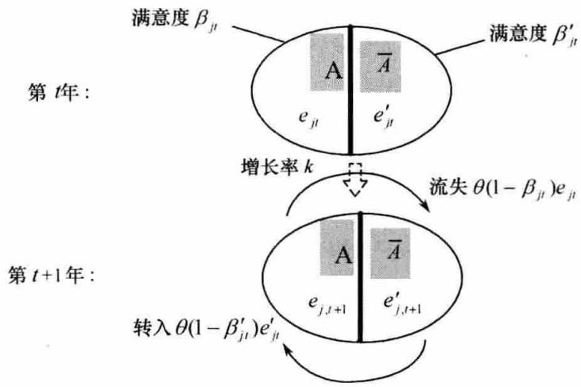

<details>
<summary>flowchart</summary>

```mermaid
graph LR
  subgraph t["\"第 t年:**"]
  A["A\ne_jt"] --> B["A\ne'_j_t"]
  end
  subgraph t_1["\"第 t+1年:**"]
  C["A\ne_{j,t+1}"] --> D["A\ne'_j,t+1"]
  end
  B -->|"增长率 k"| C
  D -->|"流失 θ1 - β_jte_jt"| E["转入 θ(1 - β'_j_t)e'_j_t"]
```
</details>

图 3 $f(e_{j})$ 的各因素对其影响关系图

## 2. $f(e_{j})$ 的数学关系表达式

从以上分析, $f(e_{j})$ 主要受三个因素的影响,将定性的分析定量地表示,有如下的预测公式:

$$
e _ {j, k + 1} = (1 + k _ {j k}) e _ {j k} - \theta_ {j k} (1 - \beta_ {j k}) e _ {j k} + \theta_ {j k} (1 - \beta_ {j k} ^ {\prime}) e _ {j k} ^ {\prime} \tag {21}
$$

式中： $k_{jk}$ 表示单位书号所对应的销售量的变化值； $e_{jk}$ 表示第 j 门课程第 k 年的单位书号所对应的销售量； $e_{jk}'$ 表示除 A 出版社外，其余所有出版社第 j 门课程第 k 年的单位书号所对应的销售量； $\theta_{jk}$ 表示转移系数； $\beta_{jk}$ 表示满意度； $\beta_{jk}'$ 表示除 A 出版社外，其余所有出版社第 j 门课程第 k 年的综合满意度。

## 3. 表达式(21)中各参数的确定

（1） $k_{jk}$ ：表示单位书号所对应的销售量的变化值。定义： $k_{jk}=\frac{e_{j,k+1}}{e_{j,k}}$ ，则根据五年的数据，计算可得到 $k_{j1},k_{j2},k_{j3},k_{j4}(1\leqslant j\leqslant72)$ 。  
(2) $e_{jk}$ : 表示第 j 门课程第 k 年的单位书号所对应的销售量。经前面的数据处理, 已经得出每门课程五年的 $e_{jk}$ 值。  
(3) $e_{jk}^{\prime}$ : 表示除 A 出版社外, 其余所有出版社第 $j$ 门课程第 $k$ 年的单位书号所对应的销售量。由于附件 2 的调查对象是随机的, 因此近似地认为: $\alpha_{jk} = \frac{p_{jk}}{p_{jk}^{\prime}} = \frac{e_{jk}}{e_{jk}^{\prime}}$ , 表示 $j$ 个课程受调查的所有人中 A 出版社与非 A 出版社的人数之比近似等于两者该课程单位书号所对应的销售量之比。故通过统计附件 2 中的数据, 结合 $e_{jk}$ 值, 就可计算出五年每门课程的 $e_{jk}^{\prime}$ 值。  
(4) $\beta_{jk}$ : 表示满意度。这个数据在前面的数据处理中已经进行了计算, 其值见附录 (表格 2)。需要进行归一化处理, 变换到 0\~1 区间上来。

(5) $\beta_{jk}^{\prime}$ : 表示除 A 出版社外, 其余所有出版社第 j 门课程第 k 年的综合满意度。按照 $\beta_{jk}$ 的处理手段和计算方法, 得到五年的数值, 再进行归一化处理。

(6) $\theta_{jk}$ : 表示转移系数。在上述 5 个参数的值都已经确定后, 代入式(21), 通过反演, 求得五年中的 4 个转移系数。

4. 利用上面 6 个参数求得的数据, 预测 2006 年各参数的值

上面的6个参数最多只有五个数据,要根据现在仅有的几个数据预测2006年的参数值,误差会相当大。因此,为了能尽量减小预测误差,考虑利用神经网络来训练这些参数值,从而获取这些参数2006的值。

该神经网络含有1个输入节点,1个输出节点和两个中间隐节点,我们将时间作为输入,各参数的值作为输出,在将各数值代入网络进行训练之前,先将数据进行归一化处理。

按照成熟的神经网络理论,输入层传递函数选取 sigmoid 函数: $\varphi(v)=\frac{1}{1+\exp(-v)}$ , 在 MATLAB 的内部为函数 $\log sig$ , 输出层传递函数选取 y=x, 在 MATLAB 的内部为函数 purelin, 训练函数选用 MATLAB $^{[1]}$ 的内部函数 trainlm。网络的生成语句为

$$
\text {net} = \text {newff} (\min \max (p t r), [ 2, 1 ], \{\text {`logsig', 'purelin'}, \text {`trainlm'});
$$

利用 train 对所生成的网络进行训练, 训练的结果为

$$
[ n e t, t r ] = t r a i n (n e t, p t r, t t r);
$$

由于数据量较少,因此将参数所有的数据都用来训练,得到较为稳定的权值,训练中止的精度为 $10^{-10}$ , 训练的最大次数为 1000 次。

通过神经网络模型进行预测计算,求得以上6个参数2006年时的值。

5. 计算 $f(e_{j})$ 的表达式

得到各个课程的参数在2006年的值后,将这些值代入式(21),求得2006年时,各个课程的单位书号所对应的销售量,即是得到了 $f(e_{j})$ 的值。

至此,成功解决了 $f(e_{j})$ 的值。

## 8.3 模型的建立

因为上面 $f(e_{j})$ 的计算过程中,已经考虑了不同课程的满意度和市场占有率的影响,因此,将市场经济效益为目标函数,也是一个综合的指标。书号的分配过程一次完成,故目标函数为 $\max\sum_{j=1}^{72}f(e_{j})c_{j}e_{j}$ ,其满足的约束条件包括:

（1）所有课程分得的书号数之和等于总书号量500，即 $\sum_{j=1}^{72} e_j = 500$ 。  
（2）每一分社所包含的课程所分得的书号数满足至少为申请数的1/2的要求，即是 $\frac{E_t}{2} \leqslant \sum_{j=n_{t0}}^{n_t} e_j \leqslant E_t (1 \leqslant t \leqslant 9)$ （式中： $n_{t0}$ 表示第 $t$ 分社开始的序号， $n_t$ 第 $t$ 分社结束的序号）。  
（3）各分社满足人力资源约束，即 $\sum_{j = n_{t0}}^{n_t}e_j\leqslant q_t(1\leqslant t\leqslant 9)$ 。对这一约束中的数学分社，由于其人力资源约束值明显不符合要求，因此，按照前面模型讨论的理由，将其调整到 $q_{t} = 153$

上面(2)、(3)两个约束综合起来就是： $\frac{E_{t}}{2}\leqslant\sum_{j=n_{0}}^{n_{t}}e_{j}\leqslant\min\left\{E_{t},q_{t}\right\}(1\leqslant t\leqslant9)$ 。

(4) 每门课程分得的书号数必须既小于其申请的书号数, 又小于该门课程市场需求的饱和量。市场需求的饱和量 $A_{j} = \frac{D_{j}}{f(e_{j})}$ , 式中 $D_{j}$ 表示 2006 年实际销售量的预测值, 也由上述的神经网络模型预测得出。每门课程的申请量用符号 $F_{j}$ 表示, 故条件 4 的约束可表示为 $0 \leqslant e_{j} \leqslant \min \left\{A_{j}, F_{j}\right\}$ 。

(5) 书号数必须为整数, 即 $\mathrm{Gin}(e_{j})$ 。

按照上面的思路,建立整数规划模型为

目标函数: $\max\sum_{j=1}^{72}f(e_{j})c_{j}e_{j}$

$$
\mathrm{s.t} \left\{ \begin{array}{c} \sum_ {j = 1} ^ {7 2} e _ {j} = 5 0 0 \\ \frac {E _ {t}}{2} \leqslant \sum_ {j = n _ {t 0}} ^ {n _ {t}} e _ {j} \leqslant \min \left\{E _ {t}, q _ {t} \right\} (1 \leqslant t \leqslant 9) \\ 0 \leqslant e _ {j} \leqslant \min \left\{A _ {j}, F _ {j} \right\} \\ G i n (e _ {j}) \end{array} \right. \tag {22}
$$

## 8.4 模型的求解与结论

先计算各约束条件中所有参数的值,再编写 MATLAB 程序计算模型的解。求得了各课程分得的书号数为见表 22。

表 22 每个课程分配到的书号数

<table><tr><td>课程代号</td><td>书号数</td><td>课程代号</td><td>书号数</td><td>课程代号</td><td>书号数</td><td>课程代号</td><td>书号数</td><td>课程代号</td><td>书号数</td><td>课程代号</td><td>书号数</td></tr><tr><td>1</td><td>1</td><td>13</td><td>0</td><td>25</td><td>24</td><td>37</td><td>0</td><td>49</td><td>18</td><td>61</td><td>0</td></tr><tr><td>2</td><td>18</td><td>14</td><td>4</td><td>26</td><td>34</td><td>38</td><td>6</td><td>50</td><td>4</td><td>62</td><td>8</td></tr><tr><td>3</td><td>4</td><td>15</td><td>0</td><td>27</td><td>12</td><td>39</td><td>0</td><td>51</td><td>10</td><td>63</td><td>4</td></tr><tr><td>4</td><td>6</td><td>16</td><td>6</td><td>28</td><td>6</td><td>40</td><td>0</td><td>52</td><td>0</td><td>64</td><td>0</td></tr><tr><td>5</td><td>6</td><td>17</td><td>6</td><td>29</td><td>0</td><td>41</td><td>4</td><td>53</td><td>4</td><td>65</td><td>4</td></tr><tr><td>6</td><td>0</td><td>18</td><td>0</td><td>30</td><td>12</td><td>42</td><td>10</td><td>54</td><td>8</td><td>66</td><td>4</td></tr><tr><td>7</td><td>12</td><td>19</td><td>6</td><td>31</td><td>40</td><td>43</td><td>8</td><td>55</td><td>4</td><td>67</td><td>8</td></tr><tr><td>8</td><td>0</td><td>20</td><td>4</td><td>32</td><td>4</td><td>44</td><td>10</td><td>56</td><td>4</td><td>68</td><td>0</td></tr><tr><td>9</td><td>0</td><td>21</td><td>12</td><td>33</td><td>2</td><td>45</td><td>6</td><td>57</td><td>4</td><td>69</td><td>0</td></tr><tr><td>10</td><td>8</td><td>22</td><td>0</td><td>34</td><td>21</td><td>46</td><td>8</td><td>58</td><td>0</td><td>70</td><td>6</td></tr><tr><td>11</td><td>8</td><td>23</td><td>52</td><td>35</td><td>8</td><td>47</td><td>12</td><td>59</td><td>0</td><td>71</td><td>4</td></tr><tr><td>12</td><td>4</td><td>24</td><td>1</td><td>36</td><td>0</td><td>48</td><td>14</td><td>60</td><td>3</td><td>72</td><td>4</td></tr></table>

9 个分社分别分得的书号数见表 23, 分别的销售额见表 24。

表 23 9 个分社分别分得的书号数

<table><tr><td>分社名称</td><td>计算机类</td><td>经管类</td><td>数学类</td><td>英语类</td><td>两课类</td><td>机械能源类</td><td>化学、化工类</td><td>地理、地质类</td><td>环境类</td></tr><tr><td>书号数</td><td>55</td><td>38</td><td>153</td><td>81</td><td>72</td><td>44</td><td>15</td><td>20</td><td>22</td></tr></table>

表 24 9 个分社分别的销售额

<table><tr><td>课程名称</td><td>计算机类</td><td>经管类</td><td>数学类</td><td>英语类</td><td>两课类</td><td>机械能源类</td><td>化学、化工类</td><td>地理、地质类</td><td>环境类</td></tr><tr><td>销售额</td><td>291513.11</td><td>1052209.11</td><td>14607095.95</td><td>2060756.38</td><td>4366818.44</td><td>1430722.17</td><td>138452.76</td><td>339536.5</td><td>1748386.59</td></tr></table>

总的销售总额：

$$
Q = \sum_ {j = 1} ^ {7 2} f (e _ {j}) c _ {j} e _ {j} = 2 6 0 3. 5 4 9 1 0 3 \mathrm{万元}
$$

## 8.5 模型的改进

从表 23 可看出, 各门课程中有很多分到的书号数都为 0, 究其原因, 可以发现是由于约束条件 $4:0 \leqslant e_{j} \leqslant \min \{A_{j}, F_{j}\}$ 没有限定下界造成的。从分配方案的实用价值来看, 一些部门的工作量很大, 而另一些部门却无事可干, 显然, 这种分配方案不够科学也不符合实际。因此, 考虑对模型进行改进。

主要对约束条件4进行改进,根据实际需要,认为每个课程分得的书号数必须大于其申请量的1/2,即条件4的约束表示为: $0.5F_{j}\leqslant e_{j}\leqslant\min\{A_{j},F_{j}\}$ ,这样,便得到了改进模型:

$$
\mathrm{目标函数}: \max \sum_ {j = 1} ^ {7 2} f (e _ {j}) c _ {j} e _ {j}
$$

$$
\mathrm{s.t} \left\{ \begin{array}{c} \sum_ {j = 1} ^ {7 2} e _ {j} = 5 0 0 \\ \frac {E _ {t}}{2} \leqslant \sum_ {j = n _ {t 0}} ^ {n _ {t}} e _ {j} \leqslant \min \left\{E _ {t}, q _ {t} \right\} (1 \leqslant t \leqslant 9) \\ 0. 5 F _ {j} \leqslant e _ {j} \leqslant \min \left\{A _ {j}, F _ {j} \right\} \\ G i n (e _ {j}) \end{array} \right. \tag {23}
$$

运用和先前模型一样的 MATLAB 程序, 只是增加一个约束条件, 计算模型的解, 求得了各课程分得的书号数, 见表 25。

表 25 改进模型后,每个课程分配到的书号数

<table><tr><td>课程代号</td><td>书号数</td><td>课程代号</td><td>书号数</td><td>课程代号</td><td>书号数</td><td>课程代号</td><td>书号数</td><td>课程代号</td><td>书号数</td><td>课程代号</td><td>书号数</td></tr><tr><td>1</td><td>9</td><td>13</td><td>2</td><td>25</td><td>12</td><td>37</td><td>3</td><td>49</td><td>9</td><td>61</td><td>4</td></tr><tr><td>2</td><td>9</td><td>14</td><td>4</td><td>26</td><td>34</td><td>38</td><td>3</td><td>50</td><td>2</td><td>62</td><td>8</td></tr><tr><td>3</td><td>2</td><td>15</td><td>3</td><td>27</td><td>6</td><td>39</td><td>5</td><td>51</td><td>5</td><td>63</td><td>4</td></tr><tr><td>4</td><td>3</td><td>16</td><td>3</td><td>28</td><td>3</td><td>40</td><td>3</td><td>52</td><td>8</td><td>64</td><td>4</td></tr><tr><td>5</td><td>3</td><td>17</td><td>3</td><td>29</td><td>12</td><td>41</td><td>4</td><td>53</td><td>4</td><td>65</td><td>2</td></tr><tr><td>6</td><td>8</td><td>18</td><td>4</td><td>30</td><td>6</td><td>42</td><td>10</td><td>54</td><td>4</td><td>66</td><td>2</td></tr><tr><td>7</td><td>6</td><td>19</td><td>6</td><td>31</td><td>40</td><td>43</td><td>8</td><td>55</td><td>4</td><td>67</td><td>8</td></tr><tr><td>8</td><td>3</td><td>20</td><td>4</td><td>32</td><td>2</td><td>44</td><td>10</td><td>56</td><td>2</td><td>68</td><td>5</td></tr><tr><td>9</td><td>8</td><td>21</td><td>6</td><td>33</td><td>2</td><td>45</td><td>6</td><td>57</td><td>2</td><td>69</td><td>4</td></tr><tr><td>·10</td><td>4</td><td>22</td><td>19</td><td>34</td><td>11</td><td>46</td><td>8</td><td>58</td><td>2</td><td>70</td><td>3</td></tr><tr><td>11</td><td>8</td><td>23</td><td>51</td><td>35</td><td>4</td><td>47</td><td>12</td><td>59</td><td>2</td><td>71</td><td>2</td></tr><tr><td>12</td><td>4</td><td>24</td><td>4</td><td>36</td><td>8</td><td>48</td><td>13</td><td>60</td><td>5</td><td>72</td><td>4</td></tr></table>

改进模型后,9个分社分别分得的书名数见表26,分别的销售额见表27。

表 26 改进模型后,9 个分社分别分得的书号数

<table><tr><td>分社名称</td><td>计算机类</td><td>经管类</td><td>数学类</td><td>英语类</td><td>两课类</td><td>机械能源类</td><td>化学、化工类</td><td>地理、地质类</td><td>环境类</td></tr><tr><td>书号数</td><td>55</td><td>41</td><td>153</td><td>81</td><td>71</td><td>32</td><td>17</td><td>24</td><td>26</td></tr></table>

表 27 改进模型后,9 个分社分别的销售额

<table><tr><td>课程名称</td><td>计算机类</td><td>经管类</td><td>数学类</td><td>英语类</td><td>两课类</td><td>机械能源类</td><td>化学、化工类</td><td>地理、地质类</td><td>环境类</td></tr><tr><td>销售额</td><td>222693.06</td><td>1036189</td><td>14312332</td><td>1988413</td><td>4351742</td><td>1250916</td><td>128298</td><td>334424</td><td>1718523</td></tr></table>

总的销售总额：

$$
Q = \sum_ {j = 1} ^ {7 2} f (e _ {j}) c _ {j} e _ {j} = 2 5 3 4. 3 4 3 4 1 7 \mathrm{万元}
$$

## 9 模型五:长远发展战略模型

## 9.1 问题的分析

随着社会发展,经济市场也逐渐完善与成熟。一个成功的企业,不仅注重其短期经济效益,而且更加注重其长远发展战略。现代企业越来越注重其品牌价值,因为品牌价值本身就是一笔无形资产,其对企业来说往往比看得见摸得找的实实在在的效益更为重要。因此,在书号的分配过程中,将企业的品牌价值作为目标,确定分配方案。

一个企业的好与坏,其品牌价值究竟有多大,消费者最有发言权。因此,用消费者的满意度来刻画企业的品牌价值。另外,在注重企业品牌价值的同时,也必须考虑企业的经济效益,因为企业的品牌价值决定了企业的长期的生存力,而企业的经济效益则决定了企业的短期生存能力,二者谁都不能少,只是不同企业的侧重点有所不同。本文的前四个模型,都注重考虑短期经济效益,因此,在本模型中,重点考虑企业的长远品牌价值。

## 9.2 模型的建立的准备

经过上面的分析,用消费者对企业的满意度来刻画企业的品牌价值,因此,确定每个消费者的满意度就是处理问题的关键。

按照文章第一部分对满意度的处理方法,每个消费者对课程满意度的处理按三个步骤进行,下面以统计对课程1的满意度为例来进行计算说明。

(1) 统计计算每个人对课程 1 的满意度。  
(2) 计算所有人对对课程 1 的满意度的均值。  
（3）再将每年每个人的满意度均值在时间上取平均,得到这一时期每个人对课程1的满意度。

## 9.3 模型的建立

由于要同时考虑企业的满意度和企业的经济效益两个方面,因此,模型的目标函数为两个:满意度最大和经济效益最大。为了求解的方便,考虑将此多目标的优化问题转化成单目标的优化问题。因此,需要对两者进行无量纲处理,使得具有相同的中心点,以便得到一个综合指标。

两个目标函数分别研究,对出版社的满意度,有

$$
S = \sum_ {j = 1} ^ {7 2} \beta_ {j} e _ {j} a _ {j} \tag {24}
$$

式中： $e_{j}$ 表示 j 课程分得的书号数，是决策变量； $a_{j}$ 表示单位书号对应的销售量，在文章前面的数据处理部分，已经运用时间序列的趋势性指数平滑预测法计算得到。

对市场经济效益,按照前面模型二,有

$$
Q = \sum_ {j = 1} ^ {7 2} c _ {j} e _ {j} a _ {j} \tag {25}
$$

比较式(24)和式(25)，发现两者只有反映其自身性质的参数 $\beta_{j}$ 和 $c_{j}$ 不同，但这两者的数值存在很大的差异，没有相同的中心点，因此，将二者分别除以其均值，实现无量纲化，且二者具有公共中心点1，因此，得到如下的处理公式：

$$
\tilde {\beta} _ {j} = \frac {\beta_ {j}}{\frac {1}{7 2} \sum_ {j = 1} ^ {7 2} \beta_ {j}} \tag {26}
$$

$$
\tilde {c} _ {j} = \frac {c _ {j}}{\frac {1}{7 2} \sum_ {j = 1} ^ {7 2} c _ {j}} \tag {27}
$$

故二者的综合指标,可定义为

$$
M _ {j} = \left[ x \tilde {\beta} _ {j} + (1 - x) \tilde {c} _ {j} \right] e _ {j} a _ {j} \tag {28}
$$

式中： $x$ 为两者的权重系数，所以得到模型的目标函数为

$$
\max \sum_ {j = 1} ^ {7 2} M _ {j}
$$

约束条件和前面的模型都一样,因此,得到长远发展战略下的整数规划模型为

$$
\mathrm{目标函数}: \max \sum_ {j = 1} ^ {7 2} M _ {j}
$$

$$
\text {s. t.} \left\{ \begin{array}{c} M _ {j} = \left[ x \tilde {\beta} _ {j} + (1 - x) \tilde {c} _ {j} \right] e _ {j} a _ {j} \\ 0. 5 E _ {t} \leqslant r _ {t} \leqslant E _ {t} (1 \leqslant t \leqslant 9) \\ \sum_ {t = 1} ^ {9} r _ {t} = 5 0 0 \\ r _ {t} \leqslant q _ {t} \\ G i n (e _ {t}) \end{array} \right. \tag {29}
$$

## 9.4 模型的求解

在求解时,需要首先确定权重系数 x 的值的大小。由式(28)可知,x 取值越大,则目标函数越看重消费者对出版社的满意度,即重视出版社的品牌价值,长远利益。相反,如果 x 取值越小,则目标函数越注重企业的短期经济效益。在本模型中,主要考虑出版社的长远发展战略,因此,取 x=0.6。

运用前面编写的整数规划求解程序,计算得到各个课程所分得的书号数,见表28。

表 28 长远发展战略下,各个课程分得的书号数

<table><tr><td>课程代号</td><td>书号数</td><td>课程代号</td><td>书号数</td><td>课程代号</td><td>书号数</td><td>课程代号</td><td>书号数</td><td>课程代号</td><td>书号数</td><td>课程代号</td><td>书号数</td></tr><tr><td>1</td><td>18</td><td>13</td><td>2</td><td>25</td><td>12</td><td>37</td><td>6</td><td>49</td><td>18</td><td>61</td><td>8</td></tr><tr><td>2</td><td>18</td><td>14</td><td>2</td><td>26</td><td>17</td><td>38</td><td>3</td><td>50</td><td>2</td><td>62</td><td>4</td></tr><tr><td>3</td><td>2</td><td>15</td><td>3</td><td>27</td><td>12</td><td>39</td><td>5</td><td>51</td><td>10</td><td>63</td><td>4</td></tr><tr><td>4</td><td>3</td><td>16</td><td>3</td><td>28</td><td>3</td><td>40</td><td>3</td><td>52</td><td>8</td><td>64</td><td>4</td></tr><tr><td>5</td><td>3</td><td>17</td><td>3</td><td>29</td><td>24</td><td>41</td><td>2</td><td>53</td><td>2</td><td>65</td><td>2</td></tr><tr><td>6</td><td>16</td><td>18</td><td>4</td><td>30</td><td>6</td><td>42</td><td>5</td><td>54</td><td>4</td><td>66</td><td>2</td></tr><tr><td>7</td><td>12</td><td>19</td><td>3</td><td>31</td><td>28</td><td>43</td><td>4</td><td>55</td><td>2</td><td>67</td><td>4</td></tr><tr><td>8</td><td>3</td><td>20</td><td>2</td><td>32</td><td>2</td><td>44</td><td>5</td><td>56</td><td>2</td><td>68</td><td>5</td></tr><tr><td>9</td><td>16</td><td>21</td><td>6</td><td>33</td><td>1</td><td>45</td><td>3</td><td>57</td><td>2</td><td>69</td><td>4</td></tr><tr><td>10</td><td>4</td><td>22</td><td>38</td><td>34</td><td>22</td><td>46</td><td>4</td><td>58</td><td>2</td><td>70</td><td>3</td></tr><tr><td>11</td><td>4</td><td>23</td><td>26</td><td>35</td><td>4</td><td>47</td><td>6</td><td>59</td><td>2</td><td>71</td><td>2</td></tr><tr><td>12</td><td>2</td><td>24</td><td>4</td><td>36</td><td>16</td><td>48</td><td>7</td><td>60</td><td>5</td><td>72</td><td>2</td></tr></table>

长远发展战略下,各个分社分得的书号数见表29。

表 29 长远发展战略下,各个分社分得的书号数

<table><tr><td>分社名称</td><td>计算机类</td><td>经管类</td><td>数学类</td><td>英语类</td><td>两课类</td><td>机械能源类</td><td>化学、化工类</td><td>地理、地质类</td><td>环境类</td></tr><tr><td>书号数</td><td>95</td><td>28</td><td>148</td><td>90</td><td>36</td><td>44</td><td>15</td><td>24</td><td>20</td></tr></table>

此时,出版社的销售总额:

$$
Q = \sum_ {j = 1} ^ {7 2} a _ {j} c _ {j} e _ {j} = 1 5 9 0. 2 9 6 9 7 8 \text {万元}
$$

## 9.5 模型的结论

该模型撇开前四个模型的入题点,把模型的目标放在企业的品牌效应即消费者的满意度上面,并兼顾考虑企业的短期经济利益,在侧重点为消费者的满意度的前提条件下,求得了各课程的书号分配数。这样的分配处理,对于一些建设正规的大企业来说,可能更具有指导意义。

## 10 模型的结论

模型一以增加强势产品的支持力度的原则,分两阶段来实施分配,建立初等分配模型,求得其获得的总销售额, $Q_{1}=1933.131459$ 万元;其改进模型在第二阶段以市场经济效益为目标函数,求得其获得的总销售额, $Q_{1}^{\prime}=2396.060323$ 万元。

模型二以整个分配所能获得的市场经济效益最大为目标,也按两个阶段实施分配,建立整数规划模型,其获得的总销售额 $Q_{2}=2606.54905$ 万元。

模型三以市场竞争力和市场经济效益的一个综合指标为目标函数,分两个阶段建立整数规划模型,其获得的总销售额 Q=2544.061772 万元。

模型四综合考虑了各种因素对分配的市场竞争力和市场经济效益的影响,按一次分直接分配到各课程的方法实施分配,其获得的总销售额 $Q_{4}=2603.549103$ 万元。考虑实际意义,将其一个约束条件强化,得到改进模型,其获得的总销售额 $Q_{4}^{\prime}=2534.343417$ 万元。

模型五撇开前四个模型的入题点,把模型的目标放在企业的品牌效应即消费者的满意度上面,而非企业的短期经济利益,其获得的总销售额 $Q_{5}=1590.296978$ 万元。

## 11 模型的评价与改进

模型一、模型二分别从竞争力或经济效益单方面考虑,建立了优化模型并求解,只是单因素的最优,显然过于片面,不符合实际的操作过程。模型3综合考虑竞争力与经济效益两个方面,对结果进行了优化,并得到了具体的结果,较前两个模型有较大的改观,应该说该模型是较优的。

但从竞争力和经济效益的衡量方式来考虑,就竞争力来说,只考虑了顾客满意度及课程的市场占有率,而经济效益只考虑了以往五年的销售情况。并没有考虑诸如市场情况的变化等因素。模型四就是在模型三的基础上,考虑了市场的变化情况以及顾客对本社与其他出版社之间满意度的相互转化等情况,并一次性直接对每一门课程所分书号进行优化,是较好的模型。不足之处是,在模型四中对第六年增长率 $k_{t}$ 及转移系数 $\theta_{t}$ 的神经网络预测中,由于样本数据的有限,致使其结果稳定性稍差。

模型四可以很好地解决本问题,然而要得到更加有效的预测结果,可以加大样本的收集数目,以使结果的有效性更加高。

模型五从长远发展战略上来考虑书号的分配,把模型的目标放在企业的品牌效应即消费者的满意度上面,而非企业的短期经济利益。

本文所述模型除了用于解决出版社书号分配的资源配置外,还可用于人力资源分配等实际问题。

## 参考文献

[1] 魏巍. Matlab 应用数学工具箱技术手册. 北京: 国防工业出版社, 2004.  
[2] 徐久平, 胡知能, 等. 运筹学(第二版). 北京: 科学出版社, 2004.

## 【论文点评】

滕加俊

该论文思路清晰,模型建立正确,考虑因素全面,数据处理合理,结论符合实际。

论文建立模型的过程由简单到复杂,考虑的因素由少渐多,这种思路很好。论文首先以市场竞争力为目标函数建立了初等分配模型,该模型的思路简单也很清晰;以经济效益最大为目标函数建立了整数规划模型,该模型约束条件和目标函数十分明确;以经济效益和市场竞争力综合指标为目标函数建立了另一个整数规划模型,该模型兼顾了经济效益与市场竞争力两个方面因素,使得模型更有实践指导意义;为了克服以上模型对一些数据的处理过于简单和比较粗糙的缺点,论文合理构造了单位书号所对应销售量的关系函数 $f(e_{i})$ ,并较为准确地确定了函数中各种参数,建立了一次分配完全的最大经济效益模型,该模型思路很好,各种数据处理也较为合理,但在用神经网络模型来预测一些数据时,由于样本点较少,结果可能有些缺乏说服力,可以改用其他方法来进行预测;最后重点考虑企业的长远品牌价值,兼顾考虑经济效益,建立了长远发展战略模型,由于考虑的因素较少和考虑的方法方面的问题,得出的方案也不够合理。

该论文是一篇优秀的数学建模论文。

# 出版社资源配置的数学模型

## 摘要

本题根据教材类出版社每年进行资源配置决策的实际问题,要求以量化分析为基础,给出一个获得利润最高的资源(即书号)分配方案。本文一共建立了三个数学模型。模型1通过前五年平均每个书号能够产生的销售量,用回归直线拟合的方法预测出了2006年平均每个书号能够产生的销售量,然后以利润最大化即销售额最高为目标函数,满足分社1/2的申请书号,在工作能力之内,不超过申请数目等约束条件,建立了单目标优化模型。利用LINGO编程解出了两组可行解。模型1简单易解,但是方案不够理想。模型2根据附表2的调查问卷相关数据,在模型1的基础上,增加了“使‘总满意水平’和‘市场份额’尽可能大”的两个目标函数。然后根据前五年销售计划准确度的历史数据,认为各门课程计划的准确度的分布服从正态分布,然后用MATLAB算出了均值和均方差,根据正态分布的3σ法则,认为2006年计划准确率必定处于 $(\mu-3\sigma,\mu+3\sigma)$ 区间内。将这个条件作为约束条件,从而建立了三个目标函数的多目标优化模型。在求解这个模型时,采用了主要目标函数法,将利润最大化作为主要目标函数,将“最大满意水平”和“最大份额”两个目标函数转化为约束条件。根据试算法,给“最大满意水平”和“最大份额”设定了合理的折减系数,从而确定了适当的界限值。因此多目标优化就转化为单目标优化问题,得到了一组分配方案,经过检验,2006年总销售额为24401880元,总满意水平为5657.95,总的市场份额为293.04。可见其既能够获得较大的利润,又能够满足较大的满意水平和市场份额,较好地满足了题目要求。然后,对于数学分社获得书号数超过其工作能力的问题,引入了任务风险概率的概念,将数学分社完不成任务的概率降到一个比较低的水平,又得到了一组解,总销售额达到24325770,也是可以接受的。模型3通过分析A出版社每门课程每年市场份额的变化规律,确定每年读者的流动规律,根据调查问卷的数据确定出了读者分别对A出版社和其他出版社的满意水平大小,确定了2006年读者群对于A出版社的流入率和流失率,从而预测出了2006年A出版社各门课程的销售量,然后建立了书号数与销售量之间的关系,即得到了2006年书号分配方案。

关键词: 准确率, 回归直线拟合, 满意水平, 市场份额, $3\sigma$ 法则, 流入率, 流失率, 任务风险概率

## 1 问题的重述

出版社的资源主要包括人力资源、生产资源、资金和管理资源等,它们都捆绑在书号上,经过各个部门的运作,形成成本(策划成本、编辑成本、生产成本、库存成本、销售成

本、财务与管理成本等)和利润。

某个以教材类出版物为主的出版社,总社领导每年需要针对分社提交的生产计划申请书、人力资源情况以及市场信息分析,将总量一定的书号数合理地分配给各个分社,使出版的教材产生最好的经济效益。事实上,由于各个分社提交的需求书号总量远大于总社的书号总量,因此总社一般以增加强势产品支持力度的原则优化资源配置。资源配置完成后,各个分社(分社以学科划分)根据分配到的书号数量,再重新对学科所属每个课程作出出版计划,付诸实施。

资源配置是总社每年进行的重要决策,直接关系到出版社的当年经济效益和长远发展战略。由于市场信息(主要是需求与竞争力)通常是不完全的,企业自身的数据收集和积累也不足,这种情况下的决策问题在我国企业中是普遍存在的。

本题附录中给出了该出版社所掌握的一些数据资料,请根据这些数据资料,利用数学建模的方法,在信息不足的条件下,提出以量化分析为基础的资源(书号)配置方法,给出一个明确的分配方案,向出版社提供有益的建议。

## 2 问题的分析

本题根据教材类出版社每年进行资源配置决策的实际问题,要求以量化分析为基础,给出一个获得利润最高的资源(即书号)分配方案。

根据对历史数据的统计,发现 A 出版社每年都有 500 个书号可以进行自由支配。研究的课程对象就是出版社关心的 72 门课程。也就是说最后要作的就是将 500 个书号合理地分配给 72 门课程,以获得最大利润。

题目一共给出了五年的调查问卷数据,各课程计划和实际销售数据,各课程申请或获得的书号数据以及9个分社的人力资源数据。这些数据并不是很完整,样本太少,不能很好地体现总体的特征。而我们就要根据这些数据预测出2006年市场状况,确定出最优的资源分配方案,以获得最大的利润。在本题中,有以下几个问题需要特别注意。

(1) 这是一个优化问题,最主要的目标函数就是获得最大的利润。但是,这并不是一个简单的单目标优化问题。从出版社长远发展考虑,不能仅仅将在2006年获得最大利润作为唯一的目标函数。另外,还要考虑到出版社应该大力扶持一些眼下市场份额并不大,但是很受读者好评的教材,这样可以逐渐抢占市场,扩大份额,有利于出版社长远的发展。并且还要尽量多出版深受读者好评的教材,提高出版社在读者心目中的地位,扩大影响,也有利于出版社的长远发展。而在一些不占优势,竞争力比较弱的课程领域,也不能彻底放弃,而是应该尽量坚守住原有的市场份额,使出版社涉及多个领域,增强生命力。  
（2）题目告诉我们所有的教材价格的利润率是相同的，因此，同样卖出一本书，价格越贵的赚的钱越多。最后用销售额就可以表示出利润的大小。  
（3）从 2001 年到 2005 年,9 个分社各自总的销售量都是逐年上升的,我们认为这是由于大学生数量每年都在增多、导致市场需求量增加的原因。  
（4）如何定义强势产品。我们认为强势产品并不是局限于某一本或某几本教科书上，而是指某几门课程。若 A 出版社针对某门课程所出版的教材销量和评价都很好，那

么,就可以认为 A 出版社的本门课程就是强势产品,而也应该大力支持强势课程,给予更多的书号,进一步扩大市场占有率。

(5) 每个分社每年能够完成的书号数是由策划、编辑和校对能力的最小值决定的,不能超过最小值这个上限。但是,分析往年的历史数据,我们发现数学类分社每年完成的书号工作量都超过了平均工作能力。同时发现,数学分社很多门课程都是A出版社的强势产品,在市场上的占有率甚至达到了100%,那么就有充足的理由尽最大的努力去支持这些课程。因此,允许数学分社得到的书号适当地超过人员平均能力,以获得更多的利润。但是,分配的书号不能无限制地增加。最简单的办法,就是认为获得的书号不能超过其历史最大值,也就是153,但是这样做未免过于牵强。为了解决这个问题,引入任务风险概率的概念,具体地说就是,允许数学分社获得的书号适当地超过其平均能力,但是,一旦超过平均能力,就有一定的概率完不成任务,造成书号的浪费,导致利润的损失。因此,必须设置一个超越平均能力的临界值,控制其书号的分配,使完不成任务的风险降到比较低的水平。至于临界值的选取将在后面的模型中进一步讨论。

## 3 符号约定

$x_{i}(i=1,2,\cdots,72)$ : 第 i 门课程所得到的书号数;

$x_{i}^{\prime}(i=1,2,\cdots,72)$ : 第 i 门课程申请的书号数;

$p_{i}(i=1,2,\cdots,72)$ : 第 i 门课程教材均价, 为已知量;

$c_{i}(i=1,2,\cdots,72)$ : 第 i 门课程教材在 2006 年的实际销售量；

S: 总的销售额, 也就表示了最后的利润, 作为目标函数;

$t_{i}(i=1,2,\cdots,72)$ :读者对于第i门课程的总体满意水平;

$f_{i}(i=1,2,\cdots,72)$ : A 出版社对于第 i 门课程的市场占有率,也就是市场份额;

$\alpha_{i}(i=1,2,\cdots,72)$ :本来选择 A 出版社的读者在第二年不选择 A 出版社的概率,相对 A 出版社而言,称其为流出率;

$\beta_{i}(i=1,2,\cdots,72)$ :读者因为不满意其他出版社的书,而在第二年选择A出版社的书的概率,相对A出版社而言,称其为流入率;

$r_{ij}(i=1,2,\cdots,4,j=1,2,\cdots,9)$ : A 出版社中的第 j 类分社在第 200i 年的销售量的增加比例；

$q_{i}(i=1,\cdots,72)$ : 在选择 A 出版社的第 i 类分社的书的人群中, 对所选的书满意的人所占的比例;

$q_{i}^{\prime}(i=1,\cdots,72)$ : 在没有选择 A 出版社的人群中, 对所选的第 i 类书满意的人所占的比例;

$m_{ij}(i=1,\cdots,5,j=1,\cdots,72)$ : 在 200i 年 A 出版社的第 j 类分社的销售量;

$m_{ij}^{'}(i=1,\cdots,5,j=1,\cdots,72)$ 在 200i 年其他出版社所出的第 j 类书的销售量。

## 4 模型的假设

为了简化解题步骤,需要对模型进行合理的假设和简化,具体如下:

(1) 认为每年市场格局变化不会过分剧烈, 即出版社市场份额和销售量不会突然发生较大变化, 因此对于 2006 年销售量和准确率等指标可以通过某种算法进行预测。

(2) 不考虑旧书对于资源分配方案的影响。

(3) 认为读者的评价是真实意志的反映。

(4) 资源分配时至少保证分给各分社申请数量的1/2。

(5) 只将72门课程作为研究对象,其他课程不予考虑。

(6) 调查问卷中对该书的满意水平评价的四项指标权重相同。

(7) 认为调查问卷是随即发放的,因此参加评价的每种教材数目也就反映出了本教材在市场上的占有率。

(8) 由于出版社总的书号有限,因此分配给各课程的书号不会超过提出申请的数量。

## 5 名词解释

强势产品:强势产品也就是“拳头”产品,是指出版社对于某一门课程的教材在市场上的占有率较高,评价也较好,那么此门课程就是出版社的强势产品。

满意水平:表示读者对于出版社某门课程所出版的教材的评价指标。

份额:也就是市场占有率,这项指标是由附表2的调查问卷统计得到的,根据模型假设(7),出版社某门课程市场份额就等于调查问卷中本课程教材参评数量除以所有出版社所有的本课程参评教材数目得到的百分比。

$$
\text {准确率} Z = \frac {\text {计划销售量} - \text {实际销售量}}{\text {计划销售量}}
$$

A、非 A: 分别表示选择 A 出版社和不选择 A 出版社的人群的集合。

## 6 资源分配模型1的建立与求解

## 6.1 建立资源分配模型 1 的准备工作

先从简单的问题入手。附表2内容繁多,数据庞大,不方便处理。在模型1中暂时不考虑附表2的数据,直接将最大的获得利润作为唯一的目标函数。然后根据提议写出约束条件,作为单目标规划问题求解。

## 6.2 模型1的建立

首先考虑目标函数的建立。

假设 $x_{i}(i=1,2,\cdots,72)$ 表示第 i 门课程所得到的书号数, 因为各门课程教材的平均价格已经知道, 如果能够知道 2006 年每门课程教材的实际销售数量, 那么 2006 年获得的销售额就可以表示出来了。而 2006 年实际销售量是未知的, 只知道前五年计划和销售量以及实际获得的书号, 要设法通过这些已知条件推出 2006 年实际销售量。

由于出版社每年出版一本新书是否能够畅销是很难预测的,所以总的销量也是不太稳定的,不能直接通过前五年实际销量预测到第6年的销量。考虑将平均每个书号在五年内的实际销售量作为研究对象。就是用当年各课程实际销售量除以本课程实际获得的书号数目。这个指标的变化量不会发生很大变化,是可以设法预测到第6年的平均销售量的。

预测的方法很多,在这里选用最简单的一种,采用回归直线拟合的方法 $^{[1]}$ ,设2006年第i门课程预计销售量 $c_{i}$ ,根据前五年的各书号平均销售量确定一条回归直线,然后就得到了第6年的平均销量。

先用 MATLAB 进行回归直线的计算并拟合出第六年的平均销售量, 程序源代码见附录。经过运行程序后, 得到表 1。

由于版面所限,无法将72门课程所有预测量在表里写出,这里只列举了前20门课程的相关数据。

表 1

<table><tr><td rowspan="2">课程类型</td><td colspan="5">前5年各书号平均销售量</td><td rowspan="2">2006年预测销售量</td></tr><tr><td>2001年</td><td>2002年</td><td>2003年</td><td>2004年</td><td>2005年</td></tr><tr><td>1</td><td>124</td><td>113</td><td>154.17</td><td>240.09</td><td>224.33</td><td>269.45</td></tr><tr><td>2</td><td>180.9</td><td>155.09</td><td>223.42</td><td>274.83</td><td>327.25</td><td>356.03</td></tr><tr><td>3</td><td>33.333</td><td>92.5</td><td>57.5</td><td>382.5</td><td>101.33</td><td>261.23</td></tr><tr><td>4</td><td>60</td><td>69.75</td><td>62.667</td><td>136.67</td><td>202.75</td><td>212.09</td></tr><tr><td>5</td><td>48.667</td><td>60.333</td><td>49.75</td><td>97.25</td><td>139.67</td><td>144.81</td></tr><tr><td>6</td><td>111.4</td><td>98.182</td><td>118.75</td><td>168.8</td><td>243.55</td><td>248.61</td></tr><tr><td>7</td><td>280.25</td><td>296.13</td><td>316.78</td><td>354</td><td>458.89</td><td>465.75</td></tr><tr><td>8</td><td>62.667</td><td>61.333</td><td>95.75</td><td>39.667</td><td>79</td><td>70.983</td></tr><tr><td>9</td><td>223.1</td><td>205</td><td>235.36</td><td>303.8</td><td>355</td><td>373.23</td></tr><tr><td>10</td><td>148.25</td><td>162</td><td>161.17</td><td>243</td><td>361.6</td><td>367.51</td></tr><tr><td>11</td><td>650</td><td>522.8</td><td>629.71</td><td>915.67</td><td>1270.4</td><td>1287.8</td></tr><tr><td>12</td><td>780.33</td><td>726.67</td><td>924</td><td>1483.7</td><td>1656.7</td><td>1867.2</td></tr><tr><td>13</td><td>140</td><td>104.75</td><td>168.2</td><td>322</td><td>337.33</td><td>398.03</td></tr><tr><td>14</td><td>292.67</td><td>344.33</td><td>454.33</td><td>416.33</td><td>943.5</td><td>902.33</td></tr><tr><td>15</td><td>168.33</td><td>161.5</td><td>339</td><td>415.67</td><td>262.8</td><td>402.39</td></tr><tr><td>16</td><td>290.33</td><td>270.25</td><td>317</td><td>548</td><td>494</td><td>589.44</td></tr><tr><td>17</td><td>313.25</td><td>543</td><td>565.67</td><td>696.75</td><td>713</td><td>852.31</td></tr><tr><td>18</td><td>308</td><td>328.43</td><td>379</td><td>432.14</td><td>521.83</td><td>553.3</td></tr><tr><td>19</td><td>1723.3</td><td>2060</td><td>2107</td><td>3643.7</td><td>2416.6</td><td>3281.2</td></tr><tr><td>20</td><td>285.75</td><td>508</td><td>364.25</td><td>526.25</td><td>1142</td><td>1084.5</td></tr></table>

则目标函数为

$$
\max S = \sum_ {i = 1} ^ {7 2} c _ {i} x _ {i} p _ {i} \tag {1}
$$

式(1)中 $p_{i}(i=1,2,\cdots,72)$ 表示第i门课程教材均价，为已知量。

然后来写各个约束条件。

首先,出版社一共只有500个书号,即

$$
\sum_ {i = 1} ^ {7 2} x _ {i} = 5 0 0 \tag {2}
$$

其次,分配的书号数目不能超过所申请的数目,另外,分配的书号要少于各个分社最低工作能力这个上限。否则超过分社工作能力,任务就无法完成。但是根据本文前面问题的分析,对于数学分社,简单起见,暂时忽略任务风险概率的影响,不对它进行工作能力上的约束,而是将历史上最多书号作为上限,即最多不能超过153。

设 $y_{i}(i=1,2,\cdots,9)$ 表示 9 个分社实际得到的书号数目， $y_{i}^{\prime}(i=1,2,\cdots,9)$ 表示 9 个分社申请的书号数目，则有

$$
\begin{array}{l} y _ {1} = \sum_ {i = 1} ^ {1 0} x _ {i} \quad y _ {2} = \sum_ {i = 1 1} ^ {2 0} x _ {i} \quad y _ {3} = \sum_ {i = 2 1} ^ {3 0} x _ {i} \\ y _ {4} = \sum_ {i = 3 1} ^ {4 0} x _ {i} \quad y _ {5} = \sum_ {i = 4 1} ^ {4 8} x _ {i} \quad y _ {6} = \sum_ {i = 4 9} ^ {5 4} x _ {i} \\ y _ {7} = \sum_ {i = 5 5} ^ {6 0} x _ {i} \quad y _ {8} = \sum_ {i = 6 1} ^ {6 6} x _ {i} \quad y _ {9} = \sum_ {i = 6 7} ^ {7 2} x _ {i} \\ y _ {1} ^ {\prime} = \sum_ {i = 1} ^ {1 0} x _ {i} ^ {\prime} \quad y _ {2} ^ {\prime} = \sum_ {i = 1 1} ^ {2 0} x _ {i} ^ {\prime} \quad y _ {3} ^ {\prime} = \sum_ {i = 2 1} ^ {3 0} x _ {i} ^ {\prime} \\ y _ {4} ^ {\prime} = \sum_ {i = 3 1} ^ {4 0} x _ {i} ^ {\prime} \quad y _ {5} ^ {\prime} = \sum_ {i = 4 1} ^ {4 8} x _ {i} ^ {\prime} \quad y _ {6} ^ {\prime} = \sum_ {i = 4 9} ^ {5 4} x _ {i} ^ {\prime} \\ y _ {7} ^ {\prime} = \sum_ {i = 5 5} ^ {6 0} x _ {i} ^ {\prime} \quad y _ {8} ^ {\prime} = \sum_ {i = 6 1} ^ {6 6} x _ {i} ^ {\prime} \quad y _ {9} ^ {\prime} = \sum_ {i = 6 7} ^ {7 2} x _ {i} ^ {\prime} \\ \end{array}
$$

则当同时满足申请数量上限和工作能力上限时,约束条件为

$$
y _ {1} \leqslant 1 1 0 \quad y _ {2} \leqslant 6 6 \quad y _ {3} \leqslant 1 5 3 \quad y _ {4} \leqslant 1 0 2 \quad y _ {5} \leqslant 7 2
$$

$$
y _ {6} \leqslant 7 2 \quad y _ {7} \leqslant 4 0 \quad y _ {8} \leqslant 4 0 \quad y _ {9} \leqslant 4 0
$$

根据题意,在分配书号时,至少保证分给各分社申请数量的1/2。那么是否也需要保证分给72门课程的书号也要保证它们的1/2呢?那么就分成两种情况分别进行计算。

① 只要求分配给 9 个分社的书号至少满足申请的 1/2, 则约束条件为

$$
y _ {i} \geqslant \frac {y _ {i} ^ {\prime}}{2} (i = 1, 2, \dots , 9) \tag {3}
$$

② 要求 72 门课程获得的书号均至少满足申请的 1/2, 则约束条件为

$$
x _ {i} \geqslant \frac {x _ {i} ^ {\prime}}{2} (i = 1, 2, \dots , 7 2) \tag {4}
$$

针对这两种情况,在 LINGO 中编写了一个程序,求解这个单目标规划问题,得到了如下的解:

① 只要求分配给9个分社的书号至少满足申请的1/2时(表2)。

表 2

<table><tr><td>课程</td><td>书号数</td><td>课程</td><td>书号数</td><td>课程</td><td>书号数</td><td>课程</td><td>书号数</td></tr><tr><td>1</td><td>0</td><td>19</td><td>6</td><td>37</td><td>0</td><td>55</td><td>4</td></tr><tr><td>2</td><td>18</td><td>20</td><td>4</td><td>38</td><td>6</td><td>56</td><td>4</td></tr><tr><td>3</td><td>1</td><td>21</td><td>0</td><td>39</td><td>0</td><td>57</td><td>0</td></tr><tr><td>4</td><td>0</td><td>22</td><td>23</td><td>40</td><td>3</td><td>58</td><td>0</td></tr><tr><td>5</td><td>0</td><td>23</td><td>52</td><td>41</td><td>4</td><td>59</td><td>4</td></tr><tr><td>6</td><td>0</td><td>24</td><td>8</td><td>42</td><td>10</td><td>60</td><td>9</td></tr><tr><td>7</td><td>12</td><td>25</td><td>24</td><td>43</td><td>8</td><td>61</td><td>0</td></tr><tr><td>8</td><td>0</td><td>26</td><td>34</td><td>44</td><td>10</td><td>62</td><td>8</td></tr><tr><td>9</td><td>16</td><td>27</td><td>0</td><td>45</td><td>6</td><td>63</td><td>8</td></tr><tr><td>10</td><td>8</td><td>28</td><td>0</td><td>46</td><td>8</td><td>64</td><td>8</td></tr><tr><td>11</td><td>8</td><td>29</td><td>0</td><td>47</td><td>12</td><td>65</td><td>0</td></tr><tr><td>12</td><td>4</td><td>30</td><td>12</td><td>48</td><td>14</td><td>66</td><td>4</td></tr><tr><td>13</td><td>0</td><td>31</td><td>40</td><td>49</td><td>18</td><td>67</td><td>8</td></tr><tr><td>14</td><td>4</td><td>32</td><td>0</td><td>50</td><td>0</td><td>68</td><td>0</td></tr><tr><td>15</td><td>0</td><td>33</td><td>2</td><td>51</td><td>0</td><td>69</td><td>4</td></tr><tr><td>16</td><td>6</td><td>34</td><td>0</td><td>52</td><td>16</td><td>70</td><td>0</td></tr><tr><td>17</td><td>6</td><td>35</td><td>8</td><td>53</td><td>4</td><td>71</td><td>4</td></tr><tr><td>18</td><td>8</td><td>36</td><td>0</td><td>54</td><td>8</td><td>72</td><td>4</td></tr><tr><td colspan="8">计算机分社55个 经管分社46个 数学分社153个英语分社59个 两课分社72个 机械能源分社46个化学化工分社21个 地理地质分社28个 环境分社20个</td></tr></table>

按照这套方案,2006年获得的销售额将达到27579550元。

② 要求 72 门课程获得的书号均至少满足申请的 1/2 时(表 3)。

表3

<table><tr><td>课程</td><td>书号数</td><td>课程</td><td>书号数</td><td>课程</td><td>书号数</td><td>课程</td><td>书号数</td></tr><tr><td>1</td><td>9</td><td>19</td><td>6</td><td>37</td><td>3</td><td>55</td><td>4</td></tr><tr><td>2</td><td>9</td><td>20</td><td>4</td><td>38</td><td>3</td><td>56</td><td>4</td></tr><tr><td>3</td><td>2</td><td>21</td><td>6</td><td>39</td><td>5</td><td>57</td><td>2</td></tr><tr><td>4</td><td>3</td><td>22</td><td>19</td><td>40</td><td>3</td><td>58</td><td>2</td></tr><tr><td>5</td><td>3</td><td>23</td><td>52</td><td>41</td><td>4</td><td>59</td><td>3</td></tr><tr><td>6</td><td>8</td><td>24</td><td>4</td><td>42</td><td>10</td><td>60</td><td>5</td></tr><tr><td>7</td><td>6</td><td>25</td><td>12</td><td>43</td><td>8</td><td>61</td><td>4</td></tr><tr><td>8</td><td>3</td><td>26</td><td>27</td><td>44</td><td>10</td><td>62</td><td>4</td></tr><tr><td>9</td><td>8</td><td>27</td><td>6</td><td>45</td><td>6</td><td>63</td><td>4</td></tr><tr><td>10</td><td>4</td><td>28</td><td>3</td><td>46</td><td>8</td><td>64</td><td>4</td></tr><tr><td>11</td><td>8</td><td>29</td><td>12</td><td>47</td><td>12</td><td>65</td><td>2</td></tr><tr><td>12</td><td>4</td><td>30</td><td>12</td><td>48</td><td>14</td><td>66</td><td>4</td></tr><tr><td>13</td><td>2</td><td>31</td><td>37</td><td>49</td><td>9</td><td>67</td><td>4</td></tr><tr><td>14</td><td>4</td><td>32</td><td>2</td><td>50</td><td>2</td><td>68</td><td>5</td></tr><tr><td>15</td><td>3</td><td>33</td><td>1</td><td>51</td><td>5</td><td>69</td><td>4</td></tr><tr><td>16</td><td>3</td><td>34</td><td>11</td><td>52</td><td>10</td><td>70</td><td>3</td></tr><tr><td>17</td><td>3</td><td>35</td><td>4</td><td>53</td><td>4</td><td>71</td><td>2</td></tr><tr><td>18</td><td>4</td><td>36</td><td>8</td><td>54</td><td>8</td><td>72</td><td>4</td></tr><tr><td colspan="8">计算机分社55个 经管分社41个 数学分社153个英语分社77个 两课分社72个 机械能源分社38个化学化工分社20个 地理地质分社22个 环境分社22个</td></tr></table>

按照这套方案,2006年获得的销售额将达到26318040元。

## 6.3 模型的结果与分析

这个模型比较简单,忽略了附表2的相关数据。直接将最大销售额作为唯一的目标函数,建立了单目标规划模型,针对两个不同的约束条件,利用LINGO很快解出了两组可行解。

虽然这两组解能够获得较大的销售额,但是方案并不合理,尤其只要求分配给9个分社的书号至少满足申请的1/2时,得到的解中竟然有24个0。也就是说为了得到最大的销售额,必须放弃24门课程。这样的做法是不合理的。

而第二组可行解也只是在第一组的基础上尽量降低那些预计销售额低的课程的书号数目,然后尽可能增加销售量比较大的课程。其实,根据题意,题目只要保证满足各分社申请书号的1/2,而并不一定非得满足各个课程申请书号的1/2。这个约束条件过于牵强。

另外,本模型忽略了附表2也就是调查问卷的因素影响,对问题的分析不够全面,因此,本模型距离实际应用还有差距,需要加以改进。

## 7 模型2的建立与求解

## 7.1 建立模型2的准备工作

模型 2 在模型 1 的基础上, 对附表 2 的相关数据进行了相应的处理。由于附表 2 从 2001 年到 2005 年的数据种类是差不多的, 就以 2005 年为例, 说明对数据如何进行处理。

根据假设,我们的研究对象是 A 出版社所关心的 72 门课程,其他课程不予考虑,因此,可以将涉及其他课程的行从表中删除。

另外,在调查问卷中还涉及了很多旧书也就是二手书。旧书对于当前年份出版社的盈利没有任何贡献,对于资源分配的指导意义也不大,因此根据 Q2k 课程是否为旧书一列,将所有使用旧书的行也从表中删除。经过这两步的删除之后,表中只剩下了不到13000行的数据,工作量大大减少。

然后再分析 25 个字段中的数据。根据题意,对解题有用的字段主要有:

Q2a: 课程名称;

Q2c: 学科类别;

Q2e:教材名称;

Q2g: 出版社代码;

Q21: 对该书的满意水平评价。

将其他字段挪到表格后面位置,然后将表格按照 Q2a 课程名称一列升序排列。接下来将根据整理后的附表 2 提取有用信息,而主要需要的指标是市场份额和满意水平。这两个指标分别能够体现出当前市场上需求量和出版社竞争力的大小,根据这两个指标可以更加合理地进行资源分配。

根据假设,认为这13000份调查问卷是随机发送给各高校的学生的,就能够反映出当前市场信息。那么求每门课程当前市场份额,可以用本出版社关于本课程参评的教材数量除以所有出版社本课程参评的教材数量,得到的百分比就是市场份额。由于样本有限,得到的市场份额可能与实际情况有些出入,但是认为误差较小,在接受域内。

求 A 出版社每门课程在市场中总的满意水平就比较复杂了。根据假设,所有读者的评价是真实意志的反映,而且四项评价指标也是权重相等的。那么首先要得到 A 出版社的每一种教材的评价。采取了直接求算术平均数的方式。然后再将同一类课程的所有不同教材的评价相加求算术平均数,即求“平均的平均”。这样才能真实地反映出 A 出版社关于每门课程在市场上的平均满意水平。

按照这样的方法,综合评价2001年到2005年的调查问卷,得到了A出版社关于每门课程的平均的市场份额和满意水平指标,见表4。

表 4

<table><tr><td>课程</td><td>满意水平</td><td>份额</td><td>课程</td><td>满意水平</td><td>份额</td><td>课程</td><td>满意水平</td><td>份额</td></tr><tr><td>1</td><td>9.74</td><td>0.278</td><td>25</td><td>11.3</td><td>1</td><td>49</td><td>10.9</td><td>0.833</td></tr><tr><td>2</td><td>9.74</td><td>0.123</td><td>26</td><td>11.5</td><td>0.833</td><td>50</td><td>10.3</td><td>0.25</td></tr><tr><td>3</td><td>9</td><td>0.105</td><td>27</td><td>12.5</td><td>1</td><td>51</td><td>10.3</td><td>0.657</td></tr><tr><td>4</td><td>11</td><td>0.192</td><td>28</td><td>12.5</td><td>0.007</td><td>52</td><td>12.3</td><td>0.782</td></tr><tr><td>5</td><td>10.5</td><td>0.079</td><td>29</td><td>11.3</td><td>0.389</td><td>53</td><td>10.8</td><td>1</td></tr><tr><td>6</td><td>10.4</td><td>0.124</td><td>30</td><td>11.1</td><td>0.535</td><td>54</td><td>11.4</td><td>0.806</td></tr><tr><td>7</td><td>10.8</td><td>0.268</td><td>31</td><td>11.1</td><td>0.09</td><td>55</td><td>12</td><td>0.462</td></tr><tr><td>8</td><td>10.5</td><td>0.037</td><td>32</td><td>11.6</td><td>0.209</td><td>56</td><td>12.4</td><td>0.474</td></tr><tr><td>9</td><td>11.9</td><td>0.242</td><td>33</td><td>11.8</td><td>0.004</td><td>57</td><td>12.7</td><td>0.563</td></tr><tr><td>10</td><td>11.4</td><td>0.333</td><td>34</td><td>9.78</td><td>0.56</td><td>58</td><td>10</td><td>0.118</td></tr><tr><td>11</td><td>11.2</td><td>0.707</td><td>35</td><td>10</td><td>0.348</td><td>59</td><td>11.9</td><td>1</td></tr><tr><td>12</td><td>12.4</td><td>0.493</td><td>36</td><td>12.4</td><td>0.431</td><td>60</td><td>11.6</td><td>1</td></tr><tr><td>13</td><td>9.21</td><td>0.111</td><td>37</td><td>13</td><td>0.077</td><td>61</td><td>12.1</td><td>1</td></tr><tr><td>14</td><td>12.1</td><td>0.076</td><td>38</td><td>10.6</td><td>0.181</td><td>62</td><td>12.1</td><td>0.9</td></tr><tr><td>15</td><td>15.1</td><td>0.096</td><td>39</td><td>13.4</td><td>0.271</td><td>63</td><td>9.85</td><td>1</td></tr><tr><td>16</td><td>10.5</td><td>0.255</td><td>40</td><td>13</td><td>0.167</td><td>64</td><td>11.8</td><td>1</td></tr><tr><td>17</td><td>11.3</td><td>0.65</td><td>41</td><td>11.8</td><td>0.224</td><td>65</td><td>11.5</td><td>0.385</td></tr><tr><td>18</td><td>10.9</td><td>0.188</td><td>42</td><td>11.1</td><td>0.404</td><td>66</td><td>11.1</td><td>1</td></tr><tr><td>19</td><td>11.2</td><td>0.519</td><td>43</td><td>11.7</td><td>0.354</td><td>67</td><td>11.3</td><td>1</td></tr><tr><td>20</td><td>12</td><td>0.727</td><td>44</td><td>11.2</td><td>0.381</td><td>68</td><td>9.88</td><td>1</td></tr><tr><td>21</td><td>11.7</td><td>0.386</td><td>45</td><td>11.3</td><td>0.466</td><td>69</td><td>11.9</td><td>1</td></tr><tr><td>22</td><td>11.6</td><td>1</td><td>46</td><td>11.6</td><td>0.387</td><td>70</td><td>11.7</td><td>1</td></tr><tr><td>23</td><td>11.3</td><td>0.964</td><td>47</td><td>11.3</td><td>0.42</td><td>71</td><td>11</td><td>0.667</td></tr><tr><td>24</td><td>11.3</td><td>1</td><td>48</td><td>11.6</td><td>0.517</td><td>72</td><td>11.9</td><td>1</td></tr></table>

观察表 4 发现, 平均满意水平基本徘徊在 9 到 15 之间, 我们认为只要平均满意水平超过 10, 那么说明出版社在此课程上出版的教材是能够得到读者认可的。在某些课程市场上, A 出版社在很多课程市场份额竟然达到了 100%, 基本上已经垄断了市场。这就属于 A 出版社的强势产品, 应该大力支持发展。

另外有些课程,虽然目前市场份额并不是太高,但是满意水平很高,也就是说出版的教材深受读者好评,那就说明 A 出版社在这个市场上潜力很大,也应该大力扶持,虽然眼下可能获得的利润不大,但是从长远发展来看,这样做有利于出版社进一步抢占市场,扩大市场份额,获得更大的利润。

以上分析的两点也要作为优化的目标函数写进模型中去,从而获得一个更合理的方案。

## 7.2 资源分配模型2的建立

在模型 2 中, 引进一个重要概念——准确率区间。

在附表 3 中,题目给出了每门课程从 2001 年到 2005 年计划以及实际销售的数据,其中计划销售量和实际销售量的差别就反映了计划的准确度。计划销售量和实际销售量分别与申请书号数和实际获得书号数有关。而题目中告诉我们,实际上,出于本位利益或其他原因考虑,分社会主观夸大申请的书号数,也会造成计划数与实际分配数的差距。这样以来,计划销售量和实际销售量就难免存在差别,因此想要做出一套完全符合实际的计划是不现实的。

定义：

$$
\mathrm{准确率} Z = \frac {\mathrm{计划销售量} - \mathrm{实际销售量}}{\mathrm{计划销售量}}
$$

每门课程的满意率 $Z$ 每年都在不断地发生变化, 但不可能成为零。可以根据前五年的准确率来大概地预测第6年的准确率。我们认为每门课程连续每年的准确率分布是符合正态分布的, 即

$$
Z \sim N (\mu , \sigma^ {2})
$$

对于 72 门课程, 已知前五年准确率的样本, 要设法求出每门课程的 $\mu$ 和 $\sigma$ , 即均值和均方差。利用 LINGO 软件, 将 72 门课程五年的准确率代入后, 就可以返回每一门课程的均值和均方差, 得到的结果见表 5。

表 5

<table><tr><td>课程</td><td>μ</td><td>σ</td><td>课程</td><td>μ</td><td>σ</td><td>课程</td><td>μ</td><td>σ</td><td>课程</td><td>μ</td><td>σ</td></tr><tr><td>1</td><td>0.2960</td><td>0.0856</td><td>19</td><td>0.3034</td><td>0.0829</td><td>37</td><td>0.2560</td><td>0.1013</td><td>55</td><td>0.3464</td><td>0.0542</td></tr><tr><td>2</td><td>0.2690</td><td>0.0441</td><td>20</td><td>0.3269</td><td>0.0745</td><td>38</td><td>0.2480</td><td>0.0770</td><td>56</td><td>0.3272</td><td>0.0712</td></tr><tr><td>3</td><td>0.3367</td><td>0.0627</td><td>21</td><td>0.3229</td><td>0.0462</td><td>39</td><td>0.2978</td><td>0.0967</td><td>57</td><td>0.2831</td><td>0.0862</td></tr><tr><td>4</td><td>0.3246</td><td>0.0654</td><td>22</td><td>0.3385</td><td>0.0443</td><td>40</td><td>0.3165</td><td>0.0711</td><td>58</td><td>0.3493</td><td>0.0575</td></tr><tr><td>5</td><td>0.2780</td><td>0.0961</td><td>23</td><td>0.3217</td><td>0.0954</td><td>41</td><td>0.2684</td><td>0.0722</td><td>59</td><td>0.3338</td><td>0.0787</td></tr><tr><td>6</td><td>0.3027</td><td>0.1014</td><td>24</td><td>0.2502</td><td>0.0365</td><td>42</td><td>0.2765</td><td>0.0883</td><td>60</td><td>0.2599</td><td>0.0775</td></tr><tr><td>7</td><td>0.2710</td><td>0.0742</td><td>25</td><td>0.2667</td><td>0.0865</td><td>43</td><td>0.3409</td><td>0.0599</td><td>61</td><td>0.3302</td><td>0.0504</td></tr><tr><td>8</td><td>0.2985</td><td>0.0487</td><td>26</td><td>0.2839</td><td>0.1041</td><td>44</td><td>0.3565</td><td>0.0624</td><td>62</td><td>0.3304</td><td>0.0283</td></tr><tr><td>9</td><td>0.2235</td><td>0.0749</td><td>27</td><td>0.2202</td><td>0.0985</td><td>45</td><td>0.3213</td><td>0.0736</td><td>63</td><td>0.2181</td><td>0.0729</td></tr><tr><td>10</td><td>0.2228</td><td>0.0928</td><td>28</td><td>0.2526</td><td>0.1075</td><td>46</td><td>0.2922</td><td>0.0872</td><td>64</td><td>0.2818</td><td>0.0973</td></tr><tr><td>11</td><td>0.2647</td><td>0.0807</td><td>29</td><td>0.2671</td><td>0.0908</td><td>47</td><td>0.3029</td><td>0.0218</td><td>65</td><td>0.2753</td><td>0.1049</td></tr><tr><td>12</td><td>0.2823</td><td>0.0741</td><td>30</td><td>0.2824</td><td>0.0787</td><td>48</td><td>0.2763</td><td>0.0773</td><td>66</td><td>0.2724</td><td>0.1064</td></tr><tr><td>13</td><td>0.2608</td><td>0.0917</td><td>31</td><td>0.2820</td><td>0.0996</td><td>49</td><td>0.3168</td><td>0.0887</td><td>67</td><td>0.2580</td><td>0.0751</td></tr><tr><td>14</td><td>0.2589</td><td>0.0906</td><td>32</td><td>0.3338</td><td>0.0298</td><td>50</td><td>0.2658</td><td>0.1122</td><td>68</td><td>0.3165</td><td>0.0981</td></tr><tr><td>15</td><td>0.2833</td><td>0.0553</td><td>33</td><td>0.3225</td><td>0.0853</td><td>51</td><td>0.2799</td><td>0.0678</td><td>69</td><td>0.3887</td><td>0.0290</td></tr><tr><td>16</td><td>0.2974</td><td>0.0715</td><td>34</td><td>0.2522</td><td>0.0704</td><td>52</td><td>0.2732</td><td>0.1008</td><td>70</td><td>0.3330</td><td>0.0517</td></tr><tr><td>17</td><td>0.3103</td><td>0.0559</td><td>35</td><td>0.3154</td><td>0.0746</td><td>53</td><td>0.2784</td><td>0.0635</td><td>71</td><td>0.2827</td><td>0.0752</td></tr><tr><td>18</td><td>0.2792</td><td>0.1015</td><td>36</td><td>0.2784</td><td>0.1065</td><td>54</td><td>0.2121</td><td>0.0727</td><td>72</td><td>0.3157</td><td>0.0647</td></tr></table>

根据正态分布的 $3\sigma$ 法则 $^{[2]}$ ，每门课程在第六年的准确率落在 $(\mu - 3\sigma, \mu + 3\sigma)$ 区间内的概率是 99.74%，几乎是肯定的事，就得到了第六年准确率预测的约束条件。即第六年准确率必须落在 $(\mu - 3\sigma, \mu + 3\sigma)$ 区间内。

题目中已经告诉我们,计划销售量和实际销售量是分别与申请书号数与获得书号数有关系的。有很大的概率是成正相关的。为了计算简单起见,不妨假设计划销售量和实际销售量是分别与申请书号数与获得书号数之间是成一次线性关系的。只是不同的课程在不同的年份两者之间的线性方程是不同的。但是不需要解出这个线性方程,这样计算过于繁琐。所关心的是书号数与准确率之间的关系。根据线性关系的假设,那么就有

$$
\text {准确率} Z = \frac {\text {申请书号数－获得书号数}}{\text {申请书号数}}
$$

由于 2006 年各课程申请书号数是已知的了,那么获得书号数就受到了准确率区间的约束限制。在这个约束条件下搜索最优解可以更加合理。

在模型 1 中, 只将利润最大化作为唯一的目标函数, 目的是在 2006 年获得最大的利润。这样做是有道理的, 但是根据本文前面问题的分析, 我们知道, 这样做是目光短浅的, 没有考虑到长远的发展。在模型 2 中, 不但要考虑利润最大化, 还要考虑到市场满意水平和市场份额对方案的影响。

通过分析附表2,在表4中,已经得到了每门课程在市场中的满意水平和份额。首先将满意水平作为目标函数添加进模型中去。设

$t_{i}(i=1,2,\cdots,72)$ 表示读者对于第i门课程的总体满意水平；

T 表示读者对出版社总满意水平的目标函数。

可以得

$$
\max T = \sum_ {i = 1} ^ {7 2} x _ {i} t _ {i}. \tag {5}
$$

这个目标函数的意义在于,出版社应该尽可能多出版深受读者喜爱的课程教材,进一步扩大市场占有量,提高出版社的知名度和在读者心目中的地位,这样做可能使出版社在2006年的销售额受到一点影响,但是从出版社长远发展来看,这样做是完全有必要的。

另外还需要考虑市场份额的问题。根据表4,A出版社在很多课程的市场份额是垄断的,或者份额非常高,在这样的课程中,就应该加强支持力度,以保持较高的市场占有率,从而获得更大的利润。设

$f_{i}(i=1,2,\cdots,72)$ 表示 A 出版社对于第 i 门课程的市场占有率,也就是市场份额;

$F$ 表示出版社总的市场占有率的目标函数。

可以写出以下的目标函数：

$$
\max F = \sum_ {i = 1} ^ {7 2} x _ {i} f _ {i} \tag {6}
$$

已经得到了三个目标函数,在约束条件中,还涉及数学分社工作能力的问题。按照由易到难的原则,暂且用历史最高值153来约束其获得的书号。后面将进一步讨论任务风险概率的问题。

综上所述,就得到了资源分配的模型2,形式如下:

模型2基本形式： $\max S = \sum_{i = 1}^{72}c_ix_i p_i$

$$
\max T = \sum_ {i = 1} ^ {7 2} x _ {i} t _ {i}
$$

$$
\max F = \sum_ {i = 1} ^ {7 2} x _ {i} f _ {i}
$$

$$
\mathrm{s.t.} \quad \sum_ {i = 1} ^ {7 2} x _ {i} = 5 0 0
$$

$$
y _ {1} \leqslant 1 1 0 \quad y _ {2} \leqslant 6 6 \quad y _ {3} \leqslant 1 5 3 \quad y _ {4} \leqslant 1 0 2 \quad y _ {5} \leqslant 7 2
$$

$$
y _ {6} \leqslant 7 2 \quad y _ {7} \leqslant 4 0 y _ {8} \leqslant 4 0 \quad y _ {9} \leqslant 4 0
$$

$$
y _ {i} \geqslant \frac {y _ {i} ^ {\prime}}{2} (i = 1, 2, \dots , 9)
$$

$$
\frac {x _ {i} ^ {\prime} - x _ {i}}{x _ {i} ^ {\prime}} \in (\mu - 3 \sigma , \mu + 3 \sigma)
$$

这样以来模型 2 和模型 1 相比, 增加了一个准确率区间的约束条件, 然后增加了满意水平和市场份额两个目标函数, 就变成了多目标优化问题。虽然模型更趋于合理, 但是求解难度增大了。

## 7.3 模型的求解

对于多目标优化问题 $^{[3]}$ ，没有一套万能的解法，常用的线性加权求和法和理想点法对于这个模型并不适用，线性加权求和法确定权重时带有很大的主观性，权重系数不同，则结果也不同；而且，三个目标函数不但单位不同，而且数量级也相差很大，加权相加或者求理想点没有任何意义。

针对这个模型,提出一种主要目标函数法。因为在这三个目标函数中,利润最大化是追求的最主要的目标,也就是说,应该在满足较大利润的前提下,尽可能地满足满意水平和市场份额这两个目标。因此,可以设法将满意水平和市场份额这两个目标函数转化成为约束条件,去追求利润最大化,这样能有效地解出比较优的可行解。

具体的解法如下：

首先,在其他一切约束条件不变的情况下,暂时忽略利润最大和市场份额最大这两个目标函数,将满意水平最大作为唯一的目标函数,这样模型就变成了单目标优化问题。按照模型1的方法,代入LINGO求解(程序见附录),就得到了一组使得总满意水平最大的最优解,结果见表6。

表6

<table><tr><td>课程</td><td>书号数</td><td>课程</td><td>书号数</td><td>课程</td><td>书号数</td><td>课程</td><td>书号数</td></tr><tr><td>1</td><td>9</td><td>19</td><td>3</td><td>37</td><td>6</td><td>55</td><td>3</td></tr><tr><td>2</td><td>11</td><td>20</td><td>3</td><td>38</td><td>4</td><td>56</td><td>3</td></tr><tr><td>3</td><td>2</td><td>21</td><td>9</td><td>39</td><td>9</td><td>57</td><td>3</td></tr><tr><td>4</td><td>3</td><td>22</td><td>30</td><td>40</td><td>5</td><td>58</td><td>2</td></tr><tr><td>5</td><td>3</td><td>23</td><td>21</td><td>41</td><td>3</td><td>59</td><td>3</td></tr><tr><td>6</td><td>7</td><td>24</td><td>6</td><td>42</td><td>5</td><td>60</td><td>9</td></tr><tr><td>7</td><td>7</td><td>25</td><td>15</td><td>43</td><td>6</td><td>61</td><td>6</td></tr><tr><td>8</td><td>4</td><td>26</td><td>34</td><td>44</td><td>5</td><td>62</td><td>6</td></tr><tr><td>9</td><td>16</td><td>27</td><td>12</td><td>45</td><td>3</td><td>63</td><td>5</td></tr><tr><td>10</td><td>4</td><td>28</td><td>6</td><td>46</td><td>7</td><td>64</td><td>8</td></tr><tr><td>11</td><td>4</td><td>29</td><td>12</td><td>47</td><td>8</td><td>65</td><td>3</td></tr><tr><td>12</td><td>3</td><td>30</td><td>6</td><td>48</td><td>13</td><td>66</td><td>2</td></tr><tr><td>13</td><td>2</td><td>31</td><td>17</td><td>49</td><td>8</td><td>67</td><td>7</td></tr><tr><td>14</td><td>4</td><td>32</td><td>3</td><td>50</td><td>2</td><td>68</td><td>4</td></tr><tr><td>15</td><td>5</td><td>33</td><td>1</td><td>51</td><td>6</td><td>69</td><td>5</td></tr><tr><td>16</td><td>3</td><td>34</td><td>12</td><td>52</td><td>16</td><td>70</td><td>4</td></tr><tr><td>17</td><td>4</td><td>35</td><td>4</td><td>53</td><td>3</td><td>71</td><td>2</td></tr><tr><td>18</td><td>4</td><td>36</td><td>16</td><td>54</td><td>8</td><td>72</td><td>3</td></tr><tr><td colspan="8">计算机分社66个 经管分社35个 数学分社151个英语分社77个 两课分社50个 机械能源分社43个化学化工分社23个 地理地质分社30个 环境分社25个</td></tr></table>

如果按照这套方案进行分配,那么就可以使总满意水平 T 达到最大值 5724.05。

然后,按同样方法,在其他一切约束条件不变的情况下,暂时忽略利润最大和满意水平最大这两个目标函数,将市场份额最大作为唯一的目标函数,这样就又得到了一个以份额最大为目标函数的单目标优化问题,再代入LINGO求解,又得到了一组最优方案,见表7。

表 7

<table><tr><td>课程</td><td>书号数</td><td>课程</td><td>书号数</td><td>课程</td><td>书号数</td><td>课程</td><td>书号数</td></tr><tr><td>1</td><td>9</td><td>19</td><td>5</td><td>37</td><td>3</td><td>55</td><td>2</td></tr><tr><td>2</td><td>11</td><td>20</td><td>3</td><td>38</td><td>4</td><td>56</td><td>2</td></tr><tr><td>3</td><td>2</td><td>21</td><td>7</td><td>39</td><td>5</td><td>57</td><td>3</td></tr><tr><td>4</td><td>3</td><td>22</td><td>30</td><td>40</td><td>3</td><td>58</td><td>2</td></tr><tr><td>5</td><td>3</td><td>23</td><td>40</td><td>41</td><td>3</td><td>59</td><td>3</td></tr><tr><td>6</td><td>7</td><td>24</td><td>6</td><td>42</td><td>5</td><td>60</td><td>9</td></tr><tr><td>7</td><td>7</td><td>25</td><td>23</td><td>43</td><td>4</td><td>61</td><td>6</td></tr><tr><td>8</td><td>4</td><td>26</td><td>14</td><td>44</td><td>5</td><td>62</td><td>6</td></tr><tr><td>9</td><td>9</td><td>27</td><td>12</td><td>45</td><td>3</td><td>63</td><td>8</td></tr><tr><td>10</td><td>4</td><td>28</td><td>3</td><td>46</td><td>4</td><td>64</td><td>8</td></tr><tr><td>11</td><td>7</td><td>29</td><td>12</td><td>47</td><td>8</td><td>65</td><td>2</td></tr><tr><td>12</td><td>2</td><td>30</td><td>6</td><td>48</td><td>10</td><td>66</td><td>4</td></tr><tr><td>13</td><td>2</td><td>31</td><td>17</td><td>49</td><td>17</td><td>67</td><td>7</td></tr><tr><td>14</td><td>2</td><td>32</td><td>3</td><td>50</td><td>2</td><td>68</td><td>9</td></tr><tr><td>15</td><td>4</td><td>33</td><td>1</td><td>51</td><td>9</td><td>69</td><td>5</td></tr><tr><td>16</td><td>3</td><td>34</td><td>21</td><td>52</td><td>16</td><td>70</td><td>4</td></tr><tr><td>17</td><td>5</td><td>35</td><td>4</td><td>53</td><td>3</td><td>71</td><td>3</td></tr><tr><td>18</td><td>4</td><td>36</td><td>7</td><td>54</td><td>8</td><td>72</td><td>3</td></tr><tr><td colspan="8">计算机分社59个 经管分社37个 数学分社153个英语分社68个 两课分社42个 机械能源分社55个化学化工分社21个 地理地质分社34个 环境分社31个</td></tr></table>

按照表 7 的方案, 可以使市场总份额 F 达到最大值 318.47。

观察表6和表7,发现两套方案差别不是太大,有很多课程获得的书号数是相同的,这就说明A出版社很多的课程的教材市场份额大而且评价也很高,应该大力支持这样的强势产品。这样的结果是在意料之内的,也是符合实际情况的。

然后忽略满意水平和市场份额这两个目标函数,单独考虑例如最大化,还是按照单目标优化方法求解,又得到了一组方案,这组方案就能使得2006年获得最大的利润。方案见表8。

表 8

<table><tr><td>课程</td><td>书号数</td><td>课程</td><td>书号数</td><td>课程</td><td>书号数</td><td>课程</td><td>书号数</td></tr><tr><td>1</td><td>9</td><td>19</td><td>5</td><td>37</td><td>3</td><td>55</td><td>3</td></tr><tr><td>2</td><td>11</td><td>20</td><td>3</td><td>38</td><td>4</td><td>56</td><td>3</td></tr><tr><td>3</td><td>2</td><td>21</td><td>7</td><td>39</td><td>5</td><td>57</td><td>2</td></tr><tr><td>4</td><td>3</td><td>22</td><td>21</td><td>40</td><td>3</td><td>58</td><td>2</td></tr><tr><td>5</td><td>3</td><td>23</td><td>50</td><td>41</td><td>3</td><td>59</td><td>3</td></tr><tr><td>6</td><td>7</td><td>24</td><td>6</td><td>42</td><td>9</td><td>60</td><td>7</td></tr><tr><td>7</td><td>7</td><td>25</td><td>12</td><td>43</td><td>6</td><td>61</td><td>5</td></tr><tr><td>8</td><td>4</td><td>26</td><td>25</td><td>44</td><td>8</td><td>62</td><td>5</td></tr><tr><td>9</td><td>9</td><td>27</td><td>6</td><td>45</td><td>5</td><td>63</td><td>5</td></tr><tr><td>10</td><td>4</td><td>28</td><td>3</td><td>46</td><td>7</td><td>64</td><td>4</td></tr><tr><td>11</td><td>7</td><td>29</td><td>12</td><td>47</td><td>9</td><td>65</td><td>2</td></tr><tr><td>12</td><td>3</td><td>30</td><td>11</td><td>48</td><td>13</td><td>66</td><td>4</td></tr><tr><td>13</td><td>2</td><td>31</td><td>40</td><td>49</td><td>8</td><td>67</td><td>5</td></tr><tr><td>14</td><td>4</td><td>32</td><td>3</td><td>50</td><td>2</td><td>68</td><td>4</td></tr><tr><td>15</td><td>4</td><td>33</td><td>1</td><td>51</td><td>6</td><td>69</td><td>5</td></tr><tr><td>16</td><td>3</td><td>34</td><td>12</td><td>52</td><td>11</td><td>70</td><td>4</td></tr><tr><td>17</td><td>5</td><td>35</td><td>4</td><td>53</td><td>3</td><td>71</td><td>2</td></tr><tr><td>18</td><td>4</td><td>36</td><td>7</td><td>54</td><td>8</td><td>72</td><td>3</td></tr><tr><td colspan="8">计算机分社59个 经管分社40个 数学分社142个英语分社93个 两课分社60个 机械能源分社38个化学化工分社20个 地理地质分社25个 环境分社23个</td></tr></table>

按照这套方案,2006年能够获得的最大的销售额为24469530元。

现在已经得到了总满意水平和总份额的最大值 5724.05 和 318.47, 也就是说, 无论再怎么调整分配方案, 这两个指标已经不可能再增加了。那么, 为了获得利润最大, 同时又要保证较高的满意水平和市场份额, 就要将总的满意水平和市场份额的最大值分别乘以一个折减系数, 然后作为约束条件来约束求解利润最大化的最优解, 使得分配方案不得低于乘以折减系数之后的总满意水平和总市场分额。

设总满意水平折减系数 $a$ ，总份额折减系数 $b(a,b$ 均为小于1的正数），那么模型2就变成了如下形式：

模型2改进形式： $\max S = \sum_{i = 1}^{72}c_ix_i p_i$

$$
\begin{array}{l} \text {s. t.} \quad \sum_ {i = 1} ^ {7 2} x _ {i} = 5 0 0 \\ T = \sum_ {i = 1} ^ {7 2} x _ {i} t _ {i} \geqslant 5 7 2 4. 0 5 a \\ F = \sum_ {i = 1} ^ {7 2} x _ {i} f _ {i} \geqslant 3 1 8. 4 7 b \\ \end{array}
$$

$$
y _ {1} \leqslant 1 1 0 \quad y _ {2} \leqslant 6 6 \quad y _ {3} \leqslant 1 5 3 \quad y _ {4} \leqslant 1 0 2 \quad y _ {5} \leqslant 7 2
$$

$$
y _ {6} \leqslant 7 2 \quad y _ {7} \leqslant 4 0 \quad y _ {8} \leqslant 4 0 \quad y _ {9} \leqslant 4 0
$$

$$
y _ {i} \geqslant \frac {y _ {i} ^ {\prime}}{2} (i = 1, 2, \dots , 9)
$$

$$
\frac {x _ {i} ^ {\prime} - x _ {i}}{x _ {i} ^ {\prime}} \in (\mu - 3 \sigma , \mu + 3 \sigma)
$$

这样,原来的多目标优化就变成了增加了约束条件的单目标优化问题,方便了我们的求解。现在的问题是,a,b取多少比较合适呢?

采取试算的方法。添加这两个约束条件就是为了使得分配方案能够尽可能照顾到满意水平和份额,而且又要使得利润尽可能大。如果折减系数取得太小,导致约束太松,得到的方案和表8一模一样,那就说明折减系数偏小;如果折减系数取得过大,使得解出的方案在2006年获得的销售额远低于2400万,说明折减系数偏大。

经过试算发现, 当 a=0.98, b=0.90 时, 所获得的方案与表 8 相同, 也就是说当 $a \leqslant 0.98, b \leqslant 0.90$ 时, 折减系数太小, 约束太松, 起不到约束作用。当 a=0.99, b=0.91 时, 得到了如表 9 所列的分配方案。

表9

<table><tr><td>课程</td><td>书号数</td><td>课程</td><td>书号数</td><td>课程</td><td>书号数</td><td>课程</td><td>书号数</td></tr><tr><td>1</td><td>9</td><td>19</td><td>5</td><td>37</td><td>3</td><td>55</td><td>3</td></tr><tr><td>2</td><td>11</td><td>20</td><td>3</td><td>38</td><td>4</td><td>56</td><td>3</td></tr><tr><td>3</td><td>2</td><td>21</td><td>7</td><td>39</td><td>6</td><td>57</td><td>3</td></tr><tr><td>4</td><td>3</td><td>22</td><td>21</td><td>40</td><td>3</td><td>58</td><td>2</td></tr><tr><td>5</td><td>3</td><td>23</td><td>50</td><td>41</td><td>3</td><td>59</td><td>3</td></tr><tr><td>6</td><td>7</td><td>24</td><td>6</td><td>42</td><td>9</td><td>60</td><td>6</td></tr><tr><td>7</td><td>7</td><td>25</td><td>12</td><td>43</td><td>6</td><td>61</td><td>5</td></tr><tr><td>8</td><td>4</td><td>26</td><td>25</td><td>44</td><td>8</td><td>62</td><td>6</td></tr><tr><td>9</td><td>9</td><td>27</td><td>6</td><td>45</td><td>5</td><td>63</td><td>5</td></tr><tr><td>10</td><td>4</td><td>28</td><td>3</td><td>46</td><td>7</td><td>64</td><td>4</td></tr><tr><td>11</td><td>7</td><td>29</td><td>12</td><td>47</td><td>9</td><td>65</td><td>2</td></tr><tr><td>12</td><td>3</td><td>30</td><td>11</td><td>48</td><td>13</td><td>66</td><td>4</td></tr><tr><td>13</td><td>2</td><td>31</td><td>34</td><td>49</td><td>8</td><td>67</td><td>5</td></tr><tr><td>14</td><td>4</td><td>32</td><td>3</td><td>50</td><td>2</td><td>68</td><td>4</td></tr><tr><td>15</td><td>5</td><td>33</td><td>1</td><td>51</td><td>6</td><td>69</td><td>5</td></tr><tr><td>16</td><td>3</td><td>34</td><td>12</td><td>52</td><td>15</td><td>70</td><td>4</td></tr><tr><td>17</td><td>4</td><td>35</td><td>4</td><td>53</td><td>3</td><td>71</td><td>2</td></tr><tr><td>18</td><td>4</td><td>36</td><td>7</td><td>54</td><td>8</td><td>72</td><td>3</td></tr><tr><td colspan="8">计算机分社59个 经管分社40个 数学分社153个英语分社77个 两课分社60个 机械能源分社42个化学化工分社20个 地理地质分社26个 环境分社23个</td></tr></table>

## 7.4 模型结果的分析

按照这套方案,最后获得的总销售额为24401880元,与表8方案相比,获得的销售额减少了67650元,总满意水平为5657.95,总的市场份额为293.04。这些值与前面所求的最大值相比都是比较接近的,可以认为这套方案就是所能求解的最优解。

将 2006 年方案和 2005 年的方案进行一下对比,2005 年方案见表 10。

表 10

<table><tr><td>课程</td><td>书号数</td><td>课程</td><td>书号数</td><td>课程</td><td>书号数</td><td>课程</td><td>书号数</td></tr><tr><td>1</td><td>12</td><td>19</td><td>5</td><td>37</td><td>5</td><td>55</td><td>1</td></tr><tr><td>2</td><td>12</td><td>20</td><td>3</td><td>38</td><td>4</td><td>56</td><td>2</td></tr><tr><td>3</td><td>3</td><td>21</td><td>8</td><td>39</td><td>7</td><td>57</td><td>4</td></tr><tr><td>4</td><td>4</td><td>22</td><td>25</td><td>40</td><td>3</td><td>58</td><td>2</td></tr><tr><td>5</td><td>3</td><td>23</td><td>36</td><td>41</td><td>2</td><td>59</td><td>2</td></tr><tr><td>6</td><td>11</td><td>24</td><td>6</td><td>42</td><td>6</td><td>60</td><td>8</td></tr><tr><td>7</td><td>9</td><td>25</td><td>15</td><td>43</td><td>3</td><td>61</td><td>6</td></tr><tr><td>8</td><td>4</td><td>26</td><td>22</td><td>44</td><td>8</td><td>62</td><td>5</td></tr><tr><td>9</td><td>10</td><td>27</td><td>7</td><td>45</td><td>3</td><td>63</td><td>5</td></tr><tr><td>10</td><td>5</td><td>28</td><td>3</td><td>46</td><td>5</td><td>64</td><td>5</td></tr><tr><td>11</td><td>5</td><td>29</td><td>16</td><td>47</td><td>7</td><td>65</td><td>3</td></tr><tr><td>12</td><td>3</td><td>30</td><td>8</td><td>48</td><td>10</td><td>66</td><td>3</td></tr><tr><td>13</td><td>3</td><td>31</td><td>26</td><td>49</td><td>13</td><td>67</td><td>5</td></tr><tr><td>14</td><td>2</td><td>32</td><td>3</td><td>50</td><td>2</td><td>68</td><td>6</td></tr><tr><td>15</td><td>5</td><td>33</td><td>1</td><td>51</td><td>6</td><td>69</td><td>6</td></tr><tr><td>16</td><td>4</td><td>34</td><td>18</td><td>52</td><td>10</td><td>70</td><td>5</td></tr><tr><td>17</td><td>5</td><td>35</td><td>6</td><td>53</td><td>3</td><td>71</td><td>2</td></tr><tr><td>18</td><td>6</td><td>36</td><td>12</td><td>54</td><td>5</td><td>72</td><td>2</td></tr></table>

比较表 9 和表 10, 发现在资源分配上还是有很大不同的, 按照 2005 年的方案, 2005 年所获得的总的销售额为 17890031 元, 排除掉市场需求量增加的因素, 通过优化资源配置, 2006 年的销售额可以获得显著的增长, 销售额增长率高达 36.4%。

根据附表3和附表4,可以求出2001年、2002年、2003年、2004年的销售额分别为8607260、9230216、11139966、14360207(元)。这样就得到了A出版社2001年到2006年销售额的增长曲线,如图1所示。

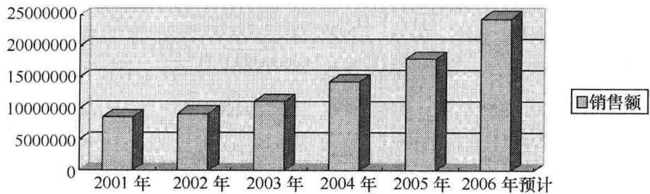

<details>
<summary>bar</summary>

| Year | Sales Revenue |
| --- | --- |
| 2001年 | ~8,500,000 |
| 2002年 | ~9,500,000 |
| 2003年 | ~11,000,000 |
| 2004年 | ~14,000,000 |
| 2005年 | ~17,500,000 |
| 2006年预计 | ~24,000,000 |
</details>

图1

图 1 很好地反映出了 A 出版社近几年来销售额上涨的趋势,一直保持着良好的上涨势头。从图 1 中不难发现,我人的资源配置方案是完全合理的。

## 7.5 关于数学分社的进一步思考

在模型 1 和模型 2 中, 对于数学分社均没有设置人员工作能力的上限, 而是采取了以历史最高值为上限的做法。为了研究这个问题, 严格起见, 先将模型 2 中关于数学分社获得书号的约束条件由不超过 153 改为不超过 120, 然后又得到了一组解, 见表 11。

表11

<table><tr><td>课程</td><td>书号数</td><td>课程</td><td>书号数</td><td>课程</td><td>书号数</td><td>课程</td><td>书号数</td></tr><tr><td>1</td><td>9</td><td>19</td><td>5</td><td>37</td><td>3</td><td>55</td><td>3</td></tr><tr><td>2</td><td>11</td><td>20</td><td>3</td><td>38</td><td>4</td><td>56</td><td>3</td></tr><tr><td>3</td><td>2</td><td>21</td><td>7</td><td>39</td><td>8</td><td>57</td><td>3</td></tr><tr><td>4</td><td>3</td><td>22</td><td>21</td><td>40</td><td>3</td><td>58</td><td>2</td></tr><tr><td>5</td><td>3</td><td>23</td><td>33</td><td>41</td><td>3</td><td>59</td><td>3</td></tr><tr><td>6</td><td>7</td><td>24</td><td>6</td><td>42</td><td>9</td><td>60</td><td>9</td></tr><tr><td>7</td><td>7</td><td>25</td><td>12</td><td>43</td><td>6</td><td>61</td><td>6</td></tr><tr><td>8</td><td>4</td><td>26</td><td>14</td><td>44</td><td>8</td><td>62</td><td>6</td></tr><tr><td>9</td><td>9</td><td>27</td><td>6</td><td>45</td><td>5</td><td>63</td><td>8</td></tr><tr><td>10</td><td>4</td><td>28</td><td>3</td><td>46</td><td>7</td><td>64</td><td>8</td></tr><tr><td>11</td><td>7</td><td>29</td><td>12</td><td>47</td><td>9</td><td>65</td><td>2</td></tr><tr><td>12</td><td>3</td><td>30</td><td>6</td><td>48</td><td>13</td><td>66</td><td>4</td></tr><tr><td>13</td><td>2</td><td>31</td><td>33</td><td>49</td><td>17</td><td>67</td><td>7</td></tr><tr><td>14</td><td>4</td><td>32</td><td>3</td><td>50</td><td>2</td><td>68</td><td>7</td></tr><tr><td>15</td><td>5</td><td>33</td><td>1</td><td>51</td><td>6</td><td>69</td><td>5</td></tr><tr><td>16</td><td>3</td><td>34</td><td>12</td><td>52</td><td>16</td><td>70</td><td>4</td></tr><tr><td>17</td><td>5</td><td>35</td><td>4</td><td>53</td><td>3</td><td>71</td><td>3</td></tr><tr><td>18</td><td>4</td><td>36</td><td>11</td><td>54</td><td>8</td><td>72</td><td>3</td></tr><tr><td colspan="8">计算机分社59个 经管分社41个 数学分社120个英语分社82个 两课分社60个 机械能源分社52个化学化工分社23个 地理地质分社34个 环境分社29个</td></tr></table>

按照这套方案,2006年预计获得的销售额为20443530元,相比表9的方案有所下降。得到的销售额增长趋势如图2所示。

得到的结果也是可以接受的。但是,既然近五年数学分社获得的书号都超过其工作能力,在2006年认为将其减少到120,似乎也有点过于牵强。为了解决这一问题,引入了任务风险概率这个新的概念。具体地说,允许数学分社获得的书号适当地超过其工作平均能力,但是,一旦超过,就会存在一定的概率完不成书号任务,而且超过的越多,完不成书号任务的概率越大,导致利润损失的风险也越大。这对于出版社是很不利的。因此,必须人为地控制数学分社获得的书号,使得既能获得较大的利润,又使完不成任务的风险降到一个可接受的水平。

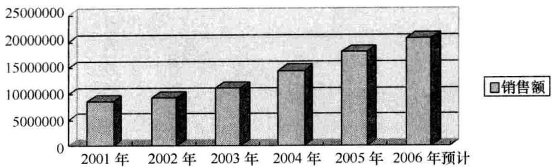

<details>
<summary>bar</summary>

| Year | Sales |
| --- | --- |
| 2001年 | ~8,500,000 |
| 2002年 | ~9,500,000 |
| 2003年 | ~11,500,000 |
| 2004年 | ~14,500,000 |
| 2005年 | ~18,500,000 |
| 2006年预计 | ~21,500,000 |
</details>

图2

一般根据经验认为,人长时间超过工作能力15%\~20%就处于疲劳工作状态,完不成任务的风险就大大增加了,因此,假设数学分社获得的书号数不能超过其平均工作能力的20%。写成约束条件,即

$$
\frac {y _ {3} - 1 2 0}{y _ {3}} \leqslant 20 \% \tag{7}
$$

将这个条件添加进模型2中，又得到了一组方案，见表12。

表 12

<table><tr><td>课程</td><td>书号数</td><td>课程</td><td>书号数</td><td>课程</td><td>书号数</td><td>课程</td><td>书号数</td></tr><tr><td>1</td><td>9</td><td>19</td><td>5</td><td>37</td><td>3</td><td>55</td><td>2</td></tr><tr><td>2</td><td>11</td><td>20</td><td>3</td><td>38</td><td>4</td><td>56</td><td>3</td></tr><tr><td>3</td><td>2</td><td>21</td><td>7</td><td>39</td><td>5</td><td>57</td><td>2</td></tr><tr><td>4</td><td>3</td><td>22</td><td>21</td><td>40</td><td>3</td><td>58</td><td>2</td></tr><tr><td>5</td><td>3</td><td>23</td><td>50</td><td>41</td><td>3</td><td>59</td><td>3</td></tr><tr><td>6</td><td>7</td><td>24</td><td>6</td><td>42</td><td>9</td><td>60</td><td>8</td></tr><tr><td>7</td><td>7</td><td>25</td><td>12</td><td>43</td><td>6</td><td>61</td><td>5</td></tr><tr><td>8</td><td>4</td><td>26</td><td>22</td><td>44</td><td>8</td><td>62</td><td>6</td></tr><tr><td>9</td><td>9</td><td>27</td><td>6</td><td>45</td><td>5</td><td>63</td><td>6</td></tr><tr><td>10</td><td>4</td><td>28</td><td>3</td><td>46</td><td>7</td><td>64</td><td>8</td></tr><tr><td>11</td><td>7</td><td>29</td><td>12</td><td>47</td><td>9</td><td>65</td><td>2</td></tr><tr><td>12</td><td>3</td><td>30</td><td>11</td><td>48</td><td>13</td><td>66</td><td>4</td></tr><tr><td>13</td><td>2</td><td>31</td><td>35</td><td>49</td><td>8</td><td>67</td><td>7</td></tr><tr><td>14</td><td>4</td><td>32</td><td>3</td><td>50</td><td>2</td><td>68</td><td>4</td></tr><tr><td>15</td><td>4</td><td>33</td><td>1</td><td>51</td><td>6</td><td>69</td><td>5</td></tr><tr><td>16</td><td>3</td><td>34</td><td>12</td><td>52</td><td>11</td><td>70</td><td>4</td></tr><tr><td>17</td><td>5</td><td>35</td><td>4</td><td>53</td><td>3</td><td>71</td><td>2</td></tr><tr><td>18</td><td>4</td><td>36</td><td>7</td><td>54</td><td>8</td><td>72</td><td>3</td></tr><tr><td colspan="8">计算机分社59个 经管分社40个 数学分社150个英语分社77个 两课分社60个 机械能源分社38个化学化工分社20个 地理地质分社31个 环境分社25个</td></tr></table>

按照这个方案,2006年总销售额将达到24325770元,比起表9的方案,销售额下降了76110元,销售额增长趋势图如图3所示。

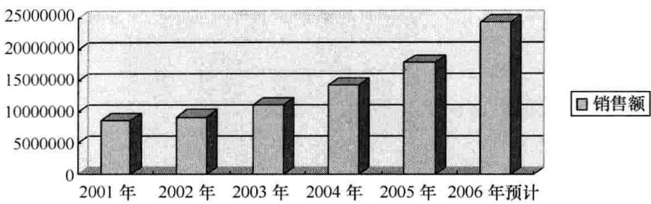

<details>
<summary>bar</summary>

| Year | Sales Revenue |
| --- | --- |
| 2001年 | ~8,500,000 |
| 2002年 | ~9,000,000 |
| 2003年 | ~11,000,000 |
| 2004年 | ~14,000,000 |
| 2005年 | ~17,500,000 |
| 2006年预计 | ~24,000,000 |
</details>

图3

虽然销售额有所下降,但是减少了完不成任务的风险,从实际情况角度出发考虑,这套方案也是可以接受的。

## 8 模型3的建立

## 8.1 问题的提出和分析

模型 1 和模型 2 均是采用了目标优化模型,通过搜索得到了盈利最大化的资源分配方案。本模型更换思路,通过分析 A 出版社每门课程每年市场份额的变化规律,确定每年读者的流动规律,从而预测出了 2006 年 A 出版社各门课程的市场份额以及销售量。

## 8.2 模型3的建立

根据前面的假设,认为调查问卷是均匀地发放到此地域各个高校中,能够反映出当地市场的特征,将所有的读者(特指大学生)归为两个集合:购买A出版社的书的分为一个集合,记为A,选择其他任一出版社的书的学生统一归为另一集合,记为非A。

根据模型2对于附表2的数据处理,每份问卷都对某本教材进行了满意水平评价。我们认为对教材的评价就反映出被调查者对出版社的满意水平。规定以12为界,满意水平大于12的就认为是对其所选择的书和出版社都是满意的,在明年还会选择该出版社的书;而满意水平小于等于12的,就认为是对现在所用的书和出版社不满意,在明年,这些人将以一定的概率选择购买其他出版社的书。在集合A中,对A出版社不满意的人,来年将有一定的比例选择购买其他出版社的书,把这个比例叫做流出率,记为 $\alpha_{i}$ ;同理,在非A集合中,对当前出版社不满意的读者,来年也将有一定的比例购买A出版社的书,把这个比例叫做流入率,记为 $\beta_{i}$ ,并假设:对同一门课程,流入率和流失率均不变。

从五年的销售量来看,发现五年来,出版社各分社所出版的书的销售量是逐年增加的。我们认为这是因为市场的需求量每年都是在增长的,如大学扩招等原因。那么,可以假设每年的增加比例为 $r_{ij}(i=1,2,\cdots,5,j=1,2,\cdots,9)$ ,其中 $r_{ij}$ 表示第j分社从第i年到第 $i+1$ 年的销售量 $m_{ij}$ 的增长率。

下面对 A 和非 A 进行分析: 假设在 200i 年, A 中对自己所使用的书满意的人在总体 A 中所占的比例为 $q_{i}$ , 那么 A 中对自己的书不满意所占的比例就为 $(1 - q_{i})$ 。非 A 中, 对自己所选的出版社所出的书满意的人在总体非 A 所占的比例为 $q_{i}^{\prime}$ , 则不满意的所占的比例就是 $(1 - q_{i}^{\prime})$ 。

根据相邻的两年的销售量之间的关系列出如下等式：

$$
m _ {i j} \left(1 + r _ {i j}\right) - m _ {i j} \left(1 + r _ {i j}\right) \left(1 - q _ {i}\right) \alpha_ {i} + m _ {i j} ^ {\prime} \left(1 + r _ {i j}\right) \left(1 - q _ {i} ^ {\prime}\right) \beta_ {i} = m _ {(i + 1) j} \tag {8}
$$

式中： $m_{ij}$ 、 $m_{ij}'$ 之间的关系为

$$
\frac {m _ {i j}}{m _ {i j} + m _ {i j} ^ {\prime}} = f _ {i} ^ {\prime} \tag {9}
$$

式中： $f_{i}$ 为 A 出版社第 i 门课程的销售量所占的份额。

联立上述等式,化简得

$$
m _ {i j} (1 + r _ {i j}) \left[ 1 - (1 - q _ {i}) \alpha_ {i} + \frac {1 - f _ {i}}{f _ {i}} (1 - q _ {i} ^ {\prime}) \beta_ {i} \right] = m _ {(i + 1) j} \tag {10}
$$

这样就能预测出在 2006 年 A 出版社每一门课程所销售出的书的销售量 $m_{6j}$ ，然后根据前五年每一门课程每个书号产生的销售量的均值，预测出 2006 年平均每个书号所对应的销售量，接着根据每门课程对应的总销售量与书号均值之间的关系，推导出给各门课程分配的书号数。

假设每一门课程平均一个书号能产生销售量 $c_{i}$ （单位：册/号），则在 2006 年第 j 门课程应该分配到的书号数 $x_{i}$ 应该为

$$
x _ {i} = \frac {m _ {6 j}}{c _ {i}} (i = j = 1, 2, \dots , 7 2) \tag {11}
$$

## 8.3 模型 3 的求解

首先,利用前五年的数据得出每一门课程在这五年中的流失率和流入率。由于市场变化规律难以把握,为了能够更好地反映2006年市场的变化,采用最近的2003年—2004年和2004年—2005年之间的数据。

根据上述分析,利用 MATLAB 软件统计出 5 年调查问卷所反映的 A 出版社的市场份额,读者对 A 出版社以及其他出版社的满意程度,然后以销售量为权求出市场容量的增长率,把 2003 年—2004 年和 2004 年—2005 年的 144 个方程转化为线性方程的求解,并解出 72 门课程的流出率和流入率,见表 13。

表 13

<table><tr><td>课程</td><td>流出率</td><td>流入率</td><td>课程</td><td>流出率</td><td>流入率</td><td>课程</td><td>流出率</td><td>流入率</td></tr><tr><td>1</td><td>0.1660</td><td>0.0535</td><td>25</td><td>0.0074</td><td>0.2000</td><td>49</td><td>0.2767</td><td>0.2573</td></tr><tr><td>2</td><td>0.2169</td><td>0.2317</td><td>26</td><td>0.1133</td><td>0.2615</td><td>50</td><td>0.1305</td><td>0.1812</td></tr><tr><td>3</td><td>0.1009</td><td>0.3141</td><td>27</td><td>0.2517</td><td>0.3598</td><td>51</td><td>0.0971</td><td>0.0046</td></tr><tr><td>4</td><td>0.3139</td><td>0.2020</td><td>28</td><td>0.2594</td><td>0.1467</td><td>52</td><td>0.2954</td><td>0.1581</td></tr><tr><td>5</td><td>0.2353</td><td>0.2214</td><td>29</td><td>0.2401</td><td>0.1134</td><td>53</td><td>0.2353</td><td>0.2268</td></tr><tr><td>6</td><td>0.1884</td><td>0.2716</td><td>30</td><td>0.2037</td><td>0.2010</td><td>54</td><td>0.2074</td><td>0.1139</td></tr><tr><td>7</td><td>0.1518</td><td>0.4046</td><td>31</td><td>0.2054</td><td>0.1764</td><td>55</td><td>0.1190</td><td>0.1713</td></tr><tr><td>8</td><td>0.1930</td><td>0.2158</td><td>32</td><td>0.3053</td><td>0.0345</td><td>56</td><td>0.0973</td><td>0.1091</td></tr><tr><td>9</td><td>0.3027</td><td>0.2108</td><td>33</td><td>0.2445</td><td>0.2871</td><td>57</td><td>0.3397</td><td>0.2105</td></tr><tr><td>10</td><td>0.1967</td><td>0.1295</td><td>34</td><td>0.2721</td><td>0.2581</td><td>58</td><td>0.0944</td><td>0.2017</td></tr><tr><td>11</td><td>0.2323</td><td>0.0836</td><td>35</td><td>0.2091</td><td>0.2672</td><td>59</td><td>0.1025</td><td>0.0824</td></tr><tr><td>12</td><td>0.2706</td><td>0.3535</td><td>36</td><td>0.2573</td><td>0.1821</td><td>60</td><td>0.1816</td><td>0.2924</td></tr><tr><td>13</td><td>0.1423</td><td>0.2837</td><td>37</td><td>0.1710</td><td>0.1785</td><td>61</td><td>0.2172</td><td>0.2653</td></tr><tr><td>14</td><td>0.3198</td><td>0.0601</td><td>38</td><td>0.0709</td><td>0.1841</td><td>62</td><td>0.0989</td><td>0.1634</td></tr><tr><td>15</td><td>0.0740</td><td>0.2575</td><td>39</td><td>0.2162</td><td>0.2342</td><td>63</td><td>0.1815</td><td>0.0948</td></tr><tr><td>16</td><td>0.1690</td><td>0.2684</td><td>40</td><td>0.3371</td><td>0.1734</td><td>64</td><td>0.0851</td><td>0.2904</td></tr><tr><td>17</td><td>0.2798</td><td>0.2704</td><td>41</td><td>0.2623</td><td>0.2783</td><td>65</td><td>0.2065</td><td>0.1466</td></tr><tr><td>18</td><td>0.3231</td><td>0.2664</td><td>42</td><td>0.2913</td><td>0.1149</td><td>66</td><td>0.2789</td><td>0.2266</td></tr><tr><td>19</td><td>0.3141</td><td>0.0958</td><td>43</td><td>0.2248</td><td>0.2271</td><td>67</td><td>0.1152</td><td>0.3276</td></tr><tr><td>20</td><td>0.2036</td><td>0.1911</td><td>44</td><td>0.1135</td><td>0.1378</td><td>68</td><td>0.2318</td><td>0.3403</td></tr><tr><td>21</td><td>0.0591</td><td>0.2289</td><td>45</td><td>0.3042</td><td>0.1934</td><td>69</td><td>0.3092</td><td>0.1430</td></tr><tr><td>22</td><td>0.1091</td><td>0.3345</td><td>46</td><td>0.2410</td><td>0.2135</td><td>70</td><td>0.0876</td><td>0.1988</td></tr><tr><td>23</td><td>0.1320</td><td>0.2537</td><td>47</td><td>0.1475</td><td>0.1544</td><td>71</td><td>0.1753</td><td>0.1285</td></tr><tr><td>24</td><td>0.2254</td><td>0.1214</td><td>48</td><td>0.2459</td><td>0.1188</td><td>72</td><td>0.2508</td><td>0.3412</td></tr></table>

现在,通过2003年和2004年中72门课程的销售量的增长率拟合求出2005年的增长率,然后根据表12所给出的流入和流出率的数据和式(9),可以预测出2006年A出版社72门课程所销售出的书的数量,见表14。

表 14

<table><tr><td>课程</td><td>销售量</td><td>课程</td><td>销售量</td><td>课程</td><td>销售量</td><td>课程</td><td>销售量</td></tr><tr><td>1</td><td>3770.6</td><td>19</td><td>11876</td><td>37</td><td>347.3</td><td>55</td><td>1091.8</td></tr><tr><td>2</td><td>5715.9</td><td>20</td><td>3928.2</td><td>38</td><td>2799.2</td><td>56</td><td>1899.3</td></tr><tr><td>3</td><td>478.49</td><td>21</td><td>7114.2</td><td>39</td><td>2724.8</td><td>57</td><td>1954.6</td></tr><tr><td>4</td><td>1059.4</td><td>22</td><td>28240</td><td>40</td><td>986.05</td><td>58</td><td>348.13</td></tr><tr><td>5</td><td>598.38</td><td>23</td><td>356520</td><td>41</td><td>10335</td><td>59</td><td>1767.2</td></tr><tr><td>6</td><td>4040.1</td><td>24</td><td>8271.6</td><td>42</td><td>39647</td><td>60</td><td>4620.7</td></tr><tr><td>7</td><td>6802.7</td><td>25</td><td>27689</td><td>43</td><td>24303</td><td>61</td><td>2123.9</td></tr><tr><td>8</td><td>475.79</td><td>26</td><td>66456</td><td>44</td><td>37079</td><td>62</td><td>3898.3</td></tr><tr><td>9</td><td>5337.2</td><td>27</td><td>5619.2</td><td>45</td><td>44815</td><td>63</td><td>3481.2</td></tr><tr><td>10</td><td>2613.5</td><td>28</td><td>1536.5</td><td>46</td><td>37953</td><td>64</td><td>5542.1</td></tr><tr><td>11</td><td>6604.4</td><td>29</td><td>8066.5</td><td>47</td><td>27956</td><td>65</td><td>972.93</td></tr><tr><td>12</td><td>5704.5</td><td>30</td><td>26072</td><td>48</td><td>13428</td><td>66</td><td>5608.6</td></tr><tr><td>13</td><td>1143.3</td><td>31</td><td>21164</td><td>49</td><td>9011.1</td><td>67</td><td>4101.9</td></tr><tr><td>14</td><td>1710.1</td><td>32</td><td>1534.7</td><td>50</td><td>541.65</td><td>68</td><td>3868.1</td></tr><tr><td>15</td><td>1631.4</td><td>33</td><td>897.83</td><td>51</td><td>3969.3</td><td>69</td><td>4385.6</td></tr><tr><td>16</td><td>2209.3</td><td>34</td><td>5305.4</td><td>52</td><td>8574.5</td><td>70</td><td>2529.2</td></tr><tr><td>17</td><td>3628.3</td><td>35</td><td>2932.6</td><td>53</td><td>4031</td><td>71</td><td>1565</td></tr><tr><td>18</td><td>3472.7</td><td>36</td><td>3860.6</td><td>54</td><td>5153.8</td><td>72</td><td>3942.8</td></tr></table>

至此,需要预测出在2006年每门课程所对应的书号的平均销售量。我们的处理方法和模型1是一样的,根据前五年的数据进行线性拟合,此时的计算结果和模型1相同。

最后要进行的就是利用已经求出的市场总销售量和书号平均销售量求出72门课程分别对应的书号数。但是在求解书号后发现书号总和并不是500,这是很正常的。不可能人为地减少某一门或者几门的书号数,所以将每一门的书号数统一按照比例减少。例如,计算书号数总和为760,那么,将每一门求得的书号数统一乘以 $\frac{500}{760}$ ,这样,就满足了总的书号数是500。计算结果见表15。

表 15

<table><tr><td>课程</td><td>书号数</td><td>课程</td><td>书号数</td><td>课程</td><td>书号数</td><td>课程</td><td>书号数</td></tr><tr><td>1</td><td>12</td><td>19</td><td>3</td><td>37</td><td>3</td><td>55</td><td>1</td></tr><tr><td>2</td><td>13</td><td>20</td><td>3</td><td>38</td><td>3</td><td>56</td><td>2</td></tr><tr><td>3</td><td>2</td><td>21</td><td>8</td><td>39</td><td>7</td><td>57</td><td>4</td></tr><tr><td>4</td><td>4</td><td>22</td><td>27</td><td>40</td><td>3</td><td>58</td><td>1</td></tr><tr><td>5</td><td>3</td><td>23</td><td>36</td><td>41</td><td>2</td><td>59</td><td>2</td></tr><tr><td>6</td><td>13</td><td>24</td><td>6</td><td>42</td><td>5</td><td>60</td><td>9</td></tr><tr><td>7</td><td>12</td><td>25</td><td>16</td><td>43</td><td>3</td><td>61</td><td>8</td></tr><tr><td>8</td><td>6</td><td>26</td><td>24</td><td>44</td><td>7</td><td>62</td><td>5</td></tr><tr><td>9</td><td>12</td><td>27</td><td>8</td><td>45</td><td>2</td><td>63</td><td>5</td></tr><tr><td>10</td><td>6</td><td>28</td><td>3</td><td>46</td><td>5</td><td>64</td><td>6</td></tr><tr><td>11</td><td>4</td><td>29</td><td>14</td><td>47</td><td>6</td><td>65</td><td>3</td></tr><tr><td>12</td><td>3</td><td>30</td><td>8</td><td>48</td><td>9</td><td>66</td><td>3</td></tr><tr><td>13</td><td>2</td><td>31</td><td>24</td><td>49</td><td>12</td><td>67</td><td>6</td></tr><tr><td>14</td><td>2</td><td>32</td><td>3</td><td>50</td><td>2</td><td>68</td><td>7</td></tr><tr><td>15</td><td>3</td><td>33</td><td>1</td><td>51</td><td>9</td><td>69</td><td>6</td></tr><tr><td>16</td><td>3</td><td>34</td><td>15</td><td>52</td><td>9</td><td>70</td><td>6</td></tr><tr><td>17</td><td>4</td><td>35</td><td>6</td><td>53</td><td>3</td><td>71</td><td>2</td></tr><tr><td>18</td><td>5</td><td>36</td><td>12</td><td>54</td><td>4</td><td>72</td><td>2</td></tr><tr><td colspan="8">计算机分社83个 经管分社32个 数学分社150个英语分社77个 两课分社39个 机械能源分社39个化学化工分社19个 地理地质分社30个 环境分社29个</td></tr></table>

## 8.4 模型结果的分析及检验

经过统计计算,模型3最终销售额为22276899.01元。和模型2对比可以发现模型3在获得的利润上有所降低。但是,该模型反映了市场的读者流动规律,考虑了许多实际因素,比较符合实际情况,所以,该模型还是有其可取性的。

同时,由于该模型在建立以及求解的过程中“A 出版社在分配书号时至少保证分给各分社申请数量的 1/2”的条件没有利用到,将其用来进行对模型结果进行检验。我们发现该模型的结果都能满足该条件。所以，该模型对于解决这类问题也是行之有效的。

## 9 模型的优缺点分析与推广

模型 1 简化解题过程, 没有考虑附表 2 的数据, 直接以利润最大化作为唯一的目标函数, 建立了单目标优化模型。这个模型简单易解, 但是过于粗糙, 解出的方案也不够合理。

模型2在模型1的基础上,增加了“使‘总满意水平’和‘市场份额’尽可能大”的两个目标函数,然后根据前五年销售计划准确度的历史数据,认为各门课程准确度的分布服从正态分布,然后用MATLAB算出了均值和均方差,利用正态分布的 $3\sigma$ 法则,认为2006年计划准确率必定处于 $(\mu-3\sigma,\mu+3\sigma)$ 区间内。将这个条件作为约束条件,从而建立了三个目标函数的多目标优化模型。通过主要目标函数法将多目标转化为单目标优化,解出了一套分配方案,经检验这套方案能够很好地满足利润最大化、满意水平和份额最大化,是比较理想的分配方案。模型2对于日常生活中通过问卷调查方式确定生产经营方式的问题都具有较好的兼容性和可推广性。

模型 3 改变思路,从分析市场份额流动变化规律入手,建立数学模型,这个模型能够较好地符合实际情况,较精确地描述出市场份额随时间变化的规律,能够方便地获得一套资源分配方案。但是比起模型 2 解出的方案尚不够理想。

## 10 关于出版社长远发展的讨论

在本题中,建立的优化的模型最主要的目标函数就是利润最大化,即追求2006年出版社最大的销售额。但是,作为出版社的经营者,不应该仅仅把眼光放在2006年最大盈利上,而是应该考虑到出版社的长远发展。应该说长远发展是为了更好地盈利,与追求利润最大化并不矛盾。但是,从对目前市场格局的分析来看,A出版社还不能在各个课程领域都占到较大的份额。从长远发展来看,出版社应该全面发展,在份额比较小的课程领域方面应该大力地扶持一个或少数几个优势教材。这就要通过进行大量的问卷调查来更进一步地掌握市场动态。那些受到读者欢迎、评价很好的教材理当得到出版社的扶持,即使目前这些教材还没有占到较大的市场份额,但因为它们能够得到读者的广泛认可,说明它们有较大的潜力,只要给予适当的支持,一定能够逐渐地抢占到市场份额、扩大影响,这样就会非常有利于出版社的长远发展,在将来获得更大的利润。

## 参考文献

[1] 王正东. 数学软件与数学实验. 北京: 科学出版社, 2004.  
[2] 盛骤．概率论与数理统计．北京：高等教育出版社，2001.  
[3] 袁新生. 数学建模与数学实验. 徐州: 徐州空军学院, 2006.

## 【论文点评】

滕加俊

该论文问题分析透彻,考虑问题思路清晰,数据处理较为合理,建立的模型合理。

论文共建立了三个数学模型。模型1直接以利润最大化为唯一目标函数，该模型简单易懂，但过于粗糙。模型2在模型1的基础上增加了使“总满意度”、“市场份额”尽可能大两个目标函数，建立了三个目标函数的多目标优化模型，该模型较为接近实际，是一个较理想的数学模型。而模型3从另外一个思路来考虑问题，从分析市场份额流动变化规律出发，建立了一个较为精确、更加符合实际情况的模型，由于时间关系在建模过程中某些因素考虑欠佳，使得模型的结果不够理想。

论文中利用前五年销售计划准确性的历史数据,确定了2006年计划精确率界定于 $(\mu-3\sigma,\mu+3\sigma)$ 区间内,以及利用出版社每门课程五年市场份额的变化率,包括流入率和流出率,预测2006年出版社各门课程的销售量,是很好的思想,但模型1用回归直线拟合的方法来预测2006年每一个书号的销售量是比较粗糙的,直接导致结果的不合理,另外在模型3中没有考虑“A出版社在分配书号时至少保证分给各分店申请数量的1/2”条件,是不合理的。

该论文是一篇优秀的数学建模论文。

# 2007年A题 中国人口增长预测

中国是一个人口大国,人口问题始终是制约我国发展的关键因素之一。根据已有数据,运用数学建模的方法,对中国人口做出分析和预测是一个重要问题。

近年来中国的人口发展出现了一些新的特点,如老龄化进程加速、出生人口性别比持续升高以及乡村人口城镇化等因素,这些都影响着中国人口的增长。2007年初发布的《国家人口发展战略研究报告》(附录1)还做出了进一步的分析。

关于中国人口问题已有多方面的研究,并积累了大量数据资料。附录2就是从《中国人口统计年鉴》上收集到的部分数据。

试从中国的实际情况和人口增长的上述特点出发,参考附录2中的相关数据(也可以搜索相关文献和补充新的数据),建立中国人口增长的数学模型,并由此对中国人口增长的中短期和长期趋势做出预测;特别要指出模型中的优点与不足之处。

附录 1 《国家人口发展战略研究报告》

附录 2 人口数据(《中国人口统计年鉴》中的部分数据)及其说明

## 【试题评析】

史汉生

人口控制和管理是一个事关国家命运、人民生计的大问题,如何科学合理准确地预测人口的变化对国家政策制定规划有重要影响。人口预测这样的命题影响因素很多,要点如下:

(1) 基本数据如何进行合理的划分。  
(2) 包含基本出生死亡率的数学模型的准确性。  
(3) 如何将政策因素、性别比、年龄结构、农村城镇人口变化等因素量化并建立相应的数学模型。  
(4) 利用各种信息来说明模型的预测结果的可信性。

## 【问题解答要点】

人口预测数学模型首先应该提供一个大量人口数据的分类方法,其中应该包含年龄、性别、地区。预测结果也应该包含这样的信息,使其更具有参考价值。包含基本死亡出生率的基本模型是必需的。在此基础之上再考虑政治因素、阻尼因素、老龄化、城镇化等的深化数学模型。模型的可信性和检验是非常重要方面。

# 人口预测的数学模型

## 摘要

本题要求根据给出的 2001 年到 2005 年的人口情况的数据,对我国的人口增长建立数学模型并做出预测。建立递归模型,从 2005 年开始预测。按照性别和市、镇、乡的区别把人口分为 6 类。按照年龄进行分段,每一个年龄作为一段。用 2005 年的每个年龄的人数预测 2006 年统一年龄的人数。把 2006 年各年龄的预测值相加,即可得到 2006 年的总人数的预测值。然后依次递归,得出其他年份的人口数据。

影响人口增长的主要因素有出生率、死亡率、政府政策、老龄化和乡村城镇化。在递归模型主题框架的基础上,逐步深入建立了四个模型。

模型一,只考虑出生率和死亡率对人口增长的影响,从2001年到2005年的数据中,求出平均出生率和平均死亡率,并假定2005年以后的平均出生率和平均死亡率不变。为了减少累计误差,用2005年数据逐步迭代得到人口随时间的变化曲线。然后,用2001年的数据运用模型一迭代出2001年—2005年人数,与修正后的数据进行比较,求得我们的模型的估计值与实际值相近,进而推出模型基本的合理性。

模型二,在模型一的基础上加上政策因素的影响,引进人口政策影响因子R,通过对结果进行分析,发现政府政策对人口的变化情况会产生较大的影响,体现为了控制人口数量,国家可以进行较好的宏观调控。

模型三,在模型二的基础上加上老龄化对人口增长的影响,引进阻滞因子,建立人口随时间的变化曲线。

模型四,在模型三的基础上加上乡村人口城镇化的影响,通过对结果进行分析发现模型四与前几个模型的主要区别是在城镇人口的数量,及城镇人口在全国总人口的比率上,更符合实际情况。

在每个模型的基础上,进一步分别对人口总数、性别比例、老龄化程度、生育期内妇女总数、有劳动力的人数等做出预测。

此外根据《国家人口发展战略研究报告》计划的目标,在模型四的基础上,通过对 R 值进行调整,得到 R=1.36 基本能够满足国家的战略计划,并对国家的政策给出合理化建议。

运用 MATLAB 编程求解, 求得四个模型人口峰值及达到峰值时间, 见下表:

<table><tr><td>模型一</td><td>模型二</td><td>模型三</td><td>模型四</td></tr><tr><td>2025</td><td>2040</td><td>2038</td><td>2035</td></tr><tr><td>13.67亿</td><td>14.81亿</td><td>14.65亿</td><td>14.56亿</td></tr></table>

在模型的最后,对模型的优缺点及不足之处进行分析。

关键词:递归模型,人口政策影响因子,阻滞因子,人口城镇化

## 1 问题的重述

中国是一个人口大国,人口问题始终是制约我国发展的关键因素之一。根据已有数据,运用数学建模的方法,对中国人口做出分析和预测是一个重要问题。

近年来中国的人口发展出现了一些新的特点,如老龄化进程加速、出生人口性别比持续升高以及乡村人口城镇化等因素,这些都影响着中国人口的增长。2007年初发布的《国家人口发展战略研究报告》还做出了进一步的分析。

关于中国人口问题已有多方面的研究,并积累了大量数据资料。

试从中国的实际情况和人口增长的上述特点出发,建立中国人口增长的数学模型,并由此对中国人口增长的中短期和长期趋势做出预测;特别要指出模型中的优点与不足之处。

## 2 问题分析

本题要求通过2001年—2005年的数据,从我国的实际情况和人口增长的特点出发,建立人口增长的数学模型,对我国人口增长的中短期和长期的趋势做出预测。由题中所给数据,不同性别,不同地区包括城、镇、乡,将人员分为六类。对每一类人分别进行分析,具体分类情况见表1。

表 1 人员分类情况表

<table><tr><td>分类</td><td>市男</td><td>市女</td><td>镇男</td><td>镇女</td><td>乡男</td><td>乡女</td></tr><tr><td>i</td><td>1</td><td>2</td><td>3</td><td>4</td><td>5</td><td>6</td></tr></table>

对每一类人分别进行递归,得到 $0\sim90^{+}$ 岁人口的变化情况。

在递归过程中,首先考虑死亡率和生育率,通过2001年—2005年的数据求出平均死亡率和平均生育率。

对模型进行再分析,人口的增长不仅仅由出生率和死亡率决定,还有很多社会因素,包括城市化进程、老龄化、性别比例及政府的政策。如目前国家已经放宽了计划生育政策,允许夫妻双方都是独生子女的生第二胎。除了考虑因素外,人口的增长还受社会平均教育水平等多方面因素的影响。所以,应不断增加模型的考虑因素,对模型进行优化。

在我们的模型中,采用老年人的衡量标准是60岁,有劳动能力的人的衡量标准是15岁\~59岁;孕期妇女的衡量标准是15岁\~49岁。

## 3 模型假设

(1) 忽略中国人口出国和外国人口加入我国国籍的情况。  
(2) 假定每年的平均出生率和平均死亡率恒定不变。  
(3) 假定没有影响人口非正常增长的意外情况发生。

(4) 人口迁移后与当地人的各方面因素相同。  
(5) 假设短期、中期和长期分别为 5 年、20 年和 50 年。

## 4 符号约定

$H_{i,j}$ : 第 i 类年龄为 j 的人所占本类的比例;

R: 人口政策影响因子;

$\omega_{i}$ , : 第 i 类人的平均出生率;

$\lambda_{i,k}$ : 第 i 类年龄为 k 的人平均死亡率;

$M_{i,j,k}$ : 第 i 类, 第 j 年, 年龄为 k 的人的数量; $1 \leqslant i \leqslant 6$ ; $2005 \leqslant j \leqslant 2054$ ; $0 \leqslant k \leqslant 90^{+}$ ;

$\mu_{i,j}$ : 第 i 类人, 年龄为 j 的乡村人口迁出率; $i=5,6;0\leqslant j\leqslant90^{+}$ ;

$P1_{i,k}$ : 第 i 类人, 年龄为 k 的城市人口的相对迁入率; $i=3,4; 0 \leqslant k \leqslant 90^{+}$ ;

$P2_{i,k}$ : 第 i 类人, 年龄为 k 的城镇人口的相对迁入率; $i=1,2; 0 \leqslant k \leqslant 90^{+}$

## 5 模型一的建立与求解

## 5.1 问题的进一步分析

城、镇、乡人口的出生率和死亡率是不同的，不同年龄、不同性别的死亡率也是不同的。在对平均死亡率的处理上，将不同年龄、性别的人的死亡率分别考虑。题目中给出了2001年到2005年全国人口分布情况，采用递归法，后一年各年龄上的人数，是上一年小一岁的人数减去该人数在本年中死亡人数。用2001年到2005年，每年新出生的婴儿的总量，和5年女性人口的总数取比值，可以求出2001年到2005年平均生育率。据模型假设，2005年以后的平均出生率，等于计算得到的平均出生率。

## 5.2 数据的预处理

国家统计局公布的 2001 年到 2005 年全国人口总数见表 2。

表 2 2001 年—2005 年全国人口总数(单位:万人)

<table><tr><td>2001</td><td>2002</td><td>2003</td><td>2004</td><td>2005</td></tr><tr><td>127627</td><td>128453</td><td>129227</td><td>129988</td><td>130756</td></tr></table>

题目中给出的 2005 年中国人口 1% 调查数据见表 3。

表 3 题目给出的 2005 年数据表

<table><tr><td>城市男</td><td>城市男</td><td>镇男</td><td>镇女</td><td>乡男</td><td>乡女</td><td>总数</td></tr><tr><td>2357679</td><td>2350224</td><td>1464804</td><td>1444176</td><td>4762400</td><td>4606484</td><td>16985767</td></tr></table>

国家统计局给出的2005年中国人口总数是1307560000人。如果根据国家统计局公布的人口总数， $1\%$ 的人数应该是13075600人，和16985767有明显的偏差。所以题目中给出的各项的人数不是在 $1\%$ 的条件下的准确数据。我们认为题目中给出的各项数据的比例是准确的。对2005年城市人口的数据做如下修正(表4)：

$$
\mathrm{城市男} = \frac {2 3 5 7 6 7 9}{1 6 9 8 5 7 6 7} \times 1 3 0 7 5 6 0 0 0 0
$$

$$
\mathrm{城市女} = \frac {2 3 5 0 2 2 4}{1 6 9 8 5 7 6 7} \times 1 3 0 7 5 6 0 0 0 0
$$

表 4 修正后 2005 年的数据

<table><tr><td>市男</td><td>城女</td><td>镇男</td><td>镇女</td><td>乡男</td><td>乡女</td><td>总数</td></tr><tr><td>1816052</td><td>1807716</td><td>1127500</td><td>1110929</td><td>3662326</td><td>3544768</td><td>13075600</td></tr></table>

对 2001 年到 2004 年的数据做同样的修正。

利用经过上述处理的数据,可以算出 2001 年到 2005 年各类人,各年龄的平均死亡率:

$$
\lambda_ {i, j} = \frac {2 0 0 1 \mathrm{年到} 2 0 0 5 \mathrm{年第} i \mathrm{类年龄为} j \mathrm{的死亡人数}}{2 0 0 1 \mathrm{年到} 2 0 0 5 \mathrm{年第} i \mathrm{类年龄为} j \mathrm{的总人数}} \tag {1}
$$

平均出生率 $\omega_{i}$ 为

$$
\left\{ \begin{array}{l l} \omega_ {i} = \frac {2 0 0 1 \text {年到} 2 0 0 5 \text {年,第} i \text {类年龄为} 0 \text {的总人数}}{2 0 0 1 \text {年到} 2 0 0 5 \text {年,第} i \text {类女人的总数}} \\ i = 2, 4, 6 \end{array} \right.
$$

$$
\left\{ \begin{array}{l} \omega_ {i} = \frac {2 0 0 1 \text {年到} 2 0 0 5 \text {年,第} i \text {类年龄为} 0 \text {的总人数}}{2 0 0 1 \text {年到} 2 0 0 5 \text {年,第} (i + 1) \text {类女人的总数}} \\ i = 1, 3, 5 \end{array} \right. \tag {2}
$$

各年出生的男孩女孩的性别比计算见表5。

表 5 2001 年到 2005 年出生婴儿的男女性别比例

<table><tr><td></td><td colspan="2">市</td><td colspan="2">镇</td><td colspan="2">乡</td></tr><tr><td>年份</td><td>男婴人数</td><td>女婴人数</td><td>男婴人数</td><td>女婴人数</td><td>男婴人数</td><td>女婴人数</td></tr><tr><td>2005</td><td>1667101</td><td>1449653</td><td>1254022</td><td>1074876</td><td>4687893</td><td>3894557</td></tr><tr><td>2004</td><td>1520807</td><td>1326662</td><td>1135296</td><td>885145.8</td><td>4643516</td><td>3759037</td></tr><tr><td>2003</td><td>1311788</td><td>1180609</td><td>1055038</td><td>920760</td><td>4888792</td><td>4073993</td></tr><tr><td>2002</td><td>1449276</td><td>1284586</td><td>884548</td><td>726593</td><td>5169821</td><td>4398206</td></tr><tr><td>2001</td><td>1388248</td><td>1240562</td><td>933705</td><td>822926</td><td>5138444</td><td>4448206</td></tr><tr><td>平均性别比</td><td>0.53094</td><td>0.46906</td><td>0.542934</td><td>0.457066</td><td>0.543839</td><td>0.456161</td></tr></table>

## 5.3 模型建立

由于城市、城镇和乡村的人口情况差别很大，在建立模型的时候，以对城市人口的情况进行建模为例进行说明。城镇和乡村人口的模型与城市人口的模型，从数学的角度来讲完全一样，只是有关的参数的数值有些许的差别。此时，i=1,2。

由于 2001 年到 2005 年, 总的人口情况已经给出, 所以只要对从 2006 年开始的以后年份开始预测即可。因为人口变化的影响因素很多, 并且我们的模型只是局部适用的, 不可能对所有的年份都适用,只对2006年到2055年的人口模型进行预测。

建立递归的模型如下：

第 $i$ 类, 第 $j$ 年, 年龄为 0 的城市人数, 即第 $j$ 年新出生的第 $i$ 类人数, 符号表示如下:

$$
\left\{ \begin{array}{l} M _ {i, j, 0} = \sum_ {m = 0} ^ {9 0 ^ {+}} M _ {2, j, m} \omega_ {i} \\ 2 0 0 5 \leqslant j \leqslant 2 0 5 4 \\ i = 1, 2 \end{array} \right. \tag {3}
$$

第 $i$ 类, 第 $j$ 年, 年龄为 $k$ 的城市人数是由第 $(j - 1)$ 年, 年龄为 $(k - 1)$ 的人数乘以 $(1 - \lambda_{i,k-1})$ 后剩余的总人数, 符号表示如下:

$$
\left\{ \begin{array}{l} M _ {i, j, k} = M _ {i, j - 1, k - 1} \left(1 - \lambda_ {i, k - 1}\right) \\ i = 1, 2 \\ 1 \leqslant k \leqslant 9 0 ^ {+} \end{array} \right. \tag {4}
$$

第 $i$ 类, 第 $j$ 年, 年龄为 $90^{+}$ 的城市人数由两部分组成: 一部分是第 $(j - 1)$ 年, 年龄为89岁人经过一年, 年龄变为 $90^{+}$ ; 另外一部分是第 $(j - 1)$ 年, 年龄为 $90^{+}$ 的人经过一定的存活率 $(1 - \lambda_{i,90^{+}})$ 之后剩余的人数。两类人数总和即为第 $i$ 类, 第 $j$ 年, 年龄为 $90^{+}$ 的人数, 用符号表示如下:

$$
\left\{ \begin{array}{l} M _ {i, j, 9 0 ^ {+}} = M _ {i, j, 9 0 ^ {+}} \left(1 - \lambda_ {1, 9 0 ^ {+}}\right) + M _ {i, j - 1, 8 9} \left(1 - \lambda_ {i, 8 9}\right) \\ 2 0 0 5 \leqslant j \leqslant 2 0 5 4 \\ i = 1, 2 \end{array} \right. \tag {5}
$$

第 $j$ 年末的总的城市人数量符号表示如下：

$$
\left\{ \begin{array}{l} M _ {j} = \sum_ {i = 1} ^ {2} \left(M _ {i, j, 0} + M _ {i, j, 9 0 ^ {+}}\right) + \sum_ {i = 1} ^ {2} \sum_ {m = 1} ^ {8 9} M _ {i, j, m} \\ 2 0 0 5 \leqslant j \leqslant 2 0 5 4 \end{array} \right. \tag {6}
$$

2005 年的城市人口情况的数据已经给出,通过以上模型,可以递归出 2006 年城市的人数。同样的处理方法,可以递归出 2006 年的乡村和城镇的人数。然后依次递归,即可求出后面每年的人口数量。因为建立的递归模型只和相邻两年的数据有关,从 2005 年开始递归。

综上所述,模型一为

$$
\left\{ \begin{array}{l} M _ {i, j, 0} = \sum_ {m = 0} ^ {9 0 ^ {+}} M _ {2, j, m} \omega_ {i} \\ 2 0 0 5 \leqslant j \leqslant 2 0 5 4 \\ i = 1, 2 \end{array} \right.
$$

$$
\left\{ \begin{array}{l} M _ {i, j, k} = M _ {i, j - 1, k - 1} (1 - \lambda_ {i, k - 1}) \\ i = 1, 2 \\ 1 \leqslant k \leqslant 9 0 ^ {+} \end{array} \right.
$$

$$
\left\{ \begin{array}{l} M _ {i, j, 9 0 ^ {+}} = M _ {i, j, 9 0 ^ {+}} \left(1 - \lambda_ {1, 9 0 ^ {+}}\right) + M _ {i, j - 1, 8 9} \left(1 - \lambda_ {i, 8 9}\right) \\ 2 0 0 5 \leqslant j \leqslant 2 0 5 4 \\ i = 1, 2 \end{array} \right.
$$

$$
\left\{ \begin{array}{l} M _ {j} = \sum_ {i = 1} ^ {2} \left(M _ {i, j, 0} + M _ {i, j, 9 0 ^ {+}}\right) + \sum_ {i = 1} ^ {2} \sum_ {m = 1} ^ {8 9} M _ {i, j, m} \\ 2 0 0 5 \leqslant j \leqslant 2 0 5 4 \end{array} \right.
$$

## 5.4 模型求解

编制的 MATLAB 程序计算里面,分别考虑了城男、城女、镇男、镇女、乡男和乡女六种情况,并且计算了每一年六种人数的总和。程序运行的结果见表 6。

表 6 模型一预测 2006 年到 2054 年全国人口数据(单位:万人)

<table><tr><td>年份</td><td>2005</td><td>2006</td><td>2007</td><td>2008</td><td>2009</td><td>2010</td><td>2011</td><td>2012</td><td>2013</td><td>2014</td></tr><tr><td>人数</td><td>130693</td><td>131268</td><td>131815</td><td>132336</td><td>132830</td><td>133297</td><td>133734</td><td>134143</td><td>134522</td><td>134871</td></tr><tr><td>年份</td><td>2015</td><td>2016</td><td>2017</td><td>2018</td><td>2019</td><td>2020</td><td>2021</td><td>2022</td><td>2023</td><td>2024</td></tr><tr><td>人数</td><td>138979</td><td>139679</td><td>140355</td><td>141006</td><td>141633</td><td>142235</td><td>142812</td><td>143362</td><td>143884</td><td>144379</td></tr><tr><td>年份</td><td>2025</td><td>2026</td><td>2027</td><td>2028</td><td>2029</td><td>2030</td><td>2031</td><td>2032</td><td>2033</td><td>2034</td></tr><tr><td>人数</td><td>147811</td><td>147931</td><td>148021</td><td>148082</td><td>148116</td><td>148123</td><td>148105</td><td>148065</td><td>148004</td><td>147923</td></tr><tr><td>年份</td><td>2035</td><td>2036</td><td>2037</td><td>2038</td><td>2039</td><td>2040</td><td>2041</td><td>2042</td><td>2043</td><td>2044</td></tr><tr><td>人数</td><td>147811</td><td>147931</td><td>148021</td><td>148082</td><td>148116</td><td>148123</td><td>148105</td><td>148065</td><td>148004</td><td>147923</td></tr><tr><td>年份</td><td>147811</td><td>147931</td><td>148021</td><td>148082</td><td>148116</td><td>148123</td><td>148105</td><td>148065</td><td>148004</td><td>147923</td></tr><tr><td>人数</td><td>147822</td><td>147706</td><td>147580</td><td>147442</td><td>147301</td><td>147160</td><td>147015</td><td>146869</td><td>146716</td><td>146558</td></tr></table>

从图 1～图 7 可以看出,我国的人口数量在 2025 年达到最大值 13.7 亿,此后人口的总数下降,在 2055 年降到 12.4 亿以下。

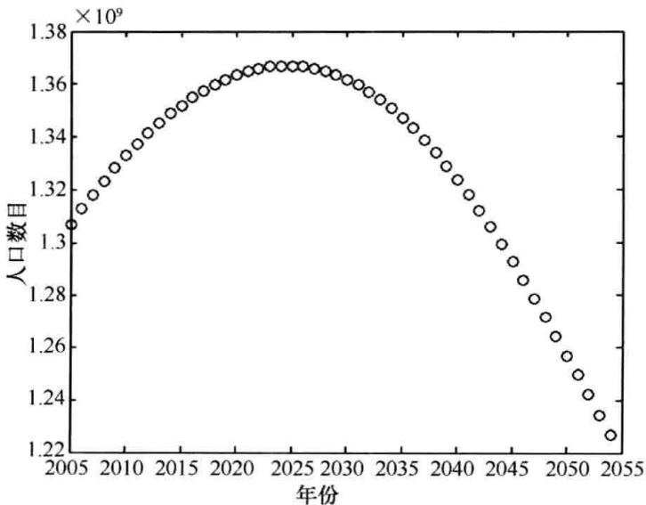

<details>
<summary>scatter</summary>

| 年份 | 人口数目 (x10^9) |
| --- | --- |
| 2005 | ~1.308 |
| 2006 | ~1.314 |
| 2007 | ~1.319 |
| 2008 | ~1.324 |
| 2009 | ~1.329 |
| 2010 | ~1.333 |
| 2011 | ~1.337 |
| 2012 | ~1.341 |
| 2013 | ~1.344 |
| 2014 | ~1.348 |
| 2015 | ~1.351 |
| 2016 | ~1.354 |
| 2017 | ~1.357 |
| 2018 | ~1.359 |
| 2019 | ~1.361 |
| 2020 | ~1.363 |
| 2021 | ~1.365 |
| 2022 | ~1.366 |
| 2023 | ~1.367 |
| 2024 | ~1.367 |
| 2025 | ~1.367 |
| 2026 | ~1.367 |
| 2027 | ~1.367 |
| 2028 | ~1.366 |
| 2029 | ~1.365 |
| 2030 | ~1.364 |
| 2031 | ~1.362 |
| 2032 | ~1.360 |
| 2033 | ~1.358 |
| 2034 | ~1.356 |
| 2035 | ~1.354 |
| 2036 | ~1.351 |
| 2037 | ~1.348 |
| 2038 | ~1.345 |
| 2039 | ~1.342 |
| 2040 | ~1.338 |
| 2041 | ~1.334 |
| 2042 | ~1.330 |
| 2043 | ~1.326 |
| 2044 | ~1.322 |
| 2045 | ~1.318 |
| 2046 | ~1.314 |
| 2047 | ~1.310 |
| 2048 | ~1.306 |
| 2049 | ~1.302 |
| 2050 | ~1.298 |
| 2051 | ~1.294 |
| 2052 | ~1.290 |
| 2053 | ~1.286 |
| 2054 | ~1.282 |
| 2055 | ~1.278 |
</details>

图 1 模型一预测全国人口变化图

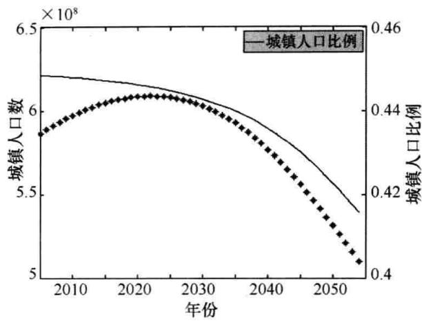

<details>
<summary>line</summary>

| 年份 | 城镇人口数 (x 10^8) | 城镇人口比例 |
| --- | --- | --- |
| 2010 | ~6.2 | ~0.435 |
| 2020 | ~6.15 | ~0.442 |
| 2030 | ~6.05 | ~0.440 |
| 2040 | ~5.85 | ~0.430 |
| 2050 | ~5.55 | ~0.415 |
| 2055 | ~5.4 | ~0.405 |
</details>

图 2 模型一预测城镇人口变化图

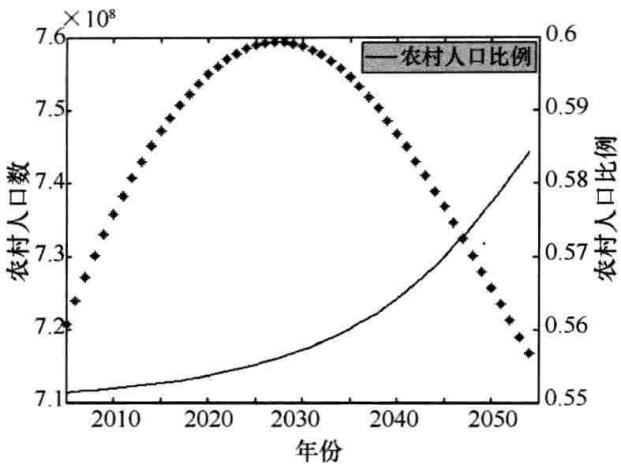

<details>
<summary>line</summary>

| 年份 | 农村人口数 (x 10^8) | 农村人口比例 |
| --- | --- | --- |
| 2005 | ~7.23 | ~0.551 |
| 2010 | ~7.33 | ~0.552 |
| 2015 | ~7.46 | ~0.554 |
| 2020 | ~7.54 | ~0.556 |
| 2025 | ~7.59 | ~0.558 |
| 2030 | ~7.60 | ~0.560 |
| 2035 | ~7.56 | ~0.563 |
| 2040 | ~7.48 | ~0.567 |
| 2045 | ~7.38 | ~0.573 |
| 2050 | ~7.26 | ~0.581 |
| 2055 | ~7.16 | ~0.588 |
</details>

图 3 模型一预测农村人口变化图

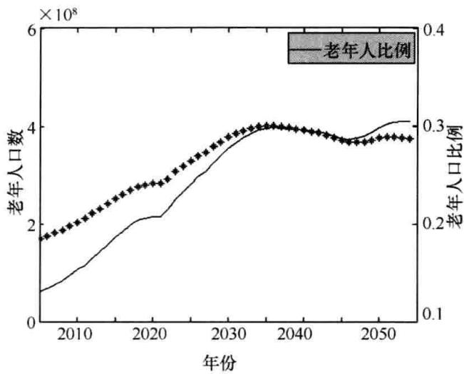

<details>
<summary>line</summary>

| 年份 | 老年人口数 \(( \times 10^{8})\) | 老年人口比例 |
| --- | --- | --- |
| 2010 | ~0.7 | ~0.18 |
| 2020 | ~2.2 | ~0.24 |
| 2030 | ~3.5 | ~0.29 |
| 2040 | ~4.0 | ~0.30 |
| 2050 | ~4.1 | ~0.29 |
</details>

图 4 模型一预测老年人口变化图

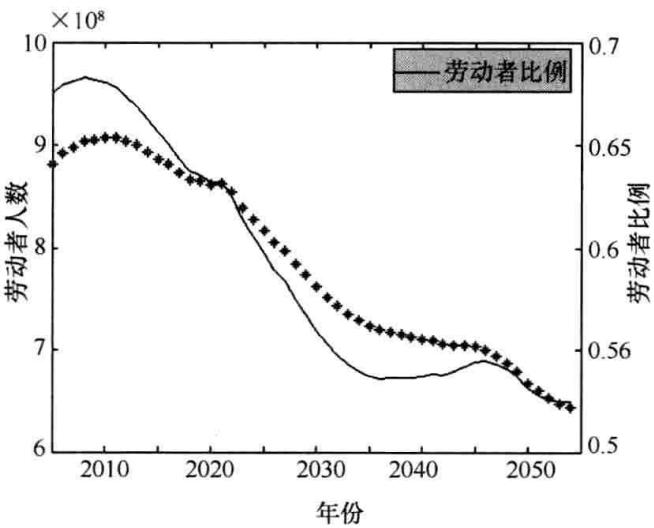

<details>
<summary>line</summary>

| 年份 | 劳动者人数 (x 10^8) | 劳动者比例 |
| --- | --- | --- |
| 2010 | ~9.6 | ~0.64 |
| 2020 | ~8.7 | ~0.63 |
| 2030 | ~7.3 | ~0.59 |
| 2040 | ~6.7 | ~0.56 |
| 2050 | ~6.5 | ~0.53 |
</details>

图 5 模型一预测劳动人口变化图

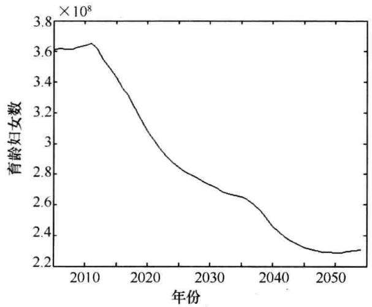

<details>
<summary>line</summary>

| 年份 | 育龄妇女数 (x 10^8) |
| --- | --- |
| 2010 | ~3.62 |
| 2020 | ~3.15 |
| 2030 | ~2.75 |
| 2040 | ~2.45 |
| 2050 | ~2.28 |
</details>

图 6 模型一预测育龄妇女变化图

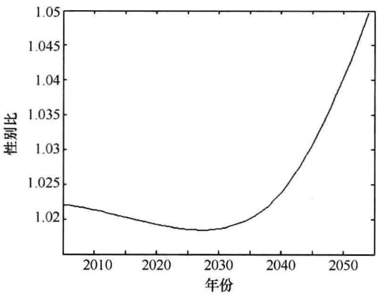

<details>
<summary>line</summary>

| 年份 | 性别比 |
| --- | --- |
| 2010 | ~1.022 |
| 2020 | ~1.019 |
| 2030 | ~1.018 |
| 2040 | ~1.024 |
| 2050 | ~1.045 |
</details>

图 7 模型一预测性别比变化图

## 5.5 结果分析

从上面的结果,可以看出在2023年,人口会达到峰值13.56亿。城镇人口的数量是先上升后下降的过程。不过城镇人口占全国人口的比值是一直下降的,并且在峰值之后,下降的速度很快。农村人口的数量是一个先上升后下降的过程,不过农村人口占全国人

口的比值是一个一直上升的过程。

从上面的结果可以看出,建立的模型过于简单,仅考虑平均出生率和平均死亡率的影响。没有考虑其他因素的影响,尤其是乡村城镇化的因素。单纯地把城市、城镇和乡村分开单独考虑,与实际情况下的人口变化差距很大。本来城市人口的平均出生率就比乡村人口的出生率低,乡村人口的基数又比城镇人口的基数大很多。要是没有乡村人口向城镇迁移,城镇人口占全国总人口的比值就会一直下降,即使城镇人口总数在增加,但没有乡村人口增加的快。乡村人口的变化正好与城镇人口的变化相反。预测出来的乡村人口变化情况和城镇人口变化情况的图形,正好验证了我们的分析。说明乡村人口城镇化对人口变化的影响很大,是以后改进模型的一个重要的出发点。

模型的优点是大致预测出了以后人口的变化趋势,说明我国人口不会无限期地增加,达到一定时间之后,人口的总数会下降。

## 5.6 模型检验

运用修正后的数据,从2001年开始递归,得到2002年—2005年的估计人口数,与修正后的数据进行比较,如图8所示。模型一检验的绝对误差与相对误差见表7。

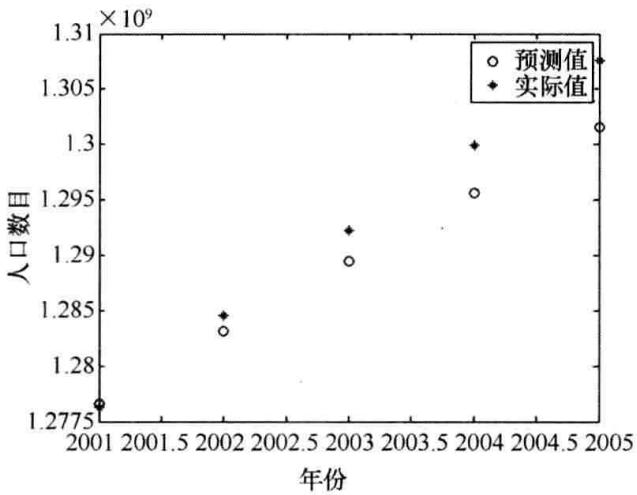

<details>
<summary>scatter</summary>

| 年份 | 预测值 (人口数目 \(\times\) 10^9) | 实际值 (人口数目 \(\times\) 10^9) |
| --- | --- | --- |
| 2001 | ~1.278 | ~1.278 |
| 2002 | ~1.283 | ~1.284 |
| 2003 | ~1.289 | ~1.292 |
| 2004 | ~1.296 | ~1.300 |
| 2005 | ~1.302 | ~1.308 |
</details>

图 8 模型一 2001 年到 2005 年模型检验图

表 7 模型一检验的绝对误差与相对误差

<table><tr><td>年份</td><td>2002</td><td>2003</td><td>2004</td><td>2005</td></tr><tr><td>实际误差</td><td>1436758</td><td>2810666</td><td>4270284</td><td>6028468</td></tr><tr><td>相对误差</td><td>0.001119</td><td>0.002175</td><td>0.003285</td><td>0.00461</td></tr></table>

从相对误差的大小可以看出,建立模型的预测值和实际值的误差非常小,据此可以说明建立的递归模型,是基本合理的,说明递归模型在解决此问题时,是适用的。

## 6 模型二的建立与求解

## 6.1 问题分析与建模

在上面的模型中,只考虑了根据国家的人口计划生育政策,一个孕妇只生一个小孩的情况。其实在人口问题中,国家的人口政策对人口数量的影响是很大的,这也是在考虑问题时不可忽略的一个重要因素。所以对模型做出以下的改进,第i年的城市人口年龄为0,即第i年新出生的城市人口数为

$$
\left\{ \begin{array}{l} M _ {i, j, 0} = \omega_ {i} R \sum_ {k = 0} ^ {9 0 ^ {+}} M _ {2, j - 1, k} \\ i = 1, 2 \end{array} \right.
$$

$$
\left\{ \begin{array}{l} M _ {i, j, 0} = \omega_ {i} R \sum_ {k = 0} ^ {9 0 ^ {+}} M _ {4, j - 1, k} \\ i = 3, 4 \end{array} \right.
$$

$$
\left\{ \begin{array}{l} M _ {i, j, 0} = \omega_ {i} R \sum_ {k = 0} ^ {9 0 ^ {+}} M _ {4, j - 1, k} \\ i = 5, 6 \end{array} \right. \tag {7}
$$

第 $i$ 类, 第 $j$ 年, 年龄为 $k$ 的城市人数是由第 $(j - 1)$ 年, 年龄为 $(k - 1)$ 的人数, 乘以 $(1 - \lambda_{i,k-1})$ 后剩余的总人数, 符号表示如下:

$$
\left\{ \begin{array}{l} M _ {i, j, k} = M _ {i, j - 1, k - 1} (1 - \lambda_ {i, k - 1}) \\ i = 1, 2 \\ 1 \leqslant k \leqslant 9 0 ^ {+} \end{array} \right. \tag {8}
$$

第 $i$ 类, 第 $j$ 年, 年龄为 $90^{+}$ 的城市人数由两部分组成: 一部分是第 $(j - 1)$ 年, 年龄为89岁人经过一年, 年龄变为 $90^{+}$ ; 另外一部分是第 $(j - 1)$ 年, 年龄为 $90^{+}$ 的人经过一定的存活率 $(1 - \lambda_{i,90^{+}})$ 之后剩余的人数。两类人数总和即为第 $i$ 类, 第 $j$ 年, 年龄为 $90^{+}$ 的人数, 用符号表示如下:

$$
\left\{ \begin{array}{l} M _ {i, j, 9 0 ^ {+}} = M _ {i, j, 9 0 ^ {+}} \left(1 - \lambda_ {1, 9 0 ^ {+}}\right) + M _ {i, j - 1, 8 9} \left(1 - \lambda_ {i, 8 9}\right) \\ 2 0 0 5 \leqslant j \leqslant 2 0 5 4 \\ i = 1, 2 \end{array} \right. \tag {9}
$$

第 $j$ 年末的总的城市人数量符号表示如下：

$$
\left\{ \begin{array}{l} M _ {j} = \sum_ {i = 1} ^ {2} \left(M _ {i, j, 0} + M _ {i, j, 9 0 ^ {+}}\right) + \sum_ {i = 1} ^ {2} \sum_ {m = 1} ^ {8 9} M _ {i, j, m} \\ 2 0 0 5 \leqslant j \leqslant 2 0 5 4 \end{array} \right. \tag {10}
$$

通过以上的步骤,建立了城市人口新的递归模型。同样的道理和步骤,可以建立乡村和城镇人口的新的递归模型。

综上所述,模型三为

$$
\left\{ \begin{array}{l} M _ {i, j, 0} = \omega_ {i} R \sum_ {k = 0} ^ {9 0 ^ {+}} M _ {2, j - 1, k} \\ i = 1, 2 \end{array} \right.
$$

$$
\left\{ \begin{array}{l} M _ {i, j, 0} = \omega_ {i} R \sum_ {k = 0} ^ {9 0 ^ {+}} M _ {4, j - 1, k} \\ i = 3, 4 \end{array} \right.
$$

$$
\left\{ \begin{array}{l} M _ {i, j, 0} = \omega_ {i} R \sum_ {k = 0} ^ {9 0 ^ {+}} M _ {4, j - 1, k} \\ i = 5, 6 \end{array} \right.
$$

$$
\begin{array}{l} \left\{ \begin{array}{l} M _ {i, j, k} = M _ {i, j - 1, k - 1} (1 - \lambda_ {i, k - 1}) \\ i = 1, 2 \\ 1 \leqslant k \leqslant 9 0 ^ {+} \end{array} \right. \\ \left\{ \begin{array}{l} M _ {i, j, 9 0 ^ {+}} = M _ {i, j, 9 0 ^ {+}} \left(1 - \lambda_ {1, 9 0 ^ {+}}\right) + M _ {i, j - 1, 8 9} \left(1 - \lambda_ {i, 8 9}\right) \\ 2 0 0 5 \leqslant j \leqslant 2 0 5 4 \\ i = 1, 2 \end{array} \right. \\ \left\{ \begin{array}{l} M _ {j} = \sum_ {i = 1} ^ {2} \left(M _ {i, j, 0} + M _ {i, j, 9 0 ^ {+}}\right) + \sum_ {i = 1} ^ {2} \sum_ {m = 1} ^ {8 9} M _ {i, j, m} \\ 2 0 0 5 \leqslant j \leqslant 2 0 5 4 \end{array} \right. \\ \end{array}
$$

## 6.2 模型求解

R 值的大小到底取多少才能够比较符合我国的现实人口状况, 是在模型中要考虑的一个重点。对 R 的取值要进行适当的手工调整。对 R 在 1.0 到 1.5 之间取值, 求得人口增长情况如图 9 所示(从左至右、从上至下依次为 1.0 到 1.5)。

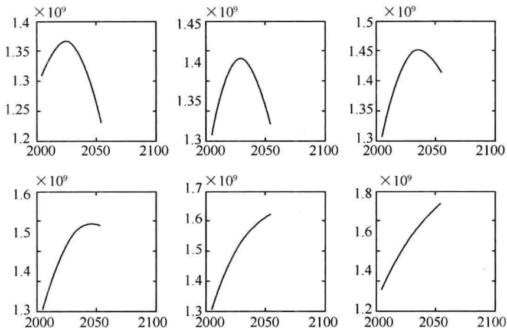  
图9 $R$ 的调整对人口变化的影响

在求解的时候,对 R 的值取一系列的值,比较不同的 R 值情况,得出人口预测模型的结果。从上面的结果可以看出 R 的取值范围为 $1 \leqslant R \leqslant 1.3$ 和现实的状况比较接近。取定 R 的值为 1.25。解决问题的程序见附录二的 MATLAB 程序。在取定 R 值为 1.25 的情况下,建立的模型对以后年份的预测结果见表 8,如图 10 \~ 图 16 所示。

表 8 模型二预测 2005 年到 2054 年全国人口数据(单位:万人)

<table><tr><td>年份</td><td>2005</td><td>2006</td><td>2007</td><td>2008</td><td>2009</td><td>2010</td><td>2011</td><td>2012</td><td>2013</td><td>2014</td></tr><tr><td>人数</td><td>130693</td><td>131597</td><td>132468</td><td>133317</td><td>134143</td><td>134945</td><td>135725</td><td>136479</td><td>137208</td><td>137914</td></tr><tr><td>年份</td><td>2015</td><td>2016</td><td>2017</td><td>2018</td><td>2019</td><td>2020</td><td>2021</td><td>2022</td><td>2023</td><td>2024</td></tr><tr><td>人数</td><td>138593</td><td>139250</td><td>139881</td><td>140485</td><td>141067</td><td>141621</td><td>142152</td><td>142655</td><td>143124</td><td>143570</td></tr><tr><td>年份</td><td>2025</td><td>2026</td><td>2027</td><td>2028</td><td>2029</td><td>2030</td><td>2031</td><td>2032</td><td>2033</td><td>2034</td></tr><tr><td>人数</td><td>143983</td><td>144368</td><td>144723</td><td>145047</td><td>145346</td><td>145609</td><td>145843</td><td>146043</td><td>146209</td><td>146341</td></tr><tr><td>年份</td><td>2035</td><td>2036</td><td>2037</td><td>2038</td><td>2039</td><td>2040</td><td>2041</td><td>2042</td><td>2043</td><td>2044</td></tr><tr><td>人数</td><td>146437</td><td>146501</td><td>146533</td><td>146536</td><td>146507</td><td>146450</td><td>146371</td><td>146261</td><td>146135</td><td>145986</td></tr><tr><td>年份</td><td>2045</td><td>2046</td><td>2047</td><td>2048</td><td>2049</td><td>2050</td><td>2051</td><td>2052</td><td>2053</td><td>2054</td></tr><tr><td>人数</td><td>145823</td><td>145655</td><td>145471</td><td>145289</td><td>145121</td><td>144939</td><td>144763</td><td>144536</td><td>144260</td><td>144035</td></tr></table>

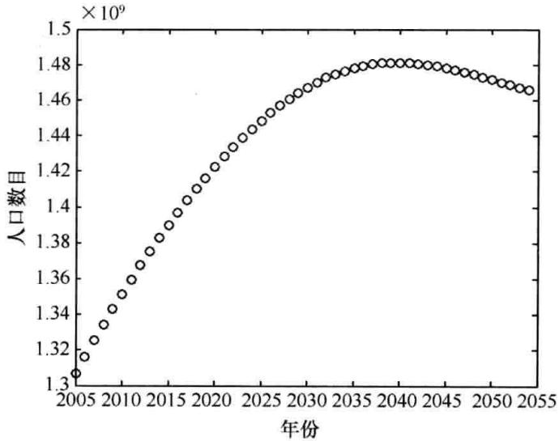

<details>
<summary>line</summary>

| 年份 | 人口数目 (x 10^9) |
| --- | --- |
| 2005 | ~1.305 |
| 2006 | ~1.315 |
| 2007 | ~1.325 |
| 2008 | ~1.335 |
| 2009 | ~1.345 |
| 2010 | ~1.355 |
| 2011 | ~1.365 |
| 2012 | ~1.375 |
| 2013 | ~1.385 |
| 2014 | ~1.395 |
| 2015 | ~1.405 |
| 2016 | ~1.415 |
| 2017 | ~1.425 |
| 2018 | ~1.435 |
| 2019 | ~1.445 |
| 2020 | ~1.455 |
| 2021 | ~1.465 |
| 2022 | ~1.475 |
| 2023 | ~1.485 |
| 2024 | ~1.495 |
| 2025 | ~1.505 |
| 2026 | ~1.515 |
| 2027 | ~1.525 |
| 2028 | ~1.535 |
| 2029 | ~1.545 |
| 2030 | ~1.555 |
| 2031 | ~1.565 |
| 2032 | ~1.575 |
| 2033 | ~1.585 |
| 2034 | ~1.595 |
| 2035 | ~1.605 |
| 2036 | ~1.615 |
| 2037 | ~1.625 |
| 2038 | ~1.635 |
| 2039 | ~1.645 |
| 2040 | ~1.655 |
| 2041 | ~1.665 |
| 2042 | ~1.675 |
| 2043 | ~1.685 |
| 2044 | ~1.695 |
| 2045 | ~1.705 |
| 2046 | ~1.715 |
| 2047 | ~1.725 |
| 2048 | ~1.735 |
| 2049 | ~1.745 |
| 2050 | ~1.755 |
| 2051 | ~1.765 |
| 2052 | ~1.775 |
| 2053 | ~1.785 |
| 2054 | ~1.795 |
| 2055 | ~1.805 |
</details>

图 10 模型二预测全国人口变化图  
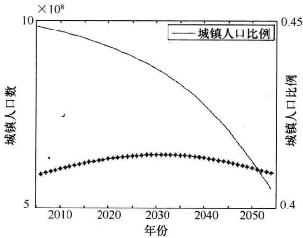

<details>
<summary>line</summary>

| 年份 | 城镇人口数 (x 10^8) | 城镇人口比例 |
| --- | --- | --- |
| 2010 | ~9.8 | ~0.42 |
| 2020 | ~9.2 | ~0.43 |
| 2030 | ~8.5 | ~0.43 |
| 2040 | ~7.5 | ~0.42 |
| 2050 | ~6.2 | ~0.41 |
</details>

图 11 模型二预测城镇人口变化图

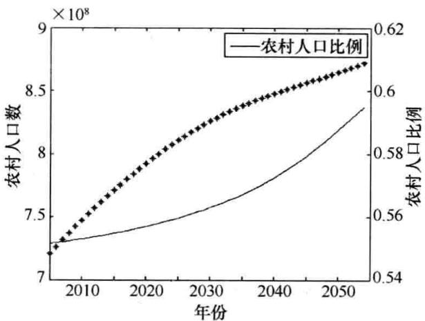

<details>
<summary>line</summary>

| 年份 | 农村人口数 (x 10^8) | 农村人口比例 |
| --- | --- | --- |
| 2005 | ~7.2 | ~0.55 |
| 2010 | ~7.3 | ~0.56 |
| 2020 | ~7.4 | ~0.58 |
| 2030 | ~7.6 | ~0.60 |
| 2040 | ~7.9 | ~0.61 |
| 2050 | ~8.2 | ~0.62 |
</details>

图 12 模型二预测乡村人口变化图

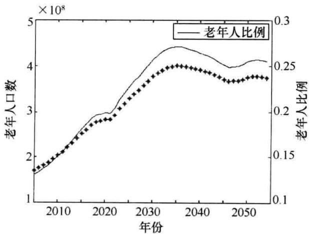

<details>
<summary>line</summary>

| 年份 | 老年人口数 (x10^8) | 老年人比例 |
| --- | --- | --- |
| 2005 | ~1.7 | ~0.13 |
| 2010 | ~2.1 | ~0.16 |
| 2015 | ~2.6 | ~0.19 |
| 2020 | ~2.9 | ~0.20 |
| 2025 | ~3.4 | ~0.22 |
| 2030 | ~3.9 | ~0.24 |
| 2035 | ~4.4 | ~0.25 |
| 2040 | ~4.3 | ~0.24 |
| 2045 | ~4.1 | ~0.23 |
| 2050 | ~4.1 | ~0.24 |
| 2055 | ~4.1 | ~0.24 |
</details>

图 13 模型二预测老年变化图

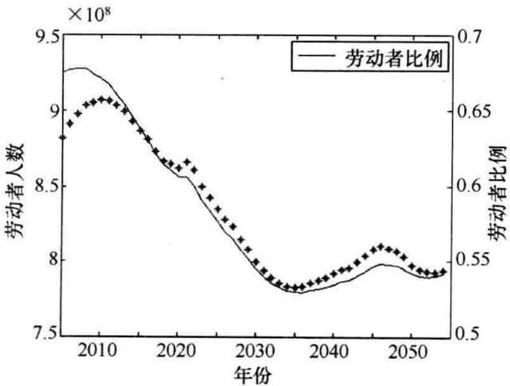

<details>
<summary>line</summary>

| 年份 | 劳动者人数 (x10^8) | 劳动者比例 |
| --- | --- | --- |
| 2010 | ~9.3 | ~0.64 |
| 2020 | ~8.6 | ~0.61 |
| 2030 | ~7.9 | ~0.54 |
| 2040 | ~7.8 | ~0.53 |
| 2050 | ~7.9 | ~0.54 |
</details>

图 14 模型二预测劳动人口变化图

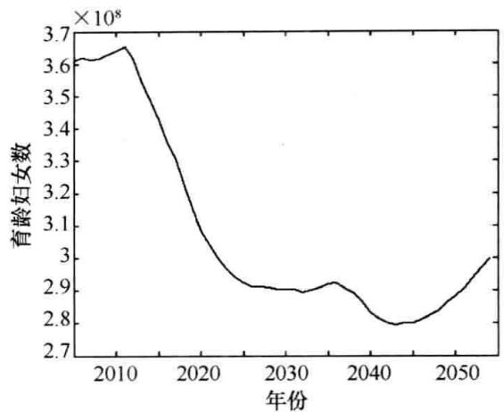

<details>
<summary>line</summary>

| 年份 | 育龄妇女数 (x 10^8) |
| --- | --- |
| 2010 | ~3.62 |
| 2012 | ~3.66 |
| 2015 | ~3.45 |
| 2018 | ~3.25 |
| 2020 | ~3.10 |
| 2025 | ~2.90 |
| 2030 | ~2.89 |
| 2035 | ~2.91 |
| 2040 | ~2.82 |
| 2045 | ~2.79 |
| 2050 | ~2.88 |
| 2053 | ~3.00 |
</details>

图 15 模型二预测育龄妇女变化图

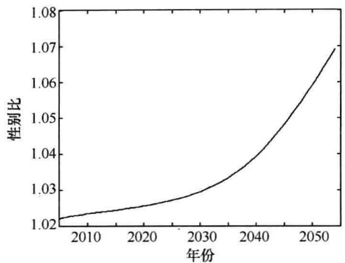

<details>
<summary>line</summary>

| 年份 | 性别比 |
| --- | --- |
| 2010 | ~1.022 |
| 2020 | ~1.025 |
| 2030 | ~1.029 |
| 2040 | ~1.038 |
| 2050 | ~1.065 |
</details>

图 16 模型二预测性别比变化图

## 6.3 结果分析

从上面的结果可以看出,此模型下我国未来人口的峰值出现在2040年,峰值是14.8亿。相对于模型一来讲,峰值出现的时间向后推迟,而峰值比模型一的要大。其实模型二仅在计算新出生的人口时与模型一不同,其他年龄段的人口递归方程与模型一的完全相同。R的值如果变大,峰值出现的时间还会向后偏移,并且峰值会变大。R的变大相当于政府放宽了人口计划生育政策。

城镇人口的变化趋势和模型一中的变化趋势基本类似,不过比模型一时曲线要平缓得多。

而乡村人口的变化趋势在此模型下呈现出新的特点。乡村人口总数和乡村人口占全国人口比值都是一直增加的。和模型一相比，无论是总数还是变化率在同一年份都要比模型一的大。而城镇人口则没有这么明显，说明放宽计划生育政策，乡村人口的变化更明显，而城镇人口的变化比较迟钝。

模型的优点是:此模型基本反映了政策因素对人口的变化影响,这能反应大致趋势,不能完全用来做预测。此模型也就是在模型一的基础上,增加考虑政策因素。

模型的缺点是,仍然没有考虑乡村人口城镇化的因素,与实际情况不太吻合。另外,R值的确定具有很大的主观因素和随意性,必须在有其他辅助条件的情况下,才有可能确定。全国人口在达到峰值之后的下降趋势很慢,无法确定其可信度。R值是一个政策性的因子,人为R值的影响较大。所以此模型不适合中长期预测,只适合在政策可以预期的一段保持不变的时间内有作用,只适用于短期定性预测。

## 7 模型三

## 7.1 问题的进一步分析

建立的模型一,只是对城市、城镇和乡村的人口变化情况,单独考虑与预测,没有考虑乡村人口城镇化、人口老龄化以及性别比例持续升高等因素的影响。这些因素的影响随着时间的推移,对人口数量的变化影响的作用越来越明显。在模型一的基础上,建立了新的模型三: 将所有的影响因素整体考虑为阻滞因子, 老龄化上升, 乡村人口城镇化的加强, 生存资源的约束都会对人口发展起阻滞作用。不考虑它们对人口增长的影响, 引入带阻尼系数的预测模型。由于老龄化和乡村人口城镇化都会使总人口数量减少。阻滞因子对人口变化起负面影响。

## 7.2 模型建立

第 $i$ 类, 第 $j$ 年, 年龄为 $k$ 的人口数量的数学模型如下:

$$
M _ {i, j, k} = M _ {i, j - 1, k - 1} (1 - \lambda_ {i - 1, k - 1}) - \varepsilon_ {i - 1, k - 1} M _ {i, j - 1, k - 1} ^ {2} \tag {11}
$$

式(11)的第一项,表示平均死亡率的影响,第二项表示阻滞项。其中的 $\varepsilon_{i,k}$ 表示第 i 类,年龄为 k 的阻滞系数。根据前 5 年的数据,估计上述阻滞函数的参数,在 2001 年—2005 年的过程中,可以得到每种类型的人的数量,对不同年龄的人求:

$$
\begin{array}{l} M _ {i, j, 9 0 ^ {+}} = M _ {i, j - 1, 8 9} \left(1 - \lambda_ {i, 8 9}\right) - \varepsilon_ {i - 1, k - 1} M _ {i, j - 1, 8 9} ^ {2} + M _ {i, j - 1, 9 0 ^ {+}} \left(1 - \lambda_ {i, 9 0 ^ {+}}\right); 1 \leqslant k \leqslant 8 9 \\ \Rightarrow \varepsilon_ {i, k} = \frac {\left| M _ {i , j , k} - M _ {i , j - 1 , k - 1} \left(1 - \lambda_ {i , k}\right) \right|}{M _ {i , j - 1 , k - 1} ^ {2}} \tag {12} \\ \end{array}
$$

以第 $i$ 类,2岁阻滞因子的求解为例。根据2001年到2005年的已有数据,得到4组1岁\~2岁变化过程的数据。求出四个阻滞因子并比较其大小,取最小的一个作为1岁\~2岁变化过程中的阻滞因子。对0岁\~90+岁分别求得系数 $\varepsilon$ ,代入式(12)得0岁\~90+岁人数变化的公式。新出生的人口数量没有阻滞因子的影响。

第 $i$ 类, 第 $j$ 年, 新出生的人口数量的数学模型方程为

$$
\left\{ \begin{array}{l} M _ {i, j, 0} = \omega_ {i} R \sum_ {k = 1} ^ {9 0 ^ {+}} M _ {2, j - 1, k} \\ i = 1, 2 \end{array} \right.
$$

$$
\left\{ \begin{array}{l} M _ {i, j, 0} = \omega_ {i} R \sum_ {k = 1} ^ {9 0 ^ {+}} M _ {4, j - 1, k} \\ i = 3, 4 \end{array} \right.
$$

$$
\left\{ \begin{array}{l} M _ {i, j, 0} = \omega_ {i} R \sum_ {k = 1} ^ {9 0 ^ {+}} M _ {4, j - 1, k} \\ i = 5, 6 \end{array} \right. \tag {13}
$$

第 $i$ 类, 第 $j$ 年, 年龄为 $k$ 的人口数量的数学模型方程为

$$
M _ {i, j, k} = M _ {i, j - 1, k - 1} \left(1 - \lambda_ {i - 1, k - 1}\right) - \varepsilon_ {i - 1, k - 1} M _ {i, j - 1, k} ^ {2}; 1 \leqslant k \leqslant 8 9 \tag {14}
$$

第 $i$ 类, 第 $j$ 年, 年龄为 $90^{+}$ 的人口数量的数学模型方程为

$$
M _ {i, j, 9 0 ^ {+}} = M _ {i, j - 1, 8 9} \left(1 - \lambda_ {i, 8 9}\right) - \varepsilon_ {i, k - 1} \left(M _ {i, j - 1, 8 9}\right) ^ {2} + M _ {i, j - 1, 9 0 ^ {+}} \left(1 - \lambda_ {i, 9 0 ^ {+}}\right) \tag {15}
$$

第 $j$ 年总的人口数量的数学模型方程为

$$
M _ {j} = \sum_ {i = 1} ^ {6} \sum_ {k = 0} ^ {9 0 ^ {+}} M _ {i, j, k} \tag {16}
$$

综上所述,模型三为

$$
\left\{ \begin{array}{l} M _ {i, j, 0} = \omega_ {i} R \sum_ {k = 1} ^ {9 0 ^ {+}} M _ {2, j - 1, k} \\ i = 1, 2 \end{array} \right.
$$

$$
\left\{ \begin{array}{l} M _ {i, j, 0} = \omega_ {i} R \sum_ {k = 1} ^ {9 0 ^ {+}} M _ {4, j - 1, k} \\ i = 3, 4 \end{array} \right.
$$

$$
\left\{ \begin{array}{l} M _ {i, j, 0} = \omega_ {i} R \sum_ {k = 1} ^ {9 0 ^ {+}} M _ {4, j - 1, k} \\ i = 5, 6 \end{array} \right.
$$

$$
M _ {i, j, k} = M _ {i, j - 1, k - 1} \left(1 - \lambda_ {i - 1, k - 1}\right) - \varepsilon_ {i - 1, k - 1} M _ {i, j - 1, k - 1} ^ {2}; 1 \leqslant k \leqslant 8 9
$$

$$
M _ {i, j, 9 0 ^ {+}} = M _ {i, j - 1, 8 9} \left(1 - \lambda_ {i, 8 9}\right) - \varepsilon_ {i, k - 1} \left(M _ {i, j - 1, 8 9}\right) ^ {2} + M _ {i, j - 1, 9 0 ^ {+}} \left(1 - \lambda_ {i, 9 0 ^ {+}}\right)
$$

$$
M _ {j} = \sum_ {i = 1} ^ {6} \sum_ {k = 0} ^ {9 0 ^ {+}} M _ {i, j, k}
$$

## 7.3 模型求解

按照上面建立的模型,通过编写 MATLAB 程序,求出了一组 $\varepsilon$ 的初始值。不过用这组初始值,去预测 2005 年以后的人口变化,预测的结果很差。分析可能的原因之后,认为主要是由于 $\varepsilon$ 的值过大造成的。采取的处理方法是,分别对 $\varepsilon$ 的值缩小一定的倍数。用缩小后 $\varepsilon$ 值预测 2005 年以后人口的变化情况。图 17 \~ 图 20 为几组典型缩小值后的人口预测图形。

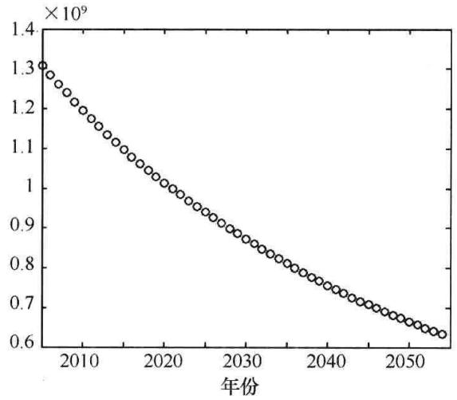

<details>
<summary>line</summary>

| 年份 | Value \(( \times\) 10^9) |
| --- | --- |
| ~2007 | 1.30 |
| ~2008 | 1.28 |
| ~2009 | 1.26 |
| ~2010 | 1.24 |
| ~2011 | 1.22 |
| ~2012 | 1.20 |
| ~2013 | 1.18 |
| ~2014 | 1.16 |
| ~2015 | 1.14 |
| ~2016 | 1.12 |
| ~2017 | 1.10 |
| ~2018 | 1.08 |
| ~2019 | 1.06 |
| ~2020 | 1.04 |
| ~2021 | 1.02 |
| ~2022 | 1.00 |
| ~2023 | 0.98 |
| ~2024 | 0.96 |
| ~2025 | 0.94 |
| ~2026 | 0.92 |
| ~2027 | 0.90 |
| ~2028 | 0.88 |
| ~2029 | 0.86 |
| ~2030 | 0.84 |
| ~2031 | 0.82 |
| ~2032 | 0.80 |
| ~2033 | 0.78 |
| ~2034 | 0.76 |
| ~2035 | 0.74 |
| ~2036 | 0.72 |
| ~2037 | 0.70 |
| ~2038 | 0.68 |
| ~2039 | 0.66 |
| ~2040 | 0.64 |
| ~2041 | 0.62 |
</details>

图 17 $\varepsilon$ 值不缩小时预测人口变化图

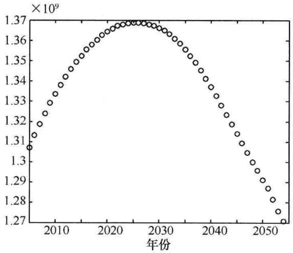

<details>
<summary>scatter</summary>

| 年份 | Value (x 10^9) |
| --- | --- |
| ~2007 | ~1.306 |
| ~2008 | ~1.313 |
| ~2009 | ~1.318 |
| ~2010 | ~1.324 |
| ~2011 | ~1.329 |
| ~2012 | ~1.334 |
| ~2013 | ~1.338 |
| ~2014 | ~1.342 |
| ~2015 | ~1.346 |
| ~2016 | ~1.350 |
| ~2017 | ~1.353 |
| ~2018 | ~1.356 |
| ~2019 | ~1.359 |
| ~2020 | ~1.362 |
| ~2021 | ~1.364 |
| ~2022 | ~1.366 |
| ~2023 | ~1.367 |
| ~2024 | ~1.368 |
| ~2025 | ~1.368 |
| ~2026 | ~1.368 |
| ~2027 | ~1.368 |
| ~2028 | ~1.367 |
| ~2029 | ~1.367 |
| ~2030 | ~1.366 |
| ~2031 | ~1.365 |
| ~2032 | ~1.364 |
| ~2033 | ~1.363 |
| ~2034 | ~1.361 |
| ~2035 | ~1.359 |
| ~2036 | ~1.357 |
| ~2037 | ~1.354 |
| ~2038 | ~1.351 |
| ~2039 | ~1.348 |
| ~2040 | ~1.344 |
| ~2041 | ~1.340 |
| ~2042 | ~1.336 |
| ~2043 | ~1.332 |
| ~2044 | ~1.328 |
| ~2045 | ~1.324 |
| ~2046 | ~1.320 |
| ~2047 | ~1.316 |
| ~2048 | ~1.312 |
| ~2049 | ~1.308 |
| ~2050 | ~1.304 |
| ~2051 | ~1.300 |
| ~2052 | ~1.296 |
| ~2053 | ~1.292 |
| ~2054 | ~1.288 |
| ~2055 | ~1.284 |
| ~2056 | ~1.280 |
| ~2057 | ~1.276 |
| ~2058 | ~1.270 |
</details>

图 18 $\varepsilon$ 值缩小为 0.1 倍时预测人口变化图

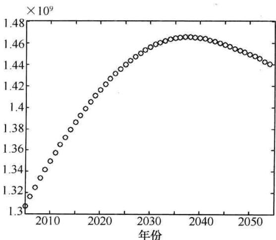

<details>
<summary>line</summary>

| 年份 | Value \(( \times 10^{9})\) |
| --- | --- |
| ~2007 | ~1.305 |
| ~2008 | ~1.315 |
| ~2009 | ~1.325 |
| ~2010 | ~1.335 |
| ~2011 | ~1.345 |
| ~2012 | ~1.355 |
| ~2013 | ~1.365 |
| ~2014 | ~1.375 |
| ~2015 | ~1.385 |
| ~2016 | ~1.395 |
| ~2017 | ~1.405 |
| ~2018 | ~1.415 |
| ~2019 | ~1.425 |
| ~2020 | ~1.435 |
| ~2021 | ~1.445 |
| ~2022 | ~1.455 |
| ~2023 | ~1.465 |
| ~2024 | ~1.475 |
| ~2025 | ~1.485 |
| ~2026 | ~1.495 |
| ~2027 | ~1.505 |
| ~2028 | ~1.515 |
| ~2029 | ~1.525 |
| ~2030 | ~1.535 |
| ~2031 | ~1.545 |
| ~2032 | ~1.555 |
| ~2033 | ~1.565 |
| ~2034 | ~1.575 |
| ~2035 | ~1.585 |
| ~2036 | ~1.595 |
| ~2037 | ~1.605 |
| ~2038 | ~1.615 |
| ~2039 | ~1.625 |
| ~2040 | ~1.635 |
| ~2041 | ~1.645 |
| ~2042 | ~1.655 |
| ~2043 | ~1.665 |
| ~2044 | ~1.675 |
| ~2045 | ~1.685 |
| ~2046 | ~1.695 |
| ~2047 | ~1.705 |
| ~2048 | ~1.715 |
| ~2049 | ~1.725 |
| ~2050 | ~1.735 |
| ~2051 | ~1.745 |
| ~2052 | ~1.755 |
| ~2053 | ~1.765 |
| ~2054 | ~1.775 |
| ~2055 | ~1.785 |
| ~2056 | ~1.795 |
| ~2057 | ~1.805 |
| ~2058 | ~1.815 |
| ~2059 | ~1.825 |
| ~2060 | ~1.835 |
| ~2061 | ~1.845 |
| ~2062 | ~1.855 |
| ~2063 | ~1.865 |
| ~2064 | ~1.875 |
| ~2065 | ~1.885 |
| ~2066 | ~1.895 |
| ~2067 | ~1.905 |
| ~2068 | ~1.915 |
| ~2069 | ~1.925 |
| ~2070 | ~1.935 |
| ~2071 | ~1.945 |
| ~2072 | ~1.955 |
| ~2073 | ~1.965 |
| ~2074 | ~1.975 |
| ~2075 | ~1.985 |
| ~2076 | ~1.995 |
| ~2077 | ~2.005 |
| ~2078 | ~2.015 |
| ~2079 | ~2.025 |
| ~2080 | ~2.035 |
| ~2081 | ~2.045 |
| ~2082 | ~2.055 |
| ~2083 | ~2.065 |
| ~2084 | ~2.075 |
| ~2085 | ~2.085 |
| ~2086 | ~2.095 |
| ~2087 | ~2.105 |
| ~2088 | ~2.115 |
| ~2089 | ~2.125 |
| ~2090 | ~2.135 |
| ~2091 | ~2.145 |
| ~2092 | ~2.155 |
| ~2093 | ~2.165 |
| ~2094 | ~2.175 |
| ~2095 | ~2.185 |
| ~2096 | ~2.195 |
| ~2097 | ~2.205 |
| ~2098 | ~2.215 |
| ~2099 | ~2.225 |
| 2100 | 1.44 |
</details>

图 19 $\varepsilon$ 值缩小为 0.01 倍时预测人口变化图

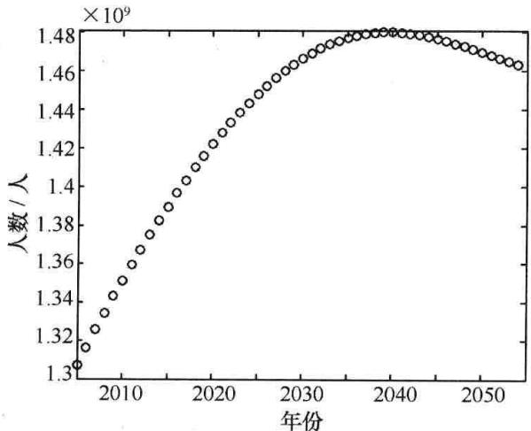

<details>
<summary>line</summary>

| 年份 | 人数 / 人 \(( \times 10^{9})\) |
| --- | --- |
| 2005 | ~1.305 |
| 2006 | ~1.315 |
| 2007 | ~1.325 |
| 2008 | ~1.335 |
| 2009 | ~1.345 |
| 2010 | ~1.355 |
| 2011 | ~1.365 |
| 2012 | ~1.375 |
| 2013 | ~1.385 |
| 2014 | ~1.395 |
| 2015 | ~1.405 |
| 2016 | ~1.415 |
| 2017 | ~1.425 |
| 2018 | ~1.435 |
| 2019 | ~1.445 |
| 2020 | ~1.455 |
| 2021 | ~1.465 |
| 2022 | ~1.475 |
| 2023 | ~1.485 |
| 2024 | ~1.495 |
| 2025 | ~1.505 |
| 2026 | ~1.515 |
| 2027 | ~1.525 |
| 2028 | ~1.535 |
| 2029 | ~1.545 |
| 2030 | ~1.555 |
| 2031 | ~1.565 |
| 2032 | ~1.575 |
| 2033 | ~1.585 |
| 2034 | ~1.595 |
| 2035 | ~1.605 |
| 2036 | ~1.615 |
| 2037 | ~1.625 |
| 2038 | ~1.635 |
| 2039 | ~1.645 |
| 2040 | ~1.655 |
| 2041 | ~1.665 |
| 2042 | ~1.675 |
| 2043 | ~1.685 |
| 2044 | ~1.695 |
| 2045 | ~1.705 |
| 2046 | ~1.715 |
| 2047 | ~1.725 |
| 2048 | ~1.735 |
| 2049 | ~1.745 |
| 2050 | ~1.755 |
| 2051 | ~1.765 |
| 2052 | ~1.775 |
| 2053 | ~1.785 |
| 2054 | ~1.795 |
| 2055 | ~1.805 |
</details>

图 20 $\varepsilon$ 值缩小为 0.001
倍时预测人口变化图

根据附件中的中国人口网2007年2月1日发布的《国家人口发展战略研究报告》中的有关数据,发现当 $\varepsilon$ 值缩小为0.01倍时,作出的预测模型是比较符合实际情况的。对比以上四个图形,可以得出如下的结论,随着阻滞因子 $\varepsilon$ 的不断减小,人口出现峰值的年龄会相对偏移。当 $\varepsilon$ 不缩小时, $\varepsilon$ 的阻滞影响太强烈,不符合实际。经过比较,选定 $\varepsilon$ 值缩小为原来的0.01值,作为 $\varepsilon$ 修正后的值,并用于预测2005年以后年份的人口数量。通过 MATLAB 程序求解(见 model3.m.),求出的结果见表9,如图21\~图27所示。

表 9 改进模型预测 2005 年到 2054 年全国人口数据(单位:万人)

<table><tr><td>年份</td><td>2005</td><td>2006</td><td>2007</td><td>2008</td><td>2009</td><td>2010</td><td>2011</td><td>2012</td><td>2013</td><td>2014</td></tr><tr><td>人数</td><td>130693</td><td>131597</td><td>132468</td><td>133317</td><td>134143</td><td>134945</td><td>135725</td><td>136479</td><td>137208</td><td>137914</td></tr><tr><td>年份</td><td>2015</td><td>2016</td><td>2017</td><td>2018</td><td>2019</td><td>2020</td><td>2021</td><td>2022</td><td>2023</td><td>2024</td></tr><tr><td>人数</td><td>138593</td><td>139250</td><td>139881</td><td>140485</td><td>141067</td><td>141621</td><td>142152</td><td>142655</td><td>143124</td><td>143570</td></tr><tr><td>年份</td><td>2025</td><td>2026</td><td>2027</td><td>2028</td><td>2029</td><td>2030</td><td>2031</td><td>2032</td><td>2033</td><td>2034</td></tr><tr><td>人数</td><td>143983</td><td>144368</td><td>144723</td><td>145047</td><td>145346</td><td>145609</td><td>145843</td><td>146043</td><td>146209</td><td>146341</td></tr><tr><td>年份</td><td>2035</td><td>2036</td><td>2037</td><td>2038</td><td>2039</td><td>2040</td><td>2041</td><td>2042</td><td>2043</td><td>2044</td></tr><tr><td>人数</td><td>146437</td><td>146501</td><td>146533</td><td>146536</td><td>146507</td><td>146450</td><td>146371</td><td>146261</td><td>146135</td><td>145986</td></tr><tr><td>年份</td><td>2045</td><td>2046</td><td>2047</td><td>2048</td><td>2049</td><td>2050</td><td>2051</td><td>2052</td><td>2053</td><td>2054</td></tr><tr><td>人数</td><td>145823</td><td>145655</td><td>145471</td><td>145289</td><td>145121</td><td>144939</td><td>144763</td><td>144536</td><td>144260</td><td>144035</td></tr></table>

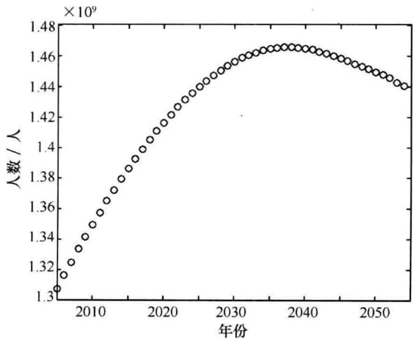

<details>
<summary>line</summary>

| 年份 | 人数 / 人 \(( \times 10^{9})\) |
| --- | --- |
| 2005 | ~1.305 |
| 2006 | ~1.315 |
| 2007 | ~1.323 |
| 2008 | ~1.332 |
| 2009 | ~1.341 |
| 2010 | ~1.349 |
| 2011 | ~1.357 |
| 2012 | ~1.365 |
| 2013 | ~1.372 |
| 2014 | ~1.379 |
| 2015 | ~1.386 |
| 2016 | ~1.393 |
| 2017 | ~1.400 |
| 2018 | ~1.407 |
| 2019 | ~1.413 |
| 2020 | ~1.418 |
| 2021 | ~1.423 |
| 2022 | ~1.428 |
| 2023 | ~1.433 |
| 2024 | ~1.437 |
| 2025 | ~1.441 |
| 2026 | ~1.445 |
| 2027 | ~1.448 |
| 2028 | ~1.451 |
| 2029 | ~1.454 |
| 2030 | ~1.456 |
| 2031 | ~1.458 |
| 2032 | ~1.460 |
| 2033 | ~1.462 |
| 2034 | ~1.464 |
| 2035 | ~1.465 |
| 2036 | ~1.466 |
| 2037 | ~1.467 |
| 2038 | ~1.467 |
| 2039 | ~1.467 |
| 2040 | ~1.466 |
| 2041 | ~1.465 |
| 2042 | ~1.464 |
| 2043 | ~1.463 |
| 2044 | ~1.462 |
| 2045 | ~1.461 |
| 2046 | ~1.460 |
| 2047 | ~1.459 |
| 2048 | ~1.458 |
| 2049 | ~1.457 |
| 2050 | ~1.456 |
| 2051 | ~1.455 |
| 2052 | ~1.454 |
| 2053 | ~1.453 |
| 2054 | ~1.452 |
| 2055 | ~1.451 |
| 2056 | ~1.450 |
| 2057 | ~1.449 |
| 2058 | ~1.448 |
| 2059 | ~1.447 |
| 2060 | ~1.446 |
| 2061 | ~1.445 |
| 2062 | ~1.444 |
| 2063 | ~1.443 |
| 2064 | ~1.442 |
| 2065 | ~1.441 |
</details>

图 21 模型三预测全国人口变化图

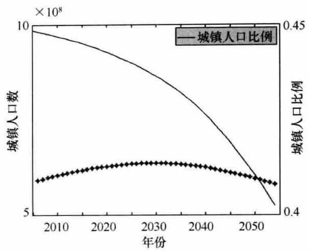

<details>
<summary>line</summary>

| 年份 | 城镇人口数 (x10^8) | 城镇人口比例 |
| --- | --- | --- |
| 2010 | ~9.8 | ~0.41 |
| 2020 | ~9.0 | ~0.42 |
| 2030 | ~8.0 | ~0.42 |
| 2040 | ~6.5 | ~0.41 |
| 2050 | ~5.0 | ~0.40 |
| 2055 | ~4.5 | ~0.39 |
</details>

图 22 模型三预测城镇人口变化图

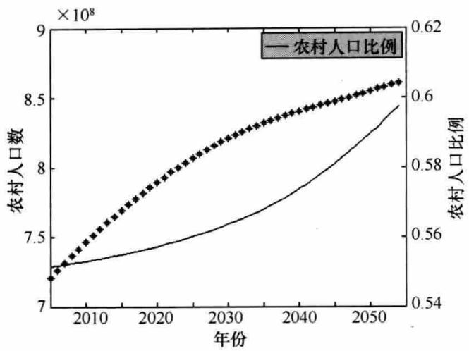

<details>
<summary>line</summary>

| 年份 | 农村人口数 (x10^8) | 农村人口比例 |
| --- | --- | --- |
| 2005 | ~7.2 | ~0.55 |
| 2010 | ~7.3 | ~0.56 |
| 2020 | ~7.4 | ~0.58 |
| 2030 | ~7.6 | ~0.59 |
| 2040 | ~7.9 | ~0.60 |
| 2050 | ~8.3 | ~0.61 |
| 2055 | ~8.45 | ~0.61 |
</details>

图 23 模型三预测农村人口变化图

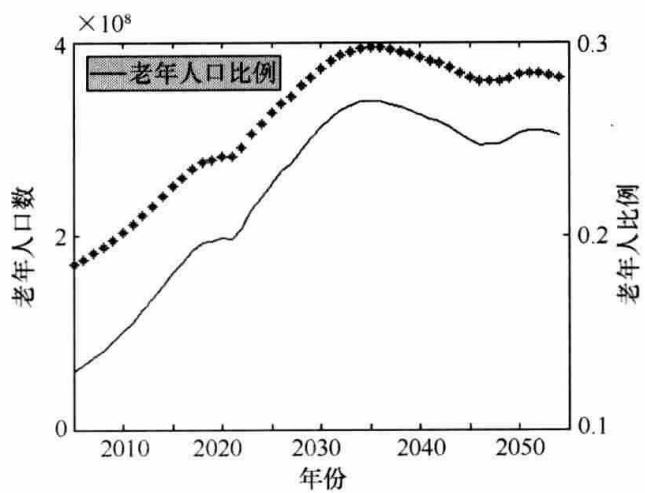

<details>
<summary>line</summary>

| 年份 | 老年人口数 (x 10^8) | 老年人比例 |
| --- | --- | --- |
| 2005 | ~1.7 | ~0.13 |
| 2010 | ~2.0 | ~0.16 |
| 2015 | ~2.4 | ~0.19 |
| 2020 | ~2.7 | ~0.20 |
| 2025 | ~3.1 | ~0.23 |
| 2030 | ~3.6 | ~0.26 |
| 2035 | ~4.0 | ~0.27 |
| 2040 | ~3.9 | ~0.26 |
| 2045 | ~3.7 | ~0.24 |
| 2050 | ~3.7 | ~0.25 |
| 2055 | ~3.7 | ~0.25 |
</details>

图 24 模型三预测老年变化图

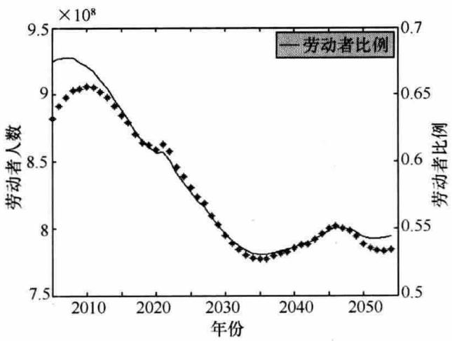

<details>
<summary>line</summary>

| 年份 | 劳动者人数 (x 10^8) | 劳动者比例 |
| --- | --- | --- |
| 2010 | ~9.25 | ~0.63 |
| 2020 | ~8.7 | ~0.61 |
| 2030 | ~8.0 | ~0.54 |
| 2040 | ~7.8 | ~0.53 |
| 2050 | ~7.95 | ~0.53 |
</details>

图 25 模型三预测劳动人变化图

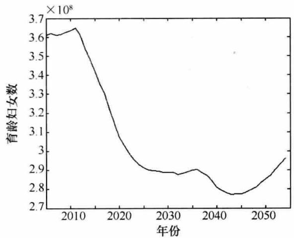

<details>
<summary>line</summary>

| 年份 | 育龄妇女数 (x 10^8) |
| --- | --- |
| 2010 | ~3.65 |
| 2020 | ~3.15 |
| 2030 | ~2.89 |
| 2040 | ~2.80 |
| 2050 | ~2.96 |
</details>

图 26 模型三预测育龄妇女变化图

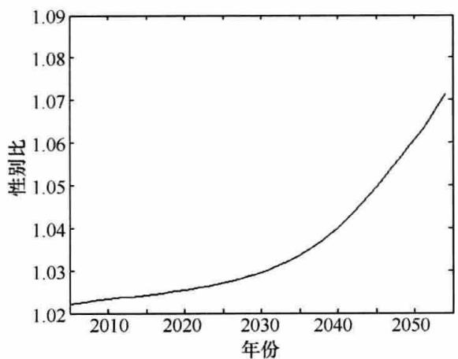

<details>
<summary>line</summary>

| 年份 | 性别比 |
| --- | --- |
| 2010 | ~1.023 |
| 2020 | ~1.026 |
| 2030 | ~1.030 |
| 2040 | ~1.040 |
| 2050 | ~1.065 |
</details>

图 27 模型三预测性别变化图

## 7.4 结果分析

从上面的结果可以看出,2042年总人口取得峰值14.9亿,然后下降,和模型二相比,模型的峰值附近的值变化比较快,峰值附近的值持续时间短。说明,阻滞因子确实起到了作用。城镇人口和乡村人口的变化情况,和模型二相比变化很小。

此模型的优点,是把更多的因素考虑进了模型,更加接近实际;缺点是单纯地用一个笼统的变量来反应,不够精确和合理,并且没有把乡村人口城镇化的因素考虑进去。

## 8 模型四

## 8.1 问题的进一步分析

考虑人口城镇化因素影响,第 i 类人,第 $(j+1)$ 年,年龄为 $(k+1)$ 的城市人口数量 $M_{i,j+1,k+1}$ 不仅与第 j 年,年龄为 k 的人口存活量有关,还与从乡村迁入城市的年龄为 $(k+1)$ 的人口数量有关。

以 2004 年 1 岁人口和 2005 年 2 岁人口的变化来说明建立模型的思路。从附件中提取表 10 所列的数据。

表 10 2004 年和 2005 年 1 岁人口和 2 岁人口的有关数据

<table><tr><td colspan="4">市</td><td colspan="2">镇</td><td colspan="2">乡</td></tr><tr><td colspan="2"></td><td>存活数</td><td>总数</td><td>存活数</td><td>总数</td><td>存活数</td><td>总数</td></tr><tr><td rowspan="2">2005</td><td>1岁</td><td>3078037</td><td>3116753</td><td>2349516</td><td>2351292</td><td>8352079</td><td>8366086</td></tr><tr><td>2岁</td><td>2717175</td><td>2899305</td><td>2215824</td><td>2216932</td><td>8355829</td><td>8366086</td></tr><tr><td rowspan="2">2004</td><td>1岁</td><td>2180055</td><td>2181822</td><td>1656780</td><td>1656780</td><td>7105042</td><td>7110809</td></tr><tr><td>2岁</td><td>2583504</td><td>2584620</td><td>1854874</td><td>1856392</td><td>7868422</td><td>7875412</td></tr><tr><td colspan="8">注:T1:2004年1岁城市人口存活数;T2:2005年2岁城市人口总数;H1:2004年1岁城镇人口存活数;H2:2005年2岁城镇人口总数;K2:2004年1岁乡村人口存活数;K1:2005年2岁乡村人口总数</td></tr></table>

从表10的数据可以看出,2005年城市2岁人的总数比2004年1岁人的存活数要大,说明在2005年有一部分2岁的人口从乡村迁移到城市,对于城镇有类似的结论。对于乡村来说,2005年2岁人的总数比2004年1岁人的存活数要小,说明在2005年,有一部分2岁的人口从乡村迁出。结合我们的模型假设,乡村人口城镇化只有两种情况:从乡村迁移到城镇和从乡村迁移到城市,不存在从城镇迁移到城市的情况。乡村人口的变化量和变化率的符号表示如下: $\nabla=K1-K2,\mu=\frac{\nabla}{K1}$ ;城市人口变化量为: $\nabla1=T2-T1$ ;城镇人口变化量为: $\nabla2=H2-H1$ 。当乡村人口向城市和城镇迁移的变化过程中,如果全国所有城市、城镇和乡村全部考虑进去,会有以下的等式成立: $\nabla=\nabla1+\nabla2$ ,不过我们的题目中只是全国情况的一个抽样,满足上述等式关系的可能性不大,所以求出如下的两个相对迁移率:

$$
P 1 = \frac {\nabla 1}{\nabla 1 + \nabla 2} \tag {17}
$$

2岁乡村迁出人口,迁移到城市的数量占2岁乡村迁出总量的相对迁入率。

$$
P 2 = \frac {\nabla 2}{\nabla 1 + \nabla 2} \tag {18}
$$

2岁乡村迁出人口,迁移到城镇的数量占2岁乡村迁出总量的相对迁入率。

只要得出每个年龄乡村人口迁出率,以及每个年龄城镇和城市人口的相对迁入率,就可以得出在考虑迁移因素影响下的城市、城镇和乡村的人口变化模型。基于这一思想,通过对2004年到2005年所有类型的人口各求出一组以上的三个参数: $u,p_{1},p_{2}$ 。

## 8.2 模型建立

乡村人口变化的递归方程为

$$
M _ {i, j + 1, k + 1} = \left(1 - \lambda_ {i, k}\right) \left(1 - \mu_ {i, k + 1}\right) M _ {i, j, k} - \varepsilon_ {i, k} M _ {i, j, k} ^ {2}; i = 5, 6 \tag {19}
$$

城镇人口变化的递归方程为

$$
M _ {i, j + 1, k + 1} = (1 - \lambda_ {i, k}) M _ {i, j, k} + P 2 _ {i, k} (1 - \lambda_ {i + 2, k}) \mu_ {i + 2, k + 1} M _ {i + 2, j, k} - \varepsilon_ {i, k} M _ {i, j, k} ^ {2}; i = 3, 4 \tag {20}
$$

城市人口变化的递归方程为

$$
M _ {i, j + 1, k + 1} = \left(1 - \lambda_ {i, k}\right) M _ {i, j, k} + P 1 _ {i, k} \left(1 - \lambda_ {i + 4, k}\right) \mu_ {i + 4, k + 1} M _ {i + 4, j, k} - \varepsilon_ {i, k} M _ {i, j, k} ^ {2}; i = 1, 2 \tag {21}
$$

在上面的递归方程中,没有考虑0岁和 $90^{+}$ 人口的计算方法,并且这两个年龄的人口方程不符合上面的递归方程。0岁的人由于刚出生,不参与递归过程。第i类第j年0岁的人口数量的方程如下:

$$
\left\{ \begin{array}{l} M _ {i, j, 0} = R \omega_ {i} \sum_ {m = 0} ^ {9 0 ^ {+}} M _ {2, j, m} \\ i = 1, 2 \end{array} \right. \tag {22}
$$

$$
\left\{ \begin{array}{l} M _ {i, j, 0} = R \omega_ {i} \sum_ {m = 0} ^ {9 0 ^ {+}} M _ {4, j, m} \\ i = 3, 4 \end{array} \right. \tag {23}
$$

$$
\left\{ \begin{array}{l} M _ {i, j, 0} = R \omega_ {i} \sum_ {m = 0} ^ {9 0 ^ {+}} M _ {6, j, m} \\ i = 5, 6 \end{array} \right. \tag {24}
$$

在计算第 $i$ 类第 $j$ 年 $90^{+}$ 岁以上的人口数量时, 仍然要从两个方面来考虑。计算方程如下:

$$
\left\{ \begin{array}{l} M _ {i, j + 1, 9 0 ^ {+}} = M _ {i, j, 8 9} \left(1 - \lambda_ {i, 8 9}\right) \left(1 - \mu_ {i, 9 0 ^ {+}}\right) - \varepsilon_ {i, 8 9} M _ {i, j, 8 9} ^ {2} + M _ {i + 4, j, 9 0 ^ {+}} \left(1 - \lambda_ {i + 4, 9 0 ^ {+}}\right) \mu_ {i + 4, 9 0 ^ {+}} P 1 _ {i, 9 0 ^ {+}} \\ i = 1, 2 \end{array} \right.
$$

$$
\left\{ \begin{array}{l} M _ {i, j + 1, 9 0 ^ {+}} = M _ {i, j, 8 9} \left(1 - \lambda_ {i, 8 9}\right) \left(1 - \mu_ {i, 9 0 ^ {+}}\right) - \varepsilon_ {i, 8 9} M _ {i, j, 8 9} ^ {2} + M _ {i + 2, j, 9 0 ^ {+}} \left(1 - \lambda_ {i + 2, 9 0 ^ {+}}\right) \mu_ {i + 2, 9 0 ^ {+}} P 2 _ {i, 9 0 ^ {+}} \\ i = 3, 4 \end{array} \right.
$$

$$
\left\{ \begin{array}{l} M _ {i, j + 1, 9 0 ^ {+}} = (1 - \lambda_ {i, 8 9}) (1 - \mu_ {i, 9 0 ^ {+}}) M _ {i, j, 8 9} - \varepsilon_ {i, 8 9} M _ {i, j, 8 9} ^ {2} \\ i = 5, 6 \end{array} \right. \tag {25}
$$

则第 $j$ 年全国人口的总数为

$$
M _ {j} = \sum_ {i = 1} ^ {6} \sum_ {k = 0} ^ {9 0 ^ {+}} M _ {i, j, k} \tag {26}
$$

综上所述,模型四为

$$
\begin{array}{l} M _ {i, j + 1, k + 1} = \left(1 - \lambda_ {i, k}\right) \left(1 - \mu_ {i, k + 1}\right) M _ {i, j, k} - \varepsilon_ {i, k} M _ {i, j, k} ^ {2}; i = 5, 6 \\ M _ {i, j + 1, k + 1} = \left(1 - \lambda_ {i, k}\right) M _ {i, j, k} + P 2 _ {i, k} \left(1 - \lambda_ {i + 2, k}\right) \mu_ {i + 2, k + 1} M _ {i + 2, j, k} - \varepsilon_ {i, k} M _ {i, j, k} ^ {2}; i = 3, 4 \\ M _ {i, j + 1, k + 1} = (1 - \lambda_ {i, k}) M _ {i, j, k} + P 1 _ {i, k} (1 - \lambda_ {i + 4, k}) \mu_ {i + 4, k + 1} M _ {i + 4, j, k} - \varepsilon_ {i, k} M _ {i, j, k} ^ {2}; i = 1, 2 \\ \end{array}
$$

$$
\begin{array}{l} \left\{ \begin{array}{l} M _ {i, j, 0} = R \omega_ {i} \sum_ {m = 0} ^ {9 0 ^ {+}} M _ {2, j, m} \\ i = 1, 2 \end{array} \right. \\ \left\{ \begin{array}{l} M _ {i, j, 0} = R \omega_ {i} \sum_ {m = 0} ^ {9 0 ^ {+}} M _ {4, j, m} \\ i = 3, 4 \end{array} \right. \\ \left\{ \begin{array}{l} M _ {i, j, 0} = R \omega_ {i} \sum_ {m = 0} ^ {9 0 ^ {+}} M _ {6, j, m} \\ i = 5, 6 \end{array} \right. \\ \left\{ \begin{array}{l} M _ {i, j + 1, 9 0 ^ {+}} = M _ {i, j, 8 9} \left(1 - \lambda_ {i, 8 9}\right) \left(1 - \mu_ {i, 9 0 ^ {+}}\right) - \varepsilon_ {i, 8 9} M _ {i, j, 8 9} ^ {2} + M _ {i + 4, j, 9 0 ^ {+}} \left(1 - \lambda_ {i + 4, 9 0 ^ {+}}\right) \mu_ {i + 4, 9 0 ^ {+}} P 1 _ {i, 9 0 ^ {+}} \\ i = 1, 2 \end{array} \right. \\ \left\{ \begin{array}{l} M _ {i, j + 1, 9 0 ^ {+}} = M _ {i, j, 8 9} \left(1 - \lambda_ {i, 8 9}\right) \left(1 - \mu_ {i, 9 0 ^ {+}}\right) - \varepsilon_ {i, 8 9} M _ {i, j, 8 9} ^ {2} + M _ {i + 2, j, 9 0 ^ {+}} \left(1 - \lambda_ {i + 2, 9 0 ^ {+}}\right) \mu_ {i + 2, 9 0 ^ {+}} P 2 _ {i, 9 0 ^ {+}} \\ i = 3, 4 \end{array} \right. \\ \left\{ \begin{array}{l} M _ {i, j + 1, 9 0 ^ {+}} = (1 - \lambda_ {i, 8 9}) (1 - \mu_ {i, 9 0 ^ {+}}) M _ {i, j, 8 9} - \varepsilon_ {i, 8 9} M _ {i, j, 8 9} ^ {2} \\ i = 5, 6 \end{array} \right. \\ M _ {j} = \sum_ {i = 1} ^ {6} \sum_ {k = 0} ^ {9 0 ^ {+}} M _ {i, j, k} \\ \end{array}
$$

## 8.3 模型求解

从上面的方程可以看出, 只要求出 $\mu_{i,k}, P1_{i,k}, P2_{i,k}$ 就可以得到递归方程的确切形式, 然后就可以递归出 2005 年以后每年的人口情况。2003 年, SARS 病毒爆发期间, 国家实施了强制的政策, 限制了人口的自然流动, 所以 2003 年的数据在乡村人口城镇化方面, 不能真实反映自然情况。又因为 2001 年和 2002 年的数据距离模型预测的起点较远。最终, 选择 2004 年和 2005 年的数据, 作为求解依据。

根据 2004 年和 2005 年的数据, 编写 MATLAB 程序实现模型四问题进一步分析中的 $\mu_{i,k}, P1_{i,k}, P2_{i,k}$ 的求解方法, 得出 90 组数据 $\mu, p1, p2$ 。通过分析得到的结果, 发现有些年龄组的数据不符合实际, 例如有些年龄组的城市的迁入率是负值, 有些年龄组的乡村的迁出率是负值。分析之后, 发现是由于样本数据本身不具备全局代表性导致的。对于不符合实际情况的数据做出如下修正: 用距离不符合实际数据最近的一个符合实际的数据代替不符合实际的数据, 因为年龄相近的人口迁移率基本上是相同的。我们的修正是在程序当中实现的。

分析实际情况下的乡村人口城镇化的过程后,发现不同年龄段的乡村人口向城镇迁移率是不同的。一般老年人和儿童向城镇迁移率比较小,青壮年人向城镇的迁移率比较大。按年龄把乡村人口划分为三类:20岁以下的人,21岁\~50岁的人和50岁以后的人。对每一类人,给定一个平均的迁移率。在计算的过程中,用平均迁移率,来递归2005年以后每年的人口数量。通过MATLAB程序求解(见model4.m.),模型的求解结果见表11,

如图 28 \~ 图 34 所示。

表 11 模型四预测 2005 年到 2054 年的人口数

<table><tr><td>年份</td><td>2005</td><td>2006</td><td>2007</td><td>2008</td><td>2009</td><td>2010</td><td>2011</td><td>2012</td><td>2013</td><td>2014</td></tr><tr><td>人数</td><td>130693</td><td>131595</td><td>132464</td><td>133309</td><td>134132</td><td>134929</td><td>135702</td><td>136450</td><td>137170</td><td>137865</td></tr><tr><td>年份</td><td>2015</td><td>2016</td><td>2017</td><td>2018</td><td>2019</td><td>2020</td><td>2021</td><td>2022</td><td>2023</td><td>2024</td></tr><tr><td>人数</td><td>138533</td><td>139174</td><td>139787</td><td>140375</td><td>140933</td><td>141466</td><td>141968</td><td>142436</td><td>142877</td><td>143286</td></tr><tr><td>年份</td><td>2025</td><td>2026</td><td>2027</td><td>2028</td><td>2029</td><td>2030</td><td>2031</td><td>2032</td><td>2033</td><td>2034</td></tr><tr><td>人数</td><td>143666</td><td>144017</td><td>144335</td><td>144628</td><td>144881</td><td>145102</td><td>145290</td><td>145440</td><td>145554</td><td>145627</td></tr><tr><td>年份</td><td>2035</td><td>2036</td><td>2037</td><td>2038</td><td>2039</td><td>2040</td><td>2041</td><td>2042</td><td>2043</td><td>2044</td></tr><tr><td>人数</td><td>145661</td><td>145658</td><td>145621</td><td>145543</td><td>145434</td><td>145293</td><td>145113</td><td>144914</td><td>144685</td><td>144447</td></tr><tr><td>年份</td><td>2045</td><td>2046</td><td>2047</td><td>2048</td><td>2049</td><td>2050</td><td>2051</td><td>2052</td><td>2053</td><td>2054</td></tr><tr><td>人数</td><td>144200</td><td>143936</td><td>143689</td><td>143454</td><td>143201</td><td>142937</td><td>142576</td><td>142150</td><td>141788</td><td>141439</td></tr></table>

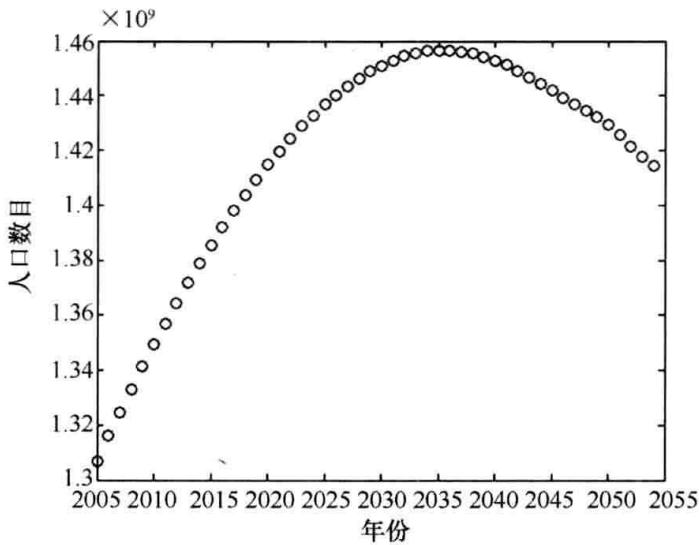

<details>
<summary>scatter</summary>

| 年份 | 人口数目 (x10^9) |
| --- | --- |
| 2005 | ~1.308 |
| 2006 | ~1.317 |
| 2007 | ~1.324 |
| 2008 | ~1.333 |
| 2009 | ~1.341 |
| 2010 | ~1.349 |
| 2011 | ~1.356 |
| 2012 | ~1.364 |
| 2013 | ~1.371 |
| 2014 | ~1.379 |
| 2015 | ~1.386 |
| 2016 | ~1.393 |
| 2017 | ~1.400 |
| 2018 | ~1.407 |
| 2019 | ~1.413 |
| 2020 | ~1.419 |
| 2021 | ~1.425 |
| 2022 | ~1.430 |
| 2023 | ~1.435 |
| 2024 | ~1.439 |
| 2025 | ~1.443 |
| 2026 | ~1.446 |
| 2027 | ~1.449 |
| 2028 | ~1.451 |
| 2029 | ~1.453 |
| 2030 | ~1.455 |
| 2031 | ~1.456 |
| 2032 | ~1.457 |
| 2033 | ~1.458 |
| 2034 | ~1.458 |
| 2035 | ~1.458 |
| 2036 | ~1.458 |
| 2037 | ~1.457 |
| 2038 | ~1.456 |
| 2039 | ~1.455 |
| 2040 | ~1.454 |
| 2041 | ~1.453 |
| 2042 | ~1.451 |
| 2043 | ~1.449 |
| 2044 | ~1.447 |
| 2045 | ~1.445 |
| 2046 | ~1.443 |
| 2047 | ~1.441 |
| 2048 | ~1.439 |
| 2049 | ~1.437 |
| 2050 | ~1.435 |
| 2051 | ~1.433 |
| 2052 | ~1.430 |
| 2053 | ~1.427 |
| 2054 | ~1.423 |
| 2055 | ~1.419 |
| 2056 | ~1.415 |
</details>

图 28 模型四预测全国人口变化图

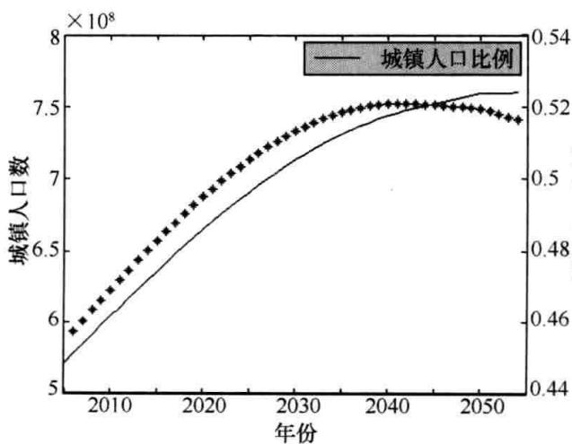

<details>
<summary>line</summary>

| 年份 | 城镇人口数 (x 10^8) | 城镇人口比例 |
| --- | --- | --- |
| 2005 | ~5.9 | ~0.45 |
| 2010 | ~6.3 | ~0.47 |
| 2015 | ~6.7 | ~0.49 |
| 2020 | ~7.0 | ~0.50 |
| 2025 | ~7.2 | ~0.51 |
| 2030 | ~7.3 | ~0.51 |
| 2035 | ~7.4 | ~0.52 |
| 2040 | ~7.5 | ~0.52 |
| 2045 | ~7.5 | ~0.52 |
| 2050 | ~7.4 | ~0.52 |
| 2055 | ~7.4 | ~0.52 |
</details>

图 29 模型四预测城镇人口变化图

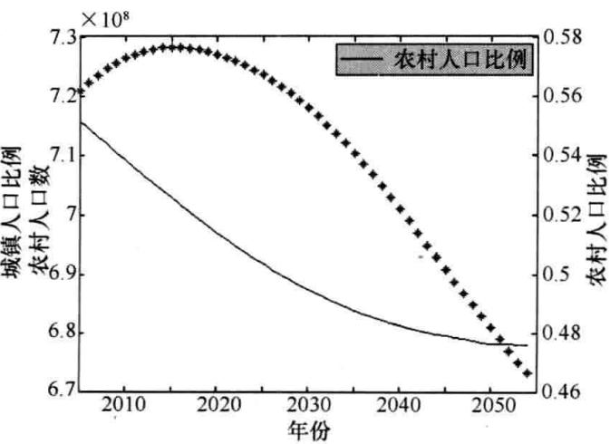

<details>
<summary>line</summary>

| 年份 | 农村人口比例 (x 10^8) | 城镇人口比例 (x 10^8) |
| --- | --- | --- |
| 2010 | ~7.15 | ~7.21 |
| 2020 | ~6.98 | ~7.27 |
| 2030 | ~6.88 | ~7.18 |
| 2040 | ~6.81 | ~6.98 |
| 2050 | ~6.78 | ~6.78 |
</details>

图 30 模型四预测农村人口变化图

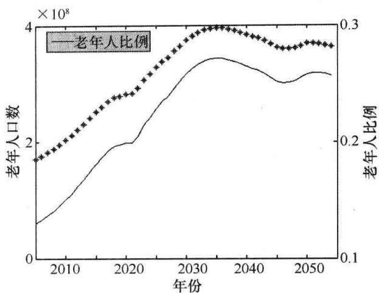

<details>
<summary>line</summary>

| 年份 | 老年人口数 (x 10^8) | 老年人比例 |
| --- | --- | --- |
| 2010 | ~1.7 | ~0.13 |
| 2020 | ~2.6 | ~0.19 |
| 2030 | ~3.6 | ~0.26 |
| 2040 | ~3.8 | ~0.25 |
| 2050 | ~3.7 | ~0.25 |
</details>

图 31 模型四预测老年人口变化图

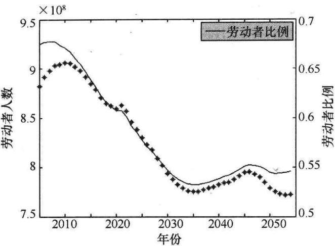

<details>
<summary>line</summary>

| 年份 | 劳动者人数 \(( \times 10^{8})\) | 劳动者比例 |
| --- | --- | --- |
| 2010 | ~9.3 | ~0.64 |
| 2020 | ~8.7 | ~0.61 |
| 2030 | ~7.9 | ~0.53 |
| 2040 | ~7.8 | ~0.53 |
| 2050 | ~7.9 | ~0.52 |
</details>

图 32 模型四预测劳动人口变化图

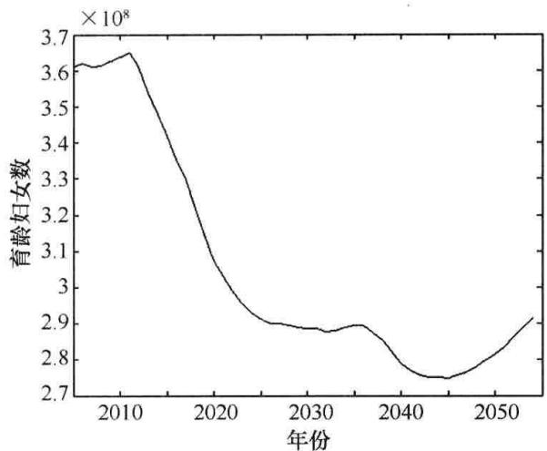

<details>
<summary>line</summary>

| 年份 | 育龄妇女数 (x 10^8) |
| --- | --- |
| 2010 | ~3.62 |
| 2020 | ~3.08 |
| 2030 | ~2.89 |
| 2040 | ~2.78 |
| 2050 | ~2.91 |
</details>

图 33 模型四预测育龄妇女变化图

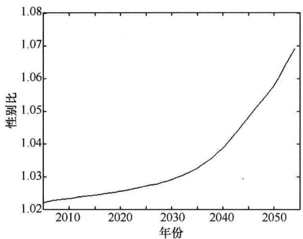

<details>
<summary>line</summary>

| 年份 | 性别比 |
| --- | --- |
| 2010 | ~1.022 |
| 2020 | ~1.025 |
| 2030 | ~1.029 |
| 2040 | ~1.038 |
| 2050 | ~1.069 |
</details>

图 34 模型四预测性别变化变化图

## 8.4 结果分析

通过图 28 可以看出,在 2036 年中国人口数量达到峰值 14.28 亿,然后人口数量开始下降,在 2054 年左右人口数量降到 13.6 亿左右。在峰值附近的几年,人口的变化率比较小,人口曲线比较平缓,可能中国人口的总数,会在此峰值附近的几年维持一个比较恒定的水平。

由图 29 可以看出,城镇人口不断增加,城镇人口占全国总人口的比例呈上升趋势。图 30 可以看出,农村人口呈下降趋势,并且农村人口占全国总人口的比例呈下降趋势。在迁移模型下,考虑了城镇化对人口变化的影响,分析可知,受城镇化的影响,大于出生率、老龄化和性别关系的影响时,城镇的人口数会越来越多,农村人口的人数越来越少。同时,城镇人口占总人口的比例呈上升趋势,而农村人口占总人口的比例呈下降趋势。说明考虑了城镇化进程,结果还是比较符合实际情况的。

模型的优点是把多种影响模型的因素都考虑进去了,和实际的人口变化情况更好地吻合。比较准确地预测了中短期内人口总量的变化状态。

模型的缺点是,在建立模型的过程中,始终假定每年的出生率和死亡都是一个恒定的值,事实上不是一个恒定值。并且始终假定新出生的婴儿的性别比例恒定不变。这也和实际情况不太一致。这些因素都会导致模型结果预测上的偏差。

## 9 对政府政策的建议

在模型四的基础上,《国家人口发展战略研究报告》中政府的战略目标中得出,到2010年人口的总量应控制在13.6亿人,到2020年人口总量控制在14.5亿人,到21世纪中叶人口控制在15亿左右。调整政府影响因子,使得人口增长模型基本上满足政府的战略目标,对政府给出战略措施和政策建议。

对 R 在 1.25 \~ 1.4 之间进行调整, 运用 MATLAB 求解得到 R 值不同时对应的 2010 年、2020 年及峰值的数据, 见表 12。

通过表 12 中的数据与政府的战略目标进行比较发现, 当 R=1.36 时与政府的战略目标基本吻合。所以, 为了完成政府的战略目标, 对政府的政策的建议为调整影响因子 R=1.3。

表 12 政策因子的变化对人口变化的影响

<table><tr><td>2010年人口</td><td>2020年人口</td><td>年份</td><td>高峰值</td><td>R</td></tr><tr><td>1349292286.27</td><td>1414656249.50</td><td>2035.00</td><td>1456607544.35</td><td>1.25</td></tr><tr><td>1350021875.15</td><td>1417022559.50</td><td>2036.00</td><td>1462085960.43</td><td>1.26</td></tr><tr><td>1350751635.60</td><td>1419391763.70</td><td>2037.00</td><td>1467665458.20</td><td>1.27</td></tr><tr><td>1351481567.63</td><td>1421763864.76</td><td>2037.00</td><td>1473419026.04</td><td>1.28</td></tr><tr><td>1352211671.24</td><td>1424138865.33</td><td>2038.00</td><td>1479289194.82</td><td>1.29</td></tr><tr><td>1352941946.43</td><td>1426516768.09</td><td>2039.00</td><td>1485324228.88</td><td>1.30</td></tr><tr><td>1353672393.22</td><td>1428897575.69</td><td>2039.00</td><td>1491582022.77</td><td>1.31</td></tr><tr><td>1354403011.60</td><td>1431281290.81</td><td>2040.00</td><td>1498043586.84</td><td>1.32</td></tr><tr><td>1355133801.57</td><td>1433667916.10</td><td>2041.00</td><td>1504616782.35</td><td>1.33</td></tr><tr><td>1355864763.15</td><td>1436057454.25</td><td>2042.00</td><td>1511508452.45</td><td>1.34</td></tr><tr><td>1356595896.34</td><td>1438449907.91</td><td>2044.00</td><td>1518646702.68</td><td>1.35</td></tr><tr><td>1357327201.14</td><td>1440845279.77</td><td>2050.00</td><td>1527491840.49</td><td>1.36</td></tr><tr><td>1358058677.56</td><td>1443243572.49</td><td>2050.00</td><td>1536652538.61</td><td>1.37</td></tr><tr><td>1358790325.59</td><td>1445644788.75</td><td>2050.00</td><td>1545854073.71</td><td>1.38</td></tr><tr><td>1359522145.25</td><td>1448048931.22</td><td>2051.00</td><td>1555123599.19</td><td>1.39</td></tr><tr><td>1360254136.54</td><td>1450456002.59</td><td>2054.00</td><td>1565284494.39</td><td>1.40</td></tr></table>

## 10 模型的优缺点

## 1. 模型的优点

(1) 综合考虑了多方面的因素,且分类详细,共对数据划分了 $90 \times 6$ 类。

(2) 逐步对模型进行深化。特别在模型四中,考虑城镇化率对人口增长的影响时,城镇人口数量在总人口的比例与模型二和模型三中有较大的差别,进一步说明了模型的合

理性和可靠性。

## 2. 模型的缺点

（1）有国家统计《国家人口发展战略研究报告》上所给出我国出生人口的高峰潮，通过已有的三个高峰潮可以估算出未来的生育高峰期，但是建立的模型过程并未对此进行详细的分析。

(2)《国家人口发展战略研究报告》上还给出未来我国的男女比例不是一个固定不变的关系,为了简化模型,通过前5年给出的男婴和女婴的出生率加权平均后得到男婴和女婴的比例,在以后的迭代过程中,将其视为固定值。

## 参考文献

[1] 石博强, 等. MATLAB 数学计算范例教程. 北京: 中国铁道出版社, 2004.  
[2] 赵静, 等. 数学建模与数学实验. 北京: 高等教育出版社, 2002.  
[3] 幺焕民, 等. 数学建模. 哈尔滨: 哈尔滨工业大学出版社, 2003.  
[4] 2005 年中国统计年鉴. thhp://www.21manager.com/. 2007.9.21.  
[5] 2005 年全国 1% 人口抽样调查主要数据公报. http://www.stats.gov.cn/.

## 【论文点评】

史汉生

论文按照性别和市、镇、乡的区别把人口分为6类。

影响人口增长的主要因素有出生率、死亡率、政府政策、老龄化和乡村城镇化。论文在递归模型主题框架的基础上，逐步深入建立了四个模型。

模型一,只考虑出生率和死亡率对人口增长的影响,从2001年到2005年的数据中,求出平均出生率和平均死亡率,并假定2005年以后的平均出生率和平均死亡率不变。求得模型的估计值与实际值相近,进而推出模型基本的合理性。

模型二,在模型一的基础上加上政策因素的影响,引进人口政策影响因子R,通过对结果进行分析,发现政府政策对人口的变化情况会产生较大的影响。为了控制人口数量,国家可以进行较好的宏观调控。

模型三,在模型二的基础上加上老龄化对人口增长的影响,引进阻滞因子,建立人口随时间的变化曲线。

模型四,在模型三的基础上加上乡村人口城镇化的影响,通过对结果进行分析,发现模型四与前几个模型的主要区别是在城镇人口的数量及城镇人口在全国人口总人口的比率上,更符合实际情况。

在每个模型的基础上,进一步分别对人口总数、性别比例、老龄化程度、生育期内妇女总数、有劳动力的人数等做出了预测。

总之,论文人口预测模型具有许多优点:综合考虑了多方面的因素,且分类详细,共对数据划分了90×6类;逐步对模型进行深化,特别在模型四中,考虑城镇化率对人口增长的影响时,城镇人口数量在总人口的比例与模型二和模型三中有较大的差别。进一步说明了模型的合理性和可靠性。但文中模型对我国出生人口的高峰潮未进行详细的分析。

这是一篇质量上乘的优秀论文。

# 中国人口增长模型

## 摘要

本文对中国的人口增长问题进行建模分析。

首先,不考虑迁移因素,并假设年龄别死亡率和婴儿出生率不随时间变化,建立了连续的微分方程模型。先对城镇乡不同地区不同性别的人口增长情况进行了预测,然后对全国人口增长进行了分析预测。以2001年的数据为基础预报2005年的人口情况。区域性的预测结果表明,城市人口计算值较实际值偏小,乡村人口计算值较实际值偏大,误差都集中在15岁\~45岁这个年龄阶段。这说明乡村向城市的人口迁徙在区域性的人口预测中是不得不考虑的问题。在对整体的预测中,论文中预测的2005年人口数量和分布与实际情况非常接近,最大误差在0.45%以内。用该模型做中长期预测,得到中国人口高峰期将于2020年到来,届时峰值人口数量为13.4954亿。

为了提高长期预测的准确性,接下来对微分方程中的两个重要参数——年龄别死亡率和婴儿出生率进行了修正,加入了时间影响项。对死亡率修正后得出了全国人口的峰值到达时间为2040年,峰值人口为16.002亿;对婴儿出生率修正后的峰值时间为2021年,峰值人口为13.463亿。当同时考虑两项修正的影响时,得到全国人口的峰值时间为2035年,峰值人口为15.457亿。

为了提高中长期预测的准确性,论文建立了变系数的状态空间转移模型。根据该模型对总人口进行预测,得到中国人口数量将在2038年左右达到峰值,峰值人口数量约为14.88亿,之后全国人口数量将缓慢降低,在2050年左右达到14.588亿。

针对迁移率对区域性人口预测的影响,建立了考虑迁移因素的状态转移离散模型。运用参数反演的方法计算出城乡迁徙率为0.038,并利用改进模型重新对城镇乡的男女增长情况进行了预测,结果较改进前大为改善。用2001年的数据对2005年的人口数量进行试报,结果十分吻合,最大误差控制在0.43%以内。通过验证发现该模型做短期预报和区域预报效果很好,对中长期预测的准确率还是不如微分方程的改进模型。

利用完善后的模型,对中国人口的结构特点进行了比较详细的分析,并得到一系列结论:2000年—2025年,15年\~64岁年龄段的人口比例将维持在0.7左右,可以称作人口红利期。从抚养比的变化曲线中可以看到,年龄结构老龄化已经成为中国人口未来发展的一个重要特征。中国人口分布的格局基本不会改变,中国人口增长率逐渐下降是一个基本趋势。充分估计扭转中国出生性别比偏高的难度,流动人口已经成为一个相对固定的大群体。

关键词:年龄别死亡率,微分方程模型,变系数状态空间模型,迁徙率

## 1. 问题的重述

中国是一个人口大国,人口问题始终是制约我国发展的关键因素之一。根据已有数据,运用数学建模的方法,对中国人口做出分析和预测是一个重要问题。

近年来中国的人口发展出现了一些新的特点,如老龄化进程加速、出生人口性别比持续升高以及乡村人口城镇化等因素,这些都影响着中国人口的增长。2007年初发布的《国家人口发展战略研究报告》(附录1)还做出了进一步的分析。

关于中国人口问题已有多方面的研究,并积累了大量数据资料。附录2就是从《中国人口统计年鉴》上收集到的部分数据。

从中国的实际情况和人口增长的上述特点出发,参考附录2中的相关数据(也可以搜索相关文献和补充新的数据),建立中国人口增长的数学模型,并由此对中国人口增长的中短期和长期趋势做出预测;并进而指出模型中的优点与不足之处。

## 2 符号系统

$\mu(r)$ :年龄别死亡率;

$f(t)$ :婴儿出生率;

$p'(r,t)$ : t 时刻年龄为 r 的人口占总人口的比例;

$p(r,t)$ :人口密度函数;

$F(r,t)$ :人口分布函数;

$N(t)$ : 人口总数增长函数, 其中 t 取离散化得值, 此时可表示为 $N(j), j=1,2,\cdots$ (表示从 2001 年开始往后的各个年代数);

$r_{m}$ :最高年龄限;

$\bar{p}_{0}(r)$ : 全国人口密度分布的初始值;

$\bar{f}(t)$ : 全国婴儿出生率;

$d_{j}(r)$ : 在第 j 年份年龄为 r 的死亡人数;

$P_{j}(r)$ : 在第 j 年份年龄为 r 的人数;

$\bar{\mu}(r)$ : 全国人口年龄别死亡率;

$N_{ij}$ : 第 i 类型的人群在第 j 年的总人口数;

$T(i,t):t$ 时间点年龄为 i 的状态；

$f(i,t):[t,t+1]$ 迁入(迁出)地区额年龄为 $i+1$ 的人口；

$x_{(i,t)}$ : 第 t 年满 i 周岁但不满 $i+1$ 周岁的人口总数；

$x(0,t):t$ 年存留的不满周岁的婴儿数；

$k(i,t)$ :性别比例函数;

k:城乡迁徙率;

$b(i,t)$ :育龄阶段的妇女的年龄别生育率;

$\mu(0,t)$ :婴儿死亡率;

$h(i,t)$ :妇女的生育模式,满足规格条件 $\sum_{i=r_1}^{r_2} h(i,t)=1$ , 其中 $[r_1,r_2]$ 表示妇女的育龄区间;

$\beta(t)$ : 总和生育率, 表示平均每个妇女一生中所生的孩子数。

## 3 问题的分析

自从我国实行计划生育政策以来,我国在控制人口过快增长方面取得了举世瞩目的成绩。但是近几年来,中国的人口发展呈现出老龄化进程加速、出生性别比持续升高、乡村人口城镇化等新问题。所以,针对出现的新情况,建立符合我国实际的数学模型,对人口发展过程进行描述、分析和预测,并进而研究和控制人口增长和老化的生育政策,对国计民生都是大有裨益的。

附件2中详细给出了2001年—2005年度各年龄阶段的城乡人口的死亡率等相关信息的分布情况。根据材料提供的信息的特点，首先将所有人口分为城市男、城市女、镇男、镇女、乡村男、乡村女六大类型，单独考虑各个类型各自的人口分布和增长情况，再综合考虑作为整体全国人口的总人口数量、年龄构成、性别比例等多方面的增长变化情况。

影响一个地区的人口变化的因素不外乎死亡率、出生率以及迁徙率等几种。对于考虑城镇乡的人口变化情况时，迁徙率是重要的。因为现今农村人口向城市的大量涌入、寻找就业机会已成为一个较为普遍的社会现象，这种社会现象必然会造成城市和乡村人口的结构比例发生变化。当考虑全国整体的人口数量和结构分布特点时，迁徙率的影响不再如研究区域人口情况时显著，它通过影响人口结构，进而影响不同地域间的出生率和死亡率，最终对全国的总人口数产生影响。

## 4 模型的建立及结果分析

## 4.1 模型的建立

## 4.1.1 模型的假设

(1) 仅考虑自然的出生和死亡,不考虑自然灾害、战争等突发事件的影响。  
(2) 年龄别的死亡率不随时间变化, 即各个年份的年龄别死亡率相同。  
(3) 不考虑城镇间的人口流动。

## 4.1.2 微分方程模型的建立

在经典人口的指数增长模型和阻滞增长模型中,仅仅考虑了人口总数和总的增长率,不涉及年龄结构,这是相当粗略的。实际情况是,不同年龄阶段的人群的出生率和死亡率有着很大的差别,并且这种差别对未来总人口的增长以及未来的人口结构变化都有着重要的影响。也就是说,在考虑人口数量随年龄的分布变化的基础上来研究人口随时间变化情况。

影响人口数量和结构变化的因素主要有出生率、死亡率以及迁徙率等。为了简单起见,这里首先不考虑城乡间的人口流动等因素的影响,仅考虑自然的出生和死亡。

以 $F(r,t)$ 表示 $t$ 时刻年龄小于 $r$ 的人数，则 $F(r,t)$ 表示人口分布函数。其中 $t,r\geqslant 0$ 均为连续变量，假设 $F$ 是连续的、可微的。时刻 $t$ 的总人口数记做 $N(t)$ ，最高年龄记为 $r_m$ ，理论推导时 $r_m\to \infty$ 。于是对于非负函数 $F(r,t)$ ，有

$$
F (0, t) = 0, \qquad F (r _ {m}, t) = N (t)
$$

人口的密度函数定义为

$$
p (r, t) = \frac {\partial F}{\partial r}
$$

则 $p(r,t)\mathrm{d}r$ 表示时刻 $t$ 年龄在区间 $[r,r + \mathrm{d}r]$ 内的人数。

记 $\mu (r,t)$ 表示时刻 $t$ 年龄 $r$ 的死亡率，具体含义是， $\mu (r,t)p(r,t)\mathrm{d}r$ 表示时刻 $t$ 年龄在 $[r,r + \mathrm{d}r]$ 内单位时间死亡人数。

考察 $p(r,t)$ 满足的方程。 $t$ 时刻年龄处于 $[r,r + \mathrm{d}r]$ 的人群在经过了 $\mathrm{dt}$ 时间之后，其中存活的那部分人年龄变化为 $[r + \mathrm{dt}, r + \mathrm{dr} + \mathrm{dt}]$ ，而死亡的人数为 $\mu(r,t)p(r,t)\mathrm{dr}\mathrm{dt}$ ，于是有

$$
\left[ p (r, t) - p (r + \mathrm{d} t, t + \mathrm{d} t) \right] \mathrm{d} r = \mu (r, t) p (r, t) \mathrm{d} r \mathrm{d} t
$$

上式也可以表达为

$$
\begin{array}{l} \left[ p (r + \mathrm{d} t, t + \mathrm{d} t) - p (r, t + \mathrm{d} t) \right] \mathrm{d} r + \left[ p (r, t + \mathrm{d} t) - p (r, t) \right] \mathrm{d} r \\ = - \mu (r, t) p (r, t) \mathrm{d} r \mathrm{d} t \\ \end{array}
$$

即

$$
\frac {\partial p}{\partial r} + \frac {\partial p}{\partial t} = - \mu (r, t) p (r, t)
$$

这就是人口密度函数 $p(r,t)$ 的一阶偏微分方程。

当 $t = 0$ 时， $p(r,0)$ 表示初始时刻的人口密度函数，记为 $p_0(r), p_0(r)$ 可由资料分析得到；当 $r = 0$ 时， $p(0,t)$ 表示单位时间婴儿的出生率。记为 $p(0,t) = f(t), f(t)$ 对预测和控制人口起着重要的作用。于是考虑人口按年龄分布的人口增长模型可以表示为

$$
\left\{ \begin{array}{l} \frac {\partial p}{\partial r} + \frac {\partial p}{\partial t} = - \mu (r, t) p (r, t), t, r > 0 \\ p (0, t) = f (t) \\ p (r, 0) = p _ {0} (r) \end{array} \right.
$$

这个连续的人口发展方程模型描述了人口的演变过程,从这个方程确定了密度函数 $p(r,t)$ 后,立即可以得到各个年龄阶段的人口数,即人口分布函数:

$$
F (r, t) = \int_ {0} ^ {r} p (s, t) \mathrm{d} s
$$

在社会安定的局面下和不太长的时间内,死亡率大致和时间无关,于是可近似地认为 $\mu(r,t)=\mu(r)$ , 则人口的密度函数为

$$
p (r, t) = \left\{ \begin{array}{l l} p _ {0} (r - t) \mathrm{e} ^ {- \int_ {r - l} ^ {r} \mu (s) \mathrm{d} s}, & 0 \leqslant t \leqslant r \\ f (t - r) \mathrm{e} ^ {- \int_ {0} ^ {r} \mu (s) \mathrm{d} s}, & t > r \end{array} \right.
$$

## 4.1.3 微分方程模型的具体求解

现在具体工作就是在已知的人口调查资料中求出定解条件概率密度分布函数 $p_0(r)$ 、婴儿出生率 $f(t)$ 以及死亡率 $\mu (t)$ ，进而可以利用求得的人口密度函数对人口数量进行预测。

## 1. 年龄别死亡率 $\mu(r)$ 的确定

附件2中给出了2001年—2005年的城镇及乡村男女的各个年龄阶段各自的死亡率情况，以 $\mu_{i}(r,t)$ 表示各个年份t的第i型人口中年龄为r的人的死亡率。其中i=1,2,3,…,6分别表示城市男、城市女、城镇男、城镇女、乡村男、乡村女六种类型的人口。下面以城市男为例具体说明年龄别死亡率曲线的确定。

要确定城市男的年龄别死亡率的分布的曲线 $\mu_{i}(r)$ , 根据假设, 可以知道, 将各年龄阶段的死亡率看作是随年份不变的。故对于年龄为 $r$ 的城市男子来说, 其年龄别死亡率可以表示为

$$
\mu_ {1} (r) = \frac {\sum_ {t = 1} ^ {5} \mu_ {1} (r , t)}{5}
$$

式中： $\mu_{1}(r,t)$ 表示 t 时刻城市男子中年龄为 r 的人的死亡率。结合附件 2 中所给的资料，可以得出 0\~90 岁各年龄阶段的城市男子的年龄别死亡率的值，将这一系列的值描绘成散点图并利用 MATLAB 软件对上面数据进行拟合，可以得到拟合曲线的表达式为

$$
\mu (r) = 0. 0 0 5 9 7 \mathrm{e} ^ {- 1. 5 9 2 9 r} + 0. 0 0 0 0 3 1 8 \mathrm{e} ^ {0. 0 9 6 9 9 7 r}
$$

将散点图拟合曲线结合起来表示,如图1所示。

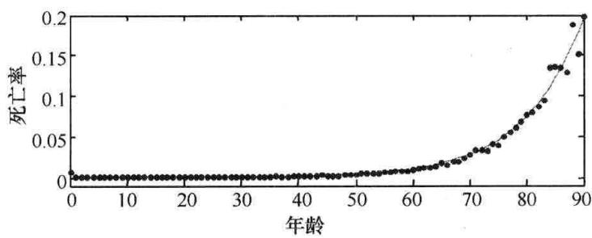

<details>
<summary>scatter</summary>

| 年龄 | 死亡率 |
| --- | --- |
| 0 | ~0.01 |
| 5 | ~0.005 |
| 10 | ~0.005 |
| 15 | ~0.005 |
| 20 | ~0.005 |
| 25 | ~0.005 |
| 30 | ~0.005 |
| 35 | ~0.005 |
| 40 | ~0.008 |
| 45 | ~0.008 |
| 50 | ~0.01 |
| 55 | ~0.012 |
| 60 | ~0.015 |
| 65 | ~0.02 |
| 70 | ~0.03 |
| 75 | ~0.045 |
| 80 | ~0.08 |
| 85 | ~0.14 |
| 90 | 0.2 |
</details>

图1 死亡率曲线图

## 2. 婴儿出生率 $f(t)$ 的确定

同样,分别考虑6类不同类型人口的婴儿出生率的情况,以 $f_{i}(t)$ 表示,则 $f_{1}(t)$ 表示t时刻城市男子的婴儿出生率。由婴儿出生率的定义可知, $f_{1}(t)=p_{1}(0,t)$ 表示年份为t时0岁城市男子占城市人口总数的比率,由附件2中所提供的数据,可以得到2001年—2005年的城市男子的婴儿出生率,见表1。

表1

<table><tr><td>年份</td><td>2001</td><td>2002</td><td>2003</td><td>2004</td><td>2005</td></tr><tr><td>出生率</td><td>0.47%</td><td>0.44%</td><td>0.4%</td><td>0.47%</td><td>0.46%</td></tr></table>

分析上述数据,发现死亡率大致在0.45左右波动,故为将问题合理简化,认为婴儿出生率随时间是近似不变的,为一常数,将其表示为

$$
f _ {1} (t) = \frac {\sum_ {t = 1} ^ {5} f _ {1} (t)}{5} = 0. 4 4 8
$$

3. 城市男子初始人口密度函数初始值 $p_{10}(r)$ 的确定

为了检验该模型的合理性,将2001年的资料作为初始值。同样,起初仅考虑城市男子的情况。附件2中列出了2001年城市男子的各年龄段的人口数占城市总人数的比率 $p_{10}^{\prime}(r)$ ,则城市男子的人口密度函数的初始时刻值 $p_{10}(r)$ 可以表示为

$$
p _ {1 0} (r) = p _ {1 0} ^ {\prime} (r) \times N _ {1 1}
$$

式中： $N_{11}$ 表示 2001 年城市男子的总人口数，可以由附件 2 中提供的中国人口的 1% 的调查数据估计得到。

4. 城市男子人口分布函数 $F(r, t)$ 的确定

由以上分析,进一步确定出城市男子的人口分布函数 $F(r,t)$ , 设年龄上限 $r_{m}$ 为 90 岁, 则城市男子数量随时间的变化函数可以表示为

$$
N _ {1} (t) = F _ {1} (r _ {m}, t) = \int_ {0} ^ {r _ {m}} p _ {1} (r, t) \mathrm{d} r
$$

考虑到即使使用简化后的初边界条件,人口密度函数的表达式仍然很复杂,并且在此基础上,还需进一步对其进行积分才能得到人口随时间的变化函数,这使得求出人口总数的解析解很困难。所以,考虑运用离散化的模型,运用数值积分的方法求上述积分的数值解:

$$
N _ {1} (j) = \sum_ {i = 0} ^ {9 0} p _ {1} (i, j) \Delta i = \sum_ {i = 0} ^ {9 0} p _ {1} (i, j)
$$

式中： $j=1,2,\cdots$ ，是将时间 t 离散化成为表示年代的离散点，分别表示 2001 年以后各个年代。

5. 总人口增长函数 $N(t)$ 的确定

1）不同类型人口累加法

按照类似于城市男子人口数量增长函数的确定方法,先求出初边值条件:各类型人口的年龄别死亡率曲线 $\mu_{i}(r)$ 、婴儿死亡率 $f_{i}(t)$ 以及初始人口密度分布 $p_{i0}(r,t)$ ;确定各自的人口密度函数 $p_{i}(r,t)$ ,并将其离散化,进而得到其余5种类型人口的增长函数 $N_{i}(t)$ ,则全国总人口的增长函数为

$$
N (j) = \sum_ {i = 1} ^ {6} N _ {i} (j) = \sum_ {i = 1} ^ {6} \sum_ {j = 0} ^ {9 0} p _ {i} (i, j) = \sum_ {i = 1} ^ {6} \sum_ {j = 0} ^ {9 0} p _ {i} ^ {\prime} (i, j) N _ {i}, t = 1, 2, 3, \dots
$$

2）整体考虑法

与上述方法不同,此种方法主要考查总人口数量的增长变化情况,故首先求出针对全国人口的年龄别死亡率曲线 $\mu(r)$ （这里同样假设各个年份的年龄别死亡率相同）,并确定出初边值条件 $f(t)$ 和 $p_{0}(r)$ ,进而求得全国个年龄段的人口密度函数 $p(r,t)$ ,随即通过数值积分的方法得到全国总人口的增长函数。

6. 全国人口年龄别死亡率 $\bar{\mu}(r)$ 的确定

用 $\mu_{i}(r,t)$ 表示时刻 $t$ 第 $i$ 类型的人口年龄为 $r$ 的人口的死亡率，对第 $i$ 类型的人而言， $\mu_{i}(r,t)p(r,t)\mathrm{d}r$ 表示年份 $t$ 年龄在 $[r,r + \mathrm{d}r]$ 内单位时间死亡人数。将时间离散化考虑,以2001年为第一个年份,则在第j年份中,第i类型的人口年龄为r的死亡人数为

$$
\mu_ {i} (r, j) p _ {i} (r, j) = \mu_ {i} (r, j) p _ {i} ^ {\prime} (r, j) N _ {i} (j)
$$

式中： $p_{i}(r,j)$ 表示在 j 年份，第 i 型人口中年龄为 r 的人口占城（镇或者乡）总人口的比例； $N_{i}(j)$ 则表示该年份第 i 型人口的总人数。这两个参数根据附件 2 中的数据可以很容易就得到。对于全国而言，在第 j 年份年龄为 r 的死亡人数 $d_{j}(r)$ 为

$$
d _ {j} (r) = \sum_ {i = 1} ^ {6} \mu_ {i} (r, j) p _ {i} ^ {\prime} (r, j) N _ {i} (j)
$$

根据附件中所给的数据,第 i 型人口的类型比率 $p_{i}^{\prime}(r,j)$ 及其死亡率 $\mu_{i}(r,j)$ 可以在附件 2 中的表中直接得到。这里 r 取 0\~90 的离散值,可以得到对应的 0\~90 年龄段的死亡人数 $d_{j}(r)$ 。同样可以得到在第 j 年份年龄为 r 的人数 $P_{j}(r)$ 为

$$
P _ {j} (r) = \sum_ {i = 1} ^ {6} p _ {i} ^ {\prime} (r, j) N _ {i} (j)
$$

则第 $j$ 年份年龄为 $r$ 的人的死亡率 $\mu_j(r)$ 可以表示为

$$
\mu_ {j} (r) = \frac {d _ {j} (r)}{P _ {j} (r)}, r = 0, 1, 2, \dots , 9 0
$$

令 $j = 1,2,3,4,5$ ，分别表示2001年一2005年，则对于全国的总人口而言，年龄为 $r$ 的人的死亡率 $\bar{\mu} (r)$ 为

$$
\bar {\mu} (r) = \frac {\sum_ {j = 1} ^ {5} \mu_ {j} (r)}{5}, r = 0, 1, 2, \dots , 9 0
$$

根据在不同的年龄段得到的死亡率,可以将其描绘成散点图,并用根据散点图选择合适的曲线对其进行拟合便可以得到结果。

## 7. 全国婴儿出生率 $\bar{f}(t)$ 的确定

用 $f_{j}(t)$ 表示年份j时婴儿的出生率,根据婴儿出生率的定义,婴儿出生率即为第j年时全国0岁的婴儿数:

$$
f _ {j} (t) = P _ {j} (0)
$$

将出生率看作近似不变的常量,可以由2001年—2005年的数据,得出全国婴儿的出生率为

$$
\bar {f} (t) = \frac {\sum_ {j = 1} ^ {5} P _ {j} (0)}{5}
$$

## 8. 全国人口密度分布的初始值 $\bar{p}_0(r)$ 的确定

将2001年的数据作为初始值,已知六种类型的人口的 $p_{i}^{\prime}(r,1)$ （此处时间t为已知数据,取为1),同时,可以计算出六类人群在2001年各自的人口总数 $N_{1i}$ ,则全国的年龄别的人口密度函数为

$$
\bar {p} _ {0} (r) = \frac {\sum_ {i = 1} ^ {6} p _ {i} ^ {\prime} (r , 1) N _ {1 i}}{\sum_ {i = 1} ^ {6} N _ {1 i}}
$$

式中： $\sum_{i = 1}^{6}N_{1i}$ 表示2001年六类人口的总和，即2001年全国人口的总和。

## 4.1.4 微分方程模型的结果及优缺点分析

## 1. 六类型的人口数量的预报测试以及结果分析

以 2001 年的数据作为初始值, 对 2002 年—2005 年的城镇乡男女数量进行了测试预报, 测试结果如图 2～图 14 所示。

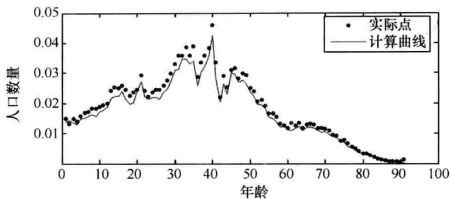  
图 2 2002 年城市男性对比图

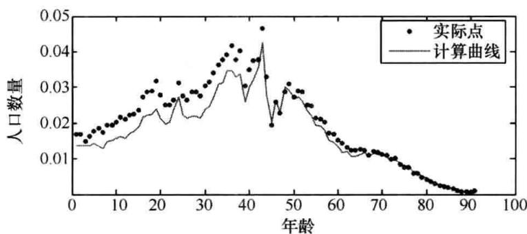

<details>
<summary>scatter</summary>

| 年龄 | 实际点 (人口数量) | 计算曲线 (人口数量) |
| --- | --- | --- |
| 0 | ~0.017 | ~0.014 |
| 5 | ~0.018 | ~0.013 |
| 10 | ~0.021 | ~0.016 |
| 15 | ~0.023 | ~0.019 |
| 20 | ~0.029 | ~0.023 |
| 25 | ~0.026 | ~0.021 |
| 30 | ~0.029 | ~0.022 |
| 35 | ~0.038 | ~0.032 |
| 40 | ~0.035 | ~0.033 |
| 45 | ~0.047 | ~0.041 |
| 50 | ~0.029 | ~0.028 |
| 55 | ~0.025 | ~0.023 |
| 60 | ~0.017 | ~0.015 |
| 65 | ~0.013 | ~0.012 |
| 70 | ~0.012 | ~0.011 |
| 75 | ~0.010 | ~0.010 |
| 80 | ~0.006 | ~0.006 |
| 85 | ~0.003 | ~0.003 |
| 90 | ~0.001 | ~0.001 |
</details>

图 3 2005 年城市男性对比图

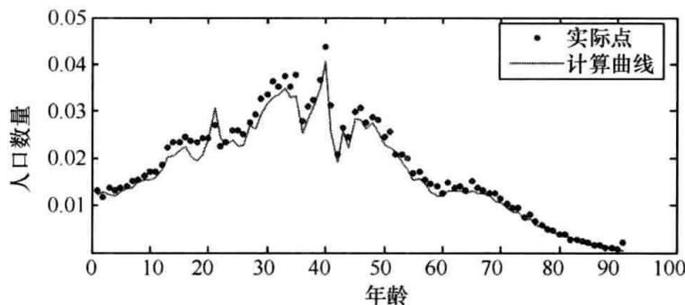

<details>
<summary>line</summary>

| 年龄 | 实际点 (人口数量) | 计算曲线 (人口数量) |
| --- | --- | --- |
| 0 | ~0.013 | ~0.012 |
| 5 | ~0.014 | ~0.013 |
| 10 | ~0.017 | ~0.016 |
| 15 | ~0.023 | ~0.021 |
| 20 | ~0.024 | ~0.023 |
| 25 | ~0.023 | ~0.023 |
| 30 | ~0.033 | ~0.028 |
| 35 | ~0.037 | ~0.034 |
| 40 | ~0.038 | ~0.034 |
| 45 | ~0.026 | ~0.025 |
| 50 | ~0.029 | ~0.027 |
| 55 | ~0.021 | ~0.021 |
| 60 | ~0.015 | ~0.014 |
| 65 | ~0.014 | ~0.013 |
| 70 | ~0.012 | ~0.012 |
| 75 | ~0.009 | ~0.010 |
| 80 | ~0.006 | ~0.007 |
| 85 | ~0.004 | ~0.005 |
| 90 | ~0.003 | ~0.003 |
| 95 | ~0.002 | — |
</details>

图 4 2002 年城市女性对比图  
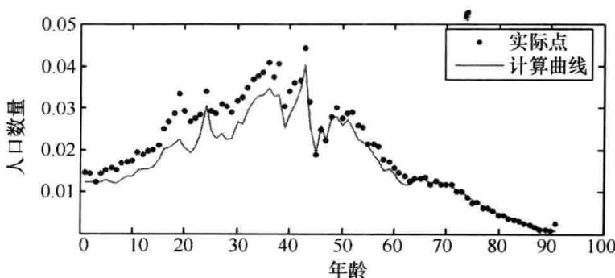

<details>
<summary>line</summary>

| 年龄 | 实际点 (人口数量) | 计算曲线 (人口数量) |
| --- | --- | --- |
| 0 | ~0.014 | ~0.012 |
| 5 | ~0.015 | ~0.013 |
| 10 | ~0.018 | ~0.015 |
| 15 | ~0.021 | ~0.017 |
| 20 | ~0.029 | ~0.022 |
| 25 | ~0.034 | ~0.029 |
| 30 | ~0.031 | ~0.023 |
| 35 | ~0.038 | ~0.032 |
| 40 | ~0.036 | ~0.034 |
| 45 | ~0.044 | ~0.040 |
| 50 | ~0.028 | ~0.027 |
| 55 | ~0.026 | ~0.022 |
| 60 | ~0.017 | ~0.015 |
| 65 | ~0.013 | ~0.012 |
| 70 | ~0.012 | ~0.012 |
| 75 | ~0.010 | ~0.010 |
| 80 | ~0.006 | ~0.006 |
| 85 | ~0.003 | ~0.003 |
| 90 | ~0.001 | ~0.001 |
</details>

图 5 2005 年城市女性对比图

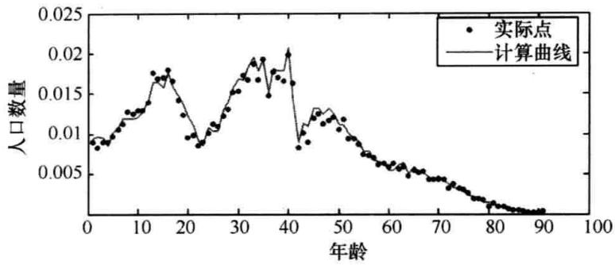

<details>
<summary>line</summary>

| 年龄 | 实际点 (人口数量) | 计算曲线 (人口数量) |
| --- | --- | --- |
| 0 | ~0.009 | ~0.009 |
| 10 | ~0.013 | ~0.012 |
| 20 | ~0.017 | ~0.016 |
| 30 | ~0.015 | ~0.016 |
| 40 | ~0.018 | ~0.018 |
| 50 | ~0.012 | ~0.012 |
| 60 | ~0.006 | ~0.006 |
| 70 | ~0.004 | ~0.004 |
| 80 | ~0.001 | ~0.001 |
| 90 | ~0.000 | ~0.000 |
</details>

图 6 2002 年城镇男性对比图

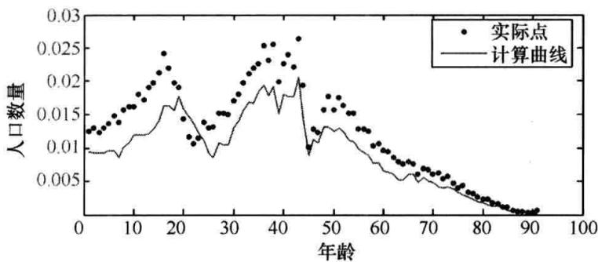

<details>
<summary>scatter</summary>

| 年龄 | 实际点 (人口数量) | 计算曲线 (人口数量) |
| --- | --- | --- |
| 2 | ~0.0125 | ~0.009 |
| 4 | ~0.013 | ~0.009 |
| 6 | ~0.014 | ~0.009 |
| 8 | ~0.015 | ~0.009 |
| 10 | ~0.016 | ~0.011 |
| 12 | ~0.017 | ~0.012 |
| 14 | ~0.018 | ~0.012 |
| 16 | ~0.020 | ~0.013 |
| 18 | ~0.024 | ~0.016 |
| 20 | ~0.022 | ~0.017 |
| 22 | ~0.019 | ~0.016 |
| 24 | ~0.014 | ~0.013 |
| 26 | ~0.011 | ~0.011 |
| 28 | ~0.013 | ~0.012 |
| 30 | ~0.015 | ~0.013 |
| 32 | ~0.015 | ~0.014 |
| 34 | ~0.017 | ~0.015 |
| 36 | ~0.021 | ~0.017 |
| 38 | ~0.023 | ~0.018 |
| 40 | ~0.025 | ~0.019 |
| 42 | ~0.026 | ~0.018 |
| 44 | ~0.024 | ~0.020 |
| 46 | ~0.026 | ~0.019 |
| 48 | ~0.019 | ~0.012 |
| 50 | ~0.016 | ~0.013 |
| 52 | ~0.017 | ~0.013 |
| 54 | ~0.016 | ~0.012 |
| 56 | ~0.015 | ~0.011 |
| 58 | ~0.013 | ~0.010 |
| 60 | ~0.013 | ~0.009 |
| 62 | ~0.011 | ~0.008 |
| 64 | ~0.010 | ~0.007 |
| 66 | ~0.009 | ~0.006 |
| 68 | ~0.008 | ~0.006 |
| 70 | ~0.007 | ~0.005 |
| 72 | ~0.007 | ~0.005 |
| 74 | ~0.006 | ~0.004 |
| 76 | ~0.005 | ~0.004 |
| 78 | ~0.004 | ~0.003 |
| 80 | ~0.003 | ~0.003 |
| 82 | ~0.002 | ~0.002 |
| 84 | ~0.002 | ~0.002 |
| 86 | ~0.001 | ~0.001 |
| 88 | ~0.001 | ~0.001 |
| 90 | ~0.001 | ~0.001 |
| 92 | ~0.001 | — |
</details>

图 7 2005 年城镇男性对比图

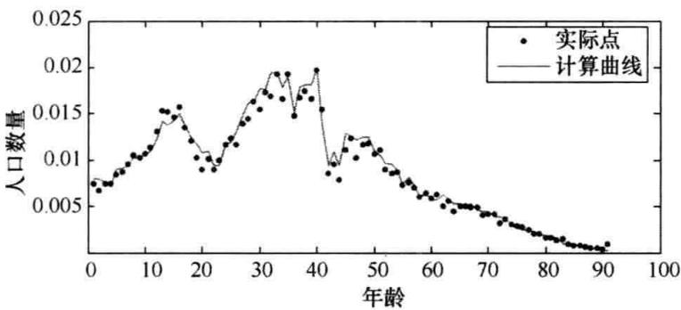

<details>
<summary>line</summary>

| 年龄 | 实际点 (人口数量) | 计算曲线 (人口数量) |
| --- | --- | --- |
| 0 | ~0.007 | ~0.0075 |
| 10 | ~0.013 | ~0.013 |
| 20 | ~0.010 | ~0.0105 |
| 30 | ~0.016 | ~0.0165 |
| 40 | ~0.019 | ~0.0195 |
| 50 | ~0.011 | ~0.0115 |
| 60 | ~0.006 | ~0.0065 |
| 70 | ~0.004 | ~0.0045 |
| 80 | ~0.002 | ~0.0025 |
| 90 | ~0.001 | ~0.0015 |
</details>

图 8 2002 年城镇女性对比图

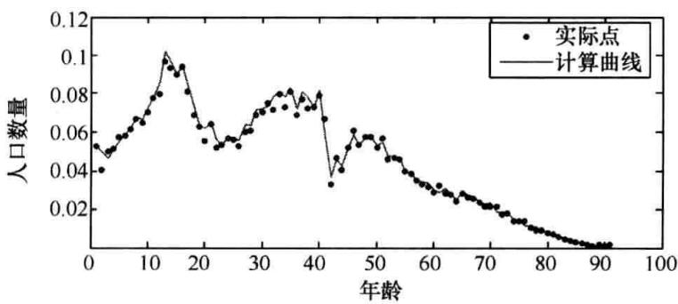

<details>
<summary>line</summary>

| 年龄 | 实际点 (人口数量) | 计算曲线 (人口数量) |
| --- | --- | --- |
| 1 | ~0.04 | ~0.053 |
| 2 | ~0.04 | ~0.048 |
| 3 | ~0.05 | ~0.05 |
| 4 | ~0.055 | ~0.055 |
| 5 | ~0.06 | ~0.06 |
| 6 | ~0.065 | ~0.065 |
| 7 | ~0.068 | ~0.068 |
| 8 | ~0.07 | ~0.07 |
| 9 | ~0.075 | ~0.075 |
| 10 | ~0.08 | ~0.08 |
| 11 | ~0.085 | ~0.085 |
| 12 | ~0.1 | ~0.1 |
| 13 | ~0.1 | ~0.1 |
| 14 | ~0.095 | ~0.095 |
| 15 | ~0.095 | ~0.095 |
| 16 | ~0.095 | ~0.095 |
| 17 | ~0.085 | ~0.085 |
| 18 | ~0.07 | ~0.07 |
| 19 | ~0.065 | ~0.065 |
| 20 | ~0.065 | ~0.065 |
| 21 | ~0.065 | ~0.065 |
| 22 | ~0.065 | ~0.065 |
| 23 | ~0.065 | ~0.065 |
| 24 | ~0.065 | ~0.065 |
| 25 | ~0.065 | ~0.065 |
| 26 | ~0.065 | ~0.065 |
| 27 | ~0.065 | ~0.065 |
| 28 | ~0.065 | ~0.065 |
| 29 | ~0.065 | ~0.065 |
| 30 | ~0.07 | ~0.07 |
| 31 | ~0.072 | ~0.072 |
| 32 | ~0.072 | ~0.072 |
| 33 | ~0.075 | ~0.075 |
| 34 | ~0.078 | ~0.078 |
| 35 | ~0.08 | ~0.08 |
| 36 | ~0.082 | ~0.082 |
| 37 | ~0.082 | ~0.082 |
| 38 | ~0.082 | ~0.082 |
| 39 | ~0.082 | ~0.082 |
| 40 | ~0.082 | ~0.082 |
| 41 | ~0.082 | ~0.082 |
| 42 | ~0.082 | ~0.082 |
| 43 | ~0.035 | ~0.035 |
| 44 | ~0.045 | ~0.045 |
| 45 | ~0.042 | ~0.042 |
| 46 | ~0.048 | ~0.048 |
| 47 | ~0.052 | ~0.052 |
| 48 | ~0.062 | ~0.062 |
| 49 | ~0.058 | ~0.058 |
| 50 | ~0.058 | ~0.058 |
| 51 | ~0.058 | ~0.058 |
| 52 | ~0.058 | ~0.058 |
| 53 | ~0.058 | ~0.058 |
| 54 | ~0.048 | ~0.048 |
| 55 | ~0.048 | ~0.048 |
| 56 | ~0.048 | ~0.048 |
| 57 | ~0.042 | ~0.042 |
| 58 | ~0.042 | ~0.042 |
| 59 | ~0.038 | ~0.038 |
| 60 | ~0.038 | ~0.038 |
| 61 | ~0.035 | ~0.035 |
| 62 | ~0.032 | ~0.032 |
| 63 | ~0.032 | ~0.032 |
| 64 | ~0.032 | ~0.032 |
| 65 | ~0.032 | ~0.032 |
| 66 | ~0.032 | ~0.032 |
| 67 | ~0.032 | ~0.032 |
| 68 | ~0.032 | ~0.032 |
| 69 | ~0.032 | ~0.032 |
| 70 | ~0.032 | ~0.032 |
| 71 | ~0.032 | ~0.032 |
| 72 | ~0.032 | ~0.032 |
| 73 | ~0.032 | ~0.032 |
| 74 | ~0.032 | ~0.032 |
| 75 | ~0.032 | ~0.032 |
</details>

图 9 2002 年乡村男性对比图

图 2 \~ 图 14 反映出许多问题:

① 无论对于哪一个类型的群体,各个年份的预测曲线大体上比较准确地反映了实际人口的变化趋势,这说明我们的模型还是具有一定合理性的。

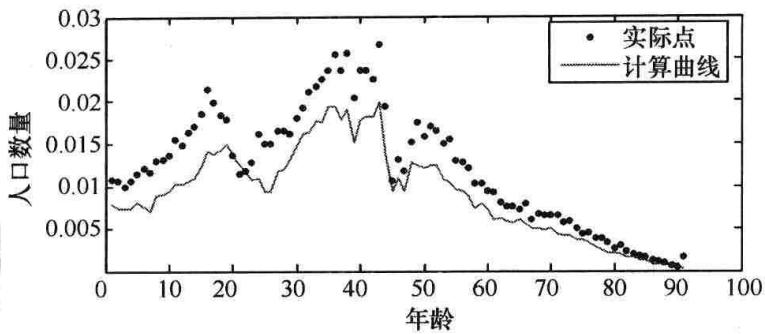

<details>
<summary>scatter</summary>

| 年龄 | 实际点 (人口数量) | 计算曲线 (人口数量) |
| --- | --- | --- |
| 0 | ~0.011 | ~0.008 |
| 5 | ~0.012 | ~0.007 |
| 10 | ~0.014 | ~0.010 |
| 15 | ~0.018 | ~0.013 |
| 20 | ~0.019 | ~0.015 |
| 25 | ~0.012 | ~0.011 |
| 30 | ~0.016 | ~0.013 |
| 35 | ~0.022 | ~0.017 |
| 40 | ~0.024 | ~0.019 |
| 45 | ~0.027 | ~0.020 |
| 50 | ~0.017 | ~0.013 |
| 55 | ~0.016 | ~0.012 |
| 60 | ~0.011 | ~0.008 |
| 65 | ~0.008 | ~0.006 |
| 70 | ~0.007 | ~0.005 |
| 75 | ~0.005 | ~0.004 |
| 80 | ~0.003 | ~0.003 |
| 85 | ~0.002 | ~0.002 |
| 90 | ~0.001 | ~0.001 |
</details>

图 10 2005 年城镇女性对比图

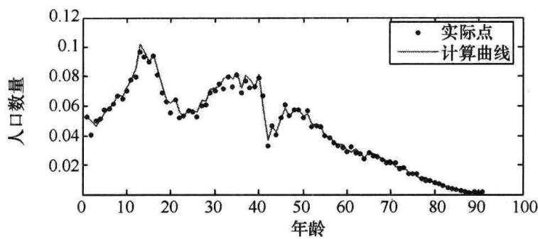

<details>
<summary>line</summary>

| 年龄 | 实际点 (人口数量) | 计算曲线 (人口数量) |
| --- | --- | --- |
| 1 | ~0.04 | ~0.052 |
| 2 | ~0.048 | ~0.048 |
| 3 | ~0.052 | ~0.052 |
| 4 | ~0.056 | ~0.056 |
| 5 | ~0.058 | ~0.058 |
| 6 | ~0.062 | ~0.062 |
| 7 | ~0.066 | ~0.066 |
| 8 | ~0.068 | ~0.068 |
| 9 | ~0.072 | ~0.072 |
| 10 | ~0.078 | ~0.078 |
| 11 | ~0.082 | ~0.082 |
| 12 | ~0.092 | ~0.092 |
| 13 | ~0.098 | ~0.10 |
| 14 | ~0.092 | ~0.092 |
| 15 | ~0.094 | ~0.094 |
| 16 | ~0.088 | ~0.088 |
| 17 | ~0.082 | ~0.082 |
| 18 | ~0.072 | ~0.072 |
| 19 | ~0.064 | ~0.064 |
| 20 | ~0.062 | ~0.062 |
| 21 | ~0.054 | ~0.054 |
| 22 | ~0.052 | ~0.052 |
| 23 | ~0.054 | ~0.054 |
| 24 | ~0.056 | ~0.056 |
| 25 | ~0.054 | ~0.054 |
| 26 | ~0.056 | ~0.056 |
| 27 | ~0.062 | ~0.062 |
| 28 | ~0.064 | ~0.064 |
| 29 | ~0.068 | ~0.068 |
| 30 | ~0.072 | ~0.072 |
| 31 | ~0.074 | ~0.074 |
| 32 | ~0.076 | ~0.076 |
| 33 | ~0.078 | ~0.078 |
| 34 | ~0.08 | ~0.08 |
| 35 | ~0.078 | ~0.078 |
| 36 | ~0.076 | ~0.076 |
| 37 | ~0.074 | ~0.074 |
| 38 | ~0.076 | ~0.076 |
| 39 | ~0.078 | ~0.078 |
| 40 | ~0.074 | ~0.074 |
| 41 | ~0.034 | ~0.034 |
| 42 | ~0.044 | ~0.044 |
| 43 | ~0.048 | ~0.048 |
| 44 | ~0.052 | ~0.052 |
| 45 | ~0.056 | ~0.056 |
| 46 | ~0.058 | ~0.058 |
| 47 | ~0.056 | ~0.056 |
| 48 | ~0.058 | ~0.058 |
| 49 | ~0.056 | ~0.056 |
| 50 | ~0.054 | ~0.054 |
| 51 | ~0.052 | ~0.052 |
| 52 | ~0.048 | ~0.048 |
| 53 | ~0.046 | ~0.046 |
| 54 | ~0.044 | ~0.044 |
| 55 | ~0.042 | ~0.042 |
| 56 | ~0.038 | ~0.038 |
| 57 | ~0.036 | ~0.036 |
| 58 | ~0.034 | ~0.034 |
| 59 | ~0.032 | ~0.032 |
| 60 | ~0.032 | ~0.032 |
| 61 | ~0.03 | ~0.03 |
| 62 | ~0.028 | ~0.028 |
| 63 | ~0.028 | ~0.028 |
| 64 | ~0.026 | ~0.026 |
| 65 | ~0.028 | ~0.028 |
| 66 | ~0.026 | ~0.026 |
| 67 | ~0.024 | ~0.024 |
| 68 | ~0.024 | ~0.024 |
| 69 | ~0.022 | ~0.022 |
| 70 | ~0.022 | ~0.022 |
| 71 | ~0.022 | ~0.022 |
| 72 | ~0.018 | ~0.018 |
| 73 | ~0.016 | ~0.016 |
| 74 | ~0.014 | ~0.014 |
| 75 | ~0.012 | ~0.012 |
| 76 | ~0.012 | ~0.012 |
| 77 | ~0.01 | ~0.01 |
</details>

图 11 2002 年乡村男性对比图

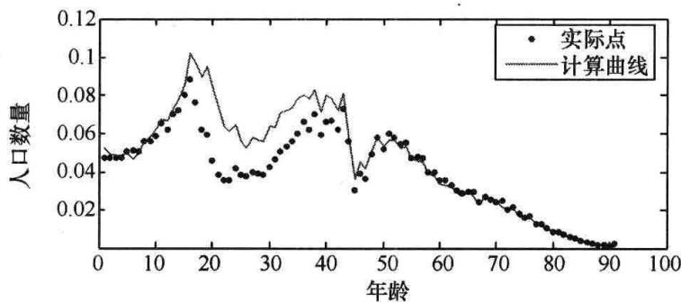

<details>
<summary>line</summary>

| 年龄 | 实际点 (人口数量) | 计算曲线 (人口数量) |
| --- | --- | --- |
| 0 | ~0.047 | ~0.052 |
| 10 | ~0.056 | ~0.058 |
| 20 | ~0.061 | ~0.095 |
| 30 | ~0.038 | ~0.062 |
| 40 | ~0.065 | ~0.078 |
| 50 | ~0.055 | ~0.055 |
| 60 | ~0.035 | ~0.035 |
| 70 | ~0.022 | ~0.022 |
| 80 | ~0.010 | ~0.010 |
| 90 | ~0.002 | ~0.002 |
</details>

图 12 2005 年乡村男性对比图

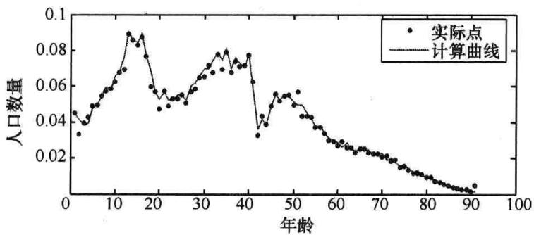

<details>
<summary>line</summary>

| 年龄 | 实际点 (人口数量) | 计算曲线 (人口数量) |
| --- | --- | --- |
| 2 | ~0.032 | ~0.045 |
| 4 | ~0.040 | ~0.040 |
| 6 | ~0.048 | ~0.048 |
| 8 | ~0.055 | ~0.055 |
| 10 | ~0.060 | ~0.060 |
| 12 | ~0.068 | ~0.075 |
| 14 | ~0.088 | ~0.088 |
| 16 | ~0.082 | ~0.088 |
| 18 | ~0.076 | ~0.076 |
| 20 | ~0.059 | ~0.059 |
| 22 | ~0.047 | ~0.055 |
| 24 | ~0.053 | ~0.053 |
| 26 | ~0.052 | ~0.052 |
| 28 | ~0.058 | ~0.058 |
| 30 | ~0.065 | ~0.065 |
| 32 | ~0.068 | ~0.072 |
| 34 | ~0.078 | ~0.078 |
| 36 | ~0.068 | ~0.072 |
| 38 | ~0.072 | ~0.072 |
| 40 | ~0.077 | ~0.077 |
| 42 | ~0.032 | ~0.032 |
| 44 | ~0.042 | ~0.042 |
| 46 | ~0.055 | ~0.055 |
| 48 | ~0.053 | ~0.053 |
| 50 | ~0.056 | ~0.056 |
| 52 | ~0.043 | ~0.043 |
| 54 | ~0.042 | ~0.042 |
| 56 | ~0.036 | ~0.036 |
| 58 | ~0.032 | ~0.032 |
| 60 | ~0.028 | ~0.028 |
| 62 | ~0.026 | ~0.026 |
| 64 | ~0.024 | ~0.024 |
| 66 | ~0.023 | ~0.023 |
| 68 | ~0.021 | ~0.021 |
| 70 | ~0.021 | ~0.021 |
| 72 | ~0.019 | ~0.019 |
| 74 | ~0.017 | ~0.017 |
| 76 | ~0.014 | ~0.014 |
| 78 | ~0.012 | ~0.012 |
| 80 | ~0.011 | ~0.011 |
| 82 | ~0.010 | ~0.010 |
| 84 | ~0.008 | ~0.008 |
| 86 | ~0.006 | ~0.006 |
| 88 | ~0.004 | ~0.004 |
| 91 | ~0.005 | — |
</details>

图 13 2002 年乡村女性对比图

② 无论对于哪一个类型的群体,在对第二年的情况进行预测时,效果都很好,这说明我们的模型用来作短期预测还是十分准确的。  
③ 计算曲线的误差很有规律和特点:从人口数量的多少上来看,城市和城镇的人口

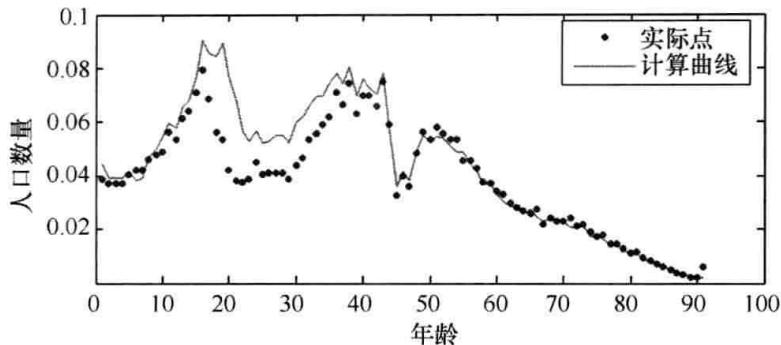

<details>
<summary>line</summary>

| 年龄 | 实际点 (人口数量) | 计算曲线 (人口数量) |
| --- | --- | --- |
| 0 | ~0.038 | ~0.042 |
| 5 | ~0.037 | ~0.039 |
| 10 | ~0.048 | ~0.058 |
| 15 | ~0.065 | ~0.075 |
| 20 | ~0.055 | ~0.085 |
| 25 | ~0.040 | ~0.055 |
| 30 | ~0.040 | ~0.055 |
| 35 | ~0.055 | ~0.070 |
| 40 | ~0.070 | ~0.075 |
| 45 | ~0.065 | ~0.075 |
| 50 | ~0.055 | ~0.055 |
| 55 | ~0.045 | ~0.048 |
| 60 | ~0.035 | — |
| 65 | ~0.028 | — |
| 70 | ~0.022 | — |
| 75 | ~0.018 | — |
| 80 | ~0.012 | — |
| 85 | ~0.008 | — |
| 90 | ~0.002 | — |
| 92 | ~0.006 | — |
</details>

图 14 2005 年乡村女性对比图

的计算值总是较实际值大；而乡村人口的计算值较实际值小。而且，这种误差随着时间的增加呈现出不断增加的趋势。

④ 误差的分布也呈现出一定的特点:城市男女的人口误差大体集中在15岁\~45岁这个年龄阶段上;城镇男女的人口的计算误差分布得较均匀,在各个年龄阶段都有,其中0岁\~65岁阶段较为突出;而对于乡村男女,误差随年龄的分布和城市人口误差分布极为相似,集中在15岁\~45岁这个年龄阶段上。

误差产生的途径主要有两条:一是模型误差;二为初始条件和边界条件的误差。

模型误差的来源有两个：

（1）在建立关于 $p(r,t)$ 的微分方程时，考察 $t$ 时刻年龄在 $[r,r + \mathrm{d}r]$ 内的人到时刻 $t+\mathrm{d}t$ 的情况，该模型仅考虑了年龄别死亡率的影响，没有考虑迁徙率的影响。根据上面的组图得到的结论就可以知道，乡村人口的计算值较实际值偏大，而城市人口随计算值较实际值偏大，两者误差出现互补趋势，且误差恰好出现在相似的年龄段。这种巧合说明了在预报地域人口数量时城乡之间的人口流动即迁徙率是必须考虑的因素。这种误差也是与现在越来越多的农民涌入城市寻找就业机会的社会现实相符合的。

(2) 在求解关于 $p(r, t)$ 的偏微分方程的解析解时, 考虑了在社会安定和不太长的时间内, 死亡率大致随年份的增加是不变的, 仅随年龄的分布而变化。这个假设的设立, 决定了该微分模型仅能作短期预报, 对于中长期的人口预测, 显然年龄别死亡率是随时间年代发生变化的, 则在年龄别死亡率不变的基础上得到的解析解已经不再适用。

初边界条件的误差来源主要有两个：

（1）在确定各个类型群体的婴儿出生率 $f(t)$ 时，将婴儿出生率看作一个常数，这显然也是和实际不太相符的。实际的出生率和国家政策调控经济状况、地域环境等多方面的因素影响，它对人口数量的变化起着至关重要的作用，稳定为一个常数的情况和实际是有出入的，且从这个常数的确定方式来看，仅取了资料中2001年—2005年的婴儿出生率作平均，这样得到的结果的代表性还是有待商榷的。

（2）在确定人口密度的分布函数 $p_0(t)$ 的初始值时，需要求得各类型群体当年的总人口数量。这个总人口数量是通过抽样调查的 $1\%$ 人口数量估计得到的。抽样的数据本来就带有随机性，所以得到的总人口的估计值也肯定存在一定的误差，这对计算结果显然也是有影响的。

2. 对总人口数量发展情况的试验预测、实际预测以及结果分析

首先,用2001年的数据对2005年的总人口进行试验预测,预测结果如图15所示。

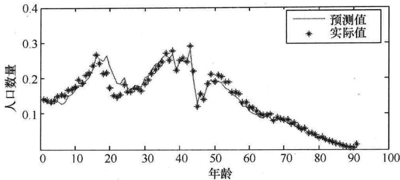

<details>
<summary>line</summary>

| 年龄 | 预测值 | 实际值 |
| --- | --- | --- |
| 0 | ~0.14 | ~0.14 |
| 5 | ~0.13 | ~0.14 |
| 10 | ~0.18 | ~0.19 |
| 15 | ~0.24 | ~0.27 |
| 20 | ~0.26 | ~0.22 |
| 25 | ~0.18 | ~0.16 |
| 30 | ~0.17 | ~0.17 |
| 35 | ~0.24 | ~0.25 |
| 40 | ~0.26 | ~0.26 |
| 45 | ~0.13 | ~0.12 |
| 50 | ~0.19 | ~0.21 |
| 55 | ~0.16 | ~0.16 |
| 60 | ~0.12 | ~0.13 |
| 65 | ~0.10 | ~0.10 |
| 70 | ~0.08 | ~0.08 |
| 75 | ~0.06 | ~0.06 |
| 80 | ~0.04 | ~0.04 |
| 85 | ~0.02 | ~0.02 |
| 90 | ~0.01 | ~0.02 |
</details>

图 15 预测 2005 年各年龄的人口数图

比较两条曲线,发现它们吻合的相当不错,尤其是20岁以后的曲线,差别非常小,最大误差在0.45%以内。由于这部分人口的发展只受死亡率的影响,说明把死亡率作为不随年代变化的量还是具有一定的合理性的,由此,关于生育率年龄的相对分布的假设也是合理的。至此,模型的有效性得到了证明。用该模型可以得到详尽的逐年的人口年龄分布,为社会其他领域,如教育、商业等的发展规划提供必要的人口信息。用它做短期的人口预测是十分理想的。

用上述微分模型,可以对未来的总人口数量进行预测,结果见表2。

表2

<table><tr><td>年份</td><td>人口数量</td><td>年份</td><td>人口数量</td><td>年份</td><td>人口数量</td><td>年份</td><td>人口数量</td></tr><tr><td>2005</td><td>13.069</td><td>2011</td><td>13.334</td><td>2017</td><td>13.474</td><td rowspan="2">2022</td><td rowspan="2">13.492</td></tr><tr><td>2006</td><td>13.114</td><td>2012</td><td>13.366</td><td>2018</td><td>13.484</td></tr><tr><td>2007</td><td>13.165</td><td>2013</td><td>13.394</td><td rowspan="2">2019</td><td rowspan="2">13.491</td><td rowspan="2">2023</td><td rowspan="2">13.485</td></tr><tr><td>2008</td><td>13.213</td><td>2014</td><td>13.42</td></tr><tr><td>2009</td><td>13.257</td><td>2015</td><td>13.441</td><td>2020</td><td>13.495</td><td>2024</td><td>13.473</td></tr><tr><td>2010</td><td>13.298</td><td>2016</td><td>13.459</td><td>2021</td><td>13.495</td><td>2025</td><td>13.459</td></tr></table>

将总人口数随时间的变化拟合成曲线,如图16所示。

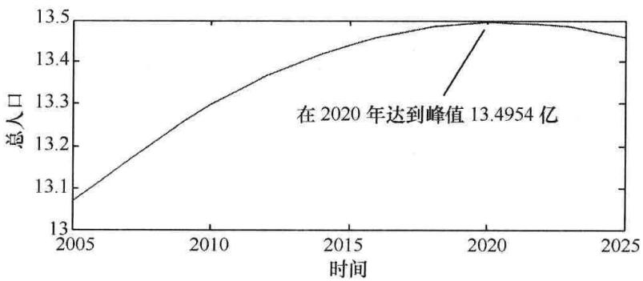

<details>
<summary>line</summary>

| 时间 | 总人口 (亿) |
| --- | --- |
| 2005 | ~13.07 |
| 2020 | 13.4954 |
</details>

图 16 总人口预测图

从图 16 可以很直观地看到: 全国的人口总数在 2020 年达到峰值, 峰值人口数量为 13.4954 亿, 这与资料中提到的: 到 21 世纪中叶, 我国人口将达到峰值, 之后人口数量将缓慢下降, 峰值数量为 15 亿左右的参考数据相比, 峰值到来时间提前了, 且峰值人口数量

较参考值降低了很多。

分析误差来源的因素,和上面分析的导致各类群体的人口数量误差的来源一个较大的不同在于:在讨论不同群体的人口数量时,迁徙率的影响很大,农村居民向城市的大量流入,势必会对城乡之间的人口数量比例产生较大的影响。但是,考虑全国的人口数量的时候,城乡之间的迁徙对总人口的影响变得不那么显著和直观。这里认为迁徙率通过影响城乡人口结构来影响出生率和死亡率,进而影响总人口的变化。另一方面,实际情况是,因为医疗条件的改善,人们生活水平的提高,年龄别死亡率随着年份的增长是降低的,所以,将其看作一个不变的量,在作中长期预报时较实际值较小的误差也是可以理解的;同时初边值条件的简化也是造成误差的一个重要原因。

## 3. 对未来城镇乡男女比例的预测以及结果分析

用 2005 年的数据,对未来 20 年的城市、城镇、乡村的男女比例的变化情况进行了预测,结果如图 17 所示。

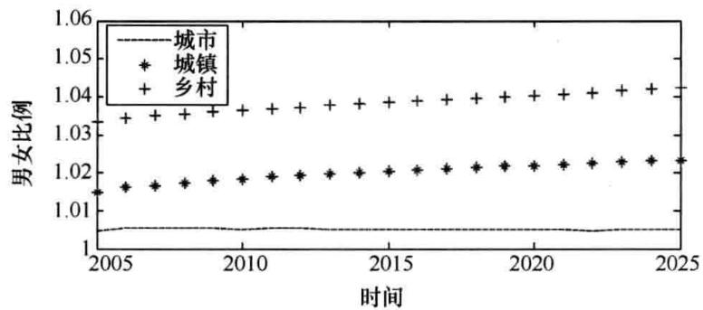

<details>
<summary>line</summary>

| 时间 | 城市 (男女人) | 城镇 (男女人) | 乡村 (男女人) |
| --- | --- | --- | --- |
| 2005 | ~1.005 | ~1.014 | ~1.034 |
| 2006 | ~1.005 | ~1.016 | ~1.034 |
| 2007 | ~1.005 | ~1.016 | ~1.035 |
| 2008 | ~1.005 | ~1.017 | ~1.035 |
| 2009 | ~1.005 | ~1.018 | ~1.036 |
| 2010 | ~1.005 | ~1.018 | ~1.036 |
| 2011 | ~1.005 | ~1.019 | ~1.037 |
| 2012 | ~1.005 | ~1.019 | ~1.037 |
| 2013 | ~1.005 | ~1.020 | ~1.038 |
| 2014 | ~1.005 | ~1.020 | ~1.038 |
| 2015 | ~1.005 | ~1.020 | ~1.039 |
| 2016 | ~1.005 | ~1.021 | ~1.039 |
| 2017 | ~1.005 | ~1.021 | ~1.039 |
| 2018 | ~1.005 | ~1.022 | ~1.040 |
| 2019 | ~1.005 | ~1.022 | ~1.040 |
| 2020 | ~1.005 | ~1.022 | ~1.040 |
| 2021 | ~1.005 | ~1.023 | ~1.041 |
| 2022 | ~1.005 | ~1.023 | ~1.041 |
| 2023 | ~1.005 | ~1.023 | ~1.042 |
| 2024 | ~1.005 | ~1.023 | ~1.042 |
| 2025 | ~1.005 | ~1.023 | ~1.042 |
</details>

图 17 男女比例预测图

以男女比例的发展趋势看,城市人口的男女比例大体是处于均衡状态的,未来也没有呈现出增长趋势,也就是说城市的男女数量大体上是处于均衡状态的。城镇和乡村男女的性别比随时间持续增长,乡村的增长幅度更大,但是,三者的性别比例还是在一个合适的范围内增长。但是,一个突出问题是,根据附件中提供的资料:到2020年,20岁\~45岁男性将比女性多3000万人左右。2005年以后,新进入婚育年龄人口男性明显多于女性,婚姻挤压问题凸现,低收入及低素质者结婚难所导致的社会秩序混乱将成为影响社会稳定严重隐患。而根据我们的预测,即使是在男女比例相对较大的乡村,和参考的性别比率还是由较大差距的,不能很好地反映我国性别比例持续升高的现状。

分析误差产生的原因,在于我们的模型中对各个类型婴儿出生率 $f_{j}(t)$ 作了常数化的处理。这样作的直接后果将是男女的婴儿出生率及其比例是不随时间变化的。这显然是与实际情况有出入的,根据资料统计,出生人口性别比持续升高,是我国目前的生育性别比的现状。故关于这一点,还存在改进的地方。

## 4. 对未来城镇乡人口老龄化问题的预测以及结果分析

分别计算出城市、城镇、乡村60岁人口占各自总人口数量的比例 $r_{i}(j)$ ：

$$
r _ {i} (j) = \frac {\sum_ {i = 6 0} ^ {9 0} p _ {i} (i , j)}{\sum_ {i = 0} ^ {9 0} p _ {i} (i , j)} = \frac {\sum_ {i = 6 0} ^ {9 0} p _ {i} ^ {\prime} (i , j) \cdot N _ {i} (j)}{\sum_ {i = 0} ^ {9 0} p _ {i} ^ {\prime} (i , j) \cdot N _ {i} (j)}, i = 1, 2, 3
$$

以 2005 年的数据作为初始值,预测未来 20 年的不同地区的老龄人口占各自总人口的比率随时间的变化曲线,如图 18 所示。

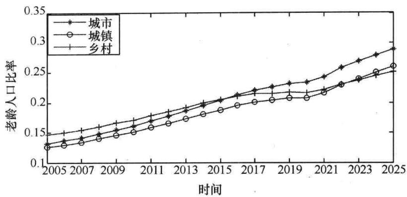

<details>
<summary>line</summary>

| 时间 | 城市 (比率) | 城镇 (比率) | 乡村 (比率) |
| --- | --- | --- | --- |
| 2005 | ~0.13 | ~0.125 | ~0.145 |
| 2006 | ~0.135 | ~0.13 | ~0.15 |
| 2007 | ~0.14 | ~0.135 | ~0.155 |
| 2008 | ~0.145 | ~0.14 | ~0.16 |
| 2009 | ~0.155 | ~0.145 | ~0.165 |
| 2010 | ~0.16 | ~0.15 | ~0.17 |
| 2011 | ~0.17 | ~0.16 | ~0.175 |
| 2012 | ~0.175 | ~0.165 | ~0.18 |
| 2013 | ~0.185 | ~0.175 | ~0.19 |
| 2014 | ~0.195 | ~0.18 | ~0.195 |
| 2015 | ~0.205 | ~0.185 | ~0.205 |
| 2016 | ~0.215 | ~0.195 | ~0.215 |
| 2017 | ~0.22 | ~0.20 | ~0.215 |
| 2018 | ~0.23 | ~0.205 | ~0.215 |
| 2019 | ~0.235 | ~0.21 | ~0.215 |
| 2020 | ~0.24 | ~0.215 | ~0.22 |
| 2021 | ~0.26 | ~0.23 | ~0.23 |
| 2022 | ~0.27 | ~0.24 | ~0.24 |
| 2023 | ~0.28 | ~0.25 | ~0.245 |
| 2024 | ~0.29 | ~0.26 | ~0.255 |
</details>

图 18 预测 60 岁以上老龄人口占所有人口的比率

从图 18 可以看到,城市、城镇、乡村的老龄人口比率随时间均呈现出增长趋势,且城市的老龄化程度最为严重,城镇的老龄化程度最小、乡村居中。到达 2025 年时,总人口的平均老龄化比率约为 0.25,这个数据与国家人口发展战略中提供的预测信息接近,但是较参考值偏高。人口结构的老龄化的直接产生原因为低出生率和低死亡率,使得年龄结构重心逐渐向后推移。低出生率的出现和国家的调控政策、人们思想观念的转变以及地域性的因素有关;低死亡率和近年来医疗卫生设施的改善人民生活水平的提高有关。人口结构的老龄化一方面说明了我国在控制人口过快增长方面取得了显著成效,另一方面也要看到,老龄化程度的不断加深,对整个社会的生活水平和社会进步造成的阻碍:使得具有劳动能力的人口比率减小,增加了社会的抚养负担,减缓经济发展速度等一系列不利因素都会随即产生。所以,不能一味追求低死亡率和低出生率,要考虑老龄化因素的影响,将出生率保持在一个合理的水平。

## 4.2 微分模型的优化与改进

针对上述微分模型存在的问题,考虑对其作出改进。意识到该模型存在对作中长期预报不准确的问题,故考虑从这一点入手,提高模型对未来我国人口的峰值人口数量和峰值到来时间预测的准确性。这里不考虑区域性的人口预测,主要考察对全国人口数量的预测。

经过上面的分析,误差来源主要归结于两点:一是将婴儿出生率 $f_{i}(t)$ 作为常值处理,二是将年龄别死亡率 $\mu_{i}(r,t)$ 看作和时间无关的量 $\mu_{i}(r)$ 。现在,在已有的微分模型的基础上,将这两个参数作出适当调整和修改。

## 4.2.1 对年龄别死亡率 $\mu_{i}(r,t)$ 的修正

在原始的微分方程模型中,仅将 $\mu_{i}(r,t)$ 看作不随时间变化的函数,对于中长期预报来讲,这个假设显然是与实际情况有较大出入的。由于手中的资料有限,无法得到死亡率随时间变化的精确规律。但是将其作为常数处理显然又太过简化和粗略,所以,仍用试探的方法,对 $\mu_{i}(r)$ 取不同的值,看其变化对人口总数的增长会由何种影响。

令 $\mu_{i}(r,t) = \mu_{i}(r) + \mu_{i}(t)$ ，即在原来的年龄别死亡率的基础上加入一个时间影响项，

则原微分方程模型变化为

$$
\left\{ \begin{array}{l} \frac {\partial p}{\partial r} + \frac {\partial p}{\partial t} = - (\mu (r) + \mu (t)) p (r, t), t, r > 0 \\ p (0, t) = f (t) \\ p (r, 0) = p _ {0} (r) \end{array} \right.
$$

对于该微分方程的求解问题,可以这样考虑:根据我们国家的人口发展现状、受医疗卫生条件的逐步改善、人们生活水平的不断提高、乡村人口大量涌入城市等一系列的社会因素的影响,我国的死亡率水平逐渐降低,目前,我国的死亡率水平基本上稳定在一个常值附近,但随着时间的增长死亡率还是以一个比较缓慢的速度下降。故认为和年龄别死亡率的量级相比较,时间影响项的量级是很小的,故在求解时可以近似地认为:

$$
\mu (r) + \mu (t) \approx \mu (r)
$$

这样可以沿用原来的解析解的形式,并得到修正后的解为

$$
p (r, t) = \left\{ \begin{array}{l l} p _ {0} (r - t) \mathrm{e} ^ {- \int_ {r - t} ^ {r} (\mu (s) + \mu (t)) \mathrm{d} s}, & 0 \leqslant t \leqslant r \\ f (t - r) \mathrm{e} ^ {- \int_ {0} ^ {r} (\mu (s) + \mu (t)) \mathrm{d} s}, & t > r \end{array} \right.
$$

现在问题的关键在于如何确定时间影响项中的参数 $\mu(t)$ 。仍旧从 2001—2005 年的数据出发，根据前面已经求得的 2001—2005 年的年龄别死亡率 $\mu(r,1),\mu(r,2),\cdots,\mu(r,5)$ ，以 2001 年的年龄别死亡率 $\mu(r,1)$ 为基准，分别求出：

$$
\Delta \mu (r, i) = \mu (r, i) - \mu (r, 1), i = 1, 2, \dots , 4
$$

表示了不同年代的年龄别死亡率相对于2001年的变化,将不同年龄区间的年龄别死亡率的相对变化做平均,得出第i年的死亡率变化(表3):

$$
\Delta \mu (i) = \frac {\sum_ {r = 0} ^ {9 0} \Delta \mu (r , i)}{9 0}, i = 1, 2, \dots , 4
$$

表 3

<table><tr><td>时间</td><td>1</td><td>2</td><td>3</td><td>4</td></tr><tr><td>死亡率变化</td><td>0.540968</td><td>0.750133</td><td>-0.3174</td><td>-2.06703</td></tr></table>

利用上述四点,拟合出死亡率的时间影响项 $\mu(t)$ 的函数表达式:

$$
\mu (t) = (6. 5 2 8 \times \exp (- 0. 1 0 8 3 \times (t - 1. 6 5 4) ^ {2}) - 5. 7 6 4) \times 1 0 ^ {- 3}
$$

## 4.2.2 对婴儿出生率 $f_{i}(t)$ 的修改

运用微分模型得到的预测的结果:全国人口数量峰值到达时间较参考值提前,且峰值数量较参考值偏低。直观的想法是,适当提高婴儿出生率 $f_{i}(t)$ 的值,未来总人口数量峰值推后,峰值人口数量增加。类似于对于年龄别死亡率的修改,对婴儿出生率也加上时间影响项,以反映婴儿出生率随时间变化的趋势:

$$
f _ {i} (t) = f _ {i} + f (t)
$$

同样,根据附件2中提供的2001年—2005年的婴儿出生率 $f_{1},f_{2},\cdots,f_{5}$ ，按照与死亡率相类似的方法确定 $f(t)$ ，以2001年的婴儿出生率为基准，计算出2002年—2005年的婴儿出生率相对于2001年出生率的变化：

$$
\Delta f _ {i} = f _ {i + 1} - f _ {1}, i = 1, 2, \dots , 4
$$

同样,可以得到关于婴儿出生率的时间相对变化的4个散点,见表4。

表 4

<table><tr><td>时间点</td><td>1</td><td>2</td><td>3</td><td>4</td></tr><tr><td> $\Delta f_{i}$ </td><td>-0.03981</td><td>-0.07941</td><td>-0.0858</td><td>-0.072</td></tr></table>

根据上面的4个散点,拟合出 $f(t)$ 的函数曲线,表达式如下:

$$
f (t) = (- 0. 8 4 9 \times \exp (0. 1 5 7 5 \times t / (t + 1)) + 0. 8 7 6 1) \times 1 0 ^ {- 2}
$$

利用改进后的模型,对总人口重新进行了预测估计,结果见附录一。表 5 是修正后的峰值结果。

表 5

<table><tr><td>类型</td><td>未作修正</td><td>f(t)修正</td><td>μ(t)修正</td><td>两项修正</td></tr><tr><td>峰值时间</td><td>2020</td><td>2021</td><td>2040</td><td>2035</td></tr><tr><td>峰值人数/亿人</td><td>13.4954</td><td>13.463</td><td>16.002</td><td>15.457</td></tr></table>

将修改后的预测曲线与没修改的预测曲线作比较,如图 19 所示。

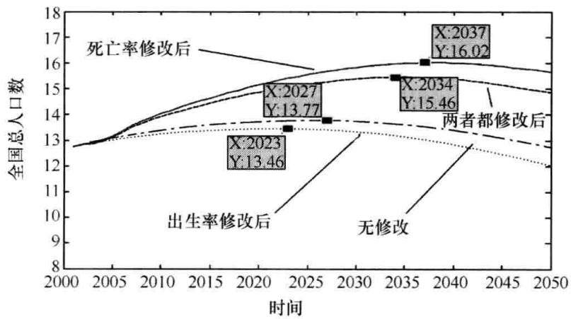

<details>
<summary>line</summary>

| 时间 | 死亡率修改后 (Y) | 两者都修改后 (Y) | 出生率修改后 (Y) | 无修改 (Y) |
| --- | --- | --- | --- | --- |
| 2023 | — | — | 13.46 | — |
| 2027 | 13.77 | — | — | — |
| 2034 | — | 15.46 | — | — |
| 2037 | 16.02 | — | — | — |
</details>

图19

## 4.3 变系数的状态空间模型

## 4.3.1 模型的建立

考虑人口发展过程的离散模型。根据手中掌握的数据特点,将时间 t 离散化为以年为单位的时间点。模型的基本思想是将年龄的增长看作是从一个状态转移到另一个状态的过程。以 $T(i,t)$ 表示 t 年代年龄为 i 的状态, $x(i,t)$ 表示 t 年代年龄为 i 的人口数量, 则在下一个年代 $t+1$ 时, t 时间点处于 $T(i,t)$ 状态的这部分人群将发生变化: 一部分人将转化为 $T(i+1,t+1)$ 状态, 一部分将死亡。则 $T(i,t)$ 状态的人口数量 $x(i,t)$ 和满足如下关系: $T(i+1,t+1)$ 状态的人口数量 $x(i+1,t+1)$ 为

$$
x (i + 1, t + 1) = (1 - \mu (i, t)) x (i, t) + f (i, t)
$$

式中： $\mu(i, t)$ 表示向前按的年龄别死亡率； $f(i, t)$ 表示 $[t, t + 1]$ 迁入（迁出）地区年龄为 $i + 1$ 的人口。即 $T(i + 1, t + 1)$ 状态的人口数量 $x(i + 1, t + 1)$ 由两部分构成： $T(i, t)$ 状态的人口到 $t + 1$ 年代存活的数量以及 $[t, t + 1]$ 迁入（迁出）地区年龄为 $i + 1$ 的人口数量。

以 $\varphi(t)$ 表示 $t$ 年代以前一年内出生的婴儿数。记女性的性别比函数为 $k(i,t)$ ，即年代 $t$ 年龄为 $i$ 的女性人数为 $k(i,t)x(i,t)$ ，将这些女性在单位时间内平均每人生育数记为 $y(r,t)$ ，设育龄区间为 $[r_1,r_2]$ ，则

$$
\varphi (t) = \sum_ {i = r _ {1}} ^ {r _ {2}} y (i, t) k (i, t) x (i, t)
$$

将 $y(i,t)$ 定义为

$$
y (i, t) = \beta (t) h (i, t)
$$

式中： $h(i,t)$ 满足

$$
\sum_ {i = r _ {1}} ^ {r _ {2}} h (i, t) = 1
$$

于是有

$$
\beta (t) = \sum_ {i = r _ {1}} ^ {r _ {2}} b (i, t)
$$

$$
\varphi (t) = \beta (t) \sum_ {i = r _ {1}} ^ {r _ {2}} k (i, t) h (i, t) x (i, t)
$$

由上述定义和分析, $\beta(t)$ 的直接含义是在第t年内平均每个育龄女性的生育数。如果所有育龄女性在她的育龄期所及的时刻都保持这个生育数,那么 $\beta(t)$ 表示平均一个女性一生中的总和生育数,所以 $\beta(t)$ 也称总和生育率。

在 $t$ 年代存留的不满周岁的婴儿数 $x(0,t)$ 和 $t$ 年代以前一年内出生的婴儿数 $\varphi (t)$ 的关系满足：

$$
x (0, t) = (1 - \mu (0, t)) \varphi (t)
$$

则人口发展过程的离散模型可以描述为

$$
\left\{ \begin{array}{l} x (i + 1, t + 1) = (1 - \mu (i, t)) x (i, t) + f (i, t) \\ \varphi (t) = \beta (t) \sum_ {i = r _ {1}} ^ {r _ {2}} k (i, t) h (i, t) x (i, t) \\ x (0, t) = (1 - \mu (0, t)) \varphi (t) \\ \sum_ {i = r _ {1}} ^ {r _ {2}} h (i, t) = 1 \end{array} \right.
$$

引入矩阵和向量符号：

$$
\boldsymbol {x} (t) = (x (1, t) \quad x (2, t) \quad \dots \quad x (m, t)) ^ {\mathrm{T}}
$$

$$
\boldsymbol {f} (t) = \left(f (0, t) \quad f (1, t) \quad \dots \quad f (m - 1, t)\right) ^ {\mathrm{T}}
$$

$$
\boldsymbol {H} (t) = \left[ \begin{array}{c c c c c} 0 & 0 & \dots & 0 & 0 \\ 1 - \mu (1, t) & 0 & \dots & 0 & 0 \\ 0 & 1 - \mu (2, t) & \dots & 0 & 0 \\ \vdots & \vdots & & \vdots & \vdots \\ 0 & 0 & \dots & 0 & 0 \end{array} \right] _ {m \times m}
$$

$$
B (t) = \left[ \begin{array}{c c c c} b (1, t) & b (2, t) & \dots & b (m, t) \\ 0 & 0 & \dots & 0 \\ \vdots & \vdots & & \vdots \\ 0 & 0 & \dots & 0 \end{array} \right] _ {m \times m}
$$

其中

$$
b (i, t) = (1 - \mu (0, t)) (1 - \mu (0, t)) k (i, t) h (i, t)
$$

于是模型变化为

$$
\left\{ \begin{array}{l} x (t + 1) = H (t) x (t) + \beta (t) B (t) x (t) + f (t) \\ x (0) = x _ {0} \end{array} \right.
$$

## 4.3.2 模型的结果及分析

利用该模型对全国的人口总数进行预测。由于考虑的是全国的情况,故认为,迁徙函数的影响可以忽略不计,即在社会条件稳定的情况下,对全国而言,大规模的迁徙活动是不可能出现的,故 $f(t)=0$ 。对于总和生育率,根据附件2中的资料对其进行估计是不太可能的。故查阅了相关资料,并得知我国目前的总和生育率稳定在2.0左右,所以这里取 $\beta(t)=1.8$ 。利用MATLAB软件编程实现上述模型(程序见附录),得到对我国人口数量的预测曲线,如图20所示(每年具体的人口数量见附录二)。

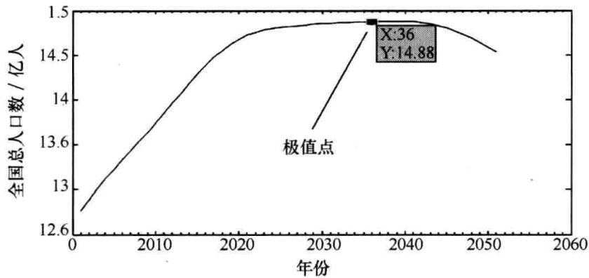

<details>
<summary>line</summary>

| 年份 | 全国总人口数 (亿人) |
| --- | --- |
| 2036 | 14.88 |
</details>

图20

从图 20 可以直观地看出,中国人口数量将在 2038 年左右达到峰值,峰值人口数量约为 14.88 亿。之后全国人口数量将缓慢降低,在 2050 年左右达到 14.588 亿。

## 4.4 迁徙模型

## 4.4.1 模型的假设

(1) 仅考虑乡村和城市两者间的人口流动,不考虑城镇乡三者之间的状态转移。  
(2) 仅考虑[15,49]年龄阶段的乡村男女向城市的迁徙。  
(3) 城乡迁徙率 k 是一个常值, 即每年乡村人口都以相对固定的数量向城市移动。  
(4) 育龄阶段的妇女的年龄别生育率不随时间变化。

## 4.4.2 考虑迁徙因素的离散模型

根据微分模型所得到的结果,发现在研究区域人口变化的时候,区域之间的人口迁徙是一个不容忽视的影响因素。这一点,在城市和乡村人口的计算误差中得到了很好的体现。所以，下面考虑区域之间的迁徙因素的影响，建立离散模型。

考虑人迁徙过程的离散模型。根据手中掌握的数据特点,将时间 t 离散化为以年为单位的时间点。考虑乡村人口向城市转移的动态过程:以 $x_{x}(t)$ 表示 t 年的乡村人口数量,则 $x_{x}(t)$ 由两部分构成:

$$
x _ {x} (t) = x _ {x 1} (t) + x _ {x 2} (t)
$$

式中： $x_{x1}(t)$ 表示年龄处于[15,49]区间的人口数量，即具有迁徙能力的人口的数量； $x_{x2}(t)$ 表示在这个年龄区间之外的人口数量。同理可以定义 $t$ 年的城市人口数量 $x_{c}(t)$ ，因为人口的移入和移出是一个相对等价的动态过程，所以在考虑乡村的移出的同时也等价于考虑了城市的移入过程，区别仅仅是转移率 $k$ 的正负号的选取。

设迁徙率为 $k$ ，表示不同年龄阶段的前往城市的乡村人口占本年龄阶段的人口总数的比值。我们假定，对于各个年龄阶段的乡村男女而言，这个迁徙率是相同的，并且为一个常数。也就是说，每年乡村人口都以一个相对固定的数量向城市流动。 $x_{x}(i,t)$ 表示 $t$ 年代年龄为 $i$ 的乡村人口数量。

在第 $t$ 年年初, 对于有迁徙能力的 $[15,49]$ 年龄段的乡村人口来说, 乡村向城市转移的人口数量可以表示为

$$
\Delta x (t) = k \cdot x _ {x 1} (t) = \sum_ {i = 1 5} ^ {4 9} k \cdot x (i, t)
$$

则在当年,人口迁出后的乡村人口构成可以表示为

$$
x _ {\text {迁后}} (i, t) = \left\{ \begin{array}{l l} (1 - k) x _ {\text {迁前}} (i, t), & i \in [ 1 5, 4 5 ] \\ x (i, t), & i \in [ 0, 1 5 ] \cup [ 4 5, 9 0 ] \end{array} \right.
$$

则在第 $t$ 年年末乡村的人口的年龄构成为

$$
x (i, t) = x _ {\mathrm{迁后}} (i, t) (1 - \mu (i, t))
$$

在第 $t + 1$ 年年初, 第 $t$ 年存活下来的年龄为 $i$ 的人都变成了 $i + 1$ 岁, 而在第 $t$ 年出生的婴儿已经变为了 1 岁。第 0 岁的年龄空档则由该年出生的新生儿填补。用 $b(i, t)$ 表示年龄为 $i$ 的妇女在第 $t$ 年的生育率, 记女性的性别比函数为 $k(i, t)$ , 即年代 $t$ 年龄为 $i$ 的女性人数为 $k(i, t)x(i, t)$ , 设育龄区间为 $[r_1, r_2]$ , 则第 $t + 1$ 年 0 岁婴儿的数量可以表示为

$$
x (0, t + 1) = \sum_ {i = 1 5} ^ {4 9} b (i, t) k (i, t) x (i, t)
$$

则描述迁徙过程的状态转移的离散模型可以表示为

$$
\left\{ \begin{array}{l} x _ {\text {迁后}} (i, t) = \left\{ \begin{array}{l l} (1 \pm k) x _ {\text {迁前}} (i, t), & i \in [ 1 5, 4 5 ] \\ x (i, t), & i \in [ 0, 1 5 ] \cup [ 4 5, 9 0 ] \end{array} \right. \\ x _ {\text {年初}} (i + 1, t + 1) = x _ {\text {年末}} (i, t) = x _ {\text {迁后}} (i, t) (1 - \mu (i, t)) \\ x (0, t + 1) = \sum_ {i = 1 5} ^ {4 9} b (i, t) k (i, t) x (i, t) \\ k (0, t) = k _ {0} (t) \end{array} \right.
$$

式中：+表示移入，是针对城市而言；-表示移出，是针对乡村而言的。

考虑用参数反演的办法来获得城乡迁徙率 $k$ 。因为2001年—2005年的数据是已知的,以2001年的数据为初始值,利用上述模型,可以反演得到,2002年—2005年的城市移入率 $k_{i1}$ 和乡村移出率 $k_{i2}, i=02,03,\cdots,05$ ,则城乡迁徙率可以这样求得:

$$
k = \frac {\sum_ {i = 0 2} ^ {0 5} \frac {1}{2} (k _ {i 1} + k _ {i 2})}{4}
$$

## 4.4.3 模型的结果及优缺点分析

经过编程计算,可以计算出城乡迁徙率为 k=0.038,并将实际值与预测值进行比较,将结果绘制成曲线图,如图 21～图 24 所示。

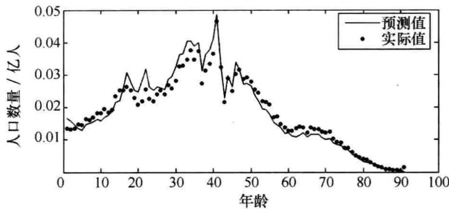

<details>
<summary>line</summary>

| 年龄 | 预测值 (亿人) | 实际值 (亿人) |
| --- | --- | --- |
| 2 | ~0.016 | ~0.013 |
| 5 | ~0.013 | ~0.014 |
| 8 | ~0.015 | ~0.016 |
| 10 | ~0.016 | ~0.017 |
| 12 | ~0.019 | ~0.019 |
| 15 | ~0.023 | ~0.023 |
| 18 | ~0.031 | ~0.026 |
| 20 | ~0.025 | ~0.022 |
| 22 | ~0.026 | ~0.021 |
| 25 | ~0.026 | ~0.024 |
| 28 | ~0.028 | ~0.025 |
| 30 | ~0.033 | ~0.028 |
| 32 | ~0.037 | ~0.033 |
| 35 | ~0.041 | ~0.038 |
| 38 | ~0.039 | ~0.035 |
| 40 | ~0.048 | ~0.048 |
| 42 | ~0.023 | ~0.021 |
| 45 | ~0.034 | ~0.029 |
| 48 | ~0.028 | ~0.029 |
| 50 | ~0.027 | ~0.027 |
| 55 | ~0.018 | ~0.021 |
| 60 | ~0.012 | ~0.013 |
| 65 | ~0.011 | ~0.013 |
| 70 | ~0.011 | ~0.012 |
| 75 | ~0.008 | ~0.011 |
| 80 | ~0.005 | ~0.006 |
| 85 | ~0.002 | ~0.003 |
| 90 | ~0.001 | ~0.001 |
| 92 | — | ~0.002 |
</details>

图 21 2003 年城市男性

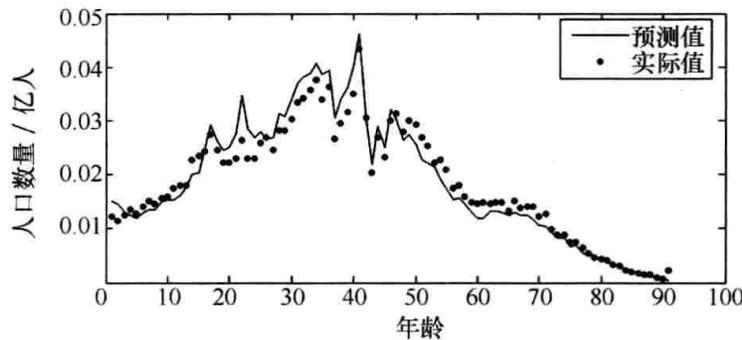

<details>
<summary>line</summary>

| 年龄 | 预测值 (亿人) | 实际值 (亿人) |
| --- | --- | --- |
| 0 | ~0.014 | ~0.011 |
| 5 | ~0.012 | ~0.013 |
| 10 | ~0.016 | ~0.017 |
| 15 | ~0.023 | ~0.023 |
| 20 | ~0.028 | ~0.022 |
| 25 | ~0.027 | ~0.023 |
| 30 | ~0.035 | ~0.034 |
| 35 | ~0.041 | ~0.039 |
| 40 | ~0.035 | ~0.031 |
| 45 | ~0.028 | ~0.023 |
| 50 | ~0.028 | ~0.031 |
| 55 | ~0.022 | ~0.026 |
| 60 | ~0.015 | ~0.015 |
| 65 | ~0.013 | ~0.014 |
| 70 | ~0.012 | ~0.012 |
| 75 | ~0.008 | ~0.008 |
| 80 | ~0.004 | ~0.004 |
| 85 | ~0.002 | ~0.002 |
| 90 | ~0.001 | ~0.002 |
</details>

图 22 2003 年城市女性

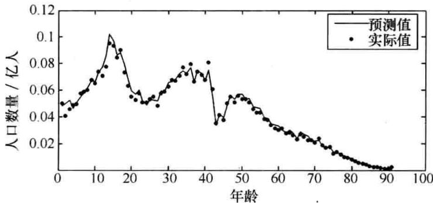

<details>
<summary>line</summary>

| 年龄 | 预测值 (亿人) | 实际值 (亿人) |
| --- | --- | --- |
| 1 | ~0.05 | ~0.04 |
| 2 | ~0.05 | ~0.05 |
| 3 | ~0.05 | ~0.045 |
| 4 | ~0.05 | ~0.05 |
| 5 | ~0.055 | ~0.055 |
| 6 | ~0.06 | ~0.06 |
| 7 | ~0.06 | ~0.065 |
| 8 | ~0.065 | ~0.07 |
| 9 | ~0.07 | ~0.075 |
| 10 | ~0.075 | ~0.08 |
| 11 | ~0.085 | ~0.09 |
| 12 | ~0.1 | ~0.1 |
| 13 | ~0.1 | ~0.095 |
| 14 | ~0.095 | ~0.09 |
| 15 | ~0.09 | ~0.085 |
| 16 | ~0.085 | ~0.09 |
| 17 | ~0.08 | ~0.085 |
| 18 | ~0.075 | ~0.075 |
| 19 | ~0.07 | ~0.07 |
| 20 | ~0.065 | ~0.065 |
| 21 | ~0.06 | ~0.06 |
| 22 | ~0.055 | ~0.055 |
| 23 | ~0.055 | ~0.055 |
| 24 | ~0.055 | ~0.055 |
| 25 | ~0.055 | ~0.05 |
| 26 | ~0.055 | ~0.05 |
| 27 | ~0.055 | ~0.05 |
| 28 | ~0.06 | ~0.06 |
| 29 | ~0.065 | ~0.065 |
| 30 | ~0.065 | ~0.065 |
| 31 | ~0.07 | ~0.07 |
| 32 | ~0.075 | ~0.075 |
| 33 | ~0.075 | ~0.075 |
| 34 | ~0.075 | ~0.08 |
| 35 | ~0.075 | ~0.08 |
| 36 | ~0.075 | ~0.075 |
| 37 | ~0.075 | ~0.075 |
| 38 | ~0.075 | ~0.075 |
| 39 | ~0.075 | ~0.08 |
| 40 | ~0.075 | ~0.08 |
| 41 | ~0.06 | ~0.06 |
| 42 | ~0.04 | ~0.04 |
| 43 | ~0.04 | ~0.04 |
| 44 | ~0.045 | ~0.045 |
| 45 | ~0.045 | ~0.04 |
| 46 | ~0.055 | ~0.055 |
| 47 | ~0.055 | ~0.055 |
| 48 | ~0.055 | ~0.055 |
| 49 | ~0.055 | ~0.055 |
| 50 | ~0.055 | ~0.055 |
| 51 | ~0.055 | ~0.055 |
| 52 | ~0.055 | ~0.055 |
| 53 | ~0.05 | ~0.05 |
| 54 | ~0.045 | ~0.045 |
| 55 | ~0.045 | ~0.045 |
| 56 | ~0.04 | ~0.04 |
| 57 | ~0.038 | ~0.038 |
| 58 | ~0.038 | ~0.038 |
| 59 | ~0.038 | ~0.038 |
| 60 | ~0.038 | ~0.038 |
| 61 | ~0.038 | ~0.038 |
| 62 | ~0.038 | ~0.038 |
| 63 | ~0.038 | ~0.038 |
| 64 | ~0.038 | ~0.038 |
| 65 | ~0.038 | ~0.038 |
| 66 | ~0.038 | ~0.038 |
| 67 | ~0.038 | ~0.038 |
| 68 | ~0.038 | ~0.038 |
| 69 | ~0.038 | ~0.038 |
| 70 | ~0.038 | ~0.038 |
| 71 | ~0.038 | ~0.038 |
| 72 | ~0.038 | ~0.038 |
| 73 | ~0.038 | ~0.038 |
| 74 | ~0.038 | ~0.038 |
| 75 | ~0.038 | ~0.038 |
| 76 | ~0.038 | ~0.038 |
</details>

图 23 2003 年乡村男性

和前面做出的预测结果相比,改进后的模型的预测结果明显较好,最大误差控制在2%以内。这说明迁移因素对区域人口的预测有着重要的影响。

若将此模型运用于对人口的长期预测中,则结果如图25所示。

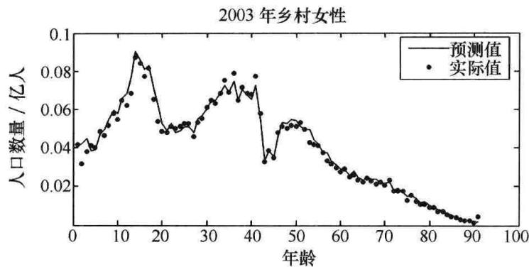

<details>
<summary>line</summary>

| 年龄 | 预测值 (亿人) | 实际值 (亿人) |
| --- | --- | --- |
| 1 | ~0.041 | ~0.032 |
| 2 | ~0.043 | ~0.041 |
| 3 | ~0.041 | ~0.040 |
| 4 | ~0.042 | ~0.048 |
| 5 | ~0.046 | ~0.049 |
| 6 | ~0.051 | ~0.055 |
| 7 | ~0.056 | ~0.058 |
| 8 | ~0.061 | ~0.063 |
| 9 | ~0.066 | ~0.069 |
| 10 | ~0.071 | ~0.078 |
| 11 | ~0.076 | ~0.089 |
| 12 | ~0.081 | ~0.085 |
| 13 | ~0.085 | ~0.082 |
| 14 | ~0.088 | ~0.078 |
| 15 | ~0.085 | ~0.065 |
| 16 | ~0.078 | ~0.054 |
| 17 | ~0.072 | ~0.052 |
| 18 | ~0.065 | ~0.051 |
| 19 | ~0.058 | ~0.052 |
| 20 | ~0.053 | ~0.053 |
| 21 | ~0.051 | ~0.052 |
| 22 | ~0.052 | ~0.053 |
| 23 | ~0.053 | ~0.054 |
| 24 | ~0.054 | ~0.055 |
| 25 | ~0.055 | ~0.056 |
| 26 | ~0.056 | ~0.057 |
| 27 | ~0.057 | ~0.058 |
| 28 | ~0.058 | ~0.061 |
| 29 | ~0.061 | ~0.064 |
| 30 | ~0.064 | ~0.067 |
| 31 | ~0.067 | ~0.071 |
| 32 | ~0.071 | ~0.074 |
| 33 | ~0.074 | ~0.077 |
| 34 | ~0.077 | ~0.081 |
| 35 | ~0.079 | ~0.076 |
| 36 | ~0.076 | ~0.072 |
| 37 | ~0.073 | ~0.069 |
| 38 | ~0.071 | ~0.072 |
| 39 | ~0.072 | ~0.078 |
| 40 | ~0.069 | ~0.058 |
| 41 | ~0.068 | ~0.033 |
| 42 | ~0.069 | ~0.038 |
| 43 | ~0.068 | ~0.035 |
| 44 | ~0.067 | ~0.049 |
| 45 | ~0.066 | ~0.051 |
| 46 | ~0.065 | ~0.052 |
| 47 | ~0.064 | ~0.053 |
| 48 | ~0.063 | ~0.054 |
| 49 | ~0.062 | ~0.053 |
| 50 | ~0.061 | ~0.052 |
| 51 | ~0.061 | ~0.051 |
| 52 | ~0.061 | ~0.049 |
| 53 | ~0.061 | ~0.047 |
| 54 | ~0.061 | ~0.044 |
| 55 | ~0.061 | ~0.042 |
| 56 | ~0.061 | ~0.041 |
| 57 | ~0.061 | ~0.039 |
| 58 | ~0.061 | ~0.037 |
| 59 | ~0.061 | ~0.035 |
| 60 | ~0.061 | ~0.033 |
| 61 | ~0.061 | ~0.032 |
| 62 | ~0.061 | ~0.031 |
| 63 | ~0.061 | ~0.031 |
| 64 | ~0.061 | ~0.031 |
| 65 | ~0.061 | ~0.031 |
| 66 | ~0.061 | ~0.031 |
| 67 | ~0.061 | ~0.031 |
| 68 | ~0.061 | ~0.031 |
| 69 | ~0.061 | ~0.031 |
| 70 | ~0.061 | ~0.031 |
| 71 | ~0.061 | ~0.031 |
| 72 | ~0.061 | ~0.031 |
| 73 | ~0.061 | ~0.031 |
| 74 | ~0.061 | ~0.031 |
| 75 | ~0.061 | ~0.031 |
| 76 | ~0.061 | ~0.031 |
| 77 | ~0.061 | ~0.031 |
| 78 | ~0.061 | ~0.031 |
| 79 | ~0.061 | ~0.031 |
| 80 | ~0.061 | ~0.031 |
| 81 | ~0.061 | ~0.031 |
| 82 | ~0.061 | ~0.031 |
| 83 | ~0.061 | ~0.031 |
| 84 | ~0.061 | ~0.031 |
| 85 | ~0.061 | ~0.031 |
| 86 | ~0.061 | ~_99~_99 (est.) |
</details>

图24  
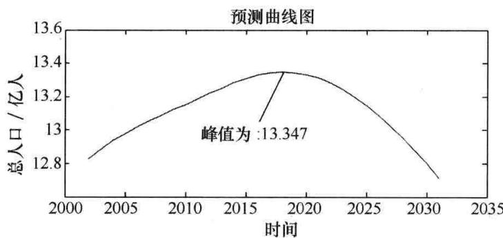

<details>
<summary>line</summary>

| 时间 | 总人口 (亿人) |
| --- | --- |
| ~2002 | ~12.83 |
| ~2018 | 13.347 |
| ~2031 | ~12.72 |
</details>

图25

从图 25 可以直观地看出,全国总人口的峰值将于 2020 年左右取得,峰值人口数量约为 13.347 亿。这与参考值相比,峰值人口数量偏小,且峰值期相对提前。同时,还用 2001 年的数据对 2005 年的人口数量进行试报,结果十分吻合,最大误差控制在 0.43% 以内。这说明考虑迁移的离散模型还是比较适合于做短期预报和区域预报,对中长期预测的准确率还是不如微分方程的改进模型好,详细结果见附录四。

## 4.5 对我国人口结构的分析

利用完善修改后的模型,计算出劳动力人口占总人口的比例随时间的变化,如图 26 所示。

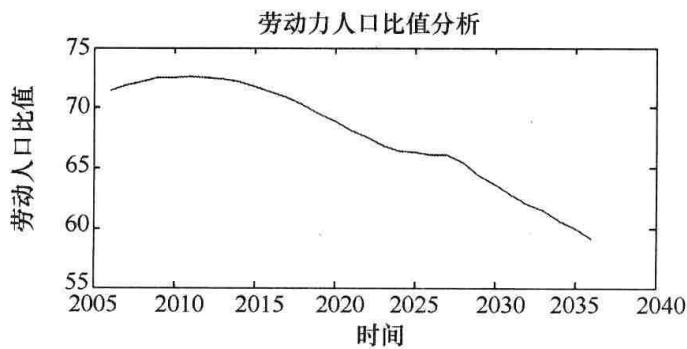

<details>
<summary>line</summary>

| 时间 | 劳动力人口比值 |
| --- | --- |
| 2005 | ~71.5 |
| 2010 | ~72.5 |
| 2015 | ~71.5 |
| 2020 | ~69.0 |
| 2025 | ~66.0 |
| 2030 | ~63.0 |
| 2035 | ~59.0 |
</details>

图26

从 2000 年—2020 年,15\~64 年段的人口比例将维持在 0.7 左右,可以称作人口红利期,在巨大的劳动利规模和廉价的劳动力价格下,中国的经济显然由可能继续高速发展成为国际市场上强有力的竞争者,中国不会像很多发达国家一样面临劳动力短缺的问题,它将面对大量的农村剩余劳动力和城市地区大量的不充分就业和失业。

根据幼儿抚养比的计算公式,将幼儿数量和劳动力数量相除,得到幼儿抚养比随时间的变化,如图27所示。

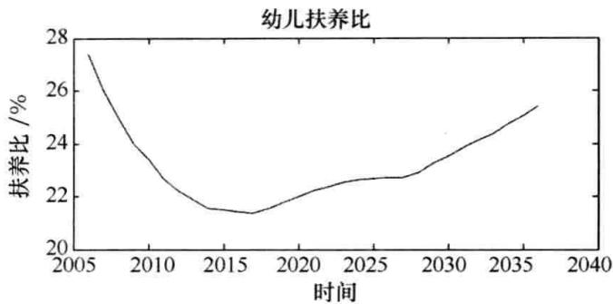

<details>
<summary>line</summary>

| 时间 | 扶养比 (%) |
| --- | --- |
| 2005 | ~27.3 |
| 2010 | ~23.4 |
| 2015 | ~21.5 |
| 2017 | ~21.3 |
| 2020 | ~21.9 |
| 2025 | ~22.6 |
| 2028 | ~22.7 |
| 2030 | ~23.3 |
| 2035 | ~24.8 |
| 2036 | ~25.4 |
</details>

图 27

可以看到幼儿抚养比在 2015 年以前都是呈较快的下降趋势, 到 2015 年左右到达一个最低值, 随后将缓慢回升, 总的说来幼儿抚养比在 24% 左右波动。图 28 是老年抚养比随时间的变化曲线图。

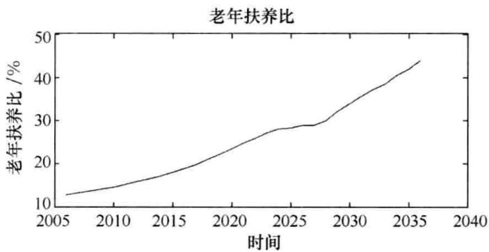

<details>
<summary>line</summary>

| 时间 | 老年扶养比 (%) |
| --- | --- |
| 2006 | ~12 |
| 2010 | ~14 |
| 2015 | ~17 |
| 2020 | ~23 |
| 2025 | ~28 |
| 2030 | ~35 |
| 2035 | ~44 |
</details>

图 28

和幼儿抚养比相比较,发现老年抚养比随时间持续上升,从2005年的10%多一点上升到2035年的45%左右,并继续呈现增长趋势。这一方面说明了幼儿数量随时间并没有明显的增加,但是老年人的数量却增长得很快。这样发展的一个直接后果是使得我国的人口年龄结构发生变化,老龄化的速度加快;另一方面又说明我国人口控制工作还是卓有成效的,这种年龄结构的产生是低出生率和低死亡率的必然结果。

综合以上的分析,不难得到下列的定性结论和判断:中国人口分布的基本格局基本不会改变,中国人口增长率逐渐下降是一个基本趋势,充分估计扭转中国出生性别比偏高的难度,流动人口已经成为一个相对固定的大群体,中国的生育率正处于一个承前启后的关键期,中国是存在巨大地域差异的国家,社会经济发展是这样,人口发展情况也是这样,因此,讨论政策、措施水平时应区别对待。

## 参考文献

附录一:状态转移模型的预测结果

<table><tr><td>年份</td><td>总人数</td><td>年份</td><td>总人数</td><td>年份</td><td>总人数</td><td>年份</td><td>总人数</td><td>年份</td><td>总人数</td></tr><tr><td>2001</td><td>12.767</td><td>2011</td><td>13.845</td><td>2021</td><td>14.724</td><td>2031</td><td>14.86</td><td>2041</td><td>14.876</td></tr><tr><td>2002</td><td>12.883</td><td>2012</td><td>13.957</td><td>2022</td><td>14.758</td><td>2032</td><td>14.865</td><td>2042</td><td>14.867</td></tr><tr><td>2003</td><td>13.005</td><td>2013</td><td>14.07</td><td>2023</td><td>14.782</td><td>2033</td><td>14.868</td><td>2043</td><td>14.852</td></tr><tr><td>2004</td><td>13.119</td><td>2014</td><td>14.181</td><td>2024</td><td>14.799</td><td>2034</td><td>14.87</td><td>2044</td><td>14.83</td></tr><tr><td>2005</td><td>13.228</td><td>2015</td><td>14.287</td><td>2025</td><td>14.811</td><td>2035</td><td>14.873</td><td>2045</td><td>14.803</td></tr><tr><td>2006</td><td>13.331</td><td>2016</td><td>14.386</td><td>2026</td><td>14.821</td><td>2036</td><td>14.875</td><td>2046</td><td>14.771</td></tr><tr><td>2007</td><td>13.431</td><td>2017</td><td>14.475</td><td>2027</td><td>14.83</td><td>2037</td><td>14.878</td><td>2047</td><td>14.733</td></tr><tr><td>2008</td><td>13.53</td><td>2018</td><td>14.553</td><td>2028</td><td>14.839</td><td>2038</td><td>14.881</td><td>2048</td><td>14.689</td></tr><tr><td>2009</td><td>13.632</td><td>2019</td><td>14.621</td><td>2029</td><td>14.847</td><td>2039</td><td>14.882</td><td>2049</td><td>14.64</td></tr><tr><td>2010</td><td>13.737</td><td>2020</td><td>14.678</td><td>2030</td><td>14.855</td><td>2040</td><td>14.881</td><td>2050</td><td>14.588</td></tr></table>

附录二:微分模型的参数修正后的全国总人数的预测结果

<table><tr><td>年份</td><td>没有修改</td><td>死亡率修改2</td><td>出生率修改2</td><td>死亡率修改2和出生率修改2</td></tr><tr><td>2001</td><td>12.763</td><td>12.763</td><td>12.763</td><td>12.763</td></tr><tr><td>2002</td><td>12.839</td><td>12.833</td><td>12.833</td><td>12.827</td></tr><tr><td>2003</td><td>12.916</td><td>12.898</td><td>12.899</td><td>12.881</td></tr><tr><td>2004</td><td>12.989</td><td>13.005</td><td>12.959</td><td>12.974</td></tr><tr><td>2005</td><td>13.06</td><td>13.17</td><td>13.016</td><td>13.126</td></tr><tr><td>2006</td><td>13.127</td><td>13.372</td><td>13.069</td><td>13.313</td></tr><tr><td>2007</td><td>13.191</td><td>13.571</td><td>13.119</td><td>13.498</td></tr><tr><td>2008</td><td>13.252</td><td>13.747</td><td>13.165</td><td>13.658</td></tr><tr><td>2009</td><td>13.31</td><td>13.899</td><td>13.209</td><td>13.795</td></tr><tr><td>2010</td><td>13.365</td><td>14.035</td><td>13.248</td><td>13.916</td></tr><tr><td>2011</td><td>13.416</td><td>14.164</td><td>13.284</td><td>14.029</td></tr><tr><td>2012</td><td>13.463</td><td>14.287</td><td>13.317</td><td>14.136</td></tr><tr><td>2013</td><td>13.507</td><td>14.406</td><td>13.347</td><td>14.24</td></tr><tr><td>2014</td><td>13.548</td><td>14.523</td><td>13.373</td><td>14.341</td></tr><tr><td>2015</td><td>13.586</td><td>14.635</td><td>13.396</td><td>14.438</td></tr><tr><td>2016</td><td>13.62</td><td>14.744</td><td>13.415</td><td>14.53</td></tr><tr><td>2017</td><td>13.652</td><td>14.85</td><td>13.432</td><td>14.62</td></tr><tr><td>2018</td><td>13.679</td><td>14.951</td><td>13.445</td><td>14.705</td></tr><tr><td>2019</td><td>13.703</td><td>15.048</td><td>13.454</td><td>14.786</td></tr><tr><td>2020</td><td>13.725</td><td>15.142</td><td>13.46</td><td>14.864</td></tr><tr><td>2021</td><td>13.742</td><td>15.231</td><td>13.463</td><td>14.936</td></tr><tr><td>2022</td><td>13.756</td><td>15.316</td><td>13.462</td><td>15.005</td></tr><tr><td>2023</td><td>13.767</td><td>15.398</td><td>13.458</td><td>15.069</td></tr><tr><td>2024</td><td>13.773</td><td>15.474</td><td>13.449</td><td>15.128</td></tr><tr><td>2025</td><td>13.777</td><td>15.546</td><td>13.438</td><td>15.184</td></tr><tr><td>2026</td><td>13.777</td><td>15.614</td><td>13.424</td><td>15.235</td></tr><tr><td>2027</td><td>13.773</td><td>15.676</td><td>13.405</td><td>15.28</td></tr><tr><td>2028</td><td>13.766</td><td>15.734</td><td>13.383</td><td>15.32</td></tr><tr><td>2029</td><td>13.755</td><td>15.787</td><td>13.357</td><td>15.356</td></tr><tr><td>2030</td><td>13.742</td><td>15.836</td><td>13.329</td><td>15.388</td></tr><tr><td>2031</td><td>13.724</td><td>15.878</td><td>13.296</td><td>15.413</td></tr><tr><td>2032</td><td>13.701</td><td>15.915</td><td>13.259</td><td>15.432</td></tr><tr><td>2033</td><td>13.676</td><td>15.947</td><td>13.219</td><td>15.447</td></tr><tr><td>2034</td><td>13.647</td><td>15.974</td><td>13.175</td><td>15.455</td></tr><tr><td>2035</td><td>13.613</td><td>15.994</td><td>13.126</td><td>15.457</td></tr><tr><td>2036</td><td>13.576</td><td>16.008</td><td>13.074</td><td>15.454</td></tr><tr><td>2037</td><td>13.534</td><td>16.016</td><td>13.017</td><td>15.444</td></tr><tr><td>2038</td><td>13.488</td><td>16.017</td><td>12.956</td><td>15.427</td></tr><tr><td>2039</td><td>13.439</td><td>16.013</td><td>12.893</td><td>15.405</td></tr><tr><td>2040</td><td>13.385</td><td>16.002</td><td>12.825</td><td>15.376</td></tr><tr><td>2041</td><td>13.329</td><td>15.986</td><td>12.753</td><td>15.341</td></tr><tr><td>2042</td><td>13.27</td><td>15.965</td><td>12.68</td><td>15.302</td></tr><tr><td>2043</td><td>13.208</td><td>15.939</td><td>12.603</td><td>15.257</td></tr><tr><td>2044</td><td>13.144</td><td>15.909</td><td>12.524</td><td>15.208</td></tr><tr><td>2045</td><td>13.077</td><td>15.873</td><td>12.443</td><td>15.154</td></tr><tr><td>2046</td><td>13.01</td><td>15.834</td><td>12.361</td><td>15.096</td></tr><tr><td>2047</td><td>12.942</td><td>15.794</td><td>12.279</td><td>15.037</td></tr><tr><td>2048</td><td>12.872</td><td>15.749</td><td>12.195</td><td>14.974</td></tr><tr><td>2049</td><td>12.803</td><td>15.704</td><td>12.111</td><td>14.909</td></tr><tr><td>2050</td><td>12.738</td><td>15.66</td><td>12.031</td><td>14.847</td></tr></table>

## 【论文点评】

张瑰

该论文思路清晰,分析细致透彻,结构完整,假设合理,方法灵活多样,内容丰富详实。既建立了连续的微分方程模型,又建立了离散的状态转移模型;既有对不同地区人口增长的区域性预测,又有对全国人口增长的整体预测;既对人口进行短期预测,又对人口的发展情况进行中长期预测和长期预测。论文不仅由浅入深地建立了不同模型,还充分运用各种数据对模型进行检验,提出改进方案。整体上看,这是一篇优秀的论文,特别是利用预测误差来对模型进行分析评价,结果可信。

论文首先不考虑迁移因素,建立了简单的连续型微分方程模型,分别对城镇乡不同地区和全国人口的增长进行区域性预测和整体预测。预测结果表明乡村向城市的人口迁徙不容忽视。为了提高长期预测的准确性,对微分方程中的两个重要参数进行了修正。随后,论文建立了变系数的状态空间转移模型,根据该模型预测出中国人口数量的峰值、发展情况以及2050年的人口数量。针对迁移率对区域性人口预测的影响,进而建立了考虑迁移因素的状态转移离散模型。运用参数反演的方法计算出城乡迁徙率并利用改进模型重新对城镇乡的男女增长情况进行了预测,结果较改进前大为改善。通过验证发现该模型做短期预报和区域预报效果很好。

不足之处:论文不够精炼;同时,如果最后能够结合上述研究结果,对中国就如何解决人口问题提出合理的看法和建议,论文将更加完整。

# 中国人口增长预测

## 摘要

针对中国人口增长预测问题,建立了五个模型对人口进行预测。

首先利用阻滞增长模型对中国人口的增长进行预测,在求解模型参量时用变分同化方法对最大人口容量 $x_{m}$ 和固有增长率 r 进行反演,求得 $x_{m}=13.9975, r=0.0788$ 。在此基础上对未来人口进行分析和预测,经过对所得结果的误差分析,发现该模型对人口数量进行短期预测是比较准确的,但长期预测效果不理想,这正是阻滞增长模型的缺点所在。

为了对人口增长进行长期预测,提出了人口分组预测模型。在不考虑人口城乡差异、人口流动等因素的影响时用该模型对人口进行了长期预测,发现中国人口会在2021年达到最大人口数量14.6亿。模型的优点在于对人口进行的长期预测比较符合实际情况,由于该模型没有考虑城乡人口差异、人口流动对生育率的影响,在理论上比较粗糙。基于此,在考虑城乡人口生育率差异的情况下提出了第二个模型的改进模型,与第二个模型相比该模型要更加合理,但该模型没有考虑到城乡之间存在人口流动。

为了使模型与附表的信息相符,论文建立第三个模型引入政策因子对模型进行了优化。

随后又提出了第四个模型,对人口增长进行了长期预测。第四个模型得到的结果是2019年人口达到13.65亿。引入适当的 $\alpha$ 后,使峰值时间调整在2033年,人口达到14亿。

在第五个模型中考虑老年化对人口增长的影响,对未来的预测结果是:在2018年达到峰值13.4397亿。同样引入适当的 $\alpha$ 后,使峰值时间变为2030年,人口达到13.8亿。

本文的优点在于对阻滞增长模型采用变分同化方法对最大人口容量 $x_{m}$ 和固有增长率 $r$ 进行反演，使得到的结果比较精确。

关键词: 变分同化, 阻滞增长, 人口流动, 政策因子, 老龄化

## 1 问题的重述

中国是一个人口大国,人口问题始终是制约我国发展的关键因素之一。根据已有数据,运用数学建模的方法,对中国人口做出分析和预测是一个重要问题。

近年来中国的人口发展出现了一些新的特点,如老龄化进程加速、出生人口性别比持续升高以及乡村人口城镇化等因素,这些都影响着中国人口的增长。2007年初发布的《国家人口发展战略研究报告》(附录1)还做出了进一步的分析。

关于中国人口问题已有多方面的研究,并积累了大量数据资料。附录2就是从《中国人口统计年鉴》上收集到的部分数据。

试从中国的实际情况和人口增长的上述特点出发,参考附录2中的相关数据(也可以搜索相关文献和补充新的数据),建立中国人口增长的数学模型,并由此对中国人口增长的中短期和长期趋势做出预测;特别要指出模型中的优点与不足之处。

附录 1 《国家人口发展战略研究报告》

附录 2 人口数据(《中国人口统计年鉴》中的部分数据)及其说明

## 2 问题的分析

人口的增长是个复杂的过程,与很多因素有关,如果不考虑生育政策的影响,人口的增长情况大致满足种群增长的关系,人口数量的变化受资源、环境、竞争的影响。如果从出生和死亡的角度考虑,那么决定人口数量的就是生育率和死亡率,而生育率和死亡率又与环境、资源、观念、政策等因素有关。另外因地域、城乡、时间、年龄的不同,生育率和死亡率又有所不同。由于生育主要由女性完成,而男女性别比在一定的时间范围内是相对稳定的,因此可以用女性人口增长来预测总的人口增长。随着时间和区域变化,老龄化程度也会发生变化。

## 3 符号约定和名词解释

出生率：每年出生人口占全部人口的比率；

死亡率：每年死亡人数占全部人口的比率；

性别比：男女人口数量比；

婴儿性别比：0岁男婴和0岁女婴的数量比；

$x_{m}$ : 最大人口容量;

$J[x_{m},r]$ : r, $x_{m}$ 的范函数;

$\nabla_{x_{m}}J:$ 泛函数 $J[x_{m}, r]$ 关于 $x_{m}$ 的梯度；

$\nabla_{r}J:$ 泛函数 $J[x_{m}, r]$ 关于 r 的梯度；

$x_{i}(k)$ ：第 i 年 k 岁的女性人数；

$b_{i}(k)$ ：第i年k岁的女婴生育率；

$s_i(k)$ ： 存活率；

$X_{i}$ ：第 i 年女性人口总数；

θ: 男女性别比为一个稳定的值;

$P_{i}$ ：第 $i+1$ 年人口总数；

$c_{k}$ ：第 i 年 k 岁的人口迁入量。

## 4 基于阻滞增长模型的人口预测

## 4.1 问题的分析

在没有国家政策和综合国力的影响时,人口的增长应类似种群的增长规律,受到环境、资源、生存竞争的制约。为此可以先考虑阻滞增长模型。根据阻滞增长模型的理论,设 k 年后人口为 $x_{k}$ , 则有如下模型 $^{[1]}$ :

$$
\frac {\mathrm{d} x}{\mathrm{d} t} = r \left(1 - \frac {x}{x _ {m}}\right) x \tag {1}
$$

式中： $x_{m}$ 是自然资源和环境条件所能容纳的最大人口数量； $r, x_{m}$ 是根据人口统计数据或经验确定的常数。

初始条件为

$$
x (0) = x _ {0} \tag {2}
$$

若 $x_0, x_m, r$ 均给定，可以求出：

$$
x (t) = \frac {x _ {m}}{1 + \left(\frac {x _ {m}}{x _ {0}} - 1\right) \mathrm{e} ^ {- r t}} \tag {3}
$$

由于最大人口容量 $x_{m}$ 受环境、资源、综合国力、自然条件的影响不易确定，这给参数的确立带来了很大的困难。那么怎样来确立 $x_{m}, r$ 呢？

## 4.2 模型的求解[2]

下面用变分同化方法来确定最大人口容量 $x_{m}$ 和固有增长率 $r$ 。假定 $x_0$ 已知，最大人口容量 $x_{m}$ 和固有增长率 $r$ 为未知函数，同时假定在时间 $[0,T]$ 内某个地区的人口统计数据已知，不妨记为 $x^{obs}(t)$ ，现在的问题是寻找最优的最大人口容量 $x_{m}$ ，使得目标泛函：

$$
J [ x _ {m}, r ] = \frac {1}{2} \int_ {0} ^ {T} (x (t) - x ^ {o b s} (t)) ^ {2} \mathrm{d} t = \frac {1}{2} \int_ {0} ^ {T} \| x (t) - x ^ {o b s} (t) \| ^ {2} \mathrm{d} t \tag {4}
$$

达到极小。

为了减少模型的整体预报误差,反演出最优的 $x_{m}$ 和 r,可以导出目标泛函(4)关于 $x_{m}$ 和 r 的梯度(具体推导过程见文献[2])。

引入伴随模式：

$$
- \frac {\mathrm{d} P}{\mathrm{d} t} = r \left(1 - \frac {2 x (t)}{x _ {m}}\right) P + x (t) - x ^ {o b s} (t) \tag {5}
$$

初始条件：

$$
P (T) = 0 \tag {6}
$$

可以推导出

$$
\nabla_ {x _ {m}} J = r \frac {x ^ {2} (t)}{x _ {m} ^ {2}} P \tag {7}
$$

$$
\nabla_ {r} J = (1 - \frac {x (t)}{x _ {m}}) x (t) P \tag {8}
$$

$\nabla_{x_{m}}J$ 表示泛函数 $J[x_{m},r]$ 关于 $x_{m}$ 的梯度， $\nabla_{r}J$ 表示泛函数 $J[x_{m},r]$ 关于 r 的梯度，有了泛函对于 $x_{m}$ 和 r 的梯度形式后，可以采用迭代方法求得最优的最大人口容量 $x_{m}$ 和固有增长率 r。

记 $x_{m}^{0}, r^{0}$ 为迭代初始猜测值，采用牛顿迭代方法设计如下的迭代格式：

$$
x _ {m} ^ {i + 1} = x _ {m} ^ {i} - \left(\nabla_ {x _ {m}} J\right) \Bigg | _ {\left(x ^ {i m, r ^ {i}}\right)} \cdot \rho_ {U} ^ {i} \tag {9}
$$

$$
r ^ {i + 1} = r ^ {i} - \left(\nabla_ {r} J\right) \Bigg | _ {\left(x ^ {i m, r ^ {i}}\right)} \cdot \rho_ {R} ^ {i} \tag {10}
$$

式中： $\rho_{U}^{i}$ 和 $\rho_{R}^{i}$ 分别是 $x_{m}$ 和 r 的迭代步长。

$J[x_{m}^{0},r^{0}]$ 和 $\rho^{0}$ 分别作为目标泛函和步长的初值,每次迭代调整步长使得目标泛函在迭代过程中单调下降,即

$$
J [ x _ {m} ^ {i + 1}, r ^ {i + 1} ] <   J [ x _ {m} ^ {i}, r ^ {i} ]
$$

通过迭代,使得当目标泛函(4)满足迭代终止条件

$$
J \leqslant \varepsilon (\varepsilon \text {是给定的很小的正实数}) \tag {11}
$$

时,迭代结束,此时序列

$$
x _ {m} ^ {i} \longrightarrow x _ {m} ^ {*}, \quad r ^ {i} \longrightarrow r ^ {*} \tag {12}
$$

$x_{m}^{*}, r^{*}$ 即为所求的最优的最大人口容量和固有增长率。整个迭代过程的算法如图1所示[2]。

## 4.3 模型的求解

根据以上算法,用2001年—2005年的实际人口数(由中国统计网查得)作为观测值进行反演,求得 $x_{m}=13.9975,r=0.0788$ ,取2001年的人口值作为初始值,即 $x(0)=x_{0}=12.627$ ,代入方程(1)解得

$$
x (t) = \frac {1 3 . 9 9 7 5}{1 + 0 . 1 0 8 5 \mathrm{e} ^ {- 0 . 0 7 8 8 t}} \tag {13}
$$

用式(13)求得的2001年—2006年的人口总数与实际值的比较见表1。

表 1 2001 年—2005 年预测值和实际之间的比较

<table><tr><td>年份</td><td>2001</td><td>2002</td><td>2003</td><td>2004</td><td>2005</td><td>2006</td></tr><tr><td>真实值/亿人</td><td>12.762</td><td>12.845</td><td>12.922</td><td>12.998</td><td>13.075</td><td>13.144</td></tr><tr><td>预测值/亿人</td><td>12.845</td><td>12.925</td><td>13.001</td><td>13.015</td><td>13.137</td><td>13.256</td></tr><tr><td>误差/亿人</td><td>0.083</td><td>0.08</td><td>0.009</td><td>0.017</td><td>0.062</td><td>0.112</td></tr></table>

根据式(13)对未来人口数量的变化趋势预测如图2所示(横坐标0对应2001年)。

从图 2 可以看出,在没有国家政策干预的情况下人口数量是逐年增加的,最终趋于稳定。

为了更加充分地说明该模型的预测效果,不妨用1995年—1999年作为真实值预测出2001年—2005年的人口数,再与2001年—2005年真实值进行比较。其结果见表2。

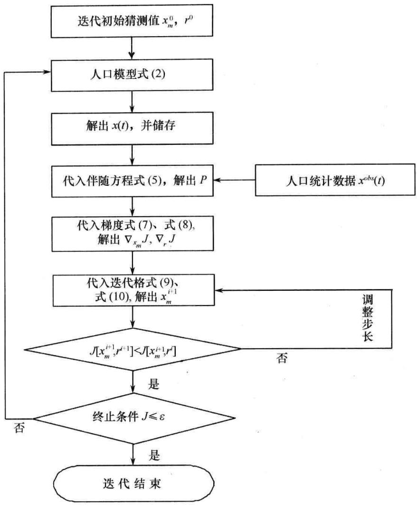

<details>
<summary>flowchart</summary>

```mermaid
graph TD
  A["迭代初始猜测值 xm⁰, r⁰"] --> B["人口模型式 (2)"]
  C["人口统计数据 xobs(t)"] --> D["代入伴随方程式 (5), 解出 P"]
  B --> E["解出 x(t), 并储存"]
  E --> D
  D --> F["代入梯度式 (7)、式 (8), 解出 ∇xmJ, ∇rJ"]
  F --> G["代入迭代格式 (9)、式 (10), 解出 xm^{i+1}"]
  G --> H{"J["x_{m}^{i+1}, r^{i+1}"] < J["x_{m}^{i+1}, r^i"]"}
  H -->|否| G
  H -->|是| I{"终止条件 J ≤ ε"}
  I -->|否| B
  I -->|是| J["迭代结束"]
```
</details>

图 1 整个迭代过程的算法  
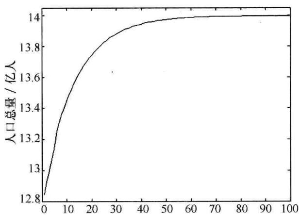

<details>
<summary>line</summary>

| X | 人口总量 / 亿人 |
| --- | --- |
| 0 | ~12.8 |
| 10 | ~13.5 |
| 20 | ~13.75 |
| 30 | ~13.85 |
| 40 | ~13.9 |
| 50 | ~13.95 |
| 60 | ~13.98 |
| 70 | ~13.99 |
| 80 | ~14.0 |
| 90 | ~14.0 |
| 100 | ~14.0 |
</details>

图 2 人口数量随时间的变化趋势

表 2 2001 年—2005 年的预测值与真实值的比较

<table><tr><td>年份</td><td>2001</td><td>2002</td><td>203</td><td>2004</td><td>2005</td></tr><tr><td>真实值/亿人</td><td>12.7627</td><td>12.8453</td><td>12.9227</td><td>12.9988</td><td>13.0756</td></tr><tr><td>预测值/亿人</td><td>12.7891</td><td>12.8778</td><td>12.9606</td><td>13.0377</td><td>13.1094</td></tr><tr><td>误差绝对值/亿人</td><td>0.02645</td><td>0.03259</td><td>0.03793</td><td>0.03891</td><td>0.03384</td></tr></table>

从表 2 中可以看出预测的误差随时间的增加也呈现增大的趋势。

## 4.4 模型的评价

优点:在短期时间内国家的人口政策、综合国力、人口结构是相对稳定的,影响人口增长的关键是环境、资源等自然因素,因此用该模型在短期预测中是比较合理的。用1995年—1999年作为真实值预测的2001年—2005年的人口数的误差在0.04亿以内。

缺点:由于在确定 $x_{m}$ 和 r 时必须要用近期的真实数据进行迭代反演,对长期预测由于偏离真实数据的时间较远,且国家的人口政策变化、综合国力、人口结构变化很大,而模型主要考虑的是自然因素的影响,所以该模型不适合长期预测。表 2 中误差呈现增大的趋势正好说明了这点。

为此为了对人口进行合理的长期预测,必须改用模型。

## 5 人口分组预测模型

## 5.1 模型的分析

人口的数量增长主要受出生率和死亡率的影响,由于生育主要由女性完成,在男女性别比接近1时,女性人口数量的分布在很大程度上反映了总人口的变化趋势,如果能够找出女性人口数增长与时间的关系,利用男女出生时的性别比就可以确定总人口的增长关系。

## 5.2 模型的假设

(1) 不考虑人口的地域城乡差别而导致的生育率的差别。  
(2) 不考虑城乡人口间的流动。  
(3) 男女性别比在长期都为一稳定值。  
(4) 只考虑89年之前的人数的变化。

## 5.3 模型的建立

用 $x_{i}(k)$ 表示第 $i$ 年 $k$ 岁的女性人数，第 $i$ 年 $k$ 岁的女婴生育率为 $b_{i}(k)$ ，存活率为 $s_i(k)$ ，当 $i \geqslant 1$ 时，第 $i$ 年 $k$ 岁的女性人数经过一年后变成 $k + 1$ 岁的人数为

$$
x _ {i + 1} (k + 1) = s _ {i} (k) x _ {i} (k) \tag {14}
$$

从而得

$$
x _ {i + 1} (0) = \sum_ {i = 0} b _ {i} (k) x _ {i} (k) \tag {15}
$$

用矩阵表示上述关系：

$$
\boldsymbol {X} _ {i + 1} = \left( \begin{array}{c c c c c} b _ {i} (0) & b _ {i} (1) & \dots & b _ {i} (8 8) & b _ {i} (8 9) \\ s _ {i} (0) & 0 & \dots & 0 & 0 \\ 0 & s _ {i} (1) & \dots & 0 & 0 \\ \vdots & \vdots & & \vdots & \vdots \\ 0 & 0 & \dots & s _ {i} (8 8) & s _ {i} (8 9) \end{array} \right) \times \boldsymbol {X} _ {i} \tag {16}
$$

其中

$$
\boldsymbol {X} _ {i} = \left(x _ {i} (0) \quad x _ {i} (1) \quad \dots \quad x _ {i} (8 9)\right) ^ {\mathrm{T}} \tag {17}
$$

那么式(16)就是根据前一年的女性人口总数递推下年女性人口总数的递推关系式。附表中并没有给出女婴生育率 $b_{i}(k)$ ，用0岁女婴与男婴的出生性别比与实际生育率的乘积表示。

假设男女性别比为一稳定的值 $\theta$ ，可由附表的数据统计得出，则总人口数量为

$$
P _ {i} = X _ {i} (1 + 1 / \theta) \tag {18}
$$

现在用2001的数据作为样本数据预测2001年后的总的人口值。其算法流程为

(1) 求出女婴生育率 $b_{i}(k)$ 和存活率 $s_{i}(k)$ ;  
(2) 由式(17)求出 $X_{i}$ ;  
(3) 由式(16)求出 $X_{i+1}$ ;  
(4) 统计出男女性别比 $\theta$ ;  
(5) 由式(18)求出总人口数量 $P_{i+1}$ 。

$X_{i+1}$ 即 2002 年女性人口总数。

同理可以求出 2003 年、2004 年……的总人口值。

基于以上的算法带入附表中的数据用 MATLAB 编程分别求得:2002 年至 2050 年的总的人口数见表 3。

表 3 2002 年—2050 年人口数量

<table><tr><td>年份</td><td>2002</td><td>2003</td><td>2004</td><td>2005</td><td>2006</td><td>2007</td></tr><tr><td>总人口</td><td>12.879</td><td>13.068</td><td>13.154</td><td>13.236</td><td>13.314</td><td>13.390</td></tr><tr><td>年份</td><td>2012</td><td>2013</td><td>2014</td><td>2015</td><td>2016</td><td>2017</td></tr><tr><td>总人口</td><td>1.378</td><td>1.385</td><td>1.392</td><td>1.398</td><td>1.403</td><td>1.408</td></tr><tr><td>年份</td><td>2022</td><td>2023</td><td>2024</td><td>2025</td><td>2026</td><td>2027</td></tr><tr><td>总人口</td><td>1.416</td><td>1.415</td><td>1.414</td><td>1.412</td><td>1.410</td><td>1.407</td></tr><tr><td>年份</td><td>2032</td><td>2033</td><td>2034</td><td>2035</td><td>2036</td><td>2037</td></tr><tr><td>总人口</td><td>1.388</td><td>1.384</td><td>1.379</td><td>1.374</td><td>1.368</td><td>1.362</td></tr><tr><td>年份</td><td>2042</td><td>2043</td><td>2044</td><td>2045</td><td>2046</td><td>2047</td></tr><tr><td>总人口</td><td>1.324</td><td>1.315</td><td>1.305</td><td>1.295</td><td>1.285</td><td>1.274</td></tr></table>

根据该模型求得的人口总量的变化如图3所示。

图 3 中的峰值点即是人口达到最大的点,该点对应的时间是 2021 年,最大人口数为

$$
l _ {\mathrm{max}} = 1 4. 6 \mathrm{亿}
$$

如果政府的生育政策不随时间变化,从图3中可以得出如下结论。

(1) 人口总量在 2021 年达到最大值 14.6 亿。  
(2) 人口总量在 2021 年以前是逐年增加的且增加的速率是递减的。  
(3) 人口总量在 2021 年以后是逐年减少的且减少的速率是递减的。

## 5.4 对结论的合理性分析

人类的繁殖类似于自然界生物的繁殖,在环境、自然、资源允许的情况下人口数量是种群自然增长的规律,随着人口数量的变大,环境、自然和资源承受的压力越来越大,因此增长率是递减的,在2021年达到最大值后人口数量下降说明了2021年前在人口增长的过程中人口结构发生了变化,也就是老年人口所占比重增加了,这与附表2给出的信息是一致的。2021年后随着人口的减少,环境、自然、资源的压力也随之减少,那么人口减少的速率也会随之减小。

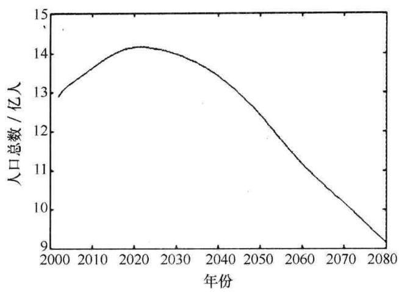

<details>
<summary>line</summary>

| 年份 | 人口总数 (亿人) |
| --- | --- |
| 2000 | ~12.9 |
| 2010 | ~13.6 |
| 2020 | ~14.2 |
| 2030 | ~14.0 |
| 2040 | ~13.5 |
| 2050 | ~12.6 |
| 2060 | ~11.3 |
| 2070 | ~10.3 |
| 2080 | ~9.1 |
</details>

图 3 人口总量的变化

## 5.5 模型的优缺点

模型用分组的方法来预测总人口的数量,在整体上比较合理地预测了未来长期人口增长情况,与模型一相比该模型的长期预测效果较好。

但模型在处理生育率时并没考虑城、镇、乡人口的差异,图4是根据附表所给数据统计出的不同区域的妇女生育率的分布,从图4中可以看出城、镇、乡妇女的生育率的差异是很大的,如果把所有妇女的生育率都同等处理是不符合实际情况的,因此模型还需进一步改进。

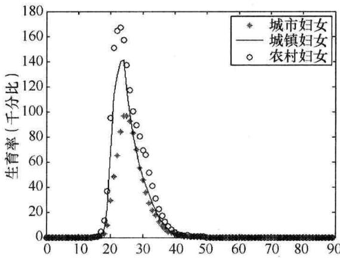

<details>
<summary>scatter</summary>

| Age | 城市妇女 (千分比) | 城镇妇女 (千分比) | 农村妇女 (千分比) |
| --- | --- | --- | --- |
| ~18 | ~5 | ~5 | ~5 |
| ~19 | ~10 | ~10 | ~15 |
| ~20 | ~30 | ~30 | ~35 |
| ~21 | ~45 | ~45 | ~95 |
| ~22 | ~65 | ~65 | ~150 |
| ~23 | ~85 | ~85 | ~165 |
| ~24 | ~95 | ~95 | ~168 |
| ~25 | ~95 | ~95 | ~158 |
| ~26 | ~85 | ~85 | ~138 |
| ~27 | ~70 | ~70 | ~118 |
| ~28 | ~60 | ~60 | ~100 |
| ~29 | ~50 | ~50 | ~90 |
| ~30 | ~40 | ~40 | ~80 |
| ~31 | ~30 | ~30 | ~70 |
| ~32 | ~25 | ~25 | ~60 |
| ~33 | ~20 | ~20 | ~50 |
| ~34 | ~15 | ~15 | ~40 |
| ~35 | ~10 | ~10 | ~30 |
| ~36 | ~8 | ~8 | ~20 |
| ~37 | ~5 | ~5 | ~15 |
| ~38 | ~3 | ~3 | ~10 |
| ~39 | ~2 | ~2 | ~8 |
| ~40~90 | 0~0 | 0~0 | 0~0 |
</details>

图 4 2005 年城乡妇女生育率年龄分布

## 6 政策因子扰动下的改进模型

在上一个模型中将国家对生育政策当成一个不变的因素考虑,这是与实际况不相符的,为了更合理地描述国家政策对人口增长的影响,引入国家政策因子 $\alpha$ 将生育率 $b_{i}(k)$ 变为

$$
b _ {i} (k) ^ {\prime} = \alpha \cdot b _ {i} (k), \alpha \geqslant 1
$$

这样式(16)就变为

$$
\boldsymbol {X} _ {i + 1} = \alpha \cdot \left( \begin{array}{c c c c c} b _ {i} (0) & b _ {i} (1) & \dots & b _ {i} (8 8) & b _ {i} (8 9) \\ s _ {i} (0) & 0 & \dots & 0 & 0 \\ 0 & s _ {i} (1) & \dots & 0 & 0 \\ \vdots & \vdots & & \vdots & \vdots \\ 0 & 0 & \dots & s _ {i} (8 8) & s _ {i} (8 9) \end{array} \right) \cdot \boldsymbol {X} _ {i}
$$

为了探求合适的 $\alpha$ , 不妨将 $\alpha$ 从 1 开始在某个区间取值, 然后根据不同的 $\alpha$ 值求出对应的人口数量预测图, 比较这些人口预测图, 与实际情况最接近的预测图所对应的 $\alpha$ 即为最优的 $\alpha$ 。表 4 是几次探寻结果。

表 4 $\alpha$ 的探寻值

<table><tr><td> $\alpha$ </td><td>1.1</td><td>1.2</td><td>1.25</td><td>1.26</td><td>1.27</td><td>1.28</td><td>1.29</td><td>1.3</td><td>1.4</td></tr><tr><td>峰值</td><td>1.45</td><td>1.49</td><td>1.532</td><td>1.539</td><td>1.547</td><td>1.554</td><td>1.563</td><td>1.572</td><td>1.754</td></tr><tr><td>出现峰值时间</td><td>2023</td><td>2033</td><td>2037</td><td>2038</td><td>2038</td><td>2039</td><td>2040</td><td>2040</td><td>2078</td></tr></table>

作出不同 $\alpha$ 对应的预测图形，如图5所示。

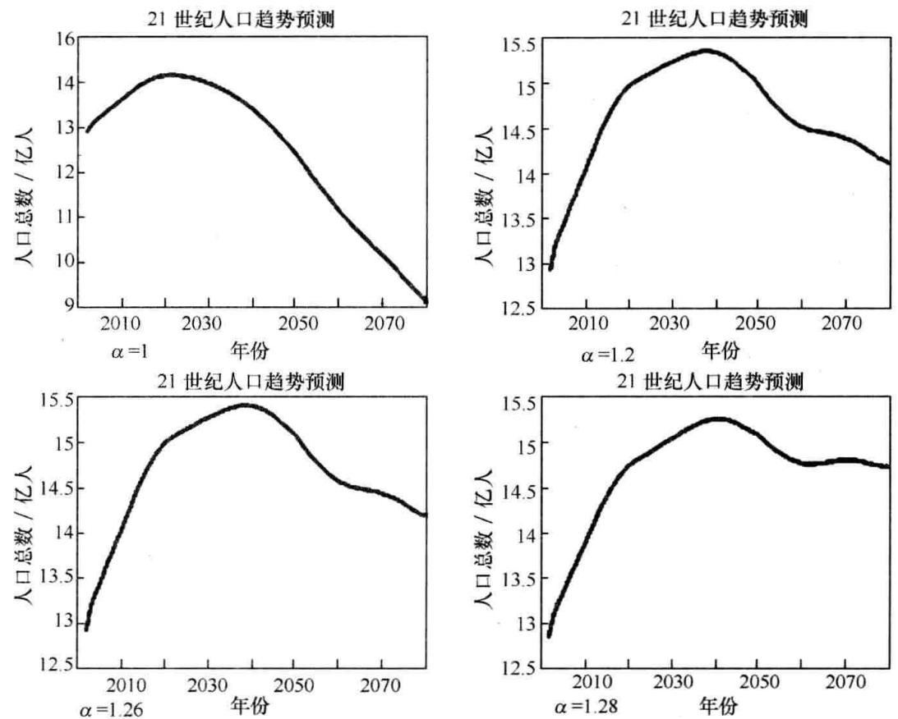  
图5 不同 $\alpha$ 对应的预测图形

从图5可知, $\alpha$ 不同,则人口曲线出现峰值和出现峰值的时间不同,经过计算机作图可知:当 $\alpha>1.3$ 时,曲线将呈现增长趋势,其人口发展形式为增长型,而当 $\alpha<1.3$ 时,为单峰形,当 $\alpha=1.3$ 时为稳定型。从国情看,我国人口发展应属于单峰形(先增后减形)。

故有必要在1.2\~1.3之间找一个 $\alpha$ ，使得我们国家尽早以较小的峰值进入人口衰减期。

从以上分析知 $\alpha$ 的最佳值为 1.26, 此时预测的结果是在 2038 年中国将出现人口高峰, 其值为 15.39 亿。

$\alpha$ 的实际意义:由于国家执行生育政策的不同,必然导致不同的生育率,当 $\alpha$ 的值较大时,表示国家鼓励生育的程度也大。

模型的合理性评价：

当增加 $\alpha$ 后人口的高峰期出现在 2038 年, 这与附表二所给信息一致。从图 5 中还可以知道人口数量保持一个趋于稳定状态, 最终会趋于一个稳定值。

由于 $\alpha$ 是认为调整的一个数, 在后面的模型中都不用它, 如果有必要, 总可以设定适当的 $\alpha$ , 使峰值时间达到比较理想的情况。

## 7 城乡区域差异的改进模型

## 7.1 问题的分析

由于城乡之间的生活水平、医疗卫生水平、政府政策等因素不同,其生育率必然会存在差异,所以应该将城、镇、乡的男性和女性分开进行讨论。

## 7.2 模型的假设

(1) 考虑人口的地域城乡差别造成的生育率的差别。  
(2) 不考虑城乡人口在城乡之间的流动。

## 7.3 模型的建立求解

如前面的分析,将人口分成六类进行预测:城市男性数量、城市女性数量、农村男性数量、农村女性数量、城市男性数量和城市女性数量。由于讨论城市男性数量、城市女性数量的方法和讨论农村男、农村女的方法相同。只要解决城市男女人口数的预测问题,农村男和农村女采用同样的方法可以求得预测值。

对于城市女性人口的预测和第二个模型中采用预测女性人口的方法完全相同。下面主要讨论如何对城市男性人口数量进行预测。

与第二个模型预测女性人口的方法类似,可以利用存活率来讨论男性人口的增长情况。

由于男性是不能生育小孩的,所以在这里取男性的生小孩的生育率为0,也就是 $b_{i}$ $(k)=0$ 。

用 $P_{i}$ 表示第 $i$ 年的男性数量，其迭代表达式为

$$
\boldsymbol {P} _ {i + 1} = \left( \begin{array}{c c c c c} 0 & 0 & \dots & 0 & 0 \\ s _ {i} (0) & 0 & \dots & 0 & 0 \\ 0 & s _ {i} (1) & \dots & 0 & 0 \\ \vdots & \vdots & & \vdots & \vdots \\ 0 & 0 & \dots & s _ {i} (8 8) & s _ {i} (8 9) \end{array} \right) \cdot \boldsymbol {P} _ {i}
$$

$$
+ \left( \begin{array}{c c c c c} b _ {i} (0) & b _ {i} (1) & \dots & b _ {i} (8 8) & b _ {i} (8 9) \\ 0 & 0 & \dots & 0 & 0 \\ 0 & 0 & \dots & 0 & 0 \\ \vdots & \vdots & & \vdots & \vdots \\ 0 & 0 & \dots & 0 & 0 \end{array} \right) \cdot \frac {\lambda_ {0}}{1 0 0}
$$

其中等式的第一项表示一年后第 i 年转移到第 $i+1$ 年的男性人口数, 第二项表示第 $i+1$ 年新出生的男性儿数。 $\frac{\lambda_{0}}{100}$ 表示男女婴儿的性别比。

利用该迭代公式进行预测,其算法流程和模型二中预测女性人口的算法流程相同。

用该模型求得城市男、城市女、农村男、农村女的人口预测结果,如图6所示,见表5\~表7。

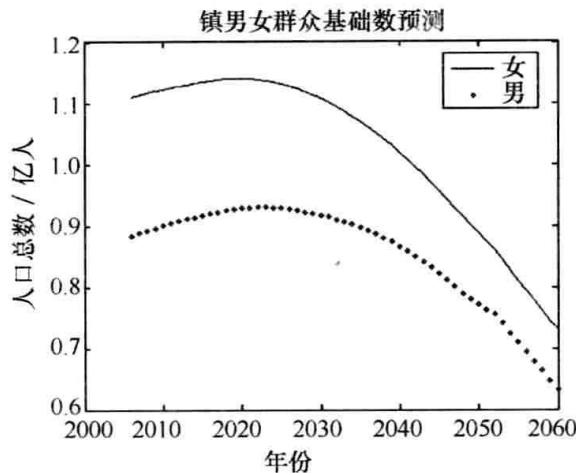

<details>
<summary>line</summary>

| 年份 | 女 (亿人) | 男 (亿人) |
| --- | --- | --- |
| 2005 | ~1.11 | ~0.88 |
| 2010 | ~1.13 | ~0.90 |
| 2015 | ~1.14 | ~0.92 |
| 2020 | ~1.14 | ~0.93 |
| 2025 | ~1.13 | ~0.93 |
| 2030 | ~1.11 | ~0.92 |
| 2035 | ~1.07 | ~0.90 |
| 2040 | ~1.02 | ~0.87 |
| 2045 | ~0.95 | ~0.82 |
| 2050 | ~0.87 | ~0.76 |
| 2055 | ~0.78 | ~0.69 |
| 2060 | ~0.73 | ~0.64 |
</details>

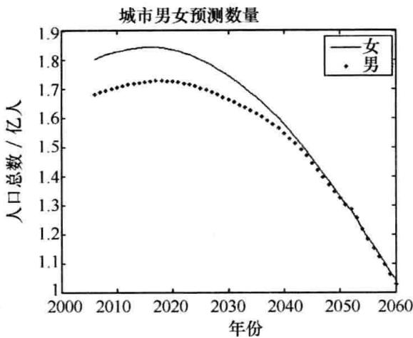

<details>
<summary>line</summary>

| 年份 | 女 (亿人) | 男 (亿人) |
| --- | --- | --- |
| 2005 | ~1.81 | ~1.68 |
| 2010 | ~1.84 | ~1.70 |
| 2015 | ~1.85 | ~1.72 |
| 2020 | ~1.84 | ~1.73 |
| 2025 | ~1.81 | ~1.71 |
| 2030 | ~1.76 | ~1.67 |
| 2035 | ~1.69 | ~1.61 |
| 2040 | ~1.59 | ~1.53 |
| 2045 | ~1.46 | ~1.43 |
| 2050 | ~1.32 | ~1.31 |
| 2055 | ~1.16 | ~1.15 |
| 2060 | ~1.03 | ~1.03 |
</details>

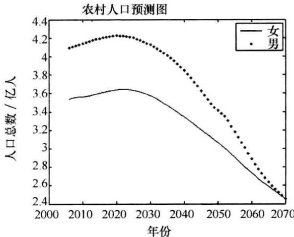

<details>
<summary>line</summary>

| 年份 | 男 (亿人) | 女 (亿人) |
| --- | --- | --- |
| 2005 | ~4.1 | ~3.55 |
| 2010 | ~4.15 | ~3.58 |
| 2015 | ~4.2 | ~3.6 |
| 2020 | ~4.25 | ~3.65 |
| 2025 | ~4.25 | ~3.65 |
| 2030 | ~4.2 | ~3.6 |
| 2035 | ~4.1 | ~3.5 |
| 2040 | ~3.95 | ~3.35 |
| 2045 | ~3.75 | ~3.2 |
| 2050 | ~3.5 | ~3.05 |
| 2055 | ~3.25 | ~2.9 |
| 2060 | ~2.95 | ~2.7 |
| 2065 | ~2.65 | ~2.55 |
| 2070 | ~2.4 | ~2.4 |
</details>

图 6 人口预测结果

表 5 城市男性人口数量预测

<table><tr><td>年份</td><td>2006</td><td>2007</td><td>2008</td><td>2009</td><td>2010</td><td>2011</td><td>2012</td><td>2013</td><td>2014</td></tr><tr><td>男</td><td> $1.81 \times 10^{8}$ </td><td> $1.82 \times 10^{8}$ </td><td> $1.83 \times 10^{8}$ </td><td> $1.83 \times 10^{8}$ </td><td> $1.84 \times 10^{8}$ </td><td> $1.84 \times 10^{8}$ </td><td> $1.85 \times 10^{8}$ </td><td> $1.85 \times 10^{8}$ </td><td> $1.85 \times 10^{8}$ </td></tr><tr><td>年份</td><td>2015</td><td>2016</td><td>2017</td><td>2018</td><td>2019</td><td>2020</td><td>2021</td><td>2022</td><td>2023</td></tr><tr><td>男</td><td> $1.86 \times 10^{8}$ </td><td> $1.86 \times 10^{8}$ </td><td> $1.86 \times 10^{8}$ </td><td> $1.86 \times 10^{8}$ </td><td> $1.86 \times 10^{8}$ </td><td> $1.85 \times 10^{8}$ </td><td> $1.85 \times 10^{8}$ </td><td> $1.85 \times 10^{8}$ </td><td> $1.84 \times 10^{8}$ </td></tr><tr><td>年份</td><td>2024</td><td>2025</td><td>2026</td><td>2027</td><td>2028</td><td>2029</td><td>2030</td><td>2031</td><td>2032</td></tr><tr><td>男</td><td> $1.83 \times 10^{8}$ </td><td> $1.83 \times 10^{8}$ </td><td> $1.82 \times 10^{8}$ </td><td> $1.81 \times 10^{8}$ </td><td> $1.8 \times 10^{8}$ </td><td> $1.79 \times 10^{8}$ </td><td> $1.78 \times 10^{8}$ </td><td> $1.77 \times 10^{8}$ </td><td> $1.76 \times 10^{8}$ </td></tr><tr><td>年份</td><td>2033</td><td>2034</td><td>2035</td><td>2036</td><td>2037</td><td>2038</td><td>2039</td><td>2040</td><td>2041</td></tr><tr><td>男</td><td> $1.75 \times 10^{8}$ </td><td> $1.74 \times 10^{8}$ </td><td> $1.73 \times 10^{8}$ </td><td> $1.72 \times 10^{8}$ </td><td> $1.7 \times 10^{8}$ </td><td> $1.69 \times 10^{8}$ </td><td> $1.67 \times 10^{8}$ </td><td> $1.66 \times 10^{8}$ </td><td> $1.64 \times 10^{8}$ </td></tr><tr><td>年份</td><td>2042</td><td>2043</td><td>2044</td><td>2045</td><td>2046</td><td>2047</td><td>2048</td><td>2049</td><td>2050</td></tr><tr><td>男</td><td> $1.62 \times 10^{8}$ </td><td> $1.59 \times 10^{8}$ </td><td> $1.57 \times 10^{8}$ </td><td> $1.54 \times 10^{8}$ </td><td> $1.52 \times 10^{8}$ </td><td> $1.49 \times 10^{8}$ </td><td> $1.46 \times 10^{8}$ </td><td> $1.44 \times 10^{8}$ </td><td> $1.42 \times 10^{8}$ </td></tr></table>

表 6 乡村男性人口数量预测

<table><tr><td>年份</td><td>2006</td><td>2007</td><td>2008</td><td>2009</td><td>2010</td><td>2011</td><td>2012</td><td>2013</td><td>2014</td><td>2015</td></tr><tr><td>男</td><td> $4.09 \times 10^{8}$ </td><td> $4.11 \times 10^{8}$ </td><td> $4.12 \times 10^{8}$ </td><td> $4.13 \times 10^{8}$ </td><td> $4.14 \times 10^{8}$ </td><td> $4.15 \times 10^{8}$ </td><td> $4.16 \times 10^{8}$ </td><td> $4.17 \times 10^{8}$ </td><td> $4.18 \times 10^{8}$ </td><td> $4.19 \times 10^{8}$ </td></tr><tr><td>年代</td><td>2016</td><td>2017</td><td>2018</td><td>2019</td><td>2020</td><td>2021</td><td>2022</td><td>2023</td><td>2024</td><td>2025</td></tr><tr><td>男</td><td> $4.2 \times 10^{8}$ </td><td> $4.21 \times 10^{8}$ </td><td> $4.22 \times 10^{8}$ </td><td> $4.22 \times 10^{8}$ </td><td> $4.23 \times 10^{8}$ </td><td> $4.22 \times 10^{8}$ </td><td> $4.22 \times 10^{8}$ </td><td> $4.22 \times 10^{8}$ </td><td> $4.21 \times 10^{8}$ </td><td> $4.2 \times 10^{8}$ </td></tr><tr><td>年代</td><td>2026</td><td>2027</td><td>2028</td><td>2029</td><td>2030</td><td>2031</td><td>2032</td><td>2033</td><td>2034</td><td>2035</td></tr><tr><td>男</td><td> $4.19 \times 10^{8}$ </td><td> $4.18 \times 10^{8}$ </td><td> $4.16 \times 10^{8}$ </td><td> $4.14 \times 10^{8}$ </td><td> $4.13 \times 10^{8}$ </td><td> $4.1 \times 10^{8}$ </td><td> $4.08 \times 10^{8}$ </td><td> $4.06 \times 10^{8}$ </td><td> $4.04 \times 10^{8}$ </td><td> $4.01 \times 10^{8}$ </td></tr><tr><td>年代</td><td>2036</td><td>2037</td><td>2038</td><td>2039</td><td>2040</td><td>2041</td><td>2042</td><td>2043</td><td>2044</td><td>2045</td></tr><tr><td>男</td><td> $3.98 \times 10^{8}$ </td><td> $3.95 \times 10^{8}$ </td><td> $3.92 \times 10^{8}$ </td><td> $3.89 \times 10^{8}$ </td><td> $3.85 \times 10^{8}$ </td><td> $3.81 \times 10^{8}$ </td><td> $3.77 \times 10^{8}$ </td><td> $3.72 \times 10^{8}$ </td><td> $3.68 \times 10^{8}$ </td><td> $3.63 \times 10^{8}$ </td></tr><tr><td>年代</td><td>2046</td><td>2047</td><td>2048</td><td>2049</td><td>2050</td><td></td><td></td><td></td><td></td><td></td></tr><tr><td>男</td><td> $3.58 \times 10^{8}$ </td><td> $3.53 \times 10^{8}$ </td><td> $3.49 \times 10^{8}$ </td><td> $3.44 \times 10^{8}$ </td><td> $3.41 \times 10^{8}$ </td><td></td><td></td><td></td><td></td><td></td></tr></table>

表 7 城镇男性人口数量预测

<table><tr><td>年份</td><td>2006</td><td>2007</td><td>2008</td><td>2009</td><td>2010</td><td>2011</td><td>2012</td><td>2013</td><td>2014</td></tr><tr><td>男</td><td> $8.8 \times 10^{7}$ </td><td> $8.9 \times 10^{7}$ </td><td> $8.9 \times 10^{7}$ </td><td> $9 \times 10^{7}$ </td><td> $9 \times 10^{7}$ </td><td> $9 \times 10^{7}$ </td><td> $9.1 \times 10^{7}$ </td><td> $9.1 \times 10^{7}$ </td><td> $9.1 \times 10^{7}$ </td></tr><tr><td>年份</td><td>2015</td><td>2016</td><td>2017</td><td>2018</td><td>2019</td><td>2020</td><td>2021</td><td>2022</td><td>2023</td></tr><tr><td>男</td><td> $9.2 \times 10^{7}$ </td><td> $9.2 \times 10^{7}$ </td><td> $9.2 \times 10^{7}$ </td><td> $9.3 \times 10^{7}$ </td><td> $9.3 \times 10^{7}$ </td><td> $9.3 \times 10^{7}$ </td><td> $9.3 \times 10^{7}$ </td><td> $9.3 \times 10^{7}$ </td><td> $9.3 \times 10^{7}$ </td></tr><tr><td>年份</td><td>2024</td><td>2025</td><td>2026</td><td>2027</td><td>2028</td><td>2029</td><td>2030</td><td>2031</td><td>2032</td></tr><tr><td>男</td><td> $9.3 \times 10^{7}$ </td><td> $9.3 \times 10^{7}$ </td><td> $9.3 \times 10^{7}$ </td><td> $9.2 \times 10^{7}$ </td><td> $9.2 \times 10^{7}$ </td><td> $9.2 \times 10^{7}$ </td><td> $9.2 \times 10^{7}$ </td><td> $9.1 \times 10^{7}$ </td><td> $9.1 \times 10^{7}$ </td></tr><tr><td>年份</td><td>2033</td><td>2034</td><td>2035</td><td>2036</td><td>2037</td><td>2038</td><td>2039</td><td>2040</td><td>2041</td></tr><tr><td>男</td><td> $9.1 \times 10^{7}$ </td><td> $9 \times 10^{7}$ </td><td> $9 \times 10^{7}$ </td><td> $8.9 \times 10^{7}$ </td><td> $8.9 \times 10^{7}$ </td><td> $8.8 \times 10^{7}$ </td><td> $8.7 \times 10^{7}$ </td><td> $8.7 \times 10^{7}$ </td><td> $8.6 \times 10^{7}$ </td></tr><tr><td>年份</td><td>2042</td><td>2043</td><td>2044</td><td>2045</td><td>2046</td><td>2047</td><td>2048</td><td>2049</td><td>2050</td></tr><tr><td>男</td><td> $8.5 \times 10^{7}$ </td><td> $8.4 \times 10^{7}$ </td><td> $8.3 \times 10^{7}$ </td><td> $8.2 \times 10^{7}$ </td><td> $8.1 \times 10^{7}$ </td><td> $8 \times 10^{7}$ </td><td> $7.9 \times 10^{7}$ </td><td> $7.8 \times 10^{7}$ </td><td> $7.7 \times 10^{7}$ </td></tr></table>

从以上的分析知道,随着时间的增加,农村、镇、市男女人数之差会逐年减少,最终男性人口和女性人口达相同的水平,并且男女人数总和是先增加后减少的,这与附表所给出的信息是相吻合的。

既然六个部分各自的预测都已知了,那么对人口总体上的预测即为六部分之和。

基于以上分析,最终求得人口数量与时间的关系,如图7所示。

从图7可以得出如下结论。

(1) 该图的最大值比前一个模型的最大值小。  
(2) 改图出现的最大值的时间比上一个模型提前了。

由此说明考虑人口城乡差异后,峰值提前了,而最大人口数也减小了。

此模型的优缺点：

该模型是在前一个模型的基础上作的改进,通过改进前和改进后人口预测图的比较,

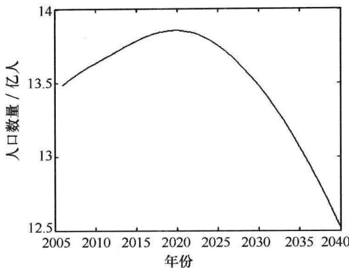

<details>
<summary>line</summary>

| 年份 | 人口数量 (亿人) |
| --- | --- |
| 2005 | ~13.48 |
| 2010 | ~13.65 |
| 2015 | ~13.78 |
| 2020 | ~13.85 |
| 2025 | ~13.75 |
| 2030 | ~13.50 |
| 2035 | ~13.10 |
| 2040 | ~12.50 |
</details>

图 7 人口数量与时间的关系

容易得知城乡区域对人口增长的影响也是很大的。

但是该模型没有考虑到城乡间人口的流动问题,这与实际生活是很不相符的,所以还要将模型进行改进。

## 8 人口流动制约时进一步的改进模型

## 8.1 问题的分析

在上一个模型中没有考虑城乡之间的人口流动对生育率造成的影响,但在事实上城、镇、乡的不同,其生活水平、思想观念、生育政策都会存在差异,必然导致不同的生育率,因此在处理生育率时将城、镇、乡分开考虑,要比把三者的出生率不加区分地处理更合理,这样在上一个模型的基础上,对城、镇、乡的人口分别进行处理。同时由于城乡人口存在流动,所以在求解生育率时应考虑到该因素的影响。

## 8.2 模型的假设

(1) 考虑人口的地域城乡差别而导致的生育率的差别。  
(2) 考虑人口流动的影响,且只考虑乡村向镇、乡村向城市的转移。  
(3) 乡、镇、城每年男女比例为一稳定值。

## 8.3 模型的求解

仍然基于第二个模型的算法,那么问题的关键就是怎么来处理人口的流动。

从实际角度来看,人口的流动主要是乡村人口向城、镇流动,为了便于说明,以2002年为例,2002年一岁的男性人口,一部分是由2001年0岁的男性人口除去死亡的人口后产生的,另一部分就是农村转移过来的,按照这个思想就可以算出2002年城市一岁男性人口的迁入量。依次类推,就可以计算出2002年男性各个年龄的迁入量,同理按照该方法也可以计算出2002年镇男性各个年龄的迁入量,并不把这两个迁入量作为城和镇一岁男性的迁入量。因为这样确定的迁入量不稳定,接着考虑2002年城市一岁男性人口的迁入量与2002年镇一岁男性人口的迁入量之比,把这个比作为2002年一岁人口分别在城市和镇中迁出量的分配比,而2002年一岁农村人口迁出的总量是稳定的,由这个稳定的迁出总量和这个量在城市和镇中的分配比,就可以算出城市2002年一岁男性人口的迁入量和2002年镇一岁男性人口的迁入量。

同样道理可以求出2001年—2005年各个年龄的迁入量。各个年龄的迁入量求得后，假定每个年龄的迁入量是一个定值，那么对于女人来讲，就可按模型二中的式(16)来计算人口值，假定第 $i$ 年 $k$ 岁的迁入量为 $c_{k}$ ，则由式(16)就可以转化为

$$
\boldsymbol {X} _ {i + 1} = \left( \begin{array}{c c c c c} b _ {i} (0) & b _ {i} (1) & \dots & b _ {i} (8 8) & b _ {i} (8 9) \\ s _ {i} (0) & 0 & \dots & 0 & 0 \\ 0 & s _ {i} (1) & \dots & 0 & 0 \\ \vdots & \vdots & & \vdots & \vdots \\ 0 & 0 & \dots & s _ {i} (8 8) & s _ {i} (8 9) \end{array} \right) \times (X _ {i} + c _ {k})
$$

由该公式求得对未来人口数量的预测图,如图8所示。

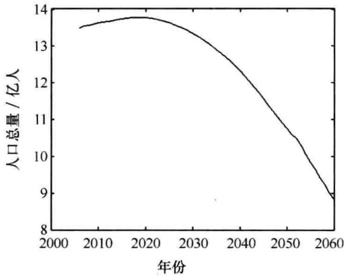

<details>
<summary>line</summary>

| 年份 | 人口总量 (亿人) |
| --- | --- |
| 2005 | ~13.5 |
| 2010 | ~13.7 |
| 2020 | ~13.8 |
| 2030 | ~13.4 |
| 2040 | ~12.4 |
| 2050 | ~10.9 |
| 2060 | ~8.9 |
</details>

图 8 未来人口的预测图

由图 8 知在 2019 年人口达到 13.65 亿, 同第三个模型的做法, 可以引入适当的 $\alpha$ 后, 使峰值时间调整在 2033 年, 人口达到 14 亿。

模型的比较分析：

该模型在前一个模型的基础上,多考虑了一个影响因子,人口迁徙后,从图中可以看到预测曲线的峰值点提前了,而最大人口数量减小了。也就是说预测曲线向下、向前移动了。

## 9 在人口老龄化影响下的人口预测模型

定义60岁以上老年人口占人口总量的比例为全国人口的老龄化程度。可求得我国60岁以上老年人口为 $\sum_{i=60}x_i(k)$ ，根据第二个模型，可得

$$
\omega (t) = \frac {\sum_ {n = 6 0} ^ {m} x _ {n} (t)}{R (t)} \tag {19}
$$

其中

$$
R (t) = x _ {0} (t) + x _ {1} (t) + x ^ {\prime} (t)
$$

根据附录一的数据中 2001 年人口分布数据, 利用模型二, 分别预测 2002 年到 2040 年城、镇、乡的人口数, 然后利用他们在总人口占有的比例, 求得各年总人口数和老龄比。其结果见表 8(其余年份见附表 1)。

表 8 预测各年人口总数(千万)和老龄比

<table><tr><td>年份</td><td>2002</td><td>2003</td><td>2004</td><td>2005</td><td>2006</td><td>2007</td><td>2008</td><td>2009</td><td>2010</td><td>2011</td><td>2012</td></tr><tr><td>老龄比</td><td>0.1057</td><td>0.1080</td><td>0.1104</td><td>0.1129</td><td>0.1155</td><td>0.1184</td><td>0.1219</td><td>0.1251</td><td>0.1294</td><td>0.1339</td><td>0.13861</td></tr><tr><td>总人口</td><td>128.14</td><td>128.68</td><td>129.16</td><td>129.61</td><td>130.03</td><td>130.46</td><td>130.89</td><td>131.36</td><td>131.83</td><td>132.32</td><td>132.81</td></tr></table>

通过表 8 可得出预测的人口总数和老龄比随时间变化规律,如图 9、图 10 所示。

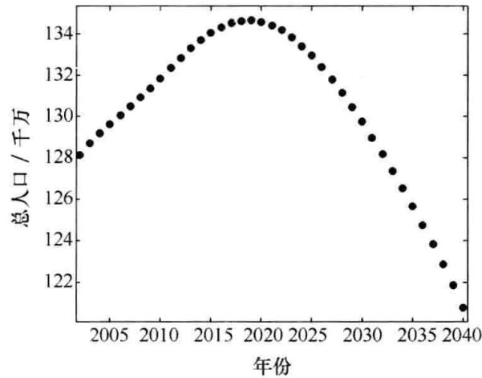

<details>
<summary>scatter</summary>

| 年份 | 总人口 (千万) |
| --- | --- |
| 2003 | ~128.0 |
| 2004 | ~128.6 |
| 2005 | ~129.1 |
| 2006 | ~129.6 |
| 2007 | ~130.1 |
| 2008 | ~130.6 |
| 2009 | ~131.1 |
| 2010 | ~131.6 |
| 2011 | ~132.2 |
| 2012 | ~132.7 |
| 2013 | ~133.2 |
| 2014 | ~133.7 |
| 2015 | ~134.1 |
| 2016 | ~134.4 |
| 2017 | ~134.6 |
| 2018 | ~134.7 |
| 2019 | ~134.7 |
| 2020 | ~134.6 |
| 2021 | ~134.4 |
| 2022 | ~134.2 |
| 2023 | ~133.9 |
| 2024 | ~133.5 |
| 2025 | ~133.0 |
| 2026 | ~132.5 |
| 2027 | ~131.9 |
| 2028 | ~131.3 |
| 2029 | ~130.6 |
| 2030 | ~129.8 |
| 2031 | ~129.0 |
| 2032 | ~128.2 |
| 2033 | ~127.4 |
| 2034 | ~126.5 |
| 2035 | ~125.7 |
| 2036 | ~124.7 |
| 2037 | ~123.8 |
| 2038 | ~122.8 |
| 2039 | ~121.9 |
| 2040 | ~120.8 |
</details>

图 9 预测的人口总数随年份变化规律

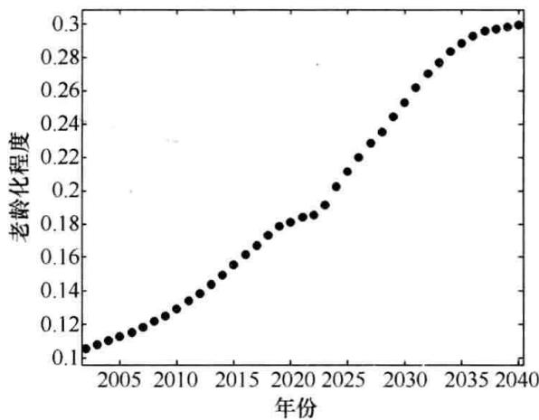

<details>
<summary>line</summary>

| 年份 | 老龄化程度 |
| --- | --- |
| 2003 | ~0.105 |
| 2004 | ~0.108 |
| 2005 | ~0.110 |
| 2006 | ~0.112 |
| 2007 | ~0.115 |
| 2008 | ~0.118 |
| 2009 | ~0.122 |
| 2010 | ~0.125 |
| 2011 | ~0.128 |
| 2012 | ~0.132 |
| 2013 | ~0.136 |
| 2014 | ~0.140 |
| 2015 | ~0.145 |
| 2016 | ~0.150 |
| 2017 | ~0.155 |
| 2018 | ~0.162 |
| 2019 | ~0.168 |
| 2020 | ~0.175 |
| 2021 | ~0.180 |
| 2022 | ~0.182 |
| 2023 | ~0.184 |
| 2024 | ~0.192 |
| 2025 | ~0.203 |
| 2026 | ~0.213 |
| 2027 | ~0.221 |
| 2028 | ~0.230 |
| 2029 | ~0.238 |
| 2030 | ~0.245 |
| 2031 | ~0.253 |
| 2032 | ~0.263 |
| 2033 | ~0.271 |
| 2034 | ~0.279 |
| 2035 | ~0.286 |
| 2036 | ~0.291 |
| 2037 | ~0.295 |
| 2038 | ~0.297 |
| 2039 | ~0.298 |
| 2040 | ~0.300 |
</details>

图 10 预测的老龄比随年份变化规律

通过观察以上表和图,可得出下面的结论:

全国人口总数逐渐增长,在2018年达到峰值13.4397亿。同第三个模型的做法,可以引入适当的 $\alpha$ 后,使峰值时间调整在2030年,人口达到13.8亿。

老龄比逐渐增长,在2040年达到29.9425%。

## 10 中国人口问题的几点建议

全面建设小康社会是21世纪我党提出的宏伟目标,但我国人口发展却面临着严峻的挑战。解决人口问题要从我国的实际情况出发,解放思想,实事求是,与时俱进,继承和创新中国特色人口理论,确立科学的人口发展观。

## 1. 深入开展计划生育,稳定低生育水平

计划生育作为一项基本国策需要长期坚持,随着时代发展和社会进步,现行人口政策也要根据实际情况进行调整。控制人口数量,提高人口素质,提倡晚婚晚育,少生优生,进一步稳定低生育水平,为实现国家人口总体战略目标打下坚实的基础。

## 2. 进一步提高人口素质

树立人才兴国的战略思想,全面提高人口素质,提高国民的受教育水平和程度,提高国民的身体素质、科学文化素质和思想道德素质,在国家改革发展进程中,贯彻优先投资于人的全面发展的战略理念,建设学习型社会。

## 3. 解决性别比例失调问题

建立健全促进男女平等的法律法规,转变传统的男女观念,深入开展关爱女孩行动,对农村实行计划生育的独生子女和双女家庭提供一次性职业培训补贴。此外还要保护妇女儿童的合法权益,限制非医学需要的胎儿性别鉴定,将综合治理出生性别比偏高的成效纳入政府目标责任考核中。

## 4. 积极应对人口老龄化问题

老龄化问题近几年日益突出,需要正确理解和妥善解决。完善城乡居民的社会养老保障体系,探索建立新型农村养老保障制度和低保制度,加快养老服务设施建设,保障老年人的合法权益,强化社区老龄人口服务功能,创建积极老龄社会,促进老年健康。

## 5. 统筹城乡和区域协调发展

城镇化进程加快,大规模的人口流动和迁移,要求统筹区域和城乡的人口发展,引导人口有序迁移和合理分布。要深入研究人口流动与迁移问题,把人口分布与生产力分布有机结合,人口发展与经济社会发展有机结合,实现人口资源在城乡之间和区域之间的合理配置。

## 6. 加强国家对人口事业的领导力度

国家要加快建立和完善人口发展宏观调控体系,推进人口发展问题的综合治理,统筹协调各方面因素,加强人口发展问题的战略研究。要进一步改革行政管理体系,加快推进政府职能转变,完善党政一把手人口问题的责任制度。

## 7. 其他方面

人口发展有很多影响因素,像进一步改进医疗卫生条件,扩大社会福利;加强人口发展领域的国际交流与合作,学习和借鉴人口发展的先进经验;加大国家宏观调控力度,切实加强政府对人口发展事业的领导。

总之,人口发展战略是全社会的共同事业,人口问题一直制约着我国国民经济的发展,要调动一切可以调动的因素进行解决。

## 参考文献

[1] 姜启源. 数学模型. 北京: 高等教育出版社, 1993.  
[2] 张瑰, 张梅. 人口模型变分同化方法的理论分析. 大学数学, 2004, 20(5):30-33.

## 【论文点评】

张瑰

对问题的分析理解透彻,对数据的运用处理合理。论文的撰写层次清晰,由浅入深分别建立了几个不同的模型对人口进行短期以及长期预测。模型假设合理,图表清晰,结合大量的数值计算结果进行说明,结果可信。特别是采用变分同化方法对参数进行反演,得到的结果比较精确。

论文首先利用变分同化方法对人口阻滞增长模型中的最大人口容量 $x_{m}$ 和固有增长率 r 进行反演, 在此基础上对未来人口进行分析短期预测。为了对人口进行长期预测, 提出了人口分组预测模型,首先在不考虑人口城乡差异、人口流动等因素的影响时用该模型对人口进行了长期预测。随后,在考虑城乡人口生育率差异的情况下对模型进行改进。为了使模型结果更符合实际数据,引入政策因子对模型进行优化。进而考虑城乡区域差异,对模型进行改进。最后考虑老年化对人口增长的影响,对未来人口进行预测。

不足之处:所建立的模型相对简单单一,没有综合考虑我国近年来人口发展的总趋势;另外,运用所给数据对模型的检验分析不够。

## 2008年A题 数码相机定位

数码相机定位在交通监管(电子警察)等方面有广泛的应用。所谓数码相机定位是指用数码相机摄制物体的相片确定物体表面某些特征点的位置。最常用的定位方法是双目定位,即用两部相机来定位。对物体上一个特征点,用两部固定于不同位置的相机摄得物体的像,分别获得该点在两部相机像平面上的坐标。只要知道两部相机精确的相对位置,就可以用几何的方法得到该特征点在固定一部相机的坐标系中的坐标,即确定了特征点的位置。于是对双目定位,精确地确定两部相机的相对位置就是关键,这一过程称为系统标定。

标定的一种做法是:在一块平板上画若干个点,同时用这两部相机照相,分别得到这些点在它们像平面上的像点,利用这两组像点的几何关系就可以得到这两部相机的相对位置。然而,无论在物平面或像平面上都无法直接得到没有几何尺寸的“点”。实际的做法是在物平面上画若干个圆(称为靶标),它们的圆心就是几何的点了。而它们的像一般会变形,如图1所示,所以必须从靶标上的这些圆的像中把圆心的像精确地找到,标定就可实现。

有人设计靶标如下,取1个边长为100mm的正方形,分别以四个顶点(对应为A、C、D、E)为圆心,12mm为半径作圆。以AC边上距离A点30mm处的B为圆心,12mm为半径作圆,如图2所示。

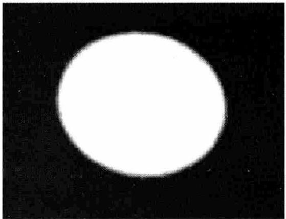

<details>
<summary>natural_image</summary>

A white circular shape centered on a black background with no text or symbols.
</details>

图 1 靶标上圆的像

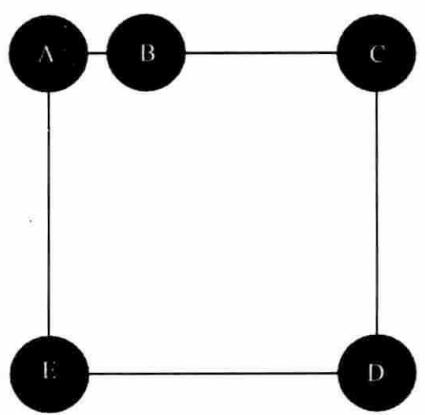

<details>
<summary>flowchart</summary>

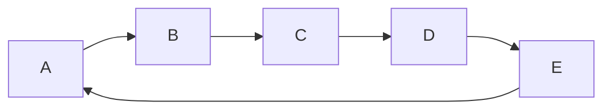
```mermaid
graph LR
  A["A"] --> B["B"]
  B["B"] --> C["C"]
  C["C"] --> D["D"]
  D["D"] --> E["E"]
  E["E"] --> A
```
</details>

图 2 靶标示意图

用一位置固定的数码相机摄得其像,如图3所示。

要求：

（1）建立数学模型和算法以确定靶标上圆的圆心在该相机像平面的像坐标，这里坐标系原点取在该相机的焦点，x-y平面平行于像平面。  
(2) 对由图 2、图 3 分别给出的靶标及其像, 计算靶标上圆的圆心在像平面上的像坐标, 该相机的像距 (即焦点到像平面的距离) 是 1577 个像素单位 (1mm 约为 3.78 个像素

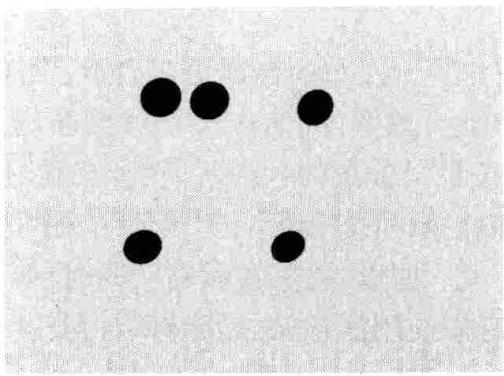

<details>
<summary>natural_image</summary>

Abstract pattern of black dots on a light background (no text or symbols)
</details>

图 3 靶标的像

单位), 相机分辨率为 $1024 \times 786$ 。

(3) 设计一种方法检验你们的模型,并对方法的精度和稳定性进行讨论。  
(4) 建立用此靶标给出两部固定相机相对位置的数学模型和方法。

## 【试题评析】

姚奎

本题具有极强的应用性。通过成功地完成这道题目,使得参赛队员找到了自信和学以致用的价值观念。该问题其实是一个物理与几何图像处理的问题,可用网上现有的电子图书和一些研究性的学术论文作为参考资料,再结合问题本身进行分析,即可以进行模型建立和求解工作。

## 【问题解答要点】

首先,靶标上圆的像是椭圆,但是圆心的像一般不是椭圆的形心。对给定的坐标系,由相片可获取靶标圆的像的边界坐标数据,根据这些边界点的原像落在靶标平面且落在对应圆周上的性质,利用光学成像原理可建立确定靶标平面方程和靶标圆的圆心坐标的非线性方程组数学模型,进而求得靶标圆心像的坐标。模型求解可直接求解非线性方程组,也可化为优化问题求解。由于在某些情形模型可能有多解,化为优化问题后,目标函数有可能为多峰,在求解时应加以注意。以模型的合理性和优劣作为主要评价标准,不要以数值结果好坏作为评价的唯一标准。

其次,模型检验是数学建模的一个重要环节,但以往重视不够。对本问题,应对于靶标平面具有已知特殊倾角的情形,分别对有无误差的情形逆向设计数据,即在靶标平面方程和圆方程已知的情况下,根据光学成像原理,计算获得圆周像的各点坐标和圆心像的坐标。利用圆周像的各点坐标数据(并加上随机误差)用建立的模型和方法,计算出圆心的像坐标,并与通过光学成像原理计算所得的圆心像坐标进行比较,检验模型与方法的有效性与稳定性。精度是一个复杂的问题,发挥自己的想象力加以研究。

再次,对两部相机各自取固定在其上的坐标系,决定它们相对位置即确定这两个坐标系之间的变换关系。此变换可分解为一个平移和一个绕原点的旋转。于是要确定一个三维平移向量 t 和一个旋转变换矩阵 R,R 是一个正交阵,因此需要确定 6 个未知的参数。从靶标上若干个圆的圆心的像坐标可以得到它们分别在两个相机坐标系中的坐标。根据这些点的坐标变换关系,可得一个方程组,足以确定 6 个未知参数,从而确定变换关系。

值得一提的是,除了模型本身之外,如何有序地把文章组织起来,成文漂亮,应该是努

力的方向。

最后,按照竞赛组委会在竞赛中发布的错误更正启示,关于最早公布的题中存在的个别错误之处的说明:按照题中所给图像,同学应该能够判断出相机分辨率是 $1024 \times 768$ ,而不是 $1024 \times 786$ ;如果同学按最早公布的题中所说的像距就是焦点(正确的说法应该是光心)到像平面的距离建模和计算,可能会影响到数值结果,但这些问题本质上对模型和算法及其检验、分析的影响不大。所以,大家在做题的同时,要积极关注题目的进展,与网上答疑专家进行积极交流。有效使用信息,也是能够取得竞赛好成绩的一个重要方面。

# 数码相机定位问题

## 摘要

本文对相机定位问题建立数学模型,它实质上是一个空间坐标变换问题。首先建立物点与像点间坐标关系的数学模型;并利用这个模型解决了问题1和2;然后对模型进行残差分析,并给出了精度估计,最后在此基础上研究两台相机的相对位置。

在问题 1 中, 建立了从物平面到系统坐标系的变换公式; 然后利用空间几何变换和矩阵变换两种方法, 通过证明三个定理 (定理 1 至定理 3), 得到物点到像点坐标转换的两个模型 (模型 1 和模型 2), 并对两个模型进行了比较。

对于问题2,在模型1和模型2的基础上进行求解。在问题1中已经知道了物点到像点的坐标变换式,关键就是参考点的选取:通过建立、证明、分析关于参考点选取的定理4和定理5,设计了边缘选点和切线选点两种方法;并代入模型1和模型2,对靶标圆心所成的像坐标进行求解,发现它们的结果极为近似。

问题 3 中首先对模型进行精度分析,通过对残差分析法的推导,结合模型 2 的数据,可以得出精度的表达式;对模型 1 中两种不同选点方法进行研究,得到切线选点法在精度方面优于边缘选点法的结论。对于模型稳定性,通过参数扰动和物点扰动两种方法进行定性和定量讨论。

问题 4 研究两相机的相对位置; 先针对两相机建立各自的坐标系, 在模型 2 的基础上得到各坐标系中物点、像点变换公式, 进行推导后建立模型 3; 最后为方便求解, 设计了模型求解算法。

最后,本文还对模型推广和实际应用进行了进一步讨论,提出了改进模型的方法和思路。

利用光学原理、矩阵变换建立模型,对如何寻找相对应的物点、像点的参考点的深入讨论是本文的一个重要特色。

关键词:透镜成像原理,空间矩阵变换,边缘选点法,切线选点法,残差分析,参数扰动法,物坐标扰动,相对空间位置

## 1 问题的提出

数码相机的应用越来越广泛,在交通监管(电子警察)等方面也不例外。所谓数码相机定位是指用数码相机摄制物体的相片确定物体表面某些特征点的位置。最常用的定位方法是用两部相机定位的双目定位法。对物体上一个特征点,用两部固定于不同位置的相机摄得物体的像,从照片中分别获得该点在两部相机像平面上的坐标。只要知道两部相机精确的相对位置,就可以用几何的方法得到该特征点在固定一部相机的坐标系中的坐标,即确定了特征点的位置。于是对双目定位,精确地确定两部相机的相对位置就是关键,这一过程称为系统标定。

标定的一种做法是:在一块已知大小的平板上画若干个圆(称为靶标),同时用两部相机照相,得到这些圆所成的两张像,通常它们的像会产生变形,因此需要确定所成像的圆心,通过它们的几何关系确定两部相机的相对位置。

有人设计了一个边长为 $100\mathrm{mm}$ 的正方形靶，分别以四个顶点（对应为A、C、D、E）为圆心， $12\mathrm{mm}$ 为半径作圆。以AC边上距离A点 $30\mathrm{mm}$ 处的B为圆心， $12\mathrm{mm}$ 为半径作圆（见附录1附图1）。

用一位置固定的数码相机摄得其像(见附录1附图2)。

要求：

（1）以该相机的光学中心为原点，oxy平面平行于像平面建立坐标系，建立数学模型和算法以确定靶标上圆的圆心在该相机像平面的像坐标。  
（2）根据附录1中图1、图2分别给出的靶标及其像，计算靶标上圆的圆心在像平面上的像坐标，该相机的像距（即光学中心到像平面的距离）是1577个像素单位（1mm约为3.78个像素单位），相机分辨率为 $1024 \times 768$ 。  
(3) 设计一种自己的方法检验自己模型, 并提出标准, 进行分析。  
(4) 利用已经建立的模型,通过此靶标给出两部固定相机的相对位置。

## 2 问题的分析

本文要求对数码相机进行定位,可以获取的信息只有靶标的信息和靶标像的信息,因此解决问题的关键在于建立适当的空间坐标系,先研究一台相机情况下物点、像点的坐标关系,然后再确定两台数码相机的相对位置。

问题 1 中研究一台相机情况下靶标上物点与照片上像点的坐标关系, 在依题意建立坐标系后, 先通过旋转、平移等参数设定靶标在空间中的位置, 将靶标、相机、像面三者位置固定, 可以通过透镜成像原理和矩阵变换两种方法, 研究靶标上任一物点与其相应像点之间的坐标关系。

问题 2 要在问题 1 模型的基础上,通过提取靶标及其像上的信息,确定该靶标下的模型,然后计算靶标圆心相应的像点。问题的关键是如何找出两幅图中的对应点以进行研究,可以应用旋转、平移等空间变换不影响拓扑关系的原理来寻找对应点。

问题 3 提出对模型的稳定性和精度提出检验方案, 对于精度应从实际观察值和拟合值间的差来研究模型精度, 进行稳定性分析, 重点讨论参数对模型的影响。

问题 4 在前面模型得到的物点到像点矩阵变换公式的基础上,以一台相机和靶标建立空间坐标系,可推导出另一台相机光学中心的空间坐标,这样就可以确定两台相机的相对位置。

## 3 模型假设

为简化问题,对模型作如下假设:

(1) 忽略用灰度二值化处理像平面产生的误差。  
(2) 不考虑透镜的光学曲径变化造成像的畸变对模型的影响。

## 4 符号约定

C: 物平面上的原点在空间坐标系中的 z 值;

β: 物平面坐标系 $y'$ 轴与空间坐标系 Y 轴的夹角 $(- \frac{\pi}{2} \leqslant \beta \leqslant \frac{\pi}{2})$ ;

γ:物平面与系统坐标系的 yoz 平面的夹角(0≤γ≤π);

$P(x',y')$ :物平面上点的坐标;

$P(x_{p},y_{p},z_{p})$ :物平面上点的坐标在系统坐标系中的坐标;

$A'(x_{v},y_{v},z_{v})$ :像点的坐标;

u:像距;

r: 平板上圆的半径;

O:空间坐标系中的坐标原点。

## 5 问题 1 的解: 求解的两种模型

## 5.1 模型1的建立

## 5.1.1 模型的准备

## 1. 透镜成像的数学分析

由于问题中以透镜的光学中心为坐标原点,根据透镜成像原理,结合问题对照相光学过程做如下的简化(图1)。

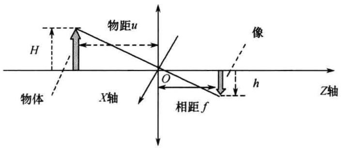

<details>
<summary>text_image</summary>

物距u
H
物体
X轴
O
相距f
h
像
Z轴
</details>

图 1 镜成像过程

有几何光学可以得到下面的关系式：

$$
\frac {H}{u} = \frac {h}{f}
$$

式中：u 为物体到光学中心的距离；H 为物体的高度；h 为物体的像高；f 为像的光学中心的距离。

从而可以得出一般结论,物体上任意一点到光轴的距离与该点的像到光轴距离是线性关系,关系表达式如下:

$$
h = \frac {f}{u} H \tag {1}
$$

## 2. 本节所使用的一些名词解释

为简化和规范说明问题,引入以下几个名词:

物平面:被拍摄的正方形平板所在的平面。

像平面:像点组成的平面,文中即胶片所在的平面。

像距:光学中心至像平面的距离。

最高分辨率:数码相机能拍摄的最大图片的面积。由题中条件知相机的分辨率为 $1024 \times 768$ ，根据1mm约为3.78个像素单位，相机所能拍摄的最大照片为 $270.9mm \times 203.2mm$ ，因此平板可以被完整拍摄。

边缘点:在一个平面上,边缘点指某连通图最边沿的点,即此连通图某一方向坐标最大的点。

## 5.1.2 建立系统坐标系

结合问题 1 的要求, 建立以透镜的光学中心为原点 $o(0,0,0)$ 、光轴为 z 轴、镜面为 oxy 平面的系统坐标系, 如图 2 所示。

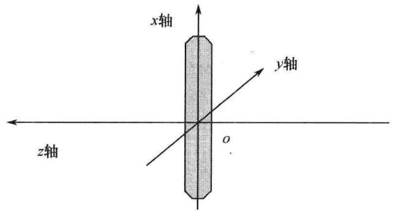

<details>
<summary>text_image</summary>

x轴
y轴
z轴
O
</details>

图2 系统坐标系

## 5.1.3 从物平面到系统坐标系的变换

希望建立从物平面到像平面的映射关系。为此必须考虑物平面到系统坐标系的变换。

设系统坐标系为 $oxyz, o$ 为系统坐标系中的原点，物平面为 $oxyz$ 坐标系中有一平面，记为 $\pi$ ，它自身有一个坐标系 $ox'y'$ ，那么将 $ox'y'$ 中的点变换到 $oxyz$ 中呢？下面来推导从平面上二维坐标到空间三维坐标的转换式。

如图3所示,首先应确定物平面,物平面可以看作是xoy平面经过以下变换得到:先使xoy平面沿z轴平移距离C,再将此平面与x轴保持平行,旋转角度 $\beta$ ,最后将平面倾斜,使其与yoz平面夹角为 $\gamma$ ,因此物平面有三个参数 $C,\beta,\gamma$ 。

然后在物平面中建立坐标系,以物平面与光轴交点坐标 $(0,0,C)$ 为物平面坐标系的原点,物平面与系统坐标系的yoz平面的交线为物平面的 $y'$ 轴,进而可得横轴 $x'$ 轴。

此处 $\beta$ 为物平面坐标系 $y'$ 轴与空间坐标系 $Y$ 轴的夹角，有 $-\frac{\pi}{2} \leqslant \beta \leqslant \frac{\pi}{2}$ ; $\gamma$ 为物平面与系统坐标系的 $yoz$ 平面的夹角，有 $0 \leqslant \gamma \leqslant \pi$ 。

如图3所示,设物平面上点 $P(x',y')$ 在原坐标系中坐标为 $(x_{p},y_{p},z_{p})$ ，由图3之几何198

投影关系可以得

$$
x _ {p} = x ^ {\prime} \sin \gamma \tag {2}
$$

且 p 点 Z、Y 轴坐标和 M 点相同。

为求出 $P, z_{p}$ 的表达式，在 yoz 平面上研究坐标关系，如图 4 所示。

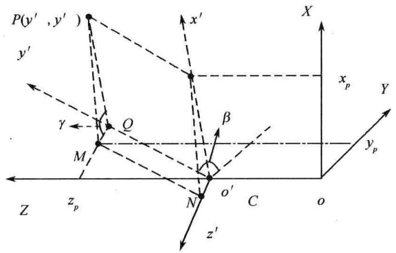

<details>
<summary>text_image</summary>

P(y', y')
y'
x'
X
y
Y
x_p
β
γ
Q
M
o'
N
C
o
z_p
z'
Z
</details>

图 3 空间坐标系变换图

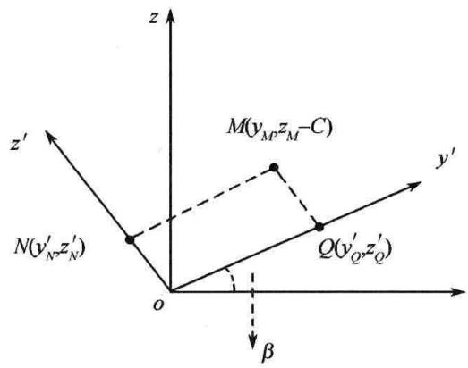

<details>
<summary>text_image</summary>

z
M(y_M'z_M-C)
y'
N(y'_N,z'_N)
Q(y'_Q,z'_Q)
o
β
</details>

图 4 平面坐标转换

由平面旋转坐标转换有

$$
\left\{ \begin{array}{l} y _ {M} = y _ {Q} ^ {\prime} \cos \beta - y _ {N} ^ {\prime} \sin \beta \\ z _ {M} - c = y _ {Q} ^ {\prime} \sin \beta + y _ {N} ^ {\prime} \cos \beta \end{array} \right. \tag {3}
$$

由图 4 的几何关系有

$$
\left\{ \begin{array}{l} y _ {Q} ^ {\prime} = y ^ {\prime} \\ y _ {N} ^ {\prime} = x ^ {\prime} \cos \gamma \\ y _ {p} = y _ {M} \\ z _ {p} = z _ {M} \end{array} \right. \tag {4}
$$

综上可得以下定理。

定理1 设物平面坐标系的一点 $p(x', y')$ ，在系统坐标系的坐标为 $(x_p, y_p, z_p)$ ，则关系式为

$$
\left\{ \begin{array}{l} x _ {p} = x ^ {\prime} \sin \gamma \\ y _ {p} = y ^ {\prime} \cos \beta - x ^ {\prime} \cos \gamma \sin \beta \\ z _ {p} = y ^ {\prime} \sin \beta + x ^ {\prime} \cos \gamma \cos \beta + C \end{array} \right. \tag {5}
$$

## 5.1.4 模型 1: 从物平面到像平面的物理映射关系

## 1. 确定空间任一物点与其像点的坐标关系式

在已建好的坐标系中,要得到靶标圆心的像点坐标,首先建立空间中任意一点 $A(x,y,z)$ 与经过透镜所成像点 $A'(x',y',z')$ 之间的坐标关系式。

考虑到穿过透镜光学中心的光线不折射,设 z 轴为光轴。如图 5 所示,根据成像前后两点的坐标,利用相似三角形原理,有

$$
\left\{ \begin{array}{l} x _ {v} = \frac {v}{u} x _ {p} \\ y _ {v} = \frac {v}{u} y _ {p} \\ z _ {v} = - v _ {p} \\ u = z \end{array} \right. \tag {6}
$$

式中：v 为像点到透镜光学中心的距离即像距；u 为物点到透镜光学中心的距离即物距。

## 2. 确定边缘点在空间坐标系中的坐标

上面得到了空间物点像点的转换关系,但平板上的物点还受平板方位的约束,因此应结合平板,求出相应像点的表达式。

下面通过一些参数在物平面上确立正方形:已经通过参数确定了平板的方位,下面以物平面所在的二维坐标系来确定正方形的位置。要在一个平面内确定一个正方形,只要确定正方形的中心点和该正方形在该平面内的旋转角度 $\varphi$ 即可。先在正方形中建立临时坐标系,如图6所示。

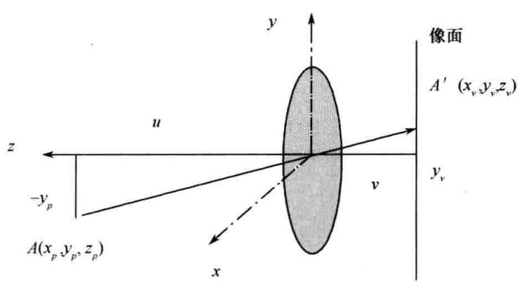

<details>
<summary>text_image</summary>

y
像面
A' (x_v,y_v,z_v)
u
z
-y_p
v
y_v
A(x_p,y_p,z_p)
x
</details>

图 5 凸透镜成像原理图

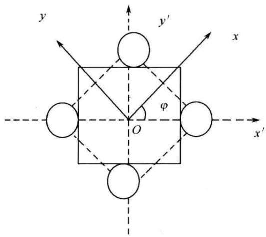

<details>
<summary>text_image</summary>

y
y'
x
φ
O
x'
</details>

图6 正方形在物平面旋转示意图

实线和虚线分别表示初始和旋转后的正方形， $O$ 点坐标为 $(0,0)$ ，旋转前正方形四个顶点的坐标可由边长和 $O$ 点确定，用坐标 $(x_{c},y_{c})$ 统一表示正方形顶点坐标，根据顶点上圆的半径 $r$ ，可知边缘点(参见名词解释中的边缘点)旋转前的坐标 $(x_{s},y_{s})$ 为

$$
\left\{ \begin{array}{l} x _ {s} = x _ {c} \pm r \\ y _ {s} = y _ {c} \pm r \end{array} \right.
$$

不同位置的边缘点依情况取“+”或“-”，边缘点在顶点右边横坐标加 $r$ ，左边减 $r$ ；边缘点在顶点上面纵坐标加 $r$ ，下边减 $r$ 。

当将实线所示图形旋转 $\varphi$ 并将中心点在物平面 $\pi$ 上平移 $(x_0, y_0)$ 后，其坐标为

$$
\left\{ \begin{array}{l} x ^ {\prime} = x _ {s} \cos \varphi + y _ {s} \sin \varphi + x _ {0} \\ y ^ {\prime} = - x _ {s} \sin \varphi + y _ {s} \cos \varphi + y _ {0} \end{array} \right. \tag {7}
$$

此时正方形的中心点坐标为 $(x_{0},y_{0})$ 。

定理 2 将物平面一点, 投影到系统坐标系中点的关系式为

$$
\left\{ \begin{array}{c} x _ {p} = x ^ {\prime} \sin \gamma \\ y _ {p} = y ^ {\prime} \cos \beta - x ^ {\prime} \cos \gamma \sin \beta \\ z _ {p} = y ^ {\prime} \sin \beta + x ^ {\prime} \cos \gamma \cos \beta + C \end{array} \right. \tag {8}
$$

注记1:确定物点到像点的转换模型

利用式(6)的物点像点转换关系,结合式(8)和式(7)可写成一个含有参数的表达式,即

$$
\left\{ \begin{array}{l} x _ {v} = f (x _ {s}, y _ {s}, z _ {v}, \beta , \gamma , \varphi , x _ {0}, y _ {0}, C) \\ y _ {v} = g (x _ {s}, y _ {s}, z _ {v}, \beta , \gamma , \varphi , x _ {0}, y _ {0}, C) \end{array} \right. \tag {9}
$$

式中： $x_{v},y_{v}$ 的具体表达式见附录2。

注记2:模型计算的化简

虽然得到了模型1式(9), $x_{v},y_{v}$ 关于 $\varphi,\beta,\gamma,x,y_{0},C$ 的关系表达式很复杂,根据 $x_{v},y_{v}$ 表达式的特点,将上述模型式(5.1.9)进行变形,引入9个变量 $\{K_{i}\},i=1,\cdots,9$ :

$$
x _ {v} = \frac {k _ {1} x _ {s} + k _ {2} y _ {s} + k _ {3}}{k _ {4} x _ {s} + k _ {5} y _ {s} + k _ {6}} \tag {10}
$$

$$
y _ {v} = \frac {k _ {7} x _ {s} + k _ {8} y _ {s} + k _ {9}}{k _ {4} x _ {s} + k _ {5} y _ {s} + k _ {6}} \tag {11}
$$

有了式(10)、式(11)，接下来的任务是确定系数 $\{K_{i}\}, i=1,\cdots,9$ ，采取最小二乘法，按照一定的原则在靶标和相片间选择理论上能够对应的物点与像点，假如共选取了n个点，则要求满足条件：

$$
\sum_ {i = 1} ^ {n} \left\{\left(x _ {v i} - \frac {k _ {1} x _ {s i} + k _ {2} y _ {s i} + k _ {3}}{k _ {4} x _ {s i} + k _ {5} y _ {s i} + k _ {6}}\right) ^ {2} + \left(y _ {v i} - \frac {k _ {7} x _ {s i} + k _ {8} y _ {s i} + k _ {9}}{k _ {4} x _ {s i} + k _ {5} y _ {s i} + k _ {6}}\right) ^ {2} \right\}
$$

理论上由定理2、注记1、注记2可知模型1是可以解决的。

## 5.2 模型 2: 基于矩阵空间坐标转换模型

模型 1 中利用了透镜成像的光学原理,但参数的求解过程很复杂,使得模型的使用范围受到限制。下面从矩阵变换角度来建立适用范围更广的模型,因此引入模型 2。

## 5.2.1 模型2建立

可以将相机成像看成是物平面上的点通过矩阵,变换到像平面上的点。设从物平面坐标系到空间坐标系的变换矩阵为 $\begin{bmatrix}R&T_{0}\\ \mathbf{0}^{\mathrm{T}}&1\end{bmatrix}$ ，为一4阶矩阵，其中R为 $3\times3$ 正交单位矩阵， $R=\begin{bmatrix}r_{11}&r_{12}&r_{13}\\ r_{21}&r_{22}&r_{23}\\ r_{31}&r_{32}&r_{33}\end{bmatrix};T_{0}$ 为三维平移向量， $T_{0}=\left[t_{1}\quad t_{2}\quad t_{3}\right]^{\mathrm{T}};\mathbf{0}=(0,0,0)^{\mathrm{T}}$ （参考文献[1]54页），则存在从物平面坐标 $(x',y',z')$ 到空间坐标 $(x_{p},y_{p},z_{p})$ 的变换：

$$
\left[ \begin{array}{l} x _ {p} \\ y _ {p} \\ z _ {p} \\ 1 \end{array} \right] = \left[ \begin{array}{c c} \boldsymbol {R} & \boldsymbol {T} _ {0} \\ \boldsymbol {0} ^ {\mathrm{T}} & 1 \end{array} \right] \left[ \begin{array}{l} x ^ {\prime} \\ y ^ {\prime} \\ z ^ {\prime} \\ 1 \end{array} \right] \tag {12}
$$

将空间坐标转换成像坐标的式(6)写成矩阵形式：

$$
z _ {p} \left[ \begin{array}{l} x _ {v} \\ y _ {v} \\ 1 \end{array} \right] = \left[ \begin{array}{c c c c} v & 0 & 0 & 0 \\ 0 & v & 0 & 0 \\ 0 & 0 & 1 & 0 \end{array} \right] \left[ \begin{array}{l} x _ {p} \\ y _ {p} \\ z _ {p} \\ 1 \end{array} \right] \tag {13}
$$

结合式(12)和式(13)，可以得到以下定理。

定理3 从物平面坐标到像平面坐标的关系为

$$
z _ {p} \left[ \begin{array}{l} x _ {v} \\ y _ {v} \\ 1 \end{array} \right] = \left[ \begin{array}{c c c c} v & 0 & 0 & 0 \\ 0 & v & 0 & 0 \\ 0 & 0 & 1 & 0 \end{array} \right] \left[ \begin{array}{c c} \boldsymbol {R} & \boldsymbol {T} _ {0} \\ \boldsymbol {0} ^ {\mathrm{T}} & 1 \end{array} \right] \left[ \begin{array}{l} x ^ {\prime} \\ y ^ {\prime} \\ z ^ {\prime} \\ 1 \end{array} \right] \tag {14}
$$

## 5.2.2 如何求解模型？

基于模型 2 中式(14)，可以根据靶标点在物平面的坐标和像的坐标来确定参数矩阵 R、T。

为方便计算, 引入矩阵 M:

$$
\boldsymbol {M} = \left[ \begin{array}{l l l l} v & 0 & 0 & 0 \\ 0 & v & 0 & 0 \\ 0 & 0 & 1 & 0 \end{array} \right] \left[ \begin{array}{c c} \boldsymbol {R} & \boldsymbol {T} _ {0} \\ \boldsymbol {0} ^ {\mathrm{T}} & 1 \end{array} \right] = \left[ \begin{array}{l l l l} m _ {1 1} & m _ {1 2} & m _ {1 3} & m _ {1 4} \\ m _ {2 1} & m _ {2 2} & m _ {2 3} & m _ {2 4} \\ m _ {3 1} & m _ {3 2} & m _ {3 3} & m _ {3 4} \end{array} \right] \tag {15}
$$

为了得到转换矩阵 $M$ ，选择 $n$ 个靶标点，对其中一个点 $i$ ，结合式(14)和式(15)有

$$
z _ {i} \left[ \begin{array}{l} x _ {v i} \\ y _ {v i} \\ 1 \end{array} \right] = \left[ \begin{array}{c c c c} m _ {1 1} & m _ {1 2} & m _ {1 3} & m _ {1 4} \\ m _ {2 1} & m _ {2 2} & m _ {2 3} & m _ {2 4} \\ m _ {3 1} & m _ {3 2} & m _ {3 3} & m _ {3 4} \end{array} \right] \left[ \begin{array}{l} x _ {i} ^ {\prime} \\ y _ {i} ^ {\prime} \\ z _ {i} ^ {\prime} \\ 1 \end{array} \right]
$$

化成方程组得

$$
\begin{array}{l} z _ {i} x _ {v i} = m _ {1 1} x _ {i} ^ {\prime} + m _ {1 2} y _ {i} ^ {\prime} + m _ {1 3} z _ {i} ^ {\prime} + m _ {1 4} \\ z _ {i} y _ {v i} = m _ {2 1} x _ {i} ^ {\prime} + m _ {2 2} y _ {i} ^ {\prime} + m _ {2 3} z _ {i} ^ {\prime} + m _ {2 4} \\ z _ {i} = m _ {3 1} x _ {i} ^ {\prime} + m _ {3 2} y _ {i} ^ {\prime} + m _ {3 3} z _ {i} ^ {\prime} + m _ {3 4} \\ \end{array}
$$

消去 $z_{i}$ 得

$$
\(\left(m _ {3 1} x _ {i} ^ {\prime} + m _ {3 2} y _ {i} ^ {\prime} + m _ {3 3} z _ {i} ^ {\prime} + m _ {3 4}\right) x _ {v i} = m _ {1 1} x _ {i} ^ {\prime} + m _ {1 2} y _ {i} ^ {\prime} + m _ {1 3} z _ {i} ^ {\prime} + m _ {1 4} \tag {16}\)
$$

$$
\left(m _ {3 1} x _ {i} ^ {\prime} + m _ {3 2} y _ {i} ^ {\prime} + m _ {3 3} z _ {i} ^ {\prime} + m _ {3 4}\right) y _ {v i} = m _ {2 1} x _ {i} ^ {\prime} + m _ {2 2} y _ {i} ^ {\prime} + m _ {2 3} z _ {i} ^ {\prime} + m _ {2 4}
$$

要求解模型2(即解式(16)),我们的任务就变成如何利用参考点确定式(16)的参数,仍采用最小二乘法。

## 5.3 模型1和模型2的比较

（1）理论上模型1和模型2都是可以得到解决的，且结果也是确定的。  
（2）通过式(10)、式(11)与式(16)的比较,发现模型1和模型2的关系本质是一致的,但就求解的复杂度来讲模型1要大,特别是确定参数 $\varphi$ 、 $\beta$ 、 $\gamma$ 、 $x_{0}$ 、 $y_{0}$ 、C很困难,因此单就这一点来讲模型2更优,因此在下面的求解中应用模型2。  
（3）虽然模型1比较复杂，但通过建立过程的几何推导变换证明可以作为模型2的证明，在第6节中将分别用这两个模型求解，进一步说明。

## 6 问题2的求解

## 6.1 求解的数据准备工作

## 6.1.1 像点扫描

由于数码照片采取像点记录图像的方式(见数码照相原理),所以要对图片进行逐像点扫描,杂扫描过程中不考虑图像的噪声,扫描方法:

第一步:用 MATLAB 进行图像灰化,进行二值化处理,0 表示非像点,1 为像点。

第二步: 表示坐标, 以相片中心为坐标原点表示每一个像点的坐标。

第三步:标示几个靶标上圆的像点的集合。

流程图如图 7 所示。

通过题目中图片的扫描得到了 $1024 \times 768$ 个像点的灰度值，并以照片中心为原点在相片平面内进行了各像点的坐标标定。

## 6.1.2 像平面坐标系的建立

通过以上算法,可以得到所需的任意像素点在以像素为单位的图像坐标系中的坐标(下面称像素坐标) $(m,n)$ ,还要将它转化为物理单位表示的坐标(下面称物理坐标),本文中在靶标的像平面中心点为原点建立像平面坐标系,设像中心的像素坐标为 $(m_{0},n_{0})$ ,则由任一点的像素坐标 $(m,n)$ ,可得它的物理坐标 $(x_{v},y_{v})$ 中:

$$
\left\{ \begin{array}{l} x _ {v} = (m - m _ {0}) \lambda_ {x} \\ y _ {v} = (n - n _ {0}) \lambda_ {y} \end{array} \right.
$$

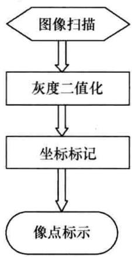

<details>
<summary>flowchart</summary>

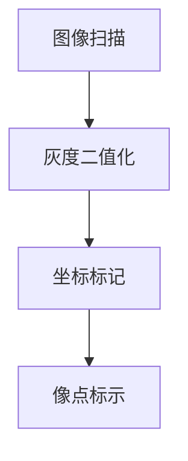
```mermaid
graph TD
  A["图像扫描"] --> B["灰度二值化"]
  B --> C["坐标标记"]
  C --> D["像点标示"]
```
</details>

图 7 照片扫描流程

式中： $\lambda_{x}$ 、 $\lambda_{y}$ 为相片沿坐标轴方向的像元间距。

## 6.2 物与像之间对应参考点的选择

为了根据题目中靶标及其像确定模型中的转换矩阵,就要寻找相对应的物点和像点

(以下称参考点)来研究。

## 6.2.1 选择的原则

过对前面问题的分析,定性地给出选取参考点的几个原则。

原则 1: 要尽可能的确保物点和像点之间的对应关系。

原则 2: 参考点选取要满足一定数目, 在模型 2 中至少选择 6 个参考点。

原则 3: 选取的参考点应尽量分散。

## 6.2.2 参考点选择方法

定理 4 投影后点序列的不变性。

下面给出证明。

已知两个物点 $A(x_{a},y_{a},z_{a})$ 、 $B(x_{b},y_{b},z_{b})$ ，对应像点为 $A^{\prime}(x_{a}^{\prime},y_{a}^{\prime},z_{a}^{\prime})$ 、 $B^{\prime}(x_{b}^{\prime},y_{b}^{\prime},z_{b}^{\prime})$ 若设

$$
x _ {a} > x _ {b}, y _ {a} > y _ {b}
$$

关心的是平面点的序列,对于 Z 轴不做讨论,则根据投影变化关系式(6)有

$$
- \frac {u}{v} x _ {a} ^ {\prime} > - \frac {u}{v} x _ {b} ^ {\prime}, - \frac {u}{v} y _ {a} ^ {\prime} > - \frac {u}{v} y _ {b} ^ {\prime}
$$

透镜成像原理(倒立的像)可以解释上式的符号,可见两像点在像平面的拓扑关系与对应物点的拓扑关系一致。

定理 5 物平面成直线的物点,在相片中的像点也满足成直线。

以三个点为例给出数学证明。

如图8所示，设三个物点的空间坐标为 $A(x_{a},y_{a},z_{a})$ 、 $B(x_{b},y_{b},z_{b})$ 、 $C(x_{c},y_{c},z_{c})$ ，且其

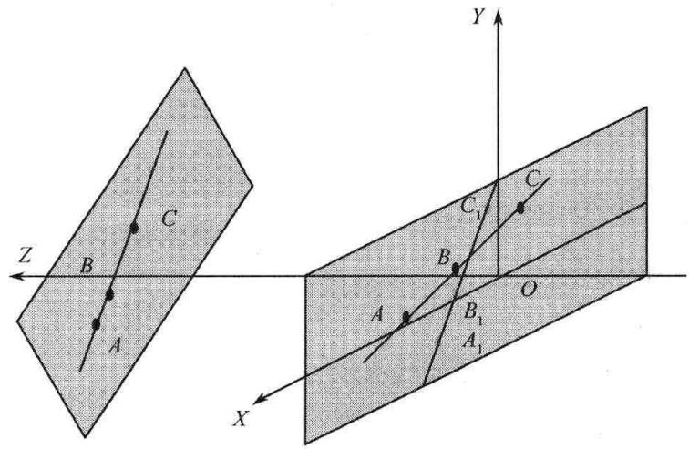

<details>
<summary>text_image</summary>

Z
A
B
C
Y
C₁
B
O
A
B₁
A₁
X
</details>

图 8 参考点选择方法

对应像点的坐标为 $A^{\prime}(x_{a}^{\prime},y_{a}^{\prime},z_{a}^{\prime})$ 、 $B^{\prime}(x_{b}^{\prime},y_{b}^{\prime},z_{b}^{\prime})$ 、 $C^{\prime}(x_{c}^{\prime},y_{c}^{\prime},z_{c}^{\prime}),A,B,C$ 成直线，则满足关系

$$
\frac {x _ {a} - x _ {b}}{x _ {c} - x _ {b}} = \frac {y _ {a ,} - y _ {b}}{y _ {c} ^ {*} - y _ {b}} = \frac {z _ {a} - z _ {b}}{z _ {c} - z _ {b}}
$$

根据投影变换式(6)有

$$
\begin{array}{l} - \frac {u}{v} x _ {a} ^ {\prime} - \left(- \frac {u}{v} x _ {b} ^ {\prime}\right) - \frac {- u}{v} y _ {a} ^ {\prime} - \left(- \frac {u}{v} y _ {b} ^ {\prime}\right) - \frac {- u}{v} z _ {a} ^ {\prime} - \left(- \frac {u}{v} z _ {b} ^ {\prime}\right) \\ - \frac {u}{v} x _ {c} ^ {\prime} - \left(- \frac {u}{v} x _ {b} ^ {\prime}\right) - \frac {u}{v} y _ {c} ^ {\prime} - \left(- \frac {u}{v} y _ {b} ^ {\prime}\right) - \frac {u}{v} z _ {c} ^ {\prime} - \left(- \frac {u}{v} z _ {b} ^ {\prime}\right) \\ \end{array}
$$

从而有

$$
\frac {x _ {a} ^ {\prime} - x _ {b} ^ {\prime}}{x _ {c} ^ {\prime} - x _ {b} ^ {\prime}} = \frac {y _ {a} ^ {\prime} - y _ {b} ^ {\prime}}{y _ {c} ^ {\prime} - y _ {b} ^ {\prime}} = \frac {z _ {a} ^ {\prime} - z _ {b} ^ {\prime}}{z _ {c} ^ {\prime} - z _ {b} ^ {\prime}}
$$

即证明了三个像点也在一条直线上,多个点的情况一样不失一般性。

## 6.2.3 边缘选点法

根据定理1,可以把边缘点作为参考点。对于靶标的像,是由一系列像素点组成的,因此要通过扫描的方法来提取边缘点。

边缘选点法的算法：

步骤 1: 对靶标的像利用 MATLAB 进行灰化处理。

步骤 2: 将灰化后的图片进行二值化处理, 对每个像素进行编号, 0 表示未投影区, 1 表示投影区。

步骤3: 将同一个连通图中的像素编同一个号, 5个连通图分别对应1,2,3,4,5。

步骤4: 扫描编号为1的像素, 则它们属于连通图1, 扫描过程中记录这些像素点的坐标(可以用该像素所在的行、列表示), 当某一个像素的行数或列数取最值时, 就认为它是边缘点, 记录相应坐标。

步骤 5: 扫描编号为 2 的像素点, 重复步骤 4 的做法, 直到 5 个连通图都扫描完。

## 6.2.4 切线选点法

选点的准确程度影响着模型的准确性,根据结论2,在进行参考点的选择时,应尽量选择在一条直线上且位于圆边界的点,它们所成的像点也在一条直线上而且位于连通图边界。

如图9所示,以标靶上的三个圆A、B、C为例,三个圆的上、下公切线与三个圆的交点是唯一的,如上图的P、Q、R、E、F、G,且这些点的相对位置可以确定。

基于以上结论,可以知道 P、Q、R 的像 $P_{1}$ 、 $Q_{1}$ 、 $R_{1}$ 也在一条直线上,而且位于连通图的边界。接下来我们的任务是在相片上寻找三个圆 A、B、C 对应连通图的公切线,则相应切点就是 $P_{1}$ 、 $Q_{1}$ 、 $R_{1}$ ,这样通过一条切线,就可以选择三组参考点。

同理对于两个圆,也可以应用上述方法找参考点,每两个圆确定四组参考点,则图10中5个圆理论上可以确定 $4C_{5}^{2}-4C_{3}^{2}+6=34$ 组参考点。

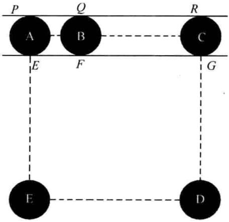

<details>
<summary>text_image</summary>

P
Q
R
A
B
C
E
F
G
E
D
</details>

图 9 切线选点示意图 1

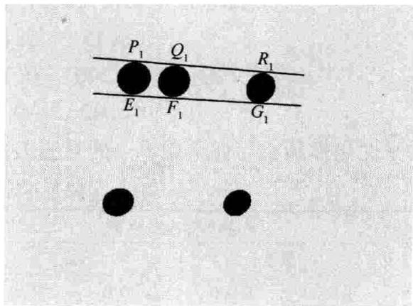

<details>
<summary>text_image</summary>

P₁ Q₁ R₁
E₁ F₁ G₁
</details>

图 10 切线选点示意图 2

利用之前扫描的像点坐标,可得到每一个连通图的边界集合,再设计算法求出 $P_{1}$ 、 $Q_{1}$ 、 $R_{1}$ 这样的点。

首先给出针对两个圆的算法(图 11):

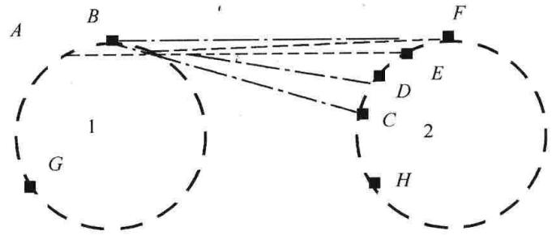

<details>
<summary>text_image</summary>

A B F
1
G C D E 2
H
</details>

图 11 算法示意图

步骤一:如图11所示,设圆1中边界点集合为 $\{s_{i}^{1}\}$ ,圆2的边界点集合 $\{s_{i}^{2}\}$ 。

步骤二:确立圆1的一个边界点为起点,如图11中点A。

步骤三:遍历圆2上的点,如果不存在这样的关系,就回到步骤二重新选起始点:A与圆2上的某点F连成的线段不经过两圆上除A、F外的其他边界点;否则转到步骤四。

步骤四:若步骤三找到切线投影点,还应进一步判断是外公切线还是内公切线,具体判断方法为:以图11中B、F为例,分别在两圆上选择另外两点G、H,判断B、G的横纵坐标的之差与F、H的横纵坐标之差的符号是否一致 $(x_{b}-x_{g})$ 与 $x_{f}-x_{h}$ 的符号, $y_{b}-y_{g}$ 与 $y_{f}-y_{h}$ 的符号),如果不一致,转到步骤二重新确立起始点;否则,转下。

步骤五:算法结束,标记B、F点。

说明:三个圆的算法和两个圆的算法相似,只是在步骤四结束后还要进一步遍历求出与第三个圆上的交点,这里算法不再赘述。

## 6.3 靶标圆心像点的求解

为比较两个模型的优劣,首先以边缘选点法分别利用模型求解。

## 6.3.1 模型2边缘选点法求解

选择所有边缘点,共20个,利用模型2的数学表达式用最小二乘法求解。在求解过程中做一个处理,因为物平面在它的坐标系中的Z值为0,所以结合表达式(16)可以消去三个参数,这样只需要确定9个参数,参数计算结果为

$$
\boldsymbol {M} = \left[ \begin{array}{c c c} 0. 8 0 1 5 & 0. 1 3 8 9 & - 5 2. 6 2 1 1 \\ - 0. 2 2 0 & 0. 7 7 8 6 & 2 8. 3 6 3 8 \\ 0. 0 0 0 2 & - 0. 0 0 0 2 & 1. 0 0 0 0 \end{array} \right]
$$

物平面坐标圆心与像平面像点的对应关系,见表1。

表 1 边缘选点法的结果表

<table><tr><td rowspan="2">圆编号</td><td colspan="4">在物平面上的坐标</td><td colspan="4">在像平面上的坐标</td></tr><tr><td colspan="2">/像素</td><td colspan="2">/mm</td><td colspan="2">/像素</td><td colspan="2">/mm</td></tr><tr><td>A</td><td>-189.0</td><td>189.0</td><td>-50.0</td><td>50.0</td><td>-177.9</td><td>181.6</td><td>-47.1</td><td>48.0</td></tr><tr><td>B</td><td>-75.6</td><td>189.0</td><td>-20.0</td><td>50.0</td><td>-87.0</td><td>179.1</td><td>-23.0</td><td>47.4</td></tr><tr><td>C</td><td>189.0</td><td>189.0</td><td>50.0</td><td>50.0</td><td>125.1</td><td>173.2</td><td>33.1</td><td>45.8</td></tr><tr><td>D</td><td>189.0</td><td>-189.0</td><td>50.0</td><td>-50.0</td><td>72.6</td><td>-124.8</td><td>19.2</td><td>-33.0</td></tr><tr><td>E</td><td>-189.0</td><td>-189.0</td><td>-50.0</td><td>-50.0</td><td>-230.4</td><td>-116.5</td><td>-60.9</td><td>-30.8</td></tr></table>

MATLAB 标记出该靶标圆心对应的像, 如图 12 所示。

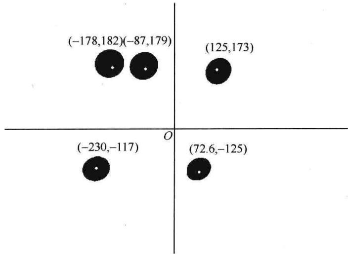

<details>
<summary>bubble</summary>

| Cluster | X | Y |
| --- | --- | --- |
| Top-Left | -178,182 | -87,179 |
| Top-Right | 125,173 | N/A |
| Bottom-Left | -230,-117 | N/A |
| Bottom-Right | 72.6,-125 | N/A |
</details>

图 12 由模型 2 得到的投影像点(坐标点以像素为单位)

直观地看,结果是比较理想的,误差会在问题3进行系统的分析求解。

## 6.3.2 模型1边缘选点法求解

参考点与6.3.1的参考点相同,解得结果见表2。

表 2 模型 1 切线选点法的结果表

<table><tr><td rowspan="2">圆编号</td><td colspan="4">在物平面上的坐标</td><td colspan="4">在像平面上的坐标</td></tr><tr><td colspan="2">/像素</td><td colspan="2">/mm</td><td colspan="2">/像素</td><td colspan="2">/mm</td></tr><tr><td>A</td><td>-189.0</td><td>189.0</td><td>-50.0</td><td>50.0</td><td>-178.4</td><td>176.3</td><td>-47.1</td><td>49.4</td></tr><tr><td>B</td><td>-75.6</td><td>189.0</td><td>-20.0</td><td>50.0</td><td>-81.0</td><td>172.1</td><td>-24.0</td><td>48.8</td></tr><tr><td>C</td><td>189.0</td><td>189.0</td><td>50.0</td><td>50.0</td><td>132.2</td><td>175.8</td><td>34.4</td><td>45.5</td></tr><tr><td>D</td><td>189.0</td><td>-189.0</td><td>50.0</td><td>-50.0</td><td>80.8</td><td>-132.2</td><td>26.4</td><td>-37.4</td></tr><tr><td>E</td><td>-189.0</td><td>-189.0</td><td>-50.0</td><td>-50.0</td><td>-219.8</td><td>-122.8</td><td>-57.2</td><td>-34.4</td></tr></table>

## 6.3.3 模型 1 和模型 2 结果比较: 殊途同归

通过上面两模型的求解结果以及式(10)、式(11)、式(6)的分析,足以说明模型1和模型2是殊途同归,求解复杂度来讲模型1要大,因此在后面计算过程中不再重复利用模型1求解。

## 6.3.4 模型2的切线选点法的求解

根据切线选点法的算法,选择了18个点,利用最小二乘法求解出结果得到相应的参数解为

$$
\boldsymbol {M} = \left[ \begin{array}{c c c} 0. 8 0 5 7 & 0. 1 3 0 7 & - 4 6. 8 1 8 1 \\ - 0. 0 1 9 8 & 0. 7 8 8 8 & 2 6. 5 0 6 0 \\ 0. 0 0 0 2 & - 0. 0 0 0 2 & 1. 0 0 0 0 \end{array} \right]
$$

物平面坐标圆心与像平面像点的对应关系,见表3。

表 3 切线选点法的结果表

<table><tr><td rowspan="2">圆编号</td><td colspan="4">在物平面上的坐标</td><td colspan="4">在像平面上的坐标</td></tr><tr><td colspan="2">/像素</td><td colspan="2">/mm</td><td colspan="2">/像素</td><td colspan="2">/mm</td></tr><tr><td>A</td><td>-189.0</td><td>189.0</td><td>-50.0</td><td>50.0</td><td>-174.4</td><td>179.3</td><td>-46.1</td><td>47.4</td></tr><tr><td>B</td><td>-75.6</td><td>189.0</td><td>-20.0</td><td>50.0</td><td>-83.0</td><td>177.1</td><td>-22.0</td><td>46.8</td></tr><tr><td>C</td><td>189.0</td><td>189.0</td><td>50.0</td><td>50.0</td><td>130.2</td><td>171.8</td><td>34.4</td><td>45.5</td></tr><tr><td>D</td><td>189.0</td><td>-189.0</td><td>50.0</td><td>-50.0</td><td>80.8</td><td>-126.3</td><td>21.4</td><td>-33.4</td></tr><tr><td>E</td><td>-189.0</td><td>-189.0</td><td>-50.0</td><td>-50.0</td><td>-223.8</td><td>-118.8</td><td>-59.2</td><td>-31.4</td></tr></table>

MATLAB 标记出该靶标圆心对应的像,如图 13 所示。

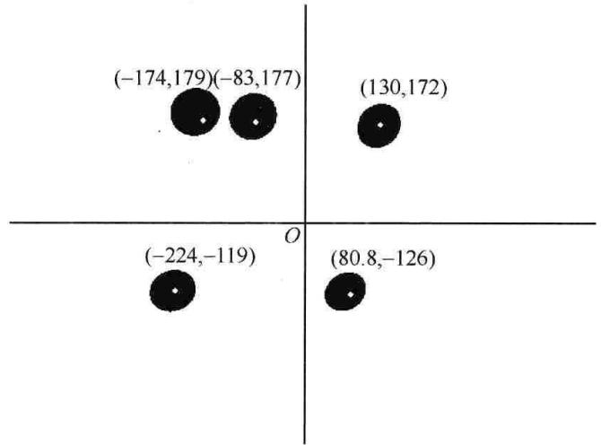

<details>
<summary>bubble</summary>

| Cluster | X | Y |
| --- | --- | --- |
| Top-Left | -174,179 | -83,177 |
| Top-Right | 130,172 | N/A |
| Bottom-Left | -224,-119 | N/A |
| Bottom-Right | 80.8,-126 | N/A |
</details>

图 13 由模型 2 得到的投影像点(坐标点以像素为单位)

## 7 问题3的求解

## 7.1 模型 2 稳定性的分析

## 7.1.1 参数扰动法

假设模型中有 n 个参数, 固定其中 n-1 个, 以另一个为变量, 利用参考点进行数据拟合, 与观察点进行比较, 计算出残差, 观察残差平方和的变化趋势, 如图 14 所示。

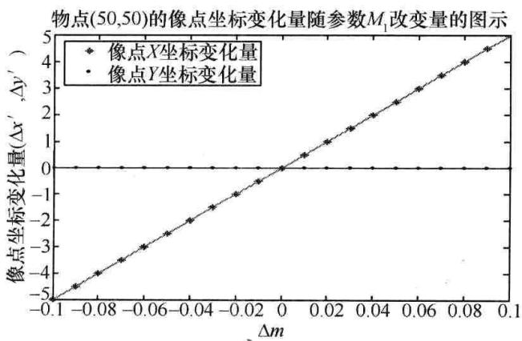

<details>
<summary>line</summary>

| \(\Delta m\) | 像点X坐标变化量 \((\Delta x\), \(\Delta y)\) | 像点Y坐标变化量 \((\Delta x\), \(\Delta y)\) |
| --- | --- | --- |
| -0.1 | -5 | 0 |
| -0.08 | -4 | 0 |
| -0.06 | -3 | 0 |
| -0.04 | -2 | 0 |
| -0.02 | -1 | 0 |
| 0 | 0 | 0 |
| 0.02 | 1 | 0 |
| 0.04 | 2 | 0 |
| 0.06 | 3 | 0 |
| 0.08 | 4 | 0 |
| 0.1 | 5 | 0 |
</details>

图 14 参数抖动对像点的影响

这里只对一个参数进行讨论,从图 14 中可以看出成线性关系。

参数扰动的物理意义在于在空间照相中由于人为或环境原因造成空间坐标发生变化,而此时模型的稳定性恰好反映了照相系统适应这种变化的能力。

## 7.1.2 物点坐标扰动法

给所有参考点一个坐标扰动 $(\delta_x, \delta_y)$ ，利用模型进行求解像平面坐标的平均变化值 $(\delta_x', \delta_y')$ 。通过模型2结合参考点可以得到 $(\delta_x, \delta_y)$ 和 $(\delta_x', \delta_y')$ 的关系图。

## 1. 边缘选点法

分别给两坐标轴一组数据扰动记录像点坐标, 比较对应像点, 如图 15 所示。

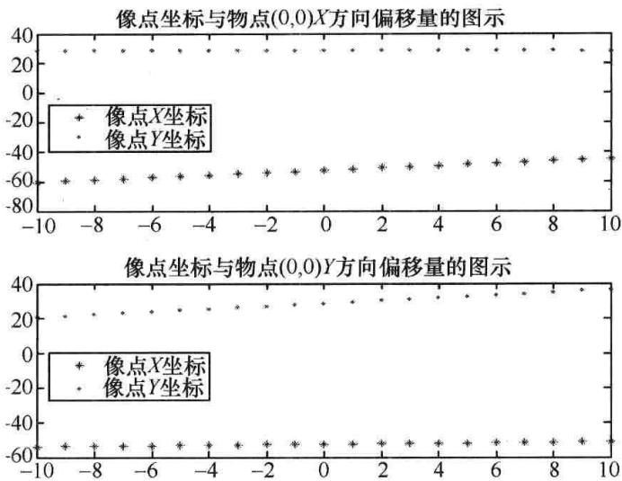  
图 15 $(\delta_{x},\delta_{y})$ 与像点坐标的关系 1

有了上面的关系,进一步用曲线拟合出 $(\delta_{x},\delta_{y})$ 和 $(\delta_{x}^{\prime},\delta_{y}^{\prime})$ 的关系式:

$$
\delta_ {x} ^ {\prime} = 0. 8 0 1 5 \delta_ {x}
$$

$$
\delta_ {x} ^ {\prime} = 0. 1 3 8 9 \delta_ {y}
$$

$$
\delta_ {y} ^ {\prime} = 0. 0 2 2 0 \delta_ {x}
$$

$$
\delta_ {y} ^ {\prime} = 0. 7 8 8 6 \delta_ {y}
$$

拟合通过 F 检验, 拟合结果如图 16 所示。

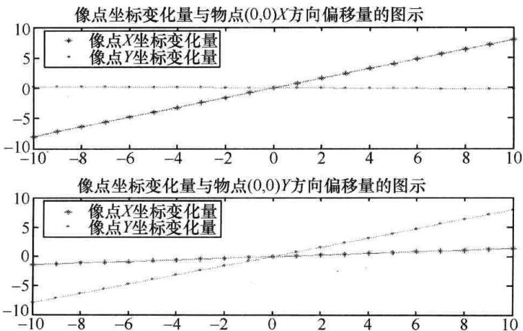  
图16 $(\delta_{x},\delta_{y})$ 和 $(\delta_x',\delta_y')$ 关系拟合图像1

## 2. 切线选点法(图 17)

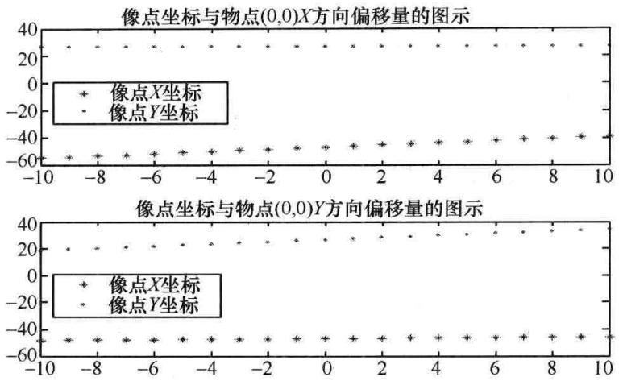  
图 17 $(\delta_{x},\delta_{y})$ 与像点坐标的关系 2

进一步用曲线拟合出 $(\delta_x, \delta_y)$ 和 $(\delta_x', \delta_y')$ 的关系式：

$$
\delta_ {x} ^ {\prime} = 0. 8 0 5 7 \delta_ {x}
$$

$$
\delta_ {x} ^ {\prime} = 0. 1 3 0 7 \delta_ {y}
$$

$$
\delta_ {y} ^ {\prime} = 0. 0 1 9 8 \delta_ {x}
$$

$$
\delta_ {y} ^ {\prime} = 0. 7 8 8 8 \delta_ {y}
$$

拟合通过 F 检验, 拟合结果如图 18 所示。

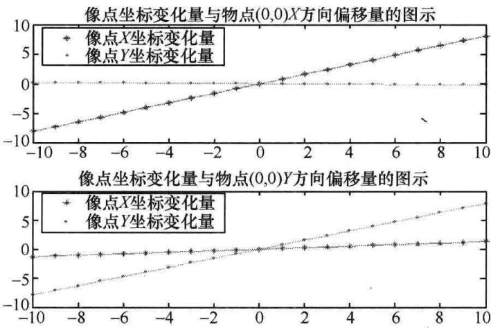  
图18 $(\delta_x,\delta_y)$ 和 $(\delta_x',\delta_y')$ 关系拟合图像2

物点坐标扰动分析法的物理意义在于,在实际照相中物点发生平面偏差,此时模型的稳定度反应照相系统纠错的能力,特别是根据 $(\delta_{x},\delta_{y})$ 和 $(\delta_{x}^{\prime},\delta_{x}^{\prime})$ 的关系表达式还可以用来进行图像补偿。

## 7.2 模型精度分析

## 7.2.1 误差产生原因分析

在讨论误差的原因时,只研究系统误差,在本问题中认为系统误差主要来自下列原因。

## 1. 最小二乘法的误差

最小二乘结果对中间计算中输入数据的取舍非常敏感。自变量个数的数目对计算过程的有效数字的取舍控制有一定的影响，且在利用计算机进行计算时自身对数字精度的控制对结果也有一定的影响，这些都是不可避免的（参考文献[2]411页）。

## 2. 由相片分辨率产生的误差

前面已经说明数码相片由像点组成,在以相片平面建立坐标系时是以整数格点为单位的,有

$$
n _ {x} = \frac {x _ {v}}{\lambda_ {x}}
$$

$$
n _ {y} = \frac {y _ {v}}{\lambda_ {v}}
$$

由于在处理图片时采用的是灰度二值化的方法,因此小数格点会被忽略,这样就造成误差,即

$$
\Delta x = \frac {x _ {v}}{\lambda_ {x}} - \left[ \frac {x _ {v}}{\lambda_ {x}} \right]
$$

$$
\Delta y = \frac {y _ {v}}{\lambda_ {y}} - \left[ \frac {y _ {v}}{\lambda_ {y}} \right]
$$

$\Delta x, \Delta y$ 分别为像点在像平面的误差值，即

$$
0 \leqslant \Delta x \leqslant \lambda_ {x}
$$

$$
0 \leqslant \Delta y \leqslant \lambda_ {y}
$$

## 3. 参考点的选择造成的误差

在问题 2 中采取两种选点方法: 边缘选点法和切线选点法。

对于边缘选点法,采取物平面最高点对应像平面最高点的方法,这固然可以解决问题,但这种方法存在问题,如图19所示。

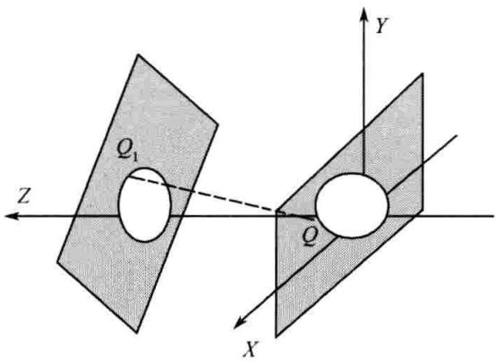

<details>
<summary>text_image</summary>

Q₁
Z
Y
Q
X
</details>

图 19 空间相对位置变化

物平面上沿 $Y_{1}$ 轴的最高点 $Q_{1}$ 的像点 Q 不是图像平面坐标系中的 Y 轴的最高点, 原因是在进行坐标变换的过程物平面相对系统坐标系有一个旋转角度(图 3), 因此这种选点方法是有误差的。至于切线选点法前面已经作了分析。问题 2 的两种选点方法的求解结果充分说明了选取参考点方法对模型结果的影响。

## 7.2.2 模型精度的分析

## 1. 残差分析法

将所有参考点 $(x_{i},y_{i}),i=1,\cdots,n$ （n参考点个数）作为拟合输入点，利用问题1的模型，得到拟合值 $(\widetilde{x_{i}^{\prime}},\widetilde{y_{i}^{\prime}}),i=1,\cdots,n$ ，利用实际选点的观察值 $(x_{i}^{\prime},y_{i}^{\prime})$ 计算出残差：

$$
e _ {i x} = \widetilde {x _ {i} ^ {\prime}} - x _ {i} ^ {\prime}
$$

$$
e _ {i y} = \widetilde {y _ {i} ^ {\prime}} - y _ {i} ^ {\prime}
$$

设 $\sigma_x^2, \sigma_y^2$ 分别为残差的方差，则满足： $\frac{\sum_{i=1}^{n} e_{ix}^2}{\sigma_x^2}$ 服从 $x^2$ 分布（参考文献[2]P108），同理 $\frac{\sum_{i=1}^{n} e_{iy}^2}{\sigma_y^2}$ 也服从 $\chi^2$ 分布，且自由度为 $n - t$ （ $t$ 为数学模型中参数的个数）。

由 $\chi^2$ 分布的性质有

$$
E \left\{\frac {\sum_ {i = 1} ^ {n} e _ {i x} ^ {2}}{\sigma_ {x} ^ {2}} \right\} = n - t
$$

因而

$$
E \left\{\frac {\sum_ {i = 1} ^ {n} e _ {i x} ^ {2}}{n} \right\} = \frac {n - t}{n} \sigma_ {x} ^ {2}
$$

设 $\tilde{\sigma}_x^2, \tilde{\sigma}_y^2$ 为 $\sigma_x^2, \sigma_y^2$ 的估计量，且有

$$
\tilde {\sigma} _ {x} ^ {2} = \frac {\sum_ {i = 1} ^ {n} e _ {i x} ^ {2}}{n}
$$

$$
\tilde {\sigma} _ {y} ^ {2} = \frac {\sum_ {i = 1} ^ {n} e _ {i y} ^ {2}}{n}
$$

因而最终得

$$
\sigma_ {x} = \sqrt {\frac {\sum_ {i = 1} ^ {n} e _ {i x} ^ {2}}{n - t}} \tag {17}
$$

$$
\sigma_ {y} = \sqrt {\frac {\sum_ {i = 1} ^ {n} e _ {i y} ^ {2}}{n - t}} \tag {18}
$$

## 2. 模型的精度计算

模型 2 的边缘选点法精度分析(图 20 和图 21): 根据残差分析, 结合模型 2 的数据计 212

算可以得

$\sigma_{x} = \sigma_{y} = 8.6$ （单位为像素）  
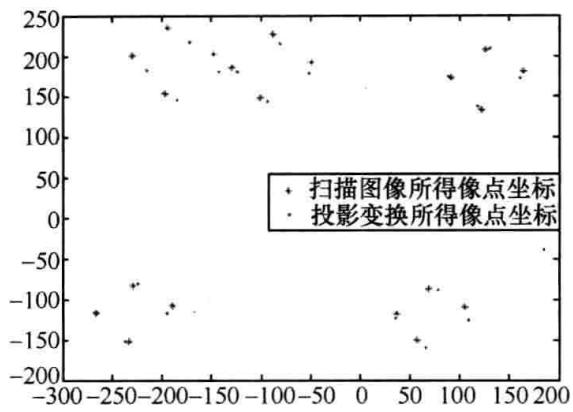

<details>
<summary>scatter</summary>

| Series | X (range) | Y (range) |
| --- | --- | --- |
| 扫描图像所得像点坐标 | -270~180 | -150~240 |
| 投影变换所得像点坐标 | 30~190 | -160~210 |
</details>

图 20 模型 2 拟合像点与观察像点的关系图

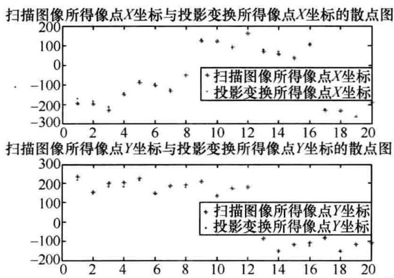

<details>
<summary>scatter</summary>

| Chart | X-axis | Y-axis |
| --- | --- | --- |
| 扫描图像所得像点X坐标 | 1~16 | -200~180 |
| 投影变换所得像点X坐标 | 1~20 | -250~250 |
| 扫描图像所得像点Y坐标 | 1~20 | -150~250 |
| 投影变换所得像点Y坐标 | 1~20 | -150~250 |
</details>

图 21 模型 2 拟合像点坐标轴与观察像点坐标轴的关系图

模型 1 的边缘选点法精度分析(图 22 和图 23): 根据残差分析, 结合模型 1 的数据计算可以得

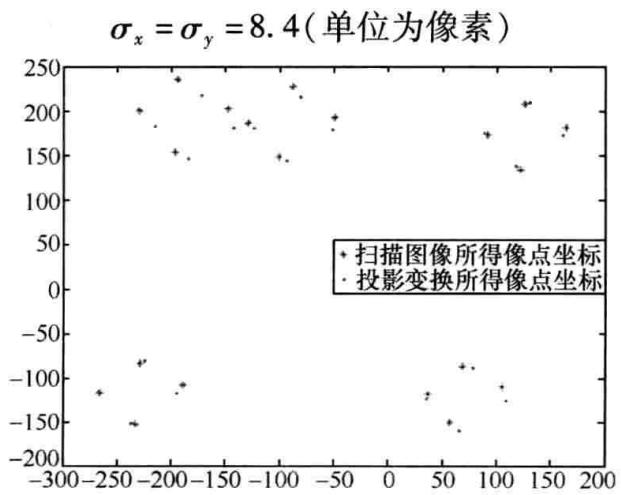

<details>
<summary>scatter</summary>

| Series | X (range) | Y (range) |
| --- | --- | --- |
| 扫描图像所得像点坐标 | -250~170 | -160~240 |
| 投影变换所得像点坐标 | -250~170 | -160~240 |
</details>

图 22 模型 1 拟合像点与观察像点的关系图

模型 2 的切线选点法的精度分析(图 24 和图 25): 根据残差分析, 结合模型 2 代入数据得到像平面的精度:

扫描图像所得像点X坐标与投影变换所得像点X坐标的散点图  
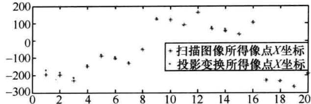

<details>
<summary>scatter</summary>

| X | 扫描图像所得像点X坐标 | 投影变换所得像点X坐标 |
| --- | --- | --- |
| 1 | ~-190 | ~-180 |
| 2 | ~-195 | ~-210 |
| 3 | ~-230 | ~-225 |
| 4 | ~-145 | — |
| 5 | ~-85 | — |
| 6 | ~-95 | — |
| 7 | ~-130 | — |
| 8 | ~-45 | — |
| 9 | ~130 | — |
| 10 | ~125 | — |
| 11 | ~100 | — |
| 12 | ~170 | — |
| 13 | ~80 | — |
| 14 | ~70 | — |
| 15 | ~50 | — |
| 16 | ~115 | — |
| 17 | ~-225 | — |
| 18 | ~-230 | — |
| 19 | ~-265 | — |
| 20 | ~-190 | — |
</details>

扫描图像所得像点Y坐标与投影变换所得像点Y坐标的散点图  
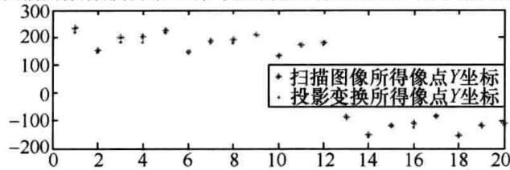

<details>
<summary>scatter</summary>

| X | 扫描图像所得像点Y坐标 | 投影变换所得像点Y坐标 |
| --- | --- | --- |
| 1 | — | ~230 |
| 2 | ~150 | — |
| 3 | ~190 | — |
| 4 | ~200 | — |
| 5 | ~220 | — |
| 6 | ~150 | — |
| 7 | ~180 | — |
| 8 | ~190 | — |
| 9 | ~210 | — |
| 10 | ~130 | — |
| 11 | ~170 | — |
| 12 | ~180 | — |
| 13 | — | ~-90 |
| 14 | — | ~-160 |
| 15 | — | ~-120 |
| 16 | — | ~-110 |
| 17 | — | ~-90 |
| 18 | — | ~-160 |
| 19 | — | ~-120 |
| 20 | — | ~-110 |
</details>

图 23 模型 1 拟合像点坐标轴与观察像点坐标轴的关系图

$\sigma_{x} = \sigma_{y} = 7.0$ （单位为像素）  
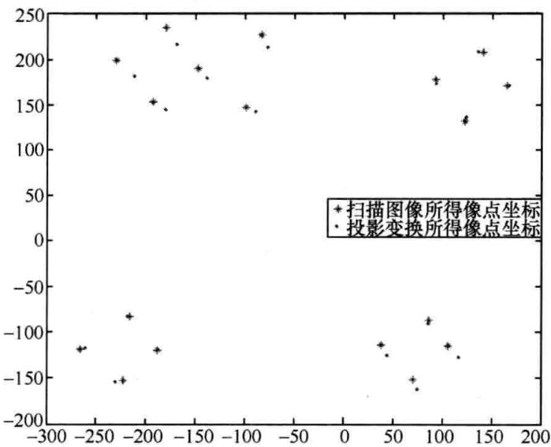

<details>
<summary>scatter</summary>

| Series | X (range) | Y (range) |
| --- | --- | --- |
| 扫描图像所得像点坐标 | -260~170 | 135~240 |
| 投影变换所得像点坐标 | 35~120 | -165~-85 |
</details>

图 24 模型 2 拟合像点与观察像点的关系图

扫描图像所得像点X坐标与投影变换所得像点X坐标的散点图  
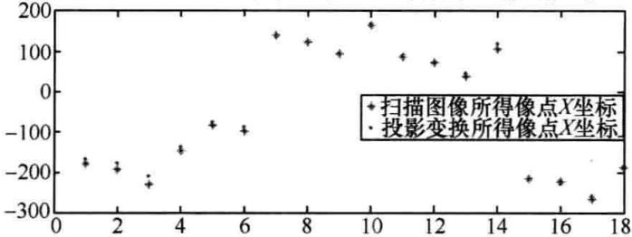

<details>
<summary>scatter</summary>

| X | 扫描图像所得像点X坐标 | 投影变换所得像点X坐标 |
| --- | --- | --- |
| 1 | ~-180 | — |
| 2 | ~-190 | — |
| 3 | ~-240 | — |
| 4 | ~-150 | — |
| 5 | ~-80 | — |
| 6 | ~-100 | — |
| 7 | ~140 | — |
| 8 | ~120 | — |
| 9 | ~100 | — |
| 10 | ~170 | — |
| 11 | ~90 | — |
| 12 | ~75 | — |
| 13 | ~40 | — |
| 14 | ~110 | — |
| 15 | ~-220 | — |
| 16 | ~-230 | — |
| 17 | ~-270 | — |
| 18 | ~-190 | — |
</details>

扫描图像所得像点Y坐标与投影变换所得像点Y坐标的散点图  
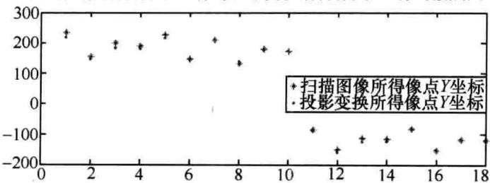

<details>
<summary>scatter</summary>

| X | 扫描图像所得像点Y坐标 | 投影变换所得像点Y坐标 |
| --- | --- | --- |
| 1 | ~230 | — |
| 2 | ~150 | — |
| 3 | ~200 | — |
| 4 | ~190 | — |
| 5 | ~220 | — |
| 6 | ~150 | — |
| 7 | ~210 | — |
| 8 | ~130 | — |
| 9 | ~180 | — |
| 10 | ~170 | — |
| 11 | — | ~-90 |
| 12 | — | ~-160 |
| 13 | — | ~-120 |
| 14 | — | ~-120 |
| 15 | — | ~-90 |
| 16 | — | ~-160 |
| 17 | — | ~-120 |
| 18 | — | ~-120 |
</details>

图 25 模型 2 拟合像点坐标轴与观察像点坐标轴的关系图

从两种选点方法的所得结果精度上,可以看出切线选点法要优于边缘选点法。

## 8 问题4(模型3的求解)

通过问题 1、2 的解决, 可以得到物平面坐标系上点到照相机坐标系上点的对应关系, 特别是中间变换的数学关系, 可以帮助确立两个照相机的相对位置。

## 8.1 坐标系建立

在解决第 4 问前首先建立三个坐标系,如图 26 所示。

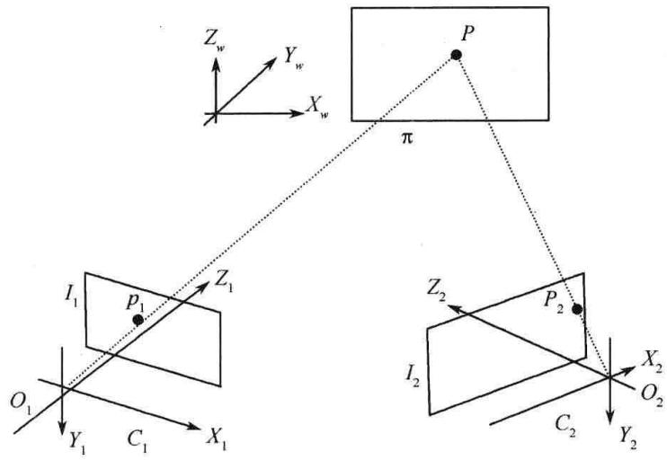

<details>
<summary>text_image</summary>

Zw
Yw
Xw
P
π
I1
p1
Z1
O1
Y1
C1
X1
Z2
P2
I2
X2
O2
C2
Y2
</details>

图 26 两台相机情况下坐标示意图

标靶坐标系:以标靶靶面为一个坐标面,建立坐标系 $OX_{w}Y_{w}Z_{w}$ 。

相机 1 坐标系: 以相机 1 的透镜面为一个坐标面, 建立坐标系 $O_{1}X_{1}Y_{1}Z_{1}$ 。

相机 2 坐标系: 以相机 2 的透镜面为一个坐标面, 建立坐标系 $O_{2}X_{2}Y_{2}Z_{2}$ 。

## 8.2 各坐标系的变换

由前面的矩阵空间变换式(12)推导可知,标靶坐标系上一点 $p(x_{w},y_{w},z_{w})$ 可经过矩阵变换到相机1和相机2的坐标系中,设变换矩阵分别为 $\begin{bmatrix}R_{1}&T_{1}\\0^{T}&1\end{bmatrix}$ 和 $\begin{bmatrix}R_{2}&T_{2}\\0^{T}&1\end{bmatrix}$ (式12),设变换后的坐标分别为 $p_{1}(x_{1},y_{1},z_{1})$ 、 $p_{2}(x_{2},y_{2},z_{2})$ , $T_{i}=(t_{i1},t_{i2},t_{i3})^{\mathrm{T}},i=1,2$ ,则存在关系:

$$
\left[ \begin{array}{l} x _ {1} \\ y _ {1} \\ z _ {1} \\ 1 \end{array} \right] = \left[ \begin{array}{c c} \boldsymbol {R} _ {1} & \boldsymbol {T} _ {1} \\ \boldsymbol {0} ^ {\mathrm{T}} & 1 \end{array} \right] \left[ \begin{array}{l} x _ {w} \\ y _ {w} \\ z _ {w} \\ 1 \end{array} \right] \tag {19}
$$

$$
\left[ \begin{array}{l} x _ {2} \\ y _ {2} \\ z _ {2} \\ 1 \end{array} \right] = \left[ \begin{array}{c c} \boldsymbol {R} _ {2} & \boldsymbol {T} _ {2} \\ \boldsymbol {0} ^ {\mathrm{T}} & 1 \end{array} \right] \left[ \begin{array}{l} x _ {w} \\ y _ {w} \\ z _ {w} \\ 1 \end{array} \right] \tag {20}
$$

## 8.3 模型3建立

有了相机1和相机2关于标靶上同一点的坐标关系式(19)、式(20)，可以得到相机1和相机2相对位置的关系。

由式(19)、式(20)有

$$
\begin{array}{l} \left[ \begin{array}{l} x _ {w} \\ y _ {w} \\ z _ {w} \\ 1 \end{array} \right] = \left[ \begin{array}{c c} \boldsymbol {R} _ {1} & \boldsymbol {T} _ {1} \\ \boldsymbol {0} ^ {\mathrm{T}} & 1 \end{array} \right] ^ {- 1} \left[ \begin{array}{l} x _ {1} \\ y _ {1} \\ z _ {1} \\ 1 \end{array} \right] \\ \left[ \begin{array}{l} x _ {w} \\ y _ {w} \\ z _ {w} \\ 1 \end{array} \right] = \left[ \begin{array}{c c} \boldsymbol {R} _ {2} & \boldsymbol {T} _ {2} \\ \boldsymbol {0} ^ {\mathrm{T}} & 1 \end{array} \right] ^ {- 1} \left[ \begin{array}{l} x _ {2} \\ y _ {2} \\ z _ {2} \\ 1 \end{array} \right] \\ \end{array}
$$

进而可得

$$
\left[ \begin{array}{l l} \boldsymbol {R} _ {2} & \boldsymbol {T} _ {2} \\ \boldsymbol {0} ^ {\mathrm{T}} & 1 \end{array} \right] ^ {- 1} \left[ \begin{array}{l} x _ {2} \\ y _ {2} \\ z _ {2} \\ 1 \end{array} \right] = \left[ \begin{array}{l l} \boldsymbol {R} _ {1} & \boldsymbol {T} _ {1} \\ \boldsymbol {0} ^ {\mathrm{T}} & 1 \end{array} \right] ^ {- 1} \left[ \begin{array}{l} x _ {1} \\ y _ {1} \\ z _ {1} \\ 1 \end{array} \right] \tag {21}
$$

## 8.4 模型求解算法

由前面的矩阵空间变换推导, 就可以在 $\begin{bmatrix} R_{1} & T_{1} \\ \mathbf{0}^{T} & 1 \end{bmatrix}$ 和 $\begin{bmatrix} R_{2} & T_{2} \\ \mathbf{0}^{T} & 1 \end{bmatrix}$ 已知, 且物点在相机 1 坐标系位置明确的前提下确定在相机 2 坐标系中的坐标位置, 反之亦然。显然求 $\begin{bmatrix} R_{1} & T_{1} \\ \mathbf{0}^{T} & 1 \end{bmatrix}$ 和 $\begin{bmatrix} R_{2} & T_{2} \\ \mathbf{0}^{T} & 1 \end{bmatrix}$ 成为求解模型的关键。

对于 $\begin{bmatrix}R_{1}&T_{1}\\ \mathbf{0}^{\mathrm{T}}&1\end{bmatrix}$ 和 $\begin{bmatrix}R_{2}&T_{2}\\ \mathbf{0}^{\mathrm{T}}&1\end{bmatrix}$ 的求解可以利用问题1的矩阵模型。

解法操作步骤：

步骤 1: 固定两个相机, 同时对标靶拍照。

步骤 2: 结合两张照片, 利用问题 2 的选点方法进行选点。

步骤 3: 利用步骤 2 的参考点以及问题 1 的矩阵模型。

$$
\boldsymbol {M} = \left[ \begin{array}{l l l l} v & 0 & 0 & 0 \\ 0 & v & 0 & 0 \\ 0 & 0 & 1 & 0 \end{array} \right] \left[ \begin{array}{c c} \boldsymbol {R} & \boldsymbol {T} _ {0} \\ \boldsymbol {0} ^ {\mathrm{T}} & 1 \end{array} \right] = \left[ \begin{array}{l l l l} m _ {1 1} & m _ {1 2} & m _ {1 3} & m _ {1 4} \\ m _ {2 1} & m _ {2 2} & m _ {2 3} & m _ {2 4} \\ m _ {3 1} & m _ {3 2} & m _ {3 3} & m _ {3 4} \end{array} \right]
$$

$$
\left(m _ {3 1} x _ {i} ^ {\prime} + m _ {3 2} y _ {i} ^ {\prime} + m _ {3 3} z _ {i} ^ {\prime} + m _ {3 4}\right) x _ {v i} = m _ {1 1} x _ {i} ^ {\prime} + m _ {1 2} y _ {i} ^ {\prime} + m _ {1 3} z _ {i} ^ {\prime} + m _ {1 4}
$$

$$
\left(m _ {3 1} x _ {i} ^ {\prime} + m _ {3 2} y _ {i} ^ {\prime} + m _ {3 3} z _ {i} ^ {\prime} + m _ {3 4}\right) y _ {v i} = m _ {2 1} x _ {i} ^ {\prime} + m _ {2 2} y _ {i} ^ {\prime} + m _ {2 3} z _ {i} ^ {\prime} + m _ {2 4}
$$

分别计算出 $\begin{bmatrix}R_{1}&T_{1}\\ \mathbf{0}^{T}&1\end{bmatrix}$ 和 $\begin{bmatrix}R_{2}&T_{2}\\ \mathbf{0}^{T}&1\end{bmatrix}$ 。

步骤4: 计算两相机光学中心(在各自坐标系中都为(0,0,0))的相对位置, 有

$$
\left[ \begin{array}{l} x _ {2} \\ y _ {2} \\ z _ {2} \\ 1 \end{array} \right] = \left[ \begin{array}{c c} \boldsymbol {R} _ {2} & \boldsymbol {T} _ {2} \\ \boldsymbol {0} ^ {\mathrm{T}} & 1 \end{array} \right] \left[ \begin{array}{c c} \boldsymbol {R} _ {1} & \boldsymbol {T} _ {1} \\ \boldsymbol {0} ^ {\mathrm{T}} & 1 \end{array} \right] ^ {- 1} \left[ \begin{array}{l} 0 \\ 0 \\ 0 \\ 1 \end{array} \right]
$$

(相机 1 光心相对于与相机 2 的位置)

或

$$
\left[ \begin{array}{l} x _ {1} \\ y _ {1} \\ z _ {1} \\ 1 \end{array} \right] = \left[ \begin{array}{c c} \boldsymbol {R} _ {1} & \boldsymbol {T} _ {1} \\ \boldsymbol {0} ^ {\mathrm{T}} & 1 \end{array} \right] \left[ \begin{array}{c c} \boldsymbol {R} _ {2} & \boldsymbol {T} _ {2} \\ \boldsymbol {0} ^ {\mathrm{T}} & 1 \end{array} \right] ^ {- 1} \left[ \begin{array}{l} 0 \\ 0 \\ 0 \\ 1 \end{array} \right]
$$

(相机 2 光心相对于与相机 1 的位置)

这样两相机的相对问题就得到了解决,解法流程如图 27 所示。

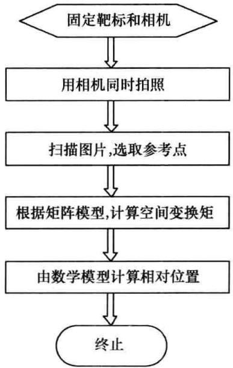

<details>
<summary>flowchart</summary>

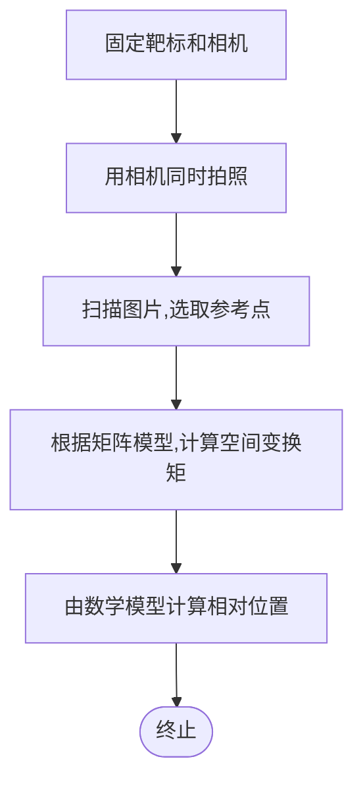
```mermaid
graph TD
  A["固定靶标和相机"] --> B["用相机同时拍照"]
  B --> C["扫描图片,选取参考点"]
  C --> D["根据矩阵模型,计算空间变换矩"]
  D --> E["由数学模型计算相对位置"]
  E --> F(["终止"])
```
</details>

图 27 解法流程图

这里不对模型的具体数值解做讨论。

# 9 模型评价及推广

## 9.1 模型的优点

（1）模型 1 和模型 2 建立过程中进行了严格的数学证明(定理 1 至定理 3)，这样就可以保证模型推导的正确性。  
（2）选点问题影响着模型的求解结果，在选点问题上，证明并运用了定理4和定理5，这样就确保了选点的准确性。  
（3）本文建立的模型可操作性强；通过在靶标及其像中提取信息就可确定该靶标中任一物点对应的像点。  
(4) 本文中模型的可推广性强, 可以将两台相机扩展为多台相机, 原理不发生改变。

## 9.2 模型的缺点

本文的模型在图像二值化过程中,对灰度扫描不够准确,但随着科学技术的发展,一定可以解决这个问题。

## 9.3 模型推广

还可以对模型加以改进。比如模型中用于标定的两相机像距相同,但可以考虑不同像距的两相机如何标定,鉴于时间原因,在此不作讨论。

本文建立的模型不只可以应用在相机标定问题上,还可以应用在其他方面。比如机器人对物体的定位;可以将两台相机看成机器人的两双眼睛,通过机器人两眼的相对位置和空间中某点在两眼中所成的像,就可以确定空间中该点的坐标。

## 参考文献

[1] 马颂德, 张正友. 计算机视觉—计算理论与算法基础. 北京: 科学出版社, 1998.  
[2] 约翰, 威廉. 应用线性回归模型. 北京: 中国统计出版社, 1983.  
[3] 赵勋杰, 李成金. 双目立体实时测距系统的关键技术研究. 激光与红外, 2006, 36(9): 874-877.  
[4] 宣海燕, 张峰, 申功勋. 大视场短焦距成像系统的快速校正. 测控技术, 2007, 26(6): 28-30.  
[5] 最高分辨率. http://publish.it168.com/CWORD/238.shtml. 2008.09.19.  
[6] 王沫然. Matlab 与数值计算(第 2 版). 北京: 电子工业出版社, 2008.  
[7] 王正林, 刘明. 精通 Matlab7. 北京: 电子工业出版社, 2008.

附录1

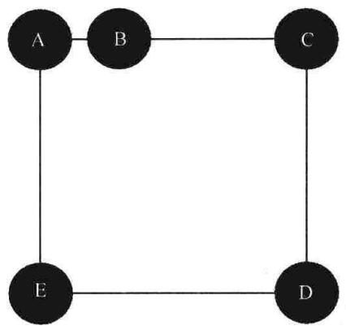

<details>
<summary>flowchart</summary>


```mermaid
graph LR
  A["A"] --> B["B"]
  B["B"] --> C["C"]
  C["C"] --> D["D"]
  D["D"] --> E["E"]
  E["E"] --> A
```
</details>

附图 1 靶标示意图

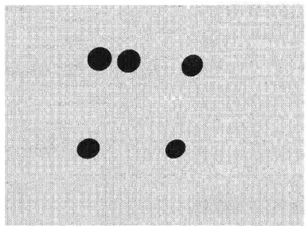

<details>
<summary>natural_image</summary>

Four black circular objects arranged in a cross pattern on a textured gray background (no text or symbols)
</details>

附图 2 靶标的像

附录2 $(x_{\nu},y_{\nu}$ 的具体表达式）

$$
x _ {v} = - \frac {z _ {v} (\cos \varphi \sin \gamma x _ {s} + \sin \varphi \sin \gamma y _ {s} + x _ {0} \sin \gamma)}{x _ {s} (\cos \varphi \cos \gamma \cos \beta - \sin \varphi \sin \beta) + y _ {s} (\cos \varphi \sin \beta + \sin \varphi \cos \gamma \cos \beta) + y _ {0} \sin \beta + x _ {0} \cos \gamma \cos \beta + C}
$$

$$
y _ {v} = - \frac {z _ {v} \left(- (\cos \beta \sin \varphi + \cos \varphi \cos \gamma \sin \beta) x _ {s} + (\cos \varphi \cos \beta - \cos \gamma \sin \beta \sin \varphi) y _ {s} + y _ {0} \cos \beta - x _ {0} \cos \gamma \sin \beta\right)}{x _ {s} (\cos \varphi \cos \gamma \cos \beta - \sin \varphi \sin \beta) + y _ {s} (\cos \varphi \sin \beta + \sin \varphi \cos \gamma \cos \beta) + y _ {0} \sin \beta + x _ {0} \cos \gamma \cos \beta + C}
$$

## 【论文点评】

姚奎

本论文把相机定位建立数学模型的问题,转化为空间坐标变换问题。文章首先建立了物点与像点之间坐标关系的数学模型,建立了从物平面到系统坐标系的变换公式;其次利用空间几何变换和矩阵变换两种方法,证明了三个定理,得到了物点到像点坐标转换的两个数学模型,并对这两个模型进行了比较。再次通过建立、证明、分析关于参考点选取的两个定理,设计了边缘选点和切线选点两种方法,解决了问题2;然后对文章中的数学模型进行残差分析并给出了精度估计,最后在此基础上得到了两台相机的相对位置。

该文对于问题的解答,扣紧了层次清晰的环。使用了五个定理及几个推论的表达方法,有效增加了文章的整体性和层次清晰性。

文章创新之处在于前面两个模型的建立,事实上两个模型是相互独立的,作者可能并不能确认哪种模型最有效接近标准答案,所以同时使用,并且进行了模型比较,从而进一步验证模型的正确性。

本文最大的缺憾,在于中文的表述。作者对于摘要、文章层次把握得很好。但是,由于时间的原因,在文章整体的中文表达上有所欠缺,读起来略有晦涩,这是值得改进的地方。

# 数码相机定位研究

## 摘要

本文是研究数码相机定位过程中系统标定的问题,四个问题的分析逐步递进,具有很强的层次性。

问题一、二在只考虑一部相机的条件下,研究靶标平面圆心的成像情况。建立了两个模型。模型一(间接法):以公切线交点作为参考点,间接确定靶标平面上圆的圆心在相机平面上的像坐标。模型的优点在于算法步骤清晰,能定出靶标平面,为第四问的通过靶标平面搭桥进行坐标变换求解做了铺垫。模型二(直接法):采用两种方法,直接根据像平面图,用计算机定出圆心像的坐标,求解过程简便,精度较高。这两种定点的方法均十分巧妙,为本文的一大创新。

模型二求出了较精确的圆心像坐标：

单位:mm

<table><tr><td> $A'$ </td><td> $B'$ </td><td> $C'$ </td><td> $D'$ </td><td> $E'$ </td></tr><tr><td>(-50.000,51.323)</td><td>(-23.545,49.471)</td><td>(33.862,44.974)</td><td>(18.783,-31.482)</td><td>(-60.053,-31.217)</td></tr></table>

问题三对所建立模型进行检验和精度、稳定性分析,并给出了相应的精度和稳定性指标。

问题四则在前面问题的基础上,建立物像平面的关系后,以物坐标系为桥梁通过空间坐标变换建立两部相机的像坐标关系,确立了相机二坐标系的原点在相机一坐标系的坐标 $\boldsymbol{\beta}_{10}=-\boldsymbol{P}_{1}\boldsymbol{P}_{2}^{-1}\boldsymbol{r}_{2}+\boldsymbol{r}_{1}$ 和相机二像平面在相机一坐标系的平面方程 $\left[\boldsymbol{P}_{2}\boldsymbol{P}_{1}^{-1}\left(\boldsymbol{\beta}_{1}-\boldsymbol{r}_{1}\right)+\boldsymbol{r}_{2}\right]\cdot\boldsymbol{e}_{3}=-u_{2}$ ,这两个条件就可以确定两部相机的相对位置。

## 1 问题的重述

数码相机定位在交通监管(电子警察)等方面有广泛的应用。所谓数码相机定位是指用数码相机摄制物体的相片确定物体表面某些特征点的位置。最常用的定位方法是双目定位,即用两部相机来定位。对物体上一个特征点,用两部固定于不同位置的相机摄得物体的像,分别获得该点在两部相机像平面上的坐标。只要知道两部相机精确的相对位置,就可以用几何的方法得到该特征点在固定一部相机的坐标系中的坐标,即确定了特征点的位置。于是对双目定位,精确地确定两部相机的相对位置就是关键,这一过程称为系统标定。

标定的一种做法是:在一块平板上画若干个点,同时用这两部相机照相,分别得到这些点在它们像平面上的像点,利用这两组像点的几何关系就可以得到这两部相机的相对位置。然而,无论在物平面或像平面上都无法直接得到没有几何尺寸的“点”。实际的做法是在物平面上画若干个圆(称为靶标),它们的圆心就是几何的点了。而它们的像一般会变形,如图1所示,所以必须从靶标上的这些圆的像中把圆心的像精确地找到,标定就可实现。

有人设计靶标如下,取1个边长为100mm的正方形,分别以四个顶点(对应为A、C、D、E)为圆心,12mm为半径作圆。以AC边上距离A点30mm处的B为圆心,12mm为半径作圆,如图2所示。

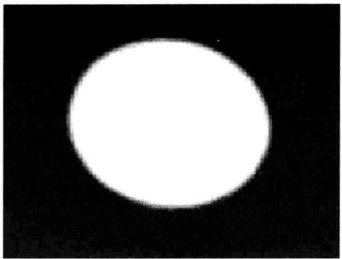

<details>
<summary>natural_image</summary>

A white circular shape centered on a black background, resembling a celestial body or object (no text or symbols visible)
</details>

图 1 靶标上圆的像

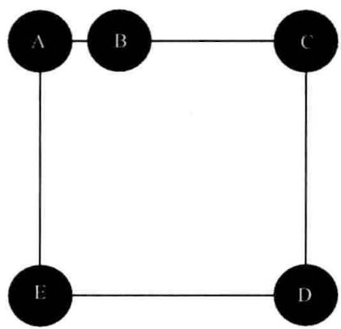

<details>
<summary>flowchart</summary>

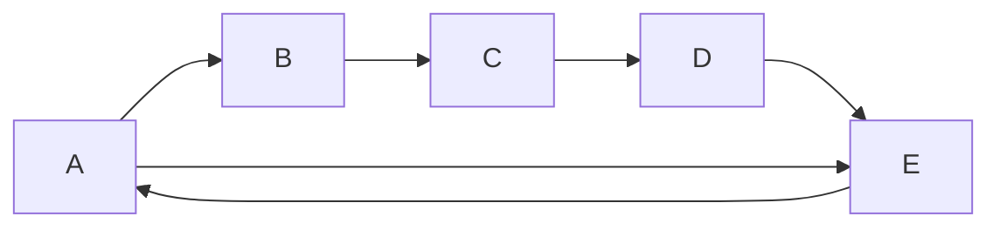
```mermaid
graph LR
  A["A"] --> B["B"]
  B["B"] --> C["C"]
  C["C"] --> D["D"]
  D["D"] --> E["E"]
  E["E"] --> A
  A --> E
```
</details>

图 2 靶标示意图

用一位置固定的数码相机摄得其像,如图3所示。

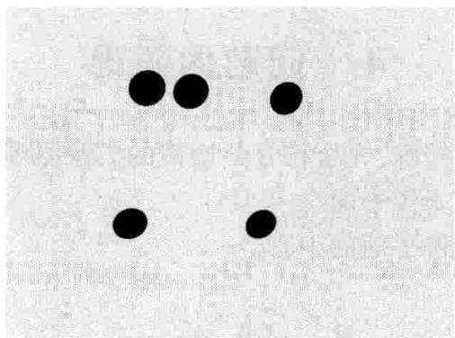

<details>
<summary>natural_image</summary>

Abstract pattern of black dots on a textured gray background (no text or symbols)
</details>

图 3 靶标的像

要求：

（1）建立数学模型和算法以确定靶标上圆的圆心在该相机像平面的像坐标，这里坐标系原点取在该相机的凸透镜中心，x-y 平面平行于像平面。  
（2）对由图2、图3分别给出的靶标及其像，计算靶标上圆的圆心在像平面上的像坐标，该相机的像距（即凸镜中心到像平面的距离）是1577个像素单位（1mm约为3.78个像素单位），相机分辨率为 $1024 \times 768$ 。  
(3) 设计一种方法检验你们的模型,并对方法的精度和稳定性进行讨论。  
(4) 建立用此靶标给出两部固定相机相对位置的数学模型和方法。

## 2 问题的分析

问题一要求确定靶标上圆的圆心在该相机像平面的像坐标,可采用间接法,借助参考

点,通过这些固定参考点的成像变换确定物平面与像平面的对应关系。

问题二在问题一建立的模型基础上带入具体数值进行求解。同时,采用两种直接找圆心像点的方法,通过计算机在像平面中测出像点坐标。

问题三从照片本身和处理过程(灰度、切线、取值、计算)分析误差因素,把计算得到的像点返回到标靶平面,与靶标的圆心进行比较,讨论精度和稳定性,并给出了精度和稳定性指标。

问题四要确定两部固定相机的相对位置,可以将一部相机的位置在另一部相机的坐标表系中表示出来。设相机一的坐标系为 $Cx_{1}y_{1}z_{1}$ ，相机二的坐标系为 $Cx_{2}y_{2}z_{2}$ ，可以通过一旋转矩阵 R 加一个平移矩阵 r 就可以将相机二的坐标变换到相机一坐标系中。这样，如果一个点在相机二坐标系下的坐标为 $M_{2}$ ，那么该点在相机一坐标系的坐标就为 $M_{1}=RM_{2}+r$ 。[1] 这样，通过该坐标变换式以及已知条件，就可以确立相机二的光学中心即相机二坐标系原点在相机一坐标系的坐标和相机二像平面在相机一坐标系的平面方程，从而确定两部固定相机的相对位置。

## 3 符号约定

r:靶标上圆的半径;

d:靶标上正方形的边长。

## 4 问题的假设

(1) 相机内部参数设置精确, 完全符合凸透镜的成像原理。  
(2) 凸透镜的光轴垂直于像平面。  
(3) 凸透镜的光轴指向像平面的中心。

## 5 问题一

## 5.1 模型的分析

要求确定靶标上圆的圆心在该相机像平面的像坐标,由命题1靶标上圆的圆心的像不再是图3中像圆的几何中心,很难直接找到实圆的圆心与像圆的圆心之间的对应关系。因此,另找其他参考点。

命题 1 当靶标平面不平行于像平面时,靶标上圆的圆心的像不再是该圆像的几何中心(证明见附录)。

命题 2 靶标平面里两圆的公切线经相机成像后仍为像平面中对应圆像的公切线。

由反证法即可证明:设直线 l 是靶标中两圆 $O_{1}$ 、 $O_{2}$ 的公切线, 假设经过相机成像后 $l'$ 不是两圆像的外公切线, 那么 $l'$ 与像不是有且仅有一个交点, 据成像原理点与像一一对应的关系, 则从像中找靶标上的对应点时, l 与两圆的切点就不是有且仅有一个交点, 与已知直线 l 是靶标中两圆 $O_{1}$ 、 $O_{2}$ 的外公切线相矛盾, 假设不成立, 从而证得 l 经过相机成像

后 $l'$ 仍是两圆像的公切线, 命题 2 为真。

命题 3 公切线交点经成像后仍为对应公切线的交点。

命题 2 正确, 命题 3 显然也正确, 所以, 选公切线交点作为参考点。

设 $M, N, P$ 分别是两条公切线的交点，经过相机成像后对应公切线的交点为 $M', N', P'$ ，如图4所示。

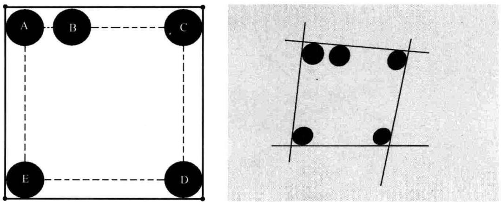  
图4

流程图如图 5 所示。

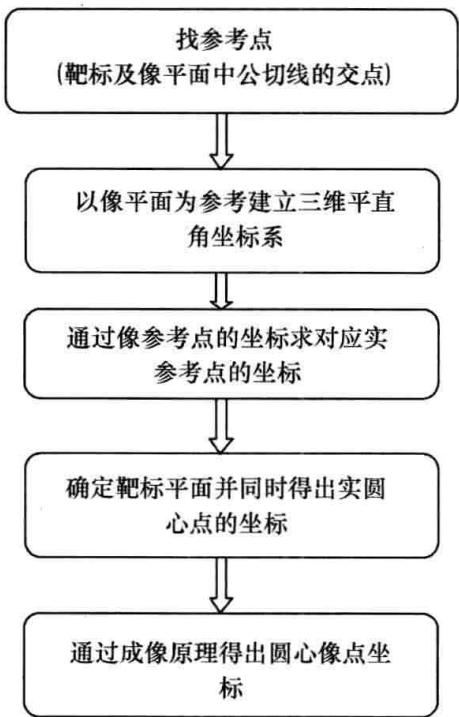

<details>
<summary>flowchart</summary>

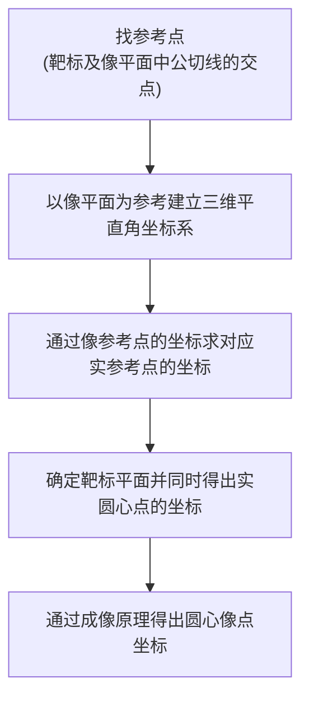
```mermaid
graph TD
  A["找参考点\n(靶标及像平面中公切线的交点)"] --> B["以像平面为参考建立三维平直角坐标系"]
  B --> C["通过像参考点的坐标求对应实参考点的坐标"]
  C --> D["确定靶标平面并同时得出实圆心点的坐标"]
  D --> E["通过成像原理得出圆心像点坐标"]
```
</details>

图5

## 5.2 模型的建立

将坐标系原点取在该相机的凸透镜中心，x-y 平面平行于像平面，建立三维直角坐标系，则像平面为 $z=z'$ 。

设像平面中圆的公切线交点 $M^{\prime}, N^{\prime}, P^{\prime}$ , 可通过计算机测得其坐标, 可设 $M^{\prime} = (x_{m}^{\prime}, y_{m}^{\prime}, z^{\prime}), N^{\prime} = (x_{n}^{\prime}, y_{n}^{\prime}, z^{\prime}), P^{\prime} = (x_{p}^{\prime}, y_{p}^{\prime}, z^{\prime})$ , 均为已知量。同时设实物圆的公切线交点 $M = (x_{m}, y_{m}, z_{m}), N = (x_{n}, y_{n}, z_{n}), P = (x_{p}, y_{p}, z_{p})$ , 均为未知量。由相机成像原理, $M, O, M^{\prime}$ 共

线，N、O、N'共线，P、O、P'共线，如图6所示。

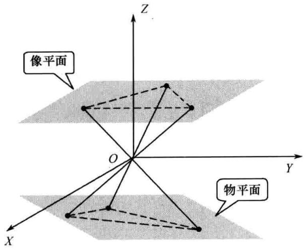

<details>
<summary>text_image</summary>

像平面
物平面
</details>

图6

因此,有

$$
\boldsymbol {O M} = k _ {1} \boldsymbol {O M ^ {\prime}}, \boldsymbol {O N} = k _ {2} \boldsymbol {O N ^ {\prime}}, \boldsymbol {O P} = k _ {3} \boldsymbol {O P ^ {\prime}}
$$

即

$$
\frac {x _ {m}}{x _ {m} ^ {\prime}} = \frac {y _ {m}}{y _ {m} ^ {\prime}} = \frac {z _ {m}}{z ^ {\prime}} = k _ {1}
$$

$$
\frac {x _ {n}}{x _ {n} ^ {\prime}} = \frac {y _ {n}}{y _ {n} ^ {\prime}} = \frac {z _ {n}}{z ^ {\prime}} = k _ {2}
$$

$$
\frac {x _ {p}}{x _ {p} ^ {\prime}} = \frac {y _ {p}}{y _ {p} ^ {\prime}} = \frac {z _ {p}}{z ^ {\prime}} = k _ {3}
$$

又因为靶标的实物图上 M、N、P 存在关系, 有

$$
\left| \boldsymbol {M} \boldsymbol {N} \right| = d + 2 r
$$

$$
\left| \boldsymbol {M} \boldsymbol {P} \right| = d + 2 r
$$

$$
\mid M N \mid \cdot \mid M P \mid = 0
$$

即

$$
\sqrt {\left(x _ {m} - x _ {n}\right) ^ {2} + \left(y _ {m} - y _ {n}\right) ^ {2} + \left(z _ {m} - z _ {n}\right) ^ {2}} = 1 0 0 + 2 \times 1 2
$$

$$
\sqrt {\left(x _ {m} - x _ {p}\right) ^ {2} + \left(y _ {m} - y _ {p}\right) ^ {2} + \left(z _ {m} - z _ {p}\right) ^ {2}} = 1 0 0 + 2 \times 1 2
$$

$$
\left(x _ {m} - x _ {n}\right) \left(x _ {m} - x _ {p}\right) + \left(y _ {m} - y _ {n}\right) \left(y _ {m} - y _ {p}\right) + \left(z _ {m} - z _ {n}\right) \left(z _ {m} - z _ {p}\right) = 0
$$

所以建立模型和算法如下：

算法第一步：

$$
\left\{ \begin{array}{l} \frac {x _ {m}}{x _ {m} ^ {\prime}} = \frac {y _ {m}}{y _ {m} ^ {\prime}} = \frac {z _ {m}}{z ^ {\prime}} = k _ {1} \\ \frac {x _ {n}}{x _ {n} ^ {\prime}} = \frac {y _ {n}}{y _ {n}} = \frac {z _ {n}}{z ^ {\prime}} = k _ {2} \\ \frac {x _ {p}}{x _ {p} ^ {\prime}} = \frac {y _ {p}}{y _ {p} ^ {\prime}} = \frac {z _ {p}}{z ^ {\prime}} = k _ {3} \\ \sqrt {\left(x _ {m} - x _ {n}\right) ^ {2} + \left(y _ {m} - y _ {n}\right) ^ {2} + \left(z _ {m} - z _ {n}\right) ^ {2}} = 1 2 4 \\ \sqrt {\left(x _ {m} - x _ {p}\right) ^ {2} + \left(y _ {m} - y _ {p}\right) ^ {2} + \left(z _ {m} - z _ {p}\right) ^ {2}} = 1 2 4 \\ \left(x _ {m} - x _ {n}\right) \left(x _ {m} - x _ {p}\right) + \left(y _ {m} - y _ {n}\right) \left(y _ {m} - y _ {p}\right) + \left(z _ {m} - z _ {n}\right) \left(z _ {m} - z _ {p}\right) = 0 \end{array} \right. \tag {1}
$$

方程组(1)中带撇的量均为已知,通过计算机测得。再通过 MATLAB 软件求解上述方程组,M、N、P 点的坐标即可求出。

算法第二步：

M、N、P 三点坐标已知,由图 2 靶标平面中 M、N、P 与五个圆心的位置关系,求出这五个圆心的坐标。

例如 $A$ 圆圆心设为 $A(x_{a},y_{a},z_{a})$ ，如图7所示，有

$$
\left\{ \begin{array}{l} \sqrt {\left(x _ {a} - x _ {m}\right) ^ {2} + \left(y _ {a} - y _ {m}\right) ^ {2} + \left(z _ {a} - z _ {m}\right) ^ {2}} = \sqrt {2} r \\ \sqrt {\left(x _ {a} - x _ {n}\right) ^ {2} + \left(y _ {a} - y _ {n}\right) ^ {2} + \left(z _ {a} - z _ {n}\right) ^ {2}} = \sqrt {(r + d) ^ {2} + r ^ {2}} \\ \sqrt {\left(x _ {a} - x _ {p}\right) ^ {2} + \left(y _ {a} - y _ {p}\right) ^ {2} + \left(z _ {a} - z _ {p}\right) ^ {2}} = \sqrt {(r + d) ^ {2} + r ^ {2}} \end{array} \right. \tag {2}
$$

求解此方程组,即可求得 A 圆圆心在此坐标系中的坐标。

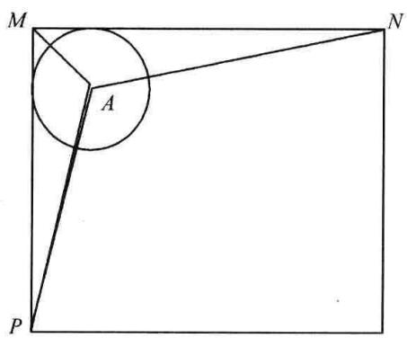

<details>
<summary>text_image</summary>

M
A
N
P
</details>

图7

算法第三步：

$A(x_{a},y_{a},z_{a})$ 已知，根据成像原理，连接 $A$ 点、 $O$ 点，延伸 $AO$ 与像平面交于 $A^{\prime}(x_{a},y_{a},z^{\prime})$ ，就为 $A$ 圆圆心在像平面中的像：

$$
\boldsymbol {O A} = k \boldsymbol {O A} ^ {\prime}
$$

即

$$
\frac {x _ {a}}{x _ {a} ^ {\prime}} = \frac {y _ {a}}{y _ {a} ^ {\prime}} = \frac {z _ {a}}{z ^ {\prime}} \tag {3}
$$

方程中 $x_{a}, y_{a}, z_{a}, z^{\prime}$ 均为已知，则 $x_{a}^{\prime}, y_{a}^{\prime}$ 可求出，像点 $A^{\prime}(x_{a}^{\prime}, y_{a}^{\prime}, z^{\prime})$ 就可准确得到。由此，所有圆心的像坐标均可求出。

## 6 问题二

## 6.1 模型一

此模型为问题一中建立的模型,求解问题二只需带入具体的数据进行计算。相机分辨率为 $1024 \times 768$ , 像距为 1577 个像素单位, 用计算机测得 $M'$ 、 $N'$ 、 $P'$ 的具体坐标值(单位统一换算成 mm):

$$
M ^ {\prime} (- 6 0. 0 5, 6 3. 4 9, 4 1 7. 2 0)
$$

$$
N ^ {\prime} (4 5. 5 0, 5 4. 2 3, 4 1 7. 2 0)
$$

$$
P ^ {\prime} (- 7 1. 6 9, - 4 1. 0 1, 4 1 7. 2 0)
$$

第一步：

将 $M^{\prime}, N^{\prime}, P^{\prime}$ 的具体坐标带入算法第一步的方程组(1)，用MATLAB软件即可求得对应点 $M, N, P$ 的坐标（程序见附录）：

$$
M \quad (6 9. 7 0 1 8, 7 3. 6 9 4 7, 4 8 4. 2 5 6)
$$

$$
N \quad (5 3. 6 6 7 5, - 6 3. 9 6 4 5, 4 9 2. 0 8 9)
$$

$$
P \quad (7 6. 4 7 4 6, 4 3. 7 4 7, 4 4 5. 0 4 4)
$$

同时设靶标平面方程 $x + ay + bz + c = 0, M, N, P$ 在该平面上，所以有

$$
\left\{ \begin{array}{l} 6 9. 7 0 1 8 - 7 3. 6 9 4 7 a - 4 8 4. 2 5 6 b + c = 0 \\ - 5 3. 6 6 7 5 - 6 3. 9 6 4 5 a - 4 9 2. 0 8 9 b + c = 0 \\ 7 6. 4 7 4 6 + 4 3. 7 4 7 a - 4 4 5. 0 4 4 b + c = 0 \end{array} \right.
$$

解得

$$
a = 3. 6 7 6 2 6, b = - 1 1. 1 8 3 3, c = - 5 2 1 4. 3 5
$$

所以靶标平面的方程为

$$
x + 3. 6 7 6 2 6 y - 1 1. 1 8 3 3 z - 5 2 1 4. 3 5 = 0
$$

第二步：

由算法第二步求解方程,求出靶标平面上五个圆心的空间坐标。将 M、N、P 的具体坐标带入方程组(2),可求出 A 点坐标:

$$
A (5 8. 4 0 4 9, \quad - 6 1. 6 0 9 7, \quad - 4 8 1. 2 8 5)
$$

同理,带入相应方程组求得

$$
\begin{array}{l} B (2 8. 5 5 7 8, - 5 9. 2 5 0 8, - 4 8 3. 1 7 8) \\ C (- 4 1. 0 8 5 4, - 5 3. 7 4 6 6, - 4 8 7. 5 9 6) \\ D (- 3 5. 6 1 7 7, 4 1. 1 4 1, - 4 5 5. 8 4 3) \\ E (6 3. 8 7 2 6, 3 3. 2 7 7 8, - 4 4 9. 5 3 1) \\ \end{array}
$$

第三步：

由算法第三步,将各圆心坐标代入式(3),即可求出各圆心所对应像点的坐标:

$$
A ^ {\prime} (- 5 0. 6 2 8, 5 3. 4 0 6, 4 1 7. 2 0)
$$

$$
B ^ {\prime} (- 2 4. 6 5 8, 5 1. 1 6 0, 4 1 7. 2 0)
$$

$$
C ^ {\prime} (3 5. 1 5 4, 4 5. 9 8 7, 4 1 7. 2 0)
$$

$$
D ^ {\prime} (3 2. 5 9 8, - 3 7. 6 5 3, 4 1 7. 2 0)
$$

$$
E ^ {\prime} (5 9. 2 7 9, 3 0. \dot {8} 8 4, 4 1 7. 2 0)
$$

## 6.2 模型二

不采用问题一中建立的算法,直接在像图上找出靶标上圆的圆心对应的像点,下面给出寻找像点的方法和证明。

方法一(对角切点找圆心像):

理论依据：

命题 4 靶标平面上各圆外公切线交点组成的四边形的对角线经过圆心(例如图 8 中点 M 和点 2 的连线经过圆 A 的圆心)。

命题 5 该公切线交点经透镜成像后的像点组成的四边形的对角线经过圆心的像。

由命题3和命题4可推出命题5成立。

由命题5,像平面中圆外公切线的交点的连线经过靶标圆圆心的像,例如图8中点 $M'$ 和点 $2'$ 的连线,点 $1'$ 和点 $3'$ 的连线都经过圆A圆心的像 $A'$ 。那么,通过两条公切线得到交点,再由两个交点得到连线,最后两条连线的交点即可确定圆心像点坐标,图中 $M'2'$ 连线与 $1'3'$ 连线的交点就是圆A圆心的像。

求解方法：

将题目中的相片保存为黑白照片(单色),然后用 PHOTOSHOP 软件画出这五个圆的两两外公切线,如图 9 所示。

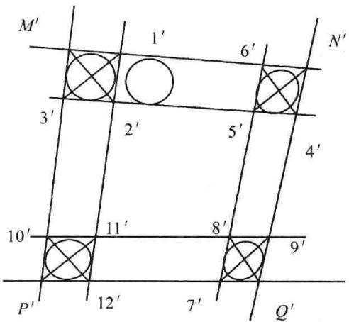

<details>
<summary>text_image</summary>

M'
1'
6'
N'
3'
2'
5'
4'
10'
11'
8'
9'
P'
12'
7'
Q'
</details>

图8

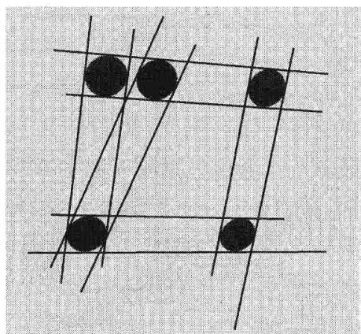

<details>
<summary>natural_image</summary>

Abstract geometric pattern with black dots and intersecting lines on a grid (no text or symbols)
</details>

图9

用 MATLAB 软件将图片文件读成 $1024 \times 768$ 的 0 - 1 矩阵, 通过计算机从图 9 上读出公切线交点坐标:

(单位:像素)

<table><tr><td>圆A、圆B与圆A、圆E外公切线交点</td><td>(285,144)</td><td>(371,151)</td><td>(359,234)</td><td>(276,228)</td></tr><tr><td>圆A、圆B与圆B、圆E外公切线交点</td><td>(363,234)</td><td>(447,240)</td><td>(484,161)</td><td>(398,154)</td></tr><tr><td>圆A、圆C与圆C、圆D外公切线交点</td><td>(611,172)</td><td>(684,179)</td><td>(668,255)</td><td>(596,250)</td></tr><tr><td>圆C、圆D与圆D、圆E外公切线交点</td><td>(555,469)</td><td>(624,470)</td><td>(610,537)</td><td>(542,537)</td></tr><tr><td>圆A、圆E与圆D、圆E外公切线交点</td><td>(249,465)</td><td>(329,466)</td><td>(320,538)</td><td>(241,539)</td></tr></table>

将对角的两点相连,圆心为对角线的交点,解交线方程得到圆心坐标,列表如下:

(单位:像素)

<table><tr><td> $A'$ </td><td> $B'$ </td><td> $C'$ </td><td> $D'$ </td><td> $E'$ </td></tr><tr><td>(323,190)</td><td>(423,198)</td><td>(640,214)</td><td>(583,504)</td><td>(285,502)</td></tr></table>

将坐标原点移到照片中心(和题目要求的坐标系统一),得到

(单位:像素)

<table><tr><td> $A'$ </td><td> $B'$ </td><td> $C'$ </td><td> $D'$ </td><td> $E'$ </td></tr><tr><td>(-189,194)</td><td>(-89,186)</td><td>(128,170)</td><td>(71,-120)</td><td>(-227,-118)</td></tr></table>

转换成毫米坐标：

(单位:mm)

<table><tr><td> $A'$ </td><td> $B'$ </td><td> $C'$ </td><td> $D'$ </td><td> $E'$ </td></tr><tr><td>( -50.000,51.323 )</td><td>( -23.545,49.206 )</td><td>(33.862,44.974 )</td><td>(18.783, -31.746 )</td><td>( -60.053, -31.217 )</td></tr></table>

方法二(坐标最大最小点找圆心像(图10)):

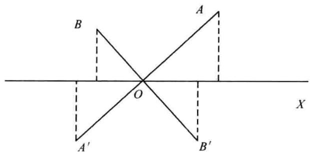

<details>
<summary>text_image</summary>

B
A
O
X
A'
B'
</details>

图10

设 $A(x_{a},y_{a},z_{a}),B(x_{b},y_{b},z_{b})$ ，若 $x_{a} > x_{b}$ ，则成像后， $x_a^{\prime} <   x_b^{\prime}$ ；纵坐标同理。

命题 6 同一坐标系中, 坐标最大点经成像后对应坐标最小点, 坐标最小点经成像后对应坐标最大点。所以, 原图中坐标最大最小点的连线经成像后仍为最大最小点的连线。

命题7 圆上的坐标最大最小点的连线经过圆心。

由命题 5 和命题 6, 像平面中, 坐标最大最小点的连线经过圆心的像。因此, 分别找出 x 坐标最大最小点的连线和 y 坐标最大最小点的连线, 交点就是所求圆心的像。例如图中 1'3' 连线与 2'4' 连线的交点就是圆 A 圆心的像(图 11)。

求解方法：

将题目中的相片保存为黑白照片(单色),然后用 MATLAB 软件将图片文件读成 $1024 \times 768$ 的 0-1 矩阵。

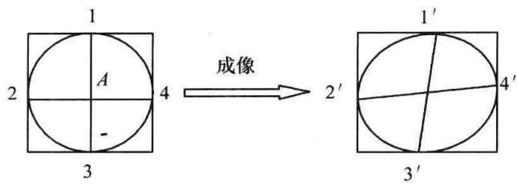

<details>
<summary>text_image</summary>

1
2 A 4
成像
3
2' 1'
3' 4'
</details>

图11

在图像中分别读出各圆中 $x, y$ 轴的坐标最大值与最小值：

<table><tr><td></td><td>y最小</td><td>y最大</td><td>x最小</td><td>x最大</td></tr><tr><td>A&#x27;圆</td><td>(325,149)</td><td>(321,230)</td><td>(282,191)</td><td>(364,188)</td></tr><tr><td>B&#x27;圆</td><td>(426,157)</td><td>(420,236)</td><td>(383,200)</td><td>(463,194)</td></tr><tr><td>C&#x27;圆</td><td>(645,176)</td><td>(635,251)</td><td>(604,218)</td><td>(676,209)</td></tr><tr><td>D&#x27;圆</td><td>(589,471)</td><td>(577,535)</td><td>(549,509)</td><td>(617,497)</td></tr><tr><td>E&#x27;圆</td><td>(289,467)</td><td>(281,537)</td><td>(246,506)</td><td>(323,499)</td></tr></table>

在读取各圆边界的最值时,有时候会遇到在求 y 的最值时,有多个 x 值的情况。这时取这些值的中点。

然后将各圆的 x 坐标最大值与最小值相连, 将各圆的 x 坐标最大值与最小值相连, 得到的两条线交点即为相片中圆的圆心。

将得到的圆心列表如下：

(单位:像素)

<table><tr><td>A&#x27;</td><td>B&#x27;</td><td>C&#x27;</td><td>D&#x27;</td><td>E&#x27;</td></tr><tr><td>(323,190)</td><td>(423,197)</td><td>(640,214)</td><td>(583,503)</td><td>(285,502)</td></tr></table>

将坐标原点移到照片中心,得到

(单位:像素)

<table><tr><td>A&#x27;</td><td>B&#x27;</td><td>C&#x27;</td><td>D&#x27;</td><td>E&#x27;</td></tr><tr><td>(-189,194)</td><td>(-89,187)</td><td>(128,170)</td><td>(71,-119)</td><td>(-227,-118)</td></tr></table>

转换成毫米坐标：

(单位:mm)

<table><tr><td>A&#x27;</td><td>B&#x27;</td><td>C&#x27;</td><td>D&#x27;</td><td>E&#x27;</td></tr><tr><td>(-50.000,51.323)</td><td>(-23.545,49.471)</td><td>(33.862,44.974)</td><td>(18.783,-31.482)</td><td>(-60.053,-31.217)</td></tr></table>

## 6.3 模型的优缺点和评价

## 1. 模型一

优点：

在像平面建立的直角坐标系中,求出靶标平面的三个不共线点的坐标。那么第四问中,只要重新根据靶标平面建立新的坐标系,进行坐标系变换就能很容易得出结果。

缺点：

只取靠近圆 $A, C, E$ 的三个切点，由对应关系确定圆心，但这势必造成 $A, C, E$ 圆圆心

的像点误差较小,而 D 圆圆心的像差较大。

## 2. 模型二

优点：

直接在像平面上就能找出各圆心所对应的像坐标,方法快捷方便。

缺点：

没有给出靶标平面与像平面的对应关系。在后面第四问双目标定位(两部相机定位)时,就很难通过靶标平面作为中介找到两部相机相对位置关系。

## 7 问题三

## 7.1 讨论引起误差的因素

对于所建立的模型,误差主要来自以下几个方面。

## 1. 照片本身

照片上确定点时,只能得到整数的像素坐标。也就是说只能确定所需要的点在像素格内,但并不能确定其具体坐标。

一个像素格的边框为 0.265mm。如图 12 所示, 在一个像素格内, 能够允许的最大误差是像素格的对角线长, 即 $\sqrt{2} \times 0.265 = 0.375mm$ 。也就是在照片的读取过程中就会存在不超过 0.375mm 的误差。

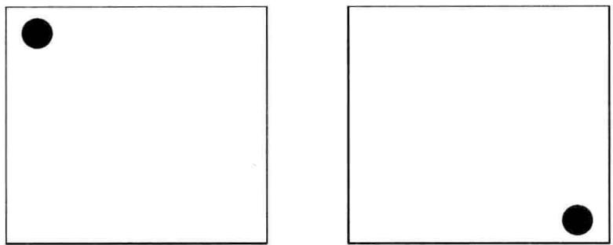

<details>
<summary>natural_image</summary>

Two empty squares with two black dots at corners, no text or symbols present.
</details>

图12

## 2. 处理过程

## 1）灰度

题目中所给的照片在各圆的周围其实并不是非黑即白的像素格,有一部分是灰色的。将题目中所给的照片转化成0-1黑白照片时,对灰色的像素格该定义为白色还是定义为黑色时会产生误差。这些边界点的取舍将最终影响所取点的位置,从而影响到算法的准确程度。

将题目中照片保存为8位的图像,将图像文件读入MATLAB中,形成图像矩阵。矩阵各点的取值范围为0\~255。其中0表示完全的白色,255表示完全的黑色,介于之间的数字则表示不同程度的灰色。在将图像进行0-1化处理时,到底应该取哪个值为标准来分清一个灰点该划分为黑点还是白点呢?从60\~200每隔20取一次分隔值。一张图片共 $1024\times768$ 个像素格,将各分隔值与取该分隔值时的黑像素格个数对应列表如下:

<table><tr><td>分隔值</td><td>60</td><td>80</td><td>100</td><td>120</td><td>140</td><td>160</td><td>180</td><td>200</td></tr><tr><td>黑像素格个数</td><td>22551</td><td>22617</td><td>22618</td><td>22618</td><td>22618</td><td>22618</td><td>22640</td><td>22942</td></tr></table>

由上表可以看出当取的分隔值不同时,所得到的照片上黑色像素格的个数是不一样的。而在照片中,灰色的像素格又只会出现在黑像素格与白像素格交界的地方,所以黑色像素格个数的改变就一定会对圆心的定位造成影响。也就是说分隔值的改变将对圆心的定位造成一定影响。

## 2）切线

在用 PHOTOSHOP 软件画圆的公切线时,由于圆的边界不光滑,所以所画出的切线与圆的交点并不只有一个。这里就对切线的定位产生了一定的影响,因此也会产生一定的误差。因为在我们的做法中所找的点是曲线的交点,所以对曲线定位的误差会在之后的处理中被放大。

## 3）最近最远点的取值

在每个圆最近与最远点的取值时,经常遇到一个坐标的最值对应另一个坐标的多个值的情况。在处理这个问题的过程中只是粗糙地取这些值的中点。这样也可能造成一定的误差。例如在读 B 圆的最下端的点时,有 18 个并列的点。在处理时只取了这 18 个点的最左与最右坐标的平均值。但实际中呈的像完全有可能与取的坐标偏离一到两个像素格,这里就对应了 0.265mm \~ 0.529mm 的误差。

## 4）计算

在计算时,对小数位数进行了四舍五入,这也会对结果产生一定的误差。

## 7.2 模型一的分析和检验

模型一求出结果：

$$
A ^ {\prime} (- 5 0. 6 2 8, 5 3. 4 0 6, 4 1 7. 2 0)
$$

$$
B ^ {\prime} (- 2 4. 6 5 8, 5 1. 1 6 0, 4 1 7. 2 0)
$$

$$
C ^ {\prime} (3 5. 1 5 4, 4 5. 9 8 7, 4 1 7. 2 0)
$$

$$
D ^ {\prime} (3 2. 5 9 8, - 3 7. 6 5 3, 4 1 7. 2 0)
$$

$$
E ^ {\prime} (5 9. 2 7 9, - 3 0. 8 8 4, 4 1 7. 2 0)
$$

模型二用直接法求出的结果：

<table><tr><td> $A'$ </td><td> $B'$ </td><td> $C'$ </td><td> $D'$ </td><td> $E'$ </td></tr><tr><td>( -50.00,51.32 )</td><td>( -23.54,49.21 )</td><td>(33.86,44.97 )</td><td>(18.78,-31.74 )</td><td>( -60.05,-31.21 )</td></tr><tr><td> $A'$ </td><td> $B'$ </td><td> $C'$ </td><td> $D'$ </td><td> $E'$ </td></tr><tr><td>( -50.00,51.32 )</td><td>( -23.54,49.47 )</td><td>(33.86,44.97 )</td><td>(18.78,-31.42 )</td><td>( -60.05,-31.21 )</td></tr></table>

经对比,可看出 $A'$ 、 $B'$ 、 $C'$ 、 $E'$ 点误差较小, $D'$ 点误差较大。

分析：

模型一中求解,取靠近圆 A、C、E 的三个切点,由对应关系确定圆心,但这势必造成 A、C、E 圆圆心的像点误差较小,而 D 圆圆心的像差较大。

改进：

理论上 $M, N, P$ 三点足以给出靶标平面上所有点与像的对应关系，但公切线交点有很多个,如果将参考点(公切线交点)取得尽量多,通过计算机求最小二乘解,结果会更精确。

## 7.3 模型二的分析和检验

方法一和方法二得出的结果：

<table><tr><td> $A'$ </td><td> $B'$ </td><td> $C'$ </td><td> $D'$ </td><td> $E'$ </td></tr><tr><td>(-50.00,51.32)</td><td>(-23.54,49.21)</td><td>(33.86,44.97)</td><td>(18.78,-31.74)</td><td>(-60.05,-31.21)</td></tr><tr><td> $A'$ </td><td> $B'$ </td><td> $C'$ </td><td> $D'$ </td><td> $E'$ </td></tr><tr><td>(-50.00,51.32)</td><td>(-23.54,49.47)</td><td>(33.86,44.97)</td><td>(18.78,-31.42)</td><td>(-60.05,-31.21)</td></tr></table>

由上表对比可看出,两种方法确定的圆心坐标十分近似,所以下面只对方法一确定的圆心的像坐标进行检验。

检验方案为将确定的像圆心坐标返回到原靶标平面,与实际圆心坐标进行比较。

精度分析：

模型一中已求出靶标平面的方程：

$$
x + 3. 6 7 6 2 6 y - 1 1. 1 8 3 3 z - 5 2 1 4. 3 5 = 0 \tag {4}
$$

由凸透镜成像原理,实点、光心、像点在一条直线上。若像点 $(x',y',z')$ 对应的实点为 $(x,y,z)$ ，则有

$$
\frac {x}{x ^ {\prime}} = \frac {y}{y ^ {\prime}} = \frac {z}{z ^ {\prime}} \tag {5}
$$

联立式(4)、式(5)，可求出对应到靶标平面的点坐标：

$$
A ^ {\prime \prime} (5 7. 5 9 2 4, 5 9. 1 1 6, - 4 8 0. 5 4 6), B ^ {\prime \prime} (2 7. 2 3 2 6, 5 6. 9 1 3, 4 8 2. 5 3 7)
$$

$$
C ^ {\prime \prime} (- 3 9. 5 3 2 9, 5 2. 5 0 4 7, - 4 8 7. 0 5 8), D ^ {\prime \prime} (- 2 0. 5 6 0 7, 3 4. 7 5 0 4, - 4 5 6. 6 7 8)
$$

$$
E ^ {\prime \prime} (6 4. 6 9 2, 3 3. 6 2 8 4, - 4 4 9. 4 2 4)
$$

由距离公式可求出这几个点的距离关系：

$$
A ^ {\prime \prime} B ^ {\prime \prime} = 3 0. 5 0 4 7 \quad A ^ {\prime \prime} C ^ {\prime \prime} = 9 7. 5 6 7 9
$$

$$
A ^ {\prime \prime} E ^ {\prime \prime} = 9 8. 0 8 4 4 \quad D ^ {\prime \prime} C ^ {\prime \prime} = 9 4. 3 2 0 3
$$

$$
D ^ {\prime \prime} E ^ {\prime \prime} = 8 5. 5 6 8 1
$$

实际圆心的距离关系：

$$
A B = 3 0 \quad A C = 1 0 0
$$

$$
A E = 1 0 0 \quad D C = 1 0 0
$$

$$
D E = 1 0 0
$$

由上面数据可以看出 $\overline{DE}$ 间距离相差较大,其他距离都比较准确。证明模型二的图像取点比较准确,误差较小。且模型二中用的两种方法取点得出的结果只有极微小误差,也说明模型二取点法的精确程度。 $\overline{DE}$ 误差较大是由模型一中取M、N、P的坐标求出的靶标平面方程不很精确造成的(可在改进模型中尽量多取公切点,通过软件用最小二乘法求解)。

可给出精度评价指标 $p_{dis}$ ：

$$
p _ {d i s} = | A ^ {\prime \prime} B ^ {\prime \prime} - A B | + | A ^ {\prime \prime} C ^ {\prime \prime} - A C | + | A ^ {\prime \prime} E ^ {\prime \prime} - A E | + | D ^ {\prime \prime} C ^ {\prime \prime} - D C | + | D ^ {\prime \prime} E ^ {\prime \prime} - D E |
$$

$p_{dis}$ 越小，精度越高； $p_{dis}$ 越大，精度越低。

稳定性分析：

对于模型的稳定性,考虑的是当像平面上的点移动一个微小距离时,靶标平面上点的移动情况。

先针对 $A'$ 点进行分析：

当 $A'$ 点的坐标分别沿 $x$ 轴和 $y$ 轴的正方向和反方向移动一个像素单位时, $A'$ 与移动后的4个点的坐标分别为

$$
\begin{array}{l} A ^ {\prime} = (- 1 8 9, 1 9 4, 1 5 7 7), A _ {1} ^ {\prime} = (- 1 8 8, 1 9 4, 1 5 7 7), A _ {2} ^ {\prime} = (- 1 9 0, 1 9 4, 1 5 7 7) \\ A _ {3} ^ {\prime} = (- 1 8 9, 1 9 5, 1 5 7 7), A _ {4} ^ {\prime} = (- 1 8 9, 1 9 3, 1 5 7 7) \\ \end{array}
$$

将移动后的四点根据成像原理映到靶标平面后,得到坐标:

$$
\begin{array}{l} A _ {1} ^ {\prime \prime} = (5 7. 2 9 1 1, - 5 9. 1 1 9 5, - 4 8 0. 5 7 4), A _ {2} ^ {\prime \prime} = (5 7. 8 9 3 8, - 5 9. 1 1 2 6, - 4 8 0. 5 1 8) \\ A _ {3} ^ {\prime \prime} = (5 7. 6 0 4 8, - 5 9. 4 3 3 5, - 4 8 0. 6 5), A _ {4} ^ {\prime \prime} = (5 7. 5 8 0 1, - 5 8. 7 9 8 9, - 4 8 0. 4 4 3) \\ \end{array}
$$

然后求各坐标方向上的平均绝对偏差。

对于 $x$ 坐标有

$$
d _ {x a} = \frac {1}{4} \sum_ {i = 1} ^ {4} | x _ {a 1} ^ {\prime \prime} - \overline {{x _ {a} ^ {\prime \prime}}} |
$$

同样,可以求出 $s_{ya}$ 与 $s_{za}$ 。然后算出距离的平均绝对偏差:

$$
d _ {a} = \sqrt {d _ {x a} ^ {2} + d _ {y a} ^ {2} + d _ {z a} ^ {2}} = 0. 2 3 4
$$

这就是 $A'$ 点的稳定性。考虑也许取一个点误差比较大，于是又取了 $B', C', D', E'$ ，用同样的方法算出了：

$$
d _ {b} = 0. 2 3 3, d _ {c} = 0. 2 3 7, d _ {d} = 0. 2 1 3, d _ {e} = 0. 2 1 1
$$

然后对五点取平均,算出这个算法的稳定性:

$$
\delta = \frac {0 . 2 3 4 + 0 . 2 3 3 + 0 . 2 3 7 + 0 . 2 1 3 + 0 . 2 1 1}{5} = 0. 2 2 6
$$

对于其他的数据,将在附录中列出。

可定义稳定性指标如下：

$$
p = \frac {1}{5} (d _ {a} + d _ {b} + d _ {c} + d _ {d} + d _ {e})
$$

$p$ 越小, 稳定性越好; $p$ 越大, 稳定性越大。

## 8 问题四

## 8.1 模型分析

以靶标平面为参考建立物三维坐标系,然后以该坐标系为中间桥梁建立两部相机坐标变换的具体过程,如图 13 所示。

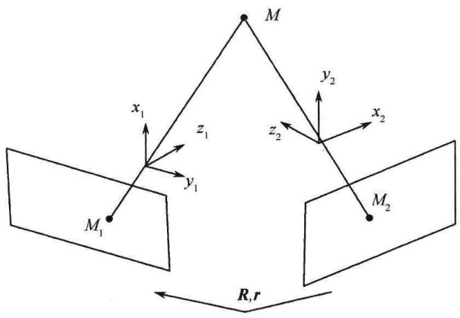

<details>
<summary>text_image</summary>

M
x₁
z₁
y₁
M₁
y₂
z₂
x₂
M₂
R,r
</details>

图13

## 8.2 模型建立

步骤一——分别建立两部相机坐标系与物坐标系变换关系。

以相机一坐标系与物坐标系变换为例,以圆 A 的圆心为坐标原点,AE 方向为 x 轴正向,AC 方向为 y 轴正向,建立物三维直角坐标系。将物坐标系沿着 $AO_{1}$ 线性平移到相机坐标系,令 $\alpha$ 表示物坐标系中点的坐标矩阵, $\beta_{1}$ 表示像坐标系中对应像的坐标矩阵,则有

$$
\boldsymbol {\beta} _ {1} = \boldsymbol {P} _ {1} \boldsymbol {\alpha} + \boldsymbol {r} _ {1} (\boldsymbol {r} _ {1} = \boldsymbol {A O} _ {1}) \tag {A}
$$

设靶标中五个圆心在物坐标即像坐标中的坐标分别为 $(x_{i},y_{i},z_{i})$ 和 $(x_{1i},y_{1i},z_{1i})(i=1,\cdots,5)$ ，则有

$$
\left( \begin{array}{l} x _ {1 i} \\ y _ {1 i} \\ z _ {1 i} \end{array} \right) = \boldsymbol {P} _ {1} \left( \begin{array}{l} x _ {i} \\ y _ {i} \\ z _ {i} \end{array} \right) + \left( \begin{array}{l} x _ {A o _ {1}} \\ y _ {A o _ {1}} \\ z _ {A o _ {1}} \end{array} \right) (i = 1, \dots , 5) \tag {6}
$$

$P_{1}$ 是正交变换矩阵,则每个列向量都是单位向量,且两两正交。 $\boldsymbol{P}_{1}=(\boldsymbol{p}_{1},\boldsymbol{p}_{2},\boldsymbol{p}_{3})$ ,则有

$$
\left| \boldsymbol {p} _ {i} \right| = 1 (i = 1, 2, 3) \tag {7}
$$

$$
\boldsymbol {p} _ {i} \cdot \boldsymbol {p} _ {j} = 0 (i, j = 1, 2, 3 \text {且} i \neq j) \tag {8}
$$

由于式(6)中的5个点都在靶标平面上,即 $z_{i}=0$ ,也就是说物的三维坐标系实质上仍然是一个平面坐标系,因此必然会限制对 $P_{1}$ 的求解。因此,为了确实将靶标平面拉到三维空间中,就应该在靶标平面中外再寻找一个点,如图14所示。

$N_{1}$ 是像平面的中心, 其关于像坐标原点的对称点为 $N$ , 在物坐标系中 $N$ 点坐标 $(n_x, n_y, n_z)$ , 在像坐标系中 $N$ 点坐标 $(n_{1x}, n_{1y}, n_{1z})$ 。

由像坐标系可求得 $N$ 点到靶标平面上三个圆心（如 $A, C$ 和 $E$ ）的距离 $(a, c$ 和 $e)$ ，坐标变换并不改变空间两点间的距离，步骤一物平面坐标系的建立过程如下： $A(0, 0, 0), C(0, y_c, 0), E(x_e, 0, 0)$ 已知，因此有

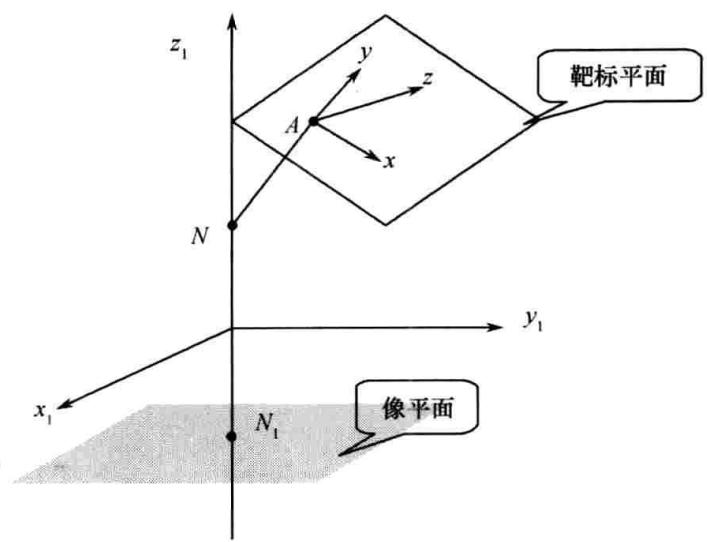

<details>
<summary>text_image</summary>

z₁
y
z
A
x
N
y₁
x₁
N₁
靶标平面
像平面
</details>

图14

$$
\left\{ \begin{array}{l} \sqrt {n _ {x} ^ {2} + n _ {y} ^ {2} + n _ {z} ^ {2}} = a \\ \sqrt {n _ {x} ^ {2} + (n _ {y} - y _ {c}) ^ {2} + n _ {z} ^ {2}} = c \\ \sqrt {(n _ {x} - x _ {e}) ^ {2} + n _ {y} ^ {2} + n _ {z} ^ {2}} = e \end{array} \right.
$$

由以上三式联立即可解得物坐标系中 N 点坐标。

这样由以下方程即可求得 $P_{1}$ :

$$
\left\{ \begin{array}{l} \left( \begin{array}{c} x _ {1 i} \\ y _ {1 i} \\ z _ {1 i} \end{array} \right) = \boldsymbol {P} _ {1} \left( \begin{array}{c} x _ {i} \\ y _ {i} \\ 0 \end{array} \right) + \left( \begin{array}{c} x _ {A o _ {1}} \\ y _ {A o _ {1}} \\ z _ {A o _ {1}} \end{array} \right) (i = 1, \dots , 5) \\ \boldsymbol {p} _ {i} = 1 (i = 1, 2, 3) \\ \boldsymbol {p} _ {i} \cdot \boldsymbol {p} _ {j} = 0 (i, j = 1, 2, 3, i \neq j). \\ \left( \begin{array}{c} n _ {1 x} \\ n _ {1 y} \\ n _ {1 z} \end{array} \right) = \boldsymbol {P} _ {1} \left( \begin{array}{c} n _ {x} \\ n _ {y} \\ n _ {z} \end{array} \right) + \left( \begin{array}{c} x _ {A o _ {1}} \\ y _ {A o _ {1}} \\ z _ {A o _ {1}} \end{array} \right) \end{array} \right. \tag {9}
$$

同理,可建立物坐标系到相机二坐标系的坐标变换公式:

$$
\boldsymbol {\beta} _ {2} = \boldsymbol {P} _ {2} \boldsymbol {\alpha} + \boldsymbol {r} _ {2} \tag {B}
$$

用同样方法可解物坐标到相机二坐标系坐标变换的矩阵 $P_{2}$ 。

步骤二——由两部相机坐标系的变换确定相机光学中心的相对位置。

由式(B)可得

$$
\boldsymbol {\alpha} = \boldsymbol {P} _ {2} ^ {- 1} \boldsymbol {\beta} _ {2} - \boldsymbol {P} _ {2} ^ {- 1} \boldsymbol {r} _ {2}
$$

带入式(A)，解得相机二坐标系到相机一坐标系的空间变换公式为

$$
\boldsymbol {\beta} _ {1} = \boldsymbol {P} _ {1} \boldsymbol {P} _ {2} ^ {- 1} \boldsymbol {\beta} _ {2} + \boldsymbol {r} _ {1} - \boldsymbol {P} _ {1} \boldsymbol {P} _ {2} ^ {- 1} \boldsymbol {r} _ {2} \tag {C}
$$

这样,相机二的光学中心就可以在相机一的坐标系中表示出来。

相机二坐标系中原点为

$$
\boldsymbol {\beta} _ {2 0} = 0
$$

带入式(B)得

$$
\boldsymbol {\alpha} = - \boldsymbol {P} _ {2} ^ {- 1} \boldsymbol {r} _ {2}
$$

带入式(A)，得到相机二坐标系原点在相机一坐标系的坐标：

$$
\boldsymbol {\beta} _ {1 0} = - \boldsymbol {P} _ {1} \boldsymbol {P} _ {2} ^ {- 1} \boldsymbol {r} _ {2} + \boldsymbol {r} _ {1} \tag {D}
$$

步骤三——像平面的确定。

步骤二仅仅确定了相机二光学中心在相机一中的坐标,而两部相机像平面的关系仍然未知,这样两部相机的相对位置就不能唯一确定。

在相机二坐标系下,设第二部相机像平面为

$$
z ^ {(2)} = - u _ {2}
$$

坐标表示为

$$
\boldsymbol {\beta} _ {2} \cdot \boldsymbol {e} _ {3} = - u _ {2}
$$

带入式(B)得

$$
(P _ {2} \alpha + r _ {2}) \cdot e _ {3} = - u _ {2}
$$

带入式(A)得

$$
\boldsymbol {\alpha} = \boldsymbol {P} _ {1} ^ {- 1} (\boldsymbol {\beta} _ {1} - \boldsymbol {r} _ {i})
$$

从而解得相机二的像平面在相机一坐标系下的平面方程为

$$
\left[ \boldsymbol {P} _ {2} \boldsymbol {P} _ {1} ^ {- 1} \left(\boldsymbol {\beta} _ {1} - \boldsymbol {r} _ {1}\right) + \boldsymbol {r} _ {2} \right] \cdot \boldsymbol {e} _ {3} = - u _ {2} \tag {E}
$$

## 8.3 问题四结论

通过上述三个步骤,解得相机二坐标到相机一坐标的空间变换方程为

$$
\boldsymbol {\beta} _ {1} = \boldsymbol {P} _ {1} \boldsymbol {P} _ {2} ^ {- 1} \boldsymbol {\beta} _ {2} + \boldsymbol {r} _ {1} - \boldsymbol {P} _ {1} \boldsymbol {P} _ {2} ^ {- 1} \boldsymbol {r} _ {2}
$$

确立了相机二的光学中心,即相机二坐标系的原点在相机一坐标系的坐标和相机二像平面在相机一坐标系的平面方程,通过这两个条件就得到了确定两部相机相对位置的模型:

原点坐标：

$$
\boldsymbol {\beta} _ {1 0} = - \boldsymbol {P} _ {1} \boldsymbol {P} _ {2} ^ {- 1} \boldsymbol {r} _ {2} + \boldsymbol {r} _ {1}
$$

像平面方程

$$
\left[ \boldsymbol {P} _ {2} \boldsymbol {P} _ {1} ^ {- 1} (\boldsymbol {\beta} _ {1} - \boldsymbol {r} _ {1}) + \boldsymbol {r} _ {2} \right] \cdot \boldsymbol {e} _ {3} = - u _ {2}
$$

## 9 模型的推广

本文主要围绕相机标定及双目立体视觉进行模型的建立与求解,并且在问题四中建236

立了确定两相机相对位置的坐标变换方程 $M_{1} = RM_{2} + r$ 。这一方程在许多领域都有可以应用，如传感器标定、机器视觉、产品配件的质量检测等，此外，还有一项非常重要的应用就是本文题目中提及的交通监管问题。然而必须意识到该坐标变换方程是针对静态物体建立的，即靶标固定不动，然而交通监管的对象以运动的车辆及行人为主，因此上述坐标变换方程存在很大的制约性。基于此，应该考虑如何将运动的物体特征体现出来，于是想到了将时间作为变量加到坐标变换方程中去。即用一部相机追踪物体两个不同时刻的位置坐标，以此建立 $M_{1} = RM_{2} + t$ 模型[1]。

如果 $M_{1} = RM_{2} + r$ 是空间坐标变换方程，则可以称 $M_{1} = RM_{2} + t$ 为时间坐标变换方程。此方程在交通监管中有着更宽的应用空间，对交通目标追踪以及交通事故还原等都有极大的帮助。

## 参考文献

[1] 马颂德. 计算机视觉. http://engine.cqvip.com/content/tp/90250x/2000/026/001/gc03\_tp2 + 4138417. pdf. 2008 - 9 - 20.

## 附录

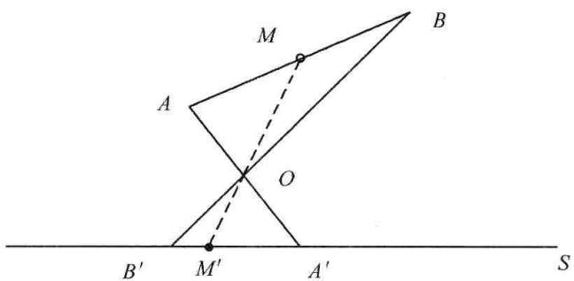

<details>
<summary>text_image</summary>

M
A
B
O
B'
M'
A'
S
</details>

如图所示,线段 AB 经 O 点中心成像到平面 S,像为线段 $A^{\prime}B^{\prime}$ , 当线段 AB 不平行于平面 S 时, 如果 $M^{\prime}$ 仍为像线段 $A^{\prime}B^{\prime}$ 的中点, 则在 $\Delta OMB$ 中, 由正弦定理得

$$
\frac {M B}{\sin \angle M O B} = \frac {O M}{\sin \angle B}
$$

在另外三个三角形 $\triangle OMA$ 、 $\triangle OM'B'$ 、 $\triangle OM'A'$ 中，也可以由正弦定理得到：

$$
\frac {M ^ {\prime} B ^ {\prime}}{\sin \angle M ^ {\prime} O B ^ {\prime}} = \frac {O M ^ {\prime}}{\sin \angle O B ^ {\prime} M ^ {\prime}}, \frac {M A}{\sin \angle M O A} = \frac {O M}{\sin \angle A}, \frac {M A ^ {\prime}}{\sin \angle M ^ {\prime} O A ^ {\prime}} = \frac {O M ^ {\prime}}{\sin \angle O A ^ {\prime} M ^ {\prime}}
$$

由假设

$$
M ^ {\prime} A ^ {\prime} = M ^ {\prime} B ^ {\prime}, M A = M B
$$

得

$$
\frac {\sin \angle B ^ {\prime} O M ^ {\prime}}{\sin \angle A O M} = \frac {\sin \angle B}{\sin \angle A}, \frac {\sin \angle B O M}{\sin \angle A ^ {\prime} O M ^ {\prime}} = \frac {\sin \angle O B ^ {\prime} M ^ {\prime}}{\sin \angle O A ^ {\prime} M ^ {\prime}}
$$

由对顶角

$$
\angle B ^ {\prime} O M ^ {\prime} = \angle B O M, \angle A ^ {\prime} O M ^ {\prime} = \angle A O M
$$

得

$$
\frac {\sin \angle B ^ {\prime} 0 M ^ {\prime}}{\sin \angle B} = \frac {\sin \angle B O M}{\sin \angle O B ^ {\prime} M ^ {\prime}}
$$

所以

$$
\angle B = \angle O B ^ {\prime} M ^ {\prime}
$$

即

$$
A B \parallel A ^ {\prime} B ^ {\prime}
$$

这与假设矛盾,所以命题1得证。

## 【论文点评】

姚奎

本论文首先考虑仅有一部相机的条件下,靶标平面圆心的成像情况,采用间接确定和直接计算两种方法,建立了两个模型,求解过程简便,精度较高。模型二求出了较精确的圆心像坐标。然后对所建立模型进行检验和精度、稳定性分析,并给出了相应的精度和稳定性指标。最后根据坐标变换确定了两部相机相对位置。文中采用定点的方法十分巧妙,为本文的一大创新。

该文写作层次非常清晰,四个问题的解决,逐步递进,层次感极强。在不易描述和数学表达偏多的地方,采用命题和图解分析的方法,使得文章层次特别清楚。

该文还有一个优点,在抓住问题求解本质的同时,启用了求解流程图的方法。这种方法,在错综纷繁的浩瀚公式演算中,抓住了一根理清思路的救命藤,有效理清脉络。

本文在数值计算和误差分析上,还有进一步可以改进的空间。

# 数码相机定位标定方法研究

## 摘要

本文就数码相机定位问题进行了讨论,经过合理假设,严密的理论推导,科学建模求解及实际验证,得到较为理想的结果。

首先,通过设定世界坐标系、相机坐标系和像平面坐标系,引入内参数矩阵和外参数矩阵,建立了线性照相机模型。然后利用射影变换的性质,得出了靶标中不同圆的最值点像的像素坐标,利用最小二乘估计最终解出了由世界坐标到像平面像素坐标的投影变换矩阵M。利用该变换得出了靶标中五个圆心的像在像平面坐标系中的像素坐标如下:

<table><tr><td>圆心的像</td><td> $A'$ </td><td> $B'$ </td><td> $C'$ </td><td> $D'$ </td><td> $E'$ </td></tr><tr><td>u(像素)</td><td>323.0645</td><td>422.8899</td><td>638.4608</td><td>583.7812</td><td>284.8008</td></tr><tr><td>v(像素)</td><td>187.4196</td><td>194.6195</td><td>210.1676</td><td>499.7633</td><td>500.2931</td></tr></table>

为了对模型的稳定性进行检验,对题目所给圆的像坐标加入了高斯白噪声,然后再利用上述模型重新确定靶标中圆心的像在像平面坐标系中的像素坐标,与没有扰动时对比发现圆心像坐标变化不明显,这表明模型具有很好的稳定性。

为了对模型的精度进行检验,在题目所用的靶标中又加入一正三角形,用数码相机对其拍照,利用上述模型计算三角形顶点的像坐标,与实际像坐标对比得出其平均偏差约3个像素,由此说明模型具有很好的精度。

最后,利用张定友定标算法给出了两个照相机的相对位置。

关键词:世界坐标系,相机坐标系,像平面坐标系,内参数矩阵,外参数矩阵,投影变换矩阵,靶标,标定,张定友定标算法,高斯白噪声

## 1 问题重述

数码相机定位在交通监管(电子警察)等方面有广泛的应用。所谓数码相机定位是指用数码相机摄制物体的相片确定物体表面某些特征点的位置。最常用的定位方法是双目定位,即用两部相机来定位。对物体上一个特征点,用两部固定于不同位置的相机摄得物体的像,分别获得该点在两部相机像平面上的坐标。只要知道两部相机精确的相对位置,就可以用几何的方法得到该特征点在固定一部相机的坐标系中的坐标,即确定了特征点的位置。于是对双目定位,精确地确定两部相机的相对位置就是关键,这一过程称为系统标定。

标定的一种做法是:在一块平板上画若干个点,同时用这两部相机照相,分别得到这些点在它们像平面上的像点,利用这两组像点的几何关系就可以得到这两部相机的相对位置。然而,无论在物平面或像平面上都无法直接得到没有几何尺寸的“点”。实际的做法是在物平面上画若干个圆(称为靶标),它们的圆心就是几何的点了。而它们的像一般会变形,如图1所示,所以必须从靶标上的这些圆的像中把圆心的像精确地找到,标定就可实现。

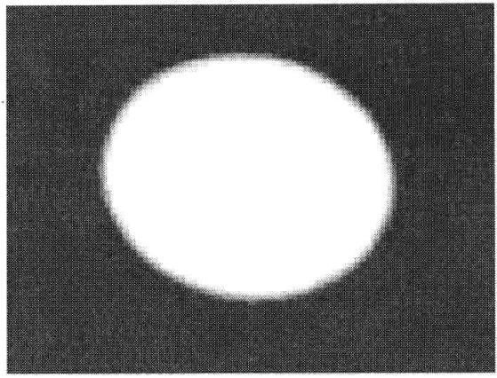

<details>
<summary>natural_image</summary>

A white circular shape centered on a dark textured background, resembling a simple sun or moon (no text or symbols)
</details>

图 1 靶标上圆的像

设计靶标如下,取1个边长为100mm的正方形,分别以四个顶点(对应为A、C、D、E)为圆心,12mm为半径作圆。以AC边上距离A点30mm处的B为圆心,12mm为半径作圆,如图2所示。

用一位置固定的数码相机摄得其像,如图3所示。

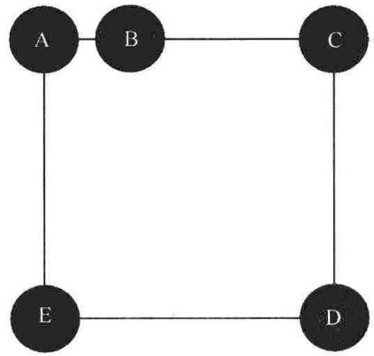

<details>
<summary>flowchart</summary>


```mermaid
graph LR
  A["A"] --> B["B"]
  B["B"] --> C["C"]
  C["C"] --> D["D"]
  D["D"] --> E["E"]
  E["E"] --> A
```
</details>

图 2 靶标示意图

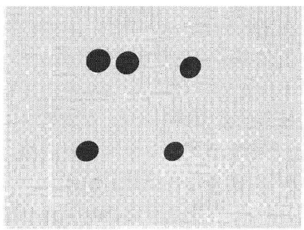

<details>
<summary>natural_image</summary>

Abstract arrangement of black dots on a textured gray background (no text or symbols)
</details>

图 3 靶标的像

要求：

（1）建立数学模型和算法以确定靶标上圆的圆心在该相机像平面的像坐标，这里坐标系原点取在该相机的焦点，x-y平面平行于像平面。  
（2）对由图2、图3分别给出的靶标及其像，计算靶标上圆的圆心在像平面上的像坐标，该相机的像距（即焦点到像平面的距离）是1577个像素单位（1mm约为3.78个像素单位），相机分辨率为 $1024 \times 786$ 。  
(3) 设计一种方法检验你们的模型, 并对方法的精度和稳定性进行讨论。  
（4）建立用此靶标给出两部固定相机相对位置的数学模型和方法。

## 2 问题分析

为了对数码相机进行定位,采用最常用的双目定位法。对物体上一个特征点,用两部240

固定于不同位置的相机摄得物体的像,分别获得该点在两部相机像平面上的坐标。因此只要知道两部相机精确的相对位置,就可用几何的方法得到该特征点在固定一部相机的坐标系中的坐标,即确定了特征点的位置。于是对双目定位,精确地确定两部相机的相对位置就是关键。于是在一块平板上画若干个点,同时用这两部相机照相,分别得到这些点在它们像平面上的像点,利用这两组像点的几何关系就可以得到这两部相机的相对位置。

对于问题一,是为从靶标上的这些圆的像中把圆心的像精确地找到建立模型以及算法。三维计算机视觉系统应能从相机获取图像的信息出发,计算三维物体的位置、形状等几何信息,并由此识别环境中的物体。图像上每一点的亮度反映了空间物体表面某点反射光的强度,而该点在图像上的位置则与空间物体表面相应点的几何位置有关。这些位置的相互关系由相机成像几何模型所决定。该几何模型的参数称为相机参数,这些参数必须由实验所得到的数据经过计算得到。相机模型是光学成像几何关系的简化。最简单的模型为针孔模型。但是当计算精度要求较高时,尤其当照相机的镜头为广角镜头时,针孔模型就不能准确地描述照相机的成像几何关系。在远离图像中心处会有较大的畸变。因此,必要时需要考虑畸变的非线性影响。

对于问题二,利用针孔模型建立世界坐标系中点到像平面中点的映射关系,可以尝试寻找特殊点的对应关系来标定单一相机的投影矩阵,在确定投影矩阵后就可以对应找出靶标上各个圆圆心在像平面上的像坐标。

对于问题三,要求设计一种方法检验模型,并对其进行稳定性和精度分析,可以考虑在像素位置坐标上加一个服从一定分布规律的扰动,然后观察其结果的变化范围,而对与精度的考虑应当从实际出发,将实际测量到的值与运用模型求解的值进行比较,表征模型的精度。

在建立完善单个相机的标定模型后,对于问题四,应当将单个相机与世界坐标的关系求出,然后通过坐标变换确定相机的相对关系。

## 3 符号定义

$O_{c}-X_{c}Y_{c}Z_{c}$ : 照相机坐标系;

$O_{w}-X_{w}Y_{w}Z_{w}$ :世界坐标系;

01 - xyz: 图像坐标系;

$(u,v)$ :像平面上的点坐标;

M: 透视投影矩阵。

## 4 问题一模型的建立

## 4.1 坐标系的建立

根据文献[1]定义如下坐标,数码相机成像几何关系可由图4表示,其中O点为数码相机的光心, $X_{c}$ 轴和 $Y_{c}$ 轴与图像的x轴和y轴平行, $Z_{c}$ 为数码相机的光轴,它与图像平面垂直。光轴与图像平面的交点,即为图像坐标系的原点,由点 $O_{c}$ 与 $X_{c},Y_{c},Z_{c}$ 轴组成的直角坐标系称为照相机坐标系,其中 $OO_{1}$ 为照相机焦距。

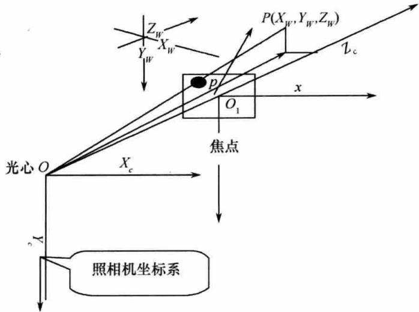

<details>
<summary>text_image</summary>

Zw
Yw
Xw
P(Xw,Yw,Zw)
Lc
x
O1
焦点
光心 O
Xc
X
照相机坐标系
</details>

图4

由于照相机可以安放在环境中的任意位置,还要在环境中选择一个基准坐标系来描述照相机的位置,并用它来描述环境中任何位置的坐标,该坐标系称为世界坐标系。它由 $X_{w},Y_{w},Z_{w}$ 轴组成。

由于数码相机的照相特性,若靶标平面与图像 O-XY 平面平行,则图像显示为与靶标图像比例放缩的图像,如图 5 所示。

但是,由图3可知,数码相机是从某个角度拍摄的,并不与靶标平面平行,从而得到不规则的图像。其光学几何过程如图6所示,靶标投影平面可以看作图像平面平移得到的。

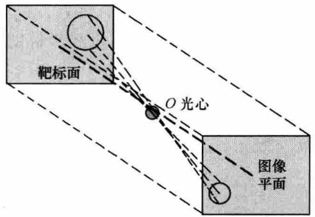

<details>
<summary>text_image</summary>

靶标面
O 光心
图像
平面
</details>

图 5

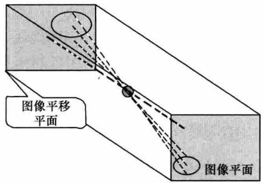

<details>
<summary>text_image</summary>

图像平移
平面
图像平面
</details>

图6

对于照相机成像,可以将其分解为两个过程,即照相机坐标系的平移与旋转。通过对坐标系的变换最终可以得到靶标上圆的圆心在该相机像平面的像坐标。图7为照相机成像的原理图,并在照相机光心建立照相机坐标系,P为靶标平面上的一点,p为点P在图像平面上对应的点。

## 4.2 坐标系之间的关系

数字照相机采集的数字图像是以 $M \times N$ 数组存储的, M 行 N 列的图像中的每一个元素(像素)的数值即是图像点的亮度。

建立直角坐标系 $o - uv$ ，每一个点的像素坐标 $(u, v)$ 分别为该点在数组中的列数与行数，所以 $(u, v)$ 是以像素为单位的图像坐标系的坐标。建立以物理为单位的坐标系（如

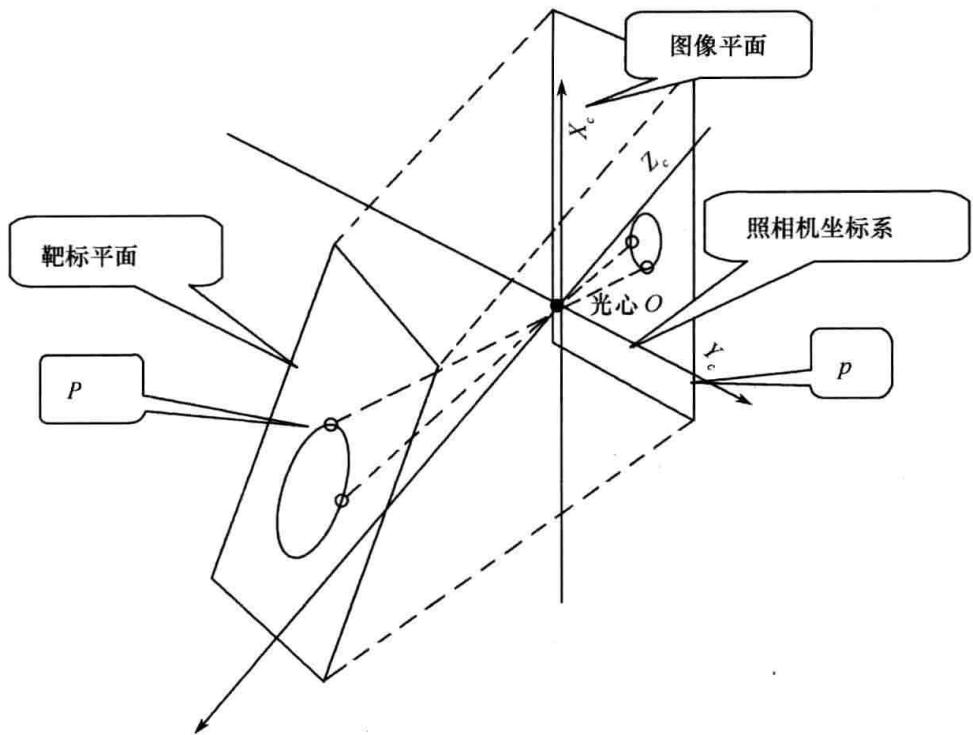

<details>
<summary>text_image</summary>

靶标平面
P
图像平面
光心 O
照相机坐标系
p
</details>

图7

mm) 表示的图像坐标系 x-y, 其中

$$
\left\{ \begin{array}{l} u = \frac {x}{\mathrm{d} x} + u _ {0} \\ v = \frac {y}{\mathrm{d} y} + v _ {0} \end{array} \right.
$$

如图 8 所示。

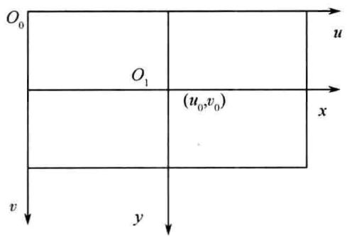

<details>
<summary>text_image</summary>

O₀
O₁
(u₀,v₀)
x
v
y
u
</details>

图8

利用齐次坐标与矩阵形式将上式表示为

$$
\left[ \begin{array}{c} u \\ v \\ 1 \end{array} \right] = \left[ \begin{array}{c c c} \frac {1}{\mathrm{d} x} & 0 & u _ {0} \\ 0 & \frac {1}{\mathrm{d} y} & v _ {0} \\ 0 & 0 & 1 \end{array} \right] \left[ \begin{array}{c} x \\ y \\ 1 \end{array} \right]
$$

世界坐标系与照相机坐标系之间的关系可以用旋转矩阵 R 与平移向量 t 来表示。因此，在空间中的任意一点 P 在世界坐标系与照相机坐标系下的齐次坐标分别为 $(X_{w}, Y_{w})$ ，

$Z_{w},1)^{\mathrm{T}}$ 与 $(X_{c},Y_{c},Z_{c},1)^{\mathrm{T}}$ ，于是存在以下关系：

$$
\left( \begin{array}{l} X _ {c} \\ Y _ {c} \\ Z _ {c} \\ 1 \end{array} \right) = \boldsymbol {M} _ {1} \left( \begin{array}{l} X _ {w} \\ Y _ {w} \\ Z _ {w} \\ 1 \end{array} \right) = \left( \begin{array}{l l} \boldsymbol {R} & \boldsymbol {t} \\ \boldsymbol {0} ^ {\mathrm{T}} & 1 \end{array} \right) \left( \begin{array}{l} X _ {w} \\ Y _ {w} \\ Z _ {w} \\ 1 \end{array} \right) \tag {1}
$$

式中： $R$ 为 $3\times 3$ 的正交变换矩阵； $\pmb{t}$ 为三维平移向量； $0 = (0,0,0)^{\mathrm{T}};M_{1}$ 为 $4\times 4$ 的矩阵。

## 4.3 数码相机线性模型(针孔模型)

空间任何一点 P 在图像上的成像位置可以用针孔模型近似表示, 即任何点 P 在图像上的投影位置 p 为光心 O 与 P 点的连线 OP 与图像平面的交点, 这种关系称为中心射影, 由比例关系有如下关系式:

$$
x = \frac {f X _ {c}}{Z _ {c}}
$$

$$
y = \frac {f Y _ {c}}{Z _ {c}}
$$

式中： $(x,y)$ 为 $p$ 的图像坐标； $(X_{c},Y_{c},Z_{c})$ 为空间点 $P$ 在照相机坐标下的坐标，用齐次坐标与矩阵表示上述投影关系：

$$
Z _ {c} \left[ \begin{array}{l} x \\ y \\ 1 \end{array} \right] = \left[ \begin{array}{c c c c} f & 0 & 0 & 0 \\ 0 & f & 0 & 0 \\ 0 & 0 & 1 & 0 \end{array} \right] \left[ \begin{array}{l} X _ {c} \\ Y _ {c} \\ Z _ {c} \\ 1 \end{array} \right]
$$

可以得到以世界坐标系表示的 $P$ 点坐标与其投影点 $p$ 的坐标 $(u, v)$ 的关系：

$$
\begin{array}{l} Z _ {c} \left[ \begin{array}{l} u \\ v \\ 1 \end{array} \right] = \left[ \begin{array}{c c c} \frac {1}{\mathrm{d} x} & 0 & u _ {0} \\ 0 & \frac {1}{\mathrm{d} y} & v _ {0} \\ 0 & 0 & 1 \end{array} \right] \left[ \begin{array}{c c c c} f & 0 & 0 & 0 \\ 0 & f & 0 & 0 \\ 0 & 0 & 1 & 0 \end{array} \right] \left[ \begin{array}{c c} \boldsymbol {R} & \boldsymbol {t} \\ \boldsymbol {0} ^ {\mathrm{T}} & 1 \end{array} \right] \left[ \begin{array}{l} X _ {w} \\ Y _ {w} \\ Z _ {w} \\ 1 \end{array} \right] \\ = \left[ \begin{array}{c c c c} \boldsymbol {\alpha} _ {x} & 0 & u _ {0} & 0 \\ 0 & \boldsymbol {\alpha} _ {y} & v _ {0} & 0 \\ 0 & 0 & 1 & 0 \end{array} \right] \left[ \begin{array}{l l} \boldsymbol {R} & \boldsymbol {t} \\ \boldsymbol {0} ^ {\mathrm{T}} & 1 \end{array} \right] \left[ \begin{array}{l} X _ {w} \\ Y _ {w} \\ Z _ {w} \\ 1 \end{array} \right] = M _ {1} M _ {2} X _ {w} = M X _ {w} \tag {2} \\ \end{array}
$$

式中： $\alpha_{x}=f/dx,\alpha_{y}=f/dy;M$ 为 $3\times4$ 矩阵，称为投影矩阵； $M_{1}$ 完全由 $\alpha_{x},\alpha_{y},u_{0},v_{0}$ 决定，由于 $\alpha_{x},\alpha_{y},u_{0},v_{0}$ 只与数码相机内部结构有关，称这些参数为数码相机内部参数； $M_{2}$ 完全由数码相机相对于世界坐标系的方位所决定，称为数码相机外部参数，而确定数码相机投影矩阵的过程称为数码相机的标定。

由式(2)可见,如果已知数码相机的内外参数,就求得投影矩阵 M,对于空间的任意一点 P,只要已知它的坐标 $X_{w}=\left[X_{w},Y_{w},Z_{w},1\right]^{T}$ ,上面的式子给出了三个方程,消去 $Z_{c}$ 就可以求出它的图像点 p 的位置 $(u,v)$ 。

反过来,如果已知它的图像点 $p$ 的位置 $(u,v)$ 和投影矩阵 $\pmb{M}$ , 由于投影矩阵 $\pmb{M}$ 是一个不可逆矩阵, 所以当已知 $(u,v)$ 和投影矩阵时得到的三个方程消去 $Z_{c}$ 后, 可得到关于 $X_{w}, Y_{w}, Z_{w}$ 的两个线性方程, 进而得到射线 $OP$ , 也就是说投影点 $p$ 对应的所有实际点都在射线 $OP$ 上, 故在针孔模型中, 已知图像点 $p$ 后, 任何位于射线 $OP$ 上的空间点的图像点都为 $p$ 点, 此时空间点不能唯一确定。

## 5 问题二——针孔模型确定靶标上圆的圆心像坐标

从上面针孔模型的推导过程可以看出,在运用针孔模型前必须求出投影矩阵靶标M,即对数码相机进行标定;通常情况下是利用靶标上多个特殊点与图像上点的近似对应关系来求解投影矩阵M,回到题目所给的问题,可以考虑从靶标和靶标的像中找出多组对应的点,建立方程求解投影矩阵M,在得出M后由于靶标上圆的圆心的世界坐标是已知的,根据投影矩阵便可得出靶标上圆的圆心在像平面的像坐标。

根据文献[1]，选择靶标及其像中各个圆上的最值点（最高、最低、最左、最右）为特殊点(图9)。发现在靶标中加入圆 $B$ 的目的是为了当作参照物，使得图像并不会随着旋转而无法进行匹配。

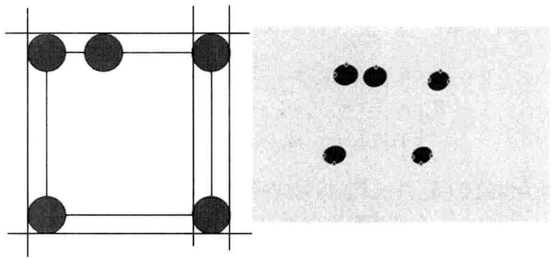

<details>
<summary>natural_image</summary>

Two abstract diagrams: one with a grid of circles and lines, the other showing scattered black dots on a textured background (no text or symbols)
</details>

图9

需要注意的是,像平面有两种不同的表征方法:一种是按像素的位置坐标表示;另一种是按物理长度表示,在这里应当用像素的位置坐标来表示,另外,对于靶标上的点,应将其定义在世界坐标系中,可以定义靶标平面垂直于 $Z_{w}$ 轴,且世界坐标系的原点(0,0,0)为靶标的中心,如图10所示。

对图像进行处理,经过边缘检测,得到对应的最值点(程序附录光盘),共找到了20组特殊点与图像上点的近似对应关系,其坐标对应关系见表1。

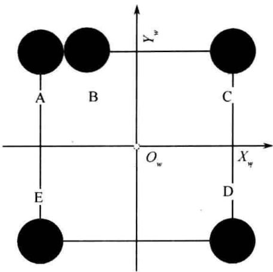

<details>
<summary>text_image</summary>

A
B
C
E
Ow
Xw
D
Yw
</details>

图10

表 1 用于标定数码相机的数据

<table><tr><td>最值点序号</td><td>1</td><td>2</td><td>3</td><td>4</td><td>5</td><td>6</td><td>7</td><td>8</td><td>9</td><td>10</td><td>11</td><td>12</td><td>13</td><td>14</td><td>15</td><td>16</td><td>17</td><td>18</td><td>19</td><td>20</td></tr><tr><td>靶标上点在世界坐标系的横坐标x/mm</td><td>-50</td><td>-50</td><td>-62</td><td>-38</td><td>-20</td><td>-20</td><td>-32</td><td>-8</td><td>50</td><td>50</td><td>38</td><td>62</td><td>-50</td><td>-50</td><td>-62</td><td>-38</td><td>50</td><td>50</td><td>38</td><td>62</td></tr><tr><td>靶标上点在世界坐标系的纵坐标y/mm</td><td>62</td><td>38</td><td>50</td><td>50</td><td>62</td><td>38</td><td>50</td><td>50</td><td>62</td><td>38</td><td>50</td><td>50</td><td>-38</td><td>-62</td><td>-50</td><td>-50</td><td>-38</td><td>-62</td><td>-50</td><td>-50</td></tr><tr><td>对应最值点的像在图像坐标系的横坐标u/像素</td><td>318</td><td>327</td><td>282</td><td>364</td><td>424</td><td>429</td><td>383</td><td>463</td><td>638</td><td>636</td><td>604</td><td>676</td><td>283</td><td>282</td><td>246</td><td>323</td><td>581</td><td>584</td><td>549</td><td>617</td></tr><tr><td>对应最值点的像在图像坐标系的纵坐标v/像素</td><td>149</td><td>230</td><td>183</td><td>181</td><td>157</td><td>236</td><td>198</td><td>192</td><td>176</td><td>251</td><td>211</td><td>203</td><td>467</td><td>537</td><td>501</td><td>492</td><td>471</td><td>535</td><td>502</td><td>494</td></tr></table>

下面讨论如何由参照物图像求投影矩阵 M 的算法, 对于靶标平面上不同的点 $(X_{wi}, Y_{wi}, Z_{wi}, 1)$ , 存在如下关系:

$$
Z _ {c i} \left[ \begin{array}{l} u _ {i} \\ v _ {i} \\ 1 \end{array} \right] = \left[ \begin{array}{l l l l} m _ {1 1} & m _ {1 2} & m _ {1 3} & m _ {1 4} \\ m _ {2 1} & m _ {2 2} & m _ {2 3} & m _ {2 4} \\ m _ {3 1} & m _ {3 2} & m _ {3 3} & m _ {3 4} \end{array} \right] \left[ \begin{array}{l} X _ {w i} \\ Y _ {w i} \\ Z _ {w i} \\ 1 \end{array} \right]
$$

式中： $(u_{i},v_{i},1)$ 为空间点 $(X_{wi},Y_{wi},Z_{wi},1)$ 对应的图像坐标，上式包含三个方程：

$$
\left\{ \begin{array}{l} Z _ {c i} u _ {i} = m _ {1 1} X _ {w i} + m _ {1 2} Y _ {w i} + m _ {1 3} Z _ {w i} + m _ {1 4} \\ Z _ {c i} v _ {i} = m _ {2 1} X _ {w i} + m _ {2 2} Y _ {w i} + m _ {2 3} Z _ {w i} + m _ {2 4} \\ Z _ {c i} = m _ {3 1} X _ {w i} + m _ {3 2} Y _ {w i} + m _ {3 3} Z _ {w i} + m _ {3 4} \end{array} \right.
$$

在上面的方程组中,分别用第一和第二个方程除以第三个方程,可以得到关于 $m_{ij}$ 的线性方程:

$$
X _ {w i} m _ {1 1} + Y _ {w i} m _ {1 2} + Z _ {w i} m _ {1 3} + m _ {1 4} - u _ {i} X _ {w i} m _ {3 1} - u _ {i} Y _ {w i} m _ {3 2} - u _ {i} Z _ {w i} m _ {3 3} = u _ {i} m _ {3 4}
$$

$$
X _ {w i} m _ {2 1} + Y _ {w i} m _ {2 2} + Z _ {w i} m _ {2 3} + m _ {2 4} - v _ {i} X _ {w i} m _ {3 1} - v _ {i} Y _ {w i} m _ {3 2} - v _ {i} Z _ {w i} m _ {3 3} = v _ {i} m _ {3 4}
$$

由上面的式子可以看出,如果用于标定的点有 n 个,并已知它们的空间坐标 $(X_{wi},Y_{wi},Z_{wi},1)(i=1,\cdots,n)$ ,则应当有 2n 个关于 M 矩阵元素的线性方程,下面用矩阵的形式写

出这些方程：

$$
\left[ \begin{array}{c c c c c c c c c c c} X _ {w 1} & Y _ {w 1} & Z _ {w 1} & 1 & 0 & 0 & 0 & 0 & - u _ {1} X _ {w 1} & - u _ {1} Y _ {w 1} & - u _ {1} Z _ {w 1} \\ 0 & 0 & 0 & 0 & X _ {w 1} & Y _ {w 1} & Z _ {w 1} & 1 & - v _ {1} X _ {w 1} & - v _ {1} Y _ {w 1} & - v _ {1} Z _ {w 1} \\ \vdots & \vdots & \vdots & \vdots & \vdots & \vdots & \vdots & \vdots & \vdots & \vdots & \vdots \\ X _ {w n} & Y _ {w n} & Z _ {w n} & 1 & 0 & 0 & 0 & 0 & - u _ {n} X _ {w n} & - u _ {n} Y _ {w n} & - u _ {n} Z _ {w n} \\ 0 & 0 & 0 & 0 & X _ {w n} & Y _ {w n} & Z _ {w n} & 1 & - v _ {n} X _ {w n} & - v _ {n} Y _ {w n} & - v _ {n} Z _ {w n} \end{array} \right]
$$

$$
\times \left[ \begin{array}{l} m _ {1 1} \\ m _ {1 2} \\ m _ {1 3} \\ m _ {1 4} \\ m _ {2 1} \\ m _ {2 2} \\ m _ {2 3} \\ m _ {2 4} \\ m _ {3 1} \\ m _ {3 2} \\ m _ {3 3} \end{array} \right] = \left[ \begin{array}{c} u _ {1} m _ {3 4} \\ v _ {1} m _ {3 4} \\ \vdots \\ \vdots \\ \vdots \\ \vdots \\ \vdots \\ \vdots \\ \vdots \\ u _ {n} m _ {3 4} \\ v _ {n} m _ {3 4} \end{array} \right] \tag {3}
$$

由于 $M$ 矩阵乘以任何不为零的常数并不影响 $(X_w, Y_w, Z_w)$ 与 $(u, v)$ 的关系，可以指定 $m_{34} = 1$ ，从而得到关于 $M$ 矩阵其他元素的 $2n$ 个方程，共有11个未知数，设为11维向量 $m$ ，定义 $K$ 为左边 $2n \times 11$ 的矩阵， $U$ 为右边的 $2n$ 维向量，有如下关系：

$$
\boldsymbol {K} \boldsymbol {m} = \boldsymbol {U}
$$

显然只要找到六组以上对应坐标就可以将这11个未知数确定,下面讨论对应坐标的选取。

将各组对应的数据带入上式,通过 MATLAB 编程(程序见附件光盘)采用最小二乘法来求 M,然后求解靶标上各圆的圆心对应与像平面上的像的坐标。

程序运行结果显示,该数码相机系统的透视投影矩阵 M 为

$$
\boldsymbol {M} = \left[ \begin{array}{c c c c} 3. 4 1 1 8 5 0 6 5 & 0. 1 7 1 4 5 8 1 5 & 0 & 4 6 2. 5 2 5 3 8 2 1 1 \\ 0. 3 6 8 9 8 3 1 4 & - 3. 2 3 4 2 9 5 3 1 & 0 & 3 5 4. 4 9 6 4 9 2 9 5 \\ 0. 0 0 0 7 4 8 8 6 & - 0. 0 0 0 6 4 7 6 8 & 0 & 1 \end{array} \right] \tag {4}
$$

利用该透视投影矩阵计算靶标上各个圆的圆心在像平面上的像坐标,见表2。

表 2 各个圆心的像坐标

<table><tr><td>靶标上各个圆的圆心</td><td>A</td><td>B</td><td>C</td><td>D</td><td>E</td></tr><tr><td>靶标上在世界坐标系点的横坐标x/mm</td><td>-50</td><td>-38</td><td>50</td><td>50</td><td>-50</td></tr><tr><td>靶标上在世界坐标系点的纵坐标y/mm</td><td>50</td><td>50</td><td>50</td><td>-50</td><td>-50</td></tr><tr><td>对应圆心的像在图像坐标系的横坐标u/像素</td><td>323.0645</td><td>422.8899</td><td>638.4608</td><td>583.7812</td><td>284.8008</td></tr><tr><td>对应圆心的像在图像坐标系的纵坐标v/像素</td><td>187.4196</td><td>194.6195</td><td>210.1676</td><td>499.7633</td><td>500.2931</td></tr></table>

具体的求解方法为:以点 $A(-50,50)$ 为例,将其世界坐标 $A(-50,50,0)$ 代入矩阵方程得到个一元一次方程组:

$$
\left\{ \begin{array}{l} 3. 4 1 1 8 5 0 6 5 \times (- 5 0) + 0. 1 7 1 4 5 8 1 5 \times 5 0 + 4 6 2. 5 2 5 3 8 2 1 1 \times 1 + \\ 0. 0 0 0 7 4 8 8 6 \times u _ {1} \times 5 0 + 0. 0 0 0 6 4 7 6 8 \times u _ {1} \times 5 0 = u _ {1} \\ 0. 3 6 8 9 9 8 1 4 \times (- 5 0) - 3. 2 3 4 2 9 5 3 1 \times 5 0 + 3 5 4. 4 9 6 4 9 2 9 5 \times 1 + \\ 0. 0 0 0 7 4 8 8 6 \times v _ {1} \times 5 0 + 0. 0 0 0 6 4 7 6 8 \times v _ {1} \times 5 0 = v _ {1} \end{array} \right.
$$

解得 $A(-50, 50, 0)$ 在像平面中的像坐标为 $A'(323, 187)$ , 同理可以计算出其他几个圆的圆心在像平面上对应点的像坐标。

## 6 针孔模型的稳定性分析和精度讨论

## 6.1 针孔模型的稳定性分析

## 6.1.1 利用随机扰动进行稳定性分析

针孔模型的稳定性可以通过在像坐标上加扰动来实现,分别在像平面上的点的横坐标和纵坐标上添加扰动量,然后根据前面建立的模型对扰动后的图像进行处理,寻找靶标上圆的公切线最值点在像平面上对应的像,根据对应关系联立方程,求解投影矩阵M,然后用扰动后的投影矩阵计算靶标上各个圆的圆心在像平面上所对应的像坐标,最后将计算结果与原来的结果进行比较,说明所建模型的稳定性。具体的实现方法如下:

对于像平面上边缘一点 $(u, v)$ 进行扰动，在它的横坐标上加一个白噪声 $\xi$ ，即 $\xi \sim N(0, \sigma^2)$ ，其坐标变为 $(u + \xi, v)$ ，此时原来在 $(u, v)$ 的像点被移动到了 $(u + \xi, v)$ ，即图像发生了变化。

利用 MATLAB 软件 $^{[2]}$ 生成一组满足上述分布的随机数,并将这一组随机数加到像平面内的每个点的横坐标上,然后按照模型求取对应公最值点的方法确定对应公最值点的坐标如表 3 所列:

表 3 方差为 10 个像素扰动后的公最值点对应关系

<table><tr><td>最值点序号</td><td>1</td><td>2</td><td>3</td><td>4</td><td>5</td><td>6</td><td>7</td><td>8</td><td>9</td><td>10</td><td>11</td><td>12</td><td>13</td><td>14</td><td>15</td><td>16</td><td>17</td><td>18</td><td>19</td><td>20</td></tr><tr><td>靶标上在世界坐标系点的横坐标x/mm</td><td>-50</td><td>-50</td><td>-62</td><td>-38</td><td>-20</td><td>-20</td><td>-32</td><td>-8</td><td>50</td><td>50</td><td>38</td><td>62</td><td>-50</td><td>-50</td><td>-62</td><td>-38</td><td>50</td><td>50</td><td>38</td><td>62</td></tr><tr><td>靶标上在世界坐标系点的纵坐标y/mm</td><td>62</td><td>38</td><td>50</td><td>50</td><td>62</td><td>38</td><td>50</td><td>50</td><td>62</td><td>38</td><td>50</td><td>50</td><td>-38</td><td>-62</td><td>-50</td><td>-50</td><td>-38</td><td>-62</td><td>-50</td><td>-50</td></tr><tr><td>对应最值点的像在图像坐标系的横坐标u/像素</td><td>322</td><td>328</td><td>277</td><td>371</td><td>425</td><td>430</td><td>379</td><td>468</td><td>638</td><td>641</td><td>596</td><td>682</td><td>284</td><td>285</td><td>241</td><td>329</td><td>576</td><td>584</td><td>542</td><td>626</td></tr><tr><td>对应最值点的像在图像坐标系的纵坐标v/像素</td><td>149</td><td>230</td><td>189</td><td>178</td><td>157</td><td>236</td><td>205</td><td>194</td><td>176</td><td>251</td><td>220</td><td>208</td><td>467</td><td>537</td><td>499</td><td>493</td><td>471</td><td>535</td><td>503</td><td>498</td></tr></table>

利用上面这些数据推出扰动后投影矩阵为

$$
\boldsymbol {M} = \left[ \begin{array}{c c c c} 3. 4 0 7 7 8 7 9 6 & 0. 1 6 1 0 4 3 5 8 & 0 & 4 6 3. 2 6 5 7 9 3 2 8 \\ 0. 3 8 1 0 9 5 9 5 & - 3. 2 2 7 9 5 7 7 7 & 0 & 3 5 6. 0 9 1 9 9 3 4 3 \\ 0. 0 0 0 7 3 3 2 6 & - 0. 0 0 0 6 7 5 5 4 & 0 & 1 \end{array} \right] \tag {5}
$$

由此投影矩阵得到靶标上各个圆的圆心的像坐标,见表4。

表 4 方差 ${\sigma }^{2} = {10}$ 时靶标上各圆圆心在图像坐标系的像坐标

<table><tr><td>靶标上各个圆的圆心</td><td>A</td><td>B</td><td>C</td><td>D</td><td>E</td></tr><tr><td>靶标上在世界坐标系点的横坐标x/mm</td><td>-50</td><td>-38</td><td>50</td><td>50</td><td>-50</td></tr><tr><td>靶标上在世界坐标系点的纵坐标y/mm</td><td>50</td><td>50</td><td>50</td><td>-50</td><td>-50</td></tr><tr><td>对应圆心的像在图像坐标系的横坐标u/像素</td><td>323.7322</td><td>423.6864</td><td>639.8605</td><td>584.4355</td><td>285.6487</td></tr><tr><td>对应圆心的像在图像坐标系的纵坐标v/像素</td><td>188.9488</td><td>196.5957</td><td>213.1337</td><td>501.2376</td><td>499.8779</td></tr></table>

与没有添加扰动前所得到的像坐标相比,其像坐标发生变化的幅度见表5。

表 5 像坐标在扰动下的误差

<table><tr><td>靶标上各个圆的圆心</td><td>A</td><td>B</td><td>C</td><td>D</td><td>E</td></tr><tr><td>对应圆心的像在图像坐标系的横坐标u的误差/像素</td><td>0.6677</td><td>0.7965</td><td>1.3997</td><td>0.6544</td><td>0.8480</td></tr><tr><td>对应圆心的像在图像坐标系的纵坐标v的误差/像素</td><td>1.5292</td><td>1.9762</td><td>2.9661</td><td>1.4743</td><td>0.4152</td></tr></table>

从上面的分析过程可知,当扰动量 $\xi$ 满足 $\xi \sim N(0,10)$ 时对于计算结果的影响不超过3个像素单位,说明此模型具有较强的稳定性。

## 6.1.2 不同方差扰动量下的模型稳定性

前面讨论了扰动量服从 $\xi \sim N(0,10)$ 情况下模型的稳定性,下面考虑增大扰动量正态分布的方差,再研究模型的稳定性。

当 $\xi \sim N(0,20)$ 时，用于标定相机的公最值点坐标见表6。

表 6 方差 $\sigma^{2}=20$ 时公最值点对应关系

<table><tr><td>最值点序号</td><td>1</td><td>2</td><td>3</td><td>4</td><td>5</td><td>6</td><td>7</td><td>8</td><td>9</td><td>10</td><td>11</td><td>12</td><td>13</td><td>14</td><td>15</td><td>16</td><td>17</td><td>18</td><td>19</td><td>20</td></tr><tr><td>靶标上在世界坐标系点的横坐标x/mm</td><td>-50</td><td>-50</td><td>-62</td><td>-38</td><td>-20</td><td>-20</td><td>-32</td><td>-8</td><td>50</td><td>50</td><td>38</td><td>62</td><td>-50</td><td>-50</td><td>-62</td><td>-38</td><td>50</td><td>50</td><td>38</td><td>62</td></tr><tr><td>靶标上在世界坐标系点的纵坐标y/mm</td><td>62</td><td>38</td><td>50</td><td>50</td><td>62</td><td>38</td><td>50</td><td>50</td><td>62</td><td>38</td><td>50</td><td>50</td><td>-38</td><td>-62</td><td>-50</td><td>-50</td><td>-38</td><td>-62</td><td>-50</td><td>-50</td></tr><tr><td>对应最值点的像在图像坐标系的横坐标u/像素</td><td>330</td><td>331</td><td>268</td><td>373</td><td>429</td><td>422</td><td>372</td><td>470</td><td>638</td><td>640</td><td>595</td><td>686</td><td>285</td><td>285</td><td>237</td><td>333</td><td>580</td><td>589</td><td>541</td><td>624</td></tr><tr><td>对应最值点的像在图像坐标系的纵坐标v/像素</td><td>149</td><td>230</td><td>191</td><td>195</td><td>157</td><td>236</td><td>204</td><td>191</td><td>176</td><td>251</td><td>235</td><td>203</td><td>467</td><td>537</td><td>497</td><td>508</td><td>471</td><td>535</td><td>517</td><td>492</td></tr></table>

此时的投影矩阵为

$$
\boldsymbol {M} = \left[ \begin{array}{c c c c} 3. 4 2 5 5 8 6 8 6 & 0. 1 5 2 3 & 0 & 4 6 3. 4 2 8 5 3 \\ 0. 3 6 9 2 5 5 6 & - 3. 2 4 1 2 4 2 6 5 & 0 & 3 5 8. 5 1 0 7 \\ 0. 0 0 0 7 3 6 1 5 & - 0. 0 0 0 6 9 1 7 6 & 0 & 1 \end{array} \right] \tag {6}
$$

由此投影矩阵得到靶标上各个圆的圆心的像坐标,见表7。

表 7 方差 ${\sigma }^{2} = {20}$ 扰动后靶标上各圆圆心的像坐标

<table><tr><td>靶标上各个圆的圆心</td><td>A</td><td>B</td><td>C</td><td>D</td><td>E</td></tr><tr><td>靶标上在世界坐标系点的横坐标x/mm</td><td>-50</td><td>-38</td><td>50</td><td>50</td><td>-50</td></tr><tr><td>靶标上在世界坐标系点的纵坐标y/mm</td><td>50</td><td>50</td><td>50</td><td>-50</td><td>-50</td></tr><tr><td>对应圆心的像在图像坐标系的横坐标u/像素</td><td>322.8109</td><td>423.41</td><td>640.8999</td><td>585.3043</td><td>503.227</td></tr><tr><td>对应圆心的像在图像坐标系的纵坐标v/像素</td><td>191.6702</td><td>198.8699</td><td>214.4354</td><td>503.1154</td><td>285.1666</td></tr></table>

与没有添加扰动前所得到的像坐标相比,其像坐标波动误差见表8\~表10。

表 8 像坐标在方差 $\sigma^{2}=20$ 扰动下的误差

<table><tr><td>靶标上各个圆的圆心</td><td>A</td><td>B</td><td>C</td><td>D</td><td>E</td></tr><tr><td>对应圆心的像在图像坐标系的横坐标u的误差/像素</td><td>0.2531</td><td>0.5201</td><td>2.4391</td><td>1.52315</td><td>0.3659</td></tr><tr><td>对应圆心的像在图像坐标系的纵坐标v的误差/像素</td><td>4.2506</td><td>4.2504</td><td>4.2678</td><td>3.3521</td><td>2.9339</td></tr></table>

同理我们可以得到方差为 50、100 个像素时像坐标在扰动下的波动幅度, 如下面两个表格所示:

表 9 像坐标在方差 $\sigma^{2}=50$ 扰动下的误差

<table><tr><td>靶标上各个圆的圆心</td><td>A</td><td>B</td><td>C</td><td>D</td><td>E</td></tr><tr><td>对应圆心的像在图像坐标系的横坐标u的误差/像素</td><td>2.9656</td><td>0.1744</td><td>3.9585</td><td>3.4244</td><td>0.1808</td></tr><tr><td>对应圆心的像在图像坐标系的纵坐标v的误差/像素</td><td>1.6502</td><td>1.0284</td><td>6.5251</td><td>5.8305</td><td>2.1606</td></tr></table>

表 10 像坐标在方差 $\sigma^{2}=100$ 扰动下的误差

<table><tr><td>靶标上各个圆的圆心</td><td>A</td><td>B</td><td>C</td><td>D</td><td>E</td></tr><tr><td>对应圆心的像在图像坐标系的横坐标u的误差/像素</td><td>4.4132</td><td>0.1100</td><td>8.7299</td><td>1.9586</td><td>1.5687</td></tr><tr><td>对应圆心的像在图像坐标系的纵坐标v的误差/像素</td><td>2.5531</td><td>1.3320</td><td>1.2134</td><td>2.9842</td><td>4.6759</td></tr></table>

综上所述,得到在不同扰动下靶标上的圆的圆心的像坐标的误差,见表11。

表 11 在不同扰动下各个点的偏移距离(像素)

<table><tr><td></td><td>A</td><td>B</td><td>C</td><td>D</td><td>E</td></tr><tr><td> $\sigma^{2} = 10$ </td><td>1.668615</td><td>2.130676</td><td>3.279773</td><td>1.61301</td><td>0.94419</td></tr><tr><td> $\sigma^{2} = 20$ </td><td>4.258129</td><td>4.282103</td><td>4.915621</td><td>3.681923</td><td>2.956628</td></tr><tr><td> $\sigma^{2} = 50$ </td><td>3.39381</td><td>1.043083</td><td>7.631949</td><td>6.761749</td><td>2.168152</td></tr><tr><td> $\sigma^{2} = 100$ </td><td>5.098495</td><td>1.336534</td><td>8.813824</td><td>3.569533</td><td>4.932024</td></tr></table>

从表 11 得到当扰动量方差从 10 个像素变化为 20、50、100 个像素时, 靶标上的圆的圆心偏移距离并不大, 也说明模型的稳定性较好。

## 6.2 关于模型精度检验

考虑到本问题的复杂性,对于模型精度的检验应当以实际值为标准,将通过模型计算所得的结果与实际的值进行比较,计算偏差量从而得到模型的精度。具体实施时可以将题目所给的靶标按比例在图上画出来,为了进行检验,在靶标图上增加一个坐标已知的三角形,用三角形中世界坐标已知的顶点来检验模型的精度。

靶标的示意图如图 11 所示。

用数码相机给靶标拍摄的图片如图 12 所示。

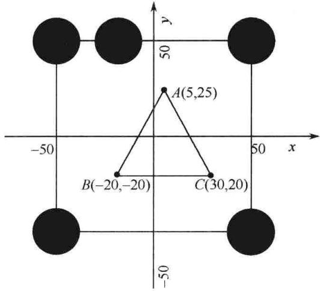

<details>
<summary>bubble</summary>

| Point | X | Y |
| --- | --- | --- |
| A | 5 | 25 |
| B | -20 | -20 |
| C | 30 | 20 |
</details>

图11

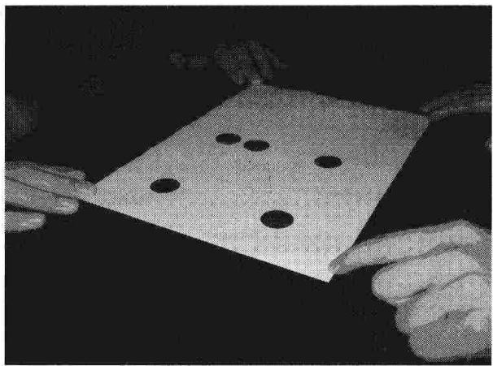

<details>
<summary>natural_image</summary>

Close-up of hands holding a sheet of paper with several small black dots, no visible text or symbols
</details>

图12

为了便于计算,用图像处理软件将图 12 中无用区域的颜色变换为白色,得到灰度差异明显的图像,如图 13 所示。

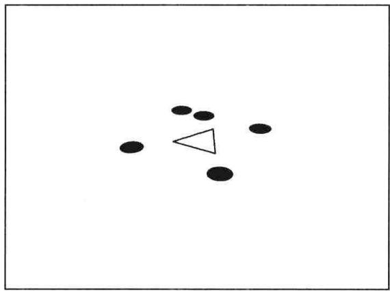

<details>
<summary>natural_image</summary>

Simple diagram with a triangle and several black dots on a white background (no text or symbols)
</details>

图13

下面的工作就是根据前面建立的模型求出该数码相机拍照时的投影矩阵,同时可以通过图像处理得到三角形顶点对应像坐标,然后利用投影矩阵将三角形顶点对应的齐次世界坐标变换为像平面内的坐标,与通过图像处理得到的像坐标相比较,计算模型的精度。

图像处理结果显示三角形顶点 $A$ 的像坐标为(1664,1007.5), $B$ 的像坐标为(1306, 1151), $C$ 的像坐标为(1548,1200), 需要注意的是我们的数码相机的分辨力为 $3072 \times 2304$ , 这一点与题目不同, 所以此时像坐标的范围将扩大。

根据前面建立的模型求出该数码相机拍照时的投影矩阵为

$$
\boldsymbol {M} = \left[ \begin{array}{c c c c} 8. 0 3 9 6 & 7. 6 1 9 3 & 0 & 1 6 1 1. 1 \\ 2. 0 7 1 3 & 0. 2 6 0 4 2 & 0 & 1 0 6 2 \\ 0. 0 0 0 4 4 1 6 6 & 0. 0 0 3 1 8 8 7 & 0 & 1 \end{array} \right] \tag {7}
$$

对三角形顶点 $A$ 变换后得到其像坐标为(1667,1004), $B$ 的像坐标为(1300,1150), $C$ 的像坐标为(1545,1202),与图像处理结果显示三角形顶点 $A$ 的像坐标相比,最大误差为6个像素,平均误差小于3个像素,说明模型的精度较好,但考虑到图像处理和一些其他原因可能会对精度产生影响,因而本模型的精度应该比检测结果高。

## 7 问题四的求解

## 7.1 用题目给定的靶标确定两个相机的相对位置——张定友标定法 $^{[3]}$

设一个二维坐标点 $m = [u, v]^{T}$ ，一个三维坐标点 $M = [X_{w}, Y_{w}, Z_{w}]^{T}$ ，用 $\tilde{x}$ 来表示这两个坐标形式： $\overline{m} = [u, v, 1]^{T}, \widetilde{M} = [X_{w}, Y_{w}, Z_{w}, 1]^{T}$ 。采用针孔模型，一个三维空间点 M 和其对应的图像投影点 m 之间的关系如下：

$$
s \overline {{\boldsymbol {m}}} = \boldsymbol {A} \left[ \begin{array}{c c} R & t \end{array} \right] \tilde {\boldsymbol {M}}
$$

式中： $s$ 为比例因子； $(R,t)$ 为外部参数，它由一个旋转矩阵和一个平移矩阵构成，通过这个变换可以把坐标从世界坐标系转换到相机坐标系。 $\pmb{A}$ 为相机的内部参数矩阵，其表达式如下：

$$
\boldsymbol {A} = \left[ \begin{array}{c c c} \alpha & \gamma & u _ {0} \\ 0 & \beta & v _ {0} \\ 0 & 0 & 1 \end{array} \right] \tag {8}
$$

式中： $(u_0,v_0)$ 为相机的主点； $\alpha$ 和 $\beta$ 为图像 $u$ 轴和 $v$ 轴的比例因子； $\gamma$ 表示图像在 $u$ 轴和 $v$ 轴方向上的变换系数。不失一般性，假定定标模板在世界坐标系的平面 $Z = 0$ 上。用 $r_i$ 来表示旋转矩阵的第 $i$ 列，由式(8)有

$$
s \left[ \begin{array}{l} u \\ v \\ 1 \end{array} \right] = \boldsymbol {A} \left[ \begin{array}{l l l l} r _ {1} & r _ {2} & r _ {3} & t \end{array} \right] \left[ \begin{array}{c} X _ {w} \\ Y _ {w} \\ 0 \\ 1 \end{array} \right] = \boldsymbol {A} \left[ \begin{array}{l l l} r _ {1} & r _ {2} & r _ {3} \end{array} \right] \left[ \begin{array}{c} X _ {w} \\ Y _ {w} \\ 1 \end{array} \right] \tag {9}
$$

用 $M$ 来表示定模板上的点，由于 $Z$ 恒为零，所以 $\pmb{M} = [X_w,Y_w]^{\mathrm{T}}$ ，即 $\tilde{\pmb{M}} = [X_w,Y_w,1]^{\mathrm{T}}$ ，因此，一个定标模板上的点 $M$ 和其对应图像上的点 $m$ 的关系可以用如下的单应性矩阵 $\pmb{H}$ 来表示：

$$
s \boldsymbol {m} = \tilde {\boldsymbol {H}} \boldsymbol {M} \tag {10}
$$

其中

$$
\boldsymbol {H} = \boldsymbol {A} \left[ \begin{array}{l l l} r _ {1} & r _ {2} & t \end{array} \right] \tag {11}
$$

由此,可以很清楚地看到 $3 \times 3$ 矩阵为相差一个比例因子s的单应性矩阵(参考文献[3])。

## 7.2 对外参数物理意义的讨论

## 7.2.1 坐标系平移变换

对于坐标系的平移变换,可以通过坐标系平移变换的关系得到空间中一点在两个坐标系的函数关系。因此在上述的基础上再建立投影坐标系,建立投影坐标系。 $P(X_{t},Y_{t},Z_{t})$ 为空间一点P在投影坐标系中的坐标, $P(X_{c},Y_{c},Z_{c})$ 为空间一点P在照相机坐标系中的坐标。图14为投影坐标系与照相机坐标系的空间关系图。

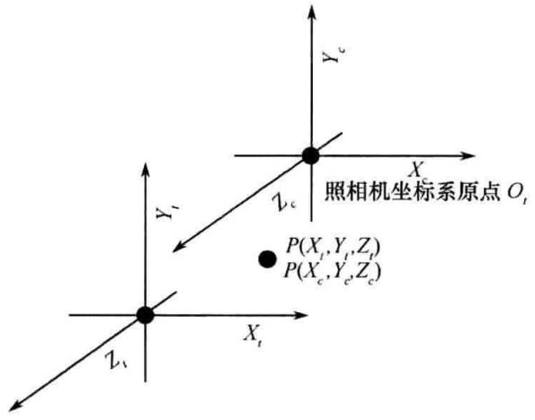

<details>
<summary>text_image</summary>

照相机坐标系原点O_t
P(X_t,Y_t,Z_t)
P(X_c,Y_c,Z_c)
</details>

图14

从照相机坐标系原点变换到世界坐标系原点只有平移,而没有旋转。得到 $P(X_{t},Y_{t},Z_{t})$ 与 $P(X_{c},Y_{c},Z_{c})$ 关系式为

$$
\left\{ \begin{array}{l} X _ {c} = X _ {t} + t _ {x} \\ Y _ {c} = Y _ {t} + t _ {y} \\ Z _ {c} = Z _ {t} + t _ {z} \end{array} \right.
$$

式中： $(X_{c},Y_{c},Z_{c})$ 为 $P$ 点在照相机坐标系下的坐标； $(X_{t},Y_{t},Z_{t})$ 为 $P$ 点平移后在照相机坐标系下的坐标。

## 7.2.2 坐标系旋转变换

对于坐标系的旋转变换, 可以在上述基础上再建立世界坐标系, $P(X_{w}, Y_{w}, Z_{w})$ 为空间一点 P 在世界坐标系的坐标。下面讨论的为世界坐标系与平移后照相机坐标系的关系。又因为

$$
\left( \begin{array}{c} X _ {w} \\ Y _ {w} \\ Z _ {w} \end{array} \right) = \boldsymbol {R} \left( \begin{array}{c} X _ {t} \\ Y _ {t} \\ Z _ {t} \end{array} \right)
$$

旋转矩阵 R 为正交变换矩阵, 即

$$
\boldsymbol {R} = \left( \begin{array}{c c c} \cos \alpha \cos \gamma - \cos \beta \sin \alpha \sin \gamma & \cos \beta \sin \gamma \cos \alpha + \sin \alpha \cos \gamma & \sin \gamma \sin \beta \\ - \cos \alpha \sin \gamma - \sin \alpha \cos \beta \cos \gamma & \cos \alpha \cos \beta \cos \gamma - \sin \alpha \sin \beta & \cos \gamma \sin \beta \\ \sin \beta \sin \alpha & - \cos \alpha \sin \beta & \cos \beta \end{array} \right)
$$

式中： $\alpha$ 是 $x$ 轴与交点线的夹角； $\beta$ 是 $z$ 轴与 $Z$ 轴的夹角； $\gamma$ 是交点线与 $X$ 轴的夹角；轴线 $N$ 为两坐标系 $x - y$ 平面的交线，且 $\alpha, \gamma$ 为 $0 \sim 2\pi$ 的弧度， $\beta$ 为 $0 \sim \pi$ 的弧度，如图15所示。因此得到世界坐标系与平移后照相机坐标系的关系为

$$
\left( \begin{array}{c} X _ {w} \\ Y _ {w} \\ Z _ {w} \\ 1 \end{array} \right) = \left( \begin{array}{c c c c} \cos \alpha \cos \gamma - \cos \beta \sin \alpha \sin \gamma & \cos \beta \sin \gamma \cos \alpha + \sin \alpha \cos \gamma & \sin \gamma \sin \beta & t _ {x} \\ - \cos \alpha \sin \gamma - \sin \alpha \cos \beta \cos \gamma & \cos \alpha \cos \beta \cos \gamma - \sin \alpha \sin \gamma & \cos \gamma \sin \beta & t _ {y} \\ \sin \beta \sin \alpha & - \cos \alpha \sin \beta & \cos \beta & t _ {z} \\ 0 & 0 & 0 & 1 \end{array} \right) \left( \begin{array}{c} X _ {t} \\ Y _ {t} \\ Z _ {t} \\ 1 \end{array} \right) \tag {12}
$$

建立世界坐标系与平移后照相机坐标系(即照相机坐标系平移得到的),如图16所示。

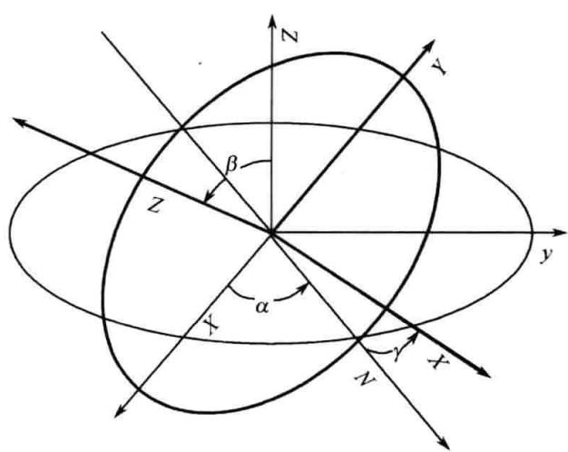

<details>
<summary>text_image</summary>

N
y
β
z
y
α
x
N
y
x
</details>

图15

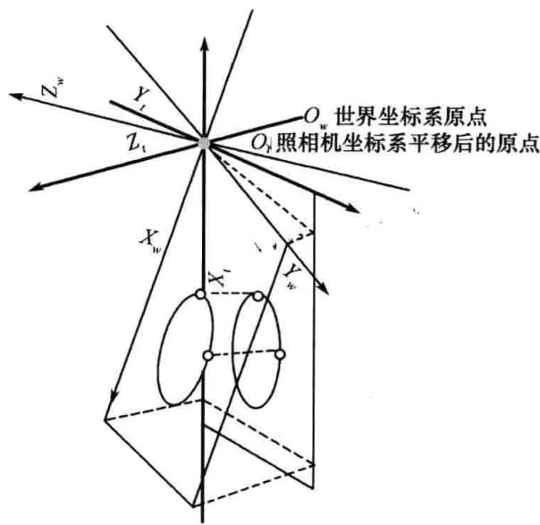

<details>
<summary>text_image</summary>

Zw
Y1
Zt
Ow世界坐标系原点
Oy照相机坐标系平移后的原点
Xw
Xt
Yw
</details>

图16

令两个坐标系的原点在同一位置,且在两个面的一个交点处。因此,三维平移向量 $t=\begin{pmatrix}0\\ 0\\ 0\end{pmatrix}$ ,得到靶标与其投影的关系简化为

$$
\left( \begin{array}{c} X _ {w} \\ Y _ {w} \\ Z _ {w} \end{array} \right) = \left( \begin{array}{c c c} \cos \alpha \cos \gamma - \cos \beta \sin \alpha \sin \gamma & \cos \beta \sin \gamma \cos \alpha + \sin \alpha \cos \gamma & \sin \gamma \sin \beta \\ - \cos \alpha \sin \gamma - \sin \alpha \cos \beta \cos \gamma & \cos \alpha \cos \beta \cos \gamma - \sin \alpha \sin \gamma & \cos \gamma \sin \beta \\ \sin \beta \sin \alpha & - \cos \alpha \sin \beta & \cos \beta \end{array} \right) \left( \begin{array}{c} X _ {t} \\ Y _ {t} \\ Z _ {t} \end{array} \right)
$$

$$
= R \left( \begin{array}{c} X _ {t} \\ Y _ {t} \\ Z _ {t} \end{array} \right)
$$

对 $\pmb{R}$ 进行逆变换, 得

$$
\boldsymbol {R} ^ {-} = \left( \begin{array}{c c c} \cos \alpha \cos \gamma - \cos \beta \sin \alpha \sin \gamma & - \cos \beta \cos \gamma \sin \alpha - \cos \alpha \sin \gamma & \sin \alpha \sin \beta \\ \cos \gamma \sin \alpha + \cos \alpha \cos \beta \sin \gamma & \cos \alpha \cos \beta \cos \gamma - \sin \alpha \sin \gamma & - \cos \alpha \sin \beta \\ \sin \beta \sin \gamma & \cos \gamma \sin \beta & \cos \beta \end{array} \right)
$$

得到 $P(X_w,Y_w,Z_w)$ 与 $P(X_{t},Y_{t},Z_{t})$ 的关系为

$$
\begin{array}{l} \left( \begin{array}{c} X _ {t} \\ Y _ {t} \\ Z _ {t} \end{array} \right) = \left( \begin{array}{c c c} \cos \alpha \cos \gamma - \cos \beta \sin \alpha \sin \gamma & - \cos \beta \cos \gamma \sin \alpha - \cos \alpha \sin \gamma & \sin \alpha \sin \beta \\ \cos \gamma \sin \alpha + \cos \alpha \cos \beta \sin \gamma & \cos \alpha \cos \beta \cos \gamma - \sin \alpha \sin \gamma & - \cos \alpha \sin \beta \\ \sin \beta \sin \gamma & \cos \gamma \sin \beta & \cos \beta \end{array} \right) \left( \begin{array}{c} X _ {w} \\ Y _ {w} \\ Z _ {w} \end{array} \right) \\ = \boldsymbol {R} ^ {-} \left( \begin{array}{c} X _ {w} \\ Y _ {w} \\ Z _ {w} \end{array} \right) \\ \end{array}
$$

即

$$
\left\{ \begin{array}{l} X _ {t} = \left(\cos \alpha \cos \gamma - \cos \beta \sin \alpha \sin \gamma\right) \times X _ {w} + \left(- \cos \beta \cos \gamma \sin \alpha - \cos \alpha \sin \gamma\right) \times Y _ {w} \\ \quad + \sin \alpha \sin \beta \times Z _ {w}. \\ Y _ {t} = \left(\cos \gamma \sin \alpha + \cos \alpha \cos \beta \sin \gamma\right) \times X _ {w} + \left(\cos \alpha \cos \beta \cos \gamma - \sin \alpha \sin \gamma\right) \times Y _ {w} \\ \quad - \cos \alpha \sin \beta \times Z _ {w} \\ Z _ {t} = (\sin \beta \sin \gamma) \times X _ {w} + (\cos \gamma \sin \beta) \times Y _ {w} + \cos \beta \times Z _ {w} \end{array} \right. \tag {13}
$$

## 8 关于非线性摄像机模型的考虑

线性模型不能准确地描述成像几何关系,尤其在使用广角镜头时,在远距离图像中心处会有较大的畸变。描述非线性畸变可用下列公式:

$$
\left\{ \begin{array}{l} \bar {x} = x + \delta_ {x} (x, y) \\ \bar {y} = y + \delta_ {y} (x, y) \end{array} \right. \tag {14}
$$

式中： $(\bar{x},\bar{y})$ 为小孔线性模型计算出来的图像点坐标的理想值； $(x,y)$ 是实际的图像点坐标； $\delta_{x}$ 和 $\delta_y$ 是非线性畸变值，它与图像点在图像中的位置有关，可用以下公式表达：

$$
\left\{ \begin{array}{l} \delta_ {x} (x, y) = k _ {1} x (x ^ {2} + y ^ {2}) + (p _ {1} (3 x ^ {2} + y ^ {2}) + 2 p _ {2} x y) + s _ {1} (x ^ {2} + y ^ {2}) \\ \delta_ {y} (x, y) = k _ {2} y (x ^ {2} + y ^ {2}) + (p _ {2} (3 x ^ {2} + y ^ {2}) + 2 p _ {1} x y) + s _ {2} (x ^ {2} + y ^ {2}) \end{array} \right. \tag {15}
$$

式中： $\delta_x$ 或 $\delta_y$ 的第一项称为径向畸变；第二项称为离心畸变；第三项称为薄棱镜畸变；式中

的 $k_{1}, k_{2}, p_{1}, p_{2}, s_{1}, s_{2}$ 为非线性畸变参数。

如果只考虑径向畸变,式(14)和式(15)可写为

$$
\left\{ \begin{array}{l} \bar {x} = x (1 + k _ {1} r ^ {2}) \\ \bar {y} = y (1 + k _ {2} r ^ {2}) \end{array} \right.
$$

式中： $r^2 = x^2 +y^2$ ，该式表明， $x$ 方向与 $y$ 方向的畸变相对值 $(\frac{\delta_x}{x},\frac{\delta_y}{y})$ 与径向半径的平方成正比，即在图像边缘处的畸变较大。

## 9 模型的优缺点

线性照相机模型较为简便地反映出了世界坐标与像坐标的转化关系,在相机内外参数已知的条件下可以找出世界坐标系中的点与像坐标系中的点间对应关系,简便适用,而且从上面实际检验的结果来看,线性照相机模型具有较好的计算精度。但线性照相机模型不能较好地处理畸变现象,因此,在发生畸变的情况下,用线性照相机模型计算的结果可能会有较大的误差。

## 10 模型推广——机器人手眼定标

在计算机视觉应用于机器人技术时,经常将摄像机固定在机器人手臂的末端执行器上,其目的是当机器人的末端执行器在执行任务时,由摄像机测定末端执行器与工件的相对位置。这种配置相当于将“眼睛”放到“手”上,与人和动物很不相同,其原因是人和动物的眼睛有一个很好的转动机制。如果 $C_{obj}$ 为空间某物体的坐标系, $C_{c}$ 为摄影机坐标系, $C_{e}$ 为机器人手抓平台,能用前面照相机定标的方法来测量 $C_{obj}$ 和 $C_{c}$ 的相对位置,用 $R_{a},t_{a}$ 表示,要知道 $C_{obj}$ 和 $C_{c}$ 的相对位置,就必须知道 $C_{e}$ 和 $C_{c}$ 的相对位置。由于摄像机是固定在手爪平台上的,因此,一旦固定,R和t就是常量,但由于无法用人眼看到摄像机坐标系,所以R和t必须用前面建立的模型进行定标。

## 参考文献

## 【论文点评】

姚奎

本论文首先通过设定世界坐标系、相机坐标系和像平面坐标系,建立了线性照相机模型;然后进行了模型稳定性检验;最后,利用张定友定标算法给出了两个照相机的相对位置。

文章层次清晰,表述流利,具有很强的可读性。

本文很大的优点在于,能够在短时间内非常有效迅速地查阅、学习和使用资料。文章找到了一本该方面重要的专业参考书以及有价值的学术文献,在短时间内运用世界坐标系、相机坐标系和像平面坐标系、精度和稳定性检验的白噪声理论、张定友定标算法等,表明作者具有很强的查阅、学习、使用、创新资料的能力,这不仅对于数学建模竞赛,也对于今后的学习和研究工作有很重要的作用。

当然,文章的缺憾在于成文和数学描述上还不够老道,有些凌乱。如果这方面做的好,该文可以“更上一层楼”。

## 2009 年 A 题 制动器试验台的控制方法分析

汽车的行车制动器(以下简称制动器)连接在车轮上,它的作用是在行驶时使车辆减速或者停止。制动器的设计是车辆设计中最重要的环节之一,直接影响着人身和车辆的安全。为了检验设计的优劣,必须进行相应的测试。在道路上测试实际车辆制动器的过程称为路试,其方法为:车辆在指定路面上加速到指定的速度;断开发动机的输出,让车辆依惯性继续运动;以恒定的力踏下制动踏板,使车辆完全停止下来或车速降到某数值以下;在这一过程中,检测制动减速度等指标。假设路试时轮胎与地面的摩擦力为无穷大,因此轮胎与地面无滑动。

为了检测制动器的综合性能,需要在各种不同情况下进行大量路试。但是,车辆设计阶段无法路试,只能在专门的制动器试验台上对所设计的路试进行模拟试验。模拟试验的原则是试验台上制动器的制动过程与路试车辆上制动器的制动过程尽可能一致。通常试验台仅安装、试验单轮制动器,而不是同时试验全车所有车轮的制动器。制动器试验台一般由安装了飞轮组的主轴、驱动主轴旋转的电动机、底座、施加制动的辅助装置以及测量和控制系统等组成。被试验的制动器安装在主轴的一端,当制动器工作时会使主轴减速。试验台工作时,电动机拖动主轴和飞轮旋转,达到与设定的车速相当的转速(模拟实验中,可认为主轴的角速度与车轮的角速度始终一致)后,电动机断电,同时施加制动,当满足设定的结束条件时就称为完成一次制动。

路试车辆的指定车轮在制动时承受载荷。将这个载荷在车辆平动时具有的能量(忽略车轮自身转动具有的能量)等效地转化为试验台上飞轮和主轴等机构转动时具有的能量,与此能量相应的转动惯量(以下转动惯量简称为惯量)在本题中称为等效的转动惯量。试验台上的主轴等不可拆卸机构的惯量称为基础惯量。飞轮组由若干个飞轮组成,使用时根据需要选择几个飞轮固定到主轴上,这些飞轮的惯量之和再加上基础惯量称为机械惯量。例如,假设有4个飞轮,其单个惯量分别是:10、20、40、80 $\left(\mathrm{kg}\cdot\mathrm{m}^{2}\right)$ ,基础惯量为 $10\mathrm{kg}\cdot\mathrm{m}^{2}$ ,则可以组成10,20,30, $\cdots$ , $160\left(\mathrm{kg}\cdot\mathrm{m}^{2}\right)$ 的16种数值的机械惯量。但对于等效的转动惯量为 $45.7\mathrm{kg}\cdot\mathrm{m}^{2}$ 的情况,就不能精确地用机械惯量模拟试验。这个问题的一种解决方法是:把机械惯量设定为 $40\mathrm{kg}\cdot\mathrm{m}^{2}$ ,然后在制动过程中,让电动机在一定规律的电流控制下参与工作,补偿由于机械惯量不足而缺少的能量,从而满足模拟试验的原则。

一般假设试验台采用的电动机的驱动电流与其产生的扭矩成正比(本题中比例系数取为 $1.5A/N\cdot m$ );且试验台工作时主轴的瞬时转速与瞬时扭矩是可观测的离散量。

由于制动器性能的复杂性,电动机驱动电流与时间之间的精确关系是很难得到的。工程实际中常用的计算机控制方法是:把整个制动时间离散化为许多小的时间段,如10ms为一段,然后根据前面时间段观测到的瞬时转速与/或瞬时扭矩,设计出本时段驱动电流的值,这个过程逐次进行,直至完成制动。

评价控制方法优劣的一个重要数量指标是能量误差的大小,本题中的能量误差是指所设计的路试时的制动器与相对应的实验台上制动器在制动过程中消耗的能量之差。通常不考虑观测误差、随机误差和连续问题离散化所产生的误差。

现在要求你们解答以下问题：

（1）设车辆单个前轮的滚动半径为0.286m，制动时承受的载荷为6230 N，求等效的转动惯量。

(2) 飞轮组由 3 个外直径 $1 \mathrm{~m}$ 、内直径 $0.2 \mathrm{~m}$ 的环形钢制飞轮组成, 厚度分别为 $0.0392 \mathrm{~m} 、 0.0784 \mathrm{~m} 、 0.1568 \mathrm{~m}$ , 钢材密度为 $7810 \mathrm{~kg} / \mathrm{m}^{3}$ , 基础惯量为 $10 \mathrm{~kg} \cdot \mathrm{m}^{2}$ , 问可以组成哪些机械惯量? 设电动机能补偿的能量相应的惯量的范围为 $[-30, 30] \mathrm{~kg} \cdot \mathrm{m}^{2}$ , 对于问题 1 中得到的等效的转动惯量, 需要用电动机补偿多大的惯量?

(3) 建立电动机驱动电流依赖于可观测量的数学模型。

在问题 1 和问题 2 的条件下, 假设制动减速度为常数, 初始速度为 50km/h, 制动 5.0s 后车速为零, 计算驱动电流。

（4）对于与所设计的路试等效的转动惯量为 $48 ~kg \cdot m^{2}$ ，机械惯量为 $35 ~kg \cdot m^{2}$ ，主轴初转速为 $514 ~r/min$ ，末转速为 $257 ~r/min$ ，时间步长为 $10 ~ms$ 的情况，用某种控制方法试验得到的数据见附表。请对该方法执行的结果进行评价。

（5）按照第3问导出的数学模型，给出根据前一个时间段观测到的瞬时转速与/或瞬时扭矩，设计本时间段电流值的计算机控制方法，并对该方法进行评价。

（6）第5问给出的控制方法是否有不足之处？如果有，请重新设计一个尽量完善的计算机控制方法，并作评价。

## 【试题评析】

田作威

本赛题的题目是“制动器试验台的控制方法分析”，需要参赛队伍研究解决的问题清楚、明了。

问题一和问题二是两个计算题。问题三要求建立电动机驱动电流依赖于可观测量的数学模型，在给出初始条件、并在问题一和问题二的条件下，分别计算驱动电流。问题四提供了一组用某种控制方法试验得到的数据，要求在所给条件下对该方法执行的结果进行评价。问题五要求在问题三导出的数学模型基础之上，根据前一个时间段观测到的瞬时转速与/或瞬时扭矩，设计本时间段电流值的计算机控制方法，并对方法进行评价。问题六要求对问题五给出的控制方法作进一步的研究，设计一个尽量完善的计算机控制方法，并作评价。

本赛题需要研究、解决的问题虽然有六个，但研究、解决的重点是问题三、四、五、六。

## 【问题解答要点】

问题一可根据载荷、转动惯量和等效转动惯量等概念，去求解等效转动惯量。

问题二可根据转动惯量、基础惯量的概念,用数学方法求出各个飞轮的转动惯量和所有组合的机械惯量,从而得到飞轮一和飞轮二需要电动机补偿的惯量。

问题三可通过分析可观测量与电动机驱动电流的关系,重点是运用数学方法推导出

驱动电流与瞬时扭矩、瞬时转速的关系式,建立数学模型。

问题四应提出一种合理、合适的评定执行结果的优劣指标,利用该指标对所提供的一组数据进行评价,并得出正确的结果。

问题五应在问题三导出的数学模型基础之上,根据前一个时间段观测到的瞬时转速与/或瞬时扭矩,建立驱动电流数学模型,并应用问题四中提出的评定指标对模型进行评价。

问题六应分析问题五给出的数学模型的不足之处,通过进一步的研究,设计一个尽量完善的数学模型,利用问题四中数据和评定指标进行模型检验。

# 制动器试验台的控制方法分析

## 摘要

本文研究了制动器试验台电流的控制问题。

问题—根据试验与路试的初始状态能量相等,以及主轴的转速和车轮的转速一致这两个数学原理获得了等效机械惯量的数学表达式模型,并进而得到等效的机械惯量的数值解为 $52 ~kg \cdot m^{2}$ 。

问题二使用积分的方法计算飞轮的制动惯量,获得了积分数学表达式模型,进而求出三个飞轮的转动惯量的数值解分别为 $30kg \cdot m^{2}$ 、 $60kg \cdot m^{2}$ 和 $120kg \cdot m^{2}$ , 可以组成 10、40、70、100、130、160、190、220 ( $kg \cdot m^{2}$ ) 8 种机械惯量; 对于问题一中得到的等效惯量, 需要电动机补偿的惯量为 $12kg \cdot m^{2}$ 或 $-18kg \cdot m^{2}$ ; 在实际中, 应该取 $12kg \cdot m^{2}$ 作为电动机补偿的惯量。

问题三首先通过分析扭矩、惯量与角加速度的关系,得出电流依赖于主轴角加速度这个可观测量的数学模型;其次根据能量与惯量的对应关系,得出驱动电流值的数学表达式,进而计算出在问题一和问题二的条件下驱动电流的数值解为174.825A和262.237A;在实际中,应该取174.825A作为驱动电流。

问题四首先基于以下两个基本内容:把每一个小时间段制动力消耗的能量累加得出试验中制动器消耗的能量;同时路试时初始状态与末状态的能量差就是路试时消耗的能量;进一步带入数据得到本试验结果的误差为5.9%;从而有结论:问题四中给出的控制方法误差偏大,驱动电流控制方法有待进一步改进。

问题五从两个方面着手建立了两个数学模型: 模型一从电流与可观测量的直接对应关系角度对问题三中的模型进行改进, 得出电动机电流依赖于制动力扭矩的数学模型; 模型二从能量的角度以及能量和惯量的对应关系出发, 根据可观测量得出电流控制的初等数学模型。

问题六对问题五的模型二进行改进,考虑之前惯量补偿的误差,在下一个时刻进行再补偿,进而对模型优化,很大程度上提高了试验过程的精确性,使试验过程与路试过程的一致程度达到一个很高的水平,从而进一步改进了模型。

最后,对模型进行了仿真模拟,设计了模拟程序的流程图,并得到了检验的数值解和图解。

本文的一个特色就是在控制电流的每个时刻,模型都能够对前面由于电动机电流的不精确及其他原因造成的补偿惯量的误差进行再补偿,进而使误差以很快的速度降到一个很小的水平,使试验过程与路试过程非常一致;在模型检验中,利用 MATLAB 进行模拟,很好地验证了模拟过程的精确性。

关键词: 制动器, 等效惯量, 机械惯量, 补偿惯量, 结果评价, 驱动电流控制, 能量补偿, 模拟仿真

## 1 问题的重述

汽车的行车制动器(以下简称制动器)连接在车轮上,它的作用是在行驶时使车辆减速或者停止。制动器的设计是车辆设计中最重要的环节之一,直接影响着人身和车辆的安全。为了检验设计的优劣,必须进行相应的测试。在道路上测试实际车辆制动器的过程称为路试,其方法为:车辆在指定路面上加速到指定的速度;断开发动机的输出,让车辆依惯性继续运动;以恒定的力踏下制动踏板,使车辆完全停止下来或车速降到某数值以下;在这一过程中,检测制动减速度等指标。假设路试时轮胎与地面的摩擦力为无穷大,因此轮胎与地面无滑动。

为了检测制动器的综合性能,需要在各种不同情况下进行大量路试。但是,车辆设计阶段无法路试,只能在专门的制动器试验台上对所设计的路试进行模拟试验。模拟试验的原则是试验台上制动器的制动过程与路试车辆上制动器的制动过程尽可能一致。通常试验台仅安装、试验单轮制动器,而不是同时试验全车所有车轮的制动器。制动器试验台一般由安装了飞轮组的主轴、驱动主轴旋转的电动机、底座、施加制动的辅助装置以及测量和控制系统等组成。被试验的制动器安装在主轴的一端,当制动器工作时会使主轴减速。试验台工作时,电动机拖动主轴和飞轮旋转,达到与设定的车速相当的转速(模拟实验中,可认为主轴的角速度与车轮的角速度始终一致)后,电动机断电,同时施加制动,当满足设定的结束条件时就称为完成一次制动。

路试车辆的指定车轮在制动时承受载荷。将这个载荷在车辆平动时具有的能量(忽略车轮自身转动具有的能量)等效地转化为试验台上飞轮和主轴等机构转动时具有的能量,与此能量相应的转动惯量(以下转动惯量简称为惯量)在本题中称为等效的转动惯量。试验台上的主轴等不可拆卸机构的惯量称为基础惯量。飞轮组由若干个飞轮组成,使用时根据需要选择几个飞轮固定到主轴上,这些飞轮的惯量之和再加上基础惯量称为机械惯量。例如,假设有4个飞轮,其单个惯量分别是:10、20、40、80 $\left(\mathrm{kg}\cdot\mathrm{m}^{2}\right)$ ,基础惯量为 $10\mathrm{kg}\cdot\mathrm{m}^{2}$ ,则可以组成10,20,30, $\cdots$ , $160\left(\mathrm{kg}\cdot\mathrm{m}^{2}\right)$ 的16种数值的机械惯量。但对于等效的转动惯量为 $45.7\mathrm{kg}\cdot\mathrm{m}^{2}$ 的情况,就不能精确地用机械惯量模拟试验。这个问题的一种解决方法是:把机械惯量设定为 $40\mathrm{kg}\cdot\mathrm{m}^{2}$ ,然后在制动过程中,让电动机在一定规律的电流控制下参与工作,补偿由于机械惯量不足而缺少的能量,从而满足模拟试验的原则。

一般假设试验台采用的电动机的驱动电流与其产生的扭矩成正比(本题中比例系数取为 $1.5A/N\cdot m$ );且试验台工作时主轴的瞬时转速与瞬时扭矩是可观测的离散量。

这个过程逐次进行,直至完成制动。

评价控制方法优劣的一个重要数量指标是能量误差的大小,本题中的能量误差是指所设计的路试时的制动器与相对应的实验台上制动器在制动过程中消耗的能量之差。通常不考虑观测误差、随机误差和连续问题离散化所产生的误差。

请解决以下问题：

（1）设车辆单个前轮的滚动半径为0.286m，制动时承受的载荷为6230 N，求等效的转动惯量。

(2) 飞轮组由 3 个外直径 $1 \mathrm{~m}$ 、内直径 $0.2 \mathrm{~m}$ 的环形钢制飞轮组成, 厚度分别为 $0.0392 \mathrm{~m} 、 0.0784 \mathrm{~m} 、 0.1568 \mathrm{~m}$ , 钢材密度为 $7810 \mathrm{~kg} / \mathrm{m}^{3}$ , 基础惯量为 $10 \mathrm{~kg} \cdot \mathrm{m}^{2}$ , 问可以组成哪些机械惯量? 设电动机能补偿的能量相应的惯量的范围为 $[-30, 30] \mathrm{~kg} \cdot \mathrm{m}^{2}$ , 对于问题 1 中得到的等效的转动惯量, 需要用电动机补偿多大的惯量?

(3) 建立电动机驱动电流依赖于可观测量的数学模型。

在问题 1 和问题 2 的条件下, 假设制动减速度为常数, 初始速度为 50 km/h, 制动 5.0s 后车速为零, 计算驱动电流。

（4）对于与所设计的路试等效的转动惯量为 $48 ~kg \cdot m^{2}$ ，机械惯量为 $35 ~kg \cdot m^{2}$ ，主轴初转速为 $514 ~r/min$ ，末转速为 $257 ~r/min$ ，时间步长为 $10 ~ms$ 的情况，用某种控制方法试验得到的数据见附表。请对该方法执行的结果进行评价。

（5）按照第3问导出的数学模型，给出根据前一个时间段观测到的瞬时转速与/或瞬时扭矩，设计本时间段电流值的计算机控制方法，并对该方法进行评价。

(6) 第 5 问给出的控制方法是否有不足之处？如果有，请重新设计一个尽量完善的计算机控制方法，并作评价。

## 2 模型的符号与约定

$J_{等效}$ : 等效惯量;

$J_{机械}$ : 机械惯量;

$J_{补偿}$ : 补偿惯量;

$\omega$ : 主轴转动的角速度;

$M_{制}$ : 制动力产生的扭矩;

$M_{电}$ :电动机产生的扭矩;

$\alpha$ : 角加速度;

I: 给电动机加的驱动电流。

## 3 问题的分析

本题需要解决制动器试验台的控制方法分析问题。

问题一应该从两个方面考虑来计算等效的转动惯量:首先,试验和路试的初始状态能量相等,先计算出两种情况下的初始能量;然后,试验时主轴的转速与路试时车轮的转速一致;从这两个因素出发,来找出其中对应的数学关系,进而求出等效的机械惯量。

问题二可以考虑把环形飞轮看成一圈一圈质点组成,相当于对飞轮进行微分,可以计算出每圈的转动惯量,使用积分的方法对半径积分,就可以求出三个飞轮的转动惯量;因为基础惯量已知,进行简单的组合就可以得出可以组成的机械惯量情况;电动机能够补偿的能量相应的惯量有一个 $[-30,30]\mathrm{kg}\cdot\mathrm{m}^{2}$ 的范围,电动机应该补偿的机械惯量等于等效的转动惯量减去机械惯量,对于求出的等效惯量和机械惯量,可能存在电动机不能补偿或者有多种补偿方案的情况。

问题三根据能量相等,制动力消耗的能量等于试验装置能量的减少量加上电动机消耗的能量,扭矩与转动角度的乘积就是扭矩做的功,进而就可以计算出驱动电流值;在建立电动机电流依赖于可观测量的数学模型时,可以通过分析扭矩、惯量与角加速度的关系,得出电动机驱动电流依赖于可观测量的模型。

问题四可以利用扭矩做的功等于扭矩与转动角度的乘积这个关系,把每一个10ms的小时间段看成一个微分中的稳定的过程,先计算出每一个小时间段制动器消耗的能量,然后进行累加就可以得出试验中制动器消耗的能量,路试时消耗的能量就是初始状态和末状态能量的差,两种情况下制动器消耗的能量都求出来了,就可以通过试验时制动器消耗能量的误差来对直行结果进行评价。

问题五可以直接从电流与可观测量的关系的角度对模型进行改进,仍然得出电动机电流直接依赖于制动力扭矩的模型,也可以从能量的角度出发,根据能量与相应的转动惯量的关系,从可观测量得出对电流的控制方法。

问题六仍然可以从能量的角度出发,根据能量与相应的转动惯量的关系,再加上对前面由于电流不精确造成的误差进行补偿来修正制动过程,对前面的模型进行进一步的改进,从可观测量得出电流的计算机控制方法。

在验证我们的模型时可以使用 MATLAB 进行模拟仿真,通过将试验数据与路试数据进行对比分析模型的优劣。

解决问题的关键还是设计电流的控制方法,要根据可观测量控制电流,可观测量有瞬时扭矩和瞬时转速,电流控制的目的是要使试验过程与路试过程尽可能一致,所以对控制电流的大小应该重点考虑从惯量补偿、能量与相应惯量的对应关系或者与可观测量的关系方面建立模型对电流进行控制。

## 4 模型的建立与求解

## 4.1 问题一的模型建立与求解

## 4.1.1 假设

为解决问题一,提出以下几个假设:

(1) 路试时制动力是恒定的。  
(2) 路试时车轮与地面无滑动。  
(3)试验时主轴与路试时车轮的初、末转速一致。  
(4)电动机的驱动电流与其产生的扭矩始终成正比,比例系数为1.5A/N·m。  
(5)试验中计算机采集的数据间隔是精确的。  
(6)试验中计算机采集的数据是准确的。  
(7) 忽略观测误差、随机误差和连续问题离散化所产生的误差。

## 4.1.2 模型的原理分析

本题需要求出与路试时等效的试验台的转动惯量,所以首先要了解一下汽车路试和

制动器试验台的工作原理。

路试时,汽车的动能包括汽车平移质量运动的动能和旋转器件旋转时所储藏的动能两部分。在本题中忽略车轮自身转动具有的能量,所以,汽车在路试时的动能就是汽车平移运动的动能。制动器试验台是采用旋转的惯性飞轮模拟上述情况下汽车的动能,并采用相同的制动器来进行制动完成实验的。其工作原理如图1所示,制动器由安装了飞轮组的主轴、驱动主轴的电动机、底座、施加制动的辅助装置以及测量和控制系统等组成。

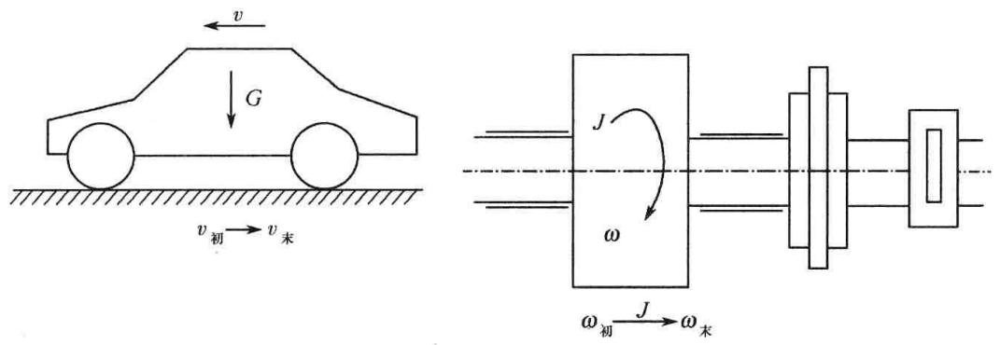

<details>
<summary>text_image</summary>

v
G
v初 → v末
J
ω
ω初 → J → ω末
</details>

图 1 汽车路试与制动器试验台的工作原理

## 4.1.3 模型的建立

汽车在路面运动时的动能为

$$
E _ {1} = \frac {1}{2} m v ^ {2} \tag {1}
$$

式中： $E_{1}$ 表示汽车的动能； $m$ 表示汽车的质量； $v$ 表示汽车运行的速度。

设试验台等效的转动惯量为 $J_{\text{等效}}$ ，则其动能为

$$
E _ {2} = \frac {1}{2} J _ {\text {等效}} \omega^ {2} \tag {2}
$$

又

$$
v = r \omega
$$

由于两种状态下的能量相等, 即 $E_{1}=E_{2}$ , 由式(1)、式(2) 可得等效的转动惯量为

$$
J _ {\mathrm{等效}} = m r ^ {2}
$$

汽车制动时承受的载荷为 $F, F = mg, g$ 为重力加速度，所以

$$
J _ {\mathrm{等效}} = \frac {F}{g} r ^ {2}
$$

## 4.1.4 模型的数值解

$F = 6230\mathrm{N},r = 0.286\mathrm{m},g = 9.8\mathrm{m / s^2}$ ，得出等效转动惯量为

$$
J _ {\mathrm{等效}} = 5 2 \mathrm{kg} \cdot \mathrm{m} ^ {2}
$$

## 4.2 问题二的模型建立与求解

## 4.2.1 模型的原理分析

首先了解一下转动惯量的定义。

转动惯量就是刚体绕轴转动惯性的度量,其数值为

$$
J = \sum m _ {i} \times r _ {i} ^ {2} \tag {3}
$$

式中： $m_{i}$ 表示刚体的某个质点的质量； $r_{i}$ 表示该质点到转轴的垂直距离。

转动惯量只取决于刚体的形状、质量分布和转轴的位置,而同刚体绕轴的转动状态(如角速度的大小)无关。

## 4.2.2 模型的建立

由于飞轮组由3个环形钢飞轮组成,所以可以对环形飞轮求积分算出其转动惯量。

对于半径 $r$ 处的环形飞轮上的一圈质点(图2)，其转动惯量为

$$
\mathrm{d} J = \rho \times 2 \pi r \times d \times r ^ {2} \mathrm{d} r \tag {4}
$$

式中： $\rho$ 为钢材的密度；d 为环形飞轮的厚度。

所以,环形飞轮的转动惯量为

$$
J = \int_ {r _ {1}} ^ {r _ {2}} \rho \times 2 \pi r \times d \times r ^ {2} \mathrm{d} r \tag {5}
$$

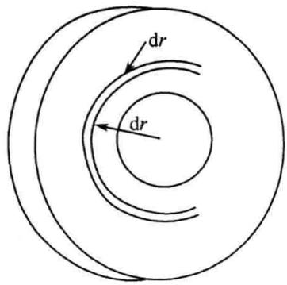

<details>
<summary>text_image</summary>

dr
dr
</details>

图 2 环形飞轮微分示意图

## 4.2.3 模型的数值解

三个飞轮的具体参数及其转动惯量见表1。

表 1 三个飞轮的参数及转动惯量

<table><tr><td></td><td>第一个飞轮</td><td>第二个飞轮</td><td>第三个飞轮</td></tr><tr><td>厚度 $d/\text{cm}$ </td><td>3.92</td><td>7.84</td><td>15.68</td></tr><tr><td>转动惯量 $J/\text{kg}\cdot\text{m}^{2}$ </td><td>30</td><td>60</td><td>120</td></tr><tr><td colspan="4">注:内径: $r_{1}=0.1\text{m}$ ;外径: $r_{2}=0.5\text{m}$ ;密度: $\rho=7810\text{kg}\cdot\text{m}^{2}$ </td></tr></table>

而基础惯量为 $10\mathrm{kg}\cdot \mathrm{m}^2$ ，又 $J_{\text{机械}} = J_{\text{飞轮}} + J_{\text{基础}}$ ，所以可以组成10、40、70、100、130、160、190、220（ $\mathrm{kg}\cdot \mathrm{m}^2$ ）的8种机械惯量。

因为电动机能补偿的能量相应的惯量的范围为 $[-30,30]\mathrm{kg}\cdot\mathrm{m}^{2}$ ，对于问题一中得到的等效惯量，需要电动机补偿的惯量为

$$
J _ {\mathrm{补偿}} = 5 2 - 4 0 = 1 2 \mathrm{kg} \cdot \mathrm{m} ^ {2} \text {或} J _ {\mathrm{补偿}} = 5 2 - 7 0 = - 1 8 \mathrm{kg} \cdot \mathrm{m} ^ {2}
$$

## 4.3 问题三的模型建立与求解

## 4.3.1 电动机驱动电流依赖于可观测量的数学模型

刚体转动过程中,角加速度 $\alpha$ 与扭矩 M 和惯量 J 有如下的关系:

$$
\alpha = \frac {M}{J}
$$

且

$$
J _ {\text {补偿}} = J _ {\text {等效}} - J _ {\text {机械}} \tag {6}
$$

在试验中,有

$$
\alpha = \frac {M _ {\mathrm{制}} - M _ {\mathrm{电}}}{J _ {\mathrm{机械}}} \tag {7}
$$

在理想情况下,有

$$
\alpha = \frac {M _ {\text {制}}}{J _ {\text {等效}}} \tag {8}
$$

所以，由式(7)、式(8)可以得

$$
\alpha = \frac {M _ {\text {制}}}{J _ {\text {等效}}} = \frac {M _ {\text {电}}}{J _ {\text {补偿}}} \tag {9}
$$

所以电动机产生的扭矩应该为

$$
M _ {\mathrm{电}} = \alpha \times J _ {\mathrm{补偿}}
$$

电动机的驱动电流应为

$$
I = 1. 5 \times M _ {\mathrm{电}} = 1. 5 \times \alpha \times J _ {\mathrm{补偿}}
$$

由于所取时间段很小,角加速度可以根据测出的转速近似地得到。

## 4.3.2 在问题一、二条件下驱动电流的计算

对于整个过程,存在如下关系:

$$
\frac {1}{2} J _ {\text {机械}} \omega_ {\text {初始}} ^ {2} = \left(M _ {\text {制}} - M _ {\text {电}}\right) \Delta \varphi \tag {10}
$$

式中： $\omega_{初始}$ 为制动前的初始角速度； $J_{机械}$ 为机械惯量； $M_{制}$ 为制动力产生的扭矩； $M_{电}$ 为电动机产生的扭矩； $\Delta\varphi$ 为主轴在整个制动过程的旋转角度。

用与上面模型一同样的方法,考虑假设给飞轮组再增加一个飞轮,增加的飞轮的转动惯量刚好为补偿惯量 $J_{补偿}$ ,则整个制动过程飞轮的转动情况与试验台中飞轮的转动情况一致,就得到如下关系:

$$
\frac {1}{2} \left(J _ {\text {机械}} + J _ {\text {补偿}}\right) \omega_ {\text {初始}} ^ {2} = M _ {\text {制}} \Delta \varphi \tag {11}
$$

由式(10)、式(11)可以得

$$
\frac {1}{2} J _ {\text {补偿}} \omega_ {\text {初始}} ^ {2} = M _ {\text {电}} \Delta \varphi \tag {12}
$$

$\omega_{\text{初始}} = 48.5625 \mathrm{rad/s}$ , 又因为制动减速度为常数, 所以整个过程主轴旋转过的角度 $\Delta \varphi = \frac{w_{\text{初始}}}{2} \times 5$ , 故在 $J_{\text{补偿}} = 12 \mathrm{~kg} \cdot \mathrm{m}^{2}$ 的情况下, 驱动电流为

$$
I = 1. 5 M _ {\mathrm{电}} = 1 7 4. 8 2 5 \mathrm{A}
$$

在 $J_{补偿} = -18 ~kg \cdot m^{2}$ 的情况下, 驱动电流为

$$
I = 1. 5 M _ {\mathrm{电}} = 2 6 2. 2 3 7 \mathrm{A}
$$

注记1: 实际操作中, 在电动机的驱动电流比较大的情况下, 应该使电流越小越好, 所以应该用 $J_{补偿} = 12 ~kg \cdot m^{2}$ 这种方案。

## 4.4 问题四的模型建立与求解

## 4.4.1 模型的原理分析和准备

可以用下面的方法求实验过程中制动器在制动过程中消耗的能量。

对于以采样点为中心、左右各取 5ms 的小段时间作为时间段 i，如图 3 所示。

因为时间段很小,可以认为在这一小段时间 i 的扭矩都为采样点制动力的扭矩,并且可以用采样点的转速作为这一小段时间 i 的平均转速,所以,在这一小段时间 i 内,制动力

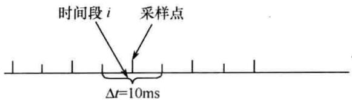

<details>
<summary>text_image</summary>

时间段 i
采样点
Δt=10ms
</details>

图3 计算用到的小段时间示意图

消耗的能量为

$$
\Delta E _ {\mathrm{制} i} = M _ {\mathrm{制} i} \times \Delta t \times w _ {i} \tag {13}
$$

式中： $M_{制}$ 为制动力产生的扭矩，也就是给的数据中测出的扭矩； $\Delta t$ 为计算的时间段，在这里 $\Delta t = 10ms$ 。

## 4.4.2 模型的建立

把每个时间段消耗的能量相加(对于第一个和最后一个时间段, 只有 5ms 的时间段, 近似为以采样点为中心的 10ms 时间段所消耗能量的 1/2, 总共有 n = 468 个时间段), 就得到制动器在整个制动过程消耗的能量:

$$
E _ {\text {试验}} = \sum_ {i = 1} ^ {n} M _ {\text {制} i} \times \Delta t \times w _ {i} - \frac {M _ {\text {制}} \times \Delta t \times \omega_ {1}}{2} - \frac {M _ {n} \times \Delta t \times \omega_ {n}}{2} = 5 2 1 5 0. 2 \mathrm{J} \tag {14}
$$

制动器在路试时消耗的能量为

$$
E _ {\text {路试}} = \frac {1}{2} J _ {\text {等效}} \omega_ {\text {初}} ^ {2} - \frac {1}{2} J _ {\text {等效}} \omega_ {\text {末}} ^ {2} \tag {15}
$$

式中： $J_{\text{等效}}$ 为等效惯量； $\omega_{\text{初}}$ 为初始角速度； $\omega_{\text{末}}$ 为结束时角速度。

## 4.4.3 模型的数值解

在式(15)中, $J_{等效}=48kg\cdot m^{2},\omega_{初}=53.8rad/s,\omega_{末}=26.9rad/s$ ,所以有

$$
E _ {\mathrm{路试}} = 4 9 2 4 2. 3 \mathrm{J}
$$

试验中制动器的误差为

$$
\frac{\mathrm{E}_{\text{试验}} - \mathrm{E}_{\text{路试}}}{\mathrm{E}_{\text{路试}}}\times 100\% = 5.9\%
$$

注记 2: 一般在工业中, 误差在 5% 以下认为是可行的, 试验数据的误差为 5.9%, 比最大误差稍微偏大, 因此, 该试验控制方法有待进一步改进。

## 4.5 问题五的模型建立

对于问题五,建立了两个模型:第一个模型从电流与可观测量的对应关系角度对问题三中的模型进行改进;第二个模型从能量以及能量与惯量的对应关系出发,根据可观测量得到电流控制的初等数学模型。

## 4.5.1 从电流与可观测量的直接对应关系角度改进后建立的模型一

电动机做的功是用来补偿机械惯量与等效惯量的差,角加速度 $\alpha$ 与扭矩 M 和惯量 J 有式(7)、式(8)的关系,所以有

$$
\frac {M _ {\text {电}}}{M _ {\text {制}}} = \frac {J _ {\text {补偿}}}{J _ {\text {等效}}} \tag {16}
$$

在试验中,测出了制动力的扭矩 $M_{制i}$ ,由于时间段很小,可以认为扭矩是不变的,所以,下

一个时间段电动机的扭矩可以按照当前测出的制动力的扭矩计算,即

$$
M _ {\text {电} i} = \frac {J _ {\text {补偿}}}{J _ {\text {等效}}} \times M _ {\text {制} i} \tag {17}
$$

所以电动机的驱动电流应为

$$
I _ {i} = 1. 5 M _ {\mathrm{电} i} = 1. 5 \times \frac {J _ {\mathrm{补偿}}}{J _ {\mathrm{等效}}} \times M _ {\mathrm{制} i}
$$

这样,在一定程度上达到了使制动器在试验过程与路试过程尽量一致的效果,但是没有考虑补偿前面由于电流的误差带来的偏差。

此模型对比问题三中的模型二有明显的改进,如果用角加速度 $\alpha$ 进行电流控制,为了得到角加速度 $\alpha$ ,对从制动器试验台上来的速度信号要进行微分计算,比较复杂且不准确,但是制动力的扭矩却可以很方便且很准确地测出。

## 4.5.2 从能量及能量与惯量的对应关系出发建立的模型二

由于电动机的驱动电流与时间的精确关系很难得到,工程实际中是用计算机控制的方法,每隔一小段时间采集瞬时转速与/或瞬时扭矩,然后根据采集的数据预测下一小段时间的电流,从而调整电流使整个试验过程中的制动过程与路试车辆上制动器的制动过程尽可能一致。

在试验中,根据能量守恒,可以得到每一小段时间 i 内有如下关系:

$$
\frac {1}{2} J _ {\text {机械}} \omega_ {i} ^ {2} - \frac {1}{2} J _ {\text {机械}} \omega_ {i + 1} ^ {2} = \left(M _ {\text {制} i} - M _ {\text {电} i}\right) \Delta \varphi \tag {18}
$$

式中： $\omega_{i}$ 为 i 前的瞬时角速度； $\omega_{i+1}$ 为 i 后的瞬时角速度（它们在时间上的对应关系如图4所示）； $J_{机械}$ 为机械惯量； $M_{制i}$ 为制动力产生的扭矩； $M_{电i}$ 为电动机产生的扭矩； $\Delta\varphi$ 为主轴在这一小段时间的旋转角度。

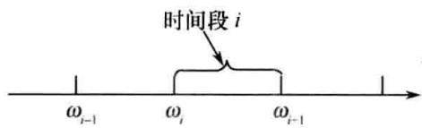

<details>
<summary>text_image</summary>

时间段 i
ω_{i-1}    ω_i    ω_{i-1}
</details>

图4 $\omega_{i}$ 在时间上的对应关系

考虑假设给飞轮组再增加一个飞轮,增加的飞轮的转动惯量刚好为补偿惯量 $J_{补偿}$ ,则在这一小段时间飞轮的转动情况与试验台中飞轮的转动情况一致,就得到如下关系:

$$
\frac {1}{2} \left(J _ {\text {机械}} + J _ {\text {补偿}}\right) \omega_ {i} ^ {2} - \frac {1}{2} \left(J _ {\text {机械}} + J _ {\text {补偿}}\right) \omega_ {i + 1} ^ {2} = M _ {\text {制} i} \Delta \varphi \tag {19}
$$

由式(18)、式(19)可得

$$
\frac {1}{2} J _ {\text {补偿}} \omega_ {i} ^ {2} - \frac {1}{2} J _ {\text {补偿}} \omega_ {i + 1} ^ {2} = M _ {\text {电} i} \Delta \varphi \tag {20}
$$

$J_{\text{补偿}}$ 、 $\omega_{i}$ 、 $\omega_{i-j}$ （如果 $w_{i-j}$ 存在，其中 $j$ 为正整数）已知， $M_{\text{电}i}$ 为需要求出的量，因为取的是一小段时间，在时间段足够小的情况下， $\omega_{i-j}$ 、 $\omega_{i}$ 、 $\omega_{i+1}$ 、 $\Delta \varphi$ 之间存在如下关系：

$$
\left\{ \begin{array}{l} \omega_ {i + 1} - \omega_ {i} = \omega_ {i} - \omega_ {i - 1} \\ \Delta \varphi = \Delta t \times \frac {\omega_ {i} + \omega_ {i + 1}}{2} \end{array} \right. \tag {21}
$$

由此,可以求出电动机应该产生的扭矩为

$$
M _ {\text {电} i} = \frac {J _ {\text {补偿}} \left[ \omega_ {i} ^ {2} - \left(2 \omega_ {i} - \omega_ {i - 1}\right) ^ {2} \right]}{\Delta t \left(3 \omega_ {i} - \omega_ {i - 1}\right)} \tag {22}
$$

又试验台采用的电动机的驱动电流与其产生的扭矩成系数为1.5的正比关系, 即 $\frac{I}{M_{电}} = 1.5$ , 所以电动机的驱动电流应为

$$
I _ {i} = 1. 5 M _ {\mathrm{电} i} = 1. 5 \times \frac {J _ {\mathrm{补偿}} [ \omega_ {i} ^ {2} - (2 \omega_ {i} - \omega_ {i - 1}) ^ {2} ]}{\Delta t (3 \omega_ {i} - \omega_ {i - 1})}
$$

## 4.6 问题六的模型建立

## 4.6.1 模型的分析

在问题五建立的模型二中,存在一个很明显的问题,由于后一个小时间段的转速是根据前面测得的数据估算出的,进而计算出应该控制的电流,如果在开始的时候电流不精确,会造成后面的误差累积,最终导致试验中电动机不能很好地补偿缺少的机械惯量,也就起不到很好的计算机控制调整的效果。下面提出一种每一时间段电机能够补充前面电流误差带来的能量偏差的模型。

对每一个小时间段 $i$ ，制动力做的功为

$$
E _ {\text {制} i} = M _ {\text {制} i} \times \Delta \varphi \tag {23}
$$

试验台中飞轮和主轴等试验装置能量的减少量为

$$
\Delta E _ {i} = \frac {1}{2} \times J _ {\text {机械}} \times \left(\omega_ {i} ^ {2} - \omega_ {i + 1} ^ {2}\right) \tag {24}
$$

而

$$
E _ {\text {制} i} = \Delta E _ {i} + E _ {\text {电} i} \tag {25}
$$

式中： $E_{\text{电}i}$ 为电动机做的功，所以有

$$
E _ {\mathrm{电} i} = E _ {\mathrm{制} i} - \Delta E _ {i}
$$

在理想情况(与路试情况刚好吻合)下,电动机应该做的功为

$$
E _ {\text {电} i} ^ {\prime} = \frac {1}{2} \times J _ {\text {补偿}} \times \left(\omega_ {i} ^ {2} - \omega_ {i + 1} ^ {2}\right) \tag {26}
$$

电动机补偿能量的差为

$$
\Delta E _ {\text {电} i} = E _ {\text {电} i} ^ {\prime} - E _ {\text {电} i} \tag {27}
$$

## 4.6.2 模型的建立

要想使试验中的制动过程与路试时相一致,在每个下一时间段应该在应补偿的能量的基础上加上前面差的能量,下一段时间应该补偿的能量的计算方法与问题三的模型一中的一样,所以有如下的关系:

$$
M _ {\text {电} i} \times \Delta \varphi = \frac {1}{2} \times J _ {\text {补偿}} \times \left(\omega_ {i} ^ {2} - \omega_ {i + 1} ^ {2}\right) + \sum_ {j = 1} ^ {i - 1} \Delta E _ {\text {电} j} ^ {\prime} \tag {28}
$$

在小时间段内,存在如下的关系:

$$
\left\{ \begin{array}{l} \omega_ {i + 1} - \omega_ {i} = \omega_ {i} - \omega_ {i - 1} \\ \Delta \varphi = \Delta t \times \frac {\omega_ {i} + \omega_ {i + 1}}{2} \end{array} \right. \tag {29}
$$

由此有

$$
M _ {\text {电} i} = \frac {J _ {\text {补偿}} \left[ \omega_ {i} ^ {2} - \left(2 \omega_ {i} - \omega_ {i - 1}\right) ^ {2} \right]}{\Delta t \left(3 \omega_ {i} - \omega_ {i - 1}\right)} + \frac {\sum_ {j = 1} ^ {i - 1} \Delta E _ {\text {电} j} ^ {\prime}}{\Delta t \times \frac {\omega_ {i} + \omega_ {i + 1}}{2}} \tag {30}
$$

又试验台采用的电动机的驱动电流与其产生的扭矩成系数为1.5的正比关系，即 $\frac{I}{M_{\text{电}}} = 1.5$ ，所以电动机的驱动电流应为

$$
I _ {i} = 1. 5 M _ {\mathrm{电} i} = 1. 5 \times \left(\frac {J _ {\mathrm{补偿}} \left[ \omega_ {i} ^ {2} - (2 \omega_ {i} - \omega_ {i - 1}) ^ {2} \right]}{\Delta t (3 \omega_ {i} - \omega_ {i - 1})} + \frac {\sum_ {j = 1} ^ {i - 1} \Delta E _ {\mathrm{电} j}}{\Delta t \times \frac {\omega_ {i} + \omega_ {i + 1}}{2}}\right)
$$

这样,每一小段的驱动电流就考虑前面的电流不精确带来的误差,使试验过程与路试过程尽可能一致。

另外,还可以用 $\Delta E_{电}$ 的变化规律来分析控制方法优劣,在模型检验部分,就用 $\Delta E_{电}$ 的变化规律作为依据分析模型的优劣。

## 5 模型的检验

为了检验模型的实际效果,利用 MATLAB 对汽车制动器试验台进行模拟仿真。

用问题4给出的参数以及初始状态和末状态，即等效转动惯量 $J_{\text{等效}} = 48\mathrm{kg}\cdot \mathrm{m}^2$ ，机械惯量 $J_{\text{机械}} = 35\mathrm{kg}\cdot \mathrm{m}^2$ ，补偿惯量 $J_{\text{补偿}} = 13\mathrm{kg}\cdot \mathrm{m}^2$ ，主轴初转速 $R_{\text{初}} = 514\mathrm{r / min}$ （初角速度 $\omega_{\text{初}} = 54\mathrm{rad / s})$ ，末转速 $R_{\text{末}} = 257\mathrm{r / min}$ （末角速度 $\omega_{\text{末}} = 27\mathrm{rad / s})$ ，时间步长为 $10\mathrm{ms}$ 的情况，假设在路试时运行5s结束，制动力的扭矩 $M_{\text{制}} = 259.2\mathrm{N}\cdot \mathrm{m}$ 。

对于试验中的误差,随机产生一组服从 $N(0,\sigma^{2})$ 正态分布的数来模拟。

仿真程序见附件,具体仿真流程图如图5所示。

分别取 $\sigma=0.1, \sigma=0.5, \sigma=1$ 三组数据进行仿真, 仿真结果和路试时理想的结果见附件, 其采样点的方差如图 6、图 7、图 8 所示。

仿真过程中 $\Delta E_{\text{电}}$ 的数值变化见附件, 其变化规律如图9、图10、图11所示。

从仿真结果可以看出,在电机电流存在误差的情况下,制动器在试验中与在路试时的工作过程很一致,方差很小,所欠能量也越来越小,且一直在一个很小的范围内,也就是模型能够很好地工作,验证了模型的正确性以及稳健性。

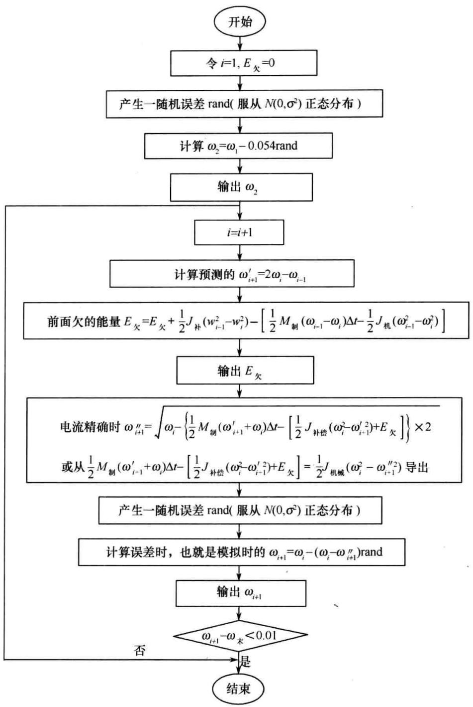

<details>
<summary>flowchart</summary>

```mermaid
graph TD
  Start(["开始"]) --> Init["令 i=1, E_欠=0"]
  Init --> Rand["产生一随机误差 rand(服从 N(0,σ²) 正态分布)"]
  Rand --> Calc["计算 ω₂ = ω₁ - 0.054rand"]
  Calc --> Output["输出 ω₂"]
  Output --> i["i=i+1"]
  i --> Predict["计算预测的 ω'_{i+1} = 2ω_i - ω_{i-1}"]
  Predict --> Front["&quot;前面欠的能量 E_欠 = E_欠 + \frac{1}{2}J_{补}(w'_{i-1} - w'_i) - [\frac{1}{2}M_{制}(ω_{i-1} - ω_i)\Delta t - \frac{1}{2}J_{机}(ω'_{i-1} - ω'_i)"]"]
  Front --> OutputE["输出 E_欠"]
  OutputE --> Correct["&quot;电流精确时 ω''_{i+1} = \sqrt{\omega_i - \left\{\frac{1}{2}M_{制}(\omega'_{i+1} + \omega_i)\Delta t - [\frac{1}{2}J_{补偿}(\omega'_{i-1}^2 + E_{欠}"] \right\} \times 2}}"]
  Correct --> OutputErr["&quot;或从 \frac{1}{2}M_{制}(\omega'_{i-1} + \omega_i)\Delta t - [\frac{1}{2}J_{补偿}(\omega'_{i-1}^2 + E_{欠}"] = \frac{1}{2}J_{机械}(\omega'_{i-1}^2) 导出"]
  OutputErr --> Rand["产生一随机误差 rand(服从 N(0,σ²) 正态分布)"]
  Rand --> CalcErr["计算误差时，也就是模拟时的 ω_{i+1} = ω_i - (\omega_i - ω''_{i+1})rand"]
  CalcErr --> Output["输出 ω_{i+1}"]
  Output --> CheckSum{"ω_{i+1} - ω_末 < 0.01"}
  CheckSum["CheckSum -- 否"] --> End(["结束"])
  CheckSum2["CheckSum -- 是"] --> End
```
</details>

图 5 仿真程序流程图  
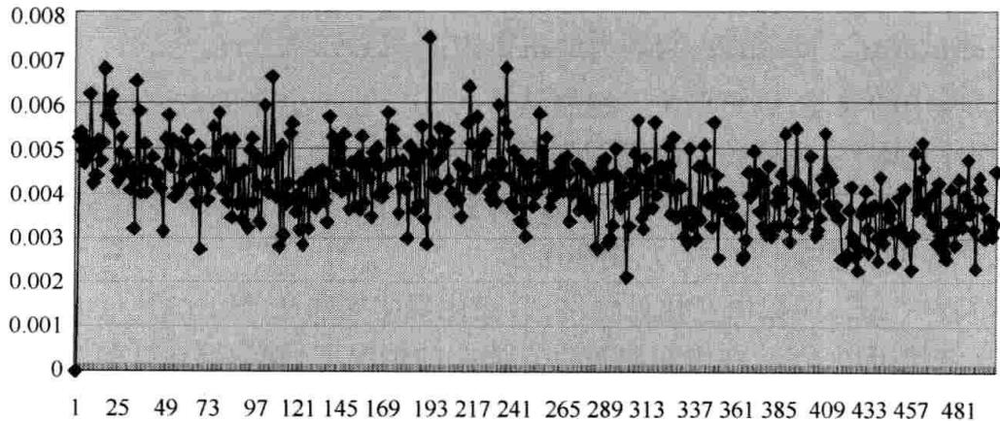

<details>
<summary>scatter</summary>

| Observation | Value |
| --- | --- |
| 1 | ~0.0053 |
| 25 | ~0.0068 |
| 49 | ~0.0065 |
| 73 | ~0.0058 |
| 97 | ~0.0066 |
| 121 | ~0.0057 |
| 145 | ~0.0058 |
| 169 | ~0.0059 |
| 193 | ~0.0075 |
| 217 | ~0.0064 |
| 241 | ~0.0068 |
| 265 | ~0.0058 |
| 289 | ~0.0057 |
| 313 | ~0.0056 |
| 337 | ~0.0056 |
| 361 | ~0.0056 |
| 385 | ~0.0055 |
| 409 | ~0.0054 |
| 433 | ~0.0051 |
| 457 | ~0.0051 |
| 481 | ~0.0045 |
</details>

图 6 $\sigma=0.1$ 时的方差变化

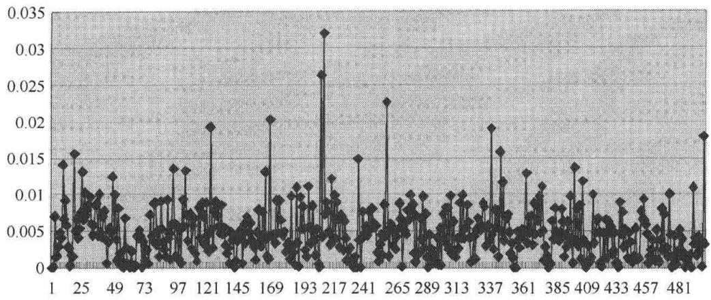

<details>
<summary>scatter</summary>

| X | Y |
| --- | --- |
| 1 | ~0.007 |
| 25 | ~0.014 |
| 49 | ~0.013 |
| 73 | ~0.009 |
| 97 | ~0.014 |
| 121 | ~0.019 |
| 145 | ~0.008 |
| 169 | ~0.021 |
| 193 | ~0.011 |
| 217 | ~0.032 |
| 241 | ~0.015 |
| 265 | ~0.023 |
| 289 | ~0.009 |
| 313 | ~0.010 |
| 337 | ~0.019 |
| 361 | ~0.016 |
| 385 | ~0.014 |
| 409 | ~0.012 |
| 433 | ~0.010 |
| 457 | ~0.011 |
| 481 | ~0.018 |
</details>

图 7 $\sigma=0.5$ 时的方差变化  
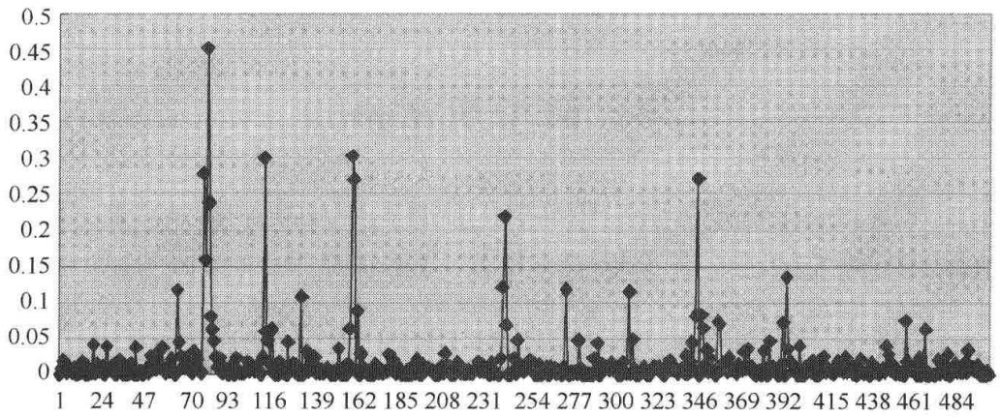

<details>
<summary>stem</summary>

| X | Y |
| --- | --- |
| ~70 | ~0.12 |
| ~75 | ~0.28 |
| ~78 | ~0.46 |
| ~80 | ~0.24 |
| ~82 | ~0.16 |
| ~116 | ~0.30 |
| ~162 | ~0.30 |
| ~165 | ~0.27 |
| ~231 | ~0.22 |
| ~346 | ~0.27 |
| ~392 | ~0.13 |
</details>

图 8 $\sigma=1$ 时的方差变化  
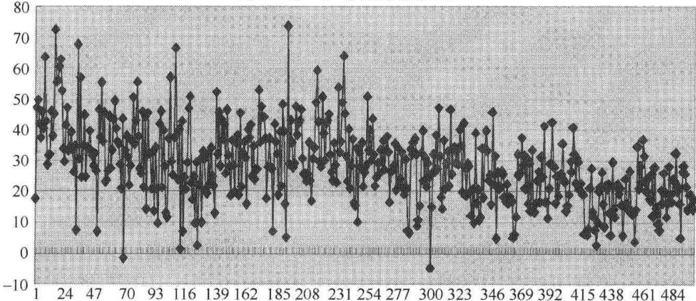

<details>
<summary>scatter</summary>

| X | Y |
| --- | --- |
| 1 | ~18 |
| 2 | ~48 |
| 3 | ~46 |
| 4 | ~49 |
| 5 | ~47 |
| 6 | ~48 |
| 7 | ~49 |
| 8 | ~48 |
| 9 | ~47 |
| 10 | ~48 |
| 11 | ~49 |
| 12 | ~48 |
| 13 | ~47 |
| 14 | ~48 |
| 15 | ~49 |
| 16 | ~48 |
| 17 | ~47 |
| 18 | ~48 |
| 19 | ~49 |
| 20 | ~48 |
| 21 | ~47 |
| 22 | ~48 |
| 23 | ~49 |
| 24 | ~48 |
| 25 | ~47 |
| 26 | ~48 |
| 27 | ~49 |
| 28 | ~48 |
| 29 | ~47 |
| 30 | ~48 |
| 31 | ~49 |
| 32 | ~48 |
| 33 | ~47 |
| 34 | ~48 |
| 35 | ~49 |
| 36 | ~48 |
| 37 | ~47 |
| 38 | ~48 |
| 39 | ~49 |
| 40 | ~48 |
| 41 | ~47 |
| 42 | ~48 |
| 43 | ~49 |
| 44 | ~48 |
| 45 | ~47 |
| 46 | ~48 |
| 47 | ~49 |
| 48 | ~48 |
| 49 | ~47 |
| 50 | ~48 |
| 51 | ~49 |
| 52 | ~48 |
| 53 | ~47 |
| 54 | ~48 |
| 55 | ~49 |
| 56 | ~48 |
| 57 | ~47 |
| 58 | ~48 |
| 59 | ~49 |
| 60 | ~48 |
| 61 | ~47 |
| 62 | ~48 |
| 63 | ~49 |
| 64 | ~48 |
| 65 | ~47 |
| 66 | ~48 |
| 67 | ~49 |
| 68 | ~48 |
| 69 | ~47 |
| 70 | ~48 |
| 71 | ~49 |
| 72 | ~48 |
| 73 | ~47 |
| 74 | ~48 |
| 75 | ~49 |
| 76 | ~48 |
| 77 | ~47 |
| 78 | ~48 |
| 79 | ~49 |
| 80 | ~48 |
| 81 | ~47 |
| 82 | ~48 |
| 83 | ~49 |
| 84 | ~48 |
| 85 | ~47 |
| 86 | ~48 |
| 87 | ~49 |
| 88 | ~48 |
| 89 | ~47 |
| 90 | ~48 |
| 91 | ~49 |
| 92 | ~48 |
| 93 | ~47 |
| 94 | ~48 |
| 95 | ~49 |
| 96 | ~48 |
| 97 | ~47 |
| 98 | ~48 |
| 99 | ~49 |
| 100 | ~48 |
| 101 | ~47 |
| 102 | ~48 |
| 103 | ~49 |
| 104 | ~48 |
| 105 | ~47 |
| 106 | ~48 |
| 107 | ~49 |
| 108 | ~48 |
| 109 | ~47 |
| 110 | ~48 |
| 111 | ~49 |
| 112 | ~48 |
| 113 | ~47 |
| 114 | ~48 |
| 115 | ~49 |
| 116 | ~-2 |
| 117 | ~22 |
| 118 | ~23 |
| 119 | ~22 |
| 120 | ~23 |
| 121 | ~22 |
| 122 | ~23 |
| 123 | ~22 |
| 124 | ~23 |
| 125 | ~22 |
| 126 | ~23 |
| 127 | ~22 |
| 128 | ~23 |
| 129 | ~22 |
| 130 | ~23 |
| 131 | ~22 |
| 132 | ~23 |
| 133 | ~22 |
| 134 | ~23 |
| 135 | ~22 |
| 136 | ~23 |
| 137 | ~22 |
| 138 | ~23 |
| 139 | ~22 |
| 140 | ~23 |
| 141 | ~22 |
| 142 | ~23 |
| 143 | ~22 |
| 144 | ~23 |
| 145 | ~22 |
| 146 | ~23 |
| 147 | ~22 |
| 148 | ~23 |
| 149 | ~22 |
| 150 | ~23 |
| 151 | ~22 |
| 152 | ~23 |
| 153 | ~22 |
| 154 | ~23 |
| 155 | ~22 |
| 156 | ~23 |
| 157 | ~22 |
| 158 | ~23 |
| 159 | ~22 |
| 160 | ~23 |
| 161 | ~22 |
| 162 | ~23 |
| 163 | ~22 |
| 164 | ~23 |
| 165 | ~22 |
| 166 | ~23 |
| 167 | ~22 |
| 168 | ~23 |
| 169 | ~22 |
| 170 | ~23 |
| 171 | ~22 |
| 172 | ~23 |
| 173 | ~22 |
| 174 | ~23 |
| 175 | ~22 |
| 176 | ~23 |
| 177 | ~22 |
| 178 | ~23 |
| 179 | ~22 |
| 180 | ~23 |
| 181 | ~22 |
| 182 | ~23 |
| 183 | ~22 |
| 184 | ~23 |
</details>

图 9 $\sigma=0.1$ 时 $\Delta E_{电}$ 的变化  
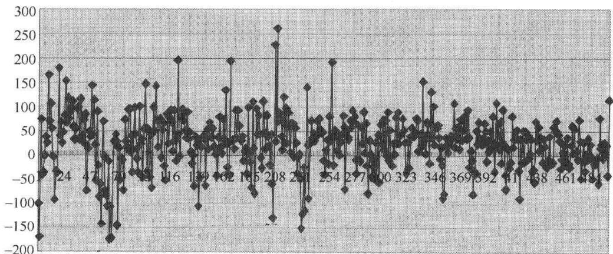

<details>
<summary>scatter</summary>

| X | Y |
| --- | --- |
| ~24 | ~170 |
| ~24 | ~185 |
| ~24 | ~160 |
| ~24 | ~110 |
| ~24 | ~90 |
| ~24 | ~75 |
| ~24 | ~60 |
| ~24 | ~40 |
| ~24 | ~30 |
| ~24 | ~10 |
| ~24 | ~-10 |
| ~24 | ~-40 |
| ~24 | ~-170 |
| ~24 | ~-100 |
| ~24 | ~-90 |
| ~47 | ~150 |
| ~47 | ~120 |
| ~47 | ~110 |
| ~47 | ~100 |
| ~47 | ~90 |
| ~47 | ~80 |
| ~47 | ~70 |
| ~47 | ~60 |
| ~47 | ~50 |
| ~47 | ~40 |
| ~47 | ~30 |
| ~47 | ~20 |
| ~47 | ~10 |
| ~47 | ~-10 |
| ~47 | ~-20 |
| ~47 | ~-30 |
| ~47 | ~-40 |
| ~47 | ~-50 |
| ~47 | ~-60 |
| ~47 | ~-70 |
| ~47 | ~-80 |
| ~47 | ~-90 |
| ~47 | ~-100 |
| ~47 | ~-110 |
| ~47 | ~-120 |
| ~47 | ~-130 |
| ~47 | ~-140 |
| ~70 | ~150 |
| ~70 | ~145 |
| ~70 | ~135 |
| ~70 | ~125 |
| ~70 | ~115 |
| ~70 | ~105 |
| ~70 | ~95 |
| ~70 | ~85 |
| ~70 | ~75 |
| ~70 | ~65 |
| ~70 | ~55 |
| ~70 | ~45 |
| ~70 | ~35 |
| ~70 | ~25 |
| ~70 | ~15 |
| ~70 | ~5 |
| ~70 | ~-5 |
| ~70 | ~-15 |
| ~70 | ~-25 |
| ~70 | ~-35 |
| ~70 | ~-45 |
| ~70 | ~-55 |
| ~70 | ~-65 |
| 116 | 200 |
| 116 | 150 |
| 116 | 145 |
| 116 | 135 |
| 116 | 125 |
| 116 | 115 |
| 116 | 105 |
| 116 | 95 |
| 116 | 85 |
| 116 | 75 |
| 116 | 65 |
| 116 | 55 |
| 116 | 45 |
| 116 | 35 |
| 116 | 25 |
| 116 | 15 |
| 116 | 5 |
| 116 | -5 |
| 116 | -15 |
| 116 | -25 |
| 116 | -35 |
| 116 | -45 |
| 139 | -105 |
| 139 | -95 |
| 139 | -85 |
| 139 | -75 |
| 139 | -65 |
| 139 | -55 |
| 139 | -45 |
| 139 | -35 |
| 139 | -25 |
| 139 | -15 |
| 139 | -5 |
| 139 | 5 |
| 139 | 15 |
| 139 | 25 |
| 139 | 35 |
| 139 | 45 |
| 139 | 55 |
| 139 | 65 |
| 162 | 200 |
| 162 | 195 |
| 162 | 185 |
| 162 | 175 |
| 162 | 165 |
| 162 | 155 |
| 162 | 145 |
| 162 | 135 |
| 162 | 125 |
| 162 | 115 |
| 162 | 105 |
| 162 | 95 |
| 162 | 85 |
| 162 | 75 |
| 162 | 65 |
| 162 | 55 |
| 162 | 45 |
| 162 | 35 |
| 162 | 25 |
| 162 | 15 |
| 162 | -5 |
| 208 | -80 |
| 208 | -70 |
| 208 | -60 |
| 208 | -50 |
| 208 | -40 |
| 208 | -30 |
| 208 | -20 |
| 208 | -10 |
| 208 | -5 |
| 208 | -20 |
| 208 | -30 |
| 208 | -40 |
| 208 | -50 |
| 208 | -60 |
| 238 | -80 |
| 238 | -70 |
| 238 | -60 |
| 238 | -50 |
| 238 | -40 |
| 238 | -30 |
| 238 | -20 |
| 238 | -10 |
| 238 | -5 |
| 238 | -20 |
| 238 | -30 |
| 238 | -40 |
| 238 | -50 |
| 238 | -60 |
| 238 | -70 |
| 238 | -80 |
| 238 | -90 |
| 238 | -100 |
| 238 | -110 |
| 238 | -120 |
| 238 | -130 |
| 238 | -140 |
| 238 | -150 |
| 238 | -160 |
| 238 | -170 |
| 238 | -180 |
| 238 | -190 |
| 238 | -200 |
</details>

图 10 $\sigma=0.5$ 时 $\Delta E_{电}$ 的变化

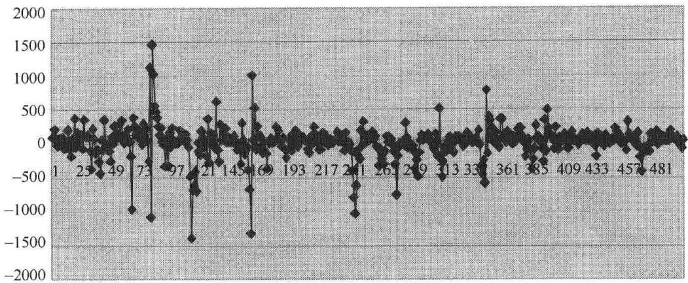

<details>
<summary>scatter</summary>

| Category | Value |
| --- | --- |
| 1 | ~100 |
| 25 | ~300 |
| 49 | ~-500 |
| 73 | ~1500 |
| 97 | ~-1400 |
| 145 | ~600 |
| 169 | ~1000 |
| 193 | ~-1300 |
| 217 | ~-1000 |
| 241 | ~-800 |
| 263 | ~-700 |
| 289 | ~-500 |
| 313 | ~500 |
| 337 | ~800 |
| 361 | ~-600 |
| 385 | ~500 |
| 409 | ~-200 |
| 433 | ~-100 |
| 457 | ~300 |
| 481 | ~-100 |
</details>

图11 $\sigma = 1$ 时 $\Delta E_{\text{电}}$ 的变化

## 6 模型的评价

根据角加速度调整电流的方法中角加速的测量需要复杂的微分计算,并且不精确;根据测出的扭矩调整电流的策略有了明显的改进,容易实现、结果精确,且计算过程简单。

从能量角度控制电流的第一个模型在实际操作中可以实现控制,但存在缺陷,就是如果在开始的时候电流不精确,会造成后面的误差累积,最终导致试验中电动机不能很好地补偿缺少的机械惯量,也就是起不到很好地计算机控制调整的效果。

上面的模型都可以对电流进行控制,但没有考虑由于前面电流不精确带来的能量损失,基于补偿能量的模型就能很好地解决这一问题,在模型检验中证明了模型的准确性和实用性,试验过程与路试过程几乎一致。模型的计算量较大,在控制时对控制系统计算机的性能要求较高,但现在普通计算机的计算能力远远可以满足其需求。

## 7 模型推广

本模型的实用性很强,两类模型可以分别应用于不同的场合。基于直接观测量的模型可以应用在对控制系统的精度要求不高、控制系统较简单的场景中,如普通电动机自身功率稳定控制,通信系统中电流稳定控制、波形整合等;基于能量补偿的模型可以应用在对控制系统精度要求比较高的场合中,如火箭、卫星轨道控制,无人驾驶飞机、汽车控制等。

## 参考文献

[1] 车成力. 汽车制动器的台架试验及摩擦材料的性能分析. 哈尔滨: 哈尔滨理工大学, 2006.  
[2] 转动惯量. http://baike.baidu.com/css/view.css. 2009/9/11.  
[3] 林荣会. 制动器试验台的双分流加载法, 青岛建筑工程学院学报, 2006.18(3):51-53.  
[4] 王正林, 龚纯, 何倩. 精通 Matlab 科学计算, 北京: 电子工业出版社, 2007.

## 【论文点评】

姚奎

本论文研究制动器试验台电流的控制问题。建立了一系列数学模型来解决题目所提的问题,主要使用了大学物理的基础知识,以及积分模型的思想。最后对模型进行仿真模拟,设计了模拟程序的流程图,得到了检验的数值解和图解。

该文是一篇中规中矩的国内大学生建模竞赛一等奖论文。在每一个问题中,都进行了公式化的物理模型的建立和足够细致的数学推导工作,在做题思路上已经接近标准答案了。

本文的一个优点,在于对模型进行的仿真检验工作,像本年度这样挑战性较小的竞赛题,是需要一定亮点的。本文进行数值模拟验证工作,有效地补充了纯粹物理推导所欠缺的内容。

该文还有一个长处,在于抓住物理模型的同时,启用了求解流程图的方法。这种方法,有效地帮助文章理清脉络。

本文的缺憾在于思路的平淡和中规中矩,如果在标准物理模型中引入富有想象力的数学思维,可能会有更好的成绩。

# 制动器试验台控制方法的模型研究

## 摘要

制动器的设计是车辆设计中最重要的环节之一,直接影响着人身和车辆的安全。为检验设计的优劣必须进行相应的测试。本文通过对制动器试验台控制方法的分析,针对相关问题分别建立了数学模型,并进行了解答。

针对问题一,根据载荷、转动惯量和等效转动惯量的概念,从能量等效转化的角度出发,求得等效的转动惯量为 $51.9989 \, kg \cdot m^{2}$ 。

针对问题二,根据转动惯量的定义,用积分的方法求出了各个飞轮的转动惯量,综合基础惯量,可得所有组合的机械惯量(单位: $kg \cdot m^{2}$ )。

<table><tr><td>飞轮组合</td><td>无</td><td>一</td><td>二</td><td>三</td><td>一、二</td><td>一、三</td><td>二、三</td><td>一、二、三</td></tr><tr><td>机械惯量</td><td>10</td><td>40.0083</td><td>70.0166</td><td>130.0332</td><td>100.0249</td><td>160.0416</td><td>190.0499</td><td>220.0582</td></tr></table>

对问题一中得到的等效转动惯量选择机械惯量,得到两种情况:飞轮一、飞轮二需要电动机补偿的惯量分别为 $11.9906 \, kg \cdot m^{2}$ 和 $-18.0177 \, kg \cdot m^{2}$ 。

针对问题三,根据题意提出两条模拟试验原则:一为速度一致原则;二为能量消耗相等原则。以此为依据,分析可观测量与电动机驱动电流的关系,运用微元法推导出驱动电流与瞬时扭矩、瞬时转速的关系式,建立数学模型。将问题一、二所给数据代入模型可求得:采用飞轮一时的驱动电流为174.6881A,采用飞轮二时的驱动电流为-262.4954A。

针对问题四,以能量误差的大小作为评定执行结果的优劣标准,将制动过程离散化处理,分别推导出路试与试验台上制动器在制动过程中消耗的能量,代入所给数据,可计算出绝对能量误差值为2936J,相对能量误差值为5.6299%。

针对问题五,对问题三所建模型离散化处理。从瞬时扭矩出发,以相邻时间段扭矩互补为原则,建立驱动电流模型Ⅰ,方法简单可行;从瞬时转速出发,以相邻时间段转速误差抵消为原则,建立驱动电流模型Ⅱ,便于计算机实现,计算精度高。根据模型Ⅰ、Ⅱ可得到驱动电流的两种控制方法。利用问题四的数据进行模型检验,模型Ⅰ计算出的绝对能量误差值为893.5980J,相对能量误差值为15716%,模型Ⅱ计算出的绝对能量误差值为154.5826J,相对能量误差值为0.2964%。模型Ⅰ、Ⅱ所得电流控制方法均优于问题四中的控制方法。

针对问题六,分析问题五所建模型Ⅰ、Ⅱ,模型Ⅱ已较为优良,而模型Ⅰ不足之处在于未能较好处理制动器稳定之前的情况。考虑制动器达到稳定的时间,对模型Ⅰ进行改进,可得到模型Ⅲ。利用问题四中数据进行模型检验,计算出的绝对能量误差值为68.9413J,相对能量误差值为0.1322%。

关键词: 制动器, 等效转动惯量, 电流控制, 数学模型

## 1 问题重述

汽车的行车制动器连接在车轮上,它的作用是在行驶时使车辆减速或者停止。为了检测制动器的综合性能,需要在各种不同情况下进行大量路试。但是,车辆设计阶段无法路试,只能在试验台上对所设计的路试进行模拟试验。模拟试验的原则是试验台上制动器的制动过程与路试车辆上制动器的制动过程尽可能一致。试验台工作时,电动机拖动主轴和飞轮旋转,达到与设定的车速相当的转速(模拟试验中,可认为主轴的角速度与车轮的角速度始终一致)后,电动机断电,同时施加制动,当满足设定的结束条件时就称为完成一次制动。

路试车辆的指定车轮在制动时承受载荷。将这个载荷在车辆平动时具有的能量等效地转化为试验台上飞轮和主轴等机构转动时具有的能量，与此能量相应的转动惯量称为等效的转动惯量。试验台上的主轴等不可拆卸机构的惯量称为基础惯量。飞轮的惯量之和再加上基础惯量称为机械惯量。对于不能精确地用机械惯量模拟时，解决方法是：对机械惯量的一个设定值，然后在制动过程中，让电动机在一定规律的电流控制下参与工作，补偿由于机械惯量不足而缺少的能量，从而满足模拟试验的原则。

假设试验台采用的电动机的驱动电流与其产生的扭矩成正比(比例系数取为1.5A/N·m);且试验台工作时主轴的瞬时转速与瞬时扭矩是可观测的离散量。

评价控制方法优劣的一个重要数量指标是能量误差的大小,本题中的能量误差是指所设计的路试时的制动器与相对应的试验台上制动器在制动过程中消耗的能量之差。通常不考虑观测误差、随机误差和连续问题离散化所产生的误差。

考虑以下问题：

(1) 设车辆单个前轮的滚动半径为 0.286m, 制动时承受的载荷为 6230 N, 求等效的转动惯量。  
(2) 飞轮组由 3 个外直径 1m、内直径 0.2m 的环形钢制飞轮组成, 厚度分别为 0.0392m、0.0784m、0.1568m, 钢材密度为 $7810 ~kg/m^{3}$ , 基础惯量为 $10 ~kg \cdot m^{2}$ , 问可以组成哪些机械惯量? 设电动机能补偿的能量相应的惯量的范围为 $[-30, 30] ~kg \cdot m^{2}$ , 对于问题 1 中得到的等效的转动惯量, 需要用电动机补偿多大的惯量?  
(3) 建立电动机驱动电流依赖于可观测量的数学模型。

在问题 1 和问题 2 的条件下, 假设制动减速度为常数, 初始速度为 50 km/h, 制动 5.0s 后车速为零, 计算驱动电流。

(4)对于与所设计的路试等效的转动惯量为 $48kg\cdot m^{2}$ ，机械惯量为 $35kg\cdot m^{2}$ ，主轴初转速为514r/min，末转速为257r/min，时间步长为10ms的情况，用某种控制方法试验得到的数据见附表。请对该方法执行的结果进行评价。  
(5) 按照第 3 问导出的数学模型, 给出根据前一个时间段观测到的瞬时转速与/或瞬时扭矩, 设计本时间段电流值的计算机控制方法, 并对该方法进行评价。  
(6)第5问给出的控制方法是否有不足之处？如果有，请重新设计一个尽量完善的计算机控制方法，并作评价。

## 2 问题分析

本题是汽车制动器的测试问题。由于车辆设计阶段无法路试，故只能在专门的制动器试验台上对所设计的路试进行模拟试验。用主轴和飞轮的转动过程模拟汽车的平动过程。令主轴的角速度与车轮的角速度始终一致。与汽车载荷等效的转动惯量不能精确地用机械惯量模拟得出，在此采用电动机补偿的方法予以解决。

对于问题一,依据能量等效原则,将汽车平动过程对应到试验台主轴与飞轮的转动过程,可求得等效的转动惯量。

对于问题二,计算出各个飞轮的转动惯量,相互组合可得到一系列离散的可实现机械惯量值。再结合电动机补偿惯量范围,即可筛选出可用的飞轮组合。电动机补偿量依不同的飞轮组合而唯一确定。

对于问题三,分析可观测量与电动机驱动电流的关系,可推导出驱动电流与瞬时扭矩、瞬时转速的关系,即可建立电动机驱动电流依赖于可观测量的数学模型。

对于问题四,以能量误差大小作为评定执行结果优劣重要标准。本题中的能量误差即路试时的制动器与相对应的试验台上制动器在制动过程中消耗的能量之差。结合所给数据,可以分别计算出各自消耗能量总量作为分析与评价的依据。

对于问题五,可在问题三所建模型基础上进行离散化处理,分析实现能量误差最小化的条件,并以之为目标制定出电流控制方法。利用问题四的数据进行模拟检验,进而可对改进的控制方法进行评价。

对于问题六,可分析问题五中所建模型的缺点和不足,寻求解决方案,重新设计一个更完善的计算机控制方法,并利用问题四中的数据进行模拟检验和评价。

## 3 符号约定

m:等效质量(单位:mg);

$J_{e}$ : 等效转动惯量(单位: kg·m $^{2}$ );

v:车辆平动的速度(单位:m/s);

ω: 飞轮的角速度(单位: rad/s);

$M_{e}$ :电扭矩(单位:N·m);

M: 制动扭矩(单位:N·m);

$\varphi, \Delta \varphi$ : 角路程(单位: rad);

F:载荷(单位:N);

$r_{1}, r_{2}$ : 飞轮的内外半径(单位:m);

h: 飞轮的厚度(单位:m);

ρ: 飞轮的密度(单位: kg/m³);

n:路试车轮的转速(单位:r/min);

I:电动机加载电流(单位:A);

k:电动机驱动电流与其产生扭矩比例系数(单位:A/N·m);

$t,\Delta t$ :时间变量(单位:s);

$E_{1}$ : 车辆制动器消耗的能量(单位:J);

$E_{2}$ :试验台上系统消耗的动能(单位:J);

$E_{3}$ :试验台制动器消耗的能量(单位:J);

$W_{e}$ :驱动电流产生扭矩做的功(单位:J);

E:电动机需补充的能量(单位:J);

$M_{i}$ : 第 i 个时间段内瞬时扭矩(单位: N·m);

$\varphi_{i}$ : 第 i 个时间段内角路程(单位: rad);

$\omega_{i}$ : 第 i 个时间段观测到的瞬时速度(单位: rad/s);

$W_{i}$ : 第 i 个时间段内制动扭矩做的功(单位: J);

$\delta$ :能量误差(单位:J);

$\eta$ :相对能量误差;

$I_{i}$ : 第 i 个时间段中驱动电流(单位:A);

$M_{0}$ : 制动扭矩理论值(单位: N·m);

$t_{s}$ : 制动器的响应时间(单位:s);

$M_{c}$ : 控制阶段的制动扭矩稳定值(单位: N·m);

$N_{i}$ : 第 i 阶段路试车轮的转速(单位:r/min);

$n_{i}$ : 第 i 阶段试验台测量车轮的转速(单位:r/min);

$e_{i}$ : 第 i 个 $\Delta t$ 内刹车装置消耗的能量(单位: J)。

## 4 基本假设

(1) 假设路试时轮胎与地面无滑动。  
(2) 假设不考虑观测误差、随机误差和连续问题离散化所产生的误差。  
(3) 假设可忽略车轮自身转动具有的能量。  
(4) 假设离散化时观测值在一个很小的时间段内是恒定的。  
(5) 假设计算机控制没有延时。  
(6) 假设试验台采用的电动机的驱动电流与其产生的扭矩成正比。

## 5 模型的建立与求解

## 5.1 问题一的求解

将车辆平动时具有的能量(忽略车轮自身转动具有的能量)等效地转化为试验台上飞轮和主轴等机构转动时具有的能量,与此能量相应的转动惯量即为等效转动惯量。由能量关系可知

$$
\frac {1}{2} m v ^ {2} = \frac {1}{2} J _ {e} \omega^ {2}
$$

式中：m 为等效质量； $J_{e}$ 为等效转动惯量；v 为车辆平动的速度； $\omega$ 为主轴与飞轮的角速度。

在模拟试验中,主轴的角速度与车轮的角速度始终一致,设车辆单个车轮的滚动半径为 r,则有

$$
v = \omega r
$$

根据载荷 F 的意义 $^{[1]}$ : 机械设计中通常措施加于机械或结构上的外力; 动力机械中通常指完成工作所需的功率; 电动机工程中则指电气装置或元件从电源所接受的功率。另外, 有时也把某种能引起机械结构内力的非力学因素称为载荷。

载荷可以从不同的角度进行分类:①根据大小、方向和作用点是否随时间变化可以分为静载荷和动载荷;其中静载荷包括不随时间变化的恒载(如自重)和加载变化缓慢以至可以略去惯性力作用的准静载(如锅炉压力)。动载荷包括短时间快速作用的冲击载荷(如空气锤)、随时间作周期性变化的周期载荷(如空气压缩机曲轴)和非周期变化的随机载荷(如汽车发动机曲轴)。②根据载荷分布情况可分为集中载荷和分布载荷,其中分布载荷又可分为体载荷、面载荷和线载荷3种。③根据载荷对杆件变形的作用可分为轴向拉伸或压缩载荷、弯曲载荷和扭转载荷等。通常,载荷可用计算方法或实测方法求得。根据额定功率用力学公式计算出的载荷称为名义载荷(又称额定载荷)。它未考虑载荷随时间作用和分布的不均匀性以及其他零件受力情况等因素。这些因素的综合影响常用载荷系数作修正。载荷系数与名义载荷的乘积称为计算载荷。它是设计计算的依据。

汽车制动时制动器要削弱或紧急阻止车轮向前的滚动阻力,如果质量越大,高速行驶时惯性越大,制动器需要克服高速的滚动阻力和自身以外的重量带来的惯性就越大。设这个惯性的大小用等效质量 m 表示,可知

$$
F = m g
$$

代入数据可得车辆的等效转动惯量为

$$
J _ {e} = 5 1. 9 9 8 9 \mathrm{kg} \cdot \mathrm{m} ^ {2}
$$

## 5.2 问题二的求解

考虑三个不同的飞轮可以组合的机械惯量,首先利用积分方法求出三个飞轮的转动惯量。

由物理学相关知识可知连续质量分布刚体的转动惯量的一般表达式为

$$
J = \int r ^ {2} \mathrm{d} m
$$

试验台所用的飞轮为空心圆柱体,如图1所示。

分析图1可知

$$
\mathrm{d} m = 2 \pi r h \rho \mathrm{d} r
$$

则飞轮的转动惯量为

$$
\begin{array}{l} J = \int_ {r _ {2}} ^ {r _ {1}} r ^ {2} \mathrm{d} m = 2 \pi h \rho \int_ {r _ {2}} ^ {r _ {1}} r ^ {3} \mathrm{d} r \\ = \frac {\pi h \rho (r _ {1} ^ {4} - r _ {2} ^ {4})}{2} \\ \end{array}
$$

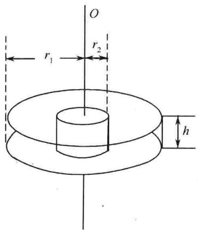

<details>
<summary>text_image</summary>

O
r₁
r₂
h
</details>

图 1 飞轮形状

式中： $r_{2}$ 、 $r_{1}$ 分别为飞轮的内外半径；h 为飞轮的厚度； $\rho$ 为飞轮的密度。

代入三个飞轮的相关数据,可求得三个飞轮的转动惯量,结果见表1。

表 1 飞轮转动惯量  
(单位:kg·m²)

<table><tr><td>飞轮</td><td>一</td><td>二</td><td>三</td></tr><tr><td>转动惯量</td><td>30.0083</td><td>60.0166</td><td>120.0332</td></tr></table>

## 5.2.1 飞轮组可能组成的机械惯量

现考虑飞轮组所有可能组成的机械惯量。由题意可知机械惯量为飞轮的惯量与基础惯量之和,考虑所有可能的组合,由表1可得机械惯量表,见表2。

表 2 飞轮组可能组成的机械惯量表  
(单位:kg·m²)

<table><tr><td>项目组合</td><td>组合惯量和</td><td>基础惯量</td><td>机械惯量</td></tr><tr><td>无飞轮</td><td>0</td><td>10</td><td>10</td></tr><tr><td>一</td><td>30.0083</td><td>10</td><td>40.0083</td></tr><tr><td>二</td><td>60.0166</td><td>10</td><td>70.0166</td></tr><tr><td>三</td><td>120.0332</td><td>10</td><td>130.0332</td></tr><tr><td>一、二</td><td>90.0249</td><td>10</td><td>100.0249</td></tr><tr><td>一、三</td><td>150.0416</td><td>10</td><td>160.0416</td></tr><tr><td>二、三</td><td>180.0499</td><td>10</td><td>190.0499</td></tr><tr><td>一、二、三</td><td>210.0582</td><td>10</td><td>220.0582</td></tr></table>

## 5.2.2 电动机应补偿的惯量

电动机能补偿的能量相应的惯量的范围为 $[-30, 30] \mathrm{~kg} \cdot \mathrm{m}^{2}$ , 现考虑问题一中得到的等效转动惯量, 需要用电动机补偿多大的惯量的问题。由表 2 可求得各个组合与问题 1 中等效转动惯量的差值情况, 相关结果见表 3。

表 3 电动机补偿惯量  
(单位:kg·m²)

<table><tr><td>组合\项目</td><td>机械惯量</td><td>与1中等效转动惯量之差</td><td>差值是否超出[-30,30]</td><td>电动机补偿惯量</td></tr><tr><td>无飞轮</td><td>10</td><td>41.9989</td><td>是</td><td>无法补偿</td></tr><tr><td>一</td><td>40.0083</td><td>11.9906</td><td>否</td><td>11.9906</td></tr><tr><td>二</td><td>70.0166</td><td>-18.0177</td><td>否</td><td>-18.0177</td></tr><tr><td>三</td><td>130.0332</td><td>-78.0343</td><td>是</td><td>无法补偿</td></tr><tr><td>一、二</td><td>100.0249</td><td>-48.026</td><td>是</td><td>无法补偿</td></tr><tr><td>一、三</td><td>160.0416</td><td>-108.043</td><td>是</td><td>无法补偿</td></tr><tr><td>二、三</td><td>190.0499</td><td>-138.051</td><td>是</td><td>无法补偿</td></tr><tr><td>一、二、三</td><td>220.0582</td><td>-168.059</td><td>是</td><td>无法补偿</td></tr></table>

对于问题一中得到的等效转动惯量,如果可以使用电动机补偿,则需要补偿的惯量分别为 $11.9906 \, kg \cdot m^{2}$ 和 $-18.0177 \, kg \cdot m^{2}$ 。

## 5.3 问题三的求解

## 5.3.1 问题分析

模拟试验的原则是试验台上制动器的制动过程与车辆上的制动过程尽可能一致。具

体有以下两条原则。

原则一:模拟试验中,主轴的角速度始终与车轮的角速度保持一致。

原则二:模拟试验中,试验台制动器与相对应的路试中制动器消耗的能量相等。

## 5.3.2 模型准备

现考虑一般情况,分别建立试验台与相应路试的时间坐标轴,如图2所示。

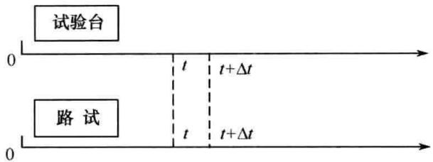

<details>
<summary>text_image</summary>

试验台
0
t
t+Δt
路试
t
t+Δt
0
</details>

图 2 试验台与相应路试时间轴坐标

对任意时刻,考虑路试与对应的试验台 $t \rightarrow t + \Delta t$ 的过程,可得以下相关结论。

(1) 在任意 t 时刻, 设路试车轮的角速度为 $\omega(t)$ , 由试验原则一可知, 对应的试验台上主轴的角速度也为 $\omega(t)$ 。

(2) 转速 $n(t)$ 与角速度 $\omega(t)$ 的关系:

$$
\omega (t) = \frac {2 n (t) \pi}{6 0} = \frac {n (t) \pi}{3 0}
$$

(3) 假设试验台采用的电动机驱动电流与其产生的扭矩成正比, 设比例系数为 k, 则驱动电流产生的扭矩 $M_{e}(t)$ 与电流 I 的关系为

$$
M _ {e} (t) = \frac {1}{k} I (t)
$$

(4) 在 $t \rightarrow t + \Delta t$ 的时间段内, 飞轮转过的角路程 $\Delta \varphi$ 为

$$
\Delta \varphi = \omega (t) \Delta t
$$

(5) 在 $t \rightarrow t + \Delta t$ 的时间段内, 驱动电流产生扭矩 $M_{e}(t)$ 做的功 $W_{e}$ 为

$$
W _ {e} = M _ {e} (t) \Delta \varphi
$$

(6) 在 $t \rightarrow t + \Delta t$ 的时间段内, 路试中的车辆制动器消耗的能量 $E_{1}$ 为

$$
E _ {1} = \frac {1}{2} J _ {e} \left[ \omega^ {2} (t) - \omega^ {2} (t + \Delta t) \right]
$$

(7) 在 $t \rightarrow t + \Delta t$ 的时间段内, 试验台上系统消耗的动能 $E_{2}$ 为

$$
E _ {2} = \frac {1}{2} J _ {0} \left[ \omega^ {2} (t) - \omega^ {2} (t + \Delta t) \right]
$$

(8) 在 $t \rightarrow t + \Delta t$ 的时间段内, 试验台制动器消耗的能量 $E_{3}$ 为

$$
E _ {3} = M (t) \Delta \varphi
$$

## 5.3.3 模型建立

1. 建立驱动电流依赖于瞬时转速的模型

由模型准备中结论5、6易知，为满足模拟试验原则二，需补充的能量 $E$ 为

$$
E = E _ {1} - E _ {2} = \frac {1}{2} (J _ {e} - J _ {0}) [ \omega^ {2} (t) - \omega^ {2} (t + \Delta t) ]
$$

E 是由驱动电流 I 补充的, 则有

$$
E = M _ {e} (t) \Delta \varphi
$$

由模型准备中结论3及以上两式可知：

$$
I (t) \omega (t) = \frac {1}{2} k (J _ {0} - J _ {e}) \frac {\omega^ {2} (t + \Delta t) - \omega^ {2} (t)}{\Delta t}
$$

令 $\Delta t\to 0$ ，则上式可化为

$$
I (t) \omega (t) = \frac {1}{2} k (J _ {0} - J _ {e}) \frac {\mathrm{d} \omega^ {2} (t)}{\mathrm{d} t}
$$

整理得

$$
I (t) = k (J _ {0} - J _ {e}) \frac {\mathrm{d} \omega (t)}{\mathrm{d} t} \tag {1}
$$

代入模型准备中结论2转速与角速度的关系,整理可得

$$
I (t) = \frac {\pi}{3 0} k (J _ {0} - J _ {e}) \frac {\mathrm{d} n (t)}{\mathrm{d} t} \tag {2}
$$

## 2. 建立驱动电流依赖于瞬时扭矩的模型

由式(1)及模型准备中结论3可知

$$
M _ {e} (t) = (J _ {0} - J _ {e}) \frac {\mathrm{d} \omega}{\mathrm{d} t}
$$

在 $t \rightarrow t + \Delta t$ 的时间段内, 试验台上制动器消耗的能量与对应时间段内路试中制动器消耗的能量相等, 则

$$
M (t) \Delta \varphi = \frac {1}{2} J _ {e} [ \omega^ {2} (t) - \omega^ {2} (t + \Delta t) ]
$$

由模型准备中结论3、4可知

$$
M (t) \omega (t) = - \frac {1}{2} J _ {e} \frac {\omega^ {2} (t) - \omega^ {2} (t + \Delta t)}{\Delta t}
$$

令 $\Delta t\to 0$ ，则上式可化为

$$
M (t) \omega (t) = - \frac {1}{2} J _ {e} \frac {\mathrm{d} \omega^ {2} (t)}{\mathrm{d} t}
$$

整理即得

$$
M (t) = - J _ {e} \frac {\mathrm{d} \omega (t)}{\mathrm{d} t} \tag {3}
$$

结合式(1)可得

$$
I (t) = \frac {k (J _ {e} - J _ {0})}{J _ {e}} M (t) \tag {4}
$$

综上所述,得到电动机驱动电流依赖可观测量瞬时转速 $n(t)$ 与瞬时扭矩 $M(t)$ 的数学模型为

$$
\left\{ \begin{array}{l} I (t) = \frac {\pi}{3 0} k (J _ {0} - J _ {e}) \frac {\mathrm{d} n (t)}{\mathrm{d} t} \\ I (t) = \frac {k (J _ {e} - J _ {0})}{J _ {e}} M (t) \end{array} \right. \tag {5}
$$

## 5.3.4 模型求解

在问题一和问题二的条件下,假设制动减速度为常数,初始速度为 $50 \, km/h$ , 制动 $5.0 \, s$ 后车速为零, 计算驱动电流。

由问题二的解答可知,可供使用的飞轮方案及其相对应的相关参数见表4。

表 4 飞轮方案相关参数  
(单位 kg·m²)

<table><tr><td>飞轮\项目</td><td>机械惯量 $J_0$ </td><td>等效惯量 $J_e$ </td><td> $J_e - J_0$ </td></tr><tr><td>一</td><td>40.0083</td><td>51.9989</td><td>11.9906</td></tr><tr><td>二</td><td>70.0166</td><td>51.9989</td><td>-18.0177</td></tr></table>

因为制动减速度 $\frac{\mathrm{d}v(t)}{\mathrm{d}t}$ 为常数,故

$$
\frac {\mathrm{d} v (t)}{\mathrm{d} t} = \frac {0 - 5 0 \times 1 0 0 0}{5 \times 3 6 0 0} = - 2. 7 7 7 8 \mathrm{m/s} ^ {2}
$$

又由平动速度 $v(t)$ 与角速度 $\omega (t)$ 的关系：

$$
\omega (t) = \frac {v (t)}{r}
$$

可知角速度的减速度：

$$
\frac {\mathrm{d} \omega (t)}{\mathrm{d} t} = \frac {1}{r} \frac {\mathrm{d} v (t)}{\mathrm{d} t}
$$

又由模型准备中结论2角速度与转速的关系, 可知转速的减速度:

$$
\frac {\mathrm{d} n (t)}{\mathrm{d} t} = \frac {3 0}{\pi} \frac {\mathrm{d} \omega (t)}{\mathrm{d} t} = \frac {3 0}{\pi} \frac {1}{r} \frac {\mathrm{d} v (t)}{\mathrm{d} t}
$$

将上式代入模型式(5)中,可得

$$
I (t) = \frac {1}{r} k (J _ {0} - J _ {e}) \frac {\mathrm{d} v (t)}{\mathrm{d} t}
$$

代入相关数据可求得两飞轮方案对应的驱动电流参数,求解结果见表5。

表 5 驱动电流参数

<table><tr><td>飞轮\项目</td><td>机械惯量 $J_0/kg·m^2$ </td><td>等效惯量 $J_e/kg·m^2$ </td><td> $(J_e-J_0)/kg·m^2$ </td><td>制动减速度/(m/s2)</td><td>驱动电流/A</td></tr><tr><td>一</td><td>40.0083</td><td>51.9989</td><td>11.9906</td><td>-2.7778</td><td>174.6881</td></tr><tr><td>二</td><td>70.0166</td><td>51.9989</td><td>-18.0177</td><td>-2.7778</td><td>-262.4954</td></tr></table>

说明:驱动电流值为正表示电流扭矩方向与制动扭矩方向相反,驱动电流值为负表示电流扭矩方向与制动扭矩相同。

## 5.4 问题四的求解

评价控制方法优劣的一个重要数量指标是能量误差的大小,本题中的能量误差是指所设计的路试时的制动器与相对应的试验台上制动器在制动过程中消耗的能量之差。

对制动时间区间 $[0,4.67]$ s进行离散化处理,将整个制动时间区间离散为长度 $\Delta t=0.01s$ 的467个时间段,每个时间段内的可观测量认为是相等的,但不同的时间段内可观测量一般不等。

第 $i$ 个时间段内的角路程用 $\varphi_{i}$ 表示, 则

$$
\varphi_ {i} = \omega_ {i} \Delta t = \frac {\pi n _ {i} \Delta t}{3 0}
$$

在第 $i$ 个时间段内，制动扭矩即为瞬时扭矩，可用 $M_{i}$ 表示。设第 $i$ 个小时间段内制动扭矩做功 $W_{i}$ ，则

$$
W _ {i} = M _ {i} \varphi_ {i}
$$

试验台制动过程中消耗的能量也即制动扭矩做功的总量为

$$
E _ {3} = W = \sum_ {i = 0} ^ {4 6 7} M _ {i} \varphi_ {i}
$$

假设路试时轮胎与地面无滑动,根据能量守恒原理,路试时制动器能量消耗即为汽车动能损失,故路试时制动器能量消耗为

$$
E _ {1} = \frac {J _ {e} \omega_ {0} ^ {2}}{2} - \frac {J _ {e} \omega_ {t} ^ {2}}{2}
$$

因此能量误差 $\delta$ 可表示为

$$
\delta = | E _ {1} - E _ {3} | = \left| \frac {J _ {e} \omega_ {0} ^ {2}}{2} - \frac {J _ {e} \omega_ {t} ^ {2}}{2} - \sum_ {i = 0} ^ {4 6 7} \frac {\pi M _ {i} n _ {i} \Delta t}{3 0} \right|
$$

代入相关数据,编写程序(程序见附录一,文件名:problem4.m)求解,可得结果。

路试时制动器能量消耗：

$$
E _ {1} = 5 2 1 5 0 \mathrm{J}
$$

相对应的试验台制动器的能量消耗：

$$
E _ {3} = 4 9 2 1 4 \mathrm{J}
$$

由此可知绝对能量误差：

$$
\delta = | E _ {1} - E _ {3} | = 2 9 3 6 \mathrm{J}
$$

相对能量误差：

$$
\eta = \frac{\dot{\delta}}{E_1} = 5.6299\%
$$

由以上计算可知,相对能量误差为5.6299%。造成误差的原因主要有电流控制方法不当带来的系统误差,制动器起始工作不稳定带来的误差,以及实际中观测误差、随机误差和连续问题离散化所产生的误差。制动器工作有一个启动过程,对于不同的制动器而言响应时间一般不同。一般来说,这个响应时间越短,制动器的性能就越好。在制动器启动过程中,制动扭矩大小呈不稳定状态,因此很难决定电动机电流控制方法。在不考虑观测误差、随机误差和连续问题离散化所产生的误差的情况下,优化电流控制方法减小系统误差是改进试验效果的可行方法。

## 5.5 问题五的求解

问题三中求得的理论模型有两个表达式,因此可从两个方向出发建立模型决定驱动

电流。其目标均是使能量误差尽量小。

考虑根据前一个时间段观测到的瞬时转速与/或瞬时扭矩,设计本时间段电流值的计算机控制方法。首先对制动时间进行离散化处理,将整个制动时间离散化为长度 $\Delta t$ 的时间段,设第 i 个时间段中观测到的瞬时扭矩为 $M_{i}$ ,瞬时转速为 $n_{i}$ ,驱动电流为 $I_{i}$ ,对问题三中的理论模型进行离散化处理,得到离散化的驱动电流依赖于可观测量的数学模型:

$$
\left\{ \begin{array}{l} I _ {i} = \frac {\pi}{3 0} k (J _ {0} - J _ {e}) \frac {n _ {i} - n _ {i - 1}}{\Delta t} \\ I _ {i} = \frac {k (J _ {e} - J _ {0})}{J _ {e}} M _ {i} \end{array} \right. \tag {6}
$$

## 5.5.1 模型I的建立

在路试时以恒定的力踏下制动踏板,这个过程中可以假设路试中制动减速度为常数。由问题三中建立的理论模型可知,转速的减速度也为常数,即式(5)中的 $\frac{\mathrm{d}n(t)}{\mathrm{d}t}$ 为常数,由问题三中建立的理论模型可知 $M(t)$ 也为一定值,设其为 $M_{0}$ 。

离散化后的驱动电流依赖于瞬时扭矩的模型为

$$
I _ {i} = \frac {k (J _ {e} - J _ {0})}{I _ {e}} M _ {i} \tag {7}
$$

现考虑根据前一个时间段中观测到的 $M_{i-1}$ , 设计本时间段的电流值 $I_i$ 的问题。分析可知, 如能由 $M_{i-1}$ 设计出 $M_i$ , 即可由式(7)确定 $I_i$ 。在实际中, $M_i$ 与理论值 $M_0$ 总是有一定偏差。试验台消耗的能量来自于制动扭矩做的功, 这个扭矩误差越小, 能量误差就越小。

故问题可转化为使整个制动过程扭矩误差最小化时由 $M_{i-1}$ 确定 $M_i$ 的问题, 但实际上这个目标并不能实现。在确定 $M_i$ 时, $i$ 阶段以后的扭矩还没有确定, 最多只能实现 $i$ 阶段以前扭矩误差最小化。

若要实现 $i$ 阶段以前扭矩误差最小化, 需要考虑 $i - 1$ 个扭矩的合扭矩, 实现难度较大, 计算繁杂, 且随着 $i$ 的增大计算复杂度会持续增大, 是一个病态算法。可以考虑固定阶段内扭矩的计算。最简单的方法是令相邻阶段扭矩误差达到平衡, 即确定 $M_{i}$ , 使得

$$
\frac {M _ {i - 1} + M _ {i}}{2} = M _ {0} \tag {8}
$$

可使第 $i - 1$ 个时间段与第 $i$ 个时间段内的平均制动扭矩等于 $M_0$ 。

由式(8)可得

$$
M _ {i} = 2 M _ {0} - M _ {i - 1} \tag {9}
$$

联立式(7)与式(9)，可得电流值的计算机控制方法模型：

$$
\left\{ \begin{array}{l} I _ {i} = \frac {\pi}{3 0} k (J _ {0} - J _ {e}) \frac {n _ {i} - n _ {i - 1}}{\Delta t} \\ I _ {i} = \frac {k (J _ {e} - J _ {0})}{J _ {e}} M _ {i} \\ M _ {i} = 2 M _ {0} - M _ {i - 1} \end{array} \right. \tag {10}
$$

即

$$
\left\{ \begin{array}{l} I _ {i} = \frac {k (J _ {e} - J _ {0})}{J _ {e}} (2 M _ {0} - M _ {i - 1}) \\ M _ {i} = 2 M _ {0} - M _ {i - 1} \\ n _ {i} = \frac {3 0 \Delta t}{J _ {e} \pi} (2 M _ {0} - M _ {i - 1}) + n _ {i - 1} \end{array} \right. \tag {11}
$$

## 5.5.2 模型Ⅱ的建立

在试验的过程中,某一时刻观测到的转速与路试时的转速存在误差。在接下来的一个时间段内,可以通过微调输入电动机的电流来减小这个误差,使下一个观测到的转速尽可能地与相应路试时的转速接近。

电机加速到速度 $n_{0}$ 后进入刹车阶段,与路试时加速到 $n_{0}$ 后进入刹车阶段相对应。把整个刹车过程按时间 $\Delta t$ 分成很多个小段,如图 3 所示。

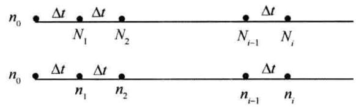

<details>
<summary>text_image</summary>

n₀ • Δt • Δt •
          N₁ N₂          N_{i-1} N_i
n₀ • Δt • Δt •
          n₁ n₂          n_{i-1} n_i
</details>

图 3 刹车过程分段示意

图3中， $n_0$ 表示开始刹车时的转速， $N_{1}, N_{2}, \dots, N_{i-1}, N_{i}, \dots$ 分别表示第 $1, 2, \dots, i-1, i, \dots$ 阶段路试车轮的转速。 $n_{1}, n_{2}, \dots, n_{i-1}, n_{i}, \dots$ 分别表示第 $1, 2, \dots, i-1, i, \dots$ 阶段末试验台上观测到的车轮的转速。

在第1个时间段内,给电动机施加的电流是理论上计算出的电流,如果系统没有误差,则在第1个时间段末试验台的转速应该达到 $N_{1}$ ,但是由于系统有误差的存在,可以断言在第1个时间段试验台观测到的转速 $n_{1}$ 不会等于 $N_{1}$ ,存在差距 $\Delta n_{1}=|N_{1}-n_{1}|$ 。为了尽量消除系统误差,在第2个时间段使试验台观测到的转速 $n_{2}$ 尽可能接近 $N_{2}$ ,由式(6)可知

$$
I _ {2} = \frac {\pi}{3 0} k (J _ {0} - J _ {e}) \frac {N _ {2} - n _ {1}}{\Delta t} \tag {12}
$$

由此可计算在第2个时间段内的电流。

计算出的电流在系统没有误差的情况下,会使第2个时间段试验台上测出的转速等于 $N_{2}$ ,这样试验台上飞轮的转速就与路试的转速在测量时刻是相等的。又由于 $\Delta t$ 非常小,这样就能保证试验台上飞轮的转速与路试时的转速在任意时刻相差均较小,消耗的能量相差很小。

由上述分析可知,在第 i 个时间段,设路试时汽车的车轮应该达到的转速为 $N_{i}$ ; 在第 i-1 个时间段,试验观测到的转速设为 $n_{i-1}$ , 则由式(12)可知第 i 个时间段内电动机的驱动电流为

$$
I _ {i} = \frac {\pi}{3 0} k (J _ {0} - J _ {e}) \frac {N _ {i} - n _ {i - 1}}{\Delta t}
$$

由于刹车装置装在试验台上与装在汽车上性能是一样的,因此在试验台测量到的瞬时扭矩与刹车过程中的瞬时扭矩是相等的。由于 $\Delta t$ 非常小,可以认为在 $\Delta t$ 时间内刹车装置的扭距是一个定值,且等于上一个时间段观测到的值 $M_{i}$ ,所以可得模型:

$$
\left\{ \begin{array}{l} N _ {1} = n _ {0} - \frac {6 0 M _ {0}}{2 \pi J _ {e}} \Delta t \\ N _ {i} = N _ {i - 1} - \frac {6 0 M _ {i - 1}}{2 \pi J _ {e}} \Delta t \quad i \geqslant 2 \end{array} \right. \tag {13}
$$

## 5.5.3 模型的检验与分析

可以针对问题四中的路试相关数据运用所建模型设计的电流控制方法,对方案执行结果进行评价,并与问题四中的控制方法进行比较。

模型I：

由问题三中式(3)可求得问题四制动扭矩理论值 $M_0$ ：

$$
M _ {0} = - \frac {4 8 \pi (2 5 7 - 5 1 4)}{3 0 \quad 4 . 6 7} = 2 7 6. 6 2 1 6 \mathrm{N} \cdot \mathrm{m}
$$

提取问题四中时间段序号为偶数的数据段作为观测值,代入模型Ⅰ中,求得各时间段的电流。同时计算出各时间段的瞬时转速与瞬时扭矩,运用问题四中同样的方法求解能量误差(相关计算程序见附录二,文件名:problem5.m),可得模型Ⅰ控制方法能量误差。

模型Ⅱ：

问题四中主轴初转速为 $514\mathrm{r / min}$ ，末转速为 $257\mathrm{r / min}$ ，路试等效的转动惯量为 $48\mathrm{kg}\cdot \mathrm{m}^2$ ，机械惯量为 $35\mathrm{kg}\cdot \mathrm{m}^2$ ，时间步长为 $10\mathrm{ms}$ ，由式(13)可计算出路试时的转速 $N_{i}$ 由于 $\Delta t$ 非常小，在第 $i$ 个时间段内可以认为转速就是 $N_{i - 1}$ ，在第 $i$ 个 $\Delta t$ 内刹车装置消耗的能量 $e_i$ 为

$$
e _ {i} = M _ {i - 1} N _ {i - 1} \Delta t
$$

则刹车装置消耗的总能量：

$$
E _ {3} = \sum_ {i} e _ {i} = 5 2 3 0 4. 5 8 2 6 \mathrm{J}
$$

继而可求得模型Ⅱ能量误差。

将模型Ⅰ、Ⅱ所得结果与问题四中相关结果作对比,数据见表6。

表 6 问题四与问题五电流控制方法的相关参数对比

<table><tr><td>控制方法\项目</td><td>路试时制动器能量消耗  $E_1$ /J</td><td>试验台制动器能量消耗  $E_3$ /J</td><td>能量误差 δ/J</td><td>相对能量误差 η</td></tr><tr><td>问题四中的某控制方法</td><td>52150</td><td>49214</td><td>2936</td><td>5.6299%</td></tr><tr><td>模型I控制方法</td><td>52150</td><td>52970</td><td>893.5980</td><td>1.5716%</td></tr><tr><td>模型II控制方法</td><td>52150</td><td>52304</td><td>154.5826</td><td>0.2964%</td></tr></table>

分析表 6 可知,依照模型 I、II 设计的电流值控制方法相对于问题四中的控制方法能量误差都有明显降低,故依据模型 I、II 设计的电流值控制方法均是合理有效的。

## 5.6 问题六的求解

问题六要求在问题五所建模型基础上进行改进。在问题四给出的误差分析中, 可知制动未稳定阶段可观测数据会带来较大误差。从表6中可以看到模型Ⅱ的效果明显好于模型Ⅰ, 这是由于模型Ⅱ的原理更有利于对制动未稳定阶段电流的控制。

模型Ⅰ的原理是制动扭矩的补偿平衡原理,在制动扭矩变化不大的条件下能取得较好的改进效果。而一旦制动扭矩变动较大,就会表现出剧烈的波动特征。根据模型Ⅰ设计的控制方法对问题四的数据进行分析,求出的瞬时扭矩如图4、图5所示。

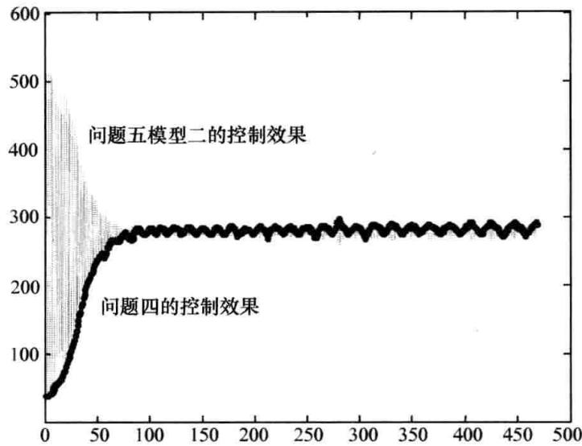

<details>
<summary>line</summary>

| X | Y (Problem 5 Model B) | Y (Problem 4) |
| --- | --- | --- |
| 0 | ~40 | ~40 |
| 50 | ~250 | ~250 |
| 100 | ~280 | ~280 |
| 150 | ~280 | ~280 |
| 200 | ~280 | ~280 |
| 250 | ~280 | ~280 |
| 300 | ~280 | ~280 |
| 350 | ~280 | ~280 |
| 400 | ~280 | ~280 |
| 450 | ~280 | ~280 |
</details>

图 4 模型Ⅰ与问题四的瞬时扭矩对比图

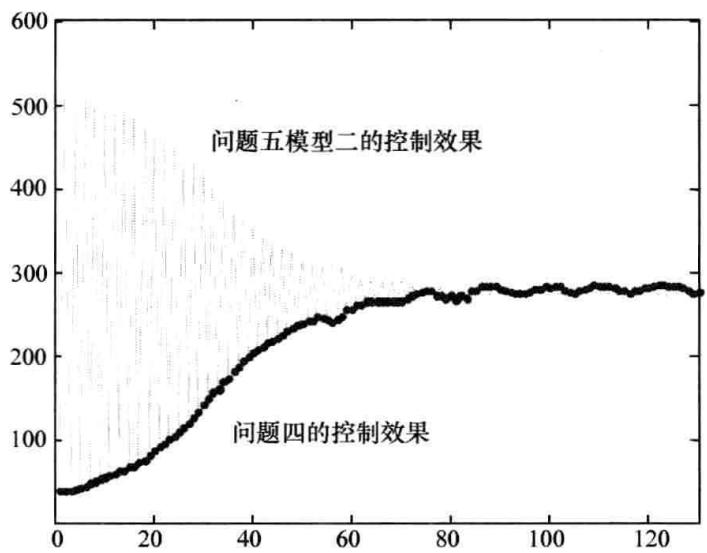

<details>
<summary>line</summary>

| X | 问题五模型二的控制效果 | 问题四的控制效果 |
| --- | --- | --- |
| 0 | ~450 | ~40 |
| 20 | ~350 | ~80 |
| 40 | ~250 | ~180 |
| 60 | ~200 | ~250 |
| 80 | ~150 | ~270 |
| 100 | ~100 | ~280 |
| 120 | ~50 | ~280 |
</details>

图 5 模型Ⅰ与问题四瞬时扭矩局部对比图

从图 4 中可以明显看出在制动未稳定阶段, 模型 I 控制的瞬时扭矩在大幅度震动, 而在制动扭矩稳定后, 瞬时扭矩趋于稳定。

模型Ⅱ的原理是转速接近原理,转速变化越小,电流控制效果越好。在制动未稳定阶段,转速的减速度逐渐增大后趋于稳定。故模型Ⅱ电流控制效果在制动稳定阶段反而不如制动未稳定阶段好。

对于模型Ⅱ,其相对能量误差仅为0.2964%,在实际的电流控制过程中,已经达到了较好的控制效果,但对于模型Ⅰ,则仍有较大的改进空间。在此,针对模型Ⅰ在制动未稳定阶段电流控制的不足进行改进。

观察图 4, 图中线条较粗的是问题四中某控制方法瞬时扭矩随时间的变化曲线。可以发现问题四应用某控制方法得到的数据前一部分上升较快, 后一部分在某个数值上下波动,前一部分对应着制动器的响应时间,由制动器的本身特性决定,是不可控的。模型Ⅰ没有考虑这一情况。

在制动器稳定之后,应用所建模型对电流进行控制,使用模型检验中类似的方法可求解能量误差(取开始稳定的时间为第70个时间段,相关计算程序见附录三,文件名:problem6\_1.m),与问题四中相关结果对比见表7。

表 7 问题四与考虑制动器响应时间电流控制方法的相关参数

<table><tr><td>控制方法\项目</td><td>路试时制动器能量消耗  $E_1$ /J</td><td>试验台制动器能量消耗  $E_2$ /J</td><td>能量误差  $\delta$ /J</td><td>相对能量误差  $\eta$ </td></tr><tr><td>问题四中的某控制方法</td><td>52150</td><td>49214</td><td>2936</td><td>5.6299%</td></tr><tr><td>考虑响应后设计的控制方法</td><td>52150</td><td>48730</td><td>3419.935</td><td>6.5579%</td></tr></table>

分析表 7 可知, 若只简单地在模型 I 的基础上考虑制动器稳定之后的控制, 所得到的电流控制方法并不优于问题四中的控制方法, 现对此分析, 如图 6 所示。

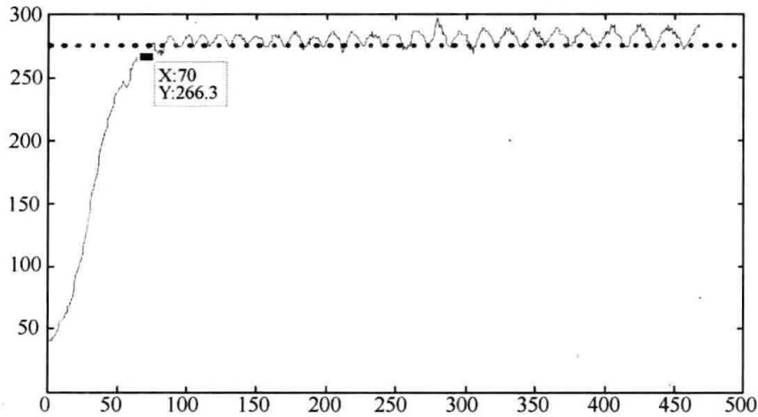

<details>
<summary>line</summary>

| X | Y |
| --- | --- |
| 70 | 266.3 |
</details>

图 6 瞬时扭矩与理论扭矩对比

说明:(1)图中虚线对应的是由问题三中理论模型式(3)求出的理论瞬时扭矩。

(2) 图中标记的点为制动器完成响应的时间。

分析图 6 可以发现测得的瞬时扭矩在一个略高于理论值的值附近上下波动。这个值之所以高于理论值, 是因为还需补偿制动器制动扭矩未稳定阶段缺失的制动扭矩。

在此,要对模型Ⅰ加以改进,设计一个更完善的电流计算机控制方法。可以将其归结为两个问题:

(1)对于制动过程,如何确定未稳定阶段的长度,即何时能加以控制?  
(2) 开始控制后应使制动扭矩稳定在某个值附近, 这个值与理论值的关系是什么, 大小为多少?

对于问题(1)，制动器的响应时间应当是个与制动器本身相关的定值，设为 $t_{s}=s\Delta t$ ，即在第s个时间段结束响应，在第 $s+1$ 个时间段开始控制。

对于问题(2)，设控制阶段的制动扭矩稳定值为 $M_{c}$ ，同问题五式(9)，分析可知

$$
M _ {i} = 2 M _ {c} - M _ {i - 1}
$$

此时模拟试验中制动器消耗的能量为

$$
\sum_ {i = 0} ^ {s} \frac {\pi}{3 0} M _ {i} n _ {i} \Delta t + \sum_ {i = s + 1} ^ {N} \frac {\pi}{3 0} M _ {c} n _ {i} \Delta t
$$

式中： $\sum_{i = 0}^{s}\frac{\pi}{30} M_i n_i\Delta t$ 为制动器启动阶段消耗的能量； $\sum_{i = s + 1}^{N}\frac{\pi}{30} M_c n_i\Delta t$ 为开始施加控制阶段制动器消耗的能量。

根据5.3.1中试验原则二可知：

$$
E _ {1} = \sum_ {i = 0} ^ {s} \frac {\pi}{3 0} M _ {i} n _ {i} \Delta t + \sum_ {i = s + 1} ^ {N} \frac {\pi}{3 0} M _ {c} n _ {i} \Delta t = \frac {J _ {e} \pi^ {2}}{1 8 0 0} (n _ {0} ^ {2} - n _ {t} ^ {2})
$$

即

$$
\sum_ {i = 0} ^ {s} M _ {i} n _ {i} \Delta t + \sum_ {i = s + 1} ^ {N} M _ {c} n _ {i} \Delta t = \frac {J _ {e} \pi}{6 0} (n _ {0} ^ {2} - n _ {t} ^ {2})
$$

整理得

$$
M _ {c} = \frac {\frac {\pi J _ {e}}{6 0} (n _ {0} ^ {2} - n _ {t} ^ {2}) - \sum_ {i = 0} ^ {s} M _ {i} n _ {i} \Delta t}{\sum_ {i = s + 1} ^ {N} n _ {i} \Delta t}
$$

代入模型Ⅰ可得考虑制动器响应过程的改进的模型Ⅲ为

$$
\left\{ \begin{array}{l} I _ {i} = \frac {k (J _ {e} - J _ {0})}{J _ {e}} (2 M _ {c} - M _ {i - 1}) \\ M _ {i} = 2 M _ {c} - M _ {i - 1} \\ n _ {i} = \frac {3 0 \Delta t}{\pi J _ {e}} (2 M _ {c} - M _ {i - 1}) + n _ {i - 1}, \quad i \geqslant s + 1 \\ M _ {c} = \frac {\frac {\pi J _ {e}}{6 0} (n _ {0} ^ {2} - n _ {t} ^ {2}) - \sum_ {i = 0} ^ {s} M _ {i} n _ {i} \Delta t}{\sum_ {i = s + 1} ^ {N} n _ {i} \Delta t} \end{array} \right.
$$

运用问题四中的路试相关数据进行模型试验电流计算机控制方法的设计,对控制方法的结果进行评价,并与问题四中的控制方法的结果进行比较。

由图6可以看出问题四中的制动器的响应时间约为第70个时间段，即

$$
s = 7 0
$$

代入模型可求得

$$
M _ {c} = 2 9 9. 0 1 7 5 \mathrm{N} \cdot \mathrm{m}
$$

提取问题四中时间段序号70之后偶数序号的数据段作为观测值,代入模型Ⅰ中,求得各时间段的电流,同时计算出各时间段的瞬时转速与瞬时扭矩,运用问题四中同样的方法求解能量误差(相关计算程序见附录四 文件名:problem6.m),与问题四中相关结果对比见表8。

表 8 问题四与问题六电流控制方法的相关参数对比表

<table><tr><td>控制方法\项目</td><td>路试时制动器能量消耗  $E_1$ /J</td><td>试验台制动器能量消耗  $E_2$ /J</td><td>能量误差 δ/J</td><td>相对能量误差 η</td></tr><tr><td>问题四中的某控制方法</td><td>52150</td><td>49214</td><td>2936</td><td>5.6299%</td></tr><tr><td>模型I控制方法</td><td>52150</td><td>52970</td><td>893.5980</td><td>1.5716%</td></tr><tr><td>模型II控制方法</td><td>52150</td><td>52304</td><td>154.5826</td><td>0.2964%</td></tr><tr><td>模型III控制方法</td><td>52150</td><td>52219</td><td>68.94131</td><td>0.1322%</td></tr></table>

分析表8, 可知考虑制动器响应时间后改进的模型能显著降低能量误差, 改进的计算机的控制方法更为完善。

## 6 模型的评价

## 6.1 模型的优点

本文模型建立、推导合理缜密,引入的数据真实可靠。在对问题三的求解过程中,运用微元法,所建模型可信度高。在对问题五的求解过程中,从瞬时扭矩出发,以相邻时间段扭矩互补为原则,建立驱动电流模型Ⅰ,方法简单可行;从瞬时转速出发,以相邻时间段转速误差抵消为原则,建立驱动电流模型Ⅱ,便于计算机实现,计算精度高。本文对两个模型控制结果的分析有理有节,并能针对模型结果不同在原理上予以解释分析,对问题给出了较合理的解答。

此外,本文在模型建立过程中,使用了很多图表,清晰明了。模型求解采用计算机软件编程实现,精度高,可拓展性强。

## 6.2 模型的缺点

受多方面因素影响,本文所建模型考虑因素虽然不少,但仍然不够完善。在模型Ⅰ的建立过程中,对于扭矩补偿方式的研究不够充分,限于时间没有探讨更多阶段的补偿方式和加权补偿方式。此外对于评定制动装置好坏与否,本文所做考虑显得薄弱,研究不够深入。

## 参考文献

[1] 百度百科, 载荷. http://baike.baidu.com/view/44326.htm. 2009年9月13日.  
[2] 王正林, 龚纯, 何倩. 精通 MATLAB 科学计算. 北京: 电子工业出版社, 2007.  
[3] 陈建军. 制动器试验台机械惯量电模拟控制方法. 起重运输机械, 2007(12).


<details>
<summary>text_image</summary>

敬年好
制夢
</details>

[4] 姜启源, 谢金星, 叶俊. 数学模型(第三版). 北京: 高等教育出版社, 2003.  
[5] 赵静, 但琦, 等. 数学建模与数学实验. 北京: 高等教育出版社, 2002.

## 【论文点评】

田作威

## 1. 对六个问题解决情况的评价

对问题一,论文根据载荷、转动惯量和等效转动惯量的概念,准确求得了等效的转动惯量。

对问题二,论文应用定积分的方法求出了各个飞轮的转动惯量,得到了所有组合的机械惯量,计算准确。

对问题三,论文给出了速度一致和能量消耗相等两条模拟试验原则,正确运用微元法推导出了驱动电流与瞬时扭矩、瞬时转速的关系式,建立了数学模型,相关计算也准确无误。

对问题四,论文提出以能量误差的大小作为评定执行结果的优劣标准,将制动过程离散化处理,分别推导出路试与试验台上制动器在制动过程中消耗的能量,计算出绝对能量误差值为2936J,相对能量误差值为5.6299%。

对问题五,论文在问题三所建模型的基础上作了离散化处理,从瞬时扭矩出发,以相邻时间段扭矩互补为原则,建立了驱动电流模型Ⅰ,方法简单可行;从瞬时转速出发,以相邻时间段转速误差抵消为原则,建立了驱动电流模型Ⅱ,方法便于计算机实现,计算精度高。相应得到了驱动电流的两种控制方法,并利用问题四的数据对模型进行了检验,检验结果正确。

对问题六,论文分析了问题五中所建模型Ⅰ、Ⅱ的不足,考虑制动器达到稳定的时间,对模型Ⅰ进行了改进,得到了模型Ⅲ。利用问题四中数据进行模型检验的结果表明,改进的模型Ⅲ要较模型Ⅰ、Ⅱ优良。

不足之处:一是在问题三的研究中,对于扭矩补偿方式的研究不够充分,没有探讨更多阶段的补偿方式和加权补偿方式;二是对于评定制动装置好坏与否所做考虑显得薄弱,研究不够深入。

## 2. 对论文写作情况的评价

论文题目“制动器试验台控制方法的模型研究”能比较准确表达论文内容,简短精练。

论文摘要针对所要解决的六个问题逐一简述了应用诸如定积分、微元法、离散化、给定评定指标等方法解决了计算、模型建立、模型评价等问题，并给出了主要结果。

论文引言,即问题重述部分基本是原建模问题的简单重复,似应在阅读、理解的基础之上作适当的简约。

论文正文部分问题分析清楚、符号使用规范、基本假设合理。模型的建立充分反映了论文作者具有较强的应用所学数学知识建立数学模型、并应用计算机软件进行数值计算求解的综合能力。模型的求解评价主要从计算的绝对误差和相对误差上作了考虑，方法简单可行。

总体来说,该论文写作规范、层次分明、脉络清楚、排版合理,是一篇优秀论文。

# 制动器试验台的控制方法分析

## 摘要

本文是对制动器试验台控制方法的研究,和传统试验方法不同,本文是基于电动机驱动电流的合理设定去补偿机械惯量不足而缺少的能量,从而进行模拟试验。数据采集器实时采集可观测量(瞬时转速与瞬时扭矩)的数据信息,计算机进行实时处理,确定电动机驱动电流值,以此进行控制,其关键点在于驱动电流的确定方法。

问题一, 建立能量与转动惯量的相互转换关系, 由此推导出等效转动惯量 $J=52.0kg\cdot m^{2}$ 。

问题二,首先通过机械转动惯量的定义计算出飞轮的转动惯量,通过组合加上基础惯量可以得到8组机械惯量,然后结合问题一的结果以及电流补偿范围,确定出我们的目标:电动机应该补偿的惯量大小为12或 $-18kg\cdot m^{2}$ 。

问题三,先确定需补偿的电扭矩与可观测量的关系,进而得到电动机驱动电流依赖于可观测量的数学模型,并在制动减速度为常数的假设前提下计算出驱动电流为174.6或-261.9A。

问题四,首先根据能量消耗相对误差建立了两种评价方法,并依据这两种评价方法对题目所给的控制方法进行评价:一种是始末能量相对误差评价法,求得结果为5.8%;另一种是实时能量相对误差评价法,求得结果为2.6%。

问题五,在问题三建立的数学模型基础上,基于“滞后观测,当前近似,实时修正”的设计思路,设计出计算机模拟控制方法,并用我们建立的评价体系进行评价,求得实时能量相对误差为0.12%。

问题六,分别从精度进一步提高和硬件可实现性两方面考虑,提出了两个改进模型,并逐一进行评价,也收到了很好的效果。

关键词: 惯性试验台、制动扭矩、瞬时转速、驱动电流、能量误差

## 1 问题重述

汽车的行车制动器(以下简称制动器)连接在车轮上,它的作用是在行驶时使车辆减速或者停止。制动器的设计是车辆设计中最重要的环节之一,直接影响着人身和车辆的安全。为了检验设计的优劣,必须进行相应的测试。在道路上测试实际车辆制动器的过程称为路试,其方法为:车辆在指定路面上加速到指定的速度;断开发动机的输出,让车辆依惯性继续运动;以恒定的力踏下制动踏板,使车辆完全停止下来或车速降到某数值以下;在这一过程中,检测制动减速度等指标。假设路试时轮胎与地面的摩擦力为无穷大,

因此轮胎与地面无滑动。

为了检测制动器的综合性能,需要在各种不同情况下进行大量路试。但是,车辆设计阶段无法路试,只能在专门的制动器试验台上对所设计的路试进行模拟试验。模拟试验的原则是试验台上制动器的制动过程与路试车辆上制动器的制动过程尽可能一致。通常试验台仅安装、试验单轮制动器,而不是同时试验全车所有车轮的制动器。制动器试验台一般由安装了飞轮组的主轴、驱动主轴旋转的电动机、底座、施加制动的辅助装置以及测量和控制系统等组成。被试验的制动器安装在主轴的一端,当制动器工作时会使主轴减速。试验台工作时,电动机拖动主轴和飞轮旋转,达到与设定的车速相当的转速(模拟实验中,可认为主轴的角速度与车轮的角速度始终一致)后,电动机断电,同时施加制动,当满足设定的结束条件时就称为完成一次制动。

路试车辆的指定车轮在制动时承受载荷。将这个载荷在车辆平动时具有的能量(忽略车轮自身转动具有的能量)等效地转化为试验台上飞轮和主轴等机构转动时具有的能量,与此能量相应的转动惯量(以下转动惯量简称为惯量)在本题中称为等效的转动惯量。试验台上的主轴等不可拆卸机构的惯量称为基础惯量。飞轮组由若干个飞轮组成,使用时根据需要选择几个飞轮固定到主轴上,这些飞轮的惯量之和再加上基础惯量称为机械惯量。例如,假设有4个飞轮,其单个惯量分别是:10、20、40、80( $\mathrm{kg} \cdot \mathrm{m}^{2}$ ),基础惯量为 $10\mathrm{kg} \cdot \mathrm{m}^{2}$ ,则可以组成10,20,30, $\cdots$ , $160(\mathrm{kg} \cdot \mathrm{m}^{2})$ 的16种数值的机械惯量。但对于等效的转动惯量为 $45.7\mathrm{kg} \cdot \mathrm{m}^{2}$ 的情况,就不能精确地用机械惯量模拟试验。这个问题的一种解决方法是:把机械惯量设定为 $40\mathrm{kg} \cdot \mathrm{m}^{2}$ ,然后在制动过程中,让电动机在一定规律的电流控制下参与工作,补偿由于机械惯量不足而缺少的能量,从而满足模拟试验的原则。

一般假设试验台采用的电动机的驱动电流与其产生的扭矩成正比(本题中比例系数取为 $1.5A/N\cdot m$ );且试验台工作时主轴的瞬时转速与瞬时扭矩是可观测的离散量。

由于制动器性能的复杂性,电动机驱动电流与时间之间的精确关系是很难得到的。工程实际中常用的计算机控制方法是:把整个制动时间离散化为许多小的时间段,如10ms为一段,然后根据前面时间段观测到的瞬时转速与/或瞬时扭矩,设计出本时段驱动电流的值,这个过程逐次进行,直至完成制动。

评价控制方法优劣的一个重要数量指标是能量误差的大小,本题中的能量误差是指所设计的路试时的制动器与相对应的实验台上制动器在制动过程中消耗的能量之差。通常不考虑观测误差、随机误差和连续问题离散化所产生的误差。

现在要求你们解答以下问题：

(1) 设车辆单个前轮的滚动半径为 0.286m, 制动时承受的载荷为 6230 N, 求等效的转动惯量。

(2) 飞轮组由 3 个外直径 1m、内直径 0.2m 的环形钢制飞轮组成, 厚度分别为 0.0392m、0.0784m、0.1568m, 钢材密度为 $7810 ~kg/m^{3}$ , 基础惯量为 $10 ~kg \cdot m^{2}$ , 问可以组成哪些机械惯量? 设电动机能补偿的能量相应的惯量的范围为 $[-30, 30] ~kg \cdot m^{2}$ , 对于问题 1 中得到的等效的转动惯量, 需要用电动机补偿多大的惯量?

(3) 建立电动机驱动电流依赖于可观测量的数学模型。

在问题 1 和问题 2 的条件下, 假设制动减速度为常数, 初始速度为 50 km/h, 制动

5.0s 后车速为零, 计算驱动电流。

(4)对于与所设计的路试等效的转动惯量为 $48kg\cdot m^{2}$ ，机械惯量为 $35kg\cdot m^{2}$ ，主轴初转速为514r/min，末转速为257r/min，时间步长为10ms的情况，用某种控制方法试验得到的数据见附表。请对该方法执行的结果进行评价。

(5) 按照第 3 问导出的数学模型, 给出根据前一个时间段观测到的瞬时转速与/或瞬时扭矩, 设计本时间段电流值的计算机控制方法, 并对该方法进行评价。

(6)第5问给出的控制方法是否有不足之处？如果有，请重新设计一个尽量完善的计算机控制方法，并作评价。

## 2 问题分析

制动器是每辆汽车必须具备的装置,以便驾驶员能根据道路和交通等情况,通过制动器进行一定的操作,使行驶中的汽车减速或停车。可见制动器对行车安全至关重要,因而对汽车制动器试验台的研究具有十分重要的现实意义。

为了通过制动器试验台模拟路试从而检测制动器的综合性能,同时有效完成本文题目要求,首先应了解汽车制动器的工作原理和制动过程,以及制动器试验台的基本构成和控制方法;然后通过对制动器试验台模拟路试过程的分析,根据路试与模拟各参量间的关系,建立可确定等效转动惯量和电动机驱动电流之间相互关系的数学模型,以得到尽量精确的模拟试验。

问题一要求得等效转动惯量,首先应建立能量与转动惯量的关系,然后根据路试车辆与试验台系统间的能量等效关系以及车轮角速度与试验台主轴角速度相等的关系进行求解。

问题二应首先通过转动惯量的定义式求得飞轮组内三个飞轮的转动惯量,然后根据等效转动惯量、机械惯量、飞轮转动惯量以及电动机补偿惯量间的关系进行求解。

问题三应该充分分析电流与扭矩以及转动惯量间等的关系,从而建立电动机驱动电流依赖于可观测量的数学模型。

问题四首先应该对所给数据进行分析,通过合理的方法分别求得路试总能量消耗和试验台能量总消耗,进而求解能量误差进行评估。

问题五在问题三的模型基础上,将制动时间离散化为微小的时间段,根据数据采集器采集到的前一时段的可观测量,通过计算机实时处理,设计计算出本时段的驱动电流,更精确地模拟出可观测量的变化曲线。

问题六则是对问题五所建数学模型的改进,应根据具体计算结果进行考虑。

## 3 问题假设

(1) 飞轮的质心落在主轴上。

(2) 飞轮随轴垂直转动, 且角速度与主轴角速度相等。

(3)试验台模拟路试时只考虑施加制动与驱动电流的能量消耗,忽略其他的能量消耗。

## 4 符号约定(表1)

表 1 符号约定说明

<table><tr><td>参数</td><td>符号</td><td>单位</td><td>参数</td><td>符号</td><td>单位</td></tr><tr><td>路试车辆的平动能量</td><td>E1</td><td>J</td><td>飞轮钢材密度</td><td>ρ</td><td>kg/m3</td></tr><tr><td>试验台制动器的能量</td><td>E2</td><td>J</td><td>等效转动惯量</td><td>Je</td><td>kg·m2</td></tr><tr><td>实时消耗能量</td><td>ΔE</td><td>J</td><td>飞轮转动惯量</td><td>J1</td><td>kg·m2</td></tr><tr><td>能量误差百分比</td><td>ε</td><td>1</td><td>基础惯量</td><td>Jb</td><td>kg·m2</td></tr><tr><td>路试车辆的行驶速度</td><td>v</td><td>m/s</td><td>机械惯量</td><td>Jm</td><td>kg·m2</td></tr><tr><td>试验台主轴角速度</td><td>ω</td><td>rad/s</td><td>电动机补偿惯量</td><td>ΔJ</td><td>kg·m2</td></tr><tr><td>试验台主轴角加速度</td><td>α</td><td>rad/s2</td><td>制动扭矩</td><td>M</td><td>N·m</td></tr><tr><td>重力加速度</td><td>g</td><td>m/s2</td><td>电扭矩</td><td>T</td><td>N·m</td></tr><tr><td>制动时车轮承受载荷</td><td>G</td><td>N</td><td>主轴初转速</td><td>n0</td><td>r/min</td></tr><tr><td>车辆前轮滚动半径</td><td>r0</td><td>m</td><td>主轴末转速</td><td>nt</td><td>r/min</td></tr><tr><td>飞轮外直径</td><td>r1</td><td>m</td><td>主轴初角速度</td><td>ω0</td><td>rad/s</td></tr><tr><td>飞轮内直径</td><td>r2</td><td>m</td><td>主轴末角速度</td><td>ωt</td><td>rad/s</td></tr><tr><td>飞轮厚度</td><td>h</td><td>m</td><td colspan="3"></td></tr></table>

## 5 模型建立与分析

## 5.1 问题一

承受载荷的车辆在平动时具有的能量为

$$
E _ {1} = \frac {1}{2} m v ^ {2} \tag {1}
$$

式中： $m$ 为车轮等效质量，可由制动时车轮承受的载荷求得：

$$
m = G / g \tag {2}
$$

试验台上飞轮和主轴等机构转动时具有的能量为

$$
E _ {2} = \frac {1}{2} J _ {e} \omega^ {2} \tag {3}
$$

由于忽略车轮自身转动具有的能量,而将在车辆平动时具有的能量等效地转化为试验台上飞轮和主轴等机构转动时具有的能量,所以有

$$
E _ {1} = E _ {2} \tag {4}
$$

试验台主轴的角速度与车轮的角速度始终一致,所以有

$$
v = \omega r _ {0} \tag {5}
$$

由式(1)\~式(5)得到等效转动惯量表达式:

$$
J _ {e} = G r _ {0} ^ {2} / g \tag {6}
$$

取 $g = 9.8 \, m/s^{2}$ ，解得对于车轮滚动半径 $r_{0} = 0.286 \, m$ ，制动时承受载荷 G = 6230N 的车辆，等效转动惯量为 $J_{e} = 52.0 \, kg \cdot m^{2}$ 。

## 5.2 问题二

## 5.2.1 机械惯量

根据转动惯量的定义,对于单个质点有

$$
J = m r ^ {2} \tag {7}
$$

对于含多个质点的系统转动惯量可以表示为

$$
J = \sum_ {j = 1} ^ {n} m _ {j} r _ {j} ^ {2} \tag {8}
$$

而本文要处理的飞轮是刚体,所以将其看作由无数个质点组成,然后利用积分求解。飞轮随主轴垂直转动,如图1所示,在dr宽度内的质点到转轴距离相等,这些质点组成质

量微元——宽度为 dr 的圆柱壳, 则有

$$
\mathrm{dm} = \rho \mathrm{d} V = \rho 2 \pi r h \mathrm{dr} \tag {9}
$$

$$
\mathrm{d} J = r ^ {2} \mathrm{d} m = 2 \pi \rho h r ^ {3} \mathrm{d} r \tag {10}
$$

则其转动惯量为

$$
J = \int \mathrm{d} J = \int_ {r _ {1}} ^ {r _ {2}} 2 \pi \rho h r ^ {3} \mathrm{d} r \tag {11}
$$

经积分得

$$
J = \frac {\pi \rho h}{2} (r _ {2} ^ {4} - r _ {1} ^ {4}) \tag {12}
$$

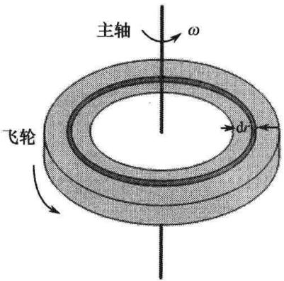

<details>
<summary>text_image</summary>

主轴
ω
飞轮
dr
</details>

图 1 试验台模型

设厚度为 0.0392m、0.0784m、0.1568m 的飞轮其转动惯量分别为 $J_{1}$ 、 $J_{2}$ 、 $J_{3}$ ，代入数值计算得

$$
\left\{ \begin{array}{l} J _ {1} = 3 0 \mathrm{kg} \cdot \mathrm{m} ^ {2} \\ J _ {2} = 6 0 \mathrm{kg} \cdot \mathrm{m} ^ {2} \\ J _ {3} = 1 2 0 \mathrm{kg} \cdot \mathrm{m} ^ {2} \end{array} \right.
$$

用 $x_{i}$ 表示单个飞轮的使用状态, 规定

$$
x _ {i} = \left\{ \begin{array}{l l} 0, & \text {未被使用} \\ 1, & \text {被使用} \end{array} \right. \tag {13}
$$

因此,机械惯量可表示为

$$
J _ {m} = J _ {b} + \sum_ {i = 1} ^ {3} x _ {i} J _ {i} \tag {14}
$$

由于每个飞轮都有被使用与未被使用两种状态,所以该飞轮组可组成 $2^{3}$ 即8种机械惯量,分别是10、40、70、100、130、160、190、220( $kg \cdot m^{2}$ )。

## 5.2.2 补偿惯量

设不能用机械惯量精确模拟而需要电动机补偿的那部分惯量为补充惯量,记为 $\Delta J$ , 则有

$$
J _ {e} = J _ {m} + \Delta J \tag {15}
$$

由于电动机补偿能力有限,所以对于上述8组机械惯量,不一定全都可以通过补偿精确模拟出等效转动惯量。已知

$$
\left\{ \begin{array}{l} J _ {e} = 5 2. 0 \mathrm{kg} \cdot \mathrm{m} ^ {2} \\ \Delta J \in [ - 3 0, 3 0 ] \mathrm{kg} \cdot \mathrm{m} ^ {2} \end{array} \right. \tag {16}
$$

通过式(15)、式(16)得到, 只有机械惯量满足: $J_{m} \in [22, 82] \mathrm{~kg} \cdot \mathrm{m}^{2}$ , 才能模拟试验。所以, 8 组机械惯量中满足条件的只有两组: $40 \mathrm{~kg} \cdot \mathrm{m}^{2}, 70 \mathrm{~kg} \cdot \mathrm{m}^{2}$ , 它们对应的补偿惯量分别为 $12 \mathrm{~kg} \cdot \mathrm{m}^{2}, -18 \mathrm{~kg} \cdot \mathrm{m}^{2}$ 。

注:补偿惯量的绝对值表示其大小,它的符号反映的是施力方向,补偿惯量为正表明机械惯量不够大,需要电流驱动电动机产生与主轴转动方向相同的力,以弥补机械惯量的不足;补偿惯量为负表明机械惯量过大,需要电流驱动电动机产生与主轴转动方向相反的力,以减少机械惯量。

## 5.3 问题三

经推导得到力矩与转动惯量的关系式如下(附录一):

$$
M = J \frac {\mathrm{d} \omega}{\mathrm{d} t} = J \alpha \tag {17}
$$

式中： $\alpha$ 表示角加速度。设非恒定制动扭矩为 M，由电动机驱动电流产生的电扭矩为 T。如果机械惯量可以精确产生等效转动惯量，而无驱动电流补偿，即理想情况下应有

$$
M = J _ {e} \alpha \tag {18}
$$

而如果机械惯量不足,需要驱动电流补偿时应有

$$
M - T = J _ {m} \alpha \tag {19}
$$

由式(18)、式(19)可得

$$
T = \left(J _ {e} - J _ {m}\right) \alpha = \Delta J \alpha \tag {20}
$$

已知电动机的驱动电流与其产生的扭矩成正比,所以有

$$
i (t) = k T \tag {21}
$$

将式(20)代入式(21)可得驱动电流表达式为

$$
i (t) = k \Delta J \alpha = k \Delta J \frac {\mathrm{d} \omega}{\mathrm{d} t} = k \Delta J \frac {M (t)}{J _ {e}} = k \left(1 - \frac {J _ {m}}{J _ {e}}\right) M (t) \tag {22}
$$

式(22)表示了驱动电流与补偿惯量及角速度间的关系,其中,对于特定的路试模拟试验,补偿惯量可通过等效转动惯量及机械惯量求出,是一个定值;主轴的瞬时转速是可观测的,因而可以求出角加速度,所以通过式(22)式就可根据可观测量求出电动机驱动电流。

已知车轮角加速度与主轴角速度始终一致,所以有

$$
\alpha = \frac {\mathrm{d} \omega}{\mathrm{d} t} = \frac {\mathrm{d} v}{r _ {0} \mathrm{d} t} \tag {23}
$$

代入数值求得 $\alpha = 9.7\mathrm{rad / s^2}$ ，又已知 $k = 1.5\mathrm{A / N}\cdot \mathrm{m}$ ，对于两组补偿惯量， $\Delta J = 12\mathrm{kg}\cdot \mathrm{m}^2$ 、 $-18\mathrm{kg}\cdot \mathrm{m}^2$ ，驱动电流分别为174.6A、-261.9A。

## 5.4 问题四

问题四要用能量误差的大小对所给控制方法进行评价,能量误差是指路试与试验台在制动过程中消耗的能量之差,所以分四个步骤进行求解,如图2所示。

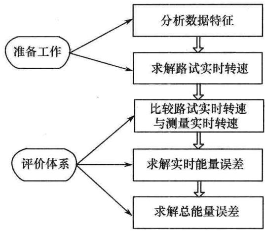

<details>
<summary>flowchart</summary>

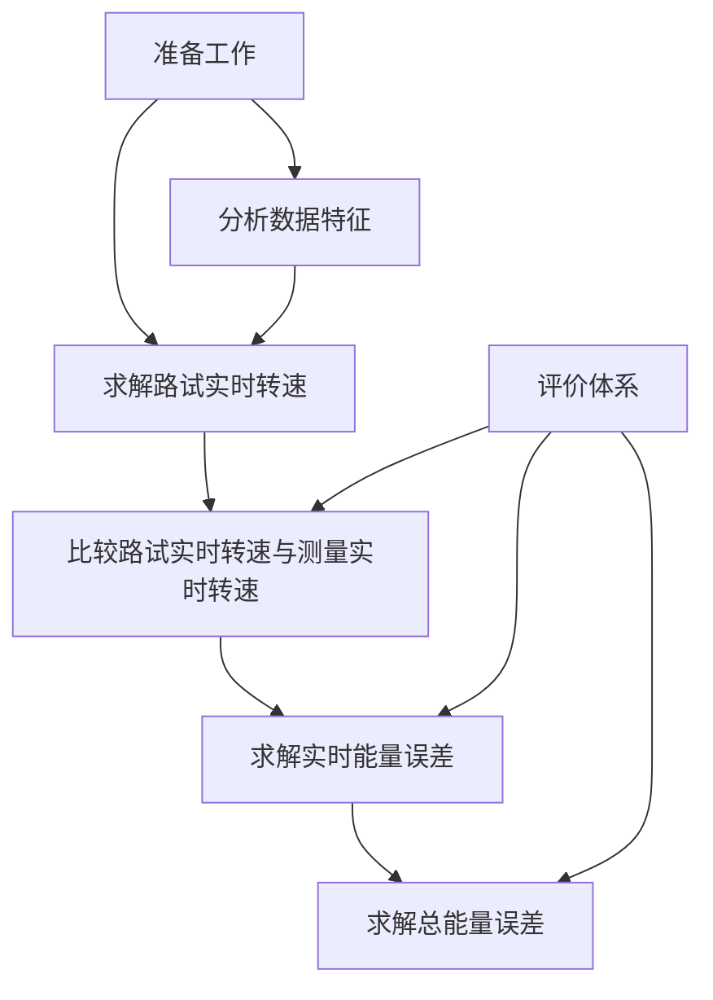
```mermaid
graph TD
  A["准备工作"] --> B["分析数据特征"]
  A --> C["求解路试实时转速"]
  B --> C
  C --> D["比较路试实时转速与测量实时转速"]
  D --> E["求解实时能量误差"]
  E --> F["求解总能量误差"]
  G["评价体系"] --> D
  G --> E
  G --> F
```
</details>

图 2 能量误差求解流程图

## 5.4.1 分析数据特征

对于附件中所给的测量数据,尤其是扭矩一列,应首先判断其类型,是总扭矩还是制动扭矩。

经推导得到能量与力矩有如下关系(附录二)

$$
\Delta E = \int M \omega \mathrm{d} t \tag {24}
$$

该控制方法将时间离散化为 10ms 一段, 在这次模拟过程即 4.67s 内对控制台扭矩和转速进行测量收集, 形成 468 个采样点。所以根据式(24), 该模拟过程在所给测量扭矩下产生能量消耗为

$$
\Delta E (\text {测}) = \sum_ {i = 0} ^ {4 6 7} M _ {i} \omega_ {i} \Delta t \tag {25}
$$

代入数值得到结果为 $\Delta E(\text{测}) = 49.3 \, \text{kJ}$ 。

显然,如果测量扭矩是总扭矩,对应的能量消耗应该为试验台上动能的减小量,理想模拟情况下这个值应该是: $\frac{1}{2}J_{m}\left(\omega_{0}^{2}-\omega_{t}^{2}\right)=38.1kJ$ ,测量值较理想值偏离程度为 $\left|\frac{49.3-38.1}{49.3}\right|=22.7\%$ 。

如果测量扭矩是制动扭矩,对应的能量消耗就是试验台模拟路试过程的能量总消耗,理想模拟情况下这个值应该是: $\frac{1}{2}J_{e}\left(\omega_{0}^{2}-\omega_{t}^{2}\right)=52.2kJ$ ,测量值较理想值偏离程度为 $\left|\frac{49.3-52.2}{49.3}\right|=5.8\%$ 。

通过比较测量值与两个理想值的偏离程度,显然这个测量值偏离动能消耗量较远,而较为接近总能量消耗。所以,认为该测量值就是制动扭矩。

## 5.4.2 求解路试实时转速

通过该控制方法测得的实时扭矩反映的是试验台上一次完整的模拟路试情况,因此可以在扭矩与角速度关系的基础上,根据测量扭矩求得一组无误差的角速度作为路试角速度,进而根据角速度与转速关系,得到一组路试转速,那么这个转速就是评价控制方法的衡量标准。

根据式(17)，由于测量周期 $\Delta t$ 很短，则

$$
\omega_ {i} = \omega_ {i - 1} - \frac {M _ {i - 1} \Delta t}{J} \tag {26}
$$

已知角速度 $\omega (\mathrm{rad / s})$ 和转速 $n(\mathrm{r / min})$ 关系为

$$
n = \frac {6 0 \omega}{2 \pi} \tag {27}
$$

根据式(26)、式(27)及测试扭矩即可求得路试实时转速(图3)以及路试转速与测量转速的对比图(图4)。

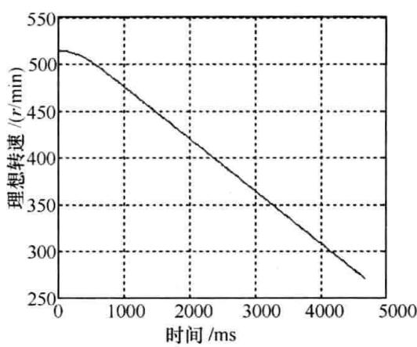

<details>
<summary>line</summary>

| 时间 /ms | 理想转速 /(r/min) |
| --- | --- |
| 0 | ~515 |
| 1000 | ~475 |
| 2000 | ~420 |
| 3000 | ~365 |
| 4000 | ~305 |
| 4500 | ~275 |
</details>

图 3 路试(理论)转速曲线

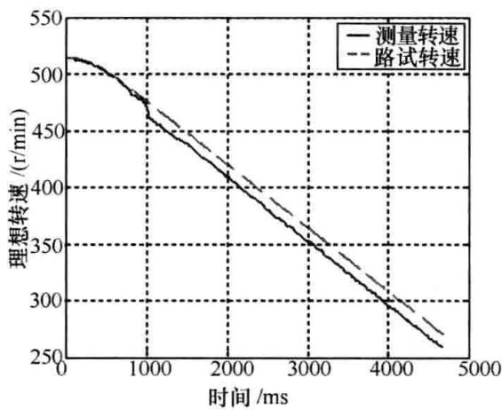

<details>
<summary>line</summary>

| 时间 (ms) | 测量转速 (r/min) | 路试转速 (r/min) |
| --- | --- | --- |
| 0 | ~515 | ~515 |
| 1000 | ~465 | ~475 |
| 2000 | ~405 | ~420 |
| 3000 | ~350 | ~365 |
| 4000 | ~300 | ~310 |
| 4600 | ~260 | ~270 |
</details>

图 4 测量转速与路试转速比较

## 5.4.3 求解实时能量消耗误差

在单个观测周期内能量消耗为

$$
\Delta E _ {i} = M _ {i} \omega_ {i} \Delta t \tag {28}
$$

实时能量消耗的相对误差为

$$
\frac {\Delta E _ {i} ^ {\text {测}} - \Delta E _ {i} ^ {\text {路}}}{\Delta E _ {i} ^ {\text {路}}} \tag {29}
$$

式(29)表示了每一个观测周期内路试与试验台能量消耗的差异,是一个实时变化的量,可以通过这个值了解单个观测周期内的模拟控制情况,实时能量消耗的相对误差曲线(图5)。

## 5.4.4 求解总能量误差

从开始制动到第 $N$ 个观测周期消耗的总能量为

$$
\sum \Delta E _ {i} = \sum_ {i = 1} ^ {N} M _ {i} \omega_ {i} \Delta t \tag {30}
$$

总能量消耗的相对误差为

$$
\sum \left| \Delta E _ {i} ^ {\text {测}} - \Delta E _ {i} ^ {\text {路}} \right| / \sum \Delta E _ {i} ^ {\text {路}} \tag {31}
$$

式(31)表示从开始制动到该观测周期时间段内路试与试验台能量消耗的差异,同样是一个实时变化的量,可以通过这个值了解截至当前观测时间的整个控制模拟情况,总能量消耗的相对误差曲线(图6)。

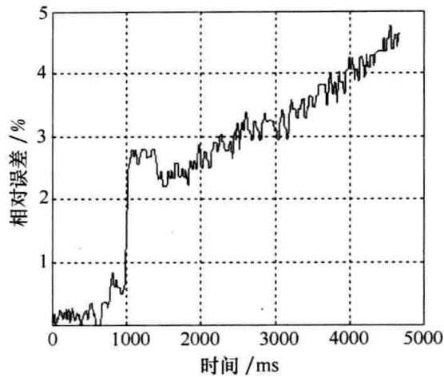

<details>
<summary>line</summary>

| 时间 / ms | 相对误差 / % |
| --- | --- |
| 0 | ~0.2 |
| 1000 | ~2.7 |
| 2000 | ~2.8 |
| 3000 | ~3.2 |
| 4000 | ~4.0 |
| 5000 | ~4.6 |
</details>

图 5 实时能量消耗的相对误差曲线

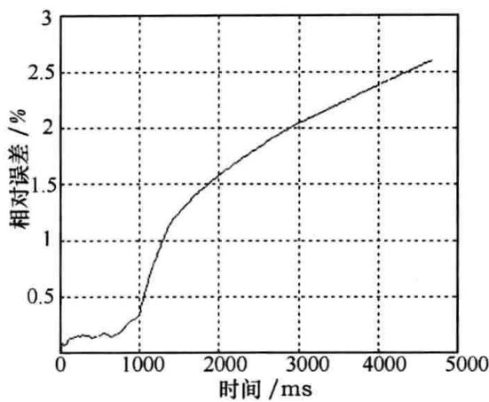

<details>
<summary>line</summary>

| 时间 / ms | 相对误差 / % |
| --- | --- |
| 0 | ~0.1 |
| 1000 | ~0.4 |
| 2000 | ~1.6 |
| 3000 | ~2.0 |
| 4000 | ~2.4 |
| 4500 | ~2.6 |
</details>

图 6 总能量消耗的相对误差曲线

该控制方法在本次模拟试验过程中总能量消耗与理论路试总能量消耗的相对误差为

$$
\varepsilon = \frac {\sum_ {i = 0} ^ {4 6 7} | \Delta E _ {i} ^ {\mathrm{测}} - \Delta E _ {i} ^ {\mathrm{路}} |}{\sum_ {i = 0} ^ {4 6 7} \Delta E _ {i} ^ {\mathrm{路}}} \tag {32}
$$

代入数值求解,得到结果为 $\varepsilon=2.6\%$ 。

## 5.5 问题五

问题五的流程图如图 7 所示。

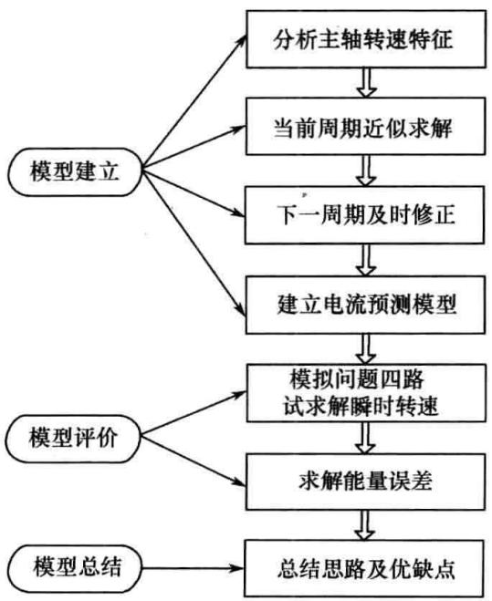

<details>
<summary>flowchart</summary>

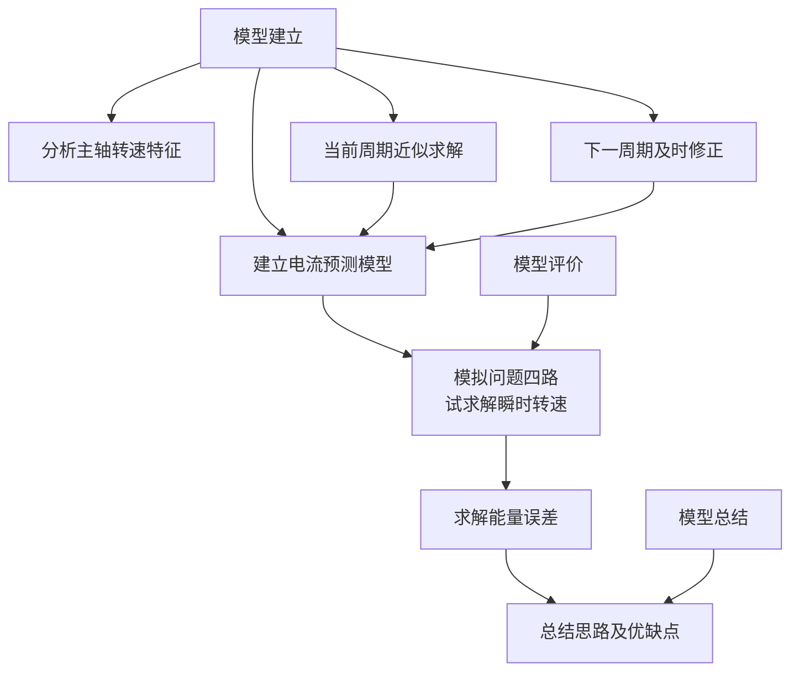
```mermaid
graph TD
  A["模型建立"] --> B["分析主轴转速特征"]
  A --> C["当前周期近似求解"]
  A --> D["下一周期及时修正"]
  A --> E["建立电流预测模型"]
  C --> E
  D --> E
  E --> F["模拟问题四路\n试求解瞬时转速"]
  G["模型评价"] --> F
  F --> H["求解能量误差"]
  H --> I["总结思路及优缺点"]
  J["模型总结"] --> I
```
</details>

图 7 问题五求解流程图

## 5.5.1 模型建立

## 1. 分析主轴转速特征

已知制动扭矩与角速度的关系为

$$
M = J _ {e} \varepsilon = J _ {e} \frac {\mathrm{d} \omega}{\mathrm{d} t} \tag {33}
$$

由于制动器性能的复杂性, 制动扭矩 M 是实时变化的, 设 M 随时间变化的函数为 $M(t)$ , 所以根据式(33)有

$$
\omega (t) = \omega_ {0} - \int_ {\tau = 0} ^ {t} \frac {M (t)}{J _ {e}} \mathrm{d} \tau \tag {34}
$$

又已知转速(单位:r/min)与角速度(单位:rad/s)关系为

$$
n (t) = \frac {6 0 \omega (t)}{2 \pi} \tag {35}
$$

将式(35)代入式(34)可得

$$
n (t) = n _ {0} - \int_ {\tau = 0} ^ {t} \frac {6 0 M (t)}{2 \pi J _ {e}} \mathrm{d} \tau \tag {36}
$$

模拟制动过程开始后,试验台工作时主轴的瞬时转速应该满足此关系。特殊情况下,若制动过程为匀减速运动,则 M 为定值,于是有

角速度 $\omega(t)=\omega_{0}-\frac{M}{J_{e}}t$

转速 $n(t) = n_0 - \frac{60M}{2\pi J_e} t$

因此,可以通过式(36)实时调整电动机驱动电流,从而实现对主轴转速的实时控制,逼近理想曲线,即路试转速曲线。

## 2. 计算机实时控制方法

由式(36)实时调整电动机驱动电流,从而实时调整主轴的转速,逼近理想路试情况下的速度变化曲线。试验台工作时主轴的瞬时转速与瞬时扭矩是可观测的离散量,把整个制动时间离散化为许多小的时间段,比如题目所给的10ms为一段,称之为一个观测周期 $\Delta t$ 。由于离散的时间段很小,所以每一个观测周期内可认为瞬时扭矩M是近似不变的,主轴作匀减速运动。然后根据前面时间段观测到的瞬时转速与瞬时扭矩,设计出本时段驱动电流的值,这个过程逐次进行,直至完成制动,观测流程如图8所示。

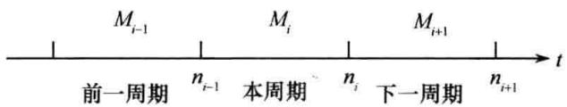

<details>
<summary>text_image</summary>

M_{i-1} M_i M_{i+1}
前一周期 n_{i-1} 本周期 n_i 下一周期 n_{i+1} t
</details>

图8 观测流程

在本观测周期内,由前一周期的观测,观测量 $M_{i-1},n_{i-1}$ 为已知。在理论路试情况下,根据式(36),在该观测周期内有

$$
\overline {{n _ {i}}} = \overline {{n _ {i - 1}}} - \frac {6 0 M _ {i}}{2 \pi J _ {e}} \times \Delta t \tag {37}
$$

累加得到第 $N$ 个观测周期转速为

$$
\overline {{n}} _ {N} = \overline {{n}} _ {0} - \frac {3 0 \Delta t}{\pi J _ {e}} \sum_ {i = 1} ^ {N} M _ {i} \tag {38}
$$

式中： $n_{0}$ 为初始转速。

因为模拟试验时没有办法采集到本时间段的制动扭矩 $M_{i}$ , 只能采集到前一时间段的制动扭矩即 $M_{i-1}$ , 由于 $\Delta t$ 较小, 可用前段时间的制动扭矩 $M_{i-1}$ 近似代替本时间段的制动扭矩 $M_{i}$ , 将 $M_{i-1}$ 赋值给 $M_{i}$ , 即

$$
M _ {i - 1} \Rightarrow M _ {i} \tag {39}
$$

所以模拟处理时,式(37)变为

$$
n _ {i} = n _ {i - 1} - \frac {3 0 M _ {i - 1}}{\pi J _ {e}} \times \Delta t \tag {40}
$$

根据式(34)、式(35)，代入式(40)有

$$
n _ {i} = n _ {i - 1} - \frac {3 0 (M _ {i - 1} - T)}{\pi J _ {m}} \times \Delta t \tag {41}
$$

$n_i$ 为模拟转速， $n_{0i}$ 为理想转速：若 $n_i < n_{0i}$ ，说明 $M_{i-1}$ 过大，即 $M_{i-1} > M_i$ ；若 $n_i > n_{0i}$ ，说明 $M_{i-1}$ 过小，即 $M_{i-1} < M_i$ 。产生的偏差在下一观测周期进行调整（即通过实测转速与路试转速的比较进行调整）。

在下一观测周期内,前一时段观测量 $M_{i}, n_{i}$ 为已知。通过上面的分析可知,将 $M_{i-1}$ 赋值给 $M_{i}$ 会产生偏差,产生的偏差在下一观测周期通过对驱动电流的设置进行修正。在这个观测周期内将 $M_{i}$ 赋值给 $M_{i+1}$ ,所以有

$$
n _ {i + 1} = n _ {i} - \frac {3 0 (M _ {i} - T _ {0})}{\pi J _ {m}} \times \Delta t + \xi \tag {42}
$$

式中： $\xi$ 为上一观测周期产生的误差转速，满足

$$
\xi = n _ {0 i} - n _ {i} \tag {43}
$$

$\overline{T}_{i + 1}$ 为本周期需要补偿机械惯量不足而由驱动电流提供的电扭矩，由于

$$
\frac {M _ {i + 1}}{J _ {e}} = \frac {M _ {i + 1} - \bar {T} _ {i + 1}}{J _ {m}} \tag {44}
$$

则

$$
\overline {{T}} _ {i + 1} = \left(1 - \frac {J _ {m}}{J _ {e}}\right) M _ {i + 1} \tag {45}
$$

将 $M_{i + 1}\approx M_i$ 代入式(45)得

$$
\overline {{T}} _ {i + 1} = \left(1 - \frac {J _ {m}}{J _ {e}}\right) M _ {i} \tag {46}
$$

本周期内驱动电流作用有两个:有一部分用于补偿机械惯量,还有一部分用来补偿这个由上周期产生的误差转速。设误差转速 $\xi$ 需要电扭矩 $T_{i+1}^{\prime}$ 进行修正:

$$
T _ {i + 1} ^ {\prime} = \frac {n _ {i} - n _ {i}}{\Delta t} \times \Delta J \tag {47}
$$

总的电扭矩为

$$
T _ {i + 1} = \overline {{T}} _ {i + 1} + T _ {i + 1} ^ {\prime} = \left(1 - \frac {J _ {m}}{J _ {e}}\right) M _ {i} + \frac {\overline {{n _ {i}}} - n _ {i}}{\Delta t} \times \Delta J \tag {48}
$$

由式(38)式及式(47)得到第 $N$ 个观测周期内电扭矩为

$$
\begin{array}{l} T _ {N} = \left(1 - \frac {J _ {m}}{J _ {e}}\right) M _ {N - 1} + \frac {\bar {n} _ {0} - \frac {3 0 \Delta t}{\pi J _ {e}} \sum_ {i = 1} ^ {n - 1} M _ {i} - n _ {N - 1}}{\Delta t} \times \Delta J \tag {49} \\ = \left(1 - \frac {J _ {m}}{J _ {e}}\right) M _ {N - 1} + \left(\frac {\bar {n _ {0}} - n _ {n - 1}}{\Delta t} - \frac {3 0}{\pi J _ {e}} \sum_ {i = 1} ^ {N - 1} M _ {i}\right) \times \Delta J \\ \end{array}
$$

已知驱动电流与其产生的扭矩成正比,本题中比例系数取为 $1.5 \, A/N \cdot m$ , 所以得到电流控制模型为

$$
I _ {N} = k T _ {N} = k \left(1 - \frac {J _ {m}}{J _ {e}}\right) M _ {N - 1} + k \left(\frac {\bar {n _ {0}} - n _ {n - 1}}{\Delta t} - \frac {3 0}{\pi J _ {e}} \sum_ {i = 1} ^ {N - 1} M _ {i}\right) \times \Delta J \tag {50}
$$

$n_{0}$ 为初始转速, $M_{i}(i=1\sim N-1)$ 及 $n_{N-1}$ 均是前面周期的观测值,所以上式表明了第n个观测周期内电流依赖于前面可观测值(转速及扭矩)的变化关系。

## 5.5.2 模型评价

要对建立的模型进行评价,首先应选定一个路试过程,然后对其进行模拟,最后根据评价体系分析能量误差。基于以下两点原因,选择模拟问题四的路试过程。

(1) 模拟重建制动扭矩数组较为复杂, 且不可能完全符合实际路试制动过程, 而问题四所给的观测扭矩是从实际而来, 可以据此得到理论转速, 便于我们的模拟转速与之比较。

(2)便于与问题四所给控制方法进行对比。

根据 5.5.1 建立的控制模型对问题四路试过程进行模拟,便可求解得到测量转速,并与理论转速曲线对比(图 9)。

实际上两条曲线并未完全重合,由于模拟效果较好,模拟转速接近理论转速,它们的差值很小,不能从图9中反映出来。该控制模型下的驱动电流曲线如图10所示。

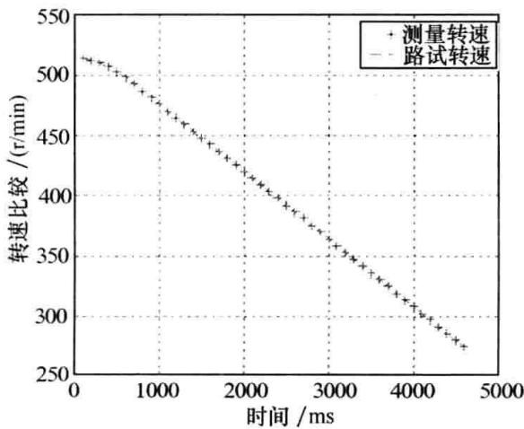

<details>
<summary>line</summary>

| 时间 / ms | 测量转速 (r/min) |
| --- | --- |
| ~100 | ~515 |
| ~200 | ~512 |
| ~300 | ~510 |
| ~400 | ~508 |
| ~500 | ~505 |
| ~600 | ~502 |
| ~700 | ~498 |
| ~800 | ~495 |
| ~900 | ~492 |
| ~1000 | ~488 |
| ~1100 | ~485 |
| ~1200 | ~482 |
| ~1300 | ~478 |
| ~1400 | ~475 |
| ~1500 | ~472 |
| ~1600 | ~468 |
| ~1700 | ~465 |
| ~1800 | ~462 |
| ~1900 | ~458 |
| ~2000 | ~455 |
| ~2100 | ~452 |
| ~2200 | ~448 |
| ~2300 | ~445 |
| ~2400 | ~442 |
| ~2500 | ~438 |
| ~2600 | ~435 |
| ~2700 | ~432 |
| ~2800 | ~428 |
| ~2900 | ~425 |
| ~3000 | ~422 |
| ~3100 | ~418 |
| ~3200 | ~415 |
| ~3300 | ~412 |
| ~3400 | ~408 |
| ~3500 | ~405 |
| ~3600 | ~402 |
| ~3700 | ~398 |
| ~3800 | ~395 |
| ~3900 | ~392 |
| ~4000 | ~388 |
| ~4100 | ~385 |
| ~4200 | ~382 |
| ~4300 | ~378 |
| ~4400 | ~375 |
| ~4500 | ~372 |
| ~4600 | ~368 |
| ~4700 | ~365 |
| ~4800 | ~362 |
| ~4900 | ~358 |
| ~5000 | ~355 |
</details>

图 9 测量转速与路试理论转速对比图

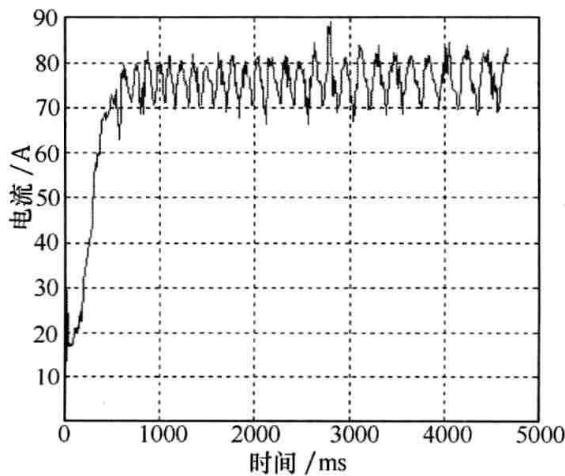

<details>
<summary>line</summary>

| 时间 / ms | 电流 / A |
| --- | --- |
| 0 | ~15 |
| 200 | ~20 |
| 400 | ~60 |
| 600 | ~75 |
| 800 | ~78 |
| 1000 | ~79 |
| 1200 | ~78 |
| 1400 | ~79 |
| 1600 | ~78 |
| 1800 | ~79 |
| 2000 | ~78 |
| 2200 | ~79 |
| 2400 | ~78 |
| 2600 | ~79 |
| 2800 | ~88 |
| 3000 | ~78 |
| 3200 | ~79 |
| 3400 | ~78 |
| 3600 | ~79 |
| 3800 | ~78 |
| 4000 | ~79 |
| 4200 | ~78 |
| 4400 | ~79 |
| 4600 | ~78 |
| 4800 | ~82 |
</details>

图10 驱动电流图

用与问题四同样的评价体系,根据模拟转速与理想转速曲线进行能量相对误差分析,结果如图 11、图 12 所示。

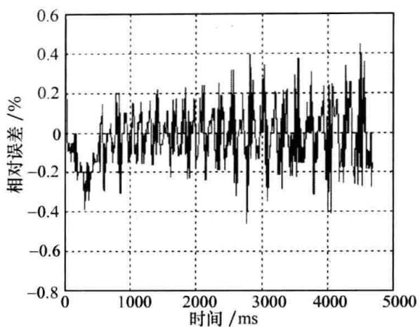

<details>
<summary>line</summary>

| 时间 / ms | 相对误差 / % |
| --- | --- |
| 0 | ~-0.1 |
| 500 | ~-0.2 |
| 1000 | ~0.0 |
| 1500 | ~0.0 |
| 2000 | ~0.0 |
| 2500 | ~0.0 |
| 3000 | ~0.0 |
| 3500 | ~0.0 |
| 4000 | ~0.0 |
| 4500 | ~0.0 |
</details>

图 11 实时能量消耗的相对误差曲线

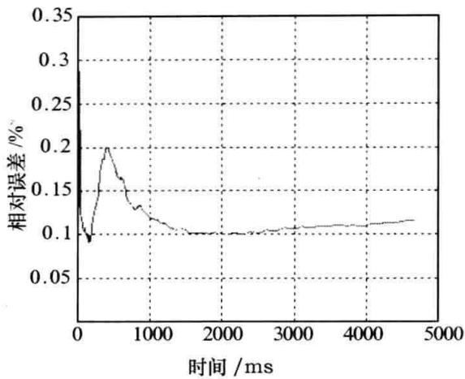

<details>
<summary>line</summary>

| 时间 / ms | 相对误差 / % |
| --- | --- |
| 0 | ~0.28 |
| ~200 | ~0.09 |
| ~400 | ~0.20 |
| ~600 | ~0.16 |
| ~800 | ~0.13 |
| ~1000 | ~0.12 |
| ~1500 | ~0.10 |
| ~2000 | ~0.10 |
| ~3000 | ~0.11 |
| ~4000 | ~0.11 |
| ~4600 | ~0.12 |
</details>

图 12 总能量消耗的相对误差曲线

我们的控制方法在本次模拟试验过程中总能量消耗与理论路试总能量消耗的相对误差 $\varepsilon=0.12\%$ , 与问题四模拟试验过程中总能量消耗与理论路试总能量消耗的相对误差 2.6% 相比, 可看出我们提出的控制方法比问题四的控制方法更优。

## 5.5.3 模型总结

设计思路:我们的目标是做到对路试情况尽可能精确模拟,从速度出发,使得试验的速度变化曲线逼近路试的速度变化曲线。但对每一次模拟试验来讲,观测是滞后的,也无法预知其路试情况的速度变化曲线,也就没有了参照系。因此当前时段可以进行近似处理,在稍后得到本段的观测值(瞬时扭矩和转速)后再对产生的误差进行修正,即“滞后观测,当前近似,实时修正”。所以,我们的处理方法是:在当前时段,由于驱动电流的设置必须根据本时段的瞬时扭矩来确定,但只能观测到前一时刻的瞬时扭矩,而又因为离散化后的时间段很短,本时段的瞬时扭矩与前一时段瞬时扭矩差值不大,所以处理时将本时段的瞬时扭矩用前一时段瞬时扭矩替代,至于产生的误差在后一时间段通过驱动电流值来修正。具体来说就是:观测出前时间段的制动扭矩,由 $\omega(t)=\omega_{0}-\int\frac{M_{m}(t)}{J_{e}}dt$ 就可以计算出前一时段的路试理想速度,将计算的路试理想速度与模拟试验的速度进行对比,在后一阶段增加一个额外的驱动电流来消除这个误差。

## 5.6 问题六

问题五给出的控制方法虽然精确度已经很高,但仍可以进一步改进,改进可以在以下两个方面进行。

## 5.6.1 改进模型一

一方面基于精度进一步提高的角度,问题五在处理时近似认为当前时段的制动扭矩等于前一时刻的制动扭矩,但由于制动器性能的复杂性,制动扭矩是一个随时间的变量,这两个时段的制动扭矩实际上可能存在较大的差异,所以我们的近似会带来试验误差。在本模型中,对近似手段进行改进,从而使精度进一步提高;具体方法是:通过前几个时段制动扭矩的观测值,拟合出它的变化趋势曲线,并由此计算出制动扭矩的当前值,即对式(39)进行修改。

建立当前时段的制动扭矩估计值模型为

$$
M _ {i} = f \left(M _ {1}, M _ {2}, \dots , M _ {i - 1}\right) \tag {51}
$$

将式(51)代入式(37)，得到试验台上的实时转速为

$$
n _ {i} = n _ {i - 1} - \frac {3 0 M _ {i}}{\pi J _ {e}} \times \Delta t = n _ {i - 1} - \frac {3 0 f (M _ {1} , M _ {2} , \cdots , M _ {i - 1})}{\pi J _ {e}} \times \Delta t \tag {52}
$$

将式(52)代入问题五中的驱动电流控制模型式(50)，得到改进驱动电流预测模型：

$$
\begin{array}{l} I _ {n} = k \left(1 - \frac {J _ {m}}{J _ {e}}\right) f (M _ {1}, M _ {2}, \dots , M _ {n - 1}) \tag {53} \\ + k \left[ \frac {n _ {0} - n _ {n - 1}}{\Delta t} - \frac {3 0}{\pi J _ {e}} \sum_ {i = 1} ^ {n} f (M _ {1}, M _ {2}, \dots , M _ {i - 1}) \right] \times \Delta J \\ \end{array}
$$

同样模拟问题四的制动过程,求解得到试验台上的主轴瞬时转速,用与原始模型同样的评价体系对改进模型一进行评价,计算出实时能量消耗相对误差曲线(图13)和总能量消耗相对误差曲线(图14)。

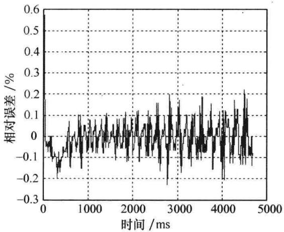

<details>
<summary>line</summary>

| 时间 / ms | 相对误差 / % |
| --- | --- |
| 0 | ~0.6 |
| 100 | ~-0.05 |
| 200 | ~-0.1 |
| 300 | ~-0.15 |
| 400 | ~-0.18 |
| 500 | ~-0.12 |
| 600 | ~-0.08 |
| 700 | ~-0.05 |
| 800 | ~-0.15 |
| 900 | ~-0.05 |
| 1000 | ~-0.02 |
| 1100 | ~-0.08 |
| 1200 | ~-0.05 |
| 1300 | ~-0.02 |
| 1400 | ~-0.05 |
| 1500 | ~-0.02 |
| 1600 | ~-0.05 |
| 1700 | ~-0.02 |
| 1800 | ~-0.05 |
| 1900 | ~-0.02 |
| 2000 | ~-0.05 |
| 2100 | ~-0.02 |
| 2200 | ~-0.05 |
| 2300 | ~-0.02 |
| 2400 | ~-0.05 |
| 2500 | ~-0.02 |
| 2600 | ~-0.15 |
| 2700 | ~-0.22 |
| 2800 | ~-0.15 |
| 2900 | ~-0.18 |
| 3000 | ~-0.15 |
| 3100 | ~-0.18 |
| 3200 | ~-0.15 |
| 3300 | ~-0.18 |
| 3400 | ~-0.15 |
| 3500 | ~-0.18 |
| 3600 | ~-0.15 |
| 3700 | ~-0.18 |
| 3800 | ~-0.15 |
| 3900 | ~-0.18 |
| 4000 | ~-0.22 |
| 4100 | ~-0.15 |
| 4200 | ~-0.18 |
| 4300 | ~-0.15 |
| 4400 | ~-0.18 |
| 4500 | ~-0.15 |
| 4600 | ~-0.18 |
| 4700 | ~-0.15 |
| 4800 | ~-0.18 |
| 4900 | ~-0.15 |
</details>

图 13 改进模型一的实时能量消耗相对误差曲线

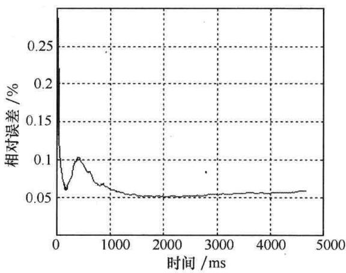

<details>
<summary>line</summary>

| 时间 / ms | 相对误差 / % |
| --- | --- |
| 0 | ~0.28 |
| ~150 | ~0.06 |
| ~400 | ~0.10 |
| ~900 | ~0.07 |
| ~1500 | ~0.05 |
| ~3000 | ~0.055 |
| ~4500 | ~0.06 |
</details>

图14 改进模型一的总能量消耗相对误差曲线

改进的模型一在本次模拟试验过程中总能量消耗与理论路试总能量消耗的相对误差 $\varepsilon=0.06\%$ ，较初始模型降低了1/2，可见改进当前时段的制动扭矩估计值的计算模型，对提高试验效果，减少误差，是至关重要的。

## 5.6.2 改进模型二

在制动器试验台上对所设计的路试进行模拟试验,需要一定的硬件(如数据采集器、计算机)来支持,前面的模型是将制动时间离散化为10ms的时间段,这样小的时间段,进行实时数据采集和计算机实时数据处理,对硬件要求较高,而且数据的采集和处理也需要一定的反应时间,这一反应时间与离散化的时间段越接近,导致误差越大。从这个角度出发,对模型进行改进,将制动时间离散化为50ms时间段,这样做必将导致计算精度的下降,若离散化时间段扩大,而精度下降并不太大,这说明我们的改进是有意义的。

同样模拟问题四路试制动过程,将制动时间离散化为50ms的时间段,求解得到试验台上主轴瞬时转速,用与原始模型同样的评价体系对改进模型二进行评价,计算出实时能量消耗相对误差曲线(图15)和总能量消耗相对误差曲线(图16)。

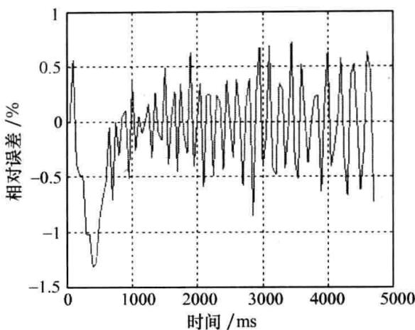

<details>
<summary>line</summary>

| 时间 / ms | 相对误差 / % |
| --- | --- |
| 0 | ~0.5 |
| ~300 | ~-1.3 |
| ~900 | ~0.4 |
| ~1900 | ~0.6 |
| ~2800 | ~-0.8 |
| ~3000 | ~0.7 |
| ~3400 | ~0.7 |
| ~4600 | ~0.6 |
</details>

图 15 改进模型二的实时能量消耗相对误差曲线

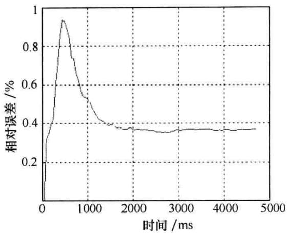

<details>
<summary>line</summary>

| 时间 / ms | 相对误差 / % |
| --- | --- |
| 0 | ~0.15 |
| 250 | ~0.45 |
| 500 | ~0.95 |
| 750 | ~0.75 |
| 1000 | ~0.55 |
| 1500 | ~0.40 |
| 2000 | ~0.38 |
| 2500 | ~0.36 |
| 3000 | ~0.37 |
| 3500 | ~0.37 |
| 4000 | ~0.37 |
| 4500 | ~0.37 |
</details>

图 16 改进模型二的总能量消耗相对误差曲线

改进模型二在本次模拟试验过程中总能量消耗与理论路试总能量消耗相对误差 $\varepsilon = 0.37\%$ , 在测量周期延长了 5 倍的情况下, 测量误差仅提高 3 倍, 说明在精度允许范围内, 适当延长测量周期以降低对硬件的要求, 是可行的。

## 6 模型优缺点

## 6.1 优点

(1)本文针对制动器试验台的模拟与控制,依据六个题目顺序采取逐步递进的方法进行分析,由浅入深,通过能量与转动惯量的转换关系确定补偿惯量,然后依据可观测量建立驱动电流的数学模型,最后依据能量相对误差对模型进行评价及改进。  
(2)依据能量相对误差确立了一套完整的控制方法优劣评价体系。  
(3) 根据“滞后观测, 当前近似, 实时修正”原则建立了驱动电流依据可观测量的数学模型, 此模型可推广性强, 无论是制动器还是其他的模拟装置, 此模型都可以精确地模拟。

## 6.2 缺点

(1) 虽然近似处理产生的误差可以及时得到修正,但是近似方法还可以进一步改进,得到更精确的模拟试验结果。  
(2) 可以综合考虑硬件可实现难度与模拟精度, 确定制动时间离散化的周期, 从而实现更为优化的控制。

## 7 模型推广

制动器的设计不仅仅在车辆设计中的作用至关重要,它还是车辆、爬行机器和许多固定设备安全工作的重要装置 $^{[1]}$ 。随着这些机器工作速度不断提高,对制动器的要求越来越高。因此,迫切需要对制动器进行深入研究。制动器试验台是制动器研究中不可缺少的重要环节,是评价制动器能否满足使用要求的重要试验之一。所以寻找一种模拟性能好、自动化程度高的制动器试验方法是很有意义的。

模糊传感器主要由传统的数值测量单元和数值—符号转换单元组成。其核心部分是数值—符号转换单元 $^{[2]}$ 。在汽车的刹车装置系统、变速控制、车身弹性缓冲系统及巡航控制系统等部件中，已经广泛地使用模糊技术。例如日本三菱公司研制的模糊跟踪系统，能够检测前转向轮的转角和车速，求得汽车的转弯速度，可以根据司机所要求的功率对轮胎承受能力进行控制，还能自调整发动机的功率，从而保证汽车转弯时不会发生偏行。日本三菱公司在轿车的自动变速器上使用模糊技术，大大减少了过去由“电脑”控制自动变速器进行精确计算的许多麻烦，使自动变速更具实时性和时效性。而美国的福特汽车公司应用模糊技术制造出一种新的汽车调节器，不但能够准确地保持汽车速度，还能够在与别的汽车距离过近时自动刹车 $^{[3]}$ 。

因此,可以考虑在制动器试验台上安装模糊传感器,使用它与惯性试验台联合进行主轴瞬时转速与瞬时扭矩的采集和处理工作,这样一方面实现了控制器随观测量状态变化而变化来控制参数,动态性能好;另一方面降低了对硬件的要求,可以缩短测量周期提高采样频率,从而实现优化控制。

## 参考文献

[1] 梁波, 李玉忍. 模拟自整定 PID 在制动器试验台电惯量模拟应用. 电子测量技术, 2008, 31(10): 87-89.  
[2] 程海玉．简述模拟传感器．传感器世界,2005,11(5):17-19.  
[3] 中国汽车电子网．模糊控制在汽车上的应用．http://www.qcdz.cn/Special/31/44020.html. 2009-9-14.

## 附录

## 1. 力矩与转动惯量关系式推导

动能与转动惯量的关系：

$$
E = \frac {1}{2} m v ^ {2} = \frac {1}{2} J \omega^ {2} \tag {1}
$$

力矩与作用力和作用距离的关系：

$$
M = F r \tag {2}
$$

力与加速度的关系：

$$
F = m a \tag {3}
$$

线速度与角速度的关系：

$$
v = \omega r \tag {4}
$$

将式(2)\~式(4)代入式(1)可得

$$
M = \frac {J a}{r} \tag {5}
$$

又已知加速度是速度的变化率,所以有

$$
a = \frac {\mathrm{d} v}{\mathrm{d} t} = \frac {r \mathrm{d} \omega}{\mathrm{d} t} \tag {6}
$$

将式(6)代入式(5)可得

$$
M = J \frac {\mathrm{d} \omega}{\mathrm{d} t} \tag {7}
$$

## 2. 能量与力矩关系式推导

动能与转动惯量的关系：

$$
E = \frac {1}{2} J \omega^ {2} \tag {8}
$$

力矩与转动惯量的关系：

$$
M = J \frac {\mathrm{d} w}{\mathrm{d} t} \tag {9}
$$

所以在微小的时间段 $\Delta t$ 内有

$$
\Delta E = \frac {1}{2} J (\omega_ {t + \Delta t} ^ {2} - \omega_ {t} ^ {2}) = J \omega \Delta \omega \tag {10}
$$

$$
M = J \frac {\Delta \omega}{\Delta t} \tag {11}
$$

将式(11)代入式(10)可得

$$
\Delta E = M \omega \Delta t \tag {12}
$$

因此,对式(12)积分得到能量与力矩关系式:

$$
\Delta E = \int M \omega \mathrm{d} t \tag {13}
$$

## 【论文点评】

郑琴

在制动器试验台上,对汽车制动性能进行模拟测试,是汽车设计制造过程中一个重要的环节,该问题涉及大量的物理知识和专业术语,对参赛者来说是个巨大的挑战。本论文思路清晰、结构严谨、层层深入,从实际问题出发,以制动过程中试验台主轴的瞬时转速与车轮的瞬时转速、制动扭矩以及制动时间保持一致为基本原则,提出了随观测量实时调整电动机驱动电流的计算机辅助控制系统的数学模型,并对试验结果进行误差分析,对模型进行改进,提出一些合理化建议。

参赛者首先从问题所涉及的物理概念入手,经过严谨、详细的数学推导,准确得到各物理量之间的函数关系式,特别是在问题二中,合理利用《高等数学》中的微元法思想,通过积分准确计算出三个飞轮的转动惯量,这是解决问题二的关键;在问题四中,通过分析路试与模拟试验台的相互关系,根据能量消耗相对误差建立了两种合理评价方法:始末能量相对误差评价法和实时能量相对误差评价法,这是评价所建立模型优劣的依据;在问题五中,参赛者通过对实际问题的分析发现制动扭矩是随时间变化的函数,由于观测是滞后的,用前一时间段的制动扭矩近似代替本时间段的制动扭矩,建立的数学模型评价结果虽有改进,但模型并不完善,主要问题在于如何求解制动扭矩的当前值,为此参赛者又提出了改进模型:利用前面时段已知的制动扭矩的观测值,拟合出它的变化趋势方程,由此计算制动扭矩的当前值,这样的改进充分利用了当前所有的已知信息,得到了更接近真值的当前制动扭矩,试验结果明显改善,这正是本文的亮点;另外文中以大量的流程图和曲线图形式来表述参赛者的设计思想和试验结果,此形式简洁直观、易于读者理解。

在飞轮高速旋转时,风和轴承的摩擦力对试验结果的影响,是值得考虑的,参赛者在模型改进和模型评价中均未提及;文中的图9(测量转速与路试理论转速对比图),参赛者已发现两曲线并未完全重合,但从图中难以反映出来,参赛者可将两转速的差值曲线画出来,这样两转速的差异就一目了然了。

## 2010 年 A 题 储油罐的变位识别与罐容表标定

通常加油站都有若干个储存燃油的地下储油罐,并且一般都有与之配套的“油位计量管理系统”,采用流量计和油位计来测量进/出油量与罐内油位高度等数据,通过预先标定的罐容表(即罐内油位高度与储油量的对应关系)进行实时计算,以得到罐内油位高度和储油量的变化情况。

许多储油罐在使用一段时间后,由于地基变形等原因,使罐体的位置会发生纵向倾斜和横向偏转等变化(以下称为变位),从而导致罐容表发生改变。按照有关规定,需要定期对罐容表进行重新标定。图1是一种典型的储油罐尺寸及形状示意图,其主体为圆柱体,两端为球冠体。图2是其罐体纵向倾斜变位的示意图,图3是罐体横向偏转变位的截面示意图。

请你们用数学建模方法研究解决储油罐的变位识别与罐容表标定的问题。

(1)为了掌握罐体变位后对罐容表的影响,利用如图4所示的小椭圆型储油罐(两端平头的椭圆柱体),分别对罐体无变位和倾斜角为 $\alpha = 4.1^{\circ}$ 的纵向变位两种情况做了实验,实验数据如附件1所示。请建立数学模型研究罐体变位后对罐容表的影响,并给出罐体变位后油位高度间隔为1cm的罐容表标定值。

(2)对于图1所示的实际储油罐,试建立罐体变位后标定罐容表的数学模型,即罐内储油量与油位高度及变位参数(纵向倾斜角度 $\alpha$ 和横向偏转角度 $\beta$ )之间的一般关系。请利用罐体变位后在进/出油过程中的实际检测数据(附件2),根据你们所建立的数学模型确定变位参数,并给出罐体变位后油位高度间隔为10cm的罐容表标定值。进一步利用附件2中的实际检测数据来分析检验你们模型的正确性与方法的可靠性。

附件1:小椭圆储油罐的实验数据

附件2: 实际储油罐的检测数据

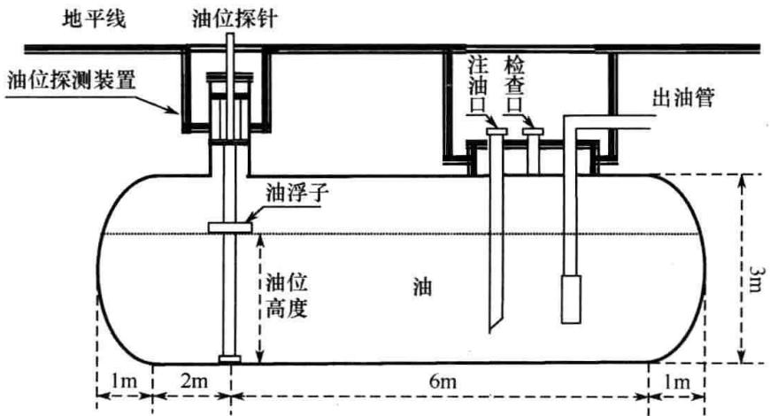

<details>
<summary>text_image</summary>

地平线
油位探针
油位探测装置
注油口
检查口
出油管
油浮子
油位高度
油
1m 2m 6m 1m
3m
</details>

图 1 储油罐正面示意图

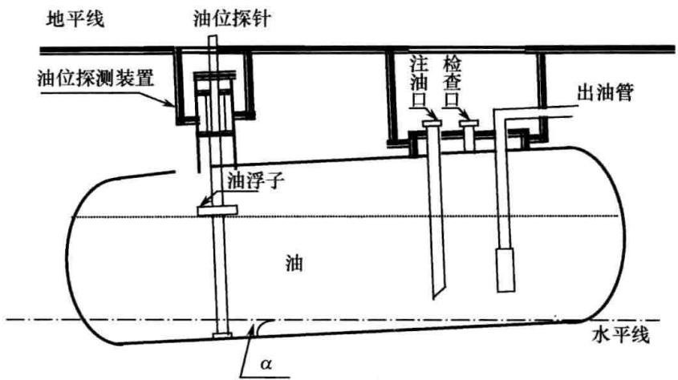

<details>
<summary>text_image</summary>

地平线
油位探针
油位探测装置
注油口
检查口
出油管
油浮子
油
水平线
α
</details>

图 2 储油罐纵向倾斜变位后示意图

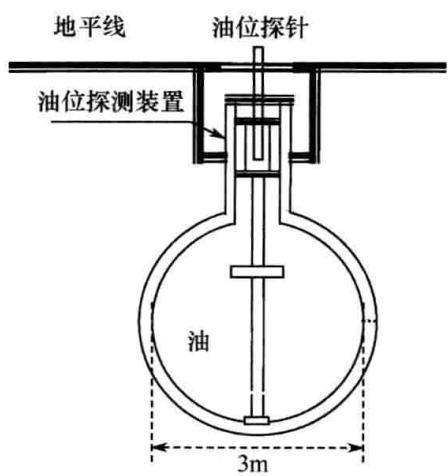

<details>
<summary>text_image</summary>

地平线
油位探针
油位探测装置
油
3m
</details>

(a)

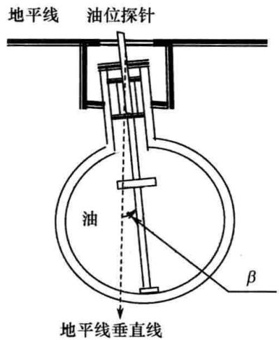

<details>
<summary>text_image</summary>

地平线 油位探针
油
地平线垂直线
β
</details>

(b)  
图 3 储油罐截面示意图  
(a)无偏转倾斜的正截面图；(b)横向偏转倾斜后的正截面图。

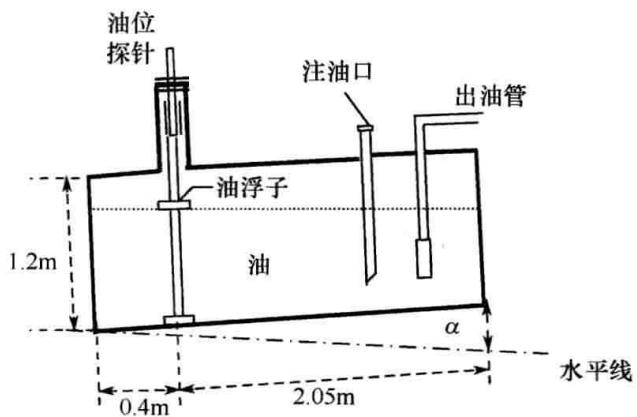

<details>
<summary>text_image</summary>

油位
探针
注油口
出油管
油浮子
1.2m
油
α
水平线
0.4m
2.05m
</details>

(a)


<details>
<summary>text_image</summary>

1.2m
1.78m
</details>

(b)  
图 4 小椭圆型油罐形状及尺寸示意图  
(a) 小椭圆油罐正面示意图；(b) 小椭圆油罐截面示意图。

## 【试题评析】

姚泽清

该问题来源于加油站设备研究与生产企业的一个实际课题,有正、反两大问题。

(1) 正问题: 在已知罐体变位参数的情况下, 检测出油位高度和油量的对应数值, 建模分析罐容表的变化规律, 并给出修正的罐容表。  
(2) 反问题: 根据实际检测数据, 正确识别罐体是如何变位的, 具体变了多少, 同时给出罐容表的修正标定方法和结果。

此题乍一看很容易上手,部分结果是有标准答案的,例如小椭圆型油罐无变位时罐内储油量 V 与罐内油位高度 h 的关系是明确的:

$$
V = \left[ \frac {1}{2} \pi a b + \frac {a}{b} (h - b) \sqrt {2 b h - h ^ {2}} + a b \arcsin \frac {h - b}{b} \right] L
$$

式中： $a, b, L$ 分别为罐体截面椭圆的长半轴、短半轴和罐体长度；但对实际储油罐在产生纵向倾斜角度 $\alpha$ 和横向偏转角度 $\beta$ 后的结果却没有这么幸运，由于 $V = F(\alpha, \beta, h)$ 的解析表达式很复杂，需要采用数值方法、工程方法或几何方法等近似方法来加以实现。现在的问题是，出题者的检测数据完全可以根据某个纵向倾斜角度为 $\alpha$ 、横向偏转角度为 $\beta$ 的储油罐实测而来，换言之，反问题也是有标准答案的，而一旦你所用的方法不当，失之毫厘，便会谬之千里，也许这正是出题者的睿智之处吧。

## 【问题解答要点】

有关小椭圆型实验罐的问题：

(1)要明确给出小椭圆型油罐正常体位的不同油位高度与储油量的计算模型和公式,通过代入几何参数计算得到正常的罐容表对应值。  
(2) 分别考虑罐体两端有油、无油的不同情况, 给出纵向倾斜变位后的修正模型, 将变位参数代入模型, 计算出修正后的罐容表标定值, 并与正常的标定值进行比较, 分析罐体变位的影响。

有关实际大储油罐的问题：

(1) 根据储油罐纵向的变位方向, 对于不同的油位高度, 分别考虑油罐的两端有油和一端有油的情况建模分析, 分析罐内实际储油量 V 与纵向倾斜变位参数 $\alpha$ 、横向偏转变位参数 $\beta$ 和油位高度 h 的关系模型, 注意引入变位参数的方法和表示形式的合理性。  
(2) 必须明确给出变位参数的辨识准则。由附件 2 的检测数据可以知道不同时刻的出油量 $\Delta V_{i}^{*}$ ，同时可以计算出相应油位高度的改变量 $\Delta h_{i}=h_{i}-h_{i+1}$ ，并根据模型表达式 $V=F(\alpha,\beta,h)$ 计算得到实际储油量的改变量 $\Delta V_{i}=F(\alpha,\beta,h_{i})-F(\alpha,\beta,h_{i+1})$ ，问题可归结为求解非线性最小二乘问题：

$$
\min S (\alpha , \beta) = \sum_ {i = 1} ^ {n} \left(\frac {\Delta V _ {i}}{\Delta h _ {i}} - \frac {\Delta V _ {i} ^ {*}}{\Delta h _ {i}}\right) ^ {2} \text {或} \min S (\alpha , \beta) = \sum_ {i = 1} ^ {n} \left(\Delta V _ {i} - \Delta V _ {i} ^ {*}\right) ^ {2}
$$

利用附件2中的部分数据,借助于工具软件或各种数值方法可求得参数估计值 $\hat{\alpha},\hat{\beta}$ ,其具体数值使用不同的方法会有差异,但结果应是纵向倾斜变位角 $\hat{\alpha}$ 略大于 $2^{\circ}$ (参考答案为 $2.11^{\circ}$ ),横向偏转变位角影响不敏感(参考答案为 $4.31^{\circ}$ )。

注意:如果直接使用附件2中的显示储油量 $V_{i}^{\prime}$ 和对应的 $h_{i}$ 做参数估计,即求问题

$$
\min S (\alpha , \beta) = \sum_ {i = 1} ^ {n} (V _ {i} - V _ {i} ^ {\prime}) ^ {2}
$$

的解是不对的, 因为 $V_{i}^{\prime}$ 是无变位时的显示储油量。使用该方法得到的参数估计值 $\hat{\alpha}$ 会很小。

如果经分析说明横向偏转变位的影响不大,也可以直接考虑纵向变位的单参数辨识。

(3) 根据修正模型 $V = F(\alpha, \beta, h)$ 及参数估计值 $\widehat{\alpha}, \widehat{\beta}$ ，可以得到变位后的罐容表，并利用附件 2 剩余部分的实测数据分析检验模型的正确性与方法的可靠性。

# 储油罐的变位识别与罐容表标定设计模型

## 摘要

油位计量管理系统在加油站运营中扮演了重要角色。本文运用等效替代的思想,利用最小二乘法、遗传算法等方法建立了四个模型,讨论了如何储油罐容积值的标定的问题。

问题一中,首先针对无变位情形,充分利用椭圆柱储油罐几何结构相对简单的特点,以微元法求解出柱体油料的体积表达式。在此基础上,对纵向倾斜变位后的椭圆柱体,适当建立坐标系并依据等效思想,将不同倾角下油料不规则体积转化为柱体体积近似求解,最终得到油料体积与倾斜角、油位高度的关系式,并给出倾斜角为4.1°时油罐容积的理论标定表。随后带入题设数值检验理论公式,对其修正后得出相对误差的比较图,修正后平均相对误差比修正前平均相对误差提高近30倍,最终给出修正后罐容积的标定表。

问题二中,首先求解出无变位条件下储油罐体积。沿用等效思想,将不同纵向倾角下油料不规则体积转化为无变位条件下一般体积,求解得到油料体积与油位视数、纵向倾斜角关系。再分析储油罐的横向偏转情形,即可得到油位视数与油位真值、横向偏转角间关系。综合以上分析,最终建立关于油位真值、横向偏转角、纵向倾斜角的油料体积表达式并进行误差分析。以对应时刻理论计算的出油量与实际出油量的偏差的平方和为目标函数,利用遗传算法优化求解出目标函数最小时对应的横向偏转角和纵向倾斜角。将求得值带入公式,得出对应油罐容积标定表。

本文最后对模型的应用推广进行展望。

关键词:储油罐,容积标定,最小二乘法,等效替代,遗传算法

## 1 问题的重述

通常加油站都有若干个储存燃油的地下储油罐，并且一般都有与之配套的“油位计量管理系统”，采用流量计和油位计来测量进/出油量与罐内油位高度等数据，通过预先标定的罐容表（即罐内油位高度与储油量的对应关系）进行实时计算，以得到罐内油位高度和储油量的变化情况。

许多储油罐在使用一段时间后,由于地基变形等原因,使罐体的位置会发生纵向倾斜和横向偏转等变化(以下称为变位),从而导致罐容表发生改变。按照有关规定,需要定期对罐容表进行重新标定。图1是一种典型的储油罐尺寸及形状示意图,其主体为圆柱体,两端为球冠体。图2是其罐体纵向倾斜变位的示意图,图3是罐体横向偏转变位的截面示意图。

请你们用数学建模方法研究解决储油罐的变位识别与罐容表标定的问题。

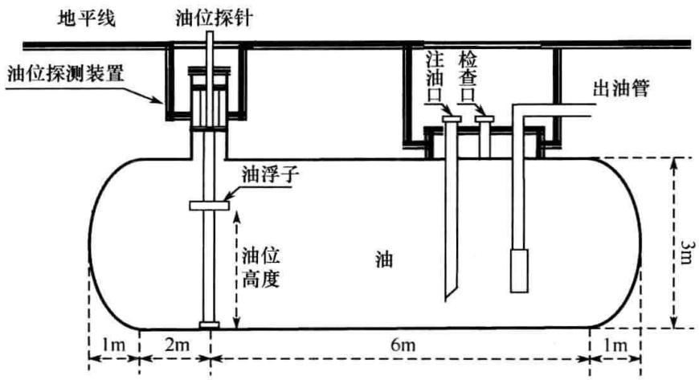

<details>
<summary>text_image</summary>

地平线
油位探针
油位探测装置
注油口
检查口
出油管
油浮子
油位高度
油
1m 2m 6m 1m
3m
</details>

图 1 储油罐正面示意图

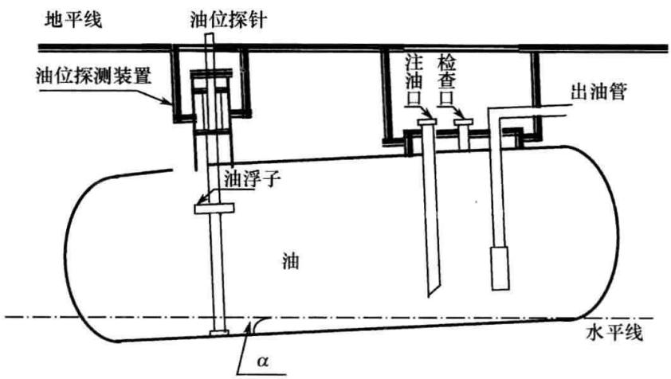

<details>
<summary>text_image</summary>

地平线
油位探针
油位探测装置
注油口
检查口
出油管
油浮子
油
水平线
α
</details>

图 2 储油罐纵向倾斜变位后示意图  
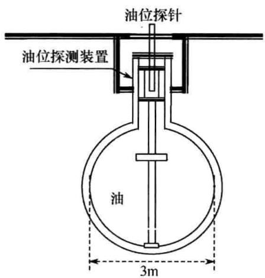

<details>
<summary>text_image</summary>

油位探针
油位探测装置
油
3m
</details>

(a)

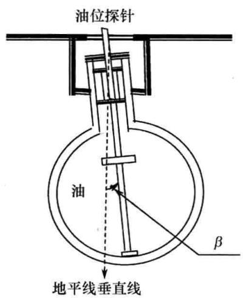

<details>
<summary>text_image</summary>

油位探针
油
地平线垂直线
β
</details>

(b)  
图 3 储油罐截面示意图  
(a)无偏转倾斜的正截面图；(b)横向偏转倾斜后正截面图。

(1)为了掌握罐体变位后对罐容表的影响,利用如图4所示的小椭圆型储油罐(两端平头的椭圆柱体),分别对罐体无变位和倾斜角为 $\alpha = 4.1^{\circ}$ 的纵向变位两种情况做了实验,实验数据如附件1所示。请建立数学模型研究罐体变位后对罐容表的影响,并给出罐体变位后油位高度间隔为1cm的罐容表标定值。

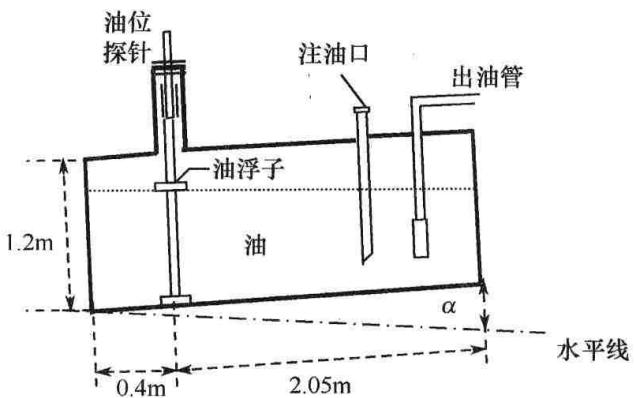

<details>
<summary>text_image</summary>

油位
探针
注油口
出油管
1.2m
油浮子
油
α
水平线
0.4m
2.05m
</details>

(a)

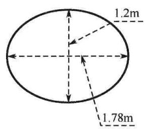

<details>
<summary>text_image</summary>

1.2m
1.78m
</details>

(b)  
图 4 小椭圆型油罐形状及尺寸示意图  
(a)小椭圆油罐正面示意图；(b)小椭圆油罐截面示意图。

(2)对于图1所示的实际储油罐,试建立罐体变位后标定罐容表的数学模型,即罐内储油量与油位高度及变位参数(纵向倾斜角度 $\alpha$ 和横向偏转角度 $\beta$ )之间的一般关系。请利用罐体变位后在进/出油过程中的实际检测数据(附件2),根据你们所建立的数学模型确定变位参数,并给出罐体变位后油位高度间隔为10cm的罐容表标定值。进一步利用附件2中的实际检测数据来分析检验你们模型的正确性与方法的可靠性。

附件1: 小椭圆储油罐的实验数据

附件2: 实际储油罐的检测数据

## 2 问题的分析

问题一从实验角度出发,利用小椭圆型储油罐研究罐体变位后对罐容表的影响。解决此问题的关键在于,充分利用小椭圆型储油罐几何结构相对简单的特点,建立储油罐油量与高度数学关系。模型一可从水平放置的储油罐入手,利用柱体性质求解油量体积与高度关系。模型二作为模型一的推广,求解储油罐斜放斜条件下油量体积与高度关系。在储油罐倾斜放置的条件下,模型二须将液体等效为柱体,并利用模型一结论求解。由于温度、压强、油罐表面光滑度等系统误差的存在,理论推导出的值与实测值有一定差距,可利用数据拟合出误差代数变化并修正模型二的结论。

由题设可知,问题二中罐体既有纵向倾斜又有横向偏移,纵向偏移改变油料形态,横向偏移改变油标示数。由于二者对的油量体积的影响互不干扰,所以对二者可分别进行讨论。借助上一问的思路,可先求解平放条件下油料体积与高度关系,并建立模型一。而后将该模型推广至储油罐纵向倾斜与横向偏移的条件下,建立模型二运用等效替代思想求解油料体积与油面高度、纵向倾斜角度、横向偏转角度关系。求出体积的理论公式后,利用数据拟合出题设纵向倾斜角度、横向偏转角度值,并最终给出题设条件下油位容积标定表。

## 3 符号定义说明

L: 储油罐罐长(m);

α:储油罐纵向倾斜角(°);

β:储油罐横向偏移角(°);

a:储油罐椭圆面长半轴长(m):

b:储油罐椭圆面短半轴长(m);

N:椭圆面上液面到储油罐支点的距离(m);

H:油浮子距储油罐底面高度(m);

$H_{1}$ :储油罐等效液面高度(m);

$H'$ :储油罐横向偏移后油浮子的实际高度(m);

$L_{1}$ :测油杆距倾斜支点O的距离(m);

$V(h)$ :液面高度为 $h$ 时油液的体积( $m^3$ ):

$W_{i}$ : 第 i 次的实测出油量( $m^{3}$ ):

$J(\alpha,\beta)$ :不同( $\alpha,\beta$ )对应的计算体积变化量与实测出油量的累计总偏差( $m^{3}$ )。

## 4 问题的假设

(1)储油罐形状不随其位置、角度的变化而变化。  
(2)油料在充入、抽取、储藏过程中无渗漏。  
(3) 忽略温度、气压对油料体积的影响。  
(4)油料始终呈液态均匀分布在储油罐中,不会出现沉淀。  
(5)忽略进油管、出油管以及油浮子的体积。

## 5 问题一

## 5.1 模型一

## 5.1.1 模型一的分析

当平行地平线放置时,储油罐正向、侧向截面如图5所示。

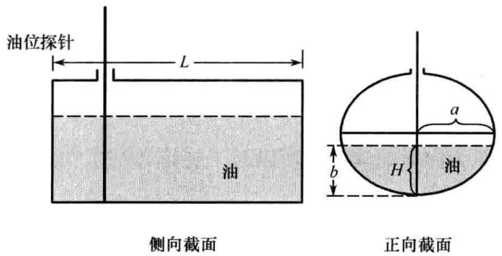

<details>
<summary>text_image</summary>

油位探针
L
油
侧向截面
正向截面
a
b
H
油
</details>

图 5 平放储油罐的油量分析

由图 5 分析可知,油料在储油罐内成柱体,若已知油罐正向截面不规则形状的底面积,则油料体积可由柱体体积公式求解得到。模型一的难点是如何求解储油罐正向截面的底面积,本模型选用微元法建立了液面高度与底面积大小的数学关系。

## 5.1.2 模型一的建立与求解

设底面椭圆方程为

$$
\frac {x ^ {2}}{a ^ {2}} + \frac {y ^ {2}}{b ^ {2}} = 1 \tag {1}
$$

对截面上油料弦长分析,如图6所示

若令 $y' = -(b - h)$ ，则代入式(1)中求解，可得到半弦长 $x'$ 关系式：

$$
\frac {x ^ {\prime 2}}{a ^ {2}} + \frac {(b - h) ^ {2}}{b ^ {2}} = 1
$$

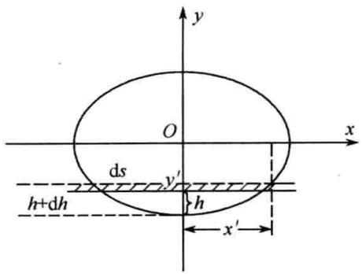

<details>
<summary>text_image</summary>

y
O
x
ds
y'
h
h+dh
x'
</details>

图 6 平放储油罐油面弦长分析

求解得到 $x' = \frac{a}{b}\sqrt{2bh - h^2}$ , 即弦长为 $\frac{2a}{b}\sqrt{2bh - h^2}$ 。由微元法可知, 弦长沿油料深度 $h$ 积分便为截面上油料底面积, 有

$$
\mathrm{d} S = \frac {2 a}{b} \sqrt {2 b h - h ^ {2}} \mathrm{d} h
$$

由此得到底面积的表达式：

$$
S = \int_ {0} ^ {H} \frac {2 a}{b} \sqrt {2 b h - h ^ {2}} \mathrm{d} h = \frac {a}{b} (H - b) \sqrt {2 b H - H ^ {2}} + a b \arcsin \frac {\sqrt {H (2 b - H)}}{b}
$$

所以得到油料体积体积表达式为

$$
V = L \cdot S = \frac {a}{b} L (H - b) \sqrt {2 b H - H ^ {2}} + a b L \arcsin \frac {\sqrt {H (2 b - H)}}{b}
$$

## 5.2 模型二

## 5.2.1 模型二的分析

当储油罐具有一定纵向倾角时,油料在储油罐内形体不再为柱体。所以模型二主要的的求解思路是——将不规则的液体容积转化到规则的柱体体积中求解。从油料正向、侧向截面两个角度分析,可发现随油量的变化应分为四种不同情形讨论,不同情形下油量等效体积不同。

## 5.2.2 模型二的建立

## 1. 情形一

当储油罐内油料有限,且等效底面积少于油罐侧截面1/2时,油料储藏如图7所示。

分析图3可知， $AB$ 为倾斜的液面。所以对于梯形ABOC，可知 $BO = H + L_{1}\tan \alpha ,AC =$ $H - L\tan \alpha$ 。易求得梯形面积：

$$
S _ {A B O C} = \frac {1}{2} (B O + A C) L = \frac {1}{2} (2 H + L _ {1} \tan \alpha - L \tan \alpha)
$$

过 AB 中点作平行于罐底直线 EF。由分析几何关系易知， $S_{\Delta BGE} = S_{\Delta AGF}$ ，所以直线 EF 以上区域的油料可等效至阴影区域，且组成新矩形 EFOC 面积 $S_{EFOC} = H_{1}L$ 。因为梯形与等效矩形面积相等，可得关系式：

$$
H _ {1} L = \frac {1}{2} (2 H + L _ {1} \tan \alpha - L \tan \alpha)
$$

即

$$
H _ {1} = H + (L _ {1} - \frac {L}{2}) \tan \alpha
$$

由上文, 可设 $N = BO = H + L_{1} \tan \alpha$ , 最终可得到等效液面深度表达式:

$$
H _ {1} = N - \frac {L}{2} \tan \alpha
$$

求解得到油量的等效高度,使得不规则油料体积可转化为柱体体积求解,分析图3可知,等效柱体高即为L。为了确定斜放储油罐油量体积,下文分析正向截面油料等效底面积,如图8所示。

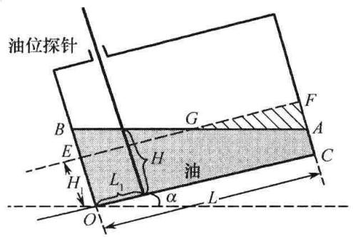

<details>
<summary>text_image</summary>

油位探针
B
G
F
E
H
L₁
α
O
L
C
A
</details>

图 7 消耗有限时斜放储油罐的油量侧向截面分析

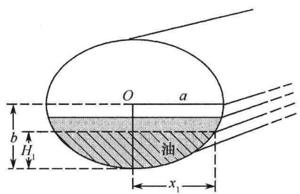

<details>
<summary>text_image</summary>

O
a
b
H₁
油
x₁
</details>

图 8 消耗有限时斜放储油罐的油量正向截面分析

由图 4 分析可知,等效高度对应底面积应为图中阴影区域,该面积乘以高即得到油量体积。正向截面椭圆方程仍可设为

$$
\frac {x ^ {2}}{a ^ {2}} + \frac {y ^ {2}}{b ^ {2}} = 1 \tag {2}
$$

易知 $y = \pm \frac{b}{a}\sqrt{a^2 - x^2}$ 。等效液面高度 $H_{1}$ 处对应坐标为 $y_{1} = -(b - H_{1})$ 。将 $y_{1}$ 带入椭圆方程(2)中，得到等效液面的半弦长为 $x_{1} = \frac{a}{b}\sqrt{H_{1}(2b - H_{1})}$ ，利用微元法沿等效液面的弦积分，得到截面面元为

$$
d S = - \left(b - H _ {1}\right) + \frac {b}{a} \sqrt {a ^ {2} - x ^ {2}} \mathrm{d} x
$$

截面沿整个弦积分,得到面积为

$$
\begin{array}{l} S = 2 \int_ {0} ^ {x _ {1}} H _ {1} - b + \frac {b}{a} \sqrt {a ^ {2} - x ^ {2}} \mathrm{d} x \\ = \frac {a}{b} \sqrt {H _ {1} (2 b - H _ {1})} [ 2 (H _ {1} - b) + | b - H _ {1} | ] + a b \arcsin \frac {\sqrt {H _ {1} (2 b - H _ {1})}}{b} \\ \end{array}
$$

由图3可知此时 $H_{1} \leqslant b$ ，即 $N \leqslant b + \frac{1}{2} L \tan \alpha$ 时，所求体积为

$$
V = S L = \frac {L a}{b} \sqrt {H _ {1} (2 b - H _ {1})} (H _ {1} - b) + L a b \arcsin \frac {\sqrt {H _ {1} (2 b - H _ {1})}}{b} \tag {3}
$$

## 2. 情形二

当储油罐内油料较多,且等效底面积超过油罐侧向截面1/2,小于油罐侧向截面时,油料储藏如图9所示。

由图 5 分析可知, 情形二求解思路与情形一相同, 应首先将油料体积转化到柱体中求解, 即在侧向截面中将梯形 ABOC 转化为矩形 EFOC。下面分析其正向截面, 如图 10 所示。

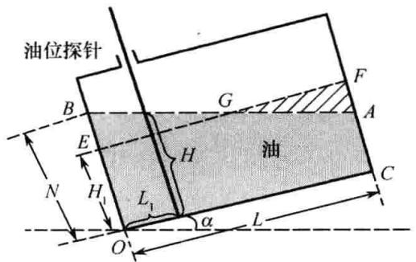

<details>
<summary>text_image</summary>

油位探针
B
G
F
A
E
H
油
L₁
N
H
α
O
L
</details>

图 9 油料较多时的斜放储油罐油量侧向截面分析

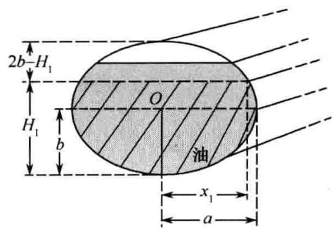

<details>
<summary>text_image</summary>

2b-H₁
H₁
b
O
油
x₁
a
</details>

图 10 消耗较多时斜放储油罐的油量正向截面分析

由图 6 分析可知,阴影部分面积即为油料等效深度对应底面积,其形状不规则难以积分。观察图形可知等效无油部分低面相对简单,所以可先求解油罐总体积和等效变换后无油体积,相减便得到油料体积。

易知油罐总体积为 $V_{总} = \pi abL$ ，油量等效深度 $H'_{1} = 2b - H_{1}$ ，代入式(3)，便得到无油等效部分体积为

$$
V _ {\mathrm{无油}} = \frac {L a}{b} \sqrt {H _ {1} (2 b - H _ {1})} (H _ {1} - b) + L a b \arcsin \frac {\sqrt {H _ {1} (2 b - H _ {1})}}{b}
$$

用油罐总体积减去无油等效部分体积,便得到油料体积:

$$
V = \pi a b L - \left[ \frac {L a}{b} \sqrt {H _ {1} (2 b - H _ {1})} (H _ {1} - b) + L a b \arcsin \frac {\sqrt {H _ {1} (2 b - H _ {1})}}{b} \right.
$$

此时 $H_{1} \geqslant b$ ，即

$$
b + \frac {1}{2} L \tan \alpha \leqslant N \leqslant 2 b
$$

## 3. 情形三

当储油罐内油料充足时,油料储藏如图 11 所示。

此时有 $H \leqslant 2b$ ，且如图可知 $N = OB' \geqslant 2b$ 。分析其图中几何关系，易知

$$
N _ {1} = L _ {2} + L _ {3}
$$

式中： $L_{2} = (L - L_{1})\tan \alpha ,L_{3} = 2b - H$ ，即

$$
N _ {1} = 2 b - H + (L - L _ {1}) \tan \alpha
$$

此时可知等效空心柱体截面宽 $H_{1} = \frac{N_{1}}{2}$ ，等效空心柱体长 $L' = N_{1}\cot \alpha$ ，故所求体积为

$$
V = \pi a b L - \left[ \frac {a L ^ {\prime}}{b} \sqrt {H _ {1} (2 b - H _ {1})} (H _ {1} - b) + L ^ {\prime} a b \arcsin \frac {\sqrt {H _ {1} (2 b - H _ {1})}}{b} \right]
$$

值得注意的是,当油料没过量油孔后,油浮标高度 H 不再变化,H=2b。

## 4. 情形四

当油料匮乏时,油料储藏如图 12 所示。

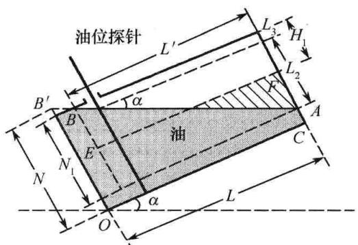

<details>
<summary>text_image</summary>

油位探针
L'
L3
H1
L2
α
B'
B
E
油
A
C
N
O
α
L
</details>

图 11 油料充足时斜放储油罐的油量分析

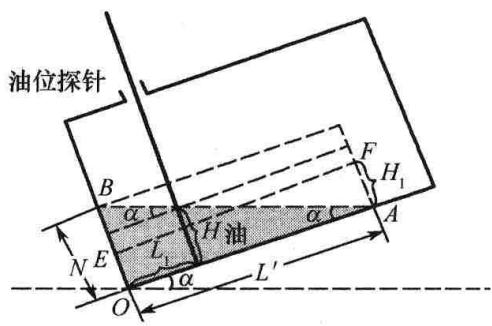

<details>
<summary>text_image</summary>

油位探针
B
α
L
H油
α
F
H₁
A
N E
O
L'
</details>

图 12 油料匮乏时斜放储油罐的油量分析

分析图8可知，为使此时应有 $N \leqslant L \tan \alpha$ 。油量等效高度 $H_{1} = \frac{N}{2}$ ，等效油料柱体长 $L' = N \cot \alpha, N = H + L_{1} \tan \alpha$ ，且此时容积可表示为

$$
V = S L ^ {\prime} = \frac {a L ^ {\prime}}{b} \sqrt {H _ {1} (2 b - H _ {1})} (H _ {1} - b) + L ^ {\prime} a b \arcsin \frac {\sqrt {H _ {1} (2 b - H _ {1})}}{b} \tag {4}
$$

下面求解油浮子显示为零时油罐内油量。令 $H = 0$ ，得到此时等效油量高度为

$$
H _ {1} = \frac {N}{2} = \frac {1}{2} L _ {1} \tan \alpha
$$

将其代入式(4)中求解,得到油量初始体积:

$$
V _ {0} = \frac {a L ^ {\prime}}{b} \sqrt {H _ {1} (2 b - H _ {1})} (H _ {1} - b) + L ^ {\prime} a b \arcsin \frac {\sqrt {H _ {1} (2 b - H _ {1})}}{b} \tag {5}
$$

## 5.2.3 模型二的求解

依据上文分析得到的结论,利用 MATLAB 工具求解出油位高度以间隔 1cm 增长时储油罐油料体积(程序见附录:程序三),得到结果见表 1。

表 1 倾斜角为 ${4.1}^{ \circ  }$ 时油位罐容标定表

<table><tr><td>油位/cm</td><td>标定容积/L</td><td>油位/cm</td><td>标定容积/L</td><td>油位/cm</td><td>标定容积/L</td><td>油位/cm</td><td>标定容积/L</td></tr><tr><td>0</td><td>1.48</td><td>13</td><td>105.02</td><td>26</td><td>453.08</td><td>39</td><td>922.01</td></tr><tr><td>1</td><td>3.13</td><td>14</td><td>122.20</td><td>27</td><td>485.96</td><td>40</td><td>961.17</td></tr><tr><td>2</td><td>5.55</td><td>15</td><td>142.04</td><td>28</td><td>519.46</td><td>41</td><td>1000.67</td></tr><tr><td>3</td><td>8.84</td><td>16</td><td>165.68</td><td>29</td><td>553.55</td><td>42</td><td>1040.51</td></tr><tr><td>4</td><td>13.09</td><td>17</td><td>190.41</td><td>30</td><td>588.21</td><td>43</td><td>1080.66</td></tr><tr><td>5</td><td>18.37</td><td>18</td><td>216.17</td><td>31</td><td>623.41</td><td>44</td><td>1121.11</td></tr><tr><td>6</td><td>24.74</td><td>19</td><td>242.89</td><td>32</td><td>659.14</td><td>45</td><td>1161.85</td></tr><tr><td>7</td><td>32.28</td><td>20</td><td>270.53</td><td>33</td><td>695.36</td><td>46</td><td>1202.86</td></tr><tr><td>8</td><td>41.03</td><td>21</td><td>299.03</td><td>34</td><td>732.05</td><td>47</td><td>1244.12</td></tr><tr><td>9</td><td>51.07</td><td>22</td><td>328.35</td><td>35</td><td>769.20</td><td>48</td><td>1285.62</td></tr><tr><td>10</td><td>62.43</td><td>23</td><td>358.45</td><td>36</td><td>806.80</td><td>49</td><td>1327.37</td></tr><tr><td>11</td><td>75.18</td><td>24</td><td>389.29</td><td>37</td><td>844.81</td><td>50</td><td>1369.30</td></tr><tr><td>12</td><td>89.36</td><td>25</td><td>420.85</td><td>38</td><td>883.22</td><td>51</td><td>1411.45</td></tr><tr><td>52</td><td>1453.78</td><td>70</td><td>2233.14</td><td>88</td><td>2996.04</td><td>106</td><td>3662.68</td></tr><tr><td>53</td><td>1496.29</td><td>71</td><td>2276.62</td><td>89</td><td>3036.44</td><td>107</td><td>3694.80</td></tr><tr><td>54</td><td>1538.95</td><td>72</td><td>2320.04</td><td>90</td><td>3076.54</td><td>108</td><td>3726.23</td></tr><tr><td>55</td><td>1581.77</td><td>73</td><td>2363.39</td><td>91</td><td>3116.32</td><td>109</td><td>3756.95</td></tr><tr><td>56</td><td>1624.71</td><td>74</td><td>2406.65</td><td>92</td><td>3155.77</td><td>110</td><td>3786.92</td></tr><tr><td>57</td><td>1667.78</td><td>75</td><td>2449.81</td><td>93</td><td>3194.86</td><td>111</td><td>3816.10</td></tr><tr><td>58</td><td>1710.96</td><td>76</td><td>2492.86</td><td>94</td><td>3233.59</td><td>112</td><td>3844.45</td></tr><tr><td>59</td><td>1754.24</td><td>77</td><td>2535.78</td><td>95</td><td>3271.93</td><td>113</td><td>3871.93</td></tr><tr><td>60</td><td>1797.60</td><td>78</td><td>2578.57</td><td>96</td><td>3309.87</td><td>114</td><td>3898.49</td></tr><tr><td>61</td><td>1841.03</td><td>79</td><td>2621.21</td><td>97</td><td>3347.38</td><td>115</td><td>3924.08</td></tr><tr><td>62</td><td>1884.52</td><td>80</td><td>2663.69</td><td>98</td><td>3384.46</td><td>116</td><td>3948.63</td></tr><tr><td>63</td><td>1928.06</td><td>81</td><td>2705.99</td><td>99</td><td>3421.08</td><td>117</td><td>3972.08</td></tr><tr><td>64</td><td>1971.63</td><td>82</td><td>2748.10</td><td>100</td><td>3457.21</td><td>118</td><td>3991.03</td></tr><tr><td>65</td><td>2015.23</td><td>83</td><td>2790.01</td><td>101</td><td>3492.85</td><td>119</td><td>4007.94</td></tr><tr><td>66</td><td>2058.84</td><td>84</td><td>2831.70</td><td>102</td><td>3527.96</td><td>120</td><td>4023.34</td></tr><tr><td>67</td><td>2102.44</td><td>85</td><td>2873.17</td><td>103</td><td>3562.52</td><td></td><td></td></tr><tr><td>68</td><td>2146.04</td><td>86</td><td>2914.39</td><td>104</td><td>3596.51</td><td colspan="2" rowspan="2"></td></tr><tr><td>69</td><td>2189.61</td><td>87</td><td>2955.35</td><td>105</td><td>3629.91</td></tr></table>

## 5.2.4 模型二的改进

以油位高度为横轴、油料体积为纵轴,利用模型二的结论与实际油量进行比较。为了提高对比的可信度,此处将出油表数据也整合为进油数据,得到图13。

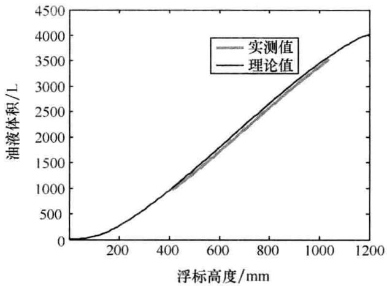

<details>
<summary>line</summary>

| 浮标高度/mm | 实测值 (油液体积/L) | 理论值 (油液体积/L) |
| --- | --- | --- |
| 0 | 0 | 0 |
| 200 | ~300 | ~350 |
| 400 | ~1000 | ~1050 |
| 600 | ~1700 | ~1800 |
| 800 | ~2600 | ~2700 |
| 1000 | ~3400 | ~3500 |
| 1200 | ~4000 | ~4050 |
</details>

图 13 模型二理论值与实测值的比较

由图9可知,模型二推导出的理论数据值总是大于实际测量值,且随着油位增高误差逐渐积累。由此判断,上文误差应属于模型的系统误差。造成模型的误差原因很多,实际使用储油罐时不可能像模型二条件那么理想。储油罐内壁一定不是光滑的、储油罐发生形变、充入与抽取油料时气压、温度不同等原因都会造成系统误差。

利用最小二乘法拟合误差(图像见附录:附图1;求解程序见附录:程序四)与二次多项式相比,三次多项式拟合得到的拟合误差平方和值为0.2570,效果最好。且拟合函数为

$$
\Delta V = 4. 8 5 3 5 \times 1 0 ^ {- 7} h ^ {3} - 1. 4 \times 1 0 ^ {- 3} h ^ {2} + 1. 2 8 5 3 h - 2 7 9. 5 3 6 6
$$

用理论标定值减去拟合误差值后,可得到修正函数。分别做原函数与修正函数实测值的相对误差并作图(见附录:附图2)可看出原函数最大相对误差为5.8%,平均相对误差为3.86%。修正后函数最大相对误差为0.52%,平均相对误差为0.11%。可见进行误差修正后模型理论值与实测值很接近,证明模型修正有效。得到修正后罐容标定表,见表2。

表 2 倾斜角为 ${4.1}^{ \circ  }$ 时油位修正后罐容标定表

<table><tr><td>油位/cm</td><td>标定容积/L</td><td>油位/cm</td><td>标定容积/L</td><td>油位/cm</td><td>标定容积/L</td><td>油位/cm</td><td>标定容积/L</td></tr><tr><td>0</td><td>1.48</td><td>31</td><td>623.41</td><td>61</td><td>1803.366</td><td>91</td><td>3083.077</td></tr><tr><td>1</td><td>3.13</td><td>32</td><td>659.14</td><td>62</td><td>1846.149</td><td>92</td><td>3123.109</td></tr><tr><td>2</td><td>5.55</td><td>33</td><td>695.36</td><td>63</td><td>1889.066</td><td>93</td><td>3162.784</td></tr><tr><td>3</td><td>8.84</td><td>34</td><td>732.05</td><td>64</td><td>1932.102</td><td>94</td><td>3202.082</td></tr><tr><td>4</td><td>13.09</td><td>35</td><td>769.20</td><td>65</td><td>1975.242</td><td>95</td><td>3240.982</td></tr><tr><td>5</td><td>18.37</td><td>36</td><td>806.80</td><td>66</td><td>2018.471</td><td>96</td><td>3279.463</td></tr><tr><td>6</td><td>24.74</td><td>37</td><td>844.81</td><td>67</td><td>2061.774</td><td>97</td><td>3317.502</td></tr><tr><td>7</td><td>32.28</td><td>38</td><td>883.22</td><td>68</td><td>2105.136</td><td>98</td><td>3355.077</td></tr><tr><td>8</td><td>41.03</td><td>39</td><td>922.01</td><td>69</td><td>2148.542</td><td>99</td><td>3392.164</td></tr><tr><td>9</td><td>51.07</td><td>40</td><td>961.17</td><td>70</td><td>2191.977</td><td>100</td><td>3428.739</td></tr><tr><td>10</td><td>62.43</td><td>41</td><td>1000.67</td><td>71</td><td>2235.426</td><td>101</td><td>3464.778</td></tr><tr><td>11</td><td>75.18</td><td>42</td><td>1036.512</td><td>72</td><td>2278.873</td><td>102</td><td>3500.252</td></tr><tr><td>12</td><td>89.36</td><td>43</td><td>1073.779</td><td>73</td><td>2322.304</td><td>103</td><td>3562.52</td></tr><tr><td>13</td><td>105.02</td><td>44</td><td>1111.486</td><td>74</td><td>2365.702</td><td>104</td><td>3596.51</td></tr><tr><td>14</td><td>122.20</td><td>45</td><td>1149.613</td><td>75</td><td>2409.053</td><td>105</td><td>3629.91</td></tr><tr><td>15</td><td>142.04</td><td>46</td><td>1188.144</td><td>76</td><td>2452.34</td><td>106</td><td>3662.68</td></tr><tr><td>16</td><td>165.68</td><td>47</td><td>1227.062</td><td>77</td><td>2495.55</td><td>107</td><td>3694.80</td></tr><tr><td>17</td><td>190.41</td><td>48</td><td>1266.35</td><td>78</td><td>2538.664</td><td>108</td><td>3726.23</td></tr><tr><td>18</td><td>216.17</td><td>49</td><td>1305.991</td><td>79</td><td>2581.669</td><td>109</td><td>3756.95</td></tr><tr><td>19</td><td>242.89</td><td>50</td><td>1345.968</td><td>80</td><td>2624.547</td><td>110</td><td>3786.92</td></tr><tr><td>20</td><td>270.53</td><td>51</td><td>1386.265</td><td>81</td><td>2667.282</td><td>111</td><td>3816.10</td></tr><tr><td>21</td><td>299.03</td><td>52</td><td>1426.867</td><td>82</td><td>2709.859</td><td>112</td><td>3844.45</td></tr><tr><td>22</td><td>328.35</td><td>53</td><td>1467.756</td><td>83</td><td>2752.26</td><td>113</td><td>3871.93</td></tr><tr><td>23</td><td>358.45</td><td>54</td><td>1508.918</td><td>84</td><td>2794.468</td><td>114</td><td>3898.49</td></tr><tr><td>24</td><td>389.29</td><td>55</td><td>1550.336</td><td>85</td><td>2836.468</td><td>115</td><td>3924.08</td></tr><tr><td>25</td><td>420.85</td><td>56</td><td>1591.995</td><td>86</td><td>2878.24</td><td>116</td><td>3948.63</td></tr><tr><td>26</td><td>453.08</td><td>57</td><td>1633.879</td><td>87</td><td>2919.768</td><td>117</td><td>3972.08</td></tr><tr><td>27</td><td>485.96</td><td>58</td><td>1675.974</td><td>88</td><td>2961.035</td><td>118</td><td>3991.03</td></tr><tr><td>28</td><td>519.46</td><td>59</td><td>1718.264</td><td>89</td><td>3002.02</td><td>119</td><td>4007.94</td></tr><tr><td>29</td><td>553.55</td><td>60</td><td>1760.733</td><td>90</td><td>3042.707</td><td>120</td><td>4023.34</td></tr><tr><td>30</td><td>588.21</td><td></td><td></td><td></td><td></td><td></td><td></td></tr></table>

## 6 问题二

## 6.1 模型一

## 6.1.1 模型一的分析

分析题设中储油罐几何结构,如图 14 所示。

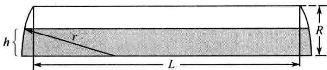

<details>
<summary>text_image</summary>

h
r
L
R
</details>

图 14 实际储油罐几何结构分析

由图 14 可知油罐首尾两端均为球冠,而罐体部分为圆柱体。模型一依据不同的几何结构对储油罐油量进行分类讨论,并求解出无变位条件下油料一般体积(图 14 中阴影区域)的表达式。

## 6.1.2 模型一的建立求解

1. 罐体部分一般油料体积 $V_{1}$ 的计算

由上文讨论可知，罐体部分为圆柱体，如图15所示。

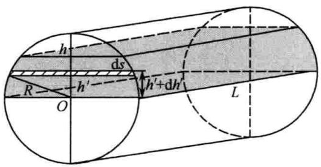

<details>
<summary>text_image</summary>

h
ds
R
h'
h'+dh'
O
L
</details>

图 15 实际储油罐罐体容积分析

分析图 15 易知, $V_{1}=LS_{1}$ , 所以需计算出截面面积 $S_{1}$ 。已知 $dS_{1}=2\sqrt{R^{2}-h^{2}}dh$ , 计算定积分:

$$
S _ {1} = 2 \int_ {0} ^ {h} \sqrt {R ^ {2} - h ^ {2}} \mathrm{d} h = h \sqrt {R ^ {2} - h ^ {2}} - R ^ {2} \arctan \frac {h \sqrt {R ^ {2} - h ^ {2}}}{h ^ {2} - R ^ {2}}
$$

代入体积公式中,得

$$
V _ {1} (h) = L S _ {1} = L h \sqrt {R ^ {2} - h ^ {2}} - L R ^ {2} \arctan \frac {h \sqrt {R ^ {2} - h ^ {2}}}{h ^ {2} - R ^ {2}}
$$

2. 球冠部分一般油料体积 $V_{2}$ 的计算

由于两端球冠对称相同的,本模型取右端球冠为例分析,如图 16 所示。

分析图 16 可知, 欲求解阴影部分体积, 需先计算水平截面的面积 $S_{2}$ , 其在垂直方向上对 h 的积分便为阴影区域体积, 即

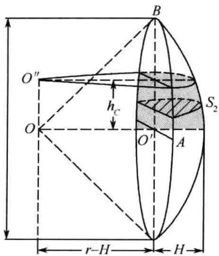

<details>
<summary>text_image</summary>

O''
O
hC
O'
A
S2
r-H
H
B
</details>

图 16 实际储油罐球冠容积分析

$$
V _ {2} = \int_ {0} ^ {h} S _ {2} (h) \mathrm{d} h
$$

分析球冠所在球的竖直截面,如图 17 所示。

分析图 17 可知, 球冠水平截面扇形与圆心 $O'$ 相距 h 时, 其半径为

$$
r _ {h} = \sqrt {r ^ {2} - h ^ {2}}
$$

分析球冠所在球水平截面,如图 18 所示。

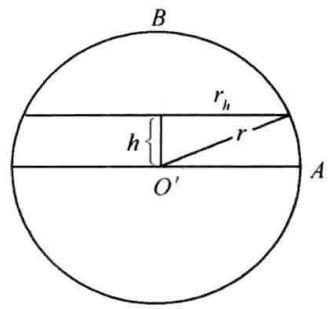

<details>
<summary>text_image</summary>

B
r_h
h
r
O'
A
</details>

图 17 球冠竖直截面示意图

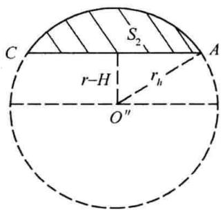

<details>
<summary>text_image</summary>

C
S₂
r-H
rₕ
O″
A
</details>

图 18 球冠水平截面扇形示意图

分析图 18, 可得到水平扇形面积 $S_{2}$ 为

$$
S _ {2} (h) = \int_ {r - H} ^ {r _ {h}} 2 \sqrt {r _ {h} ^ {2} - s ^ {2}} \mathrm{d} s = \int_ {r - H} ^ {\sqrt {r ^ {2} - h ^ {2}}} 2 \sqrt {r ^ {2} - h ^ {2} - s ^ {2}} \mathrm{d} s
$$

计算上述积分,得

$$
S _ {2} (h) = (H - h) \sqrt {2 H r - h ^ {2} - H ^ {2}} + \frac {1}{2} \pi (r ^ {2} - h ^ {2}) + (h ^ {2} - r ^ {2}) \arctan (\frac {r - H}{\sqrt {2 H r - h ^ {2} - H ^ {2}}})
$$

从而求得体积 $V_{2}$ :

$$
\begin{array}{l} V _ {2} (h) = \int_ {0} ^ {h} S _ {2} (h) \mathrm{d} h \\ = \int_ {0} ^ {h} (H - h) \sqrt {2 H r - h ^ {2} - H ^ {2}} + \frac {1}{2} \pi (r ^ {2} - h ^ {2}) + (h ^ {2} - r ^ {2}) \arctan \left(\frac {r - H}{\sqrt {2 H r - h ^ {2} - H ^ {2}}}\right) \mathrm{d} h \\ = \frac {1}{2} \pi h r ^ {2} - \frac {1}{6} \pi h ^ {3} + \frac {2}{3} H h \sqrt {2 H r - h ^ {2} - H ^ {2}} - \frac {2}{3} h r \sqrt {2 H r - h ^ {2} - H ^ {2}} \\ - \frac {1}{3} (H ^ {3} - 3 H ^ {2} r + 2 r ^ {3}) \arctan \left(\frac {h}{\sqrt {2 H r - h ^ {2} - H ^ {2}}}\right) \\ - \frac {1}{3} (h ^ {3} - 3 h r ^ {2}) \arctan \left(\frac {r - H}{\sqrt {2 H r - h ^ {2} - H ^ {2}}}\right) \\ + \frac {2}{3} r ^ {3} \arctan \left(\frac {h (r - H)}{r \sqrt {2 H r - h ^ {2} - H ^ {2}}}\right) \\ \end{array}
$$

## 6.1.3 模型一的求解

由上文分析可知,油料的一般体积部分的体积计算公式为

$$
\overline {{V}} (h) = V _ {1} (h) + 2 V _ {2} (h)
$$

式中:利用勾股定理易得到 $r^{2}-R^{2}=(r-H)^{2},H=1\mathrm{~m},R=1.5\mathrm{~m},r=1.625\mathrm{~m}$ ，根据油面高度不同，如图19、图20所示。

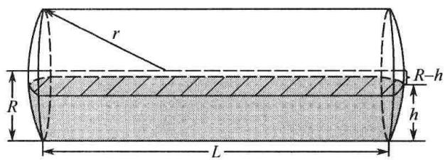

<details>
<summary>text_image</summary>

r
R-h
h
L
</details>

图 19 油料不足时储油罐油量表示

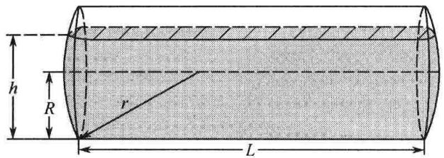

<details>
<summary>text_image</summary>

h
R
r
L
</details>

图 20 油料充足时储油罐油量表示

可利用上文结论导出油料的体积和高度的关系式如下：

$$
V (h) = \left\{ \begin{array}{l l} \frac {V}{2} + \overline {{V}} (h - R), & h > R \\ \frac {V}{2} - \overline {{V}} (R - h), & h \leqslant R \end{array} \right. \tag {6}
$$

式中： $V$ 表示储油罐的体积。根据圆柱体和球冠的体积计算公式得

$$
V = \pi R ^ {2} L + \frac {2}{3} \pi H ^ {2} (3 r - H)
$$

将其带入式(6)中即可算出储油罐油液体积和油面高度的关系式 $V(h)$ 。

## 6.2 模型二

## 6.2.1 模型二的分析

模型一给出了储油罐无变位条件下一般体积的求解方法。与问题一求解决思路类似，可利用等效替代思想将油料不规则形体近似转化为油罐平放时油料体积，求解出纵向倾斜时油量与高度、纵向倾斜角关系。由于罐体横向偏移角度只影响油浮子读数，所以可直接建立二者代数关系。综合以上因素即可建立模型二，得到关于纵向倾斜角、横向偏移角、油位高度的油料体积表达式。

以模型二中函数为依据,利用遗传算法可优化出最接近实测条件下的纵向倾斜角、横向偏移角。二者确定后带入模型二中的公式,即可求解出10cm等间隔油位下的油罐容积标定表。

## 6.2.2 模型二的建立

## 1. 横向偏转的影响分析

由模型分析可知,横向偏转不引起油罐内油的体积分布变化,下面单独考虑 $\beta$ 角引起的油标高度变化。设 $H'$ 为实际浮油标高度,即横向偏转 $\beta$ 角后,油液高度由H变为 $H'$ ,如图21所示。

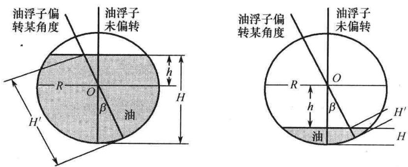  
图 21 储油罐水平偏转时油标读数示意图

由图像分析可知,当油液高度 H > R 时, $H = h + R$ ,则 $H' = h / \cos \beta + R$ ,于是有

$$
H = (H ^ {\prime} - R) \cos \beta + R
$$

当油液高度 $H \leqslant R$ 时, 由图 21 分析可知 H = R - h, $H' = R - h / \cos \beta$ , 得

$$
H = R - (R - H ^ {\prime}) \cos \beta
$$

由以上分析可以看出，H 与 $H'$ 存在一一对应关系。

## 2. 纵向倾斜的影响分析

与问题一模型二类似,以油量多少为依据划分为四种情形求解,即依据 $N = H + L_{1} \tan \alpha$ 的大小进行分类讨论。

情形一: 当储油罐内油料匮乏时, 有 $N \leqslant L \tan \alpha$ 。

此时 $L' = N\cot \alpha$ ，油液等效高度 $H_{1} = \frac{1}{2} N$ 。可得到储油罐中等效小油罐体积 $V = \pi R^{2}L^{\prime} + \frac{2}{3}\pi H_{0}^{2}(3r - H_{0})$ 。利用等效高度在小油罐中求解无倾斜油料体积得

$$
V (H _ {1}) = \frac {1}{2} V - \overline {{V}} (R - H _ {1})
$$

式中： $\bar{V}(R-H_{1})=V_{1}(R-H_{1})+2V_{2}(R-H_{1})$ ，将 $H_{1}$ 、 $L'$ 代入 $V_{1}(h)$ 、 $V_{2}(h)$ 即可求得 $V(H_{1})$ 。

情形二: 当储油罐内油料有限, 等效底面积小于油罐侧向截面 1/2 时, 有 $L\tan\alpha < N \leqslant R + \frac{1}{2}L\tan\alpha$ 。

此时油液等效高度 $H_{1} = N - \frac{1}{2} L\tan \alpha$ ，此时储油罐中等效小油罐体积 $V = \pi R^2 L + \frac{2}{3}$ $\pi H_0^2 (3r - H_0)$ ，利用等效高度在小油罐中求解无倾斜油料体积得

$$
V (H _ {1}) = \frac {1}{2} V - \overline {{V}} (R - H _ {1})
$$

式中： $\bar{V}(R-H_{1})=V_{1}(R-H_{1})+2V_{2}(R-H_{1})$ ，代入上式即可求得 $V(H_{1})$ 。

情形三: 当储油罐内油料较多, 且等效底面积超过油罐侧向截面 1/2、小于油罐侧向截面时, 有 $R + \frac{1}{2} L \tan \alpha < N \leqslant 2R$ 。

此时油液等效高度为 $H_{1} = N - \frac{1}{2} L\tan \alpha$ ，储油罐中等效小油罐体积 $V = \pi R^2 L + \frac{2}{3}\pi H_0^2$ （ $3r - H_0$ ），利用等效高度在小油罐中求解无倾斜油料体积得

$$
V (H _ {1}) = \frac {1}{2} V + \overline {{V}} (H _ {1} - R)
$$

式中： $\overline{V}(H_{1}-R)=V_{1}(H_{1}-R)+2V_{2}(H_{1}-R)$ ，代入上式即可求得 $V(H_{1})$ 。

情形四: 当油料消耗充足, 且等效底面积超过油罐侧向截面, 有 N > 2R, 且 $H \leqslant 2R$ , $N_{1} = 2R - H + (L - L_{1}) \tan \alpha$ 。

此时 $L' = N_{1}\cot \alpha, H_{1} = \frac{1}{2} N_{1}$ 代入情形一 $N \leqslant L\tan \alpha$ 情况下即可求得等效空腔体积 $V'(H_1)$ ，由于圆柱体积为 $V = \pi R^2 L + \frac{2}{3}\pi H_0^2 (3r - H_0)$ ，则油料体积为

$$
V (h) = V - V ^ {\prime} (H _ {1})
$$

## 6.2.3 模型二的求解

经由上文分析可知 $V$ 是关于 $H^{\prime},\alpha ,\beta$ 的函数。为标定容积，应确定题设数据表中 $\alpha ,\beta$ 值。借助模型的理论公式，可利用遗传算法优化求解出符合实测数据的 $\alpha ,\beta$ 值，即最优 $\alpha ,\beta$ 值。

分析易知, 当仿真值与实测指接近时, 应该满足误差最小的条件。设 $h_{i}$ 为实测显示第 i 次出油后的油高, $V(h_{i}, \alpha, \beta)$ 为第 i 次出油后, 油罐中油液理论体积, $W_{i+1}$ 为第 $i+1$ 次实际出油量, 则 $\alpha, \beta$ 值达最优时应有

$$
\min \quad J (\alpha , \beta) = \sum_ {i = 1} ^ {I} \left(V (h _ {i}, \alpha , \beta) - V (h _ {i + 1}, \alpha , \beta) - W _ {i + 1}\right) ^ {2}
$$

$$
\mathrm{s.t.} \quad \alpha \in (a _ {i}), \beta \in (\beta_ {i})
$$

利用 MATLAB 遗传算法 GA 工具箱求得最优 $\alpha, \beta$ 的值, 确定出模型的纵向倾斜参数和横向偏移参数。代入表“实际采集数据表”中 602 组数据, 得到 $\alpha = 2.156^{\circ}, \beta = 6.953^{\circ}$ 时 J 有最小值 632.1305 (图形见附录: 附图 3)。

将最优 $\alpha, \beta$ 值带入公式, 利用 MATLAB 工具计算出该条件下油料容积标定(求解程序见附录: 程序五) 见表 3。

表 3 纵向倾角为 ${2.156}^{ \circ  }$ 、横向偏转角为 ${6.953}^{ \circ  }$ 时罐容标定表

<table><tr><td>·油位高度/cm</td><td>油料体积/L</td><td>油位高度/cm</td><td>油料体积/L</td><td>油位高度/cm</td><td>油料体积/L</td></tr><tr><td>000</td><td>48.90</td><td>110.00</td><td>19220.24</td><td>210.00</td><td>46710.22</td></tr><tr><td>1000</td><td>329.15</td><td>120.00</td><td>21894.29</td><td>220.00</td><td>49268.63</td></tr><tr><td>2000</td><td>954.33</td><td>130.00</td><td>24625.98</td><td>230.00</td><td>51727.55</td></tr><tr><td>3000</td><td>2125.64</td><td>140.00</td><td>27399.61</td><td>240.00</td><td>54068.31</td></tr><tr><td>4000</td><td>3626.82</td><td>150.00</td><td>30199.80</td><td>250.00</td><td>56270.51</td></tr><tr><td>5000</td><td>5369.90</td><td>160.00</td><td>33011.41</td><td>260.00</td><td>58311.27</td></tr><tr><td>6000</td><td>7317.06</td><td>170.00</td><td>35819.39</td><td>270.00</td><td>60163.94</td></tr><tr><td>7000</td><td>9438.84</td><td>180.00</td><td>38608.65</td><td>280.00</td><td>61795.67</td></tr><tr><td>8000</td><td>11710.64</td><td>190.00</td><td>41363.96</td><td>290.00</td><td>63162.01</td></tr><tr><td>9000</td><td>14110.90</td><td>200.00</td><td>44069.81</td><td>300.00</td><td>64060.52</td></tr><tr><td>10000</td><td>16620.11</td><td></td><td></td><td></td><td></td></tr></table>

## 6.2.4 模型二的检验

分析题设给出“实际采集数据表”中的系统显示储油量数据, 可知, 系统显示储油量是指 $\alpha, \beta$ 为零时油罐实际储油量。然后对模型三进行验证, 得到理论值与实测值的对比图, 如图 22 所示。

比较二者误差(见附录:附图4),发现随着高度的改变,理论值与实测值偏差始终在40L的范围内变化,所得值较为可信。

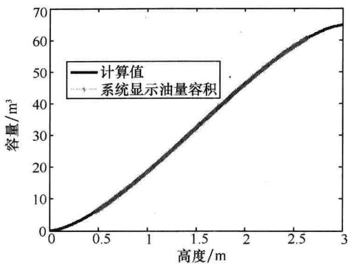

<details>
<summary>line</summary>

| 高度/m | 计算值 \((m^{3})\) | 系统显示油量容积 \((m^{3})\) |
| --- | --- | --- |
| 0 | 0 | 0 |
| 0.5 | ~8 | ~8 |
| 1 | ~20 | ~20 |
| 1.5 | ~35 | ~35 |
| 2 | ~48 | ~48 |
| 2.5 | ~60 | ~60 |
| 3 | ~66 | ~66 |
</details>

图 22 计算值与显示油量容积比较

## 7 模型的推广

本文运用的思想,结合微元法求解出油罐在任意横向偏转角、纵向倾斜角、油位视数时油料的体积。由于灌装运输仍是能源运输业的主要方式,所以本模型在求解化工原料运送的安全性、稳定性设计方面求解有广泛的实际效用。

由于模型推导和求解过程中紧扣等效的思想,这也为求解不规则立体体积提供了崭新的思路。

## 参考文献

[1] 田铁军. 倾斜卧式罐直圆筒部分的容积计算. 现代计量测试, 1999, (5):32-35.  
[2] 郭仕剑, 邱志模, 陆静芳, 等. MATLAB 入门与实战. 北京: 人民邮电出版社, 2008.  
[3] 李志荣. 椭圆柱体卧式油罐容积的计算. 数学的实践与认识, 1977:17-26.

## 附录

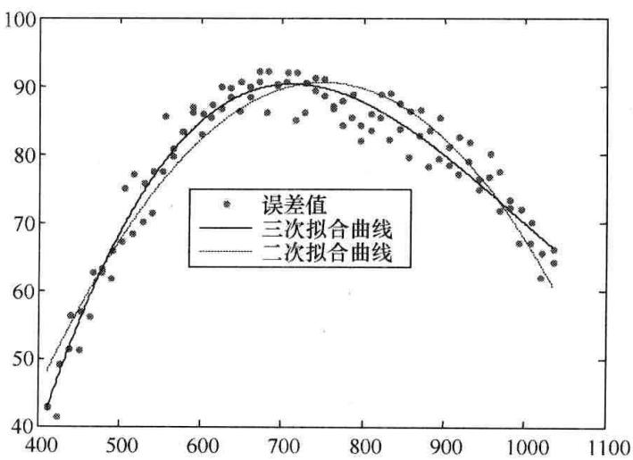

<details>
<summary>scatter</summary>

| Series | X (range) | Y (range) |
| --- | --- | --- |
| 误差值 | 400~1030 | 42~92 |
| 三次拟合曲线 | 400~1030 | 43~91 |
| 二次拟合曲线 | 400~1030 | 48~91 |
</details>

附图 1 绝对误差数据拟合图

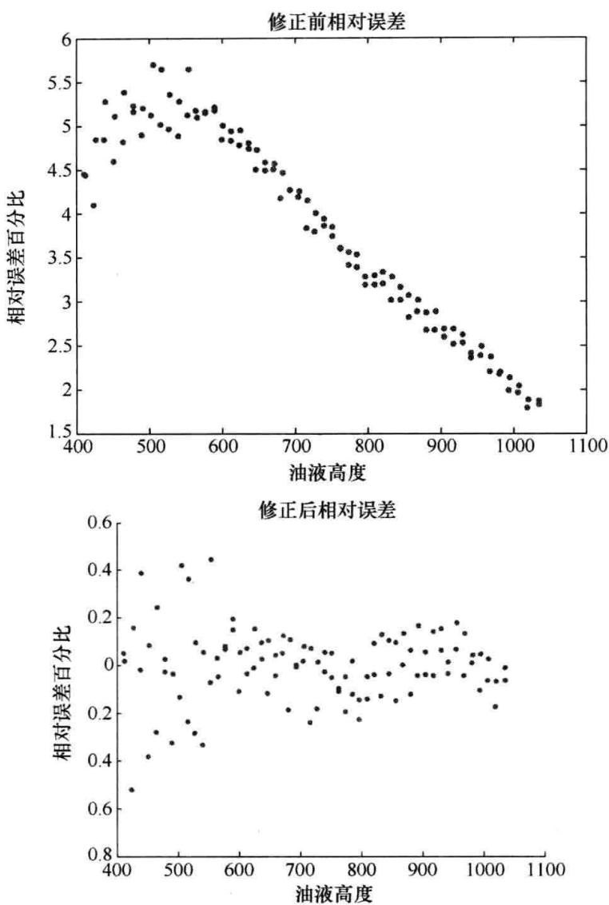  
附图2 问题一修正前函数与修正函数的相对误差

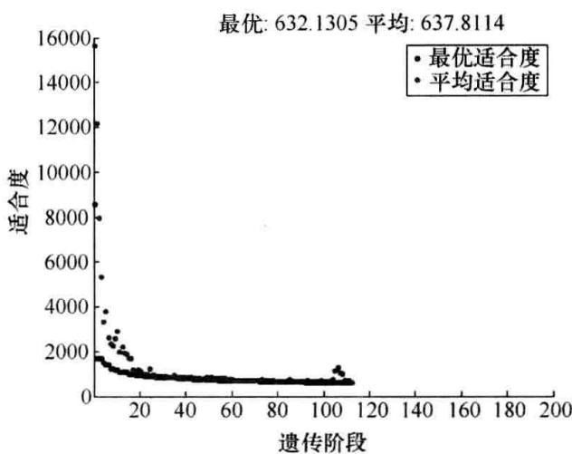

<details>
<summary>scatter</summary>

| 遗传阶段 | 适合度 |
| --- | --- |
| ~2 | ~15800 |
| ~3 | ~12000 |
| ~4 | ~8500 |
| ~5 | ~8000 |
| ~6 | ~5400 |
| ~7 | ~3800 |
| ~8 | ~3400 |
| ~9 | ~2800 |
| ~10 | ~2600 |
| ~11 | ~2400 |
| ~12 | ~2200 |
| ~13 | ~2000 |
| ~14 | ~1800 |
| ~15 | ~1600 |
| ~16 | ~1400 |
| ~17 | ~1200 |
| ~18 | ~1100 |
| ~20 | ~1000 |
| ~25 | ~900 |
| ~30 | ~850 |
| ~40 | ~800 |
| ~50 | ~750 |
| ~60 | ~700 |
| ~70 | ~650 |
| ~80 | ~600 |
| ~90 | ~550 |
| ~100 | ~500 |
| ~105 | ~1200 |
| ~110 | ~600 |
</details>

附图 3 遗传算法的优化实现

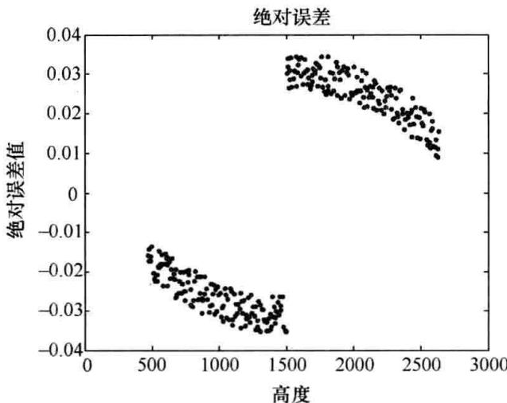

<details>
<summary>scatter</summary>

| 高度 (range) | 绝对误差值 (range) |
| --- | --- |
| 500~1500 | -0.035~-0.015 |
| 1500~2600 | 0.01~0.035 |
</details>

附图 4 问题二原函数与修正函数的相对误差分析

## 【论文点评】

郑琴

储油罐的油位计量管理系统是加油站正常运营的重要一环,该系统的精确性有着重要的实际意义,根据不同几何形状的油罐体,同时考虑罐体的横向和纵向偏转,给出罐容积的标定表对本科学员来说,具有很大的挑战性。本文结构合理、图示清晰,从实际问题出发,建立罐体体积关于油面高度的数学模型,根据理论值与测量值的误差,进行合理的误差分析,并对模型进行改进,给出了更精确的罐容积标定表。

本文首先从问题一出发,建立适当的坐标系,利用《高等数学》中的微元法思想,通过积分得到罐体体积关于油面高度的函数表达式,特别是罐体倾斜时,将液面高度分为四种情形,结合图示,依据等效思想,将不同倾角下油料不规则体积转化为柱体体积近似求解,并将理论值与实测值进行比较,用最小二乘法拟合误差,对模型进行改进,完美地解答了问题一,并为问题二的解决奠定了理论基础。问题二中,在无变位情形下,将油面体积分割为柱体和球冠两部分,在计算球冠体积时,利用简洁明了的示意图、巧妙的等效近似,建立数学模型;当油罐发生变位时,将横向偏转与纵向偏转分开考虑,对于较复杂的纵向偏转,参赛者根据问题一中模型二的方法,将油面高度分为四种情形,分类别利用等效高度求出油面体积关于高度和偏转角的表达式,在回归偏转角时,利用 MATLAB 工具箱中的遗传算法(GA)求得最优偏转角( $\alpha=2.156^{\circ},\beta=6.953^{\circ}$ ),求解结果十分接近参考答案。

文章图示清楚,分析透彻,近似合理,推导过程详细,程序编写规范,计算结果准确,是一篇优秀的数学建模论文。在问题二中,针对模型二的检验,参赛者是在计算出偏转角之后进行的,应该在得到模型后,令偏转角为零或趋向于零,利用给出的实测数据进行检验,模型检验结果可行后再计算偏转角。

# 储油罐的变位识别与罐容表标定

## 摘要

加油站储油罐发生纵向倾斜变位与横向偏转变位后,罐容表的示数将不再准确,需要建立数学模型,对储油罐罐容表进行重新标定,并根据实际检测数据检验模型的合理性及正确性。

在问题一中,需要对纵向倾斜4.1°的椭圆柱储油罐罐容表进行标定。根据微元法的思想建立模型一,将油的体积截成薄片,再沿高度方向积分,计算出体积随高度变化的函数关系,并与未发生纵向倾斜变位时的计算值相比较,得出纵向倾斜变位对罐容表的影响规律,结合实际检测数据作出了合理分析。

模型二是在模型一的基础上,考虑理论计算与实际检测值之间的差异,分析所建模型存在的系统误差。利用所给数据,根据二次多项式拟合,得到系统误差的近似表达式,并对系统误差做出补偿,建立模型,对罐容表进行了重新标定。

问题二需要解决实际情况中两端为球冠的圆柱形储油罐罐容表的标定问题。同理，模型三利用微元法的思想求解储油体积。首先需要解决的问题是对所给数据进行处理，计算出储油时的初始储油量。本文利用中间高度处体积随高度的变化速率最大的原理，求解出拟合的体积变化曲线的最大斜率点，该点处储油量正好为储油罐总体积的1/2，以此为参考，求解出了储油初始值。在求解体积时，对球冠部分做了适当的近似简化，并利用泰勒级数对被积表达式进行近似处理，求解出体积随高度变化的函数关系。将无变位时理论计算与实际测量值之间的差值用曲线拟合，作为模型的系统误差，对模型进行误差补偿，得到修正模型。再根据实测数据确定参数 $\alpha, \beta$ ，带回模型，利用实测数据检验模型的合理性与正确性。最后对对罐容表进行重新标定。

模型三中的函数关系很复杂,不利于指导工程实际。在模型的优化时,可以考虑取不同的 $\alpha,\beta,h$ , 得到体积的三维数组, 再利用较为简单的三元多项式对函数关系进行拟合, 可以得到具有实际指导意义的储油体积与高度的函数关系, 并可以利用实测数据对其进行检验。

综上,本文建立微元积分模型,利用泰勒级数展开,求最大斜率,确定储油初值,利用最小二乘法非线性拟合等数学工具,运用 MATLAB 编程,解决了储油罐变位识别及储油罐变位后的罐容表标定问题。

关键词:储油罐标定,变位,微元法,泰勒级数,最小二乘法,非线性拟合

## 1 问题的重述

加油站通常都有若干个地下储油罐用于储存燃油,并且一般都有与之配套的“油位计量管理系统”,采用流量计和油位计来测量进/出油量与罐内油位高度等数据,通过预先标定的罐容表(即罐内油位高度与储油量的对应关系)进行实时计算,以得到罐内油位高度和储油量的变化情况。

许多储油罐在使用一段时间后,由于地基变形等原因,使罐体的位置会发生纵向倾斜和横向偏转等变化,从而导致罐容表发生改变。按照有关规定,需要定期对罐容表进行重新标定。

(1)为了掌握罐体变位后对罐容表的影响,利用小椭圆型储油罐(两端平头的椭圆柱体),分别对罐体无变位和倾斜角为 $\alpha=4.1^{\circ}$ 的纵向变位两种情况做了实验。请建立数学模型研究罐体变位后对罐容表的影响,并给出罐体变位后油位高度间隔为 1cm 的罐容表标定值。

(2)对于问题中主体为圆柱体,两端为球冠体的典型储油罐,试建立罐体变位后标定罐容表的数学模型,即罐内储油量与油位高度及变位参数(纵向倾斜角度 $\alpha$ 和横向偏转角度 $\beta$ )之间的一般关系。请利用罐体变位后在进/出油过程中的实际检测数据,根据所建立的数学模型确定变位参数,并给出罐体变位后油位高度间隔为10cm的罐容表标定值。进一步利用实际检测数据来分析检验所见模型的正确性与方法的可靠性。

## 2 问题的分析

加油站用地下储油罐来存储油料,但随着地基的变形,储油罐的位置会发生横向偏转变位和纵向倾斜变位,储油罐变位后,需要对罐容表进行重新标定。通过建立理论计算模型,当变位为某一角度时,可以求解出油的容量与高度的函数关系,并对罐容表重新标定。

首先分析实验用的两端平齐的椭圆柱储油罐。根据微元法思想,将油料部分沿水平面截成若干个微元体,计算出微元体的面积,再对高度积分,就可以得到储油罐发生一定的纵向变位后油容积与高度的函数关系。通过绘图和对比数据,找出计算值与实测值之间的差异,分析误差出现的原因,对计算值进行合理的补偿,修正模型。进而对变位后的罐容表进行标定,并给出每间隔1cm对应的罐容表标定值。

实际的储油罐与实验用储油罐之间是存在一定差距的, 实际的储油罐中间部分为圆柱体, 两端为球冠体。同样运用微元法可以计算出储油罐内油的体积与高度的函数关系 (其中包含参数 $\alpha, \beta$ )。在计算球冠部分体积时, 考虑到计算的复杂性, 可以做适当简化后再行计算。最后利用问题所给数据, 进行非线性函数最小二乘法拟合, 确定出参数 $\alpha, \beta$ , 根据确定参数之后的函数关系, 对储油罐罐容表进行重新标定。进一步根据附件2所给实际检测数据, 分析验证所建模型的正确性以及所用标定方法的可靠性。

由于得到的一般表达式很复杂,不利于工程实践。可以考虑通过多元多项式拟合,得到一个较为简单的函数关系,并运用于实际罐容表标定。

## 3 符号约定

a: 椭圆的长半轴(m);

b: 椭圆的短半轴(m);

R: 球冠的球体半径(m);

r: 截面圆半径(m);

θ: 截面圆弓形角度(rad);

$\alpha$ : 纵向倾斜变位角度;

$\beta$ : 横向偏转变位角度;

V: 有变位时理论计算的储油体积(L);

v: 有变位时测量的储油体积(L);

U: 无变位时理论计算的储油体积(L);

u: 无变位时测量的储油体积(L);

A: 椭圆横截面面积( $m^{2}$ );

S: 油的水平截面面积( $m^{2}$ );

$S_{0}$ ：油的水平截面面积在端面上的投影 $(m^{2})$ ;

$S_{1}$ ：球冠部分的水平截面面积 $\left(\mathrm{m}^{2}\right)$ ;

$S_{2}$ ：圆柱部分的横截面面积 $\left(\mathrm{m}^{2}\right)$ ;

h: 油位探针探测到的油位高度(mm);

H: 油位的实际高度(mm);

$H_{1}$ ：较深一段的球冠部分实际油高(mm)；

$H_{2}$ ：较浅一端的球冠部分实际油高(mm)。

## 4 模型的建立与求解

## 4.1 模型一

## 4.1.1 模型一的假设

(1) 忽略温度变化对储油罐内油容积的影响。  
(2) 初步模型忽略储油罐内部附件的体积。  
(3)不考虑油位探针探测范围外的油容积标定。

## 4.1.2 模型一的建立与求解

首先从两端平头的椭圆柱体储油罐无变位情况入手,建立数学模型。以椭圆短轴方向为 y 轴,以椭圆长轴方向为 x 轴,以储油罐纵轴线为 z 轴建立坐标系(图 1)。

椭圆方程为 $\frac{x^{2}}{a^{2}}+\frac{y^{2}}{b^{2}}=1$ （其中a=0.89,b=0.6）。由于储油罐没有发生变位，沿z轴方向各点燃油的横截面面积相同，总体积 $V=A\times L,A$ 为椭圆弓形面积，利用定积分可以求得图1中阴影部分，即椭圆弓形面积为

$$
A = \int_ {- b} ^ {h - b} 2 x \mathrm{d} y
$$

式中： $x = \frac{a}{b}\sqrt{b^2 - y^2}(0\leqslant h\leqslant 2b)$

求得

$$
A = \int_ {- b} ^ {h - b} \frac {2 a}{b} \sqrt {b ^ {2} - y ^ {2}} \mathrm{d} y = \left[ \frac {\pi}{2} + \frac {h - b}{b} \sqrt {1 - (\frac {h - b}{b}) ^ {2}} + \arcsin \frac {h - b}{b} \right] a b (0 \leqslant h \leqslant 2 b)
$$

理论计算与实际测量的体积随高度变化曲线如图 2 所示。

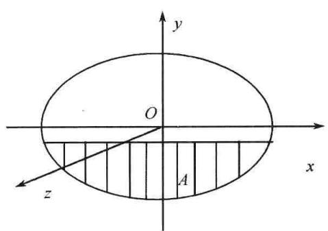

<details>
<summary>text_image</summary>

y
O
x
z
A
</details>

图 1 无变位椭圆油罐横截面示意图

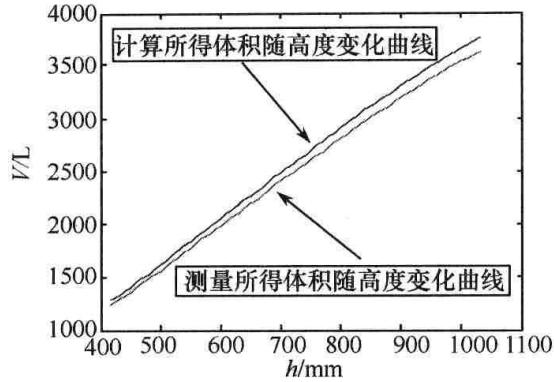

<details>
<summary>line</summary>

| h/mm | 计算所得体积随高度变化曲线 (V/L) | 测量所得体积随高度变化曲线 (V/L) |
| --- | --- | --- |
| 400 | ~1250 | ~1200 |
| 500 | ~1600 | ~1550 |
| 600 | ~2000 | ~1950 |
| 700 | ~2450 | ~2400 |
| 800 | ~2900 | ~2850 |
| 900 | ~3350 | ~3300 |
| 1000 | ~3750 | ~3650 |
</details>

图2 理论计算与实际测量的体积随高度变化曲线

可以看出,计算值与测量值相比,计算值偏大。而且差距随高度的增加逐渐增大。分析其原因为:储油罐内部含有管道、油泵、支架等附件,这些附件占据了一定的体积,而建模和计算却忽略了这部分体积;且附件体积随着高度的增加而累加。故计算值较测量值大,且高度越大,差距越大,这与图2所反映的事实是吻合的。

实际情况下,当储油罐发生纵向变位4.1°时,同样以油罐发生变位后的纵轴线为z轴建立坐标系,求解变位后体积随高度变化的计算值。

以椭圆柱的中心轴为 $z$ 轴建立坐标系如图3所示。

如图 4 所示, 将储油罐分为五个部分: 第一部分为油位探针以下部分, 探针无法探知此部分的油量; 第二部分油面只与左端面接触; 第三部分油面与左右两个端面接触; 第四部分油面只与右端面接触, 且在油位探针能够探知的范围内; 第五部分处于油位探针探测范围外。

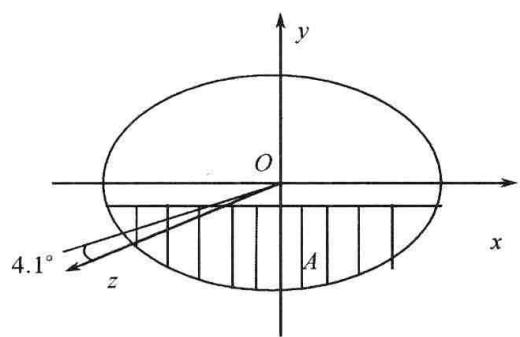

<details>
<summary>text_image</summary>

y
O
x
4.1°
z
A
</details>

图 3 有变位椭圆油罐横截面示意图

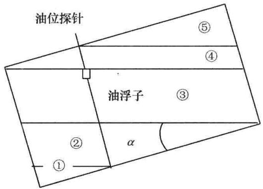

<details>
<summary>text_image</summary>

油位探针
⑤
④
油浮子 ③
② α
①
</details>

图 4 纵向变位时储油罐分层示意图

如图 5 所示, 将油面向储油罐端面投影, 得到椭圆的一部分。因为油面与端面都是平面, 故投影面积等于油面面积乘以倾角 $\alpha$ 的正弦, 即

$$
S _ {0} (y) = S \cdot \sin \alpha
$$

水平截面面积 $S_0(y)Z$ 按照分层求解如下：

$$
S _ {0} (y) = \left\{ \begin{array}{l} A (y), - 0. 4 \tan \alpha <   y \leqslant 0 \\ A (y + 0. 4 \tan \alpha), 0 <   y \leqslant 2. 0 5 \tan \alpha \\ A (y + 0. 4 \tan \alpha) - A (y - 2. 0 5 \tan \alpha), 2. 0 5 \tan \alpha <   y \leqslant 1. 2 - 0. 4 \tan \alpha \\ A (1. 2 - y + 2. 0 5 \tan \alpha), 1. 2 - 0. 4 \tan \alpha <   y \leqslant 1. 2 \end{array} \right.
$$

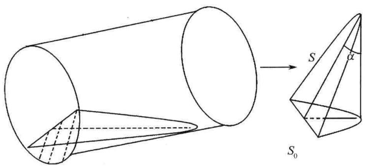

<details>
<summary>text_image</summary>

Diagram illustrating a geometric transformation from a cylinder to a cone, labeled with points S and S₀ and angle α.
</details>

图5 投影示意图

其中

$$
A (y) = \left[ \frac {\pi}{2} + \frac {y - b}{b} \sqrt {1 - \left(\frac {y - b}{b}\right) ^ {2}} + \arcsin \frac {y - b}{b} \right] a b
$$

利用微元法得到储油罐内油的体积：

$$
V (h) = \int_ {- 0. 4 \tan \alpha} ^ {0} \frac {S (y)}{\sin \alpha} \cos \alpha \mathrm{d} y + \int_ {0} ^ {h} \frac {S (y)}{\sin \alpha} \cos \alpha \mathrm{d} y, 0 <   h \leqslant 1. 2
$$

进而得到储油的体积随高度变化的函数关系。

为了分析储油罐变位对罐容表的影响,将罐体变位后某高度对应的储油体积与罐体变位前的储油体积作差,绘制出相应的曲线,分析罐体变位对罐容表的影响。

首先分别根据测量数据、计算数据绘制出变位对罐容表的影响曲线(图6、图7)。

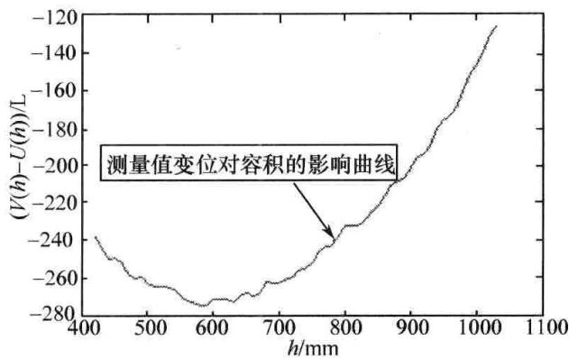

<details>
<summary>line</summary>

| h/mm | (V(h)-U(h))/L |
| --- | --- |
| 400 | ~-238 |
| 500 | ~-262 |
| 600 | ~-275 |
| 700 | ~-262 |
| 800 | ~-235 |
| 900 | ~-205 |
| 1000 | ~-155 |
</details>

图 6 实测数据变位对罐容表的影响

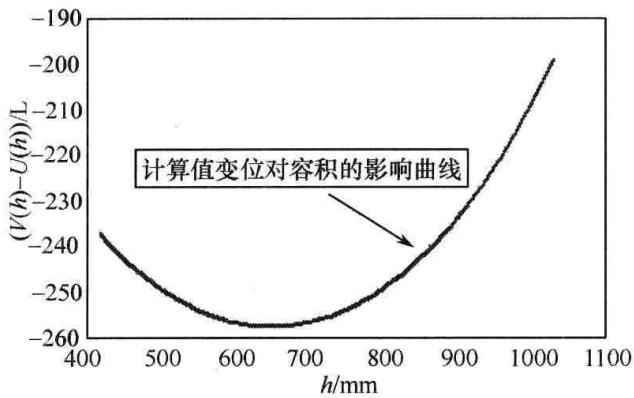

<details>
<summary>line</summary>

| h/mm | (V(h)-U(h))/L |
| --- | --- |
| 400 | ~-238 |
| 500 | ~-252 |
| 600 | ~-257 |
| 700 | ~-257 |
| 800 | ~-250 |
| 900 | ~-235 |
| 1000 | ~-215 |
| 1025 | ~-200 |
</details>

图 7 计算数据变位对罐容表的影响

由图 6 和图 7 可知,无论是实际测量值还是理论计算值,变位对罐容表的误差影响都是先增大、后减小的。这是因为,油罐呈椭圆柱状,中间部分体积较大,在高差相等的条件下,体积基数较大,差值的数量就会偏大。同时,计算值的影响变化走势与实际测量值影响走势基本相同,这也验证了模型的合理性。

但是,模型一中计算值与实验测量值之间存在较大误差,所以需建立新模型对误差进行修正。

## 4.2 模型二

## 4.2.1 模型二的假设

(1) 考虑储油罐内部附件带来的系统误差。  
(2)其他假设同模型一。

## 4.2.2 模型二的建立与求解

由于所建立的模型与实际测得的数据存在差异,会导致由所建模型求得的罐容表标定值存在较大误差。对比实际测得的数据与计算值之间的差异,结合储油罐的实际构造,发现导致计算值与测量值之间存在误差的原因主要有储油罐内部附件占据一定的空间、储油灌可能有一定的变形、罐壁上以及管道内汽油残留等。为了更准确地标定罐容表,现将误差值做补偿,建立新模型重新标定罐容表,并利用实测数据,检验新标定的罐容表。

同理可得,储油灌内油的体积与高度的函数关系为

$$
V (h) = \int_ {- 0. 4 \tan \alpha} ^ {0} \frac {S (y)}{\sin \alpha} \cos \alpha \mathrm{d} y + \int_ {0} ^ {h} \frac {S (y)}{\sin \alpha} \cos \alpha \mathrm{d} y, 0 <   h \leqslant 1. 2
$$

其中

$$
S (y) = \left\{ \begin{array}{l} A (y), - 0. 4 \tan \alpha <   y \leqslant 0 \\ A (y + 0. 4 \tan \alpha), 0 <   y \leqslant 2. 0 5 \tan \alpha \\ A (y + 0. 4 \tan \alpha) - A (y - 2. 0 5 \tan \alpha), 2. 0 5 \tan \alpha <   y \leqslant 1. 2 - 0. 4 \tan \alpha \\ A (1. 2 - y + 2. 0 5 \tan \alpha), 1. 2 - 0. 4 \tan \alpha <   y \leqslant 1. 2 \end{array} . \right.
$$

$$
A (y) = \left[ \frac {\pi}{2} + \frac {y - b}{b} \sqrt {1 - \left(\frac {y - b}{b}\right) ^ {2}} + \arcsin \frac {y - b}{b} \right] a b
$$

分析计算值与实测值之间的差值 $V(h_{i}) - v(h_{i})$ 的变化规律, 运用 MATLAB 作图, 如图 8 所示。

图 8 表明, 差值呈现两头小、中间大的现象, 分析认为, 这一现象的原因是储油罐内还包含了管道、油泵、支架等附件, 建模时未曾考虑这部分附件的体积; 因为中间高度油面积基数较大, 故中间误差偏大。同时可以发现, 测量值与计算值之间的差值存在一定的波动, 这说明测量值也存在一定的随机误差。因为整体趋势基本符合抛物线的变化规律, 现利用二次多项式拟合出差值函数, 来补偿计算值与测量值之间的差距。

运用 MATLAB 二次多项式拟合, 得出差值曲线与原差值对比, 如图 9 所示。

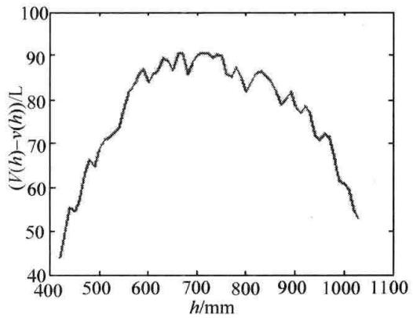

<details>
<summary>line</summary>

| h/mm | (V(h)-v(h))/L |
| --- | --- |
| 420 | ~44 |
| 450 | ~56 |
| 500 | ~68 |
| 550 | ~73 |
| 600 | ~83 |
| 650 | ~89 |
| 700 | ~91 |
| 750 | ~90 |
| 800 | ~85 |
| 850 | ~86 |
| 900 | ~80 |
| 950 | ~72 |
| 1000 | ~61 |
| 1030 | ~53 |
</details>

图8 误差曲线

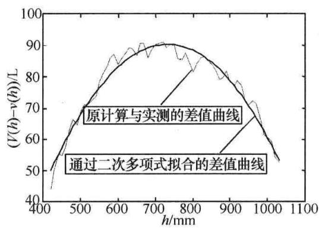

<details>
<summary>line</summary>

| h/mm | (V(h)-v(h))/L (原计算与实测的差值曲线) | (V(h)-v(h))/L (通过二次多项式拟合的差值曲线) |
| --- | --- | --- |
| 400 | ~45 | ~52 |
| 500 | ~68 | ~68 |
| 600 | ~85 | ~83 |
| 700 | ~90 | ~90 |
| 800 | ~85 | ~88 |
| 900 | ~78 | ~78 |
| 1000 | ~65 | ~65 |
| 1100 | — | ~53 |
</details>

图9 二次多项式拟合的误差曲线

可以看出,二次多项式拟合曲线与计算值实测值之差曲线吻合较好,而且可以减少测量的随机误差。

拟合得到二次多项式的表达式为

$$
f (h) = - 0. 0 0 0 4 1 2 5 h ^ {2} + 0. 6 0 3 8 h - 1 3 0. 7 4 3 2
$$

用模型一中储油灌内油的体积与高度的函数关系减去此差值,对原模型进行系统误差补偿,就得到了新的储油灌内油的体积与高度的函数关系,即

$$
V _ {1} (h) = \int_ {- 0. 4 \tan \alpha} ^ {0} \frac {S (y)}{\sin \alpha} \cos \alpha \mathrm{d} y + \int_ {0} ^ {h} \frac {S (y)}{\sin \alpha} \cos \alpha \mathrm{d} y - f (h), 0 <   h \leqslant 1. 2
$$

运用 MATLAB 绘制出模型系统误差补偿后油的体积与油浮子高度的关系曲线以及与测量关系曲线对比,如图 10 所示。

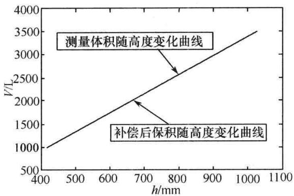

<details>
<summary>line</summary>

| h/mm | V/L |
| --- | --- |
| 400 | 1000 |
| 670 | 2000 |
| 800 | 2500 |
| 1020 | 3500 |
</details>

图10 补偿系统误差后有容积随高度的变化与测量值的比较

从图 10 可以看出,修正后的模型计算值与实际测量值几乎相等,这也就验证了模型的合理性及计算的准确性。得到重新标定的罐容表,见表 1。

表 1 椭圆柱储油罐的罐容表间隔 $1\mathrm{\;{cm}}$ 的标定

<table><tr><td>指示高度/cm</td><td>42</td><td>43</td><td>44</td><td>45</td><td>46</td><td>47</td><td>48</td><td>49</td><td>50</td><td>51</td></tr><tr><td>储油量/L</td><td>995</td><td>1032</td><td>1070</td><td>1108</td><td>1147</td><td>1185</td><td>1225</td><td>1264</td><td>1304</td><td>1344</td></tr><tr><td>指示高度/cm</td><td>52</td><td>53</td><td>54</td><td>55</td><td>560</td><td>57</td><td>58</td><td>59</td><td>60</td><td>61</td></tr><tr><td>储油量/L</td><td>1384</td><td>1425</td><td>1466</td><td>1507</td><td>1548</td><td>1590</td><td>1632</td><td>1673</td><td>1715</td><td>1758</td></tr><tr><td>指示高度/cm</td><td>62</td><td>63</td><td>64</td><td>65</td><td>66</td><td>67</td><td>68</td><td>69</td><td>70</td><td>71</td></tr><tr><td>储油量/L</td><td>1800</td><td>1843</td><td>1885</td><td>1928</td><td>1971</td><td>2014</td><td>2057</td><td>2100</td><td>2143</td><td>2186</td></tr><tr><td>指示高度/cm</td><td>72</td><td>73</td><td>74</td><td>75</td><td>76</td><td>77</td><td>78</td><td>79</td><td>80</td><td>81</td></tr><tr><td>储油量/L</td><td>2229</td><td>2272</td><td>2315</td><td>2358</td><td>2401</td><td>2444</td><td>2487</td><td>2530</td><td>2573</td><td>2616</td></tr><tr><td>指示高度/cm</td><td>82</td><td>83</td><td>84</td><td>85</td><td>86</td><td>87</td><td>88</td><td>89</td><td>90</td><td>91</td></tr><tr><td>储油量/L</td><td>2659</td><td>2701</td><td>2743</td><td>2786</td><td>2828</td><td>2870</td><td>2911</td><td>2953</td><td>2994</td><td>3035</td></tr><tr><td>指示高度/cm</td><td>92</td><td>93</td><td>94</td><td>95</td><td>96</td><td>97</td><td>98</td><td>99</td><td>100</td><td>101</td></tr><tr><td>储油量/L</td><td>3076</td><td>3116</td><td>3156</td><td>3196</td><td>3236</td><td>3275</td><td>3314</td><td>3352</td><td>3390</td><td>3428</td></tr></table>

## 4.3 模型三

## 4.3.1 模型三的假设

模型三的假设同模型二。

## 4.3.2 模型三的建立与求解

分析实际的储油罐,中间部分为圆柱体,两端为球冠体,同时发生纵向倾斜变位 $\alpha$ 和横向偏转变位 $\beta$ , 示意图如图 11 所示。

油罐的纵向倾斜变位与模型一中的处理方法相似,而储油罐的横向偏转变位不会影响储油罐的储油数量,仅使油位探针的油浮子高度发生变化,即罐容表的示数会发生变化。先以 $\alpha,\beta$ 为变位参数,建立罐容表标定的计算模型,通过题目所给的数据,确定变位参数,并对储油罐的罐容表重新进行标定。

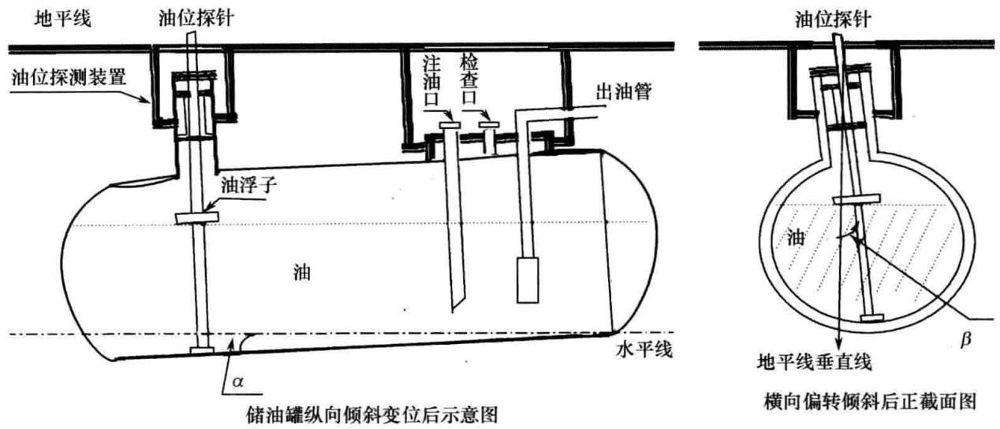  
图 11 储油罐纵向倾斜变位与横向偏转变位示意图

## 4.3.3 储油罐油容积初值确定

当储油罐内油的体积正好占储油罐体积的1/2时,无论储油罐如何变位,储油罐中部油面高度将不会发生变化。油面高度正好占总高度1/2时,油面面积最大,此时体积随高度的变化速率最大。据于此,可以得出从储油罐向外排油时,体积随高度变化率最大的点即为油量占总体积的1/2时的高度。

在求解体积变化率最大的高度时,为了有效地减小测量误差,采用三次多项式拟合,设三次多项式表达形式为 $V = ch^{3} + dh^{2} + eh + f$ , 利用拟合得到的三次多项式函数来求解体积变化率最大的点。根据所给数据, 拟合得到图 12 所示曲线。

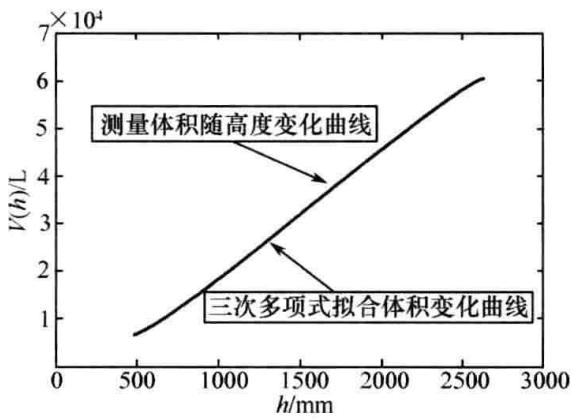

<details>
<summary>line</summary>

| h/mm | V(h)/L \(( \times 10^{4})\) |
| --- | --- |
| 500 | ~0.7 |
| 1000 | ~2.0 |
| 1500 | ~3.3 |
| 2000 | ~4.6 |
| 2500 | ~5.9 |
</details>

图 12 三次多项式拟合的体积变化曲线

计算出相应的多项式系数：

$$
\begin{array}{l} c = - 2. 7 1 0 2 9 5 1 3 5 \times 1 0 ^ {- 6} \\ d = 1. 2 8 0 3 5 8 2 4 0 4 0 5 2 \times 1 0 ^ {- 2} \\ e = 8. 0 3 6 1 3 7 7 8 7 7 4 4 7 4 \\ f = 3 5. 7 6 2 1 4 4 6 9 4 4 9 1 6 4 \\ \end{array}
$$

体积变化率最大即导数最大,体积对高度求导为

$$
\frac {\mathrm{d} V}{\mathrm{d} h} = - 8. 1 3 0 8 8 5 4 0 5 \times 1 0 ^ {- 6} h ^ {2} + 2. 5 6 0 7 1 6 4 8 0 4 1 0 4 \times 1 0 ^ {- 2} h + 8. 0 3 6 1 3 7 7 8 7 7 4 4 7 4
$$

导数最大值为

$$
\frac {\mathrm{d} V}{\mathrm{d} h} \bigg | _ {\max} = - \frac {1}{2} \times \frac {2 . 5 6 0 7 1 6 4 8 0 4 1 0 4 \times 1 0 ^ {- 2}}{- 8 . 1 3 0 8 8 5 4 0 5 \times 1 0 ^ {- 6}} = 1 5 7 4. 7 \mathrm{mm}
$$

高度为 1574.7mm 时,体积变化率最大,此时油的实际体积占储油罐总容积的 1/2。显示油高为 1500mm 时的油容量示数为储油罐体积的 1/2,通过插值得到此时容量为 32332.2L。以此处油容积为标准,反算开始出油时油量初值为 58914.5L,进而得到转化后的测量数据。

## 4.3.4 储油罐内油的体积计算

在分析储油罐油量的计算值时,将储油罐分为球冠与圆柱体两部分考虑,而球冠部分占总体积的比例较小,储油罐发生变位是比较小的,故忽略储油罐的变位对球冠部分的影响。球冠部分示意图如图13所示。

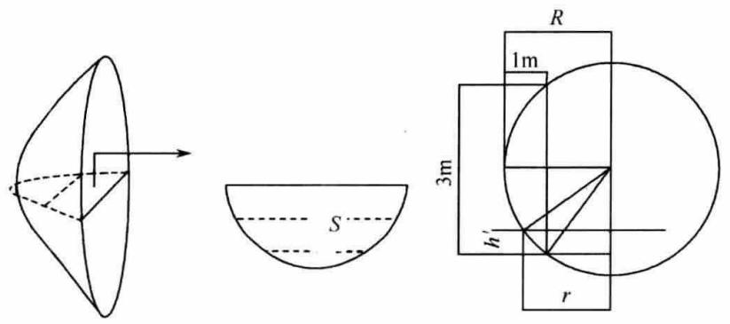

<details>
<summary>text_image</summary>

Diagram illustrating geometric relationships between a cone, a semicircle, and a circle with labeled dimensions and angles.
</details>

图 13 球冠部分体积及尺寸示意图

根据勾股定理及三角函数关系有

$$
(R - 1) ^ {2} + 1. 5 ^ {2} = R ^ {2}
$$

$$
r ^ {2} + (1. 5 - h ^ {\prime}) ^ {2} = R ^ {2}
$$

$$
\cos \frac {\theta}{2} = \frac {R - 1}{r}
$$

球冠部分油的水平横截面面积为

$$
S _ {1} = \frac {r ^ {2} \theta}{2} - (R - 1) \sqrt {r ^ {2} - (R - 1) ^ {2}}
$$

带入数据解得

$$
\left\{ \begin{array}{l} S _ {1} = \frac {r ^ {2} \theta}{2} - 0. 6 2 5 \sqrt {r ^ {2} - 0 . 6 2 5 ^ {2}} \\ r = \sqrt {1 . 6 2 5 ^ {2} - (1 . 5 - h) ^ {2}}, \theta = 2 \arccos \frac {0 . 6 2 5}{r} \end{array} \right.
$$

球冠部分的体积即为 $S_{2}$ 对高度积分。由于被积分式中含有反三角函数，积分结果会很复杂。运用泰勒级数将反三角函数展开，忽略高次项，再对转化后的被积函数求积分，得到体积与高度的关系式。做变量代换，令 $y=\frac{\theta}{2}, x=\frac{r}{0.625}$ ，则

$$
y = \arccos x, y ^ {\prime} = - (1 - x ^ {2}) ^ {- \frac {1}{2}}
$$

因为 $|x| < 1$ ，所以可以利用泰勒级数对 $y'$ 展开到四次项，即

$$
y ^ {\prime} \approx - (1 + \frac {1}{2} x ^ {2} + \frac {3}{8} x ^ {4})
$$

再对其求积分得

$$
y \approx \int_ {0} ^ {x} y ^ {\prime} \mathrm{d} x = - \left(x + \frac {1}{6} x ^ {3} + \frac {3}{4 0} x ^ {5}\right) + \frac {\pi}{2}
$$

带回原变量得

$$
\arccos \frac {0 . 6 2 5}{r} \approx \frac {\pi}{2} - \left[ \frac {0 . 6 2 5}{r} + \frac {1}{6} \left(\frac {0 . 6 2 5}{r}\right) ^ {3} + \frac {3}{4 0} \left(\frac {0 . 6 2 5}{r}\right) ^ {5} \right]
$$

原面积表达式转化为

$$
\left\{ \begin{array}{l} S _ {1} = \frac {r ^ {2} \theta}{2} - 0. 6 2 5 \sqrt {r ^ {2} - 0 . 6 2 5 ^ {2}} \\ \frac {\theta}{2} = \frac {\pi}{2} - \left[ \frac {0 . 6 2 5}{r} + \frac {1}{6} \left(\frac {0 . 6 2 5}{r}\right) ^ {3} + \frac {3}{4 0} \left(\frac {0 . 6 2 5}{r}\right) ^ {5} \right] \\ r = \sqrt {1 . 6 2 5 ^ {2} - (1 . 5 - h) ^ {2}}, \left| \frac {0 . 6 2 5}{r} \right| <   1 \end{array} \right.
$$

储油罐两端的球冠体积为

$$
V _ {1} = \int_ {0} ^ {H _ {1}} S _ {1} \mathrm{d} y + \int_ {0} ^ {H _ {2}} S _ {1} \mathrm{d} y (H _ {1} = h + 2 \tan \alpha , H _ {2} = h - 6 \tan \alpha)
$$

中间部分为倾斜的圆柱体,计算方法可以以横截面截出小微元,再沿轴线积分,得到圆柱体部分的体积。圆柱体储油罐的横截面为圆面,油面以下部分为圆面的一部分。圆的一部分面积计算方法如下:

$$
\left\{ \begin{array}{l} S _ {2} = \left[ \frac {\pi}{2} + \frac {H - r}{r} \sqrt {1 - \frac {H - r}{r}} + \arcsin \frac {H - r}{r} \right] r ^ {2} \\ H = h - (x - 2) \tan \alpha \end{array} \right.
$$

体积为横截面积沿轴向积分：

$$
V _ {2} = \int_ {0} ^ {8} S _ {2} \mathrm{d} z
$$

总体积为

$$
V = V _ {1} + V _ {2}
$$

## 4.3.5 误差补偿

根据第一个问题的求解结果可以发现,计算值与实际测量值之间是存在一定系统误差的。为了消除此系统误差,考虑储油罐无变位的情况下理论计算的体积 $V(h)$ 随高度变化与测量的体积 $v(h)$ 随高度变化的差异,分析差值 $\phi(h)=V(h)-v(h)$ ,拟合出系统误差的表达式,再从计算值中除去这部分系统误差,从而得到较为准确的理论计算模型。

通过 MATLAB 线性拟合得到:

$$
\phi (h) = 0. 0 0 4 4 4 5 6 h + 1 3. 3 9 6
$$

根据假设,角度变化时系统误差是不变的。从变位后的体积函数表达式中去除此线

性函数,系统误差得到补偿。

模型修正后的体积是关于参数 $\alpha, \beta$ 以及自变量 $h$ 的非线性函数。根据新得到的实际油量与对应高度的数据，利用最小二乘法进行非线性拟合，运用 MATLAB 编程求解，得到参数 $\alpha, \beta$ 为

$$
\alpha = 2. 1 ^ {\circ}, \beta = 4. 6 ^ {\circ}
$$

计算程序见附录四。

通过不同的初始油容积验算,发现不同的初始值对角度的影响很大,反映出初始油容积的重要性。而本文求解初始油容积的方法巧妙合理,可以体现出拟合所得参数的正确性。

带入参数 $\alpha, \beta$ ，得到储油罐内油体积随高度变化的函数关系，见附录五。

以 10cm 为间隔, 对罐容表重新标定, 见表 2。

表 2 模型三对实际储油罐罐容表的标定

<table><tr><td>油位高度/mm</td><td>500</td><td>600</td><td>700</td><td>800</td><td>900</td><td>1000</td></tr><tr><td>储油量/L</td><td>5411.3</td><td>7347.2</td><td>9461.3</td><td>11728.1</td><td>14125.4</td><td>16633.4</td></tr><tr><td>油位高度/mm</td><td>1100</td><td>1200</td><td>1300</td><td>1400</td><td>1500</td><td>1600</td></tr><tr><td>储油量/L</td><td>19233.5</td><td>21908.5</td><td>24641.9</td><td>27417.7</td><td>30220.4</td><td>33034.5</td></tr><tr><td>油位高度/mm</td><td>1700</td><td>1800</td><td>1900</td><td>2000</td><td>2100</td><td>2200</td></tr><tr><td>储油量/L</td><td>35844.8</td><td>38636.0</td><td>41392.6</td><td>44098.9</td><td>46738.6</td><td>49295.0</td></tr><tr><td>油位高度/mm</td><td>2300</td><td>2400</td><td>2500</td><td>2600</td><td></td><td></td></tr><tr><td>储油量/L</td><td>51750.1</td><td>54084.8</td><td>56278.4</td><td>58307.0</td><td></td><td></td></tr></table>

## 4.3.6 模型的检验

绘制出通过模型的计算得到的体积随高度变化的曲线与实际测量的体积随高度的变化曲线对比,如图 14 所示。

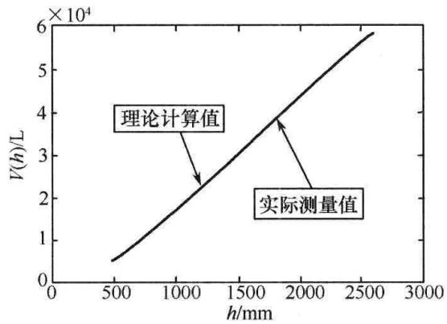

<details>
<summary>line</summary>

| h/mm | 理论计算值 \(( \times 10^{4})\) | 实际测量值 \(( \times 10^{4})\) |
| --- | --- | --- |
| 500 | ~0.5 | ~0.5 |
| 1000 | ~2.0 | ~2.0 |
| 1500 | ~3.5 | ~3.5 |
| 2000 | ~4.8 | ~4.8 |
| 2500 | ~6.0 | ~6.0 |
</details>

图 14 计算与测量的体积随高度变化曲线对比图

观察图 14 发现, 模型三的计算值得到的体积随高度变化的曲线几乎与实际测量得到的体积随高度变化曲线相重合, 可以说明模型的合理性和方法的正确性。

通过数据分析,进一步说明模型的合理性与方法的正确性。求解 $V(h)-v(h)$ 值得到, $\overline{V(h)-v(h)}=2.6L,\left|V(h)-v(h)\right|_{\max}<10L$ , 相对于总体积 58914.5L, 几乎可以忽略, 可以证明模型的正确性。

## 5 模型的优缺点

## 5.1 模型一的优点

(1)巧妙运用微元法求体积,逻辑关系清晰。  
(2) 合理忽略次要因素, 得到较为简单的模型。

## 5.2 模型一的缺点

计算值与实验测量值之间的差距较大。

## 5.3 模型二的优点

将计算值与测量值作差来分析误差,根据误差的走势,运用二次多项式回归得到误差的函数关系,再对原模型进行误差补偿,得到较为准确的理论计算值。

## 5.4 模型二的缺点

计算的储油罐为实验用的特殊罐体，与实际的储油罐存在差异。

## 5.5 模型三的优点

(1) 在对复杂被积函数积分时, 首先对被积表达式作泰勒级数展开, 将复杂的积分运算简单化。  
(2) 在计算储油罐初始油量时, 巧妙运用油体积占总体积 1/2 时体积随高度变化率最大的性质, 对变化趋势做三次多项式拟合, 求解出斜率最大的点, 得到油的体积占储油罐总容积 1/2 时的高度, 以此为依据, 反算储油罐的初始油容积。  
(3) 运用无变位时计算值与实际测量值之间的差异, 回归出模型系统误差的函数关系, 对原模型进行系统误差补偿, 最后得到误差很小的计算模型。

## 5.6 模型三的缺点

求解出的储油罐内油的体积与高度的函数关系非常复杂,不便于工程运用。

## 6 模型的优化

进一步分析模型的计算结果,积分求解出的表达式 $V = F(\alpha, \beta, h)$ 的具体形式过于复杂,不便于工程运用。可以对原函数表达式作数学处理,将函数的具体形式简化。

根据不同的 $(\alpha_{i},\beta_{j},h_{k})$ 由积分求解出的表达式 $V=F(\alpha,\beta,h)$ ，经过编程计算，得到相应的

$$
V = F (\alpha_ {i}, \beta_ {j}, h _ {k})
$$

从而可以得到一个体积的三维数组,再利用三元二次多项式

$$
V (\alpha , \beta , h) = k _ {1} \alpha^ {2} + k _ {2} \beta^ {2} + k _ {3} h ^ {2} + k _ {4} \alpha \beta + k _ {5} \alpha h + k _ {6} \beta h + k _ {7} \alpha + k _ {8} \beta + k _ {9} h + k _ {1 0}
$$

对原函数进行回归,确定相应的多项式系数,得到较为简单的更具实际应用意义的函数表达式。再根据问题中所给数据,拟合出参数 $\alpha,\beta$ , 得到在这种变位形式下的体积随高度变化的函数关系式,对罐容表进行标定。

## 参考文献

[1] 张立科, MATLAB 7.0 从入门到精通. 北京: 人民邮电出版社, 2009.  
[2] 朱道元. 数学建模精品案例. 南京: 东南大学出版社, 1999.  
[3] 赵静. 数学建模与数学实验. 北京: 高等教育出版社, 2000.  
[4] 周义仓. 数学建模实验. 西安: 西安交通大学出版社, 1999.  
[5] 管冀年, 赵海. 卧式储油罐罐内油品体积标定的实用方法. 计量与测试技术, 2004(3): 21-36.  
[6] 周殿宏, 王绍峰. 如何计算卧式圆币主形清油罐清油储存容量. 中国棉花加工, 2009(2):36-39.

## 【论文点评】

田作威

这是来自于加油站设备研究与生产企业的一个实际课题,问题由两大部分组成:(1)为了观察检验罐体变位对罐容表的影响,在已知变位参数的情况下,检测出油位高度和油量的对应数值,建模分析罐容表的变化规律,并给出修正的罐容表。(2)根据实际检测数据,正确识别罐体是如何变位的,具体变了多少?同时要给出罐容表的修正标定方法和结果。

首先三位学员能比较科学地识别和分析了该实际课题,并认识到需要针对课题提出的两个问题,分别建立数学模型,对储油罐罐容表进行标定。

其次,他们利用微元法建立了数学模型一,给出了小椭圆型油罐正常体位(无变位)的不同油位高度与储油量的计算模型和计算体积的正确公式;利用微元法及泰勒公式近似的方法建立了模型三,求出了储油罐罐容随高度变化的函数关系,得到了参数 $\alpha,\beta$ 的较准确的估计值 $\widehat{\alpha}=2.1^{\circ},\widehat{\beta}=4.6^{\circ}$ , 利用实测数据检验了模型的合理性与正确性。

第三,在数学模型的具体求解中,他们利用曲线拟合的方法,能比较熟练地利用计算机,应用 MATLAB 软件进行编程计算,对罐容表进行了重新标定。

第四,在问题二中,他们未能注意到横向偏转变位角影响不敏感,并在论文中开展研究;在模型三中,对采用泰勒公式近似的方法没有进行误差分析;在问题二中,求出的罐容表达式的形式过于复杂,不便于工程运用,虽然他们想用回归的方法进行化简,但是因为时间的关系未能实现。

总体来说,三位学员具有较强的分析实际问题、应用所学数学知识建立数学模型、利用数学软件 MATLAB 编程计算等能力,论文书写简洁、规范,是一篇质量较高的数学建模论文。

## 2011 年 A 题 城市表层土壤重金属污染分析

随着城市经济的快速发展和城市人口的不断增加,人类活动对城市环境质量的影响日显突出。对城市土壤地质环境异常的查证,以及如何应用查证获得的海量数据资料开展城市环境质量评价,研究人类活动影响下城市地质环境的演变模式,日益成为人们关注的焦点。

按照功能划分,城区一般可分为生活区、工业区、山区、主干道路区及公园绿地区等,分别记为1类区、2类区、……5类区,不同的区域环境受人类活动影响的程度不同。

现对某城市城区土壤地质环境进行调查。为此，将所考察的城区划分为间距1km左右的网格子区域，按照每平方千米1个采样点对表层土(0\~10cm深度)进行取样、编号，并用GPS记录采样点的位置。应用专门仪器测试分析，获得了每个样本所含的多种化学元素的浓度数据。另一方面，按照2km的间距在那些远离人群及工业活动的自然区取样，将其作为该城区表层土壤中元素的背景值。

附件 1 列出了采样点的位置、海拔高度及其所属功能区等信息, 附件 2 列出了 8 种主要重金属元素在采样点处的浓度, 附件 3 列出了 8 种主要重金属元素的背景值。

现要求通过数学建模来完成以下任务：

（1）给出8种主要重金属元素在该城区的空间分布，并分析该城区内不同区域重金属的污染程度。

(2) 通过数据分析,说明重金属污染的主要原因。

(3) 分析重金属污染物的传播特征,由此建立模型,确定污染源的位置。

（4）分析所建立模型的优缺点，为更好地研究城市地质环境的演变模式，还应收集什么信息？有了这些信息，如何建立模型解决问题？

## 【试题评析】

赵颖

本赛题的题目是“城市表层土壤重金属污染分析”，本问题的数据来源于某城市对土壤环境的实地监测。

问题一和问题二是数据处理、统计与分析,图示说明各重金属污染物浓度的空间分布,定量分析城区各区域的污染程度;分析污染产生的原因,并以数据论证。问题三是重点,要求建立重金属污染物的传播模型,在信息不足的条件下确定污染源的位置。问题四分析问题三所建立模型的优缺点,并建议为了更精确确定污染源的位置,还应收集什么信息。

## 【问题解答要点】

（1）对题目提供的不规则空间数据，利用插值拟合的方法获得各重金属污染物浓度的空间分布及地形高度函数,图示分析。较好的方法是用散乱数据插值,如 Kriging 插值、Shepard 插值等。

(2) 根据各区域的污染浓度信息进行聚类分析, 考察污染物出现的相关性, 分析污染产生的原因。  
(3) 给出合理的假设、建立明确的数学模型,并根据模型和所给的数据进行数值计算。

例如,由于雨水的作用是重金属在土壤表层中传播的主要原因之一,可以假设传播以对流形式为主,由此建立对流方程,并以给出的重金属污染物浓度数据作为初始值(实际上是终值),从而得到偏微分方程的定解问题。

利用特征线法,可以得到各区域在各个时间点上的重金属污染物浓度数据,从而可以得到各时间的污染范围,由此确定出污染源的位置。

(4) 本问题只给出一个时间点上的数据,信息量明显不足,需要补充更多的信息。

# 城市表层土壤重金属污染分析

## 摘要

土壤重金属污染评价可以为土地的合理利用、环境管理、环境规划和土壤污染的综合防治提供科学依据。本文对城市表层土壤重金属污染进行了合理分析，针对各小题所要解决的实际问题，提出了不同的模型和算法，过程如下：

问题一建立了各向同性模型,利用克里格法对不同区域重金属含量进行插值,得出了功能区地形分布图、8种重金属元素空间分布图。从图中可以清楚地看出,地势低处的重金属污染一般高于地势高处。在分析该城区内不同重金属的污染程度时,分别就整体和局部评价引入两类不同的指标;就整体而言,采用了污染负荷指数法,得出各功能区的污染程度依次为工业区 >交通区 >生活区 >公园绿化区 >山区,与实际情况较吻合;就局部而言,采用了地累积指数法,更清楚地分析了不同区域重金属的污染程度,如工业区重金属污染程度为 Hg >Cu >Zn >Pb >Cd >As >Cr >Ni。

问题二分析了8种重金属污染的主要来源,首先,通过引入变异系数分析了重金属特征,得出的结论是:Cu、Hg、Zn含量受人类活动影响较大,Pb、Cr、Cd含量也会受到人类活动的一定影响,As、Ni变异系数较小,说明其含量很可能由自然因素决定;然后,通过引入协方差系数分析了重金属相关性,得出的结论是:Cr、Cu、Hg来自同一污染源的概率非常大,Zn、Pb、Cd也有可能来自同一污染源,As、Ni很可能受其他污染物的影响;最后,通过引入因子载荷阵分析了重金属因子,得出的结论是:Cr、Cu、Hg、Pb、Cd、Zn在重金属污染中占据主要地位,As、Ni含量基本由原始土壤决定(此处是以工业区为例进行计算分析的)。

问题三先基于污染推移特征建立了迭代推演求污染源模型,利用反问题思想,首先将重金属浓度的实测值 $C'(x,y,z)$ 与基于背景值利用模型推演后 $C(x,y,z)$ 进行比较,找出可能的污染源位置;其次在原背景值中引入可能污染源并进行叠加,进行下一次推演;如此循环,直到 $\frac{\Delta C_{i-1}-\Delta C_{i}}{\Delta C_{i}}$ 基本不变,终止推演;从而找出了所有污染源的位置。利用该模型,分别找出了各个功能区污染源的位置和污染源所包含的重金属元素。另外,本文又基于污染扩散特征建立了污染扩散模型,分析了重金属浓度和位势高度随坐标轴的梯度变化,同样得出了污染源的位置。不仅两种模型的求解结果基本吻合,而且该结果与问题二的结论基本一致,说明污染源的位置较准确。

问题四基于污染传播的综合特征建立了污染物二维传递模型,在信息的收集方面,建议应该收集空间上土壤性能参数的变化和时间上重金属污染浓度的变化,以及各个功能区的地质特性,利用这些资料可以对模型进行辅助分析和检验。同时,本文还提出了模型的求解方案。即先通过分析数据,得出土壤特性参数关于时间的拟合函数,再通过插值实现数据的网格化,最后对地质环境的变化规律进行预测。

在模型的拓展中,建立了重金属累积预测模型,实现了从横向空间比较到纵向时间分析的转变,更加全面地分析了重金属污染物的演变过程。分别得出了重金属浓度在乐观情况、无突变情况、悲观情况下随时间的变化关系,并通过该模型预测出污染较严重的Hg元素在10年后浓度会增加35.17 ng/g。为了更加快速准确地查询出其他重金属元素若干年后的浓度,最后编写了累积预测查询软件,既为重金属元素的推演提供了数据来源,又大大提高了查询数据的效率。

关键词: 克里格法, 迭代推演, 有限差分, 时间预测

## 1 问题重述

随着城市经济的快速发展和城市人口的不断增加,人类活动对城市环境质量的影响日显突出。对城市土壤地质环境异常的查证,以及如何应用查证获得的海量数据资料开展城市环境质量评价,研究人类活动影响下城市地质环境的演变模式,日益成为人们关注的焦点。

按照功能划分,城区一般可分为生活区、工业区、山区、主干道路区及公园绿地区等,分别记为1类区、2类区、…、5类区,不同的区域环境受人类活动影响的程度不同。

现对某城市城区土壤地质环境进行调查。为此，将所考察的城区划分为间距1km左右的网格子区域，按照每平方千米1个采样点对表层土(0\~10cm深度)进行取样、编号，并用GPS记录采样点的位置。应用专门仪器测试分析，获得了每个样本所含的多种化学元素的浓度数据。另一方面，按照2km的间距在那些远离人群及工业活动的自然区取样，将其作为该城区表层土壤中元素的背景值。

附件1列出了采样点的位置、海拔高度及其所属功能区等信息，附件2列出了8种主要重金属元素在采样点处的浓度，附件3列出了8种主要重金属元素的背景值。

现要求通过数学建模来完成以下任务：

（1）给出8种主要重金属元素在该城区的空间分布，并分析该城区内不同区域重金属的污染程度。  
(2) 通过数据分析,说明重金属污染的主要原因。  
(3) 分析重金属污染物的传播特征,由此建立模型,确定污染源的位置。  
（4）分析所建立模型的优缺点，为更好地研究城市地质环境的演变模式，还应收集什么信息？有了这些信息，如何建立模型解决问题？

根据问题初步分析可知,需要建立模型分析不同区域重金属的污染程度,并找出污染源的位置。在模型的建立过程中,还需充分考虑采样点的空间分布、金属污染物的传播特征、地质环境的演变模式等,使模型更加具体且贴近实际。

## 2 模型假设

（1）题目中给出的重金属元素的浓度和背景值足够准确，在采样的过程中，每个样本所含化学元素的浓度数据都是通过专门的仪器测量分析所得。

(2) 重金属的推流在整个土壤中是平稳进行的, 即在一定时间内, 重金属污染不会发生大范围的波动, 在推流过程中水文气候不会发生异常变化。  
(3) 不考虑泥石流、洪水、地震等自然灾害对地质环境演变模式的影响, 在一定的空间范围内, 地质环境是按自然变化规律发生正常的演变。

注:以上假设是模型讨论过程中的全局性假设,在以后的分布讨论中,针对不同的数学模型,可能引入新的局部性假设。

## 3 符号说明

<table><tr><td>符号</td><td>符号说明</td></tr><tr><td> $\lambda_{i}$ </td><td>待定加权系数</td></tr><tr><td> $\lambda$ </td><td>浓度随高度的变化权重</td></tr><tr><td> $C_{i}$ </td><td>重金属元素的实测含量</td></tr><tr><td> $C_{0i}$ </td><td>重金属元素的背景值</td></tr><tr><td> $CF_{i}$ </td><td>重金属元素的最高污染系数</td></tr><tr><td>PLI</td><td>污染负荷指数</td></tr><tr><td> $I_{geo}$ </td><td>地累积指数</td></tr><tr><td> $\rho_{XY}$ </td><td>协方差系数</td></tr><tr><td> $\mu_{x}$ </td><td>环境介质在x方向上的流速分量</td></tr><tr><td> $\mu_{y}$ </td><td>环境介质在y方向上的流速分量</td></tr><tr><td> $\mu_{z}$ </td><td>环境介质在z方向上的流速分量</td></tr><tr><td> $D_{x}$ </td><td>二维传递模型中x方向上的弥散系数</td></tr><tr><td> $D_{y}$ </td><td>二维传递模型中y方向上的弥散系数</td></tr></table>

## 4 问题分析

## 4.1 问题的分析

## 4.1.1 问题一的分析

本小题先要分析8种重金属在该城区的空间分布,对于空间分布,不仅要研究给定采样点处的重金属含量,还要利用合适的插值方法找出周围点处的重金属含量,将已知观测点和相邻观测点进行加权分析。并按照重金属的含量分布将插值图分成不同的级数,绘制出地形等高线图、功能区分布图、8种重金属元素空间分布图,为下一步具体研究重金属在该城区的空间分布提供依据。本小题还要分析不同区域重金属的污染程度,既要从整体上分析出5个功能区的重金属污染程度,又要从局部上分析出每个功能区每种重金属元素的污染程度。为此,需要选择合理的评价方法和指标。

## 4.1.2 问题二的分析

本小题需要通过分析给定的数据,说明重金属污染的主要原因。对于每种重金属元素,都有相应的污染来源。同时,不同的重金属含量特征、相关性、污染贡献率等因素与金属污染的成因也有较大关系,因此,需要引入不同的分析方法,对上述影响因素逐一进行分析,最后结合多方面的分析结果得出最终的重金属污染原因。

## 4.1.3 问题三的分析

本小题需要分析重金属污染物的传播特征,并确定污染源的位置。分析污染物的传播特征要从污染物的积累过程开始,从源头上把握其传播特征。为了确定污染源的位置,需要将重金属浓度背景值与采样点的实测值进行比较,由于城区污染源的个数不是唯一的,因此可以采用迭代的思想,反复推演直到确定最终的污染区。

## 4.1.4 问题四的分析

本小题需要建立新的模型,研究城市地质环境的演变模式。污染物在土壤中的传递与土壤有机质和土壤液的浓度比有关,比值越大,说明溶质在土壤中的分配比例就越大,溶质越容易被土壤吸附而不容易在土壤中运移。新的模型应同时考虑空间和时间上重金属污染浓度的变化情况,通过对偏微分方程的求解估计地质环境的变化。

## 4.2 关键因数的分析

下面对一些解决问题所要用到的关键因数进行分析：

## 4.2.1 对重金属污染的分析

土壤对人类健康的影响有多大,如何进行评价,首先要解决的就是污染评价标准问题。土壤重金属污染评价标准采用土壤环境质量的评价标准,我国于1995年颁布了《土壤环境质量标准》,包括8种重金属和2种难降解农药。其中8种重金属为As、Cd、Cr、Cu、Hg、Ni、Pb、Zn。

该标准第一级标准制定主要依据我国土壤背景值;第二级标准制定主要依据土壤中的有害物质不影响植物生长,植物可食部位不超过食品卫生标准、不致造成地下水和地面水的次生污染环境效应;第三级标准制定也采用生态环境效应法。采用国内某些高含量地区土壤尚未发生明显危害或污染植物和环境的资料予以制定。根据以上国家标准,土壤环境分为以下3级标准。

(1) 1 级: 优, 符合一级标准 (自然背景值)。  
(2) 2 级: 良, 符合二级标准 (农用地标准)。  
(3) 3 级: 不及格, 超过二级标准。因此在模型的建立过程中, 污染等级的划分非常重要。一定要结合相关资料, 对不同评价模型所对应的污染等级进行详细准确的划分, 使求解结果更加精确。

## 4.2.2 对背景值的分析

土壤环境背景值是指在不受或很少受人类活动影响和不受或很少受现代工业污染和破坏的情况下,土壤原来固有的化学组成和结构特征。由于人类活动和现代工业的发展,绝对不受污染的土壤已经很难找到,只能去寻找人为影响尽可能少的地方,所以“背景值”具有时空意义上的相对性。土壤环境背景值是土壤环境质量评价,特别是土壤污染综合评价的基本依据,如评价土壤环境质量、划分质量等级或评价土壤是否已发生污染、划分污染等级,均必须以区域土壤环境背景值作为对比的基础和评价的标准。

## 4.2.3 对地质环境演变模式的分析

地质环境是自然环境的一种,指由岩石圈、水圈和大气圈组成的环境系统。在长期的地质历史演化的过程中,岩石圈和水圈之间、岩石圈和大气圈之间、大气圈和水圈之间进行物质迁移和能量转换,组成了一个相对平衡的开放环境。人类和其他生物依赖地质环境生存发展,同时,人类和其他生物又不断改变着地质环境。

由于地质环境的不断变迁,各地的沉积环境也会发生相应的改变。许多重金属元素的含量都会随着地质环境的改变而发生变化。而地质环境的演变与人类的活动也有关系,人类所生活和生产的消费物资,都直接或间接地取自地质环境。人类在生活和生产过程中产生的废弃物,又都直接或间接地排入地质环境中,所以地质环境的演变和人类活动有密切关系。

## 5 问题一模型的建立与求解

## 5.1 各向同性模型的建立

为了准确地分析重金属元素在城区的空间分布,需要找出合适的插值方法对数据进行处理,克里格内插法就是一种精确度较高的插值方法。和以往各种内插法不同,克里格内插法是根据无偏估计和方差最小两项要求来确定上式中的加权系数,故称为最优内插法(图1)。其实现步骤大致如下:

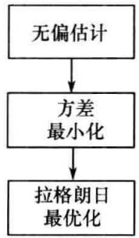

<details>
<summary>flowchart</summary>

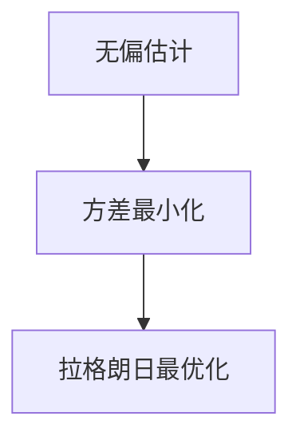
```mermaid
graph TD
  A["无偏估计"] --> B["方差最小化"]
  B --> C["拉格朗日最优化"]
```
</details>

图1 内插法实现图

设 $x_0$ 为未观测的需要估值的点， $x_1, x_2, \dots, x_n$ 为其周围的观测点，观测值相应为 $y(x_1), y(x_2), \dots, y(x_n)$ 。未测点的估值记为 $\tilde{y}(x_0)$ ，它由相邻观测点的已知观测值加权取和求得：

$$
\tilde {y} (x _ {0}) = \sum_ {i = 1} ^ {N} \lambda_ {i} y (x _ {i})
$$

式中， $\lambda_{i}$ 为待定加权系数。

Step1: 无偏估计分析

设估值点的真值为 $y(x_0)$ 由于土壤特性空间变异性的存在， $y(x_i)$ 以及 $\tilde{y}(x_0), y(x_0)$ 均可视为随机变量。当为无偏估计时，有

$$
E \left[ \tilde {y} (x _ {0}) - y (x _ {0}) \right] = 0
$$

综合前面两式可以得

$$
\sum_ {i = 1} ^ {N} \lambda_ {i} = 1
$$

Step2: 求出估值和真值之差的最小方差, 即

$$
D \big [ \tilde {y} (x _ {0}) - y (x _ {0}) \big ]
$$

利用以上公式,经推导方差 $D\left[\tilde{y}(x_{0})-y(x_{0})\right]=\min$ 为

$$
D \big [ \tilde {y} (x _ {0}) - y (x _ {0}) \big ] = - \sum_ {i = 1} ^ {n} \sum_ {j = 1} ^ {n} \lambda_ {i} \lambda_ {j} \gamma (x _ {i}, x _ {j}) + 2 \sum_ {i = 1} ^ {n} \lambda_ {i} \gamma (x _ {i}, x _ {0})
$$

式中： $\gamma(x_{i},x_{j})$ 表示以 $x_{i}$ 和 $x_{j}$ 两点间的距离作为间距 h 时参数的半方差值； $\gamma(x_{i},x_{0})$ 则是以 $x_{i}$ 和 $x_{0}$ 两点之间的距离作为间距 h 时参数的半方差值。观测点和估值点的位置是已知的，相互间的距离也已知，只要有所求参数的半方差 $\gamma(h)$ 图，便可求得各个 $\gamma(x_{i},x_{j})$ 和 $\gamma(x_{i},x_{0})$ 值。

Step3: 采用拉格朗日法求解

为此构造一函数 $\varphi (\sum \lambda_{i} - 1) = 0,\varphi$ 为待定的拉格朗日算子。由此，可导出优化问题的解应满足：

$$
\sum_ {j = 1} ^ {N} \lambda_ {i} \gamma (x _ {i}, x _ {j}) + \varphi = \gamma (x _ {i}, x _ {0}) \qquad i = 1, 2, \dots , n
$$

求解此线性方程组便可得到 $n$ 个加权系数 $\lambda_{i}$ 和拉格朗日算子 $\varphi$ ，该线性方程组可用矩阵形式表示：

$$
\left[ \begin{array}{c c c c c} \gamma_ {1 1} & \gamma_ {1 2} & \dots & \gamma_ {1 n} & 1 \\ \gamma_ {1 1} & \gamma_ {1 1} & \dots & \dot {\gamma} _ {1 1} & 1 \\ \vdots & \vdots & & \vdots & \vdots \\ \gamma_ {1 1} & \gamma_ {1 1} & \dots & \gamma_ {1 1} & \gamma_ {1 1} \\ 1 & 1 & \dots & 1 & 0 \end{array} \right] \left[ \begin{array}{c} \lambda_ {1} \\ \lambda_ {2} \\ \vdots \\ \lambda_ {n} \\ \varphi \end{array} \right] = \left[ \begin{array}{c} \gamma_ {1 0} \\ \gamma_ {2 0} \\ \vdots \\ \gamma_ {n 0} \\ 1 \end{array} \right]
$$

式中： $\gamma_{ij}$ 为 $\gamma(x_{i}, x_{j})$ 的简写。

求得各 $\lambda_{i}$ 值和 $\varphi$ 值后，利用最小方差值还可由下式方便地求出：

$$
\sigma_ {\mathrm{min}} ^ {2} = \sum_ {i = 1} ^ {n} \lambda_ {i} \gamma (x _ {i}, x _ {0}) + \varphi
$$

Step4: 土壤重金属含量的空间插值

通过计算该8种重金属在不同方向上的变异函数,根据对各个方向变异函数的模型参数,采用各向同性模型,用克里格法对研究区土壤重金属含量进行插值,并按照重金属的含量分布将插值图分成不同的级数,结果如下。

首先,根据不同采样点的坐标可以得重金属元素在该城区的分布图,如图2所示。

图形说明:图中颜色深浅代表不同的功能区,1区即生活区;5区即公园绿地区。

其次,根据每个采样点处重金属的浓度可以得出每种重金属元素的空间分布图,如图3所示。

图形说明: 按照先后顺序, 8 幅图分别表示 As、Cd、Cr、Cu、Hg、Ni、Pb、Zn 在城区的分布。不同的颜色深浅代表不同的重金属污染程度。由重金属元素分布图可知, 污染区域大致位于城区的西南角, 分布在工业区、交通区和生活区, 说明汞元素污染与人类的活动

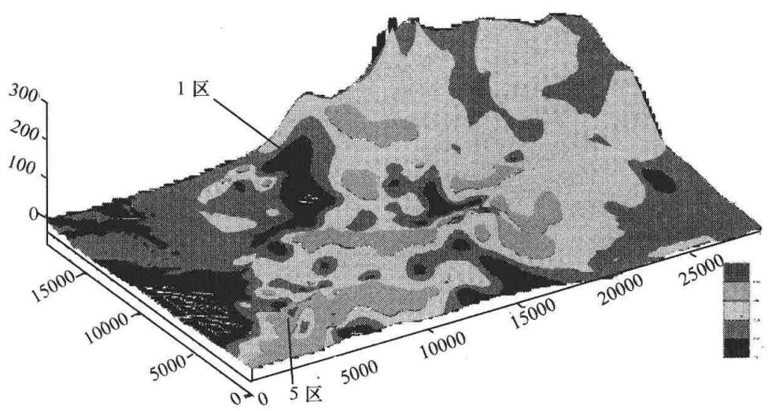

<details>
<summary>surface_3d</summary>

| X-axis (Range) | Y-axis (Range) | Z-axis (Range) |
| --- | --- | --- |
| 0~25000 | 0~15000 | 0~2500 |
</details>

图2 功能区分布图

联系较紧密。

## 5.2 污染评估模型的建立

## 5.2.1 污染负荷指数法

污染负荷指数法是对金属污染水平等级进行评估的一种方法,该指数由评价区域所包含的重金属元素成分共同构成。该方法结合了求积的统计法,能对整个区域各个点位各种重金属进行定量评价,并对各点的污染程度进行分级,能直观反映对环境污染最严重的元素和各种元素对环境污染的贡献程度,以及重金属在时间、空间上的变化趋势。

污染负荷指数法的实现步骤如下：

Step1: 计算某一采样点处的每种重金属元素的污染系数。

Step2: 通过求几何平均数, 确定该采样点处的污染负荷指数。

Step3: 求出某一区域的污染负荷指数。

污染负荷指数法能对任意给定的区域进行定量的判断,采用研究区域土壤背景值为评价标准,注意了人为活动对重金属污染的影响,可以判别人为活动对环境的影响,因此能够很好的判断土壤的综合人为污染情况。

首先根据某一点的实测重金属含量,进行最高污染系数(CF)的计算:

$$
C F _ {i} = \frac {C _ {i}}{C _ {0 i}}
$$

式中： $CF_{i}$ 为元素的最高污染系数； $C_i$ 为元素 $i$ 的实测含量； $C_{0i}$ 为元素 $i$ 的评价标准，即背景值。

某一点的污染负荷指数(PLI)为

$$
PLI = \sqrt [ n ]{C F _ {1} \times C F _ {2} \times C F _ {3} \times \cdots \times C F _ {n}}
$$

式中：PLI 为某一点的污染负荷指数；n 为评价元素的个数。

某一区域的污染负荷指数( $PLI_{zone}$ )为

$$
PLI_{\mathrm{zone}} = \sqrt[m]{PLI_1\times PLI_2\times PLI_3\times \cdots\times PLI_m}
$$

式中： $PLI_{\mathrm{zone}}$ 为区域污染负荷指数； $m$ 为评价点的个数（采样点的个数）。表1给出污染负

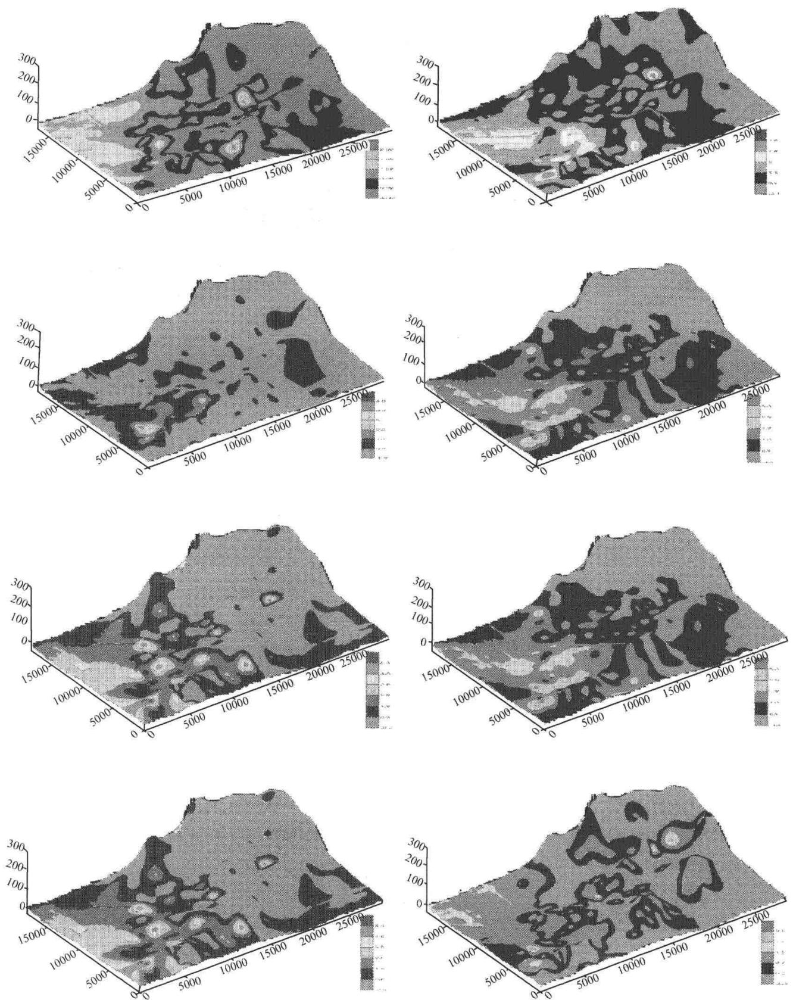  
图 3 8 种重金属浓度分布图

荷指数与污染程度之间的关系。

表 1 污染等级划分

<table><tr><td>PLI值</td><td>&lt;1</td><td>1~2</td><td>2~3</td><td>&gt;3</td></tr><tr><td>污染等级</td><td>0</td><td>1</td><td>2</td><td>3</td></tr><tr><td>污染程度</td><td>无污染</td><td>中等污染</td><td>强污染</td><td>极强污染</td></tr></table>

## 5.2.2 地累积指数法

地累积指数广泛运用于研究沉积物及其它物质中重金属污染程度的定量指标,它不仅考虑了沉积成岩作用等自然地质过程造成的背景值的影响,同时充分注意了人为活动对重金属污染的影响,是区分人为活动的重要参数。其计算式如下:

$$
I _ {\mathrm{geo}} = \log_ {2} \left[ \frac {C _ {n}}{1 . 5 \times B E _ {n}} \right]
$$

式中： $C_n$ 为样品中元素 $n$ 的浓度； $BE_{n}$ 为背景值浓度；1.5为修正指数，通常用来表征沉积特征、岩石地质及其他影响。

地质累积指数可分为7各级别,其评价标准见表2。

表 2 污染程度划分

<table><tr><td> $I_{geo}$ </td><td>&lt;0</td><td>0~1</td><td>1~2</td><td>2~3</td><td>3~4</td><td>4~5</td><td>&gt;5</td></tr><tr><td>级数</td><td>0</td><td>1</td><td>2</td><td>3</td><td>4</td><td>5</td><td>6</td></tr><tr><td>累积污染程度</td><td>无</td><td>无~中</td><td>中</td><td>中~强</td><td>强</td><td>强~极强</td><td>极强</td></tr></table>

利用上述计算方法可以得出每个采样点处每种重金属元素的污染级数,为了对每个小区重金属污染进行更具体的分析,可以按以下步骤对重金属的污染程度进行综合评价。

Step1: 对同一种重金属元素, 计算出每个采样点处地累积指数。

Step2: 根据评价标准表, 找出每个采样点处的重金属累积污染程度。

Step3: 将累积污染程度进行概率统计, 得出每个污染等级出现的概率。

Step4: 按照污染程度从高到低的分析顺序、同一污染程度取发生概率较大者的排序思想, 对每个小区重金属的污染程度进行合理排序, 找出污染较重的重金属元素。

## 5.3 污染评估模型的求解

## 5.3.1 污染负荷指数法评价结果

对每个采样点,该点的污染负荷指数(PLI)为 $PLI=\sqrt[8]{CF_{1}\times CF_{2}\times CF_{3}\times\cdots\times CF_{8}}$ , 其中 $CF_{1}, CF_{2}, \cdots, CF_{8}$ 分别表示 As、Cd、Cr、Cu、Hg、Ni、Pb、Zn 在该点的污染负荷指数值。

在根据同一城区不同采样点处的污染负荷指数值 $PLI_{1}, PLI_{2}, \cdots, PLI_{m}$ (m 为同一区域的采样点的个数)，利用公式

$$
P L I _ {\text {zone}} = \sqrt [ m ]{P L I _ {1} \times P L I _ {2} \times P L I _ {3} \times \cdots \times P L I _ {m}}
$$

就可以得出区域的污染负荷指数。五个功能区的污染负荷指数结果见下表3。

表 3 污染负荷指数结果

<table><tr><td colspan="2">功能区</td><td>污染负荷指数</td><td>污染等级</td><td>污染程度</td></tr><tr><td>1</td><td>生活区</td><td>1.8336</td><td>1</td><td>中等污染</td></tr><tr><td>2</td><td>工业区</td><td>2.3484</td><td>2</td><td>强污染</td></tr><tr><td>3</td><td>山区</td><td>1.0602</td><td>1</td><td>中等污染</td></tr><tr><td>4</td><td>交通区</td><td>1.9209</td><td>1</td><td>中等污染</td></tr><tr><td>5</td><td>公园绿地区</td><td>1.5786</td><td>1</td><td>中等污染</td></tr></table>

根据每个功能区的污染负荷指数结果,可以从整体上得出不同区域重金属的污染程度为工业区>交通区>生活区>公园绿化区>山区。结果分析:污染负荷指数法的评价结果与实际情况较接近,能够较好地从整体上反映出城区内不同区域重金属的污染程度。工业区的重金属污染最严重,这主要与工业区内工厂的污物排放有关;山区的重金属污染最轻,这是因为山区远离人群及工业活动,受污染较轻,因此重金属含量最低。

## 5.3.2 地累积指数法评价结果

利用地累积指数法计算公式 $I_{\mathrm{geo}} = \log_2\left[\frac{C_n}{1.5\times BE_n}\right]$ 可以计算出每个采样点处每种重金属元素的地累积指数,为了更清楚地分析城区不同区域重金属的污染程度,对5个城区的每种重金属污染程度逐一进行比较(表4\~表8)。

表 4 生活区地累积指数求解结果

<table><tr><td></td><td>As</td><td>Cd</td><td>Cr</td><td>Cu</td><td>Hg</td><td>Ni</td><td>Pb</td><td>Zn</td></tr><tr><td>污染级数为0级的概率</td><td>0.3182</td><td>0.2954</td><td>0.4773</td><td>0.2045</td><td>0.4545</td><td>0.5000</td><td>0.4773</td><td>0.4318</td></tr><tr><td>污染级数为1级的概率</td><td>0.6364</td><td>0.5454</td><td>0.4318</td><td>0.3864</td><td>0.2954</td><td>0.5000</td><td>0.3864</td><td>0.2727</td></tr><tr><td>污染级数为2级的概率</td><td>0.0454</td><td>0.1364</td><td>0.0683</td><td>0.2273</td><td>0.1591</td><td>0</td><td>0.0909</td><td>0.2045</td></tr><tr><td>污染级数为3级的概率</td><td>0</td><td>0.0227</td><td>0</td><td>0.1364</td><td>0.0682</td><td>0</td><td>0.0227</td><td>0.0454</td></tr><tr><td>污染级数为4级的概率</td><td>0</td><td>0</td><td>0</td><td>0.0454</td><td>0.0227</td><td>0</td><td>0.0227</td><td>0.0227</td></tr><tr><td>污染级数为5级的概率</td><td>0</td><td>0</td><td>0.0227</td><td>0</td><td>0</td><td>0</td><td>0</td><td>0.0227</td></tr><tr><td>污染级数为6级的概率</td><td>0</td><td>0</td><td>0</td><td>0</td><td>0</td><td>0</td><td>0</td><td>0</td></tr></table>

分析过程：

(1)Zn、Cr 出现 5 级污染的概率相等,但出现四级污染的概率 Zn > Cr。  
(2) Cu、Hg、Pb 出现 4 级污染的概率相等, 出现 3 级污染的概率 Cu > Hg > Pb。  
(3)Cd 出现 3 级污染的概率高于 As 和 Ni。  
(4) 出现 2 级污染的概率 As > Ni。

因此,生活区各种重金属的污染程度依次为

$$
\mathrm{Zn} > \mathrm{Cr} > \mathrm{Cu} > \mathrm{Hg} > \mathrm{Pb} > \mathrm{Cd} > \mathrm{As} > \mathrm{Ni}
$$

表 5 工业区地累积指数求解结果

<table><tr><td></td><td>As</td><td>Cd</td><td>Cr</td><td>Cu</td><td>Hg</td><td>Ni</td><td>Pb</td><td>Zn</td></tr><tr><td>污染级数为0级的概率</td><td>0.3889</td><td>0.1667</td><td>0.5833</td><td>0.0555</td><td>0.3055</td><td>0.5000</td><td>0.2222</td><td>0.2500</td></tr><tr><td>污染级数为1级的概率</td><td>0.5278</td><td>0.4444</td><td>0.3611</td><td>0.4167</td><td>0.1944</td><td>0.4722</td><td>0.5000</td><td>0.3611</td></tr><tr><td>污染级数为2级的概率</td><td>0.0555</td><td>0.3055</td><td>0.0278</td><td>0.3333</td><td>0.1667</td><td>0.0278</td><td>0.2222</td><td>0.2500</td></tr><tr><td>污染级数为3级的概率</td><td>0.0278</td><td>0.0833</td><td>0.0278</td><td>0.1389</td><td>0.1389</td><td>0</td><td>0</td><td>0.0555</td></tr><tr><td>污染级数为4级的概率</td><td>0</td><td>0</td><td>0</td><td>0.0278</td><td>0.0555</td><td>0</td><td>0.0555</td><td>0.0833</td></tr><tr><td>污染级数为5级的概率</td><td>0</td><td>0</td><td>0</td><td>0</td><td>0.0833</td><td>0</td><td>0</td><td>0</td></tr><tr><td>污染级数为6级的概率</td><td>0</td><td>0</td><td>0</td><td>0.0278</td><td>0.0555</td><td>0</td><td>0</td><td>0</td></tr></table>

分析过程：

(1) 出现 6 级污染的概率 Hg > Cu。  
(2) 出现 4 级污染的概率 Zn > Pb。  
(3) 出现 3 级污染的概率 Cd > As > Cr；因此，工业区各种重金属的污染程度依次为

$$
\mathrm{Hg} > \mathrm{Cu} > \mathrm{Zn} > \mathrm{Pb} > \mathrm{Cd} > \mathrm{As} > \mathrm{Cr} > \mathrm{Ni}
$$

表 6 山区地累积指数求解结果

<table><tr><td></td><td>As</td><td>Cd</td><td>Cr</td><td>Cu</td><td>Hg</td><td>Ni</td><td>Pb</td><td>Zn</td></tr><tr><td>污染级数为0级的概率</td><td>0.8333</td><td>0.7576</td><td>0.7424</td><td>0.6979</td><td>0.7727</td><td>0.7576</td><td>0.8485</td><td>0.9091</td></tr><tr><td>污染级数为1级的概率</td><td>0.1515</td><td>0.2121</td><td>0.2424</td><td>0.2727</td><td>0.2121</td><td>0.2121</td><td>0.1212</td><td>0.0757</td></tr><tr><td>污染级数为2级的概率</td><td>0.0151</td><td>0.0303</td><td>0.0151</td><td>0.0303</td><td>0.0151</td><td>0.0151</td><td>0.0303</td><td>0.0151</td></tr><tr><td>污染级数为3级的概率</td><td>0</td><td>0</td><td>0</td><td>0</td><td>0</td><td>0.0151</td><td>0</td><td>0</td></tr><tr><td>污染级数为4级的概率</td><td>0</td><td>0</td><td>0</td><td>0</td><td>0</td><td>0</td><td>0</td><td>0</td></tr><tr><td>污染级数为5级的概率</td><td>0</td><td>0</td><td>0</td><td>0</td><td>0</td><td>0</td><td>0</td><td>0</td></tr><tr><td>污染级数为6级的概率</td><td>0</td><td>0</td><td>0</td><td>0</td><td>0</td><td>0</td><td>0</td><td>0</td></tr></table>

分析过程:

(1) 出现 3 级污染的概率 Ni 最大。  
(2) Cu、Cd、Pb 出现 2 级污染的概率相等,但出现 1 级污染的概率 Cu > Cd > Pb。  
(3) Cr、Hg、As、Zn 出现 2 级污染的概率相等, 2 级污染的概率 Cr > Hg > As > Zn 。因此, 山区各种重金属的污染程度依次为

$$
\mathrm{Ni} > \mathrm{Cu} > \mathrm{Cd} > \mathrm{Pb} > \mathrm{Cr} > \mathrm{Hg} > \mathrm{As} > \mathrm{Zn}
$$

表 7 交通区地累积指数求解结果

<table><tr><td></td><td>As</td><td>Cd</td><td>Cr</td><td>Cu</td><td>Hg</td><td>Ni</td><td>Pb</td><td>Zn</td></tr><tr><td>污染级数为0级的概率</td><td>0.5000</td><td>0.2390</td><td>0.5869</td><td>0.1590</td><td>0.4927</td><td>0.6811</td><td>0.3913</td><td>0.3261</td></tr><tr><td>污染级数为1级的概率</td><td>0.4783</td><td>0.4420</td><td>0.3478</td><td>0.3261</td><td>0.1884</td><td>0.3043</td><td>0.420</td><td>0.3551</td></tr><tr><td>污染级数为2级的概率</td><td>0.0072</td><td>0.261</td><td>0.0434</td><td>0.3478</td><td>0.1884</td><td>0.0072</td><td>0.1884</td><td>0.2246</td></tr><tr><td>污染级数为3级的概率</td><td>0.0145</td><td>0.0507</td><td>0.0145</td><td>0.1232</td><td>0.0724</td><td>0.0072</td><td>0</td><td>0.0579</td></tr><tr><td>污染级数为4级的概率</td><td>0</td><td>0.0072</td><td>0</td><td>0.0362</td><td>0.0145</td><td>0</td><td>0</td><td>0.0217</td></tr><tr><td>污染级数为5级的概率</td><td>0</td><td>0</td><td>0.0072</td><td>0</td><td>0.0072</td><td>0</td><td>0</td><td>0.0072</td></tr><tr><td>污染级数为6级的概率</td><td>0</td><td>0</td><td>0</td><td>0.0072</td><td>0.0362</td><td>0</td><td>0</td><td>0.0072</td></tr></table>

分析过程：

(1) 出现6级污染的概率 $\mathrm{Zn} > \mathrm{Cu} > \mathrm{Hg}$ , 出项5级污染的概率 $\mathrm{Zn} > \mathrm{Cu}$ 。  
(2) 出现 5 级污染的概率 Cr 要高于剩下的 4 种重金属元素。  
(3) 出现 4 级污染的概率 Cd 要高于剩下的 3 种重金属元素。  
(4) 出现 3 级污染的概率 As > Ni > Pb。

因此,交通区各种重金属的污染程度依次为

$$
\mathrm{Zn} > \mathrm{Cu} > \mathrm{Hg} > \mathrm{Cr} > \mathrm{Cd} > \mathrm{As} > \mathrm{Ni} > \mathrm{Pb}
$$

表 8 公园绿地区地累积指数求解结果

<table><tr><td></td><td>As</td><td>Cd</td><td>Cr</td><td>Cu</td><td>Hg</td><td>Ni</td><td>Pb</td><td>Zn</td></tr><tr><td>污染级数为0级的概率</td><td>0.2571</td><td>0.4857</td><td>0.7428</td><td>0.2571</td><td>0.4857</td><td>0.7714</td><td>0.6286</td><td>0.5428</td></tr><tr><td>污染级数为1级的概率</td><td>0.7143</td><td>0.3143</td><td>0.2286</td><td>0.6857</td><td>0.2286</td><td>0.2286</td><td>0.2000</td><td>0.3428</td></tr><tr><td>污染级数为2级的概率</td><td>0.0286</td><td>0.1143</td><td>0.0286</td><td>0.0286</td><td>0.1714</td><td>0</td><td>0.1428</td><td>0.0571</td></tr><tr><td>污染级数为3级的概率</td><td>0</td><td>0.0857</td><td>0</td><td>0.0286</td><td>0.0857</td><td>0</td><td>0.0286</td><td>0.0286</td></tr><tr><td>污染级数为4级的概率</td><td>0</td><td>0</td><td>0</td><td>0</td><td>0</td><td>0</td><td>0</td><td>0.0286</td></tr><tr><td>污染级数为5级的概率</td><td>0</td><td>0</td><td>0</td><td>0</td><td>0.0286</td><td>0</td><td>0</td><td>0</td></tr><tr><td>污染级数为6级的概率</td><td>0</td><td>0</td><td>0</td><td>0</td><td>0</td><td>0</td><td>0</td><td>0</td></tr></table>

结果分析：

(1) Hg 出现 5 级污染的概率最大。  
(2) 出现 3 级污染的概率 Cd > Pb > Cu。

因此,交通区各种重金属的污染程度依次为

$$
\mathrm{Hg} > \mathrm{Zn} > \mathrm{Cd} > \mathrm{Pb} > \mathrm{Cu} > \mathrm{As} > \mathrm{Cr} > \mathrm{Ni}
$$

## 6 问题二的求解

## 6.1 工业区重金属污染来源分析

(1) 镉: 自然界中镉总是与其同族的锌伴生, 存在于各种含锌的矿石中。土壤中镉污染源主要是由于锌矿开采、选矿、运输、冶炼等生产环节产生的废水、废渣, 此外某些电镀、颜料、化工、塑料、电池、电子工业的工厂生产中也会用到镉或镉制品。  
(2) 铬:铬是一种重要的环境污染元素,铬有明显的致癌致畸作用。环境中铬的污染源主要是工业排放的“三废”,如煤燃烧的废气,电镀、制革、染料、制药等工厂的废水。某些垃圾焚烧灰中和煤灰中铬含量也较高,有的磷肥中也可能含较多的铬。  
(3) 铅: 人类开采铅矿, 使用铅制品已有数千年的历史, 人类周围环境中到处都有铅。铅的污染源主要是矿区冶炼厂、蓄电池厂、油漆厂。四乙基铅作为汽油防爆剂使用, 可使汽车排放尾气的铅含量很高, 是公路两侧农田铅的污染源。  
（4）砷：砷虽是一种非金属元素，但具有一定的金属性质，它对人的毒害与重金属类似，在环境科学中将砷列入有害的重金属之列。砷的污染源主要是含砷矿的开采和冶炼以及冶金、化工、医药等行业的三废。煤的燃烧会排放许多含砷的气体和煤灰。某些磷灰石含砷量很高，以致施用磷肥也是砷进入农田的一个途径。施用某些含砷的农药、鼠药，也会造成砷污染。  
(5) 铜: 铜等有色金属开采冶炼企业排出的“三废”, 化石燃烧特别是煤的燃烧、城市垃圾污泥、含铜农药化肥等均可使土壤含铜量严重超标。例如长期施用渡尔多液, 利用含铜废水灌溉农田或施用含铜污泥, 铜可积在土壤中。随水进入到土壤中的铜可被土壤吸

持,从而产生污染。

(6) 锌: 土壤中的锌除来自岩石母质外, 还来自大气沉降、农用污泥、垃圾、农用化学品、铅锌矿尾砂等。煤和其它化石燃料以及有色金属的冶炼是大气中锌的主要来源。一些地质异常地区和铅锌矿周围土壤常常受到锌的污染。  
（7）汞：土壤中汞的来源是多方面的，除形成土壤的母质本身含汞外，矿物燃料燃烧排放的汞也很多。电气、仪表氯碱、涂料等许多企业生产中要消耗大量汞和汞化合物，这些汞最终有很多进入环境、土壤。含汞农药的广泛使用，也造成了土壤汞的污染。

## 6.2 金属含量特征分析

金属含量特征是指各种金属元素的分布状况,主要包括重金属含量的平均值、标准差、变化系数等。其计算步骤如下:

Step1: 据各采样点重金属元素浓度的实测值, 求出每种金属元素浓度的平均值;

Step2: 算每种金属元素浓度的标准差;

Step3: 标准差与平均值之比即为变化系数的大小; 根据已经给出的采样点实测数据, 可以得出每种重金属元素浓度的平均值、标准差、变化系数、最值、背景值标准差等因素的大小, 即金属含量的特征(表9)。

表 9 金属含量特征分析

<table><tr><td>元素</td><td>平均值</td><td>标准差</td><td>变化系数</td><td>最大值</td><td>最小值</td><td>背景值</td><td>背景值标准差</td></tr><tr><td>As/(μg/g)</td><td>7.25</td><td>4.244317</td><td>0.585311</td><td>21.87</td><td>1.61</td><td>3.6</td><td>0.9</td></tr><tr><td>Cd/(ng/g)</td><td>393.11</td><td>237.5764</td><td>0.604349</td><td>1092.90</td><td>114.50</td><td>130</td><td>30</td></tr><tr><td>Cr/(μg/g)</td><td>53.41</td><td>44.00219</td><td>0.82387</td><td>285.58</td><td>15.40</td><td>31</td><td>9</td></tr><tr><td>Cu/(μg/g)</td><td>127.54</td><td>414.9413</td><td>3.253527</td><td>2528.48</td><td>12.70</td><td>13.2</td><td>3.6</td></tr><tr><td>Hg/(ng/g)</td><td>642.36</td><td>2244.075</td><td>3.493511</td><td>13500.00</td><td>11.79</td><td>35</td><td>8</td></tr><tr><td>Ni/(μg/g)</td><td>19.81</td><td>8.370171</td><td>0.422487</td><td>41.70</td><td>4.27</td><td>12.3</td><td>3.8</td></tr><tr><td>Pb/(μg/g)</td><td>93.04</td><td>85.36728</td><td>0.917525</td><td>434.80</td><td>31.24</td><td>31</td><td>6</td></tr><tr><td>Zn/(μg/g)</td><td>277.93</td><td>350.8309</td><td>1.262311</td><td>1626.02</td><td>56.33</td><td>69</td><td>14</td></tr></table>

经过分析数据发现,在工业区,土壤中八个重金属含量平均值为 $7.25 \mu g/g$ 、 $393.11 ng/g$ 、 $53.41 \mu g/g$ 、 $127.5 ng/g$ 、 $642.36 \mu g/g$ 、 $19.81 \mu g/g$ 、 $93.04 \mu g/g$ ,均超过该市的背景值,Cd、Cu、Zn 的含量超标比较严重。通过观察变异系数可以发现 Cu、Hg、Zn 的变异系数较大,说明其受到人类的活动是比较大的,As、Ni 变异系数都较小,并且大多数地区的 Ni 含量还是符合该地区的背景值的,说明其可能较多地由自然因素决定,人类对其影响较少。

## 6.3 重金属相关性分析

为了便于发现重金属中的内在规律,分析它们的关联性,在金属含量特征分析的基础上,进行重金属相关性分析。

## 6.3.1 相关性原理分析

设两组样本 $x, y$ ，经过标准化处理得到相应的两组向量 $x', y'$ ，现在要确定两组数据的

相关性,可以求取其相应的协方差系数:

$$
\rho_ {x y} = \frac {\operatorname{cov} (x ^ {\prime} , y ^ {\prime})}{\sqrt {D (x ^ {\prime}) D (y ^ {\prime})}}
$$

利用此公式可以计算出两组向量的关联度信息,当考虑的因素较多时,可以将这些协方差系数构成一个协方差系数矩阵,为下一步分析做好保障。

## 6.3.2 相关性计算

利用 SPASS 软件进行计算得, 各种元素的相关性见表 10。

表 10 金属相关性分析

<table><tr><td>元素</td><td>As</td><td>Cd</td><td>Cr</td><td>Cu</td><td>Hg</td><td>Ni</td><td>Pb</td><td>Zn</td></tr><tr><td>As</td><td>1</td><td></td><td></td><td></td><td></td><td></td><td></td><td></td></tr><tr><td>Cd</td><td>0.329</td><td>1</td><td></td><td></td><td></td><td></td><td></td><td></td></tr><tr><td>Cr</td><td>0.380</td><td>0.541</td><td>1</td><td></td><td></td><td></td><td></td><td></td></tr><tr><td>Cu</td><td>0.153</td><td>0.566</td><td>0.920</td><td>1</td><td></td><td></td><td></td><td></td></tr><tr><td>Hg</td><td>0.181</td><td>0.533</td><td>0.902</td><td>0.983</td><td>1</td><td></td><td></td><td></td></tr><tr><td>Ni</td><td>0.690</td><td>0.489</td><td>0.698</td><td>0.503</td><td>0.479</td><td>1</td><td></td><td></td></tr><tr><td>Pb</td><td>0.395</td><td>0.829</td><td>0.675</td><td>0.670</td><td>0.612</td><td>0.578</td><td>1</td><td></td></tr><tr><td>Zn</td><td>0.518</td><td>0.754</td><td>0.695</td><td>0.622</td><td>0.590</td><td>0.634</td><td>0.739</td><td>1</td></tr></table>

结果分析: 分析表 10 可以发现 Cr、Cu、Hg 呈现高度的相关性, 说明它们来自同一污染源的概率非常大, As、Ni 与其他元素的相关性都不是很明显, 说明 As 的来源可能与其他元素的来源可能不一样, 很可能是受自然地质等因素的影响, Pb、Cd 表现出来的相关性较好可能来自同一污染源。

## 6.4 重金属因子分析

利用主成分分析法,找出其中影响最大的几种元素,然后通过溯源的方式,找到其污染物的根源。

## 6.4.1 一般因子模型

（1）模型初步建立：设有 n 个样品，对每个样品观察 p 个指标 $X_{1}, X_{2}, \cdots, X_{p}$ ，这些指标之间有较强的相关性（否则无法提取公共因子）。假定 $X_{1}, X_{2}, \cdots, X_{p}$ 已经标准化，且有 $m (m < p)$ 个标准化的公共因子 $F_{1}, F_{2}, \cdots, F_{m}$ 以及 P 个特殊因子 $\varepsilon_{1}, \varepsilon_{1}, \cdots, \varepsilon_{p}$ ，使得

$$
X _ {i} = \sum_ {k = 1} ^ {m} a _ {i k} F _ {k} + \varepsilon_ {i}
$$

记 $\boldsymbol{X}=(X_{1},X_{2},\cdots,X_{p})^{\prime},\boldsymbol{F}=(F_{1},F_{2},\cdots,F_{m})^{\prime},\boldsymbol{\varepsilon}=(\boldsymbol{\varepsilon}_{1},\boldsymbol{\varepsilon}_{1},\cdots\boldsymbol{\varepsilon}_{p})^{\prime},\boldsymbol{A}=(a_{ij})_{p\times m}$ ，则得因子模型的矩阵形式：

$$
X = A F + \varepsilon
$$

式中： $X$ 为可观测向量； $\pmb{F}$ 为不可观测向量，且满足

① $E(\boldsymbol{F}) = 0, (\boldsymbol{F}) = \boldsymbol{I}_{m} (m \text{ 阶单位矩阵})$ ;  
② F 与 $\varepsilon$ 相互独立；

③ $E(\pmb {\varepsilon}) = 0$ ，其协方差阵为对角阵，即

$$
\boldsymbol {D} (\varepsilon) = \left( \begin{array}{c c c c} \sigma_ {1} ^ {2} & & & 0 \\ & \sigma_ {2} ^ {2} & & \\ & & \ddots & \\ 0 & & & \sigma_ {P} ^ {2} \end{array} \right)
$$

(2) 子载荷: 矩阵 A 中的元素 $a_{ij}$ 称为因子载荷, 它反映了第 j 个因子 $F_{j}$ 在第 i 个变量 $X_{i}$ 上的“权重”, $a_{ij}$ 的绝对值越大, 表明 $X_{i}$ 与因子 $F_{j}$ 的相依程度越大, 故矩阵 A 称为因子载荷阵。

## 6.4.2 因子分析与主成分分析的比较

（1）成分分析通过变换 Y = AX 将原指标 X 化为一些互不相关的综合指标, 达到降维的目的, Y 的值可计算。  
(2) 子分析通过模型 $X = AF + \varepsilon$ 以公共因子 F 代替 X, 达到降维的目的, F 只具备抽象意义。

## 6.4.3 因子分析的计算

通过以上的分析,可以利用 SPSS 软件得出表 11 所列的计算结果。

表 11 金属因子分析

<table><tr><td>主成分</td><td>特征值</td><td>贡献率</td><td>累计贡献率</td></tr><tr><td>1</td><td>5.254</td><td>65.670</td><td>65.670</td></tr><tr><td>2</td><td>1.263</td><td>15.786</td><td>81.455</td></tr><tr><td>3</td><td>0.781</td><td>9.763</td><td>91.218</td></tr><tr><td>4</td><td>0.267</td><td>3.336</td><td>94.554</td></tr><tr><td>5</td><td>0.227</td><td>2.834</td><td>97.388</td></tr><tr><td>6</td><td>0.149</td><td>1.868</td><td>99.256</td></tr><tr><td>7</td><td>0.051</td><td>0.634</td><td>99.890</td></tr><tr><td>8</td><td>0.009</td><td>0.110</td><td>100.000</td></tr></table>

主成分分析计算结果见表 12。

表 12 主成分分析

<table><tr><td>元素</td><td>主成分1</td><td>主成分2</td><td>主成分3</td></tr><tr><td>As</td><td>0.518</td><td>0.758</td><td>0.251</td></tr><tr><td>Cd</td><td>0.786</td><td>0.074</td><td>-0.555</td></tr><tr><td>Cr</td><td>0.916</td><td>-0.206</td><td>0.286</td></tr><tr><td>Cu</td><td>0.868</td><td>-0.463</td><td>0.149</td></tr><tr><td>Hg</td><td>0.845</td><td>-0.459</td><td>0.202</td></tr><tr><td>Ni</td><td>0.767</td><td>0.421</td><td>0.302</td></tr><tr><td>Pb</td><td>0.858</td><td>0.049</td><td>-0.364</td></tr><tr><td>Zn</td><td>0.859</td><td>0.188</td><td>-0.203</td></tr></table>

通过表 12 可以发现 Cr、Cu、Hg、Pb、Zn 这几种金属的污染占据了最主要的地位,这也

与上述讨论的关联性分析的讨论结果相一致。

结果分析：

As、Ni,总体上看,这两种元素在工业区平均值超出背景值不多,而且很多点也是符合要求的,通过关联性分析和因子分析可以发现这两种元素与其他元素的同源性不大,也不是造成污染的主要因素,因此,可以认为,这两种元素受自然的影响较多,受人的影响较少,可能是由土壤母质决定的。

Cu、Hg、Pb、Zn 这四种元素在工业区的平均值严重超过背景值,而且变异系数较大,说明其人为因素影响较多,通过分析,Cr、Cu 和 Hg 以及 Pb 和 Cd 呈现高度的相关性,说明它们来自同一污染源的概率非常大,而且这几种元素也是金属污染中的主要因素,因此在此工业区很可能存在冶炼、电镀等化工企业。

## 7 问题三模型的建立与求解

## 7.1 重金属污染物传播特征的分析

重金属在土壤中的运动过程可以概括为三个方面:进入土壤、脱离土壤以及在土壤中累积(图4)。其中,当进入土壤重金属大于脱离土壤重金属才发生积累。

进入土壤重金属来源复杂,主要包括:

(1) 随大气沉降进入土壤的重金属。  
(2) 随雨水、污水进入土壤的重金属。  
(3) 随固体废弃物进入土壤的重金属。  
(4) 随农用物资进入土壤的重金属。

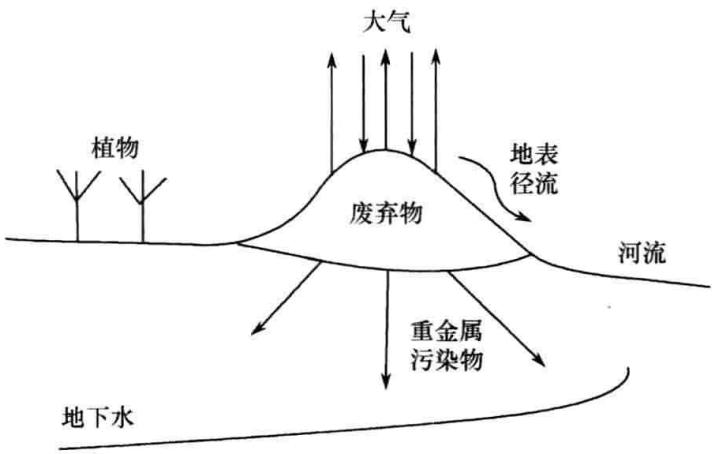

<details>
<summary>flowchart</summary>

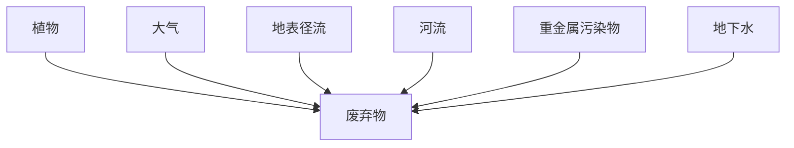
```mermaid
graph TD
  A["植物"] --> B["废弃物"]
  C["大气"] --> B
  D["地表径流"] --> B
  E["河流"] --> B
  F["重金属污染物"] --> B
  G["地下水"] --> B
```
</details>

图 4 污染物传播模式

进入土壤的重金属元素会在土壤中进行扩散,其扩散的动力因素主要存在两个方面。

(1) 不同地区重金属元素的浓度的不同, 产生浓度梯度, 从而产生扩散现象。  
（2）由于地势的作用，产生地势梯度，导致溶解于水中的重金属元素随径流和土壤中的水分向地势地处转移。

脱离土壤主要通过以下 3 个方式实现。

(1) 植物吸收脱离土壤, 主要是植物对重金属的吸收作用。

(2) 溶解于水体并随之脱离土壤, 当土壤靠近水域时, 由于浓度差而进入水域, 如河流、湖泊和地下水。  
(3) 进入动物体、微生物并脱离土壤, 微生物可以吸附积累重金属, 甚至发生降解作用。

以上 3 种方式中,植物吸收并被带走,减少了土壤中重金属总量,微生物降解作用降低了重金属危害,但是总量并没有变化,而其他方式只是暂时使重金属脱离土壤,如植物吸收重金属富集体内,当植物死亡时,又重新回归土壤。而重金属脱离土壤并进入水域则导致更严重后果,进入河流湖泊可导致鱼类死亡或重金属在鱼类体内富集,最终进入人体;而进入地下水体则导致地下水受污染并难以恢复。

## 7.2 迭代推演求污染源模型的建立

介质的迁移运动为推流迁移。

推流迁移是指污染物在气流或水流作用下产生的空间位置的转移,数学抽象用迁移通量(单位时间通过单位面积的量)来描述污染物的推流迁移。

$$
f _ {x} = u _ {x} \frac {\partial C}{\partial x}
$$

$$
f _ {y} = u _ {y} \frac {\partial C}{\partial x}
$$

$$
f _ {z} = u _ {z} \frac {\partial C}{\partial z}
$$

式中： $f_{x}, f_{y}, f_{z}$ 分别代表 x, y, z 方向上的推流迁移通量； $u_{x}, u_{y}, u_{z}$ 分别代表 x, y, z 方向上的推流迁移通量；C 为污染物在环境介质中的浓度。

当污染物在空间各方向都存在浓度梯度时,就需要建立三维模型,具体形式如下:

$$
\frac {\partial C}{\partial t} = - u _ {x} \frac {\partial C}{\partial t} - u _ {y} \frac {\partial C}{\partial y} - u _ {z} \frac {\partial C}{\partial z}
$$

根据此公式就可以在自然条件下,分析出重金属浓度背景值随土壤迁移的变化规律,即在不受人类活动影响的条件下,重金属浓度背景值的变化趋势。

Step1: 确定背景值随高度变化关系

对于每种重金属元素的背景值,都有一个浓度变化范围。每种金属元素的背景值的平均值为 $\bar{X}$ , 标准偏差为 S, 背景值的变化范围为 $(\bar{X}-S, \bar{X}+S)$ 。为了正确表示出浓度随高度的变化关系, 先求出浓度随高度变化的权重(图 5)。设采样浓度最大点和最小点处对应的采样点高度为 $h_{1}h_{2}$ , 重金属浓度随高度变化的权重为 $\lambda$ 。

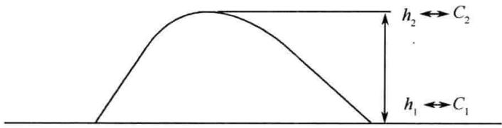

<details>
<summary>text_image</summary>

h₂ ↔ C₂
h₁ ↔ C₁
</details>

图 5 权重分析示意图

则重金属浓度随高度变化的权重：

$$
\lambda = \frac {C _ {2} - C _ {1}}{h _ {2} - h _ {1}}
$$

式中： $C_1, C_2$ 对应采样点重金属浓度的最大值和最小值。

对于任一高度 $h_0$ ，可以利用权重系数求出该采样点处对应的重金属浓度，即

$$
C _ {0} = C _ {1} + \lambda (h _ {2} - h _ {0}) = C _ {1} + \frac {C _ {2} - C _ {1}}{h _ {2} - h _ {1}} (h _ {2} - h _ {0})
$$

Step2: 背景值的演变

设背景值的初始大小为 $C_0$ ，当重金属元素发生迁移过后，浓度改变了 $C$ ，污染物的推流迁移方程为 $\frac{\partial C}{\partial t} = -u_x\frac{\partial C}{\partial t} -u_y\frac{\partial C}{\partial y} -u_z\frac{\partial C}{\partial z}$ 。据该方程式可以得出污染物推流迁移后的不同坐标点处重金属浓度的大小 $C_t(x,y,z)$ 。

则变化后的重金属浓度为

$$
C _ {t} (x, y, z) = C _ {0} + \Delta C (x, y, z)
$$

Step3: 实测值与推演值的初步比较

不同的采样点对应不同的测量浓度,设某采样点处重金属的实测浓度为 $C_{t}^{\prime}(x,y,z)$ ，将实测值与背景浓度推演值进行比较,将其差值定为 $\Delta C^{\prime}(x,y,z)$ ，即

$$
\Delta C ^ {\prime} (x, y, z) = C _ {t} ^ {\prime} (x, y, z) - C _ {t} (x, y, z)
$$

将 $\Delta C_{\mathrm{max}}^{\prime}(x,y,z)$ 所对应的坐标点作为第一个污染源的位置。

Step4: 实测值与新背景值的反复比较

将 $\Delta C_{\max}^{\prime}(x,y,z)$ 与初始背景值 $C_0(x,y,z)$ 叠加得出新的背景值 $C_0'(x,y,z)$ ：

$$
C _ {0} ^ {\prime} (x, y, z) = C _ {0} (x, y, z) + \Delta C _ {\max} ^ {\prime} (x, y, z)
$$

将 $C_0'(x,y,z)$ 作为新的重金属浓度背景值，再一次通过推流迁移方程：

$$
\frac {\partial C}{\partial t} = - u _ {x} \frac {\partial C}{\partial t} - u _ {y} \frac {\partial C}{\partial y} - u _ {z} \frac {\partial C}{\partial z}
$$

得出下一个状态重金属浓度的大小,并将它与实测值进行比较,即进行迭代推演,直到 $\frac{\Delta C_{i-1}-\Delta C_{i}}{\Delta C_{i}}<\sigma$ ,终止推演,从而得到i个污染源的位置。

## 7.3 迭代推演求污染源模型的求解

通过计算可以得出城区污染源的分布,如图6所示。

图像说明:功能区1代表生活区,功能区5代表公园绿地区。图中的六角星代表污染源的位置,由图6可知,重金属污染主要分布在工业区。

下面分别讨论各个功能区的污染源分布(表13\~表17)。

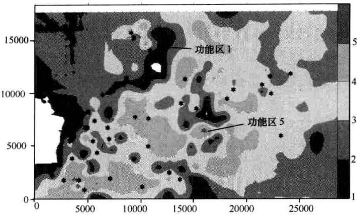

<details>
<summary>heatmap</summary>

| Feature | Description |
| --- | --- |
| Function Zone 1 | Top-left region (approx. 0-15000) |
| Function Zone 5 | Bottom-right region (approx. 0-25000) |
</details>

图 6 污染源分布

表 13 生活区污染源位置

<table><tr><td>序号</td><td>X轴坐标</td><td>Y轴坐标</td><td>海拔高度</td><td>污染源元素</td></tr><tr><td>1</td><td>4777</td><td>4897</td><td>8</td><td>Cd、Pb</td></tr><tr><td>2</td><td>4592</td><td>4603</td><td>6</td><td>Cr、Pb、Zn</td></tr><tr><td>3</td><td>3573</td><td>6213</td><td>5</td><td>Cr</td></tr><tr><td>4</td><td>9328</td><td>4311</td><td>24</td><td>Cr、Zn</td></tr><tr><td>5</td><td>7056</td><td>8348</td><td>37</td><td>Cu</td></tr></table>

结果分析：

生活区的污染中心大致可以分为三大块,1、2、3为一块,其污染源头在(4314,5237)、4、5各为一块,其污染源在(9328,8348)。污染物主要以Cr、Zn、Pb为主。

表 14 工业区污染源位置

<table><tr><td>序号</td><td>X轴坐标</td><td>Y轴坐标</td><td>海拔高度</td><td>污染源元素</td></tr><tr><td>1</td><td>1647</td><td>2728</td><td>6</td><td>As、Cd、Pb</td></tr><tr><td>2</td><td>2383</td><td>3692</td><td>7</td><td>Hg、Cr、Pb、Zn、Cd、Cu、Ni</td></tr><tr><td>3</td><td>4742</td><td>7293</td><td>9</td><td>As、Hg</td></tr><tr><td>4</td><td>4948</td><td>7293</td><td>6</td><td>As、Ni、Zi</td></tr><tr><td>5</td><td>5006</td><td>8846</td><td>6</td><td>Pb</td></tr><tr><td>6</td><td>6395</td><td>10443</td><td>4</td><td>Cd</td></tr><tr><td>7</td><td>8629</td><td>12086</td><td>1</td><td>Hg</td></tr><tr><td>8</td><td>10856</td><td>14727</td><td>41</td><td>Ni</td></tr></table>

结果分析:工业区的污染源较多,重金属的种类也较为广泛,这与其工业生产废水废气的排放是分不开的。经过上面分析可知,污染源大致可以分为三块:1、2为一个污染块,其中心大致在(2015,3210),3、4、5、6为一个大块,其污染中心大致在(53727,8468),7、8为一块污染源区,其中心在(9742,13046)。

表 15 区污染源位置

<table><tr><td>序号</td><td>X轴坐标</td><td>Y轴坐标</td><td>海拔高度</td><td>污染源元素</td></tr><tr><td>1</td><td>18738</td><td>10921</td><td>53</td><td>As</td></tr><tr><td>2</td><td>24153</td><td>12450</td><td>71</td><td>Ni</td></tr><tr><td>3</td><td>22193</td><td>12185</td><td>22193</td><td>Cr、Ni</td></tr><tr><td>4</td><td>23238</td><td>6502</td><td>23238</td><td>Ni</td></tr></table>

结论分析：

山区的重金属污染总体来说,并不严重,但在山区出现一个污染源为镍源,中心在(22080,10514),但这里并不存在工厂或其他排放镍元素的出处,因此可以猜想,山区土壤母质中可能含镍较多,或此地存在镍矿。

表 16 交通区污染源位置

<table><tr><td>序号</td><td>X轴坐标</td><td>Y轴坐标</td><td>海拔高度</td><td>污染源元素</td></tr><tr><td>1</td><td>2708</td><td>2295</td><td>22</td><td>Cd、Hg</td></tr><tr><td>2</td><td>3526</td><td>4357</td><td>7</td><td>Cr</td></tr><tr><td>3</td><td>5868</td><td>4904</td><td>16</td><td>Cu</td></tr><tr><td>4</td><td>5481</td><td>6004</td><td>0</td><td>Cr</td></tr><tr><td>5</td><td>3299</td><td>6018</td><td>4</td><td>Cd、Cr、Cu、Pb、Zn、Ni</td></tr><tr><td>6</td><td>5635</td><td>7965</td><td>29</td><td>Cu</td></tr><tr><td>7</td><td>7004</td><td>6226</td><td>11</td><td>Cr</td></tr><tr><td>8</td><td>6869</td><td>7286</td><td>18</td><td>As、Hg</td></tr><tr><td>9</td><td>9460</td><td>8311</td><td>45</td><td>Cu</td></tr><tr><td>10</td><td>10685</td><td>5528</td><td>34</td><td>Cr</td></tr><tr><td>11</td><td>10700</td><td>8184</td><td>50</td><td>Cu</td></tr><tr><td>12</td><td>13797</td><td>9621</td><td>18</td><td>Ni、Zn</td></tr><tr><td>13</td><td>18134</td><td>10046</td><td>41</td><td>As、Hg</td></tr><tr><td>14</td><td>22304</td><td>10527</td><td>40</td><td>Hg</td></tr><tr><td>15</td><td>21439</td><td>11383</td><td>45</td><td>Cd</td></tr><tr><td>16</td><td>7100</td><td>2449</td><td>89</td><td>Pb</td></tr><tr><td>17</td><td>12696</td><td>3024</td><td>27</td><td>As、Zn</td></tr><tr><td>18</td><td>13694</td><td>2357</td><td>33</td><td>Hg</td></tr><tr><td>19</td><td>15248</td><td>9106</td><td>16</td><td>Hg</td></tr></table>

结论分析:交通区的污染较为严重,污染成分较多,分布也无明显聚集现象,在交通区内呈现一种带状分布,这可能与汽车在公路的行驶,释放尾气和其他污染物有关,所以污染物浓度与公路走向呈较大关联。

表 17 公园绿地区污染源位置

<table><tr><td>序号</td><td>X轴坐标</td><td>Y轴坐标</td><td>海拔高度</td><td>污染源元素</td></tr><tr><td>1</td><td>4153</td><td>2299</td><td>73</td><td>Cd、Pb、Zn</td></tr><tr><td>2</td><td>4684</td><td>1364</td><td>37</td><td>Hg</td></tr><tr><td>3</td><td>14173</td><td>11941</td><td>14</td><td>Pb</td></tr><tr><td>4</td><td>9095</td><td>16414</td><td>29</td><td>As</td></tr><tr><td>5</td><td>10142</td><td>1662</td><td>8</td><td>Cd</td></tr></table>

结论分析:总体来说公园绿地的重金属污染不是很严重,主要的污染元素为 Pb、Cd 等元素,可能原因是人们在公园绿地上乱扔含重金属的垃圾,导致局部污染较周围偏高,污染大致可以分为两块:一块污染源中心在(4418,1831)附近;另一个污染中心在

(11611,14177)附近。

## 7.4 元素扩散模型的建立

要想根据梯度的变化找出污染源的位置,需要分析污染源处重金属浓度随位势的变化关系。设采样点的坐标为 $(x,y,z)$ ,重金属的浓度为C。

采样点重金属污染浓度的大小受地势高度的变化和浓度的梯度变化影响,为了找出污染源的位置,需要剔除每个采样点处重金属污染浓度随地势高度的变化,进而通过分析剩下因子的正负确定污染源的位置。

重金属浓度在 $x$ 方向上梯度的变化大小为 $\frac{\partial C}{\partial x}$ , 位势高度在 $x$ 方向上梯度的变化大小为 $\frac{\partial z}{\partial x}$ , 则判断因子为 $\frac{\partial C}{\partial x} - \frac{\partial z}{\partial x}$ 。

重金属浓度在 $x$ 方向上梯度的变化大小为 $\frac{\partial C}{\partial y}$ , 位势高度在 $x$ 方向上梯度的变化大小为 $\frac{\partial z}{\partial y}$ , 则判断因子为 $\frac{\partial C}{\partial y} - \frac{\partial z}{\partial y}$ 。

Step1: 参数归一化

在模型的求解过程中,需要对重金属浓度在 x 轴方向上的梯度变化与地势高度在 x 轴方向上的梯度变化进行比较,为了统一量纲,使结果具有可比性,首先要对重金属浓度和采样点的高度进行归一化。

设重金属浓度的平均值为 $\bar{C}$ ，采样点地势高度的平均值为 $\bar{Z}$ ，则归一化后的重金属浓度和采样点地势高度为

$$
C = \frac {C _ {\mathrm{测}} - \overline {{{C}}}}{\overline {{{C}}}}
$$

$$
Z = \frac {Z _ {\mathrm{测}} - \bar {Z}}{\bar {Z}}
$$

式中： $C_\text{测}$ 、 $Z_\text{测}$ 分别为采样点的重金属浓度和采样点的高度。

Step2: 数据网格化

由于给定的数据有限,需要对已知数据进行插值,采用克里格内插法可以较精确地得出得出各个网格点处的重金属浓度。

Step3: 分析大小求污染源

根据判断因子的正负关系,分以下四种情况讨论。

$\frac{\partial C}{\partial x} - \frac{\partial z}{\partial x}$ 和 $\frac{\partial C}{\partial y} - \frac{\partial z}{\partial y}$ 均大于0时，该点肯定不是污染源。

$\frac{\partial C}{\partial x} - \frac{\partial z}{\partial x}$ 和 $\frac{\partial C}{\partial y} - \frac{\partial z}{\partial y}$ 均小于0时，该点肯定是污染源。

$\frac{\partial C}{\partial x} - \frac{\partial z}{\partial x}$ 和 $\frac{\partial C}{\partial y} - \frac{\partial z}{\partial y}$ 正负情况相反，且 $\frac{\partial C}{\partial x} - \frac{\partial z}{\partial x} + \frac{\partial C}{\partial y} - \frac{\partial z}{\partial y}$ 大于0，该点不是污染源。

$\frac{\partial C}{\partial x} - \frac{\partial z}{\partial x}$ 和 $\frac{\partial C}{\partial y} - \frac{\partial z}{\partial y}$ 正负情况相反，且 $\frac{\partial C}{\partial x} - \frac{\partial z}{\partial x} + \frac{\partial C}{\partial y} - \frac{\partial z}{\partial y}$ 小于0，该点不是污染源。

## 7.5 元素扩散模型的求解

为了便于说明问题,同时考虑篇幅限制,仅对一种元素的污染源进行查找,下面以元素为例,通过计算机编程得到它的污染源的分布地理图及相应坐标,如图7所示。

结果分析：将元素扩散模型的结果与迭代模型所得分布图(图8)进行对比的,可以发现两种方法的结果很一致,分布范围也是很相似,说明了这两种模型在寻找污染源方面达到了异曲同工之妙,同时说明了这两种模型的合理性与准确性。下面给出两种模型的所得污染源的大致分布坐标,见表18。

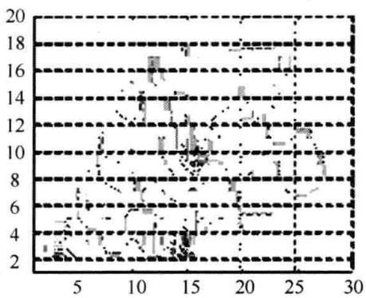

<details>
<summary>scatter</summary>

| X (range) | Y (range) |
| --- | --- |
| 5~30 | 2~18 |
</details>

图 7 扩散模型污染源分布

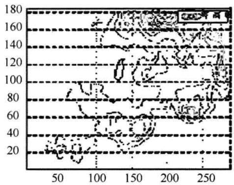

<details>
<summary>geo</summary>

| Latitude (range) | Longitude (range) |
| --- | --- |
| 20~180 | 50~270 |
</details>

图 8 迭代法污染源分布

表 18 两种模型污染源坐标

<table><tr><td>序号</td><td colspan="2">扩散模型</td><td colspan="2">迭代模型</td></tr><tr><td>1</td><td>16000</td><td>10000</td><td>15248</td><td>9106</td></tr><tr><td>2</td><td>15000</td><td>3000</td><td>13694</td><td>2357</td></tr><tr><td>3</td><td>3000</td><td>3000</td><td>2708</td><td>2295</td></tr></table>

同过对两种模型的比较分析,可以得出以下结论。

（1）扩散模型中，所得到污染源坐标与迭代模型在空间上相似性较高，因此可大致确定 Hg 元素的污染源坐标。  
（2）扩散模型同迭代模型相比，扩散模型更多地倾向于将污染源收缩于某一区域，而不是将其转化为某一点源，这样也避免了过判与误判。  
（3）通过扩散模型,可很直观地发现重金属元素源的分布范围,直观方便,易于理解,利用迭代方法,能较准确确定点源的范围,两种方法相应补充。

## 8 问题四模型的建立

## 8.1 污染物二维传递模型的建立

重金属污染物在土壤中的二维传递模型基本方程为

$$
R _ {d} (x, y, t) \frac {\partial c}{\partial t} = D _ {x} (x, y, t) \frac {\partial^ {2} c}{\partial x ^ {2}} + D _ {y} (x, y, t) \frac {\partial^ {2} c}{\partial y ^ {2}} - v _ {x} (x, y, t) \frac {\partial c}{\partial x} - v _ {y} (x, y, t) \frac {\partial c}{\partial y}
$$

式中： $D_{x}, D_{y}$ 分别代表的是 $x$ 和 $y$ 方向上的弥散系数； $v_{x}, v_{y}$ 分别表示的是 $x$ 和 $y$ 方向的对

流速度; $R_{d}$ 表示土壤传播性能的参数,即

$$
R _ {d} = 1 + \frac {\rho_ {d} K _ {d}}{\theta}
$$

式中： $K_{d}$ 是分配系数，它表示的是溶质在土壤有机质和土壤液相中的浓度比，它的值越大，说明溶质在土壤中的分配比例就越大，溶质越容易被土壤吸附而不容易在土壤间运移。 $K_{d}$ 值的大小主要与土壤有机质的含量和溶质的种类有关， $\rho_{d}$ 表示土壤容重。 $\theta$ 表示土壤的含水率。

在此方程中浓度变化是关于二维平面空间和时间的复杂方程,其中弥散系数 $D_{x}$ 、 $D_{y}$ ，对流速度 $v_{x}$ 、 $v_{y}$ 以及土壤的性能参数 $R_{d}$ 也均与不同的地理位置,土壤类型均有较大关系,此外浓度的变化与过去的重金属积累也有一定关系。

## 8.2 需要收集的信息

要获得较为准确的预测与分析模型,需要获取的信息主要包括以下几个方面。

（1）在时间轴方向上，过去数年来，相同采样地点的重金属污染的调查数据。  
（2）在空间坐标方面，在采点方面，采点应适当密集，特别对土壤的一些性能参数 $R_{d}$ 、 $K_{d}$ 、 $D_{x}$ 、 $D_{y}$ 、 $v_{x}$ 、 $v_{y}$ 等参数应作出较为准确的测量。  
（3）辅助资料，如各功能区，生活区、工业区、山区、主干道路区及公园绿地区等分布情况，地质变化情况，以及相应地区的土壤特性分析。利用这些资料可以实现对模型的辅助分析和检验。

## 8.3 模型求解方法的推导

由于该偏微分方程的复杂性和其中许多因素的不确定性,导致求出该偏微分方程解析解的概率几乎为0,因此求此方程必须改变方向,转而去求取数值解,在这里用有限差分的方法来求得其数值解。

二维偏微分方程常用的有限差分格式有显示格式、隐式格式、Crank-Nicolson 格式和交替方向隐式格式(ADI)四种。这里为了解决这类二维偏微分方程,采用 Peaceman 和 Rachford 引入了交替方向隐式格式(ADI),这种方法的最大特点就是无条件稳定的。这种差分格式的实质是在时间的第 $k$ 层和第 $k + 1$ 层之间引入一个第 $k + 1 / 2$ 层作为过渡层,实际上是一个时间步长内分两步进行。在前 $1 / 2$ 时间步长内对 $x$ 方向采用隐式的差分格式,而对另外一个方向即 $y$ 方向采用的是显示的差分格式,在后 $1 / 2$ 时间步长内正好相反,即对 $x$ 方向采用显示的差分格式,而对 $y$ 方向采用的是隐式的差分格式其离散方式如下:

用 $x$ 和 $y$ 分别表示 $x$ 和 $y$ 方向上的空间步长, $t$ 表示时间步长, 则按照交替隐式的差分方法对上述模型展开并建立差分方程, 可得以下两式:

$$
\begin{array}{l} R _ {d} \frac {C _ {i , j} ^ {k + 1 / 2}}{\frac {\Delta t}{2}} = \frac {D _ {x}}{(\Delta x) ^ {2}} (C _ {i + 1, j} ^ {k + 1 / 2} - 2 C _ {i, j} ^ {k + 1 / 2} + C _ {i - 1, j} ^ {k + 1 / 2}) - \frac {D _ {y}}{(\Delta y) ^ {2}} (C _ {i, j - 1} ^ {k} - 2 C _ {i, j} ^ {k} + C _ {i, j - 1} ^ {k}) \\ - \frac {v _ {x}}{2 \Delta x} (C _ {i + 1, j} ^ {k + 1 / 2} - C _ {i - 1, j} ^ {k + 1 / 2}) - \frac {v _ {y}}{2 \Delta y} (C _ {i, j + 1} ^ {k} - C _ {i, j - 1} ^ {k}) \\ \end{array}
$$

$$
\begin{array}{l} R _ {d} \frac {C _ {i , j} ^ {k + 1} - C _ {i , j} ^ {k + 1 / 2}}{\frac {\Delta t}{2}} = \frac {D _ {x}}{(\Delta x) ^ {2}} \left(C _ {i + 1, j} ^ {k + 1 / 2} - 2 C _ {i, j} ^ {k + 1 / 2} + C _ {i - 1, j} ^ {k + 1 / 2}\right) - \frac {D _ {y}}{(\Delta y) ^ {2}} \left(C _ {i, j + 1} ^ {k + 1} - 2 C _ {i, j} ^ {k + 1} + C _ {i, j - 1} ^ {k + 1}\right) \\ - \frac {v _ {x}}{2 \Delta x} (C _ {i + 1, j} ^ {k + 1 / 2} - C _ {i - 1, j} ^ {k + 1 / 2}) - \frac {D _ {y}}{2 \Delta y} (C _ {i, j + 1} ^ {k + 1} - C _ {i, j - 1} ^ {k + 1}) \\ \end{array}
$$

网格点中第 $i$ 行第 $j$ 列的浓度值由两个式组成的方程组即是交替方向隐式格式的差分方程。

## 8.4 模型的求解方法

## 8.4.1 数据变化趋势的分析和拟合

通过数据调查,可以得到关于每个采样点土壤特性参数 $R_{d}$ 、 $K_{d}$ 、 $D_{x}$ 、 $D_{y}$ 、 $v_{x}$ 、 $v_{y}$ 数十年的采样结果,通过对这些因素随时间变化趋势的拟合,可以得到它们关于时间的拟合函数:

$$
\begin{array}{l} R _ {d (i, j)} (t) = f _ {1} (t) \quad D _ {x (i, j)} (t) = f _ {2} (t) \\ D _ {y (i, j)} (t) = f _ {3} (t) \quad v _ {x (i, j)} (t) = f _ {4} (t) \\ v _ {y (i, j)} (t) = f _ {5} (t) \\ \end{array}
$$

利用上述函数可以对这些因素的变化趋势进行预测。

## 8.4.2 数据的插值与网格化

为了充分利用已知的数据,可以分以下两步对数据进行插值与网络化。

Step1: 土壤参数值估计

通过上述拟合曲线方程,预测可以得到某一年某个采样点的土壤的性能参数变化,设通过此方法第 k 年的某点的土壤性能参数为 $R_{d(i,j)}(t)$ 、 $D_{x(i,j)}(t)$ 、 $D_{y(i,j)}(t)$ 、 $v_{x(i,j)}(t)$ 、 $v_{y(i,j)}(t)$ 。通过对每一个样点的求取,可以得到一系列的空间采样预测值。

Step2: 预测数据的插值与网格化

如果要进行较为仔细的分析,仅仅的几百个采样点是不够的,因此必须经过插值适当扩充数据,让数据在在水平空间分布实现网格化,这些可用 Matlab 命令实现。

## 8.4.3 偏微分方程的差分求解

有了上面的准备就可通过上述的介绍的差分方法将偏微分方程离散化,并进行迭代求解,鉴于上面已经介绍的比较详细,这里就不累赘介绍了。

## 8.4.4 预测与估计地质环境的变化

通过上述微分方程的求解,可得到重金属元素浓度随空间时间的变化规律,由于地质环境与重金属浓度变化是紧紧联系在一起的,从中便可以分析出该地区地质环境变化的规律。

## 9 模型的评价

## 9.1 综述

模型一利用了克里格法对不同区域重金属含量进行插值,得出了地形等高线图、功能372

区分布图、8种重金属元素空间分布图，克里格内插法较以往的内插法具有更高的精度。在分析重金属污染物的主要原因时，从重金属含量特征、相关性、重金属因子三个方面说明了污染的原因。在确定污染源位置时，建立了迭代推演求污染源模型，得出的结果比较客观可信。在第四问中，结合地质环境的演变模式，建立了新的模型。

## 9.2 模型的优点

(1) 采用的克里格内插法较以往的插值法精度更高,使结算结果更加精确,有说服力。  
(2) 迭代推演求污染源模型利用了污染物推流迁移方程, 将重金属背景值与实测值进行比较, 并反复推演, 最终得到了污染源的个数和相应的位置坐标。  
（3）在分析城市地质环境的演变模式中，充分考虑了多个方面的影响因素，既充分借鉴了前几个模型的求解结果，又加入了新的影响因素，从而建立了新的数学模型。

## 9.3 模型的缺点

（1）迭代推演求污染源模型中阈值的确定还不够精确，对于不同的重金属元素，应该根据它们的相关准确定义阈值的大小，从而使迭代结果更加接近实际。  
（2）在说明重金属污染的主要原因时，对数据的挖掘还不够深入，虽然能够从多方面进行较全面的分析，但分析结果还需更加具体充分。  
（3）在研究城市地质环境的演变模式过程中，虽然考虑的因素较全面，但未能很好地将各种影响因素联系在一起进行系统的分析，模型还需进一步优化。

## 10 模型的拓展

在问题的求解过程中,重点分析了重金属元素在空间上的分布,如果能够引入重金属含量在时间上的分布变化规律,就可以全面地分析出重金属含量的变化趋势。既可以横向上比较重金属元素的迁移状况,又可以在纵向上了解重金属元素的变化趋势。

当重金属污染物进入土壤后,通过土体对污染物质的物理吸附、过滤阻留、胶体的物理化学吸附、化学沉淀、生物吸收等过程,使其不断在土壤中积累。此外,土壤重金属污染物质可通过稀释、扩散、分解以及植物吸收等作用而净化。总之,在土壤中重金属污染物的累积和净化是同时进行的,是两种相反的作用的对立统一过程,两者处于一定的相对动态平衡状态。

## 10.1 土壤重金属累积预测模型的建立

## 10.1.1 预测模式的推导

根据土壤环境容量模型可以推导出环境质量预测模式,其计算公式为

$$
Q _ {t} = Q _ {0} K ^ {t} + Q K \frac {(1 - K ^ {t})}{1 - K}
$$

式中： $Q_{t}$ 为土壤中某重金属在 t 年后的含量； $Q_{0}$ 为土壤中某金属的起始含量；Q 为每年外界金属进入土壤的量；K 为土壤重金属的年残留量；t 为预测年限。

该模型的特点是不区分各个具体输出项(如重金属随作物带出土壤、重金属在土壤中向下层迁移等)与土壤中重金属含量的数学关系,仅用年残留率K来计算土壤中重金属的残留与降解。这种估算不考虑各输入输出项相互之间动态平衡的数学关系,适用于估算在较长时期后土壤中重金属的含量。

其中， $Q_{0}$ 为采样时间土壤中某重金属的含量； $K$ 可根据实验或经验来确定；对于 $Q$ 值，由于不知道研究区排污企业、城镇居民点、交通因子等污染源所排放污染物的具体含量，更无法对其进行预测，因此很难确定。但是可以通过研究过去土壤污染增长的过程，来预测未来。且可以通过设置情景，利用情景预测法对其预测。情景预测法虽然是针对特定情景的，但只要设置的情景与实际情况相一致或相接近，预测结果就具有现实研究意义。如果能找到“零污染”历史时间，再结合现在的土壤调查分析数据，建立时间与土壤重金属含量之间预测性的数学关系，再结合各种情景，就能达到预测的目的。

## 10.1.2 三种情景下的土壤重金属累积预测公式

由于综合现有的研究与前文的分析得知研究区土壤污染的主要来源是这些工业、城镇与交通污染排放物，因而得知土壤污染与工业、城镇等污染排放的增长趋势一致，将有工业活动的人类活动对土壤的影响追溯至20世纪70年代中期，这样，就可以把土壤零污染年设为1976年。截止2011年，土壤中重金属污染积累历史约为35年。因此假定35年前为研究区的“零污染”时间，即30年前还有这些污染源时，研究区各处土壤中各种重金属含量等于该种重金属在当地背景值的平均值，且假定35年来土壤污染以加速度累积增长，从而计算得到研究区土壤重金属积累的速度。当某点处的含量值低于或等于背景值时，把它看成35年来都未受人为污染的点，假设其即不净化也不积累，从而可以计算出35年来土壤污染的加速度与任意一年的污染速度。

(1) 单位质量土壤重金属累积:

$$
S = C _ {0} - C _ {B}
$$

式中：S 为研究区 35 年以来单位质量土壤重金属积累量； $C_{0}$ 为采样土壤中该重金属污染物的含量； $C_{B}$ 为该种土壤重金属在研究区的背景值。

(2) 土壤重金属积累加速度:

$$
a = \frac {2 S}{T ^ {2}}
$$

式中，a 为研究区 35 年以来的土壤重金属积累速度；T 为积累时间，即 35 年。

(3) 土壤重金属积累速度

$$
V = a T
$$

式中： $V$ 为2011年土壤重金属积累速度。

根据以上土壤重金属累积预测公式推导出了乐观情景、无突变情景和悲观情景下未来 t 年后各处土壤中各种重金属污染物含量的计算公式：

（1）乐观情景下土壤重金属积累预测公式。对于乐观情景，假定未来一定时段内土壤重金属污染物的输入量为零，土壤中各种重金属污染物由于净化作用而不断降低。

$$
Q _ {t} = \left\{ \begin{array}{l l} C _ {0} K ^ {t}, & C _ {0} > C _ {B} \\ C _ {0}, & C _ {0} \leqslant C _ {B} \end{array} \right.
$$

(2) 无突变情景下土壤重金属累积预测公式。对于无突变情景, 假定研究区保留现有的状况,重金属污染物在土壤中以匀速累积,土壤也在不断净化,且土壤累积速率与净化速率仍旧保持不变。

$$
Q _ {t} = \left\{ \begin{array}{c l} C _ {0} K ^ {t} + V K \frac {1 - K ^ {t}}{1 - K}, & C _ {0} > C _ {B} \\ C _ {0}, & C _ {0} \leqslant C _ {B} \end{array} \right.
$$

（3）悲观情景下土壤重金属积累预测公式。对于悲观情景，土壤累积是以加速度发展，同时净化率保持不变。结合实际，可以初步判断现实最有可能的情况就是介于乐观情景与无突变情景之间。

$$
Q _ {t} = \left\{ \begin{array}{l l} C _ {0} K ^ {t} + V K \frac {1 - K ^ {t}}{1 - K} + a K \sum_ {m = 1} ^ {n} m K ^ {n - m}, & C _ {0} > C _ {B} \\ C _ {0}, & C _ {0} \leqslant C _ {B} \end{array} \right.
$$

## 10.2 土壤重金属累积预测模型的求解

## 10.2.1 参数的确定

为了预测未来一点时间内重金属含量的变化情况,先重点分析污染较严重的 Hg 元素在未来 10 年内浓度随时间的变化规律,一方面通过求解结果初步检验模型的正确性,另一方面是为下一步查询软件的开发打下基础。

通过查阅相关资料, Hg 元素在土壤中的年残余率为 96.5% 。对采样点重金属元素的浓度进行处理可以得出, Hg 元素在该城区内的平均浓度为 299.71 μg/g , 大于背景值 35 μg/g。

单位质量土壤 $\mathrm{Hg}$ 元素累积 $S = 299.71\mu \mathrm{g / g} - 35\mu \mathrm{g / g} = 264.71\mu \mathrm{g / g}$

土壤 $\mathrm{Hg}$ 元素积累加速度 $a = \frac{2S}{T^2} = 0.4322$

土壤 Hg 元素积累速度 V = aT = 15.13

## 10.2.2 乐观情景下的预测结果

在乐观情景下该城区土壤 $\mathrm{Hg}$ 元素积累预测公式为 $Q_{t} = 299.71\times (0.965)^{t}$ ，利用Matlab软件可以绘制出相应的变化曲线(图9)。

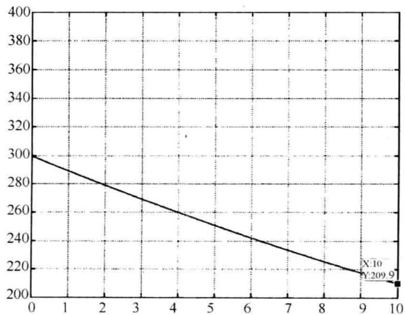

<details>
<summary>line</summary>

| X | Y |
| --- | --- |
| 0 | 300 |
| 10 | 209.9 |
</details>

图 9 乐观情景下汞元素含量变化曲线

## 10.2.3 无突变情景下的预测结果

无突变情景下该城区土壤 $\mathrm{Hg}$ 元素累积预测公式为

$$
Q _ {t} = 2 9 9. 7 1 \times (0. 9 6 5) ^ {t} + 1 5. 2 3 \times 0. 9 6 5 \times \frac {1 - 0 . 9 6 5 ^ {t}}{1 - 0 . 9 6 5}
$$

在未来 10 年内, 其浓度随时间的变化曲线图 10 所示。

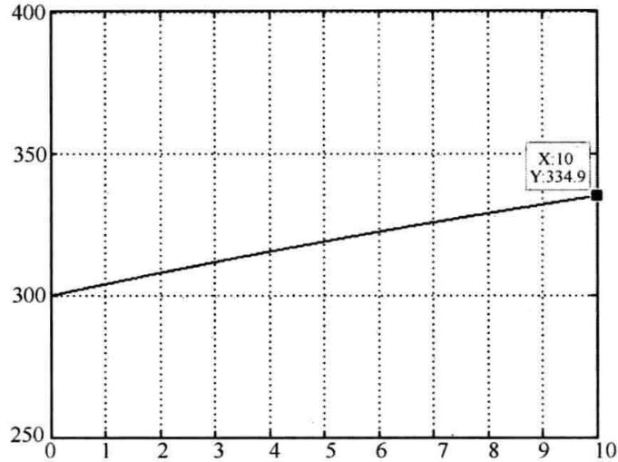

<details>
<summary>line</summary>

| X | Y |
| --- | --- |
| 10 | 334.9 |
</details>

图10 无突变情景下汞元素含量变化曲线

## 10.2.4 悲观情景下的预测结果

悲观情景下该城区土壤 $\mathrm{Hg}$ 元素累积预测公式为

$$
Q _ {t} = 2 9 9. 7 1 \times (0. 9 6 5) ^ {t} + 1 5. 2 3 \times 0. 9 6 5 \times \frac {1 - 0 . 9 6 5 ^ {t}}{1 - 0 . 9 6 5} + 0. 4 3 \times 0. 9 6 5 ^ {t}
$$

在未来 10 年内, 其浓度随时间的变化曲线如图 11 所示。

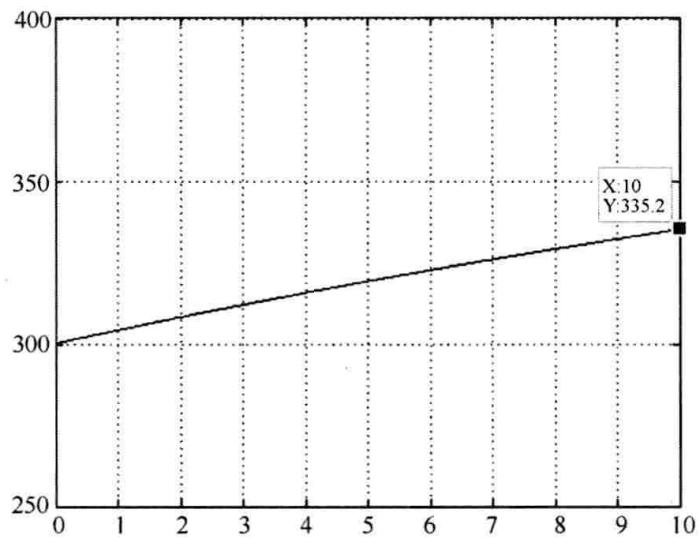

<details>
<summary>line</summary>

| X | Y |
| --- | --- |
| 0 | 300 |
| 10 | 335.2 |
</details>

图 11 悲观情景下汞元素含量变化曲线

结果分析：

结果表明城区内 $\mathrm{Hg}$ 元素含量在三种情景下所预测的结果存在较大差别,其中在乐观情景下有明显下降,而在无突变情景和悲观情景下 $\mathrm{Hg}$ 元素含量将不断增加。虽然预测结果存在一定的不确定性,但它是在现有条件下一种相对较优的预测结果。本次预测结果能为土壤环境预警提供支持,说明城区土壤重金属污染防治的必要性,为城区的污染

防治措施提供了理论上的依据。

## 10.3 金属累积预测查询软件的编写

在前面,已经通过建立的模型预测了未来一段时间 Hg 元素含量的变化规律,模型的求解结果与实际情况较吻合,说明模型具有一定的可行性,可以推广到其它金属元素的预测中。由于不同小区采样点的数量较多,每个采样点又包含了 8 种重金属污染元素,如果逐一进行分析预测,工作量较大。因此,根据建立好的模型,编写了金属累积预测查询软件。

为了检验软件的可行性,可以利用该软件验证重金属累积预测模型中的求解结果,将Hg元素的实测值、背景值、累积系数等参量输入,软件运行结果如图12所示。

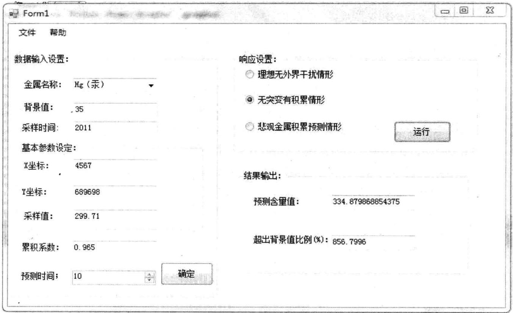

<details>
<summary>text_image</summary>

Form1
文件 帮助
数据输入设置:
金属名称: Mg (汞)
背景值: 35
采样时间: 2011
基本参数设定:
X坐标: 4567
Y坐标: 689698
采样值: 299.71
累积系数: 0.965
预测时间: 10 确定
响应设置:
○ 理想无外界干扰情形
● 无突变有积累情形
○ 悲观金属积累预测情形 运行
结果输出:
预测含量值: 334.879868854375
超出背景值比例(%): 856.7996
</details>

图 12 金属累积预测查询软件运行结果

由运行结果可知,利用金属累积预测查询软件得出的结果与模型的求解结果一样,说明该软件可以查询其它重金属元素的预测结果。利用该软件既为重金属元素的推演提供了数据来源,又大大提高了查询数据的效率。

## 参考文献

[1] 姜启源. 数学模型 [M]. 北京: 高等教育出版社, 2003.  
[2] 王树禾. 数学模型选讲 [M]. 北京: 科学出版社, 2008.  
[3] 杨启帆. 数学建模 [M]. 杭州: 浙江大学出版社, 1999.  
[4] 宋叶志. 数值分析与运用 [M]. 北京: 机械工业出版社, 2009.

[5] Giordano, Frank R, Fox, William P, et al. Mathematical Modeling[M]. 北京: 机械工业出版社, 2009.  
[6] 谢小进. 上海地区土壤重金属空间分布特征及其成因分析 [D]. 上海: 上海师范大学, 2010.  
[7] 林艳. 基于地统计学与 GIS 的土壤重金属污染评价与预测 [D]. 长沙: 中南大学, 2009.  
[8] 覃邦余. 重金属污染物在土壤环境系统中运移的建模与仿真[D]. 广西: 广西师范大学, 2009.

## 【论文点评】

赵颖

本论文获国内大学生建模竞赛一等奖,亮点是利用反问题的思想解决问题三,同时分析污染扩散特征建立污染扩散模型,从不同的思路建模并比较分析数值模拟结果。

问题一首先利用克里格法对不同区域重金属浓度进行插值,画出功能区地形分布图、8种重金属元素空间分布图。再利用差值后的数据资料建立数学模型,全面比较分析污染程度,利用污染负荷指数法整体分析各功能区的污染程度,利用地累积指数法局部分析不同区域内重金属的污染程度。

问题二针对重金属污染的主要原因,本文引入变异系数法分析重金属特征,引入协方差系数分析重金属相关性,引入因子载荷阵分析重金属因子。

问题三利用反问题思想基于污染推移特征建立了污染源模型,首先基于背景值进行对照试验模拟,将重金属浓度的实测值与对照试验结果进行比较分析找出可能的污染源位置;其次在背景值中引入可能污染源信息资料,进行循环推演,从而找出所有污染源的位置。为了更好地说明该模型所确定的各个功能区污染源的位置及污染源所包含重金属元素的准确性,本文又分析了重金属浓度和位势高度随梯度变化,基于污染扩散特征建立了污染扩散模型,同样得出了污染源的位置。两种模型的求解结果基本吻合。

由于题目所给数据随时间变化的信息不足,建议应该收集空间上土壤性能参数的变化和时间上重金属污染浓度的变化,以及各个功能区的地质特性。最后假设在信息充足的前提下,本文提出应建立污染物二维传递模型,更加全面分析重金属污染物的演变过程,并基于预测地质环境的变化规律。

# 城市表层土壤重金属污染分析

## 摘要

本文为解决土壤中重金属污染程度评价、污染原因分析、污染传播建模等问题,进行了大量的数据分析处理工作,并先后建立了四个数学模型,分别是基于环境背景值概率分布的单因子污染评价模型、内梅罗综合污染指数评价模型、污染源传播衰减模型以及基于时序的各污染源叠加模型。

问题一中,本文首先利用统计分析与 Kriging 插值结合的方法,给出了各重金属元素在城区的空间分布;之后,在原有地质累积因数的基础上,对其进行了改进,将环境背景值的分布规律纳入考虑范围,由此建立了单因子污染评价模型;在此基础之上,本文又建立了内梅罗综合污染指数评价模型。利用上述两个模型,得出该城区综合污染最严重的区域为工业区,其次是交通区,污染最轻的为山区,并给出了各区的综合污染级别以及每种元素的污染指数。

问题二中,为分析重金属污染的主要原因,本文先利用因子分析法,根据原始数据特征值的分析,将8种元素分布的成因归结为四个主因子,并依据查阅到的资料对重金属污染的主要原因逐一进行了分析。

接下来,为解决问题三,本文先对污染源进行了简单分类,并通过建立污染源传播衰减模型,着重对点污染源的传播方式以及定位进行了详细的求解和分析。在求解过程中,本文利用了回归分析的方法,简化了模型的求解,并确定了(3491.6,4432.5)、(10544.4,3846.2)等17个污染源。

之后,在问题四中,本文对所建立的模型进行了优缺点分析,并指出了还应收集的数据,尔后在补充数据的基础之上,假设了受体污染物中某种元素是各污染源贡献的线性组合的前提,提出了基于时间序列的污染物变化预测模型。

最后,本文对所得到的结论进行了分析和检验,从数学角度和实际角度论证了结果的合理性。

关键词: Kriging 插值, 改进的地累积因数, 因子分析法, 内梅罗综合污染, 指数, 污染传播衰减模型

## 1 问题的重述

随着城市经济的快速发展和城市人口的不断增加,人类活动对城市环境质量的影响日显突出。对城市土壤地质环境异常的查证,以及如何应用查证获得的海量数据资料开展城市环境质量评价,研究人类活动影响下城市地质环境的演变模式,日益成为人们关注的焦点。

按照功能划分,城区一般可分为生活区、工业区、山区、主干道路区及公园绿地区等,分别记为1类区、2类区、…、5类区,不同的区域环境受人类活动影响的程度不同。

现对某城市城区土壤地质环境进行调查。为此,将所考察的城区划分为间距1km左右的网格子区域,按照每平方千米1个采样点对表层土(0\~10cm深度)进行取样、编号,并用GPS记录采样点的位置。应用专门仪器测试分析,获得了每个样本所含的多种化学元素的浓度数据。另一方面,按照2km的间距在那些远离人群及工业活动的自然区取样,将其作为该城区表层土壤中元素的背景值。

附件1列出了采样点的位置、海拔高度及其所属功能区等信息，附件2列出了8种主要重金属元素在采样点处的浓度，附件3列出了8种主要重金属元素的背景值。

现要求通过数学建模来完成以下任务：

（1）给出8种主要重金属元素在该城区的空间分布，并分析该城区内不同区域重金属的污染程度。  
(2) 通过数据分析,说明重金属污染的主要原因。  
(3) 分析重金属污染物的传播特征,由此建立模型,确定污染源的位置。  
（4）分析所建立模型的优缺点，为更好地研究城市地质环境的演变模式，还应收集什么信息？有了这些信息，如何建立模型解决问题？

## 2 问题的分析

问题一仅给出了城区319个离散点的数据,难以清晰直观地反映重金属分布,因而有必要先对数据进行处理。可以先对其进行实验数据的描述性统计,结合题设中城区地形及功能区划,并应用一定的插值算法绘出重金属的直观分布图。接下来,为对城区不同区域重金属污染程度进行评价,可建立单个金属元素污染指数、综合污染指数两个模型进行分析。

问题二要求根据数据分析,得到重金属污染的主要原因。考虑到很多重金属元素有相似的来源,比如污染源同为工业源或交通源,因此需要一些因子来描述不同重金属元素之间的关系,可采用因子分析法。

对于问题三,要确定污染物的传播模型,首先要对污染源进行简单的分类,然后对8种重金属污染物的传播方式进行分类,之后针对不同的分类分别建立各自的传播模型。

对于问题四,则可以将问题三中为考虑到的因素,或者忽略的因素重新纳入考虑范围之内,从而建立更加完善的模型。比如,因为题设条件比较有限,由气象或者水文条件引起的重金属污染物的变化就无法体现在问题三的模型中,这时就可以加入到第四问的模型中来。

## 3 基本假设

（1）假设所有附件中的数据都是正确无误的。  
(2) 假设认为 8 种金属元素的背景值均近似服从正态分布。  
(3) 除第四问外,不考虑重金属深入土层的纵向迁移。  
(4) 除第四问外,不考虑当地水文及气候因素对重金属元素分布的影响。

## 4 符号说明

$I_{goen}$ : 土壤中元素 n 的地质累积指数。

$C_{n}$ :样品中元素 n 的实际测量平均质量分数(mg/kg)。

$B_{n}$ : 元素 n 的化学背景浓度。

$(x_{0},y_{0})$ :点污染源的坐标。

v: 综合传播速度。

k: 自降解系数。

Z:浓度扩散系数。

S: 污染物源项。

t:时间。

ρ: 到污染源的距离。

## 5 模型建立与问题求解

## 5.1 问题一

对于问题一,本文先通过数据统计分析,给出城区功能区划分以及各重金属元素的分布情况,接下来,建立评价重金属污染程度的两个模型。

(1) 改进的地质累积因数模型: 用于评价单一重金属元素的污染程度。  
（2）内梅罗综合污染指数模型:用于评价各区的综合污染情况最后,综合这两个模型的求解结果,对该城区内不同区域重金属的污染程度进行了分析。

## 5.1.1 城区功能区划分及各元素分布情况概览

## 1. 城区地形及功能区划分示意

输入城区高程信息,利用绘图软件 Surfer,可得到城区地形图,如图 1 所示。

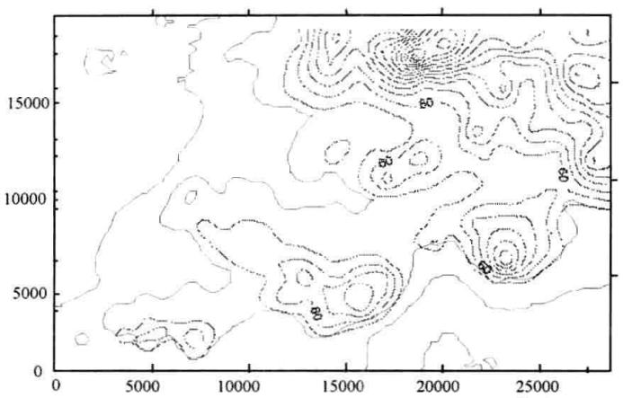

<details>
<summary>contour</summary>

| Contour Level | Description |
| --- | --- |
| 15000 | Upper region (contour) |
| 12000 | Middle region (contour) |
| 8000 | Lower region (contour) |
| 6000 | Inner region (contour) |
| 4000 | Bottom-left region (contour) |
| 2000 | Far bottom-left region (contour) |
</details>

图 1 城区等高线图

由于功能区划分各点的相关性有限,因此不适合应用插值方法绘图 $^{[1]}$ ,故本文采用离散点的方式显示,输入城区功能区划数据,可得到该城区功能区划的散点示意图,如图

2 所示。

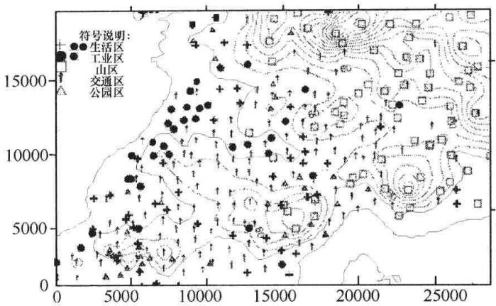

<details>
<summary>contour</summary>

| Category | Description |
| --- | --- |
| Circle | 生活区 |
| Dot | 工业区 |
| Square | 山区 |
| Triangle | 交通区 |
| Plus | 公园区 |
</details>

图 2 城区功能区散点图

## 2. 各重金属空间分布示意图

为绘制出各重金属空间分布示意图,本文采用克里格法(Kriging)。克里格法也称空间局部插值,本质上是利用区域化变量的原始数据和变差函数的结构特点,对未采样点的区域化变量值进行线性无偏最优估计的一种方法 $^{[1]}$ 。在软件中,克里格法主要包括简单克里格、普通克里格和通用克里格等。本文使用最通用的普通克里格插值法。根据每一个采样点浓度,结合坐标值,用Surfer软件绘制得到如图3所示的空间分布图。

图 3 显示的是该城区土壤中砷(As)的分布情况, 其平均浓度为 $5.68 \mu g/g$ , 为背景值的 1.575 倍, 其变幅为 $1.61 \mu g/g \sim 30.13 \mu g/g$ , 最高值出现在交通区点 (18134, 10046) 处, 如图 3 所示 A 点, 最低值出现在工业区点 (14896, 1603) 处, 如图 3 所示 B 点。浓度高的点主要分布于西南部和中部。

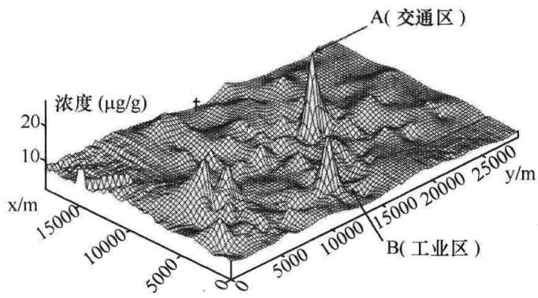

<details>
<summary>surface_3d</summary>

| Category | X-axis (m) | Y-axis (m) | Concentration \((\mu g/g)\) |
| --- | --- | --- | --- |
| A (交通区) | ~10000 | ~15000 | ~20 |
| B (工业区) | ~5000 | ~10000 | ~10 |
</details>

图 3 砷(As)分布

镉(Cd)的分布如图4所示,其平均浓度为302.40μg/g,为背景值的2.32倍,其变幅为40.0μg/g\~1619.8μg/g,最高值出现在交通区点(21439,11383)处,如图所示A点,最低值出现在山区点(15255,5110)处,如图所示B点。浓度高的点主要分布于西南部和中部。

该城区土壤铬(Cr)的分布情况如图5所示,其平均浓度为53.51μg/g,为背景值的1.72倍,其变幅为40.0μg/g\~1619.8μg/g,最高值出现在交通区点(3299,6018)处,如图所示A点,最低值出现在交通区点(17075,12924)处,如图所示B点。浓度高的点主要分布于西南部,受工业生产排放的废料影响。

图6反映的是土壤中铜(Cu)在该城区的分布情况,其平均浓度为55.02μg/g,为背景值的4.16倍,其变幅为 $2.29\mu \mathrm{g / g}\sim 2528.48\mu \mathrm{g / g}$ ，最高值出现在工业区点(2383,3692)处，如图所示A点，最低值出现在山区点(15255,5110)处，如图所示B点。浓度高的点主要分布于西南部。

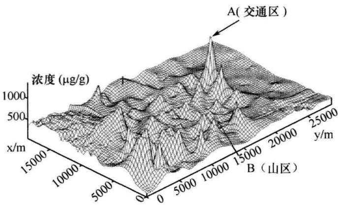

<details>
<summary>surface_3d</summary>

| Feature | Description |
| --- | --- |
| Peak Label | A (交通区) |
| X-axis Range | 0~25000 m |
| Y-axis Range | 0~25000 m |
| Z-axis Range | 0~1000 µg/g |
</details>

图 4 镉(Cd)分布  
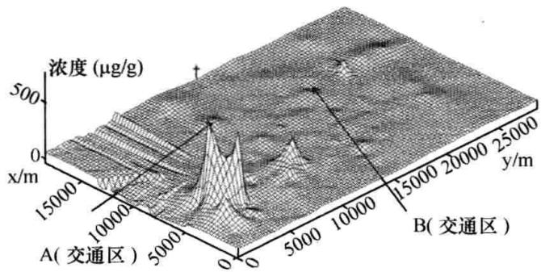

<details>
<summary>surface_3d</summary>

| X-axis (m) | Y-axis (m) | Concentration \((\mu g/g)\) |
| --- | --- | --- |
| ~15000 | ~2500 | ~250 |
| ~10000 | ~2500 | ~250 |
| ~5000 | ~2500 | ~250 |
| ~15000 | ~10000 | ~250 |
| ~10000 | ~10000 | ~250 |
| ~5000 | ~10000 | ~250 |
| ~15000 | ~5000 | ~250 |
| ~10000 | ~5000 | ~250 |
| ~5000 | ~5000 | ~250 |
| ~15000 | ~2500 | ~250 |
| ~10000 | ~2500 | ~250 |
| ~5000 | ~2500 | ~250 |
| ~15000 | ~1500 | ~250 |
| ~10000 | ~1500 | ~250 |
| ~5000 | ~1500 | ~250 |
| ~15000 | ~1000 | ~250 |
| ~10000 | ~1000 | ~250 |
| ~5000 | ~1000 | ~250 |
| ~15000 | ~500 | ~250 |
| ~10000 | ~500 | ~250 |
| ~5000 | ~500 | ~250 |
| ~15000 | ~250 | ~250 |
| ~10000 | ~250 | ~250 |
| ~5000 | ~250 | ~250 |
| ~15000 | ~150 | ~250 |
| ~10000 | ~150 | ~250 |
| ~5000 | ~150 | ~250 |
| ~15000 | ~12.67e+4 | >6.86e+4 |
| ~154376.967e+4 | ~1267e+4 | >6.86e+4 |
| ~1267e+47.967e+47.967e+47.967e+47.967e+47.967e+47.967e+47.967e+47.967e+47.967e+47.967e+47.967e+47.967e+47.967e++47.967e+47.967e+47.967e+47.967e+47.967e+47.967e+47.967e+47.967e+47.967e+47.967e+47.967e+47.967e+47.<nl>

</details>

图 5 铬(Cr)分布

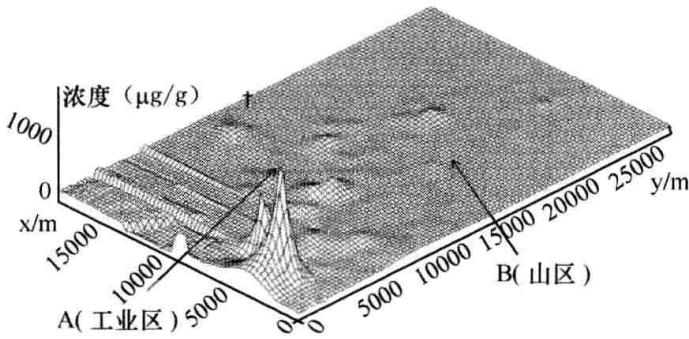

<details>
<summary>surface_3d</summary>

| x/m | y/m | \(B(山区)\) | \(浓度(\mu g/g)\) |
| --- | --- | --- | --- |
| ~15000 | ~25000 | ~15000 | ~1000 |
| ~10000 | ~25000 | ~15000 | ~1000 |
| ~5000 | ~25000 | ~15000 | ~1000 |
| ~15000 | ~15000 | ~15000 | ~1000 |
| ~10000 | ~15000 | ~15000 | ~1000 |
| ~5000 | ~15000 | ~15000 | ~1000 |
| ~15000 | ~5000 | ~15000 | ~1000 |
| ~10000 | ~5000 | ~15000 | ~1000 |
| ~5000 | ~5000 | ~15000 | ~1000 |
| ~15000 | ~2500 | ~15000 | ~1000 |
| ~10000 | ~2500 | ~15000 | ~1000 |
| ~5000 | ~2500 | ~15000 | ~1000 |
| ~1500 | ~2500 | ~1500 | ~150 |
| ~1500 | ~2500 | ~150 | ~15 |
| ~1500 | ~250 | ~15 | ~15 |
| ~150 | ~25 | ~15 | ~15 |
| ~15 | ~25 | ~15 | ~15 |
| ~15 | ~25 | ~15 | ~15 |
| ~15 | ~25 | ~15 | ~15 |
| ~15 | ~25 | ~15 | ~15 |
| ~15 | ~25 | ~15 | ~15 |
| ~15 | ~25 | ~15 | ~15 |
</details>

图 6 铜(Cu)分布

该城区土壤汞(Hg)的分布如图7所示,其平均浓度为299.71μg/g,为背景值的8.53倍,其变幅为8.57μg/g\~16000.00μg/g,最高值出现在交通区点(2708,2295)处,如图所示A点,最低值出现在交通区点(17075,12924)处,如图所示B点。浓度高的点主要分布于西南部和中部,受工业生产排放的废料及废气影响。

图8反映了该城区土壤镍(Ni)的分布情况,其平均浓度为17.26μg/g,为背景值的1.40倍,其变幅为4.27μg/g\~142.50μg/g,最高值出现在交通区点(3299,6018)处,如图所示A点,最低值出现在工业区点(14896,1603)处,如图所示B点。浓度高的点主要分布于西南部和东部,受工业生产排放的废料和农业施肥影响。

图9反映该城区土壤铅(Pb)的分布情况,土壤中铅的平均浓度为61.74μg/g,为背景值的 1.99 倍, 其变幅为 $19.68 \mu g/g \sim 472.48 \mu g/g$ , 最高值出现在生活区点 (4777, 4897) 处, 如图所示 A 点, 最低值出现在山区点 (24702, 9522) 处, 如图所示 B 点。浓度高的点主要分布于西南部和中部的交通区, 受交通运输影响较大。

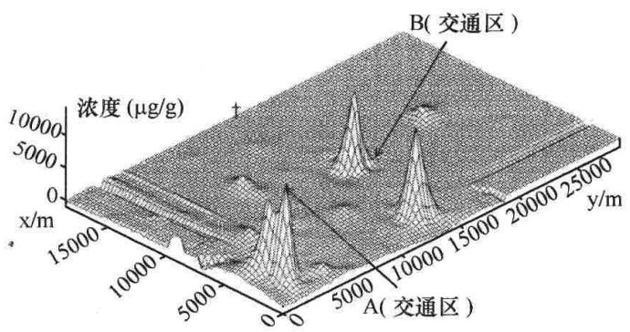

<details>
<summary>surface_3d</summary>

| Feature | Description |
| --- | --- |
| Y-axis label | 浓度 \((\mu g/g)\) |
| X-axis label | A(交通区) |
| Peak location | B(交通区) |
| Peak height | ~10000 \(\mu g/g\) |
</details>

图 7 汞(Hg)分布  
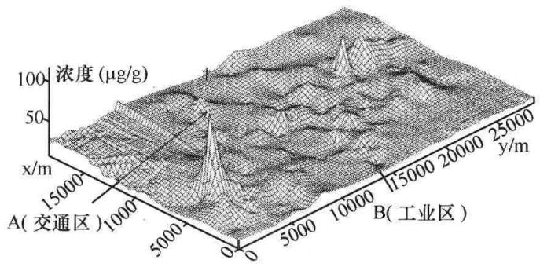

<details>
<summary>surface_3d</summary>

| A (交通区) | B (工业区) | Concentration \((\mu g/g)\) |
| --- | --- | --- |
| ~1000 | ~5000 | ~50 |
| ~1500 | ~10000 | ~80 |
| ~2000 | ~15000 | ~90 |
| ~2500 | ~20000 | ~70 |
</details>

图 8 镍(Ni)分布

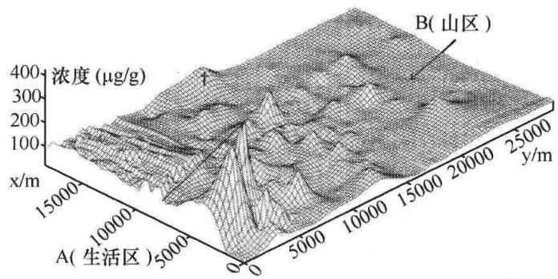

<details>
<summary>surface_3d</summary>

| Feature | Description |
| --- | --- |
| Y-axis | Horizontal distance (x/m), Vertical distance (y/m) |
| Z-axis | Concentration (μg/g) |
| Point B | 山区 (Area B) |
| X-axis | A (生活区) |
| Y-axis | Horizontal distance (y/m) |
| Z-axis | Concentration (μg/g) |
</details>

图 9 铅(Pb)分布

该城区土壤锌(Zn)的分布情况如图10所示,其平均浓度为201.2μg/g,为背景值的2.9倍,其变幅为32.86μg/g\~3760.82μg/g,最高值出现在交通区点(13797,9621)处,如图所示A点,最低值出现在山区点(17044,10691)处,如图所示B点。浓度高的点主要分布于西南部和中部交通区。

## 5.1.2 污染程度评价模型的建立

## 1. 改进的单因子地质累积指数模型

单因子指数法是指在某一污染物影响下的环境污染指数,可以分别反映各污染物对环境的污染程度。但是,单因子指数法没有考虑不同污染物的相关性,因此本文将单因子地质累积指数模型加以改进。

## 1）原有的地质积累指数模型

在对沉淀物及其它物质中重金属污染程度的研究中,地质累积指数(Geoaccumulation

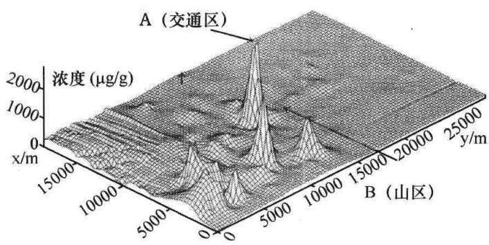

<details>
<summary>surface_3d</summary>

| X-axis (x/m) | Y-axis (y/m) | Concentration \((\mu g/g)\) |
| --- | --- | --- |
| ~15000 | ~25000 | ~2000 |
| ~10000 | ~15000 | ~1000 |
| ~5000 | ~10000 | ~500 |
| ~5000 | ~5000 | ~500 |
| ~5000 | ~2500 | ~500 |
</details>

图10 锌(Zn)分布

Index)是一种被广泛用的方法 $^{[2]}$ ，其表达公式如下：

$$
I _ {\mathrm{goe}} = \log_ {2} \left(\frac {C _ {n}}{1 . 5 B _ {n}}\right) \tag {1}
$$

式中： $I_{\mathrm{goe}}$ 其中为土壤中元素 n 的地质累积指数； $C_{n}$ 为样品中元素 n 的实测平均质量分数； $B_{n}$ 为元素 n 的化学背景浓度；1.5 为常数，是考虑到由于成岩作用可能会引起背景值的变动。

地质累积指数可分为7个级别 $^{[3]}$ ， $I_{goe}$ 与重金属污染水平见表1。

表 1 重金属污染水平

<table><tr><td> $I_{goe}$ </td><td>&lt;0</td><td>0~1</td><td>1~2</td><td>2~3</td><td>3~4</td><td>4~5</td><td>&gt;5</td></tr><tr><td>级别</td><td>0</td><td>1</td><td>2</td><td>3</td><td>4</td><td>5</td><td>6</td></tr><tr><td>污染程度</td><td>无污染</td><td>无污染—中度污染</td><td>中度污染</td><td>中度污染—强污染</td><td>强污染</td><td>强污染—极强污染</td><td>极强污染</td></tr></table>

## 2）对原有地质积累指数模型的改进

虽然地质积累指数模型评价方便直观,但是,在其应用过程中,一般将背景值视为某固定的常数,而实际上,土壤的重金属元素背景值随着土质等因素成正态分布,用常数求解显然不能很好地兼顾重金属元素背景值的概率分布。因此,本文认为有必要对旧有的地质累积模型进行改进。

为将背景值 $B_{n}$ 的变化纳入考虑范围, 我们将其视为一随机变量 $\xi$ , 考虑新的地质累积指数评价方法:

如图11所示， $f_{n}(\xi)$ 为元素 $n$ 背景值 $\xi$ 的分布函数，则对于 $\forall \xi \in (a,b)$ ，均有

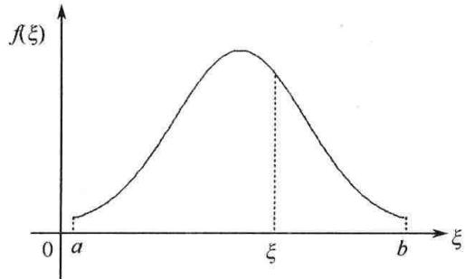

<details>
<summary>contour</summary>

| \(\xi\) | \(f(\xi)\) |
| --- | --- |
| 0 | ~0.1 |
| a | ~0.2 |
| \(\xi\) | ~0.8 |
| b | ~0.1 |
</details>

图11 考虑重金属背景值的分布

$$
I _ {\text {goen}} (\xi) = \log_ {2} \left(\frac {C _ {n}}{1 . 5 \xi}\right) \tag {2}
$$

即当环境背景值以 $f_{n}(\xi)$ 的概率取得 $\xi$ 值时， $I_{\mathrm{goen}}$ 取得值 $I_{\mathrm{goen}}(\xi)$ 因而，当 $\xi$ 按概率取遍 $(a, b)$ 内所有值， $I_{\mathrm{goen}}$ 将以 $f_{n}(\xi)$ 的概率遍取 $I_{\mathrm{goen}}(\xi)$ 在 $(a, b)$ 上的值域。所以，不妨取新的地质累积因数 $I_{\mathrm{goen}} = E(I_{\mathrm{goen}}(\xi))$ ，即改进后的地质因数模型可表示为

$$
I _ {\text {goen}} = \int_ {a} ^ {b} \log_ {2} \left(\frac {C _ {n}}{1 . 5 \xi}\right) f _ {n} (\xi) \mathrm{d} \xi \tag {3}
$$

式中： $C_n$ 为样品中元素 $n$ 的实测平均质量分数 $(\mathrm{mg / kg})$ ； $\xi$ 为元素 $n$ 的化学背景浓度； $f(\xi)$ 为 $\xi$ 的概率密度函数； $a, b$ 分布为随机变量 $\xi$ 取值范围的上限和下限； $I_{\mathrm{goen}}$ 即为元素 $n$ 的地质累积指数。

## 3）模型求解

将附件二数据代入求出各测量点的地质累积因数,根据重金属污染程度级别划分,统计各种重金属污染情况,见表2。

表 2 各种金属污染点的等级情况统计

<table><tr><td colspan="2">重金属元素\级别</td><td>&lt;0(0级)</td><td>0~1(1级)</td><td>1~2(2级)</td><td>2~3(3级)</td><td>3~4(4级)</td><td>4~5(5级)</td><td>&gt;5(6级)</td></tr><tr><td rowspan="2">As</td><td>测量点数</td><td>158</td><td>156</td><td>5</td><td>0</td><td>0</td><td>0</td><td>0</td></tr><tr><td>百分比</td><td>49.5</td><td>48.9</td><td>1.6</td><td>0.0</td><td>0.0</td><td>0.0</td><td>0.0</td></tr><tr><td rowspan="2">Cd</td><td>测量点数</td><td>115</td><td>166</td><td>37</td><td>1</td><td>0</td><td>0</td><td>0</td></tr><tr><td>百分比</td><td>36.1</td><td>52.0</td><td>11.6</td><td>0.3</td><td>0.0</td><td>0.0</td><td>0.0</td></tr><tr><td rowspan="2">Cr</td><td>测量点数</td><td>190</td><td>120</td><td>7</td><td>2</td><td>0</td><td>0</td><td>0</td></tr><tr><td>百分比</td><td>59.2</td><td>37.6</td><td>2.2</td><td>0.6</td><td>0.0</td><td>0.0</td><td>0.0</td></tr><tr><td rowspan="2">Cu</td><td>测量点数</td><td>83</td><td>157</td><td>69</td><td>8</td><td>0</td><td>2</td><td>0</td></tr><tr><td>百分比</td><td>26.0</td><td>49.2</td><td>21.6</td><td>2.5</td><td>0.0</td><td>0.6</td><td>0.0</td></tr><tr><td rowspan="2">Hg</td><td>测量点数</td><td>164</td><td>96</td><td>42</td><td>8</td><td>5</td><td>0</td><td>4</td></tr><tr><td>百分比</td><td>51.4</td><td>30.1</td><td>13.2</td><td>2.5</td><td>1.6</td><td>0.0</td><td>1.3</td></tr><tr><td rowspan="2">Ni</td><td>测量点数</td><td>198</td><td>119</td><td>2</td><td>0</td><td>0</td><td>0</td><td>0</td></tr><tr><td>百分比</td><td>62.1</td><td>37.3</td><td>0.6</td><td>0.0</td><td>0.0</td><td>0.0</td><td>0.0</td></tr><tr><td rowspan="2">Pb</td><td>测量点数</td><td>159</td><td>145</td><td>12</td><td>3</td><td>0</td><td>0</td><td>0</td></tr><tr><td>百分比</td><td>49.8</td><td>45.5</td><td>3.8</td><td>0.9</td><td>0.0</td><td>0.0</td><td>0.0</td></tr><tr><td rowspan="2">Zn</td><td>测量点数</td><td>149</td><td>124</td><td>35</td><td>9</td><td>2</td><td>0</td><td>0</td></tr><tr><td>百分比</td><td>46.7</td><td>38.9</td><td>11.0</td><td>2.8</td><td>0.6</td><td>0.0</td><td>0.0</td></tr></table>

将重金属各测量点的等级情况输出在对应的地理位置上,得出具体的污染分布图(图12),图中+表示无污染—中度污染,○表示中度污染,+表示中度污染—强污染,▲表示强污染,■表示强污染—极强污染,★表示极强污染。

由表 2 可以看出, 在该城区中, Hg 和 Cu 的污染程度最大, Hg 甚至有 4 个极强污染点, Cu 有 2 个 5 级污染点, Zn 紧随二者之后, 有 2 个强污染点; 而 As 和 Ni 的污染程度最轻, 仅有零星的中度污染点, 大部分均为无污染或者无污染到中度污染之间。

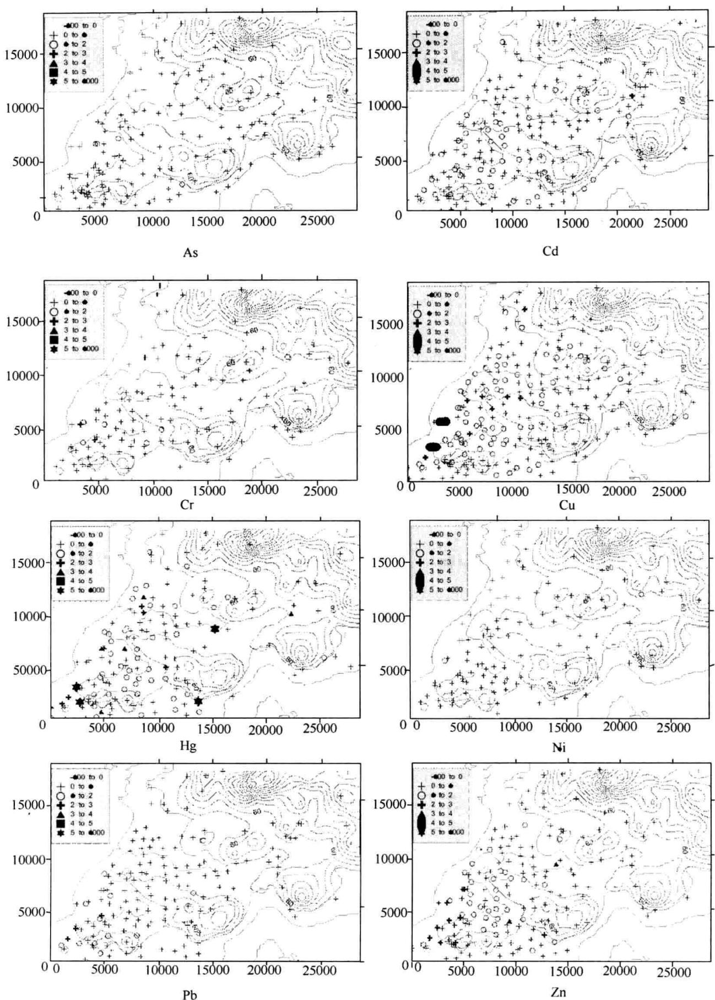  
图 12 重金属污染分布图

由分布图与功能区图的对比可知,工业区各种金属元素的污染均比较严重,Hg 和 Cu 的 4 级以上污染点均集中在工业区,交通区污染情况也比较严重,有 Zn 的强污染点一个,Pb、Cd 等元素的含量也远远超过背景值;污染最轻的是山区,仅有极少数 2 级以上污染点;生活区与绿地区属于中等较轻污染区,值得一提的是,绿地区的 As 含量反而明显高于背景值,可能是化肥施用导致的土壤污染。

虽然由上述8图即可直观地看出各种重金属在城区的污染状况,但是这种模型并不能反映某一地区或者某个功能区综合的污染状况,因此有必要在此基础上建立综合评价模型。

## 2. 内梅罗综合污染指数模型

## 1) 模型主体

由于每一处都有不止一种重金属污染,其污染程度是由各种污染综合决定,为此需要选取一种多指标综合评价方法来描述各点的综合污染程度。经过分析,在已求得地质累积因数的基础上,采用内梅罗指数 $^{[4]}$ 能够很好地说明问题。内梅罗指数兼顾了最高分指数和平均分指数的影响,指数形式简单,适应污染物个数的增减,有很好的适应性。内梅罗指数的计算公式为

$$
P _ {i} = \sqrt {\frac {I _ {\text {goen} _ {i \max}} ^ {2} + I _ {\text {goen} _ {i a v e}} ^ {2}}{2}} \tag {4}
$$

式中： $P_{i}$ 为土壤污染的内梅罗指数； $I_{\mathrm{goen}_{\mathrm{imax}}}$ 为测量点点土壤重金属污染的地质累积因数最大值； $I_{\mathrm{goen}_{\mathrm{iave}}}$ 为该处地质累积因数平均值。

## 2）模型求解

针对问题要说明该城区内不同区域重金属的污染程度,将求得的内梅罗指数按照不同区域进行统计,以此来分析说明。

运用 C 语言编程求解和利用 Excel 进行统计求得结果, 见表 3。

表 3 不同区域内梅罗指数等级情况

<table><tr><td>区域</td><td colspan="2">级别信息</td><td>0级点数</td><td>1级点数</td><td>2级点数</td><td>3级点数</td><td>4级点数</td><td>5级点数</td><td>6级点数</td></tr><tr><td rowspan="2">生活区</td><td>总点数</td><td>44</td><td>0</td><td>32</td><td>10</td><td>2</td><td>0</td><td>0</td><td>0</td></tr><tr><td>百分比</td><td>100</td><td>0.0</td><td>72.7</td><td>22.7</td><td>4.6</td><td>0.0</td><td>0.0</td><td>0.0</td></tr><tr><td rowspan="2">工业区</td><td>总点数</td><td>36</td><td>0</td><td>21</td><td>10</td><td>4</td><td>0</td><td>1</td><td>0</td></tr><tr><td>百分比</td><td>100</td><td>0.0</td><td>58.3</td><td>27.8</td><td>11.1</td><td>0.0</td><td>2.8</td><td>0.0</td></tr><tr><td rowspan="2">山区</td><td>总点数</td><td>66</td><td>0</td><td>66</td><td>0</td><td>0</td><td>0</td><td>0</td><td>0</td></tr><tr><td>百分比</td><td>100</td><td>0.0</td><td>100</td><td>0.0</td><td>0.0</td><td>0.0</td><td>0.0</td><td>0.0</td></tr><tr><td rowspan="2">交通区</td><td>总点数</td><td>138</td><td>0</td><td>94</td><td>34</td><td>6</td><td>3</td><td>1</td><td>0</td></tr><tr><td>百分比</td><td>100</td><td>0.0</td><td>68.1</td><td>24.6</td><td>4.4</td><td>2.2</td><td>0.7</td><td>0.0</td></tr><tr><td rowspan="2">公园绿化区</td><td>总点数</td><td>35</td><td>0</td><td>29</td><td>4</td><td>2</td><td>0</td><td>0</td><td>0</td></tr><tr><td>百分比</td><td>100</td><td>0.0</td><td>82.9</td><td>11.4</td><td>5.7</td><td>0.0</td><td>0.0</td><td>0.0</td></tr></table>

分析结果,工业区污染最严重,其污染严重的点所占比例最大,2级污染以上达到41.7%,甚至有2.8%的点为5级污染,也就是达到强污染的级别。其次是交通区,2级污染以上占31.9%。然后是生活区和公园绿地区,2级污染以上分别占27.3%、17.1%。山区污染程度最小,没有2级以上污染地点,只有轻度的污染。

## 5.1.3 城区内不同区域重金属的污染程度综述

综合两个模型求解的结果,得出对城区内不同区域重金属污染程度的综合评价:

污染最严重的区域是工业区,其中度污染以上的点达到41.7%,强污染以上的点占2.8%。各种元素在工业区中均有不同程度的污染,其中最严重的是汞(Hg),2.8%的点为强度污染,最轻度的污染为镍(Ni),没有超过中度污染的点。

污染第二严重的区域是交通区,其中度污染以上的点达到31.2%,强污染以上的点占0.7%。其中最严重的是汞(Hg),2.2%的点为汞强度污染,最轻度的污染为镍(Ni),过中度污染的点仅占0.7%。

重金属污染程度位于第三位的是生活区,其中度污染以上的点达到27.3%,无强污染以上的点。在各重金属分布中,污染最严重的是镉(Cd),6.8%的点为汞为强度污染,最轻度的污染为镍(Ni),无中度污染以上的点。

污染程度较轻的是公园绿地区,其中度污染以上的点达到17.1%,无强污染以上的点。在各重金属分布中,污染最严重的是汞(Hg),2.9%的点为汞强度污染,最轻度的污染为镍(Ni),无中度污染以上的点。

污染最轻的区域为山区,无中度污染以上的点。污染最严重的是镉(Cd),6.8%的点为汞中度污染,最轻度的污染为锌(Zn)。

## 5.2 问题二

重金属污染的来源复杂多样,但很多污染原因是相关的,在不确定具体污染源的条件下,想要得到重金属的污染原因,可以用少数几个因子描述8个重金属元素。由于因子分析法具有压缩数据和提取综合因子的功能,且用于研究多因子之间的相关性问题。因此,本文用SPSS统计软件进行因子分析。

## 5.2.1 因子分析

以8种重金属污染物为变量进行因子分析,作方差最大正交旋转。因子分析结果见表4。

表 4 特征值和累计贡献率

<table><tr><td rowspan="2">因子</td><td colspan="3">初始特征值</td><td colspan="3">旋转前</td><td colspan="3">旋转后</td></tr><tr><td>特征值</td><td>方差百分比</td><td>累计方差贡献率</td><td>特征值</td><td>方差百分比</td><td>累计方差贡献率</td><td>特征值</td><td>方差百分比</td><td>累计方差贡献率</td></tr><tr><td>1</td><td>3.560</td><td>44.500</td><td>44.500</td><td>3.560</td><td>44.500</td><td>44.500</td><td>2.097</td><td>26.212</td><td>26.212</td></tr><tr><td>2</td><td>1.150</td><td>14.377</td><td>58.877</td><td>1.150</td><td>14.377</td><td>58.877</td><td>2.067</td><td>25.835</td><td>52.047</td></tr><tr><td>3</td><td>1.965</td><td>12.063</td><td>70.941</td><td>1.965</td><td>12.063</td><td>70.941</td><td>1.258</td><td>15.721</td><td>67.768</td></tr><tr><td>4</td><td>1.768</td><td>9.596</td><td>80.537</td><td>1.768</td><td>9.596</td><td>80.537</td><td>1.021</td><td>12.769</td><td>80.537</td></tr><tr><td>5</td><td>1.578</td><td>7.220</td><td>87.756</td><td></td><td></td><td></td><td></td><td></td><td></td></tr><tr><td>6</td><td>1.432</td><td>5.399</td><td>93.156</td><td></td><td></td><td></td><td></td><td></td><td></td></tr><tr><td>7</td><td>1.301</td><td>3.769</td><td>96.924</td><td></td><td></td><td></td><td></td><td></td><td></td></tr><tr><td>8</td><td>1.246</td><td>3.076</td><td>100.000</td><td></td><td></td><td></td><td></td><td></td><td></td></tr></table>

取特征值大于0.7,累计方差达到80.537%的前四个因子,表明所提取的因子可以较好地代表原数据所蕴涵的信息。

运用 KMO 检验方法和 Bartlett 球形检验确定 319 个变量是否适合因子分析, 结果表明 KMO 的值为 0.778, 大于 0.7, 适合因子分析。且 Bartlett 球度检验得到的相伴概率为 0, 小于显著性水平 0.05, 拒绝 Bartlett 球度检验的零假设, 适合用因子分析。分析结果见表 5。

表 5 方差极大正交旋转后因子载荷矩阵

<table><tr><td rowspan="2"></td><td colspan="4">因子</td></tr><tr><td>1</td><td>2</td><td>3</td><td>4</td></tr><tr><td>As</td><td>0.134</td><td>0.173</td><td>0.026</td><td>0.969</td></tr><tr><td>Cd</td><td>0.131</td><td>0.851</td><td>0.131</td><td>0.096</td></tr><tr><td>Cr</td><td>0.878</td><td>0.242</td><td>0.034</td><td>0.009</td></tr><tr><td>Cu</td><td>0.577</td><td>0.330</td><td>0.546</td><td>0.025</td></tr><tr><td>Hg</td><td>0.003</td><td>0.146</td><td>0.942</td><td>0.035</td></tr><tr><td>Ni</td><td>0.877</td><td>0.154</td><td>0.036</td><td>0.218</td></tr><tr><td>Pb</td><td>0.170</td><td>0.840</td><td>0.228</td><td>0.117</td></tr><tr><td>Zn</td><td>0.399</td><td>0.628</td><td>0.020</td><td>0.096</td></tr></table>

载荷大小反映变量与主因子之间的相关程度,因子载荷值越大,公因子与原变量之间的相关性越强。第一主因子中 Cr、Cu、Ni 具有较高的因子载荷,第二主因子中 Cd、Pb、Zn 具有较高的因子载荷,第三主因子中仅有 Hg 具有较高的因子载荷,第四主因子中仅 As 具有较高的因子载荷。

## 5.2.2 重金属污染主要原因分析

第一主因子解释的原变量方差最多为 $26.212\%$ ，可以认为第一主因子是污染的主要来源。铬（Cr）、铜（Cu）、镍（Ni）具有较高的因子载荷，Cr主要用于金属加工、电镀、制革等行业。工业部门排放的废水和废气，都是环境中铬的人为来源。冶金、水泥等工业，以及煤和石油燃烧的废气中，含有颗粒态的铬。Cu污染来源是可能是铜锌矿的开采和冶炼、金属加工、机械制造、钢铁生产等。电镀工业和金属加工排放的废水中也可能有较高含铜量。Ni污染来源于镀镍工业、机器制造业、金属加工业排放的废水废气，还可能来源于农业中灌溉用水和农田施肥。因此，本文认为工业生产和交通运输是该城区的主要污染原因。

第二主因子中，镉(Cd)、铅(Pb)、锌(Zn)载荷较高。在工业上，Cd可用于镉盐、镉蒸灯、颜料、烟雾弹、合金、电镀、焊药、标准电池的制造。工业生产中，废料的超标排放，是镉污染的主要原因。Pb对环境的污染：一是由冶炼、制造和使用铅制品的工矿企业，尤其是来自有色金属冶炼过程中所排出的含铅废水、废气和废渣造成的；二是由汽车排出的含铅废气造成的，汽油中用四乙基铅作为抗爆剂。因此，铅污染很大程度上存在于交通区，公路附近。Zn污染的主要原因可能为锌矿开采、冶炼加工、机械制造以及镀锌、仪器仪表、有机合成和造纸等工业的排放。汽车轮胎磨损以及煤燃烧产生的粉尘、烟尘中均含有锌及化合物，因此交通区和生活区也会存在锌污染。因此，第二主因子可归纳为交通因素和工业生产。

第三主因子中，仅有汞(Hg)具有较高的因子载荷。工业区中的氯碱、塑料、电池、电

子等工业排放的废水废气是成为污染的主要原因。因此，第三主因子可归纳为工业生产。

第四主因子中,仅有砷(As)具有较高的因子载荷。As受成土母质控制,在公园绿地区分布浓度较高。因此,第四主因子可归纳为自然因素。

## 5.3 问题三

针对本问题,要确定污染物的传播模型,首先要对8种重金属污染物的传播方式进行分类,然后针对不同的分类分别建立各自的传播模型。

## 5.3.1 污染源的分类

根据资料显示 $^{[7]}$ ，污染源按照空间位置，可分为固定源和移动源等；按照分布特性分类，可分为点污染源和面污染源。在解决本问题时，本文在定量计算时不考虑移动污染源，对于面污染源，由于其计算非常复杂，本文仅对较明显的面污染源进行定性分析，定量计算主要针对点污染源进行。

## 5.3.2 传播方式的分类

根据问题 2 中的分析, As 与 Ni 的污染程度最低, 且仅有的几个中度污染点均为离散点, 故可近似认为污染物没有经过有效传播, 或者本身中度污染点即为污染源; Hg 元素具有挥发性, 可通过气态形式迁移, 且中度以上污染点的分布明显广于其他元素, 有必要单独对其进行讨论; 而其他的元素均明显地在西南工业区方向有中度以上污染的聚集, 故可将这些元素视为一类加以讨论。

根据相关资料 $^{[5,6]}$ 一般认为,由于心土层对重金属有一定的吸附能力,重金属在土壤中的移动性很有限 $^{[4]}$ ,因此重金属的传播应主要依赖于推送与沉降作用。

## 5.3.3 传播衰减模型的建立

## 1. 点污染源

由于题设中并未给出该城区的地域气候等环境,因此在问题三中,暂时不考虑沉降作用,因此为分析该城区各主要重金属污染源的分布情况,可以假定重金属的点污染源衰减符合一般推送的化学反应动力方程,同时对地势较为平坦的地区,地势的高低起伏可以忽略不计,即可以忽略由于高下差距引起的衰减,采用仅考虑平面传播的推移和衰减变化的二维重金属推送模型来模拟污染物质量分数方程:

$$
\left\{ \begin{array}{l} \rho = \sqrt {\left(x - x _ {0}\right) ^ {2} + \left(y - y _ {0}\right) ^ {2}} \\ \frac {\partial C _ {n}}{\partial t} + v \frac {\partial C _ {n}}{\partial p} + k C _ {n} = \frac {\partial}{\partial \rho} \left(Z \frac {\partial C _ {n}}{\partial p}\right) + S \end{array} \right. \tag {5}
$$

式中：点 $(x_{0},y_{0})$ 为污染源的坐标；v为综合传播速度； $C_{n}$ 为元素n的质量分数；k为自降解系数；Z为浓度扩散系数；S为污染物源项；t为时间； $\rho$ 为到污染源的距离。

由模型假设,忽略土壤的扩散作用,故 Z 可忽略不计,同时若假定重金属污染源连续稳定排放且 S=0,又由于对于土壤模型,重金属在土壤中的移动性很有限,故可近似认为 $\frac{\partial C_{n}}{\partial t}\approx0$ ,由此,土壤中重金属传播模型可简化为

$$
\left\{ \begin{array}{l} \rho = \sqrt {\left(x - x _ {0}\right) ^ {2} + \left(y - y _ {0}\right) ^ {2}} \\ v \frac {\partial C _ {n}}{\partial p} + k C _ {n} = 0 \end{array} \right. \tag {6}
$$

事实上,上述模型的参数 $(x_{0},y_{0})$ 、v、k均为未知,因此很难用正常解法求解,不妨采用最小二乘的思想,给出污染源位置的一种回归分析模型。

对任意一个已知的采样点 $(x_{i},y_{i})$ ，它与污染源点距离为 $\rho = \sqrt{(x_i - x_0)^2 + (y_i - y_0)^2}$ 设其处的 $n$ 元素的质量分数为 $C_n(x_i,y_i)$ ，由于衰减式的对称性，不妨将 $C_n(x_i,y_i)$ 视为 $\rho$ 的函数，那么即有

$$
C _ {n} (x _ {i}, y _ {i}) = C _ {n} (\rho_ {i}) = M _ {o} \mathrm{e} ^ {- \frac {k}{v} \rho_ {i}} \tag {7}
$$

对于任意给定的污染源点 $(x_{0},y_{0})$ ，应均有式(7)成立，相应的，若已知k个点 $(x_{i},y_{i})$ ， $(i=1,2,3,\cdots,k)$ ，则 $(x_{0},y_{0})$ 应该是可以使得下式取得最小值的优化解之一：

$$
F (M _ {o}, \lambda , \rho_ {i}) = \sum_ {i = 1} ^ {k} (M _ {0} \mathrm{e} ^ {- \frac {k}{v} \rho_ {i}} - C _ {n} (\rho_ {i})) ^ {2}; \tag {8}
$$

式中： $\lambda = \frac{k}{v},\rho_{i} = \sqrt{(x_{i} - x_{0})^{2} + (y_{i} - y_{0})^{2}}$ ，且 $C_n(\rho_i)$ 可由附录中对应的编号为 $i$ 的采样点关于元素 $n$ 的质量分数 $C_{ni}$ 直接确定。

基于这种前提,可以给出污染源确定的一种回归分析模型:

$$
\min F (M _ {0}, \lambda , \rho_ {i}) = \sum_ {i = 1} ^ {k} (M _ {0} \mathrm{e} ^ {- \frac {k}{v} \rho_ {i}} - C _ {n} (\rho_ {i})) ^ {2} \tag {9}
$$

$$
\text {s.t.} \left\{ \begin{array}{l} \rho_ {i} = \sqrt {\left(x _ {i} - x _ {0}\right) ^ {2} + \left(y _ {i} - y _ {0}\right) ^ {2}} (i = 1, 2, \dots , k) \\ C _ {n} (\rho_ {i}) = C _ {n i} (i = 1, 2, \dots , k) \\ \lambda = \frac {k}{v} \end{array} \right.
$$

式中：为简化计算，可以定义一阈值 Y，使得点列 $(x_{i}, y_{i}), (i = 1, 2, 3, \cdots, k)$ 满足：

$$
C _ {n} (x _ {i}, y _ {i}) \geqslant Y \rightarrow I _ {\mathrm{geo}} \geqslant 2 \tag {10}
$$

式中:→为逻辑蕴含号,即只有中度以上污染点才对其进行回归分析,这样既大大简化了运算量,也与实际情况也是相对应的。

## 2. 面污染源

由于面污染的求解十分复杂,本文暂时无法给出精确的定量解。不过,本文可以尝试将建立的点源模型向面源拓展:由于面污染源不再单纯地从单点向外传播,传播范围增大的同时对被污染区的影响也会相应减小,故在应用阈值时不能简单地用污染程度定义了,事实上,对于面污染源,应当将 $C_{n}(x_{i},y_{i})$ 的正常环境上限值作为阈值,即可分辨受到波及的范围,设环境值服从正态分布 $N(\mu_{0},\sigma)$ ,即将式(10)改为

$$
Y \geqslant \mu_ {0} + \sigma \tag {11}
$$

设点 $(x_{i},y_{i})$ 距离面污染源距离为 $\rho_{i}$ ，则面污染源对应的模型也可表示为

$$
\min F (M _ {0}, \lambda , \rho_ {i}) = \sum_ {i = 1} ^ {k} (M _ {0} \mathrm{e} ^ {- \frac {k}{v} \rho_ {i}} - C _ {n} (\rho_ {i})) ^ {2} \tag {12}
$$

$$
\text {s.t.} \left\{ \begin{array}{l} C _ {n} (x _ {i}, y _ {i}) \geqslant Y (i = 1, 2, \dots , k) \\ C _ {n} (\rho_ {i}) = C _ {n i} (i = 1, 2, \dots , k) \\ \lambda = \frac {k}{v} \\ Y \geqslant \mu_ {0} + \sigma \end{array} \right.
$$

当然,由于计算过于复杂,且阈值 Y 的选取会在不同程度上影响此模型的求解结果,因此本文并不准备讨论这个模型,在接下来的模型求解中,也仅会对面污染源进行若干定性讨论。

## 5.3.4 模型求解

要求解各元素污染源的位置,需要先对采样点进行数据筛选,先筛出数据中的奇异点,作为回归分析模型的“材料”。

为了简便计算,也可以对模型进行一定近似简化求解:

对于式(7)，左右两边同时取自然对数并平方，等式可化简为

$$
\left[ \lg C _ {n} (x _ {i}, y _ {i}) - N _ {0} \right] ^ {2} = \lambda^ {2} \left[ (x _ {i} - x _ {0}) ^ {2} + (y _ {i} - y _ {0}) ^ {2} \right] \tag {13}
$$

式中： $N_0 = \lg M_0$ ，故最终满足下式的数对 $(x_0,y_0)$ 也可以作为点污染源位置的优化解之一：

$$
\min F (M _ {0}, \lambda , \rho_ {i}) = \sum_ {i = 1} ^ {k} \{\lambda^ {2} [ (x _ {i} - x _ {0}) ^ {2} + (y _ {i} - y _ {0}) ^ {2} ] - [ \lg C _ {n} (x _ {i}, y _ {i}) - N _ {0} ] ^ {2} \} ^ {2}
$$

$$
\text {s.t.} \left\{ \begin{array}{l} N _ {0} = \lg M _ {0} \\ C _ {n} (\rho_ {i}) = C _ {n i} (i = 1, 2, \dots , k) \\ \lambda = \frac {k}{v} \end{array} \right. \tag {14}
$$

将附件所给数据代入上述模型,解得各重金属污染源(除Hg、Pb)的位置见表6。

表 6 各重金属污染源

<table><tr><td>污染重金属</td><td colspan="3">污染源坐标</td></tr><tr><td>As</td><td>(5429.2,7291.0)</td><td>(12696,3024)</td><td>(18134,10046)</td></tr><tr><td>Cd</td><td>(4153,2299)</td><td>(6395.0,10443)</td><td>(21439,11383)</td></tr><tr><td>Cr</td><td>(3753.5,5185.5)</td><td>(10262.5,5149.1)</td><td>(22193,12185)</td></tr><tr><td>Cu</td><td>(2750.7,4397.0)</td><td>(8259.6,8065.4)</td><td>(11121,16432)</td></tr><tr><td>Ni</td><td>(3299,6018)</td><td>(22193,12185)</td><td></td></tr><tr><td>Zn</td><td>(3491.6,4432.5)</td><td>(10544.4,3846.2)</td><td>(13797,9621)</td></tr></table>

将坐标点绘出,如图 13 所示。

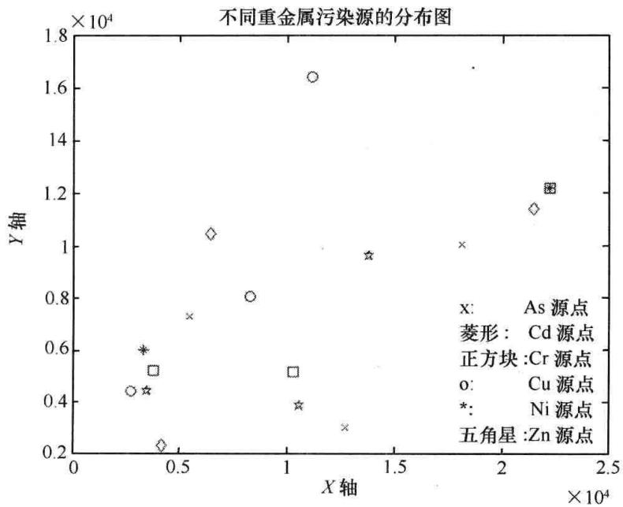

<details>
<summary>scatter</summary>

| Series | X (x10^4) | Y (x10^4) |
| --- | --- | --- |
| As 源点 (x) | ~0.35 | ~0.44 |
| As 源点 (x) | ~0.40 | ~0.52 |
| As 源点 (x) | ~0.60 | ~0.73 |
| As 源点 (x) | ~1.05 | ~0.51 |
| As 源点 (x) | ~1.35 | ~0.30 |
| As 源点 (x) | ~1.80 | ~1.01 |
| As 源点 (x) | ~2.15 | ~1.14 |
| Cd 源点 (菱形) | ~0.35 | ~0.60 |
| Cd 源点 (菱形) | ~0.40 | ~0.44 |
| Cd 源点 (菱形) | ~0.65 | ~1.05 |
| Cd 源点 (菱形) | ~1.35 | ~0.97 |
| Cd 源点 (菱形) | ~1.80 | ~1.01 |
| Cr 源点 (正方块) | ~0.35 | ~0.44 |
| Cr 源点 (正方块) | ~0.40 | ~0.23 |
| Cr 源点 (正方块) | ~0.65 | ~1.05 |
| Cr 源点 (正方块) | ~1.35 | ~0.97 |
| Cr 源点 (正方块) | ~2.20 | ~1.22 |
| Cu 源点 (o) | ~0.35 | ~0.44 |
| Cu 源点 (o) | ~0.85 | ~0.81 |
| Cu 源点 (o) | ~1.15 | ~1.64 |
| Ni 源点 (*) | ~0.35 | ~0.60 |
| Ni 源点 (*) | ~0.65 | ~0.73 |
| Ni 源点 (*) | ~1.35 | ~0.97 |
| Zn 源点 (五角星) | ~2.20 | ~1.22 |
</details>

图13 不同重金属污染源的分布图

对比城区功能区散点图可得到 As 的源点主要在靠近山区的地方,污染源出现的原因可能是农业生产施肥含有 As。Cd、Cr、Cu、Ni、Zn 主要集中在城市工业区中,还有个别在山区,其原因可能是工厂废气废渣废水的排放引起和在山区进行采矿。

## 5.4 问题四

## 5.4.1 模型的优缺点

## 1. 优点

（1）本模型通过建立近似的重金属传播模型，能较好地解决点污染源定位问题，求得的通解为负指数型，与常识相符。  
（2）模型可拓展性强，所建模型不必拘泥于某种元素，只要污染源为固定型点污染源的都有一定的适用价值。  
（3）应用最小二乘思想进行回归分析的做法，相当于“已知结果，反推原因”，因此成功避开了对于金属实际传播的具体路径、点污染源污染量大小等与求解目标关系不大的参数的求解，达成目的的同时大大简化了计算，同时也使得模型的应用范围更加广泛。

## 2. 缺点

(1) 由于数据有限,本模型没有考虑土壤中重金属的垂直迁移。  
(2) 本模型只能求解地表污染源,如果存在地下污染源则会造成计算偏差。  
(3) 本模型在解决面污染源时比较困难。  
（4）由于数据有限,本模型没有进一步考虑当地水文环境以及气象环境对土壤重金属传播的影响。  
(5) 未考虑多个相互独立的污染源共同影响某些采样点时的情况。

## 5.4.2 还应收集的信息

还应收集的信息有:土壤的自降解系数k,土壤中重金属离子的质量分数扩散系数Z,任意污染源 $(x_{0},y_{0})$ 的影响范围 $R_{0}$ ,大气中沉降元素n的速率 $D_{n}$ ,以及单位时间内河流携带并沉降下的重金属元素n的质量 $L_{n}$ 。

## 5.4.3 更一般的模型

首先,仍然假设受体污染物中某种元素是各污染源贡献的线性组合。其次,由于地势平坦,也为了方便计算,仍然不考虑污染物与污染源之间的高程差。

设 $M_{nio}$ 是地表上编号 $i$ 为的采样点受到污染源 $o$ 影响的元素 $n$ 的质量变化速率，则 $M_{nio}$ 由下式确定：

$$
\left\{ \begin{array}{l} \rho_ {i} = \sqrt {\left(x _ {i} - x _ {0}\right) ^ {2} + \left(y _ {i} - y _ {0}\right) ^ {2}} (i = 1, 2, \dots , k) \\ \frac {\partial C _ {n i}}{\partial t} + v \frac {\partial C _ {n i}}{\partial p} + k C _ {n i} = \frac {\partial}{\partial \rho} (Z \frac {\partial C _ {n i}}{\partial p}) + S \\ M _ {n i o} \cdot t = C _ {n i} \cdot m \end{array} \right. \tag {15}
$$

式中： $m$ 为采样点采样质量。则对任意一点 $(x_{i},y_{i})$ ，其演化方程为

$$
C _ {n i} (t + \Delta t) = C _ {n i} (t) + \left(M _ {n i o} + D _ {n / m} + L _ {n} / m\right) \cdot \Delta t \tag {16}
$$

## 6 结果分析检验

## 6.1 问题一

对于问题一,本文建立了改进的地质累积指数模型,考虑了背景值的变化,引入了积分,这样做的优点在于可以更全面地得到重金属元素的分布规律,但缺点在于引入积分后,各个不同采样点地质累积指数的标准差会有所增大。

描述各点的综合污染程度,本文又建立了内梅罗综合污染指数模型。内梅罗指数的优点为数学过程简洁,运算方便。物理概念清晰,对于一个评价区,只需计算其综合指数,在对照相应的分级标准,便可知道某环境要素的综合环境质量状况。

但是,内梅罗指数的缺点如下:内梅罗指数描述的环境质量是非连续性的,这会造成相差很大的污染强度值处于两类不同的级别中,而相差很大的强度值却处于同一级别中。功能标准的客观条件相差很大却能满足同一类别的功能要求,这不符合客观实际。

## 6.2 问题二

对于问题二,本文采用因子分析法探讨了该城区表层土壤重金属污染来源及其分布特征。在因子分析中,因子个数认为指定(SPSS根据一定的条件自动设定,只要是特征值大于1的因子进入分析),而指定的因子数量不同而结果不同。因子分析法可以使用旋转技术帮助解释因子。因此,因子分析法有利于确定重金属污染的主要原因。

## 6.3 问题三

将重金属污染源的分布图城区功能区散点图对比,可得到 As 的源点主要在靠近山区的地方,而 As 污染主要是由于农业生产所施的化肥中含有 As 而导致。该城市靠近山区,在山区附近一般都有比较多的农产品生产基地,与实际相符。Cd、Cr、Cu、Ni、Zn 主要集中在城市工业区中,还有个别在山区,产生这几种污染主要是由于工业废气废渣的排放或者是由于采矿冶炼而引起,很好地符合了实际地区情况。综上分析,模型求解得出了正确的结果。

## 参考文献

[1] 王会艳. 吉林市城市表层土壤中重金属污染状况研究 [D]. 吉林: 吉林大学, 2009.  
[2] 滕彦国, 度先国, 倪师军, 等. 应用地质累积指数评价攀枝花地区土壤重金属污染 [J]. 重庆环境科学, 2002, 8(4): 25-28.  
[3] Muller G. Index of geoaccumulation in sediments of the Rhine River[J]. Geo. Journal, 1969, 2(3): 108-118.  
[4] Emmerich W E, Lund L J, Page A L, et al. Movement of heavy metals in sewage sludge - treated soils [J]. Journal of Environmental Quality, 1982, 11(1): 174-178.  
[5] Imperatoa M, Adamob P, Naimoa D, et al. Spatial distribution of heavy metals in urban soils of Naples city (Italy) [J]. Environmental Pollution, 2003, 124 (2): 247-256.

[6] Facchinelli A, Sacchi E, Mallen L. Multivariate statistical and GIS2 based approach to identify heavy metal sources in soils [J]. Environmental Pollution, 2001, 114(3): 313-324.  
[7] 污染源分类及确定, http://bbs.sciencenet.cn/home.php?mod = space&uid = 203466&do = blog&id = 222429.

## 【论文点评】

刘守生

2011 全国大学生数学建模竞赛 A 题的背景是分析城市表层土壤重金属污染问题, 主要研究内容是污染度评价、污染原因分析以及寻找污染源。曾治等同学在本文中利用数据库知识、概率论、多元统计分析以及微分方程理论建立了四个模型, 对以上问题进行了详尽的回答。文章内容丰富, 条理清楚, 层次分明。表明该队同学数学基础扎实、知识面宽广、计算机编程以及论文的组织能力较强。

本文在建立污染度评价模型时,针对环境背景值是随机变量的复杂条件,采用了连续型的全概率公式,由此建立了单因子污染评价模型,并在此基础之上,改进并建立的内梅罗综合污染指数评价模型,该模型对所给城区的综合污染度的评价结果与各功能区的特点比较一致,说明模型具有较强的可信度;利用多元统计分析中的因子分析法分析重金属污染的主要原因,充分利用了统计分析方法是让数据说话的特点,减少了主观成分,由四个主因子分析出的8种重金属污染的主要原因也非常符合实际情况;已知污染源求附近点的污染度相对容易,问题三是其反问题,难度要大得多。本文通过建立偏微分方程模型并利用回归分析的方法进行求解,确定的污染源位置与实际位置偏差较小。

文章不足之处主要是没有很好地给出面污染源的求解模型以及没有考虑土壤中重金属的垂直迁移问题。

附录 全国大学生数学建模竞赛历年赛题

<table><tr><td>年度</td><td>赛题</td><td>出题人</td></tr><tr><td rowspan="2">1992</td><td>(A)施肥效果分析问题</td><td>北京理工大学:叶其孝</td></tr><tr><td>(B)实验数据分解问题</td><td>华东理工大学:俞文此,复旦大学:谭永基</td></tr><tr><td rowspan="2">1993</td><td>(A)非线性交调的频率设计问题</td><td>北京大学:谢衷洁</td></tr><tr><td>(B)足球排名次问题</td><td>清华大学:蔡大用</td></tr><tr><td rowspan="2">1994</td><td>(A)逢山开路问题</td><td>西安电子科技大学:何大可</td></tr><tr><td>(B)锁具装箱问题</td><td>复旦大学:谭永基,华东理工大学:俞文此</td></tr><tr><td rowspan="2">1995</td><td>(A)飞行管理问题</td><td>复旦大学:谭永基,华东理工大学:俞文此</td></tr><tr><td>(B)天车与冶炼炉的作业调度问题</td><td>浙江大学:刘祥官,李吉鸾</td></tr><tr><td rowspan="2">1996</td><td>(A)最优捕鱼策略问题</td><td>北京师范大学:刘来福</td></tr><tr><td>(B)节水洗衣机问题</td><td>重庆大学:付鹂</td></tr><tr><td rowspan="2">1997</td><td>(A)零件参数设计问题</td><td>清华大学:姜启源</td></tr><tr><td>(B)截断切割问题</td><td>复旦大学:谭永基,华东理工大学:俞文此</td></tr><tr><td rowspan="2">1998</td><td>(A)投资的收益和风险问题</td><td>浙江大学:陈淑平</td></tr><tr><td>(B)灾情巡视路线问题</td><td>上海海运学院:丁颂康</td></tr><tr><td rowspan="4">1999</td><td>(A)自动化车床管理问题</td><td>北京大学:孙山泽</td></tr><tr><td>(B)钻井布局问题</td><td>郑州大学:林诒勋</td></tr><tr><td>(C)煤矸石堆积问题</td><td>太原理工大学:贾晓峰</td></tr><tr><td>(D)钻井布局问题</td><td>郑州大学:林诒勋</td></tr><tr><td rowspan="4">2000</td><td>(A)DNA序列分类问题</td><td>北京工业大学:孟大志</td></tr><tr><td>(B)钢管订购和运输问题</td><td>武汉大学:费甫生</td></tr><tr><td>(C)飞越北极问题</td><td>复旦大学:谭永基</td></tr><tr><td>(D)空洞探测问题</td><td>东北电力学院:关信</td></tr><tr><td rowspan="4">2001</td><td>(A)血管的三维重建问题</td><td>浙江大学:汪国昭</td></tr><tr><td>(B)公交车调度问题</td><td>清华大学:谭泽光</td></tr><tr><td>(C)基金使用计划问题</td><td>东南大学:陈恩水</td></tr><tr><td>(D)公交车调度问题</td><td>清华大学:谭泽光</td></tr><tr><td rowspan="4">2002</td><td>(A)车灯线光源的优化设计问题</td><td>复旦大学:谭永基,华东理工大学:俞文此</td></tr><tr><td>(B)彩票中的数学问题</td><td>解放军信息工程大学:韩中庚</td></tr><tr><td>(C)车灯线光源的优化设计问题</td><td>复旦大学:谭永基,华东理工大学:俞文此</td></tr><tr><td>(D)赛程安排问题</td><td>清华大学:姜启源</td></tr><tr><td rowspan="4">2003</td><td>(A)SARS的传播问题</td><td>全国组委会</td></tr><tr><td>(B)露天矿生产的车辆安排问题</td><td>吉林大学:方沛辰</td></tr><tr><td>(C)SARS的传播问题</td><td>全国组委会</td></tr><tr><td>(D)抢渡长江问题</td><td>华中农业大学:殷建肃</td></tr><tr><td rowspan="4">2004</td><td>(A)奥运会临时超市网点设计问题</td><td>北京工业大学:孟大志</td></tr><tr><td>(B)电力市场的输电阻塞管理问题</td><td>浙江大学:刘康生</td></tr><tr><td>(C)酒后开车问题</td><td>清华大学:姜启源</td></tr><tr><td>(D)招聘公务员问题</td><td>解放军信息工程大学:韩中庚</td></tr><tr><td rowspan="4">2005</td><td>(A)长江水质的评价和预测问题</td><td>解放军信息工程大学:韩中庚</td></tr><tr><td>(B)DVD在线租赁问题</td><td>清华大学:谢金星等</td></tr><tr><td>(C)雨量预报方法的评价问题</td><td>复旦大学:谭永基</td></tr><tr><td>(D)DVD在线租赁问题</td><td>清华大学:谢金星等</td></tr><tr><td rowspan="4">2006</td><td>(A)出版社的资源配置问题</td><td>北京工业大学:孟大志</td></tr><tr><td>(B)艾滋病疗法的评价及疗效的预测问题</td><td>天津大学:边馥萍</td></tr><tr><td>(C)易拉罐的优化设计问题</td><td>北京理工大学:叶其孝</td></tr><tr><td>(D)煤矿瓦斯和煤尘的监测与控制问题</td><td>解放军信息工程大学:韩中庚</td></tr><tr><td rowspan="4">2007</td><td>(A)中国人口增长预测问题</td><td>清华大学:唐云</td></tr><tr><td>(B)乘公交,看奥运问题</td><td>吉林大学:方沛辰,国防科技大学:吴孟达</td></tr><tr><td>(C)手机“套餐”优惠几何问题</td><td>解放军信息工程大学:韩中庚</td></tr><tr><td>(D)体能测试时间安排问题</td><td>全国组委会</td></tr><tr><td rowspan="4">2008</td><td>(A)数码相机定位问题</td><td>复旦大学:谭永基</td></tr><tr><td>(B)高等教育学费标准探讨问题</td><td>北京理工大学:叶其孝</td></tr><tr><td>(C)地面搜索问题</td><td>西北工业大学:肖华勇</td></tr><tr><td>(D)NBA赛程的分析与评价问题</td><td>清华大学:姜启源</td></tr><tr><td rowspan="4">2009</td><td>(A)制动器试验台的控制方法分析问题</td><td>吉林大学:方沛辰</td></tr><tr><td>(B)眼科病床的合理安排问题</td><td>国防科技大学:吴孟达</td></tr><tr><td>(C)卫星和飞船的跟踪测控问题</td><td>西安交通大学:周义仓</td></tr><tr><td>(D)会议筹备问题</td><td>福州大学:王宏健</td></tr><tr><td rowspan="4">2010</td><td>(A)储油罐的变位识别与罐容表标定</td><td>解放军信息工程大学:韩中庚</td></tr><tr><td>(B)2010年上海世博会影响力的定量评估问题</td><td>IBM公司:王利平</td></tr><tr><td>(C)输油管的布置问题</td><td>上海海事大学:丁颂康</td></tr><tr><td>(D)对学生宿舍设计方案的评价问题</td><td>贵州大学:陈叔平</td></tr><tr><td rowspan="4">2011</td><td>(A)城市表层土壤重金属污染分析问题</td><td>山东理工大学:李功胜</td></tr><tr><td>(B)交巡警服务平台的设置与调度问题</td><td>解放军信息工程大学:韩中庚后勤工程学院:但琦</td></tr><tr><td>(C)企业退休职工养老金制度的改革问题</td><td>济南大学:许振宇</td></tr><tr><td>(D)天然肠衣搭配问题</td><td>复旦大学:陆立强</td></tr><tr><td colspan="3">注:C、D题是大专组赛题</td></tr></table>

Document generated by Anna's Archive around 2023-2024 as part of the DuXiu collection

(https://annas-blog.org/duxiu-exclusive.html).

Images have been losslessly embedded. Information about the original file can be found in PDF attachments. Some stats (more in the PDF attachments):

```txt
{
"filename": "MTMwMTEzMjQuemlw",
"filename_decoded": "13011324.zip",
"filesize": 89745785,
"md5": "4d217d1aba56247ee8d6319ae4b670fa",
"header_md5": "83e88ad626a0ca984ad65bb00b36b56a",
"sha1": "a0b10aea9138208519f90b068e113b987eb4d9dd",
"sha256": "e1f4c3dc4ce826d008d3c279bc3c9f3fcf50a16bc68de1c6b36534e72b490545",
"crc32": 69540901,
"zip_password": "",
"uncompressed_size": 104805862,
"pdg_dir_name": "",
"pdg_main_pages_found": 398,
"pdg_main_pages_max": 398,
"total_pages": 406,
"total_pixels": 2082631712,
"pdg_status_json": {
"id": 2087,
"action": "convert",
"params": {},
"result_code": 200,
"result_value": {
"image_stats": "00: 80\r\n",
"result_text": "\u8f6c\u6362\u5b8c\u6bd5\u3002",
"conversion_time": "00:00:03",
"image_count": "80/80",
"dpi": "300 / 410 / 289"
},
"status": 2,
"created": 1714420257,
"updated": 1714420295
},
"filenames_to_pdgconvert": [
"000005.pdg",
"000009.pdg",
"000010.pdg",
"000014.pdg",
"000024.pdg",
"000025.pdg",
"000032.pdg",
"000039.pdg",
"000041.pdg",
"000042.pdg",
"000044.pdg",
"000059.pdg",
"000065.pdg",
"000074.pdg",
"000085.pdg",
"000089.pdg",
"000090.pdg",
"000092.pdg",
"000093.pdg",
"000094.pdg",
"000100.pdg",
"000108.pdg",
"000113.pdg",
"000128.pdg",
"000137.pdg",
"000140.pdg",
"000142.pdg",
"000143.pdg",
"000156.pdg",
"000158.pdg",
```