## 全国大学生数学建模竞赛 赛题与优秀论文评析

(2005年—2011年B题)

主编 姚泽清 郑旭东 赵颖

## 数学建模系列丛书

全国大学生数学建模竞赛赛题与优秀论文评析

(2005年——2011年A题)

全国大学生数学建模竞赛赛题与优秀论文评析

(2005年——2011年B题)

国际数学建模竞赛赛题与优秀论文评析

数学建模

数学实验

上架建议：数理科学

http://www.ndip.cn  
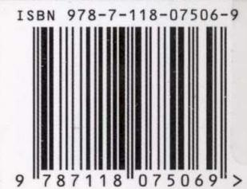

<details>
<summary>text_image</summary>

ISBN 978-7-118-07506-9
9 787118 075069 >
</details>

# 全国大学生数学建模竞赛 赛题与优秀论文评析

# (2005 年—2011 年 B 题)

主 编 姚泽清 郑旭东 赵颖

副主编 刘守生 田作威 沈锦仁 郑琴 滕加俊

史汉生 刘海峰 张瑰 姚奎 唐庆国

國防工業出版社

· 北京 ·

## 内容简介

本书对2005年至2011年的全国大学生数学建模竞赛的赛题进行了评析，并逐一给出问题解答要点，同时从解放军理工大学获得全国一、二等奖的论文中精选了30篇优秀论文进行点评，评价其优劣，总结其得失。该校在这7年中参加国际、国内数学建模竞赛共获得国际一等奖10项，全国一等奖19项，产生了全国优秀论文3篇，全国优秀建模指导教师1人，并于2010年成功地举办了军队院校军事数学建模邀请赛。本书可作为本科生、专科生的“数学建模”课程的教学参考书，也可作为大学生、研究生参加国际数学建模竞赛、全国大学生数学建模竞赛和研究生数学建模竞赛的培训教材，还可作为从事复杂问题建模的工程技术人员的建模指导书。

## 图书在版编目(CIP)数据

全国大学生数学建模竞赛赛题与优秀论文评析. 2005 年—2011 年 B 题 / 姚泽清, 郑旭东, 赵颖主编. —北京: 国防工业出版社, 2012.5

ISBN 978-7-118-07506-9

I. ①全... II. ①姚... ②郑... ③赵... III. ①数学模型-竞赛-高等学校-教学参考资料 IV. ①0141.4

中国版本图书馆 CIP 数据核字(2011)第 221687 号

※

国防工業出版社出版发行

(北京市海淀区紫竹院南路23号 邮政编码100048)

北京奥鑫印刷厂印刷

新华书店经售

\*

开本 $787 \times 1092$ 1/16 印张 $17\frac{1}{4}$ 字数 399 千字

2012年5月第1版第1次印刷 印数1—4000册 总定价76.00元 上册 4500元 下册 3100元

# 数学建模系列丛书 编委会名单

主编 金丰年 姚泽清 郑旭东

副主编 赵颖 刘守生 田作威 沈锦仁

编 委 （以姓氏笔画为序）

王璞 王岩青 毛自森 史汉生 刘希强

刘海峰 严榴香 苏慧琳 杨素娟 吴欧

汪鹏 张瑰 张燕 陆小庆 陈蓓

郑琴俞珊姚奎徐兵徐丹丹

唐庆国 廖洪林 滕加俊 颜超颜锋

戴毅

## 前言

进入 20 世纪,随着计算机技术的快速发展,数学以空前的广度和深度向自然科学、工程技术及管理科学等领域渗透,与之发生交叉与融合,数学思维对人类认识自然和改造自然起着越来越重要的作用,数学与计算机技术相结合而形成的数学技术已经成为当代高新技术的一个重要组成部分,而数学建模作为联系数学与实际问题的桥梁已成为数学科学向数学技术转化的主要途径。

数学发展史,就是一部人们不断发现问题和解决问题的历史。数学可以锻炼学生的思维,对学生在完成从应试到应用、从学生到学者、从知识到学识的转化过程,有着无可替代的作用。然而,由于传统教学模式的影响,长期以来我们的数学教育过于追求理论的完美和逻辑的严谨,使得生动的、充满活力的数学教学被淹没在大量枯燥的公式推导与理论证明之中,严重挫伤了学生的学习积极性,束缚了学生创新意识、创新精神和创新能力的发展。

1985 年,美国率先举办了数学建模竞赛(the Mathematical Contest in Modeling, MCM),旨在鼓励大学生运用数学知识参与解决实际问题的全过程,为改变这一状况提供了契机。1989 年,北京大学、清华大学、北京理工大学首次派队参加了美国的数学建模竞赛,数学建模作为一种全新的学习方式在国内悄然兴起。

1992 年,中国工业与应用数学学会举办了首届全国大学生数学建模联赛,1994 年转而为教育部高教司直接组织领导,并更名为全国大学生数学建模竞赛。数学建模活动的兴起,对提高学生的综合素质,培养学生的创新能力,起到了催化作用;数学建模活动的开展,推动了数学建模教学在全国各高校的迅速发展,推进了整个数学教学的改革。

数学建模活动在全国兴起后，原中国人民解放军空军气象学院、中国人民解放军通信工程学院就先后开设了数学建模课程，并分别在1995年和1996年获得了自己的第一个全国一等奖，中国人民解放军通信工程学院还因其突出的成绩成为1997年全国大学生数学建模竞赛颁奖大会的承办单位。1999年中国人民解放军通信工程学院、工程兵工程学院和空军气象学院合并组建为解放军理工大学后，着眼培养高素质创新型人才，以实施“现代化教学工程”为牵引，以培养学员“战略眼光、科学思维方法、信息素养以及较强国际交流能力”为着力点，将数学建模活动的重点由成绩的获取转移到能力的培养上来，为培养创新型人才搭建实践平台，使学员的聪明才智和创造精神得到了充分发挥。

进入21世纪,解放军理工大学共获得全国大学生数学建模竞赛一等奖28项,二等奖46项,其中有3篇被评为全国优秀论文。2006年,解放军理工大学首战国际数学建模竞赛,就获得了一等奖1项;2007年,再战跨学科建模竞赛(the Interdisciplinary Contest in Modeling, ICM),又获得了国际一等奖2项的好成绩,5年来共获得国际一等奖10项、二等奖11项。2008年,解放军理工大学的经验成果《开展数学建模活动,为培养创新型人才搭建实践平台》获军队级教学成果二等奖;2011年,又成功举办了军队院校军事数学建模邀请赛,推动了数学建模活动在军队院校的广泛、深入开展。

为了总结解放军理工大学开展数学建模活动的经验,检验学员参加数学建模活动的成果,我们在大学和理学院首长的支持下,着手编写了这部数学建模系列丛书。作为丛书的第一部分,《全国大学生数学建模竞赛赛题与优秀论文评析》一书,邀请具有丰富实战经验的专家对2005年至2011年的赛题进行了评析,并逐一给出问题解答要点,同时从解放军理工大学获得全国一、二等奖的51篇论文中,精选了30篇优秀论文进行点评,评价其优劣,总结其得失,以期对后来者有所裨益。

鉴于全国大学生数学建模竞赛 A 题偏理论、B 题偏应用的特点,本书按 A、B 两题分两辑出版。本书可作为专科生、本科生《数学建模》课程的教学参考书,大学生、研究生参加国际数学建模竞赛、全国大学生数学建模竞赛和研究生数学建模竞赛的培训教材,以及从事复杂问题建模的工程技术人员的建模指导书。

值本书出版之际,谨向解放军理工大学成立以来对数学建模活动的开展给予精心呵护与悉心指导的唐万年校长、张亚非校长、训练部张建军部长、政治部张华伟主任、校务部苏晓冰部长致以崇高的敬意,向多年来对数学建模活动的组织给予全力支持与大力帮助的大学训练部李建新副部长、费建芳副部长、周雷副部长表示诚挚的谢意,并借此机会向对解放军理工大学数学建模活动给予关心指导的解放军信息工程大学韩中庚教授、东南大学朱道元教授,以及曾经在解放军理工大学数学建模团队中工作过并做出重要贡献的汤光华、罗剑等同志表示衷心的感谢!

由于时间和水平所限,书中错漏之处在所难免,恳请各位专家学者和读者批评指正,信寄:lgdxlxyzqy@yahoo.com.cn。

姚泽清

2012年1月11日于南京

## 目录

## 2005年B题 DVD在线租赁 …… (1)

DVD 在线租赁的经营管理(全国一等奖) …… 宋志军、姚善涛、许晓峰(3)

DVD 在线租赁的购买与分配(全国二等奖) …… 王力群、夏宏、褚事德(26)

DVD 在线租赁的数学模型(全国二等奖) …… 龚锋、李琢、莫峰(41)

## 2006 年 B 题 艾滋病疗法的评价及疗效的预测 …… (57)

艾滋病疗法的评价及疗效的预测的数学模型

(全国一等奖) 王浩淼、孙中芳、吉进喜(59)

艾滋病疗法的评价及疗效的预测(全国二等奖)
…… 赵铜星、余恺、江勇(77)

艾滋病疗法的评价及疗效的预测(全国二等奖)
杨彦坡、吁青、赵博(93)

## 2007 年 B 题 乘公交,看奥运 …… (105)

公交线路选择的数学模型(全国一等奖) …… 李杰、黄科、李新鹏(107)

公交线路的自主查询系统(全国一等奖) …… 刘国辉、陈建、王英男(137)

公交线路模型研究和算法实现(全国二等奖) …… 朱亚松、王家宝、吴海佳(156)

## 2008年B题 高等教育学费标准探讨 …… (172)

## 2009 年 B 题 眼科病床的合理安排 …… (174)

眼科病床的合理安排(全国一等奖) …… 童轶驹、王家星、任仕召(176)

## 2010 年 B 题 2010 年上海世博会影响力的定量评估 …… (205)

上海世博影响力评估模型(全国二等奖) …… 余从全、王磊、刘景玮(206)

2010年上海世博会经济效应的定量评估(全国二等奖)……

白文浩、马建伟、邸建勋(227)

## 2011年B题 交巡警服务平台的设置与调度 …… (247)

交巡警服务平台的设置与调度模型(江苏省二等奖) … 史纬恒、刘爽、寇雄伟(249)

## 附录 全国大学生数学建模竞赛历年赛题……(268)

## 2005 年 B 题 DVD 在线租赁

随着信息时代的到来,网络成为人们生活中越来越不可或缺的元素之一。许多网站利用其强大的资源和知名度,面向其会员群提供日益专业化和便捷化的服务。例如,音像制品的在线租赁就是一种可行的服务。这项服务充分发挥了网络的诸多优势,包括传播范围广泛、直达核心消费群、强烈的互动性、感官性强、成本相对低廉等,为顾客提供更为周到的服务。

考虑如下的在线 DVD 租赁问题。顾客缴纳一定数量的月费成为会员,订购 DVD 租赁服务。会员对哪些 DVD 有兴趣,只要在线提交订单,网站就会通过快递的方式尽可能满足要求。会员提交的订单包括多张 DVD,这些 DVD 是基于其偏爱程度排序的。网站会根据手头现有的 DVD 数量和会员的订单进行分发。每个会员每个月租赁次数不得超过 2 次,每次获得 3 张 DVD。会员看完 3 张 DVD 之后,只需要将 DVD 放进网站提供的信封里寄回(邮费由网站承担),就可以继续下次租赁。请考虑以下问题:

（1）网站正准备购买一些新的 DVD，通过问卷调查 1000 个会员，得到了愿意观看这些 DVD 的人数（表 1 给出了其中 5 种 DVD 的数据）。此外，历史数据显示，60% 的会员每月租赁 DVD 两次，而另外的 40% 只租一次。假设网站现有 10 万个会员，对表 1 中的每种 DVD 来说，应该至少准备多少张，才能保证希望看到该 DVD 的会员中至少 50% 在一个月内能够看到该 DVD？如果要求保证在三个月内至少 95% 的会员能够看到该 DVD 呢？  
(2) 表 2 列出了网站手上 100 种 DVD 的现有张数和当前需要处理的 1000 位会员的在线订单（数据格式示例见表 2，具体数据从 http://mcm.edu.cn/mcm05/problems2005c.asp 下载），如何对这些 DVD 进行分配，才能使会员获得最大的满意度？请具体列出前 30 位会员 (C0001 \~ C0030) 分别获得哪些 DVD。  
(3) 继续考虑表 2, 并假设表 2 中 DVD 的现有数量全部为 0。如果你是网站经营管理人员, 你如何决定每种 DVD 的购买量, 以及如何对这些 DVD 进行分配, 才能使一个月内 95% 的会员得到他想看的 DVD, 并且满意度最大?  
（4）如果你是网站经营管理人员，你觉得在 DVD 的需求预测、购买和分配中还有哪些重要问题值得研究？请明确提出你的问题，并尝试建立相应的数学模型。

表 1 对 1000 个会员调查的部分结果

<table><tr><td>DVD名称</td><td>DVD1</td><td>DVD2</td><td>DVD3</td><td>DVD4</td><td>DVD5</td></tr><tr><td>愿意观看的人数</td><td>200</td><td>100</td><td>50</td><td>25</td><td>10</td></tr></table>

表 2 现有 DVD 张数和当前需要处理的会员的在线订单(表格格式示例)

<table><tr><td>DVD 编号</td><td>D001</td><td>D002</td><td>D003</td><td>D004</td><td>...</td></tr><tr><td>DVD 现有数量</td><td>10</td><td>40</td><td>15</td><td>20</td><td>...</td></tr></table>

(续)

<table><tr><td colspan="2">DVD编号</td><td>D001</td><td>D002</td><td>D003</td><td>D004</td><td>...</td></tr><tr><td rowspan="5">会员在线订单</td><td>C0001</td><td>6</td><td>0</td><td>0</td><td>0</td><td>...</td></tr><tr><td>C0002</td><td>0</td><td>0</td><td>0</td><td>0</td><td>...</td></tr><tr><td>C0003</td><td>0</td><td>0</td><td>0</td><td>3</td><td>...</td></tr><tr><td>C0004</td><td>0</td><td>0</td><td>0</td><td>0</td><td>...</td></tr><tr><td> $\vdots$ </td><td> $\vdots$ </td><td> $\vdots$ </td><td> $\vdots$ </td><td> $\vdots$ </td><td></td></tr><tr><td colspan="7">注:D001~D100表示100种DVD,C0001~C1000表示1000个会员,会员的在线订单用数字1,2,...表示,数字越小表示会员的偏爱程度越高,数字0表示对应的DVD当前不在会员的在线订单中</td></tr></table>

## 【试题评析】

刘守生

本题的背景是 DVD 在线租赁业务,网上在线租赁能够实现 DVD 的双重利用,对于商家和客户都是有利可图的选择。然而对于商家而言,购买多少数量的 DVD 以实现效用的最大化和成本的最小化,如何在客户满意和利润最大化之间做出合理的选择,都是本题所要解决的问题。该题的特点是海量数据、结构复杂,综合性、实用性和开放性强,算法要求强。采用的主要方法有概率统计、大规模随机整数规划(线性或非线性)、网络优化、随机决策分析等。

## 【问题解答要点】

本题的四个问题均为最优化问题,规划模型是主打模型,但是各问的约束条件均不相同。在问题一中,如何估计希望观看某DVD片人数的概率分布,以及如何处理每月可租两次数的情况是建立和求解模型的关键。碟片的重复使用率与需要租赁两次DVD的会员的关系也是需解决的问题;问题二是求解一种DVD分配方案,使会员的总体满意度最大。利用会员对各类DVD的偏爱程度定义合理的满意度函数可为优化模型的建立提供方便;问题三考虑既使会员的满意度较大,又使网站的成本较低的DVD采购方案,表面上看是问题一和问题二的综合,其实际情况要比其综合还要复杂。在该问题中既要求出尽量满足会员需要的DVD数目,同时还有对这些DVD进行分配使会员的满意度最大,因此这是一个比较复杂的双目标规划问题。其求解方法也较多,可以利用线性加权的方法把双目标规划转化为单目标规划来解,也可以根据对实际问题的分析,建立一个主次原则来求解模型;问题四让参赛选手站在网站管理者的角度,对于DVD在线租赁中的其他问题进行考虑,可以从题目中提示的方面进行考虑,并建立相应的模型。

# DVD 在线租赁的经营管理

## 摘要

本文讨论的问题可归结为多决策变量的0-1规划问题。本文针对各个问题建立了三个模型；在求解问题一的模型中考虑了每个月租赁一次的会员和租赁两次的会员的比例关系，求得了满足题意的各种DVD的数目如下表所列：

<table><tr><td>n = 1</td><td> $c_{1}$ </td><td> $c_{2}$ </td><td> $c_{3}$ </td><td> $c_{4}$ </td><td> $c_{5}$ </td></tr><tr><td>r = 0.5</td><td>6250</td><td>3125</td><td>1563</td><td>782</td><td>313</td></tr><tr><td>n = 3</td><td> $c_{1}$ </td><td> $c_{2}$ </td><td> $c_{3}$ </td><td> $c_{4}$ </td><td> $c_{5}$ </td></tr><tr><td>r = 0.95</td><td>3959</td><td>1980</td><td>990</td><td>495</td><td>198</td></tr></table>

在求解问题二的模型中充分考虑了各个约束条件,利用专门求解规划数学软件 Lingo 进行编程计算,并根据解的情况对约束条件进行调整,并求得合乎要求的分配方案,其中前两个会员分得的 DVD 编号结果为: d1[8,41,98],d2[6,44,62]。在求解问题三的模型中考虑了购买 DVD 数量最小和会员总体满意度最大两个目标,给出了满足某种规则下 DVD 的最小购买量 3195 张,并给出了在最小购买量下的一种可行分配方案。在文章的最后,按照问题四的要求给出了需求预测、购买等方面的数学模型和解答;分析了模型的优缺点;给出了模型的若干改进,使模型趋于完善。

## 1 问题的重述

随着信息时代的到来,网络成为人们生活中越来越不可或缺的元素之一。许多网站利用其强大的资源和知名度,面向其会员群提供日益专业化和便捷化的服务。例如,音像制品的在线租赁就是一种可行的服务。这项服务充分发挥了网络的诸多优势,包括传播范围广泛、直达核心消费群、强烈的互动性、感官性强、成本相对低廉等,为顾客提供更为周到的服务。

考虑如下的在线 DVD 租赁问题。顾客缴纳一定数量的月费成为会员,订购 DVD 租赁服务。会员对哪些 DVD 有兴趣,只要在线提交订单,网站就会通过快递的方式尽可能满足要求。会员提交的订单包括多张 DVD,这些 DVD 是基于其偏爱程度排序的。网站会根据手头现有的 DVD 数量和会员的订单进行分发。每个会员每个月租赁次数不得超过 2 次,每次获得 3 张 DVD。会员看完 3 张 DVD 之后,只需要将 DVD 放进网站提供的信封里寄回(邮费由网站承担),就可以继续下次租赁。请考虑以下问题:

(1) 网站正准备购买一些新的 DVD, 通过问卷调查 1000 个会员, 得到了愿意观看这些 DVD 的人数(表 1 给出了其中 5 种 DVD 的数据)。此外,历史数据显示,60% 的会员每月租赁 DVD 两次,而另外的 40% 只租一次。假设网站现有 10 万个会员,对表 1 中的每种 DVD 来说,应该至少准备多少张,才能保证希望看到该 DVD 的会员中至少 50% 在一个月内能够看到该 DVD? 如果要求保证在三个月内至少 95% 的会员能够看到该 DVD 呢?

(2) 表 2 列出了网站手上 100 种 DVD 的现有张数和当前需要处理的 1000 位会员的在线订单（数据格式示例见表 2，具体数据从 http://mcm.edu.cn/mcm05/problems2005c.asp 下载），如何对这些 DVD 进行分配，才能使会员获得最大的满意度？请具体列出前 30 位会员 (C0001 \~ C0030) 分别获得哪些 DVD。  
(3) 继续考虑表 2, 并假设表 2 中 DVD 的现有数量全部为 0。如果你是网站经营管理人员, 你如何决定每种 DVD 的购买量, 以及如何对这些 DVD 进行分配, 才能使一个月内 95% 的会员得到他想看的 DVD, 并且满意度最大?  
（4）如果你是网站经营管理人员，你觉得在 DVD 的需求预测、购买和分配中还有哪些重要问题值得研究？请明确提出你的问题，并尝试建立相应的数学模型。

表 1 对 1000 个会员调查的部分结果

<table><tr><td>DVD名称</td><td>DVD1</td><td>DVD2</td><td>DVD3</td><td>DVD4</td><td>DVD5</td></tr><tr><td>愿意观看的人数</td><td>200</td><td>100</td><td>50</td><td>25</td><td>10</td></tr></table>

表 2 现有 DVD 张数和当前需要处理的会员的在线订单(表格格式示例)

<table><tr><td colspan="2">DVD编号</td><td>D001</td><td>D002</td><td>D003</td><td>D004</td><td>...</td></tr><tr><td colspan="2">DVD现有数量</td><td>10</td><td>40</td><td>15</td><td>20</td><td>...</td></tr><tr><td rowspan="5">会员在线订单</td><td>C0001</td><td>6</td><td>0</td><td>0</td><td>0</td><td>...</td></tr><tr><td>C0002</td><td>0</td><td>0</td><td>0</td><td>0</td><td>...</td></tr><tr><td>C0003</td><td>0</td><td>0</td><td>0</td><td>3</td><td>...</td></tr><tr><td>C0004</td><td>0</td><td>0</td><td>0</td><td>0</td><td>...</td></tr><tr><td>:</td><td>:</td><td>:</td><td>:</td><td>:</td><td></td></tr><tr><td colspan="7">注:D001~D100表示100种DVD,C0001~C1000表示1000个会员,会员的在线订单用数字1,2,...表示,数字越小表示会员的偏爱程度越高,数字0表示对应的DVD当前不在会员的在线订单中</td></tr></table>

## 2 问题的分析

本题是一个比较典型的整数规划方面的问题。

问题一是在一时间段内求解满足会员需要的最少 DVD 数目。从历史统计数据中可得:60% 的会员每月租赁 DVD 两次,而另外的 40% 每月只租一次。每次租赁前必须归还上一次租赁的 DVD,于是可以推出:每次月初租赁出去的 DVD 当中有 60% 还可以在当月租赁第二次。同时,假设那些每月只租赁一次的会员所租赁的 DVD 在当月中只能租赁一次。然后,就可建立整数规划模型求解。

问题二是求解一种 DVD 分配方案,使会员的总体满意度最大。从题目中可知各个会员对各种 DVD 需求的订单及其偏好排名,每次每个会员分得 3 张 DVD。该问题的目标是使总体满意度最大,所以首先定义满意度。于是就可建立整数规划(0-1 规划)模型,而问题二的难点在于对模型的求解。因为模型中的决策变量太多,可尝试利用 Lingo 软件,并对约束条件进行处理,最终得到结果。

问题三表面上看是问题一和问题二的综合,其实际情况要比其综合还要复杂。在该问题中既要决策满足会员需要的 DVD 数目,同时还要对这些 DVD 进行分配使会员的满意度最大。本题的难点在于对 DVD 进行第二次分配时如何将概率应用于某一离散的个体身上。若只从题目本身出发,可以自行设计一种算法,运用该算法来实现目标;此外,还可以利用问题二和问题三使用相同的会员的订单的联系,在问题二所求结果的基础上,对其进行修改,使其满足确立的目标。

问题四让我们从更宽更广的角度,对于 DVD 在线租赁中的其他问题进行考虑,对于有必要者还要建立模型求解。可以从题目中提示的方面进行考虑,并建立相应的模型。

## 3 符号约定

$c_{i}$ : 第 i 种 DVD 的数量;

$d_{i}$ : 第 i 个会员；

$e_{i}$ : 愿意看第 i 种 DVD 的会员数量;

$n_{ij}$ : 第 i 个会员希望租赁第 j 种 DVD 的偏好排序号;

$m_{i}$ : 第 i 种 DVD 出租的总碟次数;

$x_{ij}$ : 第 i 个会员分得第 j 种 DVD 的数量;

$p_{ij}$ : 第 i 个会员对分得第 j 种 DVD 的满意度。

## 4 模型的假设

(1) 当月租赁的 DVD 在本月内归还。  
(2) 问卷调查的会员涵盖各领域, 即题目中所给的数据具有代表性, 是真实有效的。  
(3) DVD 可以无限期地反复使用。  
(4) DVD 在传送过程中不考虑邮寄时间。  
(5) 某张 DVD 若租赁给每个月只租赁一次的会员, 则该月只能出租一次。  
(6) 每张 DVD 每个月最多租赁两次。

## 5 问题一的解答

## 5.1 问题一的模型准备

由假设和问题分析,可得在所有的会员中60%的会员每月租赁DVD两次,而另外的40%只租赁一次;所有会员必须在归还上次租赁的DVD后才能进行下次的租赁。所以在每个月的租赁过程中,租赁两次的会员必须要归还两次所租赁的DVD,其中第一次所归还的DVD可在当月被发放给其他的会员,同时第二次租赁自己需要的DVD。由假设2可认为统计数据的比例关系反映会员全体,结合表1则可得10万名会员中希望看

DVD1 \~ DVD5 会员人数 $e_{i}$ ，见表 3。

表 3

<table><tr><td> $e_{1}$ </td><td> $e_{2}$ </td><td> $e_{3}$ </td><td> $e_{4}$ </td><td> $e_{5}$ </td></tr><tr><td>20000</td><td>10000</td><td>5000</td><td>2500</td><td>1000</td></tr></table>

## 5.2 问题一模型的建立

由 5.1 中的准备, 在希望看到第 i 种 DVD 的会员中至少 r 在 n 个月内能够看到该 DVD 的情况下, 建立如下整数规划模型:

$$
\begin{array}{c} \min \quad e _ {i} \\ \text {s. t} \left\{ \begin{array}{c} m _ {i} = n (0. 4 c _ {i} + 2 \times 0. 6 c _ {i}) \geqslant r \times e _ {i} \\ c _ {i} \in \text {正整数} \end{array} \right. \end{array}
$$

其中约束条件:希望看到第 i 种 DVD 的会员中至少 r 在 n 个月内能够看到该 DVD。

## 5.3 问题一的模型求解和结论

经过求解不等式并取其下界可得到：

$$
c _ {i} = \frac {r e _ {i}}{1 . 6 n} \quad c _ {i} \in \text {正整数}
$$

于是当 $n=1, r=50\%$ 时，可得到结果，见表 4。

表 4

<table><tr><td> $c_{1}$ </td><td> $c_{2}$ </td><td> $c_{3}$ </td><td> $c_{4}$ </td><td> $c_{5}$ </td></tr><tr><td>6250</td><td>3125</td><td>1563</td><td>782</td><td>313</td></tr></table>

于是当 $n=3, r=95\%$ 时，可得到结果，见表 5。

表 5

<table><tr><td> $c_{1}$ </td><td> $c_{2}$ </td><td> $c_{3}$ </td><td> $c_{4}$ </td><td> $c_{5}$ </td></tr><tr><td>3959</td><td>1980</td><td>990</td><td>495</td><td>198</td></tr></table>

所以当 DVD1 \~ DVD5 的数量为表 4 中张数时, 能保证 50% 的会员在一个月内看到所希望看到的 DVD; 当 DVD1 \~ DVD5 的数量为表 5 中张数时, 能保证 95% 的会员在三个月内看到所希望看到的 DVD。

## 6 问题二的解答

## 6.1 问题二模型的建立

由问题分析和题意可知决策变量 $x_{ij}$ :

$$
x _ {i j} = \left\{ \begin{array}{l l} 1 & (\text {第} j \text {种 DVD 分配给会员} i) \\ 0 & (\text {第} j \text {种 DVD 不分配给会员} i) \end{array} . (1 \leqslant i \leqslant 1 0 0 0) \right.
$$

供应约束：

$$
\sum_ {i = 1} ^ {1 0 0 0} x _ {i j} \leqslant c _ {j}
$$

需求约束：

$$
\sum_ {j = 1} ^ {1 0 0} x _ {i j} = 3
$$

目标函数：

$$
\max \sum_ {i = 1} ^ {1 0 0 0} \sum_ {j = 1} ^ {1 0 0} p _ {i j} x _ {i j}
$$

式中: $p_{ij}$ 表示第 i 个会员分得第 j 种 DVD 的满意度。

于是可以建立如下0-1规划模型：

$$
\max \sum_ {i = 1} ^ {1 0 0 0} \sum_ {j = 1} ^ {1 0 0} p _ {i j} x _ {i j}
$$

$$
\mathrm{s.t} \left\{ \begin{array}{l} \sum_ {i = 1} ^ {1 0 0 0} x _ {i j} \leqslant C _ {j} \\ \sum_ {j = 1} ^ {1 0 0} x _ {i j} = 3 \\ x _ {i j} = \left\{ \begin{array}{l l} 1 & (\text {第} j \text {种 DVD 分给会员 } i) \\ 0 & (\text {第} j \text {种 DVD 不分给会员 } i) \end{array} \right. \end{array} \right.
$$

## 6.2 模型的求解

在上述的0-1规划模型中,目标函数是要求会员的总满意度最大,因此确定满意度函数是求解此规划问题先行步骤。在求得满意度函数后,对于拥有如此多决策变量 $(1000\times100$ 个变量 $)$ 的0-1规划问题,可以运用专门求解规划问题的数学软件Lingo,通过编写程序来进行求解。

## 1. 确定满意度函数

会员对收到的 DVD 的满意程度取决于该会员对这张 DVD 的偏好程度, 即

$$
P _ {i j} = f (s _ {i j})
$$

式中： $s_{ij}$ 为第 i 个会员对第 j 种 DVD 碟的偏好程度。

对租赁公司来说, $s_{ij}$ 是一个等级偏好量,为使得满意度函数更好地反映实际情况,直接给等级评分并不是一种理想的方法。根据模糊集理论,大数原理和心理学 $^{[1]}$ ,可以假设人对客观物体的意识变化与物体实际的变化成正比。假定S代表人的意识,T代表物体实际情况,则物体实际情况的变化率为 $\frac{\Delta T}{T}$ 。

根据上面假设可得

$$
\Delta S = K \times \frac {\Delta T}{T}
$$

即

$$
\mathrm{d} S = K \times \frac {\mathrm{d} T}{T}
$$

求解方程得

$$
S = K \times \ln T \tag {1}
$$

在人的大脑思考的过程中,评价的等级 $\mathrm{rank}(I)\in\{A+,A,A-,B+,B,B-,\cdots\},I$ 描述了客观情况的变化,假设:

$$
T = f (I) = X \pm I
$$

X 是一个未知量, 根据式(1), 有

$$
S (I) = K \times \ln f (T) = K \times \ln (X \pm I) \tag {2}
$$

假如 $S \in [0,1]$ , $I = 1, 2, 3, \cdots, j, j + 1$ , 且

(1) I=1, S=1 时, $K \times \ln(X \pm 1) = 1$ 。  
(2) $I = j + 1, S = 0$ 时, $K \times \ln [X \pm (j + 1)] = 0$ 。

解得

$$
\begin{array}{l} X = j + 2 \\ K = \frac {1}{\ln (X - 1)} = \frac {1}{\ln [ (j + 2) - 1 ]} \\ \end{array}
$$

令 $m = j + 2$ ，则

$$
S (I) = \frac {\ln (X - I)}{\ln (X - 1)} = \frac {\ln (m - I)}{\ln (m - 1)}
$$

所以, 当 $\mathrm{rank}(I)=10$ 时, 则结果见表 6。

表 6

<table><tr><td>I</td><td>1</td><td>2</td><td>3</td><td>4</td><td>5</td></tr><tr><td>S(I)</td><td>100</td><td>96.03</td><td>91.63</td><td>86.72</td><td>81.15</td></tr><tr><td>I</td><td>6</td><td>7</td><td>8</td><td>9</td><td>10</td></tr><tr><td>S(I)</td><td>74.72</td><td>67.12</td><td>57.81</td><td>45.82</td><td>28.91</td></tr></table>

由此可得满意度函数为

$$
P _ {i j} = \left\{ \begin{array}{c c} 1 & S _ {i j} = 1 \\ 0. 9 6 0 3 & S _ {i j} = 2 \\ 0. 9 1 6 3 & S _ {i j} = 3 \\ 0. 8 6 7 2 & S _ {i j} = 4 \\ 0. 8 1 1 5 & S _ {i j} = 5 \\ 0. 7 4 7 2 & S _ {i j} = 6 \\ 0. 6 7 1 2 & S _ {i j} = 7 \\ 0. 5 7 8 1 & S _ {i j} = 8 \\ 0. 4 5 8 2 & S _ {i j} = 9 \\ 0. 2 8 9 1 & S _ {i j} = 1 0 \\ 0 & S _ {i j} = 0 \end{array} \right.
$$

## 2. 模型求解

编写程序 Lingol, 在内存至少为 2GB 的计算机上运行, 运行找不到适合条件的解, 这说明所建立的 0-1 规划模型的约束条件过于严格而使得不存在可行解; 因此, 修改模型

中的需求约束,使得

$$
\sum_ {j = 1} ^ {1 0 0} x _ {i j} \leqslant 3
$$

编写程序 Lingo2, 求解出使得总体满意度最大的分配方案(见附录)。表 7 列出了前 30 个会员获得的 DVD 的编号及其偏好情况。

表7

<table><tr><td rowspan="2">会员编号</td><td colspan="2">获得的DVD</td><td colspan="2">获得的DVD</td><td colspan="2">获得的DVD</td></tr><tr><td>DVD编号</td><td>会员偏好</td><td>DVD编号</td><td>会员偏好</td><td>DVD编号</td><td>会员偏好</td></tr><tr><td>1</td><td>8</td><td>1</td><td>41</td><td>7</td><td>98</td><td>3</td></tr><tr><td>2</td><td>6</td><td>1</td><td>44</td><td>2</td><td>62</td><td>4</td></tr><tr><td>3</td><td>32</td><td>4</td><td>50</td><td>2</td><td>80</td><td>1</td></tr><tr><td>4</td><td>7</td><td>1</td><td>18</td><td>2</td><td>41</td><td>3</td></tr><tr><td>5</td><td>11</td><td>3</td><td>66</td><td>1</td><td>68</td><td>2</td></tr><tr><td>6</td><td>19</td><td>1</td><td>53</td><td>2</td><td>66</td><td>4</td></tr><tr><td>7</td><td>26</td><td>3</td><td>66</td><td>6</td><td>81</td><td>1</td></tr><tr><td>8</td><td>31</td><td>4</td><td>35</td><td>5</td><td>71</td><td>1</td></tr><tr><td>9</td><td>53</td><td>1</td><td>78</td><td>3</td><td>100</td><td>2</td></tr><tr><td>10</td><td>41</td><td>6</td><td>55</td><td>2</td><td>85</td><td>3</td></tr><tr><td>11</td><td>59</td><td>1</td><td>63</td><td>2</td><td>66</td><td>4</td></tr><tr><td>12</td><td>2</td><td>2</td><td>31</td><td>1</td><td>41</td><td>7</td></tr><tr><td>13</td><td>21</td><td>3</td><td>78</td><td>2</td><td>96</td><td>1</td></tr><tr><td>14</td><td>23</td><td>2</td><td>52</td><td>1</td><td>89</td><td>6</td></tr><tr><td>15</td><td>13</td><td>1</td><td>52</td><td>4</td><td>85</td><td>3</td></tr><tr><td>16</td><td>10</td><td>4</td><td>84</td><td>1</td><td>97</td><td>2</td></tr><tr><td>17</td><td>47</td><td>2</td><td>51</td><td>3</td><td>67</td><td>1</td></tr><tr><td>18</td><td>41</td><td>1</td><td>60</td><td>2</td><td>78</td><td>3</td></tr><tr><td>19</td><td>66</td><td>4</td><td>84</td><td>1</td><td>86</td><td>2</td></tr><tr><td>20</td><td>45</td><td>1</td><td>61</td><td>3</td><td>89</td><td>2</td></tr><tr><td>21</td><td>45</td><td>2</td><td>50</td><td>5</td><td>53</td><td>1</td></tr><tr><td>22</td><td>38</td><td>3</td><td>55</td><td>2</td><td>57</td><td>1</td></tr><tr><td>23</td><td>29</td><td>2</td><td>81</td><td>3</td><td>95</td><td>1</td></tr><tr><td>24</td><td>37</td><td>4</td><td>41</td><td>2</td><td>76</td><td>1</td></tr><tr><td>25</td><td>9</td><td>1</td><td>69</td><td>2</td><td>94</td><td>3</td></tr><tr><td>26</td><td>22</td><td>1</td><td>68</td><td>2</td><td>95</td><td>3</td></tr><tr><td>27</td><td>50</td><td>4</td><td>58</td><td>1</td><td>78</td><td>7</td></tr><tr><td>28</td><td>8</td><td>1</td><td>34</td><td>2</td><td>82</td><td>3</td></tr><tr><td>29</td><td>26</td><td>4</td><td>30</td><td>2</td><td>55</td><td>1</td></tr><tr><td>30</td><td>37</td><td>2</td><td>62</td><td>1</td><td>98</td><td>5</td></tr></table>

## 6.3 模型结果分析

通过对运行结果的统计,最优 DVD 分配方案分别满足各偏好度的次数见表 8。

表 8

<table><tr><td>偏好度</td><td>1</td><td>2</td><td>3</td><td>4</td><td>5</td><td>6</td><td>7</td><td>8</td><td>9</td><td>10</td></tr><tr><td>满足次数</td><td>846</td><td>763</td><td>622</td><td>356</td><td>166</td><td>82</td><td>72</td><td>60</td><td>13</td><td>12</td></tr></table>

总满意度 = 274.58

## 7 问题三的解答

## 7.1 问题三模型的建立

进一步假设 DVD 的现有数量全部为 0。

由题意可知决策变量 $x_{ij}$ 和 $y_{j}$ :

$$
y _ {j} \text {表示购买第} j \text {种碟的张数}
$$

$$
x _ {i j} = \left\{ \begin{array}{l l} 1 & (\text {第} j \text {种 DVD 分配给会员} i) \\ 0 & (\text {第} j \text {种 DVD 不分配给会员} i) \end{array} \quad (1 \leqslant i \leqslant 1 0 0 0) \right.
$$

约束条件： $\sum_{j = 1}^{100}x_{ij} = 3$

$$
\sum_ {i = 1} ^ {1 0 0 0} x _ {i j} \leqslant y _ {j}
$$

考虑双目标函数： $\min \sum_{j = 1}^{100}y_j$

$$
\max \sum_ {i = 1} ^ {1 0 0 0} \sum_ {j = 1} ^ {1 0 0} p _ {i j} x _ {i j}
$$

于是可以建立如下规划模型：

$$
\text {目标函数} \left\{ \begin{array}{l l} \min \sum_ {i = 1} ^ {1 0 0} y _ {j} \\ \max \sum_ {i = 1} ^ {1 0 0 0} \sum_ {j = 1} ^ {1 0 0} p _ {i j} x _ {i j} \end{array} \right.
$$

$$
\mathrm{s.t} \left\{ \begin{array}{l} \sum_ {i = 1} ^ {1 0 0 0} x _ {i j} \leqslant y _ {j} \\ \sum_ {j = 1} ^ {1 0 0} x _ {i j} = 3 \\ x _ {i j} = \left\{ \begin{array}{l l} 1 & (\text {第} j \text {种 DVD 分配给会员} i) \\ 0 & (\text {第} j \text {种 DVD 不分配给会员} i) \end{array} \right. \end{array} \right.
$$

此模型是二层双目标整数规划模型,属于 NP 问题,目前尚无解决此类问题的方法,因此,考虑根据合理假设将模型进行转化。

## 7.2 转化模型准备

设在 1000 个会员中租赁 DVDi(i=1,2,3, $\cdots$ ,100) 且偏爱程度数字为 j(j=1,2, $\cdots$ ,6) 的会员个数为 $a_{ij}$ 。设 $s_{i}$ 为购买 DVDi 的数量,S 为购买 DVD 的总量。

(1) 在对 DVD 只进行一次分配的情况下, 则 $S \geqslant 3000$ 。

证明:如果 S<3000,则不能满足一次分配时每一会员都能得到 3 张碟,与题意矛盾,故 $S \geqslant 3000$ 。

(2) 当 $S \geqslant 3000$ ，对 DVD 一个月只进行一次分配，此时必然存在一个 DVD 购买方案能使一个月内会员得到他想看的概率为 100%，并且满意度最大。

证明: 当 $s_{i} \geqslant \sum_{i=1}^{3} a_{ij} (i = 1, 2, 3, \cdots, 100)$ ，由于 $\sum_{j=1}^{100} \sum_{i=1}^{3} a_{ij} = 3000$ ，所以这种方案是可行的。

如果这种方案按照如下分配规则进行：

$s_{i}$ 分配给租赁 DVD $i(i=1,2,3,\cdots,100)$ 且偏爱程度数字为 $j(j=1,2,3)$ 的碟数为 $a_{ij}$ 。按照此规则可知此时的名次之和最小 $1000\times(1+2+3)=6000$ ，即满意度最大。且每一个人都可以分到三张他想看的碟。

（3）对 DVD 进行两次分配时,此时必然存在一个 DVD 购买方案能使一个月内会员得到他想看的概率为 1 并且满意度最大。

证明: 当 $s_{i} \geqslant \sum_{i=1}^{3} a_{ij} (i = 1, 2, 3, \cdots, 100)$ ，第一次分配按照(2)中的分配规则进行，由(2)可知，此时第一次分配的会员得到他想看的碟的概率为1并且满意度最大。第一次分配完后，在第二次分配开始前，此时碟 $i (i = 1, 2, \cdots, 100)$ 的数目 $d_{i} = (s_{i} - \sum_{i=1}^{3} a_{ij}) + 0.6 \times \sum_{i=1}^{3} a_{ij}$ ，租赁 DVD $i (i = 1, 2, 3, \cdots, 100)$ 且偏爱程度的数字为 $j (j = 4, 5, 6)$ 的会员个数为 $a_{ij} \times 0.6$ 。

通过取 $s_i$ 的值使 $d_i \geqslant \sum_{j=4}^{6} a_{ij}$ , 按照如下分配规则进行: $d_i$ 分配给租赁 $\mathrm{DVD}i (i = 1,2,3,\cdots,100)$ 且偏爱程度数字为 $j (j = 4,5,6)$ 的碟数为 $a_{ij} \times 0.6$ 。很显然此时第二次分配的名次之和最小, 即满意度最大。且每一个人都可以分到三张他想看的碟。所以, 对 DVD 进行两次分配时, 必然存在一个 DVD 购买方案能使一个月内会员得到他想看的概率为 1 并且满意度最大。

## 7.3 转化模型的建立

由7.2中(3)的分配原则, 可知这个购买方案中有

$$
s _ {i} = s _ {i} ^ {*} + x _ {i}
$$

其中： $s_{i}^{*} = \sum_{i=1}^{3} a_{ij} \quad (i = 1, 2, \cdots, 100), x_{i}$ 为购买 DVD i 的调整量。

设 $M_{i}$ 为 $x_{i}$ 的最大值, 则

$$
M _ {i} = \left\{ \begin{array}{c c} 0 & 0. 6 \times \sum_ {j = 4} ^ {6} a _ {i j} \leqslant 0. 6 \times \sum_ {j = 1} ^ {3} a _ {i j} \\ \left[ 0. 6 \times \sum_ {j = 4} ^ {6} a _ {i j} - 0. 6 \times \sum_ {j = 1} ^ {3} a _ {i j} \right] & 0. 6 \times \sum_ {j = 4} ^ {6} a _ {i j} > 0. 6 \times \sum_ {j = 1} ^ {3} a _ {i j} \end{array} \right.
$$

设 $P_{i}$ 为分配 DVDi 时不能分配的行数, 则

$$
P _ {i} = \left\{ \begin{array}{c c} 0 & \left(\left(s _ {i} ^ {*} + x _ {i}\right) \times 0. 6 - \sum_ {i = 4} ^ {6} a _ {i j} \times 0. 6\right) > 0 \\ \left[ - \left(\left(s _ {i} ^ {*} + x _ {i}\right) \times 0. 6 - \sum_ {i = 4} ^ {6} a _ {i j} \times 0. 6\right) \right] \times 0. 9 & \left(\left(s _ {i} ^ {*} + x _ {i}\right) \times 0. 6 - \sum_ {i = 4} ^ {6} a _ {i j} \times 0. 6\right) \leqslant 0 \end{array} \right.
$$

$$
(i = 1, 2, \dots , 1 0 0)
$$

问题可转化为求如下的规划问题,目标函数为

$$
\min \sum_ {i = 1} ^ {1 0 0} x _ {i}
$$

$$
\mathrm{s.t.} \left\{ \begin{array}{l l}  \sum_ {i = 1} ^ {1 0 0} P _ {i} \leqslant 5 0 \\  0 \leqslant x _ {i} \leqslant M _ {i} \\ x _ {i} \text {取整} \end{array} \right.
$$

## 7.4 模型的求解

$$
\begin{array}{r l} \boldsymbol {M} = & [ \quad 7 \quad 0 \quad 6 \quad 0 \quad 8 \quad 5 \quad 0 \quad 0 \quad 0 \quad 7 \\ & 3 \quad 0 \quad 0 \quad 0 \quad 0 \quad 0 \quad 8 \quad 5 \quad 2 \quad 0 \\ & 0 \quad 2 \quad 0 \quad 7 \quad 0 \quad 1 \quad 4 \quad 7 \quad 2 \quad 0 \\ & 6 \quad 0 \quad 1 \quad 0 \quad 0 \quad 0 \quad 7 \quad 2 \quad 0 \quad 1 \\ & 0 \quad 2 \quad 6 \quad 0 \quad 7 \quad 4 \quad 0 \quad 4 \quad 0 \quad 0 \\ & 0 \quad 2 \quad 0 \quad . 2 \quad 0 \quad 4 \quad 0 \quad 0 \quad 0 \quad 0 \\ & 2 \quad 4 \quad 0 \quad 3 \quad 1 \quad 8 \quad 4 \quad 0 \quad 2 \\ & 0 \quad 0 \quad 1 \quad 0 \quad 0 \quad 2 \quad 8 \quad 2 \quad 0 \quad 4 \\ & . 0 \quad 4 \quad 4 \quad . 1 1 \quad 0 \quad 1 \quad 0 \quad . 1 2 \quad . 7 \quad . 0 \\ & . 5 \quad . 7 \quad . 1 \quad . . . . . . . . . . . . . . . . . . . . . . . . . . . . . . ] \end{array}
$$

目标函数的最小值为 195。因此, 可得二次分配时满足条件的总的购买量为 3195。

购买量 $s_i = s_i^* + x_i, \sum_{i=1}^{100} x_i = 195, x_i$ 的值从 $M_i$ 中选取一组数据组合成 195，即可得到购买量的一种方案，见表 9。

表9

<table><tr><td>DVD1</td><td>DVD2</td><td>DVD3</td><td>DVD4</td><td>DVD5</td><td>DVD6</td><td>DVD7</td><td>DVD8</td><td>DVD9</td><td>DVD10</td></tr><tr><td>21</td><td>36</td><td>33</td><td>38</td><td>29</td><td>33</td><td>30</td><td>33</td><td>35</td><td>25</td></tr><tr><td>DVD11</td><td>DVD12</td><td>DVD13</td><td>DVD14</td><td>DVD15</td><td>DVD16</td><td>DVD17</td><td>DVD18</td><td>DVD19</td><td>DVD20</td></tr><tr><td>29</td><td>31</td><td>28</td><td>31</td><td>27</td><td>38</td><td>36</td><td>31</td><td>33</td><td>38</td></tr><tr><td>DVD21</td><td>DVD22</td><td>DVD23</td><td>DVD24</td><td>DVD25</td><td>DVD26</td><td>DVD27</td><td>DVD28</td><td>DVD29</td><td>DVD30</td></tr><tr><td>34</td><td>31</td><td>35</td><td>22</td><td>29</td><td>32</td><td>30</td><td>26</td><td>27</td><td>41</td></tr><tr><td>DVD31</td><td>DVD32</td><td>DVD33</td><td>DVD34</td><td>DVD35</td><td>DVD36</td><td>DVD37</td><td>DVD38</td><td>DVD39</td><td>DVD40</td></tr><tr><td>35</td><td>35</td><td>32</td><td>31</td><td>39</td><td>35</td><td>28</td><td>32</td><td>29</td><td>29</td></tr><tr><td>DVD41</td><td>DVD42</td><td>DVD43</td><td>DVD44</td><td>DVD45</td><td>DVD46</td><td>DVD47</td><td>DVD48</td><td>DVD49</td><td>DVD50</td></tr><tr><td>53</td><td>37</td><td>26</td><td>37</td><td>34</td><td>29</td><td>32</td><td>25</td><td>32</td><td>34</td></tr><tr><td>DVD51</td><td>DVD52</td><td>DVD53</td><td>DVD54</td><td>DVD55</td><td>DVD56</td><td>DVD57</td><td>DVD58</td><td>DVD59</td><td>DVD60</td></tr><tr><td>42</td><td>30</td><td>33</td><td>29</td><td>32</td><td>40</td><td>35</td><td>28</td><td>36</td><td>40</td></tr><tr><td>DVD61</td><td>DVD62</td><td>DVD63</td><td>DVD64</td><td>DVD65</td><td>DVD66</td><td>DVD67</td><td>DVD68</td><td>DVD69</td><td>DVD70</td></tr><tr><td>29</td><td>35</td><td>32</td><td>37</td><td>33</td><td>39</td><td>34</td><td>35</td><td>35</td><td>34</td></tr><tr><td>DVD71</td><td>DVD72</td><td>DVD73</td><td>DVD74</td><td>DVD75</td><td>DVD76</td><td>DVD77</td><td>DVD78</td><td>DVD79</td><td>DVD80</td></tr><tr><td>36</td><td>34</td><td>26</td><td>31</td><td>28</td><td>26</td><td>28</td><td>32</td><td>31</td><td>32</td></tr><tr><td>DVD81</td><td>DVD82</td><td>DVD83</td><td>DVD84</td><td>DVD85</td><td>DVD86</td><td>DVD87</td><td>DVD88</td><td>DVD89</td><td>DVD90</td></tr><tr><td>29</td><td>22</td><td>26</td><td>19</td><td>33</td><td>22</td><td>34</td><td>24</td><td>31</td><td>27</td></tr><tr><td>DVD91</td><td>DVD92</td><td>DVD93</td><td>DVD94</td><td>DVD95</td><td>DVD96</td><td>DVD97</td><td>DVD98</td><td>DVD99</td><td>DVD100</td></tr><tr><td>44</td><td>35</td><td>25</td><td>28</td><td>40</td><td>29</td><td>36</td><td>33</td><td>23</td><td>42</td></tr></table>

## 8 问题四的解答

（1）需求预测模型:现在已知顾客在 N 月内每一月需要 $\mathrm{DVDi}(i=1,2,\cdots,M)$ 的数目,预测顾客在下一月对 $\mathrm{DVDi}(i=1,2,\cdots,M)$ 的需求量。

设顾客在第j年需要 $\mathrm{DVD}i(i=1,2,\cdots,M)$ 的数目为 $D^{(0)}(j)(j=1,2,\cdots,N)$ ，则可建立如下的灰色预测 $\mathrm{GM}(1,1)$ 模型 $^{[2]}$ ：

设 $D^{(0)}=(D^{(0)}(1),D^{(0)}(2),\cdots,D^{(0)}(N))$ ，做 1-AGO，得

$$
\begin{array}{l} D ^ {(1)} = (D ^ {(1)} (0), D ^ {(1)} (1), \dots , D ^ {(1)} (N)) \\ = (D ^ {(1)} (1), D ^ {(1)} (1) + D ^ {(0)} (2), \dots , D ^ {(1)} (N - 1) + D ^ {(0)} (N)) \\ \end{array}
$$

建立白化型的微分方程：

$$
\frac {\mathrm{d} D ^ {(1)}}{\mathrm{d} t} + a D ^ {(1)} = u
$$

设 $\widehat{\pmb{a}} = (a,u)^{\mathrm{T}}$ ，按最小二乘法得

$$
\widehat {\boldsymbol {a}} = \left(\boldsymbol {B} ^ {\mathrm{T}} \boldsymbol {B}\right) ^ {- 1} \boldsymbol {B} ^ {\mathrm{T}} \boldsymbol {Y} _ {1}
$$

其中

$$
\boldsymbol {B} = \left[ \begin{array}{c c} - \frac {1}{2} (D ^ {(1)} (1) + D ^ {(1)} (2)) & 1 \\ - \frac {1}{2} (D ^ {(1)} (2) + D ^ {(1)} (3)) & 1 \\ \vdots & \vdots \\ - \frac {1}{2} (D ^ {(1)} (N - 1) + D ^ {(1)} (N)) & 1 \end{array} \right] \quad \boldsymbol {Y} _ {1} = \left[ \begin{array}{c} D ^ {(0)} (2) \\ D ^ {(0)} (3) \\ \vdots \\ D ^ {(0)} (N) \end{array} \right]
$$

易求得

$$
D ^ {(1)} (k + 1) = \left(D ^ {(0)} (1) - \frac {u}{a}\right) \mathrm{e} ^ {- a k} + \frac {u}{a}
$$

(2) 考虑到不同种类碟价格各不相同, 现在有 $M$ 元, 准备买 $N$ 种新碟, 第 $i$ 种新碟的单价为 $p_i$ , 顾客喜欢看第 $i$ 类的概率为 $w_i$ , 确定买各种碟的张数, 使顾客的总满意程度最大。

设买第 i 类碟的数目为 $x_{i}$ ，顾客的总满意度作为目标函数：

$$
\max \sum_ {i = 1} ^ {N} w _ {i} x _ {i}
$$

约束条件为

$$
\sum_ {i = 1} ^ {N} p _ {i} x _ {i} \leqslant M
$$

因此最终的目标规划为

$$
\max \sum_ {i = 1} ^ {N} w _ {i} x _ {i}
$$

$$
\mathrm{s.t.} \left\{ \begin{array}{l} \sum_ {i = 1} ^ {N} p _ {i} x _ {i} \leqslant M \\ x _ {i} \geqslant 0 \text {且为整数} \end{array} \right.
$$

## 9 模型的结论分析

(1) 通过对运行结果的统计, 最优 DVD 分配方案分别满足各偏好度的次数, 见表 10。

表 10

<table><tr><td>偏好度</td><td>1</td><td>2</td><td>3</td><td>4</td><td>5</td><td>6</td><td>7</td><td>8</td><td>9</td><td>10</td></tr><tr><td>满足次数</td><td>846</td><td>763</td><td>622</td><td>356</td><td>166</td><td>82</td><td>72</td><td>60</td><td>13</td><td>12</td></tr></table>

## 总满意度 = 274.58

(2) 问题三的结果是在一定分配规则的基础上,得到的满足条件的一个可行解。

由于建立的规则是在考虑这个规则能否找到一个满意度最大,且会员能得到他想要的碟的概率为1的方案,因为只要这个方案存在,建立的规则才是可用的。如果这个方案不存在,则建立的规则就有可能找不到满足条件的可行解,或者找不到达到很好满意度的解。在结论(3)中,找到了满足满意度最大,且会员能得到他想要的碟的概率为1的方案,所以求得的分配方案是具有可行性的,规则也是可行的。

# 10 模型的优缺点分析与改进

## 10.1 模型的优缺点

## 1. 模型的优点

(1) 建立的规划模型有成熟的理论基础,有相应的软件支持,可信度较高。  
(2) 问题一所建模型原理简单,通俗易懂,求解简单易行。  
(3) 问题二所建模型考虑比较全面,与实际情况联系比较紧密。

## 2. 模型的缺点

（1）问题二所建模型的决策变量太多，运算量太大，运算时间过长；约束条件太苛刻，不能在满足约束条件下找到可行解，只能求得近似最优解。  
(2) 模型假设比较理想化,与实际情况存在较大的差距。

## 10.2 模型的改进

在问题一所建立的数学模型中,其模型前的假设是人为的强制规定:每个月只租赁一次的会员所租赁的 DVD,在本月内只能租赁一次;每种 DVD 在一个月内最多使用两次。正是由于这些不符合实际的假设,使模型的实用性比较差。认为有以下改进方向:

（1）来回的邮寄时间服从某一时间参数的指数分布。在来回邮寄时间服从分布的情况下，考虑邮寄时间对租赁过程的影响。同时还可以通过概率的方法，分别求出某一张DVD可以使用n次的概率。即以此来摆脱上述的人为的不合理限制，使模型更贴近实际情况。  
(2) 考虑任何一张 DVD 当归还的时间比较早的情况下, 可以再租赁给其他的会员。  
（3）考虑跨月的情形,即所借 DVD 并不一定要在本月末前归还,可以让时间看成是连续的而不是因为月末被截断。

## 参考文献

[1] 赫孝良, 戴永红, 周义仓. 数学建模竞赛. 西安: 西安大学出版社, 2002.  
[2] 沈继红, 施久玉. 数学建模. 哈尔滨: 哈尔滨工程大学出版社, 1996.

附录 问题二的分配方案

<table><tr><td>会员编号</td><td colspan="3">分配的DVD号</td><td>会员编号</td><td colspan="3">分配的DVD号</td><td>会员编号</td><td colspan="3">分配的DVD号</td></tr><tr><td>1</td><td>8</td><td>41</td><td>98</td><td>5</td><td>11</td><td>66</td><td>68</td><td>9</td><td>53</td><td>78</td><td>100</td></tr><tr><td>2</td><td>6</td><td>44</td><td>62</td><td>6</td><td>19</td><td>53</td><td>66</td><td>10</td><td>41</td><td>55</td><td>85</td></tr><tr><td>3</td><td>32</td><td>50</td><td>80</td><td>7</td><td>26</td><td>66</td><td>81</td><td>11</td><td>59</td><td>63</td><td>66</td></tr><tr><td>4</td><td>7</td><td>18</td><td>41</td><td>8</td><td>31</td><td>35</td><td>71</td><td>12</td><td>2</td><td>31</td><td>41</td></tr><tr><td>13</td><td>21</td><td>78</td><td>96</td><td>48</td><td>37</td><td>58</td><td>77</td><td>83</td><td>14</td><td>69</td><td>95</td></tr><tr><td>14</td><td>23</td><td>52</td><td>89</td><td>49</td><td>37</td><td>55</td><td>63</td><td>84</td><td>54</td><td>62</td><td>94</td></tr><tr><td>15</td><td>13</td><td>52</td><td>85</td><td>50</td><td>85</td><td>95</td><td>98</td><td>85</td><td>78</td><td>91</td><td>95</td></tr><tr><td>16</td><td>10</td><td>84</td><td>97</td><td>51</td><td>64</td><td>72</td><td>87</td><td>86</td><td>41</td><td>55</td><td>99</td></tr><tr><td>17</td><td>47</td><td>51</td><td>67</td><td>52</td><td>66</td><td>76</td><td>90</td><td>87</td><td>10</td><td>61</td><td>78</td></tr><tr><td>18</td><td>41</td><td>60</td><td>78</td><td>53</td><td>41</td><td>64</td><td>93</td><td>88</td><td>8</td><td>20</td><td>26</td></tr><tr><td>19</td><td>66</td><td>84</td><td>86</td><td>54</td><td>58</td><td>87</td><td>95</td><td>89</td><td>25</td><td>26</td><td>68</td></tr><tr><td>20</td><td>45</td><td>61</td><td>89</td><td>55</td><td>62</td><td>72</td><td>97</td><td>90</td><td>16</td><td>37</td><td>91</td></tr><tr><td>21</td><td>45</td><td>50</td><td>53</td><td>56</td><td>37</td><td>45</td><td>85</td><td>91</td><td>26</td><td>60</td><td>77</td></tr><tr><td>22</td><td>38</td><td>55</td><td>57</td><td>57</td><td>29</td><td>78</td><td>90</td><td>92</td><td>28</td><td>75</td><td>91</td></tr><tr><td>23</td><td>29</td><td>81</td><td>95</td><td>58</td><td>32</td><td>41</td><td>45</td><td>93</td><td>58</td><td>78</td><td>95</td></tr><tr><td>24</td><td>37</td><td>41</td><td>76</td><td>59</td><td>41</td><td>68</td><td>78</td><td>94</td><td>14</td><td>43</td><td>78</td></tr><tr><td>25</td><td>9</td><td>69</td><td>94</td><td>60</td><td>41</td><td>63</td><td>76</td><td>95</td><td>31</td><td>53</td><td>100</td></tr><tr><td>26</td><td>22</td><td>68</td><td>95</td><td>61</td><td>14、</td><td>92</td><td>100</td><td>96</td><td>28</td><td>63</td><td>80</td></tr><tr><td>27</td><td>50</td><td>58</td><td>78</td><td>62</td><td>66</td><td>76</td><td>95</td><td>97</td><td>16</td><td>17</td><td>25</td></tr><tr><td>28</td><td>8</td><td>34</td><td>82</td><td>63</td><td>14</td><td>57</td><td>89</td><td>98</td><td>37</td><td>78</td><td>98</td></tr><tr><td>29</td><td>26</td><td>30</td><td>55</td><td>64</td><td>32</td><td>35</td><td>37</td><td>99</td><td>77</td><td>89</td><td>96</td></tr><tr><td>30</td><td>37</td><td>62</td><td>98</td><td>65</td><td>22</td><td>38</td><td>82</td><td>100</td><td>14</td><td>16</td><td>20</td></tr><tr><td>31</td><td>18</td><td>21</td><td>76</td><td>66</td><td>19</td><td>29</td><td>72</td><td>101</td><td>66</td><td>68</td><td>91</td></tr><tr><td>32</td><td>19</td><td>39</td><td>89</td><td>67</td><td>2</td><td>41</td><td>85</td><td>102</td><td>14</td><td>45</td><td>100</td></tr><tr><td>33</td><td>11</td><td>41</td><td>73</td><td>68</td><td>41</td><td>52</td><td>93</td><td>103</td><td>26</td><td>32</td><td>97</td></tr><tr><td>34</td><td>13</td><td>37</td><td>69</td><td>69</td><td>20</td><td>50</td><td>85</td><td>104</td><td>1</td><td>12</td><td>89</td></tr><tr><td>35</td><td>10</td><td>37</td><td>78</td><td>70</td><td>14</td><td>35</td><td>89</td><td>105</td><td>29</td><td>44</td><td>68</td></tr><tr><td>36</td><td>32</td><td>50</td><td>58</td><td>71</td><td>14</td><td>57</td><td>68</td><td>106</td><td>26</td><td>37</td><td>50</td></tr><tr><td>37</td><td>14</td><td>41</td><td>78</td><td>72</td><td>16</td><td>46</td><td>78</td><td>107</td><td>29</td><td>45</td><td>51</td></tr><tr><td>38</td><td>30</td><td>48</td><td>66</td><td>73</td><td>24</td><td>39</td><td>93</td><td>108</td><td>23</td><td>50</td><td>59</td></tr><tr><td>39</td><td>28</td><td>50</td><td>96</td><td>74</td><td>34</td><td>55</td><td>97</td><td>109</td><td>2</td><td>81</td><td>95</td></tr><tr><td>40</td><td>26</td><td>57</td><td>87</td><td>75</td><td>26</td><td>34</td><td>72</td><td>110</td><td>55</td><td>64</td><td>66</td></tr><tr><td>41</td><td>20</td><td>37</td><td>39</td><td>76</td><td>18</td><td>37</td><td>55</td><td>111</td><td>9</td><td>28</td><td>59</td></tr><tr><td>42</td><td>43</td><td>51</td><td>53</td><td>77</td><td>41</td><td>91</td><td>94</td><td>112</td><td>40</td><td>41</td><td>81</td></tr><tr><td>43</td><td>20</td><td>82</td><td>93</td><td>78</td><td>26</td><td>41</td><td>59</td><td>113</td><td>21</td><td>34</td><td>37</td></tr><tr><td>44</td><td>12</td><td>14</td><td>92</td><td>79</td><td>25</td><td>26</td><td>66</td><td>114</td><td>26</td><td>78</td><td>100</td></tr><tr><td>45</td><td>7</td><td>44</td><td>98</td><td>80</td><td>38</td><td>69</td><td>70</td><td>115</td><td>32</td><td>78</td><td>83</td></tr><tr><td>46</td><td>26</td><td>30</td><td>64</td><td>81</td><td>30</td><td>76</td><td>78</td><td>116</td><td>4</td><td>47</td><td>62</td></tr><tr><td>47</td><td>8</td><td>66</td><td>89</td><td>82</td><td>31</td><td>32</td><td>47</td><td>117</td><td>27</td><td>28</td><td>32</td></tr><tr><td>118</td><td>2</td><td>58</td><td>97</td><td>153</td><td>18</td><td>68</td><td>73</td><td>188</td><td>58</td><td>95</td><td>96</td></tr><tr><td>119</td><td>66</td><td>85</td><td>97</td><td>154</td><td>78</td><td>81</td><td>91</td><td>189</td><td>4</td><td>72</td><td>78</td></tr><tr><td>120</td><td>26</td><td>41</td><td>78</td><td>155</td><td>24</td><td>26</td><td>51</td><td>190</td><td>12</td><td>39</td><td>0</td></tr><tr><td>121</td><td>5</td><td>41</td><td>50</td><td>156</td><td>24</td><td>45</td><td>80</td><td>191</td><td>12</td><td>43</td><td>45</td></tr><tr><td>122</td><td>19</td><td>50</td><td>66</td><td>157</td><td>3</td><td>34</td><td>58</td><td>192</td><td>41</td><td>64</td><td>81</td></tr><tr><td>123</td><td>5</td><td>32</td><td>41</td><td>158</td><td>39</td><td>51</td><td>81</td><td>193</td><td>50</td><td>80</td><td>83</td></tr><tr><td>124</td><td>31</td><td>63</td><td>92</td><td>159</td><td>31</td><td>38</td><td>41</td><td>194</td><td>45</td><td>70</td><td>91</td></tr><tr><td>125</td><td>3</td><td>17</td><td>86</td><td>160</td><td>12</td><td>23</td><td>79</td><td>195</td><td>70</td><td>88</td><td>95</td></tr><tr><td>126</td><td>2</td><td>96</td><td>98</td><td>161</td><td>41</td><td>78</td><td>90</td><td>196</td><td>8</td><td>50</td><td>72</td></tr><tr><td>127</td><td>55</td><td>58</td><td>77</td><td>162</td><td>13</td><td>19</td><td>41</td><td>197</td><td>9</td><td>63</td><td>78</td></tr><tr><td>128</td><td>30</td><td>37</td><td>98</td><td>163</td><td>37</td><td>51</td><td>85</td><td>198</td><td>47</td><td>76</td><td>78</td></tr><tr><td>129</td><td>51</td><td>54</td><td>97</td><td>164</td><td>18</td><td>22</td><td>30</td><td>199</td><td>35</td><td>39</td><td>72</td></tr><tr><td>130</td><td>39</td><td>79</td><td>81</td><td>165</td><td>3</td><td>12</td><td>97</td><td>200</td><td>6</td><td>12</td><td>37</td></tr><tr><td>131</td><td>26</td><td>58</td><td>70</td><td>166</td><td>46</td><td>51</td><td>98</td><td>201</td><td>23</td><td>63</td><td>70</td></tr><tr><td>132</td><td>9</td><td>85</td><td>97</td><td>167</td><td>22</td><td>47</td><td>58</td><td>202</td><td>22</td><td>41</td><td>66</td></tr><tr><td>133</td><td>55</td><td>59</td><td>98</td><td>168</td><td>55</td><td>74</td><td>78</td><td>203</td><td>11</td><td>37</td><td>60</td></tr><tr><td>134</td><td>22</td><td>66</td><td>99</td><td>169</td><td>17</td><td>45</td><td>64</td><td>204</td><td>39</td><td>87</td><td>92</td></tr><tr><td>135</td><td>32</td><td>66</td><td>89</td><td>170</td><td>37</td><td>47</td><td>66</td><td>205</td><td>21</td><td>81</td><td>94</td></tr><tr><td>136</td><td>26</td><td>34</td><td>64</td><td>171</td><td>86</td><td>87</td><td>95</td><td>206</td><td>80</td><td>87</td><td>90</td></tr><tr><td>137</td><td>34</td><td>38</td><td>97</td><td>172</td><td>16</td><td>31</td><td>85</td><td>207</td><td>18</td><td>41</td><td>51</td></tr><tr><td>138</td><td>48</td><td>66</td><td>77</td><td>173</td><td>39</td><td>45</td><td>80</td><td>208</td><td>48</td><td>61</td><td>80</td></tr><tr><td>139</td><td>11</td><td>30</td><td>66</td><td>174</td><td>16</td><td>29</td><td>53</td><td>209</td><td>30</td><td>69</td><td>89</td></tr><tr><td>140</td><td>64</td><td>66</td><td>83</td><td>175</td><td>13</td><td>22</td><td>95</td><td>210</td><td>2</td><td>53</td><td>64</td></tr><tr><td>141</td><td>31</td><td>62</td><td>85</td><td>176</td><td>20</td><td>70</td><td>81</td><td>211</td><td>45</td><td>52</td><td>55</td></tr><tr><td>142</td><td>12</td><td>38</td><td>51</td><td>177</td><td>2</td><td>11</td><td>79</td><td>212</td><td>37</td><td>50</td><td>98</td></tr><tr><td>143</td><td>9</td><td>50</td><td>68</td><td>178</td><td>40</td><td>63</td><td>83</td><td>213</td><td>4</td><td>62</td><td>78</td></tr><tr><td>144</td><td>11</td><td>59</td><td>78</td><td>179</td><td>26</td><td>63</td><td>93</td><td>214</td><td>20</td><td>76</td><td>0</td></tr><tr><td>145</td><td>17</td><td>74</td><td>87</td><td>180</td><td>28</td><td>73</td><td>92</td><td>215</td><td>20</td><td>52</td><td>91</td></tr><tr><td>146</td><td>18</td><td>53</td><td>95</td><td>181</td><td>24</td><td>50</td><td>95</td><td>216</td><td>5</td><td>25</td><td>97</td></tr><tr><td>147</td><td>10</td><td>38</td><td>52</td><td>182</td><td>8</td><td>45</td><td>66</td><td>217</td><td>7</td><td>12</td><td>98</td></tr><tr><td>148.</td><td>17</td><td>26</td><td>58</td><td>183</td><td>25</td><td>46</td><td>87</td><td>218</td><td>30</td><td>74</td><td>86</td></tr><tr><td>149</td><td>61</td><td>64</td><td>70</td><td>184</td><td>14</td><td>22</td><td>24</td><td>219</td><td>9</td><td>44</td><td>96</td></tr><tr><td>150</td><td>10</td><td>55</td><td>91</td><td>185</td><td>7</td><td>35</td><td>85</td><td>220</td><td>37</td><td>93</td><td>97</td></tr><tr><td>151</td><td>9</td><td>12</td><td>66</td><td>186</td><td>26</td><td>78</td><td>86</td><td>221</td><td>18</td><td>30</td><td>63</td></tr><tr><td>152</td><td>35</td><td>37</td><td>41</td><td>187</td><td>26</td><td>72</td><td>78</td><td>222</td><td>4</td><td>14</td><td>50</td></tr><tr><td>223</td><td>41</td><td>47</td><td>54</td><td>258</td><td>6</td><td>18</td><td>92</td><td>293</td><td>23</td><td>38</td><td>44</td></tr><tr><td>224</td><td>58</td><td>83</td><td>87</td><td>259</td><td>22</td><td>53</td><td>66</td><td>294</td><td>34</td><td>63</td><td>86</td></tr><tr><td>225</td><td>14</td><td>18</td><td>64</td><td>260</td><td>13</td><td>72</td><td>78</td><td>295</td><td>17</td><td>32</td><td>75</td></tr><tr><td>226</td><td>66</td><td>69</td><td>77</td><td>261</td><td>38</td><td>50</td><td>59</td><td>296</td><td>21</td><td>37</td><td>98</td></tr><tr><td>227</td><td>3</td><td>9</td><td>30</td><td>262</td><td>8</td><td>68</td><td>69</td><td>297</td><td>14</td><td>58</td><td>86</td></tr><tr><td>228</td><td>43</td><td>63</td><td>72</td><td>263</td><td>70</td><td>78</td><td>100</td><td>298</td><td>17</td><td>19</td><td>89</td></tr><tr><td>229</td><td>2</td><td>74</td><td>78</td><td>264</td><td>28</td><td>37</td><td>98</td><td>299</td><td>30</td><td>37</td><td>58</td></tr><tr><td>230</td><td>38</td><td>58</td><td>86</td><td>265</td><td>11</td><td>34</td><td>0</td><td>300</td><td>13</td><td>24</td><td>85</td></tr><tr><td>231</td><td>37</td><td>55</td><td>64</td><td>266</td><td>17</td><td>66</td><td>97</td><td>301</td><td>6</td><td>38</td><td>60</td></tr><tr><td>232</td><td>8</td><td>13</td><td>25</td><td>267</td><td>28</td><td>50</td><td>64</td><td>302</td><td>39</td><td>85</td><td>100</td></tr><tr><td>233</td><td>12</td><td>80</td><td>90</td><td>268</td><td>8</td><td>50</td><td>54</td><td>303</td><td>34</td><td>50</td><td>64</td></tr><tr><td>234</td><td>44</td><td>54</td><td>63</td><td>269</td><td>14</td><td>37</td><td>76</td><td>304</td><td>55</td><td>63</td><td>85</td></tr><tr><td>235</td><td>13</td><td>29</td><td>86</td><td>270</td><td>5</td><td>13</td><td>37</td><td>305</td><td>85</td><td>89</td><td>100</td></tr><tr><td>236</td><td>21</td><td>50</td><td>75</td><td>271</td><td>36</td><td>43</td><td>65</td><td>306</td><td>14</td><td>26</td><td>98</td></tr><tr><td>237</td><td>3</td><td>12</td><td>16</td><td>272</td><td>8</td><td>20</td><td>67</td><td>307</td><td>16</td><td>26</td><td>87</td></tr><tr><td>238</td><td>30</td><td>62</td><td>89</td><td>273</td><td>11</td><td>29</td><td>80</td><td>308</td><td>44</td><td>59</td><td>78</td></tr><tr><td>239</td><td>7</td><td>10</td><td>100</td><td>274</td><td>54</td><td>62</td><td>66</td><td>309</td><td>24</td><td>69</td><td>100</td></tr><tr><td>240</td><td>35</td><td>68</td><td>97</td><td>275</td><td>35</td><td>37</td><td>85</td><td>310</td><td>2</td><td>21</td><td>49</td></tr><tr><td>241</td><td>37</td><td>48</td><td>63</td><td>276</td><td>75</td><td>85</td><td>90</td><td>311</td><td>19</td><td>64</td><td>94</td></tr><tr><td>242</td><td>21</td><td>41</td><td>85</td><td>277</td><td>47</td><td>55</td><td>85</td><td>312</td><td>8</td><td>32</td><td>97</td></tr><tr><td>243</td><td>41</td><td>52</td><td>94</td><td>278</td><td>1</td><td>61</td><td>92</td><td>313</td><td>39</td><td>47</td><td>91</td></tr><tr><td>244</td><td>23</td><td>44</td><td>81</td><td>279</td><td>44</td><td>55</td><td>61</td><td>314</td><td>21</td><td>72</td><td>100</td></tr><tr><td>245</td><td>8</td><td>25</td><td>59</td><td>280</td><td>30</td><td>41</td><td>81</td><td>315</td><td>51</td><td>52</td><td>61</td></tr><tr><td>246</td><td>4</td><td>6</td><td>7</td><td>281</td><td>35</td><td>55</td><td>69</td><td>316</td><td>30</td><td>82</td><td>91</td></tr><tr><td>247</td><td>25</td><td>54</td><td>0</td><td>282</td><td>47</td><td>48</td><td>57</td><td>317</td><td>37</td><td>38</td><td>41</td></tr><tr><td>248</td><td>23</td><td>96</td><td>98</td><td>283</td><td>39</td><td>43</td><td>51</td><td>318</td><td>23</td><td>25</td><td>95</td></tr><tr><td>249</td><td>30</td><td>37</td><td>59</td><td>284</td><td>64</td><td>70</td><td>97</td><td>319</td><td>32</td><td>87</td><td>97</td></tr><tr><td>250</td><td>29</td><td>66</td><td>98</td><td>285</td><td>9</td><td>26</td><td>66</td><td>320</td><td>8</td><td>53</td><td>93</td></tr><tr><td>251</td><td>15</td><td>32</td><td>60</td><td>286</td><td>9</td><td>25</td><td>68</td><td>321</td><td>18</td><td>72</td><td>95</td></tr><tr><td>252</td><td>17</td><td>22</td><td>61</td><td>287</td><td>8</td><td>30</td><td>75</td><td>322</td><td>9</td><td>91</td><td>95</td></tr><tr><td>253</td><td>2</td><td>87</td><td>96</td><td>288</td><td>41</td><td>64</td><td>96</td><td>323</td><td>7</td><td>25</td><td>41</td></tr><tr><td>254</td><td>4</td><td>17</td><td>96</td><td>289</td><td>30</td><td>44</td><td>47</td><td>324</td><td>62</td><td>63</td><td>85</td></tr><tr><td>255</td><td>14</td><td>55</td><td>85</td><td>290</td><td>10</td><td>37</td><td>92</td><td>325</td><td>2</td><td>22</td><td>81</td></tr><tr><td>256</td><td>9</td><td>14</td><td>46</td><td>291</td><td>29</td><td>34</td><td>36</td><td>326</td><td>63</td><td>64</td><td>72</td></tr><tr><td>257</td><td>23</td><td>48</td><td>81</td><td>292</td><td>18</td><td>48</td><td>51</td><td>327</td><td>52</td><td>75</td><td>83</td></tr><tr><td>328</td><td>59</td><td>66</td><td>89</td><td>363</td><td>10</td><td>24</td><td>85</td><td>398</td><td>61</td><td>66</td><td>93</td></tr><tr><td>329</td><td>31</td><td>90</td><td>91</td><td>364</td><td>23</td><td>94</td><td>95</td><td>399</td><td>4</td><td>23</td><td>65</td></tr><tr><td>330</td><td>35</td><td>37</td><td>85</td><td>365</td><td>18</td><td>52</td><td>85</td><td>400</td><td>3</td><td>97</td><td>98</td></tr><tr><td>331</td><td>68</td><td>72</td><td>80</td><td>366</td><td>8</td><td>37</td><td>47</td><td>401</td><td>22</td><td>66</td><td>97</td></tr><tr><td>332</td><td>39</td><td>95</td><td>97</td><td>367</td><td>26</td><td>37</td><td>60</td><td>402</td><td>2</td><td>23</td><td>98</td></tr><tr><td>333</td><td>41</td><td>59</td><td>78</td><td>368</td><td>12</td><td>30</td><td>98</td><td>403</td><td>12</td><td>29</td><td>91</td></tr><tr><td>334</td><td>32</td><td>58</td><td>95</td><td>369</td><td>33</td><td>55</td><td>81</td><td>404</td><td>26</td><td>41</td><td>62</td></tr><tr><td>335</td><td>41</td><td>78</td><td>87</td><td>370</td><td>2</td><td>50</td><td>69</td><td>405</td><td>53</td><td>63</td><td>64</td></tr><tr><td>336</td><td>2</td><td>23</td><td>64</td><td>371</td><td>23</td><td>77</td><td>79</td><td>406</td><td>5</td><td>37</td><td>59</td></tr><tr><td>337</td><td>50</td><td>87</td><td>91</td><td>372</td><td>14</td><td>41</td><td>55</td><td>407</td><td>50</td><td>68</td><td>100</td></tr><tr><td>338</td><td>4</td><td>58</td><td>78</td><td>373</td><td>28</td><td>34</td><td>69</td><td>408</td><td>12</td><td>32</td><td>100</td></tr><tr><td>339</td><td>62</td><td>78</td><td>86</td><td>374</td><td>2</td><td>59</td><td>98</td><td>409</td><td>26</td><td>61</td><td>72</td></tr><tr><td>340</td><td>20</td><td>37</td><td>41</td><td>375</td><td>54</td><td>76</td><td>85</td><td>410</td><td>26</td><td>30</td><td>55</td></tr><tr><td>341</td><td>45</td><td>48</td><td>92</td><td>376</td><td>7</td><td>12</td><td>14</td><td>411</td><td>16</td><td>20</td><td>85</td></tr><tr><td>342</td><td>6</td><td>50</td><td>81</td><td>377</td><td>1</td><td>22</td><td>91</td><td>412</td><td>24</td><td>62</td><td>85</td></tr><tr><td>343</td><td>5</td><td>54</td><td>91</td><td>378</td><td>21</td><td>48</td><td>89</td><td>413</td><td>44</td><td>64</td><td>80</td></tr><tr><td>344</td><td>43</td><td>75</td><td>78</td><td>379</td><td>26</td><td>45</td><td>81</td><td>414</td><td>52</td><td>63</td><td>91</td></tr><tr><td>345</td><td>37</td><td>78</td><td>96</td><td>380</td><td>30</td><td>62</td><td>91</td><td>415</td><td>2</td><td>41</td><td>85</td></tr><tr><td>346</td><td>41</td><td>51</td><td>95</td><td>381</td><td>4</td><td>19</td><td>98</td><td>416</td><td>14</td><td>55</td><td>63</td></tr><tr><td>347</td><td>29</td><td>34</td><td>76</td><td>382</td><td>25</td><td>91</td><td>96</td><td>417</td><td>69</td><td>73</td><td>80</td></tr><tr><td>348</td><td>13</td><td>68</td><td>88</td><td>383</td><td>29</td><td>41</td><td>90</td><td>418</td><td>17</td><td>69</td><td>98</td></tr><tr><td>349</td><td>45</td><td>55</td><td>95</td><td>384</td><td>9</td><td>62</td><td>0</td><td>419</td><td>32</td><td>59</td><td>91</td></tr><tr><td>350</td><td>41</td><td>45</td><td>50</td><td>385</td><td>11</td><td>14</td><td>25</td><td>420</td><td>31</td><td>59</td><td>62</td></tr><tr><td>351</td><td>2</td><td>60</td><td>78</td><td>386</td><td>24</td><td>82</td><td>87</td><td>421</td><td>23</td><td>30</td><td>81</td></tr><tr><td>352</td><td>30</td><td>73</td><td>90</td><td>387</td><td>1</td><td>19</td><td>87</td><td>422</td><td>25</td><td>29</td><td>80</td></tr><tr><td>353</td><td>9</td><td>22</td><td>97</td><td>388</td><td>46</td><td>51</td><td>95</td><td>423</td><td>60</td><td>66</td><td>78</td></tr><tr><td>354</td><td>66</td><td>89</td><td>92</td><td>389</td><td>37</td><td>52</td><td>77</td><td>424</td><td>9</td><td>65</td><td>95</td></tr><tr><td>355</td><td>54</td><td>78</td><td>100</td><td>390</td><td>25</td><td>78</td><td>80</td><td>425</td><td>31</td><td>53</td><td>92</td></tr><tr><td>356</td><td>11</td><td>24</td><td>53</td><td>391</td><td>37</td><td>44</td><td>95</td><td>426</td><td>37</td><td>66</td><td>85</td></tr><tr><td>357</td><td>47</td><td>50</td><td>78</td><td>392</td><td>19</td><td>85</td><td>98</td><td>427</td><td>26</td><td>76</td><td>78</td></tr><tr><td>358</td><td>66</td><td>78</td><td>100</td><td>393</td><td>4</td><td>34</td><td>68</td><td>428</td><td>19</td><td>92</td><td>95</td></tr><tr><td>359</td><td>19</td><td>24</td><td>34</td><td>394</td><td>50</td><td>55</td><td>58</td><td>429</td><td>20</td><td>65</td><td>92</td></tr><tr><td>360</td><td>55</td><td>62</td><td>75</td><td>395</td><td>37</td><td>41</td><td>98</td><td>430</td><td>7</td><td>23</td><td>37</td></tr><tr><td>361</td><td>55</td><td>64</td><td>81</td><td>396</td><td>10</td><td>80</td><td>91</td><td>431</td><td>14</td><td>22</td><td>32</td></tr><tr><td>362</td><td>16</td><td>34</td><td>41</td><td>397</td><td>37</td><td>50</td><td>96</td><td>432</td><td>26</td><td>55</td><td>97</td></tr><tr><td>433</td><td>78</td><td>94</td><td>98</td><td>468</td><td>50</td><td>57</td><td>75</td><td>503</td><td>26</td><td>55</td><td>61</td></tr><tr><td>434</td><td>11</td><td>50</td><td>83</td><td>469</td><td>59</td><td>80</td><td>81</td><td>504</td><td>2</td><td>18</td><td>79</td></tr><tr><td>435</td><td>7</td><td>41</td><td>77</td><td>470</td><td>58</td><td>63</td><td>89</td><td>505</td><td>4</td><td>54</td><td>62</td></tr><tr><td>436</td><td>5</td><td>26</td><td>61</td><td>471</td><td>43</td><td>77</td><td>78.</td><td>506</td><td>26</td><td>38</td><td>55</td></tr><tr><td>437</td><td>31</td><td>39</td><td>55</td><td>472</td><td>4</td><td>37</td><td>45</td><td>507</td><td>53</td><td>85</td><td>93</td></tr><tr><td>438</td><td>41</td><td>68</td><td>78</td><td>473</td><td>37</td><td>45</td><td>59</td><td>508</td><td>14</td><td>41</td><td>89</td></tr><tr><td>439</td><td>42</td><td>55</td><td>61</td><td>474</td><td>37</td><td>41</td><td>60</td><td>509</td><td>34</td><td>70</td><td>87</td></tr><tr><td>440</td><td>22</td><td>54</td><td>58</td><td>475</td><td>18</td><td>26</td><td>43</td><td>510</td><td>38</td><td>54</td><td>97</td></tr><tr><td>441</td><td>8</td><td>14</td><td>67</td><td>476</td><td>14</td><td>32</td><td>41</td><td>511</td><td>22</td><td>41</td><td>60</td></tr><tr><td>442</td><td>24</td><td>37</td><td>72</td><td>477</td><td>6</td><td>9</td><td>61</td><td>512</td><td>30</td><td>58</td><td>85</td></tr><tr><td>443</td><td>50</td><td>76</td><td>100</td><td>478</td><td>9</td><td>60</td><td>69</td><td>513</td><td>12</td><td>80</td><td>91</td></tr><tr><td>444</td><td>62</td><td>66</td><td>97</td><td>479</td><td>41</td><td>66</td><td>98</td><td>514</td><td>3</td><td>41</td><td>100</td></tr><tr><td>445</td><td>45</td><td>64</td><td>68</td><td>480</td><td>54</td><td>55</td><td>67</td><td>515</td><td>7</td><td>23</td><td>75</td></tr><tr><td>446</td><td>30</td><td>88</td><td>92</td><td>481</td><td>26</td><td>75</td><td>81</td><td>516</td><td>41</td><td>66</td><td>73</td></tr><tr><td>447</td><td>8</td><td>50</td><td>63</td><td>482</td><td>20</td><td>41</td><td>63</td><td>517</td><td>9</td><td>48</td><td>66</td></tr><tr><td>448</td><td>14</td><td>57</td><td>80</td><td>483</td><td>2</td><td>75</td><td>85</td><td>518</td><td>8</td><td>47</td><td>100</td></tr><tr><td>449</td><td>41</td><td>61</td><td>98</td><td>484</td><td>26</td><td>51</td><td>77</td><td>519</td><td>2</td><td>51</td><td>90</td></tr><tr><td>450</td><td>31</td><td>64</td><td>72</td><td>485</td><td>37</td><td>62</td><td>98</td><td>520</td><td>50</td><td>58</td><td>86</td></tr><tr><td>451</td><td>26</td><td>57</td><td>61</td><td>486</td><td>2</td><td>66</td><td>73</td><td>521</td><td>60</td><td>91</td><td>95</td></tr><tr><td>452</td><td>16</td><td>53</td><td>92</td><td>487</td><td>37</td><td>38</td><td>68</td><td>522</td><td>5</td><td>17</td><td>35</td></tr><tr><td>453</td><td>14</td><td>44</td><td>55</td><td>488</td><td>34</td><td>48</td><td>78</td><td>523</td><td>14</td><td>78</td><td>85</td></tr><tr><td>454</td><td>23</td><td>69</td><td>93</td><td>489</td><td>9</td><td>44</td><td>64</td><td>524</td><td>10</td><td>31</td><td>73</td></tr><tr><td>455</td><td>4</td><td>58</td><td>79</td><td>490</td><td>31</td><td>66</td><td>97</td><td>525</td><td>38</td><td>39</td><td>90</td></tr><tr><td>456</td><td>38</td><td>41</td><td>58</td><td>491</td><td>20</td><td>78</td><td>89</td><td>526</td><td>10</td><td>31</td><td>85</td></tr><tr><td>457</td><td>41</td><td>45</td><td>75</td><td>492</td><td>38</td><td>41</td><td>55</td><td>527</td><td>12</td><td>35</td><td>41</td></tr><tr><td>458</td><td>19</td><td>32</td><td>58</td><td>493</td><td>19</td><td>26</td><td>38</td><td>528</td><td>13</td><td>30</td><td>69</td></tr><tr><td>459</td><td>2</td><td>59</td><td>78</td><td>494</td><td>50</td><td>53</td><td>73</td><td>529</td><td>39</td><td>44</td><td>81</td></tr><tr><td>460</td><td>20</td><td>37</td><td>83</td><td>495</td><td>39</td><td>43</td><td>98</td><td>530</td><td>31</td><td>34</td><td>41</td></tr><tr><td>461</td><td>13</td><td>50</td><td>54</td><td>496</td><td>37</td><td>65</td><td>67</td><td>531</td><td>26</td><td>29</td><td>55</td></tr><tr><td>462</td><td>2</td><td>31</td><td>41</td><td>497</td><td>9</td><td>23</td><td>90</td><td>532</td><td>5</td><td>66</td><td>75</td></tr><tr><td>463</td><td>13</td><td>87</td><td>90</td><td>498</td><td>63</td><td>89</td><td>95</td><td>533</td><td>28</td><td>51</td><td>78</td></tr><tr><td>464</td><td>2</td><td>14</td><td>50</td><td>499</td><td>50</td><td>64</td><td>83</td><td>534</td><td>4</td><td>9</td><td>60</td></tr><tr><td>465</td><td>60</td><td>87</td><td>98</td><td>500</td><td>45</td><td>72</td><td>87</td><td>535</td><td>18</td><td>21</td><td>32</td></tr><tr><td>466</td><td>21</td><td>39</td><td>70</td><td>501</td><td>41</td><td>85</td><td>100</td><td>536</td><td>53</td><td>78</td><td>89</td></tr><tr><td>467</td><td>14</td><td>69</td><td>90</td><td>502</td><td>86</td><td>87</td><td>95</td><td>537</td><td>59</td><td>78</td><td>81</td></tr><tr><td>538</td><td>34</td><td>75</td><td>78</td><td>573</td><td>.31</td><td>44</td><td>66</td><td>608</td><td>47</td><td>60</td><td>66</td></tr><tr><td>539</td><td>7</td><td>35</td><td>51</td><td>574</td><td>20</td><td>41</td><td>93</td><td>609</td><td>13</td><td>26</td><td>61</td></tr><tr><td>540</td><td>52</td><td>75</td><td>100</td><td>575</td><td>77</td><td>78</td><td>96</td><td>610</td><td>41</td><td>62</td><td>77</td></tr><tr><td>541</td><td>44</td><td>47</td><td>91</td><td>576</td><td>13</td><td>55</td><td>62</td><td>611</td><td>23</td><td>35</td><td>70</td></tr><tr><td>542</td><td>59</td><td>85</td><td>100</td><td>577</td><td>16</td><td>41</td><td>52</td><td>612</td><td>2</td><td>43</td><td>95</td></tr><tr><td>543</td><td>26</td><td>41</td><td>53</td><td>578</td><td>55</td><td>60</td><td>100</td><td>613</td><td>30</td><td>50</td><td>78</td></tr><tr><td>544</td><td>13</td><td>20</td><td>69</td><td>579</td><td>24</td><td>26</td><td>97</td><td>614</td><td>26</td><td>30</td><td>45</td></tr><tr><td>545</td><td>10</td><td>32</td><td>89</td><td>580</td><td>66</td><td>91</td><td>93</td><td>615</td><td>14</td><td>34</td><td>69</td></tr><tr><td>546</td><td>86</td><td>89</td><td>98</td><td>581</td><td>55</td><td>59</td><td>68</td><td>616</td><td>34</td><td>65</td><td>98</td></tr><tr><td>547</td><td>21</td><td>25</td><td>72</td><td>582</td><td>31</td><td>45</td><td>67</td><td>617</td><td>4</td><td>8</td><td>81</td></tr><tr><td>548</td><td>5</td><td>44</td><td>70</td><td>583</td><td>8</td><td>64</td><td>92</td><td>618</td><td>26</td><td>43</td><td>100</td></tr><tr><td>549</td><td>72</td><td>85</td><td>92</td><td>584</td><td>37</td><td>78</td><td>85</td><td>619</td><td>7</td><td>41</td><td>85</td></tr><tr><td>550</td><td>5</td><td>50</td><td>78</td><td>585</td><td>17</td><td>34</td><td>59</td><td>620</td><td>25</td><td>32</td><td>68</td></tr><tr><td>551</td><td>54</td><td>60</td><td>76</td><td>586</td><td>64</td><td>76</td><td>85</td><td>621</td><td>20</td><td>37</td><td>68</td></tr><tr><td>552</td><td>41</td><td>45</td><td>62</td><td>587</td><td>64</td><td>70</td><td>95</td><td>622</td><td>37</td><td>41</td><td>66</td></tr><tr><td>553</td><td>45</td><td>46</td><td>73</td><td>588</td><td>6</td><td>31</td><td>95</td><td>623</td><td>9</td><td>21</td><td>54</td></tr><tr><td>554</td><td>21</td><td>44</td><td>73</td><td>589</td><td>21</td><td>47</td><td>78</td><td>624</td><td>4</td><td>47</td><td>60</td></tr><tr><td>555</td><td>11</td><td>41</td><td>60</td><td>590</td><td>18</td><td>29</td><td>55</td><td>625</td><td>35</td><td>41</td><td>72</td></tr><tr><td>556</td><td>11</td><td>21</td><td>66</td><td>591</td><td>20</td><td>54</td><td>98</td><td>626</td><td>58</td><td>70</td><td>94</td></tr><tr><td>557</td><td>28</td><td>50</td><td>89</td><td>592</td><td>63</td><td>76</td><td>87</td><td>627</td><td>41</td><td>90</td><td>98</td></tr><tr><td>558</td><td>8</td><td>26</td><td>41</td><td>593</td><td>11</td><td>59</td><td>64</td><td>628</td><td>7</td><td>46</td><td>75</td></tr><tr><td>559</td><td>17</td><td>19</td><td>26</td><td>594</td><td>41</td><td>66</td><td>91</td><td>629</td><td>41</td><td>50</td><td>81</td></tr><tr><td>560</td><td>11</td><td>70</td><td>97</td><td>595</td><td>12</td><td>23</td><td>25</td><td>630</td><td>7</td><td>24</td><td>66</td></tr><tr><td>561</td><td>34</td><td>66</td><td>75</td><td>596</td><td>11</td><td>41</td><td>85</td><td>631</td><td>23</td><td>34</td><td>70</td></tr><tr><td>562</td><td>5</td><td>16</td><td>26</td><td>597</td><td>53</td><td>61</td><td>76</td><td>632</td><td>44</td><td>47</td><td>86</td></tr><tr><td>563</td><td>20</td><td>90</td><td>93</td><td>598</td><td>47</td><td>89</td><td>97</td><td>633</td><td>16</td><td>65</td><td>86</td></tr><tr><td>564</td><td>8</td><td>26</td><td>35</td><td>599</td><td>16</td><td>30</td><td>86</td><td>634</td><td>7</td><td>24</td><td>42</td></tr><tr><td>565</td><td>21</td><td>26.</td><td>66</td><td>600</td><td>2</td><td>61</td><td>89</td><td>635</td><td>2</td><td>45</td><td>90</td></tr><tr><td>566</td><td>8</td><td>59</td><td>95</td><td>601</td><td>12</td><td>94</td><td>98</td><td>636</td><td>39</td><td>62</td><td>83</td></tr><tr><td>567</td><td>9</td><td>35</td><td>54</td><td>602</td><td>35</td><td>37</td><td>55</td><td>637</td><td>14</td><td>75</td><td>93</td></tr><tr><td>568</td><td>12</td><td>48</td><td>60</td><td>603</td><td>23</td><td>63</td><td>96</td><td>638</td><td>11</td><td>19</td><td>22</td></tr><tr><td>569</td><td>23</td><td>55</td><td>95</td><td>604</td><td>37</td><td>53</td><td>83</td><td>639</td><td>48</td><td>50</td><td>59</td></tr><tr><td>570</td><td>69</td><td>83</td><td>85</td><td>605</td><td>5</td><td>25</td><td>48</td><td>640</td><td>1</td><td>21</td><td>60</td></tr><tr><td>571</td><td>14</td><td>35</td><td>78</td><td>606</td><td>37</td><td>50</td><td>78</td><td>641</td><td>41</td><td>51</td><td>72</td></tr><tr><td>572</td><td>18</td><td>32</td><td>100</td><td>607</td><td>20</td><td>22</td><td>55</td><td>642</td><td>9</td><td>51</td><td>85</td></tr><tr><td>643</td><td>30</td><td>46</td><td>85</td><td>678</td><td>53</td><td>85</td><td>98</td><td>713</td><td>47</td><td>78</td><td>83</td></tr><tr><td>644</td><td>5</td><td>34</td><td>59</td><td>679</td><td>2</td><td>9</td><td>72</td><td>714</td><td>19</td><td>64</td><td>78</td></tr><tr><td>645</td><td>37</td><td>63</td><td>85</td><td>680</td><td>31</td><td>85</td><td>98</td><td>715</td><td>96</td><td>98</td><td>100</td></tr><tr><td>646</td><td>8</td><td>41</td><td>63</td><td>681</td><td>20</td><td>47</td><td>75</td><td>716</td><td>51</td><td>54</td><td>70</td></tr><tr><td>647</td><td>66</td><td>78</td><td>91</td><td>682</td><td>21</td><td>38</td><td>91</td><td>717</td><td>23</td><td>26</td><td>73</td></tr><tr><td>648</td><td>31</td><td>47</td><td>95</td><td>683</td><td>10</td><td>41</td><td>83</td><td>718</td><td>32</td><td>52</td><td>78</td></tr><tr><td>649</td><td>1</td><td>7</td><td>87</td><td>684</td><td>16</td><td>37</td><td>44</td><td>719</td><td>18</td><td>52</td><td>59</td></tr><tr><td>650</td><td>37</td><td>57</td><td>93</td><td>685</td><td>3</td><td>55</td><td>89</td><td>720</td><td>17</td><td>41</td><td>74</td></tr><tr><td>651</td><td>19</td><td>52</td><td>92</td><td>686</td><td>39</td><td>83</td><td>95</td><td>721</td><td>19</td><td>75</td><td>93</td></tr><tr><td>652</td><td>10</td><td>13</td><td>21</td><td>687</td><td>41</td><td>51</td><td>95</td><td>722</td><td>8</td><td>9</td><td>35</td></tr><tr><td>653</td><td>26</td><td>41</td><td>98</td><td>688</td><td>14</td><td>20</td><td>28</td><td>723</td><td>26</td><td>41</td><td>63</td></tr><tr><td>654</td><td>20</td><td>70</td><td>75</td><td>689</td><td>8</td><td>77</td><td>78</td><td>724</td><td>16</td><td>60</td><td>98</td></tr><tr><td>655</td><td>9</td><td>25</td><td>63</td><td>690</td><td>68</td><td>90</td><td>94</td><td>725</td><td>46</td><td>77</td><td>80</td></tr><tr><td>656</td><td>52</td><td>55</td><td>83</td><td>691</td><td>16</td><td>55</td><td>92</td><td>726</td><td>8</td><td>50</td><td>83</td></tr><tr><td>657</td><td>12</td><td>37</td><td>81</td><td>692</td><td>2</td><td>19</td><td>37</td><td>727</td><td>50</td><td>56</td><td>91</td></tr><tr><td>658</td><td>41</td><td>66</td><td>100</td><td>693</td><td>16</td><td>20</td><td>92</td><td>728</td><td>55</td><td>69</td><td>97</td></tr><tr><td>659</td><td>80</td><td>81</td><td>89</td><td>694</td><td>26</td><td>77</td><td>100</td><td>729</td><td>51</td><td>86</td><td>89</td></tr><tr><td>660</td><td>31</td><td>48</td><td>95</td><td>695</td><td>25</td><td>45</td><td>95</td><td>730</td><td>12</td><td>24</td><td>100</td></tr><tr><td>661</td><td>14</td><td>47</td><td>63</td><td>696</td><td>14</td><td>35</td><td>96</td><td>731</td><td>17</td><td>37</td><td>80</td></tr><tr><td>662</td><td>14</td><td>60</td><td>77</td><td>697</td><td>35</td><td>63</td><td>98</td><td>732</td><td>93</td><td>96</td><td>98</td></tr><tr><td>663</td><td>18</td><td>32</td><td>85</td><td>698</td><td>37</td><td>55</td><td>60</td><td>733</td><td>4</td><td>7</td><td>24</td></tr><tr><td>664</td><td>23</td><td>26</td><td>85</td><td>699</td><td>51</td><td>69</td><td>89</td><td>734</td><td>10</td><td>38</td><td>47</td></tr><tr><td>665</td><td>21</td><td>37</td><td>74</td><td>700</td><td>38</td><td>78</td><td>83</td><td>735</td><td>20</td><td>62</td><td>66</td></tr><tr><td>666</td><td>50</td><td>75</td><td>76</td><td>701</td><td>26</td><td>85</td><td>95</td><td>736</td><td>21</td><td>47</td><td>53</td></tr><tr><td>667</td><td>18</td><td>64</td><td>69</td><td>702</td><td>11</td><td>12</td><td>41</td><td>737</td><td>20</td><td>42</td><td>64</td></tr><tr><td>668</td><td>26</td><td>82</td><td>83</td><td>703</td><td>19</td><td>21</td><td>68</td><td>738</td><td>63</td><td>66</td><td>77</td></tr><tr><td>669</td><td>13</td><td>23</td><td>59</td><td>704</td><td>8</td><td>29</td><td>82</td><td>739</td><td>45</td><td>66</td><td>78</td></tr><tr><td>670</td><td>5</td><td>78</td><td>89</td><td>705</td><td>7</td><td>37</td><td>85</td><td>740</td><td>10</td><td>54</td><td>100</td></tr><tr><td>671</td><td>7</td><td>34</td><td>44</td><td>706</td><td>5</td><td>63</td><td>98</td><td>741</td><td>39</td><td>44</td><td>59</td></tr><tr><td>672</td><td>68</td><td>92</td><td>93</td><td>707</td><td>32</td><td>35</td><td>41</td><td>742</td><td>9</td><td>22</td><td>48</td></tr><tr><td>673</td><td>50</td><td>53</td><td>93</td><td>708</td><td>25</td><td>29</td><td>65</td><td>743</td><td>11</td><td>19</td><td>90</td></tr><tr><td>674</td><td>2</td><td>62</td><td>90</td><td>709</td><td>34</td><td>64</td><td>92</td><td>744</td><td>4</td><td>13</td><td>25</td></tr><tr><td>675</td><td>14</td><td>41</td><td>48</td><td>710</td><td>10</td><td>39</td><td>65</td><td>745</td><td>26</td><td>35</td><td>59</td></tr><tr><td>676</td><td>16</td><td>25</td><td>37</td><td>711</td><td>48</td><td>68</td><td>89</td><td>746</td><td>53</td><td>59</td><td>95</td></tr><tr><td>677</td><td>5</td><td>11</td><td>46</td><td>712</td><td>7</td><td>38</td><td>48</td><td>747</td><td>38</td><td>51</td><td>74</td></tr><tr><td>748</td><td>24</td><td>41</td><td>85</td><td>783</td><td>25</td><td>26</td><td>31</td><td>818</td><td>34</td><td>78</td><td>85</td></tr><tr><td>749</td><td>17</td><td>45</td><td>64</td><td>784</td><td>19</td><td>85</td><td>98</td><td>819</td><td>55</td><td>60</td><td>91</td></tr><tr><td>750</td><td>23</td><td>69</td><td>92</td><td>785</td><td>21</td><td>58</td><td>98</td><td>820</td><td>26</td><td>35</td><td>41</td></tr><tr><td>751</td><td>26</td><td>69</td><td>81</td><td>786</td><td>26</td><td>85</td><td>89</td><td>821</td><td>14</td><td>66</td><td>85</td></tr><tr><td>752</td><td>32</td><td>66</td><td>80</td><td>787</td><td>10</td><td>22</td><td>26</td><td>822</td><td>14</td><td>59</td><td>63</td></tr><tr><td>753</td><td>10</td><td>54</td><td>57</td><td>788</td><td>17</td><td>50</td><td>85</td><td>823</td><td>7</td><td>34</td><td>66</td></tr><tr><td>754</td><td>20</td><td>51</td><td>62</td><td>789</td><td>31</td><td>37</td><td>80</td><td>824</td><td>44</td><td>72</td><td>79</td></tr><tr><td>755</td><td>28</td><td>68</td><td>78</td><td>790</td><td>11</td><td>18</td><td>72</td><td>825</td><td>50</td><td>69</td><td>72</td></tr><tr><td>756</td><td>20</td><td>69</td><td>78</td><td>791</td><td>17</td><td>45</td><td>62</td><td>826</td><td>30</td><td>35</td><td>90</td></tr><tr><td>757</td><td>23</td><td>69</td><td>85</td><td>792</td><td>14</td><td>29</td><td>61</td><td>827</td><td>48</td><td>78</td><td>98</td></tr><tr><td>758</td><td>24</td><td>47</td><td>52</td><td>793</td><td>35</td><td>37</td><td>85</td><td>828</td><td>52</td><td>75</td><td>96</td></tr><tr><td>759</td><td>59</td><td>70</td><td>73</td><td>794</td><td>8</td><td>17</td><td>28</td><td>829</td><td>13</td><td>37</td><td>39</td></tr><tr><td>760</td><td>17</td><td>47</td><td>90</td><td>795</td><td>44</td><td>58</td><td>60</td><td>830</td><td>35</td><td>54</td><td>78</td></tr><tr><td>761</td><td>58</td><td>80</td><td>87</td><td>796</td><td>68</td><td>73</td><td>85</td><td>831</td><td>1</td><td>18</td><td>78</td></tr><tr><td>762</td><td>28</td><td>37</td><td>89</td><td>797</td><td>28</td><td>86</td><td>87</td><td>832</td><td>32</td><td>47</td><td>87</td></tr><tr><td>763</td><td>14</td><td>60</td><td>84</td><td>798</td><td>26</td><td>67</td><td>95</td><td>833</td><td>12</td><td>20</td><td>60</td></tr><tr><td>764</td><td>20</td><td>55</td><td>70</td><td>799</td><td>50</td><td>78</td><td>93</td><td>834</td><td>23</td><td>41</td><td>58</td></tr><tr><td>765</td><td>52</td><td>74</td><td>76</td><td>800</td><td>21</td><td>44</td><td>51</td><td>835</td><td>39</td><td>72</td><td>76</td></tr><tr><td>766</td><td>20</td><td>91</td><td>96</td><td>801</td><td>32</td><td>35</td><td>65</td><td>836</td><td>2</td><td>31</td><td>61</td></tr><tr><td>767</td><td>7</td><td>17</td><td>64</td><td>802</td><td>2</td><td>60</td><td>78</td><td>837</td><td>2</td><td>11</td><td>58</td></tr><tr><td>768</td><td>66</td><td>76</td><td>100</td><td>803</td><td>34</td><td>70</td><td>87</td><td>838</td><td>2</td><td>23</td><td>64</td></tr><tr><td>769</td><td>14</td><td>50</td><td>66</td><td>804</td><td>2</td><td>3</td><td>85</td><td>839</td><td>9</td><td>16</td><td>41</td></tr><tr><td>770</td><td>19</td><td>64</td><td>91</td><td>805</td><td>21</td><td>43</td><td>95</td><td>840</td><td>6</td><td>13</td><td>26</td></tr><tr><td>771</td><td>29</td><td>41</td><td>58</td><td>806</td><td>90</td><td>91</td><td>96</td><td>841</td><td>16</td><td>53</td><td>83</td></tr><tr><td>772</td><td>10</td><td>47</td><td>100</td><td>807</td><td>14</td><td>66</td><td>87</td><td>842</td><td>10</td><td>20</td><td>23</td></tr><tr><td>773</td><td>12</td><td>41</td><td>67</td><td>808</td><td>14</td><td>29</td><td>85</td><td>843</td><td>37</td><td>50</td><td>100</td></tr><tr><td>774</td><td>14</td><td>55</td><td>78</td><td>809</td><td>55</td><td>66</td><td>95</td><td>844</td><td>37</td><td>72</td><td>87</td></tr><tr><td>775</td><td>39</td><td>68</td><td>92</td><td>810</td><td>35</td><td>66</td><td>68</td><td>845</td><td>32</td><td>79</td><td>87</td></tr><tr><td>776</td><td>25</td><td>26</td><td>80</td><td>811</td><td>22</td><td>70</td><td>88</td><td>846</td><td>8</td><td>14</td><td>22</td></tr><tr><td>777</td><td>37</td><td>78</td><td>97</td><td>812</td><td>17</td><td>72</td><td>100</td><td>847</td><td>16</td><td>30</td><td>37</td></tr><tr><td>778</td><td>14</td><td>22</td><td>41</td><td>813</td><td>21</td><td>30</td><td>61</td><td>848</td><td>9</td><td>52</td><td>95</td></tr><tr><td>779</td><td>12</td><td>22</td><td>26</td><td>814</td><td>29</td><td>51</td><td>53</td><td>849</td><td>37</td><td>41</td><td>85</td></tr><tr><td>780</td><td>31</td><td>96</td><td>98</td><td>815</td><td>37</td><td>59</td><td>66</td><td>850</td><td>36</td><td>54</td><td>87</td></tr><tr><td>781</td><td>9</td><td>32</td><td>50</td><td>816</td><td>13</td><td>23</td><td>98</td><td>851</td><td>8</td><td>37</td><td>71</td></tr><tr><td>782</td><td>37</td><td>38</td><td>58</td><td>817</td><td>34</td><td>59</td><td>69</td><td>852</td><td>30</td><td>58</td><td>78</td></tr><tr><td>853</td><td>30</td><td>45</td><td>55</td><td>888</td><td>13</td><td>55</td><td>60</td><td>923</td><td>7</td><td>41</td><td>65</td></tr><tr><td>854</td><td>13</td><td>37</td><td>79</td><td>889</td><td>17</td><td>59</td><td>90</td><td>924</td><td>9</td><td>12</td><td>66</td></tr><tr><td>855</td><td>21</td><td>37</td><td>52</td><td>890</td><td>47</td><td>51</td><td>80</td><td>925</td><td>26</td><td>34</td><td>94</td></tr><tr><td>856</td><td>26</td><td>37</td><td>55</td><td>891</td><td>32</td><td>48</td><td>98</td><td>926</td><td>19</td><td>22</td><td>51</td></tr><tr><td>857</td><td>13</td><td>68</td><td>77</td><td>892</td><td>14</td><td>21</td><td>52</td><td>927</td><td>41</td><td>66</td><td>76</td></tr><tr><td>858</td><td>20</td><td>44</td><td>70</td><td>893</td><td>25</td><td>53</td><td>95</td><td>928</td><td>22</td><td>28</td><td>92</td></tr><tr><td>859</td><td>32</td><td>50</td><td>63</td><td>894</td><td>16</td><td>28</td><td>38</td><td>929</td><td>30</td><td>50</td><td>68</td></tr><tr><td>860</td><td>7</td><td>29</td><td>35</td><td>895</td><td>3</td><td>22</td><td>44</td><td>930</td><td>3</td><td>41</td><td>74</td></tr><tr><td>861</td><td>16</td><td>17</td><td>96</td><td>896</td><td>37</td><td>49</td><td>81</td><td>931</td><td>97</td><td>98</td><td>100</td></tr><tr><td>862</td><td>3</td><td>56</td><td>69</td><td>897</td><td>20</td><td>22</td><td>74</td><td>932</td><td>5</td><td>44</td><td>60</td></tr><tr><td>863</td><td>6</td><td>30</td><td>91</td><td>898</td><td>61</td><td>89</td><td>100</td><td>933</td><td>3</td><td>50</td><td>66</td></tr><tr><td>864</td><td>64</td><td>81</td><td>100</td><td>899</td><td>5</td><td>14</td><td>89</td><td>934</td><td>26</td><td>55</td><td>72</td></tr><tr><td>865</td><td>34</td><td>53</td><td>85</td><td>900</td><td>26</td><td>30</td><td>98</td><td>935</td><td>37</td><td>45</td><td>53</td></tr><tr><td>866</td><td>2</td><td>66</td><td>100</td><td>901</td><td>14</td><td>21</td><td>91</td><td>936</td><td>11</td><td>34</td><td>92</td></tr><tr><td>867</td><td>7</td><td>26</td><td>93</td><td>902</td><td>34</td><td>89</td><td>91</td><td>937</td><td>4</td><td>14</td><td>51</td></tr><tr><td>868</td><td>14</td><td>44</td><td>51</td><td>903</td><td>1</td><td>11</td><td>13</td><td>938</td><td>55</td><td>60</td><td>78</td></tr><tr><td>869</td><td>14</td><td>66</td><td>90</td><td>904</td><td>10</td><td>37</td><td>44</td><td>939</td><td>1</td><td>10</td><td>67</td></tr><tr><td>870</td><td>37</td><td>50</td><td>100</td><td>905</td><td>43</td><td>52</td><td>85</td><td>940</td><td>2</td><td>42</td><td>72</td></tr><tr><td>871</td><td>52</td><td>69</td><td>85</td><td>906</td><td>6</td><td>38</td><td>67</td><td>941</td><td>16</td><td>25</td><td>91</td></tr><tr><td>872</td><td>37</td><td>59</td><td>64</td><td>907</td><td>46</td><td>55</td><td>92</td><td>942</td><td>9</td><td>35</td><td>70</td></tr><tr><td>873</td><td>41</td><td>44</td><td>51</td><td>908</td><td>30</td><td>44</td><td>69</td><td>943</td><td>7</td><td>51</td><td>70</td></tr><tr><td>874</td><td>3</td><td>11</td><td>17</td><td>909</td><td>24</td><td>26</td><td>54</td><td>944</td><td>12</td><td>42</td><td>50</td></tr><tr><td>875</td><td>23</td><td>26</td><td>50</td><td>910</td><td>54</td><td>72</td><td>95</td><td>945</td><td>39</td><td>41</td><td>72</td></tr><tr><td>876</td><td>26</td><td>34</td><td>35</td><td>911</td><td>30</td><td>41</td><td>80</td><td>946</td><td>44</td><td>58</td><td>66</td></tr><tr><td>877</td><td>45</td><td>50</td><td>98</td><td>912</td><td>7</td><td>51</td><td>72</td><td>947</td><td>16</td><td>59</td><td>81</td></tr><tr><td>878</td><td>17</td><td>62</td><td>63</td><td>913</td><td>44</td><td>78</td><td>98</td><td>948</td><td>9</td><td>68</td><td>97</td></tr><tr><td>879</td><td>11</td><td>20</td><td>70</td><td>914</td><td>7</td><td>55</td><td>97</td><td>949</td><td>31</td><td>51</td><td>70</td></tr><tr><td>880</td><td>19</td><td>51</td><td>70</td><td>915</td><td>11</td><td>41</td><td>86</td><td>950</td><td>19</td><td>60</td><td>61</td></tr><tr><td>881</td><td>35</td><td>58</td><td>78</td><td>916</td><td>23</td><td>26</td><td>55</td><td>951</td><td>37</td><td>38</td><td>78</td></tr><tr><td>882</td><td>14</td><td>41</td><td>64</td><td>917</td><td>43</td><td>86</td><td>94</td><td>952</td><td>2</td><td>63</td><td>66</td></tr><tr><td>883</td><td>13</td><td>85</td><td>98</td><td>918</td><td>41</td><td>58</td><td>61</td><td>953</td><td>10</td><td>35</td><td>66</td></tr><tr><td>884</td><td>29</td><td>53</td><td>72</td><td>919</td><td>21</td><td>72</td><td>77</td><td>954</td><td>72</td><td>74</td><td>97</td></tr><tr><td>885</td><td>8</td><td>42</td><td>64</td><td>920</td><td>50</td><td>53</td><td>63</td><td>955</td><td>21</td><td>48</td><td>97</td></tr><tr><td>886</td><td>59</td><td>70</td><td>72</td><td>921</td><td>14</td><td>17</td><td>29</td><td>956</td><td>32</td><td>35</td><td>66</td></tr><tr><td>887</td><td>2</td><td>83</td><td>96</td><td>922</td><td>59</td><td>87</td><td>91</td><td>957</td><td>18</td><td>36</td><td>72</td></tr><tr><td>958</td><td>59</td><td>66</td><td>73</td><td>973</td><td>26</td><td>38</td><td>98</td><td>987</td><td>13</td><td>26</td><td>48</td></tr><tr><td>959</td><td>41</td><td>78</td><td>100</td><td>974</td><td>26</td><td>76</td><td>92</td><td>988</td><td>26</td><td>64</td><td>90</td></tr><tr><td>960</td><td>26</td><td>39</td><td>44</td><td>975</td><td>21</td><td>75</td><td>76</td><td>989</td><td>39</td><td>48</td><td>51</td></tr><tr><td>961</td><td>50</td><td>72</td><td>94</td><td>976</td><td>41</td><td>60</td><td>0</td><td>990</td><td>2</td><td>14</td><td>66</td></tr><tr><td>962</td><td>11</td><td>35</td><td>48</td><td>977</td><td>10</td><td>57</td><td>75</td><td>991</td><td>63</td><td>93</td><td>0</td></tr><tr><td>963</td><td>16</td><td>51</td><td>64</td><td>978</td><td>20</td><td>61</td><td>82</td><td>992</td><td>25</td><td>34</td><td>86</td></tr><tr><td>964</td><td>18</td><td>69</td><td>0</td><td>979</td><td>5</td><td>36</td><td>68</td><td>993</td><td>30</td><td>75</td><td>87</td></tr><tr><td>965</td><td>28</td><td>61</td><td>63</td><td>980</td><td>14</td><td>78</td><td>89</td><td>994</td><td>15</td><td>39</td><td>60</td></tr><tr><td>966</td><td>9</td><td>34</td><td>63</td><td>981</td><td>6</td><td>35</td><td>93</td><td>995</td><td>14</td><td>18</td><td>80</td></tr><tr><td>967</td><td>1</td><td>3</td><td>7</td><td>982</td><td>19</td><td>55</td><td>66</td><td>996</td><td>4</td><td>59</td><td>68</td></tr><tr><td>968</td><td>60</td><td>90</td><td>95</td><td>983</td><td>41</td><td>83</td><td>100</td><td>997</td><td>24</td><td>50</td><td>62</td></tr><tr><td>969</td><td>19</td><td>85</td><td>94</td><td>984.</td><td>19</td><td>59</td><td>65</td><td>998</td><td>8</td><td>19</td><td>62</td></tr><tr><td>970</td><td>34</td><td>53</td><td>75</td><td>985</td><td>12</td><td>35</td><td>38</td><td>999</td><td>37</td><td>41</td><td>87</td></tr><tr><td>971</td><td>20</td><td>53</td><td>97</td><td>986</td><td>11</td><td>14</td><td>66</td><td>1000</td><td>47</td><td>66</td><td>93</td></tr><tr><td>972</td><td>12</td><td>66</td><td>95</td><td colspan="4"></td><td colspan="4"></td></tr></table>

## 【论文点评】

刘守生

2005年全国大学生数学建模竞赛B题背景是DVD在线租赁业务，所讨论的问题均为最优化问题，但是各题的约束条件均不相同，本文对各个问题建立了不同的多决策变量的整数规划模型。在求解问题一的模型中考虑了每个月租赁一次的会员和租赁两次的会员的比例关系，由此可推出每月初租赁出去的DVD当中可二次租赁的比例，这对模型的求解十分重要；问题二是求解一种DVD分配方案，使会员的总体满意度最大。本文首先定义了满意度，在充分考虑各个影响满意度的因素后，建立了整数规划(0-1规划)模型，并利用Lingo进行求解，再根据求解的情况对约束条件进行调整，最后得出比较合理的分配方案；在求解问题三的模型中考虑了购买DVD数量最小和会员总体满意度最大两个目标，给出了满足某种规则下DVD的最小购买量以及在最小购买量下的一种可行分配方案；在文章的最后，按照问题四的要求给出了需求预测、购买等方面的数学模型和解答。

文章尚有一些不足之处,如模型假设比较理想化,与实际情况存在较大的差距,摘要没有写出论文的创新点等。

# DVD 在线租赁的购买与分配

## 摘要

DVD 在线租赁问题实际上是一最优规划的求解问题。本文首先建立了 DVD 购买数量理想化的确定性模型, 将问题一转化为求最小值的整数规划问题, 然后利用数学软件编程计算给出了两种情况下各种 DVD 至少应该购买的数量。考虑到确定性模型的主观假设较强, 对其进行改进建立了 DVD 购买数量的概率性模型, 得出了更为客观的结果。求解问题二时, 首先建立了 DVD 分配方案的 0-1 规划模型, 利用 Lingo 编程给出 DVD 最佳分配方案, 然后又考虑了模拟退火算法, 并对两种方法得出的结果进行了比较分析。问题三是一双目标规划问题, 从思考的不同角度建立了蒙特卡罗模型和加权模型, 求解出最优的 DVD 定购方案和分配方案。最后从网站经营管理员的角度对 DVD 租赁值得关注的几个问题进行了分析探讨。

文章的最后分析了模型的优缺点,并给出了模型的若干推广及应用。

本文问题的部分结果：

问题一结果:

<table><tr><td>满足50%</td><td>DVD1</td><td>DVD2</td><td>DVD3</td><td>DVD4</td><td>DVD5</td></tr><tr><td>张数</td><td>5975</td><td>2988</td><td>1494</td><td>747</td><td>299</td></tr><tr><td>满足95%</td><td>DVD1</td><td>DVD2</td><td>DVD3</td><td>DVD4</td><td>DVD5</td></tr><tr><td>张数</td><td>3784</td><td>1892</td><td>946</td><td>473</td><td>190</td></tr></table>

问题二部分结果：

<table><tr><td colspan="3">C0001</td><td colspan="3">C0002</td><td colspan="3">C0003</td><td colspan="3">C0004</td><td colspan="3">C0005</td></tr><tr><td>8</td><td>41</td><td>98</td><td>6</td><td>44</td><td>62</td><td>32</td><td>50</td><td>80</td><td>7</td><td>18</td><td>41</td><td>11</td><td>66</td><td>68</td></tr><tr><td colspan="3">C0006</td><td colspan="3">C0007</td><td colspan="3">C0008</td><td colspan="3">C0009</td><td colspan="3">C0010</td></tr><tr><td>19</td><td>53</td><td>66</td><td>26</td><td>66</td><td>81</td><td>31</td><td>35</td><td>71</td><td>53</td><td>78</td><td>100</td><td>41</td><td>55</td><td>85</td></tr></table>

## 1 问题的重述

随着信息时代的到来,网络成为人们生活中越来越不可或缺的元素之一。许多网站利用其强大的资源和知名度,面向其会员群提供日益专业化和便捷化的服务。例如,音像制品的在线租赁就是一种可行的服务。这项服务充分发挥了网络的诸多优势,包括传播范围广泛、直达核心消费群、强烈的互动性、感官性强、成本相对低廉等,为顾客提供更为周到的服务。

考虑如下的在线 DVD 租赁问题。顾客缴纳一定数量的月费成为会员，订购 DVD 租赁服务。会员对哪些 DVD 有兴趣，只要在线提交订单，网站就会通过快递的方式尽可能满足要求。会员提交的订单包括多张 DVD，这些 DVD 是基于其偏爱程度排序的。网站会根据手头现有的 DVD 数量和会员的订单进行分发。每个会员每个月租赁次数不得超过 2 次，每次获得 3 张 DVD。会员看完 3 张 DVD 之后，只需要将 DVD 放进网站提供的信封里寄回（邮费由网站承担），就可以继续下次租赁。请考虑以下问题：

(1) 网站正准备购买一些新的 DVD, 通过问卷调查 1000 个会员, 得到了愿意观看这些 DVD 的人数 (见附录表 1 给出的其中 5 种 DVD 的数据)。此外, 历史数据显示, 60% 的会员每月租赁 DVD 两次, 而另外的 40% 只租一次。假设网站现有 10 万个会员, 对表 1 中的每种 DVD 来说, 应该至少准备多少张, 才能保证希望看到该 DVD 的会员中至少 50% 在一个月内能够看到该 DVD? 如果要求保证在三个月内至少 95% 的会员能够看到该 DVD 呢?  
(2) 表 2 列出了网站手上 100 种 DVD 的现有张数和当前需要处理的 1000 位会员的在线订单, 如何对这些 DVD 进行分配, 才能使会员获得最大的满意度? 请具体列出前 30 位会员 (C0001 \~ C0030) 分别获得哪些 DVD。  
(3) 继续考虑表 2, 并假设表 2 中 DVD 的现有数量全部为 0。如果你是网站经营管理人员, 你如何决定每种 DVD 的购买量, 以及如何对这些 DVD 进行分配, 才能使一个月内 95% 的会员得到他想看的 DVD, 并且满意度最大?  
（4）如果你是网站经营管理人员，你觉得在 DVD 的需求预测、购买和分配中还有哪些重要问题值得研究？请明确提出你的问题，并尝试建立相应的数学模型。

## 2 问题的分析

## 2.1 问题一的分析

问卷调查给出了1000个会员对5种DVD的满意情况,因为调查样本个数很多,统计结果应该具有一定的代表性。可以将调查结果的规律应用于10万个会员的实际情况。问题一实际上是一个优化问题,就是使各种DVD的购买量尽量少的同时又能满足会员的要求。现在已知两种情况下至少应满足要求的会员的人数,要确定各种DVD至少应准备的张数,可以将该问题转化为求最小值的整数规划问题来求解。

该问题的第一小问要求一个月内至少满足 50% 希望看到该碟片的会员；第二小问，也同样理解为三个月内需要满足的 95% 的会员是希望看到该碟片的。

## 2.2 问题二的分析

问题二要求根据现有的 100 种 DVD 的张数和当前 1000 位会员的在线订单对 DVD 进行合理的分配,使会员总的满意度最大。

题给的数据量非常大,要先对数据信息进行分析整理,关键是要理清每个会员和每张DVD之间的关系,可以设会员得到DVDi则将与其相关的矩阵的对应元素赋值为1,否则赋值为0,问题最终就可以转换成0-1规划问题,可以利用相应的数学软件,如Lingo、

MATLAB 编程搜索最优解。

由于问题只要求处理当前的分配问题,即只要求一次分配的最佳方案。依题意,认为每次每个会员只能获得3张DVD,既不能多也不能少,因此1000个会员就需要分配3000张DVD。对题给数据进行分析,发现网站现有100种DVD的数量总和为3007张,说明一次分配完后还有7张DVD剩余。同时还发现编号为C037的DVD共有106张,而只有91个会员订单上出现了该种DVD,即只有91个会员愿意租该种DVD。如果按照会员订单上的要求进行分配,即从会员所愿意观看的DVD种类中进行有选择的分配,则编号为C037的DVD将会有15张剩余,但是如果每个会员都分配3张DVD的话最终剩余张数应为7张,这说明如果严格按照会员的意愿要求来分配DVD,则最终将有几个会员获得的DVD不足三张,这与题意相悖。因此网站不能完全满足所有会员的要求,有少数会员获得的DVD并不全是自己原来想观看的,在计算中将考虑到这种情况。

## 2.3 问题三的分析

现在已知会员的在线订单,作为网站的经营管理人员当然希望,购买尽量少的 DVD,然后对这些 DVD 进行合理的优化分配,使会员获得的满意度尽可能得大。可以利用蒙特卡罗的方法模拟两类会员的分布,再由随机得到一组会员分类方案确定各种 DVD 的购买量,然后再考虑 DVD 的分配问题。也可根据实际情况,给会员满意度或 DVD 购买量设定一个合理的权重系数,通过建立某个函数关系将双目标问题转化为单目标问题,这题的关键就在于寻找一个合理的目标函数。

## 2.4 问题四的分析

问题四要求进一步讨论关于 DVD 需求预测、购买和分配等问题。现实情况中，DVD 租赁问题是一个十分复杂的问题，怎样才能满足顾客多样化的需求、怎样优化租赁操作运转的方式等都是不可忽略的问题。作为网站经营管理人员，在购买 DVD 前应该首先对顾客的需求进行预测。应该充分了解市场行情和大众喜好，在稳定老会员的同时，在不亏损的情况下尽量满足更多顾客的要求，尽量多地发展会员。

## 3 符号约定

$Q_{i}$ : 网站应购置 DVDi 的张数, $i=1,2,\cdots,100$ ;

$s_{ji}$ : 第 j 个会员对第 i 张 DVD 的满意度, $j=1,2,\cdots,1000,i=1,2,\cdots,100;$

$S_{j}$ : 第 j 个会员对租赁服务满意度。

## 4 模型的假设与名词解释

## 4.1 模型的假设

(1) 假设每个会员对某种 DVD 最多租赁一张, 不会一次租多张同样的 DVD, 也不会

重复租赁同一种 DVD。

(2) 假设 DVD 在租赁过程中没有损坏, DVD 的邮寄归还时间不影响 DVD 的再次租赁。  
(3) 假设会员只根据自己的兴趣需要租赁 DVD, 不考虑服务费用的影响。  
(4) 假设网站对每个会员的都是公平的,会员也是理智的。  
(5) 假设会员所租赁的 DVD 都会归还, 不存在只借不还的情况。  
(6) 会员对租赁服务的满意程度不考虑各种费用的影响, 只考虑网站能否为会员提供其所需要的 DVD。  
(7) 网站为了吸引会员,会尽最大努力满足会员的要求。

## 4.2 名词解释

## 1. 第 j 个会员对租赁服务满意度 $S_{j}$

由会员的在线订单可知,会员订单上的 DVD 张数只有 8、9、10 这三种情况,会员对所订 DVD 的偏爱程度的排名都是从小到大依次排列的,DVD 排名越靠前,说明会员对该 DVD 的偏爱程度越高,假如网站能为会员提供该 DVD,则会员对租赁服务的满意度就越大。不妨作如下定义:

第 j 个会员对网站提供会员愿意观看的 DVDi 的满意度 $S_{ji} = 11 - DVDi$ 在会员订单上的排名, 则第 j 个会员对网站提供的三张 DVD 的总的满意度 $S_{j} = \sum_{i=1}^{3} S_{ji}$ 。若网站为会员提供的 DVD 不是会员订单上的 DVD, 会员对该 DVD 的满意度为 0。

## 2. 会员分类

题中已经统计出两类会员,其中60%每月租赁两次,另外40%每月只租赁一次。将前面一类归为A类会员,后面一类归为B类会员。

## 5 问题一的求解

## 5.1 确定性模型

## 5.1.1 确定型的建立与求解

因为网站实际会员有10万人之多,愿意观看各种DVD的会员分布情况应具有一定的统计规律性。由题给历史数据可知,有60%的会员每月租赁DVD两次,而另外的40%只租一次。不妨假设愿意观看各种DVD的会员中各有60%的会员每月租赁两次,另外的40%只租一次,而且网站已知哪些会员每月需要租赁两次,哪些会员每月只需租赁一次。

假设网站每月1号、15号发货,为了尽量满足会员要求,1号将所有的DVD全部发出。每月租赁两次的会员必须在每月15号前将第一次租到的DVD归还,每月只租赁一次的会员归还DVD的时间则分两种情况来讨论,第一种情况会员必须15号前归还,第二种情况会员不必15号前归还。在这种假设下每张DVD每月使用次数为0\~2次。

假设对 1000 个会员的统计规律的代表性较好, 直接将 1000 个会员的统计调查结果

推广到 10 万个会员的情况, 即对 10 万个会员来说有表 1 所列情况。

表 1

<table><tr><td>DVD名称</td><td>DVD1</td><td>DVD2</td><td>DVD3</td><td>DVD4</td><td>DVD5</td></tr><tr><td>愿意观看人数/个</td><td>20000</td><td>10000</td><td>5000</td><td>2500</td><td>1000</td></tr></table>

进一步假设对各种 DVD 而言,愿意观看的会员人数是相互独立的。因此可以首先讨论 DVD1 的情况,其它 DVD 的情况则依此类推。

对于一个月内要求满足 $50\%$ 会员要求的情况，假设网站应准备 $P_{1}$ 张DVD1，每月租赁两次或一次的会员分别用A和B表示，1号发给A类会员和B类会员的DVD1的张数分别为 $x_{1}$ 和 $y_{1}, 15$ 号发给A类会员和B类会员的DVD1的张数分别为 $x_{15}$ 和 $y_{15}$ ，愿意观看DVD1的A类会员和B类会员中至少各有 $50\%$ 的会员在一个月内看到DVD1。但是B类会员能否在15号之前将DVD碟寄回，会影响网站15号的发碟情况，设定系数 $\alpha (0 \leqslant \alpha \leqslant 1)$ 表示该月内B类会员归还DVD的比率，也就是说，下半月网站拥有的碟片数为 $x_{15} + y_{15} = x_{1} + \alpha \times y_{1}$ 。

则原优化问题转化为下面的求最小值的整数规划问题：

$$
\text {object} \quad \min \quad x _ {1} + y _ {1}
$$

$$
\text {subject}
$$

$$
\left\{ \begin{array}{l} x _ {1} + x _ {1 5} \geqslant 2 0 0 0 0 \times 60 \% \times 50 \% \\ y _ {1} + y _ {1 5} \geqslant 2 0 0 0 0 \times 40 \% \times 50 \% \\ x _ {1 5} + y _ {1 5} \leqslant x _ {1} + \alpha \times y _ {1} \\ x _ {1} \geqslant 0, x _ {1 5} \geqslant 0, y _ {1} \geqslant 0, y _ {1 5} \geqslant 0 \\ x _ {1}, x _ {1 5}, y _ {1}, y _ {1 5} \text {均为整数} \end{array} \right.
$$

如果 $\alpha=1$ ，则表示每月租赁一次的 B 类会员必须在 15 号前归还 DVD1。

如果 $\alpha=0$ ，则表示每月租赁一次的 B 类会员均在 15 号之后归还 DVD。

由于 $\alpha$ 是个可调参数, 不妨求解 $\alpha = 1$ 和 $\alpha = 0$ 这两种极端情况, 利用数学软件 LinearProgramming 编程计算。

a=1 时, 见表 2。

a=0 时, 见表 3。

表 2

<table><tr><td>分发情况</td><td> $x_{1}$ </td><td> $y_{1}$ </td><td> $x_{15}$ </td><td> $y_{15}$ </td></tr><tr><td>DVD1 数量/张</td><td>10000</td><td>4000</td><td>5000</td><td>0</td></tr></table>

表 3

<table><tr><td>分发情况</td><td> $x_{1}$ </td><td> $y_{1}$ </td><td> $x_{15}$ </td><td> $y_{15}$ </td></tr><tr><td>DVD1 数量/张</td><td>5000</td><td>0</td><td>1000</td><td>4000</td></tr></table>

上面分别表示 $\alpha=1$ 和 $\alpha=0$ 这两种极端情况下, 使用最少的碟片, 分配 DVD 的最优方案。对于表 $2, y_{15}=0$ 说明 B 类会员全部在 1 号发货, 但要 15 号前归还; 对于表 $2, y_{1}=0$ 说明 B 类会员全部在 15 号发货, 但是在下月 1 号前必须归还。但总的来说, 要准备的碟数都是 5000 张, 只是分配方案不同。

## 5.1.2 结果及合理性分析

从以上两种情况所得的结果可以得到如下结论。

(1) 在两种情况下, 每张 DVD 均要使用两次, DVD1 的张数都至少为 5000 张, 即应准

备 DVD1 的张数为需要满足会员人数的 1/2。

(2) 无论 a=1 还是 a=0, B 类人群所能租赁 DVD 的天数不能超过 15 天。  
(3) 要使 DVD1 的总张数最少, B 类会员如果能在每月 15 号前归还 DVD, 则可以优先考虑给 A 类会员发货, 反之则优先考虑给 A 类会员发货。  
（4）两种情况下，无论 A 类会员，还是 B 类会员每次租到的 DVD 最多只能使用 15 天，相对而言对每月只租赁一次的会员不公平。实际情况中，每月租赁两次的费用应该比每月租赁一次的费用要高一点，从这个角度考虑，这样还是有其合理性的。

根据以上结论,并按照求 DVD1 时相似的方法,可以推算出对于 10 万个会员而言,其他四种 DVD 所需准备的张数。综合结果见表 4。

表 4

<table><tr><td>DVD</td><td> $Q_{1}$ </td><td> $Q_{2}$ </td><td> $Q_{3}$ </td><td> $Q_{4}$ </td><td> $Q_{5}$ </td></tr><tr><td>数量/张</td><td>5000</td><td>2500</td><td>1250</td><td>625</td><td>250</td></tr></table>

## 5.1.3 三个月内的情况

对于三个月,总共需要满足95%的会员,进一步假设每个月的租赁情况是相互独立的,网站每个月租出的DVD都能在月底收回,不影响下个月的租赁。

根据上面的结论要使各种 DVD 购买的张数尽量少, 即要求每张 DVD 的使用次数尽量多, 而每张碟每月只能被使用 0\~2 次。同样考虑 10 万个会员, DVD1 的情况, 以 $x_{i} (i = 1, 2, 3)$ 表示每个月使用次数为 2 的 DVD1 的张数, $y_{i} (i = 1, 2, 3)$ 表示每个月使用次数为 1 的 DVD1 的张数, 则原优化问题转化为如下整数规划问题:

$$
\begin{array}{l} \text {object} \quad \text {Min} \quad \text {Max} (x _ {1} + y _ {1}, \quad x _ {2} + y _ {2}, \quad x _ {3} + y _ {3}) \\ \text {subject} \\ \left\{ \begin{array}{c} 2 x _ {1} + y _ {1} + 2 x _ {2} + y _ {2} + 2 x _ {3} + y _ {3} \geqslant 2 0 0 0 0 \times 95 \% \\ x _ {i}, y _ {i} \geqslant 0 \\ x _ {i}, y _ {i} \text {是整数,} i = 1, 2, 3 \end{array} \right. \end{array}
$$

式中： $\text{Max}(x_1 + y_1, x_2 + y_2, x_3 + y_3)$ 表示取括号内三个元素的最大值，即以三个月中使用碟片数的最大值作为目标函数。

利用数学软件 Mathematica 解得结果见表 5。

表 5

<table><tr><td>分发情况</td><td> $x_{1}$ </td><td> $y_{1}$ </td><td> $x_{2}$ </td><td> $y_{2}$ </td><td> $x_{3}$ </td><td> $y_{3}$ </td></tr><tr><td>DVD1 数量/张</td><td>3200</td><td>0</td><td>3200</td><td>0</td><td>3100</td><td>0</td></tr></table>

从表 5 中可以看到,每个月都必须使 DVD1 使用次数尽量多,而只使用一次的 DVD1 的数目为 0 才能使得总碟片数最少。显然可以看出至少要准备 3200 张 DVD1,前面两个月,这 3200 张 DVD1,都被使用过两次,第三个月其中 1 张没有被使用,总共能够满足的人数为

$$
3 2 0 0 \times 2 + 3 2 0 0 \times 2 + 3 1 0 0 \times 2 = 1 9 0 0 0
$$

符合题意要求。

同理,将数据稍作修改即可解得其他 DVD 至少应该准备的张数,对 10 万个会员而言,要使希望看到各种 DVD 的会员中至少有 95% 的会员在三个月内能够看到该 DVD,则各种 DVD 至少应准备的数量见表 6。

表6

<table><tr><td>DVD</td><td> $Q_{1}$ </td><td> $Q_{2}$ </td><td> $Q_{3}$ </td><td> $Q_{4}$ </td><td> $Q_{5}$ </td></tr><tr><td>数量/张</td><td>3200</td><td>1600</td><td>800</td><td>400</td><td>160</td></tr></table>

表 6 即是网站所应该至少准备的各种 DVD 碟片数量,由于在这种情况下每种 DVD 的总体被使用率已经达到最大,故表 6 给出的碟数就是下限值。这个下限值是否能够达到,接近的程度如何,将是下文所讨论的问题。

## 5.2 概率性模型

在确定性模型中做了许多人为的假设,譬如对网站每月的发货日期,每月租赁一次或两次的会员的分布情况等都作了确定性的假设,这些假设都是建立在题给数据规律性之上的,有一定的合理性,但是模型中加入了较多的主观思想,模型不够客观。为了克服确定性模型的缺点,对原假设进行弱化处理,建立DVD数量的概率性模型。由于会员数量很大,不去具体研究某一个会员,而是考虑会员的某种行为的总体分布情况,以数学期望值代替。

考虑到会员交纳一定数量的月费才能成为会员,仍然假设每个月的DVD租赁情况都是彼此独立的。由题给信息,10万个会员中有60%的会员每月租赁DVD两次,而另外的40%只租一次,因此假设每张DVD每月使用次数为一个随机变量T,T的取值只有1和2两种。其中取1的概率为 $p_{1}$ ,每月使用两次的概率为 $p_{2}$ ,T服从分布律,见表7。

因为每张 DVD 的使用情况是相互独立的, DVD 总体也应服从相应的概率分布。根据 40% 的会员租赁一次, 60% 的会员租赁两次, B 类会员可能会提前于月底归还, 再考虑这些 DVD 的周转周期等一系列因素, 假定这些因素产生一系列随

表7

<table><tr><td>T</td><td>1</td><td>2</td></tr><tr><td>P</td><td> $p_1$ </td><td> $p_2$ </td></tr></table>

机数,利用计算机仿真模拟的方法,得出 $p_{1}=0.3261, p_{2}=0.6739$ ,那么每张 DVD 被利用的数学期望为 1.6739。网站现有 Q 张 DVD,那么能够满足的会员人数为 $Q \times 1.6739$ 。

## 1. 一个月满足 $50\%$ 会员的情况

假设对 1000 个会员来说, DVD1 应该准备 $Q_{1}$ 张, 才能保证希望看到该 DVD 的会员中至少 50% 在一个月内能够看到该 DVD, 则有

$$
Q _ {1} \times 1.6739 \geqslant 20000 \times 50\%
$$

所以,解得 $Q_{1} \geqslant 5975$ , 即 DVD1 至少应该准备 5975 张。同理可以求得其他 DVD 至少应该准备的数量。对于 10 万会员的实际情况, 5 种 DVD 分别至少应准备的数量见表 8。

表8

<table><tr><td>DVD</td><td> $Q_{1}$ </td><td> $Q_{2}$ </td><td> $Q_{3}$ </td><td> $Q_{4}$ </td><td> $Q_{5}$ </td></tr><tr><td>数量/张</td><td>5975</td><td>2988</td><td>1494</td><td>747</td><td>299</td></tr></table>

## 2. 三个月满足 $95\%$ 会员的情况

假设对10万个会员来说，DVD1应该准备 $Q_{1}$ 张，才能保证希望看到该DVD的会员中

至少 95% 在一个月内能够看到该 DVD, 则有

$$
3 \times Q _ {1} \times 1. 6 7 3 9 \geqslant 2 0 0 0 0 \times 95\%
$$

解得 $Q_{1} \geqslant 3783.6$ ，即 DVD1 至少应该准备 3784 张。同理可以求得其他 DVD 至少应该准备的数量。5 种 DVD 分别至少应准备的数量见表 9。

表9

<table><tr><td>DVD</td><td> $Q_{1}$ </td><td> $Q_{2}$ </td><td> $Q_{3}$ </td><td> $Q_{4}$ </td><td> $Q_{5}$ </td></tr><tr><td>数量/张</td><td>3784</td><td>1892</td><td>946</td><td>473</td><td>190</td></tr></table>

这种模型得出的结果是从大量数据统计得出规律,通过分析数据规律,得出会员总体的行为状况,不只是以某些特定人群做为研究对象。下文将具体比较分析这两种结果。

## 5.3 两种模型结果的比较与分析

将表4与表8、表6与表9的结果进行对比,可以发现两种情况下,概率模型得出的结果比确定性模型得出的结果的值都要大,即每种DVD购买的量都较多。究其原因,确定性模型考虑了比较极端的情形,即每张DVD的使用次数都是两次,这样需购买DVD的数量当然最少。而概率性模型则考虑了每月租赁一次和每月租赁两次的会员的整体统计分布规律,以及DVD的周转周期等因素,得出一个分布,用仿真模拟的方法得出每张DVD使用次数的统计分布律。实际上每月每张DVD可以使用的次数应该是0\~30,但是根据已有数据和实际情况分析可以得知,每张DVD使用3次以上和0次的概率均非常小,因此就假设每张DVD可以使用的次数为1和2。

虽然根据确定性模型得出的结果要比概率模型小很多,但是不能就此认为确定性模型的结果更可取。因为确定性模型得出的结果只是考虑满足会员数目的下限值,而且是对某一确定的时间实施分配的方案,实际上某月对于确定的会员究竟是否要给他寄发DVD会直接影响到下个月该会员是否还愿意留下。当然,网站希望吸收越多的会员越好,不可能喜欢干出不招徕客户的事情。

所以说,由于概率性模型考虑了更客观更接近实际的情况,模型的结果应该与实际情况符合得更好,因此认为概率性模型的结果更可靠。

## 6 问题二的求解

## 6.1 理论分析

为了解决问题方便,定义下面两个矩阵:

(1) $1000 \times 100$ 的接收矩阵 $X_{1000 \times 100}$ , 其中 $X_{1000 \times 100}$ 的每一项元素为 0 或者 1, 其具体意义将在下文讨论。  
(2) $1000 \times 100$ 的满意度矩阵 $S_{1000 \times 100}$ , 满意度值由数据表2得出。根据题中表2的数据, 若会员 $C_i$ 对DVDj的偏好程度为 $m$ , 则会员 $C_i$ 对DVDj的满意度度为 $11 - m$ 。因为, 通过统计发现数据表2中最大值为10, 最小值为1, 而且每一行都有1, 每行非零元素个数都是8\~10之间, 数字越小表示会员的满意程度越高。所以, 认为按照上述方法转换

成满意度值是合理的,而且矩阵 S 也是确定的。

该问要求给出某一次具体的分配方案, 这也就是说, 本次的订单已经确定, 进一步假设进行该次分配时, 所有的碟片都到位, 不存在没有归还的情况。同时假设每个会员都必须收到三张 DVD 碟片, 对于会员 Ci, 如果他收到没有订购的 DVD, 则它对该 DVD 碟片的满意度值为 0。这样, 可以将每个会员, 每张 DVD 的发送情况用 0\~1 表示。如果会员 Ci 收到 DVDj, 则矩阵 X 中的元素 $X_{ij}=1$ , 否则 $X_{ij}=0$ 。其中, X 的每一行都有且只有三个元素为 1, 其余 97 个元素均为 0。

通过分析,可以将该问题转化为0-1规划问题,以接收矩阵X表示会员接收的DVD碟片。所以,网站只要给定一种分配方案,就能得出矩阵X,将矩阵X和矩阵S对应项相乘得到新矩阵E,表示为

$$
\boldsymbol {E} = \boldsymbol {S} * \boldsymbol {X}
$$

一般利用 Lingo 软件来求解大规模的线性规划问题,对该 0-1 规划问题也可以利用 Lingo 求解。同时,还考虑了利用 MATLAB7.0,根据模拟退火算法搜寻 0-1 问题的最优解。

## 6.2 规划模型的建立与求解

在本问题中只需考虑一次租赁的情况,即一次性将 DVD 分发给会员,使会员获得最大的满意度,以此作为总目标。

目标: 分配满意度总和最大。

约束条件：

(1) 每人必须收到三张碟。  
(2) 每张碟发出的总数不能超过现有碟的总数。

状态变量：

矩阵 X 每行元素 3 个 1,97 个 0。

以数学语言描述如下：

$$
\begin{array}{l} \text {object} \quad \text {Max} \quad \sum_ {i = 1} ^ {1 0 0 0} \sum_ {j = 1} ^ {1 0 0 0} E _ {i, j} \\ \text {subject} \quad \sum_ {j = 1} ^ {1 0 0} X _ {i, j} = 3 \\ \sum_ {i = 1} ^ {1 0 0 0} X _ {i, j} \leqslant N _ {j} \\ \end{array}
$$

$$
S _ {i, j}, X _ {i, j} \text {均为非负整数}
$$

式中：N 表示现有的 100 种 DVD 数量按照 DVD 序号构成的向量。

利用规划软件 Lingo 求解该 0-1 规划问题, 只需将方程和约束条件输入到程序体中即可运算。由于本题中矩阵 D 和 X 的维数非常大, 运算数据占有巨大的内存空间, 利用硬件配置较高的计算机解得结果如下:

$$
\text {object} = 2 4 7 4 6
$$

其中,序号在前 30 位会员的具体分发方案见表 10(数值表示具体收到 DVD 的序号)。

表 10

<table><tr><td colspan="3">C0001</td><td colspan="3">C0002</td><td colspan="3">C0003</td><td colspan="3">C0004</td><td colspan="3">C0005</td></tr><tr><td>8</td><td>41</td><td>98</td><td>6</td><td>44</td><td>62</td><td>32</td><td>50</td><td>80</td><td>7</td><td>18</td><td>41</td><td>11</td><td>66</td><td>68</td></tr><tr><td colspan="3">C0006</td><td colspan="3">C0007</td><td colspan="3">C0008</td><td colspan="3">C0009</td><td colspan="3">C0010</td></tr><tr><td>19</td><td>53</td><td>66</td><td>26</td><td>66</td><td>81</td><td>31</td><td>35</td><td>71</td><td>53</td><td>78</td><td>100</td><td>41</td><td>55</td><td>85</td></tr><tr><td colspan="3">C0011</td><td colspan="3">C0012</td><td colspan="3">C0013</td><td colspan="3">C0014</td><td colspan="3">C0015</td></tr><tr><td>59</td><td>63</td><td>66</td><td>2</td><td>31</td><td>41</td><td>2</td><td>71</td><td>96</td><td>23</td><td>52</td><td>89</td><td>13</td><td>52</td><td>85</td></tr><tr><td colspan="3">C0016</td><td colspan="3">C0017</td><td colspan="3">C0018</td><td colspan="3">C0019</td><td colspan="3">C0020</td></tr><tr><td>10</td><td>84</td><td>97</td><td>47</td><td>51</td><td>67</td><td>41</td><td>60</td><td>78</td><td>66</td><td>84</td><td>86</td><td>45</td><td>61</td><td>89</td></tr><tr><td colspan="3">C0021</td><td colspan="3">C0022</td><td colspan="3">C0023</td><td colspan="3">C0024</td><td colspan="3">C0025</td></tr><tr><td>45</td><td>50</td><td>53</td><td>38</td><td>55</td><td>57</td><td>29</td><td>81</td><td>95</td><td>37</td><td>41</td><td>76</td><td>9</td><td>69</td><td>94</td></tr><tr><td colspan="3">C0026</td><td colspan="3">C0027</td><td colspan="3">C0028</td><td colspan="3">C0029</td><td colspan="3">C0030</td></tr><tr><td>22</td><td>68</td><td>95</td><td>50</td><td>58</td><td>78</td><td>8</td><td>34</td><td>37</td><td>26</td><td>30</td><td>55</td><td>37</td><td>62</td><td>98</td></tr></table>

## 6.3 退火模型的建立与求解

利用 Lingo 定量搜索对计算机空间要求较大, 利用 MATLAB7.0 编程, 考虑模拟退火算法, 可以用时间换取空间, 最后可以求出相对最优解。

## 1. 退火求解分析

模拟退火算法的核心有四个方面:新解产生器,Metropolis准则,结束条件的选择,控制变换参量的选取。这四个方面选择的好坏不仅将影响收敛速度,还会影响求解质量。

## 2. 退火求解过程

新解产生器的构造:对于本题而言,每个新解必须满足题中所给的两类约束条件,即 $\sum_{j}^{100}X_{i,j}=3,\sum_{i=1}^{1000}S_{i,j}\leqslant N_{j}$ 。随机产生一个由 $1\sim1000$ 的随机自然数向量,MATLAB命令为randperm(1000),取前n个(n为一个需要输入的确定数)记录当前解n行应该做的变换。对矩阵当前解X的i行j列判断是否应该置为1,判断准则是,产生一个随机数,如果该随机数小于被置1的概率,则该位被置1,否则为0(具体程序请见MATLAB程序文件N\_Answer.m文件)。

## 3. 结束条件

产生的 ObjectFun(BestX) - ObjectFun(PreX) 与

ObjectFun(PreX) - ObjectFun(Pre2X)之差小于一个设定的容差值。

## 4. 实现步骤 $^{[1]}$

第一步:由给定的新解产生器产生新的解空间。

第二步:计算与新解所对应的目标函数差。

第三步: 判断是否接受新解, 利用 Metropolis 准则。

第四步: 当新解被确定接受时, 用新解代替当前解, 参与下一轮迭代运算。

## 5. 运算结果

经过较长时间的运算,得到如下结果:

$$
\text {object} = 2 0 2 5 8
$$

其中前三十个会员的分配方案见附录。

## 6.4 结果分析

上面分别通过 Lingo8.0 建立 0-1 规划模型和 MATLAB7.0 实现模拟退火算法编程求出了合理的结果。从结果数据表发现,两种结论相差不大,但是在计算过程中两种方法各有优缺点。

（1）对于 Lingo 程序, 结构流程很简单, 但是运算变量维数巨大, 需要占据很大的内存空间, 利用了具有 2GB 内存的计算机才得出了结果。  
(2) 对于 MATLAB 程序, 利用了模拟退火算法, 从命令窗口显示的数据知道, 算法是收敛的, 但是, 由于设计的新解产生器并不最优, 收敛速度并不是很好。更糟糕的是, 计算过程中经常会陷入局部最优解的状况, 要跃出这个局部最优点需要很长的一段时间, 而且最后得出的结果比 Lingo 的 0-1 规划程序要略小一些。但是该程序算法的优点是, 运算占用内存并不大, 计算过程中同时打开几个 Word 文档打字都不会受太大的影响, 也就是说, 该算法实现了通过将时间换取空间的过程。

## 7 问题三的求解

## 7.1 蒙特卡罗模型的建立与求解

作为网站经营管理人员,首先要根据客户的在线订单来了解会员的需求,并以此为依据确定各种 DVD 的购买数量,然后根据会员对各种 DVD 的偏爱情况进行合理的分配。这实际上是一个双目标规划问题,即要在 DVD 购买数量尽量少,即网站投资风险尽量小的情况下,又要使会员的满意度尽可能大,而且各种 DVD 购买数量的情况依赖于会员对该类 DVD 的喜好程度。对 DVD 进行分配时必须满足一个月内 95% 的会员得到他想看的 DVD 这一约束条件的理解,仍然按照问题一中的解释,即对每一种 DVD 来说,购买的张数应该保证希望看到该 DVD 的会员中至少有 95% 的会员在一个月内能够看到该 DVD。换句话说,就是根据会员的需求,如果 100 人要求观看该 DVD,实际只需要保证满足 95 人即可。

因为 $60\%$ 的会员每月租赁DVD两次，而另外的 $40\%$ 只租一次。可以随机地从1000个会员中选取600个作为每月租赁两次的会员，另外400个作为每月只租赁一次的会员。要使会员的满意度达到最大，每次为会员提供的三张DVD都应该是会员订单上还没有租赁过的满意度最大的三张DVD。为了满足会员的不同喜好，使会员满意度可能的取值达到最大，对每月租赁两次的会员，网站为其提供偏爱程度为1,2,3,4,5,6的六张DVD，对每月租赁一次的会员，网站为其提供偏爱程度为1,2,3的三张。将每个会员对各DVD的需求相加，就得到每种DVD总的需要交换的次数，如果各种DVD的数量都能够满足这么多的交换次数，此时会员的满意度必然达到最大值。但是每张DVD一个月的交换次数可能是一次，也可能是两次，而且本问题中也只需满足 $95\%$ 的会员能看到所想要的DVD即可。

每种 DVD 购买的数量的下限 = (租赁该种 DVD 的会员中每月租赁两次的人数 / 2 + 租赁该种 DVD 的会员中每月租赁一次的人数) × 95%

$Q_{j}$ 表示第 $j$ 种DVD至少应购买的数量， $C_{ij}$ 表示第 $i$ 个会员对第 $j$ 种DVD的需求， $C_{ij} = 0$ 或 $1, C_{ij} = 0$ 表示会员不愿意观看第 $j$ 种DVD， $C_{ij} = 0$ 表示会员愿意观看第 $j$ 种DVD，对每月只租赁一次的会员来说， $\sum_{i=1}^{100} C_{ij} = 3$ ，对每月租赁两次的会员来说， $\sum_{i=1}^{100} C_{ij} = 6$ ，则 $Q_{j} \times 1.6739 \geqslant \sum_{j=1}^{1000} C_{ij} \times 95\%$ ，这样每种DVD至少需要购买的数量 $Q_{\min}$ 就可以确定了，现在需要解决如何分配问题，即如何分配才能使会员的满意度达到最大值，即使 $S = \sum_{j=1}^{100} \sum_{i=1}^{1000} s_{ij}$ 达到最小值，原问题就转化为与问题二相类似的问题，即已知每种DVD数量的情况下，求解最佳分配方案使会员满意度达到最大的优化问题。利用问题二的Lingo程序求解最优解。随机模拟100次，对结果取平均就可得到最佳购买方案和分配方案（计算结果的部分数据见附表2）。

由于计算机模拟得到的会员具有随机性,所得到的结果也是随机的,但其波动性不大,各种 DVD 的购买数量和相应的满意度最大的分配方案都在一小范围内波动,结果的稳定性较好。

## 7.2 加权模型的建立与求解

用加权法将双目标问题转化为单目标问题。

可以求出 DVD 不同的购买总量 $Q_{s}$ 与对应情况下的最大满意度的值 S，部分结果见表 11。

表 11

<table><tr><td> $Q_s$ </td><td>4608</td><td>4609</td><td>4610</td><td>4611</td><td>4620</td><td>4630</td><td>4640</td><td>4667</td></tr><tr><td>S</td><td>36838</td><td>36844</td><td>36850</td><td>36855</td><td>36900</td><td>36950</td><td>37000</td><td>37100</td></tr><tr><td> $Q_s$ </td><td>4680</td><td>4700</td><td>4720</td><td>4740</td><td>4760</td><td>4780</td><td>4790</td><td>4800</td></tr><tr><td>S</td><td>37200</td><td>37300</td><td>37400</td><td>37500</td><td>37600</td><td>37700</td><td>37750</td><td>37800</td></tr></table>

通过拟合发现, $Q_{s}$ 和S关系近似为一直线,关系式为 $S=5.0323\times Q_{s}+3652$ ,即每月多使用一张DVD一次,总满意度最大值约增加5。由于得到了 $Q_{s}$ 和S的关系,原本要求Q最大、S最小的双目标规划便可以通过加权转化为单目标规划。首先对 $Q_{s}$ 和S作处理,使其处于相同量级。方法为取满足95%的会员的 $Q_{min}=4608,S_{min}=36838$ 为Q和S的下限, $Q-Q_{min}$ 和 $S-S_{min}$ 为不同储备和分配方案对目标函数的影响。定义一个新的目标函数 $M=(Q_{s}-Q_{\min})/5-\alpha(S-S_{\min})$ 来衡量购买方案和分配方案的综合优化程度。满意度增量除以5是为了保证与总碟数增量量级相同, $\alpha$ 为人为给定的表征会员满意度相对于购碟成本重要程度的量, $\alpha$ 取值的大小与该网站的规模,经营理念和管理人员有关。

在 $\alpha = 1$ 的情况下，用Lingo8.0解得 $M_{\mathrm{max}} = 1800.4$ ，此时 $S = 37800, Q_s = 4800$ 。说明在会员满意度与DVD成本同等重要时，满足会员的要求是更划算的。此时，各种DVD至少购买的数量见表12。

表 12

<table><tr><td>DVD1 - 10</td><td>29</td><td>32</td><td>28</td><td>37</td><td>27</td><td>29</td><td>26</td><td>33</td><td>30</td><td>32</td></tr><tr><td>DVD11 - 20</td><td>28</td><td>30</td><td>27</td><td>34</td><td>25</td><td>36</td><td>33</td><td>28</td><td>34</td><td>37</td></tr><tr><td>DVD21 - 30</td><td>32</td><td>29</td><td>34</td><td>24</td><td>32</td><td>35</td><td>29</td><td>20</td><td>26</td><td>35</td></tr><tr><td>DVD31 - 40</td><td>34</td><td>32</td><td>32</td><td>29</td><td>35</td><td>30</td><td>24</td><td>30</td><td>29</td><td>27</td></tr><tr><td>DVD41 - 50</td><td>42</td><td>39</td><td>29</td><td>34</td><td>40</td><td>25</td><td>30</td><td>30</td><td>31</td><td>30</td></tr><tr><td>DVD51 - 60</td><td>37</td><td>28</td><td>34</td><td>27</td><td>29</td><td>37</td><td>28</td><td>26</td><td>29</td><td>35</td></tr><tr><td>DVD61 - 70</td><td>29</td><td>33</td><td>32</td><td>37</td><td>34</td><td>36</td><td>32</td><td>33</td><td>32</td><td>32</td></tr><tr><td>DVD71 - 80</td><td>34</td><td>33</td><td>23</td><td>30</td><td>28</td><td>24</td><td>28</td><td>30</td><td>29</td><td>29</td></tr><tr><td>DVD81 - 90</td><td>34</td><td>25</td><td>20</td><td>19</td><td>32</td><td>25</td><td>32</td><td>25</td><td>29</td><td>30</td></tr><tr><td>DVD91 - 100</td><td>34</td><td>26</td><td>27</td><td>30</td><td>37</td><td>22</td><td>32</td><td>33</td><td>24</td><td>34</td></tr></table>

## 8 问题四的讨论

前面三个问题讨论的都是理想化的情况,实际情况中的租赁问题十分复杂,影响因素特别多,特别是对拥有大量会员的 DVD 公司来说,租赁服务是一项非常庞大的工程。在进一步的分析探讨时,也只能考虑影响作用较大的几个方面,如 DVD 的需求预测、购买和分配等。

（1）DVD 需求预测的问题: 实际情况中, 会员对租赁服务的便捷程度要求很高, 顾客的需求具有实时性, 不可能每次都在获得了会员订单之后再去购买 DVD, 这样必然会影响服务的质量, 对会员和潜在的顾客的需求进行合理预测是十分必要的。作为网站的经营管理人员, 可以将预测工作交给调查公司来完成, 这样就存在一个预测费用问题。  
(2) DVD 购买的费用问题和投资决策所隐含的风险性问题: 实际情况中, 无论购买何种 DVD 都具有一定的风险性、购买的各类 DVD 都有可能因不受欢迎而导致一定的损失。  
(3) DVD 分配的最优化问题: 分配 DVD 时满足每位顾客的所有要求当然是一种最理想的情况。但主要关心的是利润问题, 在力求利润尽可能大, 而又要尽可能多地满足会员的要求下, 尽量减少会员的流失, 争取更多的会员。

假设 DVDi 表示第 i 张 DVD 购买的数量, DVDi 的总投资费用为 $F_{i}$ (包括预测费用、购买费用和交易费用等), 风险损失为 $L_{i}$ (包括存货积压损失、顾客会员的流失等), 毛利润为 $P_{i}$ 。设 $\mathbf{DVD} = (\mathrm{DVD1}, \mathrm{DVD2}, \cdots, \mathrm{DVDn})^{\mathrm{T}}$ 为投资决策变量, P 为总体的纯利润函数, L 为总体的风险损失函数, 且

$$
L (\mathbf {D V D}) = \max _ {0 \leqslant i \leqslant n} \{L _ {i} \}
$$

根据总体利润尽量大,总体风险损失尽量小的要求,建立双目标规划模型:

$$
\max \quad P (\mathbf {D V D}) \quad \& \& \quad \min \quad L (\overline {{\mathbf {D V D}}})
$$

$$
s. t. \quad P (\mathbf {D V D}) = \sum_ {i = 0} ^ {n} \left(P _ {i} - F _ {i} - L _ {i}\right), \quad i = 1, 2, 3, \dots
$$

## 9 模型优缺点分析与推广应用

本文建立的0-1规划模型利用Lingo编程,程序体结构简单,易读性强,主要过程由计算机计算实现,因此,对计算机硬件要求较高。这种方法也适合于解决其他有关0-1规划,如背包问题。

从解决 TSP 问题的模型出发,考虑了模拟退火算法。由于时间仓促,设计的新解产生器并不是很理想,使得运算的时间复杂度较大,但是,相比 Lingo 程序大大节省了内存空间,实现了以时间换取空间。同时,该算法的缺点是,如果参数设计不合理就难以跳出局部最优解的陷阱。模拟退火算法可以推广应用到其他组合优化类问题,如搜索函数最值等。

在解决第三问时,根据第一问和第二问的结论,综合考虑网站购买碟尽量少、同时会员满意度又尽量大的情况,利用蒙特卡罗随机模拟的方法,按照已知概率分布,不断产生新的人群的归属状况,根据个人分布来平衡两个目标。这种方法对概率性问题应用比较广泛,如军事演习战场模拟等。

## 参考文献

[1] 刘则毅. 科学计算技术与 Matlab. 北京: 科学出版社, 2001.  
[2] 腾加俊, 沈锦仁. 数学建模. 南京: 南京出版社, 2003.

## 附录 模拟退火算法结果

附表 1 利用模拟退火算法得出第二问前三十个会员的 DVD 分配方案

<table><tr><td colspan="3">C0001</td><td colspan="3">C0002</td><td colspan="3">C0003</td><td colspan="3">C0004</td><td colspan="3">C0005</td></tr><tr><td>8</td><td>41</td><td>98</td><td>6</td><td>44</td><td>62</td><td>32</td><td>50</td><td>80</td><td>23</td><td>29</td><td>41</td><td>40</td><td>41</td><td>66</td></tr><tr><td colspan="3">C0006</td><td colspan="3">C0007</td><td colspan="3">C0008</td><td colspan="3">C0009</td><td colspan="3">C0010</td></tr><tr><td>19</td><td>53</td><td>66</td><td>26</td><td>66</td><td>81</td><td>31</td><td>35</td><td>71</td><td>26</td><td>29</td><td>78</td><td>41</td><td>55</td><td>85</td></tr><tr><td colspan="3">C0011</td><td colspan="3">C0012</td><td colspan="3">C0013</td><td colspan="3">C0014</td><td colspan="3">C0015</td></tr><tr><td>59</td><td>63</td><td>66</td><td>2</td><td>31</td><td>41</td><td>41</td><td>78</td><td>84</td><td>11</td><td>20</td><td>68</td><td>13</td><td>52</td><td>85</td></tr><tr><td colspan="3">C0016</td><td colspan="3">C0017</td><td colspan="3">C0018</td><td colspan="3">C0019</td><td colspan="3">C0020</td></tr><tr><td>10</td><td>84</td><td>97</td><td>47</td><td>51</td><td>67</td><td>41</td><td>60</td><td>78</td><td>28</td><td>56</td><td>66</td><td>45</td><td>57</td><td>60</td></tr><tr><td colspan="3">C0021</td><td colspan="3">C0022</td><td colspan="3">C0023</td><td colspan="3">C0024</td><td colspan="3">C0025</td></tr><tr><td>45</td><td>50</td><td>53</td><td>38</td><td>55</td><td>57</td><td>68</td><td>81</td><td>93</td><td>37</td><td>38</td><td>86</td><td>55</td><td>58</td><td>69</td></tr><tr><td colspan="3">C0026</td><td colspan="3">C0027</td><td colspan="3">C0028</td><td colspan="3">C0029</td><td colspan="3">C0030</td></tr><tr><td>22</td><td>68</td><td>95</td><td>50</td><td>58</td><td>78</td><td>8</td><td>34</td><td>37</td><td>26</td><td>30</td><td>55</td><td>37</td><td>62</td><td>98</td></tr></table>

附表 2 会员租赁的 DVD 序列号

<table><tr><td>C0001</td><td>13</td><td>14</td><td>68</td><td>73</td><td>74</td><td>78</td><td>80</td><td>86</td><td>89</td><td>93</td></tr><tr><td>C0002</td><td>6</td><td>8</td><td>15</td><td>45</td><td>50</td><td>74</td><td>83</td><td>99</td><td></td><td></td></tr><tr><td>C0003</td><td>8</td><td>12</td><td>14</td><td>37</td><td>43</td><td>47</td><td>53</td><td>60</td><td>64</td><td>81</td></tr><tr><td>C0004</td><td>14</td><td>16</td><td>23</td><td>36</td><td>47</td><td>56</td><td>66</td><td>73</td><td>87</td><td></td></tr><tr><td>C0005</td><td>10</td><td>17</td><td>22</td><td>33</td><td>35</td><td>42</td><td>63</td><td>68</td><td>80</td><td>97</td></tr><tr><td>C0006</td><td>9</td><td>20</td><td>50</td><td>53</td><td>69</td><td>72</td><td>74</td><td>100</td><td></td><td></td></tr><tr><td>C0007</td><td>14</td><td>55</td><td>60</td><td>65</td><td>69</td><td>73</td><td>75</td><td>97</td><td></td><td></td></tr><tr><td>C0008</td><td>11</td><td>29</td><td>33</td><td>41</td><td>48</td><td>58</td><td>60</td><td>66</td><td>77</td><td>90</td></tr><tr><td>C0009</td><td>1</td><td>2</td><td>3</td><td>17</td><td>25</td><td>59</td><td>69</td><td>83</td><td>90</td><td></td></tr><tr><td>C0010</td><td>6</td><td>10</td><td>16</td><td>25</td><td>42</td><td>44</td><td>56</td><td>69</td><td>70</td><td>91</td></tr></table>

## 【论文点评】

刘守生

2005 年全国大学生数学建模竞赛 B 题背景是 DVD 在线租赁业务, DVD 在线租赁问题实际上是一最优规划的求解问题。本文首先建立了 DVD 购买数量理想化的确定性模型, 将问题一转化为求最小值的整数规划问题, 然后利用数学软件编程计算给出了两种情况下各种 DVD 至少应该购买的数量。考虑到确定性模型的主观假设较强, 论文对其进行了改进, 建立了购买 DVD 数量的随机模型, 得出了更为客观的结果。求解问题二时, 建立了 DVD 分配方案的 0-1 规划模型, 利用 Lingo 编程给出 DVD 最佳分配方案, 然后又考虑了模拟退火算法, 并对两种方法得出的结果进行了比较分析。问题三是一双目标规划问题, 从不同角度出发建立了蒙特卡罗模型和加权模型, 得出了较优的 DVD 定购方案和分配方案。

本文的一大特点就是同一问题建立不同模型(如问题一既有确定性模型又有随机模型、问题二既有 Lingo 求解的 0-1 规划模型又有模拟退火模型)，可贵的是对两种方法得出的结果都进行了比较分析，指出了各自的优缺点。

# DVD 在线租赁的数学模型

## 摘要

文章研究在 DVD 租赁过程中,以一名网站经营管理人员的身份,对碟片的需求预测、购买和分配进行统筹决策。

问题一中,将整个碟片租赁过程分为两个阶段,需要两次租赁 DVD 的会员在当月中旬(第二个阶段初)发出订单,并且认为碟片的重复使用率与需要租赁两次 DVD 的会员所占的百分比成线性关系。由此分别给出了一个月和三个月内满足题设要求的各类 DVD 至少的数量(表 7)。

问题二基于会员对各类 DVD 的偏爱程度和网管手头现有的 DVD 数量限制对 DVD 进行分配。由于涉及的数据量庞大,舍弃了可行性差的 0-1 规划求解最优解。采用动态规划的思想针对每一类 DVD 求解出局部最优解,通过自己制定的判定规则逐步向全局最优解这一目标逼近。此时对应的满意度大小为 2170.71。在模型的检验中,给出了利用 Lingo 工具得到的全局最优解方案,此时对应的满意度大小为 2474.98,并求出模型的相对误差为 12.3%,由此也可验证上述局部最优解的可行性。模型给出了前 30 名会员具体的分配方案(表 9)。

问题三考虑既使会员的满意度较大,又使网站的成本较低,因此是一个双目标规划问题。可以认为采购的各类 DVD 的数量由尽量满足此两个目标函数的分配方案决定,但是着重考虑的是“顾客至上”的原则。同时在一个月内需要考虑两种不同租赁次数的会员所占百分比,这可以通过取均匀分布下的随机数来实现,并且根据随机数的大小决定对应的会员租赁 DVD 碟片的张数。在满足约束条件下给出了双目标规划下的最优解为 3000 张,对应的满意度大小为 4320。

问题四刻画了碟片的重复使用率与需要租赁两次的会员所占的百分比之间的函数关系。在讨论的最后,指出了研究此问题的广泛用途和模型的优缺点所在。

## 1 问题的重述

随着信息时代的到来,网络成为人们生活中越来越不可或缺的元素之一。许多网站利用其强大的资源和知名度,面向其会员群提供日益专业化和便捷化的服务。例如,音像制品的在线租赁就是一种可行的服务。这项服务充分发挥了网络的诸多优势,包括传播范围广泛、直达核心消费群、强烈的互动性、感官性强、成本相对低廉等,为顾客提供更为周到的服务。

考虑如下的在线 DVD 租赁问题。顾客缴纳一定数量的月费成为会员,订购 DVD 租赁服务。会员对哪些 DVD 有兴趣, 只要在线提交订单, 网站就会通过快递的方式尽可能满足要求。会员提交的订单包括多张 DVD, 这些 DVD 是基于其偏爱程度排序的。网站会根据手头现有的 DVD 数量和会员的订单进行分发。每个会员每个月租赁次数不得超过 2 次, 每次获得 3 张 DVD。会员看完 3 张 DVD 之后, 只需要将 DVD 放进网站提供的信封里寄回(邮费由网站承担), 就可以继续下次租赁。请考虑以下问题:

（1）网站正准备购买一些新的 DVD, 通过问卷调查 1000 个会员, 得到了愿意观看这些 DVD 的人数(表 1 给出了其中 5 种 DVD 的数据)。此外, 历史数据显示, 60% 的会员每月租赁 DVD 两次, 而另外的 40% 只租一次。假设网站现有 10 万个会员, 对表 1 中的每种 DVD 来说, 应该至少准备多少张, 才能保证希望看到该 DVD 的会员中至少 50% 在一个月内能够看到该 DVD? 如果要求保证在三个月内至少 95% 的会员能够看到该 DVD 呢?  
(2) 表 2 列出了网站手上 100 种 DVD 的现有张数和当前需要处理的 1000 位会员的在线订单（数据格式示例见表 2，具体数据从 http://mcm.edu.cn/mcm05/problems2005c.asp 下载），如何对这些 DVD 进行分配，才能使会员获得最大的满意度？请具体列出前 30 位会员 (C0001 \~ C0030) 分别获得哪些 DVD。  
(3) 继续考虑表 2, 并假设表 2 中 DVD 的现有数量全部为 0。如果你是网站经营管理人员, 你如何决定每种 DVD 的购买量, 以及如何对这些 DVD 进行分配, 才能使一个月内 95% 的会员得到他想看的 DVD, 并且满意度最大?  
（4）如果你是网站经营管理人员，你觉得在 DVD 的需求预测、购买和分配中还有哪些重要问题值得研究？请明确提出你的问题，并尝试建立相应的数学模型。

表 1 对 1000 个会员调查的部分结果

<table><tr><td>DVD名称</td><td> $\text{DVD}_1$ </td><td> $\text{DVD}_2$ </td><td> $\text{DVD}_3$ </td><td> $\text{DVD}_4$ </td><td> $\text{DVD}_5$ </td></tr><tr><td>愿意观看的人数</td><td>200</td><td>100</td><td>50</td><td>25</td><td>10</td></tr></table>

表 2 现有 DVD 张数和当前需要处理的会员的在线订单(表格格式示例)

<table><tr><td colspan="2">DVD编号</td><td>D001</td><td>D002</td><td>D003</td><td>D004</td><td>...</td></tr><tr><td colspan="2">DVD现有数量</td><td>10</td><td>40</td><td>15</td><td>20</td><td>...</td></tr><tr><td rowspan="5">会员在线订单</td><td>C0001</td><td>6</td><td>0</td><td>0</td><td>0</td><td>...</td></tr><tr><td>C0002</td><td>0</td><td>0</td><td>0</td><td>0</td><td>...</td></tr><tr><td>C0003</td><td>0</td><td>0</td><td>0</td><td>3</td><td>...</td></tr><tr><td>C0004</td><td>0</td><td>0</td><td>0</td><td>0</td><td>...</td></tr><tr><td>:</td><td>:</td><td>:</td><td>:</td><td>:</td><td></td></tr><tr><td colspan="7">注:D001~D100表示100种DVD,C0001~C1000表示1000个会员,会员的在线订单用数字1,2,...表示,数字越小表示会员的偏爱程度越高,数字0表示对应的DVD当前不在会员的在线订单中</td></tr></table>

## 2 问题的分析与假设

文章中所给的信息过于笼统,为了方便问题的讨论,有如下分析和假设步骤。

（1）顾客通过缴纳一定数量的月费成为会员，订购 DVD 租赁服务。因此可以认为：网站以月为单位进行收费，在一个月中，顾客只要接受过网站的服务，就要收取一定数额

的费用。

(2) 满意度的衡量肯定与偏爱系数相关,会员的在线订单上数字越小表示对该DVD的偏爱程度越高,因此满意度最大就是要尽量满足订单上数字小的会员(当然0除外)。  
(3) DVD 的分配原则是使满意度最大,但在分配过程中,要考虑网管手头现有的DVD数量和每个会员租赁次数的限制。  
（4）为了简化模型，假设网站接到会员订单的时间集中在月初，租赁两次的会员当月中旬前归还第一次租借的 DVD，并且集中在下半月进行第二次租借，月末归还。  
(5) 历史数据显示,60% 的会员每月租赁 DVD 两次,而另外的 40% 只租一次。根据实际情况,可以认为这 40% 的会员是由于主观自身原因(习惯、工作繁忙等)造成的,与满意度无关。  
(6) 表 2 中列出了网站手上 100 种 DVD 的现有张数和当前需要处理的 1000 位会员的在线订单。如此庞大的数量简单采用 0-1 规划, 可行性是很差的, 因此可以考虑采用求全局近似最优解。  
（7）对 DVD 采购时,认为每一张碟片的成本是固定的,从经济效益的角度出发,有必要尽量减少采购的碟片数量,但是一定要考虑“顾客至上”的原则。  
(8) 在对 DVD 进行分配的过程中,该如何衡量“该会员得到他想看的 DVD”这一个量。  
(9) 联系客观实际, 在 DVD 的需求预测、购买和分配中还有许多重要问题值得考虑。但是由于涉及的随机变量众多, 难以对问题进行准确刻画, 因此要着重研究实用价值比较大的数学模型。

## 3 符号约定

J: 会员的满意度指标;

$C_{ij}$ :会员对 DVD 的满意度系数矩阵;

$X_{ij}$ :会员与 DVD 之间满意度的匹配度;

f:DVD 重复使用的概率;

p:租赁两次的会员所占的百分比。

## 4 问题一的求解

## 4.1 问题的准备工作

## 1. 问题的分析

研究的是 DVD 在线租赁问题,前面已经对租赁进行了分析,得到了它满足的主要条件。现在针对问题一进行分析,可以看出它还满足以下条件。

(1) 网站现有 10 万个会员。  
(2) 会员中有 60% 每月租赁 DVD 两次, 另外 40% 只租赁一次。

## 2. 问题的假定

顾客缴纳一定的月费成为会员,成为会员后即可以享受 DVD 租赁服务。为了简化问题作如下假设。

(1) 每月租赁两次的会员, 平均每半月租赁一次。  
(2) 每月租赁一次的会员,从租赁那天起直到月末才寄回碟片。  
(3) 每一种 DVD 的租赁会员都满足问题分析中的条件(2)。

由上述假设,可以得到如下结论。

(1) 每月只租赁一次的会员,其所租的碟片在当月不会再被租赁。  
(2) 每月租赁两次的会员,在当月中旬归还的碟片还能被重复租赁,因此可以减少网站手头储存的碟片总量。

## 3. 数据准备

由问题的分析和问题的假定,可以利用已知条件,对已有数据进行处理。

网站准备购买一些新的 DVD, 通过问卷调查 1000 个会员, 得到了愿意观看这些 DVD 的人数及比重, 见表 3。

表 3

<table><tr><td>DVD名称</td><td> $\text{DVD}_1$ </td><td> $\text{DVD}_2$ </td><td> $\text{DVD}_3$ </td><td> $\text{DVD}_4$ </td><td> $\text{DVD}_5$ </td></tr><tr><td>愿意观看的人数</td><td>200</td><td>100</td><td>50</td><td>25</td><td>10</td></tr><tr><td>人数百分比/%</td><td>20</td><td>10</td><td>5</td><td>2.5</td><td>1</td></tr></table>

由历史数据显示,在此网站的会员中,60% 的会员每月租赁 DVD 两次,其余 40% 的会员租赁 DVD 一次,因为现在有会员 10 万人,所以可以得到愿意观看 DVD 的人数,见表 4。

表 4

<table><tr><td>DVD名称</td><td> $\text{DVD}_1$ </td><td> $\text{DVD}_2$ </td><td> $\text{DVD}_3$ </td><td> $\text{DVD}_4$ </td><td> $\text{DVD}_5$ </td></tr><tr><td>愿意观看的人数/万人</td><td>2</td><td>1</td><td>0.5</td><td>0.25</td><td>0.1</td></tr><tr><td>租赁两次的人数/万人</td><td>1.2</td><td>0.6</td><td>0.3</td><td>0.15</td><td>0.06</td></tr><tr><td>租赁一次的人数/万人</td><td>0.8</td><td>0.4</td><td>0.2</td><td>0.1</td><td>0.04</td></tr></table>

## 4. 符号的假定：

$DVD_{i}$ 的数目: $x_{i}$ ;

愿意观看 $DVD_{i}$ 的人数: $Y_{i}$ ;

能够看到 $DVD_{i}$ 的会员数: $y_{i}$ 。

## 4.2 问题的求解

从问题的分析中不难看出,对租赁两次的会员而言,一个月里租赁 DVD 碟片可以划分为两个过程。在进行第二次租赁之初,该会员已经归还了第一次租赁的碟片。因此,对每一种 DVD 碟片必然存在一个重复使用的概率。

定义此概率为f,由于第一次归还的碟片完全能用在第二次租赁过程中,显然概率f与租赁两次的会员所占的百分比成正比。

考虑极值情形：

(1) 当会员全部租两次时, f 为 1。  
(2) 当会员全部租一次时, f 为 0。

因此可以对f取线性近似,如图1所示。

由线性关系可知,在满足历史数据的情况下有f=0.6。

于是在满足上述条件的基础上有：

在分别保证希望看到该 DVD 的会员中至少 50% 在一个月内和至少 95% 的会员在三个月内能够看到该 DVD。

所以有目标函数：

$$
\operatorname{Min} \left\{y _ {i} \mid y _ {i} \geqslant a Y _ {i} \right\} \tag {1}
$$

式中：a=0.5 或 a=0.95。

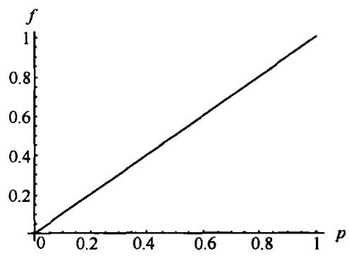

<details>
<summary>line</summary>

| p | f |
| --- | --- |
| 0 | 0 |
| 0.2 | ~0.2 |
| 0.4 | ~0.4 |
| 0.6 | ~0.6 |
| 0.8 | ~0.8 |
| 1 | 1 |
</details>

图1

式(1)中 $y_{i}$ 的求解过程如下：

（1）保证一个月内希望看到该 DVD 的会员中能够看到该 DVD 的会员至少为 50%。对于 $DVD_{i}$ ，见表 5。

表 5

<table><tr><td>人数\分类</td><td>租赁两次</td><td>租赁一次</td></tr><tr><td>第一步租赁的人数</td><td> $0.6x_{i}$ </td><td> $0.4x_{i}$ </td></tr><tr><td>第二步租赁的人数</td><td> $fx_{i}$ </td><td></td></tr></table>

可以得出

$$
y _ {i} = 0. 6 x _ {i} + 0. 4 x _ {i} + f x _ {i} \tag {2}
$$

至少保证 $50\%$ 的会员看到DVD，因为 $f = 0.6$ ，满足

$$
1. 6 x _ {i} \geqslant 0. 5 Y _ {i} \tag {3}
$$

(2)保证三个月内希望看到该 DVD 的会员中能够看到该 DVD 的会员至少为 95%。对于 $DVD_{i}$ ，见表 6。

表 6

<table><tr><td colspan="2">人数\分类</td><td>租赁两次</td><td>租赁一次</td></tr><tr><td rowspan="2">第一个月</td><td>第一步租赁的人数</td><td> $0.6x_{i}$ </td><td> $0.4x_{i}$ </td></tr><tr><td>第二步租赁的人数</td><td> $0.6fx_{i}$ </td><td> $0.4fx_{i}$ </td></tr><tr><td rowspan="2">第二个月</td><td>第一步租赁的人数</td><td> $0.6x_{i}$ </td><td> $0.4x_{i}$ </td></tr><tr><td>第二步租赁的人数</td><td> $0.6fx_{i}$ </td><td> $0.4fx_{i}$ </td></tr><tr><td rowspan="2">第三个月</td><td>第一步租赁的人数</td><td> $0.6x_{i}$ </td><td> $0.4x_{i}$ </td></tr><tr><td>第二步租赁的人数</td><td> $0.6fx_{i}$ </td><td> $0.4fx_{i}$ </td></tr></table>

可以得出

$$
y _ {i} = 3 \cdot 0. 6 x _ {i} + 3 \cdot 0. 4 x _ {i} + 3 \cdot 0. 6 f x _ {i} + 3 \cdot 0. 4 \cdot f x _ {i} \tag {4}
$$

至少保证 95% 的会员看到 DVD, 因为 f=0.6, 满足

$$
4. 8 x _ {i} \geqslant 0. 9 5 Y _ {i} \tag {5}
$$

要求解的五种 DVD 所需的数据已经在问题的准备工作中得出, 将数据带入式(3)以及式(5)中可以得到表7。

表7

<table><tr><td>采购数\DVD名称</td><td> $DVD_1$ </td><td> $DVD_2$ </td><td> $DVD_3$ </td><td> $DVD_4$ </td><td> $DVD_5$ </td></tr><tr><td>50%</td><td>6250</td><td>3125</td><td>1563</td><td>782</td><td>313</td></tr><tr><td>95%</td><td>3959</td><td>1980</td><td>990</td><td>495</td><td>198</td></tr></table>

## 4.3 结论分析

模型在求解的过程中给出了相当程度的简化,将整个租赁过程处理成两个阶段。

(1) 月初所有的会员参与租赁。  
(2) 当月中旬 60% 的会员再次参与租赁, 使问题的求解变得简单。

从模型给出的结果看,每种碟片满足题设要求的存储量分布曲线与其愿意观看该DVD碟片人数的分布曲线相似。从这点可以看出,简化后的模型结论是比较正确的。

模型的缺陷就在于假设过于理想化,这点在问题四中得到进一步讨论。另外,对抽样统计数据的可信性未加以分析,模型的结论就值得怀疑。

## 5 问题二的求解

## 5.1 问题的分析

网站手头上有 100 种 DVD 的现有张数和当前需要处理的 1000 位会员的在线订单，其中在线订单上会员按照对 DVD 的偏爱程度选择了一些 DVD 并进行了排序。

如何由上述条件对 DVD 进行分配,使得会员得到最大满意度。

在模型的假定中认为一张订单只能租赁三张 DVD, 所以对于上述条件认为这 1000 位会员的在线订单最多可以得到三张 DVD。

这样由上述条件可以得到如下结论。

(1) 这是一个规划问题,但是涉及的数据量庞大,考虑使用 Lingo 工具进行求解。  
(2) 在一次租赁过程中,会员最多可以得到三张碟片。  
对于一个网管人员来讲,在得到一份订单以后要用一种相对准确、速度快且方法简便的算法对 DVD 进行分配。在问题中,订单上一共有十万个数据,其中用于计算的数据也有一万个,因此如果利用 0-1 规划求取全局最优解在一般的计算机上实现起来是困难的。所以可以利用动态规划对问题进行求局部最优解,从而逐步向最优解逼近。

## 5.2 算法思想及求解过程

## 1. 算法思想

对于问题所要求的最终目的是使得会员得到最大满意度,对于最大满意度的定义,作如下分析:

首先分析一下与满意度有关的直接条件有：

(1) 会员得到满足的 DVD 的数量。

(2) 会员对其得到的 DVD 的偏爱程度。

对于以上两点主要是与网站经营管理人员的分配情况有关。利用动态规划的思想，对所给问题进行分步求解，对每一步得到的局部最优解向全局最优解逼近。

步骤如下：

（1）因为订单上最多有十个等级的偏爱程度,因此将问题分成十个步骤进行求解,即每一个步骤对应着一个偏爱程度。  
(2) 确定满意度矩阵 $C_{ij}$ 。表 2 给出的会员的偏爱程度是用 $1 \sim 10$ 之间的数据组成的, 为了求取最大满意度以及计算方便, 对偏爱程度的数据进行调整。具体调整见表 8。

表8

<table><tr><td>偏爱程度</td><td>1</td><td>2</td><td>3</td><td>4</td><td>5</td><td>6</td><td>7</td><td>8</td><td>9</td><td>10</td></tr><tr><td>满意度</td><td>1</td><td>0.9</td><td>0.8</td><td>0.7</td><td>0.6</td><td>0.5</td><td>0.4</td><td>0.3</td><td>0.2</td><td>0.1</td></tr></table>

由上述替换,可将偏爱程度矩阵转化成满意度矩阵 $C_{ij}$ 。

（3）对每一步求最优解。每一步对应着一个偏爱程度，为了使满意度最高，可以从这一步骤中的最高偏爱程度算起。每一步的分配中，在满足约束条件的基础上，将会员在这一步骤中最偏爱的 DVD 分配给会员，从而得到这一步上的局部最优解，并依次推算下一步中的局部最优解。  
（4）记录分配矩阵。令分配矩阵为 $X_{ij}$ 。在每一步的求解过程中，记录下所分配给每个会员的 DVD 所在的位置，并在矩阵 $X_{ij}$ 中记录为 1。于是可以得到一个关于 DVD 分配的 0-1 矩阵。

矩阵 $X_{ij}$ 表示的意义如下：

$$
\boldsymbol {X} _ {i j} = \left\{ \begin{array}{l l} 1 & (\text {会员分得想要的DVD}) \\ 0 & (\text {会员没分得想要的DVD}) \end{array} \right. \tag {6}
$$

式中: i 表示会员; j 表示 DVD。

(5) 计算满意度值。可以由步骤(3)中得到的分配矩阵 $X_{ij}$ 及会员的偏爱程度矩阵 $C_{ij}$ 代入目标函数进行求解。

从上述的求解过程来看,所定义的最大满意度并不是全局最优状态下的最大满意度。而是局部最优解,即在每一步的选择过程中选出当前状况下某一会员最满意的碟片。

于是得到在这一问的求解过程中最大满意度的定义: 最大满意度是指每个会员得到的 DVD 是在每一步的求解过程中得到的最满意的 DVD, 这样认为此时会员获得最大满意度。

## 2. 求解过程

目标函数为

$$
J = \operatorname{Max} \sum_ {i = 1} ^ {1 0 0 0} C _ {i j} X _ {i j} \tag {7}
$$

约束条件为

$$
\sum_ {i = 1} ^ {1 0 0 0} X _ {i j} \leqslant a _ {j}, \quad i = 1, 2, \dots , 1 0 0
$$

$$
1 \leqslant \sum_ {j = 1} ^ {1 0 0} X _ {i j} \leqslant 3, \quad j = 1, 2, \dots , 1 0 0 0
$$

由于所给的数据量庞大,在一般的计算机上搜索0-1规划的最优解很难实现。因此有必要先对所给的信息量进行简化,给出如下求解过程。

第一步:对表2中的数据进行全局搜索,记录下每一列中所有不为0的数据的数目。

第二步:对表2中每一列的数据进行搜索,选出所有偏爱程度为1的数据。记录这些数据的数目,同相应列的碟片数量进行比较。根据碟片的数量同数据1的数量的大小关系,制定相应的规则进行比较判断DVD的分配情况。

第三步:进行三次搜索,求出分配矩阵,将得到的结果带入目标函数,即可求得满意度。

其中最难以实现的是第二步,下面给出的是采用动态规划的思想通过自己制定判定规则来求取局部最优解。

当现在正进行第 $n$ 次搜索 $(n = 1,2,3)$ ：为了使会员对选择的碟片的满意度最大，要满足其搜索的偏爱程度的数值对应也是 $n$ 。针对每一种DVD来讲，首先要统计出对此种DVD的偏爱程度对应是 $n$ 的会员的个数 $m_{j}$ ，然后将 $m_{j}$ 同这种DVD在第 $n$ 步中剩余的总数 $n_j$ 进行比较，作如下处理：

（1）当 $m_{j} \leqslant n_{j}$ 时，即选择该种 DVD 的会员总人数小于等于剩余的碟片数，此时这些会员的满意度是最大的，于是将 $m_{j}$ 个 DVD 分给这些会员。

(2) 当 $m_{j} > n_{j}$ 时, 即选择该种 DVD 的会员数大于剩余的碟片数, 这时需要对这些会员的选择进行决策。作如下调整, 考虑从 $m_{j}$ 个会员中选出 $(m_{j} - n_{j})$ 个会员分给他们下一个满意度值——即满意度是 $n + 1$ 的 DVD。而对于这些会员的挑选, 可以根据他们分别对应的偏爱程度是 $n + 1$ 的 DVD 的供求关系来调整, 这种供求关系主要是看供给量与需求量之间的比值大小。当“供”与“求”的比值越大, 说明在后续搜索中碟片被选择的机率也越大, 因此相对于供求比值量小的 DVD 来讲, 为了方便后续搜索的进行, 将供与求的比值量大的调整到 $n + 1$ (即相当于在这一步中调整比值量大的 $n$ 值)。当然, 如果其偏爱程度为 $n + 1$ 所对应的 DVD 仍然不可调节, 就继续调整到 $n + 2$ , 如此直到调整到满意为止。

假如对于某一个会员来讲,在第 n 步搜索中选中的 DVD 对应的偏爱程度为 $n+i$ , 在下一步的搜索中将偏爱程度 $n+i+1$ 调整为 $n+1$ , 这样就可以保证在程序编写中的连贯性。

## 5.3 问题的结果

由上述判定准则,可以近似得到使会员满意度最大的局部最优解。通过计算机编程可以得到符合局部最优的满意度最大值为2170.71。

## 5.4 模型的检验与分析

## 5.4.1 检验

由于数据量相当大,用规划编程计算比较复杂、计算量较大,一般计算机不能实现,因此可以用规划方法对模型进行检验。在此,利用0-1规划运用Lingo编程计算。

目标函数为

$$
J = \operatorname{Max} \sum_ {i = 1} ^ {1 0 0 0} C _ {i j} X _ {i j} \tag {8}
$$

约束条件为

$$
\sum_ {i = 1} ^ {1 0 0 0} X _ {i j} \leqslant a _ {j}, \quad j = 1, 2, \dots , 1 0 0
$$

$$
1 \leqslant \sum_ {j = 1} ^ {1 0 0} X _ {i j} \leqslant 3, \quad i = 1, 2, \dots , 1 0 0 0
$$

编程计算得到会员的最大满意度为 2474.98。

其中前 30 位会员的所得到的 DVD 见表 9。

表9

<table><tr><td>会员</td><td colspan="3">DVD</td><td>会员</td><td colspan="3">DVD</td></tr><tr><td>1</td><td>8</td><td>41</td><td>98</td><td>16</td><td>10</td><td>84</td><td>97</td></tr><tr><td>2</td><td>6</td><td>44</td><td>62</td><td>17</td><td>47</td><td>51</td><td>67</td></tr><tr><td>3</td><td>32</td><td>50</td><td>80</td><td>18</td><td>41</td><td>60</td><td>78</td></tr><tr><td>4</td><td>7</td><td>18</td><td>41</td><td>19</td><td>66</td><td>84</td><td>86</td></tr><tr><td>5</td><td>11</td><td>66</td><td>68</td><td>20</td><td>45</td><td>61</td><td>89</td></tr><tr><td>6</td><td>19</td><td>53</td><td>66</td><td>21</td><td>45</td><td>50</td><td>53</td></tr><tr><td>7</td><td>26</td><td>66</td><td>81</td><td>22</td><td>38</td><td>55</td><td>57</td></tr><tr><td>8</td><td>31</td><td>35</td><td>71</td><td>23</td><td>29</td><td>81</td><td>95</td></tr><tr><td>9</td><td>57</td><td>78</td><td>100</td><td>24</td><td>45</td><td>61</td><td>89</td></tr><tr><td>10</td><td>41</td><td>55</td><td>85</td><td>25</td><td>9</td><td>69</td><td>94</td></tr><tr><td>11</td><td>59</td><td>63</td><td>66</td><td>26</td><td>22</td><td>68</td><td>95</td></tr><tr><td>12</td><td>2</td><td>31</td><td>41</td><td>27</td><td>50</td><td>58</td><td>78</td></tr><tr><td>13</td><td>21</td><td>78</td><td>96</td><td>28</td><td>8</td><td>34</td><td>37</td></tr><tr><td>14</td><td>23</td><td>52</td><td>89</td><td>29</td><td>26</td><td>30</td><td>55</td></tr><tr><td>15</td><td>13</td><td>52</td><td>85</td><td>30</td><td>37</td><td>62</td><td>98</td></tr></table>

将上述值与模型中给出的局部最优解项比较,可以得到模型的相对误差为 12.3%。

## 5.4.2 分析

对问题二的求解建立的是局部最优模型,即对问题进行分步处理,算出每一步的最优解作为会员的最大满意度。

问题中的近似处理是以计算机的数据搜索为基础,在满足一定的规则下对表2中的数据进行搜索得到局部最优解。这种近似具有一定的误差,但是计算起来相对较方便,具有一定的实用性。

## 6 双目标规划模型

## 6.1 问题三的分析

对比问题二不难看出: 在目标函数不变的前提下, 问题三的约束条件增强为以下三条。

(1) 决定每种 DVD 的购买量。  
(2) 在基本服从已知的两种不同租赁次数的会员所占百分比下, 对购买的 DVD 进行分配, 使会员的满意度最大。  
(3) 一个月内 95% 的会员得到他想看的 DVD。

其中需要明确的是约束条件(3): 在每一次的订单中, 如果分配给某一会员的碟片中有一张碟片不是他偏好的, 就认为该会员没有得到他想看的 DVD。

由于每种 DVD 的购买量是待定的,因此理论上可以满足使所有的会员都能得到他想看的 DVD。但是这样很明显是不经济的,因此有必要给出另一项目标函数——成本约束。

因此,将问题三转化为一个双目标规划模型,即在满意度较大的前提下实现成本的较低。在问题的分析与假设中,已经指出:认为每一种 DVD 碟片的成本是一定的。所以降低网站的成本就是尽量减少碟片的购买量。至于采购数量的大小,完全是由满足此两项目标函数的分配方案决定的。

作为网站管理员,要求解决的是如何使碟片的成本最低(即 DVD 碟片数量最少),同时满足顾客的满意度最大。值得注意的是根据历史数据显示,有 60% 的会员再次参与了租赁,即存在着碟片的重复使用情况。至于在表 2 所给的订单中,某一名会员是否参与再次租赁是不可知的。为了在分配方案中将这一因素确定,可以认为在这 1000 名会员中参与再次分配的百分比服从均匀条件下的随机整数分布。

对任意一名会员的编号 $C_{i}(i=1,2,\cdots,1000)$ ，用均匀分布函数产生1到1000之间的随机整数，用n表示该会员当月的租赁次数，有

$$
n = \left\{ \begin{array}{l l} 1, & \text {该会员的编号介于601至1000之间} \\ 2, & \text {该会员的编号介于1至600之间} \end{array} \right. \tag {9}
$$

本着“顾客至上”的原则,认为在本规划问题中,满意度最高这一目标的优先级要高于降低成本这个目标。因此本问题就转化为“在满意度较大的前提下,如何通过对DVD碟片数量的调整,使得网站的成本较低?”如果在满足约束条件下,能够使得DVD碟片的重复使用概率为1(归还后的碟片再次全部投入使用),此时就能满足网站成本较低这一准则。

首先给出如下说明：

(1) 不考虑 DVD 现有数量的限制。

这是由研究的目标函数中满意度最大决定的。因为碟片的购买量仅仅由满足目标函数的分配方案决定的。

(2) 时效性准则。它指的是在同等满意度的条件下, 尽量在每月月初(分配的第一

个阶段)就使会员看到最偏爱的 DVD 碟片。

于是可以得到如下求解思路：

第一步:为了求解的方便,不妨假设给出1000名会员中参与再次租赁的会员集中在前600名(只要在概率上满足再次参与租赁的会员所占的百分比达到60%即可),对应地就可以得到各个会员在当月的租赁次数情况。

第二步:统计出占60%租赁两次的会员对应的偏好程度排在前三位的各类DVD碟片的总量:

$$
\alpha_ {j} (j = 1, 2, \dots , 1 0 0) \tag {10}
$$

第三步:认为第一阶段的各类 DVD 碟片的总量完全能分配在第二阶段中,即为对应的各类 DVD 碟片的总量限制条件:

$$
\beta_ {j} = \alpha_ {j} (j = 1, 2, \dots , 1 0 0) \tag {11}
$$

第四步:在满足使一个月内95%的会员得到他想看的DVD这一约束下,对剩余的各类碟片数量进行调整,使得会员的满意度较大,而且成本较低(能够扣除的碟片数量尽可能多)。

第五步:如果不能满足使一个月内95%的会员得到他想看的DVD这一约束,通过增加购买碟片的张数来减少不满足约束条件的值。

## 6.2 问题的求解

在此双目标规划中,结合上述的分析,可以给出图2所示算法流程示意图。

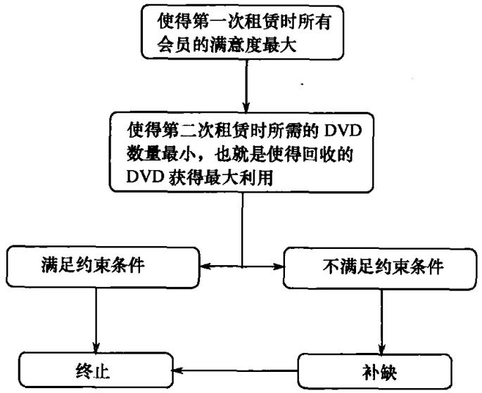

<details>
<summary>flowchart</summary>

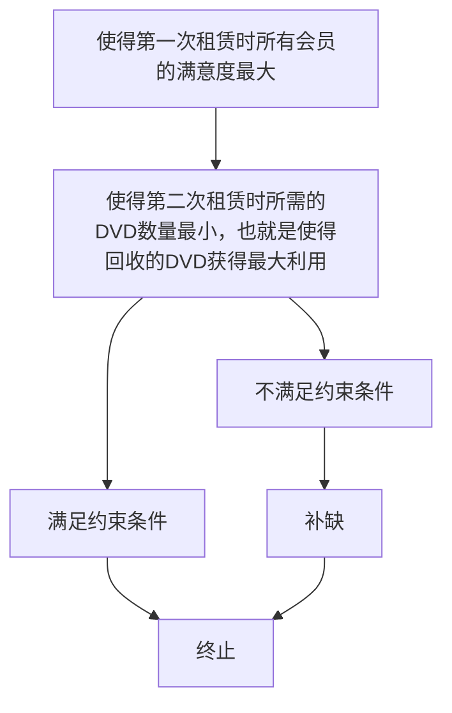
```mermaid
graph TD
  A["使得第一次租赁时所有会员的满意度最大"] --> B["使得第二次租赁时所需的DVD数量最小，也就是使得回收的DVD获得最大利用"]
  B --> C["满足约束条件"]
  B --> D["不满足约束条件"]
  C --> E["终止"]
  D --> F["补缺"]
  F --> E
```
</details>

图2

对算法流程图作如下说明：

（1）为了使成本最小化,考虑的是使当月中旬回收的碟片全部能用于下半月的租赁中。  
（2）在前两步中，满意度最大和成本最低严格满足，这必然导致有一定比例的会员得不到他想看到的碟片，而且这个比例应该大于5%。  
(3) 必须适当增加各类 DVD 碟片的数量来满足 95% 的会员得到他想看的碟这一约束条件。

(4) 补缺的三个原则。

① 增补的碟片的数量要小,尽量替换那些只有一张碟不满足会员要求的“缺口”。  
② 增补的碟片尽量使满意度大,所以着重考虑增补每一列上缺口多的那一类 DVD 碟片。

③ 补缺直到那些得不到想看的碟的会员人数只有 50(个)为止。

在上述问题的分析中,第五步得到的剩余量 $\gamma_{j}$ 即为第二阶段分配中 DVD 碟片数量约束 $b_{j}$ 。

针对于表 2 中的数据, 可以得到对应 $N_{j}$ 、 $\alpha_{j}$ 、 $\beta_{j}$ 、 $\gamma_{j}$ 的值(由于数据表格过大, 文章中不加以列举), 其中 $b_{j} = \gamma_{j} (j = 1, 2, \cdots, 1000)$ 。

因此可以将问题转化为“在达到上述 DVD 碟片数量约束下,该如何调整使得第二次租赁的会员尽可能看到他想看到的碟”。类比问题二,同样可以采用 Lingo 软件进行全局优化,得到全局最优解。

在对 DVD 进行调配的过程中,为了刻画出会员的满意度最大,在计算其满意度大小时仍然采用:

$$
J = \operatorname{Max} \sum_ {i = 1} ^ {1 0 0 0} C _ {i j} X _ {i j} \tag {12}
$$

对上述过程求解,需要补缺的数量为0张,得到需购买3000张,其对应的满意度大小为4320。

## 6.3 问题三的结果与分析

通过对统计得到的结果来看,满足一个月内95%的会员得到他想看的DVD,不需要通过补缺调整,所得结果已经满足要求。

从满意度和碟片成本来看,模型得到的结果能较好符合这两个目标函数。然而,对再次租赁的会员所占百分比的处理采用的是均匀分布下取随机数,这必将导致调配方案的变动,因此也将影响到各类碟片采购量的不同。所以问题三给出的结果并不是稳定的,这是模型的缺点所在。

另外,在调配过程中,采用的判定规则是主观划分的,这也必将对局部最优解的求解产生影响。

## 7 模型IV的建立和求解

## 7.1 问题四的分析

结合实际问题来看,在 DVD 的需求预测、购买和分配中存在着诸多影响因素,其中往往是一些随机的变量。例如会员的租赁订单可能会以泊松流的形式到来;会员接受服务的时间可能服从负指数分布;每个月参与订购的会员人数可能会出现变化;在某段时间里,会员可能会对某些碟片特别偏好;在对 DVD 碟片采购时可能出现缺货的现象;对碟片的分配过程中可能在邮寄中发生遗失等。

当然不可能完全描述出实际中存在的各种变量,针对各个不同的侧重点,可以相应地建立该数学模型。在本问题中,仍然认为前面的各种假设条件成立,着重研究的是在碟片的需求预制中,碟片的重复使用率。

在问题一中,由于归还后的每一类碟片都可以无差别地再次使用,因此认为每一类碟片的重复使用率与租赁两次的人员百分比成线性关系。然而,在对全体碟片进行重复使用过程中,需要考虑偏好系数的程度。因此重复使用率与需要租赁两次的会员所占的百分比之间的函数关系必然不再是线性的。为了更好地对碟片的需求进行预测,有必要研究碟片的重复使用率函数 $f(p)$ 。

## 7.2 问题四的求解

在问题一中,已经给出了重复使用率函数 $f(p)$ 的端点极值情况:

$$
f = \left\{ \begin{array}{l l} 1 & (p = 1) \\ 0 & (p = 0) \end{array} \right. \tag {13}
$$

然而仅仅根据这两个端点值很难刻画出重复使用率函数 $f(p)$ 的性质。

可以考虑将表 2 中的会员在线订单看成是一次抽样数据,于是问题转化为:如何在满足满意度最大的前提下,根据自变量 p 的不同取值,通过统计得到对应的重复使用率 f 的数值。

不妨取 p=0.6，给出会员在一个月里满意度最大的分配方案。结合实际情况，要注意以下两点。

（1）不考虑 DVD 现有数量的限制。这是由研究的目标函数的性质决定的。仅仅需要考虑的是会员在线订单的抽样状况，因此无需考虑这一约束条件。  
(2) 时效性准则。它指的是在同等满意度的条件下, 尽量在每月月初(分配的第一个阶段)就使会员看到最偏爱的 DVD 碟片。

当 p=0.6 时, 存在租赁 DVD 碟片一次的会员的概率为

$$
\bar {p} = (1 - 0. 6) \times 100 \% = 40 \% \tag {14}
$$

这样不考虑 DVD 现有数量的限制,为了使总的满意度最大,完全可以让这一部分会员分配到偏爱系数最高的三张碟片。

而对于60%租赁两次的会员,将整个租赁过程看成两个阶段,所建立的目标函数就是使得两个阶段总的满意度达到最大值。

由于不考虑 DVD 现有数量的限制,根据时效性准则,首先对这类会员分配偏爱程度排在前三位的碟片,在每月中旬(分配的第二阶段)分配给这类会员的就是偏爱程度排在次优的三张碟片。

对于此两类会员的判定采用的仍然是均匀分布下的随机数法。由此租赁两次的会员，在分配的第一阶段可以得到所需的各类DVD碟片的总量为 $a_{j}$ ，在分配的第二阶段所需的各类DVD碟片的总量为 $b_{j}$ （由于数据表格过大，文章中不加以列举）。

对于每一类碟片,当第二阶段对应的碟片总量比第一阶段的碟片总量大时,就认为出现了重复使用的碟片,且重复使用的碟片张数就是第一阶段中对应的碟片总量张数。

于是不难计算出此时的重复利用率为

$$
f (0. 6) = 0. 3 2 6 7
$$

同理, 当 p 取不同的数值时, 可以得到表 10。

表 10

<table><tr><td>p</td><td>0</td><td>0.3</td><td>0.6</td><td>0.8</td><td>1</td></tr><tr><td>f</td><td>0</td><td>0.18556</td><td>0.3267</td><td>0.53111</td><td>1</td></tr></table>

其数据分布如图 3 所示。

对这些数据用最小二乘法进行拟合,可以得到其函数分布(图4)为

$$
f = 0. 9 5 2 7 7 1 p ^ {2} \quad (0 \leqslant p \leqslant 1) \tag {15}
$$

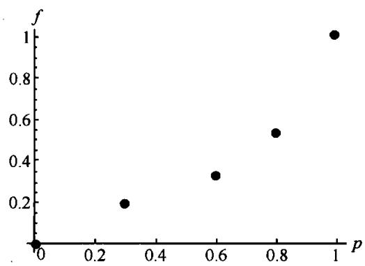

<details>
<summary>scatter</summary>

| p | f |
| --- | --- |
| 0 | 0 |
| 0.3 | 0.2 |
| 0.6 | 0.33 |
| 0.8 | 0.54 |
| 1 | 1 |
</details>

图3

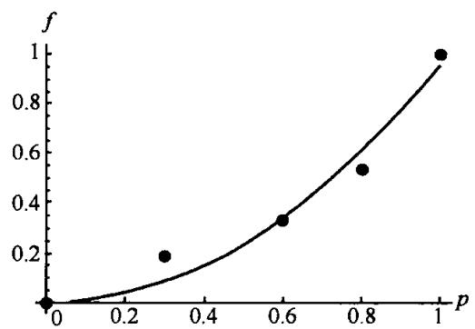

<details>
<summary>scatter</summary>

| p | f |
| --- | --- |
| 0 | 0 |
| 0.3 | ~0.2 |
| 0.6 | ~0.33 |
| 0.8 | ~0.53 |
| 1 | 1 |
</details>

图4

## 7.3 问题四的结果与用途分析

从曲线拟合的效果来看,函数的可信度比较高。

模型的缺点在于对两类会员判定过程中所取的随机数并不稳定,因此对重复使用率函数 $f(p)$ 会有一定程度的影响。减少这种影响的一种比较可行的办法就是在对会员判定过程中多取几组随机数,然后对它们对应状况下的重复利用概率取平均值。

研究碟片的重复使用率函数 $f(p)$ 其用途是十分广泛的。例如在问题一中，为了求得保证希望看到该DVD的会员中至少50%在一个月内能够看到该DVD而准备的DVD碟片的张数，得知重复使用概率是必不可少的。另外，通过对抽样数据进行重复使用率函数的分析，就可以粗略得知大量数据中可能的重复使用概率，因此进行需求预测。

## 8 模型的结论

本文研究的是 DVD 在线租赁中的需求预测、购买和分配问题。作为网站管理经营人员,既要求尽可能使顾客的满意度大,同时也要降低自己的成本费用。

模型 I 中将整个租赁过程分为两个阶段,在简单地认为 DVD 碟片的重复使用率 f 与每月租赁两次的会员所占比重相等时,得出至少准备的碟片张数见表 11。

模型Ⅱ中目标函数是使会员的满意度最大,然而根据表2订单采用0-1规划处理时,数据庞大,计算相当复杂。因此采用动态规划的思想,对各类DVD碟片寻求局部最优,从而逐步逼近全局最优解。在模型的检验中用Lingo进行规划编程对模型的结果进行检验。同时在附录中给出了前30名会员的分配方案(详细分配方案见软盘)。从得到的满意度数值来看,模型的可行性比较高,给出的最大满意度为2464.98。

表 11

<table><tr><td>采购数\DVD名称</td><td> $DVD_1$ </td><td> $DVD_2$ </td><td> $DVD_3$ </td><td> $DVD_4$ </td><td> $DVD_5$ </td></tr><tr><td>50%</td><td>6250</td><td>3125</td><td>1563</td><td>782</td><td>313</td></tr><tr><td>95%</td><td>3959</td><td>1980</td><td>990</td><td>495</td><td>198</td></tr></table>

模型Ⅲ中认为采购的最佳数量由满足双目标规划下的具体分配方案决定。通过调配，在满足95%的会员得到他想看的碟片的基础上，使得当月中旬归还的碟片全部投入重复使用。模型的结论指出，此时DVD碟片的购买量为4800张，最大满意度为100%。

模型IV研究的是重复使用率函数与需要租赁两次的会员所占的百分比之间的函数关系。通过对各个样点处的曲线拟合,得到的函数关系为

$$
f = 0. 9 5 2 7 7 1 p ^ {2} \quad (0 \leqslant p \leqslant 1)
$$

## 9 模型的优缺点分析

针对所提的问题,本文建立了四个不同的模型对实际问题进行分析。

模型Ⅰ中认为在当月中旬(租赁的第二阶段), 当60%的会员再次租赁时, DVD碟片的重复使用率f与每月租赁两次的会员所占百分比成一次线性关系, 通过对极值条件的分析就可以得到两者间的函数关系, 并且给出了此时的重复使用概率。模型的优点: 将整个租赁过程分为两个阶段, 层次分明; 模型的缺点: 忽略了时间的周转和其他一些随机因素, 假设过于理想化。

模型Ⅱ中由于设计的数据量庞大,采用 MATLAB 中的最优控制工具进行 0-1 规划处理时,一般计算机很难得到最优方案。只能通过自己设定一系列判定规则,寻求局部最优解,采用动态规划的思想尽量一步步向目标函数逼近,然而这样的过程中却又很难保证满意度达到最大。在模型的检验中,给出了采用 Lingo 工具求解 0-1 规划的全局最优解。模型的优点:求解局部最优解的条理分明,易于编程计算,所得到的局部最优解能较好地逼近全局最优解。模型的缺点:判定规则的设定并不能给出完备性证明,而且主观因素会影响判定条件的设定,从而影响最终的结论。

模型Ⅲ考虑的是结合满意度和网站成本的双目标规划。在处理的过程中先满足会员的满意度最大,然后通过调配,在满足约束条件下,使得当月中旬归还的碟片全部投入重复使用的情形下即满足网站成本最低。在调配过程中采用的是Lingo工具求解满意度最大的方案。因此模型的优点在于综合考虑了上述两个目标函数,比较简便地给出了规划方案;模型的缺点在于没能给出双目标规划的全局最优解。

结合实际情况,对 DVD 在线租赁中的需求预测、购买和分配问题作进一步讨论。针对重复使用概率函数这一变量建立了模型IV。模型的优点:拟合得到的函数对各点概率吻合较好,函数的用途广泛;模型的缺点:由于所取的随机数的不同,会导致在各个点上的概率并不是很稳定。

## 【论文点评】

刘守生

该论文是2005年全国大学生数学建模竞赛B题,其背景是DVD在线租赁业务。论文首先将整个碟片租赁过程分为两个阶段,需要两次租赁DVD的会员在当月中旬(第二个阶段初)发出订单。并且认为碟片的重复使用率与需要租赁两次DVD的会员所占的百分比成线性关系。利用初等数学的方法分别给出了一个月和三个月内满足题设要求的各类DVD至少的数量,由此解决了问题一;在问题二中,论文基于会员对各类DVD的偏爱程度和网管现有的DVD数量,通过建立动态规划模型实现对DVD进行分配;在问题三中,论文建立了一个既使会员的满意度较大,又使网站的成本较低的双目标规划模型。利用“顾客至上”的原则,同时在一个月内考虑两种不同租赁次数的会员所占百分比,给出了双目标规划下的最优解为3000张,对应的满意度大小为4320;论文最后刻画了碟片的重复使用率与需要租赁两次的会员所占的百分比之间的函数关系。

但论文也存在一些缺陷,如问题一中忽略了时间的周转和其他一些随机因素,假设过于理想化;问题二中在利用判定规则求解0-1规划模型时,主观因素会影响判定条件的设定,从而影响最终的结论。

## 2006 年 B 题 艾滋病疗法的评价及疗效的预测

艾滋病是当前人类社会最严重的瘟疫之一,从1981年发现以来的20多年间,它已经吞噬了近3000万人的生命。

艾滋病的医学全名为“获得性免疫缺损综合症”，英文简称 AIDS，它是由艾滋病毒（医学全名为“人体免疫缺损病毒”，英文简称 HIV）引起的。这种病毒破坏人的免疫系统，使人体丧失抵抗各种疾病的能力，从而严重危害人的生命。人类免疫系统的 CD4 细胞在抵御 HIV 的入侵中起着重要作用，当 CD4 被 HIV 感染而裂解时，其数量会急剧减少，HIV 将迅速增加，导致 AIDS 发作。

艾滋病治疗的目的,是尽量减少人体内 HIV 的数量,同时产生更多的 CD4,至少要有效地降低 CD4 减少的速度,以提高人体免疫能力。

迄今为止人类还没有找到能根治 AIDS 的疗法, 目前的一些 AIDS 疗法不仅对人体有副作用, 而且成本也很高。许多国家和医疗组织都在积极试验、寻找更好的 AIDS 疗法。

现在得到了美国艾滋病医疗试验机构 ACTG 公布的两组数据。ACTG320(见附件 1)是同时服用 zidovudine(齐多夫定)、lamivudine(拉美夫定)和 indinavir(茚地那韦)3 种药物的 300 多名病人每隔几周测试的 CD4 和 HIV 的浓度(每毫升血液里的数量)。193A (见附件 2)是将 1300 多名病人随机地分为 4 组,每组按下述 4 种疗法中的一种服药,大约每隔 8 周测试的 CD4 浓度(这组数据缺 HIV 浓度,它的测试成本很高)。4 种疗法的日用药分别为:600mg zidovudine 或 400mg didanosine(去羟基苷),这两种药按月轮换使用;600 mg zidovudine 加 2.25 mg zalcitabine(扎西他滨);600 mg zidovudine 加 400 mg didanosine;600 mg zidovudine 加 400 mg didanosine,再加 400 mg nevirapine(奈韦拉平)。

请完成以下问题：

(1) 利用附件 1 的数据, 预测继续治疗的效果, 或者确定最佳治疗终止时间 (继续治疗指在测试终止后继续服药, 如果认为继续服药效果不好, 则可选择提前终止治疗)。  
(2) 利用附件 2 的数据,评价 4 种疗法的优劣(仅以 CD4 为标准),并对较优的疗法预测继续治疗的效果,或者确定最佳治疗终止时间。  
(3) 艾滋病药品的主要供给商对不发达国家提供的药品价格如下:600mg zidovudine 1.60 美元,400mg didanosine 0.85 美元,2.25 mg zalcitabine 1.85 美元,400 mg nevirapine 1.20 美元。如果病人需要考虑 4 种疗法的费用,对(2)中的评价和预测(或者提前终止)有什么改变。

## 【试题评析】

沈锦仁

本题的重要问题是对统计数据进行回归,从而得到治疗效果依赖于时间的回归函数,一个难点是用什么函数来描述的问题。

对于问题一,首先要对数据进行定量分析,对于 CD4 是先增后减,对于 HIV 是先减后增,说明药物的疗效是开始有、后来慢慢失效了,从而用二次以上的函数进行回归,从而找到终止用药时间——抛物线顶点。

对于问题二,用上面同样的方法对四种药的疗效数据分析进行二次函数的回归,在评价优劣时,可选取若干个时间点的 CD4 的改变量来作为评价标准,也可以根据各时间点的平均数来进行比较,从而得到四种的优劣性排队。

对于问题三,考虑到价格的因素,最好的方法是提一个性价比的指标,或其他类似的指标,即单位价格得到的疗效:用 CD4 的增加量除以价格,此指标也是随治疗时间的延伸而变化的,同样也要选择若干个时间点来综合进行比较。

## 【问题解答要点】

问题一,首先对问题要进行定性分析,找到最合适函数:二次函数,对病人要进行分类,按年龄分类和按病情严重程度进行分类。由于各病人入院的初态各异,回归时不是对CD4的数值进行回归,而是对CD4的增加量进行无常数项的二次回归,抛物线的顶点对应的 $t^{*}$ 就是终止用药时间。

问题二,对于四种药,每种药的数据按病情进行分类,用同样的方法进行二次函数的回归拟合。

# 艾滋病疗法的评价及疗效的预测的数学模型

## 摘要

本题是一个统计分析问题。先构建合适的函数,回归出相应参数,再利用该函数预测疗效。

对于问题一,将原始数据按初始病情不同进行分类,建立了四个模型,对各类进行整体回归,它们是:第一步,考虑人体抗药性作用的抛物线模型;第二步,考虑CD4与HIV相互作用的微分方程模型;第三步,指数增长和衰减模型;第四步,考虑抗药性的指数模型。对每个模型均进行F检验,并以F检验的值作为评价模型优劣的依据,得出抛物线模型回归效果最优。并对各组数据进行预测,确定属于不同分类的病人终止用药时间如下:

病人分类 预测终止用药时间

<table><tr><td>分类I</td><td>38.880746</td></tr><tr><td>分类II</td><td>32.807463</td></tr><tr><td>分类III</td><td>36.993608</td></tr><tr><td>分类IV</td><td>33.933763</td></tr></table>

对于问题二,采用回归效果最好的抛物线模型,对四种疗法利用数据建立了 CD4 和 HIV 浓度的回归方程。并利用此函数得出各种疗法的疗效函数,以此对四种疗法进行评估。得到评估结论:疗法 4 总体评估疗效较好。对疗法 4 的效果预测:应在 32.9 周停药。

对于问题三,设定一个单位费用疗效的指标 M,它表示疗效和日平均花费之比,M 越大,疗法越有效。从费用上来评估四种疗法的优劣性,得出结论。总体上来说疗法 4 的单位费用疗效最好。

## 1 问题的重述

艾滋病是当前人类社会最严重的瘟疫之一,从1981年发现以来的20多年间,它已经吞噬了近3000万人的生命。

艾滋病的医学全名为“获得性免疫缺损综合症”，英文简称 AIDS，它是由艾滋病毒（医学全名为“人体免疫缺损病毒”，英文简称 HIV）引起的。这种病毒破坏人的免疫系统，使人体丧失抵抗各种疾病的能力，从而严重危害人的生命。人类免疫系统的 CD4 细胞在抵御 HIV 的入侵中起着重要作用，当 CD4 被 HIV 感染而裂解时，其数量会急剧减少，HIV 将迅速增加，导致 AIDS 发作。

艾滋病治疗的目的,是尽量减少人体内 HIV 的数量,同时产生更多的 CD4,至少要有效地降低 CD4 减少的速度,以提高人体免疫能力。

迄今为止人类还没有找到能根治 AIDS 的疗法, 目前的一些 AIDS 疗法不仅对人体有副作用, 而且成本也很高。许多国家和医疗组织都在积极试验、寻找更好的 AIDS 疗法。

现在得到了美国艾滋病医疗试验机构 ACTG 公布的两组数据。ACTG320(见附件 1)是同时服用 zidovudine(齐多夫定)、lamivudine(拉美夫定)和 indinavir(茚地那韦)3 种药物的 300 多名病人每隔几周测试的 CD4 和 HIV 的浓度(每毫升血液里的数量)。193A (见附件 2)是将 1300 多名病人随机地分为 4 组,每组按下述 4 种疗法中的一种服药,大约每隔 8 周测试的 CD4 浓度(这组数据缺 HIV 浓度,它的测试成本很高)。4 种疗法的日用药分别为:600mg zidovudine 或 400mg didanosine(去羟基苷),这两种药按月轮换使用;600 mg zidovudine 加 2.25 mg zalcitabine(扎西他滨);600 mg zidovudine 加 400 mg didanosine;600 mg zidovudine 加 400 mg didanosine,再加 400 mg nevirapine(奈韦拉平)。

请完成以下问题：

（1）利用附件1的数据，预测继续治疗的效果，或者确定最佳治疗终止时间（继续治疗指在测试终止后继续服药，如果认为继续服药效果不好，则可选择提前终止治疗）。  
(2) 利用附件 2 的数据,评价 4 种疗法的优劣(仅以 CD4 为标准),并对较优的疗法预测继续治疗的效果,或者确定最佳治疗终止时间。  
(3) 艾滋病药品的主要供给商对不发达国家提供的药品价格如下:600mg zidovudine 1.60 美元,400mg didanosine 0.85 美元,2.25 mg zalcitabine 1.85 美元,400 mg nevirapine 1.20 美元。如果病人需要考虑 4 种疗法的费用,对(2)中的评价和预测(或者提前终止)有什么改变。

## 2 问题的分析

问题(1):预测继续治疗的效果建立在对大量数据进行分析的基础之上,考虑通过构建恰当的函数来描述数据变化规律。若针对每名病人构建一个函数,则只有五个观测点的值,函数可信度不高,若对300名病人只构建一个函数,再进行整体回归,则预测每名病人继续治疗效果时误差太大,因此,先将病人按病情轻重分为四类,对每类病人再用整体回归的思想求解各自的拟合函数。对每一类人构建多个函数,通过F检验比较选一个最优的来预测继续治疗效果。

问题(2): 将问题(1)中选出的最优函数作为评价疗法的模型, 根据附件2中的数据回归出相应参数, 该参数一定程度上反映了疗效, 据此进行讨论, 评价疗法的优劣。

问题(3):建立药效与花费的函数关系,在特定的花费量比较不同疗法的一阶导数,即单位花费产生的疗效,一阶导数越大则疗效越好。

## 3 符号约定

C:CD4 的浓度(单位:0.2 个/mL);

H:HIV 的浓度(单位:未知);

t:时间(单位:周);

Q: 残差平方和;

U: 回归平方和;

$C_{i0}$ :病人 i 的 CD4 浓度初值(单位:0.2 个/mL);

$H_{i0}$ :病人 i 的 HIV 浓度初值(单位:未知)。

## 4 模型假设

(1) 病人按初始情况进行分类时,同一类病人对同种药物的反映具有较强的一致性。  
(2) CD4 与 HIV 的浓度变化, 不因本问题提及以外的因素影响。

## 5 模型的建立与求解

## 5.1 问题一的数据处理与综合

题目所给的数据存在一些问题,需预先处理:

(1) 有三组数据内容缺失严重, 直接排除。  
(2) 将全部病人 CD4 初值的最大值与最小值的差的 4 等分点作为分组界点, 将全部病人分为 4 组, 分组情况见表 1。

表 1 按 CD4 初始浓度分类及人数

<table><tr><td></td><td>分类I</td><td>分类II</td><td>分类III</td><td>分类IV</td></tr><tr><td>初始浓度范围</td><td>0~19.375</td><td>19.375~38.75</td><td>38.75~58.125</td><td>58.125~77.5</td></tr><tr><td>人数</td><td>184</td><td>110</td><td>55</td><td>7</td></tr></table>

## 5.2 模型一:抛物线回归模型

## 5.2.1 模型一的建立

设 $u_{1} > 0, v_{1} > 0, u_{2} > 0, v_{2} > 0$ ，构建二次函数

$$
\left\{ \begin{array}{l} C (t) - C _ {i 0} = v _ {1} t - u _ {1} t ^ {2} \\ H (t) - H _ {i 0} = - v _ {2} t + u _ {2} t ^ {2} \end{array} \right. \tag {1}
$$

来描述 CD4 和 HIV 的浓度变化规律。

## 5.2.2 模型构建说明

为了分析并预测治疗效果,如果考虑建立简单的线性回归方程:

$$
\left\{ \begin{array}{l} C (t) = C _ {i 0} + \lambda_ {1} t \\ H (t) = H _ {i 0} - \lambda_ {2} t \end{array} \right. \tag {2}
$$

式中： $C_{i0}$ 表示病人 i 的 CD4 浓度初值； $H_{i0}$ 表示病人 i 的 HIV 浓度初值； $\lambda_{1}$ 表示药效，即 CD4 浓度的变化率。考虑到生物个体具有抗药性，用药时间延长，药效会降低。

设 $\lambda_{1}$ 是一个关于 $t$ 减少的函数，可以简单地构造成 $\lambda_{1} = \lambda_{1}(t) = v_{1} - u_{1}t(u_{1} > 0, v_{1} > 0)$ ，同理构造出 $\lambda_{2} = \lambda_{2}(t) = v_{2} - u_{2}t(u_{2} > 0, v_{2} > 0)$ ，代入式(2)得

$$
\left\{ \begin{array}{l} C (t) - C _ {i 0} = v _ {1} t - u _ {1} t ^ {2} \\ H (t) - H _ {i 0} = - v _ {2} t + u _ {2} t ^ {2} \end{array} \right. \tag {3}
$$

## 5.2.3 模型的求解

令

$$
\overline {{C _ {i j}}} = C _ {i j} - C _ {i 0} (i = 1, 2, \dots , m _ {l}, j = 1, 2, \dots , n _ {i}) \tag {4}
$$

模型中的残差平方和为

$$
Q (u _ {1}, v _ {1}) = \sum_ {i = 1} ^ {m _ {1}} \sum_ {j = 1} ^ {n _ {i}} (\overline {{C _ {i j}}} - \widehat {\overline {{C _ {i j}}}}) ^ {2} = \sum_ {i = 1} ^ {m _ {1}} \sum_ {j = 1} ^ {n _ {i}} (\overline {{C _ {i j}}} - v _ {1} t _ {j} + u _ {1} t _ {j} ^ {2}) ^ {2} \tag {5}
$$

求 $u_{1}, v_{1}$ 使 $Q(u_{1}, v_{1})$ 最小, 利用最小二乘法, 可得

$$
\left\{ \begin{array}{l} \sum_ {i = 1} ^ {m _ {1}} \sum_ {j = 1} ^ {n _ {i}} t _ {j} ^ {4} \cdot u _ {1} - \sum_ {i = 1} ^ {m _ {1}} \sum_ {j = 1} ^ {n _ {i}} t _ {j} ^ {3} \cdot v _ {1} + \sum_ {i = 1} ^ {m _ {1}} \sum_ {j = 1} ^ {n _ {i}} \overline {{C}} _ {i j} t _ {j} ^ {2} = 0 \\ \sum_ {i = 1} ^ {m _ {1}} \sum_ {j = 1} ^ {n _ {i}} t _ {j} ^ {3} \cdot u _ {1} - \sum_ {i = 1} ^ {m _ {1}} \sum_ {j = 1} ^ {n _ {i}} t _ {j} ^ {2} \cdot v _ {1} + \sum_ {i = 1} ^ {m _ {1}} \sum_ {j = 1} ^ {n _ {i}} \overline {{C}} _ {i j} t _ {j} = 0 \end{array} \right. \tag {6}
$$

解方程组得 $u_{1}$ 和 $v_{1}$ 的值, 见表 2。

表 2 分组回归 CD4 与 HIV 的抛物线参数

<table><tr><td></td><td>分类I(184人)</td><td>分类II(110人)</td><td>分类III(55人)</td><td>分类IV(7人)</td></tr><tr><td> $u_1$ </td><td>0.104346</td><td>0.150223</td><td>0.110872</td><td>0.092259</td></tr><tr><td> $v_1$ </td><td>6.771585</td><td>8.514402</td><td>6.860612</td><td>4.918859</td></tr><tr><td>CD4</td><td>-0.10435 $t^2$ +6.7716t</td><td>-0.15022 $t^2$ +8.5144t</td><td>-0.11087 $t^2$ +6.8606t</td><td>-0.092259 $t^2$ +4.9189t</td></tr><tr><td> $u_2$ </td><td>0.003678</td><td>0.004055</td><td>0.005217</td><td>0.003788</td></tr><tr><td> $v_2$ </td><td>0.195320</td><td>0.217848</td><td>0.257253</td><td>0.222993</td></tr><tr><td>HIV</td><td>0.0036776 $t^2$ -0.19532t</td><td>0.0040546 $t^2$ -0.21785t</td><td>0.0052167 $t^2$ -0.25725t</td><td>0.0037884 $t^2$ -0.22299t</td></tr></table>

表 2 中 $u_{1}, v_{1}, u_{2}, v_{2}$ 反映了同一分类的所有病人共同的 CD4 和 HIV 的变化趋势。

## 5.2.4 回归方程的显著性检验

从统计学中的方差分析理论可知,当预测量方差不变时,回归方差越大,残差方差越大,于是就用它们之间的比值来衡量回归方程的效果好坏。

$$
F = \frac {U / 2}{Q / \left(\sum_ {i = 1} ^ {m _ {k}} n _ {i} - m _ {k} - 2\right)} \tag {7}
$$

遵从自由度为 $(2, \left(\sum_{i=1}^{m_k} n_i - m_k - 2\right)$ 的 $F$ 分布，其中回归平方和：

$$
U = \sum_ {i = 1} ^ {m _ {1}} \sum_ {j = 1} ^ {n _ {i}} (\widehat {\overline {{C _ {i j}}} - \overline {{\overline {{C _ {i j}}}}}}) ^ {2} \tag {8}
$$

F 表示分类 I 第 i 个人的所有观测值的平均数。

残差平方和 $Q = \sum_{i=1}^{m_1} \sum_{j=1}^{n_i} (\overline{C_{ij}} - \widehat{\overline{C_{ij}}})^2$ ，代入数据得表3。

表 3 抛物线模型各个分类回归方程统计量 F 的值

<table><tr><td></td><td>分类I(184人)</td><td>分类II(110人)</td><td>分类III(55人)</td><td>分类IV(7人)</td></tr><tr><td> $F_{CD4}$ </td><td>440.417774</td><td>153.170533</td><td>62.940444</td><td>11.528935</td></tr><tr><td> $F_{HIV}$ </td><td>522.921811</td><td>406.927363</td><td>252.506146</td><td>49.737797</td></tr><tr><td> $F_{\alpha}(\alpha=0.05)$ </td><td>3.85</td><td>3.86</td><td>3.89</td><td>4.26</td></tr></table>

## 5.2.5 结果分析

（1）从表 1 可以看出,所有参数均为正值,这与假定的各个参数的物理意义是相吻合的,能够很好地解释模型。  
(2) 从表2中可以看出: 各个分类的回归方程都通过 F 检验, 说明回归参数都是合适的。  
(3) 从表2中可以看出: 分类I的F值远远大于分类IV的, 说明类别的数据量越大, 回归出的函数更接近数据的真实情况。这与在问题分析中对病人进行分类的思想是一致的。

## 5.3 模型二: 考虑 CD4 与 HIV 相互作用模型

## 5.3.1 模型的建立

根据生物医学理论,CD4 和 HIV 在人体内环境条件下,与种群竞争模型相似。CD4 不直接对 HIV 作用,而是通过提高人体的免疫机能来抑制 HIV 病毒;HIV 能直接使 CD4 感染而裂解,使 CD4 数量急剧减少,HIV 迅速增加,导致 AIDS 发作。

这样对种群竞争模型进行合理简化,利用微分方程建立回归函数:

$$
\left\{ \begin{array}{l} \frac {\mathrm{d} C (t)}{\mathrm{d} t} = k _ {1} C (t) - k _ {2} H (t) \\ \frac {\mathrm{d} H (t)}{\mathrm{d} t} = - k _ {3} H (t) \end{array} \right. \tag {9}
$$

## 5.3.2 模型构建说明

(1) $k_{1}C(t)$ 表示 CD4 浓度越大, 增长速度越快, 反映了其自增长的能力。  
(2) $-k_{2}H(t)$ 表示 HIV 浓度越大, CD4 增长的越慢, 准确地反映了 HIV 对 CD4 的裂解作用。  
(3) $-k_{3}H(t)$ 表示 HIV 在药物作用下逐渐衰减,而根据假设:CD4 不能直接作用于 HIV,而是通过提高人体的免疫机能来作用于 HIV 病毒,故不须再添加含 $C(t)$ 的线性项。

解此常微分方程得

$$
\left\{ \begin{array}{l} C (t) = \frac {k _ {2} H _ {i 0}}{k _ {1} + k _ {3}} \mathrm{e} ^ {- k _ {3} t} + \left(C _ {i 0} - \frac {k _ {2} H _ {i 0}}{k _ {1} + k _ {3}}\right) \mathrm{e} ^ {k _ {1} t} \\ H (t) = H _ {i 0} \mathrm{e} ^ {- k _ {3} t} \end{array} \right. \tag {10}
$$

## 5.3.3 模型的求解

1. 方程 $H(t)=H_{i0}e^{-k_{3}t}$ 的回归分析

对方程两边取对数：

$$
\ln H (t) = \ln H _ {i 0} - k _ {3} t \tag {11}
$$

令

$$
\overline {{H}} = \ln H (t), \overline {{H _ {i 0}}} = \ln H _ {i 0} \tag {12}
$$

那么就可转化为关于参数 $k_{3}$ 的线性回归方程：

$$
\overline {{H}} = \overline {{H _ {i 0}}} - k _ {3} t \tag {13}
$$

根据分类情况,定义四个分类中的病人的数目分别为 $m_{l}(l=1,2,3,4)$ , 第 i 个病人有 $n_{i}+1(i=0,1,\cdots,m_{l})$ 个测试时刻, 但 $C_{i0}$ 作为初始值, 不作为回归数据, 故回归数据只有$n_{i}$ 个, $\overline{H_{ij}}$ 表示第i个病人 $t_{j}(j=0,1,\cdots,n_{i}-1)$ 时刻HIV浓度的对数值, $\widehat{H_{ij}}$ 表示第i个病人 $t_{j}$ 时刻HIV浓度的对数回归值。则回归方程的残差平方和为

$$
Q (k _ {3}) = \sum_ {i = 1} ^ {m _ {1}} \sum_ {j = 1} ^ {n _ {i}} (\overline {{H _ {i j}}} - \widehat {\overline {{H _ {i j}}}}) ^ {2} = \sum_ {i = 1} ^ {m _ {1}} \sum_ {j = 1} ^ {n _ {i}} (\overline {{H _ {i j}}} - \overline {{H _ {i 0}}} + k _ {3} t _ {j}) ^ {2} \tag {14}
$$

求 $k_{3}$ 使得 $Q(k_{3})$ 最小, 得

$$
k _ {3} = \frac {\sum_ {i = 1} ^ {m _ {1}} \sum_ {j = 1} ^ {n _ {i}} (\overline {{H _ {i 0}}} - \overline {{H _ {i j}}}) t _ {j}}{\sum_ {i = 1} ^ {m _ {1}} \sum_ {j = 1} ^ {n _ {i}} t _ {j} ^ {2}} \tag {15}
$$

2. 用回归方法求出 $C(t) = \frac{k_2H_{i0}}{k_1 + k_3}\mathrm{e}^{-k_3t} + (C_{i0} - \frac{k_2H_{i0}}{k_1 + k_3})\mathrm{e}^{k_1t}$ 中的参数 $k_{1}, k_{2}$

$C(t)$ 是一个关于 $k_{1}$ 、 $k_{2}$ 的非线性函数，通过常规的回归分析很难确定 $k_{1}$ 、 $k_{2}$ 。因此，借助于泰勒展式将 $f(k_{1},k_{2})$ 线性化，再对该线性方程进行迭代来回归参数。

具体步骤：

(1) 给 $k_{1}, k_{2}$ 一个初值 $k_{1}^{(0)}, k_{2}^{(0)}$ 。

(2) 借助于泰勒级数展式, 将 $f(k_{1}, k_{2})$ 转化为线性方程。

把函数 $C(t) = f(k_{1}, k_{2}, t)$ 在 $k_{1}^{(0)}, k_{2}^{(0)}$ 处泰勒展开，则有

$$
f (k _ {1}, k _ {2}, t) = f (k _ {1} ^ {(0)}, k _ {2} ^ {(0)}, t) + \frac {\partial f}{\partial k _ {1}} (k _ {1} ^ {(0)}, k _ {2} ^ {(0)}, t) [ k _ {1} - k _ {1} ^ {(0)} ] + \frac {\partial f}{\partial k _ {2}} (k _ {1} ^ {(0)}, k _ {2} ^ {(0)}, t) [ k _ {2} - k _ {2} ^ {(0)} ] \tag {16}
$$

令

$$
f ^ {(0)} (t) = f (k _ {1} ^ {(0)}, k _ {2} ^ {(0)}, t) \tag {17}
$$

$$
\beta^ {(0)} (t) = \frac {\partial f}{\partial k _ {1}} (k _ {1} ^ {(0)}, k _ {2} ^ {(0)}, t) \tag {18}
$$

$$
\theta^ {(0)} (t) = \frac {\partial f}{\partial k _ {2}} (k _ {1} ^ {(0)}, k _ {2} ^ {(0)}, t) \tag {19}
$$

则将非线性函数的泰勒展式表示为

$$
f \left(k _ {1}, k _ {2}, t\right) = f ^ {(0)} (t) + \beta^ {(0)} (t) \left(k _ {1} - k _ {1} ^ {(0)}\right) + \theta^ {(0)} (t) \left(k _ {2} - k _ {2} ^ {(0)}\right) \tag {20}
$$

若再令

$$
\dot {y} ^ {(0)} (k _ {1}, k _ {2}, t) = f (k _ {1}, k _ {2}, t) - f ^ {(0)} (t) \tag {21}
$$

式(21)就转化为

$$
y ^ {(0)} \left(k _ {1}, k _ {2}, t\right) = \beta^ {(0)} (t) \left(k _ {1} - k _ {1} ^ {(0)}\right) + \theta^ {(0)} (t) \left(k _ {2} - k _ {2} ^ {(0)}\right) \tag {22}
$$

这就将非线性函数化为线性函数。

(3) 用统计数据 $(C_{ij}, t_j)$ ( $i=1,2,\cdots,m_1,j=1,2,\cdots,n_i$ ) 对式(22)的系数 $k_1, k_2$ 进行线性回归，得 $k_1^{(1)}, k_2^{(1)}$ 。

用类似的方法，由 $k_{1}^{(1)}, k_{2}^{(1)}$ 回归得 $k_{1}^{(2)}, k_{2}^{(2)}$ ，以此类推回归出

$$
k _ {1} ^ {(w)}, k _ {2} ^ {(w)} (w = 0, 1, 2, \dots) \tag {23}
$$

(4) 在每一步迭代中计算线性回归时的残差平方和。

$$
\begin{array}{l} Q ^ {(w)} (k _ {1} ^ {(w)}, k _ {2} ^ {(w)}) = \sum_ {i = 1} ^ {m _ {1}} \sum_ {j = 1} ^ {n _ {i}} \left[ f _ {i j} ^ {(w)} - \widehat {f} _ {i j} ^ {(w)} \right] ^ {2} \\ = \sum_ {i = 1} ^ {m _ {1}} \sum_ {j = 1} ^ {n _ {i}} \left[ \left(f _ {i j} ^ {(w - 1)} - \beta_ {j} ^ {(w - 1)}\right) \left(k _ {1} ^ {(w)} - k _ {1} ^ {(w - 1)}\right) - \theta_ {j} ^ {(w - 1)} \left(k _ {2} ^ {(w)} - k _ {2} ^ {(w - 1)}\right) ^ {2} \right] \tag {24} \\ \end{array}
$$

(5) 判断: 如果 $\frac{|Q^{(w)} - Q^{(w-1)}|}{Q^{(w)}} < \varepsilon$ ，则终止迭代，输出 $k_{1}, k_{2}$ 的近似值 $k_{1}^{(w)}, k_{2}^{(w)}$ ，其中 $\varepsilon$ 是所需的精度（表4）。

表 4 $k_{1}$ 、 $k_{2}$ 、 $k_{3}$ 迭代回归结果

<table><tr><td colspan="2">分类I(184人)</td><td>分类II(110人)</td><td>分类III(55人)</td><td>分类IV(7人)</td></tr><tr><td> $k_1$ </td><td>0.256965</td><td>0.257480</td><td>0.227809</td><td>0.244205</td></tr><tr><td> $k_2$ </td><td>0.187313</td><td>1.523879</td><td>18.651433</td><td>3.386536</td></tr><tr><td> $k_3$ </td><td>0.033702</td><td>0.003545</td><td>-0.005570</td><td>-3.386536</td></tr></table>

## 5.4 回归方程显著性检验

同模型一,采用

$$
F = \frac {U / 2}{Q / \left(\sum_ {i = 1} ^ {m _ {k}} n _ {i} - m _ {k} - 2\right)} \tag {25}
$$

进行 F 检验。检验结果见表 5。

表 5 回归方程显著性检验

<table><tr><td colspan="2">分类I(184人)</td><td>分类II(110人)</td><td>分类III(55人)</td><td>分类IV(7人)</td></tr><tr><td>F</td><td>690.002923</td><td>398.999944</td><td>188.994647</td><td>24.000135</td></tr><tr><td> $F_{\alpha}$ ( $\alpha=0.05$ )</td><td>3.85</td><td>3.86</td><td>3.89</td><td>4.26</td></tr></table>

## 5.5 结果分析

以分类Ⅰ为例,其参数回归方程为

$$
\left\{ \begin{array}{l} C (t) = 0. 6 4 H _ {i 0} \mathrm{e} ^ {- 0. 0 3 3 7 0 2 t} + (C _ {i 0} - 0. 6 4 H _ {i 0}) \mathrm{e} ^ {0. 2 5 6 9 6 5 t} \\ H (t) = H _ {i 0} \mathrm{e} ^ {- 0. 0 3 3 7 0 2 t} \end{array} \right. \tag {26}
$$

由 F 检验的结果, 可以看出: 对四类人, 都通过 F 检验, 说明参数回归值是合适的。因而, 可以利用这个方程组预测继续治疗效果。方法如下:

将式(26)简化为

$$
\left\{ \begin{array}{l} C (t) = 0. 6 4 H _ {i 0} \mathrm{e} ^ {- 0. 0 3 4 t} + (C _ {i 0} - 0. 6 4 H _ {i 0}) \mathrm{e} ^ {0. 2 6 t} \\ H (t) = H _ {i 0} \mathrm{e} ^ {- 0. 0 3 4 t} \end{array} \right. \tag {27}
$$

不妨取 $i = 2$ ，则将 $C_{i0} = 14, H_{i0} = 5.3$ 代入式(27)得

$$
\left\{ \begin{array}{l} C (t) = 3. 4 \mathrm{e} ^ {- 0. 0 3 4 t} + 1 0. 6 \mathrm{e} ^ {0. 2 6 t} \\ H (t) = 5. 3 \mathrm{e} ^ {- 0. 0 3 4 t} \end{array} \right. \tag {28}
$$

令 $\frac{\mathrm{d}C(t)}{\mathrm{d}t} = 0$ ，解得 $t = -10.5 < 0$ ，这说明用药后 $C(t)$ 值持续递增，因而，药物对第2

个病人疗效显著,应当继续用药。

同理可对其他病人进行预测。

## 5.6 模型三:指数回归模型

## 5.6.1 模型的建立

根据生物种群的增长模型,在不考虑有其他物种影响的情况下,又假设 CD4 和 HIV 是分别孤立的,即除了自身的分裂繁殖,没有其他外界条件使两者浓度增减。

另外,可以把药物的作用等价于影响自身浓度改变的外界因素,在模型一的方程中不予以体现。

由此即可得出 CD4 和 HIV 的浓度满足以下常微分方程:

$$
\left\{ \begin{array}{l} \frac {\mathrm{d} C (t)}{\mathrm{d} t} = \lambda_ {1} C (t) \\ \frac {\mathrm{d} H (t)}{\mathrm{d} t} = - \lambda_ {2} H (t) \end{array} \right. \tag {29}
$$

式中： $\lambda_{1},\lambda_{2}$ 是对所有病人统一的待定常数。

$\lambda_{1}C(t)$ 的物理意义: 在药物环境下, CD4 浓度随时间的变化率, $\lambda_{1}>0$ 表明在理想条件下, CD4 的浓度随时间是增大的。

$-\lambda_{2}H(t)$ 的物理意义: 在药物环境下, HIV 浓度随时间的变化率, $\lambda_{2}>0$ 表明在理想条件下, HIV 的浓度是随时间是减小的。

对式(29)两端积分,代入初值条件,得

$$
\left\{ \begin{array}{l} C (t) = C _ {i} \mathrm{e} ^ {\lambda_ {1} t} \\ H (t) = H _ {i 0} \mathrm{e} ^ {- \lambda_ {2} t} \end{array} \right. \tag {30}
$$

式中： $C_{i0}$ 表示病人 iCD4 浓度的第一次观测值； $H_{i0}$ 表示病人 iHIV 浓度的第一次观测值。

## 5.6.2 模型的求解

对于模型一中的非线性函数,经过适当的变换可化为线性函数,通过变换,将非线性回归问题转化为线性回归问题。

对式(30)两边取对数,得

$$
\left\{ \begin{array}{l} \ln C (t) = \ln C _ {i 0} + \lambda_ {1} t \\ \ln H (t) = \ln H _ {i 0} - \lambda_ {2} t \end{array} \right. \tag {31}
$$

令

$$
\overline {{C}} (t) = \ln C (t), \overline {{H}} (t) = \ln H (t), \overline {{C _ {i 0}}} = \ln C _ {i 0}, \overline {{H _ {i 0}}} = \ln H _ {i 0} \tag {32}
$$

则式(32)转化为

$$
\left\{ \begin{array}{l} \overline {{C}} (t) - \overline {{C _ {i 0}}} = \lambda_ {1} t \\ \overline {{H}} (t) - \overline {{H _ {i 0}}} = - \lambda_ {2} t \end{array} \right. \tag {33}
$$

根据分类情况,定义四个分类中的病人的数目分别为 $m_{l}(l=1,2,3,4)$ , 第 i 个病人有 $n_{i}+1$ 个测试时刻, 但 $C_{i0}$ 作为初始值, 不作为回归数据, 故回归数据只有 $n_{i}$ 个, $\overline{C_{ij}}$ 表示第 i 个病人 $t_{j}$ 时刻 CD4 浓度的对数值, $\widehat{C_{ij}}$ 表示第 i 个病人 $t_{j}$ 时刻 CD4 浓度的对数回归值, 则分类一测试值 $\overline{C_{ij}}$ 与回归估计值 $\widehat{C_{ij}}$ 的离差平方和为

$$
Q (\lambda_ {1}) = \sum_ {i = 1} ^ {m _ {1}} \sum_ {j = 1} ^ {n _ {i}} \left(\overline {{C _ {i j}}} - \widehat {\overline {{C _ {i j}}}}\right) ^ {2} = \sum_ {i = 1} ^ {m _ {1}} \sum_ {j = 1} ^ {n _ {i}} \left(\overline {{C _ {i j}}} - \overline {{C _ {i 0}}} - \lambda_ {1} t _ {j}\right) ^ {2} \tag {34}
$$

它刻画了分类I内的测量值与回归函数之间的偏离程度。

求 $\lambda_1, \lambda_2$ 使 $Q(\lambda_1, \lambda_2)$ 达到最小，得

$$
\lambda_ {1} = \frac {\sum_ {i = 1} ^ {m _ {1}} \sum_ {j = 1} ^ {n _ {i}} \left(\overline {{C _ {i j}}} - \overline {{C _ {i 0}}}\right) t _ {j}}{\sum_ {i = 1} ^ {m _ {1}} \sum_ {j = 1} ^ {n _ {i}} t _ {j} ^ {2}}, \lambda_ {2} = - \frac {\sum_ {i = 1} ^ {m _ {1}} \sum_ {j = 1} ^ {n _ {i}} \left(\overline {{H _ {i j}}} - \overline {{H _ {i 0}}}\right) t _ {j}}{\sum_ {i = 1} ^ {m _ {1}} \sum_ {j = 1} ^ {n _ {i}} t _ {j} ^ {2}} \tag {35}
$$

通过同一类所有病人资料的整体回归,求得某一类人统一的公共参数 $\lambda_{1},\lambda_{2}$ (表6)。

表 6 各个分类的回归参数

<table><tr><td></td><td>分类I(184人)</td><td>分类II(110人)</td><td>分类III(55人)</td><td>分类IV(7人)</td></tr><tr><td> $\lambda_1$ </td><td>0.033702</td><td>0.003545</td><td>-0.005570</td><td>-0.012883</td></tr><tr><td> $\lambda_2$ </td><td>0.026540</td><td>0.032391</td><td>0.036347</td><td>0.038404</td></tr></table>

## 5.6.3 回归方程的显著性检验

从统计学中的方差分析理论可知,当预测量方差不变时,回归方差越大,残差方差越大,于是就用它们之间的比值来衡量回归方程的效果好坏。

回归平方和为

$$
U = \sum_ {i = 1} ^ {m _ {1}} \sum_ {j = 1} ^ {n _ {i}} (\widehat {\overline {{C _ {i j}}} - \overline {{\overline {{C _ {i j}}}}}}) ^ {2} \tag {36}
$$

式中： $\overline{C}_{ij}$ 表示分类 I 在第 $t_{j}$ 个测量时刻 $\overline{C}(t)$ 的平均值。

残差平方和为

$$
Q = \sum_ {i = 1} ^ {m _ {1}} \sum_ {j = 1} ^ {n _ {i}} (\overline {{C _ {i j}}} - \widehat {\overline {{C _ {i j}}}}) ^ {2} \tag {37}
$$

则统计量

$F = \frac{U / f_{\text{回}}}{Q / f_{\text{残}}} (f_{\text{回}}$ 表示回归平方和的自由度， $f_{\text{残}}$ 表示残差平方和的自由度）

遵从分子自由度为1,分母自由度为( $\sum_{i=1}^{m_{k}}n_{i}-1$ )的F分布(表7)。

表 7 回归平方和及残差平方和代入 F 分布函数

<table><tr><td></td><td>分类I(184人)</td><td>分类II(110人)</td><td>分类III(55人)</td><td>分类IV(7人)</td></tr><tr><td> $F_{CD4}$ </td><td>440.417774</td><td>153.170533</td><td>62.940444</td><td>11.528935</td></tr><tr><td> $F_{HIV}$ </td><td>522.921811</td><td>406.927363</td><td>252.506146</td><td>49.737797</td></tr><tr><td> $F_{\alpha}(\alpha=0.05)$ </td><td>3.85</td><td>3.86</td><td>3.89</td><td>4.26</td></tr></table>

## 5.6.4 模型分析

以分类 I 的参数为例, 可以得到 CD4 及 HIV 浓度随时间的变化函数如下:

$$
\left\{ \begin{array}{l} C = C _ {0} \mathrm{e} ^ {0. 0 3 3 7 0 2 t} \\ H = H _ {0} \mathrm{e} ^ {- 0. 0 2 6 5 4 0 t} \end{array} \right. \tag {38}
$$

可以看出,CD4 的浓度是时间的单调增函数,而 HIV 的浓度是时间的单调减函数。

因此可以预测：

(1) 对于群体 I 来说, 应该一直用药, 药始终有效果。  
(2) 同理群体Ⅱ,也应当一直用药,药始终有效,只是药效不如群体Ⅰ的明显。  
(3) 对于群体Ⅲ, CD4 和 HIV 的浓度都是单调减函数, 虽然 HIV 的浓度是减小的, 但是作为判断人体艾滋病严重程度关键指标的 CD4 浓度也在减小, 不应当使用此类药物 (图 1、图 2)。  
(4) 群体Ⅳ和群体Ⅲ的变化趋势近似,也不应当使用此类药物。

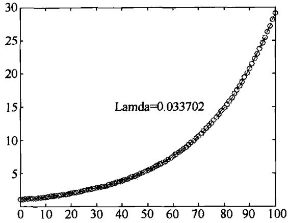

<details>
<summary>scatter</summary>

| X | Y |
| --- | --- |
| 0 | ~1 |
| 10 | ~1.5 |
| 20 | ~2 |
| 30 | ~3 |
| 40 | ~4 |
| 50 | ~6 |
| 60 | ~8 |
| 70 | ~11 |
| 80 | ~15 |
| 90 | ~21 |
| 100 | ~29 |
</details>

图 1 指数模型中 CD4 关于 t 的函数图像

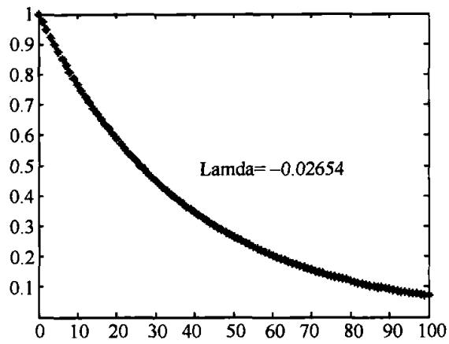

<details>
<summary>line</summary>

| X | Y |
| --- | --- |
| 0 | 1 |
| 10 | ~0.75 |
| 20 | ~0.55 |
| 30 | ~0.42 |
| 40 | ~0.32 |
| 50 | ~0.25 |
| 60 | ~0.19 |
| 70 | ~0.15 |
| 80 | ~0.12 |
| 90 | ~0.1 |
| 100 | ~0.08 |
</details>

图 2 指数模型中 HIV 关于 t 的函数图像

参照显著性检验的结果,可以看出模型三有如下特点。

(1) 模型三检验效果良好,能很好地符合数据,可以定性地反映药物的治疗效果。  
（2）从模型三中的方程来看， $C = C_{0}e^{\lambda_{1}t}$ 是单调增加的，根据生物医学理论，正常人体内的CD4值是一个稳定值。显然，即使一直用药，使艾滋病人恢复健康，C值也不可能趋向无限大，这些在模型一的方程中没有体现。  
(3) 从 $H = H_0 \mathrm{e}^{-\lambda_2 t}$ 来看, 这个函数是单调减小的, 根据现代医学理论, 艾滋病患者体内的 HIV 病毒目前还没有有效的治疗方法, 也就是说 HIV 的浓度只能维持在一个稳定值, 而不能无穷地减小而趋于 0。  
（4）从参数的物理意义来看， $\lambda_{1},\lambda_{2}$ 仅能反映药物治疗对于 CD4 和 HIV 浓度的影响情况，不能体现 CD4 和 HIV 之间的相互关系。

从以上分析来看,这个模型是十分粗糙的,需要对其进行完善。

## 5.7 模型四——考虑抗药性模型

## 5.7.1 改进的指数模型的建立

模型三的方程组为

$$
\left\{ \begin{array}{l} \frac {\mathrm{d} C (t)}{\mathrm{d} t} = \lambda_ {1} C (t) \\ \frac {\mathrm{d} H (t)}{\mathrm{d} t} = - \lambda_ {2} H (t) \end{array} \right. \tag {39}
$$

$\lambda_{1}$ 是常数,表示 CD4 的自增长速率,即单位时间里 CD4 浓度增加了自身的 $\lambda_{1}$ 倍。它反映了药效的好坏。考虑到生物个体具有抗药性,用药时间延长,药效会降低,其自增长率不可能保持不变,设 $\lambda_{1}$ 不是常数,而是一个关于 t 减少的函数,构造

$$
\lambda_ {1} = \lambda_ {1} (t) = \frac {\lambda_ {c}}{(1 + t) ^ {2}} \tag {40}
$$

同理：

$$
\lambda_ {2} = \lambda_ {2} (t) = \frac {\lambda_ {h}}{(1 + t) ^ {2}} \tag {41}
$$

式中： $\lambda_{c}$ 、 $\lambda_{h}$ 是常数。

带入模型一得微分方程：

$$
\left\{ \begin{array}{l} \frac {\mathrm{d} C (t)}{\mathrm{d} t} = \frac {\lambda_ {c}}{(1 + t) ^ {2}} C (t) \\ \frac {\mathrm{d} H (t)}{\mathrm{d} t} = - \frac {\lambda_ {h}}{(1 + t) ^ {2}} H (t) \end{array} \right. \tag {42}
$$

解得

$$
\left\{ \begin{array}{l} C (t) = K _ {1} \mathrm{e} ^ {- \frac {\lambda_ {c}}{1 + t}} \\ H (t) = K _ {2} \mathrm{e} ^ {\frac {\lambda_ {h}}{1 + t}} \end{array} \right. \tag {43}
$$

令 $t = 0$ 得 $\left\{ \begin{array}{l} K_1 = C_{i0} \mathrm{e}^{\lambda_c} \\ K_2 = H_{i0} \mathrm{e}^{-\lambda_h} \end{array} \right.$ , 其中, $C_{i0}, H_{i0}$ 分别是病人 $i$ 测得的 CD4 和 HIV 浓度初始值, 代入式(44)得

$$
\left\{ \begin{array}{l} C (t) = C _ {i 0} \mathrm{e} ^ {\frac {t}{1 + t} \lambda_ {c}} \\ H (t) = H _ {i 0} \mathrm{e} ^ {\frac {- t}{1 + t} \lambda_ {h}} \end{array} \right. \tag {44}
$$

该模型具有以下特征。

(1) 随着时间的推移, C、H 均会趋近于一个稳定值。  
(2) 由浓度变化率函数可以看出: 疗效函数 $\frac{\lambda_{c}}{(1+t)^{2}}$ 、 $\frac{\lambda_{h}}{(1+t)^{2}}$ 是关于时间 t 的单调减函数, 即是说, 持续用药的情况下, 由于生物个体具有抗药性, 使得 CD4 和 HIV 浓度的变化率降低。

## 5.7.2 模型的求解

与模型三类似,利用观测值对参数 $\lambda_{c}$ 、 $\lambda_{h}$ 进行回归,求得结果见表8。

表 8 回归求得参数 $\lambda_{c}, \lambda_{h}$

<table><tr><td></td><td>分类I</td><td>分类II</td><td>分类III</td><td>分类IV</td></tr><tr><td> $\lambda_c$ </td><td>1.362004</td><td>0.533192</td><td>0.305231</td><td>0.115216</td></tr><tr><td> $\lambda_h$ </td><td>0.584324</td><td>0.699261</td><td>0.761181</td><td>0.724142</td></tr></table>

## 5.7.3 回归方程的检验

回归方程参数 F 检验见表 9。

表 9 回归方程参数 F 检验

<table><tr><td></td><td>分类I(184人)</td><td>分类II(110人)</td><td>分类III(55人)</td><td>分类IV(7人)</td></tr><tr><td> $F_{CD4}$ </td><td>625.277058</td><td>132.606971</td><td>31.059492</td><td>4.146362</td></tr><tr><td> $F_{HIV}$ </td><td>451.217378</td><td>436.955772</td><td>374.033362</td><td>55.416320</td></tr><tr><td> $F_{\alpha}(\alpha=0.05)$ </td><td>3.85</td><td>3.86</td><td>3.89</td><td>4.26</td></tr></table>

## 5.7.4 结果分析

下面结合 F 检验的情况对模型进行分析。

以分类Ⅰ为例,求得的回归方程为

$$
\left\{ \begin{array}{l} C (t) = C _ {i 0} \mathrm{e} ^ {\frac {1 . 3 6 0 0 4 t}{1 + t}} \\ H (t) = H _ {i 0} \mathrm{e} ^ {- \frac {0 . 5 8 4 3 2 4 t}{1 + t}} \end{array} \right. \tag {45}
$$

易知：

(1) CD4 的浓度是时间的单调增函数, HIV 浓度是时间的单调减函数。  
(2) CD4、HIV 的浓度变化率随时间降低。

因而可以预测：

(1) 对这四类人,药物是始终有效的,都应继续用药。  
(2) 对这四类人继续用药,药效的显著性是随时间降低的。

## 5.8 模型的 $F$ 检验结果比较

以上构建的四个模型,F 检验结果对比见表 10。

表 10 4 种模型在 4 个分组中的 F 统计量

<table><tr><td></td><td>第I类</td><td>第II类</td><td>第III类</td><td>第IV类</td></tr><tr><td>指数回归模型</td><td>161.167374</td><td>55.279591</td><td>22.145712</td><td>3.842978</td></tr><tr><td>考虑抗药性模型</td><td>228.815155</td><td>47.858155</td><td>10.92834</td><td>1.382121</td></tr><tr><td>抛物线模型</td><td>252.50107</td><td>143.99998</td><td>66.498117</td><td>8.000045</td></tr><tr><td>考虑相互作用模型</td><td>249.585739</td><td>142.655324</td><td>65.348878</td><td>7.913612</td></tr></table>

从表 10 可以看出:无论对哪一类病人,“抛物线模型”都比其他模型的拟合效果好,“考虑相互作用模型”次之,对第Ⅰ类人,“抗药性模型”比“指数回归模型”好,对第Ⅱ,Ⅲ,Ⅳ类人,“指数回归模型”比“抗药性模型”好。

## 5.9 模型的分析与预测

根据以上讨论可知,抛物型模型的拟合程度最好,因此选用抛物线函数来预测各个分类的药效。

不考虑每个人的初值,仅讨论各个分类 CD4 和 HIV 浓度变化的一致趋势,从而来预测各个分类的总的治疗效果。

## 5.9.1 用 CD4 的浓度变化曲线预测继续治疗效果

(1) 当 $\frac{\mathrm{d}C(t)}{\mathrm{d}t} > 0$ 时, CD4 浓度呈现增长趋势, 这表明药物对于这类病人的作用效果十分明显, 可以继续用药。

(2) 当 $\frac{\mathrm{d}C(t)}{\mathrm{d}t}=0$ 时,表明药物对于病情起到了很好的抑制作用,应当继续用药。  
(3) 当 $\frac{\mathrm{d}C(t)}{\mathrm{d}t}<0$ 时, CD4浓度呈现下降趋势, 这时需做进一步分析。

给定一个阈值 $\eta$ ，表示在不用药的情况下艾滋病人体内 CD4 浓度减少的速率。从网上查得：不用药的情况下，CD4 一年减少 350 个/mL，进一步换算可得 $\eta \approx 1.3425$ （单位：0.2 个/mL \* 周）。作进一步讨论：

①当 $\left|\frac{\mathrm{d}C(t)}{\mathrm{d}t}\right|<\eta$ 时,表明药物对于病情还有抑制作用,应当继续用药。  
②当 $\left|\frac{\mathrm{d}C(t)}{\mathrm{d}t}\right| \geqslant \eta$ 时，表明药物对于这类病人已失去效用，应当停药，寻求其他的治疗方法。

## 5.9.2 利用 CD4 的方程预测分类 I 的治疗效果

1. 分类 I 中 CD4 的浓度变化的预测方程

$$
C _ {1} (t) = - 0. 1 0 4 3 5 t ^ {2} + 6. 7 7 1 6 t \tag {46}
$$

用该函数的导数来判断 CD4 的浓度的变化趋势：

$$
\frac {\mathrm{d} C _ {1} (t)}{\mathrm{d} t} = - 0. 2 0 8 7 0 t + 6. 7 7 1 6 \tag {47}
$$

(1) 令 $\frac{\mathrm{d}C_1(t)}{\mathrm{d}t} = 0$ ，得 $t \approx 32.4$ ，表明分类 I 的病人在大约 32 周以前用药效果十分明显。  
(2) 令 $\frac{\mathrm{d}C_1(t)}{\mathrm{d}t} = -\eta$ ，得 $t = 38.9$ ，表明分类 I 的病人在大约 39 周以后就对药物产生了抗性，建议停药或采用其他方法。

给出分类 I CD4 浓度的一致变化曲线,如图 3 所示。

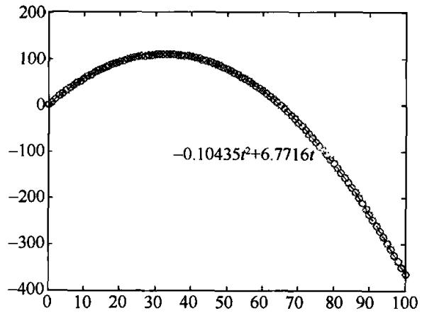

<details>
<summary>line</summary>

| X | Y |
| --- | --- |
| 0 | 0 |
| ~10 | ~50 |
| ~20 | ~90 |
| ~30 | ~110 |
| ~40 | ~110 |
| ~50 | ~90 |
| ~60 | ~50 |
| ~70 | ~-50 |
| ~80 | ~-150 |
| ~90 | ~-250 |
| 100 | ~-370 |
</details>

图 3 抛物线模型中, 第 1 类群体的 CD4 变化曲线

从图 3 中可以看出, 在大约 32 周的地方, 抛物线存在极值, 即是在这个点以前, 药效十分明显。而随着时间的推移, 在大约 39 周的地方, CD4 浓度下降的速度达到阈值 $\eta$ , 表明在这以后, 药物对这类病人已失去药效, 应当停药或改用其他方法。

## 2. 分类Ⅱ、Ⅲ、Ⅳ的治疗效果预测

预测方法与分类Ⅰ完全相同,所得数据见表11。

表 11 各组的药效极值点

<table><tr><td></td><td>CD4 开始降低时间</td><td>预测终止用药时间</td></tr><tr><td>分类I</td><td>32.447809</td><td>38.880746</td></tr><tr><td>分类II</td><td>28.33912</td><td>32.807463</td></tr><tr><td>分类III</td><td>30.939331</td><td>36.993608</td></tr><tr><td>分类IV</td><td>26.658015</td><td>33.933763</td></tr></table>

## 5.9.3 用 HIV 浓度变化曲线预报继续治疗效果

用该函数的导数来判断 HIV 的浓度变化趋势。

（1）当 $\frac{\mathrm{d}H(t)}{\mathrm{d}t} < 0$ 时，HIV的浓度呈现降低趋势，这表明药物对于这类病人的作用效果十分明显，可以继续用药。

(2) 当 $\frac{\mathrm{d}H(t)}{\mathrm{d}t}=0$ 时,表明药物对于病情起到了很好的抑制作用,应当继续用药。

(3) 当 $\frac{\mathrm{d}H(t)}{\mathrm{d}t}>0$ 时，HIV浓度呈现上升趋势，这时需做进一步分析。

给定一个阈值 $\sigma$ ，表示在不用药的情况下艾滋病人体内 HIV 浓度增加的速率，作进一步讨论。

① 当 $\left|\frac{\mathrm{d}H(t)}{\mathrm{d}t}\right|<\sigma$ 时，表明药物对于病情还有抑制作用，应当继续用药。  
② 当 $\left|\frac{\mathrm{d}H(t)}{\mathrm{d}t}\right| \geqslant \sigma$ 时, 表明药物对于这类病人已失去效用, 应当停药, 寻求其他的治疗方法。由于阈值 $\sigma$ 没有查到, 本论文中未做计算。

## 5.9.4 两种预测结果的取舍

如果知道 $\sigma$ 值则可根据上述方法预测出一个停止用药时间 T, 将 t (即 CD4 方程预测出的时间) 和 T 相比较, 取其中较大值作为终止治疗时间。因为在两种方案优劣不明时, 只要有一种方案认为药物有效, 就应该继续治疗, 不放弃任何一点治疗的希望, 这较符合常理。

## 5.10 问题(1)的结论

综合以上考虑,问题(1)的结论如下(表12):

分类 I (CD4 初始浓度:0 \~ 19.375)

预测继续治疗效果:第 32 周以前,CD4 浓度持续上升,第 32 周以后 CD4 浓度开始下降。

最佳终止用药时间:第 39 周。

分类Ⅱ(CD4 初始浓度:19.375\~38.75)

预测继续治疗效果:第28周以前,CD4浓度持续上升,28周以后CD4浓度开始下降。

最佳终止用药时间:第33周。

分类Ⅲ(CD4 初始浓度:38.75\~58.125)

预测继续治疗效果:第31周以前,CD4浓度持续上升,31周以后CD4浓度开始下降。

最佳终止用药时间:第37周。

分类IV(CD4 初始浓度:58.125 \~ 77.5)

预测继续治疗效果: 第 27 周以前, CD4 浓度持续上升, 27 周以后 CD4 浓度开始下降。最佳终止用药时间: 第 34 周。

表 12 4 个分类的预测结果

<table><tr><td></td><td>CD4 浓度开始降低时间</td><td>预测终止用药时间</td></tr><tr><td>分类I</td><td>32.447809</td><td>38.880746</td></tr><tr><td>分类II</td><td>28.33912</td><td>32.807463</td></tr><tr><td>分类III</td><td>30.939331</td><td>36.993608</td></tr><tr><td>分类IV</td><td>26.658015</td><td>33.933763</td></tr></table>

## 6 问题二的模型建立与求解

根据问题一中建立的4种模型,计算其F统计量,取抛物线模型对本问中的数据回归(见表13)。

表 13 抛物线模型对 4 种疗法的回归函数

<table><tr><td></td><td>u</td><td>v</td><td>回归函数</td><td>一阶导数</td></tr><tr><td>疗法1</td><td>0.027416</td><td>-1.650919</td><td> $0.027416\ t^{2} - 1.6509\ t$ </td><td> $2 \times 0.027416\ t - 1.6509$ </td></tr><tr><td>疗法2</td><td>-0.016274</td><td>0.520527</td><td> $-0.016274\ t^{2} + 0.52053\ t$ </td><td> $-2 \times 0.016274\ t + 0.52053$ </td></tr><tr><td>疗法3</td><td>0.042569</td><td>-2.393714</td><td> $0.042569\ t^{2} - 2.3937\ t$ </td><td> $2 \times 0.042569\ t - 2.3937$ </td></tr><tr><td>疗法4</td><td>-0.057408</td><td>2.431978</td><td> $-0.057408\ t^{2} + 2.432\ t$ </td><td> $-2 \times 0.057408\ t + 2.432$ </td></tr></table>

## 1.4 种疗法的评估

令 $\frac{\mathrm{d}C(t)}{\mathrm{d}t}=0$ 可得出4种疗法CD4浓度变化的极值点对应的时间t(表14)。

表 14 4 种疗法 CD4 浓度极值点对应的时间 t

<table><tr><td></td><td>疗法1</td><td>疗法2</td><td>疗法3</td><td>疗法4</td></tr><tr><td>时间t</td><td>30.1</td><td>16.1</td><td>28.1</td><td>21.2</td></tr><tr><td>编号</td><td>T4</td><td>T1</td><td>T3</td><td>T2</td></tr></table>

将表 14 中的时间分段点分别代入表 13 中, 得到各个分段点处 4 种疗法的一阶导数。比较大小, 对应导数越大的疗法疗效越好(表 15)。

表 15 4 种疗法分别在 4 个时间分段点处的一阶导数

<table><tr><td></td><td>T1</td><td>T2</td><td>T3</td><td>T4</td></tr><tr><td>疗法1</td><td>-0.76812</td><td>-0.48848</td><td>-0.11014</td><td>-0.00048</td></tr><tr><td>疗法2</td><td>-0.0035</td><td>-0.16949</td><td>-0.39407</td><td>-0.45917</td></tr><tr><td>疗法3</td><td>-1.02299</td><td>-0.58879</td><td>-0.00134</td><td>0.16894</td></tr><tr><td>疗法4</td><td>0.58344</td><td>-0.00212</td><td>-0.79435</td><td>-1.02398</td></tr><tr><td>最优疗法</td><td>4</td><td>4</td><td>3</td><td>3</td></tr></table>

前期疗法 4 较好,后期疗法 3 较好。总体上分析,疗法 4 较好。

## 2. 治疗效果的预测

考查初期治疗效果较好的疗法2和疗法4。如问题一引入阈值 $\eta\approx1.3425$ 。

## 2.1 疗法 4 的效果预测

(1) 当 $t \in (0, 21.2)$ 时, 该疗法治疗效果显著。  
(2) 令 $\frac{\mathrm{d}C(t)}{\mathrm{d}t} = -\eta$ ，得 $t = 32.9$ ，表明在第大约32周以后，这种疗法已没有治疗效果，建议停止用药或改用其他疗法。

给出疗法 4 CD4 浓度随时间的变化曲线, 如图 4 所示。

从图 4 中可以看出, 在大约 21 周的地方, 抛物线存在极值, 即是在这个点以前, 药效十分明显。而随着时间的推移, 在大约 32 周的地方, CD4 浓度下降的速度达到阈值 $\eta$ , 表明在这以后, 药物对这类病人已失去药效, 应当停药或改用其他方法。

## 2.2 疗法 3 的效果预测

(1) 当 $t \in (0, 21.2)$ 时, 该疗法治疗效果相对来说不是很好。  
(2) 在治疗的后期,疗法 3 治疗效果明显要好,建议采用该疗法的病人坚持用药。

给出疗法 3 中 CD4 浓度随时间的变化曲线, 如图 5 所示。

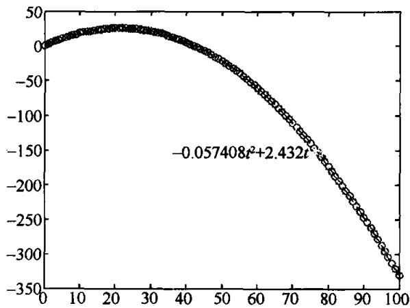

<details>
<summary>line</summary>

| X | Y |
| --- | --- |
| 0 | 0 |
| ~10 | ~15 |
| ~20 | ~25 |
| ~30 | ~25 |
| ~40 | ~15 |
| ~50 | ~-10 |
| ~60 | ~-50 |
| ~70 | ~-100 |
| ~80 | ~-160 |
| ~90 | ~-240 |
| 100 | ~-330 |
</details>

图 4 抛物线按 CD4 初值分类回归疗法 4 的 CD4 变化曲线

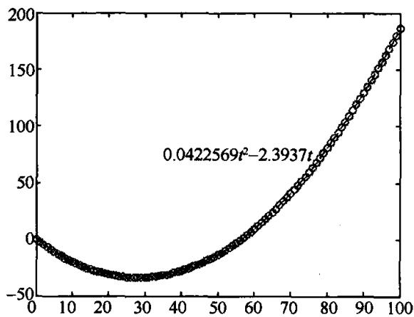

<details>
<summary>line</summary>

| X | Y |
| --- | --- |
| 0 | 0 |
| ~10 | ~-15 |
| ~20 | ~-30 |
| ~30 | ~-35 |
| ~40 | ~-30 |
| ~50 | ~-15 |
| ~60 | ~5 |
| ~70 | ~35 |
| ~80 | ~75 |
| ~90 | ~125 |
| 100 | ~190 |
</details>

图 5 抛物线按 CD4 初值分类回归疗法 3 的 CD4 变化曲线

从图 5 中可以看出, 在大约 28.1 周的地方, 抛物线存在极值, 即是在这个点以前, 该疗法不断减缓 CD4 减小的速率, 并且其减缓作用在 4 种疗法中是最显著的。

## 7 问题三的模型建立与求解

## 7.1 模型的建立

首先对 4 种疗法的单位花费进行统计分析, 见表 16。

为了从费用上来评估 4 种疗法的疗效, 提出如下指标: 单位费用疗效:

表 16 4 种疗法的平均日花费比较

<table><tr><td></td><td>药物1</td><td>药物2</td><td>药物3</td><td>平均日花费</td></tr><tr><td>疗法1</td><td>600mg zidovudine1.6</td><td>400mg didanosine0.85</td><td></td><td>1.225</td></tr><tr><td>疗法2</td><td>600mg zidovudine1.6</td><td>2.25mg zalcitabine1.85</td><td></td><td>3.45</td></tr><tr><td>疗法3</td><td>600mg zidovudine1.6</td><td>400mg didanosine0.85</td><td></td><td>2.45</td></tr><tr><td>疗法4</td><td>600mg zidovudine1.6</td><td>400mg didanosine0.85</td><td>400mg nevirapine1.2</td><td>3.65</td></tr></table>

$$
M = \frac {\frac {\mathrm{d} C (t)}{\mathrm{d} t}}{w _ {i}}
$$

式中： $\frac{\mathrm{d}C(t)}{\mathrm{d}t}$ 反映疗效； $w_{i}$ 反映平均日花费，两者之比反映了单位费用疗效。

用 M 来表示 4 种疗法的疗效, M 依赖于 t, 见表 17、表 18。

表 17 4 种疗法的疗效函数

<table><tr><td></td><td>一阶导数</td><td>平均日花费</td><td>M</td></tr><tr><td>疗法1</td><td>2×0.027416 t - 1.6509</td><td>1.225</td><td>0.04476t-1.34768</td></tr><tr><td>疗法2</td><td>-2×0.016274 t + 0.52053</td><td>3.45</td><td>-0.00943t+0.15087</td></tr><tr><td>疗法3</td><td>2×0.042569 t - 2.3937</td><td>2.45</td><td>0.03475t-0.97702</td></tr><tr><td>疗法4</td><td>-2×0.057408 t + 2.432</td><td>3.65</td><td>-0.03145t+0.66629</td></tr></table>

表 18 选取部分分段点,以对应 4 种疗法的单位费用疗效

<table><tr><td>t</td><td>0</td><td>4</td><td>8</td><td>12</td><td>20</td><td>30</td></tr><tr><td>疗法1</td><td>-1.347689</td><td>-1.168646</td><td>-0.989602</td><td>-0.810559</td><td>-0.452473</td><td>-0.004864</td></tr><tr><td>疗法2</td><td>0.1508774</td><td>0.1131406</td><td>0.0754038</td><td>0.037667</td><td>-0.037807</td><td>-0.132149</td></tr><tr><td>疗法3</td><td>-0.977026</td><td>-0.838025</td><td>-0.699024</td><td>-0.560024</td><td>-0.282022</td><td>0.06548</td></tr><tr><td>疗法4</td><td>0.6662953</td><td>0.5404696</td><td>0.4146438</td><td>0.2888181</td><td>0.0371666</td><td>-0.277398</td></tr></table>

选取部分分段点,在 t=0,4,8,12,20 这些点处,疗效 4 的单位费用疗效最好,在 t=30 点处,疗效 3 的单位费用最好。

## 7.2 治疗效果的预测

考查初期治疗效果较好的疗法4和疗法1。如问题一引入阈值 $\eta\approx1.3425$ 。

疗法 4 的效果预测：

令 $M_4 = \frac{\eta}{w_i} \Rightarrow 0.03145t + 0.66629 = \frac{\eta}{w_i}$ , 求出 $t = 32.9$ , 表明在该时间以后, 疗法 4 的疗效低于正常艾滋病人的 CD4 浓度降低速度, 应当终止用药。

## 8 模型的合理性

在问题一中构建了四个函数,分别是“抛物线模型”、“考虑相互作用模型”、“指数回归模型”和“考虑抗药性的模型”,再利用给定数据回归出各个函数的参数,通过F检验发现,大部分情况下这四种模型都通过检验,说明构建的函数能较好的拟合出数据变化规律,下面从现实意义的角度讨论各模型的合理性。

（1）抛物线模型综合考虑了抗药性造成药效随时间降低这一效果，F 检验的结果表明它的 F 检验值最高，即该模型最合理。  
(2) 考虑 CD4 和 HIV 相互作用后的模型, 从现实意义角度看最符合实际, F 检验的结果表明它的可信度仅次于抛物线模型, 这说明该模型也是较为合理的。  
(3) 指数回归模型的现实意义反映了 CD4 和 HIV 的自增长能力, F 检验的结果最差, 这说明该模型的可信度最差。需要重新构建模型。  
(4) “考虑抗药性的模型”是对指数回归模型的改进,它考虑了抗药性导致的药效随时间降低这一效果。

综上可知,抛物线模型的合理性最高。它能比较真实地反映现实情况。

## 【论文点评】

沈锦仁

文章内容充实丰富,并用多种方法来求解,理论推导严谨完善,计算结果合理,结果表达清楚,从而被评为当年的全国优秀论文。

对于问题一,药物的疗效评价和终止用药时间的确定。首先对数据进行分类,按照病情的严重程度进行分类,然后进行统计回归,用什么函数进行回归,是值得探讨的问题,先进行定性分析,大部分病人药物对其疗效是先有效逐步失效,CD4 数据是先增后减,HIV 数据是先减后增。

方法一, 是用二次函数抛物线来进行回归, 本文主要特点是对 CD4 的增加量和 HIV 的减少量进行回归, 而不是对其他数值进行回归, 否则检验是肯定通不过的, 而抛物线的顶点就是终止用药时间。方法二, 用微分方程建立模型来解出函数, 用回归方法来求出函数中的参数, 由函数的复杂性, 线性化后用迭代的方法来回归参数。方法三, 用指数衰变模型来求得函数。方法四, 根据病毒的抗药性原理, 建立微分方程来构造函数, 均用最小二乘法来求得函数中的参数, 并对以上四种方法进行比较, 认为第一种方法最简洁有效, 每种方法均进行了 F 检验。

对于问题二,四种药物的评价,先对四种药物的数据分别按病情轻、中、重进行分类,分别对指标的改变量——即疗效进行二次函数回归,得到疗效依赖于时间的评价函数,分别选取了若干个时间点对四种进行比较和排序。

对于问题三,要考虑到价格的因素,因而提出了一个性价比的函数,将疗效函数除以价格——单位价格的疗效函数,同样由于其为时间的函数,因而选取若干个时间点,对四种药物的性价比进行比较排序。

文章中回归均作了 F 检验。

# 艾滋病疗法的评价及疗效的预测

## 摘要

艾滋病是至今人类仍未征服的疾病,流行发展趋势越来越严峻,攻克艾滋病是人类面临的一大难题。

本文给出了艾滋病患者的临床治疗数据,要考虑预测继续治疗的效果,并评价各种治疗方案优劣,预测根据已有的数据信息推算将来的数据,评价方案的优劣属于决策类问题。对问题(1),先分析CD4和HIV的浓度的变化趋势,建立微分方程模型,得出CD4和HIV的参数表达式,从数据信息中挖掘出具有普遍特征的数据,用回归法求参数的值,给出HIV表达式的参数。但CD4是非常规形式,难以求解。通过数据分布图,发现CD4的浓度变化趋势同二次曲线的图形相近,于是建立待定系数的二次曲线方程模型,用非线性最小二乘法,得出二次曲线方程。根据HIV和CD4的浓度表达式,求出终止治疗的最佳时间为第34周。

问题(2)需要比较四种疗法的效果。首先将患者按 CD4 初始浓度分类,仍采用前面的二次曲线模型,回归出曲线方程的参数。回归过程中考虑到是要评价不同的疗法,根据疗法的不同把数据分为四类,回归得出四组参数,相应的表达式就是这种疗法的 CD4 的浓度变化曲线方程。比较四种疗法的优劣,采用 CD4 浓度最大值和取得最大值的时间为评判标准,结合更加细化的分类数据画出的图形,从理论上和直观上都得到了评价的结果:疗法 4 效果最好,疗法 3 次之,疗法 2 再次之,疗法 1 效果较差;利用二次曲线模型得出最佳方案停止用药的最佳时间为 20 周,同时由分类法模型得出在四种不同 CD4 初始浓度的条件下最佳方案停止用药的最佳时间分别为 24 周、16 周、16 周、24 周。两种模型的结果相近。

问题(3)在问题(2)的基础上再考虑药品价格的影响。价格和药效的权重无法确定，通过假设权重参数来定量表示价格和药效的关系。采用层次分析法构建层次结构模型，用特征向量归一化并求组合权向量，找到疗法性能和价格权重的关系。根据不同经济状况的国家的价格权重的值不一样，得到不同的疗法评价结果。总结出如下的结论：不发达国家经济落后，价格权重较大，疗法1的评价值较高，疗法4的评价值较低，适合疗法1，而对于发达国家应当推广疗法4。

关键词:艾滋病,疗法评价,微分方程,二次曲线回归,层次分析

## 1 问题的重述

艾滋病是当前社会最严重的疾病之一,自被发现以来,已有近3000万人死于艾滋病。

艾滋病是由艾滋病毒(HIV)引起的,这种病毒破坏人体的免疫系统,使人体丧失抵抗能力,从而危害人的生命。人类免疫系统的 CD4 细胞在抵御 HIV 的入侵中起着重要作用,入侵时 HIV 感染并裂解 CD4,CD4 细胞的数量急剧减少,HIV 将迅速增加,致使艾滋病发作。

治疗艾滋病的目的就是尽量减少人体内 HIV 的数量, 同时增多 CD4 的数量, 提高人体免疫力。目前仍没有根治艾滋病的有效方法, 一些疗法不仅成本高, 而且对人体有副作用。

题目给出了美国艾滋病医疗实验机构 ACTG 公布的两组数据, 分别对应了不同的方案。要根据已给的数据, 回答:

(1) 由附件 1 的数据, 预测继续治疗的效果。  
(2) 由附件 2 的数据,评价 4 种疗法的优劣,并对较好的疗法预测继续治疗的效果。  
(3) 针对不发达国家的患者,艾滋病药品的昂贵费用也在考虑范围之内,比较4种不同疗法,较(2)的结果会有什么改变?

## 2 模型假设

（1）所用艾滋病患者没有患其他能影响人体 CD4 含量的疾病, 即人体 CD4 的浓度变化只受当前 CD4 浓度和 HIV 浓度的影响。  
(2) 药物对人体会产生副作用,而且随着用药时间的增长,HIV 病毒会产生抗药性,用药时间越长药效越不好。  
(3) 艾滋病患者个体的收入是相对稳定的。

## 3 名词解释

正互反矩阵:对于矩阵 $\boldsymbol{A}=(a_{ij})_{n\times n}$ ，如果 $a_{ij}>0, a_{ij}=\frac{1}{a_{ji}}$ ，那么 A 称为正互反矩阵。

一致性矩阵:如果一个正互反矩阵A满足 $a_{ij}\cdot a_{jk}=a_{ik},i,j,k=1,2,\cdots,n$ ，则称A为一致性矩阵(n阶一致性矩阵A有下面两个重要的性质:A的秩为一而且A的唯一非零特征根为n,A的任一列向量都是对应于特征根n的特征向量)。

一致性检验:判别矩阵通常不是一致阵,但在容许范围内矩阵对应于特征值的特征向量近似作为比较因素的权向量。一致性比率 CR 的值越小,矩阵越接近一致阵,在 CR < 0.1 范围内,矩阵通过一致性检验,能近似看作是一致性矩阵。

## 4 模型的建立和求解

## 4.1 问题(1)

## 4.1.1 数据处理

本题数据量大,而且有很多不规则的数据,为保证模型的准确性必须进行数据的筛选

和处理,处理依据如下:

（1）资料显示要想对艾滋病的治疗效果作出评定,测试时间至少为40周左右,所以要去掉测试时间少于40周的数据并不影响曲线的变化趋势。

(2) 为方便建模和检验,要有统一的时间起点,所以去掉时间起点不为零的数据。

(3) 假设 HIV 病毒检测不到时, 是因为浓度太小了, 为保证矩阵完整, 将浓度设为零, 检测时间与 CD4 检测时间相同。

经处理,数据变为 $1525 \times 4$ 的矩阵。检验次数 $\geqslant 4$ 。

## 4.1.2 建模准备

首先通过画图找一下 CD4 浓度和 HIV 浓度随时间的变化规律,从规律中寻找建模的思路。方法是将每个人的测试数据作图,然后将所有人的图形放到一起,找出变化的趋势,如图 1 所示。

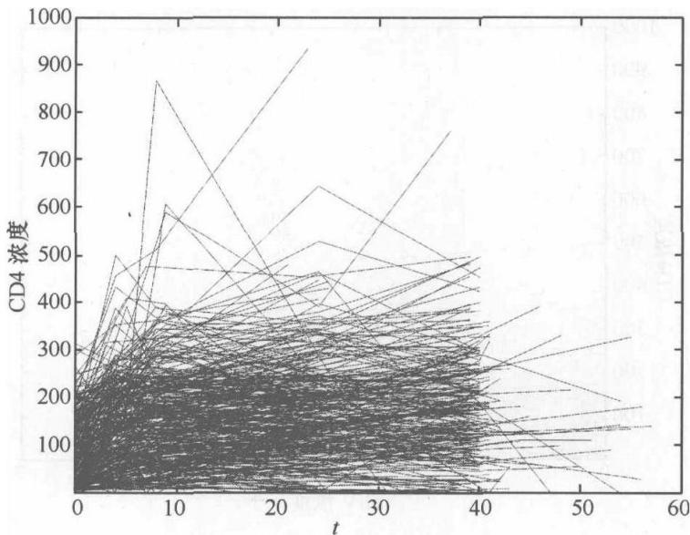

<details>
<summary>line</summary>

| t | CD4 浓度 |
| --- | --- |
| 0 | ~250 |
| 10 | ~860 |
| 20 | ~930 |
| 30 | ~750 |
| 40 | ~480 |
| 50 | ~320 |
| 60 | ~130 |
</details>

图 1 CD4 浓度随时间的变化

图 1 可以看出 CD4 的浓度成上升的趋势, 最后略有下降, 这很容易从药理学上解释, 开始服药时药物作用明显, 病毒 HIV 被抑制, CD4 浓度逐渐增加, 随着用药时间的增长, HIV 产生抗药性, 药效下降, HIV 病毒数量显著增加, 而 CD4 的浓度减小。CD4 的浓度曲线为先升后降函数, 近似抛物线。

由图 2 可以看出 HIV 浓度随时间的大体趋势是递减的, 中间有一小段稳定期, 最后有反弹的趋势。这也可以从药理学上解释, 起始时 HIV 对药物没有抵抗力, 病毒的转录过程被抑制, HIV 病毒自身的生命周期使 HIV 浓度逐渐减小, 随着用药时间的增长, 病毒产生抗药性, 浓度随之增加。曲线为先降后升函数, 从图上可以大体估计转折点在 25 周左右。

从图 3 可以明显看出图形分为两部分, 当 HIV 浓度 <1.8 单位时 HIV 对 CD4 的浓度几乎没有影响; 当 HIV 浓度大于这一临界值时, HIV 对 CD4 有抑制作用, CD4 浓度随 HIV 浓度增加而减小。

通过对图形趋势的分析,考虑从两个方面建立模型对艾滋病疗法进行评价和疗效预测:一是根据药物学和生理学原理建立微分方程模型,得出 HIV 和 CD4 关于时间的函数;

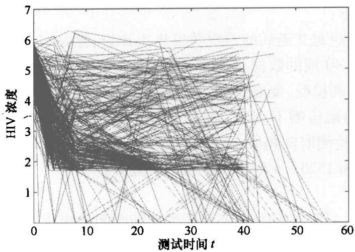

<details>
<summary>line</summary>

| 测试时间 t | HIV 浓度 (Range) |
| --- | --- |
| 0~60 | 1.8~6.3 |
</details>

图 2 HIV 浓度随时间的变化

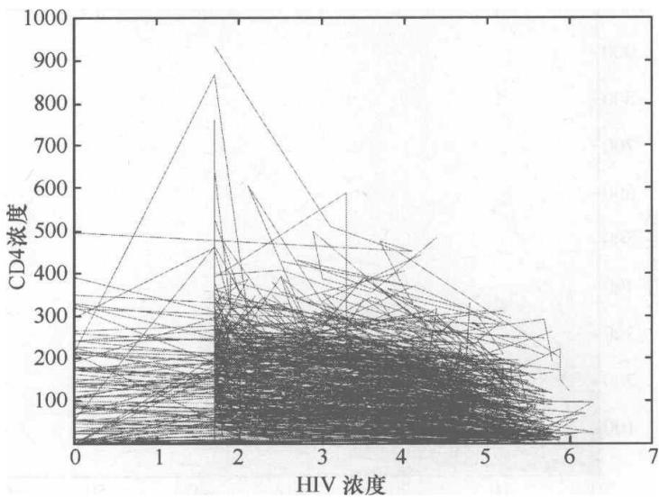

<details>
<summary>line</summary>

| HIV 浓度 | CD4 浓度 |
| --- | --- |
| ~1.7 | ~930 |
| ~1.7 | ~870 |
| ~1.7 | ~760 |
| ~1.7 | ~520 |
| ~1.7 | ~460 |
| ~1.7 | ~380 |
| ~1.7 | ~340 |
| ~1.7 | ~320 |
| ~1.7 | ~300 |
| ~1.7 | ~280 |
| ~1.7 | ~260 |
| ~1.7 | ~240 |
| ~1.7 | ~220 |
| ~1.7 | ~200 |
| ~1.7 | ~180 |
| ~1.7 | ~160 |
| ~1.7 | ~140 |
| ~1.7 | ~120 |
| ~1.7 | ~100 |
| ~1.7 | ~80 |
| ~1.7 | ~60 |
| ~1.7 | ~40 |
| ~1.7 | ~20 |
| ~2.2 | ~600 |
| ~2.2 | ~400 |
| ~2.2 | ~380 |
| ~2.2 | ~360 |
| ~2.2 | ~340 |
| ~2.2 | ~320 |
| ~2.2 | ~300 |
| ~2.2 | ~280 |
| ~2.2 | ~260 |
| ~2.2 | ~240 |
| ~2.2 | ~220 |
| ~2.2 | ~200 |
| ~2.2 | ~180 |
| ~2.2 | ~160 |
| ~2.2 | ~140 |
| ~2.2 | ~120 |
| ~2.2 | ~100 |
| ~3.3 | ~590 |
| ~3.3 | ~500 |
| ~3.3 | ~480 |
| ~3.3 | ~460 |
| ~3.3 | ~440 |
| ~3.3 | ~420 |
| ~3.3 | ~400 |
| ~3.3 | ~380 |
| ~3.3 | ~360 |
| ~3.3 | ~340 |
| ~3.3 | ~320 |
| ~3.3 | ~300 |
| ~3.3 | ~280 |
| ~3.3 | ~260 |
| ~3.3 | ~240 |
| ~3.3 | ~220 |
| ~3.3 | ~200 |
| ~3.3 | ~180 |
| ~3.3 | ~160 |
| ~3.3 | ~140 |
| ~3.3 | ~120 |
| ~3.3 | ~100 |
| ~4.5 | ~480 |
| ~4.5 | ~460 |
| ~4.5 | ~440 |
| ~4.5 | ~420 |
| ~4.5 | ~400 |
| ~4.5 | ~380 |
| ~4.5 | ~360 |
| ~4.5 | ~340 |
| ~4.5 | ~320 |
| ~4.5 | ~300 |
| ~4.5 | ~280 |
| ~4.5 | ~260 |
| ~4.5 | ~240 |
| ~4.5 | ~220 |
| ~4.5 | ~200 |
| ~4.5 | ~180 |
| ~4.5 | ~160 |
| ~4.5 | ~140 |
| ~4.5 | ~120 |
| ~4.5 | ~100 |
| 6~6.5 | 1~95 (cluster) |
</details>

图 3 HIV 浓度对 CD4 浓度的影响

二是根据图形特征建立曲线拟合模型,找出 HIV 和 CD4 浓度变化函数的近似函数。

## 4.1.3 微分方程模型

CD4 是由人的骨髓造血干细胞产生的, 它的浓度受到人的造血能力的影响, 同时因为正常人 CD4 浓度为一个稳定值, 不会无限增长, 所以可以认为是 CD4 浓度 $\rho_{c}$ 对自身的增长率 $\frac{d\rho_{c}}{dt}$ 有阻滞作用, 阻滞系数为 $\beta$ , 单位时间内人造血细胞制造 CD4 的能力为 $\alpha$ , 再者 $\frac{d\rho_{c}}{dt}$ 受到 HIV 病毒浓度 $\rho_{h}$ 的影响, 系数为 $\gamma$ , 列出 $\frac{d\rho_{c}}{dt}$ 的表达式:

$$
\frac {\mathrm{d} \rho_ {c}}{\mathrm{d} t} = \alpha - \beta \rho_ {c} - \gamma \rho_ {h} \tag {1}
$$

为便于模型的求解,对上述模型进行简化,造血细胞制造 CD4 的能力是固定的,但它实际制造 CD4 的量是受当前 CD4 的浓度制约的。因此可以将等式右边前两项合并为一项,式(1)简化为

$$
\frac {\mathrm{d} \rho_ {c}}{\mathrm{d} t} = a _ {1} \rho_ {c} - b _ {1} \rho_ {h} \tag {2}
$$

式中： $b_{1}=\gamma$ 。

对 HIV 浓度 $\rho_{h}$ 的变化率 $\frac{d\rho_{h}}{dt}$ 而言, 它与自身浓度 $\rho_{h}$ 成正比, 比例系数 $a_{2}$ , 还与人身体内药物浓度有关, 而这个浓度应该是实际起作用的药物浓度, 因为每次服药量是定值 P, 所以可以假设人体内药物浓度为定值, 但是药效是时间的函数 $f(t)$ , 所以实际起作用的浓度为 $f(t)P$ , 药物对 HIV 病毒起作用, 作用效果也与 $\rho_{h}$ 成正比, 比例系数 $\lambda$ , 所以有表达式 $\frac{d\rho_{h}}{dt}=a_{2}\rho_{h}-\lambda Pf(t)\rho_{h}$ 。

令 $b_{2} = \lambda P$ ，有

$$
\frac {\mathrm{d} \rho_ {h}}{\mathrm{d} t} = a _ {2} \rho_ {h} - b _ {2} f (t) \rho_ {h} \tag {3}
$$

式中： $f(t)$ 是时间的减函数，这里取

$$
f (t) = \frac {1}{1 + t} \tag {4}
$$

代入式(3)有

$$
\frac {\mathrm{d} \rho_ {h}}{\mathrm{d} t} = \left(a _ {2} - \frac {b _ {2}}{1 + t}\right) \rho_ {h} \tag {5}
$$

由式(2)和式(5)联立即得

$$
\left\{ \begin{array}{l} \frac {\mathrm{d} \rho_ {c}}{\mathrm{d} t} = a _ {1} \rho_ {c} - b _ {1} \rho_ {h} \\ \frac {\mathrm{d} \rho_ {h}}{\mathrm{d} t} = \left(a _ {2} - \frac {b _ {2}}{1 + t}\right) \rho_ {h} \end{array} \right. \tag {6}
$$

容易求得

$$
\rho_ {h} = C _ {2} \mathrm{e} ^ {a _ {2} t} (t + 1) ^ {- b _ {2}} \tag {7}
$$

而 $\rho_{c}$ 的解析解不易求得, 先处理 $\rho_{h}$ 的未知参数, 使用经过处理后的附件 1 的数据, 作非线性最小二乘拟合得

$$
C _ {2} = 4. 9 6 8 7 \quad a _ {2} = 0. 0 0 6 7 4 5 7 \quad b _ {2} = 0. 2 6 6 7 4
$$

代入式(7)从而有

$$
\rho_ {h} = 4. 9 5 5 8 \mathrm{e} ^ {0. 1 0 4 0 2 t} (t + 1) ^ {- 1. 5 6 0 6} \tag {8}
$$

$\rho_{h}$ 的图形如图4所示。

该图像与图 2 中 HIV 变化曲线大体一致, 因为是利用全体患者数据作最小二乘拟合的参数, 图形可以说明总体而言治疗效果是好的, HIV 浓度被抑制在一个很小的范围内。但是此模型没有反弹点, 无法用来对继续治疗的效果进行评价。

如果对每个人的的测试数据作最小二乘拟合(附录1MATLAB程序)，得到每个人的拟合曲线参数， $C_{2i}, a_{2i}, b_{2i}$ ，然后取 $C_2 = \frac{1}{317} \sum_{i=1}^{317} C_{2i}, a_2 = \frac{1}{317} \sum_{i=1}^{317} a_{2i}, b_2 = \frac{1}{317} \sum_{i=1}^{317} b_{2i}$ ，得到的曲线参数为

$$
C _ {2} = 4. 9 5 5 8, a _ {2} = 0. 1 0 4 0 2, b _ {2} = 1. 5 6 0 6
$$

所以有

$$
\rho_ {h} = 4. 9 5 5 8 \mathrm{e} ^ {0. 1 0 4 0 2 t} (t + 1) ^ {- 1. 5 6 0 6} \tag {9}
$$

曲线形状如图 5 所示。

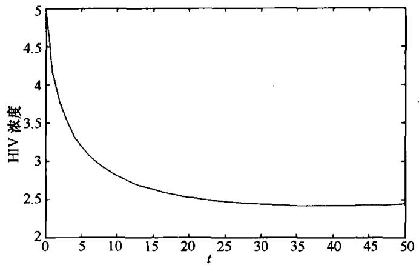

<details>
<summary>line</summary>

| t | HIV 浓度 |
| --- | --- |
| 0 | 5 |
| 5 | ~3.2 |
| 10 | ~2.8 |
| 15 | ~2.6 |
| 20 | ~2.5 |
| 25 | ~2.45 |
| 30 | ~2.42 |
| 35 | ~2.41 |
| 40 | ~2.41 |
| 45 | ~2.41 |
| 50 | ~2.41 |
</details>

图 4 HIV 浓度

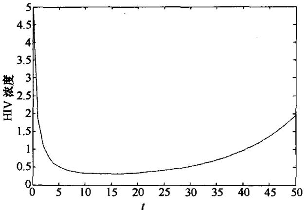

<details>
<summary>line</summary>

| t | HIV 浓度 |
| --- | --- |
| 0 | ~4.8 |
| 5 | ~0.6 |
| 10 | ~0.3 |
| 15 | ~0.3 |
| 20 | ~0.3 |
| 25 | ~0.4 |
| 30 | ~0.5 |
| 35 | ~0.7 |
| 40 | ~1.0 |
| 45 | ~1.4 |
| 50 | ~2.0 |
</details>

图 5 HIV 浓度

该曲线的转折点在 t=14 周，在 $[10,20]$ 这一时段内基本稳定的时间，t=30 周之后反弹作用明显，HIV 病毒一般在用药后 6 个～10 个月内产生抗药性，该曲线符合实际规律。从图 5 上可以看出停止用药的时间应不晚于 40 周。

将式(9)代入式(2)可以得

$$
\rho_ {c} = \mathrm{e} ^ {a _ {1} t} \left(\operatorname{Int} \left(- b C _ {2} (t + 1) ^ {- b _ {2}} \mathrm{e} ^ {a _ {2} \times t - a _ {1} \times t}, t\right) + C _ {1}\right) \tag {10}
$$

式中:Int 是 Maple 中的积分函数。

由图 5 可以看出曲线图形类似二次抛物线,而且抛物线存在转折点,便与预测终止的时间,因此可以采用曲线拟合的方法得到 $\rho_{c}$ 的表达式。

## 4.1.4 曲线拟合模型

设 $\rho_{c}$ 的方程为

$$
\rho_ {c} = a x ^ {2} + b x + c
$$

用全部317名患者的测试数据作最小二乘拟合得到曲线方程为

$$
\rho_ {c} = - 0. 1 0 7 8 x ^ {2} + 6. 2 6 3 3 x + 1 0 1. 0 6 3 4
$$

为检验拟合效果采用 F 检验, F 检验的方法和过程如下:

设 $y_{i}$ 为实测数据, $\widehat{y}_{i}$ 为拟合数据, 令

$$
Q _ {e} = \sum (y _ {i} - \widehat {y _ {i}}) ^ {2}
$$

则可改写为

$$
Q _ {e} = S _ {y y} - S _ {x x} ^ {2} / S _ {x y}
$$

式中： $S_{xx} = \sum (x_i - \bar{x})^2; S_{yy} = \sum (y_i - \bar{y})^2; S_{xy} = \sum (x_i - \bar{x})(y_i - \bar{y})$ 。

令 $S_0 = \frac{S_{xy}^2}{S_{xx}}$ ，则 $Q_e = S_{yy} - S_0$ ，根据 $F$ 分布的定义： $F = \frac{S_0}{Q_e / (n - 2)} \sim F(1, n - 2)$ ，给定 $\alpha$ ，查 $F$ 分布表，得到临界值， $F_\alpha(1, n - 2)$ ，若 $F > F_\alpha(1, n - 2)$ ，则拒绝 $H_0$ ，回归效果好；否则接受原假设 $H_0, F$ 越大，回归效果约好。

$\rho_{c}$ 的 F 检验值为 158.34 > $F_{0.05}(1, n-1) = 3.84$ ，故通过检验。

图形如图6所示。

用同样方法对 HIV 的浓度 $\rho_{h}$ 也作抛物线拟合, 得

$$
\rho_ {h} = 0. 0 0 1 8 x ^ {2} - 0. 1 1 9 5 x + 4. 2 3 1 8
$$

$\rho_{h}$ 的 F 检验值 459.81 > 3.84，通过检验，它的图形如图 7 所示。

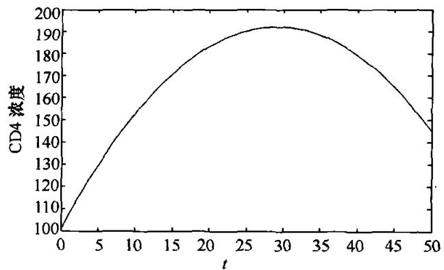

<details>
<summary>line</summary>

| t | CD4 浓度 |
| --- | --- |
| 0 | 100 |
| 5 | ~128 |
| 10 | ~152 |
| 15 | ~172 |
| 20 | ~185 |
| 25 | ~192 |
| 30 | ~194 |
| 35 | ~190 |
| 40 | ~180 |
| 45 | ~165 |
| 50 | ~145 |
</details>

图 6 CD4 浓度随时间的关系

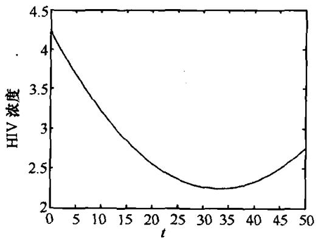

<details>
<summary>line</summary>

| t | HIV 浓度 |
| --- | --- |
| 0 | ~4.25 |
| 10 | ~3.3 |
| 20 | ~2.6 |
| 30 | ~2.25 |
| 40 | ~2.3 |
| 50 | ~2.75 |
</details>

图 7 HIV 浓度随时间的关系

将图6、图7结合起来就可以看出艾滋病疗法的治疗效果，图6的最高点在 $t = 30$ 周，此时HIV的浓度还在减小，说明此时药物还有一定的疗效，HIV浓度的最低点为 $t = 34$ 周。之后病毒产生抗药性，CD4的浓度也显著减小，所以最佳的治疗终止时间应为第34周。

## 4.2 问题(2)

## 4.2.1 分类法拟合模型

## 1. 问题分析

该问题通过分析测试数据评价几种方案的优劣问题。由所给的数据分析可知,病人体内的 CD4 的浓度在服用药物后变化受病人的服用药物之前体内 CD4 的初始浓度影响很大,而其他的因素影响较小,因此要根据人群的 CD4 初始浓度划分类别来比较四种方案的优劣。由于题中的数据是将 1300 多名病人随机分配到 4 个试验组,因此在各个实验组中,落在相同的 CD4 初始浓度区间中的测试者的数目近似相等,因此按照 CD4 的初始浓度划分类别,再综合比较四种方案的优劣是可行的。

因此该问题可以按照 CD4 的初始浓度对数据进行分类,再在各个类别中分别拟合出不同方案的变化趋势图,直观的比较分析四种方案的优劣。同时拟合出最佳方案的 CD4 变化曲线,通过该曲线确定最佳的治疗终止时间。

## 2. 模型假设

(1) 在各个实验组中, 落在相同的 CD4 初始浓度区间中的测试者的数目近似相等。  
(2) 忽略外界因素对 CD4 的浓度变化的影响。

通过分析数据可将 CD4 的初始浓度均匀分成 10 个区间, 通过计算可知落在后面 6 个区间中的人群数很少, 因此将它们合并到第 4 个区间中, 将整个样本分成四个类别, 再根据人群进行的试验方案的不同将每个区间中的人群分成 4 类。因此通过分类法最终将数据分成 16 类, 然后利用每一类的数据拟合 CD4 的服用药物后的变化情况。由于数据中所给的大部分病人测量时间大约每隔 8 周测量一次, 并且大部分病人的测量次数为 5 次以上, 因此取 6 个时间点, 对于 16 类中的每类数据, 在同个时间点附近的该类人群的 CD4 的测量值取平均值作为时间点的 CD4 值, 利用这些均值拟合出病人服用药物后 CD4浓度变化趋势曲线。通过比较不同浓度下的四种方案的 CD4 浓度变化趋势曲线来直观的评价四种方案的优劣。

具体算法如下：

(1) 将所给的数据以方案为主序, 测试时间和 CD4 的浓度为次序进行排序。  
(2) 按照 CD4 的初始浓度和试验方案将数据分成 16 类。  
(3) 对于 16 类中的每类数据, 在同个时间点附近的该类人群的 CD4 的测量值取平均值作为时间点的 CD4 的值。  
(4) 对于 16 类中的每类拟合出病人服用药物后 CD4 浓度的变化趋势曲线。  
(5) 绘制出在同一类初始浓度下, 四种方案的 CD4 浓度的变化趋势曲线的比较图。  
(6) 根据比较图分析评价四种方案的优劣。

利用 MATLAB 编程(见附件)求解,绘制在四种不同的 CD4 初始浓度下,不同方案的 CD4 的浓度趋势曲线比较图,如图 8 \~ 图 11 所示(图 8 \~ 图 11 中 CD4 的初始浓度由小到大排列):

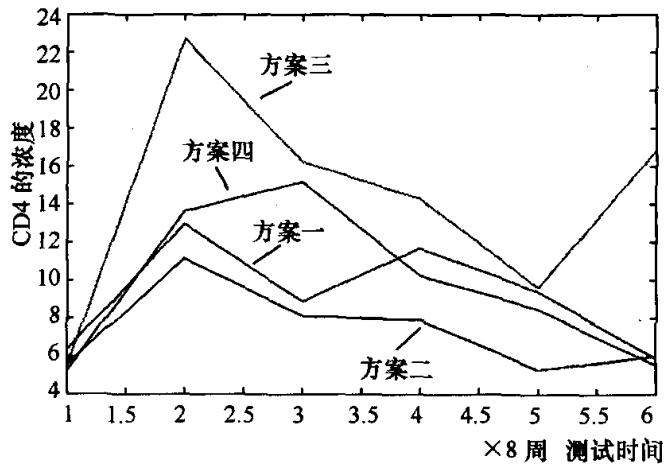

<details>
<summary>area</summary>

| 测试时间 (x8周) | 方案一 (CD4浓度) | 方案二 (CD4浓度) | 方案四 (CD4浓度) | 方案三 (CD4浓度) |
| --- | --- | --- | --- | --- |
| 1 | ~5.5 | ~5.5 | ~6.5 | ~6.5 |
| 2 | ~13 | ~11 | ~13.5 | ~23 |
| 3 | ~15 | ~8 | ~8.5 | ~16 |
| 4 | ~10 | ~7.5 | ~11.5 | ~14 |
| 5 | ~9 | ~5 | ~9.5 | ~9.5 |
| 6 | ~5.5 | ~5.5 | ~5.5 | ~16.5 |
</details>

图 8 不同方案的 CD4 的浓度趋势曲线比较图(初始 CD4 的浓度小)

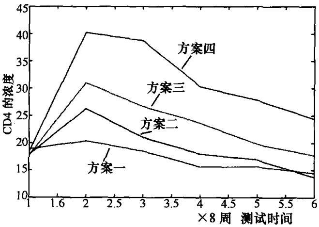

<details>
<summary>line</summary>

| 测试时间 (x8周) | 方案一 (CD4浓度) | 方案二 (CD4浓度) | 方案三 (CD4浓度) | 方案四 (CD4浓度) |
| --- | --- | --- | --- | --- |
| 1 | ~18 | ~18 | ~18 | ~18 |
| 2 | ~20 | ~26 | ~31 | ~40 |
| 3 | ~19 | ~21 | ~27 | ~39 |
| 4 | ~15 | ~18 | ~24 | ~30 |
| 5 | ~15 | ~17 | ~20 | ~28 |
| 6 | ~13 | ~14 | ~17 | ~24 |
</details>

图 9 不同方案的 CD4 的浓度趋势曲线比较图(初始 CD4 的浓度较小)

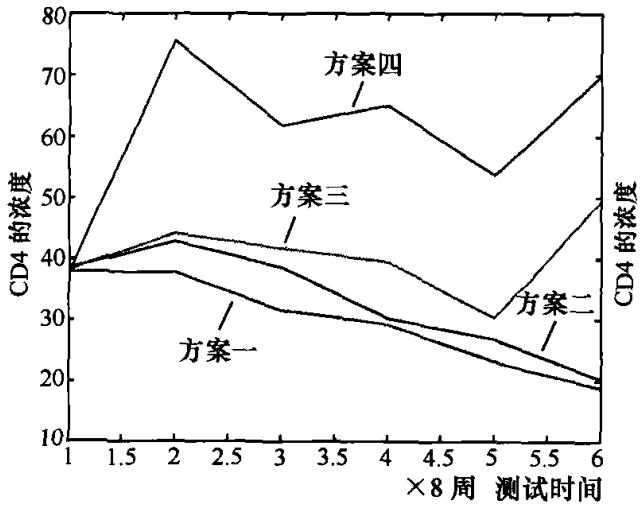

<details>
<summary>line</summary>

| 测试时间 (x8周) | 方案一 (CD4浓度) | 方案二 (CD4浓度) | 方案三 (CD4浓度) | 方案四 (CD4浓度) |
| --- | --- | --- | --- | --- |
| 1 | ~38 | ~38 | ~38 | ~38 |
| 2 | ~38 | ~43 | ~44 | ~76 |
| 3 | ~31 | ~39 | ~42 | ~62 |
| 4 | ~29 | ~30 | ~39 | ~65 |
| 5 | ~23 | ~27 | ~30 | ~54 |
| 6 | ~18 | ~20 | ~49 | ~70 |
</details>

图 10 不同方案的 CD4 的浓度趋势曲线比较图(初始 CD4 的浓度较大)

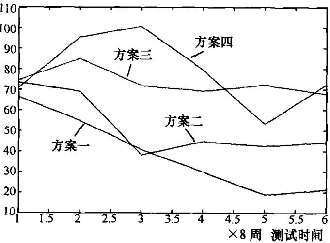

<details>
<summary>line</summary>

| 测试时间 (x8周) | 方案一 | 方案二 | 方案三 | 方案四 |
| --- | --- | --- | --- | --- |
| 1 | ~67 | ~73 | ~75 | ~74 |
| 2 | ~55 | ~69 | ~85 | ~96 |
| 3 | ~40 | ~38 | ~72 | ~101 |
| 4 | ~30 | ~44 | ~69 | ~80 |
| 5 | ~18 | ~42 | ~72 | ~53 |
| 6 | ~20 | ~43 | ~68 | ~72 |
</details>

图 11 不同方案的 CD4 的浓度趋势曲线比较图(初始 CD4 的浓度大)

## 3. 模型结果及其分析

在 CD4 的初始浓度很小的情况下如图 8 所示, 由 CD4 随时间的变化趋势可直观地得到方案三最优,方案四其次,方案一效果最差。当 CD4 的初始浓度较大时,如图 9 到图 11 所示,由 CD4 随时间的变化趋势可直观地得到方案四优于另外三种方案。

观察图 8 \~ 图 11, 不论 CD4 的初始浓度如何, 方案三的效果均优于方案二。其中方案一在浓度较大时, 服用药物后, CD4 的浓度仍随时间的变化而减小, 故可推测方案一只能抑止 CD4 的浓度减小的速率, 因此方案一不是一个治疗艾滋病的好方案。

由图形观察可知,各条 CD4 的趋势曲线到达最高的时间越大,说明该服药方案保持良好治病效果的时间越长,即这种方案相比较是一个较好的方案。

根据上述分析及观察上述图形中每条曲线到达最高点的时间,可得方案效果的评价为:方案四最优,其次为方案三、方案二,方案一效果较差。

由于各条趋势曲线到达最高点后,继续服药,CD4 的浓度将不再增加,说明病人已经产生了抗药性,所以每条曲线达到最高点的时间即为最佳的停止用药时间。故最佳的方案四在不同 CD4 初始浓度下停止用药时间分别为 24 周、16 周、16 周、24 周。

## 4.2.2 二次曲线模型

## 1. 问题分析

分类拟合模型只是通过分析处理试验记录的数据从直观上描述了各个方案在服药之后 CD4 浓度的变化趋势,而没有给出各种方案在服用药物之后 CD4 的变化曲线,因此需要改进模型。通过观察分类拟合模型的趋势图可得到服用药物以后,CD4 的变化趋势近似于一条抛物线。同时根据医学常识可知病人服用药物之后,CD4 的浓度开始增加,但病人经过一段时间的服药之后会产生抗药性,所以 CD4 增加到一定数值以后由于在 HIV 病毒的作用数量将会逐渐减少,而开口向下的抛物线的特性正好满足这个情况。因此用抛物线来近似地代替服用药物后病人的 CD4 的变化曲线。

## 2. 模型建立与求解

由于题中的数据是将 1300 多名病人随机分配到 4 个试验组, 因此分到每个试验组的人群中 CD4 的初始浓度的分布与样本的分布相同, 即每个试验组中 CD4 的初始浓度的均值近似相等, 因此通过可以拟合的曲线对四种方案比较。

具体算法如下：

(1) 按照试验组别对验数据进行分类。  
(2) 删除每类人群中实验次数少于 4 次的数据。  
（3）在每类数据对采用最小二乘法估计拟合每类数据,得出每种方案中 CD4 的浓度随时间变化的二次曲线。  
(4) 计算每种方案拟合曲线的 F 检验值。  
(5) 绘制出四种方案的 CD4 浓度的二次曲线的比较图。

利用 MATLAB 编程(见附件)求解可得不同试验方案的二次曲线方程和其对应的 F 检验值的大小如下:

方案一：

拟合的曲线方程为 $CD4 = -0.005225 \times t^{2} - 0.082975 \times t + 26.093339$ , F 检验值为 $F_{1} = 33.315383$ 。

由 $F_{1} > F_{0.05}(1, \infty) = 3.84$ 可知，该二次曲线回归效果好（注：由于该二次曲线拟合的样本数量远大于120，在求 $F$ 函数的数值时，当样本的数量大于120时，均当作 $\infty$ 处

理）。

方案二：

拟合的曲线方程为 $\mathrm{CD4} = -0.005669 \times t^2 + 0.004734 \times t + 28.290597, F$ 检验的 $F$ 值为 $F_2 = 0.00008$ 。

由 $F_{2} < F_{0.05}(1, \infty) = 3.84$ 可知，该二次曲线回归效果不是很理想，但由于 $F_{2}$ 与 $F_{0.05}(1, \infty)$ 的数值比较接近，因此可用该二次曲线近似代替CD4随时间的变化关系（注：由于该二次曲线拟合的样本数量远大于120，在求 $F$ 函数的数值时，当样本的数量大于120时，均当作 $\infty$ 处理）。

方案三：

拟合的曲线方程为 $\mathrm{CD4} = -0.024528\times t^2 +0.830797\times t + 28.700955,F$ 检验值为 $F_{3} = 9.725961$ 。

由 $F_{3} > F_{0.05}(1, \infty) = 3.84$ 可知，该二次曲线回归效果好（注：由于该二次曲线拟合的样本数量远大于 120，在求 F 函数的数值时，当样本的数量大于 120 时，均当作 $\infty$ 处理）。

方案四：

拟合的曲线方程为 $\mathrm{CD4} = -0.046619\times t^2 +1.908705\times t + 26.855275,F$ 检验值为 $F_{4} = 28.234747$ 。

由 $F_{4} > F_{0.05}(1, \infty) = 3.84$ 可知，该二次曲线回归效果好（注：由于该二次曲线拟合的样本数量远大于 120，在求 F 函数的数值时，当样本的数量大于 120 时，均当作 $\infty$ 处理）。

四种方案拟合曲线比较图如图 12 所示。

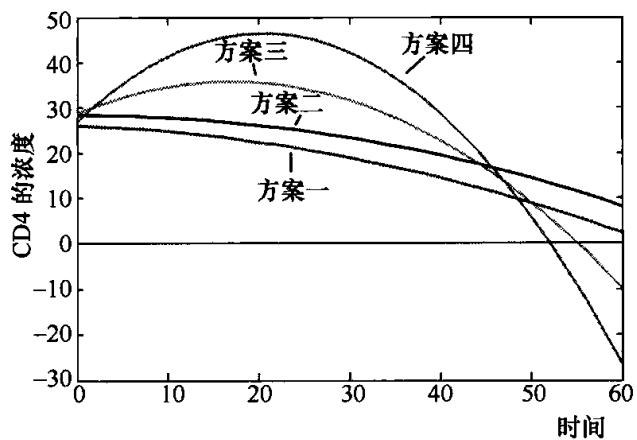

<details>
<summary>line</summary>

| 时间 | 方案一 (CD4 的浓度) | 方案二 (CD4 的浓度) | 方案三 (CD4 的浓度) | 方案四 (CD4 的浓度) |
| --- | --- | --- | --- | --- |
| 0 | ~26 | ~29 | ~29 | ~29 |
| 10 | ~25 | ~35 | ~42 | ~45 |
| 20 | ~23 | ~36 | ~47 | ~48 |
| 30 | ~20 | ~33 | ~42 | ~45 |
| 40 | ~16 | ~25 | ~30 | ~35 |
| 50 | ~10 | ~10 | ~10 | ~10 |
| 60 | ~3 | ~-10 | ~-25 | ~-25 |
</details>

图 12 四种方案拟合曲线比较图

## 3. 模型结论及与分类法模型的结论比较

通过观察分析图形可知,以二次曲线的最高点和达到最高的时间为评价标准,则可知方案四最好,方案三、方案二次之,方案一较差,这与分类法拟合模型的结论一致。

最优方案停止用药的最佳时间即为方案四的停止用药的最佳时间,方案四的二次抛物线到达最高点后,如果继续服用它,CD4 的浓度将不再增加,说明病人已经产生了抗药性,所以每条曲线达到最高点的时间即为最佳的停止用药时间。故方案四的停止用药的最佳时间为二次曲线对称轴的置:20 周,这个停止用药的最佳时间数值与分类模型中最佳方案的停止用药最佳时间比较接近。同时由图 12 可知, 方案一的二次曲线的对称轴的位置小于 0, 所以方案一只能起到抑制 CD4 减小的速度, 这个结果与分类法拟合模型得出的结论完全一致。

## 4.3 问题(3)

## 4.3.1 问题(3)的分析

问题(2)的回答只需要考虑疗法的效果,根据CD4的浓度随时间的变化情况,就能评价最佳治疗方案。实际情况是治疗艾滋病的药品价格一直居高不下,对于发达国家的病人来说可以接受,但非洲等高得病率的地区大多是不发达国家,经济状况落后,许多患者因为负担不起昂贵的费用而无法接受治疗,药价是经济不发达国家不得不考虑的因素。问题(3)就是在这一背景下提出来的,考虑四种用药方案的药品价格,重新比较四种疗法的优劣。既要考虑药价,又要考虑疗效,综合两个因素,得出性价比最优的治疗方法。

衡量疗效是以 CD4 的浓度为标准,衡量价格是以费用为标准,两者不是同一个量纲。如果采用评价函数,目标是比较各种疗法的性能,求出性能函数为的最大值的疗法,但是综合考虑两种因素,衡量标准是不同的量纲,难以确定两者之间的权重,而且权重最后的函数值对权重的取值大小很敏感,权重的变化会影响到评价的结果。

因为无法精确给出价格和疗效这两个因素的权值, 只能定性描述, 对于单个因素能给出定量的分析, 目标是要评价四种疗法的优劣, 属于决策问题。层次分析法正是解决这一类问题的有效方法。

层次分析法解决问题的基本思想就是对一个多层次、多因素、复杂的决策问题分层比较,综合优化。其步骤如下:

（1）分析系统中各因素之间的关系,建立系统的递阶层次结构,一般分为三层:第一层为目标层,第二层为准则层,第三层为方案层。  
(2) 构造两两比较矩阵, 即对于同一层次的因素关于上一层中某一准则的重要性进行两两比较, 构造出两两比较的判断矩阵。  
(3) 由判断矩阵计算被比较因素对每一准则的相对权重,并进行判断矩阵的一致性检验。  
(4) 最后计算方案层对目标层的组合权重和组合一致性检验,并进行排序。

## 4.3.2 问题(3)的模型建立

对于问题(3)，构造层次结构，方案层有四种疗法 $c_{1}, c_{2}, c_{3}, c_{4}$ 可供选择，准则层有价格 $b_{1}$ 和疗效 $b_{2}$ 两个准则，目标层为选择治疗方法 $a$ 。相应要构造三个判断矩阵，分别为目标对于准则的判断矩阵 $\boldsymbol{A}_{(2 \times 2)}$ ，价格准则 $b_{1}$ 对方案层的判断矩阵 $\boldsymbol{B}_{1(4 \times 4)}$ ，疗效准则 $b_{2}$ 对方案层的判断矩阵 $\boldsymbol{B}_{2(4 \times 4)}$ ，如图13所示。

由前面的分析已经知道两个准则对目标的权重难以定量,这里设归一化后价格对目标的权重为 $\alpha(0 \leqslant \alpha \leqslant 1)$ ,那么疗效对目标的权重为 $1 - \alpha$ 。

矩阵 $B_{1(4 \times 4)}$ 的构造, 直接参考题目中给出的各种疗法的用药价格 $pr$ , 需要注意的是价格对于目标层的影响是价格越低被选中的可能越大, 所以两种价格对准侧的重要性的比值等于价格的反比, 即 $b_{ij} = pr_j / pr_i$ , $B_{1(4 \times 4)}$ 显然是正互反矩阵。

矩阵 $B_{2(4\times 4)}$ 的构造，可以借助求解问题(2)得到的结果，从四种疗法的二次回归方程曲线可以看出,疗效的好坏与 CD4 浓度上升到的最大值和到达最大值的时间有关系, $\rho_{m}$ 越大,疗效越好, $t_{m}$ 越大,疗效越好,比较四种方案就是比较四种方案下的 CD4 浓度最大值和达到最大值时间。但是综合起来比较,因为浓度和时间的量纲不一样,为了统一量纲,取 $b'_{ij}=\frac{1}{2}\left(\frac{\rho_{mi}}{\rho_{mj}}+\frac{t_{mi}}{t_{mj}}\right)$ ,但是这样构造出来的 $B_{2(4\times4)}$ 不是正互反阵,因此为了判断矩阵是正互反矩阵,令

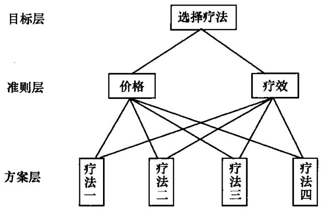

<details>
<summary>flowchart</summary>

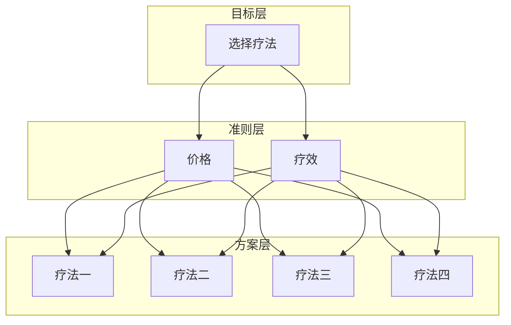
```mermaid
graph TD
  subgraph TargetLayer["目标层"]
    A["选择疗法"]
  end
  
  subgraph StrategyLayer["准则层"]
    B["价格"]
    C["疗效"]
  end
  
  subgraph TreatmentLayer["方案层"]
    D1["疗法一"]
    D2["疗法二"]
    D3["疗法三"]
    D4["疗法四"]
  end
  
  A --> B
  A --> C
  B --> D1
  B --> D2
  B --> D3
  B --> D4
  C --> D1
  C --> D2
  C --> D3
  C --> D4
```
</details>

图 13 问题(3)的模型

$$
b _ {i j} ^ {\prime} = \left\{ \begin{array}{l} \frac {1}{2} \left(\frac {\rho_ {m i}}{\rho_ {m j}} + \frac {t _ {m i}}{t _ {m j}}\right) (i <   j) \\ \frac {1}{b _ {i j} ^ {\prime}} (i > j) \end{array} \right.
$$

这样就构造出了三个判断矩阵：

$$
\boldsymbol {A} = \left| \begin{array}{c c} 1 & \alpha \\ 1 - \alpha & 1 \end{array} \right|, \boldsymbol {B} _ {1} = \left| \begin{array}{c c c c} 1 & b _ {1 2} & b _ {1 3} & b _ {1 4} \\ \frac {1}{b _ {1 2}} & 1 & b _ {2 3} & b _ {2 4} \\ \frac {1}{b _ {1 3}} & \frac {1}{b _ {2 3}} & 1 & b _ {3 4} \\ \frac {1}{b _ {1 4}} & \frac {1}{b _ {2 4}} & \frac {1}{b _ {3 4}} & 1 \end{array} \right|, \boldsymbol {B} _ {2} = \left| \begin{array}{c c c c} 1 & b _ {1 2} ^ {\prime} & b _ {1 3} ^ {\prime} & b _ {1 4} ^ {\prime} \\ \frac {1}{b _ {1 2} ^ {\prime}} & 1 & b _ {2 3} ^ {\prime} & b _ {2 4} ^ {\prime} \\ \frac {1}{b _ {1 3} ^ {\prime}} & \frac {1}{b _ {2 3} ^ {\prime}} & 1 & b _ {3 4} ^ {\prime} \\ \frac {1}{b _ {1 4} ^ {\prime}} & \frac {1}{b _ {2 4} ^ {\prime}} & \frac {1}{b _ {3 4} ^ {\prime}} & 1 \end{array} \right|
$$

构造出判断矩阵后,根据每一个矩阵算出下一层对上一层的权重。对于通过一致性检验的矩阵,它的最大特征值对应的特征向量归一化之后可以近似看作是权向量。由于 $B_{1(4\times4)}$ 是由四个具体的价格两两比较得来的,完全符合一致性,所以只需要对 $B_{2(4\times4)}$ 进行检验,先求出 $B_{2(4\times4)}$ 的最大特征值 $\lambda_{max}$ ,代入不一致度函数 $CI=\frac{\lambda_{max}-n}{n-1}$ ,又根据 $CR=\frac{CI}{RI}$ 求出CR值,RI是随n值确定的常数,当CR<0.1时不一致程度在容许范围内。

准则层对目标层的权向量为 $\boldsymbol{w}_{0}=(\alpha,1-\alpha)^{\mathrm{T}}$ ，方案层对准则 $b_{1},b_{2}$ 的权向量为 $\boldsymbol{w}_{1}=(\boldsymbol{w}_{11},\boldsymbol{w}_{12},\boldsymbol{w}_{13},\boldsymbol{w}_{14})^{\mathrm{T}},\boldsymbol{w}_{2}=(\boldsymbol{w}_{21},\boldsymbol{w}_{22},\boldsymbol{w}_{23},\boldsymbol{w}_{24})^{\mathrm{T}},\boldsymbol{W}=[\boldsymbol{w}_{1},\boldsymbol{w}_{2}]$ ，那么方案层对目标层的组合权向量为 $w=Ww_{0}$ 。

最后组合一致性检验,根据前面已经算出方案层的一致性指标分别为 $CI_{1}$ 和 $CI_{2}$ , 随

机一致性指标 $RI_{1}$ 和 $RI_{2}$ 。

$$
\mathrm{CI} = \left[ \mathrm{CI} _ {1}, \mathrm{CI} _ {2} \right] \boldsymbol {w} _ {0}, \mathrm{RI} = \left[ \mathrm{RI} _ {1}, \mathrm{RI} _ {2} \right] \boldsymbol {w} _ {0}, \mathrm{CR} = \mathrm{CR} _ {0} + \frac {\mathrm{CI}}{\mathrm{RI}}
$$

当 CR < 0.1 时, 认为整个层次的比较判断通过一致性检验。

## 4.3.3 问题(3)的模型求解

四种治疗艾滋病的方法,每天用药的花费分别为1.225美元、3.45美元、2.45美元、3.65美元。由 $b_{ij}$ 得到方案对准则一的判断矩阵 $B_{1}$ :

$$
\boldsymbol {B} _ {1} = \left| \begin{array}{c c c c} 1 & 2. 8 1 6 & 2 & 2. 9 8 0 \\ 0. 3 5 5 & 1 & 0. 7 1 0 & 1. 0 5 8 \\ 0. 5 & 1. 4 0 8 & 1 & 1. 4 9 0 \\ 0. 3 3 6 & 0. 9 4 5 & 0. 6 7 1 & 1 \end{array} \right|
$$

归一化后的权向量为 $w_{1}=\left[0.457,0.161,0.228,0.153\right]^{T}$ 。

根据问题(2)中求得的四种疗法的回归方程,得到各个疗法的 CD4 浓度最大值 $\rho = [\rho_{m1}, \rho_{m2}, \rho_{m3}, \rho_{m4}]^{T} = [26.14, 28.76, 33.58, 52.93]^{T}$ , 以及 CD4 浓度达到最大值的时间 T = $[t_{m1}, t_{m2}, t_{m3}, t_{m4}]^{T} = [-2.95, 6.02, 14.61, 29.42]^{T}$ , 其中 $t_{m1}$ 是负值, 时间的负值没有实际意义, 把它做归零处理, 由此得到方案对准则二的判断矩阵 $B_{2}$ 。

$$
\boldsymbol {B} _ {2} = \left| \begin{array}{c c c c} 1 & 0. 3 8 5 & 0. 3 2 9 & 0. 2 0 9 \\ 2. 5 9 7 & 1 & 0. 6 3 4 & 0. 3 7 4 \\ 3. 0 4 0 & 1. 5 7 7 & 1 & 0. 5 5 2 \\ 4. 7 8 5 & 2. 6 7 4 & 1. 8 1 2 & 1 \end{array} \right|
$$

最大的特征值为4.0153。检验其一致性，因 $\mathrm{CR} = \frac{\mathrm{CI}}{\mathrm{RI}} = \frac{0.005}{0.9} < 0.1$ ，通过检验，因此权向量可以由特征向量归一化得到，即

$$
\boldsymbol {w} _ {2} = [ 0. 0 8 5, 0. 1 8 7, 0. 2 6 9, 0. 4 5 9 ]
$$

检验组合一致性：

$$
\mathrm{CI} = \left[ \mathrm{CI} _ {1}, \mathrm{CI} _ {2} \right] \boldsymbol {w} _ {0} = \left[ 0. 0 0 5, 0 \right] \left[ \alpha , 1 - \alpha \right] ^ {\mathrm{T}} = 0. 0 0 5 \alpha
$$

$$
\mathrm{RI} = \left[ \mathrm{RI} _ {1}, \mathrm{RI} _ {2} \right] \boldsymbol {w} _ {0} = \left[ 0. 9, 0. 9 \right] \left[ \alpha , 1 - \alpha \right] = 0. 9
$$

$$
\mathrm{CR} = \mathrm{CR} _ {0} + \frac {\mathrm{CI}}{\mathrm{RI}} = \frac {0 . 0 0 5}{0 . 9} + \frac {0 . 0 0 5 \alpha}{0 . 9} <   0. 1
$$

所以整个层次的构造通过一致性检验。

最终的目标是求方案层对目标层的权向量,从而确定各个方案的优劣。由 $w = Ww_{0} = [0.085 - 0.372\alpha, 0.187 - 0.026\alpha, 0.269 - 0.041\alpha, 0.459 - 0.306\alpha]^{T}$ ，表示的是各种疗法的性能和权重参数 $\alpha$ 的关系。

计算结果用表格表示,见表1。

表 1

<table><tr><td>权向量(b对a)</td><td> $\alpha$ </td><td>1- $\alpha$ </td><td></td></tr><tr><td>(权向量c对b)</td><td>准则 $b_1$ </td><td>准则 $b_2$ </td><td>组合权向量(c对a)</td></tr><tr><td>方案 $c_1$ </td><td>0.457</td><td>0.085</td><td>0.085-0.372 $\alpha$ </td></tr><tr><td>方案 $c_2$ </td><td>0.161</td><td>0.187</td><td>0.187-0.026 $\alpha$ </td></tr><tr><td>方案 $c_3$ </td><td>0.228</td><td>0.269</td><td>0.269-0.041 $\alpha$ </td></tr><tr><td>方案 $c_4$ </td><td>0.153</td><td>0.459</td><td>0.459-0.306 $\alpha$ </td></tr><tr><td> $\lambda$ </td><td>4.015</td><td>4</td><td></td></tr><tr><td>CI</td><td>0.005</td><td>0</td><td></td></tr><tr><td>CR</td><td>0.006</td><td>0</td><td>0.006(1+ $\alpha$ )</td></tr></table>

## 4.3.4 问题(3)的结论和模型检验

为了更直观比较各种疗法的优劣,以纵轴表示疗法的性能,权重参数作为横轴,作出表示两者关系的平面图(图 14)。

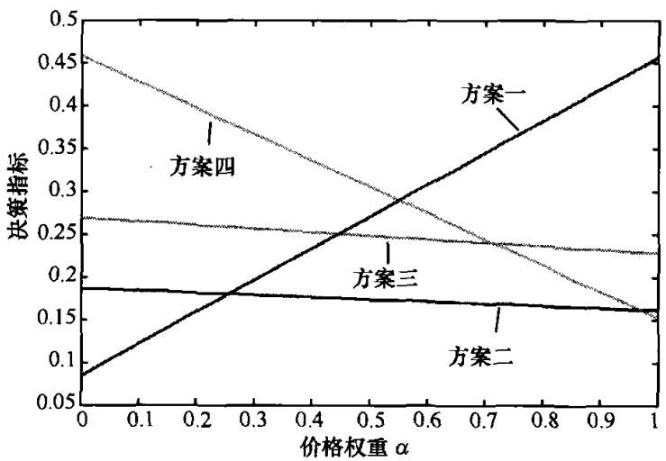

<details>
<summary>line</summary>

| 价格权重 \(\alpha\) | 方案一 | 方案二 | 方案三 | 方案四 |
| --- | --- | --- | --- | --- |
| 0 | ~0.08 | ~0.185 | ~0.265 | ~0.455 |
| 0.25 | ~0.175 | ~0.18 | ~0.255 | ~0.38 |
| 0.5 | ~0.275 | ~0.175 | ~0.245 | ~0.29 |
| 0.75 | ~0.375 | ~0.17 | ~0.235 | ~0.19 |
| 1 | ~0.455 | ~0.16 | ~0.225 | ~0.15 |
</details>

图 14 决策图像

从图 14 中可以看出随着 $\alpha$ 的值变化, 比较的结果也相应改变。先考虑极端的情况, 当 $\alpha=0$ 时, 价格的权重为零, 只考虑治疗效果, 这时的情况正好和问题二一样, 从图中可以看出疗法 4 的性能最好, 接着依次是疗法 3、疗法 2, 和问题二的求解结果完全吻合; 当 $\alpha=1$ 时, 治疗效果的权重为零, 只考虑价格因素, 疗法的性能是药价最贵的最差, 从图中得出的结果, 按疗法从优到劣排列依次为, 疗法 1、疗法 3、疗法 2、疗法 4, 和原文的数据一致。

实际情况一般是 $\alpha$ 在这两种极端情况之间取值, 收入越高的患病者, 药品价格因素的影响越小, $\alpha$ 的值越小, 收入越低的国家 $\alpha$ 的取值越大。发达国家的国民经济收入相对较高, 对于发达国家, $\alpha$ 的取值在较小区域, 所以对于发达国家来说, 疗法 4 是首选治疗方法。对于不发达国家, $\alpha$ 取值在较大区域, 疗法 1 是更好的选择方案。

随着 $\alpha$ 值得增大,评价结果变化的情况见表 2。

表 2

<table><tr><td></td><td>结果一</td><td>结果二</td><td>结果三</td><td>结果四</td><td>结果五</td><td>结果六</td></tr><tr><td>最佳疗法</td><td>4</td><td>4</td><td>4</td><td>1</td><td>1</td><td>1</td></tr><tr><td>次优疗法</td><td>3</td><td>3</td><td>1</td><td>4</td><td>3</td><td>3</td></tr><tr><td>次次优疗法</td><td>2</td><td>1</td><td>3</td><td>3</td><td>4</td><td>2</td></tr><tr><td>最差疗法</td><td>1</td><td>2</td><td>2</td><td>2</td><td>2</td><td>4</td></tr><tr><td>结果变化时的α</td><td></td><td>0.256</td><td>0.446</td><td>0.552</td><td>0.716</td><td>0.971</td></tr></table>

当 $0 < \alpha < 0.256$ 时，评价结果为结果一；当 $0.256 < \alpha < 0.446$ 时，评价结果为结果二；当 $0.446 < \alpha < 0.552$ 时，评价结果为结果三；当 $0.552 < \alpha < 0.716$ 时，评价结果为结果四；当 $0.716 < \alpha < 0.971$ 时，评价结果为结果五；当 $0.971 < \alpha < 1$ 时，评价结果为结果六。

最优疗法在 $0 < \alpha < 0.552$ 时是疗法4, 在 $0.552 < \alpha < 1$ 时, 是疗法1。

下面考虑治疗的最佳终止时间,前面已经知道终止时刻就是治疗方法的性能开始下降的时刻。因为确定病人疗法之后,每天花的钱是一样的,又由假设知道病人的收入是相对稳定的,价格权重是一定的,所以价钱因素不会引起治疗方案的性能下降,那么使治疗方案性能下降的只能是药品的效果因素。从而得到这样的结论:在确定了治疗方案的情况下,最佳治疗终止时间完全由药效因素决定。

所以,考虑价格因素的前提下,预测最佳终止治疗时间仍能引用问题(2)的方法。得出结果为:当 $0<\alpha<0.552$ 时,选择疗法4,最佳治疗终止时间为20周;当 $0.552<\alpha<1$ 时,选择疗法1,最佳治疗终止时间为-8周。选择疗法1,得出了负的最佳停止时间,不符合实际境况。出现这种情况,和模型设定的停止标准有关,最佳停止时间是二次曲线出现最大值的时刻,这时CD4的浓度开始下降,但并不能说明药没有效果了,可能是病毒的生长数量超过了被药品杀死的数量,选择这时停止用药,会早于理想情况下的最佳时间,所以出现了结果中的情况。

疗法 3 的性能始终好于疗法 2 的性能,说明疗法 3 相对于疗法 2 既经济又更有疗效,所以在选择组合疗法时,可以不考虑疗法 2,以疗法 1、疗法 3 和疗法 4 组合治疗。另外,如果一个地区只推广一种疗法,那么疗法 4 适合在发达国家推广,疗法 1 适合在不发达国家推广,疗法 3 适中,可以在贫富差距很大的发展中国家推广。

## 5 模型的优缺点及推广

模型的求解过程可以看出每一个问题都依赖于回归曲线方程,因此结果取决于拟合成什么形式的方程。

虽然采用统计规律建立起了表示 CD4 浓度的二次曲线回归模型,而由此计算出来的结果从整体来看,大体趋势与实际还是比较符合的。但该模型仍然存在着很多问题。

CD4 的浓度变化可能受年龄和初始浓度等因素的影响,可以分类拟合,由于时间仓促,在模型中没有体现出来,不能对诸多因素进行一一考虑,仅从整体上考虑,把握的是主要方面,因此该模型仍然具有一种普遍性和代表性,表示了一种基本的思路和算法。求解问题(3)用到的是层次分析法,层次分析法一般用在决策问题上,不需要给出定量的解答,因此模型中采用的把握主要方面的思想在问题上的效果是显著的。

## 参考文献

[1] 赵静, 但琦. 数学建模与数学实验. 第2版. 北京: 高等教育出版社, 2003.  
[2]叶其孝．大学生数学建模竞赛辅导教材．长沙：湖南教育出版社，1997.  
[3]姜启源．数学模型．第2版．北京：高等教育出版社，1993.

## 【论文点评】

唐庆国

优点:利用给定数据画出 CD4 和 HIV 浓度随时间变化的图形(折线)观察 CD4 及 HIV 浓度的变化趋势来寻找建模思路。建模方法多样,既有微分方程建模法,又有回归模型方法及层次分析法,且所用方法恰当、有效,说明作者有较宽广的知识面和较扎实的数学基础。分析问题准确、到位,把握到了问题的关键及要点,对题中提出的几个问题都给出了较为满意的回答。二次曲线模型与分类法拟合模型两种方法所得结果的一致性有利于对答案的可信度。在将回归模型应用于实际问题前,作者做了显著性检验,这是必要的。

不足:对几种疗效有无显著性差异没有作检验、分析。

# 艾滋病疗法的评价及疗效的预测

## 摘要

艾滋病是人感染免疫缺陷病毒(HIV)后引起的一种致死性传染病。世界上目前尚未有治愈艾滋病的有效疗法。本文针对文章提出的不同问题,应用不同理论对问题进行分析求解。

对于问题(1),先采用 SPSS 软件将所有病人分为重症和轻症两组,接着从 HIV 和 CD4 浓度及其变化率的角度,提出了停止用药的标准:HIV 的浓度升高率小于 5 个单位,CD4 浓度降低率大于 5 个单位。接着根据经过分组排序处理的病人的 CD4 和 HIV 浓度数据,利用 MATLAB 软件,对这些数据分别进行二次多项式函数拟合,对重症和轻症病人,分别建立 CD4 和 HIV 浓度—时间的二次多项式拟合曲线模型。求得结果是继续治疗。二次函数曲线拟合过于简单化,考虑问题比较理想化。为此,对模型进行改进,接着采用 5 次函数拟合的方法。对重症和轻症病人,分别建立 CD4 和 HIV 浓度—时间二次多项式的拟合曲线模型。求得结果是轻症病人继续治疗,重症病人提前终止服药时间是 [35,40]。

对于问题(2)，首先得对附录(2)的数据依据四种疗法分成四组，接着利用 MATLAB 软件对每组的 CD4 数据进行三次拟合，分别建立 CD4 浓度—时间拟合曲线模型。根据 CD4 浓度及其变化率，从拟合的图像中得出四种疗法由优到劣依次为第四种、第一种、第二种、第三种。对正在进行第四种疗法的病人，建议其继续治疗。

对于问题(3)，先对四种疗法的效果（即CD4浓度—时间的导函数）进行标准化处理，然后对四种疗法费用也进行标准化处理。可建立一个兼顾费用和疗效的模型： $m = ay + bxz'$ （ $a, b$ 为权系数， $y, z'$ 分别为疗法效果和费用的标准化处理）， $a, b$ 的值可由病人的考虑决定，如果病人花费比治疗效果更重要， $-a < b$ ，如果病人关注治疗的程度大于花费，则 $-a > b$ 。分别将 $a = -0.5, b = 0.5; a = -0.2, b = 0.8; a = -0.8, b = 0.2$ ；三组数据代入模型求得最优的疗法分别为第一种、第一种、第四种。不发达国家的艾滋病病人关注费用的程度一般都高于疗效，所以应该选用第一种疗法。

关键词: 曲线拟合, 标准化, 加权

## 1 问题的重述

艾滋病是当前人类社会最严重的瘟疫之一,从1981年发现以来的20多年间,它已经吞噬了近3000万人的生命。

艾滋病的医学全名为“获得性免疫缺损综合症”，英文简称 AIDS，它是由艾滋病毒(医学全名为“人体免疫缺损病毒”，英文简称 HIV)引起的。这种病毒破坏人的免疫系统，使人体丧失抵抗各种疾病的能力，从而严重危害人的生命。人类免疫系统的 CD4 细胞在抵御 HIV 的入侵中起着重要作用，当 CD4 被 HIV 感染而裂解时，其数量会急剧减少，HIV 将迅速增加，导致 AIDS 发作。

艾滋病治疗的目的,是尽量减少人体内 HIV 的数量,同时产生更多的 CD4,至少要有效地降低 CD4 减少的速度,以提高人体免疫能力。

迄今为止人类还没有找到能根治 AIDS 的疗法, 目前的一些 AIDS 疗法不仅对人体有副作用, 而且成本也很高。许多国家和医疗组织都在积极试验、寻找更好的 AIDS 疗法。

现在得到了美国艾滋病医疗试验机构 ACTG 公布的两组数据。ACTG320(见附件 1)是同时服用 zidovudine(齐多夫定)、lamivudine(拉美夫定)和 indinavir(茚地那韦)3 种药物的 300 多名病人每隔几周测试的 CD4 和 HIV 的浓度(每毫升血液里的数量)。193A (见附件 2)是将 1300 多名病人随机地分为 4 组,每组按下述 4 种疗法中的一种服药,大约每隔 8 周测试的 CD4 浓度(这组数据缺 HIV 浓度,它的测试成本很高)。4 种疗法的日用药分别为:600mg zidovudine 或 400mg didanosine(去羟基苷),这两种药按月轮换使用;600 mg zidovudine 加 2.25 mg zalcitabine(扎西他滨);600 mg zidovudine 加 400 mg didanosine;600 mg zidovudine 加 400 mg didanosine,再加 400 mg nevirapine(奈韦拉平)。

## 完成以下问题：

（1）利用附件1的数据,预测继续治疗的效果,或者确定最佳治疗终止时间(继续治疗指在测试终止后继续服药,如果认为继续服药效果不好,则可选择提前终止治疗)。  
(2) 利用附件 2 的数据,评价 4 种疗法的优劣(仅以 CD4 为标准),并对较优的疗法预测继续治疗的效果,或者确定最佳治疗终止时间。  
（3）艾滋病药品的主要供给商对不发达国家提供的药品价格如下：600mg zidovudine 1.60 美元，400mg didanosine 0.85 美元，2.25 mg zalcitabine 1.85 美元，400 mg nevirapine 1.20 美元。如果病人需要考虑 4 种疗法的费用，对(2)中的评价和预测（或者提前终止）有什么改变。

## 2 问题的分析

艾滋病现在尚无有效的治愈方法,因为 HIV 病毒通过药物无法彻底杀除。艾滋病治疗的目的,是尽量减少人体内 HIV 的数量,同时产生更多的 CD4,至少要有效地降低 CD4 减少的速度,以提高人体免疫能力。所以,用药物治疗艾滋病效果的评判标准:用药者每毫升血液里 CD4 的数量和 HIV 的数量变化,即由 CD4 和 HIV 的浓度变化决定。在一定时间里如果 CD4 浓度的增大、HIV 浓度的减小都比较显著,那么此种药物疗法应继续,如果 HIV 和 CD4 的浓度都没有变化,甚者,CD4 浓度减小、HIV 浓度增加,那么就应该立即终止此疗法。

针对问题一,题目给出了同时服用3种药物的300多名艾滋病患者每隔几周测试的CD4和HIV的浓度的一组数据。在这组数据中,每个病人有3组\~5组测试结果,而且病人每次测试的时间并不相同。对于这组结构比较混乱的数据,觉得应该把它分组考虑。由于刚开始药物治疗时每个病人的病情,即病人CD4和HIV的浓度不一样,这样可以按病人的病情分组。分好组后,根据药物疗法效果的评判标准,通过对数据的分析和处理,可以利用 MATLAB 软件对数据进行二次多项式函数拟合,建立 CD4、HIV 浓度—时间拟合曲线模型。如果效果不好,可以提高多项式函数拟合次数。

针对问题二,可以先把附录二的数据依据四种疗法分成四组数据。接着可利用MATLAB软件对数据进行多次的多项式函数拟合,通过对拟合后曲线图形的分析,可得出四种疗法的优劣程度。

针对问题三,先对四种疗法的曲线方程和它们各自的费用进行标准化处理,接着通过加权,可建立一个兼顾费用和疗效的模型,由模型可求解得到不同病人的最优疗法。

## 3 模型假设

(1) 题目附件的美国艾滋病医疗试验机构 ACTG 的数据准确可靠。  
(2) 假设外界因素不会对 CD4 和 HIV 的浓度产生影响。  
(3) 所有参加试验的人员均是第一次接受治疗。  
(4) 数据中 HIV = 0 不代表该患者已经治愈。

## 4 问题(1)的求解:评判治疗效果

## 4.1 数据的处理

通过观察题目所给的同时服用3种药物的300多名艾滋病患者每隔几周测试的CD4和HIV的浓度的数据,可以发现每个病人有3组\~5组CD4和HIV浓度的测试数据,这几个数据反映了每个病人在同时服用zidovudine(齐多夫定)、lamivudine(拉美夫定)和indinavir(茚地那韦)3种药物不同时间段的治疗效果。然而每个病人刚开始治疗的CD4和HIV浓度一般是不一样的,CD4和HIV浓度即反映了病人的病情,所以刚开始治疗时病人的病情不同,这样认为:病情不同的病人在相同时间段对相同药物的疗效应该是不同的。把这组数据进行分组,考虑到每个病人有3组\~5组CD4和HIV浓度的测试数据,于是决定采用SPSS软件,把患者第0次测试的CD4和HIV的浓度输入计算机进行分组(若某个病人没有第0次测试的结果,则就把该个病人的这一组数据舍去)。

通过用 SPSS 软件对数据分组后,得到了 2 组数据。通过对分组数据的分析,通过观察发现,SPSS 软件的分组主要是针对 CD4 的浓度来划分的,CD4 的浓度 165 个/mL 为标准,刚开始治疗时 CD4 的浓度高于 165 个/mL 的病人为一组,CD4 的浓度低于 165 个/mL 的病人为一组,CD4 的浓度高于 165 个/mL 的那个组为轻症病人,CD4 的浓度低于 165 个/mL 的那个组为重症病人。

数据分为两组以后,各个病人的测试时间不一样,为了更好地比较 CD4 和 HIV 浓度的变化,把分好组的数据导入 Excel 表格中,利用 Excel 具有的排序功能对两组数据依据病人的测试时间进行排序处理,得到可以利用的数据。

## 4.2 药物效果评价的标准

当服用药物后,检测病人的血液,对比前几次的检测结果:

从 HIV 和 CD4 浓度的数量上看:

(1) HIV 的浓度降低, CD4 浓度升高, 药物正在发挥它的作用, 应继续用药。  
(2) CD4 浓度降低, HIV 浓度升高, 此时药物不起作用, 应该停止用药。  
(3) HIV 和 CD4 浓度都基本上没有变化, 此时药物正在维持 HIV 和 CD4 浓度, 应继续用药。

从 HIV 和 CD4 浓度变化率上看：

(1) CD4 浓度变化率比较稳定, 即缓慢上升或缓慢下降, 且 HIV 浓度变化率不稳定, 如果 HIV 浓度急剧上升, 表明药物失效, 此时应该停止用药; 如果 HIV 浓度急剧下降, 应继续用药。  
(2) HIV 浓度变化率比较稳定, 即缓慢上升或缓慢下降, 但 CD4 浓度变化率不稳定, 如果 CD4 浓度急剧上升, 应继续用药; 如果 CD4 浓度急剧下降应该停止用药。  
(3) CD4 浓度变化率和 HIV 浓度变化率都比较稳定, 此时药物正在维持 HIV 和 CD4 浓度, 应继续用药。

依据上面的定性分析,设定标准:当 CD4 浓度小于 50 个单位,HIV 的浓度大于 6 个单位,HIV 浓度增长率高于 5.0,CD4 浓度下降率高于 5.0,就停止用药。

## 4.3 模型的建立

根据经过分组排序处理后病人的 CD4 和 HIV 浓度数据, 利用 MATLAB 软件, 对这些数据分别进行二次多项式函数拟合。

对重症病人,建立 CD4 浓度—时间拟合曲线模型:

$$
y = a x ^ {2} \pm b x + c
$$

编写 MATLAB 程序, 求解得到:

重症的病人 CD4 浓度的变化模型：

$$
y = - 0. 1 0 3 9 x ^ {2} + 6. 2 1 7 x + 8 1. 4 9 4 6
$$

依据重症病人 CD4 浓度变化的二次曲线的图像(图 1)可直接看出,CD4 浓度在[0,50]都大于50,继续服药。

对上式求导,得.

$$
y ^ {\prime} = - 0. 2 0 7 8 x + 6. 2 1 7
$$

由评判标准可得 $y' < -10$ ，解得 x > 50，即继续用药。

对重症病人,类似可得 HIV 浓度—时间拟合曲线模型:

$$
y = 0. 0 0 3 4 x ^ {2} - 0. 1 6 4 7 x + 4. 4 4 6 3
$$

依据症状重的病人 HIV 浓度的变化的二次曲线的图像(图 2)可直接看出,HIV 浓度在[0,50]都小于6,继续服药。

对上式求导,得

$$
y ^ {\prime} = - 0. 0 0 6 8 x - 0. 1 6 4 7
$$

由评判标准可得 $y' < 10$ ，明显在 $[0, 50]$ 都符合，继续服药。

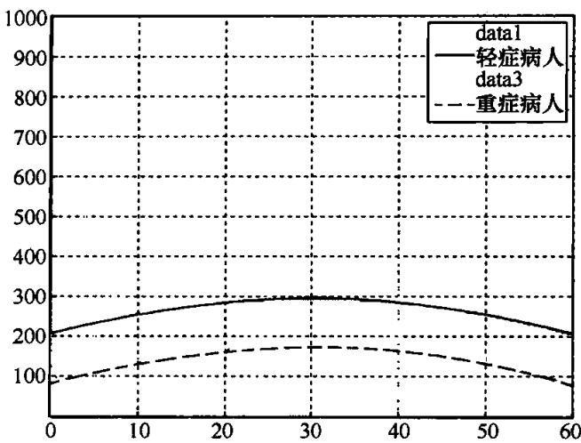

<details>
<summary>line</summary>

| X | 轻症病人 (data1) | 重症病人 (data3) |
| --- | --- | --- |
| 0 | ~210 | ~90 |
| 10 | ~250 | ~130 |
| 20 | ~280 | ~160 |
| 30 | ~300 | ~170 |
| 40 | ~290 | ~160 |
| 50 | ~250 | ~130 |
| 60 | ~210 | ~80 |
</details>

图 1 CD4 浓度二次多项式曲线图

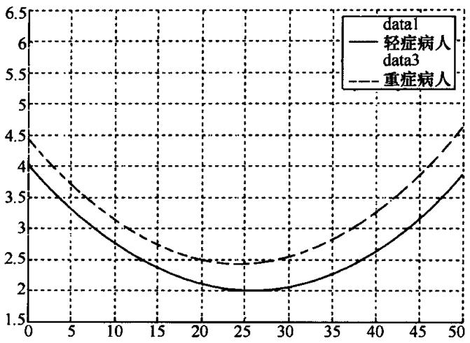

<details>
<summary>line</summary>

| X | data1 | data3 | 重症病人 |
| --- | --- | --- | --- |
| 0 | 4.0 | 4.0 | 4.5 |
| 5 | ~3.3 | ~3.3 | ~3.7 |
| 10 | ~2.8 | ~2.8 | ~3.1 |
| 15 | ~2.4 | ~2.4 | ~2.7 |
| 20 | ~2.1 | ~2.1 | ~2.5 |
| 25 | 2.0 | 2.0 | ~2.4 |
| 30 | ~2.0 | ~2.0 | ~2.5 |
| 35 | ~2.3 | ~2.3 | ~2.8 |
| 40 | ~2.6 | ~2.6 | ~3.2 |
| 45 | ~3.1 | ~3.1 | ~3.8 |
| 50 | ~3.8 | ~3.8 | ~4.6 |
</details>

图 2 HIV 的二次多项式曲线图

综合考虑两种评判药物效果的指标和实际情况,确定重症病人可以继续服药。

类似地,建立轻症病人 CD4 浓度—时间拟合曲线模型:

$$
y = - 0. 0 9 7 9 x ^ {2} + 5. 8 2 6 x + 2 0 7. 6
$$

依据轻症病人 CD4 浓度的变化的二次曲线的图像可直接看出,CD4 浓度在 $[0,50]$ 都大于 50,继续服药。

同理,建立轻症病人 HIV 浓度—时间拟合曲线模型:

$$
y = - 0. 0 9 7 9 x ^ {2} + 5. 8 2 6 x + 2 0 7. 6 2
$$

通过观察症状轻的病人 CD4 浓度和 HIV 浓度曲线,综合考虑两种评判药物效果的指标和实际情况,确定症状轻的病人继续服药。

## 4.4 模型的优缺点评价

上面的模型分别对症状重的病人、症状轻的病人依据 CD4 和 HIV 浓度进行了药物效果的评价，并提出了提前终止用药时间。

优点：

简单,在一定程度上能反映出不同病人的治疗效果。

缺点：

（1）同一种症状的病人运用 CD4 和 HIV 浓度变化速率求得的终止用药时间不相同，且出入较大。  
(2) CD4 和 HIV 浓度变化速率的标准是由自己确定的, 同实际情况有一定误差。  
(3) CD4 和 HIV 浓度变化的模型, 即浓度变化的二次函数曲线过于简单化, 考虑问题比较理想化, 与实际的变化差距较大。

为此,采用5次多项式函数拟合的方法,对模型进行了改进。

## 4.5 模型的改进

## 1. 重症病人

根据经过分组排序处理后病人的 CD4 和 HIV 浓度数据, 利用 MATLAB 软件, 对这些

数据进行 5 次多项式函数拟合, 建立 CD4 浓度—时间拟合曲线模型:

$$
y = a x ^ {5} + b x ^ {4} + c x ^ {3} + d x ^ {2} + e x + g
$$

编写 MATLAB 程序, 求解得到重症病人的 CD4 浓度函数为

$$
y = - 0. 0 0 0 2 x ^ {4} + 0. 0 2 0 6 x ^ {3} - 0. 8 2 4 5 x ^ {2} + 1 4. 2 3 1 4 x + 6 7. 9 3 5 4
$$

观察 CD4 浓度的变化函数图像(图 3), 可以发现, CD4 浓度从第 0 周开始增加, 在 36 周数量上到达一个最大值, 此后就开始减少。所以依据 CD4 浓度的变化函数图像得到在 36 周左右的时间病人应该停药。

重症病人的 HIV 关于时间的函数为

$$
y = 0. 0 0 0 1 x ^ {4} - 0. 0 0 3 9 x ^ {3} + 0. 0 7 9 5 x ^ {2} - 0. 6 9 2 4 x + 5. 0 3 8 6
$$

观察 HIV 的变化函数图像(图 4), 可以发现, CD4 浓度从第 0 周开始减小, 在 34 周数量上到达一个最小值, 此后就开始增加。所以依据 HIV 浓度的变化函数图像得到在 34 周左右的时间病人应该停药。

接下来再考虑 CD4 浓度和 HIV 变化函数的导数方程对药物效果影响的评判。

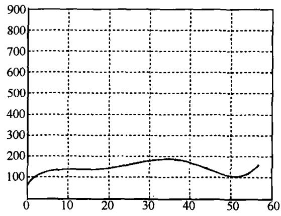

<details>
<summary>line</summary>

| X | Y |
| --- | --- |
| 0 | ~70 |
| 5 | ~120 |
| 10 | ~130 |
| 15 | ~130 |
| 20 | ~135 |
| 25 | ~150 |
| 30 | ~170 |
| 35 | ~180 |
| 40 | ~170 |
| 45 | ~130 |
| 50 | ~100 |
| 55 | ~150 |
</details>

图 3 重病患者 CD4 浓度变化情况

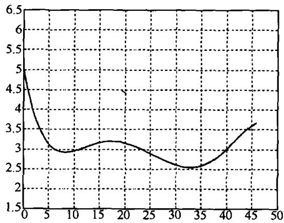

<details>
<summary>line</summary>

| X | Y |
| --- | --- |
| 0 | 5.0 |
| 5 | ~3.1 |
| 10 | ~2.9 |
| 15 | ~3.1 |
| 20 | ~3.1 |
| 25 | ~2.9 |
| 30 | ~2.6 |
| 35 | ~2.5 |
| 40 | ~3.0 |
| 45 | ~3.6 |
</details>

图 4 重病患者 HIV 变化情况

重症病人 CD4 浓度和 HIV 的变化函数求出以后, 可以分别求出它们的导数方程, 看它们的变化率情况。

重症病人 CD4 浓度的导函数为

$$
y = - 0. 0 0 0 8 x ^ {3} + 0. 0 6 1 8 x ^ {2} - 1. 6 5 9 x + 1 4. 2 3 1 4
$$

重症病人 HIV 的导函数为

$$
y = 0. 0 0 0 4 x ^ {3} - 0. 0 1 1 7 x ^ {2} + 0. 1 5 9 x - 0. 6 9 2 4
$$

观察 CD4 浓度的变化函数的导函数图像(图 5)可以发现,症状重的病人 CD4 浓度的导函数刚开始大于 0 且比较平滑地下降,表明刚开始服药时病人 CD4 浓度增加幅度越来越小,当导数小于 0 时,病人的 CD4 浓度开始减小,直接从图形可以看出,当 x 为 35 附近时,导数下降的速率最大,此时病人的 CD4 浓度急剧减小,仅依据 CD4 浓度的变化,病人应该在 35 周附近停药。

再来观察 HIV 浓度的变化函数的导数方程。此导数方程图像(图 6)的斜率慢慢变大, 即 HIV 浓度的变化速率也慢慢变大, 注意到, 当 y=10 时, 导数方程图像的斜率突然变大, 又由于 y>0, 即 HIV 浓度在增加, 所以此时 HIV 浓度突然增加的很快, 药物从这时候开始作用就不明显了。y=10 时通过导函数图像对应的 x=36, 所以依据 HIV 浓度的变化函数的导数方程求得病人应该在 36 周附近停药。

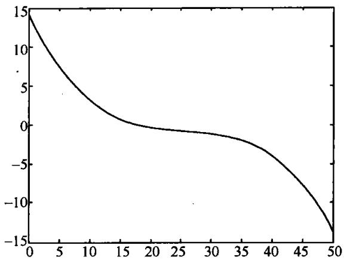

<details>
<summary>line</summary>

| X | Y |
| --- | --- |
| 0 | 15 |
| 50 | -14 |
</details>

图 5 重症病人 CD4 浓度导函数曲线

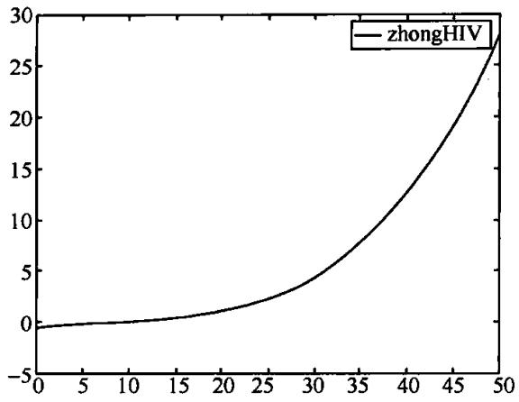

<details>
<summary>line</summary>

| X | zhongHIV |
| --- | --- |
| 0 | ~0 |
| 5 | ~0.2 |
| 10 | ~0.5 |
| 15 | ~1 |
| 20 | ~2 |
| 25 | ~3.5 |
| 30 | ~6 |
| 35 | ~9 |
| 40 | ~13 |
| 45 | ~18 |
| 50 | ~28 |
</details>

图 6 重症病人 HIV 的导函数曲线

分析 CD4 浓度和 HIV 浓度的变化函数图像和它们导数求得病人停药时间, 发现这四个数据结果惊人地吻合, 从另一个侧面也反映这种模型评价药物疗效的正确性。所以综上四个模型的求解结果, 确定症状重的病人停药时间为 [35,40] (即停药时间可在 35 周 \~ 40 周波动)。

## 2. 轻症病人

轻症病人 HIV 的变化函数：

$$
y = 0. 0 0 0 1 x ^ {4} - 0. 0 0 5 8 x ^ {3} + 0. 1 0 3 8 x ^ {2} - 0. 8 0 6 4 x + 4. 7 4 3 7
$$

观察轻症病人 HIV 的函数图像(图 7), 发现从第 0 周到第 6 周 HIV 浓度急剧下降, 此阶段药物对 HIV 有强烈的杀除作用, 从第 6 周到第 40 周 HIV 浓度都维持在一个比较稳定的水平, 此阶段药物对 HIV 有较强烈的抑制作用, 所以在药物终止治疗时药物效果比较显著, 依据此认为: 如果轻症病人依靠 HIV 的变化评判药物效果, 则在药物终止治疗时应该继续接受治疗。

轻症病人 CD4 浓度的变化:

$$
y = - 0. 0 0 3 1 x ^ {4} - 0. 1 2 6 6 x ^ {3} + 1. 7 4 9 6 x ^ {2} - 0. 0 6 4 4 x + 2 0 3. 0 6 9
$$

观察轻症病人 CD4 浓度的函数图像(图 8)，病人在整个治疗阶段 CD4 浓度稳中上升，所以依据 CD4 浓度的函数图像，认为病人应该接受治疗。

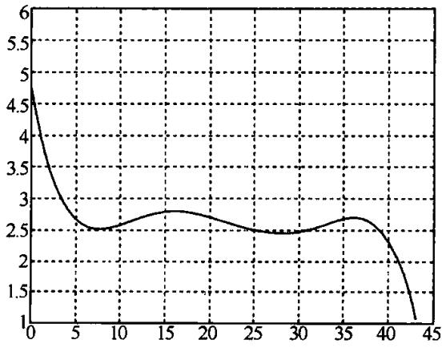

<details>
<summary>line</summary>

| X | Y |
| --- | --- |
| 0 | ~4.7 |
| 5 | ~2.6 |
| 10 | ~2.5 |
| 15 | ~2.8 |
| 20 | ~2.7 |
| 25 | ~2.5 |
| 30 | ~2.5 |
| 35 | ~2.7 |
| 40 | ~2.3 |
| 43 | ~1.1 |
</details>

图 7 轻症病人 HIV 变化情况

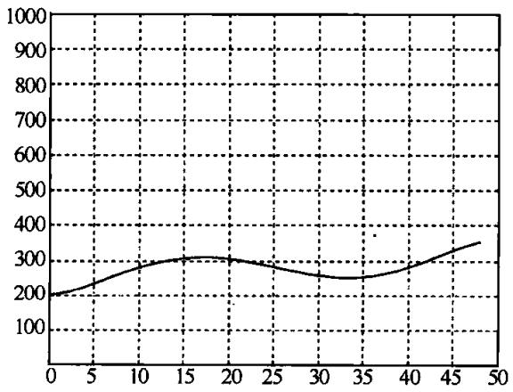

<details>
<summary>line</summary>

| X | Y |
| --- | --- |
| 0 | ~200 |
| 15 | ~300 |
| 20 | ~300 |
| 30 | ~250 |
| 35 | ~240 |
| 48 | ~350 |
</details>

图 8 轻症病人 CD4 浓度变化情况

轻症病人 CD4 浓度函数的导数方程：

$$
y = - 0. 0 1 2 4 x ^ {3} - 0. 3 7 9 8 x ^ {2} + 3. 4 9 9 2 x - 0. 0 6 4 4
$$

轻症病人 HIV 函数的导数方程：

$$
y = 0. 0 0 0 4 x ^ {3} - 0. 0 1 7 4 x ^ {2} + 0. 2 0 7 6 x - 0. 8 0 6 4
$$

观察 CD4 浓度的变化函数的导函数图像(图 9)可以发现,轻症病人 CD4 浓度导函数一直上升且大于 0,表明轻症病人的 CD4 浓度一直在变大,所以依据 CD4 浓度导函数图像求得的结果仍为继续接受治疗。

观察 HIV 函数的导函数图像(图 10)可以发现,轻症病人 HIV 的导函数在第 0 周到第 40 周都比较稳定且小于 5,表明轻症病人的 HIV 一直在减小,只是减小的速率慢慢变小,所以依据 HIV 的导函数图像求得的结果仍为继续接受治疗。

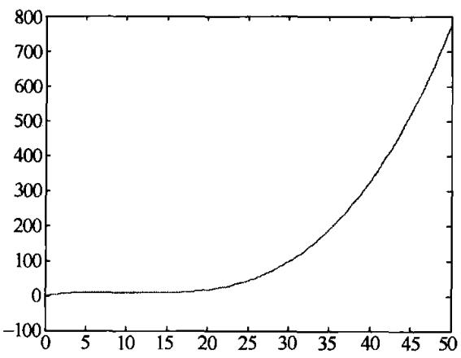

<details>
<summary>line</summary>

| X | Y |
| --- | --- |
| 0 | ~0 |
| 5 | ~10 |
| 10 | ~10 |
| 15 | ~10 |
| 20 | ~20 |
| 25 | ~50 |
| 30 | ~100 |
| 35 | ~200 |
| 40 | ~350 |
| 45 | ~550 |
| 50 | ~780 |
</details>

图 9 轻症病人 CD4 浓度导函数曲线

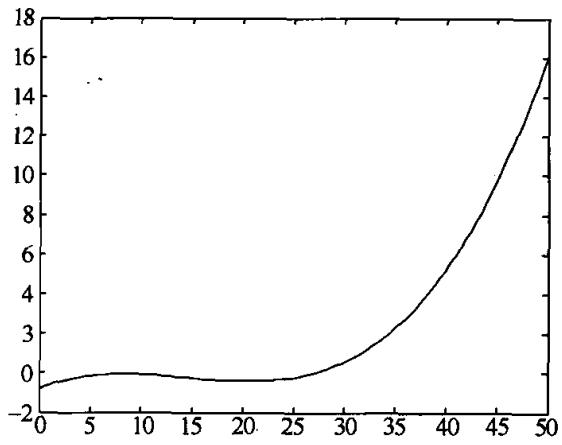

<details>
<summary>line</summary>

| X | Y |
| --- | --- |
| 0 | ~-0.8 |
| 5 | ~-0.1 |
| 10 | ~0.0 |
| 15 | ~-0.2 |
| 20 | ~-0.3 |
| 25 | ~-0.3 |
| 30 | ~0.5 |
| 35 | ~2.5 |
| 40 | ~5.5 |
| 45 | ~9.5 |
| 50 | ~16.0 |
</details>

图 10 轻症病人 HIV 的导函数曲线

## 5 问题(2)的求解:评价四种疗法的优劣

## 5.1 数据的处理

问题 2 要求评价 4 种疗法的优劣,附录 2 给出的是不同疗法的病人 CD4 浓度数据,所以首先对附录 2 的数据进行分类,即分四组,每个疗法为一组。先把数据粘贴到 Excel 表中,然后利用 Excel 表自动排序功能对疗法进行排序。排序完后,每个疗法里的患者也就分出来了。

## 5.2 模型的建立

根据分组排序处理的病人的每种疗法的 CD4 数据, 利用 MATLAB 软件, 对这些数据进行三次拟合, 建立重症病人 CD4 浓度变化的三次多项式曲线模型及曲线图像(图 11)。

第一种疗法：

$$
y = 0. 0 0 0 8 x ^ {2} - 0. 0 2 2 4 x + 2. 9 7 4 1
$$

第二种疗法：

$$
y = - 0. 0 0 1 3 x ^ {2} + 0. 0 0 8 1 x + 2. 9 4 9 1
$$

第三种疗法：

$$
y = 0. 0 0 0 1 x ^ {3} - 0. 0 0 3 x ^ {2} + 0. 0 3 9 x + 2. 9 1 3 9
$$

第四种疗法：

$$
y = 0. 0 0 0 1 x ^ {3} - 0. 0 0 3 7 x ^ {2} + 0. 0 6 9 3 x + 2. 8 3 5 8
$$

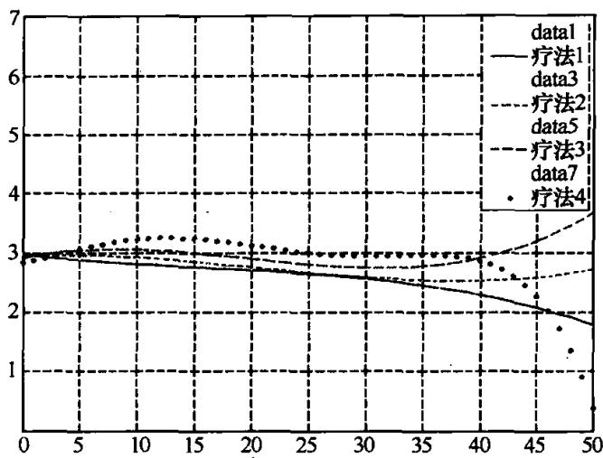

<details>
<summary>scatter</summary>

| X | data1 | data3 | data2 | data5 | data7 |
|---|---|---|---|---|---|
| 0 | ~2.9 | ~2.9 | ~2.9 | ~2.9 | ~2.9 |
| 5 | ~2.85 | ~2.9 | ~2.9 | ~2.9 | ~3.0 |
| 10 | ~2.8 | ~2.85 | ~2.85 | ~2.85 | ~3.1 |
| 15 | ~2.75 | ~2.8 | ~2.8 | ~2.8 | ~3.15 |
| 20 | ~2.7 | ~2.75 | ~2.75 | ~2.75 | ~3.1 |
| 25 | ~2.65 | ~2.7 | ~2.7 | ~2.7 | ~3.05 |
| 30 | ~2.6 | ~2.65 | ~2.65 | ~2.65 | ~3.0 |
| 35 | ~2.5 | ~2.6 | ~2.6 | ~2.6 | ~3.0 |
| 40 | ~2.4 | ~2.55 | ~2.55 | ~2.55 | ~2.9 |
| 45 | ~2.1 | ~2.5 | ~2.5 | ~2.5 | ~2.4 |
| 50 | ~1.8 | ~2.45 | ~2.45 | ~2.45 | ~0.4 |
</details>

图 11 四种疗法的 CD4 浓度随时间变化曲线

问题中测试的星期在40周以后就只有几组数据,所以评价疗法优劣在第0周到第40周的时间段里进行。从图像中明显可以看出,四种疗法基本上都能使病人的CD4浓度上升,至少是不下降。在四种疗法下,CD4浓度存在一定的高低关系。CD4浓度由高到低的四种疗法分别为四、三、二、一。所以依据CD4浓度求得的疗法由优到劣依次为四、三、二、一。

接着再把各种疗法函数曲线求导数,并画出其导函数的图像。

各种疗法函数曲线的导函数方程分别为

$$
\begin{array}{l} y = 0. 0 1 6 x - 0. 0 2 2 4 \\ y = - 0. 0 0 2 6 x + 0. 0 0 8 1 \\ y = 0. 0 0 0 3 x ^ {2} - 0. 0 6 x + 0. 0 3 9 \\ y = 0. 0 0 0 3 x ^ {2} - 0. 0 0 7 4 x + 0. 0 6 9 3 \\ \end{array}
$$

各种疗法函数曲线的导函数图像为图 12。由图像可以看出第四种疗法使 CD4 浓度增长的速率最大,所以第四种方法最好,其他疗法使 CD4 浓度增长的速率的大小依次为一、二、三,且第四种药物治疗应该继续。考虑到用各种疗法刚开始时病人的 CD4 浓度是不一样的,所以刚才考虑 CD4 浓度来评价疗法的优劣是不准确的。四种疗法的效果用各种疗法函数曲线的导数,即 CD4 浓度变化的速率的大小来评价疗法优劣更接近实际情况。

由于还有年龄因素没有考虑,现在针对第四种疗法的病人按年龄分成15岁\~30岁、30岁\~45岁、45岁\~60岁3组。

依据 3 组各年龄段的数据,运用 MATLAB 进行曲线拟合,得到图 13。

由图形可以看出,15岁\~30岁这一组的CD4浓度逐渐上升,可见第四种疗法对15岁\~30岁年龄段很有效,应继续服药。

由图形可以看出,30岁\~45岁这一组的CD4浓度保持平稳略有下降,可见第四种疗法对30岁\~45岁年龄段能降低CD4的下降速度,应继续服药。

由图形可以看出,45岁\~60岁这一组的CD4浓度也保持平稳略有下降,可见第四种疗法对45岁\~60岁年龄段能降低CD4的下降速度,应继续服药。

由以上分析可知:三个年龄段的病人都继续服药,所以年龄对疗法的效果的评判的影

响可忽略。

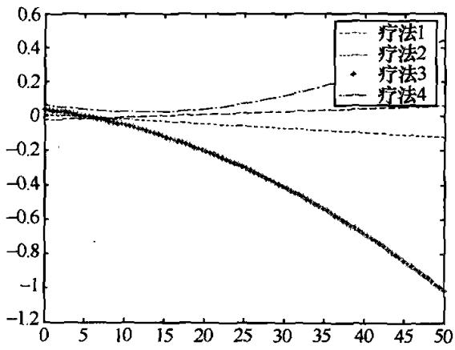

<details>
<summary>line</summary>

| X | 疗法1 | 疗法2 | 疗法3 | 疗法4 |
|---|---|---|---|---|
| 0 | ~0.05 | ~0.05 | ~0.05 | ~0.05 |
| 5 | ~0.02 | ~0.02 | ~-0.02 | ~0.02 |
| 10 | ~0.01 | ~0.01 | ~-0.08 | ~0.01 |
| 15 | ~0.01 | ~0.01 | ~-0.15 | ~0.01 |
| 20 | ~0.02 | ~0.02 | ~-0.22 | ~0.02 |
| 25 | ~0.03 | ~0.03 | ~-0.30 | ~0.03 |
| 30 | ~0.04 | ~0.04 | ~-0.38 | ~0.04 |
| 35 | ~0.05 | ~0.05 | ~-0.48 | ~0.12 |
| 40 | ~0.06 | ~0.06 | ~-0.62 | ~0.18 |
| 45 | ~0.07 | ~0.07 | ~-0.82 | — |
| 50 | ~0.08 | ~0.08 | ~-1.05 | — |
</details>

图 12 四种疗法的 CD4 浓度导函数曲线

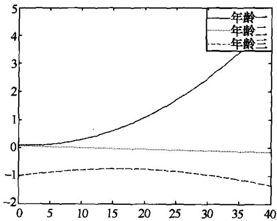

<details>
<summary>line</summary>

| X | 年龄 | 年龄二 | 年龄三 |
| --- | --- | --- | --- |
| 0 | 0 | 0 | -1 |
| 5 | ~0.1 | ~-0.05 | ~-0.9 |
| 10 | ~0.3 | ~-0.1 | ~-0.8 |
| 15 | ~0.6 | ~-0.15 | ~-0.8 |
| 20 | ~1.1 | ~-0.2 | ~-0.8 |
| 25 | ~1.7 | ~-0.25 | ~-0.9 |
| 30 | ~2.4 | ~-0.3 | ~-1.1 |
| 35 | ~3.2 | ~-0.35 | ~-1.3 |
| 40 | ~4.2 | ~-0.4 | ~-1.4 |
</details>

图 13 疗法四对不同年龄段病人的效果

## 6 问题(3): 考虑费用的疗法选择

## 6.1 四种疗法的标准化处理

由于要考虑四种疗法的费用，四种疗法的效果是用各种疗法CD4浓度与时间的导函数来衡量的，而各种疗法导函数次数不一样，量纲也不相同，直接进行比较可能会影响选择。所以先对各种疗法函数曲线的导数方程进行标准化处理。疗法的标准化处理过程为：将各种疗法所得的CD4浓度与时间 $x$ 的导函数即效果相加，得到四种疗法总的效果与时间 $x$ 的关系为

$$
y ^ {\prime} = 0. 0 0 3 3 x ^ {2} - 0. 0 5 4 x + 0. 0 7 7 8
$$

然后再用各种疗法的效果比上总的效果,据此得到经过标准化处理的各种疗法效果分别为

$$
y = 4 \times (0. 0 1 6 x - 0. 0 2 2 4) / (0. 0 0 3 3 x ^ {2} - 0. 0 5 4 x + 0. 0 7 7 8)
$$

$$
y = 4 \times (- 0. 0 0 2 6 x + 0. 0 0 8 1) / (0. 0 0 3 3 x ^ {2} - 0. 0 5 4 x + 0. 0 7 7 8)
$$

$$
y = 4 \times (0. 0 0 3 x ^ {2} - 0. 0 6 x + 0. 0 3 9) / (0. 0 0 3 3 x ^ {2} - 0. 0 5 4 x + 0. 0 7 7 8)
$$

$$
y = 4 \times (0. 0 0 3 x ^ {2} - 0. 0 0 7 4 x + 0. 0 6 9 3) / (0. 0 0 3 3 x ^ {2} - 0. 0 5 4 x + 0. 0 7 7 8)
$$

## 6.2 各种疗法费用的标准化

根据题目所给的四种疗法的药物和药物的价格,先计算出这四种疗法每日的花费(单位/美元):

第一种： $(1.60+0.85)/2=1.23$ ;

第二种: $1.6+1.85=3.45$ ;

第三种: $1.6+0.85=2.45$ ;

第四种: $1.6+0.85+1.2=3.65$ 。

对四种疗法每周的花费进行标准化处理:先计算四种疗法每周花费的费用为

$$
z = (1. 2 3 + 3. 4 5 + 2. 4 5 + 3. 6 5) \times 7 = 7 5. 4 6
$$

再用每种疗法每周所需的费用比上 z，就求得了每种疗法的标准化花费：

第一种: $z'_{1}=0.114$ ;

第二种: $z'_{2}=0.320$ ;

第三种： $z'_{3}=0.227$ ;

第四种： $z'_{4}=0.339$ 。

## 6.3 综合考虑费用和疗效的模型

可建立一个兼顾费用和疗效的模型：

$$
m = a y + b x z _ {i} ^ {\prime} \qquad (a, b \text {为权系数}, i = 1, 2, 3, 4)
$$

$z_{i}$ 要越小越好， $y$ 越大越好，所以 $a$ 为负数， $b$ 为正数，且 $b - a = 1$ ，使得 $m$ 越小越好。

四种疗法和费用经标准化处理的模型方程分别为

$$
m _ {1} = a (0. 0 1 6 x - 0. 0 2 2 4) / (0. 0 0 3 3 x ^ {2} - 0. 0 5 4 x + 0. 0 7 7 8) + 0. 4 5 6 b x
$$

$$
m _ {2} = a (- 0. 0 0 2 6 x + 0. 0 0 8 1) / (0. 0 0 3 3 x ^ {2} - 0. 0 5 4 x + 0. 0 7 7 8) + 1. 2 7 8 b x
$$

$$
m _ {3} = a (0. 0 0 3 x ^ {2} - 0. 0 6 x + 0. 0 3 9) / (0. 0 0 3 3 x ^ {2} - 0. 0 5 4 x + 0. 0 7 7 8) + 0. 9 0 7 b x
$$

$$
m _ {4} = a (0. 0 0 3 x ^ {2} - 0. 0 0 7 4 x + 0. 0 6 9 3) / (0. 0 0 3 3 x ^ {2} - 0. 0 5 4 x + 0. 0 7 7 8) + 1. 3 5 b x
$$

a、b 的值可由病人的考虑决定,如果病人对待治疗效果和花费觉得同等重要,则 a = -0.5, b = 0.5, 将这组数据代入模型方程中,用 MATLAB 软件对这四个方程进行画图处理,得到图 14。

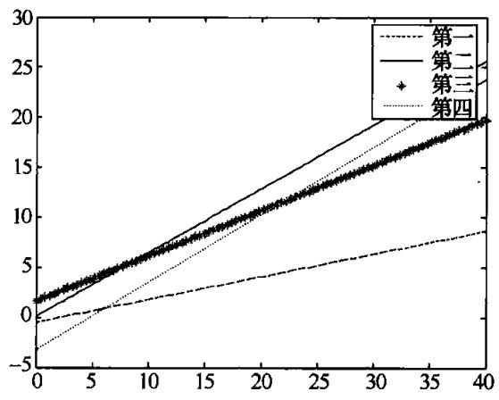

<details>
<summary>line</summary>

| X | 第一 | 第二 | 第三 | 第四 |
| --- | --- | --- | --- | --- |
| 0 | ~1.5 | ~0.2 | ~1.5 | ~-3.5 |
| 5 | ~3.5 | ~3.5 | ~3.5 | ~0.5 |
| 10 | ~6.0 | ~7.0 | ~6.0 | ~4.0 |
| 15 | ~8.5 | ~10.5 | ~8.5 | ~7.5 |
| 20 | ~11.0 | ~14.0 | ~11.0 | ~11.0 |
| 25 | ~13.5 | ~17.5 | ~13.5 | ~14.5 |
| 30 | ~16.0 | ~21.0 | ~16.0 | ~18.0 |
| 35 | ~18.5 | ~24.5 | ~18.5 | ~21.5 |
| 40 | ~21.0 | ~28.0 | ~21.0 | ~25.0 |
</details>

图 14 四种疗法的模型 $(a = -0.5, b = 0.5)$

观察图像可以知道,第一种疗法的 m 值在 $[5,40]$ 这些周里最小,即效果最好。所以如果病人关注费用和疗效的程度相同,则选用第一种疗法比较合适。

如果病人觉得治疗效果比花费更重要,则 a = -0.8, b = 0.2, 将这组数据代入模型方程中,用 MATLAB 软件对这四个方程进行画图处理,得到图 15。

观察图像可以知道,第四种疗法的 m 值在 $[0,25]$ 这些周里最小,第一种疗法的 m 值在 $[25,40]$ 这些周里最小。所以如果病人关注疗效的程度比较大的超过费用,则应该选用第四种疗法。

如果病人觉得花费比治疗效果更重要,则可以假设 a = -0.2, b = 0.8(当然,根据个人对花费和治疗的关注程度,可以自己选取相应的权值),将这组数据代入模型方程中,用 MATLAB 软件对这四个方程进行画图处理,得到图 16。

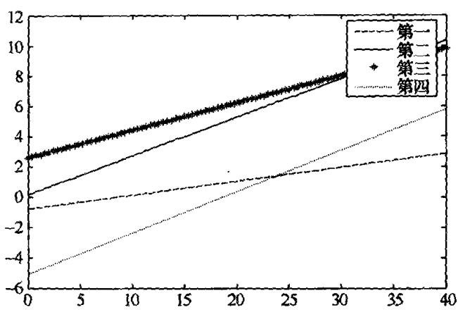

<details>
<summary>line</summary>

| X | 第一 (虚线) | 第二 (实线) | 第三 (星号) | 第四 (点划线) |
|---|---|---|---|---|
| 0 | ~-0.8 | ~0.2 | ~2.6 | ~-5.0 |
| 10 | ~0.2 | ~2.8 | ~4.8 | ~-2.0 |
| 20 | ~1.0 | ~5.2 | ~6.8 | ~0.0 |
| 30 | ~1.8 | ~7.8 | ~8.2 | ~3.0 |
| 40 | ~2.8 | ~10.2 | ~10.0 | ~6.0 |
</details>

图 15 四种疗法的模型 $(a=-0.8, b=0.2)$

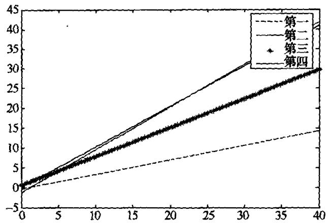

<details>
<summary>line</summary>

| X | 第一 | 第二 | 第三 | 第四 |
| --- | --- | --- | --- | --- |
| 0 | ~-1 | ~0 | ~0 | ~0 |
| 40 | ~15 | ~30 | ~30 | ~30 |
</details>

图 16 四种疗法的模型 $(a=-0.2, b=0.8)$

观察图像可以知道,第一种疗法的 m 值在 $[0,40]$ 这些周里最小,即效果最好。所以如果病人关注费用的程度超过疗效,必定则选用第一种疗法。所以究竟选用哪种疗法更好,取决于病人对费用和疗效的关注程度。

题目中给出的信息是:艾滋病药品供给不发达国家,不发达国家的绝大部分病人经济能力都有限,关注费用的程度一般都高于疗效,所以应该选用第一种疗法,但也不排除不发达国家的富人感染艾滋病,此时他关注疗效的程度肯定高于费用,他应该选用第四种疗法,但这样的病人在不发达国家毕竟是少数,所以不发达国家的病人应该选用第一种疗法。

## 参考文献

[1] 吴建国, 汪名杰, 李虎军. 数学建模案例精编. 北京: 中国水利水电出版社, 2005.  
[2] 姜启源, 谢金星, 叶俊. 数学模型. 北京: 高等教育出版社, 2005.

## 【论文点评】

唐庆国

优点:用 SPSS 软件对数据进行分组,并利用 Eecel 对分组后的数据作排序处理,得到可利用的数据。使用二次多项式回归模型拟合 CD4 浓度及 HIV 浓度随时间变化趋势,效果较好,利用函数导数研究浓度的变化率有助于更深入地分析问题。文中有大量的曲线图,这些图直观、可靠、可信度高,有很强的说服力。文中对数据的处理细致到位,分析问题能把握重点,对关键问题不回避,对题中提出的几个问题都给出了较为满意的回答。

不足:建模方法较为单一,对回归模型没有作显著性检验,没有作误差分析。

## 2007 年 B 题 乘公交,看奥运

我国人民翘首企盼的第29届奥运会2008年8月将在北京举行，届时有大量观众到现场观看奥运比赛，其中大部分人将会乘坐公共交通工具（简称公交，包括公汽、地铁等）出行。这些年来，城市的公交系统有了很大发展，北京市的公交线路已达800条以上，使得公众的出行更加通畅、便利，但同时也面临多条线路的选择问题。针对市场需求，某公司准备研制开发一个解决公交线路选择问题的自主查询计算机系统。

为了设计这样一个系统,其核心是线路选择的模型与算法,应该从实际情况出发考虑,满足查询者的各种不同需求。请你们解决如下问题:

（1）仅考虑公汽线路，给出任意两公汽站点之间线路选择问题的一般数学模型与算法。并根据附录数据，利用你们的模型与算法，求出以下6对起始站→终到站之间的最佳路线(要有清晰的评价说明)。

① S3359→S1828

② S1557→S0481

③ S0971→S0485

④ S0008→S0073

⑤ S0148→S0485

⑥ S0087→S3676

(2) 同时考虑公汽与地铁线路, 解决以上问题。

（3）假设又知道所有站点之间的步行时间，请你给出任意两站点之间线路选择问题的数学模型。

【附录】基本参数设定

相邻公汽站平均行驶时间(包括停站时间): 3min。

相邻地铁站平均行驶时间(包括停站时间): 2.5min。

公汽换乘公汽平均耗时：5min(其中步行时间2min)。

地铁换乘地铁平均耗时：4min(其中步行时间2min)。

地铁换乘公汽平均耗时：7min(其中步行时间4min)。

公汽换乘地铁平均耗时：6min(其中步行时间4min)。

公汽票价:分为单一票价与分段计价两种,标记于线路后;其中分段计价的票价为:0\~20站:1元;21站\~40站:2元;40站以上:3元。

地铁票价:3 元(无论地铁线路间是否换乘)。

注：以上参数均为简化问题而作的假设，未必与实际数据完全吻合。

## 【试题评析】

刘守生

乘客在选择乘车线路时最关心的是换乘次数最少、费用最省、时间最短，因此，这是一个多目标优化问题。考虑到观看奥运比赛的群体是很广泛的，每位乘客乘车时考虑的侧重点可能有所不同，有人希望尽快到达目的地，有人希望少花钱，老年人则更喜欢少换乘车，所以采取加权合成将问题转化为单目标优化问题求出的解，对广大乘客而言并非是最优解,因而这种解法是不合适的。比较合理的解法是应对不同目标分别求解,然后让乘客按照自己的需求进行选择。本题前两问要求在不知道站点地理信息的条件下给出解决线路选择问题的模型与算法,并就题目给定的数据计算得到线路选择结果,此二问主要考核建模及编程能力。第三问考虑了步行因素。

## 【问题解答要点】

建立图论模型是大多数参赛队采用的方法,这首先要考虑如何根据不同目标建立有向赋权图,然后再求给定点对之间的最小换乘次数或最短线路。求两点间最短线路有 Dijkstra 算法与 Floyd 算法等,但如何把换乘次数和换乘时间考虑到算法中是问题的关键所在。

建立规划模型,包括0-1规划模型与动态规划模型法等,这类方法通常是模型建立容易求解难,利用数据的特点选择合理的模型求解方法是关键。

利用数据库技术直接对线路及站点数据进行搜索也是一个行之有效的方法。建立能充分反映公交信息的各种矩阵是设计一个高效搜索算法的前提；对原始数据中出现的一些异常数据，如个别线路相邻站点名相同，对于L290标明是环线，但首尾站点分别为1477与1479等问题，做出合理的假设和处理是提高算法有效性和鲁棒性的重要辅助工作；选择恰当的搜索策略是关键。

对于考虑地铁线路时的公交线路选择问题,可以有多种处理方法,关键是看合理性与可操作性。换乘时间的处理较第一问要复杂,若能将不同交通方式进行统一化处理,可利用已建立的模型求解,降低了问题的复杂度。

已知站点间步行时间的公交线路选择问题是比较一般的线路选择问题,更接近实际。由于增加了步行因素,每个站点的可换乘方案大大增加了,于是用图论方法处理的难度也会有很大增加。最常用的目标有换车次数最少、乘车的总站数最少、步行的总时间最少、总车费最少等,应该针对不同的情况分别写出模型、理论分析及算法思想,这样可大大提高算法的可信度。

# 公交线路选择的数学模型

## 摘要

本文利用数据量化的方法,通过编程将原始数据转换为程序可直接读写的格式。通过构造公汽直达站点距离矩阵和车次矩阵,运用全局搜索的理论,针对问题(1)建立矩阵查询模型。模型I中考虑了以转车次数最少、耗费时间最短、费用最省三个单目标规划,找出最优的乘车方案后再综合评定出一种最优方案;并设计出动态更新查询算法,用MATLAB进行编程计算,给出了问题(1)的解答:答案见表1\~表14,其中当选择耗时最省方案时,六对站台间考虑只乘坐公汽需要的最短时间分别为:64min、106min、103min、67min、106min、46min。

当考虑乘客还可选乘地铁时,本文在模型Ⅰ的基础上又构造了地铁站点距离矩阵和车次矩阵,并将这两个矩阵与模型Ⅰ中的矩阵建立映射关系。运用全局搜索的理论,针对问题(2)建立映射矩阵模型。模型Ⅱ用 MATLAB 进行编程计算,给出了问题(2)的解答。答案见表 15 和表 16,在考虑地铁的情况下,六对站台间的最短时间变为 64min、106min、96min、55min、87.5min、20min,总体来看,在引入地铁的情况下,使得时间耗费有了明显的减少。

由于模型Ⅰ和模型Ⅱ随着转车次数的增多,程序的时间复杂度会增加,于是建立了最短路模型,将公交线路查询问题转化为一个图论中的最短路问题并设计算法,较快地算出最优乘车路线。由于公交网络又不是一般的图论问题,它涉及很多复杂的情况,如巨量数据、换乘导致边权动态变化等,模型Ⅲ针对这些问题,提出站点克隆方法,固定了公交网络的边权,同时利用合适的有限点集取法,大大减少数据量,模型中用Dijkstra算法进行求解,并对Dijkstra算法进行了改进。

针对问题(3)本文建立了按需选路模型,从理论的角度,对问题进行了详细的讨论并给出了多种情况下的处理方案。在文章的最后,分析了模型的优缺点,给出了模型的若干推广。

关键词: 矩阵, 单目标规划, 综合评估, 动态更新查询, 最短路模型

## 1 问题的重述

我国人民翘首企盼的第29届奥运会2008年8月将在北京举行，届时有大量观众到现场观看奥运比赛，其中大部分人将会乘坐公共交通工具（简称公交，包括公汽、地铁等）出行。这些年来，城市的公汽系统有了很大发展，北京市的公汽线路已达800条以上，使得公众的出行更加通畅、便利，但同时也面临多条线路的选择问题。针对市场需求，某公司准备研制开发一个解决公汽线路选择问题的自主查询计算机系统。

为了设计这样一个系统,其核心是线路选择的模型与算法,应该从实际情况出发考虑,满足查询者的各种不同需求。请解决如下问题:

（1）仅考虑公汽线路，给出任意两公汽站点之间线路选择问题的一般数学模型与算法。并根据附录数据，利用所得的模型与算法，求出以下6对起始站→终到站之间的最佳路线(要有清晰的评价说明)。

① S3359→S1828

② S1557→S0481

③ S0971→S0485

④ S0008→S0073

⑤ S0148→S0485

⑥ S0087→S3676

(2) 同时考虑公汽与地铁线路, 解决以上问题。

（3）假设又知道所有站点之间的步行时间，请你给出任意两站点之间线路选择问题的数学模型。

## 2 问题的分析

问题中包含了三个小问,但实质上讨论的都是建立算法解决奥运期间观众的出行问题。分析知,问题(1)仅考虑乘坐公汽的情况;问题(2)在问题(1)的基础上考虑了观众还可以选乘地铁的情况;问题(3)则在前两问基础上再进一步将观众步行考虑进模型的情况。三个问题步步深入,环环相扣。从实际出发,一般而言,观众都青睐于选择最方便最省时省钱的方式到达赛场。也即观众在选择出行方式时都希望找到一种既满足转车次数最少,又满足花费时间最短,并且车费最省的出行方式。现实生活中也许存在同时满足三个条件最优的出行方式,但有时候这三个条件又相互矛盾难以调和。所以公交查询系统一种较好的解决方案是当用户输入起始站和终点站时系统只负责分别给出转车次数最少、花费时间最短、车费最省的出行方式,具体路线由乘客根据实际情况选择。最后给出一个较主观的三目标综合评价指标,给乘客做出最终决定提供一个参考。

## 3 符号约定

各模型用到的符号在各模型内部定义。

## 4 模型的假设与名词解释

（1）观众选择出行方式的首要依据是便利性，即假如有直达车到达目的地就选直达车。  
（2）假设无论何种情况下，到了终点站必须下车。所谓的终点站包括环行线的最后一站、上行或下行的最后一站、双向行驶时一个单向的最后一站。

(3) 环形线也看作顺时逆时两个方向行驶, 同上行下行。

（4）由于公汽及地铁的乘坐费用都不是太高，所以乘客选择出行方式时主要考虑如何准时到达比赛场地。

(5) 观众转车的次数不超过两次。由于北京市的公交线路比较发达,任意两个站之间一般而言转车次数不超过两次即可到达。  
(6) 同一地铁站点所对应的多个公汽站点视为同一个站点。

## 5 问题(1): 模型 I 的建立与求解

## 5.1 矩阵查询模型的建立

## 1. 符号约定

A: 距离矩阵。  
B: 路线矩阵。  
C: 时间矩阵。  
D: 费用矩阵。

$A_{i,j}$ : 距离矩阵中第 i 行第 j 列元素的值, 即第 i 站点到第 j 站点之间的站点数。  
$B_{i,j}$ : 路线矩阵中第 i 行第 j 列元素的值, 即第 i 站点到第 j 站点之间的最短路径所对应的路线序号。  
$C_{i,j}$ : 时间矩阵中第 i 行第 j 列元素的值, 即第 i 站点到第 j 站点之间公汽行驶的最短时间(单位:min)。  
$D_{i,j}$ :费用矩阵中第 i 行第 j 列元素的值,即从第 i 站点到第 j 站点乘坐公汽所需的最少费用(单位:元)。

## 2. 名词解释

最短距离:当两个公汽站台之间有一条或多条直达线路时,乘坐经过站台最少的一辆直达车所走过的站点数量。

距离矩阵:两站点间最短距离所对应的矩阵。

路线矩阵:两站点之间的最短距离所对应的路线矩阵。

时间矩阵:乘客乘坐公汽从起始站点到终点花费时间最短的矩阵。

费用矩阵:乘客乘坐公汽从起始站点到终点花费费用最少的矩阵。

## 3. 数据处理和提取的过程

由于问题的解决必须基于对大量数据的处理,考虑到所给数据为 TXT 文档,并且文档内容有英文字母、数字、汉字,尤其是汉字会对后期的编程造成相当大的不方便,所以把数据重新处理,并提取出两个 TXT 文档:一个为 line.txt,共 520 行,每行存储一条公交路线途经站台的信息;另一个为 lineinfo.txt,共 520 行,两列,每行存储一条公交路线本身的相关属性,第一列为其计费方式,第二列为其运行方式(双向,环形,上下行)。

## 1）数据的预处理

为便于进一步编程提取相关信息,利用 Word 的查找、替换功能,将原文本文档的文字内容

作了如下的替换：

① 把“分段计价。”替换为“A”。  
② 把“单一票价制 1 元。”替换为“B”。

③ 把“上行：”替换为“U”。  
④ 把“下行：”替换为“D”。  
⑤ 把“环行：”替换为“C”。

## 2）提取最终的数据文本

在提取最终的文本时,采用的方法是:用 VC++ 读取预处理后的文本,跳过标点符号,通过1)中设置的 ABCDU 关键字将相关信息写入到指定的文本中。例如:读到“A”时,说明当前的公交路线是分段计价的,所以在 lineinfo.txt 的相应行的第一列写入“2”,即用“2”来表征分段计价,同理,当读到“B”时,说明当前的公交路线是单一票价制1元,故在 lineinfo.txt 的相应行的第二列写入“1”,即用“1”来表征单一票价制1元。同样,在 lineinfo.txt 的相应行的第三列储存公交线路的运行方式,根据读取的“UDC”关键字的不同,分别用1表示双向,2表示环形,3表示上下行。如果一条线路有上下行区分,则上行的最后一站完了之后用-1标识其结束,接下来是下行的第一站开始,这样也用一行表示整个线路。

另外,在读到 S 开头的站台时,将公交路线途经站台的信息去掉“-”后每个站台以空格间隔存储到 line.txt 中,其考虑到以后编程的方便,把站台名称前的 S 去掉,以“1”代替。这样从预处理文本的第一行起依次处理,最后得出 lineinfo.txt 和 line.txt 这两个预期的文本文档。为便于读者理解,分别截取两个文本中的一行,举例说明其含义:

① ineinfo. txt:2 1

表明该公交线路是分段计价的,并且是双向行驶的。

② line. txt:10619 11914 10388 10348 10392 10429 10436 13885 13612 10819 13524 10820 13914 10128 10710

表明该公交线路途经 S0619 S1914 S0388 S0348 S0392 S0429 S0436 S3885 S3612 S0819 S3524 S0820 S3914 S0128 S0710 站台,并且返回时途经的站台与此相反,因为它是双向行驶的。

大家可以看到,整个过程中并没有存储公交线路的名称,这是因为公交线路的名称是从L001\~L520连续分布的,而提取后的两个文本文档正好也都是520行,所以后来用MATLAB读取的时候,数据的行号恰好可以表示它们是哪一条公交线路的信息,例如,读取了第50行的数据,则其对应的公交线路名称即为L050。这样带来的好处是:在后来编程的时候矩阵的规模就可以比存储公交线路名称时少了一个520行的列,这在循环时节省的运算时间也是相当可观的。至此,数据处理与提取的任务已经完成。

题中要求给出观看奥运会的的最佳乘车路线,其核心在于线路选择,又考虑到观看比赛的群体是很广泛的,每位乘客乘车时考虑的侧重点可能有所不同,有人希望尽快到达目的地,有人希望少花钱,所以应该从实际情况出发考虑,满足查询者的各种不同需求。据此,建立了基于个人喜好的最优乘车路线模型。该模型给乘客提供了三种可供选择的最佳方:①以转车次数最少为前提,途经站点最少的方案;②花费最省的方案;③耗时最少的方案。每位顾客可以根据自己的实际情况,选择适合自己的最优乘车方案。最后给出一个较主观的三目标加权的综合评价指标,仅给乘客提供一个参考。

## 5.2 理论分析及算法思想

## 1. 建立任意两个直达站点间的距离矩阵

要确定一条完整的乘车路线, 就必然存在直达和不直达两种情况, 在处理完的 line.txt 文件中虽然保存了每条线路的站点信息, 但是要确定任意两站间直达与否, 就必须在同一行里搜索起始站和终点站, 假如起始站和终点站同时存在于同一行中则表明两站间可直达, 否则为不直达。由数据结构的知识知道, 搜索操作是很费时的, 尤其是当站点数量相当大的时候(据数据显示, 站点最多时已经达到 160 多个) 效率明显较低。所以构造出一个矩阵 A, 该矩阵中的任意一个元素 $A_{i,j}$ 表示从 i 站点直达 j 站点经过的最少站点数目, 规定 $A_{i,j}=0$ 表示 i 站点与 j 站点不直达。这样就可以通过读取 $A_{i,j}$ 的值来判断 i 站点与 j 站点是否直达, 整个过程变得相对简单。

## 2. 两个直达站点间的最短距离矩阵的建立算法

（1）读取 lineinfo.txt 和 line.txt, 合并成一个 520 行的矩阵 data。矩阵每一行表示一条公交线路的信息, 第一列表示计费方式, 第二列表示其运行方式, 第三列起表示其途经的站点。  
(2) 定义距离矩阵为 $3957 \times 3957$ (3957 为站点的数量)，并将该矩阵初始化为零，即假设起初所有站点间均不直达。  
（3）在 data 矩阵的第一行中计算任意两个站点(同一行的站点肯定直达)间的距离，将计算结果写入 A 矩阵的相应位置。  
(4) 在 data 矩阵的第二行中重复步骤(3)。写入计算结果时, 若原位置已有值且该值等于 0 或者大于要写入的新值, 则舍去原来的值, 写入新值更新原矩阵。  
(5) 重复步骤(3)、(4)，直至 data 矩阵第 520 行数据处理完毕，至此，矩阵 A 已经存储了任意两个直达站点间的最短距离。

算法的一个简单流程如图 1 所示。

## 3. 直达站点间的最短距离矩阵的进一步更新

假设同一地铁站对应的任意两个公汽站之间可以通过地铁站换乘(无需支付地铁费),这就使得原本不直达的站台间变得直达,将同一地铁站对应的所有公汽站视为一个站,其中任意一个与其他站台的最短距离改变时,其他所有的站台跟着一起改变,并以最短距离为标准。原矩阵中自身与自身的最短距离更新为-1,展台间不可达用0表示。这就完成了直达站点间的最短距离矩阵的更新。源代码见光盘内容:源代码\MATLAB源程序\。

## 4. 以转车次数最少为前提,考虑途经站点最少的方案

有些乘客坐车时首先考虑方便性,即能直达的尽量直达,能只转一次车的就不转两次,能转两次的就不转三次……依此类推。从理论上讲,只要公交线路足够多,就能在转车足够多次后到达终点。但是考虑到换乘较多次数,将会失去优化本身的意义,故规定转车的次数最多不超过2

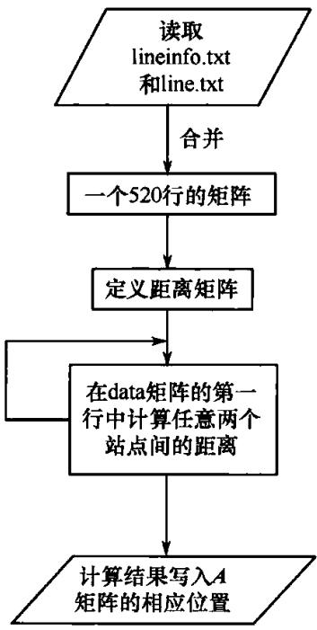

<details>
<summary>flowchart</summary>

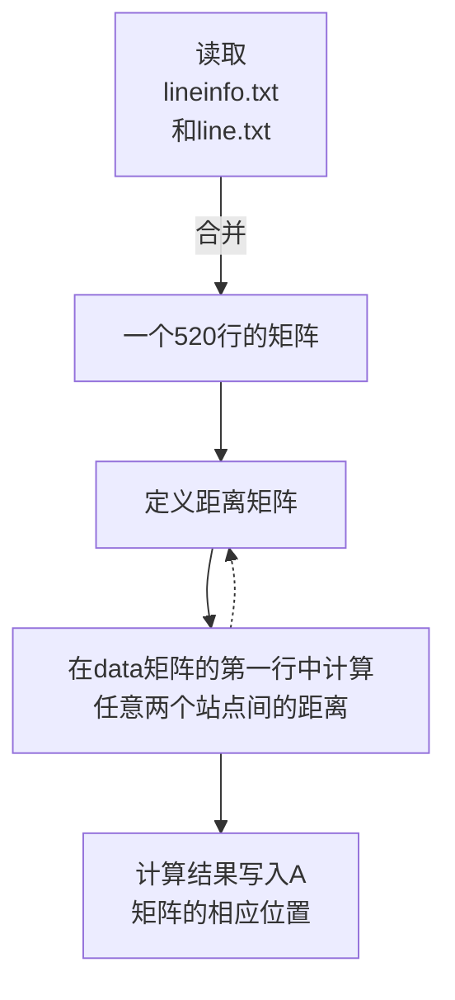
```mermaid
graph TD
  A["读取\nlineinfo.txt\n和line.txt"] -->|"合并"| B["一个520行的矩阵"]
  B --> C["定义距离矩阵"]
  C --> D["在data矩阵的第一行中计算任意两个站点间的距离"]
  D --> E["计算结果写入A\n矩阵的相应位置"]
  D -.-> C
```
</details>

图 1 建立直达站点间距离矩阵算法的流程图

次 $^{[6,7]}$ 。

假设 a 为起点站, b 为终点站, 这种情况下任意两站间的最优乘车方案最终存储在缓冲区 $\mathrm{dist}(a, b)$ 中, 把相应的公交线路名称存储在 line $(a, b)$ 中, 故得出动态更新查询算法:

（1）遍历直达站点间的距离矩阵 A，看 $A_{a,b}$ 是否等于零，若 $A_{a,b}=0$ ，则必须转车；若 $A_{a,b}\neq0$ ，则保留该乘车方案，并将其经过的站点数写入 $\mathrm{dist}(a,b)$ ，同时把相应的公交线路名称存储在 $\mathrm{line}(a,b)$ 中。  
(2) 再次遍历直达站点间的距离矩阵 A, 若还能发现 $A_{a,b} \neq 0$ 的情况, 则将其经过的站点数与 $\mathrm{dist}(a,b)$ 中的值比较, 若小于 $\mathrm{dist}(a,b)$ , 或者原来 $\mathrm{dist}(a,b) = 0$ (即 a、b 间不直达), 则用新的站点数更新原 $\mathrm{dist}(a,b)$ 的值, 同时用新的公交线路名称更新 line(a,b) 的值。  
(3) 按照步骤(2)的思想, 把 $A_{a,b} \neq 0$ 的情况遍历完, 最终确定 dist(a, b) 和 line(a, b) 即为最优乘车方案。此时程序退出, 不执行步骤(4)。  
（4）若遍历完直达站点间的距离矩阵 $\pmb{A}$ 后，发现 $A_{a,b}$ 始终等于0，即说明 $ab$ 之间不存在直达线路，此时考虑转一次车的情况。从站点 $k = \mathrm{S0001}$ 开始考虑分别作为 $a, b$ 的中转站点，使 $A_{a,k} \neq 0$ 且 $A_{k,b} \neq 0$ ，并将此时 $a, b$ 站经过的站点数写入 $\operatorname{dist}(a, b)$ 中，同时把相应的中转站存储在 $\operatorname{middle}(a, b)$ 中，把 $a, k$ 所在车次存储在 $\operatorname{line1}(a, k)$ 中，把 $k, b$ 所在车次存储在 $\operatorname{line2}(a, k)$ 中。同样让 $k$ 的值从1到3957循环，若发现比原来的 $\operatorname{dist}(a, b)$ 的值小或者原来的 $\operatorname{dist}(a, b)$ 的值为0，像步骤(2)中那样用新的值更新原来的 $\operatorname{dist}(a, b)$ 、 $\operatorname{line1}(a, k)$ 和 $\operatorname{line2}(a, k)$ 。同理，如果转一次车可以解决问题，基于转车次数尽量少的原则，就不用考虑转两次车的情况。即若步骤(4)可以给出一个方案，则终止程序执行。  
(5) 若步骤(4)尚不能解决问题, 进入转两次车的环节。与步骤(4)不同的是, 选择两个中转站 $k_{1}, k_{2}$ , 并让 $k_{1}, k_{2}$ 分别在 1 到 3957 之间循环。用 $\operatorname{line1}(a, k_{1})$ 、 $\operatorname{line2}(k_{1}, k_{2})$ 、 $\operatorname{line3}(k_{2}, b)$ 存储车次, 遇到更优的解就自动更新原来的值。

总的来说,这种方案始终遵循转车次数最少的原则,在转车次数相同时,选择途经站点数最少的方案。并且在程序执行过程中,始终采用逐步最优的方法,只要一发现较优的方案,就立即更新原方案的内容。这种动态更新的灵感来自于路由器学习路由表时的一个动态修改过程。用在这里大大简化了矩阵的规格,也简化了程序的运算量。

算法流程图如图 2 所示。

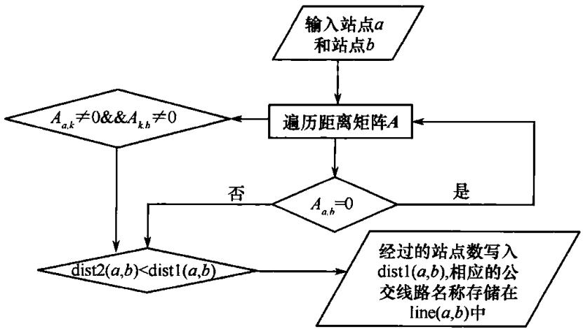

<details>
<summary>flowchart</summary>

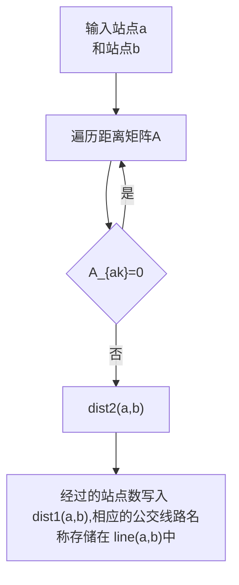
```mermaid
graph TD
  A["输入站点a\n和站点b"] --> B["遍历距离矩阵A"]
  B --> C{"A_{ak}=0"}
  C -->|是| B
  C -->|否| D["dist2(a,b)<dist1(a,b)"]
  D --> E["经过的站点数写入 dist1(a,b),相应的公交线路名称存储在 line(a,b)中"]
```
</details>

图 2 动态更新查询算法流程图

## 5. 遵循耗时最少的原则,给出乘车时间最少的方案

该方案允许做两次以内的转车,对于所有的可到达的方案分别计算其耗时,并且选择耗时最少的方案作为最优方案。基于这一点,假设 a 为起点站,b 为终点站,设计出这样的算法:

（1）先求解出直达的路径中时间最少的方案，由于在直达过程中不考虑转车因素，故可以以途经的站点数来衡量耗时的多少，即途经站点越少，耗时越少。同样采用逐步最优的方法，动态更新途经站点的个数和所乘车次。具体方法同4中的步骤(1)、(2)、(3)。

（2）再求解出转一次车时耗时最少的方案。从站点 $k = \mathrm{S0001}$ 开始考虑分别作为 $a$ 、 $b$ 的中转站点，使 $A_{a,k} \neq 0$ 且 $A_{a,k} \neq 0$ ，并记下此时 $ab$ 经过的站点数 $\operatorname{dist}(a, b)$ 的值，同时把相应的中转站存储在 $\operatorname{middle}(a, b)$ 中，把 $ak$ 所在车次存储在 $\operatorname{line1}(a, k)$ 中，把 $kb$ 所在车次存储在 $\operatorname{line2}(a, k)$ 中。同样让 $k$ 的值从1到9357循环，若发现比原来的 $\operatorname{dist}(a, b)$ 小的值，或者原来 $\operatorname{dist}(a, b) = 0$ ，用新的值更新原来的 $\operatorname{dist}(a, b)$ 、 $\operatorname{line1}(a, k)$ 和 $\operatorname{line2}(a, k)$ 。最终求解出转一次车时耗时最少的方案。

（3）最后求解出转两次车时耗时最少的方案。选择两个中转站 $k_{1}, k_{2}$ ，并让 $k_{1}, k_{2}$ 分别在 1 到 9357 之间循环。用 $\operatorname{line1}(a, k_{1})$ 、 $\operatorname{line2}(k_{1}, k_{2})$ 、 $\operatorname{line3}(k_{2}, b)$ 存储车次，用 $\operatorname{middle1}(a, b)$ 、 $\operatorname{middle2}(a, b)$ 存储中转站的信息，遇到更优的解就自动更新原来的值，通过逐步最优的过程获得转两次车耗时最少的方案。

（4）因为规定最大的转车次数为2,所以只需判断上述三种情况下耗时最少的方案即为整个过程中耗时最少的方案。首先假定不转车的方案耗时最少,然后拿转一次和转两次车的耗时与当前最短时间比较,若小于最短时间,则更新当前的最短耗时。这样一个比较过程后,就可以确定耗时最少的方案。

(5) 输出最短耗时方案, 包括其乘车路线、中转站名称、所花时间和费用。

## 6. 遵循花费最少的原则,给出最省钱的乘车方案

可能有些乘客时间充足仅考虑费用经济。针对这种需求,给出最省钱的乘车方案。在考虑方案之前,必须解决一个如何计费的问题。虽然在 data 矩阵中存储了每条公交线路的收费类型(分段计价或单一票制 1 元),如果严格按照这种收费标准执行,会给实际的编程带来相当大的困难:首先得去矩阵的固定位置读取计费信息,然后如果是分段计费,还要计算每次转车前经过的站点数,根据站点数的不同采取不同的计费标准,当换车次数较多并且每次乘的车都是分段计费时,程序的运行效率较低。所以提出这样的计费方式:对整个乘车过程,对其经过的站点数进行分段计费,分段计费的标准与题目中给出的相同。这种纵观全局的计费标准是有其合理性的:首先,公交公司提出分段计费标准也是基于途经站点越多收费越多的原则;其次,所谓的单一票制 1 元也可以理解为分段计价的子集,即分段计费中站点数小于 20 的那种情况,通过统计单一票制 1 元线路途经的站点数发现,大部分这种计费方式的线路其途经的站点数都小于 20,即如果用分段计价的计费标准去对单一票制 1 元的线路进行计费,其准确性还是相当高的。基于以上考虑,假设 a 为起点站,b 为终点站,为计算花费最少的乘车方案,设计出这样的算法:

（1）先求解出直达的路径中花费最少的方案，同样采用逐步最优的方法，动态更新途经站点的个数和所乘车次。具体方法同4中的步骤(1)、(2)、(3)。

(2) 再求解出转一次车时耗时最少的方案。从站点 $k = \mathrm{S0001}$ 开始考虑分别作为 $a$ 、 $b$ 的中转站点，使 $A_{a,k} \neq 0$ 且 $A_{k,b} \neq 0$ ，并记下此时 $ab$ 站经过的站点数 $\operatorname{dist}(a, b)$ 的值，同时把相应的中转站存储在 $\operatorname{middle}(a, b)$ 中，把 $ak$ 所在车次存储在 $\operatorname{line1}(a, k)$ 中，把 $kb$ 所在车次存储在 $\operatorname{line2}(a, k)$ 中。同样让 $k$ 的值从 1 到 9357 循环，若发现比原来的 $\operatorname{dist}(a, b)$ 小的值，或者原来 $\operatorname{dist}(a, b) = 0$ ，用新的值更新原来的 $\operatorname{dist}(a, b)$ 、 $\operatorname{line1}(a, k)$ 和 $\operatorname{line2}(a, k)$ 。最终求解出转一次车耗时最少的方案。

最后求解出转两次车时耗时最少的方案。选择两个中转站 $k_{1}, k_{2}$ , 并让 $k_{1}, k_{2}$ 分别在 1 到 9357 之间循环。用 $\operatorname{line1}(a, k_{1})$ 、 $\operatorname{line2}(k_{1}, k_{2})$ 、 $\operatorname{line3}(k_{2}, b)$ 存储车次, 用 $\operatorname{middle1}(a, b)$ 、 $\operatorname{middle2}(a, b)$ 存储中转站的信息, 遇到更优的解就自动更新原来的值, 通过逐步最优的过程获得转两次车时花费最少的方案。

（3）因为规定最大的转车次数为2，所以只需判断上述三种情况下花费最少的方案即为整个过程中耗时最少的方案。首先假定不转车的方案花费最少，然后拿转一次和转两次车时的花费与当前最少花费比较，若小于最少花费，则更新当前的最少花费。这样一个比较过程后，就可以确定花费最少的方案。

(4) 输出最少花费方案, 包括其乘车线路、中转站名称和所耗时间及费用。

因为最终计费标准为基于全局的分段计费标准,故最终花费的多少与整个过程中途经站点数目直接相关,花费关于途经站点数目的变化关系如下:

$$
d = \left\{ \begin{array}{l l} 1, & 0 <   x \leqslant 2 0 \\ 2, & 2 0 <   x \leqslant 4 0 \\ 3, & x > 4 0 \end{array} \right. (x \text {表示总计经过的站数}) \tag {1}
$$

## 7. 结论

耗时最少的目标函数：

$$
z = \min \left\{ \begin{array}{l} \min \left(\Delta t \cdot a _ {1}\right), \min \left[ \left(a _ {1} + a _ {2}\right) \cdot \Delta t \cdot + \Delta t ^ {\prime} \right], \min \left[ \left(a _ {1} + a _ {2} + a _ {3}\right) \cdot \Delta t + 2 \cdot \Delta t ^ {\prime} \right] \\ , \dots , \min \left[ \left(a _ {1} + a _ {2} + \dots + a _ {n}\right) \cdot \Delta t + n \cdot \Delta t ^ {\prime} \right] \end{array} \right\}
$$

$$
\text {s.t.} \left\{ \begin{array}{l} a _ {i} \neq 0, i = 1, 2, 3, \dots , n \\ \Delta t = 3 (\min) \\ \Delta t ^ {\prime} = 5 (\min) \end{array} \right. \tag {2}
$$

式中：z 为时间；n 为转车的次数； $\Delta t$ 为公汽每走一个站所需要的平均时间； $\Delta t'$ 为每转一次车所需要的时间； $a_{i}$ 为观众每坐一次车所经过的站点数。

费用最少的目标函数：

$$
\begin{array}{l} \min z = \sum d _ {i} \\ \mathrm{s.t.} \quad d _ {i} = \left\{ \begin{array}{l l} 1, & 0 <   a _ {i} \leqslant 2 0 \\ 2, & 2 0 <   a _ {i} \leqslant 4 0 \\ 3, & a _ {i} > 4 0 \end{array} \right. \tag {3} \\ \end{array}
$$

以上为理论模型,由于查询算法计算时间随着转车次数的增长而快速增长,并且实际生活中大部分人乘坐公汽时转车次数都不超过两次 $^{[5]}$ ,所以计算时考虑最多转两次车。

## 5.3 模型的求解

根据所建立的模型以及查找算法,分别将起始站→终到站为 S3359→S1828、S1557→S0481、S0971→S0481、S0008→S0073、S0148→S0485、S0087→S3676 六条线路输入程序中在距离矩阵中查找,求解得最优出行方案见表 1 \~ 表 12。

## (1) 线路(1)的解答:

表 1 起始站→终到站为 S3359→S1828 时的最优路线表

<table><tr><td></td><td>起始站</td><td>乘车路线</td><td>转车站</td><td>转乘路线</td><td>转车站</td><td>转乘路线</td><td>终点站</td></tr><tr><td>转车最少</td><td>S3359</td><td>L436</td><td>S1784</td><td>L167</td><td>/</td><td>/</td><td>S1828</td></tr><tr><td>时间最短</td><td>S3359</td><td>L324</td><td>S1746</td><td>L485</td><td>S1784</td><td>L167</td><td>S1828</td></tr><tr><td>花钱最省</td><td>S3359</td><td>L324</td><td>S1746</td><td>L485</td><td>S1784</td><td>L167</td><td>S1828</td></tr></table>

说明: 表 1 中由上至下的三条乘车路线依次是从 S3359 站到 S1828 站, 转车次数最少、耗时最短、花钱最省的路线。其中:

表 2 S3359→S1828 最优乘车路线信息表

<table><tr><td></td><td>转车次数</td><td>耗时/min</td><td>花钱/元</td></tr><tr><td>转车最少路线</td><td>1</td><td>101</td><td>3</td></tr><tr><td>时间最短路线</td><td>2</td><td>64</td><td>3</td></tr><tr><td>花钱最省路线</td><td>2</td><td>64</td><td>3</td></tr></table>

## (2) 线路(2)的解答:

表 3 起始站→终到站为 S1557→S0481 时的最优路线表

<table><tr><td></td><td>起始站</td><td>乘车路线</td><td>转车站</td><td>转乘路线</td><td>转车站</td><td>转乘路线</td><td>终点站</td></tr><tr><td>转车最少</td><td>S1557</td><td>L084</td><td>S1919</td><td>L189</td><td>S3186</td><td>L460</td><td>S0481</td></tr><tr><td>时间最短</td><td>S1557</td><td>L084</td><td>S1919</td><td>L189</td><td>S3186</td><td>L460</td><td>S0481</td></tr><tr><td>花钱最省</td><td>S1557</td><td>L084</td><td>S1919</td><td>L189</td><td>S3186</td><td>L460</td><td>S0481</td></tr></table>

说明: 表 3 中由上至下的三条乘车路线依次是从 S1557 站到 S0481 站, 转车次数最少、耗时最短、花钱最省的路线。其中:

表 4 S1557→S0481 最优乘车路线信息表

<table><tr><td></td><td>转车次数</td><td>耗时/min</td><td>花钱/元</td></tr><tr><td>转车最少路线</td><td>2</td><td>106</td><td>3</td></tr><tr><td>时间最短路线</td><td>2</td><td>106</td><td>3</td></tr><tr><td>花钱最省路线</td><td>2</td><td>106</td><td>3</td></tr></table>

## (3) 线路(3)的解答:

表 5 起始站→终到站为 S0971→S0485 时的最优路线表

<table><tr><td></td><td>起始站</td><td>乘车路线</td><td>转车站</td><td>转乘路线</td><td>转车站</td><td>转乘路线</td><td>终点站</td></tr><tr><td>转车最少</td><td>S0971</td><td>L013</td><td>S2184</td><td>L417</td><td>/</td><td>/</td><td>S0485</td></tr><tr><td>时间最短</td><td>S0971</td><td>L013</td><td>S2517</td><td>L290</td><td>S2159</td><td>L469</td><td>S0485</td></tr><tr><td>花钱最省</td><td>S0971</td><td>L013</td><td>S2517</td><td>L290</td><td>S2159</td><td>L469</td><td>S0485</td></tr></table>

说明:表 5 中由上至下的三条乘车路线依次是从 S0971 站到 S048 站,转车次数最少、耗时最短、花钱最省的路线。其中:

表 6 S0971→S048 最优乘车路线信息表

<table><tr><td></td><td>转车次数</td><td>耗时/min</td><td>花钱/元</td></tr><tr><td>转车最少路线</td><td>1</td><td>128</td><td>3</td></tr><tr><td>时间最短路线</td><td>2</td><td>103</td><td>3</td></tr><tr><td>花钱最省路线</td><td>2</td><td>103</td><td>3</td></tr></table>

## (4) 线路(4)的解答:

表 7 起始站→终到站为 S0008→S0073 时的最优路线表

<table><tr><td></td><td>起始站</td><td>乘车路线</td><td>转车站</td><td>转乘路线</td><td>转车站</td><td>转乘路线</td><td>终点站</td></tr><tr><td>转车最少</td><td>S0008</td><td>L159</td><td>S0291</td><td>L058</td><td>/</td><td>/</td><td>S0073</td></tr><tr><td>时间最短</td><td>S0008</td><td>L043</td><td>S1383</td><td>L290</td><td>S2184</td><td>L345</td><td>S0073</td></tr><tr><td>花钱最省</td><td>S0008</td><td>L159</td><td>S0291</td><td>L058</td><td>/</td><td>/</td><td>S0073</td></tr></table>

说明:表7中由上至下的三条乘车路线依次是从S0008站到S0073站,转车次数最少、耗时最短、花钱最省的路线。其中:

表 8 S0008→S0073 最优乘车路线信息表

<table><tr><td></td><td>转车次数</td><td>耗时/min</td><td>花钱/元</td></tr><tr><td>转车最少路线</td><td>1</td><td>83</td><td>2</td></tr><tr><td>时间最短路线</td><td>2</td><td>67</td><td>3</td></tr><tr><td>花钱最省路线</td><td>1</td><td>83</td><td>2</td></tr></table>

## (5) 线路(5)的解答:

表 9 起始站→终到站为 S0148→S0485 时的最优路线表

<table><tr><td></td><td>起始站</td><td>乘车路线</td><td>转车站</td><td>转乘路线</td><td>转车站</td><td>转乘路线</td><td>终点站</td></tr><tr><td>转车最少</td><td>S0148</td><td>L308</td><td>S0036</td><td>L156</td><td>S2210</td><td>L417</td><td>S0485</td></tr><tr><td>时间最短</td><td>S0148</td><td>L308</td><td>S0036</td><td>L156</td><td>S2210</td><td>L417</td><td>S0485</td></tr><tr><td>花钱最省</td><td>S0148</td><td>L308</td><td>S0036</td><td>L156</td><td>S2210</td><td>L417</td><td>S0485</td></tr></table>

说明:表9中由上至下的三条乘车路线依次是从S0148站到S0485站,转车次数最少、耗时最短、花钱最省的路线。其中:

表 10 S0148→S0485 最优乘车路线信息表

<table><tr><td></td><td>转车次数</td><td>耗时/min</td><td>花钱/元</td></tr><tr><td>转车最少路线</td><td>2</td><td>106</td><td>3</td></tr><tr><td>时间最短路线</td><td>2</td><td>106</td><td>3</td></tr><tr><td>花钱最省路线</td><td>2</td><td>106</td><td>3</td></tr></table>

## (6) 线路(6)的解答:

表 11 起始站→终到站为 S0087→S3676 时的最优路线表

<table><tr><td></td><td>起始站</td><td>乘车路线</td><td>转车站</td><td>转乘路线</td><td>转车站</td><td>转乘路线</td><td>终点站</td></tr><tr><td>转车最少</td><td>S0087</td><td>L454</td><td>S3496</td><td>L209</td><td>/</td><td>/</td><td>S3676</td></tr><tr><td>时间最短</td><td>S0087</td><td>L021</td><td>S0088</td><td>L231</td><td>S0427</td><td>L097</td><td>S3676</td></tr><tr><td>花钱最省</td><td>S0087</td><td>L454</td><td>S3496</td><td>L209</td><td>/</td><td>/</td><td>S3676</td></tr></table>

说明:表11中由上至下的三条乘车路线依次是从S0087站到S3676站,转车次数最少、耗时最短、花钱最省的路线。其中:

表 12 S0087→S3676 最优乘车路线信息表

<table><tr><td></td><td>转车次数</td><td>耗时/min</td><td>花钱/元</td></tr><tr><td>转车最少路线</td><td>1</td><td>65</td><td>2</td></tr><tr><td>时间最短路线</td><td>2</td><td>46</td><td>3</td></tr><tr><td>花钱最省路线</td><td>1</td><td>65</td><td>2</td></tr></table>

## 5.4 模型的结果分析与推广

从模型的求解过程中可以看到,无论按转车最少、时间最短还是花钱最省得出的最优方案,大致有这样一些特点:①花钱数只存在2元和3元两种情况。并且大部分方案都是3元,所以说花钱的数量不是影响结果的主要因素。②不同结果的耗时相差比较大,说明大部分人还是很看重时间的。③转车次数以一次为多,说明大部分人还是不太喜欢转太多的车。为了给出一个较为一般的结论,就是综合评价转车最少、时间最短和花钱最少这三个因素而得出的一个普遍意义上的最佳方案,采用加权的方法来解决。具体方法为:考虑各因素的重要性与否,规定权重如下:

（1）首先考虑转乘次数最少，两点之间有直达车时的权值为3，转一次车的权值为2，转两次车的权值为1。由于城市中绝大部分的站台之间最多通过转两次车就可达，所以转三次车以及三次以上的情况不予以考虑。  
(2) 其次考虑花费时间最短, 因为每一路车在两个站点间行驶所花费的时间都是不一样的, 所以只能以三种方案中花费时间最多的为参考标准, 赋予权值为零, 其他两种方案比参考方案每少用 30min 则权值增加 1, 不足 30min 的部分舍弃。  
（3）最后考虑花钱最少，同上步一样，选取花钱最多的方案为参考标准并赋权值0，其他两种方案比参考方案每少花1元钱则权值增加1。

令 M 为评价系数, 则

$$
M = \sum {\frac {\text {因素} _ {i}}{\max (\text {因素} i)}} \times \text {权重} \tag {4}
$$

注：因素 $_{i}$ 表示转乘次数、花费时间、花钱多少。

能使 M 取得最大值的方案即可定为普遍意义上的最佳方案。根据上述计算公式, 将最终结果列成表 13 和表 14。

表 13 最优公交线路表

<table><tr><td></td><td>起始站</td><td>乘车路线</td><td>转车站</td><td>转乘路线</td><td>转车站</td><td>转乘路线</td><td>终点站</td></tr><tr><td>S3359→S1828</td><td>S3359</td><td>L324</td><td>S1746</td><td>L485</td><td>S1784</td><td>L167</td><td>S1828</td></tr><tr><td>S1557→S0481</td><td>S1557</td><td>L084</td><td>S1919</td><td>L189</td><td>S3186</td><td>L460</td><td>S0481</td></tr><tr><td>S0971→S0485</td><td>S0971</td><td>L013</td><td>S2517</td><td>L290</td><td>S2159</td><td>L469</td><td>S0485</td></tr><tr><td>S0008→S0073</td><td>S0008</td><td>L159</td><td>S0291</td><td>L058</td><td>/</td><td>/</td><td>S0073</td></tr><tr><td>S0148→S0485</td><td>S0148</td><td>L308</td><td>S0036</td><td>L156</td><td>S2210</td><td>L417</td><td>S0485</td></tr><tr><td>S0087→S3676</td><td>S0087</td><td>L454</td><td>S3496</td><td>L209</td><td>/</td><td>/</td><td>S3676</td></tr></table>

此时,六条线路的详细信息见表14。

表 14 最优乘车路线信息表

<table><tr><td></td><td>转车次数</td><td>耗时/min</td><td>花钱/元</td></tr><tr><td>S3359→S1828</td><td>2</td><td>64</td><td>3</td></tr><tr><td>S1557→S0481</td><td>2</td><td>106</td><td>3</td></tr><tr><td>S0971→S0485</td><td>2</td><td>103</td><td>3</td></tr><tr><td>S0008→S0073</td><td>1</td><td>83</td><td>2</td></tr><tr><td>S0148→S0485</td><td>2</td><td>106</td><td>3</td></tr><tr><td>S0087→S3676</td><td>1</td><td>65</td><td>2</td></tr></table>

从以上结果可以看出,模型中的算法较好,便于编写程序,并且当输入任意两个站点后程序能很快地得出这两个站点间的最优路线。然而模型中只考虑了观众选乘公汽的情况。由于地面交通比较拥挤,特别是在奥运会期间,北京的人流和车流都将不可避免地猛增,因此公路交通的准时性难以保证。在这种情况下,乘坐地铁就变成一种不错的选择。于是考虑建立模型Ⅱ,在模型Ⅰ的基础上讨论考虑观众可以选乘地铁的情况。

## 5.5 模型的优化

从前面的计算可以看出,每次程序运行时都要处理一个 $3957 \times 3957$ 的矩阵,而且程序运行的时间复杂度随着转车次数的增加急剧增加。所以如果每次在乘客查询时现场计算,将会浪费乘客相当长的等待时间。因此,在这个算法时间复杂度尚无法降低的情况下,可以设计这样一个数据库,它按照转车次数最少、耗时最短、花费最省和总体最优分别记录了任意两个站点间的公交路线,乘客查询的时候,只要输入起点站、终点站和一种希望的乘车方案(转车次数最少、耗时最短、花费最省),系统就能从数据库中查询出合乎乘客要求的乘车方案和一个总体最优方案。而具体的计算工作都在前期完成,这样就可以在乘客查询的时候很快得到结果。

但是,又考虑到前期工作可能做的不会相当完善,让这个系统具有像路由器那样的自学习功能。就是每次接收乘客查询的时候，首先搜索本地数据库，若数据库里已经有了这条路线，那么直接调出来给乘客看。若数据库里不存在这条路线，按么系统在计算完路线后自动将该路线加入数据库，以备日后查询。这样，系统就拥有了一个自学习的知识库，这个知识库的内容将会随着系统使用时间的增长而日益丰富，而系统的运行速度也会随着知识库的丰富而日益加快。

## 6 问题(2): 模型Ⅱ的建立与求解

## 6.1 地铁—公汽映射矩阵模型的建立

## 1. 模型的分析

公路交通往往面临着道路拥挤的问题,又相同站点之间乘坐地铁耗时通常少于乘坐公交,且避免了道路拥挤的问题,守时性较好。对于观看奥运会的观众来说,只有安全准时地到达了比赛场馆才能欣赏到精彩的比赛。因此奥运会期间,地铁将成为一种不可获缺的城市交通工具。

由于模型Ⅰ中仅考虑了乘客乘坐公汽的情况,对于乘坐地铁的情况未讨论,考虑到乘客出行时既可以选择公汽又可以选择地铁的情况于是建立模型Ⅱ。众所周知,地铁的特点就是到站速度快,站与站之间路程长,费用相对公汽高。所以要考察同时考虑公汽和地铁两种交通工具时的最佳路线,就是求出耗费时间最短的路线,因为引入地铁时花费肯定是要增加的(地铁的票价是公汽单一票价时的三倍)。而第一问中已经求出不考虑地铁时耗时最短的路线,所以只要求出考虑地铁时的最佳路线,并将其与第一问中的耗时最短方案比较,耗时短的即为同时考虑公汽和地铁的最佳路线。据问题的假设,观众出行乘坐公交时最多只需转两次车。所以对于乘客而言,他从起始站到终点站假如需要搭乘地铁时的乘车方案有如下几种。

(1) 若乘客出行的起点和终点都有地铁经过。

① 若起点和终点的地铁站台位于同一地铁线路上,则可乘地铁直达。这样省时间又相当方便,不用考虑转车,如图3所示。  
[注]:关于乘车示意图的说明:a,b为起始站点,其他点均为中转站点,粗线表示坐地铁,细线表示坐公交,下同。  
② 若起点和终点的地铁站台不位于同一地铁线路上,则可以考虑换乘地铁或公汽,即利用转一次车的方式到达目的地。换乘地铁时,只需要考虑换乘会耗费一定的时间,而且不支付额外费用,所以换乘地铁的方案是可行的,如图4所示。

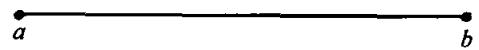  
图 3 起点和终点都有地铁经过(一)

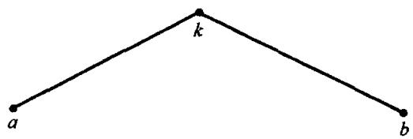

<details>
<summary>text_image</summary>

k
a
b
</details>

图 4 起点和终点都有地铁经过(二)

(2) 若乘客出行的起点和终点只有一处有地铁经过。

① 先坐公交后转车坐地铁,如图 5 所示。

② 先坐地铁后转车坐公交,如图6所示。

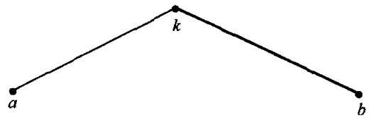

<details>
<summary>text_image</summary>

k
a
b
</details>

图 5 先公交后地铁

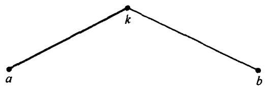

<details>
<summary>text_image</summary>

k
a
b
</details>

图 6 先地铁后公交

(3) 若乘客出行的起点和终点都没有地铁经过。

这种情况下要使乘客能坐上地铁,乘客必须先乘公汽到一个地铁经过的站台,然后转乘地铁,下了地铁之后再转乘公汽到达最终的目的地,如图7所示。

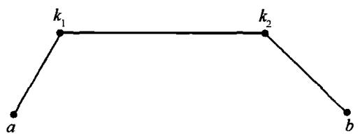

<details>
<summary>text_image</summary>

k₁
k₂
a
b
</details>

图 7 起点和终点都没有地铁经过

综合以上的分析,可以知道,要让乘客能坐上地铁到达目的地,有上述5种情况。求出这5种情况下的最优路线,和问题(1)中的最佳线路比较,就可以得出最后的耗时最短的最佳路线。根据这一思想建立模型Ⅱ。

## 2. 符号说明

(1) $T_{1}B$ : 地铁 $T_{1}$ -公交映射矩阵;  
(2) $T_{2}B$ : 地铁 $T_{2}-$ 公交映射矩阵;  
(3) BT: 公交 - 地铁映射矩阵。

## 3. 模型假设

地铁是双向开的,环形地铁看作顺时逆时两个方向行驶,同上行下行。

## 6.2 理论分析及算法思想

由于问题(2)是对问题(1)的扩充,所以模型Ⅱ仍然可沿用模型Ⅰ的“矩阵查询”算法。即在模型Ⅱ中也可以考虑把地铁站当成公交车站加入矩阵中,求出各站点到其他站点之间(包括公汽站点和地铁站点之间的)的直达最短距离矩阵。但是由于模型Ⅰ中的公汽直达站点间的最短距离矩阵已经有3957×3957的规模,假如再加入地铁站点,地铁站点总共有39个,则生成的矩阵将接近4000×4000,规模相当庞大,在现有的条件下,要想在短时间内通过编程解决该问题,几乎是不可能的。

于是考虑用分块矩阵的思想,即在原有公汽直达站点间的最短距离矩阵的基础上再建立一个只考虑地铁站点之间直达最短距离的矩阵。该矩阵规模为 $39 \times 39$ , 它的每一行和每一列都是一个地铁站台名称, 矩阵中的元素表示行和列两个站台间直达的最短距离。这样, 就将一个本来接近 $4000 \times 4000$ 的矩阵拆成一个 $3957 \times 3957$ 的矩阵和一个 $39 \times 39$ 的矩阵。这样虽然可以大大减少计算量, 可是带来一个新的问题, 如何将这两个矩阵连接起来呢? 于是建立了三个矩阵用于表示公汽和矩阵的映射关系, 分别为地铁 $T_{1}$ -公交映射矩阵、地铁 $T_{2}$ -公交映射矩阵、公交-地铁映射矩阵。下面一一介绍:

（1）地铁 $T_{1}$ -公交映射矩阵 $T_{1}B$ ：根据题中所给的文本文件2.1地铁 $T_{1}$ 线换乘公汽信息.txt，利用模型I中描述的提取信息的方法，提取出有效信息形成该矩阵，矩阵的每一行表示地铁 $T_{1}$ 换乘公汽的信息，第一列为地铁 $T_{1}$ 各站点的名称，以后各列分别为第一列地铁站点所对应的公汽换乘信息，由于换乘的公汽数量不一样，则不足的列用零补齐。例如3303302000表示地铁 $T_{1}$ 的D03号站台可以到达公汽S303和S302号站台。  
(2) 地铁 $T_{2}$ - 公交映射矩阵 $T_{2}B$ : 从文本文件 2.2 地铁 $T_{2}$ 线换乘公汽信息 .txt 中提取信息形成, 方法和内容同(1)。  
(3) 公交－地铁映射矩阵 $BT$ ：该矩阵的第 $i$ 行描述第 $i$ 个公交站台是否可以换乘地铁以及换乘地铁的名称和站点名称。其中第一列表示第 $i$ 个公交站台可以换乘的地铁名称，没有地铁可换乘则第一列为 0，第二列表示第 $i$ 个公交站台可以换乘的地铁站点名称，没有地铁可换乘则第二列也为 0。

关于地铁直达站点间的最短距离矩阵 $TT(39 \times 39)$ 的形成过程与模型 I 中公汽直达站点间的最短距离矩阵 $(3957 \times 3957)$ 的形成过程完全一致。

下面就模型的分析中提出的可以乘坐地铁的各种情况的耗时最短方案分别予以编程解答。

(1) 乘客出行的起点和终点都有地铁经过。

这时要考虑起点和终点的地铁站台是否位于同一地铁线路上，假设起点和终点分别为 $a$ 和 $b$ ，则可以通过查询地铁直达站点间的最短距离矩阵 $TT$ ，看 $TT(a,b)$ 是否为0，若为零，说明站点 $a$ 和 $b$ 不可达；若不为零，则说明站点 $a$ 和 $b$ 可达，记下站点 $a$ 和 $b$ 的距离，记为 $\operatorname{Len}_1(a,b)$ ，因为不存在转车的情况，故耗时可以用站点间的距离来衡量。考虑将另一个地铁站点作为中转站的情况，让该站点 $k$ 在1到39间循环，只要满足 $TT(a,b) = 0$ 且 $TT(a,k)\neq 0,TT(k,b)\neq 0$ ，记下此时的长度，同样运用模型一中逐步优化、不断更新的思想，最终循环完毕后就可以得到在转一次地铁情况下的最有路线，记其长度为 $\operatorname{Len}_2(a,b)$ ，比较 $\operatorname{Len}_1(a,b)$ 和 $\operatorname{Len}_2(a,b)$ 的值，即可求出情况(1)下的最优路线，求出其最短耗时 $T(a,b)$ 。

(2) 若乘客出行的起点和终点只有一处有地铁经过。

① 先坐地铁后转车坐公交：

假设起点和终点分别为 $a$ 和 $b$ , 从公交-地铁映射矩阵 $BT$ 中查找出公汽站点 $a$ 可以转乘的地铁名称及站点名称 $k$ , 再由 $k$ 从 $T_{1}B$ 和 $T_{2}B$ 矩阵中查找出其周围的公交站点 $k_{1}$ , 使得 $k_{1}$ 满足 $A(k_{1}, b) \neq 0$ , 记录下整个过程中耗费的时间 $T(a, b)$ 。然后, 改变 $k_{1}$ 的值, 直至找不到满足 $A(k_{1}, b) \neq 0$ 的 $k_{1}$ 为止, 同样逐步优化, 不断更新 $T(a, b)$ 的值, 得出最终的最优方案。

② 先坐公交后转车坐地铁：

假设起点和终点分别为 $a$ 和 $b$ , 让 $k$ 从 1 到 3957 循环, 满足 $A(a, k) \neq 0$ , 然后在公交 - 地铁映射矩阵 $BT$ 找出 $k$ 可以换乘的地铁站台和 $b$ 可以换乘的地铁站台, 若这两者可以直达, 即可满足先坐公交后坐地铁, 记下这个过程经历的时间 $T(a, b)$ ; 改变 $k$ 的值, 不断更新 $T(a, b)$ 的值, 最终可得出这种情况下的最优路线。

再综合比较①、②的结果,取较小者作为(2)下的最优路线。

## (3) 若乘客出行的起点和终点都没有地铁经过。

此时乘客将采取先坐公交,再转地铁,再转公交的方案才能坐上地铁。为了方便考虑,先考虑两次坐公交的情形,假设起点和终点分别为a和b,第一次公交从a做到 $k_{1}$ ,最后一次公交从 $k_{2}$ 做到b,然后在公交-地铁映射矩阵BT找出 $k_{1}$ 可以换乘的地铁站台和 $k_{2}$ 可以换乘的地铁站台,若两者位于同一条地铁线路上或者通过地铁相转后到达,则这种方案满足要求,记下这个过程的耗时 $T(a,b)$ ,因为 $k_{1}$ 和 $k_{2}$ 均可在1到3957间循环,故在循环的过程中不断优化更新 $T(a,b)$ 的值,最终求出(3)下的最优路线。

最后, 比较(1)、(2)、(3)的结果, 取最小者作为在坐地铁情况下的最优路线, 其耗时为 $T(a, b)$ , 让后把 $T(a, b)$ 和模型一中不考虑地铁的耗时比较, 取较小者即为最终的最优路线。

## 6.3 模型的求解

按照模型的分析里边列举的算法,根据不同的情况分别用 MATLAB 进行编程,求出考虑地铁的最短耗时线路,并与不用地铁时比较,得出最终的最短耗时路线,并可分别计算出每种最优方案的转车次数、耗时和花费。

## 6.4 模型的结果与分析

根据讨论乘客可选乘地铁的情况建立出模型后,分别将起始站→终到站为 S3359→S1828、S1557→S0481、S0971→S048、S0008→S0073、S0148→S0485、S0087→S3676 六条线路代入模型中,用程序求解得最优的出行方案见表 15、表 16。

表 15 考虑地铁的最优线路表

<table><tr><td></td><td>起始站</td><td>乘车路线</td><td>转车站</td><td>转乘路线</td><td>转车站</td><td>转乘路线</td><td>终点站</td></tr><tr><td>S3359→S1828</td><td>S3359</td><td>L324</td><td>S1746</td><td>L485</td><td>S1784</td><td>L167</td><td>S1828</td></tr><tr><td>S1557→S0481</td><td>S1557</td><td>L084</td><td>S1919</td><td>L189</td><td>S3186</td><td>L460</td><td>S0481</td></tr><tr><td>S0971→S0485</td><td>S0971</td><td>L094</td><td>S0567(D01)</td><td>T1</td><td>S0464(D21)</td><td>L104</td><td>S0485</td></tr><tr><td>S0008→S0073</td><td>S0008</td><td>L150</td><td>S3874(D30)</td><td>T2</td><td>S0525(D25)</td><td>L103</td><td>S0073</td></tr><tr><td>S0148→S0485</td><td>S0148</td><td>L024</td><td>S1487(D02)</td><td>T1</td><td>S0464(D21)</td><td>L104</td><td>S0485</td></tr><tr><td>S0087→S3676</td><td>S0087(D27)</td><td>T2</td><td>/</td><td>/</td><td>/</td><td>/</td><td>S3676(D36)</td></tr></table>

表 16 考虑地铁的最优线路信息表

<table><tr><td></td><td>转车次数</td><td>耗时/min</td><td>花钱/元</td><td></td><td>转车次数</td><td>耗时/min</td><td>花钱/元</td></tr><tr><td>S3359→S1828</td><td>2</td><td>64</td><td>3</td><td>S0008→S0073</td><td>2</td><td>55</td><td>5</td></tr><tr><td>S1557→S0481</td><td>2</td><td>106</td><td>3</td><td>S0148→S0485</td><td>2</td><td>87.5</td><td>5</td></tr><tr><td>S0971→S0485</td><td>2</td><td>96</td><td>5</td><td>S0087→S3676</td><td>1</td><td>20</td><td>3</td></tr></table>

由于该模型在搜索的时候是利用穷举的方法,搜索时的运算量非常大,尤其当用户输入的站点需要转多次车时,系统需要较长的运行时间,实时性不好。为了更好地满足客户的需要,重新设计了运算速度较快的站点克隆方法,建立了模型Ⅲ。

## 7 模型Ⅲ的建立与求解

## 7.1 最短路模型的建立

## 1. 模型的分析

为了设计这样一个系统,其核心是线路选择的模型与算法。用户想查询从 A 站到 B 站的公交线路,这可以转化为图论中的最短路问题。由于用户会考虑换乘的次数、出行耗时、距离长短和费用的问题,因此这是一个多目标的最短路问题。在建立模型时要考虑将多目标问题转化为单目标问题。

一个城市的公交线路和站点构成了一个复杂的网络图,这些站点可以看作该网络图的结点,这些结点由相应的公交路线相连。结点之间的边就是公交路线。有的结点之间有边相连(即在某一条公交线上),有的结点之间无边相连(即这两个结点不在任何一条公交线上)。因此,城市的公交路线网络图非常复杂,结点很多,公交线路纵横交错,不同于一般的网络图。

一个公交网络可以描述为一个有向图 $G(V,E,W)$ ，其中 $V(v_{1},v_{2},\cdots,v_{n})$ 是所有站点的集合，n 为站点的个数。E 是站点间连线的集合，W 表示边 E 的权值。但是公交网络不是一般意义下的有向图问题，中间涉及换乘的问题，因而此有向图的权值是动态变化的。给出了有向图描述后，采取 dijkstra 最短路径算法求解起点站和目的站之间的最短路。需要指出的是，这里的最短路不是普通意义下的实际物理最短路，而是基于考虑了换乘的次数、出行耗时、距离长短和费用的问题后得到的最短路径。

dijkstra 算法属于贪心算法,有很高的运算效率,但它要求必须事先知道完整的网络信息,并且是静态信息,而公交网络是一个动态规划的问题,在选择路径的过程中,中间站点的选择,直接影响后续网络的权值。理论上,只有在穷搜索的情况下,才能达到最优解。传统的 dijkstra 算法不适用于此问题,必须对其进行改进。

## 2. 模型的假设与符号约定

为了简化问题同时又符合实际情况,可作如下假设。

（1）在实际情况中，同一线路同一地点的往返车站有的相隔很远，或者具有不同的车站名，相同的车站名有的出现在不同的地点，本文中不考虑以上情况。相邻两战之间的距离都以3min计算。  
（2）根据对乘客出行心理的研究(参考文献[8])，如果换乘次数超过三次，则乘客不会再考虑乘坐公交。因此，可以假设换乘次数不大于3。  
（3）假设同一地铁站对应的任意两个公汽站之间可以通过地铁站换乘(无需支付地铁费)。

符号约定：

V: 公交网络站点的集合；

W: 线路的代价即权值；

E: 公交网络连通图。

## 3. 最短路模型的建立

## 1）数据的处理

公交查询系统所涉及的数据量巨大,数据的正确处理很重要。公交网络由一系列的站点及连接站点的公交线路组成,而公交线路分为三种:单线往返型、环形和往返路线不一致型。公交线路的收费方式又分为单一票制和分段计价,因此,查询数据存储时要记录公交线路、公交线路经过的站点、收费方式和公交线路的型号。

由参考文献[8]可知,公交车的车次是按照一定的标准进行编排的,以北京公交为例:车次在200以下主要是市区车辆,其中:10以下主要是贯穿市区东西和南北的车辆,100以下大致呈斜线或者射线型;100以上200以下是市区内其他不太规则的线路;200以上300以下为夜班车;300以上400以下为联系市区和近郊区的线路,可能会穿越或者环绕三环线;400以上500以下为近郊区之间或者联系近郊和稍远郊区之间的线路;500以上600以下为石景山等稍远郊区运行的车辆;600以上700以下为联系居住住宅小区之间的车辆;700以上900以下开始为附加的月票无效舒适型线路。参照公交车的车次安排,在查询时可以缩小查询范围,减少数据量,如可以将白天线路和夜间线路分开,白天查询时只考虑1到199次公交车和300到520次公交车,晚间查询时,只需要在200到299次公交车中进行选择。

为了计算方便,可以统一公交线路的型号。对于一条公交线路,记录它往返所经过的站点,从而可以忽略掉它的型号。对于单线往返型,记录往返的站点;对于上下行的车次,上行和下行的站点都记录;对于环形,记录经过的所有站点。例如,某条公交线路的站点信息如下:

$$
\begin{array}{r l} & \mathrm{S0619-S1914-S0388-S0348-S0392-S0429-S0436-S3885-S3612-S0819-S3524-S0820-S3914-S0128-S0710(单向往返型)} \end{array}
$$

记录此公交线路的站点信息时,记录的信息如下:

$$
\begin{array}{c} \text {S0619 - S1914 - S0388 - S0348 - S0392 - S0429 - S0436 - S3885 - S3612 - S0819 -} \\ \text {S3524 - S0820 - S3914 - S0128 - S0710 - S0710 - S0128 - S3914 - S0820 - S3524 -} \\ \text {S0819 - S3612 - S3885 - S0436 - S0429 - S0392 - S0348 - S0388 - S1914 - S0619} \end{array}
$$

虽然这样处理公交线路所经过站点,会加大数据量,但是减少了算法的复杂度。处理后的公交车数据信息保存在 line.txt 文件和 lineinfo.txt 中。line.txt 记录了公交线路和站点信息,lineinfo.txt 记录了收费方式和公交线路的型号。

## 2）换乘的考虑

公交换乘的问题的实质就是给出起始点、目标点后，给用户提供乘车方案。所谓乘车方案是一个站点、线路的交替序列，该序列说明从起点出发乘坐何路线，途中如何换乘，直至到达终点。根据文献[8]对公交乘客出行心理的研究，“换乘次数”是大部分公交乘客在选择出行路线时首先考虑的因素，其次是出行耗时、距离长短和费用。而出行耗时与换乘的次数、经过的站点密切相关，费用与换乘的次数、经过的站点也密切相关。因此对于出行耗时与费用问题转化为在换乘次数最少的基础上公交车沿途经过站点最少的问题。换乘次数最少为第一目标，沿途经过的站点最少为第二目标。换乘因素直接影响到公交网络的权值问题，从站点角度出发进行问题分析，克隆站点，从站点找车再从车到站点。

（1）克隆站点产生边权固定的网络。在公汽线路中，每两个站点之间有多条线路可以选择，如图8所示。

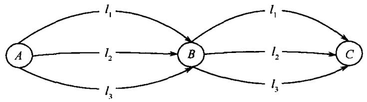

<details>
<summary>flowchart</summary>

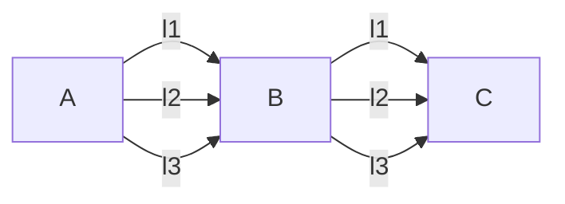
```mermaid
graph LR
  A["A"] -->|"l1"| B["B"]
  A -->|"l2"| B
  A -->|"l3"| B
  B -->|"l1"| C["C"]
  B -->|"l2"| C
  B -->|"l3"| C
```
</details>

图 8 两个站点之间的线路选择

在站点 A 和站点 B 之间有三条公汽路线 $l_{1}$ 、 $l_{2}$ 、 $l_{3}$ ，在站点 B 和站点 C 之间有 $l_{1}$ 、 $l_{2}$ 、 $l_{3}$ 三条公汽路线。如果从 A 到 B 时，选择 $l_{1}$ 号公汽路线，那么同样选择 $l_{1}$ 实现从 B 到 C，将不会产生转乘消耗时间，但如果选择 $l_{3}$ 或者 $l_{2}$ 实现从 B 到 C，则要产生转乘代价（如消耗时间等），可以这样理解：A 到 B 的公汽线路的选择，影响到了 B 与 C 之间线路的选择，这是一个动态规划的问题。本文利用站点的克隆来解决公汽线路选择的相互影响。

站点的克隆就是把有多条公汽线路经过的站点克隆为公汽线路数个。还是以图8为例,站点克隆后如图9所示。

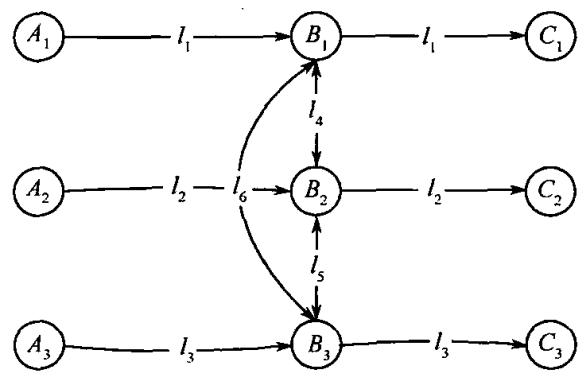

<details>
<summary>flowchart</summary>

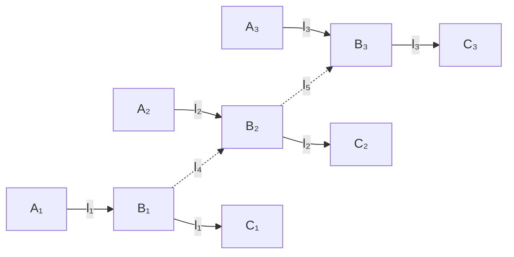
```mermaid
graph LR
  A1["A₁"] -->|"l₁"| B1["B₁"]
  A2["A₂"] -->|"l₂"| B2["B₂"]
  A3["A₃"] -->|"l₃"| B3["B₃"]
  B1 -->|"l₁"| C1["C₁"]
  B2 -->|"l₂"| C2["C₂"]
  B3 -->|"l₃"| C3["C₃"]
  B1 -.->|"l₄"| B2
  B2 -.->|"l₅"| B3
```
</details>

图 9 站点克隆后示意图

因为 $l_{1}, l_{2}, l_{3}$ 全部经过 $A, B, C$ 三个点，所以这三个点分别克隆三个，对应三条路线， $A_{1} \rightarrow B_{1} \rightarrow C_{1}, A_{2} \rightarrow B_{2} \rightarrow C_{2}, A_{3} \rightarrow B_{3} \rightarrow C_{3}$ 分别对应的是利用公汽线路 $l_{1}, l_{2}, l_{3}$ 从 $A$ 到 $C$ ，如果要在 $B$ 点转车，如从 $l_{1}$ 转到 $l_{2}$ ，那么需要一定的代价，在图9中体现在连接 $B_{1}$ 和 $B_{2}$ 的边的权值 $l_{4}$ 。 $l_{4}, l_{5}, l_{6}$ 代表转车的代价。

引入克隆站点后,原来的公汽线路图就变得相对固定。可以在连接两个站点的边上标上相应的代价。这样,如果边权表示的是两站之间的消耗时间,那么对任意两点在理论上都可以用 Dijkstra 求出最小路径,但从题目所给的数据可以分析出,站点的数目太大,一共有 3957 个站点,平均每个站点克隆 5 个就有 19785 个站点,站点数目庞大,所以,下面考虑对问题的简化,具体思路是取出一部分点,对这部分点利用 Dijkstra 求解。

(2) 取有限点集实现快速搜索。首先, 观察图 10。

外面的大方框表示城市地图边界, 图中 A 和 B 分别表示两个区域, 如果要找的两个站点都位于区域 A, 要找它们之间的最短到达时间, 那么找出来的线路经过区域 B 的可能性微乎其微, 这样在计算时, 完全可以不考虑 B 中的点, 以此来降低问题解答的困难度。

本节的目的就是找到一种合适的方案,从原站点中取出一部分,既要使得这部分点的数目尽量少,又要使最后的结果尽可能精确。共尝试了三种方案。

① 有限点集取法之一——全向型取点法。全向型取点法的思路是分别以起点和终点为中心，向外扩散，把其附近的站点都找出来，当起点的扩散区域包含终点时，起点停止扩散；当终点的扩散区域包含起点时，中点停止扩散，如图11所示。

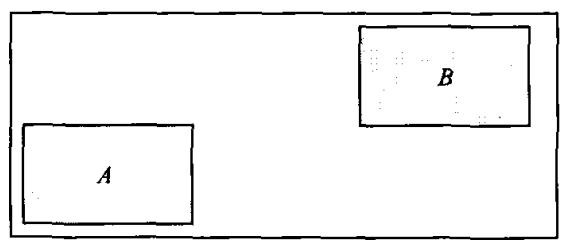

<details>
<summary>text_image</summary>

A
B
</details>

图 10 城市模拟图

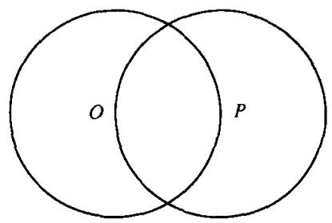

<details>
<summary>text_image</summary>

O
P
</details>

图 11 全向型取点扩散图

O、P 分别代表两个站点，扩散后取得是两圆相交区域的站点。

② 有限点集取法之二——严格方向的取点(可达矩阵)。实践表明,全向型取点法取得的点存在两个问题:一是点数还是太大;二是所取点的质量不高。解决方法是在取点时可以带有方向性,沿着某个方向取点,这样可以克服全向型取点法的不足。

在介绍严格方向的取点方法之前,首先介绍一下可达矩阵。

可达矩阵 R 是指用矩阵形式来描述有向连接图各节点之间, 经过一定的步数可以达到的程度。可达矩阵 R 有一个重要的特性, 即推移律特性。当节点 i 经过一步的通路直接到达节点 k, 而节点 k 经过一步的通路到达节点 j, 那么, 节点 i 经过 2 步可达节点 j。经过推移律进行演算。可达矩阵可以用邻接矩阵加上单位矩阵 I, 并经过一定的演算后求得。 $R = A + I$ 表示各节点间经过一步的可达程度, $R = (A + I)^{r-1}$ 表示表示各节点间经过不大于 r-1 步的可达程度。

对原有站点集合建立可达矩阵,并可以求出,每一个点至少经过多少步可以到达其他的点。有了这个矩阵后,对任意给定的起点和终点,先可查矩阵的得两个点经过多少步可以到达,不妨设为i步,然后从起点查找其周围到终点步数为i和i-1的点,然后分别以找到的点为起点,查找其周围到终点部数为i-1和i-2的点,如此一直找到终点,如图12所示。

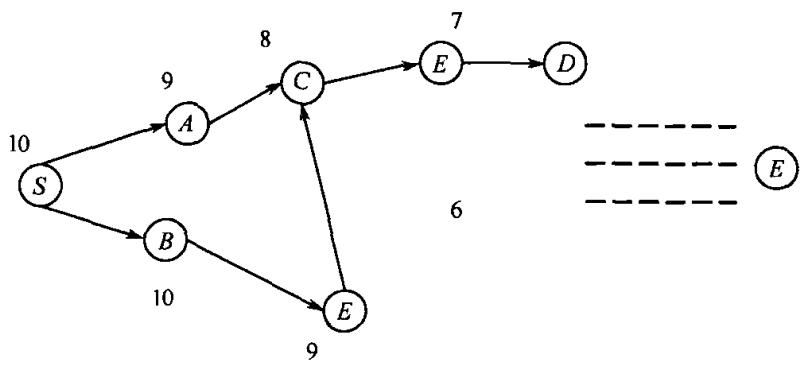

<details>
<summary>flowchart</summary>

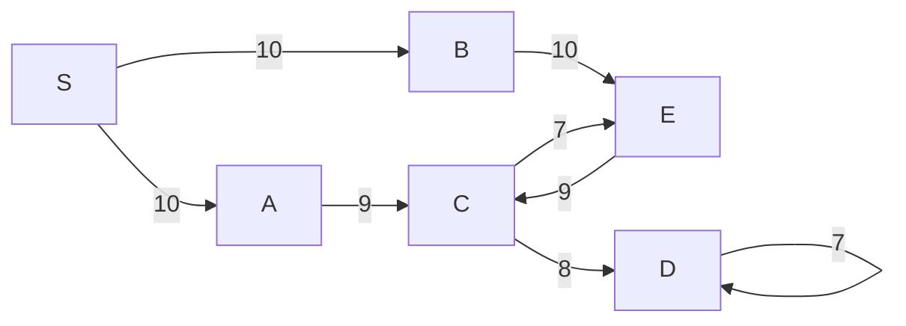
```mermaid
graph LR
  S["S"] -->|10| A["A"]
  S -->|10| B["B"]
  A -->|9| C["C"]
  B -->|10| E["E"]
  C -->|8| D["D"]
  E -->|9| C
  C -->|7| E
  D -->|7| D
```
</details>

图 12 有向推移图

站点旁的数字表示的是站点到终点的部数,从图 12 中可以看出是以部数降低的方向查找站点。

实验表明,这样可以有效减少点的个数。

③ 有限点集取法之三——宽松方向的取点。方法二严格方向的取点过于严格，有可能导致最后取得的点偏离真值太远。最后，采用一种折中的方案，带有稍微扩散的有向取点，这里称为宽松方向取点。具体做法与严格方向的取点一致，只是查找其周围与终点部数为 $i + 4, i + 3, i + 2, i + 1, i, i - 1$ 的点，当然为了使算法收敛，这里设置了一个最大值，可以取起点到终点的部数加上一个不大的整数作为域值，当某个点到终点的距离超过域值时，就不将其包含在内。

经过上一步的取点,以使所要考虑的点数大大减少,此时利用站点克隆,产生一个权值固定的图。当要求取图的不同特性时,只需填入合适的权值即可。

## 7.2 理论分析及算法思想

## 1. 最短路模型

根据本文前一部分的分析,公交网络站点间的权值 $W_{ij}$ 为

$$
W (i, j) = \alpha_ {1} w _ {1} (i, j) + \alpha_ {2} w _ {2} (i, j) \quad (\alpha_ {1} + \alpha_ {2} = 1) \tag {5}
$$

式中： $w_{1}(i,j)$ 为路径选择中转乘次数的权值； $w_{2}(i,j)$ 为路径选择中乘车距离的权值； $\alpha_{1}$ 为路径选择中转乘次数的权重； $\alpha_{2}$ 为路径选择中乘车距离的权重。不同情况下 $\alpha_{1}$ 、 $\alpha_{2}$ 的值不同，当首要考虑转乘次数最少时， $\alpha_{1}$ 的值较大。当首要考虑乘车距离最短时， $\alpha_{2}$ 的值较大，则最短路的目标 f 为

$$
f = \sum_ {i, j \in V} W (i, j) \quad (V \text {为公交站点集合}) \tag {6}
$$

目前公认最好的寻找两顶点间的最短路径算法是 Dijkstra 算法, 它不仅求出从始点到终点的最短路径, 而且最后所得到的实际上是始点到各顶点的最短路径。Dijkstra 算法的步骤如下:

Step1: 初始化。 $V=\{1,2,3,\cdots,N\},S=\{F\}$ ，表示路径的起始点， $D[I]=L[F,I]$ ，

$$
Y [ I ] = F, I = 1, 2, 3, \dots , N
$$

F 表示路径的起始点, I 表示某一顶点, N 表示网络中节点的数目, L[F, I] 表示从 F 点到 I 点的距离, D 为 N 个元素的数组, 用来存储顶点 F 到其他顶点的最短距离, Y 为 N 个元素的数组, 用来存储最短路径中在顶点 I 之前经过的最近顶点。

Step 2: 从 V-S 集合中找一个顶点 T 使得 D[T] 最小, 并将 T 加入到集合 S 中, 如果集合 V-S 是空集合, 则结束运算。

Step 3: 调整 Y、D 数组中的值: 在 V-S 集合中对于顶点 T 的邻接各顶点 I, 如果 $D[I] > D[T] + L[I,T]$ , 那么令 $Y[I] = T, D[I] = D[T] + L[I,T]$ 。

继续执行 Step 2。

对于提取出来的有限点集,用 Dijkstra 算法进行求解。

## 2. 改进的 Dijkstra 算法

改进型 Dijkstra 算法是基于原有算法的基础的扩展算法, 其意图是在每步判断的可选点的基础上加上换乘因素, 这样达到时间和换乘次数兼并考虑的效果。其具体算法流程如下:

Step 1: 选取原点, 放入 chosen 集合中, 将其余点放入 H 的待选集合中。

Step 2: 从 H 集合中选取一点 p, 遍历 chosen 集合中的点。

Step 3: 遍历 chosen 集合中的点, 取一个点 $n$ , 通过 $\text{way}[n][i]$ , 搜索线路集合 line $[a][b]$ , 进行逐站比较, 通过 zhuanchen $[n][i]$ 判断, 找到到达终点 $m$ 的路径的最后一个中转站记为 $q$ , 由 $q$ 开始出发, 判定 $q$ 与 $p$ 的连接路径是否为一条线路, 不是定为转乘, 修改 $a[m][p]$ 的权值, 将 $\text{dist}[m] + a[m][p]$ 与原来的 $\text{dist}[p]$ 进行比较, 去较小的。

Step 4: 取完 chosen 中的点, 记为 num 个, 从 $m$ 个求得的 $\mathrm{dist}[p]$ 中找出使得 $\mathrm{dist}[p]$ 最小的那条线路, 修改 $\mathrm{dist}[p]$ , 记住 $p$ 点前节点。并且记住中间站点转乘次数矩阵 zhuanchen $[M][N]$ 。

Step 5: 找出所有 H 集合中 dist[p] 最小的点 u, 加入 chosen 集合中, 确定 u 的前节点。

Step 6: 如果 H 集合中还有元素, 返回 Step 2, 否则结束, 进行输出。

相应变量说明：

(1) Zhuanchen[M][N]: M 表示终点, N 表示从原点到终点的站序号, 1 表示有转乘, 0 表示无转乘。  
(2) 在已选集合中 chosen 中, 到达各点的路径已经确定, 用 way[N][M] 表示, N 为终点, M 为起点到 N 点第 M 站的结点信息。  
(3) line[a][b]表示公交线路a的第b站的结点数。

## 7.3 模型的求解

最短路模型中, 边的权值为 $W(i,j)=\alpha_{1}w_{1}(i,j)+\alpha_{2}w_{2}(i,j)\quad(\alpha_{1}+\alpha_{2}=1)$ 。考虑两种极值情况, $\alpha_{1}=1,\alpha_{2}=0$ 和 $\alpha_{1}=0,\alpha_{2}=1$ , 即只考虑换乘次数最少和乘车路经最短者两种极端情况(转乘的路径对应的权值是5, 其他路径权值是3)。

当只考虑换乘次数最少时,问题中要求的6对起始站到终到站之间的最佳路线见表17。

表 17 六对站点换乘次数最少条件下的最佳路线表

<table><tr><td>线路</td><td>起始站</td><td>终点站</td><td>换乘次数</td><td>转乘情况</td></tr><tr><td>1</td><td>S3359</td><td>S1828</td><td>2</td><td>L123 - S1842 - L175 - S1671 - L41</td></tr><tr><td>2</td><td>S1557</td><td>S0481</td><td>2</td><td>L084 - S1919 - L417 - S0902 - L312</td></tr><tr><td>3</td><td>S0917</td><td>S0485</td><td>1</td><td>L013 - S2119 - L469</td></tr><tr><td>4</td><td>S0008</td><td>S0073</td><td>1</td><td>L463 - S2083 - L057</td></tr><tr><td>5</td><td>S0148</td><td>S0485</td><td>2</td><td>L308 - S3604 - L129 - S1321 - L104</td></tr><tr><td>6</td><td>S0087</td><td>S3676</td><td>2</td><td>L454 - S1426 - L381 - S0427 - L97</td></tr></table>

当只考虑路径最短时,问题中要求的6对起始站到终到站之间的最佳路线见表18。

表 18 六对站点路径最短条件下的最佳路线表

<table><tr><td>线路</td><td>起始站</td><td>终点站</td><td>换乘次数</td><td>转乘情况</td></tr><tr><td>1</td><td>S3359</td><td>S1828</td><td>5</td><td>L15 - S1327 - L328 - S0525 - L103 - S0073 - L480 - S2704 - L027 - S1784 - L167</td></tr><tr><td>2</td><td>S1557</td><td>S0481</td><td>3</td><td>L084 - S1919 - L189 - S3186 - L091 - S0903 - L312</td></tr><tr><td>3</td><td>S0917</td><td>S0485</td><td>3</td><td>L013 - S1609 - L448 - S2113 - L002 - S2017 - L469</td></tr><tr><td>4</td><td>S0008</td><td>S0073</td><td>4</td><td>L189 - S3766 - L476 - S2085 - L17 - S0604 - L328 - S0525 - L103</td></tr><tr><td>5</td><td>S0148</td><td>S0485</td><td>4</td><td>L308 - S3604 - L81 - S2361 - L156 - S3351 - L417 - S0485 - L045</td></tr><tr><td>6</td><td>S0087</td><td>S3676</td><td>2</td><td>L021 S1427 - L381 - S0427 - L97</td></tr></table>

问题二考虑了地铁与公交的换乘,由于一个地铁站对应多个公交站,可以将地铁站当作一个公交站点,此地铁站到与它对应的公交站点之间可以看作一条公交线,例如:

D01:S0567,S0042,S0025

表示 1 号地铁站对应三个公交车站, 将 1 号地铁站当作一个公交站点 X, 则新增三条公交线:

Line\_new1 : X - S0567

Line\_new2:X-S0042

Line\_new2:X-S0025

两条地铁线当作两条公交线。

用此方法处理所有的地铁站以及与之对应的公交车站,增加了117条公交线。两条地铁线当作两条公交线。

同时考虑公交车与地铁的情况下,同样,根据上面费用的说明,对于公交车和地铁之间的转换来说,费用耗费是相当大的,因此此问题仍可以看作求出最小转乘次数问题。

但在该问题中,会有这样一种情况出现,公交站和地铁站相连,但如何确定这种点间的边权值呢?行人从公交站走到地铁站,换乘了地铁,属于换乘问题,则权值为换乘代价;行人从公交站走到地铁站,再从地铁站出来,换乘了下一公交站,这样属于经过问题,边权值代价为0;如果全部只考虑换乘问题,会有很多次经过地铁站,而不换乘地铁的情况发生,这样有可能将最优解给忽略掉。

解决方法:穷举法,考虑所有的地铁站的两种情况,这样是指数阶增长,对于少点的还可以解决,本题点数很多,显然不可能。概率搜索法,在每次生成邻接矩阵判定上述的权值时,采用概率方式,采用赌轮方法,换成问题定界为[0,0.5],经过问题定界为[0.5,1],用一随机数进行判断,采用问题一的解法进行求解。多求解几次,找出其中换乘次数最小的情况,有可能以概率搜到最优解。

当只考虑换乘次数最少时,问题中要求的6对起始站到终到站之间的最佳路线见表19。

表 19 六对站点考虑地铁时换乘次数最少条件下的最佳路线表

<table><tr><td>线路</td><td>起始站</td><td>终点站</td><td>换乘次数</td><td>转乘情况</td></tr><tr><td>1</td><td>S3359</td><td>S1828</td><td>2</td><td>L123 - S1842 - L175 - S1671 - L41</td></tr><tr><td>2</td><td>S1557</td><td>S0481</td><td>2</td><td>L084 - S1919 - L417 - S0902 - L312</td></tr><tr><td>3</td><td>S0917</td><td>S0485</td><td>1</td><td>L013 - S2119 - L469</td></tr><tr><td>4</td><td>S0008</td><td>S0073</td><td>1</td><td>L463 - S2083 - L057</td></tr><tr><td>5</td><td>S0148</td><td>S0485</td><td>2</td><td>L308 - S3604 - L129 - S1321 - L104</td></tr><tr><td>6</td><td>S0087</td><td>S3676</td><td>0</td><td>T2</td></tr></table>

当只考虑路径最短时,问题中要求的6对起始站到终到站之间的最佳路线见表20。

表 20 六对站点考虑地铁时路径最短条件下的最佳路线表

<table><tr><td>线路</td><td>起始站</td><td>终点站</td><td>换乘次数</td><td>转乘情况</td></tr><tr><td>1</td><td>S3359</td><td>S1828</td><td>3</td><td>L15 - S1327 - L328 - S0525 - L103 - S0073 - L480 - S2704 - L027 - S1784 - L167</td></tr><tr><td>2</td><td>S1557</td><td>S0481</td><td>3</td><td>L084 - S1919 - L189 - S3186 - L091 - S0903 - L312</td></tr><tr><td>3</td><td>S0917</td><td>S0485</td><td>3</td><td>L013 - S1609 - L448 - S2113 - L002 - S2017 - L469</td></tr><tr><td>4</td><td>S0008</td><td>S0073</td><td>4</td><td>L189 - S3766 - L476 - S2085 - L17 - S0604 - L328 - S0525 - L103</td></tr><tr><td>5</td><td>S0148</td><td>S0485</td><td>4</td><td>L24 - S1487 - T1 - S2534 - L156 - S3351 - L417</td></tr><tr><td>6</td><td>S0087</td><td>S3676</td><td>0</td><td>T2</td></tr></table>

## 7.4 模型的结果与分析

模型将公交线路查询问题转化为一个图论中的最短路问题。而公交网络又不是一般的图论问题，它涉及很多复杂的情况，如巨量数据、换乘导致边权动态变化等，模型针对这些问题，提出站点克隆方法，固定了公交网络的边权，同时利用合适的有限点集取法，大大减少数据量，最后用Dijkstra算法进行求解，并对Dijkstra算法进行了改进。

尽管近几年北京的公交事业发展迅猛,城市公共交通很发达,但是由于种种客观因素以及人的需求不同,公共汽车还不能完全满足乘客的意愿,譬如在上下班高峰期发生严重堵车时,步行比乘坐汽车还快。而对于观看奥运会比赛的观众,准时入场是很重要的,所以为了尽可能地节省时间,在堵车时步行则成了最好的选择。于是建立模型IV,讨论当考虑乘客的步行时间时,最优的乘车方案。

## 8 问题(3): 模型IV的建立与求解

## 8.1 按需选路模型的建立

## 1. 模型分析

因为问题中假设已知所有站点之间的步行时间,故当考虑乘客的出行选择时还要考虑到步行方式。一般而言,大部分人在步行与便捷实惠的出行方式之间都会选择后者;只有在通过步行可以得到更优的出行方式时才会选择步行,并且每个人对步行的可承受距离也有一定范围。

## 2. 模型的假设

根据以上分析做出下面的假设。

(1) 普通人从一个站步行到相临的另一个站平均需要 $m(\text{min})$ 。  
(2) 人们在选择出行方式时, 大部分人都是只有在可以获得更优出行路线的前提下才选择步行。譬如减少转乘次数从 a 站到 b 站没有直达车时, 只有当与 a 站相邻的 c 站有车直达 b 站时观众才会步行到 c 站。  
(3) 人们为了得到更优的出行路线而步行时,普通人能接受的最大步行时间为 $2m$ 。

## 3. 模型的建立

根据模型的假设(3)可知,在出行期间普通人为了得到更优的出行路线而步行时,能接受的最大步行时间为2m。所以观众从起始站出发或者中途转车时步行的最大范围是一个以观众所在位置为圆心,以2m时间内可步行的距离为半径的圆形区域。在圆形区域内的任一个公交站,观众都愿意步行到达。于是当考虑步行时仍然可以从转乘次数最少、耗费时间最短、花钱最省三个方面考虑提供给观众最优的乘车方案,最后根据不同人的不同需要综合考虑选择最终的最优方案。根据这一思想建立模型IV。

## 8.2 理论分析及算法思想

考虑步行时间更符合实际情况,具体地说,就是人们在转车时,往往并不是下车后就在下车的那个车站转车,常常需要到另一个车站(比如说对面车站、下一个车站等)去转车。对于这个问题,在车站搜寻的过程中采用“面积”搜索方式,而不是采用“点”搜索方式来解决。因而搜寻转车点时给出一个搜寻的范围,以下车点为中心搜索一定范围内所

有的可转车站的可转车次,而不是只搜寻下车车站的可转车次,这样能满足乘客想转乘次数最少的心理,而此时需要知道公交车站的地理分布图。

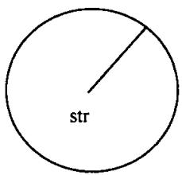

<details>
<summary>text_image</summary>

str
</details>

图13 画圆

## 1. 面积搜索算法

假设问题中乘客的容忍步行距离为 s，起始站为 str，终止站为 dst。具体解决步骤如图 13～图 15 所示。

Step 1: 以 str 站为圆心, s 为半径画圆, 找出在圆覆盖面积的所有站点, 记为 $S_{1}$ 集合 (图 13)。

Step 2: 从 $S_{1}$ 集合中选择点依次作为起始点, 采用问题 2 的算法, 找出每个点为起点的转乘次数最小路径, 放入 dist1 的集合中, 将这些最小路径进行比较, 找出转乘次数最小的那一条路径。

Step 3: 判断转乘次数是否小于等于 3, 如果为真, 则可以接受, 选择该路径进行, 转至 Step 8, 否则转至 Step 4。

Step 4: 在 dist1 的集合中, 找出第一次中转的车站, 记为集合 P。

Step 5: 以 P 集合中的每一个元素为圆心画圆, 找出各圆覆盖站点的集合 $S_{i}$ (图 14)。

Step 6: 重复运用问题 2 算法, 找出每个集合中的最小转乘次数路径, 求出最小转乘次数路径, 如果转乘次数小于 2, 转至 Step 8; 否则, 转至 Step 7。

Step 7: 对于每个 $\mathrm{stri}(i=1,2,\cdots,n)$ 重复 Step 1 至 Step 6 的做法。

step 8: 输出最优路径。

此算法属于近似程度上的穷排列方法,一般一个圈大概以周围平均5个点左右,这样扩展不能超过三步,否则运算复杂度太高。而且这也符合乘客的出行习惯,大部分乘客不会步行超过两站。经过三次重复运算,所遍历的起始点情况也有155个,对于一个城市的公交线路来说,可以求出或者近似求出符合乘客的较为满意的答案。

## 2. 转乘次数最少查询算法

（1）当观众在系统中输入任意两个站点后，找出前面模型中已算出的这两个站间转乘次数最少的路线。

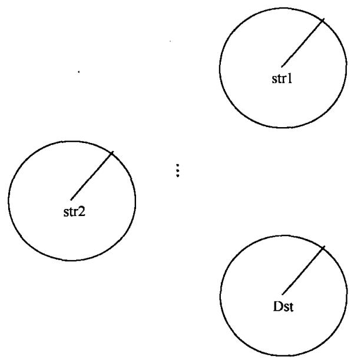

<details>
<summary>text_image</summary>

str2
str1
Dst
</details>

图 14 各圆覆盖站点的集合

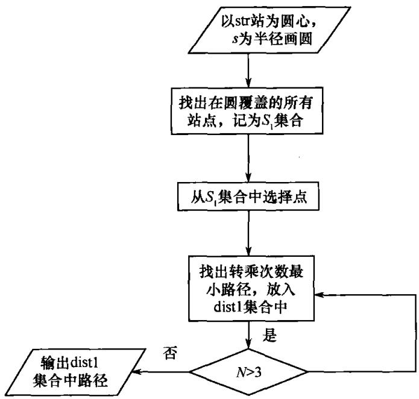

<details>
<summary>flowchart</summary>

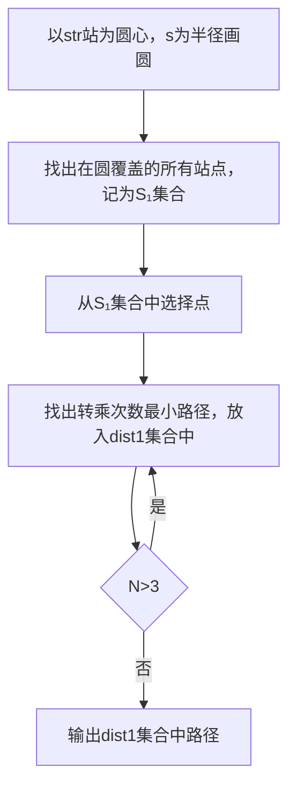
```mermaid
graph TD
  A["以str站为圆心，s为半径画圆"] --> B["找出在圆覆盖的所有站点，记为S₁集合"]
  B --> C["从S₁集合中选择点"]
  C --> D["找出转乘次数最小路径，放入dist1集合中"]
  D --> E{"N>3"}
  E -->|否| F["输出dist1集合中路径"]
  E -->|是| D
```
</details>

图 15 面积搜索算法流程图

(2) 假如两站间是直达的, 则搜索出以起始站为圆心的最大步行区域内所有站点的集合 A, 和以终点为圆心的最大步行区域内的所有站点的集合 B。假如中间有中转站, 则再搜索出以中转站为圆心的最大步行区域内所有站点的集合 $C_{i}$ 。  
(3) 考察起始站、中转站与终点站, 若三者中有两个或两个以上站在同一个步行区域范围内, 则将这些站合并, 看成同一个站。新的转乘次数最少路线中, 这些站之间不坐车而是通过步行到达, 以达到减少转乘次数的目的。

## 3. 耗费时间最短查询算法

（1）当观众在系统中输入任意两个站点后，已算出这两个站间耗费时间最短的路线以及所耗费的时间。  
(2) 假如两站间是直达的, 则搜索出以起始站为圆心的最大步行区域内所有站点的

集合 A, 和以终点为圆心的最大步行区域内的所有站点的集合 B。假如中间有中转站则再搜索出以中转站为圆心的最大步行区域内所有站点的集合 $C_{i}$ 。

（3）考察起始站、中转站与终点站，若三者中有两个或两个以上站在同一个步行区域范围内，则分别算车这些站之间乘车到达一共需要花费的时间（包括转车时间）和步行到达需要的时间。假如乘车时间大于步行时间，则将时间较长的站合并，看成同一个站。新的耗费时间最短路线中，这些站之间不坐车而是通过步行到达，以达到减少时间耗费的目的。

## 4. 费用最省查询算法

（1）当观众在系统中输入任意两个站点后，找出前面模型中已算出的这两个站间耗费时间最短的路线以及所耗费的时间。  
(2) 假如两站间是直达的, 则搜索出以起始站为圆心的最大步行区域内所有站点的集合 A, 和以终点为圆心的最大步行区域内的所有站点的集合 B。假如中间有中转站则再搜索出以中转站为圆心的最大步行区域内所有站点的集合 $C_{i}$ 。  
（3）考察起始站、中转站与终点站，若三者中有两个或两个以上站在同一个步行区域范围内，则将这些站合并，看成同一个站。新的费用最省路线中，这些站之间不坐车而是通过步行到达，以达到减少转车费用的目的。  
（4）假若原先得路线中，某一直达车经过的站数刚好超过分段计价的票价的临界一两站时，则可选则先沿路线方向走一两站，使车费保持在较小的范围内。

## 5. 综合考虑

当求出最优路线后,由于不同人对于最优路线的认同感不同,所以还需综合考虑三种局部最优的方案,做出一个合理的评价标准,来衡量三种方案中的最优。

（1）首先考虑转乘次数最少，两点之间有直达车时的权值为3，转一次车的权值为2，转两次车的权值为1。由于城市中绝大部分的站台之间最多通过转两次车就可达，所以转三次车以及三次以上的情况不予以考虑。  
(2) 其次考虑花费时间最短, 因为每一路车在两个站点间行驶所花费的时间都是不一样的, 所以只能以三种方案中花费时间最多的为参考标准, 赋予权值为零, 其他两种方案比参考方案每少用 30min 则权值增加 1, 不足 30min 的部分舍弃。  
（3）最后考虑花钱最少，同上步一样，选取花钱最多的方案为参考标准并赋权值0，其他两种方案比参考方案每少花1元钱则权值增加1。

于是三个方案的综合权值的目标函数为

$$
\max w _ {i} = a _ {i} + c _ {i} + d _ {i} (i = 1, 2, 3)
$$

$$
\begin{array}{l} \text {s.t.} \left\{ \begin{array}{l l} a _ {i} = \left\{ \begin{array}{l l} 1 & \text {转两次车} \\ 2 & \text {转一次车} \\ 3 & \text {直达} \end{array} \right. \\ c _ {i} = \left\{ \begin{array}{l l} 0 \\ 1 \\ \dots \end{array} \right. \\ d _ {i} = \left\{ \begin{array}{l l} 0 \\ 1 \\ \dots \end{array} \right. \end{array} \right. \end{array} \tag {7}
$$

式中： $a_{i}, c_{i}, d_{i}$ 分别表示考虑转乘次数最少时的权值，考虑花费时间最短的权值，考虑花钱最少的权值。根据这一评价方法，不同人可根据自己的喜好选择适合自己的出行路线。

## 9 模型的优缺点分析与推广

## 9.1 模型的优缺点分析

本文一共建立了四个模型,模型Ⅰ和模型Ⅱ分别构造了站点之间的距离矩阵,以及相对应的车次矩阵,当用户输入起始站点和终止站点后,系统将在矩阵中搜索出全局最优的乘车路线,输出的结果可靠性比较高,但是当需要转车的次数增大时,程序的计算量增大,系统的响应时间会有一定延长。

模型Ⅲ针对模型Ⅰ和模型Ⅱ不擅长于处理多次转车的特点,利用改进后的 Dijkstra 算法能较快地输出查询结果,满足系统的实时性,但是该模型是从局部最优的角度考虑的,有时候输出的结果只是局部最优。并且模型Ⅲ在实现的过程中设计了精美的系统界面,具有很强的实用性。

因为实际应用中可靠性和实时性往往是冲突的,所以模型Ⅰ、Ⅱ和模型Ⅲ相互补足,各有所长,都能够满足不同需求下查询处最优乘车方案。模型Ⅳ从理论的角度对模型Ⅰ、Ⅱ和模型Ⅲ的优点进行了融合。在假设已知平均每两站间步行时间的条件下选择乘车方案做出了理论分析。

## 9.2 模型的推广

模型 I、II、III、IV 分别从不同侧面满足了系统的设计要求, 具有较强的合理性和实用性。并且四个模型根据条件的改变由浅入深, 步步拓宽, 符合实际问题的解决方法和步骤, 更重要的是得出的结果与实际情况相类似, 具有较强的可推广性。

但是模型IV还存在一定的不足,譬如对于公共汽车查询,模型针对不同的人、不同的时段、不同的区域也只能给出一个相同的大案,致使系统缺乏人性化。由于时间和精力有限,并且人与人之间的喜好差别很大,在此不能一一地解决。

## 10 问题研究报告

尊敬的公交线路选择系统研发公司：

2008年8月我国人民翘首企盼的第29届奥运会将在北京举行，这给了北京乃至全国一个向世界展示自我美好形象的舞台。届时可能会有数百万计的外宾云集北京，国内也会有成千上万的人奔赴北京一睹奥运风采；对于他们而言，大多数人都是首次到北京，因此公交线路选择系统的好坏将直接影响他们出行的方便程度；并最终影响到他们对北京乃至中国的满意度，一个好的公交选择系统的作用不言而喻。

通过对题中所给的北京公交线路数据的处理,以及对问题的建模和设计算法后,我们对如何做出一个好的公交查询系统有以下几点建议。

## 1. 深入调查、多方面考虑

一个好的公交线路查询系统不仅要包含北京市所有公交线路的信息,保证能及时准确地输出查询信息,而且还要多从查询者的角度考虑,增强人性化服务。这就需要公司在建立模型和设计算法之前尽量多做调查,争取尽量多地了解各条线路和各个站台的情况,同时影响观众出行的因素要尽量多地考虑。譬如题目中没有考虑到挤公交的情况,由于北京人口众多,特别是上下班高峰期间,主城区的公交会特别拥挤。一般而言,观光的乘客在上下班高峰期间不会过分地急于用最短的时间到达目的地,此时观众可能更偏好于乘车的舒适度,针对这种情况系统可以根据不同时段不同区域给出在当时情况下最优的路线。

## 2. 一条线路提供多种方案,增强系统的适用性

譬如有两个站台本来是不能直接到达的,但刚好起始站点旁边很近的一个站台有车与终点站台直达,则观众即可转乘其他公交到达中转站也可步行到终点站,面对这一选择时不同人会有不同的偏好,假如一概而论地只给出一种方案则系统的适用性会大大下降。所以系统在提供路线选择的参考时,应该容许多种方案并存,并且给出的各方案之间要有一个清晰的比较,使用户能对每条线路的优缺点一目了然,同时,作为查询系统还应该给出一个综合评定后较优的方案辅助用户做出选择。

## 3. 合理设计算法,保证查询效率和准确程度

当用户在查询线路时,都希望得到一条准确高效的路线,且人与系统的交互时间不能太长,这就对系统的可靠性和查询效率提出了较高的要求。并且公交选择系统的数据量都非常大,要做到可靠性和实时性,则系统查询的算法就变得极其重要。搜索的方法可以多种多样,但是不论采用何种算法,系统的可靠性和实时性都应该是摆在首位的。

以上是我们通过对问题的分析和思考后得出的三点建议。举办奥运是中国人民多年的梦想,能够举办奥运也是祖国崛起的象征。我们希望自己三天的努力能够对2008年奥运尽一份力,祝2008年奥运会圆满成功,祝愿祖国更加繁荣昌盛!

## 参考文献

[1] 飞思科技产品研发中心. MATLAB7 基础与提高. 北京: 电子工业出版社, 2006.  
[2] 袁新生, 邵大宏, 郁时炼. LINGO 和 Excel 在数学建模中的应用. 北京: 科学出版社, 2007.  
[3]《运筹学》教材编写组．运筹学．北京：清华大学出版社，1990.  
[4] 苏金明, 阮沈勇, MATLAB 实用教程. 北京: 电子工业出版社, 2005.  
[5] 于小平, 杨国东, 王凤艳, 等. 城市公交查询系统的设计与实现. 吉林大学学报自然版, 2005, 23(6): 665-668.  
[6] 胡鹏, 黄杏元, 华一新. 地理信息系统教程. 武汉: 武汉大学出版社, 1999.  
[7] MICHAEL DEMEBS. 地理信息系统基本原理. 北京: 电子工业出版社, 1999.  
[8] 北京公交车上的车次是按照什么标准进行排序的？http://dd.dei9813.cn/wenzhang.asp?art\_id=9642.2007-9-23.

## 【论文点评】

刘守生

该论文利用数据库知识、图论方法以及规划理论建立了四个模型,对三个问题进行了详尽的回答。文章内容丰富,条理清楚,层次分明。这充分反映了该队同学不仅数学功底深厚,计算机编程以及论文的组织能力也很强。

文章首先将题目的海量数据以距离矩阵、路线矩阵、时间矩阵以及费用矩阵的形式记录下来，为后面模型的建立和求解奠定了良好的基础。针对问题(1)和(2)建立的矩阵查询模型和最短路模型，设计合理，尽显数据库模型和图论模型的优势，使得全局搜索不显用时长、Dijkstra算法的应用不显太呆板。针对问题(3)建立的按需选路模型，各种情况的处理方案分析细致，所作的各种假设也比较符合实际情况。

文章尚有一些不足之处,如对距离矩阵的定义不够清楚;转乘次数最少与花费时间最短的关系用得较乱,不同模型的比较欠缺。

# 公交线路的自主查询系统

## 摘要

本文首先对数据进行处理和分析,根据图论中加权有向图的理论建立了公交站的最小站距矩阵 $\boldsymbol{A}=(a_{ij}), a_{ij}$ 表示 Si 站到 Sj 站的最小站数。利用该矩阵进行全搜索解决了一个由公共汽车和地铁组成的公交系统的最佳线路选择问题。

以考不考虑“利用地铁站公汽换乘公汽”为区别,将问题(1)分为两部分。首先不考虑利用地铁站公汽换乘公汽,通过对规划目标的讨论、公汽线路信息的研究、各站之间最小站程的确定和可行线路的搜索以及最佳线路的选择,逐步建立起用于选择最佳线路的全搜索模型,用此模型对题中六组数据进行了求解并进行了清晰、详尽的检验和评价。接下来利用地铁站公汽换乘公汽,构造了一个虚拟公交线路的方法,将同一地铁站周围的公交车串联起来,通过全搜索解决了该问题,并同样对六组数据进行了求解和分析。

问题(2)中,再次运用改进后的全搜索模型,结合公汽—地铁网的特点,建立公交站的最小地铁站距矩阵,方便了模型的求解。对六组数据进行求解后,结合上文所有结果对各种因素进行了整体评价。

问题(3)中,从实际出发,定性分析了步行的作用和对最佳线路选择的影响,并构造了该问题的模型和算法。

我们的模型效率较高,能够满足查询者的各种不同需求,有很强的实用性。

对六组数据在不同条件和要求下的求解结果见表1至表7,认为最佳线路的判别标准为:综合考虑换乘次数、时间、车费,根据个人的不同需求得出最佳线路。

关键词:公交线路,最小站距矩阵,虚拟线路

## 1 问题的重述

第29届奥运会2008年8月将在北京举行，届时到现场观看奥运比赛的大部分观众将会乘坐公共交通工具(简称公交，包括公汽、地铁等)出行。这些年来，城市的公交系统有了很大发展，公交线路繁多，使得公众的出行更加通畅、便利，但同时也面临多条线路的选择问题。针对市场需求，某公司准备研制开发一个解决公交线路选择问题的自主查询计算机系统。

设计这样一个系统需要注意：

(1) 线路选择的模型与算法必须利于程序的实现。  
(2) 应该从实际情况出发考虑,满足查询者的各种不同需求。

请你们解决如下问题：

（1）仅考虑公汽线路，给出任意两公汽站点之间线路选择问题的一般数学模型与算法。并根据附录(公交线路及相关信息数据)，利用你们的模型与算法，求出以下6对起始站→终到站之间的最佳路线(要有清晰的评价说明)。

① S3359→S1828

② S1557→S0481

③ S0971→S0485

④ S0008→S0073

⑤ S0148→S0485

⑥ S0087→S3676

(2) 同时考虑公汽与地铁线路, 解决以上问题。

（3）假设又知道所有站点之间的步行时间，请你给出任意两站点之间线路选择问题的数学模型。

为简化问题而设的基本参数：

相邻公汽站平均行驶时间(包括停站时间): 3min。

相邻地铁站平均行驶时间(包括停站时间): 2.5min。

公汽换乘公汽平均耗时：5min(其中步行时间2min)。

地铁换乘地铁平均耗时：4min(其中步行时间2min)。

地铁换乘公汽平均耗时：7min(其中步行时间4min)。

公汽换乘地铁平均耗时：6min(其中步行时间4min)。

公汽票价:分为单一票价与分段计价两种,标记于线路后;其中分段计价的票价为:0\~20站:1元;21站\~40站:2元;40站以上:3元。

地铁票价:3 元(无论地铁线路间是否换乘)。

## 2 符号说明

Si: 编号为 i 的公汽站点;

Lk: 编号为 k 的公汽线路;

Di: 编号为 i 的地铁站点;

Tk: 编号为 k 的地铁线路;

T: 从起始站到终到站所需的时间(单位:min);

M: 从起始站到终到站所需的费用(单位:元);

A: 最小公汽站距矩阵;

B: 最小公汽站距对应的线路编号矩阵;

sub-A：最小地铁站距矩阵；

sub-B：最小地铁站距对应的线路编号矩阵；

x：从起始站到终到站的一条可行线路；

X: 可行线路相关信息矩阵;

data\_01：公汽线路信息数组；

data01：公汽站点信息数组；

data02：地铁站换乘公汽信息矩阵。

其余一些不常用的变量在文章中用到时会在后面注明。

## 3 问题的初步分析

## 3.1 问题的假设

选择公交线路是日常生活中经常遇到的问题,每个人对此都有一些感性的认识,比如宁可绕点圈子也不愿反复换乘车(因为等车的时间总比坐车的时间感觉漫长)等。基于此,我们的模型联系实际做了一些假设和近似,这与题目“从实际情况出发”的要求也是一致的。

（1）公汽线路间的换乘只能是在同一公汽站或是在对应的地铁站。  
(2) 从起点步行至通过地铁站相连的车站和从某站(通过地铁站与终点相连)步行至终点所花费的时间不计入总乘车时间。  
（3）在公汽线路的环线上乘车经过起始站/终到站不另外收费，且环线上有顺时针和逆时针两种走法。  
（4）多数人们至多只能接受转两次车，所以假设不管耗时或花费多少，优先选择转两次以内的车能够到达的线路（当然如果无论如何两次之内到达不了，只能转两次以上）。事实上，如果换乘次数不限，将有无数条可行线路。

## 3.2 问题的层次

通过分析,得到三个问题之间的层次关系为,如图1所示。

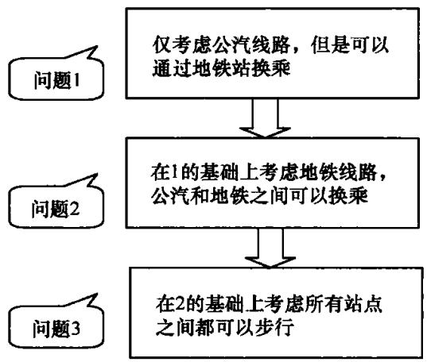

<details>
<summary>flowchart</summary>

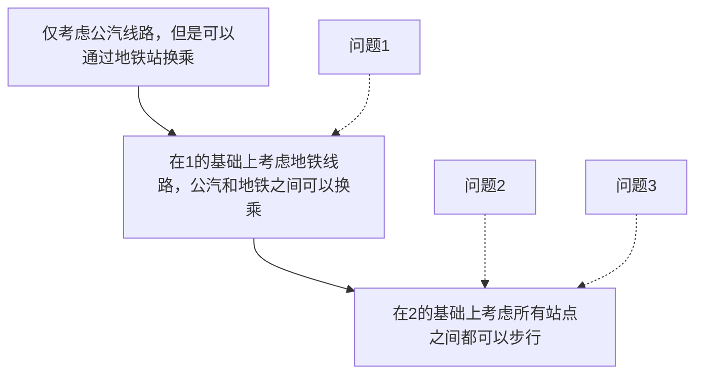
```mermaid
graph TD
  A["仅考虑公汽线路，但是可以通过地铁站换乘"] --> B["在1的基础上考虑地铁线路，公汽和地铁之间可以换乘"]
  B --> C["在2的基础上考虑所有站点之间都可以步行"]
  D["问题1"] -.-> B
  E["问题2"] -.-> C
  F["问题3"] -.-> C
```
</details>

图 1 三个问题之间的层次关系

## 3.3 需求分析

要开发此公交线路选择的自主查询计算机系统至少需要满足以下要求。

（1）模型的算法要利于程序的实现和在现实中的推广应用。即用户输入起始站和终到站两个参数后要在尽量短的时间内得到最佳的公交线路走法。  
(2) 要满足查询者的各种不同需求。所谓“不同需求”: ①乘公交的时间要尽量少; ②车费要尽量少; ③转车次数要尽量少。

因此我们认为,算法简单易行是本文建立模型的最重要标准。

## 3.4 研究方向与算法选择

（1）如果将此公交系统看成一个赋权图(其权为各站点之间所用时间或车费,其方向为线路类型所决定的行驶方向),这就是一个求最短路问题,但又不是一般的最短路问题,因为各边的权有时间和费用两种,而在各站点又有换乘时间等不定因素的影响。即使分别赋两种权,运用 Dijkstra 标号法求最短路对换乘费用的处理仍难以操作,需要加以改进。  
（2）由于某段的线路选择会直接影响下一段线路的选择以及全局最优线路的结果，这就启发从全局的角度去建立模型。

首先求出任意两站之间的最短距离,结合时间和费用的计算方法给所有邻接线路赋权;然后按照换乘的次数(即图的通路上的边数减1)分别求出换乘次数一定的最佳线路;最后比较所有线路得到全局最佳线路。

事实上,模型的核心算法是换乘次数一定时对所有可行线路的搜索,这种搜索通过对各站点的搜索,得到所有可行线路并比较出最佳线路。

（3）附录中的数据量很大，尤其是公汽线路(线路有520个，站点有3957个)，且乘车方式多元、换乘情况复杂。画图并从图中找规律的尝试是行不通的，这就需要将各个站点和各条线路的数据矩阵化，通过有序而全面的搜索，用编程的方法实现，因此，关键是在编程的过程中大胆假设、分清主次、简化算法。

## 4 数据处理

数据的处理是和我们的模型与算法密切相关的,即有什么样的模型算法就对应着特定形式的数据处理。根据上面对问题的分析,在解决该问题的过程中,要找的最佳路线,是通过搜索出所有可能线路对应的目标值、然后比较目标值得到的,而搜索的对象就是跟优化目标密切相关的数字矩阵。

可以通过以下的方法进行数据处理: 把“1.1 公汽线路信息 .txt”、“2.1 地铁 T1 线换乘公汽信息 .txt”和“2.2 地铁 T2 线换乘公汽信息 .txt”三个文本文件导入到 MATLAB 中, 成为细胞元矩阵; 然后将细胞元矩阵转化为字符矩阵; 再提取出字符矩阵中的数据信息, 生成数字矩阵; 最后根据生成的数字矩阵运算出最终函数调用的数字矩阵。

## 5 相关理论应用

构造 $V=\{V1,\cdots,Vn\}$ ，Vi 表示第 i 个站点，n 为车站的总数。如果 Vi 到 Vj 有直达线路，则从 Vi 到 Vj 画有向弧 $E_{ij}, E_{ij}$ 就对应于从 Vi 到 Vj 的一条有向线路；又定义 $W_{ij}$ 为 $E_{ij}$ 所对应的站距，这样就将公交线路网抽象为一个赋权有向图 $G(V,E,W)$ 。

求从 $V_{i}$ 到 $V_{j}$ 的一条最佳线路，就转化为 $G(V,E,W)$ 中的最短路问题。

## 6 模型的建立

题目的要求是给出任意两站点之间的最佳线路。所谓最佳线路不外乎是指某个指标(时间或费用)最小的线路,对此指标的探讨和计算就是我们建立模型的目的。通过问题的分析,给出此规划模型的一般形式:

$$
\begin{array}{l} \min _ {x \subset L} \left\{T (x), M (x) \right\} \\ \left\{ \begin{array}{l} g (x) \leqslant 0 \\ h (x) = 0 \end{array} \right. \\ \end{array}
$$

式中：x 为某可行线路； $T(x)$ 为此线路所需的时间； $M(x)$ 为此线路所需的费用。

$g(x) \leqslant 0$ 和 $h(x) = 0$ 是对次线路的某些限制。

现在,要运用全搜索等方法对其进行求解。

## 7 问题(1)公汽站点间的线路选择

在该问中,题目要求根据附录数据,仅考虑公汽路线,给出任意两站之间路线选择的数学模型和算法。而在附录数据中,关于公汽路线的有两种数据:一种是仅有公汽的数据;另一种是关于公汽和地铁的数据。现在的问题就是用还是不用后一种数据,不妨这样处理:把两种情况都算一下,等结果出来后再分析用还是不用。

## 7.1 不考虑地铁站换乘的全搜索模型

## 7.1.1 对规划目标的讨论

由于公众乘坐公交的原因有两个:比步行或骑自行车省时、比坐出租车省钱,那么在选择公交线路时省时和省钱两个方面都必须考虑。提出双目标规划问题:

$$
\begin{array}{l} \min _ {x \subset L} \left\{T (x), M (x) \right\} \\ \left\{ \begin{array}{l} g (x) \leqslant 0 \\ h (x) = 0 \end{array} \right. \\ \end{array}
$$

式中： $g(x) \leqslant 0$ 和 $h(x) = 0$ 表示可行线路所要满足的某些条件。

根据公众的乘车要求和习惯不同,分以下三种情况讨论。

（1）选择不同的线路只有几元钱的花费差别，对于不太计较几元钱得失的乘客来说，节省时间是最重要的，需要将 $T(x)$ 作为规划目标。  
(2) 有些人乘公交的选择主要源于出租车的高昂价格, 因此乘公交的价格稍高的话就会使其难以接受, 对这部分人来说, 宁可多花点时间, $M(x)$ 最小才是重要的。  
（3）由于公众的心理作用,有些人很在意转车的次数,即使只是多转一次,因此,必须将换乘次数也考虑在规划目标之内。

需要指出的是,以上规划目标的选择是考虑一般情况的结果,并非必须如此。当然以上三种选择基本上可以满足公众的需求。

## 7.1.2 对公汽线路信息的研究

公汽线路的类型是有差别的：

（1）按票价信息分为单一票制和分段计价，反映在信息表每条线路的第二行；两种线路有不同的收费方法。  
(2) 按线路的循环模式分为单线(分为上下行不一致的Ⅰ型和上下行一致的Ⅱ型两种)和环线(设为Ⅲ型), 反映在信息表每条线路的第三、四行; 两种线路有不同的计站方法;

为此,把公汽线路信息表做成如下 $2080 \times 1$ 的结构数组——“公汽线路信息数组”da-ta\_01:

（1）第 $k$ 条公汽线路的信息占用数组中的第 $4k - 3$ 到 $4k$ 行 $(k = 1\sim 520)$

(2) 对第 k 条公汽线路:

① 第 4k-3 行为线路编号, 以字符 L 开头。  
② 第 4k-2 行为票价信息, 以字符“单”(代表单一票制) 或“分”(代表分段计价) 开头。  
③ 第 4k-1、4k 行的内容对不同循环模式的线路有所区别。

对于Ⅰ型线路,第4k-1行表示上行线路,以字符“上”开头,第4k行表示下行线路。

对于Ⅱ型线路,第4k-1行表示全程线路,以字符“S”开头,第4k行是空字符。

对于Ⅲ型线路,第4k-1行表示全程线路,以字符“环”开头,第4k行是空字符。

截取 data\_01 中的一段以说明其结构：

$$
\left[ \begin{array}{c} L 0 0 1 \\ \text {分段计价} \\ \mathrm{S0619-S1914-S0348-S0392-S0436-...} \\ L 0 0 2 \\ \text {分段计价} \\ \text {上行: S3748 - S2160 - S1223 - S1404 - S2377 - ...} \\ \text {下行: S0004 - S1968 - S0012 - S2636 - S2113 - ...} \\ L 0 0 3 \\ \text {单一票制一元} \\ \mathrm{S0417-S0272-S1973-S3425-S1433-...} \end{array} \right]
$$

注:data\_01 主要用于对线路编号、票价信息和线路循环模式等公汽线路的整体特征进行区别和标识。

此外,为方便对每条公汽线路中具体的站点进行提取和计算,还需要建立一个能反映站点情况的“站点信息数组”data01,为2080×86的矩阵,每一行的内容和data\_01相同,只不过将其中每一行中的站点字符串转换为以站点的编号为值的数字,且每个数字占据一个元素位置,其余字符串舍去,空格用0补齐。

同样,截取 data01 中的一段以说明其结构:

$$
\left[ \begin{array}{c c c c c c} 0 & 0 & 0 & 0 & 0 & \dots \\ 0 & 0 & 0 & 0 & 0 & \dots \\ 6 1 9 & 1 9 1 4 & 3 4 8 & 3 9 2 & 4 2 9 & \dots \\ 0 & 0 & 0 & 0 & 0 & \dots \\ 0 & 0 & 0 & 0 & 0 & \dots \\ 0 & 0 & 0 & 0 & 0 & \dots \\ 3 7 4 8 & 2 1 6 0 & 1 2 2 3 & 1 4 0 4 & 2 3 7 7 & \dots \\ 4 & 1 9 6 8 & 1 2 & 2 6 3 6 & 2 1 1 3 & \dots \\ 0 & 0 & 0 & 0 & 0 & \dots \\ 0 & 0 & 0 & 0 & 0 & \dots \\ 4 1 7 & 2 7 2 & 1 9 7 3 & 3 4 2 5 & 1 4 3 3 & \dots \\ 0 & 0 & 0 & 0 & 0 & \dots \end{array} \right]
$$

## 7.1.3 最小站距矩阵的确定

对于查询者给出的任意起始站和终到站,欲求得其之间的最佳线路,必须知道这两个站点由哪些线路相连,或者可以通过哪些中转站换乘。这就要求对所有的线路进行搜索,找出各个站点两两连通的情况以及在可以连通的情况下它们之间的最小站点个数。

寻找间隔的站点最小个数的理由为:不论是时间还是车费,都是关于两站之间的相隔站数的函数。只有知道了这个信息,才能对某个站点是否可以作为中转站以及作为中转站的优劣做出判断。

因此定义最小站距矩阵 $A = (a_{ij})_{3957\times 3957}$ 如下：

$a_{ij}$ 表示站点 $Si$ 到 $Sj$ 的直达线路上的最小间隔站点个数。由于公汽线路是一个有向网络， $a_{ij}$ 的计算方法与 $Si, Sj$ 所在的线路的循环类型有关。设 $Si, Sj$ 在第 $k$ 条线路上， $k(Si)$ 为 $Si$ 在第 $k$ 条线路上的序列，则有

$$
a _ {i j} ^ {k} = \left\{ \begin{array}{l l} k (S j) - k (S i), & k \text {线路为I型,且} k (S j) - k (S i) > 0 \\ \infty , & k \text {线路为I型,且} k (S j) - k (S i) <   0 \\ | k (S j) - k (S i) |, & k \text {线路为II型} \\ \min [ k (S j) - k (S i), k (S i) - k (S j) + k \text {线路上的总站数} ], & k \text {线路为III型} \end{array} \right.
$$

线型的判断方法为:对于第 k 条线路,寻找 data\_01 中第 4k-1 行的首字符,“上”为 I 型,“S”为 II 型,“环”为 III 型;而 $k(Si)$ 的计算是在 data01 中逐行扫描进行的)。

$$
a _ {i j} = \min (  a _ {i j} ^ {k}  ) \quad (  k = 1   \sim 5 2 0  )
$$

另外，若 $Si, Sj$ 不同在任何一条线路上，则 $a_{ij} = \infty$ ；若 $i = j$ ，则 $a_{ii} = 0$ 。

综上,有

$$
a _ {i j} = \left\{ \begin{array}{c c} {\min (  a _ {i j} ^ {k})} & {(  k = 1 \sim 5 2 0)  , \text {从}   S i   \text {到}   S j   \text {有直达线路}} \\ {\infty  ,} & {\qquad \qquad \qquad \qquad \qquad \qquad \qquad \qquad \qquad \qquad \qquad \qquad \qquad \qquad \qquad \qquad \qquad \qquad \qquad \qquad \qquad \qquad \qquad \qquad \qquad \qquad i = j} \\ {0  ,} & {\qquad \qquad \qquad \qquad \qquad \qquad \qquad \qquad \qquad \qquad i = j} \end{array} \right.
$$

这样就构成了最小站距矩阵 A(Si 表示起点、Sj 表示终点)。

定理 1 如果 $a_{ij} \neq \infty$ ，说明 Si 到 Sj 可以直达。

定理 2 如果 $a_{ij} = \infty$ ，但存在 $m_{1}, m_{2}, m_{3}, \cdots, m_{k}$ 使 $a_{im_{1}} \neq \infty, a_{im_{2}} \neq \infty, \cdots, a_{im_{k}} \neq \infty$ ，说明从 Si 到 Sj 最多转 k 次车。

证明:如果 $Sm_{t-1}$ 、 $Sm_{t}$ 、 $Sm_{t+1}(t=2\sim k-1)$ 不在一条线路上,则 Si 到 Sj 转 k 次车;否则 Si 到 Sj 转车次数小于 k 次,证毕。

为了寻找线路的方便,确定了 A 之后,其对应的公汽线路编号也要存到一个 $3957 \times 3957$ 的线路矩阵 B 中, $b_{ij}$ 的定义如下:

$$
\left\{ \begin{array}{l l} b _ {i j} = a _ {i j} \text {所对应的线路编号} (1 \sim 5 2 0) (a _ {i j} \neq \infty \text {且} a _ {i j} \neq 0) \\ b _ {i j} = 0 (a _ {i j} = \infty \text {或} a _ {i j} = 0) \end{array} \right.
$$

这样就确定了一个用于表征任意两站之间最小站距的矩阵 A 和相应的线路信息矩阵 B，它们是进行最佳线路选择的基础和重中之重。

## 7.1.4 可行线路的全搜索

知道了最小站距矩阵 A 后,接下来的任务就是寻求任意给出的起始站(Si)和终到站(Sj)之间的所有可行线路。(注意:用户的输入是从这时才开始的!)

由于已假设换乘次数在两次以内,那么寻找可行线路的搜索算法的具体实现步骤如下:

步骤1 建立一个可行数组,用于储存可行线路的相关信息,包括所乘线路、换乘站和区间长度。设此数组为 $X[\text{road, point, length}]$ 。

步骤2 若 $a_{ij} \neq \infty (i \neq j)$ , 则将 $Si \rightarrow Sj$ 对应的 [road, point, length] 保存到 $X$ ; 若 $a_{ij} = \infty$ , 转到下一步。

步骤3 若 $m \subset [1,3957]$ , 有 $a_{im} \neq \infty$ 且 $a_{mj} \neq \infty$ , 则将 $Si \rightarrow Sm \rightarrow Sj$ 对应的[road, point, length]保存到 $X$ ; 否则转到下一步。

步骤4 若 $m, n \subset [1,3957]$ , 有 $a_{im} \neq \infty$ 且 $a_{mn} \neq \infty$ 且 $a_{nj} \neq \infty$ , 则将 $Si \to Sm \to Sn \to Sj$ 对应的[road, point, length]保存到 $X$ , 否则终止程序。

步骤 5 得到可行线路集合 X[road, point, length]。

这样就可以找出所有的可行线路和相关信息。

值得思考的是[road, point, length]的提取方法。由于 $a_{ij}$ 所对应的线路编号是保存在矩阵 $\pmb{B}$ 中的，一旦搜索到某个符合条件的 $a_{ij}$ （或 $a_{im}, a_{mn}, a_{mj}, a_{nj}$ ），就将 $b_{ij}$ 存到 road，将 $Si$ 、 $Sj$ 存到 point，将 $a_{ij}$ 存到 length。由此建立起可行线路的全部信息档案。

## 7.1.5 最佳线路的选择

有了目标函数,有了可行线路,最佳线路的选择也就水到渠成了。

例如,对于

$$
\begin{array}{l} x [ \text {road, point, length} ] \\ = \left[ \operatorname{road} \left[ b _ {i m}, b _ {m n}, b _ {n j} \right], \text {point} \left[ S _ {m}, S _ {n} \right], \text {length} \left[ a _ {i m}, a _ {m n}, a _ {n j} \right] \right] \\ \subset X [ \text {road, point, length} ] \\ \end{array}
$$

所对应的可行路线,其目标函数的具体形式分别如下:

(1) $T(x) = 3(a_{im} + a_{mn} + a_{nj}) + 2 \times 5(\min)$  
(2) $M(x) = M(b_{im}, a_{im}) + M(b_{mn}, a_{mn}) + M(b_{nj}, a_{nj})$ (元)

式中： $M(b_{ij},a_{ij})$ 是和 $b_{ij}$ 线路的计价方式有关的、关于 $a_{ij}$ 的线性或者分段函数：

若 $b_{ij}$ 线路为单一票价， $M(b_{ij}, a_{ij}) = 1$ ；

若 $b_{ij}$ 线路为分段计价， $M(b_{ij}, a_{ij}) = \begin{cases} 1, & a_{ij} \leqslant 20 \\ 2, & 20 < a_{ij} \leqslant 40 \\ 3, & a_{ij} > 40 \end{cases}$ 。

(3) 只计算换乘次数在两次之内的情况。

## 7.1.6 全搜索模型的建立

以上做了建模的准备工作,包括对附录中公汽线路信息的矩阵化、确定各站间的最小站距矩阵、得到两站间的所有可行线路的集合(在换乘次数不大于2的条件下)以及具体目标函数的计算公式,如果再输入起始站和终点站,就构成了最佳线路全搜索模型的全部步骤。

为了直观,借用流程图说明我们模型建立的整个过程(图2)。

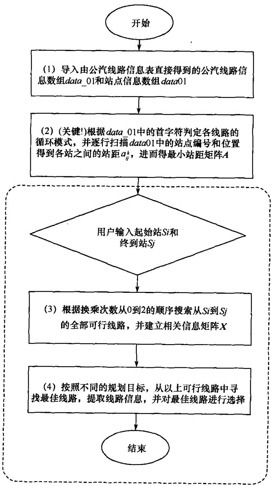

<details>
<summary>flowchart</summary>

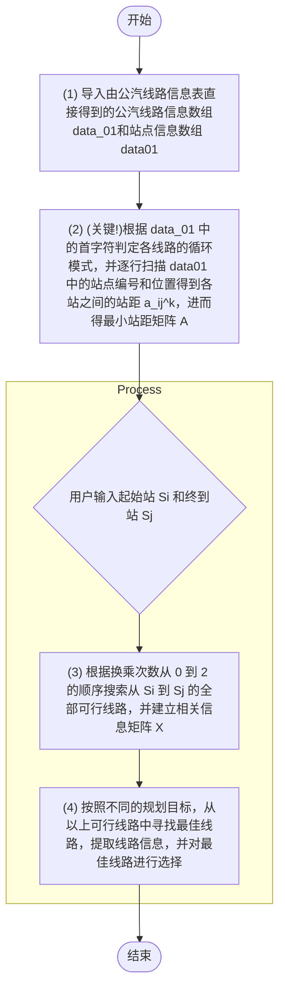
```mermaid
graph TD
  Start(["开始"]) --> Step1["(1) 导入由公汽线路信息表直接得到的公汽线路信息数组data_01和站点信息数组 data01"]
  Step1 --> Step2["(2) (关键!)根据 data_01 中的首字符判定各线路的循环模式，并逐行扫描 data01 中的站点编号和位置得到各站之间的站距 a_ij^k，进而得最小站距矩阵 A"]
  Step2 --> Decision{"用户输入起始站 Si 和终到站 Sj"}
  Decision --> Step3["(3) 根据换乘次数从 0 到 2 的顺序搜索从 Si 到 Sj 的全部可行线路，并建立相关信息矩阵 X"]
  Step3 --> Step4["(4) 按照不同的规划目标，从以上可行线路中寻找最佳线路，提取线路信息，并对最佳线路进行选择"]
  Step4 --> End(["结束"])
  subgraph Process
    Decision
    Step3
    Step4
  end
```
</details>

图 2 最佳线路的全搜索模型流程图

所谓“全搜索”有两层含义:一是指在建立站距矩阵时对所有的线路进行有序的搜索以得出各站之间的站距;二是指对全部可行线路按照换乘次数从0到2的顺序进行搜索。

注：虚线所围属于公交线路自主查询系统的部分。

至此,就可以根据以上模型和算法写出非常实用的、便于选择最佳公交线路的查询系统程序。运用这种系统,只需输入起始站和终到站的编号,就能很快得到耗时最短的和消费最低的两种乘车方案,包括依次乘坐哪些车次、依次在哪些站换乘。用户可以根据自己的偏好和情况选择自己所需。

## 7.1.7 对题中所给数据的求解

题中给出了六对起始站→终到站,要求根据给出的模型和算法求出其最佳线路,并给予清晰的评价说明。这就对我们的模型的可行性和算法的稳定性提出了考验。

输入数据,得到最佳线路,见表1、表2。

表 1 转一次车的最优时间和最优车费的公汽线路(不考虑地铁站换乘)

<table><tr><td rowspan="2">起点终点</td><td rowspan="2">优化目标</td><td colspan="5">最佳线路</td><td rowspan="2">时间/min</td><td rowspan="2">车费/元</td></tr><tr><td>起点</td><td>车次</td><td>换乘点</td><td>车次</td><td>终点</td></tr><tr><td rowspan="2">S3359S1828</td><td>时间</td><td>S3359</td><td>L436</td><td>S1784</td><td>L167</td><td>S1828</td><td>101</td><td>3</td></tr><tr><td>车费</td><td>S3359</td><td>L436</td><td>S1784</td><td>`L167</td><td>S1828</td><td>101</td><td>3</td></tr><tr><td rowspan="2">S1557S0481</td><td>时间</td><td></td><td></td><td>无</td><td></td><td></td><td></td><td></td></tr><tr><td>车费</td><td></td><td></td><td>无</td><td></td><td></td><td></td><td></td></tr><tr><td rowspan="2">S0971S0485</td><td>时间</td><td>S0971</td><td>L013</td><td>S2184</td><td>L417</td><td>S0485</td><td>128</td><td>3</td></tr><tr><td>车费</td><td>S0971</td><td>L013</td><td>S2184</td><td>L417</td><td>S0485</td><td>128</td><td>3</td></tr><tr><td rowspan="2">S0008S0073</td><td>时间</td><td>S0008</td><td>L355</td><td>S3917</td><td>L345</td><td>S0073</td><td>83</td><td>2</td></tr><tr><td>车费</td><td>S0008</td><td>L355</td><td>S3917</td><td>L345</td><td>S0073</td><td>83</td><td>2</td></tr><tr><td rowspan="2">S0143S0485</td><td>时间</td><td></td><td></td><td>无</td><td></td><td></td><td></td><td></td></tr><tr><td>车费</td><td></td><td></td><td>无</td><td></td><td></td><td></td><td></td></tr><tr><td rowspan="2">S0087S3676</td><td>时间</td><td>S0087</td><td>L454</td><td>S3496</td><td>L209</td><td>S3676</td><td>65</td><td>2</td></tr><tr><td>车费</td><td>S0087</td><td>L454</td><td>S3496</td><td>L209</td><td>S3676</td><td>65</td><td>2</td></tr></table>

表 2 转两次车的最优时间和最优车费的公汽线路(不考虑地铁站换乘)

<table><tr><td rowspan="2">起点终点</td><td rowspan="2">优化目标</td><td colspan="7">最佳线路</td><td rowspan="2">时间/min</td><td rowspan="2">车费/元</td></tr><tr><td>起点</td><td>车次</td><td>换乘点</td><td>车次</td><td>换乘点</td><td>车次</td><td>终点</td></tr><tr><td rowspan="2">S3359S1828</td><td>时间</td><td>S3359</td><td>L484</td><td>S3727</td><td>L485</td><td>S1784</td><td>L167</td><td>S1828</td><td>64</td><td>3</td></tr><tr><td>车费</td><td>S3359</td><td>L484</td><td>S3727</td><td>L485</td><td>S1784</td><td>L167</td><td>S1828</td><td>64</td><td>3</td></tr><tr><td rowspan="2">S1557S0481</td><td>时间</td><td>S1557</td><td>L084</td><td>S1919</td><td>L189</td><td>S3186</td><td>L460</td><td>S0481</td><td>106</td><td>3</td></tr><tr><td>车费</td><td>S1557</td><td>L084</td><td>S1919</td><td>L189</td><td>S3186</td><td>L460</td><td>S0481</td><td>106</td><td>3</td></tr><tr><td rowspan="2">S0971S0485</td><td>时间</td><td>S0971</td><td>L013</td><td>S2517</td><td>L290</td><td>S2159</td><td>L469</td><td>S0485</td><td>103</td><td>3</td></tr><tr><td>车费</td><td>S0971</td><td>L013</td><td>S2517</td><td>L290</td><td>S2159</td><td>L469</td><td>S0485</td><td>103</td><td>3</td></tr><tr><td rowspan="2">S0008S0073</td><td>时间</td><td>S0008</td><td>L198</td><td>S3766</td><td>L290</td><td>S2184</td><td>L345</td><td>S0073</td><td>67</td><td>3</td></tr><tr><td>车费</td><td>S0008</td><td>L198</td><td>S3766</td><td>L290</td><td>S2184</td><td>L345</td><td>S0073</td><td>67</td><td>3</td></tr><tr><td rowspan="2">S0148S0485</td><td>时间</td><td>S0148</td><td>L308</td><td>S0036</td><td>L156</td><td>S3351</td><td>L417</td><td>S0485</td><td>106</td><td>3</td></tr><tr><td>车费</td><td>S0148</td><td>L308</td><td>S0036</td><td>L156</td><td>S3351</td><td>L417</td><td>S0485</td><td>106</td><td>3</td></tr><tr><td rowspan="2">S0087S3676</td><td>时间</td><td>S0087</td><td>L021</td><td>S0088</td><td>L231</td><td>S0427</td><td>L097</td><td>S3676</td><td>46</td><td>3</td></tr><tr><td>车费</td><td>S0087</td><td>L021</td><td>S0088</td><td>L231</td><td>S0427</td><td>L097</td><td>S3676</td><td>46</td><td>3</td></tr><tr><td colspan="11">注:优化目标为时间的含义是“在所有用时最短且相同的线路中选出一个花费最少的”;优化目标为车费的含义反之</td></tr></table>

以 S3359→S1828 为例, 行车线路为: 从 S3359 站乘 L484 到 S3727 下车转 L485, 到 S1784 下车转 L167, 直到终点站 S1828。

## 7.1.8 结果的评价说明

再次考虑换乘次数与时间、车费等因素对最佳线路的影响。

对于所给六组数据,分别以时间和车费为优化目标的最佳线路完全相同。这说明省时和省钱原则在公汽线路选择上的一致性。

换乘一次的方案(如果存在)相比较换乘两次的方案,所用时间普遍较多、而所用费用却稍微偏低。这说明对于一个线路和站点很多、较发达的公交系统来说,换乘次数增加只是感觉上比较麻烦,而实际上由于及时调整了线路,整体上可以节约大量的时间,当然相对应地,由于多乘了若干次车,车费就会增加。但总体来说时间上的差异是主要的。例如从S3359→S1828,换乘一次用时101min,换乘两次用时只有64min,而车费同样只有3元,可见多换乘一次大大提高了效率;当然有些线路换乘一次和换乘两次所用时间差别并不大,比如S0971→S0485,多换乘一次只多用去时间25min,相对100多min的总时间来说并不多,对有些人来说宁愿多做些时间也不愿多转一次车。用相同的思路考虑其余几组数据得到表3。

表 3 综合的最佳公汽线路(不考虑地铁站换乘)

<table><tr><td rowspan="2">起点终点</td><td colspan="7">最佳路线</td><td rowspan="2">时间/min</td><td rowspan="2">车费/元</td></tr><tr><td>起点</td><td>车次</td><td>换乘点</td><td>车次</td><td>换乘点</td><td>车次</td><td>终点</td></tr><tr><td>S3359S1828</td><td>S3359</td><td>L484</td><td>S3727</td><td>L485</td><td>S1784</td><td>L167</td><td>S1828</td><td>64</td><td>3</td></tr><tr><td>S1557S0481</td><td>S1557</td><td>L084</td><td>S1919</td><td>L189</td><td>S3186</td><td>L460</td><td>S0481</td><td>106</td><td>3</td></tr><tr><td>S0971S0485</td><td>S0971</td><td>L013</td><td colspan="3">S2184</td><td>L417</td><td>S0485</td><td>128</td><td>3</td></tr><tr><td>S0008S0073</td><td>S0008</td><td>L198</td><td>S3766</td><td>L290</td><td>S2184</td><td>L345</td><td>S0073</td><td>67</td><td>3</td></tr><tr><td>S0148S0485</td><td>S0148</td><td>L308</td><td>S0036</td><td>L156</td><td>S3351</td><td>L417</td><td>S0485</td><td>106</td><td>3</td></tr><tr><td>S0087S3676</td><td>S0087</td><td>L021</td><td>S0088</td><td>L231</td><td>S0427</td><td>L097</td><td>S3676</td><td>46</td><td>3</td></tr></table>

## 7.1.9 模型的检验与改进

## 1. 稳定型检验

通过输入大量数据用模型输出结果,得到一个最佳线路的集合,发现换乘一次虽然可以节省1元左右,所付出的时间却比换乘两次多出几十分钟,是得不偿失的;省时和省钱原则下的最佳线路在绝大多数情况下是相同的。这与对题目所给六对起始站→终到站的结果分析是一致的,说明所建立的模型以及所做出的取舍是合情合理、有普遍适用性的。

## 2. 优点评述

通过对模型的流程描述和对数据的求解与评价,对建立的最佳线路全搜索模型已抱有充分的信心。其优点为:

(1) 对题给数据进行了矩阵化, 利于信息提取。  
(2)建立了最小站距矩阵A,为搜索可行线路提供了方便。  
(3) 提出了多种优化目标, 可以满足查询者的各种不同需求。

(4) 操作方便, 全部自动化实现, 只需输入起始站和终到站, 就可得到最佳线路。

(5)稳定性检验验证了模型的稳定性,为算法的正确性和简化手段的适用性提供了有力的依据。

## 3. 模型改进

由于是有序搜索,且数据量大,程序的效率还不是太高,对此提出以下改进。

(1) 搜索可行线路时采取了找出所有可行线路再对其进行优化选择的方法, 增加了工作量。事实上, 可以边搜索边优化, 对前半段的时间或费用已经大于已知可行线路的线路及时舍去。  
(2) 提出了换乘次数为 2 是比较好的简化做法, 就可以不再搜索换乘次数为 1 的可行线路。  
(3)现实生活中,有些环线中做“回头车”是要重复收费的,在模型中忽略了这一点,因此略显不足。

## 7.2 考虑地铁站换乘的虚拟线路模型

全搜索模型是解决问题的基本思路,针对不同的阶段和要求(比如这里仅仅是增加了在地铁站换乘的考虑),最小站距矩阵会有所不同——事实上,仅仅是最小站距矩阵的不同而已!其他算法仍可沿用全搜索模型中的模块(包括优化目标的确定、线路信息的导入、可行线路的有序搜索、最佳线路的最终确定)。

## 7.2.1 “虚拟线路”概念的提出

由于同一地铁站附近有多个公汽站,这些公汽站可以相互换乘,且耗费的时间和同一公汽站换乘相同(5min)。这给乘车的人提供了更多的选择,也为寻求可行线路增加了复杂性。为此提出“虚拟线路”的概念。

以编号为 D001 的地铁站为例, 其对应的公汽站有 S0567、S0042、S0025 三个。将这三个公汽站合为一组, 将通过此组中某个站的公汽线路“复制”两条, 并将线路上的该站替换为另外两站, 就得到了两条“虚拟线路”。

例如:通过 S0567 的一条线路为 S3661 - S3942 - S0567 - S2202, 复制并替换后的两条“虚拟线路”为 S3661 - S3942 - S0042 - S2202 和 S3661 - S3942 - S0025 - S2202。

## 7.2.2 对最小站距矩阵的改进

为方便表述,如果某公汽站可以在某地铁站换乘,则称“该公汽站在该地铁站附近”。

在原有最小站距矩阵 A 及线路编号矩阵 B 的基础上,考虑地铁站的影响和虚拟线路的设置,对其进行如下改进:

步骤 1 导入地铁站换乘公汽信息 data02, 其为 $39 \times 5$ 的矩阵, 第 k 行为 Dk 所对应的公汽站编号, 每个编号占用一个元素位置, 不足补零, 如下所示:

$$
\left[ \begin{array}{c c c c c} 5 6 7 & 4 2 & 2 5 & 0 & 0 \\ 1 4 8 7 & 0 & 0 & 0 & 0 \\ 3 0 3 & 3 0 2 & 0 & 0 & 0 \\ 4 3 6 & 4 3 8 & 4 3 7 & 4 3 5 & 0 \\ 3 9 2 & 3 9 4 & 3 9 3 & 3 9 1 & 0 \\ 3 8 6 & 3 8 8 & 3 8 7 & 3 8 5 & 0 \\ 1 2 7 9 & 0 & 0 & 0 & 0 \\ 2 0 5 7 & 7 2 1 & 7 2 2 & 7 2 0 & 0 \\ 7 0 & 2 3 6 1 & 3 7 2 1 & 0 & 0 \\ 6 0 9 & 6 0 8 & 0 & 0 & 0 \\ 2 6 3 3 & 3 9 9 & 4 0 1 & 4 0 0 & 0 \\ 3 3 2 1 & 2 5 3 5 & 2 4 6 4 & 0 & 0 \end{array} \right]
$$

步骤2 对任意两个公汽站 $Si$ 和 $Sj$ , 判断其是否在同一地铁站附近, 即 $i$ 和 $j$ 是否在 data02 的同一行。若在, 令 $a_{ij} = 0, b_{ij} = 0$ ; 若不在, 保持 $a_{ij}, b_{ij}$ 不变。

步骤3 对任意 $i, j (i, j = 1 \sim 3957, i \neq j)$ , 如果 $a_{ij} = 0$ , 则对所有 $k (k = 1 \sim 3957)$ , 比较 $a_{ik}$ 和 $a_{jk}$ 的大小。若 $a_{ik} < a_{jk}$ , 令 $a_{jk} = a_{ik}, b_{jk} = b_{ik}$ , 否则不变。

这一步的意义是:如果 Si 和 Sj 在同一地铁站附近,且 Si 到 Sk 的最小站距比 Sj 到 Sk 的最小站距小,则将 Sj 并入 $b_{ik}$ ,形成一条虚拟路,此后计算 $a_{jk}$ 时用 $a_{ik}$ 代替。

通过以上改进,最小站距矩阵已经符合新的要求。

## 7.2.3 目标函数分析

虽然扩大了换乘的范围但目标函数的形式却并不变,这正是虚拟线路模型的优点所在:

(1) $T(x)=3(a_{im}+a_{mn}+a_{nj})+2\times5(\min)$ 。  
(2) $M(x)=M(b_{im},a_{im})+M(b_{mn},a_{mn})+M(b_{nj},a_{nj})$ （元）。

例如, 当 Sm 为虚拟线路上的一个站时, 由于在 Sm 下车与在 Sm 同组的站下车所花费的换车时间是一样的, 所以对时间和车费均无影响。

## 7.2.4 对题中所给数据的求解

用虚拟线路模型对题目的六组数据进行求解,得表4、表5。

对比表5和表1、表2,发现考虑地铁站换乘的情况后不论是时间还是车费都有明显、普遍的减少。例如S0087→S3676,时间在原来的基础上又下降了16min,而且中途不用换乘,因此车费也就只有1元。而且,以车费为优化目标的差别也体现了出来,车费较时间优先普遍低1元左右。看来,地铁站对公汽站间的换乘有很大的影响。具体反应在实际生活中的结论是:要注重公共交通基础设施的资源共享,以方便公众的出行。

表 4 时间优先的最佳线路(考虑地铁站换乘)

<table><tr><td rowspan="2">起点终点</td><td colspan="7">最佳线路</td><td rowspan="2">时间/min</td><td rowspan="2">车费/元</td></tr><tr><td>起点</td><td>车次</td><td>换乘点</td><td>车次</td><td>换乘点</td><td>车次</td><td>终点</td></tr><tr><td>S3359S1828</td><td>S3359</td><td>L484</td><td>S3727</td><td>L485</td><td>S1784</td><td>L167</td><td>S1828</td><td>64</td><td>3</td></tr><tr><td>S1557S0481</td><td>S1557</td><td>L084</td><td>S1919</td><td>L189</td><td>S3186</td><td>L460</td><td>S0481</td><td>106</td><td>3</td></tr><tr><td>S0971S0485</td><td>S0971</td><td>L013</td><td>S2517</td><td>L290</td><td>S2159</td><td>L469</td><td>S0485</td><td>103</td><td>3</td></tr><tr><td rowspan="2">S0008S0073</td><td rowspan="2">S0008</td><td rowspan="2">L200</td><td rowspan="2">S2534</td><td rowspan="2">L080</td><td>S0608</td><td rowspan="2">L057</td><td rowspan="2">S0073</td><td rowspan="2">64</td><td rowspan="2">3</td></tr><tr><td>S0609</td></tr><tr><td rowspan="2">S0148S0485</td><td rowspan="2">S0148</td><td rowspan="2">L308</td><td rowspan="2">S3604</td><td rowspan="2">L454</td><td>S1919</td><td rowspan="2">L417</td><td rowspan="2">S0485</td><td rowspan="2">103</td><td rowspan="2">3</td></tr><tr><td>S1920</td></tr><tr><td rowspan="2">S0087S3676</td><td>S0087</td><td rowspan="2" colspan="5">L231</td><td>S0427</td><td rowspan="2">30</td><td rowspan="2">1</td></tr><tr><td>S0088</td><td>S3676</td></tr></table>

表 5 车费优先的最佳线路(考虑地铁站换乘)

<table><tr><td rowspan="2">起点终点</td><td colspan="7">最佳路线</td><td rowspan="2">时间/min</td><td rowspan="2">车费/元</td></tr><tr><td>起点</td><td>车次</td><td>换乘点</td><td>车次</td><td>换乘点</td><td>车次</td><td>终点</td></tr><tr><td>S3359S1828</td><td>S3359</td><td>L485</td><td colspan="3">S1784</td><td>L167</td><td>S1828</td><td>101</td><td>2</td></tr><tr><td>S1557S0481</td><td>S1557</td><td>L084</td><td>S1919</td><td>L189</td><td>S3186</td><td>L460</td><td>S0481</td><td>106</td><td>3</td></tr><tr><td>S0971S0485</td><td>S0971</td><td>L013</td><td colspan="3">S0992</td><td>L417</td><td>S0485</td><td>131</td><td>2</td></tr><tr><td rowspan="2">S0008S0073</td><td rowspan="2">S0008</td><td rowspan="2">L159</td><td colspan="3">S0400</td><td rowspan="2">L474</td><td rowspan="2">S0073</td><td rowspan="2">80</td><td rowspan="2">2</td></tr><tr><td colspan="3">S2633</td></tr><tr><td rowspan="2">S0148S0485</td><td rowspan="2">S0148</td><td rowspan="2">L308</td><td rowspan="2">S3604</td><td rowspan="2">L454</td><td>S1919</td><td rowspan="2">L417</td><td rowspan="2">S0485</td><td rowspan="2">103</td><td rowspan="2">3</td></tr><tr><td>S1920</td></tr><tr><td rowspan="2">S0087S3676</td><td>S0087</td><td rowspan="2" colspan="5">L231</td><td>S0427</td><td rowspan="2">30</td><td rowspan="2">1</td></tr><tr><td>S0088</td><td>S3676</td></tr><tr><td colspan="10">注:横向合并的单元格说明换乘次数少于两次;在同一条路线中纵向分开的单元格说明两个站点可以通过地铁站相互到达</td></tr></table>

纵观表1\~表5,还可以得到以下结论。

(1) 双目标规划没有必要, 因为最佳线路的车费都在 3 元之内, 而时间的差异却很大, 因此以时间为优化目标是更主要的。  
(2) 换乘次数与线路最佳与否没有直接关系。  
(3) 必须考虑地铁站换乘的情况, 因为其明显增加了换乘的概率, 直接影响了线路的选择。

# 8 问题(2) 公汽—地铁线路网中的线路选择

## 8.1 公汽一地铁线路网特点分析

地铁线路的引入使线路的选择更加复杂化,因为地铁和公汽之间可以换乘,票价和速度有较大差异,四种换乘情况耗时也不同。但以下基本特征是确定的:

(1) 地铁环线的行驶方向是双向的。  
(2) 相对公汽来说地铁的特点是速度快、用时少(一站 2.5min)，但价钱贵(不论距离多远一律 3 元)。

## 8.2 用全搜索模型求解

## 8.2.1 地铁站距矩阵的确定

在问题(1)的基础上,提出“捆绑式的”的地铁站距矩阵 sub-A 和对应的线路信息矩阵 sub-B,定义如下:

对于公汽站 $Si, Sj$ ，若 $i, j \subset data02$ （即都在地铁站附近），而 $Si \subset Dk, Sj \subset Dl$ ，且 $Dk$ 和 $Dl$ 在同一条地铁线路上，则 $sub - a_{ij}$ 等于 $Dk$ 和 $Dl$ 之间的站距；否则 $sub - a_{ij}$ 等于零，即 $sub - a_{ij} = \left\{ \begin{array}{cc} Dk & \text{到 } Dl \text{ 间的站距，} Dk \text{ 和 } Dl \text{ 在同一地铁线上，} i, j \subset data02, Si \subset Dk, Sj \subset Dl \\ 0, & \text{其他} \end{array} \right.$

T1 和 T2 分别编号为 521、522，则 $sub - b_{ij}$ 等于对应的 $D_{k}$ 和 $D_{l}$ 所在的地铁线路的编号 (521 或 522)。

注意:这里将地铁站附近的公汽站之间的站距全部转化为相应地铁站之间的站距,以便于提取独立于公汽线路之外的、由地铁线路带来的新的站距信息;反过来,如果要求起点或终点为地铁站的最佳线路,只需用其附近的某个公汽站代替之就可以了。

加上问题(1)中虚拟线路模型中改进后的最小站距矩阵 A 及线路编号矩阵 B, 共得到四个矩阵: A、B、sub-A 和 sub-B。通过对这四个矩阵的搜索和计算, 就可以得到公汽—地铁线路网中任意两个公汽站点间的最佳线路(图3)。

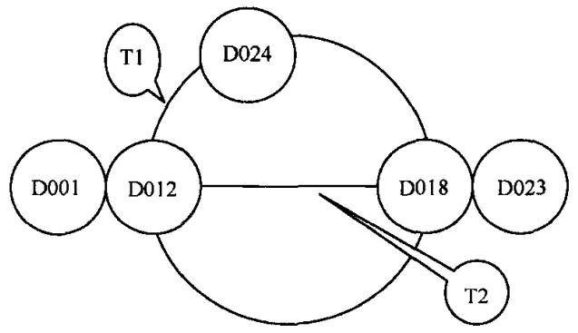

<details>
<summary>flowchart</summary>

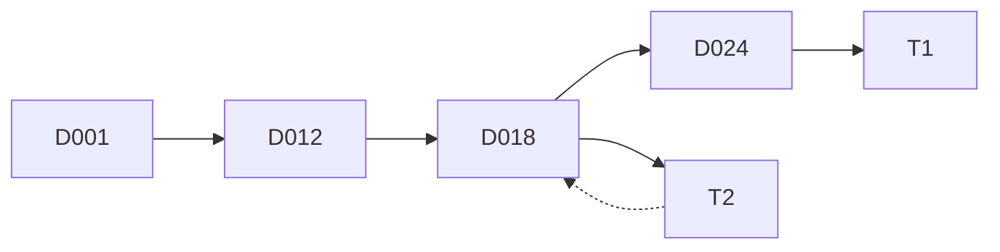
```mermaid
graph LR
  D001 --> D012
  D012 --> D018
  D018 --> D024
  D024 --> T1
  D018 --> T2
  T2 -.-> D018
```
</details>

图 3 两条地铁线路的形状及相互关系

地铁线路站距的计算方法为：

当 $D_{k}, D_{l} \subset T1$ 时，其站距为 $|D_{l} - D_{k}|$ ；

当 $D_{k}, D_{l} \subset T2$ 时，其站距为 $|D_{l} - D_{k}| (|D_{l} - D_{k}| \leqslant 18)$ 或 $36 - |D_{l} - D_{k}| (|D_{l} - D_{k}| >$

18)。

## 8.2.2 搜索全部可行线路

由于加入了表征地铁线路信息的 sub-A 和 sub-B, 可行线路的搜索要稍微复杂一些, 但总体思路不变, 现只给出其特别之处。

(1) 对 A 和 sub-A 的搜索是同步的, 即公汽和地铁两种方式各自以及交叉的可行线路都要得到。  
(2) 可行线路相关信息矩阵 $X[\text{road, point, length}]$ 中所存的信息有: 线路编号, 换乘站, 区间长度。线路编号分为公汽线路和地铁线路两种, 在判断时不仅要知道其类型 (用于计费), 还要注意其先后顺序 (公汽换乘公汽、地铁换乘地铁、地铁换乘公汽、公汽换乘地铁四种换乘的耗时是不一样的); 除此之外, 还要增加一个元素, 用以表示公汽站的“原型”——是真实线路中的站还是虚拟线路中的站, 是代表自身还是代表附近的地铁, 这是编程中的一个难点, 需要用大量的 if 语句实现。

## 8.2.3 最佳线路的选择

对于一个“混合型”的可行线路：

$$
\begin{array}{l} x [ \text {road, point, length} ] \\ = \left[ \operatorname{road} \left[ b _ {i m}, b _ {m n}, b _ {n j} \right], \text {point} \left[ S _ {m}, S _ {n} \right], \text {length} \left[ a _ {i m}, a _ {m n}, a _ {n j} \right] \right], \\ \subset X [ \text {road, point, length} ] \\ \end{array}
$$

假设 $b_{mn}$ 为地铁线路， $b_{im}$ 和 $b_{jn}$ 为公汽线路，则其目标函数如下：

(1) $T(x)=3(a_{im}+a_{nj})+2.5a_{mn}+6+7(\min)$  
(2) $M(x)=M(b_{im},a_{im})+3+M(b_{nj},a_{nj})$ (元)

对于 $M(b_{im}, a_{im})$ 和 $M(b_{nj}, a_{nj})$ :

若 $b_{ij}$ 线路为单一票价, $M(b_{ij}, a_{ij}) = 1$ ;

若 $b_{ij}$ 线路为分段计价， $M(b_{ij}, a_{ij}) = \begin{cases} 1, & a_{ij} \leqslant 20 \\ 2, & 20 < a_{ij} \leqslant 40 \\ 3, & a_{ij} > 40 \end{cases}$ 。

求得 $T(x)$ 或 $M(x)$ 最小的线路, 即为最佳线路。

## 8.2.4 对题中所给数据的求解

对题中六组数据求解,得表6、表7。

表 6 公汽—地铁线路中时间优先的最佳线路

<table><tr><td rowspan="2">起点终点</td><td colspan="7">最佳线路</td><td rowspan="2">时间/min</td><td rowspan="2">车费/元</td></tr><tr><td>起点</td><td>车次</td><td>转车点</td><td>车次</td><td>转车点</td><td>车次</td><td>终点</td></tr><tr><td>S3359S1828</td><td>S3359</td><td>L484</td><td>S3727</td><td>L485</td><td>S1784</td><td>L167</td><td>S1828</td><td>64</td><td>3</td></tr><tr><td>S1557S0481</td><td>S1557</td><td>L084</td><td>S1919</td><td>L189</td><td>S3186</td><td>L460</td><td>S0481</td><td>106</td><td>3</td></tr><tr><td rowspan="2">S0971S0485</td><td rowspan="2">S0971</td><td rowspan="2">L094</td><td>S0567</td><td rowspan="2">T1</td><td>D21</td><td rowspan="2">L051</td><td rowspan="2">S0485</td><td rowspan="2">96</td><td rowspan="2">5</td></tr><tr><td>D01</td><td>S0466</td></tr><tr><td rowspan="2">S0008S0073</td><td rowspan="2">S0008</td><td rowspan="2">L150</td><td>S3874</td><td rowspan="2">T2</td><td>D25</td><td rowspan="2">L103</td><td rowspan="2">S0073</td><td rowspan="2">55</td><td rowspan="2">5</td></tr><tr><td>D30</td><td>S0525</td></tr><tr><td rowspan="2">S0148S0485</td><td rowspan="2">S0148</td><td rowspan="2">L024</td><td>S1487</td><td rowspan="2">T1</td><td>D21</td><td rowspan="2">L051</td><td rowspan="2">S0485</td><td rowspan="2">87.5</td><td rowspan="2">5</td></tr><tr><td>D02</td><td>S0466</td></tr><tr><td rowspan="2">S0087S3676</td><td>S0087</td><td colspan="5" rowspan="2">T2</td><td>D36</td><td rowspan="2">20</td><td rowspan="2">3</td></tr><tr><td>D27</td><td>S3676</td></tr></table>

表 7 公汽—地铁线路中车费优先的最佳线路

<table><tr><td rowspan="2">起点终点</td><td colspan="7">最佳线路</td><td rowspan="2">时间/min</td><td rowspan="2">车费/元</td></tr><tr><td>起点</td><td>车次</td><td>转车点</td><td>车次</td><td>转车点</td><td>车次</td><td>终点</td></tr><tr><td>S3359S1828</td><td>S3359</td><td>L436</td><td colspan="3">S1748</td><td>L167</td><td>S1828</td><td>101</td><td>2</td></tr><tr><td>S1557S0481</td><td>S1557</td><td>L084</td><td>S1919</td><td>L189</td><td>S3186</td><td>L460</td><td>S0481</td><td>106</td><td>3</td></tr><tr><td>S0971S0485</td><td>S0971</td><td>L013</td><td colspan="3">S0992</td><td>L051</td><td>S0485</td><td>131</td><td>2</td></tr><tr><td rowspan="2">S0008S0073</td><td rowspan="2">S0008</td><td rowspan="2">L1590</td><td colspan="3">S0400</td><td rowspan="2">L474.</td><td rowspan="2">S0073</td><td rowspan="2">80</td><td rowspan="2">2</td></tr><tr><td colspan="3">S2633</td></tr><tr><td rowspan="2">S0148S0485</td><td rowspan="2">S0148</td><td rowspan="2">L308</td><td rowspan="2">S3604</td><td rowspan="2">L0454</td><td>S1919</td><td rowspan="2">L417</td><td rowspan="2">S0485</td><td rowspan="2">103</td><td rowspan="2">3</td></tr><tr><td>S1920</td></tr><tr><td rowspan="2">S0087S3676</td><td>S0087</td><td rowspan="2">L271</td><td rowspan="2" colspan="3">S3697</td><td rowspan="2">L424</td><td rowspan="2">S3676</td><td rowspan="2">35</td><td rowspan="2">2</td></tr><tr><td>S0088</td></tr></table>

## 8.2.5 结果的评价说明

再次考虑换乘次数与时间、车费等因素对最佳线路的影响。

(1) 时间优先时, 多条线路的行驶时间减少了 $10 \, min \sim 15 \, min$ , 这源于地铁高速的特性。  
(2) 车费优先时,车费明显偏低,但这时基本不乘地铁,因为地铁是一种高消费的交通工具。  
（3）从表中还可以看出，为了减少时间，公汽和地铁线路的交叉乘坐非常普遍，这充分结合了地铁的高速、换乘的便利和公汽线路遍及较广的优点。因此可以肯定，交通工具的多元性方便了公众的出行选择。

换乘一次的方案(如果存在)相比较换乘两次的方案,所用时间普遍较多、而所用费用却稍微偏低。这说明对于一个线路和站点很多、较发达的公交系统来说,换乘次数增加只是感觉上比较麻烦,而实际上由于及时调整了线路,整体上可以节约大量的时间,当然相对应的,由于多乘了若干次车,车费就会增加。但总体来说时间上的差异是主要的。

## 9 问题(3)考虑步行的线路选择

## 9.1 步行的目的和限度

在该问中,可以通过步行,从一个车站走到另一个车站,从而找到更省时间或更方便的乘车线路。

在问题(1)和(2)中,只能由本车站通过地铁站换乘。而在知道了任意两站之间的步行时间后,从理论上讲所有车站之间可以通过步行来换乘车线路。但从实际出发,人的步行距离和时间是有可接受限度的,即不能走很长的距离和时间。

## 9.2 考虑步行的最优线路

最优线路对不同的乘客来说是不一样的。有的人喜欢省时间的线路,少数人会考虑省钱的线路,还有的考虑线路是否方便等。为了满足不同的人喜好,可以按照不同的目标进行优化,给出对应的最优线路。

经过以上分析,优化模型为

$$
\min T (x) \text {或} \min M (x)
$$

现在对两种不同情况按照不同目标给出优化模型的算法。

## 1. 直通 + 步行(或步行 + 直达)的线路

步骤 1 根据输入的起点和终点,搜索它们旁边是否有地铁站。如果存在地铁站,则起点或终点有其他等效的站点,可以增加起点和终点,对这些起点或终点的优化和原始的起点到终点一样。否则,只考虑优化原始的起点到终点的目标。

步骤 2 假设步行的最大时间限制为 $t_{0}$ ，站点 i 与站点 j 之间的步行时间为 $t_{ij}$ 。起点（或终点）为 i 站点。搜索从起点（或终点）步行到周围站点的时间小于 $t_{0}$ 的所有站点。

步骤 3 从满足步骤 2 的站点中, 搜索出能直达终点(或起点)的站点。按照不同的优化目标, 对所有满足上述条件的线路进行优化, 给出不同的乘车线路, 并输出每种线路对应的时间和车费, 供乘客参考。

## 2. 通过步行转车一次的线路

步骤 1 根据输入的起点和终点,搜索它们旁边是否有地铁站。如果存在地铁站,则起点或终点有等效的站点,应该增加起点和终点,其优化目标和原始的起点到终点一样。否则,只考虑优化原始的起点到终点的目标。

步骤2 假设步行的最大时间限制为 $t_0$ ，站点 $i$ 与站点 $j$ 之间的步行时间为 $t_{ij}$ 。搜索通过起点和终点的两条线路上（因为需转车，起点和终点不在同一线路），任意两站点（分别是起点的顺行站点和终点的逆行站点）之间的步行时间 $t_{ij}$ 小于 $t_0$ 的所有站点。

步骤 3 对满足上述条件的站点组成乘车线路。根据不同的优化目标,对这些路线

进行比较,算出不同优化目标的最优路线,输出每种线路对应的时间和车费,供乘客参考。

以上是通过具体的情况来演示如何在前两问的基础上,加上步行时间的条件针对不同乘客的特点,给出满足不同要求的最优线路。其他的情况可以按照以上的思路对问题进行分析简化为上述情况的叠加,但从实际来看,这些情况出现的概率不会很大。这样再根据乘客所能接受的换车次数,就可以确定满足自己方便的乘车路线。

## 10 模型的推广

在全搜索模型的基础上通过一些合理的假设,使得问题的数学描述较为简单直观,但实际上还有许多因素与要讨论的问题密切相关,而我们却忽略了,现对其进行讨论。

（1）我们的模型中只讨论了换乘次数在两次以内的情况。事实上，三次以上的换乘很可能带来更优的解，由于时间有限，未予以实施检验。  
（2）虚拟线路的处理得到的并不是全部的虚拟线路，只是起点为虚拟站的虚拟线路。要想得到全部虚拟线路，必须增加循环次数，在有条件的情况下可以尝试。

从本题的实际应用出发,我们的模型和算法最终要以软件的形式实现,考虑到软件功能的全面性,可以作出以下推广。

（1）查询路线的同时显示当前时段该路线被查询到的频率，频率过大说明乘坐此线路的人员多，就不宜选择此线路。  
(2) 与交通系统联网, 实时显示该线路上的拥挤程度, 供用户参考。  
（3）与交通系统联网，在进行线路选择时，将实时线路的拥挤程度作为影响线路时间的权变因素。

## 参考文献

[1] 刘承平. 数学建模方法. 北京: 高等教育出版社, 2002.  
[2] 苏金名. MATLAB 实用教材. 北京: 电子工业出版社, 2005.

## 【论文点评】

刘守生

本文作者首先利用娴熟的数据库知识对已知的大量数据进行了处理和分析,根据图论中加权有向图的理论建立了公交站的最小站距矩阵。利用该矩阵进行全搜索解决了由公共汽车和地铁组成的公交系统的最佳线路选择问题。本文以是否利用地铁站来进行公汽换乘分别建立模型,并利用对题中六条线路的求解结果,对模型进行检验和评价。其中在利用地铁站公汽换乘公汽时构造的虚拟公交线路方法,即将同一地铁站周围的公交车串联起来,通过全搜索求得最佳乘车线路,是文章的创新之处。

本文的不足之处是在考虑步行的线路选择问题时,分析讨论的过于简单,定性的分析多,具体的模型求解少。其次,文章的总体思路虽然比较清楚,但文章细节写得较为粗糙,尤其口语化的表述较多,这一方面是由于时间紧的原因,另一方面说明作者还要大力提高撰写在研论文的能力。

# 公交线路模型研究和算法实现

## 摘要

本文采用了避冗余动态搜索规则,结合受控的广深搜索算法,建立了方便快捷的公交线路查询系统。

针对问题一,首先利用路径可达矩阵证明了以下结论:公车换乘限制次数为2时,可达范围为93%;当换乘限制次数为3时,可达范围几乎是100%。依据该结论,便在搜索程序中设定了最大换乘次数为3。然后利用避冗余搜索规则,进一步降低了问题的复杂度。通过计算,得出从站点S3359到S1828的一条局部最优路线,该路线的时间耗费为64min,经济耗费为3元,换乘次数为2次。其他结论见正文。

问题二建立在问题一的基础上,通过对线路信息的侦测,将地铁线路信息归并为和公车线路一样的处理:在同一地铁站点附近几个公汽站点间可以转乘时,假设在地铁和公汽间存在一条只耗时间、不花车费的双向公交虚线路,将该线路抽象为一条特殊的公交线路,重用问题一的算法对问题二求解。程序运行结果表明,当加入地铁线路时,部分交通状况明显得到好转。

问题三中,决定采用总体先深局部先广的思想,在搜索到达某一站点时,对其附近部分步行可达的站点同步考虑。这样便更符合实际情况。

关键词: 避冗余动态搜索, 受控先广搜索, 受控先深搜索

## 1 问题的重述

2008 年,即将迎来的是我国人民翘首企盼的第 29 届奥运会,届时将有大量观众到北京首都观看奥运比赛,其中大部分人将会乘坐公共交通工具(简称公交,包括公汽、地铁等)出行。为了使得公众的出行更加通畅、便利,准备研制开发一个方便乘客进行公交线路自主选择的计算机查询系统。

从实际情况出发考虑,要求满足查询者的各种不同需求。该系统的设计核心是线路选择的模型与算法。现需要解决如下问题:

（1）仅考虑公汽线路，给出任意两公汽站点之间线路选择问题的一般数学模型与算法。并根据附录数据，利用该模型与算法，求出以下6对起始站 $\rightarrow \mathrm{S}$ 终到站之间的最佳路线，要求给出清晰的评价说明。

① S3359→S1828

⑫ S1557→S0481

⑮ S0971→SS0485

① S0008→S0073

⑮ S0148→S0485

⑮ S0087→SS3676

(2) 同时考虑公汽与地铁线路, 解决以上问题。  
（3）假设在知道所有站点之间的步行时间的前提下，给出任意两站点之间线路选择问题的数学模型。

## 2 问题的分析

本文是关于公交线路的选择问题,数学抽象后可以看作一个图论问题,即寻求一条满足乘客需求的最优路径。对题目给出的问题进行如下分析:

问题(1)，仅考虑公汽线路。由附录1给出的关于520条公汽线路，近4000个公汽站点的公交系统信息，找出两站点间通过公交线路连接起来的关系，建立存储公交站点相邻关系的邻接矩阵。结合实际问题，对于一般的乘客而言，乘客乘车过程中不愿频繁的换乘，可以将乘客一般能够接受的最大换乘次数作为约束条件，在换乘次数优先的情况下搜索最优线路，又因不同乘客对时间和金钱看重程度不一样，选择线路时可根据乘客对时间和金钱的需求不同给出不同需求条件下的最优乘车方案，同时在实际中考虑算法的可行性问题，即查询线路的搜索时间要尽可能少，例如：要求5s内查询系统必须给出客户的需求最优路线，否则，乘客对该系统就不满意。

问题(2)，在问题(1)的基础上需要将两条地铁线路及其地铁站点信息考虑进去。在此，将两条地铁线路和及其39个地铁站点抽象为问题(1)的中公汽线路和公汽站点，对一个地铁站点而言，其附近所有公汽站点可以通过它转乘到其附近的其他公交站点和另一条地铁线路，即可以认为该地铁站点和其附近的公汽站点作为一个大的公交站点。对地铁附近的这样几个站点之间通过地铁站点换乘时，只需认为在该大的公交站点转车的时间耗费为站点间步行时间和等待公交时间之和。在实现算法时，对是否是经地铁站点进行换乘的作出判断并对时间上耗费进行计算。最后，可依据问题(1)的算法满足乘客需求的最优路线。

问题(3)，由于任意两点的步行时间都已经知道，在此不妨认为任意两点间的步行时间是由这两站点之间的一条较优路径得到的步行时间，那么就可以借助这条较优的步行线路来确定算法中的搜索方向。对该步行线路上的任意两个公交站点的乘车时间耗费计算出来，比步行时间短的就取代步行；另外，考虑该步行线路上各站点附近一定步行时间内的相邻站点进行搜索，如果存在通过其附近站点的一条线路可以到达步行线路上的其他站点或这些站点的附近站点，那么计算步行线路上的这两个站点间的步行时间与通过这两站点附近站点乘公交所花费的时间相比较，如果时间短，就将步行替换为乘车。在时间较优的情况下，考虑乘车次数和乘车费用，如果乘车时转车较少且花费时间比步行花费时间少得多，可以在结合乘车费用，采用乘车方式；如果这个时间和步行时间相差不大，但换乘次数和乘车费用都较多，可以仍采用步行方式。在实际中再根据乘客的不同需求，给出一条相对条件下的最优线路。

## 3 符号系统

T:乘客从出发地到目的地的时间耗费；

S:乘客从出发地到目的地的金钱耗费；

n:乘客从出发地到目的地的过程中换乘次数;

$t_{1}$ :两站公交站点间的乘车耗时;

$t_{2}$ : 同一公交站点内的转车耗时。

## 4 问题(1)的分析和求解

针对问题(1)仅考虑公汽线路选择问题,要求得到任意两公汽站点之间的最优线路,因为公汽站点和公汽路线的数量很多,若采用图的搜索问题来解,对计算的时间和空间复杂度要求很高,很难在现实中满足乘客对查询时间的容忍度,所以基于实际情况,考虑乘客在乘坐公汽时不愿频繁地转乘等条件,控制转乘的次数,这样可以降低搜索复杂性,减少运算时间,满足乘客的查询等待时间的要求。为了确保算法的稳定性,先对限乘次数的可行范围进行理论推导。

## 4.1 限乘次数可行范围推导

根据附录数据给出的汽车线路信息可通过程序统计出:该市一共有520条公汽线路,并可得到各条公汽线路是否相交的信息(计算程序见附件)。该推导程序中做了这样的假设:同一条线路上的任何站点都彼此可达。由于在这520条线路中有400多条线路是有上下行线路的,其余的是环行路线和单向往返路线,从实际情况出发,上下行的路线有很多站点都是重叠的,环行和单向往返路线更是如此,也就是说大部分站点都有一来一回的有向边,因此不妨将这些路线看成由两个点(起点和终点)和它路线经过的点所连成的无向路线。简化后的路线便可以方便的通过邻接矩阵 $A_{520\times520}$ (其中只要两路线经过同一车站则记为1,否则记为0)。

设矩阵中的每一个元素为 $a_{ij}$ , 其值表示线路 $L(i + 1)$ 与 $L(j + 1)$ 是否有相交的车站 (1 相交, 0 不相交)。由原始数据初始化 $\mathbf{A}_{520 \times 520}$ 如下:

$$
\begin{array}{c} L 0 0 1 \quad L 0 0 2 \quad L 5 1 9 \quad L 5 2 0 \\ L 0 0 1 \\ L 0 0 2 \\ A _ {5 2 0 \times 5 2 0} = \quad \vdots \\ L 5 1 9 \\ L 5 2 0 \end{array} \left( \begin{array}{c c c c c} 0 & 1 & \dots & 0 & 0 \\ 0 & 0 & \dots & 0 & 0 \\ \vdots & \vdots & \vdots & \vdots & \vdots \\ 0 & 1 & \dots & 0 & 0 \\ 0 & 0 & \dots & 0 & 0 \end{array} \right)
$$

这时可以用 $A_{520 \times 520}^{n}$ 这个矩阵来表示这些路线中任意一条路线(或者其经过的所有点)经过最大转乘 $n - 1$ 次到达另一条线路(或者上面的所有点)的可达性情况。设最大转乘次数为 $m$ , 则 $m = n - 1$ 。现在考虑矩阵:

$$
\boldsymbol {B} _ {5 2 0 \times 5 2 0} ^ {m} = \sum_ {i = 1} ^ {m + 1} \boldsymbol {A} _ {5 2 0 \times 5 2 0} ^ {i}
$$

在这个矩阵 B 中, 大于 0 的元素说明所对应的两条路线间经过最大 m 次转乘可达, 而等于 0 的元素则说明对应的两路线间经过最大 m 次转乘不可达。若 B 里面的每一个元素都大于 0, 则在最大转乘次数为 m 的条件下, 所有的汽车站都可达, 这样可以用来确定出最大转乘次数 $m$ ，从而可以从理论上推导出程序算法使用何种转乘限制范围比较合适。以下时通过MATLAB计算矩阵 $\pmb{B}_{520\times 520}^{m}$ 的结论：

（1）当 $m = 1$ 时， $B_{520 \times 520}^{1}$ 矩阵中共有168252个0元素，占整个元素的比例为 $\frac{168252}{520 \times 520} \times 100\% = 62.2\%$ 。  
(2) 当 m=2 时, $B_{520 \times 520}^{2}$ 矩阵中共有 19020 个 0 元素, 占整个元素的比例为 7%。  
(3) 当 m=3 时， $B_{520 \times 520}^{3}$ 矩阵中共有 98 个 0 元素，占整个元素的比例为 0.036%。  
(4) 当 m=4 时， $B_{520\times520}^{4}$ 矩阵中没有 0 元素。

根据上面的结果,可以知道只要转乘次数 m 达到 4 次,就一定可以从任意一个站点到达另一个站点,而当 m=3 时 0 元素的数目所占比例仅为 0.036%,完全可以忽略不计,也就是说几乎所有公汽站点都可以转乘次数 m 不超过 3 的条件下到达。所以为了控制程序算法运行的时间和空间复杂性并满足大部分乘客的实际情况和现实要求,在程序中约束最大转乘次数 $m \leqslant 3$ 是合理的。

结论:限定转乘次数 $m \leqslant 3$ 几乎不会出现两站间不可达的情况,故限制乘客乘车的换乘次数是可行的、合理的。

启发:在一个城市中,所有的交通线路的数目 p 都是已知的,也就是说可以得到所有线路的的邻接矩阵,设为 $A_{p \times p}$ , 若两路线有公共的车站, 在 A 中对应的元素为 1, 否则为 0。从实际情况考虑, 因为人们很难忍受转乘次数 n > 3 的行车路线, 所以可以令 $n \leqslant 3$ , 若从一站点到达另一站点的最少转乘次数都大于 3, 那么就认为它们不可达。现在可以求出可达性矩阵 $B_{p \times p}^{3} = \sum_{i=1}^{4} A_{p \times p}^{i}$ 。计算出 $B_{p \times p}^{3}$ 中 0 的数目为 q, 则 $B_{p \times p}^{3}$ 中 0 的数目占总元素的比例 $r = \frac{q}{p \times p} \times 100\%$ 。现在可以通过 r 这个数去评价一个城市的交通好坏, 同时对政府提出合理建议。

（1）当 $r > 60\%$ 时，则该市交通状况较差，许多站点间到达转乘次数较多。政府应该多开点连接许多线路的横贯线路。  
(2) 当 $30\% \leqslant r \leqslant 60\%$ 时, 则该市交通状况一般, 但乘车还不是很便利。政府也应该采取措施, 如可适当建造几条地铁线路。  
(3) 当 $r < 30\%$ 时, 则该市交通状况很好, 人们在不多的转乘次数内都可以到达其他的站点。

## 4.2 公交线路和公交站点分析和假设

对题目给出的多种公交线路的形式进行分析,有三种情况需要考虑。

(1) 单路往返型, 即下行线是上行线原路返回。  
(2) 往返线路不一致型, 即分上行线和下行线两天线路。  
(3) 环路型, 即公交从起始点出发经过一个环路后仍回到起始点。

对于这三种公交线路的形式,结合实际情况作出以下的假设。

（1）对单线往返型和往返线路不一致型两种方式，乘客乘公汽到达该公汽线路的起始站或终点站后，需换乘下一班次的车，即乘车经过公汽线路的起始站和终点站时，乘客

的换乘次数需增加一次。

(2) 对环路情况, 认为公汽可以按起始线路正反两个方向进行行驶。

(3) 对假设(1)中的乘客,在公汽上行线和下行线之间某共同站点处,如果要改变乘车的上下行线路,则乘客也需换乘一次。

对公交站点的抽象：

在公交网络中,公交站点连接经过该站点的多条公交线路。对于同一公交线路上两个方向的站点和不同公交线路上的站点分布比较复杂,需对其进行分析,抽象为同一个节点。

同一线路两个方向上的同一站点一般有两个停车位置位于公路两侧而不会重合,需将这样的两个停车位置抽象为同一个节点,即可以考虑允许乘客在这两个停车位置间采取步行而不考虑代价;对不同线路在同一站点也有其自己的停车位置,对这些停车位置也抽象为同一个节点。

## 4.3 避冗余搜索模型的建立和算法的实现

避冗余的思想在很多地方都很常用,特别是在计算机科学领域,比如图形压缩、声音视屏压缩等。计算机的普及大大解放了人们的双手和大脑,避免了很多重复的劳动。虽然计算机性能日益增强,但对于规模呈指数级别增长的搜索问题仍捉襟见肘。为了避免计算机在搜索过程中执行很多无意义的步骤,决定借鉴避冗余思想,让程序更高效地执行。

消除冗余必须借助于一些已知信息之间的关系,消除可以由剩余信息推导出来的信息,而不破坏信息的完备性。比如在本题的搜索过程中,假定采用的是先深搜索,那么当程序搜索到一定深度以后,如果发现待讨论的站点已经处在搜索树的若干层之上,那么完全可以不用考虑该站点以及该站点的后继站点了。

关于该思想的完备性,决定做如下推导:

假设程序采用的是先深搜索,也就是说从出发点到其他点的搜索将形成一棵树,取搜索过程中的一个状态,如图1所示。

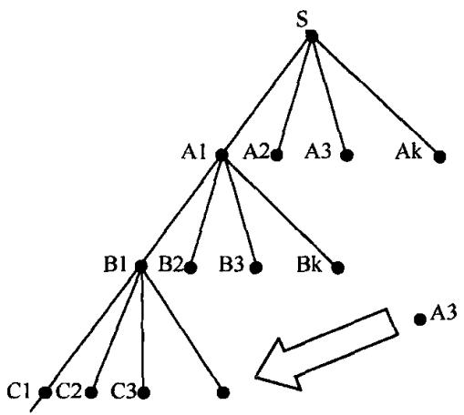

<details>
<summary>flowchart</summary>

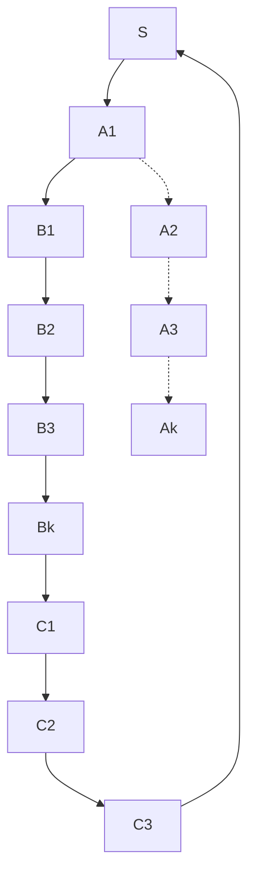
```mermaid
graph TD
  S["S"] --> A1["A1"]
  A1 --> B1["B1"]
  B1 --> B2["B2"]
  B2 --> B3["B3"]
  B3 --> Bk["Bk"]
  Bk --> C1["C1"]
  C1 --> C2["C2"]
  C2 --> C3["C3"]
  C3 --> S
  A1 -.-> A2["A2"]
  A2 -.-> A3["A3"]
  A3 -.-> Ak["Ak"]
```
</details>

图1

从图 1 可以看出, 在这个树的第一层已经存在了站点 A3, 现在 A3 又将加入到该树的第三层上。

在问题(1)中,由于相邻两公汽站间平均行驶时间(包括停站时间)为3min;公汽换乘公汽的平均耗时为5min(其中步行时间为2min);设车站S到第一层A3的时间为 $t_{1}$ ,S到第三层A3的时间为 $t_{2}$ ,对于从S到第三层的A3而言,最佳情况是直达;而对于从S到第一层的A3,最差情况是需要转车。所以可以得到如下的约束方程:

$$
\left\{ \begin{array}{l} \operatorname{Max} (t _ {1}) = 5 + 3 = 8 \\ \operatorname{Min} (t _ {2}) = 3 + 3 \times 2 = 9 \end{array} \Rightarrow \operatorname{Max} (t _ {1}) <   \operatorname{Min} (t _ {2}) \right.
$$

从以上方程的推导可以看出,对于该 A3 节点,其处于第一层时的最大耗费仍然小于处于第三层时的最小耗费,那么如果继续将 A3 节点放到搜索树的第三层是没有多大意义的,它的存在对搜索结果的贡献很小,反而会增加无谓的算法复杂度,因而不应当再把它放置到第三层。

从这个例子,结合本题已知的条件,进一步得到一个更一般的结论:

在该搜索树中,若某站点第一次出现在第 m 层,则与其相同的站点不应该在低于它两层以上,也就是大于等于 $m+2$ 层中再次出现。这样就大大消除了搜索的冗余步骤。

算法的具体实现是通过使用一个动态更新的最小层次向量来记录这所有3957个站点在树中的首次出现层数。当一个站点想入搜索树时，首先将它欲附着的节点的层次号 $n$ 与该动态向量中对应的数据 $m$ 进行比较。如果发现 $n > m + 2$ ，则拒绝其入树，否则将其入树，并用 $\operatorname{Min}(m, n)$ 刷新该动态向量。

下面具体阐述建立该模型思想：

为了满足实际生活中乘客的不同需求,决定将搜索目标分为以下三类:

(1) 换乘次数最少。

(2) 乘车时间最短(包括乘车时间和转车时间)。

(3) 乘车费用最低。

换乘次数对于控制搜索树的深度具有至关重要的作用。而由前文的推导结论也可以看出，将转乘次数限制在3以内是合理的。当然，不可避免地会有一些特殊路线，当经过3次以上换乘时可能会达到更短时间或更少费用的目标，但是在程序的实际运行中发现，一旦换乘次数的范围调到4，搜索几乎不能在有限时间内结束。因此，对程序的搜索条件做了一定限制，从而得到了由转乘次数控制的先深搜索算法。结合上文提到的避冗余思想，该先深搜索算法能比较成熟地解决该搜索要求。

程序首先搜索出一组可行解,然后通过对用户输入的搜索目标进行判断,进而再在这一组可行解中搜索到满足用户需求的最优解,从而给出满足乘客需求的最优路线以及各种耗费。

建立数学模型如下：

目标函数 1:Min T

约束条件： $\left\{ \begin{array}{l}n\leqslant 3\\ T = \sum_{i = 1}^{p}t1_{i} + \sum_{j = 1}^{q}t2_{j}(t1\text{为两站间乘车时间，} t2\text{为转车时间})\\ S = \sum_{i = 1}^{k}s_{i}(s_{i}\text{为乘第} i\text{辆车的车费},k\leqslant n) \end{array} \right.$

目标函数 2:Min S

约束条件： $\left\{ \begin{array}{l}n\leqslant 3\\ T = \sum_{i = 1}^{p}t1_{i} + \sum_{j = 1}^{q}t2_{j}(t1\text{为两站间乘车时间，} t2\text{为转车时间})\\ S = \sum_{i = 1}^{k}s_{i}(s_{i}\text{为乘第} i\text{辆车的车费},k\leqslant n) \end{array} \right.$

目标函数 3:Min n

约束条件： $\left\{ \begin{array}{l}n\leqslant 3\\ T = \sum_{i = 1}^{p}t1_{i} + \sum_{j = 1}^{q}t2_{j}(t1$ 为两站间乘车时间， $t2$ 为转车时间）\\ S = $\sum_{i = 1}^{k}s_{i}(s_{i}$ 为乘第 $i$ 辆车的车费， $k\leqslant n)$ \]

## 4.4 算法复杂性分析

经分析知,对经过一个站点的线路个数而言,最大时有60个左右,大部分为30条线路。这里不妨认为,经过每个站点的线路都为30个,对于求解出的一般线路经过的站点也约为30个,对所有站点的遍历,若不限制转车次数,则按30指数幂增长,其复杂度为 $O(30^{k})$ ,对于计算机而言其不可解决。但在问题中通过限制转车的次数不超过三次,即一旦转车次数超过3,该条线路就不会再按指数幂增长,时间与空间耗费将大幅度减少。同时,我们通过避冗余规则,控制了无用站点的重复入树,也大大降低了算法复杂度,并有效地避免了死循环节点的产生。

## 4.5 算法的实现

数据存储格式：

对所有的公汽站点建立一个邻接表, 表中一行代表一个站点信息, 该行内的元素为该站点的下一站信息。例如: 对于 S0619 号站点, L001 号线路经过它后的下一站为 S1914 号站点, 则将 L001 和 S1914 的信息存储于第 619 行, 作为其一个元素。

若对路径进行先广搜索时,需建立一个辅助队列,而若使用先深搜索时,便需建立一个辅助栈。这些辅助数据结构中存储如图2所示的四元组。

注: 图2中的四元组 $(S_{mt}, L_{nt}, C_{it}, D_{jt})$ 为经过站点 $S_{t}$ 的所有线路下一个邻接站点信息 $(t=1,\cdots,3957)$ 。其中， $S_{mt}$ 为站点号， $L_{nt}$ 为上一站到该站的公车线路号， $C_{it}$ 为当前路径上的换乘次数， $D_{jt}$ 为当前深度。

先广路径搜索算法：

事先说明:为了便于最后从队列中回溯出可行路线,还需要对上面提到的四元组进行扩展,加入变量 F,该变量记录其父节点在队列数组中的下标号。同时,以下算法所说的出队并非将元素从队列数组中删除,而是仅仅将队头指针向后移一位。

步骤1: 将代表起始站点的四元组入栈, 此时该四元组中 $S$ 为起始站点号, $L = -1$ , $C = 0, D = 0$ 。其表示该站点为起始站点, 并无上一站到该站的公交线路号, 并且其处于搜索树的最顶层, 换乘次数 $C$ 和搜索深度 $D$ 都为 0。初始化一个动态最小层向量, 用来保存

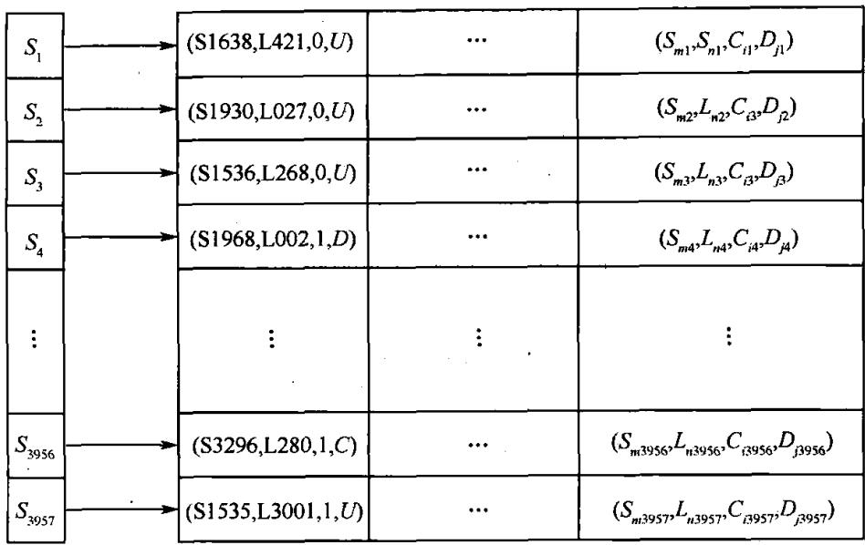

<details>
<summary>flowchart</summary>

```mermaid
graph LR
  S1["S₁"] -->|>S1638,L421,0,U| ...| (Sm1,Sn1,Ci1,Dj1)
  S2["S₂"] -->|>S1930,L027,0,U| ...| (Sm2,Ln2,Ci3,Dj2)
  S3["S₃"] -->|>S1536,L268,0,U| ...| (Sm3,Ln3,Ci3,Dj3)
  S4["S₄"] -->|>S1968,L002,1,D| ...| (Sm4,Ln4,Ci4,Dj4)
  ...["..."] -->|...| ...| :|
  S3956["S₃₉₅₆"] -->|>S3296,L280,1,C| ...| (Sm3956,Ln3956,Ci3956,Dj3956)
  S3957["S₃₉₅₇"] -->|>S1535,L3001,1,U| ...| (Sm3957,Ln3957,Ci3957,Dj3957)
```
</details>

图2

所有站点在搜索树中的最小深度。

步骤2: 判断队列是否为空, 若为空, 则程序搜索完毕, 转至步骤4执行可行路线回溯。否则出队一个站点。

步骤3: 对步骤2中出队的站点分析, 若该站点即为目的站点, 则不对其做任何操作。如果该站点并非目的站点, 则取出其所有的邻接站点, 对各子站点依次做深度判断, 转乘次数判断和避冗余比较, 并将符合条件的站点入队。重复步骤2。

步骤 4: 从队列矩阵的末尾向前遍历, 一旦遇到一个目的站点, 则将其保存到外部的一个收集容器中, 并按元组中记录的父节点地址号找出其父节点, 循环收集, 直到达到起始站点, 这样就收集到了一条可行路线。对整个队列矩阵遍历, 收集所有可行路线。

步骤 5: 从收集到的所有可行路线中, 按照用户提出的需求找出最优路线, 并组织输出。程序结束。

先深路径搜索算法：

事先说明:算法思路与先广搜索大体一致,只是程序中用的辅助数据结构为4个堆栈。其程序的转换关系如图3所示。图3描述了避冗余受控先深搜索算法的动态执行过程。程序搜索完毕后,可从路线收集器中将符合用户需求的最优路径输出。

以上两程序可在随文档上交的光盘中找到。这两个程序各有优劣。

## 4.6 算法比较

受控先深搜索能够找到给定范围内的所有可行解,但是时间耗费比较大,即使用了深度控制、转车次数控制以及避冗余策略,但时间耗费还是比较客观。比如说,在使用其搜索从S3395到S1828的最小耗时路径时,即使最大深度控制为50,最大换乘次数设定为3,并使用了避冗余策略,时间耗费也大约为10s。

受控先广搜索能够很快找到一定数量的可行解,满足及时性要求。但是受到队列数组大小的限制,先广搜索只能找到深度比较浅的可行路径。不过,一般而言可行路径中比较优的总是深度比较浅的,所以在解决实际问题时,先广搜索可能更多被使用。

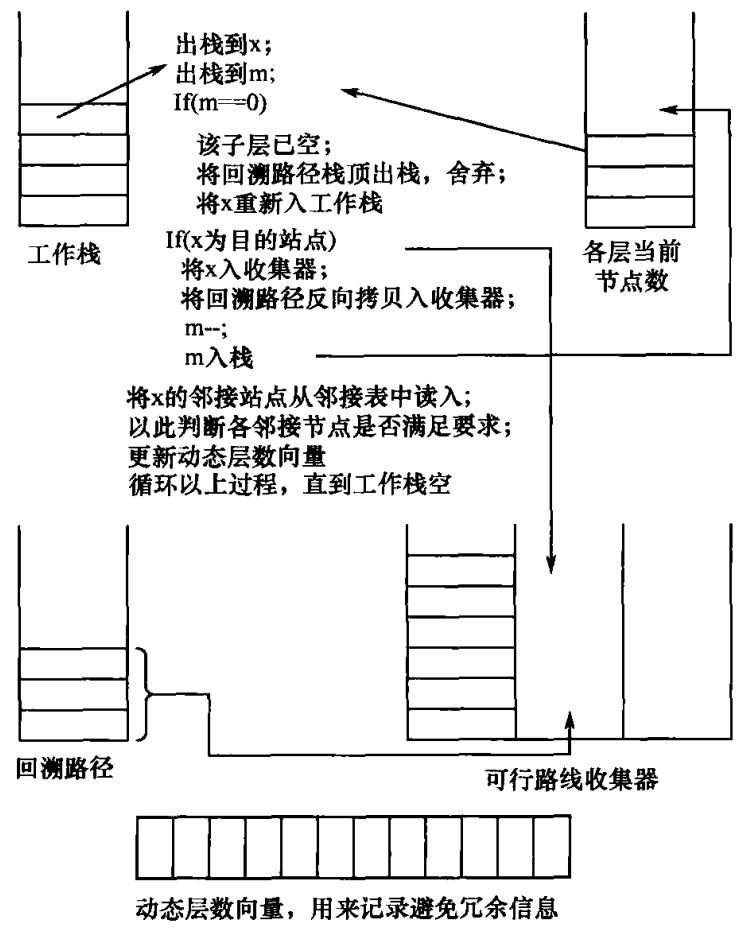

<details>
<summary>flowchart</summary>

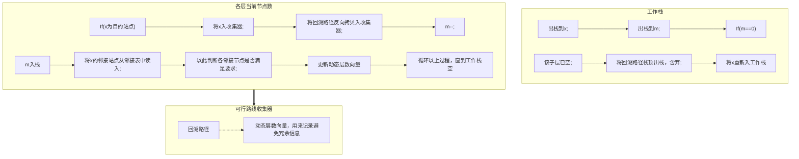
```mermaid
graph TD
  subgraph WorkStack ["工作栈"]
  A["出栈到x;"] --> B["出栈到m;"]
  B --> C["If(m==0)"]
  D["该子层已空;"] --> E["将回溯路径栈顶出栈，舍弃;"]
  E --> F["将x重新入工作栈"]
  end

  subgraph CurrentNode ["各层当前节点数"]
  G["If(x为目的站点)"] --> H["将x入收集器;"]
  H --> I["将回溯路径反向拷贝入收集器;"]
  I --> J["m--;"]
  K["m入栈"] --> L["将x的邻接站点从邻接表中读入;"]
  L --> M["以此判断各邻接节点是否满足要求;"]
  M --> N["更新动态层数向量"]
  N --> O["循环以上过程，直到工作栈空"]
  end

  subgraph VariablePath["可行路线收集器"]
    P["回溯路径"] -.-> Q["动态层数向量，用来记录避免冗余信息"]
  end

  CurrentNode ==> VariablePath
```
</details>

图3

## 4.7 实际求解

编程实现算法后,对问题1给出的6对起始站→终点站之间的最优路线进行搜索,搜索时控制转车次数不大于3次,给出最短耗时和最少转乘次数,见表2。

表 1 在转乘次数不大于 3 次条件下的线路选择评估

<table><tr><td rowspan="2">需搜索线路\乘客需求</td><td colspan="3">最少乘车耗时</td><td colspan="3">最少转乘次数(n≤3)</td></tr><tr><td>转乘次数</td><td>耗时</td><td>费用</td><td>转乘次数</td><td>耗时</td><td>费用</td></tr><tr><td>S3359→S1828</td><td>2</td><td>64</td><td>3</td><td>1</td><td>137</td><td>3</td></tr><tr><td>S1557→S0481</td><td>3</td><td>108</td><td>4</td><td>2</td><td>121</td><td>3</td></tr><tr><td>S0971→S0485</td><td>2</td><td>103</td><td>3</td><td>1</td><td>260</td><td>5</td></tr><tr><td>S0008→S0073</td><td>2</td><td>67</td><td>3</td><td>1</td><td>83</td><td>2</td></tr><tr><td>S0148→S0485</td><td>2</td><td>106</td><td>3</td><td>2</td><td>106</td><td>3</td></tr><tr><td>S0087→S3676</td><td>2</td><td>46</td><td>3</td><td>1</td><td>65</td><td>2</td></tr><tr><td colspan="7">注:耗时单位为min,费用单位为元,转换次数限制条件n≤3</td></tr></table>

从表 1 可知, 控制转乘次数在 3 次以内, 搜索题目要求的六组起始站→终到站的线路都是存在的。

下面给出关于 S3359→S1828 最少耗时和最少转乘次数（在 $n \leqslant 3$ 的前提下）的线路（其中，Sa(Lb) 为乘客经 Sa 站点时乘 Lb 线路，Sa(Lb, Lc) 为乘客在 Sa 站点由 Lb 线路换

乘到 Lc 线路）。

最少耗时线路：

$$
\begin{array}{l} \mathrm{S} 3 3 5 9 (\mathrm{L} 4 8 4) \rightarrow \mathrm{S} 2 0 2 3 (\mathrm{L} 4 8 4) \rightarrow \mathrm{S} 2 0 2 7 (\mathrm{L} 4 8 5) \rightarrow \mathrm{S} 1 7 4 6 (\mathrm{L} 4 8 5) \rightarrow \mathrm{S} 3 6 9 7 (\mathrm{L} 4 8 5) \rightarrow \\ \mathrm{S} 3 7 2 7 (\mathrm{L} 4 8 5) \rightarrow \mathrm{S} 0 3 9 3 (\mathrm{L} 4 8 5) \rightarrow \mathrm{S} 0 3 9 1 (\mathrm{L} 4 8 5) \rightarrow \mathrm{S} 3 6 7 4 (\mathrm{L} 4 8 5) \rightarrow \mathrm{S} 1 5 2 2 (\mathrm{L} 4 8 5) \rightarrow \\ \mathrm{S} 1 5 2 0 (\mathrm{L} 4 8 5) \rightarrow \mathrm{S} 2 9 9 2 (\mathrm{L} 4 8 5) \rightarrow \mathrm{S} 0 9 0 3 (\mathrm{L} 4 8 5) \dot {\rightarrow} \mathrm{S} 1 7 6 8 (\mathrm{L} 4 8 5) \rightarrow \mathrm{S} 0 9 5 5 (\mathrm{L} 4 8 5) \rightarrow \\ \mathrm{S0480(L485)} \rightarrow \mathrm{S2703(L485)} \rightarrow \mathrm{S1784(L217)} \rightarrow \mathrm{S1828(L217)} \\ \end{array}
$$

时间耗费64,经济耗费3,换乘次数2。

最少换乘次数线路1：

$$
\begin{array}{l} \mathrm{S3359(L469)} \rightarrow \mathrm{S2026(L469)} \rightarrow \mathrm{S1132(L469)} \rightarrow \mathrm{S2265(L469)} \rightarrow \mathrm{S2654(L469)} \rightarrow \\ \mathrm{S} 1 7 2 9 (\mathrm{L} 4 6 9) \rightarrow \mathrm{S} 3 7 6 6 (\mathrm{L} 4 6 9) \rightarrow \mathrm{S} 1 6 9 1 (\mathrm{L} 4 6 9) \rightarrow \mathrm{S} 1 3 8 3 (\mathrm{L} 4 6 9) \rightarrow \mathrm{S} 1 3 8 1 (\mathrm{L} 4 6 9) \rightarrow \\ \mathrm{S} 1 3 2 1 (\mathrm{L} 4 6 9) \rightarrow \mathrm{S} 2 0 1 9 (\mathrm{L} 4 6 9) \rightarrow \mathrm{S} 2 0 1 7 (\mathrm{L} 4 6 9) \rightarrow \mathrm{S} 2 1 5 9 (\mathrm{L} 4 6 9) \rightarrow \mathrm{S} 0 7 7 2 (\mathrm{L} 4 6 9) \rightarrow \\ \mathrm{S0485(L469)} \rightarrow \mathrm{S2385(L469)} \rightarrow \mathrm{S2810(L469)} \rightarrow \mathrm{S3189(L469)} \rightarrow \mathrm{S0964(L469)} \rightarrow \\ \mathrm{S0464(L469)} \rightarrow \mathrm{S0271(L469)} \rightarrow \mathrm{S0297(L469)} \rightarrow \mathrm{S1555(L469)} \rightarrow \mathrm{S0519(L469)} \rightarrow \\ \mathrm{S0516(L469)} \rightarrow \mathrm{S1980(L469)} \rightarrow \mathrm{S2364(L469)} \rightarrow \mathrm{S0727(L469)} \rightarrow \mathrm{S0304(L469)} \rightarrow \\ \mathrm{S} 3 1 9 2 (\mathrm{L} 2 1 7) \rightarrow \mathrm{S} 0 2 9 4 (\mathrm{L} 2 1 7) \rightarrow \mathrm{S} 3 0 5 7 (\mathrm{L} 2 1 7) \rightarrow \mathrm{S} 2 2 6 2 (\mathrm{L} 2 1 7) \rightarrow \mathrm{S} 0 3 0 1 (\mathrm{L} 2 1 7) \rightarrow \\ \mathrm{S} 1 1 1 9 (\mathrm{L} 2 1 7) \rightarrow \mathrm{S} 0 2 5 0 (\mathrm{L} 2 1 7) \rightarrow \mathrm{S} 2 6 0 4 (\mathrm{L} 2 1 7) \rightarrow \mathrm{S} 2 6 0 6 (\mathrm{L} 2 1 7) \rightarrow \mathrm{S} 2 5 9 9 (\mathrm{L} 2 1 7) \rightarrow \\ \mathrm{S} 3 5 1 2 (\mathrm{L} 2 1 7) \rightarrow \mathrm{S} 3 6 9 5 (\mathrm{L} 2 1 7) \rightarrow \mathrm{S} 1 2 4 1 (\mathrm{L} 2 1 7) \rightarrow \mathrm{S} 1 7 8 4 (\mathrm{L} 2 1 7) \rightarrow \mathrm{S} 1 8 2 8 (\mathrm{L} 2 1 7) \\ \end{array}
$$

时间耗费 137, 经济耗费 3, 换乘次数 1。

从线路 S3359→S1828 中最少耗费时间线路和最少换乘次数线路比较来看,乘客多换乘一次车但却为自己节约 1h 的乘车时间且付费相同,这种情况在实际中来说,乘客肯定会选择用时少的,故优先考虑时间也是比较合乎实际的,即使车费上有些差别,但对乘客来说影响基本不大。

表 2、表 3 是针对题目的六组要求给出最少耗时和最少转乘次数的最优线路方案(不唯一)。

表 2 以最少转乘次数为目标的线路选择方案

<table><tr><td>起始站</td><td>终点站</td><td>最优选择线路</td><td>转乘次数</td><td>耗时/min</td><td>费用/元</td></tr><tr><td>S3359</td><td>S1828</td><td> $S3359 \xrightarrow{L469} S2026 \xrightarrow{L217} S1828$ </td><td>1</td><td>137</td><td>3</td></tr><tr><td>S1157</td><td>S0481</td><td> $S1557 \xrightarrow{L457} S1920 \xrightarrow{L189} S3186 \xrightarrow{L460} S0481$ </td><td>2</td><td>121</td><td>3</td></tr><tr><td>S0971</td><td>S0485</td><td> $S0971 \xrightarrow{L119} S0354 \xrightarrow{L377} S0485$ </td><td>1</td><td>260</td><td>5</td></tr><tr><td>S0008</td><td>S0073</td><td> $S0008 \xrightarrow{L463} S2083 \xrightarrow{L57} S0073$ </td><td>1</td><td>83</td><td>2</td></tr><tr><td>S0148</td><td>S0485</td><td> $S0148 \xrightarrow{L308} S0036 \xrightarrow{L156} S2210 \xrightarrow{L417} S0485$ </td><td>2</td><td>106</td><td>3</td></tr><tr><td>S0087</td><td>S3676</td><td> $S0087 \xrightarrow{L454} S3496 \xrightarrow{L209} S3676$ </td><td>1</td><td>65</td><td>2</td></tr></table>

表 3 以最少乘车耗时为目标的线路选择方案

<table><tr><td>起始站</td><td>终点站</td><td>最优选择线路</td><td>转乘次数</td><td>耗时/min</td><td>费用/元</td></tr><tr><td>S3359</td><td>S1828</td><td> $S3359 \xrightarrow{L484} S2027 \xrightarrow{L485} S1784 \xrightarrow{L217} S1828$ </td><td>2</td><td>64</td><td>3</td></tr><tr><td>S1157</td><td>S0481</td><td> $S1557 \xrightarrow{L457} S2563 \xrightarrow{L441} S1919 \xrightarrow{L189} S3186 \xrightarrow{L460} S0481$ </td><td>3</td><td>108</td><td>4</td></tr><tr><td>S0971</td><td>S0485</td><td> $S0971 \xrightarrow{L013} S2517 \xrightarrow{L290} S2159 \xrightarrow{L469} S0485$ </td><td>2</td><td>103</td><td>3</td></tr><tr><td>S0008</td><td>S0073</td><td> $S0008 \xrightarrow{L463} S1383 \xrightarrow{L296} S2184 \xrightarrow{L345} S0073$ </td><td>2</td><td>67</td><td>3</td></tr><tr><td>S0148</td><td>S0485</td><td> $S0148 \xrightarrow{L308} S0036 \xrightarrow{L156} S2210 \xrightarrow{L417} S0485$ </td><td>2</td><td>106</td><td>3</td></tr><tr><td>S0087</td><td>S3676</td><td> $S0087 \xrightarrow{L454} S0088 \xrightarrow{L381} S0427 \xrightarrow{L462} S3676$ </td><td>2</td><td>46</td><td>3</td></tr></table>

经过上面的分析可以得到：

（1）换乘次数稍作改变时，乘车耗时的差别可能相差很大，但基本来说乘车费用的差别还是很小的。  
(2) 对于乘车的起始站和终点站距离较远的线路,乘客对车费差价的考虑与对耗时和转车的麻烦的考虑相比可以忽略不计。

由此,可以将目标函数进一步优化为耗时最少和转车次数最少两个目标,暂行省去费用的目标,对费用的考虑建立在其他两个目标的基础上,约束条件中的转车次数还是限制在3次以内,关于这两个目标的计算可以分别求取最优解,满足实际中乘客对两种情况的需求。

进一步改进模型如下：

目标函数: Min T 或 Min n

约束条件： $\left\{ \begin{array}{l}n\leqslant 3\\ T = \sum_{i = 1}^{p}t1_{i} + \sum_{j = 1}^{q}t2_{j}(t1\text{为两站间乘车时间},t2\text{为转车时间}) \end{array} \right.$

对问题 1 的改进模型而言, 考虑到乘客的实际需求和现实情况出现的可能性, 借以来转化模型的目标函数和约束条件, 进一步降低计算的复杂度和算法耗费时间。这里主要以在限制转乘次数的情况下寻找最少耗费时间的线路为主要目标, 同时找出在转乘次数最少的条件下起始站和终点站之间线路可达时的时间耗费, 与最少时间相比较, 若时间耗费差不多, 则转车次数少的线路较优; 若时间相差很大且转车次数相差不大, 则选择时间较少的线路。

## 5 问题(2)的分析与求解

## 5.1 问题(2)的分析

对问题(2)的考虑主要集中在地铁站点与公汽站点间的换乘问题和在同一地铁站附近的公汽站点间的换乘问题。

对两个地铁间的换乘无需再增加收乘坐地铁的费用。

对地铁到公汽的换乘和公汽到地铁的换乘考虑的换乘时间是不同的。

对一个地铁站而言,其附近存在很多公汽站点,它们之间可以借助于地铁站点来进行转乘,在问题(1)中这种公汽站点间的转乘是不允许的。

对附近可以转乘的的公汽站点而言,乘客在这两公汽点间的转乘时间与问题(1)中同一站点间的时间耗费是不同的。

对地铁站点附近的公汽站点而言,乘客在两公汽站点间的转乘可以通过先步行到地铁站再步行至下一个公汽站点,也可以不先到达地铁站点而是直接步行至下一个需换乘的公汽站点。

## 5.2 算法描述和实现

考虑到问题(2)的特殊性要求,可以对问题(1)的数据结构基础上加上两条地铁线路 $T_{1}$ 、 $T_{2}$ 和39个地铁站点信息后并稍加修改,即将两条地铁线路 $T_{1}$ 、 $T_{2}$ 和39个地铁站点抽象为问题(1)中的公汽线路和公汽站点,重复利用问题(1)模型的算法进行求解。此时,因为这些公汽站点之间可以经地铁站点转乘,即可以认为这些站点就是同一个站点,但对相互间的相通性而言,考虑用一条虚的乘车路线来联系地铁站点和其附近的公汽站点,这些虚的乘车线路只耗时,不收费。这样就可以将这些虚的线路抽象等效为一条线路,但要求考虑到其特殊性。具体操作时可以将任何汽车站点与其对应的地铁站点间的步行方式看成问题(1)中的一条直达站点间的单程往返线路,特殊性是公汽只经过一站就可以从起始站到终点站。

不妨认为在同一个地铁站点附近的几个汽车站可以利用地铁站用步行的方式相互达到,并且要综合考虑站点间的步行时间和等车时间的耗费,但对乘车费用就无需再进行考虑(即车费为零)。

具体的算法实现时对地铁站点的信息进行转换,变为附录1.1中的公汽线路信息数据格式,如下:

线路标号:L001

收费方式:分段计价

$$
\begin{array}{l} \text {公交线路: S0619 - S1914 - S0388 - S0348 - S0392 - S0429 - S0436 - S3885 - S3612 -} \\ \text {S0819 - S3524 - S0820 - S3914 - S0128 - S0710} \end{array}
$$

问题(2)中的 $T_{1}$ 和 $T_{2}$ 两条地铁线路, 可直接为它们分配一个与公汽线路编号不重复的线路编号, 收费方式对地铁而言为单一票价(3元), 但是需要注意地铁间的换乘是无需收费的。

对两条地铁线路上的地铁站点而言,其每站附近都存在好几个公汽站点,对站点间线路抽象后,可以将任何汽车站点与其对应的地铁站点间的步行方式看成问题(1)中的一条单向往返线路,特殊的是,这是直接一步从起点到终点。为这条步行路线编号,收费方式为单一制。这样这些抽象的线路也可以写成问题(1)中的线路描述形式。

现在以 $T_{1}$ 线路上的站点D01和其可以换乘汽车站点S0567、S0042、S0025为例，用图4表示。

注:图4中双箭头表示单向往返线路。

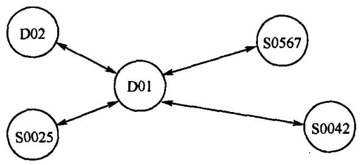

<details>
<summary>flowchart</summary>

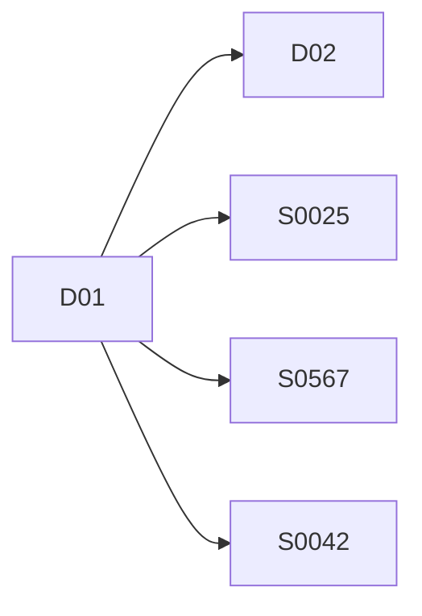
```mermaid
graph LR
  D01["D01"] --> D02["D02"]
  D01 --> S0025["S0025"]
  D01 --> S0567["S0567"]
  D01 --> S0042["S0042"]
```
</details>

图4

现在将 S0042、S0025 和 S0567 与 D01 间的步行线路写成和上面形式一样：

LXXX LYYY LZZZ

不收费 不收费 不收费

S0042 - D01 S0025 - D01 S0567 - D01

其中 LXXX、LYYY、LZZZ 为与其他线路不重复的线路编号。

其余的站点用和上面的相同的方法进行处理,对公汽和地铁间的转换存在多个判断情况如下,若连续站点间关系为以下情况:

(1) 公汽→地铁→地铁, 则转乘地铁, 乘客从公汽站到地铁站耗时 6min, 整个过程转车一次, 费用增加 3 元。  
(2) 公汽→地铁→公汽, 则转乘公汽, 乘客从公汽站到地铁站耗时 4min, 整个过程转车一次, 费用为零。  
(3) 公汽→公汽转车时花费时间加 5min, 不转车时加 3min。  
(4) 地铁→地铁转车时花费时间加 4min, 不转车时加 2.5min。  
(5) 地铁→公汽时若汽车站为终点站花费时间加 4min, 不是终点站时加 7min。

考虑以上几种情况后,这样就可以将问题(2)中的额外的线路方式信息转化为和问题(1)一样的,也就可以用问题(1)的算法求出符合要求的线路。

对问题(1)的算法稍加调整后,得到在转车次数不大于3的情况下最少耗时为目标的线路选择方案,见表4。

表 4 以最少乘车耗时为目标的线路选择方案

<table><tr><td>起始站</td><td>终点站</td><td>最优选择线路</td><td>转乘次数</td><td>耗时/min</td><td>费用/元</td></tr><tr><td>S3359</td><td>S1828</td><td> $S3359 \xrightarrow{L484} S2027 \xrightarrow{L485} S1784 \xrightarrow{L167} S1828$ </td><td>1</td><td>64</td><td>3</td></tr><tr><td>S1157</td><td>S0481</td><td> $S1557 \xrightarrow{L457} S2563 \xrightarrow{L441} S1919 \xrightarrow{L189} S3186 \xrightarrow{L460} S0481$ </td><td>3</td><td>108</td><td>4</td></tr><tr><td>S0971</td><td>S0485</td><td> $S0971 \xrightarrow{L094} S0576 \longrightarrow D01 \xrightarrow{T1} D21 \longrightarrow S0466 \xrightarrow{L51} S0485$ </td><td>2</td><td>99</td><td>5</td></tr><tr><td>S0008</td><td>S0073</td><td> $S0008 \xrightarrow{L150} S3874 \longrightarrow D30 \xrightarrow{T2} D25 \longrightarrow S525 \xrightarrow{L103} S0073$ </td><td>2</td><td>55</td><td>5</td></tr><tr><td>S0148</td><td>S0485</td><td> $S0148 \xrightarrow{L24} S1487 \longrightarrow D02 \xrightarrow{T1} D21 \longrightarrow S0466 \xrightarrow{L51} S0485$ </td><td>2</td><td>50</td><td>5</td></tr><tr><td>S0087</td><td>S3676</td><td> $S0087 \longrightarrow D27 \xrightarrow{T2} D36 \longrightarrow S3676$ </td><td>0</td><td>35</td><td>3</td></tr></table>

由表 4 的结果分析可以得到,考虑地铁站点加入后:

(1) 能够解决部分线路的耗时长问题,但仍然有无法减少的情况存在,如 S1157→S0481。  
（2）对于乘坐地铁节约时间而言，一般的乘车花费就有所增加，且乘客许在公汽站点和地铁站点间进行转换。

通过加入地铁换乘的全面信息,对不同需求的乘客可以给出比问题(1)更优的一条乘车线路。

## 6 问题(3)的分析与建模

问题(3)给出假设所有站点间的步行时间为已知,在此考虑乘客的三个目标:时间耗费、换乘次数、金钱耗费。对于三个目标的权重关系,考虑优先级别,先对时间目标求取较优的线路,再在基本保持时间不变的条件下求转车次数较少的线路,最后考虑金钱耗费问题,再从可选线路中给出一条快速、便利、节省的线路给乘客。

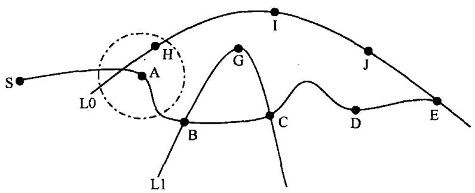

<details>
<summary>text_image</summary>

S
L0
A
H
B
G
I
J
C
D
E
L1
</details>

图5

注: 图 5 中 S、E 为乘客乘车的起始站和终点站, A、B、C、D 为乘客步行用时较优线路上的中间站点, G、H、J、I 为 L0、L1 两条公交路线上的站点。

现结合图1来阐述模型的基本思想:设一对起始站和终点站组为(S,E)并且这两站点之间的步行时间为 $T_{ST}$ ，因为S和E两站点的步行时间 $T_{ST}$ 为已知，即已经知道这两站点之间的步行相对较优线路，所以可以利用已经存在于两站点间的步行路线作搜索方向引导来减少搜索最短线路的复杂性，并结合搜索步行线路中公交站点周围一定范围内的公交站点，搜索是否有经过这些站点达到步行终点站附近站点的耗时较少的公交线路。

设起始站 S 到终点站 E 间存在 A、B、C、D 四个中间公交站, 利用问题(1)的算法进一步考虑下面两种换乘方式。

（1）对步行线路上的两个站点用乘坐公交来替换。对经过 S、E 和中间公交站点 A、B、C、D 中任意两站的公交线路计算出两站间乘公交耗时，用这些耗时与步行用时相比较，若步行用时长则用公交代替这两站间的步行，得到一条时间耗费较少的线路，比如：图 5 中 B→C 乘公交 L1 用时 5min，而两站间步行需 10min，则可以将 B→C 这段改为乘公交。这样将所有可能的线路进行比较并综合考虑转车次数和乘车费用，就可以给出一个满足乘客需求的最优线路。  
（2）对步行线路上的两个站点周围步行时间一定范围内的站点用乘坐公交来替换。考虑从 A、B、C、D 各点出发步行一定时间限度内能够到达的所有站点，若这些站点中存

在某一条公交线路,其经过该站点到达终点站且用时较少,那么乘客可以步行到线路周围的该站点再改乘该线路车到终点站。例如:图5中搜索A周围存在的站点,找到H站点,发现存在LO这条线路从H到其终点站E且用时很少,则乘客从A到E就采取从A步行至H再乘LO线路的车到E。

综合应用上面两种替换方法,就可以得到多条可行的乘车方案,再根据乘客的需求选择转车次数少,时间少或者费用少的不同的需求线路,最后就可以给出满足乘客需求的最优线路。

## 7 模型的评价和建议

在问题(1)与(2)的模型中,以乘客的转乘次数为约束条件,以最短耗时为主要目标,在转乘次数不超过3次的条件下,计算最少时间耗费和最少转乘次数下的时间耗费,结合实际客户的需求综合考虑时间耗费和转乘次数给出最优的线路。本模型的优缺点如下:

优点：

(1) 算法思想简单,易于理解。  
(2) 利用避冗余策略, 大大降低计算的时间复杂性。  
(3) 可以满足乘客的不同需求。

缺点：

(1) 算法限制了转车的次数, 找到的线路是局部最优线路, 非全局最优。  
(2) 算法在时间和空间上的耗费仍然较大, 是限制全局搜索的关键因素。  
(3) 该算法对乘车费用的考虑很少,忽视了少部分对费用要求较高的乘客需求。

几点建议：

（1）在实际生活中，各站点之间的相对地理信息是已知的，可以借助于地理信息系统减少无效方向上的搜索，比如可以采用电子地图、卫星地图等。  
（2）对城市中站点的数据信息可以借助数据库来存储，在计算线路前站点的关系和线路关系已经存储完备，查询时只需调用这些信息，无需再计算这些结果，可降低查询的时间耗费。

## 参考文献

[1] 近藤次郎. 数学模型. 北京: 机械工业出版社, 1985.  
[2] 苏金明, 阮沈勇. MATLAB 实用教程. 北京: 电子工业出版社, 2005.  
[3] 何光渝, 高永利. Java 常用数值算法集. 北京: 科学出版社, 2003.  
[4] 邓辉文．离散数学．北京：清华大学出版社，2006.

## 【论文点评】

刘守生

本文思路清晰,方法简洁,在复杂问题简单化方面给读者深刻印象。

本文建立的存储公交站点相邻关系的邻接矩阵,信息全面,应用方便。利用数据压缩技术中的避冗余动态搜索方法作为主打模型可行且高效。为了使不同交通方式统一化，作者提出的等效虚拟线路方法，富有新意，给人以“四两拨千斤”的感觉。对可考虑站点之间步行时间的最优线路选择问题，采用总体先深局部先广的思想，在搜索到达某一站点时，对其附近部分步行可达的站点同步考虑。这样的处理方法也比较符合实际情况。本文在模型建立时，经常给出一些理论推导和算法复杂度分析，增强了模型的可信度，这是本文的特色之一。

本文的不足之处是对各种乘客的要求考虑不全面,尤其对乘车费用的考虑很少,忽视了少部分对费用要求较高的乘客需求,使整篇文章显得不丰满。

## 2008 年 B 题 高等教育学费标准探讨

高等教育事关高素质人才培养、国家创新能力增强、和谐社会建设的大局，因此受到党和政府及社会各方面的高度重视和广泛关注。培养质量是高等教育的一个核心指标，不同的学科、专业在设定不同的培养目标后，其质量需要有相应的经费保障。高等教育属于非义务教育，其经费在世界各国都由政府财政拨款、学校自筹、社会捐赠和学费收入等几部分组成。对适合接受高等教育的经济困难的学生，一般可通过贷款和学费减、免、补等方式获得资助，品学兼优者还能享受政府、学校、企业等给予的奖学金。

学费问题涉及每一个大学生及其家庭,是一个敏感而又复杂的问题:过高的学费会使很多学生无力支付,过低的学费又使学校财力不足而无法保证质量。学费问题近来在各种媒体上引起了热烈的讨论。

请你们根据中国国情,收集诸如国家生均拨款、培养费用、家庭收入等相关数据,并据此通过数学建模的方法,就几类学校或专业的学费标准进行定量分析,得出明确、有说服力的结论。数据的收集和分析是你们建模分析的基础和重要组成部分。你们的论文必须观点鲜明、分析有据、结论明确。

最后,根据你们建模分析的结果,给有部门写一份报告,提出具体建议。

## 【试题评析】

滕加俊

高素质人才培养、国家创新能力增强、和谐社会建设的大局依赖于我国的高等教育，因此受到党和政府及社会各方面的高度重视和广泛关注，所以制定一个合理的高等教育的收费标准是一个至关重要的问题。

## 【问题解答要点】

## 1. 需要解决的问题

(1) 现行的收费标准是否合理。  
(2) 怎样确定合理的收费标准。

## 2. 需要收集的数据

数据的收集非常重要。应该收集充分的、有根据、有说服力的数据，并能支持建模的结论。需要收集的数据有：

(1) 国民经济增长数据。  
(2) 教育经费的比例。  
(3) 高校国家生均拨款。  
(4) 学校每年的运营开支。  
(5) 每年报考大学的人数和录取人数。

(6) 生均培养费用。  
(7) 现行高校收费标准。  
（8）其他相关数据，如学生分布结构，家庭经济收入分布，困难学生的人数，每个学生每年的学费、生活费、奖学金、助学金、贷款、捐赠款等。

## 3. 解决问题需要考虑的因素

对于第一个问题,至少从以下两点来考虑:①从高校方面来考虑现行高校收费标准是否合理;②从学生方面来考虑现行高校收费标准是否合理。但如果能从其他方面来考虑可能更能说明问题,如国际比较、历史比较、人民生活水平的提高、社会的进步等。

对于第二个问题,也应从两个方面来考虑:①从高校方面来考虑,学校的各项收入之和应能保证教育质量的最低培养费用;②从学生方面来考虑,应尽量使多数学生家庭能够承受,尽可能使多数学生满意。当然这是一对矛盾,如何克服是建模中的一个难点。

因此建立的模型应多角度、全面、综合地考虑学费标准问题。模型中至少应考虑教育质量的保证和承受能力两个方面，如培养成本、成本分担、长远收益、国际比较、历史比较等方面的考虑。同时应该通过数据的统计分析和建模深入细致地讨论学费标准问题，并要有明确的结论。

# 2009 年 B 题 眼科病床的合理安排

医院就医排队是大家都非常熟悉的现象,它以这样或那样的形式出现在我们面前,例如,患者到门诊就诊、到收费处划价、到药房取药、到注射室打针、等待住院等,往往需要排队等待接受某种服务。

考虑某医院眼科病床的合理安排的数学建模问题。

该医院眼科门诊每天开放,住院部共有病床79张。该医院眼科手术主要分四大类:白内障、视网膜疾病、青光眼和外伤。附录中给出了2008年7月13日至2008年9月11日这段时间里各类病人的情况。

白内障手术较简单,而且没有急症。目前该院是每周一、三做白内障手术,此类病人的术前准备时间只需1、2天。做两只眼的病人比做一只眼的要多一些,大约占到60%。如果要做双眼是周一先做一只,周三再做另一只。

外伤疾病通常属于急症,病床有空时立即安排住院,住院后第二天便会安排手术。

其他眼科疾病比较复杂,有各种不同情况,但大致住院以后2天\~3天内就可以接受手术,主要是术后的观察时间较长。这类疾病手术时间可根据需要安排,一般不安排在周一、周三。由于急症数量较少,建模时这些眼科疾病可不考虑急症。

该医院眼科手术条件比较充分,在考虑病床安排时可不考虑手术条件的限制,但考虑到手术医生的安排问题,通常情况下白内障手术与其他眼科手术(急症除外)不安排在同一天做。当前该住院部对全体非急症病人是按照FCFS(First come, First serve)规则安排住院,但等待住院病人队列却越来越长,医院方面希望你们能通过数学建模来帮助解决该住院部的病床合理安排问题,以提高对医院资源的有效利用。

问题一:试分析确定合理的评价指标体系,用以评价该问题的病床安排模型的优劣。

问题二:试就该住院部当前的情况,建立合理的病床安排模型,以根据已知的第二天拟出院病人数来确定第二天应该安排哪些病人住院。并对你们的模型利用问题一中的指标体系作出评价。

问题三:作为病人,自然希望尽早知道自己大约何时能住院。能否根据当时住院病人及等待住院病人的统计情况,在病人门诊时即告知其大致入住时间区间。

问题四:若该住院部周六、周日不安排手术,请你们重新回答问题二,医院的手术时间安排是否应作出相应调整?

问题五:有人从便于管理的角度提出建议,在一般情形下,医院病床安排可采取使各类病人占用病床的比例大致固定的方案,试就此方案,建立使得所有病人在系统内的平均逗留时间(含等待入院及住院时间)最短的病床比例分配模型。

## 【试题评析】

沈锦仁

本题是为眼科医院提供一个合理安排不同疾病的病人住院时间的数学模型,从而提高医院的病床利用率。

第一问是要提出若干个有效地反映病人住院安排合理性的数量化指标,从而利用该指标来评判方案的优劣性。

第二问是根据题目提供的三百多病人的入院时间和住院时间等数据,提出一个比现有数据更合理的方案,并根据上面所提出的指标来评判你提出的方案更合理。

第三问要求对已门诊而等待入院住院的病人提供一个大致的入院住院时间。

第四问是在假设星期六、日住院不做手术的前提下,分析问题,指出星期一、三安排白内障手术的不合理性,并改在星期二、四或星期三、五做白内障手术。你上面提出的方案将有怎样的改变并用指标加以评判。

第五问:根据眼科五类疾病的病人住院数,如何合理安排医院的病床比例,使得医院病床利用率达到最佳,要求构造一个数学模型。

## 【问题解答要点】

第一问:要求提出两个方面的指标。第一:反映病床利用率的指标。例如,单位时间内出院的人数,单位时间病床住的病人数,单位时间等待住院人数等均属于此,用排队论的术语是平均队长、平均排队长、平均逗留时间等。第二,反映对五类病人的公平性指标,例如对五类病人的平均等待时间的方差(或绝对差),五类病人平均逗留时间方差等。

第二问:本问是整个题目的要点,首先要对已有数据按五类疾病进行统计,得五类病单位时间等待入院人数(顾客源),平均术前准备时间,平均术后恢复时间,其和即为平均住院时间(平均服务时间)。第二步,经过分析得出要优化方案,关键是减少术前准备时间,因为白内障手术必须在星期一、三才能做,因此白内障病人最好在星期二、日住院,从而提出一个五类病人的住院时间的安排原则,同时考虑公平度指标,结合顾客源的数量,进行合理安排。第三步,根据三百多病人的数据,重新安排入院时间进行模拟试验提出时间表。第四步,在新方案下计算你所提出的指标,与旧方案进行比较。

第三问:在上面提出的新方案下,根据五类病的顾客源数量来预测已门诊病人的入院大致时间,最好用概率统计的方法,给予置信水平为95%的区间估计。

第四问:如果星期六、日两天不做手术,而星期一只能做白内障手术,从而其他类病人术前准备时间过长,把方案改为星期二、四做白内障手术,或改在星期三、五,同样用上面提到的数值模拟试验进行安排,并用计算出两类指标,进行比较。一般说“星期二、四方案”比“星期一、三方案”要优。

# 眼科病床的合理安排

## 摘要

本文运用排队论的知识对眼科病床的合理安排建立数学模型,以平均等待时间和平均准备时间为评价指标,通过对题目中的数据进行计算机模拟,确定病床的安排和病人的大致入住时间。

问题一,通过分析医院系统的特征性,确定以平均等待时间和平均术前时间和日出院人数作为主要评价指标的评价体系,等待时间和术前时间指标越低,病床安排越合理,日出院人数越多,系统效率越高。对FCFS模式的病床安排模型进行评价,得到平均等待时间10.6398天,平均准备时间2.4422天,日平均出院人数5.7213人。

问题二,利用贪心算法得到一系列较优化的病床安排准则,建立模型一,通过编程求解,得到优化后的平均等待时间8.1513天,平均准备时间1.7873天,日出院人数7.9344人。研究发现,模型中视网膜平均等待时间过长,考虑到病人心理,增加队列长度的约束,得到各病种平均等待时间较平均的优化模型,平均等待时间7.9229天,平均准备时间1.7963天,日出院人数7.9016人。

问题三,病人在门诊时诊断出病种后,根据当时的入住病人和等待病人队列,预测出统计平均术后恢复时间下的入院时间下限,再根据外伤病人等插队病人在门诊到预测出院日期之间出现的概率,得到预测入院日期的上限,即可得到大致入院时间区间。

问题四,在问题二的基础上,周六、周日不安排手术,模型进行修改,得到修改后的平均等待时间9.2761天,平均准备时间2.6815天,日出院人数7.3607人。模拟调整手术时间安排,分析确定周二周四做白内障手术,周三周五做手术两种调整方案。得到周二周四做手术的平均等待时间9.4305天,平均准备时间2.1886天,日出院人数7.4754人。得到周三周五做手术的平均等待时间9.2632天,平均准备时间1.7905天,日出院人数7.9754人。故认为医院应该调整手术时间为周三,周五做白内障手术。

问题五,分析平均逗留时间与其他量之间的关系,建立以所有病人的平均逗留时间最短为目标的优化模型,求解优化模型,得到病床的分配比例分别为20%、23%、14%、39%、4%,此时最短逗留时间为19.23天。

模型较好的解决了题目给出的问题,在9月11日前能使484个人入院,并使医院系统达到稳态。

关键词: 贪心算法, 最优化, PASCAL

## 1 问题的重述

医院就医排队是大家都非常熟悉的现象,它以这样或那样的形式出现在我们面前,例176

如,患者到门诊就诊、到收费处划价、到药房取药、到注射室打针、等待住院等,往往需要排队等待接受某种服务。

考虑某医院眼科病床的合理安排的数学建模问题。

该医院眼科门诊每天开放,住院部共有病床79张。该医院眼科手术主要分四大类:白内障、视网膜疾病、青光眼和外伤。附录中给出了2008年7月13日至2008年9月11日这段时间里各类病人的情况。

白内障手术较简单,而且没有急症。目前该院是每周一、三做白内障手术,此类病人的术前准备时间只需1、2天。做两只眼的病人比做一只眼的要多一些,大约占到60%。如果要做双眼是周一先做一只,周三再做另一只。

外伤疾病通常属于急症,病床有空时立即安排住院,住院后第二天便会安排手术。

其他眼科疾病比较复杂,有各种不同情况,但大致住院以后2天\~3天内就可以接受手术,主要是术后的观察时间较长。这类疾病手术时间可根据需要安排,一般不安排在周一、周三。由于急症数量较少,建模时这些眼科疾病可不考虑急症。

该医院眼科手术条件比较充分,在考虑病床安排时可不考虑手术条件的限制,但考虑到手术医生的安排问题,通常情况下白内障手术与其他眼科手术(急症除外)不安排在同一天做。当前该住院部对全体非急症病人是按照FCFS(First come, First serve)规则安排住院,但等待住院病人队列却越来越长,医院方面希望你们能通过数学建模来帮助解决该住院部的病床合理安排问题,以提高对医院资源的有效利用。

问题一:试分析确定合理的评价指标体系,用以评价该问题的病床安排模型的优劣。

问题二:试就该住院部当前的情况,建立合理的病床安排模型,以根据已知的第二天拟出院病人数来确定第二天应该安排哪些病人住院。并对你们的模型利用问题一中的指标体系作出评价。

问题三:作为病人,自然希望尽早知道自己大约何时能住院。能否根据当时住院病人及等待住院病人的统计情况,在病人门诊时即告知其大致入住时间区间。

问题四:若该住院部周六、周日不安排手术,请你们重新回答问题二,医院的手术时间安排是否应作出相应调整?

问题五:有人从便于管理的角度提出建议,在一般情形下,医院病床安排可采取使各类病人占用病床的比例大致固定的方案,试就此方案,建立使得所有病人在系统内的平均逗留时间(含等待入院及住院时间)最短的病床比例分配模型。

## 2 基本假设

(1) 假设只有外伤属于急症,青光眼和视网膜疾病不含急症。

(2) 假设病人的术前准备时间是整天,不足整天的按整天算。

(3) 假设门诊时间与入院时间至少相差一天, 不可能门诊当天就住院。

（4）假设在前三问中白内障手术只在周一、周三做，青光眼和视网膜疾病手术只在其他时间做，急症手术在任何时间都可以做。

## 3 符号约定

$w_{i}$ : 平均等待时间;

$r_{i}$ : 平均准备时间;

$h_{i}$ : 平均恢复时间;

$l_{i}$ : 平均逗留时间;

$m_{i}$ : 平均住院时间;

$\lambda$ :单位时间里的病人数;

$\mu$ : 单位时间内能被服务的病人数;

$W_{si}$ : 第 i 种病人的逗留时间;

$c_{i}$ : 第 i 类病人占病人总数的百分比;

$b_{i}$ : 等效病床比例;

$T_{1i}$ : 第 i 类病人的平均等待时间;

$T_{2i}$ : 第 i 类病人的平均住院时间；

$k_{i}$ : 第 i 类病人分得的病床比例。

## 4 问题的分析与模型的建立

## 4.1 问题一

医院床位安排模型可以采用排队论中的运行指标作为评价指标。

排队论中的系统运行指标 $^{[1]}$ 主要有：

(1) 队长: 指医院系统中来的病人数。  
(2) 队列长: 指在医院系统中排队等待病床的病人数。  
（3）逗留时间:病人的住院时间与等待时间之和,即指病人在该医院系统中的从门诊到出院的时间总和。  
(4) 等待时间:病人等待病床的时间,即病人从门诊到入院的时间。  
(5) 忙期: 病床的使用率。  
(6) 损失概率: 病人因等待而失去耐心, 离开该医院系统的概率。  
(7) 平均服务率: 单位时间内医院出院的人数。  
(8) 手术前准备时间:从入院到第一次手术的时间。  
(9) 手术后恢复时间:从最后一次手术到出院的时间。

评价医院病床安排模型的优劣,应该综合考虑其经济效益和社会效益。

在本问题中,病人来源即顾客数是无限的,因此队长这个评价指标不可取。又考虑到文中 FCFS 模式下,病床有空即入院,使得病床的使用率始终达到 100%,故忙期这个评价指标也不能用来判断模型的优劣。

本问题的排队模型是等待型,即病人始终会在队列中等待,故没有损失概率。

而平均服务率与平均逗留时间存在反比关系,相互不独立,故不能同时采用。

从题目的数据部分可以看出眼科疾病分为五类:白内障、白内障(双眼)、青光眼、视网膜疾病和外伤。

本文约定各量用表1所列符号表示。

表 1 各量的符号表示

<table><tr><td>平均等待时间(门诊时间—入院时间)</td><td>平均准备时间(入院—手术)</td><td>平均恢复时间(第一次手术—出院)</td><td>平均逗留时间(门诊—出院)</td><td>平均住院时间(入院—出院)</td></tr><tr><td> $w_{i}$ </td><td> $r_{i}$ </td><td> $h_{i}$ </td><td> $l_{i}$ </td><td> $m_{i}$ </td></tr></table>

可以发现,平均等待时间和平均逗留时间存在一部分重合,即平均等待时间,又已知

$$
\left\{ \begin{array}{l} m = l - w \\ m = r + h \end{array} \right.
$$

而平均恢复时间 $h_{i}$ 是一个不可优化的统计量, 故可以采用平均准备时间来表示模型的效率。

综上所述,采用前349个病人的平均等待时间w和平均准备时间r作为评价指标来评价病床安排模型的优劣。两个评价指标越低,病床安排越合理。

统计前 349 个周期完整的病人,得到数据见表 2。

表 2 五类病人的平均时间及人数(时间单位:天)

<table><tr><td></td><td>平均等待时间  $w_i$ </td><td>平均术前准备时间  $r_i$ </td><td>平均术后恢复时间  $h_i$ </td><td>平均逗留时间  $l_i$ </td><td>人数  $n_i$ </td></tr><tr><td>白内障</td><td>12.33</td><td>2.33</td><td>2.91</td><td>17.57</td><td>72</td></tr><tr><td>白内障(双眼)</td><td>12.51</td><td>3.60</td><td>4.96</td><td>21.07</td><td>82</td></tr><tr><td>青光眼</td><td>12.26</td><td>2.41</td><td>8.08</td><td>22.74</td><td>39</td></tr><tr><td>视网膜疾病</td><td>12.54</td><td>2.38</td><td>10.17</td><td>25.09</td><td>101</td></tr><tr><td>外伤</td><td>1.00</td><td>1.00</td><td>6.04</td><td>8.04</td><td>55</td></tr></table>

n=349 代表统计总人数, $n_{i}$ 代表统计的五种病人人数,则综合平均等待时间 w,平均准备时间 r 由下式得出:

$$
\left\{ \begin{array}{l} w = \frac {\sum_ {i = 1} ^ {5} w _ {i} n _ {i}}{n} \\ r = \frac {\sum_ {i = 1} ^ {5} r _ {i} n _ {i}}{n} \end{array} \right.
$$

日出院人数 $\mu = \frac{\text{出院人数}}{61}$

计算可得

$$
w = 1 0. 6 3 9 8, r = 2. 4 4 2 2, \mu = 5. 7 2 1 3
$$

即平均等待时间为 10.6398 天, 平均准备时间为 2.4422 天, 日平均出院人数 5.7213 人。

## 4.2 问题二

## 4.2.1 问题的分析

外伤属于急症,因此在第二天有床位的情况下都要优先安排外伤病人入院。

由于白内障(双眼)病人只有在周一才能做第一次手术,而白内障病人的术前准备时间为1、2天,因此,尽量在周六、周日安排白内障病人入院是比较好的选择。如题目数据中的序号为25的白内障双眼病人,由于FCFS原则,在7月28日周一入院,却等到8月4号即下周的周一才做手术,术前等待时间是7天,大大多于必要准备时间。

优化病人的住院时间,主要在于优化病人的手术前准备时间。

同时,考虑到白内障病人在周六入院,可以在周日留有更多的床位给其他类的病人,如青光眼和视网膜疾病的病人,而这些病人在经过2天的最短准备时间后恰巧能在周二的时候进行手术。所以在周六和周日都有床位的情况下,白内障病人应该优先安排在周六入院。

## 4.2.2 模型一

考虑到术后平均恢复时间：

$$
h _ {i} = l _ {i} - w _ {i} - r _ {i}
$$

$$
h _ {i} = \frac {\sum h _ {i j}}{n _ {i}}
$$

统计前 349 个周期完整的病人,得到五类病人的平均术后恢复时间和离散化时间见表 3。

表 3 五类病人的平均术后恢复时间及离散化时间(单位:天)

<table><tr><td></td><td>白内障</td><td>白内障(双眼)</td><td>青光眼</td><td>视网膜</td><td>外伤</td></tr><tr><td>平均术后恢复时间</td><td>2.90</td><td>4.96</td><td>8.08</td><td>10.17</td><td>6.04</td></tr><tr><td>离散化时间</td><td>3</td><td>5</td><td>8</td><td>10</td><td>6</td></tr></table>

该段时间为不可优化的平均术后恢复时间。

从表中可以看出,青光眼的术后恢复时间8.08天比视网膜的术后恢复时间10.17天要短,而两者的术前准备时间都为2、3天。

由第二天拟出院病人数安排第二天入院的病人,确定可以得到局部最优的病床安排模拟模型,即贪心 $^{[2]}$ 算法模型,服务规则如下:

(1) 在周六、周日两天中, 白内障病人优先在周六入院。  
(2) 在周六、周日安排的白内障病人中优先安排白内障(双眼)病人。  
(3) 周一、周二,优先安排白内障(单眼)病人入院就诊。  
(4) 在周一、周二中, 白内障(单眼)病人优先在周一入院。  
(5) 外伤病人最优先治疗,有空床位即安排入院。  
(6) 青光眼和视网膜疾病病人不安排在周一和周三做手术。  
(7) 病人在入院后完成必要的准备工作, 即在第一个可以做手术的日子里进行手术。  
（8）周一、周三安排白内障手术，其余时间安排青光眼和视网膜手术，外伤手术的安排不受限制。

$$
\min f = \sum w _ {i j} + \sum r _ {i j}
$$

$$
\text {s. t.} \left\{ \begin{array}{c} w _ {i j} = j + \rho_ {w} \\ r _ {i j} = j + \rho_ {r} \\ g _ {2} \leqslant g _ {1} \\ \cdot g _ {3} \leqslant g _ {4} \\ g _ {5} <   g _ {1} + g _ {2} + g _ {3} + g _ {4} \\ \rho_ {i} \in j \end{array} \right.
$$

式中： $\rho_{w}$ 代表需要最少的等待时间； $\rho_{r}$ 代表最少的术前准备时间； $\rho$ 是一个关于周和疾病种类的数；j 代表周几；g 代表不同疾病种类的队列。

算法如下：

（1）构造 5 个队形数组，即白内障（单眼）、白内障（双眼）、青光眼、视网膜疾病、外伤 5 个队列。同时构造 5 种病门诊日期的数组，用以确定某天某种病的门诊人数。  
(2) 依据统计中已经有的病人门诊时间,将其一一添加进所对应的门诊日期数组中。对门诊时间从7月13日依次递推到9月11日,每当门诊天数加1,即把当天门诊数组中的病人加入它所对应的疾病种类队列中。  
（3）然后，以队列的先进先出顺序按照服务规则的优先程度出列安排入院，于此同时，该入院日期所对应的出院日期数组人数减1，并且记录下该病人的入院日期。  
（4）在病人入院的同时，通过入院日期属于周几，判断确定其做手术的最佳时间，并且利用统计得到的第一次手术到出院时间的平均值，即平均术后恢复时间，确定其出院的日期，并记录。  
（5）同时，将表示某出院日期中出院人数的数组数量加1，用以在出院的日期中统计有多少床位空缺，并且可以使什么病人入住。  
(6) 转回第 3 步, 直到该出院日期中数组值为 0, 即没有空床位, 或者病人队列已经没有可以进入的病人为止。

由于7月13日以前的住院病人数据没有,而7月14日以前病床因FCFS的服务规则已经住满,故我们需统计7月14日以前入住的病人的出院日期。

为此,统计了14号以后入院的前79个出院的日期,并且统计了13号以后前79个人院者的日期,在经过相同日期的相减后,得到了13日以前住院病人出院日期,见表4。

表 4 13 日以前住院病人出院情况

<table><tr><td>日期</td><td>13日后入院的出院人数</td><td>13日后入院的人数</td><td>13日前入院的出院人数</td><td>日期</td><td>13日后入院的出院人数</td><td>13日后入院的人数</td><td>13日前入院的出院人数</td></tr><tr><td>7-14</td><td>0</td><td>1</td><td>1</td><td>7-21</td><td>0</td><td>2</td><td>2</td></tr><tr><td>7-15</td><td>0</td><td>0</td><td>0</td><td>7-22</td><td>1</td><td>2</td><td>1</td></tr><tr><td>7-16</td><td>0</td><td>0</td><td>0</td><td>7-23</td><td>0</td><td>1</td><td>1</td></tr><tr><td>7-17</td><td>0</td><td>1</td><td>1</td><td>7-24</td><td>0</td><td>2</td><td>2</td></tr><tr><td>7-18</td><td>0</td><td>1</td><td>1</td><td>7-25</td><td>2</td><td>4</td><td>2</td></tr><tr><td>7-19</td><td>1</td><td>2</td><td>1</td><td>7-26</td><td>1</td><td>8</td><td>7</td></tr><tr><td>7-20</td><td>0</td><td>1</td><td>1</td><td>7-27</td><td>1</td><td>11</td><td>10</td></tr><tr><td>7-28</td><td>3</td><td>11</td><td>8</td><td>8-3</td><td>2</td><td>6</td><td>4</td></tr><tr><td>7-29</td><td>2</td><td>9</td><td>7</td><td>8-4</td><td>2</td><td>6</td><td>4</td></tr><tr><td>7-30</td><td>5</td><td>9</td><td>4</td><td>8-5</td><td>4</td><td>5</td><td>1</td></tr><tr><td>7-31</td><td>1</td><td>8</td><td>7</td><td>8~6</td><td>8</td><td>9</td><td>1</td></tr><tr><td>8-1</td><td>2</td><td>7</td><td>5</td><td>8-7</td><td>7</td><td>8</td><td>1</td></tr><tr><td>8-2</td><td>5</td><td>12</td><td>7</td><td>8-8</td><td>15</td><td>15</td><td>0</td></tr></table>

通过表4,就能确定出7月13号以前入院病人的出院日期,从而对程序的出院日期数组进行初始化(图1)。

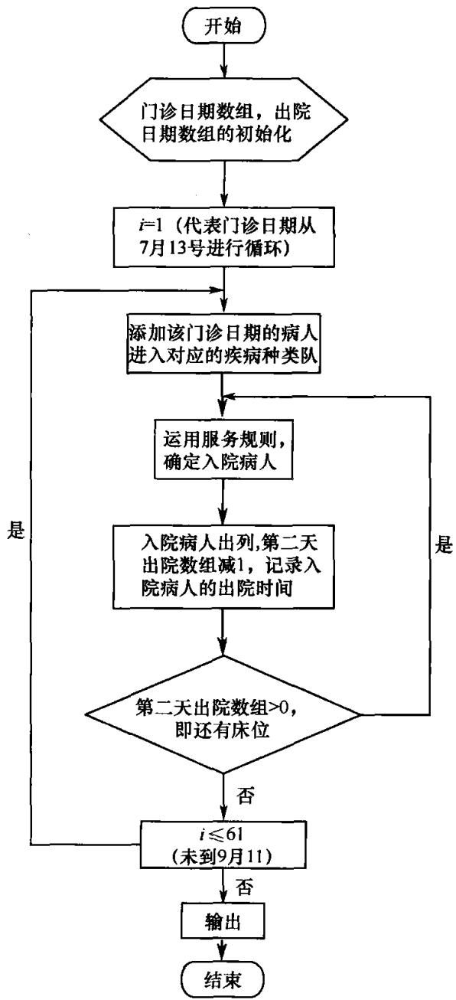

<details>
<summary>flowchart</summary>

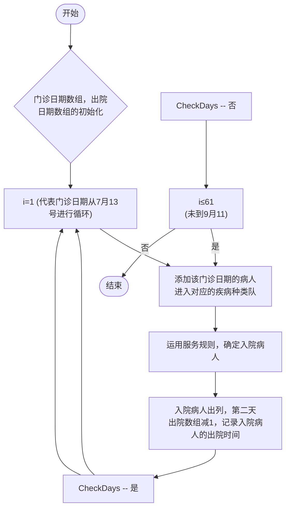
```mermaid
graph TD
  Start(["开始"]) --> Init{"门诊日期数组，出院\n日期数组的初始化"}
  Init --> Step1["i=1 (代表门诊日期从7月13号进行循环)"]
  Step1 --> AddCase["添加该门诊日期的病人\n进入对应的疾病种类队"]
  AddCase --> Rule["运用服务规则，确定入院病人"]
  Rule --> Visit["入院病人出列，第二天\n出院数组减1，记录入院病人的出院时间"]
  Visit --> CheckDays{"第二天出院数组>0，即还有床位"}
  CheckDays["CheckDays -- 是"] --> Step1
  CheckDays2["CheckDays -- 否"] --> CheckTime["i≤61\n(未到9月11)"]
  CheckTime -->|是| AddCase
  CheckTime -->|否| End(["结束"])
  CheckDays --> Step1
```
</details>

图 1 问题二的流程图

统计问题二的前 349 个病人的结果见表 5。

表 5 前 349 个病人的平均时间  
(单位:天)

<table><tr><td></td><td>平均等待时间  $w_{i}$ </td><td>平均术前准备时间  $r_{i}$ </td><td>平均术后恢复时间  $h_{i}$ </td><td>平均逗留时间  $l_{i}$ </td></tr><tr><td>白内障</td><td>6.190</td><td>1.59</td><td>2.91</td><td>10.69</td></tr><tr><td>白内障(双眼)</td><td>5.85</td><td>1.85</td><td>4.96</td><td>12.66</td></tr><tr><td>青光眼</td><td>5.28</td><td>2.05</td><td>8.08</td><td>15.41</td></tr><tr><td>视网膜疾病</td><td>16.41</td><td>2.21</td><td>10.17</td><td>28.79</td></tr><tr><td>外伤</td><td>1.02</td><td>0.99</td><td>6.04</td><td>8.05</td></tr></table>

用评价指标进行评价,与原模型进行比较,见表6。

表 6 优化前后平均时间的对比  
(单位:天)

<table><tr><td>i</td><td>FCFS 平均等待时间</td><td>优化后平均等待时间</td><td>FCFS 平均准备时间</td><td>优化后平均准备时间</td></tr><tr><td>白内障</td><td>12.33</td><td>6.19</td><td>2.33</td><td>1.59</td></tr><tr><td>白内障(双眼)</td><td>12.51</td><td>5.85</td><td>3.6</td><td>1.85</td></tr><tr><td>青光眼</td><td>12.26</td><td>5.28</td><td>2.41</td><td>2.05</td></tr><tr><td>视网膜疾病</td><td>12.54</td><td>16.41</td><td>2.38</td><td>2.21</td></tr><tr><td>外伤</td><td>1.00</td><td>1.02</td><td>1.00</td><td>0.99</td></tr><tr><td>五种病平均</td><td>10.6397</td><td>8.1513</td><td>2.4422</td><td>1.7873</td></tr></table>

对本模型得到的详细数据(见附录)进行分析,还可以发现,349个病人中各种病人的最后入住时间的变化见表7。

表 7 各种病人的最后入住时间的对比

<table><tr><td></td><td>白内障</td><td>白内障(双眼)</td><td>青光眼</td><td>视网膜疾病</td><td>外伤</td></tr><tr><td>入住日期</td><td>8月30日</td><td>8月23日</td><td>8月19日</td><td>8月28日</td><td>9月5日</td></tr><tr><td>原入住日期</td><td>9月7日</td><td>9月1日</td><td>8月30日</td><td>8月31日</td><td>9月5日</td></tr></table>

可见新模型比原模型更好地解决了病员的入住问题。

## 4.2.3 模型二

进一步分析模型一结果可以发现,视网膜疾病优化后的等待时间比原先还要长,这是由于队列 $g_{5}$ 总是比其余 $g_{1}, g_{2}, g_{3}, g_{4}$ 优先级低的原因。

计算每周各疾病种类的平均出院人数公式：

$$
\mu_ {i} = \frac {\sum \text {出院人数} \times 7}{n _ {i}}
$$

统计前 349 个人院人数的数据见表 8。

表 8 349 个病人的入院人数及所占百分比

<table><tr><td></td><td>白内障</td><td>白内障(双眼)</td><td>青光眼</td><td>视网膜疾病</td><td>外伤</td></tr><tr><td>人数</td><td>70</td><td>102</td><td>45</td><td>78</td><td>54</td></tr><tr><td>所占百分比/%</td><td>20.06</td><td>29.23</td><td>12.89</td><td>22.35</td><td>15.47</td></tr></table>

其中白内障患者对视网膜患者比例是 2.205。而统计前 349 个门诊人数的数据可以得到表 9。

表 9 349 个病人的门诊人数及所占百分比

<table><tr><td></td><td>白内障</td><td>白内障(双眼)</td><td>青光眼</td><td>视网膜疾病</td><td>外伤</td></tr><tr><td>人数</td><td>72</td><td>82</td><td>39</td><td>101</td><td>55</td></tr><tr><td>所占百分比/%</td><td>20.63</td><td>23.50</td><td>11.17</td><td>28.94</td><td>15.76</td></tr></table>

其中白内障患者所占的比例是44.13%，对视网膜患者的比例是1.525。

可见白内障患者的入院比例高于白内障患者占总就诊人数的比例,亦当出现空床位的时候优先让白内障患者入院,即使视网膜疾病患者已经等待了很长的时间,依然可以优先入院。这样的优先入院显然不合理,因此对模型一进行修改如下:

$$
\begin{array}{l} \min f = \sum w _ {i j} + \sum r _ {i j} \\ \text {s.t.} \left\{ \begin{array}{c} w _ {i j} = j + \rho_ {w} \\ r _ {i j} = j + \rho_ {r} \\ g _ {2} \leqslant g _ {1} \\ g _ {3} \leqslant g _ {4} \\ g _ {5} <   g _ {1} + g _ {2} + g _ {3} + g _ {4} \\ \rho_ {i} \in j \\ g _ {4} \leqslant 1 5 \end{array} \right. \end{array}
$$

增加约束条件 $g_{4}\leqslant15$ ，即若视网膜疾病患者等待超过15天时，优先让其先进行就诊，通过修改程序，得到结果见表10。

表 10 修改后的五类病人的评价时间  
(单位:天)

<table><tr><td></td><td>平均等待时间  $w_i$ </td><td>平均术前准备时间  $r_i$ </td><td>平均术后恢复时间  $h_i$ </td><td>平均逗留时间  $l_i$ </td></tr><tr><td>白内障</td><td>19.11</td><td>1.61</td><td>2.91</td><td>23.63</td></tr><tr><td>白内障(双眼)</td><td>7.68</td><td>1.64</td><td>4.96</td><td>14.28</td></tr><tr><td>青光眼</td><td>6.18</td><td>2.12</td><td>8.08</td><td>16.18</td></tr><tr><td>视网膜疾病</td><td>11.95</td><td>2.47</td><td>10.17</td><td>24.59</td></tr><tr><td>外伤</td><td>1.07</td><td>1.00</td><td>6.04</td><td>8.11</td></tr></table>

由表 11 可以看出, 虽然 $g_{4} \leqslant 15$ 的约束条件对视网膜疾病的优化起到了很好的作用, 但白内障单眼的患者却因此加长了等待时间, 为此对模型进一步改进。

表 11 FCFS 模型与模型一、模型二的对比  
(单位:天)

<table><tr><td>类型</td><td>FCFS平均等待时间</td><td>模型一平均等待时间</td><td>模型二平均等待时间</td><td>FCFS平均准备时间</td><td>模型一准备时间</td><td>模型二平均准备</td></tr><tr><td>白内障</td><td>12.33</td><td>6.19</td><td>19.11</td><td>2.33</td><td>1.59</td><td>1.61</td></tr><tr><td>白内障(双眼)</td><td>12.51</td><td>5.85</td><td>7.68</td><td>3.6</td><td>1.85</td><td>1.64</td></tr><tr><td>青光眼</td><td>12.26</td><td>5.28</td><td>6.18</td><td>2.41</td><td>1.05</td><td>2.12</td></tr><tr><td>视网膜疾病</td><td>12.54</td><td>16.41</td><td>11.95</td><td>2.38</td><td>1.21</td><td>2.47</td></tr><tr><td>外伤</td><td>1</td><td>1.02</td><td>1.07</td><td>1</td><td>0.99</td><td>1</td></tr><tr><td>五种病平均</td><td>10.6397</td><td>8.1513</td><td>10.0645</td><td>2.4422</td><td>1.7873</td><td>1.8268</td></tr></table>

同时统计得到该模型的日平均出院人数 $\mu = 7.9344$ 。

确定修改如下：

$$
\begin{array}{l} \min f = \sum w _ {i j} + \sum r _ {i j} \\ \text {s. t.} \left\{ \begin{array}{c} w _ {i j} = j + \rho_ {w} \\ r _ {i j} = j + \rho_ {r} \\ g _ {2} \leqslant g _ {1} \\ g _ {3} \leqslant g _ {4} \\ g _ {5} <   g _ {1} + g _ {2} + g _ {3} + g _ {4} \\ \rho_ {i} \in j \\ g _ {4} \leqslant 1 5 (g _ {1} <   1 5) \end{array} \right. \\ \end{array}
$$

增加约束条件 $g_{4} \leqslant 15 (g_{1} < 15)$ ，可以确保白内障单眼患者对于视网膜疾病患者具有较高的优先级。

通过程序运算得到结果见表 12。

表 12 FCFS 模型与模型一、改进后的模型二的对比  
(单位:天)

<table><tr><td>i</td><td>FCFS平均等待时间</td><td>模型一平均等待时间</td><td>模型二改平均等待时间</td><td>FCFS平均准备时间</td><td>模型一准备时间</td><td>模型二改平均准备</td></tr><tr><td>白内障</td><td>12.33</td><td>6.19</td><td>8.14</td><td>2.33</td><td>1.59</td><td>1.71</td></tr><tr><td>白内障(双眼)</td><td>12.51</td><td>5.85</td><td>7.68</td><td>3.6</td><td>1.85</td><td>1.56</td></tr><tr><td>青光眼</td><td>12.26</td><td>5.28</td><td>6.18</td><td>2.41</td><td>1.05</td><td>2.09</td></tr><tr><td>视网膜疾病</td><td>12.54</td><td>16.41</td><td>12.37</td><td>2.38</td><td>1.21</td><td>2.37</td></tr><tr><td>外伤</td><td>1</td><td>1.02</td><td>1.07</td><td>1</td><td>0.99</td><td>1</td></tr><tr><td>五种病平均</td><td>10.6397</td><td>8.1513</td><td>7.9229</td><td>2.4422</td><td>1.7873</td><td>1.7963</td></tr></table>

同时统计得到该模型的日平均出院人数 $\mu = 7.9016$ 。

## 4.3 问题三

经过问题二模型的求解,在已知当时住院病人及等待住院病人的统计情况下,可以通过统计出的术后恢复时间统计值,对病人门诊时的大致入住时间进行预测。

但每个病人的自身情况不同,导致手术后会有不同的恢复时间,用统计出的平均值进行计算就会出现误差。此外,由于外伤病人的出现,也许会对以后的入住时间造成影响。

确定外伤病人每周出现的人数为 $\lambda_{5}$ ，通过统计得到 $\lambda_{5}=7.5$ ，即每天出现外伤病人的人数为 $\lambda_{5}/7=1.07$ 。

由问题二的服务规则对病人入住时间进行预测,只需考虑当时五种病人队列中当时队列的长度,预测的流程图如图2所示。

如图 2 设计程序,得到病人在门诊时诊断出疾病种类后的预测入院时间下限,再根据外伤病人在门诊到预测出院日期之间出现的可能性,得到预测入院日期的上限,即可得到大致入院时间区间。

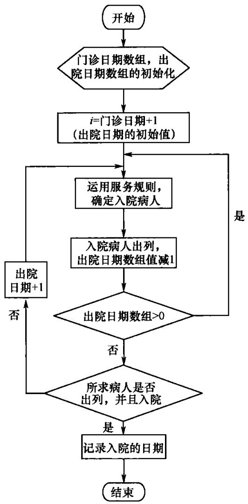

<details>
<summary>flowchart</summary>

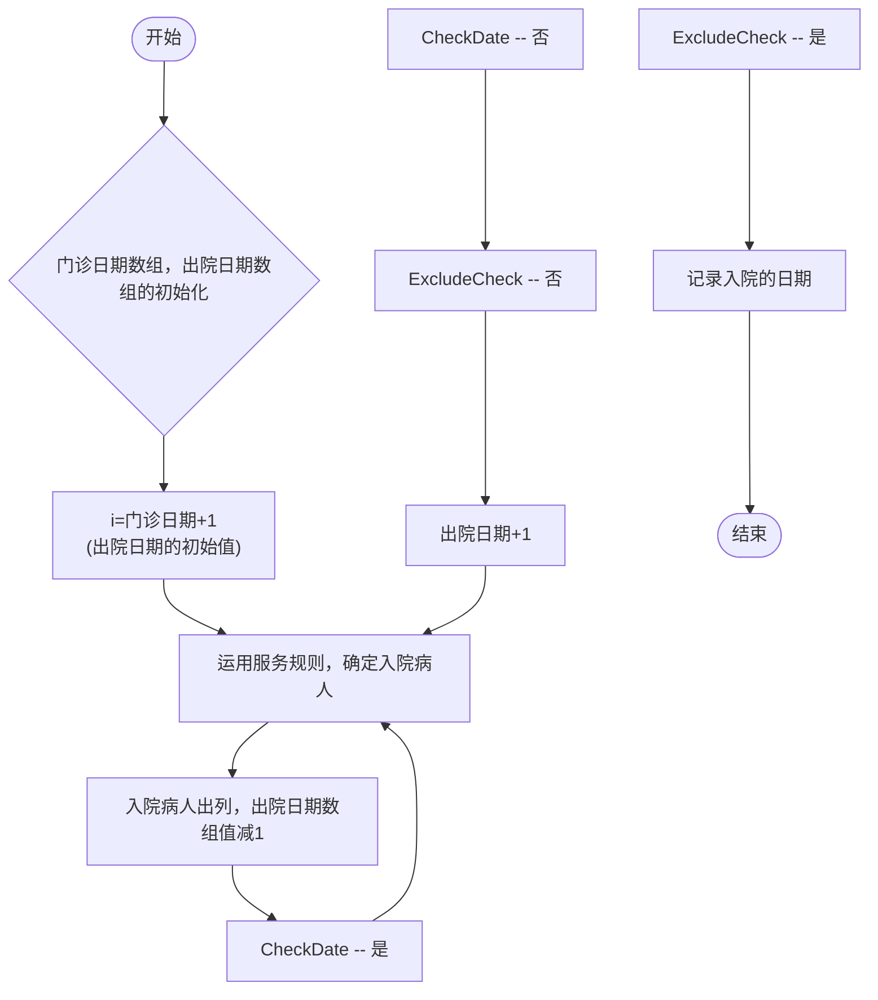
```mermaid
graph TD
  Start(["开始"]) --> Init{"门诊日期数组，出院日期数组的初始化"}
  Init --> i1["i=门诊日期+1\n(出院日期的初始值)"]
  i1 --> ServiceRule["运用服务规则，确定入院病人"]
  ServiceRule --> PatientList["入院病人出列，出院日期数组值减1"]
  PatientList --> CheckDate{"出院日期数组>0"}
  CheckDate["CheckDate -- 是"] --> ServiceRule
  CheckDate2["CheckDate -- 否"] --> ExcludeCheck{"所求病人是否出列，并且入院"}
  ExcludeCheck["ExcludeCheck -- 否"] --> ExcludeDate["出院日期+1"]
  ExcludeDate --> ServiceRule
  ExcludeCheck2["ExcludeCheck -- 是"] --> RecordDate["记录入院的日期"]
  RecordDate --> End(["结束"])
```
</details>

图 2 问题三的流程图

通过编程,得到了从7月13号开始知道9月11号的每一天的预测入院下限 $T_{down}$ 时间,详见附录。

$$
\mathrm{time} _ {i} = T _ {\mathrm{idown}} - \text {门诊时间} _ {i}
$$

$$
\text {外伤人数} _ {i} = \left[ \frac {\mathrm{time} _ {i}}{7} \times \lambda_ {5} \right] + 1
$$

根据外伤人数,依次往后推本疾病种类的预测下限 $T_{idown}$ , 即

$$
T _ {\mathrm{iup}} = T _ {(i + \mathrm{外伤人数} _ {i}) \mathrm{down}}
$$

由此可以得到各天的大致入住时间区间。

在此过程中,忽略了入院时间上限与下限之间可能出现外伤病人的情况,值得优化,而所给数据最后几天的入住上限因缺乏往下递推的数据,故没有出现区间结果,但程序的运算和给出的方法是没有问题的。

外伤的上下限区间基本不变,其他均有不同的变化,举例说明,在7月22日门诊的青光眼患者,它的人院时间下限是7月26号,上限是8月2号。

详表见附件。

## 4.4 问题四

在该住院部周六、周日不安排手术，而周一和周三安排白内障手术不变的情况，对白内障病人入院基本不造成影响。外伤病人的影响在于周五，周六入院的病人不能马上在第二天得到手术治疗。同样的，在周四、周五入院的青光眼和视网膜的病人在经过2、3天的手术准备时间后，因为周六、周日不安排手术的原因，因此只能在周二进行手术。

重新用第二问的模型,即仍旧采用第二问的服务规则来安排病人的入院时间,对排队序列造成的主要影响在于外伤、青光眼和视网膜病人的出院时间有部分延长,使得病床的周转率下降,同时使队列的效率大大降低。

修改问题二程序中最佳的做手术日期,并且修改因此而造成的出院日期的变动,并更改数组记录。

得到的 349 个病人统计结果见表 13。

表 13 五类病人的平均时间及人数  
(单位:天)

<table><tr><td></td><td>平均等待时间  $w_i$ </td><td>平均术前准备时间  $r_i$ </td><td>平均术后恢复时间  $h_i$ </td><td>平均逗留时间  $l_i$ </td></tr><tr><td>白内障</td><td>7</td><td>1.76</td><td>2.91</td><td>11.67</td></tr><tr><td>白内障(双眼)</td><td>6</td><td>1.87</td><td>4.96</td><td>12.83</td></tr><tr><td>青光眼</td><td>5.9</td><td>3.3</td><td>8.08</td><td>16.28</td></tr><tr><td>视网膜疾病</td><td>19.32</td><td>4.44</td><td>10.17</td><td>32.93</td></tr><tr><td>外伤</td><td>1.09</td><td>1.43</td><td>6.04</td><td>8.56</td></tr></table>

与问题二和问题四中的模型进行比较,见表 14。

表 14 FCFS 模型与问题二、问题四的对比  
(单位:天)

<table><tr><td>i</td><td>FCFS平均等待时间</td><td>问题二平均等待时间</td><td>问题四平均等待时间</td><td>FCFS平均准备时间</td><td>优化后准备时间</td><td>问题四平均准备时间</td></tr><tr><td>白内障</td><td>12.33</td><td>6.19</td><td>7</td><td>2.33</td><td>1.59</td><td>1.76</td></tr><tr><td>白内障(双眼)</td><td>12.51</td><td>5.85</td><td>6</td><td>3.6</td><td>1.85</td><td>1.87</td></tr><tr><td>青光眼</td><td>12.26</td><td>5.28</td><td>5.9</td><td>2.41</td><td>1.05</td><td>3.3</td></tr><tr><td>视网膜疾病</td><td>12.54</td><td>16.41</td><td>19.32</td><td>2.38</td><td>1.21</td><td>4.44</td></tr><tr><td>外伤</td><td>1</td><td>1.02</td><td>1.09</td><td>1</td><td>0.99</td><td>1.43</td></tr><tr><td>五种病平均</td><td>10.6397</td><td>8.1513</td><td>9.2761</td><td>2.4422</td><td>1.7873</td><td>2.6815</td></tr></table>

同时统计得到该模型的日平均出院人数 $\mu = 7.3607$ 。

通过表 14 可以看出,虽然问题四的综合平均等待时间比问题一 FCFS 模式要好,但综合平均准备时间还要差于 FCFS 模式下的平均准备时间。

为此，讨论调整医院手术时间安排的模型。

因为双眼白内障病人在第一次手术做完一只眼后,需正好隔一天做第二只眼,即医院安排白内障手术必须在一周至少安排2次,且2次之间的间隔1天为宜。考虑到3次和3次以上的白内障手术会给青光眼和视网膜疾病手术的术前等待时间造成极大影响,同时因为问题四中周六、周日不能作手术,因此,有两种方案来调整医院的手术时间安排。

## 1. 第一种, 周二和周四做白内障手术

在该种方案中,各种疾病在不同周天都会因为手术时间变化而有一些调整,比如,原来周六、周日优先安排白内障病人的条件需要更改,更加适合的时间变为周日和周一。

具体的服务规则更改如下：

(1) 在周日、周一中, 白内障病人优先在周日入院就诊。  
(2) 周日、周一，在白内障病人中优先安排双眼白内障病人。  
(3) 周二、周三,优先安排单眼白内障病人入院就诊。  
(4) 在周二、周三中，白内障单眼病人优先在周二入院。  
（5）外伤病人最优先治疗，有空床位即安排入院；因周六、周日不做手术，周五入院的病人需要等待到周一治疗。  
(6) 在同等情况下,优先让术后恢复时间短的青光眼手术病人入院。  
(7) 病人在入院后完成必要的准备工作, 即在第一个可以做手术的日子里对该疾病种类进行手术。  
（8）周二、周四安排白内障手术，周一、三、五安排青光眼和视网膜手术，外伤手术的安排除开周六、周日。  
（9）周四和周五安排入院的青光眼和视网膜病人，因为医院手术时间的调整，比原先提前一天到周一进行手术。

通过编程计算,得到结果见表15。

表 15 周二和周四做白内障手术时五种疾病的平均时间 （单位:天）

<table><tr><td></td><td>等待时间</td><td>术前准备时间</td><td>术后恢复时间</td><td>逗留时间</td></tr><tr><td>白内障</td><td>7.86</td><td>1.81</td><td>2.91</td><td>12.58</td></tr><tr><td>白内障(双眼)</td><td>6.39</td><td>1.88</td><td>4.96</td><td>13.23</td></tr><tr><td>青光眼</td><td>4.54</td><td>2.66</td><td>8.08</td><td>15.28</td></tr><tr><td>视网膜疾病</td><td>19.46</td><td>2.94</td><td>10.17</td><td>32.57</td></tr><tr><td>外伤</td><td>1.07</td><td>1.43</td><td>6.04</td><td>8.54</td></tr></table>

与问题四未改变手术安排时间相比较,见表16。

表 16 周二、周四手术与原来的对比 (单位:天)

<table><tr><td>i</td><td>不改变手术时间的平均等待时间</td><td>周二、周四手术平均等待时间</td><td>不改变手术时间的平均准备时间</td><td>周二、周四手术平均准备时间</td></tr><tr><td>白内障</td><td>7</td><td>7.86</td><td>1.76</td><td>1.81</td></tr><tr><td>白内障(双眼)</td><td>6</td><td>6.39</td><td>1.87</td><td>1.88</td></tr><tr><td>青光眼</td><td>5.9</td><td>4.54</td><td>3.3</td><td>2.66</td></tr><tr><td>视网膜疾病</td><td>19.32</td><td>19.46</td><td>4.44</td><td>2.94</td></tr><tr><td>外伤</td><td>1.09</td><td>1.07</td><td>1.43</td><td>1.43</td></tr><tr><td>五种病平均</td><td>9.2761</td><td>9.4305</td><td>2.6815</td><td>2.1886</td></tr></table>

同时统计得到该模型的日平均出院人数 $\mu = 7.4754$ 。

## 2. 第二种,周三和周五做白内障手术

该方案的服务规则更改如下：

(1) 在周一、周二中, 白内障病人优先在周日入院就诊。  
(2) 周一、周二，在白内障病人中优先安排双眼白内障病人。  
(3) 周三、周四,优先安排单眼白内障病人入院就诊。  
(4) 在周三、周四中，白内障单眼病人优先在周二入院。

(5) 外伤病人最优先治疗,有空床位即安排入院;因周六、周日不做手术,周五、周六入院的病人需要等待到周一治疗。  
(6) 在同等情况下,优先让术后恢复时间短的青光眼手术病人入院。  
(7) 病人在入院后完成必要的准备工作, 即在第一个可以做手术的日子里对该疾病种类进行手术。  
（8）周三、周五安排白内障手术，周一、二、四安排青光眼和视网膜手术，外伤手术的安排除开周六、周日。  
(9) 周四和周五安排入院的青光眼和视网膜病人,因为医院手术时间的调整,比原先提前一天到周一进行手术。

从表 17 和表 18 可以明显看出, 周三、周五动白内障手术的平均等待时间和平均准备时间要好于周二、周四做白内障手术和不改变手术时间安排的情况。

表 17 周二和周四做白内障手术时五种疾病的平均时间 (单位:天)

<table><tr><td></td><td>等待时间</td><td>术前准备时间</td><td>术后恢复时间</td><td>逗留时间</td><td>平均术前时间</td></tr><tr><td>白内障</td><td>8.46</td><td>1.69</td><td>2.91</td><td>13.06</td><td>10.15</td></tr><tr><td>白内障(双眼)</td><td>7.15</td><td>1.87</td><td>4.96</td><td>13.98</td><td>9.02</td></tr><tr><td>青光眼</td><td>4.31</td><td>2.28</td><td>8.08</td><td>14.67</td><td>6.59</td></tr><tr><td>视网膜疾病</td><td>17.95</td><td>2.11</td><td>10.17</td><td>30.23</td><td>20.06</td></tr><tr><td>外伤</td><td>1.66</td><td>0.87</td><td>6.04</td><td>8.57</td><td>2.53</td></tr></table>

表 18 周三、周五手术与原来的对比 (单位:天)

<table><tr><td>i</td><td>不改变手术时间的平均等待时间</td><td>周三、周五手术平均等待时间</td><td>不改变手术时间的平均准备时间</td><td>周三、周五手术平均准备时间</td></tr><tr><td>白内障</td><td>7</td><td>8.46</td><td>1.76</td><td>1.69</td></tr><tr><td>白内障(双眼)</td><td>6</td><td>7.15</td><td>1.87</td><td>1.87</td></tr><tr><td>青光眼</td><td>5.9</td><td>4.31</td><td>3.3</td><td>2.28</td></tr><tr><td>视网膜疾病</td><td>19.32</td><td>17.95</td><td>4.44</td><td>2.11</td></tr><tr><td>外伤</td><td>1.09</td><td>1.66</td><td>1.43</td><td>0.87</td></tr><tr><td>五种病平均</td><td>9.2761</td><td>9.2632</td><td>2.6815</td><td>1.7905</td></tr></table>

同时统计得到该模型的日平均出院人数 $\mu = 7.9754$ 。

## 4.5 问题五

## 4.5.1 模型一

对具有完整周期的病员进行统计,可以得到表19。

表 19 五类疾病的人数及所占百分比

<table><tr><td></td><td>白内障</td><td>白内障(双眼)</td><td>青光眼</td><td>视网膜</td><td>外伤</td><td>总人数</td></tr><tr><td>人数</td><td>72</td><td>82</td><td>39</td><td>101</td><td>55</td><td>349</td></tr><tr><td>百分比/%</td><td>20.6</td><td>23.5</td><td>11.2</td><td>28.9</td><td>15.8</td><td></td></tr></table>

剔除准备手术时间超过必须时间的数据,可以得到表 20 所列数据。

表 20 剔除不良数据后五类疾病的平均住院时间  
(单位:天)

<table><tr><td></td><td>白内障</td><td>白内障(双眼)</td><td>青光眼</td><td>视网膜</td><td>外伤</td></tr><tr><td>平均住院时间</td><td>4.42</td><td>7</td><td>10.49</td><td>12.54</td><td>7.04</td></tr></table>

医院病床安排可以使得病员的入院和出院达到稳态,故可由上述两表得到。

以周为单位对原数据进行统计,从7月13日到7月19日为第一周,从8月31号到9月6号为第八周,各种病人的门诊数见表21。

表 21 每周各种病人的门诊数

<table><tr><td>周</td><td>一</td><td>二</td><td>三</td><td>四</td><td>五</td><td>六</td><td>七</td><td>八</td><td>平均λ</td></tr><tr><td>白内障</td><td>7</td><td>23</td><td>6</td><td>13</td><td>8</td><td>12</td><td>10</td><td>10</td><td>11.125</td></tr><tr><td>白内障(双眼)</td><td>19</td><td>10</td><td>11</td><td>17</td><td>19</td><td>16</td><td>14</td><td>18</td><td>15.5</td></tr><tr><td>青光眼</td><td>9</td><td>6</td><td>12</td><td>5</td><td>6</td><td>4</td><td>7</td><td>9</td><td>7.25</td></tr><tr><td>视网膜疾病</td><td>21</td><td>15</td><td>20</td><td>23</td><td>24</td><td>13</td><td>21</td><td>21</td><td>19.75</td></tr><tr><td>外伤</td><td>6</td><td>7</td><td>11</td><td>5</td><td>4</td><td>10</td><td>8</td><td>9</td><td>7.5</td></tr></table>

算上9月7号到9月11号的病人数,可以得到各类疾病的平均 $\lambda$ ,见表22。

表 22 各类疾病的总人数与平均 $\lambda$

<table><tr><td></td><td>白内障</td><td>白内障(双眼)</td><td>青光眼</td><td>视网膜疾病</td><td>外伤</td></tr><tr><td>总人数</td><td>100</td><td>133</td><td>63</td><td>170</td><td>64</td></tr><tr><td>平均</td><td>11.4754</td><td>15.2623</td><td>7.2295</td><td>19.5082</td><td>7.3443</td></tr></table>

已知 $l_{i} = r_{i} + h_{i} + w_{i}$ , 极限情况下考虑 $w_{\mathrm{imin}} = 1$ , 根据上述平均住院时间作为 $r_{i} + h_{i}$ 的统计值, 可以得到 $l_{\mathrm{imin}} = r_{i} + h_{i} + 1$ , 见表23。

表 23 各类疾病的最短平均逗留时间  
(单位:天)

<table><tr><td></td><td>白内障</td><td>白内障(双眼)</td><td>青光眼</td><td>视网膜</td><td>外伤</td></tr><tr><td>最短平均逗留时间</td><td>5.42</td><td>8</td><td>11.49</td><td>13.54</td><td>8.04</td></tr></table>

通过上述两表可以得到每种病人每周需要的床数 $need_{min}$ ，见表24。

$$
\mathrm{need} _ {i \min} = \frac {l _ {\min} * \lambda_ {i}}{7}
$$

表 24 每周每种病人所需要的床数

<table><tr><td></td><td>白内障</td><td>白内障(双眼)</td><td>青光眼</td><td>视网膜</td><td>外伤</td></tr><tr><td>所需床数 need $_{imin}$ </td><td>8.61</td><td>17.71</td><td>11.9</td><td>38.2</td><td>8.61</td></tr></table>

由整合权重可以得到各种病人占用病床的比例为 $\frac{\text{need}_{i\min} \times 79}{\sum_{i=1}^{5} \text{need}_{i\min}}$ ，见表25。

表 25 每周每种病人所需病床的百分比

<table><tr><td></td><td>白内障</td><td>白内障(双眼)</td><td>青光眼</td><td>视网膜</td><td>外伤</td></tr><tr><td>病床百分比/%</td><td>10.1</td><td>20.8</td><td>14.0</td><td>44.9</td><td>10.1</td></tr></table>

## 4.5.2 模型二

## 1. 多服务窗等待制排队模型

设服务窗口为 $n$ , 各个服务窗口工作是相互独立的, 顾客按泊松流到达, 到达强度为 $\lambda$ , 各服务窗口的服务时间为负指数分布, 单个服务台的平均服务率为 $\mu$ , 测整个服务机构的凭据服务率为 $n\mu$ , 令 $\rho_1 = \lambda / n\mu$ , 为系统的服务强度, 当 $\rho_1 > 1$ 时, 系统就会出现排队现象, 即有顾客在排队等 (图3)。该问题只排一个队列等候, 哪个窗口出现空闲, 等候的顾客就按先后顺序前往空闲的服务窗口接受服务。系统的顾客源和系统容量为无限。

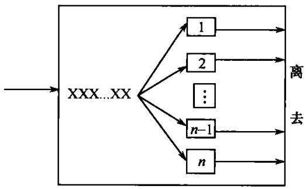

<details>
<summary>flowchart</summary>

```mermaid
graph LR
  Input[""] --> Branch1["XXX...XX"]
  Branch1 --> Result1["1"]
  Branch1 --> Result2["2"]
  Branch1 --> Result3["⋮"]
  Branch1 --> Result4["n-1"]
  Branch1 --> Result5["n"]
  Result1 --> Output["离"]
  Result2 --> Output
  Result3 --> Output
  Result4 --> Output
  Result5 --> Output
```
</details>

图 3 多窗口等待模型框图

状态 $k(0 \leqslant k \leqslant n)$ 表示系统内有 $k$ 个服务窗忙着接待顾客, 其余 $n - k$ 个顾客服务窗空闲着, 当 $k > n$ 时, $n$ 个服务窗均瞒着接待顾客, 而余下 $k - n$ 的个顾客排队等候服务, 在平衡条件下, 系统状态概率的平衡方程为

$$
\left\{ \begin{array}{l} \lambda P _ {0} = \mu P _ {1} \\ (k + 1) \mu P _ {k + 1} + \lambda P _ {k - 1} = (\lambda + k \mu) P _ {k}, 1 \leqslant k \leqslant n \\ n \mu P _ {k + 1} + \lambda P _ {k - 1} = (\lambda + n \mu) P _ {k}, k > n \end{array} \right.
$$

可以求得系统的状态概率为

$$
P _ {k} = \left\{ \begin{array}{l} \frac {\rho_ {1} ^ {k}}{k !} P _ {0} = \frac {n ^ {k}}{k !} \rho_ {1} ^ {k} P _ {0}, 0 \leqslant k <   n \\ \frac {\rho_ {1} ^ {k}}{n ! n ^ {k - n}} P _ {0} = \frac {n ^ {n}}{n !} \rho_ {1} ^ {k} P _ {0}, k \geqslant n \end{array} \right.
$$

由 $\sum_{k=0}^{\infty} P_k = 1$ ，得

$$
P _ {0} = \left(\sum_ {k = 0} ^ {n - 1} \frac {(n \rho_ {1}) ^ {k}}{k !} + \frac {(n \rho_ {1}) ^ {n _ {1}}}{n !} \frac {1}{1 - \rho_ {1}}\right) ^ {- 1}
$$

系统的运行指标：

(1) 队列长:

$$
L _ {q} = \sum_ {k = n} ^ {\infty} (k - n) P _ {k} = \frac {\rho_ {1} (n \rho_ {1}) ^ {n}}{n ! (1 - \rho_ {1}) ^ {2}} P _ {0}
$$

(2) 队长:

$$
L _ {s} = \frac {\rho_ {1} (n \rho_ {1}) ^ {n}}{n ! (1 - \rho_ {1}) ^ {2}} P _ {0} + n \rho_ {1}
$$

(3) 顾客逗留时间：

$$
W _ {s} = \frac {L _ {s}}{\lambda} = \frac {\rho_ {1} (n \rho_ {1}) ^ {n}}{n ! (1 - \rho_ {1}) ^ {2} \lambda} P _ {0} + \frac {1}{\mu}
$$

2. 求各类病人的逗留时间

设分给各类眼病的病床数为 $n_i$ ，根据多服务窗等待制排队模型，可以求出每类眼病的平均逗留时间为

$$
W _ {s i} = \frac {L _ {s i}}{\lambda_ {i}} = \frac {\rho_ {1 i} (n _ {1} \rho_ {1 i}) ^ {n _ {1}}}{n _ {i} ! (1 - \rho_ {1 i}) ^ {2} \lambda_ {i}} P _ {0 i} + \frac {1}{\mu_ {i}}, i = 1, 2, 3, 4, 5
$$

3. 所有病人在病床内的平均逗留时间

设各类病人占所有病人的百分比分别为 $c_{i}(i = 1,2,3,4,5)$ ，有

$$
\sum_ {i = 1} ^ {5} c _ {i} = 1
$$

则所有病人在系统内的平均逗留时间为

$$
W = \sum_ {i = 1} ^ {5} c _ {i} W _ {s i}
$$

4. 平均逗留时间最短的优化模型

通过上面的分析,可以的得到以平均逗留时间 W 最短为目标,决策变量为 $n_{i}(i=1,2,3,4,5)$ 的优化模型:

$$
\min W = \sum_ {i = 1} ^ {5} c _ {i} W _ {s i}
$$

$$
\text {s. t.} \left\{ \begin{array}{l} W _ {s i} = \frac {L _ {s i}}{\lambda_ {i}} = \frac {\rho_ {1 i} (n _ {i} \rho_ {1 i}) ^ {n _ {i}}}{n _ {i} ! (1 - \rho_ {1 i}) ^ {2} \lambda_ {i}} P _ {0 i} + \frac {1}{\mu_ {i}}, i = 1, 2, 3, 4, 5 \\ \sum_ {i = 1} ^ {5} n _ {i} = 7 9, n _ {i} > 0 \end{array} \right.
$$

## 4.5.3 模型三

1. 等效病床比例

把床位看成是一种资源,它的单位是床位天。分析医院的当前情况,各类病人实际都按照一种比例来分配床位资源,这里称为等效床位比例,记为 $b_{i}$ 。等效病床比例由病人比例 $c_{i}$ 和平均住院时间 $T_{2i}$ 决定:

$$
b _ {i} = \frac {c _ {i} T _ {2 i}}{\sum c _ {i} T _ {2 i}}
$$

2. 分配病床后的平均逗留时间

设第 $i$ 种病分得的病床比例为 $k_{i}$ , 此时第 $i$ 种病的平均等待时间为 $b_{i}T_{1i}/k_{i}$ 。平均住院时间保持不变, 因此平均逗留时间为 $b_{i}T_{1i}/k_{i} + T_{2i}$ , 所有人的平均逗留时间为

$$
W = \sum_ {i = 1} ^ {5} (\frac {b _ {i} T _ {1 i}}{k _ {i}} + T _ {2 i})
$$

## 3. 平均逗留时间最短的优化模型

综上,可以得到下面优化模型:

$$
\min W = \sum_ {i = 1} ^ {5} c _ {i} \left(\frac {b _ {i} T _ {1 i}}{k _ {i}} + T _ {2 i}\right)
$$

$$
\text {s. t.} \left\{ \begin{array}{l} \sum_ {i = 1} ^ {5} k _ {i} = 1 \\ k _ {i} > 0 \end{array} \right.
$$

## 4. 模型的求解

构造拉格朗日函数：

$$
L = \sum_ {i = 1} ^ {5} c _ {i} \left(\frac {b _ {i} T _ {1 i}}{k _ {i}} + T _ {2 i}\right) + \lambda \left(\sum_ {i = 1} ^ {5} k _ {i} - 1\right)
$$

令

$$
\frac {\partial L}{\partial k _ {i}} = - \frac {k _ {i} b _ {i} T _ {1 i}}{k _ {i} ^ {2}} + \lambda = 0
$$

则有

$$
\frac {c _ {1} b _ {1} T _ {1 1}}{k _ {1} ^ {2}} = \frac {c _ {2} b _ {2} T _ {1 2}}{k _ {2} ^ {2}} = \frac {c _ {3} b _ {3} T _ {1 3}}{k _ {3} ^ {2}} = \frac {c _ {4} b _ {4} T _ {1 4}}{k _ {4} ^ {2}} = \frac {c _ {5} b _ {5} T _ {1 5}}{k _ {5} ^ {2}} = C (\text {常数})
$$

$$
k _ {i} = \sqrt {\frac {c _ {i} b _ {i} T _ {1 i}}{C}}
$$

又因为

$$
\sum_ {i = 1} ^ {5} k _ {i} = 1
$$

所以

$$
\sqrt {C} = \sum_ {i = 1} ^ {5} \sqrt {c _ {i} b _ {i} T _ {1 i}}
$$

因此

$$
k _ {i} = \frac {\sqrt {c _ {i} b _ {i} T _ {1 i}}}{\sum_ {i = 1} ^ {5} \sqrt {c _ {i} b _ {i} T _ {1 i}}}
$$

代入数据得到最短逗留时间为

$$
W = 1 9. 2 3
$$

此时病床的分配比例见表26。

表 26 平均逗留时间最短的病床比例

<table><tr><td>病别</td><td>白内障单眼</td><td>白内障双眼</td><td>青光眼</td><td>视网膜疾病</td><td>外伤</td></tr><tr><td>比例</td><td>0.20</td><td>0.23</td><td>0.14</td><td>0.39</td><td>0.04</td></tr></table>

## 5 模型的评价与修改

模型较好地解决了题目给出的问题,首先建立了可以运用的评价体系指标,并对问题

一进行了评价。

问题二中模型一应用贪心算法的局部最优模型在9月11日前能使484个人入院，并使医院系统达到稳态。模型二通过对视网膜疾病的队列控制，使得每种病的队列长度得到控制，但是在确定视网膜疾病的队列控制上，控制的比较粗糙，修改后使得队列控制更为精确可以得到更好的结论。

问题三中没有给出确切的预测区间，上下限预测也不够准备，在程序中需要修改。

问题四利用问题二给出的模型,修改约束条件后得到的数据能够和原先进行较好的对比,并且通过模拟医院手术时间改变的方案,较好地解决了问题。

问题五中运用排队论的知识建立了两个模型,从简化模型的角度进行了求解,得到了较为不错的结果。

## 参考文献

[1] 陈冬彦, 等. 数学建模. 北京: 科学出版社, 2007.  
[2] 郑启华. PASCAL 程序设计. 北京: 清华大学出版社, 1996.

附录 问题二详细数据

<table><tr><td>序号</td><td>类型</td><td>门诊时间</td><td>入院时间</td><td>出院时间</td></tr><tr><td>1</td><td>白内障</td><td>2008-7-13</td><td>2008-7-28</td><td>2008-8-2</td></tr><tr><td>2</td><td>白内障(双眼)</td><td>2008-7-13</td><td>2008-7-26</td><td>2008-8-2</td></tr><tr><td>3</td><td>青光眼</td><td>2008-7-13</td><td>2008-7-25</td><td>2008-8-3</td></tr><tr><td>4</td><td>视网膜疾病</td><td>2008-7-13</td><td>2008-8-6</td><td>2008-8-17</td></tr><tr><td>5</td><td>视网膜疾病</td><td>2008-7-13</td><td>2008-8-6</td><td>2008-8-17</td></tr><tr><td>6</td><td>视网膜疾病</td><td>2008-7-13</td><td>2008-8-6</td><td>2008-8-17</td></tr><tr><td>7</td><td>外伤</td><td>2008-7-13</td><td>2008-7-14</td><td>2008-7-19</td></tr><tr><td>8</td><td>白内障</td><td>2008-7-14</td><td>2008-7-28</td><td>2008-8-1</td></tr><tr><td>9</td><td>白内障(双眼)</td><td>2008-7-14</td><td>2008-7-26</td><td>2008-8-2</td></tr><tr><td>10</td><td>白内障(双眼)</td><td>2008-7-14</td><td>2008-7-26</td><td>2008-8-2</td></tr><tr><td>11</td><td>白内障(双眼)</td><td>2008-7-14</td><td>2008-7-26</td><td>2008-8-2</td></tr><tr><td>12</td><td>青光眼</td><td>2008-7-14</td><td>2008-7-25</td><td>2008-8-3</td></tr><tr><td>13</td><td>视网膜疾病</td><td>2008-7-14</td><td>2008-8-6</td><td>2008-8-17</td></tr><tr><td>14</td><td>视网膜疾病</td><td>2008-7-14</td><td>2008-8-6</td><td>2008-8-17</td></tr><tr><td>15</td><td>视网膜疾病</td><td>2008-7-14</td><td>2008-8-6</td><td>2008-8-17</td></tr><tr><td>16</td><td>视网膜疾病</td><td>2008-7-14</td><td>2008-8-7</td><td>2008-8-18</td></tr><tr><td>17</td><td>白内障</td><td>2008-7-15</td><td>2008-7-28</td><td>2008-8-1</td></tr><tr><td>18</td><td>白内障</td><td>2008-7-15</td><td>2008-7-28</td><td>2008-8-1</td></tr><tr><td>19</td><td>白内障</td><td>2008-7-15</td><td>2008-7-28</td><td>2008-8-1</td></tr><tr><td>20</td><td>白内障(双眼)</td><td>2008-7-15</td><td>2008-7-26</td><td>2008-8-2</td></tr><tr><td>21</td><td>白内障(双眼)</td><td>2008-7-15</td><td>2008-7-26</td><td>2008-8-2</td></tr><tr><td>22</td><td>青光眼</td><td>2008-7-15</td><td>2008-7-25</td><td>2008-8-3</td></tr><tr><td>23</td><td>青光眼</td><td>2008-7-15</td><td>2008-7-25</td><td>2008-8-3</td></tr><tr><td>24</td><td>视网膜疾病</td><td>2008-7-15</td><td>2008-8-7</td><td>2008-8-18</td></tr><tr><td>25</td><td>视网膜疾病</td><td>2008-7-15</td><td>2008-8-7</td><td>2008-8-18</td></tr><tr><td>26</td><td>视网膜疾病</td><td>2008-7-15</td><td>2008-8-7</td><td>2008-8-18</td></tr><tr><td>27</td><td>白内障</td><td>2008-7-16</td><td>2008-7-28</td><td>2008-8-3</td></tr><tr><td>28</td><td>白内障(双眼)</td><td>2008-7-16</td><td>2008-7-26</td><td>2008-8-2</td></tr><tr><td>29</td><td>白内障(双眼)</td><td>2008-7-16</td><td>2008-7-26</td><td>2008-8-2</td></tr><tr><td>30</td><td>青光眼</td><td>2008-7-16</td><td>2008-7-30</td><td>2008-8-8</td></tr><tr><td>31</td><td>视网膜疾病</td><td>2008-7-16</td><td>2008-8-7</td><td>2008-8-18</td></tr><tr><td>32</td><td>视网膜疾病</td><td>2008-7-16</td><td>2008-8-7</td><td>2008-8-18</td></tr><tr><td>33</td><td>外伤</td><td>2008-7-16</td><td>2008-7-17</td><td>2008-7-22</td></tr><tr><td>34</td><td>白内障</td><td>2008-7-17</td><td>2008-7-28</td><td>2008-8-3</td></tr><tr><td>35</td><td>白内障(双眼)</td><td>2008-7-17</td><td>2008-7-27</td><td>2008-8-2</td></tr><tr><td>36</td><td>白内障(双眼)</td><td>2008-7-17</td><td>2008-7-27</td><td>2008-8-2</td></tr><tr><td>37</td><td>白内障(双眼)</td><td>2008-7-17</td><td>2008-7-27</td><td>2008-8-2</td></tr><tr><td>38</td><td>白内障(双眼)</td><td>2008-7-17</td><td>2008-7-27</td><td>2008-8-2</td></tr><tr><td>39</td><td>白内障(双眼)</td><td>2008-7-17</td><td>2008-7-27</td><td>2008-8-2</td></tr><tr><td>40</td><td>白内障(双眼)</td><td>2008-7-17</td><td>2008-7-27</td><td>2008-8-2</td></tr><tr><td>41</td><td>青光眼</td><td>2008-7-17</td><td>2008-7-30</td><td>2008-8-8</td></tr><tr><td>42</td><td>视网膜疾病</td><td>2008-7-17</td><td>2008-8-7</td><td>2008-8-18</td></tr><tr><td>43</td><td>视网膜疾病</td><td>2008-7-17</td><td>2008-8-7</td><td>2008-8-18</td></tr><tr><td>44</td><td>视网膜疾病</td><td>2008-7-17</td><td>2008-8-7</td><td>2008-8-18</td></tr><tr><td>45</td><td>外伤</td><td>2008-7-17</td><td>2008-7-18</td><td>2008-7-28</td></tr><tr><td>46</td><td>白内障</td><td>2008-7-18</td><td>2008-7-28</td><td>2008-8-1</td></tr><tr><td>47</td><td>白内障</td><td>2008-7-18</td><td>2008-7-28</td><td>2008-8-2</td></tr><tr><td>48</td><td>白内障(双眼)</td><td>2008-7-18</td><td>2008-7-27</td><td>2008-8-2</td></tr><tr><td>49</td><td>白内障(双眼)</td><td>2008-7-18</td><td>2008-7-27</td><td>2008-8-2</td></tr><tr><td>50</td><td>白内障(双眼)</td><td>2008-7-18</td><td>2008-7-27</td><td>2008-8-2</td></tr><tr><td>51</td><td>白内障(双眼)</td><td>2008-7-18</td><td>2008-7-27</td><td>2008-8-2</td></tr><tr><td>52</td><td>青光眼</td><td>2008-7-18</td><td>2008-7-30</td><td>2008-8-8</td></tr><tr><td>53</td><td>视网膜疾病</td><td>2008-7-18</td><td>2008-8-7</td><td>2008-8-18</td></tr><tr><td>54</td><td>视网膜疾病</td><td>2008-7-18</td><td>2008-8-7</td><td>2008-8-18</td></tr><tr><td>55</td><td>视网膜疾病</td><td>2008-7-18</td><td>2008-8-8</td><td>2008-8-19</td></tr><tr><td>56</td><td>外伤</td><td>2008-7-18</td><td>2008-7-19</td><td>2008-7-26</td></tr><tr><td>57</td><td>外伤</td><td>2008-7-18</td><td>2008-7-19</td><td>2008-7-25</td></tr><tr><td>58</td><td>白内障</td><td>2008-7-19</td><td>2008-7-29</td><td>2008-8-3</td></tr><tr><td>59</td><td>白内障</td><td>2008-7-19</td><td>2008-7-29</td><td>2008-8-2</td></tr><tr><td>60</td><td>白内障</td><td>2008-7-19</td><td>2008-7-29</td><td>2008-8-3</td></tr><tr><td>61</td><td>白内障(双眼)</td><td>2008-7-19</td><td>2008-7-27</td><td>2008-8-2</td></tr><tr><td>62</td><td>青光眼</td><td>2008-7-19</td><td>2008-7-30</td><td>2008-8-8</td></tr><tr><td>63</td><td>青光眼</td><td>2008-7-19</td><td>2008-7-30</td><td>2008-8-8</td></tr><tr><td>64</td><td>视网膜疾病</td><td>2008-7-19</td><td>2008-8-8</td><td>2008-8-19</td></tr><tr><td>65</td><td>视网膜疾病</td><td>2008-7-19</td><td>2008-8-8</td><td>2008-8-19</td></tr><tr><td>66</td><td>视网膜疾病</td><td>2008-7-19</td><td>2008-8-8</td><td>2008-8-19</td></tr><tr><td>67</td><td>外伤</td><td>2008-7-19</td><td>2008-7-20</td><td>2008-7-25</td></tr><tr><td>68</td><td>白内障</td><td>2008-7-20</td><td>2008-7-29</td><td>2008-8-3</td></tr><tr><td>69</td><td>白内障</td><td>2008-7-20</td><td>2008-7-29</td><td>2008-8-2</td></tr><tr><td>70</td><td>白内障</td><td>2008-7-20</td><td>2008-7-29</td><td>2008-8-2</td></tr><tr><td>71</td><td>白内障(双眼)</td><td>2008-7-20</td><td>2008-8-2</td><td>2008-8-9</td></tr><tr><td>72</td><td>视网膜疾病</td><td>2008-7-20</td><td>2008-8-8</td><td>2008-8-19</td></tr><tr><td>73</td><td>视网膜疾病</td><td>2008-7-20</td><td>2008-8-8</td><td>2008-8-19</td></tr><tr><td>74</td><td>视网膜疾病</td><td>2008-7-20</td><td>2008-8-8</td><td>2008-8-19</td></tr><tr><td>75</td><td>外伤</td><td>2008-7-20</td><td>2008-7-21</td><td>2008-7-29</td></tr><tr><td>76</td><td>外伤</td><td>2008-7-20</td><td>2008-7-21</td><td>2008-7-28</td></tr><tr><td>77</td><td>白内障</td><td>2008-7-21</td><td>2008-7-29</td><td>2008-8-1</td></tr><tr><td>78</td><td>白内障</td><td>2008-7-21</td><td>2008-8-2</td><td>2008-8-6</td></tr><tr><td>79</td><td>白内障(双眼)</td><td>2008-7-21</td><td>2008-8-2</td><td>2008-8-9</td></tr><tr><td>80</td><td>白内障(双眼)</td><td>2008-7-21</td><td>2008-8-2</td><td>2008-8-9</td></tr><tr><td>81</td><td>白内障(双眼)</td><td>2008-7-21</td><td>2008-8-2</td><td>2008-8-9</td></tr><tr><td>82</td><td>白内障(双眼)</td><td>2008-7-21</td><td>2008-8-2</td><td>2008-8-9</td></tr><tr><td>83</td><td>白内障(双眼)</td><td>2008-7-21</td><td>2008-8-2</td><td>2008-8-9</td></tr><tr><td>84</td><td>外伤</td><td>2008-7-21</td><td>2008-7-22</td><td>2008-7-29</td></tr><tr><td>85</td><td>外伤</td><td>2008-7-21</td><td>2008-7-22</td><td>2008-7-27</td></tr><tr><td>86</td><td>白内障</td><td>2008-7-22</td><td>2008-8-2</td><td>2008-8-7</td></tr><tr><td>87</td><td>白内障</td><td>2008-7-22</td><td>2008-8-2</td><td>2008-8-8</td></tr><tr><td>88</td><td>白内障</td><td>2008-7-22</td><td>2008-8-2</td><td>2008-8-7</td></tr><tr><td>89</td><td>青光眼</td><td>2008-7-22</td><td>2008-7-31</td><td>2008-8-9</td></tr><tr><td>90</td><td>视网膜疾病</td><td>2008-7-22</td><td>2008-8-8</td><td>2008-8-19</td></tr><tr><td>91</td><td>外伤</td><td>2008-7-22</td><td>2008-7-23</td><td>2008-7-28</td></tr><tr><td>92</td><td>白内障</td><td>2008-7-23</td><td>2008-8-2</td><td>2008-8-8</td></tr><tr><td>93</td><td>白内障</td><td>2008-7-23</td><td>2008-8-2</td><td>2008-8-7</td></tr><tr><td>94</td><td>白内障</td><td>2008-7-23</td><td>2008-8-2</td><td>2008-8-7</td></tr><tr><td>95</td><td>白内障</td><td>2008-7-23</td><td>2008-8-2</td><td>2008-8-6</td></tr><tr><td>96</td><td>白内障</td><td>2008-7-23</td><td>2008-8-2</td><td>2008-8-8</td></tr><tr><td>97</td><td>白内障(双眼)</td><td>2008-7-23</td><td>2008-8-2</td><td>2008-8-9</td></tr><tr><td>98</td><td>白内障(双眼)</td><td>2008-7-23</td><td>2008-8-2</td><td>2008-8-9</td></tr><tr><td>99</td><td>青光眼</td><td>2008-7-23</td><td>2008-7-31</td><td>2008-8-9</td></tr><tr><td>100</td><td>青光眼</td><td>2008-7-23</td><td>2008-7-31</td><td>2008-8-9</td></tr><tr><td>101</td><td>视网膜疾病</td><td>2008-7-23</td><td>2008-8-8</td><td>2008-8-19</td></tr><tr><td>102</td><td>视网膜疾病</td><td>2008-7-23</td><td>2008-8-9</td><td>2008-8-22</td></tr><tr><td>103</td><td>视网膜疾病</td><td>2008-7-23</td><td>2008-8-9</td><td>2008-8-22</td></tr><tr><td>104</td><td>视网膜疾病</td><td>2008-7-23</td><td>2008-8-10</td><td>2008-8-22</td></tr><tr><td>105</td><td>视网膜疾病</td><td>2008-7-23</td><td>2008-8-10</td><td>2008-8-22</td></tr><tr><td>106</td><td>外伤</td><td>2008-7-23</td><td>2008-7-24</td><td>2008-8-1</td></tr><tr><td>107</td><td>外伤</td><td>2008-7-23</td><td>2008-7-24</td><td>2008-7-30</td></tr><tr><td>108</td><td>白内障</td><td>2008-7-24</td><td>2008-8-3</td><td>2008-8-8</td></tr><tr><td>109</td><td>白内障</td><td>2008-7-24</td><td>2008-8-3</td><td>2008-8-7</td></tr><tr><td>110</td><td>青光眼</td><td>2008-7-24</td><td>2008-7-31</td><td>2008-8-9</td></tr><tr><td>111</td><td>视网膜疾病</td><td>2008-7-24</td><td>2008-8-10</td><td>2008-8-22</td></tr><tr><td>112</td><td>视网膜疾病</td><td>2008-7-24</td><td>2008-8-10</td><td>2008-8-22</td></tr><tr><td>113</td><td>视网膜疾病</td><td>2008-7-24</td><td>2008-8-10</td><td>2008-8-22</td></tr><tr><td>114</td><td>视网膜疾病</td><td>2008-7-24</td><td>2008-8-10</td><td>2008-8-22</td></tr><tr><td>115</td><td>白内障</td><td>2008-7-25</td><td>2008-8-3</td><td>2008-8-7</td></tr><tr><td>116</td><td>白内障(双眼)</td><td>2008-7-25</td><td>2008-8-2</td><td>2008-8-9</td></tr><tr><td>117</td><td>白内障(双眼)</td><td>2008-7-25</td><td>2008-8-2</td><td>2008-8-9</td></tr><tr><td>118</td><td>视网膜疾病</td><td>2008-7-25</td><td>2008-8-10</td><td>2008-8-22</td></tr><tr><td>119</td><td>视网膜疾病</td><td>2008-7-25</td><td>2008-8-10</td><td>2008-8-22</td></tr><tr><td>120</td><td>白内障</td><td>2008-7-26</td><td>2008-8-3</td><td>2008-8-7</td></tr><tr><td>121</td><td>白内障</td><td>2008-7-26</td><td>2008-8-3</td><td>2008-8-7</td></tr><tr><td>122</td><td>青光眼</td><td>2008-7-26</td><td>2008-7-31</td><td>2008-8-9</td></tr><tr><td>123</td><td>青光眼</td><td>2008-7-26</td><td>2008-8-1</td><td>2008-8-10</td></tr><tr><td>124</td><td>白内障</td><td>2008-7-27</td><td>2008-8-3</td><td>2008-8-7</td></tr><tr><td>125</td><td>白内障</td><td>2008-7-27</td><td>2008-8-3</td><td>2008-8-6</td></tr><tr><td>126</td><td>白内障(双眼)</td><td>2008-7-27</td><td>2008-8-2</td><td>2008-8-9</td></tr><tr><td>127</td><td>白内障(双眼)</td><td>2008-7-27</td><td>2008-8-2</td><td>2008-8-9</td></tr><tr><td>128</td><td>青光眼</td><td>2008-7-27</td><td>2008-8-1</td><td>2008-8-10</td></tr><tr><td>129</td><td>视网膜疾病</td><td>2008-7-27</td><td>2008-8-10</td><td>2008-8-22</td></tr><tr><td>130</td><td>视网膜疾病</td><td>2008-7-27</td><td>2008-8-13</td><td>2008-8-24</td></tr><tr><td>131</td><td>外伤</td><td>2008-7-27</td><td>2008-7-28</td><td>2008-8-2</td></tr><tr><td>132</td><td>外伤</td><td>2008-7-27</td><td>2008-7-28</td><td>2008-8-5</td></tr><tr><td>133</td><td>白内障(双眼)</td><td>2008-7-28</td><td>2008-8-2</td><td>2008-8-9</td></tr><tr><td>134</td><td>青光眼</td><td>2008-7-28</td><td>2008-8-1</td><td>2008-8-10</td></tr><tr><td>135</td><td>青光眼</td><td>2008-7-28</td><td>2008-8-1</td><td>2008-8-10</td></tr><tr><td>136</td><td>青光眼</td><td>2008-7-28</td><td>2008-8-1</td><td>2008-8-10</td></tr><tr><td>137</td><td>青光眼</td><td>2008-7-28</td><td>2008-8-1</td><td>2008-8-10</td></tr><tr><td>138</td><td>视网膜疾病</td><td>2008-7-28</td><td>2008-8-13</td><td>2008-8-24</td></tr><tr><td>139</td><td>视网膜疾病</td><td>2008-7-28</td><td>2008-8-13</td><td>2008-8-24</td></tr><tr><td>140</td><td>视网膜疾病</td><td>2008-7-28</td><td>2008-8-13</td><td>2008-8-24</td></tr><tr><td>141</td><td>视网膜疾病</td><td>2008-7-28</td><td>2008-8-13</td><td>2008-8-24</td></tr><tr><td>142</td><td>视网膜疾病</td><td>2008-7-28</td><td>2008-8-13</td><td>2008-8-24</td></tr><tr><td>143</td><td>外伤</td><td>2008-7-28</td><td>2008-7-29</td><td>2008-8-6</td></tr><tr><td>144</td><td>外伤</td><td>2008-7-28</td><td>2008-7-29</td><td>2008-8-5</td></tr><tr><td>145</td><td>白内障</td><td>2008-7-29</td><td>2008-8-3</td><td>2008-8-7</td></tr><tr><td>146</td><td>白内障(双眼)</td><td>2008-7-29</td><td>2008-8-2</td><td>2008-8-9</td></tr><tr><td>147</td><td>青光眼</td><td>2008-7-29</td><td>2008-8-1</td><td>2008-8-10</td></tr><tr><td>148</td><td>青光眼</td><td>2008-7-29</td><td>2008-8-1</td><td>2008-8-10</td></tr><tr><td>149</td><td>视网膜疾病</td><td>2008-7-29</td><td>2008-8-13</td><td>2008-8-24</td></tr><tr><td>150</td><td>白内障</td><td>2008-7-30</td><td>2008-8-3</td><td>2008-8-8</td></tr><tr><td>151</td><td>白内障</td><td>2008-7-30</td><td>2008-8-3</td><td>2008-8-6</td></tr><tr><td>152</td><td>白内障(双眼)</td><td>2008-7-30</td><td>2008-8-2</td><td>2008-8-9</td></tr><tr><td>153</td><td>视网膜疾病</td><td>2008-7-30</td><td>2008-8-13</td><td>2008-8-24</td></tr><tr><td>154</td><td>外伤</td><td>2008-7-30</td><td>2008-7-31</td><td>2008-8-11</td></tr><tr><td>155</td><td>外伤</td><td>2008-7-30</td><td>2008-7-31</td><td>2008-8-6</td></tr><tr><td>156</td><td>白内障(双眼)</td><td>2008-7-31</td><td>2008-8-2</td><td>2008-8-9</td></tr><tr><td>157</td><td>青光眼</td><td>2008-7-31</td><td>2008-8-1</td><td>2008-8-10</td></tr><tr><td>158</td><td>青光眼</td><td>2008-7-31</td><td>2008-8-1</td><td>2008-8-10</td></tr><tr><td>159</td><td>青光眼</td><td>2008-7-31</td><td>2008-8-3</td><td>2008-8-13</td></tr><tr><td>160</td><td>青光眼</td><td>2008-7-31</td><td>2008-8-4</td><td>2008-8-13</td></tr><tr><td>161</td><td>视网膜疾病</td><td>2008-7-31</td><td>2008-8-14</td><td>2008-8-25</td></tr><tr><td>162</td><td>视网膜疾病</td><td>2008-7-31</td><td>2008-8-14</td><td>2008-8-25</td></tr><tr><td>163</td><td>视网膜疾病</td><td>2008-7-31</td><td>2008-8-14</td><td>2008-8-25</td></tr><tr><td>164</td><td>视网膜疾病</td><td>2008-7-31</td><td>2008-8-14</td><td>2008-8-25</td></tr><tr><td>165</td><td>外伤</td><td>2008-7-31</td><td>2008-8-1</td><td>2008-8-7</td></tr><tr><td>166</td><td>外伤</td><td>2008-7-31</td><td>2008-8-1</td><td>2008-8-9</td></tr><tr><td>167</td><td>白内障(双眼)</td><td>2008-8-1</td><td>2008-8-2</td><td>2008-8-9</td></tr><tr><td>168</td><td>白内障(双眼)</td><td>2008-8-1</td><td>2008-8-2</td><td>2008-8-9</td></tr><tr><td>169</td><td>白内障(双眼)</td><td>2008-8-1</td><td>2008-8-2</td><td>2008-8-9</td></tr><tr><td>170</td><td>白内障(双眼)</td><td>2008-8-1</td><td>2008-8-2</td><td>2008-8-9</td></tr><tr><td>171</td><td>青光眼</td><td>2008-8-1</td><td>2008-8-4</td><td>2008-8-13</td></tr><tr><td>172</td><td>视网膜疾病</td><td>2008-8-1</td><td>2008-8-14</td><td>2008-8-25</td></tr><tr><td>173</td><td>视网膜疾病</td><td>2008-8-1</td><td>2008-8-14</td><td>2008-8-25</td></tr><tr><td>174</td><td>视网膜疾病</td><td>2008-8-1</td><td>2008-8-15</td><td>2008-8-26</td></tr><tr><td>175</td><td>外伤</td><td>2008-8-1</td><td>2008-8-2</td><td>2008-8-10</td></tr><tr><td>176</td><td>外伤</td><td>2008-8-1</td><td>2008-8-2</td><td>2008-8-9</td></tr><tr><td>177</td><td>外伤</td><td>2008-8-1</td><td>2008-8-2</td><td>2008-8-8</td></tr><tr><td>178</td><td>白内障</td><td>2008-8-2</td><td>2008-8-3</td><td>2008-8-8</td></tr><tr><td>179</td><td>白内障(双眼)</td><td>2008-8-2</td><td>2008-8-3</td><td>2008-8-9</td></tr><tr><td>180</td><td>视网膜疾病</td><td>2008-8-2</td><td>2008-8-18</td><td>2008-8-29</td></tr><tr><td>181</td><td>视网膜疾病</td><td>2008-8-2</td><td>2008-8-18</td><td>2008-8-29</td></tr><tr><td>182</td><td>视网膜疾病</td><td>2008-8-2</td><td>2008-8-19</td><td>2008-8-31</td></tr><tr><td>183</td><td>视网膜疾病</td><td>2008-8-2</td><td>2008-8-19</td><td>2008-8-31</td></tr><tr><td>184</td><td>白内障</td><td>2008-8-3</td><td>2008-8-4</td><td>2008-8-9</td></tr><tr><td>185</td><td>白内障(双眼)</td><td>2008-8-3</td><td>2008-8-9</td><td>2008-8-16</td></tr><tr><td>186</td><td>白内障(双眼)</td><td>2008-8-3</td><td>2008-8-9</td><td>2008-8-16</td></tr><tr><td>187</td><td>白内障(双眼)</td><td>2008-8-3</td><td>2008-8-9</td><td>2008-8-16</td></tr><tr><td>188</td><td>青光眼</td><td>2008-8-3</td><td>2008-8-4</td><td>2008-8-13</td></tr><tr><td>189</td><td>青光眼</td><td>2008-8-3</td><td>2008-8-5</td><td>2008-8-15</td></tr><tr><td>190</td><td>视网膜疾病</td><td>2008-8-3</td><td>2008-8-19</td><td>2008-8-31</td></tr><tr><td>191</td><td>视网膜疾病</td><td>2008-8-3</td><td>2008-8-20</td><td>2008-8-31</td></tr><tr><td>192</td><td>视网膜疾病</td><td>2008-8-3</td><td>2008-8-20</td><td>2008-8-31</td></tr><tr><td>193</td><td>视网膜疾病</td><td>2008-8-3</td><td>2008-8-21</td><td>2008-9-1</td></tr><tr><td>194</td><td>视网膜疾病</td><td>2008-8-3</td><td>2008-8-22</td><td>2008-9-2</td></tr><tr><td>195</td><td>白内障</td><td>2008-8-4</td><td>2008-8-5</td><td>2008-8-9</td></tr><tr><td>196</td><td>白内障(双眼)</td><td>2008-8-4</td><td>2008-8-9</td><td>2008-8-16</td></tr><tr><td>197</td><td>白内障(双眼)</td><td>2008-8-4</td><td>2008-8-9</td><td>2008-8-16</td></tr><tr><td>198</td><td>白内障(双眼)</td><td>2008-8-4</td><td>2008-8-9</td><td>2008-8-16</td></tr><tr><td>199</td><td>视网膜疾病</td><td>2008-8-4</td><td>2008-8-22</td><td>2008-9-2</td></tr><tr><td>200</td><td>外伤</td><td>2008-8-4</td><td>2008-8-5</td><td>2008-8-13</td></tr><tr><td>201</td><td>白内障</td><td>2008-8-5</td><td>2008-8-9</td><td>2008-8-14</td></tr><tr><td>202</td><td>白内障</td><td>2008-8-5</td><td>2008-8-9</td><td>2008-8-13</td></tr><tr><td>203</td><td>青光眼</td><td>2008-8-5</td><td>2008-8-6</td><td>2008-8-15</td></tr><tr><td>204</td><td>视网膜疾病</td><td>2008-8-5</td><td>2008-8-22</td><td>2008-9-2</td></tr><tr><td>205</td><td>视网膜疾病</td><td>2008-8-5</td><td>2008-8-22</td><td>2008-9-2</td></tr><tr><td>206</td><td>白内障</td><td>2008-8-6</td><td>2008-8-9</td><td>2008-8-14</td></tr><tr><td>207</td><td>白内障</td><td>2008-8-6</td><td>2008-8-9</td><td>2008-8-13</td></tr><tr><td>208</td><td>白内障</td><td>2008-8-6</td><td>2008-8-9</td><td>2008-8-13</td></tr><tr><td>209</td><td>白内障</td><td>2008-8-6</td><td>2008-8-9</td><td>2008-8-14</td></tr><tr><td>210</td><td>白内障(双眼)</td><td>2008-8-6</td><td>2008-8-9</td><td>2008-8-16</td></tr><tr><td>211</td><td>白内障(双眼)</td><td>2008-8-6</td><td>2008-8-9</td><td>2008-8-16</td></tr><tr><td>212</td><td>白内障(双眼)</td><td>2008-8-6</td><td>2008-8-9</td><td>2008-8-16</td></tr><tr><td>213</td><td>白内障(双眼)</td><td>2008-8-6</td><td>2008-8-9</td><td>2008-8-16</td></tr><tr><td>214</td><td>白内障(双眼)</td><td>2008-8-6</td><td>2008-8-9</td><td>2008-8-16</td></tr><tr><td>215</td><td>视网膜疾病</td><td>2008-8-6</td><td>2008-8-22</td><td>2008-9-2</td></tr><tr><td>216</td><td>视网膜疾病</td><td>2008-8-6</td><td>2008-8-22</td><td>2008-9-2</td></tr><tr><td>217</td><td>视网膜疾病</td><td>2008-8-6</td><td>2008-8-22</td><td>2008-9-2</td></tr><tr><td>218</td><td>视网膜疾病</td><td>2008-8-6</td><td>2008-8-22</td><td>2008-9-2</td></tr><tr><td>219</td><td>外伤</td><td>2008-8-6</td><td>2008-8-7</td><td>2008-8-15</td></tr><tr><td>220</td><td>白内障</td><td>2008-8-7</td><td>2008-8-9</td><td>2008-8-13</td></tr><tr><td>221</td><td>白内障</td><td>2008-8-7</td><td>2008-8-9</td><td>2008-8-14</td></tr><tr><td>222</td><td>白内障</td><td>2008-8-7</td><td>2008-8-9</td><td>2008-8-13</td></tr><tr><td>223</td><td>白内障</td><td>2008-8-7</td><td>2008-8-9</td><td>2008-8-14</td></tr><tr><td>224</td><td>白内障(双眼)</td><td>2008-8-7</td><td>2008-8-9</td><td>2008-8-16</td></tr><tr><td>225</td><td>白内障(双眼)</td><td>2008-8-7</td><td>2008-8-9</td><td>2008-8-16</td></tr><tr><td>226</td><td>白内障(双眼)</td><td>2008-8-7</td><td>2008-8-9</td><td>2008-8-16</td></tr><tr><td>227</td><td>白内障(双眼)</td><td>2008-8-7</td><td>2008-8-9</td><td>2008-8-16</td></tr><tr><td>228</td><td>青光眼</td><td>2008-8-7</td><td>2008-8-8</td><td>2008-8-17</td></tr><tr><td>229</td><td>视网膜疾病</td><td>2008-8-7</td><td>2008-8-22</td><td>2008-9-2</td></tr><tr><td>230</td><td>视网膜疾病</td><td>2008-8-7</td><td>2008-8-22</td><td>2008-9-2</td></tr><tr><td>231</td><td>视网膜疾病</td><td>2008-8-7</td><td>2008-8-22</td><td>2008-9-2</td></tr><tr><td>232</td><td>视网膜疾病</td><td>2008-8-7</td><td>2008-8-22</td><td>2008-9-2</td></tr><tr><td>233</td><td>外伤</td><td>2008-8-7</td><td>2008-8-8</td><td>2008-8-16</td></tr><tr><td>234</td><td>外伤</td><td>2008-8-7</td><td>2008-8-8</td><td>2008-8-12</td></tr><tr><td>235</td><td>白内障(双眼)</td><td>2008-8-8</td><td>2008-8-9</td><td>2008-8-16</td></tr><tr><td>236</td><td>青光眼</td><td>2008-8-8</td><td>2008-8-9</td><td>2008-8-20</td></tr><tr><td>237</td><td>视网膜疾病</td><td>2008-8-8</td><td>2008-8-22</td><td>2008-9-2</td></tr><tr><td>238</td><td>视网膜疾病</td><td>2008-8-8</td><td>2008-8-23</td><td>2008-9-5</td></tr><tr><td>239</td><td>视网膜疾病</td><td>2008-8-8</td><td>2008-8-23</td><td>2008-9-5</td></tr><tr><td>240</td><td>视网膜疾病</td><td>2008-8-8</td><td>2008-8-23</td><td>2008-9-5</td></tr><tr><td>241</td><td>视网膜疾病</td><td>2008-8-8</td><td>2008-8-23</td><td>2008-9-5</td></tr><tr><td>242</td><td>外伤</td><td>2008-8-8</td><td>2008-8-9</td><td>2008-8-14</td></tr><tr><td>243</td><td>白内障</td><td>2008-8-9</td><td>2008-8-10</td><td>2008-8-14</td></tr><tr><td>244</td><td>白内障(双眼)</td><td>2008-8-9</td><td>2008-8-10</td><td>2008-8-16</td></tr><tr><td>245</td><td>视网膜疾病</td><td>2008-8-9</td><td>2008-8-23</td><td>2008-9-5</td></tr><tr><td>246</td><td>视网膜疾病</td><td>2008-8-9</td><td>2008-8-23</td><td>2008-9-5</td></tr><tr><td>247</td><td>白内障</td><td>2008-8-10</td><td>2008-8-16</td><td>2008-8-20</td></tr><tr><td>248</td><td>白内障</td><td>2008-8-10</td><td>2008-8-16</td><td>2008-8-21</td></tr><tr><td>249</td><td>白内障(双眼)</td><td>2008-8-10</td><td>2008-8-16</td><td>2008-8-23</td></tr><tr><td>250</td><td>白内障(双眼)</td><td>2008-8-10</td><td>2008-8-16</td><td>2008-8-23</td></tr><tr><td>251</td><td>青光眼</td><td>2008-8-10</td><td>2008-8-13</td><td>2008-8-22</td></tr><tr><td>252</td><td>视网膜疾病</td><td>2008-8-10</td><td>2008-8-23</td><td>2008-9-5</td></tr><tr><td>253</td><td>外伤</td><td>2008-8-10</td><td>2008-8-11</td><td>2008-8-20</td></tr><tr><td>254</td><td>外伤</td><td>2008-8-10</td><td>2008-8-12</td><td>2008-8-19</td></tr><tr><td>255</td><td>白内障(双眼)</td><td>2008-8-11</td><td>2008-8-16</td><td>2008-8-23</td></tr><tr><td>256</td><td>青光眼</td><td>2008-8-11</td><td>2008-8-13</td><td>2008-8-22</td></tr><tr><td>257</td><td>视网膜疾病</td><td>2008-8-11</td><td>2008-8-23</td><td>2008-9-5</td></tr><tr><td>258</td><td>视网膜疾病</td><td>2008-8-11</td><td>2008-8-24</td><td>2008-9-5</td></tr><tr><td>259</td><td>视网膜疾病</td><td>2008-8-11</td><td>2008-8-24</td><td>2008-9-5</td></tr><tr><td>260</td><td>视网膜疾病</td><td>2008-8-11</td><td>2008-8-24</td><td>2008-9-5</td></tr><tr><td>261</td><td>白内障</td><td>2008-8-12</td><td>2008-8-17</td><td>2008-8-21</td></tr><tr><td>262</td><td>白内障</td><td>2008-8-12</td><td>2008-8-17</td><td>2008-8-22</td></tr><tr><td>263</td><td>白内障</td><td>2008-8-12</td><td>2008-8-17</td><td>2008-8-21</td></tr><tr><td>264</td><td>白内障(双眼)</td><td>2008-8-12</td><td>2008-8-16</td><td>2008-8-23</td></tr><tr><td>265</td><td>白内障(双眼)</td><td>2008-8-12</td><td>2008-8-16</td><td>2008-8-23</td></tr><tr><td>266</td><td>白内障(双眼)</td><td>2008-8-12</td><td>2008-8-16</td><td>2008-8-23</td></tr><tr><td>267</td><td>视网膜疾病</td><td>2008-8-12</td><td>2008-8-24</td><td>2008-9-5</td></tr><tr><td>268</td><td>白内障</td><td>2008-8-13</td><td>2008-8-18</td><td>2008-8-23</td></tr><tr><td>269</td><td>白内障(双眼)</td><td>2008-8-13</td><td>2008-8-16</td><td>2008-8-23</td></tr><tr><td>270</td><td>白内障(双眼)</td><td>2008-8-13</td><td>2008-8-16</td><td>2008-8-23</td></tr><tr><td>271</td><td>白内障(双眼)</td><td>2008-8-13</td><td>2008-8-16</td><td>2008-8-23</td></tr><tr><td>272</td><td>白内障(双眼)</td><td>2008-8-13</td><td>2008-8-16</td><td>2008-8-23</td></tr><tr><td>273</td><td>白内障(双眼)</td><td>2008-8-13</td><td>2008-8-16</td><td>2008-8-23</td></tr><tr><td>274</td><td>青光眼</td><td>2008-8-13</td><td>2008-8-14</td><td>2008-8-23</td></tr><tr><td>275</td><td>视网膜疾病</td><td>2008-8-13</td><td>2008-8-24</td><td>2008-9-5</td></tr><tr><td>276</td><td>视网膜疾病</td><td>2008-8-13</td><td>2008-8-24</td><td>2008-9-5</td></tr><tr><td>277</td><td>视网膜疾病</td><td>2008-8-13</td><td>2008-8-25</td><td>2008-9-5</td></tr><tr><td>278</td><td>视网膜疾病</td><td>2008-8-13</td><td>2008-8-25</td><td>2008-9-5</td></tr><tr><td>279</td><td>视网膜疾病</td><td>2008-8-13</td><td>2008-8-25</td><td>2008-9-5</td></tr><tr><td>280</td><td>视网膜疾病</td><td>2008-8-13</td><td>2008-8-25</td><td>2008-9-5</td></tr><tr><td>281</td><td>白内障(双眼)</td><td>2008-8-14</td><td>2008-8-16</td><td>2008-8-23</td></tr><tr><td>282</td><td>白内障(双眼)</td><td>2008-8-14</td><td>2008-8-16</td><td>2008-8-23</td></tr><tr><td>283</td><td>白内障(双眼)</td><td>2008-8-14</td><td>2008-8-16</td><td>2008-8-23</td></tr><tr><td>284</td><td>青光眼</td><td>2008-8-14</td><td>2008-8-15</td><td>2008-8-24</td></tr><tr><td>285</td><td>视网膜疾病</td><td>2008-8-14</td><td>2008-8-25</td><td>2008-9-5</td></tr><tr><td>286</td><td>外伤</td><td>2008-8-14</td><td>2008-8-15</td><td>2008-8-24</td></tr><tr><td>287</td><td>白内障</td><td>2008-8-15</td><td>2008-8-18</td><td>2008-8-23</td></tr><tr><td>288</td><td>白内障(双眼)</td><td>2008-8-15</td><td>2008-8-16</td><td>2008-8-23</td></tr><tr><td>289</td><td>白内障(双眼)</td><td>2008-8-15</td><td>2008-8-16</td><td>2008-8-23</td></tr><tr><td>290</td><td>青光眼</td><td>2008-8-15</td><td>2008-8-18</td><td>2008-8-27</td></tr><tr><td>291</td><td>青光眼</td><td>2008-8-15</td><td>2008-8-18</td><td>2008-8-27</td></tr><tr><td>292</td><td>视网膜疾病</td><td>2008-8-15</td><td>2008-8-27</td><td>2008-9-7</td></tr><tr><td>293</td><td>视网膜疾病</td><td>2008-8-15</td><td>2008-8-27</td><td>2008-9-7</td></tr><tr><td>294</td><td>视网膜疾病</td><td>2008-8-15</td><td>2008-8-27</td><td>2008-9-7</td></tr><tr><td>295</td><td>视网膜疾病</td><td>2008-8-15</td><td>2008-8-27</td><td>2008-9-7</td></tr><tr><td>296</td><td>视网膜疾病</td><td>2008-8-15</td><td>2008-8-29</td><td>2008-9-9</td></tr><tr><td>297</td><td>白内障</td><td>2008-8-16</td><td>2008-8-18</td><td>2008-8-23</td></tr><tr><td>298</td><td>白内障(双眼)</td><td>2008-8-16</td><td>2008-8-17</td><td>2008-8-23</td></tr><tr><td>299</td><td>白内障(双眼)</td><td>2008-8-16</td><td>2008-8-17</td><td>2008-8-23</td></tr><tr><td>300</td><td>白内障(双眼)</td><td>2008-8-16</td><td>2008-8-17</td><td>2008-8-23</td></tr><tr><td>301</td><td>视网膜疾病</td><td>2008-8-16</td><td>2008-8-27</td><td>2008-9-7</td></tr><tr><td>302</td><td>视网膜疾病</td><td>2008-8-16</td><td>2008-9-2</td><td>2008-9-14</td></tr><tr><td>303</td><td>外伤</td><td>2008-8-16</td><td>2008-8-17</td><td>2008-8-24</td></tr><tr><td>304</td><td>白内障</td><td>2008-8-17</td><td>2008-8-18</td><td>2008-8-23</td></tr><tr><td>305</td><td>白内障(双眼)</td><td>2008-8-17</td><td>2008-8-23</td><td>2008-8-30</td></tr><tr><td>306</td><td>白内障(双眼)</td><td>2008-8-17</td><td>2008-8-23</td><td>2008-8-30</td></tr><tr><td>307</td><td>视网膜疾病</td><td>2008-8-17</td><td>2008-8-27</td><td>2008-9-7</td></tr><tr><td>308</td><td>视网膜疾病</td><td>2008-8-17</td><td>2008-8-28</td><td>2008-9-8</td></tr><tr><td>309</td><td>外伤</td><td>2008-8-17</td><td>2008-8-18</td><td>2008-8-28</td></tr><tr><td>310</td><td>外伤</td><td>2008-8-17</td><td>2008-8-18</td><td>2008-8-23</td></tr><tr><td>311</td><td>外伤</td><td>2008-8-17</td><td>2008-8-18</td><td>2008-8-25</td></tr><tr><td>312</td><td>白内障</td><td>2008-8-18</td><td>2008-8-19</td><td>2008-8-24</td></tr><tr><td>313</td><td>白内障</td><td>2008-8-18</td><td>2008-8-19</td><td>2008-8-23</td></tr><tr><td>314</td><td>白内障</td><td>2008-8-18</td><td>2008-8-19</td><td>2008-8-24</td></tr><tr><td>315</td><td>白内障</td><td>2008-8-18</td><td>2008-8-19</td><td>2008-8-23</td></tr><tr><td>316</td><td>白内障(双眼)</td><td>2008-8-18</td><td>2008-8-23</td><td>2008-8-30</td></tr><tr><td>317</td><td>白内障(双眼)</td><td>2008-8-18</td><td>2008-8-23</td><td>2008-8-30</td></tr><tr><td>318</td><td>白内障(双眼)</td><td>2008-8-18</td><td>2008-8-23</td><td>2008-8-30</td></tr><tr><td>319</td><td>白内障(双眼)</td><td>2008-8-18</td><td>2008-8-23</td><td>2008-8-30</td></tr><tr><td>320</td><td>青光眼</td><td>2008-8-18</td><td>2008-8-19</td><td>2008-8-29</td></tr><tr><td>321</td><td>视网膜疾病</td><td>2008-8-18</td><td>2008-8-29</td><td>2008-9-9</td></tr><tr><td>322</td><td>外伤</td><td>2008-8-18</td><td>2008-8-19</td><td>2008-8-23</td></tr><tr><td>323</td><td>外伤</td><td>2008-8-18</td><td>2008-8-19</td><td>2008-8-27</td></tr><tr><td>324</td><td>白内障</td><td>2008-8-19</td><td>2008-8-23</td><td>2008-8-28</td></tr><tr><td>325</td><td>白内障</td><td>2008-8-19</td><td>2008-8-23</td><td>2008-8-28</td></tr><tr><td>326</td><td>白内障(双眼)</td><td>2008-8-19</td><td>2008-8-23</td><td>2008-8-30</td></tr><tr><td>327</td><td>白内障(双眼)</td><td>2008-8-19</td><td>2008-8-23</td><td>2008-8-30</td></tr><tr><td>328</td><td>白内障(双眼)</td><td>2008-8-19</td><td>2008-8-23</td><td>2008-8-30</td></tr><tr><td>329</td><td>白内障(双眼)</td><td>2008-8-19</td><td>2008-8-23</td><td>2008-8-30</td></tr><tr><td>330</td><td>青光眼</td><td>2008-8-19</td><td>2008-8-20</td><td>2008-8-29</td></tr><tr><td>331</td><td>视网膜疾病</td><td>2008-8-19</td><td>2008-8-29</td><td>2008-9-9</td></tr><tr><td>332</td><td>视网膜疾病</td><td>2008-8-19</td><td>2008-9-2</td><td>2008-9-14</td></tr><tr><td>333</td><td>视网膜疾病</td><td>2008-8-19</td><td>2008-9-2</td><td>2008-9-14</td></tr><tr><td>334</td><td>视网膜疾病</td><td>2008-8-19</td><td>2008-9-3</td><td>2008-9-14</td></tr><tr><td>335</td><td>视网膜疾病</td><td>2008-8-19</td><td>2008-9-3</td><td>2008-9-14</td></tr><tr><td>336</td><td>视网膜疾病</td><td>2008-8-19</td><td>2008-9-3</td><td>2008-9-14</td></tr><tr><td>337</td><td>视网膜疾病</td><td>2008-8-19</td><td>2008-9-3</td><td>2008-9-14</td></tr><tr><td>338</td><td>白内障</td><td>2008-8-20</td><td>2008-8-23</td><td>2008-8-27</td></tr><tr><td>339</td><td>白内障</td><td>2008-8-20</td><td>2008-8-23</td><td>2008-8-27</td></tr><tr><td>340</td><td>白内障(双眼)</td><td>2008-8-20</td><td>2008-8-23</td><td>2008-8-30</td></tr><tr><td>341</td><td>视网膜疾病</td><td>2008-8-20</td><td>2008-9-3</td><td>2008-9-14</td></tr><tr><td>342</td><td>视网膜疾病</td><td>2008-8-20</td><td>2008-9-3</td><td>2008-9-14</td></tr><tr><td>343</td><td>视网膜疾病</td><td>2008-8-20</td><td>2008-9-4</td><td>2008-9-15</td></tr><tr><td>344</td><td>视网膜疾病</td><td>2008-8-20</td><td>2008-9-4</td><td>2008-9-15</td></tr><tr><td>345</td><td>外伤</td><td>2008-8-20</td><td>2008-8-21</td><td>2008-9-1</td></tr><tr><td>346</td><td>外伤</td><td>2008-8-20</td><td>2008-8-21</td><td>2008-8-26</td></tr><tr><td>347</td><td>白内障</td><td>2008-8-21</td><td>2008-8-23</td><td>2008-8-27</td></tr><tr><td>348</td><td>视网膜疾病</td><td>2008-8-21</td><td>2008-9-4</td><td>2008-9-15</td></tr><tr><td>349</td><td>外伤</td><td>2008-8-21</td><td>2008-8-22</td><td>2008-8-27</td></tr></table>

## 【论文点评】

沈锦仁

该论文能抓住问题的要点:减少住院后手术后准备时间,进行优化和数值模拟,指标计算完整。方案交待清楚,考虑问题周到,计算结果交待清楚,是一篇优秀论文。

第一问:应用排队论的术语提出了若干指标,并解释清楚了这些指标的计算公式,尤其将住院时间分解为术前准备时间和术后恢复时间,其缺点是没有提出公平度指标,但后面的文章中考虑了这个问题,并加以改进优化。

第二问:论文提出了优化的关键之处是压缩术前准备时间,因而提出了五类病人入院时间的一个合理安排方案。本文一个特色是对所有病人均进行模拟试验,只要有门诊时间均可以进行模拟。根据模拟数据进行统计,发现五类病人平均等待入院时间相差较大,即考虑了公平度这个因素,从而加入一个控制开关加以改进,从而公平度大大优化,这是本文的一个特色。

第三问:通过上面的模拟,可以得到平均等待入院时间,从而进行预测各病人的人院时间。

第四问:在星期六、日不做手术的情况下,首先进行模拟,计算“星期一、三方案”的各类指标。然后得白内障手术分别改在星期二、四做和星期三、五做,再进行模拟,计算出各类指标,发现“星期二、四方案”与“星期三、五方案”差不多,但均比“星期一、三方案”好。

第五问:优化床位比例。本文建立三个模型来求解。

第一方法是根据五类病人的床位服务强度比较分配,即各类病人的病人源人数除以平均住院时间称为服务强度,这方法有一定的合理性。

第二方法是借助于排队论的方法,床位固定后,各类病可以看作是单队多服务分系统,目标函数是加权平均逗留时间最少,决策变量是各类病的服务台数即病床数,此方法是最合理的,但是很难计算。

第三方法是等效病床比例方法,比第一方法更合理,比第二方法简化明了,并能解析求解。

# 2010 年 B 题 2010 年上海世博会影响力的定量评估

2010 年上海世博会是首次在中国举办的世界博览会。从 1851 年伦敦的“万国工业博览会”开始，世博会正日益成为各国人民交流历史文化、展示科技成果、体现合作精神、展望未来发展等的重要舞台。请你们选择感兴趣的某个侧面，建立数学模型，利用互联网数据，定量评估 2010 年上海世博会的影响力。

## 【试题评析】

赵颖

本题是一道比较开放的题目,同学对问题的理解和所关注侧面(角度)的不同,会导致答卷的多样性。以下几点在建模中值得特别关注:

（1）影响力的定义,即因素的选定:考虑到3天时间不太可能进行一个全面的影响力分析,如何恰当地选择一个影响力的侧面及其相关因素是解题的基本前提。容易考虑到的影响力包括经济、旅游、社会、文化等多个方面,也可以是一个较小的侧面(如表演、自愿者、摄影)。要注意选择的影响力最好有纵向(时间)和横向(其他重大事件)的比较数据。影响力要求有明确具体的定义,要有合理的论证,要有数据支撑。  
（2）因素的组织结构模型和有关信息的搜索:因素的相关性、信息的完备性等都是值得注意的问题。鼓励直接从网络采集因素数据,如词汇搜索量、点击率等。  
(3) 定量建模, 数据的收集和分析: 要注意模型的合理性, 注意数据之间的可比性与归一化。  
(4) 科学、直观地表达结论: 结论一般不应该是一个简单常识。

# 上海世博影响力评估模型

## 摘要

本文从经济增长方面入手,着重研究了上海世博会对GDP增长的促进作用,利用数据拟合,得到了未举办世博会情况下的GDP增量,与实际GDP增量相比较,实现了对上海世博会对经济增长的定量分析。

模型一(线性一对数 GDP 增长模型)抓住 GDP 增量与政府投资的对数一线性关系,通过最小二乘法拟合出没有世博影响情况下的政府投资额,对比与实际数值的差额,得到了上海世博对上海 GDP 增加的贡献率 $\Delta\alpha=3.44\%$ 。

模型二(投资对 GDP 增长影响的动态模型)在模型一的基础上,改进了模型一静态分析的不足,依照宏观经济学的加速原理建立动态模型,提高了模型精度,增强了模型的适用性,得到了上海世博对上海 GDP 增加的贡献率 $\Delta\alpha=3.29\%$ 。

模型三(线性时间序列模型)采用了更为精确、复杂的线性时间序列法进行数据拟合和预测,进一步提高了模型的拟合能力和预测精度,得到了上海世博对上海GDP增加的贡献率 $\Delta\alpha=3.12\%$ 。

而后本文利用三个模型分别就上海世博对未来上海 GDP 的变化态势进行了预测, 综合三个模型结果, 得到了未来 10 年上海 GDP 变化态势呈先增后减趋势的结论。

模型拓展中将模型从经济平面拓展到全局,分别利用层次分析法和模糊数学法从经济、文化和科技三方面对世博会进行了讨论分析,建立了比较完善客观的上海世博综合评估模型。最后利用此模型将上海世博会分别与北京奥运会和日本爱知世博会进行横向和纵向的定量比较,得到了上海世博影响力相对于北京奥运会和日本爱知世博会的得分分别为1.076和1.233(满分2分),得出了上海世博会影响力更大的结论。

关键词：数据拟合，线性时间序列，层次分析法，模糊数学法

## 1 问题的重述

2010 年上海世博会是首次在中国举办的世界博览会。从 1851 年伦敦的“万国工业博览会”开始，世博会正日益成为各国人民交流历史文化、展示科技成果、体现合作精神、展望未来发展等的重要舞台。请你们选择感兴趣的某个侧面，建立数学模型，利用互联网数据，定量评估 2010 年上海世博会的影响力。

## 2 问题分析

世博会是由一个国家主办、多个国家和国际组织参加，在国际展览局的指导下，以展206

示人类在经济、文化和科技领域所取得的成就的超大型国际性展会，被喻为“经济、科技、文化领域内的奥林匹克盛会”。2010年的上海世博会以“城市，让生活更美好”为主题，是一次中国加强与世界交流、近距离对话世界多元文化、向世界学习的重要契机，更是实现科学发展、促进社会和谐的重要机遇。可以从文化、经济和科技三个角度来定量分析上海世博会的影响力。

本文选取从经济增长方面进行讨论分析,由于世博会的举办,上海加强了各项基础设施的建设,政府进行大规模的投资,这必然会促进经济的增长。本文着重研究上海投资与GDP增长的关系。首先根据上海市1978—2002年的投资总额与GDP总量的数值拟合二者间的回归方程,然后预测在不举办情况下的2002—2010年的GDP总量和人均GDP,通过计算预测值与实际值之间的差值实现对世博会影响力的定量分析。

单独分析了上海世博对经济增长的影响力后,本文逐步将模型过渡到社会这一层面,对上海世博会的影响力进行多层次分析。本文从经济、文化、科技三个方面进行讨论,并设其为二级指标,在经济下面设立增加就业机会、对旅游业拉动、对服务业拉动、吸引投资、国际贸易增长五个三级指标;在文化下面设立国家品牌提升、文化传播、公民素质提升及政治交流四个三级指标;在科技下面设立科技引进、科技流出、绿色城市建设进程、人民生活科技含量、科技关注度五个三级指标。得到各个因素的权重,从以上三个大方面与上届世博会以及其他全世界交流会比较,如:2008年北京奥运会,进行对比分析,最终得到上海世博会在经济、文化、科技三方面相对于不同参照系的得分,以及总评得分。

## 3 模型假设

上海世博会的影察能度大、范围广,能够反映影响力大小的因素非常多,选取代表性强和易于量化的主要因素。为此,做以下假设:

(1) 为便于量化,投资增量只考虑世博园区直接投资和园区周边配套建设投资。  
(2) 园区建设投资也就是直接投资金额约为 45 亿美元, 而周边配套投资为直接投资的 5 倍 \~ 10 倍, 为 225 亿 \~ 450 亿美元, 本文设定总投资为 4000 亿人民币。  
(3) 上海常住人口在较长一段时间内稳定不变,不会出现大规模的人口流动。  
(4) 政府对城市的投资保持平滑增长,不考虑其他突变因素带来的投资巨变。  
(5) 有的数据没有比较官方、准确的结果,取各大网站数据的平均值作为其理想值。  
(6) 在层次模型中, 定量描述各项指标比较困难, 对于个别无法量化的指标, 本文从某个侧面或利用某个元素进行量化:

① 对旅游业、服务业的拉动作用用同比增长百分比加以量化。  
② 国家品牌提升用国家的“联合国全人类发展排行”提升名次进行量化。  
③ 文化传播对应来访留学生增长百分比。  
④ 政治交流用世博期间国家政治交流会议次数量化。  
⑤ 公民素质提升利用城市公民自觉排队人数增长比。  
⑥ 绿色城市建设进程利用绿色环保节能建材占当年使用总建材的百分比。

## 4 模型符号说明

$GDP_{t}$ : 第 t 年的国内生产总值;

$I_{t}$ : 第 t 年的投资额;

$\alpha_{1}$ : 未举办世博会情况下的 GDP 平均年增长率;

$\alpha_{2}$ :举办世博会情况下的实际 GDP 平均年增长率;

$\Delta\alpha$ :GDP 贡献率;

$D_{t}$ : 第 t 年的资本折旧额;

$\varepsilon_{t}$ :随机误差项;

A: 一阶指标, 代表上海世博影响力;

$B_{i}$ :二阶指标;

$C_{i}$ :三阶指标;

$(\boldsymbol{a}_{ij})_{m\times m}:m$ 阶判断矩阵；

$M_{i}$ : 判断矩阵第 i 行所有元素之积;

$\lambda_{m}$ : 特征向量;

CR:一致性比例;

CI:一致性指标;

RI:saaty 的一致性指标;

$CR_{1}$ : 判断矩阵 A 的一致性比例;

$CR_{21}$ : 判断矩阵 $B_{1}$ 的一致性比例;

$CR_{22}$ : 判断矩阵 $B_{2}$ 的一致性比例;

$CR_{23}$ : 判断矩阵 $B_{3}$ 的一致性比例;

$G_{1}$ : 上海世博对经济拉动的评价得分;

$G_{2}$ : 上海世博对文化交流的评价得分;

$G_{3}$ : 上海世博对科技发展的评价得分;

G: 上海世博的总评得分;

V: 评判集;

R:模糊评价矩。

## 5 模型建立

## 5.1 线性一对数 GDP 增长影响模型

## 5.1.1 模型分析

上海世博是一次超大规模的经济、文化、科技交流盛会，为办好世博，充分抓住和利用这次机会，政府采取了一系列措施，加强了对上海的财政投资，这也必将带来上海经济的迅猛增长。可以抓住投资与GDP增长的关系，研究上海世博会的影响力大小。为此，必须首先明确上海的主要投资增长因素：

(1) 用于世博园区的直接投资。  
(2) 用于周围建设所需配套资金。  
（3）国内增加的社会投资。由于世博概念的推动，带动土地增殖和房地产开发的热潮，促使房地产投资的增加；进而带动与房地产的相关行业如建材生产企业、装演企业投资的增加。  
（4）国际增加的商业投资。世博作为商业题材交流会，吸引了广大的国际投资者，上海吸引外国投资者的能力将得到进一步的提高。

为便于计算和量化分析,本文建立模型只考虑第1、2项的投资增长,根据1978—2002年的投资总额、人口总数,运用数据拟合的方法得到未举办世博会情况下的2002—2010年上海的投资总额、人口总数。比较分析实验数据与实际数据的差额便能量化考评世博在经济发展方面对上海的影响力。

## 5.1.2 模型建立和求解

通过查阅上海年鉴 2010, 能得到上海 1978—2002 年的人口总量, 见表 1。

表 1 上海 1978—2002 年常住人口

<table><tr><td>年份</td><td>1978</td><td>1979</td><td>1980</td><td>1981</td><td>1982</td><td>1983</td><td>1984</td><td>1985</td><td>1986</td><td>1987</td><td>1988</td><td>1989</td><td>1990</td></tr><tr><td>人口/万个</td><td>1104</td><td>1137</td><td>1152</td><td>1168</td><td>1186</td><td>1201</td><td>1217</td><td>1233</td><td>1249</td><td>1265</td><td>1288</td><td>1311</td><td>1334</td></tr><tr><td>年份</td><td>1991</td><td>1992</td><td>1993</td><td>1994</td><td>1995</td><td>1996</td><td>1997</td><td>1998</td><td>1999</td><td>2000</td><td>2001</td><td>2002</td><td></td></tr><tr><td>人口/万个</td><td>1350</td><td>1365</td><td>1381</td><td>1398</td><td>1414</td><td>1451</td><td>1489</td><td>1527</td><td>1567</td><td>1608</td><td>1614</td><td>1625</td><td></td></tr></table>

利用最小二乘拟合,通过 MATLAB 编程,得到了在未举行世博的情况下 2003—2010 年的人口总量和总投资额,见表 2。

表 2 未举行世博的情况下的预测人口

<table><tr><td>年份</td><td>2003</td><td>2004</td><td>2005</td><td>2006</td><td>2007</td><td>2008</td><td>2009</td><td>2010</td></tr><tr><td>人口/万个</td><td>1675.2</td><td>1709.4</td><td>1744.7</td><td>1781.2</td><td>1819.0</td><td>1857.9.</td><td>1898.2</td><td>1939.8</td></tr><tr><td>总投资额/亿元</td><td>2765.1</td><td>3030.6</td><td>3311.2</td><td>3607.2</td><td>3919.1</td><td>4247.4</td><td>4392.4</td><td>4954.7</td></tr></table>

结合年鉴,整理得到了上海历年投资总额和 GDP 总量的统计表(见附录一),结合表中数据,本文拟定采用的投资模型为

$$
\mathrm{lnGDP} _ {t} = \eta I _ {t} + \varepsilon_ {t}
$$

注:在选择回归方程时,作者分别考虑了线性模型、双对数线性模型、对数—线性模型和线性—对数模型进行拟合,并以拟合优度最大为选择标准,最终确定为对数一线性模型。

式中 $GDP_{t}$ 表示第 t 年的国内生产总值, $I_{t}$ 表示第 t 年的投资额。利用软件进行拟合分析, 得到结果为

$$
\mathrm{lnGDP} _ {t} = 0. 0 0 0 8 2 I _ {t} + 6. 6 7 3
$$

由模型可以知道投资对 GDP 有正向的促进作用,经济意义合理。将上式转化为

$$
\mathrm{GDP} _ {t} = 7 9 1. 3 \times \exp (0. 0 0 0 8 2 \times I _ {t})
$$

利用上式,可以计算得到在不举办世博会的情况下的经济增长预测结果,与实际增长相对照得到表3。

表 3 世博对 GDP 的影响对照表

<table><tr><td>实际人均GDP/元</td><td>39124</td><td>46388</td><td>51999</td><td>58238</td><td>67241</td><td>74504</td><td>78313</td><td>80745</td></tr><tr><td>年份</td><td>2003</td><td>2004</td><td>2005</td><td>2006</td><td>2007</td><td>2008</td><td>2009</td><td>2010</td></tr><tr><td>不举办情况下GDP总量/亿元</td><td>6573</td><td>7287</td><td>8048</td><td>8857</td><td>9714</td><td>10623</td><td>11583</td><td>12597</td></tr><tr><td>实际GDP总量/亿元</td><td>6694</td><td>8072</td><td>9247</td><td>10572</td><td>12494</td><td>14069</td><td>15046</td><td>16028</td></tr><tr><td>未举办情况下人均GDP/元</td><td>39237</td><td>42629</td><td>46128</td><td>49725</td><td>53403</td><td>57177</td><td>61021</td><td>64940</td></tr></table>

结合表 3 数据, 得到图 1。

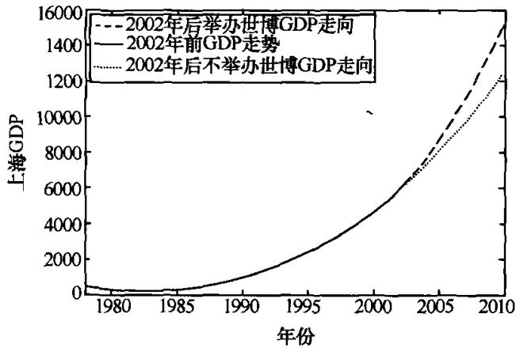

<details>
<summary>line</summary>

| 年份 | 2002年后举办世博GDP走向 | 2002年前GDP走势 | 2002年后不举办世博GDP走向 |
| --- | --- | --- | --- |
| 1980 | ~500 | ~500 | ~500 |
| 1985 | ~1000 | ~1000 | ~1000 |
| 1990 | ~2000 | ~2000 | ~2000 |
| 1995 | ~3500 | ~3500 | ~3500 |
| 2000 | ~6000 | ~6000 | ~6000 |
| 2005 | ~11000 | — | ~9500 |
| 2010 | ~15500 | — | ~12500 |
</details>

图 1 上海世博对 GDP 的影响

## 5.1.3 数据分析

分析图 1, 可以得到以下结论。

(1) 2002 年以前上海市的 GDP 保持持续性的、较为稳定的增长态势。  
(2) 举办世博会的情况下的 GDP 增长速度明显高于不举办的情况下 GDP 的增长速度。

两种情况下 2010 年人均 GDP 的差值为

$$
8 0 7 4 5. 6 - 6 4 9 4 0 = 1 5 8 0 5. 6 (\text {亿元})
$$

换算为年增长率：

$$
\begin{array}{l} 3 9 2 3 7 \times (1 + \alpha_ {1}) ^ {7} = 6 4 9 4 0 \\ 3 9 1 2 4. 7 \times (1 + \alpha_ {2}) ^ {7} = 8 0 7 4 5. 6 \\ \end{array}
$$

解得

$$
\alpha_ {1} - \alpha_ {2} = 0. 0 3 4 4
$$

也就是说举办世博会对上海的人均 GDP 增长的年贡献率为

$$
\Delta \alpha = 3.44\%
$$

## 5.2 投资对 GDP 增长的动态模型

## 5.2.1 模型分析

模型一采用静态的方法分析了世博会引发的投资增长对上海 GDP 增长的促进效应，一般来说可能会出现低估的问题。下面依照宏观经济学的加速度原理建立动态模型，进一步分析投资对 GDP 的促进作用。

## 5.2.2 模型建立及求解

由宏观经济学的加速度原理可以推出: $v=\frac{I_{t}}{GDP_{t}}$ 则 $I_{t}=v\times GDP_{t}$ 即 $GDP_{t}=\eta I_{t}$ ，其中 $\eta=\frac{1}{v}$ ，又根据

$$
\mathrm{GDP} _ {t} = \eta I _ {t} = \eta (I _ {t} + I _ {t - 1} - D _ {t})
$$

式中： $I_{t}$ 是 t 年的投资额； $D_{t}$ 是 t 年的资本折旧，可以得

$$
\begin{array}{l} \mathrm{GDP} _ {t} = \eta (I _ {t} + I _ {t - 1} - D _ {t}) \\ = \eta I _ {t} + \mathrm{GDP} _ {t - 1} - \eta \sigma I _ {t - 1} \\ = \eta I _ {t} + (1 - \sigma) \mathrm{GDP} _ {t - 1} \\ \end{array}
$$

即投资对 GDP 动态作用的经济模型：

$$
\mathrm{GDP} _ {t} = \eta I _ {t} + \delta \mathrm{GDP} _ {t - 1} + \varepsilon_ {t}
$$

式中： $\varepsilon_{t}$ 是随机误差项，假定 $\varepsilon_{t}$ 满足高斯—马尔柯夫条件， $\eta$ 和 $\delta$ 是参数 $\delta = 1 - \sigma$ 。利用与模型一相同原理可以拟合得

$$
\mathrm{GDP} _ {t} = 0. 2 0 9 6 I _ {t} + 0. 8 7 2 5 3 6 \mathrm{GDP} _ {t - 1} + 2 1 7. 8 1 1
$$

根据假设,上海世博会总投资额约为4000亿人民币,如果平均分配到2003—2010年,则每年增加投资约为571亿元,即 $I_{t}=571$ (亿元),则可计算出投资 $I_{t}$ 对 $GDP_{t}$ 累计乘数,见表4。

表 4 累计乘数

<table><tr><td>年份</td><td>2003</td><td>2004</td><td>2005</td><td>2006</td><td>2007</td><td>2008</td><td>2009</td><td>2010</td></tr><tr><td>累计乘数</td><td>0.28</td><td>0.45</td><td>0.52</td><td>0.73</td><td>0.88</td><td>1.07</td><td>1.28</td><td>1.45</td></tr></table>

计算出这投资在各年分别产生的增量,见表5。

表 5 GDP 增量

<table><tr><td>年份</td><td>2003</td><td>2004</td><td>2005</td><td>2006</td><td>2007</td><td>2008</td><td>2009</td><td>2010</td></tr><tr><td>GDP增量</td><td>159.88</td><td>256.95</td><td>296.92</td><td>416.83</td><td>502.48</td><td>610.97</td><td>730.88</td><td>827.95</td></tr></table>

容易得到,累计影响为 3802.86 亿元。

假定世博会的直接投资为均匀分布,则 2003—2010 年各年的 GDP 增长量在数值上等于累计的增加值。上海世博会所诱增的 GDP 如图 2 所示。

数据分析：

由图易得世博投资对于 GDP 的增长具有十分巨大的推动作用。并且由于受宏观经济学中的加速度原理影响,世博投资对于 GDP 长期影响的累加效应非常明显。结合表 3 的实际 GDP,利用加权平均法求出世博诱增 GDP 占总 GDP 的百分比,也就是世博的平均 GDP 贡献率为

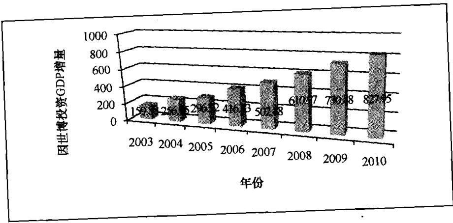

<details>
<summary>bar</summary>

| 年份 | 因世博投资GDP增量 |
| --- | --- |
| 2003 | 159.8 |
| 2004 | 256.6 |
| 2005 | 296.2 |
| 2006 | 416.3 |
| 2007 | 502.8 |
| 2008 | 610.7 |
| 2009 | 730.8 |
| 2010 | 827.5 |
</details>

图 2 因世博投资诱增的 GDP 增量

$$
\Delta \alpha = 3.29\%
$$

## 5.3 线性时间序列模型

## 5.3.1 模型分析

5.3.1 模型分析
模型一、二在进行数据拟合时都运用了相同的最小二乘的拟合方法,为进一步提高模型的拟合能力和预测准确度,本文选择预测能力更强,精度更高的线性时间序列模型进行建模。时间序列,也叫时间数列、历史复数或动态数列。它是将某种统计指标的数值,按时间先后顺序排到所形成的数列,是一种历史资料延申预测,也称历史引申预测法。以时间数列所能反映的社会经济现象的发展过程和规律性,进行引申外推,预测其发展趋势的方法。

## 5.3.2 模型原理

5.3.2 模型原理
时间序列预测法就是通过编制和分析时间序列,根据时间序列所反映出来的发展过程、方向和趋势,进行类推或延伸,借以预测下一段时间或以后若干年内可能达到的水平。其内容包括:收集与整理某种社会现象的历史资料;对这些资料进行检查鉴别,排成数列;分析时间数列,从中寻找该社会现象随时间变化而变化的规律,得出一定的模式;以此模式去预测该社会现象将来的情况。

式去预测该社会现象将来的情况。
根据 $ARMA(p,q)$ 模型的平稳性和可逆性,可以用传递形式和逆转形式等价描述该序列:

$$
\begin{array}{l} x _ {t} = \sum_ {i = 0} ^ {\infty} G _ {i} \varepsilon_ {t - 1} \\ \varepsilon_ {t} = \sum_ {j = 0} ^ {\infty} I _ {j} x _ {t - 1} \\ \end{array}
$$

式中： $\{G_{i}\}$ 为 Green 函数值； $\{I_{i}\}$ 为逆转矩阵数值。

联立得

$$
x _ {i} = \sum_ {i = 0} ^ {\infty} \sum_ {j = 0} ^ {\infty} G _ {i} I _ {j} x _ {t - i - j}
$$

显然, $x_{t}$ 是历史数据 $x_{t-1},x_{t-2},\cdots$ 的线性函数。对于任意一个未来时刻 $t+l(\forall l\geqslant1)$ 而言,该时刻的序列也可表示成它的历史数据的线性函数:

$$
x _ {t + l} = \sum_ {i = 0} ^ {\infty} C _ {i} x _ {t + l - 1 - i}
$$

对于未来任意时刻的序列值 $x_{t + l}, \forall l \geqslant 1$ 最终都可以表示成已知历史信息的线性函数，并用该函数形势估计 $x_{t + l}$ 的值：

$$
\widehat {x} _ {t} (l) = \sum_ {j = 0} ^ {\infty} \widehat {D} _ {i} x _ {t - i}
$$

式中： $\widehat{x}_{t}(l)$ 为 $\{x_{t}\}$ 的预测值。

## 5.3.3 模型建立

$X(1), X(2), \cdots, X(n-1), X(n)$ 为时间序列, 时间序列之间可建立以下线性回归模型:

$$
X (n) = P (1) X (n - 1) + P (2) X (n - 2) + \dots + P (k) X (k)
$$

式中：k 为相关系数。可建立 AX=b 的最小二乘求解回归系数：

$$
\boldsymbol {X} = \left[ \begin{array}{c c c c} X (1) & X (2) & \dots & X (k) \\ X (2) & X (3) & \dots & X (k + 1) \\ \vdots & \vdots & & \vdots \\ X (n - k - 1) & X (n - k) & \dots & X (n - 1) \end{array} \right]
$$

$$
\boldsymbol {b} = \left[ \begin{array}{c} X (k + 1) \\ X (k + 2) \\ \vdots \\ X (n) \end{array} \right]
$$

$$
\boldsymbol {A} = [ P (k), P (k - 1), \dots , P (1) ]
$$

A 即为线性回归系数。

## 5.3.4 模型求解

通过 MATLAB 编程,得到了线性时间序列模型预测的上海人口和 GDP 总量,见表 6。

表 6 预测的上海人口和 GDP 总量

<table><tr><td>年份</td><td>2003</td><td>2004</td><td>2005</td><td>2006</td><td>2007</td><td>2008</td><td>2009</td><td>2010</td></tr><tr><td>人口/万个</td><td>1624</td><td>1621</td><td>1639</td><td>1666</td><td>1696</td><td>1724</td><td>1752</td><td>1780</td></tr><tr><td>GDP总量/亿元</td><td>5706</td><td>6119</td><td>6604</td><td>7162</td><td>7797</td><td>8512</td><td>9313</td><td>10206</td></tr><tr><td>人均GDP/元</td><td>35135</td><td>37748</td><td>40293</td><td>42989</td><td>45973</td><td>49374</td><td>53156</td><td>57337</td></tr></table>

结合以上数据,对比实际 GDP 量,得到上海世博会对上海 GDP 增长的影响,如图 3 所示。

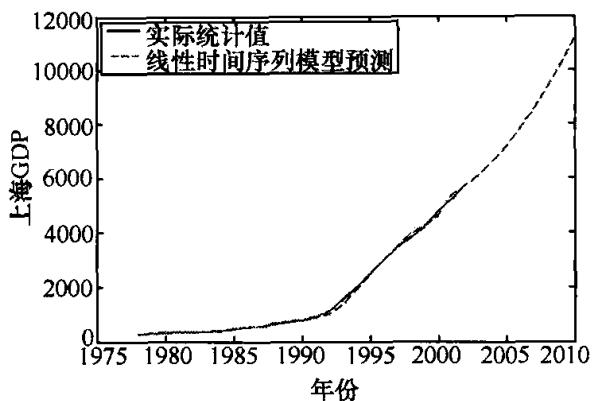

<details>
<summary>line</summary>

| 年份 | 实际统计值 | 线性时间序列模型预测 |
| --- | --- | --- |
| 1978 | ~200 | ~200 |
| 1985 | ~400 | ~400 |
| 1990 | ~800 | ~800 |
| 1995 | ~2500 | ~2500 |
| 2000 | ~4800 | ~4800 |
| 2005 | ~7500 | ~7500 |
| 2010 | ~11500 | ~11500 |
</details>

图 3 线性时间序列模型

利用模型一的算法得到举办世博会对上海的人均 GDP 增长的年贡献率：

$$
\Delta \alpha = 3.66\%
$$

## 5.4 模型对比和推广应用

## 5.4.1 模型对比

模型一、二采用相同的拟合方法——最小二乘法，模型三采用了更为复杂的线性时间序列方法。图4为最小二乘法与线性时序法拟合数据图形。

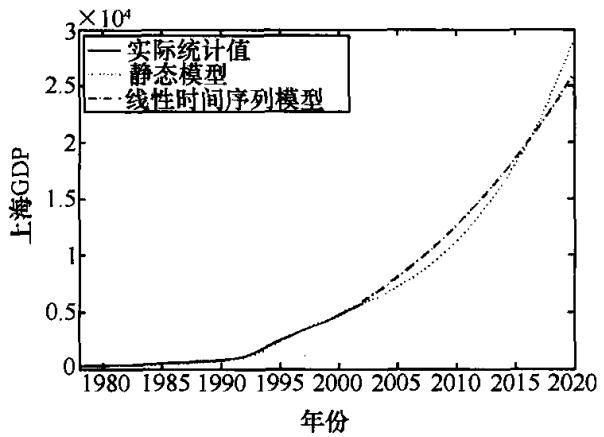

<details>
<summary>line</summary>

| 年份 | 实际统计值 (x10^4) | 静态模型 (x10^4) | 线性时间序列模型 (x10^4) |
| --- | --- | --- | --- |
| 1980 | ~0.05 | ~0.05 | ~0.05 |
| 1985 | ~0.08 | ~0.08 | ~0.08 |
| 1990 | ~0.15 | ~0.15 | ~0.15 |
| 1995 | ~0.35 | ~0.35 | ~0.35 |
| 2000 | ~0.6 | ~0.6 | ~0.6 |
| 2005 | ~1.0 | ~0.9 | ~1.0 |
| 2010 | ~1.5 | ~1.4 | ~1.5 |
| 2015 | ~2.1 | ~2.1 | ~2.1 |
| 2020 | ~2.5 | ~2.9 | ~2.5 |
</details>

图 4 两种预测方法对比

由图形可以看出,两种方法的吻合度比较好,预测值的上下浮动范围较小,进一步说明了模型建立的正确性和可信度。

## 5.4.2 模型推广

为了更加直观地反映世博对经济的影响力,将上述模型进行推广应用,将本模型应用到北京奥运会,计算得到北京奥运会对经济的影响力。通过对比世博会和北京奥运会对经济的影响力,使得读者对世博会对经济的影响力由更加深刻的认识。

根据查阅相关北京年鉴,得到北京奥运会之前 1978—2002 年,北京的人口、总投资额和 GDP 的相关数据见表 7。

表 7 北京常住人口

<table><tr><td>年份</td><td>1978</td><td>1979</td><td>1980</td><td>1981</td><td>1982</td><td>1983</td><td>1984</td><td>1985</td><td>1986</td></tr><tr><td>人口/万个</td><td>871.5</td><td>897.5</td><td>904.3</td><td>919.2</td><td>935</td><td>950</td><td>965</td><td>981</td><td>1028</td></tr><tr><td>年份</td><td>1987</td><td>1988</td><td>1989</td><td>1990</td><td>1991</td><td>1992</td><td>1993</td><td>1994</td><td>1995</td></tr><tr><td>人口/万个</td><td>1047</td><td>1061</td><td>1075</td><td>1086</td><td>1094</td><td>1102</td><td>1112</td><td>1125</td><td>1251.1</td></tr><tr><td>年份</td><td>1996</td><td>1997</td><td>1998</td><td>1999</td><td>2000</td><td>2001</td><td>2002</td><td></td><td></td></tr><tr><td>人口/万个</td><td>1259.4</td><td>1240</td><td>1245.6</td><td>1257.2</td><td>1363.6</td><td>1385.1</td><td>1423.2</td><td></td><td></td></tr></table>

利用最小二乘拟合,通过 MATLAB 编程,得到了在未举行奥运的情况下 2003—2010 年北京市的人口总量和总投资额,见表 8。

表 8 预测未举办奥运会时人口与总投资额

<table><tr><td>年份</td><td>2003</td><td>2004</td><td>2005</td><td>2006</td><td>2007</td><td>2008</td><td>2009</td><td>2010</td></tr><tr><td>人口/万个</td><td>1438.0</td><td>1473.3</td><td>1509.8</td><td>1547.6</td><td>1586.7</td><td>1627.2</td><td>1669.0</td><td>1712.3</td></tr><tr><td>总投资额/亿元</td><td>1963.1</td><td>2179.9</td><td>2410.6</td><td>2655.6</td><td>2915.5</td><td>3190.5</td><td>3481.1</td><td>3787.7</td></tr></table>

利用 $GDP_{t}$ 与 $I_{t}$ 的关系函数: $\ln\mathrm{GDP}_{t}=0.00082I_{t}+6.673$ , 结合附录二: 北京历年的投资总量和人口, 可以计算得到在不举办奥运会的情况下的经济增长预测结果, 与实际增长相对照得到表9。

表 9 预测未举办奥运会时 GDP

<table><tr><td>年份</td><td>2003</td><td>2004</td><td>2005</td><td>2006</td><td>2007</td><td>2008</td><td>2009</td><td>2010</td></tr><tr><td>不举办情况下人均GDP/元</td><td>4575.4</td><td>5100.9</td><td>5661.6</td><td>6258.6</td><td>6892.8</td><td>7565.3</td><td>8277.3</td><td>9029.6</td></tr><tr><td>未举办情况下人均GDP/元</td><td>31818</td><td>34622</td><td>37499</td><td>40441</td><td>43441</td><td>46493</td><td>49594</td><td>52734</td></tr><tr><td>实际GDP总量/亿元</td><td>5007.2</td><td>6033.2</td><td>6969.5</td><td>8117.8</td><td>9846.8</td><td>11115</td><td>12153</td><td>12732</td></tr><tr><td>实际人均GDP/元</td><td>34380.66</td><td>40418.03</td><td>45315.34</td><td>51345.98</td><td>60298.84</td><td>65575.22</td><td>69247.86</td><td>71271.83</td></tr></table>

结合表9数据,得到图5。

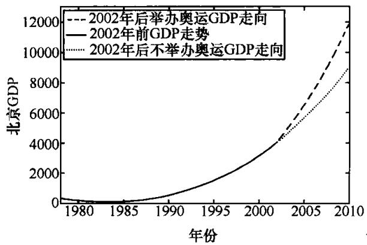

<details>
<summary>line</summary>

| 年份 | 2002年后举办奥运GDP走向 | 2002年前GDP走势 | 2002年后不举办奥运GDP走向 |
| --- | --- | --- | --- |
| 1980 | ~300 | ~300 | ~300 |
| 1985 | ~100 | ~100 | ~100 |
| 1990 | ~600 | ~600 | ~600 |
| 1995 | ~1800 | ~1800 | ~1800 |
| 2000 | ~3500 | ~3500 | ~3500 |
| 2005 | ~7500 | — | ~6500 |
| 2010 | ~12000 | — | ~9000 |
</details>

图 5 北京奥运对 GDP 的影响

数据分析：

根据模型一原理,可以计算出北京奥运对 GDP 的贡献率,步骤如下:

两种情况下 2010 年人均 GDP 的差值为

$$
7 1 2 7 1. 8 3 - 5 2 7 3 4 = 1 8 5 3 7. 8 3 (\text {亿元})
$$

换算为年增长率：

$$
3 1 8 1 8 \times (1 + \alpha_ {1}) ^ {7} = 5 2 7 3 4
$$

$$
3 4 3 8 0. 6 6 \times (1 + \alpha_ {2}) ^ {7} = 7 1 2 7 1. 8 3
$$

$$
\alpha_ {2} - \alpha_ {1} = 0. 0 3 1 2
$$

也就是说北京奥运会对北京的人均GDP增长的年贡献率为

$$
\Delta \alpha = 3.12\%
$$

## 5.4.3 模型应用

由于模型一、二、三都有较好的数据拟合和预测能力，为更加充分地利用这一优势，利用三个模型，分别对未来十年的经济发展状况进行模拟，得到如下数据，见表10。

表 10 预测未来 10 年 GDP

<table><tr><td>年份</td><td>2011</td><td>2012</td><td>2013</td><td>2014</td><td>2015</td><td>2016</td><td>2017</td><td>2018</td><td>2019</td><td>2020</td></tr><tr><td>静态模型GDP/亿元</td><td>14790</td><td>15973</td><td>17215</td><td>18518</td><td>19884</td><td>21314</td><td>22810</td><td>13665</td><td>24374</td><td>26007</td></tr><tr><td>动态模型GDP/亿元</td><td>14982</td><td>16090</td><td>17225</td><td>18600</td><td>19900</td><td>21350</td><td>22907</td><td>13780</td><td>24590</td><td>26101</td></tr><tr><td>时间序列模型GDP/亿元</td><td>12298</td><td>13515</td><td>14861</td><td>16346</td><td>17985</td><td>19792</td><td>21785</td><td>23980</td><td>26400</td><td>27263</td></tr></table>

对上述数据利用算术平均算法进行综合,得到了相对最优的预测数据,见表11。

表 11 最优预测数据

<table><tr><td>年份</td><td>2011</td><td>2012</td><td>2013</td><td>2014</td><td>2015</td><td>2016</td><td>2017</td><td>2018</td><td>2019</td><td>2020</td></tr><tr><td>GDP总量/亿元</td><td>14023</td><td>15193</td><td>16434</td><td>17821</td><td>19256</td><td>20819</td><td>22501</td><td>23808</td><td>25121</td><td>26457</td></tr></table>

可以计算得到 GDP 年增长率, 见表 12, 如图 6 所示。

表 12 预测 GDP 年增长率

<table><tr><td>年份</td><td>2012</td><td>2013</td><td>2014</td><td>2015</td><td>2016</td><td>2017</td><td>2018</td><td>2019</td><td>2020</td></tr><tr><td>GDP年增长率/%</td><td>8.34</td><td>8.16</td><td>8.43</td><td>8.05</td><td>8.11</td><td>8.07</td><td>5.81</td><td>5.51</td><td>5.32</td></tr></table>

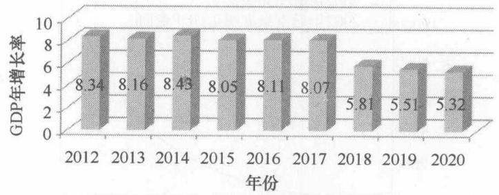

<details>
<summary>bar</summary>

| 年份 | GDP年增长率 (%) |
| --- | --- |
| 2012 | 8.34 |
| 2013 | 8.16 |
| 2014 | 8.43 |
| 2015 | 8.05 |
| 2016 | 8.11 |
| 2017 | 8.07 |
| 2018 | 5.81 |
| 2019 | 5.51 |
| 2020 | 5.32 |
</details>

图 6 预测 GDP 年增长率

数据分析：

观察图 6 可以看出, GDP 的年增长率呈先增后降的态势, 也就是说: 世博对上海 GDP 增长的影响作用在逐步减弱。

## 6 模型拓展

## 6.1 基于 AHP 的综合评估模型

## 6.1.1 模型分析

考评世博会的影响力大小,不仅仅体现在对经济的影响上,在文化交流、社会发展、科技进步等其他方面都有很大的影响。所以,本文就社会这个层面进行综合建模分析,建立世博会的综合评价模型,评估上海世博会的社会影响力大小。

## 6.1.2 评价指标

由于在进行数学建模时,不可能将所有的因素都考虑进去,只能考虑其中少数几个主要的因素。因此本文综合、考虑各方面因素,最后确定了经济拉动、文化交流、科技进步三个二级指标;增加就业机会、对旅游业拉动、对服务业拉动、吸引投资、国际贸易增长、国家品牌提升、文化传播、公民文化素质提升、政治交流、科技引进、科技流出、绿色城市建设进程、人民生活科技含量、科技关注度十四个三级指标。并建立如图7所示的上海世博影响力指标体系的结构图。

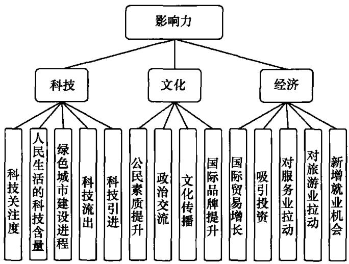

<details>
<summary>flowchart</summary>

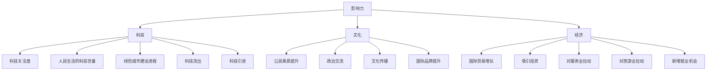
```mermaid
graph TD
  A["影响力"] --> B["科技"]
  A --> C["文化"]
  A --> D["经济"]
  
  B --> E["科技关注度"]
  B --> F["人民生活的科技含量"]
  B --> G["绿色城市建设进程"]
  B --> H["科技流出"]
  B --> I["科技引进"]
  
  C --> J["公民素质提升"]
  C --> K["政治交流"]
  C --> L["文化传播"]
  C --> M["国际品牌提升"]
  
  D --> N["国际贸易增长"]
  D --> O["吸引投资"]
  D --> P["对服务业拉动"]
  D --> Q["对旅游业拉动"]
  D --> R["新增就业机会"]
```
</details>

图 7 评价指标体系

## 6.1.3 模型建立

根据上海世博主题,以及世博的举办相关纲领和要求,本文就以上二级指标、三级指标两两比较,得到了各影响因素的判断矩阵,见表13。

表 13 判断矩阵

<table><tr><td>A</td><td> $B_1$ </td><td> $B_2$ </td><td> $B_3$ </td></tr><tr><td> $B_1$ </td><td>1</td><td>3</td><td>3</td></tr><tr><td> $B_2$ </td><td> $\frac{1}{3}$ </td><td>1</td><td>1</td></tr><tr><td> $B_3$ </td><td> $\frac{1}{3}$ </td><td>1</td><td>1</td></tr></table>

<table><tr><td> $B_{2}$ </td><td> $C_{6}$ </td><td> $C_{7}$ </td><td> $C_{8}$ </td><td> $C_{9}$ </td></tr><tr><td> $C_{6}$ </td><td>1</td><td> $\frac{1}{2}$ </td><td> $\frac{1}{3}$ </td><td> $\frac{1}{2}$ </td></tr><tr><td> $C_{7}$ </td><td>2</td><td>1</td><td> $\frac{1}{2}$ </td><td> $\frac{1}{3}$ </td></tr><tr><td> $C_{8}$ </td><td>3</td><td>2</td><td>1</td><td> $\frac{1}{2}$ </td></tr><tr><td> $C_{9}$ </td><td>2</td><td>3</td><td>2</td><td>1</td></tr></table>

<table><tr><td> $B_{1}$ </td><td> $C_{1}$ </td><td> $C_{2}$ </td><td> $C_{3}$ </td><td> $C_{4}$ </td><td> $C_{5}$ </td></tr><tr><td> $C_{1}$ </td><td>1</td><td> $\frac{1}{3}$ </td><td> $\frac{1}{3}$ </td><td>2</td><td>5</td></tr><tr><td> $C_{2}$ </td><td>3</td><td>1</td><td>1</td><td>3</td><td>3</td></tr><tr><td> $C_{3}$ </td><td>3</td><td>1</td><td>1</td><td>4</td><td>5</td></tr><tr><td> $C_{4}$ </td><td> $\frac{1}{2}$ </td><td> $\frac{1}{3}$ </td><td> $\frac{1}{4}$ </td><td>1</td><td>2</td></tr><tr><td> $C_{5}$ </td><td> $\frac{1}{5}$ </td><td> $\frac{1}{3}$ </td><td> $\frac{1}{5}$ </td><td> $\frac{1}{2}$ </td><td>1</td></tr></table>

<table><tr><td> $B_{3}$ </td><td> $C_{10}$ </td><td> $C_{11}$ </td><td> $C_{12}$ </td><td> $C_{13}$ </td><td> $C_{14}$ </td></tr><tr><td> $C_{10}$ </td><td>1</td><td> $\frac{1}{3}$ </td><td>3</td><td>3</td><td>2</td></tr><tr><td> $C_{11}$ </td><td>3</td><td>1</td><td>2</td><td>3</td><td>2</td></tr><tr><td> $C_{12}$ </td><td> $\frac{1}{3}$ </td><td> $\frac{1}{2}$ </td><td>1</td><td> $\frac{1}{2}$ </td><td> $\frac{1}{3}$ </td></tr><tr><td> $C_{13}$ </td><td> $\frac{1}{3}$ </td><td> $\frac{1}{3}$ </td><td>2</td><td>1</td><td> $\frac{1}{2}$ </td></tr><tr><td> $C_{14}$ </td><td> $\frac{1}{2}$ </td><td> $\frac{1}{2}$ </td><td>3</td><td>2</td><td>1</td></tr></table>

其中：A代表上海世博影响力； $B_{1}$ 代表经济拉动， $B_{2}$ 代表文化交流， $B_{3}$ 代表科技进步度； $C_{1}$ 代表增加就业机会， $C_{2}$ 代表对旅游业拉动， $C_{3}$ 代表对服务业拉动， $C_{4}$ 代表吸引投资， $C_{5}$ 代表国际贸易增长， $C_{6}$ 代表国家品牌提升， $C_{7}$ 代表文化传播， $C_{8}$ 代表政治交流， $C_{9}$ 代表公民文化素质提升， $C_{10}$ 代表科技引进， $C_{11}$ 代表科技流出， $C_{12}$ 代表绿色城市建设进程， $C_{13}$ 代表人民生活科技含量， $C_{14}$ 代表科技关注度。判断尺度的含义见表14。

表 14 判断尺度定义

<table><tr><td> $y_i/y_j$ </td><td>同等重要</td><td>略为重要</td><td>明显重要</td><td>尤为重要</td><td>异常重要</td><td>等级之间</td></tr><tr><td>判断尺度</td><td>1</td><td>3</td><td>5</td><td>7</td><td>9</td><td>2、4、6、8</td></tr></table>

下面进行权重计算。

先进行一般性讨论:设判断矩阵为 $a_{ij}$ ，那么，每一行元素之积：

$$
M _ {i} = \prod_ {j = 1} ^ {m} a _ {i j}
$$

$$
a _ {i} = \sqrt [ m ]{M _ {i}}, i = (1, 2, 3, 4, \dots , m)
$$

则对向量 $\boldsymbol{\alpha}=(\alpha_{1},\alpha_{2},\alpha_{3},\cdots,\alpha_{m})^{\mathrm{T}}$ 做归一化处理, 得到最大特征值 $\lambda_{m}$ 的特征向量:

$$
W = (  W _ {1}  , W _ {2}  , W _ {3}  , \dots , W _ {m}  ) ^ {\mathrm{T}}
$$

$$
\lambda_ {m} = \frac {1}{m} \sum_ {i = 1} ^ {m} \frac {(A W) _ {i}}{w _ {i}}, i = (1, 2, 3, 4, \dots , m)
$$

$$
C. I = \frac {\lambda_ {m} - m}{m - 1}, C R = \frac {C . I}{R I}
$$

## 6.1.4 模型求解

利用 MATLAB 编程(程序见附录二), 求得权重见表 15。

表 15 各指标权重

<table><tr><td rowspan="2">层次C\层次B</td><td> $B_1$ </td><td> $B_2$ </td><td> $B_3$ </td><td rowspan="2">层次C\层次B</td><td> $B_1$ </td><td> $B_2$ </td><td> $B_3$ </td></tr><tr><td>0.6000</td><td>0.2000</td><td>0.2000</td><td>0.6000</td><td>0.2000</td><td>0.2000</td></tr><tr><td> $C_1$ </td><td>0.1102</td><td>0</td><td>0</td><td> $C_8$ </td><td>0</td><td>0.2892</td><td>0</td></tr><tr><td> $C_2$ </td><td>0.3160</td><td>0</td><td>0</td><td> $C_9$ </td><td>0</td><td>0.4197</td><td>0</td></tr><tr><td> $C_3$ </td><td>0.3576</td><td>0</td><td>0</td><td> $C_{10}$ </td><td>0</td><td>0</td><td>0.2487</td></tr><tr><td> $C_4$ </td><td>0.0951</td><td>0</td><td>0</td><td> $C_{11}$ </td><td>0</td><td>0</td><td>0.3714</td></tr><tr><td> $C_5$ </td><td>0.0611</td><td>0</td><td>0</td><td> $C_{12}$ </td><td>0</td><td>0</td><td>0.0883</td></tr><tr><td> $C_6$ </td><td>0</td><td>0.1233</td><td>0</td><td> $C_{13}$ </td><td>0</td><td>0</td><td>0.1091</td></tr><tr><td> $C_7$ </td><td>0</td><td>0.1678</td><td>0</td><td> $C_{14}$ </td><td>0</td><td>0</td><td>0.1825</td></tr></table>

$$
C R _ {1} = 0. 0 0 0, \quad C R _ {2 1} = 0. 0 5 1 3, \quad C R _ {2 2} = 0. 0 6 1 1, \quad C R _ {2 3} = 0. 0 7 7 7 。
$$

由表 15 可知, 各判断矩阵的一致性比例都小于 0.1, 所以, 可以认为所有判断矩阵的一致性都可以接受。

通过查阅相关资料,得到了2005年日本爱知世博会和上海世博会的相关资料,将上海世博和日本世博进行比较,并进行打分,相关数据见表16。

表 16 爱知世博会与上海世博会对比

<table><tr><td colspan="2">新增就业机会/万个</td><td>对旅游业拉动/%</td><td>对服务业拉动/%</td><td>吸引投资/亿元</td><td>国际贸易增长/%</td><td>国家品牌提升/位</td><td>文化传播/%</td></tr><tr><td>爱知世博</td><td>24</td><td>21.4</td><td>27.1</td><td>1875</td><td>23.3</td><td>4</td><td>11.3</td></tr><tr><td>上海世博</td><td>14.6</td><td>37.2</td><td>43.7</td><td>4000</td><td>43.1</td><td>7</td><td>57.6</td></tr><tr><td>得分</td><td>0.61</td><td>1.69</td><td>1.61</td><td>1.80</td><td>1.75</td><td>1.71</td><td>1.97</td></tr><tr><td></td><td>政治交流/次</td><td>公民素质提升/%</td><td>科技引进/亿元</td><td>科技流出/亿元</td><td>绿色城市建设进程/%</td><td>人民生活的科技含量/%</td><td>科技关注度/位</td></tr><tr><td>爱知世博</td><td>125</td><td>2.7</td><td>78</td><td>250</td><td>92.4</td><td>67.1</td><td>1</td></tr><tr><td>上海世博</td><td>243</td><td>7.8</td><td>100</td><td>30</td><td>37.1</td><td>13.2</td><td>3</td></tr><tr><td>得分</td><td>1.78</td><td>1.86</td><td>1.28</td><td>0.12</td><td>0.18</td><td>0.197</td><td>0.33</td></tr></table>

打分原理:首先利用线性关系得到上海世博相对于参照系的比例数值,再利用正态分布函数对数值进行回归修正,使得数据最大趋近2,即满分为2,得分小于1表示上海世博会在该方面影响作用相对于参照系较小。相反,大于1表示影响作用相对较大。回归修正函数为

$$
F (x) = 2 \int_ {0} ^ {x} \sqrt {2 \pi} \mathrm{e} ^ {- \frac {3 (x - 1) ^ {2}}{2}} \mathrm{d} x
$$

根据上述数据,可以计算得到:

上海世博对经济拉动的评价得分：

$$
G _ {1} = 1. 4 5 5
$$

上海世博对文化交流的评价得分：

$$
G _ {2} = 1. 8 3 7
$$

上海世博对科技发展的评价得分：

$$
G _ {3} = 0. 4 6 1
$$

上海世博的总评得分：

$$
G = 1. 3 3 2
$$

数据分析：

通过分析数据可以发现,上海世博比日本爱知世博的影响力总体上大得多,特别是在经济拉动、文化交流两方面,上海世博会达到的效果远远高于日本爱知世博会,但由于科技发展是一个长期缓慢的过程,而日本的科技发展水平相对高于中国,因此爱知世博会上对日本科技的发展和传播的影响力高于上海世博会对中国的作用。

为进一步比较说明上海世博对中国发展的巨大影响力,再将上海世博和2008年奥运会的各项指标进行横向比较。先得到奥运会和上海世博各项因素的对比和得分(表17)。

表 17 奥运会与上海世博会对比

<table><tr><td colspan="2">新增就业机会/万个</td><td>对旅游业拉动/%</td><td>对服务业拉动/%</td><td>吸引投资亿元</td><td>国际贸易增长/%</td><td>国家品牌提升/位</td><td>文化传播/%</td></tr><tr><td>奥运会</td><td>180</td><td>46.1</td><td>57.2</td><td>4000</td><td>47.2</td><td>13</td><td>77</td></tr><tr><td>上海世博</td><td>14.6</td><td>37.2</td><td>43.7</td><td>4000</td><td>43.1</td><td>7</td><td>57.6</td></tr><tr><td>得分</td><td>0.08</td><td>0.81</td><td>0.76</td><td>1.00</td><td>0.90</td><td>0.54</td><td>0.75</td></tr><tr><td colspan="2">政治交流/次</td><td>公民素质提升/%</td><td>科技引进亿元</td><td>科技流出亿元</td><td>绿色城市建设进程/%</td><td>人民生活的科技含量/%</td><td>科技关注度/位</td></tr><tr><td>奥运会</td><td>93</td><td>23</td><td>63</td><td>20</td><td>28.8</td><td>7.9</td><td>11</td></tr><tr><td>上海世博</td><td>243</td><td>7.8</td><td>100</td><td>30</td><td>37.1</td><td>13.2</td><td>3</td></tr><tr><td>得分</td><td>1.83</td><td>0.34</td><td>1.58</td><td>1.50</td><td>1.29</td><td>1.67</td><td>0.27</td></tr></table>

根据上述数据,可以计算得到相对于北京奥运会上海世博会的各项得分如下:

上海世博对经济拉动的评价得分：

$$
G _ {1} = 1. 0 0 3
$$

上海世博对文化交流的评价得分：

$$
G _ {2} = 1. 0 1 5
$$

上海世博对科技发展的评价得分：

$$
G _ {3} = 1. 3 5 6
$$

上海世博的总评得分：

$$
G = 1. 0 7 6
$$

数据分析：

由数据不难发现上海世博会在经济和文化方面的影响比北京奥运会稍大一点,文化方面世博会的作用更加明显。就总体而言,上海世博会的影响力相对于北京奥运会仍然偏大。

## 6.2 模糊综合评价模型

为了增加模型的可信度,降低模型不确定因素对模型的影响。本文利用已得到的权重矩阵,从不同的角度,利用模糊数学的原理建立模糊综合评价系统。

## 6.2.1 模型建立

设评判集为 $V=\{v_{1},v_{2},\cdots,v_{n}\}$ ，一般由 $V=\{很好,较好,一般,较差\}$ 四个评价等级构成，其对应的评分矩阵为 $E=\{e_{1},e_{2},e_{3},e_{m}\}$ ，模糊评价矩阵 R 是 U 到 V 的模糊映射， $r_{ij}$ 表示从第 i 个因素着眼对某一因素第 j 种评价的可能性。对于固定的 i， $(R_{i1},R_{i2},\cdots,R_{im})$ 就是 V 上的一个模糊集，表示从第 i 个因素着眼，对于某个对象所做的单因素评价。由此，可以得到模糊矩阵为

$$
\boldsymbol {R} = \left[ \begin{array}{c c c c} r _ {1 1} & r _ {1 2} & \dots & r _ {1 m} \\ r _ {2 1} & r _ {2 2} & \dots & r _ {2 m} \\ \vdots & \vdots & & \vdots \\ r _ {n 1} & r _ {n 2} & \dots & r _ {n m} \end{array} \right]
$$

那么根据已经得到的权重矩阵 $\pmb{W}$ 和相应的模糊矩阵 $\pmb{R}$ 就可以按照下式进行计算：

$$
\boldsymbol {G} = \boldsymbol {R} \cdot \boldsymbol {E} \cdot \boldsymbol {W}
$$

式中：W 为各指标权重值；R 为模糊评价矩阵；· 为合成运算符，是广义模糊算子。

在进行综合评价时可根据具体情况选用适当的合成方式·,本模型可用加权平均的方法进行合成运算,即采用矩阵相乘的算法。

## 6.2.2 模型求解

本模型建立如下判断集 $V = \{\text{很好, 较好, 一般, 较差}\}$ , 并设其评分矩阵为 $E = \{2, 1.2, 0.8, 0.2\}$ , 根据调查分析, 得到了模型一中上海世博会各个因素相对于日本世博会

所对应的评价矩阵如下：

$$
\boldsymbol {R} _ {1} = \left( \begin{array}{c c c c} 0. 1 & 0. 1 & 0. 2 & 0. 6 \\ 0. 7 & 0. 2 & 0. 1 & 0. 0 \\ 0. 6 & 0. 3 & 0. 1 & 0. 0 \\ 0. 8 & 0. 1 & 0. 1 & 0. 0 \\ 0. 7 & 0. 3 & 0. 0 & 0. 0 \end{array} \right)
$$

$$
\boldsymbol {R} _ {2} = \left( \begin{array}{c c c c} 0. 7 & 0. 2 & 0. 1 & 0. 0 \\ 0. 9 5 & 0. 0 2 5 & 0. 0 2 5 & 0. 0 \\ 0. 7 & 0. 2 5 & 0. 0 5 & 0. 0 \\ 0. 8 5 & 0. 1 & 0 & 0. 0 5 \end{array} \right)
$$

$$
\boldsymbol {R} _ {3} = \left( \begin{array}{c c c c} 0. 5 & 0. 1 & 0. 1 & 0. 3 \\ 0 & 0 & 0 & 1 \\ 0. 0 0 1 & 0 & 0 & 0. 9 9 9 \\ 0 & 0. 0 0 0 3 & 0. 0 0 9 7 & 0. 9 9 \\ 0. 0 5 & 0 & 0. 0 5 & 0. 9 \end{array} \right)
$$

利用算法

$$
\boldsymbol {G} = \boldsymbol {R} \cdot \boldsymbol {E} \cdot \boldsymbol {W}
$$

通过 MATLAB 编程求解得到该模型各指标得分为

$$
G _ {1} = 1. 2 6 8, G _ {1} = 1. 8 7 6, G _ {1} = 0. 4 8 4
$$

又由于 $W_{A}=(0.600,0.200,0.200)$ ，可以得出：

$$
G = 1. 2 3 3
$$

数据分析：

本模型得到的结果和模型一的结果基本吻合,都能够得到共同的结论:上海世博会的总体影响力要大于日本爱知世博会,这也进一步验证了模型一的正确。

## 6.3 权重优化模型

模型 6.1 和 6.2 在计算权重时具有一定的不确定性和主观性。为使模型更加合理，本文对模型进行进一步的优化，用多种方法计算权重，将各种答案进行有效综合，得出更加合理的权重。

## 6.3.1 改进思路

用复相关系数法 $(m_{1})$ 、因子分析法 $(m_{2})$ 、熵值法 $(m_{3})$ 、AHP $(m_{4})$ 法进行评价。用相容方法集理论对不同权重确定的方法所得的评价结论进行相容性检验，然后用Spearman等级相关系数法检验相容方法集中不同方法评价结论的密切程度，以此为基础，确定组合权重计算公式中的加权系数并进行组合赋权。

## 6.3.2 改进步骤

（1）可比方法集 $M=\{m_{1},m_{2},m_{3},m_{4}\}$ ，待评价对象集 $X=(x_{1},x_{2},x_{3},\cdots,x_{m})$ 用第 i 种方法对 9 个对象进行评价可得评价向量 $\boldsymbol{u}_{i}=(u_{i1},u_{i2},u_{i3},\cdots,u_{im})^{\mathrm{T}},i=1,2,3,4$ 。对上述 4 种评价结论用向量作系统聚类分析，总可以将其分成两类：第一类仅由第 k 种方法评价结论 $\boldsymbol{u}_{k}=(u_{k1},u_{k2},u_{k3},\cdots,u_{km})^{\mathrm{T}}$ 组成；第二类由除 $u_{k}$ 以外所有向量组成。

(2) 令 $u_{i} = \frac{1}{3}, j = 1, 2, \cdots, 9$ ，则可得到第二类评价结论的平均向量 $\bar{\pmb{u}} = (\bar{u}_{1}, \bar{u}_{2}, \bar{u}_{3}, \cdots, u_{m})$ 。

(3) 求 $u_{k}$ 与 $\bar{u}$ 的 Spearman 等级相关系数 $\rho, \rho = 1 - \frac{69\sum_{i=1}^{n}(u_{ki} - \bar{u}_i)^2}{m \times (m^2 - 1)}$ 。如果 $\rho > 0$ ，则判定集合 $M$ 中的四种方法具有相容性， $M$ 即为相容方法集 $M_p$ ，否则不相容并将其从 $M$ 中删除，然后对剩余的三种方法按以上步骤检验，直到找到相容方法集 $M_p$ 。

（4）相容方法集 $M_{p}$ 中方法 $l$ 与方法 $j$ 评价结论向量之间的Spearman等级的相关系数 $\lambda_{ij}$ ，即 $\lambda_{ij} = 1 - 6\frac{\sum_{i = 1}^{9}(u_{li} - u_{ij})^2}{m(m\times m - 1)}$ 。

(5) 确定相容方法集 $M_{p}$ 中方法与其他方法评价结论间的均匀相关程度, 即 $\lambda_{l} = \frac{\sum_{i=1}^{\infty} \lambda_{ij}}{p-1}$ 。 $\lambda_{l}$ 较大, 表明方法 $l$ 的评价与其他方法评价结论的一致程度性高。

(6) 方法 l 的组合加权系数 $r_{l} = \frac{\lambda_{l}}{\sum_{l=1}^{p} \lambda_{l}}$ 。计算方法 l 的组合向量 $u = \sum_{l=1}^{l=p} r_{l} v_{l}$ ，其中 $v_{l}$ 是方法 l 中的指标权重向量， $v_{1} = (v_{l1}, v_{l2}, v_{l3}, \cdots, v_{lm})$ 。

## 7 模型评价

## 7.1 模型优点

（1）本文避免了“一个标准”的建模思想，从多层次，多角度对上海世博会的影响力进行了评估。  
(2) 本文通过建立多个模型, 讨论了上海世博会对经济增长的影响力, 通过分析模型结果的吻合度, 验证了模型的可信度。  
（3）模型一利用投资与 $GDP_{t}$ 增加之间的线性对数关系建立模型，拟合效果较好，并定量刻画了上海世博会的经济贡献率。  
（4）模型二改进了模型一静态分析的不足，依照宏观经济学的加速度原理建立动态模型，使模型结果更加准确。  
(5) 利用已建立模型, 将上海世博会进行了横向与纵向的比较, 分别比较了上海世博

会和北京奥运会,以及与日本爱知奥运会的影响力大小,拓展了模型的应用范围,使模型更加丰富。

(6) 在模型拓展中,本文从社会这个大层次出发,利用层次分析法,模糊数学法,以及组合分析法,对上海世博会的影响力进行了更加全面的评估。

## 7.2 模型缺点

（1）在考虑投资与 GDP 关系时,假定投资增长平滑稳定,忽略了政府的宏观调控能力以及个别年份的特殊情况。  
(2) 数据的准确度有待提高,少数数据缺乏官方统计,为了量化需要,本文取各大网站的调查结果的平均值。  
（3）模型拓展从社会这一大层面分析了上海世博会的影响力，虽然考虑了很多方面，但仍不够全面，可以进一步拓展。

## 参考文献

[1] 赫孝良, 戴永红, 周义仓. 数学建模竞赛赛题简析与论文点评. 西安: 西安交通大学出版社, 2002.  
[2] 冯杰, 黄力伟, 王勤, 等. 数学建模与案例. 北京: 科学出版社, 2007.  
[3] 李志林, 欧宜贵. 数学建模及典型案例分析. 北京: 化学工业出版社, 2007.  
[4] 张世贤, 马莉. 奥运经济与世博经济之比较研究. 社会科学, 2004(5):19-24.  
[5] 孙文杰. 2010 年上海世博会的举办对我国经济的影响. 中国商界, 2009(12): 201.  
[6] 北京市统计局. 北京统计年鉴 2010. 北京: 中国统计出版社, 2010.  
[7] 上海市统计局. 上海统计年鉴 2010. 北京: 中国统计出版社, 2010.  
[8] 戴全光, 保继刚. 昆明世博会效应的定量计算: 本底趋势线模型. 地理科学, 2007(3):426-433.  
[9] 王燕. 应用时间序列分析. 北京: 中国人民大学出版社, 2005.

## 附录一 上海历年投资总额和 GDP 总量的统计表

<table><tr><td>年份</td><td>全社会固定资产投资</td><td>上海市生产总值</td><td>常住人口/万个</td><td>人均GDP</td></tr><tr><td>1978</td><td>27.91</td><td>272.81</td><td>1104</td><td>2471.1051</td></tr><tr><td>1979</td><td>35.58</td><td>286.43</td><td>1137</td><td>2519.1733</td></tr><tr><td>1980</td><td>45.43</td><td>311.89</td><td>1152</td><td>2707.3785</td></tr><tr><td>1981</td><td>54.6</td><td>324.76</td><td>1168</td><td>2780.4795</td></tr><tr><td>1982</td><td>71.34</td><td>337.07</td><td>1186</td><td>2842.0742</td></tr><tr><td>1983</td><td>75.94</td><td>351.81</td><td>1201</td><td>2929.3089</td></tr><tr><td>1984</td><td>92.3</td><td>390.85</td><td>1217</td><td>3211.5859</td></tr><tr><td>1985</td><td>118.56</td><td>466.75</td><td>1233</td><td>3785.4826</td></tr><tr><td>1986</td><td>146.93</td><td>490.83</td><td>1249</td><td>3929.7838</td></tr><tr><td>1987</td><td>186.3</td><td>545.46</td><td>1265</td><td>4311.9368</td></tr><tr><td>1988</td><td>245.27</td><td>648.3</td><td>1288</td><td>5033.3851</td></tr><tr><td>1989</td><td>214.76</td><td>696.54</td><td>1311</td><td>5313.0435</td></tr><tr><td>1990</td><td>227.08</td><td>781.66</td><td>1334</td><td>5859.5202</td></tr><tr><td>1991</td><td>258.3</td><td>893.77</td><td>1350</td><td>6620.5185</td></tr><tr><td>1992</td><td>357.38</td><td>1114.32</td><td>1365</td><td>8163.5165</td></tr><tr><td>1993</td><td>653.91</td><td>1519.23</td><td>1381</td><td>11000.941</td></tr><tr><td>1994</td><td>1123.29</td><td>1990.86</td><td>1398</td><td>14240.773</td></tr><tr><td>1995</td><td>1601.79</td><td>2499.43</td><td>1414</td><td>17676.308</td></tr><tr><td>1996</td><td>1952.05</td><td>2957.55</td><td>1451</td><td>20382.839</td></tr><tr><td>1997</td><td>1977.59</td><td>3438.79</td><td>1489</td><td>23094.627</td></tr><tr><td>1998</td><td>1964.83</td><td>3801.09</td><td>1527</td><td>24892.534</td></tr><tr><td>1999</td><td>1856.72</td><td>4188.73</td><td>1567</td><td>26730.887</td></tr><tr><td>2000</td><td>1869.67</td><td>4771.17</td><td>1608.6</td><td>29660.388</td></tr><tr><td>2001</td><td>1994.73</td><td>5210.12</td><td>1614</td><td>32280.793</td></tr><tr><td>2002</td><td>2187.06</td><td>5741.03</td><td>1625</td><td>35329.415</td></tr><tr><td>2003</td><td>2452.11</td><td>6694.23</td><td>1711</td><td>39124.664</td></tr><tr><td>2004</td><td>3084.66</td><td>8072.83</td><td>1742.15</td><td>46338.318</td></tr><tr><td>2005</td><td>3542.55</td><td>9247.66</td><td>1778.42</td><td>51999.303</td></tr><tr><td>2006</td><td>3925.09</td><td>10572.24</td><td>1815.34</td><td>58238.347</td></tr><tr><td>2007</td><td>4458.61</td><td>12494.01</td><td>1858.08</td><td>67241.507</td></tr><tr><td>2008</td><td>4829.45</td><td>14069.87</td><td>1888.46</td><td>74504.464</td></tr><tr><td>2009</td><td>5273.33</td><td>15046.45</td><td>1921.32</td><td>78313.087</td></tr></table>

附录二 北京历年固定投资总量与人口统计

<table><tr><td>年份</td><td>固定资产</td><td>北京GDP</td><td>常住人口</td><td>人均GDP</td></tr><tr><td>1978</td><td>22.6</td><td>108.8</td><td>871.5</td><td>1248.4223</td></tr><tr><td>1979</td><td>26.5</td><td>120.1</td><td>897.1</td><td>1338.7582</td></tr><tr><td>1980</td><td>33.2</td><td>139.1</td><td>904.3</td><td>1538.2063</td></tr><tr><td>1981</td><td>36.6</td><td>139.2</td><td>919.2</td><td>1514.3603</td></tr><tr><td>1982</td><td>38.6</td><td>154.9</td><td>935</td><td>1656.6845</td></tr><tr><td>1983</td><td>51.3</td><td>183.1</td><td>950</td><td>1927.3684</td></tr><tr><td>1984</td><td>66.3</td><td>216.6</td><td>965</td><td>2244.5596</td></tr><tr><td>1985</td><td>94</td><td>257.1</td><td>981</td><td>2620.7951</td></tr><tr><td>1986</td><td>106.2</td><td>284.9</td><td>1028</td><td>2771.4008</td></tr><tr><td>1987</td><td>136.2</td><td>326.8</td><td>1047</td><td>3121.2989</td></tr><tr><td>1988</td><td>163</td><td>410.2</td><td>1061</td><td>3866.164</td></tr><tr><td>1989</td><td>139.5</td><td>456</td><td>1075</td><td>4241.8605</td></tr><tr><td>1990</td><td>179.2</td><td>500.8</td><td>1086</td><td>4611.418</td></tr><tr><td>1991</td><td>192</td><td>598.9</td><td>1094</td><td>5474.4059</td></tr><tr><td>1992</td><td>266</td><td>709.1</td><td>1102</td><td>6434.6642</td></tr><tr><td>1993</td><td>410.4</td><td>886.2</td><td>1112</td><td>7969.4245</td></tr><tr><td>1994</td><td>648.8</td><td>1145.3</td><td>1125</td><td>10180.444</td></tr><tr><td>1995</td><td>841.5</td><td>1507.7</td><td>1251.1</td><td>12050.995</td></tr><tr><td>1996</td><td>876.9</td><td>1789.2</td><td>1259.4</td><td>14206.765</td></tr><tr><td>1997</td><td>961.2</td><td>2077.1</td><td>1240</td><td>16750.806</td></tr><tr><td>1998</td><td>1155.6</td><td>2377.2</td><td>1245.6</td><td>19084.778</td></tr><tr><td>1999</td><td>1170.6</td><td>2678.8</td><td>1257.2</td><td>21307.668</td></tr><tr><td>2000</td><td>1297.4</td><td>3161.7</td><td>1363.6</td><td>23186.418</td></tr><tr><td>2001</td><td>1530.5</td><td>3708</td><td>1385.1</td><td>26770.63</td></tr><tr><td>2002</td><td>1814.3</td><td>4315</td><td>1423.2</td><td>30318.999</td></tr><tr><td>2003</td><td>2157.1</td><td>5007.2</td><td>1456.4</td><td>34380.665</td></tr><tr><td>2004</td><td>2528.3</td><td>6033.2</td><td>1492.7</td><td>40418.034</td></tr><tr><td>2005</td><td>2827.2</td><td>6969.5</td><td>1538</td><td>45315.345</td></tr><tr><td>2006</td><td>3371.5</td><td>8117.8</td><td>1581</td><td>51345.984</td></tr><tr><td>2007</td><td>3966.6</td><td>9846.8</td><td>1633</td><td>60298.836</td></tr><tr><td>2008</td><td>3848.5</td><td>11115</td><td>1695</td><td>65575.221</td></tr><tr><td>2009</td><td>4858.4</td><td>12153</td><td>1755</td><td>69247.863</td></tr></table>

## 【论文点评】

滕加俊

本题要求参赛队自行选择自己感兴趣的某个侧面,建立数学模型,利用互联网数据,定量估计2010年上海世博会的影响力。评估的侧面很多,但无论从哪个侧面来评估,都至少应从两个方面来进行:一是进行横向比较,如和北京奥运会、昆明世博会等比较;二是进行纵向比较,如和往届世博会进行比较。需要注意的是,不仅要对2010年上海世博会结束前影响力进行评估,还要对世博会结束后的影响力进行评估。

本论文选择了从经济增长方面来定量评估2010年上海世博会的影响力,着重研究了上海世博会对GDP增长的促进作用,建立了对数GDP增长模型、投资对GDP增长的动态模型、线性时间序列模型。分别求出了上海世博会对GDP增长的贡献率,并与北京奥运会和日本爱知世博会进行了横向与纵向的比较,利用得分原则,得到了上海世博会影响会较北京奥运会和日本爱知世博会影响力更大的结论。论文还对世博会结束后未知10年上海GDP变化势态进行了分析。

本论文思路清晰,条理清楚,考虑问题较为全面,是一篇优秀的数学建模论文。

# 2010 年上海世博会经济效应的定量评估

## 摘要

2010 年的上海世博会对上海及周边地区乃至全国的政治、经济、文化诸领域产生重要影响。本文以世博会对上海经济发展的影响为评估主体，根据影响经济指标的主要因素如旅游业、对外贸易、经济发展环境、城市形象、生态环境、科学技术等建立综合评价体系；根据各类数据的不同特点先后使用本底趋势线法、层次分析法以及偏最小二乘法等三种数学模型对相关数据进行量化，获得了上海经济状况评估的相应指标；在经济效应上，通过与北京奥运会的横向对比、与往届世博会的纵向对比，体现了上海世博会的综合影响力。同时，对世博会目前存在的问题及不足进行了反思，为以后举办类似大规模盛会如南京 2014 年青奥会提供了借鉴信息。

关键词: 经济评价体系, 经济效应, 偏最小二乘回归, 本底趋势线法, 层次分析法, 横向比较, 纵向比较, 世博效应

## 1 问题的重述

## 1.1 背景资料与条件

世界博览会(World Exhibition or Exposition, World Expo)又称国际博览会,简称世博会,是一项由主办国政府组织或政府委托有关部门举办的有较大影响和悠久历史的国际性博览活动。参展者向世界各国展示当代的文化、科技和产业上影响各种生活范畴的成果。

1999 年 11 月,经国务院批准,中国正式申办 2010 年世博会,申办主体是中国政府,承办城市为上海。经过申办委员会的不懈努力,中国于 2002 年 12 月 3 日击败韩国获得 2010 年第 41 届世博会举办权,上海市成为举办 2010 年世博会的城市。

上海世博会主题为“城市,让生活更美好”,举办时间为2010年5月1日至10月31日,共计184天,将努力吸引7000万人进园参观,全球200多个国家和地区参展。

## 1.2 需要解决的问题

2010 年上海世博会规模空前,令人震撼。新的国际盛会对上海以及周边地区的政治、经济、文化等各方面产生何种程度影响值得我们深入研究和思考。本文主要研究上海世博会带来的巨大经济效益。从经济发展的几个重要指标入手进行量化分析,比较世博前后上海市经济状况变化;同时将 2010 上海世博会与 2008 年北京奥运会等重大活动进行横向比较,展现2010年上海世博会对经济、文化等方面的贡献,同时总结其存在的主要问题及不足,为今后举办类似盛会提供借鉴。

## 2 问题分析

## 2.1 问题的重要性分析(社会背景)

举办世博会能在特定时期、特定地区集中各种生产要素，实现经济资源的优化配置，能加速推动一个地区经济、文化的健康发展，这是迄今为止大多数世博会的举办动机。“世博经济”现象由三个部分组成：一是直接为举办世博会而产生的经济活动；二是围绕开发世博会资源进行的经济活动；三是主办城市借世博会契机，改善区域经济发展环境，促进经济建设的各种相关活动。

世博经济有五个特点 $^{[1]}$ ：一是多元性。从参与世博经济对象看，不仅是参展城市、参展国本身，甚至世界各国和相关国际组织都有不同程度的参与；从参与世博经济的要素看，不仅有劳动力、资本、土地等有形要素，而且涉及管理、技术、信息等无形要素，具有多要素流动与配置的特点。二是阶段性。在筹备阶段，经济影响主要表现为大规模的投资活动；在举办阶段，主要表现为迅速增长的旅游、会展和消费对经济的推动；在会后阶段，主要表现为场馆设施的后续利用对经济的影响。三是带动性。世博经济作为一个开放的系统，其影响涉及周边地区乃至全国，对经济发展起一定的刺激作用，为此促进举办城市与周边地区形成紧密联系的经济带，提升整个区域的发展水平和竞争力。四是非均衡性。世博会对旅游、交通等第三产业影响和推动力最大，对工业和建筑业影响和推动为次，对农业等的影响和推动相对较小。五是长效性。世博经济的推动和影响作用通常会在世博会闭幕后延续多年。

## 2.2 问题的思路分析

世博会作为一场大型国际盛会,其带来的影响是深刻而广泛的,涵盖经济、政治、文化等诸多方面,本文抓住世博会对上海经济的促进拉动作用这一侧面,从旅游业、经济发展环境、对外贸易、城市形象、科学技术和生态环境等六个方面入手,研究世博会对于上海市地区GDP、市财政收入和上海市工业总产值的影响。

影响经济指数的因素很多,如旅游业、建筑业、工业、第三产业等,而这些因素对经济指数的贡献程度也有很大差异,同时它们各自也受到诸多因素影响。例如旅游业包含上海市海外旅游人数、国内旅游人数、旅游总人数、国际旅游收入、国内旅游收入、旅游业总收入等因素,经济发展环境包含住宿房屋总面积、交通旅客发送量和城市基础设施建设投资额等。作为世博效应的主要体现指标,旅游业的变化最为明显。为此对旅游经济效应指标进行了重点评估。

其次,对于相对次要的对外贸易、城市形象、科技文化和生态环境等因素,采用层次分析法的简化模型,进行大致的分析评估。

基于上述分析,提出对经济指标评估的框架体系,如图1所示。

具体的量化评估过程大体分五个步骤进行：

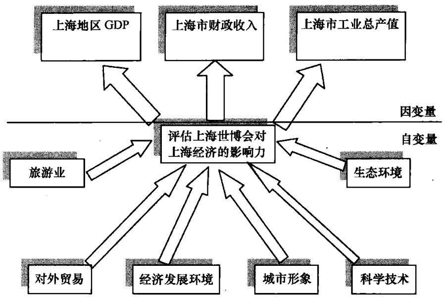

<details>
<summary>flowchart</summary>

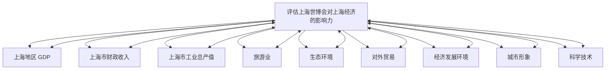
```mermaid
graph TD
  Center["评估上海世博会对上海经济的影响力"]
  
  %% Indicators
  Top1["上海地区 GDP"]
  Top2["上海市财政收入"]
  Top3["上海市工业总产值"]
  
  %% Factors
  Bottom1["旅游业"]
  Bottom2["生态环境"]
  Bottom3["对外贸易"]
  Bottom4["经济发展环境"]
  Bottom5["城市形象"]
  Bottom6["科学技术"]
  
  Center --> Top1
  Center --> Top2
  Center --> Top3
  Center --> Bottom1
  Center --> Bottom2
  Center --> Bottom3
  Center --> Bottom4
  Center --> Bottom5
  Center --> Bottom6
  
  %% Arrows
  Top1 <--> Center
  Top2 <--> Center
  Top3 <--> Center
  Bottom1 <--> Center
  Bottom2 <--> Center
  Bottom3 <--> Center
  Bottom4 <--> Center
  Bottom5 <--> Center
  Bottom6 <--> Center
```
</details>

图 1 经济指标框架评价体系示意图

(1) 世博会对旅游业影响的综合评估。  
(2) 世博会对对外贸易、经济发展环境、城市形象、生态环境和科学技术的综合评估。  
(3) 世博会的经济效应的定量评估。  
（4）世博会的经济效应与北京奥运会经济效应的横向对比、与往届世博会经济效应的纵向对比。  
(5) 世博会存在的负面效应的浅析。

具体步骤流程图如图 2 所示。

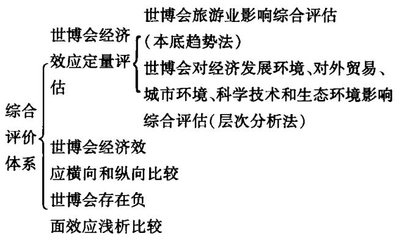

<details>
<summary>flowchart</summary>

```mermaid
graph TD
  A["综合评价体系"] --> B["世博会经济\n效应定量评估"]
  A --> C["世博会经济效益\n应横向和纵向比较\n世博会存在负"]
  B --> D["世博会旅游业影响综合评估\n(本底趋势法)\n世博会对经济发展环境、对外贸易、城市环境、科学技术和生态环境影响\n综合评估(层次分析法)"]
  C --> D
  D --> E["面效应浅析比较"]
```
</details>

图 2 步骤流程图

## 3 基本假设

（1）世博会对于上海市经济的影响力主要体现在旅游业、对外贸易、经济发展环境、城市形象、生态环境和科学技术六个因素，其他因素不予考虑。  
(2) 2010 年经济数据来自权威机构预测。

## 4 符号说明

A: 判断矩阵；

$\lambda_{max}$ : 最大特征值;

W: 特征向量;

CI:一致性指标;

CR:一致性比例;

$w_{i}$ : 权重;

$P_{i}$ : 评价函数;

X: 自变量集;

Y: 因变量集。

## 5 模型的建立与求解

## 5.1 世博会对旅游业影响的综合评估

世博会这样的重大事件活动绝大部分都由政府直接操作，其财务资料和相关的其他资料都非常缺乏，加上重大事件活动本身的投资、效应也存在界线模糊、界定不易的问题，对其影响和效应进行评价往往容易陷入“数字游戏”的泥潭中。此外，如同对社会经济发展过程中旅游的影响进行研究一样如何从经济、环境和社会变化的诸多影响因素中单独测度出旅游的影响是十分困难的事。同样地，从影响目的地的诸多事件和因素中把某一旅游事件的影响和效应单独“剥离”出来，也是十分困难的事。

旅游业受到多方面因素综合影响,研究起来比较复杂。针对旅游业这种特点,戴光全和保继刚等采用本底趋势线模型 $^{[2]}$ 对于该类问题进行了建模求解,收到了良好效果,故针对上海世博会于上海旅游业发展的影响和效应评估也采用本底趋势线模型。

## 5.1.1 本底趋势线模型(模型一)

使用本底趋势线模型进行数据评估的基本方法是: 使用 MATLAB 统计软件的多种方法、多种模型进行预测, 相互比较、印证本底趋势线, 以找出旅游及经济发展实际的本底趋势, 然后从中剥离出上海世博会的影响。分析的指标包括上海市海外旅游人数(OT)、国内旅游人数(DT)、旅游总人数(TT)、国际旅游收入(ITI)、国内旅游收入(DTI)、旅游业总收入(TTI)、国内生产总值(GDP)、旅游业总收入相当于 GDP 的比重(TTI/GDP)。分析时段: 2000 年—2009 年。

## 5.1.2 世博会对旅游业的影响效应的量化评估

评估具体步骤：

第一步是数据拟合处理,对各个指标在给定年限内用多项式数值拟合的方法进行拟合处理(拟合后的值称为拟合值)使得本底趋势线最符合实际情况(表1、表2)。

表 1 上海世博会效应趋势线评估的数据: 实际值

<table><tr><td rowspan="2">年份</td><td colspan="6">实际值</td></tr><tr><td>海外旅游人数OT</td><td>国内旅游人数DT</td><td>旅游总人数TT</td><td>国际旅游收入ITI</td><td>国内旅游收入DTI</td><td>旅游业总收入TTU</td></tr><tr><td>2000</td><td>181.4</td><td>6433</td><td>6614.4</td><td>133.54027</td><td>802.8384</td><td>936.37867</td></tr><tr><td>2001</td><td>204.26</td><td>6470</td><td>6674.26</td><td>149.64816</td><td>791.281</td><td>940.92916</td></tr><tr><td>2002</td><td>272.53</td><td>6797</td><td>7069.53</td><td>188.30175</td><td>770.7798</td><td>959.08155</td></tr><tr><td>2003</td><td>319.87</td><td>7603</td><td>7922.87</td><td>169.92681</td><td>1113.8395</td><td>1283.76631</td></tr><tr><td>2004</td><td>491.92</td><td>8505</td><td>8996.92</td><td>255.67653</td><td>1216.215</td><td>1471.89153</td></tr><tr><td>2005</td><td>571.35</td><td>9012</td><td>9583.35</td><td>291.172816</td><td>1308.5424</td><td>1599.715216</td></tr><tr><td>2006</td><td>605.67</td><td>9684</td><td>10289.67</td><td>309.302607</td><td>1419.6744</td><td>1728.977007</td></tr><tr><td>2007</td><td>665.59</td><td>10210</td><td>10875.59</td><td>364.914795</td><td>1611.138</td><td>1976.052795</td></tr><tr><td>2008</td><td>640.3713</td><td>11006</td><td>11646.3713</td><td>344.374635</td><td>1612.379</td><td>1956.753635</td></tr><tr><td>2009</td><td>628.9168</td><td>12361</td><td>12989.9168</td><td>327.034444</td><td>1913.4828</td><td>2240.517244</td></tr></table>

表 2 上海世博会效应趋势线评估的数据: 拟合值

<table><tr><td rowspan="2">年份</td><td colspan="6">拟合值</td></tr><tr><td>海外旅游人数OT</td><td>国内旅游人数DT</td><td>旅游总人数TT</td><td>国际旅游收入ITI</td><td>国内旅游收入DTI</td><td>旅游业总收入TTU</td></tr><tr><td>2000</td><td>165</td><td>5729</td><td>6052</td><td>125</td><td>708</td><td>815</td></tr><tr><td>2001</td><td>216</td><td>6505</td><td>6774</td><td>146</td><td>816</td><td>956</td></tr><tr><td>2002</td><td>283</td><td>7238</td><td>7496</td><td>173</td><td>933</td><td>1108</td></tr><tr><td>2003</td><td>364</td><td>7896</td><td>8224</td><td>208</td><td>1054</td><td>1267</td></tr><tr><td>2004</td><td>452</td><td>8484</td><td>8988</td><td>247</td><td>1177</td><td>1428</td></tr><tr><td>2005</td><td>541</td><td>9033</td><td>9842</td><td>287</td><td>1302</td><td>1587</td></tr><tr><td>2006</td><td>617</td><td>9610</td><td>10864</td><td>322</td><td>1429</td><td>1744</td></tr><tr><td>2007</td><td>666</td><td>10310</td><td>12156</td><td>347</td><td>1563</td><td>1899</td></tr><tr><td>2008</td><td>671</td><td>11260</td><td>13844</td><td>352</td><td>1708</td><td>2053</td></tr><tr><td>2009</td><td>612</td><td>12620</td><td>16078</td><td>327</td><td>1871</td><td>2209</td></tr></table>

第二步,用三个经典的数学拟合模型:

$$
Q t = Q _ {0} \exp (r t) + q \sin (\omega t + \phi)
$$

$$
Q t = a t + b + K / \left[ 1 + \exp (c - r t) \right]
$$

$$
Q t = a t + b + q \sin (\omega t - \phi)
$$

对各个指标进行拟合，确定有关参数，获得各个指标的趋势线模型和方程，计算各年的本底值。

第三步,用第二步所得各个指标的趋势线方程,计算各个指标本底值(包括对 OT 与 DT, OTI 和 DTI 之和加总的总人次 TT 和总收入 TTI 也计算为总人次和总收入的本底值,用加总而得的 TTI 之和与 GDP 本底值的商作为 TTI 相当于 GDP 百分比的本底值)与各年各个指标拟合值的相关系数,根据该相关系数确定最终的趋势线模型和方程,具体步骤是:先选出该相关系数最大的模型和方程;若按模型和方程计算的本底值出现负值,则去掉该模型,接着再选模型计算本底值与拟合值相关系数次大的模型,直到选出没有负值的本底值为止:若存在实际值比按模型和方程计算的本底值增长 100% 以上的情况,接着再去掉该模型,接着再选模型计算的本底值与拟合值相关系数次大的模型,直到选出没有实际值比本底值增长 100% 以上的情况为止。表 2 为最终确定的各个指标的趋势线模型和方程。根据量化计算,上海世博会对海外游客人次、国内游客人次和游客总人次的影响和效应各不相同,在确定最终本底趋势线模型的过程中,分别确定三者各自的本底趋势线,分别对国际旅游收入、国内旅游收入和旅游总收入确定本底趋势线的原因也是一样的。

根据表 2 可以确定各个指标最终的本底趋势模型方程式:

海外旅游人次最终本底趋势线模型方程：

海外旅游人数本底值 $= 6.7498\exp (0.4832t) - 40.2815\sin (0.027t - 1.7316)$

$$
R ^ {2} = 0. 7 0 3 9
$$

国内旅游人次的最终本底趋势线模型方程：

国内旅游人数本底值 $= 6.3207\exp (0.7851t) - 28.6433\sin (-29.6377t - 60.5668)$

$$
R ^ {2} = 0. 8 3 6 1
$$

旅游总人次的最终本底趋势线模型方程：

旅游总人数本底值 $= 4.7063\exp (0.8361t) - 25.7968\sin (12.5752t - 20.4107)$

$$
R ^ {2} = 0. 8 7 4 9
$$

国际旅游收入的最终本底趋势线模型方程：

国际旅游收入本底值 = 5.0099 $\exp(0.4535t) - 8.1343\sin(0.0055t - 1.5619)$

$$
R ^ {2} = 0. 7 4 2 2
$$

国内旅游收入的最终本底趋势线模型方程：

国内旅游收入本底值 $= 3.3102\exp (0.6595t) - 25.3542\sin (-6.2882t + 4.6986)$

$$
R ^ {2} = 0. 8 3 8
$$

旅游总收入的最终本底趋势线模型方程：

旅游总收入本底值 $= 7.4906\exp (0.5609t) - 134.3346\sin (-25.0709t - 8.1606)$

$$
R ^ {2} = 0. 8 3 3 7
$$

第四步,根据上列各个指标最终的本底趋势线模型,计算得到各个指标各年的本底值,再与各年的实际值相比较,得到各个指标各年的实际值与本底值之差(表3)。

表 3 各年份各指标的影响值 $^{[4]}$

<table><tr><td>年份</td><td>OTb</td><td>DTb</td><td>TTb</td><td>ITIb</td><td>DTIb</td><td>TTIb</td></tr><tr><td>2000</td><td>114</td><td>5693</td><td>6015</td><td>109</td><td>676</td><td>671</td></tr><tr><td>2001</td><td>158</td><td>6463</td><td>6723</td><td>125</td><td>778</td><td>799</td></tr><tr><td>2002</td><td>214</td><td>7199</td><td>7412</td><td>145</td><td>884</td><td>931</td></tr><tr><td>2003</td><td>277</td><td>7751</td><td>8065</td><td>169</td><td>982</td><td>1053</td></tr><tr><td>2004</td><td>336</td><td>8135</td><td>8654</td><td>190</td><td>1062</td><td>1150</td></tr><tr><td>2005</td><td>379</td><td>8341</td><td>9106</td><td>203</td><td>1103</td><td>1193</td></tr><tr><td>2006</td><td>379</td><td>8094</td><td>9200</td><td>194</td><td>1069</td><td>1142</td></tr><tr><td>2007</td><td>306</td><td>6913</td><td>8349</td><td>150</td><td>890</td><td>921</td></tr><tr><td>2008</td><td>113</td><td>3841</td><td>5095</td><td>47</td><td>431</td><td>395</td></tr><tr><td>2009</td><td>267</td><td>3587</td><td>4076</td><td>148</td><td>576</td><td>678</td></tr></table>

将每一年份各项指标的差值求和,最终得到旅游业影响经济的10个数据(表4)。

表 4 旅游业影响经济的 10 个数据

<table><tr><td>年份</td><td>2000</td><td>2001</td><td>2002</td><td>2003</td><td>2004</td><td>2005</td><td>2006</td><td>2007</td><td>2008</td><td>2009</td></tr><tr><td>差值和</td><td>13278</td><td>15046</td><td>16785</td><td>18297</td><td>19527</td><td>20325</td><td>20078</td><td>17529</td><td>9922</td><td>9332</td></tr></table>

## 5.2 世博会对对外贸易、经济发展环境、城市形象、生态环境和科技的整体评估

影响经济指标的因素是多方面的,主要的有旅游业、对外贸易、经济发展环境、城市形象、生态环境和科技文化等因素。其中由于旅游业重要性和复杂度较其他指标更高,所以在5.1节对于旅游业因素单独进行了量化;而剩余五个因素相对来讲,复杂性较低,层次感更强。故使用模型相对简单的层次分析法建模求解。

## 5.2.1 运用层次分析法建模

运用层次分析法大体上可按下面四个步骤进行。

(1) 建立递阶层次结构模型。  
(2) 构造出各层次中的所有判断矩阵。  
(3) 层次单排序及一致性检验。  
(4) 层次总排序及一致性检验。

## 1. 建立递阶层次结构模型

应用 AHP 分析决策问题时,首先要把问题条理化、层次化,构造出一个有层次的结构模型。在这个模型下,复杂问题被分解为元素的组成部分。这些元素又按其属性及关系形成若干层次。上一层次的元素作为准则对下一层次有关元素起支配作用。这些层次可以分为三类。

（1）最高层：这一层次中只有一个元素，一般它是分析问题的预定目标或理想结果，因此也称为目标层。  
(2) 中间层: 这一层次中包含了为实现目标所涉及的中间环节, 它可以由若干个层次组成, 包括所需考虑的准则、子准则, 因此也称为准则层。  
（3）最底层：这一层次包括了为实现目标可供选择的各种措施、决策方案等，因此也称为措施层或方案层。

## 2. 构造出各层次中的所有判断矩阵

建立起递阶层次结构模型后,上下层之间各因素的隶属关系就被确立了,问题即转化为层次中的排序计算方法。在排序计算中,每一层次的排序又可简化为一系列成对因素的判断比较,并根据一定的比率标度将其判断定量化,形成一个比较判断矩阵。

## 3. 层次单排序及一致性检验

依据判断矩阵求解各层次指标的相对权重问题,在数学上就是由 $BW = \lambda W$ 解出最大特征根,及对应的特征向量 W,并将 $\lambda$ 所对应的特征向量归一化。

判断矩阵 A 对应于最大特征值 $\lambda_{max}$ 的特征向量 W, 经归一化后即为同一层次相应因素对于上一层次某因素相对重要性的排序权值, 这一过程称为层次单排序。

对判断矩阵的一致性检验的步骤如下：

(1) 计算一致性指标 CI:

$$
CI = \frac {\lambda_ {\max} - n}{n - 1}
$$

(2) 查找相应的平均随机一致性指标 RI。对 $n=1,\cdots,9$ , RI 值见表 5。

表 5 平均一致性指标

<table><tr><td>n</td><td>1</td><td>2</td><td>3</td><td>4</td><td>5</td><td>6</td><td>7</td><td>8</td><td>9</td></tr><tr><td>RI</td><td>0</td><td>.0</td><td>0.58</td><td>0.90</td><td>1.12</td><td>1.24</td><td>1.32</td><td>1.41</td><td>1.45</td></tr></table>

(3) 计算一致性比例 CR:

$$
C R = \frac {C I}{R I}
$$

当 CR<0.10 时, 认为判断矩阵的一致性是可以接受的, 否则应对判断矩阵作适当修正。

## 4. 层次总排序及一致性检验

上面我们得到的是一组元素对其上一层中某元素的权重向量。我们最终要得到各元素,特别是最低层中各方案对于目标的排序权重,从而进行方案选择。总排序权重要自上而下地将单准则下的权重进行合成。

单排序一致性指标为 $CI(j)(j=1,\cdots,m)$ ，相应的平均随机一致性指标为 $RI(j)(CI(j)、RI(j)$ 已在层次单排序时求得），则 B 层总排序随机一致性比例为

$$
C R = \frac {\sum_ {j = 1} ^ {m} C I (j) a _ {j}}{\sum_ {j = 1} ^ {m} R I (j) a _ {j}}
$$

当 CR<0.10 时, 认为层次总排序结果具有较满意的一致性并接受该分析结果。

## 5.2.2 模型求解

## 1. 对于对外贸易

(1) 层次结构如图 3 所示。

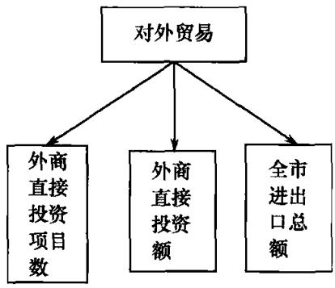

<details>
<summary>flowchart</summary>

```mermaid
graph TD
  A["对外贸易"] --> B["外商直接投资项目数"]
  A --> C["外商直接投资额"]
  A --> D["全市进出口总额"]
```
</details>

图 3 对外贸易层次结构图

(2) 计算判断矩阵(表6):

表 6 对外贸易判断矩阵

<table><tr><td> $P_{1}$ </td><td> $A_{1}$ </td><td> $A_{2}$ </td><td> $A_{3}$ </td></tr><tr><td> $A_{1}$ </td><td>1</td><td>1/3</td><td>1/5</td></tr><tr><td> $A_{2}$ </td><td>3</td><td>1</td><td>1/3</td></tr><tr><td> $A_{3}$ </td><td>5</td><td>3</td><td>1</td></tr></table>

(3) 计算一致性比例 CR:

$$
C R = \frac {C I}{R I} = 0. 0 3 3 2
$$

(4) 最终得权重

$$
\boldsymbol {W} _ {1} = (0. 1 0 4 7, 0. 2 5 8 3, 0. 6 3 7 0)
$$

(5) 构造评价函数：

$$
\boldsymbol {P} _ {1} = (2 7 6 0. 2, 3 0 6 8. 3, 3 4 7 1. 6, 4 1 9 2. 3, 4 9 6 6. 3,
$$

$$
5 5 8 0. 3, 6 2 8 5. 6, 7 0 9 9. 9, 7 7 6 7. 8, 7 8 3 5. 7)
$$

## 2. 对于经济发展环境

(1) 层次结构如图 4 所示。

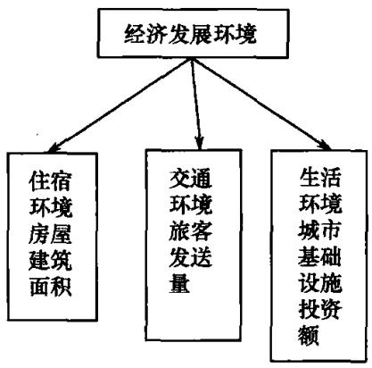

<details>
<summary>flowchart</summary>

```mermaid
graph TD
  A["经济发展环境"] --> B["住宿环境\n房屋建筑面积"]
  A --> C["交通环境\n旅客发送量"]
  A --> D["生活环境\n城市基础设施投资额"]
```
</details>

图 4 经济发展环境层次结构图

(2) 计算判断矩阵(表7):

表 7 经济发展的判断矩阵

<table><tr><td> $P_{2}$ </td><td> $B_{1}$ </td><td> $B_{2}$ </td><td> $B_{3}$ </td></tr><tr><td> $B_{1}$ </td><td>4</td><td>1</td><td>1/3</td></tr><tr><td> $B_{2}$ </td><td>5</td><td>3</td><td>1</td></tr><tr><td> $B_{3}$ </td><td>1</td><td>1/4</td><td>1/5</td></tr></table>

(3) 计算一致性比例:

$$
C R = \frac {C I}{R I} = 0. 0 7 3 9
$$

(4) 最终得权重:

$$
\boldsymbol {W} _ {2} = (0. 0 9 3 6, 0. 2 7 9 7, 0. 6 2 6 7)
$$

(5) 构造评价函数:

$$
\boldsymbol {P} _ {2} = (2 5 1 5. 7, 2 3 8 9. 9, 2 7 0 5. 2, 2 7 3 1. 4, 3 3 9 1. 5,
$$

$$
3 6 6 4. 8, 3 8 5 4. 6, 4 2 9 4. 1, 4 5 0 0. 8, 4 7 1 7. 3)
$$

## 3. 对于城市形象

(1) 层次结构如图 5 所示。  
(2) 计算判断矩阵(表8):

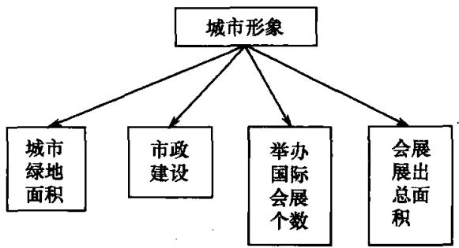

<details>
<summary>flowchart</summary>

```mermaid
graph TD
  A["城市形象"] --> B["城市绿地面积"]
  A --> C["市政建设"]
  A --> D["举办国际会展个数"]
  A --> E["会展展出总面积"]
```
</details>

图 5 城市形象层次结构图

表 8 城市形象的判断矩阵

<table><tr><td> $P_{3}$ </td><td> $C_{1}$ </td><td> $C_{2}$ </td><td> $C_{3}$ </td><td> $C_{4}$ </td></tr><tr><td> $C_{1}$ </td><td>1</td><td>1/5</td><td>1/5</td><td>1/3</td></tr><tr><td> $C_{2}$ </td><td>5</td><td>1</td><td>1/2</td><td>3</td></tr><tr><td> $C_{3}$ </td><td>5</td><td>2</td><td>1</td><td>3</td></tr><tr><td> $C_{4}$ </td><td>3</td><td>1/3</td><td>1/3</td><td>1</td></tr></table>

(3) 计算一致性比例:

$$
C R = \frac {C I}{R I} = 0. 0 3 8 6
$$

(4) 最终的权重:

$$
\boldsymbol {W} _ {3} = (0. 0 6 6 5, 0. 3 2 4 8, 0. 4 6 0 0, 0. 1 4 8 6)
$$

(5) 构造评价函数:

$$
\begin{array}{l} \boldsymbol {P} _ {3} = (9 8 4. 3, 1 1 4 2. 4, 1 4 3 2. 3, 1 8 8 3. 4, 1 9 7 3. 2, \\ 2 1 9 2. 1, 2 3 1 6. 8, 2 4 2 4. 6, 2 6 7 9. 8, 8 1 7 4. 1) \\ \end{array}
$$

## 4. 对于生态环境

(1) 构造层次模型, 如图 6 所示。

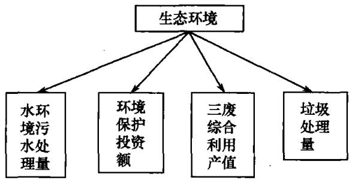

<details>
<summary>flowchart</summary>

```mermaid
graph TD
  A["生态环境"] --> B["水环境污水处理量"]
  A --> C["环境保护投资额"]
  A --> D["三废综合利用产值"]
  A --> E["垃圾处理量"]
```
</details>

图 6 生态环境层次结构图

(2) 计算判断矩阵(表9):

表 9 生态环境的判断矩阵

<table><tr><td> $P_{3}$ </td><td> $D_{1}$ </td><td> $D_{2}$ </td><td> $D_{3}$ </td><td> $D_{4}$ </td></tr><tr><td> $D_{1}$ </td><td>1</td><td>1/4</td><td>1/3</td><td>1</td></tr><tr><td> $-D_{2}$ </td><td>4</td><td>1</td><td>2</td><td>4</td></tr><tr><td> $D_{3}$ </td><td>3</td><td>1/2</td><td>1</td><td>3</td></tr><tr><td> $D_{4}$ </td><td>1</td><td>1/4</td><td>1/3</td><td>1</td></tr></table>

(3) 计算一致性比例:

$$
C R = \frac {C I}{R I} = 0. 0 0 7 6
$$

(4) 最终得权重:

$$
\boldsymbol {W} _ {4} = (0. 1 0 9 0, 0. 4 8 5 2, 0. 2 9 6 8, 0. 1 0 9 0)
$$

(5) 构造评价函数:

$$
\boldsymbol {P} _ {4} = (2 6 7 5, 3 3 8 8, 3 5 0 6, 4 5 3 0, 1 0 5 8 8,
$$

$$
1 3 0 6 8, 1 7 2 1 6, 1 6 9 4 0, 1 9 6 0 4, 1 9 0 2 8)
$$

## 5. 对于科学技术

(1) 层次结构如图 7 所示。

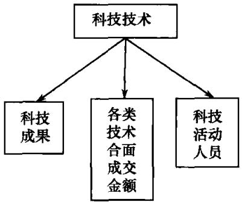

<details>
<summary>flowchart</summary>

```mermaid
graph TD
  A["科技技术"] --> B["科技成果"]
  A --> C["各类技术合面成交金额"]
  A --> D["科技活动人员"]
```
</details>

图 7 科学技术层次结构图

(2) 计算判断矩阵(表 10):

表 10 科学技术的判断矩阵

<table><tr><td> $P_{1}$ </td><td> $E_{1}$ </td><td> $E_{2}$ </td><td> $E_{3}$ </td></tr><tr><td> $E_{1}$ </td><td>1</td><td>3</td><td>2</td></tr><tr><td> $E_{2}$ </td><td>1/3</td><td>1</td><td>1/2</td></tr><tr><td> $E_{3}$ </td><td>1/2</td><td>2</td><td>1</td></tr></table>

(3) 计算一致性比例:

$$
C R = \frac {C I}{R I} = 0. 0 0 7 9
$$

(4) 最终得权重:

$$
\boldsymbol {W} _ {1} = (0. 5 3 9 6, 0. 1 6 3 4, 0. 2 9 7 0)
$$

(5) 构造评价函数:

$$
\boldsymbol {P} _ {5} = (6 1 2. 7, 7 4 4. 5, 7 9 0. 1, 8 4 2. 3, 9 1 2. 5,
$$

$$
9 6 1. 6, 1 1 1 6. 1, 1 3 7 0. 3, 1 0 9 3. 1, 1 2 5 9. 1)
$$

## 5.3 世博会的经济效应的定量评估

在前两节中,已经得到了影响经济指标的六个主要因素的定量评估,根据经济问题量化的特点,使用普遍应用于多自变量、多因变量的数学评估模型——偏最小二乘回归分析

法对经济指标进行具体的量化及预测。

## 5.3.1 偏最小二乘回归法的特点 $^{[1]}$

偏最小二乘回归分析(简称 PLS)可以较好地解决以往普通多元回归所无法解决的问题,是一种新型的多元统计数据分析方法。它集多元线性回归分析、典型相关分析和主成分分析的基本功能为一体,将建模预测类型的数据分析方法与非模型式的数据认识性分析方法有机地结合起来。同时,偏最小二乘回归方法在处理样本容量小、自变量多、变量间存在严重多重相关性问题方面具有独特的优势。概括起来有以下几点。

（1）可以实现多因变量对多自变量并且自变量存在严重相关性条件下的回归建模。当各自变量集合内部存在较大程度的相关性时，偏最小二乘回归方法可以充分反映模型的整体性，提取对因变量解释性最强的综合变量。  
(2) 通过主成分分析和综合变量的提取, 允许在样本个数少于自变量个数的条件下进行回归建模, 解决了普通多元回归无法解决的问题。  
（3）在建模的同时简化了数据结构，可以在二维平面上对多维数据的特性进行仿真，图形功能强大。

综上所述,偏最小二乘回归方法具有普通最小二乘回归所不能比拟的优点,这些优点正是处理经济量化模型这种多自变量、多因变量问题所需要借助的。

## 5.3.2 预备分析

在多元线性回归的应用问题中,常会出现变量之间多重相关的问题,下面将介绍在建立偏最小二乘回归模型之前要进行的预备分析,即多重相关性检验和第一主成分相关性检验。

## 1. 多重相关性检验

多重相关性(也称多重共线性)是指在自变量之间存在着线性相关的现象。自变量的简单相关系数在0与1之间变化。这时称自变量之间存在着一定程度的相关现象。

在实际问题中,变量间普遍存在多重相关性,其形成的基本原因主要有两个:一是由于数据本身的性质,特别是某些研究领域问题的特点,某些因素之间客观存在的相关性;二是由于实验条件的限制,导致样本点不足所造成的。多重相关性的存在可以由预测变量间的相关系数的大小来反映。若某对预测变量间的相关系数较大则表明那对变量间存在较强的线性关系。

## 2. 第一主成分相关性检验

在一元回归分析中,为了判定自变量和因变量之间的关系,经常采用散点图来做直观的分析,简单而有效。这种方法在多元回归分析中遇到困难,一方面多维数据构成了一个超平面,难以做直观观察;另一方面各自变量间相互关联,不能将变量简单地分割开来分析。偏最小二乘回归强大的图形功能使这一点成为可能。

在偏最小二乘回归分析中,对原始数据标准化后提取第一主成分 $t_1$ 和 $u_1$ (偏最小二乘回归模型的建模步骤中的主成分提取)自变量集合 $X$ 和因变量 $Y$ 集合之间的相关关系可以通过 $t_1$ 和 $u_1$ 的相关关系得到某种程度的反映,因此,绘制以 $t_1$ 为横坐标, $u_1$ 为纵坐标的 $t_1 / u_1$ 平面图,在图上以 $(t_1(i), u_1(i))$ 为坐标点,绘出每一个样本点的位置。如果所有样本点在图中的排列近似于一条直线,则说明 $X$ 和 $Y$ 之间存在着较强的相关关系,这时采用偏最小二乘回归方法建立 $Y$ 对 $X$ 的线性模型才会是合理的。如果 $t_1$ 和 $u_1$ 之间不存在线性性,则不能用偏最小二乘回归模型进行建模。

## 5.3.3 偏最小二乘回归模型的建立

偏最小二乘回归方法在建模过程中采用了信息综合与筛选技术。它不再直接考虑因变量对自变量集合的回归建模，而是在变量系统中提取若干对系统具有最佳解释能力的新综合变量（即成分提取），然后利用它们进行回归建模。具体建模思想和过程见附一。

模型与结果分析见表11。

表 11 上海市 2000—2009 年影响因素指标和经济收入指标数据资料 $^{[3]}$

<table><tr><td rowspan="2">年份</td><td colspan="6">影响因素指标</td><td colspan="3">经济收入指标</td></tr><tr><td>对外贸易</td><td>经济发展环境</td><td>城市形象</td><td>生态环境</td><td>科学技术</td><td>旅游业</td><td>生产总值</td><td>财政收入</td><td>工业总产值</td></tr><tr><td>2000</td><td>2760.2</td><td>2515.7</td><td>984.3</td><td>2675</td><td>612.7</td><td>13278</td><td>4771.17</td><td>1752.69</td><td>7022.98</td></tr><tr><td>2001</td><td>3068.3</td><td>2389.9</td><td>1142.4</td><td>3388</td><td>744.5</td><td>15046</td><td>5210.12</td><td>1995.62</td><td>7806.18</td></tr><tr><td>2002</td><td>3471.6</td><td>2705.2</td><td>1432.3</td><td>3506</td><td>790.1</td><td>16785</td><td>5741.03</td><td>2202.25</td><td>8730.00</td></tr><tr><td>2003</td><td>4192.3</td><td>2731.4</td><td>1883.4</td><td>4530</td><td>842.3</td><td>18297</td><td>6693.23</td><td>2828.87</td><td>11708.49</td></tr><tr><td>2004</td><td>4966.3</td><td>3391.5</td><td>1973.2</td><td>10588</td><td>912.5</td><td>19527</td><td>8072.83</td><td>3591.73</td><td>14595.29</td></tr><tr><td>2005</td><td>5580.3</td><td>3664.8</td><td>2192.1</td><td>13068</td><td>961.6</td><td>20325</td><td>9247.66</td><td>4095.81</td><td>16876.78</td></tr><tr><td>2006</td><td>6285.6</td><td>3954.6</td><td>2316.8</td><td>17216</td><td>1116.1</td><td>20078</td><td>10572.24</td><td>4798.93</td><td>10631.23</td></tr><tr><td>2007</td><td>7099.9</td><td>4294.1</td><td>2424.6</td><td>16940</td><td>1370.3</td><td>17529</td><td>12494.01</td><td>7310.26</td><td>23108.63</td></tr><tr><td>2008</td><td>7767.8</td><td>4500.8</td><td>2679.8</td><td>19604</td><td>1093.1</td><td>9922</td><td>14069.87</td><td>7532.91</td><td>25968.38</td></tr><tr><td>2009</td><td>7835.7</td><td>4717.3</td><td>8174.1</td><td>19028</td><td>1259.1</td><td>9332</td><td>15046.45</td><td>7760.97</td><td>24888.08</td></tr></table>

## 1. 对 PLS 建模的适应性分析

## 1）多重相关性检验

因变量与自变量之间的相关系,见表。12

表 12 因变量和自变量之间的相关系数

<table><tr><td>r(:)</td><td>X1</td><td>X2</td><td>X3</td><td>X4</td><td>X5</td><td>X6</td><td>Y1</td><td>Y2</td><td>Y3</td></tr><tr><td>X1</td><td>1</td><td>0.9901</td><td>0.9631</td><td>0.983</td><td>0.9264</td><td>0.4445</td><td>0.9733</td><td>0.9529</td><td>0.9279</td></tr><tr><td>X2</td><td></td><td>1</td><td>0.9663</td><td>0.9791</td><td>0.9565</td><td>0.9867</td><td>0.9888</td><td>0.9551</td><td>0.9301</td></tr><tr><td>X3</td><td></td><td></td><td>1</td><td>0.9741</td><td>0.9694</td><td>0.9873</td><td>0.9248</td><td>0.9572</td><td>0.9494</td></tr><tr><td>X4</td><td></td><td></td><td></td><td>1</td><td>0.9956</td><td>0.9622</td><td>0.9289</td><td>0.5917</td><td>0.9958</td></tr><tr><td>X5</td><td></td><td></td><td></td><td></td><td>1</td><td>0.9648</td><td>0.9546</td><td>0.9941</td><td>0.9508</td></tr><tr><td>X6</td><td></td><td></td><td></td><td></td><td></td><td>1</td><td>0.9757</td><td>0.9899</td><td>0.9752</td></tr><tr><td>Y1</td><td></td><td></td><td></td><td></td><td></td><td></td><td>1</td><td>0.9806</td><td>0.9873</td></tr><tr><td>Y2</td><td></td><td></td><td></td><td></td><td></td><td></td><td></td><td>1</td><td>0.9968</td></tr><tr><td>Y3</td><td></td><td></td><td></td><td></td><td></td><td></td><td></td><td></td><td>1</td></tr></table>

从表 12 中可以看出各自变量之间的相关系数最高达 0.9956，而因变量与自变量之间的相关系数也达到了 0.9968，由此可知影响因素与经济收入之间存在着明显的相关关系，同时自变量之间存在严重的自相关性，由上文可知，这种自相关性有着严重的危害性。

若建立普通最小二乘回归方程,首先将表12中的数据按标准化公式(见附录一)进行标准化后得到 $E_{0}$ 、 $F_{0}$ ,再建立二者之间的回归方程:

$$
F _ {0 1} = 0. 3 2 4 9 E _ {0 1} - 1. 3 5 3 4 E _ {0 2} + 0. 8 4 8 9 E _ {0 3} - 1. 3 0 7 5 E _ {0 4} + 0. 9 6 0 4 E _ {0 5} + 0. 6 9 8 7 E _ {0 6}
$$

$$
F _ {0 2} = - 1. 4 7 1 7 E _ {0 1} + 0. 3 8 5 4 E _ {0 2} + 0. 9 3 4 1 E _ {0 3} - 1. 1 2 5 9 E _ {0 4} - 0. 4 1 9 2 E _ {0 5} + 0. 7 0 9 9 E _ {0 6}
$$

$$
F _ {0 3} = 0. 1 7 1 4 E _ {0 1} + 0. 8 7 2 1 E _ {0 2} - 1. 1 1 6 1 E _ {0 3} + 0. 4 7 9 8 E _ {0 4} + 0. 7 3 1 2 E _ {0 5} - 1. 1 3 6 9 E _ {0 6}
$$

此时,从这一组回归系数中看到,经济收入指标值与与对外贸易、发展环境等因素负相关,这与客观事实相违背,也与相关系数矩阵中得到的结论相悖,所以普通最小二乘回归方法建立的模型不能准确的反映实际情况。之所以产生这样的结果,完全是由于自变量之间以及因变量之间复杂的相关关系造成的。

## 2）第一主成分相关性检验

分别提取自变量集合与因变量集合的第一主成分,绘制第一主成分相关图。主轴及成分值见表13、表14。从表14中可以看出第二成分携带的信息量最多,其他成分逐渐减少。因此,可以初步判定提取一个成分即可满足建模要求。

表 13 $w_{h}$ 的取值

<table><tr><td></td><td>W1</td><td>W2</td><td>W3</td><td>W4</td><td>W5</td><td>W6</td></tr><tr><td>X1</td><td>-0.4692</td><td>0.28</td><td>-0.3691</td><td>0.1787</td><td>0.8275</td><td>-0.3802</td></tr><tr><td>X2</td><td>-0.4666</td><td>0.1983</td><td>-0.1887</td><td>-0.0575</td><td>-0.1208</td><td>0.8486</td></tr><tr><td>X3</td><td>-0.3297</td><td>0.6464</td><td>0.7126</td><td>-0.5029</td><td>0.1056</td><td>0.0251</td></tr><tr><td>X4</td><td>-0.4555</td><td>0.2728</td><td>0.0376</td><td>-0.5802</td><td>-0.5396</td><td>-0.3935</td></tr><tr><td>X5</td><td>-0.436</td><td>0.1614</td><td>0.275</td><td>0.6544</td><td>-0.1918</td><td>-0.0527</td></tr><tr><td>X6</td><td>0.2363</td><td>0.6065</td><td>0.5397</td><td>-0.3993</td><td>0.1439</td><td>0.1018</td></tr></table>

表 14 $t_h$ 的取值

<table><tr><td></td><td>t1</td><td>t2</td><td>t3</td><td>t4</td><td>t5</td><td>t6</td></tr><tr><td>1</td><td>2.5647</td><td>-0.7395</td><td>-0.3401</td><td>-0.0483</td><td>-0.1253</td><td>0.0811</td></tr><tr><td>2</td><td>2.2915</td><td>-0.5349</td><td>-0.054</td><td>0.1737</td><td>-0.0986</td><td>-0.1509</td></tr><tr><td>3</td><td>1.9308</td><td>-0.3399</td><td>0.0585</td><td>0.1569</td><td>0.029</td><td>0.0859</td></tr><tr><td>4</td><td>1.546</td><td>-0.1911</td><td>0.2271</td><td>0.1031</td><td>0.2639</td><td>-0.0778</td></tr><tr><td>5</td><td>0.4952</td><td>0.4132</td><td>0.1527</td><td>-0.2545</td><td>0.008</td><td>0.0772</td></tr><tr><td>6</td><td>-0.068</td><td>0.6817</td><td>0.1686</td><td>-0.3751</td><td>0.029</td><td>0.0858</td></tr><tr><td>7</td><td>-0.9225</td><td>1.0388</td><td>0.2195</td><td>-0.2602</td><td>-0.1337</td><td>-0.1361</td></tr><tr><td>8</td><td>-1.8924</td><td>1.2124</td><td>0.1404</td><td>0.5961</td><td>-0.0622</td><td>0.0658</td></tr><tr><td>9</td><td>-2.0772</td><td>0.6737</td><td>-0.7139</td><td>-0.0571</td><td>0.1055</td><td>-0.0361</td></tr><tr><td>10</td><td>-3.8683</td><td>-2.2144</td><td>0.1412</td><td>-0.0346</td><td>-0.0157</td><td>0.005</td></tr></table>

X 是影响因素指标的集合, Y 是经济收入指标的集合, 绘制二者之间的 $t_{1}/u_{1}$ 平面图 8, 可以发现, 所有样本点在图中的排列近似于一条直线, 则说明 X 和 Y 之间存在着较强的线性关系, 并且计算得到二者之间的相关系数高达 0.9824。由此可知, 影响因素对经济产出有着很强的相关关系, 因此可以用偏最小二乘回归模型进行建模。

## 2. 模型评价

## 1）表 11 标准化后的 PLS 回归方程

计算抽取不同成分时,对应回归方程的复测定系数 $R_{h}^{2}$ 见表15。

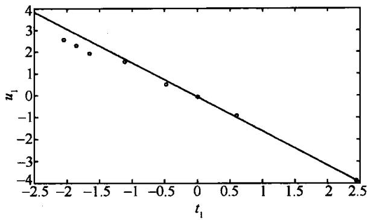

<details>
<summary>scatter</summary>

| t1 | u1 |
| --- | --- |
| -2.0 | ~2.6 |
| -1.8 | ~2.3 |
| -1.6 | ~1.9 |
| -1.1 | ~1.6 |
| -0.4 | ~0.5 |
| 0.0 | 0.0 |
| 0.6 | -0.9 |
| 2.5 | -4.0 |
</details>

图 8 影响因素和经济效应的 $t_{1}/u_{1}$ 图

表 15 复测定系数表

<table><tr><td>h</td><td>1</td><td>2</td><td>3</td><td>4</td><td>5</td><td>6</td></tr><tr><td> $R_{h}^{2}$ </td><td>0.9781</td><td>1.0591</td><td>1.0456</td><td>1.0649</td><td>1.0254</td><td>1.0999</td></tr></table>

由此可知,当抽取一个成分时,回归方程的复测定系数已达到97.81%,即可解释总变异信息的程度为97.81%,此时回归方程的精度已达到满意效果。因此,只需选取一个成分建模即可。

设 $F_{0}$ 关于成分 $t_1$ 的回归模型为 $F_{0k} \approx t_1 r_{1k}'(k = 1,2,3)$ ，经过回归计算得

$$
t _ {1} = E _ {0} w _ {2} = 0. 2 8 E _ {0 1} + 0. 1 9 8 3 E _ {0 2} + 0. 6 4 6 4 E _ {0 3} + 0. 2 7 2 8 E _ {0 4} + 0. 1 6 1 4 E _ {0 5} + 0. 6 0 6 5 E _ {0 6}
$$

$$
\boldsymbol {r} _ {1} = (0. 0 6 6 9, 0. 1 0 4 4, 0. 2 0 1) ^ {\mathrm{T}}
$$

所以有 $F_{0k} \approx E_{0k}w_{1k}r_{1k}^{\prime}$ , 则

$$
F _ {0 1} \approx 0. 0 1 8 7 E _ {0 1} + 0. 0 1 3 3 E _ {0 2} + 0. 0 4 3 2 E _ {0 3} + 0. 0 1 3 8 E _ {0 4} + 0. 0 1 0 8 E _ {0 5} + 0. 0 4 0 6 E _ {0 6}
$$

$$
F _ {0 3} \approx 0. 0 5 6 3 E _ {0 1} + 0. 0 3 9 9 E _ {0 2} + 0. 1 2 9 9 E _ {0 3} + 0. 0 5 4 8 E _ {0 4} + 0. 0 3 2 4 E _ {0 5} + 0. 1 2 1 9 E _ {0 6}
$$

$$
F _ {0 2} \approx 0. 0 2 9 2 E _ {0 1} + 0. 0 2 0 7 E _ {0 2} + 0. 0 6 5 7 E _ {0 3} + 0. 0 2 8 5 E _ {0 4} + 0. 0 1 6 9 E _ {0 5} + 0. 0 6 3 3 E _ {0 6}
$$

此时模型的系数全为正数,与客观实际相符合。

## 2）关于原始变量的 PLS 还原方程

根据公式,可将上述建立的数据标准化后的 PLS 回归方程还原为原始变量的方程如下:

$$
\widehat {y _ {1}} = 4 6 1 8 + 0. 7 8 7 X _ {1} + 1 1. 6 9 X _ {2} + 0. 8 7 6 8 X _ {3} + 1 3. 4 6 X _ {4} + 0. 6 2 7 8 X _ {5} + 1 4. 3 2 8 X _ {6}
$$

$$
\widehat {y _ {2}} = - 1 6 7 3 + 2. 2 3 1 4 X _ {1} + 1 9. 2 8 X _ {2} + 0. 7 5 2 9 X _ {3} + 1 0. 5 8 8 X _ {4} + 0. 7 1 6 8 X _ {5} + 1 3. 6 8 X _ {6}
$$

$$
\widehat {y _ {3}} = 6 5 0 8 + 1 9. 8 2 X _ {1} + 1 1. 9 7 X _ {2} + 0. 7 2 3 X _ {3} + 7. 7 6 8 X _ {4} + 2 2. 5 9 3 X _ {5} + 1 4. 4 3 7 X _ {6}
$$

此时,所建的回归方程没有出现反常现象。由此可知,偏最小二乘回归很好地消除了自变量的共线性问题,并且模型的回归结果也更接近客观现实。

## 3）预测应用

除了前面几节进行的数据分析外,偏最小二乘回归的另一个重要应用就是预测建模。

由于适用于多个自变量与多个因变量的回归建模分析,所以一次计算就得到了影响因素的回归方程。为了查看偏最小二乘回归模型的预测效果,用表11中的2000—2009年的数据重新建立偏最小二乘回归方程,然后用它来预测2010年经济发展状况。

用表 11 中的 2010 年的影响因素指标带入上述方程可得经济指标的预测值：

$$
\widehat {\boldsymbol {Y}} = (1 4 4 5 0, 8 7 2 9, 2 4 6 8 7) ^ {\mathrm{T}}
$$

而2010年经济指标的实际观测值为 $\widehat{\mathbf{Y}} = (16500,9381,28466)^{\mathrm{T}}$ 。由此可得，生产总值的预测误差为 $14.2\%$ ，财政收入的预测误差为 $6.3\%$ ，工业总产值的预测误差为 $15.3\%$ 。从总体上来说偏最小二乘回归模型的预测效果较好，具体如图9、图10所示。

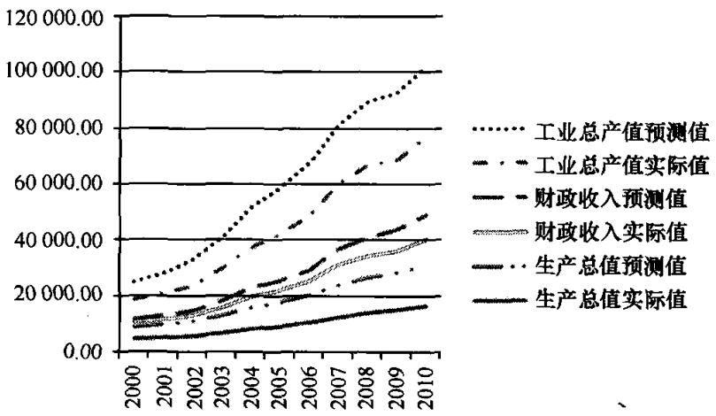

<details>
<summary>line</summary>

| Year | 工业总产值预测值 | 工业总产值实际值 | 财政收入预测值 | 财政收入实际值 | 生产总值预测值 | 生产总值实际值 |
| --- | --- | --- | --- | --- | --- | --- |
| 2000 | ~24000 | ~18000 | ~12000 | ~11000 | ~11000 | ~5000 |
| 2001 | ~27000 | ~21000 | ~13000 | ~12000 | ~12000 | ~6000 |
| 2002 | ~32000 | ~25000 | ~14000 | ~13000 | ~13000 | ~7000 |
| 2003 | ~42000 | ~32000 | ~16000 | ~15000 | ~15000 | ~8000 |
| 2004 | ~52000 | ~39000 | ~19000 | ~18000 | ~18000 | ~9000 |
| 2005 | ~62000 | ~46000 | ~23000 | ~21000 | ~21000 | ~11000 |
| 2006 | ~75000 | ~56000 | ~28000 | ~26000 | ~26000 | ~13000 |
| 2007 | ~85000 | ~64000 | ~35000 | ~31000 | ~31000 | ~14500 |
| 2008 | ~92000 | ~68000 | ~41000 | ~34500 | ~34500 | ~16500 |
| 2009 | ~98000 | ~74555.75 | ~46555.75 | ~39555.75 | ~39555.75 | ~18555.75 |
| 2010 | — | — | — | — | — | — |
</details>

图 9 各因变量实际值和预测值的比较

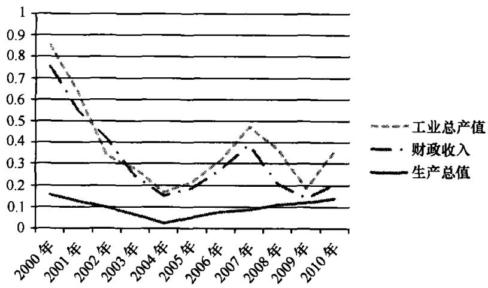

<details>
<summary>line</summary>

| Year | 工业总产值 | 财政收入 | 生产总值 |
| --- | --- | --- | --- |
| 2000年 | ~0.85 | ~0.75 | ~0.16 |
| 2001年 | ~0.65 | ~0.55 | ~0.13 |
| 2002年 | ~0.45 | ~0.40 | ~0.11 |
| 2003年 | ~0.30 | ~0.30 | ~0.08 |
| 2004年 | ~0.20 | ~0.15 | ~0.03 |
| 2005年 | ~0.20 | ~0.18 | ~0.05 |
| 2006年 | ~0.35 | ~0.28 | ~0.08 |
| 2007年 | ~0.48 | ~0.35 | ~0.10 |
| 2008年 | ~0.35 | ~0.25 | ~0.11 |
| 2009年 | ~0.20 | ~0.15 | ~0.12 |
| 2010年 | ~0.35 | ~0.20 | ~0.14 |
</details>

图 10 实际值和预测值差值占预测值的百分比

## 3. 结论与建议

本文首次尝试用偏最小二乘回归模型及其辅助技术分析影响经济因素对经济发展影响,并以上海2000—2009年的数据进行实例分析,基于文中分析有以下结论和建议。

（1）可以看出，各项指标的实际值基本大于其预测值，可见，从上海成功申办2010世博会之后，政府为准备世博会在基础设施建设、生态环境等方面投入资金不断增加，由其带来的三大产业生产总值也明显上涨。  
(2) 由图表可以看出,上海市在2007年以后经济收入变化较大,但在2009年出现下

降趋势,考虑其主要原因是该年正值全球经济危机,上海作为国际化的大都市受其影响较大。但在2009年末,各项指标的增加趋势较为明显,考虑其受世博会影响较大。

## 5.4 世博经济效应与北京奥运会经济效应、往届世博会经济效应的横、纵向对比

之前通过建立模型定量的分析了上海世博会对经济的影响,但是影响程度并没有与之相应的对比参照体系。下面通过横向和纵向两个角度进行对比分析,以达到加深上海世博会影响力的认识。这里横向对比是指与之前已经成功举办的北京奥运会进行比较,纵向对比是指与往年11届世博会进行比较。从期间效应、长期效应和空间效应三个方面进行比较。

## 5.4.1 期间效应

同样是全球性的盛会,都给举办城市带来科技、文化、旅游等各方面的影响。最为明显的就是经济的带动作用,不仅仅为当年的经济有极大的促进作用,甚至对今后若干年内GDP的贡献率都会发挥不可小觑的作用。在举办期间,有很多方面的数据去反映它的积极拉动作用,将它们与北京奥运会进行横向比较(表16)。

表 16 上海世博会举办期间的期间效应

<table><tr><td></td><td>持续时间</td><td>入境游客</td><td>国内游客</td><td>平均日流量</td><td>直接经济效率</td><td>参加国家</td><td>增加就业机会</td><td>宾馆数量</td></tr><tr><td>北京奥运会</td><td>17天</td><td>50万</td><td>300万</td><td>20万以上</td><td>20亿以上</td><td>204个</td><td>13万个</td><td>15万间</td></tr><tr><td>上海世博会</td><td>184天</td><td>250-300万</td><td>6700万</td><td>30万以上</td><td>40亿(预测)</td><td>242个</td><td>15万个</td><td>7-8万间</td></tr></table>

通过举办前五年的经济数据的比较,更直观地体现奥运会和世博会带来的变化。本文选取地区GDP、全市财政收入、全社会固定资产投资额作为考察对象(图11)。

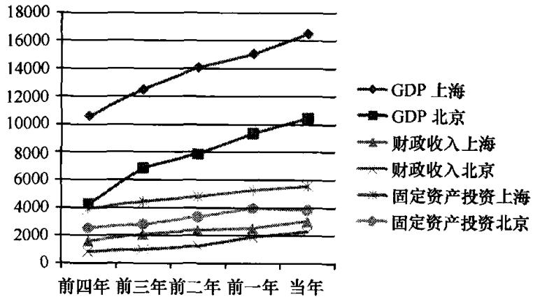

<details>
<summary>line</summary>

| Category | GDP 上海 | GDP 北京 | 财政收入上海 | 财政收入北京 | 固定资产投资上海 | 固定资产投资北京 |
| --- | --- | --- | --- | --- | --- | --- |
| 前四年 | ~10500 | ~4200 | ~1500 | ~800 | ~1800 | ~2500 |
| 前三年前 | ~12500 | ~6800 | ~2000 | ~1000 | ~2200 | ~2800 |
| 前二年 | ~14000 | ~7800 | ~2200 | ~1200 | ~2500 | ~3200 |
| 前一年 | ~15000 | ~9200 | ~2500 | ~1800 | ~2800 | ~3800 |
| 当年 | ~16500 | ~10200 | ~2800 | ~2200 | ~3200 | ~3800 |
</details>

图 11 世博会举办前五年上海和北京经济数据比较

可以看出世博会提高了 GDP 的增长速度。

被称为“经济奥林匹克”的世界博览会也越来越受到世界的关注，参展的国家越来越多，到以2000年德国汉诺威世博会，参加的国家已达到157个。世博会同样吸引大量游客参观，1933年美国芝加哥世博会有3887万人参观，1970年的日本大阪世博会是继1964年东京奥运会推动日本经济发展的又一重大事件，意义深远，会期参观人数超过了6400万人，其中外国游客170万人，几乎每两个日本人就有1个参观了本次博览会。近7届世博会，除了1998年葡萄牙里斯本世博会由于地理、交通、组织等各方面的因素，参观人数较少外，其他各届均在4000万人以上(表17)。

表 17 往届世博会参加人数

<table><tr><td>年份</td><td>国家</td><td>城市</td><td>参观人数/万个</td><td>年份</td><td>国家</td><td>城市</td><td>参观人数/万个</td></tr><tr><td>1851</td><td>英国</td><td>伦敦</td><td>630</td><td>1970</td><td>日本</td><td>大阪</td><td>6420</td></tr><tr><td>1867</td><td>法国</td><td>巴黎</td><td>680</td><td>1974</td><td>美国</td><td>斯波坎</td><td>480</td></tr><tr><td>1893</td><td>美国</td><td>芝加哥</td><td>2750</td><td>1986</td><td>加拿大</td><td>温哥华</td><td>2210</td></tr><tr><td>1900</td><td>法国</td><td>巴黎</td><td>4810</td><td>1992年</td><td>西班牙</td><td>塞维利亚</td><td>4180</td></tr><tr><td>1935</td><td>比利时</td><td>布鲁塞尔</td><td>2000</td><td>1999</td><td>中国</td><td>昆明</td><td>940</td></tr><tr><td>1958</td><td>比利时</td><td>布鲁塞尔</td><td>4150</td><td>2010</td><td>中国</td><td>上海</td><td>7000</td></tr></table>

## 5.4.2 长期效应

城市交通。上海已建成以浦东国际机场为主、虹桥国际机场为辅的组合型国际空枢纽港。2002年上海港旅客吞吐量为800万人次，上海港年货物吞吐量2亿多t，居世界第三位，与世界200多个国家和地区的600多个港口有业务往来，每月有500多个班次直达世界各大港口。到2005年，旅客运送能力将达到每年2500万人次\~2700万人次，2010年旅客运送能力将达到每年8000万至1亿人次以上。上海已具备接待2010年世博会的国际交通条件。

住宿设施。2010年上海世博会7000万游客中，按 $78\%$ 的游客为上海市外计算，则需要安排5500万游客的住宿，按180天计算，平均每天需要30万张床位，高峰时可能需要60万张床位。2001年上海399家旅游饭店(其中，星级饭店300家)，客房50966间；各类旅馆总数4000家左右，床位达30万张。按2010年世博会预测7000万人次参观者、2/3过夜人次计算，饭店旅馆发展规划基本能满足旅游者需求。

会展场馆。上海新国际博览中心2000年一期建成后，室内外展馆总面积达18188万 $m^{2}$ ，待全部建成后，上海新国际博览中心室内展馆总面积达到35138万 $m^{2}$ ，室外展馆面积达到815万 $m^{2}$ 左右，室内外展馆面积达到43188万 $m^{2}$ 左右，面积接近于德国的汉诺威展览馆44万 $m^{2}$ 和中国的广州（番禺）国际展览中心45万 $m^{2}$ ，位居世界前列。

## 5.4.3 空间效应

上海世博会的召开必将对长三角地区各主要城市形成很强的辐射作用和财富溢出效应。上海世博会筹备期间，世博经济对上海周边长三角地区投资的拉动约为30%以上。2010年世博会的召开对上海周边长三角地区投资的拉动将超过50%。世博会的市场开发计划将给长三角地区带来众多发展机遇，为长三角企业参与世博市场开发提供各种机会和平台(表18)。

表 18 世博会旅游圈构成表

<table><tr><td></td><td>核心圈</td><td>紧密圈</td><td>外围圈</td></tr><tr><td>奥运旅游圈</td><td>北京市级所辖县、区</td><td>天津、青岛、秦皇岛、大连</td><td>沈阳、呼和浩特、太原、石家庄等地区</td></tr><tr><td>世博旅游圈</td><td>上海市所辖县、区</td><td>南京、杭州、无锡、苏州、黄山</td><td>青岛、合肥、郑州、南昌等地区</td></tr></table>

## 6 模型的评价与展望

## 6.1 模型的优点

（1）采用偏最小二乘法解决了评估世博会影响力的自变量和因变量均有多个，并且某些自变量间还存在严重多重相关性的问题，偏最小二乘法通过主成分分析和综合变量的提取允许在样本个数少于自变量个数的条件下进行建模，解决了普通多元回归无法解决的问题，在建模同时实现了数据结构简化，将多维数据特性直观的展现在平面上，易于让人理解接受。  
(2) 采用本底趋势线法, 将世博会对促进拉动旅游业发展的诸多因素中剥离出来, 更加准确, 而且在数据资料相对匮乏的条件下, 对于旅游业的发展进行了很好的预测和评估。  
（3）采用层次分析法，对于世博会影响经济发展的相对次要的指标进行了简化处理，减少了不必要的工作量。

## 6.2 模型的缺点

（1）世博会对于经济的影响有横向和纵向两个方面：横向拉动上海市及周边地区乃至全国经济的发展，纵向影响各行业、各部门的发展。例如：在世博开展前几年将极大地促进固定资产投资和基础设施建设，在世博开展中将带来旅游业、消费行业的春天，在世博开展后，上海由于国际名声的提高，将吸引更多外来投资及海内外游客。本文研究重点在世博会开展中世博会对旅游行业的积极影响，且范围仅限于上海地区。

(2) 由于数据有限,样本点数量较少,拟合过程中难免出现偏差,影响最后评估结果。

## 6.3 模型的展望

上海世博会对今后举办类似大规模盛会如南京2014年青奥会提供了借鉴作用。

（1）作为这类大型的盛会，由于大量的客流、嘈杂的环境、较长的排队时间等原因，游客的旅游体验会大打折扣。因而，可以借鉴上海世博会好的做法，采用多元化举措分流游客，提高游客的旅游体验。在售票上采用多种票制使客流均匀；在展馆的展出和大型活动的安排上，把时间错开，平衡客流；采用围合式的排队环境规则，使人们在排队的同时能欣赏到各国不同的精彩演出。  
(2) 在世博期间,通过发展便捷的城际交通带动周边地区的旅游发展,推出丰富多样的旅游精品线路。  
（3）借助世博的影响力和机遇，发展和推广新能源，以清洁能源替代过去的高污染、高耗能能源，推动绿色世博、绿色城市，实现可持续发展。  
（4）以世博为契机，全面提升自身的竞争力，包括交通吞吐能力、科技创新能力、国际知名度等，使上海发展为一个国际化的大都市。

## 参考文献

[1] 吕万冬. 偏最小二乘回归模型在科技投入对经济产出问题中的应用研究. www.paper.edu.cn:2010.9.10:1-7.  
[2] 戴光全, 保继刚. 昆明世博会效应的定量估算: 本底趋势线模型. 地理科学, 2007, 27(3): 1-5.  
[3] 上海统计年鉴 2009. http://www.stats-sh.gov.cn.  
[4] 上海旅游局. http://lyw.sh.gov.con.  
[5] MATLAB 中文论坛. http://www.ilovematlab.cn.

## 【论文点评】

刘海峰

今年建模选择的题目是:2010 上海世博会经济效应的定量评估。2010 年的上海世博会对上海及周边地区乃至全国的政治、经济、文化诸领域产生重要了影响。参赛文章从三个方面展开：

首先,以世博会对上海经济发展的影响为评估主体,根据影响经济指标的主要因素如旅游业、对外贸易、经济发展环境、城市形象、生态环境、科学技术等建立了综合评价体系。

其次,根据各类数据的不同特点先后使用本底趋势线法、层次分析法以及偏最小二乘法等三种数学模型对相关数据进行量化,获得了上海经济状况评估的相应指标。

第三，在经济效应上，通过与北京奥运会的横向对比、与往届世博会的纵向对比，体现了上海世博会的综合影响力。同时，对世博会目前存在的问题及不足进行了反思，为以后举办类似大规模盛会如南京2014年青奥会提供了借鉴信息。

文章的亮点主要是数据处理的方式不同。不同类型的数据采用不同的数学模型对相关数据进行分析,寻找不同指标之间最佳的关系。

文章的缺陷是在模型结论的利用上,特别是对未来的影响分析不足,这主要是一方面时间已经不允许,其次是模型的可扩展性存在设计上的缺陷。

# 2011 年 B 题 交巡警服务平台的设置与调度

“有困难找警察”,是家喻户晓的一句流行语。警察肩负着刑事执法、治安管理、交通管理、服务群众四大职能。为了更有效地贯彻实施这些职能,需要在市区的一些交通要道和重要部位设置交巡警服务平台。每个交巡警服务平台的职能和警力配备基本相同。由于警务资源是有限的,如何根据城市的实际情况与需求合理地设置交巡警服务平台、分配各平台的管辖范围、调度警务资源是警务部门面临的一个实际课题。

试就某市设置交巡警服务平台的相关情况,建立数学模型分析研究下面的问题:

（1）附件1中的附图1给出了该市中心城区A的交通网络和现有的20个交巡警服务平台的设置情况示意图，相关的数据信息见附件2。请为各交巡警服务平台分配管辖范围，使其在所管辖的范围内出现突发事件时，尽量能在3min内有交巡警(警车的速度为60km/h)到达事发地。

对于重大突发事件,需要调度全区20个交巡警服务平台的警力资源,对进出该区的13条交通要道实现快速全封锁。实际中一个平台的警力最多封锁一个路口,请给出该区交巡警服务平台警力合理的调度方案。

根据现有交巡警服务平台的工作量不均衡和有些地方出警时间过长的实际情况,拟在该区内再增加2个\~5个平台,请确定需要增加平台的具体个数和位置。

(2) 针对全市(主城六区 A, B, C, D, E, F)的具体情况, 按照设置交巡警服务平台的原则和任务, 分析研究该市现有交巡警服务平台设置方案(参见附件)的合理性。如果有明显不合理, 请给出解决方案。

如果该市地点 P(第 32 个节点)处发生了重大刑事案件,在案发 3min 后接到报警,犯罪嫌疑人已驾车逃跑。为了快速搜捕嫌疑犯,请给出调度全市交巡警服务平台警力资源的最佳围堵方案。

附件 1:A 区和全市六区交通网络与平台设置的示意图。

附件2:全市六区交通网络与平台设置的相关数据表(共5个工作表)。

## 【试题评析】

姚泽清

该问题来源于重庆交巡警平台的布局与优化问题,与同样来源于山东青岛的城市表层土壤重金属污染分析一起,构成了2011年全国大学生数学建模竞赛的一道靓丽风景,反映了走过20年光荣历程的国内赛也像国际数学建模竞赛一样,越来越多地关注具有强烈实际背景的应用问题。

交巡警是交警、巡警合一的警务模式，它克服了“交警只管交通、巡警只管治安”的交巡分离模式下存在的执法漏洞较多、执法质量不高的问题。2010年2月8日，重庆交巡警正式挂牌,首批执勤的150个警务平台和4000名昼夜循环的交巡警,代替过去的交警和巡警,执行交通管理、刑事执法、治安管理三大职能。到2010年底,重庆市已有交巡警平台300个。

交巡警平台是设立在交通要道和市区、街镇繁华地带专门处理日常警务的作业场所，由于警力、精力有限，警情、社情各异，如何在城市不同区域合理地配置警务平台、调动警务资源便成为一个重要的现实课题。

## 【问题解答要点】

## 第一大问：

(1) 要求明确给出分配各个交巡警服务平台具体管辖范围的数学模型和具体的管辖范围(一般指路口,也可考虑相关道路)。合理性主要体现在两个方面:所有平台最长出警时间尽可能短,且它们的工作量(每天的出警次数)尽量均衡,优秀论文中应该给出这两个量化指标。

参考结果:最大出警时间大于3min的有6个路口,最长出警时间约为5.7min。

(2) 要求给出决定对 13 个路口实施封锁的数学模型, 通过求解模型, 具体给出 13 个目标路口各由哪一个平台实施封锁, 以及对每个路口的封锁时间和完成封锁的最大时间。

参考结果:最优方案的最大的封锁时间约为8min。

(3) 模型应该考虑增设平台后,使其减少最大出警时间与各平台间工作量的均衡性效果,要具体给出需增加新平台的个数和位置,且给出其定量依据。

## 第二大问：

（1）应该根据最大出警时间和工作量的均衡性这两个因素建立模型，求解给出最大出警时间和工作量均衡性的具体指标，分析现有平台设置方案的合理性。依据这些结果，对明显不合理的提出改进方案：如增加平台或移动平台，都必须要有具体的平台数量和位置，且阐述这样做的理由和定量依据。  
(2) 要求给出能封锁住嫌疑人的数学模型,并给出算法和具体结果。

能封锁住的基本约束条件是：“出事地点到将要封锁的路口所需时间加3min大于等于指派平台到封锁路口的所需时间。”在这个约束条件之下给出最优封锁方案。

从阅卷的结果看,不少参赛队只强调出警时间的长短,而忘了人是需要休息的,失于考察出警次数的均衡,这种现象在解决第一大问中的第一小问时特别严重,这和教条地理解原题“尽量能在3min内有交巡警到达事发地”一语有很大关系,尽管作者在第三小问中提出了“工作量不均衡”的问题。

# 交巡警服务平台的设置与调度模型

## 摘要

由于警务资源是有限的,交巡警服务平台设置的合理性,对平台管辖范围的分配和警务资源的调度都至关重要。本文结合运筹学中的图论等相关知识,建立数学模型,对相关问题进行分析和讨论。

针对问题一的三个子问题,首先对分配平台管辖范围问题将城区的路网抽象为无向加权图;运用图论中的 Floyd 算法建立“最短路径模型”,得到最短路径矩阵;并在 3min 时间约束条件的限制下,按照就近原则给出了平台管理范围的最优分配方案。然后,讨论道路快速封锁问题。运用运筹学的基本原理,建立了“最优调度模型”;再利用 Hungry 算法求得快速封锁 A 区的交巡警最优调度方案,最短封锁时间 8.015min。最后,结合实际情况定义工作量,以在 3min 内有交巡警到达事发地为约束条件,对第一子问题中的分配方案进行优化;采用逐步增加平台的方法,设计“试探循环过程”,确定增加标号为 29、40、61、91 的节点作为新增平台。

针对问题二,本文从全市整体出发,评价现有设置的合理性和解决实际调度问题。考虑评价设置合理性问题,首先定义工作效能为综合评价指标;再寻找出与该指标正相关的三个效能因子,依次为平台覆盖率因子、平台负荷能力因子、工作量均衡因子;通过计算这三个因子的值,得到各区工作效能的综合值,D区工作效能值最小,即D区平台设置最不合理。针对引起D区不合理的主要因素,通过在道路上虚设路口,按照第一问中的第三子问题的解决方案,使得D区平台的设置趋于合理。对于怎样选择最佳围堵方案,采用图论的先深搜索原理,对图进行拓扑排序实现有向遍历;通过比较各个平台所需最短时间的最大值,给出了最优围堵方案:在假设嫌疑犯的逃逸速度为80km/h的前提下,求得最优围堵时间为8.848min。

最后,为使本文所建立的模型更加具有实用价值,结合实际情况,对模型提出了相应的改进方向,使模型更加贴近实际,扩大适用范围。

关键词: 交巡警服务平台, Floyd 算法, Hungry 算法, 工作效能, 先深搜索

## 1 问题重述

“有困难找警察”，是家喻户晓的一句流行语。警察肩负着刑事执法、治安管理、交通管理、服务群众四大职能。为了更有效地贯彻实施这些职能，需要在市区的一些交通要道和重要部位设置交巡警服务平台。每个交巡警服务平台的职能和警力配备基本相同。由于警务资源是有限的，如何根据城市的实际情况与需求合理地设置交巡警服务平台、分配各平台的管辖范围、调度警务资源是警务部门面临的一个实际课题。

试就某市设置交巡警服务平台的相关情况,建立数学模型分析研究下面的问题:

（1）附件1中的附图1给出了该市中心城区A的交通网络和现有的20个交巡警服务平台的设置情况示意图，相关的数据信息见附件2。请为各交巡警服务平台分配管辖范围，使其在所管辖的范围内出现突发事件时，尽量能在3min内有交巡警(警车的速度为60km/h)到达事发地。

对于重大突发事件,需要调度全区20个交巡警服务平台的警力资源,对进出该区的13条交通要道实现快速全封锁。实际中一个平台的警力最多封锁一个路口,请给出该区交巡警服务平台警力合理的调度方案。

根据现有交巡警服务平台的工作量不均衡和有些地方出警时间过长的实际情况,拟在该区内再增加2个\~5个平台,请确定需要增加平台的具体个数和位置。

(2) 针对全市(主城六区 A, B, C, D, E, F)的具体情况, 按照设置交巡警服务平台的原则和任务, 分析研究该市现有交巡警服务平台设置方案(参见附件)的合理性。如果有明显不合理, 请给出解决方案。

如果该市地点 P(第 32 个节点)处发生了重大刑事案件,在案发 3min 后接到报警,犯罪嫌疑人已驾车逃跑。为了快速搜捕嫌疑犯,请给出调度全市交巡警服务平台警力资源的最佳围堵方案。

## 2 问题分析

## 2.1 问题一的分析

## 2.1.1 分配管辖范围的问题分析

依据题目,以现有的20个交巡警服务平台覆盖整个城区A,基于假设7,警车接警后保持匀速行驶(60km/h),要保证3min之内到达,则警车距事发地点的最长距离不应超过3km,根据题目中所提供的相关信息和数据,采用Floyd算法,依据动态规划原理和逐步优化技术,设计出求无向加权图中,每一对顶点之间的最短路径算法,然后用“距离约束条件”(距离小于等于3km)筛选出以交巡警服务平台为起点的符合条件的节点,对于一些特殊点,从最短路径定义出发,将这些路口划分给与其距离最近的交巡警平台管辖。因此得到最终的交巡警服务平台的管辖范围,并计算出交巡警在A区的最大覆盖距离和最大覆盖时间。

## 2.1.2 快速封锁 A 区的问题分析

为了实现对进出 A 区的 13 条交通要道的快速封锁, 必须设计以封锁最后一个路口完毕时所用的最短时间方案。基于这一考虑, 本题运用运筹学的基本原理, 把合理的调度警力封锁路口看成是标准的指派问题, 建立“最优调度模型”, 然后运用“Hungry 算法”求指派问题的最优解, 用 lingo 对模型进行编程求解, 最终求解结果可用 0-1 矩阵, 得到一般意义上的调度方案 $^{[1]}$ , 然后基于全区的综合考虑, 建立统筹全局的综合调度优化模型, 得到封锁 A 区的交巡警最优调度方案。

## 2.1.3 优化交巡警服务平台的问题分析

在前两问的基础上,进一步对各交巡警平台的工作量和出警时间进行综合考虑。首先对单个工作量和工作总量进行定义,然后通过确定单个工作量上限,并以此为标准对管辖范围进行划分。由于得到的分配管辖范围方案,并没有明显地缩短出警时间,交巡警服务平台的工作量不均衡和有些地方出警时间过长的实际情况依然存在,因此需要通过增加相应数量的交巡警服务平台,对所需出警时间过长的点进行有效覆盖(最短距离小于3km),并且起到均衡工作量较大平台的作用,本题采用逐步增加平台的方法,设计“试探循环过程”,综合考虑设置平台的效能、代价和警力资源分配等各方面因素,最终确定需要增加的平台个数和位置。

## 2.2 问题二的分析

## 2.2.1 研究交巡警服务平台设置合理性的问题分析

对于问题二,为了减少分析的复杂度,作出清晰、合理的评价,将全市根据所分城区逐一进行评价,找出相对最不合理的区域,并提出解决方案。依据设置交巡警服务平台的原则和任务,本文采用工作效能作为综合评价指标,分别从平台设置的全面性、工作负荷量、均匀性三方面出发,确定了平台覆盖率因子、平台负荷能力因子、工作量均衡因子这三个对工作效能影响相对较大的效能因子。根据相关数据,对各城区三个效能因子的求解,假设这三个因子与工作效能之间是等权重的线性相关,最终求得六个区的工作效能值。选出工作效能值最小的区域,对该区采用问题一中优化交巡警服务平台的方法,对该区适当增加交巡警服务平台的个数。

## 2.2.2 确立最佳围堵方案问题的分析

对于最佳围堵方案的确立,本文采用图的先深搜索遍历,对图进行拓扑排序来实现。在遍历的同时完成图的有关运算,使得警车能够在嫌疑犯到达路口之前先行到达,进行围堵。同时,通过对各个平台所需最短时间的最大值的比较,在各种围堵方案中寻找出能够对罪犯形成围堵态势所需时间最小的警力资源调度方案。

## 3 基本假设

(1) 假设城区所有道路畅通无阻；  
(2) 假设相邻两个交叉路口之间的道路为直线；  
(3) 假设所以突发事件均发生在城区路口节点处；  
(4) 假设单一管辖范围内某一时间无并发事件；  
(5) 假设巡警服务平台出警时警车无故障发生；  
(6) 假设在处理突发事件时警车可以逆行；  
(7) 假设警车接警后以 60km/h 匀速行驶；  
(8) 本文忽略接警通信、处理案件的时间, 忽略道路转弯路程;  
(9) 假设要调度警车封锁道路时,各参与封锁的平台在接警后能同时出警。

# 4 符号约定与名词解释

## 4.1 符号的约定

<div class="mineru-algorithm" style="white-space: pre-wrap; font-family:monospace;">
i 第 $i$ 个路口节点  
$\tilde{i}$ 第 $i$ 个路口节点的邻接节点  
$L$ 带权邻接矩阵  
$L_{i\tilde{i}}$ 两相邻路口节点之间的距离  
$L_{ij}$ 第 $i$ 个路口节点到第 $j$ 个路口节点之间的距离  
$L_{\max}$ 最大覆盖距离  
$T_{\max}$ 最大覆盖时间  
$G$ 不满足距离约束条件的路口节点的集合  
$\pmb{K}$ 插入节点的矩阵  
$K_{ij}$ 第 $i$ 个路口节点到第 $j$ 个路口节点之间所经过节点  
$P$ 各路口点的发案率  
$\overline{P}$ 路口节点的平均发案率  
$W_{ij}$ 第 $i$ 个平台到第 $j$ 个路口节点的单个工作量  
$W_{i}$ 第 $i$ 个交巡警服务平台的工作总量  
$W_{0}$ 各平台单个工作量的上限
</div>

## 4.2 名词解释

发案率:每个路口平均每天的发生报警案件数量。

最短路径:城区里任意两个点之间最优路径的总路程。

出警时间:一天内警车在平台与某事发地点这段路程上所消耗的时间。

平台利用率:每个平台管理的人数。

城区人口密度:城区人口总数与城区面积之比。

最大覆盖距离:交巡警服务平台到所管辖范围内的路口节点的最远距离。

最大覆盖时间:交巡警服务平台到所管辖范围内的路口节点的最大时间。

## 5 问题一模型的建立与求解

## 5.1 分配管辖范围的问题求解

## 5.1.1 基于 Floyd 算法的“最短路径模型”的建立

结合 A 区交通网络与平台设置的示意图, 将交巡警平台的编号标注在图上, 如图 1 所示。

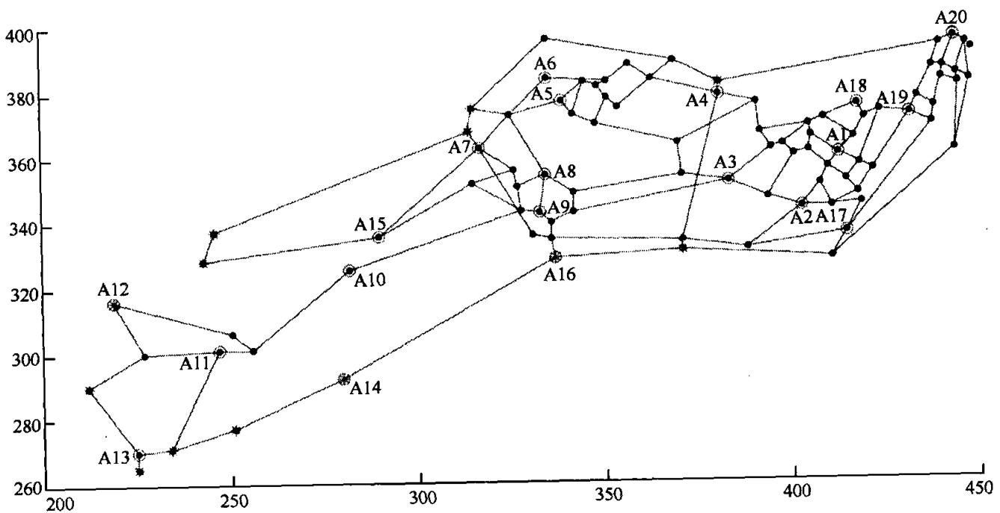

<details>
<summary>scatter</summary>

| Node | X (approx) | Y (approx) |
| --- | --- | --- |
| A13 | ~225 | ~265 |
| A12 | ~215 | ~318 |
| A11 | ~240 | ~302 |
| A14 | ~280 | ~295 |
| A10 | ~285 | ~328 |
| A7 | ~315 | ~365 |
| A16 | ~335 | ~332 |
| A9 | ~335 | ~345 |
| A8 | ~335 | ~358 |
| A6 | ~335 | ~388 |
| A5 | ~335 | ~380 |
| A4 | ~370 | ~385 |
| A3 | ~380 | ~358 |
| A2 | ~405 | ~340 |
| A17 | ~410 | ~340 |
| A18 | ~415 | ~375 |
| A19 | ~420 | ~378 |
| A20 | ~440 | ~400 |
</details>

图 1 A 区交通网络与平台设置示意图

其中,实圆点表示交叉路口的节点,星号表示出入城区的路口节点,圆圈表示现有交巡警服务平台的设置点。分析发现,交巡警服务平台均设在了城区的路口节点处,且交巡警平台的编号A1\~A20分别与全市路口节点标号1\~20相对应。

考虑到警务资源有限,应该合理设置交巡警服务平台,因此,本文采用图论中的 Floyd 最短路径算法建立数学模型,通过设计求出无向加权图中每一对顶点之间的最短路径算法,求出任意两点之间的最短路径 $^{[2]}$ 。具体步骤如下:

(1) 根据题目中所给的各个路口节点的坐标,城区内任意相邻路口节点之间的距离计算公式:

$$
L _ {i \tilde {i}} = \sqrt {\left(x _ {i} - x _ {\tilde {i}}\right) ^ {2} + \left(y _ {i} - y _ {\tilde {i}}\right) ^ {2}}
$$

(2) 考虑不是邻接的两个路口节点, 即任意两个路口节点之间的距离 $L_{ij}$ , 在两个节点间插入节点。 $K_{ij}$ 表示第 $i$ 个路口节点到达第 $j$ 个路口节点所要经过节点的记录, 把各个节点插入图中。

(3) 比较插入节点 $k$ 后的距离与原来的距离 $L_{ij} = \min(L_{ij}, L_{ik} + L_{kj})$ 。若 $L_{ij}$ 的距离变小, 则 $K_{ij} = k$ 。

(4) 对无向图进行遍历操作, 综合计算, 可求得任意两路口节点间的距离:

$$
L _ {i j} = \sum_ {i} ^ {k \dots j} \sqrt {\left(x _ {i} - x _ {k}\right) ^ {2} + \left(y _ {i} - y _ {k}\right) ^ {2}}
$$

## 5.1.2 交巡警服务平台管辖范围的分配及城区 A 的最大覆盖时间

根据上述所建立的“最短路径模型”，应用图论中 Floyd 最短路径算法的基本原理，运用 Matlab 软件进行编程求解。得到 A 区 92 个路口节点任意两点之间最短路径记录及距离 $L_{ij}$ 。

针对问题一,只考虑设有20个交巡警平台的路口节点与其他72个路口节点的最短距离。由于数据较多,表1截取了A1\~A7交巡警平台到部分路口节点的最短距离结果(计算结果保留2位小数)。

表 1 A 区交巡警平台到路口节点的最短距离示例(单位:km)

<table><tr><td>平台编号\节点标号</td><td>21</td><td>22</td><td>23</td><td>24</td><td>25</td><td>26</td></tr><tr><td>A1</td><td>19.92</td><td>21.72</td><td>23.12</td><td>25.01</td><td>26.81</td><td>32.48</td></tr><tr><td>A2</td><td>18.14</td><td>19.95</td><td>21.35</td><td>23.24</td><td>25.04</td><td>30.71</td></tr><tr><td>A3</td><td>16.03</td><td>17.83</td><td>19.24</td><td>21.13</td><td>22.93</td><td>28.60</td></tr><tr><td>A4</td><td>18.27</td><td>20.08</td><td>21.48</td><td>23.37</td><td>25.17</td><td>30.84</td></tr><tr><td>A5</td><td>16.90</td><td>18.71</td><td>20.11</td><td>22.00</td><td>23.80</td><td>29.47</td></tr><tr><td>A6</td><td>16.85</td><td>18.65</td><td>20.06</td><td>21.94</td><td>23.75</td><td>29.42</td></tr><tr><td>A7</td><td>14.17</td><td>15.97</td><td>17.37</td><td>19.26</td><td>21.06</td><td>26.73</td></tr></table>

要实现各交巡警服务平台管辖范围的分配,需满足要求“当所管辖的范围内出现突发事件时,尽量能在3min内有交巡警到达事发地”的时间约束条件。在假设7,即警车接警后以60km/h匀速行驶的条件下,把“时间约束条件”转化为“距离约束条件”即交巡警平台与所管辖的路口节点间的距离不超过3km。

根据表 1 所得的各平台到其它各节点的最短距离,依据“距离约束条件”对节点进行筛选,初步得到满足距离约束条件的路口节点所属平台的分布,处理结果示例见表 2。

表 2 初步筛选结果示例

<table><tr><td>交巡警平台</td><td>满足距离约束条件的路口节点</td></tr><tr><td>A1</td><td>42、43、44、64、65、66、67、68、69、70、71、72、73、74、75、76、77、78、79、80</td></tr><tr><td>A2</td><td>39、40、42、43、44、66、67、68、69、70、71、72、73、74、75、76、78</td></tr><tr><td>A3</td><td>43、44、54、55、64、65、66、67、68、70、76</td></tr><tr><td>A4</td><td>57、58、60、62、63、64、65、66</td></tr><tr><td>A5</td><td>5、47、48、49、50、51、52、53、56、58、59</td></tr><tr><td>A6</td><td>6</td></tr><tr><td>A7</td><td>7、30、31、32、33、34、47、48、61</td></tr></table>

进一步分析,还有6个路口节点标号分别为28、29、38、39、61、92与20个平台的距离均超过了3km,不满足距离约束条件。并且,发现满足距离约束条件的路口节点所属的交巡警平台不一定唯一,如标号为31、32、33、34的路口与平台A7、A8、A9间的距离均小于3km。

对于这些特殊点,从最短路径定义出发,将这些路口划分给与其距离最近的交巡警平台管辖。因此得到最终的交巡警服务平台管辖范围,结果见表3。

表 3 交巡警服务平台管辖范围的划分

<table><tr><td>交巡警平台</td><td>管辖范围</td><td>交巡警平台</td><td>管辖范围</td></tr><tr><td>A1</td><td>67、68、69、71、73、74、75、76、78</td><td>A11</td><td>26、27</td></tr><tr><td>A2</td><td>40、43、44、70、72、39</td><td>A12</td><td>25</td></tr><tr><td>A3</td><td>54、55、65、66</td><td>A13</td><td>21、22、23、24</td></tr><tr><td>A4</td><td>57、60、62、63、64</td><td>A14</td><td>14</td></tr><tr><td>A5</td><td>49、50、51、52、53、56、58、59</td><td>A15</td><td>28、29</td></tr><tr><td>A6</td><td>6</td><td>A16</td><td>36、37、38</td></tr><tr><td>A7</td><td>30、32、47、48、61</td><td>A17</td><td>41、42</td></tr><tr><td>A8</td><td>33、46</td><td>A18</td><td>80、81、82、83</td></tr><tr><td>A9</td><td>31、34、35、45</td><td>A19</td><td>77、79</td></tr><tr><td>A10</td><td>10</td><td>A20</td><td>84、85、86、87、88、89、90、91、92</td></tr><tr><td colspan="4">注:加粗斜体的节点表示从平台到该点的距离大于3km</td></tr></table>

根据表 3 所列的最终划分管辖范围, 绘制于 A 区交通网络与平台设置示意图上, 可得各个交巡警服务平台的管辖范围的具体分布, 如图 2 所示。

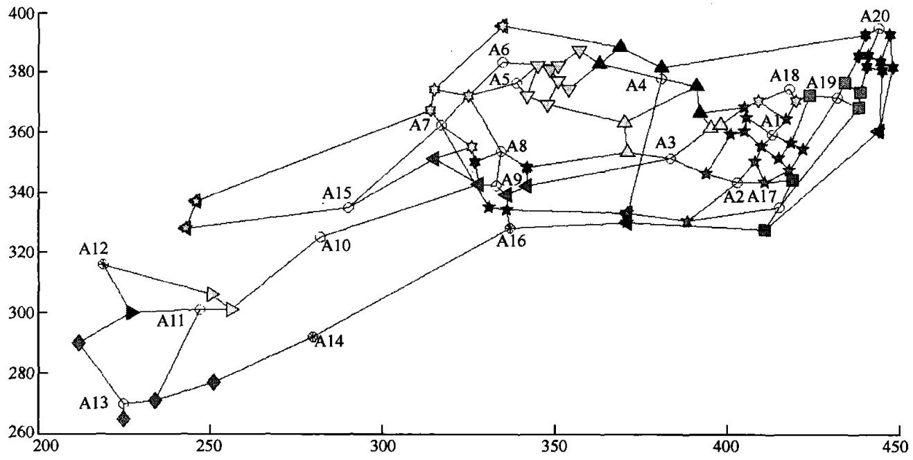

<details>
<summary>scatter</summary>

| Point | X | Y |
| --- | --- | --- |
| A13 | ~215 | ~265 |
| A12 | ~215 | ~315 |
| A11 | ~225 | ~300 |
| A14 | ~280 | ~290 |
| A10 | ~285 | ~325 |
| A15 | ~290 | ~335 |
| A7 | ~315 | ~365 |
| A6 | ~335 | ~385 |
| A5 | ~335 | ~375 |
| A8 | ~335 | ~355 |
| A9 | ~335 | ~345 |
| A16 | ~335 | ~325 |
| A4 | ~365 | ~385 |
| A3 | ~370 | ~360 |
| A2 | ~400 | ~340 |
| A17 | ~400 | ~330 |
| A2 | ~400 | ~360 |
| A18 | ~415 | ~370 |
| A19 | ~420 | ~370 |
| A1 | ~420 | ~360 |
| A20 | ~445 | ~395 |
</details>

图 2 交巡警服务平台的管辖范围

图中不同颜色、不同形状的图形符号分别代表20个平台所管辖的路口节点。其中星加三角形的符合代表不满足距离约束条件的节点位置。由图可以较为直观和清晰地看出该市中心城区A的交巡警服务平台的覆盖情况。

根据与20个平台间的距离超过3km的路口节点,找出这些节点与最近的平台间的距离的最大值,确定为城区A的交巡警平台的最大覆盖距离:

$$
L _ {\max} = \max _ {1 \leqslant i \leqslant 2 0} (\min _ {j \in G} L _ {i j})
$$

其中：G 代表不满足距离约束条件即与平台距离超过 3km 的路口节点的集合。由筛选结果可得，A15 到标号为 29 的路口节点的距离即为城区 A 的交巡警平台的最大覆盖距离 $L_{max}=5.7005km$ ，最大覆盖时间 $T_{max}=5.7005min$ 。

## 5.2 快速封锁 A 区的问题求解

## 5.2.1 基于运筹学的交巡警“最优调度模型”的建立

根据题目的要求:调度全区20个交巡警服务平台的警力资源,对进出该区的13条交通要道实现快速全封锁。运用运筹学的基本原理,把合理的调度警力封锁路口看成是标准的指派问题,基本步骤如下:

（1）把封锁出入 A 区的路口当成任务，共有 n 项任务 $(n=13)$ ，把交巡警服务平台当成指派对象，共有 m 个对象 $(m=20)$ ，由于各对象到达各路口的距离（即时间）不同，因此不同对象去完成不同任务就构成了多种组合方案。  
（2）设交巡警平台 $i$ 到达各要道路口 $j$ 所需的时间为 $C_{ij}(\pmb{C}$ 称为效率矩阵），用0-1变量 $X_{ij}$ 表示分配情况， $X_{ij} = 1$ 表示指派编号为 $i$ 的巡警平台去封锁编号为 $j$ 的路口， $X_{ij} = 0$ 表示不分配，则上述问题可以表示为如下0-1线性规划：

$$
\min Z = \sum_ {i = 1} ^ {2 0} \sum_ {j = 1} ^ {1 3} C _ {A i j} X _ {A i j}
$$

$$
\text {s.t.} \left\{ \begin{array}{l} \sum_ {i = 1} ^ {m} X _ {A i j} = 1, j = 1, 2, \dots , n \\ \sum_ {j = 1} ^ {n} X _ {A i j} = 0, i = 1, 2, \dots , n \\ X _ {A i j} = 0 \text {或} 1 \end{array} \right.
$$

其中第一个约束条件表示每个要道路口只由一个交巡警平台去封锁,第二个约束条件表示每个交巡警平台只能封锁一个要道路口。

## 5.2.2 运用 Hungry 算法求解模型

由于标号为 12、14、16 的路口节点既是出入 A 区的路口, 又是交巡警平台的设置点, 因此依据就近原则, 一般认为对这 3 个路口的封锁任务可由所在的交巡警平台完成。对其它 10 个要道路口 (标号为 21、22、23、24、28、29、30、38、48、62), 结合附件 2 所给的数据和模型一计算所得的各节点间的最短距离, 进行提取整合, 结果见表 4。

表 4 各交巡警平台到进出 A 区的路口最短距离(单位:km)

<table><tr><td>平台\标号</td><td>21</td><td>22</td><td>23</td><td>24</td><td>28</td><td>29</td><td>30</td><td>38</td><td>48</td><td>62</td></tr><tr><td>A1</td><td>19.92</td><td>21.72</td><td>23.12</td><td>25.01</td><td>19.25</td><td>19.89</td><td>12.46</td><td>7.65</td><td>11.75</td><td>4.89</td></tr><tr><td>A2</td><td>18.14</td><td>19.95</td><td>21.35</td><td>23.24</td><td>17.48</td><td>18.43</td><td>11.66</td><td>5.75</td><td>12.06</td><td>6.04</td></tr><tr><td>A3</td><td>16.03</td><td>17.83</td><td>19.24</td><td>21.13</td><td>15.37</td><td>16.32</td><td>9.55</td><td>7.86</td><td>9.94</td><td>4.39</td></tr><tr><td>A4</td><td>18.27</td><td>20.08</td><td>21.48</td><td>23.37</td><td>16.05</td><td>15.36</td><td>7.92</td><td>4.86</td><td>7.22</td><td>0.35</td></tr><tr><td>A5</td><td>16.90</td><td>18.71</td><td>20.11</td><td>22.00</td><td>11.31</td><td>10.62</td><td>3.18</td><td>9.60</td><td>2.48</td><td>5.08</td></tr><tr><td>A6</td><td>16.85</td><td>18.65</td><td>20.06</td><td>21.94</td><td>11.34</td><td>10.65</td><td>3.21</td><td>10.04</td><td>2.51</td><td>8.02</td></tr><tr><td>A7</td><td>14.17</td><td>15.97</td><td>17.37</td><td>19.26</td><td>8.57</td><td>8.02</td><td>0.58</td><td>7.35</td><td>1.29</td><td>7.81</td></tr><tr><td>A8</td><td>12.57</td><td>14.38</td><td>15.78</td><td>17.67</td><td>10.23</td><td>11.18</td><td>5.23</td><td>5.76</td><td>5.94</td><td>8.68</td></tr><tr><td>A9</td><td>14.66</td><td>16.46</td><td>17.87</td><td>19.75</td><td>9.78</td><td>10.58</td><td>3.14</td><td>7.85</td><td>3.85</td><td>10.37</td></tr><tr><td>A10</td><td>9.03</td><td>7.22</td><td>8.63</td><td>10.52</td><td>31.76</td><td>31.21</td><td>23.78</td><td>22.44</td><td>24.48</td><td>27.65</td></tr><tr><td>A11</td><td>8.90</td><td>7.10</td><td>6.69</td><td>3.81</td><td>31.64</td><td>31.08</td><td>23.65</td><td>22.31</td><td>24.36</td><td>27.52</td></tr><tr><td>A13</td><td>2.71</td><td>0.91</td><td>0.50</td><td>2.39</td><td>25.44</td><td>24.89</td><td>17.46</td><td>16.12</td><td>18.16</td><td>21.33</td></tr><tr><td>A15</td><td>17.98</td><td>19.79</td><td>21.19</td><td>23.08</td><td>4.75</td><td>5.70</td><td>4.40</td><td>11.17</td><td>5.11</td><td>11.63</td></tr><tr><td>A17</td><td>18.27</td><td>20.07</td><td>21.48</td><td>23.36</td><td>18.56</td><td>19.36</td><td>11.93</td><td>4.86</td><td>12.64</td><td>7.82</td></tr><tr><td>A18</td><td>21.93</td><td>23.73</td><td>25.14</td><td>27.02</td><td>21.26</td><td>21.74</td><td>14.31</td><td>9.55</td><td>13.60</td><td>6.73</td></tr><tr><td>A19</td><td>20.23</td><td>22.03</td><td>23.43</td><td>25.32</td><td>19.56</td><td>20.04</td><td>12.61</td><td>9.41</td><td>11.90</td><td>5.03</td></tr><tr><td>A20</td><td>24.63</td><td>26.43</td><td>27.83</td><td>29.72</td><td>22.83</td><td>22.14</td><td>14.71</td><td>11.56</td><td>14.00</td><td>6.45</td></tr><tr><td colspan="11">注:加粗的数据表示最值</td></tr></table>

根据所建立的“最优调度模型”，对于这类0-1线性规划问题，运用Hungry算法求解指派问题的最优解，使得封锁最后一个路口完毕时所用的时间最短。基于这一算法，利用lingo 对模型进行编程求解,最终求解结果可用 0-1 矩阵的形式来描述。平台与所其封锁路口节点标号的对应值取为 1,与其他路口节点标号的对应值取 0。

把一个交巡警平台当成一个分配对,记为:Ai-j,即交巡警服务平台Ai封锁路口节点j,由以上求解结果最终确定快速封锁A区的合理调度方案,见表5。

表 5 快速封锁 A 区的交巡警调度方案

<table><tr><td>平台与对应的封锁路口</td><td>所需时间/min</td><td>平台与对应的封锁路口</td><td>所需时间/min</td></tr><tr><td>A1—48</td><td>11.75</td><td>A13—23</td><td>0.5</td></tr><tr><td>A3—30</td><td>9.55</td><td>A14—14</td><td>0</td></tr><tr><td>A5—29</td><td>10.62</td><td>A15—28</td><td>4.75</td></tr><tr><td>A8—21</td><td>12.57</td><td>A16—16</td><td>0</td></tr><tr><td>A10—24</td><td>10.52</td><td>A18—38</td><td>9.55</td></tr><tr><td>A11—22</td><td>7.1</td><td>A20—62</td><td>6.45</td></tr><tr><td>A12—12</td><td>0</td><td></td><td></td></tr></table>

假设所有参与封锁交通要道的交巡警平台在接警后能同时出警,那么要实现对 A 区的全部封锁,其最短的时间则为封锁最后一个路口完毕时所用的时间。由表 5 可以看出,该调度方案的最短封锁时间为 12.57min。

## 5.2.3 统筹全局的综合调度优化模型

在对模型初步求解的过程中,是把标号为12、14、16的3个作为交巡警平台的路口节点用来对自身进行封锁。但在实际生活中,采取这种封锁方式可能会造成有的路口节点需要从更远的交巡警平台进行调度封锁,从而延长了封锁A区的时间。因此,需从全局的综合调度进行考虑,对调度方案进行优化。

在表 4 的基础上, 把 12、14、16 这 3 个本身作为交巡警平台的相关数据添加进去, 同样运用 Hungry 算法, 用 lingo 对模型进行编程求解, 用 0-1 矩阵的形式描述求解结果。根据分配结果, 最终确定快速封锁 A 区的综合最优调度方案, 见表 6。

表 6 快速封锁 A 区的交巡警调度方案

<table><tr><td>平台与对应的封锁路口</td><td>所需时间/min</td><td>平台与对应的封锁路口</td><td>所需时间/min</td></tr><tr><td>A2—62</td><td>6.035</td><td>A11—24</td><td>3.805</td></tr><tr><td>A3—16</td><td>7.388</td><td>A12—12</td><td>0</td></tr><tr><td>A4—48</td><td>7.217</td><td>A13—21</td><td>2.708</td></tr><tr><td>A5—30</td><td>3.183</td><td>A14—23</td><td>6.473</td></tr><tr><td>A7—29</td><td>8.015</td><td>A15—28</td><td>4.752</td></tr><tr><td>A9—38</td><td>7.846</td><td>A16—14</td><td>6.742</td></tr><tr><td>A10—22</td><td>7.225</td><td></td><td></td></tr></table>

对全区的所有交巡警平台的综合调度进行考虑后,所得到的结果与初步求解的调度方案有很大的差异,如 A14—23、A16—14、A3—16,其表明当案发后,平台 A14 和 A16 不再单纯地封锁各自路口,而是基于全局考虑,确保最短时间内实现对该区的封锁,相比之下,优化后的调度方案实现对 A 区的全部封锁所需要的时间为 8.015min,比初步的调度方案所需封锁时间 12.57min 整整提高了 4.555min,说明此方案更合理。

## 5.3 交巡警服务平台管辖范围分配方案的优化

前面建立了基于 Floyd 算法的“最短路径模型”，对求解结果进行筛选并对各交巡警服务平台的管辖范围进行了分配，经分析发现：

（1）交巡警服务平台 A6、A10、A14，除了自身所在的路口节点以外，没有其它管辖的路口节点，所承担的工作量较轻。

(2) A1、A5、A20 这些平台所管辖的节点比较多,所承担的工作量较重。

（3）各平台到节点28、29、38、39、61、92的最短时间均大于3min，对于处理突发事件来说，出警时间过长。

针对交巡警服务平台的工作量不均衡和有些地方出警时间过长的实际情况,按照需要,在该区内再增加一定数目的新交巡警服务平台,并确定其最佳位置。

## 5.3.1 交巡警服务平台的单个工作量和工作总量的定义

工作量是反应工作效能的重要物理量,为根据交巡警服务平台的工作量来更合理的设置服务平台,本文定义了服务平台的单个工作量和工作总量。该工作量视为出警时间和发案率的函数。

定义 1: 各交巡警平台每日的单个工作量为该平台到某个路口节点的最短时间与该路口发案率的乘积 $^{[4]}$ 。计算公式为

$$
W _ {i j} = T _ {i j} P
$$

定义 2: 各交巡警平台每日的工作总量为该平台到所管辖的路口节点的最短时间与该路口发案率的乘积之和。计算公式表示为

$$
W _ {i} = \sum_ {i} T _ {i j} P
$$

根据上述计算公式知,本文所定义的工作量,不仅反应了该平台处理突发事件的数量,同时也反应了该平台警车的出警时间。工作量与出警时间和发案率均正相关,是一个综合评价因子。

由附件中所给各路口节点的发案率和模型一所计算出的各平台到各个节点的最短距离及警车的匀速行驶速度,利用计算式( $^{*}$ )可得各平台的单个工作量 $W_{ij}$ ,共有 $20 \times 72 = 1440$ 个数据。以A1～A7交巡警平台到部分路口节点的单个工作量为例,具体结果见表7,计算结果保留2位小数。

表 7 各交巡警平台的单个工作量示例(单位:min)

<table><tr><td>平台编号\节点标号</td><td>21</td><td>22</td><td>23</td><td>24</td><td>25</td><td>26</td></tr><tr><td>A1</td><td>27.01</td><td>29.53</td><td>54.00</td><td>25.18</td><td>33.74</td><td>21.83</td></tr><tr><td>A2</td><td>24.35</td><td>26.88</td><td>49.44</td><td>23.23</td><td>30.91</td><td>19.70</td></tr><tr><td>A3</td><td>22.45</td><td>24.97</td><td>46.18</td><td>20.91</td><td>27.53</td><td>17.16</td></tr><tr><td>A4</td><td>25.58</td><td>28.11</td><td>51.56</td><td>24.92</td><td>33.36</td><td>21.54</td></tr><tr><td>A5</td><td>22.73</td><td>25.25</td><td>46.66</td><td>20.11</td><td>26.37</td><td>16.30</td></tr><tr><td>A6</td><td>22.77</td><td>25.30</td><td>46.74</td><td>20.15</td><td>26.42</td><td>16.33</td></tr><tr><td>A7</td><td>19.83</td><td>22.36</td><td>41.70</td><td>17.13</td><td>22.03</td><td>13.04</td></tr></table>

## 5.3.2 以单个工作量为标准的管辖范围分配

模型一是以“距离约束条件”来进行管辖范围的划分的。在模型一的基础上，将单个工作量作为划分管辖范围的标准。

首先,假设题目所给的发案率都是选用同一时间段的统计结果计算所得,利用平均值的计算公式 $\bar{x} = \frac{1}{n} \sum_{i=1}^{n} x_{i}$ ，计算出 A 区的平均发案率为 $\bar{P} = 1.353261$ ，然后，将平均发案率 $\bar{P}$ 与题目所给的“时间约束条件”的上限值 3min 相乘，所得结果作为优化模型的新的约束条件，即各平台的单个工作量上限 $W_{0}$ ，通过计算得

$$
W _ {0} = 1. 3 5 3 2 6 1 \times 3 = 4. 0 5 9 7 8 3 \mathrm{min}
$$

即尽量让各平台在所管辖的范围内的单个工作量不超过4.059783min。此约束条件综合了各方面的影响因素，不仅考虑了接警后的行动时限，还限制了交巡警平台的工作量，使划分的平台管辖范围，更加具有合理性和实用性。

最后,以各平台的单个工作量上限 $W_{0}$ 为约束条件,运用Floyd算法进行求解、筛选、整理,即可得到不满足约束条件的路口节点(表8)和以单个工作量为约束条件的交巡警平台管辖范围划分结果(表9)。

表 8 不满足新约束条件的路口节点

<table><tr><td>节点标号</td><td>28</td><td>29</td><td>38</td><td>39</td></tr><tr><td>最少工作量/min</td><td>6.17739</td><td>7.80735</td><td>4.08705</td><td>5.15506</td></tr><tr><td>所属平台</td><td>15</td><td>15</td><td>16</td><td>2</td></tr><tr><td>到达时间/min</td><td>4.7518</td><td>5.7005</td><td>3.4059</td><td>3.6822</td></tr></table>

与模型一求最大覆盖时间原理相同,取这些节点与平台间的最少单个工作量的最大值所对应的到达时间,确定为城区 A 的交巡警平台的最大覆盖时间。由表 9 得最大覆盖时间为 5.7005min。

表 9 改进后的交巡警平台管辖范围

<table><tr><td>交巡警平台</td><td>管辖范围</td><td>交巡警平台</td><td>管辖范围</td></tr><tr><td>A1</td><td>67、68、69、71、73、74、75、76、78</td><td>A11</td><td>26、27</td></tr><tr><td>A2</td><td>39、40、43、44、70、72</td><td>A12</td><td>25</td></tr><tr><td>A3</td><td>54、55、65、66</td><td>A13</td><td>21、22、23、24</td></tr><tr><td>A4</td><td>57、60、62、63、64</td><td>A14</td><td>14</td></tr><tr><td>A5</td><td>49、50、51、52、53、56、58、59</td><td>A15</td><td>28、29</td></tr><tr><td>A6</td><td>6</td><td>A16</td><td>36、37、38</td></tr><tr><td>A7</td><td>30、32、47、48、61</td><td>A17</td><td>41、42</td></tr><tr><td>A8</td><td>33、46</td><td>A18</td><td>80、81、82、83</td></tr><tr><td>A9</td><td>31、34、35、45</td><td>A19</td><td>77、79</td></tr><tr><td>A10</td><td>10</td><td>A20</td><td>84、85、86、87、88、89、90、91、92</td></tr></table>

通过表 9 与表 3 所得的管辖范围划分结果相比, 发现结果是一致的。但对于两模型中不满足约束条件的路口节点却存在差异。模型一不满足约束条件的六个路口节点依次为28、29、38、39、61、92，而优化后的模型不满足约束条件的路口节点共五个，依次为28、29、38、39。但所得的最大覆盖时间是相等的，且均为5.7005min。

## 5.3.3 需要增加平台的具体个数和位置的确定

## 5.3.3.1 求解的基本思想

考虑到单个工作量上限这一约束条件后,所得到的分配管辖范围方案,并没有明显地缩短出警时间,交巡警服务平台的工作量不均衡和有些地方出警时间过长的实际情况依然存在。因此要增加相应数量的交巡警服务平台,对所需出警时间过长的点进行有效覆盖(最短距离小于3km),并且起到均衡工作量较大平台的作用。

一般而言,城区内的各巡警平台承担的工作量基本相等,即偏差较小。为了量度“交巡警平台的工作量是否均衡”,本文将每个平台对应的工作总量当成随机变量,选择能够反映工作总量偏离平均值程度的变量,即方差,其大小用来量度工作量的均衡程度。

首先对标号为 $j = 21, 22, \dots, 92$ 的72个节点，逐一作为预设定的交巡警服务平台与现有的20个平台组合，运用所建立的“最短路径模型”对21个平台的管辖范围进行分配，在保证覆盖率提高的前提下，进一步计算各平台工作总量的方差，其中能使覆盖率提高并且各平台工作总量方差最小的点，即为增加的平台位置。再按照此方法，依次增加第2个、第3个、第4个、第5个平台。

## 5.3.3.2 求解的基本过程

基于以上设想,用 Matlab 编程实现上述“循环试探过程”,得到所增加的平台个数和位置。

（1）在第一轮循环中，通过计算得到了增加的平台为标号40的路口节点，用这21个平台对A区实行覆盖和管辖范围的分配，发现覆盖率(95.65%)较未增加平台前(93.48%)有所提高，各平台工作总量的方差(17.06)比未增加前的方差值(19.81)要小，因此验证了增加这一平台的合理性和必要性。  
在 21 个平台的分配方案中发现仍然有标号为 28、29、61、92 的节点到各个平台的最短距离大于 3km，因此为了提高覆盖率，考虑增加第 2 个交巡警平台。  
(2) 在第二轮循环中, 通过计算得到了增加的第 2 个平台标号为 29, 用 22 个平台对 A 区实行覆盖和管辖范围分配, 发现其覆盖率 (97.83%) 比 21 个平台进行覆盖时 (95.65%) 要大, 且各平台工作总量的方差依然比增加前的小, 因此验证了增加第二个平台的合理性和必要性。  
（3）考虑到22个平台的分配方案中发现仍然有标号为61、92的节点到各个平台的最短距离大于 $3\mathrm{km}$ ，因此考虑增加第3个、第4个、第5个平台。

## 5.3.3.3 求解的结果和分析

按照上述求解思路和过程,把求得的增加的平台个数和位置以及增加平台后的最大覆盖距离、覆盖率、各平台工作总量的方差用表10表示。

由表 10 可以发现增加平台数越多,最大覆盖距离则会越小,对 A 区的覆盖率会增大,有利于对该区实现有效覆盖。当增加 4 个以上平台时,覆盖率达到 100%;各平台工作总量的方差也随平台的增加而不断减小,即个交巡警平台的工作总量趋于均衡。

考虑到建立交巡警服务平台的效能因素、工程代价和有限的警力资源,并不是平台越多越好,因此只需保证当全区的覆盖率达到100%(即3min之内能够到达所有案发地点),并且各平台工作总量的方差较小时所增加的平台个数为最优。因此综合各方面考虑,本题增加4个交巡警服务平台为最佳,其所处的位置分别为标号40、29、61、91的路口节点。

表 10 增加的平台个数和位置及相关数据

<table><tr><td>平台个数</td><td>增加平台个数</td><td>路口标号</td><td>不满足距离约束条件的点</td><td>最大覆盖距离/km</td><td>覆盖率/%</td><td>各平台工作总量的方差</td></tr><tr><td>20</td><td>0</td><td>无</td><td>28、29、38、39、61、92</td><td>5.70</td><td>93.48</td><td>19.8</td></tr><tr><td>21</td><td>1</td><td>40</td><td>28、29、61、92</td><td>5.70</td><td>95.65</td><td>17.1</td></tr><tr><td>22</td><td>2</td><td>40、29</td><td>61、92</td><td>4.19</td><td>97.83</td><td>15.9</td></tr><tr><td>23</td><td>3</td><td>40、29、91</td><td>61</td><td>4.19</td><td>98.91</td><td>14.3</td></tr><tr><td>24</td><td>4</td><td>40、29、91、61</td><td>无</td><td>2.99</td><td>100</td><td>8.97</td></tr><tr><td>25</td><td>5</td><td>40、29、91、61、90</td><td>无</td><td>2.99</td><td>100</td><td>9.52</td></tr></table>

## 6 问题二的模型建立与求解

## 6.1 “工作效能综合评价指标模型”的建立

## 6.1.1 交巡警服务平台设置的主要原则

（1）警情主导警务原则：根据管区道路交通流量、拥堵状况、治安复杂情况、发案率，科学确定平台管控区域。

(2) 快速出警原则: 城区接警后确保快速到达现场。

(3) 方便与安全原则: 按照、醒目、规范、方便群众和确保安全的原则, 科学设置平台。

为评价平台的设置的合理性,必须在遵循这三条原则的基础上,结合警察肩负的交通管理、服务群众等职能,确立评价指标从而对其进行评价。

## 6.1.2 工作效能综合评价指标的确立

针对本文,根据问题一所建立的模型,发现该平台设置方案存在一定的不合理性。为了减少分析的复杂度,作出清晰、合理的评价,将全市根据所分城区逐一进行评价,找出相对最不合理的区域,并提出解决方案。

评价设置的服务平台是否合理,主要根据服务平台在其设置点及其附近所发挥的作用即工作效能来衡量。

将工作效能用 M 表示, 综合考虑上述平台设置原则与警察职能等多方因素的影响, 分别从平台设置的全面性、工作负荷量、均匀性三方面出发, 确定了三个对工作效能影响相对较大的效能因子。依次为平台覆盖率因子、平台负荷能力因子、工作量均衡因子。

下面逐一分析各效能因子与工作效能的关系。

（1）平均覆盖率因子 $\alpha$ : 满足与平台最短距离不超过 3km 的路口节点数与该区域内所有路口节点总数之比。计算公式为

$$
\alpha_ {i} = \frac {n _ {i}}{N _ {i}} (  i = \mathrm{A}, \mathrm{B}, \mathrm{C}, \mathrm{D}, \mathrm{E}, \mathrm{F})
$$

该因子与工作效能 M 成正相关, 即该区域所设平台管辖的覆盖范围越广, 则该设置

越合理;反之,平均覆盖率越小,该区平台设置越不合理。

(2) 平台负荷能力因子 $\beta$ : 表示该区服务平台的平均负荷工作量。本文规定为单位平台服务人数即平台利用率与该区人口密度之比。计算公式为

$$
\beta_ {i} = \frac {\rho_ {i}}{P _ {i}} (  i = \mathrm{A}, \mathrm{B}, \mathrm{C}, \mathrm{C}, \mathrm{E}, \mathrm{F})
$$

城区人口密度越大,单位平台服务的人数越少,即平台负荷能力因子越大,说明该地区人居住越集中,所需处理的突发案件越多,单次出警时间越短,即该地区平台的工作效能越大。所以,平台负荷能力因子与工作效能仍成正相关。

(3) 工作量均衡因子 $\gamma$ : 用该地区各个服务平台工作总量间方差的倒数表示。计算公式为

$$
\gamma_ {i} = \frac {1}{\delta_ {i} ^ {2}} (i = \mathrm{A}, \mathrm{B}, \mathrm{C}, \mathrm{C}, \mathrm{E}, \mathrm{F})
$$

方差越小,工作量均衡因子越大,说明该地区各平台间的工作量差异不大,平台设置合理;反之,方差越大,工作量均衡因子越小,则该地区各平台的工作量存在显著性差异,工作量分配不均衡,工作效能不能充分发挥,平台设置不合理。因此,工作量均衡因子也与工作效能正相关。

综上所述,假定三个效能因子与工作效能成线性相关,则可建立工作效能综合评价指标模型:

$$
M _ {i} = w _ {1} \alpha_ {i} + w _ {2} \beta_ {i} + w _ {3} \gamma_ {i} (i = \mathrm{A}, \mathrm{B}, \mathrm{C}, \mathrm{C}, \mathrm{E}, \mathrm{F})
$$

$M_{i}$ 代表 i 区工作效能指标, $w_{1},w_{2},w_{3}$ 分别为三个效能因子的权重。比较 6 个区的工作效能的大小,选择 M 的最小值,定为明显不合理的区域。

## 6.2 模型的求解

## 6.2.1 变量的无量纲化

根据统计预报相关知识有,各个要素变量对相关因变量的影响大小不同,而这种影响力的相对强弱并不能简单从各变量的量值比较,因为这些量值受到变量量纲的影响 $^{[5]}$ 。因此为了消除量纲的影响,对其做无量纲化处理。其处理公式为

$$
x _ {z} = \frac {x - x}{\delta}
$$

其中：x 为变量的平均值。

首先,根据附件二所给数据,可以求得个各城区的人口密度和每个平台的服务人数,具体结果见表11。

表 11 六城区部分基本数据

<table><tr><td></td><td>A区</td><td>B区</td><td>C区</td><td>D区</td><td>E区</td><td>F区</td></tr><tr><td>城区人口</td><td>60、</td><td>21</td><td>49</td><td>73</td><td>76</td><td>53</td></tr><tr><td>平台总数</td><td>20</td><td>8</td><td>17</td><td>9</td><td>15</td><td>9</td></tr><tr><td>城区面积/(100/m2)</td><td>22</td><td>103</td><td>221</td><td>383</td><td>432</td><td>274</td></tr><tr><td>人口密度/(人/100m2)</td><td>2.727</td><td>0.204</td><td>0.222</td><td>0.191</td><td>0.176</td><td>0.193</td></tr><tr><td>平台利用率/(万人/台)</td><td>3.000</td><td>2.625</td><td>2.882</td><td>8.111</td><td>5.067</td><td>5.889</td></tr></table>

然后利用平均值计算公式,结合表11所给数据,计算得到平均的人空密度 $\bar{\rho}=0.619$ , 平均的平台利用率 $\bar{P}=0.619$ 。

再运用标准差计算公式,得到人口密度和平台利用率的标准差分别为1.0330、2.1734。

最后根据无量纲化处理公式,将人口密度与平台利用率均无量纲化。无量纲化后的结果见表12。

表 12 无量纲化后的人口密度与平台利用率

<table><tr><td></td><td>A区</td><td>B区</td><td>C区</td><td>D区</td><td>E区</td><td>F区</td></tr><tr><td>人口密度</td><td>2.04065</td><td>0.40174</td><td>0.38432</td><td>0.41433</td><td>0.42885</td><td>0.41239</td></tr><tr><td>平台利用率</td><td>0.73433</td><td>0.90687</td><td>0.78863</td><td>1.61728</td><td>0.21671</td><td>0.59492</td></tr></table>

## 6.2.2 工作效能综合指标的求解

## 1. 计算各区平均覆盖率因子 $\alpha$

基于模型一的 Floyd 算法原理, 计算出各城区与平台最短距离不超过 3km。

约束条件的路口节点数,再除以各城区路口节点总数即为城区平均覆盖率。

## 2. 计算平台负荷能力因子 $\beta$

根据定义,结合表 13 无量纲化后的人口密度与平台利用率的数值结果可以求得各区的平均平台负荷能力因子的大小。

## 3. 计算工作量均衡因子 $\gamma$

采用问题一中的优化模型的求解算法,得到各城区的服务平台工作总量之间的方差,再根据所得数据求其倒数,即可得到各城区工作量均衡因子的值。

通过上述计算过程,即可得到各城区各效能因子的值,见表13。

由表 13 可知, F 区的 $\alpha$ 、 $\gamma$ 因子的值最小, 说明 F 区的平台覆盖范围不够, 各平台间的工作量差异相对较大; 而 D 区的 $\beta$ 因子最小, 说明 D 区工作负荷能力低。

表 13 各城区各效能因子的值

<table><tr><td></td><td>AIR</td><td>BIR</td><td>CIR</td><td>DIR</td><td>EIR</td><td>FIR</td><td>最小值所属区</td></tr><tr><td> $\alpha$ </td><td>0.93478</td><td>0.91781</td><td>0.69481</td><td>0.76921</td><td>0.68932</td><td>0.65741</td><td>F区</td></tr><tr><td> $\beta$ </td><td>2.77893</td><td>0.44300</td><td>0.48733</td><td>0.25619</td><td>1.97891</td><td>0.69319</td><td>D区</td></tr><tr><td> $\gamma$ </td><td>0.61170</td><td>0.11277</td><td>0.03116</td><td>0.02675</td><td>0.02661</td><td>0.02181</td><td>F区</td></tr></table>

根据所建立的工作效能综合评价指标模型,结合实际情况分析,发现这三个效能因子对工作效能的影响同等重要,因此认为三个因子的权重相得,取为1/3,代入即可求得各城区的工作效能综合评价指标的大小,结果见表14。

表 14 各城区的工作效能综合评价指标值

<table><tr><td>城区</td><td>A区</td><td>B区</td><td>C区</td><td>D区</td><td>E区</td><td>F区</td></tr><tr><td> $M_i$ </td><td>1.4418</td><td>0.49119</td><td>0.40443</td><td>0.35072</td><td>0.89828</td><td>0.45747</td></tr><tr><td>合理性排序</td><td>1</td><td>3</td><td>5</td><td>6</td><td>2</td><td>4</td></tr></table>

表 14 中, D 区的工作效能综合评价指标值最小, 说明 D 区相对于其他区存在明显的不合理, 因此, 根据题目要求, 对 D 区的交巡警服务平台设置提出改进方案。

## 6.2.3 D 区交巡警服务平台设置合理化改进方案

由表 12 可知, D 区的不合理主要是因为: 该地区面积大, 人口众多, 发案率较高, 但设置的交巡警服务平台的个数却偏少, 造成的结果就是, 该区一个平台要服务 8.11 万人口, 且服务的面积为 $42.56 km^{2}$ , 再加上高达 1.30 的平均发案率, 因此要解决 D 区交巡警服务平台设置不合理的问题, 最根本的就是要增加服务平台的数量。

画出 D 区的交通网络与交巡警服务平台设置示意图,如图 3 所示。

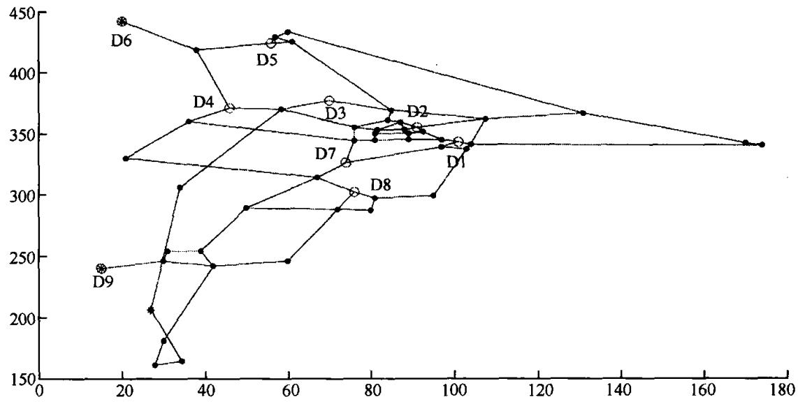

<details>
<summary>scatter</summary>

| Path | X | Y |
| --- | --- | --- |
| D6 | ~18 | ~445 |
| D5 | ~58 | ~430 |
| D4 | ~45 | ~375 |
| D3 | ~75 | ~380 |
| D2 | ~85 | ~370 |
| D7 | ~75 | ~330 |
| D1 | ~105 | ~340 |
| D8 | ~80 | ~300 |
| D9 | ~15 | ~240 |
| Unlabeled Point 1 | ~20 | ~330 |
| Unlabeled Point 2 | ~28 | ~210 |
| Unlabeled Point 3 | ~28 | ~165 |
| Unlabeled Point 4 | ~35 | ~310 |
| Unlabeled Point 5 | ~40 | ~255 |
| Unlabeled Point 6 | ~42 | ~245 |
| Unlabeled Point 7 | ~50 | ~290 |
| Unlabeled Point 8 | ~60 | ~250 |
| Unlabeled Point 9 | ~60 | ~430 |
| Unlabeled Point 10 | ~60 | ~425 |
| Unlabeled Point 11 | ~75 | ~315 |
| Unlabeled Point 12 | ~80 | ~290 |
| Unlabeled Point 13 | ~80 | ~300 |
| Unlabeled Point 14 | ~95 | ~300 |
| Unlabeled Point 15 | ~100 | ~340 |
| Unlabeled Point 16 | ~105 | ~340 |
| Unlabeled Point 17 | ~130 | ~370 |
| Unlabeled Point 18 | ~175 | ~340 |
| Unlabeled Point 19 | ~175 | ~340 |
</details>

图 3 D 区的交通网络与交巡警服务平台设置示意图

D 区的路口节点数为 52, 其中设立交巡警服务平台的数目是 9, 按照问题一中确定增加平台的数目和位置的方法, 仍旧设定当满足覆盖率达到 100% 时, 各平台工作总量的方差较小时所增加的平台数量为其最优解。

考虑到增加平台时有两种情况。

（1）仍采用问题一的方法，在其路口节点处设置平台，主要是把一些没有覆盖的节点进行覆盖。  
(2) 由于 D 区的面积较大,但节点数又较少,因此就有可能造成两个节点之间的路程远大于 3km,针对这种情况,在这样的道路上,通过设置虚拟节点,进而设置平台。

用逐步增加平台的方法,设计“试探循环过程”,综合考虑设置平台的效能、代价和警力资源分配等各方面因素,最终确定需要增加的平台个数为8个,其中节点处有6个,虚拟节点处有2个,所对应的位置见表15。

表 15 增加平台的各点标号及位置坐标

<table><tr><td>节点类型</td><td>增加的节点标号</td><td>增加的节点坐标</td></tr><tr><td rowspan="6">真实节点</td><td>331</td><td>(30,181)</td></tr><tr><td>344</td><td>(21,330)</td></tr><tr><td>352</td><td>(81,344.5)</td></tr><tr><td>362</td><td>(34,306)</td></tr><tr><td>369</td><td>(131,366.5)</td></tr><tr><td>371</td><td>(174,340)</td></tr><tr><td rowspan="2">虚拟节点</td><td>324——369</td><td>(93.5,395)</td></tr><tr><td>349——371</td><td>(139,340.5)</td></tr></table>

## 6.3 最佳围堵方案的确定

## 6.3.1 模型的建立

根据题意,若在该市地点 P(A 区第 32 个节点)处发生案件,由于案发 3min 后才接到报警,因此在这 3min 内,嫌疑犯驾车逃跑的路线存在多种可能,即沿着每条线路都有可能走到,因此要考虑所有的可能情况,针对每种不同的情况采用不同的围堵方案,得到与之相对应的围堵时间。基于这一实际问题的考虑,本题采用图论中的先深搜索原理进行解决。

以 P 点, 即 32 号节点为顶点, 利用图的先深搜索沿着图中的边访问图的每个顶点恰一次, 实现对图顶点的拓扑排序。首先根据嫌疑犯逃跑的速度, 计算出他在 3min 以后位于拓扑图中的什么位置, 依据图的有向性路径推测嫌疑人的行驶方向, 调集最近的交巡警服务平台进行围堵, 求出所用的最短围堵时间。

## 6.3.2 模型的求解

假设犯罪嫌疑人的行驶速度为 80km/h, 并且在报警的同时知晓犯罪嫌疑人的位置, 警车也开始出发去围堵嫌疑人。基于图的先深搜索原理, 运用 Matlab 编程, 求解可得在不同路口处完成围堵所用的时间和最终围堵它的属于哪个区的交巡警服务平台, 结果见表 16。

表 16 不同路口成功围堵所用时间

<table><tr><td>成功围堵的路口标号</td><td>成功围堵的交巡警平台</td><td>Δt/min</td><td>成功围堵的路口标号</td><td>成功围堵的交巡警平台</td><td>Δt/min</td></tr><tr><td>3</td><td>A3</td><td>0</td><td>229</td><td>C170</td><td>3.644</td></tr><tr><td>10</td><td>A10</td><td>0</td><td>241</td><td>C171</td><td>2.785</td></tr><tr><td>14</td><td>A14</td><td>0</td><td>248</td><td>C167</td><td>3.689</td></tr><tr><td>15</td><td>A15</td><td>0</td><td>250</td><td>C182</td><td>8.848</td></tr><tr><td>40</td><td>A2</td><td>1.917</td><td>254</td><td>C169</td><td>2.237</td></tr><tr><td>41</td><td>A17</td><td>0.863</td><td>349</td><td>D321</td><td>2.039</td></tr><tr><td>60</td><td>A4</td><td>1.470</td><td>370</td><td>D320</td><td>7.845</td></tr><tr><td>62</td><td>C168</td><td>3.371</td><td>488</td><td>F482</td><td>2.550</td></tr><tr><td>64</td><td>A1</td><td>2.628</td><td>549</td><td>F481</td><td>1.836</td></tr><tr><td>168</td><td>C175</td><td>5.010</td><td>558</td><td>F475</td><td>2.080</td></tr><tr><td>171</td><td>C172</td><td>2.083</td><td>562</td><td>F480</td><td>1.942</td></tr><tr><td>173</td><td>C173</td><td>0</td><td colspan="3"></td></tr></table>

对表 16 的结果进行分析, 发现最优方案围堵嫌疑犯所用的最长时间为 8.848min, 且此时嫌疑犯已经逃到了 C 区。并且从整体上看, 在城区内, 基本是由各自交巡警平台完成围堵的, 但在路口 62 处, 由 C168 跨区完成了围堵。

# 7 模型的优缺点分析及改进方向

## 7.1 模型的优点

（1）本文采用图论中的 Floyd 最短路径算法建立数学模型，通过设计求出无向加权图中每一对顶点之间的最短路径算法，求出两点之间的最短路径，然后对无向图进行遍历操作，求得任意两点之间的距离。  
(2) 在求解快速封锁 A 区的问题时, 运用运筹学原理, 把合理的调度警力封锁路口看成是标准的指派问题, 建立“最优调度模型”, 并运用 Hungry 算法对模型进行求解, 最终确定快速封锁 A 区的综合最优调度方案。  
(3) 问题二通过建立“工作效能综合评价指标模型”，选取了三个显著影响工作效能的指标因子：平台覆盖率因子、平台负荷能力因子、工作量均衡因子。通过对该市各个城区的交巡警服务平台设置的合理性进行评价，经验证，具有实用价值。

## 7.2 模型的缺点

（1）在分配管辖范围时，有的节点可能同时满足好几个平台的覆盖范围，本文以最短路径要求把这样的特殊点划分到距离最近的那个平台，这样造成了部分平台负担较轻，另一部分又相对过重。  
(2) 建立的“工作效能综合评价指标模型”具有一定的主观性,在对平台设置合理性进行评价时不是很理想。  
(3) 实际中, 接警通信、处理案件的时间, 道路转弯路程等这些因素都会延长交巡警到达案件发生地点的时间。

## 7.3 模型的改进方向

（1）本文在计算覆盖率的时候，仅仅是局限于一个城区内部，实际中，在各城区交界处的交巡警平台有可能会跨区处理案件，因此下一步模型的改进应朝着这一方面进展。  
(2) 在快速封锁 A 城区的问题中, 若重大突发事件发生在 A 城区与其它城区的交界处, 那么即使你封锁路口的时间再短, 也有可能肇事者已经逃窜到 B 区。因此要针对不同情况 (如发生事故的位置、种类、性质) 分析制定多种预案, 从而对 A 区实行动态的高校封锁。

## 参考文献

[1] 袁新生, 邵大宏, 郁时炼. LINGO 和 Excel 在数学建模中的应用 [M]. 北京: 科学出版社, 2007.  
[2] 严蔚敏, 吴伟民. 数据结构 (C 语言版) [M]. 北京: 清华大学出版社, 2009.  
[3] 姜启源. 数学模型 [M]. 北京: 高等教育出版社, 1993.  
[4] 柴登峰, 张登荣. 前 $N$ 条最短路径问题的算法及应用 [J]. 浙江大学学报 (工学版), 2002, 36(5): 531-534.

[5] 孔玉寿, 钱建明, 臧增亮. 统计天气预报原理与方法 [M]. 北京: 气象出版社, 2010.

## 【论文点评】

郑琴

该题需要解决两大问题:①针对具体事件,给出合理的警力调度方案;②交巡警服务平台警力资源的合理设置。第一问细化为3个小问题,第二问细化为2个小问题,因此,这道竞赛题的问题十分明确。

对问题一的分配管辖范围,该文首先将城区的路网抽象为无向加权图;运用图论中的Floyd算法建立“最短路径模型”,得到最短路径矩阵;并在3min时间约束条件的限制下,按照就近原则给出了平台管理范围的最优分配方案。

对问题一的道路快速封锁问题,三位同学基于运筹学原理,把合理的调度警力封锁路口转化成标准的指派问题,建立了“最优调度模型”,通过“Hungry 算法”获得指派问题的最优解。

对问题一第三小问:优化交巡警服务平台,在综合考虑了各交巡警平台的工作量和出警时间的基础上,基于上问中的“最优调度模型”并依据就近原则,获得快速封锁A区的合理调度方案。

问题二的第一小问是要求分析所给城市现有交巡警服务平台设置方案合理性,并就明显不合理处,给出解决方案。三位同学首先确定衡量合理性的一个综合评价指标,即工作效能,并找出与该指标正相关的三个效能因子:平台覆盖率因子、平台负荷能力因子、工作量均衡因子。解决问题的思路有效可行,且有一定的创新。

问题二的第二小问,即最佳围堵方案的设置,他们采用了图论中先深搜索原理,对图进行拓扑排序实现有向遍历;通过比较各个平台所需最短时间的最大值,给出了最优围堵方案。

总体来说,该文对二个问题的解答是完整的,采用的方法和手段是正确的。不足之处在于求解问题一的分配管辖范围时,仅单一地考虑时间问题,没有综合考虑到警力的合理分配。

附录 全国大学生数学建模竞赛历年赛题

<table><tr><td>年度</td><td>赛题</td><td>出题人</td></tr><tr><td rowspan="2">1992</td><td>(A)施肥效果分析问题</td><td>北京理工大学:叶其孝</td></tr><tr><td>(B)实验数据分解问题</td><td>华东理工大学:俞文此,复旦大学:谭永基</td></tr><tr><td rowspan="2">1993</td><td>(A)非线性交调的频率设计问题</td><td>北京大学:谢衷洁</td></tr><tr><td>(B)足球排名次问题</td><td>清华大学:蔡大用</td></tr><tr><td rowspan="2">1994</td><td>(A)逢山开路问题</td><td>西安电子科技大学:何大可</td></tr><tr><td>(B)锁具装箱问题</td><td>复旦大学:谭永基,华东理工大学:俞文此</td></tr><tr><td rowspan="2">1995</td><td>(A)飞行管理问题</td><td>复旦大学:谭永基,华东理工大学:俞文此</td></tr><tr><td>(B)天车与冶炼炉的作业调度问题</td><td>浙江大学:刘祥官,李吉鸾</td></tr><tr><td rowspan="2">1996</td><td>(A)最优捕鱼策略问题</td><td>北京师范大学:刘来福</td></tr><tr><td>(B)节水洗衣机问题</td><td>重庆大学:付鹂</td></tr><tr><td rowspan="2">1997</td><td>(A)零件参数设计问题</td><td>清华大学:姜启源</td></tr><tr><td>(B)截断切割问题</td><td>复旦大学:谭永基,华东理工大学:俞文此</td></tr><tr><td rowspan="2">1998</td><td>(A)投资的收益和风险问题</td><td>浙江大学:陈淑平</td></tr><tr><td>(B)灾情巡视路线问题</td><td>上海海运学院:丁颂康</td></tr><tr><td rowspan="4">1999</td><td>(A)自动化车床管理问题</td><td>北京大学:孙山泽</td></tr><tr><td>(B)钻井布局问题</td><td>郑州大学:林诒勋</td></tr><tr><td>(C)煤矸石堆积问题</td><td>太原理工大学:贾晓峰</td></tr><tr><td>(D)钻井布局问题</td><td>郑州大学:林诒勋</td></tr><tr><td rowspan="4">2000</td><td>(A)DNA序列分类问题</td><td>北京工业大学:孟大志</td></tr><tr><td>(B)钢管订购和运输问题</td><td>武汉大学:费甫生</td></tr><tr><td>(C)飞越北极问题</td><td>复旦大学:谭永基</td></tr><tr><td>(D)空洞探测问题</td><td>东北电力学院:关信</td></tr><tr><td rowspan="4">2001</td><td>(A)血管的三维重建问题</td><td>浙江大学:汪国昭</td></tr><tr><td>(B)公交车调度问题</td><td>清华大学:谭泽光</td></tr><tr><td>(C)基金使用计划问题</td><td>东南大学:陈恩水</td></tr><tr><td>(D)公交车调度问题</td><td>清华大学:谭泽光</td></tr><tr><td rowspan="4">2002</td><td>(A)车灯线光源的优化设计问题</td><td>复旦大学:谭永基,华东理工大学:俞文此</td></tr><tr><td>(B)彩票中的数学问题</td><td>解放军信息工程大学:韩中庚</td></tr><tr><td>(C)车灯线光源的优化设计问题</td><td>复旦大学:谭永基,华东理工大学:俞文此</td></tr><tr><td>(D)赛程安排问题</td><td>清华大学:姜启源</td></tr><tr><td rowspan="4">2003</td><td>(A)SARS的传播问题</td><td>全国组委会</td></tr><tr><td>(B)露天矿生产的车辆安排问题</td><td>吉林大学:方沛辰</td></tr><tr><td>(C)SARS的传播问题</td><td>全国组委会</td></tr><tr><td>(D)抢渡长江问题</td><td>华中农业大学:殷建肃</td></tr><tr><td rowspan="4">2004</td><td>(A)奥运会临时超市网点设计问题</td><td>北京工业大学:孟大志</td></tr><tr><td>(B)电力市场的输电阻塞管理问题</td><td>浙江大学:刘康生</td></tr><tr><td>(C)酒后开车问题</td><td>清华大学:姜启源</td></tr><tr><td>(D)招聘公务员问题</td><td>解放军信息工程大学:韩中庚</td></tr><tr><td rowspan="4">2005</td><td>(A)长江水质的评价和预测问题</td><td>解放军信息工程大学:韩中庚</td></tr><tr><td>(B)DVD在线租赁问题</td><td>清华大学:谢金星等</td></tr><tr><td>(C)雨量预报方法的评价问题</td><td>复旦大学:谭永基</td></tr><tr><td>(D)DVD在线租赁问题</td><td>清华大学:谢金星等</td></tr><tr><td rowspan="4">2006</td><td>(A)出版社的资源配置问题</td><td>北京工业大学:孟大志</td></tr><tr><td>(B)艾滋病疗法的评价及疗效的预测问题</td><td>天津大学:边馥萍</td></tr><tr><td>(C)易拉罐的优化设计问题</td><td>北京理工大学:叶其孝</td></tr><tr><td>(D)煤矿瓦斯和煤尘的监测与控制问题</td><td>解放军信息工程大学:韩中庚</td></tr><tr><td rowspan="4">2007</td><td>(A)中国人口增长预测问题</td><td>清华大学:唐云</td></tr><tr><td>(B)乘公交,看奥运问题</td><td>吉林大学:方沛辰,国防科技大学:吴孟达</td></tr><tr><td>(C)手机“套餐”优惠几何问题</td><td>解放军信息工程大学:韩中庚</td></tr><tr><td>(D)体能测试时间安排问题</td><td>全国组委会</td></tr><tr><td rowspan="4">2008</td><td>(A)数码相机定位问题</td><td>复旦大学:谭永基</td></tr><tr><td>(B)高等教育学费标准探讨问题</td><td>北京理工大学:叶其孝</td></tr><tr><td>(C)地面搜索问题</td><td>西北工业大学:肖华勇</td></tr><tr><td>(D)NBA赛程的分析与评价问题</td><td>清华大学:姜启源</td></tr><tr><td rowspan="4">2009</td><td>(A)制动器试验台的控制方法分析问题</td><td>吉林大学:方沛辰</td></tr><tr><td>(B)眼科病床的合理安排问题</td><td>国防科技大学:吴孟达</td></tr><tr><td>(C)卫星和飞船的跟踪测控问题</td><td>西安交通大学:周义仓</td></tr><tr><td>(D)会议筹备问题</td><td>福州大学:王宏健</td></tr><tr><td rowspan="4">2010</td><td>(A)储油罐的变位识别与罐容表标定</td><td>解放军信息工程大学:韩中庚</td></tr><tr><td>(B)2010年上海世博会影响力的定量评估问题</td><td>IBM公司:王利平</td></tr><tr><td>(C)输油管的布置问题</td><td>上海海事大学:丁颂康</td></tr><tr><td>(D)对学生宿舍设计方案的评价问题</td><td>贵州大学:陈叔平</td></tr><tr><td rowspan="4">2011</td><td>(A)城市表层土壤重金属污染分析问题</td><td>山东理工大学:李功胜</td></tr><tr><td>(B)交巡警服务平台的设置与调度问题</td><td>解放军信息工程大学:韩中庚后勤工程学院:但琦</td></tr><tr><td>(C)企业退休职工养老金制度的改革问题</td><td>济南大学:许振宇</td></tr><tr><td>(D)天然肠衣搭配问题</td><td>复旦大学:陆立强</td></tr><tr><td colspan="3">注:C、D题是大专组赛题</td></tr></table>

Document generated by Anna's Archive around 2023-2024 as part of the DuXiu collection (https://annas-blog.org/duxiu-exclusive.html).

Images have been losslessly embedded. Information about the original file can be found in PDF attachments. Some stats (more in the PDF attachments):

```json
{
"filename": "XzEzMDExMzI1LnppcA==",
"filename_decoded": "_13011325.zip",
"filesize": 24637113,
"md5": "167fb0331732a0d9c4f5bac956c8d05e",
"header_md5": "313c5a33952a8190486f5112e896401b",
"sha1": "40e1c8d6c9b2db739c47e6beb6e6305d8e51235e",
"sha256": "554b45b45fc5b1ff06c32e686ff6b11976fa524b851c2c2b1bc07666cc09cc18",
"crc32": 1607182315,
"zip_password": "",
"uncompressed_size": 25361277,
"pdg_dir_name": "_13011325",
"pdg_main_pages_found": 269,
"pdg_main_pages_max": 269,
"total_pages": 277,
"total_pixels": 1756189120,
"pdf_generation_missing_pages": false
}
```