# 全国大学生数学建模竞赛 优秀论文汇编

(1992—2000)

全国大学生数学建模竞赛组委会编

# 全国大学生数学建模竞赛

# 优秀论文汇编

(1992—2000)

全国大学生数学建模竞赛组委会编

## 图书在版编目(CIP)数据

全国大学生数学建模竞赛优秀论文汇编:1992\~2000/全国大学生数学建模竞赛组委会编.—北京:中国物价出版社,2002.3

ISBN 7-80155-391-8

I. 全... II. 全... III. 数学模型—建立模型—高等学校—文集
IV. 022-53

中国版本图书馆 CIP 数据核字(2002)第 011510 号

出版发行/中国物价出版社(邮政编码:100837

地址:北京市西城区月坛北小街2号院3号楼

电话:读者服务部 68022950 发行部 68033577)

经销/新华书店

印刷/北京市兴怀印刷厂

开本/787×1092 毫米 16 开

版本/2002年3月第1版

印张/38.5

印次/2002年3月第1次印刷

字数/800 000 千字

印数/4500册

书号/ISBN 7-80155-391-8/G·16

定价/43.00元

## 前言

1987年我国数学教育界的老师获悉1985年美国出现了一个名为Mathematical Competition in Modeling(1988年改名为Mathematical Contest in Modeling, 缩写为MCM)的大学生数学建模竞赛, 经过初步了解认为这种竞赛形式对于培养学生、促进数学建模的教学以及推动大学数学教育改革都是有益的, 应该鼓励大学生参加这样的通讯竞赛。1989年我国大学生开始参加美国大学生数学建模竞赛, 参赛同学的反映很好。1990年10月中国工业与应用数学学会(CSIAM)成立, CSIAM下属的数学模型专业委员会开始考虑创办我国自己的大学生数学建模竞赛。1990年10月上海市工业与应用数学学会举办了“上海市大学生（数学类）数学模型竞赛”, 1991年6月又举办了“上海市大学生（非数学类）数学模型竞赛”。1992年4月陕西省数学教育界举办了“西安市第一届大学生数学模型竞赛”。这些地方性的竞赛为举办全国的竞赛创造了条件。1992年11月27日到29日由CSIAM数学模型专业委员会组织举办了“1992年全国大学生数学模型联赛”, 10个城市79所院校的314个队参加, 从此我国有了自己的大学生数学建模竞赛(China Undergraduate Mathematical Contest in Modeling, 缩写为CUMCM)。1992年和1993年的竞赛不仅受到参赛同学和指导教师的欢迎, 而且引起教育行政领导部门的重视。1993年12月教育部(前国家教委)高教司正式发文, 要求在全国普通高等工业学校中陆续开展电子设计、数学建模、机械设计和结构设计竞赛, 并且于1994年3月成立了由教育部高教司和CSIAM成员共同组成的第一届全国大学生数学建模竞赛组委会, 于是从1994年开始, CUMCM成为教育部高教司和中国工业与应用数学学会共同主办、每年一届的、面向全国高等院校学生的一项课外科技竞赛活动。

在教育部的领导和指导下,全国组委会按照“扩大受益面、保证公正性、推动教育改革”方针努力工作,广大参赛学生以发扬创新意识、团队精神、重在参与、公平竞争的宗旨参加竞赛。在各级教育行政领导部门、各赛区组委会、广大教师和学生的组织、指导、和参与下,10年来CUMCM的规模每年平均以20%以上的速度健康发展,到2001年有27省市529所院校的3861队参赛,成为目前全国高校中规模最大的课外科技活动。

通过竞赛不仅培养了一大批既富有创新意识和具体实现能力,又具有合作观念和拼搏精神的优秀学生,还造就了一批既有坚实理论基础和用数学建模方法及计算机技术解决实际问题的能力,又任劳任怨、不计名利、热爱学生、献身祖国教育事业的优秀教师,这项竞赛对于我国大学数学教育改革也起着很大的推动作用。

数学建模竞赛的出现和发展是有深刻背景的。近几十年来，数学科学迅速向自然科学、工程、经济、管理和社会科学等各个领域渗透，在许多方面发挥着越来越重要的作用，在不少情况下起着举足轻重、甚至是决定性的影响；数学建模和与之相伴的计算正在成为工程设计中的关键工具，数学科学与计算机技术结合，形成了一种普遍的、可以实现的关键技术——数学技术，并已经成为当代高新技术的一个重要组成部分。“高技术本质上是一种数学技术”已为越来越多的人们所认同。而要用数学方法解决各类问题或实施数学技术，首先要求将所考虑的问题数学化，即建立数学模型，这就使数学建模日益显示其关键作用，成为现代应用数学的一个重要领域。因此，为培养高质量、高层次人才，就不能不重视数学建模这一必备的技能和素质的培养，对理工、经济、管理、农林、医学等学科，甚至一些人文、社会学科的的学生都应该提出这方面的要求。正是在这样的大背景下大学生数学建模竞赛就应运而生了。

数学建模竞赛不是纸上谈兵,它的赛题是从实际问题中提炼出来的。解决这些问题,从建立数学模型开始,到选择求解途径、方法以及分析计算结果,往往没有现成的方法可以套用。参赛同学必须像参加一个实际的科研项目那样,不仅要发挥个人主观能动性和创造力,而且要全队密切配合、协同作战,才能尽善尽美地作出解答。这可以使同学们亲身体验一下用数学方法去解决实际问题的创造和发现过程,培养他们的创新意识和能力,取得在课堂里和书本上难以得到的宝贵经验,同时也有助于培养他们的团队意识和协作精神。

参加竞赛的同学们的成果充分体现在他们递交给组委会以供评阅的论文中，全国组委会为了让更多的大学生、教师以及关心这项竞赛的人们了解这些成果，给准备参加竞赛的同学以适当引导，每年都根据全国评阅专家组的意见选编、发表部分优秀论文。为庆祝我国大学生数学建模竞赛十周年，全国组委会决定把历年来发表的这些优秀论文汇编成本书，供广大师生及关心这项竞赛的人们参考。这里我们仅作以下说明：

从 1992 年到 2000 年每年按 A 题, B 题的顺序编排, 1999 年开始设大专组的竞赛, 赛题为 C 题和 D 题;

每道赛题按题目、同学们的论文、命题人和评阅人的文章的顺序编排；

1992年、1993年全国没有统一评阅，所以1992年只有赛题，而1993年只有两篇获北京赛区特等奖的论文和两篇命题人的文章(发表在《数学的实践与认识》1994年第2期上)，从1994年开始全国统一评阅，1994年的优秀论文是全国组委会印刷出版的，1995年到2000年的优秀论文均发表在《数学的实践与认识》次年第1期上；

为保持文章原貌,这次汇编只作了符号和文字上的订正,未对已发表的论文进行大的改动,由于同学们的论文是在三天时间内完成的,不可避免地存在着相当多的缺点甚至错误,请读者谅解。

全国大学生数学建模竞赛组委会

2002年2月

## 目录

1. 施肥效果分析(CUMCM 1992 年 A 题) …… (1)  
2. 实验数据分解(CUMCM 1992 年 B 题) …… (2)  
3. 非线性交调的频率设计(CUMCM 1993 年 A 题) …… (3)  
4. 足球队排名次(CUMCM 1993 年 B 题)……(17)  
5. 逢山开路(CUMCM 1994 年 A 题)……(28)  
6. 锁具装箱(CUMCM 1994 年 B 题)……(57)  
7. 一个飞行管理问题(CUMCM 1995 年 A 题) …… (84)  
8. 天车与冶炼炉的作业调度(CUMCM 1995 年 B 题) …… (112)  
9. 最优捕鱼策略(CUMCM 1996 年 A 题) …… (145)  
10. 节水洗衣机(CUMCM 1996 年 B 题) …… (190)  
11. 零件的参数设计(CUMCM 1997 年 A 题) …… (220)  
12. 截断切割(CUMCM 1997 年 B 题) …… (276)  
13. 投资的收益和风险(CUMCM 1998 年 A 题) …… (327)  
14. 灾情巡视路线(CUMCM 1998 年 B 题) …… (369)  
15. 自动化车床管理(CUMCM 1999 年 A 题) …… (410)  
16. 钻井布局(CUMCM 1999 年 B 题) …… (441)  
17. 煤研石堆积(CUMCM 1999 年 C 题) …… (477)  
18. 钻井布局(CUMCM 1999 年 D 题) …… (494)  
19. DNA 序列分类(CUMCM 2000 年 A 题)……(495)  
20. 钢管订购和运输(CUMCM 2000 年 B 题) …… (538)  
21. 飞越北极(CUMCM 2000 年 C 题) …… (574)  
22. 空洞探测(CUMCM 2000 年 D 题) …… (595)

## 1. 施肥效果分析(CUMCM 1992 年 A 题)

某地区作物生长所需的营养素主要是氮(N)、钾(K)、磷(P)。某作物研究所在该地区对土豆与生菜做了一定数量的实验,实验数据如下列表格所示,其中ha表示公顷,t表示吨,kg表示公斤。当一个营养素的施肥量变化时,总将另两个营养素的施肥量保持在第七个水平上,如对土豆产量关于N的施肥量做实验时,P与K的施肥量分别取为196 kg/ha与372 kg/ha。

试分析施肥量与产量之间关系，并对所得结果从应用价值与如何改进等方面作出估价。

土豆： N

<table><tr><td>施肥量(kg/ha)</td><td>产量(t/ha)</td></tr><tr><td>0</td><td>15.18</td></tr><tr><td>34</td><td>21.36</td></tr><tr><td>67</td><td>25.72</td></tr><tr><td>101</td><td>32.29</td></tr><tr><td>135</td><td>34.03</td></tr><tr><td>202</td><td>39.45</td></tr><tr><td>259</td><td>43.15</td></tr><tr><td>336</td><td>43.46</td></tr><tr><td>404</td><td>40.83</td></tr><tr><td>471</td><td>30.75</td></tr></table>

P

<table><tr><td>施肥量(kg/ha)</td><td>产量(t/ha)</td></tr><tr><td>0</td><td>33.46</td></tr><tr><td>24</td><td>32.47</td></tr><tr><td>49</td><td>36.06</td></tr><tr><td>73</td><td>37.96</td></tr><tr><td>98</td><td>41.04</td></tr><tr><td>147</td><td>40.09</td></tr><tr><td>196</td><td>41.26</td></tr><tr><td>245</td><td>42.17</td></tr><tr><td>294</td><td>40.36</td></tr><tr><td>342</td><td>42.73</td></tr></table>

K

<table><tr><td>施肥量(kg/ha)</td><td>产量(t/ha)</td></tr><tr><td>0</td><td>18.98</td></tr><tr><td>47</td><td>27.35</td></tr><tr><td>93</td><td>34.86</td></tr><tr><td>140</td><td>38.52</td></tr><tr><td>186</td><td>38.44</td></tr><tr><td>279</td><td>37.73</td></tr><tr><td>372</td><td>38.43</td></tr><tr><td>465</td><td>43.87</td></tr><tr><td>558</td><td>42.77</td></tr><tr><td>651</td><td>46.22</td></tr></table>

生菜： N

<table><tr><td>施肥量(kg/ha)</td><td>产量(t/ha)</td></tr><tr><td>0</td><td>11.02</td></tr><tr><td>28</td><td>12.70</td></tr><tr><td>56</td><td>14.56</td></tr><tr><td>84</td><td>16.27</td></tr><tr><td>112</td><td>17.75</td></tr><tr><td>168</td><td>22.59</td></tr><tr><td>224</td><td>21.63</td></tr><tr><td>280</td><td>19.34</td></tr><tr><td>336</td><td>16.12</td></tr><tr><td>392</td><td>14.11</td></tr></table>

P

<table><tr><td>施肥量(kg/ha)</td><td>产量(t/ha)</td></tr><tr><td>0</td><td>6.39</td></tr><tr><td>49</td><td>9.48</td></tr><tr><td>98</td><td>12.46</td></tr><tr><td>147</td><td>14.38</td></tr><tr><td>196</td><td>17.10</td></tr><tr><td>294</td><td>21.94</td></tr><tr><td>391</td><td>22.64</td></tr><tr><td>489</td><td>21.34</td></tr><tr><td>587</td><td>22.07</td></tr><tr><td>685</td><td>24.53</td></tr></table>

K

<table><tr><td>施肥量(kg/ha)</td><td>产量(t/ha)</td></tr><tr><td>0</td><td>15.75</td></tr><tr><td>47</td><td>16.76</td></tr><tr><td>93</td><td>16.89</td></tr><tr><td>140</td><td>16.24</td></tr><tr><td>186</td><td>17.56</td></tr><tr><td>279</td><td>19.20</td></tr><tr><td>372</td><td>17.97</td></tr><tr><td>465</td><td>15.84</td></tr><tr><td>558</td><td>20.11</td></tr><tr><td>651</td><td>19.40</td></tr></table>

(叶其孝提供)

## 2. 实验数据分解(CUMCM 1992 年 B 题)

组成生命蛋白质的若干种氨基酸可以形成不同的组合。通过质谱实验测定分子量来分析某个生命蛋白质分子的组成时，遇到的首要问题就是如何将它的分子量 X 分解为几个氨基酸的已知分子量 $a[i](i=1,2,\cdots,n)$ 之和。某实验室所研究的问题中：

$$
n = 1 8 _ {\circ}
$$

$$
\begin{array}{r l} a [ 1: 1 8 ] & = 5 7, 7 1, 8 7, 9 7, 9 9, 1 0 1, 1 0 3, 1 1 3, 1 1 4, 1 1 5, 1 2 8, 1 2 9, 1 3 1, 1 3 7, 1 4 7, 1 5 6, \\ & 1 6 3, 1 8 6. \end{array}
$$

X 为正整数 $\leqslant$ 1000。

要求针对该实验室拥有或不拥有微型计算机的情况,对上述问题提出你们的解答,并就你所研讨的数学模型与方法在一般情形下进行讨论。

(俞文鯖 谭永基提供)

一切科学和工程技术人员的教育必须包括数学和计算科学的更多的内容。数学建模和与之相伴的计算正在成为工程设计中的关键工具。科学家正日益依赖于计算方法，而且在选择正确的数学和计算方法以及解释结果的精度和可靠性方面必须具有足够的经验。对工程师和数学家的数学教育需要变革以反映这一新的现实。（原文：The education of technical personnel of all branches of science and engineering must include increased exposure to the mathematical and computational sciences. Mathematical modeling and associated computations are being critical tools in the engineering design process. Scientists rely increasingly on computational methods and must have sufficient experience in mathematical/computational methods and reliability of the results. The mathematical education of engineers and scientists needs to change to reflect this new reality.）

A. Friedman, J. Glimm, J. Lavery, The mathematical and computational sciences in emerging manufacturing technologies and management practices - SIAM Report on Issues in the Mathematical Sciences - SIAM, 1992, pp. 62-62.

## 3. 非线性交调的频率设计(CUMCM 1993 年 A 题)

如果一非线性器件的输入 $u(t)$ 与输出 $y(t)$ 的关系是 $y(t) = u(t) + u^2(t)$ （其中 $t$ 是时间），那么当输入是包含频率 $f_{1}, f_{2}$ 的信号 $u(t) = \cos 2\pi f_{1}t + \cos 2\pi f_{2}t$ 时，输出 $y(t)$ 中将不仅包含输入信号 $f_{1}, f_{2}$ ，而且还会出现 $2f_{1}, f_{1} \pm f_{2}$ 等新的频率成分，这些新的频率称为交调。如果交调出现在原有频率 $f_{1}, f_{2}$ 的附近，就会形成噪声干扰，因此工程设计中对交调的出现有一定的要求。

现有一SCS(非线性)系统,其输入输出关系由如下一组数据给出:

<table><tr><td>输入u</td><td>0</td><td>5</td><td>10</td><td>20</td><td>30</td><td>40</td><td>50</td><td>60</td><td>80</td></tr><tr><td>输出y</td><td>0</td><td>2.25</td><td>6.80</td><td>20.15</td><td>35.70</td><td>56.40</td><td>75.10</td><td>87.85</td><td>98.50</td></tr></table>

输入信号为 $u(t) = A_{1}\cos 2\pi f_{1}t + A_{2}\cos 2\pi f_{2}t + A_{3}\cos 2\pi f_{3}t$ ，其中 $A_{1} = 25, A_{2} = 10, A_{3} = 45$ 是输入信号的振幅.对输入信号频率 $f_{1}, f_{2}, f_{3}$ 的设计要求为：

1) $36 \leqslant f_{1} \leqslant 40, 41 \leqslant f_{2} \leqslant 50, 46 \leqslant f_{3} \leqslant 55$ .  
2) 输出中的交调均不得出现在 $f_{i} \pm 5$ 的范围内 ( $i = 1, 2, 3$ ), 此范围称为 $f_{i}$ 的接收带 (参看下图).  
3) 定义输出中的信噪比 $\mathrm{SNR} = 10\lg \frac{B_i^2}{C_n^2}$ （单位：分贝），其中 $B_{i}$ 是输出中对应于频率为 $f_{i}$ 的信号的振幅， $C_n$ 是某一频率为 $f_{n}$ 的交调的振幅。若 $f_{n}$ 出现在 $f_{n} = f_{i} \pm 6$ 处 $(i = 1,2,3)$ ，则对应的SNR应大于10分贝（参看下图）。

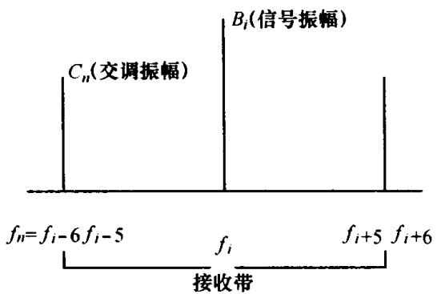

<details>
<summary>text_image</summary>

Cn(交调振幅)
Bj(信号振幅)
fn=fi-6fi-5
f_i
f_i+5 f_i+6
接收带
</details>

4) $f_{i}$ 不得出现在 $f_{j}$ 的接收带内 $(i,j = 1,2,3,i\neq j)$ .

5) 为简单起见, $f_{i}$ 只取整数值, 且交调只需考虑二阶类型 (即 $\{f_{i} \pm f_{j}\}, i, j = 1,2,3$ ) 和三阶类型 (即 $\{f_{i} \pm f_{j} \pm f_{k}\}, i, j, k = 1,2,3$ ).

试按上述要求设计输入信号频率 $f_{1}, f_{2}, f_{3}$ .

# 非线性交调的频率设计

檀晋轩 邢毅春 郝燕

(首都师范大学数学系, 北京 100037)

指导教师 王尚志 张饴慈 汤玉东

摘要 本文讨论了A题给出的一类非线性交调的频率设计问题.首先根据题中给出的数据用最小二乘法求出适合本题要求的输入输出函数,设计出一种简洁算法用计算机求出了适合要求的解,然后对解的稳定性进行了讨论.本文的最后一部分,对解的各种数学性质做了进一步讨论,证明了本文主要结果:给出了适合本题要求的解的充分必要条件(定理1).应用这一结果可以直接求出适合本题的频率约束的解.

## 一、问题的提出

## 1. 背景

在信号的输入输出工作过程中,人们往往遇到噪声干扰问题,干扰一方面来自系统的外部,另一方面可能来自非线性系统输出过程中产生的新频率,称之为交调,为直观起见我们看一个例子.

设有一非线性器件, 其输入 $u(t)$ 与输出 $y(t)$ 的关系是: $y(t) = u(t) + u^{2}(t)$ (t 为时间), 当输入是包含频率 $f_{1}, f_{2}$ 的信号 $u(t) = \cos 2\pi f_{1}t + \cos 2\pi f_{2}t$ 时, 输出信号

$$
\begin{array}{l} y (t) = 1 + \cos 2 \pi f _ {1} t + \cos 2 \pi f _ {2} t + \frac {1}{2} \cos 4 \pi f _ {1} t \\ + \frac {1}{2} \cos 4 \pi f _ {2} t + \cos 2 \pi (f _ {1} + f _ {2}) t + \cos 2 \pi (f _ {1} - f _ {2}) t. \\ \end{array}
$$

我们发现 $y(t)$ 中不仅包含 $f_{1}, f_{2}$ , 而且含有 $f_{i} \pm f_{j} (i, j = 1, 2)$ 等新频率, 即为交调, 若交调出现在 $f_{1}, f_{2}$ 附近时, 会对 $f_{1}, f_{2}$ 产生干扰. 为此, 在工程设计中要求对输入信号选择适当的频率配置, 防止交调对信号的干扰.

## 2. 问题

现在一 SCS(非线性) 系统, 其输入输出关系如下:

<table><tr><td>输入 u</td><td>0</td><td>5</td><td>10</td><td>20</td><td>30</td><td>40</td><td>50</td><td>60</td><td>80</td></tr><tr><td>输出 y</td><td>0</td><td>2.25</td><td>6.80</td><td>20.15</td><td>35.70</td><td>56.40</td><td>75.10</td><td>87.85</td><td>98.50</td></tr></table>

输入信号: $u(t) = A_{1}\cos2\pi f_{1}t + A_{2}\cos2\pi f_{2}t + A_{3}\cos2\pi f_{3}t$ .

其中 $A_{1}=25, A_{2}=10, A_{3}=45$ 是输入信号的振幅.

对输入信号的频率设计要求为

1）输入信号频率范围 $36 \leqslant f_{1} \leqslant 40$ ， $41 \leqslant f_{2} \leqslant 50$ ， $46 \leqslant f_{3} \leqslant 53$ .  
2) 输出中的交调均不得出现在 $f_{i} \pm 5$ 的范围内, $(i = 1,2,3)$ , 此范围称做 $f_{i}$ 的接收带, 若交调出现在 $f_{i} \pm 6$ 的范围之外, 其影响忽略不计.

3) $f_{i}$ 不能出现在 $f_{i}$ 的接收带内 $(i,j = 1,2,3,i\neq j)$ .

4) 定义信噪比 $SNR = 10 \lg \frac{B_{i}^{2}}{C_{n}^{2}}$ (单位: 分贝).

其中 $B_{i}$ 为输出中对应于 $f_{i}$ 的信号的振幅 $(i = 1,2,3)$ , $C_{n}$ 为某一频率为 $f_{n}$ 的交调的振幅.

当 $f_{n}$ 出现在 $f_{n} = f_{i} \pm 6 (i = 1,2,3)$ 处，它已不在 $f_{i}$ 的接收带内.由于距 $f_{i}$ 的接收带很近，此时要通过信噪比对 $f_{n}$ 进行讨论.当 $\mathrm{SNR} > 10$ 分贝时，我们认为 $f_{n}$ 对 $f_{i}$ 产生的干扰可忽略不计，否则 $f_{n}$ 仍对 $f_{i}$ 有干扰.

5) 在实际工作中, $f_{i}(i = 1,2,3)$ 的取值是一切可能的非负实数, 对于不同的输入, 输出关系也会有不同的交调类型. 为简化过程, 本问题只取 $f_{i}$ 的整数值, 且交调只考虑二阶类型 (即 $\{f_{i} \pm f_{j}\}, i, j = 1,2,3$ ) 和三阶类型 (即 $\{f_{i} \pm f_{j} \pm f_{k}\}, i, j, k = 1,2,3$ ). 现在我们的目的就是根据上述要求设计 $f_{1}, f_{2}, f_{3}$ 的取值.

## 二、问题的分析

首先要确定输入、输出函数,一般情况下总是先选取多项式函数来描述输入、输出关系的.我们基于以下两点确定多项式函数最高次数的.第一,从输入的形式 $u(t)$ 可以看出,交调是由于对 $u(t)$ 进行乘方运算而产生的, $u^k (t)$ 可能产生某些 $\leqslant k$ 阶类型的交调.而问题仅要求我们考虑二阶和三阶类型的交调,最高次数一定是 $\geqslant 3$ 的;第二,当我们选用 $\geqslant 4$ 次多项式函数进行拟合时, $\geqslant 4$ 次项的系数非常小,以致不会对结果产生影响,这一点可以从后面稳定性分析中确切地体现出来.故我们确定输入、输出函数关系为

$$
y (t) = b _ {0} + b _ {1} u (t) + b _ {2} u ^ {2} (t) + b _ {3} u ^ {3} (t).
$$

根据题中数据用最小二乘法便可以确定的系数.

## 三、模型假设

1. 我们认为系统外的干扰忽略不计.  
2. 对于 $u(t)$ 次数大于等于4时带来的交调影响忽略.  
3. 对于拟合出的多项式,对自变量为负的部分也是正确的.

## 四、模型的建立与问题的解

## 1. 输出函数系数的确定

根据前面分析,输出函数为以下形式

$$
y (t) = b _ {0} + b _ {1} u (t) + b _ {2} u ^ {2} (t) + b _ {3} u ^ {3} (t).
$$

从实际所给的数据,可以得出 $y(0)=0$ . 因此上式可化简为

$$
y (t) = b _ {1} u (t) + b _ {2} u ^ {2} (t) + b _ {3} u ^ {3} (t), \tag {1}
$$

为确定(1)式的系数,分别视 $u(t), u^{2}(t), u^{3}(t)$ 为三个变量, $X_{1}(t), X_{2}(t), X_{3}(t)$ ,用最小二乘估计对 $y(t)$ 进行三元回归.

令

$$
\varphi = \sum_ {i = 1} ^ {9} (y _ {i} - b _ {1} x _ {i _ {1}} - b _ {2} x _ {i _ {2}} - b _ {3} x _ {i _ {3}}) ^ {2} \tag {2}
$$

$\varphi$ 对 $b_{1}, b_{2}, b_{3}$ 分别求偏导，得到 $b_{1}, b_{2}, b_{3}$ 使(2)最小.

$$
\left\{ \begin{array}{l} \sum_ {i = 1} ^ {9} y _ {i} x _ {i _ {1}} - b _ {1} \sum_ {i = 1} ^ {9} x _ {i _ {1}} ^ {2} - b _ {2} \sum_ {i = 1} ^ {9} x _ {i _ {1}} x _ {i _ {2}} - b _ {3} \sum_ {i = 1} ^ {9} x _ {i _ {1}} x _ {i _ {3}} = 0, \\ \sum_ {i = 1} ^ {9} y _ {i} x _ {i _ {2}} - b _ {1} \sum_ {i = 1} ^ {9} x _ {i _ {1}} x _ {i _ {2}} - b _ {2} \sum_ {i = 1} ^ {9} x _ {i _ {2}} ^ {2} - b _ {3} \sum_ {i = 1} ^ {9} x _ {i _ {1}} x _ {i _ {3}} = 0, \\ \sum_ {i = 1} ^ {9} y _ {i} x _ {i _ {3}} - b _ {1} \sum_ {i = 1} ^ {9} x _ {i _ {1}} x _ {i _ {3}} - b _ {2} \sum_ {i = 1} ^ {9} x _ {i _ {2}} x _ {i _ {3}} - b _ {3} \sum_ {i = 1} ^ {9} x _ {i _ {3}} ^ {2} = 0. \end{array} \right. \tag {3}
$$

由所给数据解方程组(3)，得出系数 $b_{1}, b_{2}, b_{3}$

$$
\left\{ \begin{array}{l} b _ {1} = 0. 2 3 7 8 9 7, \\ b _ {2} = 0. 0 4 5 5 4 4 9, \\ b _ {3} = - 0. 0 0 0 4 1 4 4 5, \end{array} \right. \tag {4}
$$

故

$$
y (t) = 0. 2 3 7 8 9 7 u (t) + 0. 0 4 5 5 4 4 9 u ^ {2} (t) - 0. 0 0 0 4 1 4 4 5 u ^ {3} (t). \tag {5}
$$

(5) 式即为 $y(t)$ 的表达式. 同时, 我们又用 Mathematica 软件对题中数据进行函数拟合, 所得结果与上式精度十分接近, 可见 (5) 式是较精确的.

## 2. 交调频率

(5) 式确定了 $y(t)$ 与 $u(t)$ 的关系及有关的交调频率, 为此, 可以将 $u(t)$ 的具体表达式 $u(t) = \sum_{i=1}^{3} A_i \cos 2\pi f_i t$ 代入 (5). 在化简过程中, 出现了以下形式的频率和交调:

$$
f _ {i}, \quad i = 1, 2, 3; \quad f _ {i} \pm f _ {j}, i, j = 1, 2, 3; \quad f _ {i} \pm f _ {j} \pm f _ {k}, i, j, k = 1, 2, 3.
$$

由题目所给条件(1)可知 $f_{i} \pm f_{j}(i, j = 1,2,3), f_{i} + f_{j} - f_{k}(i, j, k = 1,2,3)$ 及 $f_{i} - f_{j} - f_{k}(i, j, k = 1,2,3, j \neq k)$ ，都远离可能对 $f_{i}$ 产生干扰的频带[30,61]，即它们对输入频率 $f_{i}(i = 1,2,3)$ 不会产生干扰，例如

$$
6 1 <   3 6 + 4 1 <   f _ {i} + f _ {j} <   f _ {i} + f _ {j} + f _ {k} \quad (i, j, k = 1, 2, 3),
$$

$$
f _ {i} - f _ {j} - f _ {k} \leqslant 5 5 - 3 6 - 3 6 <   3 0 (i, j, k = 1, 2, 3).
$$

因此讨论时,可不考虑含有这些形式的交调的项,而只对出现在[30,61]频带中的形如 $f_{i}+f_{j}-f_{k}(i,j,k=1,2,3)$ 的输入信号和交调项进行讨论,这些交调分别为

① $f_{1} + f_{2} - f_{3},$ ② $f_{1} + f_{3} - f_{2},$ ③ $f_{2} + f_{3} - f_{1},$

④ $2f_{1} - f_{2}$ ， ⑤ $2f_{1} - f_{3}$ ， ⑥ $2f_{2} - f_{1}$ ， (6)

⑦ $2f_{2} - f_{3}$ , ⑧ $2f_{3} - f_{1}$ , ⑨ $2f_{3} - f_{2}$ .

这样得到了 $y(t)$ 中有用的各项的振幅.

① 含有频率 $f_{i}$ 的振幅 $B_{i}(i = 1,2,3), B_{i} = b_{1}A_{i} + \frac{3}{2} b_{3}\sum A_{i}A_{j}^{2}$ .  
② 含有三阶交调 $f_{i} + f_{j} - f_{k}(i,j,k = 1,2,3,i,j,k$ 互不相等)形式的振幅，均为 $C = \frac{3}{2} b_{3}A_{1}A_{2}A_{3}$ .  
③ 含有三阶交调 $2f_{i} - f_{j}(i,j = 1,2,3,i\neq j)$ 形式项的振幅为： $\frac{3}{4} b_3A_i^2 A_j$

## 3. 算法

为了确定所求的解,我们用条件4)中的信噪比进行挑选.又由条件5), $f_{i}$ 只取整数,这样我们通过计算机得出其离散解.按以下三步进行:

① 对 $f_{1}, f_{2}, f_{3}$ 在互不影响的情况下进行穷举，讨论所有可能的整数值.

② 对交调进行判断, 即: 使满足条件 ① 的 $f_{i}, f_{j}, f_{k}$ 的形如(6)式中形式的交调 $f_{n}$ 不能进入任一个 $f_{i} (i = 1,2,3)$ 的接收带.

<table><tr><td></td><td> $f_{1}$ </td><td> $f_{2}$ </td><td> $f_{3}$ </td></tr><tr><td>1.</td><td>36</td><td>42</td><td>55</td></tr><tr><td>2.</td><td>36</td><td>49</td><td>55</td></tr><tr><td>3.</td><td>36</td><td>42</td><td>54</td></tr><tr><td>4.</td><td>36</td><td>48</td><td>54</td></tr><tr><td>5.</td><td>37</td><td>43</td><td>55</td></tr><tr><td>6.</td><td>37</td><td>49</td><td>55</td></tr></table>

③ 运用第一节中条件 4), 即对满足以上条件且 $f_{n} = f_{i} \pm 6$ 的交调, 用信噪比条件进行筛选.

于是得到如上表6组结果满足条件 ①②, 经过条件4) 的筛选后, 只有两组解为最终结果, 即: ①36,42,55 ②36,49,55. 由结果看出, $f_{1}, f_{3}$ 均取其边界值, 而 $f_{2}$ 的取值为分别距 $f_{1}, f_{3}$ 为可能取到的最小距离.

## 五、稳定性分析

## 1. 函数系数的稳定性分析

这里我们讨论所拟合的多项式系数的波动对解的影响, 共有 6 组结果满足(6)形式的交调, 其中 4 组不合乎信噪比的要求, 2 组是满足的. 即我们要确定各系数的变化范围, 使解仍是解, 非解仍是非解. 经过计算得到以下 3 组不等式组:

$$
\begin{array}{l} \left\{ \begin{array}{l} 4 \left(b _ {1} + \frac {3}{2} e b _ {3}\right) ^ {2} - 9 0 b _ {3} ^ {2} A _ {1} ^ {2} A _ {2} ^ {2} > 0, \\ 4 \left(b _ {1} + \frac {3}{2} e b _ {3}\right) ^ {2} - 9 0 b _ {3} ^ {2} A _ {2} ^ {2} A _ {3} ^ {2} > 0, \\ 1 6 \left(b _ {1} + \frac {3}{2} e b _ {3}\right) ^ {2} - 9 0 b _ {3} ^ {2} \left(\frac {A _ {1} A _ {2} ^ {2}}{A _ {3}}\right) ^ {2} \leqslant 0. \end{array} \right. (I) \\ \left\{ \begin{array}{l} 4 \left(b _ {1} + \frac {3}{2} e b _ {3}\right) ^ {2} - 9 0 b _ {3} ^ {2} (A _ {1} A _ {2}) ^ {2} > 0, \\ 4 \left(b _ {1} + \frac {3}{2} e b _ {3}\right) ^ {2} - 9 0 b _ {3} ^ {2} (A _ {2} A _ {3}) ^ {2} > 0, \\ 1 6 \left(b _ {1} + \frac {3}{2} e b _ {3}\right) ^ {2} - 9 0 b _ {3} ^ {2} \left(\frac {A _ {2} ^ {2} A _ {3}}{A _ {1}}\right) ^ {2} \leqslant 0. \end{array} \right. (Ⅱ) \\ \end{array}
$$

$$
\left\{ \begin{array}{l} 4 \left(b _ {1} + \frac {3}{2} e b _ {3}\right) ^ {2} - 9 0 b _ {3} (A _ {1} A _ {2}) ^ {2} > 0, \\ 4 \left(b _ {1} + \frac {3}{2} e b _ {3}\right) ^ {2} - 9 0 b _ {3} ^ {2} (A _ {2} A _ {3}) ^ {2} > 0, \\ 4 \left(b _ {1} + \frac {3}{2} e b _ {3}\right) ^ {2} - 9 0 b _ {3} ^ {2} (A _ {1} A _ {3}) ^ {2} \leqslant 0. \end{array} \right. \tag {Ⅲ}
$$

其中 $e = \sum_{j=1}^{3} A_j^2$ .

当 $\bar{b}_{1}=0.237897,\bar{b}_{3}=-0.00041445,$

$b_{1}=\bar{b}_{1}+\delta_{1},b_{3}=\bar{b}_{3}+\delta_{3}$ 时，

上式中

$$
\begin{array}{l} \left(b _ {1} + \frac {3}{2} e b _ {3}\right) ^ {2} = \left(\bar {b} _ {1} + \frac {3}{2} e b _ {3}\right) ^ {2} + 2 \left(\bar {b} _ {1} + \frac {3}{2} e \bar {b} _ {3}\right) \left(\delta_ {1} + \frac {3}{2} e \delta_ {3}\right) \\ + \left(\delta_ {1} + \frac {3}{2} e \delta_ {3}\right) ^ {2}. \\ \end{array}
$$

上述 $\delta$ 的区间, 即为方程系数的波动范围. 当系数在此范围内波动时, 我们的结果是稳定的.

## 2. 关于输出函数中高次项不影响结果的分析

由于本题仅要求考虑二阶、三阶类型的交调,高于4次函数项亦可能产生这种类型的交调,但由于高于4次项的系数非常小(其量级 $\ll10^{-5}$ ),故对于某个项要讨论的交调,由高于4次多项式输出函数所产生该交调的振幅,相对3次多项式输出函数所产生该交调的振幅的变化在我们讨论的稳定范围之内,所以仅考虑三次多项式函数是足够精确了.

## 3. 输入频率的微小波动不影响结果的分析

在本题中,我们所得到的输入频率的解都是整数解,但应该考虑到,在实际发射时,由于系统误差及偶然误差,很可能使输入的频率发生微小的变化,根据第六节中的定理1可知这些微小的变化对结果是没有影响的.也就是说,我们得到的这些解组是相当稳定的.

## 六、理论归纳与推广

## 1. 结果分析

我们从上面得到的一系列结果中发现了一些有趣的问题.例如:满足条件①②的频率组有六组

$$
\begin{array}{l} (3 6, 4 2, 5 5), (3 6, 4 9, 5 5), (3 6, 4 2, 5 4), \\ (3 6, 4 8, 5 4), (3 7, 4 3, 5 5), (3 7, 4 9, 5 5). \\ \end{array}
$$

每一组频率中最大频率与最小频率之差是大于或等于18的，并且第一、二组，第三、四组，第五、六组分别是关于最大和最小频率的中间值对称的。如：(36,42,54)与(36,48,54)是关于 $\frac{36 + 54}{2} = 45$ 对称的。

另外,我们在检验数据时还发现,求满足要求的频率组的各个限制条件不是彼此独立的,其中 $|f_{i}-f_{j}|\geqslant6(i\neq j)$ ,和 $|f_{1}+f_{3}-f_{2}-f_{2}|\geqslant6$ 是关键的因素.为此,我们从理

论上做了深入的讨论.

## 2. 定义和定理

定义1 以下集合中的元素

$$
\{(f _ {1}, f _ {2}, f _ {3}): 3 6 \leqslant f _ {1} \leqslant 4 0, 4 1 \leqslant f _ {2} \leqslant 5 0, 4 6 \leqslant f _ {3} \leqslant 5 5, f _ {i} \in \mathbf {Z} \}
$$

称作可取频率组.

定义 2 以下各式统称交调条件：

$$
\mid f _ {i} - f _ {j} \mid \geqslant \sigma (i \neq j), \tag {*} \left. \right.
$$

$$
\mid f _ {i} - f _ {j} - f _ {k} \mid \geqslant \sigma (i \neq j), \quad (* *)
$$

$$
\mid a f _ {i} + b f _ {i} + c f _ {k} - f _ {p} \mid \geqslant \sigma . \quad (* * *)
$$

基中 $i, j, k, p$ 取 $1, 2, 3; a, b, c$ 分别可取 $\pm 1, \sigma = 6$ .

定义3 称满足交调条件的可取频率组 $(f_{1}, f_{2}, f_{3})$ 为解组，记作 $[f_{1}, f_{2}, f_{3}]$ .

定义 4 以下各条件统称有效交调条件：

$$
\mid f _ {i} - f _ {j} \mid \geqslant \sigma (i \neq j), \tag {*} \left. \right.
$$

$$
\mid f _ {1} + f _ {3} - f _ {2} - f _ {i} \mid \geqslant \sigma , \tag {I}
$$

$$
\mid f _ {1} + f _ {2} - f _ {3} - f _ {i} \mid \geqslant \sigma , \tag {II}
$$

$$
\mid f _ {2} + f _ {3} - f _ {1} - f _ {i} \mid \geqslant \sigma , \tag {Ⅲ}
$$

$$
\mid 2 f _ {1} - f _ {2} - f _ {i} \mid \geqslant \sigma , \tag {IV}
$$

$$
\mid 2 f _ {1} - f _ {3} - f _ {i} \mid \geqslant \sigma , \tag {V}
$$

$$
\mid 2 f _ {2} - f _ {1} - f _ {i} \mid \geqslant \sigma , \tag {VI}
$$

$$
\mid 2 f _ {2} - f _ {3} - f _ {i} \mid \geqslant \sigma , \tag {VII}
$$

$$
\mid 2 f _ {3} - f _ {1} - f _ {i} \mid \geqslant \sigma , \tag {VIII}
$$

$$
\mid 2 f _ {3} - f _ {2} - f _ {i} \mid \geqslant \sigma , \tag {IX}
$$

(其中 i, j = 1, 2, 3; $\sigma = 6$ )

从前面的分析,很容易验证如下引理.

引理 1 若可取频率组满足有效交调条件,则其满足交调条件.

定义 5 以下条件为基本交调条件.

$$
\mid f _ {i} - f _ {j} \mid \geqslant \sigma (i \neq j), \tag {*} \left. \right.
$$

$$
\mid f _ {1} + f _ {3} - 2 f _ {2} \mid \geqslant \sigma . \tag {$\star$}
$$

引理2 若 $(f_{1}, f_{2}, f_{3})$ 是解组，则 $f_{1} < f_{2} < f_{3}$ .

这可直接由 $36 \leqslant f_{1} \leqslant 40, 41 \leqslant f_{2} \leqslant 50, 46 \leqslant f_{2} \leqslant 55$ 推出. 故我们可以假设可取频率组 $(f_{1}, f_{2}, f_{3})$ 满足 $f_{1} < f_{2} < f_{3}$ .

引理3 若 $(f_{1}, f_{2}, f_{3})$ 为可取频率组且满足基本交调条件，则 $(f_{1}, f_{2}, f_{3})$ 为解组.

证 设 $(f_{1},f_{2},f_{3})$ 满足基本交调条件,则我们可分别验证有效交调条件中的 I-IX.
先验(I)

$$
\mid f _ {1} + f _ {3} - f _ {2} - f _ {1} \mid = \mid f _ {3} - f _ {2} \mid \geqslant \sigma ,
$$

$$
\mid f _ {1} + f _ {3} - f _ {2} - f _ {3} \mid = \mid f _ {1} - f _ {2} \mid \geqslant \sigma.
$$

再验(Ⅱ)

$$
| f _ {1} + f _ {2} - f _ {3} - f _ {k} | = \left\{ \begin{array}{l l} | f _ {2} - f _ {3} | \geqslant \sigma , & k = 1, \\ | f _ {1} - f _ {3} | \geqslant \sigma , & k = 2, \\ | f _ {3} - f _ {2} + f _ {3} - f _ {1} | \geqslant 2 \sigma , & k = 3. \end{array} \right.
$$

同理可验(Ⅲ)，对(Ⅳ)-(Ⅸ)来说

$$
| 2 f _ {i} - f _ {j} - f _ {k} | = \left\{ \begin{array}{l l} {| f _ {i} - f _ {j} | \geqslant \sigma ,} & {k = i,} \\ {2 | f _ {i} - f _ {j} | \geqslant 2 \sigma ,} & {k = j; k \neq i, k \neq j,} \\ {| f _ {i} - f _ {j} | + | f _ {i} - f _ {k} | \geqslant 2 \sigma ,} & {\left\{ \begin{array}{l l} {i = \min \{i, j, k \}} \\ {\text {或} i = \max \{i, j, k \},} \end{array} \right.} \\ {| f _ {1} + f _ {3} - 2 f _ {2} | \geqslant \sigma ,} & {i \text {位于} j, k \text {之间}.} \end{array} \right.
$$

从而 $(f_{1},f_{2},f_{3})$ 满足有效交调条件，故有 $[f_1,f_2,f_3]$ .证毕.

引理4 （解组对称性）.

若 $[f_1, f_2, f_3]$ ，且 $(f_1, f_1 + f_3 - f_2, f_3)$ 是可取频率组，则 $[(f_1, f_1 + f_3 - f_2, f_3)]$ .

证 事实上,仅须证明 $(f_{1},f_{1}+f_{3}-f_{2},f_{3})$ 满足基本交调条件(\*)和(★).

设 $f_{2}^{\prime} = f_{1} + f_{3} - f_{2}$

由于 $|f_2' - f_1| = |f_1 + f_3 - f_2 - f_1| = |f_3 - f_2| \geqslant \sigma,$

$$
\mid f _ {2} ^ {\prime} - f _ {3} \mid = \mid f _ {1} - f _ {2} \mid \geqslant \sigma .
$$

故 $(f_{1},f_{2}^{\prime},f_{3})$ 满足 $(*)$ .

又因 $|f_1 + f_3 - 2f'_2| = |f_1 + f_3 - 2(f_1 + f_3 - f_2)| = |f_1 + f_3 - 2f_2| \geqslant \sigma$ ，从而 $(f_1, f'_2, f_3)$ 是解组。证毕。

注 由于 $[36 + 6,55 - 6] \subseteq [41,60]$ , 故本题中解组是成对出现的.

这样,我们可以得出本文中主要结果.

定理1 设 $36 \leqslant f_{1} \leqslant 40, 41 \leqslant f_{2} \leqslant 50, 46 \leqslant f_{3} \leqslant 55$ ，对任意 $f_{1}, f_{3}$ ，存在 $f_{2}$ 使 $(f_{1}, f_{2}, f_{3})$ 为解组的充要条件是 $f_{3} - f_{1} \geqslant \sigma$ .

证 充分性 若 $f_{3} - f_{1} \geqslant 3\sigma$ ，又因为 $[f_{1} + 6, f_{3} - 6] \cap [41, 50] \neq \emptyset$ ，则可取 $f_{2} = f_{1} + \sigma$ 。我们不难验证， $(f_{1}, f_{1} + \sigma, f_{3})$ 满足基本交调条件。

$$
f _ {2} - f _ {1} = \sigma \geqslant \sigma , f _ {3} - (f _ {1} + \sigma) = f _ {3} - f _ {1} - \sigma \geqslant 3 \sigma - \sigma > \sigma ,
$$

$$
f _ {1} + f _ {3} - 2 (f _ {1} + \sigma) = f _ {3} - f _ {1} - 2 \sigma \geqslant 3 \sigma - 2 \sigma = \sigma .
$$

必要性 设对任意的 $f_{1}, f_{3}$ 存在 $f_{2}$ , 使 $[f_{1}, f_{2}', f_{3}]$ 成立. 从而满足 (\*) 和 (★), 不妨假设: $f_{2}' > f_{2}$ , 故

$$
f _ {2} - f _ {1} \geqslant \sigma ; | f _ {1} + f _ {3} - f _ {2} - f _ {2} | = | f _ {2} ^ {\prime} - f _ {2} | = f _ {2} ^ {\prime} - f _ {2} \geqslant \sigma ; f _ {3} - f _ {2} ^ {\prime} \geqslant \sigma .
$$

于是， $f_{3} - f_{1} = (f_{3} - f_{2}^{\prime}) + (f_{2}^{\prime} - f_{2}) + (f_{2} - f_{1})\geqslant 3\sigma .$

这样,我们完成定理的证明.证毕

从这个定理可知, 若 $f_{3} - f_{1} \geqslant 3\sigma$ , 即至少存在一个 $f_{2}$ , 使 $[f_{1}, f_{2}, f_{3}]$ 成立. 下面的定理将进一步给出集合 $\{f_{2} \mid [f_{1}, f_{2}, f_{3}] \text{成立}\}$ 的刻划. 由于解组是关于 $\frac{f_{1} + f_{2}}{2}$ 对称的, 故仅须讨论:

$$
B _ {2} = \left\{f _ {2} \mid [ f _ {1}, f _ {2}, f _ {3} ] \text {成立}, f _ {2} <   \frac {f _ {1} + f _ {2}}{2} \right\}
$$

定理2 对任意 $f_{1}, f_{3}$ , 若 $f_{3} - f_{1} \geqslant 3\sigma$ , 则 $B_{2} = \left[f_{1} + \sigma, \frac{f_{1} + f_{3} - \sigma}{2}\right]$ , 并且, 仅当 $f_{2} = f_{1} + \sigma$ , 或 $f_{2} = \frac{f_{1} + f_{3} + \sigma}{2}$ 时才须讨论SNR.

证

$$
\begin{array}{l} 1 ^ {\circ} \forall f _ {2} \in B _ {2}. \\ \Leftrightarrow f _ {3} - f _ {1} \geqslant 3 \sigma > \sigma , f _ {2} - f _ {1} \geqslant \sigma , f _ {3} - f _ {2} \geqslant \sigma , | f _ {1} + f _ {3} - 2 f _ {2} | \geqslant \sigma , f _ {2} <   \frac {f _ {1} + f _ {3}}{2}. \\ \Leftrightarrow f _ {2} - f _ {1} \geqslant \sigma , f _ {3} - f _ {1} \geqslant 3 \sigma , f _ {1} + f _ {3} - 2 f _ {2} \geqslant \sigma. \\ \Leftrightarrow f _ {3} - f _ {1} \geqslant 3 \sigma , f _ {1} + \sigma \leqslant f _ {2} \leqslant \frac {f _ {1} + f _ {3} - \sigma}{2}. \\ \Leftrightarrow f _ {3} - f _ {1} \geqslant 3 \sigma , f _ {2} \in \left[ f _ {1} + \sigma , \frac {f _ {1} + f _ {3} - \sigma}{2} \right]. \\ \end{array}
$$

$2^{\circ} \forall f_{2} \in \left(f_{1} + \sigma, \frac{f_{1} + f_{3} - \sigma}{2}\right)$ , 则 $f_{2} - f_{1} > \sigma$ .

$$
f _ {3} - f _ {2} > f _ {3} - \frac {f _ {1} + f _ {3} - \sigma}{2} = \frac {f _ {3} - f _ {1}}{2} + \frac {\sigma}{2} \geqslant 2 \sigma > \sigma ,
$$

又 $f_{1} + f_{3} - 2f_{2} > f_{1} + f_{3} - 2\cdot \frac{f_{1} + f_{3} - \sigma}{2} = \sigma .$

从而 $[f_1, f_2, f_3]$ 不需考虑信噪比SNR. 证毕.

下面,我们进一步讨论解组中 $f_{1}$ 和 $f_{3}$ 的取值范围.设 $a \leqslant f_{1} < f_{2} < f_{3} \leqslant b$ ,在本题中, $a = 36, b = 55$ ,显然, $b - a \geqslant 3\sigma$ .由定理1可知,当 $|f_{3} - f_{1}| \geqslant 3\sigma$ 时,存在 $f_{2}$ ,使 $[f_{1}, f_{2}, f_{3}]$ 成立.

设 $f_{1} = a + m, f_{3} = b - n$ ，其中 $m \geqslant 0, n \geqslant 0$ ，有 $0 \leqslant m + n \leqslant b - a - 3\sigma$ .

于是当 $f_{1} \in [a, b - 3\sigma], f_{3} \in [a + 3\sigma, b]$ 时，有 $f_{3} - f_{1} \geqslant 3\sigma$ 能得到解组.

这样,可以根据定理1和定理2,依如下步骤很快地找到所有解组.

1. 确定 $m, n, 0 \leqslant m + n \leqslant 35 - 36 - 18 = 1$ .

2. 确定 $f_{1}$ 和 $f_{3}$ :

当 $f_{1} = 36$ 时， $f_{3} = 54$ 或55. 当 $f_{1} = 37$ 时， $f_{3} = 55$ .

3. 根据每一组 $f_{1}, f_{3}$ 确定出 $f_{2}$ :

当 $f_{1} = 36, f_{3} = 54$ ，则 $f_{2} = 36 + 6 = 42$ ，或 $f_{2} = 48$ .

当 $f_{1} = 36, f_{3} = 55$ ，则 $f_{2} = 42$ ，或 $f_{2} = 49$ .

当 $f_{1} = 37, f_{3} = 55$ ，则 $f_{2} = 43$ ，或 $f_{2} = 49$ .

这样结果与计算机运算结果完全一致.

最后,我们还应指出定理1,定理2等结论不仅适用本题所规定的条件,在一定条件下可以做为一般的结果.

# 关于“非线性交调的频率设计”的评注

北京大学概率统计系

谢衷洁

## 一、问题的背景

A 题是一道关于非线性交调的频率设计问题, 其工程背景广泛存在于通信系统中. 例如, 人造卫星通信中的频率配置问题就与本题有关. 众所周知, 人造卫星转发器的能源大多依赖于太阳能, 因而功率是非常有限的, 而行波管放大器的输入输出关系便是非线性的, 倘若要求工作在线性区域内则会使本来功率就非常有限的放大器的输出信号更加微弱. 因此, 为了获得最大的输出功率就要克服工作在非线性区域内带来的许多问题, 其中之一就是由非线性(幅度、相位)引出的交扰调制 (Intermodulation), 简称交调. 设想对非线性器件输入 $u(t) = \cos 2\pi f_1 t + \cos 2\pi f_2 t (f_1 \neq f_2)$ , 而输入输出关系为 $y(t) = u(t) + u^2(t)$ , 则 $y(t)$ 的展式中不仅包含有原信号频率 $f_1$ 和 $f_2$ , 而且包含有 $2f_1, f_1 \pm f_2$ 等新的频率成分, 称为交调. 如果这些交调出现在 $f_1$ 和 $f_2$ 的接收带内就会形成干扰. 工程设计中的一项任务就是在允许的范围内调整 $f_1, f_2$ , 使得各交调对信号不构成干扰, 或者是弱干扰.

本题就是上述通信工程中频率设计问题的简化:将复杂的输入输出特性加以简化(也不考虑相位非线性);信号个数减到三个(一般数十个或上百个);交调只考虑3阶(一般5阶,7阶都需分析);频率只考虑整数解等等.

## 二、本题的一种参考答案

本题可以有多种解法,但归纳起来要经三个步骤:1.由所给的数据建立I-O关系式(输入输出关系式);2.在 $f_{i}$ 允许的范围内,在满足频率的约束条件下解出全部可能的配置;3.计算输出的信号频率和交调频率的系数(振幅);计算各信噪比,选出合乎本题要求的频率设计.此外,根据竞赛的要求还应对本题结果的稳定性、优缺点及推广等方面进行一些合理的讨论.

以下是本题参考性的一种答案,因为在不同的假设条件下,本题还可以有不同的解答.

1. I-O 关系的建立 由题意只考虑 3 阶交调已暗示可用 3 阶多项式来拟合 I-O 关系. 最简单的是用回归方法. 有的组的做法是: 先用 3 阶多项式进行回归, 得:

$$
y = f (u) = 0. 0 4 9 4 6 + 0. 2 3 9 1 u + 0. 0 4 5 5 1 u ^ {2} - 0. 0 0 0 4 1 4 2 u ^ {3} \tag {1}
$$

的关系式. 然而所给的数据中有 $u = 0, y = 0$ , 表明常数项 $b_{0} = 0$ 更为合理. 因而应再拟合一次, 得

$$
y = f (u) = 0. 2 4 4 1 u + 0. 0 4 5 3 8 u ^ {2} - 0. 0 0 0 4 1 3 2 u ^ {3}. \tag {2}
$$

在 $\alpha = 0.01$ 水平下可检验其显著性: 前者 $F = 4629.42 \gg F_{0.01}^{(3,5)} = 12.06, R = 0.99982$ ; 后者 $F = 5734.23 \gg F_{0.01}^{(2,5)} = 13.27, R = 0.999782$ . 二者几乎相同, 故由物理背景应选用(2). 这样的做法还是比较自然也比较合理的.

2. 频率约束条件下的初步配置 为了将上述非线性的I-O关系用于输入为

$$
x (t) = \sum_ {k = 1} ^ {3} A _ {k} \cos 2 \pi f _ {k} t \tag {3}
$$

的交调分析, 可假设上述(2)式对于输入 $x(t)$ 在其有效工作范围内仍然成立, 这是数学上最简单的假定, 根据其他背景亦可作其他的假设.

将(3)代入(2)经整理可发现频率成分有以下几种：

(i) 1 阶: $f_{1}, f_{2}, f_{3}$ ;

(ii) 2 阶: $f_{i} \pm f_{j} (i \neq j)$ ;

(iii) 3 阶: $2f_{i} \pm f_{j}, f_{i} \pm f_{j} \pm f_{k} (i \neq j \neq k)$ .

由本题规定 $\{36\leqslant f_1\leqslant 40,41\leqslant f_2\leqslant 50,46\leqslant f_3\leqslant 55\}$ ，则

$$
\left\{ \begin{array}{l} f _ {3} + 6 <   7 7 \leqslant f _ {k} + f _ {l}, \quad k \neq l, \\ 0 \leqslant | f _ {k} - f _ {l} | \leqslant 1 9 <   f _ {1} - 6, \quad k \neq l, \end{array} \right.
$$

表明2阶交调可以不必考虑.事实上3阶交调中 $f_{i} + f_{j} + f_{k}, 2f_{i} + f_{j}$ 等也不必考虑，因而只需考虑(在 $f_{i}$ 不出现在 $f_{j}$ 接收带内条件下):

$$
\left\{ \begin{array}{l} d (k, j) = 2 f _ {k} - f _ {j}, \\ g (k, j, l) = f _ {k} + f _ {j} - f _ {l}, \quad k \neq j \neq l, \end{array} \right.
$$

满足 $|d(k,j) - f_i|\geqslant 6$ 及 $|g(k,j,l) - f_i|\geqslant 6$ 即可（可以要求在 $f_{1} <   f_{2} <   f_{3}$ 的条件下选择).由此可以选出满足频率约束的有6组解：

$$
(3 6, 4 2, 5 4), (3 6, 4 2, 5 5), (3 6, 4 8, 5 4),
$$

$$
(3 6, 4 9, 5 5), (3 7, 4 3, 5 5), (3 7, 4 9, 5 5).
$$

3. 关于信噪比 SNR 的计算 本题条件之一是: 如果交调出现在 $f_{i} \pm 6$ , 则要求 $\mathrm{SNR} > 10\mathrm{dB}$ , 因而以上 6 组频率配置未必满足 SNR 的要求. 为此需要计算输出中对应于频率为 $f_{i}$ 的系数和各类交调 $2f_{i} - f_{j}, f_{i} + f_{j} - f_{k}$ 的系数.

首先,将(3)式代入于(2)式可表为

$$
y = \sum_ {k = 1} ^ {3} a A _ {k} \cos \theta_ {k} + b \left(\sum_ {k = 1} ^ {3} A _ {k} \cos \theta_ {k}\right) ^ {2} + c \left(\sum_ {k = 1} ^ {3} A _ {k} \cos \theta_ {k}\right) ^ {3}, \tag {5}
$$

其中 $\theta_{k} = 2\pi f_{k}t, a = 0.2441, b = 0.04538, c = -0.0004132$ ，记(5)式各项为 $y_{1}, y_{2}, y_{3}$ . 显见 $y_{2}$ 各成分对本题无影响可不考虑； $y_{3}$ 的频率成分比较复杂，其展式中既可能出现单频成分 $\theta_{k}$ ，也可能出现 $2\theta_{k} - \theta_{j}$ 和 $\theta_{i} + \theta_{j} - \theta_{k} (i \neq j \neq k)$ ，为了分析的方便最好是运用 Fourier 分析方法，它可以处理更一般的问题：

记

$$
\begin{array}{l} y _ {3} = c \left(\sum_ {k} A _ {k} \cos \theta_ {k}\right) \left(\sum_ {j} A _ {j} \cos \theta_ {j}\right) \left(\sum_ {s} A _ {s} \cos \theta_ {s}\right) \\ = \frac {c}{2} \left(\sum_ {k} A _ {k} \left(e ^ {i \theta_ {k}} + e ^ {- i \theta_ {k}}\right)\right) \left(\sum_ {j} A _ {j} \left(e ^ {i \theta_ {j}} + e ^ {- i \theta_ {j}}\right)\right) \left(\sum_ {s} A _ {s} \left(e ^ {i \theta_ {s}} + e ^ {- i \theta_ {s}}\right)\right) \\ = \frac {c}{2 ^ {3}} \sum_ {v _ {1}} \sum_ {\substack {v _ {2} \\ v _ {i} = \pm 1}} \sum_ {v _ {3}} \left(\sum_ {s, j, k = 1} ^ {3} A _ {k} A _ {j} A _ {s}\right) \mathrm{e} ^ {\mathrm{i} \left(v _ {1} \theta_ {s} + v _ {2} \theta_ {j} + v _ {3} \theta_ {k}\right)} \tag{6} \\ \end{array}
$$

视 $y_{3} = y_{3}(\theta_{1},\theta_{2},\theta_{3})$ ，它显然是以 $2\pi$ 为周期的函数，因而将 $y_{3}$ 表示为

$$
\left\{ \begin{array}{l} y _ {3} = \sum_ {k _ {1}} \sum_ {k _ {2}} \sum_ {k _ {3}} C _ {k _ {1}, k _ {2}, k _ {3}} \mathrm{e} ^ {- \mathrm{i} \sum_ {\mu = 1} ^ {3} k _ {\mu} \theta_ {\mu}}, \quad k _ {i} \text {为整数,} \\ C _ {k _ {1}, k _ {2}, k _ {3}} = \frac {1}{(2 \pi) ^ {3}} \int_ {- \pi} ^ {\pi} \int_ {- \pi} ^ {\pi} \int_ {- \pi} ^ {\pi} y _ {3} (\theta_ {1}, \theta_ {2}, \theta_ {3}) \mathrm{e} ^ {\mathrm{i} \sum_ {v = 1} ^ {3} k _ {v} \theta_ {v}} \mathrm{d} \theta_ {1} \mathrm{d} \theta_ {2} \mathrm{d} \theta_ {3}, \end{array} \right. \tag {7}
$$

其中：

(1) $y_{3}$ 中对应于 $(C_{1,0,0}\mathrm{e}^{-\mathrm{i}\theta_1}, C_{-1,0,0}\mathrm{e}^{\mathrm{i}\theta_1})$ 类型的是对应于输出中 $f_{1}$ 的成分，即对应于 $\sum_{i} k_{i} = \pm 1$ ，且 $\sum_{i} |k_{i}| = 1$ 的系数 $C_{k_1, k_2, k_3}$ .  
(2) $y_{3}$ 中对应于 $\sum_{i} k_{i} = \pm 1$ ，且 $\sum_{i} |k_{i}| = 3$ 是可能进入接收带的交调，包括 $2\theta_{k} - \theta_{j}, \theta_{k} + \theta_{j} - \theta_{s}$ 类型.

以 $C_{1,0,0}$ 为例，

$$
\begin{array}{l} C _ {1, 0, 0} = \frac {1}{(2 \pi) ^ {3}} \int_ {- \pi} ^ {\pi} \int_ {- \pi} ^ {\pi} \int_ {- \pi} ^ {\pi} \left[ \frac {c}{2 ^ {3}} \left(\sum_ {\substack {v _ {1}, v _ {2}, v _ {3} \\ v _ {i} = \pm 1}} \cdot \sum_ {s, l, k = 1} ^ {3} A _ {s} A _ {l} A _ {k}\right) \right. \\ \left. \times \mathrm{e} ^ {\mathrm{i} (v _ {1} \theta_ {s} + v _ {2} \theta_ {l} + v _ {3} \theta_ {k})} \right] \mathrm{e} ^ {\mathrm{i} \theta_ {1}} \mathrm{d} \theta_ {1} \mathrm{d} \theta_ {2} \mathrm{d} \theta_ {3} \\ = \frac {c}{2 ^ {3}} (3 A _ {1} ^ {3} + 6 A _ {1} (A _ {2} ^ {2} + A _ {3} ^ {2})) \tag {9} \\ \end{array}
$$

同理

$$
C _ {- 1, 0, 0} = C _ {1, 0, 0}, \tag {10}
$$

故两项合并对应于 $\cos\theta_{1}$ 的系数是

$$
D _ {1, 0, 0} = 2 C _ {1, 0, 0} = \frac {c}{4} (3 A _ {1} ^ {3} + 6 A _ {1} (A _ {2} ^ {2} + A _ {3} ^ {2})) \tag {11}
$$

和(5)式中 $y_{1}$ 的成分合并得

$$
B _ {1} = a A _ {1} + D _ {1, 0, 0} = a A _ {1} + \frac {c}{4} (3 A _ {1} ^ {3} + 6 A _ {1} (A _ {2} ^ {2} + A _ {3} ^ {2})) \tag {12}
$$

类似地可得 $B_{2}, B_{3}$ 的表达式.

用相似方法可求出对应 $\cos(2\theta_{1}-\theta_{2})$ 的系数

$$
D _ {2, - 1, 0} = \frac {3}{4} c A _ {1} A _ {2} A _ {3} \tag {13}
$$

及对应于 $\cos(\theta_{1}+\theta_{2}-\theta_{3})$ 的系数为

$$
D _ {1, 1, - 1} = \frac {3}{2} c A _ {1} A _ {2} A _ {3}. \tag {14}
$$

以上方法带有一般性,可以推广到 n 个输入信号和高阶交调的分析计算,如 $\sum_{i}k_{i}=1,\sum_{i}|k_{i}|=5$ 或 7,即为 5 阶和 7 阶交调,系数为 $C_{k_{1},k_{2},\cdots,k_{n}}$ .

综合以上分析,本题的 $y(t)$ 各成分可列表如下:

4. 本题的频率设计 对于3中满足频率约束的6组配置分别计算各有关的信噪比SNR $= 10\lg (B_i^2 /C_n^2)$ ，并检验是否皆大于10dB.经计算6组中满足条件的只有两组：(36,42,55)和(36,49,55)，各SNR都大于10dB.

<table><tr><td> $\omega_{1}$ 类型</td><td> $B_{1}=aA_{1}+\frac{c}{4}(3A_{1}^{3}+6A_{1}(A_{2}^{2}+A_{3}^{2}))$ </td><td>共3种</td></tr><tr><td> $2\omega_{1}-\omega_{2}$ 类型</td><td> $D_{2,-1,0}=\frac{3}{4}cA_{1}^{2}A_{2}$ </td><td>共 $3\times2=6$ 种</td></tr><tr><td> $\omega_{1}+\omega_{2}-\omega_{3}$ 类型</td><td> $D_{1,1,-1}=\frac{3}{2}cA_{1}A_{2}A_{3}$ </td><td>共 $\frac{3\times2\times1}{2}=3$ 种</td></tr></table>

## 三、关于稳定性分析和推广改进

1. 稳定性分析 可讨论 I-O 曲线拟合的稳定性和接收带宽度大小对解的影响. 例如对引入高阶 I-O 多项式(5 次, 7 次)研究对 SNR 的变化是否对解答(频率配置)有影响, 或者讨论与 3 阶多项式拟合相比其 $F$ 值或 $R$ 值有无显著性变化等等. 此外, 可以分析将接收带宽改为大于等于 6 或小于等于 4 情况下解的变化.

2. 模型的改进与推广 两项有意义的推广是：

(1) 对本题, 将输入信号由 3 项改为 n 项

$$
x (t) = \sum_ {k = 1} ^ {n} A _ {k} \cos 2 \pi f _ {k} t,
$$

研究其信噪比的计算及研究引入高阶多项式下高阶(5,7阶)交调的分析.其数学方法可借助于式(6)\~(8)的Fourier分析方法.

(2) 讨论在其他假定不变之下, 如果 I-O 曲线拟合在负部进行时对解的影响.

## 四、本次竞赛答卷的若干印象

从这次北京和联合赛区的答卷中可以看出普遍的参赛成员具有很灵活的解题思路和运用计算机的能力. 各组参赛成员几乎都在解题过程中运用了计算机软件包, 如 SAS, Mathematica, Grapher 等著名软件包. 许多答卷中运用了数学符号推导、统计分析、画图等, 反映出在运用计算机作为研究工具方面, 年轻学生近年来具有飞速的进步. 其次, 在解题思路和方法上也是灵活多样、丰富多彩的. 例如在求频率约束下的初步频率配置上, 若直接判别、比较, 将有数百种之多. 有一些答卷则抽象成数学问题给出了满足约束条件的充分必要条件, 因而化成非常简单的条件选择, 不用计算机亦可得到解答. 有的答卷在本题的约束条件下引入以下目标函数

$$
\sum_ {i} \frac {1}{\mathrm{SNR} _ {i} * | f _ {i} - f _ {n} |}
$$

化为规划问题来求解, 其中 $f_{n}$ 为交调频率. 此外对于交调系数的计算也有运用 Fourier 分析中的卷积定理的 (即卷积信号的变换等于各信号变换的乘积) 等等.

在改进推广部分许多答卷也是丰富多彩具有启发性的.例如有的将本题结果具体运用到移动通信的设计;有的具体画出了用集成块,在工程上的技术实现的线路框图;有的研究当I-O特性中负轴部分具有截断型曲线的影响;也有答卷讨论n个输入信号的交调分析等等.

在稳定性分析中比较多的是讨论多项式拟合系数 $(b_{0}=0$ 或 $b_{0}\neq0)$ 、阶数(引入高于3阶)对解的影响；也有的研究幅度 $A_{i}$ 对选频的影响；有的答卷指出本题若 $A_{i}\equiv A$ （工程上是有意义的），则 $A>A_{0}$ （某个值）下本题无解，等等.

以上各点反映出大学生在建模知识、能力上的进步.

最后本文对答卷中反映出来的一些问题提几点建议：

1. 本竞赛属数学建模竞赛, 因而在充分发挥计算机能力的同时, 仍应加强数学能力上的训练, 应注意引导学生将学过的数学知识多方面地运用于解决实际问题. 随着计算软件的普及, 有可能存在削弱数学分析能力的训练而依赖于高级软件, 这对于学生的培养是不利的. 例如本题的答卷中就有不加数学分析对数百种可能的选择和上万次的判断 (频率约束) 完全交付计算机去做; 答卷中也出现 $10\lg x = x$ 计算 SNR 的错误. 此外, 许多用规划解题时目标函数没有给出很好的数学表达等等.  
2. 应鼓励多学科学生组队. 有许多工程类的学生对本题背景的理解和模型的改进非常好, 但数学能力比较弱; 而一些理科(尤其数学)组解答虽正确但答卷比较平淡, 有工程意义的改进推广不太多, 如有的讨论改动 $[f_{\min}, f_{\max}]$ , 这在工程设计上一般是不许任意改动的. 此外, 这种结合也对培养学生多科协作的思维和训练十分有益.

“‘自律’，对行为负责，运用伦理准则以及制定和评估目标的能力。（在各种不良影响、腐蚀下）学生要想在21世纪立足、生存并大展宏图，必须严以律己，律己有赖于道德准则以及制定和评估他们朝着自己的目标进展情况的能力。”（原文：“Self-discipline; the ability to act responsibly, apply ethical principles, and set and assess goals. To survive and prosper in the twenty-first century, students will need self-discipline, which entails an ethical code and the ability to set and assess progress toward their own goals.”）

Futurists, July & August, 1996, Special Report: What Students Must Know to Succeed in the 21st Century, by D. Uchida, M. J. Cetron, and F. McKenzie. “学生必须掌握哪些知识和技能才能在21世纪立于不败之地”,《未来学家》, 1996年7,8月号特别报告。

## 4. 足球队排名次(CUMCM 1993 年 B 题)

下表给出了我国12支足球队在1988年—1989年足球甲级队联赛中的成绩,要求

1) 设计一个依据这些成绩排出诸队名次的算法, 并给出用该算法排名次的结果.  
2) 把算法推广到任意 $N$ 个队的情况.  
3) 讨论: 数据应具备什么样的条件, 用你的方法才能够排出诸队的名次.

<table><tr><td></td><td> $T_1$ </td><td> $T_2$ </td><td> $T_3$ </td><td> $T_4$ </td><td> $T_5$ </td><td> $T_6$ </td><td> $T_7$ </td><td> $T_8$ </td><td> $T_9$ </td><td> $T_{10}$ </td><td> $T_{11}$ </td><td> $T_{12}$ </td></tr><tr><td> $T_1$ </td><td>X</td><td>0:11:00:0</td><td>2:21:00:2</td><td>2:03:11:0</td><td>3:1</td><td>1:0</td><td>0:11:3</td><td>0:22:1</td><td>1:04:0</td><td>1:11:1</td><td>X</td><td>X</td></tr><tr><td> $T_2$ </td><td></td><td>X</td><td>2:00:11:3</td><td>0:02:00:0</td><td>1:1</td><td>2:1</td><td>1:11:1</td><td>0:00:0</td><td>2:01:1</td><td>0:20:0</td><td>X</td><td>X</td></tr><tr><td> $T_3$ </td><td></td><td></td><td>X</td><td>4:21:10:0</td><td>2:1</td><td>3:0</td><td>1:01:4</td><td>0:13:1</td><td>1:02:3</td><td>0:12:0</td><td>X</td><td>X</td></tr><tr><td> $T_4$ </td><td></td><td></td><td></td><td>X</td><td>2:3</td><td>0:1</td><td>0:52:3</td><td>2:11:3</td><td>0:10:0</td><td>0:11:1</td><td>X</td><td>X</td></tr><tr><td> $T_5$ </td><td></td><td></td><td></td><td></td><td>X</td><td>0:1</td><td>X</td><td>X</td><td>X</td><td>X</td><td>1:01:2</td><td>0:01:1</td></tr><tr><td> $T_6$ </td><td></td><td></td><td></td><td></td><td></td><td>X</td><td>X</td><td>X</td><td>X</td><td>X</td><td>X</td><td>X</td></tr><tr><td> $T_7$ </td><td></td><td></td><td></td><td></td><td></td><td></td><td>X</td><td>1:02:00:0</td><td>2:13:01:0</td><td>3:13:02:2</td><td>3:1</td><td>2:0</td></tr><tr><td> $T_8$ </td><td></td><td></td><td></td><td></td><td></td><td></td><td></td><td>X</td><td>0:11:22:0</td><td>1:11:00:1</td><td>3:1</td><td>0:0</td></tr><tr><td> $T_9$ </td><td></td><td></td><td></td><td></td><td></td><td></td><td></td><td></td><td>X</td><td>3:01:00:0</td><td>1:0</td><td>1:0</td></tr><tr><td> $T_{10}$ </td><td></td><td></td><td></td><td></td><td></td><td></td><td></td><td></td><td></td><td>X</td><td>1:0</td><td>2:0</td></tr><tr><td> $T_{11}$ </td><td></td><td></td><td></td><td></td><td></td><td></td><td></td><td></td><td></td><td></td><td>X</td><td>1:11:21:1</td></tr><tr><td> $T_{12}$ </td><td></td><td></td><td></td><td></td><td></td><td></td><td></td><td></td><td></td><td></td><td></td><td>X</td></tr></table>

说明：1)12 支球队依次记作 $T_{1}, T_{2}, \cdots, T_{12}$ .  
2) 符号 X 表示两队未曾比赛.  
3) 数字表示两队比赛结果, 如 $T_{3}$ 行与 $T_{8}$ 列交叉处的数字表示: $T_{3}$ 与 $T_{8}$ 比赛了 2 场; $T_{3}$ 与 $T_{8}$ 的进球数之比为 0:1 和 3:1. (蔡大用提供)

# 一个给足球队排名次的方法

戚立峰 毛威 马斌

(北京大学数学系,100871)

指导教师 樊启洪

摘要 本文利用层次分析法建立了一个为足球队排名次的数学模型. 它首先对用来排名次的数据是否充分作出判断, 在能够排名次时对数据的可依赖程度作出估计, 然后给出名次. 文中证明了这个名次正是比赛成绩所体现的各队实力的顺序.

文中将看到此模型充分考虑了排名结果对各场比赛成绩的重要性的反馈影响,基本上消除了由于比赛对手的强弱不同造成的不公平现象.文中还证明了模型的稳定性,这保证了各队在发挥水平上的小的波动不会对排名顺序造成大的变动.本模型比较完满地解决了足球队排名次问题,而且经过简单修改,它可以适用于任何一种对抗型比赛的排名.

## § 1 问题的提出及分析

本题的表1给出的是我国12支足球队在1988-1989年全国甲级队联赛中的成绩,要求通过建立数学模型,对各队进行排名次.

按照通常的理解,排名的目的是根据比赛成绩排出反映各队真实实力状况的一个顺序.为达到这一点,一个好的排名算法应满足下面一些基本要求:

(1) 保序性; (2) 稳定性; (3) 能够处理不同场比赛的权重; (4) 能够判断成绩表的可约性; (5) 能够准确地进行补残; (6) 容忍不一致现象; (7) 对数据可依赖程度给出较为精确的描述.

可以想象,各队的真实实力水平在成绩表中反映出来(见 §3 假定 II),所以根据排名目的,我们要求排名顺序与成绩表所反映的各队实力水平的顺序是一致的,这就是要求(1).

也就是说, 如果 $a$ 比 $b$ 表现出色, $a$ 的名次就应排在 $b$ 前面. 但 $a$ 比 $b$ 出色不能只由 $a$ 对 $b$ 的这一场比赛所决定, 必须参考 $a, b$ 相对于其他队的成绩, 象 $a$ 平 $c, c$ 胜 $d, d$ 平 $b$ 这组比赛对 $a, b$ 的相对表现是有影响的. 为使一个算法满足保序性, 就必须充分考虑到将 $a, b$ 连结起来的所有场比赛. 下面的例子表明积分法不满足保序性.

例1 $a$ 平 $c, c$ 胜 $d, d$ 平 $b, a$ 平 $b$ .

在上述比赛中 $a$ 表现应比 $b$ 出色, 但按积分法计算 $a, b$ 都积2分. 其原因就在于积分法没有把 $a$ 平 $c, c$ 胜 $d, d$ 平 $b$ 这组比赛中所体现的 $a, b$ 实力对比情况考虑进去;

要求(2)是说成绩表小的变动不会对排名结果造成巨大影响.这是由于球队发挥水平存在正常波动而必须提出的,如果这种正常的小波动引起名次的巨大变化,那么排名就不令人信服;

要求(3)使得不同场比赛在排名中的地位不同,这是因为在实际比赛中,往往会有的队不幸遇到较强的队而输掉.为了避免由于对手的强弱不同造成的不公平,要求(3)是必须的.但现行的排名制度大都满足不了要求(3),以致于许多时候“运气”对名次起了重要作用;

要求(4)-(7)是为适应实际比赛中可能会出现在一些复杂情况而提出的.

首先是可能某两个队之间没有打比赛,我们称之为数据(成绩)残缺.对于两队成绩残缺,只能通过它们同其他队的比赛成绩来判断它们的实力对比.如果残缺元素过多,就有可能导致参赛队分成两组, 组与组之间没有比赛, 称这种情况为成绩表可约, 这时显然是不应该排名次的. 这样就有要求(4), (5);

其次是前后比赛成绩矛盾,比如说 a 胜 b, b 胜 c, c 平 a, 称这种情况为数据不一致. 如果不一致情况过于严重, 说明比赛偶然因素太大, 数据的可依赖程度太低, 应该考虑放弃比赛成绩. 所以排名算法还应满足(6), (7).

本文使用的层次分析法的特征根方法已满足了上述要求,下面将在 §2 中给出具体算法,§3 中给出算法满足上述要求的解释和论证.

## § 2 模型设计及其算法

## 一、基本假设和名词约定

假设 I 参赛各队存在客观的真实实力(见名词约定 1). 这是任何一种排名算法的基础.

假设Ⅱ 在每场比赛中体现出来的强队对弱队的表面实力对比是以它们的真实实力对比为中心的互相独立的正态分布.(见名词约定2)

这条假设保证了我们可以以比赛成绩为依据对球队的真实实力进行排名,另外它在很大程度上反映了球队水平发挥的不稳定性.

## 名词约定

1. 称 $\boldsymbol{w} = (w_{1}, w_{2}, \cdots, w_{n})$ 为真实实力向量，如果 $w_{i}$ 的大小表现了 $T_{i}$ 的实力强弱。当 $w_{i}$ 的大小表现了 $T_{i}$ 在比赛中出色程度时，称 w 为排名向量。由假设 II，两者应是近似相同的，以后就把它们当成同一个。  
2. 称 $T_{i}$ 对 $T_{j}$ 这场比赛中体现出来的 $T_{i}$ 对 $T_{j}$ 的相对强弱程度为 $T_{i}$ 对 $T_{j}$ 的表面实力对比, 一般记作 $a_{ij}$ , 当 $T_{i}$ 与 $T_{j}$ 成绩残缺时约定 $a_{ij} = 0$ . 显然地有

$$
(\mathrm{i}) a _ {i j} \geqslant 0, (\mathrm{ii}) a _ {j i} = 1 / a _ {i j}, (\mathrm{iii}) a _ {i i} = 1. \tag {2.1}
$$

矩阵 $A = (a_{ij})_{n \times n}$ 就称为比赛成绩的判断矩阵, 它是可以通过各种方法(见 §5) 从比赛成绩中求出来的.

由假设Ⅱ，若 $T_{i}$ 对 $T_{j}$ 成绩不残缺且 $\omega_{i} / \omega_{j} \geqslant 1$ 时有

$$
a _ {i j} \sim N (w _ {i} / w _ {j}, \sigma_ {i j} ^ {2}) \tag {2.2}
$$

这里 w 是真实实力向量.

3. 称方阵 $A_{n \times n}$ 为正互反对称的, 若 (1) $a_{ij} > 0$ , (2) $a_{ji} = \frac{1}{a_{ij}}, 1 \leqslant i, j \leqslant n$ . 显然一个无残缺的比赛成绩的判断矩阵是正互反对称的.  
4. 称矩阵 $A_{n \times n}$ 是可约的, 若 $A$ 能用行列同时调换化为 $\begin{pmatrix} A_1 & 0 \\ A_2 & A_4 \end{pmatrix}$ , 这里 $A_1, A_4$ 都是方阵. 在[1]的227页证明了一个判断矩阵可约当且仅当成绩表可约.  
5. 称判断矩阵 $A$ 是一致的, 若对任意 $1 \leqslant i, k, j \leqslant n$ 满足 $a_{ij} \cdot a_{jk} = a_{ik}$ . 显然地, $A$ 一致则存在 $w$ , 使得

$$
A = (w _ {i} / w _ {j}) _ {n \times n} \tag {2.3}
$$

6. 称矩阵 $A$ 的最大正特征根 $\lambda_{\max}$ 为主特征根; 对应于 $\lambda_{\max}$ 的右特征向量 $w$ 称为主特征向量, 若 $\sum_{i=1}^{n} w_i = 1$ 且 $w_i > 0$ .

由非负矩阵的 Perron-Frobenius 定理, 一个判断矩阵 $A$ 的 $\lambda_{\max}$ 存在唯一且可以让对应于 $\lambda_{\max}$ 的特征向量 $w^{(1)}$ 的每个分量都大于零, 令 $w = w^{(1)} / \sum_{i=1}^{n} w_i^{(1)}$ 即得主特征向量.

## 二、模型设计与算法

我们的模型的主要部分是一个算法,模型的输入是一张成绩表,输出是关于是否可约的判断、数据可依赖程度值和排名次的结果.

## 算法

## （一）根据比赛成绩表构造判断矩阵 A.

$i$ 从1到 $n,j$ 从1到 $n$ 的循环.

1) 若 $T_{i}$ 与 $T_{i}$ 互胜场次相等, 则

$1^{\circ}$ 净胜球 = 0 时令 $a_{ij} = a_{ji} = 1$ ; 跳出作下一步循环;

$2^{\circ}T_{i}$ 净胜球多时以 $T_{i}$ 净胜 $T_{j}$ 一场作后续处理.

2) 若 $T_{i}$ 净胜 $T_{j}k$ 场且 $k > 0$ , 则

$$
1 ^ {\circ} b _ {i j} = \left\{ \begin{array}{l l} 2 k, & 1 \leqslant k \leqslant 4; \\ 9, & k > 4. \end{array} \right.
$$

$2^{\circ} m_{ij} = T_{i}$ 胜 $T_{j}$ 平均每场净胜球数；

$$
d _ {i j} = \left\{ \begin{array}{c l} 1, & m _ {i j} > 2 \\ 0, & 0 \leqslant m _ {i j} \leqslant 2; \\ - 1, & m _ {i j} <   0. \end{array} \right.
$$

$$
3 ^ {\circ} a _ {i j} = b _ {i j} + d _ {i j}, a _ {j i} = 1 / a _ {i j}.
$$

3) 若 $T_{i}$ 与 $T_{j}$ 无比赛成绩, 则 $a_{ij} = a_{ji} = 0$ .

## （二）检测 A 的可约性, 如果可约则输出可约信息后退出.

## （三）构造辅助矩阵 $\tilde{A}$

$i$ 从1到 $n,j$ 从1到 $n$ 循环

$$
\tilde {a} _ {i j} = \left\{ \begin{array}{l l} a _ {i j}, & i \neq j \text {且} a _ {i j} \neq 0; \\ m _ {i} + 1, & i = j, \text {其中} m _ {i} \text {为} A \text {的第} i \text {行} 0 \text {的个数}; \\ 0, & a _ {i j} = 0. \end{array} \right.
$$

## （四）计算 $\tilde{A}$ 的主特征根 $\lambda_{max}$ 和主特征向量 w

1）允许误差 $\varepsilon$ ，任取初始正向量 $x^{(0)} = (x_{1}^{(0)}, x_{2}^{(0)}, \cdots, x_{n}^{(0)})^{T}$ ，令 k = 0，计算

$$
m _ {0} = \max _ {1 \leqslant i \leqslant n} \{x _ {i} ^ {(0)} \};
$$

$$
y ^ {(0)} = \left(y _ {1} ^ {(0)}, \dots , y _ {n} ^ {(0)}\right) ^ {T} = \frac {1}{m _ {0}} x ^ {(0)}.
$$

2）迭代计算

$$
x ^ {(k + 1)} = \widetilde {A} y ^ {(k)};
$$

$$
m _ {k + 1} = \max _ {1 \leqslant i \leqslant n} \left\{x _ {i} ^ {(k + 1)} \right\};
$$

$$
y ^ {(k + 1)} = \frac {1}{m _ {k + 1}} x ^ {(k + 1)};
$$

$$
k = k + 1;
$$

直到 $|m_{k + 1} - m_k| < \varepsilon$ .

$$
3) \lambda_ {\max} = m _ {k}; w = y ^ {(k)} / \sum_ {i = 1} ^ {n} y _ {i} ^ {(k)}.
$$

## （五）按 w 各分量由大到小的顺序对参赛各队排名次.

## (六) 计算

$$
h = \sum_ {\substack {w _ {i} > w _ {j} \\ a _ {i j} \neq 0}} \left(\frac {a _ {i j}}{w _ {i} / w _ {j}} - 1\right) ^ {2} + \sum_ {\substack {w _ {i} = w _ {j} \\ a _ {i j} \neq 0 \\ i > j}} \left(\frac {a _ {i j}}{w _ {i} / w _ {j}} - 1\right) ^ {2};
$$

$Y = \frac{n(n - 1)}{2} -\sum_{i = 1}^{n}\frac{m_i}{2}$ ，其中 $m_{i}$ 为 $A$ 的第 $i$ 行0的个数.

根据 2h 查 $\chi^{2}$ 表得到可依赖程度 $\alpha = P(\chi_{Y}^{2} > 2h)$ .

## 关于算法的几点说明

算法的第(一)步可以有多种不同的方法,这在§5还将讨论.

第(二)步实际上是把 $A$ 看作有向图的邻接矩阵表示求图是否连通.算法是标准的,可参阅任何一本关于算法的书,这里省略.它在可约时作的退出处理保证了以后各步处理的是一个不可约阵.

第(四)步使用的是幂法,其整个算法收敛性和正确性的证明可参阅[1]的103页.

第(五)步是一个排序,可参阅任何一本关于算法的书.

第(六)步我们举一个例子,若算出 $2h = 47.56, r = 48$ , 则在 $\chi^2$ 表的自由度为 48 一行找到 47.56, 它所在的列的 $\alpha$ 值为 $65\%$ 左右.

## § 3 算法的理论分析

## 一、排名的合理性和保序性要求

关于为什么无残缺的判断矩阵 $A$ 的主特征向量就是排名向量是层次分析法中特征根法的基础, 可以在[1]的211页找到详细证明, 这里只作简单说明. 先假定比赛无残缺, 此时算法中 $\widetilde{A} = A$ .

先看一下 $A$ 为一致矩阵时，由(2.3)式存 $\pmb{w}$ 使得 $A = (w_{i} / w_{j})_{n\times n}$ ，显然向量 $\pmb{w}$ 就是排名向量.

而我们有 $\sum_{j=1}^{n}(w_{i}/w_{j})\cdot w_{j}=n\cdot w_{i},i=1,2,\cdots,n,$

即

$$
A \boldsymbol {w} = n \boldsymbol {w} \tag {3.1}
$$

在[1]的109页证明了下述定理：

定理 $n$ 阶正互反矩阵是一致的，当且仅当 $\lambda_{\max} = n$

再由(3.1)可见 $w$ 还是 $A$ 的主特征向量, 这样, 对于一个一致矩阵 $A$ , 求排名向量就是求 $A$ 的主特征向量.

对于一个不一致的判断矩阵 A(注意:无残缺), 令

$$
\| A \| = \sum_ {1 \leqslant i, j \leqslant n} a _ {i j} \tag {3.2}
$$

$$
w _ {i} = \sum_ {j = 1} ^ {n} a _ {i j} / \| A \|, 1 \leqslant i \leqslant n, \tag {3.3}
$$

由于 $w_{i}$ 是 $A$ 的第 $i$ 列元素（即 $T_{i}$ 与其他队的表面实力对比）的和被 $\| A\|$ 除，可以猜测它给出了 $T_{i}$ 的排序权重.

但正如问题分析中所提到的， $T_{i}$ 与 $T_{j}$ 的实力对比必须考虑到将 $T_{i}$ 与 $T_{j}$ 连结起来的所有场比赛，反应到判断矩阵 $A$ 上就是所有 $a_{ii_1} a_{i_1 i_2} \cdots a_{i_{k-1} j}$ 都要考虑进去.

令 $a_{ij}^{(k)}$ 是 $A^k$ 的第 $i$ 行 $j$ 列元素，不难看出

$$
a _ {i j} ^ {(k)} = \sum_ {i _ {1} = 1} ^ {n} \sum_ {i _ {2} = 1} ^ {n} \dots \sum_ {i _ {k - 1} = 1} ^ {n} a _ {i i _ {1}} a _ {i _ {1} i _ {2}} \dots a _ {i _ {k - 1} j} \tag {3.4}
$$

而 $a_{ij}^{(k)}$ 就是考虑了所有经过 $k$ 场比赛将 $T_{i}, T_{j}$ 连结起来的路径后反映的 $T_{i}, T_{j}$ 的相对强弱，称其为 $T_{i}$ 对 $T_{j}$ 的 $k$ 步优势.

当 $i_{k - 1} = j$ 时 $a_{i_{k - 1}j} = 1$ ，所以(3.4)式成为

$$
a _ {i j} ^ {(k)} = \sum_ {i _ {1} = 1} ^ {n} \dots \sum_ {\substack {i _ {k - 1} = 1 \\ i _ {k - 1} \neq j}} ^ {n} a _ {i i _ {1}} \dots a _ {i _ {k - 1} j} + \sum_ {i _ {1} = 1} ^ {n} \dots \sum_ {i _ {k - 2} = 1} ^ {n} a _ {i i _ {1}} \dots a _ {i _ {k - 2} j},
$$

注意到等式右端后一项正是 $a_{ij}^{(k - 1)}$ ，所以 $k$ 步优势就隐含了 $k - 1$ 步以及 $k - 2, \dots, 1$ .

同(3.3)式,令 $w^{(k)} = \sum_{j=1}^{n} a_{ij}^{(k)} / \| A^k \|, i = 1, \cdots, n$ ,

再令 $\boldsymbol{w}^{(k)} = (w_{1}^{(k)}, \cdots, w_{n}^{(k)})^{T}$ ，可以想象，当 k 足够大时， $\boldsymbol{w}^{(k)}$ 就给出了 A 所反映的排名向量。在 [1] 的 104 页证明了等式

$$
\lim _ {k \to \infty} \frac {A ^ {k} e}{e ^ {T} A ^ {k} e} = w, \text {其中} e = (1, 1, \dots , 1) ^ {T},
$$

$\pmb{w}$ 是 $A$ 的主特征向量.

即

$$
\lim _ {k \to \infty} w ^ {(k)} = w.
$$

所以在充分考虑了足够多步优势后得到的排名向量 $w^{(\infty)}$ 就是A的主特征向量w.

上面的讨论表明在比赛无残缺时,我们的排名是合理的和保序的,下面来看残缺的情况.

## 二、残缺的处理

对于一个残缺的判断矩阵 $A$ ，可以通过下述方法转化成一中讨论的情形

$$
c _ {i j} = \left\{ \begin{array}{l l} a _ {i j}, & a _ {i j} \neq 0, \\ d _ {i j}, & a _ {i j} = 0, \text {其中} d _ {i j} \text {为正数}, \end{array} \right.
$$

如果这样得到的矩阵 $C = (c_{ij})_{n\times n}$ 的主特征向量为 $\pmb{w}$ ，那么当 $d_{ij} = w_i / w_j$ 时，我们认为补残是准确的。如果令

$$
\begin{array}{l} c _ {i j} = \left\{ \begin{array}{l l} a _ {i j}, & a _ {i j} \neq 0; \\ w _ {i} / w _ {j}, & a _ {i j} = 0; \end{array} \right. \\ \tilde {a} _ {i j} = \left\{ \begin{array}{l l} a _ {i j}, & a _ {i j} \neq 0, i \neq j; \\ 0, & a _ {i j} = 0, i \neq j; \\ m _ {i} + 1, & i = j, m _ {i} \text {是} A \text {的第} i \text {行} 0 \text {的个数}; \end{array} \right. \\ \end{array}
$$

$$
C = \left(c _ {i j}\right) _ {n \times n};
$$

$$
\widetilde {A} = \left(\tilde {a} _ {i j}\right) _ {n \times n}.
$$

则有下面命题成立：

命题 $Cw = \lambda w$ 等价于 $\widetilde{A} w = \lambda w$ .

证 $\sum_{j=1}^{n}c_{ij}w_{i}=\lambda w_{i},i=1,\cdots,n.$

$\Leftrightarrow \sum_{j=1}^{n} \tilde{a}_{ij} w_j = \lambda w_i, i = 1, \cdots, n.$ 证毕.

$$
\begin{array}{l} \Leftrightarrow \sum_ {\substack {j = 1 \\ a _ {i j} \neq 0, i \neq j}} ^ {n} a _ {i j} w _ {j} + \sum_ {\substack {j = 1 \\ a _ {i j} = 0}} ^ {n} \left(w _ {i} / w _ {j}\right) \cdot w _ {j} + w _ {i} = \lambda w _ {i}, i = 1, \dots , n. \\ \Leftrightarrow \sum_ {\substack {i = 1 \\ i \neq j}} ^ {n} a _ {i j} w _ {j} + (m _ {i} + 1) w _ {i} = \lambda w _ {i}, i = 1, \dots , n. \\ \end{array}
$$

由上述命题还可知， $C$ 的最大正特征根也是 $\widetilde{A}$ 的主特征根， $C$ 的主特征向量也是 $A$ 的主特征向量。这样，我们只需解 $\widetilde{A}w = \lambda_{\max}w$ 即可，这正是算法（三）、（四）步作的工作。

从上面讨论可知,本模型对于残缺的处理是非常准确的,满足了要求(1),(5).另外算法的第(二)步对成绩表的可约性作出了判断,这也满足了因为残缺而提出的要求(4).

下面继续讨论其余四个要求

## 三、对手的强弱对自己名次的影响

排名向量满足 $\widetilde{A}w = \lambda_{\max}w$ ，即

$$
w _ {i} = \frac {1}{\lambda_ {\max}} \sum_ {j = 1} ^ {n} \tilde {a} _ {i j} w _ {j}, i = 1, 2, \dots , n.
$$

如果 $T_{i}$ 对 $T_{k}$ 成绩不残缺，则 $\tilde{a}_{ik} = a_{ik} > 0$ ，固定 $a_{ik}$ ，令 $w_{k}$ 变大，则 $\tilde{a}_{ik}w_{k}$ 就会变大，从而引起 $w_{i}$ 变大.这实际上是排名结果对每场比赛权重的反馈影响.

这样的话, 若 $T_{i}$ 对 $T_{j}$ 战线固定, $T_{j}$ 排名靠前, $T_{j}$ 也会因此受益. 这就满足了要求(3).

## 四、模型稳定性的分析

不加证明地引用下面定理([1]103页)

定理 设 $A$ 为 $n \times n$ 复矩阵, $\lambda_{1}$ 是 $A$ 的单特征根, $B$ 是 $n \times n$ 矩阵, 则一定可以从 $A + B_{\varepsilon}$ (其中 $|\varepsilon|$ 足够小) 的特征根中找到一个特征根 $\tilde{\lambda}$ 满足 $\tilde{\lambda} = \lambda_{1} + O(\varepsilon)$ .

由名词的约定6中解释 $\widetilde{A}$ 的最大正特征根是单的，由上述定理可知，只要判断矩阵的变动微小，主特征根的变动是微小的，进一步容易证明线性方程组 $(\widetilde{A} - \lambda_{\max}E)w = 0$ 的满足 $\sum_{i=1}^{n} w_1 = 1$ 的解的变动是微小的，即主特征向量的变动是微小的，排名是稳定的，满足了要求(2).

关于可依赖程度的分析

很明显本模型是容忍不一致现象的,即满足要求(6).

当 $A$ 是一个残缺的不一致矩阵时, 由它得到的排名向量设为 $\pmb{w}$ , 由名词约定(1) 我们认为这就是真实实力向量, 令

$$
\delta_ {i j} = \frac {a _ {i j}}{w _ {i} / w _ {j}} - 1, i, j = 1, \dots , n. \tag {3.5}
$$

则由(2.2)式知 $w_{i} / w_{j}\geqslant 1$ 时，

$$
\delta_ {i j} = \frac {a _ {i j} - w _ {i} / w _ {j}}{w _ {i} / w _ {j}} \sim N \left(0, \frac {\sigma_ {i j} ^ {2}}{w _ {i} / w _ {j}}\right). \tag {3.6}
$$

为计算方便,我们进一步假定 $w_{i}/w_{j} \geqslant 1$ 时,

$$
\frac {\sigma_ {i j} ^ {2}}{w _ {i} / w _ {j}} = \sigma^ {2} \text {为常数}, \tag {3.7}
$$

令 $h = \sum_{\substack{w_{i} / w_{j} > 1\\ a_{ij}\neq 0}}\delta_{ij}^{2} + \sum_{\substack{w_{i} / w_{j} = 1\\ a_{ij}\neq 0,i > j}}\delta_{ij}^{2}.$ (3.8)

则 $h$ 可看作 $A$ 的前后矛盾程度，再由(3.6)，(3.7)可知

$$
h / \sigma^ {2} \sim \chi_ {\gamma} ^ {2}, \tag {3.9}
$$

其中 $\gamma = \frac{n(n - 1)}{2} -\sum_{i = 1}^{n}\frac{m_i}{2},$ (3.10)

$m_{i}$ 为第 i 行零的个数.

那么对某个固定 $A_0$ ，可以通过(3.10)求出 $\gamma_0$ ，通过(3.8)求出 $h_0$ ，设随机变量 $h / \sigma^2 \sim \chi_{\gamma_0}^2$ ，则查 $\chi^2$ 表可得到

$$
\alpha = P \left(\frac {h}{\sigma^ {2}} > \frac {h _ {0}}{\sigma^ {2}}\right) \tag {3.11}
$$

称 $\alpha$ 为 $A_0$ 的可依赖程度. 则一个判断矩阵 $A_0$ 的可依赖程度为 $\alpha$ 就表示, 如果与 $A_0$ 相同的几个队在同样的比赛程序(队编号相同, 残缺元素相同)下踢大量赛季的比赛(假定各队水平不长进), 判断矩阵为 $A_0$ 的这次的前后矛盾程度 $h_0$ 比大约 $\alpha \times 100\%$ 的赛季的比赛前后矛盾程度 $h$ 要小.

$\sigma^2$ 的值可以用统计的方法估出，在本模型中我们只是简单地取 $\sigma^2 = \frac{1}{2}$ .

$\alpha$ 临界值的确定可以很灵活地由比赛组织者决定,也可以通过大量好的和坏的比赛成绩比较给出一个值.

这样,我们的模型就满足了要求(7).

## § 4 模型运行结果的分析

我们在计算机上实现了上述模型,并对表1中的数据进行了排名,结果是令人满意的,运算时间小于1秒,得到的结果是:

排名顺序(由强到弱): $T_{7}, T_{3}, T_{1}, T_{9}, T_{2}, T_{10}, T_{8}, T_{12}, T_{6}, T_{5}, T_{11}, T_{4}$ .

数据可依赖程度为 65%；

$T_{7}$ 踢了9场比赛, 全部获胜, $T_{4}$ 踢了9场比赛全部输掉, 所以 $T_{7}$ 第一而 $T_{4}$ 最末是显然的. 下面考虑一对水平接近的队 $T_{3}$ 和 $T_{1}$ .

在 $T_{3}, T_{1}$ 与其他队的比赛中，只有与 $T_{9}, T_{4}, T_{5}$ 的比赛中， $T_{1}$ 成绩比 $T_{3}$ 稍好，而在与其余6个队的比赛中， $T_{3}$ 成绩都优于 $T_{1}$ ，而且在 $T_{3}$ 与 $T_{1}$ 比赛时 $T_{3}$ 在净胜球方面占了上风，因此，将 $T_{3}$ 排在 $T_{1}$ 前面是合适的。

数据可依赖程度为 $65\%$ 说明表1中所给数据还是不错的，当然由于算法中取 $\sigma^2 = \frac{1}{2}$ 是先验的，这个指标暂时还不是准确的.

## 模型优缺点及改进方向

通过与现行的一些排名方法的比较,上述模型的优势是很明显的:

1）它存在反馈机制，并且具有稳定性，保证了排名的公平和令人信服；  
2）能较准确地处理残缺，不一致等性质很差的数据，对比赛程序没有严格的要求；  
3) 灵活机动, 这包括了它提供了对比赛成绩表进行取舍的参考指标, 以及它适合任意 N 个队任何对抗型比赛的排名;

4) 满足保序性.

模型主要的一个缺点就是算法复杂,必须用到计算机,而且对指导教练制定战略造成了困难,这是无法改进的,但这同时也使球队的战术水平在比赛中的地位上升,有利于刺激竞争.另外我们还基于另一种思路建立了一个便于手算的模型,由于算法简单,效果没有本模型好,本文中省略.

在从成绩表构造判断矩阵时用到的方法也不是最好的,它只是为了简单和较合乎常识,这一步在整个模型里引入的误差最大.稍微复杂一点的方法是根据成绩通过查表或专家咨询获得实力对比的值.

另外一个不足这处是在某些残缺元素过多的情况下排名的稳定性和可靠性较低,而可依赖程度这个指标并没有考虑这些情况.如比较下面两个判断矩阵,它们的差别就不大.

$$
\left( \begin{array}{c c c c} 1 & 1 & 0 & \frac {1}{2} \\ 1 & 1 & 0 & 0 \\ 0 & 0 & 1 & 1 \\ 2 & 0 & 1 & 1 \end{array} \right) \text {与} \left( \begin{array}{c c c c} 1 & 1 & 0 & 2 \\ 1 & 1 & 0 & 0 \\ 0 & 0 & 1 & 1 \\ \frac {1}{2} & 0 & 1 & 1 \end{array} \right).
$$

但排名结果分别为 $T_{4}, T_{3}, T_{2}, T_{1}$ 和 $T_{2}, T_{1}, T_{3}, T_{4}$ . 结构变化很大. 这种情况可以也只能对比赛程序作一些要求, 以避免这种几乎可约的情形, 本模型并没有作这种工作.

还有就是象 §4 所说的, 可依赖程度的计算中取 $\sigma^2 = \frac{1}{2}$ 是没有多少道理的, 这可以通过用统计的方法估出 $\sigma^2$ 来解决.

不基于本模型的不足,模型的改进余地也是很大的.它只使用了层次分析法中单一准则一个层次的排序方法,可以考虑使用多个准则和递阶层次,比如将净胜局数,净胜球数,射门次数,犯规次数作成四个准则,两个层次.甚至能将观众反应等许多细小因素考虑在内,使排名更加反应球队实力.

## 参考文献

[1] 王莲芬, 许树柏, 层次分析法引论, 中国人民大学出版社, 北京, 1990.  
[2] 叶其孝主编, 大学生数学建模竞赛辅导教材, 湖南教育出版社, 1993.  
[3] 许卓群等编, 数据结构, 高等教育出版社, 1987.  
[4] 杜荣骞编, 生物统计学, 高等教育出版社, 1985.

# 关于“球队排名次问题”的几点评注

## 北京清华大学

## 蔡大用

## 一、出题背景和题目特点

1993年数学模型竞赛征题期间,正好中国足球队在世界杯外围赛中再次失利.不久后有关报刊公布了世界足球队的排名顺序.仔细观察不难发现,在公布的球队中有的队之间从来没有比赛过,不少人发生了如下疑问:

1. 报刊上公布的球队排序的依据是什么.  
2. 如何客观、公正地评价球队之间的实力对比, 消除一些赛制——偶然或人为因素的影响.

也就是说,要求我们建立一个客观的评估方法,只依据过去一段时间内(几个赛季或几年)每个球队的战绩给出各队的优劣次序.

解决类似问题的竞赛图法有较强的限制,它要求所评估的各队中任何两队必须比赛过,而且两队之间比赛的场次要一样.显然,在世界范围内取得这样的数据是相当困难的.

为了克服传统竞赛图法的局限性,我们拟出本题供参赛者思考.

B 题的特点 1. 有很强的实际背景, 而且一旦给出了成功的模型和软件, 它将有很大的实用价值. 显然, 它可以用于相当多的体育比赛 (几乎所有的球类、棋类、击剑……), 而且也有可能用于社会领域中其他问题.  
2. 很多数学工具可有用武之地: 正如参考答案及很多参赛者的答卷中所示, $B$ 题涉及数学模型、矩阵论、图论、层次分析、概率统计、模糊数学、数值分析等诸多数学领域中的方法. 也有的作者用到了计算机科学中的各种技巧和分析方法.  
3. 是一个相当“开放”的题目. 它没有事先给出的标准答案和最优方案, 是一个研究性、探索性较强的题目, 给参赛者(甚至每个人)都留下了足够的思考空间. 虽然赛事已过, 但它依然是一个余味未尽的研究课题.

当然,与优点相关的自然有不少缺点.比如,没有传统方法可循,题目显得粗糙、不成熟.所提供的数据也不完全合理,人工的斧凿痕迹很多等等.

## 二、对于各种方法的诌议

对于数学模型竞赛来说,评判一个方法的优劣,我们着眼于三点:

1) 对于模型的假设是否合理.  
2）所建模型构思是否新颖，其给出的结果是否合乎实际，而且具有一般性.

3) 叙述是否清楚.

基于这种标准,我们认为有些答卷是十分优秀的.

例 1. 首先定义了评分向量 S(其含意和参考答案中含意相近), 然后考虑了各种因素建立了一种非线性模型.

$$
S = F (S),
$$

其中 $F(\cdot)$ 是一个 $n$ 维向量函数. 并建立了求解上面非线性方程组的迭代法.

尽管理论上并没能证明迭代法的收敛性,但模型的构思是十分可取的.

例 2. 把球队排序问题转化成一个整数规划问题, 建模的出发点十分简单明瞭, 有其精彩之处.

例 3. 用层次分析法(AHP)完整地分析并解决了问题,理论分析和各种因素的讨论十分完整.

例 4. 用图论的办法, 成功地处理了数据缺损等方面的困难, 建立了一般性的模型.

例 5. 参考了传统的体育界沿用的评分办法,但对缺损数据援用了统计学中各种(也包括作者自己设计的)数据缺损的处理办法.

还有很多思路. 如用 Fuzzy 数学理论、概率论、灰色系统理论等, 不能一一枚举. 总之, 尽管得奖者是少数, 但每份答案均有其合理的部份, 反映出了年轻人的智慧火花.

当然,由于全国数学模型竞赛刚刚举办两次,组织者和参赛者都缺乏经验,难免有些不尽人意之处.

有些参赛者对竞赛的宗旨和题目要求理解有些偏颇,他们着力于赛制的猜测、分组的分析,甚至查阅了体育年鉴等参考资料,按照当年比赛的实况和结果着手于探索本题的“正确答案”.这不能不说是方法学上的失误;也有的参赛者基本上用了体育界沿用的比得分、比净胜球等传统方法,只不过把这些成法电算化.这种方法没有能克服传统方法的弱点(虽然有的作者已经分析了这个弱点),也缺乏新意;还有的参赛者拘泥于具体的数据,设计了特殊的算法,“成功地”解决了这一具体问题,但没有一般意义.

尽管有如上的偏颇,但参赛者思想活跃及富有探索创新的精神,确实呈现了百花齐放的局面,这是我们始料不及的.有人得了奖,有人没有,但从“重要的在于参与”的意义上大家都是成功者.

## 5. 逢山开路(CUMCM 1994 年 A 题)

要在一山区修建公路,首先测得一地点的高程,数据见表1(平面区域 $0\leqslant x\leqslant5600$ , $0\leqslant y\leqslant4800$ ,表中数据为坐标点的高程,单位:m).数据显示:在y=3200处有一东西走向的山峰;从坐标(2400,2400)到(4800,0)有一西北—东南走向的山谷;在(2000,2800)附近有一山口湖,其最高水位略高于1350m,雨季在山谷中形成一溪流.经调查知,雨量最大时溪流水面宽度W与(溪流最深处的)x坐标的关系可近似表示为

$$
W (x) = \left(\frac {x - 2 4 0 0}{2}\right) ^ {3 / 4} + 5, \quad 2 4 0 0 \leqslant x \leqslant 4 0 0 0.
$$

公路从山脚(0,800)处开始,经居民点(4000,2000)至矿区(2000,4000).已知路段工程成本及对路段坡度 $\alpha$ (上升高程与水平距离之比)的限制如表2.

1) 试给出一种线路设计方案, 包括原理、方法及比较精确的线路位置(含桥梁、隧道), 并估算该方案的总成本.  
2）如果居民点改为 $3600 \leqslant x \leqslant 4000, 2000 \leqslant y \leqslant 2400$ 的居民区，公路只须经过居民区即可，那么你的方案有什么改变.

表一 ↑北

<table><tr><td>4800</td><td>1350</td><td>1370</td><td>1390</td><td>1400</td><td>1410</td><td>960</td><td>940</td><td>880</td><td>800</td><td>690</td><td>570</td><td>430</td><td>290</td><td>210</td><td>150</td></tr><tr><td>4400</td><td>1370</td><td>1390</td><td>1410</td><td>1430</td><td>1440</td><td>1140</td><td>1110</td><td>1050</td><td>950</td><td>820</td><td>690</td><td>540</td><td>380</td><td>300</td><td>210</td></tr><tr><td>4000</td><td>1380</td><td>1410</td><td>1430</td><td>1450</td><td>1470</td><td>1320</td><td>1280</td><td>1200</td><td>1080</td><td>940</td><td>780</td><td>620</td><td>460</td><td>370</td><td>350</td></tr><tr><td>3600</td><td>1420</td><td>1430</td><td>1450</td><td>1480</td><td>1500</td><td>1550</td><td>1510</td><td>1430</td><td>1300</td><td>1200</td><td>980</td><td>850</td><td>750</td><td>550</td><td>500</td></tr><tr><td>3200</td><td>1430</td><td>1450</td><td>1460</td><td>1500</td><td>1550</td><td>1600</td><td>1550</td><td>1600</td><td>1600</td><td>1600</td><td>1550</td><td>1500</td><td>1500</td><td>1550</td><td>1550</td></tr><tr><td>2800</td><td>950</td><td>1190</td><td>1370</td><td>1500</td><td>1200</td><td>1100</td><td>1550</td><td>1600</td><td>1550</td><td>1380</td><td>1070</td><td>900</td><td>1050</td><td>1150</td><td>1200</td></tr><tr><td>2400</td><td>910</td><td>1090</td><td>1270</td><td>1500</td><td>1200</td><td>1100</td><td>1350</td><td>1450</td><td>1200</td><td>1150</td><td>1010</td><td>880</td><td>1000</td><td>1050</td><td>1100</td></tr><tr><td>2000</td><td>880</td><td>1060</td><td>1230</td><td>1390</td><td>1500</td><td>1500</td><td>1400</td><td>900</td><td>1100</td><td>1060</td><td>950</td><td>870</td><td>900</td><td>930</td><td>950</td></tr><tr><td>1600</td><td>830</td><td>980</td><td>1180</td><td>1320</td><td>1450</td><td>1420</td><td>1400</td><td>1300</td><td>700</td><td>900</td><td>850</td><td>840</td><td>380</td><td>780</td><td>750</td></tr><tr><td>1200</td><td>740</td><td>880</td><td>1080</td><td>1130</td><td>1250</td><td>1280</td><td>1230</td><td>1040</td><td>900</td><td>500</td><td>700</td><td>780</td><td>750</td><td>650</td><td>550</td></tr><tr><td>800</td><td>650</td><td>760</td><td>880</td><td>970</td><td>1020</td><td>1050</td><td>1020</td><td>830</td><td>800</td><td>700</td><td>300</td><td>500</td><td>550</td><td>480</td><td>350</td></tr><tr><td>400</td><td>510</td><td>620</td><td>730</td><td>800</td><td>850</td><td>870</td><td>850</td><td>780</td><td>720</td><td>650</td><td>500</td><td>200</td><td>300</td><td>350</td><td>320</td></tr><tr><td>0</td><td>370</td><td>470</td><td>550</td><td>600</td><td>670</td><td>690</td><td>670</td><td>620</td><td>580</td><td>450</td><td>400</td><td>300</td><td>100</td><td>150</td><td>250</td></tr><tr><td>Y/X</td><td>0</td><td>400</td><td>800</td><td>1200</td><td>1600</td><td>2000</td><td>2400</td><td>2800</td><td>3200</td><td>3600</td><td>4000</td><td>4400</td><td>4800</td><td>5200</td><td>5600</td></tr></table>

表二

<table><tr><td>工程种类</td><td>一般路段</td><td>桥梁</td><td>隧道</td></tr><tr><td>工程成本(元/m)</td><td>300</td><td>2000</td><td>1500(长度 $\leqslant$ 300m);3000(长度&gt;300m)</td></tr><tr><td>对坡度 $\alpha$ 的限制</td><td> $\alpha < 0.125$ </td><td> $\alpha = 0$ </td><td> $\alpha < 0.100$ </td></tr></table>

# 逢山开路模型

## 清华大学 陈连飞 林 涛 兰 嵩

## 指导教师 高策理

编者按 本答案对于地貌、路线、裕量和环境等因素所作的假设基本合理，在确定了几个控制点(桥头,隧道口)后,对一般路线提出了两个模型:利用等高线决定最大坡度路线和在小方格内进行局部优化.本答案特别在居民点东面设一分叉点,分别通往桥西头和隧道南口,这在工程设计上有所创新.对一般路线虽然是局部寻优,但总成本是370万元,较合理.

摘要 本文讨论的是在山区修建公路的路线选择问题.

1. 针对问题,本文阐述了局部优化的原理,并根据这个原理提出了对山区的具体情形设置控制点的方法.这种设置控制点局部优化的方法对一般修路问题都适用.  
2. 结合具体实例, 详细说明具体的设置控制点局部优化方法.  
3. 利用计算机进行计算并配以图形 $\leqslant \alpha$ 处理显示, 说明这种方法.  
4. 对其他方法进行一些比较和讨论, 考虑各种方法对本类问题的适用性.

## 问题的提出

在某山区修建公路. 已知该山区的地形高度分布. 该山区里有一东西走向的山峰, 以及一山口湖. 雨季时山口湖溢出在山谷形成溪流, 最大水面宽度与溪流最深处的 x 坐标近似满足

$$
W (x) = \left(\frac {x - 2 4 0 0}{2}\right) ^ {3 / 4} + 5 \quad (2 4 0 0 \leqslant x \leqslant 4 0 0 0).
$$

现在设计一条线路,从(0,800)出发,经居民点(4000,2000)到矿区(2000,4000).路段工程的单位成本和路段坡度的限制已知.

(1) 提出一个较经济的方案, 包括原理、方法、线路位置和工程成本.  
(2) 居民点改为 $3600 \leqslant x \leqslant 4000, 2000 \leqslant y \leqslant 2400$ 居民区，而公路只需经过居民点即可，那么设计方案做何变动？

<table><tr><td>工程种类</td><td>一般路段</td><td>桥梁</td><td>隧道</td></tr><tr><td></td><td>300</td><td>2000</td><td>1500(长度≤300m)</td></tr><tr><td>工程成本(元/m)</td><td></td><td></td><td>3000(长度&gt;300m)</td></tr><tr><td>对坡度α的限制</td><td>α&lt;0.125</td><td>α=0</td><td>α&lt;0.100</td></tr></table>

## 符号系统

$A \rightarrow B$ : 表示从 $A$ 到 $B$ 的公路

$R(A \rightarrow B)$ : 所有从 A 到 B 的可行路线的集合

$\mathrm{cost}(A \to B)$ : 建造公路 $A \to B$ 的成本

length(A → B): 公路 A → B 的长度

$J = \{ T_i \}_{i=1}^4: T_i$ 为公路类型

$T_{1}=$ 一般公路, $T_{2}=$ 桥梁, $T_{3}=$ 长度小于等于300 m的隧道

$T_{4}=$ 长度大于 300 m 的隧道

$a(T_{i})$ : 对 $T_{i}$ 的倾斜度限制

$P(T_{i})$ : 对 $T_{i}$ 的单位距离工程成本

## 问题分析

设 $\{A_i\}_{i=0}^N$ 是公路 $A_0 \to A_N$ 上 $N+1$ 个点的集合, 定义 $T(A_k \to A_{k+1})$ 为公路 $A_k \to A_{k+1}$ 的类型.

上式成立的条件是 $A_{k_i} \to A_{k_i + 1}$ 和 $A_{k_j} \to A_{k_j + 1}$ 没有重叠部分，其中： $k_j \neq k_i$ 。在此条件下：

$$
\begin{array}{l} \min _ {A _ {0} \to A _ {N} \in R (A _ {0} \to A _ {N})} \left\{\operatorname{cost} (A _ {0} \to A _ {N}) \right\} \\ = \min _ {A _ {0} \to A _ {N} \in R (A _ {0} \to A _ {N})} \{\sum_ {k = 0} ^ {N - 1} \mathrm{cost} (A _ {k} \to A _ {k + 1}) \} \\ = \sum_ {k = 0} ^ {N - 1} \min _ {A _ {0} \to A _ {\mathrm{N}} \in R (A _ {0} \to A _ {\mathrm{N}})} \left\{\cos (A _ {k} \to A _ {k + 1}) \right\} \\ = \sum_ {k = 0} ^ {N - 1} \min _ {A _ {k} \to A _ {k + 1} \in R (A _ {k} \to A _ {k + 1})} \left\{\operatorname{length} (A _ {k} \to A _ {k + 1}) \right\}. \\ \end{array}
$$

由上式, 我们可以进行分段讨论, 我们可在整条路上取几个控制点 $\{A_{i}\}_{i=0}^{N}$ . 设定 $T(k) = T(A_{k} \to A_{k+1})$ , 与 $A_{k} \to A_{k+1}$ 的具体线路无关. 控制点 $A_{i}$ 的选择是根据具体情况分析得到的.

对本题,考虑到桥梁和隧道成本远高于一般公路,因此在线路设计时往往为节省成本而让一般公路多绕几个弯.

利用 MATLAB 软件,我们将数据画成等势图和三维视图,可以看出:

1. 从起点到居民点须经过一条小谷,雨季形成溪流.  
2. 从居民点到矿区,有一山峰阻挡,且高度很高,坡度很陡.

因此,我们设置控制点:

$A_{0}$ : 起始点(0,800)

$A_{1}$ :狭谷西岸(待定)

$A_{2}$ :狭谷东岸(待定)

$A_{3}$ :居民点(4000,2000)

$A_{4}$ :山峰南侧某处(待定)

$A_{5}$ : 山峰北侧某处(待定)

$A_{6}$ :矿区(2000,4000)

$A_{1}\rightarrow A_{2}:T(1)=$ 桥梁

$A_{4}\rightarrow A_{5}:T(4)=$ 隧道

其余道路为一般公路.

对第二个问题. $A_{3}$ 改成待定, 在范围 $3600 \leqslant x \leqslant 4000$ 内. 且 $2000 \leqslant y \leqslant 2400$ .

## 模型假设

1. 地貌假设: 假设题目提供的数据是精确和充分的. 在四个相邻数据点间的单位矩形内没有太大起伏. 如果两条对角线两端数据的均值的差远小于矩形边长, 侧可以近似认为该矩形为平面.

2. 路线假设：

a. 只考虑公路为一几何线而不计其宽度, 忽略横向坡度对宽度的限制.  
b. 设计路线时, 暂不考虑路线急转弯角度、缓急的限制.  
c. 不考虑地质情况及气候条件等的影响.

3. 裕量假设：

a. 不妨假设溪流宽度已经留有桥梁高于水面的余地.  
b. 坡度的上限也包含裕量.

4. 环境假设：

a. 假设该地区内无原公路可利用.  
b. 新修公路应限于所给区域内.

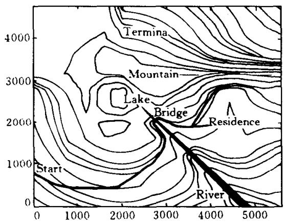

<details>
<summary>text_image</summary>

Termina
Mountain
Lake
Bridge
Residence
Start
River
</details>

图1 模型一

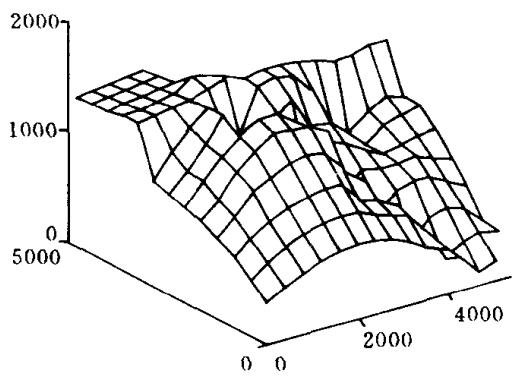

<details>
<summary>surface_3d</summary>

| X | Y | Value |
| --- | --- | --- |
| 0~4000 | 0~5000 | ~1200 ~2000 |
</details>

图 2 地貌图

## 模型设计与结果

## 一、模型一

这一模型比较简单. 只用于确定两个控制点间的最短路径.

从等势图上可以看出,两点间的坡度为高度差除以两点间的水平距离.设起始点高 $h_{0}$ ，等高线间高度差为 $\Delta h$ .若以起始点为中心, $\frac{\Delta h}{\alpha}$ 为半径作圆弧,交 $h_{0}+\Delta h$ 和 $h_{0}-\Delta h$ 对应的等高线于A,B两点,则这两点间圆弧上各点的高度 $h^{\prime}$ 满足 $h_{0}+\Delta h\geqslant h^{\prime}\geqslant h_{0}-\Delta h$ ,则从起始点到这些点的坡度小于 $\alpha_{0}$ .可从这些点中选取某点为第一步的终点.例如想尽量爬高时选 $h_{0}+\Delta h$ 的点.

如图 1 所示,为本问题的初步路线.

这一方案直观、简便.缺点首先是不精确,只能得到大概的路线.其次在坡度变化大的地

方需要等势线足够密(即 $\Delta h$ 足够小)才能实现.

## 二、模型二

## 1. 道路的选择(一般公路)

两个控制点之间,如何选择合适道路使长度短而坡度满足要求,是决定成本的重要条件,也就是怎样实现区域优化,我们选择了逐步定线的方法.原理与模型一有相似之处.

先将 $A_{i} \rightarrow A_{j}$ 分 $a_{i_0} \rightarrow a_{i_1} \rightarrow a_{i_2} \rightarrow \cdots$ 成若干段， $a_{i_n}$ 是位于某单元矩形的边上的点， $a_{i_n} \rightarrow a_{i_{n-1}}$ 同是直线段，坡度小于或等于 $a$ 的最大值且方向尽可能地靠向 $a_{i_n} \rightarrow A_j$ 的直线方向.

如图3所示，设 $a_{i_n}$ 位于矩形1和矩形2的棱上，除 $a_{i_n}$ 所在棱外还有6条棱，记为 $l_1 \sim l_6$ 。不妨设 $a_{i_n}$ 与 $A_j$ 的连线交 $l_1 \sim l_6$ 中某棱于 $P_0$ 点。可由假设1认为 $P_3, P_4$ 间是直线。由此求出 $P_0$ 点的高度，从而求出 $a_{i_n} \to P_0$ 的坡度，设为 $a_0$ 。

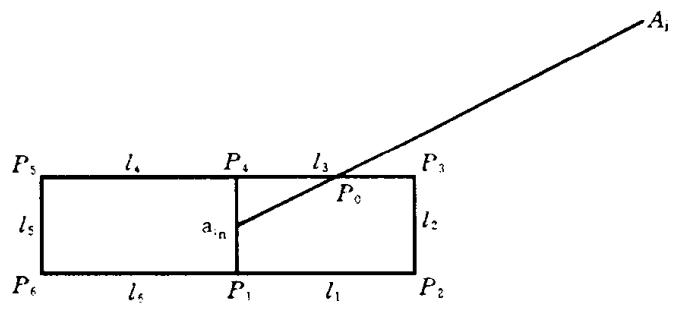

<details>
<summary>text_image</summary>

P₅ l₄ P₄ l₃ P₃
l₅ aₙ P₀ l₂
P₆ l₅ P₁ l₁ P₂
A₁
</details>

图3

当 $|\alpha_0| < 0.125$ 时，取 $a_{i_{n + 1}}$ 为 $P_0$ .

当 $|\alpha_0| > 0.125$ 时. 再在 $P_0$ 附近棱上找 $P'$ , 使 $a_{i_n}$ 对 $P'$ 的坡度正好为 0.125, 且 $a_{i_n} \to P'$ 与 $a_{i_n} \to A_j$ 的角度偏差最小. 设 $(x_1, y_1), (x_2, y_2)$ 为靠近 $a_{i_n} \to A_j$ 的一条棱, 且这两点中对应 $a_{i_n}$ 的坡度一个大于 0.125, 一个小于 0.125, 那么可以知道该棱上必可找到坡度等于 0.125 的点. 设该点为 $(x_0, y_0)$ .

不妨设 $x_0 = x_1 = x_2$

$y_{0}$ 由方程： $\frac{(y_0 - y_2)z_1 + (y_1 - y_0)z_2 - z}{[(x_0 - x_n)^2 + (y_0 - y_n)^2]} = \gamma \times 0.125$ 决定，

$z_{1}, z_{2}$ 是 $(x_{1}, y_{1}), (x_{2}, y_{2})$ 点的高度. $z$ 是点 $a_{i_n}$ 的高度.

$$
\gamma = \left\{ \begin{array}{l l} 1 & \alpha > 0. 1 2 5 \\ - 1 & \alpha <   - 0. 1 2 5 \end{array} , \text {(主要考虑上下坡问题)} \right.
$$

易知这样的解是存在的,利用这个解求出 $P'$ 即是 $a_{i_{n+1}}$ , 依次进行下去逐步接近 $A_{j}$ . 一般情况下, 这样的路线是较优的.

## 2. 山谷溪流的处理和桥梁

从图中和表中可以看出,谷底是直线的.谷的两侧基本也是对称的.可以由此算出雨量最大的液面界限:

谷底方程: $x + y = 4800 (2400 \leqslant x \leqslant 4800)$

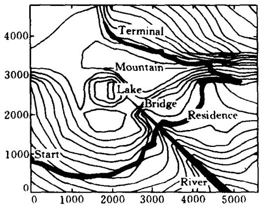

<details>
<summary>text_image</summary>

Terminal
Mountain
Lake
Bridge
Residence
Start
River
</details>

图4 模型二之方案一

西岸方程:4800 - x - y = $\frac{\sqrt{2}}{2}w\left(\frac{x - y + 4800}{2}\right)$ (2400 ≤ x ≤ 4800)

东岸方程: $x + y - 4800 = \frac{\sqrt{2}}{2} w\left(\frac{x - y + 4800}{2}\right) (2400 \leqslant x \leqslant 4800)$

其中： $w(x) = \left(\frac{4800 - x}{2}\right)^{3 / 4} + 5$

由于桥的成本与一般公路相比较高,所以建桥最好使桥正好跨在两岸的界限上,同时要顾及桥的两端高度相等.

## 3. 隧道位置的选择：

由于隧道的成本很高.且长度超过 $300\mathrm{m}$ 后成本增长一倍.因此最好能选择长度小于300米的隧道.从等势图上可以看出. $x = 4400$ 处的山峰特别尖,在这里修隧道可能实现这一点.因此以下计算中固定隧道位置的横坐标 $x = 4400$ .

想让隧道的长度小于 300 m, 需将路修到一定高度. 如图 5 所示, 对水平隧道

$$
Z c = 1 5 0 0 - \frac {3 0 0 \times 6 5 0}{4 0 0 \times \left(1 + \frac {6 5 0}{6 0 0}\right)} = 1 2 6 6
$$

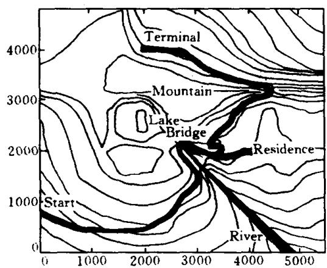

<details>
<summary>text_image</summary>

Terminal
Mountain
Lake
Bridge
Residence
Start
River
</details>

图5 模型三

即使有坡度,隧道高度也不能低于1240 m.对于矿区,高度1320 m可以实现这一点.对于居民区,高度950 m,上升到这个高度相当困难.本模型采取了迂回绕道的方法达到爬高的目的.显然这样做省下的遂道成本远大于多修公路的成本.

## 4. 模型的实现

对本模型我们使用了 FORTRAN 语言编程实现. 通过上机算出两种方案.

方案一:路径总长度 10.685 km, 总费用 3704.6 千元.

方案二:路径总长度 10.802 km, 总费用 4266.0 千元.

(除模型三中举出一例,其它模型结果具体路径见附录)

## 5. 模型的不足

1. 对地貌假设的范围. 由地貌假设, 每个单元矩形近似平面, 这在山两侧不成立, 会影响桥的位置.  
2. 采用迂回绕道的方法虽然最后隧道符合要求,但拐弯过于尖锐,实际需改进.

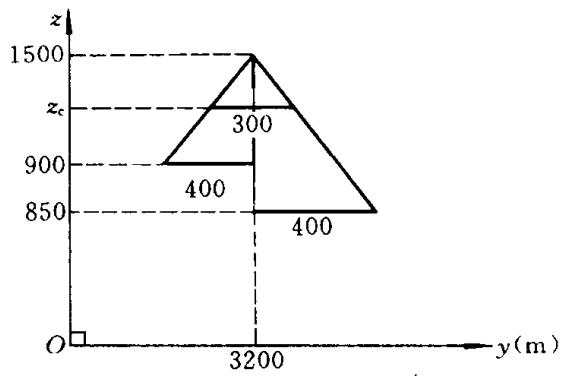

<details>
<summary>area</summary>

| y (m) | z |
| --- | --- |
| 300 | 1500 |
| 3200 | 1500 |
| 3200 | 900 |
| 3200 | 850 |
</details>

图6

## 三、模型三

模型三是在模型二的基础上改进而成.

1. 模型三仍采用局部优化,逐步定线的方法.  
2. 在河谷和山脊附近的地貌假设不合理, 如 $x \in [2800, 3200], y \in [1200, 1600]$ 这个区域四个顶点高度分别为 $1300, 700, 1040, 900$ , 则 $(1300 + 900)/2 - (1040 + 700)/2 = 230$ , 对这么大的差值仍将该矩形视为平面, 显然不太合理.

考虑到实际情况,可以将这类矩形近似成两个三角平面,其公共边是地表的一条凸出或者下陷的线.这要通过三维视图判断哪条对角线是公共边.

根据这一假设,公路到了岸边的高度后,还要经过下降的坡才能到桥边,因此公路过桥前还要沿河边走一段路才行.这与模型二是不一样的.我们在处理山脊附近的点的情况时,也采用了这种假设.这样得到的数据点更多,更精确.

3. 从居民点到隧道的爬高过程仍是一个难题. 考虑到按上一假设计算. 桥东头到居民点的路上的有些点也很高, 我们可以这样处理: 假如公路允许分叉的话, 我们可以在桥东侧

到居民点某处再取一个控制点 $A^{\prime}$ ，将原来的 $A_{2} \rightarrow A_{3} \rightarrow A_{4}$ 变成了 $A_{2} \rightarrow A_{3}$ ，这样一

方面减低公路总长,另一方面可以降低迂回绕道的次数和角度.

4. 为了得到精确的结果, 我们采用 Mathematica 软件逐点计算, 应用该模型解决问题一, 结果如下:

<table><tr><td>x = (0</td><td>400</td><td>800</td><td>1200</td><td>1600</td><td>2000</td><td>2400</td><td>2479</td><td>2788</td><td>2800</td><td>3017.7</td><td></td></tr><tr><td>2925.4</td><td>2800</td><td>2677.6</td><td>2677.6</td><td>2711</td><td>2800</td><td>3100</td><td>3200</td><td>3325</td><td>3600</td><td>4000</td><td></td></tr><tr><td>3600</td><td>3325</td><td>3527.4</td><td>3200</td><td>3457.2</td><td>3600</td><td>3786.8</td><td>4000</td><td>4400</td><td>4400</td><td>4000</td><td></td></tr><tr><td>3600</td><td>3200</td><td>3138.5</td><td>2800</td><td>2400</td><td>2000)</td><td></td><td></td><td></td><td></td><td></td><td></td></tr><tr><td>y = (800</td><td>639.6</td><td>474.6</td><td>419.8</td><td>419.8</td><td>486.9</td><td>666</td><td>800</td><td>1200</td><td>1212</td><td>1382</td><td></td></tr><tr><td>1600</td><td>1819.7</td><td>2000</td><td>2089</td><td>2122.5</td><td>2109.1</td><td>2000</td><td>1950</td><td>1875</td><td>1857.7</td><td>2000</td><td></td></tr><tr><td>1875.7</td><td>1875</td><td>2000</td><td>2033.6</td><td>2400</td><td>2465.2</td><td>2800</td><td>2966.6</td><td>3080.8</td><td>3296.7</td><td>3345.4</td><td></td></tr><tr><td>3457.2</td><td>3561.2</td><td>3600</td><td>3930.4</td><td>3965.2</td><td>4000)</td><td></td><td></td><td></td><td></td><td></td><td></td></tr></table>

其中 x 向量是所得路径的横坐标,相应的 y 向量是所得路径的纵坐标.

路径的总长度:10.72273 km

总费用:3557.4941 千元

桥梁位置(2677.56,2089.033)——(2710.96,2122.45)

桥长:47.24 m

桥费用:94489元

隧道位置:(4400,3080)——(4400,3296.74)

隧道长度:217.12 m

隧道造价:325525元

模型三的结果分析：

由于三角平面的近似,使公路在桥边必须缓慢下坡.这样使得桥的位置上移,长度减小.

可以看出模型三的结果比模型二的更合理更实用.

## 四、用模型三解决问题二

对问题二,相当于把控制点 $A_{3}$ 改为可变,其位置由(4000,2000)改为 $3600 \leqslant x \leqslant 4000$ , $2000 \leqslant y \leqslant 2400$ . 我们在区域里取了几个点进行计算. 结果为:

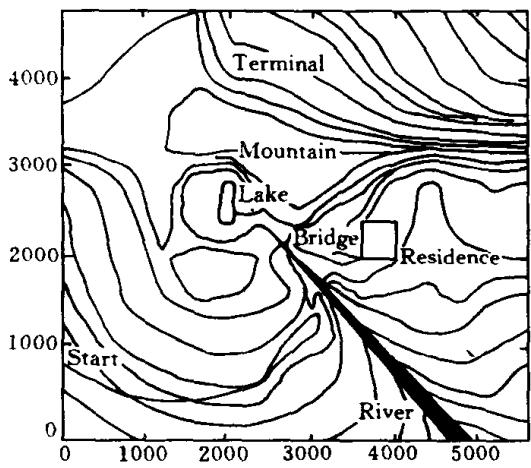

<details>
<summary>text_image</summary>

Terminal
Mountain
Lake
Bridge
Residence
Start
River
</details>

图 7 问题二之方案一

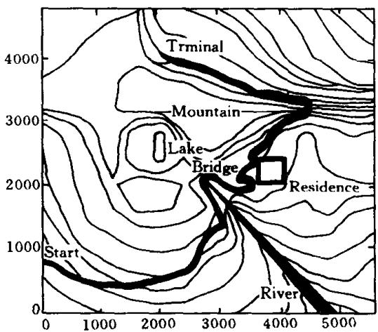

<details>
<summary>text_image</summary>

4000
Terminal
Mountain
2000
Lake
Bridge
Residence
1000
Start
River
0 1000 2000 3000 4000 5000
</details>

图 8 问题二之方案二

方案一 总路径长 10.1315 km, 总费用 338.024 万元.

方案二 总路径长 10.0995 km, 总费用 337.054 万元.

从结果上看,这两个点的选取确实降低了造价.而就这两点比较,造价很接近.

## 模型的设计与分析

## 一、桥址的选择对总成本的影响

桥址的选择即 $A_{1}, A_{2}$ 的选择. 用模型二试计算：

第一种情况: $A_{1}=(3080.79,1651.40),A_{2}=(3133.72,1782.60)$

$$
\begin{array}{l} \mathrm{length} (A _ {1} \rightarrow A _ {2}) = 9 5. 9 3 \mathrm{m} \\ \mathrm{cost} = 3 7 0 4. 6 \text {千元} \\ \end{array}
$$

第二种情况: $A_{1}=(3092.09,1653.59),A_{2}=(3138.58,1444.09)$

$$
\mathrm{length} (A _ {1} \rightarrow A _ {2}) = 4 0 5. 4 \mathrm{m}
$$

$$
\mathrm{cost} = 4 2 6 6 \text {千元}
$$

可见桥址的选择与造价有很大关系.应尽量使桥短些.

## 二、居民点的变化对总成本的影响

对模型三,令居民点(4000,2000),cost = 3557.49 万元

居民点(3600,2000),cost = 3380.24 万元

居民点(3600,2400),cost = 3370.54 万元

对后面两种情况, $\Delta y=400,\Delta y/y=20\%$ ,而 $\frac{\Delta cost}{cost}=0.3\%$ ,可知居民点的变化对总成本的影响不大.

## 讨论及优缺点

## 1. 与连续模型的比较

对地面起伏不大,数据充足情况下,可以分区拟合地面的函数.设为 $f(x,y,z)=0$ .那么可用变分法求最佳路径:

$$
\left\{ \begin{array}{l} \min \int_ {0} ^ {1} | x ^ {\prime} (t) |   \mathrm{d} t \\ x (0) = A \\ x (l) = B \\ f (x, y, z) = 0 \end{array} \right.
$$

不过,对地面起伏不大的地区,我们的方法也适用,且结果与变分法的相差不会大.而对于地面不规则的地区,如本问题,则用变分法是求不到解的.

2. 三个模型的精确程度为: 模型一较差, 模型二较好, 模型三最好. 而模型二和三的计算量大.  
3. 本模型的优点在于灵活性好, 得到的结果接近实际. 通过灵敏度分析可以知道哪些点的选择要求灵敏度高, 需要进一步测量.  
4. 我们无法证明我们得到的方案最佳, 另外在选择路线时只考虑了成本, 没有考虑使用是否方便及长期经济效益.  
5. 改进方向: 可以加入其他条件的限制, 使得到的方案更加实用.

# 关于“逢山开路”赛题的分析和答卷评阅

## 中国科学院应用数学研究所

韩继业

本题的构思保留了工程实际背景的一些基本特征,涉及到地貌、路线、环境等自然条件以及费用系数,这些在实际的工程设计上必须注意的重要因素我们在解决本题时也应考虑到.在用数学模型方法解题时,除了从数学角度上思考问题的求解之外,适当地考虑有关实际因素,对于我们建立合理的数学模型提供了重要的依据条件,也会使我们设计的解题方法比较可行和有效.本题在这一方面表现得更加明显.

本题的重要步骤是求两点间的最短路. 由于要在河流上架桥及开挖隧道, 直接求从山脚 $S$ 到居民点 $R$ 再到矿区 $M$ 的最小费用的路线是困难的. 一种简便方法是先根据对地形和不同路段费用系数的分析, 确定桥头和隧道口的若干候选地点, 然后寻求从 $S$ 到桥西头 $B_{1}$ , 从桥东头 $B_{2}$ 到 $R$ , 从 $R$ 到隧道南口 $D_{1}$ 和从隧道北口 $D_{2}$ 到 $M$ 的最短路, 也是最小费用路径, 其中 $B_{1}, B_{2}$ 和 $D_{1}, D_{2}$ 均有若干候选点. 最后再综合考虑修桥和隧道的费用, 从候选路径得到全局最小费用路线.

下面介绍求两点(如 S 和 $B_{1}$ ) 间最短路的一种方法.

图 1 表示一个图 $G=(V,E)$ ，V 是顶点 $V_{1},\cdots,V_{9}$ 的集合，E 是连接顶点的弧的集合，弧旁的数字不妨看作二顶点间的距离。求图中任意两点间最短路的一种有效算法是 Dijkstra 提出的所谓标号法，用它可以同时求出从图中某一点（如 $V_{1}$ ）到其他各点的最短路，因而适合于本题中求 S 到有若干候选点的 $B_{1}$ 的最短路问题。

这个方法的基本思想是从起点 $V_{1}$ 开始, 逐步地寻找到达各点的最短路, 在每一步都对每一顶点记录一个数, 称为该点的标号. 它表示 $V_{1}$ 到该点的最短距离的上界 (称 $T$ 标号), 或者就是 $V_{1}$ 到该点的最短距离 (称 $P$ 标号). 实际上每一步都通过比较把至少一个具有 $T$ 标号的点变为 $P$ 标号, 这样最多经过 $9 - 1 = 8$ 步就可以找到 $V_{1}$ 到各点的最短路.

将 Dijksrta 方法用于求本题的最短路时, 必须确定图的顶点集 $V$ 和弧集 $E$ . 这可以在原来网格的基础上构造, 现给出两种形式.

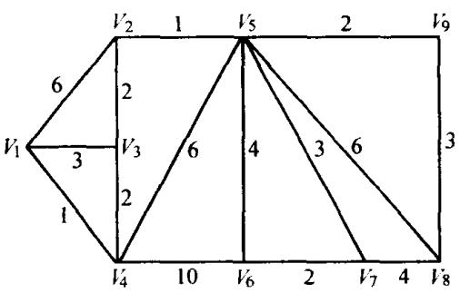

<details>
<summary>text_image</summary>

V1
6
2
3
1
V2
1
V3
6
4
3
6
V5
2
V9
3
V4
10
V6
2
V7
4
V8
</details>

图1

1. 对原网格加密. 如将 $400 \mathrm{~m} \times 400 \mathrm{~m}$ 加密为 $100 \mathrm{~m} \times 100 \mathrm{~m}$ , 新格点构成图的顶点集 $V$ , 如图2所示(新格用虚线表示), 其高度 ( $z$ 坐标) 由原格点插值得到. 图的弧集 $E$ 可以只包括 $x$ 方向和 $y$ 方向的路径, 这时相邻两顶点 $V_{1}, V_{1}$ 间的距离, 即弧长 $d_{ij}$ 定义为 (且考虑到坡度限制)

$$
d _ {i j} = \left\{ \begin{array}{l l} [ (\Delta x) ^ {2} + (\Delta z) ^ {2} ] ^ {1 / 2}, & \quad \left| \frac {\Delta z}{\Delta x} \right| \leqslant 0. 1 2 5, \\ \infty , & \quad \left| \frac {\Delta z}{\Delta x} \right| > 0. 1 2 5, \end{array} \right. \tag {1}
$$

其中 $\Delta z$ 是 $V_{i}$ 与 $V_{j}$ 的 z 坐标之差， $\Delta x = 100 \, m$ ，且可视为 $\Delta y = 100 \, m$ 。弧集 E 也可以包括对角线方向的连线，如图中左上角的格子所示。这时 $d_{ij}$ 应定义为

$$
d _ {i j} = \left\{ \begin{array}{l l} {[ (\Delta x) ^ {2} + (\Delta y) ^ {2} + (\Delta z) ^ {2} ] ^ {1 / 2},} & \frac {| \Delta z |}{((\Delta x) ^ {2} + (\Delta z) ^ {2}) ^ {1 / 2}} \leqslant 0. 1 2 5, \\ \infty , & \frac {| \Delta z |}{((\Delta x) ^ {2} + (\Delta y) ^ {2}) ^ {1 / 2}} > 0. 1 2 5. \end{array} \right. \tag {2}
$$

2. 对原网格只作 $200 \mathrm{~m} \times 200 \mathrm{~m}$ 的加密, 然后在新网格的边上细分. 如分为 $50 \mathrm{~m}$ 一个点, 构成顶点集 $V$ . 而弧集 $E$ 由某顶点出发到它相邻的 2 个 (或 4 个) 新方格内任一点的连线构成, 如图 3 所示, 这时 $d_{ij}$ 的定义同 (2) 式, 图中折线表示一条从 $V_{1}$ 到 $V_{2}$ 的路径.

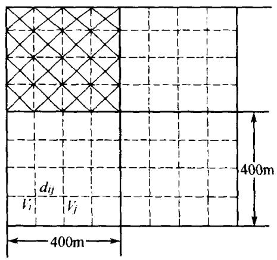

<details>
<summary>text_image</summary>

dij
Vj
400m
400m
</details>

图2

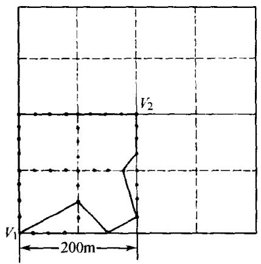

<details>
<summary>text_image</summary>

V₁
200m
V₂
</details>

图3

顶点集 $V$ 和弧集 $E$ 一经确定, 就可以直接用 Dijkstra 方法求图上任一点到其他各点的最短路了.

这次数模竞赛中本题的绝大多数答案都利用了平面上格点的加密,以及地面高度的插值.插值的方法多为线性插值,少数答案为了使结果更精确,还利用了局部二次或三次插值.大多数答案也都先根据地形和不同路段的费用系数的分析和计算,提出了桥和隧道的几个可供选择的地点,然后再对整个路线进行优化考虑,最后确定出各自的最优路线.但大多数答案中确定最优路线的数学方法不够先进,只有很少数答案提出了一般路线的优化模型,或叙述了动态规划方法,但又缺乏动态规划方法计算过程的说明与分析.多数答案对整个路线的优化方法主要是通过对几种不同方案的比较来得到;部分答案在确定局部路线时基本上是用图上作业方法,即在等高线图上沿着允许坡度的路线来确定,这样得到的路线的总费用往往偏高,但是多数答案的总费用仍属于可以接受的范围.某些答案确定的路线的总费用过于高,其原因多为隧道和桥的位置选择得不合理,致使过长.例如桥长超过了100 m,隧道长超过了500 m,这使得整个路线的总费用超过了400万元.多数答案在建立数学模型时提出的假设条件是比较合理的,分析问题也比较细致,但在确定出最优路线后,进一步对结果进行稳定性分析的答案很少,这是一个不足之处.

总起来看,通过各个参赛队的认真细致的分析和计算,大多数答案都取得了相当好的成绩,彼此水平差距并不大.一、二等奖是从横向比较选择出来的.

# 公路工程中的选线问题

易智华 朱定国 许礼林

(武汉测绘科技大学 430070)

指导教师 胡元明

编者按 本答案的假设合理,特别是使用了等高线跟踪插值方法与等高线搜索前进方法,图上作业法,并且比较了几种方案,考虑得比较细致,文字图形清楚,计算结果也令人满意.

摘要 本文采用线性插值手工描绘的方法,对已知部分高程点的山区作出等高线图,并以此图为基础,进行线路设计.本文重点讲叙了等高线“跟踪”插值过程和利用等高线图进行公路设计,提出了几种不同的方案,并且对这些方案进行了比较和讨论,提供出一种认为最满意的结果.本文还尝试运用层次分析法对方案进行评估.最后,本文对所涉及到的公路选线作了推广,并总结出线路选线需考虑的一般问题.

## 一、问题的提出

要在一山区修建公路,首先测得一些地点的高程,数据见表1(平面区域 $0 \leqslant x \leqslant 5600$ , $0 \leqslant y \leqslant 4800$ , 表中数据为坐标点的高程,单位:米).数据显示:在y=3200处有一东西走向的山峰;从坐标(2400,2400)到(4800,0)有一西北——东南走向的山谷;在(2000,2800)附近有一山口湖,其最高水位略高于1350米,雨季在山谷中形成一溪流.经调查知,雨量最大时溪流水面宽度w与(溪流最深处的)x坐标关系可近似表示为 $w(x)=\left(\frac{x-2400}{2}\right)^{\frac{3}{4}}+5(2400 \leqslant x \leqslant 4000)$ .

公路从山脚(0,800)处开始,经居民点(4000,2000)至矿区(2000,4000).已知路段工程成本及对路段坡度 $\alpha$ (上升高程与水平距离之比)的限制如表2.

表 1: 略.  
表 2 工程限制条件及单位费用表

<table><tr><td>工程种类</td><td>一般路段</td><td>桥梁</td><td>隧道</td></tr><tr><td>工程成本(元/米)</td><td>300</td><td>2000</td><td>1500(长度≤300米);3000(长度&gt;300米)</td></tr><tr><td>对坡度α的限制</td><td>α&lt;0.125</td><td>α=0</td><td>α&lt;0.100</td></tr></table>

1) 试给出一种路线设计方案, 包括原理、方法及比较精确的线路位置(含桥梁, 隧道), 并估算该方案的总成本.  
2) 如果居民点改为 $3600 \leqslant x \leqslant 4000, 2000 \leqslant y \leqslant 2400$ 的居民区，公路只须经过居民区即可，那么你的方案有什么改变.

## 二、建模的假设

1. 所给地区的地形是连续的, 不存在断层、悬崖, 可用线性插值方法确定直线的走向.

2. 所给地区的工程地质条件都满足工程建设的要求, 不存在对工程建设有害的因素, 如地震带、溶岩地区等.  
3. 由于题目没有给出公路的等级及规格, 可以忽略公路的宽度, 而只考虑其线形.  
4. 桥梁的长度必须大于溪流水面最宽时的宽度.  
5. 隧道的建设不考虑通风等次要因素.  
6. 尽管填方、挖方在线路上的工程费用中占很大比例,但题目题设没有给出填方、挖方的具体要求,建模时暂不予考虑.

## 三、与问题有关的某些概念及原理

## 等高线的概念、特征和应用：

1. 概念: 等高线是地面上高程相等的相邻各点连线的闭合曲线, 也就是水平面与地面相交的曲线.  
2. 特征：

(1) 在同一条等高线上的各点的高程相等；  
(2) 等高线是闭合的曲线；  
(3) 不同高程的等高线不能相交；  
(4) 等高线与分水线(山脊线)、合水线(山谷线)正交;  
(5) 两等高线间的垂直距离称为平距, 等高线平距的大小与地面坡度的大小成反比.

3. 等高线在地形图中的应用：

(1) 可以根据等高线确定地面点的高程；  
(2) 根据等高线间的平距确定其坡度. 其原理为: 若已知地形图上等高距为 h, 要确定图上两等高线的倾角或坡度, 则量出该两等高线间的平距宽度 a, 按下式计算:

$$
\text {坡度} a = \mathrm{tg} \tau = \frac {h}{a}.
$$

如图 I: $\alpha = \operatorname{tg}\tau \frac{20}{300} = \frac{1}{15}$ （比例尺, 1:10000 单位: m）

## 四、建模的初期工作

由前述可知,要进行公路选线,必须有一定精度的地形图,但在问题中只提供了一些规则格网点上的高程.因此,我们必须根据这些高程尽可能准确地反映出该地区的地势,以便确定路线的走向和成本的预算.为此,我们建立等高线“跟踪”插值模型,以便“生成”一幅地形图.

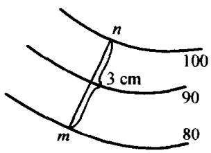

<details>
<summary>text_image</summary>

n
3 cm
100
90
m
80
</details>

图1

## 等高线“跟踪”插值模型 $^{[2]}$

- 数据特点 所给高程数据点位间隔过大,不利于用二次曲面或者其它类似方法拟合,但由于它是以规则格网数据形式给出的,因此有利于构造“跟踪”信息,实现数据插值.  
- 操作特点 采用简单的线性插值,简便易行,同时其数据场很有规则,插值步骤具有很强规律性,适于计算机编程计算.

\- 具体过程

(1) 依次计算各等高线和网格边交点的坐标值.

(2) 找出一条等高线起始等高点并确定判断和识别条件, 以追踪一条等值线的全部等高点.

(3) 根据前面提到等高线的特征及地势的大致走向, 联结各等高点绘制光滑曲线.

## - 算法分析

## (1) 内插等值点的位置：

假设制图地区由 $m \times n$ 个网格点数据组成. 并设沿 x 方向的分割记为 $j = 1, 2, \cdots, n$ ; 沿 y 方向的分割记为 $i = 1, 2, \cdots, m$ . 则对于任一网格点的高程

数据可以表示为 $B_{i,j} = j \cdot d; y_{i,j} = i \cdot d$ . 显然, 对于 $m \times n$ 个网格点区域, 只有 $(m - 1) \cdot n$ 条纵边和 $(n - 1) \cdot m$ 条横边. 对于位于任一条边上的等高点位置, 我们可以表示为:

纵边上的等高点 $H_{i,j}$ $i = 1, 2, \cdots, (m - 1)$ ;

$$
j = 1, 2, \dots , n.
$$

横边上的等高点 $S_{i,j}$ $i = 1, 2, \cdots, m;$

$$
j = 1, 2, \dots , (n - 1).
$$

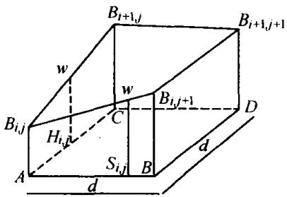

<details>
<summary>text_image</summary>

B_{i+1,j}
w
B_{i,j}
H_{i,j}
C
w
B_{i,j+1}
D
A
S_{i,j}
B
d
d
</details>

图2

为了计算等高点在网格边上的位置,首先要确定等值线与网格边相交的条件.设等高线高程值 w,显然,只有 w 值处于相邻网格点数值之间.该边才能有等高点.因此,我们可用下式来判断: $(B_{i,j}-w)\cdot(B_{i,j+1}-w)<0$ 时,在横边上有等高点;

$(B_{i,j} - w)\cdot (B_{i + 1,j} - w) <   0$ 时，在纵边上有等高点.

若上式成立, 我们即可采用线性内插方法计算出等值点位置. 我们有 ABCD 网格(图 2), 其高程依次为 $B_{i,j}, B_{i,j+1}, B_{i+1,j}$ 和 $B_{i+1,j+1}$ , 若在横边 $AB$ 边内插等高点 $A'$ , $A'$ 离 $A$ 点的距离记为 $S_{i,j}$ 则:

$$
\frac {w - B _ {i , j}}{B _ {i , j + 1} - B _ {i , j}} = \frac {S _ {i , j}}{d}, \text {令} d = 1
$$

$$
S _ {i, j} = \frac {w - B _ {i , j}}{B _ {i , j + 1} - B _ {i , j}}
$$

显然这里计算的 $S_{i,j}$ 的一个相对比值，是横边的一个单位的几分之几，即 $0 \leqslant S_{i,j} \leqslant 1$ 。同理，对于纵边 $AC$ 之间插等高点 $B'$ 时，该点到 $A$ 的距离记为 $H_{i,j}$ ，当纵边 $d = 1$ 时，有：

$$
H _ {i, j} = \frac {w - B _ {i , j}}{B _ {i + 1 , j} - B _ {i , j}}
$$

同样 $0 \leqslant H_{i,j} \leqslant 1$ .

## (2) 追踪等高点

为了确定追踪方案,我们要确定某一等值线在矩形网格内走向的几种可能,并通过确定等值线走向与等高点坐标之间的关系来建立跟踪条件.由于等高点位于网格边上,所以等高线通过相邻网格的走向只有四种可能:自下而上、自左向右、自上而下、自右向左.因此,若找到某一值线头位于某一网格边上,该网格边往往是相邻网格的公共边,即是前一网格的出口边又是后一网格的进入边,则进入边的方向对于每一个网格都有上、下、左、右四种情形,即追踪等高点有四种可能.下面分别讨论这四种可能.

先谈自下而上追踪，在图3中，我们可以看到，在方格I上有等高点 $a_1$ ，它的位置有三种情况，即 $H(i,j),S(i,j)$ 和 $H(i,j + 1)$ .Ⅱ号方格上 $a_2$ ：等高点为 $S(i + 1,j)$ ，显然，我们比较 $a_1$ 和 $a_2$ 的坐标位置, 可以得到 $a_1$ 点取整的纵坐标, 一定小于 $a_2$ 点取整的纵坐标. 因此, 只要满足 $i_{a_1} < i_{a_2}$ 的条件 ( $i_{a_1}$ 表示 $a_1$ 点横坐标), 即可自下而上的追踪. 如果有 $a_3$ 点, 它一定位于方格 $\mathbb{I}$ 的另外三边上.

同理,可以讨论得到自左而右(图4),自上而下(图5)和自右向左(图6)的追踪情况.

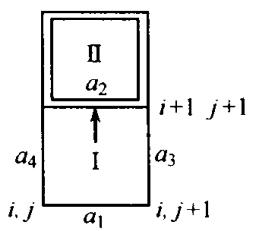

<details>
<summary>text_image</summary>

II
a₂
i+1 j+1
a₄ I a₃
i, j a₁ i, j+1
</details>

图3

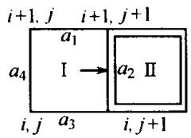

<details>
<summary>text_image</summary>

i+1, j    i+1, j+1
a₁
a₄    I → a₂ II
i, j    a₃    i, j+1
</details>

图 4

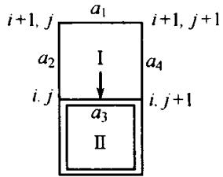

<details>
<summary>flowchart</summary>

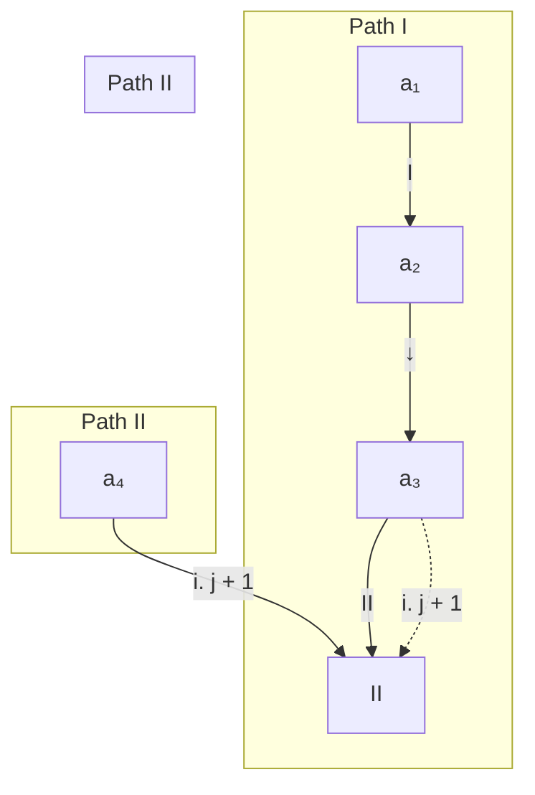
```mermaid
graph TD
  subgraph Path I
    direction TB
  A1["a₁"] -->|I| A2["a₂"]
  A2 -->|↓| A3["a₃"]
  A3 -->|II| II["II"]
  end
  subgraph Path II
    direction TB
  A4["a₄"] -->|i. j + 1| II
  end
  subgraph Path II
    direction TB
    A3 -.->|i. j + 1| II
  end
```
</details>

图 5

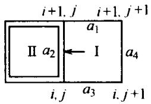

<details>
<summary>text_image</summary>

i+1, j    i+1, j+1
II a₂    a₁    I    a₄
        i, j    a₃    i, j+1
</details>

图6

已知 $a_3$ 点是位于Ⅱ号方格的其余三边上，如何确定是其中的哪一边呢？这是一个十分重要的问题，必须合理地选择其余三边上的一个等高点。不然，将会出现同一等高线的交叉和分支走向不确定的多义性。例如某一网格上的四点联结的状况可有三种情况（图7）。 $a, b$ 即为多义性 $c$ 是不允许的，必须排除。对于等高线点可以有多种方式联结，手工勾绘等高线时经常出现，这情况的处理往往根据实践经验和对制图对象物理背景的理解作出的，即参考周围等高线的定向和趋势，为强调等高线之间的协调一致，突出表现区域特征而作出各种选择。根据一般的规律，首先是考虑等值线原来前进的方向，即顺着原来等高线走向延伸下去，其次是根据距离远近的选择 $a_3$ 点。

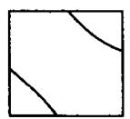  
a

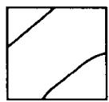  
b

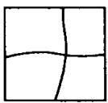  
c  
图7

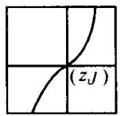  
图8

在内插等高点时, 当遇到网格高程值和待高线相等的情况, 此时, 等高线必须通过网格点. 而该网格点同时又是四个相邻网格的公共交点(图8). 于四个相邻横边和纵边上得到不是0就是1的四个值(即 $S(i,j) = 0, H(i,j) = 0, S(i,j-1) = 1, H(i-1,j) = 1$ ). 追踪点时, 一定会发生重复和追踪混乱的问题. 对此情况, 必须预先给予处理, 其方法是对该网格点加上一个足够小的数组给予纠正.

根据以上步骤,我们绘制了一幅1:20000等高线地形图,作为下一步工作的依据.(如图15,其中注记了高程格网数据)

此方法采用的是线性插值法,以便实现手工绘图.如果采用二元分段等距抛——抛插值方法或者双三次样条插值方法加密数据场.这样精度要高些.由于时间的关系,我们只编制了二元分段插值的程序,附在后面,以供参考.

## 五、建立公路定线的操作模型

1. 建造桥梁、隧道的一般原则：

(1) 中小型桥梁、隧道走向服从道路的走向；  
(2) 道路的走向服从大桥梁、大隧道的走向.

2. 对坡度值的要求, 本题要求公路的坡度小于 0.125, 桥梁的坡度为 0, 隧道的坡度小于 0.1.  
3. 不考虑“1.”所说的情况,现在将地形图上进行公路定线的原理[3,4]及方法叙述如下:

## (1) 展线法

展线的方法是先确定该路段容许的设计平均坡度,然后,据此计算相邻两等高线间所应有的长度(宜等于等高线间距与平均坡度之比值),并按地形图比例尺将其换算成图纸上应表示的已缩小的长度,以此缩小的长度为准,自路线起、终点开始分别向上、向下的两等高线之间依次作截距交会于各等高线上成若干平面转折点.最后将各转点相连成平面上的转折线,并在有关转角点间布置相应必要的平面线和回头曲线.

## (2) 回头曲线法

当路线起、终点位于同一很陡的山坡面，为了克服高差过大，一方面要顺山坡逐步展线；另一方面又需一次或多次地将路线折回到原来的方向，形成“之字线”路线。这种顺地势反复盘旋而上的展线，往往会遇到路线平面转折角大于 $90^{\circ}$ ，按通常设置平面线方法，曲线长会过短，纵坡会过大。为了克服这种困难，常采用在转角顶点的外侧设置回头曲线的方法来布置路线。

## (1) 展线法和回头曲线法的例子

## ① 展线法

以图9为例,已知路段起、终点A、D之间高差为18米,距离 $L_{1}$ 为225米,其纵坡 $i_{1}$ 为18/225;由于 $i_{1}$ 较大,决定采取平均坡度为5%进行展线.该处比例尺为1:5000,先计算相邻两等高线间为符合坡度5%要求的必要长度 $\Delta L=\frac{5米}{0.05}=100米$ ,则在 $\Delta L$ 在地形图上经按上述比例尺缩小后的实际长度应为100/500米,即0.02米.今自A、D点分别以0.02米为截距作弧依次交各等高于 $\Delta_{1},\Delta_{2},\Delta_{3}$ .然后加以连接,并且在有关平面转折点处布置必要的适合曲线,即得出图9所示的展线方案.

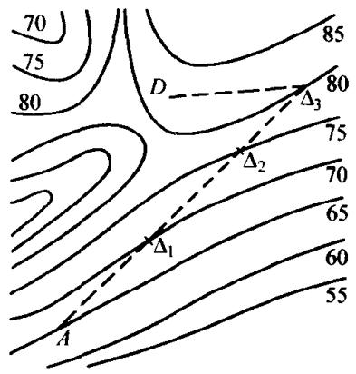

<details>
<summary>contour</summary>

| Label | Value |
| --- | --- |
| Point A | ~55 |
| Point D | ~80 |
| Point \(\Delta1\) | ~60 |
| Point \(\Delta2\) | ~70 |
| Point \(\Delta3\) | ~80 |
</details>

图9

② 回头曲线法 这里列举几种回头曲线形式：

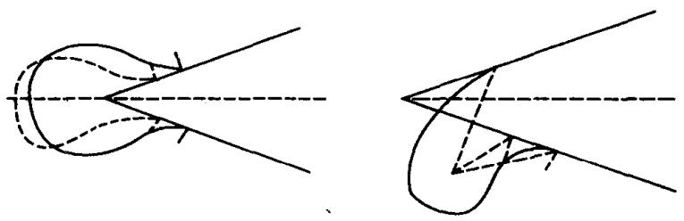

<details>
<summary>natural_image</summary>

Pure geometric line drawings with intersecting curves and dashed lines, no text or symbols present
</details>

## 4. 问题的求解

在 A、B 区域(见图 14、15)，如果不进行回头曲线的测设的话，公路的坡度将超过 0.125，这就不符合问题的要求；但如果我们测设回头曲线，将形成“之”字形的盘山道，大大增加公路的里程和营造费用. 所以, 我们在选取路线时, 在满足坡度限制的条件下, 尽可能不测设回头曲线, 也就是说尽量避免在 A 区和 B 区测设公路.

(1) 为了选线的方便, 我们找到了一种比较简便的方法, 来确定公路取向范围. 方法具体如下:

① 由公路必过的定点为圆心, 以 R 为搜索半径, 画圆弧, 交相邻的等高线于两点.  
② 取其中一点为圆心, 再以搜索半径 R 作圆弧, 返回上步.

R——搜索半径 $\theta$ ——路线在该点取向范围 R 的选取由坡度 $\alpha$ 决定(如图 10)

$\Delta D$ ——AB 两点高差

$$
\alpha = \frac {\Delta D}{R} \Rightarrow R = \frac {\Delta D}{\alpha}
$$

由上式可知,如果 $\alpha$ 越小,则搜索半径 R 越大;同样,我们将 R 取比较大时, $\alpha$ 将比较小.(如图 11).

由于等高线是通过线性插值的方法获得的, 这就存在着截断误差, 下面分析这个误差对 R 的影响.

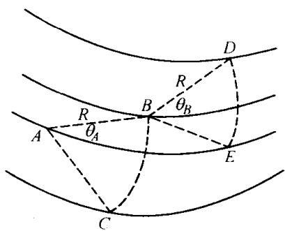

<details>
<summary>text_image</summary>

D
R
θB
B
R
θA
A
E
C
</details>

图10

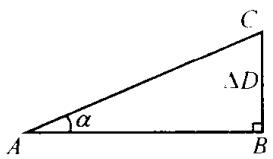

<details>
<summary>text_image</summary>

C
ΔD
α
A
B
</details>

图11

$\Delta D = h_{S} - h_{A} \quad h_{S}, h_{A}$ 的为通过线性插值得到的高程.

假设截断误差中的误差为 $m_{h}$ ，则有：

$$
d R = \frac {d (\Delta D)}{\alpha},
$$

$$
d R = \frac {d h _ {B} - d h _ {A}}{\alpha}
$$

$$
m _ {R} ^ {2} = \frac {1}{\alpha_ {2}} (m _ {h _ {B}} ^ {2} + m _ {h _ {A}} ^ {2}) = 2 m _ {h} ^ {2} / \alpha^ {2}
$$

$$
\therefore m _ {R} = \frac {\sqrt {2}}{\alpha} \cdot m _ {h}
$$

由此可知,如果截断误差 $m_{h}$ 很大,R 的中误差 $m_{R}$ 将很大;若搜索半径仅取 $R = \Delta D$ 的话,仍将可能造成线路的坡度过大.我们可以通过在实践操作中,选取较大的 $R' = R + m_{R}$ 来妥善解决,这里我们取搜索半径 $R = 800 + 10m$ .

由于我们所绘制的等高线是由格网高程插值点得到的,因此我们对搜索半径 R 的传递误差可以不考虑.

## (2) 矿区部分道路拟定原则

根据展线法和回头曲线以高差100米、最大坡度0.125进行展线,可大致表示为如图12所示.

从绘制的等高线图上我们可以看出,若公路在Ⅰ区走线,偏离山峰越越来越远,导致道路走线拉长,隧道长度增加,故不可取;若在Ⅲ区走线,虽使得隧道长度有所减少,但会使对面山坡公路走线带来困难.因为对面山坡坡面较陡,要满足 $\frac{|H_{N}-H_{S}|}{D_{AB}}<0.1$ (其中: $H_{N}$ 、 $H_{S}$ 分别表示隧道北南洞口选址点的高程, $D_{AB}$ 是两点间的水平距离),必须修建大量的盘山道,不仅走线拉长,也会给运输带来麻烦.因此我们考虑在Ⅱ区 $(h\geqslant1120,h\leqslant1400)$ 设计公路走线.另外,从图上可看出在山峰南坡x>4400米,等高线间的平距越来越大,而在其对应的北面坡等高线的变化并不十分明显;在山峰南部x<4000米,南北两坡等高线平都有明显增大趋势.考虑到隧道的开凿,再满足其他条件的情况下,使最小长度尽可能小,因此我们在 $x\geqslant4000$ 米和 $x\leqslant4400$ 米的范围内进行选址.

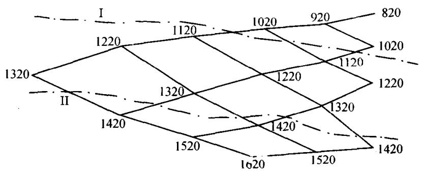

<details>
<summary>wireframe</summary>

| Path | X-axis Point | Y-axis Point |
| --- | --- | --- |
| I | 1020 | 920 |
| I | 1120 | 820 |
| I | 1220 | 1020 |
| II | 1320 | 1220 |
| II | 1420 | 1320 |
| II | 1520 | 1420 |
| II | 1620 | 1520 |
</details>

图12

## (3) 对于居民点的情况分析

根据以上的方法,我们可以分段进行求值.(见图13,图14,图15).

①从公路起始点到山谷,可得出三种走线:(见图20)

H—I—J—L—P—Q—沿1000米等高线到桥1；

H—I—J—M—沿850m的等高线到桥3；

H—I—J—N—沿900m的等高线到桥2.

② 考虑到地形、引桥等多种因素,采用 $S = 1.4w(x)$ 米计算桥长.  
③ 在考虑到桥梁处的展图过程中,我们有以下几种走线:

R—Ⅲ—沿着1000m的等高线到桥1；

R—桥2;

$R-\mathrm{II}-\mathrm{II}_{2}$ — 沿 850 的等高线到桥 3.

注: 在 800m 等高线上建桥, 不仅桥身长, 而且走线盘曲多折, 拉线长, 没有以上三种效果好, 故舍去.

④ 从居民点 R 到隧道的几种走线

$R—IV—隧道 B_{1}A_{2};$

$R-\mathrm{III}-\mathrm{III}_{1}-\mathrm{III}_{2}-\mathrm{III}_{21}-\mathrm{III}_{22}-$ 沿 1300m 的等高线到隧道 $B_{2}A_{2}$ ;

$R-\mathrm{III}-\mathrm{III}_{3}-\mathrm{III}_{31}-\mathrm{III}_{32}-$ 沿 1300m 的等高线到隧道 $B_{2}A_{2}$ ;

$R-\mathrm{III}-\mathrm{III}_{3}-\mathrm{III}_{34}-\mathrm{III}_{35}-$ 沿 1300m 的等高线到隧道 $B_{2}A_{2}$

⑤ 量得隧道长: $A_{1}B_{1}=720m$ . $A_{2}B_{2}=210m$ .  
⑥ 从矿区 G 到隧道展线所形成的几种走线

$G-A_{21}-B_{21}$ 沿 1120m 等高线到隧道 $A_{1}B_{1}$ ;

$G-A_{21}-B_{11}$ 沿 1320m 等高线到隧道 $A_{2}B_{2}$ ;

G—沿着 1320m 等高线到隧道 $A_{2}B_{2}$ ;

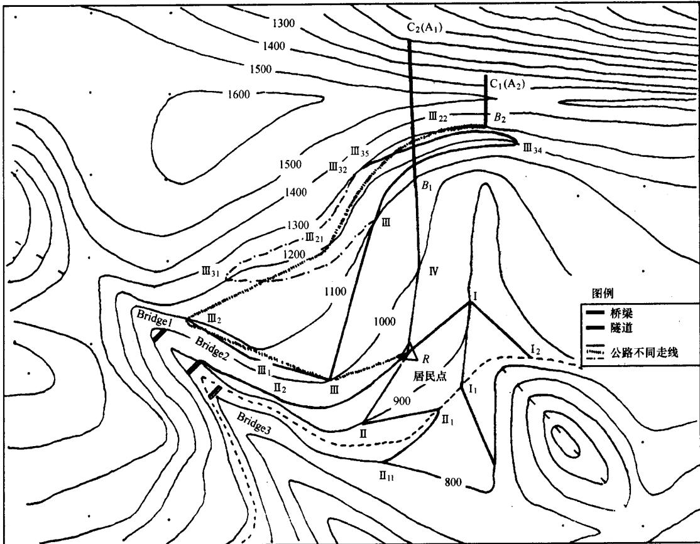

<details>
<summary>text_image</summary>

1300
1400
1500
1600
C2(A1)
C1(A2)
III22
B2
III35
III34
1500
1400
1300
III21
1200
B1
III
III31
III2
Bridge1
Bridge2
II1
II2
III
III3
1100
IV
1000
R
居民点
900
I1
I2
I
II1
II
II11
800
图例
桥梁
隧道
公路不同走线
</details>

图13

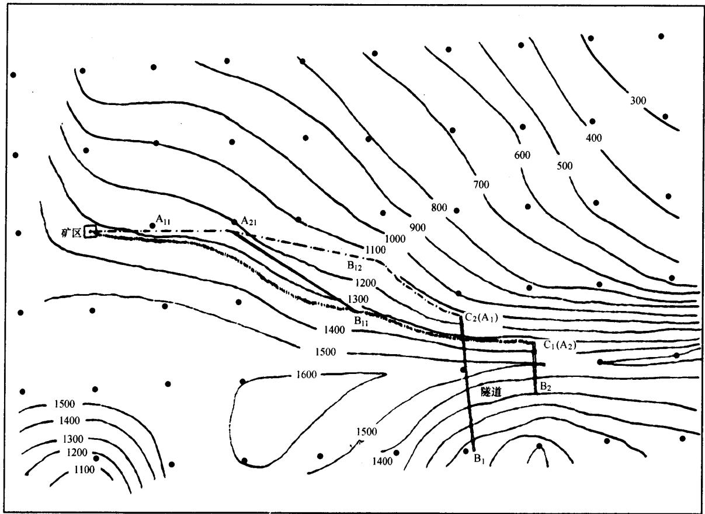

<details>
<summary>text_image</summary>

A11
A21
矿区
B12
1200
1300
B11
C2(A1)
C1(A2)
隧道
B2
1500
1600
1500
1400
B1
1300
1200
1100
300
400
600
700
800
900
1000
</details>

图14

图15  
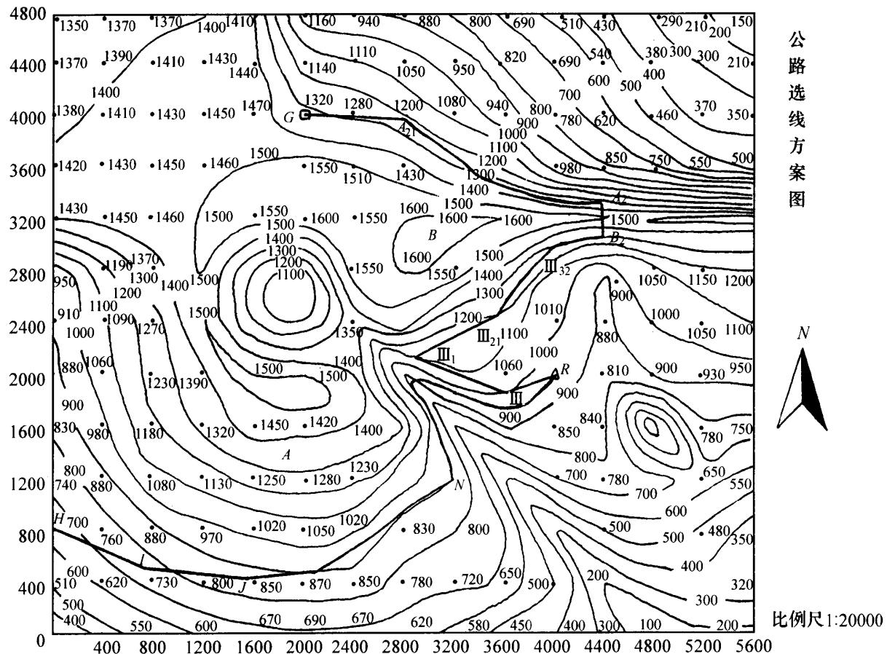

<details>
<summary>contour</summary>

| Contour Level | Value |
| --- | --- |
| Top | 1350 |
| Upper-Mid | 1370 |
| Mid-High | 1410 |
| Mid | 1430 |
| Lower-Mid | 1440 |
| Bottom | 1470 |
| Inner | 1500 |
| Outer | 1550 |
| Central | 1600 |
| Outer | 1600 |
| Outer | 1550 |
| Outer | 1500 |
| Outer | 1400 |
| Outer | 1350 |
| Outer | 1300 |
| Outer | 1250 |
| Outer | 1200 |
| Outer | 1150 |
| Outer | 1100 |
| Outer | 1050 |
| Outer | 950 |
| Outer | 940 |
| Outer | 880 |
| Outer | 820 |
| Outer | 780 |
| Outer | 750 |
| Outer | 700 |
| Outer | 690 |
| Outer | 690 |
| Outer | 690 |
| Outer | 690 |
| Outer | 690 |
| Outer | 690 |
| Outer | 690 |
| Outer | 690 |
| Outer | 690 |
| Outer | 690 |
| Outer | 690 |
| Outer | 690 |
| Outer | 690 |
| Inner | 1350 |
| Inner-Mid | 1370 |
| Inner | 1410 |
| Inner-Mid | 1430 |
| Inner | 1440 |
| Inner-Mid | 1470 |
| Inner | 1500 |
| Inner-Mid | 1550 |
| Inner | 1600 |
| Inner-Mid | 1600 |
| Inner | 1550 |
| Inner-Mid | 1550 |
| Inner | 1550 |
| Inner-Mid | 1550 |
| Inner | 1550 |
| Inner-Mid | 1550 |
| Inner | 1550 |
| Inner-Mid | 1550 |
| Inner | 1550 |
| Inner-Mid | 1550 |
| Inner | 1550 |
| Inner-Mid | 1500 |
| Inner-Mid | 1450 |
| Inner | 1420 |
| Inner-Mid | 1420 |
| Inner | 1420 |
| Inner-Mid | 1420 |
| Inner | 1420 |
| Inner-Mid | 1420 |
| Inner | 1420 |
| Inner-Mid | 1420 |
| Inner | 1420 |
| Inner-Mid | 1420 |
| Inner | 1420 |
| Inner-Mid | 1450 |
| Inner | 1450 |
| Inner-Mid | 1450 |
| Inner | 1450 |
| Inner-Mid | 1450 |
| Inner | 1450 |
| Inner-Mid | 1450 |
| Inner | 1450 |
| Inner-Mid | 1450 |
| Inner | 1450 |
| Inner-Mid | 1450 |
| Inner | 1420 |
| Inner-Mid | 1420 |
| Inner | 1420 |
| Inner-Mid | 1420 |
| Inner | 1420 |
| Inner-Mid | 1420 |
| Inner | 1420 |
| Inner-Mid | 1420 |
| Inner | 1450 |
| Inner-Mid | 1450 |
| Inner | 1450 |
| Inner-Mid | 1450 |
| Inner | 1450 |
| Inner-Mid | 1450 |
| Inner | 1450 |
| Inner-Mid | 1450 |
| Inner | 1450 |
| Inner-Mid | 1420 |
| Inner | 1420 |
| Inner-Mid | 1420 |
| Inner | 1420 |
| Inner-Mid | 1420 |
| Inner | 1420 |
| Inner-Mid | 1420 |
| Inner | 1420 |
| Inner-Mid | 1420 |
| Inner | 1450 |
| Inner-Mid | 1420 |
| Inner | 1420 |
| Inner-Mid | 1420 |
| Inner | 1420 |
| Inner-Mid | 1420 |
| Inner | 1420 |
| Inner-Mid | 1420 |
| Inner | 1420 |
| Inner-Mid | 1450 |
| Inner | 1420 |
| Inner-Mid | 1420 |
| Inner | 1420 |
| Inner-Mid | 1420 |
| Inner | 1420 |
| Inner-Mid | 1420 |
| Inner | 1420 |
| Inner-Mid | 1420 |
| Inner | 1480 |
| Inner-Mid | 1480 |
| Inner/Mid | 1480 |
| Inner/Mid | 1480 |
| Inner/Mid | 1480 |
| Inner/Mid | 1480 |
| Inner/Mid | 1480 |
| Inner/Mid | 1480 |
| Inner/Mid | 1480 |
| Inner/Mid | 1480 |
| Inner/Mid | 1480 |
| Inner/MID | 1550 |
| Inner/MID | 1600 |
| Inner/MID | 1668.888.888.888.888.888.888.888.888.888.888.888.888.888.888.888.888.888.888.888.888.888.888.888.888.888.8<nl> |
</details>

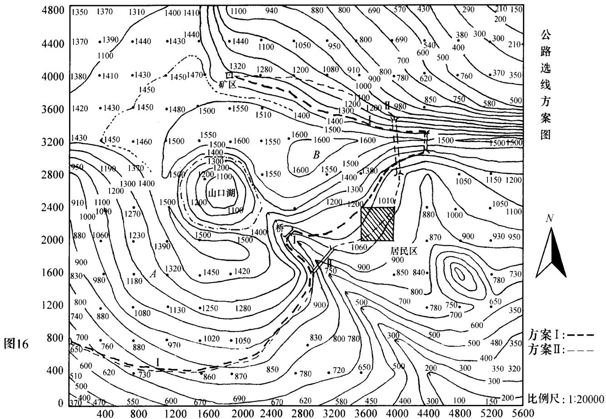

<details>
<summary>contour</summary>

| Feature | Description |
| --- | --- |
| X-axis Range | 0~5600 |
| Y-axis Range | 0~4800 |
| Contour Lines | 1100, 940, 880, 800, 690, 570, 430, 290, 210, 150 |
| Area Labels | 矿区, 山口湖, 桥, 居民区 |
| Contour Lines | 方案I: dashed line, 方案II: dash-dotted line |
| Scale Factor | 比例尺: 1:20000 |
</details>

表 3 工程费用计算表

<table><tr><td>起点至桥(m)</td><td>桥长(m)</td><td>桥至居民点(m)</td><td>居民点至隧道(m)</td><td>隧道长度(m)</td><td>隧道至矿区(m)</td><td>最小总费用</td></tr><tr><td>4141.18 → 68.46 → 1293.33</td><td colspan="5">800 → 720 → 2093.33</td><td rowspan="3">367万元</td></tr><tr><td>3202.88 → 81.48 → 1786.66</td><td colspan="4">3106.67 ↘ 210 ↗</td><td>2560</td></tr><tr><td>4091.43 → 88.06 → 1133.33</td><td colspan="4">3666.67 ↗</td><td>2453.33</td></tr></table>

说明:1. 由于量取路线长度时进行了比例尺变换,因此出现了小数点后面的数值,这并不意味着量线的精度有这么高,实际量线的精度为 $\pm20m$ .

2. 考虑量线的误差, 总费用的误差取 5%. 选取路线设计方案为:

$H - I - J - N -$ 沿 $900\mathrm{m}$ 等高线到桥 $2 - R - \mathrm{III} - \mathrm{III}_1 - \mathrm{III}_{21} - \mathrm{III}_{22} -$ 沿 $1300\mathrm{m}$ 等高线到隧道 $B_{2}A_{2} -$ 沿 $1320\mathrm{m}$ 等高线到 $B_{11} - A_{21} - G$

注:线路的坐标可以通过图纸量取.(如图 15 所示)

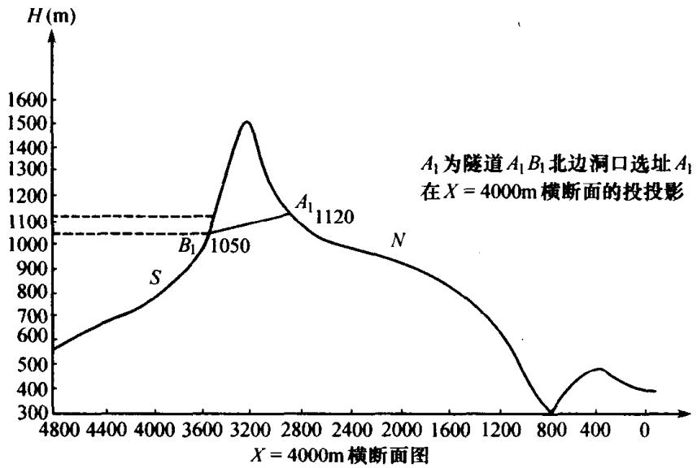

<details>
<summary>line</summary>

| Point | H (m) |
| --- | --- |
| A1 | 1120 |
| B1 | 1050 |
</details>

图17

(隧道的断面图见图 17, 图 18, 平面图见图 19.)

(4) 居民点改为居民区的情况

根据条件,我们确定了二个方案,作比较(见图16),下面给出两个方案的工程费用表:

表 4 工程费用表

<table><tr><td rowspan="2">项目\方案</td><td rowspan="2">单价(元)</td><td colspan="2">方案1</td><td colspan="2">方案2</td></tr><tr><td>长度(m)</td><td>费用(万元)</td><td>长度(m)</td><td>费用(万元)</td></tr><tr><td>道路</td><td>300</td><td>8840</td><td>265.2</td><td>6960</td><td>208.8</td></tr><tr><td>桥梁</td><td>2000</td><td>54</td><td>10.8</td><td>480</td><td>96</td></tr><tr><td>隧道</td><td>1500或3000</td><td>210</td><td>39</td><td>720</td><td>216</td></tr><tr><td>总计</td><td></td><td>9594</td><td>315</td><td>8160</td><td>520.8</td></tr></table>

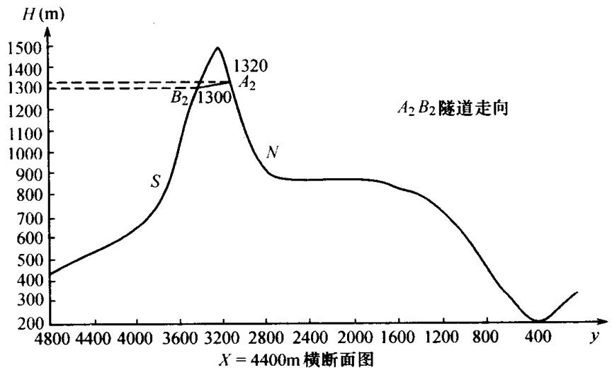

<details>
<summary>line</summary>

| Point | H (m) |
| --- | --- |
| A2 | 1320 |
| B2 | 1300 |
</details>

图18

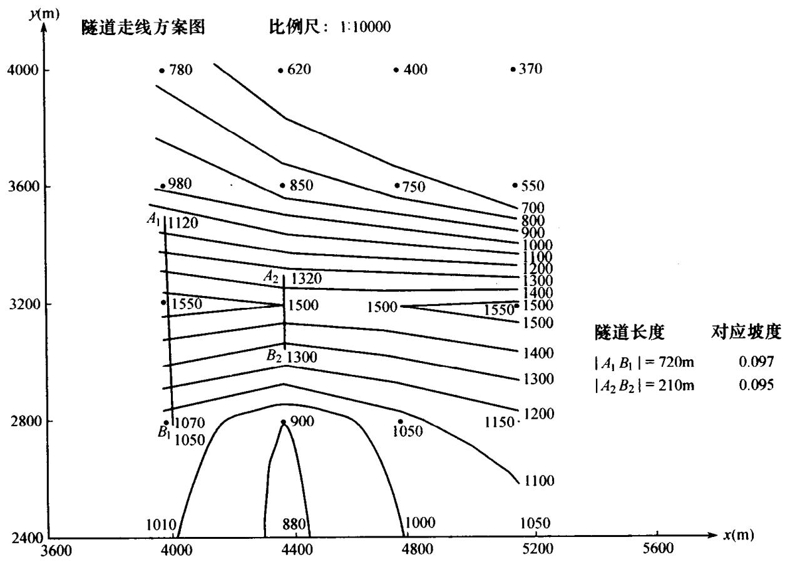

<details>
<summary>contour</summary>

| 工况 | 坡度 (m) |
| :--- | :--- |
| A1 | 1120 |
| A2 | 1320 |
| B1 | 1050 |
| B2 | 1300 |
| B3 | 1500 |
| B4 | 1550 |
</details>

图19

方案比较：

方案 1 造价比较低,但路程比较长,考虑到矿山公路对居民区的影响,故把公路选在居民区的外围.

方案 2 营造费用高,但路程较短,通过了居民区,对居民区产生了不利影响.

图20  
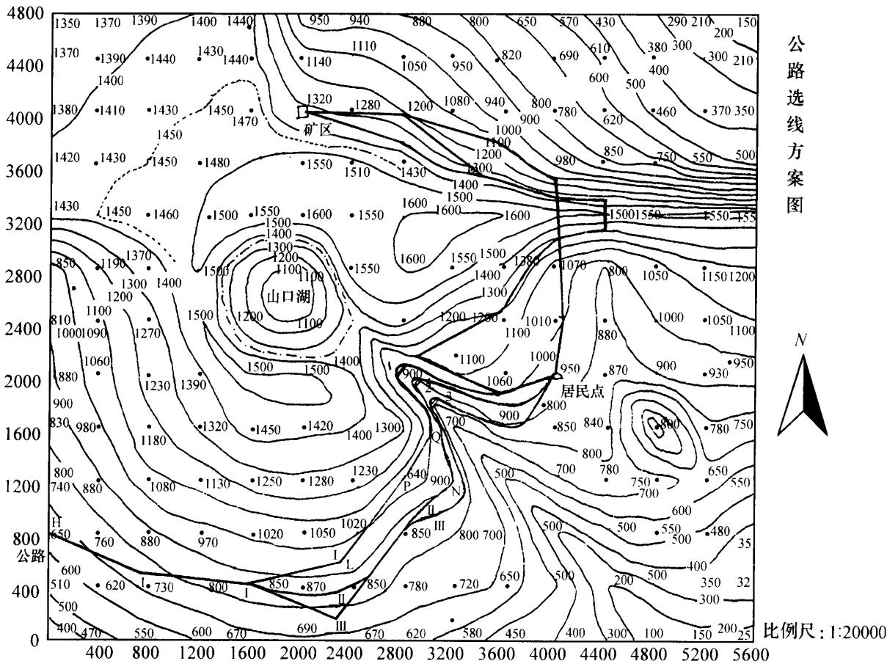

<details>
<summary>contour</summary>

| Feature | Description |
| --- | --- |
| Grid Units | 0, 400, 800, 1200, 1600, 2000, 2400, 2800, 3200, 3600, 4000, 4400, 4800 |
| Grid Units | 0, 400, 800, 1200, 1600, 2000, 2400, 2800, 3200, 3600, 4000, 4400, 4800 |
| Grid Units | 0, 400, 800, 120<fcel> |
</details>

故我们选方案1.

如果需要减缓其转弯程度,可通过适当增加桥梁和隧道的长度加以解决(这样就增加了费用).

## 六、动用层次分析法对方案进行评估

我们采取的层次如图所示,在准则层中考虑了经济、工程、社会和环境等因素.

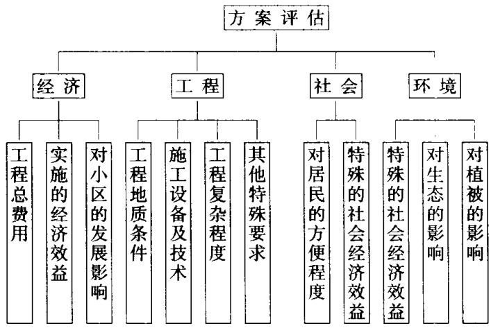

<details>
<summary>flowchart</summary>

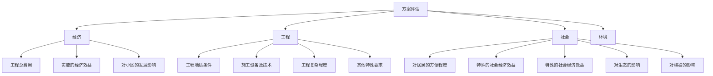
```mermaid
graph TD
  Root["方案评估"] --> E1["经济"]
  Root --> E2["工程"]
  Root --> E3["社会"]
  Root --> E4["环境"]
  
  E1 --> A1["工程总费用"]
  E1 --> A2["实施的经济效益"]
  E1 --> A3["对小区的发展影响"]
  
  E2 --> B1["工程地质条件"]
  E2 --> B2["施工设备及技术"]
  E2 --> B3["工程复杂程度"]
  E2 --> B4["其他特殊要求"]
  
  E3 --> C1["对居民的方便程度"]
  E3 --> C2["特殊的社会经济效益"]
  E3 --> C3["特殊的社会经济效益"]
  E3 --> C4["对生态的影响"]
  E3 --> C5["对植被的影响"]
```
</details>

考虑实际工程中的多因素情况,可以采用多准则层的层次分析法对方案进行评估,由于本问题给予的有关信息很少,因此我们仅仅考虑费用与方便程度这两个方面:

表 5 评估权重表

<table><tr><td>方案评估</td><td>经济</td><td>社会</td><td>优先权重</td></tr><tr><td>经济</td><td>1</td><td>1/5</td><td>1/6</td></tr><tr><td>社会</td><td>5</td><td>1</td><td>5/6</td></tr></table>

费用转化评估标度

$I_{0}=100$ ,费用每增加10万元,标度减1.

方便程度评估标度：

以增加的路线为标度, $I_{0}=100$ ,长度每增加200米,标度减1.

现在我们对居民区的两种路线方案进行评估：

表 6 居民区路线评估表

<table><tr><td>因素\方案</td><td>I</td><td>II</td></tr><tr><td>费用(万元)</td><td>310</td><td>520</td></tr><tr><td>路线长度(米)</td><td>9100</td><td>8100</td></tr></table>

计算权重：

$$
P _ {\mathrm{I}} = 5 / 6 \times (1 0 0 - 3 1 0 / 1 0) + 1 / 6 \times (1 0 0 - 8 1 0 0 / 2 0 0) = 6 7. 4
$$

$$
P _ {\mathrm{II}} = 5 / 6 \times (1 0 0 - 5 2 0 / 1 0) + 1 / 6 \times (1 0 0 - 8 1 0 0 / 2 0 0) = 4 9. 9
$$

$$
P _ {\mathrm{I}} > P _ {\mathrm{II}}, \text {故选方案} \mathrm{I}.
$$

这里仅举此例以作说明,原因是我们的定权及确定标度都有很强的主观因素.要想通过层次分析法得到更客观的评估标准,需要建立专家评估系统,使评估尺度科学化、规则化、标准化,这样才更具说服力.

## 七、关于建模的几点推广及对线路测设的认识

1. 本问题所考虑的只是公路选线的问题,我们可以把它推广到铁路、管道、给排水系统等线形工程.  
2. 如果在更大范围内考虑有线形工程构成的网络系统,运用此方法将会创造巨大的经济效益、社会效益和生态效益.  
3. 通过本问题的研究,我们认识到在进行某项重大决策时,主管部门进行专家咨询和多个方案的比较,是至关重要的.

## 八、本模型的优点及改进方向

本模型比较系统地介绍了由已知高程点格网绘制等高线进行公路定线及方案比较的全过程,具有条理性和实用性,能够推广到类似的工程中去.

本题所讨论的地形比较简单,对工程具体要求比较粗糙,这主要是由于所给问题没有提供更多的人文和地理信息如地质、水文、气候和地形条件,以及居民点、矿区的规模和性质.否则,我们将考虑得更仔细,甚至可以做出居民区的规划图.

本题所提供的高程数据比较稀疏,因此不便进行土方量的计算.在实际工程中,土方量的工程费用是很大的,如果能够提供比较详细的地形资料,如1:1000的地形图,那我们将进行这方面的考虑.

## 参考文献

[1] 测量学, 中国建筑工业出版社, 1990.  
[2] 计算机地图制图原理, 武汉测绘科技大学出版社, 1993.  
[3] 秦绲, 桥梁工程测量, 测绘出版社, 1991.  
[4] 城市道路与交通, 中国建筑工业出版社, 1981.

# 山区公路线路选优方法

汪昕石斌严红辉

(东南大学 210018)

指导教师 孙志忠

编者按 答案从工程和数学两个方面进行了较为清楚的分析, 确定了用计算机计算及人工纸上作业相结合的寻优原则.

在道路设计中,作者在确定“桥”和“隧道”位置之后,利用类似的启发式算法寻找各段的较优路线,这些工作有特点,现将这部分内容发表如下.

## 支态规划法

动态规划法是从终止点开始逆推的多阶段最优决策过程. 多段最优决策的过程中每一段的结束就是下一段的初始状态. 动态规划得到的是全局最优. 它在工程上运用很广. 如最优路线(选定路线, 运输路线, 各种管道等)的规划, 资源, 物资, 设备的最优分配, 设备的更新等.

如果不采用尝试法,就需要事先由地形图确定一般桥梁、隧道的所有可能的位置赋以相应的权值,用狄克斯特累方法或动态规划等方法,求出整体的最小成本费用.程序见附录(略).

以上是计算机搜寻路径的方法,理论上只要网格无限细分,并且对地形的了解足够的话,就一定可以找到最优的线路设计方案,但由于数据无法细分到合理的情况(估计应至少分到两点之间的间隔为10米左右才行,此时才能在地形图上表示出任意方向的直线.而视觉上不产生失真.但受机器限制,数据规模不能太大),存在很大误差,因此不能作为定量分析的依据.但由于误差的性质和大小每次计算都差不多,该方法完全可以定性地分析出最优化的线路所在的大概位置,并为进一步的定量分析——纸上定线法作出十分有意义的指导.

在纸上定线之前,我们先规定了几条原则,这些原则有些并未经过严格证明,只是为了符合工程要求或简化问题.

原则 1 按允许的最大角度爬坡, 即 $\alpha$ 取 0.125, 此时路最短.

原则 2 在坡度较陡的地方,首先考虑自然展线,不得已时方采用回头展线,应尽量利用支脉和平缓山坡等有利地形,并尽量避免在一个山坡上布设较多和相距很近的回头曲线.

原则 3 回头曲线的转折处应满足最小平面曲线半径的要求, (可通过插入一定曲率的过渡曲线解决)

原则 4 考虑桥的长度时, 可取水面宽度加一个常数 C 作为桥长, 如取 C = 10 米.

原则 5 在进行越岭路线选择时, 可以考虑通过垭口; 对垭口很高, 但山体薄窄和分水岭, 应考虑在山体的最薄窄处采用过岭隧道.

在纸上实践时,可以利用计算机定性算出的最优路线作为参考,并根据线路的起止点和中间控制点,作好整体布局.

纸上定线最后阶段可以得到一条折线段,必须通过修正和调整,才能最终得出符合标准的设计曲线.这条曲线一般比较接近最优曲线.根据该,可以直接从图上计算出总成本.

在第二问中,居民点改为一个矩形的居民区,因此活动的范围加大了,但根据路的走向,可以分三种情况考虑;即道路经过居民区西北角,中部和东南角.通过对这三种形式分别计算发现西北角最佳.纸上分析也可得相同结论.该结论可通过地形图直观解释:居民区西北角的海拔为1150米.最接近隧道的开口位置(海拔约1300米),因此爬坡的路线会短很多.当然,当线路改变时,桥的位置也有相应的改变,但变化不大,隧道的位置几乎不变.

数学科学有两个主要方面。第一个也是较为抽象的方面可以叙述为:对结构、模式以及模式的结构和谐性的研究。探求抽象模式结构中的对称性和规则性是纯粹数学的核心。这些探求的目的通常在于了解抽象的概念,但是也常常对其他领域产生实践的和理论的影响。例如,积分几何就构成了 X 射线断层分析照相术（CAT Scan 计算机辅助层析扫描）的理论基础,素数的算术导致了互联网上数据安全传输的完备码的生成,而群的无穷维表示使人们有可能设计通讯中大规模、经济有效的高连通性网络。

数学科学的第二个方面是由要对生活中,通常是由物理学、生物学和商业中,碰到的事件或系统的(数学)建模所激发的。这个方包括以下三个步骤:

对常常并非是清楚明白的实际情况创建一个有明确的(数学)模型。这种(数学)建模需要在忠实于实际情形的模型要求和数学上易于处理的要求之间进行妥协。恰当的妥协通常需要该领域的专家和数学专家的合作。

一通过解析或计算的方法或两者混合的方法来求解该(数学)模型。

一开发在求解特殊数学模型时大概可以重复使用的一般工具。

数学建模的例子包括量子计算机计划,以 DNA 为基础的分子设计,生物学中的模式(图象)形成,工程师日常所用的数值计算的快速 Fourier 变换和多路算法。…… 数学具有双重的性质:她既是为其精确性和内在的优美而受到敬重的独立的学科,她也是应用领域的丰富的工具资源。可以把数学描述为具有内部抽象性和外部有效性的学科。

(下转第57页)

## 6. 锁具装箱(CUMCM 1994 年 B 题)

某厂生产一种弹子锁具,每个锁具的钥匙有5个槽,每个槽的高度从 $\{1,2,3,4,5,6\}$ 6个数(单位略)中任取一数;由于工艺及其他原因,制造锁具时对5个槽的高度还有两个限制:至少有3个不同的数;相邻两槽的高度之差不能为5;满足以上条件制造出来的所有互不相同的锁具称为一批.

从顾客的利益出发,自然希望在每批锁具中“一把钥匙开一把锁”.但是在当前工艺条件下,对于同一批中两个锁是否能够互开,有以下试验结果:若二者相对应的5个槽的高度中有4个相同,另一个槽的高度差为1,则可能互开;在其他情形下,不可能互开.

原来,销售部门在一批锁具中随意地取60个装一箱出售.团体顾客往往购买几箱到几十箱,他们抱怨购得的锁具会出现互开的情形.现聘你为顾问,回答并解决以下的问题:

1) 每一批锁具有多少个, 装多少箱.  
2）为销售部门提出一种方案，包括如何装箱（仍是60个锁具一箱），如何给箱子以标志，出售时如何利用这些标志，使团体顾客不再或减少抱怨。  
3) 采取你提出的方案,团体顾客的购买量不超过多少箱,就可以保证一定不会出现互开的情形.  
4) 按照原来的装箱办法, 如何定量地衡量团体顾客抱怨互开的程度(试对购买一二箱者给出具体结果).

(俞文鰩 谭永基提供)

## (上接第56页)

这种双重性的两部分是深刻地联系在一起的。探求模式中的次序、对称性和规则性是纯数学研究的核心。这种研究的结果是非常持久的，有时候会在发现这些结果的几十年后以一种意想不到的方式找到重要的应用。一个重要的理由就是数学的结果一经证明，决不会被否证即使它们可能会被更强的结果所取代。相比之下，其他科学是经由一个逐次逼近的过程来达到真理的。

《资深评估小组对美国的数学科学的国际评估报告》, 美国科学基金会 (NSF), 1998.
# 关于锁具装箱的数学模型

## 黄宗虎 李波 李春福

(电子科技大学 610054)

指导教师 徐全智

编者按 本文首先利用组合计数的方法求得一批锁具的总数并按槽高和的奇偶性分类装箱,说明团体顾客一次购买量不超过49箱时一定不会出现互开现象.作者试图利用图论的König定理证明方案的最优性,但在证明过程中,从奇类锁与偶类锁具的对称性并不能得到图中所含有饱和 $V_{1}$ 中每个顶点的匹配结论.最后,引进平均互开对数概念,用概率论方法简洁地得到随机装箱时顾客的抱怨程度的量化结果.

整篇文章建模假设合理,综合运用多种学科工具,较园满完成题目的要求,并有一定的创见.叙述简洁清楚,结构严谨是一篇较优秀的参赛论文.

摘要 本文建立了一个关于如何对一批弹子锁具进行装箱和标志的模型.

本文首先用组合数学的方法求得了一批锁具的总数为5880件，接着分析了能够互开的锁具之间的特性，从而得到以下装箱方案：根据钥匙槽高度之和的不同奇偶性将锁具分类装箱。按照这个方案，当购买量不超过49箱时，就可以保证一定不会出现互开的情形。文中用图论知识证明了这个方案是最优的。本文从概率论的角度，引进平均互开对数 $E(m_k)$ ，衡量了按原方案装箱时顾客的抱怨程度，并将本文的方案与原方案进行比较，得出新方案明显减少了顾客抱怨程度的结论。

## 一、问题的重述与分析

某锁厂生产一种弹子锁具,每个锁具的钥匙有5个槽,令 $h_{i}(i=1,2,3,4,5)$ 为钥匙第i个槽的高度,则一批锁具应满足如下三个条件.

条件1 对任意一种槽高排列 $h_1h_2h_3h_4h_5$ 有

$$
h _ {i} \in \{1, 2, 3, 4, 5, 6 \} (i = 1, 2, 3, 4, 5)
$$

条件 2 对任意一种槽高排列 $h_{1}h_{2}h_{3}h_{4}h_{5}$ ，至少有三个槽高互不相同.

条件3 对任意一种槽高排列 $h_1h_2h_3h_4h_5$ ，有

$$
\mid h _ {i} - h _ {i - 1} \mid \neq 5 \quad (i = 2, 3, 4, 5).
$$

而同时满足下面两个条件的两个锁具可以互开，并把这两个锁具称为一个互开对：

\*1. 两个锁的钥匙有四个槽高度相同；

\*2. 其余一个槽高度相差 1.

锁厂销售部门原先在一批锁具中随机地取60个装为一箱出售,这样一来,成箱购买锁具的顾客总抱怨购得的锁具有互开现象.

我们所关心的问题是:每一批锁具共有多少个,如何衡量随机装箱造成的团体顾客的抱怨程度以及采取何种方案装箱来尽量避免团体顾客的抱怨.

由一批锁具中,互开对总数是确定的,但在随机装箱之后,对于每一箱而言,锁具互开现象就不可避免地带有了随机性,因而可以用统计平均值定量地衡量随机装箱造成的团体顾

客的抱怨程度.

为了能够提出一种方案来装箱和标志,以尽量避免团体顾客的抱怨,就需要找出能够互开的锁具之间的特性,从而使能够互开的锁具分开装箱和标记.

文中用到的符号及其说明

<table><tr><td>符号</td><td>说明</td><td>符号</td><td>说明</td></tr><tr><td> $h_i (i = 1, 2,3,4,5)$ </td><td>锁具钥匙的第i个槽的高度</td><td> $α_0 (G)$ </td><td>图G的最小覆盖中的顶点个数</td></tr><tr><td>H</td><td> $H = \sum_{i=1}^{5} h_i$ </td><td> $β_1 (G)$ </td><td>图G的最大匹配中的边数</td></tr><tr><td>D</td><td>满足条件1但不满足条件2或条件3的钥匙槽高度的排列方式的集合,称为除去集</td><td> $β_0 (G)$ </td><td>图G的最大独立顶点集中的顶点个数</td></tr><tr><td> $D_i (i = 1, 2,3,4,5)$ </td><td>D的一个完全划分</td><td> $N_G (V_0)$ </td><td>图G中 $V_0$ 的邻集</td></tr><tr><td>E</td><td>一批锁具中平均每把锁具与其它锁具所能组成的互开对数</td><td>M</td><td>图的最大匹配</td></tr><tr><td> $E_K$ </td><td>K箱锁具中平均每把锁具与其它锁具所能组成的互开对数</td><td>|V|</td><td>集合V的元素个数</td></tr><tr><td>m</td><td>总互开对数</td><td>sd</td><td>互开对数</td></tr><tr><td> $E(m_k)$ </td><td>K箱锁具中平均含有的互开对数</td><td></td><td></td></tr><tr><td>S</td><td>某锁具</td><td></td><td></td></tr><tr><td>V</td><td>锁具集合/顶点集合</td><td></td><td></td></tr><tr><td>X</td><td>互开锁具对的关系构成的边的集合</td><td></td><td></td></tr><tr><td>G(V,X)</td><td>由V和X组成的图</td><td></td><td></td></tr><tr><td>P(G)</td><td>图G的顶点个数</td><td></td><td></td></tr></table>

## 二、模型假设

1. 锁具厂在生产锁具过程中能够准确地知道钥匙的每个槽的高度.  
2. 对于同一批中两个锁具, 若二者相对应的 5 个槽的高度中有 4 个相同, 且另一个槽的高度差为 1, 则一定能互开.

## 三、模型的建立及求解

## 1. 确定一批锁具的总数

我们根据生产一批锁具的三个条件,用排列组合的知识对一批锁具的总数目进行求解,其主要过程如下:

(1) 根据条件 1, 钥匙槽高度的可能排列有 $6^{5} = 7776$ 种  
(2) 受条件 2 和条件 3 的约束, 实际制锁时还要除去一部分钥匙槽高度的排列方式, 我们称这些排列方式形成的集合为除去集 D.

(3) 条件 3 可等价为钥匙槽高度排列方式中不能出现 1 和 6 相邻的情况.  
(4) 对除去集 D 可进行如下划分：

令 $D_{1} = \{h_{1} = h_{2} = h_{3} = h_{4} = h_{5}$ 的排列；

$D_{2}=\{h_{i}(i=1,2,3,4,5)$ 中只有两个不同数的排列；

$D_{3}=\{h_{i}(i=1,2,3,4,5)$ 中有三个不同数且1和6相邻的排列；

$D_{4}=\{h_{i}(i=1,2,3,4,5)$ 中有四个不同数且1和6相邻的排列；

$D_{5}=\{h_{i}(i=1,2,3,4,5)$ 各不相同且 1 和 6 相邻的排列；

显然， $D_{i}(i = 1,2,3,4,5)$ 是 $D$ 的一个完全划分，即 $D_{1} \cup D_{2} \cup D_{3} \cup D_{4} \cup D_{5} = D$ 且 $D_{i} \cap D_{j} = \emptyset (i,j = 1,2,3,4,5$ 且 $i \neq j)$ 我们分别求出了 $D_{i}(i = 1,2,3,4,5)$ 中的元素个数（详细计算见附录1）如下： $|D_{1}| = 6; |D_{2}| = 450; |D_{3}| = 456; |D_{4}| = 792; |D_{5}| = 192(|D|$ 表示集合 $D$ 中元素的个数）

综上,一批锁具的总数为

$$
7 7 7 6 - (6 + 4 5 6 + 7 9 2 + 1 9 2) = 5 8 8 0 \text {件}
$$

可装的箱数为

$$
\frac {5 8 8 0}{6 0} = 9 8 \text {箱}
$$

## 2. 装箱方案

## (1) 对锁具进行分类

当两个锁具相对应的5个槽的高度中有4个相同,另一个槽的高度差为1时,它们可以互开.我们惊奇地发现了下面的规律:

定理 在一批锁具中,能够互开的两锁具的槽高排列 $h_1h_2h_3h_4h_5$ 和 $h_{1}^{\prime}h_{2}^{\prime}h_{3}^{\prime}h_{4}^{\prime}h_{5}^{\prime}$ , 其各槽高度之和 $H = \sum_{i=1}^{5} h_i$ 和 $H' = \sum_{i=1}^{5} h_i'$ 必然具有不同的奇偶性.

因为互开的两个锁具有四个槽高度相同, 仅有一个槽高度差 1 , 那么高度之和 $H = \sum_{i=1}^{5} h_i$ 和 $H' = \sum_{i=1}^{5} h'_i$ 必为两个相邻的自然数, 而两个相邻的自然数中, 必有一个为奇数, 另一个为偶数.

根据定理,我们把锁具按钥匙槽高度之和 H 的奇偶分为两类,H 为奇数的属于奇类,H 为偶数的属于偶类.这样,能够互开的锁具一定分属于奇类和偶类.

## (2) 求解奇类和偶类中锁具的个数

对一个锁具的钥匙槽高度的排列 $h_1h_2h_3h_4h_5$ ，我们用7分别减去每个高度 $h_i (i = 1,2,3,4,5)$ ，形成另一个与其对偶的排列： $(7 - h_1)(7 - h_2)(7 - h_3)(7 - h_4)(7 - h_5)$ 记原排列的高度和 $H_0 = \sum_{i=1}^{5} h_i$ ，新排列的高度和 $H_1 = \sum_{i=1}^{5} (7 - h_i)$

则有

$$
H _ {0} - H _ {1} = 3 5
$$

为使上式成立, $H_{0}$ 、 $H_{1}$ 中必有一个偶数和一个奇数.而每一个奇(偶)类中的排列必能从偶(奇)类中找出与其对应的对偶排列,这种对偶关系是一一对应的.所以:

$$
\text {奇类中锁具数} = \text {偶数中锁具数} = \frac {5 8 8 0}{2} = 2 9 4 0
$$

故奇类和偶类中的锁具数都为 2940 件.

## (3) 装箱和标记

基于以下讨论,我们可得到如下方案:

① 生产锁具过程中记录每个钥匙槽的高度, 从而确定 H 的奇偶性, 将生产出来的锁具分为奇类和偶类.  
② 将奇类和偶类分别装为 49 箱并做“奇”和“偶”的标志.

这样,销售部门可以根据所做标记只选同类的箱子售给团体顾客.只要他们一次购买的箱数不超过49箱(即2940个锁具),我们就可以保证他们的锁具不会有互开现象,他们也不会抱怨了.

## 3. 对方案最优性的证明

我们用计算机对互开对总数进行穷举法计算(见附录2)，得到在一批锁具中互开对总数为22778对.

我们将锁具的互开关系用图表示出来. 锁具集合用顶点集合 $V$ 表示, 如果两个锁具 $V_{i}, V_{j} (i, j = 1, 2, \dots 5880$ 且 $i \neq j$ ) 能够互开, 就用边 $X_{ij}$ 连接起来, 所有 $X_{ij}$ 组成边集合 $X$ . 用这种方法得到的图 $G_{0}(V, X)$ 有 5880 个顶点和 22778 条边.

我们引用图论中的一些概念：

最大匹配 最小覆盖

最大独立顶点集 邻集 $N_{G}(V_{0})$ 二分图 $G(V_{1}, V_{2}, X)$

最大匹配中的边数 $\beta_{1}(G)$ 最大覆盖中的顶点个数 $\alpha_0(G)$

最大独立顶点集中顶点个数 $\beta_{0}(G)$

这些概念在一般图论理论书中可见到(可参见文献[1],[2]).

我们的目的是寻找图 $G_0$ 中的最大独立顶点集，即不包含互开锁对的最大锁具集合.

引理1 二分图 $G(V_{1}, V_{2}, X)$ 含有饱和 $V_{1}$ 的每个顶点的匹配的充要条件是对所有 $V_{0} \subseteq V_{1}, |N_{G}(V_{0})| \geqslant |V_{0}| (|V_{0}|$ 表示集合 $V_{0}$ 中元素的个数. (1) (见[1])

引理2 在二分图 $G$ 中, 最大匹配 $M$ 的边数等于最小覆盖的顶点数 $\alpha_0(G)$ .

引理3 $\alpha_0(G) + \beta_0(G) = P(G)$ . （见[1]）

其中 $P(G)$ 为图 $G$ 的顶点总数.

对二分图 $G_0(V, X)$ , 我们将奇(偶)类顶点集合定义为 $V_1(V_2)$ 得到 $G_0(V_1, V_2, X)$ .

定理 二分图 $G_{0}(V_{1}, V_{2}, X)$ 的 $V_{1}, V_{2}$ 是它的两个最大独立顶点集.

证明:我们的图 $G_{0}(V,X)$ ，对表示奇类锁具的顶点集合 $V_{1}$ ，由奇类锁具与偶类锁具的对称性可知， $G_{0}(V_{1},V_{2},X)$ 满足(1)，即图 $G_{0}(V_{1},V_{2},X)$ 含有饱和 $V_{1}$ 中每个顶点的匹配 M.

又因为 $V_{1}$ 中各顶点互不邻接, 则

$$
\frac {P (G _ {0})}{2} \leqslant | M | \leqslant \beta_ {1} (G _ {0}) = \alpha_ {0} (G _ {0}) \quad (\text {由引理2得})
$$

$$
\beta_ {0} (  G _ {0}) =   P (  G _ {0})   -   \alpha_ {0} (  G _ {0}) \quad \text {(由引理3得)}
$$

$$
\begin{array}{l} \leqslant P (G _ {0}) - \frac {P (G _ {0})}{2} \\ = \frac {P (G _ {0})}{2} = \frac {5 8 8 0}{2} = 2 9 4 0 \\ \end{array}
$$

即图 $G_0$ 的最大独立顶点集中的顶点数不大于2940，而我们划分的独立集(奇类集和偶类集)的顶点个数为2940,因此奇类集 $V_{1}$ 和偶类集 $V_{2}$ 是 $G_{0}(V_{1},V_{2},X)$ 的两个最大独立顶点集.定理得证.

所以,我们的方案可以使锁具不出现互开情况时购买量达到最大.这就证明了我们的方案是最优的.

## 4. 定量分析顾客抱怨互开的程度

## (1) 对于随机装箱的方案

在一批锁具中,互开对总数为 m = 22778 对,则平均每个锁具与其它所有锁具能组成的互开对数为 $E = \frac{m}{2940} = 7.75$ (对)

对于任一个指定锁具 $S$ ，从其它5879把钥匙中任取一把，能打开该锁的概率是均等的。这样，如果从另外5879个锁具中随意取出59个锁具与 $S$ 装成一箱，则在这一箱中能与 $S$ 组成互开对的锁具个数平均有

$$
E _ {1} = \frac {E \times 5 9}{5 8 7 9} = 0. 0 7 8 (\text {个})
$$

平均含有的互开对数为

$$
E (m _ {1}) = \frac {6 0 E _ {1}}{2} = 2. 3 3 (\text {对})
$$

同理可以得知: k 箱锁具中, 能与某一个锁具互开的锁具个数平均为 $E_{k} = E \times \frac{60k - 1}{5879}$ , 平均含有的互开对数为

$$
E (m _ {k}) = \frac {6 0 k \times E _ {k}}{2} = \frac {6 0 k (6 0 k - 1)}{2 \times 5 8 7 9} \times E = \frac {2 2 7 7 8}{5 8 7 9 \times 9 8} \times k \times (6 0 k - 1)
$$

显然, $E_{k}$ 和 $E(m_{k})$ 的大小反映了购买 k 箱的顾客的抱怨程度, 即 $E_{k}$ 或 $E(m_{k})$ 越大, 顾客抱怨程度越大.

表 1 k = 1, k = 2 和 k = 49 的具体结果

<table><tr><td>箱数k</td><td>1</td><td>2</td><td>49</td></tr><tr><td>含有的互开对数E( $m_k$ )</td><td>2.33</td><td>9.41</td><td>5693.5</td></tr><tr><td>能与某一锁具S互开的锁具数 $E_k$ </td><td>0.078</td><td>0.157</td><td>3.87</td></tr></table>

## (2) 对于奇偶分类装箱的方案

由前面的分析知,给箱子进行奇偶标志后再出售,只要顾客购买量 k 不超过 49 箱,就可以保证不出现互开的情况,顾客自然不会抱怨.当购买量 k 超过 49 箱时,可以先从奇(偶)类锁具中取出 49 箱,再从偶(奇)类锁具中任取 k - 49 箱出售给顾客,互开对显然只产生在 49 箱奇(偶)类锁具与 k - 49 箱偶(奇)类锁具之间.此时,k 箱锁具中的平均互开对数为

$$
E ^ {\prime} (  m _ {k})   =   2 2 7 7 8 \times \frac {6 0 \times (  k   -   4 9)}{2 9 4 0}   =   2 2 7 7 8 \times \frac {k   -   4 9}{4 9} (\text {对}),
$$

对比随意装箱的互开对数为

$$
E (m _ {k}) = \frac {2 2 7 7 8}{5 8 7 9 \times 9 8} \times k (6 0 k - 1),
$$

可知：

当 $k \leqslant 49$ 时, $E'(m_k) = 0, E(m_k) > 0$

此时顾客的抱怨被避免了；

当 $49 < k < 98$ 时， $E'(m_k) < E(m_k)$

此时顾客的抱怨程度减少了.

我们在右面画出了 $E'(m_k)$ 和 $E(m_k)$ 的比较图.

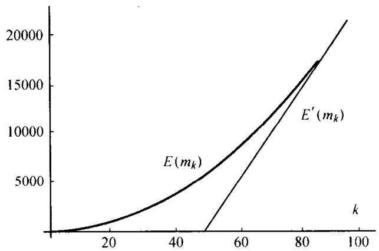

<details>
<summary>line</summary>

| k | E(m_k) | E'(m_k) |
| --- | --- | --- |
| 0 | 0 | — |
| 20 | ~1500 | — |
| 40 | ~4000 | — |
| 60 | ~8500 | ~3500 |
| 80 | ~14000 | ~11000 |
| 95 | ~21500 | ~17500 |
</details>

## (3) 在奇偶分类基础上再分类

对于某个锁具 $S$ ，一批中能与它互开的锁具个数 $sd$ 是一定的，那么 $sd$ 的范围是多大呢，我们用穷举法利用计算机得到 $4 \leqslant sd \leqslant 10$ 。并且得到了对应于每个 $sd$ 的属于奇类的锁具个数（见下面程序结果），由于奇偶的对称性，偶类也有同样的结果。

程序运行结果如下

$$
\text {Total} := 5 8 8 0
$$

$$
\text {odd} := 2 9 4 0 \quad \text {Even}: 2 9 4 0
$$

互开总对数：22778

互开对为 3，0；互开对为 4，45；互开对为 5，105；

互开对为 6，296；互开对为 7，699；互开对为 8，901；

互开对为 9，744；互开对为 10，150；互开对为 11，0；

我们设想在奇偶分类后,再对奇(偶)类按每个锁具的 sd 从小到大对锁具进行装箱,并标记以序号 1,2,…,49. 这样当团体顾客购买箱数 k > 49 时,取奇(偶)类 49 箱后剩下的 k - 49 箱在偶(奇)类中按序号从小到大取箱. 使得在 k 箱中互开总数尽量减少,这样必然更能减小顾客的抱怨程度.

## 四、模型评价

1. 本模型利用数的奇妙的奇偶性为制锁厂提供了一项很好的锁具装箱方案. 此方案在最大范围内消除了锁具的互开现象, 而且方案简单明了, 施行方便.  
2. 本模型综合运用了多种方法对问题进行求解. 其中穷举法简单易懂, 用计算机编程求解的运行时间仅几秒钟; 而概率、图论、组合数学等方理论性较强, 逻辑严密, 而且易于为大家所接受.  
3. 当锁具的种类变化时, 即锁具的槽数和每个槽的可能高度的集合发生变化时, 我们的方案仍然适用, 将我们的计算机程序稍作修改, 就能很快得出一批锁具的总数和奇类、偶

类锁具的个数.

4. 我们的模型还能应用到其它类似性质的事物上, 如对条形码的排列组合和识别分类问题, 只需将可能高度改为可能码数, 槽数改为条形码的条数即可.

## 参考文献

[1] 王朝瑞,《图论》(修订本), 北京工业学院出版社出版, 1987 年.  
[2] 李慰萱,《图论》, 湖南科学技术出版社, 1980 年.

## 六、附录清单

附录1 除去集 $D$ 的元素个数的详细求解

附录 2 程序框图、源程序及运行结果(略)

1. 程序说明  
2. PASCAL 源程序

## 附录 1

除去集 $D_{i}(i = 1,2,3,4,5)$ 的元素个数的详细求解

1. 根据 $D_{1}$ 的性质, $h_{i}(i = 1,2,3,4,5)$ 都取同一个数, 明显有 $D_{1}$ 个元素个灵敏为

$$
C _ {6} ^ {1} = 6 \text {个}
$$

2. 根据 $D_{2}$ 的性质, $h_{i}(i = 1,2,3,4,5)$ 中只有两个不同数 $\omega_{1}$ 和 $\omega_{2}$ , 我们进行如下考虑, 让每个 $h_{i}(i = 1,2,3,4,5)$ 都可以任取 $\omega_{1}$ 和 $\omega_{2}$ , 有 $2^{5}$ 种方式, 但这样做又重复了 $D_{1}$ 中五个槽高均为 $\omega_{1}$ 和五个槽高均为 $\omega_{2}$ 的两种组合, 因而须从 $2^{5}$ 中减去 2, 最后考虑到 $\omega_{1}, \omega_{2} \in \{1,2,3,4,5,6\}$ , 可有 $C_{6}^{2}$ 种取法, 故而 $D_{2}$ 的元素个数为

$$
C _ {6} ^ {2} (2 ^ {5} - 2) = 4 5 0 \text {个}
$$

3. 根据 $D_{3}$ 的性质, $h_{i}(i = 1,2,3,4,5)$ 中必有1和6, 记另外一个与1和6不同的高度数为 $\omega$ , 我们考虑如下完全划分:

(a) $h_i (i = 1,2,3,4,5)$ 中三个1和一个6.

第一步，从 $h_1h_2h_3h_4h_5$ 中选出了三个来安排1，有 $C_5^3$ 种方法，第二步，从剩余的两个槽位中选一个来安排6，剩余最后一个位置自然要排 $\omega$ ，因而有 $P_2^1 C_5^3$ 种安排方法.但这样做纳入了 $\bar{D}$ 集中的两个元素 $111\omega 6$ 和 $6\omega 111$ ，须从安排方法中减去，又 $\omega$ 可以 $\{2,3,4,5\}$ 中任取一数，故而共有排列方式

$$
C _ {4} ^ {1} (2 C _ {5} ^ {2} - 2) = 7 2 \text {种}
$$

(b) $h_i (i = 1,2,3,4,5)$ 中三个6和一个1.

与(a)同理可知共有排列方式

$$
C _ {4} ^ {1} 2 (C _ {5} ^ {3} - 2) = 7 2 \text {种}
$$

(c) $h_i (i = 1,2,3,4,5)$ 中有两个1和两个6.

第一步从 $h_1h_2h_3h_4h_5$ 中任选两上来排1, 有 $C_5^2$ 种选法; 第二步, 从剩余三个位置中任选两个安排6, 剩下最后一个位置自然要排 $\omega$ , 因而有 $C_5^3 C_3^2$ 种排法. 但这样做纳入 $\bar{D}$ 集中的两元素 $11\omega 66$ 和 $66\omega 11$ , 须从排法中减去2. 又 $\omega$ 可以 $\{2,3,4,5\}$ 中任取一数, 故而共有排列

方式.

$$
C _ {4} ^ {1} (C _ {5} ^ {3} C _ {3} ^ {2} - 2) = 1 1 2 \text {种}
$$

(d) $h_i (i = 1,2,3,4,5)$ 中有两个1和一个6.

第一步，从 $h_1h_2h_3h_4h_5$ 中选出二个安排1，有 $C_5^2$ 种方法，第二步，从剩余3个位置中选一个排6，剩余的二个位置都排 $\omega$ ，因而有 $C_5^3 C_3^1$ 种排法.但这样做纳入了 $\bar{D}$ 中的9个元素 $11\omega \omega 6,11\omega 6\omega ,6\omega \omega 11,\omega 6\omega 11,1\omega 1\omega 6,1\omega 6\omega 1,6\omega 1\omega 1,\omega 11\omega 6$ 和 $6\omega 11\omega$ ，须从排法中减去.又 $\omega$ 可以 $\{2,3,4,5\}$ 中任取一个数，故而共有排列方式

$$
C _ {4} ^ {1} (C _ {5} ^ {3} C _ {3} ^ {1} - 9) = 8 4 \text {种}
$$

(e) $h_i (i = 1,2,3,4,5)$ 中有两个6和一个1.

与(d) 同理可知共有排列方式

$$
C _ {4} ^ {1} (C _ {5} ^ {3} C _ {3} ^ {1} - 9) = 8 4 \text {种}
$$

(f) $h_i (i = 1,2,3,4,5)$ 中只有一个1和一个6.

这样考虑, 三个 $\omega$ 可形成四个间隔位, 将 1,6 做为一个数插入四个间隔位有 $C_4^1$ 种方法, 这样得到的组合方式显然属于 $D_3$ , 同样可将 6,1 做为一个数插入四个间隔位, 而 $\omega$ 可从 $\{2, 3,4,5\}$ 中任取一数, 故而共有排列

$$
C _ {4} ^ {1} (P _ {4} ^ {1} P _ {2} ^ {2}) = 3 2 \text {种}
$$

综上所述, $D_{3}$ 集中元素的个数为

$$
7 2 + 7 2 + 1 1 2 \dot {+} 8 4 + 8 4 + 3 2 = 4 5 6 \text {个}
$$

4. 根据 $D_{4}$ 的性质, $h_{i}(i = 1,2,3,4,5)$ 中必有1和6, 记另外两个与1和6不同而且相互之间也不同的高度数为 $\omega_{1}, \omega_{2}$ , 我们考虑如下完全划分:

(a) $h_i (i = 1,2,3,4,5)$ 中有两个1和一个6.

与 $3 - (d)$ 的情况相类比, 现在的情况是 $\omega_{1} \neq \omega_{2}$ 且 $\omega_{1}, \omega_{2} \in \{2,3,4,5\}$ , 而前面的情况是有两个相同的 $\omega$ 且 $\omega \in \{2,3,4,5\}$ . 因而同理容易推知现在共有排列方式

$$
C _ {4} ^ {2} [ P _ {2} ^ {2} (C _ {5} ^ {3} C _ {3} ^ {1} - 9) ] = 2 5 2 \text {种}
$$

(b) $h_i (i = 1,2,3,4,5)$ 中有一个1和两个6.

同理,与 3-(e) 的情况类比可知共有排列方式

$$
C _ {4} ^ {2} [ P _ {2} ^ {2} (C _ {5} ^ {3} C _ {3} ^ {1} - 9) ] = 2 5 2 \text {种}
$$

(c) $h_i (i = 1,2,3,4,5)$ 中只有一个1和一个6.

与 3-(f) 的情况类比, 现在的情况相当于原来的构成间隔位的方式增多了, 可以是两个 $\omega_{1}$ 和一个 $\omega_{2}$ 或两个 $\omega_{2}$ 和一个 $\omega_{1}$ 构成间隔位, 它们都有 $C_{3}^{2}C_{1}^{1}$ 种方式, 又 $\omega_{1}, \omega_{2} \in \{2, 3, 4, 5\}$ , 因而现在的情形下共有排列方式

$$
C _ {4} ^ {2} [ C _ {3} ^ {2} C _ {1} ^ {1} (P _ {4} ^ {1} P _ {2} ^ {2}) + C _ {3} ^ {2} C _ {1} ^ {1} (P _ {4} ^ {1} P _ {2} ^ {2}) ] = 2 8 8 \text {种}
$$

综上所述, $D_{4}$ 集中元素个数为

$$
2 5 2 + 2 5 2 + 2 8 8 = 7 9 2 \text {个}
$$

5. 根据 $D_{5}$ 的性质, $h_{i}(i = 1,2,3,4,5)$ 中只有一个1和一个6, 记其余三个与1和6不同的数为 $\omega_{1}, \omega_{2}, \omega_{3} \in \{2,3,4,5\}$ , 故有 $P_{4}^{3}$ 种构成间隔位的形成. 由此可知 $D_{5}$ 集中元素的个数为

$$
P _ {4} ^ {3} (P _ {4} ^ {1} P _ {2} ^ {2}) = 1 9 2 \text {个}.
$$

# 装箱与销售模型

兰州铁道学院 刘振 杨文青 何新宇

指导教师 俞建宁

编者按 本文较详细地讨论了装箱和连续销售问题,证明了从任一箱起顺次销售能保证至少有35箱不会发生互开现象,进而用字典装箱可改进到42箱.这点是很有创见和特色的.

## 假设

1. 两把锁具对应的5个槽的高度中有4个对应相同, 另一个槽的高度差为1时, 两锁必能互开.

## 模型 I(1)

在考虑使团体顾客不再或减少抱怨的前提下、兼顾销售方便,我们拟采用连续数字作为箱的编号,销售时按箱的编号连续销售.

设一批锁具中第 $i$ 把钥匙从一端开始顺次各槽的高度值组成一个向量记为 $B_{i}$

$$
B _ {i} = \left(b _ {1} ^ {(i)}, b _ {2} ^ {(i)}, \dots , b _ {m} ^ {(i)}\right),
$$

其中 $m$ 为一批锁具中各钥匙槽的个数(本模型 $m = 5$ ).

从而可有如下结论：

结论1: 若 $|B_i| - |B_j| \neq 1$ , 则第 $i$ 把锁和第 $j$ 把锁不能互开(证略).

由结论1得如下推论.

推论1:要使团体顾客不再或减少抱怨,必须使 $||B_{i}|-|B_{j}||=1$ 的两锁具装入编号相距尽可能大的箱中.

推论 2: 模同为偶数的锁具间不能互开.

模同为奇数的锁具间不能互开.

模相等的锁具间不能互开.

由以上分析得到下面的装箱方案.

将模为偶数的锁装入前 $i$ 箱, 模为奇数的锁装入后 $j$ 箱 $(i + j = Y, Y$ 为总箱数, 本题 $Y = 98$ ), 且把模为偶数和奇数的锁具分别按模从小到大的顺序排列后, 依次装箱.

记模为 $|B_i|$ 的所有锁具数为 $\alpha (|B_i|)$ .

本文用计算机程序对不同 $\mid B_{i} \mid$ 的 $\alpha$ 进行计算, 结果如下:

$$
2 (8) = 2 0, 2 (9) = 5 0, 2 (1 0) = 1 2 0, 2 (1 1) = 1 6 2, 2 (1 2) = 2 5 1,
$$

$$
2 (1 3) = 3 2 2, 2 (1 4) = 4 0 5, 2 (1 5) = 5 0 8, 2 (1 6) = 5 3 9,
$$

$$
2 (1 7) = 5 6 3,
$$

$$
2 (1 8) = 5 6 3, 2 (1 9) = 5 3 9, 2 (2 0) 5 0 8, 2 (2 1) = 4 0 5, 2 (2 2) = 3 2 2,
$$

$$
2 (2 3) = 2 5 1, 2 (2 4) = 1 6 2, 2 (2 5) = 1 2 0, 2 (2 6) = 5 0, 2 (2 7) = 2 0.
$$

由统计数据及装箱方案可得表 1:

表 1 模型 I(1) 的装箱方案

<table><tr><td>(n $\mid B_i$  |编号)</td><td>8</td><td colspan="2">10</td><td colspan="2">12</td><td colspan="2">14</td><td colspan="2">16</td><td colspan="2">18</td><td colspan="2">20</td><td colspan="2">22</td><td colspan="2">24</td><td>26</td><td>9</td><td colspan="2">11</td><td colspan="2">13</td><td colspan="2">15</td><td colspan="2">17</td><td colspan="2">19</td><td colspan="2">21</td><td colspan="2">23</td><td colspan="2">25</td><td>27</td></tr><tr><td> $\alpha \mid B_i$ </td><td>20</td><td colspan="2">120</td><td colspan="2">251</td><td colspan="2">405</td><td colspan="2">539</td><td colspan="2">563</td><td colspan="2">508</td><td colspan="2">322</td><td colspan="2">162</td><td>50</td><td>50</td><td colspan="2">162</td><td colspan="2">322</td><td colspan="2">508</td><td colspan="2">563</td><td colspan="2">539</td><td colspan="2">405</td><td colspan="2">251</td><td colspan="2">120</td><td>20</td></tr><tr><td>混合箱</td><td colspan="2">1</td><td colspan="2">3</td><td colspan="2">7</td><td colspan="2">14</td><td colspan="2">23</td><td colspan="2">32</td><td colspan="2">41</td><td colspan="2">46</td><td colspan="2">49</td><td colspan="2">50</td><td colspan="2">53</td><td colspan="2">58</td><td colspan="2">67</td><td colspan="2">76</td><td colspan="2">85</td><td colspan="2">92</td><td colspan="2">96</td><td colspan="2">98</td></tr><tr><td rowspan="5">顺次装箱(自然排序)</td><td rowspan="5"></td><td rowspan="5" colspan="2">2</td><td rowspan="5" colspan="2">456</td><td rowspan="5">8910111213</td><td rowspan="5" colspan="3">1516171819202122</td><td rowspan="5" colspan="2">2425262728293031</td><td rowspan="5" colspan="2">3334353637383940</td><td rowspan="5" colspan="3">42434445</td><td rowspan="5" colspan="2">4748</td><td rowspan="4">5152</td><td rowspan="4">5455</td><td rowspan="4" colspan="2">5960</td><td rowspan="4" colspan="2">68695657</td><td rowspan="4" colspan="2">777861626364</td><td rowspan="4" colspan="2">8687707172736566</td><td rowspan="4" colspan="2">9394798081827475</td><td rowspan="4" colspan="2">978988990918384</td><td rowspan="4" colspan="2"></td><td rowspan="4"></td><td rowspan="4"></td></tr><tr></tr><tr></tr><tr></tr><tr><td></td><td></td><td></td><td></td><td></td><td></td><td></td><td></td><td></td><td></td><td></td><td></td><td></td><td></td><td></td><td></td><td></td><td></td></tr></table>

对表 1 说明如下:

(1) 表中第一行为上述装箱方案对应的模 $\left|B_{i}\right|$ 的排列.  
(2) 表中第二行为模为 $\left|B_{i}\right|$ 的锁具的个数.  
(3) 第三行以下为模为 $\left|B_{i}\right|$ 的锁装入箱的对应编号.  
若锁具 $|B_i|$ 与锁具 $|B_j|$ 能互开，记 $|B_i|$ 所在箱与 $|B_j|$ 所在箱在自然下的距离为 $|S_{ij}|$ .  
记 $M(S_{ij})$ 为从任意箱处顺次连续拿取一定不会出现互开锁的最大箱数，则

$$
M (S _ {i j}) = \min \{S _ {i j} \} - 1.
$$

据表 1 有：

$$
S _ {i j} = \{5 0, 4 9, 4 8, 4 7, 4 6, 4 5, 4 3, 4 2, 4 1, 4 0, 3 9, 3 8, 3 7, 3 6 \},
$$

$$
M (S _ {i j}) = 3 6 - 1 = 3 5.
$$

据以上结果作购买量和出售方案对照表(表2)，表2中曲线上各标值表示由该点对应列箱号开始顺次连续购买，一定不会出现互开锁的最大箱数。显然，保证一定不会出现互开锁的最大购买量为49箱。

表 2 使用说明：

(1) 若购买箱数 $N \leqslant 35$ 箱, 可以从任一标号开始, 顺次连续取.  
(2) 若购买箱数 N = 49 箱, 只能从第 1 箱或第 50 箱或第 98 箱连续取.  
(3) 若购买 $35 < a \leqslant N \leqslant b < 49$ 箱, (其中 $a, b$ 为表2上可取的标值范围的外限)  
(i) 当 $b$ 位于 $a$ 点左边时, $b$ 点取对应箱号的上限, $a$ 点取对应箱号的下限.  
(ii) 当 $b$ 位于 $a$ 的右边时, $b$ 取对应箱的下限, $a$ 取对应箱的上限.

表 2

<table><tr><td>购买箱数</td><td colspan="27">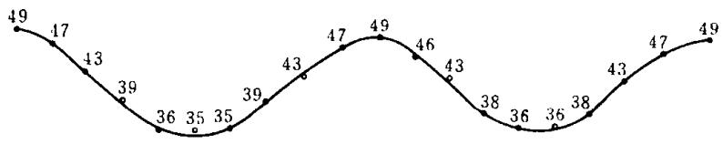</td></tr><tr><td> $|B_i|$ </td><td>8</td><td>10</td><td>12</td><td>14</td><td>16</td><td>18</td><td>20</td><td>22</td><td>24</td><td>26</td><td>9</td><td>11</td><td>13</td><td>15</td><td>17</td><td>19</td><td>21</td><td>23</td><td>25</td><td>27</td><td></td><td></td><td></td><td></td><td></td><td></td><td></td></tr><tr><td> $\alpha |B_i|$ </td><td>20</td><td>120</td><td>251</td><td>405</td><td>539</td><td>563</td><td>508</td><td>322</td><td>162</td><td>50</td><td>50</td><td>162</td><td>322</td><td>508</td><td>563</td><td>539</td><td>405</td><td>251</td><td>120</td><td>20</td><td></td><td></td><td></td><td></td><td></td><td></td><td></td></tr><tr><td rowspan="9">出售标号</td><td colspan="2">1</td><td>3</td><td>7</td><td>14</td><td>23</td><td>32</td><td>41</td><td>46</td><td>49</td><td>50</td><td>53</td><td>58</td><td>67</td><td>76</td><td>85</td><td>92</td><td>96</td><td>98</td><td></td><td></td><td></td><td></td><td></td><td></td><td></td><td></td></tr><tr><td rowspan="8"></td><td rowspan="8">2</td><td>4</td><td>8</td><td>15</td><td>24</td><td>33</td><td>42</td><td>47</td><td>51</td><td>54</td><td>59</td><td>68</td><td>77</td><td>86</td><td>93</td><td rowspan="2">97</td><td rowspan="8">95</td><td rowspan="8"></td><td rowspan="8"></td><td rowspan="8"></td><td rowspan="8"></td><td rowspan="8"></td><td rowspan="8"></td><td rowspan="8"></td><td rowspan="8"></td><td rowspan="8"></td></tr><tr><td>5</td><td>9</td><td>16</td><td>25</td><td>34</td><td>43</td><td rowspan="7">48</td><td rowspan="7">52</td><td rowspan="7">55</td><td rowspan="7">60</td><td>69</td><td>78</td><td>87</td><td>94</td></tr><tr><td rowspan="6">6</td><td>10</td><td>17</td><td>26</td><td>35</td><td>44</td><td>56</td><td>61</td><td>70</td><td>79</td><td>88</td></tr><tr><td>11</td><td>18</td><td>27</td><td>36</td><td rowspan="5">45</td><td rowspan="5">57</td><td>62</td><td>71</td><td>80</td><td>89</td></tr><tr><td>12</td><td>19</td><td>28</td><td>37</td><td>63</td><td>72</td><td>81</td><td>90</td></tr><tr><td rowspan="3">13</td><td>20</td><td>29</td><td>38</td><td rowspan="3">64</td><td>73</td><td>82</td><td>91</td></tr><tr><td>21</td><td>30</td><td>39</td><td>65</td><td>74</td><td>83</td></tr><tr><td>22</td><td>31</td><td>40</td><td>66</td><td>75</td><td>84</td></tr></table>

## 模型 I (2)

模型 I(1) 只考虑了不同 $\mid B_{i} \mid$ 之间的排序, 没有考虑相同 $\mid B_{i} \mid$ 的锁具之间的排序. 因而装箱是方便的. 但购买量并非最大. 为了进一步增大从任一箱起的最大购买量, 我们对相同 $\mid B_{i} \mid$ 的锁具之间进行字典排序后, 并依次按 1, 2, 3, …, 5880 进行标记.

记 $|B_i| = (b_1^{(i)}, b_2^{(i)}, \cdots, b_m^{(i)})$ 中的元素组成一个 $m$ 位数值为

$$
M _ {i} = b _ {1} ^ {(i)} b _ {2} ^ {(i)} \dots b _ {m} ^ {(i)},
$$

则 $B_{j} = (b_{1}^{(j)}, b_{2}^{(j)}, \cdots, b_{m}^{(j)})$ .

m 位数值为:

$$
M _ {j} = b _ {1} ^ {(j)}, b _ {2} ^ {(j)} \dots b _ {m} ^ {(j)}.
$$

结论 2: $M(S_{ij})$ 必然出现在 $|b_1^{(i)} - b_1^{(i)}| = 1$ 的情形中.

证明: 将 $\left|B_{i}\right|$ 组成的有序向量记为 T, 则

$$
T = (8, 1 0, 1 2, 1 4, 1 6, 1 8, 2 0, 2 2, 2 4, 2 6,
$$

$$
9, 1 1, 1 3, 1 5, 1 7, 1 9, 2 1, 2 3, 2 5, 2 7).
$$

将其对应的有序向量集空间定义为 ZK, 则

$$
Z K = (\{2 0 \}, \{1 2 0 \}, \{2 5 1 \}, \{4 0 5 \}, \{5 3 9 \}, \{5 6 3 \}, \{2 0 8 \}, \{3 2 2 \},
$$

$$
\{1 6 2 \}, \{5 0 \}, \{5 0 \}, \{1 6 2 \}, \{3 2 2 \}, \{5 0 8 \}, \{5 6 3 \}, \{5 3 9 \},
$$

$$
\{4 0 5 \}, \{2 5 1 \}, \{1 2 0 \}, \{2 0 \}.
$$

在向量集空间 $ZK$ 中, 对于 $\left|\left|B_{i}\right|-\left|B_{j}\right|\right|=1$ 的两个子向量集 $\{a\mid B_{i}\}$ 和 $\{a\mid B_{j}\}$ , 在按字典排序的条件下, 为了保证不互开, 只有当首位数 $\left|b_{1}^{(i)}-b_{1}^{(j)}\right|=1$ 时向量所对应的锁具编号才相距“最近”.

下面对向量集空间 ZK 中的每一个子向量集 $\{a \mid B_{i} \mid\}$ 按首位数 $b_{1}^{(i)} = 1, 2, \cdots, 6$ 的大小进行字典排序，由表 2 图象可知，只需在 $\left|B_{i}\right|$ 为 $14 \leftrightarrow 13, 16 \leftrightarrow 15, 18 \leftrightarrow 17, 20 \leftrightarrow 19, 22 \leftrightarrow 21$ 这五种情况间进行分析， $M(S_{ij})$ 必在其间，具体分析见表 3.

分析表 3, 可得 $M(S_{ij}) = 42.7$ , 取下整为 42.

也可用计算机进行全范围搜索求解.

将有序向量集空间中的各向量按 $1,2,3,\cdots,5880$ 标记以后，运用计算机依据前述的方案进行搜索，求出各种可能情况下的最小距离 $M(S_{ij})$ ，以该最小距离对应的向量数，标记号差值.

运行结果为：

最小距离对应向量标号之差为 2562.

相应向量 128 个, 即互开锁具数为 128 把.

由 $M(S_{ij}) = 2562/60 = 42.7$ ，取下整为 42 箱。

装箱方案: 将字典排序后的有序向量集空间中的 5880 个向量按顺序提出来, 排成一列. 然后将其对应锁具每 60 把一箱, 依次装箱, 并把各箱的 1 \~ 98 依次编号.

销售方案: 出售时按箱 编号顺次取出. 显然. 保证不互开的最小“最大购买量”为 42 \~ 49.

若购买42箱.可以从任一箱开始顺次连续拿取,两模型都是在连续生产、循环销售的条件下建立的.但模型I(1)和模型I(2)相比,模型I(1)生产简单,装箱方便.模型I(2)在保证不会出现互开锁的前提下,购买箱数由35箱增到42箱,可是在一定程度上增加了生产,装箱的复杂度.

表 3

<table><tr><td rowspan="2" colspan="2">箱距 $|B_i|$ </td><td colspan="6">14</td><td colspan="6">16</td><td colspan="6">18</td><td colspan="6">20</td><td colspan="6">22</td><td rowspan="2">总和</td></tr><tr><td>2</td><td>2</td><td>3</td><td>4</td><td>5</td><td>6</td><td>1</td><td>2</td><td>3</td><td>4</td><td>5</td><td>6</td><td>1</td><td>2</td><td>3</td><td>4</td><td>5</td><td>6</td><td>1</td><td>2</td><td>3</td><td>4</td><td>5</td><td>6</td><td>1</td><td>2</td><td>3</td><td>4</td><td>5</td><td>6</td></tr><tr><td rowspan="6">13</td><td>1</td><td></td><td>44.38</td><td></td><td></td><td></td><td></td><td></td><td></td><td></td><td></td><td></td><td></td><td></td><td></td><td></td><td></td><td></td><td></td><td></td><td></td><td></td><td></td><td></td><td></td><td></td><td></td><td></td><td></td><td></td><td></td><td>90</td></tr><tr><td>2</td><td></td><td></td><td>44.35</td><td></td><td></td><td></td><td></td><td></td><td></td><td></td><td></td><td></td><td></td><td></td><td></td><td></td><td></td><td></td><td></td><td></td><td></td><td></td><td></td><td></td><td></td><td></td><td></td><td></td><td></td><td></td><td>80</td></tr><tr><td>3</td><td></td><td></td><td></td><td>45.95</td><td></td><td></td><td></td><td></td><td></td><td></td><td></td><td></td><td></td><td></td><td></td><td></td><td></td><td></td><td></td><td></td><td></td><td></td><td></td><td></td><td></td><td></td><td></td><td></td><td></td><td></td><td>60</td></tr><tr><td>4</td><td></td><td></td><td></td><td></td><td>44.28</td><td></td><td></td><td></td><td></td><td></td><td></td><td></td><td></td><td></td><td></td><td></td><td></td><td></td><td></td><td></td><td></td><td></td><td></td><td></td><td></td><td></td><td></td><td></td><td></td><td></td><td>52</td></tr><tr><td>5</td><td></td><td></td><td></td><td></td><td></td><td>44.28</td><td></td><td></td><td></td><td></td><td></td><td></td><td></td><td></td><td></td><td></td><td></td><td></td><td></td><td></td><td></td><td></td><td></td><td></td><td></td><td></td><td></td><td></td><td></td><td></td><td>30</td></tr><tr><td>6</td><td></td><td></td><td></td><td></td><td></td><td></td><td></td><td></td><td></td><td></td><td></td><td></td><td></td><td></td><td></td><td></td><td></td><td></td><td></td><td></td><td></td><td></td><td></td><td></td><td></td><td></td><td></td><td></td><td></td><td></td><td>10</td></tr><tr><td rowspan="6">15</td><td>1</td><td></td><td></td><td></td><td></td><td></td><td></td><td></td><td>43.05</td><td></td><td></td><td></td><td></td><td></td><td></td><td></td><td></td><td></td><td></td><td></td><td></td><td></td><td></td><td></td><td></td><td></td><td></td><td></td><td></td><td></td><td></td><td>102</td></tr><tr><td>2</td><td></td><td></td><td></td><td></td><td></td><td></td><td></td><td></td><td>43.05</td><td></td><td></td><td></td><td></td><td></td><td></td><td></td><td></td><td></td><td></td><td></td><td></td><td></td><td></td><td></td><td></td><td></td><td></td><td></td><td></td><td></td><td>112</td></tr><tr><td>3</td><td></td><td></td><td></td><td></td><td></td><td></td><td></td><td></td><td></td><td>43.05</td><td></td><td></td><td></td><td></td><td></td><td></td><td></td><td></td><td></td><td></td><td></td><td></td><td></td><td></td><td></td><td></td><td></td><td></td><td></td><td></td><td>102</td></tr><tr><td>4</td><td></td><td></td><td></td><td></td><td></td><td></td><td></td><td></td><td></td><td></td><td>43.15</td><td></td><td></td><td></td><td></td><td></td><td></td><td></td><td></td><td></td><td></td><td></td><td></td><td></td><td></td><td></td><td></td><td></td><td></td><td></td><td>85</td></tr><tr><td>5</td><td></td><td></td><td></td><td></td><td></td><td></td><td></td><td></td><td></td><td></td><td></td><td>43.22</td><td></td><td></td><td></td><td></td><td></td><td></td><td></td><td></td><td></td><td></td><td></td><td></td><td></td><td></td><td></td><td></td><td></td><td></td><td>70</td></tr><tr><td>6</td><td></td><td></td><td></td><td></td><td></td><td></td><td></td><td></td><td></td><td></td><td></td><td></td><td></td><td></td><td></td><td></td><td></td><td></td><td></td><td></td><td></td><td></td><td></td><td></td><td></td><td></td><td></td><td></td><td></td><td></td><td>34</td></tr><tr><td rowspan="6">17</td><td>1</td><td></td><td></td><td></td><td></td><td></td><td></td><td></td><td></td><td></td><td></td><td></td><td></td><td>43.00</td><td></td><td></td><td></td><td></td><td></td><td></td><td></td><td></td><td></td><td></td><td></td><td></td><td></td><td></td><td></td><td></td><td></td><td>78</td></tr><tr><td>2</td><td></td><td></td><td></td><td></td><td></td><td></td><td></td><td></td><td></td><td></td><td></td><td></td><td></td><td>42.70</td><td></td><td></td><td></td><td></td><td></td><td></td><td></td><td></td><td></td><td></td><td></td><td></td><td></td><td></td><td></td><td></td><td>112</td></tr><tr><td>3</td><td></td><td></td><td></td><td></td><td></td><td></td><td></td><td></td><td></td><td></td><td></td><td></td><td></td><td></td><td>42.80</td><td></td><td></td><td></td><td></td><td></td><td></td><td></td><td></td><td></td><td></td><td></td><td></td><td></td><td></td><td></td><td>106</td></tr><tr><td>4</td><td></td><td></td><td></td><td></td><td></td><td></td><td></td><td></td><td></td><td></td><td></td><td></td><td></td><td></td><td></td><td>42.80</td><td></td><td></td><td></td><td></td><td></td><td></td><td></td><td></td><td></td><td></td><td></td><td></td><td></td><td></td><td>104</td></tr><tr><td>5</td><td></td><td></td><td></td><td></td><td></td><td></td><td></td><td></td><td></td><td></td><td></td><td></td><td></td><td></td><td></td><td></td><td>42.70</td><td></td><td></td><td></td><td></td><td></td><td></td><td></td><td></td><td></td><td></td><td></td><td></td><td></td><td>96</td></tr><tr><td>6</td><td></td><td></td><td></td><td></td><td></td><td></td><td></td><td></td><td></td><td></td><td></td><td></td><td></td><td></td><td></td><td></td><td></td><td></td><td></td><td></td><td></td><td></td><td></td><td></td><td></td><td></td><td></td><td></td><td></td><td></td><td>67</td></tr><tr><td rowspan="6">19</td><td>1</td><td></td><td></td><td></td><td></td><td></td><td></td><td></td><td></td><td></td><td></td><td></td><td></td><td></td><td></td><td></td><td></td><td></td><td></td><td>43.55</td><td></td><td></td><td></td><td></td><td></td><td></td><td></td><td></td><td></td><td></td><td></td><td>50</td></tr><tr><td>2</td><td></td><td></td><td></td><td></td><td></td><td></td><td></td><td></td><td></td><td></td><td></td><td></td><td></td><td></td><td></td><td></td><td></td><td></td><td></td><td>43.22</td><td></td><td></td><td></td><td></td><td></td><td></td><td></td><td></td><td></td><td></td><td>84</td></tr><tr><td>3</td><td></td><td></td><td></td><td></td><td></td><td></td><td></td><td></td><td></td><td></td><td></td><td></td><td></td><td></td><td></td><td></td><td></td><td></td><td></td><td></td><td>43.15</td><td></td><td></td><td></td><td></td><td></td><td></td><td></td><td></td><td></td><td>96</td></tr><tr><td>4</td><td></td><td></td><td></td><td></td><td></td><td></td><td></td><td></td><td></td><td></td><td></td><td></td><td></td><td></td><td></td><td></td><td></td><td></td><td></td><td></td><td></td><td>43.25</td><td></td><td></td><td></td><td></td><td></td><td></td><td></td><td></td><td>107</td></tr><tr><td>5</td><td></td><td></td><td></td><td></td><td></td><td></td><td></td><td></td><td></td><td></td><td></td><td></td><td></td><td></td><td></td><td></td><td></td><td></td><td></td><td></td><td></td><td></td><td>42.91</td><td></td><td></td><td></td><td></td><td></td><td></td><td></td><td>106</td></tr><tr><td>6</td><td></td><td></td><td></td><td></td><td></td><td></td><td></td><td></td><td></td><td></td><td></td><td></td><td></td><td></td><td></td><td></td><td></td><td></td><td></td><td></td><td></td><td></td><td></td><td></td><td></td><td></td><td></td><td></td><td></td><td></td><td>95</td></tr><tr><td rowspan="6">21</td><td>1</td><td></td><td></td><td></td><td></td><td></td><td></td><td></td><td></td><td></td><td></td><td></td><td></td><td></td><td></td><td></td><td></td><td></td><td></td><td></td><td></td><td></td><td></td><td></td><td></td><td>44.43</td><td></td><td></td><td></td><td></td><td></td><td>19</td></tr><tr><td>2</td><td></td><td></td><td></td><td></td><td></td><td></td><td></td><td></td><td></td><td></td><td></td><td></td><td></td><td>.</td><td></td><td></td><td></td><td></td><td></td><td></td><td></td><td></td><td></td><td></td><td></td><td>44.28</td><td></td><td></td><td></td><td></td><td>52</td></tr><tr><td>3</td><td></td><td></td><td></td><td></td><td></td><td></td><td></td><td></td><td></td><td></td><td></td><td></td><td></td><td></td><td></td><td></td><td></td><td></td><td></td><td></td><td></td><td></td><td></td><td></td><td></td><td></td><td>44.28</td><td></td><td></td><td></td><td>60</td></tr><tr><td>4</td><td></td><td></td><td></td><td></td><td></td><td></td><td></td><td></td><td></td><td></td><td></td><td></td><td></td><td></td><td></td><td></td><td></td><td></td><td></td><td></td><td></td><td></td><td></td><td></td><td></td><td></td><td></td><td>44.62</td><td></td><td></td><td>84</td></tr><tr><td>5</td><td></td><td></td><td></td><td></td><td></td><td></td><td></td><td></td><td></td><td></td><td></td><td></td><td></td><td></td><td></td><td></td><td></td><td></td><td></td><td></td><td></td><td></td><td></td><td></td><td></td><td></td><td></td><td></td><td>44.72</td><td>92</td><td></td></tr><tr><td>6</td><td></td><td></td><td></td><td></td><td></td><td></td><td></td><td></td><td></td><td></td><td></td><td></td><td></td><td></td><td></td><td></td><td></td><td></td><td></td><td></td><td></td><td></td><td></td><td></td><td></td><td></td><td></td><td></td><td></td><td></td><td>98</td></tr><tr><td colspan="2">总和</td><td>98</td><td>92</td><td>84</td><td>60</td><td>52</td><td>19</td><td>95</td><td>106</td><td>108</td><td>96</td><td>84</td><td>50</td><td>67</td><td>96</td><td>104</td><td>106</td><td>112</td><td>78</td><td>34</td><td>70</td><td>88</td><td>102</td><td>112</td><td>102</td><td>12</td><td>28</td><td>52</td><td>60</td><td>80</td><td>90</td><td></td></tr></table>

# 关于不互开箱数上限的一个讨论

魏明骏 于清娟 王振宇

(中国科学技术大学 230026)

指导教师 程继新

编者按 本文讨论了锁具分箱问题中,顾客最多购买多少箱时不会出现互开现象的问题,且给出了箱数的一个上限.虽然所得上限过大,但证明方法巧妙、简洁,具有启发性,特将有关部分予以发表.

我们按槽高之和的奇偶性将锁具划分为 $A, B$ 两个集合. 容易证明, 每个集合的锁具数为 $5880 / 2 = 2940$ 个, $A$ 和 $B$ 中的锁具可分别装 49 箱. 以 $A \cup B = V$ 为顶集, 当且仅当 $a \in A, b \in B, a$ 与 $b$ 可互开时, 在顶 $a$ 与 $b$ 间连一条边, 得一图 $G(V, E)$ . 可以证明 $G(V, E)$ 为二分图, $A$ 与 $B$ 为独立集. 于是, 不互开锁具箱数的下限为 49. 下面, 我们证明不互开箱数的上限为 54. 证明如下:

假设团体顾客购买了 $n$ 箱锁具而不互开，且 $n > 54, n$ 箱锁具必分属于 $A, B$ 两个集合。不妨设其中有 $n_1$ 箱锁具，这些锁具的集合 $N_1 \subset A$ ，(可以证明 $N_1 \neq A$ ) 和有 $n_2$ 箱锁具，这些锁具的集合 $N_2 \subset B$ 。令 $A - N_1 = N_3, |N_3| = n_3$ （集合 $N_3$ 中的锁具装在 $n_3$ 箱中）， $B - N_2 = N_4, |N_4| = n_4$ ，且 $n_1, n_2, n_3, n_4$ 满足：

$$
n _ {1} + n _ {2} = n, n _ {1} + n _ {3} = 4 9, n _ {2} + n _ {4} = 4 9 \tag {1}
$$

故

$$
n _ {3} + n _ {4} = 9 8 - (n _ {1} + n _ {2})
$$

又

$$
n _ {1} + n _ {2} = n > 5 4
$$

于是

$$
n _ {3} + n _ {4} <   4 4 \tag {2}
$$

由于 $n$ 箱锁具不互开，所以在 $G$ 中 $N_{1} \cup N_{2}$ 为独立集；又 $N_{1} \cup N_{3} = A$ 为独立集，所以 $N_{1}$ 中的顶只能与 $N_{4}$ 中的顶相邻，而 $N_{4}$ 中的顶则与 $N_{1} \cup N_{3}$ 中的顶可能相邻。所以 $N_{1}$ 中顶的总度数 $D_{1}$ 与 $N_{4}$ 中顶的总度数 $D_{4}$ 满足：

$$
D _ {1} \leqslant D _ {4} \tag {3}
$$

同理

$$
D _ {2} \leqslant D _ {3},
$$

于是

$$
D _ {1} + D _ {2} \leqslant D _ {3} + D _ {4} \tag {4}
$$

借助计算机可统计出 G 中顶的总度数 D = 45556，

又

$$
\sum_ {i = 1} ^ {4} D _ {i} = D, \text {再由(4)} \text {得}
$$

$$
D _ {3} + D _ {4} \geqslant D / 2 = 2 2 7 7 8 \tag {5}
$$

借助计算机统计,我们还可以知道度数的精确分布(即不同度数各有多少锁具)如下:

$$
R (1) = R (2) = R (3) = 0, R (4) = 9 0, R (5) = 2 1 0,
$$

$$
R (6) = 5 9 2, R (7) = 1 3 9 8, R (8) = 1 8 0 2,
$$

$$
R (9) = 1 4 8 8, R (1 0) = 3 0 0
$$

其中 $R(i)$ 表示 i 度顶的个数.

由此,可求出43箱锁具能容纳的最大度数为22728;

44 箱锁具能容纳的最大度数为 23208.

于是

$$
\text {当} n _ {3} + n _ {4} <   4 4 \text {时,} D _ {3} + D _ {4} <   2 2 7 7 8 \tag {6}
$$

与(5)矛盾,由此证出 n > 54 不成立,即不互开锁具箱数的上限为 54,证毕.

## 参考文献

[1] 王树禾编著,《图论及其算法》,中国科学技术大学出版社,1990.

确实,数学是决定性的相互交叉的学科。数学是取得全面进步的出发点。数学既是强有力的洞察工具,又是科学的共同语言。我把她称为科学的“世界语”。(原文:Indeed, Mathematics is the ultimate cross-cutting discipline. It is the springboard for advances across the board. Mathematics is both a powerful tool for insight, and it’s a common language for science, I refer it as the “Esperanto” of science. Rita Colwell (Director of NSF)(美国科学基金会主任 Rita Colwell)

NSF Launches Major Initiative in Mathematics, Allyn Jackson, Notices of AMS, v.48(2001), no. 2, 190 - 192.

# 独立集最大性的讨论

杨琼 尹雪钰 李程

(北京师范大学 100875)

指导教师 曾文艺

编者按 本部分将最优装箱问题转化为图论的二分图问题,用图论方法说明了 S,T 分别是两个极大无关集且 $\left|S\right|=\left|T\right|=2940$ , 并借助计算机找到了一个匹配, 其边数为 2928, 说明了最大匹配边数 $\geqslant2928$ , 再利用 Konig 定理得出最大独立集个数 $\leqslant2952<3000$ , 从而得到文中不能互开的最大箱数为 49 箱.

本部分思路清晰,行文流畅;但未能从理论上证明2940就是最大独立集数,只是用计算机给出了2952这个上界.

三 采取我们的方案,团体顾客购买量不超过49箱,可以保证一定不会出现互开情形,

我们分析如下:(注:S = {各位数字和为奇数的合格锁的集合}

$$
T = \{\text {各位数字和为偶数的合格锁的集合} \}
$$

将锁看成点,两个锁具互开则可看成两点之间存在一条边.则一批锁具构成顶点数为 P = 5880 的简单图.由前所证,在同一 S 或 T 集合中不会有互开关系,互开关系只会发生在 S 中点与 T 中点之间.由图论中二部图定义,这 P 个锁具构成二部图 $G = (S, T, E)$

我们引入以下几个概念:(见[1]田丰等,《图与网络流理论》,科学出版社)

(1) 边无关集: 给定图 $G = (V, E)$ , 若边集 $M \subseteq E$ 中任两条边都没有公共顶点, 称 $M$ 是 $G$ 的边无关集; 记最大边无关集的边数为 $\beta_{1}(G)$ , 显然 $\beta_{1}(G) \leqslant P / 2([1] \mathrm{p}. 60)$  
(2) 点无关集: 对图 $G = (V, E)$ , 若点集 $I \subseteq V$ 中任意两个点间都不存在边, 称 $I$ 是最大点无关集; 包含点数最多的点无关集称为最大点无关集, 其中点的个数记为 $\beta_0(G)$ ([1]p. 77)

再不加证明地引入以下几个定理:(其中 $\alpha_{0}(G)$ 为图的点覆盖数)

① 设 $G = (S, T, E)$ 是二部图，则 $\beta_{1}(G) = \alpha_{0}(G) \quad ([1] \mathrm{p}.64)$

$$
② \alpha_ {1} (G) + \beta_ {0} (G) = P (G)
$$

易由 ①② 得, 对于二部图, $\beta_{1}(G) + \beta_{0}(G) = P(G)$ (\*)

显然对于本题的二部图 $G = (S, T, E)$ , S = T = 2940, 而 S, T 都是极大点无关集, 即若再往 S 或 T 中增加集合外一点, 则集合不再是无关集, 于是 $\beta_{0}(G) \geqslant 2940$ （\* \*）

另外,我们利用计算机程序(见算法)找出了一个边无关集,其中边数为2928,从而最大边无关数 $\beta_{1}(G)\geqslant2928$ ,由(\*)得

$$
\beta_ {0} (G) = P (G) - \beta_ {1} (G) \leqslant 2 9 5 2
$$

综合 $(*)$ 得 $2940 \leqslant \beta_{0}(G) \leqslant 2952$ ，这就是说明我们如从一批锁具中任取50箱，其锁数为 $3000 > 2952 \geqslant \beta_{0}(G)$ ，其中必存在相关（可互开）的锁.

由前面的装箱办法,我们将 S 类中的 2940 把锁装成 49 箱,T 类中的 2940 把锁装成 49箱；从上面的分析可知我们提出的两个内部不互开的49箱的分类是最优的。团体顾客购买不超过49箱，可以保证一定不会出现互开。

## 附

利用程序找尽量大的边无关集的计算步骤：

算法主要目的是找出尽可能多的匹配,从而提高 $\beta_{1}(G)$ 的下限,也即缩小了最大点无关集个数 $\beta_{0}(G)$ 的上限.

① 产生 5880 把合格锁, 按数字特征(锁各位数字之和分组)  
② 对每把锁求出与之互开的锁  
③ 标记所有的锁为没有匹配(NoMate)  
④ 从数字特征的8的组开始,在标记为NoMate的锁中查找互开锁(与之互开的锁数字特征必为9),找到后将两锁都标记为已匹配(HasMate)  
⑤ 依次对特征为 9 - 27 的所有锁进行步骤 ④, 若发现与某未匹配锁互开的锁都已匹配, 则产生一不可匹配的锁, 直到所有锁都处理完.

程序运行后,给出2928对匹配点,即2928条无关的边,因此 $\beta_{1}(G)\geqslant2928$ .

那么数学的“应用”是由什么组成的呢?在我看来它能描述如下,它的任务在于基于物质世界某些对象的性态所遵从的一般规律,预言这些对象在给定条件下的行为。通过把物质对象对应到认定能“表示”这些物质对象的数学对象以及把控制前者的规律对应到数学对象之间的数学关系,就能构造所研究的情形的数学模型;这样,把原来的问题翻译为数学问题,如果能以精确或近似方式求解此数学问题,就可以再把所得到的解翻译回去,从而“解”出原先提出的问题。

《当代数学——为了人类心智的荣耀》—让·迪厄多内著，沈永欢译，上海教育出版社，pp.21-22, 1999.

# 抱怨程度模型

顾宗良 党 京 卢敦陆

(合肥工业大学 230009)

指导教师 周永务

编者按 在本次竞赛中, 很大部分试卷中都用平均互开次数的数学期望值定义为抱怨程度的度量. 这自然就得出购买箱数越多, 抱怨程度越大, 这不太符合顾客的心理状态. 本文认为顾客抱怨程度与购买箱数成反比, 与检验结果成指数关系, 在定义抱怨程度函数上是很有特色的.

## 1. 总体互开概率

将一批 5880 个锁具两两比较, 总的比较依次数为 $C_{5880}^{2}$ , 其中能互开的次数可通过编程让计算机统计出

$$
\text {两两比较次数总和为} \mathrm{TQTAL} = C _ {5 8 8 0} ^ {2}
$$

$$
\text {两两比较中能互开的次数和为} H K = 2 2 7 7 8
$$

$$
\text{互开率为} P_{\text{总}} = \frac{\mathrm{HK}}{\mathrm{TOTAL}} = \frac{22778}{C_{5880}^2} = 0.132\%
$$

通过 $P_{\text{总}}$ 我们可看出这批锁具的互开程度, 并可衡量一批锁具的技术指标. 若 $P_{\text{总}}$ 越小, 互开现象就越小, 锁具的安全性越好.

## 2. 团体顾客购买若干箱时互开概率

## (1) 根据总体概率分析估算

若抽取1箱,里面60个锁具两两比较次数为 $C_{60}^{2}$ .若认为每箱的互开率与一批总体互开率 $P_{总}$ 相同,则互开次数的,数学期望 $E_{1}=C_{60}^{2}\cdot P=2.34$ .

设在 $C_{60}^{2}$ 次独立重复抽取事件中，互开次数 $\xi \sim B(C_{60}^{2}, P), P(i)$ 代表在 $C_{60}^{2} = 1770$ 次比较中出现 $i$ 对互开现象的概率.

由二项分布的基本原理得：

$$
P (K) = P (\xi = K) = C _ {1 7 7 0} ^ {K} P ^ {K} (1 - P) ^ {1 7 7 0 - K}
$$

$$
(K = 0, 1, 2, \dots , 1 7 7 0, P = 0. 1 32 \%)
$$

上述分布律亦可用下表表示：

<table><tr><td>K</td><td>0</td><td>1</td><td>2</td><td>3</td><td>4</td><td>5</td></tr><tr><td>P(K)</td><td>0.096</td><td>0.226</td><td>0.264</td><td>0.205</td><td>0.120</td><td>0.056</td></tr><tr><td>K</td><td>6</td><td>7</td><td>8</td><td>9</td><td> $\geqslant 10$ </td><td></td></tr><tr><td>P(K)</td><td>0.022</td><td>0.007</td><td>0.002</td><td>0.001</td><td> $\approx 0$ </td><td></td></tr></table>

从上表我们可以看出,一箱内不存在互开的可能性是很小的,仅0.096,而出现两次互

开的概率最大. 可见互开现象较严重, 所以采用新的装箱、标志方法非常重要.

同理抽取二箱时,互开次数 $\xi \sim B(C_{120}^{2}, P)$

$$
E _ {2} = C _ {1 2 0} ^ {2} \cdot P = 9. 4 2
$$

$$
P = (\xi = K) = P (K) = C _ {7 1 4 0} ^ {K} P ^ {K} (1 - P) ^ {K}
$$

作出的表格为：

<table><tr><td>K</td><td>0</td><td>1</td><td>2</td><td>3</td><td>4</td><td>5</td><td>6</td></tr><tr><td>P(K)</td><td>8E-5</td><td>0.00076</td><td>0.0036</td><td>0.011</td><td>0.026</td><td>0.050</td><td>0.078</td></tr><tr><td>K</td><td>7</td><td>8</td><td>9</td><td>10</td><td>11</td><td>12</td><td>13</td></tr><tr><td>P(K)</td><td>0.106</td><td>0.125</td><td>0.131</td><td>0.123</td><td>0.105</td><td>0.083</td><td>0.060</td></tr><tr><td>K</td><td>14</td><td>15</td><td>16</td><td>17</td><td>18</td><td>19</td><td> $\geqslant 20$ </td></tr><tr><td>P(K)</td><td>0.041</td><td>0.025</td><td>0.015</td><td>0.0083</td><td>0.0043</td><td>0.0029</td><td>0.0021</td></tr></table>

对一般情况抽取 n 箱时, 互开次数 $\xi \sim B(C_{60,n}^{2}, P)$

## (2) 随机抽样模拟

i) 在实际生活中, 一般顾客在大多数情况下, 往往采取从已买的若干箱锁具中抽取若干个锁具, 检验统计后进行估计的方法, 由此行出互开程度的大小. 我们认为此种方法虽然在理论上是合理的, 但实际中的检验方法不可能满足估计量的评选标准, 因为, 即使取一箱, 在其中任取一对检验, 也有 $C_{60}^{2} = 1770$ 种可能, 若取两箱, $C_{120}^{2}$ 就更大, 在实际中不可能. 做到与之可类比的检验次数, 而取到任意一箱的种数也有 $C_{5880}^{60}$ 种, 况且不同的人在一批锁具中的不同箱子中, 可能按照不同抽取方法, 不同的抽取次数来抽样检验, 故一般顾客采取的抽样方法在估计中的置信程度、偏差程度、有效性、相合性等方面存在很大欠缺, 为此我们采取计算机随机抽样方法来模拟互开的概率情况.

ii) 利用计算机模拟随机抽样. 对此我们有多种方法: 蒙特卡洛模拟中的迭代取中法移位法、同余法. 但考虑问题的实际情况, 我们采用了线性同余法来模拟(见程序(略)).

我们基本方法如下：

从一批总体 5880 个中随机抽取 60 个组成一箱, 箱内 60 个锁具两两比较, 互开次数记为 N, N 的取值 0, 1, 2, 3, $\cdots$ , $C_{60}^{2}$ .

通过计算大量产生随机数,模拟抽取,并进行比较,对N值取值为0,1,2,3,…的次数加以分类统计,记为 $M_{i}(i=1,2,3\cdots)$ ,以 $P(i)=\frac{M_{i}}{M}$ 代表一箱内出现i对的概率,则根据强大数定律得:当随机抽样次数M充分大时, $P(i)$ 趋向一批总体概率分布.

我们利用计算机模拟顾客购买一箱和两箱锁具的互开情况,计算结果如下表和图.

<table><tr><td>一箱</td><td> $K_0$ </td><td> $K_1$ </td><td> $K_2$ </td><td> $K_3$ </td><td> $K_4$ </td><td> $K_5$ </td></tr><tr><td>次数</td><td>991</td><td>2300</td><td>2689</td><td>2173</td><td>1100</td><td>527</td></tr><tr><td>互开率</td><td>0.0991</td><td>0.2300</td><td>0.2689</td><td>0.2173</td><td>0.1100</td><td>0.0527</td></tr><tr><td>一箱</td><td> $K_6$ </td><td> $K_7$ </td><td> $K_8$ </td><td> $K_9$ </td><td> $K \geqslant 10$ </td><td></td></tr><tr><td>次数</td><td>82</td><td>27</td><td>11</td><td>1</td><td>0</td><td></td></tr><tr><td>互开率</td><td>0.0082</td><td>0.0027</td><td>0.0110</td><td>0.0001</td><td>0</td><td></td></tr></table>

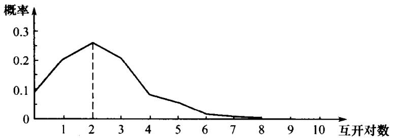

<details>
<summary>line</summary>

| 互开对数 | 概率 |
| --- | --- |
| 0 | 0.1 |
| 1 | ~0.2 |
| 2 | ~0.26 |
| 3 | ~0.21 |
| 4 | ~0.09 |
| 5 | ~0.06 |
| 6 | ~0.02 |
| 7 | ~0.01 |
| 8 | 0 |
</details>

从图表可以看出,抽取一箱时互开时数为2的概率最大

<table><tr><td>二箱</td><td> $K_0$ </td><td> $K_1$ </td><td> $K_2$ </td><td> $K_3$ </td><td> $K_4$ </td><td> $K_5$ </td><td> $K_6$ </td></tr><tr><td>次数</td><td></td><td>8</td><td>33</td><td>112</td><td>257</td><td>508</td><td>771</td></tr><tr><td>互开率</td><td>8E-5</td><td>0.0008</td><td>0.0033</td><td>0.0112</td><td>0.0257</td><td>0.0508</td><td>0.0771</td></tr><tr><td>二箱</td><td> $K_7$ </td><td> $K_8$ </td><td> $K_9$ </td><td> $K_{10}$ </td><td> $K_{11}$ </td><td> $K_{12}$ </td><td> $K_{13}$ </td></tr><tr><td>次数</td><td>1053</td><td>1254</td><td>1325</td><td>1212</td><td>1053</td><td>826</td><td>587</td></tr><tr><td>互开率</td><td>0.1053</td><td>0.1254</td><td>0.1325</td><td>0.1212</td><td>0.1053</td><td>0.0826</td><td>0.0587</td></tr><tr><td>二箱</td><td> $K_{14}$ </td><td> $K_{15}$ </td><td> $K_{16}$ </td><td> $K_{17}$ </td><td> $K_{18}$ </td><td> $K_{19}$ </td><td>K≥20</td></tr><tr><td>次数</td><td>424</td><td>236</td><td>157</td><td>87</td><td>45</td><td>29</td><td>23</td></tr><tr><td>互开率</td><td>0.0424</td><td>0.0236</td><td>0.0157</td><td>0.0087</td><td>0.0045</td><td>0.0029</td><td>0.0005</td></tr></table>

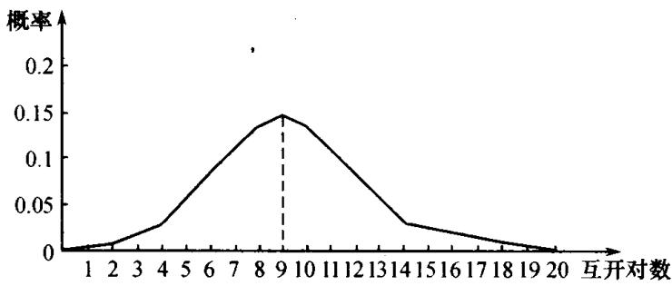

<details>
<summary>line</summary>

| 互开对数 | 概率 |
| --- | --- |
| 1 | ~0.005 |
| 2 | ~0.01 |
| 3 | ~0.02 |
| 4 | ~0.03 |
| 5 | ~0.06 |
| 6 | ~0.09 |
| 7 | ~0.12 |
| 8 | ~0.14 |
| 9 | 0.15 |
| 10 | ~0.14 |
| 11 | ~0.12 |
| 12 | ~0.10 |
| 13 | ~0.08 |
| 14 | ~0.06 |
| 15 | ~0.03 |
| 16 | ~0.025 |
| 17 | ~0.02 |
| 18 | ~0.015 |
| 19 | ~0.01 |
| 20 | ~0.005 |
</details>

从图可以看出,抽取二箱时,互开对数为9的概率最大

抱怨函数的构造：

抱怨函数的构造建立在以下假设的基础上.

1. 假设团体顾客在购买时, 至多一次购买 $G$ 箱 $(G \leqslant 98)$ , 且顾客从所购的 $G$ 箱中随机抽取检验的箱数占其购买箱数的百分率 $g$ 与他所购买的箱数成二次关系.

即有： $g = -aG^{2} + bG + c$ （其中 $a, b, c$ 为常数）

由于箱数必须为整数,故我们认为顾客抽取的检验指数符合 $J = INT(g \times G + 0.5)$ 的规律.

这是因为考虑到团体顾客购买后不可能象单个顾客购买几把或十几把可以完全检验所购锁的互开次数.

例如:若想检验一箱锁中有几次互开,需检验 $C_{60}^{2}=1770$ 次.

若检验二箱,则需 $C_{120}^{2}=7140$ 次

故此团体顾客购买后只能从中抽取一定数量的箱数来检验,且考虑到顾客的心理,当他购买箱数较少时,自然检验率较高,能发现几乎所有的互开情况,当购买数量大时,相对检验

率会减少,有的互开情况发现不了.

2. 由于当团体顾客购买量较大(通常为几十箱)时,他也不可能对抽出箱内的锁作完全互开试验,因此,我们又假设顾客在对所抽取的箱中的锁作检验时,从每箱当中抽取相同数量的锁具 $n$ 把,然后把 $n$ 把锁具混合起来作完全互开试验,这样检验的工作量不大,而又达到了检验目的.例如,从40箱里抽出3箱检验,再从3箱的每箱中又抽出10把锁具混合起来,对这30把锁具作完全检验.

显然,顾客的抱怨程度最主要一方面取决于他所购买的总数量,另方面取决于他作检验的结果(即互开次数).并且从心理学的解度考虑,顾客更偏重于检验的结果.由此我们认为顾客的抱怨程度与购买的总箱数成反比,与检验结果成e的指数关系

由此,就可以定义出抱怨函数的表示为

$$
C (T, \delta_ {n}) = \frac {K _ {1}}{T} e ^ {K _ {2} \delta_ {n}},
$$

其中 $K_{1}, K_{2}$ 为常数, 其实际意义为:

$K_{1}$ : 表示顾客购买箱数在整个抱怨程度中所占的比重

$K_{2}$ : 表示检验到互开次数在整个抱怨程序中所点的比重.

其确定可分别依实际的用户而确定.

T: 表示顾客购买的总箱数.

$\delta_{n}$ : 表示顾客检验到有 n 次互开的互开率.

即 $\delta_{n}$ 等于 $J\times n$ 把锁作完全互开试验后得到的 $n$ 次互开比上 $J\times n$ 把锁的所有组合

即 $\delta_{n} = \frac{n$ 次互开 $C_{J\times n}^{2}\times 100\%$

下面我们针对在一批锁具中购一、二箱的情况作具体分析.

我们用计算机进行 1000 次的模拟数据检验(程序见附录(略)), 结果见下表.

<table><tr><td>互开次数 n</td><td>0</td><td>1</td><td>2</td><td>3</td><td>4</td><td>5</td><td>6</td><td> $\geqslant 7$ </td></tr><tr><td>概率  $P_n(\%)$ </td><td>13.7</td><td>26.9</td><td>28.6</td><td>17.9</td><td>8.7</td><td>2.9</td><td>0.9</td><td>0</td></tr></table>

n: 一箱中有 n 次互开; $P_{n}$ : 1000 次检验下一箱中有 n 次互开的概率.

我们认为：

① 如果甲顾客购买箱数是乙顾客的两倍, 而甲、乙检验到相同的 $\delta_{n}$ , 则甲的抱怨程度是乙的两倍;  
② 如果仅购买一箱, 由互开数大于 7 的为 0 次, 故检验到的互开率为 $\frac{6}{C_{10}^2} = \frac{2}{15}$ 时抱怨达到极值设为 100.

由 ①, 得到 $K_{1} = 1$ ,

由 ②, 得到 $K_{2} = \frac{15}{2} \ln 100$

则得到抱怨函数的具体表达式为 $C(T, \delta) = \frac{1}{T} e^{\delta_n \frac{15}{2} \ln 100}$ .

对购买一箱者：

$$
\delta_ {n} = \frac {n}{C _ {1 0} ^ {2}}
$$

为简便起见,我们假设顾客多次重复做了这样的试验,并对各种互开情况顾客均能检验到,则平均互开率:

$$
\begin{array}{l} \bar {\delta} _ {1} = \sum_ {n = 1} ^ {6} \delta_ {n} \cdot P _ {n} \\ = \frac {1}{C _ {1 0} ^ {2}} (1 \times 0. 2 6 9 + 2 \times 0. 2 8 6 + 3 \times 0. 1 7 9 + 4 \times 0. 0 8 7 \\ + 5 \times 0. 0 2 9 + 6 \times 0. 0 0 9) = 0. 0 4 \\ \end{array}
$$

对于二箱的情况：

$$
\begin{array}{l} \delta_ {n} ^ {\prime} = \frac {n}{C _ {2 0} ^ {2}} \\ \bar {\delta} _ {2} = \sum_ {n = 1} ^ {6} \delta_ {n} ^ {\prime} P _ {n} \\ = \frac {1}{C _ {1 0} ^ {2}} (1 \times 0. 2 6 9 + 2 \times 0. 2 8 6 + 3 \times 0. 1 7 9 + 4 \times 0. 0 8 7 \\ + 5 \times 0. 0 2 9 + 6 \times 0. 0 0 9) = 0. 0 1 \\ \end{array}
$$

则购买一箱的顾客的平均抱怨程度为：

$$
\overline {{C}} (1, \bar {\delta} _ {1}) = e ^ {\bar {\delta} _ {1} \cdot \frac {1 5}{2} \ln 1 0 0} = e ^ {0. 0 4 \times \frac {1 5}{2} \ln 1 0 0} = 3. 9 8
$$

则买二箱的顾客的平均抱怨程度为：

$$
\bar {C} (2, \bar {\delta} _ {2}) = \frac {1}{2} e ^ {\bar {\delta} _ {2} \cdot \frac {1 5}{2} \ln 1 0 0} = 0. 5 \times e ^ {0. 0 1 \times \frac {1 5}{2} \ln 1 0 0} = 0. 7 1
$$

对结果的解释：

由上述结果可以看出,购买一箱锁具的顾客的平均抱怨率明显高于购买两箱锁具的顾客的平均抱怨率,这是与我们的一贯看法所吻合的.因为虽然在个别情况下购买两箱锁具的顾客的抱怨率会高于购买一箱锁具的顾客的抱怨率,但顾客购买的数量越少,就越容易检验出其中的互开情况,而如果购买的数量较大,相对就不易检验出互开的情况,并且由于购买的总箱数在一定程度上起了平衡顾客心理的作用,故上述的结果在数值上差别就不难理解了.

# 关于顾客抱怨程度的定量描述

喻甫祥 薛剑耿 林东

(中国科学技术大学 230026)

指导教师 王树禾 徐俊明

编者按 本文在讨论锁具随机装箱情况(即原来的装箱方法)之下,顾客不满意程度的描述时,首先引入了三个特征量:互开的“锁具对”的数目 $x$ ,能被某把其他锁具打开的锁具的个数 $y$ ,必须报废的锁具的最小数目 $a$ .通过计算机模拟求出了 $x$ 和 $y$ 的期望值.作者们在讨论一把锁被 $n$ 把其他锁具打开的问题中,证明了 $n \geqslant 3$ 的情况出现的概率很小,可以忽略.在此基础上给出了抱怨程度的一个描述,并给出了改进的描述方法.虽然其中的一些问题还有待于进一步探讨,仍不失为一种富有特色的考虑方法.

## 1. 分析和假设

当锁具随机装箱后出售给团体顾客时,可能由于某些锁具互开而引起抱怨.我们设计概率模型来定量地衡量团体顾客抱怨互开的程度.模型应该较好地反映出大多数时候团体顾客抱怨互开的程度,而又能兼顾到极端情况,尽量使团体顾客抱怨程度极大而抱怨函数却极小的情况很少出现.

假设团体顾客发现购买的锁具中有互开的情况时,会更换一些锁具以避免互开,我们称这些被更换的锁具被报废.我们引入三个特征量:互开锁的“锁具对”的数目 x,能被某把其它锁具打开的锁具的个数 y,必须报废的锁具的最小数目 a.如果以每个锁具为顶点,能互开的锁具之间用一条边相连,构造出一个图 G,那么 x 就是 G 的边数,y 就是 G 的非孤立顶点数,a 就是 G 的点覆盖数.

另外,我们用五位数来代表锁具,各位数字分别与相应槽的高度相对应,按五位数的数字和的奇偶性,把锁具分为奇锁具和偶锁具两大类,容易证明,一批具有5880个,其中奇、偶锁具各有2940个;不同的奇锁具之间不互开,不同的偶锁具之间也不互开,因此G是一个二分图.

## 2. 模型的设计

抱怨程度与互开的锁具对数 $x$ ，能被其它某把锁具打开的锁具的个数 $y$ 以及必须报废的锁具的最小数目 $a$ 有关。

理论推导可以得到 $x$ 的期望值，在一箱中，由于边的总数为22778，可以得到 $x$ 的期望值为 $Ex = \frac{22778}{C_{5880}^2} \times C_{60}^2 = 2.33$ . 通过计算机模拟的方法可以得到 $x, y$ 的分布和数学期望。如当团体顾客的购买量为一箱时， $x$ 和 $y$ 的数学期望分别为2.33和4.43；两箱时，则分别为9.40和17.39。

称出现一个锁具能与其它两个锁具互开的情况为一个二分叉,能与其它三个锁具互开的情况为三分叉,依次类推.在一箱锁具中,出现一个锁具被(至少三个)其它锁具打开的概率 $p_0$ 是相当小的，证明如下：(设一箱中一个给定锁具被至少三个其它锁具打开的概率为 $p_1$ )

$$
P _ {1} \leqslant \max \left\{\sum_ {l _ {1} = 3} ^ {l} \frac {\binom {l} {l _ {1}} \binom {5 8 7 9 - l} {5 9 - l _ {2}}}{\binom {5 8 7 9} {5 9}}: l \leqslant 1 0 \right\} \leqslant 0. 0 0 0 1
$$

$$
\therefore p _ {0} \leqslant 6 0 p _ {1} \leqslant 0. 0 0 6
$$

所以这种情况可以忽略不计.

在剩余的情况中, 我们用函数 $2x + y$ 来衡量顾客抱怨的程度. 若四个锁具能分为两对, 每对中两个锁具可以互开, 不同对中的两个锁具不能互开, 我们称之为情况 $A$ ; 同时我们用情况 $B$ 来表示三个锁具形成一个二分叉. 显然, 情况 $A$ 和情况 $B$ 都恰有两对互开的锁具, 但是情况 $A$ 可能需要报废两个锁具, 情况 $B$ 一般只需要报废一个锁具. 所以我们可以说情况 $A$ 比情况 $B$ 更坏一些, 在排除了三分叉和更多分叉的情况后, 我们可以看出如果有一个锁具能被另两个不同的锁具打开 (即出现情况 $B$ ), 则 $2x + y$ 小于将这三把锁及另外某把锁 $A$ 的情况且不影响其它锁具的互开关系时它的值, 而且可以得出有 $n_1 = 2x - y$ 个锁具能被两个不同的锁具打开, 有 $n_2 = 2(y - x)$ 个锁具能被恰好一个其它的锁具打开, $(n_1$ 和 $n_2$ 满足 $2n_1 + n_2 = 2x, n_1 + n_2 = y)$ 其它的锁具都不会被箱中任意别的锁具打开. 这样当每增加一对锁具能互相打开而不影响其它锁具的互开关系时 $2x + y$ 将增大. 可见, $2x + y$ 对 $A$ 和 $B$ 这两种情况给予了恰当的区分. 由此可知 $2x + y$ 在绝大多数情况下比较好地描述了顾客的不满意程度. 根据计算机模拟的结果可得到 $2x + y$ 对 $A$ 和 $B$ 这两种情况给予了恰当的区分. 由此可知 $2x + y$ 在绝大多数情况下比较好地描述了顾客的不满意程度. 根据计算机模拟的结果可得到 $2x + y$ 的数学期望值是

$$
E (2 x + y) = 2 E x + E y = 2 \times 2. 3 3 + 4. 4 3 = 9. 0 9.
$$

另外当箱数为二时, 计算可得存在一个锁具被另外四个锁具打开的概率小于百分之二, 所以这种情况也可以忽略不计. 这时 $2x + y$ 仍能比较好地反映顾客的不满意程度. 此时的数学期望值为

$$
E (2 x + y) = 2 E x + E y = 2 \times 9. 4 0 + 1 7. 3 9 = 3 6. 1 9.
$$

为了更精确地描述顾客的不满意程度,我们引进新的参数 $y_{1}$ 和 $y_{2}, y_{1}$ 为能被箱中某个另外的锁具的个数, $y_{2}$ 为能被箱中某个另外的锁具打开的偶锁具的个数. 我们用 $u = y_{1}y_{2}$ 表征顾客不满意程度. 由一条变时, 顾客的不满意程度也变大. 容易看出 $u$ 很好的反映了这种要求. 另外我们可以考虑另一个参数 $a$ 为最少要报废的锁具数目 (即顾客使用其它的锁具可以做到任意两把锁具不可以互开). 从经济的角度来看, $a$ 十分精确地反映了顾客的不满意程度. 而且可以看出 $a$ 大致为 $\min(y_{1}, y_{2})$ , 由于 $y$ 的分布已由计算机模拟得出, 而且 $x$ 的分布用 possion 分布 ( $\lambda = 2.33$ ) 较好地逼近, 所以 $u$ 中包含了相当多的 $a$ 信息量. 由于 $a$ 的分布很难用数学方法或计算机模拟得到, 而 $u$ 的分布在箱数不多时用计算机可以很快得到, 所以我们采用 $u$ 作为表征顾客不满意程度的量.

下面估算 $u$ 中包含 $a$ 的信息量 $I(u, a)$ 与 $a$ 的熵值 $H(a)$ 的比值（即 $u$ 反映 $a$ 的程度）：当箱数为一时，由计算机模拟得到的 $c = \min(y_1, y_2)$ 的分布 ( $t = 1000$ ) 知：

$$
P \{a = 0 \} = P (u = 0) = 0. 1 0 2
$$

$$
0. 2 2 4 = P \{u = 1 \} \leqslant P \{a = 1 \} \leqslant P \{u = 1 \} + P \{u = 2 \} + 0. 0 1 = 0. 2 7 4
$$

$$
0. 6 1 4 \leqslant P \{a \geqslant 2 \} \leqslant 0. 6 6 4
$$

所以

$$
H (a) \geqslant 0. 8 4
$$

$$
\frac {H _ {u} (a)}{H (a)} = \sum_ {k = 0} ^ {9 0 0} P \left\{u = k \right\} \frac {H _ {u = k} (a)}{H (a)}
$$

$$
\leqslant - 0. 0 0 6 1 \ln 0. 0 0 6 - 0. 0 4 9 \ln 0. 0 4 9 \leqslant 0. 1 5
$$

(1) $\frac{I(u,a)}{H(a)}\geqslant 0.85,I(u,a)\geqslant 0.7$

注：分三种情况

A) 存在一把锁可以被与它不同的三把锁打开.  
B) $0 \leqslant u \leqslant 20$ , 且不在 A) 中.  
C) $21 \leqslant u \leqslant 900$ ，且不在 A) $k$ 。

由此很容易看出熵值估计式的正确性.

由(1)式知道如果给定 $u$ ，则在大约百分之八十五以上的程度上决定了 $a$ ，所以我们取 $u$ 作为表征量是十分合理的。

## 3. 模型的评价

我们的模型对下述情况没有给出很好的描述:抱急函数较大但团体顾客因为实际需要报废的锁具数并不多而不十分抱怨.这是一种“好”的情况(销售部门担心的是对团体顾客抱怨互开的程度估计不足),这类情况里较多的出现二分叉、三分叉等,前面已指出这类情况发生的概率很小.发生概率较大的是接近极坏的情况,二分叉、三分叉等出现较少,需要报废的锁具数目与x十分接近,此时 $y\approx2x,2x+y\approx4x,\sqrt{y_{1}y_{2}}\approx x$ ,可见两种抱怨函数在多数情况下是一致的.

在以上的讨论中, 我们认为两个锁具只要满足互开时锁具对应槽的高度关系就能互开的概率 $p = 1$ , 事实上并不能保证它们一定能互开, 即应有 $0 < p < 1$ , 若某个团体顾客购买的锁具中存在 $n$ 对满足互开时锁具对应槽的高度关系, 如果认为每一对都有概率 $p$ 的可能互开, 那么实际能互开的锁具的对数 (数学期望) 大约为 $pn$ . 因此对生产厂家来说, 通过提高工艺水平来降低 $p$ , 可以降低团体顾客抱怨互开的程度.

# 关于“锁具装箱”问题的评阅工作

中国科学院系统科学研究所

项可凤

“锁具装箱”问题(B题)送交评阅的试卷共58份,由于经过赛区筛选,卷子质量普遍较好,绝大多数卷子都达到或超过组委会所提供的参考答案的要求.根据这样情况,我们评阅小组认为凡是未达到参考答案要求,或文字表达极差的卷子,经评卷小组成员半数以上认定,评卷组长确认,按未达到标准而被淘汰.这样,在阅卷第一阶段,就淘汰了17份卷子.评卷的第二阶段要在余下的41份卷子中,评选出全国一等奖.对于一等奖,我们认为其内容上必须超过参考答案要求,特别在下述几个方面,至少要在一、二个问题上有创见或特色:

## 1)不能互开锁具的最大数的论证

这是一个较难的理论问题. 参考答案只要求按槽高之和的奇偶分成二类, 各分装 49 箱, 2940 把锁不能互开. 但 2940 是否为不能互开的最大数呢? 有少量卷子用图论方法给出讨论或给出算法. 我们认为, 能在这个问题上给出论证本身就反映学生思考问题的严密性和解决理论问题的能力.

## 2)关于装箱销售问题

在这个问题上,大多数卷子仅仅讨论了按槽高之和的奇偶标记分箱,可以保证团体顾客购买不超过49箱时,不会出现互开问题.我们认为仅讨论到这一步还不够.在门市销售中,实际的顾客流是序贯的.有少量卷子,讨论了序贯销售时,装箱的标记方法,按此方法,在连续销售中,可以保证任意购买不超过42箱均不会出现互开问题,这样的讨论就更深入和符合实际了.

## 3)关于顾客抱怨程度

这个问题灵活性较大,没有固定解答,学生有较大发挥余地,答案也是形形色色的.但大部分卷子都用平均互开总对数,或它的单调增函数去定义抱怨程度.因此,购买箱数越多,抱怨程度越大.我们认为这样定义抱怨函数有一定不合理性.因为购买越多,自然互开概率越大,这是顾客所意料中的,不应有太多的抱怨.顾客所不能容忍的是在购买少量锁具而出现互开现象.因此,我们更欣赏把购买箱数作为一个因素考虑到抱怨函数中.理想的抱怨函数应该是,开始随购买量增加而增加,到一定量后下降,这才更合情理.

4)在参赛的卷子中,普遍存在不重视文字表述问题.我们认为,入选一等奖的卷子,必须文字叙述清楚、简练、流畅.

根据上述 4 条原则, 经过评卷小组成员反复地横向比较, 一致同意确定 15 份优秀卷子, 作为全国一等奖提名.

最后,余下26份卷子都是至少有评卷小组成员半数以上同意入选的,自然就是全国二等奖.在二等奖中,成绩跨度较大,这是因为数学建模竞赛和一般竞赛不同,它没有标准答案,只能从横向比较中确定优劣.

## 7. 一个飞行管理问题(CUMCM 1995 年 A 题)

在约 10 000 m 高空的某边长 160 km 的正方形区域内, 经常有若干架飞机作水平飞行. 区域内每架飞机的位置和速度向量均由计算机记录其数据, 以便进行飞行管理. 当一架欲进入该区域的飞机到达区域边缘时, 记录其数据后, 要立即计算并判断是否会与其区域内的飞机发生碰撞. 如果会碰撞, 则应计算如何调整各架(包括新进入的)飞机飞行的方向角, 以避免碰撞. 现假定条件如下:

1) 不碰撞的标准为任意两架飞机的距离大于 8 km;  
2)飞机飞行方向角调整的幅度不应超过30度；  
3) 所有飞机飞行速度均为每小时为 800 km;  
4) 进入该区域的飞机在到达区域边缘时,与区域内飞机的距离应在 60 km 以上;  
5)最多需考虑6架飞机；  
6)不必考虑飞机离开此区域后的状况.

请你对这个避免碰撞的飞行管理问题建立数学模型,列出计算步骤,对以下数据进行计算(方向角误差不超过0.01度),要求飞机飞行方向角调整的幅度尽量小.

设该区域4个顶点的座标为 $(0,0),(160,0),(160,160),(0,160)$ . 记录数据为：

<table><tr><td>飞机编号</td><td>横坐标 x</td><td>纵坐标 y</td><td>方向角(度)</td></tr><tr><td>1</td><td>150</td><td>140</td><td>243</td></tr><tr><td>2</td><td>85</td><td>85</td><td>236</td></tr><tr><td>3</td><td>150</td><td>155</td><td>220.5</td></tr><tr><td>4</td><td>145</td><td>50</td><td>159</td></tr><tr><td>5</td><td>130</td><td>150</td><td>230</td></tr><tr><td>新进人</td><td>0</td><td>0</td><td>52</td></tr></table>

注：方向角指飞行方向与 $x$ 轴正向的夹角.

试根据实际应用背景对你的模型进行评价与推广.

(俞文鯖 谭永基提供)

# 飞行管理问题的实时算法

## 复旦大学 谭浩南 朱正光 刘剑

## 指导教师 蔡志杰

编者按 该文以区域内飞机调整飞行角幅度的平方和为目标函数,以自调整时刻起0.3小时内飞机两两不发生碰撞为约束条件,建立了一个非线性规划模型,用逐步求精的直接搜索和引入罚函数,化为无约束极值,用序列无约束最小化(SUMT)两种方法进行求解.

作者在建模和求解时从实际需要出发,精益求精,将上述两种方法相结合,得到了精度高,基本上是实时的方法与程序,还对模型与方法作出了恰当的分析与评价,文章清晰、完整.

摘 要 本文讨论了在一定区域空间内进行飞行管理避免飞机相撞的模型,提出了直接搜索法和非线性规划(SUMT)法两种解法,并将两种方法有机结合,得出的算法在486微机上计算时间小于10秒,误差不超过0.01度,完全符合问题的要求.

本文接着给出四种不同情况分别用两种方法求解,进行比较检验,取得很好的吻合,充分说明了模型3的可靠性.本文还对模型的误差进行分析并对模型进行推广.

关键词 非线性规划,直接搜索,罚函数

## 一、问题的提出(略)

## 二、问题的分析

该问题是一个在一定约束条件下的最优化问题,初步分析题意后可知约束条件是非线性的,难以化归为线性规划问题.由于题目涉及数据变量不是太多,可以考虑用逐步求精的直接搜索法求解.由于题目要求的精度较高,而对于计算时间的要求也较高,如果求解时间在2、3分钟以上将失去任何实际意义.我们将求解时间上限定为0.5分,以符合实际的要求.直接搜索法求的近似解难以同时满足两方面的要求.但直接搜索法至少能在较短的时间内得到一个较好的可行解,这就为运用非线性规划的方法提供了条件.非线性规划的算法种类繁多,但均只适用于某些类型的问题.由于缺乏适用的计算机软件包,我们自行编写了实现算法的程序.综合程序准备时间和收敛速度两方面因素我们选择了SUMT算法.SUMT算法与直接搜索法相结合,使我们能够在足够短的时间内找到问题的足够精确的解.

## 三、模型假设及说明

1. 不碰撞的标准为任意两架飞机的距离大于 $8 \, km$ ;  
2. 飞机飞行方向角调整的幅度不应超过 30 度；  
3. 所有飞机飞行速度均为每小时 800 km;  
4. 进入该区域的飞机在到达区域边缘时,与区域内飞机的距离应在60公里以上;  
5. 最多考虑 6 架飞机；  
6. 不必考虑飞机离开此区域后的状况；  
7. 飞机进入控制区域后完全服从地面控制台的调度,飞机未接到指令时保持飞行状态不变.

8. 计算机从记录新进入飞机数据到给各飞机发指令间隔为 $t_1, t_1$ 小于0.5分.

9. 飞机接到指令后可立即转到所需角度, 即不考虑转弯半径的影响.

说明：

1. 假设 3 假定所有飞机速度均为 $800 \mathrm{~km/h}$ , 是出于对问题的简化. 我们将在模型的推广中给出飞机速度各不相同时的对策.  
2. 假设 4 是必要的, 否则可以给出无解的例证, 如图所示. 对该假设可作如下解释: 飞机在区域 D 外靠机上雷达自动保持与其他飞机距离大于 60 km, 进入区域 D 后由地面控制台进行统一控制, 保证飞机距离大于 8 km.

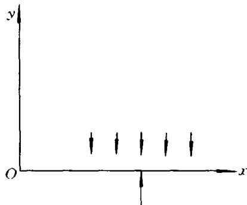

<details>
<summary>text_image</summary>

y
O
x
</details>

3. 假设 5 中 6 架飞机的假设是足够多的. 以世界最繁忙的国际航空港之一希思罗机场邻近区域为例, 因假设飞机在区域 $D$ 作水平飞行, 即知该区域内无机场. 设在希思罗机场起降的飞机有一半穿过该区域, 希思罗机场 1992 年起降总架次为 22.5 万次 (文献 6), 则平均每小时有 15 架飞机穿过该区域. 而一架飞机穿过该区域最多需 $\frac{160 \times \sqrt{2}}{800} \approx 0.28$ 小时, 则任一时刻该区域上空飞机架数的期望值不超过 4.5 架. 另外, 事实上不同飞机的飞行高度是不同的, 这就进一步减少了该区域同一水平面上飞机的数目. 以上讨论虽然稍嫌粗略, 但是足以说明 6 架飞机的假设是合理的.

4. 假设8是因为计算机从接到数据到发出命令间存在一个时滞, 该时滞固然越小越好, 但受机器限制, 一般不能忽略. 我们取0.5分为此时滞的一个上限, 以使结果具有实际意义. 当 $t < 1$ 秒时, 可以认为实现的是实时控制, 时滞可以忽略不计.

5. 虽然假设2给出的调整范围为30度,但实践证明,10度的调整范围就已足够(从后面的模型1也可看出,即使两机相向飞行,各自所须的调整也不超过8度),因而在今后绝大多数讨论和程序的编制中都将搜索区间定为 $[-10,10]$ 度:

## 四、文中用到的符号及说明

$t_i$ 时滞 $(x_{i0},y_{i0})$ 第 $i$ 架飞机的坐标

$a_{i0}$ 第 i 架飞机初始方位角 t 时间参数

$a_{i}$ 第 i 架飞机方位角 $D_{t}(a_{i},a_{j})$ 时刻 ti,j 两机距离

$\min D(a_{i},a_{j})\quad i,j$ 两机预计最短距离

$$
C _ {i j} \quad \cos a _ {i} - \cos a _ {j}
$$

$S_{ij}$ $\sin a_{i}-\sin a_{j}$ v 飞机速度

$$
\Delta x _ {i j} \quad x _ {i} - x _ {j} \quad f \quad \text {偏差平方和函数}
$$

$$
\Delta y _ {i j} \quad y _ {i} - y _ {j} \quad n \quad \text {求精次数}
$$

x 逐步求精搜索法中每次求精每层循环次数

$g_{ij}(x)$ i, j 飞机最短距离构成的不等式约束

$h_{ij}(x)$ 关于第 i 架飞机的等式约束

$p(X,r)$ 罚函数 $r_k$ 权因子

## 五、模型的建立及求解

## (一) 模型一(两架飞机的情形, 略)

## (二) 模型二

模型二直接将两机模型运用于多机问题,因为它等价于飞机之间两两不相撞.该模型讨论区域中有6架以下飞机时的情形,利用了模型一判别相撞的函数ifcrash,同模型一同样采取方向角调整幅度平方和最优为调整原则,从而导出目标函数和约束条件如下:

$$
\min \quad f = \sum (a _ {i} - a _ {i 0}) ^ {2}
$$

$$
\min D ^ {2} (a _ {i}, a _ {j}) \geqslant 6 4 \quad (i, j = 1, 2, \dots 6, i \neq j), t > 0; \tag {s.t.}
$$

或 $t < 0$ .

其中

$$
\begin{array}{l} \min D ^ {2} (a _ {i}, a _ {j}) = \left(- \frac {\Delta y _ {i j} S _ {i j} + \Delta x _ {i j} C _ {i j}}{C _ {i j} ^ {2} + S _ {i j} ^ {2}} C _ {i j} + \Delta x _ {i j}\right) ^ {2} \\ + \left(- \frac {\Delta y _ {i j} S _ {i j} + \Delta x _ {i j} C _ {i j}}{C _ {i j} ^ {2} + S _ {i j} ^ {2}} S _ {i j} + \Delta y _ {i j}\right) ^ {2} \\ = \frac {(\Delta x _ {i j} S _ {i j} - \Delta y _ {i j} C _ {i j}) ^ {2}}{C _ {i j} ^ {2} + S _ {i j} ^ {2}}, \\ t = - \frac {\Delta y _ {i j} S _ {i j} + \Delta x _ {i j} C _ {i j}}{V (C _ {i j} ^ {2} + S _ {i j} ^ {2})}. \\ \end{array}
$$

为使 ifcrash 函数只考虑区域中的飞机相撞情况. 我们可作如下修改: 因为飞机飞过该区域时间不超过 0.28 小时 (即飞正方形区域对角线时间), 我们可认为仅当 min D < 8, 且 0 < t < 0.28 小时的时候, 飞机在区域中相撞; 否则不相撞. 在实际计算时, 我们更把上限加大到 0.3 小时, 实际上是使不相撞的条件更苛刻了一些, 相当于对飞机飞离此区域后的情况也作了部分考虑, 提高了全局控制的安全性.

对该模型我们采用直接搜索法讨论了一般情况下对原问题的求解,可在规定时间内得到一个近似解,如果放宽时限,则可得一个符合精度要求的最优解.

直接搜索法原理十分简单:构造多重循环,对所有可能解进行判断,直接得出在一定精度范围内无可置疑的最优解.但如不使用任何技巧进行直接搜索,必须耗费大量时间.以本题为例,若在 $[-10,10]$ 度范围内进行搜索,步长0.01度,共6层循环,需计算 $6.4\times10^{19}$ 次,在486DX66上计算一次循环内函数费时 $2.7\times10^{-5}$ 秒,此种算法显然是不可取的.

为在 30 秒内算出一个较精确的解, 我们采用了逐步求精的方法. 即每次用一定的步长以较少的循环次数进行“粗选”, 在“粗选”出的解附近以减小了的步长进行“精选”, 逐次推

进,直到达到指定精度.

设每次求精步长减小的倍数是相同的,则每次求精循环次数也相同,设为 x. 我们考虑 $[-10,10]$ 度区间,精度要求达到 0.01 度,设进行了 n 次求解,则

$$
\left(\frac {x}{2}\right) ^ {n} = 2 0 / 0. 0 1 = 2 0 0 0,
$$

总循环次数 $L = n \times x^6 = (\log 2000) / \log (x / 2) \times x^6$ .

由此式可知 $x$ 减小, 则 $L$ 减小, 但若 $x$ 太小, 则可能无法收敛到最优解. 经验表明 $x$ 在8次以上时才能达到较好的搜索效果.

$$
n = (\log 2 0 0 0) / (\log (8 / 2)) = 5. 4 \approx 5.
$$

此时共需搜索最多 $5 \times 9^{6} = 265$ 万次, 需费时 71.55 秒.

为将计算时间控制在 30 秒以内, 我们又采取了一些优化方法, 如:

a. 将底层循环内判别相撞的函数拆细分装在每层循环下, 使在高层发现相撞后可提前结束循环;  
b. 每进入新一层循环把已积累偏差平方和与已得最小偏差平方和比较, 若大则结束该层循环;  
c. 每进入新一层循环把已积累偏差平方和与已得最小偏差平方和比较, 若大则结束该层循环.

这些措施大大减少了平均搜索次数,使得在多数情况下计算时间少于30秒,但程序不能保证在30秒内结束运算,仍存在一些特异情况使计算时间接近最大耗时.我们又试用偏差绝对值和来代替平方和,发现对最优解影响有限,未能明显缩短计算时间.

至此可知,用直接搜索法在现有机器条件下难以满足题设要求,要利用该解法,地面控制台必须满足以下条件之一:

1) 拥有速度至少为 486DX66 三倍以上的电脑；  
2) 降低精度要求至0.1度(4次求精步长为7, 需时至多10.81秒). 即使模型二不能直接用于飞行管理, 它仍有以下作用:  
1) 可算出符合精度要求的最优解供检验其他模型.  
2) 可在相当短的时间内算出具有一定精度的最优解作为其他算法的初值. 当精度要求为 1 度时, 它算出最优解最多只需 4.3 秒(两次求精步长分别为 7、6), 大多情况下运算时间为 2～3 秒.

## (三) 模型三

该模型将原问题归结为一个非线性规划问题,并用 SUMT 算法进行了求解.

模型二给出的解法虽然不能满足题设要求,却能在较短时间内给出一个较接近最优解的可行解.由此可行解出发,用适当的非线性规划算法可较快得出满足精度要求的最优解.

以 $a_{i}(i=1,2,\cdots,6)$ 为变量，在模型二中我们已经将问题归结为非线性规划问题，主要约束条件为

$$
\begin{array}{l} \min f = \sum (a _ {i} - a _ {i 0}) ^ {2}, \\ \min D ^ {2} (a _ {i}, a _ {j}) \geqslant 6 4, \quad (i, j = 1, 2, \dots , 6, i \neq j). \tag {1} \\ \end{array}
$$

由于 $\min D^{2}(a_{i}, a_{j})$ 的形式复杂, 求导有困难, 我们对(1)作一些改变, 将目标函数改为

$$
f ^ {*} = \sum_ {i = 1} ^ {6} (C _ {i, i 0} ^ {2} + S _ {i, i 0} ^ {2}),
$$

$$
C _ {i, i 0} = \cos a _ {i} - \cos a _ {i 0}, S _ {i, i 0} = \sin a _ {i} - \sin a _ {i 0}.
$$

将变量改为 $C_{i,i0}, S_{i,i0}(i = 1,2,\cdots,6)$ 共 12 个，增加等式约束

$$
(C _ {i, i 0} + \cos a _ {i 0}) ^ {2} + (S _ {i, i 0} + \sin a _ {i 0}) ^ {2} = 1, \quad (i = 1, 2, \dots , 6),
$$

使问题(1) 变为一个 12 个变量,21 个 2 次约束条件的目标函数求极小值的问题

$$
\min f ^ {*} (X) = \sum_ {i = 1} ^ {6} (C _ {i, i 0} ^ {2} + S _ {i, i 0} ^ {2})
$$

$$
\text {s.t.} \quad g _ {i j} (X) = \min D ^ {2} (C _ {i, i 0}, C _ {j, j 0}, S _ {i, i 0}, S _ {j, j 0}) - 6 4 \geqslant 0,
$$

$$
(i, j = 1, 2, \dots , 6, i <   j),
$$

$$
h _ {i} (X) = 0, \quad (i = 1, 2, \dots , 6),
$$

其中

$$
\begin{array}{l} X = (C _ {1, 1 0}, C _ {2, 2 0}, \dots , C _ {6, 6 0}, S _ {1, 1 0}, S _ {2, 2 0}, \dots , S _ {6, 6 0}). \tag {2} \\ \min \quad D ^ {2} (C _ {i, i 0}, C _ {j, j 0}, S _ {i, i 0}, S _ {j, j 0}) \\ = \frac {\left(\left(S _ {i , i 0} - S _ {j , j 0} + S _ {i 0 , j 0}\right) \cdot \Delta x _ {i j} - \left(C _ {i , i 0} - C _ {j , j 0} + C _ {i 0 , j 0}\right) \cdot \Delta y _ {i j}\right) ^ {2}}{\left(S _ {i , i 0} - S _ {j , j 0} + S _ {i 0 , j 0}\right) ^ {2} + \left(C _ {i , i 0} - C _ {j , j 0} + C _ {i 0 , j 0}\right) ^ {2}}, \\ h _ {i} (X) = (C _ {i, i 0} + \cos a _ {i 0}) ^ {2} + (S _ {i, i 0} + \sin a _ {i 0}) ^ {2} - 1. \\ \end{array}
$$

Himmelblau 在文献[1]中列举了三类 12 种算法, 我们对这 12 种算法进行了比较, 主要是考虑其收敛速度的快慢. 其次由于没有现成的软件包可供使用, 必须自己编制有关程序, 程序准备时间的长短, 即算法变为程序的复杂程度也必须考虑. 综合上述两方面因素, 我们选择了序列无约束最小化方法 (Sequential Unconstrained Minimization Technique), 简称 SUMT 算法.

SUMT 算法的基本思想是重复地求解一系列无约束问题, 它们的解在极限情况下趋于非线性规划问题的极小点. 算法的详细内容参见文献[1][2][3][4], 现概述如下:

首先构造罚函数

$$
p (X _ {k}, r) = f ^ {*} (X _ {k}) + r _ {k} ^ {- 1} \sum_ {i = 1} ^ {6} \frac {1}{g _ {i j} (X)} + r _ {k} ^ {- 1} \sum_ {i = 1} ^ {6} h _ {i} ^ {2} (X _ {k}),
$$

其中权因子 $r_k$ 是一单调递减数列. 对每个 $r_k$ 值求 $X_i$ , 使 $p(X_k, r_k)$ 取极小值. 设精度要求 $\varepsilon$ , 当 $\{X_k - X_{k-1}\} < \varepsilon$ 时结束运算, $\vec{x}_k$ 即为符合所需精度要求的最优解.

对此具体问题,我们置

$$
\begin{array}{l} p (X, r) = f ^ {*} (X) + r _ {- 1} \sum_ {i = 1} ^ {6} h _ {i} ^ {2} (X) + r \left(- \sum_ {i, j = 1, i \neq j} ^ {6} \ln g _ {i j} (X)\right), \\ r _ {k} \rightarrow 0, \quad r _ {0} = \max \left\{1 0 ^ {- 2}, \frac {\mid v ^ {*} \mid}{1 0 0} \right\}, r _ {k} = \frac {r _ {k - 1}}{\sqrt [ 8 ]{1 0}}, \\ \varepsilon = 0. 5 \times 1 0 ^ {- 2}. \\ \end{array}
$$

为此问题编制程序 SUMT1 对题目中的数据进行运算, 初始值用模型二以精度为 1 度时算出的最优值代入, 结果如下:

<table><tr><td></td><td>初始角  $\alpha_0$ </td><td>偏转角  $\Delta\alpha$ </td></tr><tr><td>飞机 1</td><td>243.00</td><td>0.00</td></tr><tr><td>飞机 2</td><td>236.00</td><td>0.00</td></tr><tr><td>飞机 3</td><td>220.50</td><td>2.14</td></tr><tr><td>飞机 4</td><td>159.00</td><td>-0.42</td></tr><tr><td>飞机 5</td><td>230.00</td><td>0.00</td></tr><tr><td>飞机 6</td><td>52.00</td><td>1.49</td></tr><tr><td>偏差平方和</td><td>6.98</td><td></td></tr></table>

该程序运行时间为 7.2 秒.

迄今为止,我们尚未讨论时滞对解的影响.在模型三中,Planesumt的运行时间是稳定的,约为4秒左右.用模型二的Solve求粗略最优解耗时在2\~4.3秒,随最优解出现位置不同而改变,加上裕量后我们可以在10秒以内给出最优解,故将时滞定为10秒.由假设7,只需将各架飞机的坐标按原速度方向向前移动10秒内的位移,在此基础上求解即可,这在程序上实现起来相当简便.考虑时滞后得出的结果如下表所示:

<table><tr><td></td><td>初始角  $\alpha_0$ </td><td>偏转角  $\Delta\alpha$ </td></tr><tr><td>飞机 1</td><td>243.00</td><td>0.00</td></tr><tr><td>飞机 2</td><td>236.00</td><td>0.00</td></tr><tr><td>飞机 3</td><td>220.50</td><td>2.22</td></tr><tr><td>飞机 4</td><td>159.00</td><td>-0.72</td></tr><tr><td>飞机 5</td><td>230.00</td><td>2.13</td></tr><tr><td>飞机 6</td><td>52.00</td><td>1.16</td></tr><tr><td>偏差平方和</td><td>11.3292</td><td></td></tr></table>

该模型运行结果在精度和耗时两方面都是令人满意的. 我们建议地面控制台采用比486DX66快8倍以上的机器, 这样就可以进行实时控制了. 对题目所给例子给出的第一个最优解, 可以认为即是在实时控制的假设下给出的.

## 六、模型的检验及误差分析

## (一) 模型检验

模型二用遍历所有可能解的方式得出最优解的,其解(在可能的精度内)的最优性是毋庸置疑的,故我们可用模型二求出满足精度要求的解来检验模型三的结果.

我们对 3 组数据分别用模型二和模型三进行求解, 结果如下

<table><tr><td></td><td> $(X_0, Y_0, \alpha_0)$ </td><td> $\Delta\alpha$ (Model 2)</td><td> $\Delta\alpha$ (Model 3)</td></tr><tr><td>飞机1</td><td>(60,100,270)</td><td>-6.53</td><td>-6.55</td></tr><tr><td>飞机2</td><td>(70,100,270)</td><td>5.46</td><td>5.47</td></tr><tr><td>飞机3</td><td>(80,100,270)</td><td>3.08</td><td>3.09</td></tr><tr><td>飞机4</td><td>(50,100,270)</td><td>-4.16</td><td>-4.20</td></tr><tr><td>飞机5</td><td>(40,100,270)</td><td>-6.48</td><td>-6.54</td></tr><tr><td>飞机6</td><td>(0,40,0)</td><td>-4.30</td><td>-4.30</td></tr></table>

第一组:为避免侧面碰撞各架飞机都需转动较大的角度,这是较为极端的情况,偏差的平方和较大,但没有一架飞机需调整的角度在10度以上.

<table><tr><td></td><td> $(X_0, Y_0, \alpha_0)$ </td><td> $\Delta\alpha$ (Model 2)</td><td> $\Delta\alpha$ (Model 3)</td></tr><tr><td>飞机1</td><td>(670,80,180)</td><td>4.91</td><td>4.91</td></tr><tr><td>飞机2</td><td>(60,70,180)</td><td>2.54</td><td>2.58</td></tr><tr><td>飞机3</td><td>(60,60,180)</td><td>0.36</td><td>0.40</td></tr><tr><td>飞机4</td><td>(60,90,180)</td><td>-7.32</td><td>-7.33</td></tr><tr><td>飞机5</td><td>(60,100,180)</td><td>-4.95</td><td>-5.00</td></tr><tr><td>飞机6</td><td>(0,80,0)</td><td>4.16</td><td>4.17</td></tr></table>

第二组:与第一组类似,但可能发生的碰撞是正面的.

<table><tr><td></td><td> $(X_0, Y_0, \alpha_0)$ </td><td> $\Delta\alpha$ (Model 2)</td><td> $\Delta\alpha$ (Model 3)</td></tr><tr><td>飞机 1</td><td>(0,70,0)</td><td>1.62</td><td>1.62</td></tr><tr><td>飞机 2</td><td>(55,5,90)</td><td>1.09</td><td>1.12</td></tr><tr><td>飞机 3</td><td>(90,60,180)</td><td>1.91</td><td>1.92</td></tr><tr><td>飞机 4</td><td>(40,130,270)</td><td>0.04</td><td>0.07</td></tr><tr><td>飞机 5</td><td>(80,5,180)</td><td>0.00</td><td>0.00</td></tr><tr><td>飞机 6</td><td>(0,60,0)</td><td>4.00</td><td>4.00</td></tr></table>

第三组:四架飞机十字交错而过,另有两架飞机水平飞行,两个模型都给出了较令人满意的调度.

各组数据吻合程度很好,且给出的调整方案也颇为符合逻辑,与一般常识相符,这说明模型三的算法是可靠的.值得指出的是以模型二的较粗略的可行解作为模型三的输入是非常必要的,这不但使解能快速收敛到指定精度,使计算时间符合要求,而且可以保证所求解的全局最优性.宾州大学教授James.P.Ignizio曾在其所著Goal Programming and Extensions中指出“非线性最优化…不具有用于求解问题的比较初等的通用方法,更令人失望的是非线性最优化不能保证对一个一般的问题找出整体最优解,除非这个问题具有非常特殊的形式.这意味着研究人员必须经常满足于只找出局部的最优解.事实上,即使所采用的方法能偶然找出整体最优解,往往也很难判别这个最优解是整体的还是局部的.”这就指明了求一般的非线性规划问题的全局最优解目前尚无良策.如果没有模型二的输出作为模型三的输入,要找到全局最优解至少是相当困难的,时间上当然难以满足要求.

## (二) 误差分析

## 1. 建模中的误差

考察模型假设, 可知假设 9 带来一定误差, 简单分析后可知, 考虑转弯半径使飞行轨迹在垂直飞行方向上产生一个偏差 X.

$X = (I - \cos\theta)R$ , 其中 R 为转弯半径, $\theta$ 为转角.

对最小转弯半径小于 $10 \, km$ 的中小型飞机, 转角小于 15 度时, 偏差

$$
X \leqslant (1 - \cos 1 5 ^ {\circ}) \times 1 0 = 0. 3 4 \mathrm{km}.
$$

对最小转弯半径小于为 $40 \, km$ 的大型飞机, 转角小于 8 度时, 偏差

$$
X \leqslant (1 - \cos 8 ^ {\circ}) \times 4 0 = 0. 3 9 \mathrm{km}.
$$

两种情况下偏差均小于相撞条件 $8\mathrm{km}$ 的 $5\%$ ，可以忽略不计.由于飞行管理中让一架飞机做大于8度的转向是较少发生的事(由模型一知两架距离为 $60~\mathrm{km}$ 的飞机在一条直线上相对飞行时，也只需一架转7.66度，一架转7.67度即可避免相撞.)故该处假设可以认为是合理的.下面给出发生极端情形时的一个对策：设一架大型飞机做30度的转弯，此时偏差 $X = (1 - \cos 30^{\circ})\times 40 = 5.36\mathrm{km}$ 不可忽略.在飞机开始转弯后(转弯过程约需1.6分钟)地面控制站的计算机可算出一条曲率处处大于1/40的偏转线，以此曲线引导飞机飞回偏转线.这种局部调整法的优点在于计算简单，不对全局的调整角度方案产生影响，特别适用于这种小概率事件.

## 2. 计算误差

模型一、二计算过程中的误差仅来源于机器的截断误差,对于最后结果没有重大影响.

模型三计算中的误差来源于

a. 建模过程中对目标函数进行替换时.

b. 用 SUMT 算法进行计算时.

对于 a 我们对 $\Delta\alpha$ 从 0 度到 10 度计算了 $C_{ii_{0}}^{2} + C_{ii_{0}}^{2}$ 以 1 度基准的相对误差, 如下表所示

<table><tr><td>偏差(度)</td><td>偏差的平方</td><td>拟偏差</td><td>相对拟偏差</td><td>拟偏差相对误差</td></tr><tr><td>0</td><td>0</td><td>0</td><td>0</td><td>0</td></tr><tr><td>1</td><td>1</td><td>3.046E-4</td><td>3.046E-4</td><td>0</td></tr><tr><td>2</td><td>4</td><td>1.218E-4</td><td>1.218E-4</td><td>0</td></tr><tr><td>3</td><td>9</td><td>2.741E-3</td><td>2.741E-3</td><td>0</td></tr><tr><td>4</td><td>16</td><td>4.872E-3</td><td>4.874E-3</td><td>4.1E-4</td></tr><tr><td>5</td><td>25</td><td>7.611E-3</td><td>7.615E-3</td><td>5.2E-4</td></tr><tr><td>6</td><td>36</td><td>1.095E-2</td><td>1.097E-2</td><td>1.8E-3</td></tr><tr><td>7</td><td>49</td><td>1.491E-2</td><td>1.493E-2</td><td>1.3E-3</td></tr><tr><td>8</td><td>64</td><td>1.946E-2</td><td>1.949E-2</td><td>1.5E-3</td></tr><tr><td>9</td><td>81</td><td>1.462E-2</td><td>2.467E-2</td><td>2.0E-3</td></tr><tr><td>10</td><td>100</td><td>3.038E-2</td><td>3.046E-2</td><td>2.6E-3</td></tr></table>

相对误差在 0.3% 以下, 这些表明替换函数对最后结果没有显著影响.

对于 $b$ 我们认为文献[1]、[2]、[3]、[4]中提供的算法已考虑了误差问题.在程序中实际给出了两个误差控制是：相对精度界 $\varepsilon_{1}$ 和绝对精度界 $\varepsilon_{2}$ ，当满足

$$
\mid x _ {j} (k, j) - x _ {j - 1} (k - 1, j - 1) \mid <   \varepsilon_ {1} \mid x _ {j} (k, j) \mid + \varepsilon_ {2}
$$

时程序结束. 这保证了解的误差在精度要求以内.

## 3. 输入误差对结果影响

通过对输入数据给以小的扰动,经大量计算可得如下定性结果:

a. 飞机位置有小的扰动对结果影响甚微, 扰动增大时影响明显.

b. 飞机方向角的扰动对结果影响显著, 扰动大小与结果变化幅度基本是在一个数量级上.

以上结果说明为保证结果的准确性应尽量减小对飞机方向角测量的误差,同时对飞机位置测量的误差也应控制在一定范围以内.

## 七、模型的评价及推广

## (一) 模型的评价

模型三是我们得到的主要结果,该模型可对区域内任意位置、方向的6架以内的飞机给出调整对策.如果飞机管理的计算机计算速度比486DX66快10倍左右,则可实现实时控制.因而具有计算时间短、精度高的特点,实用性强,较为完满地解决了原始问题.建模过程中用到的非线性规划方法具有一般性,容易作出推广.缺点是当飞机数目增多时,非线性规划的规模增大了,计算时间增长较快,幸好对假设的分析表明这种情况是很少发生的.

## (二) 模型的推广(略)

## 参考文献

1. D.M.Himmeblau,实用非线性规划.  
2. J. L. Lions, 非线性边值问题的一些解法.  
3. D. G. Luenberger, 线性与非线性规划引论.  
4. 程极泰, 最优设计的数学方法.  
5. 邓乃场, 无约束最优化计算方法.  
6. 顾其行, 国际航空运输管理.  
7. James. P. Lgnizio, Goal Programming and Extensions .

数学的应用是多种多样的,从原理上讲,数学方法的应用范围是无边际的,即物质的所有类型的运动都可以用数学加以研究。但是数学方法的作用与意义在不同情况下是不同的。用单一的模式来包罗现象的所有侧面是不可能的。

——A.N. 柯尔莫哥洛夫

《当代数学大师》, 李心灿编, 航空工业出版社, 1994。

# 空中防撞系统的设计

黄春峰 饶红玲 刘伟

(中国科学技术大学, 合肥 230026)

指导教师 于清娟

编者按 本文用相对运动的观点建立飞机两两不相撞的约束条件, 将问题归结为一个非线性规划问题, 用惩罚函数方法化为无约束极值问题求得最优解. 罚函数选取合理, 表达清楚.

关键词 非线性规划,惩罚函数,最优解

## 一、符号约定

$P_{i}$ 为第 $i$ 架飞机坐标； $\theta_{i}$ 为第 $i$ 架飞机方向角； $r_{ij}$ 为 $P_{i}$ 和 $P_{j}$ 间距； $\theta_{ij}$ 为 $P_{ij}$ 与 $X$ 轴的夹角； $v$ 为飞机飞行速度.

## 二、问题的分析与求解

## 1. 设计目标

要设计的防撞系统中,为确保飞机不相撞,应满足如下条件:

(1) 安全距离要求 $\left|P_{ij}\right| \geqslant 8$  
(2) 飞机偏离航向不应太远, 要求 $\left|\Delta\theta_{i}\right| \leqslant 30^{\circ}$

根据上述条件及题目的要求,防撞系统的目标是达到总航向的改变最小.即

$$
\min \Big (\sum_ {i = 1} ^ {6} | \Delta \theta_ {i} |\Big)
$$

上述的条件和目标是我们建模的依据.

## 2. 飞机相撞的判据

根据相对运动原理 $P_{i}$ 相对 $P_{j}$ 的速度方向为

$$
(v (\cos \theta_ {i} - \cos \theta_ {j}), v (\sin \theta_ {i} - \sin \theta_ {j}))
$$

t 时刻 $P_{i}$ 相对 $P_{j}$ 的位置为

$$
(a _ {i j} + v t (\cos \theta_ {i} - \cos \theta_ {j}), b _ {i j} + v t (\sin \theta_ {i} - \sin \theta_ {j}))
$$

令 $vt = l$ ，则有

$$
\begin{array}{l} \mid P _ {i} P _ {j} \mid^ {2} = f (l) = (a _ {i j} ^ {2} + b _ {i j} ^ {2}) + 4 l \sin \frac {\theta_ {i} - \theta_ {j}}{2} \left(- a _ {i j} \sin \frac {\theta_ {i} + \theta_ {j}}{2} + b _ {i j} \cos \frac {\theta_ {i} + \theta_ {j}}{2}\right) \\ + 4 l ^ {2} \sin^ {2} \frac {\theta_ {i} + \theta_ {j}}{2}, \quad 0 <   l <   l _ {\max} \\ \end{array}
$$

由上可知， $P_{i}$ 与 $P_{j}$ 若相撞仅有三种可能：

1） $f(0) < 64$ ，但这与初始条件不符，故无须考虑；  
2) $f(l_{\max}) < 64, \quad r_{ij}^2\cos^2\left(\frac{\theta_i + \theta_j}{2} - \theta_{ij}\right) < 64$

且

$$
3 0 <   l _ {p} = - r _ {i j} \sin \left(\theta_ {i j} - \frac {\theta_ {i} + \theta_ {j}}{2}\right) / 2 \sin \frac {\theta_ {i} + \theta_ {j}}{2} <   l _ {\max}
$$

所以当 $f(l)$ 满足(2)或(3)时， $P_{i}$ 与 $P_{j}$ 相撞，否则不相撞.

通过上述问题分析,可以看出这个模型的总目标就是确定每个可调的方向角,使它在不违反判据 $\left|r\cos\left(\theta+\frac{\alpha+\beta}{2}\right)\right|\geqslant8$ 所规定的限制下,实现前述子目标.因此从本质上这是一个非线性规划问题.

## 3. 非线性规划法解决问题

根据前面的分析,我们已把问题转化为求如下极值

$$
\left\{ \begin{array}{l} \min f (\theta) = \sum_ {i} | \Delta \theta_ {i} | \\ | \Delta \theta_ {i} | <   \frac {\pi}{6}, \\ | P _ {i j} (t) | > 8, \quad 0 <   t <   l _ {\min} / v \end{array} \right.
$$

用惩罚函数法可将其作为无约束极值问题求解,也即求 $\min h(\theta) = f(\theta) + Mc(\theta)$

M 是一个很大的常数因子, $c(\theta)$ 在 $\theta$ 满足约束条件时为 0, 否则为正值, 这样, $h(\theta)$ 的极值通常只能在满足约束条件处取得, 并且是 $f(\theta)$ 的极值.

取 $c(\theta) = cb(\theta) + cr(\theta)$

$$
c r (\theta_ {i}, \theta_ {j}) = \left\{ \begin{array}{l l} 8 - \left| r _ {i j} \cos \left(\theta_ {i j} - \frac {\theta_ {i} + \theta_ {j}}{2}\right) \right|, & 0 <   \frac {r _ {i j} \cos \left(\theta_ {i j} - \frac {\theta_ {i} + \theta_ {j}}{2}\right)}{\sin \left(\frac {\theta_ {i} - \theta_ {j}}{2}\right)} <   1 6 0 \sqrt {2} \\ 0 & \end{array} \right.
$$

$$
c b (\theta_ {i}) = \left\{ \begin{array}{l l} 0 & | \Delta \theta_ {i} | <   \frac {\pi}{6} \\ | \Delta \theta_ {i} | & | \Delta \theta_ {i} | > \frac {\pi}{6} \end{array} \right.
$$

我们用步长加速法求极值.

由于步长加速法求出的是局部最优解,为尽量求出全局最优解,我们选用几组不同的初值代入,求出极小值,再从中选出最优者.

取刚进入的飞机左偏1度为初始值,得出一个解为第三架飞机左偏约2.68度,第六架飞机左偏约0.94度,总改变角为约3.629693度.即各机新方向角为243,236,223.18,159,230,52.94.

# 飞行管理模型的线性化处理方法

刘铁成 张 良 聂兆虎

(山东大学, 济南 250100)

指导教师 许宝刚

编者按 该答卷针对飞行管理问题的实际背景,采用计算机模拟和线性规划相结合的方法较好地解决了问题.论述条理清晰,计算结果正确.所采用方法的特点是运算时间短,普适性较强,具有一定的启发性,特将有关部分予以发表.

关键词 线性规划,模拟,管理.

## 一、模拟与线性规划模型

要解决飞行角度调整问题,首先要判断出哪些飞机会在区域内发生碰撞,令

$$
l _ {i j} (t) = (x _ {i} (t) - x _ {j} (t)) ^ {2} + (y _ {i} (t) - y _ {j} (t)) ^ {2} - 6 4,
$$

整理得

$$
l _ {i j} (t) = a t ^ {2} + b t + c
$$

其中

$$
a = 4 v ^ {2} \sin^ {2} \left(\frac {\theta_ {i} ^ {0} + \theta_ {j} ^ {0}}{2}\right), v = v _ {i} = v _ {j}
$$

$$
b = 2 v \left[ (x _ {i} ^ {0} - x _ {j} ^ {0}) (\cos \theta_ {i} ^ {0} - \cos \theta_ {j} ^ {0}) + (y _ {i} ^ {0} - y _ {j} ^ {0}) (\sin \theta_ {i} ^ {0} - \sin \theta_ {j} ^ {0}) \right]
$$

$$
c = (x _ {i} ^ {0} - x _ {j} ^ {0}) ^ {2} + (y _ {i} ^ {0} - y _ {j} ^ {0}) ^ {2} - 6 4
$$

两架飞机 $P_{i}$ 和 $P_{j}$ 在区域内发生碰撞的条件是：

1) 两架飞机间的最短距离小于、等于8公里；  
2) 刚达到距离 8 公里时两飞机仍在区域内.

由条件1)可得约束

$$
b ^ {2} - 4 a c \geqslant 0 \tag {1}
$$

且两飞机距离达到8公里的时刻为

$$
T _ {i j} = \frac {- b - \sqrt {b ^ {2} - 4 a c}}{2 a}
$$

由条件2)可得下列约束

$$
\left\{ \begin{array}{l} T _ {i j} > 0 \\ 0 \leqslant x _ {i} (T _ {i j}) \leqslant 1 6 0 \\ 0 \leqslant x _ {j} (T _ {i j}) \leqslant 1 6 0 \\ 0 \leqslant y _ {i} (T _ {i j}) \leqslant 1 6 0 \\ 0 \leqslant y _ {j} (T _ {i j}) \leqslant 1 6 0 \end{array} \right. \tag {2}
$$

如果 $P_{i}$ 和 $P_{j}$ 同时满足(1)和(2)，它们就会在区域内相撞，否则不会在区域内相撞，根据上述结论，我们编制了计算机程序，求出各个相撞的飞机，并对相撞的任何两架飞机进行调整，使其满足：

（1）调整后相撞飞机的总数量不大于调整前相撞飞机的总数量；  
(2) 两架相撞飞机设为 $P_{i}, P_{j}$ . 若 $P_{i}$ 调整后相撞飞机的总数量小于 $P_{j}$ 调整后的相撞飞机的总数量, 则优先考虑调整飞机 $P_{i}$ .  
(3) 若 $P_{i}$ 调整后相撞飞机的总数量等于 $P_{j}$ 调整后的相撞飞机的总数量, 则调整角度较小的一个飞机.

依照上述原则,经过反复调整,即可得到一个满足题目要求的较优的调整范围.

对给定的两架飞机 $P_{i}$ 和 $P_{j}$ ，我们考虑它们的相对运动， $P_{i}$ 和 $P_{j}$ 相撞当且仅当 $P_{i}$ 在某一时刻以相对速度 $\vec{v}_{ij}$ 进入以 $P_{j}$ 为圆心，以 8 公里为半径的圆形区域内，如图 1 所示，设图中的圆的半径为 8 公里，O 点有一架飞机 $P_{i}$ ，C 点有一架飞机 $P_{j}$ ，则 $\angle AOB$ 即为 $P_{i}$ 相对于 $P_{j}$ 做相对运动时的禁飞方向。

在给出线性规划模型之前,我们先给出模型中要用到的符号和函数的定义.

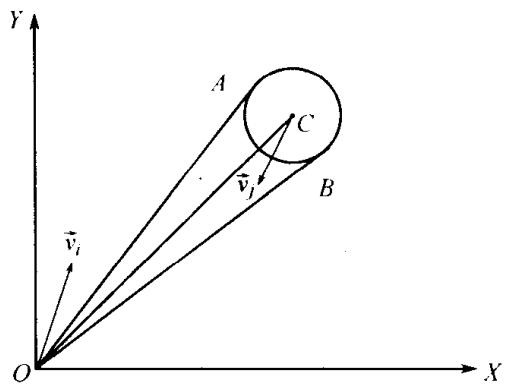

<details>
<summary>text_image</summary>

Y
A
C
B
v_i
v_j
O
X
</details>

图1

令

$$
f: [ 0, 2 \pi ] \times [ 0, 2 \pi ] - \{[ (\alpha , \alpha) ] | 0 \leqslant \alpha \leqslant 2 \pi \} \rightarrow [ 0, 2 \pi ],
$$

对 $\alpha \in [0,2\pi]$ 和 $\beta \in [0,2\pi]$ , 令

$$
f (\alpha , \beta) = \left\{ \begin{array}{l l} \frac {\alpha + \beta + \pi}{2} & \text {当} \alpha > \beta \text {且} \alpha + \beta <   3 \pi \\ \frac {\alpha + \beta - 3 \pi}{2} & \text {当} \alpha > \beta \text {且} \alpha + \beta \geqslant 3 \pi \\ \frac {\alpha + \beta + 3 \pi}{2} & \text {当} \alpha <   \beta \text {且} \alpha + \beta <   \pi \\ \frac {\alpha + \beta - \pi}{2} & \text {当} \alpha <   \beta \text {且} \alpha + \beta \geqslant \pi \end{array} \right.
$$

易见 $f(\alpha, \beta)$ 是 $\alpha$ 和 $\beta$ 的线性函数，且 $\theta_{ij} = f(\theta_i, \theta_j)$ .

令 $\varphi_{ij}$ 是点 $(x_i(0), y_i(0))$ 指向点 $(x_j(0), y_j(0))$ 的向量与 $X$ 轴正向的夹角， $\varphi_{ij}$ 的值由下式给出，

$$
\varphi_ {i j} = \left\{ \begin{array}{l l} \operatorname{arcctg} \frac {x _ {j} (0) - x _ {i} (0)}{y _ {j} (0) - y _ {i} (0)} & \text {当} y _ {j} (0) - y _ {i} (0) > 0 \\ \pi + \operatorname{arcctg} \frac {x _ {j} (0) - x _ {i} (0)}{y _ {j} (0) - y _ {i} (0)} & \text {当} y _ {j} (0) - y _ {i} (0) <   0 \\ \frac {\pi}{2} & \text {当} y _ {j} (0) = y _ {i} (0) \end{array} \right.
$$

令

$$
d _ {i j} = \sqrt {(x _ {i} (0) - x _ {j} (0)) ^ {2} + (y _ {i} (0) - y _ {j} (0)) ^ {2}}, \quad \psi_ {i j} = \arcsin \frac {8}{d _ {i j}},
$$

则不碰撞的条件为： $\theta_{ij}-\varphi_{ij}>\psi_{ij}$ 或 $\varphi_{ij}-\theta_{ij}>\psi_{ij}$ . 令

$$
g \left(\theta_ {i j}, \varphi_ {i j}\right) = \left\{ \begin{array}{l l} \theta_ {i j} - \varphi_ {i j} & \text {当} \theta_ {i j} > \varphi_ {i j} \\ \varphi_ {i j} - \theta_ {i j} & \text {当} \theta_ {i j} <   \varphi_ {i j} \end{array} \right.
$$

设第 $i$ 架飞机为避免相撞需沿逆时针调整 $\Delta \theta_{i}^{1}$ 或沿顺时针调整 $\Delta \theta_{i}^{2}$ , 且二者之中至少有一个为零 (非零的值就是飞机飞行角度调整的幅度 $\Delta \theta_{i}$ ). 我们以所有飞机的调整幅度之和最小为目标, 建立线性规划模型如下:

目标函数

$$
\min z = \sum_ {i = 1} ^ {n} (\Delta \theta_ {i} ^ {1} + \Delta \theta_ {i} ^ {2})
$$

约束条件

$$
\left\{ \begin{array}{l l} a _ {i} ^ {1} + a _ {i} ^ {2} \leqslant 1 & i = 1, 2, \dots , n \\ a _ {i} ^ {1} = 0, 1 & i = 1, 2, \dots , n \\ a _ {i} ^ {2} = 0, 1 & i = 1, 2, \dots , n \\ \Delta \theta_ {i} ^ {j} \leqslant \frac {\pi}{6} a _ {i} ^ {j} & i = 1, 2, \dots , n, j = 1, 2 \\ \theta_ {i} = \theta_ {i} ^ {0} + \theta_ {i} ^ {1} - \theta_ {i} ^ {2} & i = 1, 2, \dots , n \\ \theta_ {i j} = f (\theta_ {i}, \theta_ {j}) & \\ g (\theta_ {i j}, \varphi_ {i j}) > \psi_ {i j} & i = 1, 2, \dots , n - 1, j = i + 1, \dots , n \end{array} \right.
$$

对一般的情况, 当 $\theta_{i}$ 是个未知量时, 线性函数 $f(\theta_{i}, \theta_{j})$ 和 $g(\theta_{ij}, \varphi_{ij})$ 都难以确定, 但在给定数据的条件下, 可先运用计算机模拟得到一可行的调整方案 $\{\Delta\theta_{1}^{\prime}, \Delta\theta_{2}^{\prime}, \cdots, \Delta\theta_{n}^{\prime}\}$ , 在此方案的基础上, 以各飞机的初始飞行角度为主要依据, 确定 $f(\theta_{i}, \theta_{j})$ 和 $g(\theta_{ij}, \varphi_{ij})$ (当 $\Delta\theta_{i}^{\prime}, (1 \leqslant i \leqslant n)$ 都比较小时, 此方法尤其有效), 故我们的线性规划模型是可行的, 对得出的解我们继续用计算机模拟进行优化, 在各飞机的飞行角度调整幅度之和不增加的条件下, 使各飞机调整幅度尽量均衡, 即, 使调整幅度最大的飞机的调整角度最小, 因此, 我们所设计的这一模型对处理实际问题是会非常有效的.

# 飞行管理问题的逐步逼近搜索方法

王崧于劲松陆昱

(北京大学, 北京 100871)

指导教师 雷功炎

编者按 本文给出了一种逐步逼近的搜索方法,它尽管不能保证求出最优解,但具有以下三个特点:(1)简单易于编程计算.(2)对目标为绝对值函数与平方和函数两种模型都适用.(3)由计算结果看出对该问题是一个可行的方法.这里只摘录了原文的部分段落.

关键词 搜索法,全局最优解,局部最优解

由于要求方向角的误差不超过0.01度,我们可以只考虑样本空间 $\Omega = [-30^{\circ}, 30^{\circ}] \times \cdots \times [-30^{\circ}, 30^{\circ}]$ 中所有坐标均为0.01的整数倍的点.令

$$
\Omega^ {\prime} = \{\Delta \alpha \in \Omega | 1 0 0 \Delta \alpha_ {i} \text {为整数}, i = 1, 2, 3, 4, 5 \}.
$$

则 $\Omega^{\prime}$ 中共有 $6001^{6} \cong 4.7 \times 10^{22}$ 个点. 要通过遍历 $\Omega^{\prime}$ 中所有元素来求最小值是不可能的. 因此, 我们采用了一种搜索算法, 实践证明它可在允许的时间内给出较优解. 仍然记

$$
F (\Delta \alpha) = \left\{ \begin{array}{l l} + \infty & \text {存在} i, j, \mathrm{DIST} (A _ {i}, A _ {j}) \leqslant 8 \\ f (\Delta \alpha) & \text {其它} \end{array} \right.
$$

其中 $f(\Delta \alpha)$ 为目标函数方向角改变量的绝对值和(或平方和), $\mathrm{DIST}(A_i, A_j)$ 为飞机 $A_i$ 和 $A_j$ 之间的距离.

## 方法一(基本思路):

首先在 $\Omega'$ 中以较大跨度均匀地取 $N$ 个点, 通过遍历计算找到其中使 $F(\Delta \alpha)$ 取最小值的点, 然后以该点为中心, 找一个较小的区域, 在其中再取 $N$ 个点, 在这 $N$ 个点中找到使 $F(\Delta \alpha)$ 取最小值的点. 如此迭代下去, 当区域足够小, 或者连续两次找到的点非常接近时 (即如果连续两次迭代所得结果位置相邻且目标函数之差小于 $0.1^{\circ}$ ), 我们就认为找到了较优的解, 停止迭代.

此方法的优点在于:它是一个注重全空间的算法.较其它方法,如逐次调整法等,它比较有效地避免了局部行为(即迭代过程中结果收敛到一个局部极小值而非全局最小值的现象).当点数 N 选取适当时,时间消耗很少,但它仍有一些不足,主要问题是:N 取得较小时,样本点在空间中的分布过于稀疏,仍然有可能出现局部行为,为此,我们在方法一的基础上做了改进,得到方法二.

## 方法二(改进思路):

首先在 $\Omega'$ 中均匀地取 $N$ 个点, 通过遍历计算找到其中使 $F(\Delta \alpha)$ 取最小的 $M$ 个点. 以这 $M$ 个点为中心作 $M$ 个小区域, 在每一个小区域中均匀地取 $N$ 个点, 计算出这 $MN$ 个点中使 $F(\Delta \alpha)$ 取最小值的 $M$ 个点, 如此迭代下去, 直到找到较优的解 (关于较优的解的判别方法同方法一). 方法二所用时间为方法一的 $M$ 倍 (实际上少于 $M$ 倍), 而在 $M$ 值与小区域的选取方法较好时, 可有效地避免局部行为.

# 飞行管理模型的能量梯度求解法

刘学胡晨孙涵

(清华大学, 北京 100084)

指导教师 高策理

编者按 本问题建模后构成一个非线性规划,求最优解有相当难度,本文用一个表征全局性质的能量来表达飞机位置,当达到最佳位置时能量最小,从而构成能量梯度调整模型,按此模型获得了本问题最优解.本文为作者原论文中部分内容.

关键词 能量梯度,同步算法,异法算法

考虑利用一个能够表征全局性质的量来辅助调节每架飞机的位置.由于最优解对应于一个函数的极值,我们设想用能量来表达飞机的位置,当达到最佳位置时,能量最小.由此可以设想,每架飞机的方向角在其调整方向上的能量梯度表达了这架飞机的调整趋势.通过比较趋势并在趋势上逐步搜索.我们有理由相信其调整过程将向一个较优的结果运动.

为此,我们定义 $\left[\Delta\theta_{1},\Delta\theta_{2},\cdots,\Delta\theta_{6}\right]$ 空间的能量函数如下:

$$
\begin{array}{l} E = \sum_ {i} \sum_ {j > i} E _ {i j} \\ E _ {i j} = \left\{ \begin{array}{l l} 0, & d _ {\min, i j} \geqslant 8, \\ 8 - d _ {\min, i j}, & d _ {\min, i j} <   8. \end{array} \right. \\ \end{array}
$$

当 i, j 两架飞机之间的最小距离 $d_{\min, ij} \geqslant 8$ 时， $E_{ij} = 0$ 表示它们之间无碰撞产生；而当 $d_{\min, ij} < 8$ 时，定义 $E_{ij} = 8 - d_{\min, ij}$ ，这反映了碰撞的严重程度。很明显，此能量函数 E 表示了在 $[\Delta\theta_{1}, \Delta\theta_{2}, \cdots, \Delta\theta_{6}]$ 空间上，只要找到 E 的零点，便可符合题目的要求。为此，我们提出了能量梯度法。

对于各梯度的计算为：

$$
d _ {\min, j k} = | \Delta \vec {P} _ {j k} | \cdot \left| \sin \left(\varphi_ {\Delta \nu , j k} ^ {0} - \varphi_ {\Delta P} + \frac {\Delta \theta_ {j} + \Delta \theta_ {k}}{2}\right) \right|
$$

$$
\frac {\partial E}{\partial \Delta \theta_ {k}} = \sum_ {j \neq k} \frac {\partial E _ {j k}}{\partial \Delta \theta_ {k}}
$$

而

$$
\frac {\partial E _ {j k}}{\partial \Delta \theta_ {k}} = \left\{ \begin{array}{l l} 0, & E _ {j k} = 0 \\ - \frac {\partial d _ {\min , j k}}{\partial \Delta \theta_ {k}} = \pm | \vec {\Delta P} _ {j k} | \left| \cos \left(\varphi_ {\Delta \nu , j k} ^ {0} - \psi_ {\Delta P} + \frac {\Delta \theta_ {j} + \Delta \theta_ {k}}{2}\right) \right| \frac {1}{2}, & E _ {j k} \neq 0 \end{array} \right.
$$

当 $\sin \left(\varphi_{\Delta \nu ,jk}^0 -\varphi_{\Delta P} + \frac{\Delta\theta_j + \Delta\theta_k}{2}\right) > 0$ 时，上式中的 $\pm 1$ 取 $+1$ ；反之，取-1.

每次调整的步长由下式决定: $step_{k}=\frac{threshold}{\frac{\partial E}{\partial\Delta\theta_{k}}}$ 其中, threshold 为能量下降的期望值, $-30^{\circ}\leqslant\Delta\theta_{i}\leqslant30^{\circ},\Delta\vec{p}_{jk}=\vec{p}_{i}-\vec{p}_{j},\phi_{\Delta\nu}=\frac{1}{2}(\pm\pi+\theta_{i}+\theta_{j}),\theta_{i}>\theta_{j}$ 取 $+1,\theta_{i}\leqslant\theta_{j}$ 取-1.

## 一、同步调整

我们首先采用同步调节的方法. 在此方法中, 每次对六架飞机均做调整.

在调节过程中,如果有两架飞机之间距离较小,则此两架飞机在梯度方向上的调整幅度应加大.我们建立如下的函数以说明这种思想.

## 二、异步顺序调整

同步调节不可避免地带来一种局限性,即当一架飞机调节后,再调整另一架飞机时,是按前一飞机未调整之前的参数计算的,因此同步调节时,总体性质的体现不很好,不能多架飞机相互兼顾.为此,我们认为,在调节一架飞机后,就更新所有参数,再利用梯度调节下一架飞机的方法更为合理.由此我们提出了异步顺序梯度调节方法.

## 三、异步优化顺序调整

但是由上述模型可以看出,每个飞机调节的梯度值是不同的,有的飞机方向角的变化对最后能量的减小起着明显的作用,因此没有理由不先考虑这些飞机.我们改进梯度模型为异步优化顺序模型,即每次调节后更新参数并计算每个飞机调节的梯度,找到梯度绝对值最大的飞机优先进行调整.

## 四、同步梯度算法

1）计算当前总能量 E，若 E = 0，则已符合要求，转 6；  
2) 对于 $k = 1, 2, \cdots, 6$ ，分别计算 $\frac{\partial E}{\partial \Delta \theta_{k}}$ ，即能量 E 在 $\Delta \theta_{k}$ 方向上的梯度；(计算方法参见 2.5 节).  
3) 根据 $\frac{\partial E}{\partial \Delta \theta_{k}}$ 决定 $\Delta \theta_{k}$ 的变化量 $step_{k}$ ;  
4) 令 $\Delta\theta_{k} = \Delta\theta_{k} + step_{k}$ ;  
5) 转 1;  
6) 算法结束, 此时 $(\Delta\theta_{1}, \Delta\theta_{2}, \cdots, \Delta\theta_{6})$ 即为所求的各架飞机航向角度的偏移量.

## 五、异步顺序梯度算法

0) $k = 0$

0.1) $k = k + 1$ ; 如果 $k > 6$ 则令 $k = 1$ ;

1) 计算当前总能量 E, 若 E = 0, 则已符合要求, 转 6;

2）对于当前的 k，计算 $\frac{\partial E}{\partial \Delta \theta_{k}}$ ，即能量 E 在 $\Delta \theta_{k}$ 方向上的梯度；

3) 根据 $\frac{\partial E}{\partial \Delta \theta_{k}}$ 决定 $\Delta \theta_{k}$ 的变化量 $step_{k}$ ;

4) 令 $\Delta\theta_{k} = \Delta\theta_{k} + step_{k}$ ;

5) 转 0.1;

6) 算法结束, 此时 $(\Delta\theta_{1}, \Delta\theta_{2}, \cdots, \Delta\theta_{6})$ 即为所求的各架飞机航向角度的偏移量.

## 六、异步优化顺序梯度算法

1）计算当前总能量 E，若 E = 0，则已符合要求，转 6；  
2）对于 $k = 1, 2, \cdots, 6$ ，分别计算 $\frac{\partial E}{\partial \Delta \theta_{k}}$ ，即能量 E 在 $\Delta \theta_{k}$ 方向上的梯度；

2.1）从 $\frac{\partial E}{\partial\Delta\theta_{k}}(k=1,2,\cdots,6)$ 中选出梯度的最大值，及其对应的k；

3）根据 $\frac{\partial E}{\partial\Delta\theta_{k}}$ 决定 $\Delta\theta_{k}$ 的变化量 $step_{k}$ ;

4) 令 $\Delta\theta_{k} = \Delta\theta_{k} + step_{k}$ ;

5) 转 0.1;

6) 算法结束, 此时 $(\Delta\theta_{1}, \Delta\theta_{2}, \cdots, \Delta\theta_{6})$ 即为所求的各架飞机航向角度的偏移量.

## 七、同步梯度模型

我们选取阈值为 0.1, 用同步梯度模型对三组数据计算结果如下:

<table><tr><td>数据组号</td><td>飞机1</td><td>飞机2</td><td>飞机3</td><td>飞机4</td><td>飞机5</td><td>飞机6</td><td>总角度</td></tr><tr><td>1</td><td>0</td><td>0</td><td>2.338</td><td>-0.298</td><td>0.521</td><td>1.369</td><td>4.53</td></tr><tr><td>2</td><td>-6.761</td><td>0</td><td>1.862</td><td>-1.644</td><td>0.464</td><td>2.257</td><td>12.98</td></tr><tr><td>3</td><td>2.114</td><td>6.104</td><td>2.659</td><td>-6.429</td><td>-1.364</td><td>2.424</td><td>21.00</td></tr></table>

## 八、异步顺序梯度模型

我们选取阈值为0.1,用异步顺序梯度模型对三组数据计算结果如下:

<table><tr><td>数据组号</td><td>飞机1</td><td>飞机2</td><td>飞机3</td><td>飞机4</td><td>飞机5</td><td>飞机6</td><td>总角度</td></tr><tr><td>1</td><td>0</td><td>0</td><td>2-498</td><td>-0.149</td><td>0.464</td><td>1.163</td><td>4.27</td></tr><tr><td>2</td><td>-6.199</td><td>0</td><td>2.389</td><td>-1.123</td><td>0.407</td><td>1.776</td><td>11.89</td></tr><tr><td>3</td><td>2.149</td><td>-6.010</td><td>2.126</td><td>-6.354</td><td>-1.255</td><td>2.401</td><td>20.29</td></tr></table>

## 九、异步优化顺序梯度模型

我们选取阈值为 0.1, 用异步优化顺序梯度模型对二组数据计算结果如下:

<table><tr><td>数据组号</td><td>飞机1</td><td>飞机2</td><td>飞机3</td><td>飞机4</td><td>飞机5</td><td>飞机6</td><td>总角度</td></tr><tr><td>1</td><td>0</td><td>0</td><td>2.819</td><td>0</td><td>0</td><td>0.819</td><td>3.63</td></tr><tr><td>2</td><td>0.922</td><td>0</td><td>1.541</td><td>-2.544</td><td>0</td><td>3.610</td><td>8.61</td></tr></table>

# 飞行管理问题约束条件的线性化

徐元军 曾九林 韩伟群

(中南林学院, 株州 412000)

指导教师 潘冬光

编者按 本文从相对运动出发,给出了两架飞机不碰撞条件的几何描述,得到了两机不碰撞的方向角范围,并对有关条件作了线性化处理,从而使原来的非线性约束化为线性约束.其特点在于:对约束条件的简化,注意了保留在区域内不碰,在区域外碰撞的角度范围,考虑较为全面.当然,对这一条件还可有其他处理方式.此处发表的是该文有关部分的摘录,编者只增添了极少的语句,使文意联贯.

关键词 碰撞条件,约束条件.

$$
x _ {i} = v t \cos (\Delta \theta_ {i} ^ {\prime} + \Delta \theta_ {i}) + x _ {i 0} \quad 0 \leqslant x _ {i} \leqslant 1 6 0
$$

$$
y _ {i} = v t \cos (\Delta \theta_ {i} ^ {\prime} + \Delta \theta_ {i}) + y _ {i 0} \quad 0 \leqslant x _ {i} \leqslant 1 6 0
$$

则飞机 $i$ 与 $j$ 间距离

$$
d = \sqrt {(x _ {i} - x _ {j}) ^ {2} + (y _ {i} - y _ {j}) ^ {2}}
$$

$(x_{i},y_{i})$ 表示第 i 架飞机在 t 时刻的坐标

$(x_{i0}, y_{i0})$ 表示第 i 架飞机在 t = 0 时的坐标 $(i = 1, 2, 3, 4, 5; j = i + 1, i + 2, \cdots, 6)$ ，新进入飞机编号为 6.

考虑利用两架飞机在区域内的相对速度来判断飞机的碰撞条件.

$\theta_{i}$ 表示两点的连线为始边, i 为圆心, 逆时针旋转到 $v_{i}$ 的角(在两点连线的左端), 反向为负.

$\theta_{j}$ 表示以两点的连线为始边, j 为圆心, 顺时针旋转到 $v_{j}$ 的角(在两点连线的右端), 反向为负.

$\theta_{ij}$ 表示由点 i 到圆(以点 j 为圆心,8 为半径的圆)的切线与两点连线的夹角 $(\theta_{i} > \theta_{j})$ .

由计算可得合成速度的角度

$$
\theta = \left\{ \begin{array}{l l} \frac {\theta_ {i} + \theta_ {j}}{2}, & \theta \leqslant \frac {\pi}{2} \\ \pi - \frac {\theta_ {i} + \theta_ {j}}{2}, & \theta > \frac {\pi}{2} \end{array} \right.
$$

因为区域内所有飞机的坐标和方向角都是确定的,所以 $\theta_{i},\theta_{j},\theta_{ij}$ 都是确定的,因此我们可以作出以下判断

i) 当 $\theta \leqslant 0$ 时两飞机不会碰撞.

ii) 当 $\theta > \theta_{ij}$ 时两飞机不会碰撞.

iii) 当 $0 < \theta < \theta_{ij}$ 时则必须对两飞机在区域内飞行的距离作讨论.

对每架飞机而言,在30度的调整范围内,它的坐标和原始方向角是确定的,所以可以求出每架飞机飞出此区域所用的最大可能时间 $T_{i}$ .

当 a 对 b 以 $v_{ij}$ 的速度飞行时, $\theta$ 是确定的.

$$
\mathrm{tg} \theta (d - O B) = \sqrt {8 ^ {2} - O B ^ {2}}
$$

$tg\theta,d$ 都是定值,可解出 OB.

当 $vT_{i}\cos\theta<(d-OB)$ 时，飞机 i 和 j 就不会相碰.

我们为了简化后面规划的约束条件,可以把此处的约束放宽一些(因为上式中的 $T_{i}$ 是比较强的约束)

$$
v T _ {i} \mathrm{cos} \theta <   \sqrt {d ^ {2} - 8 ^ {2}}, \text {所以} \theta <   \mathrm{arccos} \frac {\sqrt {d ^ {2} - 8 ^ {2}}}{v T _ {i}}
$$

综上所述,有:

i) 当 $\theta \leqslant 0$ 或者 $\theta > \theta_{ij}$ 时，两飞机不碰撞.  
ii) 当 $0 < \theta < \theta_{ij}$ , 且 $\theta < \arccos \frac{\sqrt{d^2 - 8^2}}{vT_i}$ 时, 两飞机不碰撞.

我们可以看出判断条件的表达式对 $\theta_{i}$ 来说是线性的, 所以对于变化后的 $\theta_{i} = \theta_{i} + \Delta\theta_{i}$ 来说是线性的, 对 $\theta_{i}$ 也是线性的. 因此可以将约束条件近似为:

$$
\left\{ \begin{array}{l} \frac {\theta_ {i} - \theta_ {j}}{2} + \frac {\Delta \theta_ {i} - \Delta \theta_ {j}}{2} > \theta_ {i j} - Z M - Y M \\ \pi - \frac {\theta_ {i} - \theta_ {j}}{2} - \frac {\Delta \theta_ {i} - \Delta \theta_ {j}}{2} > \theta_ {i j} - (1 - Z) M - Y M \\ \frac {\theta_ {i} - \theta_ {j}}{2} + \frac {\Delta \theta_ {i} - \Delta \theta_ {j}}{2} > \arccos \frac {\sqrt {d ^ {2} - 8 ^ {2}}}{v T _ {i}} - Z M - Y M \\ \pi - \frac {\theta_ {i} - \theta_ {j}}{2} - \frac {\Delta \theta_ {i} - \Delta \theta_ {j}}{2} > \arccos \frac {\sqrt {d ^ {2} - 8 ^ {2}}}{v T _ {i}} (1 - Z) M - Y M \\ \Delta \theta_ {i} - \Delta \theta_ {j} = 0 + (Y - 1) M \\ \frac {\theta_ {i} - \theta_ {j}}{2} - \frac {\Delta \theta_ {i} - \Delta \theta_ {j}}{2} <   \arccos \frac {\sqrt {d ^ {2} - 8 ^ {2}}}{r T _ {i}} + Z M + (Y - 1) M \\ \pi - \frac {\theta_ {i} - \theta_ {j}}{2} - \frac {\Delta \theta_ {i} - \Delta \theta_ {j}}{2} <   \arccos \frac {\sqrt {d ^ {2} - 8 ^ {2}}}{v T _ {i}} + (1 - Z) M + (Y - 1) M \end{array} \right.
$$

(式中 Z = 1,0 Y = 1,0 M = 10000 i = 1,2 $\cdots$ , n - 1, j = i + 1, $\cdots$ n)

# 飞行管理问题的线性规划模型

孙旭山 魏 华 吕晓光

(清华大学, 北京 100084)

编者按 这份答卷的作者没有参加全国的竞赛,而是按照同样的题目和要求参加了学校的竞赛.全国评委会的同志在评阅完全国的优秀答卷后审阅了本文,一致认为该文很有特色,特予发表.

对本题一般都是建立了非线性规划模型, 直接求解很困难. 该文不仅运用相对速度将不相撞的约束条件线性化(对调整角改变量线性), 而且经过合理的选择将目标函数也线性化, 从而将整个问题成功地简化为线性规划模型. 另外该文表述清晰, 证明简洁.

关键词 线性规划,相对速度

## 一、数学模型

## 1. 模型假设

(1) 新飞机进入边缘时, 立即作出计算, 每架飞机按照计算机计算后的指示立即作方向角改变(有的飞机方向角可不变).  
(2) 每架飞机整个过程中最多只改变一次方向角.  
(3) 忽略飞机转向时间(即认为飞机在接收到指令后立即对方向角调整,且忽略其调整时间).  
(4) 新飞机进入空域前, 在空域中飞行的飞机方向已调合适, 不会相撞.  
(5) 对方向角的相同调整量的满意程度是一样的, 且方向角调整越少, 满意程度越高.

## 2. 模型介绍

将每架飞机视为球状模型(二维平面为圆状模型), 整个空域视为二维平面, 建立直角坐标系, 顶点为 $(0,0)$ , $(160,0)$ , $(160,160)$ , $(0,160)$ , 各方向角为飞行方向与 $x$ 轴正向的夹角. 每架飞机是一个以飞机坐标点为圆心, 以 4 公里为半径的圆 (因为相撞距离限为 8 公里). 每架飞机在空域中的状态 (位置, 速度) 均可视为矢量, 速度为从坐标点出发、方向角为辐角、800 公里为模的矢量. 各圆心按其速度方向运行. 若有两圆在运行过程中相交即为该两架飞机相撞.

## 3. 名词、符号解释(如图 1 所示)

$\alpha_{ij}$ : 第 $i$ 架飞机与第 $j$ 架飞机的碰撞角, 是两圆公切线交角中指向圆的那个角, 规定 $\alpha_{ij} = \alpha_{ji}$ .

$v_{ij}$ : 第 i 架飞机相对于第 j 架飞机的相对飞行速度.

$l_{ij}$ : 第 i 架飞机与第 j 架飞机圆心距.

$\beta_{ij}$ : 第 i 架飞机相对于第 j 架飞机的相对速度与两架飞机圆心连线的交角, 规定: 以第 i 架飞机为原点 $i \rightarrow j$ 连线从 i 指向 j 为正方向, 逆时针旋转为正, 顺时针旋转为负.

$\Delta\theta_{i}$ : 第 i 加飞机相对于直角坐标系旋转的角(即方向角改变量), 是代数量.

$\Delta\beta_{ij}$ : 第 i 架飞机相对于第 j 架飞机 $\beta_{ij}$ 的改变量.

## 4. 判断准则

不会相撞: 当 $\left|\beta_{ij}\right| > \alpha_{ij}$ 时, 两架飞机不会相撞(两圆不相交)

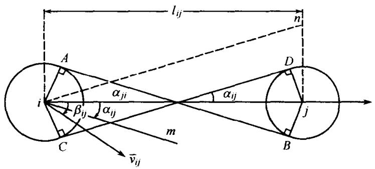

<details>
<summary>text_image</summary>

l_{ij}
n
A
α_{ji}
β_{ij}
α_{ij}
C
m
v_{ij}
D
j
B
</details>

图1

## 5. 决策目标

题目要求飞机飞行方向角调整的幅度尽量小, 这个尽量小是针对每架飞机而言, 同时也要求整体满意程度(即对管理层而言, 应使每架飞机的调整都尽量的少), 因此构造目标函数时, 可以认为若对方向角调整量最大的飞机而言, 其调整量可满意, 则由假设(5)知对其余飞机调整量均可满意, 即要求每架飞机的调整量(绝对值)都小于某个数 $\varepsilon(\varepsilon \geqslant 0)$ .

目标函数即是求 $\varepsilon$ 的最小值 $\min \varepsilon$ .

## 二、建模方案

## 1. 球形模型的建立

（1）由于两架飞机如果相距大于8公里，则不会发生相碰，故可以考虑为4公里，两球不相交，则表明不会发生碰撞事故，若相交，则表明会发生碰撞事故。  
(2) 为了研究两球相碰撞,采用相对速度作为研究对象,因为飞机是否相撞的关键是相对速度.  
(3) 球形模型在分析碰撞问题中的运用, 如图 1 示.

AB, CD 为公切线, $ni \parallel CD, mi \parallel AB$

i, j 不相撞的充要条件是 $\left|\beta_{ij}\right| > \alpha_{ij}$ (阴影区外).

若 $\beta_{ij}$ 在阴影区内，则通过调整角 $(i,j$ 的方向角）使 $\beta_{ij}$ 移出阴影区以达到整个空域中的飞机系统不相撞.

(4) 由球型模型建立起的函数及方程

i) 重要结论: 对第 i, j 架飞机, 其飞行方向角改变量 $(\Delta\theta_{i}, \Delta\theta_{j})$ 之和的一半即为其相对速度方向 $\beta_{ij}$ 的改变量 $(\Delta\beta_{ij})$ ,

即 $\Delta \beta_{ij} = \frac{\Delta\theta_i + \Delta\theta_j}{2}$

证明 由题知 $|v_i| = 800 \, \text{km/h} = A$

设改变前的速度分别为 $v_{i1} = A e^{i\theta_{i}}, v_{j1} = A e^{i\theta_{j}}$

改变方向角后速度分别为

$$
v _ {i 2} = A e ^ {i \left(\theta_ {i} + \Delta \theta_ {i}\right)}, \quad v _ {j 2} = A e ^ {i \left(\theta_ {j} + \Delta \theta_ {j}\right)}
$$

$$
v _ {i j} = v _ {i 1} - v _ {j 1} = A \left[ e ^ {i \theta_ {i}} - e ^ {i \theta_ {j}} \right]
$$

改变后 $v_{ij}^{\prime} = v_{i2} - v_{j2} = A\left[e^{i(\theta_{i} + \Delta \theta_{i})} - e^{i(\theta_{j} + \Delta \theta_{j})}\right]$

$$
\begin{array}{l} \frac {v _ {i j} ^ {\prime}}{v _ {i j}} = \frac {A \left[ e ^ {i \left(\theta_ {i} + \Delta \theta_ {i}\right)} - e ^ {i \left(\theta_ {j} + \Delta \theta_ {j}\right)} \right]}{A \left[ e ^ {i \theta_ {i}} - e ^ {i \theta_ {j}} \right]} \\ = \frac {\cos \left(\theta_ {i} + \Delta \theta_ {i}\right) + i \sin \left(\theta_ {i} + \Delta \theta_ {i}\right) - \cos \left(\theta_ {j} + \Delta \theta_ {j}\right) - i \sin \left(\theta_ {j} + \Delta \theta_ {j}\right)}{\cos \theta_ {i} + i \sin \theta_ {i} - \cos \theta_ {j} - i \sin \theta_ {j}} \\ = \frac {2 \sin \frac {\theta_ {i} + \Delta \theta_ {i} - \theta_ {j} - \Delta \theta_ {j}}{2} \left(\sin \frac {\theta_ {i} + \Delta \theta_ {i} + \theta_ {j} + \Delta \theta_ {j}}{2} - i \cos \frac {\theta_ {i} + \theta_ {j} + \Delta \theta_ {i} + \Delta \theta_ {j}}{2}\right)}{2 \sin \frac {\theta_ {i} - \theta_ {j}}{2} \left(\sin \frac {\theta_ {i} + \theta_ {j}}{2} - i \cos \frac {\theta_ {i} + \theta_ {j}}{2}\right)} \\ = \frac {\sin \frac {\theta_ {i} + \Delta \theta_ {i} - \theta_ {j} - \Delta \theta_ {j}}{2}}{\sin \frac {\theta_ {i} - \theta_ {j}}{2}} e ^ {i \left(\frac {\Delta \theta_ {i} + \Delta \theta_ {j}}{2}\right)} \\ \end{array}
$$

即 $v_{ij}^{\prime}$ 与 $v_{ij}$ 复角相差 $\frac{\Delta\theta_i + \Delta\theta_j}{2}$ , 所以

$$
\Delta \beta_ {i j} = \frac {\Delta \theta_ {i} + \Delta \theta_ {j}}{2} \tag {证毕}
$$

ii) 因为忽略计算时间和转向时间, 故可得以下方程(不等式)

由决策目标构造目标函数: $\min Z = \varepsilon (|\Delta\theta_{i}| \leqslant \varepsilon)$ .

由飞机飞行方向角调整幅度不超过 $30^{\circ}$ 知

$$
\mid \Delta \theta_ {i} \mid \leqslant 3 0 ^ {\circ}, \quad 0 \leqslant \varepsilon \leqslant 3 0 ^ {\circ}
$$

为使整个系统在改变后不发生相碰事故,应有

$$
\mid \beta_ {i j} + \Delta \beta_ {i j} \mid > \alpha_ {i j}
$$

2. 目标函数及各约束条件

$$
\min Z = \varepsilon \tag {1}
$$

$$
\mathrm{s.t.} \quad | \beta_ {i j} + \Delta \beta_ {i j} | > \alpha_ {i j} \quad \Delta \beta_ {i j} = \frac {\Delta \theta_ {i} + \Delta \theta_ {j}}{2} \tag {2}
$$

$$
\mid \Delta \theta_ {i} \mid \leqslant \varepsilon \tag {3}
$$

$$
\mid \Delta \theta_ {i} \mid \leqslant 3 0 ^ {\circ} \tag {4}
$$

$$
0 \leqslant \varepsilon \leqslant 3 0 ^ {\circ} \tag {5}
$$

## 3. 条件简化

为了利用线性规划对条件(2) $\left|\beta_{ij}+\Delta\beta_{ij}\right|>\alpha_{ij}$ 进行如下简化(说明见附录,编者略去).

当 $\beta_{ij} > 0$ 时(2) $\Rightarrow \beta_{ij} + \Delta \beta_{ij} > \alpha_{ij}$

当 $\beta_{ij} < 0$ 时(2) $\Rightarrow \beta_{ij} + \Delta \beta_{ij} < -\alpha_{ij}$

由于 $\Delta\theta_{i}$ 可正可负, 为使线性规划中各决策变量均大于等于零, 引入新的决策变量 $\Delta\theta_{i1}, \Delta\theta_{i2}$ 满足

$$
\Delta \theta_ {i} = \Delta \theta_ {i 1} - \Delta \theta_ {i 2} \text {其中} 0 \leqslant \Delta \theta_ {i 1} \leqslant 3 0 ^ {\circ}, 0 \leqslant \Delta \theta_ {i 2} \leqslant 3 0 ^ {\circ}
$$

4. 线性规划关系式

$$
\min Z = \varepsilon \tag {6}
$$

$$
\mathrm{s.t.} \quad \beta_ {i j} > 0 \text {时} \quad \Delta \theta_ {i 1} - \Delta \theta_ {i 2} + \Delta \theta_ {j 1} - \Delta \theta_ {j 2} > 2 \alpha_ {i j} - 2 \beta_ {i j} \tag {7}
$$

$$
\beta_ {i j} <   0 \text {时} \quad \Delta \theta_ {i 1} - \Delta \theta_ {i 2} + \Delta \theta_ {j 1} - \Delta \theta_ {j 2} <   - 2 \alpha_ {i j} - 2 \beta_ {i j} \tag {8}
$$

$$
\Delta \theta_ {i 1} - \Delta \theta_ {i 2} \leqslant 3 0 ^ {\circ} \tag {9}
$$

$$
\Delta \theta_ {i 1} - \Delta \theta_ {i 2} \geqslant - 3 0 ^ {\circ} \tag {10}
$$

$$
\Delta \theta_ {i 1} - \Delta \theta_ {i 2} \leqslant \varepsilon \tag {11}
$$

$$
\Delta \theta_ {i 1} - \Delta \theta_ {i 2} \leqslant - \varepsilon \tag {12}
$$

$$
\varepsilon \leqslant 3 0 ^ {\circ} \tag {13}
$$

$$
\varepsilon , \Delta \theta_ {i 1}, \Delta \theta_ {i 2} \geqslant 0 \tag {14}
$$

[注] 其中 $\beta_{ij}, \alpha_{ij}$ 可由题中已经知道的参数计算得出.

设 $x_{i}, x_{j}$ 为飞机在空间的位置的矢量, 计算公式如下

$$
l _ {i j} = | x _ {i} - x _ {j} | \tag {15}
$$

$$
\beta_ {i j} = \arg (v _ {i} - v _ {j}) - \arg (x _ {j} - x _ {i}) \tag {16}
$$

$$
\alpha_ {i j} = \operatorname{arc} \sin (8 / l _ {i j}) \tag {17}
$$

## 三、计算步骤

1. 记录各飞机状态: 位置(坐标), 速度(大小, 方向角).  
2. 计算各点间 $\beta_{ij}, \alpha_{ij}$ .  
3. 根据建模方案, 列出目标函数及约束条件, 产生 LINDO 文件 (LINDO 是用于计算线性规划的软件).  
4. 调用LINDO得到此条件下的线性规划最优解.

[注](1) 实际过程中, 可将 2,3,4 步过程合为一个模块, 这样可减少数据传递时间, 以提高效率.

(2) 程序清单及结果见附录(编者略去)

## 四、结果检验

对题目所给实例进行计算,清单见附表1(编者略去)

$$
\begin{array}{r l} \text {方案} \Delta \theta_ {1} & = 0 ^ {\circ}, \Delta \theta_ {2} = 0 ^ {\circ}, \Delta \theta_ {3} = 1. 8 1 4 7 3 2 ^ {\circ}, \Delta \theta_ {4} = - 0. 7 4 3 1 5 5 ^ {\circ}, \Delta \theta_ {5} = 0 ^ {\circ}, \Delta \theta_ {6} = \\ 1. 8 1 4 7 3 2 ^ {\circ}. \end{array}
$$

各方向角按此方案改动后,系统各飞机均满足 $\left|\beta_{ij}\right|>\alpha_{ij}$ （即不相撞）,其中有些飞机满足临界不相撞条件,即 $\left|\beta_{ij}\right|-\alpha_{ij}$ 的值 $<0.01^{\circ}(0.01^{\circ}$ 是题目要求的计算精度).

将调整后各量再代入算法计算后,得目标函数 $\min Z = \varepsilon = 0$ (即无需改动).

经模拟程序(见附表4,编者略去)运行后,动态观察结果正确.

## 五、评价及推广

1. 此模型采用球形模型分析碰撞问题是合理的, 同时采用相对速度作为判断标准, 既

体现了碰撞的本质(相对运动),又简化了模型的计算.

2. 建模中作了适当的简化, 将一个十分复杂的非线性规划问题简化为线性规划求解, 既找到合理的解, 又提高了运算速度及效率. 这对于解决高速运行的飞机碰撞问题是大有裨益的, 而且由题目所提供的例子计算出的结果是令人满意的.  
3. 简化模型所得的解不一定是最优解, 考虑如下极端情况: 六架飞机有两架的相对速度刚好与其连线平行, 即 $\beta_{ij} = 0$ , 那么按简化模型应如何确定最优解呢?

若假定 $\beta_{ij}^{\prime} = -\delta^{\prime}, \delta^{\prime} > 0$ 且 $\delta^{\prime} \to 0$ ，则由简化模型可规划出一组解，若假定 $\beta_{ij}^{\prime \prime} = +\delta^{\prime \prime}, \delta^{\prime \prime} > 0$ 且 $\delta^{\prime \prime} \to 0$ ，同样可规划出一组解，这两组解中必是一优一劣，但因 $\beta_{ij}^{\prime}$ 与 $\beta_{ij}^{\prime \prime}$ 之差 $\rightarrow 0$ ，所以可认为它们相同，而由同一条件找出两组最优解是不可能的，所以简化模型的解不一定最优。

但实际中,以上极端情况为少数,这正是本模型可取之处,且 $\left|\beta_{ij}\right|$ 越大,可以认为,改变后的 $\left(\beta_{ij}+\Delta\beta_{ij}\right)$ 与 $\beta_{ij}$ 反号的可能性越小,从而由简化模型得到的结果可能越接近最优.

4. 关于模型约束条件数, 由对称性知约束条件(2)的个数是 $C_n^2$ ( $n$ 是飞机数), 所以约束条件数为 $4n + C_n^2 = n\left(\frac{n + 7}{2}\right)$ , 当飞机数增加后, 约束条件数呈二次函数增加, 计算量增加不大.  
5. 若有若干架飞机同时进入时, 依次计算, 逐个调整, 将它们视为有先后的进入空域, 忽略调整时间, 即可.

就作为求解工具和作为建模方法两者来说,再也没有其他方法比最优化方法处于运筹学和管理科学的如此支配的地位了。

把问题翻译成数学最优化的模型是经济、数学和工程的这一交叉学科——最优化——的特征。

Preface of “Optimization”, Edited by G. L. Nemhauser, A. H. G. Rinnooy Kan, M.J. Tood North-Holland, Amsterdam, 1989.

# 飞行管理问题答卷评述

## 复旦大学

## 谭永基

本题是以空域飞行管理为背景,经简化和整理而成的一个赛题.该问题主要可以归结为非线性规划模型或经一定简化,建立线性规划模型.由于实际的需要,提出的算法应在计算机上快速地实现.

## 一、非线性规划模型及求解

设六架飞机在调整时的方向角为 $\theta_{i}$ ，调整后的方向角为 $\theta^{\prime}_{i} = \theta_{i} + \Delta\theta_{i} (i = 1, 2, \cdots, 6)$ ，设任意两架飞机在区域内的最短距离为 $d_{ij}(\theta_{i}, \theta_{j})$ ，那么问题的非线性规划模型为

$$
\min \sum_ {i = 1} ^ {6} | \Delta \theta_ {i} |\,
$$

使得

$$
\begin{array}{l} d _ {i j} (\theta_ {i} + \Delta \theta_ {i}, \theta_ {j} + \Delta \theta_ {j}) > 8, \quad 1 \leqslant i, j \leqslant 6, i \neq j, \\ \mid \Delta \theta_ {i} \mid \leqslant 3 0 ^ {\circ}. \\ \end{array}
$$

绝大多数答卷能正确建立模型,有的答卷在建模时,出于某些考虑加强了不碰撞的要求,如要求在调整后的 $0.2\sqrt{2}$ 小时内不发生碰撞或永远不允许发生碰撞,从而简化了 $d_{ij}$ 的表述.

求解此模型的一种方法是枚举法,但是枚举工作量极大,必须采取逐步求精(细分)、隐式枚举、枚举和二分法相结合等技巧,方能在较短时间内求得符合精度的最优调整方案.参赛答卷中采用了许多提高枚举效率的措施.有的答卷在枚举时采用了Monte-Carlo法,随机产生大量 $\{\Delta\theta_{i}\}$ 组合,从其中的可行解中选出最优解.这种方法可显著提高计算速度,有一定新意.

另一种解法是引进惩罚函数, 将问题化为无约束极值, 然后将其极小化. 在答卷中采用了丰富多采的无约束化和极小化技术, 有的方法, 如能量梯度化有一定的特色. 然而, 非线性规划方法能否快速找到全局最优解, 十分强烈地依赖于初值的选取. 有的试卷用步长较粗的枚举得到的解作为初值, 然后再用极小化的方法得到最优解, 计算速度很快, 可以实时调整, 达到了实用的要求.

有不少答卷用 $\sum_{i=1}^{6} |\Delta\theta_i|^2, \max_{1 \leqslant i \leqslant 6} |\Delta\theta_i|$ 作为优化的目标，这都是合理的.

## 二、线性规划模型

若不考虑区域的范围,用相对运动的观点不难得出两架飞机调整方向角后不发生碰撞时,调整角度应满足的条件.为简单起见,排除某些特殊的情形,条件是:

$$
\text {①若} \theta_ {i} ^ {\prime} <   \theta_ {j} ^ {\prime}, a _ {i j} <   \left(\frac {3 \pi}{2} + \frac {\theta_ {i} ^ {\prime} + \theta_ {j} ^ {\prime}}{2}\right) \bmod 3 6 0 ^ {\circ} <   3 6 0 ^ {\circ} <   - a _ {i j},
$$

或

$$
\text {若} \theta_ {i} ^ {\prime} > \theta_ {j} ^ {\prime}, a _ {i j} <   \left(\frac {\pi}{2} + \frac {\theta_ {i} ^ {\prime} + \theta_ {j} ^ {\prime}}{2}\right) \bmod 3 6 0 ^ {\circ} <   3 6 0 ^ {\circ} <   - a _ {i j},
$$

其中， $\theta_{i}^{\prime}, \theta_{j}^{\prime} \in [0, 360^{\circ})$ ， $a_{ij} = \arcsin \left(\frac{8}{r_{ij}}\right)$ ， $r_{ij}$ 为调整时两飞机的距离，角度均以自第 $i$ 架飞机位置指向第 $j$ 架飞机的矢量为始边计算。

若以 $\sum_{i=1}^{6} |\Delta\theta_i|, \max_{1 \leqslant i \leqslant 6} |\Delta\theta_i|$ 作为目标函数，以上述不碰撞条件和 $|\Delta\theta_i| \leqslant 30^\circ$ 作为约束条件，是一个可归化为多个线性规划问题的规划问题。求解这一系列线性规划，比较它们的目标函数值就能得到原问题的最优解。

许多答卷用类似的方法将问题归结为线性规划求解.但有不少答卷在建立不碰撞条件时疏忽了一些情形从而条件不够完整.对某些飞机初始位置,可能产生错误.

由于变量较少,线性规划求解速度较快,这是采用这一模型的优点.然而,若必须排除在区域外的碰撞,由于条件不是线性的,归结为线性规划问题就有一定困难.有的答卷提出了一些克服这一困难的方法.较有成效的方法有两种.一种是在 $\Delta\theta_{i}$ 不大时,将条件展开略去高阶项,另一种用低维枚举确定 $\Delta\theta_{i}+\Delta\theta_{j}$ 的允许范围,再用线性规划求解.

对数学研究的低水平的资助只能来自对于数学研究带来的好处的完全不妥的评价,显然,很少有人认识到当今被如此称颂的“高技术”本质上是数学技术。(原文: ... the low levels of support for mathematics research can only flow from a totally inadequate preciation of the benefits it confers. Apparently, too few people recognize that the “high technology” that is so celebrated today is essentially mathematical technology.)

E. E. David Jr., Notices of American Mathematical Society, v. 31(1984), no. 2, p. 142.

## 8. 天车与冶炼炉的作业调度(CUMCM 1995 年 B 题)

某钢铁厂冶炼车间的厂房布局是,地面沿一直线依次安置着7个工作点:辅料供应处P;A组3座转炉(冶炼成品钢) $A_{1},A_{2},A_{3}$ ;B组2座冶炼炉(冶炼半成品钢,简称半钢) $B_{1}$ , $B_{2}$ ;原料供应处Q.这些设备的上方贯通着一条运送物料的天车轨道,上面布置着若干天车 $T_{1},T_{2},\cdots,T_{n}$ 为炉子作业服务.布局示意图如下.

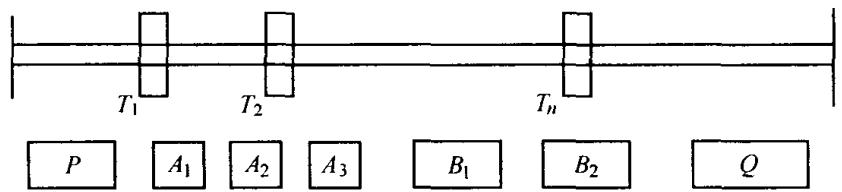

<details>
<summary>text_image</summary>

T₁ T₂ Tₙ
P A₁ A₂ A₃ B₁ B₂ Q
</details>

天车与冶炼炉的作业过程与工序为: 天车从 Q 处吊起原料一罐(吊罐时间 $t_{y}$ ) 运至 $B_{1}$ 或 $B_{2}$ 处放下(放罐时间 $t_{i}$ ), 并将上一炉的原料空罐吊起(吊空罐时间 $t_{0}$ ) 返回 Q 处放下(放空罐时间 $t_{k}$ ). B 组炉在原料罐放下后即可在辅助作业下开始冶炼(冶炼时间 $t_{b}$ ), 冶炼后将半钢倒入空半钢罐(时间计入 $t_{b}$ ), 由天车吊起半钢罐(吊罐时间 $t_{d}$ ) 运至 $A_{1}$ 或 $A_{2}, A_{3}$ 处将半钢倒入转炉(倒入时间 $t_{e}$ ), 并将空罐返回 $B_{1}$ 或 $B_{2}$ 处放下(放空罐时间 $t_{c}$ ). 再由天车从 P 处吊起辅料一槽(吊槽时间 $t_{g}$ ) 运至 $A_{1}$ 或 $A_{2}, A_{3}$ 处加入转炉(加入时间 $t_{f}$ ), 并将空槽返回 P 处放下(放空槽时间 $t_{h}$ ). A 组炉在半钢和辅料加入后即可开始冶炼(冶炼时间 $t_{a}$ ), 冶炼后成品钢的输出不用天车(输出时间计入 $t_{a}$ ). 天车通过相邻两个工作点的运行时间都相同, 记为 $t_{x}$ .

由于各台天车在同一条轨道上运行,因此其顺序位置 $T_{1}, T_{2}, \cdots, T_{n}$ 不可交换.在同一时间同一座炉子上只能允许一台天车作业;但 P, Q 两处可以允许多台天车同时作业.在 $P, A_{1}, \cdots, Q$ 每两个相邻工作点之间最多能容纳 2 台天车同时停放.

天车与冶炼炉作业调度的要求为：(1)成品钢产量尽量高；(2)各台天车的作业率(天车作业时间所占比例)尽量均衡(考虑到设备及人员安全等因素，一般天车作业率不超过70%)；(3)绝不允许出现天车相撞等事故；(4)调度规则尽量简明，以利于现场人员使用.

现设定： $t_{a}=48,t_{b}=27,t_{i}=3,t_{o}=2,t_{c}=2,t_{d}=3,t_{e}=5,t_{f}=2,t_{g}=2,t_{h}=1,t_{y}=3,t_{k}=2$ （单位：分钟）， $t_{x}=15$ 秒；A组炉平均每炉产量 $W_{a}=120$ 吨。在不超过5台天车的条件下，设计一种满足上述要求的天车与冶炼炉的作业调度方案：

(1)各台天车负责哪些作业(列出《工序清单》);  
(2)在所给方案的一个运行周期内,每一时刻天车和冶炼炉处于什么状态(画出《天车—炉子作业运行图》);  
(3)一份供现场人员使用的《调度规则说明书》;  
(4)在所给方案下计算各台天车的作业率,并按每天冶炼炉数估计该车间成品钢的年产量(扣除设备维修日,每台转炉作业日每年按300天计算).

实际生产过程中, $t_{a},t_{b},\cdots,t_{k}$ 都是随机的(上面设定的数值可视为平均值),讨论你的调度方案如何适用于实际生产过程.试提出该车间提高钢产量到年产300万吨以上的建议.

# 天车与冶炼炉的作业调度

邱玉平 谭小术 干斌

(四川轻化工学院, 自贡 643033)

指导教师 武亦文

编者按 本文主要优点是能抓住主要的影响因素建立了“瓶颈模型”，通过详细、正确的数学论证分析了使用一至五台天车的可能性，并对使用三台天车的情形给出了详细的各天车的工序清单，天车、炉子作业运行图。本文还用层次分析法给出了一种评估三、四、五台天车是否最优的模型，从而认为使用三台天车为最优。

摘 要:本模型首先考虑该车间工序的相互影响,抓住主要的影响因素(即各环节的过程速度)在满足生产条件和假设条件的情况下,利用“递推法”找到其钢年产量的决定因素,建立了较为实用的“瓶颈模型”,应用层次分析法确定了天车的台数为3台,再运用排队理论制定了天车调度的最优方案,求出了在所给条件下钢的年产量为282.76万吨.

关键词 瓶颈模型,排队论,层次分析法.

## 一、问题的提出(略)

## 二、基本假设

1. 设备在工作过程中一切正常,不会出现偶然事故;  
2. 原料装配不在该生产工序范围之内(即该模型不考虑 P, Q 两处的装料时间);  
3. 在 A 组炉处加半钢和加辅料之间的时间间隔忽略不计,而且在此条件下两天车之间不会发生碰撞;  
4. 加料均为一次性加足；  
5. 各天车运行时的速度都相同(即各相邻工作点之间的距离都相同);  
6. 有足够的原料罐, 半钢罐和辅料罐;  
7. A 组炉和 B 组炉的加料时间间隔相同；  
8. 任何一台天车没有不必要的工作状态(即任何一台天车不会出现吊着料等待放卸).

## 三、建立模型

## (一) 模型中使用参数的说明

$T_{A}$ A 组炉中任意一台炉在一个周期内的工作时间；

$T_{B}$ B 组炉中任意一台炉在一个周期内的工作时间；

$T_{i}$ 天车 $T_{i}$ 在一个周期内的工作时间；

m 对应两工作点的单位距离段数；

n 天车 $T_{1}$ 工作的次数；

k 每台转炉每年的作业天数；

$t_{a}(n)$ A 组炉中某一炉开始加料的时刻；

<div class="mineru-algorithm" style="white-space: pre-wrap; font-family:monospace;">
$t_b(n)$ B组炉中某一炉冶炼结束的时刻；  
$t_i(n)$ 天车 $T_{i}$ 开始作业的时刻 $(i = 1,2,3)$   
W 成品钢的年产量；  
$W_{a}$ A组炉平均每炉成品钢产量；  
$t_a$ A组炉中冶炼一炉的成品钢所需时间(输出时间计入 $t_a$ 中)；  
$t_b$ B组炉中冶炼一炉半钢所需时间(输出时间计入 $t_b$ 中)；  
$t_i$ B组炉处放下原料罐所需时间；  
$t_o$ B组炉处吊起原料空罐所需时间；  
$t_c$ B组炉处放下空半钢罐所需时间；  
$t_d$ B组炉处吊起半钢罐所需时间；  
$t_e$ 在A组炉处倒入半钢所需时间；  
$t_f$ 在A组炉处加入辅料所需时间；  
$t_g$ 在P处吊起辅料槽所需时间；  
$t_h$ 在P处放下空槽所需时间；  
$t_y$ 在Q处吊起原料罐所需时间；  
$t_k$ 在Q处放下空原料罐所需时间；  
$t_x$ 两相邻工作点之间天车运行时间.
</div>

## (二) 问题的分析

由于 A 组转炉数与 B 组冶炼炉数不相等, A 组转炉与 B 组冶炼炉之间不能一一对应, 因此 A 组转炉与 B 组冶炼炉之间只能交叉对应, 其关系如下:

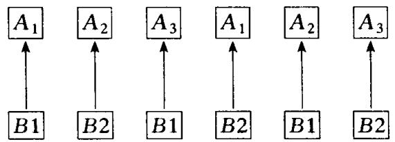

<details>
<summary>flowchart</summary>

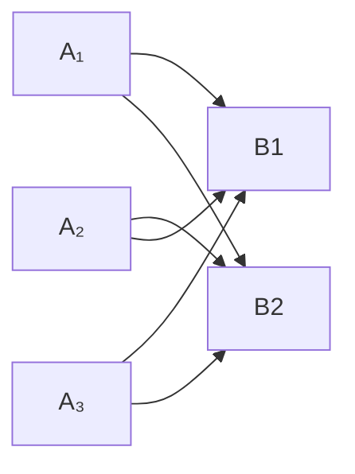
```mermaid
graph LR
  A1["A₁"] --> B1["B1"]
  A2["A₂"] --> B2["B2"]
  A3["A₃"] --> B1["B1"]
  A1["A₁"] --> B2["B2"]
  A2["A₂"] --> B1["B1"]
  A3["A₃"] --> B2["B2"]
```
</details>

在我们要解决的问题中，A组炉和B组炉在生产过程中反复出现，并同时要求天车的作业率均衡，所以我们应考虑生产过程为周期性变化。根据实际情况，我们把以上框图内的内容作为一个工作周期，要建立一个钢产量尽量高的模型，就必须使生产过程的周期最短。利用在连串反应中反应最慢的环节决定着整个反应的反应速度的原理（即连串反应的速度控制原理），分析所给问题，A组炉在一个周期内的工作时间 $T_{A}$ 与B组炉在一个周期内的工作时间 $T_{B}$ 为两个相对独立的变量，如果考虑到B组炉供应A组炉的生产工序，则 $T_{A}$ 和 $T_{B}$ 相互影响，并决定着成品钢的产量，而且 $T_{A}$ 与 $T_{B}$ 的关系满足以上所述的速度控制原理，因此我们可以根据这个原理来建立一个“瓶颈模型”。

## (三) 模型建立

在我们所要建立的模型中， $T_{A}$ 和 $T_{B}$ 满足连串反应速度控制原理，所以应先确定 A, B 中反应最慢的环节，即确定 A, B 两组炉生产过程由 $\max[T_{A}, T_{B}]$ 来决定，其中 $T_{A}, T_{B}$ 如下：

$$
\begin{array}{l} T _ {A} = 2 (t _ {a} + t _ {e} + t _ {f}) \\ T _ {B} = 3 (t _ {b} + t _ {i} + t _ {d} + m \cdot t _ {x}) \\ \end{array}
$$

由 $\max[T_{A}, T_{B}]$ 可以进行寻找能够满足条件的天车运行工序, 其具体寻找方法为:

(1) 如果 $\max[T_{A}, T_{B}] \times 70\% > \max[T_{1}, T_{2}, T_{3}]$ ，则由 $\max[T_{A}, T_{B}]$ 所对应的那组炉来确定天车的运行工序，并由其确定循环周期；  
(2) 如果 $\max[T_{A}, T_{B}] \times 70\% < \max[T_{1}, T_{2}, T_{3}]$ ，则由 $\max[T_{1}, T_{2}, T_{3}]$ 所对应的天车按 A 组炉与 B 组炉的关系确定运行工序，并由其确定循环周期.

由于所建模型不能直接提出调度方案,因此我们只能用所给数据演示模型具体求解过程,给出其调度方案.由上面步骤,我们可先求出 $T_{A},T_{B}$ 的大小如下(对应如上的A组炉与B组炉的循环过程):

$$
T _ {\mathrm{A}} = 2 (t _ {a} + t _ {e} + t _ {f}) = 2 \times (4 8 + 5 + 2) = 1 1 0 \quad (\text {单位:min})
$$

$$
T _ {B} = 3 (t _ {b} + t _ {i} + t _ {d} + m \cdot t _ {x}) = 3 \times (2 7 + 3 + 3 + 0. 2 5 \mathrm{m}) = 9 9 + 0. 7 5 \mathrm{m} \quad (\text {单位:min})
$$

由于 $m \leqslant 6$ (由厂房布局图可知), 所以 $T_A > 103.5 \geqslant T_B$ , 即 $A, B$ 两组炉生产过程的速度由 $T_A$ 决定.

现在我们由 $T_{A}$ 来进行寻找满足条件的天车运行工序：

（1）通过计算，只有一台天车和只有两台天车时，都不能满足天车的作业率小于70%，故我们不再考虑生产过程中只有一台或只有两台天车的情况。  
(2) 考虑有三台天车的情况: 先假设一种最简单的情况——即辅料 P 处与 A 组炉之间有一台天车, A 组炉与 B 组炉之间有一台天车, A 组炉与原料 Q 处有一台天车, 分布如下图:

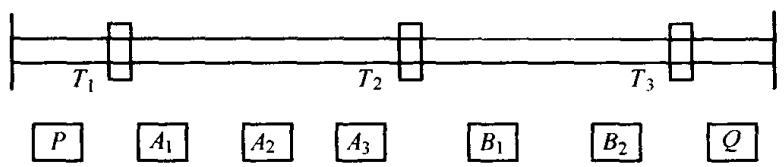

<details>
<summary>text_image</summary>

T₁
T₂
T₃
P A₁ A₂ A₃ B₁ B₂ Q
</details>

按这种情况,我们求出每一台天车在一个周期内的工作时间,分别为:

$$
T _ {1} = 3 6 \mathrm{min} \quad T _ {2} = 6 7. 5 \mathrm{min} \quad T _ {3} = 6 4. 5 \mathrm{min}
$$

因为 $T_{A} \times 70\% > \max[T_{1}, T_{2}, T_{3}]$ , 所以在整个生产过程中, $A$ 组炉决定着整个生产工序, 当有四台或五台天车时, 按相同的方法得知, 仍是 $A$ 组炉决定着整个生产工序. 但考虑到效益、产量、安全、调度难度、设备投资等主要影响因素, 通过层次分析法 (详见附录) 我们得出了调用三台天车为最佳.

下面我们来求有三台天车时的最佳调度方案:首先可以设其中一循环以 $A_{1}$ 开始,从此时开始计时,由于在同一个周期内, $A_{1},A_{2},A_{3}$ 是按 $A_{1},A_{2},A_{3},A_{1},A_{2},A_{3}$ 的顺序加料的,且每相邻加料时间间隔相同(即 $\frac{T_{A}}{6}=18.33min$ ),故 A 组炉中任一炉的开始加料时刻为:

$$
t _ {a} (n) = \frac {T _ {A} \cdot (n - 1)}{6} = 1 8. 3 3 (n - 1) \tag {1}
$$

在满足假设8的条件下，A组中每一炉的加料时刻决定了B组中对应冶炼炉的冶炼结束时刻，还决定了天车 $T_{1}$ 的开始吊料时刻和天车 $T_{2}$ 开始吊料的时刻，而B组炉的冶炼结束时刻决定了天车 $T_{3}$ 的开始吊料时刻，各时刻的求解式如下：

$$
t _ {b} (n) = t _ {a} (n) - m \cdot t _ {x} \tag {2}
$$

$$
t _ {1} (n) = t _ {a} (n) + t _ {e} - (m \cdot t _ {x} + t _ {g}) \tag {3}
$$

$$
t _ {2} (n) = t _ {a} (n) - m \cdot t _ {x} \tag {4}
$$

$$
t _ {3} (n) = t _ {b} (n) - (m \cdot t _ {x} + t _ {y}) \tag {5}
$$

(注:以上四式的 m 并非表示同一意义,而是表示与情况对应的相关工作点之间的单位距离段数).

成品钢的年产量为：

$$
W = 2 4 \times 6 0 \times 6 \times \frac {W _ {a} \cdot k}{T _ {\mathrm{A}}} = 8 6 4 0 \times \frac {W _ {a} \cdot k}{T _ {\mathrm{A}}} \tag {6}
$$

(6) 式中 6 为一个工作周期内生产成品钢的炉数, 在以上 (1)—(6) 表达式中, (3)、(4)、(5)、(6) 就是我们建立的模型 (注: 该模型是经判断确定以 $T_{\mathrm{A}}$ 为基准的条件下才适用).

## (四) 调度方案

## 1. 工序清单

(1) 各台天车的工序清单：

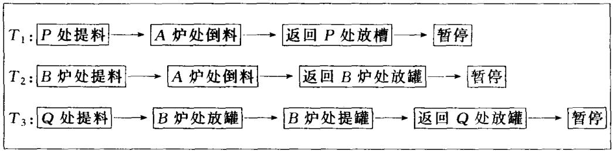

<details>
<summary>flowchart</summary>

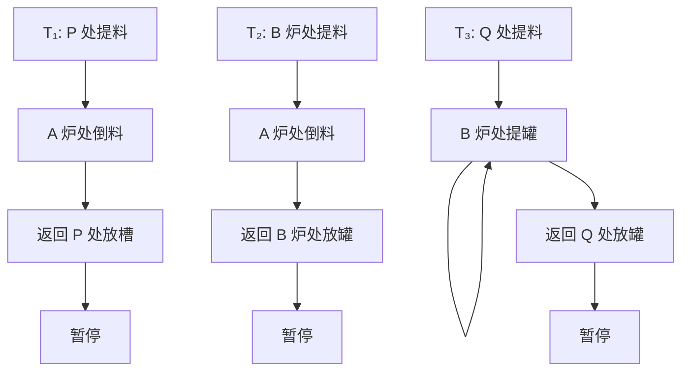
```mermaid
graph TD
  T1["T₁: P 处提料"] --> A["A 炉处倒料"]
  A --> R["返回 P 处放槽"]
  R --> S["暂停"]
  
  T2["T₂: B 炉处提料"] --> A2["A 炉处倒料"]
  A2 --> B["返回 B 炉处放罐"]
  B --> S2["暂停"]
  
  T3["T₃: Q 处提料"] --> B2["B 炉处放罐"]
  B2 --> B2["B 炉处提罐"]
  B2 --> R2["返回 Q 处放罐"]
  R2 --> S3["暂停"]
```
</details>

(2) 各台天车在一个工作周期内的工序清单：

$T_{1}$ : 天车 $T_{1}$ 在一个周期内的工序清单  
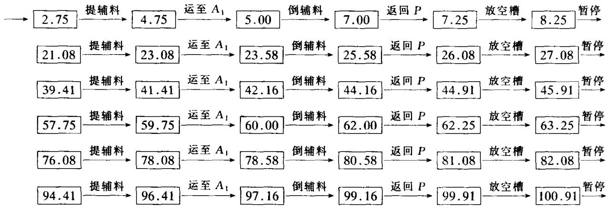

<details>
<summary>flowchart</summary>

```mermaid
graph LR
  Start[""] --> Step1["2.75"]
  Step1 -->|"提辅料"| Step2["4.75"]
  Step2 -->|"运至 A₁"| Step3["5.00"]
  Step3 -->|"倒辅料"| Step4["7.00"]
  Step4 -->|"返回 P"| Step5["7.25"]
  Step5 -->|"放空槽"| Step6["8.25"]
  Step6 -->|"暂停"| End[""]
  Step1 --> Step21["21.08"]
  Step21 -->|"提辅料"| Step22["23.08"]
  Step22 -->|"运至 A₁"| Step23["23.58"]
  Step23 -->|"倒辅料"| Step24["25.58"]
  Step24 -->|"返回 P"| Step25["26.08"]
  Step25 -->|"放空槽"| Step26["27.08"]
  Step26 -->|"暂停"| End
  Step1 --> Step39["39.41"]
  Step39 -->|"提辅料"| Step40["41.41"]
  Step40 -->|"运至 A₁"| Step41["42.16"]
  Step41 -->|"倒辅料"| Step42["44.16"]
  Step42 -->|"返回 P"| Step43["44.91"]
  Step43 -->|"放空槽"| Step44["45.91"]
  Step44 -->|"暂停"| End
  Step1 --> Step57["57.75"]
  Step57 -->|"提辅料"| Step58["59.75"]
  Step58 -->|"运至 A₁"| Step59["60.00"]
  Step59 -->|"倒辅料"| Step60["62.00"]
  Step60 -->|"返回 P"| Step61["62.25"]
  Step61 -->|"放空槽"| Step62["63.25"]
  Step62 -->|"暂停"| End
  Step1 --> Step67["76.08"]
  Step67 -->|"提辅料"| Step68["78.08"]
  Step68 -->|"运至 A₁"| Step69["78.58"]
  Step69 -->|"倒辅料"| Step70["80.58"]
  Step70 -->|"返回 P"| Step71["81.08"]
  Step71 -->|"放空槽"| Step72["82.08"]
  Step72 -->|"暂停"| End
  Step1 --> Step94["94.41"]
  Step94 -->|"提辅料"| Step95["96.41"]
  Step95 -->|"运至 A₁"| Step96["97.16"]
  Step96 -->|"倒辅料"| Step97["99.16"]
  Step97 -->|"返回 P"| Step98["99.91"]
  Step98 -->|"放空槽"| Step99["100.91"]
  Step99 -->|"暂停"| End
```
</details>

$T_{2}$ : 天车 $T_{2}$ 在一个周期内的工序清单(略)

$T_{3}$ : 天车 $T_{3}$ 在一个周期内的工序清单(略)

2. 天车一炉子作业运行图(图 1)

在图中,天车和炉子的作业运行图由以下分段函数来表示:

$$
f (t) = \left\{ \begin{array}{l l} 0 & \text {停止状态} \\ 1 & \text {工作状态} \end{array} \right.
$$

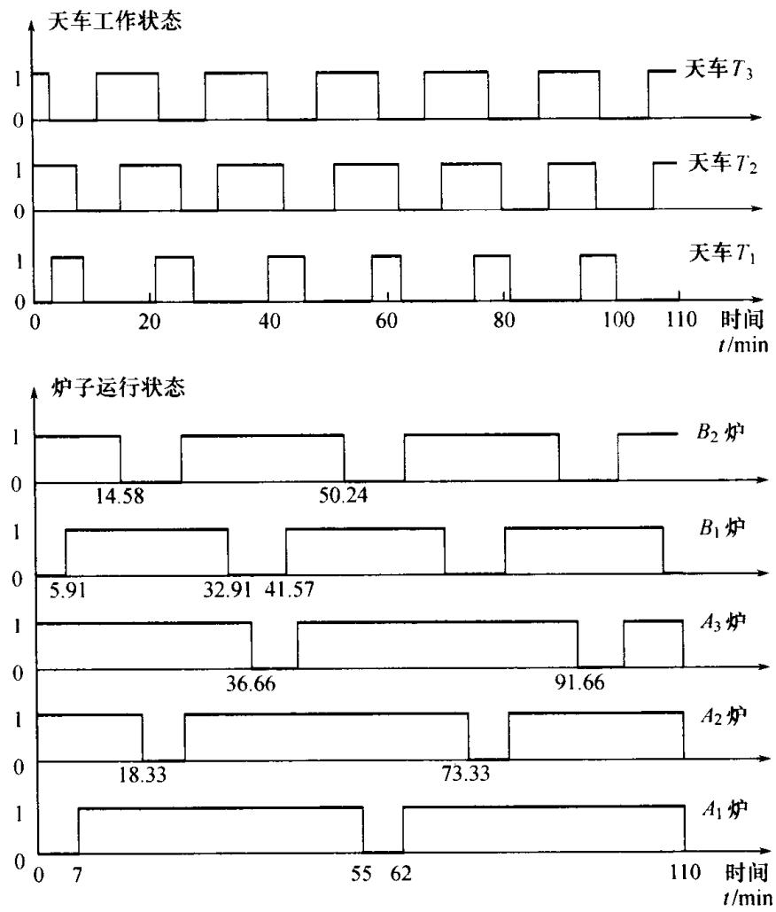  
图1

由于假设在 A 组炉处天车 $T_{1}$ 与 $T_{2}$ 进料是连续的, 无时间间隔, 但不会发生碰撞, 所以图中 $T_{1}$ 与 $T_{2}$ 在相同时刻处于同一个位置(如图 2 所示的 A, B 两点), 并不是违背条件的.

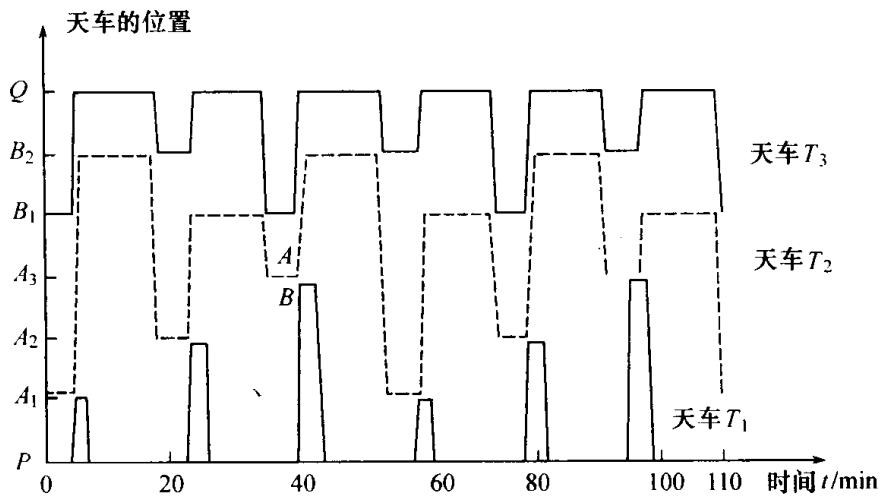

<details>
<summary>line</summary>

| Time t/min | 天车 T1 | 天车 T2 | 天车 T3 |
| --- | --- | --- | --- |
| 0 | A1 | B1 | Q |
| 5 | A1 | B2 | Q |
| 20 | — | B2 | B2 |
| 25 | A2 | B2 | Q |
| 35 | — | A3 | B1 |
| 40 | A3 | B2 | Q |
| 55 | A1 | B1 | B2 |
| 60 | — | A2 | Q |
| 75 | A2 | B2 | B1 |
| 80 | — | B2 | Q |
| 95 | A3 | B2 | Q |
| 110 | — | B1 | B1 |
</details>

图2

## (五) 调度规则说明书

各天车的调度时刻分别由下面对应的式子确定：

$$
t _ {1} (n) = t _ {a} (n) + t _ {e} - (m \cdot t _ {x} + t _ {g})
$$

$$
t _ {2} (n) = t _ {a} (n) - m \cdot t _ {x}
$$

$$
t _ {3} (n) = t _ {b} (n) - (m \cdot t _ {x} + t _ {y})
$$

各天车被调度后就按调度方案中对应的工序正常工作.

各天车在一个工作周期内的调度时间如下表：

<table><tr><td></td><td>1</td><td>2</td><td>3</td><td>4</td><td>5</td><td>6</td></tr><tr><td> $T_{1}$ </td><td>2.75</td><td>21.8</td><td>39.41</td><td>57.75</td><td>76.08</td><td>94.41</td></tr><tr><td> $T_{2}$ </td><td>-3.75</td><td>14.58</td><td>32.91</td><td>51.25</td><td>69.58</td><td>87.91</td></tr><tr><td> $T_{3}$ </td><td>-40.98</td><td>-22.34</td><td>-4.25</td><td>14.33</td><td>32.41</td><td>51.00</td></tr></table>

## (六) 各台天车在所给方案下的作业率

用前面的计算结果求得对应天车的作业率见下表：

<table><tr><td></td><td> $T_{1}$ </td><td> $T_{2}$ </td><td> $T_{3}$ </td></tr><tr><td>作业率</td><td>32.73%</td><td>61.36%</td><td>58.64%</td></tr></table>

## (七) 该车间成品钢的年产量为

$$
W = 8 6 4 0 \cdot \frac {w _ {a} \cdot k}{T _ {A}} = 8 6 4 0 \times \frac {1 2 0 \times 3 0 0}{1 1 0} = 2 8 2. 7 6 (\text {万吨})
$$

## 四、模型结果分析

由于我们所建模型时把随机性参数 $t_{a}, t_{b}, \cdots, t_{k}$ 取为其平均值，考虑为定值参数，这使所建模型运行后结果产生误差。对于 $T_{1}, T_{2}, T_{3}$ ，由于天车有足够的休息时间，而由 A 组炉决定其工作状态，按正态分布计算其概率接近于 100%，对于成品年产量 W，按正态分布计算其概率近似于 87.5%。

在不改变生产工艺条件的情况下,该车间成品钢年产量达300万吨的概率几乎为0,因此,要使钢年产量达到300万吨,我们必须对生产工序或每年的作业日作一定的调整,比如:缩短工作周期,增加年作业日等.经过计算,我们发现仅增加作业日,则需增加18.3天才能达到年产量300万吨;如增加工作日的同时缩短生产周期,则当缩短4分钟/(周期)时,只需增加7天就能达到年产量300万吨,如仅缩短工作周期,则只需缩短6.3分钟/(周期).比较三者,我们建议采用适当增加作业日同时适当缩短工作周期来达到年产量300万吨,这样就避免了因工作周期过短而使天车的作业率超过70%和作业日过多而造成职工抱怨强烈.

## 五、模型的改进和推广

由于时间有限, 只能以演示的方式给出由 A 组炉决定整个生产过程的模型, 而不能给出由 B 组炉或天车 $T_{i}$ 决定整个生产过程的模型, 因此模型的改进方向是建立由 B 组炉或天车 $T_{i}$ 决定整个生产过程的模型, 达到对任何情况都可在判断后直接利用模型制定调度方案.

我们所建立的模型不仅可用于天车调度,而且可用于工作时间与其它时间有矛盾时的人员的安排、交通(尤其是火车)调度等.

## 模型优缺点

1. “瓶颈模型”是按“递推法”逐渐满足条件而建立的,建模方法简单易懂,尽管建模过程中应用了层次分析法和排队理论,但仍可以只用初等数学方法便能制定出调度方案.  
2. 所建模型的调度时刻清晰,便于操作.  
3. 模型先是按一般情况考虑的, 具有一定的通用性, 如遇到其它情况, 只需抓住问题的“颈”, 然后利用我们模型中回归递推的方法进行求解. 有很强的适用性.  
4. 由于我们在模型假设中有一些地方进行了连续化处理, 这可能使模型在实际运用过程中对调度和操作的要求增强.

## 参考文献

1.《物理化学》，天津大学物理化学教研室编(第三版)，高等教育出版社  
2.《运筹学》，《运筹学》教材编写组编，清华大学出版社  
3.《运筹学导论》,[美]B.E.吉勒特著,机械工业出版社  
4.《排队论及其应用》，陆凤山编，湖南科学技术出版社  
5.《概率论》，同济大学数学教研室编，高等教育出版社  
6.《层次分析法引论》，王莲芬 许树柏 编著，中国人民大学出版社  
7.《大学生数学建模竞赛辅导教材》，叶其孝 主编，湖南教育出版社

## 附录 用层次分析法确定天车的台数

对采用三台、四台、五台天车都能满足工艺要求的情况下,要确定选取哪一种情况为最优方案时,可以将决策问题分解为三个层次.

运用1～9尺度分别写出准则层对目标层(A矩阵)及方案层对准则层的判断矩阵(B1,B2,B3,B4,B5矩阵):

$$
\begin{array}{l} A = \left[ \begin{array}{c c c c c} 1 & 1 & 4 & 4 & 3 \\ 1 & 1 & 3 & 3 & 4 \\ \frac {1}{4} & \frac {1}{3} & 1 & 3 & \frac {1}{2} \\ \frac {1}{4} & \frac {1}{3} & \frac {1}{3} & 1 & 1 \\ \frac {1}{3} & \frac {1}{4} & 2 & 1 & 1 \end{array} \right] \quad B 1 = \left[ \begin{array}{c c c} 1 & 2 & 5 \\ \frac {1}{2} & 1 & 3 \\ \frac {1}{5} & \frac {1}{3} & 1 \end{array} \right] \quad B 2 = \left[ \begin{array}{c c c} 1 & \frac {1}{3} & \frac {1}{8} \\ 3 & 1 & \frac {1}{3} \\ 8 & 3 & 1 \end{array} \right] \\ B 3 = \left[ \begin{array}{c c c} 1 & 3 & 4 \\ \frac {1}{3} & 1 & 1 \\ \frac {1}{4} & 1 & 1 \end{array} \right] \quad B 4 = \left[ \begin{array}{c c c} 1 & 2 & 4 \\ \frac {1}{2} & 1 & 2 \\ \frac {1}{4} & \frac {1}{2} & 1 \end{array} \right] \quad B 5 = \left[ \begin{array}{c c c} 1 & 3 & 8 \\ \frac {1}{3} & 1 & 3 \\ \frac {1}{8} & \frac {1}{3} & 1 \end{array} \right] \\ \end{array}
$$

对于正矩阵 $A$ 的最大特征根 $\lambda_{\max}$ 及特征向量 $w$ 可根据 Perron 定理, 利用数值计算中的幂法求取; 同时利用 $CI = \frac{\lambda_{\max} - n}{n - 1}$ 对每个判断矩阵进行一致性检验, 查找相应阶数的平均随机致一性指标 $RI$ (阶数 $n = 3$ 时 $RI = 0.52, n = 5$ 时 $RI = 1.12$ ), 并用 $CR = \frac{CI}{RI}$ 求得一致性比例 $CR$ , 当 $CR > 0.1$ 时说明判断矩阵不合实际, 应进行重新判断, 直到 $CR < 0.1$ 时通过检验, 当每一判断矩阵都通过一致性检验时, 得到如下表所示值; 然后进行组合权向量的计算.

<table><tr><td>k</td><td>1</td><td>2</td><td>3</td><td>4</td><td>5</td></tr><tr><td rowspan="3"> $w'_{k}^{(B)}$ </td><td>0.58155</td><td>0.08194</td><td>0.63376</td><td>0.57143</td><td>0.68173</td></tr><tr><td>0.30900</td><td>0.23628</td><td>0.19186</td><td>0.28571</td><td>0.23634</td></tr><tr><td>0.10945</td><td>0.68178</td><td>0.17438</td><td>0.14286</td><td>0.08193</td></tr><tr><td> $\lambda_{k}$ </td><td>3.00367</td><td>3.00119</td><td>3.00884</td><td>3.00000</td><td>3.00148</td></tr><tr><td> $CI_{k}$ </td><td>0.00184</td><td>0.00060</td><td>0.00442</td><td>0.00000</td><td>0.00074</td></tr></table>

从上表中可以看出各判断矩阵均通过一致性检验,并可得到

$$
w ^ {(B)} = (0. 3 4 7 2 7, 0. 3 3 2 1 0, 0. 1 1 7 6 4, 0. 0 8 2 9 1, 0. 1 2 0 0 9) ^ {T}
$$

记 $W = [w_1^{(B)}, w_2^{(B)}, w_3^{(B)}, w_4^{(B)}, w_5^{(B)}]$ , 可得第三层对第一层的排序向量：

$w_{31}=(0.43296,0.26041,0.30662)$ ，此向量中权重最大的一项就是我们所要寻找的最优项.

以上各计算步骤都是通过 BASIC 程序实现的.

应用数学是一种异常广阔的学科,最好的应用数学是与最好的纯粹数学同样深奥、美妙和有趣的。

我衷心地建议所有年轻数学家到应用数学的某些分支去一试锋芒,那里藏有许多问题的金矿,其解决有待于概念和技术上的突破。

P.D. 拉克斯

《当代数学大师》, 李心灿编, 航空工业出版社, 1994。

# 天车与冶炼炉的操作模型

湖南湘潭大学 陈 靖 周素华 黄秋波

指导教师 成央金

编者按 本文通过基本数据的定量分析,给出三台天车的二种调度方案,在保证产量达到最大条件下使天车的作业率达到均衡而且使用率很高.本文条理清楚,是篇优秀答卷,文章主要缺点是对随机性情况未进行讨论.

摘要 本文得到了模型1存在可行方案的充分条件，为 $t_1, t_2$ 的确定提供了理论依据，得到的操作方案保证 $A$ 组炉满负荷工作，且 $T_1, T_2, T_3$ 的作业率分别为 $32.7\%, 61.4\%, 58.6\%$ . 针对作业率极不平衡的缺点，采用这样的思路：不增加天车的台数， $T_1$ 负责一部分工作， $T_3$ 负责 $T_2$ 一部分工作，提出另一套方案。获得了存在可行方案的充分条件，从理论上解决了 $t_1, t_2$ 的确定，且提出的方案保证 $A$ 组炉满负荷工作且 $T_1, T_2, T_3$ 的作业率分别为 $52.7\%, 53.7\%, 54.1\%$ . 模型2是很满意的，据此提出一套供现场工作人员使用的《操作规则说明书》对应用于实际生产过程进行了初步的讨论，为年产300万吨提出了一个建议。利用计算机，用同样的思想对4台天车、5台天车的运动轨迹进行了模拟。

关键词 作业调度,作业均衡,天车运行图

## 一、背景与问题的重述(略)

## 二、模型的假设

假设一:天车运行是匀速的.

假设二:两台天车必须在 A 或 B 工作点相继作业时,而这两台天车间又夹有一台天车,这就有因为让路带来的延迟,我们假设这种延迟非常小,可忽略不计.

## 三、问题的分析

A 组转炉生产成品钢, 成品钢的产量是工厂关注的一个首要问题, 天车与冶炼炉的作业调度方案必须围绕这个问题来提出. 因此, 我们采用这样的思路: A 组转炉尽可能不空闲, 其余工作点尽可能为 A 组转炉提供最好的服务. 在绝对没有天车相碰, 各天车作业率尽可能均衡的情形下, A 组中每个转炉处于连续工作状态, 即 A 组炉出钢后立即加料, 加料后立即冶炼. 因加半钢和辅料不能同时进行, 且所需时间分别为 5 分钟和 2 分钟, 而冶炼时间为 48 分, 所以, 出一炉成品钢的最短时间为 $5 + 2 + 48 = 55$ 分. 又因 A 组炉有 3 个, 所以, 55 分钟内可出 3 炉成品钢. 若 A 组炉出钢顺序为 $A_{1}, A_{2}, A_{3}$ , 且在 0 至 55 分钟里, $A_{1}$ 在 $t_{1}$ 时刻出钢, $A_{2}$ 在 $t_{2}$ 时刻出钢, $A_{3}$ 在 55 分钟出钢. 以下所建立的模型, 就是在保证对天车与冶炼炉作业调度的要求的前提下, 求出 $t_{1}, t_{2}$ 所应满足的条件, 以此得到天车与冶炼炉的调度方案.

## 四、模型的建立

## 1. 模型 1
B 组炉轮流给 A 组炉供应半钢, 我们采用下面的顺序:

$$
B _ {1} \rightarrow A _ {1}, B _ {2} \rightarrow A _ {2}, B _ {1} \rightarrow A _ {3}, B _ {2} \rightarrow A _ {1}, B _ {2} \rightarrow A _ {2}, B _ {2} \rightarrow A _ {3}.
$$

以110分钟作为一个周期,不妨设在一个周期内, $A_{1}$ 在 $t_{1}$ 时刻出钢, $A_{2}$ 在 $t_{2}$ 时刻出钢, $A_{3}$ 在55分钟时出钢.然后, $A_{1}$ 在 $55+t_{1}$ 时刻第二次出钢, $A_{2}$ 在 $55+t_{2}$ 时刻出钢, $A_{3}$ 在110分钟时出钢,如图所示:

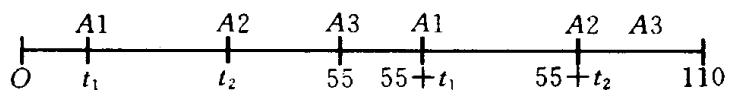

<details>
<summary>text_image</summary>

A1 A2 A3 A1 A2 A3
O t₁ t₂ 55 55+t₁ 55+t₂ 110
</details>

A 组炉在一个周期内 6 个时刻出钢, 天车 $T_{1}, T_{2}, T_{3}$ 在每时刻附近完成一次作业, 这样, 将一个周期分为 6 个阶段. 天车 $T_{1}$ 负责给 A 组炉加辅料, $T_{2}$ 把 B 组炉的半钢运至 A 组冶炼, $T_{3}$ 负责将 Q 处原料运至 B 组炉, $T_{1}, T_{2}, T_{3}$ 工作起点的确定的方法是:

$T_{2}$ : 当转炉 $A_{k}(1 \leqslant K \leqslant 3)$ 成品钢出炉后, $T_{2}$ 刚好将半钢送到 $A_{k}$ 处.

$T_{1}$ : 当 $T_{2}$ 给转炉 $A_{k}$ 加完半钢后, $T_{1}$ 刚好将辅料送到 $A_{k}$ 处.

$T_{3}$ : 转炉 $A_{k}$ 成品钢出炉后, $T_{1}$ 刚好在该时刻将原料送到 B 组中相应的冶炼炉处. 现在, 我们计算一个周期内 $T_{1}, T_{2}, T_{3}$ 在各时刻的工作始点, 终点.

$A_{1}$ 在 $t_{1}$ 时刻出一炉钢；

$T_{2}$ : 因 $T_{2}$ 从 $B_{1}$ 吊一罐半钢在 $t_{1}$ 时刻到达 $A_{1}$ 处, 故 $T_{2}$ 的工作始点为: $t_{1} - 3t_{x} - t_{d}$ . $T_{2}$ 将半钢倒入 $A_{1}$ 后, 将空罐返回 $B_{2}$ 处, 因此 $T_{2}$ 的工作终点为: $t_{1} + t_{e} + 4t_{x} + t_{c}$ .

$T_{1}$ : 因为 $T_{1}$ 是在 $T_{2}$ 给 $A_{1}$ 倒完半钢后即给 $A_{1}$ 加辅料, 故 $T_{1}$ 的工作始点为:

$$
t _ {1} + t _ {e} - t _ {x} - t _ {g}.
$$

当 $T_{1}$ 将辅料倒完后, 将空罐返回 P 处放下, 因此 $T_{1}$ 的工作终点为:

$$
t _ {1} + t _ {e} + t _ {f} + t _ {x} + t _ {h}.
$$

因此 $T_{1}$ 的工作终点为： $t_1 + t_e + t_f + t_x + t_h$ .

$T_{3}$ : 因为 $T_{3}$ 是在 $T_{2}$ 将半钢提走以后即给 $B_{1}$ 送原料, 所以 $T_{3}$ 的工作始点为:

$$
t _ {1} + 2 t _ {x} - t _ {y}.
$$

当 $T_{3}$ 放下原料后, 吊上一次空罐返回 Q 处放下空罐, 故 $T_{3}$ 的工作终点为,

$$
t _ {1} + t _ {e} + t _ {o} + 2 t _ {x} + t _ {k}.
$$

同理可得,在一个周期内,天车 $T_{1}, T_{2}, T_{3}$ 在其它五个阶段的工作始点和终点(见表1).

现在我们分析 $B$ 组炉在一个周期内的冶炼状态: 因为, 在第一阶段给 $B_{1}$ 的原料, 因第二阶段将 $B_{2}$ 中半钢倒入 $A_{2}$ , 到第三阶段供给 $A_{3}$ 使用, 所以, 在 $t_{1}$ 时刻, 给 $B_{1}$ 加的原料供给 $A_{3}$ 使用, $B_{1}$ 炉可以冶炼的时刻为 $t_{1} + t_{1}$ . 该罐原料必须炼成半钢出炉的时刻等于 $T_{2}$ 给 $A_{3}$ 加半钢的工作始点时刻, 即为 $55 - t_{k} - t_{d}$ . 为了保证有充足的时间冶炼半钢, 应有 $55 - t_{x} - t_{i} - (t_{1} + t_{i}) \leqslant 27$ . 在一个周期内, $B$ 组炉的其它五个冶炼状态同理可得(见表2).

如果一个天车与冶炼的作业调度方案能使 A 组炉处于连续工作状态,称该方案为可行方案.

表1

<table><tr><td>工作点</td><td> $T_1$ </td><td> $T_2$ </td><td> $T_3$ </td></tr><tr><td>(1)始点</td><td> $t_1 + t_e - t_x - t_g$ </td><td> $t_1 - 3t_x - t_d$ </td><td> $t_1 - 2t_x - t_y$ </td></tr><tr><td>终点</td><td> $t_1 + t_e + t_f + t_x + t_h$ </td><td> $t_1 + t_e + 4t_x + t_c$ </td><td> $t_1 + t_2 + t_o + 2t_x + t_k$ </td></tr><tr><td>(2)始点</td><td> $t_2 + t_e - 2t_x - t_g$ </td><td> $t_2 - 3t_x - t_d$ </td><td> $t_1 - t_x - t_y$ </td></tr><tr><td>终点</td><td> $t_2 + t_e + t_f + 2t_x + t_h$ </td><td> $t_2 + t_e + 2t_x + t_c$ </td><td> $t_2 + t_i + t_o + t_x + t_k$ </td></tr><tr><td>(3)始点</td><td> $55 + t_e - 3t_x - t_g$ </td><td> $55 - t_x - t_d$ </td><td> $55 - 2t_x - t_y$ </td></tr><tr><td>终点</td><td> $55 + t_e + t_f + 3t_x + t_h$ </td><td> $55 + t_e + 3t_x + t_c$ </td><td> $55 + t_i + t_o + 2t_x + t_k$ </td></tr><tr><td>(4)始点</td><td> $55 + t_1 + t_e - t_x - t_g$ </td><td> $55 + t_1 - 4t_x - t_d$ </td><td> $55 + t_1 - t_x - t_y$ </td></tr><tr><td>终点</td><td> $55 + t_1 + t_e + t_f + t_x + t_h$ </td><td> $55 + t_1 + t_e + 3t_x + t_c$ </td><td> $55 + t_1 + t_i + t_o + 2t_x + t_k$ </td></tr><tr><td>(5)始点</td><td> $55 + t_2 + -2t_x - t_g$ </td><td> $55 + t_2 - 2t_x - t_d$ </td><td> $55 + t_2 - 2t_x - t_y$ </td></tr><tr><td>终点</td><td> $55 + t_2 + t_e + t_f + 2t_x + t_h$ </td><td> $55 + t_2 + t_e + 3t_x + t_c$ </td><td> $55 + t_2 + t_i + t_o + 2t_x + t_k$ </td></tr><tr><td>(6)始点</td><td> $110 + t_e - 3t_x - t_g$ </td><td> $110 - 2t_x - t_d$ </td><td> $110 - 2t_x - t_y$ </td></tr><tr><td>终点</td><td> $110 + t_e + t_f + 3t_x + t_h$ </td><td> $110 + t_e + 3t_x + t_c$ </td><td> $110 + t_i + t_o + t_x + t_k$ </td></tr></table>

表 2

<table><tr><td>B组可以开始冶炼时间</td><td>需要供应半钢时间</td></tr><tr><td> $t_{1} + t_{i}$ </td><td> $55 + t_{x} - t_{d}$ </td></tr><tr><td> $t_{2} + t_{i}$ </td><td> $55 + t_{1} - 4t_{x} - t_{d}$ </td></tr><tr><td> $55 + t_{i}$ </td><td> $55 + t_{2} - 2t_{x} - t_{d}$ </td></tr><tr><td> $55 + t_{1} + t_{i}$ </td><td> $110 - 2t_{x} - 3$ </td></tr><tr><td> $55 + t_{2} + t_{i}$ </td><td> $110 + t_{1} - 3t_{x} - t_{d}$ </td></tr><tr><td> $110 + t_{i}$ </td><td> $110 + t_{2} - 3t_{x} - t_{d}$ </td></tr></table>

下面的结论给出了上述方案可行的条件.

定理1 当 $t_1, t_2$ 满足下述三个条件

$$
1 1 + 2 t _ {x} \leqslant t _ {1} \leqslant 2 2 - 2 t _ {x},
$$

$$
3 6 + 3 t _ {x} \leqslant t _ {2} \leqslant 4 5 - 5 t _ {x},
$$

$$
1 1 + 3 t _ {x} \leqslant t _ {2} - t _ {1} \leqslant 2 0,
$$

上述方案是可行的.

证明 (1) 在一个周期内每台天车在某一阶段的工作始点一定不小于上一阶段的工作终点. 考察 $T_{1}$ , 得下述不等式组:

$$
\begin{array}{l} t _ {2} + t _ {e} - 2 t _ {x} - t _ {g} \geqslant t _ {1} + t _ {e} + t _ {f} + t _ {x} + t _ {h}, \\ 5 5 + t _ {e} - 3 t _ {x} - t _ {g} \geqslant t _ {2} + t _ {e} + t _ {f} + 2 t _ {x} + t _ {h}, \\ 5 5 + t _ {1} + t _ {e} - t _ {x} - t _ {g} \geqslant 5 5 + t _ {e} + t _ {f} + 3 t _ {x} + t _ {h}, \\ 5 5 + t _ {2} + t _ {e} - 2 t _ {x} - t _ {g} \geqslant 5 5 + t _ {1} + t _ {e} + t _ {f} + t _ {x} + t _ {h}, \\ 1 1 0 + t _ {e} - 3 t _ {x} - t _ {g} \geqslant 5 5 + t _ {2} + t _ {e} + t _ {f} + 2 t _ {x} + t _ {h}, \\ 1 1 0 + t _ {1} + t _ {e} - t _ {x} - t _ {g} \geqslant 5 5 + t _ {e} + t _ {f} + 3 t _ {x} + t _ {h}. \\ \end{array}
$$

解得：

$$
t _ {1} \geqslant 6, t _ {2} \leqslant 4 9 - t _ {x}, t _ {2} - t _ {1} \geqslant 5 + 3 t _ {x}.
$$

对 $T_{2}, T_{3}$ , 同理可得:

$$
T _ {2}: t _ {1} \geqslant 1 0 + 6 t _ {x} = 1 1 + 2 t _ {x}, t _ {2} \leqslant 4 5 - 5 t _ {x}, t _ {2} - t _ {1} \geqslant 1 1 + 3 t _ {r};
$$

$$
T _ {3}: t _ {1} \geqslant 1 0 + 3 t _ {x}, t _ {2} \leqslant 4 5 - 3 t _ {x}, t _ {2} - t _ {1} \geqslant 1 1 + t _ {x}.
$$

(2) 为了保证冶炼区间的长度不小于 27 分钟, 同理可以建立一个不等式组, 并得出

$$
t _ {1} \leqslant 2 2 - 2 t _ {x}; t _ {2} \geqslant 3 6 + 3 t _ {x}; t _ {2} - t _ {1} \leqslant 2 0.
$$

综上所述,得到一个不等式组:

$$
1 1 + 2 t _ {x} \leqslant t _ {1} \leqslant 2 2 - 2 t _ {x},
$$

$$
3 6 + 3 t _ {x} \leqslant t _ {2} \leqslant 4 5 - 5 t _ {x},
$$

$$
1 1 + 3 t _ {x} \leqslant t _ {2} - t _ {1} \leqslant 2 0.
$$

(3) 天车之间是不会碰撞的, $T_{1}$ 和 $T_{3}$ 肯定不会碰撞. 考察 $T_{1}$ 与 $T_{2}$ , 因 $T_{2}$ 离开 $A_{k}, T_{1}$ 恰好赶到 $A_{k}$ , 在 $A_{k}$ 在作业时间 2 分钟后即返回, 而 $T_{2}$ 提半钢要花 3 分钟, 因为下一阶段 $T_{2}$ 来 $A$ 组炉来工作时肯定不会碰撞. $T_{2}$ 和 $T_{3}$ 因都在同一时刻, $T_{2}$ 到达 $A_{k}, T_{3}$ 在 $B_{l} (l = 1, 2)$ , 而 $T_{2}$ 在 $A_{k}$ 加半钢要花 5 分钟, 而 $T_{3}$ 在 $B_{l}$ 放下原料, 提空罐也花 5 分钟, 因此不会碰撞.

上面结果告诉我们,如何选取 $t_1, t_2$ , 产生一个可行方案.我们现在计算一下可行方案中 $T_1, T_2, T_3$ 的作业率.根据表1得 $T_1$ 的作业时间为36分钟, $T_2$ 的作业时间为67分30秒, $T_3$ 的作业时间为64分40秒,其作业率分别为32.7%, 61.4%, 58.6%.所得结果显示,天车的作业率很不均衡,我们在该模型的基础上进行改进.

## 2. 模型 2

模型1的缺点是天车的作业率极不均衡，在模型1的基础上，不增加天车台数，我们采用这样的处理办法： $T_{1}$ 从P点出发，从Q点吊出一罐原料到 $B_{l}$ ，并负责空罐的返回，然后返回P点所花时间不超过13分钟，在第一阶段与第二阶段之间， $T_{1}, T_{2}, T_{3}$ 都有一段空闲时间（三个区间的交集）不小于13分钟，就有可能解决天车的作业率极不平衡的问题。

在模型1的基础上作如下修改:在第一阶段 $T_{1}$ 从Q点吊一罐原料 $B_{1}$ ，并负责空罐的返回，然后返回到P点.在第二阶段， $T_{3}$ 不工作.在第四阶段， $T_{1}$ 仅从Q点吊一罐原料至 $B_{1}$ ，不负责空罐的返回.第五阶段， $T_{3}$ 从 $B_{1}$ 吊一罐半钢至 $A_{k}$ ，并带回上阶段的空半钢罐， $T_{2}$ 不工作.为了设计操作规则说明书，让 $T_{3}$ 较 $T_{2}$ 产生延缓时间，这里为 $t_{x}$ .

类似于模型 1, 得到天车 $T_{1}, T_{2}, T_{3}$ 在一个周期内每个阶段的工作始点, 终点, 及 B 组炉的 6 个冶炼状态(如表三、表四).

下面的定理给出了方案可行的条件：

定理 2 当 $t_{1}, t_{2}$ 满足下述不等式, 上述方案是可行的:

$$
1 1 + 2 t _ {x} \leqslant t _ {1} \leqslant 2 2 - 3 t _ {x},
$$

$$
3 4 \leqslant t _ {2} \leqslant 4 0,
$$

$$
t _ {2} - t _ {1} \leqslant 2 5.
$$

## 证明

(1) 在第一阶段和第二阶之间, $T_{1}$ 空闲区间为 $\left[t_{1}+8+t_{x},t_{2}+3-2t_{x}\right]$ ;

$T_{2}$ 的空闲区间为 $[t_{1} + 8, t_{2} - 3 - 3t_{x}]$ ;

$T_{1}$ 和 $T_{2}$ 的公共空闲区间为 $[t_{1} + 8 + t_{x}, t_{2} - 3 - 3t_{x}]$ ;

由此推得， $t_2 - 3 - 3t_x - (t_1 + 8 + t_x)\geqslant 13$ ，即： $t_2 - t_1\geqslant 25.$

对第四阶段与第五阶段,同理可得: $t_{2}-t_{1}\geqslant11+2t_{x}$

综合上述,有 $t_{2}-t_{1}\geqslant25$ .

(2) 根据表 3, 某一阶段天车的工作始点必须不小于上一阶段的终点, 得天车 $T_{1}, T_{2}, T_{3}$ 能够运行的条件:

$$
T _ {1}: t _ {1} \geqslant 6, T _ {2}: t _ {1} \geqslant 1 1 + 2 t _ {x}, T _ {3}: t _ {1} \geqslant 1 0 + 3 t _ {x};
$$

$$
t _ {2} \leqslant 4 9 - t _ {x}, t _ {2} \leqslant 5 5 - 3 t _ {x}, t _ {2} \leqslant 4 0;
$$

$$
t _ {2} - t _ {1} \geqslant 1 8 + 3 t _ {x}.
$$

(3) 根据表 4, 供应半钢的时间与原料到达 $B_{1}$ 处放下后的时工必须不小于冶炼出半钢的时间 $t_{b} = 27$ 分钟, 我们有下面的不等式:

$$
t _ {1} \leqslant 2 2 - 3 t _ {x},
$$

$$
t _ {2} \geqslant 3 4.
$$

综合上述四个不等式组,得:

$$
1 1 + 2 t _ {x} \leqslant t _ {1} \leqslant 2 2 - 3 t _ {x},
$$

$$
3 4 \leqslant t _ {2} \leqslant 4 0,
$$

$$
t _ {2} - t _ {1} \geqslant 2 5.
$$

所以, 只要我们选择满足上述不等式的 $t_1, t_2$ , 我们便能得出 3 台天车互帮的可行的调度方案, 且满足设计要求 (1), (2), (3), (4). 对于要求 (3), 因为互帮是在 $T_1, T_2, T_3$ 均空闲的区间段实现的, 在互帮时, 天车跟着平行移动即可, 所以不会相撞. 对于要求 (2), 我们在天车运行状态表中给出了三台天车的作业率, 从表中结果显示, 三台天车的作业率达到了很好的均衡. 下面, 我们给出操作规则说明书.

## 3. 操作规则说明书

先根据 A 组炉的冶炼时间确定 $T_{2}$ 的运动时刻, 由 $T_{2}$ 的工作始点与 $T_{2}$ 的工作始点的延缓时间可以确定 $T_{3}$ 的工作始点, 再由 $T_{1}$ 与 $T_{2}$ 的延缓关系可以确定 $T_{1}$ 的工作始点.

$T_{1}$ 规则1: 如果有天车给 $A_{k}(k = 1,2,3)$ 加半钢, 过 $3 - kt_{x}$ 后, 吊辅料槽至 $A_{k}$ , 返回 $P$ .

规则 2:(1) 上半周期.

当给 $A_{1}$ 加完辅料后, 返回 P, 放下空槽, 立即赴 Q 点, 途径 $B_{2}$ 取空罐带到 Q, 取原料一罐至工作点 $B_{2}$ , 放下原料罐, 返回 P.

## (2) 下半周期

给 $A_{1}$ 加完辅料后，返回 $P$ ，放下空槽，空即赴 $Q$ 点，取原料罐返回 $B_{1}$ ，放下原料罐，返回 $P$ 点.

这样上下半周期交替进行.

$T_{2}$ 规则1:从 $A_{k}(k = 1,2,3)$ 出成品钢时刻来确定 $T_{2}$ 的工作始点(前推得)分别为：

$$
t _ {1} - 3 - 3 t _ {x}, t _ {2} - 3 - 3 t _ {x}, 5 2 - t _ {x}, 5 1 + t _ {1}, 1 0 7 - 2 t _ {x}.
$$

规则 2: 出现天车 $T_{1}$ 越过工作点 $A_{1}$ (天车 $T_{1}$ 帮 $T_{3}$ 吊原料), 则 $T_{2}$ 向 Q 点移动, 然后随着 $T_{1}$ 返回出发点.

规则 3: 出现天车 $T_{3}$ 越过 B 组炉 ( $T_{3}$ 帮 $T_{2}$ 吊半钢), 则主动将车移到 $A_{2}$ , 等 $A_{3}$ 加完半钢后随 $T_{3}$ 返回到 B 组炉的另一个出发点.

$T_{3}$ 规则 1: 在同一星期里的第一、三、四、六阶段给 B 组炉添加原料, 添加对象分别为

$B_{1}, B_{1}, B_{2}, B_{2}$ ，启动时刻较 $T_{2}$ 分别缓 30 秒、1 分、0.30 秒.

规则 2: 在第五阶段帮 $T_{2}$ 从 $B_{1}$ 吊半钢到 $A_{2}$ ，从上一阶段 $T_{2}$ 停止后过 $t_{2} - t_{1} - 11 - 2t_{x}$ ，这一时刻为本次启动时刻.

注：所给 $t_1, t_2$ 只要满足定理2要求，根据模型2得到“天车一炉子运行图”.

## 4. 应用实际生产过程的讨论

上述操作方案在 $t_{a}, t_{b}, \cdots, t_{k}$ 确定的情况下提出，但在实际生产过程中，这些量往往带有随机性，而我们给现场工作人员的《操作规则说明书》是这样设计的：由 A 组炉的的冶炼状态确定 $T_{2}$ 的工作时刻， $T_{1}$ 根据天车给 A 组炉加半钢的时刻来确定，根据 $T_{2}$ 的行动时刻来确定 $T_{3}$ 的行动时刻， $T_{3}$ 较 $T_{2}$ 有延缓时间，每一个动作都是根据与其对应动作的延缓时间来确定自己的行动时刻，因此，我们只要尽量保持延缓时间不变。

## 5. 工序清单

$T_{1}$ 负责从 $P$ 向 $A$ 组炉加辅料，且在上半周期帮 $T_{3}$ 从 $B_{2}$ 提一罐原料并带回空罐，在下半周期帮 $T_{3}$ 向 $B_{1}$ 提一罐原料.

$T_{2}$ 负责 B 组炉提半钢到 A 组炉.

$T_{3}$ 负责从 Q 向 B 组炉提原料且在下半周期帮 $T_{2}$ 从 $B_{1}$ 提一罐半钢至 $A_{2}$ ，再返回 Q 点.

各个天车详细的工序清单见天车运行状态图.

## 6. 年产量的估计

每 55 分钟出 3 炉钢, 每炉 120 吨, 一天能产钢约 9425.45 吨, 一年以 300 工作日计算, 则年产量约为 282.76 万吨.

《天车一炉子作业运行图》见表.

表 3

<table><tr><td>工作点</td><td> $T_1$ </td><td> $T_2$ </td><td> $T_3$ </td></tr><tr><td>(1)始点终点</td><td> $t_1 + 3 + t_x$  $t_1 + 8 + t_x$ </td><td> $t_1 - 3 - 3t_x$  $t_1 + 8$ </td><td> $t_1 - 3 - t_x$  $t_1 + 7 + 3t_x$ </td></tr><tr><td>(2)始点终点</td><td> $t_1 + 8 + t_x$  $t_1 + 21 + t_x$ </td><td>移动  $2t_x$ </td><td>不动</td></tr><tr><td>(3)始点终点</td><td> $t_2 + 3 - 2t_x$  $t_2 + 8 + 2t_x$ </td><td> $t_2 - 3 - 3t_x$  $t_2 + 7 + 2t_x$ </td><td>不动</td></tr><tr><td>(4)始点终点</td><td> $58 - 3t_x$  $63 + 3t_x$ </td><td> $52 - t_x$  $62 + 2t_x$ </td><td> $52 - t_x$  $63 + 3t_x$ </td></tr><tr><td>(5)始点终点</td><td> $58 + t_1 - t_x$  $63 + t_1 + t_x$ </td><td> $51 + t_1$  $62 + t_1 + 3t_x$ </td><td> $52 + t_1$  $62 + t_1 + 2t_x$ </td></tr><tr><td>(6)始点终点</td><td> $63 + t_1 + t_x$  $72 + t_1 + t_x$ </td><td>移动  $4t_x$ </td><td>不动</td></tr><tr><td>(7)始点终点</td><td> $58 + t - 2t_x$  $63 + t_2 + 2t_x$ </td><td>移动  $5t_x$ </td><td> $52 + t_1$  $62 + t_1 + 2t_x$ </td></tr><tr><td>(8)始点终点</td><td> $113 - 3t_x$  $118 + 3t_x$ </td><td> $107 - 2t_x$  $117 + t_x$ </td><td> $107$  $117 + 2t_x$ </td></tr></table>

表 4

<table><tr><td>B组可以开始冶炼时间</td><td>需要供应半钢时间</td></tr><tr><td> $t_{1} + t_{x} + 3$ </td><td> $52 - t_{x}$ </td></tr><tr><td> $t_{1} + 20 + t_{x}$ </td><td> $51 + t_{1}$ </td></tr><tr><td> $55 + t_{x} + 3$ </td><td> $52 + t_{2} - 2t_{x}$ </td></tr><tr><td> $55 + t_{1} + t_{x} + 3$ </td><td> $107 - 2t_{x}$ </td></tr><tr><td> $71 + t_{1} + t_{x}$ </td><td> $107 + t_{1} - 3t_{x}$ </td></tr><tr><td> $110 + t_{x} + 3$ </td><td> $107 + t_{x} - 3t_{x}$ </td></tr></table>

## 五、年产300万吨的建议

## 1. 提高劳动生产效率

年产 300 万吨,一年按 300 天计算,每天需生产一万吨, $A_{k}$ 出一炉钢的时间为 51.84 分钟,在现有的设备技术条件下,冶炼时间 48 分不能变,只能改变加半钢的辅料的时间为 3.842 分钟,只能缩短添加半钢和辅料的时间.

## 六、模型的评价和改进方向

我们从简单的三台天车(模型1)方案入手,始终以保证A组转炉不间断出钢从而达到高产为中心,致力于使各天车的作业率达到较高程度上的均衡,提出了不同改进方案,得到以三台天车互相帮助为核心的调度方案的模型2.细致分析了每台天车的各次启动、停止时刻的相互关系,得到一系列可行解、满意解的约束条件.在共同的高产条件下(A组转炉不间断),比较得模型2的作业率均衡做得最好(在1周期内, $T_{1},T_{2},T_{3}$ 作业率分别为52.7%,53.6%,54.1%),作业率最大差额1.4%,均衡程度令人比较满意.我们又试着模拟了以增加天车台数为主要思想的4台天车方案(见附录),得出 $T_{1}-T_{4}$ 的作业率分别为43.6%,36%,39%,39%).当然这是由于时间关系不能对它作进一步的调整,但该模型各车的均衡是以作业水平的下降为代价的,而我们则希望尽量避免这种下降.沿这种改进方向(增加天车台数)我们也尝试了一下五台天车的方案(运行图见附录),因时间关系未作进一步研究.总之,模型2是我们这次重点研究并得出较好结果的方案,我们所推崇的改进方案是不降低生产率,尽量不增加天车台数,尽量不降低平均作业率的对各台天车工作时间重新调配的方案.

半钢冶炼炉状态表

<table><tr><td>半钢冶炼炉</td><td>冶炼允许开始时间</td><td>半钢出炉时间</td><td>冶炼规定开始时间</td><td>冶炼区间</td></tr><tr><td> $B_1$ </td><td> $t_1 + t_x + 3$ </td><td> $52 - t_x$ </td><td> $55 - t_x - 30 = 25 - t_x$ </td><td> $[25 - tx, 52 - t_x]$ </td></tr><tr><td> $B_2$ </td><td> $t_1 + 20$ </td><td> $51 + t_1$ </td><td> $55 + t_1 - 4t_x - 30 = 25 + t_1 - 4t_x = 24 + t_1$ </td><td> $[24 + t_x, 51 + t_x]$ </td></tr><tr><td> $B_1$ </td><td> $55 + t_x + 3 = 58 + t_x$ </td><td> $52 + t_2 - 2t_x$ </td><td> $55 + t_2 - 2t_x - 30 = 25 + t_2 - 2t_x$ </td><td> $[25 + t_2 - 2t_x, 52 + t_2 - 2t_x]$ </td></tr><tr><td> $B_2$ </td><td> $55 + t_1 + t_x + 3 = 58 + t_1 + t_x$ </td><td> $107 - 2t_x$ </td><td> $110 + 2t_x - 30 = 80 - 2t_x$ </td><td> $[80 - 2t_x, 107 - 2t_x]$ </td></tr><tr><td> $B_1$ </td><td> $72 + t_1 + t_x - 4t_x = 71 + t_1 + t_x$ </td><td> $107 + t_1 - 3t_x$ </td><td> $110 + t_1 - 3t_x - 30 = 80 + t_1 - 3t_x$ </td><td> $[80 + t_1 - 3t_x, 107 + t_1 - 3t_x]$ </td></tr><tr><td> $B_2$ </td><td> $110 + t_x - 3 = 113 + t_x$ </td><td> $107 + t_2 - 3t_x$ </td><td> $110 + t_2 - 3t_x - 30 = 80 + t_2 - 3t_x$ </td><td> $[80 + t_2 - 3t_x, 107 + t_2 - 3t_x]$ </td></tr></table>

天车运行状态表

<table><tr><td>天车</td><td>工作区间</td><td>动作说明</td></tr><tr><td rowspan="9"> $T_1$ </td><td> $t_1 + 3 - t_x \rightarrow t_1 + 8 + t_x$ </td><td>从P处提一槽辅料注入 $A_1$ ,并返回P点放下空槽,共用时间: $2 + t_x + 2 + t_x + 1 = 5 + 2t_x$ </td></tr><tr><td> $t_1 + 8 + t_x \rightarrow t_1 + 21 + t_x$ </td><td>从P出发将 $B_2$ 处空罐送至Q放下,提一罐原料注入 $B_2$ ,返回P,共用时间: $5t_x + 2 + t_x + 2 + 3 + t_x + 3 + 5t_x = 13$ (帮 $T_3$ 完成一次)</td></tr><tr><td> $t_2 + 3 - 2t_x \rightarrow t_2 + 8 + 2t_x$ </td><td>从P处提一槽辅料注入 $A_2$ ,并返回P点放下空槽,共用时间: $2 + 2t_x + 2 + 2t_x + 1 = 6$ </td></tr><tr><td> $58 - 3t_x \rightarrow 63 + 3t_x$ </td><td>从P处提一槽辅料注入 $A_3$ ,并返回P点放下空槽,共用时间: $2 + 3t_x + 2 + 3t_x + 1 = 6 + 2t_x$ </td></tr><tr><td> $58 + t_1 - t_x \rightarrow 63 + t_1 + t_x$ </td><td>从P处提一槽辅料注入 $A_1$ ,并返回P点放下空槽,共用时间: $2 + t_x + 2 + t_x + 1 = 5 + 2t_x$ </td></tr><tr><td> $63 + t_1 + t_x \rightarrow 72 + t_1 + t_x$ </td><td>从P处出发到达Q点,提一罐原料放到 $B_1$ ,并返回P点放下空槽,共用时间: $6t_x + 3 + 2t_x + 3 + 4t_x = 9$ (帮 $T_3$ 做半次,未提空罐)</td></tr><tr><td> $58 + t_2 - 2t_x \rightarrow 63 + t_2 + 2t_x$ </td><td>从P处提一槽辅料注入 $A_3$ ,并返回P点放下空槽,共用时间: $2 + 2t_x + 2 + 2t_x + 1 = 5 + 4t_x$ </td></tr><tr><td> $113 - 3t_x \rightarrow 118 + 3t_x$ </td><td>从P处提一槽辅料注入 $A_3$ ,并返回P点放下空槽,共用时间: $2 + 3t_x + 2 + 3t_x + 1 = 6 + 2t_x$ </td></tr><tr><td>共用作业时间:58&#x27;</td><td>作业率:58/110=52.7%</td></tr><tr><td rowspan="9"> $T_2$ </td><td> $t_1 - 3 - 3t_x \rightarrow t_1 + 8$ </td><td>从 $B_1$ 提一罐半钢注入 $A_1$ ,并返至 $B_2$ 放下空罐,共用时间: $3 + 3t_x + 5 + 4t_x + 2 = 11 + 3t_x$ </td></tr><tr><td>移动时间为 $2t_x$ ,时刻定位较宽松</td><td>被 $T_1$ 从 $B_2$ 位置挤至 $Q(t_x)$ ,(可在 $T_1$ 到来前自行移至Q点), $T_1$ 返回后顺势加到 $B_2$ 位置( $t_x$ )</td></tr><tr><td> $t_2 - 3 - 3t_x \rightarrow t_2 + + 7 + 2t_x$ </td><td>从 $B_2$ 提一罐半钢注入 $A_2$ ,并返至 $B_1$ 放下空罐,共用时间: $3 + 3t_x + 5 + 2t_x + 2 = 11 + 3t_x$ </td></tr><tr><td> $52 - t_x \rightarrow 2 + 2t_x$ </td><td>从 $B_1$ 提一罐半钢注入 $A_3$ ,并返至 $B_2$ 放下空罐,共用时间: $3 + t_x + 5 + 2t_x + 2 = 11 + 3t_x$ </td></tr><tr><td> $51 + t_1 \rightarrow 62 + t_1 + 3t_x$ </td><td>从 $B_2$ 提一罐半钢注入 $A_1$ ,并返至 $B_1$ 放下空罐,共用时间: $3 + 4t_x + 5 + 3t_x + 2 = 11 + 3t_x$ </td></tr><tr><td>移动时间为 $4t_x$ ,时刻定位较宽松</td><td>被 $T_1$ 从 $B_1$ 位置挤至 $Q(2t_x)$ (也可自行提前移至Q), $T_1$ 返回后顺势加到 $B_2$ 位置 $Q_1(2t_x)$ </td></tr><tr><td>移动时间为 $5t_x$ ,时刻定位较宽松</td><td>被 $T_3$ 从 $B_1$ 位置挤至 $A_2(2t_x)$ (也可自行提前移至Q), $T_3$ 返回后顺势加到 $B_2$ 位置( $3t_x$ )</td></tr><tr><td> $107 - 2t_x \rightarrow 117 + t_x$ </td><td>从 $B_2$ 提一罐半钢注入 $A_3$ ,并返至 $B_1$ 放下空罐,共用时间: $3 + 2t_x + 5 + t_x + 2 = 10 + 3t_x$ </td></tr><tr><td>共用作业时间:59&#x27;</td><td>作业率:59/110=53.6%</td></tr><tr><td rowspan="6"> $T_3$ </td><td> $t_1 - 3 + t_x \rightarrow t_1 + 7 + 3t_x$ </td><td>从Q提一罐原料放入 $B_1$ ,并将空罐送回Q,共用时间: $3 + 2t_x + 3 + 2 + 2t_x + 2 = 10 + 4t_x = 11$ </td></tr><tr><td> $52 - t_x \rightarrow 62 + 3t_x$ </td><td>从Q提一罐原料放入 $B_1$ ,并将空罐送回Q,共用时间: $3 + 2t_x + 3 + 2 + 2t_x + 2 = 10 + 4t_x = 11$ </td></tr><tr><td> $52 + t_1 \rightarrow 62 + t_1 + 2t_x$ </td><td>从Q提一罐原料放入 $B_2$ ,并将空罐送回Q,共用时间: $3 + t_x + 3 + 2 + 2t_x + 2 = 10 + 2t_x$ </td></tr><tr><td> $51 + t_2 \rightarrow 67'30'' + t_2$ </td><td>从Q点出发,从 $B_1$ 提一罐原料注入 $A_2$ ,并返回 $B_2$ 放下空罐,再返回 $B_1$ 取一空罐送至Q点入下,共用时间: $2t_x + 3 + 2t_x + t + 3t_x + 2 + t_x + 2 + 2t_x + 2 = 16'30''$ </td></tr><tr><td> $107 \rightarrow 117 + 2t_x$ </td><td>从Q提一罐原放入 $B_1$ ,并从 $B_1$ 提回一空罐送回Q处放下,共用时间: $3 + t_x + 3 + 2 + t_x + 2 = 10 + 2t_x$ </td></tr><tr><td>共用作业时间:59&#x27;30&quot;</td><td>作业率:59.5/110=54.1%</td></tr></table>

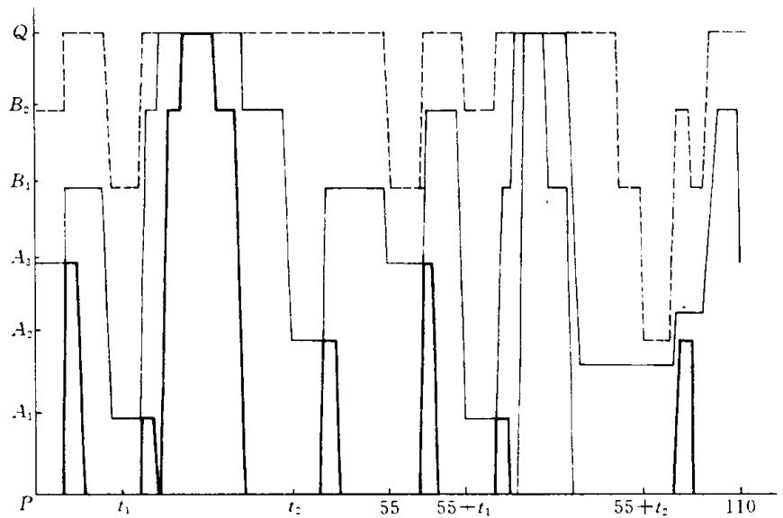

<details>
<summary>state_timeline</summary>

| Time | A1 | A2 | A3 |
| --- | --- | --- | --- |
| t1 | — | — | — |
| t2 | — | — | — |
| 55 + t1 | — | — | — |
| 55 + t2 | — | — | — |
| 110 | — | — | — |
</details>

横轴表示时间，纵轴表示位置，粗黑线表示 $T_{1}$ 的运动轨迹，虚线表示 $T_{2}$ 的运动轨迹，细实线表示 $T_{3}$ 的运动轨迹

图1 模型1  
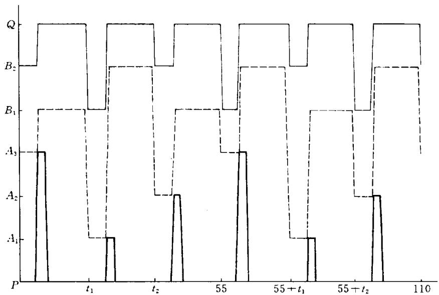

<details>
<summary>state_timeline</summary>

| Time Interval | Q | B1 | A3 |
| --- | --- | --- | --- |
| 0~t1 | B2 | A3 | P |
| t1~t2 | B2 | B1 | A1 |
| t2~55 | B2 | B1 | A2 |
| 55~55+t1 | B2 | B1 | A3 |
| 55+t1~55+t2 | B2 | B1 | A1 |
| 55+t2~110 | B2 | B1 | A2 |
</details>

横轴表示时间，纵轴表示位置，粗黑线表示 $T_{1}$ 的运动轨迹，虚线表示 $T_{2}$ 的运动轨迹，细实线表示 $T_{3}$ 的运动轨迹

图2 模型2

## 参考文献

1. 吴望名, 图论及其应用, 北京: 科学出版社.  
2. 王天平, 组合数学, 武汉: 华中理工大学出版社.

# 天车与冶炼炉作业调度的 Petri 网模型

凌 晖 熊德华 杨 杰

(南天大学, 天津 300071)

指导教师 叶剑平

编者按 本文在分析问题的基本特征基础上,应用 Petri 网作为模型,得出一个满足要求的优化调度方案.该文分析全面,说理清楚,在模型讨论与建议等方面都有独到之处.

关键词 Petri 网, 容量函数, 均衡原理

为方便说明,我们将各项工序的代号及其所需时间列表如下:

<table><tr><td>代号</td><td>工序</td><td>用时</td></tr><tr><td>1</td><td>天车在 Q 处吊原料</td><td> $ty = 3$ </td></tr><tr><td>2</td><td>天车运行到 Bi</td><td> $tx^{*}(3 - i)$ </td></tr><tr><td>3</td><td>放下满罐</td><td> $ti = 3$ </td></tr><tr><td>4</td><td>天车吊起原空罐</td><td> $tk = 2$ </td></tr><tr><td>5</td><td>天车返回 Q</td><td> $tx^{*}(3 - i)$ </td></tr><tr><td>6</td><td>天车放下空罐</td><td> $tk = 2$ </td></tr><tr><td>7</td><td>Bi 冶炼半钢,到入空罐</td><td> $tb = 27$ </td></tr><tr><td>8</td><td>天车吊起半钢罐</td><td> $td = 3$ </td></tr><tr><td>9</td><td>运至 Aj</td><td> $tx^{*}(3 + i - j)$ </td></tr><tr><td>10</td><td>倒入 Aj</td><td> $te = 5$ </td></tr><tr><td>11</td><td>天车返回 Bi</td><td> $tx^{*}(3 + i - j)$ </td></tr><tr><td>12</td><td>放下空罐</td><td> $tc = 2$ </td></tr><tr><td>13</td><td>天车从 P 吊槽</td><td> $tg = 2$ </td></tr><tr><td>14</td><td>运行至 Aj</td><td> $tx^{*}$ </td></tr><tr><td>15</td><td>辅料加入 Aj</td><td> $tf = 2$ </td></tr><tr><td>16</td><td>天车与空槽返回 P</td><td> $tx^{*}j$ </td></tr><tr><td>17</td><td>放下空槽</td><td> $th = 1$ </td></tr><tr><td>18</td><td>Aj 冶炼成品钢</td><td> $ta = 48$ </td></tr></table>

从原料到成品钢的全部生产流程由图1给出.

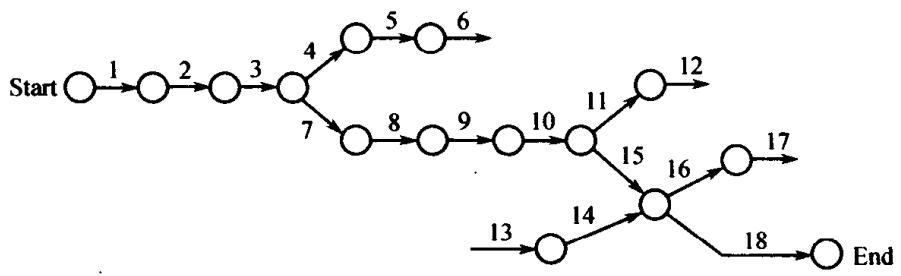

<details>
<summary>flowchart</summary>

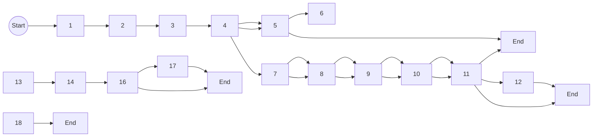
```mermaid
graph LR
  Start((Start)) --> Step1["1"]
  Step1 --> Step2["2"]
  Step2 --> Step3["3"]
  Step3 --> Step4["4"]
  Step4 --> Step5["5"]
  Step5 --> Step6["6"]
  Step4 --> Step7["7"]
  Step7 --> Step8["8"]
  Step8 --> Step9["9"]
  Step9 --> Step10["10"]
  Step10 --> Step11["11"]
  Step11 --> End1["End"]
  
  Step4 --> Step5
  Step5 --> End1
  
  Step7 --> Step8
  Step8 --> Step9
  Step9 --> Step10
  Step10 --> Step11
  Step11 --> End2["End"]
  
  Step11 --> Step12["12"]
  Step12 --> End2
  
  Step13["13"] --> Step14["14"]
  Step14 --> Step16["16"]
  Step16 --> End3["End"]
  
  Step16 --> Step17["17"]
  Step17 --> End3
  
  Step18["18"] --> EndEnd["End"]
```
</details>

图1

为使成品钢产量尽量高, 就必须使 A 炉尽可能满负荷生产, 即尽量减少 A 炉的待料时间, 因 P 处辅料可按时供给, 所以调度方案的设计归结为实现 A 组炉与 B 组炉生产间隔的最佳匹配问题, 下面给出几个结果:

(1) 产品上限: 当 A 组炉满负荷生产时, 成品钢产量达到其上限:

一年有效作业时间 300 天 / 每炉最短生产周期 × 每炉产量 × 炉数 = 282 万吨

(2) 均衡原理: 为实现 B 组炉, A 组炉的尽量满负荷生产, 应在调度中力求使 A 组炉, B 组炉的冶炼间隔时间尽量均匀, 且保证 A 组炉间隔大于 B 组炉间隔, 否则必然会出现 A 组炉中某炉已炼完但 B 组炉不能及时供料, 从而造成 A 炉的空闲, 难以实现最大产量.

(3) 最小周期: 因寻求最佳调度的核心归结为 A 组炉与 B 组炉的生产匹配问题, 由两组炉数的互质性知:

最小周期: A 组炉数 × B 组单炉平均生产周期

A 组单炉平均生产周期 × B 组炉数

约 110 分

其间生产出6炉成品钢.

## 一、基本假设

1. 根据作业过程与工序要求, 假设该车间至少有原料罐 3 个, 辅料槽 1 个, 半钢罐 1 个;  
2. 天车之间无区别,任一台均可完成工序中涉及天车的所有操作;  
3. 任意两个相邻工作点间距离相等, 天车运行时间与通过的距离成正比;  
4. 考虑到天车绝对不允许相撞, 假设当一台天车完成炉上作业后离开至少 15 秒(即 $tx$ ) 后, 才允许另一台天车到达, 记此安全延迟时间为 $\Delta x$ ;  
5. 假设天车技术性能良好,在运行过程中不会出现停车故障或脱钩事故.

## 二、模型一:Petri 网分析

## (一) 初步分析

由图1,在A组炉满负荷生产情形下,一个周期(110分+2 $\Delta x=110$ 分30秒)内天车运行总时间最少为:

[循环(13,14,15,16,17)时间 + 循环(1,2,3,4,5,6)时间 + 循环(8,9,10,11,12)时间] × 6 = 168 分, 而为了使天车作业率不超过 70%, 两台天车的工作时间至多为 110 分 30 秒 × 2 × 70% = 154.7 分 < .168 分, 故至少应考虑三台天车.

## （二）系统的 Petri 网模型描述

## 1. Petri 网简介

Petri 网是关于分布式异步并行系统的理论, 是研究并行现象的强有力的工具, 若在 Petri 网中考虑时间因素, 为每个迁移规定一个发生延续时间, 即该迁移从发生到结束需要的时间, 就得到一个带定时的 Petri 网, 即时间网系统, 由于原问题是在一个较小规模的空间发生的, 所以时间网系统中引入的统一的全局时间是合理的.

下面是系统的 Petri 网描述图：

图中圆圈表示场所,方框表示迁移,方框中的数字为迁移代表的操作.

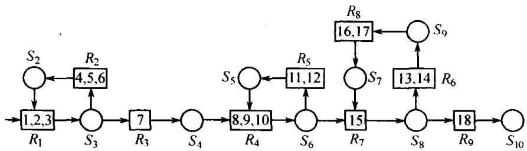

<details>
<summary>flowchart</summary>

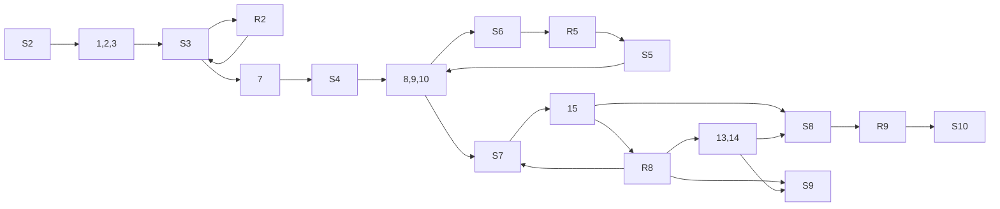
```mermaid
graph LR
  S2["S2"] --> R1["1,2,3"]
  R1 --> S3["S3"]
  S3 --> R2["R2"]
  R2 --> S3
  S3 --> R3["7"]
  R3 --> S4["S4"]
  S4 --> R4["8,9,10"]
  R4 --> S6["S6"]
  S6 --> R5["R5"]
  R5 --> S5["S5"]
  S5 --> R4
  R4 --> S7["S7"]
  S7 --> R7["15"]
  R7 --> S8["S8"]
  S8 --> R9["R9"]
  R9 --> S10["S10"]
  R7 --> R8["R8"]
  R8 --> S9["S9"]
  R8 --> S7
  R8 --> R6["13,14"]
  R6 --> S9
  R6 --> S8
```
</details>

图2

符号:S1:原料场地 Q

S2: Q 处天车处于空闲状态

S3: 天车处于 $B_{i}$ ，将要提起空罐， $B_{i}$ 即将冶炼半钢

S4: Bi 处半钢冶炼完成

S5: 中部的天车处于空闲

S6: 半钢已倒入转炉 Aj

S7: 装载辅料的天车准备往 Aj 炉装料

S8: 装载辅料的天车加料完毕, Aj 炉将开始冶炼成钢

S9:P 处天车处于空闲

S10: 成品钢出炉

由此得出描述系统的Petri网 $P = (S, R, F, K, W, M0)$ ，其中容量函数 $K = (\infty, 1, 2, 3, m, 3, 1, 3, n, \infty), 1, m, n \geqslant 0$ 且 $1 + m + n \leqslant 5$ ，权函数 $W$ 对每条边均为1（即每个操作对每种天车或原料只需一个单位），初始标识 $M0 = (1, 0, 0, 0, 0, 0, 0, 0, 0)$ .

现在对上述 Petri 网系统进行动态的分析. 应用“均衡原理”, 我们令 $K(S1)$ 不为无穷, 而是每隔 18 分左右产生一个 token, 且产生三个 token 的时间间隔为 55 分 15 秒, 从图上易算出 $R1, R2$ 循环, $R4, R5$ 循环, $R6, R7, R8$ 循环的时间延迟都不超过 12 分, 迁移 $R3$ 虽需 27 分, 但由于 $S3$ 容量为 2 , 所以 $S4$ 能够以和 $S1$ 产生 token 相同的间隔获得 token, 同理 $S6, S8, S10$ 也如此. 因此, 在 $S1$ “均衡”产生 token 的前提下, $S10$ 能够“均衡”地接收 token, 从而整个 Petri 网成为一个不发生冲撞和死销的系统, 这种网络流动自然产生了一个初步的调度方案.

## （三）调度方案的确定

（1）从 Petri 网的图示中易于看出 R1, R2 循环, R4, R5 循环, R6, R7, R8 循环分别代表天车的 3 种典型任务；从 Q 处装原料并返回，从 B 炉运半钢至 A 炉并返回，三个循环的平均时间延迟分别为 10 分 30 秒，11 分 30 秒，5 分 30 秒，其作业率最高的也只有 60%。因此，天车数 $1 = m = n = 1$ 是满足条件的最基本方案，并且由于此情况下天车作业互相独立，易知实际的无冲突的作业调度方案是存在的。  
(2) 由“均衡原理”将 A 组单炉生产周期 55 分 15 秒划分为 18 分, 18 分, 19 分 15 秒, 可得以下调度方案:

各天车作业分工：

a. 天车 $T_{1}$ 只负责从 $P$ 装辅料至 $A$ 炉, 每周期进行 6 次 $R6, R7, R8$ 循环.

b. 天车 $T_{2}$ 只负责从 B 炉装半钢至 A 炉, 每周期 6 次 R4, R5 循环.  
c. 天车 $T_{3}$ 只负责从 Q 装原料至 B 炉, 每周期 6 次 R1, R2 循环.

《工序清单》(略)

《天车—炉子作业运行图》(略)

《调度规则说明书》(略)

(3) 可以验证：

1. 在本方案中已实现了 A 组炉的不间断生产, 故产量已达最高.  
2. 各天车的作业率(在满负荷情形下,一个周期110分30秒内)

<table><tr><td>天车</td><td> $T_{1}$ </td><td> $T_{2}$ </td><td> $T_{3}$ </td></tr><tr><td>作业累计时间</td><td>36分</td><td>67分30秒</td><td>64分30秒</td></tr><tr><td>作业率</td><td>33%</td><td>61%</td><td>58%</td></tr></table>

可见, $T_{1},T_{2},T_{3}$ 的作业率均不超过70%,符合要求,关于均衡性的进一步讨论见下文天车数目的讨论.

3. 由天车一炉子作业运行图容易看出, $T_{1}, T_{2}, T_{3}$ 任一时刻的位置至少相差相邻两个工作点间的距离,且保持顺序无交叉,故绝对不会出现天车相撞事故.  
4. 由《调度规则说明书》容易知道调度的基本原则和先后顺序, 参照各天车的详细工序清单, 调度的安排便一目了然了.

综上所述,我们所提出的调度方案符合要求.

（四）关于天车数目的进一步讨论

注意到 $m(t) = n(t) = 1$ 时，对应模型一调度方案中的天车 $T_{2}, T_{3}$ ，其作业率分别为 $61\%$ 和 $58\%$ ，非常接近，故若 $m(t) + n(t) \geqslant 3$ ，而作业率又要尽量均衡的话，一方面造成天车的作业率太低（ $30\% \sim 40\%$ ），另一方面，因天车彼此的位置不能交换，而天车数目增加，不仅造成无效移动的增多（为了让位给其他天车工作），且增加相撞的可能性，并导致调度方案的复杂化。

因此,我们选择三台天车相对独立运行的调度方案,不仅在产量上最大,而且在实际生产的管理中也是合理的.

# 天车、冶炼炉作业调度的活动网络模型

丁剑 张德 冯南

(东南大学, 南京 210096)

指导教师 姚瑞波

编者按 本文将三台 A 炉、二台 B 炉、三台天车的作业活动构造成一个活动网络模型，对于确定型问题，可用关键路径法找出最大钢产量的调度方案，增产到 300 万吨/年的各种措施的产量，对于非确定性问题可用计划评审法讲座随机性的影响及控制方案。现将有关内容摘录如下。

关键词 活动网络,关键路径法,计划评审法

(1) $Ai^{*}$ 或 $Bj^{*}:Ai$ (或 $Bj$ ) 冶炼  
(2) Tk $\rightarrow$ place: Tk 空着运至 place 处  
(3) Tk □→ place: Tk 带一空罐或槽运至 place 处  
(4) Tk ↑ place: Tk 带一空槽或罐运至 place 处  
(5) Tk □ place: Tk 在 place 处吊起一空槽或罐  
(6) Tk ↑ place: Tk 在 place 处带起一满槽或罐  
(7) Tk □ place: Tk 在 place 处放下一空槽或罐  
(8) Tk ↓ place: Tk 在 place 处放下一满槽或罐

为使钢产量尽可能高，A炉，B炉轮流冶炼.

我们考虑调用3辆天车,使调度周期 $T = \max\{T'/3, T''/2\} = T'/3 = 18.42$ , A炉满负荷生产,通过反复尝试和调整,定义初始状态如下:

$A(1)$ 空, $A(2)$ 已生产 T, $A(3)$ 已经生产 2T;

$B(1)$ 空, $B(2)$ 已生产 T;

$T_{1}$ 在 P 空, $T_{2}$ 在 A(1) 装满半钢, $T_{3}$ 在 B(1) 装满原料;

结束时 $A(1)$ , $A(2)$ , $A(3)$ 状态分别对应周期开始时 $A(2)$ , $A(3)$ , $A(1)$ 的状态；

$B(1), B(2)$ 状态对应 $B(2), B(1)$ 状态.

显然可以重新形成下一个周期,不断循环下去,得到活动网络如下:

构造一个有向图 $G(V, E]$ , 其中 $E$ 为边集合, 每一边 $ei(ei \in E)$ 都代表了一个生产周期中的一项工作, $ei$ 的权 $Wi$ 为进行该项工作的时间; 图中每个点代表某一刻生产进展状态. 为了表示一些工作的先后约束关系, 我们引入了权重为零的一些弧 (这些边也被称为虚零弧), 这样就恰如其分地表示了一个周期的流程.

确定性模型(所有时间都固定的情况)

我们旨在寻找和调整图中的关键路径(critical path], 使其权和不超过 $T$ , 这样就与原先的期望一致. 我们编制了 C 语言程序, 并且利用数学软件对其进行 CPM 分析. 通过反复尝试和逐项调整, 得到 CPM 分析结果.

在周期 = 18.42 的情况下, 关键路径长度 = 周期 = 18.42.

根据 CPM 分析的各项活动完成最早时间和最晚时间,我们发现依据这一方案恰好可以在一个周期中完成各项工作,并且从一个周期到下一个周期过渡平稳自然,其中有些任务完成尚有节余时间,也就是说 3 辆车已达到最优的情况.

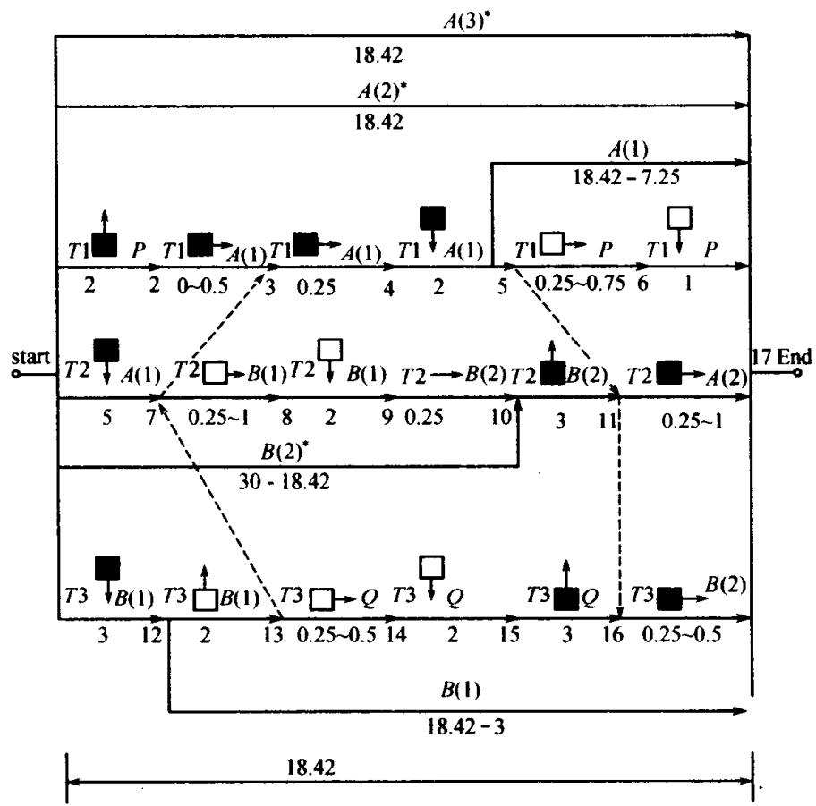

<details>
<summary>flowchart</summary>

```mermaid
graph LR
  subgraph State_A["State A(3)*"]
  Start((start)) --> T1["T1"] --> P["P"]
  T1 --> T1_1["T1"] --> A(1)["A(1)"]
  A(1) --> T1_2["T1"] --> A(1)["A(1)"]
  A(1) --> T1_3["T1"] --> A(1)["A(1)"]
  A(1) --> T1_4["T1"] --> A(1)["A(1)"]
  T1_4 --> P["P"]
  P --> T1_5["T1"] --> P["P"]
  P --> T1_6["T1"] --> P["P"]
  T1_6 --> End((end))
  end

  subgraph State_B["State B(1)*"]
  Start --> T2["T2"] --> A(1)["A(1)"]
  A(1) --> T2_1["T2"] --> B(1)["B(1)"]
  B(1) --> T2_2["T2"] --> B(1)["B(1)"]
  B(1) --> T2_3["T2"] --> B(2)["B(2)"]
  B(2) --> T2_4["T2"] --> B(2)["B(2)"]
  B(2) --> T2_5["T2"] --> A(2)["A(2)"]
  end

  subgraph State_C["State C(End)"]
  Start --> T3["T3"] --> B(1)["B(1)"]
  B(1) --> T3_1["T3"] --> B(1)["B(1)"]
  B(1) --> T3_2["T3"] --> Q["Q"]
  Q --> T3_3["T3"] --> Q
  T3_3 --> T3_4["T3"] --> Q
  T3_4 --> T3_5["T3"] --> Q
  T3_5 --> End((end))
  end

  subgraph Time_Days
    Start -.->|0.25~0.5| Start
    Start -.->|0.25~0.75| Start
    Start -.->|0.25~0.75| Start
    Start -.->|0.25~0.75| Start
    Start -.->|0.25~0.75| Start
    Start -.->|0.25~0.75| Start
    Start -.->|0.25~0.75| Start
  end
```
</details>

初态:  
T1: 在P上，空  
T2: 在 $A(1)$ 上，满  
T3: 在 $B(1)$ 上，满  
$A(1)$ ：刚生产好  
$A(2)$ ， $A(3)$ ：生产中  
$B(1)$ ：刚生产好  
$B(2)$ ：生产中  
终态：  
T1: 在P上，空  
T2: 在 A(2) 上，满  
T3: 在 $B(2)$ 上，满  
$A(2)$ ：刚生产好  
$A(3)$ ， $A(1)$ ：生产中  
$B(2)$ ：刚生产好  
$B(1)$ : 生产中

# 天车与冶炼炉的作业调度模型

杨银芳 郭 安 蒋 鹏

(重庆工业管理学院, 重庆 630050)

指导教师 宋江敏

编者按 该参赛论文在对一台至五台天车这五个方案进行选优时采用了层次分析法,较为合理地设立准则层,有特色.现摘录有关内容如下.

关键词 层次分析法,层次结构图,最优方案.

我们采用关键路线法(CMP)作出从一台天车到五台天车情况下一个工作周期的各个网络图,通过编制程序,找出关键路线,一个周期的运行时间,通过网络图分析,得出各种运行方案下年产量及《天车—炉子作业运行图》,由此可得各个方案下各台天车的作业率.

要在这五个方案中择取最优方案, 其实质为一多目标规划问题. 运用层次分析法 (AHP) 进行双选择优. 具体作法如下.

## 一、递阶层次结构图

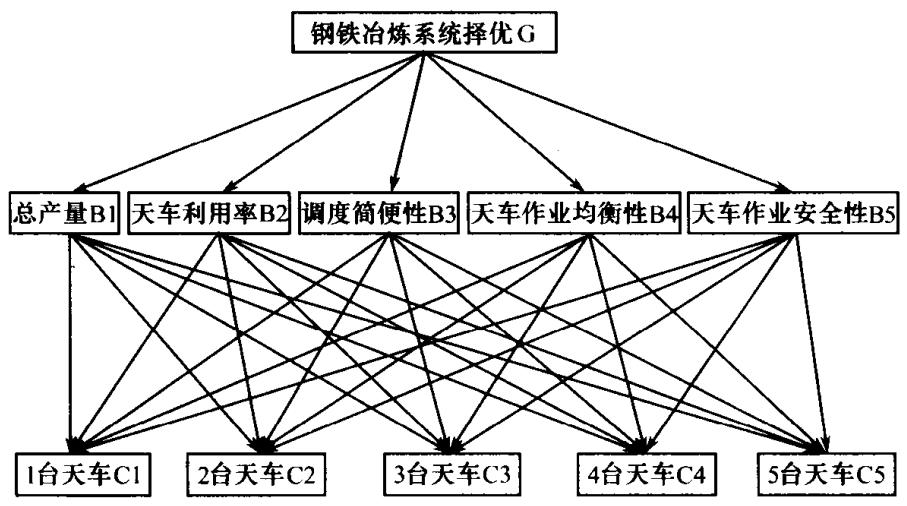

<details>
<summary>flowchart</summary>

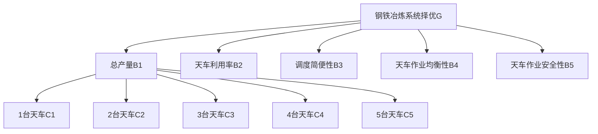
```mermaid
graph TD
  A["钢铁冶炼系统择优G"] --> B["总产量B1"]
  A --> C["天车利用率B2"]
  A --> D["调度简便性B3"]
  A --> E["天车作业均衡性B4"]
  A --> F["天车作业安全性B5"]
  
  B --> G["1台天车C1"]
  B --> H["2台天车C2"]
  B --> I["3台天车C3"]
  B --> J["4台天车C4"]
  B --> K["5台天车C5"]
```
</details>

## 二、两两比较构造判断矩阵

$$
A = \left( \begin{array}{c c c c c c} a _ {1 1} & a _ {1 2} & \dots & a _ {1 j} & \dots & a _ {l n} \\ \dots & & & & & \\ a _ {i 1} & a _ {i 2} & \dots & a _ {i j} & \dots & a _ {i n} \\ \dots & & & & & \\ a _ {n 1} & a _ {n 2} & \dots & a _ {n j} & \dots & a _ {n n} \end{array} \right)
$$

$a_{ij}$ i 对 j 的相对重要数值.

## 三、进行单排序

利用和积法,对 A 按列归一化

$$
\overline {{W}} _ {i j} = \frac {a _ {i j}}{\sum_ {k = 1} ^ {n} a _ {k j}}
$$

对 $\overline{W}_{ij}$ 按行求和 $\overline{W}_i = \sum_{j=1}^{n} \overline{W}_{ij}$

将 $\overline{W}_{i}$ 归一化 $\overline{W}_{i} = \frac{\overline{W}_{i}}{\sum_{i=1}^{n} \overline{W}_{i}} = (w_{1}, \cdots, w_{n})$ 即为特征向量

$$
\lambda_ {\max} = \sum_ {i = 1} ^ {n} \frac {(A W) _ {i}}{n W _ {i}}
$$

## 四、一致性检验

$CI = \frac{(\lambda_{\max} - n)}{n - 1}, RI$ 查表可得 $CR = \frac{CI}{RI}$

当 CR < 0.1 时, 具有满意的一致性.

## 五、层次总排序

<table><tr><td>层次 C\层次 B</td><td> $\frac{B1}{b1}$ </td><td> $\frac{B2}{b2}$ </td><td> $\cdots$ </td><td> $\frac{Bn}{bn}$ </td><td>总排序</td></tr><tr><td>C1</td><td> $w1$ </td><td> $w1$ </td><td> $\cdots$ </td><td> $w1$ </td><td> $\sum_{j=1}^{m} b_j w1$ </td></tr><tr><td>C2</td><td> $w2$ </td><td> $w2$ </td><td> $\cdots$ </td><td> $w2$ </td><td> $\sum_{j=1}^{m} b_j w2$ </td></tr><tr><td> $\cdots$ </td><td></td><td colspan="3"> $\cdots\cdots$ </td><td></td></tr><tr><td>Cn</td><td> $wn$ </td><td> $wn$ </td><td> $\cdots$ </td><td> $wn$ </td><td> $\sum_{j=1}^{m} b_j wn$ </td></tr></table>

## 六、总排序的一致性检验

$$
C I = \sum_ {j = 1} ^ {3} a _ {j} (C I) _ {j} \quad R I = \sum_ {j = 1} ^ {3} a _ {j} (R I) _ {j}
$$

用 FORTRAN 编程可计算出层次总排序如下(由好到次):

3 台天车 → 5 台天车 → 4 台天车 → 1 台天车 → 2 台天车即安排 3 台天车的方案为最优方案.

# 冶炼车间的最优调度模型的检验

刘世兵 董小虎 巩禧云

(安徽机电学院, 芜湖 241000)

指导教师 王庚

编者按 本文对模型安全性,稳定性,模型优缺点及推广进行了讨论.现摘录如下.

关键词 数学模型,稳定性

## 一、模型的检验

## (一) 模型安全性的检验

由于我们的模型是用直接推断和启发式算法建立的,虽然结果使总产量达到了最大值,并尽量减小了作业率,但我们最担心的是两车是否会相撞的问题,由图中可以看出天车最可能相撞的地点是天车 $T_{1}$ 和天车 $T_{2}$ 在 $B_{k}$ 垂直面上,为了检验天车的安全性问题,我们计算出两辆天车到达这一垂直面上最小时间间隔为10秒,由于相邻工作点之间可容纳一辆天车,天车经过相邻两工作点的时间仅为15秒,故可以认为模型具有较好的安全性.

## (二) 稳定性分析

1. 对运行图上数据进行分析, 当 $\Delta t < 10$ 秒的微小变化时并不影响转炉的不间断生产, 年产量不会有显著变化.  
2. 当 $t_a$ 不变时, 只需满足 $t_e > t_0 + t_i, t_b < 30$ 分钟时即使其它时间参数有较大的变动, 结果仍不会发生显著变化, 所以模型具有稳定性.

## 二、模型的优缺点与推广

通过与前面的直接推断法相比较,上述的模型优势是明显的.

1. 模型具有良好的稳定性  
2. 图示法的调度模型简明直观, 易为操作人员所领会模型主要缺点在手工条件下制作状态运行图较为繁琐.

推广

1. 现在的模型是针对于三个阶段, 三台天车以及七个工作点之间的最优调度问题, 对于多阶段决策以多个过程的优化调度同样适用.  
2. 此模型不仅可以适用于天车冶炼的最优调度, 并且也宜于工作分配, 铁道部门的段场调度, 以及多台机器多个工件加工顺序问题.

# 天车作业调度的随机性分析

杜序 袁灯山 杨黎明

(北京航空航天大学, 北京 100083)

指导教师 赵杰民

编者按 本文对各种随机数据对天车的作业率、天车的调度和钢产量的影响进行了定性的和定量的分析.现将有关内容摘录如下.

关键词 随机性,作业率,调度.

当 $t_{a}, t_{b}, \cdots, t_{k}$ 都是随机时，所给出的数值为它们的均值，设 $x = t_{a} + t_{e} + t_{f}, y = t_{b} + t_{i}$ . 由于人为的调配，除 x, y，其它对 A, B 炉的生产影响很微小，而 x, y 却直接关系到 A 炉的生产量，所以主要矛盾是 x, y.

先说明随机对产量的影响，

设 $x \sim N(a_{1}, \sigma_{1}), y \sim N(a_{2}, \sigma_{2})$ 则一个周期内有 $x_{1}$ 和 $x_{2}, y_{1}, y_{2}, y_{3}$ , 当 $y_{1} + y_{2} + y_{3} < x_{1} + x_{2}$ 时, 生产照常运转, 而当 $y_{1} + y_{2} + y_{3} \geqslant x_{1} + x_{2}$ 时, $A$ 要等待 $B$ , 那么整个生产周期要延长, 可以求出每个周期延长的均值 $m$ .

$$
y _ {i} \sim N (a _ {2}, \sigma_ {1}) \quad (i = 1, 2, 3)
$$

则 $y_{1} + y_{2} + y_{3}\sim N(3a_{2},\sqrt{3}\sigma_{1})$

$$
x _ {i} \sim N (a _ {1}, \sigma_ {2}) \quad (i = 1, 2)
$$

则 $x_{1} + x_{2}\sim N(2a_{1},\sqrt{2}\sigma_{2})$ .所以

$$
y _ {1} + y _ {2} + y _ {3} - x _ {1} - x _ {2} \sim N (3 a _ {2} - 2 a _ {1}, \sigma_ {3}),
$$

其中 $\sigma_{3} = \sqrt{3\sigma_{1}^{2} + 2\sigma_{2}^{2}}$ ，且

$$
m = \int_ {0} ^ {\infty} \frac {x}{\sqrt {2} \pi \sigma_ {3}} e ^ {- \frac {1}{2 \sigma_ {3} ^ {2}} (x - 3 a _ {2} + 2 a _ {1}) ^ {2}} \mathrm{d} x = \frac {\sigma_ {3}}{\sqrt {2 \pi}} e ^ {- \frac {1}{2 \sigma_ {3} ^ {2}} (x - 3 a _ {2} + 2 a _ {1}) ^ {2}} | _ {+ \infty} ^ {0} = \frac {\sigma_ {3}}{\sqrt {2 \pi}} e ^ {- \frac {(3 a _ {2} - 2 a _ {1}) ^ {2}}{2 \sigma_ {3} ^ {2}}}
$$

$a_{1}, a_{2}$ 分别用均值来估计. 令 $a_{1} = \bar{x} = 55, a_{2} = \bar{y} = 30$ . 因此 $m = \frac{\sigma_{3}}{\sqrt{2\pi}} e^{-\frac{200}{\sigma_{3}^{2}}}$ .

如果 $x, y$ 有数据可查, 则可对 $x, y$ 进行方差估计, 便可求出 $\sigma_{1}$ 和 $\sigma_{2}$ , 得到 $\sigma_{3}$ , 求出 $m$ . 应用极大似然法估计:

$$
\begin{array}{l} \hat {\sigma} _ {1} ^ {2} = \frac {1}{n} \sum_ {i = 1} ^ {n} (x _ {i} - \bar {x}) ^ {2}, \\ \hat {\sigma} _ {2} ^ {2} = \frac {1}{n} \sum_ {i = 1} ^ {n} (y _ {i} - \bar {y}) ^ {2}, \\ \hat {\sigma} _ {3} ^ {2} = \sqrt {3 \hat {\sigma} _ {1} ^ {2} + 2 \hat {\sigma} _ {2} ^ {2}}. \\ \end{array}
$$

若 $\sigma_3^2$ 很小，即 $\sigma_1^2, \sigma_2^2$ 很小， $x_i, y_i$ 主要集中在均值 $\bar{x}, \bar{y}$ 附近，则 $m \to 0$ ，生产周期几乎没有变化。若 $\sigma_3^2$ 比较大时，则可得 $x_i, y_i$ 比较分散， $m$ 很大，钢产量就会大大下降，设原周期为 $T$ ，原产量为 $W$ ，则新周期为

$$
T ^ {\prime} = T + m
$$

钢产量应为 $\frac{1440}{T'}\times300\times720\triangleq W'$

$$
\frac {W ^ {\prime}}{W} = \frac {T}{T ^ {\prime}} = \frac {T}{T + m} = \frac {1}{1 + \frac {m}{T}}
$$

其次考虑随机条件下各天车的作业率变化,以 $T_{3}$ 为例.

设 $\beta$ 为一周期内 $T_{3}$ 的作业时间. 因为

$$
\beta = 6 (t _ {y} + t _ {i} + t _ {o} + t _ {k}) + 1 8 t _ {x}
$$

而 $\beta$ 中各数值均为正态分布, 即

$$
t _ {y} \sim N (3, \sigma), t _ {i} \sim N (3, \sigma), t _ {o} \sim N (2, \sigma),
$$

$$
t _ {k} \sim N (2, \sigma), t _ {x} \sim N (0. 2 5, \sigma)
$$

则 $\beta \sim N(64.5, \sqrt{42}\sigma), \sigma$ 的估计值 $\hat{\sigma} = \frac{1}{n}(t_{y_k} - t_y)^2$

因为 $t_{y_k}$ 与 $t_y$ 一般相差不会很大(在几秒之内), 所以 $\sigma$ 也很小. 取 $\sigma = \frac{1}{9}$ 时, 则 $\beta$ 几乎落在[63,65]之间, 所以随机性对天车的作业率影响不大.

最后分析随机性对调度的影响

调度过程中,如果因为随机性使 B 处装半钢的时间增长,就可以导致 A 炉的等待,引起周期增长.而随机性若使 B 处装半钢时间缩短却并不会导致周期的缩短.因而在考虑随机性的情况下应使天车 $T_{2}$ 的运行稍作提前.同样为使辅料的添加顺利进行,也要求 $T_{1}$ 运行稍作提前. $T_{3}$ 控制 B 炉的冶炼,由于 B 炉有几分钟的等待时间,所以随机性对 $T_{3}$ 的调度几乎无影响.

综上所述,又考虑到调度方便,在考虑随机性的情况下,可使 $T_{1}, T_{2}, T_{3}$ 运行较理想情况下稍作提前.

# “天车与冶炼炉的作业调度”竞赛题的工业背景及其他

浙江大学

刘祥官 李吉鸾

又一度金秋收获的季节,又一届“大学生数学建模竞赛”的数学难题摆在了参赛队的面前.在短短的72个小时中(按参赛队计算为9个人×日工作量),参赛队必须完成赛题的数学建模的全套工作,包括实际问题的建模分析与计算,绘制出相关的图表,编制相应的计算机程序,给出正确的答案与讨论,最后还要写成一篇条理清晰、论证明确的论文,……如此繁重的脑力劳动,许多参赛队出色地完成了.在批阅完毕全国22个赛区报送竞赛组委会评奖的“B题”79篇论文后,阅卷人的心都深深地为大学生们的智慧和创造力所震动.莘莘学子的智慧燧石在难题的撞击下,在时间、速度与质量竞争的压力下,迸发出了耀眼的火花.这智慧的火花就象炼钢炉中取样出来的钢水,钢花四射,发出耀眼的光芒,令人兴奋,令人喜悦.

“天车与冶炼炉的作业调度”这一道竞赛题，来源于我国自力更生建设起来的钢铁钒钛基地——攀枝花钢铁公司。原来的工业问题是：“攀钢提钒炼钢厂原料跨七车七炉作业的优化调度”。十多年前，为了提钒炼钢厂的生产跨上一个新台阶，为了企业的管理现代化，当时攀钢有远见卓识的领导人向数学工作者提出了这个数学难题，期望科技人员深入生产第一线，总结出天车与冶炼炉的生产高度规律，提出优化高度方案，指导车间的生产调度，提高天车与冶炼炉的劳动生产效率。同时论证生产线的最大通过能力，为公司的一项重要决策提供数量化的依据。为了解决这一文献上查阅不到的难题解法和求解思路，攀钢的科技人员来到北京，向中科院应用数学所、系统工程所的数学家们求教；攀钢顾问华罗庚教授和他的助手们，老一辈数学家许国志、越民义等都为该项难题的探索作过指导。清华大学应用数学系和四川联合大学(原成都科技大学)应用数学系的师生们接受了这一难题的科研工作；四川联合大学(原成都科技大学)应用数学系的师生还冒着炎热和高温来到攀钢提钒炼钢厂参加了包括2座提钒炉、2座混铁炉、3座转炉在内的“七车七炉作业的跟车调查”；攀钢的科技人员和调度人员在三九寒冬来到首钢炼钢厂，完成了2座混铁炉、3座转炉的“五车五炉作业的跟车调查”……在大量调查数据的基础上，通过统计分析，建立起天车、冶炼炉的作业参数；采用了网络计划技术、动态规划、时间序列分析等运筹学的各种方法，建立起各种作业条件下的天车—冶炼炉作业优化调度方案，并论证了各种方案下的生产线通过能力。清华大学还编制了适合攀钢具体情况的整套计算机模拟软件GPSS，模拟天车—冶炼炉的作业和调度过程，验算了生产线的最大通过能力。经过攀钢和清华大学科研人员前后两年的努力工作，终于向攀钢领导交出了一份有份量的答卷。攀钢召开了有中国科学院应用数学所、科技政策与管理科学所、清华大学等教授专家参加的鉴定会，中国数学会运筹学会原秘书长桂湘云教授主持了鉴定会。鉴定意见认为该项应用数学工作达到了国内领先水平，后来，台湾清华大学学者来到北京，在与清华大学学者的交流中，也对该项工业应用数学成果给予了高度的评价。

综上所述,本次数学模型竞赛的“天车与冶炼炉的作业调度”问题是一道实实在在的从实际工业课题提炼、简化出来的数学问题,这种多车多炉的优化调度问题是每一个钢铁厂都普遍存在的生产问题.也正如一些学生在建模分析中指出的,不仅在冶金,而且在铁路运输等部门,都有类似的优化调度问题.因此,本题解答中好的数学建模就是要能够归纳提炼出具有通用性的数学模型与计算方案,要从数据中归纳出相关的计算公式,而不能仅仅是数据的罗列.可喜的是,从优秀答卷中我们可以看到建模方法的多样性与数学方法应用的灵活性.据不完全统计,学生们使用的方法就有:线性规划、统筹法(网络计划技术PERT、CPM等)、动态规划、层次分析法、PETRI法、图论方法、排队论方法等等;运用已有的计算机软件包来解题的有Mathematica,GPSS,DSS决策支持系统等,许多参赛者自行编制了计算及绘图程序.通过这些方法、手段的综合应用,许多参赛队建立了有关的模型与计算公式,计算出了具体结果.他们从工业企业生产实际的常识出发对结果进行科学的讨论分析得到了正确的结论,取得了优秀成绩.本期全文选登和部分摘录的论文就是其中优秀答卷的代表.

在这里特别指出“天车一冶炼作业运行图”的绘制在本道难题的解答中，检验了学生们的创新思路和数学技巧，实际生产过程的调度作业是难以按所建立的数学模型公式一一计算后再去调度的。为了调度的简明性，工业中许多调度岗位都是使用“图上作业法”，这种方法也是数学中解决难题的一种有用方法，它比解析公式具有更直观、简明的效果。而要把天车一冶炼这8项生产设备的作业在一张运行图上简明地表达出来，确实要花一番功夫。许多答卷绘制了常规调度使用的GANTT图，即横道图。这是外国人创造的、写进了书本的方法，在工程项目的网络计划技术中常常使用。然而这种传统的方法不足之处是不能直观反映各岗位作业之间的有机关联，特别是天车的作业不是孤立的，它要配合并服务于冶炼炉的作业。因此调度图如果不反映这种有机的联系是难以搞好动态调度的。一些优秀的答卷绘制了反映随时间推移各设备（包括天车与冶炼炉）综合作业状态的“二维调度图”，显示了数学思维的创新之处。这种由生产车间的三维空间作业简化提炼而得到的“二维调度图”，其一是“时间维”，反映生产依时间动态推移的过程；其二是“空间维”，三维空间依题意简化为一维，抓住由冶炼炉与作业点相对位置确定的一维空间坐标。在这样的时空二维平面上反映天车的作业过程就能把天车为冶炼炉作业服务的衔接关系准确地、简明地、动态地表达出来。它给调度人员一个完整的、直观的、各设备统筹兼顾的生产调度概念，因而受到调度人员的欢迎。迄今“七车七炉作业优化调度”的论文尚未发表，普通文献上也没有“二维调度图”的论述。参赛者能在短时间内建立“二维调度图”的概念，其数学图形提炼技巧和灵活应用的创新思路实属可贵。

对于应用数学问题建模计算之后的分析与结论,是本赛题对参赛者的又一个考验.可以说,数学建模问题的“题外常识”,是作出结论的重要前提,并且通常是不在题目中“点明”的,成功的参赛者都充分注意到了这个问题.有些好的答卷没有使用任何计算机工具,然而他们成功地完成了计算分析,并得出正确的结论.究其成功之处在于他们肯动脑筋.而有些参赛队在计算机上确实花了很大功夫,然而却未得出正确的结论.优秀的参赛队则在充分动脑筋的基础上,使用计算机也达到了较高的水平.这给我们一个启示:计算机只是“聪明人”更能干的工具.在本题的解答中,有些参赛队按要求完成了“设计一种满足上述要求的天车与冶炼炉的作业调度方案”,只计算了三台天车的作业数据,但未对模型作更深入的讨论和对比就下了“最优”结论,显然这样的解答是难以获得更好的成绩.而最令人惋惜的是,一些参赛队在充分比较三台天车方案、四台天车方案和五台天车方案之后,不能全面推敲“各台天车作业率尽量均衡”的实践含意,片面追求数字上的均衡,脱离了企业生产实际,以五台天车作业为“最优方案”，其结论当然也就令人难以赞同了。如果深入分析一下就可以得知五台天车作业之间的相互干扰、等待、让车所造成的被迫“无效作业”同样也要带来“天车作业率”的升高，此时并不能认为天车处于“无作业”的自由状态，更何况一台能够吊起120吨铁水（连同空罐将达到150吨）的天车价值数百万元。因此，应当明了，天车作业率的“均衡”是在作业率均不超过 $70\%$ 意义下的均衡，有的参赛队也能机敏地列出了三台天车的“均匀”作业方案。参赛者应当能够理解：从企业实际出发，怎么能够设想仅仅为了“尽量均衡”天车的作业率，管理者会作出多花数百万元的决策呢。因此，在运用数学建模方法处理实际问题作出分析结论的时候，我们一定要避免陷入“数学脱离实际”的境地，这是积多年工业应用数学实践经验提出的忠告。

本题的题目是“天车与冶炼炉的作业调度”，它包含运输工具与生产设备两方面的作业调度。精明的参赛者在很长的问题面前，越过“语文”这一关后，通过系统分析很快就会发现生产线科学管理的“中心”是冶炼炉而不是天车。就象是太阳系问题，按照“地心说”很难画出太阳的运行轨道，而按照“日心说”则地球的运行轨道一目了然一样。当计算好冶炼炉的作业要求后，按最大生产能力去安排天车的作业工序及其时间要求，天车服务于冶炼炉作业的关键问题也就一清二楚了。成功的参赛队也就很快从天车作业率不大于70%的要求中列出了计算最少所需天车台数的公式，判断出至少必须有三台天车才能完成基本工序。而不必用“穷举法”从一台天车作业计算到五台天车作业，一一进行比较。

本题答案中,天车的“工序清单”绝大多数答卷均能正确回答,然而对于“调度规则”的阐述多数答卷则变成“天车作业时间表”,未能归纳成冶炼炉作业、天车作业的相关规则.这反映了参赛者尚缺乏理论提炼的基本功.从数据到公式(即规律),再从规律到调度规则,这是一个从实际到理论,再用理论指导实践的提炼过程.个别成功的答卷能够归纳阐述天车一冶炼炉的“作业优先级”概念,如天车作业时间服从于冶炼炉作业时间,并按时间提前量作好准备; $T_{2}$ 天车(即中间一台天车)作业优先;负载天车作业优先等“规则”.这些“规则”给调度人员以明确的调度指导,从而灵活地处理时间参数随机变动后的情况.当然,提炼“规则”是在全面理解了整个生产作业调度要素之后才能想出来的,即使不见得是完整的答案,也令人赞赏其对运筹学知识的灵活应用.

对于本题中“提高钢产量到年产300万吨以上的建议”，许多答卷意识到本题的通过改善管理调度提高劳动生产率的挖潜含意，因而能够用计算结果作出冶炼炉作业和天车作业两方面的挖潜分析，给出了正确的回答。而建议再添一座甚至两座冶炼炉的参赛者，如果知道一座大型转炉需要数千万元以至上亿元的配套投资时，他就不会轻而易举地下笔写出这样的答案了。

最后说到本题的数学知识要求和数学应用的思想方法问题. 在参赛队充分理解本题的要求和进行求解之后, 我们可以看到, 只要有初等数学知识, 完全不用计算机就能完成本题的全部解析计算. 然而计算结果是否正确的前提和关键却是时间参数之间的逻辑关系分析得是否正确. 因此本题数学考验的核心是逻辑数学, 是工序之间的“关系”, 特别是时间参数的“衔接关系”. 实际工业应用数学问题大量的是“离散数学”问题, 要善于综合应用“肯定型”、“概率型”和“逻辑型”的数学工具. 如果只习惯于自然科学中的“肯定型—连续型”数学问题的分析思路和解法, 我们就常会在实际生产问题和管理问题面前束手无策, 因为这些问题经常是离散的概率型、逻辑型问题. 本赛题最后提出的时间参数随机问题的讨论就是基于这样的背景提出的.许多答卷能够按平均时间的正态分布、统筹法中数学期望时间的正态分布或统筹法中数学期望时间的 $\beta$ 分布来讨论时间参数对生产的影响都是正确的.然而这里也要指出一些参赛队不恰当地把有计划的生产调度问题用随机排队模型来套,殊不知一条轨道上的 $N$ 台天车到达某一工作点根本不是随机自由到达.套用不恰当的模型而得出不正确的结果,失之偏颇也就难免了.可以说,深入浅出的运用数学工具解决实际问题是应用数学的“Know How”;而相反用了高深的数学理论却脱离了问题的实际,实乃数学建模之“大忌”.

“科技兴国”的号角召唤着有志于“科学技术面向经济建设”的学子.要使我国经济运行的质量赶超世界的先进水平,应用数学的参与是必需的.数学建模竞赛给有志者一个小试锋芒的机遇,我们期待着更多的优秀者脱颖而出,取得更好的成绩!

美国科学基金会(NSF)提出要资助五个重大创新项目,数学科学是其中之一,对数学科学的资助强度在今后五年内(2002-2006)比现在要增加五倍。(从大约1亿美元增加到5亿美元。)"该重大创新项目背后的推动力就是一切科学和工程领域的数学化(Mathematization)。”

“还有,数学带给其他科学的‘附加值’现在是比过去更加看得见了。其他科学认识到的这种‘附加值’是该创新项目的主要推动力量。”(美国科学基金会数理学部主任 Robert Eisenstein)

NSF Launches Major Initiative in Mathematics, Allyn Jackson, Notices of AMS, v. 48 (2001), no. 2, 190 - 192.

## 9. 最优捕鱼策略(CUMCM 1996 年 A 题)

为了保护人类赖以生存的自然环境,可再生资源(如渔业、林业资源)的开发必须适度.一种合理、简化的策略是,在实现可持续收获的前提下,追求最大产量或最佳效益.

考虑对某种鱼(鳀鱼)的最优捕捞策略：

假设这种鱼分4个年龄组,称1龄鱼, $\cdots$ ,4龄鱼.各年龄组每条鱼的平均重量(单位:g)分别为5.07,11.55,17.86,22.99,各年龄组鱼的自然死亡率均为0.8(1/年),这种鱼为季节性集中产卵繁殖,平均每条4龄鱼的产卵量为 $1.109\times10^{5}$ 个,3龄鱼的产卵量为这个数的一半,2龄鱼和1龄鱼不产卵,产卵和孵化期为每年的最后4个月,卵孵化并成活为1龄鱼,成活率(1龄鱼条数与产卵总量n之比)为 $1.22\times10^{11}/(1.22\times10^{11}+n)$ .

渔业管理部门规定,每年只允许在产卵孵化期前的8个月内进行捕捞作业.如果每年投入的捕捞能力(如渔船数、下网次数等)固定不变,这时单位时间捕捞量将与各年龄组鱼群条数成正比,比例系数不妨称捕捞强度系数.通常使用13 mm网眼的拉网,这种网只能捕3龄鱼和4龄鱼,其两个捕捞强度系数之比为0.42:1.渔业上称这种方式为固定努力量捕捞.

1) 建立数学模型分析如何实现可持续捕获(即每年开始捕捞时渔场中各年龄组鱼群条数不变), 并且在此前提下得到最高的年收获量(捕捞总重量).  
2) 某渔业公司承包这种鱼的捕捞业务 5 年, 合同要求 5 年后鱼群的生产能力不能受到太大破坏. 已知承包时各年龄组鱼群的数量 (单位: 条) 分别为: $122 \times 10^{9}, 29.7 \times 10^{9}, 10.1 \times 10^{9}, 3.29 \times 10^{9}$ , 如果仍用固定努力量的捕捞方式, 该公司应采取怎样的策略才能使总收获量最高.

(北京师范大学 刘来福提供)

# 最佳捕鱼策略的数学模型

黄成涛 张耀新 沈廷虎

(武汉水利电力大学, 武汉 430072)

指导教师 汪长平

编者按 本文的数学模型提法清楚,相对于捕捞强度递增的不同预测值,对鱼群变化进行动态模拟,以求得到稳产,这不失为一种有启发性的处理方法,但由于未能对捕捞量—捕捞强度函数进行更为精确的解析或数值研究,结果未能达到最高产.

## 一、问题的分析

原问题实质上是明确或隐含地给出各年龄组鱼群转化的规律，并给出它们的自然死亡率及鱼产卵的时间分布，并固定每年投入的捕捞能力(如鱼船数，下网次数)及3、4龄鱼捕捞能力的比值，要求选择一定的捕捞能力系数，使得各年龄组鱼量在各年开始捕捞前条数不变，或5年内鱼群的生产能力不会有太大破坏，并在此条件下，得到以重量计的最大捕获量.

下面给出文中所用的主要变量说明：

$s_{it}$ 一表示 $(t + 1)$ 年 $i$ 龄鱼的数量 $(i = 1,2,3,4; t = 0,1,2,3,4)$ ;

k—表示对4龄鱼的捕捞强度系数(3龄鱼为0.42k);

G—表示所捕捞鱼的重量；

$w_{ij}$ — 表示 $(j+1)$ 年对 i 龄鱼的捕捞重量 $(i=3,4,j=0,1,2,3,4)$ ;

n-3、4龄鱼产卵的总数.

## 二、模型设计与求解

## 1. 可持续捕捞渔业优化模型的建立

为了求解鱼量稳定情况下的最大捕获量,我们把捕鱼能力系数 k 作为一个关键的控制变量,通过建立各相关量与 k 的关系,以求能最终根据稳定情况下的最大捕获量条件求得一最佳的 k 值,并由此得出最优的可持续捕获的渔业捕获模型.

1) 一般情况下, 各龄鱼的数量须经过一段时间, 才能达到一个稳定的状态. 即到平衡年时, 年未和年初的各龄鱼的数量基本不变.

设 $\alpha$ 为各年龄鱼的自然死亡率(表示单位时间内死亡的鱼的数量与鱼的总量之比)，在 $t \rightarrow t + \Delta t$ 的 $\Delta t$ 时段内，根据死亡率的定义，则有

$$
\alpha = \lim _ {t \to 0} \frac {s (t) - s (t + \Delta t)}{\Delta t \cdot s (t)} = \frac {\mathrm{d} s (t)}{\mathrm{d} t} \cdot \frac {1}{s (t)}
$$

变形得

$$
\frac {\mathrm{d} s (t)}{\mathrm{d} t} = - \alpha s (t)
$$

积分得

$$
s (t) = s (0) \cdot e ^ {- \alpha t} \tag {4.1}
$$

(4.1) 式表示无捕捞时, 鱼群数量 $s$ 随时间变化的规律, 考虑有捕捞情况下, 则有

$$
\frac {\mathrm{d} s (t)}{\mathrm{d} t} = - (\alpha + k) s (t)
$$

积分得

$$
s (t) = s (0) \cdot e ^ {- (\alpha + k) t} \tag {4.2}
$$

设年初各龄鱼群数量分别为 $s_{10}, s_{20}, s_{30}, s_{40}$ , 八月末, 经过捕捞及自然死亡后的各龄鱼群数量为 $s_1^1, s_2^1, s_3^1, s_4^1$ , 十二月末, 各龄鱼群数量为 $s_1, s_2, s_3, s_4$ 卵的总数量为 $n$ , 则由(4.1)、(4.2)式, $t$ 按年计算, 有

1—8月，为捕捞季节，经过捕捞及自然死亡，八月末，各龄鱼群数量为

$$
\begin{array}{l} s _ {1} ^ {1} = s _ {1 0} \cdot e ^ {- 0. 8 \times 2 / 3}, \quad s _ {2} ^ {1} = s _ {2 0} \cdot e ^ {- 0. 8 \times 2 / 3}, \\ s _ {3} ^ {1} = s _ {3 0} \cdot e ^ {- (0. 8 + 0. 2 4 k) \times 2 / 3}, \quad s _ {4} ^ {1} = s _ {4 0} \cdot e ^ {- (0. 8 + k) \times 2 / 3}. \\ \end{array}
$$

9—12月为产卵季节,此期间不捕捞,则十二月末,各龄鱼群数量为

$$
\begin{array}{l} s _ {1} = s _ {1} ^ {1} \cdot e ^ {- 0. 8 \times 1 / 3} = s _ {1 0} \cdot e ^ {- 0. 8}, \\ s _ {2} = s _ {2} ^ {1} \cdot e ^ {- 0. 8 \times 1 / 3} = s _ {2 0} \cdot e ^ {- 0. 8}, \\ s _ {3} = s _ {3} ^ {1} \cdot e ^ {- 0. 8 \times 1 / 3} = s _ {3 0} \cdot e ^ {- 0. 8} \cdot e ^ {- 0. 4 2 \times 2 / 3}, \\ s _ {4} = s _ {4} ^ {1} \cdot e ^ {- 0. 8 \times 1 / 3} = s _ {4 0} \cdot e ^ {- 0. 8} \cdot e ^ {- k \times 2 / 3}. \\ \end{array}
$$

再设 $\bar{s}_{3}, \bar{s}_{4}$ 分别为 3、4 龄鱼在产卵期的平均数量, n 为 3、4 龄鱼产卵数量的总和, t 按月计算

$$
\begin{array}{l} \bar {s} _ {3} = \frac {1}{4} s _ {0} ^ {4} \cdot s _ {3} ^ {1} \cdot e ^ {- 0. 8 - t / 1 2} \mathrm{d} t = \frac {1 5}{4} s _ {3} ^ {1} \cdot (1 - e ^ {- 0. 8 / 3}), \\ \bar {s} _ {4} = \frac {1}{4} s _ {0} ^ {4} \cdot s _ {4} ^ {1} \cdot e ^ {- 0. 8 \cdot t / 1 2} \mathrm{d} t = \frac {1 5}{4} s _ {4} ^ {1} \cdot (1 - e ^ {- 0. 8 / 3}), \\ \end{array}
$$

产卵期产卵总量 $n = \frac{1}{2} \cdot \bar{s}_3 a + \bar{s}_4 \cdot a$ （其中 $a$ 为平均每条4龄鱼产卵个数）设 $s_{11}, s_{21}, s_{31}, s_{41}$ 表示第2年各龄鱼的数初值，则有

$1^{\circ} 1$ 龄鱼由卵孵化并成活下来的那部分卵子转化而成, 即

$$
\begin{array}{l} s _ {1 1} = n \times \frac {1 . 2 2 \times 1 0 ^ {1 1}}{1 . 2 2 \times 1 0 ^ {1 1} + n} \\ = \frac {3 \times a \times (1 - e ^ {- \frac {0 . 8}{3}}) (e ^ {- 0 . 4 2 k - \frac {2}{3}} \cdot s _ {3 0} + 2 \cdot e ^ {- \frac {1}{3} k} \cdot s _ {4 0}) \cdot e ^ {- 0 . 8} \cdot 1 . 2 2 \times 1 0 ^ {1 1}}{1 . 6 \times (1 . 2 2 \times 1 0 ^ {1 1} + \frac {3}{1 . 6} a \times (1 - e ^ {- \frac {0 . 8}{3}}) (3 ^ {- 0 . 4 2 k \times \frac {2}{3}} s _ {3 0} + 2 \cdot e ^ {- \frac {2}{3} k} \cdot s _ {4 0}) e ^ {- 0 . 8})} \tag {4.4} \\ \end{array}
$$

$2^{\circ}$ 2 龄鱼由上一年龄鱼转化而成

$$
s _ {2 1} = s _ {1} = s _ {1 0} \cdot e ^ {- 0. 8} \tag {4.5}
$$

$3^{\circ}$ 3 龄鱼即上一年末 2 龄鱼

$$
s _ {3 1} = s _ {2} = s _ {2 0} \cdot e ^ {- 0. 8} \tag {4.6}
$$

$4^{\circ}$ 4 龄鱼即上一年末 3 龄鱼

$$
s _ {4 1} = s _ {3} = s _ {3 0} \cdot e ^ {- 0. 8} \cdot e ^ {- 0. 4 2 k \times 2 / 3} \tag {4.7}
$$

令

$$
F _ {3} = \frac {3 \times a \times \left(1 - e ^ {- 0 . 8 / 3}\right) \left(e ^ {- 0 . 4 2 k \times 2 / 3}\right) e ^ {- 0 . 8} \cdot 1 . 2 2 \times 1 0 ^ {1 1}}{1 . 6 \times \left[ 1 . 2 2 \times 1 0 ^ {1 1} + 3 / 1 . 6 a \left(1 - e ^ {- 0 . 8 / 3}\right) \left(e ^ {- 0 . 4 2 k \times 2 / 3} s _ {3 0} + 2 \cdot e ^ {- \frac {2}{3} k} \cdot s _ {4 0}\right) e ^ {- 0 . 8} \right]}
$$

$$
F _ {4} = \frac {3 \times a \left(1 - e ^ {- 0 . 8 / 3}\right) \cdot e ^ {- 2 / 3 k - 0 . 8} \times 2 \times 1 . 2 2 \times 1 0 ^ {1 1}}{1 . 2 2 \times 1 . 6 \times \left[ 1 0 ^ {1 1} + \frac {3}{1 . 6} \times a \times \left(1 - e ^ {- 0 . 8 / 3}\right) \left(e ^ {- 0 . 4 2 k \times 2 / 3} s _ {3 0} + 2 \cdot e ^ {- \frac {2}{3} k} \cdot s _ {4 0}\right) e ^ {- 0 . 8 k} \right]}
$$

设向量

$$
s _ {0} = \left( \begin{array}{c} s _ {1 0} \\ s _ {2 0} \\ s _ {3 0} \\ s _ {4 0} \end{array} \right), \quad s _ {1} = \left( \begin{array}{c} s _ {1 1} \\ s _ {2 1} \\ s _ {3 1} \\ s _ {4 1}, \end{array} \right)
$$

则可表示为

$$
\left( \begin{array}{c c c c} 0 & 0 & F _ {3} & F _ {4} \\ e ^ {- 0. 8} & 0 & 0 & 0 \\ 0 & e ^ {- 0. 8} & 0 & 0 \\ 0 & 0 & e ^ {- 0. 8 - 0. 4 2 k \times 2 / 3} & 0 \end{array} \right) = \left( \begin{array}{c} s _ {1 0} \\ s _ {2 0} \\ s _ {3 0} \\ s _ {4 0} \end{array} \right) = \left( \begin{array}{c} s _ {1 1} \\ s _ {2 1} \\ s _ {3 1} \\ s _ {4 1} \end{array} \right)
$$

若令

$$
A = \left( \begin{array}{c c c c} 0 & 0 & F _ {3} & F _ {4} \\ e ^ {- 0. 8} & 0 & 0 & 0 \\ 0 & e ^ {- 0. 8} & 0 & 0 \\ 0 & 0 & e ^ {- 0. 8 - 0. 4 2 k \times 2 / 3} & 0 \end{array} \right)
$$

则可表示为 $A \cdot s_{0} = s_{1}$ ，A 称为“射影矩阵”，对于一种可捕获的鱼来说，设其捕获量为 P（一年内），初值 $s(0)$ 则 P 可表示为

$$
P = k \cdot \int_ {0} ^ {\frac {2}{3}} s (0) \cdot e ^ {- (0. 8 + k) t} \mathrm{d} t = \frac {k \cdot s (0)}{0 . 8 + k} \cdot \left[ 1 - e ^ {- (0. 8 + k) \cdot \frac {2}{3}} \right]
$$

上式中积分号内表示捕捞期(8个月, $\frac{2}{3}$ 年)内该种鱼经自然死亡和捕捞双重淘汰后的总量.由k的定义,单位时间捕捞量与总量的比值,则上式就表示该种鱼在一年内的捕捞量.

故 1 - 8 月, 捕捞三龄鱼的数量

$$
P _ {1} = \frac {0 . 4 2 \times s _ {3 0}}{0 . 8 + 0 . 4 2 k} \cdot \left[ 1 - e ^ {- (0. 8 + 0. 4 2 k) \times \frac {2}{3}} \right]
$$

捕捞四龄鱼的数量

$$
P _ {2} = \frac {k s _ {4 0}}{0 . 8 + k} \bigg [ 1 - e ^ {- (0. 8 + 0. 4 2 k) \times \frac {2}{3}} \bigg ]
$$

设每条三龄鱼的质量为 $m_{1}$ 克，每条四龄鱼的质量为 $m_{2}$ 克，则年捕获的鳀鱼的总量

$$
G = P _ {1} \times m _ {1} + m _ {2} P _ {2} \tag {4.8}
$$

为使获得最大捕捞量,且使鱼群数量稳定,若从矩阵 A 的特征值 $\lambda_{1}=1$ 来计算 k 值是行不通的,因为 $F_{3}=F_{3}(s_{30},s_{40})$ , $F_{4}=F_{4}(s_{30},s_{40})$ , 故矩阵 A 是逐年变化的.为此,我们采用 A.

$s_0^1 = s_1$ 的关系，采用计算机模拟的办法，来根据所计算数量，以及年捕捞量最大的原则来选取 $k$ 值，现用题中第2问中数据作为初始数据来说明模拟方法.

其具体算法如下；

(1) 选定 k 值;  
(2) 根据 $(4.4)-(4.7)$ 式分别算出 $s_{11}, s_{21}, s_{31}, s_{41}$ ;  
(3) 再把 $s_{11}, s_{21}, s_{31}, s_{41}$ 作为第二年捕获前的初值，重复(2)，根据(4.4)-(4.7)式分别算出下一年的 $s_{12}, s_{22}, s_{32}, s_{42}$ ;  
(4) 重复(2), (3) 当计算到年初与下年末的各龄鱼群的数量一致时, 即鱼群稳定为止, 根据(4.8)式, 用稳定年的各龄鱼群的数量, 算出年捕获量;

(5) 另定 k 值, 重复(1)-(4);

(6) 根据年捕获量最大的原则来定 k 值；

已知数据及计数结果

$$
1 ^ {\circ} s _ {1 0} = 1. 2 2 \times 1 0 ^ {1 1}, s _ {2 0} = 2 9. 7 \times 1 0 ^ {9}, s _ {3 0} = 1 0. 1 \times 1 0 ^ {9}, s _ {4 0} = 3. 2 9 \times 1 0 ^ {9}, a = 1. 1 0 9
$$

$2^{\circ}$ 结果列表如下：

<table><tr><td>k</td><td>总捕获量 G(×10^11g)</td><td>k</td><td>总捕获量 G(×10^11g)</td></tr><tr><td>0.1</td><td>0.02165</td><td>0.5</td><td>0.09076</td></tr><tr><td>2.0</td><td>0.2374</td><td>5.0</td><td>0.3248</td></tr><tr><td>10.0</td><td>0.3647</td><td>12.2</td><td>0.3761</td></tr><tr><td>14</td><td>0.3795</td><td>14.59</td><td>0.38446</td></tr><tr><td>15.50</td><td>0.38496</td><td>15.6</td><td>0.38502</td></tr><tr><td>15.7</td><td>0.38507</td><td>15.8</td><td>0.38512</td></tr><tr><td>15.9</td><td>0.38515</td><td>16.0</td><td>0.38518</td></tr><tr><td>16.1</td><td>0.38519</td><td>16.2</td><td>0.38520</td></tr><tr><td>16.3</td><td>0.38519</td><td>16.4</td><td>0.38517</td></tr><tr><td>17</td><td>0.3848</td><td>18</td><td>0.3833</td></tr></table>

由表可知当 $k \leqslant 16.2$ 时, 捕获量 $G$ 随 $k$ 的增大而增大, 当 $k > 16.2$ 时, 捕获量 $G$ 随 $k$ 的增大而减少, 故取 $k = 16.2$ . 其稳定年的捕获量 $G$ 达到最大值.

$$
G = 0. 3 8 5 2 \times 1 0 ^ {1 2} \mathrm{g},
$$

G 的计算公式见(4.8)式.

# 最优捕鱼模型

刘国玲 屈华波 郑群英

(武汉汽车工业大学, 武汉 630044)

指导教师 彭斯俊

编者按 本文利用微分方程建立了鱼群演变规律的模型. 根据题意作者作了些补充假设, 并根据假设导出在持续捕获前提下, 年捕鱼量的公式, 并且确定出最佳捕捞努力量及最佳捕鱼量. 本文不足之处: 建立的微分方程(3) 只能适应一年的前 8 个月, 在后 4 个月应是另一个方程.

摘要 本文就渔场捕鱼策略问题建立了一个决策优化模型.该模型既考虑了鱼群变化的年内连续性,又考虑到年间离散性,在保证“持续捕捞”的前提条件下,使渔获量达到最大.在分析过程中,我们拓宽了鱼群“死亡率”的含义.它包括“自然死亡率”和由于捕捞而引起的“死亡率”两个方面,我们把后者定义为“捕捞死亡率”,这种处理方法给我们解决实际问题带来了极大的方便.

依据群体指数衰减规律,我们提出了实现可持续捕获的条件,得到一个比较稳定的捕捞强度系数,并通过计算机模拟验证.

模型的重要结论是:达到年收获量最高的捕捞强度系数 F 为 17, 收获量为 $3.87 \times 10^{8}$ 千克/年, 渔业公司在 5 年内的最高总收获量为 $1.59 \times 10^{9}$ 千克.

## 一、问题的假设

1. 本年产的卵孵化成活后在下年年初都成为1龄鱼, 对于上年存活下来的4龄鱼仍视为4龄鱼, 且忽略其体重的变化.  
2. 捕捞不会对各龄鱼的自然死亡发生影响.  
3. 不考虑实际环境的突变而导致鱼群死亡率的变化.  
4. 忽略单个鱼的体重在一年中的增长, 只考虑平均体重.  
5. 在打捞过程中忽略其它鱼种的存在对打捞的影响.  
6. 渔场内鱼的分布均匀, 打捞量只与下网次数与鱼群总数有关, 而与下网地点无关.  
7. 渔场与外水域隔离,因此不会由于外水域的同种鱼迁移而导致渔场内该种鱼的数量发生改变.

## 二、符号的约定

M: 自然死亡率;

Z: 鱼群总死亡率;

$q_{i}$ ：捕捞强度系数， $(i=3,4)$ F: 捕捞努力量；

$N_{i}(t)$ : $(i = 1,2,3,4)$ : 第 i 年龄组在时刻 t 的 1 鱼群数目;

L：表示一年中后四月份死亡的3、4龄鱼占九月初该龄鱼数量上的百分比.

## 三、问题的分析

## （一）鱼群的基本动态特征进行分析

由于我们已经假设该渔场不会有同种外来鱼的迁移补充,那么渔场内各年龄组鱼的总

数目在一年内都是递减的.其减少的原因有二个：

1. 各年龄组鱼的自然死亡；

2. 由于捕捞所引起的“死亡”(捕捞引起鱼条数目的减少).

在此基础上我们来分析鱼群数目动态变化的情况.

$$
\frac {\mathrm{d} N _ {i} (t)}{\mathrm{d} t} = - (q _ {i} F + M) N _ {i} (t), \quad i = 3, 4 \tag {1}
$$

$$
\frac {\mathrm{d} N _ {i} (t)}{\mathrm{d} t} = - M \cdot N _ {i} (t), \quad i = 1, 2 \tag {2}
$$

其中 $q_{3} = 0.42, q_{4} = 1$ ，捕捞与自然死亡有一个相同的效果一使渔场的鱼群条数减少，因此从这方面讲捕捞强度系数又可称为“捕捞死亡率”，捕捞死亡率与自然死亡率之和称为总死亡率。

## （二）各龄鱼的条数在各年中的变化情况分析

首先,我们可设在起始各年的年初各龄鱼的条数为 $N_{1}(0)$ , $N_{2}(0)$ , $N_{3}(0)$ , $N_{4}(0)$ . 则在该年的任何时刻 $t$ , $N_{1}(t)$ , $N_{2}(t)$ , $N_{3}(t)$ , $N_{4}(t)$ . 满足微分方程(1)、(2)式, 由此得到

$$
N _ {1} (t) = N _ {1} (0) e ^ {- M \frac {t}{1 2}}, \quad 0 \leqslant t \leqslant 1 2, \tag {3}
$$

$$
N _ {2} (t) = N _ {2} (0) e ^ {- M \frac {t}{1 2}}, \quad 0 \leqslant t \leqslant 1 2,
$$

$$
N _ {3} (t) = \left\{ \begin{array}{l l} N _ {3} (0) e ^ {- (M + 0. 4 2 F) t / 1 2}, & 0 \leqslant t \leqslant 8, \\ N _ {3} (0) e ^ {- (M + 0. 4 2 F 8) / 1 2}, & 8 \leqslant t \leqslant 1 2, \end{array} \right. \tag {4}
$$

$$
N _ {4} (t) = \left\{ \begin{array}{l l} N _ {4} (0) e ^ {- (M + F) t / 1 2}, & 0 \leqslant t \leqslant 8, \\ N _ {3} (0) e ^ {- (M + 8 F) / 1 2}, & 8 \leqslant t \leqslant 1 2. \end{array} \right.
$$

从以上各年龄组的鱼群数表达式可以看出，t 时刻某年龄组的鱼群数只与时间 t，捕捞努力量 F，自然死亡率 M 及各个初始值有关，其中会发生变化的只有 F，因而我们可以控制捕捞努力量 F，来确定一些有关捕鱼的策略，诸如最大渔获量问题，可持续捕捞问题。

再根据假设 2, 在年与年交接之处各年龄组鱼的数目和比重将发生突变, 即 1 龄鱼变成 2 龄鱼、2 龄鱼变成 3、3 龄鱼变成 4 龄鱼、幸存的 4 龄鱼仍旧为 4 龄鱼, 每年中的 3、4 龄鱼在 9～12 月份产卵并孵化成 1 龄鱼.

3、4龄鱼在9～12月份有一部份会在产卵前死亡，我们估计进入9月份以后有88.3%的3、4龄鱼产卵，其推理过程如下：

根据前面的符号约定, L 可表示成

$$
L = \frac {N _ {i} (9) - N _ {i} (1 2)}{N _ {i} (9)} 1 0 0 \% = 1 - \frac {N _ {i} (0) \cdot e ^ {- M \frac {1 2}{1 2} - \frac {8}{1 2}}}{N _ {i} (0) \cdot e ^ {- M \frac {8}{1 2} - \frac {8}{1 2}}} \tag {5}
$$

$$
L = 1 - e ^ {- M \frac {1 2 - 8}{1 2}} = 1 - e ^ {- M \frac {1}{3}} = 1 - e ^ {0. 8 \times 1 / 3} = 2 3.4\%
$$

在这 $23.4\%$ 的死亡比中, 假定其中的一半即 $11.7\%$ 的鱼是产卵之间死亡的, 这样我们就可以认为有 $1 - 11.7\% = 88.3\%$ 的鱼在后四个月中会产卵并孵化, 而剩下的 $11.7\%$ 的鱼自然死亡而不产卵.

现在,我们完成了对鱼群动态情况的描述,并得到一组表达式反映各年龄鱼的条数在一年内的连续变化,并说明了前后两年各龄鱼的递变情况.

## 四、模型建立

可持续捕捞的条件及其最大收获量的确定：

从经济效益出发,渔业公司总希望捕的鱼越多越好,但是,任何渔场的渔业资源总是有限的,过分捕捞必将导致资源的枯竭,因此,我们不能只重短期效益.为了维护生态平衡,我们在可持续捕捞的条件下求最大的收获量.

在上述前提下,我们推导出年收获量的数学表达式:

在一年内，3、4龄鱼的减少量包括由自然原因引起的死亡量 $D$ 和捕捞量 $C$ . 从 $t_2$ 到 $t_1$ 这段时间内3、4龄鱼的减少量为：

$$
E (t _ {1}, t _ {2}) = [ N _ {3} (t _ {1}) + N _ {4} (t _ {1}) ] - [ N _ {3} (t _ {2}) + N _ {4} (t _ {2}) ] \tag {6}
$$

渔获量为

$$
C (t _ {1}, t _ {2}) = \frac {q _ {3} F}{Z _ {3}} [ N _ {3} (t _ {1}) - N _ {3} (t _ {2}) ] + \frac {q _ {4} F}{Z _ {4}} [ N _ {4} (t _ {1}) - N _ {4} (t _ {2}) ] \tag {7}
$$

自然死亡量

$$
D (t _ {1}, t _ {2}) = \frac {M}{Z _ {3}} [ N _ {3} (t _ {1}) - N _ {3} (t _ {2}) ] + \frac {M}{Z _ {4}} [ N _ {4} (t _ {1}) - N _ {4} (t _ {2}) ] \tag {8}
$$

这里 $Z_{3}, Z_{4}$ 分别表示3、4龄鱼的总死亡率， $Z_{i} = q_{i}F + M, (i = 3, 4)$ . 显然

$$
E = C + D
$$

鱼在一年内的衰减方程有

$$
N _ {i} (t _ {2}) = N _ {i} (t _ {1}) e ^ {- Z _ {2} (t _ {2} - t _ {1})}, \quad i = 3, 4
$$

代入(7)式得

$$
C (t _ {1}, t _ {2}) = \sum_ {i = 3} ^ {4} \frac {F _ {1}}{Z _ {1}} N _ {i} (t _ {1}) [ 1 - e ^ {- Z _ {i} (t _ {2} - t _ {1})} ]
$$

可持续捕捞意味着每年开始捕获时渔场中各年龄组的鱼群条数不变,即实现可持续捕获应满足的约束条件,可以用数学表达描述.

$$
\left\{ \begin{array}{l} C (t _ {1}, t _ {2}) = \frac {q _ {3} F}{Z _ {3}} [ N _ {3} (t _ {1}) - N _ {3} (t _ {2}) ] + \frac {q _ {4} F}{Z _ {4}} [ N _ {4} (t _ {1}) - N _ {4} (t _ {2}) ] \\ N _ {2} (0) = N _ {1} (0) e ^ {- 0. 8} \\ N _ {3} (0) = N _ {2} (0) e ^ {- 0. 8} \\ N _ {4} (0) = N _ {3} (0) e ^ {- 0. 8 - 0. 4 2 F \times 8 / 1 2} + N _ {4} (0) e ^ {- 0. 8 - F \times 8 / 1 2} \\ N _ {1} (0) = 1. 2 2 \times 1 0 ^ {1 1} \cdot n / (1 / 2 2 \times 1 0 ^ {1 1} + n \\ n = 1. 1 0 9 \times 1 0 ^ {5} / 2 \cdot N _ {3} (0) e ^ {- (0. 8 + 0. 4 2 F) \times 8 / 1 2} \times 8 8. 3 \% \\ + 1. 1 0 9 \times 1 0 ^ {5} \cdot N _ {4} (0) e ^ {- (0. 8 + F) \times 8 / 1 2} \times 8 8. 3 \% \end{array} \right.
$$

由上述的六个方程组成的方程组可以推导出

$$
\begin{array}{l} \left. \begin{array}{l} N _ {2} (0) e ^ {- 0. 8} N _ {1} (0) = 0. 4 9 9 N _ {1} (0) \\ N _ {2} (0) e ^ {- 0. 8} N _ {2} (0) = 0. 4 4 9 N _ {2} (0) \end{array} \right\} \\ \Rightarrow N _ {1} (0): N _ {2} (0): N _ {3} (0) = 1: 0. 4 4 9: 0. 2 0 2. \\ \end{array}
$$

这表明在可持续捕获条件下，1龄鱼、2龄鱼、3龄鱼的数目比是确定的，我们消去 $N_{3}(0)$

可得 $N_{4}(0)$ 与 $F$ 的关系，记为 $N_{4}(0) = Q(F)$ . 它的含义表明一个捕捞努力量，就对应一个4龄鱼数量. 初一看，似乎不尽合理，但是，我们进一步分析会发现： $N_{1}(0), N_{2}(0), N_{3}(0)$ 与 $N_{4}(0)$ 都有函数关系，分别记为

$$
N _ {1} (0) = F _ {1} (0), N _ {2} (0) = F _ {2} (N _ {4} (0)), N _ {3} (0) = F _ {3} (N _ {4} (0))
$$

也就是说对于1个给定的捕捞努力量 $F$ ，必将对应到1个给定的可持续捕捞状态，但是，这不同的可持续捕捞状态，有不同的年总收获量，其中，有一个年总收获量是最大的，我们通过数学软件包MATHMATIC得到，在

$$
N _ {1} (0) = 1. 1 9 5 \times 1 0 ^ {1 1}, \quad N _ {2} (0) = 5. 3 7 \times 1 0 ^ {1 0},
$$

$$
N _ {3} (0) = 2. 4 1 0 \times 1 0 ^ {1 0}, \quad N _ {4} (0) = 9. 2 9 \times 1 0
$$

时,年收获量最大,最大的年收获量 $C = 3.87 \times 10^{11}$ 克,此时 F = 17.

这样,我们就知道了对于一个给定的初始条件 $N_{1}(0), N_{2}(0), N_{3}(0)$ 与 $N_{4}(0)$ , 我们应通过控制捕捞努力量 $F$ , 使之达到最大的可持续捕获状态. 其具体过程如下: 如果 $N_{3}(0) > 2.06 \times 10^{8}$ 条, 则我们就按 $F = 17$ 进行捕捞, 这样渔场就会自动达到可持续捕获状态; 否则我们在第一年就不捕捞, 这样由实际经验可知第二年的 4 龄鱼数量会增加, 那么, 再判断条件 $N_{3}(0) > 2.06 \times 10^{8}$ 是否满足, 如此循环下去, 最终会达到可持续捕捞的最高收获量.

## 五、模型稳定性分析

由于实际情况的千变万化,因此我们得到的数据和假定的在实际操作中总存在着微小的误差,因此一个好的模型绝不能由这些微小变动而导致结果的较大改变.

为了对我们所做的模型进行比较全面的测试,同时考虑到实际情况,我们自己设定一些合理的初始条件,利用计算机进行模型检验,得出既满足可持续捕捞条件又尽可能使渔获量最大的一系列捕捞努力量 F.

# 持续高产捕鱼策略

杜小勇 张艳凰 郝建国

(国防科技大学, 长沙 410073)

指导教师 吴翊

编者按 文章将0.8理解为平均死亡率, 即 $\frac{N(0) - N(365)}{N(0)} = 0.8$ 或 $\frac{N(365)}{N(0)} = 0.2$ , 再用 $N(365) = N(0)(1 - r)^{365}$ 求出日死亡率 $r = 0.00439971$ . 在此基础上建立制约各龄鱼数量的微分方程和连结条件. 从而得到各龄鱼数量的递推公式. 对给定的捕捞系数, 用迭代法求得稳定解, 然后用直接搜索法寻最得优捕捞强度系数和相应的最大持续捕捞年产量6.45万吨, 模型和计算都是正确的, 但若将0.8/年理解为瞬时死亡率更加正确, 此时相应的日死亡率要小一半左右.

摘要 本文基于鰓鱼产卵、孵化的突变性和死亡、被捕捞的连续性的假设，建立了鰓鱼生态系统的微分一差分模型。用数值模拟方法，分析了在各种捕捞强度下系统的稳定状态，并最终利用类似Leslie矩阵的方法检验了此时确为种群不变的稳定状态。在此基础上，对问题1)，通过对[0,1]区间所有满足保持稳定状态捕捞强度系数 $p$ 的搜索，得出使得年产量最高的最优值 $p = 0.037$ ，对应的年产量为6.44455万吨。对于问题2)分别讨论了5年中 $p$ 不变和每年 $p$ 发生变化的两种情况，用逐步求精的搜索法分别求解，得出两种情况下各自的最优策略，其产量分别为49.0575万吨和49.6284万吨。本文还进一步考虑了模型的改进，并讨论了以保证最大利润为目标的可持续捕捞策略。数值计算表明我们的模型是相当令人满意的。

## 一、问题的重述

人类与自然界密切相关,随着人类的发展,自然资源不断地被人类开发.科学技术日新月异,以及受短期经济利益的驱使,许多自然资源都受到掠夺式开发,使得自然资源日益减少,即使是有些可再生资源也未能逃脱此厄运.于是,在渔业捕捞上如何制定捕捞方式这一问题就应运而生.采用何种捕捞方式,才能既保证鱼群的持续稳定发展而不至于枯竭,又要能提供最大数额的产量,是渔业管理中的一个重要问题.

我们现在面临对鳀鱼的捕捞策略,设

C1. 鱼群按年龄分为四组, 称为 1 龄, …, 4 龄鱼, 平均体重分别为 5.07, 11, 55, 17.86, 22.99(克), 各组自然死亡率均为 0.8/年;  
C2. 捕鱼期只能在每年的前8个月, 后四个月为鳀鱼的集中产卵孵化期, 平均每条4龄鱼产卵 $1.109 \times 10^{5}$ (个), 3龄鱼产卵为其一半, 卵孵化后成1龄鱼, 成活率为 $1.22 \times 10^{11} / (1.22 \times 10^{11} + n)$ , $n$ 为产卵总量;  
C3. 捕鱼采用固定努力量方式, 即单位时间捕鱼量与该年龄的鱼总数成正比, 比例系数为捕捞强度系数, 捕捞只能捕到 3 龄鱼和 4 龄鱼, 其捕捞强度系数比为 $0.42:1$ .

现在问题如下：

1）如何实现可持续捕捞，即每年年初各年龄组鱼的数目保持稳定，以及在稳定状态下，采用何种捕捞强度能使年捕获量最大.  
2) 渔业公司承包该鱼 5 年的捕捞业务, 开始鱼群分布已知(各年龄组数目分别为: 122,

29.7,10.1.3.29( $\times10^{9}$ 条)),该公司应如何决策才能获得最大捕捞总量而不太损害鱼群生产能力.

## 二、模型假设及说明

假设：

H1. 鱼群死亡和捕捞为连续过程；  
H2. 鱼在第一年9月初集中产卵并在后四个月孵化,来年初成为1龄鱼;  
H3. 每到第二年初,第一年的 1、2、3 龄鱼各增一岁,但 4 龄鱼退出鱼群系统;  
H4. 平均每条鱼的产卵是理解为对所有鱼的平均, 故在计算总产卵时, 不考虑雌雄区别;

说明：

A1. C1 中, 各组鱼年平均死亡率为 0.8/ 年, 折合为日均死亡率为 $1 - \sqrt[365]{0.2} = 0.0043991 / \text{日}$ ;  
A2. H3 中, 由文[2]介绍, 鲤鱼寿命一般为 3 年, 故认为 4 龄鱼到年末便自然死亡.

## 三、问题的分析

本系统具有如下特点：

1. 鲰鱼的产卵量大, 死亡率高, 在这两个因素下, 使得在一般条件下 1 龄鱼数目较稳定, 事实上, 第 $t + 1$ 年 1 龄鱼产生的数目为

$$
\begin{array}{l} N _ {1} (t + 1) \\ = n \times \text {存活率} = \frac {1 . 2 2 \times 1 0 ^ {1 1} \times n}{1 . 2 2 \times 1 0 ^ {1 1} + n} \\ = 1. 2 2 \times 1 0 ^ {1 1} / \left(1 + \frac {1 . 2 2 \times 1 0 ^ {1 1}}{n}\right) = 1. 2 2 \times 1 0 ^ {1 1} \left(1 - \frac {1 . 2 2 \times 1 0 ^ {1 1}}{n}\right) \\ \end{array}
$$

由于 $n \gg 1.22 \times 10^{11}$ , 故当 $n$ 变动 (亦即 $N_{3}(T), N_{4}(T)$ 变动) 时, (甚至变动一个数量级), $N_{t}(t + 1)$ 反应并不敏感, 从种群延续的观点看, 鲤鱼对于捕捞量是有一定适应力的.

2. 从目前的捕捞方式可知, 当年捕鱼产量只由 3、4 龄鱼决定, 1、2 龄鱼不受捕捞影响, 这也保证了种群的延续.  
3. 当捕捞强度系数发生变化时, 鱼群中各年龄组的鱼的数目会发生变化, 即产量会发生变化, 鉴于 1、2 特点, 在一定捕捞强度范围内, 鱼群会趋于新的稳定点, 形成一种持续捕捞的局面, 但不同稳定点产量不一致.  
4. 注意到在无捕捞时, $N_{1}(t)\rightarrow1.22\times10^{11}(t\rightarrow\infty),N_{2}(t)=0.2N_{1}(t),N_{3}(t)=0.04\times N_{1}(t),N_{4}(t)=0.008N_{1}(t)$ ,这种年龄组分布我们称为自然状态.

## 四、符号说明

$N_{i}(t,s)$ ：第 t 年第 s 天 i 龄鱼的数目， $i=1,2,3,4;s=1,2,\cdots,365;$

p: 4 龄鱼的捕捞强度系数;

r: 日均死亡率;

g: 每年 4 龄鱼产卵量;

n: 每年 3、4 龄鱼产量总量;

NS: 达到最大持续捕捞量时 i 龄鱼数目;

$MS_{i}$ ：自然状态时 i 龄鱼数；

Total: 5 年合同期内最大总捕捞量；

其它要用的记号文中另行说明.

## 五、模型建立及求解

## (一) 系统描述

根据条件假设,在前8个月鱼群受到一定强度的捕捞,同时还存在自然死亡,我们把这两个因素视为连续过程,捕捞时由于鱼网的因素,只能捕到3龄鱼和4龄鱼,其捕捞强度系数数之比为0.42:1.在第9个月的前几天,所有3龄鱼和4龄鱼一次性产卵,然后卵进入四个月的孵化期,到年末时孵化完成,一部成为1龄鱼,同时各鱼还存在自然死亡.到期末孵化的卵和当年4龄鱼在年末时退出鱼群系数.当然,鱼产卵也是有一段时间的,但为了简化模型,不计这一时间.通过对鱼群系统的分析,我们得到一组微分方程,在一年内

$$
\begin{array}{l} \frac {\mathrm{d} N _ {1} (t , s)}{\mathrm{d} s} = - r N _ {1} (t, s), \quad 0 \leqslant s \leqslant 3 6 5, \\ \frac {\mathrm{d} N _ {2} (t , s)}{\mathrm{d} s} = - r N _ {2} (t, s), \quad 0 \leqslant s \leqslant 3 6 5, \\ \frac {\mathrm{d} N _ {3} (t , s)}{\mathrm{d} s} = \left\{ \begin{array}{l l} - r N _ {3} (t, s) - 0. 4 2 p N _ {3} (t, s), & 0 \leqslant s \leqslant 2 4 3, \\ - r N _ {3} (t, s), & 2 4 3 \leqslant s \leqslant 3 6 5, \end{array} \right. \\ \frac {\mathrm{d} N _ {4} (t , s) ,}{\mathrm{d} s} = \left\{ \begin{array}{l l} - r N _ {4} (t, s) - p N _ {3} (t, s) & 0 \leqslant s \leqslant 2 4 3, \\ - r N _ {3} (t, s), & 2 4 3 \leqslant s \leqslant 3 6 5. \end{array} \right. \\ \end{array}
$$

对于这类可分离变量的微分方程,我们容易得到它的解

$$
\begin{array}{l} N _ {1} (t, s) = N _ {1} (t, 0) e ^ {- r s}, \quad 0 \leqslant s \leqslant 3 6 5, \\ N _ {2} (t, s) = N _ {2} (t, 0) e ^ {- r s}, \quad 0 \leqslant s \leqslant 3 6 5, \\ N _ {3} (t, s) = \left\{ \begin{array}{l l} N _ {3} (t, 0) e ^ {- (r + 0. 4 2) s} & 0 \leqslant s \leqslant 2 4 3, \\ N _ {3} (t, 0) e ^ {- 0. 4 2 p \times 2 4 3 - r s}, & 2 4 3 \leqslant s \leqslant 3 6 5. \end{array} \right. \\ N _ {4} (t, s) = \left\{ \begin{array}{l l} N _ {4} (t, 0) e ^ {- (r + p) s}, & 0 \leqslant s \leqslant 2 4 3, \\ N _ {4} (t, 0) e ^ {- p \times 2 4 3 - r s}, & 2 4 3 \leqslant s \leqslant 3 6 5. \end{array} \right. \\ \end{array}
$$

根据各年之间的转化关系,该方程组还应满足一系列边界条件,即

$$
\begin{array}{l} N _ {1} (t, 0) = \frac {n \times 1 . 2 2 \times 1 0 ^ {1 1}}{n + 1 . 2 2 \times 1 0 ^ {1 1}}, \\ n = \left[ N _ {3} (t - 1. 2 4 3) / 2 + N _ {4} (t - 1. 2 4 3) \right] \times g, \\ N _ {2} (t, 0) = N _ {1} (t - 1, 3 6 5), \\ N _ {3} (t, 0) = N _ {2} (t - 1, 3 6 5), \\ N _ {4} (t, 0) = N _ {3} (t - 1, 3 6 5). \\ \end{array}
$$

在可持续捕捞的情况下,每年年初时各组鱼的数目保持不变,因此分析鱼群的稳定性时需要各年年初鱼群分布的定量描述及它们之间的关系,因此我们考查这两组方程组之间的联系并且得到

$$
N _ {1} (t, 0) = f _ {t - 1} e ^ {- (r + 0. 4 2 p) \times 2 4 3} N _ {3} (t - 1, 0) / 2 + f _ {t - 1} e ^ {- (r + p) \times 2 4 3} N _ {4} (t - 1, 0)
$$

$$
f _ {t - 1} = \frac {g \times 1 . 2 2 \times 1 0 ^ {1 1}}{1 . 2 2 \times 1 0 ^ {1 1} + g \times \left[ e ^ {- (r + 0 . 4 2 p) \times 2 4 3} N _ {3} (t - 1, 0) / 2 + e ^ {- (r + p) \times a 2 4 3} N _ {4} (t - 1, 0) \right]}
$$

$$
N _ {2} (t, 0) = N _ {1} (t - 1, 0) e ^ {3 6 5 r}
$$

$$
N _ {3} (t, 0) = N _ {2} (t - 1, 0) e ^ {- 3 6 5 r}
$$

$$
N _ {4} (t, 0) = N _ {3} (t - 1, 0) e ^ {- 2 4 3 \times 0. 4 2 p - 3 6 5 r}
$$

为了直观显示,我们把它写成矩阵形式.

$$
N (t) = A (t - 1) N (t - 1)
$$

其中

$$
N (t) = \left(N _ {1} (t, 0), N _ {2} (t, 0), N _ {3} (t, 0), N _ {4} (t, 0)\right),
$$

$$
N (t - 1) = \left(N _ {1} (t - 1, 0), N _ {2} (t - 1, 0), N _ {3} (t - 1, 0), N _ {4} (t - 1, 0)\right)
$$

$$
A (t - 1) = \left[ \begin{array}{c c c c} 0 & 0 & \frac {1}{2} f _ {t - 1} e ^ {- (r + 0. 4 2 p) \times 2 4 3} & f _ {t - 1} e ^ {- (r + p) \times 2 4 3} \\ e ^ {- 3 6 5 r} & 0 & 0 & 0 \\ 0 & e ^ {- 3 6 5 r} & 0 & 0 \\ 0 & 0 & e ^ {- 2 4 3 \times 0. 4 2 p - 3 6 5 r} & 0 \end{array} \right]
$$

## （二）问题求解

问题 I 由问题得到矩阵 $A(t - 1)$ , 形似 Leslie 矩阵 $^{[1]}$ , 但并非一个常数矩阵, 对其特征根及征特向量作出定量分析较为困难, 为此, 我们根据每年年初各组鱼数目的转化关系编写了 $C$ 语言程序, 用它能对一定初值和捕捞强度下各年初的鱼群分布作出了动态模拟, 其模拟过程如下: (Y: 需要模拟的年数; A(0): 初始转移矩阵 $N(0)$ : 分布初值).

对模拟的结果进行观察,容易得到鱼群的稳定分布(因为 Y 可变)及稳定时的年份,设稳定状态下 3、4 龄鱼

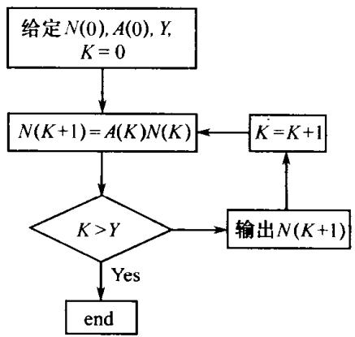

<details>
<summary>flowchart</summary>

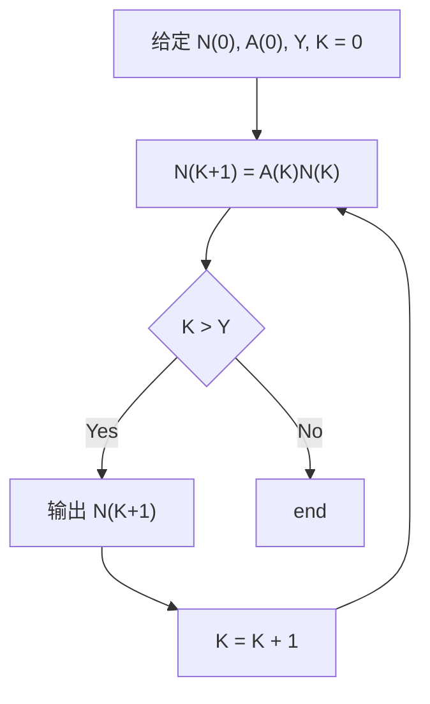
```mermaid
graph TD
  A["给定 N(0), A(0), Y, K = 0"] --> B["N(K+1) = A(K)N(K)"]
  B --> C{"K > Y"}
  C -->|Yes| D["输出 N(K+1)"]
  D --> E["K = K + 1"]
  E --> B
  C -->|No| F["end"]
```
</details>

数目分别为 $N_{3}, N_{4}$ , 那么我们可计算出该稳态下的年捕捞量 $\text{gain}(p)$ :

$$
\begin{array}{l} \text {gain} (p) = 1 7. 6 8 \times \left(\int_ {0} ^ {2 4 3} N _ {3} e ^ {- (r + 0. 4 2 p) t} \times 0. 4 2 p \mathrm{d} t\right) + 2 2. 9 9 \\ \times \left(\int_ {0} ^ {2 4 3} N _ {4} e ^ {- (r + p) t} \times p \mathrm{d} t\right) \\ \end{array}
$$

动用搜索算法可以得到捕获量最大值，我们设置初值 $N(0) = (122 \times 10^{9}, 29.7 \times 10^{9}, 10.1 \times 10^{9}, 3.29 \times 10^{9})$ ，在 $[0,1]$ 区间上用搜索算法，得到最大可持续捕恢复量。

$\max[\text{gain}(p)] = 6.44455$ 万吨，此时， $p^* = 0.03700(1/\text{天})$ 。此时鱼群分布为 $(NS_1, NS_2, NS_3, NS_4) = (1.15056 \times 10^{11}, 2.309929 \times 10^{10}, 4.063498 \times 10^9, 2.13120 \times 10^7)$ 我们取 $[0, 0.01]$ 区间上不同 $p$ 值所对应的稳定状态下持续捕捞量，并利用 Mathematica 制图如下：

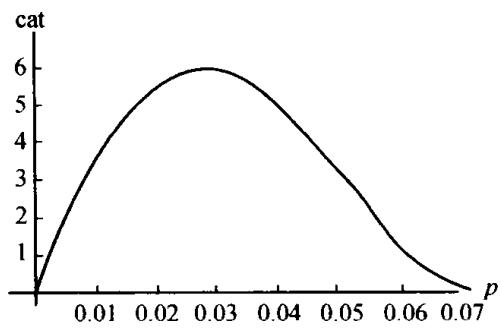

<details>
<summary>line</summary>

| p | cat |
| --- | --- |
| 0 | 0 |
| ~0.01 | ~3.5 |
| ~0.02 | ~5.2 |
| ~0.03 | ~6 |
| ~0.04 | ~5.2 |
| ~0.05 | ~3.5 |
| ~0.06 | ~1.2 |
| ~0.07 | ~0.2 |
</details>

可看出 p 的极大值即为最大值,不会出现多峰现象.

问题Ⅱ：

\- 分析:由渔业公司承包期为5年,且要求在固定努力量的捕捞方式下使得五年后的渔场的生产能力不受太大破坏,我们对固定努力量捕捞方式有两种理解:

方法 A: 认为五年期捕捞强度系数 p 为同一值;

方法 B: 认为五年期各年 p 值不同, 记第 i 年的捕捞强度系数为 $p_{i}$ .

我们分析了本题所给的数据,以现2、3、4龄鱼的数量即使在自然条件下都无法达到,故认定这种鱼的年龄分布是由某种异常的自然原因引起的,是一种不稳定状态.今后无论捕捞量如何少,都不可能维持原有鱼群各年龄组的数目.因此我们理解所谓生产能力不受太大破坏是指对于一种稳定状态而言.在本题中即取问题Ⅰ中可获得最大捕捞量的状态.

\- 求解：

记第 $i$ 年捕获量为 $Cat_{i}, i = 1,2,3,4,5$ . 根据题意, 我们的目的是求五年期内最大的捕捞总量, 目标函数 $\mathrm{Total} = \max \sum Cat_{i}$ ;

$$
\mathrm{s.t} N _ {i} (6, 0) \geqslant N S _ {i}, \quad i = 1, 2, 3, 4.
$$

对于方法 A, 我们假设 $p_{i} \equiv p, i = 1, 2, 3, 4, 5$ .

利用一维搜索法, 在 $[0,1]$ 区间上对 $p_{i}$ 进行搜索, 可直接得到 Total 的最大值: Total = 49.06 万吨, 此时 p = 0.037.

对于方法 $B$ ，因为 $p_i (i = 1,2,3,4,5)$ 各不相同，若在[0,1)区间上直接利用五维搜索则速度慢，精度低，于是我们先进行数据合理分析，确定出 $p_i$ 可能的范围值，在这小范围内进行逐步求精搜索，先在小区间求出最优解，再在最优解附近求出更优解，所以我们需要解决的主要问题是缩小搜索范围，并提高结果精度.

下面我们来寻求 $p_i$ 的大致范围

为了估计 $p_i$ 的范围, 我们首先注意到 $N_1[i + 1,0]$ 的数目满足如下定理.

定理在本题所给数据下, 设第 t 年的捕捞强度系数为 p, 若 $N_{1}(t+1,0) < NS_{1} \times 0.9 (t = 1,2,3,4)$ , 则这种捕捞方式一定不是最优的.

证明：由于在情况 A 中我们已在 $p_{i} \equiv p$ 条件下求出了一个满足不破坏生产能力的最大可行解，其捕获量为 gain = 49,06 万吨。当不限制 $p_{i}$ 的值时，必有大量捕获量 Total $\geqslant$ gain。

现在由 $N_{1}(t+1,0)<NS_{1}\times0.9$ 则

$$
\begin{array}{l} N _ {2} (t + 2, 0) <   N S _ {1} \times 0. 9 \times 0. 2 = 1. 1 5 0 6 \times 1 0 ^ {1 1} \times 0. 9 \times 0. 2 \\ = 2. 0 7 \times 1 0 ^ {1 1} <   N S _ {2} \\ \end{array}
$$

$$
N _ {2} (t + 3, 0) <   N S _ {1} \times 0. 9 \times 0. 2 \times 0. 2 = 4. 1 4 \times 1 0 ^ {9} <   N S _ {3}
$$

所以当 $N_{1}(5,0) < NS_{1} \times 0.9$ 与 $N_{1}(4,0) < NS_{1} \times 0.9$ 将造成 $N_{2}S(6,0) < NS_{2}$ 与 $N_{3}(6,0) < NS_{3}$ , 由约束条件可知这是不可行的, 它将使5年后生产能力遭到破坏.

现在若 $N_{1}(2,0) < NS_{1} \times 0.9$ 则这五年的捕获量依次为

$$
C _ {a t _ {1}} \leqslant 2 5. 6 0 2 3, C _ {a t _ {2}} \leqslant 1 0. 6, C _ {a t _ {3}} \leqslant 5. 2 7,
$$

为保证生产能力不遭到破坏

$$
C _ {a t _ {4}} \leqslant 3, C _ {a t _ {5}} \leqslant 2,
$$

得 $\mathrm{Total} = \sum C_{at_i} < 49$ 万吨，同理可证，当 $N_{1}(3,0) < NS_{1} \times 0.9$ 时，得 $\mathrm{Total} < 49$ 万吨，因此当 $N_{1}(2,0) < NS_{1} \times 0.9$ 或 $N_{1}(3,0) < NS_{1} \times 0.9$ 则不能获得最优解。所以可知对于 $N_{1}(i,0), (i = 1,2,3,4,5)$ 在寻求优化解时均不可能小于 $NS_{1} \times 0.9$ ，故有

$$
N _ {1} (i, 0) > N S _ {1} \times 0. 9 > 1. 1 0 \times 1 0 ^ {1 1}
$$

由于 $p_i$ 的变化将影响第 $i + 1$ 年的1龄鱼的数目，所以我们可利用此年1龄鱼的数目来确定上一年的捕捞强度系数的范围.

第一年最大值已由题目给出,同时我们经分析可知,若2、3、4龄鱼大于其自然稳定值则不仅不会使下一年1龄鱼数目有显著变化,而且使超出稳定值的3、4龄鱼会因自然死亡而影响最优值.因为第2、3、4龄鱼最大不超过其自然稳定值,所以我们取第2、3、4龄鱼的最大值为其自然稳定值,利用下述两个方程,取不同的 $p_{i}$ 值求解对应 $N_{1}(i+1,0)$ 的值.

$$
\begin{array}{l} N _ {3 4} (i, 2 4 4) = N _ {3} (i, 0) \times e ^ {- (r + 0. 4 2 p) \times 2 4 3} / 2 + N _ {4} (i, 0) \times e ^ {- (r + p) \times 2 4 3} \\ N _ {1} (i, + 1, 0) = N _ {3 4} (i, 2 4 4) \times 1. 1 0 9 \times 1 0 ^ {5} \times 1. 2 2 \times 1 0 ^ {1 1} / (1. 2 2 \times 1 0 ^ {1 1} \\ + N _ {3 4} (i, 2 4 4) \times 1. 1 0 9 \times 1 0 ^ {5}, \quad i = 2, 3, 4, 5 \\ \end{array}
$$

其中 $N_{34}(i,244)$ 为第 i 年 9 月初下卵的 4 龄鱼数目(并将两条 3 龄鱼并为一条 4 龄鱼处理)，我们利用 Mathematica 中数值求根法得到如下数据：

<table><tr><td> $P_{1}$ </td><td>0.1</td><td>0.08</td><td>0.05</td></tr><tr><td> $N_{34}(1,244)$ </td><td>64056.8</td><td>493231</td><td> $1.05442 \times 10^{7}$ </td></tr><tr><td> $P_{1}$ </td><td>0.03</td><td>0.01</td><td>0.005</td></tr><tr><td> $N_{34}(1,244)$ </td><td> $8.19138 \times 10^{7}$ </td><td> $7.24225 \times 10^{8}$ </td><td> $1.3759 \times 10^{9}$ </td></tr><tr><td> $P_{1}$ </td><td>0.1</td><td>0.08</td><td>0.05</td></tr><tr><td> $N_{1}(2,0)$ </td><td> $6.71301 \times 10^{9}$ </td><td> $3.77665 \times 10^{10}$ </td><td> $1.10474 \times 10^{11}$ </td></tr><tr><td> $P_{1}$ </td><td>0.03</td><td>0.01</td><td>0.005</td></tr><tr><td> $N_{1}(2,0)$ </td><td> $1.20383 \times 10^{11}$ </td><td> $1.21815 \times 10^{11}$ </td><td> $1.21903 \times 10^{11}$ </td></tr><tr><td> $P_{1}$ </td><td>0.1</td><td>0.08</td><td>0.005</td></tr><tr><td> $N_{34}(i,244)$ </td><td>31141.4</td><td>239785</td><td> $5.125 \times 10^{6}$ </td></tr><tr><td> $P_{i}$ </td><td>0.03</td><td>0.01</td><td>0.005</td></tr><tr><td> $N_{34}(i,244)$ </td><td> $3.96789 \times 10^{7}$ </td><td> $3.33529 \times 10^{11}$ </td><td> $6.06359 \times 10^{9}$ </td></tr><tr><td> $P_{i}$ </td><td>0.1</td><td>0.08</td><td>0.05</td></tr><tr><td> $N_{i}(i+1,0)$ </td><td> $3.3585 \times 10^{9}$ </td><td> $2.18332 \times 10^{10}$ </td><td> $1.0844 \times 10^{11}$ </td></tr><tr><td> $P_{i}$ </td><td>0.03</td><td>0.01</td><td>0.005</td></tr><tr><td> $N_{i}(i+1,0)$ </td><td> $1.18709 \times 10^{11}$ </td><td> $1.21591 \times 10^{11}$ </td><td> $1.29778 \times 10^{11}$ </td></tr></table>

由上表数据根据 $p_{i}$ 与 $N_{1}(i+1,0)$ 的单调递减关系：

$$
1 0 \times 1 0 ^ {1 1} <   N _ {1} (2, 0) <   m s _ {1} = 1. 2 1 8 8 6 \times 1 0 ^ {1 1}
$$

可知 $0.005 < p_1 < 0.008$ ，又由 $N(i,0) > 1.10087 \times 10^{11}$ ，可知 $p_i < 0.05i = 2,3,4,5$ 。于是我们在区间 $0.005 < p_1 < 0.08$ 与 $0 < p_i < 0.05 (i = 2,3,4,5)$ 内进行逐步求精搜索，这明显提高了 $p_i$ 的精度，进而提高了 Total 的精度。

编程搜索得到如下数值：

<table><tr><td colspan="2">Total2—4.96284 × 1011</td></tr><tr><td> $p_{1} = 0.0500$ </td><td> $Cat_{1} = 2.18348 \times 10^{11}$ </td></tr><tr><td> $p_{2} = 0.0412$ </td><td> $Cat_{2} = 8.47038 \times 10^{10}$ </td></tr><tr><td> $p_{3} = 0.0374$ </td><td> $Cat_{3} = 6.84201 \times 10^{10}$ </td></tr><tr><td> $p_{4} = 0.0362$ </td><td> $Cat_{4} = 6.15679 \times 10^{10}$ </td></tr><tr><td> $p_{5} = 0.0366$ </td><td> $Cat_{5} = 6.32479 \times 10^{10}$ </td></tr></table>

因减少了搜索范围,此程序在奔腾 90 - 585 上运行时间为 42 秒.

## 六、模型检验分析

(1) 本模型得到一个递推关系, 当稳定后, 递推式中前述的转移矩阵 $A(t)$ 也近似成为一个常数矩阵, 即近似地有

$$
N (0) = A N (0),
$$

$$
A = \left[ \begin{array}{c c c c} b _ {1} & b _ {2} & b _ {3} & b _ {4} \\ s _ {1} & 0 & 0 & 0 \\ 0 & s _ {2} & 0 & 0 \\ 0 & 0 & s _ {3} & 0 \end{array} \right]
$$

易见 $\lambda = 1$ 是 $A$ 的一个特征值, 稳定状态下各组鱼数目即对应 $\lambda$ 的特征向量. 当 $\lambda = 1$ 时表明该群体不增也不减. 而 $\lambda = 1$ 的等价形式就是[1]

$$
R \doteq b _ {1} + b _ {2} s _ {1} + b _ {3} s _ {1} s _ {2} + b _ {4} s _ {1} s _ {2} s _ {3} = 1
$$

下面我们用本模型模拟的结果来验证. 取初值 $N(0) = (122 \times 10^{9}, 29.7 \times 10^{9}, 10.1 \times 10^{9}, 3.29 \times 10^{6}), p = 0.05$ ，并由计算机模拟结果得到矩阵

$$
A _ {0} = \left[ \begin{array}{c c c c} 0 & 0 & 2 4. 8 2 3 4 & 0. 0 4 3 1 9 5 \\ 0. 2 0 0 7 1 & 0 & 0 & 0 \\ 0 & 0. 2 0 0 7 1 & 0 & 0 \\ 0 & 0 & 0. 0 0 1 2 2 0 0 1 & 0 \end{array} \right]
$$

经计算知 $R = 1$ ，这就从一方面验证了此时的状态确为种群不变的稳定状态，从而我们的模型是合理的，基本符合实际.

(2) 从问题Ⅱ的结果来看,由于Total1与Total2的结果相差很小,所以实际上第一年的捕捞强度太大(撒网次数太多)不仅难以找到那么多捕捞工具,而且在p>0.02的范围内改变p的值,每年捕捞量将不会受到很大影响,所以从经济效益出发,宁愿采取持续捕捞方式,进而验证了问题Ⅰ的要求解最优性,同时从结果看出第一年大力捕捞,而以后每年都相差不大,正说明了我们分析所讲的所给的数据的特殊性.

## 七、模型的评价

1. 本模型在建模过程中, 对鰻鱼产卵、孵化、死亡等过程做了合理的简化, 建立了微分一差分模型, 建模简单、清晰, 有一定普遍意义.  
2. 在计算中, 合理使用确定范围和逐渐求精的搜索方法, 使计算简便、精确、计算结果经检验分析是正确的, 由此得到结论合理可信.  
3. 提出的模型改进方案及关于极大利润可持续捕捞问题,有一定实际意义.  
4. 不足之处是由于缺乏某些必要的专业知识和数据, 使得讨论无法更深入进行.

## 八、模型改进

方向之一：

鳀鱼具有同期迥游性,如果能获得这方面的较详细的资料,我们就可不必在捕捞期内均衡捕捞而可在某些特定时期进行集中捕捞,增大此时的捕捞努力量,可能会获得更高的经济效益.

方向之二：

对于捕捞公司来说,它关心的不只是一年能捕多少鱼,还有其经济效益,而且这常常是主要的.公司获得的利润不仅与年产量有关,还与市场价格、成本投入有关.成本投入与捕获强度系数成正比,而最终收入折合成不变价格与贴现率当时的价格有关(贴现率是指因通货膨胀而引起纸币的一定的贬值).

设每年的贴现率为 $w, c_{1}, c_{2}$ 分别为鱼和捕鱼成本的当时价格指数, 五年内价格为一定值, 则有目标函数为

$$
e a m = \sum w ^ {i - 1} \times (c _ {1} \times C a t _ {i} - c _ {2} \times P \times 1 0 ^ {6})
$$

取 $w = 0.98, c_1: c_2 = 1000: 50$ ，鱼的价格为 1000 美元 / 吨。见如下表

<table><tr><td colspan="2"> $eam = 1.00325 \times 10^{7}$ </td></tr><tr><td> $p_1 = 0.0125$ </td><td> $Cat_1 = 14.3757$ </td></tr><tr><td> $p_2 = 0.0038$ </td><td> $Cat_2 = 2.69467$ </td></tr><tr><td> $p_3 = 0.0038$ </td><td> $Cat_3 = 2.53926$ </td></tr><tr><td> $p_4 = 0.0038$ </td><td> $Cat_4 = 2.40448$ </td></tr><tr><td> $p_5 = 0.0026$ </td><td> $Cat_5 = 1.4759$ </td></tr></table>

$Cat_{i}$ 的单位为万吨.

从数据分析可得由于减去了支出金额,捕捞强度系数降低不少,原因是当 $p_{i}$ 在大于某值的范围内变化时,捕捞数量的变化不敏感.

## 参考文献

[1] 姜启源, 数学模型(第二版), 高等教育出版社, 北京.  
[2] Γ.B. 尼科里斯基, 分门鱼类学, 高等教育出版社, 北京, 1958  
[3] 叶其孝,大学生数学建模竞赛辅导教材,湖南教育出版社,长沙,1993.

# 最优捕鱼策略问题

## 朱京义 张 纯 廖海润

(南昌大学, 南昌 330000)

指导教师 李向军

编者按 文章假设合理、建模思路清晰、描述准确、推理严谨、计算结果正确，特别在承包期总产量模型中对“五年后鱼群的生产力不受到太大破坏”的分析，富在新意.全文叙述流畅，简明扼要.是一篇很好的数学模型论文.

摘要 本文以生态经济着眼,首先用微分方程组建立了基本模型,从理论上完整地描述了各年龄鱼的变化情况.其次,从基本模型出发,我们构造出年度最优模型,得到了可持续捕获应满足的条件及在此条件下可获得的年最高收获量,在对“鱼的生产能力不受到太大破坏”进行详细分析和合理描述的基础上,巧妙构思,建立了承包期总产量模型,给出了公司应采取的捕捞策略及相应的承包期最高收获量.

## 一、问题的提出及分析

可再生资源管理应使生物资源最终不丧失生产力以便能持续利用,一般以得到最大持续产量(MSY)为目标.

就渔业捕捞而言,公司的最优策略应满足以下要求:

(1) 可持续捕获, 即在生态上可行, 具体地希望达到这样的要求, 使得每年开始捕捞时渔场的各年龄组的鱼群大小不变.  
(2) 产量最大, 即经济上可行. 第一问中要求收获量最大, 即 $M = m_{3}a_{3} + m_{4}a_{4}$ 取最大值.  
(3) 技术上可行, 不能直接人为地提高卵率和成活率, 采用固定努力量捕捞, 每年捕捞强度系数保持不变.

其中，要求(3)已由题设进行了规范,要求(2)是模型所要达到的目标,要求(1)给出达到最优解的前提.

## 二、模型的基本假设与符号说明

## （一）基本假设

1. 渔场是非开放式渔场, 不与其它水域发生关系, 从而构成独立的生态群落;  
2. 鱼群是一个独立的种群，不存在与其它生物的竞争，或者虽有竞争但其影响只局限在鱼的死亡率内；  
3. 假设同一年龄组的个体之间是同质的, 只考虑平均水平, 不讨论个体的差异;  
4. 各年龄组的鱼经过一年后即进入高一级的年龄组,但 4 龄鱼经过一年后仍视为 4 龄鱼;  
5. 假设 3、4 龄鱼全部具有生殖能力, 或者虽然雄性不产卵, 但平均产卵量掩盖了这一差

异；

6. 鱼的自然死亡可在一年内任何时间发生,产卵可在后四个月内任何时间论发生,两者在各自的时间段内是均匀分布的;  
7. 对鱼的捕捞用固定努力量捕捞方式, 每年的捕捞强度系数保持不变, 且捕捞只在前八个月进行.

## （二）符号说明

$n_{i}(t)$ : t 时刻 i 龄鱼的数量;

$n_{i1}^{k}$ ：第 k 年底 i 龄鱼的数量；

$n_{i0}^{(k)}$ ：第 k 年初 i 龄鱼的数量；

$m_{i}$ ：第 i 年龄鱼的平均重量，相应的值向量为(5.07,11.55,17.86,22.99)(单位：克);

r: 自然死亡率,值为 0.8(1/年);

c: 4 龄鱼的平均产卵量, 值为 $1.109 \times 10^{5}$ 个;

$Q^{(k)}$ ：第 k 年度的产卵总量(单位:个);

$\beta_{i}$ ：对 i 龄鱼的捕捞强度系数， $\beta_{1},\beta_{2},\beta_{3},\beta_{4}$ 满足 $(0:0:0.42:1)$ ;

$a_{i}$ ：对 i 龄鱼的年捕捞量(单位:条);

M: 年总数收获量即 $m_{3}a_{3} + m_{4}a_{4}$ (单位: 克);

MM: 即 $\sum_{i=1}^{5} M_{i}$ ，5 年的总收获量(单位:克).

## 三、模型的建立

## (一) 基本模型

我们首先建立基本模型,来对鱼群的变化及每年收获量进行描述.因为不捕捞1、2龄鱼有

$$
\left\{ \begin{array}{l} \frac {\mathrm{d} n _ {i} (t)}{\mathrm{d} t} = - r n _ {i} \\ n _ {i} ^ {(t)} = 0 = n _ {i 0} \end{array} \right. \quad i = 1, 2
$$

得 $n_i = n_{i0} \cdot e^{-rt}, i = 1,2$ ，对3、4龄鱼有

$$
\left\{ \begin{array}{l} \frac {\mathrm{d} n _ {i} (t)}{\mathrm{d} t} = - r n _ {i} - H \left(t - \frac {2}{3}\right) \beta_ {i} \cdot n _ {i}, \\ n _ {i} ^ {(t)} \Big | _ {t = 0} = n _ {i 0}, \end{array} \right. \quad i = 3, 4
$$

得 $n_i = n_{i0}e^{-[r + H(t - \frac{2}{3})\beta_i]t}, (i = 3,4)$ 其中

$$
H \left(t - \frac {2}{3}\right) = \left\{ \begin{array}{l l} 0, & t \geqslant \frac {2}{3}, \\ 1, & t <   \frac {2}{3}. \end{array} \right.
$$

令 $n_{i1}^{(k)}$ 为 $i$ 龄鱼在第 $k$ 年底时的数目， $n_{i0}^{(k)}$ 为 $i$ 龄鱼在第 $k$ 年初时的数目，得

$$
\left\{ \begin{array}{l} n _ {1 1} ^ {(k)} = n _ {1 0} ^ {(k)} \cdot e ^ {- r}, \\ n _ {2 1} ^ {(k)} = n _ {2 0} ^ {(k)} \cdot e ^ {- r}, \\ n _ {3 1} ^ {(k)} = n _ {3 0} ^ {(k)} \cdot e ^ {- r - \frac {2}{3} \beta_ {3}}, \\ n _ {4 1} ^ {(k)} = n _ {4 0} ^ {(k)} \cdot e ^ {- r - \frac {2}{3} \beta_ {4}}, \end{array} \right. \tag {1}
$$

由假设4月到年底,第i龄鱼全部转化为 $(i+1)$ 龄鱼 $(i=1,2,3)$ ,同时由孵化产生1龄鱼,得

$$
\left\{ \begin{array}{l} n _ {2 0} ^ {(k)} = n _ {1 1} ^ {(k - 1)}, \\ n _ {3 0} ^ {(k)} = n _ {2 1} ^ {(k - 1)}, \\ n _ {4 0} ^ {(k)} = n _ {3 1} ^ {(k - 1)} + n _ {4 1} ^ {(k - 1)}, \\ n _ {1 0} ^ {(k)} = \frac {D \times Q ^ {(k - 1)}}{D + Q ^ {(k - 1)}} \end{array} \right. \tag {2}
$$

其中 $D = 1.22 \times 10^{11}, Q^{(k - 1)}$ 为 $(k - 1)$ 年度的总产卵量，且

$$
\begin{array}{l} Q ^ {(k - 1)} = \int_ {\frac {2}{3}} ^ {1} \left(\frac {1}{2} n _ {3} ^ {(k - 1)} + n _ {4} ^ {(k - 1)}\right) \frac {c}{\frac {1}{3}} \mathrm{d} t \\ = 2 8 5 5 3. 4 n _ {3 0} ^ {(k - 1)} e ^ {- \frac {2}{3} \beta_ {3}} + 5 7 1 0 6. 8 n _ {3 0} ^ {(k - 1)} e ^ {- \frac {2}{3} \beta_ {4}} \tag {3} \\ \end{array}
$$

此外,我们可求得每年对3、4龄鱼的总捕捞重量为

$$
\begin{array}{l} M = \int_ {0} ^ {\frac {2}{3}} \left(m _ {3} \beta_ {3} n _ {3} (t) + m _ {4} n _ {4} (t) \mathrm{d} t\right) \\ = \frac {m _ {3} \beta_ {3}}{r + \beta_ {3}} \left[ 1 - e ^ {- \frac {2}{3} (r + \beta_ {3})} \right] n _ {3 0} ^ {(k)} + \frac {m _ {4} \beta_ {4}}{r + \beta_ {4}} \left[ 1 - e ^ {- \frac {2}{3} (r + \beta_ {4})} \right] n _ {3 0} ^ {(k)} \\ = m _ {3} a _ {3} + m _ {4} a _ {4} \tag {4} \\ \end{array}
$$

其中

$$
a _ {3} = \frac {\beta_ {3}}{r + \beta_ {3}} \left[ 1 - e ^ {- \frac {2}{3} (r + \beta_ {3})} \right] n _ {3 0} ^ {(k)}, a _ {4} = \frac {\beta_ {4}}{r + \beta_ {4}} \left[ 1 - e ^ {- \frac {2}{3} (r + \beta_ {4})} \right] n _ {4 0} ^ {(k)}
$$

(1) - (3) 式联立刻划了鱼群各年龄组每年的变化情况, (4) 式是每年在捕捞强度系数 $(0,0, \beta_{3}, \beta_{4})$ 下的总收获重量, 它们一起构成了我们的基本模型.

## （二）年度产生最优模型

为实现可持续捕获, 即要求 $n_{i0}^{(k)} = n_{i0}^{(k-1)}$ , 并在此前提下获得最大年收获量, 由基本模型, 即得年度最优模型.

$$
\max M = \max \{m _ {3} a _ {3} + m _ {4} a _ {4} \}
$$

$$
\text {s.t.} \left\{ \begin{array}{l} n _ {1 1} ^ {(k)} = n _ {1 0} ^ {(k - 1)} e ^ {- r} \\ n _ {2 1} ^ {(k)} = n _ {2 0} ^ {(k)} e ^ {- r} \\ n _ {3 1} ^ {(k)} = n _ {3 0} ^ {(k)} e ^ {- r - \frac {2}{3} \beta_ {3}} \\ n _ {4 1} ^ {(k)} = n _ {4 0} ^ {(k)} e ^ {- r - \frac {2}{3} \beta_ {4}} \\ n _ {2 0} ^ {(k)} = n _ {1 1} ^ {(k - 1)} \\ n _ {3 0} ^ {(k)} = n _ {2 1} ^ {(k - 1)} \\ n _ {4 0} ^ {(k)} = n _ {3 1} ^ {(k - 1)} + n _ {4 1} ^ {(k - 1)} \\ n _ {1 0} ^ {(k)} = \frac {D \times Q ^ {k - 1}}{D + Q ^ {k - 1}} \\ Q ^ {k - 1} = 2 8 5 5 3. 4 n _ {3 0} ^ {(k - 1)} e ^ {- \frac {2}{3} \beta_ {3}} + 5 7 2 0 6. 8 n _ {4 0} ^ {(k - 1)} n _ {4 0} ^ {(k - 1)} e ^ {- \frac {2}{3} \beta_ {4}} \end{array} \right.
$$

利用 $n_{i0}^{(k)} = n_{i0}^{(k - 1)}$ ，也即 $n_{i0}^{(k)}, n_{i1}^{(k)}, Q^{(k)}$ 等与时间 $k$ 无关，化简得

$$
\max M = \max \left\{m _ {3} a _ {3} + m _ {4} a _ {4} \right\}
$$

$$
s, t \left\{ \begin{array}{l} n _ {1 0} = \frac {D \times Q}{D + Q} \\ n _ {4 0} = e ^ {- (3 r + \frac {2}{3} \beta_ {3})} n _ {1 0} + e ^ {- (r - \frac {2}{3} \beta_ {4})} n _ {4 0} \\ Q = 2 8 5 5 3. 4 e ^ {- 2 r - \frac {2}{3} \beta_ {4}} n _ {1 0} + 5 7 1 0 6. 8 e ^ {- \frac {2}{3} \beta_ {4}} n _ {4 0} \end{array} \right.
$$

利用 Mathematica 软件求极值得(原程序略)

$$
\beta_ {4} = 1 7. 0 2 4 3, \quad \beta_ {3} = 7. 1 5 0 2 1, \quad M \max = 3. 8 7 6 7 3 \times 1 0 ^ {1 1} \text {克}
$$

此外,各龄鱼鱼群数为

$$
n _ {1} = 1. 1 9 1 5 3 \times 1 0 ^ {1 1}, \quad n _ {2} = 5. 3 7 0 0 4 \times 1 0 ^ {1 0},
$$

$$
n _ {3} = 2. 4 1 2 9 2 \times 1 0 ^ {1 0}, \quad n _ {4} = 9. 2 2 3 9 5 \times 1 0 ^ {7}.
$$

显然 $M, n_1, n_2, n_3, n_4$ 均是关于 $\beta_4$ 的函数，解 $n_4 = 0, n_1 = 0, n_2 = 0, n_3 = 0$ 中任一方程，可得 $\beta_i^* = 30.9276$ ，此表示当捕捞强度系数达到 $\beta_4^*$ 时，将导致种群灭绝，达到新的平衡点即零点，故为实现可持续捕获，应使 $\beta_4 < 30.9267$

另外, 由 $M$ 与 $\beta_{4}$ 的图可看出, 捕捞重量 $M$ 是 $\beta_{4}$ 的单峰函数. 故我们可知盲目增大捕捞强度并不能导致捕获量的增加.

## （三）承包期总产量模型

为对“五年后生产能力不受到太大破坏”进行合理描述,我们考虑无捕捞时,鱼群繁殖达到稳定状况(即每年渔场中各年龄组条数恒定)的鱼群分布.此时,各年龄组鱼条数为

$$
n _ {1} ^ {*} = 1. 2 0 6 9 4 \times 1 0 ^ {1 1}, n _ {2} ^ {*} = 5. 4 3 1 2 3 \times 1 0 ^ {1 0},
$$

$$
n _ {3} ^ {*} = 2. 4 4 4 0 6 \times 1 0 ^ {1 0}, n _ {4} ^ {*} = 1. 6 9 6 6 3 \times 1 0 ^ {8},
$$

其次，以 $n_1 = n_1^*, n_2 = n_2^*, n_3 = n_4 = 0$ 为初值，用基本模型(1)-(3)式进行递推计算，可以过六年左右时间，鱼群即达到稳态；类似地以 $n_1 = n_2 = 0, n_3 = n_3^*, n_4 = n_4^*$ 为初值进行递推计算，可以过二年至三年时间，鱼群即达到稳态；用其他初值进行计算可有类似的

结论.

据此,我们认为要使生产能力不受到太大破坏,只需保证5年后即6年初3、4龄鱼的数量保持在一定范围内即可.另外,由于多数生物学家的观点;只有种群减至低于最大持续产量水平时,资源才算开发过渡 $^{[3]}$ .为此,我们构造目标函数:

$$
\min Y = \min \sqrt {\left(W _ {3} (n _ {3 0} ^ {(6)} - n _ {3})\right) ^ {2} + \left(W _ {4} (n _ {4 0} ^ {(6)} - n _ {4})\right) ^ {2}}
$$

其中 $n_3, n_4$ 为可持续捕获条件下鱼群的数量.

据以上分析,我们可得如下承包期总产量模型 $\max Z = \max\{MM - Y\}$ 其中 $MM = \sum_{i=1}^{5} M_{i}$ 为五年产量之和

$$
s. t. \left\{ \begin{array}{l} n _ {1 1} ^ {(k)} = n _ {1 0} ^ {(k)} e ^ {- r} \\ n _ {2 1} ^ {(k)} = n _ {2 0} ^ {(k)} e ^ {- r} \\ n _ {3 1} ^ {(k)} = n _ {3 0} ^ {(k)} e ^ {- r - \frac {2}{3} \beta_ {3}} \\ n _ {4 1} ^ {(k)} = n _ {4 0} ^ {(k)} e ^ {- r - \frac {2}{3} \beta_ {4}} \\ n _ {2 0} ^ {(k)} = n _ {1 1} ^ {(k - 1)} \\ n _ {3 0} ^ {(k)} = n _ {2 1} ^ {(k - 1)} \\ n _ {4 0} ^ {(k)} = n _ {3 1} ^ {(k - 1)} + n _ {4 1} ^ {(k - 1)} \\ n _ {1 0} ^ {(k)} = \frac {D \times Q ^ {(k - 1)}}{D + Q ^ {(k - 1)}} \\ Q ^ {(k - 1)} = 2 8 5 5 3. 4 n _ {3 0} ^ {(k - 1)} e ^ {- \frac {2}{3} \beta_ {3}} + 5 7 2 0 6. 8 n _ {4 0} ^ {(k - 1)} e ^ {- \frac {2}{3} \beta_ {4}} \end{array} \right.
$$

利用 Mathematica 软件解上述模型, 得(原程序略)

$$
\beta_ {4} = 1 7. 2 2 4, Z _ {\max} = 1. 6 0 0 9 6 \times 1 0 ^ {1 2},
$$

$$
M M _ {\mathrm{max}} = 1. 6. 1 1 7 \times 1 0 ^ {1 2} \text {克}.
$$

第六年初鱼群数为

$$
\begin{array}{l} n _ {1} = 1. 1 9 3 2 5 \times 1 0 ^ {1 1}, \quad n _ {2} = 5. 3 6 0 1 6 \times 1 0 ^ {1 0}, \\ n _ {3} = 2. 4 1 1 1 5 \times 1 0 ^ {1 0}, \quad n _ {4} = 8. 5 6 2 9 7 \times 1 0 ^ {7}, \\ \end{array}
$$

五年均采用固定努力量捕捞方式进行捕捞,每年对3、4龄鱼的捕捞强度系数分别为8.612和17.224,此时每年的产量分别为

$$
M _ {1} = 2. 3 3 9 3 7 \times 1 0 ^ {1 1} \text {克}, \quad M _ {2} = 2. 1 4 3 9 9 \times 1 0 ^ {1 1} \text {克}
$$

$$
M _ {3} = 3. 9 5 3 0 2 \times 1 0 ^ {1 1} \text {克}, \quad M _ {4} = 3. 7 6 5 1 8 \times 1 0 ^ {1 1} \text {克},
$$

$$
M _ {5} = 3. 8 1 0 1 1 \times 1 0 ^ {1 1} \text {克.}
$$

另外,渔业管理部门可知,当承包者以上策略捕捞时,各鱼群数目与年度最优捕捞方案中可持续捕捞鱼群数保持大致相等,保证了渔场的可持续捕捞.

## 四、模型误差分析

文中基础假设合理,所建模型数学推导严谨、理论可靠、模型结构简单.求解后两个模型

均采用 Mathematica 软件, 故误差仅由软件和计算机精度产生, 模型具有较好的稳定性.

## 五、模型优缺点及改进方向

我们的模型有以下优点：

1. 易于推广,承包期总产量模型构思巧妙,用我们给出的程序可对任意承包年数均给出捕捞的最优策略;  
2. 稳定性好, 模型给出的策略使各年龄组条数保持平衡, 从而满足了可持续捕捞的要求;  
3. 适用范围广,模型对于其它生态经济现象(如树木生长与采伐)同样适用;  
4. 基本模型对问题的描述精确、合理、推导严谨、理论性强；  
5. 模型本身不存在近似误差, 计算误差由 Mathematica 软件和计算机精度决定.

模型的缺点：

主要是没有很好地联系经济来讨论,如没有反映市场特性对捕捞策略的影响,而对渔业公司来说这些因素是很重要的.

模型的改进方向：

对于一定承包年限内的最优捕捞问题,可以采用动态规划的方法,变动各年度的捕捞强度 $\beta$ , 将使公司收获量更大.

## 参考文献

[1] 叶其孝,大学生数学建模竞赛辅导教材,湖南教育出版社,长沙,1993.  
[2] Z. C. Pielou 著, 卢泽愚译, 数学生态学, 科学出版社, 北京, 1987.  
[3] C.W.克拉克著,周勤学等译,数学生态经济学,农业出版社,北京,1983.

# 最优捕鱼策略的设计

石瑞萌 余希晨 周丹

(复旦大学, 上海 200433)

指导教师 廖有为

编者按 文章建立了可持续捕捞条件下的总产量最大的优化模型,用 Mathematic 求出最优捕捞强度系数和最大年捕捞量.文章提出当 1 龄鱼恢复到无捕捞达平衡时的 1 龄鱼的 $\frac{\sqrt{2}}{2}$ 倍时,则恢复生产能力,有独到见解.论文推理严谨、表述清析,对模型结果的详尽准确.

摘要 本问题是一个典型的可再生资源开发问题,因此我们以成熟的Scheafer模型为基础求解.在建模过程中,我们对各年龄组鱼在同一年中的数量变化规律应用微分方程进行分析,建立捕捞期和产卵期两个阶段各组鱼群的数量随时间变化的指数型方程.此后我们又对各组鱼群之间的数量关系建立按年份变化的离散型方程.最终获得既简单又比较精确的离散型迭代方程组.

在模型求解过程中, 我们结合了计算机分析求解的技术, 应用 Mathematic 软件以及 WatcomC/C++ 编译器, 通过编程序求出了问题的解, 并以作图的方式给出了模型的直观表示. 我们还在数学上对于鱼类分布结构的收敛性给予了严格的证明, 从而得出如下结论:

可持续性捕捞的最优捕捞强度系数3龄为7.2924/年，4龄鱼为17.3629/年，相应的年捕捞量为 $3.88 \times 10^{11}$ 克.

5年连续捕捞的最优捕捞强度系数3龄鱼为7.3836/年，4龄鱼为17.58/年，相应的年捕捞量为 $2.34401 \times 10^{11}$ 克， $2.14852 \times 10^{11}$ 克， $396176 \times 10^{11}A?K\#$ ， $3.77825 \times 10^{11}$ 克与 $3.82216 \times 10^{11}$ 克.

本模型具有较强的适用性和普遍性,建模过程中提出的对资源的开发和保护进行加权综合考虑的方法具有现实指导意义.

## 一、问题的分析

该问题是一个典型的可再生资源开发的数学模型. 因对年龄组的划分离散化, 使该模型在整体上是离散的. 我们取每年开始捕捞时刻为鱼数量计数时刻, 考虑同 1 年龄组鱼在一年中生长过程的时间连续性, 我们应用 Scheafer 模型在一年中建立连续的微分方程, 分析在一年中的不同阶段分界点上鱼数量的关系.

在可持续捕捞的前提下,本模型表现为鱼数量在开始捕捞时刻不变,通过求解捕鱼量关于捕捞强度系数的表达式的极大值,得到最高年收获量及对应捕捞强度系数.

在求解渔业公司 5 年捕鱼问题时,我们利用计算机求出 5 年捕鱼量关于捕捞强度系数表达式的极大值及对应捕捞强度系数,验证了在此捕捞强度系数下对生产能力破坏不大,并求出了该公司每年捕鱼策略.

## 二、模型的假设及说明

## a. 模型的假设

## （一）关于鱼的分类

1. 鱼分为 1、2、3、4 龄鱼；  
2.4龄鱼存活一年后仍划为4龄鱼.

## （二）关于鱼的生长过程

1. 各年龄组鱼的自然死亡率为0.8/年,且死亡是一连续过程,不是在某一时刻的突发;  
2.3、4龄鱼在一年的最后4个月集中产卵，且在该4个月的开始时刻进行；  
3.3 龄鱼产卵量为 $0.5 \times 1.109 \times 10^{5}$ /条, 4 龄鱼产卵量为 $1.109 \times 10^{5}$ 个/条;  
4. 卵孵化成活为 1 龄鱼, 成活率 (1 龄鱼与产卵率 $n$ 之比) 为 $1.22 \times 10^{11} / (1.22 \times 10^{11} + n)$ .

## （三）关于鱼的捕捞

1. 捕捞在产卵孵化前 8 个月进行,且捕捞是一连续过程,不是在某一时刻发生;  
2. 捕捞强度系数固定, 只能捕捞 3、4 龄鱼, 它们的捕捞强度系数之比为 0.42:1;

## （四）关于经济效益

经济效益以捕捞总量来衡量.

b. 对假设的说明：

1. 我们可以认为 4 龄鱼存活至下一年后, 可被当作 4 龄鱼捕杀, 且仍具有生殖能力故可视为 4 龄鱼;  
2. 因为孵化需要时间,而产卵孵化集中完成,故认为产卵孵化开始时进行,这是对模型的简化,在后面的讨论中,我们将看到这种简化不影响模型的精确性;  
3. 卵的成活率为 $1.22 \times 10^{11} / (1.22 \times 10^{11} + n)$ 这个假设是正确的, 它反映了当产卵数过多时, 由于竞争必将导致成活率的减少.

## 三、模型的建立及求解

a. 参数的说明

<table><tr><td>参数</td><td>定义</td><td>值域</td><td>单位</td></tr><tr><td>T</td><td>年份</td><td>0,1,2,⋯,</td><td>年</td></tr><tr><td>T</td><td>时间</td><td> $R^{+}$ </td><td>年</td></tr><tr><td> $\Delta t$ </td><td>间隔时间</td><td>[0,1]</td><td>年</td></tr><tr><td> $N_{i}$ </td><td>i龄鱼的数量</td><td> $R^{+}$ </td><td>条</td></tr><tr><td>r</td><td>自然死亡率</td><td>0.8</td><td>1/年</td></tr><tr><td>n</td><td>年产卵数量</td><td> $R^{+}$ </td><td>个</td></tr><tr><td> $E_{3}$ </td><td>3龄鱼捕捞强度系数</td><td> $R^{+}$ </td><td>1/年</td></tr><tr><td> $E_{4}$ </td><td>4龄鱼捕捞强度系数</td><td> $R^{+}$ </td><td>1/年</td></tr><tr><td> $\alpha_{3}$ </td><td>3龄鱼每年产卵量</td><td> $0.5 \times 1.109 \times 10^{5}$ </td><td>个/条</td></tr><tr><td> $\alpha_{4}$ </td><td>3龄鱼每年产卵量</td><td> $1.109 \times 10^{5}$ </td><td>个/条</td></tr><tr><td> $\beta$ </td><td>为计算方便而引入</td><td> $R^{+}$ </td><td>条</td></tr></table>

注： $R^{+}$ 表示正实数.  
自然死亡率为单位时间死亡总数与鱼总数之比.  
捕捞强度系数为单位时间捕捞量与各年龄组鱼群条数之比.

## b. 模型的建立

考察 1、2 龄鱼的生长过程, 根据 Scheafer 模型 $^{[1]}$

$$
\frac {\mathrm{d} N _ {i}}{\mathrm{d} t} = - r N _ {1}, i = 1. 2
$$

得 $N_{i}(t) = N_{0} \cdot e^{-rt}$

T 年的 i 龄鱼在 $T + 1$ 年变为 $i + 1$ 龄鱼, 所以

$$
N _ {i + 1} (T + 1) = e ^ {- r} \cdot N _ {i} (T)
$$

考察 3、4 龄鱼的生长过程, 根据 Scheafer 模型, 在前 8 个月, 由于捕捞与存活均起作用, 因而微分方程为

$$
\frac {\mathrm{d} N _ {i}}{\mathrm{d} t} = - (r + E _ {i}) N _ {i}, \quad i = 3, 4
$$

得 $N_{i}(t) = N_{0} \cdot e^{-(r + E_{i})t}, N_{0}$ 为每年年初的 $i$ 龄鱼总数，由此可得，每时刻 $t$ 的捕捞为 $E_{i}N_{i}(t)$ ，则年捕捞量为

$$
- \int_ {0} ^ {\frac {2}{3}} E _ {i} N _ {i} (t) \mathrm{d} t = \frac {E _ {i}}{E _ {i} + r} N _ {0} (1 - e ^ {- (E _ {i} + r) \frac {2}{3}}) \tag {1}
$$

在后 4 个月, 只有存活率起作用, 因而微分方程为

$$
\frac {\mathrm{d} N _ {i}}{\mathrm{d} t} = - r N _ {i}
$$

得

$$
N _ {i} (t) = N _ {0} \cdot e ^ {- r t} \tag {2}
$$

$N_{0}$ 为第 8 个月末时的 i 龄鱼总数, (在假设中我们曾提到产卵在产卵孵化期进行, 这不影响模型的精确性. 现解释如下: 在产卵期开始鱼条数为 $N_{0}$ , 则鱼的平均值为

$$
3 \int_ {0} ^ {\frac {1}{3}} N _ {0} \cdot e ^ {- r t} \mathrm{d} t = \frac {3}{r} N _ {0} \cdot e ^ {- r t} \Big | _ {\frac {1}{3}} ^ {0} \approx 0. 8 8 N _ {0}, \text {接近于} N _ {0}
$$

因此将产卵开始作为产卵时刻是合理的。)

计算得 $T$ 年第8个月末 $i$ 龄鱼数为

$$
N _ {i} (T) \cdot e ^ {- (r + E _ {i}) \frac {2}{3}} \tag {3}
$$

T 年末存活数 $(N_{i}(T)\cdot e^{-(r+E_{i})\frac{2}{3}}=e^{-r\frac{1}{3}}=e^{-r}\cdot N_{i}(T)\cdot e^{-E_{i}\frac{2}{3}}$

根据以上分析,整理得出生存过程中满足

$$
\left\{ \begin{array}{l} n (T + 1) = \alpha_ {3} N _ {3} (T) \cdot N _ {3} (T) \cdot e ^ {- (E _ {3} + r) \frac {2}{3}} + \alpha_ {4} \cdot e ^ {- (E _ {4} + r) \frac {2}{3}} \\ N _ {1} (T + 1) = \frac {1 . 2 2 \times 1 0 ^ {1 1} \cdot n (T + 1)}{1 . 2 2 \times 1 0 ^ {1 1} + n (T + 1)} \\ N _ {2} (T + 1) = e ^ {- r} \cdot N _ {1} (T) \\ N _ {3} (T + 1) = e ^ {- r} \cdot N _ {2} (T) \\ N _ {4} (T + 1) = N _ {3} (T) \cdot e ^ {- (E _ {3} \frac {2}{3} + r)} + N _ {4} (T) \cdot e ^ {- (E _ {4} \frac {2}{3} + r)} \\ E _ {3} = 0. 4 2 F _ {4} \end{array} \right. \tag {4}
$$

其中 $\alpha_{3},\alpha_{4},n$ 的定义见参数定义；

$N_{i}(T)\cdot e^{-(E_{3} + r)\frac{2}{3}}$ 为捕捞结束后在产卵点处的第 $i$ 种鱼数目.(由公式(3)定义)

## c. 模型的求解

## 1. 在可持续捕捞情况下

$N_{i}(T)$ 趋于平衡,因而 $N_{i}$ 与 T 无关,可得以下方程组

$$
n = \alpha_ {3} N _ {3} e ^ {- (E _ {3} + r) \frac {2}{3}} + \alpha_ {4} \cdot N _ {4} \cdot e ^ {- (E _ {4} + r) \frac {2}{3}},
$$

$$
N _ {1} = \frac {1 . 2 2 \times 1 0 ^ {1 1} n}{1 . 2 2 \times 1 0 ^ {1 1} + n},
$$

$$
N _ {2} = e ^ {- r} \cdot N _ {1},
$$

$$
N _ {3} = e ^ {- r} \cdot N _ {2},
$$

$$
N _ {4} = N _ {3} \cdot e ^ {- (E _ {3} \frac {2}{3} + r)} + N _ {4} \cdot e ^ {- (E _ {4} \frac {2}{3} + r)},
$$

$$
E _ {3} = 0. 4 2 E _ {4},
$$

其中 $N_{i}$ 为第 $i$ 种鱼的平衡数量. 解得

$$
N _ {1} = \frac {1 . 2 2 \times 1 0 ^ {1 1} \cdot n}{1 . 2 2 \times 1 0 ^ {1 1} \times n}, \quad N _ {2} = \frac {e ^ {- r} \times 1 . 2 2 \times 1 0 ^ {1 1} \times n}{1 . 2 2 \times 1 0 ^ {1 1} + n},
$$

$$
N _ {3} = \frac {e ^ {- 2 r} \times 1 . 2 2 \times 1 0 ^ {1 1} \cdot n}{1 . 2 2 \times 1 0 ^ {1 1} + n}, \quad N _ {4} = \frac {1 . 2 2 \times 1 0 ^ {1 1} \times n \times e ^ {- (\frac {2}{3} E _ {3} + 3 r)}}{(1 . 2 2 \times 1 0 ^ {1 1} + n) (1 - e ^ {- (\frac {2}{3} E _ {4} + r)})},
$$

而 $n = \frac{\beta n}{1.22 \times 10^{11} + n}$ 其中 $\beta$ 是为方便计算而设的变量.

$$
\beta = \alpha_ {3} \times 1. 2 2 \times 1 0 ^ {1 1} e ^ {- (\frac {2}{3} E _ {3} + \frac {3}{8} r)} + \alpha_ {4} \frac {1 . 2 2 \times 1 0 ^ {1 1} \times n \times e ^ {- (\frac {2}{3} E _ {3} + \frac {2}{3} E _ {4} + \frac {1 1}{3} r)}}{1 - e ^ {- (\frac {2}{3} E _ {4} + r)}}
$$

对以上方程组的结果作如下讨论: 当 $\beta > 1.22 \times 10^{11}$ 时, $n = \beta - 1.22 \times 10^{11}$ 或 n = 0. 当 $\beta < 1.22 \times 10^{11}$ 时, n = 0.

事实上,当鱼群还未达到平衡状态时,由方程组(4)可得

$$
n (T + 3) = \frac {\beta n (T)}{1 . 2 2 \times 1 0 ^ {1 1} + n (T)}
$$

由于

$$
\begin{array}{l} n (T + 3) - n (T) = \frac {\beta n (T)}{1 . 2 2 \times 1 0 ^ {1 1} + n (T)} - n (T) \\ = n (T) \frac {\beta - 1 . 2 2 \times 1 0 ^ {1 1} - n (T)}{1 . 2 2 \times 1 0 ^ {1 1} + n (T)} \\ \end{array}
$$

所以当 $\beta > 1.22 \times 10^{11}, n(T) < \beta - 1.22 \times 10^{11}$ 时 $n$ 关于 $T$ 单调递增，当 $\beta > 1.22 \times 10^{11}, n(T) > \beta - 1.22 \times 10^{11}$ 时 $n$ 关于 $T$ 单调递减。这表明无论 $n(T)$ 初值如何，最后必将趋于

$\beta - 1.22 \times 10^{11}$ 即达到 $\begin{bmatrix} N_1 \\ N_2 \\ N_3 \\ N_4 \end{bmatrix}$ 平衡状态. ( $N_1, N_2, N_3, N_4$ 为 $n = \beta - 1.22 \times 10^{11}$ 时的值)

由此可知当 $\beta > 1.22 \times 10^{11}, n = 0$ 为非稳定解， $n = \beta - 1.22 \times 10^{11}$ 为稳定解。

当 $\beta < 1.22 \times 10^{11}$ 时, $n$ 随 $T$ 单调递减, 这表明无论 $n(T)$ 初值如何, 最终必趋于 $n = 0$ . 即无鱼状态.

现在我们来求可持续捕捞时能获得最高年产收获量的 $E_{3}, E_{4}$ 的值.

利用(1)式得年捕捞量

$$
\begin{array}{l} \text {Weight} (E _ {4}) = \max \left\{1 7. 8 6 N _ {3} \frac {E _ {3}}{E _ {3} + r} (1 - e ^ {- (E _ {3} + r) \frac {2}{3}}) \right. \\ \left. + 2 2. 9 9 N _ {4} \frac {E _ {4}}{E _ {4} + r} (1 - e ^ {- (E _ {4} + r) \frac {2}{3}}), 0 \right\} \\ \end{array}
$$

(注: 当 $E_{4}$ 过大, $\beta < 1.22 \times 10^{11}$ 时, n = 0 无鱼可捕, 故 Weight 取 max 函数)

我们使用 Mathematica 对 Weight 求解, 并画出它关于 $E_{4}$ 的函数, 如下图:

求出最大鱼量为 $3.88707 \times 10^{11}$ 克, 对应得 $E_{4} = 17.3629, E_{3} = 7.292$ , 此时鱼群分布结构为

$$
N _ {1} = 1. 1 9 5 9 9 \times 1 0 ^ {1 1}, \quad N _ {2} = 5. 3 7 3 9 4 \times 1 0 ^ {1 0},
$$

$$
N _ {3} = 2. 4 1 4 6 7 \times 1 0 ^ {1 0}, \quad N _ {4} = 8. 3 9 5 3 8 \times 1 0 ^ {7},
$$

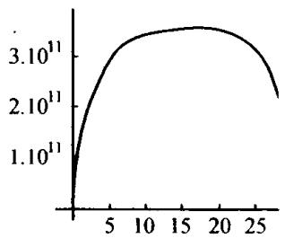

<details>
<summary>line</summary>

| X | Y |
| --- | --- |
| 0 | 0 |
| ~5 | ~3.1e11 |
| ~10 | ~3.4e11 |
| ~15 | ~3.5e11 |
| ~20 | ~3.4e11 |
| ~25 | ~2.8e11 |
</details>

同时，从上图可得 $E_4 = 31$ 处，Weight退减成0，所以 $0 \leqslant E_4 \leqslant 31$ 为捕捞强度系数的限制范围.

2. 针对渔业公司的五年捕捞计划, 我们利用已得到的迭代方程(4)在已知各个年龄组鱼的初始值 $\begin{pmatrix} N_{10} \\ N_{20} \\ N_{30} \\ N_{40} \end{pmatrix}$ 的前提下, 可迭代地求出 $\begin{pmatrix} N_{1i} \\ N_{2i} \\ N_{3i} \\ N_{4i} \end{pmatrix}$ 即第 i 年的鱼量分布关于 $E_{4}$ 的函数, 其中 $N_{ji}$ 为 j 龄鱼第 i 年的条数.

根据(1)式可求出5龄的捕捞总数：

$$
\begin{array}{l} \mathrm{Weight} (E _ {4}) = \left(\sum_ {i = 0} ^ {4} N _ {3 i}\right) \cdot 1 7. 8 6 \frac {E _ {3}}{E _ {3} + r} (1 - e ^ {- (E _ {3} + r) \frac {2}{3}}) \\ + \left(\sum_ {i = 0} ^ {4} N _ {4 i}\right) 2 2. 9 9 \frac {E _ {4}}{E _ {4} + r} (1 - e ^ {- (E _ {4} + r) \frac {2}{3}}) \\ \end{array}
$$

对此我们编制了程序(程序略)，并作出 Weight 关于 $E_{4}$ 的函数图象(图略)，由图得最大捕鱼总量 $Weight_{max} = 1.6057 \times 10^{12}$ 克，对应 $E_{3} = 7.3836, E_{4} = 17.58$ 。此时，每年的捕鱼量分别为

$$
W _ {1} = 2. 3 4 4 0 1 \times 1 0 ^ {1 1} \text {克}, \quad W _ {2} = 2. 1 4 8 5 2 \times 1 0 ^ {1 1} \text {克},
$$

$$
W _ {3} = 3. 9 6 1 7 6 \times 1 0 ^ {1 1} \text {克}, \quad W _ {4} = 3. 7 7 8 2 5 \times 1 0 ^ {1 1} \text {克},
$$

$$
\boldsymbol {W} _ {5} = 3. 8 2 2 1 6 \times 1 0 ^ {1 1} \text {克},
$$

对于鱼群的生产能力破坏程度我们作如下分析：

在天然情况下鱼的生态系数总能趋于平衡,而对鱼的捕捞,使鱼的数量偏离了其平衡点.因而我们认为所谓的对鱼的生产能力的破坏实际就是指,5年捕捞后鱼数量恢复所需的

年数的分析.

首先我们求天然平衡点，在 $E_4 = 0$ （即不捕捞情形下），代入方程(4)得

$$
N _ {1} = 1. 2 1 9 8 1 \times 1 0 ^ {1 1}, \quad N _ {2} = 5. 4 8 0 9 8 \times 1 0 ^ {1 1},
$$

$$
N _ {3} = 2. 4 6 2 7 6 \times 1 0 ^ {1 1}, \quad N _ {4} = 2. 0 0 9 5 3 \times 1 0 ^ {1 1},
$$

此即为无捕捞下的平衡点. 由方程组(4), 知 $N_{i}(T)$ 呈指数分布, 故可认为当 $N_{i}(T) \geqslant \frac{\sqrt{2}}{2} N_{i}$ 时鱼群已恢复生产能力. 而鱼恢复的越快, 即对鱼生产能破坏的越少, 因此我们认为如在5年捕捞后的4年(鱼的1个生长周期)内恢复生产能力, 那么捕捞就对生产能力没有太大的破坏.

为了验证我们所得到的使得5年捕捞量最大的 $E_{4}$ 是符合不对鱼生产能力造成较大的破坏的要求，我们又编制程序(程序略)，来观察当经过5年捕捞及停止捕捞后鱼的数量的恢复过程(图略).由图知停止捕捞两年，鱼的生产能力就得到恢复，故我们可认为没有破坏鱼的生产能力，这是一个可接受的策略.

## 3. 对鱼的捕捞的进一步讨论

为了进一步研究, 将 $r = 1, 2, \cdots, 10$ 的 r 年连续捕捞的收获总量关于捕捞强度系数的函数一起绘出(图略). 此外, 求出了连续捕捞 r 年的对应最佳捕捞强度系数 $r = 1, 2, \cdots, 10$ .

$$
\text {四年}: N _ {4} = 1 8. 4 2, \quad \text {五年}: N _ {4} = 1 7. 5 8,
$$

$$
\text {六年}: N _ {4} = 1 7. 5 6, \quad \text {七年}: N _ {4} = 1 7. 5 0,
$$

$$
\text {八年}: N _ {4} = 1 7. 4 6, \quad \text {九年}: N _ {4} = 1 7. 4 6,
$$

$$
\text {十年}: N _ {4} = 1 7. 4 4,
$$

从图象可知,在1、2、3年因产的卵不会在捕捞年限内生长为3、4龄鱼.因此捕捞量随捕捞强度增大而增大,而4～10年均出现极值点.且随时间加长偏向于可持续捕捞情况下的最优捕捞强度系数,这是合乎情理的.事实上,由于4～10年最优捕捞强度系数与可连续捕捞的最优捕捞系数非常接近,我们可认为它们对生产能力的破坏均不大.而对于1～3年,我们必须对捕捞强度作出限制.一种折衷的方法为引入两个加权系数 $r_{1},r_{2}$ .通过对 $r_{1}Weight+\frac{r_{2}}{N}(N$ 为恢复年份)求极值可得效益与保护生产能力的最佳结合点,当 $r_{1}$ 较大时侧重于捕捞量,当 $r_{2}$ 较大时,侧重于生产能力的保护.此两系数可由渔业公司与环保部门共同制定,体现了灵活性.

## 五、模型结果及检验

## a. 模型结果

在连续捕捞前提下,最高收获量为

$$
\mathrm{Weight} _ {\max} = 3. 8 8 \times 1 0 ^ {1 1} \text {克}
$$

相应的捕捞强度系数为

$$
E _ {3} = 7. 2 9 2 4 / \text {年}, \quad E _ {4} = 1 7. 3 6 2 9 / \text {年},
$$

对于初始鱼群分布为

$$
N _ {1, 0} = 1 2 2 \times 1 0 ^ {9}, \quad N _ {2, 0} = 2 9 7 \times 1 0 ^ {9},
$$

$$
N _ {3, 0} = 1 0. 1 \times 1 0 ^ {9}, \quad N _ {4, 0} = 3. 2 9 \times 1 0 ^ {9},
$$

的情形. 连续 5 年捕获的最大产量为 Weight $_{max}$ = 16.0547 × 10 $^{11}$ 克, 相应的捕捞墙壁系数为

$$
E _ {3} = 7. 3 8 3 6 / \text {年}, \qquad E _ {4} = 1 7. 5 8 / \text {年},
$$

捕捞策略为

第 1 年: $2.34401 \times 10^{11}$ 克， 第 2 年: $2.14852 \times 10^{11}$ 克，

第3年: $3.96176 \times 10^{11}$ 克， 第4年: $3.77825 \times 10^{11}$ 克，

第 5 年: $3.82216 \times 10^{11}$ 克，

捕捞后两年恢复生产能力.

如对经济效益及生产能力综合考虑,我们可引入加权系数 $r_{1}, r_{2}$ . 并求 Weight + $\frac{r_{2}}{N}$ (N 为恢复年数) 的最大值, 可将开发和保护最佳结合, $r_{1}, r_{2}$ 可由开发部门和保护部门协商决定.

## b. 模型的检验

在模型求解过程中,我们曾讨论在 $0 \leqslant E_{4} \leqslant 31$ 时,无论鱼群初始分布如何,最终必趋于非零稳定解,此解由 $E_{4}$ 唯一决定.在 $E_{4} \geqslant 31$ 时,无论如何分布,最终必趋于零稳定解.为此,我们验证这一点, $1.0 \leqslant E_{4} \leqslant 31$ ,取 $E_{4} = 17.3629$ .

i. 初始分布 $N_{10} = 122 \times 10^{9}, N_{20} = 29.7 \times 10^{9}, N_{30} = 101 \times 10^{9}, N_{40} = 3.29 \times 10^{9}$ (图略).

ii. 初始分布 $N_{10} = 10 \times 10^{9}, N_{20} = 10 \times 10^{9}, N_{30} = 51 \times 10^{9}, N_{40} = 2.1 \times 10^{9}$ , (图略). 此两种情形均匀收敛于同一分布, 与初始分布无关.

## 2. $E_{4} \geqslant 31$ ，取 $E_{4} = 40$

初始分布 $N_{10} = 122 \times 10^{9}, N_{20} = 29.7 \times 10^{9}, N_{30} = 10.1 \times 10^{9}, N_{40} = 329 \times 10^{9}$ , (图略) 最终收敛于无鱼状态, 从而与理论吻合.

## 六、模型的评价与应用

本模型以成熟的 Scheafer 模型为基础,结合离散模型和连续建模的方法,成功地解决了可持续捕捞问题最优解及已知初始分布的最优捕捞问题,得到了较为精确且合理的结果,并将捕捞期限推广至任意的求解.

本模型具有广泛的普遍性和适用性:只要改变其中的部分系数(如自然死亡率,初始分布),即可应用于其它种群的生存和开发问题.以此模型为理论基础,可制定出开发可再生资源的最优策略,具有现实意义.

模型中提出对经济效益与保护资源的加权综合,对资源开发部门与保护部门的协调具有指导意义.

本模型还可作进一步改进,在实际生活中,经济效益还应与捕捞强度及鱼的价格有关:捕捞强度过大会导致成本过高,鱼的数目增多会导致鱼的价格下跌.由于时间因素,我们未在本文中作详细讨论,有待于进一步的深入研究.

# 最优捕鱼策略模型

华东理工大学 罗君 刘鹏 周鸣炜

指导教师 陆元鸿

编者按 本文假设合理，概念清楚、分析透彻、建模正确、文字表达清晰、计算结果较精确，模型结果的检验和模型优缺点分析及改进方向颇有新意.

摘要 本文讨论了渔业资源开发项目中在实现可持续收获的前提下对某种鱼的最优捕捞策略.

针对问题一：

通过对 4 龄鱼在年末的两种不同状态(全部死亡；仍为 4 龄鱼)的考虑，得到了两个模型，再进一步考虑鱼的产卵和孵化是一个连续的过程，利用两个离散变量的平均来代替连续变量建立第三个模型．最后求解在计算机上实现.

针对问题二：

1. 先假设每年捕捞强度相等，建立了一个简单模型；  
2. 再假设每年捕捞强度不相等，建立一个复杂模型；  
3. 最后给出鱼群生产能力破坏不太大的含义(即鱼群减少率的上限), 在它的约束之下再建立一个模型.

本文最大的特点是：离散和连续相结合，在本文的后面又将各模型的结果进行了比较，并给出了理论上的解释，得到令人满意的结果.

## 一、问题的假设

1. 虽然鱼群本身是离散的，但是突然增加或减少的只是少数个体，与整体相比很微小。因此我们可以近似假设大规模鱼随时间是连续变化的。  
2. 根据模型已知条件，我们可以设鱼每年在8月底瞬间将卵全部产完，卵在12月底全部孵化完毕.  
3.4 龄鱼在第 4 年末未死亡的数量占全部数量的比例很小，因此可认为其全部死亡，令其退出系统.  
4. 持续捕获使各年龄组的鱼群数量呈周期变化，周期为1年，因此可以只考虑鱼群数量在1年内的变化情况.  
5. 不考虑环境的影响，各年龄组的平均死亡率均为 0.8（1/年）.

## 二、参数的说明

a：年平均固定死亡率，单位：1/年；

t : 时间, $t \in [0,1]$ ;

j : j 龄鱼, j = 1, 2, 3, 4;

$g_{j}$ : j 龄鱼每条鱼的平均重量，单位：g；

m：平均每条4龄鱼的产卵量；

用于问题一中的参数如下：

k：年平均捕捞率，单位：1/年；

n：每年产卵量；

$x_{j}(t)$ : j 龄鱼在时刻 t 的数量；

$s_{j}(t)$ : t 时刻 j 龄鱼的捕捞总重量, j = 3 或 4;

H：年总收获量，即捕捞总重量.

用于问题二中的参数如下：

i: 年数 $i \in [0, 5]$ ;

$n_{i}$ ：第 i 年的产卵量；

$x_{i,j}(t)$ : j 龄鱼在第 i 年时刻 t 的数量；

$s_{i,j}(t)$ : t 时刻 j 龄鱼第 i 年的捕捞重量, j = 3,4;

$H_{i}$ ：第 i 年总收获量，即捕捞总重量.

## 三、问题的分析

## （一）对于问题一的分析

## 1. 对死亡率 $a$ 的理解

我们定义平均死亡率 $a$ 是单位时间鱼群死亡数量与现有鱼群数量的正比例系数。由假设可知，它是一个与环境等其它因素无关的常数。由于鱼群的数量是连续变化的，而1、2龄鱼全年以上及3、4龄鱼在后4个月的数量只与死亡率有关，与其它因素无关。设鱼群量为 $x$ ，则在时间 $[t,t + \Delta t]$ 内，鱼群数量的减少 $=$ 鱼群的死亡数量，即

$$
x (t + \Delta t) - x (t) = - a x (t) \Delta t,
$$

$$
\frac {x (t + \Delta t) - x (t)}{\Delta t} = - a x (t).
$$

当 $\Delta t\to 0$ 时得

$$
\frac {\mathrm{d} x (t)}{\mathrm{d} t} = -   a x (t), \tag {1.1}
$$

## 2. 对于捕捞强度系数 $k$ 的理解

题目告诉我们，捕捞强度系数 $k$ 一定，且只在捕捞期内(即每年的前8个月)捕捞3、4龄鱼，因此只会影响3、4龄鱼群数量，而不会影响其它的鱼群数量。我们可以看3、4龄鱼鱼群的数量在捕捞期内不仅与 $k$ 有关，而且还与死亡率 $a$ 有关，类似第1点的分析，可以得到

$$
\frac {\mathrm{d} x (t)}{\mathrm{d} t} = - a x (t) - 0. 4 2 k x (t), \tag {1.2}
$$

$$
\frac {\mathrm{d} x (t)}{\mathrm{d} t} = - a x (t) - k x (t), \tag {1.3}
$$

其中 $x(t)$ 表示3、4龄鱼的鱼群数量， $t$ 表示每年的前8个月，即 $t \in [0, \frac{2}{3}]$ .

## 3. 对于持续捕获的理解

随着时间的推移，各年龄组的鱼数量必将发生变化，但持续捕获要求每年开始捕捞时渔场中各年龄组鱼群条数不变，再根据鱼群的生长规律，我们可以得到关系式：上一年龄组鱼群年底的数量 = 下一年龄组鱼群年初的数量(1 龄鱼除外)，即

$$
x _ {j} (1) = x _ {j + 1} (0), j > 1. \tag {1.4}
$$

## 4. 对成活率 $m$ 的应用

又假设知，此种鱼在每年的8月底一次产卵完毕，又已知3、4龄鱼每条产卵的个数，因此可将每年的产卵量 $n$ 表示为

$$
n = 1. 1 0 9 \times 1 0 ^ {5} \times \left[ 0. 5 x _ {3} \left(\frac {2}{3}\right) + x _ {4} \left(\frac {2}{3}\right) \right]. \tag {1.5}
$$

又已知成活率

$$
m = \frac {1 . 2 2 \times 1 0 ^ {1 1}}{1 . 2 2 \times 1 0 ^ {1 1} + n}. \tag {1.6}
$$

产卵量 $\times$ 成活率 $= 1$ 龄鱼每年年初的数量，即

$$
n \times m = x _ {1} (0). \tag {1.7}
$$

## 5. 对最高收获量的描述

根据第2点的分析，在 $t$ 时刻的捕捞重量 $s(t) = 3$ 龄鱼捕捞重量 $s_3(t) + 4$ 龄鱼捕捞重量 $s_4(t)$ . 而 $s_3(t) = 0.42kx_3(t)g_3$ , $s_4(t) = kx_4(t)g_4$ , 则

$$
s (t) = 0. 4 2 k x _ {3} (t) g _ {3} + k x _ {4} (t) g _ {4}. \tag {1.8}
$$

由于捕捞被看成连续的作业，因此捕捞总收获量即年收获量可以用 t 时刻的捕捞重量 $s(t)$ 关于 t 在捕捞期内的积分来刻画

$$
H = \int_ {0} ^ {\frac {2}{3}} s (t) \mathrm{d} t, \tag {1.9}
$$

要求最高的年收获量,即求 H 的最大值.

## 6. 对 4 龄鱼在年末情形的两个假设

(1) 认为 4 龄鱼数量在年末与鱼群总数量相比十分微小，它们既不产卵又不会被捕捞。可以将它们忽略不计，令其退出系统。  
(2) 近似地认为在年末未死亡的 4 龄鱼的各个特征(例如：重量、产卵个数等)均不发生改变，即仍回到 4 龄鱼组中.

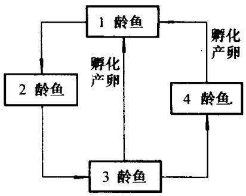

<details>
<summary>flowchart</summary>

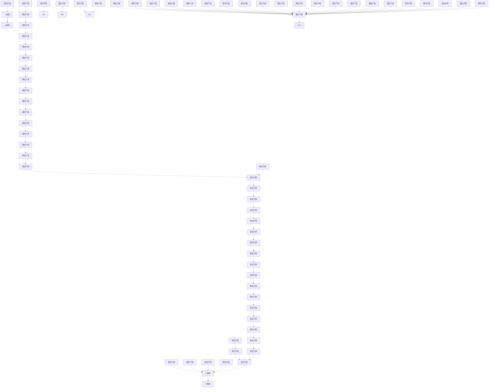
```mermaid
graph TD
  A["1 龄鱼"] --> B["2 龄鱼"]
  C["4 龄鱼"] --> D["3 龄鱼"]
  E["孵化产卵"] -.-> A
  F["孵化产卵"] -.-> C
  G["孵化产卵"] -.-> C
  H["孵化产卵"] -.-> C
  I["孵化产卵"] -.-> C
  J["孵化产卵"] -.-> C
  K["孵化产卵"] -.-> J
  L["孵化产卵"] -.-> K
  M["孵化产卵"] -.-> J
  N["孵化产卵"] -.-> M
  O["孵化产卵"] -.-> N
  P["孵化产卵"] -.-> O
  Q["孵化产卵"] -.-> P
  R["孵化产卵"] -.-> Q
  S["孵化产卵"] -.-> R
  T["孵化产卵"] -.-> S
  U["孵化产卵"] -.-> T
  V["孵化产卵"] -.-> U
  W["孵化产卵"] -.-> V
  X["孵化产卵"] -.-> W
  Y["孵化产卵"] -.-> X
  Z["孵化产卵"] -.-> Y
  AA["孵化产卵"] -.-> Z
  AB["孵化产卵"] -.-> AA
  AC["孵化产卵"] -.-> AB
  AD["孵化产卵"] -.-> AC
  AE["孵化产卵"] -.-> AD
  AF["孵化产卵"] -.-> AE
  AG["孵化产卵"] -.-> AF
  AH["孵化产卵"] -.-> AG
  AI["孵化产卵"] -.-> AH
  AJ["孵化产卵"] -.-> AI
  AK["孵化产卵"] -.-> AJ
  AL["孵化产卵"] -.-> AK
  AM["孵化产卵"] -.-> AL
  AN["孵化产卵"] -.-> AM
  AO["孵化产卵"] -.-> AN
  AP["孵化产卵"] -.-> AO
  AQ["孵化产卵"] -.-> AP
  AR["孵化产卵"] -.-> AQ
  AS["孵化产卵"] -.-> AR
  AT["孵化产卵"] -.-> AU
  AV["孵化产卵"] -.-> AW
  AX["孵化产卵"] -.-> AZ
  BA["孵化产卵"] -.-> AC
  AY["孵化产卵"] -.-> AZ
  AZE["孵化产卵"] -.-> ACY
  AYE["孵化产卵"] -.-> AZE
  AYF["孵化产卵"] -.-> AZE
  AYG["孵化产卵"] -.-> AZE
  AYH["孵化产卵"] -.-> AZE
  AYI["孵化产卵"] -.-> AZE
  AYJ["孵化产卵"] -.-> AZE
  AYK["孵化产卵"] -.-> AZE
  AYL["孵化产卵"] -.-> AZE
  AYM["孵化产卵"] -.-> AZE
  AYN["孵化产卵"] -.-> AZE
  AYO["孵化产卵"] -.-> AZE
  AYP["孵化产卵"] -.-> AZE
  AYQ["孵化产卵"] -.-> AZE
  AYR["孵化产卵"] -.-> AZE
  AYS["孵化产卵"] -.-> AZE
  AYT["孵化产卵"] -.-> AZE
  AYU["孵化产卵"] -.-> AZE
  AYV["孵化产卵"] -.-> AZE
  AYW["孵化产卵"] -.-> AZE
  AYX["孵化产卵"] -.-> AZE
  AYZ["孵化产卵"] -.-> AZE
```
</details>

各龄鱼的转化图

## 7. 模型建立大纲

（1）以第6点的第一个假设为基础，建立一个简单的模型I，其实质上是联立以上分析

的几个方程成为一个方程组.

(2) 以第6点的第二个假设为基础，建立改进模型II, 使得方程组中的一个方程 $x_{4}(0) = x_{3}(1)$ 被方程 $x_{4}(0) = x_{3}(1) + x_{4}(1)$ 代替即可.  
(3) 假设鱼群产卵过程是一种连续的过程，使假设更加接近实际情况，得到模型 III.

## （二）对于问题二的分析

## 1. 与问题一的相似之处

由于对各年龄组鱼群数量起到影响作用的各因素(例如：平均死亡率、成活率、捕捞期等)不变，因此，在每年内各年龄组的鱼群数量变化情况与问题一相类似.

## 2. 与问题一的不同之处，主要区别在于

（1）问题一要求持续捕获，问题二只要求鱼量不受到太大的破坏，不限制各年龄组年初鱼群的数量，因此作为约束条件的方程组中各年龄组的鱼量肯定与年数有关，而不像问题一是常量.  
(2) 问题一中的各变量呈周期变化, 因此, 只要考虑一个周期的变化情况即可. 而问题二则不同, 其各年的初始值在变化, 因此, 要考虑每一年的捕获量, 再将 5 年求和, 得到一个目标函数.

综合以上两点，可以得到一个优化问题.

## 3. 根据优化问题提出了三个模型

模型 I：简化使得每一年的捕捞强度系数相同，化为一元函数最优值的求解问题.

模型 II: 考虑每一年的捕捞强度系数不同, 得到一个多元函数最优值的求解问题.

模型 III：对问题中的不太大破坏程度下个定义，再给出一个关于破坏程度的惩罚，利用多元函数最优值的求解方法进行求解.

## 4. 对不太大破坏程度的定义

由于 4 龄鱼 4 年的死亡及两年的捕捞造成的数量减少远远大于其它年龄组的鱼, 以至到末期时的数量相对于整个鱼群的数量是十分微小的. 因此 4 龄鱼的减少量对生产能力的破坏可以忽略不计, 而只考虑 1、2、3 龄鱼的数量要求. 不妨定义不太大破坏程度为第 1、2、3 龄鱼减少数量不得大于初始数量的某个百分比, 例如在模型 III 中我们取值为 30%.

## 四、模型的建立

问题一

模型I：在假设4龄鱼年底退出系统和持续捕获前提下如何得到高年收获量.由问题分析可知，可得以下优化问题

$$
\max H = \int_ {0} ^ {\frac {2}{3}} s (t)   \mathrm{d} t  ,   s (t)   \text {见问题分析}, \tag {2.1}
$$

$$
\left\{ \begin{array}{l l} \frac {\mathrm{d} x _ {1} (t)}{\mathrm{d} t} = - a x _ {1} (t), & t \in [ 0, 1 ], \\ \frac {\mathrm{d} x _ {2} (t)}{\mathrm{d} t} = - a x _ {2} (t), & t \in [ 0, 1 ], \\ \frac {\mathrm{d} x _ {3} (t)}{\mathrm{d} t} = - 0. 4 2 k x _ {3} - a x _ {3} (t), & t \in \left[ 0, \frac {2}{3} \right], \\ \frac {\mathrm{d} x _ {3} (t)}{\mathrm{d} t} = - a x _ {3} (t), & t \in \left[ \frac {2}{3}, 1 \right], \\ \frac {\mathrm{d} x _ {4} (t)}{\mathrm{d} t} = - k x _ {4} - a x _ {4} (t), & t \in \left[ 0, \frac {2}{3} \right], \\ \frac {\mathrm{d} x _ {4} (t)}{\mathrm{d} t} = - a x _ {4} (t), & t \in \left[ \frac {2}{3}, 1 \right]. \end{array} \right.
$$

解(I) 得到

$$
\begin{array}{l} x _ {3} (0) = \\ \frac {1 . 2 2 \times 1 0 ^ {1 1}}{\mathrm{e} ^ {2 a}} = \frac {1 . 2 2 \times 1 0 ^ {1 1}}{1 . 1 0 9 \times 1 0 ^ {5} \left[ 0 . 5 \mathrm{e} ^ {\frac {- 2 \times 0 . 4 2 k}{3}} + \mathrm{e} ^ {\frac {- 2 - 2 \times 0 . 4 2}{3} k - \frac {2}{3} a} \right]}.\tag {2.2} \\ \end{array}
$$

求解过程见附录.

将(2.2)式代入目标函数(2.1)式中得到 $H$ 关于 $k$ 的一元函数，再利用一维搜索法求一元函数的最小值的方法，上机求得 $H$ 的最大值， $k = 17.36$ ； $H = 3.887 \times 10^{5}$ （吨），即 $k = 17.36$ 时 $H$ 取最大；

模型 II: 进一步假设 4 龄鱼在年末的特征不变, 仍当作 4 龄鱼, 则在持续捕捞的情况下, 求得最大捕获量.

此模型类似模型 I，也可得到优化问题，区别仅在式中改为

$$
x _ {4} (0) = x _ {3} (1) + x _ {4} (1)
$$

同理解得

$$
\begin{array}{l} x _ {3} (0) = \\ \frac {1 . 2 2 \times 1 0 ^ {1 1}}{\mathrm{e} ^ {2 a}} - \frac {1 . 2 2 \times 1 0 ^ {1 1}}{\left[ 0 . 5 \mathrm{e} ^ {\frac {- 2}{3} (0 . 4 2 k - a)} + \frac {\mathrm{e} ^ {\frac {- 2 . 8 4 k}{3} - \frac {5}{3} a}}{1 - \mathrm{e} ^ {\frac {- 2 k}{3} a}} \right]} \\ \end{array}
$$

再重复模型 II 的步骤解得 k = 17.36， $H_{max} = 3.887 \times 10^{5}$ （吨）.

模型 III：实际生活中，鱼的产卵过程不可能在瞬间完成，它应该是一个连续的过程，但鱼量各时刻的数量不同且产卵比例未知，因此问题十分复杂。为了简化模型，我们用8月底瞬间产卵数量和12月底产卵数量的平均来代替连续的总产量，即

$$
n = 1. 1 0 9 \times 1 0 ^ {5} \left[ 0. 5 \mathrm{e} ^ {- 0. 2 8 k - \frac {5 a}{6}} + \frac {\mathrm{e} ^ {- 2 . 8 4 k - \frac {1 5 a}{6}}}{1 - \mathrm{e} ^ {\frac {- 2 k}{3} a}} \right] \times x _ {3} (0).
$$

同理可解得 $k = 17.02, H_{\max} = 3.876 \times 10^{5}$ (吨).

问题二

在已知初始鱼量的情况下，制定一个最优策略，使承包5年的公司在生产能力破坏不太大的前提下，获得最大捕鱼量.

根据问题的分析可以得到以下这个优化问题

$$
\begin{array}{l} \max H = \max \sum_ {i = 1} ^ {s} (s _ {3} [ i ] + s _ {e} [ i ]) \\ \left\{ \begin{array}{l l} \frac {\mathrm{d} x _ {i , 1} (t)}{\mathrm{d} t} = - a x _ {i, 1} (t), & t \in [ 0, 1 ], \\ \frac {\mathrm{d} x _ {i , 2} (t)}{\mathrm{d} t} = - a x _ {i, 2} (t), & t \in [ 0, 1 ], \\ \frac {\mathrm{d} x _ {i , 3} (t)}{\mathrm{d} t} = - 0. 4 2 k _ {i} x _ {i, 3} - a x _ {i, 3} (t), & t \in \left[ 0, \frac {2}{3} \right], \\ \frac {\mathrm{d} x _ {i , 3} (t)}{\mathrm{d} t} = - a x _ {i, 3} (t), & t \in \left[ \frac {2}{3}, 1 \right], \\ \frac {\mathrm{d} x _ {i , 4} (t)}{\mathrm{d} t} = - k x _ {i, 4} - a x _ {4} (t), & t \in \left[ 0, \frac {2}{3} \right], \\ \frac {\mathrm{d} x _ {i , 4} (t)}{\mathrm{d} t} = - a x _ {i, 4} (t), & t \in \left[ \frac {2}{3}, 1 \right]. \end{array} \right. \\ \end{array}
$$

模型 1: 令每一年的捕捞强度系数为一固定值, 即 $k_{i}=k$ ; 这样与问题一相似, 利用一元函数极值的求解方法, 得到 k=17.58, $H_{\max}=1.605\times10^{6}$ (吨).

模型 2：假设每年的捕捞强度系数都不相同，即 $k_{i}$ 与 i 有关，且 $k_{i}$ 相互独立，则上面的优化问题可利用下坡单纯形多元函数极值解法求得

$$
\begin{array}{l} k _ {1} = 1 3. 1 8, \quad k _ {2} = 1 4. 3 5, \quad k _ {3} = 2 8. 4 6, \\ k _ {4} = 3 2. 4 2, \quad k _ {5} = 2 6. 6 2. \\ \end{array}
$$

模型3：由分析中的生产能力不太大的破坏程度的假设，给一个惩罚函数如下：当 $p > 30\%$ 时， $r(p) = -m \times \mathrm{e}^{5p}$ ，而当 $p \ll 30\%$ 时， $r(p) = 0$ （惩罚因子 $m = 1 \times 10^{12}$ ），将其加到优化问题的约束条件中去，再利用下坡单纯形算法得到

$$
\begin{array}{l} k _ {1} = 1 2. 8 2, \quad k _ {2} = 1 3. 5 5, \quad k _ {3} = 3 3. 9 5, \\ k _ {4} = 3 0. 9 5, \quad k _ {5} = 2 6. 4 0. \\ \end{array}
$$

## 五、模型结果的检验

1. 各模型结果的横向比较：经过计算机的多次运行，各模型的结果都能稳定在一个或一组数值左右，说明了解的稳定性比较好。

2. 各模型结果的纵向比较：

（1）问题1中模型I、II、III的解非常相近，说明4龄鱼在年末的鱼量对问题解的影响不大，正好与假设3相吻合，证明了假设3的合理性.  
(2) 在解模型 I、II 的时，可以看到 $x_{3}(0)$ 关于 $k$ 的表达式只差一个系数，当 $k$ 取模型 I 的解时，这个系数几乎为 1，这就很好的说明了两个模型的目标函数接近的原因。

(3) 问题一的模型 I 与问题二的模型 I 相比较, 可以看出这两个 $k$ 也非常近似, 拿计算机最后计算的结果来分析, 我们可以看到第二问的初值与第一问的稳定值比较接近, 因此其解也比较相近.

(4) 最后一个模型的结果告诉我们在第1、2年里捕捞强度系数较小，主要是投资阶段。第3、4年的捕捞强度系数最大，因为前两年的投资使小鱼长成大鱼，正好捕捞。第5年捕捞率下降，是由于前两年过度的捕捞再加上生产能力不太大破坏的限制所制。这个过程与实际也比较符合。

## 六、模型的优缺点

优点：

1. 6个模型的建立过程体现了模型由简到繁的过程，并且在问题二中的三个模型都是是将连续(每年内的变化)和离散(各年的年初和年末的鱼群数量)相结合.  
2. 在模型结果的检验中，我们通过6个模型结果的纵向比较，说明了假设的合理性.  
3. 每个模型的数值都通过计算机来解得，而且得到的解与实际情况相吻合，都能用一般的常识来解释，解的稳定性也很好。  
4. 本题用到的数学方法, (如常微分方程和一元函数极值求解等) 都比较简单易懂.  
5. 在建立模型时, 各年龄组的分法与模型无关, 因此, 可将其推广.

缺点：

1. 在禁捕期内的3、4龄鱼的产卵过程连续化上有所欠缺，但在模型的改进方向上已提出了一些有关这方面的想法。  
2. 本题没有考虑资源的限制，这与实际情况不相符，因此，降低了模型的实用性。

## 七、模型的改进方向

1. 在问题一中的模型 III 虽然提出了产卵和孵化应是连续过程，但求解的过程实质上还是用离散的过程代替了连续过程，因此可以在此方向上进行改进。可以假设该过程是随机的过程，又可以分为两种：

(1) 每个时刻 t, 3、4 龄鱼都以固定的概率产卵；  
(2) 每个时刻 $t, 3, 4$ 龄鱼都以可变概率 $q(t)$ 产卵. 这样又可以引入两个模型.  
2. 对 4 龄鱼在每年年末的情况还可以再分一种情况：设其为与前面无关的第 5 类鱼，再根据有关的资料查出产卵量与年龄的关系，得到一个数学表达式，从而改进模型.  
3. 在问题二中的模型 III, 其解题方法只在模型 II 的约束条件中加了一个惩罚函数. 最后仍用多元函数求值的方法来求解. 我们可以用运筹学中的惩罚函数的外点法求其最优解.

## 参考文献

[1] E.C. 皮洛，数学生态学引论，科学出版社，北京，1978.  
[2] 姜启源，数学模型，高等教育出版社，北京，1993.  
[3] 朱元鼎，王文浜，中国动物图谱(鱼类)，科学出版社，北京，1973.  
[4] 陆健健等(译)，生态模型法原理，上海翻译出版公司，上海，1988.  
[5] 郭耀煌等，运筹学原理与方法，西南通大学出版社，重庆，1994.

## 附录

微分方程求解过程

$$
\left\{ \begin{array}{l l} \frac {\mathrm{d} x _ {1} (t)}{\mathrm{d} t} = - a x _ {1} (t), & t \in [ 0, 1 ], \\ \frac {\mathrm{d} x _ {2} (t)}{\mathrm{d} t} = - a x _ {2} (t), & t \in [ 0, 1 ], \\ \frac {\mathrm{d} x _ {3} (t)}{\mathrm{d} t} = - 0. 4 2 k _ {i} x _ {| 3 |} (t) - a x _ {3} (t), & t \in \left[ 0, \frac {2}{3} \right], \\ \frac {\mathrm{d} x _ {3} (t)}{\mathrm{d} t} = - a x _ {3} (t), & t \in \left[ \frac {2}{3}, 1 \right], \\ \frac {\mathrm{d} x _ {4} (t)}{\mathrm{d} t} = - k x _ {4} - a x _ {4} (t), & t \in \left[ 0, \frac {2}{3} \right], \\ \frac {\mathrm{d} x _ {4} (t)}{\mathrm{d} t} = - a x _ {4} (t), & t \in \left[ \frac {2}{3}, 1 \right]. \end{array} \right.
$$

由(1)式两边对 $t$ 积分 $\int_{x_0}^{x}\frac{\mathrm{d}x_1(t)}{x_1(t)} = \int_0^1 -a\mathrm{d}t$ ，得

$$
x _ {1} (1) = x _ {1} (0) \mathrm{e} ^ {- a}.
$$

同理对(2)式积分得 $x_{2}(1) = x_{2}(0)\mathrm{e}^{-a}$

(3) 式对 $t$ 从 0 到 $\frac{2}{3}$ 积分 $\int_{x_0}^{x} \frac{\mathrm{d}x_3(t)}{x_3(t)} = \int_{\theta}^{\frac{2}{3}} (-0.42k - a)\mathrm{d}t$ ，得

$$
x _ {3} \bigg (\frac {2}{3} \bigg) = x _ {3} (0) \mathrm{e} ^ {- \frac {2}{3} (0. 4 2 k + a) t}.
$$

对 $t \in \left[0, \frac{2}{3}\right]$ 积分，得到 $x_{3}(t) = x_{3}(0)\mathrm{e}^{-(0.42k + a)t}$ .

(4) 式对 $t$ 从 $\frac{2}{3}$ 到 1 积分，得 $x_{3}(1) = x_{3}(0)\mathrm{e}^{-(0.28k + a)}$ .

同上分别对(5)、(6)式积分，得

$$
x _ {4} \left(\frac {2}{3}\right) = x _ {4} (0) \mathrm{e} ^ {- \frac {2}{3} (k + a)},
$$

$$
x _ {4} (x) = x _ {4} (0) \mathrm{e} ^ {- (k + a) t},
$$

$$
x _ {4} (1) = x _ {4} (0) \mathrm{e} ^ {- \frac {2}{3} (k + a)}.
$$

所以由模型假设，鱼产卵数

$$
\begin{array}{l} n = 1. 1 0 9 \times 1 0 ^ {5} \times \left[ \frac {1}{2} x _ {3} \left(\frac {2}{3}\right) + x _ {4} \left(\frac {2}{3}\right) \right] \\ = 1. 1 0 9 \times 1 0 ^ {5} \times \left[ \frac {1}{2} x _ {3} (0) \mathrm{e} ^ {- (0. 2 8 k + \frac {2}{3} a)} + x _ {4} (0) \mathrm{e} ^ {- \frac {2}{3} (k + a)} \right]. \\ \end{array}
$$

因为第二年年初1龄鱼的数量为 $n \times \frac{1.22 \times 10^{11}}{1.22 \times 10^{11} + n}$ ，而由稳定的条件可知

$$
x _ {1} (0) = n \times \frac {1 . 2 2 \times 1 0 ^ {1 1}}{1 . 2 2 \times 1 0 ^ {1 1} + n}.
$$

又因为 $x_{3}(0) = x_{1}(0)\mathrm{e}^{-2a}$ ，所以得到

$$
x _ {3} (0) \mathrm{e} ^ {2 a} = 1. 1 0 9 \times 1 0 ^ {5} \times \left[ \frac {1}{2} x _ {3} (0) \mathrm{e} ^ {- (0. 2 8 k + \frac {2}{3} a)} + x _ {4} (0) \mathrm{e} ^ {- \frac {2}{3} (k + a)} \right].
$$

# 最优捕鱼策略

## 唐 进 曾 宁 李 静

(中南工业大学, 长沙 410043)

指导教师 刘新歌

编者按 该文对问题一的推导正确,叙述简练,得到的结果具有参考价值.

摘要 社会经济生活中,我们常遇到商业活动在一段时期内的最大收益问题,如森林管理等.这时,我们不仅要考虑商业活动的当前经济效益,还要考虑生态效益及由此产生的对整体经济效益的影响.

本文涉及的问题是渔业管理,即对一固定的渔场,在一段时间内,如何实现最大的收益,同时保证渔场能稳定生产,我们的基本思路是:考虑渔场生产过程中的两个相互制约的因素,年捕捞能力和再生产能力,从而确定最优管理策略.我们用微分方程来描述渔场鱼群数量随时间变化的规律,在此基础上确定整体效益为我们的目标函数,以渔场生产的稳定性要求为约束条件,分别对长期生产和固定期生产两种情况建立了规划模型.

在对长期生产模型的求解中,我们利用约束条件将目标函数化为一元函数,用计算机数值法确定近似的最优解.而在对固定期生产模型求解中,我们则构造一个整体效益函数,综合考虑年捕捞能力和年再生产能力,用计算机数值解法进行搜索逐年确定各年的最优策略,从而得出五年的总最优策略.

最后,我们对模型的稳定性进行定量的分析,并对模型进行了检验,确定模型较好地反映渔场最优捕鱼策略问题.

## 一、问题的重述

为了保护人类赖以生存的自然环境,可再生资源(如渔业、林业资源)的开发必须适度.一种合理、简化的策略是在实现可持续收获的前提下,追求最大产量或最佳效益.要求研究的问题是:对某种鱼的最优捕捞策略.

## 1.1 鱼的情况

假设这种鱼分4个年龄组：1、2、3、4龄鱼.各年龄组每条鱼的平均重量分别为5.07、11.55、17.86、22.99(克)；各年龄组的鱼自然死亡率均为0.8(1/年)；这种鱼为季节性集中产卵繁殖，平均每条4龄鱼的产量为 $1.109\times10^{5}$ （个），3龄鱼的产卵量为这个数的一半，2龄鱼和1龄鱼不产卵，产卵和孵化期为每年的最后4个月；卵孵化并成活为1龄鱼，成活率(1龄鱼条数与产卵总量n之比)为 $1.22\times10^{11}/(1.22\times10^{11}+n)$ .

具体数据如下表

<table><tr><td>i</td><td> $m_{i}(g)$ </td><td>r(1/年)</td><td> $u_{i}$ (个/条)</td></tr><tr><td>1</td><td>5.07</td><td>0.8</td><td>0</td></tr><tr><td>2</td><td>11.55</td><td>0.8</td><td>0</td></tr><tr><td>3</td><td>17.86</td><td>0.8</td><td> $0.5545 \times 10^{5}$ </td></tr><tr><td>4</td><td>22.99</td><td>0.8</td><td> $1.109 \times 10^{5}$ </td></tr></table>

其中， $i$ 表示 $i$ 龄鱼， $m_{i}$ 表示 $i$ 龄鱼的质量， $r$ 表示 $i$ 龄鱼的自然死亡率， $u_{i}$ 表示平均每条 $i$ 龄鱼的产卵量.

该鱼的产卵和孵化期为每年的最后4个月，卵孵化成活1龄鱼，成活率(1龄鱼条数与产卵总量 $n$ 之比)为 $1.22 \times 10^{11} / (1.22 \times 10^{11} + n)$ .

又渔业管理部门规定,每年只允许在产卵孵化期前的8个月内进行捕捞作业.如果每年投入的捕捞能力(如渔船数、下网次数等)固定不变,这时单位时间捕捞量将与i成正比,比例系数称捕捞强度系数 $k_{i}$ .通常使用13mm网眼的拉网,这种网只能捕捞3、4龄鱼,其两个捕捞强度系数之比为 $k_{3}:k_{4}=0.42:1,k_{1}=k_{2}=0$ .渔业上称这种方式为固定努力量捕捞.

## 1.2 问题

1) 建立数学模型分析如何实现可持续捕捞(即每年开始捕捞时渔场中各年龄组鱼条数不变), 且在此前提下得到最高的年收获量(捕捞总量).  
2）某渔业公司承包这种鱼的捕捞业务5年，合同要求5年后鱼群的生产能力不能受太大的破坏。已知承包时各年龄组鱼群的数量分别为 $x_{1}, x_{2}, x_{3}, x_{4}$ ，如果仍用固定努力量的捕捞方式，该公司采取怎样的策略才能使总收获量最高。

## 二、记号的约定

$x_{i}(t)$ ： $i$ 龄鱼在 $t$ 时刻的数量；( $t$ 以年为单位， $i = 1,2,3,4)$

$p_{i}$ : i 龄鱼的捕捞; (i = 3,4)

M: 捕捞总质量;

Q：每年的产卵中能孵化成1龄鱼的数量；

N: 每年的产卵量.

## 三、模型的建立

由于鱼的数量随时间变化,我们视 $x_{i}(t)$ 为连续函数,它的变化与时间 t、自然死亡率 r、单位时间捕捞量 $k_{i}$ 、卵的成活率有关.

基本假设

假设 I: 一年中, 鱼的产卵是集中在 8 月底一次性完成, 捕捞工作只在前 8 个月进行.

假设Ⅱ:各龄鱼(不包括4龄鱼)只在年末瞬时才长大一岁.鱼卵在年终才孵化完毕,成为1龄鱼.这样在计算产卵量时,3、4龄鱼的条数为 $t = 8/12$ .

定义 单位死亡率

$$
\frac {\mathrm{d} x _ {i}}{\mathrm{d} t} = - r x _ {i}, \qquad r = 0. 8,
$$

单位时间捕捞量

$$
\frac {\mathrm{d} p _ {i}}{\mathrm{d} t} = k _ {i} x _ {i}, \quad k _ {s}: k _ {4} = 0. 4 2: 1, \quad k _ {1} = k _ {2} = 0
$$

则捕捞时

$$
\frac {\mathrm{d} p _ {i}}{\mathrm{d} t} = - \left(r + k _ {i}\right) x _ {i}
$$

对各龄鱼存在以下方程(令 $k = k_{4}$ 则 $k_{3} = 0.42k$ )

$$
\frac {\mathrm{d} x _ {1} (t)}{\mathrm{d} t} = - 0. 8 x _ {1}, \quad t \in [ 0, 1 ],
$$

$$
\frac {\mathrm{d} x _ {2} (t)}{\mathrm{d} t} = - 0. 8 x _ {2}, \quad t \in [ 0, 1 ],
$$

$$
\left\{ \begin{array}{l} \frac {\mathrm{d} x _ {3} (t)}{\mathrm{d} t} = - (0. 8 + 0. 4 2) x _ {3}, \quad t \in [ 0, 8 / 1 2 ], \\ \frac {\mathrm{d} x _ {3} (t)}{\mathrm{d} t} = - 0. 8 x _ {3}, \quad t \in [ 8 / 1 2, 1 ], \end{array} \right.
$$

$$
\left\{ \begin{array}{l} \frac {\mathrm{d} x _ {4} (t)}{\mathrm{d} t} = - (0. 8 + k) x _ {4}, \quad t \in [ 0. 8 / 1 2, 1 ], \\ \frac {\mathrm{d} x _ {4} (t)}{\mathrm{d} t} = - 0. 8 x _ {4}, \quad t \in [ 8 / 1 2, 1 ], \end{array} \right.
$$

由此可解得

$$
x _ {1} (1) = \exp (- 0. 8) \dot {x} _ {1} (0),
$$

$$
x _ {2} (1) = \exp (- 0. 8) x _ {2} (0),
$$

$$
x _ {3} (8 / 1 2) = \exp (- (0. 8 + 0. 4 2 k) \times 2 / 3) x _ {3} (0),
$$

$$
x _ {4} (8 / 1 2) = \exp (- (0. 8 + k) \times 2 / 3) x _ {4} (0),
$$

$$
x _ {3} (1) = \exp (- (0. 8 + 0. 2 8 k)) x _ {3} (0),
$$

$$
x _ {4} (1) = \exp (- (0. 8 + 2 k / 3) x _ {4} (0),
$$

收获量为

$$
p _ {3} = \int_ {0} ^ {\frac {8}{1 2}} 0. 4 2 k x _ {3} (t) \mathrm{d} t, p _ {4} = \int_ {0} ^ {\frac {8}{1 2}} x _ {4} (t) \mathrm{d} t,
$$

要实现持续捕获, 即每年初, 各个年龄组鱼群数量不变, 同时须满足以下等式 (n 为卵量, u 为平均每条 4 龄鱼产卵量), 由此可建立模型 II

$$
\begin{array}{l} \max (M) \\ M = p _ {3} m _ {3} + p _ {4} m _ {4}, \\ \mathrm{s.t} \left\{ \begin{array}{l} x _ {1} (0) = Q, \\ x _ {2} (0) = x _ {1} (1), \\ x _ {3} (0) = x _ {2} (1), \\ x _ {4} (0) = x _ {3} (1) + x _ {4} (1) \end{array} \right. \\ \end{array}
$$

其中

$$
\begin{array}{l} N = (1. 1 0 9 x _ {3} / 2 + 1. 1 0 9 x _ {4} \times 1 0 ^ {5}), \\ Q = 1. 2 2 \times 1 0 ^ {1 1} \times N / (1. 2 2 \times 1 0 ^ {1 1} + N). \\ \end{array}
$$

模型Ⅱ的求解：

利用约束关系, 将 $x_{1}(0), \cdots, x_{4}(0)$ 均用 K 来表示, 从而得出 M 关于 K 的一元函数关系

$$
\begin{array}{l} M = m _ {3} \times p _ {3} + m _ {4} \times p _ {4}, \\ p _ {3} = 0. 4 2 \times k \times x _ {3} (0) \times (1 - \exp (- 0. 8 + 0. 4 2 k) \times 2 / 3) / (0. 8 + 0. 4 2 k), \\ \end{array}
$$
$$
\begin{array}{l} p _ {4} = k \times x _ {4} (0) \times (1 - \exp (- (0. 8 + k) \times 2 / 3)) / (0. 8 + k), \\ x _ {3} (0) = 0. 2 4 6 3 \times 1 0 ^ {1 1} - 3. 7 5 0 4 \times 1 0 ^ {6} \times \exp (0. 2 8 k), \\ \times (2. 2 2 6 - \exp (- 2 \times k / 3) / (2. 2 2 6 + \exp (- 2 \times k / 3)). \\ x _ {4} (0) = \exp (- 0. 2 8 k) \times 1 0 ^ {1 1} / (9. 0 2 7 2 - 4. 0 5 9 8 \times \exp (- 2 \times k / 3), \\ - 1. 2 2 \times 1 0 ^ {6} / (0. 7 2 4 1 + 0. 3 2 5 2 \times \exp (- 2 \times k / 3)), \\ \end{array}
$$

用计算机搜索,得出 K 的近似解.计算结果为

年最大收获量： $M^{*}(0)=3.88685\times10^{11}$ 克

最佳捕捞强度系数： $K^{*}=17.7600$ 克

此时

$$
x _ {1} ^ {*} (0) = 1. 1 9 3 \times 1 0 ^ {1 1} \text {条}, \quad x _ {2} ^ {*} (0) = 5. 3 6 0 \times 1 0 ^ {1 0} \text {条},
$$

$$
x _ {3} ^ {*} (0) = 2. 4 0 9 \times 1 0 ^ {1 0} \text {条}, \quad x _ {4} ^ {*} (0) = 7. 6 6 1 \times 1 0 ^ {7} \text {条}
$$

$$
Q ^ {*} (0) = 1. 1 9 3 \times 1 0 ^ {1 1} \text {条}.
$$

## 四、模型的结果及实用性讨论

## 问题(1)的最优解

当 $K \in [0,31.38]$ 时，渔场可实现持续捕捞，即满足了持续捕捞条件 $M \geqslant 0$ 。在此前提下，取得最优的捕捞系数，3龄鱼的捕捞系数为7.4592，4龄鱼的捕捞系数为17.76年最大捕捞量为 $3.88685 \times 10^{11}$ （克）。

为获得工业问题的解决的数学/统计模型的创造以及计算机模拟算法的研究就是在严格意义下所谓的工业数学科学，或简称为工业数学。（原文:The creation of mathematical/statistical models and the development of algorithms for computer simulation to obtain solutions for problems of industry are what we in a strict sense call industrial mathematical sciences or, simply, industrial mathematics.）

A. Friedman, J. Lavery, How to start an industrial mathematics program in the university, - Science and Industry Advance with Mathematics - SIAM, 1993, p. 7.

# 最优捕鱼策略问题答卷评述

## 北京师范大学

## 刘来福

资源和环境的合理开发和保护是国民经济发展中的一个十分重要问题，特别是可再生资源的持续开发和利用的问题已经是一个全世界关注热点话题。渔业的可持续开发的问题是应用数学来研究资源利用的一个成功的例子，“最优捕鱼策略”这个问题就是在这个背景下提出来的，意图使大家了解如何把数学应用于探讨资源和环境的合理开发和利用。

这个问题是来自关于渔业资源开发利用的研究工作，为适应竞赛的实际情况对问题进行了适当的加工和简化，数据也是实际的观测数据。类似的问题我曾经在《大学生数学建模辅导材料》一书中做过介绍。与之比较，题目中给出的鱼类种群的死亡过程是连续的，集中的季节性的产卵表明繁殖是离散的，形成的种群的世代是分明的。因此鱼类种群在年龄上可以理解为离散变化的，鱼类种群的繁殖行为是非线性的，而渔业捕捞作业只在鱼类生长过程的部分时间进行。应该说这些都使得我们所讨论的问题更接近于渔业生产的实际，当然也增加了问题的复杂性。最后得到的目标函数（通常称之为产量努力量——捕捞强度函数）已经足够复杂，使用解析的方法是很难进行分析的，必须要掌握计算机编程的技巧来解决这个优化问题。第一问虽然复杂但比较规范，难度并不很高。第二问中的“五年后鱼群的生产能力不能受到太大的破坏”的提法较前多了一些灵活性，可以按照不同的理解和方法来处理这个问题。

这次竞赛多数同学都做了这个题目．从答卷上看，同学们做题是努力的，也很认真。有些答卷是相当优秀的，也有不少的答卷存在着这样或那样的问题，其中多数发生在对问题的理解上．主要有如下几点：

1. 捕捞强度系数。这个概念题目中交代的十分清楚，它是单位时间捕捞量与鱼群条数成正比时的比例系数。如果用数学语言来表示就是：只考虑捕捞对种群变化的影响，则在 $[t, t + \Delta t]$ 这段时间内鱼类种群由捕捞产生的变化量（捕捞量）为 $N(t) - N(t + \Delta t)$ ，单位时间的捕捞量是 $[N(t) - N(t + \Delta t)]\Delta t$ 。当它与鱼群的大小成正比时应该有关系

$$
\frac {N (t) - N (t + \Delta t)}{\Delta t} = q N (t),
$$

这个关系应该对任何的时间间隔 $\Delta t$ 都成立. 于是, 令 $\Delta t \to 0$ 就得到方程 $\mathrm{d}N / \mathrm{d}t = -qN$ , 捕捞强度系数应该理解为满足这个关系的量 $q$ . 如果直接把它理解为捕捞的百分率是不恰当的.

2. 关于鱼类的“季节性集中繁殖”问题。应该说这里对这种鱼类的繁殖行为的特征已经交代清楚了，问题中还特别指出它的生物学背景：鳀鱼，以便于大家通过查阅文献资料得出更具体的印象。为了用数学语言描述这种繁殖行为，应该通过假设对上述特征给出更明显确叙述。题目中说产卵孵化期是一年的最后四个月，而且是集中产卵，那么假设产卵均匀地分布在整个四个月期间内是不合适的。因为从我们的生物学常识也可以知道鱼的产卵繁殖与鸡的产卵繁殖不同。再仔细分析一下就发现，如果在四个月均匀地产卵，那么这种鱼类应该每1.2分钟产一个卵，显然这不符合鱼类的生物学实际。有的队假设产卵的过程服从正态分布，在方差很小的前提下，这样的假设是可以的，但大大增加了问题的难度。在不失生物学的真实的前提下，使模型的分析尽量简单的假设应该是假设鱼群的个体在后四个月的第一天集中一次产卵。还可以使用后四个月的平均鱼群量来计算产卵的总数，这样处理与前面的假设没有本质的区别，但处理起来要复杂。

3. 议论比较多的是“自然死亡率为0.8(1/年)”这个提法，这是一个比较复杂的概念。因为它既不是简单的百分比率又不是简单的变化的速率。实际上它是百分比率的变化速率，它的具体含义与前面的捕捞强度的概念是一致的。由于在这个种群变化的模型中，时间是以变量的形式出现的，这个量是有量纲的，它的量纲单位必须是1/时间。它应该理解为鱼群是以每年死亡百分之八十的速度减少。由于死亡现象是在任意时刻瞬时发生的，它所导致的结果并不是在一年内恰好死亡百分之八十。因此它不同于每年死亡百分之八十的说法。后一个说法经常用于离散模型的参数，这时时间是以固定间隔（通常为单位时间，如：年）的离散量出现的，它不是模型中的变量。因此这时的死亡率仅仅是一个简单的百分率，是一个无量纲的量，否则将无法保持模型中量纲的平衡。因此在连续模型和离散模型中死亡率这个参数的给出方式是不同的。这个概念已经多次出现在数学模型的教材中。在介绍生物种群增长的数学模型时，它作为指数增长模型中的唯一的一个重要的参数，一般都称此为“增长率”或“自然增长率”。我们这里只是沿用了这个概念的习惯用法，量纲单位的使用实际上已经标志出简单的百分率与百分率的变化速率的区别。

4. 文中指出了所讨论的鱼分四个年龄组，并没有指明 4 龄以上的鱼如何对待。我们可以假设这种鱼只活到 4 龄，以后它就死掉了。也可以假设 4 龄以后的鱼仍然可能活着。在这两个假设下模型没有太大的差异。只是后者的分析计算过程稍复杂一些，计算的结果也只是稍有区别。

对问题的正确理解在建模过程中是非常重要的，它直接地影响到所建的模型是否正确地反映了实际情况，特别对捕捞强度系数和自然死亡率的不同的理解会导致计算结果的明显差异。尽管在这次改卷的过程中我们尽量降低了它们对答卷成绩的影响，但在我们解决实际问题时，必须要给予足够的重视。

这个问题所要组建的基本模型是在每年年初各年龄组的鱼群数量的迭代关系,它是一个与捕捞强度系数(或捕捞努力量)有关的离散模型. 模型的参数应该由各年龄组的鱼群在年内动态的连续模型估算出来, 由这个模型就可以得到由于捕捞而获得的渔获年产量(依赖于捕捞努力量的函数)模型. 这个函数就是优化的目标函数, 可持续捕捞应该在离散模型的平衡解处发生. 因此模型的平衡解的迭代关系就给出了优化问题的约束条件. 进一步分析表明, 它可以化为单参数(努力量)函数的极值问题. 编程在计算机上不难得到问题的答案: 2 龄组的捕捞强度为 7.29/年, 捕捞率为 89.7%; 4 龄组的捕捞强度为 17.36/年, 捕捞率为 95.6%; 最优可持续捕捞量 38.87 万吨; 可持续捕捞的鱼群大小(条数):

1 龄 $1.19 \times 10^{11}$ ，2 龄 $5.37 \times 10^{10}$ ，

3 龄 $2.41 \times 10^{10}$ ，4 龄 $8.4 \times 10^{7}$ .

问题的第二问灵活之处在于处理如何实现五年后保持鱼群的生产能力不受到太大的破坏，以及如何使用题目所要求的固定努力量的捕捞方式。由于所给的初始鱼群并不是可持续捕捞的鱼群，为了在五年内既得到最大的收益，又不破坏鱼群的生产能力，从数学上说应该是五年后鱼群尽量接近可持续捕捞鱼群的条件下来达到产量最高。至于如何实现尽量接近可持续捕捞种群，每个队的处理方式可以不尽相同。如果把不破坏生产力处理为使鱼群回到初始状态，这样做是不可能实现收益最大的。对于捕捞方式，题目只要求以固定努力量的方式捕捞，可以在五年内以同样的强度实现固定努力量的捕捞，也可以在不同的年份以不同的强度实现固定努力量的捕捞，这可以发挥每个队的创造能力。事实上在这一问许多队都给出了自己的处理方式。

## 数学在社会中的作用

尽管数学研究界的大多数人是以大学为基地的，但数学对社会的影响是无所不在的。数学支持着大多数当前的科学和技术活动。数学的全部新领域正是在对实验科学（生物学、化学、地球物理、医学科学），对政府（国防、安全），以及对商业（工业、技术、制造业、服务业、金融业）的各种问题的应答中发展的。现在，所有这些领域都需要对大量只具有松散结构的数据进行分析和管理，而且都要用数学模型来模拟现象和进行预测。对于缺乏观察数据或涉及大量的不确定性的诸如天文学、气候学以及公众政策分析等诸领域建模和模拟是必不可少的。处理这些复杂问题要求对所有的数学以及对新数学的出现不存先入之见。进展需要基本的理论思想以及在纯数学家、统计学家、计算机科学家和实验科学家之间的更大规模的合作。

未来的数学应用将需要数学科学家和更广阔领域的科学家和工程师之间更紧密的伙伴关系。为适应未来挑战的复杂性需要对整个数学科学各分支的洞察。这种发展的理论和工业影响将会是巨大的。表 3 说明了某些数学对社会的当前的和潜在的贡献。

科学总是用数学来阐明理论以及支持模拟和统计学以设计富有成效的实验。任何操作数字或符号的地方，操作都要依靠数学的关系式。随着高速计算机和传感器的出现，某些实验科学现在能生成大量的数据，人类基因组计划就是一个例子，为组织这些数据所需要的新工具以及从数据中抽取重要信息都有赖于数学科学。因此，现如今的数学科学对科学的所有的三个方面：观察、理论和模拟来说都是必不可少的。

下面的例子说明了数学有贡献于我们国家广泛关心的领域的若干方面：

国家安全 复杂通讯系统 声音、数据和电子 的安全要依靠数学上很复杂的工具。应急用储备物资的管理 不用进行试验的核武库的维护 是建立在数学建模和先进的计算的基础之上的。国家监视系统的运作需要广泛应用与数据的收集和分析有关的数学。由于以数学为基础的智能、后勤和作战系统的应用，军事系统正在变换。

(下转第190页)

## 10. 节水洗衣机(CUMCM 1996 年 B 题)

我国淡水资源有限,节约用水人人有责.洗衣在家庭用水中占有相当大的份额,目前洗衣机已非常普及,节约洗衣机用水十分重要.假设在放入衣物和洗涤剂后洗衣机的运行过程为:加水-漂洗-脱水-加水-漂洗-脱水-…-加水-漂洗-脱水(称“加水-漂洗-脱水”为运行一轮).请为洗衣机设计一种程序(包括运行多少轮、每轮加水量等),使得在满足一定洗涤效果的条件下,总用水量最少.选用合理的数据进行计算,对照目前常用的洗衣机的运行情况,对你的模型和结果作出评价.

(重庆大学 付 鹧提供)

## (上接第189页)

技术 在设计、制造和技术的应用中数学无处不在。没有数学的应用就不会有从微处理器到飞机发动机，从卫星通讯网络到家庭市场系统，以及从空中交通管制系统到膝上型计算机等的复杂系统。

教育 对于国家的安康来说,数学在教育劳动力中的作用是至关重要的。科学家和工程师要依靠数学科学,而且为为获得成就需要有坚实的数学基础。对于想要取得现代公民资格的一般公民来说,至少具有中学水平的数学基础是绝对必要的。数盲和文盲一样是极其有害的。

医学 诸如计算机辅助成像扫描仪、核图象显示器、核磁共振成像技术等现代医学成像系统的运作有赖于信号的数学处理。人类基因组计划的成功需要用数学来搜索把基因序列和人类疾病关联起来的信息。阐明蛋白质褶的复杂几何是理解蛋白质功能的关键。医院的病人病历记录的管理日益需要应用数学来构建有效的数据库。

金融 在度量风险以及对金融证券、金融机构和金融系统(单个的国家、贸易集团以及诸如国际结帐那样的全球体系)行为的建模。由于增加的数据、容量、算法的有效性以及计算速度,概率论和先进的金融模型的结合促进了利率、货币、商品、产权和其它的金融证券的复杂的建模。对于诸如风险的价值、信贷暴露的有价证券理论以及非线性证券等领域的更好的理解有赖于数学的应用。

环境的监测 建立海洋和大气的有效的模型以预测人类活动对环境的影响对于形成坚实的公共和管理政策是必不可少的。气候模型需要操作大量的数据和研究复杂的同时的相互作用(例如大气中许多微量化学物质间的相互作用。)所有这些模型都基于不确定性;为判定其有效性需要大量地用数学。

(下转第199页)

# 节水洗衣机的设计

韩春生 杨黎明 苟林

(杭州电子工学院, 杭州 310037)

指导教师 数模组

编者按 本文根据实际问题,在基本合理的设计基础上,分析了洗涤过程,建立了一个非线性约束的规划问题.该文还讨论了变化衣物的重量,洗涤剂“分配比例”系数等对总用水量的影响.

摘 要 根据全自动洗衣机在放入衣物和相应洗涤剂后,洗衣机“加水—漂洗—脱水”的循环运行过程,在分析了洗衣机内衣物与水对洗涤剂的吸附与溶解的平衡关系后,推导出了洗衣机“加水—漂洗—脱水”一轮后衣物上残留洗涤剂与加水量的数学关系.并证明了在总用水量和轮数一定时,各轮加水量相等时,洗涤效果最佳(最后一轮残留洗涤剂最少)的结论,从而能用较简单的计算机程序,解出在满足一定洗涤效果的条件下总用水量最少时,洗衣机需运行的轮数和每轮加水量,最后,选用一些衣物参数进行了计算和结果分析,并对模型的应用前景作了初步探讨.

## 1. 问题的提出与分析

在实际生活中,衣服的洗涤是一个十分复杂的物理化学过程.洗衣机运行过程可以理解为洗涤剂溶解在水中,通过水进入衣物并与衣物中的赃物结合,这种结合物易溶于水中,但衣物对这种结合物也有一定的吸附作用,可以认为在经过一定时间的漂洗后,它在水与衣物中的分配达到平衡.经过脱水,去除了溶于水中的洗涤剂及洗涤剂与赃物的结合物(统称为有害物).然后再注入清水,开始一个新的洗涤轮回,吸附于衣物中有害的大部分溶到水中,漂洗后达到一个新的分配平衡,然后再次脱水,使得衣物中的有害物逐渐减少.这种洗涤轮回循环下去,直至衣物中残留的有害物含量达到满意程度(即满足一定的洗涤效果)为止.

## 2. 模型建立与求解

为了建立衣物中的有害残留物与洗涤轮回数及每轮的加水量之间的数学关系,根据目前洗衣机的有关情况,作出如下假设:

假设 I: 第一轮漂洗后, 水与衣物中的残留洗涤剂及洗涤剂与衣物赃物结合物的重量之和, 与洗衣开始加入的洗涤剂重量接近, 设 $D_{0}$ 为洗涤前加入的洗涤剂重量, 因而可作为初始的有害物重量. 在文中简单地用洗涤剂来代替有害物.

假设Ⅱ: 设在每轮漂洗后, 洗涤剂(有害物) 在水中和衣物的分配可达到平衡(即充分漂洗). 设 $G_{衣}$ 为在衣物中吸附的洗涤剂重量与衣物重量的百分比, 它与衣物材料有关, $G_{水}$ 为在水中的洗涤剂重量与水重量的百分比(即浓度), 它们代表了对洗涤剂的亲和能力. 设比例系数 $\alpha = \frac{G_{衣}}{G_{水}}$ 在每一轮洗涤过程中均保持不变(即与残留洗涤剂多少无关).

假设要洗的衣物重量为 $W$ ，开始洗涤前按要求加入洗涤剂 $D_0$ .并设第 $t$ 轮洗涤后剩余

的洗涤剂含量为 $D_{t}$ ，第 t 轮加水量为 $V_{t}(t = 1, 2, \cdots)$ .

在第一轮洗涤中,用 $V_{1}$ 水洗涤后,剩余洗涤剂量为 $D_{1}$ . 则随水排出的洗涤剂量为 $D_{0}-D_{1}$ , 这样

$$
\alpha = \frac {G _ {\mathrm{水}}}{G _ {\mathrm{衣}}} = \frac {\frac {D _ {0} - D _ {1}}{V _ {1}}}{\frac {D _ {1}}{W}}
$$

从而可得 $D_{1} = D_{0}\left(\frac{W}{W + \alpha V_{1}}\right)$ . 易见在第 $t$ 轮洗涤后, 剩余的洗涤剂量为:

$$
D _ {t} = D _ {0} \prod_ {i = 1} ^ {t} \left(\frac {W}{W + \alpha V _ {i}}\right).
$$

我们把衣物中剩余的洗涤剂重量与衣物的重量之比作为衡量衣物洗涤效果的标准，并设为 $C_{0}=\frac{D_{t}}{W}$ （其中 $D_{t}$ 为t轮洗涤后剩余的洗涤剂重量，W为衣物重量）。则在一定的洗涤条件下，确定最佳的洗涤轮数与每轮加水量，用最少的水达到满意的洗涤效果的数学模型，为求解下式中的t与 $V_{i}(i=1,\cdots,t)$ ：

$$
\begin{array}{l} \sum_ {i = 1} ^ {i} V _ {i} = \min \\ \frac {D _ {0} \prod_ {i = 1} ^ {t} \left(\frac {W}{W + \alpha V _ {i}}\right)}{W} \leqslant C _ {0} \\ V _ {\min} \leqslant V _ {0} \leqslant V _ {\max} \\ \end{array}
$$

式中 $V_{min}$ 和 $V_{max}$ 分别为最小加水量与最大加水量.

为求解上述模型,先证明一个定理.

定理 在总水量一定的条件下,平均分配每次加水量,实现的洗涤效果最好.

证明:由算术平均数与几何平均数的关系可知

$$
\frac {C}{n} = \frac {X _ {1} + X _ {2} + \cdots + X _ {n}}{n} \geqslant \sqrt [ n ]{X _ {1} \times X _ {2} \times \cdots X _ {n}}
$$

其中等号的成立条件为 $X_{1}=X_{2}=\cdots=X_{n}$ ，即有当 $X_{1}+X_{2}+\cdots+X_{n}=C$ （C 为常数），只有当 $X_{1}=X_{2}=\cdots=X_{n}$ 时，乘积 $X_{1}\times X_{2}\times\cdots\times X_{n}$ 为最大.

对于 t 次洗涤的效果, 它只与 $\prod_{i=1}^{t}\left(\frac{W}{W+\alpha V_{i}}\right)$ 有关, 而由于 $\sum_{i=1}^{t}V_{i}$ 为定值, 所以 $\sum_{i=1}^{t}(W+\alpha V_{i})$ 亦为定值, 所以由上述结论, 只有 $V_{1}=V_{2}=\cdots=V_{t}$ 时, $\prod_{i=1}^{t}(W+\alpha V_{i})$ 最大, 从而 $\prod_{i=1}^{t}\left(\frac{W}{W+\alpha V_{i}}\right)$ 最小, $C_{0}$ 亦最小. 证毕

这样,为达到最节省水的目的,每次加水量都必须相同,设为 $V_{0}$ , 则有 $\frac{D_{0}\left(\frac{W}{W + \alpha V_{0}}\right)^{t}}{W} \leqslant C_{0}$ . 当每次加水量都为最小量 $V_{min}$ 时, 所需要的轮数为最多, 设为 $T_{max}$ 代入上式得

$$
T _ {\max} = \log_ {(\frac {W}{W + \alpha V _ {\min}})} \frac {C _ {0} \cdot W}{D _ {0}}
$$

当每次加水量都为最大量 $V_{\mathrm{max}}$ 时(一般指加满水)，所需要的轮数为最少，设为 $T_{\mathrm{min}}$ 得

$$
T _ {\min} = \log_ {(\frac {W}{W + a V _ {\max}})} \frac {C _ {0} \cdot W}{D _ {0}}
$$

由于 $T_{\mathrm{max}}$ 和 $T_{\mathrm{min}}$ 均为整数，当上两式求得的 $T_{\mathrm{min}}$ 和 $T_{\mathrm{max}}$ 不为整数时， $T_{\mathrm{max}}$ 需取整加1，

$T_{\min}$ 需取整. 这样可能的最佳省水方案为使 $\frac{D_{0}\left(\frac{W}{W + \alpha V_{0}}\right)^{t}}{W} \leqslant C_{0}$ 的每次加水量 $V_{0}, (t = T_{\min}, T_{\min} + 1, \cdots, T_{\max})$ 可以通过计算机遍历 t 值, 得出最优的 T 值和每次加水量 $V_{T}$ .

## 3. 计算机实现

根据以上建立的模型,当洗衣轮数一定时(设为 T),总的最优加水量

$$
V _ {T} = V _ {0} \times T = T \times \frac {W \left(\frac {C _ {0} \cdot W}{D _ {0}}\right) ^ {\frac {1}{T}} - W}{\alpha}.
$$

可以设计计算机程序,先求出 T 的取值范围 $T_{min}$ 和 $T_{max}$ , 然后遍历 T 从 $T_{min}$ 到 $T_{max}$ 的各整数值, 求出各个 T 下的最小加水量 $V_{T}$ , 从中选择最优解, 包括需要洗涤多少轮, 每轮应加多少水.

## 4. 计算结果分析

结果分析与检验

1. 不同的 $\alpha, D_{0}, W$ 的变化与最小用水量的关系.

1.1 洗涤剂添加量 $D_{0}$ 的变化对结果的影响. 测试前提: 衣物重量为 3 千克; 洗涤效果为 0.05 克 / 千克; $\alpha = 0.56$ ; 最大水量为 40 升; 最小水量为 25 升.

表 1

<table><tr><td> $D_0$ (克)</td><td>轮数(次)</td><td>每轮用水量(升)</td><td>最终用水量(升)</td></tr><tr><td>20</td><td>3</td><td>25</td><td>75</td></tr><tr><td>25</td><td>3</td><td>25</td><td>75</td></tr><tr><td>30</td><td>3</td><td>26</td><td>78</td></tr><tr><td>35</td><td>3</td><td>28</td><td>84</td></tr><tr><td>40</td><td>3</td><td>30</td><td>90</td></tr><tr><td>45</td><td>3</td><td>31</td><td>93</td></tr></table>

结论:在其它条件一定的情况下,洗涤剂的添加量越少越省水.

1.2 分配比例 $\alpha$ 的变化对结果的影响, 测试前提: 衣物重量为 3 千克; 洗涤剂添加量为 30 克; 洗涤效果为 0.05 克 / 千克; 最大水量为 40 升; 最小水量为 20 升.

表 2

<table><tr><td> $\alpha$ </td><td>轮数(次)</td><td>每轮用水量(升)</td><td>最终用水量(升)</td><td> $\alpha$ </td><td>轮数(次)</td><td>每轮用水量(升)</td><td>最终用水量(升)</td></tr><tr><td>0.03</td><td>5</td><td>20</td><td>100</td><td>0.35</td><td>4</td><td>24</td><td>96</td></tr><tr><td>0.40</td><td>4</td><td>21</td><td>84</td><td>45</td><td>4</td><td>20</td><td>80</td></tr><tr><td>0.50</td><td>4</td><td>20</td><td>80</td><td>0.55</td><td>4</td><td>20</td><td>80</td></tr><tr><td>0.60</td><td>3</td><td>25</td><td>75</td><td>065</td><td>3</td><td>23</td><td>69</td></tr><tr><td>0.70</td><td>3</td><td>21</td><td>63</td><td>0.75</td><td>3</td><td>20</td><td>60</td></tr><tr><td>0.80</td><td>3</td><td>20</td><td>60</td><td></td><td></td><td></td><td></td></tr></table>

结论:在洗衣机一定,其它条件一定的情况下, $\alpha$ 反映了洗涤剂的洗涤效果.洗涤剂的洗涤效果越好,a的值越大,越省水.

1.3 衣物重量 $W$ 的变化对结果的影响, 测试前提: 洗涤剂添加量为 30 克; 洗涤效果为 0.05 克 / 千克; $\alpha = 0.56$ ; 最大水量为 40 升; 最小水量为 20 升.

表 3

<table><tr><td>W(千克)</td><td>轮数(次)</td><td>每轮用水量(升)</td><td>最终用水量(升)</td></tr><tr><td>1</td><td>3</td><td>20</td><td>60</td></tr><tr><td>2</td><td>3</td><td>21</td><td>63</td></tr><tr><td>3</td><td>3</td><td>26</td><td>78</td></tr><tr><td>4</td><td>4</td><td>20</td><td>80</td></tr><tr><td>5</td><td>4</td><td>21</td><td>84</td></tr></table>

结论:在其它条件一定的情况下,衣物越多越费水.

## 5. 模型应用

我们建立的模型可以广泛的应用到实际生产和生活中去.例如,我们可以依据节水思想设计一种节水洗衣机.洗衣物时,每轮的加水量都是可以连续变化的,它们全部均由洗衣机上的单片机来自动控制.在实际应用中,洗衣机用户不会也不可能完全按照我们最优方案确切地设置参数来洗涤衣物,所以我们考虑在实际应用中给出几个模糊的可让用户确定的参数范围放在控制面板中,以达到用户的满意程度.

# 关于洗衣机节水的数学模型

山东大学 赵星涛 洪太海 欧阳雷

指导教师 余恬

编者按 本文简短扼要，其特点是：在建模之前，首先注重对所研究的事物（“洗涤过程”）进行仔细观察，并注意到衣物在脱水过程中对污物有“过滤”（还应有“吸附”）效应，进而对这一效应进行了定量的实验与测量；在此基础上再建立能够合理的反映洗涤过程的数学模型。这种态度是应大力提倡的。本题的很多答卷忽略了这一重要的现象。本文不足之处是讨论不够细致，如模型的假设、求解方法的思路、对计算结果的对比分析等等部分。

摘要 本文从实验出发，得出了两个重要的认识。一是提出了评价洗衣机洗涤效果的定量标准—漂洗水的浊度；二是发现衣物在脱水过程中对水中悬浮物的明显的过滤效应。计入过滤效应，对漂洗水浊度的变化过程建立了数学模型，并按浊度标准，计算了一般洗衣机达到洗净程度时所需的最少水量及工作循环次数。结论是，对于一般脏的衣物只须漂洗两遍，每遍加水量相等，都略少于洗衣机的最低加水量。本文的结论及提出的洗涤效果判据和过滤效应，对于实际洗衣机的设计与改进有积极的意义。

## 一、问题的重述与分析

假设在放入衣物和洗涤后洗衣机的运行程序为：加水—漂洗—脱水—加水—漂洗—脱水—……—加水—漂洗—脱水(称“加水—漂洗—脱水”为一轮).现为洗衣机设计一种程序(包括运行多少轮、每轮加水量等)，使得在满足一定洗涤效果的条件下，总用水量最少.

解决这一问题的关键在于提出判断洗涤效果的定量依据。因为本问题没有要求我们对洗衣机的结构提出改进意见，故可假定洗衣机按现行的工作方式能确保污渍脱离衣物，这样就只需考察漂洗效果。显而易见，决定漂洗效果的主要因素有二：漂洗水的混浊程度及水中残存的洗衣粉浓度。关于后者，因为皮肤长期接触洗衣粉会对健康不利，故理应使其尽量降低。但从节约水角度出发，不可能无限制地降低洗衣粉的浓度。因此我们仅从漂洗水的混浊程度出发，进行了一些力所能及的实验和观测。根据取得的数据提出了漂洗效果的定量标准，并以此为依据，求出了洗衣机能达到此洗涤效果所必须的最小用水量及工作流程的循环次数。

本文所用变量的说明见表 1.

表 1

<table><tr><td> $Q_0$ </td><td>脱水前,湿衣所含水重(kg)</td><td> $P_b$ </td><td>净水浊度(度)</td></tr><tr><td> $Q_1$ </td><td>脱水后,甩出的水重(kg)</td><td> $P_i$ </td><td>第i次漂洗后的浊度(度)</td></tr><tr><td> $Q_2$ </td><td>脱水后,湿衣剩余水重(kg)</td><td>Y</td><td>额定洗涤容量(kg)</td></tr><tr><td> $ρ_0$ </td><td>脱水前,洗涤原液浓度(mg/l)</td><td> $W_0$ </td><td>初始洗涤水量(kg)</td></tr><tr><td> $ρ_1$ </td><td>脱水后,排出水浓度(mg/l)</td><td> $W_i$ </td><td>第i次漂洗所加入水量(kg)</td></tr><tr><td> $S_0$ </td><td>第1次洗涤后衣物含污量(kg)</td><td>a</td><td>脱水后的剩余水量/干衣重</td></tr><tr><td> $S'_0$ </td><td>洗涤水中总的含污量(mg)</td><td> $S_i$ </td><td>第i次涤洗后衣物含污量(mg)</td></tr><tr><td>b</td><td>(湿衣重-干衣重)/干衣量</td><td>A</td><td>脱水后衣物中剩余水量(mg)</td></tr><tr><td>k</td><td>脱水后衣物含污量/脱水前衣物含污量</td><td></td><td></td></tr></table>

## 二、模型的假设

I、假设开始所加入的洗涤剂足够，即在充分搅动后完全溶解并足以使污物和衣物分离。同时，在漂洗液中污物是均匀分布的。  
II、当模型得到的最小用水量远低于洗衣机的最低用水量时，认为此时的讨论没有意义.  
III、水的浊度与水中污物的浓度成正比.

## 三、模型的建立

## （一）对影响洗涤效果的因素分析

通常人们对于漂洗效果的直观判据就是漂洗水的清澈程度。为把这种直观感觉定量化，我们引用了“浊度”这一概念。“浊度表现了水中悬浮物对光线透过时所发生的阻碍程度”。一个浊度单位规定为“1升蒸馏水中含有一毫克二氧化硅所构成的混浊度”[1]。我们对洗衣机的实际洗衣过程中各阶段排出的污水进行了取样测定，得到不同水样的浊度，如下表2.

表 2

<table><tr><td>水样</td><td>浊度</td></tr><tr><td>很赃的洗涤水</td><td>2500 ~ 3500</td></tr><tr><td>比较赃的洗涤水</td><td>1500 ~ 2500</td></tr><tr><td>感觉“已漂洗干净了”的漂洗水</td><td> $\leqslant 30$ </td></tr></table>

根据表2，我们把所要研究的问题确定为“洗涤时污水浊度在 $2500 \sim 3500$ 度的额定量衣物需经几次漂洗，每次至少用水多少，才能使漂洗水浊度降至 $\leqslant 30$ ?”

为了求出需要漂洗几次才能把漂洗水浊度降至30以下，我们先测出单位重量衣物的吸水率 $a: a = \frac{A}{Y}$ ，这里 $Y$ 和 $A$ 分别代表衣物的干重和漂洗脱水后吸附在衣物上的水的重量。对于棉毛衣物， $a$ 约为0.38，对于化纤和丝绸衣物， $a$ 约为0.15。（见附录）

如果脱水后衣物上留存的污物完全来自它所吸附的那些污水，则再次加入体积为 W 的清水并充分漂洗后，水的浊度应为

$$
P ^ {\prime} = \frac {A P}{W + A}, (P \text {为漂洗水的浊度}).
$$

按此公式计算，只需换一次水，就应能使水的浊度从1500降至30以下（W取36升，A取0.7升）。然而事实并非如此：漂洗一遍后，水的浊度看上去远大于30。显然，把衣物上残留的污物看成完全来自所吸附的污水是不妥的。这促使我们想到，在脱水时，脱水桶带动衣物高速旋转，脱水桶中的水全部（除去衣物吸附的水以外）都要透过衣物甩出去，在此过程中，作为悬浮物的污物将有一部分被衣物纤维过滤下来，留在衣物上，使脱水后衣物上污物的残留量远大于预想值。

为证实这一想法，我们做了这样的实验：

对洗涤液取样，然后把衣物从洗涤液中取出，略为拧干后放入脱水桶脱水，并对脱水时由衣物中甩出的水取样。化验两种样品的污物含量，得到了差别很大的结果。对漂洗水做了相同的实验，也得到了类似的结果．这些结果见表3.

表 3

<table><tr><td>样品</td><td>单位体积水中的污物量 / (mg/l)</td></tr><tr><td>洗涤液</td><td>1410.91</td></tr><tr><td>脱水甩出的洗涤液</td><td>567.27</td></tr><tr><td>一次涤洗液</td><td>69.09</td></tr><tr><td>脱水甩出的一次洗涤液</td><td>32.79</td></tr><tr><td>二次洗涤液</td><td>3.64</td></tr><tr><td>脱水甩出的二次洗涤液</td><td>1.82</td></tr></table>

从表 3 可以看到，衣物在脱水时，会对水中悬浮物有明显的过滤作用。为描述衣物的过滤效应，我们定义过滤系数

$$
k = \frac {\rho_ {0} Q _ {0} - \rho_ {1} Q _ {1}}{\rho_ {0} Q _ {0}} = \frac {\text {脱水后衣物含污量}}{\text {进入脱水捅的全体污物量}},
$$

k 值根据一定的关系和实验数据可确定下来. (详细求解过程见附录). 对于一般的棉、毛衣物, k = 0.64.

计入过滤效应后，每次漂洗过程导致的衣物中的污物量的下降情况可用下式描述：

$$
S = \frac {k b Y S ^ {\prime}}{W},
$$

其中 $S'$ 为各次漂洗前衣物中的污物量, S 为漂洗脱水以后衣物中的污物量, W 为漂洗过程中所加的水的量, bY 为 Y 公斤干衣浸湿后所带的水.

## （二）漂洗过程中浊度变化的数学描述

由假设 III 可设

$$
P = \alpha \rho .
$$

这样，我们可从污物的浓度变化得知污水的浊度的变化.

我们以衣物中的污物量为中间变量，导出第 $n$ 次漂洗液的浊度与洗涤原液的浊度之间的关系.

设 $S_{0}^{\prime}$ 为衣物洗涤前所含的总污物量， $P_{0}$ 为洗涤原液的浊度。第一次洗涤脱水后污渍余量

$$
S _ {0} = k \frac {b Y}{W _ {0}} \cdot S _ {0} ^ {\prime} = k b Y \rho_ {0} = k b Y a P _ {0}.
$$

第一次加入水漂洗，脱水后污渍余量

$$
S _ {1} = k \frac {b Y}{W _ {1} + A} \cdot S _ {0} = \frac {K ^ {2} b ^ {2} Y ^ {2} a P _ {0}}{W _ {1} + A}.
$$

第二次加入水漂洗，脱水后污渍余量

$$
S _ {2} = k \frac {b Y}{W _ {2} + A} S _ {1} = \frac {k ^ {3} b ^ {3} Y ^ {3} \alpha P _ {0}}{(W _ {1} + A) (W _ {2} + A)}.
$$

第 n 次加入水漂洗，脱水后污渍余量

$$
S _ {n} = k \frac {b Y}{W _ {n} + A} S _ {n - 1}
$$

$$
= \frac {k ^ {n + 1} b ^ {n + 1} Y ^ {n + 1} \alpha P _ {0}}{(W _ {1} + A) (W _ {2} + A) \cdots (W _ {n} + A).}
$$

第 $n$ 次漂洗后的浓度

$$
\rho_ {n} = \frac {S _ {n - 1}}{W _ {n} + A} = \frac {k ^ {n} b ^ {n} Y ^ {n} \alpha P _ {0}}{(W _ {1} + A) (W _ {2} + A) \cdots (W _ {n} + A)}.
$$

其值应不大于 $\rho_0$ ，即 $\rho_{n}\leqslant \rho_{0}$ .因为 $P_0 = \alpha \rho_0$ ， $P_{b} = \alpha \rho_{0}$ ，所以本问题即求

$$
\left\{ \begin{array}{l} \min \left(\sum_ {i = 1} ^ {n} W _ {i}\right) \\ \text {s.t.} \quad P _ {n} \leqslant P _ {b} \end{array} \right.
$$

求解：对于固定的 $n$ 值，求 $\min \left(\sum_{i=1}^{n} W_i\right) \Leftrightarrow$ 求 $\min \left(\sum_{i=1}^{n} (W_i + A)\right)$

$$
\begin{array}{l} \sum_ {i = 1} ^ {n} (W _ {i} + A) \geqslant n \sqrt [ n ]{(W _ {1} + A) (W _ {2} + A) \cdots (W _ {n} + A)} \\ \geqslant n k b Y \sqrt [ n ]{\frac {P _ {0}}{P _ {b}}} \\ \end{array}
$$

所以

$$
\sum_ {i = 1} ^ {n} W _ {i} \geqslant n k b Y \sqrt [ n ]{\frac {P _ {0}}{P _ {b}}} - n A.
$$

当且仅当 $W_{1} = W_{2} = \dots = W_{n}$ 时， $\sum_{i=1}^{n} W_{i}$ 取最小值 $nkbY\sqrt[n]{\frac{P_{0}}{P_{b}}} - nA$ ，此时 $W_{i} = kbY\sqrt[n]{\frac{P_{0}}{P_{b}}} - A (i = 1, 2, \dots, n)$ .

## 四、模型分析

## （一）代入数据求解

由附录知

$$
b = 1. 8 7, \quad k = 0. 6 4, \quad P _ {b} = 2 7 0 0,
$$

$$
P _ {0} = 3 0 \text {度}, \quad Y = 2 \mathrm{kg}, \quad A = 0. 3 7 \times 2,
$$

当 $n = 2$ 时

$$
W _ {i} = 0. 6 4 \cdot 1. 8 7 \cdot 2 \cdot \sqrt {9 0} - 0. 3 7 \cdot 2 = 2 1. 9 7 \mathrm{L}
$$

$$
\mathrm{SUM} (\boldsymbol {W}) = 2 \cdot \boldsymbol {W} _ {i} = 4 3. 9 4 (\mathrm{L})
$$

当 $n = 3$ 时， $W_{i} = 0.64 \cdot 1.87 \cdot 2 \cdot \sqrt[n]{90} - 0.37 \cdot 2 = 9.99(\mathrm{L})$ ，最低水位，故无意义。

## (二) 结论

对于一般赃的衣物，只需洗涤一次，漂洗二次，对于两公斤衣物，每次漂洗用水21.97升，即可达到满意效果。

## 五、模型运用

通过以上分析，我们对厂方有如下建议：

(1) 厂家宜生产多水位控制状态的节水型洗衣机；

(2) 改波轮式洗衣机为生产滚筒式洗衣机，尽量减少最小水量.

## 六、模型的评价

我们的模型完全建立在实验的基础上。由于时间紧迫，我们来不及取得更多的实验数据来减小数据的误差，因此导出的结果会有一定的不准确性，但无论如何，我们的模型来源于实验，必然对实践有一定的指导意义。

## 参考文献

[1] 奚旦立等，环境监测，高等教育出版社，北京，1987，p38.

## 附录

## 过滤系数 $k$ 的推导

$Q_{0}$ ：脱水前，湿衣所含水重（kg）， $Q_{1}$ ：脱水后，甩出的水重（kg），

$Q_{2}$ : 脱水后，湿衣剩余水重 (kg), $\rho_{0}$ : 漂洗前, 洗涤原液浓度 (mg/l),

$\rho_{1}$ : 脱水后，排出水浓度 (mg/l), $S = \rho_{0} Q_{0}$ : 甩前湿衣总的含污量 (g),

$S_{1}$ : 第 i 次脱水后衣物含污量 (g),

在脱水前，衣物含污量为： $\rho_{0}Q_{0}$ ；在脱水后，甩出的水中含污量为： $\rho_{1}Q_{1}$ ；在脱水后衣物中含污量为： $\rho_{0}Q_{0}-\rho_{1}Q_{1}$ .

我们假设 $Q_{0}, Q_{2}$ 均与 $Y$ 成正比，即 $Q_{0} = bY, Q_{2} = aY$ ，所以， $Q_{1} = Q_{0} - Q_{2} = (b - a)Y$ 。由实验测得， $a = 0.38$ （对于一般毛织物），0.15（对于化纤丝绸）； $b = 1.87$

$$
\begin{array}{l} k = \frac {t \text {脱水后衣物含污量}}{\text {脱水前衣物含污量}} \\ = \frac {\left(\rho_ {0} Q _ {0} - \rho_ {1} Q _ {1}\right) \rho_ {1}}{\rho_ {0} Q _ {0}} = \frac {1 - (b - a)}{(b \rho_ {0})} = 0. 6 4. \\ \end{array}
$$

## (上接第190页)

概而言之,无论是科学的技术还是社会的需要都显著地比过去更为复杂。理解新的需求和新的系统以及预测并控制它们的行为的能力将要求两个要素:i) 新的数学思想和方法,ii) 与关注它们并积极活动的专业科学家、工程师、计算机科学家以及从医学到公共政策相关的专业人员的所有群体之间的更为有效的合作。

摘译自 1998 年 3 月美国科学基金会（NSF）公布的调研报告: Report of the Senior Assessment Panel for the International Assessment of the U.S. Mathematical Sciences（资深评估小组对美国的数学科学的国际评估报告）。

# 洗衣机的节水优化模型

张斌珍 何继青 莫展

(华北工学院, 太原 0300051)

指导教师 杨明

编者按 本文在把洗衣过程简化为一次性溶解、多次稀释的前提下，紧紧抓住每轮加水、脱水时污物浓度的变化来建模。叙述简明，求解(最优加水和轮数)过程清晰扼要，模型检验和应用部分也颇具特色。

文中建立的“动态规划模型”、“多阶段决策模型”。实际上用的仍是静态规划模型。

摘要 本文通过分析洗衣机的洗衣过程,认为是一次性溶解、多次稀释的过程.据此建立动态规划模型,并利用迭代公式和最优化原理,得出最少用水量的判断公式和代数解.以海棠洗衣机为例,通过对比,利用我们的模型算出的用水量比厂家提供的数据要小,从而说明所建模型的优越性.最后,根据模型解,给出最小用水量与赃衣服的重量的关系图,并从中得出有趣的结论,也给厂家提供一个节约用水的程序.

## 一、基本假设及说明

1. 洗衣机一次用水量有最高限和最低限,能连续补充在限度内的任意水量.  
2. 洗衣机每轮运行过程为: 加水 — 漂洗 — 脱水.  
3. 仅在第一轮运行时加上洗涤剂, 在后面的运行轮中仅有稀释作用.  
4. 洗衣时所加的洗涤剂适量,漂洗时间足够,能使污垢一次溶解,忽略不能溶解的污垢.  
5. 脱水后的衣服质量与干衣服的重量成正比.  
6. 每缸洗衣水只用一次.

## 二、符号和变量说明

$A_{0}$ ：污物的质量(kg);

$\rho_{i}$ ：第 i 次运行时污物浓度(kg/升);

n: 洗衣服时洗衣机运行轮数(次);

$x_{i}$ : 第 i 轮用水量(升);

M: 干衣服的质量(kg);

m：衣服脱水后衣服含水质量(kg);

ε：衣服的清洁度(常量,洗净的衣服上污量与 $A_{0}$ 之比);

S: 洗一次衣服总用水量(升);

$M_{max}$ ：洗衣机一次洗衣的最大量(kg);

α：脱水后衣服含水质量与干衣服质量比(常数);

$V_{max}$ ：洗衣机一次注水最高限(升);

$V_{min}$ ：衣服完全浸泡的状态下为使洗衣机能正常运行需注入的最低水量(升);

$\beta$ ：单位质量的衣服完全浸泡最低所需水量(常量);

$$
V _ {\mathrm{min}} (M) = \beta M + V _ {\mathrm{min}} (\text {升})
$$

## 三、模型的建立及求解

## （一）模型分析

(1) 从化学中的洗涤剂原理知,有助于洗涤作用的三个因素:

1. 表面活性(以肥皂为代表的活性剂产生洗涤作用的各种物性之通称).

2. 界面电(配入洗涤剂中的碱和磷酸盐等无机助剂的作用).

3. 机械力和流水力(由于水的流动产生机械力).

在本题中,由于只在第一次加入洗涤剂,在第二次及以后,不再加入洗涤剂,从而,使有助于洗涤的三个因素中的前两个不存在,只剩水的流动力的作用,洗涤作用因此很微弱.于是假设污物第一次被洗涤,接下来的过程只是污物的稀释过程是合理的.

(2) 实际生活经验可知, 在衣服完全浸泡的基础上, 洗衣机还需有一定的富裕水量 $V_{\min}$ 才能使其正常运行. 一种衣服完全浸泡所需水量是衣服质量的 $\beta$ 倍, 则质量为 $M$ 的衣服使洗衣机能洗的最少水量 $V_{\min}(M) = V_{\min} + \beta M$ . 脱水后剩下水量是衣服质量的 $\alpha$ 倍, $m = \alpha M$ . 对于普通衣服 $\alpha, \beta$ 可视为常数. 实验测定 $1 \mathrm{~kg}$ 混合干衣服完全浸泡所需水量, 脱水后衣服含水量与干衣服质量之比, 如表 1.

表 1

<table><tr><td>M</td><td>0.5</td><td>1.0</td><td>1.5</td><td>2.0</td><td>2.5</td><td>3.0</td><td>3.5</td></tr><tr><td>水量</td><td>2.56</td><td>5.02</td><td>7.48</td><td>9.87</td><td>12.3</td><td>15.7</td><td>18.6</td></tr><tr><td>m</td><td>0.3</td><td>0.61</td><td>0.92</td><td>1.20</td><td>1.52</td><td>1.88</td><td>2.15</td></tr></table>

计算可得 $\alpha, \beta$ 的值, $\alpha = 0.60; \beta = 5.0$

(3) 各次运行时, 污物的浓度为:

$$
\rho_ {1} = \frac {A _ {0}}{x _ {1}}, \rho_ {2} = \frac {\rho_ {1} m}{x _ {2} + m}, \rho_ {3} = \frac {\rho_ {2} m}{x _ {3} + m}, \dots , \rho_ {n} = \frac {\rho_ {n - 1} m}{x _ {n} + m}
$$

经迭代得

$$
\rho_ {n} = \frac {A _ {0} m ^ {n - 1}}{x _ {1} (x _ {2} + m) (x _ {3} + m) \cdots (x _ {n} + m)}
$$

## （二）模型的建立

根据上述分析,可以建立以下的多阶段决策模型,来解决洗衣机的节水问题:

$$
\begin{array}{l} \min S = \sum_ {i = 1} ^ {n} x _ {i} \\ \text {s.t.} \frac {A _ {0} m ^ {n}}{x _ {1} (x _ {2} + m) (x _ {3} + m) \cdots (x _ {n} + m)} \leqslant \varepsilon A _ {0} \\ V _ {\min} (M) \leqslant x _ {1} \leqslant V _ {\max} \\ \end{array}
$$

$$
V _ {\min} (M) \leqslant x _ {i} + m \leqslant V _ {\max}, \quad i = 2, \dots , n \tag {1}
$$

定理 1 对给定的 n, 若(1)存在最优解 $x_{1}^{*}, x_{2}^{*}, \cdots, x_{n}^{*}$ , 则

$$
x _ {1} ^ {*} = x _ {2} ^ {*} + m = \dots = x _ {n} ^ {*} + m \tag {2}
$$

证明:运用反证法

若(2)不成立,取

$$
\begin{array}{l} y = \sqrt [ n ]{x _ {1} ^ {*} \left(x _ {2} ^ {*} + m\right) \cdots \left(x _ {n} ^ {*} + m\right)} \\ x _ {1} = y \\ x _ {i} = y - m \quad i = 2, 3, \dots , n \\ x _ {1} (x _ {2} + m) \dots (x _ {n} + m) \geqslant \frac {m ^ {n}}{\varepsilon} \\ \end{array}
$$

则有

$$
V _ {\min} (M) \leqslant x _ {1} \leqslant V _ {\max}, \quad V _ {\min} (M) \leqslant x _ {i} \leqslant V _ {\max}
$$

从而得到 $x_{1}, x_{2}, \cdots, x_{n}$ 为一组可行解. 又

$$
\begin{array}{l} x _ {1} ^ {*} + \sum_ {i = 2} ^ {n} \left(x _ {1} ^ {*} + m\right) > n \sqrt [ n ]{x _ {1} ^ {*} \left(x _ {2} ^ {*} + m\right) \cdots \left(x _ {n} ^ {*} + m\right)} \\ = x _ {1} + \sum_ {i = 2} ^ {n} (x _ {i} + m) \\ \end{array}
$$

则有

$$
\sum_ {i = 1} ^ {n} x _ {1} ^ {*} > \sum_ {i = 1} ^ {n} x _ {i}
$$

这与 $x_{1}^{*}, x_{2}^{*}, \cdots, x_{n}^{*}$ 是最优解相矛盾.

## （三） $n$ 的取值讨论

$$
\frac {m ^ {n}}{x _ {1} ^ {*} (x _ {2} ^ {*} + m) \cdots (x _ {n} ^ {*} + m)} <   \varepsilon
$$

(1) 当 $x_{1}, x_{2} + m (i = 2, 3, \cdots, n)$ 刚好为 $V_{\min}(M)$ ，则有最多洗涤轮数：由 $\frac{m^{n}}{(V_{\min}(M))^{n}} < \varepsilon$ 得

$$
n _ {\max} = \left[ \frac {\ln \varepsilon}{\ln \left(\frac {m}{V _ {\min} (M)}\right)} \right] + 1
$$

(2) 当 $x_{1}, x_{i} + m (i = 2, 3, \cdots, n)$ 为 $V_{max}$ ，则最少轮数由 $\frac{m^{n}}{(V_{\max})^{n}} < \varepsilon$ 得

$$
n _ {\min} = \left[ \frac {\ln \varepsilon}{\ln \frac {m}{V _ {\max}}} \right] + 1.
$$

综上所述， $n$ 的取值范围 $n_{\min} \leqslant n \leqslant n_{\max}$ .

## (四) 求最优解

(1) 当 $n$ 取单值时, $n_{\min} = n = n_{\max}$ 有

$$
\frac {m ^ {n}}{(V _ {\min} (M)) ^ {n}} <   \varepsilon
$$

成立,所以 $x_{1}=x_{2}+m=x_{3}+m=\cdots=x_{n}+m=V_{\min}(M)$ 是可行解,也就是最优值

$$
S = n V _ {\min} (M) - (n - 1) m.
$$

(2) 当 n 取多值时满足 $n_{\min} \leqslant n \leqslant n_{\max}$ ，设 n 取值为 $n_{1}, n_{2}, \cdots, n_{k}$ 利用定理 1，则原模型转为求

$$
\min \{S _ {i} \mid S _ {i} = n _ {i} \times x _ {i} - (n _ {i} - 1) m \}
$$

其中

$$
x _ {i} ^ {*} = \max \left\{\frac {m}{\sqrt [ n ]{\varepsilon}}, V _ {\min} (M) \right\}, \quad i = 1, 2, \dots , k
$$

## 四、模型结果与检验

以海棠洗衣机 XQB42 - 1 型为例.

以 $\varepsilon = 0.005, M = 3.1, V_{\min} = 24$ 代入模型得 S = 108.58 升，而实际中这种型号的洗衣机实用水 127 升，节约用水 8.42 升。对于给定的一个 $\varepsilon$ （例如 $\varepsilon = 0.005$ ），可根据程序计算求出 M - S 的对应关系（见表 2 及图 1）。

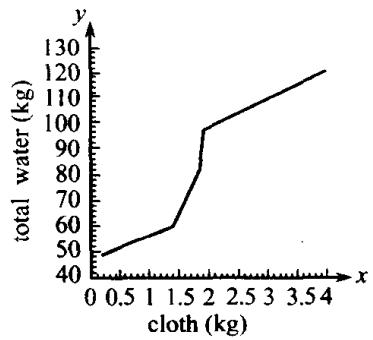

<details>
<summary>line</summary>

| cloth (kg) | total water (kg) |
| --- | --- |
| 0.25 | ~48 |
| 1.3 | ~60 |
| 1.8 | ~82 |
| 1.9 | ~97 |
| 4.0 | ~121 |
</details>

表 2 衣服重量与用水情况表

<table><tr><td>衣物重量(kg)</td><td>洗衣次数</td><td>第一次用水量(kg)</td><td>第二次用水量(kg)</td><td>第三次用水量(kg)</td><td>总用水量(kg)</td><td>衣服清洁度</td></tr><tr><td>0.20</td><td>2</td><td>24.76</td><td>24.44</td><td></td><td>49.20</td><td>0.0001</td></tr><tr><td>0.04</td><td>2</td><td>25.82</td><td>25.18</td><td></td><td>51.00</td><td>0.0006</td></tr><tr><td>0.06</td><td>2</td><td>26.88</td><td>25.92</td><td></td><td>52.80</td><td>0.0012</td></tr><tr><td>0.80</td><td>2</td><td>27.94</td><td>26.66</td><td></td><td>54.60</td><td>0.0020</td></tr><tr><td>1.00</td><td>2</td><td>29.00</td><td>27.40</td><td></td><td>56.40</td><td>0.0030</td></tr><tr><td>1.20</td><td>2</td><td>30.06</td><td>28.14</td><td></td><td>58.20</td><td>0.0040</td></tr><tr><td>1.40</td><td>2</td><td>31.68</td><td>29.44</td><td></td><td>61.12</td><td>0.0050</td></tr><tr><td>1.60</td><td>2</td><td>36.20</td><td>33.64</td><td></td><td>69.85</td><td>0.0050</td></tr><tr><td>1.80</td><td>2</td><td>40.73</td><td>37.85</td><td></td><td>78.58</td><td>0.0050</td></tr><tr><td>2.00</td><td>3</td><td>34.30</td><td>31.10</td><td>31.10</td><td>96.50</td><td>0.0008</td></tr><tr><td>2.20</td><td>3</td><td>35.36</td><td>31.84</td><td>31.84</td><td>99.04</td><td>0.0009</td></tr><tr><td>2.40</td><td>3</td><td>36.42</td><td>32.58</td><td>32.58</td><td>101.58</td><td>0.0011</td></tr><tr><td>2.60</td><td>3</td><td>37.48</td><td>33.32</td><td>33.32</td><td>104.12</td><td>0.0013</td></tr><tr><td>2.80</td><td>3</td><td>38.54</td><td>34.06</td><td>34.06</td><td>106.66</td><td>0.0015</td></tr><tr><td>3.00</td><td>3</td><td>39.60</td><td>34.80</td><td>34.80</td><td>109.58</td><td>0.0017</td></tr><tr><td>3.20</td><td>3</td><td>40.66</td><td>35.54</td><td>35.54</td><td>111.74</td><td>0.0019</td></tr><tr><td>3.40</td><td>3</td><td>41.72</td><td>36.28</td><td>36.28</td><td>114.28</td><td>0.0022</td></tr><tr><td>3.60</td><td>3</td><td>42.78</td><td>37.02</td><td>37.02</td><td>116.82</td><td>0.0024</td></tr><tr><td>3.80</td><td>3</td><td>43.84</td><td>37.76</td><td>37.76</td><td>119.36</td><td>0.0026</td></tr><tr><td>4.00</td><td>3</td><td>44.90</td><td>38.50</td><td>38.50</td><td>121.90</td><td>0.0028</td></tr></table>

建议:洗衣机厂家向用户提供该图、表,以便用户节约用水.

## 五、模型评价及推广

模型的最大优点在于把洗衣机按固定挡水量方式改进成加水量随衣物的变化而连续变化的方式,且在每一次洗衣过程中利用动态规划优化,从两方面节约了水量.

模型还具有形式简单、适用范围广等优点. 对于不同型号的洗衣机, 只要把程序中某些参数作为相应变化, 就可得到节约用水的模型.

在实际过程中,单位质量的衣物随着种类、材料、尺寸的不同,其处于浸泡状态需最小水量 $\beta$ 和脱水后衣服与干衣服质量比 $\alpha$ 的不同,最少用水量也要变化,但只要适当地改变 $\beta$ 和 $\alpha$ 的值,该模型就能运用于这些情况.

## 参考文献

[1] 北原文雄等, 表面活性剂, 化学出版社.  
[2] 运筹学教材编写组, 运筹学, 清华大学出版社, 北京.  
[2] XOB42-1 海棠牌洗衣机说明书.

Roger Bacon 说数学是科学的大门和钥匙. 七个世纪后,对我们来说他的话响起了甚至更深刻的真理。关于数学的更晚近的观察结论来自生物学家 E. O. Wilson 。他写道:“数学看来是像剑那样指向客观真理的终极目标。”考虑到数学和生物科学的日益加速的相互传粉作用,我认为作为生物学家的 Wilson 说出这样的话不是偶然的。确实,数学是决定性的相互交叉的学科。数学是取得全面进步的出发点。数学既是强有力的洞察工具,又是科学的共同语言。我把她称为科学的“世界语”。

Rita Colwell (美国科学基金会 (NSF) 主任)。译自: NSF Launches Major Initiative in Mathematics, Notices of AMS, v. 48 (2001), no. 2, 190 - 192.

# 洗衣机的节水程序设计

陆辉广 贺 前 李建学

(兰州铁道学院, 兰州 730070)

指导教师 白利华

编者按 本文思路清晰,在问题的分析中反映出作者迅速抓住问题本质的能力,在实施建模和求解中能步步推进,直到得出有价值的结果,表现出一定的探索精神,在参赛论文中是比较突出的.论文的缺点也是绝大多数参赛论文所共有的:文中假设了(或隐含地假设)“污物全溶解,全脱除(除了衣服上残余污水中的污物不能脱除外)”.这个假设至少是比较勉强的.

摘要 本文针对洗衣机的节水问题进行了定量分析.抓住主要影响总用水量的因素(衣物重量及衣料质地属性),在满足一定洗涤效果的情况下,针对某类被洗衣物在模型1中建立了动态规划模型,得到了节约用水的两个准则:

1. 每轮清洗时注入水量相等；  
2. 每次注水尽可能少.

在模型Ⅱ中采用非线性规划实现用水管理,设计了较为详细地洗衣机运行程序,进而选用较为合理的数据对模型进行了具体计算,得到了相应的洗涤轮次和总用水量,与日常的洗衣机运行情况相比较具有良好的吻合性.最后对对模型的优缺点及推广作了讨论.

## 一、模型的假设及其说明

1. 洗衣机洗涤衣物的运行过程为：“加水 — 漂洗 — 脱水”周期循环.  
2. 不考虑洗涤过程中的二次利用.  
3. 洗衣机在洗衣过程中,不会发生意外故障.如漏水、外溢、蒸发等造成的水量减少.  
4. 洗涤剂的用量按被洗衣物的重量、污物度等因素确定,保证达到最佳去污效果.  
5. 洗涤用水的水温保持恒定,且为最佳洗涤水温.  
6. 只考虑一次洗涤.

## 二、问题的分析

洗衣机洗涤衣物是依靠物理与化学的作用来达到洗除衣物上的污垢为目的.首先,将洗涤剂加入有一定量的水的洗衣缸内,待洗涤剂充分地溶解于水后,将衣物投入洗衣缸内,让衣物经过一段时间的浸润、渗透,然后进行洗涤,当洗涤过程完成后,进行脱水,此时洗涤过程结束.第二步是漂洗,经过若干轮的“加水—漂洗—脱水”后就完成了整个过程.

## 1. 洗涤剂的功能

洗涤剂成分较复杂, 大多的洗涤剂均含有 C 类的一些表面活性物质, 通常是含有 8 个碳原子以上的有机物质, 我们称之为“表面活性剂”. 这类表面活性剂溶于水中后, 适量时能使其表面张力急剧下降, 随着浓度的增大, 表面张力又几乎保持稳定. 一般表面活性剂分子是由亲水基(或称极性基)与憎水基(非极性基)两部分组成. 而憎水基(或称亲油基)与油等污垢接触时, 具有相互吸引现象, 但它和油一样具有憎水性. 亲水基则容易水化的极生原子团.

当活性剂分子与衣物上的污垢接触时,憎水基与污垢分子(或称颗粒)充分结合,亲水基则方向向外(见图1),这样将污垢分子团团包围,从衣物上脱落下来溶于水中.

至于洗涤剂的用量问题,主要与被洗衣物的重量、污染程度、注水量的多少以及洗涤剂的洗涤性能为参考指标,我们的原则是以洗涤剂加入水中后,达到最大洗涤效果的表面活性剂的临界胶团浓度为标准.过少会直接影响洗涤效果,过多将会使活性剂结合为胶团,造成浪费和洗涤效果的不良.

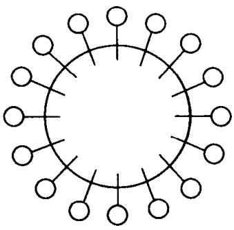

<details>
<summary>natural_image</summary>

Circular diagram with evenly spaced nodes and intersecting lines, no text or symbols present
</details>

## 2. 洗衣机洗涤的过程的机理分析

将衣物投入含量有洗涤剂的水溶液里，经浸润、渗透等物

理作用,再经活性剂的化学作用后,将衣物上的污垢分离为分子或颗粒状态的个体,然后通过电机带动波轮的旋转,进而产生衣物的折曲、揉搓摩擦及衣物对桶壁、波轮的摩擦等物理作用,使污垢均匀地混合于水中使之成为浑浊液.另外,洗涤时间的长短受衣物重量、污染度、布质及洗涤剂的效能等因素的影响.

## 3. 洗衣机的脱水过程及污垢的残留量

洗涤过程结束后,将开始脱水过程,大致可分为排水和甩干两个过程.排水过程,水中的污垢随水一起被排走,此时洗衣缸内的衣物呈吸水饱和状态;然后进行甩干操作,将衣物中的水脱去.考虑到衣物的脱水率,甩干结束后仍有一定量的水残留在衣物上,其所含的污垢的重量称之为残留量,每次洗涤或漂洗结束时的残留量的大小直接影响着洗涤的轮次.因此,残留量的量化分析是至关重要的.

## 4. 被洗衣物分类处理的必要性

通过对液体的浑浊度,每次的注水量、洗涤剂的用量以及残留量的分析,我们认为与被洗衣物的面料性质、吸水率、脱水率及衣物的污染度的较大的关系.所以,为了节省用水、用料和省时,首先将被洗衣物进行分类处理,针对不同类型的衣物进行分批洗涤(详见附录一).

## 5. 有关用水量的分析.

对某一洗涤的整个过程而言,其总的用水量应包括洗涤过程的注水量与若干轮次的漂洗过程的注水量.洗衣机的洗衣缸一般呈柱状形,为了简单起见,我们可以按圆柱体来对待,这样每次注水量的多少可以用洗衣缸的注水高度去刻划.

## 6. 关系洗涤效果的分析

在洗涤过程中,衣物中的各类污垢,并不是全部被脱离掉,这主要是洗涤剂的去污能力所限度.这样该因素造成了人力无法克服的现象.而对于漂洗过程来说,洗涤效果由漂洗时被清水除掉的可去污垢质量(或残留量)的多少来刻划,这是我们最为关注的问题.

## 三、符号及说明

$W_{0}$ ：洗涤过程的注水量；

$W_{i}$ ：第 i 次漂水的注水量；

$N_{0}$ ：洗涤并脱干后，残留于衣物上的可去污垢的质量；

$N_{i}$ ：第 i 次漂洗脱干后，残留于衣物上的可去污垢的质量；

H: 洗衣机的注水最大高度;

h：满足最佳洗涤要求的注水最小高度；

m：被洗涤的衣物重量；

k：单位重量衣物上所含污垢的质量；

q：衣物饱和吸水率,即每公斤衣物饱和吸水质量;

p: 衣物脱干后的保水率, 即每公斤衣物的保水质量;

γ：衣物饱和吸水后的比重；

b：洗涤剂效能,即清洗每单位重量的污垢所需洗涤剂质量;

n：漂洗运行轮数；

$Q^{*}$ ：洗涤标准的浓度阈值；

$\alpha^{*}$ ：洗涤效果满意度；

## 四、建立模型与程序设计

## 模型 I

通过模型分析可知,我们需对以下几部分进行分析

## 1. 洗涤用水量 $W_{0}$

在洗涤时为使洗涤达到最大效果,则加水量必须达到一定量 $W_{min}$ , 因此在首次加水时则必须考虑 $W_{min}$ , 使 $W_{0} \geqslant W_{min}$ .

## 2. 洗涤液的浓度

当洗涤注水量达到一定值时,能够被洗涤下的污垢重量 $N_{max}$ 达到恒定,再增加注水量, $N_{max}$ 也不会再发生变化,而仅影响浓度.洗涤液的浓度

$$
Q _ {0} = \frac {N _ {\max}}{W _ {0}}
$$

3. 洗涤过程后残留在衣物中的污垢重量 $N_{0} = Q_{0} \cdot mp$ .

4. 经过第 $i$ 次漂洗溶液的浓度 $Q_{i}$

由于在本模型中只考虑了水溶剂中含有的污垢,由此可得:

$$
Q _ {i} = \frac {m p}{m p + W _ {i}} \cdot Q _ {i - 1}
$$

而我们要解决的问题是在达到一定的洗涤效果条件下,使总的用水量最小.在这里,可首先将一定洗涤效果转化为

$$
\frac {Q _ {n}}{Q _ {0}} \leqslant \alpha^ {*}
$$

而要求的是在满足上述条件下,使得 $\left(W_{0}+\sum_{i=1}^{n}W_{i}\right)$ 最小.

5. 对于漂洗过程, 应满足以下两个准则:

准则 1 每次漂洗加水量相同.

可以通过下面两个过程来证明：

i) 通过 $n$ 次漂洗, 使溶液浓度为 $Q_{n}$ , 且在这 $n$ 次加水量中 $W_{i}$ 不完全相同.

ii) 经过 $n$ 次漂洗，使溶液浓度为 $Q_{n}^{\prime}$ ，且在这 $n$ 次加水量中 $W_{i}$ 均为 $\frac{W_{1} + W_{2} + \cdots + W_{n}}{n}$ （这里 $W_{1}, W_{2}, \cdots, W_{n}$ 为 $i$ 中的加水量）。在此只需证 $Q_{n}^{\prime} < Q_{n}$ 就可以证明准则1。

现采用反证法,证明如下:

假设 $Q_{n}^{\prime} > Q_{n}$ . 由 $Q_{i} = \frac{mp}{W_{i} + mp} \cdot Q_{i-1}$ 与 $Q_{n}^{\prime} > Q_{n}$ 得

$$
\begin{array}{l} \left(\frac {m p}{W ^ {\prime} + m p}\right) ^ {n} \cdot Q _ {0} > \frac {(m p) ^ {n}}{(W _ {1} + m p) (W _ {2} + m p) \cdots (W _ {n} + m p)} \cdot Q _ {0} \\ \Rightarrow \left(\boldsymbol {W} ^ {\prime} + m p\right) ^ {n} <   \left(\boldsymbol {W} _ {1} + m p\right) \left(\boldsymbol {W} _ {2} + m p\right) \dots \left(\boldsymbol {W} _ {n} + m p\right) \\ \Rightarrow \frac {\boldsymbol {W} _ {1} + \boldsymbol {W} _ {2} + \cdots + \boldsymbol {W} _ {n}}{n} + m p \\ <   \left(W _ {1} + m p\right) \left(W _ {2} + m p\right) \dots \left(W _ {n} + m p\right) \\ \end{array}
$$

设 $W_{1} + mp = x_{1}, W_{2} + mp = x_{2}, \cdots, W_{n} + mp = x_{n}$ ，可得

$$
\frac {x _ {1} + x _ {2} + \cdots + x _ {n}}{n} <   \sqrt {x _ {1} \cdot x _ {2} \cdots x _ {n}}
$$

这与重要不等式 $\left(\frac{x_{1}+x_{2}+\cdots+x_{n}}{n}\right)\geqslant\sqrt[n]{x_{1}\cdot x_{2}\cdots x_{n}}$ （式中 $x_{1}+x_{2}+\cdots+x_{n}$ 均为非负数）相矛盾，即可得本模型对准则1适合.

通过对准则1的证明可知,可将 $Q_{i}$ 表示为 $Q_{i} = \left(\frac{mp}{W + mp}\right)Q_{i-1}$ , 且 $Q_{i}$ 为一等比数列, 其公比为 $\frac{mp}{W + mp}$ , 这样 $Q_{i} = \left(\frac{mp}{W + mp}\right)^{i} \cdot Q_{0}$ .

准则 2 “少量多次”

在用水量一定的情况下,用 $(n+k)$ 次漂洗的效果要比只用n次漂洗的效果好,即 $Q_{n+k}<Q_{n}(n,k$ 为正整数).由 $Q_{n}=\left(\frac{mp}{W+mp}\right)^{n}\cdot Q_{0}$ 可知当总用水量为定值,进行n次漂洗的溶液浓度为

$$
Q _ {n} = \left(\frac {m p}{\frac {s}{n} + m p}\right) ^ {n}, s \text {为总用水量}
$$

我们首先将 n 看作连续量, 则

$$
\frac {\mathrm{d} Q _ {n}}{\mathrm{d} n} = n \left(\frac {m p}{\frac {s}{n} + m p}\right) ^ {n - 1} \cdot \frac {\left(\frac {s}{n}\right) \cdot m p}{\left(\frac {s}{n} + m p\right) ^ {2}} \cdot \left(- \frac {s}{n ^ {2}}\right) <   0
$$

则 $Q_{i}$ 是关于 $n$ 的一个递减函数，且 $n$ 的取值范围为 $(-\infty, +\infty)$ ，所以对 $n$ 取离散量， $Q_{n}$ 仍然是关于 $n$ 的减函数。

由 $n + k > n$ 得 $Q_{n + k} < Q_n$ ，即说明本模型的漂洗过程对准则2适合.

根据上述推证,得模型:约束方程

$$
\begin{array}{l} W = \frac {m p}{\sqrt [ n ]{\frac {\mathrm{Q} _ {0}}{\mathrm{Q} _ {n}}}} - m p, \quad \left(W _ {\min} <   W <   W _ {\max}\right) \\ \frac {Q _ {n}}{Q _ {0}} \leqslant \alpha^ {*} \\ \end{array}
$$

决策方程

$$
\min (W _ {0} + n W)
$$

模型 II

模型I有以下四个地方需改进：

一、洗涤及清洗用水的浓度应考虑洗涤剂的使用，洗涤剂在清洗阶段中也应被视为一种多余物；

二、衣物纤维作为一种固体，其体积较小，表面积很大，对乳浊液也有一定的吸附力；

三、洗涤用水量 $W_{0}$ 对清洗用水量 $\sum_{i=1}^{n} W_{i}$ 有影响；

四、进一步讨论总用水与衣物的哪些因素有关,给出一种较易操作的程序,使总用水量最少.

针对以上问题,我们建立模型 II.

## 1. 对最小注水量的讨论

为洗净衣物,并使它的磨损较少,就必须要求每次注入洗衣缺中的水能适当地悬浮并浸没该衣物.同时,该水量能充分溶解洗涤剂,使洗涤剂的效果充分发挥.

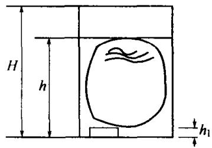

<details>
<summary>text_image</summary>

H
h
h₁
</details>

设洗衣桶截面积为 A，衣物吸水饱和后质量为 $m_{1} = m(1 + q)$ ，体积 $V_{1} = m_{1}/\gamma$ 对于某一型号洗衣机，波轮平面以上体

积与 $V_{1}$ 之比应为一常数 $a$ （在最佳洗涤状态前提下），即 $a = \frac{(h - h_1)A}{V_1}$ 由此可得

$$
h = h _ {1} + \frac {a V _ {1}}{A} \tag {2.1}
$$

## 2. 对污垢残留量的讨论

由文献[1]中的弗兰德里胥式, 可知衣物纤维对水中的乳浊液的吸附质量为

$N_{i}^{\prime}=mk^{\prime}\cdot Q_{i}^{\frac{1}{z}}(k^{\prime}-$ 与衣物质料有关的参数, $\frac{1}{z}=0.1\sim0.5$ (注:乳浊液滴指洗涤剂活性分子包裹污垢而形成的微团).

为使模型得到简化,并突出主要矛盾,并指导洗涤运行过程,可将上式在 $(Q^{*},Q_{0})$ 之间残性拟合,得到下述近似值

$$
N _ {i} ^ {\prime} = m (\alpha Q _ {i} + \beta)
$$

则残存于衣物上的乳浊液滴总量为

$$
N _ {i} = m \alpha Q _ {i} + m \beta + m p Q _ {i} = m Q _ {i} (\alpha + p) + m \beta
$$

3. 对洗涤用水的浮浊液浓度的讨论

$$
Q _ {0} = \frac {m k b + m k - [ m Q _ {i} (\alpha + p) + m \beta ]}{W _ {0}} \tag {2.2}
$$

上式简化后得

$$
Q _ {0} = \frac {m k (1 + b) - \beta}{W _ {0} + m (\alpha + p)},
$$

令 $m(\alpha + p) = M$ 则

$$
Q _ {0} = \frac {m k (1 + b) - \beta}{W _ {0} + M (\alpha + p)} \tag {2.2}
$$

4. 对每次漂洗时水的浓度的讨论

第 i 次注水并清洗时,乳浊液浓度表达如下:

$$
Q _ {i} = \frac {(N _ {i - 1} - N _ {i})}{W _ {i}}
$$

$$
Q _ {i} = \frac {m Q _ {i - 1} (\alpha + p) + m \beta - m Q _ {i} (\alpha + p) - m \beta}{W _ {i}} = \frac {m (\alpha + p) (Q _ {i - 1} - Q _ {i})}{W _ {i}}
$$

上式简化后得

$$
Q _ {i} = \frac {m (\alpha + p) \cdot Q _ {i - 1}}{W _ {i} + m (\alpha + p)} = \frac {M \cdot Q _ {i - 1}}{W _ {i} + M} \tag {2.3}
$$

此结果形式与模型I中所得结果相似,仅M项略有不同,故由模型I得到的准则完全适用于模型II.

5. 对漂洗次数及每次注水量的讨论

整个洗衣过程按时间分成若干段,每一阶段都需要做出决策,以便在整个过程的最终阶段得到最佳结局——满足一定洗涤效果并使总用水量最小.

根据(2.3)式,有下列递推式成立.

$$
\begin{array}{l} Q _ {1} = \frac {M Q _ {0}}{M + W _ {1}} \Rightarrow Q _ {2} = \frac {M ^ {2} Q _ {0}}{(W _ {1} + M) (W _ {2} + M)} \\ \Rightarrow Q _ {n} = \frac {M ^ {n} \cdot Q _ {0}}{\prod_ {i = 1} ^ {n} (W _ {i} + M)} \tag {2.4} \\ \end{array}
$$

约束条件： $W_{\mathrm{min}} \leqslant W_0 \leqslant \dot{W}_{\mathrm{max}}, Q_n \leqslant Q^*, Q_{n-1} > Q^*$ .

如 $Q_{n}, Q_{0}$ 为已知, 则(2.4)式是动态规划的目标函数 $\min W_{z}^{\prime} = \sum_{i=1}^{n} W_{i}$ 的条件方程可用拉格朗日条件极值解决动态规划问题.

求解:设某衣物清洗了 n 次

目标函数: $f(W_{1},W_{2},\cdots,W_{n})=\sum_{i=1}^{n}W_{i}$

条件方程： $\frac{\prod_{i = 1}^{n}(W_i + M)Q_n}{M^n\cdot Q_0} -1 = 0$

构造拉格朗日条件方程组：

$$
\left\{ \begin{array}{l} 1 + \lambda \frac {Q ^ {*}}{Q _ {0} M ^ {n}} (W _ {2} + M) (W _ {3} + M) \dots (W _ {n} + M) = 0 \\ 1 + \lambda \frac {Q ^ {*}}{Q _ {0} M ^ {n}} (W _ {1} + M) (W _ {3} + M) \dots (W _ {n} + M) = 0 \\ \vdots \\ 1 + \lambda \frac {Q ^ {*}}{Q M ^ {n}} (W _ {1} + M) (W _ {2} + M) \dots (W _ {n - 1} + M) = 0 \\ \frac {Q ^ {*}}{Q _ {0} M ^ {n}} (W _ {1} + M) (W _ {2} + M) \dots (W _ {n} + M) - 1 = 0 \end{array} \right. \tag {2.5}
$$

以上方程组为 $n$ 元非线性方程组，有 $n$ 组解，可以求得有 $n$ 组相同解，参见文[2].

$$
\left\{ \begin{array}{l} W _ {2} = M \sqrt [ n ]{\frac {Q _ {0}}{Q ^ {*}}} - M, \quad i = 1, 2, \dots , n \\ \lambda = - M \sqrt [ n ]{\frac {Q _ {0}}{Q ^ {*}}} \end{array} \right. \tag {2.6}
$$

结果与模型Ⅰ中所得结果相吻合,则有

$$
W _ {z} ^ {\prime} = n W _ {i} = n M \left[ \sqrt [ n ]{\frac {Q _ {0}}{Q ^ {*}}} - 1 \right] \tag {2.7}
$$

当 $n$ 确定下来, 则相应漂洗 $n$ 次的最小漂洗用水量 $W_{z}^{\prime}$ 就可用(2.7)式计算.

6. $W_{0}$ 对用水量的影响(已知漂洗轮数), 总用水量

$$
\begin{array}{l} W _ {z} = W _ {z} ^ {\prime} + W _ {0} = n M \left(\sqrt [ n ]{\frac {Q _ {0}}{Q ^ {*}}} - 1\right) + W _ {0} \\ = n M \left(\sqrt [ n ]{\frac {m k (1 + b) - m \beta}{(W _ {0} + M) \cdot Q ^ {*}}} - 1\right) + W _ {0} \tag {2.8} \\ \end{array}
$$

设 $mk(1 + b) - m\beta = s$ ，则

$$
W _ {z} = n M \left(\sqrt [ n ]{\frac {S}{\left(W _ {0} + M\right) \cdot Q ^ {*}}} - 1\right) + W _ {0} \tag {2.8}
$$

$$
\begin{array}{l} \frac {\mathrm{d} W _ {z}}{\mathrm{d} W _ {0}} = n M \left(- \frac {1}{n}\right) \sqrt [ n ]{\frac {S}{Q ^ {*}}} \cdot (W _ {0} + M) ^ {- \frac {n + 1}{n}} + 1 \\ = 1 - M \sqrt [ n ]{\frac {S}{Q ^ {*}}} \cdot (W _ {0} + M) ^ {\frac {n + 1}{n}} \\ \end{array}
$$

令 $\frac{\mathrm{d}W_z}{\mathrm{d}W_0} = 0$ ，则

$$
\begin{array}{l} \sqrt [ n + 1 ]{\left(M \cdot \sqrt [ n ]{\frac {S}{Q ^ {*}}}\right) ^ {n}} = (W _ {0} + M) ^ {n + 1} \\ W _ {0} + M = \sqrt [ n + 1 ]{\left(M \cdot \sqrt [ n ]{\frac {S}{Q ^ {*}}}\right) ^ {n}} = \sqrt [ n + 1 ]{\frac {M ^ {n} S}{Q ^ {*}}} \\ \end{array}
$$

则

$$
W _ {0} = \sqrt [ n + 1 ]{\frac {M ^ {n} S}{Q ^ {*}}} - M \tag {2.9}
$$

上式代入 $(2.8)^{\prime}$ 式, 得(令 $s = mk(1 + b) - m\beta$ )

$$
W _ {z} = n M \left(\frac {\sqrt [ n ]{\frac {m k (1 + b) - m \beta}{Q ^ {*}}}}{\sqrt [ n + 1 ]{M \sqrt {\frac {m k (1 + b) - m \beta}{Q ^ {*}}}}} - 1\right) + \sqrt [ n + 1 ]{\frac {M ^ {n} \cdot S}{Q ^ {*}}} - M \tag {2.10}
$$

由(2.10)式知,当洗涤次数 n 确定时

$$
W _ {z} = f _ {1} (m, \alpha , p, k, b, \beta , Q ^ {*})
$$

其中 $\alpha, p, \beta, Q^{*}$ 均由衣物属性确定，统称为属性变量 SL. 各变量对总用水量的影响见下图：

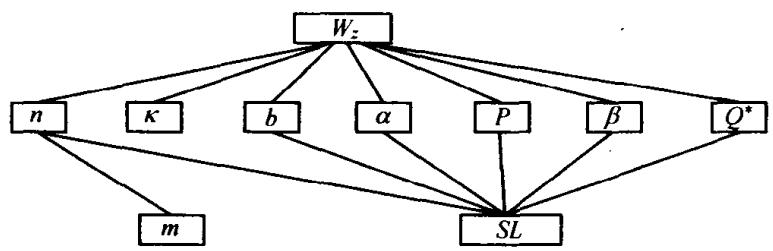

<details>
<summary>flowchart</summary>

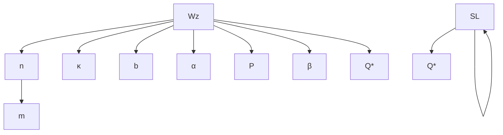
```mermaid
graph TD
  Wz["Wz"] --> n["n"]
  Wz --> κ["κ"]
  Wz --> b["b"]
  Wz --> α["α"]
  Wz --> P["P"]
  Wz --> β["β"]
  Wz --> Q*["Q*"]
  n --> m["m"]
  SL["SL"] --> SL
  SL --> SL
  SL --> Q["Q*"]
```
</details>

## 7. 实现最小用水量的非线性整数规划模型

根据准则 I、II 为了实现最小用水量, 可用下述模型实现

$$
\left\{ \begin{array}{l} \max = n \\ W _ {i} = M \left(\sqrt [ n ]{\frac {Q _ {0}}{Q ^ {*}}} - 1\right) > W _ {\min} \\ W _ {0} = \sqrt [ n + 1 ]{\frac {M ^ {n} [ m k (1 + b) - m \beta ]}{Q ^ {*}}} - M \end{array} \right. \tag {2.11}
$$

$(W_{\min} \text{ 由 } h \text{ 及衣物属性确定}).$

8. 程序实现对最小用水量的控制(见后述框图)

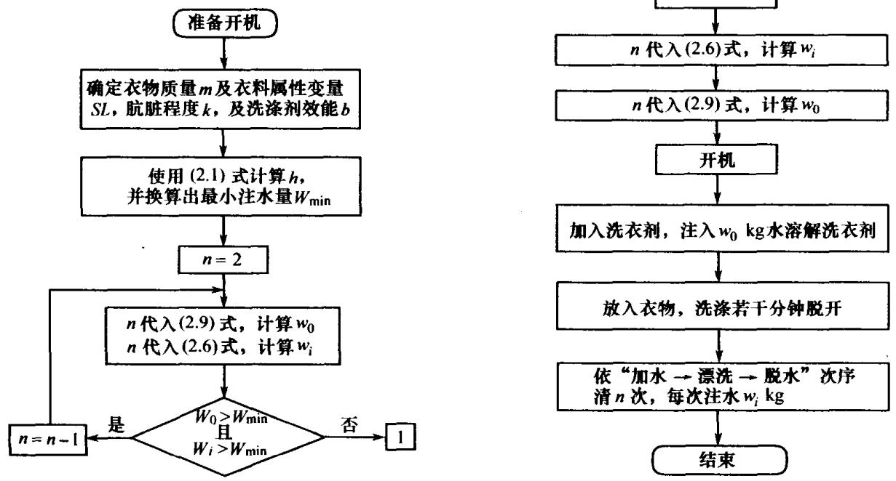

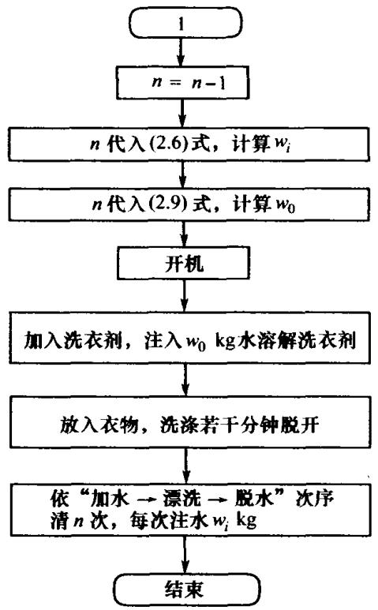

<details>
<summary>flowchart</summary>

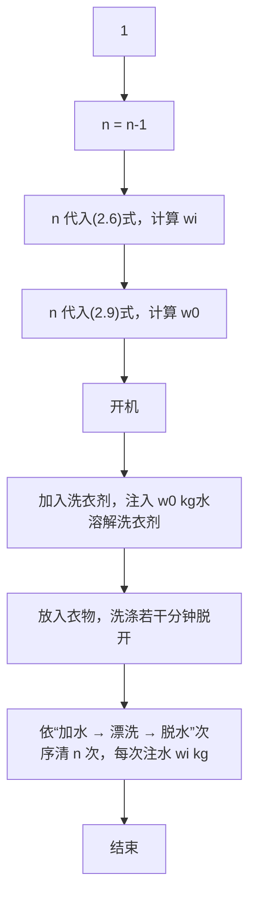
```mermaid
graph TD
  A["1"] --> B["n = n-1"]
  B --> C["n 代入(2.6)式，计算 wi"]
  C --> D["n 代入(2.9)式，计算 w0"]
  D --> E["开机"]
  E --> F["加入洗衣剂，注入 w0 kg水溶解洗衣剂"]
  F --> G["放入衣物，洗涤若干分钟脱开"]
  G --> H["依“加水 → 漂洗 → 脱水”次序清 n 次，每次注水 wi kg"]
  H --> I["结束"]
```
</details>

## 六、适用合理的数据进行计算

我们搜集以下三种数据,如下表

<table><tr><td></td><td>m</td><td>p</td><td></td><td>m</td><td>p</td><td></td><td>m</td><td>p</td></tr><tr><td>毛料</td><td>4kg</td><td>1</td><td>纯棉 1</td><td>4kg</td><td>2.3</td><td>纯棉 2</td><td>2kg</td><td>2.3</td></tr></table>

通过本模型计算得(当 $Q^{*}$ 取 0.01 时) 结果如下表

<table><tr><td></td><td>W(kg)</td><td>n(轮次)</td><td></td><td>W(kg)</td><td>n(轮次)</td><td></td><td>W(kg)</td><td>n(轮次)</td></tr><tr><td>毛料</td><td>74</td><td>2</td><td>纯棉1</td><td>108</td><td>3</td><td>纯棉3</td><td>84</td><td>2</td></tr></table>

注 本结果都是附录二 $C$ 程序计算得到.(附录二略)

我们对大容量双桶洗衣机XPB45-85,用我们所选的三种布料进行了测试,得到以下结果

<table><tr><td></td><td>W(kg)</td><td>n(轮次)</td><td></td><td>W(kg)</td><td>n(轮次)</td><td></td><td>W(kg)</td><td>n(轮次)</td></tr><tr><td>毛料</td><td>78</td><td>2</td><td>纯棉1</td><td>84</td><td>2</td><td>纯棉2</td><td>84</td><td>2</td></tr></table>

与计算所得结果相吻合

## 七、模型的优缺点及改进方向

本文采用两个模型,对问题的讨论由浅入深,在引用了一定的符号系统后,进行了严格的数学分析与推导.使模型建立在坚实数学基础上,模型的建立采用了常用的动态规划思想,算法上容易实现;尽管用水量的表达式过于庞杂,但能在洗衣机的实际设计或操作时,抓住主要矛盾.最后本模型给出了一个洗衣机最佳节水运行程序框图.

本模型可在以下几方面进行改进：

一、考虑洗衣过程中“中水”(已用过的水)的利用；  
二、如何在衣物分类时采用本模型的成果；  
三、结合考虑能源、水和时间的节约.

附录一

衣物的分类

人们洗衣时从综合因素考虑,主要从衣服洗涤的难易程度上来把衣服分类,而衣服洗涤的难易程度主要与洗涤时间用水量有关.得递阶层结构为:

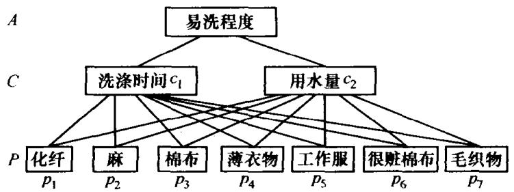

<details>
<summary>flowchart</summary>

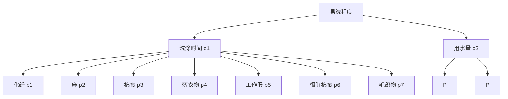
```mermaid
graph TD
  A["易洗程度"] --> B["洗涤时间 c1"]
  A --> C["用水量 c2"]
  B --> D["化纤 p1"]
  B --> E["麻 p2"]
  B --> F["棉布 p3"]
  B --> G["薄衣物 p4"]
  B --> H["工作服 p5"]
  B --> I["很脏棉布 p6"]
  B --> J["毛织物 p7"]
  C --> K["P"]
  C --> L["P"]
```
</details>

构造相互反矩阵

(1) 判别矩阵 A - C

<table><tr><td>A</td><td> $C_{1}$ </td><td> $C_{2}$ </td></tr><tr><td> $C_{1}$ </td><td>1</td><td>1/2</td></tr><tr><td> $C_{2}$ </td><td>2</td><td>1</td></tr></table>

$$
\lambda_ {\max} = 2, \quad C R = 0 <   0. 1
$$

(2) 判别矩阵 $C_{1} - P$

<table><tr><td> $C_1$ </td><td> $P_1$ </td><td> $P_2$ </td><td> $P_3$ </td><td> $P_4$ </td><td> $P_5$ </td><td> $P_6$ </td><td> $P_7$ </td></tr><tr><td> $P_1$ </td><td>1</td><td>1/4</td><td>1/5</td><td>1</td><td>1/7</td><td>1/9</td><td>1/3</td></tr><tr><td> $P_2$ </td><td>4</td><td>1</td><td>1/2</td><td>3</td><td>1/2</td><td>1/3</td><td>2</td></tr><tr><td> $P_3$ </td><td>5</td><td>2</td><td>1</td><td>4</td><td>1/2</td><td>1/3</td><td>2</td></tr><tr><td> $P_4$ </td><td>1</td><td>1/3</td><td>1/4</td><td>1</td><td>1/5</td><td>1/7</td><td>1/2</td></tr><tr><td> $P_5$ </td><td>7</td><td>2</td><td>2</td><td>5</td><td>1</td><td>1</td><td>5</td></tr><tr><td> $P_6$ </td><td>9</td><td>3</td><td>3</td><td>7</td><td>1</td><td>1</td><td>7</td></tr><tr><td> $P_7$ </td><td>3</td><td>1/2</td><td>1/2</td><td>2</td><td>1/5</td><td>1/7</td><td>1</td></tr></table>

$$
\lambda_ {\max} = 7. 1 2 8, \quad C R = 0. 0 1 7 <   0. 1
$$

(3) 判别矩阵 $C_{2}-P$

<table><tr><td> $C_2$ </td><td> $P_1$ </td><td> $P_2$ </td><td> $P_3$ </td><td> $P_4$ </td><td> $P_5$ </td><td> $P_6$ </td><td> $P_7$ </td></tr><tr><td> $P_1$ </td><td>1</td><td>1/2</td><td>1/3</td><td>1</td><td>1/5</td><td>1/7</td><td>1/2</td></tr><tr><td> $P_2$ </td><td>2</td><td>1</td><td>1/2</td><td>2</td><td>1/2</td><td>1/3</td><td>1</td></tr><tr><td> $P_3$ </td><td>3</td><td>2</td><td>1</td><td>3</td><td>1/2</td><td>1/2</td><td>4</td></tr><tr><td> $P_4$ </td><td>1</td><td>1/2</td><td>1/3</td><td>1</td><td>1/3</td><td>1/5</td><td>1</td></tr><tr><td> $P_5$ </td><td>5</td><td>2</td><td>2</td><td>3</td><td>1</td><td>1/2</td><td>2</td></tr><tr><td> $P_6$ </td><td>7</td><td>3</td><td>2</td><td>5</td><td>2</td><td>1</td><td>4</td></tr><tr><td> $P_7$ </td><td>2</td><td>1</td><td>1/4</td><td>1</td><td>1/2</td><td>1/4</td><td>1</td></tr></table>

$$
\lambda_ {\max} = 7. 1 1 9, \quad C R = 0. 0 1 5 <   0. 1
$$

最后得程序总排序计算结果如下：

排序为: $P_{6},P_{5},P_{3},P_{2},P_{7},P_{4},P_{1}$

对应权向量为:0.337,0.25,0.154,0.107,0.067,0.046,0.037

然后根据权向量对衣物进行分类如下：

很赃棉布、工作服、棉布分为一类；

毛织物、麻分为一类；

化纤、薄衣物分类一类.

注 本层次分析法中的所有计算都是通过实用 AHP 软件实现.

# “节水洗衣机”问题数学建模及若干评注

重庆大学

付 鹅

## 1. 引言

我国许多城镇都存在淡水短缺的问题，给单位和居民用水造成困难。洗衣在家庭（包括洗衣店）用水中占有相当大的份额，因此研究开发节水型洗衣机是很有意义的。这一课题经过充分简化后被选定作为1996年全国大学生数学建模竞赛题目（B题）。本文对该题进行了剖析，建立了一种数学模型，展示了相应的分析和求解方法。需要说明，本文的有关内容不作为竞赛题目的参考解答。

本文还结合这次竞赛情况对数学建模的一些问题及分析和求解简要地作了评注.

## 2. 问题剖析

## 2.1 “洗衣节水”问题

不论人工洗衣还是洗衣机洗衣，都存在节水问题。可作一个理想实验：若用水量为零，则显然洗不净衣物；若用水量为无穷大，则肯定浪费水。因此必然存在刚好“洗净”衣物的“最少”用水量。机器能够比人更精确地控制洗衣过程，所以提出“节水洗衣机”的问题。

## 2.2 洗衣机的基本原理和过程

本文不拟对洗衣的微观机制（包括机械的、物理的、化学的、物理化学的）作讨论，而仅仅从宏观的层次去把握.

洗衣的基本原理就是将吸附在衣物上的污物溶于水中，通过脱去污水而带走污物。“溶污物—脱污水”是由两个根本要素构成的一个“元动作”，无论是如何精心设计的洗衣方式和程序都是以此为基础的。洗衣的过程就是通过加水来实现上述“溶污物—脱污水”动作的反复执行，使得残留在衣物上的污物越来越少，直到满意的程度。

通常洗衣要加入洗涤剂，它帮助衣物上原有的污物溶解。但应注意的是，洗涤剂本身也是不希望留在衣物上的东西，因此“污物”应是衣物上原有污物与洗涤剂的总和。有了这种认识后，我们就可以统一地处理“洗涤”（即通常加洗涤剂的首轮洗衣）和“漂洗”（即通常的以后各轮洗衣，不再加洗涤剂，但水中还有剩余洗涤剂），把二者都看作“溶污物”环节。

“脱污水”在洗衣机中通常称为“脱水”，常由排水和甩干两个步骤组成。

## 2.3 “节水洗衣机”要点分析

立足于“溶污物—脱污水”这种基本原理，我们可以找出“节水洗衣机”问题的基本要点如下：

1）污物的溶解情况如何？我们将用“溶解特性”来刻画.  
2）每轮脱去污水后污物减少情况如何？这将由系统的动态方程表示.  
3) 如何设计由一系列“溶污物—脱污水”构成的节水洗衣程序？这将通过用水程序来反映，也是我们最终需要的结果.

## 3.“节水洗衣机”问题建模

## 3.1 基本假设

1) 仅考虑离散的洗衣方案，即“加水—溶污物—脱污水”（以下称为“加水—洗涤—脱水”）三个环节是分离的。这三个环节构成一个洗衣周期，称为“一轮”。  
2）每轮用水量不能低于 $L$ ，否则洗衣机无法转动；用水量不能高于 $H$ ，否则会溢出设 $L < H$  
3) 每轮的洗涤时间是足够的，以便衣物上的污物充分溶入水中从而使每轮所用的水被充分利用.  
4) 每轮的脱水时间也是足够的，以使污水脱出，即让衣物所含的污水量达到一个低限，设这个低限是一个大于0的常数 $C$ 。设 $C < L$ 。

注 除首轮外，每轮“用水量”实际包括该轮加水量和衣物中上轮脱水后残留的水量，即残留水量被自然地利用了.

## 3.2 变量定义

1) 设共进行 $n$ 轮“加水—洗涤—脱水”的过程，依次为第0轮，第1轮，第2轮，第 $n-1$ 轮.  
2) 第 k 轮用水量为 $u_{k}(k=0,1,2,\cdots,n-1)$ .  
3) 衣物上的初始污物量为 $x_{0}$ ，在第 k 轮脱水之后仍吸附在衣物上的污物量为 $x_{k+1}(k=0,1,2,\cdots,n-1)$ .

## 3.3 溶解特性和动态方程

第 $k$ 轮洗漂之后和脱水之前，第 $k - 1$ 轮脱水之后的污物量 $x_{k}$ 已成为两部分

$$
x _ {k} = p _ {k} + q _ {k}, \quad k = 0, 1, 2, \dots , n - 1, \tag {1}
$$

其中 $p_k$ 表示已溶入水中的污物量， $q_k$ 表示尚未溶入水中的污物量。 $p_k$ 与第 $k$ 轮的加水量 $u_k$ 有关，总的规律是 $u_k$ 越大， $p_k$ 越大，且当 $u_k = L$ 时， $p_k$ 最小（=0，因为此时洗衣机处于转动临点，有可能无法转动，该轮洗衣无效）；当 $u_k = H$ 时， $p_k$ 最大（=Qx $_k$ ，0 < Q < 1 其中 $Q$ 称为“溶解率”）。因此简单地选用线性关系表示这种溶解特性，则有

$$
p _ {k} = Q x _ {k} \frac {u _ {k} - L}{H - L}. \tag {2}
$$

在第 $k$ 轮脱水之后，衣物上尚有污物 $q_{k} = x_{k} - p_{k}$ ，污水 $C$ ，其中污水 $C$ 中所含污物量为 $(p_{k} / u_{k})C$ 。于是第 $k$ 轮完成之后衣物上尚存的污物总量为

$$
x _ {k + 1} = (x _ {k} - p _ {k}) + C \frac {p _ {k}}{u _ {k}}, \tag {3}
$$

将(2)代入上式并整理后得系统动态方程

$$
x _ {k + 1} = x _ {k} \left[ 1 - Q \left(1 - \frac {C}{u _ {k}}\right) \frac {u _ {k} - L}{H - L} \right], \quad k = 0, 1, 2, \dots , n - 1. \tag {4}
$$

## 3.4 优化模型

由于 $x_{n}$ 是洗衣全过程结束后衣服上最终残留的污物量，而 $x_0$ 是初始污物量，故 $x_{n} / x_{0}$ 反

映了洗净效果. 由系统动态方程(4) 可得

$$
\frac {x _ {n}}{x _ {0}} = \prod_ {k = 0} ^ {n - 1} \left[ 1 - Q \left(1 - \frac {C}{u _ {k}}\right) \frac {u _ {k} - L}{H - L} \right], \tag {5}
$$

又总用水量为

$$
\sum_ {k = 0} ^ {n - 1} u _ {k}, \tag {6}
$$

于是可得优化模型如下

$$
\min \sum_ {k = 0} ^ {n - 1} u _ {k}
$$

$$
\text {s.t.} \prod_ {k = 0} ^ {n - 1} \left[ 1 - Q \left(1 - \frac {C}{u _ {k}}\right) \frac {u _ {k} - L}{H - L} \right] \leqslant \varepsilon ,
$$

$$
0 <   \varepsilon <   1, \tag {7}
$$

其中 $\epsilon$ 代表对洗净效果的要求. 若令

$$
v _ {k} = \frac {u _ {k} - L}{H - L}, \tag {8}
$$

$$
u _ {k} (H - L) v _ {k} + L, \tag {9}
$$

则优化模型成为更简洁的形式

$$
\min \sum_ {k = 0} ^ {n - 1} v _ {k}
$$

$$
\text {s.t.} \prod_ {k = 0} ^ {n - 1} \left(1 - Q v _ {k} + \frac {Q v _ {k}}{A v _ {k} + B}\right) \leqslant \varepsilon , \tag {10}
$$

$$
0 \leqslant v _ {k} \leqslant 1, \quad k = 0, 1, 2, \dots , n - 1,
$$

其中

$$
A = \frac {H - L}{C} = B \left(\frac {H}{L} - 1\right), B = \frac {L}{C}. \tag {11}
$$

## 4. 分析与求解

## 4.1 最少洗衣轮数

定义函数

$$
r (t) = 1 - Q t + \frac {Q t}{A t + B}, \quad 0 \leqslant t \leqslant 1. \tag {12}
$$

易知

$$
r ^ {\prime} (t) = Q \left[ \frac {B}{(A t + B) ^ {2}} - 1 \right] <   0, \quad 0 \leqslant t \leqslant 1, \tag {13}
$$

可见 $r(t)$ 是区间 $[0,1]$ 上的单调减函数，所以

$$
r _ {\min} = r (1) = 1 - Q + \frac {Q C}{H} \in (0, 1). \tag {14}
$$

第 $k$ 轮的洗净效果为

$$
\frac {x _ {k + 1}}{x _ {k}} = r (v _ {k}), \quad k = 0, 1, 2, \dots , n - 1. \tag {15}
$$

由此不难得出 $n$ 轮洗完后洗净效果最多可达到

$$
\left[ 1 - Q + \frac {Q C}{H} \right] ^ {n}. \tag {16}
$$

给定洗净效果的要求 $\varepsilon$ ，则应有

$$
\left[ 1 - Q + \frac {Q C}{H} \right] ^ {n} \leqslant \varepsilon , \tag {17}
$$

于是

$$
n \geqslant \frac {\log \varepsilon}{\log \left(1 - Q + \frac {Q C}{H}\right)}. \tag {18}
$$

设 $N_0$ 为满足（18）的最小整数，则最少洗衣轮数即为 $N_0$ .

## 4.2 算法

可采用非线性规划算法，对 $n=N_{0}, N_{0}+1, N_{0}+2, \cdots, N$ （凭常识洗衣的轮数不应太多，比如取 N=10 已足够）进行枚举求解，然后选出最好的结果．其中 $N_{0}$ 是满足(18)的最小整数．不必使用求解混合整数非线性规划问题的其它复杂算法．

## 5. 注 记

1) 乘积约束可化为 $\sum_{k=0}^{n-1} \log \left(1 - Qv_k + \frac{Qv_k}{Av_k + B}\right) \leqslant \log \varepsilon$ ，在计算中要注意采取适当措施防止溢出，如用 $\log[\max(\delta, t)]$ 代替 $\log(t)$ ，其中 $\delta$ 是所用计算机的最小正浮点。  
2）可考虑“洗涤”和“漂洗”的不同（两者统称“洗漂”），前者加洗涤剂，一般仅第0轮是洗涤。可用特殊的溶解特性 $(p_k - u_k$ 关系)加以区别，例如在洗涤剂用量一定时，考虑到多加水会降低洗涤剂的浓度，其溶解特性用具有最大值的单峰函数表示应当更合理。  
3) 在实际中，无论是参数 $L, H, C, Q$ 以及洗净效果要求 $\varepsilon$ ，还是溶解特性，均应在各种不同条件下（如针对衣物量的多少，衣物的各种质地以及衣物脏污的程度）通过实验确定.  
4) 基于前述分析和初步的仿真实验结果(本文略去了仿真实验部分)，提出猜想：“若每轮洗衣的溶解特性相同，则最优洗衣轮数等于最少洗衣轮数 $N_{0}$ 且每轮的最优用水量相等 ( $v_{k}=v, k=0,1,2,\cdots,n-1$ ”。若真如此，则易知每轮的最优用水量 v 就是下列二次方程的解 $1-Qv+\frac{Qv}{Av+B}=\epsilon^{1/N_{0}}$ ，其中 $N_{0}$ 是满足（18）的最小整数，这样问题可大大简化。  
5) “节水洗衣机” 是一个非常实际的课题，本文仅围绕最基本的要素展开了分析，实际中要考虑的因素会多得多.

## 6. 若干评注

1996 年全国大学生数学建模竞赛中约有三分之一的参赛队作“节水洗衣机”问题（B 题）。下面对学生好的方面和不足之处作简要评述，其中也有涉及数学建模(包括分析和求解)的普遍问题。

好的方面：

1) 学生查阅了大量资料，包括有关洗衣机的国家标准，反映了他们具备情报检索的意识和能力.  
2) 大部分参赛队都能抓住“污物浓度不断减少”这一点进行深入，大方向正确，得出了各种结果，这对于仅仅限于三天的参赛时间来说是十分可贵的。  
3) 部分学生的思路是很开阔的，如有的学生提到水的重复使用(实际上在家庭中利用双桶洗衣机集中处理大批衣物就符合这种道理，对于洗衣店而言更是如此了). 还有的学生想到用实验的手段探讨污水浓度的规律等等.  
4）许多参赛队都证明了每轮用水量相等，尽管是在理想溶解特性(即 $p_k = x_k$ )的条件下证明的，仍反映了学生观察是敏锐的.  
5) 许多学生都明确了污物和洗涤剂均需去掉，表明他们的思维是细致严谨的.

不足之处：

1) 假设过多. 有相当多的论文(包括一些优秀论文), 列出了大量假设. 其实有的假设是不必要的. 如类似“洗衣过程不停电”, “洗衣的人懂得操作规程”等假设就是多余的. 为了有效地解决问题, 大胆假设是必要的, 但决非假设越多越好.  
2) 模型多. 有的论文提出了多种模型而又未对每种模型作较深入的探讨, 这种情况就不宜鼓励.  
3) 部分参赛队采用了过于繁复的分析和不必要的数学方法，应当提倡抓住主要矛盾单刀直入地解决问题.  
4）几乎没有学生明确考虑到“溶解特性”（或者其他与溶解特性等效的因素），都隐含地假定了溶解特性是理想的，即 $p_k = x_k$ 。至少应当提到采用理想溶解特性的充分理由。

数学科学对经济竞争力至关重要,数学是一种关键的、普遍适用并授予人以能力的技术,这是本报告的中心结论。(原文:The central conclusion of this report is that the mathematical sciences are vital to economic competitiveness and that they are a critical, generic, and enabling technology. Mathematical sciences, technology, and economic competitiveness.)

《数学科学·技术·经济竞争力》，邓越凡译，南开大学出版社，1992，p.3.

## 11. 零件的参数设计(CUMCM 1997 年 A 题)

一件产品由若干零件组装而成,标志产品性能的某个参数取决于这些零件的参数,零件参数包括标定值和容差两部分.进行成批生产时,标定值表示一批零件该参数的平均值,容差则给出了参数偏离其标定值的容许范围.若将零件参数视为随机变量,则标定值代表期望值,在生产部门无特殊要求时,容差通常规定为均方差的3倍.

进行零件参数设计,就是要确定其标定值和容差.这时要考虑两方面因素:

一、当各零件组装成产品时，如果产品参数偏离预先设定的目标值，就会造成质量损失，偏离越大，损失越大；

二、零件容差的大小决定了其制造成本，容差设计得越小，成本越高。

试通过如下的具体问题给出一般的零件参数设计方法.

粒子分离器某参数(记作 y)由 7 个零件的参数(记作 $x_{1}, x_{2}, \cdots, x_{7}$ )决定,经验公式为

$$
\begin{array}{l} y = 1 7 4. 4 2 \left(\frac {x _ {1}}{x _ {5}}\right) \left(\frac {x _ {3}}{x _ {2} - x _ {1}}\right) ^ {0. 8 5} \\ \times \sqrt {\frac {1 - 2 . 6 2 \left[ 1 - 0 . 3 6 \left(\frac {x _ {4}}{x _ {2}}\right) ^ {- 0 . 5 6} \right] ^ {3 / 2} \left(\frac {x _ {4}}{x _ {2}}\right) ^ {1 . 1 6}}{x _ {6} x _ {7}}}. \\ \end{array}
$$

$y$ 的目标值(记作 $y_0$ )为1.50. 当 $y$ 偏离 $y_0 \pm 0.1$ 时, 产品为次品, 质量损失为1000元; 当 $y$ 偏离 $y_0 \pm 0.3$ 时, 产品为废品, 损失为9000元.

零件参数的标定值有一定的容许变化范围；容差分为A,B,C三个等级，用与标定值的相对值表示，A等为 $\pm 1\%$ ，B等为 $\pm 5\%$ ，C等为 $\pm 10\%$ ，7个零件参数标定值的容许范围及不同容差等级零件的成本(元)如下表(符号/表示无此等级零件)：

现进行成批生产,每批产量1000个,在原设计中,7个零件参数的标定值为: $x_{1}=0.1$ , $x_{2}=0.3$ , $x_{3}=0.1$ , $x_{4}=0.1$ , $x_{5}=1.5$ , $x_{6}=16$ , $x_{7}=0.75$ ; 容差均取最便宜的等级.

请你综合考虑 $y$ 偏离 $y_0$ 造成的损失和零件成本, 重新设计零件参数 (包括标定值和容差), 并与原设计比较, 总费用降低了多少.

<table><tr><td></td><td>标定值容许范围</td><td>C等</td><td>B等</td><td>A等</td></tr><tr><td> $x_1$ </td><td>[0.075,0.125]</td><td>/</td><td>25</td><td>/</td></tr><tr><td> $x_2$ </td><td>[0.225,0.375]</td><td>20</td><td>50</td><td>/</td></tr><tr><td> $x_3$ </td><td>[0.075,0.125]</td><td>20</td><td>50</td><td>200</td></tr><tr><td> $x_4$ </td><td>[0.075,0.125]</td><td>50</td><td>100</td><td>500</td></tr><tr><td> $x_5$ </td><td>[1.125,1.875]</td><td>50</td><td>/</td><td>/</td></tr><tr><td> $x_6$ </td><td>[12,20]</td><td>10</td><td>25</td><td>100</td></tr><tr><td> $x_7$ </td><td>[0.5625,0.935]</td><td>/</td><td>25</td><td>100</td></tr></table>

# 零件的参数设计

孙连山 洪 献 曹奕剑

(上海交通大学, 上海 200030)

指导教师 周钢

编者按 本文的建模思路很有条理, 模型简洁、正确, 并对结果的敏感性作了详尽的分析, 在算法上也作了探讨, 有一定创造.

摘要 模型是研究产品各零件参数对产品某一性能影响的连续模型,以生产产品总费用最小为最终目的.主要用非线性规划化的思想建立.因为零件参数为随机变量,所以建模时要用概率论的方法给出非线性规划化问题目标函数.模型形式简洁.因零件加工精度的限制,实际参数标定值的选取是离散的,我们可充分利用计算机的数值计算能力,用各种方法搜索最优值.其中虎克-吉福斯直接搜索法效果最好.

## 一、问题重述(略)

## 二、合理的假设

根据零件设计工艺中的一些具体要求,并为达到简化问题的目的,除问题中已给出的假设外,我们进一步做以下假设:

1. 假设组成产品的各个零件在生产过程中互不影响,而且这些零件可以无困难地组装成一件产品.即若视各零件的参数为随机变量,则它们相互独立.  
2. 假设问题中的经验公式在给定的零件参数变化范围之中是有效的.  
3. 在大批量生产当中, 假设整批零件都处在同一等级. 本题中可视 1000 个零件都是 $A$ 等、 $B$ 等或 $C$ 等.  
4. 设得到的产品分三个等级: 正品、次品、废品. 各等级产品性能参数的目标值分别为: 正品: $y \in (y_0 - 0.1, y_0 + 0.1)$ 次品; $y \in [y_0 - 0.3, y_0 - 0.1) \cup [y_0 + 0.1, y_0 + 0.3]$ ; 废品: $y \in \{y \mid |y - y_0| \geqslant 0.3\}$

并设生产过程中没有工艺失误造成产品的损坏.

5. 由于制造工艺技术上的限制,标定值只能以某种确定的间隔来选取.例如本问题中,则由于精度的关系,我们可以选取的最小步长为0.001.

## 三、符号约定

y: 粒子分离器某性能参数；

$y_{0}$ : y 的目标值( $y_{0}=1.50$ );

$y_{-}$ : y 的计算值；

$X = (x_{1}, \cdots, x_{7})^{T}$ 其中 $x_{i} (i = 1, \cdots, 7)$ 为 7 个零件参数；

$x\min x_{i}$ : $x_{i}$ 的取值下限;

$x \max x_{i}$ : $x_{i}$ 的取值上限；

<table><tr><td> $F(X)$ :</td><td>y 关于 X 的经验公式;</td></tr><tr><td> $u_i$ </td><td>参数  $x_i$  的标定值; $(i = 1, \cdots, 7)$ </td></tr><tr><td> $\Delta x_i$ </td><td>:参数  $x_i$  的容差;</td></tr><tr><td> $\Delta y$ </td><td>参数 y 的变化量;</td></tr><tr><td> $r_i$ :</td><td>容差关于标定值  $u_i$  的相对系数;即  $\Delta x_i = r_i u_i (i = 1, \cdots, 7)$ ;</td></tr><tr><td> $\sigma_i$ :</td><td> $x_i$  的方差( $i = 1, \cdots, 7$ );</td></tr><tr><td> $\sigma$ :</td><td>y 的方差;</td></tr><tr><td> $C(X)$ :</td><td>产品的成本函数(单位:元);</td></tr><tr><td> $N(\mu, \sigma^2)$ :</td><td>表示以 μ 为均值, $\sigma^2$  为方差的正态分布;</td></tr><tr><td> $f(y)$ :</td><td>y 的分布密度函数;</td></tr><tr><td> $W(X)$ :</td><td>产品质量损失函数(单位 / 元);</td></tr><tr><td>C:</td><td>产品的总成本(单位 / 元);</td></tr><tr><td>W:</td><td>产品质量总损失(单位 / 元);</td></tr><tr><td>N:</td><td>产品数量(单位 / 个);</td></tr><tr><td> $C_i$ :</td><td>零件容差等级分类标准值  $j = 1, \cdots, m$ </td></tr></table>

## 四、问题分析

本问题是一个有条件约束的非线性规划问题.

问题的约束条件由零件参数(包括标定值和容差)变化范围确定.参数标定值的有效取值范围构成问题解的可行域.我们的目标是确定零件参数的可行值,使得我们的产品总费用尽可能低.

问题的目标函数就是总费用函数. 总费用由产品参数偏离目标值引起的质量损失费用和产品的成本费用两部分组成. 由于零件参数为随机变量, 具有不确定性, 我们考虑采用概率论方法来生成目标函数. 对于值在可行域内的参数变量, 利用它们的概率分布通过经验公式得出产品参数的概率分布, 从而可以得出产品的质量损失费用函数 $W(X)$ , 而对应参数向量 $X$ 存在一个成本费用函数 $C(X)$ . 于是得出我们的产品总费用函数表示 $W(X) + C(X)$ . 我们的目标就是确定参数向量 $X$ 的值以及各种零件的等级, 使目标函数 $W(X) + C(X)$ 达到最小.

本问题的求解过程实际上是一种优解搜索过程,由于参数的标定值容许范围是一个连续域,穷举法显然是不可行的,而各种传统的优解搜索方法都只能得到局部最优解.既然得到全局最优解有困难,从方法的可行性和有效性方面考虑,我们考虑采用混合搜索方法,利用计算机强大的计算能力,由点到面,从多个局部最优解中选取最优的作为近似最优解.具体算法及其实现将在第六小节中详细讨论.

## 五、原理和建模

因原问题是一个非线性规划问题,我们可设目标函数为 $g(X), X = (x_{1}, \cdots, x_{n})^{\mathrm{T}}$ , 则一般模型可以写成如下形式:

$$
\left\{ \begin{array}{l l} \min & g (X) \\ s. t. & x \min x _ {i} \leqslant u _ {i} \leqslant x \max x _ {i} \\ r _ {i} = a _ {j} & i = 1, \dots , n, j = 1, \dots , m \end{array} \right. \tag {1}
$$

在本问题中, 目标函数受 $y$ 偏移 $y_0$ 造成的损失 $W(X)$ 和 $C(X)$ 选取零件所需成本两方面的影响. 则有 $g(X) = W(X) + C(X)$ . 下面分别求出 $W(X)$ 和 $C(X)$ 就可得到本问题的数学模型.

1. 求成本消耗函数 $C(X)$ .

$$
C (X) = N \sum_ {i = 1} ^ {7} C _ {i} \tag {2}
$$

2. 求目标 $y$ 值偏离 $y_0$ 造成的损耗 $W(X)$ . 因为零件参数是随机变量, $u_i$ 是其标定值, 即 $u_i = Ex_i$ 是 $x_i$ 的数学期望. $\sigma_i$ 是其均方差. 当进行大批量生产时, 根据概率论中的大数定律就有服从正态分布. 即 $\Delta x_i = x_i - u_i$ 服从期望为 0、方差为 $\sigma_i^2$ 的正态分布. 记为 $\Delta x_i \sim N(\mu_i, \sigma_i^2)$ . 又容差通常规定为均方差的 3 倍, 则有 $3\sigma_i = u_i r_i$ , 即 $\sigma_i = u_i r_i / 3$ . 由 $y = F(X)$ 得

$$
\Delta y = \sum_ {i = 1} ^ {7} \Delta x _ {i} \cdot F _ {, i} ^ {\prime} \tag {3}
$$

其中对于一组给定的标定值 $(u_{1},\cdots,u_{7}),F_{x_{i}}^{\prime}$ 是确定的数值,记为 $F_{i}$ .由概率论中相关的结论就有 $\Delta y\sim N\left(0,\sum_{i=1}^{7}\frac{F_{i}^{2}u_{i}^{2}r_{i}^{2}}{9}\right)$ .从而由有服从期望为 $y=y_{-}+\Delta y$ ,方差为 $\sigma^{2}=\sum_{i=1}^{7}\frac{F_{i}^{2}u_{i}^{2}r_{i}^{2}}{9}$ 的正态分布.则其密度函数为

$$
f (y) = \frac {1}{\sigma \sqrt {2 \pi}} e ^ {- \frac {(y - y _ {-}) ^ {2}}{2 \sigma^ {2}}} \tag {4}
$$

则由假设 $y$ 为正品的概率为

$$
p _ {1} = \int_ {y _ {0} - 0. 1} ^ {y _ {0} + 0. 1} f (y) \mathrm{d} y
$$

$y$ 为次品的概率为

$$
p _ {2} = \int_ {y _ {0} - 0. 3} ^ {y _ {0} - 0. 1} f (y) \mathrm{d} y + \int_ {y _ {0} - 0. 1} ^ {y _ {0} - 0. 3} f (y) \mathrm{d} y
$$

$y$ 为废品的概率为

$$
p _ {3} = \int_ {y _ {0} + 0. 3} ^ {+ \infty} f (y) \mathrm{d} y + \int_ {- \infty} ^ {y _ {0} - 0. 3} f (y) \mathrm{d} y
$$

则总损失为

$$
W (X) = N (1 0 0 0 p _ {2} + 9 0 0 0 p _ {3}) \tag {5}
$$

综和上面(1)、(2)、(5)的结论可得到数学模型如下

$$
\left\{ \begin{array}{l l} \min & N \sum_ {i = 1} ^ {7} C _ {i} + N (1 0 0 0 p _ {2} + 9 0 0 0 p _ {3}) \\ s. t. & x \min x _ {i} \leqslant u _ {i} \leqslant x \max x _ {i} \\ & r _ {i} = a _ {j} \quad i = 1, \dots , 7, j = 1, \dots , 3 \end{array} \right. \tag {6}
$$

## 六、模型的计算机解法及框图

对该非线性规划问题,一般只能通过计算机编程,采用可行值比较求解.我们采用的搜索法中主要的一个单步搜索的步骤如下:

首先,对当前的 $X$ 计算其目标函数值.然后,对其中的当前搜索的分量加大一个步长.如果此时新的在允许的变化范围内,同时其目标值优于前值,则沿这个方向(即加大方向)一直往前找,直到 $x_{i}$ 越界,或者找到一个 $x_{i}$ 值,使得目标值在该点不优.此时退回一步得到 $x_{i}^{*}$ .如果原来的 $x_{i}$ 增加步长后已经超过了允许范围,或者新的目标值并不比旧的优秀,则同样的沿减小方向搜索,类似的获得 $x_{i}^{*}$ 这个 $x_{i}^{*}$ 所对应的 $X^{*}$ 就是在其他分量不变的情况下,目标函数沿 $x_{i}$ 方向上的一个局部最优解.

这样的单步搜索步骤对每个分量都适用. 因此可以循环的对每个 $x_{i}$ 依次进行搜索, 直到目标值逐渐变优. 由于程序是离散的有穷取点, 根据题意也应存在一个全局最优值, 则程序应在有限步内结束.

给定搜索初值, 对于零件等级的各种选取排列方法, 依次取得在该排列下的局部最优解, 经比较即得在该搜索初值下的局部最优解. 给定更多的初值, 则能得到更接近全局最优解的解. 在程序设计中采用了几种改进方法: 其一是采用两倍或更多倍最小步长 (即能达到精度要求的最大步长) 搜索, 获得该步长下的局部最优解 $X^{*}$ . 再修改程序, 在 $X^{*}$ 附近以最小步长或缩短的步长进行搜索, 这样可能获得一个更优的解. 其二是当获得一个局部最优解时, 把不可能的解域删除, 如 $x_{4}$ 取 $A$ 等的情况, 这样可以减少循环次数. 其三建立在对 $F(X)$ 的值的分析上. 注意到 $F(X)$ 不能与 $y_{0}$ 有太大偏差. 诸如 $F(X)$ 不能大于 $y_{0} + 0.1$ , 否则至少有一半的产品是次品, 单产品损失就超过 $1000 \times 1000 \times \frac{1}{2} = 500000$ , 超过了某些局部最优值.

实际上考察这些局部最优值, 可发现其对应 $F(X)$ 值都在 $y_0 \pm 0.3$ 之间. 因此在搜索前先检验 $F(X)$ 值, 对超过这个范围的初值不进行搜索, 这样能减少最耗时间的搜索步骤.

该模型的计算机解法中还需要几个对 $F(X)$ 求偏导数后的函数, 这个可以采用离散的方法解决. 实际中为了保证偏导函数的精度, 我们使用 Mathematica 数学软件包计算出了这几个偏导函数的形式, 将其换为 $\mathbf{C}_{++}$ 语言认可的形式, 直接使用 $C$ 语函数求得精度较高的值.

当给定等级方案及初值 $X$ 时的搜索程序框图(略).

## 七、结果分析

## (一) 参数分析

求解模型所得的最优设计方案,主要显示了各参数的综合效果.为了了解各参数对最优设计方案的影响,以便于在以后的设计中控制这些参数的调整范围.因此有必要将各参数对优化设计方案的影响进行具体分析.

为了研究某个参数对结果的影响程度,以最优值点为基础,先暂时固定其余的参数,有规律地改变该参数变量值,观察其偏离最优值变化对目标函数的影响.下面给出了目标函数在最优解附近对七个零件参数的敏感程度曲线图(其中系列 i 对应零件参数 $x_{i}$ ).

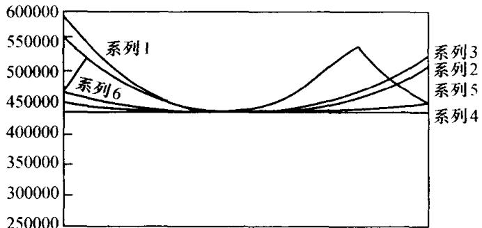

<details>
<summary>line</summary>

| Category | 系列1 | 系列2 | 系列3 | 系列4 | 系列5 | 系列6 |
| --- | --- | --- | --- | --- | --- | --- |
| Point 1 | ~590000 | ~550000 | ~470000 | ~450000 | ~440000 | ~435000 |
| Point 2 | ~520000 | ~480000 | ~440000 | ~435000 | ~435000 | ~435000 |
| Point 3 | ~460000 | ~435000 | ~435000 | ~435000 | ~435000 | ~435000 |
| Point 4 | ~435000 | ~435000 | ~435000 | ~435000 | ~435000 | ~435000 |
| Point 5 | ~435000 | ~435000 | ~435000 | ~435000 | ~435000 | ~435000 |
| Point 6 | ~435000 | ~435000 | ~435000 | ~435000 | ~435000 | ~435000 |
| Point 7 | ~435000 | ~435000 | ~435000 | ~435000 | ~435000 | ~435000 |
| Point 8 | ~435000 | ~435000 | ~435000 | ~435000 | ~435000 | ~435000 |
| Point 9 | ~435000 | ~435000 | ~435000 | ~435000 | ~435000 | ~435000 |
| Point 10 | ~435000 | ~435000 | ~435000 | ~435000 | ~435000 | ~435000 |
| Point 11 | ~435000 | ~435000 | ~435000 | ~435000 | ~435000 | ~435000 |
</details>

优解对零件参数的敏感性曲线图

根据曲线与零件参数的对应关系,从上图可以看出,参数 $x_{1}$ 在最优解附近对目标函数影响最大,即目标函数最优点附近对零件参数 $x_{1}$ 的敏感度大.相比之下,对零件参数 $x_{1}$ , $x_{6}, x_{7}$ 的敏感度较小,也就是说,在最优点附近改变单零件参数 $x_{4}$ 或 $x_{6}$ 或 $x_{7}$ 的标定值,不会引起目标值即总费用太大变化.而对于参数 $x_{5}$ 来说,则是随标定值减少方向敏感而相反方向几乎没有引起目标值的变化.总之目标值对各个零件参数,在最优点附近的敏感性综合如下:

$x_{1}$ : 敏感性高; $x_{2}$ : 左侧敏感性次高, 右侧敏感性低; $x_{3}$ : 左侧不敏感, 右侧敏感性低; $x_{4}$ : 不敏感

$x_{5}$ :左侧敏感性次高,右侧敏感性低; $x_{6}$ :不敏感; $x_{7}$ :不敏感

有了以上参数分析的结果,便可在设计实践中指导控制参数.例如对敏感性高的参数,应尽量保证它在最优值附近;而对那些不敏感的参数可以放宽要求,必要时可作适当调整.

## （二）误差分析

零件参数的取值误差均会引起计算结果的误差. 在以上参数分析中我们讨论了各个参数在最优点附近对目标函数的影响, 由于关系式

$$
x _ {i} = u _ {i} + \Delta x _ {i}, \quad \Delta x _ {i} = r _ {i} u _ {i}, i = 1, \dots , 7
$$

即

$$
x _ {i} = u _ {i} + r _ {i} u _ {i} \quad i = 1, \dots , 7
$$

固定 $r_i$ ，则 $x_{i}$ 与 $u_{i}$ 是线性关系，于是从以上分析结果可以窥得标定值误差对计算结果的影响.结合误差理论，根据多变量误差传递公式，参数 $y$ 的标准误差为

$$
\sigma = \sqrt {\sum_ {i = 1} ^ {7} \left(\frac {\partial F}{\partial x _ {i}}\right) \sigma_ {i} ^ {2}}
$$

再由 $y$ 的计算值 $y_{-}$ , 可得它的百分误差为: $\frac{\sigma}{y_{-}} \times 100\%$

在最优点时有结果

$$
\sigma = 0.071864, \quad y_{-} = 1.49994 \quad \frac{\sigma}{y_{-}}\times 100\% = 4.79\%
$$

又由建模部分有如下关系式 $\sigma_{i}=r_{i}u_{i}$ 对于固定的一组标定值, 标准误差 $\sigma$ 与某个相对系数 $r_{i}$ 的关系是

$$
\sigma = \sqrt {D + L r _ {i} ^ {2}}
$$

其中 $D, L$ 为某一常数值. 于是

$$
\frac {\partial \sqrt {D + L r _ {i} ^ {2}}}{\partial r _ {i}} = \frac {r _ {i}}{\sqrt {D + L r _ {i} ^ {2}}} \rightarrow 0, r _ {i} \rightarrow 0
$$

这就说明 $\sigma$ 对单个相对系数有良好的稳定性. 以下给出了 $A, B, C$ 三个等次相对偏差系数分别对最优解的影响关系曲线.

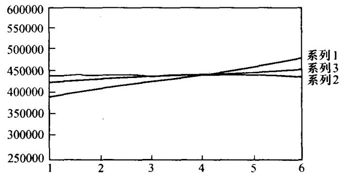

<details>
<summary>line</summary>

| X | 系列1 | 系列3 | 系列2 |
|---|---|---|---|
| 1 | ~440000 | ~425000 | ~390000 |
| 2 | ~440000 | ~430000 | ~410000 |
| 3 | ~440000 | ~435000 | ~425000 |
| 4 | ~445000 | ~445000 | ~445000 |
| 5 | ~465000 | ~450000 | ~445000 |
| 6 | ~485000 | ~455000 | ~435000 |
</details>

优解对相对零件参数的敏感性曲线图

注 系列1曲线对应 $C$ 等, 系列2对应 $B$ 等, 横坐标4处为最优值点. 描点步长为各等级最大相对系数的 $\frac{1}{10}$ 即依次为 $1\%, 0.5\%, 0.1\%$ .

图形表明改变相对系数在最优值点对结果影响不大.例如把 $B$ 等以 $5\%$ 为标准改为以 $5.5\%$ 或 $4.5\%$ 为标准,其它保持不变,可以看出最优目标值变化很小.同理 $A$ 等标准从 $1\%$ 改为 $0.9\%$ 或 $1.1\%$ ,目标值几乎不变. $C$ 等标准不变引起目标值不变稍微大些,但这也在情理之中.因为相对系数处于越大值,传递的误差也越大.

## 八、模型的特点、改进、推广及实际工艺操作

在该模型的建立过程中,我们用了概率论和误差传递的知识,简洁地对实际问题构造了一种数学模型.该模型可以用于一般的零件设计,其给出的目标函数也可以用于通常的产品生产中以估算成本.在建模的过程中,我们充分发挥了计算机的功能,行之有效地获得了几组局部最优解.我们还针对求解灵活地调整程序,从而大大提高了程序运行的效率,并获得了更优的解.但是或许由于模型自身的问题,或许由于非线性规划的现行解法的问题,我们所得的只能是局部最优解.并且由于过多的依赖计算机的运算能力,对该模型的数学内涵也讨论偏少.同时,该搜索方法随着问题所要求的精度的提高,计算时间上将成灾难性的增长.

对于该模型的改进,今后可以对函数作一些性质上的分析,以减少搜索的范围.在搜索方法上,可以采用最优速降法,以加快搜索速度,还可以采用遗传算法.对染色体的基因组采用浮点编码,通过繁殖交叉从而在大量解空间内很快地接近全局最优解.如果不考虑工艺加工上的限制,由于函数的连续性,这样的基因编码方式是可行的.

在实际问题中,考虑的因素将更多,模型将相当复杂.譬如零件标定值的改变可能造成产品不能装配,这样零件间就不是独立相关的了.还可能在实际生产中,该产品的质量要求远远大于其价格因素(如开发新产品的过程中),那么目标函数可变为

$$
\min: g (x) = \text {weight} \times N \sum_ {i = 1} ^ {7} C _ {i} + N (1 0 0 0 p _ {2} + 9 0 0 0 p _ {3})
$$

其中weight表示产品质量对产品价值影响的重要性.weight越小产品质量越重要,weight大产品质量不太重要.也有可能要增加一个零件.这样有两种调整方案,一种是对全局的零件都进行调整,另一种就针对新加零件进行调整.如果考虑算法的效率、工艺操作的简捷性以及人事诸多方面的因素,似乎还是第二种更为合理些.在这种方案下,如果不使用计算机,考虑到使 $F(X)$ 接近 $y_{0}$ 对目标值产生的影响远大于选等级的影响,可以采用如下方法调整:

首先选用该零件的最劣等级, 然后采用类似搜索的方法来试生产, 步长可以适当拉大些, 直到达到一个优值的生产点. 最后, 调整该产品的等级, 再次在这个标定值下进行试生产. 一般地, 每批试生产的产品不需要太多, 有 $3 \sim 50$ 个左右, 就可以使产品很好地符合正态分布, 满足其内在的数学规律. 如果在标定值范围内共有 $2m + 1$ 个生产点的话, 至多试生产 $50(m + 4)$ 个产品就可以得到一个尚可的生产点了. 对于 $m = 3$ 时, 可以采取如图的试生产步骤:

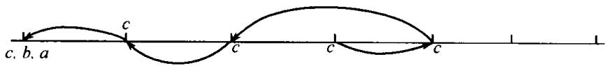

<details>
<summary>text_image</summary>

c, b, a
c
c
c
c
</details>

m=3时的操作步骤(共7次)

对于需要全局调整的方案,这种操作合理但不经济.建议采用计算机求解.

## 参考文献

[1] 符曦著,系统最优化及控制.  
[2] 詹姆斯恩－西多著,最优工程设计－原理及应用.  
[3] 陈立周等著, 工程离散变量优化设计方法 - 原理及应用, 复旦大学出版, 上海.  
[4] 概率论, 机械工业出版社.  
[5] 魏权龄等著, 数学规划与优化设计, 国防工业出版社.

从认识论的观点来看,人们应该给数学科学以无上的地位。

正是数学的广泛用途,使它实质上成为基础的科学。

——J. 勒雷

《当代数学大师》, 李心灿编, 航空工业出版社, 1994。

# 零件参数设计的数学模型

黄杲 陈旭东 邵伟

(浙江大学, 杭州 310027)

指导教师 数模组

编者按 本文先将粒子分离器参数 $y$ 进行局部线性化处理, 并将 $\frac{\Delta y}{\sigma y}$ 化归为标准正态, 其中 $\sigma_y^2 = \sum_{i=1}^{7} \left( \frac{\partial y}{\partial x_i} \sigma_i \right)^2$ , 最后把总费用的目标函数归纳为一个标准正态的式子 (文中(4)式). 以上结果合理、简洁明确. 采用网格法及蒙特卡罗法分别计算, 结果吻合、满意, 得到的解较优, 其中用蒙特卡罗法 (取二万个点) 计算, 在维数不变的情况下, 不失为一种快速而有效的算法.

摘要 本文建立了一个关于零件参数设计的数学模型.本文首先利用概率的理论,假设各零件产品的参数服务从正态分布,推出粒子分离器某参数(y)偏差的分布函数,进而可得一批产品总费用的目标函数,运用龙贝格数值积分将其转化为计算机可求值的函数,然后运用网格搜索法和蒙特卡罗法求出目标函数的全局最优解.

本文将两种方法的结果精度、算法复杂度等进行比较,重点讨论了效果较好的蒙特卡罗法.本文最后分析了模型误差,并对模型进行了评价和推广.

本模型最终得出产品总费用为42.146万元/千件，其设定的零件参数为 $X^{T}[0.075, 0.375, 0.123, 0.115, 1.273, 12, 0.771]^{T}$ ，其容差等级为 $G^{T} = [B, B, B, C, C, B, B]^{T}$ .

## 一、问题的分析

要求解的问题是使总费用最低,而总费用包括各零件成本及次、废品损失费,综合考虑两种因素,问题可归纳为总费用的非线性优化问题.

由于待优化的目标函数复杂,无法利用其解析性质求最优解,故可考虑用直接全局搜索法或随机试验点法.

从生产实际考虑,本问题对解的精确度要求很高,但是对求解算法的实时性无明确要求.我们认为,只要求解时间不是太长,都是可接受的.

## 二、模型的假设及说明

1. 假设各零件参数服从参数为 $\mu_{i}, \sigma_{i}^{2}$ 的正态分布，且不同零件的参数相互独立.  
2. 假设各零件容差的等级与其标定值的比为定值, 分别为: A 级 $\pm 1\%$ , B 级 $\pm 5\%$ , C 级 $\pm 10\%$ .

说明 根据概率论知识和工程实际生产的一些测量数据可知,成批生产的零件的参数服从参数为 $\mu_{i},\sigma_{i}$ 的正态分布,其中 $\mu_{i}$ 为各零件参数的期望值(标定值), $\sigma_{i}$ 为均方差(即容差的 1/3),可推知各零件的偏差 $\Delta x_{i}$ 服从参数为 $0,\sigma_{i}$ 的正态分布.

## 三、文中用到符号及说明

y: 产品某参数

$x_{i}$ ：各零件参数

$y_{0}: \quad y$ 的目标值 $(y_{0} = 1.5)$

$\mu_{i}$ : 各零件参数的标定值

<table><tr><td> $y_{x}$ :</td><td>各零件标定值确定</td><td> $C_{i}$ :</td><td>各零件成本</td></tr><tr><td></td><td>的零件参数</td><td> $\Delta y$ :</td><td>产品的参数的偏差</td></tr><tr><td> $g_{i}$ :</td><td>各零件容差等级比</td><td> $\Delta x_{i}$ :</td><td>各件零件参数偏差</td></tr><tr><td> $x^{T}$ :</td><td> $x_{i}$ 标定值向量( $i = 1,2,\cdots,7$ )</td><td> $p_{i}$ :</td><td>各零件参数均方差</td></tr><tr><td> $X^{(7)}$ :</td><td> $x_{T}$ 的取值空间</td><td> $p_{1}$ :</td><td>次品概率</td></tr><tr><td> $G^{T}$ :</td><td>等级取值向量</td><td> $p_{2}$ :</td><td>废品概率</td></tr><tr><td> $\sigma_{y}$ :</td><td>产品参数的均方差</td><td></td><td></td></tr></table>

## 四、模型的建立和求解

本模型的建立基于概率论与误差的有关理论.

各零件偏差 $\Delta x_{i}$ 相对于其标定值较小, y 在 $y_{x}$ 附近可以表示为:

$$
y \approx y _ {x} + \sum_ {i = 1} ^ {7} \frac {\partial y}{\partial x _ {i}} \cdot \mathrm{d} x _ {i} \tag {2}
$$

由于 $\Delta x_{i}$ 较小，则可得 $\mathrm{d}x_{i}\approx \Delta x_{i}$ ，由于 $\Delta y = y - y_x$ ，则

$$
\Delta y = \sum_ {i = 1} ^ {7} \frac {\partial y}{\partial x _ {i}} \cdot \Delta x _ {i} \tag {3}
$$

在此,我们不加证明地引入:

引理1 $x_{i}$ 服从参数为 $\mu_{i},\sigma_{i}$ 的正态分布，且彼此相互独立， $\alpha_{i}$ 为不全为零的常数，若 $X = \sum_{i = 1}^{7}x_{i}$ ，则

$$
X \sim N \Big (\sum_ {i = 1} ^ {7} \alpha_ {i} ^ {*} \mu_ {i}, \sum_ {i = 1} ^ {7} \alpha_ {i} ^ {2 *} \sigma_ {i} ^ {2} \Big)
$$

根据公式(3) $\frac{\partial y}{\partial x_{i}}$ 对应一组 $x_{i}$ 为一定值,而与 $\Delta x_{i}$ 无关,则由引理1可得

$$
\Delta y \sim N (0, \sigma_ {y} ^ {2}), \quad \left(\sigma_ {y} ^ {2} \triangleq \sum_ {i = 1} ^ {7} \left(\frac {\partial y}{\partial x _ {i}} \cdot \sigma_ {i}\right) ^ {2}\right)
$$

(以上结论也可由方差合成定理推得, 见文献 $[2]p93$ ).

由概率论知识可得 $\frac{\Delta y}{\partial y}\sim N(0,1)$

目标函数的建立

产品总费用 = 零件总成本 + 次品的损失费 + 废品损失费

即 $W = \sum_{i=1}^{7} C_i + 1000 \times p_1 + 9000 \times p_2$ 可得

$$
\begin{array}{l} W = \sum_ {i = 1} ^ {7} C _ {i} + 9 0 0 0 + 1 0 0 0 \times \left[ \Phi \left(\frac {1 . 4 - y _ {x}}{\sigma_ {y}}\right) - \Phi \left(\frac {1 . 6 - y _ {x}}{\sigma_ {y}}\right) \right] \\ - 8 0 0 0 \times \left[ \Phi \left(\frac {1 . 8 - y _ {x}}{\sigma_ {y}}\right) - \Phi \left(\frac {1 . 2 - y _ {x}}{\sigma_ {y}}\right) \right] \tag {4} \\ \end{array}
$$

目标函数为

$$
\min \quad W, \quad s. t \quad x ^ {T} \in X ^ {(7)}
$$

## （一）对于原设计数据的求解

1. 在 Mathematics 2.1 下运行, 代入数据 $X^{T} = [0.1, 0.3, 0.1, 0.1, 1.5, 16, 0.75], G = [B, C, C, C, C, B]$ 可得结果如下:

$$
y = 1. 7 2 5 5 9, p _ {1} = 0. 6 2 4 0, p _ {2} = 0. 2 5 0 5, W = 3 0 7. 8 5 \text {万元}.
$$

从结果可以看出, $p_{1}+p_{2}=0.8745$ ,即产品大部分为次废品,这是 $y_{x}$ 偏离 $y_{0}$ 过大的结果,此时产品总费用主要由次废品损失费决定,由此可知,在进行参数设计时,应尽量先使 $y_{x}$ 靠近 $y_{0}$ ,同时降低均方差.这也是本模型降低算法复杂度的一个方向.

## （二）对目标函数 $\min W$ 的求解及参数的重新设计

## 1. 将目标函数转化为计算机的可求解模型

由于原目标函数中的积分部分中被积函数为正态分布函数,且其积分限为含有7维变量的复杂函数,无法直接求解,所以需将其转化为计算机可求解模型,我们考虑用二种方法进行转化.

对于标准正态分布函数可采用最小二乘拟合法逼近,将其转化为多项式表达,但从其结果来看,误差较大,故不可取.所以我们采用精度较高的龙贝格数值积分法来转化目标函数 $^{[4]}$ .此方法为本模型高精度求解的出发点.

## 2. 用直接搜索法求最优解(网格法)

原目标函数为7维多峰函数,无法用解析法精确求解,故考虑用直接搜索法.常用的算法对于一般的多峰函数极值问题只能求出局部最优解,而网格法为求解多峰函数全局最优解的一种较适宜的方法,所以我们首先考虑用网格法求解最优目标.

我们对于每一个 $x_{i}$ 在其取值范围内均取6个步长，分为 $6^{7}$ 个网格，结合可能的容差等级组合，在Pentium120计算机上运行，搜索约二十分钟后，得到一个最优解，结果是 $X^{T} = [0.075, 0.345, 0.115, 0.115, 1.275, 12, 0.7875]^{T}, G^{T} = [B, B, B, C, C, B, B]^{T}, Y_{X} = 1.497145, \sigma_{Y} = 0.069220; \omega = 42.49146$ 万元。从结果可以看出，在一定精度内已求得一个较好的最优解，我们可以通过降低算法复杂度，使模型得到更好的应用。

但是根据网格法基本原理,其循环次数由步长所决定,而步长又由模型精度所决定,故在一定精度要求下,其算法复杂度不能大幅度降低.我们可考虑采用蒙特卡罗法进行求解.

## 3. 蒙特卡罗法

蒙特卡罗法,也就是随机实验点法.它的基本思想是:在函数的可行域内随机地选取实验点,由于随机取得的点在区域中分配比较均匀,所以对函数的大致形态能较好地体现 $^{[3]}$ .

模型中的随机点是用以下方法产生的.

设 $m = 2^{16}, r_0 = 5$ ，由迭代式可得 $(0,1)$ 间的 $p_i$

$$
\left\{ \begin{array}{l l} r _ {i} = \mathrm{mod} (2 0 5 3 r _ {i - 1} + 1 3 8 4 9; m), & i = 1, 2, \dots \\ p _ {i} = r _ {i} / m & p _ {i} \text {为第} i \text {个随机数} \end{array} \right.
$$

设 $q_{i}$ 为 $a$ 到 $b$ 间的随机数，则 $q_{i} = a + (b - a)p_{i}$ . 我们编制了蒙特卡罗算法的程序(略). 程序的运行时间为2分钟, 最终的计算结果为 $X^{T} = [0.0778, 0.374, 0.0979, 0.1067, 1.200, 12, 526, 0.636]^{T}, G^{T} = [B, B, B, C, C, B, B]^{T}; y_{x} = 1.499136, \sigma_{y} = 0.069125; W = 42.3174$ 万元. 为了降低蒙特卡罗法网格法的复杂度, 采用了一些优化的方法:

## (1) 程序的优化

必要的判断语句应尽量提早进行,以减小循次数或计算量.(如: $y_{x}$ 应尽量靠近 $y_{0}$ ,因此可将偏离 $y_{0}$ 过大的 $y_{x}$ 判断排除,以减少计算次数).

## (2) 数据排除技巧

从粗略的直接搜索法结果可以看出,不同容差等级组合对应的局部最优角相差较大,而 $G_{1}^{T}$ 和 $G_{2}^{T}$ 因为总成本过大,是不可能取到的.

4. 为进一步比较内最优解的大小, 可分别对优化目标在 $G_1^T$ 和 $G_2^T$ 内的最优解附近作探测性移动 (类似于直接搜索方法中的 Hooke = Jeeves 方法[3]), 进行高精度计算, 分别得到 $W'_1 = 43.14865$ , $W'_2 = 42.68475$ , 因此, 能够求得具有一定精度的最优解 42.14865 万元. 此时所对应的零件参数为

$$
\begin{array}{l} X ^ {T} = \left[ 0. 0 7 5, 0. 3 4 5, 0. 1 2 3, 0. 1 1 5, 1. 2 7 3, 1 2, 0. 7 7 1 \right] ^ {T}, \\ G ^ {T} = \left[ B, B, B, C, C, B, B \right] ^ {T}, \\ y _ {x} = 1. 4 9 6 8 3, \quad \sigma_ {y} = 0. 0 6 8 7 7 7, \quad W = 4 2. 1 4 6 3 \text {万元}. \\ \end{array}
$$

## 五、模型的检验及误差分析

## (一) 模型的检验

由于我们没有一个确定的标准对本模型的解进行判断检验, 只能采取不同的方法, 对结果进行比较.

检验模型

在对题目中给定数据的计算结果分析时,我们曾说过,在设计参数时,应尽量使 $y_{x}$ 靠过 $y_{0}$ ,由此可建立如下模型.在同一容差等级组合下,令 $y_{x}=y_{0}$ 将 $x_{5}$ 视为

$$
\begin{array}{l} 1 7 4. 4 2 \times \left(\frac {x _ {1}}{y _ {x}}\right) \times \left(\frac {x _ {3}}{(x _ {2} - x _ {1})}\right) ^ {0. 8 5} \\ \times \left(\frac {\left(1 - 2 . 6 2 \times \left(1 - 0 . 3 6 \times \left(\frac {x _ {4}}{x _ {2}}\right) ^ {- 0 . 5 6}\right) ^ {\frac {1}{1 6}}\right)}{\left(x _ {1} \times x _ {7}\right) ^ {0 . 5}}\right) \\ \end{array}
$$

函数,由概率论知识,当 $y_{x}=y_{0}$ 时,若 $\sigma_{y}$ ,次废品概率越小,总费用越低,因此,可将目标函数变为 $\min\sigma_{y}\text{s.t }y_{x}=1.5$ ,运行最后结果为 $X^{T}=[0.75,0.375,0.075,0.12,0.934,12.8,0.5625]^{T},y_{x}=1.50000;\sigma_{y}=0.068901;W=42.1949$ 万元.比较原模型和检验模型的结果可知,产品的最低总费用应在 $42.1\sim42.2$ 万元之间,而且对应最低总费用的零件参数值较合理,这说明原模型的算法是可靠的.

另外,网格法和蒙特卡罗方法所求得的最优解也相互吻合,这也说明此结果是值得依赖的.

对于目标函数本身而言,它虽然不是一个初等函数,却是对于七个自变量的连续函数,由连续函数的介值定理,在全局最优解附近存在一个区域,其内任何一点的值均小于其它鞍点的值,即使这块区域只有整个容许区域的万分之一,在蒙特卡罗方法取二万个点的情况下,落入该区域的概率仍接近60%(点与点之间相互独立),在多次运用蒙特卡罗求解的情况下,一般是能够求出全局最优解的,当然,我们并不排除得到的只是局部最优解而非全局最优解的可能性.

## （二）误差分析

## 1. 建模误差

根据实际情况分析, 可知公式(2)的推导带有一定误差, 它实际上舍弃了 Taylor 展开时的七个变量的一阶无穷小量, 其依据是 $\frac{\Delta x_{i}}{x_{i}} \leqslant 0.1$ , 虽然较小, 但仍带有一定误差.

## 2. 计算机截断误差

计算机在进行求解时字长有限,有一部分数值会被舍弃,但对本模型基本上可忽略.

3. 受网格法的步长限制不能搜索到准确数值,该误差可能较大,但通过模型求解部分的探测性移动方法可使该误差减小;

同时,龙贝格数值积分也会有误差,程序中的积分精度为 $10^{-5}$ .

## 六、模型的评价(略)

## 参考文献

[1] 范大茵、陈永华, 概率论与数理统计, 浙江大学出版社, 杭州, 1996  
[2] 肖明耀, 误差理论与应用, 计量出版社, 北京, 1985  
[3] 席少霖、赵凤治、最优化计算方法，上海科学技术出版社，上海，1983  
[4] 徐士良, C 常用算法程序集(第二版), 清化大学出版社, 北京, 1996

数学的重要性的非自明性：

作为一种技术的数学科学的作用未被认识到,数学科学作为技术变化以及工业竞争的推动力的作用的极端重要性也未被认识到。

J.G. Glimm ed., Mathematical sciences, Technology, and Economic Competitiveness, National Academy Press, Washington DC, 1991, p. 7.

# 零件的参数设计

## 中国科技大学 何华海 李江滔 束礼宝

## 指导教师 薛剑耿

编者按 本文深入分析了零件参数设计中的优化问题，将其归结为一个有约束的非线性规划问题，并提出“分两步走”的策略来简化问题。采用了蒙特卡罗方法模拟和线性近似，计算了总体参数的最优解。从实用角度，文章又引人了一个目标函数，使得整个处理大大简化。本文对模型的检验也有特色，--方面用拟合优度检验了 $y$ 是否服从正态分布，另一方面也对分两步走策略的有效性进行了检验。

摘要 本文对零件参数设计问题提出了有效的算法，零件参数设计可以归结为在一定约束条件下求总费用(成本和质量损失的总和)最小的一个非线性规划问题。我们采用分两步走的策略来简化问题，即首先选定零件参数的标定值，再在此基础上选取零件容差等级。

设计的总费用是由 $y$ 的具体分布所决定的。我们采用了两种方法来计算 $y$ 的概率分布：一种是用蒙特卡罗方法来模拟；另一种是将 $y$ 的经验公式作线性近似，得到 $y$ 近似服从正态分布。我们又引入了函数 $E(y - 1.5)^2$ ，以此作为新的目标函数对问题进行简化。对模型的求解，我们采用了梯度法来搜索目标函数在限定区域内的最优解，得到相应的总费用（单件产品）为430元，远低于原设计方案的3150元。

通过检验，我们发现通过线性近似得到 $y$ 服从正态分布的结论是基本可靠的，分两步走策略也是合理、有效的。最后我们还讨论了当质量损失函数为连续（特例为抛物线）时的情形。

## 一、问题的提出（略）

## 二、模型的假设

1. 各个零件的参数 $x_{1}, x_{2}, \cdots, x_{7}$ 是互相独立的正态分布随机变量；  
2. 标定值在容许范围内都可以取，并且在此范围内 $y$ 是二阶可导的；  
3. 产量 1000 是大数，可以用各种概率上的极限定理；

4. 所有零件的均方差都是其容差的三分之一；

5.1000 个产品中，每个产品都用相同等级的零件；

6. 假设产品当 $1.4 < y < 1.6$ 时为正品，此时无质量损失；当 $1.2 < y \leqslant 1.4$ 或 $1.6 \leqslant y < 1.8$ 为次品，损失1000元；当 $y \leqslant 1.2$ 或 $y \geqslant 1.8$ 时为废品，损失9000元.

## 三、符号约定

$x_{i}(i=1,2,\cdots,7)$ 零件参数, $\vec{x}=(x_{1},x_{2},\cdots,x_{7})$ ,

$\mu_{i}(i=1,2,\cdots,7)$ 零件参数的标定值, $\vec{\mu}=(\mu_{1},\mu_{2},\cdots,\mu_{7})$ ,

$\sigma_{i}$ 或 $\sigma_{x}(i=1,2,\cdots,7)$ 零件参数的均方差，

$a_{i}, b_{i}(i = 1,2,\cdots,7) \quad x_{i}$ 标定值的上下界，

y 产品性能的参数，

$y_{0}$ y 的目标值( $y_{0}=1.5$ ),

$\sigma$ 或 $\sigma_{y}$ 产品参数的均方差，

$f(y)$ y 的概率密度函数，

$g(y)$ 单件产品 y 偏离 $y_{0}$ 造成的损失，

$p_i\left(\frac{3\sigma_i}{\mu_i}\right)$ 第 $i$ 个零件选取容差为 $\frac{3\sigma_i}{\mu_i}$ 时的成本.

## 四、问题的分析

单件产品的费用包括两部分：一是七个零件的总成本，二是由产品性能参数 $(y)$ 偏离目标值 $(y_{0})$ 而造成的损失。零件的成本是由零件的容差等级决定的；对于大批产品，y偏离 $y_{0}$ 而造成的损失则由y的具体分布决定，而y的分布又取决于各零件的标定值和容差等级。因此，原问题归结为在一定约束条件下求某目标函数的最小值的一个非线性规划问题。这里的目标函数就是零件参数设计的总费用，而约束条件则是各零件标定值的容许范围和可能的容差等级。

由于容差等级和零件参数标定值是结合在一起决定总费用，因此，为求得总费用的最小值，必须将两者结合起来考虑。由于七个零件容差等级选取总共可以有 $1^{2} \times 2^{2} \times 3^{3} = 108$ 种，使问题变得很复杂。为简便起见，求解这个非线性规划问题时，我们可以分两步来考虑。首先固定各零件容差等级（对应固定零件参数的方差和成本），选择零件参数标定值使得损失质量最小；然后在此基础上，固定各零件参数标定值，在所有容差等级选取方法（共108种）中选取使得成本最小的配置。这种分两布走的方法虽然并不完全等价于原来的非线性规划，但它却可以使问题大大简化。实际上，这也是工业上采用的零件参数设计的一般方法。

我们假设了七个零件参数 $x_{i}(i=1,2,\cdots,7)$ 是互相独立的正态分布随机变量。产品的性能参数 y 由这些零件参数所决定，但是由于 y 的经验公式很复杂，我们无法解析地给出 y 的具体分布。一种处理的方法是采用蒙特卡罗方法，通过计算机模拟来获得 y 的分布；另外也可通过对 y 的经验公式作某种近似（如线性化等），以期能解析地给出 y 的近似分布。

## 五、模型的建立

## 1. 目标函数

我们的目标函数是总的费用 $F$ ，它包含两项：质量损失 $L$ 和零件成本 $C$ ，即 $F = L + C$ .

对于大批产品的平均质量损失，有 $L = \int_{-\infty}^{+\infty} f(y) g(y) \, \mathrm{d}y$ ，其中 $f(y)$ 为 $y$ 的概率密度函数， $g(y)$ 为单件产品参数 $y$ 偏离 $y_0$ 造成的损失函数。我们假设了 $g(y)$ 呈阶梯状，也就是说产品当 $1.4 < y < 1.6$ 时为正品，此时无质量损失；当 $1.2 < y \leqslant 1.4$ 或 $1.6 \leqslant y < 1.8$ 为次品，损失1000元；当 $y \leqslant 1.2$ 或 $y \geqslant 1.8$ 时为废品，损失9000元。

$$
L = \int_ {- \infty} ^ {+ \infty} f (y) g (y) \mathrm{d} y
$$

$$
\begin{array}{l} = 9 0 0 0 \left(\int_ {- \infty} ^ {1. 2} + \int_ {1. 8} ^ {+ \infty}\right) f (y) d y + 1 0 0 0 \left(\int_ {1. 2} ^ {1. 4} + \int_ {1. 6} ^ {1. 8}\right) f (\dot {y}) d y \\ = 9 0 0 0 - 8 0 0 0 \int_ {1. 2} ^ {1. 8} f (y) \mathrm{d} y - 1 0 0 0 \int_ {1. 4} ^ {1. 6} f (y) \mathrm{d} y. \\ \end{array}
$$

单个产品的成本 C 为各个零件的成本总和， $C = \sum_{i=1}^{7} p_i (\sigma_i / \mu_i)$ ，其中 $p_i (\sigma_i / \mu_i)$ 第 i 种零件容差为 $(3\sigma_i / \mu_i)$ 等级对应的成本 $(i = 1, 2, \cdots, 7)$ .

我们的目标是使总费用最小，即求解如下非线性规划问题：

$$
\min \quad F = L + C = F \left(\mu_ {1}, \dots , \mu_ {7}; \quad \sigma_ {1}, \dots , \sigma_ {7}\right)
$$

$$
s. t. \quad a _ {i} \leqslant \mu_ {i} \leqslant b _ {i}
$$

$$
3 \frac {\sigma_ {i}}{\mu_ {i}} = 1 \% \text {或} 5 \% \text {或} 10 \%, i = 1, 2, \dots , 7.
$$

根据我们前面提出的两步走策略,这个问题可以分解为以下两个子问题:

$$
P _ {1}: \min L = L (\mu_ {1}, \dots , \mu_ {7}),
$$

s.t. $a_{i}\leqslant \mu_{i}\leqslant b_{i},\frac{\sigma_{i}}{\mu_{i}}$ 给定

$$
P _ {2}: \min F = L + C = F (\sigma_ {1}, \dots , \sigma_ {7}),
$$

s.t. $3\frac{\sigma_i}{\mu_i} = 1\%$ 或 $5\%$ 或 $10\%$

依次求解 $P_{1}$ 和 $P_{2}$ 后，可得到近似的最优解，其中求解 $P_{1}$ 时给定一组 $\frac{\sigma_i}{\mu_i} (i = 1,2,\dots ,7)$ 而求解 $p_2$ 时则使用 $P_{1}$ 给出的一组标定值.

## 2. 目标函数的求值

## (1) 蒙特卡罗方法

如果给定 $\mu_{1}, \cdots, \mu_{7}; \sigma_{1}, \cdots, \sigma_{7}$ ，则 y 的分布是一定的。但是，由于 y 的经验公式很复杂，我们难以给出解析形式。而求目标函数值又必须要用到 $f(y)$ 的函数值。一种方法是使用蒙特卡罗法，借助于计算机的伪随机数模拟去近似 $f(y)$ 。

由计算机可直接得到 $U[0,1]$ ，再用舍取法产生标准正态分布 $N(0,1)$ ，由 $N(0,1)$ 经过变换即可得到一般正态分布 $N(\mu, \sigma^2)$ ，从而可模拟 $x_1, x_2, \dots, x_7$ 这七个两两独立的正态分布的随机变量。每模拟一次，都可根据 $y$ 的经验公式得到 $y$ 的一个样本。知道了大量的 $y$ 的样本，自然很容易求出 $f(y)$ 来，从而可以得到目标函数值。

## (2) 线性近似

由于每求一次目标函数值都需用蒙特卡罗法模拟 $y$ 的分布，这样运算量便很大。一种简单的方法是用解析的形式给出 $y$ 的近似分布。

对 y 在 $(\mu_{1}, \cdots, \mu_{7})$ 处作泰勒展开，近似到一阶，得到 y 的近似表达式

$$
\begin{array}{l} y (x _ {1}, \dots , x _ {7}) = y (\mu_ {1}, \dots , \mu_ {7}) + \\ \sum_ {i = 1} ^ {7} \frac {\partial y \left(x _ {i} , \cdots , x _ {7}\right)}{\partial x _ {i}} \Bigg | _ {\vec {x} = \vec {\mu}} \left(x _ {i} - \mu_ {i}\right), \\ \end{array}
$$

可见 $y$ 已被近似为七个零件参数的线性组合. 由于 $x_{i}$ 是相互独立的正态分布随机变量, $x_{i} \sim N(\mu_{i}, \sigma_{i}^{2})$ , 由概率知识容易知道 $y$ 是服从均值为 $\mu_{y}$ , 方差为 $\sigma_{y}^{2}$ 的正态分布随机变量,

其中

$$
\mu_ {y} = E y = y (\mu_ {1}, \dots , \mu_ {7}), \sigma_ {v} ^ {2} = \operatorname{Var} y = \sum_ {i = 1} ^ {7} \left(\frac {\partial y}{\partial x _ {i}}\right) ^ {\frac {1}{2}} \sigma_ {x _ {i}} ^ {2}
$$

于是， $y$ 的概率密度函数为

$$
f (y) = \frac {1}{\sqrt {2 \pi} \sigma_ {y}} \exp \left\{- \frac {(y - \mu_ {y}) ^ {2}}{2 \sigma_ {y} ^ {2}} \right\},
$$

从而质量损失

$$
\begin{array}{l} L = 9 0 0 0 - i 1 0 0 0 \left[ 8 \Phi \left(\frac {1 , 8 - \mu}{\sigma}\right) - 8 \dot {\Phi} \left(\frac {1 , 2 - \mu}{\sigma}\right) \right. \\ \left. + \Phi \left(\frac {1 . 6 - \mu}{\sigma}\right) - \Phi \left(\frac {1 . 4 - \mu}{a}\right) \right] _ {-}, \\ \end{array}
$$

其中

$$
\Phi (x) = \int_ {- \infty} ^ {x} \frac {1}{\sqrt {2 \pi}} \exp \left\{- \frac {z ^ {2}}{2} \right\} d z,
$$

## 3. 新的目标函数

从总费用的表达式可以看出，只要 $y$ 尽可能地分布于 $y_0$ 周围，则可以使 $P(1.4 < y < 1.6)$ 和 $P(1.2 < y < 1.8)$ 尽可能地大，从而使总费用最低。基于这种考虑，我们提出了一个新的目标函数： $E(y - y_0)^2$ 并在原有约束下求此目标函数的最小值

$$
E (y - y _ {0}) ^ {2} = \operatorname{Var} (y - y _ {0}) ^ {2} + [ E (y - y _ {0}) ] ^ {2}
$$

$$
i \hat {\mathrm{介}} [ 1, 1 ] = \operatorname{Var} y. + (E y (- y _ {0}) ^ {2};
$$

类似于线性模型

$$
\begin{array}{l} \operatorname{Var} y = \sigma_ {y} ^ {2} = \sum \left(\frac {\partial f}{\partial x _ {i}} \Bigg | _ {\vec {\mu}} \sigma_ {i}\right) ^ {2}, \\ E _ {i j} = f (\vec {\mu}), \\ \end{array}
$$

因此 $E(y + y_0)^2 \neq a_1^2 [f(\vec{\mu}) + |y_0|)^2$ ，这样问题就转化为在给定约束条件下，求上式的最小值.

## 六模型求解

## 1. 子问题 $P_{1}$ 的求解

我们的目的是使目标函数 $L(\mu_1, \mu_2, \mu_3)$ 最小化，这是一个有约束 $(a_i \leqslant \mu_i \leqslant b_i, z = 1, \cdots, 7)$ 的非线性规划问题。我们使用梯度算法[3]来求得极值并假设在约束范围内有极值且可由一组初始值求得。

所谓梯度法就是逐点确定寻优方向，再通过一维寻优确定步长的求解多维无约束非线性规划问题的方法。

为了使 $L(\mu_{1},\cdots,\mu_{7})$ 最小，我们列出主要步骤如下：

(1) 给定一初始值 $\vec{\mu}^{(0)}$ 与精度 $\varepsilon > 0, R_{1} > 0$ ;  
(2) 若 $\| \nabla g(\mu^{(k)})\| \leqslant \varepsilon$ 则停止，并求出最小值 $\vec{\mu}^{*} = \vec{\mu}^{(k)}$ ；否则转(3)；  
(3) 由 $\liminf(g'(\vec{\mu}^{(k)} + \lambda[\nabla^1 g'(\vec{\mu}^{(k)})))$ 求得 $\lambda_k^j$ ，并令 $|\vec{\mu}^{(k+d)}| = |\vec{\mu}^{(k)} - |\lambda_k|\nabla g'(\vec{\mu}^{(k)})|$ ，令 $\lambda_k \neq 0$ 转入 (2).

对子问题的求解给出的极值点就是我们选择的标定值

## 2 对 $P_{1}$ 子问题的求解

在选定标定值的基础上，我们从所有可能的容差选择方式(共108种)中选取使总费用最低的一种(或几种)作为我们的设计的容差等级

由于零件的容差也影响 $y$ 的质量 必须综合考虑零件标定值和容差，并一起调整使之最优。但是若每次都穷举容差的话，会使计算复杂度大大增加。可设想先使各零件等级最低，求出 $\mu_1 \sim \mu_7$ 的一组值，分析相应的效益值，然后删除成本过高的等级，再进行穷举。

## 七、结果

使用梯度法，代入初值 $x_{1} \sim x_{7}$ ，并遍历零件的各个等级，求出一组局部最优解。由于 $y$ 的分布是用计算机随机数模拟出来的，所以每次运行结果都不一定相同，目标函数波动为15。

<table><tr><td></td><td> $x_{1}$ </td><td> $x_{2}$ </td><td> $x_{3}$ </td><td> $x_{4}$ </td><td> $x_{5}$ </td><td> $x_{6}$ </td><td> $x_{7}$ </td><td>等级</td><td>费用</td></tr><tr><td>初始值</td><td>0.1</td><td>0.3</td><td>0.1</td><td>0.1</td><td>1.5</td><td>16</td><td>0.75</td><td>BCCCCCB</td><td>3150</td></tr><tr><td>蒙特卡罗法</td><td>0.093</td><td>0.302</td><td>0.096</td><td>0.101</td><td>1.50</td><td>16</td><td>0.75</td><td>BBBCCBB</td><td>430</td></tr><tr><td>线性近似</td><td>0.079</td><td>0.305</td><td>0.087</td><td>0.104</td><td>1.401</td><td>12.0</td><td>0.60</td><td>BBBCCBB</td><td>435</td></tr><tr><td>新目标函数</td><td>0.093</td><td>0.302</td><td>0.096</td><td>0.101</td><td>1.500</td><td>16</td><td>0.75</td><td>BBBCCBB</td><td>754</td></tr></table>

## 八、模型的检验

1 用正态分布近似 $y$ 的分布的可行性检验

在线性模型中，我们用正态分布 $N(\mu_y, \sigma_y^2)$ 来近似 $y$ 的分布。对此，我们在最优解处作了拟合优度检验。

1) 由蒙特卡洛法模拟产生 $y$ 的 $N$ 个样本值；  
11) 把 $y$ 的可能取值范围分成 $k (k = 14)$ 个区间，并判断样本落在各区间的频数 $v_{i}$ ，（并使 $Np_{i} \geqslant 5$ ）；  
iii) 计算统计量 $Z = \sum (N p_{i} - v_{i})^{2} / N p_{i}$ , 其中 $p_{i}$ 为正态分布, $N(\mu_{y}, \sigma_{y}^{2})$ 在第 $\iota$ 个区间内的理论概率;  
1v) 拟合优度 $p(Z) = 1 - \chi_{k-1}^{2}(Z)$ .

通过计算,我们得到 $p(Z)=0.19$ , 这说明我们用正态分布 $N(\mu_{y},\sigma_{y}^{2})$ 来近似 y 的实际分布是可靠的.

## 2. 模拟的误差

我们用蒙特卡洛法模拟 $y$ 的分布时使用的样本个数是1000，与成批生产的产量一致。但是计算机模拟的统计量必然有一定的波动性，我们对同样一组标定值和等级进行多次模拟，发现目标函数的波动程度在15元左右。因此，我们的模型所给出的精度顶多也只能达到这个值。

## 3 参数选择分两步走的有效性

若同时对标定值和容差等级求最优解，则计算复杂度过大，为此我们采用了两步走的近似方法：

第一步 使各零件都取最低容差等级,求出各零件标定值的最优解(梯度法);

第二步 固定标定值，求容差等级的最优解(遍历).

· 作为对比，在线性模型中，我们同时考虑标定值和容差等级，也用梯度法求得极值，结果为430元，这和分两步走的结果435元非常接近，这说明了我们的分两步策略是十分有效的.

## 九、讨论

## 1. 质量损失 $g(y)$ 的另一种理解

有些产品参数，离目标值越近越好，甚至于突破人为的等级限制，即 $g(y)$ 随 $y$ 连续变化，而不是如假设6所述的阶梯函数一种可能的情况是 $g(y) = k(y - 1.5)^2$ ，其中 $k = 10^5$ 此时 $L = \int_{-\infty}^{\infty}f(y)\mathrm{d}y = kE(y - 1.5)^2$ ，这正是我们前面提出的第二个目标函数.以这种解释求得的目标函数最优解780.

## 2. 局部最优解和全局最优解

我们的模型给出的都是局部的最优解(区域内的极值)，这不一定就是目标函数在整个区域内的最优解。但是，如果多取几个初始值求极值的话，可以尽可能缩小我们的结果与最优解的差距，甚至达到最优解。

## 3. 优缺点分析

(1) 线性模型避免了蒙特卡洛法所需的大量模拟，从而提高了运算速度；  
(2) 线性模型在一般的情况下也能给出比较理想的结果；  
(3) 分两步走的策略有效地简化了问题，同时也给出了非常接近最优解的结果；  
(4) 我们给出的都是局部的最优解，并不能保证它就是问题的全局最优解；  
(5) 由于进行蒙特卡洛方法模拟的次数有限(1000)，这使得我们给出的总费用精度有限，误差为 ±15 元.

## 参考文献

[1] 严颖、成世学，运筹学随机模型，北京：中国人民大学出版社，1995.  
[2] 盛昭瀚、曹忻, 最优化方法基本教程, 南京: 东南大学出版社, 1993.  
[3] 徐士良, C 常用算法程序集, 北京: 清华大学出版社, 1994.  
[4] 陈希孺，概率论与数理统计，合肥：中国科技大学出版社，1993.

# 零件参数设计的动态规划模型

高洁 郭去疾 康俊海

(中国科技大学, 合肥 230026)

指导教师 季识卓

编者按 本文按相对误差来定义产品参数 y 对各零件参数的敏感程度,以此为依据进行空间裁剪,尽快地在解最可能出现的区域中搜索到满意的解.文中关于次品率的讨论,以及利用 y 的矩来对结果进行优度评估,也很有特色.

摘要 对于本零件参数设计问题,我们建立一个动态规划模型,分阶段以不同的目标搜索求优,在每阶段中,必须以继承和保持前面已获得的目标做为约束条件.在实施动态规划前,根据题设经验公式,先把零件参数根据敏感性进行分类,对零件参数的取值空间作裁剪,把求优空间充分缩小.

假设各零件参数独立正态分布,对求优空间中的每组候选值,随机模拟出性能参数 y 的概率密度函数,从而确定它是否满足阶段目标和最终目标.

编制程序实现算法后,我们得到了四百多组满意的设计方案,并给出一组推荐方案.其总费用为421元/台.求得原设计方案的总费用为3202元/台,费用降低为2781元.

当零件参数的分布函数未知时,我们利用矩的方法重建产品性能参数 y 的分布函数,从而可以利用我们的动态规划的模型进行参数设计.我们对模型进行总结,给出了零件设计的一般方法.最后,我们对模型和算法进行了进一步的讨论,并给厂家提出了一些实用的建议.

## 一、问题的提出(略)

## 二、合理的假设

1. 产品参数 $y$ 与零件参数的关系只由题中所给的经验公式决定,与其他因素无关.  
2. 对同一种零件, 在标定值范围内其成本只由容差等级所决定, 与标定值的大小无关.  
3. 零件的标定值在其允许范围内可连续变化, 不考虑有分立的国标值的情况.

4. 各个零件的标定值和容差相互独立.

5. 零件的参数是随机变量, 满足正态分布, 标定值是其数学期望.

6. 在生产单件产品的过程中, 每种零件只用了一个.

7. 按照工业生产的惯例, 假设 $y$ 偏离目标值造成的损失是阶梯性的, 即 $y$ 的偏离值小于 0.1 时损失为 0, $y$ 的偏离值在 0.1 和 0.3 之间损失为 1000 元, $y$ 的偏离值大于 0.3 时损失为 9000 元.

符号说明

$\eta$ : 对产品性能有影响的零件种类, $n = 7; x_{i}$ : 第 i 个零件的参数, $i = 1, 2, \cdots, n$ ;

F: 生产离子分离器的总费用; N: 生产粒子分离器的总数目;

C: 零件总成本; L: y 偏离所带来的总损失 L;

$L_{1}, L_{2}$ : 产品分别为次品和废品时带来的损失; $P_{1}, P_{2}$ : 产品分别为次品和废品的几率;

$q_{i}^{2}$ : 产品性能对零件参数的敏感系数, 即全系数; $\sigma_{i}, \sigma_{y}$ : 第 i 个零件和 y 的均方差

## 三、问题的分析

## 1. 目标函数的建立

生产离子分离器的总费用 F 由两部分组成: 零件成本 C 和 y 偏离 $y_{0}$ 所带来的损失 L, 即:

$$
F = C + L \tag {1}
$$

令 $L_{1}$ 表示产品为次品时的损失， $L_{2}$ 表示产品为废品时的损失， $P_{1}, P_{2}$ 分别表示次品和废品产生的几率，则总损失可表示为：

$$
L = N (L _ {1} \cdot P _ {1} + L _ {2} \cdot P _ {2}) \tag {2}
$$

由经验公式， $y$ 是各零件参数的函数，其密度分布函数设为 $f(y)$ ，则次品和废品产生的几率 $P_{1}, P_{2}$ 可表示为：

$$
P _ {1} = \int_ {y _ {0} - 0. 3} ^ {y _ {0} - 0. 1} f (y) \mathrm{d} y + \int_ {v _ {0} + 0. 1} ^ {y _ {0} + 0. 3} f (y) \mathrm{d} y
$$

$$
P _ {2} = \int_ {- \infty} ^ {\nu_ {0} - 0. 3} f (y) \mathrm{d} y + \int_ {y _ {0} + 0. 3} ^ {+ \infty} f (y) \mathrm{d} y \tag {3}
$$

综合上式,我们的目标函数为:

$$
\min \{F \} = \min \left\{C + N (L _ {1} \cdot P _ {1} + L _ {2} \cdot P _ {2}) \right\} \tag {4}
$$

由于 $P_{1}, P_{2}$ 是统计量, 因此即使在零件的参数包括标定值和容差确定的情况下, $F$ 也是一个统计量, 有一个波动范围, 也就是说我们的目标函数应是 $\min \{E(F)\}$ , 即 $F$ 的期望的最小值. 实际上, 我们在下文中讨论的多数命题都是在统计意义下成立的

## 2. 目标函数与零件参数的关系

直接研究目标函数与 $x_{1}, x_{2}, \cdots, x_{n}$ 之间的关系较为困难，因此，我们分成两个步骤来考虑：一是研究目标函数与 y 的关系，另一个是研究 y 与 $x_{1}, x_{2}, \cdots, x_{n}$ 的关系。

(1) 不考虑成本影响时, 目标函数是密度函数的区间积分值, 因为前者无法得到解析表达, 要得到两者严格的数学关系是不可能的, 但总体上讲, $y$ 的均值离标定值 1.5 越近, 这个积分值越大; $y$ 的方差越大, 这个积分值也越大; 在均值接近 1.5, 方差一定时, $y$ 的分布左右不对称性越大, 目标函数值越大以上三点虽然只是定性的说明, 但实际上有概率论中矩的说明作为背景, 同时也为后面我们模型的建立提供了重要依据.

## (2) 敏感性分析

y 对各变量的敏感程度是不同的,为了度量这种敏感程度并作为分组的根据,由误差传递公式得到:

$$
\frac {\sigma_ {y}}{y} = \sqrt {\sum_ {i = 1} ^ {n} q _ {i} ^ {2} \left(\frac {\sigma_ {i}}{x _ {i}}\right) ^ {2}} \tag {5}
$$

其中 $q^{2}=(q_{1}^{2},q_{2}^{2},\cdots,q_{n}^{2})$ 就是度量敏感程度的量, 即权系数. (编者注: 此处 $q_{t}=\frac{x_{t}}{y}\frac{\partial y}{\partial x_{t}}$ )

根据经验公式, 对 $y(\vec{x}), (\vec{x})=(x_{1},x_{2},\cdots,x_{n})$ , 求全微分并除以得:

$$
\frac {\mathrm{d} y}{y} = \sum_ {i = 1} ^ {7} q _ {i} \frac {\mathrm{d} x _ {i}}{x _ {i}}
$$

$$
= \frac {x _ {2} - 0 . 1 5 x _ {1} \mathrm{d} x _ {1} ^ {\prime}}{x _ {2} - x _ {1}} \frac {\mathrm{d} x _ {1} ^ {\prime}}{x _ {1}} + \frac {(1 . 5 2 x _ {4} ^ {1 . 1 6} x _ {2} ^ {- 2 . 1 6} a ^ {\frac {3}{2}} + 0 . 4 x _ {4} ^ {- 1 . 6} x _ {2} ^ {- 1 . 6} a ^ {\frac {1}{2}}) \cdot x _ {2}}{1 - 2 , 6 2 [ a ] ^ {\frac {3}{2}} \left(\frac {x _ {4}}{x _ {2}}\right) ^ {1 . 1 6}} \frac {\mathrm{d} x _ {2}}{x _ {2}}
$$

$$
\begin{array}{l} + 0. 8 5 \frac {\mathrm{d} x _ {3}}{x _ {3}} - \frac {(1 . 5 2 x _ {4} ^ {0 . 1 6} x _ {2} ^ {- 1 . 1 6} a ^ {\frac {3}{2}} - 0 . 4 x _ {4} ^ {- 0 . 4} x _ {2} ^ {- 0 . 6} a ^ {\frac {1}{2}}) \cdot x _ {4}}{1 - 2 . 6 2 [ d ] ^ {\frac {3}{2}} \left(\frac {x _ {4}}{x _ {2}}\right) ^ {1 . 1 6}} \frac {\mathrm{d} x _ {4}}{x _ {4}}, \\ - \frac {\mathrm{d} x _ {5}}{x _ {5}} - 0. 5 \frac {\mathrm{d} x _ {6}}{x _ {6}} - 0. 5 \frac {\mathrm{d} x _ {7}}{x _ {7}} \tag {6} \\ \end{array}
$$

其中 $a = 1 - 0.36\left(\frac{x_4}{x_2}\right)^{-0.56}$

表 1 各零件权系数表

<table><tr><td>权系数</td><td>1</td><td>2</td><td>3</td><td>4</td><td>5</td><td>6</td><td>7</td></tr><tr><td>最大值</td><td>4 2539</td><td>0 7745</td><td>0 7225</td><td>0 0197</td><td>1</td><td>0 25</td><td>0 25</td></tr><tr><td>最小值</td><td>1 4701</td><td>0 0037</td><td>0 7225</td><td>0 0028</td><td>1</td><td>0 25</td><td>0 25</td></tr></table>

由上表可以看出权系数 $q_{i}^{2}$ 在空间 $(x_{1}, x_{2}, \cdots, x_{n})$ 中变化范围不大，且 $x_{1}, x_{5}, x_{3}$ 的权系数与 $x_{2}, x_{4}, x_{6}, x_{7}$ 相比要大得多

从(6)式中我们还得到信息: $x_{1},x_{2},x_{4}$ 的权系数是相互关联的,而 $x_{3},x_{5},x_{6},x_{7}$ 的权系数为常数

## (3) $y$ 的取值范围的估计

首先 $y$ 关于 $x_{1}, x_{3}, x_{4}, x_{5}, x_{6}, x_{7}$ 的单调性都是清楚的，对于 $x_{2}$ ，我们可以对 $y$ 的表达式作适当的化简，但作为估计，我们的关键点是标定值1.5是否落在 $y$ 的取值范围中，通过计算得，不考虑 $x_{i}$ 的方差时， $y$ 的取值区间为[0.50,8.35]，而且最值在各自变量的端点取到因为在给定区间内， $y$ 是 $x_{i}$ 的连续函数，因此一定存在使 $y$ 等于1.5的 $x_{i}$ 值

## (4) 求解方法选取的分析

本参数问题涉及到一组连续参数(标定值)和一组离散参数(容差),Y表达式的复杂性决定了必须用计算机搜索我们于是首先把连续参数离散化,并希望借助随机模拟得到Y的分布的数值表示,但由于运算自由度多而约束条件少,运算的复杂度很大,我们不采用全遍历同时,目标函数关系不简明,静态规划实现有困难,故我们考虑用动态规划,把目标分阶段求解,在每个阶段附加一些约束,减少搜索范围

容差等级的分布离散化程度高,其阶跃性改变对结果会很大,且其影响在连续的标定值取值区间中有一致性,容易确定最优组合,可以先行搜索 在小区间中对 y 作多维 Taylor 展开,可以简化目标函数表达,但区间过大时,近似程度太低

## 四、空间裁剪和动态规划模型

我们把整个建模过程分为两大步骤：

(1) “空间裁剪”—排除参数取值空间中不可能出现所需解的区域, 确定解最可能出现

的区域.

因为容差等级的取值空间是离散的,裁剪主要对容差等级进行.

(2) “动态规划”—我们对(1)中确定的区域进行搜索, 引入“阶段”的概念, 为每阶段的搜索建立一个阶段目标, 通过多阶段的搜索求得问题的解.

具体实现步骤如下：

(1) “空间裁剪”: 首先考虑改变权系数最大(即其值变化对 y 的影响最大)的 $x_{1}, x_{5}, x_{3}$ ，保持原设计的 $x_{2}, x_{4}, x_{6}, x_{7}$ 不变，遍历所有的容差等级，使得目标函数小于某一常数，并对不同的容差等级组合的出现几率进行统计，选择其中出现几率最大的几组.  
(2) “动态规划”: 通过上一步确定的等级选取, 我们人为地把搜索空间分为几个阶段:

阶段一、搜索： $x_{1}, x_{2}, x_{4}$ ，目标： $\sigma_{y}^{2}$ 最小，

说明： $x_{3}, x_{5}, x_{6}, x_{7}$ 不影响 $\sigma^2$ .

阶段二、沿用阶段一中确定的 $x_{1}, x_{2}, x_{4}$ , 再对参数: $x_{3}, x_{5}, x_{6}, x_{7}$ 进行搜索, 目标: 使 $|y - y_{0}|$ 小于一个小的正常数 $k$ .

阶段三、对阶段二求得的解进行搜索目标: 目标函数 $\min\{F\}$ ,

说明:因目标函数只是个统计量,目标的数学表达只能是使 F 小于定值 K.

## 五、模型的结果与分析

1. 由模拟的结果可知, 满意解的容差等级的组合一般固定, 但零件标定值的组合有几百种之多, 为了给厂家更多的选择, 我们列出部分值.

我们推荐一组零件参数如下：

表 2 推荐零件参数值表

<table><tr><td></td><td> $x_{1}$ </td><td> $x_{2}$ </td><td> $x_{3}$ </td><td> $x_{4}$ </td><td> $x_{5}$ </td><td> $x_{6}$ </td><td> $x_{7}$ </td></tr><tr><td>标定值</td><td>0.075</td><td>0.375</td><td>0.119</td><td>0.075</td><td>1.29</td><td>16</td><td>0.584</td></tr><tr><td>等级</td><td>B</td><td>B</td><td>B</td><td>C</td><td>C</td><td>B</td><td>B</td></tr></table>

对应的次品率:14.6%; 费品率: < 1/100000; 总费用:421 元 / 台 y 的离散模拟分布图和密度函数 $f(y)$ 分别如下图:

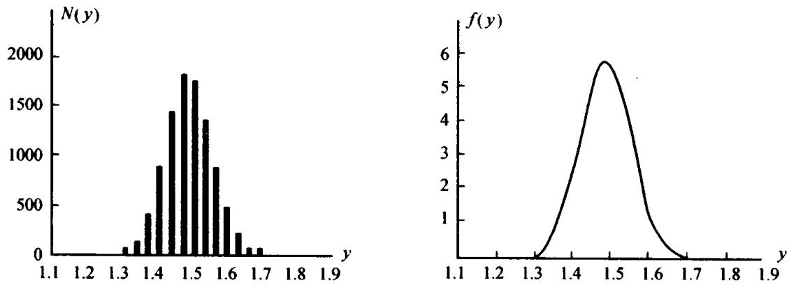

由图可知,我们原先对 y 的性状的估计是正确的,它正是一个左右近似对称的“钟型”图形.

2. 若用原题给定的参数设计, 我们得到, 次品率: 62% 废品率: 26.47% 总费用: 3202 元 / 台.

两者对比费用降低:3202 - 421 = 2781 元 / 台

在实际的模拟过程中,平均费用会有一定的起伏.实验表明,本题中万次模拟的费用值本身就有 $\pm4$ 元的偏差.而千次模拟该偏差可达到 $\pm20$ 元.

3. 对次品率的分析 在分析中, 只考虑成本的降低是不够的, 次品和废品不仅仅会带来一些直接的损失, 还会导致厂商信誉的下降. 因此我们在降低成本的同时还要兼顾到次品率和废品率. 在我们的结果中次品率为 $14.6\%$ , 但零件都未选 $A$ 等. 若第 $i$ 个零件选取 $A$ 等, 而其余的不变, 则总的费用和次品率废品率如下表所示.

（由于 $x_{1}, x_{2}, x_{5}$ 无此等级，我们根据题目中零件价格的比例关系，我们设 $x_{1}$ 的 $A$ 等价格为100元， $x_{2}$ 的 $A$ 等为200元， $x_{5}$ 的 $A$ 等为500元）：

表 3 选用 A 等零件的花费表

<table><tr><td>零件</td><td>1</td><td>2</td><td>3</td><td>4</td><td>5</td><td>6</td><td>7</td></tr><tr><td>总费用</td><td>460</td><td>547</td><td>555</td><td>872</td><td>762</td><td>490</td><td>492</td></tr><tr><td>成本</td><td>350</td><td>425</td><td>425</td><td>725</td><td>725</td><td>350</td><td>350</td></tr><tr><td>损失</td><td>110</td><td>122</td><td>130</td><td>147</td><td>37</td><td>140</td><td>142</td></tr><tr><td>次品率(%)</td><td>11.0</td><td>12.2</td><td>13.0</td><td>14.7</td><td>3.7</td><td>14.0</td><td>14.2</td></tr></table>

从表上可以看出,除 $x_{5}$ 以外,选取 A 等的零件次品率虽略有降低,但成本大大提高,说明比起 B 等零件,A 等零件不能大幅度地减少次品率,而且非常昂贵.因此对除 $x_{5}$ 以外的零件没有必要选取 A 等级,除非 A 等品的价格有大幅度的降低.

## 4. 对 $x_{4}$ 的一些讨论

对 $x_{5}$ 选取 $A$ 等可以使次品率降为 $3.7\%$ ，但成本同时大幅度提高，因此选取 $A$ 等也不能降低总费用。我们假设 $x_{5}$ 也有 $B$ 等品，价格为100元，从而得到次品率为 $6.4\%$ ，总费用为389元/台，每台费用降低32元。这说明，若 $x_{5}$ 有 $B$ 等品，只要其价格低于 $100 + 32 = 132$ 元/件，则选用 $B$ 等级的 $x_{5}$ 还是合算的。而且 $x_{5}$ 选用 $B$ 等级还可以大大提高 $y$ 的稳定性，使其方差变为原来的一半。

## 5. 结果的优度评估

由于随机模拟引入的不确定性,无法严格证明解的最优性.但由概率论,一个随机变量分布的特征可以用矩来描述.由于有很多组可行解,我们可以通过计算y的高阶矩来评估结果,通过模拟,y的高阶矩的值如下:

表 4 推荐解对应 y 的各阶中心值表

<table><tr><td>阶数</td><td>2阶</td><td>3阶</td><td>4阶</td><td>5阶</td><td>6阶</td><td>7阶</td></tr><tr><td>矩值</td><td>0.004782</td><td>0.000085</td><td>0.000069</td><td>0.000003</td><td>0.000002</td><td>0.000000</td></tr></table>

由表可见, $y$ 的2阶矩远大于各高阶矩, 故我们原来的假定成立, 即 $y$ 的性状主要由1,2阶矩限定, 由我们的模型知, 我们已使其均值趋于标定值1.5, 且2阶矩最小同时知道这些条件与目标函数取得最小密切相关

此外我们计算出 $y$ 的偏度系数小于 $1e - 8$ 更重要的是我们在方差最小的情况下，对四变量的搜索是完备的，所以排开随机模拟的不确定性和3阶矩的微小影响，我们的解足够好

## 六、模型的进一步讨论

## (一) 模拟次数的选取

所有的搜索算法都面临同样的问题:速度 在本问题中,因为参数空间的每一点都需要模拟一个分布,这个问题尤为突出 而模拟次数的选取是解决运算复杂度也即速度的核心问题之一,为此,我们在算法中引入反馈控制来动态改变模拟次数

假设我们要确定某组参数取值的损失是否小于定值 $L$ ，我们先用较小样本进行模拟（例如： $\mathfrak{s}_0 = 500$ ），得到平均损失 $L_0$ 若 $L_0 - L > P_0(P_0$ 事先取定），则认为该组选取不是所需解，停止模拟；反之，再进行次数为 $S_1$ 的模拟，有类似定义的 $L_1, P_1$ ，以此类推，直至 $S_m$ 模拟后证明该选取是满意解，或中途某次退出模拟

在实际实现中, 次数等级不必太多, 取三等已有显著的速度收益, 一个经验性的参考等级分级为: $S_{0} = 500, S_{1} = 2000, S_{2} = 10000, P_{0} = 100, P_{1} = 50, P_{2} = 20$

## （二）空间划分

我们前面的动态规划的模型必须依赖函数形式和参数空间的某些特殊性 对于一般函数形式和参数空间, 是无法断然把目标分成几个阶段目标的, 因为常常在较早阶段达到的目标在后来不能保持. 所以, 对于一般的情形, 就必须对空间进行划分, 然后在每个空间分区中再利用特殊性 例如 DEC 公司为配置 400 多项 VAX 机部件设计的专家系统就曾成功地采用了空间划分法 $^{4}$

## (三) 多子空间并行搜索

如果问题需要对空间进行划分,那么很自然的问题就是如何确定这些子区间搜索的顺序,以期较快地得到解 我们思考的结论是:因为这个问题涉及的因素太多,所以与其去分析这样一个顺序关系,不如提出一种多子空间并行搜索的方法,在不同的子空间同时搜索 每一时段有唯一的主搜索区,在主搜索区中进行多步搜索,而在其它区域单步搜索 用评估函数的值不断改变主搜索区,从而及时找到较优解

## 七、讨论当 $x_{i}$ 的分布未知的情形(略)

## 八、参数设计的一般方法

在一般的情况下,我们给出如下设计步骤:(一)构造目标函数,确定目标值与条件参数的函数关系(二)分析零件参数的变化对目标函数的影响的敏感性(三)由各参数的敏感程度确定各零件参数(包括标定值和容差)的分组,确定搜索步骤(四)逐步搜索,得到最优解

此方法的关键在于确定参数分组和搜索的步骤,它同具体的函数关系有关,没有固定的方法,我们推荐以下几种方法:

1 对目标函数作全微分,对各变量的系数进行排序,据此对变量进行分组  
2. 按变量的相互联系程度分组, 把联系紧密的变量分为一组  
3. 先搜索对目标函数影响大的变量组, 再搜索对目标函数影响小的变量组  
4. 考察 $x_{i}$ 和 $y$ 的单调性关系, 按此进行分组

## 九、模型的优缺点(略)

## 参考文献

[1] 陈希孺, 概率论与数理统计, 中国科学技术大学出版社, 合肥, 1996  
[2] DJ 华尔德, C S 皮特勒著, 九云程译, 优选法基础, 科学出版社, 北京, 1978  
[3] 孙德敏, 工程最优化方法及应用, 中国科学技术大学出版社, 合肥, 1991  
[4] 吴秀清, 专家系统概论, 中国科学技术大学无线电系, 合肥, 1987  
[5] A V 奥本海姆等著, 刘树棠译, 信号与系统, 西安交通大学出版社, 西安, 1985  
[6] 沈凤麟,钱士美,信号统计分析基础,中国科技大学出版社,合肥,1989

克林顿总统在国情咨文中说“我作为今后四年的美国总统要优先考虑的问题中的第一优先问题就是要保证美国人民有世界上最好的教育。”他建议1998年要花510亿美元作为“达到这一目标的前所未有的许诺”。

Notices of AMS, v 44(1997), no 4, p 428

# 关于零件参数问题的建模

余 辉 那永林 肖云翔

(天津大学, 天津 300072)

指导教师 史道济

编者按 本文在合理的假设下取质量损失函数, 符合实际情况, 说明了 y 近似服从正态分布. 给出了单位产品质量损失的表达式和较完整的数学模型. 特别是在最优化过程中, 探讨了其算法.

摘要 这是一个如何安排加工次序的组合优化问题,首先建立了一般问题的数学模型,在对其求解过程中我们采取了分枝限界法,保证了所得结果的最优性,且具有很高的时效性.其次针对某部门所采取的贪婪算法给以了评价,在评价中以其近似解与最优解的接近程度、得到最优解的概率为标准,利用计算机模拟对其进行评估,发现对于该问题贪婪算法并不能保证解的最优性,但近似程度较好.而后对调整刀具费用为0的情形进行了讨论,首先给出了一个引理,然后给出一个简明的优化准则:当时各切割平面按其厚费比以不升序排列时,所得次序为最优加工次序.最后利用题中所给数据进行了验证,再次表明了所得结论的正确性.

## 一、问题的背景分析(略)

## 二、问题的假设

(1) 模型的参数

cost: 总费用函数(单位产品);

$\cos t_{2}$ : 成本函数(单位产品);

$C_{1}$ ：产生一个废品造成的损失；

$A_{1}$ : 废品的界限;

Y: 表征产品性能的指标；

$x_{i}=E[x_{i}]$ ：零件参数标定值的期望；

$Y_{0}=E[Y]$ ：产品性能指标的期望；

$P(y)$ ：代表产品性能指标的分布概率

在程序及打印数据中以 $dy$ 代替

$\cos t_{1}$ : 质量损失函数(单位产品);

$\Delta_{i}$ ：代表零件 i 的容差；

$C_{2}$ ：产生一个次品造成的损失；

$A_{2}$ : 次品的界限;

$\sigma_{i}$ : 零件参数的方差；

$\sigma_{y}$ : 产品性能指标的方差;

$Y_{0}^{*}$ : Y 的目标值 1.50;

N: 产品生产数目；

$x_{i}$ : 7个零件参数的标定值 $(i=1,\cdots,7)$ ;

$$
a _ {i j} = \left\{ \begin{array}{l l} 1, & \text {代表第} i \text {个零件中第} j \text {个等级容差;} \\ 0, & \text {代表第} i \text {个零件末选中第} j \text {个等级容差;} \end{array} \right.
$$

$$
\text {其中} i = 1, \dots , 7, j = 1, \dots , 3.
$$

(2) 模型的假设

a. 为简化模型只考虑用单参数指标 y 表征产品性能并已知 $y = f(x_{1}, x_{2}, \cdots, x_{n})$ ;  
b. 容差 $\Delta_{i}$ 近似等于3倍均方差 $(\Delta_{i} = 3\sigma_{i})$ ， $x_{i}$ 服从正态分布 $-N\left[x_{i}, \left(\frac{\Delta_{i}}{3}\right)^{2}\right]$ ， $x_{i}$ 之间相互独立；  
c. $Y$ 的目标值 $Y_0^*$ 已定，(即 $y_0^* = 1.5$ );  
d. 结合问题并考虑到实际生产, 假设已知质量损失函数;

$$
Q (y) = \left\{ \begin{array}{l l} C _ {1}, & Y _ {0} ^ {*} - A _ {1} > y \text {或} y <   Y _ {0} ^ {*} + A _ {1}, \\ C _ {2}, & Y _ {0} ^ {*} - A _ {1} <   y <   Y _ {0} ^ {*} - A _ {2} \text {或} Y _ {0} ^ {*} + A _ {2} <   y <   Y _ {0} ^ {*} + A _ {1}, \\ 0, & Y _ {0} ^ {*} - A _ {2} <   y <   Y _ {0} ^ {*} + A _ {2} \end{array} \right.
$$

e. 由于批量生产, 产品性能指标 $Y$ 受到多个设计参数及加工工艺的影响, 所以假设 $Y$ 近似服从正态分布.

f. 由于批量生产数目 $N$ 较大(实例中 $N = 1000$ ), 造成一批产品质量的损失, 则 $Q(Y)$ 可近似看成为一连续的函数.

## 三、模型的建立

A 问题的进一步分析

(I) 容差等级选取的精度升高, 造成成本 $\cos t_{1}$ 上升, 零件参数标定值 $x_{i}$ 选取的不同影响 Y 中心值 ( $Y_{0}^{*}$ ) 变动, 它和容差共同影响次废品出现的概率, 从而影响质量损失 $\cos t_{2}$ , 因此考虑总费用

$$
\cos t = \cos t _ {1} + \cos t _ {2}
$$

（II）容差等级是离散的，即对每一个 $\Delta_{i}$ 只有几个是可选的，考虑用0—1整数规划，表示 $\cos t_2$ 如下：

$$
\cos t _ {2} = \sum_ {i = 1} ^ {7} \sum_ {j = 1} ^ {3} K _ {i j} a _ {i j}
$$

其中

$$
\sum_ {j = 1} ^ {3} a _ {i j} = 1, \quad a _ {i j} \text {取} 0 \text {或} 1
$$

$K_{ij}$ 为第 i 种零件 j 级精度时的单位价格. 对于本问题中不存在的等级, 其价格 $K_{ij}$ 可取 $+\infty$ 或直接改变 $a_{ij}$ 值进行优化, 如本问题中第 1 组零件只有一个容差等级 2 (即 B 等), 那么在用计算机进行优化时可直接约定 $a_{12}=1, a_{13}=a_{11}=0$ 即可.

（III）由于单位产品的质量损失可视为连续函数，而且设计中心值 $Y_0^*$ 和废次品范围已定 $(y < 1.2$ 或 $y > 1.8$ 为废品， $y$ 在[1.2,1.4]或[1.6,1.8]范围可视为次品)，所以

$$
\cos t _ {1} = 9 0 0 0 \left(\int_ {- \infty} ^ {1. 2} P (y) \mathrm{d} y + \int_ {1. 8} ^ {+ \infty} P (y) \mathrm{d} y\right) + 1 0 0 0 \left(\int_ {1. 2} ^ {1. 4} P (y) \mathrm{d} y + \int_ {1. 6} ^ {1. 8} P (y) \mathrm{d} y\right)
$$

其中

$$
P (y) = \frac {1}{\sqrt {2 \pi \sigma_ {v}}} e ^ {\frac {- (v - v _ {0}) ^ {2}}{2 \sigma_ {v} ^ {2}}}, \quad \sigma_ {v} ^ {2} = \sum_ {i} ^ {7} \left(\frac {\partial y}{\partial x _ {i}}\right) ^ {2} \sigma_ {i,} ^ {2}
$$

$$
\sigma_ {r} ^ {2} = \left(\frac {\Delta_ {t}}{3}\right) \left[ 0. 0 1 ^ {2} \cdot a _ {i 1} ^ {2} + 0. 0 5 ^ {2} \cdot a _ {i 2} ^ {2} + 0. 1 \cdot a _ {i 3} ^ {2} \right]
$$

B 综合上述分析,完整模型表示如下:

$$
\min (\cos t = \cos t _ {1} + \cos t _ {2}), \quad \cos t _ {2} = \sum_ {i = 1} ^ {7} \sum_ {j = 1} ^ {3} K _ {i j} a _ {i j}
$$

其中

$\sum_{j=1}^{3} a_{ij} = 1, \quad a_{ij}$ 取0或1

$$
\cos t _ {1} = 9 0 0 0 \left(\int_ {- \infty} ^ {1 2} P (y) \mathrm{d} y + \int_ {1 8} ^ {+ \infty} P (y) \mathrm{d} y\right) + 1 0 0 0 \left(\int_ {1 2} ^ {1 4} P (y) \mathrm{d} y + \int_ {1 6} ^ {1 8} P (y) \mathrm{d} y\right)
$$

其中 .

$$
P ^ {\prime} (y) = \frac {1}{\sqrt {2 \pi \sigma_ {y}}} e ^ {\frac {- (y - y _ {0}) ^ {2}}{2 \sigma_ {y} ^ {2}}}, \quad \sigma_ {y} ^ {2} = \sum_ {i = 1} ^ {7} \left(\frac {\partial y}{\partial x _ {i}}\right) ^ {2} \sigma_ {x} ^ {2}
$$

$$
Y = f (x _ {1}, x _ {2}, \dots , x _ {7}) \quad \sigma_ {r} ^ {2} = \left(\frac {\Delta_ {t}}{3}\right) [ 0. 0 1 ^ {2} \cdot a _ {t 1} ^ {2} + 0. 0 5 ^ {2} \cdot a _ {t 2} ^ {2} + 0. 1 \cdot a _ {t 3} ^ {2} ]
$$

## 四、模型算法的探讨

（一）本模型可以归为运筹学中的非线性规划问题 目前非线性规划还没有适用于各种问题的一般算法 我们知道线性规划问题最优解只能在其可行域的边界上达到(特别是在可行域的顶点上到达) 而非线性规划问题最优解(如果存在) 则可能在其可行域中任一点达到, 所以从理论上各种算法寻找的均为局部最优极值点, 从现实角度考虑要求算法收敛快, 稳定性好, 寻到的极值接近最优值

（二）采用问题所给的数据我们先用Mathcad软件作出 $\cos t_1 - (y_0, \sigma)$ 的三维关系图（彩色附图略），通过做等值线分析可知：

1) 当 $y_{0}$ 偏离 1.5 较远时, $\cos t_{1}$ 对 $y_{0}$ 取值敏感性要远大于对 $\sigma_{v}$ 取值敏感性

11) 当 $y_0$ 很接近 1.5 时, $\cos t_1$ 对 $\sigma_y$ 敏感性较大

结论 考虑本身变动范围较小, 综合 1)、(1) 分析所得, 并结合 Mathcad 软件粗略运算得到 $\cos t_{1} = 300$ 时有 $\left|\frac{\partial\cos t_{1}}{\partial y_{0}}\right| = 10\left|\frac{\mathrm{d}\cos t_{1}}{\delta y}\right|$ , 所以 $\cos t_{1} > 300$ 时 ( $\sigma_{y}$ 动范围为 $0.09 \sim 0.100$ ), $y_{0}$ 的领域在首次搜索时定为 [1,48,1.52]

## (三) 程序算法分析：

在编程计算时,考虑到程序执行时间因素,故采用三分算法进行计算,这样可使程序执行效率提高上千倍甚至更高(试验证明,此种方法比穷举法效率提高几万倍)具体算法步骤如下:

首先将各参量所允许区间分为四等分,取其三个分点进行计算(取点如下)

<table><tr><td>参量</td><td>下界</td><td>分点一</td><td>分点二</td><td>分点三</td><td>上界</td><td>步长</td></tr><tr><td> $x_{1}$ </td><td>0.075</td><td>0.0875</td><td>0.1</td><td>0.1125</td><td>0.125</td><td>0.0125</td></tr><tr><td> $x_{2}$ </td><td>0.225</td><td>0.2625</td><td>0.3</td><td>0.3375</td><td>0.375</td><td>0.0375</td></tr><tr><td> $x_{3}$ </td><td>0.075</td><td>0.0875</td><td>0.1</td><td>0.1125</td><td>0.125</td><td>0.0125</td></tr><tr><td> $x_{4}$ </td><td>0.075</td><td>0.0875</td><td>0.1</td><td>0.1125</td><td>0.125</td><td>0.0125</td></tr><tr><td> $x_{5}$ </td><td>1.125</td><td>1.3125</td><td>1.5</td><td>1.6875</td><td>1.875</td><td>0.1875</td></tr><tr><td> $x_{6}$ </td><td>12</td><td>14</td><td>16</td><td>18</td><td>20</td><td>2</td></tr><tr><td> $x_{7}$ </td><td>0.5625</td><td>0.6625</td><td>0.75</td><td>0.85</td><td>0.935</td><td>0.1</td></tr></table>

如上,算出各分点(共 $3^{7}$ 个)各自的质量损失,经过比较得到 $\cos t_{1}$ 最低的几个点

其次,在所得到的点的小领域内继续采取相同的算法,计算步长逐步缩小,并对0所得点的质量损失函数值进行比较,逐步筛选

再将上述过程重复数次,直至质量函数值变化不大为止,取其最小进行容差设计

最后,在最优点的很小领域内进行最后选优,容差选取考虑采用穷举法.经过比较总费用 cost 计算得出几组最优解,数据结果附下

结果数据

<table><tr><td colspan="2"> $x_1$ </td><td colspan="2"> $x_2$ </td><td colspan="2"> $x_3$ </td><td colspan="2"> $x_4$ </td><td colspan="2"> $x_5$ </td><td colspan="2"> $x_6$ </td><td colspan="2"> $x_7$ </td><td>cost</td><td>Y</td><td>DY</td></tr><tr><td>值</td><td>等</td><td>值</td><td>等</td><td>值</td><td>等</td><td>值</td><td>等</td><td>值</td><td>等</td><td>值</td><td>等</td><td>值</td><td>等</td><td></td><td></td><td></td></tr><tr><td>0.075</td><td>B</td><td>29</td><td>B</td><td>108</td><td>B</td><td>095</td><td>C</td><td>1 33</td><td>C</td><td>19.3</td><td>B</td><td>64</td><td>B</td><td>427.72</td><td>1.4952</td><td>091308</td></tr><tr><td>0 075</td><td>B</td><td>29</td><td>B</td><td>109</td><td>B</td><td>095</td><td>C</td><td>1 31</td><td>C</td><td>19 6</td><td>B</td><td>65</td><td>B</td><td>427.68</td><td>1.4954</td><td>091315</td></tr><tr><td>0 075</td><td>B</td><td>30</td><td>B</td><td>108</td><td>B</td><td>095</td><td>C</td><td>1 252</td><td>C</td><td>19 2</td><td>B</td><td>65</td><td>B</td><td>426 21</td><td>1 4954</td><td>091199</td></tr><tr><td>0 075</td><td>B</td><td>30</td><td>B</td><td>108</td><td>B</td><td>095</td><td>C</td><td>1 298</td><td>C</td><td>19 1</td><td>B</td><td>60</td><td>B</td><td>426 17</td><td>1 4966</td><td>091272</td></tr></table>

注.其中，“值”代表标定值，“等”代表等级； $\cos t$ 的单位为(元/个)

## (四) 算法程序(具体程序略)

其中 程序一的功能为完成数据点的初次搜索；

程序二的功能为在初选点的基础上通过调整容差使结果进一步优化；

## （五）实例问题的求解

在原设计中,一个零件参数的标定值为: $x_{1}=0.1,x_{2}=0.3,x_{3}=0.1,x_{4}=0.1,x_{5}=1.5,x_{6}=16,x_{7}=0.75;$

$$
a _ {i j} = \begin{array}{c c c} 0 & 1 & 0 \\ 1 & 0 & 0 \\ 1 & 0 & 0 \\ 1 & 0 & 0 \\ 1 & 0 & 0 \\ 1 & 0 & 0 \\ 0 & 1 & 0 \end{array}
$$

$$
\cos t _ {2} = 9 0 0 0 \left(\int_ {- \infty} ^ {1. 2} P (y) \mathrm{d} y + \int_ {1. 8} ^ {+ \infty} P (y) \mathrm{d} y\right) + 1 0 0 0 \left(\int_ {1. 2} ^ {1. 4} P (y) \mathrm{d} y + \int_ {1. 6} ^ {1. 8} P (y) \mathrm{d} y\right)
$$
$$
= 2 8 8 7 \text {元 / 个}
$$

$$
\cos t _ {2} = 2 0 0 \text {元 / 个} \quad \cos t = 3 0 8 7 \text {元 / 个}
$$

采用我们的算法程序求得

<table><tr><td colspan="2"> $x_{1}$ </td><td colspan="2"> $x_{2}$ </td><td colspan="2"> $x_{3}$ </td><td colspan="2"> $x_{4}$ </td><td colspan="2"> $x_{5}$ </td><td colspan="2"> $x_{6}$ </td><td colspan="2"> $x_{7}$ </td><td> $cost$ </td><td>Y</td><td>DY</td></tr><tr><td>值</td><td>等</td><td>值</td><td>等</td><td>值</td><td>等</td><td>值</td><td>等</td><td>值</td><td>等</td><td>值</td><td>等</td><td>值</td><td>等</td><td></td><td></td><td></td></tr><tr><td>0.75</td><td>B</td><td>.30</td><td>B</td><td>.108</td><td>B</td><td>.095</td><td>C</td><td>1.298</td><td>C</td><td>19.1</td><td>B</td><td>.60</td><td>B</td><td>426.17</td><td>1.4966</td><td>.091272</td></tr></table>

与原设计比较,总费用降低了2660.83(元/个)×1000个～26万元

## 五、一般零件的参数设计(略)

## 六、模型的评价

本模型的成功之处在于使一个多因素的问题,以极简便的方法快速得到结论.采用本模型辅以一台PC机,可以在十几分钟之内寻找出问题的优化答案,而采用普通的算法通常在十几小时都难于找出答案.这就为解决涉及多因素的问题提出了一条捷径,另外此模型并不涉及许多深奥的数学理论,可以很方便地推广到实际生产中.模型的不足之处在于模型求解需要依靠计算机进行,离开计算机进行求解会有一定困难.

优点为当具体问题中影响产品性能指标的零件数目减少时,用网格法搜索时,计算量呈指数下降,所以可以考虑直接寻优.

## 七、模型的推广

本模型可广泛用于实际生产中的诸多领域,对受多种困难影响的具体问题可以很方便地求出优化解,而且也可用于理论分析和科学实验中,其特点在于用一般简单的程序就可将一复杂问题解决.

## 参考文献

[1] 叶其孝主编,大学生数学建模竞赛辅导教材,湖南教育出版社,长沙.  
[2] 衷光定,应用概率统计—MATHCAD数理分析图形软件,北京师范大学出版社,北京.  
[3] 盛昭瀚、雷忻、最优的方法教程,东南大学出版社,南京.  
[4] 傅家良、周仲良、魏国华，运筹学，复旦大学出版社，北京.  
[5] 叶其孝, 卢树铭, 数学建模教育与国际数学建模竞赛, 中国工业与应用数学学会, 工科数学杂志社.  
[6] 谭浩强编, C 程序设计, 清华大学出版社, 北京.  
[7] 姬振豫, 正交设计, 天津科技翻译出版公司, 天津.  
[8] 可计算理论目的三次设计,中国现场统计研究会三次设计组编著.

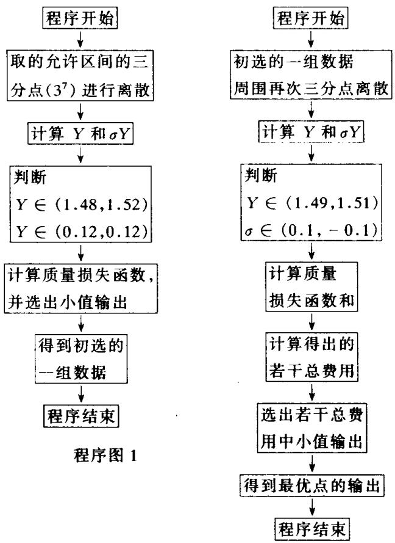  
程序图2

数学的重要性不是不言自明的,何况许多对此看法游移不定的人并没有严肃认真地思考过。

E.E. David, Jr., (曾任尼克松总统科学顾问), Notices of American Mathematical Society (AMS), v. 31 (1988), no.2, p. 145.

# 零件的参数设计

叶庆春 侯小虎 刘淑君

(四川联合大学(四川大学), 成都 610064)

指导教师 甘湘华

编者按 本文针对参数最优设计问题的实际背景提出综合考虑损失函数与元件成本的概率统计量优化模型,并用模拟退火法寻求最优解,较好地解决了最优参数设计问题,论文还用统计实验及泰劳展开论证了参数 y 近似服从正态分布的结论.论文叙述简洁、语言流畅、有一定的参考价值.

摘要 本文解决的问题是一个零件参数优化设计问题.

首先我们利用统计抽样方法绘出了频率直方图, 估计参数 y 应当服从正态分布, 进一步利用经验公式作多元一阶 Taylor 展开, 得到一个正态随机变量的线性组合式, 确定 y 近似正态分布, 且用 $\chi^{2}$ 拟合优度加以检验, 然后可直接求出原设计的生产总费用为 3,074,790 元, 接着对第二个问题建立了一个优化模型, 用模拟退火全局优化算法, 得到第二个问题的解: 标定值依次为 0.0829, 0.3223, 0.1195, 0.0881, 1.8097, 12.9960, 0.6297, 总费用合为 434,681.2352 元, 与原设计相比总费用减少: 2,639,109.7648 元.

## 一、问题的重述与背景分析(略)

## 二、模型的基本假设及符号说明

1. 假设零件参数的标定值代表期望值,在生产部门无特殊要求时,容差为均方差的3倍;  
2. 假设粒子分离器参数 y 偏离 $y_{0} \pm 0.1$ ，产品为次品，质量损失为 1000 元；  
当 y 偏离参数 $y_{0} \pm 0.3$ 时, 产品为废品, 损失为 9000 元;  
3. 零件参数的标定值有一定的容许范围；  
4. 容差分为 A, B, C 三个等级, 用与标定值的相对值表示, A 等为 ±1%, B 等为 ±5%, C 等为 ±10%;  
5. 假设 7 个零件随机误差都符合正态分布.

文中所用符号说明

<table><tr><td> $A = (a_{ij})_{7 \times 3}$ </td><td>成本矩阵;</td><td> $D_i$ </td><td>第i种零件的容差行向量;</td></tr><tr><td> $B = (b_{ij})_{7 \times 2}$ </td><td>容差设计矩阵;</td><td> $X_2$ </td><td>标定值的上界;</td></tr><tr><td> $y_0$ </td><td>y的目标值;</td><td> $\delta_i$ </td><td> $x_i$ 的均方差;</td></tr><tr><td> $\delta$ </td><td>y的均方差;</td><td> $X_1$ </td><td>标定值的下界;</td></tr><tr><td> $B_i$ </td><td>第i行向量;</td><td> $C_1$ </td><td>一件产品的生产成本;</td></tr><tr><td> $P_2$ </td><td>产品是废品的概率;</td><td> $\bar{y}$ </td><td>y的期望值;</td></tr><tr><td> $P_1$ </td><td>产品是次品的概率;</td><td> $C_2$ </td><td>一件产品的质量损失的期望值;</td></tr><tr><td>value</td><td>生产总费用;</td><td></td><td></td></tr></table>

$X = (x_{1}, x_{2}, \cdots, x_{n})$ 标定值的向量; $f(x_{1}, \cdots, x_{n})$ 经验函数;

$$
b _ {i j} = \left\{ \begin{array}{l l} 1 & \text {当} i \text {的容差为} j \text {时}, \\ 0 & \text {否则}. \end{array} \right.
$$

## 三、模型的分析与建立

## （一）确定 $y$ 的分布函数

a) 利用统计抽样来估计 $y$ 的分布

由经验公式不能直接看出参数 $y$ 的分布, 于是为了对 $y$ 的分布有一个直观上的了解, 我们采用统计抽样的方法绘出 $y$ 的频率直方图.

直方图的画法：为随机数落入各区间 $[t_{i - j}, t_i]$ 内的个数， $f_i = \frac{v_i}{n}$ .

在 $xy$ 平面上对每一个 $i$ , 以 $[t_{i-j}, t_i]$ 为底, $y_i = \frac{f_i}{\Delta}$ 为高画小长形即为直方图, 容易看出, 样本容量越大, 分组越细, 则直方图越接近密度函数曲线下的曲边梯形, 教学软件Maplev3统计包中画直方图即根据上面原理.

为了得到较直观、准确的直方图，取了500个样本点即y值，直方图如下：

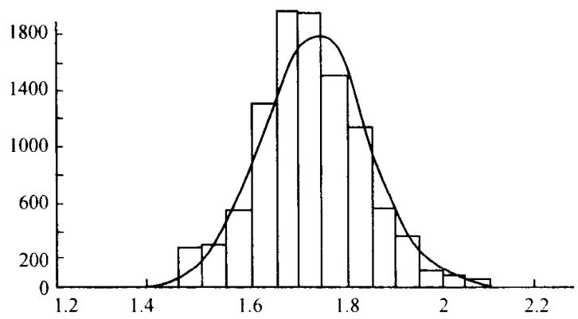

<details>
<summary>histogram</summary>

| Bin Range | Frequency |
| --- | --- |
| 1.45~1.50 | ~300 |
| 1.50~1.55 | ~300 |
| 1.55~1.60 | ~550 |
| 1.60~1.65 | ~1300 |
| 1.65~1.70 | ~1900 |
| 1.70~1.75 | ~1900 |
| 1.75~1.80 | ~1500 |
| 1.80~1.85 | ~1100 |
| 1.85~1.90 | ~600 |
| 1.90~1.95 | ~350 |
| 1.95~2.00 | ~150 |
| 2.00~2.05 | ~100 |
| 2.05~2.10 | ~50 |
</details>

由图可以估计, y 的分布近似于正态分布.

b) 受 a) 的启发, 我们更想从经验公式出发推导出 y 的概率密度函数.

方法1 从理论上严格推导 $y$ 的概率密度函数. 我们实践后发现, 即使利用概率密度函数的和、差、商能算出 $y$ 的分布, 其表达式也是相当复杂且得不到一个确定的表达式, 因此, 此方法在理论上可行, 在实际中则要视具体情况而定.

方法 2 由经验方程及 $x_{i}$ 所容许的范围, 我们知道 y 对 $x_{i}$ 任意的 n 阶偏导连续则可将其在标定值 $z_{0} = (x_{i0})$ , $i = 1 \cdots 7$ 作 Taylor 展开式:

$$
\begin{array}{l} y = f (x _ {1 0}, x _ {2 0}, \dots , x _ {7 0}) + \frac {\partial f}{\partial x _ {1}} \mid x _ {0} (x - x _ {1 0}) + \frac {\partial f}{\partial x _ {2}} \mid x _ {0} (x _ {2} - x _ {2 0}) \\ + \dots + \frac {\partial f}{\partial x _ {7}} \mid x _ {0} (x _ {7} - x _ {7 0}) + R _ {n}, \quad \text {其中} R _ {n} \text {为余项} \\ \end{array}
$$

这里 $x_{i} - x_{i0}$ 有明显的物理意义，即 $x_{i} - x_{i0}$ 是零件 $i$ 的随机误差，有 $x_{i} - x_{i0} \sim (0, \delta_{i}^{2})$ ，对随机变量 $x_{i} \sim (x_{i}, \delta_{i}^{2})$

我们认为展开式忽略 2 阶小后能够很好地逼近 y 值, 理由主要有:

1. 就本问题我们可以求出: $\delta_{\max} = \delta_6 = \frac{20 \times 10\%}{3} = 0.667$ ，可见 $x_i$ 的方差不大， $i =$

1, $\cdots$ ,7;

2. 当 $x_{i}$ 与 $x_{i0}$ 相差很小时, $x_{i} \sim N(x_{i}, \delta_{i}^{2}), P(|x_{i} - x_{i0}| < \varepsilon)$ 很大, 则在 $(x_{1}, x_{2}, \cdots, x_{n})$ 的领域内, 近似值已很接近真实值.

当 $x_{i}$ 与 $x_{i0}$ 相差很大时， $P(|x_{i} - x_{i0}| < \varepsilon)$ 很小，可以忽略其对真实值的影响，所以在这个近似计算下： $y - f(x_{10}, x_{20}, \sim x_{70})$ 是 $x_{i}$ 的随机误差 $x_{i} - x_{i0}$ 的线性组合函数， $x_{i} - x_{i0} \sim N(0, \delta_{i}^{2})$ 且 $x_{i} - x_{i0}$ 互不相关。

定理 2个独立正态随机变量 $\xi_{k} \sim N(\mu_{k}, \delta_{k}^{2}), (k = 1, 2)$ 的任意线性组合 $\sum_{i=1}^{2} \alpha_{i} \xi_{i}$ 为正态变量且 $\sum_{i=1}^{2} \alpha_{i} \xi_{i} \sim N\left(\sum_{i=1}^{2} \alpha_{i} \mu_{i}, \sum_{i=1}^{2} \alpha_{i}^{2} \delta_{i}^{2}\right)$ .

由此我们知道 $y - f(x_{10}, \cdots, x_{70})$ 服从正态分布，由定理 $y = f(x_{10}, \cdots, x_{70}) + \sum_{i=1}^{7} \frac{\partial f}{\partial x_{i}} (x_{i} - x_{i0})$ 服从正态分布，且

$$
\bar {y} = E (y) = f (x _ {1 0}, \dots , x _ {7 0}), \quad \delta^ {2} = D (y) = \sum_ {i = 1} ^ {7} \left(\frac {\partial f}{\partial x _ {i}} \mid X = X _ {0}\right) ^ {2} \delta_ {i} ^ {2}
$$

这比我们期望的结果还要好.

基于统计抽样和近似算法的结论，我们得到 $y \sim N(f(x_{10}, \cdots, x_{70}), \sum_{i=1}^{7} \left( \frac{\partial f}{\partial x_i} \mid X = X_0 \right)^2 \delta_i^2)$ . 为了进一步肯定我们的假设是正确的，我们利用样本数据作了 $\chi^2$ 拟合优度检验，在这里我们仅记录下检验结果 $\chi^2$ (计算值) = 13.2410 < $\chi^{2}_{(0.05)}(11 - 2 - 1) = 15.507$ .

即 $y \sim N(f(x_{10}, \cdots, x_{70}), \sum_{i=1}^{7} \left( \frac{\partial f}{\partial x_{i}} \mid X = X_{0} \right)^{2} \delta_{i}^{2})$ 是可接受的.

## (二) 模型及分析

零件参数的优化设计：

目标函数: $\min(C_{1}+C_{2})$ , s.t.: $X_{1}\leqslant X\leqslant X_{2}$ ,

一件产品成本费用: $C_{1}\sum_{i=1}^{7}\sum_{j=1}^{3}a_{ij}b_{ij}$ ,

一件产品质量损失费用的期望值: $C_{2}=P_{1}\times1000+9000\times P_{2}$ ,

产品是次品的概率：

$$
P _ {1} = \frac {1}{\sqrt {2 \pi} \delta} \left[ \int_ {y _ {0} - 0. 3} ^ {y _ {0} - 0. 1} e ^ {\frac {- (1 - y) ^ {2}}{2 \delta^ {2}}} \mathrm{d} t + \int_ {y _ {0} + 0. 1} ^ {y _ {0} + 0. 3} e ^ {\frac {- (1 - y) ^ {2}}{2 \delta^ {2}}} \mathrm{d} t \right]
$$

产品是废品的概率：

$$
P _ {2} = \frac {1}{\sqrt {2 \pi} \delta} \left[ \int_ {- \infty} ^ {y _ {0} - 0. 3} e ^ {\frac {- (1 - y) ^ {2}}{2 \delta^ {2}}} \mathrm{d} t + \int_ {y _ {0} + 0. 3} ^ {+ \infty} e ^ {\frac {- (1 - y) ^ {2}}{2 \delta^ {2}}} \mathrm{d} t \right],
$$

$$
\delta_ {i} = \frac {\sum_ {j = 1} ^ {3} x _ {i} B _ {i} \times D _ {i} ^ {\prime}}{3}, \quad \delta^ {2} = \sum_ {i = 1} ^ {7} \left[ \left(\frac {\partial f}{\partial x _ {i}}\right) \Big | _ {x _ {0}} \delta_ {i} \right] ^ {2}, \quad \overline {{Y}} = f (x _ {1}, x _ {2}, \dots , x _ {7}).
$$

## 四、模型的求解

## 1) 原设计的生产费用：

由原设计知: $x=(0.1,0.3,0.1,0.1,1.5,16,0.75)$

$$
B = \left[ \begin{array}{c c c} 0 & 1 & 0 \\ 1 & 0 & 0 \\ 1 & 0 & 0 \\ 1 & 0 & 0 \\ 1 & 0 & 0 \\ 0 & 1 & 0 \end{array} \right]
$$

取得：

$$
\bar {y} = 1. 7 2 5 5 8 9 2 6 2, \quad \delta = 0. 1 1 0 3 7 1 9 2 3 9,
$$

$$
C _ {1} = 2 0 0, \quad C _ {2} = 2 8 7 4. 7 9,
$$

生产总费用

$$
\text {value} = (2 8 7 4. 7 9 + 2 0 0) \times 1 0 0 0 = 3, 0 7 4, 7 9 0 (\text {元})
$$

## 2) 优化模型的求解

目标函数可能存在局部最优解,这使我们寻找全局最优解变得很困难,为了避免搜索过程因陷于局部最优解而无法自拔,提高全局最优解的可信度,我们在这里采用模拟退火算法,其算法如下:

Step 1 给定 $x^0 \in R^n, T_0 > 0, \beta > 0$ ，给定产生随机向量的概率密度函数和控制温度下降过程的温度更新函数，给定常数 $\beta > 0$ ，计算 $f(x^0), X^0 = x^0, X_{\min}^0 = x_0, f_{\min} = f(x^0)$ ， $k = 0$ ；

Step 2 根据给定的概率密度函数产生一个随机向量 $Z^k$ ，利用当前迭代点 $X^k$ 和随机向量 $Z^k$ 产生一个新的试探点 $Y^k$ ，即 $Y^k = X^k + Z^k$ ，计算 $f(Y^k)$ ；

Step 3 产生一个在(0,1)上均匀分布的随机数 $n$ ，计算在给定当前迭代点 $x^k$ 和温度 $T_k$ 下接受试探点 $Y^k$ 的概率 $P_a[Y^k \mid X^k, T_k)$ 即

$$
P _ {a} [ Y ^ {k} \mid X ^ {k}, T _ {k} ] = \min \left\{1, \exp \left(\frac {f (X ^ {k}) - f (Y ^ {k})}{\beta T ^ {k}}\right) \right\}
$$

如果 $\eta \leqslant (P_a[Y^k + X^k, T_k])$ ，则置 $X^{k+1} = Y^k, f(X^{k+1}) = f(Y^k)$ ;

否则置 $X^{k + 1} = X^k, f(X^{k + 1}) = f(X^k)$ .

Step 4 如果 $f(X^{k + 1}) = f_{\min}$ 则置 $X_{\min} = X^{k + 1}, f_{\min} = f(X^{k + 1})$ ;

Step 5 如果迭代终止条件满足,则算法结束, $X_{min}$ 就作为近似的全局最优解, $f_{min}$ 为相应的最优值;否则继续 Step 6.

Step 6 根据给定的温度更新函数产生一个新的温度 $T_{k+1}$ ，置 $k = k + 1$ 转至 Step 2.

考虑到容差的组合,我们第一个想法就是对容差进行穷举,然后利用退火法来搜索最优解,但上机时,计算机内存不够,只能计算少数几组值;并且将均匀分布的随机数发生器换以不同的种子后,X 的“最优解”的波动较大,即在我们现在计算机此法不合适,于是想到一个折中的算法.

第一步 我们确定零件的容差,然后利用退火算法多次循环计算总费用值,取最小值,

记为 $f_{1}^{*}$ ，以及对应的最优解 $X_{1}^{*}$ ，转入第二步.

第二步 固定 $X_{k-1}^{*}$ , 将零件的容差的所有组合进行穷举, 计算得此时对应的最优容差组合记为 $B_{k}^{*}$ , 产生新 $f^{*}$ , 最小值记为 $f_{k}^{*}$ .

第三步 若 $f_{k + 1}^{*} - f_{k} < \varepsilon$ ( $\varepsilon$ 是任意事先指定的常数), 终止, 否则转入第一步.

利用上面的思想通过编程我们最后得到：

一批零件的总生产费用的最优解为 $434.6812 * 1000 = 434681.2$ 元. 容差向量为 $[2, 2, 2, 1, 1, 2, 2]$

## 五、模型结果的分析

在分析我们得到的最优解和最优值时,注意到在我们建模时是用正态分布函数代替经验分布函数的,在这里会产生误差.

我们在这个最优值上,进行随机抽样实验,共抽样10次,每次抽样500个随机数据计算每次抽样的质量损失费,然后求平均值算出在此点的平均质量损失费为149.0,即总生产成本为 $149.6 + 275 = 424.6$ ,则实际成本较之可能还要小.可见我们的最优值较大.

这个误差一般来说是由于对经验分布函数进行估计所带来的,如果允许一定的误差,我们这种以模型的简练换精度还是值得的.

## 六、模型优缺点和改进方向(略)

## 七、附录(略)

## 参考文献

[1] 叶其孝, 数学模型.  
[2] 系统工程理论与实践,1997,5  
[3] 耿素云, 张立昂, 概率统计, 北京大学出版社, 北京.  
[4] 概率统计与随机过程,武汉大学出版社,武汉.  
[5] 叶其孝主编, 数学建模教育与国际数学建模竞赛.

# 零件参数的优化设计

初昀辉 刘晓曦 虞朝阳

(西北工业大学,西安 710072)

指导教师 王命宇

编者按 本文使用田口玄一的三次设计思想,在离散的损失函数条件下找到了最优,对问题的分析条理清楚、文字表述简洁.

摘要 本文讨论了零件参数的最优设计问题. 假定标志产品性能的某个参数 $y$ 由零件参数的标定值和容差决定. 本文首先给出了零件参数和产品性能参数的统计模型, 然后根据三次设计的思想和方法进行标定值和容差设计, 先利用直积法做正交试验, 得到不同试验条件下的信噪比和 $y$ 值, 综合考虑这两项指标, 找出较优的零件参数水平, 并通过方差分析, 确定显著和不显著因素. 通过对显著因素的调整, 使 $y$ 值更接近于目标值, 同时使其均方差保持在较小的值上, 这样就兼顾了 $y$ 值的准确性和稳定性, 然后再作容差设计.

模型求解用 C 语言编程实现,并用随机模拟法对结果进行了验证.结果表明,本文所建模型是稳定、准确、可靠的.最后得到的零件参数设计与原设计相比,使单位产品总费用由 3165 元降低到 422 元.

## 一、问题的提出(略)

## 二、问题的分析

1. 要减少质量损失, 就必须使次品和废品尽量少, 因此应使 $y$ 值接近目标值 $y_0$ , 同时应使 $y$ 值的波动尽量小. 也就是说, 要同时考虑 $y$ 的准确性与稳定性.  
2. 当零件参数的容差固定时, $y$ 的准确性与稳定性取决于零件参数的标定值. 若标定值不合适, 减小零件容差有可能使质量损失增大, 同时成本亦会增大. 因此, 应首先确定标定值的最优解或较优解, 然后再调整容差.  
3. 各零件参数对 $y$ 值影响的显著性是不同的, 对标定值或容差作调整时, 应首先考虑显著性大的零件参数.

## 三、符号说明

大写字母表示随机变量

$X_{i}(i=1,2,\cdots,7)$ : 零件参数; Y: 产品参数; F: 单位产品费用; L: 单位产品质量损失; 小写字母表示确定量

y: 产品参数期望值; $y_{0}$ : 产品参数目标值; f: 单位产品费用期望值;

l: 单位产品质量损失期望值; c: 单位产品成本; $x_{i}(i=1,2,\cdots,7)$ : 零件参数标定值; $\bar{y}$ : 产品参数的随机数; $\delta x_{i}(i=1,2,\cdots,7)$ : 零件参数容差; $x_{i}$ : 零件参数的随机数; $\sigma x_{i}(i=1,2,\cdots,7)$ : 零件参数均方差;

## 四、模型建立

基本假设:大量产品的零件参数视为相互独立的随机变量,且服从正态分布.产品性能

取决于零件参数的标定值和容差.

根据题述条件,有

$$
Y = 1 7 4. 4 2 \left(\frac {X _ {1}}{X _ {5}}\right) \left(\frac {X _ {3}}{X _ {2} - X _ {1}}\right) ^ {0. 8 5} \cdot \sqrt {\frac {1 - 2 . 6 2 \left[ 1 - 0 . 3 6 \left(\frac {X _ {4}}{X _ {2}}\right) ^ {- 0 . 5 6} \right] ^ {\frac {3}{2}} \left(\frac {X _ {4}}{X _ {2}}\right) ^ {1 . 1 6}}{X _ {6} X _ {7}}} \tag {1}
$$

$$
F = c + L \tag {2}
$$

要使费用最小,也就是使 F 的期望值最小.由式(2)得

$$
f = c + l = c + P \{| Y - 1. 5 | > 0. 3 \} \times 9 0 0 0 + P \{0. 1 <   | Y - 1. 5 | <   0. 3 \} \times 1 0 0 0
$$

因 Y 是 $X_{1}, X_{2}, \cdots, X_{7}$ 的函数，且 $X_{1}, X_{2}, \cdots, X_{7}$ 相互独立且均服从正态分布，故 Y 的分布由 $x_{1}, x_{2}, \cdots, x_{7}$ 的均值和方差决定，即由标定值和容差决定。而成本 c 是容差的函数。我们称一组零件参数标定值 $x_{1}, x_{2}, \cdots, x_{7}$ ，容差 $\Delta x_{1}, \Delta x_{2}, \cdots, \Delta x_{7}$ 为一个设计方案，需要做的是在给定范围内找到一个设计方案，使 f 取得最小值。

## 五、模型求解及结果分析

## 1. 对给定的设计方案, 求解费用期望值 f

成本 $c$ 容易由零件容差求出，下面讨论如何求质量损失期望值 $l$ .

困难在于确定 $Y$ 的分布, 我们用随机模拟法求 $l$ . 正态随机数的产生方法为: 先采用贝斯-德拉姆洗牌技术产生均匀分布随机数, 再用反变换法产生正态随机数[1].

每次试验, 产生 7 个相互独立的正态随机数 $\tilde{x}_i, \tilde{x}_i$ 是服从 $N(x_i, \frac{1}{9} \Delta x_i^2)$ 分布的一个随机数, $i = 1, 2, \cdots, 7$ . 由式(1)可得一个 $\tilde{y}$ . 重复试验 $m$ 次, 统计其中的次品数 $n_1$ , 废品数 $n_2$ , 可得

$$
l = \frac {1 0 0 0 n _ {1} + 9 0 0 0 n _ {2}}{m}
$$

于是可进一步求出 $f$ ，根据 $f$ 值可评价给定设计方案的优劣.

用原设计的给定值：

$$
x _ {1} = 0. 1, \quad x _ {2} = 0. 3, \quad x _ {3} = 0. 1, \quad x _ {4} = 0. 1,
$$

$$
x _ {5} = 1. 5, \quad x _ {6} = 1 6, \quad x _ {7} = 0. 7 5,
$$

容差均取最便宜等级. 进行2万次随机试验, 得到 $f = 3165, y = 1.7256$ , 次品率 $63.22\%$ , 废品率 $25.92\%$ .

由以上数据看出,由于y值偏离 $y_{0}$ 太多,使废品率和次品率很高,导致费用很高,因而这是一个较差的设计方案.

## 2. 用三次设计法寻求最优设计方案 $^{[2]}$

所谓“三次设计”，指系统设计、参数设计(标定值设计)、容差设计，现在 y 与 $x_{1}, x_{2}, \cdots, x_{7}$ 的关系式已给出，故不需作系统设计。下面给出参数设计和容差设计的过程和数据。

## (1) 参数设计

我们以 y 值和信噪比 $\eta$ 为指标用直积法作正交试验, y 和 $\eta$ 分别反映了 Y 的准确性和稳定性, 综合考虑这两个指标, 定出最优方案的大致范围, 以及各因素对 y 和 $\eta$ 影响的显著性大小(由方差分析得到). 然后调整标定值的区间, 再进行试验, 重复 2 \~ 3 次即可得到标定值的最优解(使用该方法所能得到的最优解).限于篇幅,下面只列出主要数据 $^{[2]}$ .

(a) 内外表设计(见图 1)

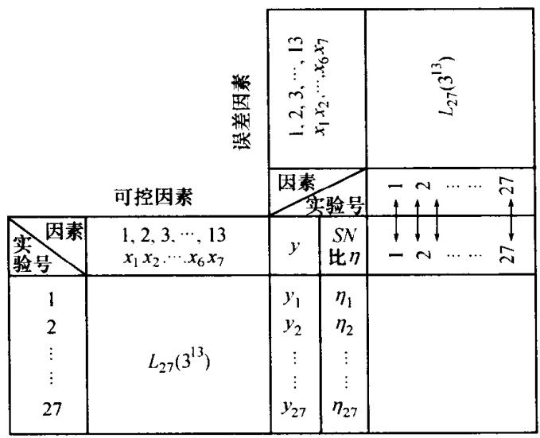

<details>
<summary>text_image</summary>

误差因素
可控因素
因素
实验号
因素
1, 2, 3, ..., 13
x₁ x₂, ..., x₆ x₇
y
SN
比η
L₂₇(3¹³)
1
2
...
...
27
L₂₇(3¹³)
y₁
y₂
...
...
y₂₇
η₁
η₂
...
...
η₂₇
L₂₇(3¹³)
1
2
...
...
27
</details>

图1

可控因素水平表和误差因素水平表如下列两表所示.

表 1 可控因素水平表

<table><tr><td>水平\因素</td><td> $X_1$ </td><td> $X_2$ </td><td> $X_3$ </td><td> $X_4$ </td><td> $X_5$ </td><td> $X_6$ </td><td> $X_7$ </td></tr><tr><td>1</td><td>0.0750</td><td>0.2250</td><td>0.0750</td><td>0.0750</td><td>1.1250</td><td>12.0</td><td>0.56250</td></tr><tr><td>2</td><td>0.1000</td><td>0.3000</td><td>0.1000</td><td>0.1000</td><td>1.5000</td><td>16.0</td><td>0.74875</td></tr><tr><td>3</td><td>0.1250</td><td>0.3750</td><td>0.1250</td><td>0.1250</td><td>1.8750</td><td>20.0</td><td>0.93500</td></tr></table>

表 2 误差因素水平表

<table><tr><td>水平\因素</td><td> $\Delta X_1$ </td><td> $\Delta X_2$ </td><td> $\Delta X_3$ </td><td> $\Delta X_4$ </td><td> $\Delta X_5$ </td><td> $\Delta X_6$ </td><td> $\Delta X_7$ </td></tr><tr><td>1</td><td> $0.95X_1$ </td><td> $0.9X_2$ </td><td> $0.9X_3$ </td><td> $0.9X_4$ </td><td> $0.9X_5$ </td><td> $0.9X_6$ </td><td> $0.95X_7$ </td></tr><tr><td>2</td><td> $X_1$ </td><td> $X_2$ </td><td> $X_3$ </td><td> $X_4$ </td><td> $X_5$ </td><td> $X_6$ </td><td> $X_7$ </td></tr><tr><td>3</td><td> $1.05X_1$ </td><td> $1.1X_2$ </td><td> $1.1X_3$ </td><td> $1.1X_4$ </td><td> $1.1X_5$ </td><td> $1.1X_6$ </td><td> $1.05X_7$ </td></tr></table>

## (b) 内表数据及信噪比数据的分析

表内数据及信噪比(SN值) $\eta$ 如表3所示.只列出试验号,每次试验所对应的各因素水平值可参照 $L_{27}(3^{13})$ 正交表.

从下表数据中,综合考虑信噪比和 y 值,完成:

(i) 通过对信噪比和 $y$ 值分别作方差分析, 得到各因素对信噪比和 $y$ 值影响的显著性大小.  
(ii) 根据(i)所得出的结果, 选择出各因素的最优水平. 上述(i), (ii)两项可参看表4-7.

表 3 信噪比与 Y 值

<table><tr><td>条件号</td><td>信噪比 SN(dB)</td><td>Y</td><td>条件号</td><td>信噪比 SN(dB)</td><td>Y</td></tr><tr><td>(1)</td><td>16.4677</td><td>2.4487</td><td>(2)</td><td>15.0777</td><td>2.8423</td></tr><tr><td>(3)</td><td>14.8275</td><td>4.2658</td><td>(4)</td><td>16.1826</td><td>1.6680</td></tr><tr><td>(5)</td><td>16.3578</td><td>2.7210</td><td>(6)</td><td>15.3444</td><td>2.6606</td></tr><tr><td>(7)</td><td>16.7260</td><td>0.9705</td><td>(8)</td><td>16.1507</td><td>1.9220</td></tr><tr><td>(9)</td><td>15.5037</td><td>3.2459</td><td>(10)</td><td>15.9997</td><td>1.0543</td></tr><tr><td>(11)</td><td>15.8717</td><td>2.3448</td><td>(12)</td><td>14.2480</td><td>5.0711</td></tr><tr><td>(13)</td><td>16.8062</td><td>1.0699</td><td>(14)</td><td>15.9997</td><td>1.5868</td></tr><tr><td>(15)</td><td>15.0114</td><td>3.0022</td><td>(16)</td><td>16.4864</td><td>0.7763</td></tr><tr><td>(17)</td><td>15:9221</td><td>2.0031</td><td>(18)</td><td>15.9997</td><td>1.6421</td></tr><tr><td>(19)</td><td>16.3802</td><td>1.3849</td><td>(20)</td><td>15.6225</td><td>2.0571</td></tr><tr><td>(21)</td><td>13.6645</td><td>2.2577</td><td>(.22)</td><td>16.4902</td><td>0.9919</td></tr><tr><td>(23)</td><td>15.6765</td><td>1.3230</td><td>(24)</td><td>15.7382</td><td>1.9875</td></tr><tr><td>(25)</td><td>16.2644</td><td>1.2865</td><td>(26)</td><td>16.4027</td><td>0.7490</td></tr><tr><td>(27)</td><td>15.7370</td><td>1.3569</td><td></td><td></td><td>·</td></tr></table>

表 4 Y 值方差分析辅助表

<table><tr><td>水平\因素</td><td> $X_1$ </td><td> $X_2$ </td><td> $X_3$ </td><td> $X_4$ </td><td> $X_5$ </td><td> $X_6$ </td><td> $X_7$ </td></tr><tr><td>(1)</td><td>1.2946</td><td>2.6363</td><td>1.6395</td><td>2.0759</td><td>2.5272</td><td>2.3182</td><td>2.1967</td></tr><tr><td>(2)</td><td>1.9499</td><td>1.8901</td><td>2.0049</td><td>2.0968</td><td>2.0612</td><td>1.8471</td><td>2.1035</td></tr><tr><td>(3)</td><td>2.8322</td><td>1.5503</td><td>2.4323</td><td>1.9040</td><td>1.4883</td><td>1.9113</td><td>1.7764</td></tr></table>

表 4 元素由表 3 对应列中同水平条件的 y 值相加并除以水平重复数得到.

表 5 Y 值方差分析表

<table><tr><td>因素</td><td>平方和 S</td><td>自由度 f</td><td>均方和 V</td><td>F</td></tr><tr><td> $X_1$ </td><td>10.717</td><td>2</td><td>5.358</td><td>32.177</td></tr><tr><td> $X_2$ </td><td>5.555</td><td>2</td><td>2.778</td><td>16.680</td></tr><tr><td> $X_3$ </td><td>2.834</td><td>2</td><td>1.417</td><td>8.510</td></tr><tr><td> $X_4$ </td><td>0.202</td><td>2</td><td>0.101</td><td>0.605</td></tr><tr><td> $X_5$ </td><td>4.874</td><td>2</td><td>2.437</td><td>14.635</td></tr><tr><td> $X_6$ </td><td>1.175</td><td>2</td><td>0.587</td><td>3.528</td></tr><tr><td> $X_7$ </td><td>0.877</td><td>2</td><td>0.438</td><td>2.633</td></tr><tr><td>e</td><td>1.998</td><td>12</td><td>0.167</td><td>0.000</td></tr><tr><td>T</td><td>28.233</td><td>26</td><td>0.000</td><td>0.000</td></tr></table>

由于 $a = 0.05$ 时， $F(2,12) = 3.89, a = 0.01$ 时， $F(2,12) = 6.93$ ，从表5可得：对 $Y$ 值影响最显著的因素是 $X_1, X_2, X_5, X_3$ .

表 6 信噪比 SN 方差分析辅助表

<table><tr><td>水平\因素</td><td> $X_1$ </td><td> $X_2$ </td><td> $X_3$ </td><td> $X_4$ </td><td> $X_5$ </td><td> $X_6$ </td><td> $X_7$ </td></tr><tr><td>(1)</td><td>147.804</td><td>138.160</td><td>141.705</td><td>139.303</td><td>142.638</td><td>141.980</td><td>142.604</td></tr><tr><td>(2)</td><td>143.081</td><td>143.607</td><td>142.324</td><td>142.547</td><td>142.345</td><td>142.310</td><td>142.337</td></tr><tr><td>(3)</td><td>136.074</td><td>145.193</td><td>142.931</td><td>145.110</td><td>141.976</td><td>142.670</td><td>142.018</td></tr></table>

表 7 信噪比 SN 方差分析表

<table><tr><td>因素</td><td>平方和 S</td><td>自由度 f</td><td>均方和 V</td><td>F</td></tr><tr><td> $X_1$ </td><td>7.740</td><td>2</td><td>3.870</td><td>30.893</td></tr><tr><td> $X_2$ </td><td>3.024</td><td>2</td><td>1.512</td><td>12.071</td></tr><tr><td> $X_3$ </td><td>0.083</td><td>2</td><td>0.042</td><td>0.331</td></tr><tr><td> $X_4$ </td><td>0.882</td><td>2</td><td>0.941</td><td>7.513</td></tr><tr><td> $X_5$ </td><td>0.024</td><td>2</td><td>0.012</td><td>0.098</td></tr><tr><td> $X_6$ </td><td>0.026</td><td>2</td><td>0.013</td><td>0.106</td></tr><tr><td> $X_7$ </td><td>0.019</td><td>2</td><td>0.010</td><td>0.076</td></tr><tr><td>e</td><td>1.503</td><td>12</td><td>0.125</td><td>0.000</td></tr><tr><td>T</td><td>14.303</td><td>26</td><td>0.000</td><td>0.000</td></tr></table>

由表 7 的 F 值可得: 对信噪比影响最显著的因素是 $X_{1}, X_{2}, X_{3}, X_{4}$ ，因素 $X_{i} (i = 1, 2, \cdots, 7)$ 最优水平的选择依据以下原则进行：

(i) 若 $X_{i}$ 对 $Y$ 影响显著, 则从表4第 $i$ 列中, 选取值最接近目标值 $y_{0} = 1.5$ 的水平作为最优水平.  
(ii) 若 $X_{i}$ 对信噪比影响显著, 则从表6第i列中, 选取数值最大的水平作为最优水平.  
(iii) 若 $X_{i}$ 对信噪比和 $Y$ 值影响都显著或都不显著, 则按表4选择.

采用上述原则的理由是：

(i) 当 $X_{i}$ 只对一个指标显著时, 显然应根据该指标选择最优水平.  
(ii) 当 $X_{i}$ 对两指标都显著或都不显著时, 应优先考虑使 $y$ 接近 1.5 , 因为准确性比稳定性更重要一些.

对最后结果的验证也表明了上述原则的合理性.

按照上述步骤可得到一组较优的水平,以该组值作为中心值,将搜索区间长度变为原来的一半,重复上述步骤,共进行3次之后,得到一组认为是最佳的标定值:

$$
\begin{array}{l} x _ {1} = 0. 0 9 7 5, \quad x _ {2} = 0. 3 0 0 0, \quad x _ {3} = 0. 1 0 0 0, \quad x _ {4} = 0. 1 0 0 0, \\ x _ {5} = 1. 5 5 0 0, \quad x _ {6} = 1 6. 4 0 0, \quad x _ {7} = 0. 8 4 3 1 \\ \end{array}
$$

(2) 容差设计

我们以上述最优标定值为基础,对各零件参数的容差等级进行穷举搜索(共108种),得到了一组使费用最少的组合为

$$
\begin{array}{l} x _ {1}: B, \quad x _ {2}: B \quad x _ {3}: B, x _ {4}: C \\ x _ {5}: C, \quad x _ {6}: B \quad x _ {7}: B. \\ \end{array}
$$

这样就得到了完整的零件参数设计.

(3) 结果验证

用2000次随机试验对上述最优设计方案的验证结果为: $y = 1.5009, f = 422$ , 次品率为 $16.52\%$ , 废品率 $0.01\%$ , 显然大大优于原设计.

## 五、模型优缺点分析及改进措施

## 1. 优点：

该模型人为假设少,因而能比较准确地反映实际情况,模型求解时充分考虑了准确性和稳定性,采用了合理的择优原则,因而该模型可靠性好.

## 2. 不足：

在容差设计中,我们采用了穷举法,这是考虑到容差等级少,穷举法必定能找到最佳组合,且运算量也不大.但作为一种一般方法,若容差等级增多,则运算量会急剧增大.

## 3. 改进措施：

当容差等级较多时,容差设计可采用正交试验法,亦可进行方差分析,找到对误差影响最大的因素,进行有针对性的调整,这样虽然不一定能找到最佳值,但总可以找到比较优的解,当运算量很大时,这是实际可行的方法.

## 参考文献

[1] 杨惠中, 汪蕙编著, 数值计算方法与 C 语言工程函数库, 科学出版社, 北京, 1996  
[2] 中国现场统计研究会三次设计组, 全国总工会电教中心编著, 正交法和三次设计, 科学出版社, 北京, 1985  
[3] 陈兆能, 邱泽麟, 余经洪编著, 试验分析与设计, 上海交通大学出版社, 上海, 1991  
[4] 谭浩强编著 C 程序设计, 清华大学出版社, 北京, 1995

作为具有许多多种多样应用的一个广阔领域,数据采掘可以描述为以从大规模数据集中提取信息为目标的研究领域。

Thomas Manteuffel and James Crowley, Today's Challenge: keeping up with Demand For Mathematics, SIAM NEWS, v. 34(2001), no. 5, pp. 1 - 2.

# 零件的参数设计

闽令建 黄 毅 汪细敏

(兰州铁道学院, 兰州 730070)

指导教师 丁旺才

编者按 本文用田口玄一的三次设计方法解决零件的参数设计问题.通过统计分析调整参数值,基本达到较优解.文字清晰.

摘要 本文对零件的参数设计问题进行了分析,提出了质量特性的全微分形式,从而根据零件参数的分布函数求得质量特性的分布函数,并求出了总质量损失,这种方法也适用于质量损失函数为不连续分段函数形式的情况.本文对零件参数的设计方法做了进一步探讨,本模型为望目特性的参数设计,对于模型的求解首先进行改善信噪比的设计,然后进行目标值的修正,最后进行容差设计,使总费用达到最小.对题中的分离器参数进行的再设计,使总费用从原设计的3,085,700元降低到468,800元.所用方法基于数理统计理论,得到的结果合理.本文还讨论了模型的优缺点,并给出了一般的零件参数设计方法.

## 一、问题重述(略)

## 二、符号说明

$x_{i}, i = 1,2,\cdots,7$ 零件参数变量； Q 质量损失；

$X_{i}, i = 1, 2, \cdots, 7$ 零件参数标定值；C 成本；

$\Delta_{i}, i = 1,2,\cdots,7$ 零件参数容差； y 产品参数(即产品质量特性);

F 总费用； $y_{0}$ 产品质量特性目标值(1.50);

## 三、问题分析

参数设计是产品设计的核心,它在系统设计之后进行,该问题目的是要选择系统中所有参数的最佳水平组合,从而尽量减少各种干扰的影响,使所设计的产品质量特性 y 波动小,稳定性好.

## 1. 统计特性

该问题是针对批量生产的产品进行分析.由于 $X_{i}(i=1,2,\cdots,7)$ 的随机波动,使y产生波动,从而偏离目标值,产生质量损失.所以该问题要用概率统计的理论方法进行分析设计.

## 2. 非线性效应与参数标定值设计

通常产品质量特性 $y$ 与零件参数的水平(标定值)之间是非线性关系.本问题亦然.

例如在图一中, 若参数 $x$ 取水平 $X_{1}$ , 由于波动 $\Delta X$ , 引起 $y$ 的波动范围为 $\Delta Y_{1}$ , 通过参数设计, 若将水平 $X_{1}$ 移到水平 $X_{2}$ , 此时对于同样的波动范围 $\Delta X, Y$ 的波动范围缩小为 $\Delta Y_{2}$ , 易见 $\Delta Y_{2} \ll \Delta Y_{1}$ . 可见, 只要合理地选择参数的水平, 在参数的波动范围不变的条件下 (因而不增加成本), 就可大大减少质量特性的波动范围, 提高了产品的稳定性. 若按照传统的设计方法, 单纯提高零件的质量, 把 $C$ 等品改为 $A$ 等品, 此时参数 $X$ 的波动范围由 $\Delta X$ 缩小为 $\Delta X_{1}$ , 而质量特性 $Y$ 在水平 $X_{1}$ 处相应的波动范围变为 $\Delta Y_{3}$ , 虽然 $\Delta Y_{3} \gg \Delta Y_{2}$ .

所以并非由 A 等品组装起来的产品就一定是一级产品, 参数设计就是要利用这种非线性效应, 寻找参数的最佳水平(标定值) 组合.

## 3. 容差设计

容差大小对质量特性 Y 的影向可在图 1 中表明, 若缩小 $\Delta X$ , 则 $\Delta Y$ 也缩小.

容差设计的思路是:根据各参数的波动对产品质量特性影响的大小,从经济角度考虑有无必要对影响大的参数给予较小的容差,以便进一步减少质量特性的波动,减少质量扣失,但这样会使产品的成本有所提高.因此,要寻找使总费用最小的容差设计方案,使所设计的产品质量特性y波动小,稳定性好.

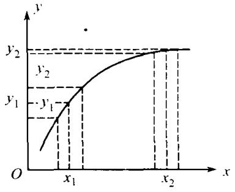

<details>
<summary>line</summary>

| Point | X-coordinate | Y-coordinate |
| --- | --- | --- |
| 1 | x1 | y1 |
| 2 | x2 | y2 |
</details>

图1

## 四、模型的建立及求解

根据对本题的分析,我们的设计目标是设计一组参数标定值 $X_{i}(i=1,2,\cdots,7)$ 及其容差 $\Delta_{i}i=1,2,\cdots,7$ 使得:

$$
E (y) = y _ {0}, \quad v (y) = \sigma^ {2} \text {越小越好}
$$

以上即为望目特性的参数设计.

## 1. 质量特性 $y$ 的全微分及质量损失

要计算质量损失需知道 y 的分布函数. 由于本题 $y = f(x_{1}, x_{2}, \cdots, x_{7})$ 是一较复杂的经验公式. 所以尽管已知 $x_{i} (i = 1, 2, \cdots, 7)$ 的分布函数, 但无法直接推出 y 的分布函数.

如果各偏导数存在且连续,则我们用全微分原理能够得到

$$
\delta \mathrm{y} = \sum_ {i = 1} ^ {7} \frac {\partial f}{\partial x _ {i}} \Delta x _ {i} \tag {1}
$$

这些偏导数, 我们可利用 Mathematica 软件包进行求解, 从上式可知各偏导数的值影响了 $X_{1}, X_{2}, \cdots, X_{7}$ 各自波动时对 $y$ 值波动的贡献系数, 当一组标定值 $X_{i} (i = 1, 2, \cdots, 7)$ 确定以后, 我们近似地认为这些贡献系数是一些常数. 则 $\delta y$ 与 $\Delta x_{i} (i = 1, 2, \cdots, 7)$ 有关, 由于后者为正态分布, 则也可认为 $\delta y$ 是正态分布, 这样也从另一方面说明了假设 4 的合理性. 我们可以由 $\Delta x_{i} (i = 1, 2, \cdots, 7)$ 的方差求得 $\delta y$ 的方差

$$
\sigma^ {2} = \sum_ {i = 1} ^ {7} \left(\frac {\partial f}{\partial x _ {i}}\right) ^ {2} \sigma_ {i} ^ {2} \tag {2}
$$

于是,对于正态分布的 y

$$
E (y) = Y = f (X _ {1}, X _ {2}, \dots , X _ {7}) \tag {3}
$$

$$
D (y) = \sigma^ {2} \tag {4}
$$

即 $y$ 的概率密度函数为

$$
f (y) = \frac {1}{\sqrt {2 \pi} \sigma} e ^ {\frac {- (y - y _ {0}) ^ {2}}{2 \sigma^ {2}}} \tag {5}
$$

由于质量损失函数

$$
Q (y) = \left\{ \begin{array}{l l} 0, & | y - y _ {0} | <   0. 1 \\ 1 0 0 0, & 0. 1 \leqslant | y - y _ {0} | <   0. 3 \\ 9 0 0 0, & | y - y _ {0} | \geqslant 0. 3 \end{array} \right. \tag {6}
$$

求得总的质量损失：

$$
\widetilde {Q} = \int Q (y) f (y) \mathrm{d} y = 1 0 0 0 \int_ {0, i <   i y} f (y) \mathrm{d} y + 9 0 0 0 \int_ {| y - y _ {0} | \geqslant 0. 3} f (y) \mathrm{d} y \tag {7}
$$

若总成本为 C, 则总费用 F 为

$$
F = \widetilde {Q} + C \tag {8}
$$

根据以上算法求得的原设计值下的结果为：正品率： $12.55\%$ ，次品率： $62.31\%$ 费品率： $25.14\%$ ，总的质量损失： $\widetilde{Q} = 2,885,700$ （元）；总成本： $C = 200,000$ （元）；总费用： $F = 3,085,700$ （元）；

## 2. 标定值 $X_{i}(i=1,2,3,\cdots,7)$ 选优设计

标定值选择的好坏,直接影响了 Y 的受力大小.为了反映各零件参数对质量特性 Y 的影响,我们引入信噪比和灵敏度这两个统计指标进行了分析,分两段进行

(a) 信噪比分析: 寻找使信噪比达到最大, 即稳定性最好的最佳水平组合.

(b) 灵敏度分析: 寻找与信噪比无关, 灵敏度显著的可控因素——称为调整因素. 并进行调整作业, 使最佳条件下质量特性的期望值趋近目标值 $y_{0}$ .

我们利用正交表的内外表直积法进行求解.

## (1) 可控因素及误差因素

所谓可控因素,系指在技术上已指定,并且能够进行选择和控制的质量因素,我们构成经验公式的变量,可控因素有7个

$$
X _ {1}, X _ {2}, X _ {3}, X _ {4}, X _ {5}, X _ {6}, X _ {7}.
$$

所谓误差因素,系指使系统质量产生波动的原因的总和,即所有波动的原因,有时也称之为干扰.为了区分可控因素和误差因素,我们利用在英文字母的右边加',来表示误差因素,如 $X_{1}^{\prime}$ ,表示 $X_{1}$ 因素是误差因素.

误差因素有 7 个, $\Delta x_{i}(i=1,2,\cdots,7)$

## (2) 确定可控因素水平

我们考虑用原设计的参数值作为可控因素的第二水平,第一、第三水平采用等差数列来确定,并且其差尽量取得大些,以便使研究的范围更广些.

我们所确定的第二水平为： $x_{1} = 0.1, x_{2} = 0.3, x_{3} = 0.1, x_{4} = 0.1, x_{5} = 1.5, x_{6} = 16, x_{7} = 0.75$

按等差数列来确定第一、三水平,得到可控因素水平表(见表2),此为7因素水平.

表 1 可控因素水平

<table><tr><td>水平</td><td> $x_{1}$ </td><td> $x_{2}$ </td><td> $x_{3}$ </td><td> $x_{4}$ </td><td> $x_{5}$ </td><td> $x_{6}$ </td><td> $x_{7}$ </td></tr><tr><td>水平 1</td><td>0.075</td><td>0.225</td><td>0.075</td><td>0.075</td><td>1.125</td><td>12</td><td>0.565</td></tr><tr><td>水平 2</td><td>0.1</td><td>0.3</td><td>0.1</td><td>0.1</td><td>1.5</td><td>16</td><td>0.75</td></tr><tr><td>水平 3</td><td>0.125</td><td>0.375</td><td>0.125</td><td>0.125</td><td>1.875</td><td>20</td><td>0.935</td></tr></table>

## (3) 内设计

安排可控因素的正交表称为内表, 相应的设计称为内设计, 我们选用正交表 $L56(3^{13})$ 作为内表进行内设计.

表头设计为

<table><tr><td>列号</td><td>1</td><td>2</td><td>3</td><td>4</td><td>5</td><td>6</td><td>7</td><td>8</td><td>9</td><td>10</td><td>11</td><td>12</td><td>13</td></tr><tr><td>因素</td><td> $x_{1}$ </td><td> $x_{2}$ </td><td> $x_{3}$ </td><td> $x_{4}$ </td><td> $x_{5}$ </td><td> $x_{6}$ </td><td> $x_{7}$ </td><td></td><td></td><td></td><td></td><td></td><td></td></tr></table>

空列作为误差列,内表见表2

## (4) 外设计

安排误差因素和信号因素的正交表称为外表,相应的设计称为外设计.对于外设计,我们仍选用 $L36(3^{13})$ 正交表进行.为不失一般性,我们把 $\Delta x_{1},\cdots,\Delta x_{7}$ 共7个误差因素依次排列在正交表 $L36(3^{13})$ 中的第一列, $\cdots$ ,第七列,其余为空列.

## (5) 计算信噪比

信噪比的计算公式(附录略).

## (6) 内表的统计分析

表 2 内表及信噪比数据

<table><tr><td>编号</td><td>η(DB)</td><td>编号</td><td>η(DB)</td><td>编号</td><td>η(DB)</td><td>编号</td><td>η(DB)</td></tr><tr><td>1</td><td>7.293358</td><td>2</td><td>-0.667325</td><td>3</td><td>-7.809498</td><td>4</td><td>-0.944386</td></tr><tr><td>5</td><td>6.0723015</td><td>6</td><td>12.018950</td><td>7</td><td>-15.599517</td><td>8</td><td>6.791221</td></tr><tr><td>9</td><td>-4.632693</td><td>10</td><td>6.534921</td><td>11</td><td>-1.063730</td><td>12</td><td>0.042895</td></tr><tr><td>13</td><td>-6.152885</td><td>14</td><td>0.025610</td><td>15</td><td>9.569289</td><td>16</td><td>4.319945</td></tr><tr><td>17</td><td>4.369740</td><td>18</td><td>7.67204</td><td>19</td><td>17.752659</td><td>20</td><td>6.314679</td></tr><tr><td>21</td><td>10.42688</td><td>22</td><td>10.32445</td><td>23</td><td>4.981981</td><td>24</td><td>8.3599532</td></tr><tr><td>25</td><td>15.421156</td><td>26</td><td>9.988859</td><td>27</td><td>7.414917</td><td>28</td><td>0.945912</td></tr><tr><td>29</td><td>3.442791</td><td>30</td><td>5.141854</td><td>31</td><td>10.770247</td><td>32</td><td>-3.260096</td></tr><tr><td>33</td><td>11.27773</td><td>34</td><td>21.635672</td><td>35</td><td>9.260098</td><td>36</td><td>10.731010</td></tr></table>

内表的统计分析对象是信噪比,它是衡量内表中方案稳健性的指标.我们首先计算出每个因素 $(x_{1}\sim x_{7}$ 共7个因素)各水平(三个水平)下信噪比的合计值及平均值,结果见表5.然后计算各种波动平方和与自由度.

总波动 S

$$
S _ {r} = \sum_ {i = 1} ^ {3 6} (\eta_ {i} - \bar {\eta}) ^ {2} = \sum_ {i = 1} ^ {3 6} \eta_ {i} ^ {2} - \frac {1}{3 6} \Big (\sum_ {i = 1} ^ {3 6} \eta_ {i} \Big) ^ {2}
$$

表 3 外表

<table><tr><td>编号</td><td> $y - y_0$ </td><td>编号</td><td> $y - y_0$ </td><td>编号</td><td> $y - y_0$ </td><td>编号</td><td> $y - y_0$ </td></tr><tr><td>1</td><td>0.013199</td><td>2</td><td>-0.205808</td><td>3</td><td>372261</td><td>4</td><td>-0.240722</td></tr><tr><td>5</td><td>-0.405250</td><td>6</td><td>0.102015</td><td>7</td><td>-0.047623</td><td>8</td><td>-0.096853</td></tr><tr><td>9</td><td>-0.401065</td><td>10</td><td>0.038727</td><td>11</td><td>-0.312656</td><td>12</td><td>-0.39549</td></tr><tr><td>13</td><td>-0.255442</td><td>14</td><td>-0.364351</td><td>15</td><td>0.050741</td><td>16</td><td>-0.007782</td></tr><tr><td>17</td><td>-0.421923</td><td>18</td><td>-0.112883</td><td>19</td><td>-0.545118</td><td>20</td><td>-0.12668</td></tr><tr><td>21</td><td>0.14699</td><td>22</td><td>-0.374668</td><td>23</td><td>-0.097154</td><td>24</td><td>-0.107961</td></tr><tr><td>25</td><td>-0.464484</td><td>26</td><td>0.040643</td><td>27</td><td>-0.124105</td><td>28</td><td>-0.317290</td></tr><tr><td>29</td><td>-0.184350</td><td>30</td><td>-0.158516</td><td>31</td><td>-0.391648</td><td>32</td><td>-0.229455</td></tr><tr><td>33</td><td>0.082814</td><td>34</td><td>-0.612884</td><td>35</td><td>0.021405</td><td>36</td><td>0.122002</td></tr></table>

然后, 将上述结果整理为方差分析表(见表5). 从方差分析表可以看出, $X_{6}$ 高度显著, 因素 $X_{1}, X_{7}$ 显著, $X_{2}, X_{3}, X_{4}, X_{5}$ 不显著.

表 4 方差分析辅助表

<table><tr><td> $T_i$ </td><td> $x_1$ </td><td> $x_2$ </td><td> $x_3$ </td><td> $x_4$ </td><td> $x_5$ </td><td> $x_6$ </td><td> $x_7$ </td></tr><tr><td> $T_1$ </td><td>12.1290</td><td>8.8695</td><td>10.4274</td><td>9.0850</td><td>9.8308</td><td>10.4250</td><td>13.6580</td></tr><tr><td> $T_2$ </td><td>7.8174</td><td>12.0985</td><td>10.2146</td><td>9.8887</td><td>12.5296</td><td>6.2090</td><td>9.5773</td></tr><tr><td> $T_3$ </td><td>11.7023</td><td>10.6808</td><td>11.0067</td><td>12.675</td><td>9.2884</td><td>15.0148</td><td>8.4134</td></tr><tr><td>T</td><td></td><td>189.892</td><td></td><td></td><td></td><td></td><td></td></tr></table>

表 5 参数设计表内表的方差分析

<table><tr><td>来源</td><td>S</td><td>f</td><td>V</td><td>F</td></tr><tr><td> $X_1$ </td><td>33.863</td><td>2</td><td>16.932</td><td>0.442</td></tr><tr><td> $X_2$ </td><td>15.71</td><td>2</td><td>7.858</td><td></td></tr><tr><td> $X_3$ </td><td>1.008</td><td>2</td><td>0.504</td><td></td></tr><tr><td> $X_4$ </td><td>21.297</td><td>2</td><td>10.649</td><td></td></tr><tr><td> $X_5$ </td><td>14.125</td><td>2</td><td>7.063</td><td></td></tr><tr><td> $X_6$ </td><td>116.384</td><td>2</td><td>58.192</td><td>1.516</td></tr><tr><td> $X_7$ </td><td>45.565</td><td>2</td><td>22.782</td><td>0.594</td></tr><tr><td>l</td><td>1640.955</td><td>21</td><td>50.522</td><td></td></tr><tr><td> $\bar{l}$ </td><td>1193.103</td><td>(29)</td><td>38.383</td><td></td></tr><tr><td>T</td><td>189.422</td><td>35</td><td></td><td></td></tr></table>

## (7) 确定参数组合：

(a) 本题中 $x_{2}, x_{3}, x_{4}, x_{5}$ 因素不显著, 所以其水平可自由选取; 显著因素和高度显著因素 $x_{1}, x_{7}$ 和 $x_{6}$ 的水平必须由信噪比来选择. 从而得到一组满足稳健性的参数(见表6).

将这一组满足稳健性的参数标定值代入经验公式得到 $Y = 0.71$

(b) 再利用不显著因素求(一致性)参数组合. 用于满足稳健性的参数组合对应的输出特性与目标值相差太大(偏移过多), 我们必须进行校正. 通过调整对信噪比影响不显著, 但对灵敏度影响显著的因素的参数值, 使输出特性接近目标值.

表6

<table><tr><td>参数</td><td> $X_{1}$ </td><td> $X_{2}$ </td><td> $X_{3}$ </td><td> $X_{4}$ </td><td> $X_{5}$ </td><td> $X_{6}$ </td><td> $X_{7}$ </td></tr><tr><td>水平</td><td>1</td><td>2</td><td>1</td><td>3</td><td>3</td><td>3</td><td>1</td></tr></table>

(c) 为了确定具体的调整因素, 我们需要求出灵敏度. 所谓灵敏度, 是反映平均特性的指标. 计作 $s = \hat{\mu}^2\mu$ 的无偏估计为 $\hat{\mu}^2 = (S_m - V_e)/n$

因此,我们利用类似求信噪比的方法,得到灵敏度的估计公式如下:

$$
S = 1 0 \mathrm{log} \left[ \frac {1}{n} (S _ {m} - V _ {e}) \right]
$$

从而得到灵敏度的值(如表7).

表 7

<table><tr><td>0</td><td>1</td><td>2</td><td>3</td><td>4</td><td>5</td><td>6</td><td>7</td><td>8</td></tr><tr><td>-1.6064</td><td>-12.0466</td><td>-21.1154</td><td>-14.8225</td><td>-8.5211</td><td>7.556130</td><td>-28.1167</td><td>-1.978</td><td>-17.9564</td></tr><tr><td>9</td><td>10</td><td>11</td><td>12</td><td>13</td><td>14</td><td>15</td><td>16</td><td>17</td></tr><tr><td>-3.2513</td><td>-15.161</td><td>-10.73</td><td>-19.741</td><td>-14.115</td><td>4.6633</td><td>-6.447</td><td>-10.6314</td><td>2.753</td></tr><tr><td>18</td><td>19</td><td>20</td><td>21</td><td>22</td><td>23</td><td>24</td><td>25</td><td>26</td></tr><tr><td>-2.088</td><td>-3.046</td><td>7.7046</td><td>-6.4040</td><td>-4.94</td><td>3.089</td><td>-3.0788</td><td>3.844</td><td>-0.9729</td></tr><tr><td>27</td><td>28</td><td>29</td><td>30</td><td>31</td><td>32</td><td>33</td><td>34</td><td>35</td></tr><tr><td>-13.575</td><td>-6.61</td><td>-3.515</td><td>-6.10</td><td>-14.052</td><td>7.18</td><td>-0.385</td><td>2.2595</td><td>6.5231</td></tr></table>

通过以上的两阶段设计,我们把可控因素分成以下几个类(见表8)

表8

<table><tr><td></td><td>信噪比</td><td>灵敏度</td><td>因素名称</td></tr><tr><td> $X_{1}$ </td><td>显著</td><td>显著</td><td>确定因素</td></tr><tr><td> $X_{2}$ </td><td>不显著</td><td>显著</td><td>可调因素</td></tr><tr><td> $X_{3}$ </td><td>不显著</td><td>显著</td><td>可调因素</td></tr><tr><td> $X_{4}$ </td><td>不显著</td><td>不显著</td><td>次要因素</td></tr><tr><td> $X_{5}$ </td><td>不显著</td><td>显著</td><td>可调因素</td></tr><tr><td> $X_{6}$ </td><td>显著</td><td>不显著</td><td>确定因素</td></tr><tr><td> $X_{7}$ </td><td>显著</td><td>显著</td><td>确定因素</td></tr></table>

表 9

<table><tr><td> $X_{2}$ 增大</td><td>Y减小</td></tr><tr><td> $X_{3}$ 增大</td><td>Y增大</td></tr><tr><td> $X_{5}$ 增大</td><td>Y减小</td></tr></table>

由于通过参数设计得到的一组水平组合代入 $y$ 的表达式所得 $Y$ 值与目标值相差过大，我们应该通过调整可调因素 $X_{2}, X_{3}, X_{5}$ 来调整 $y$ 值使其更接近于目标值1.50，易推知 $Y$ 随 $X_{2}, X_{3}, X_{5}$ 的变化关系如表9.

我们也利用 Mathematica 软件画出 y 值随 $X_{2}, X_{3}, X_{5}$ 的变化关系曲线(如图 2-4).

## 3. 容差设计

通过以上调整得到一组最佳组合下的 $x_{i}(i=1,2,\cdots,7)$ 的标定值，在此标定值上 $E(y)=y_{0}$ . 我们应该找到一组零件质量等级的组合使总的费用最小. 因随零件质量等级的不同，生产成本也不同，所以提高零件质量未必能减少总费用. 而应该提高那些对产品质量波动影响较显著的零件的质量等级，即给这些零件以较小的容差范围. 而对那些对产品影响甚小的零件，给以较大的容差范围，以降低生产成本.

通过上面的分析我们知道,应当首先确定 $X_{i},(i=1,2,\cdots,7)$ 中哪些零件的容差对产品影响较大,这就是容差设计.

因此我们应使 $X_{2}, X_{5}$ 的值减小, $X_{3}$ 的值增大, 从而使 $y$ 值增大.

通过计算我们得到了一组标定值 $X_{i}$ 的最佳水平组合 $X_{1} = 0.075, X_{2} = 0.225, X_{3} = 0.125, X_{4} = 0.125, X_{5} = 1.621, X_{6} = 20, X_{7} = 0.565$

## (1) 给出误差因素水平表

以最佳条件 $x_{1} = 0.075, x_{2} = 0.225, x_{3} = 0.125, x_{4} = 0.125, x_{5} = 1.62067, x_{6} = 20, x_{7} = 0.565$ 为标定值，按各零件的最低等级作为零件质量特性的波动范围，可得到如下的误差因素水平表(表10).

表 10 容差设计水平表

<table><tr><td>水平</td><td> $x_{1}$ </td><td> $x_{2}$ </td><td> $x_{3}$ </td><td> $x_{4}$ </td><td> $x_{5}$ </td><td> $x_{6}$ </td><td> $x_{7}$ </td></tr><tr><td>水平 1</td><td>0.07125</td><td>0.2025</td><td>0.1125</td><td>0.1125</td><td>1.4586</td><td>18</td><td>0.53675</td></tr><tr><td>水平 2</td><td>0.075</td><td>0.225</td><td>0.125</td><td>0.125</td><td>1.62067</td><td>20</td><td>0.565</td></tr><tr><td>水平 3</td><td>0.07875</td><td>0.2475</td><td>0.1375</td><td>0.1375</td><td>1.78273</td><td>22</td><td>0.59325</td></tr></table>

(2) 我们选用 $L36(3^{13})$ 的正交表进行容差设计. 把误差因素依次排在正交表的 1—7 列, 由 y 的经验公式 $y = f(x_{1}, x_{2}, \cdots, x_{7})$ 计算出输出特性 y 及 $\Delta y = y - y_{0}$ , y 及 $\Delta y$ 的计算可用 C 语言编程实现. 其结果见表 11.

## (3) 方差分析

因该设计中误差水平等间隔,故可用正交多项式的回归理论进行方差分析.

根据波动平方和的分析公式

$$
S _ {T} ^ {\prime} = \sum_ {i = 1} ^ {3 6} (y _ {i} - y _ {0}) ^ {2} = n (b a r y - y _ {0}) ^ {2} + \sum_ {i = 1} ^ {n} (y _ {i} - \bar {y}) ^ {2}
$$

该式说明总波动来自两个方面：

第一是均值偏移波动 n；

第二是以 $\bar{y}$ 为中心的随机波动 $\sum_{i=1}^{n}(y_i - \bar{y})^2$ , 若 $S_m$ 表示第一波动. $S_i$ 表示因素波动, 则

$$
S _ {T} ^ {\prime} = S _ {m} + \sum_ {i = 1} ^ {7} S _ {x _ {i}} + S _ {e}
$$

另外,我们将因素的波动还可以分解为一次波动 $S_{e}$ 和二次波动 $S_{q}$ .

下面我们给出计算各自波动的平方和及自由度的公式总波动: $S_{T}^{\prime}=\sum_{i=1}^{7}(y_{i}-1.5)^{2}$ ; 均值偏移波动: $S_{m}\cdot X_{i}$ 因素的一次项波动

$$
S x _ {i} e = \frac {(- 1 \times T _ {1} + 0 \times T _ {2} + 1 \times T _ {3}) ^ {2}}{r \lambda^ {2} s}, (r = 1 2, \lambda^ {2} s = 2)
$$

$$
F x _ {i} e = 1,
$$

$X_{i}$ 因素的二次项波动

$$
S x _ {i} q = \frac {(1 \times T _ {1} - 2 \times T _ {2} + 1 \times T _ {3}) ^ {2}}{r \lambda^ {2} s}, \quad (r = 1 2, \lambda^ {2} s = 6)
$$

$$
F x _ {i} q = 1
$$

对以上调整方案总成本的计算和模型前面部分给定标定值时的求解方法完全相同. 通过对以下调整方案的比较我们得出了此问题的最优解.

调整方案为: $X_{3}(B$ 等 $)x_{4}(B$ 等 $)X_{5}(B$ 等 $)$

综上,我们得出再设计后的结果如下:

标定值 $X_{1} = 0.075, X_{2} = 0.025, X_{3} = 0.125, X_{4} = 0.125, X_{5} = 1.621, X_{6} = 20, X_{7} = 0.565$ . 容差等级分别取 $B, C, B, B, C, B, B$ 得出正品率: $82.62\%$ , 次品率: $17.38\%$ , 总成本: $295000$ 元, 损失费: $1738000$ 元, 总费用: $468800$ 元.

表 11 最佳条件下的输出特性值

<table><tr><td>编号</td><td> $y - y_0$ </td><td>编号</td><td> $y - y_0$ </td><td>编号</td><td> $y - y_0$ </td><td>编号</td><td> $y - y_0$ </td></tr><tr><td>1</td><td>0.2538301</td><td>2</td><td>-0.000000</td><td>3</td><td>-0.192927</td><td>4</td><td>-0.0404470</td></tr><tr><td>5</td><td>-0.231161</td><td>6</td><td>0.356770</td><td>7</td><td>-0.047099</td><td>8</td><td>-0.221959</td></tr><tr><td>9</td><td>-0.157628</td><td>10</td><td>70.139081</td><td>11</td><td>-0.222314</td><td>12</td><td>-0.017327</td></tr><tr><td>13</td><td>-0.027336</td><td>14</td><td>-0.112780</td><td>15</td><td>-0.037419</td><td>16</td><td>-0.229514</td></tr><tr><td>17</td><td>-0.250485</td><td>18</td><td>-0.107690</td><td>19</td><td>-0.4728657</td><td>20</td><td>-0.281010</td></tr><tr><td>21</td><td>0.254411</td><td>22</td><td>-0.288519</td><td>23</td><td>0.288041</td><td>24</td><td>-0.017174</td></tr><tr><td>25</td><td>-0.180150</td><td>26</td><td>0.141121</td><td>27</td><td>-0.01997</td><td>28</td><td>-0.055204</td></tr><tr><td>29</td><td>-0.2591450</td><td>30</td><td>0.146285</td><td>31</td><td>-0.215396</td><td>32</td><td>-0.027410</td></tr><tr><td>33</td><td>0.334515</td><td>34</td><td>-0.416369</td><td>35</td><td>-0.005087</td><td>36</td><td>0.4490659</td></tr></table>

为了进行方差分析我们首先给出方差分析的辅助表

表 12 容差的方差分析的辅助表

<table><tr><td> $T_i$ </td><td> $x_1$ </td><td> $x_2$ </td><td> $x_3$ </td><td> $x_4$ </td><td> $x_5$ </td><td> $x_6$ </td><td> $x_7$ </td></tr><tr><td> $T_1$ </td><td>-0.9732</td><td>0.4965</td><td>-1.3379</td><td>1.5861</td><td>1.8783</td><td>0.9626</td><td>0.4920</td></tr><tr><td> $T_2$ </td><td>-0.2368</td><td>0.2139</td><td>-0.0710</td><td>0.1553</td><td>-0.0522</td><td>0.244</td><td>-0.0765</td></tr><tr><td> $T_3$ </td><td>1.2825</td><td>-0.6379</td><td>1.4814</td><td>-1.8669</td><td>-1.7540</td><td>-1.1317</td><td>-0.3429</td></tr><tr><td>T</td><td></td><td>0.07258</td><td></td><td></td><td></td><td></td><td></td></tr></table>

方差分析表见表 13, 由表可知道误差因素 $X_{3}, X_{4}, X_{5}$ 显著

表 13 容差的方差分析表

<table><tr><td>来源</td><td></td><td>S</td><td>f</td><td>V</td><td>F</td><td> $S'$ </td><td> $\rho(\%)$ </td></tr><tr><td>m</td><td></td><td>0.000146</td><td>1</td><td></td><td></td><td></td><td></td></tr><tr><td rowspan="2"> $x_1$ </td><td> $x_{11}$ </td><td>0.21201</td><td>1</td><td>0.21201</td><td>1.72411</td><td>0.089</td><td>8.43</td></tr><tr><td> $x_{1q}$ </td><td>0.008511</td><td>1</td><td></td><td></td><td></td><td></td></tr><tr><td rowspan="2"> $x_2$ </td><td> $x_{21}$ </td><td>0.05362</td><td>1</td><td></td><td></td><td></td><td></td></tr><tr><td> $x_{2q}$ </td><td>0.0045</td><td>1</td><td></td><td></td><td></td><td></td></tr><tr><td rowspan="2"> $x_3$ </td><td> $x_{31}$ </td><td>0.28497</td><td>1</td><td>0.28497</td><td>2.31743</td><td>0.162</td><td>15.34</td></tr><tr><td> $x_{3q}$ </td><td>0.001132</td><td>1</td><td></td><td></td><td></td><td></td></tr><tr><td rowspan="2"> $x_4$ </td><td> $x_{41}$ </td><td>0.44146</td><td>1</td><td>0.44146</td><td>3.59002</td><td>0.3185</td><td>30.16</td></tr><tr><td> $x_{4q}$ </td><td>0.00215</td><td>1</td><td></td><td></td><td></td><td></td></tr><tr><td rowspan="2"> $x_5$ </td><td> $x_{51}$ </td><td>0.54959</td><td>1</td><td>0.54959</td><td>4.46936</td><td>0.4266</td><td>40.40</td></tr><tr><td> $x_{5q}$ </td><td>0.000729</td><td>1</td><td></td><td></td><td></td><td></td></tr><tr><td rowspan="2"> $x_6$ </td><td> $x_{61}$ </td><td>0.18278</td><td>1</td><td>0.18278</td><td>1.48644</td><td>0.05982</td><td>5.56</td></tr><tr><td> $x_{6q}$ </td><td>0.005898</td><td>1</td><td></td><td></td><td></td><td></td></tr><tr><td rowspan="2"> $x_7$ </td><td> $x_{71}$ </td><td>0.02904</td><td>1</td><td></td><td></td><td></td><td></td></tr><tr><td> $x_{7q}$ </td><td>0.00127</td><td>1</td><td></td><td></td><td></td><td></td></tr><tr><td>e</td><td></td><td>3.7052</td><td>21</td><td></td><td></td><td></td><td></td></tr><tr><td> $\bar{e}$ </td><td></td><td>3.8120</td><td>(31)</td><td>0.12297</td><td></td><td></td><td></td></tr><tr><td>T</td><td></td><td>5.4829</td><td>36</td><td>0.15230</td><td></td><td></td><td></td></tr></table>

## (4) 容差的确定

由方差分析表上看出, 只有 $X_{1}, X_{3}, X_{4}, X_{5}, X_{6}$ 的容差对质量损失有影响. 又 $X_{1}, X_{5}$ 的容差是不可调的, 因此只有调整 $X_{3}, X_{4}, X_{6}$ 的容差. 其可行的调整方法有如下几种(表 14).

表 14

<table><tr><td rowspan="2"></td><td></td><td>等级</td><td></td></tr><tr><td> $X_3, X_4, X_6$ </td><td></td><td></td></tr><tr><td>未调整</td><td>C</td><td>C</td><td>C</td></tr><tr><td rowspan="6">调整方案</td><td>C</td><td>B</td><td>C</td></tr><tr><td>C</td><td>A</td><td>C</td></tr><tr><td>B</td><td>B</td><td>C</td></tr><tr><td>A</td><td>B</td><td>C</td></tr><tr><td>B</td><td>B</td><td>B</td></tr><tr><td>B</td><td>B</td><td>A</td></tr></table>

## 五、模型优缺点及一般零件参数设计步骤

(1) 模型的建立及求解依据数理统计的原理与方法, 结果合理可靠;  
(2) 模型引入质量特性的全微分近似求解的偏差, 可得到它的分布函数, 解决了质量损失函数分段不连续的问题;  
(3) 零件的参数设计采用“新概念”设计, 即设计阶段采用波动大, 价格低廉的零件, 通过调整寻找它们最佳水平组合, 设计出稳定可靠的产品. 因此对象我国这样的发展中国家来说, 这是一个重要的质量管理方法;  
（4）设计中采用正交设计方法，这种多因素选优法能够从代表性强的少数几次试验，选取最优设计方案；  
(5) 本文所采用的方法可以大规模地在我国各行各业的参数设计中采用.

一般零件参数设计步骤(略)

## 参考文献

[1] 韩之俊等, 质量工程学一线外, 线内质量管理, 科学出版社, 北京, 1991  
[2] 韩之俊等, 质量工程学, 北京理工大学出版社, 北京, 1991  
[3] 盛骤等编,概率论与数理统计,高等教育出版社,北京,1989  
[4] 邹应, 数学分析, 高等教育出版社, 北京, 1995

# “零件的参数设计”模型和评述

清华大学

姜启源

1997 年大学生数学建模竞赛题目“零件的参数设计”的素材, 是美国明尼苏达大学运筹与管理科学系助理教授李文连提供的. 他在美国取得博士学位后, 曾在福特汽车公司工作过一段时间, 这个问题是他亲自遇到并研究过的, 题目中的经验公式、参数标定值范围和容差等级都是真实的, 在形成赛题过程中只对质量损失费用和零件成本等作了一些加工和简化.

零件的参数设计是机械工业设计工作中的重要步骤之一,确定零件参数的标定值和容差又是参数设计的基本内容.在批量生产过程中,标志产品质量的指标(在本题中表示为产品某参数偏离目标值的大小)取决于零件参数的标定值和容差.从经济角度考虑,标定值设计不合理或容差设计得太大,会使产品参数远离目标值,造成质量损失;而容差设计得太小,又会增加零件制造(或订购)成本.综合考虑产品质量和零件成本,设计时必须作出某种折中.

工程上进行零件参数设计的一种现成方法,是近年来我国某些专家提倡和推广的、日本学者田口玄一提出的所谓“三次设计”,简称田口方法.这次有一些参赛队查到了相关资料如[1],用该方法解决这个问题,本刊选登了几篇用得较好的论文,供大家参考,本文不再涉及田口方法.但是要指出的是,田口方法存在一些缺点(特别是用于本题).首先,它是先对标定值后对容差分别选优,又没有迭代过程,所以一般说来得不到总体最优解.其次,它采用正交试验设计方法,标定值和容差必须离散化,对于像本题标定值有连续变化范围的问题,这是不方便和不够精确的.下面结合参赛队的一些作法给出这一问题的基本模型和解法.

## 一、关于质量损失函数

题目说：“如果产品参数偏离预先设定的目标值，就会造成质量损失，偏离越大，损失越大”。这个损失是对整个社会而言的，意思是只要 $|y - y_0|$ 不等于零（ $y$ 和 $y_0$ 分别表示产品参数和它的目标值），就有损失，于是质量损失函数 $L(y)$ 应该是 $(y - y_0)$ 的连续函数。考虑到题目所给条件： $y$ 偏离 $y_0 \pm 0.1$ 时损失1000元；偏离 $\pm 0.3$ 时损失9000元，可以合理地假设质量损失函数为 $(y - y_0)$ 的二次函数

$$
L (y) = k (y - y _ {0}) ^ {2}, \quad k = 1 0 ^ {5}. \tag {1}
$$

不少参赛队将损失理解为仅对工厂而言,又注意到“y偏离 $y_{0}\pm0.1$ 时产品为次品,偏离 $\pm0.3$ 时产品为废品”的叙述,认为这里的产品就是工厂出售的最终产品,于是正品没有损失;只要是次品,损失都一样;废品损失也一样.所以设质量损失函数为

$$
L (y) = \left\{ \begin{array}{l l} 0, & | y - y _ {0} | \leqslant 0. 1, \\ 1 0 0 0, & 0. 1 <   | y - y _ {0} | \leqslant 0. 3, \\ 9 0 0 0, & | y - y _ {0} | > 0. 3. \end{array} \right. \tag {2}
$$

其实仅对工厂而言,如果认为这里的产品仅是最终产品的某一部件, $y$ 对 $y_0$ 的偏离会“连续地”影响最终产品的质量,损失函数用(1)式似乎更合理些.

在全国评阅中,这两种形式的损失函数都认为是合理的.

## 二、基本模型

显然这是一个优化问题,目标函数应为成批生产时(平均每件)产品的质量损失与零件成本之和,决策变量是零件参数的标定值和容差.

可以合理地假设零件参数为相互独立的随机变量 $x_{1}, x_{2}, \cdots, x_{n}$ ，期望(平均值)和均方差分别记作 $x_{i0}$ 和 $\sigma_{i}$ ，(绝对)容差记为 $r_{i} = 3\sigma_{i}$ ，相对容差记为 $t_{i} = r_{i} / x_{i0} (i = 1, 2, \cdots, n)$ ，再记 $x_{0} = (x_{10}, x_{20}, \cdots, x_{n0})$ ， $t = (t_{1}, t_{2}, \cdots, t_{n})$ .

由于产品参数 y 是由零件参数 $x_{1}, x_{2}, \cdots, x_{n}$ 决定的，记作 $y = f(x_{1}, x_{2}, \cdots, x_{n})$ ，显然 y 也是随机变量，大量生产时（平均每件）产品的质量损失费用应该用损失函数 $L(y)$ 的期望来度量，它取决于零件参数标定值 $x_{0}$ 和容差 t，我们记为

$$
Q (x _ {0}, t) = E [ L (y) ]. \tag {3}
$$

零件成本只取决于容差，第 $i$ 种零件的成本记作 $c_{i}(t_{i})$ ，则零件总成本为

$$
C (t) = \sum_ {i = 1} ^ {n} c _ {i} (t _ {i}). \tag {4}
$$

于是该优化问题的目标函数可表示为

$$
Z (x _ {0}, t) = E [ L (y) ] + C (t). \tag {5}
$$

下面分别就(1)和(2)式定义的损失函数 $L(y)$ ，讨论目标函数 $Z(x_0, t)$ 的表达式.

对于(1)式我们有

$$
Q (x _ {0}, t) = 1 0 ^ {5} E (y - y _ {0}) ^ {2} = 1 0 ^ {5} \left[ (E y - y _ {0}) ^ {2} + \sigma_ {y} ^ {2} \right], \tag {6}
$$

其中 $\sigma_{y}^{2}$ 是 y 的方差. 为了得到 Ey 和 $\sigma_{y}^{2}$ 的简单表达式, 在 $x_{0}$ 处对 $y = f(x_{1}, x_{2}, \cdots, x_{n})$ 作 Taylor 展开, 并略去二阶及二阶以上诸项, 有

$$
y = f (x _ {0}) + \sum_ {i = 1} ^ {n} d _ {i} (x _ {i} - x _ {i 0}), \quad d _ {i} = \frac {\partial f}{\partial x _ {i}} \Bigg | _ {x _ {0}}. \tag {7}
$$

于是

$$
E y = f (x _ {0}),
$$

$$
\sigma_ {y} ^ {2} = \sum_ {i = 1} ^ {n} d _ {y} ^ {2} \sigma_ {y} ^ {2} = \frac {1}{9} \sum_ {i = 1} ^ {n} (d _ {i} x _ {i 0} t _ {i}) ^ {2}. \tag {8}
$$

目标函数为

$$
Z (x _ {0}, t) = 1 0 ^ {5} [ f (x _ {0}) - y _ {0} ] ^ {2} + \frac {1 0 ^ {5}}{9} \sum_ {i = 1} ^ {n} (d _ {i} x _ {i 0} t _ {i}) ^ {2} + \sum_ {i = 1} ^ {n} c _ {i} (t _ {i}). \tag {9}
$$

注意:在推导(9)式的过程中我们只用到随机变量 $x_{i}$ 的期望和方差,与它的概率分布无关,这里的误差来源于(7)式中忽略的高阶项.

当损失函数取(2)式时,计算期望需要随机变量 y 的概率分布,于是必须知道 $x_{i}$ 的概率分布.可以合理地假定 $x_{i}$ 服从正态分布 $N(x_{i0},\sigma_{i})$ ,则在近似式(7)下,y 也服从正态分布 $N(f(x_{0}),\sigma_{y}),\sigma_{y}$ 由(8)式确定.若记概率

$$
P _ {1} = P (0. 1 <   | y - y _ {0} | \leqslant 0. 3),
$$

$$
P _ {2} = P (| y - y _ {0} | > 0. 3), \tag {10}
$$

则目标函数为

$$
Z (x _ {0}, t) = 1 0 0 0 P _ {1} + 9 0 0 0 P _ {2} + \sum_ {i = 1} ^ {n} c _ {i} (t _ {i}). \tag {11}
$$

为了计算 $P_{1}, P_{2}$ , 令

$$
z _ {1} = \left[ y _ {0} - 0. 3 - f (x ^ {0}) \right] / \sigma_ {y},
$$

$$
z _ {2} = \left[ y _ {0} - 0. 1 - f (x _ {0}) \right] / \sigma_ {y},
$$

$$
z _ {3} = \left[ y _ {0} + 0. 1 - f (x _ {0}) \right] / \sigma_ {y},
$$

$$
z _ {4} = \left[ y _ {0} + 0. 3 - f (x _ {0}) \right] / \sigma_ {y}, \tag {12}
$$

则

$$
P _ {1} = \Phi (z _ {4}) - \Phi (z _ {3}) + \Phi (z _ {2}) - \Phi (z _ {1}),
$$

$$
P _ {2} = 1 - \Phi (z _ {4}) + \Phi (z _ {1}), \tag {13}
$$

其中

$$
\Phi (z) = \int_ {- \infty} ^ {z} \varphi (x) \mathrm{d} x, \quad \varphi (x) = \frac {1}{\sqrt {2 \pi}} \mathrm{e} ^ {- \frac {x ^ {2}}{2}}. \tag {14}
$$

可以作近似计算或由标准正态分布表查出.

本题的基本模型为在条件

$$
a _ {i} \leqslant x _ {i 0} \leqslant b _ {i}, t _ {i} = 0. 0 1, 0. 0 5, 0. 1, i = 1, 2, \dots , n \tag {15}
$$

下 $(a_{i}, b_{i}$ 由题目数据给出)求零件参数标定值 $x_{0}$ 和容差 $t$ , 使(9)或(11)式表示的目标函数 $Z(x_{0}, t)$ 达到最小.

有一些参赛队认为,要使 $Z(x_{0},t)$ 最小,首先必须选 $x_{0}$ 满足

$$
f (x _ {0}) = y _ {0}, \tag {16}
$$

然后再确定容差. 这是不对的, 因为这样固然可以使(9)式右端的第一项消失, 但是第二项也与 $x_0$ 有关, 满足(16)式的 $x_0$ 不一定能使两项之和最小.

还有的参赛队先选 $x_0$ ，使之满足

$$
\mid f (x _ {0}) - y _ {0} \mid <   \varepsilon . \tag {17}
$$

譬如给定 $\varepsilon = 0.01$ ，然后再对于这样一些 $x_0$ 确定容差，经过比较得到最终的解。这样做虽然可以得到相当不错的数字结果，但从理论上说是有缺陷的，因为满足(17)式的 $x_0$ 位于一个非常复杂的多维区域内，不可能对所有的 $x_0$ 进行比较。

## 三、基本解法

注意到在基本模型(9)(或(11))和(15)式中,决策变量 $x_{0}$ 是连续的,t 是离散的,而且 t 的取值仅 $2 \times 3 \times 3 \times 3 \times 2 = 108$ 种,可以先固定 t,求解如下一系列子问题

$$
\min Z _ {1} (x _ {0}) = 1 0 ^ {5} [ f (x _ {0}) - y _ {0} ] ^ {2} + \frac {1 0 ^ {5}}{9} \sum_ {i = 1} ^ {n} (d _ {i} x _ {i 0} t _ {i}) ^ {2}, \tag {18}
$$

$$
\text {s.t.} a _ {i} \leqslant x _ {i 0} \leqslant b _ {i}, \quad i = 1, 2, \dots , n, \tag {19}
$$

得到最优解 $x_0^*$ 和最优值 $Z_{1}^{*}$ , 然后对 108 个 $t$ 比较

$$
Z (x _ {0} ^ {*}, t) = Z _ {1} ^ {*} + C (t), \tag {20}
$$

得到全局最优解 $x_0^*$ 和最优值 $Z^{*}$ . 对于(11)式表示的目标函数, 求解思路一样.

子问题(18)，(19)是非线性规划模型，可以选用现成的软件包(如LINDO)求解.而(7)式中导数 $d_{i}$ 应事先算出(如用Mathematica软件).

可以设计某种减少子问题数目的程序,例如按照 $C(t)$ 的数值由小到大排序,依次计算. 每解出一个子问题, 立即由(20)式算出当前的最优值 $Z_{c}^{*}$ , 对待求解的子问题, 先判断 $C(t) > Z_{c}^{*}$ 是否成立, 若成立, 则该子问题不必再解.

也可以设计一种迭代程序, $x_{0}$ 和 t 一个固定,另一个优选,反复进行直到它们不再变化为止,参看 $^{[2]}$ .

下面给出一组计算结果,供参考.

对于模型(9)，(15)，参数标定值为 $x_0^{**} = (0.075, 0.375, 0.125, 0.1185, 1.1616, 19.96, 0.5625)$ ，容差为 $t^* = (0.05, 0.05, 0.05, 0.1, 0.1, 0.05, 0.05)$ ，即容差等级为 $(B, B, B, C, C, B, B)$ ，(平均每件)产品的总费用为 $Z^* = 748.7$ 元。

对于模型(11),(15),在上面的 $x_{0}^{**}$ 和 $t^{*}$ 下也得到最小的总费用421.2元(最优解可能不唯一).

## 四、关于随机模拟

有一些参赛队利用了随机模拟(Monte Carlo 模拟)方法, 基本步骤为, 设 $x_{i}$ 服从正态分布 $N(x_{i0}, \sigma_{i})$ , 对每一组选定的 $x_{0}, t$ , 随机产生 N 个数据(向量) $x^{(j)}$ , 然后根据(3)式作模拟计算: y 以 $f(x^{(j)})$ 代替, 对(1)式表示的 $L(y)$ 有

$$
Q (x _ {0}, t) = \frac {1 0 ^ {5}}{N} \sum_ {j = 1} ^ {N} [ f (x ^ {(j)}) - y _ {0} ] ^ {2}. \tag {21}
$$

最后,对不同的 $x_{0}, t$ , 从 $Z = Q + C$ 中选优. 对(2)式表示的 $L(y)$ 可作类似的处理.

这种方法虽然不需要算出 $f$ 的导数、 $y$ 的方差等，但是要想得到满意的结果，必须进行更大量的计算，不仅 $N$ 要很大，而且 $x_0$ 要在给定范围内离散地布点（须相当稠密）.

一般地说,仅当一个问题无法解析地求解时,才利用随机模拟,否则这个方法只是用作结果的检验.所以本题还是应该用前面讨论的方法做,仅用随机模拟不能认为是好的答卷.

## 五、其他

在评阅中我们发现,除了上述的基本模型和基本解法外,还有一些值得提出的,如:

有的队作了7个参数标定值的变化对费用的敏感性分析,找出其中最敏感的如 $x_{1},x_{2}$ ,这不仅对问题的求解有用(搜索时对敏感的参数步长缩小),而且对实际应用有一定的指导意义.

有的队对 $y$ 的分布作了统计检验, 他们先用正态分布的 $x_{i}$ 模拟产生 $y$ , 作 $y$ 的直方图, 用 $\chi^{2}$ 拟合正态分布, 然后再在线性近似下证明 $y$ 确为正态分布, 这种作法是符合认识规律的.

许多队在求解时都采用了多种方法,如西南石油学院队考虑到 $x_{0}$ 连续取值而 t 离散取值,采用因素交替法、一维搜索法和穷举法,他们还研制了 Windows 环境下的参数优化设计软件,又如四川联合大学队为克服陷入局部极小的缺点,采用了模拟退火方法.

评阅中还发现有的队不够严肃认真,如他们给出的最低费用甚至小于420元(对模型(11),(15)),但是用他们给出的最优解校核,根本得不到这个费用.

## 参考文献

[1] 韩之俊, 章谓基. 质量工程学. 北京: 科学出版社, 1991  
[2] Chan, L. K. and Xiao, P. H., Combined Robust Design. Quality Engineering 8(1), 1995.47\~56

## 12. 截断切割(CUMCM 1997 年 B 题)

某些工业部门(如贵重石材加工等)采用截断切割的加工方式.这里“截断切割”是指将物体沿某个切割平面分成两部分.从一个长方体中加工出一个已知尺寸、位置预定的长方体(这两个长方体的对应表面是平行的),通常要经过6次截断切割.

设水平切割单位面积的费用是垂直切割单位面积费用的 r 倍, 且当先后两次垂直切割的平面(不管它们之间是否穿插水平切割)不平行时, 因调整刀具需额外费用 e.

试为这些部门设计一种安排各面加工次序(称“切割方式”)的方法,使加工费用最少(由工艺要求,与水平工作台接触的长方体底面是事先指定的).详细要求如下:

1)需考虑的不同切割方式的总数.  
2)给出上述问题的数学模型和求解方法.  
3)试对某部门用的如下准则作出评价:每次选择一个加工费用最少的待切割面进行切割.  
4) 对于 $e = 0$ 的情形有无简明的优化准则.  
5)用以下实验证你的方法:待加工长方体和成品长方体的长、宽、高分别为10,14.5,19和3,2,4,二者左侧面、正面、底面之间的距离分别为6,7,9(单位均为cm).垂直切割费用为每平方厘米为1元,r和e的数据为以下4组:

$$
\begin{array}{l} \mathrm{a.} r = 1, 3 = 0; \quad \mathrm{b.} r = 1. 5, e = 0; \\ \mathrm{c.} r = 8, e = 0; \quad \mathrm{d.} r = 1. 5; 2 \leqslant e \leqslant 1 5. \\ \end{array}
$$

对最后一组数据应给出所有最优解,并进行讨论.

(谭永基 俞文鱿提供)

数学除了锻炼敏锐的理解力、发现真理以外，她还有另一个训练全面考察科学系统的头脑的开发功能。

(H. G. Grassmann, 1809 - 1877)

# 最优切割次序模型

清华大学 陈俊 倪 江 李凌

指导教师 包维柱

编者按 本文对截断切割问题先得到伸缩变换性质与交换引理，再得到 $e = 0$ 时的优化准则，并用于对 $e > 0$ 的情况进行分析。本文结构清晰，使所讨论的问题逐步深化。

摘要 本文研究了截断切割的最优切割次序模型. 利用简单的伸缩变换, 我们将 $r \neq 1$ 的情况统一到 $r = 1$ 的情况; 我们讨论了切割方式的一些性质, 如描述互换相邻切割对费用的影响的交换引理, 同时在此基础上经严格证明给出了 $e = 0$ 时的一种十分简明的优化准则: 每次选择切去长度最长的切割; 在 $e > 0$ 的情况下, 利用我们给出的引理及准则, 我们将需考虑的不同切割方式数由最初的90种减少到不到20种. 我们讨论了所建立模型的优缺点, 同时也对另一种“加工费用最少者优先”的准则作了简单评估.

## 一、问题重述(略)

## 二、问题分析

如图1建立直角坐标系， $O$ 为坐标原点．所谓用截断切割的方法从待加工长方体中加工出一个成品长方体，就是以后者的6个面为切割平面各切一刀，使切割后形成的长方体恰为成品长方体．每次切割使得待加工长方体一分为二，同时移去(舍弃)不含成品长方体的那一部分.

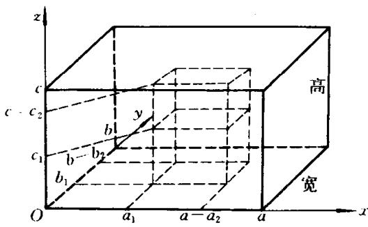

<details>
<summary>text_image</summary>

z
c
c - c₂
y
b₁
b
b₂
c₁
b₁
O
a₁
a - a₂
a
x
高
宽
</details>

图 1 待加工长方体与成品长方体

如果在每次切割之后都将原本应移去的那一部分保留在原处，则很容易就可以知道，切割的总面积总是等于待加工长方体的表面积 $2(ab + bc + ca)$ ，总费用也总是一固定值（先考虑 $e = 0$ 的情况），而不管6面的加工次序如何。正是由于切割后移去了“无用”的部分，使得其后的切割面积和费用有可能比不移去的情况少，也使得切割总面积和总费用不再与加工次序无关。而当 $e \neq 0$ 时，切割费用还和垂直换刀的次数有关；这同样表明了切割费用与切割方式(加工次序)有关。我们的任务，就是找到一种方法来合理地安排各面的加工次序，使得总费用最小。

由于6个面的加工次序的排列是一有限数(720)，因此费用最小的切割方式(或称最优切割方式)是存在的。而且由于文中将说到的原因，费用最小的切割方式不一定是唯一的。

## 三、问题的假设

1. 待加工长方体的表面与成品长方体的表面不相接触，也即切割次数至少为6；  
2. 每次截断切割的切割平面均为成品长方体的某一表面所在的平面，这样保证了没有多余的切割，也即切割次数一定为6；  
3. 水平切割指的是垂直于长方体的高(见图1)所做的切割;垂直切割指的是垂直于长方体的长或宽所做的切割,其切割平面与长方体的高平行;  
4. 我们认为加工部门有一种方法来固定加工过程中的长方体,而不需考虑切除长方体底面后的固定问题;  
5. 由后面所给的定理一的推论可知,任一 $r \neq 1$ 的切割模型的求解,可以通过伸缩变换等价地转换为一个 $r = 1$ 的切割模型的求解.因此,除非另有说明,我们假定模型的 $r = 1$ ;  
6. 在 $r = 1$ 的前提下，我们认为水平切割单位面积费用与垂直切割单位面积费用均为每平方厘米1元，同时认为费用单位为元、面积单位为 $\mathrm{cm}^2$ 。这样，在文中将每次切割的面积与切割的费用（不包括换刀费用）等同对待。

另外，文中用“长方体”表示待加工长方体与正在加工过程中的长方体。

## 四、模型建立及符号说明

建模中所用的符号及一些术语说明如下：

a, b, c: 待加工长方体的长、宽、高.

$a_{1}(a_{2}, b_{1}, b_{2}, c_{1}, c_{2})$ : 待加工长方体和成品长方体两者的左侧面(右侧面、正面、背面、底面、顶面)之间的距离, 也称为切去长度.

$a_{1}$ 切割：沿着成品长方体的左侧面所做的使得长方体的长减少 $a_{1}$ 的切割。切割只表明切割的方位，而和长方体的切割历史无关，

$a_{2}$ , $b_{1}$ , $b_{2}$ , $c_{1}$ , $c_{2}$ 切割：含义类同 $a_{1}$ 切割.

$a(b,c)$ 类切割: $a_{1}(b_{1},c_{1})$ 切割与 $a_{2}(b_{2},c_{2})$ 切割统称为 $a(b,c)$ 类切割.

同类切割, 异类切割: 同属于 $a$ 类切割或 $b$ 类切割或 $c$ 类切割的两种切割为同类切割, 否则为异类切割.

$\Gamma = x_{1}x_{2}x_{3}x_{4}x_{5}x_{6}$ : $\Gamma$ 表示一种切割方式, $x_{1}x_{2}x_{3}x_{4}x_{5}x_{6}$ 为 $a_{1}, a_{2}, b_{1}, b_{2}, c_{1}, c_{2}$ 切割的一个排列, $x_{i}$ 表示第 $i$ 次切割.

$x_{i} = x_{j}^{\prime}$ : 表示 $x_{i}$ 与 $x_{j}^{\prime}$ (在各自的模型中) 同为 $a_{1}$ (或 $a_{2}, b_{1}, b_{2}, c_{1}, c_{2}$ ) 切割.

$f_{i}:x_{i}$ 的切割费用(不含换刀费用).

$f(\Gamma, e)$ : 切割方式 $\Gamma$ 的加工费用, 当 $e = 0$ , 时简记为 $f(\Gamma)$ . 它是切割费用与换刀费用的总和.

$l_{i}$ : $x_{i}$ 的切去长度.

我们在文中还将不加说明地使用这些符号的一些变形(如带撇、带下标等)，它们的含义通过上下文可以容易地确定。例如，我们认为 $\Gamma' = x'_1x'_2x'_3x'_4x'_5x'_6$ 是记号 $\Gamma = x_1x_2x_3x_4x_5x_6$ 的带撇的变形，且 $l'_i$ 即为 $x'_i$ 的切去长度。

切割模型为 $M = \{a, a_1, a_2, b, b_1, b_2, c, c_1, c_2, e, r\}$ ，是一个11元的有序序列。模型的求解就是要针对 $M$ 得到一个切割方式 $\Gamma_{\min}$ ，使得 $f(\Gamma_{\min}, e) = \min_{\Gamma} f(\Gamma, e)$ 。

## 五、模型求解

## 1. 伸缩变换

水平切割与垂直切割在费用上有 $r$ 倍的差别，这是由实际的工艺决定的。但这样却使切割的模型复杂化了。其实，有如下定理：

定理1 设某一 $r \neq 1$ 的切割模型 $M = \{a, a_1, a_2, b, b_1, b_2, c, c_1, c_2, e, r\}$ ，其任一切割方式为 $\Gamma = x_1x_2x_3x_4x_5x_6$ ； $M$ 经如下伸缩变换

$$
\begin{array}{l} a ^ {\prime} = a \sqrt {r}, \quad a _ {1} ^ {\prime} = a _ {1} \sqrt {r}, \quad a _ {2} ^ {\prime} = a _ {2} \sqrt {r}, \\ b ^ {\prime} = b \sqrt {r}, \quad b _ {1} ^ {\prime} = b _ {1} \sqrt {r}, \quad b _ {2} ^ {\prime} = b _ {2} \sqrt {r}, \\ c ^ {\prime} = c / \sqrt {r}, \quad c _ {1} ^ {\prime} = c _ {1} / \sqrt {r}, \quad c _ {2} ^ {\prime} = c _ {2} / \sqrt {r} \tag {1} \\ \end{array}
$$

后得到另一 $r' = 1$ 的模型 $M' = \{a', a'_1, a'_2, b', b'_1, b'_2, c', c'_1, c'_2, e, r' = 1\}$ , $\Gamma$ 在 $M'$ 中的对应切割方式为 $\Gamma' = x'_1 x'_2 x'_3 x'_4 x'_5 x'_6$ , 则有 $f(\Gamma, e) = f(\Gamma', e)$ . $\Gamma$ 与 $\Gamma'$ 互为对应切割方式指的是 $x_i = x'_i$ , $\forall i = 1, \dots, 6$ . 对应切割方式的存在性与唯一性十分显然.

证 先考虑第一次切割. 由变换(1)及 $x_{1}$ 与 $x_{1}^{\prime}$ 的对应性, 同时考虑到两个模型的 $r$ 与 $r^{\prime}$ 不同, 则 $x_{1}$ 的切割费用 $f_{1}$ 与 $x_{1}^{\prime}$ 的费用 $f_{1}^{\prime}$ 有如下关系:

$$
f _ {1} ^ {\prime} = \left\{ \begin{array}{l} b ^ {\prime} c ^ {\prime} = b \sqrt {r} \cdot c / \sqrt {r} = b c (a \text {类切割}) \\ c ^ {\prime} a ^ {\prime} = c / \sqrt {r} \cdot a \sqrt {r} = c a (b \text {类切割}) \\ r ^ {\prime} a ^ {\prime} b ^ {\prime} = a \sqrt {r} \cdot b \sqrt {r} = r a b (c \text {类切割}) \end{array} \right\} = f _ {1}.
$$

由于 $\Gamma'$ 是 $\Gamma$ 在模型 $M'$ 中的对应切割方式，由假设 2 可知模型 M 与 $M'$ 在 $x_{1}$ 与 $x'_{1}$ 切割之后分别剩余的长方体的尺寸及成品长方体的位置，仍满足 (1) 的比例关系，因此以上的讨论适用于所有的六次切割，也即有 $f'_{i} = f_{i} (i = 1, \cdots, 6)$ . 另外，显然 $\Gamma'$ 和 $\Gamma$ 两个解的垂直换刀次数是一样的.

推论 对任一 $r \neq 1$ 的切割模型 $M'$ ，存在一个 $r' = 1$ 的模型 $M$ ，使得 $M'$ 的任一最优切割方式在 $M$ 中的对应切割方式是 $M$ 的最优切割方式；反过来， $M$ 的任一最优切割方式在 $M'$ 中的对应切割方式也是 $M'$ 的最优切割方式。也即模型 $M$ 的求解可转化为模型 $M'$ 的求解。

证 取 $M'$ 为 $M$ 经伸缩变换后所得的 $r' = 1$ 的模型. 设 $\Gamma'$ 是 $M'$ 的任一最优切割方式, 其在 $M$ 中的对应切割方式为 $\Gamma$ . 若 $\Gamma$ 不是 $M$ 的最优切割方式, 则必存在 $\Gamma_1$ 使得 $f(\Gamma_1, e) < f(\Gamma, e)$ , 从而由定理一, $\Gamma_1$ 在 $M'$ 中的对应切割方式 $\Gamma'_1$ 满足 $f(\Gamma'_1, e) = f(\Gamma_1, e) < f(\Gamma, e) = f(\Gamma', e)$ . 这与假设 $\Gamma'$ 是 $M'$ 的最优切割方式矛盾. 故 $\Gamma$ 也是 $M$ 的最优切割方式. 同理可证反过来的情形.

由定理一的推论可知，对 $r \neq 1$ 的切割模型的求解，可以通过伸缩变换等价地转换为求解一 $r = 1$ 的切割模型。因此，除非另有说明，在以后的讨论中我们默认模型的 $r = 1$ 。

2. 不考虑刀具调整费用 $(e = 0)$

本节讨论当 $e = 0$ 时模型的求解. 此时，切割方式 $\Gamma$ 的加工费用为

$$
f (\Gamma) = \sum_ {i = 1} ^ {6} f _ {i}. \tag {2}
$$

引理1(交换引理) 设切割方式 $\Gamma = x_{1}x_{2}x_{3}x_{4}x_{5}x_{6}$ , $\Gamma$ 经交换相邻的两次切割 $x_{i}, x_{i} + 1$ 后得到另一种切割方式, 则有:

(1) 若 $x_{i}, x_{i} + 1$ 为同类切割，则 $f(\Gamma) = f(\Gamma')$ ;

(2) 若 $x_{i}, x_{i} + 1$ 为异类切割，则

$$
l _ {i} > l _ {i + 1} \Leftrightarrow f (\Gamma) <   f (\Gamma^ {\prime})
$$

$$
l _ {i} = l _ {i + 1} \Leftrightarrow f (\Gamma) = f (\Gamma^ {\prime})
$$

$$
l _ {i} <   l _ {i + 1} \Leftrightarrow f (\Gamma) > f (\Gamma^ {\prime}).
$$

证 由费用计算公式(2):

$$
f (\Gamma) = \sum_ {k = 1} ^ {i - 1} f _ {k} + f _ {i} + f _ {i + 1} + \sum_ {k = i + 2} ^ {6} f _ {k},
$$

$$
f (\Gamma^ {\prime}) = \sum_ {k = 1} ^ {i - 1} f _ {k} ^ {\prime} + f _ {i} ^ {\prime} + f _ {i + 1} ^ {\prime} + \sum_ {k = i + 2} ^ {6} f _ {k} ^ {\prime}
$$

显然，由 $\Gamma'$ 的形式知当 $1 \leqslant k \leqslant i - 1$ 时， $f_k = f'_k$ ；而且，因为 $\Gamma$ 与 $\Gamma'$ 的不同仅在于它们互换了第 $i, i + 1$ 次切割的顺序，所以采用 $\Gamma$ 的前 $i + 1$ 次切割后得到的长方体与采用 $\Gamma'$ 的前 $i + 1$ 次切割后得到的长方体是相同的，又 $i + 2 \leqslant k \leqslant 6$ 时 $x'_k = x_k$ ，所以 $i + 2 \leqslant k \leqslant 6$ 时 $f'_k = f_k$ 。这样，

$$
f (\Gamma) - f (\Gamma^ {\prime}) = f _ {i} + f _ {i + 1} - f _ {i} ^ {\prime} - f _ {i + 1} ^ {\prime}.
$$

第 $i - 1$ 次切割后 $\Gamma$ 得到的长方体的长、宽、高与 $\Gamma'$ 得到的长方体的长、宽、高是相同的，设它们分别为 $a', b', c'$ .

若 $x_{i}, x_{i+1}$ 为同类切割. 不失一般性, 设其为 $a_{1}, a_{2}$ 切割, 则 $f_{i} = b'c'$ , $f_{i+1} = b'c'$ ; $f_{i}' = b'c'$ , $f_{i+1}' = b'c'$ .

从而 $f(\Gamma) = f(\Gamma')$ .

若 $x_{i}, x_{i+1}$ 为异类切割. 不失一般性, 设其为 $a_{1}, b_{1}$ 切割, 则 $l_{i} = a_{1}, l_{i+1} = b_{1}, f_{i} = b'c'$ , $f_{i+1} = (a' - a_{1})c'$ , $f_{i}' = a'c'$ , $f_{i+1}' = (b' - b_{1})c'$ . 从而 $f(\Gamma) - f(\Gamma') = b'c' + (a' - a_{1})c' - a'c' - (b' - b_{1})c' = (b_{1} - a_{1})c'$ . 考虑到 $c' > 0$ , 则有

$$
a _ {1} > b _ {1} \Leftrightarrow f (\Gamma) <   f (\Gamma^ {\prime}),
$$

$$
a _ {1} = b _ {1} \Leftrightarrow f (\Gamma) = ^ {\prime} f \left(\Gamma^ {\prime}\right),
$$

$$
a _ {1} <   b _ {1} \Leftrightarrow f (\Gamma) > f (\Gamma^ {\prime}).
$$

由 $x_{i}, x_{i + 1}$ 的一般性，我们可得所求结论：

$$
l _ {i} > l _ {i + 1} \Leftrightarrow f (\Gamma) <   f (\Gamma^ {\prime}),
$$

$$
l _ {i} = l _ {i + 1} \Leftrightarrow f (\Gamma) = f (\Gamma^ {\prime}),
$$

$$
l _ {i} <   l _ {i + 1} \Leftrightarrow f (\Gamma) > f (\Gamma^ {\prime}).
$$

定义(正规切割方式) 若切割方式 $\Gamma = x_{1}x_{2}x_{3}x_{4}x_{5}x_{6}$ 满足当 $x_{i}, x_{i+1}$ 为同类切割时 $l_{i} \geqslant l_{i+1}, \forall i = 1, \cdots, 5$ ，则称为正规切割方式.

定义(等价正规切割方式) 根据引理1(交换引理), 交换任一切割方式 $\Gamma$ 中相邻的同类切割，加工费用不变，所以我们可以把 $\Gamma$ 化为加工费用相同的正规切割方式 $\Gamma'$ 。 $\Gamma'$ 即称为 $\Gamma$ 的等价正规切割方式.

定义(有序切割方式) 若切割方式 $\Gamma$ 满足 $l_{i} \geqslant l_{i+1}, \forall i = 1, \cdots, 5$ ，则称 $\Gamma$ 为有序切割方式。有序切割方式一定是正规切割方式。

. 引理 2(最少费用引理) 若正规切割方式 $\Gamma = x_{1}x_{2}x_{3}x_{4}x_{5}x_{6}$ 不是有序切割方式, 则 $\Gamma$ 不是费用最少的.

证 $\Gamma$ 是正规切割方式，但不是有序切割方式，因此 $\exists i$ ，使得 $l_{i} < l_{i + 1}$ 且 $x_{i}, x_{i + 1}$ 为异类切割，再由交换引理知存在加工费用更少的切割方式.

引理3（有序切割引理）若切割方式 $\Gamma$ 和 $\Gamma'$ 均为模型 $M$ 的有序切割方式，则 $f(\Gamma) = f(\Gamma')$ .

证 首先，易知 $l_{i} = l_{i}^{\prime}, \forall i = 1, \dots, 6$ 。若 $x_{i} = x_{i}^{\prime}, \forall i = 1, \dots, 6$ ，则结论显然成立。

否则，设 $k$ 为使 $x_{i} \neq x_{i}^{\prime}$ 成立的最小的 $i$ ，即

$$
x _ {1} = x _ {1} ^ {\prime}, \dots , x _ {k - 1} = x _ {k - 1} ^ {\prime}, x _ {k} \neq x _ {k} ^ {\prime}.
$$

设 $j$ 使 $x_{j}^{\prime} = x_{k}$ , 由于当 $j < k$ 时 $x_{j}^{\prime} = x_{j} \neq x_{k}, j = k$ 时 $x_{j}^{\prime} = x_{k}^{\prime} \neq x_{k}$ , 故 $j > k$ . 这时 $l_{j}^{\prime} = l_{k} = l_{k}^{\prime}$ . 则由 $\Gamma^{\prime}$ 是有序切割方式可知

$$
l _ {k} ^ {\prime} = l _ {k + 1} ^ {\prime} = \dots = l _ {j} ^ {\prime}.
$$

现对 $\Gamma'$ 进行一系列相邻交换，使 $x'_j$ 在 $\Gamma'$ 中的位置逐次前移，直到其与 $x'_k$ 交换，这样得到一个新的有序切割方式 $\Gamma''$ .

$$
\begin{array}{l} \Gamma^ {\prime \prime} = x _ {1} ^ {\prime} \dots x _ {k - 1} x _ {j} ^ {\prime} x _ {k} ^ {\prime} \dots x _ {j - 1} ^ {\prime} x _ {j + 1} ^ {\prime} \dots x _ {6} \\ = x _ {1} \dots x _ {k - 1} x _ {k} x _ {k} ^ {\prime} \dots x _ {j - 1} ^ {\prime} x _ {j + 1} ^ {\prime} \dots x _ {6} ^ {\prime}, \\ \end{array}
$$

由引理1， $f(\Gamma^{\prime \prime}) = f(\Gamma^{\prime})$ ，但 $\Gamma^{\prime \prime}$ 与 $\Gamma$ 在序列前部连续相同的切割的数目至少比 $\Gamma^{\prime}$ 与 $\Gamma$ 相同的数目(即 $k$ )大.以 $\Gamma^{\prime \prime}$ 代替 $\Gamma^{\prime}$ 重复上述过程，则经过不超过6次这样的过程，必可得到 $\Gamma^{\prime \prime \prime} = \Gamma$ ，所以

$$
f (\Gamma^ {\prime}) = f (\Gamma^ {\prime \prime \prime}) = f (\Gamma).
$$

定理2 切割方式 $\Gamma = x_{1}x_{2}x_{3}x_{4}x_{5}x_{6}$ 为最少费用切割方式 $\Leftrightarrow$ 其等价正规切割方式 $\Gamma' = x'_1x'_2x'_3x'_4x'_5x'_6$ 为有序切割方式.

证 (1) 充分性 $(\Leftarrow)$ 的证明：采用反证法.

设 $\Gamma$ 不是最少费用切割方式，即存在 $\Gamma'' = x''_1x''_2x''_3x''_4x''_5x''_6$ ，其加工费用最少，且 $f(\Gamma'') < f(\Gamma)$ 。不妨设 $\Gamma''$ 为正规切割方式（否则可考虑 $\Gamma''$ 的等价正规切割方式）.

若 $\Gamma''$ 是有序切割方式，由引理3， $f(\Gamma'') = f(\Gamma')$ ，与所设 $f(\Gamma'') < f(\Gamma)$ 及 $f(\Gamma) = f(\Gamma')$ （等价正规切割方式的定义）矛盾。若 $\Gamma''$ 不是有序切割方式，则由引理2知 $\Gamma''$ 的加工费用不是最少的，亦矛盾。

由此知 $\Gamma$ 是最少费用切割方式.

(2) 必要性 $(\Rightarrow)$ 的证明：即为引理 2 的逆否命题.

由定理2可知有序切割序列是最优切割序列，因此在实际的切割操作中，只需考虑有序切割序列这一种最简单的情形即可．这也就是我们所给出的优化准则，即每次挑选使得切去长度最长的切割面来切割．这样得到的切割序列必定是有序切割序列，从而也就必是最优切割序列.

## 3. 考虑刀具调整费用 $(e > 0)$

A. 加工费用曲线

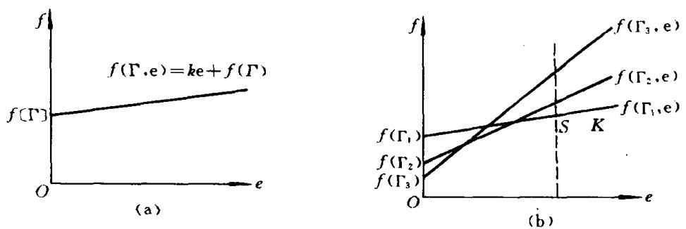  
图 2 加工费用曲线

对于切割方式 $\Gamma$ ，设它的换刀次数为 $k$ ( $1 \leqslant k \leqslant 3$ )，则有加工费用

$$
f (\Gamma , e) = k e + f (\Gamma). \tag {3}
$$

从式(3)中可以看出，如果能够得到切割方式 $\Gamma$ 在 $e = 0$ 时的加工费用 $f(\Gamma)$ ，则根据 $\Gamma$ 的垂直换刀次数 $k$ 就可以计算出任意 $e$ 值下的加工费用。根据式(3)能画出 $f \sim e$ 加工费用曲线，如图2(a)，它是一条斜率为 $k$ ，纵轴截距为 $f(\Gamma)$ 的射线。给定 $e$ 值，即可由曲线上的相应点的纵坐标得到该 $e$ 值下的加工费用。

根据上面的讨论，我们可以想象，若是在同一坐标系中画出模型 $M$ 的所有切割方式的费用曲线，则对于任意的 $e$ 值，从图中就能找到该 $e$ 值下所有曲线的最低点，即为图2(b)中的点 $S$ ， $S$ 的纵坐标即为该 $e$ 值下的最小费用，而 $S$ 所在的曲线即代表了相应的最优切割方式.

考虑到换刀次数 $k$ 相同的所有切割方式的费用曲线是一组平行射线，因而在寻求最优解时只需考虑它们中纵轴截距 $f(\Gamma)$ 最小的那条射线。如果记 $\Gamma_{k}$ 为那条射线所对应的切割方式，则我们在求最优解时就只需考虑切割方式 $\Gamma_{1}, \Gamma_{2}, \Gamma_{3}$ ，而在图上就只需考虑 $\Gamma_{1}, \Gamma_{2}, \Gamma_{3}$ 对应的三条射线。而不同 $e$ 值下的最小费用 $f_{\min}(e)$ 即为：

$$
f _ {\min} (e) = \min [ f (\Gamma_ {1}, e), (\Gamma_ {2}, e), f (\Gamma_ {3}, e) ],
$$

反映在图形上, 即为由三条 $f \sim e$ 曲线 $f(\Gamma_1, e)$ , $f(\Gamma_2, e)$ , $f(\Gamma_3, e)$ 的最靠近 $e$ 轴的片断所形成的“包络线”, 称为最小费用曲线, 其典型形状见图 2(b) 中的折线 PQRK. 而三个截距 $f(\Gamma_1)$ , $f(\Gamma_2)$ , $f(\Gamma_3)$ 的相对位置则决定了最小费用曲线是否有突变点(转折点), 及突变点的个数. 从图中可以形象地看出, 随着 $e$ 的增大, 最优解逐渐经过每个突变点(在突变点存在的情况下); 在两个突变点之间, 最优解是固定的, 最小费用曲线的斜率也是固定的; 而每经过一个突变点, 最小费用曲线的斜率减小, 最优解也发生改变. 突变点处的最优解, 则包括了其左右两侧曲线对应的切割方式.

B. $e > 0$ 时的求最优解的考虑范围

对于同类切割的相互位置对加工费用的影响，我们有如下引理；

引理4 在切割方式 $\Gamma = x_{1}x_{2}x_{3}x_{4}x_{5}x_{6}$ 中，若 $x_{i}, x_{j}$ 为同类切割，且 $l_{i} \leqslant l_{j}, i < j$ 则对于

$$
\Gamma^ {\prime} = x _ {1} ^ {\prime} x _ {2} ^ {\prime} x _ {3} ^ {\prime} x _ {4} ^ {\prime} x _ {5} ^ {\prime} x _ {6} ^ {\prime} = x _ {1} \dots x _ {i - 1} x _ {j} x _ {i + 1} \dots x _ {j - 1} x _ {i} x _ {j + 1} \dots x _ {6},
$$

有 $f(\Gamma) \geqslant f(\Gamma')$ .

证 不失一般性设 $x_{i}, x_{j}$ 为 $a$ 类切割. 首先 $\Gamma, \Gamma'$ 中换刀次数相同, 所以可以不考虑换刀费用的影响. 下面我们通过比较两者每次切割的费用来给出证明.

前 $i - 1$ 次切割中，每次切割后 $\Gamma, \Gamma'$ 得到的长方体相同，所以当 $1 \leqslant k \leqslant i - 1$ 时， $f_k = f'_k$ 。又 $\Gamma, \Gamma'$ 的第 $i$ 次切割为同类切割，所以 $f_i = f'_i$ 。

第 $i$ 次切割后， $\Gamma, \Gamma'$ ，得到的长方体的长分别为 $a - l_i, a - l_j$ ，而宽和高分别相同。从第 $i + 1$ 次到第 $j - 1$ 次的切割，均不是 $a$ 类切割，所以每次切割后 $\Gamma, \Gamma'$ 得到的长方体长仍分别为 $a - l_i, a - l_j$ ，而宽和高分别相同。所以当 $i + 1 \leqslant k \leqslant j - 1$ 时， $f_k: f'_k = (a - l_i): (a - l_j)$ ，即 $f_k \geqslant f'_k$ 。

第 j 次切割时， $\Gamma$ ， $\Gamma'$ 的长方体的宽和高分别相同，所以 $f_{j} = f'_{j}$ .

第 $j$ 次切割后， $\Gamma, \Gamma'$ 得到的长方体相同。从第 $j + 1$ 次到第6次的切割，每次切割时 $\Gamma, \Gamma'$ 的长方体相同，所以当时 $j + 1 \leqslant k \leqslant 6, f_k = f'_k$ 。

综上, 可知 $f(\Gamma) \geqslant f(\Gamma')$ . 由 $x_i, x_j$ 的一般性, 可知命题成立.

利用以上引理，我们下面将讨论在 $e > 0$ 时寻求最优解所需考虑的切割方式的范围.

换刀次数 $k$ 与水平切割 $c_{1}, c_{2}$ 无关，仅与垂直 $a_{1}, a_{2}, b_{1}, b_{2}$ 切割的顺序有关。不妨设 $a_{1} \geqslant a_{2}, b_{1} \geqslant b_{2}, c_{1} \geqslant c_{2}$ ，对 $\Gamma = x_{1}x_{2}x_{3}x_{4}x_{5}x_{6}$ ，为了尽量减少加工费用，由引理4， $a_{1}$ 切割在 $\Gamma$ 中的位置应在 $a_{2}$ 切割之前， $b_{1}$ 切割应在 $b_{2}$ 切割之前， $c_{1}$ 切割应在 $c_{2}$ 切割之前。因此只需考虑这样的切割方式 $\Gamma$ ，其中 $a_{1}, a_{2}, b_{1}, b_{2}$ 切割的排列为下列六种之一

$$
\left\{ \begin{array}{l} a _ {1} a _ {2} b _ {1} b _ {2}, b _ {1} b _ {2} a _ {1} a _ {2}, (k = 1); \\ a _ {1} b _ {1} b _ {2} a _ {2}, b _ {1} a _ {1} a _ {2} b _ {2}, (k = 2); \\ a _ {1} b _ {1} a _ {2} b _ {2}, b _ {1} a _ {1} b _ {2} a _ {2}, (k = 3). \end{array} \right.
$$

当 $a_1, a_2, b_1, b_2$ 的排列确定之后，则可将 $c_1, c_2$ 插入到排列中去，同时保持 $c_1$ 在前、 $c_2$ 在后的顺序，这样就可以得到完整的切割方式 $\Gamma$ 。例如把 $c_1, c_2$ 插入 $a_1a_2b_1b_2$ ，可以为 $a_1c_1c_2a_2b_1b_2$ ，或 $a_1c_1a_2b_1c_2b_2$ ，等等，可得到 $\mathrm{C}_5^2 + \mathrm{C}_5^1 = 15$ 种切割方式。同样，把 $c_1, c_2$ 插入 $b_1b_2a_1a_2$ 也可得 15 种切割方式，所以对 $k = 1$ 共有 30 种切割方式需要考虑。同样，对于 $k = 2, 3$ ，亦各有 30 种切割方式需要考虑。所以，一般说来，我们要考虑 90 种切割方式方能确定最优解。

下面我们着重分析如何把要考虑的范围尽可能缩小。在确定 $a_1, a_2, b_1, b_2$ 的排列后，我们将它分成几个连续子序列的连接，使得每一子序列中的切割长度是依次（非严格）递减的，而任意相邻两个子序列的连接却不能满足连续递减的条件。我们称这样的每一个子序列为“坡”。由于在每一个坡内，切割长度的排列是有序的，由引理1可知，只有在 $c_i$ 插入某个坡后形成的子序列仍保持有序性的情况下，才可能使加工费用最少。所以在 $c_i$ 插入某个坡时，我们只需考虑使插入后形成的子序列仍保持有序性的一种插法。对于一个有 $n$ 个坡的的 $a_1, a_2, b_1, b_2$ 排列，若是将 $c_1, c_2$ 均插入到同一个坡中，则有 $n$ 种方法；而将 $c_1, c_2$ 分别插入到不同的坡中，则有 $\mathrm{C}_n^2$ 种方法。故总共有 $n + \mathrm{C}_n^2 = \mathrm{C}_{n+1}^2$ 种方法。一般说来，这样所确定的考虑范围已大大小于原先所说的30种的范围。下面我们具体地来看看此时需考虑范围的大小。

k = 1 时，需要把 $c_{1}$ ， $c_{2}$ 插入 $a_{1}a_{2}b_{1}b_{2}$ 、 $b_{1}b_{2}a_{1}a_{2}$ .

若 $a_2 \geqslant b_1$ ，则 $a_1 a_2 b_1 b_2$ 中， $a_1 \geqslant a_2 \geqslant b_1 \geqslant b_2$ ，只存在一个坡，把 $c_1, c_2$ 插入 $a_1 a_2 b_1 b_2$ ，只有 1 种方法；而 $b_1 b_2 a_1 a_2$ 中，因为 $b_2 \leqslant b_1 \leqslant a_2 \leqslant a_1$ ，所以存在两个坡 $b_1 b_2, a_1 a_2$ 、把 $c_1, c_2$ 插入 $b_1 b_2 a_1 a_2$ ，共有 $C_3^2 = 3$ 种方法。事实上，把 $c_1, c_2$ 插入 $a_1 a_2 b_1 b_2$ 的那种方法已经是有序切割方式，即已为最优解，所以把 $c_1, c_2$ 插入 $b_1 b_2 a_1 a_2$ 的 3 种方法其实不用考虑。因此，共只需考虑 1 种切割方式。

若 $a_2 < b_1$ ，则 $a_1 a_2 b_1 b_2$ 中， $a_1 \geqslant a_2$ ， $a_2 < b_1$ ， $b_1 \geqslant b_2$ ，有两个坡 $a_1 a_2$ 、 $b_1 b_2$ 。把 $c_1 c_2$ 插入 $a_1 a_2 b_1 b_2$ ，共有 $C_3^2 = 3$ 种方法；而 $b_1 b_2 a_1 a_2$ 中，当 $b_2 \geqslant a_1$ 时有一个坡，对应 1 种方法，当 $b_2 < a_1$ 时有两个坡，对应 3 种方法。所以 $a_2 < b_1$ 时共需考虑 4 种或 6 种切割方式。

这样，我们把 $k = 1$ 时的考虑范围由30种缩小为1种或4种或6种.

用同样的方法， $k = 2$ 时，考虑范围由30种缩小为1种或6种。 $k = 3$ 时，考虑范围由30种缩小为1种或6种。因此，这样总的考虑范围就不超过 $6 + 6 + 6 = 18$ 种。

综上, 引入坡的概念后, 用我们的方法, 极大地缩小了考虑范围, 用手工计算也能很快求得最优解.

## 4. 具体问题求解

下面用题目中所给的实例来验证我们的方法．实例中的数据在我们的模型中体现为： $a_1 = 6, a_2 = 1, b_1 = 7, b_2 = 5.5, c_1 = 9, c_2 = 6.$

按照定理二，我们可以求出 $a$ 题、 $b$ 题、 $c$ 题这三种 $e = 0$ 情况下的最优解：

<table><tr><td>题号</td><td>题目条件</td><td>费用最少的切割方式  $\Gamma$ </td><td>最少切割费用  $f(\Gamma)$ </td></tr><tr><td> $a$ </td><td> $r = 1, e = 0$ </td><td> $c_1b_1a_1c_2b_2a_2$  $c_1b_1c_2a_1b_2a_2$ </td><td>374</td></tr><tr><td> $b$ </td><td> $r = 1.5, e = 0$ </td><td> $b_1a_1c_1b_2c_2a_2$  $b_1c_1a_1b_2c_2a_2$ </td><td>437.5</td></tr><tr><td> $c$ </td><td> $r = 8, e = 0$ </td><td> $b_1a_1b_2c_1a_2c_2$ </td><td>540.5</td></tr></table>

再来看 $d$ 题，条件为 $r = 1.5, 2 \leqslant e \leqslant 15$ 是属于 $e > 0$ 的情况。我们对 $e > 0$ 的情况的讨论来求解此题，过程如下：

(1) $e = 0$ 时，用“坡”的概念可以求出

$$
\Gamma_ {1} = b _ {1} c _ {1} b _ {2} a _ {1} c _ {2} a _ {2}, \quad f (\Gamma_ {1}) = 4 4 2. 5,
$$

$$
\Gamma_ {2} = a _ {1} b _ {1} c _ {1} b _ {2} c _ {2} a _ {2}, \quad f (\Gamma_ {2}) = 4 5 6. 5,
$$

$$
\Gamma_ {3} = b _ {1} a _ {1} c _ {1} b _ {2} c _ {2} a _ {2} \text {或} b _ {1} c _ {1} a _ {1} b _ {2} c _ {2} a _ {2}, f (\Gamma_ {3}) = 4 3 7. 5.
$$

(2) 画出三条 $f \sim e$ 曲线（如图3），可以得到突变点为 $e = 2.5$ ，进一步有如下结果：

<table><tr><td>e的取值</td><td>费用最少切割方式</td></tr><tr><td> $2 \leqslant e < 2.5$ </td><td> $b_{1}a_{1}c_{1}b_{2}c_{2}a_{2}\quad b_{1}c_{1}a_{1}b_{2}c_{2}a_{2}$ </td></tr><tr><td> $e = 25$ </td><td> $b_{1}a_{1}c_{1}b_{2}c_{2}a_{2}\quad b_{1}c_{1}a_{1}b_{2}c_{2}a_{2}\quad b_{1}c_{1}b_{2}a_{1}c_{1}a_{2}$ </td></tr><tr><td> $2.5 < e \leqslant 15$ </td><td> $b_{1}c_{1}b_{2}\quad a_{1}c_{2}a_{2}$ </td></tr></table>

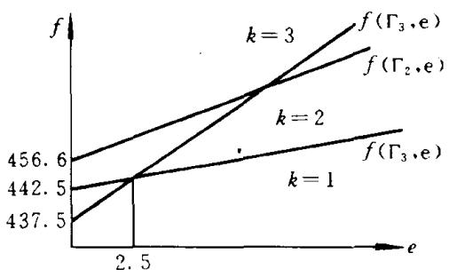

<details>
<summary>line</summary>

| e | \(f(\Gamma_{3},e)\) | \(f(\Gamma_{2},e)\) | k=1 |
| --- | --- | --- | --- |
| 0 | 437.5 | 442.5 | 456.6 |
| 2.5 | 442.5 | 442.5 | 442.5 |
| >2.5 | ~460 | ~460 | ~460 |
</details>

图3

## 六、模型评价（及改进）

在我们的模型中，首先，我们通过简单的伸缩变换，把 $r \neq 1$ 的情况化为 $r = 1$ 的情况，使得 $r \neq 1$ 的情况和 $r = 1$ 的情况可以统一处理。然后，我们对 $e = 0$ 的情况进行了深入讨论，得到了一个经严格证明的极其简明的最优化准则，即每次选择使得切去长度最长的切割面来切割，或简单地说，“长者优先”。在此基础上，我们对 $e > 0$ 的情况给出了一种需考虑范围较少的解法。我们首先从图形上直观地解释了当 $e$ 增大时，最优的切割方式可能存在突变，同时指出只需考虑在 $e = 0$ 时三种换刀次数下各自的最优解（及其加工费用），即可找到 $e$ 为任意值时的最优解。最后我们给出了一个把考虑范围从90种切割方式缩小为不超过18种的方法。在附录中我们还给出了切割的“贡献”这一概念，并且利用这种概念的深刻的物理内涵，证明了全文的基础，即交换引理。

总的来说，我们的模型准确地描述了截断切割问题，而我们所引入的若干概念及定理，使得模型的求解既严密又优美，同时得到了极好的结果。但其对于 $e > 0$ 的情况没有得到简明的准则，只是把考虑范围缩小为不大于18种。相对于原先的720种或是90种，18种已是一种手工操作可以接收的数，但有时仍显略多。

顺便指出(1)题目中的(2)所提出的“每次选择加工费用最少的待切面切割”的切割准则是没有道理的。完全可以设计一种例子，使得即使在 $e = 0$ 的条件下用这种准则求得的切割方式的费用是最多的。如一种例子为 $a = 10, b = 7, c = 4, a_1 = 1, a_2 = 1.5, b_1 = 1.6, b_2 = 1.7, c_1 = 1.8, c_2 = 1.9$ ，而 $r = 1, e = 0$ 。用该准则得到的切割方的费用为171.5，恰为切割费用的最大值。(2)本题没有必要用计算机搜索所有切割方式来求解。但如果实际的切割车间有计算机，则简单的穷举法即可胜任求最优解的任务。

我们的模型很容易推广到成品长方体与待加工长方体有重合面的情况. 它也容易被推广到水平切割与垂直切割之间需要额外换刀费用的更复杂情形.

## 七、附录（略）

# 截断切割的最优方案

温 涛 马衍青 徐 峰

(华东理工大学, 上海 200237)

指导教师 鲁习文 刘朝晖

编者按 本文借助于递推形式建立目标函数表达式,对优化准则及推广运用优化准则也作了研究.

摘要 我们在充分分析问题的基础上,根据问题的条件和要求建立了模型,讨论了模型的推广,给出了截断切割问题的最优方案,回答了题目中所有问题,并且对模型进行了评价.

当成品长方体位于待加工长方体内部而没有公共面时,需要考虑的不同切割方式总数为 P = 720 种.如果有公共面可类似计算.

从描述连续切割时长方体的形状变化过程出发,在深入研究了不同切割方式特征的基础上,我们建立了模型,并给出了求解方法,运用若干优势准则,只需考虑至多25种切割方式就可以找到最优切割方案.

对 $e = 0$ 的情形, 我们得到了相当简明的最优切割准则: 按成品长方体各面与待加工长方体对应面间加权距离的非增排列顺序进行切割.

按照“每次选择一个加工费用最少的待切割面进行切割”的准则进行切割,我们发现一般得不到最优解.并且,我们随机列举了80个例子进行比较,采用该方法得到的近似最优解与最优解的平均比值为1.0266.

对所给的数据,我们进行了实例验证,得到的计算结果如下::

a) 最小加工费用为 f = 374 元, 调整刀具次数均为 n = 3;  
b) 最小加工费用为 f = 437.5 元, 调整刀具次数均为 n = 3;  
c) 最小加工费用为 f = 540.5 元, 调整刀具次数 n = 3;  
d) 当 $2e < 2.5$ 时有二种最优切割方案, 此时调整刀具3次.

当 $e = 2.5$ 时有三种最优切割方案，当 $2.5 < e < 15$ 时只有一种最优切割方案，此时只须调刀一次，并且我们还发现这种切割方案在 $e > 15$ 时仍是最优的。由此，可观察到当 $e$ 增加时，调刀次数逐步减小。

我们建立的模型可以推广到一般 $n$ 面体的截断切割问题, 并可进一步推广到连续加工若干个待加工多面体的问题. 我们建立的模型具有清晰简明的数学表达式, 计算简单, 优化方便.

## 一、问题重述(略)

## 二、基本假设

1. 与水平工作台接触的长方体底面是事先指定的, 因此长、宽、高位置一定. 但是这不影响切割方案的讨论, 即并不因为底面已经被指定, 而要求最后切割底面.

2. “截断切割” 如问题中所定义的为“将物体沿某个切割平面分成两部分”

3. 成品长方体与待加工长方体没有公共面. 即: 成品长方体必须由待加工长方体经过6次截断切割后得到.

## 三、变量及符号说明

符号说明

$a_0, b_0, c_0$ : 长方体的长、宽、高; $a_k, b_k, c_k$ : 第 $k$ 次切割后得到的长方体的长、宽、高; $f_k$ 为第 $k$ 次切割所需费用.

对长方体的“截断切割”共计有三种方式：

水平切割: 平行于底面切割;

垂直纵向切割:平行于侧面切割;

垂直横向切割:平行于正面切割.

3. 对长方体的六个平面分别进行标号, 如图所示:

其中左侧面为1面,右侧面为2面,正面为3面,背面为4面,底面为5面,顶面为6面.

待加工长方体和成品长方体两者左侧面、右侧面、顶面、底面、正面、背面间的距离分别为 u, u, w, w, v, v.

以某一方式切割出一个长方体需要调整刀具的次数为 $n$ ，则有 $1 \leqslant n \leqslant 3$ .

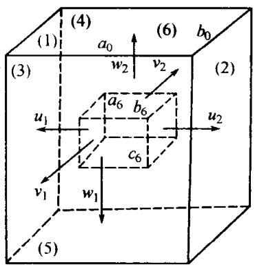

<details>
<summary>text_image</summary>

(1)
(2)
(3)
(4)
(5)
(a₀)
w₂
v₂
(b₀)
u₁
a₆
b₆
c₆
u₂
v₁
w₁
</details>

## 四、问题分析和模型建立

通过分析我们可以知道,对长方体进行第 k 次切割的费用函数和切割后长方体的长、宽、高,有三种情况:

i) 第 $k$ 次切割为水平切割：

$$
\begin{array}{l} f _ {k} = r a _ {k - 1} b _ {k - 1} \\ \left\{ \begin{array}{l l} {a _ {k}   =   a _ {k - 1}} \\ {b _ {k}   =   b _ {k - 1}} \\ {c _ {k}   =   c _ {k - 1}   -   w _ {1}} \end{array} \right. \quad \text {或} \left\{ \begin{array}{l l} {a _ {k}   =   a _ {k - 1}} \\ {b _ {k}   =   b _ {k - 1}} \\ {c _ {k}   =   c _ {k - 1}   -   w _ {2}} \end{array} \right. \tag {1} \\ \end{array}
$$

ii) 第 k 次切割为垂直横向切割：

$$
\begin{array}{l} f _ {k} = a _ {k - 1} c _ {k - 1} \\ \left\{ \begin{array}{l} a _ {k} = a _ {k - 1} \\ b _ {k} = b _ {k - 1} - v _ {1} \\ c _ {k} = c _ {k - 1} \end{array} \right. \quad \text {或} \left\{ \begin{array}{l} a _ {k} = a _ {k - 1} \\ b _ {k} = b _ {k - 1} - v _ {2} \\ c _ {k} = c _ {k - 1} \end{array} \right. \tag {2} \\ \end{array}
$$

iii) 第 k 次切割为垂直纵向切割：

$$
\begin{array}{l} f _ {k} = b _ {k - 1} \cdot c _ {k - 1} \\ \left\{ \begin{array}{l} a _ {k} = a _ {k - 1} - u _ {1} \\ b _ {k} = b _ {k - 1} \\ c _ {k} = c _ {k - 1} \end{array} \right. \quad \text {或} \left\{ \begin{array}{l} a _ {k} = a _ {k - 1} - u _ {2} \\ b _ {k} = b _ {k - 1} \\ c _ {k} = c _ {k - 1} \end{array} \right. \tag {3} \\ \end{array}
$$

所以,目标函数可表示为 $\min f = \sum_{i=1}^{6} f_{k} + \sum_{k=1}^{6} \delta_{k} \cdot e$ 其中

$$
\delta_ {1} = 0, \delta_ {k} = \left\{ \begin{array}{l l} 1, & \text {第} k \text {次切割调正了刀具} \\ 0, & \text {否则} \end{array} \right. k = 2, \dots , 6
$$

我们的目标就是找到一种切割顺序,使总切割费用最小.

## 五、模型求解

关于上述模型的求解,我们能够建立以下四个定理,优化求解过程,减小运算量.

我们可以表示一个切割顺序,相应于第 i 次切割的长方体厚度(若为水平切割,该厚度等于实际切割厚度的 1/r).

定理1 两次相互平行的切割, 比较待切割平面与原长方体的相应表面距离, 大的优先切割(不论这两次平行切割操作是否连续).

例 水平切割共有两次, 设成品长方体与待加工长方体的底面、顶面相距 w, w 选择距离大的优先切割, 即

若 $w_{1} > w_{2}$ , 则两次水平切割操作中, 先切割出成品长方体的底面;

若 $w_{1} < w_{2}$ , 则两次水平切割操作中, 先切割出成品长方体的顶面;

若 $w_{1} = w_{2}$ ，则顺序可任意选择.

证 若在某种切割顺序 $(\cdots p_{i}\cdots p_{j}\cdots)$ 中,两次平行的切割 $p_{i},p_{j}$ 不符合定理1,即 $p_{i}<p_{j}$ ,则我们交换它们的位置,这不影响 $p_{i}$ 之前和 $p_{j}$ 之后每次切割的切割面积,而对于 $p_{i}$ 与 $p_{j}$ 之间的每次切割的切割面积只会减小,所以若 $p_{i}$ 与 $p_{j}$ 不符合定理1,则交换与位置后,总的切割费用不会增加.

定理 2 如果水平切割与垂直横向切割是相邻的两个操作,那么

若 $w / r > v$ ，则先水平切割，然后再垂直横向切割；

若 $w / r < v$ ，则先垂直横向切割，再水平切割；

若 $w / r = v$ ，则顺序可任意选择，

这里的 $w, v$ 用相应的 $w_{1}, w_{2}, v_{1}, v_{2}$ 代入.

证 设第 $k, k + 1$ 次切割为水平切割与垂直横向切割，当先水平切割，然后再垂直横向切割，这两次切割的费用为

$$
f _ {k} + f _ {k + 1} = a _ {k - 1} b _ {k - 1} r a _ {k} c _ {k} = a _ {k - 1} b _ {k - 1} r + a _ {k - 1} (c _ {k - 1} - w _ {1})
$$

这里不妨设 $w$ 为 $w_{1}$

当先垂直横向切割,再水平切割,这两次切割的费用为

$$
\begin{array}{l} f _ {k} ^ {\prime} + f _ {k + 1} ^ {\prime} = a _ {k - 1} c _ {k - 1} + a _ {k} b _ {k} r \\ = a _ {k - 1} c _ {k - 1} + a _ {k - 1} (b _ {k - 1} - v _ {1}) r \\ \end{array}
$$

这里不妨设 $v$ 为 $v_{1}$

两个费用之差为

$$
f _ {k} + f _ {k + 1} - \left(f _ {k} ^ {\prime} + f _ {k + 1} ^ {\prime}\right) = a _ {k - 1} \left(v _ {1} - \frac {w _ {1}}{r}\right)
$$

所以，若 $v_{1} > w_{1} / r$ ，先垂直横向切割，然后再水平切割，费用减小；其他情形同理可证.

定理3 如果水平切割与垂直纵向切割是相邻的两个操作,那么

若 $w / r > u$ ，则先水平切割，然后再垂直纵向切割；若 $w / r < u$ ，则先垂直纵向切割，再水平切割，若 $w / r = u$ ，则顺序可任意选择，

这里的 $w, u$ 用相应的 $w_{1}, w_{2}, u_{1}, u_{1}$ 代入，证明与定理2相似.

解法一 按 $u_{1}, u_{2}, w_{1} / r, w_{2} / r, v_{1}, v_{1}$ 非升序排列进行切割.

例 若 $v_{2} > w_{1}/r > u_{2} > u_{1} > v_{1} > w_{2}/r$ ，则先切割背面，再切割底面，再切割右侧面，…，最后切割顶面，也就是按 $(v_{2}, w_{1}/r, u_{2}, u_{1}, v_{1}, w_{2}/r)$ 的方式进行切割。

定理4 若 $e = 0$ ，则按解法一找到的切割方式是最优的.

证 设解法一得到的切割方式为 $(p_{1}, p_{2}, p_{3}, p_{4}, p_{5}, p_{6})$ 因而 $p_{1} \geqslant p_{2} \geqslant p_{3} \geqslant p_{4} \geqslant p_{5} \geqslant p_{6}$ . 又设 $(p_{1}, p_{2}, p_{3}, p_{4}, p_{5}, p_{6})$ 是一最优切割方式, 但与解法一得到的切割方式不一致, 则其中必然存在 $i_{k}$ 与 $i_{k+1}$ , 满足 $i_{k} > i_{k+1}$ , 使得 $p_{i_{k}} \leqslant p_{i_{k+1}}$ 分析以下几种情形:

1） $p_{i_k}$ 与 $p_{i_{k+1}}$ 一个相应于水平切割，一个相应于垂直切割，此时由定理2和3知交换它们的次序不导致费用增加.  
2） $p_{i_k}$ 与 $p_{i_{k+1}}$ 相应于两个平行的切割，由定理1知交换它们的次序不导致费用增加.  
3) $p_{i_k}$ 与 $p_{i_{k+1}}$ 一个相应于垂直横向, 一个相应于垂直纵向切割, 此时用与定理2相似的方法, 可证明交换 $p_{i_k}$ 与 $p_{i_{k+1}}$ 的次序不导致费用增加.

根据上面的分析,在任何情况下,交换 $p_{i_{k}}$ 与 $p_{i_{k+1}}$ 的次序都不导致费用增加,即还是最优切割,但交换后 $p_{i_{k}}$ 与 $p_{i_{k+1}}$ 的次序符合解法一生成的切割方式.

结论1 若按解法一找到的切割方式只须调整刀具一次, 则解法一找到的切割方式是最优切割方法.

证明 因为目标函数

$$
f = \sum_ {k = 1} ^ {6} f _ {k} + e \sum_ {k = 1} ^ {6} \quad \delta_ {k} = \sum_ {k = 1} ^ {6} f _ {k} + n \cdot e
$$

由定理4知在不考虑刀具调整费用时，解法一找到的切割方法使 $\sum_{k=1}^{6}$ 得达到最小；此外任何切割方法需调整刀具至少一次，即 $n \geqslant 1$ ，所以按解法一找到的切割方法如果只须调整刀具一次，则此切割方法是最优的.

结论 2 若按解法一找到的切割方法需调整刀具两次, 设为切割方法一, 费用为 $q_{0}$ . 此外, 所有调整次数为 1 的切割方法的费用分别为 $q_{1}, q_{2}, \cdots, q_{k}$ , 则最优切割方法的费用为: $f = \min(q_{0}, q_{1}, q_{2}, \cdots, q_{k})$ 相应的切割方案为最优切割方案.

证明 注意到用方法一切割的费用为 $q_{0} = \sum_{k=1}^{6} f_{k} + 2e$ ，此时 $\sum_{k=1}^{6} f_{k}$ 达到最小，任意一个调整刀具三次的切割方法的费用为 $\sum_{k=1}^{6} f_{k}' + 3e$ 且 $\sum_{k=1}^{6} f_{k}' > \sum_{k=1}^{6} f_{k}$ ，所以，最优切割方案只需在方法一和所有调整次数为 1 的切割方法中寻找。

利用定理 1,2,3, 我们给出下面的方法枚举所有刀具调整次数为 1 的切割方案.

步骤1 不妨设 $u_{1} > u_{2}, v_{1} > v_{2}, w_{1} > w_{2}$ . 由定理1, 当进行垂直纵向切割时, 必先切割与左侧相距 $u_{1}$ 的面, 记切割面代号为1; 再切割与右侧相距 $u_{2}$ 的面, 记为2; 当进行垂直横向切割时, 必先切割与正面距 $v_{1}$ 的面, 记为3; 再切割与背面相距 $v_{2}$ 的面, 记为4; 当进行水平切割时, 必先切割与底面相距 $w_{1}$ 的面, 记代号为5, 再切割与顶面相距 $w_{2}$ 的面, 记为6.

步骤 2 由于切割过程中调整刀具次数为 1, 在两次垂直纵向切割中不能插入垂直横向切割; 同样, 在两次垂直横向切割中不能插入垂直纵向切割. 这样, 只需枚举以下次序:

$$
- 1 - 2 - 3 - 4 - \tag {4}
$$

或

$$
- 3 - 4 - 1 - 2 - \tag {5}
$$

其中，“—”处可插入5,6.

步骤3 在第2步的基础上插入第5个面.

对于(4)，插入第5个面共有五种情况：

$$
\begin{array}{l} 5 \quad 1 \quad 2 \quad 3 \quad 4 (6) \\ \underline {{1 \quad 5 \quad 2 \quad 3 \quad 4}} (7) \\ 1 \quad 2 \quad 5 \quad 3 \quad 4 (8) \\ 1 \quad 2 \quad 3 \quad 5 \quad 4 (9) \\ 1 \quad 2 \quad 3 \quad 4 \quad 5 (10) \\ \end{array}
$$

由定理3可知,第1,5面顺序可确定,故(6),(7)中只需计算一种.由定理4,第3,5面顺序可确定,故(8),(9)中只需计算一种,故(4)中插入5简化为3种情况.

假设简化为(6),(8),(10)三种.

步骤4 在第3步的基础上插入第6个面.第6个面只能在第5个面之后.

对于(6)，插第6个面共有五种情况：

$$
\begin{array}{l} 5 \quad 6 \quad 1 \quad 2 \quad 3 \quad 4 (11) \\ 5 \quad 1 \quad 6 \quad 2 \quad 3 \quad 4 (12) \\ 5 \quad 1 \quad 2 \quad \underline {{6}} \quad 3 \quad 4 (13) \\ 5 \quad 1 \quad 2 \quad 3 \quad 6 \quad 4 (14) \\ 5 \quad 1 \quad 2 \quad 3 \quad 4 \quad 6 (15) \\ \end{array}
$$

同理,由定理 2 和 3 可简化为 3 种情况.

对于(8)，插第6个面共有三种情况：

$$
\begin{array}{l} \begin{array}{c c c c c c} 1 & 2 & 5 & 6 & 3 & 4 \end{array} \\ \begin{array}{c c c c c c} 1 & 2 & 5 & 3 & 6 & 4 \end{array} \\ \begin{array}{c c c c c c} 1 & 2 & 5 & 3 & 4 & 6 \end{array} \\ \end{array}
$$

由定理 2,3 可简化为 2 种情况.

对于(10)，插第6个面只有一种情况：

$$
\begin{array}{c c c c c c} \text {1} & \text {2} & \text {3} & \text {4} & \text {5} & \text {6} \end{array}
$$

综上所述,故对于(4)只需考虑 $3+2+1=6$ 种插入5,6的方式.对于(5)同理也只需考虑6种插入5,6的方式,那么枚举次数总计为12种.

结论 3 若按解法一找到的切割方式需调整刀具 3 次, 设为方法一, 费用为 $q_{0}$ . 所有调整刀具次数为 1 的切割方式的费用为 $q_{1}, q_{2}, \cdots, q_{m}$ ; 所有调整刀具次数为 2 的切割方式的费用为 $p_{1}, p_{2}, \cdots, p_{n}$ 则最优切割的费用为:

$$
f = \min (q _ {1}, q _ {2}, \dots , q _ {m}, p _ {1}, p _ {2}, \dots , p _ {n})
$$

相应的切割方式为最优切割方案. 证明方法与结论 2 类似.

此时,我们枚举所有调整刀具次数为1的切割方式和所有调整刀具次数为2的切割方式.由结论2中的讨论,知在切割过程中调整刀具次数为1的切割方式只需考虑12种.下面讨论切割过程中调整刀具次数为2的切割方式.

若切割过程中调整刀具次数为2,则可能先垂直纵向,然后垂直横向,再垂直横向,最后垂直纵向切割;或者先垂直横向,然后垂直纵向,再垂直纵向,最后垂直横向切割.这样,只需枚举以下顺序:

$$
- 1 - 3 - 4 - 2 - \tag {16}
$$

或

$$
- 3 - 1 - 2 - 4 - \tag {17}
$$

其中，“一”处可插入5,6,插入方式类似调整刀具次数为1的情形.

基于上述讨论,下面我们对截断切割问题给出解法二.

解法二 首先用解法一求解,然后做下面三步之一:

1) 若只调整刀具一次, 则最优解已定;  
2) 若调整刀具两次, 则从该切割方式与所有只调整一次的切割方式中找最优解.  
3) 若调整刀具三次, 则从该切割方式与所有只调整刀具一次和两次的切割方式中找最优解.

由前面结论 1 至 3 讨论, 易知解法二至多需比较 25 种不同切割方式.

## （二）模型二的建立与解法(略)

## 六、问题回答

## （一）不同的切割方式的总数：

在假设条件下,切割方式总数为 $P_{6}^{6}=6!=720$ 种.

若考虑要求最后切割底面,则切割方式为 $P_{5}^{5}=5!=120$ 种.若考虑到待加工长方体和成品长方体可能共面,则切割方式总数为 $P_{3}^{3}=3!=6$ (三个面共面); $P_{4}^{4}=4!=24$ (二个面共面); $P_{5}^{5}=5!=120$ (一个面共面) 等.

（二）若每次选择一个加工费用最少的待切割面进行切割，假设单位面积的切割费用为1，即简化为寻找面积最小的待割面： $A_{k} - \min (a_{k - 1}b_{k - 1}r,a_{k - 1}c_{k - 1},b_{k - 1}c_{k - 1})$ ，将找到的面切割，得到下一个待加工长方体，用同样规则进行切割.根据这规则我们给出了程序(附录二略).用这个程序我们随机选取80种情况进行求解并对比，同时与模型所得最优解(附录略)进行了比较.

优点:规则考虑到了优化的思想,每次切割找最佳割面,通过与最优解比较,有些值就是最优解,例如 $a_{0}=10, b_{0}=14.5, c_{0}=19, a_{6}=3, b_{6}=2, c_{6}=4, u_{1}=6, v_{1}=7, w_{1}=9, e=1, r=1.5$ 时,得到 $\min f=540.5$ ,与最优解一致,次序同为(3,5,1,4,6,2).

缺点:规则不是最优的,这是因为

$$
A _ {k} - \min (a _ {k - 1} b _ {k - 1} r, a _ {k - 1} c _ {k - 1}, b _ {k - 1} c _ {k - 1})
$$

而忽略了厚度的影响和换刀具的费用 $ne$ ，因此造成了一定的小差别，通过对比80组数据的比较统计(以最优费用为分母)，得平均比值 $p = 1.0266$ 。

不是最优解的情况举例: $a_{0}=20,b_{0}=15,c_{0}=20,a_{6}=4,b_{6}=5,c_{6}=6,u_{1}=6,v_{1}=7,w_{1}=8,e=1,r=1.5$ 时,按此规则得到 $\min=797$ ,而最优解为783,此时比值p=1.0189.

## （三）对 $e = 0$ 的情形有简明的优化准则，见模型中的定理4

## （四）实例数据

$a_0 = 10, b_0 = 14.5, c_0 = 19, a_6 = 3, b_6 = 2, c_6 = 4, u = 6, v = 7, w = 9$ 用切割面的序列表示一种切割方式，切割面的序列的定义同定理4中所述，对于所给实例数据，我们得到的计算结果如下：

a) $r = 1, e = 0$

切割面的序列最优解为[5,3,1,6,4,2]或[5,3,6,1,4,2],调整刀具次数均为 $n = 3$ ，最小加工费用为 $f = 37\dot{4}$ 元.

b) $r = 1.5, e = 0$

切割面的序列最优解为 $[3,1,5,4,6,2]$ 或 $[3,5,1,4,6,2]$ ，调整刀具次数均为 $n = 3$ ，最小加工费用为 $f = 437.5$ 元.

c) $r = 8, e = 0$

切割面的序列最优解为 $[3,1,4,5,2,6]$ ，调整刀具次数 $n = 3$ ，最小加工费用为 $f = 540.5$ 元.

d) $r = 1.5, 2 \leqslant e \leqslant 15$

当 $2 \leqslant e \leqslant 2.5$ 时，切割面的序列最优解为 $[\text{mathcal1}][3,1,5,4,6,2]$ 或 $[3,5,1,4,6,2]$ ，调整刀具次数均为 $n = 3$ ；

当 $e = 2.5$ 时，切割面的序列最优解为 $[\mathrm{mathcai}2][3,1,5,4,6,2],[3,5,1,4,6,2]$ 或[3,5,4,1,6,2]，前两组解的调整刀具次数均为 $n = 3$ ，第三组解的调整刀具次 $n = 1$

当 $2.5 \leqslant e \leqslant 15$ 时，切割面的序列最优解为 $[\mathrm{mathcai3}][3,5,1,4,6,2]$ ，调整刀具次数 $n = 1$ .

对于问题 a), b), c) 直接运行即可得出结果. 而对于问题 d), 由于 e 的值在某闭区间内连续变化, 因此需“离散”化处理. 设 $e = 2, e = e + 0.5 \times i, (i = 1, 2, \cdots, 25, 26)$ , 每次输入一组 $(e_{i}, r)$ , 得出其最优解、最小加工费用, 然后分析最优解的变化规律.

最小加工费用值随 e 值变化如下表：

<table><tr><td>序号</td><td>1</td><td>2</td><td>3</td><td>4</td><td>5</td><td>...</td><td>25</td><td>26</td><td>27</td></tr><tr><td>e</td><td>2</td><td>2.5</td><td>3</td><td>3.5</td><td>4</td><td>...</td><td>14</td><td>14.5</td><td>15</td></tr><tr><td>f/(元)</td><td>443.5</td><td>445</td><td>445.5</td><td>446</td><td>446.5</td><td>...</td><td>456.5</td><td>457</td><td>457.5</td></tr></table>

由上表分析可知, $e=2\rightarrow2.5$ ,时,f每次增加1.5.而 $e=2.5\rightarrow15$ 时,f每次增加0.5.这是因为临界点e=2.5时,最优解发生了变化.e的增加必将减少最优解的调整刀具次数.e=2时调整刀具次数n=3,而e增至2.5时,n=3或1;e继续增大时,n=1.

## 七、模型评价

模型特色在于它深入研究了不同切割方式的特点, 找出了若干优势准则, 运用这些准则只需考虑至多 25 个切割方式就可以找到最优切割方案. 优化方便, 而且可以将之扩大应用于一般性 $n$ 面体的截断切割问题.

## 参考文献

[1] 钱颂迪, 运筹学, 清华大学出版社, 北京, 1990  
[2] 郭耀煌等, 运筹学与工程系统分析, 中国建筑工业出版社, 北京, 1986

# 最小费用切割策略

## 崔龙 龚玉萍 汪霖

(南京通信工程学院, 南京 210016)

指导教师 王开华

编者按 本文在目标函数表达式、优化准则、启发式算法等方面都有清晰的叙述和讨论.

摘要 本文对于寻求费用最小的切割方式这一有限状态的离散问题,建立了优化模型,通过对该模型的讨论与求解,解决了问题一至五.

首先,对于问题一,运用给出的平行相邻等效定理,求得了需考虑的不同切割方式的总数为426.

其次,本文建立了寻求费用最小切割方式的优化模型,在该模型的求解中:

(1) 用穷举法得到了所有费用最小的切割方式；  
(2) 给出并证明了平行切割厚者优先定理, 缩小了搜索范围;  
(3) 引入并改进了人工智能领域的算法, 求得全部费用最小的切割方式, 对三种不同的启发函数进行了讨论、比较.

然后,对 e=0 的情况下给出了等效厚度厚者优先切割准则,同时文中还讨论该准则在 $e\neq0$ 时的适用性.

此外,对原题问题三所提出的准则从两个方面进行了评价,并给出了问题五所要求的费用最小的所有切割方式.

最后,通过变换,将结论的应用范围推广到一般平行六面体的切割问题.

## 一、建模准备

## 基本假设

（H1）每切割一刀后，将待加工的部分留在工作台上，各个面的位置关系保持不变，而将被切割下的部分取走，不予考虑。  
（H2）加工费用为切割费用和调整刀具的费用之和，其它的费用(如刀具磨损费等)，本文不作讨论.  
（H3）刀具在水平切割与垂直切割之间进行转换时，刀具的调整不需要额外费用；但当先后两次垂直切割的平面不平行时，不管它们之间是否穿插水平切割，调整刀具均需要额外费用。以下讨论的调整刀具特指垂直方向间的调整。

## 题意澄清

(1) “与水平工作台接触的长方体底面是事先指定的”, 其含义是事先固定长方体在水平工作台上的放置方式, 相应地确定了水平切割面和垂直切割面.  
(2) 建立如图一的直角坐标系来明确待切割长方体和成品长方体各个面的空间位置关系.

图中 $O'(0,0,0)$ , $L'(a_{1},b_{1},c_{1})$ 为待加工长方体的体对角线的两顶点坐标；

$O(a_{3},b_{3},c_{3}),L(a_{2},b_{2},c_{2})$ 为成品长方体的体对角线的两顶点坐标.

为了表述方便,我们将待加工的长方体和成品长方体各个面进行编号,其对应关系如下： $1(1^{\prime}), 2(2^{\prime}), 3(3^{\prime}), 4(4^{\prime}), 5(5^{\prime}), 6(6^{\prime})$ 分别表示待加工的长方体和成品长方体的右侧面、背面、上底面、左侧面、正面、下底面.

符号说明

1. $\beta$ : 表示切割方式, $\beta = (i_1, i_2, i_3, i_4, i_5, i_6)$ , (其中 $i_k$ 表示第 $k$ 次切割的面的编号), 它反映了切割的先后顺序.  
2. A: 所有的 $\beta$ 组成的集合. $|A|$ 表示 A 中元素的个数. 在本文中 $|A|=P_{6}^{6}$ ;  
3. $P(\beta)$ : 切割方式为 $\beta$ 时的切割费用, $T(\beta)$ : 切割方式为 $\beta$ 时的刀具调整的次数, $C(\beta)$ : 切割方式为 $\beta$ 时的加工费用, $C(\beta) = P(\beta) + T(\beta) \cdot e$ ;  
4. $d_{j}$ : 成品长方体 j 面的等效厚度,

$$
d _ {j} = \left\{ \begin{array}{l l} t _ {j}, & \text {第} j \text {为水平面;} \\ r \cdot t _ {j}, & \text {第} j \text {为垂直面;} \end{array} \right.
$$

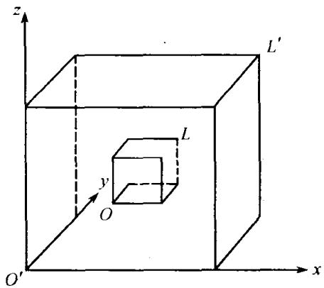

<details>
<summary>text_image</summary>

z
L'
L
y
O
O'
x
</details>

图 1 待切割长方体和成品长方体位置图

其中 $t_{j}$ 表示成品长方体第 j 面到待切割长方体第 $j'$ 面的距离；

## 二、问题一的解答

问题一要求计算需考虑的不同切割方式(即各面的加工次序)的总数.我们关注的重点是费用,在所有的切割方式中,有些切割方式,例如切割方式(4,1,6,2,5,3)和切割方式(1,4,6,2,5,3),对任意尺寸和位置的待加工长方体和成品长方体,其加工费用都相等.那么我们只要考虑其中的一种切割方式就行了.这样,我们需要考虑的不同的切割方式的总数就是所有加工费用可能不同的切割方式的总数,记为N则考虑这N种切割方式的加工费用后,一定不会漏掉任何一种加工费用不同的切割方式.

记 $I = \{C(\beta) \mid \beta \in A\}$ .

定理 1 （平面相邻等价定理）:

在 $\alpha=(i_{1},\cdots,i_{k-1},i_{k},i_{k+1},i_{k+2},\cdots,i_{6}),\beta=(i_{1},\cdots,i_{k-1},i_{k+1},i_{k},i_{k+2},\cdots,i_{6})$ 中，若 $i_{k}-i_{k+1}=3$ ，则 $C(\alpha)=C(\beta)$ 。证明略。

记: $P = \{\beta \mid \beta \text{ 中 } 4 \text{ 与 } 1 \text{ 相邻且 } 4 \text{ 在 } 1 \text{ 前面}\}$ ; $Q = \{\beta \mid \beta \text{ 中 } 5 \text{ 与 } 2 \text{ 相邻且 } 5 \text{ 在 } 2 \text{ 前面}\}$ ; $R = \{\beta \mid \beta \text{ 中 } 6 \text{ 与 } 3 \text{ 相邻且 } 6 \text{ 在 } 3 \text{ 前面}\}$ .

则 $|P| = |Q| = |R| = P_5^5; |P \cap Q| = |Q \cap R| = |P \cap R| = P_4^4; |P \cap Q \cap R| = P_3^3$ ; 则

$$
\begin{array}{l} N \leqslant | A | - \overline {{| P \cup Q \cup R |}} \\ = P _ {6} ^ {6} - | P | - | Q | - | R | + | P \cap Q | \\ + | Q \cap R | + | P \cap R | - | P \cap Q \cap R | = 4 2 6 \\ \end{array}
$$

这样得到了 $N$ 的上界为426.

在给定的一组初值的情况下, 求出了 426 种各不相同的加工费用值. 说明至少要考虑 426 种切割方式, 即 $N$ 的下界也为 426, 即 $N \geqslant 426$ . 所以 $N = 426$ .

## 三、模型建立与求解

模型的建立

我们的问题是在 $A$ 中选取合适的 $\beta$ . 使 $C(\beta)$ 最小目标函数为:

$$
\min C (\beta) = \sum_ {m = 1} ^ {6} r (i _ {m}) S _ {m} (i _ {1}, i _ {2}, \dots , i _ {m}) + T (\beta) \cdot e
$$

s.t. $i_m \in \{1, 2, 3, 4, 5, 6\}, m = 1, 2, \cdots, 6$ $i_m$ 两两互不相等，

$$
r (i _ {m}) = r, i _ {m} = 3, 6; r (i _ {m}) = 1, \quad i _ {m} \text {为其它}.
$$

其中 $S_{m}(i_{1},i_{2},\cdots,i_{m})$ 为在前 m-1 次切割顺序为 $(i_{1},i_{2},\cdots,i_{m-1})$ 时第 m 次切割待加工长方体第 $i_{m}$ 面所形成的截断面的面积.

为了求解模型,我们先引入代价树 T 来描述切割的过程(略).

注 $S_0$ 为结点：表示初始状态，即待加工的长方体； $S_{ij}(1 \leqslant i \leqslant 5, 1 \leqslant j \leqslant P_6^i)$ 为结点：表示中间状态，即已切割掉一些面的待加工长方体； $i$ 为代价树的层数； $j$ 为同一层中结点的序号； $S_{6,k}(1 \leqslant k \leqslant p_6^6)$ 为叶结点，它表示已经切割成成品长方体。

从结点 $S_{i,j}(1 \leqslant i \leqslant 6, 1 \leqslant j \leqslant p_6^i)$ 转移到结点 $S_{(i+1),k}(1 \leqslant k \leqslant P_6^{i+1})$ 的边赋上一定的权值 $d(S_{i,j}, S_{(i+1),k})$ , 表示这一转移所付出的代价, 即从状态 $S_{i,j}$ 到 $S_{(i+1),k}$ 切割一次所需的费用. 如果前后切割需要刀具调整, 则它还包括调整刀具的费用.

从根结点 $S_0$ 到每一个第6级叶结点 $S_{6,k}(1 \leqslant k \leqslant P_6^6)$ 的路对应了一个切割方式, 那么从 $S_0$ 到 $S_{6,k}$ 的代价之和即为该切割方式的加工费用, 原问题即转化为求此代价树的最小代价路径.

求此最小代价路径有如下的几个方向：

(1) 穷举出所有路径的代价；(2) 寻求一些必要条件来减少搜索的路径；(3) 引入并改进启发式搜索法 $-A^{*}$ 算法；

## （一）穷举法及其改进

欲寻求有限代价树的最小代价路径,采用穷举法一定能够找到最优解.显然,如果不附加任何约束条件,一般的穷举法需遍历所有的路径,即搜索 $P_{6}^{6}=720$ 条路径,其效率是比较低的.为此我们对穷举法进行改进如下:

## 1. 平行相邻切割改进法

由定理1,对于一种切割方式,如果其中有相邻的两次切割面平行,交换这两次切割次序,则加工费用一定相等,由前面的求解可知只需搜索426条路径.

## 2. 平行厚度优先改进法

引理 如果 $t_4 > t_1$ ，则切割方式 $\alpha = (4, i_2, \cdots, i_{n-1}, 1, i_{n+1}, \cdots, i_6)$ ，所需的加工费用不大于 $\beta = (i_1, i_2, i_{n-1}, 4, i_{n+1}, \cdots, i_6)$ 所需的加工费用，即 $C(\alpha) \leqslant C(\beta)$ .

定理 2 （平行切割厚者优先定理）如果 $t_{j} > t_{k}$ ，且 $|j - k| = 3$ ，则切割方式 $\alpha = (i_{1}, \cdots, i_{n-1}, j, i_{n+1}, \cdots, i_{m-1}, k, i_{m+1}, \cdots, i_{6})$ ， $(1 \leqslant n \leqslant m \leqslant 6)$ 所需的加工费用不大于 $\beta = (i_{1}, \cdots, i_{n-1}, k, i_{n+1}, \cdots, i_{n-1}, j, i_{m+1}, \cdots, i_{6})$ 所需的加工费用，即 $C(\alpha) \leqslant C(\beta)$ .

证明 不妨设 $j = 4, k = 1$ .

可以分以下两种情况讨论：

1. $n = 1$ 时，即 $\beta$ 中 $k$ 是第1次切割， $\alpha$ 中 $j$ 是第1次切割. 则根据引理， $C(\alpha) \leqslant C(\beta)$ .  
2. n > 1 时, 显然, 两种情况下 $i_{1}, \cdots, i_{n-1}$ 加工费用是相同的, 设加工费用为 $C_{1}$ .

设初始状态时长方体为 $\lambda$ 经过 $i_{1},\cdots,i_{n-1}$ 切割后成为长方体 $\lambda'$ 考虑对长方体 $\lambda'$ 的两种切割顺序：

$$
k, i _ {n + 1}, \dots , i _ {m - 1}, j, i _ {m + 1}, \dots , i _ {6}; \quad j, i _ {n + 1}, \dots , i _ {m - 1}, k, i _ {m + 1}, \dots , i _ {6};
$$

将两种切割方法补充 $n - 1$ 次虚切割 $i_1^*, \dots, i_{n-1}^*(i_1^* = i_1, \dots, i_{n-1}^* = i_{n-1}$ , 虚切割 $i_j^*$ 与 $i_j (j = 1, \dots, n-1)$ 切割的位置相同, 但切割下去的体积为0, 代价也为0), 则补充后的切割方法也是一个完整的切割方式. 根据引理可得: $C(\alpha) \leqslant C(\beta)$ .

同理可得: j = 5, k = 2 或 j = 6, k = 3 时同样有 $C(\alpha) \leqslant C(\beta)$ . 证毕

根据上面的定理, 就可以将搜索的路径减少到 $P_{6}^{6}/(P_{2}^{2} \cdot P_{2}^{2} \cdot P_{2}^{2})$ , 大大缩小了搜索空间.

## （二）启发式搜索策略

为了提高搜索效率,我们引入启发式搜索法.启发式搜索法在人工智能领域中的应用已经形成了一套成熟的理论,其中有著名的 $A^{*}$ 算法.它具有较强的启发能力,可以大大地提高搜索效率 $^{[1]}$ .

## 1. $A^{*}$ 算法的引入

如图二所示 $^{[1]}$ ，为起始结点 $S_{0}$ 到目标结点 $S_{g}$ 的一条可行路径，为该路径上的某一结点.

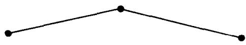

<details>
<summary>natural_image</summary>

Simple line diagram with three connected dots, no text or symbols present
</details>

图 2 $A^{*}$ 算法的估计函数定义示图

$A^{*}$ 算法定义估计函数: $f(n)=g(n)+h(n)$ , 图2 $A^{*}$ 算法的估计函数定义示图其中 $f(n)$ 为起始结点 $S_{0}$ 经过 n 结点到达目标结点 $S_{g}$ 的最小代价路径代价的估计值; $g(n)$ 是从初始结点 $S_{0}$ 到结点 n 的实际代价; $h(n)$ 是从结点 n 到目标点 $S_{g}$ 的最小代价路径的估计值, 它体现了搜索的启发信息, 称启发式函数, $A^{*}$ 算法的核心是要寻找合适的 $h(n)$ 以提高搜索效率.

类似地我们定义在图五的代价树中的加工费用估计函数：

$$
f (S _ {i, j}) = g (S _ {i, j}) + h (S _ {i, j})
$$

其中 $f(S_{ij})$ 为根结点 $S_0$ 经过结点 $S_{ij}$ 到达叶结点 $S_{6,k}$ 的最小费用路径的费用估计值， $g(n)$ 是从根结点 $S_0$ 经过结点 $S_{i,j}$ 的实际费用， $h(S_{i,j})$ 是从结点 $S_{i,j}$ 到达叶结点 $S_{6,k}$ 的最小费用路径的估计费用，它同样体现了搜索的启发信息，也称启发式函数。记 $h^*(S_{i,j})$ 为从结点 $S_{i,j}$ 到达叶结点 $S_{6,k}$ 的最小费用。

当 $h(S_{i,j})$ 满足许可性条件时[1], $A^{*}$ 算法一定能搜索到从结点 $S_0$ 到达叶结点 $S_{6,k}$ 的最小费用

## 2. 启发式函数 $h(S_{i,j})$ 的选择

下面我们具体构造出三种 $S_{i,j}$ 的表达式：

(1) $h_1(S_{i,j}) = 0$ , 这种特殊的情况完全缺乏有关的启发信息, 算法退化为宽度优先搜索法.  
(2) $h_{2}(S_{i,j})=\sigma_{2}-\sigma_{1}$ ;式中 $\sigma_{2}$ 表示第i次切割将在待加工长方体上形成的截断面的面积, $\sigma_{1}$ 表示成品长方体与该截断面重叠部分的面积.  
(3) $h_{3}(S_{i,j})=\sigma_{2}-\sigma_{1}+\sigma_{3}$ ;式中 $\sigma_{3}$ 为第i次切割前成品长方体尚未被切割到的各个面(共7-i个)面积之和.

此时有 $h_1(S_{i,j}) \leqslant h_2(S_{i,j}) \leqslant h_3(S_{i,j}) \leqslant h^*(S_{i,j})$ .

针对原问题我们应用 $A^{*}$ 算法, 引入 OPEN 表及 CLOSE 表编程计算, (其具体的步骤附录略). 当搜索结束后 CLOSE 表结点数目就是算法执行过程中搜索过的结点数目, 是算法效率的体现.

我们将三种不同的启发式函数 $h(S_{i,j})$ 代入 $A^{*}$ 算法，并将 $h_1(S_{i,j}), h_2(S_{i,j}), h_3(S_{i,j})$ 时的 $A^{*}$ 算法分别记， $A_1^{*}, A_2^{*}, A_3^{*}$ 计算终止后CLOSE表中结点数列于表1：

表 1 三种搜索算法结束时 CLOSE 表结点数目表

<table><tr><td> $h(S_{i,j})$ </td><td> $A^{*}$ </td><td>CLOSE 表的结点数</td></tr><tr><td> $h_{1}(S_{i,j})$ </td><td> $A_{1}^{*}$ </td><td>119</td></tr><tr><td> $h_{2}(S_{i,j})$ </td><td> $A_{2}^{*}$ </td><td>19</td></tr><tr><td> $h_{3}(S_{i,j})$ </td><td> $A_{3}^{*}$ </td><td>15</td></tr></table>

由表可见上述三种启发式函数 $h(S_{i,j})$ 越来越趋近于 $h^{*}(S_{i,j})$ ，也即含有的启发信息依次增加，从而使得搜索结束后CLOSE表结点数目依次减少，搜索的效率越来越高，此结果与算法的性质十分吻合.

由此我们建议采用启发式函数 $h_3(S_{i,j}) = \sigma_3 + \sigma_1$ ，这样可使得搜索的效率大大提高.

## (三) 改进型 $A^{*}$ 算法

## 1. 改进方案

$A^{*}$ 算法的效率虽然很高,但它还存在以下两点明显的不足之处:

(1) 搜索的空间还可以进一步的压缩; (2) $A^{*}$ 算法只能得到一个最优解, 不能得到全部的最优解.

我们对 $A^{*}$ 算法进行改进如下: 首先, 将平行切割厚度优先原则应用于 $A^{*}$ 算法; 其次, 在判断算法结束时, 并不是找到 OPEN 表中第一个最优解 (对应的最优值为 $f^{*}(S_{i,j})$ ) 就结束搜索, 而是继续对那些 $f(S_{i,j})$ 值与 $f^{*}(S_{i,j})$ 相同的结点, 再进行扩展、判断, 直达到最低层, 这样就搜索到了全部的最优路径.

改进后的 $A^{*}$ 算法称为改进型 $A^{*}$ 算法.

## 2. 改进型 $A^{*}$ 算法的检验

固定点 $(a_{1}, b_{1}, c_{1})$ ，变动点 $(a_{2}, b_{2}, c_{2})$ ， $(a_{3}, b_{3}, c_{3})$ 中的一个，且仅沿三维坐标轴的一个变动，分别用改进型 $A_{1}^{*}, A_{2}^{*}, A_{3}^{*}$ 算法计算，从而可以评价和检验算法的效率、稳定性；并讨论当成品长方体的边长变化（即成品长方体越来越接近于待加工的长方体时）对 $A_{1}^{*}, A_{2}^{*}, A_{3}^{*}$ 的效率的影响。初始条件分别取：

(1) $r = 1, e = 0, (a_{1}, b_{1}, c_{1}) = (10, 14, 5, 19), (a_{3}, b_{3}, c_{3}) = (2, 7, 9)$  
(2) $r = 1, e = 0, (a_{1}, b_{1}, c_{1}) = (10, 14, 5, 19), (a_{2}, b_{2}, c_{2}) = (7, 10, 15)$

具体表格、数据及分析结论略.

## 四、厚者优先准则

## （一）准则的提出

对于本文中有限状态的搜索问题,其最优的切割方式一定存在(用穷举法即可找到).

不妨设加工费用最小的切割方式为： $\alpha^{*}=(i_{1}^{*},i_{2}^{*},i_{3}^{*},i_{4}^{*},i_{5}^{*},i_{6}^{*})$ ，由贝尔曼最优化原理， $\alpha^{*}$ 具有：在原长方体第 $k(1\leqslant k\leqslant5)$ 次切割第 $i_{k}^{*}$ 面后， $(i_{k+1}^{*},i_{k+2}^{*},\cdots,i_{6}^{*})$ 是切割剩余长方体的最优方式。基于此性质，从最后一刀向前逆推；并结合平行切割厚者优先定理可得到r=1,e=0如下简明的优化准则（具体讨论略）：

等效厚度厚者优先准则(以下简称厚者优先准则):

每次选择一个等效厚度最大的待切割面进行切割. 当几个面的等效厚度相同时, 可在其中任选一个面进行切割.

## （二）厚者优先准则的应用

为了检验此准则的实用性,我们给出一组初值,用改进型 $A^{*}$ 算法求出最小费用 $C^{*}$ , 用该准则计算出的加工费用为 C, 定义偏离度 $\xi = \frac{C - C^{*}}{C^{*}} (\xi \geqslant 0)$ , $\xi$ 反映了该准则的优化效果. $\xi$ 越小则说明准则的优化效果越佳.

## 具体方案为

I. $e = 0, r = 1.5$ 固定待加工长方体的大小，在其内部，任取两点作为成品长方体的两对角顶点，这样取1000组初始数据，分别用厚者优先准则和 $A_{3}^{*}$ 算法计算加工费用 $C$ 和 $C^{*}$ 、切割方式 $\alpha$ 与 $\alpha^{*}$ ，并比较 $\alpha$ 与 $\alpha^{*}$ 的异同。

Ⅱ．e 分别为 1,2,3,5,8,10,15，按方案 I 的方法模拟，计算用厚度优先准则所花的加工费用 C 与最优解对应的加工费用 $C^{*}$ 的相对偏差 $\xi = \frac{C - C^{*}}{C^{*}}$ 的平均值 $\bar{\xi}$ ，我们模拟得到表 2.

表 2 模拟结果表

<table><tr><td>e</td><td>0</td><td>1</td><td>2</td><td>3</td><td>5</td><td>8</td><td>10</td><td>15</td></tr><tr><td>平均相对偏差ξ(%)</td><td>0</td><td>0.05</td><td>0.2</td><td>1.05</td><td>2.30</td><td>5.32</td><td>6.81</td><td>11.29</td></tr></table>

由以上结果我们得出厚者优先准则具有两个明显的特点：

1. 该准则简明易行, 计算量只需经过简单的乘法计算和六个数的大小比较, 就可以迅速确定一个最优的切割方式.  
2. 该准则对 $e = 0$ 的情况得到加工费用最小的切割方式; 对 $e \neq 0$ 的情况, 虽然不一定总能得到加工费用最小的切割方式, 但用该准则得到的加工费用与最小加工费用的绝对偏差 $C - C^{*}$ 不会超过 $2e$ , 因此在没有计算机用穷举法和算法进行计算时, 该准则仍不失为一种好的准则.

## 五、问题三的解答

问题三所给准则是:每次选择一个加工费用最少的待切割面进行切割.对于该准则,我们从两个方面来进行评价.

I．用特例说明:按照该准则进行切割加工,没有使加工费用最少.

例 $e = 0, r = 1$ ，相应的数据如图3所示（阴影实体为成品长方体），即只需进行两次相互垂直的切割即可切出成品长方体。

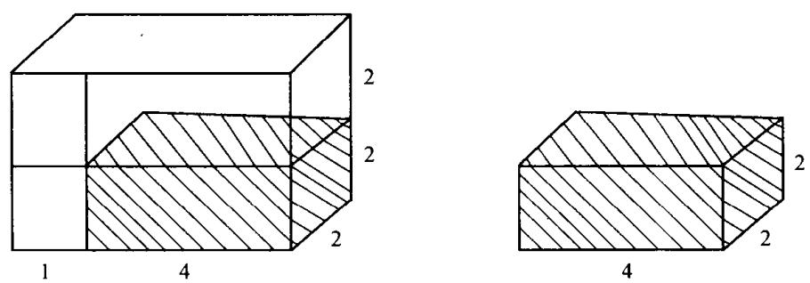  
图 3 特例的示意图

按原题目问题(3)所给准则切割,应先垂直切割,其加工费用(单位:元)为: $\left[(2+2)\times2+4\times2\right]\times1=16$ .如不按该准则,即交换这两次切割的次序,先水平切割,其加工费用为: $\left[(4+1)\times2+2\times2\right]\times1=14<16$ .此例中按原题目问题(3)所给准则进行切割,不能使加工费用最小.

## Ⅱ. 用模拟结果来评价该准则：

在图一的坐标系中，令 $(a_{1}, b_{1}, c_{1}) = (10, 14, 5, 19), (a_{2}, b_{2}, c_{2}) = (9, 9, 13), (a_{3}, b_{3}, c_{3}) = (6, 7, 9)$ . 首先我们利用改进型 $A^{*}$ 算法得到最小加工费用 $C^{*}$ ; 然后再利用问题(三)所给准则进行切割的加工费用与利用改进型 $A^{*}$ 算法所得的最小加工费用进行比较. 在此我们采用偏离度 $\xi = \frac{C - C^{*}}{C^{*}}$ , 来衡量该准则合理的程度.

具体的模拟方案是(1)，取定 $e = 0, r = 1$ ，固定 $a_1, b_1, c_1$ 中的两个，让另一个按一定的比率增加；(2) 取定 $r = 1.5$ ，让 $e$ 以步长1从2增加到15时，固定 $a_1, b_1, c_1$ 中的两个，让另一个变动；通过比较模拟结果可得：不同的 $a_1, b_1, c_1$ 很多种情况中除个别情况外，偏离度 $\xi$ 都是较大，说明该准则对于普通的情形是不合理的。

## 六、问题五的解答

## （一）问题的解答

结合以上的讨论, 当 $e = 0$ 时要得到最优的切割方式, 我们可以采用穷举法、改进型的穷举法、 $A^{*}$ 算法、改进型 $A^{*}$ 算法以及厚者优先准则均得到相同的结果. 当 $e \neq 0$ 时等效厚者优先准则所得的结果与最优解很相近, 而 $A^{*}$ 算法、改进型 $A^{*}$ 算法均能得到最优的切割方式.

对于题中的 $a, b, c$ 三组数据, 我们用上述所有的方法均可得到如下的最优解. 结果如下:

情况 a 最优的切割方式为 $(6,5,3,4,2,1)$ 及 $(6,5,4,3,2,1)$ 加工费用为 374 元.

情况 b 最优的切割方式为 $(5,4,6,2,3,1)$ 及 $(5,6,4,2,3,1)$ 加工费用为 437.5 元.

情况 c 最优的切割方式为 $(5,4,2,6,1,3)$ ，加工费用为 540.5 元.

(注:1为右侧面、2为背面、3为上底面、4为左侧面、5为正面、6为下底面)

情况 d 解答见表 3.

表 3 r = 1.5, $2 \leqslant e \leqslant 15$ 时的解答

<table><tr><td>e元</td><td>加工费用C(元)</td><td>刀具调整次数</td><td>最优的切割方式 $\alpha^{*}$ </td></tr><tr><td>[0,2.5)</td><td>437.5+3e</td><td>3</td><td>(5,4,6,2,3,1)(5,6,4,3,2,1)</td></tr><tr><td rowspan="2">2.5</td><td rowspan="2">445</td><td>3</td><td>(5,6,4,2,3,1)(5,6,4,2,3,1)</td></tr><tr><td>1</td><td>(5,6,2,4,3,1)</td></tr><tr><td>(2.5,15]</td><td>442.5+e</td><td>1</td><td>(5,6,2,4,3,1)</td></tr></table>

## （二）结果分析及讨论

## 1. $e = 0$ 时 $r$ 对切割方式的影响

$r$ 的物理意义为水平切割单位面积费用与垂直切割单位面积的费用之比， $r$ 的取值对切割方式是有一定影响的。 $e = 0$ 时，根据厚者优先准则， $r$ 增大，即使实际厚度较小，也有可能使得等效厚度为最大，应予以先行切割，这样有利于减少加工费用。由结果中 $r$ 从1变到1.5再变到8时加工费用最小切割方式的变化可以看出，随着 $r$ 的增大，6和3的位置是逐次靠后的。特别是当 $r \to \infty$ ，显然第3,6面应为最后两刀切割； $r \to 0$ ，第3,6面应首先切割。

## 2. $e$ 对切割方式的影响

图和表中的数据实际上反映了调整刀具对切割方式、加工费用的影响, 调整刀具的次数只可能为 1 次、2 次或 3 次. 当 $e = 0$ 时, 调整刀具的次数不会影响最优的切割顺序, 当 $e$ 充分大时, 显然应该让调整的次数尽量少, 最好为 1 次. 在本例中, 由于原始数据的巧合, 调整的次数由 3 次直接跳变为 1 次, 更为一般的情况是 $C \sim e$ 的曲线分成三段.

## 七、模型的推广(略)

## 参考文献

[1] 何华灿等编著,人工智能导论,西北工业大学出版社,西安1988  
[2] 邵嘉裕著, 组合数学, 同济大学出版社, 上海 1991  
[3] 李建德等编著,动态规划及其应用,国防工业出版社,1994  
[4] Mathematica 手册, 沈风贤等编译, 海洋出版社, 北京, 1992

# 截断切割优化模型

祁洪全 李焕新 万珍

(湖南大学, 长沙 410082)

指导教师 马传秀

编者按 本文对截断切割问题的数学模型的描述、优化准则、参数分析等方面作了深入的讨论,有一定特色.

摘要 本文讨论的是长方体的切割方式选择问题.首先,我们从理论上表述了对“考虑切割方式”的理解,其次利用一个等效转化方法将 $r\neq1$ 的情形作简化,再对所需考虑的切割方式进行分类找出每一类的最优切割方式,最后用简明直观的图解方法建立了数学模型.另外,我们通过机理分析探讨了模型二——规划模型的可行性,并作了一定的深入讨论,对于较特殊的情况,我们还给出了简明的优化方法.

## 一、问题的提出(略)

## 二、符号说明

a, b, c: 待加工长方体的长、宽、高; $d_{1}, d_{2}, d_{3}$ : 两长方体左侧面、正面、底面之间的距离; $l_{1}, l_{2}, l_{3}$ : 两长方体右侧面、反面、上平面之间的距离; $a_{1}, b_{1}, c_{1}$ : 成品长方体的长、宽、高; C: 第 i 个面的面积; k: 垂直切割单位面积费用; e: 调整一次刀具额外费用. P: 费用; r: 水平切割单位面积费用与垂直切割单位面积费用之比;

## 三、问题的分析

对于6个面共有 $P_6^6 = 720$ 种不同的加工次序，一般来说，各种加工次序使得各加工费用互不相等，但可以肯定的是这720种切割次序中有相当多的一部分是加工费用很大的切割，因此对这部分切割方式我们不予考虑。为此，先提出我们对问题中“需考虑的不同切割方式”的理解：对于两个相对的平行平面不管它们之间是否穿插有其它平面的切割，两者之间进行切割的先后次序已经确定，即总是先切掉厚度大的部分，再考虑切厚度小的部分（其中厚度定义为待切长方体六个面到内部成品长方体相应平面的距离）。因此，“需考虑的不同切割方式”是指：在满足两个平行平面的切割先后次序是先切厚度大的，再切厚度小的条件下的不同的切割方式。

事实上,我们可以对上述考虑方式的可行性作出证明:以待加工长方体的1、2(图略)两个平行侧面为例,假设 $d_{1}>l_{1}$ ,由于切割1、2两面的费用相同(设为 $P_{0}$ ),它们的切割都对以后的3、4、5、6面的切割产生影响,不妨假设3、4、5、6面均未进行切割,并设r=1,e=0,则先

1) 切 1, 再依次切 3、4、5、6, 则费用为

$$
\begin{array}{l} P _ {1} = P _ {0} + 2 (a - d _ {1}) c k + 2 b _ {1} (a - d _ {1}) k \\ = P _ {0} + 2 (a - d _ {1}) (c + b _ {1}) k \\ \end{array}
$$

2) 先切 2, 再依次切 3、4、5、6, 则费用为

$$
\begin{array}{l} P _ {2} = P _ {0} + 2 (a - l _ {1}) c k + 2 b _ {1} (a - l _ {1}) k \\ = P _ {0} + 2 (a - l _ {1}) (c + b _ {1}) k \\ \end{array}
$$

显然，当 $d_{1} > l_{1}$ 时 $P_{1} < P_{2}$ ，因此对两平行平面只考虑厚度大的先切割这一种次序。

类似地可证:对于3、4、5、6面全部或部分已切割的情形上述结论也成立.

## 四、模型假设

假设成品长方体处于一般的位置,即需要切6刀才能从待切长方体中切割而得.

## 五、模型的建立及求解

## 1. 确定考虑的不同切割方式的总数

为从一个长方体中加工出一个已知尺寸、位置预定的长方体,我们根据两个长方体的对应平面是平行的以及对“需考虑切割方式”的理解,可以利用排列组合的知识求出“需考虑的不同切割方式”的总数.

在六个空格中任选两个放左右侧面1、2，因为依据 $d_{1}, l_{1}$ 已先确定了1、2的先后顺序，故其放法有 $C_6^2$ 种. 同理，正反面3、4一共有 $C_4^2$ 种放法，5、6则放剩下的两个空格且只有一种放法. 综上所述，需考虑的不同切割方式的总数为

$$
C _ {6} ^ {2} C _ {4} ^ {2} = 9 0 \text {种}
$$

## 2. 加工费用优化的切割方式模型

模型一、首先给出两个说明：

1）先假定：左、右两侧面要切割部分厚度大的面为1面，另一侧为2面；正反两面要切割部分厚度大的面为3面，另一侧为4面，上、下两面要切割部分厚度大的面为5面，另一侧为6面.  
2) 为使问题简化, 在所有 $r \neq 1$ 的问题求解中, 我们都首先将单位面积切割费用统一化, 具体做法是: 如果水平单位面积切割费用是垂直面单位面积切割费用 $k$ 的 $r$ 倍时, 我们利用等效转换的方法, 将长方体的高都缩短(伸长)至原来的 $\frac{1}{r}$ 倍, 则统一的单位面积切割费用都为 $kr$ .

根据(1)一共有90种切割方式,我们利用计算机编程将90种需考虑的切割方式进行遍历搜索,并根据切割次序确定调刀次数.

据题目条件,我们调整刀具最多3次,至少为1次,所以,我们在程序中将90种切割方式按调刀次数i=1,2,3进行分类,并分别求出相应类最小面积 $\mathrm{Min}(i)$ 表达式,以及对应的切割方式.

则额外调刀1,2,3次切割方式的最小总费用分别为：

$$
P _ {1} = \operatorname{Min} (1) k r + e \quad P _ {2} = \operatorname{Min} (2) k r + 2 e
$$

$$
P _ {3} = \operatorname{Min} (3) k r + 3 e
$$

在具体的确定某种材料切割方式的方案中,我们只需要输入 a, b, c, $a_{1}, b_{1}, c_{1}$ 和 $d_{1}, d_{2}, d_{3}$ 及 k, r 的值,则计算机会输出相应的关于 e 的函数表达式 $P_{1} = \operatorname{Min}(i)kr + ie, (i = 1, 2, 3)$ , 其中的 $\operatorname{Min}(i)kr$ 是一个常数.

如果 $e$ 已是一个确定的数, 则我们可以直接代入比较 $P_{1}, P_{2}, P_{3}$ 的大小, 不妨设 $P_{i}$ 最小, 则 $P_{i}$ 所对应的切割方式就为最优的切割方式.

模型二、设 n 为所需截断切割次数, n = 6;

设长方体各面号安排规则为左面为1号面,右面为2号面,上平面为5号面,底面为6号面,正面为3号,反面为4号面;

设 $C_{ks}$ 是指第 $k$ 面在第 $s$ 次进行切割所需的费用，构造如下的切割费用矩阵 $C = (C_{ks})$ .

设 $Y_{ts}$ 用来指示第 t 号面是否在第 s 次进行切割, 于是, 整个长方体的各面加工次序可用如下的切割次序矩阵来表示 $Y = (Y_{ts})$ 其中

$$
Y _ {t s} = \left\{ \begin{array}{l l} 1, & \text {若} t \text {号面在第} s \text {次进行切割;} \\ 0, & \text {若} t \text {号面不是在第} s \text {次进行切割;} \end{array} \right.
$$

由于 $Y_{ts}$ 只取0,1值，故 $Y$ 矩阵的每一个具体值都对应一个排序方案，且 $Y_{ts}$ 必满足约束方程组1：

$$
\left\{ \begin{array}{l} \sum_ {k = 1} ^ {n} Y _ {k s} = 1; s = 1, 2, \dots , n; \\ \sum_ {s = 1} ^ {n} Y _ {k s} = 1; t = 1, 2, \dots , n; \end{array} \right.
$$

设 $C_{t}$ 为切割第 t 号面的费用：

$$
C _ {t} = Y _ {t 1} \cdot C _ {t 1} + Y _ {t 2} \cdot C _ {t 2} + \dots + Y _ {t n} \cdot C _ {t n};
$$

由此加工一个长方体的总费用为：

$$
Z = \sum_ {k = 1} ^ {n} \sum_ {s = 1} ^ {n} [ Y _ {k s} C _ {k s} ]
$$

那么要求使加工费用最少的各面加工次序,即要求满足方程组1的约束的,使Z取最小值的切割次序矩阵Y,我们构造了如下的规划模型

$$
\left\{ \begin{array}{l} \min Z, \\ \sum_ {s = 1} ^ {n} Y _ {t s}, t = 1, 2, \dots , n; \\ \sum_ {t = 1} ^ {n} Y _ {t s}, s = 1, 2, \dots , n; \end{array} \right.
$$

设 $h_s$ 为第 $s$ 次切割的面号.

下面对模型中的切割费用矩阵 C 进行量化

$C_{ts}$ 是与 $h_{1}$ 至 $h_{s-1}$ 有关的. 设 $h_{1}$ 对 $h_{2}$ 面的切割费用有影响 $m_{1}, h_{2}$ 对 $h_{3}$ 面的切割费用有影响 $m_{2}$ , 则由 $m_{1}, m_{2}$ 可以求出 $h_{1}$ 面和 $h_{2}$ 面对 $h_{3}$ 面切割费用的影响. 以此递推, 可得到 $h_{1}$ 至 $h_{s-1}$ 面对 $h_{s}$ 面切割费用的影响.

设 $X_{ij}$ 表示切第 i 面对随后切第 j 面的费用的影响, 即对切割面积费用的影响, 于是我们建立一个费用影响矩阵 X 来表示一个面对在它随后切割的其它面的费用影响 $X = (X_{ij})$ 则

$$
C _ {t s} = C _ {t 1} - \left[ \sum_ {i = 1} ^ {n} Y _ {i 1} X _ {i t} + \sum_ {i = 1} ^ {n} Y _ {i 2} X _ {i t} + \dots + \sum_ {i = 1} ^ {n} Y _ {i (s - 1)} \cdot X _ {i t} \right] + F _ {t s}
$$

其中 $F_{ts}$ 表示第 $t$ 面在第 $s$ 次切割所需的调刀费用. 求 $X_{ij}$ 分三种情况：

a: 当 i = j 时, $X_{ij} = 0$ ;

b: 当 $j = i + (-1)^{i+1}$ 时, 即 j 面是 i 面的平行面时, $X_{ij} = 0$ ;

c: 当 $j \neq i + (-1)^{i+1}$ 且 $j \neq i$ 时, 即一般情况时:

$X_{ij}$ 的大小与假设当以 j 面为顶面, 它的相邻的两对对称侧面中的那对不包含 i 面的侧面是否切过有关.

例 $i = 1, j = 5$ ，则 $X_{ij}$ 与第3、4面是否切过有关，而第3、4面是否切过可以用 $Y_{ts}$ 来表示.

设先切第 $i$ 面，随后切 $j$ 面，以 $j$ 面为顶面的两个侧面号为 $p, q$ .

$$
\begin{array}{l} X _ {i j} = \sum_ {s = 1} ^ {n} [   Y _ {p s} \cdot \text {若} p \text {面已切对} j \text {面省去的切割面积费用} G _ {p}   ] \\ + \sum_ {s = 1} ^ {n} [ Y _ {q s} \cdot \text {若} q \text {面已切对} j \text {面省去的切割面积费用} G _ {q} ] \\ \end{array}
$$

若 $p$ 面已切对 $j$ 面省去的切割面积费用又与 $i$ 的平行面 $W$ 是否切割有关.

例 $i = 1, j = 5, p = 3, G_3$ 又与 $i$ 的平行面2是否已切有关，而面2是否已切可用 $Y_{ts}$ 表示.

当 $W$ 面已切时, $G_{p} = p$ 面已切对 $j$ 面的最大的省去切割面积费用 $-W$ 面已切对 $G_{p}$ 的最大影响, 当 $W$ 面没切时, $G_{p} = p$ 面已切对 $j$ 面的最大的省去切割面积费用).

例 $i = 1, j = 5, p = 3$ 时， $W = 2$ 若2面已切. $G_{p} =$ 切割所有阴影部分的费用-切割阴影部分1的费用.

设 $t_{pj}$ 是指 p 面已切对 j 面最大的省去切割费用, 我们建立一个最大省费矩阵 T 来表示 p 面对 j 面的最大省去切割费用, 通过计算, 我们得到如下的 T:

<table><tr><td> $p \setminus j$ </td><td>1</td><td>2</td><td>3</td></tr><tr><td>1</td><td>0</td><td>0</td><td> $C \cdot d_{i}$ </td></tr><tr><td>2</td><td>0</td><td>0</td><td> $C \cdot [a - (a_{i} + d_{i})]$ </td></tr><tr><td>3</td><td> $C \cdot d_{2}$ </td><td> $C \cdots d_{2}$ </td><td>0</td></tr><tr><td>4</td><td> $C \cdot [b - (d_{2} + b_{1})]$ </td><td> $C \cdot [b - (d_{2} + b_{1})]$ </td><td>0</td></tr><tr><td>5</td><td> $b \cdot [C - (C_{1} + b_{3})]$ </td><td> $b \cdot [C(C_{1} + d_{3})]$ </td><td> $a \cdot [C - (C_{1} + d_{3})]$ </td></tr><tr><td>6</td><td> $b \cdot d_{3}$ </td><td> $b \cdot d_{3}$ </td><td> $a \cdot d_{3}$ </td></tr></table>

<table><tr><td> $p \setminus j$ </td><td>4</td><td>5</td><td>6</td></tr><tr><td>1</td><td> $C \cdot d_1$ </td><td> $b \cdot d_1$ </td><td> $b \cdot d_1$ </td></tr><tr><td>2</td><td> $C \cdot [a - (a_1 + d_1)]$ </td><td> $b \cdot [a(a_1 + d_1)]$ </td><td> $b \cdot [a - (a_1 + d_1)]$ </td></tr><tr><td>3</td><td>0</td><td> $a \cdot d_2$ </td><td> $a \cdot d_2$ </td></tr><tr><td>4</td><td>0</td><td> $a[b - (d_2 + b_1)]$ </td><td> $a[b - (d_2 + d_1)]$ </td></tr><tr><td>5</td><td> $a \cdot [C - (C_1 + b_3)]$ </td><td>0</td><td>0</td></tr><tr><td>6</td><td> $b \cdot d_3$ </td><td>0</td><td>0</td></tr></table>

设 $r_{wp}$ 表示 $W$ 面已切对 $G_{p}$ 的最大影响，从而建立一个矩阵 $R$ 来表示 $W$ 面已切对 $G_{p}$ 的最大影响，通过计算，我们得到如下的 $R$ ：

<table><tr><td> $p \setminus j$ </td><td>1</td><td>2</td><td>3</td></tr><tr><td>1</td><td>0</td><td>0</td><td> $d_{1} \cdot d_{2}$ </td></tr><tr><td>2</td><td>0</td><td>0</td><td> $d_{2} \cdot [a - (a_{1} + d_{1})]$ </td></tr><tr><td>3</td><td> $d_{1} \cdot d_{2}$ </td><td> $d_{2} \cdot [a - (a_{1} + d_{1})]$ </td><td>0</td></tr><tr><td>4</td><td> $d_{1} \cdot [b - (b_{1} + d_{2})]$ </td><td> $[a - (a_{1} + d_{1})] \cdot [b - (b_{1} + d_{2})]$ </td><td>0</td></tr><tr><td>5</td><td> $d_{1} \cdot [a - (a_{1} + d_{2})] \cdot [C - (C_{1} + d_{3})]$ </td><td> $d_{2} \cdot [C - (C_{1} + d_{3})]$ </td><td> $d_{2} \cdot [C - (C_{1} + d_{3})]$ </td></tr><tr><td>6</td><td> $d_{1} \cdot d_{3}$ </td><td> $[a - (a_{1} + d_{1})]$ </td><td> $d_{2} \cdot d_{3}$ </td></tr></table>

<table><tr><td> $p \setminus j$ </td><td>4</td><td>5</td><td>6</td></tr><tr><td>1</td><td> $d_{1} \cdot [b - (b_{1} + d_{2})]$ </td><td> $d \cdot [C - (C_{1} + d_{3})]$ </td><td> $d_{1} \cdot d_{3}$ </td></tr><tr><td>2</td><td> $[a - (a_{1} + d_{1})] \cdot [b - (b_{1} + d_{2})]$ </td><td> $[a - (a_{1} + d_{1})] \cdot [C - (C_{1} + d_{1})]$ </td><td> $d_{3} \cdot [a - (a_{1} + d_{1})]$ </td></tr><tr><td>3</td><td>0</td><td> $d_{2} \cdot [C - (C_{1} + d_{3})]$ </td><td> $d_{2} \cdot d_{3}$ </td></tr><tr><td>4</td><td>0</td><td> $[b - (b_{1} + d_{2})] \cdot [C - (C_{1} + d_{2})]$ </td><td> $d_{3} \cdot [b - (b_{1} + d_{2})]$ </td></tr><tr><td>5</td><td> $[b - (b_{1} + d_{2})] \cdot [C - (C_{1} + d_{3})]$ </td><td>0</td><td>0</td></tr><tr><td>6</td><td> $d_{3} \cdot [b - (b_{1} + d_{2})]$ </td><td>0</td><td>0</td></tr></table>

所以 $G_{p} = \left(t_{pj}\sum_{s = 1}^{n}Y_{ws}r_{wp}\right)\cdot k\cdot r$ 同理 $G_{q} = \left(t_{qj}\sum_{s = 1}^{n}Y_{ws}r_{wq}\right)\cdot k\cdot r$ 其中

$$
p = \left[ n - \left(\frac {i + i \bmod 2}{2} + \frac {j + j \bmod 2}{2}\right) \right] \cdot 2 - 1;
$$

$$
q = p - (- 1) ^ {p}; \quad W = i - (- 1) ^ {i}.
$$

于是

$$
\begin{array}{l} X _ {i j} = \sum_ {s = 1} ^ {n} [ Y _ {p s} \cdot G _ {p} ] + \sum_ {s = 1} ^ {n} [ Y _ {q s} \cdot G _ {q} ] \\ = \sum_ {s = 1} ^ {n} \left[ Y _ {p s} \cdot \left(t _ {p j} - \sum_ {s = 1} ^ {n} Y _ {w s} r _ {w p}\right) \right] + \sum_ {s = 1} ^ {n} \left[ Y _ {q s} \cdot \left(t _ {q j} - \sum_ {s = 1} ^ {n} Y _ {w s} r _ {w q}\right) \right] \\ \end{array}
$$

当 e = 0 时 $F_{ks} = 0$ . ( $k = 1, 2, \cdots, n, s = 1, 2, \cdots, n$ ) 可以由上述规划模型求得最优的切割方式：

当 $e \neq 0$ 时, $F_{ts} \neq 0$ , 只要求出 $F_{ts}$ 的表达式, 就能求出 $C_{ts}$ , 据此也可以根据前述的规划模型的表达式求出使加工费用最小的切割方式.

模型三、(e = 0 时的准则模型)

特别当 $e = 0$ 时, 我们得到一个简明的优化准则: 首先依等效转换方法将高缩短(伸长)使垂直面、水平面单位面积切割费用化归为 $kr$ , 然后依次切割待切割部分厚度最大的. 如果有 $n$ 个待切厚度相同, 则厚度相同的 $n$ 个待切部分对应的面的编号作全排列, 得到 $n!$ 种最优切割方式. 这个准则实际上就是一种最优的数学模型, 我们称之为准则模型. 下面给出了最优性证明:

任意选两个满足条件的长方体, 假设经过 $i(i < 5)$ 次切割之后侧面 1、正面 3 还未切割, 且 $d_{1} > d_{2}$ , 不妨设此时待切长方体的长为 a, 宽为 b, 高为 c, 则

1) 先切 1, 再切 3 的两次切割总费用为:

$$
P _ {1 3} = [ b c + (a - d _ {1}) c ] k r = (b c + a c - d _ {1} c) k r
$$

2) 先切 3, 再切 1 的两次切割总费用为:

$$
P _ {3 1} = [ a c + (b - d _ {2}) c ] k r = [ b c + a c - d _ {1} ] k r
$$

显然 $P_{13}$ 与 $P_{31}$ 的费用分别与厚度 $d_{1}, d_{2}$ 有关，先切厚度大的侧面1，再切正面3的总费用更小.

我们将六个面按厚度从大到小的顺序依次记为 $j_{1}, j_{6}$ , 这就是按 $e = 0$ 时的准则模型得到的最优加工次序.

根据上述证明可知,某一部门的“每次选择一个加工费用最少的待切割面进行切割”切割准则不是最优的,因为该准则相当于“每一次都选取面积最小的面进行切割”,而我们已验证 e = 0 时,每次都选取厚度大的待切部分进行切割.显然,厚度 h = V/S,式中 V,S 分别为待切部分的体积和面积,当 S 为最小时,因受体积 V 的影响,h 并不一定为最大,所以在切割时不仅仅要考虑待切割部分的面积,还必须同时考虑待切割部分的体积.另外,我们利用所给问题 5 的(b) 情形,也可以验证这不是最优的,因为按每次选择一个加工费用最少的待切割面进行切割的费用为 461.5 元,而通过我们的准则,最少费用为 437.5 元.

## 六、模型的应用与检验

给出待加工长方体和成品长方体的长、宽、高分别为10,14.5,19和3,2,4,二者左侧面、正面、底面之间的距离分别为6、7、9(单位均为厘米).垂直切割费用为每平方厘米1元.

此时待加工长方体的左、右、正、反、上、下的编号分别为1、2、3、4、6、5.

1. 对 a. r = 1, e = 0; b. r = 1.5, e = 0; c. r = 8, e = 0 三种情形, 我们根据模型中 e = 0 的简明

<table><tr><td>r</td><td>c</td><td> $c_1$ </td><td>最优切割方式</td><td>最少费用</td></tr><tr><td>1</td><td>19</td><td>4</td><td>531642536142</td><td>374</td></tr><tr><td>1.5</td><td> $19 \times \frac{2}{3}$ </td><td> $4 \times 3$ </td><td>351462315462</td><td>437.5</td></tr><tr><td>8</td><td> $19 \times \frac{1}{8}$ </td><td>2</td><td>314526</td><td>540.5</td></tr></table>

注：表中的 $c, c_1$ 均为经过等效转换后的长方体的高.

2. $r = 1.5, e \in [2,15]$ 所有的最优解

依据模型一将待定的长、宽、高、厚度、k,r输入程序一中,则计算机将所考虑的90种切割方式依调整刀具的次数分类后将每一类的最小费用表达式分别表示为:

$$
l _ {1}: P _ {1} = 4 4 2. 5 + e; \text {调整一次刀具}
$$

对应的切割方式:354162

$$
l _ {2}: P _ {2} = 4 5 6. 5 + 2 e \text {; 调整二次刀具}
$$

对应的切割方式:135462

$$
l _ {3}: P _ {3} = 4 3 7. 5 + 3 e \text {; 调整三次刀具}
$$

对应的切割方式:315462 和 351462

我们先求出直线 $l_{1}, l_{2}, l_{3}$ 在 $e \in [0, \infty)$ 区间中的交点

$$
e _ {1} = 2. 5, \quad e _ {2} = 1 9.
$$

并在坐标中画出图形.

我们利用图解法可知：

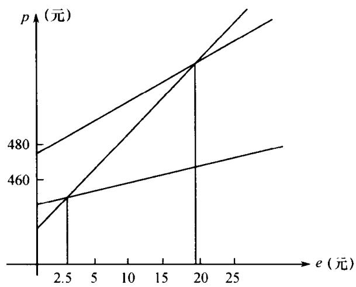

<details>
<summary>line</summary>

| e (元) | p (元) (Line 1) | p (元) (Line 2) | p (元) (Line 3) |
| --- | --- | --- | --- |
| 0 | ~475 | ~450 | ~440 |
| 2.5 | — | 455 | — |
| 20 | — | 500 | 500 |
</details>

1) $e \in [2, 2.5]$ 时，最小费用表达式为 $P = P_{3} = 437.5 + 3e$ （对应于直线 $l_{3}$ ），其对应的最佳切割方式为：315462 和 351462；  
2) $e \in [2.5, 1.5]$ 时, 最小费用表达式为 $P = P_{1} = 442.5 + e$ (对应于直线 $l_{1}$ ), 其对应的最佳切割方式为: 354162;

另外,我们通过计算机可以对90种不同的切割方式进行枚举,所得到的结果与我们计算出来的结果是相一致的.

## 七、模型的评价和推广

我们从问题的要求出发,分析了应该考虑的各种情况,建立了较一般的数学模型,并进行了理论论证和实例验证;对于特殊情况,我们也给出了一种简明的数学模型,并作了论证.事实证明,我们建立的模型能较好地解决问题.

对于另外一类特殊的情况,即目标长方体可能有某几个面不需切割时,可将对应的厚度视为0,于是上面给出的三个模型仍然是适用的.

但是,我们的模型二也存在一定的缺陷,即对于求解使切割费用最小的切割次序的规划模型,仅从理论上得到了最优切割方式,由于第 t 面在第 s 次切割时的调刀次数没能找到一个数学表达式来表达,故此规划模型可能还只适用于 e = 0 时的情况.根据规律求出调刀次数的表达式,使得规划模型能适用于 e 为任何值的情况,是该模型改进的方向.

## 附录(略)

## 参考文献

[1] 叶其孝主编, 数学建模教育与国际数学建模竞赛, 工科数学杂志社, 8, 1994  
[2] 钱颂迪等主编, 运筹学, 清华大学出版社, 北京, 1988  
[3] D.P.柏塞克斯著,李人厚、韩宗昭译,动态规划确定性和随机模型,西安交通大学出版社,西安,1990

# 切割次序的优化

王玉波 谷云洪 伍土刚

(杭州电子工学院, 杭州 310037)

指导教师 数模组

编者按 本文用图论模型描述截断切割问题,对优化准则也作了论证.

摘要 这是一个如何安排加工次序的组合优化问题,文章首先建立了一般问题的数学模型,在对其求解过程中我们采取了分枝限界法,保证了所得结果的最优性,且具有很高的时效性,其次针对某部门所采取的贪婪算法给以了评价,在评价中以其近似解与最优解的接近程度,得到最优解的概率为标准,利用计算机模拟对其进行评估,发现对于该问题贪婪算法并不能保证解的最优性,但近似程度较好,而后我们对调整刀具费用为0的情形进行了讨论,首先给出了一个引理,然后给出了一个简明的优化准则:当对各切割平面按其厚费比以不升序排列时,所得次序为最优加工次序,最后利用题中所给数据进行了验证,再次表明了所得结论的正确性.

## 一、问题重述(略)

## 二、问题的分析

某些工业部门在生产加工过程中,对同一块原材料的截割存在着多种切割方式,在各种切割方式中各切割平面的截割面积有变化,而且各种切割方式相应的刀具调整次数也有所不同,又由于水平切割单位面积的费用是垂直切割单位面积的倍,且调整刀具时需支出额外费用e,从而对同一材料的加工存在多种切割费用.从经济角度出发,应该选择使加工费用最少的切割方式.

为叙述方便起见,我们将长方体的六个面分别赋一标号,如下图.

(上底面为1,下底面为6,左侧面为2,正面为3,右侧面为4,后面为5,2,4平行,3,5平行,以后所提到的切割平面i是指以平面i进行切割).

在安排加工工序时,由于工艺上的要求,与水平工作台接触的长方体底面是事先指定的,所以在加工过程中,水平切割

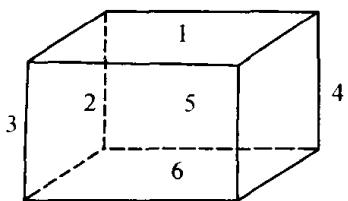

<details>
<summary>text_image</summary>

1
2 5
3 4
6
</details>

面和垂直切割面被唯一确定.考虑到在切割过程中需要对原材料进行固定.而对固定的限制直接影响到可行切割次数,根据对固定的限制,有如下两种情形:

I）对工作可多次固定，则共有 $6! = 720$ 种可行切割方案，考虑到如果在某一切割方式中存在相邻的两切割面平行的情况时，将它们进行对调后不改变加工费用，根据组合学原理，至多有426种不同的加工费用.  
Ⅱ）当与水平工作台接触的长方体的底面被指定后，对原料进行固定，且在今后的加工过程中不允许再对其进行固定，则切割平面6应安排在最后，否则其后工作将无法固定，以进行后继切割，所以应待其它切割平面全部切割后再对其进行切割，从而共有 $5! = 120$ 种可行切割方式。只需在前5个平面的各种切割方式中找到费用最小的切割方式，再加上切割

平面6即得到最优解，鉴于与（I）中相同的原因，此时至多有78种不同的加工费用.

虽然在不同约束下,本问题有不同的可行切割方式,但就模型建立,求解而言(Ⅰ)、(Ⅱ)无本质区别,以下我们首先就情形(Ⅰ)进行讨论,所得结论得(Ⅱ)仍然适用.

由于调整刀具时需支出额外费用 $e$ ，使问题的求解困难，所以以下我们首先就一般问题建立模型，然后讨论它的求解方法。其次对于特殊情形如 $e = 0$ ，希望能找到一种简明最优准则。

## 三、模型假设

1. 由于工艺要求,与水平工作台接触的长方体的底面是事先指定的.  
2. 加工前后两长方体的对应表面是平行的.

## 四、符号定义及说明

$S_{i}$ : 表示某一次截断的切割面; $f_{i}$ : 表示切割 $S_{i}$ 时单位面积的切割费用;

$d_{i}$ : 表示切割 $S_{i}$ 的厚费比, 这里厚费比是指以 $S_{i}$ 进行切割后长方体中被割离部分的厚度 $g_{i}$ 与 $f_{i}$ 之比. 即 $d_{i} = \frac{g_{i}}{f_{i}}$ , 如图所示;

F: 总的加工费用; e: 调整刀具时额外的支出费用;

r: 水平切割单位面积的费用与垂直切割单位面积的比值;

k: 刀具调整次数; 其余符号在文中用到时再作说明.

## 五、模型的建立及求解

根据对问题的分析,长方体的每一种切割方式与各切割平面的一种排列一一对应,对任一组排列 $P = (p_{1}, p_{2}, p_{3}, p_{4}, p_{5}, p_{6})$ 唯一对应着一个加工费用 $F = F(P)$ 而问题就是要求出这样一组排列 $P^{*} = (p_{1}^{*}, p_{2}^{*}, p_{3}^{*}, p_{4}^{*}, p_{5}^{*}, p_{6}^{*})$ , 使得 $\min F = F(P^{*})$ . 对各切割平面的所有排列可用一棵树来表示.

这棵树中每一条从根节点到叶子的路对应着一种切割方式及一个加工费用. 对这棵树进行遍历, 当遍历完所有叶子后, 也就找到了最优解, 但其运算量无疑是很大的. 为了尽快地搜索到最优解, 我们采用了深度、广度并行搜索的分枝限界法, 目的就是使最优解尽早被发现, 而非最优解所在的枝尽早被剪掉.

对树上的每一个节点,我们定义一个状态,这个状态记录了如下数据:

(1) 该节点所对应的切割平面；  
(2) 该节点在树上的层次；  
(3) 从根节点到该节点的路及这条路的费用；  
(4) 沿着这条路切割下来所得到的新长方体的各边边长；  
(5) 在该节点前是否已发生过刀具调整和一个费用下界(即沿着该节点搜索去所得各种切割方式的费用下界).

称当前正被访问的状态为活动状态,若它是一个叶子节点(最后一层上的结点),则停止搜索,输出该状态,否则为每一个不在从根节点到该节点路上的切割平面创建子节点,子节点的状态称为新状态,新状态的各项值用下述方法得到:

1) 层次为父节点(活动状态)的层次 1;  
2）路为父节点的路加上该新状态对应的切割平面；  
3) 下界由随后定义的下界函数计算；  
4）费用为父节点的费用加上在父节点的长方体上切割该平面所支出的切割费用；  
5) 切割后得到的长方体即为新状态的长方体；

将新状态挂起,按其费用下界的大小插入等待序列(该序列按从小到大的次序排列)中,使其处于等待状态,而原活动状态则被撤消,不复存在.

每一次从等待序列首部摘下一个状态,使它成为活动状态,重复上面的工作,直到出现一个叶子节点上的状态,由状态的插入规则,可知每一个活动状态的费用下界都不大于在等待序列上的状态的费用下界,而所有新节点的费用下界都不小于其父节点的费用下界,故活动状态的费用下界是所有现存及将要出现的状态中最小的.当其为叶子时,费用下界就是当前切割方式的费用,从而由费用下界的定义可知,它就是最优解.

现在我们来定义费用下界函数 $B(\text{status})$ :

设搜索到某节点时还有 $N$ 个面未切割, 当 $e = 0$ 时, 将它们按其厚费比以不升序排列, 设以该种加工次序加工时的加工费为 $F_{N}$ ; 当 $e \neq 0$ 时, 最小加工费为 $F_{N}^{\prime}$ . 根据本模型在后文提出的优化准则(参见第七节), 当 $e = 0$ , 按厚费比排列得到的切割方式是最优的, 有 $F_{N} < F_{N}^{\prime}$ 这样我们可以取 $F_{N}$ 和当前支出费用的和作为该状态的下界 $B$ , 即 $B =$ 当前支出费用 $+ F_{N}$ .

另外由于在每一种切割方式中,至少发生一次调整刀具,这样我们利用在状态 status 中的记录,若当前没有发生过刀具调整,则修整费用下界,将其加上 e.

数据结构与算法如下：

数组 A[6] 存储按厚费比从大到小排序的各个切割平面；

记录 status:

a, b, c: 当前状态下的长方体各边边长; i: 该状态对应的切割平面;

数组 route, 记载从根节点到当前节点的路; ptr 该节点在树中的层次;

bonder 费用下界;flag 标记位记录是否已发生过刀具调整;

cost 当前支出费用;链表 list 其上挂着按费用下界从小到大排列的等待状态.

## 算法

Step 1 初始化数组与链表. 将各切割平面按厚费比从大到小排列, 然后依次填入到数组中. 构造一个初始状态(即为树图中的根节点), 它的当前费用为 0, 所在层次为 0 层, 刀具调整的标记为没有发生过调整, 它所记录的长方体为未切割的原长方体. 将这个状态作为链表的唯一节点挂入链表中;

Step 2 从链表首部取下一个状态,使它成为活动状态,如果它是叶子,则转 STEP3,否则为每一个不在从根节点到活动状态的路中出现的切割平面创建新状态,计算每个新状态的各项值,并将它们按费用下界的大小插入到链表(链表中所记录的状态按升序排列)中,转 STEP2(循环);

Step 3 已找到一种最优加工方式, 输出结果.

## 六、关于贪婪算法的评价

在实际生产加工中,由于条件或其它因素限制,一些部门在安排各切割面的加工次序时,采用了贪婪准则,即每次选择一个加工费用最小的待切割面进行切割.但此准则在该问题中并不能保证得出最优解.例如:对问题(5)中的(a)组数据,其最少加工费用为374元,相应的加工工序为(6、3、1、2、5、4)或(6、3、2、1、5、4),而利用贪婪算法所得的解为:最少加工费用为404元,加工工序为(1,3,6,2,5,4)(注:以上数据是对情形I求解,情形II雷同).

为了评定由贪婪算法所得近似解的好坏,可从两个方面出发,首先是时间复杂性方面的要求,即要求有一个多项式时间界,对于贪婪算法满足该项要求.其次是性能方面的要求即希望所得的近似解尽可能接近最优解,以下我们从两种角度对其进行了度量.

1) 以算法在通常情况下的行为标准,研究以贪婪准则得到的近似解与最优解的接近程度,

$$
\eta = \frac {\text {最优解}}{\text {近似解}}.
$$

2）以算法在平均情况下的行为标准，研究得到最优解的概率 $p$

由于对(1)、(2)难以给出严格的理论分析,为了对其进行评价,我们采用了计算机模拟技术,在各加工参数由计算机随机产生的基础上,得到下表:

<table><tr><td>测试次数</td><td> $\eta$ </td><td> $p$ </td></tr><tr><td>10000( $e = 0$ )</td><td>86.8%</td><td>84%</td></tr><tr><td>10000( $e \neq 0$ )</td><td>86.7%</td><td>50%</td></tr></table>

由上表可以看出就本问题而言贪婪算法近似程度较高,适用于一些工作条件简陋的场所,或对时间要求较高的场所.

## 七、当 $e = 0$ 时简明的优化准则

当 $e = 0$ 时, 是否存在简明的优化准则呢? 为了能够找出其中的规律, 我们利用计算机对几组拟订的加工数据进行了列表分析后, 发现最优加工工序总是按各切割面所截立体厚费比以不升序排列, 这与我们在日常生活中的常识相符合, 而后我们又进行了大量的随机检验, 发现其普通成立. 进而通过理论证明得到如下结论:

引理 当仅对一长方体进行 2 次截断切割时, 若要使加工费用最少, 应采取如下切割方式:

1）如果两切割平面 $S_{1}, S_{2}$ 平行，则加工费用与两个切割面的加工次序无关；  
2) 如果两切割平面 $S_{1}, S_{2}$ 垂直, 则应该选取厚费比大的切割平面先进行切割. 如果它们的厚费比相同, 则加工费用与加工次序无关. (图略)

证 设切割面 $S_{1}, S_{2}$ 的单位面积费用分别为 $f_{1}, f_{2}, F_{12}, F_{21}$ . 表示分别按 $S_{1}, S_{2}$ 和 $S_{2}, S_{1}$ 工序切割时所需费用, $L_{1}, L_{2}$ 分别为 $S_{1}, S_{2}$ 的长度, $g_{1}, g_{2}$ 分别为 $S_{1}S_{2}$ 所截立体的厚度, $d_{1} = \frac{g_{1}}{f_{1}}, d_{2} = \frac{g_{2}}{f_{2}}$ 为 $S_{1}, S_{2}$ 的厚费比.

1) 如果 $S_{1}$ 与 $S_{2}$ 平行, 则 $F_{12} = F_{21} = hL_{1}f_{1} + hL_{2}f_{2}$ ,

2）如果 $S_{1}$ 与 $S_{2}$ 垂直相交，则有 $F_{12} = hL_{1}f_{1} + h(L_{2} - g_{1})f_{2}, F_{21} = hL_{2}f_{2} + h(L_{1} - g_{2})f_{1}$ ，所以

$$
F _ {1 2} - F _ {2 1} = h g _ {2} f _ {1} - h g _ {1} f _ {2} = h f _ {1} f _ {2} (d _ {2} - d _ {1}) \tag {*}
$$

当 $d_{2} > d_{1}$ 时，由 $(\ast)$ 式得 $F_{12} > F_{2}$ ，则应以 $S_{2}, S_{1}$ 工序切割；同理当 $d_{2} < d_{1}$ ，则应以 $S_{1}, S_{2}$ 工序切割； $d_{2} = d_{1}$ 时， $F_{12} = F_{21}$ ，则费用与次序无关。证毕

根据引理,我们对 e = 0 的情形给出了如下简明的优化准则.

定理(优化准则) 当调整刀具所需的额外费用 e = 0 时, 将各切割平面按其厚费比以不升序进行排列, 所得序列, 即为使加工费用最小的加工工序.

证 设 $S_{1}, S_{2}, \cdots, S_{i}, S_{i+1}, \cdots, S_{n}$ 为一个切割次序，相应的厚费比为 $d_{1}, d_{2}, \cdots, d_{i}, d_{i+1}, \cdots, d_{n}$ ，按该次序进行加工所需费用为 F.

若 $d_{1}<d_{i+1}$ ，将 $S_{i}, S_{i+1}$ 进行对调，得到加工次序 $S_{1}, S_{2}, \cdots, S_{i+1}, S_{i}, \cdots, S_{n}$ ，在该次序下，切割 $S_{1}, \cdots, S_{i-1}$ 及 $S_{i+2}, \cdots, S_{n}$ 所需费用与第一种次序中相同，而由引理可知，切割 $S_{i}, S_{i+1}$ 的费用应以第二种为好，即将 $S_{i}, S_{i+1}$ 对调后会使总费用 F 减少，所以如果第一种加工工序的厚费比没有按照不升序排列，则可通过两两对调后调整为按厚费比的不升序排列，而每次对调均使总费用减少，由此定理得证.

另外由引理可知,当在某一切割方式中存在相邻的两个切割面平行的情况时,调换它们间的次序,不会改变加工费用,所以对所有的不升序排列,通过对调相邻的两平行面,可得出在 e = 0 时的全部最优加工工序.

## 八、模型验证及结果分析

为了进一步验证我们所给算法、所编程序的正确性,我们对问题中所给数据进行了计算,得到如下结果:(注(I)、(II)所述情形详见问题分析)

A) $e = 0$

I) 下底面 6 无须留待最后切割, 可行方案为 720 种;  
II) 下底面 6 必须留待最后切割, 可行方案为 120 种;

<table><tr><td colspan="2">数据</td><td colspan="2">I</td><td colspan="2">II</td></tr><tr><td>r</td><td>e</td><td>最优加工次序</td><td>最小费用</td><td>最优加工次序</td><td>最小费用</td></tr><tr><td rowspan="2">1</td><td rowspan="2">0</td><td>6、3、1、2、5、4</td><td>374</td><td>3、1、2、5、4、6</td><td rowspan="2">446.5</td></tr><tr><td>6、3、2、1、5、4</td><td></td><td>3、2、1、5、4、6</td></tr><tr><td rowspan="2">1.5</td><td rowspan="2">0</td><td>3、2、6、5、1、4</td><td>437.5</td><td>3、2、5、1、4、6</td><td rowspan="2">455.5</td></tr><tr><td>3、6、2、5、1、4</td><td></td><td></td></tr><tr><td>8</td><td>0</td><td>6、2、5、6、4、1</td><td>540.5</td><td>3、2、5、6、4、1</td><td>542.5</td></tr></table>

(注:上底面为1,下底面为6,左侧面为2,正面为3,右侧面为4,后面为5) $B)e\neq0$

由于在各种不同的切割方式下的刀具的调整次数 $k$ 只与垂直切割平面的切割次序有关，设这四个面为 $a_1, a_2, b_1, b_2$ （其中 $a_1 \parallel a_2, b_1 \parallel b_2$ ），根据组合知识，不同排列方式下 $k$ 的取值只有三种，如下：

<table><tr><td colspan="4">次序</td><td>调整次数 K</td></tr><tr><td> $a_{1}$ </td><td> $a_{2}$ </td><td> $b_{1}$ </td><td> $b_{2}$ </td><td>1</td></tr><tr><td> $a_{1}$ </td><td> $b_{1}$ </td><td> $b_{2}$ </td><td> $a_{2}$ </td><td>2</td></tr><tr><td> $a_{1}$ </td><td> $b_{1}$ </td><td> $a_{2}$ </td><td> $b_{2}$ </td><td>3</td></tr></table>

设刀具的调整次数为 $k(k = 1,2,3)$ 时的最优切割方式为 $X_{k}$ , 相应的切割各表面费用的和为 $c_{k}$ , 则总费用 $F_{k} = c_{k} + ke$ ; ( $F_{k}$ 为调整次数为 $k$ 时的最少总费用)

所以全体的最优解

$$
F _ {\min} = \min _ {k = 1, 2, 3} \left\{F _ {k} \right\} = \min _ {k = 1, 2, 3} \left\{c _ {k} + k e \right\},
$$

如果 e 在某范围内连续变化时,我们可对它进行如下讨论:当 e 满足

$$
\left\{ \begin{array}{l l} {c _ {1} + e \leqslant c _ {2} + 2 e  ,} \\ {c _ {1} + e \leqslant c _ {3} + 3 e  ,} \end{array} \right. \quad \text {即}   e \geqslant \max \left\{c _ {1} - c _ {2}, \frac {1}{2} (c _ {1} - c _ {3}) \right\}
$$

时， $X_{i}$ 为最优切割方式.同理，当 $c_{2} - c_{3}\leqslant e\leqslant c_{1} - c_{2}$ 时， $X_{2}$ 为最优切割方式；

当 $e \leqslant \min \left\{c_{2} - c_{3}, \frac{1}{2}(c_{1} - c_{3})\right\}$ 时， $X_{3}$ 为最优切割方式.

求解 $X_{k}(k = 1,2,3)$ 时，可以将原分枝限界法稍作修改，使其仅在调整次数不超过 $k$ 时才进行分枝，以得到 $X_{k}$ 及 $c_{k}$ ；另外，值得一提的是，我们可以利用 $e = 0$ 时的简单准则作出一个切割方式 $X$ ，设其调整次数为 $k$ ，则必有 $X_{k0} = X$ ，从而减少了一次分枝限界过程；

根据以上讨论,对数据(4)进行求解 $(r=1.5,2\leqslant e\leqslant15)$ ,得

<table><tr><td></td><td>e的取值范围</td><td>最优加工次序</td><td>最小加工费用</td></tr><tr><td rowspan="3">I</td><td rowspan="2"> $2 \leqslant e \leqslant 2.5$ </td><td>3、2、6、5、1、4</td><td rowspan="2">437.5 + 3</td></tr><tr><td>3、6、2、5、1、4</td></tr><tr><td> $2.5 \leqslant e \leqslant 15$ </td><td>3、6、5、2、1、4</td><td>442.5 + e</td></tr><tr><td>II</td><td> $4.75 \leqslant e \leqslant 15$ </td><td>3、2、5、1、4、6</td><td>445.5 + 3</td></tr><tr><td rowspan="2"></td><td rowspan="2"></td><td>3、5、2、1、4、6</td><td rowspan="2">465 + e</td></tr><tr><td>5、3、2、1、4、6</td></tr></table>

## 九、模型的评价

本文讨论的是切割加工问题,首先我们针对一般性的问题建立了数学模型,并在求解中自然地引入了分枝限界法.尽管在最坏的情况下它的搜索量很大,但对于实际问题,最坏情况很难取到,且由于分枝限界法的时效在很大程度上取决于下界函数,而对于一个好的下界函数而言,其在实际情况下的时效可能很好.在制定下界函数时,我们充分地利用了 $e = 0$ 时的优化准则,并将刀具的调整考虑在内,使得在求解问题时,为得到最优解平均只需搜索10次,这个时效相对于本问题的规模而言,是相当不错的.为了进一步检验这个算法的时效,我们作了大量的实践检验.我们知道,通过遍历前文提到的那样一棵树来寻找最优解需要很大的运算量,为了便于比较,我们将被访问节点的个数作为衡量这个算法时效的一个标准.检验如下:使切割长方体的各个参数(边长等)均在0—100范围内变化,并符合该区间上的均匀分布;r值在(0—50)内变化,对每一种情况下e的进行10000次计算机模拟检验,得
到下表：

<table><tr><td>e值</td><td>10</td><td>20</td><td>30</td><td>50</td><td>100</td><td>1000</td></tr><tr><td>平均访问个数</td><td>8</td><td>8</td><td>9</td><td>9</td><td>10</td><td>22</td></tr><tr><td>最多访问个数</td><td>26</td><td>35</td><td>44</td><td>38</td><td>69</td><td>253</td></tr><tr><td>最少访问个数</td><td>6</td><td>6</td><td>6</td><td>6</td><td>6</td><td>6</td></tr></table>

由上表可以看出, 当时 $e = 100$ , 平均访问个数也只有 10 个, 而这个 $e$ 值相对于所给的长方体参数已是很大的了. 可见在实际情况下的该算法的时效是非常好的.

当 $e = 0$ 时, 我们所给出的优化准则, 其操作比贪婪准则更简明易行, 并能保证得到最优解, 同时我们给出了严格的理论证明. 另外厚费比的概念又被应用于求解分枝限界法的下界之中, 从而得到了一个高效算法用于求解 $e \neq 0$ 时的情形.

由于时间有限,对贪婪准则的评价,我们只是采用计算机模拟技术对其进行评价,而没能从理论上给予更严格的分析,有待今后进一步深入研究.

## 参考文献

[1] A. V. Aho 等著, 唐守文等译, 数据结构与算法, 科学出版社, 北京, 1987  
[2] 谢政、李建平著，网络算法与复杂性理论，国防科技大学出版社，北京，1995  
[3] 卢开澄著, 组合数学算法与分析, 清华大学出版社, 北京, 1893  
[4] 江裕钊、辛培清编著，数学模型与计算机模型，电子科技大学出版社，1989  
[5] C. H. Papaddimitriou, K. Steiglite 著, 刘振宏、蔡茂诚译, 组合最优化算法和复杂性, 清华大学出版社, 北京, 1988

应用数学的任务是面向外部提出的问题,适合这些问题的形式,把它们翻译为数学语言,分析其模型表示的抽象问题,然后是最后的也是最主要的一步,从理论分析转回现实语言并使之合于使用。

Richard Courant; 摘自 J. N. Kapur, Thought on Nature of Mathematics of Alexandrov et al., 1973; 中译本,《数学家谈数学本质》, 北京大学出版社, 1989, 59 - 60;

# 长方体材料截断切割的优化设计

姚健钢 侯作良 罗武安

(北京大学, 北京 100871)

指导教师 马 斌

编者按 本文对截断切割问题从多方面进行的讨论,包括 e=0 时的准则, $e\neq0$ 时的多种解法、 $e\neq0$ 时各种优化准则的讨论与随机模拟.

摘要 在工业生产中,常需要采取将物体一分为二的截断切割方式从一块长方体材料中切出一个小长方体,其加工费用取决于水平切割和垂直切割的截面面积,以及调整刀具时的额外费用.本文讨论了怎样安排切割的次序可使加工费用最少.

首先我们通过恰当地变换使水平切割和垂直切割具有对称性,简化了问题,然后通过分析各次切割之间的相互关系,运用局部调整的方法给出并巧妙地证明了无额外费用情形下的最优准则,且讨论了最优解的唯一性.对于一般情形,得到了两种算法:

一、把问题用图论语言描述，将其转化为求有向图中的最短路径，并结合这里的特点对Dijkstra算法进行了改进；  
二、通过缩减需要考虑的切割方式的数目，对调整刀具的次数分类枚举求解。我们将无额外费用时的最优准则与局部最优准则相结合，得出了一般情形下的优化准则，并通过随机模拟进行检验，证实其在概率的意义下具有良好的效果，同时对局部最优准则也作出了合理的评价。最后，我们将所得的结论和算法应用于一组实例。

## 一、问题的表述(略)

## 二、符号约定与 $r$ 的处理

我们将长方体材料中构成其底面的两个方向的边分别称为长和宽，而垂直于底面的边称为高。如图1所示，长方体的长、宽、高均被分成了三段，中间的一段是要切出的小长方体相应边的尺寸，分别用 $A, B, C$ 表示，而其余各段则为两长方体对应侧面之间的距离，分别用 $a_1, a_2, b_1, b_2, c_1, c_2$ 表示。

下面我们考虑 r. 设待切长方体材料的水平切割与垂直切割的单位面积的费用之比为 r，现构造一个新的长方体如下：

保持待切长方体的长、宽不变, 将高变为原来的 $1 / r$ ; 保持水平切割单位面积的费用不变, 而垂直切割单位面积的费用扩大 $r$ 倍. 对于两长方体相应的切割方式, 在水平方向上的截面面积和切割费用是相同的, 在垂直方向上, 新长方体的截面面积和切割费用分别是原来的 $1 / r$ 和 $r$ 倍, 而 $1 / r$ times $r = 1$ , 因此对两个长方体计算出的加工费用总是相等的. 这样我们对原长方体的考虑可通过新长方体来实现, 而对新长方体两方向切割的单位面积的费用比是 1. 也就是说, 可以通过调整长方体的尺寸而将 $r$ 变为 1, 以增加水平切割与垂直切割的对称性. 在下文中, 除特别说明之外, 均认

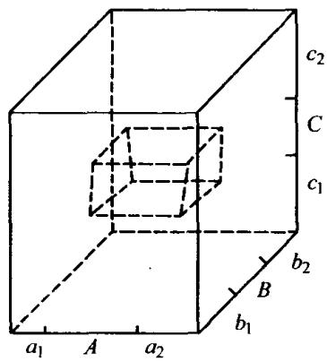

<details>
<summary>text_image</summary>

a₁ A a₂
b₁
B
c₁
C
c₂
</details>

图1

为 $r = 1$

## 三、无额外费用情形下的最优准则

所进行的六次切割是与小长方体的各侧面相对应的, 即每个切割截面中分别包含小长方体的一个侧面. 而小长方体的侧面又能用它与原长方体的相应侧面之间的距离来标识, 是为方便起见, 可将各次切割的位置用字母 $a_1, a_2, b_1, b_2, c_1, c_2$ , 来代表. 并且易见当某次切割的位置为 $x_i$ ( $x$ 取 $a, b, c, i = 1, 2$ ) 时, 此次切去的长方体中垂直于截面的那条边的长度亦为 $x_i$ . 这样每种切割顺序便对应于 $a_1, a_2, b_1, b_2, c_1, c_2$ , 的一个排列, 该排列既可看作字母序列, 又可看作数值序列, 两者的联系将在下文中体现.

此时 $e = 0$ ，又由 §2 知不防设 $r = 1$ ，故水平切割和垂直切割之间具有完全的对称性.

下面我们考虑调整相邻两次切割的顺序是否能够降低费用?这两次切割进行之前材料的大小是确定的,显然无论两次切割的顺序怎样安排,切后得到的长方体都是相同的,于是仅需比较在两种不同的顺序下,这两次切割的截面面积之和即可.

如果这相邻两次切割的截面是平行的,那么无论谁先谁后,两次切割的结果都是把被切的长方体分成三片,保留中间含有小长方体的一片,在两个切割位置上的截面面积是不变的,因此顺序调整与否不影响费用.

如果这相邻两次切割的截面不平行,由于目前所具有的对称性,我们不妨设它们的位置为 $a_{i}$ 和 $b_{j}$ , 而在这两次切割之前的长方体中有关线段的长度如图 2 所示.

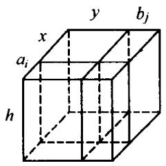

<details>
<summary>text_image</summary>

x
y
bj
a_i
h
</details>

图2

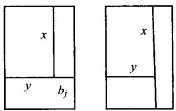

<details>
<summary>text_image</summary>

x
y b_j
x
y
</details>

图3

两种顺序下切割所得到的截面中总有一条边的长是 $h$ ，于是比较截面面积就转化为对各截面中另一条边长度的比较。如图3，在顺序 $\cdots a_{i}b_{j}\cdots$ 下，两截面中非 $h$ 的边的长度之和是；在顺序 $\cdots b_{j}a_{i}\cdots$ 下，相应的和是，两者之差为

$$
(x + y + b _ {j}) - (x + y + a _ {i}) = b _ {j} - a _ {i} \tag {1}
$$

于是当 $a_{i} \geqslant b_{j}$ 时，切割顺序 $\cdots a_{i}b_{j}\cdots$ 的费用相对较少；而当 $a_{i} \leqslant b_{j}$ 时，交换它们的切割顺序后费用较少.

综上所述,我们得到结论:

在切割顺序的数值序列中,如果有相邻两个数,其中前面的数小于等于后面的数,那么交换这两次切割的顺序,加工费用将有所减少或保持不变.

对于任意一种切割方式所对应的切割顺序数值序列,我们对其进行如下形式的调整:只要有相邻的两个数中前面的数小于等于后面的数,便交换它们的顺序.由前述结论,交换后所得序列对应切割方式的加工费用将不多于交换前的费用.我们将这种交换过程分阶段地进行下去:首先将数列中最大的数与原本排在它前面的数一一交换而使其成为第一项,然后再将次大的数逐次向前调整到第二项,依次类推,最终使得此序列成为单调递减的数列.

注意到在调整过程中,加工的费用总是减少或不变的,因此该单调递减序列所对应切割方式的加工费用小于等于任何其它切割方式的费用,从而它就是最优解,换言之,我们得到在 e = 0 情形下的优化准则(称之为有序切割准则):

计算出小长方体各侧面与原长方体相应侧面之间的距离 $a_1, a_2, b_1, b_2, c_1, c_2$ ，并将它们按数值从大到小排列得到一字母序列，据此顺序来逐次选择截面位置的切割方式就是最优的。

以下我们对最优解的唯一性作些讨论.

当 $a_1, a_2, b_1, b_2, c_1, c_2$ 中至少有两个数相等时，将它们排成单调递减数列有多种方式，即相等的那些数之间的先后关系是不确定的，不过由前面的讨论知，交换相邻的相等两数后而引起的切割方式的改变对费用没有影响。故这些递减数列所对应的各种切割方式的加工费用都是相等的，它们均为问题的最优解。

当 $a_1, a_2, b_1, b_2, c_1, c_2$ 这些数互不相同时，只能排成唯一的一个单调递减的数例。如果还有某种切割方式也是最优的，那么与其对应的数值序列在变为单调递减数列的调整过程中，各次交换时应总保持费用不变，于是由(1)式得这种交换只能为同方向的切割位置之间的交换。逆过来看就是说，当单调递减数列中有相邻两项对应同一个方向时，还有其它最优解，例如交换此两项的顺序后所得到的切割方式。

从而我们知道当 $a_1, a_2, b_1, b_2, c_1, c_2$ 这六个数互不相同，且按数值从大到小排成的序列中，相邻两项的字母不同时，最优切割方式是唯一的。

## 四、对可能为最优解的切割方式的讨论

现在考虑在一种切割方式中,截面平行的两次切割的顺序,不妨讨论截面是与长方体的长方向垂直的切割,用§2中的记号,就是位置为 $a_1$ 和 $a_2$ 的切割.设 $a_1, a_2$ 分别是第 $m, n$ 次切割,且 $a_1 > a_2$ .当 $m > n$ 时,交换 $a_1, a_2$ 的次序,得到另一种切割方式.新、旧切割方式相比,各次切割的方向是相同的,因此调整刀具的额外费用不变.易见两方式前 $n$ 次切割的截面面积也是对应相等的,从而这些步骤的费用也相同.如图4,对第 $n$ 次切割后新旧切割方式所得到的两个长方体,将其中一个关于截面作反射后得到的长方体与另一个相比,两者就小长方体的相对位置而言是相同的,在宽和高方向上的长度也是相等的,只是新方式得到的长方体在长方向上缩短了 $a_1 - a_2$ .这两个长方体此后各次切割的位置也是对应相同的,因此新切割方式的截面面积总不超过旧切割方式的相应面积,故按新切割方式的加工费用小于等于按旧切割方式的加工费用.这样我们可以得到如下的论断：

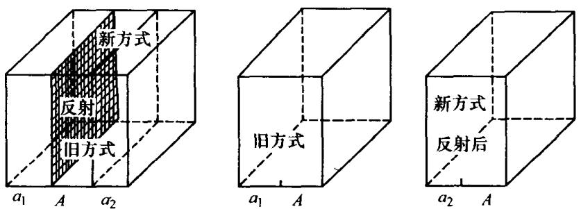  
图 4

有些切割方式对应的数值序列中, 同方向上的两个数总是排在前面的较大(或两数相等), 取出所有这样的切割方式, 其中必定含有最优解.

下面考虑这些切割方式的总数. 切割的位置共有六个, 而六个元素的全排列数为 $6! = 720$ , 因此不同的切割方式本来共有 720 种. 但对于一组已知数据而言, $a_1$ 与 $a_2, b_1$ 与 $b_2, c_1$ 与 $c_2$ 的大小关系是确定的, 故它们在切割顺序数值序列中的相对位置是固定的, 从而需考虑的切割方式可以缩减为 $\frac{6!}{2!2!21} = 90$ 种.

## 五、一般情形下的算法

把一系列切割以后待加工物体所处的状态和这些切割中最后一次垂直切割的方向合在一起作为一个顶点. 如果待加工物体从顶点 $x$ 所代表的状态出发, 经过一次切割 $F$ 以后可以变成另一顶点 $y$ 所代表的状态, 就作一条从顶点 $x$ 到顶点 $y$ 的有向边, 同时把此次切割 $F$ 的加工费用作为这条有向边的长度. 这样就得到一个有向图, 把它称为状态图. 从而问题转化为在状态图中求一条从表示待加工物体原始状态的顶点 (称为起点) 到最终状态的顶点 (称为终点) 的最短路径.

以下是 Dijkstra 提出的寻求最短路径的标号算法 $^{[1]}$ .

## 算法1 (Dijkstra标号算法)

设有向图 $G = V(V, E, \varphi)$ , 其中 $V$ 是图 $G$ 所有顶点的集, $E \subseteq \{\langle a, b \rangle \mid a, b \in G, a \neq b\}$ , 是图 $\varphi$ 中全部有向边的集合, $\varphi(\langle x, y \rangle)$ 是有向边 $\langle x, y \rangle$ 的长度.

现要搜索一条从起点 $S$ 到终点 $t$ 的最短路径. 我们用 $\operatorname{flag}(x)$ 表示顶点 $x$ 是否作了标记, 用 $d(x)$ 表示从 $S$ 仅经过已作标记顶点到达 $x$ 的最短路径的长度, $y$ 表示已作标记的最后一个顶点.

(1) 赋初值

$$
\operatorname{flag} (x) = \text {false} \quad d (x) = + \infty , \quad \forall x \in A,
$$

$$
d (s) = 0, \quad \operatorname{flag} (s) = \text {true}, \quad y = s
$$

(2) 对于所有满足 $\operatorname{flag}(x) = \operatorname{false}$ 的顶点 $x$ , 重新定义 $d(x)$ 如下

$$
d (x) = \min \{d (x), d (y) + \varphi (\langle y, x \rangle) \} \tag {2}
$$

当 $\langle y, x \rangle \notin E$ 时，认为 $\varphi(\langle y, x \rangle) = \infty$ .

(3) 如果所有满足 $\operatorname{flag}(x)' = \operatorname{false}$ 的顶点 $x$ 都成立, 则不存在从 $S$ 到 $t$ 的通路, 算法终止; 否则取 $y = x_0$ , 其中 $x_0$ 满足

$$
d \left(x _ {0}\right) = \min _ {x \in V} \{d (x) \}, \tag {3}
$$

$$
\operatorname{flag} (x) = \text {false}
$$

然后令 flag( $x_{0}$ ) = true.

(4) 如果 $\mathrm{flag}(t) = \mathrm{true}$ , 则找到一条从 $S$ 到 $t$ 的最短路径, 算法终止; 否则重复进行步骤 (2), 直到最后形成一条从 $S$ 到 $t$ 的最短路径.

结合此具体问题的特殊性还能对算法1作出改进.首先根据§4中的结论,沿同一方向的两次切割的顺序不妨认为是确定的,于是可从状态图中删去一些边.其次,如果把为达到与某顶点相应的状态而需要进行的切割次数作为该顶点的层数,那么状态图便具有层次结构. 于是可以从第零层出发, 以层次代替标号, 采用按广度搜索的方法, 寻找最短路径. 从而得到下面的算法.

## 算法2 层次搜索算法

设有向图 $G = (V, E, \varphi, \psi)$ , 其中 $V$ 是图 $G$ 所有顶点的集合, $E \subseteq \{\langle x, y \rangle \mid x, y \in G\}$ , 是图 $G$ 中全部有向边的集合, $\varphi(\langle x, y \rangle)$ 是有向边的 $\langle x, y \rangle$ 长度, $\psi(x)$ 为顶点 $x$ 的层次.

现要搜索一条从起点 $S$ 到终点 $t$ 的最短路径，显然有 $\psi(s) = 0, \psi(t) = 6$ . 我们用 $d(x)$ 表示从 $S$ 仅经过层次比 $\psi(x)$ 小的顶点到达 $x$ 的最短路径的长度，用 level 表示搜索的层次， $\mathrm{back}_{\mathrm{step}}(y)$ 代表从起点 $S$ 到顶点 $y$ 的最短路径中比 $y$ 的层次低一级的顶点.

(1) 赋初值: $d(x) = +\infty, \forall x \in V; d(s) = 0, \text{level} = 1$ .  
(2) 对于所有满足 $\psi(y) = \text{level}$ 的顶点 $y$ , 重新定义 $d(y)$ 如下

$$
d(y) = \min \left\{d(y), \min_ {\substack {x \in V \\ \langle x, y \rangle \in E}} \left\{d(x) + \varphi (\langle x, y \rangle) \right\} \right\} \tag{4}
$$

如果 $d(y)$ 发生了变化，则令 $\mathrm{back}_{\mathrm{step}}(y)$ 为使达到最小值的顶点 $x$ .

(3) 如果 level 小于 6, 重复进行步骤 (2), 直到 level = 6.  
(4) 利用 $back_{step}$ 中记录的信息, 就得到一条从 s 到 t 的最短路径, 同时 $d(t)$ 就是这条路径的长度.

对于确定的 $e$ 值, 用算法2可以很容易地求出一种最优切割方式. 算法2本质上是穷举算法一种改进, 比简单地逐一枚举速度要快. 但具体到这里, 问题的规模很小, 在 §4 中我们已经把需考虑的切割方式减少到90种, 因此采用下述的分类枚举法也是可行的, 并且它能够给出当 $e$ 在一定范围内变化时的全部最优解.

垂直切割的方向有两个,因此至少要调整刀具一次.垂直切割共进行四次,故调整刀具的次数至多是4-1=3.于是额外费用有e,2e,3e三种可能.由对称性易见,在那90种候选的切割方式中,额外费用为e,2e,3e的各有30种.我们把切割费用和额外费用分开考虑,便得到如下的算法3.

## 算法3 分类枚举法

(1) 根据给定的数据 $a_1, A, a_2, b_1, B, b_2, c_1, C, c_2$ ，对 90 种候选的切割方式逐一计算出六次切割的费用之和。  
(2) 对这些切割方式, 按照它们额外费用的值 $e, 2e, 3e$ 分成三类, 在各类的 30 种切割方式中, 分别将切割费用最少的方式全部选出. 这三个最小费用分别记为 $d_{1}, d_{2}, d_{3}$ .  
(3) 对 $e$ 分情况讨论, 比较出 $d_{1} + e, d_{2} + 2e, d_{3} + 3e$ 中的最小值, 与此相对应的切割方式即为最优的. 我们编制了 $\mathrm{C}_{++}$ 程序 ccss.cpp 和 qj.cpp 来分别实现算法 2 和算法 3 (略).

## 六、各种优化准则的讨论

当调整刀具的额外费用 $e \neq 0$ 时, 对于适当数据, §4 中提到的 90 种候选切割方式都有可能成为最优解. 现在已有如下的两种优化准则.

局部最优准则:每次选择一个包括调整刀具费用在内的加工费用最少的待切割面进行切割.

有序切割准则: 按照 §3 中给出的有序切割准则确定切割的次序.

从 §5 中的分析可以知道,最优的切割次序是从整体来考虑切割和调整刀具的费用而得到的. 对于有序切割准则, 它忽略了调整刀具的费用, 只考虑切割的费用, 可以肯定当调整刀具的费用与切割的费用的比值 $t$ 不大时, 它是非常有效的; 如果 $t$ 较大, 则由此给出的切割方式就有可能不够理想. 对于局部最优准则, 它只注意了当前的情况, 缺乏全局的考虑, 因此有一定的局限性. 但另一方面它同时考虑了切割的费用和调整刀具的费用, 所以具有一定的稳定性, 不会出现非常差的情形.

注意到在加工过程中,如果有一个垂直方向的两次切割都已经完成,那么在以后的切割中,不论怎么安排切割次序,调整刀具的费用都不会发生变化,所以这时可以忽略调整刀具的费用,按照有序切割的准则安排后面的切割次序.于是我们考虑先按照局部最优准则,再按照有序切割准则安排切割次序,从而得到一种新的准则.由于有序切割准则的操作十分方便,并且在某些情况下能够得到非常好的结果,因此不妨再把新准则的结果与有序准则的结果相比较,选择一种较好的切割次序.

综合优化准则(1)先按照局部最优的准则安排切割次序,直到有一个垂直方向的两次切割都已经完成,再按照有序切割准则安排剩下的切割次序,并计算出相应的费用.(2)按照有序切割准则安排切割次序,并计算相应的费用.(3)从前两种方案中选择加工费用较少的切割次序进行切割.

为了给出量上的比较,我们进行了随机模拟.具体算法为:产生九个(0,1]区间上和一个[0,t]区间上均匀分布的随机数,依次表示待加工长方体的长、宽、高分别被切割成三段的长度和调整刀具的额外费用,其中t是反映调整刀具的额外费用与切割费用比值的参数,并约定单位面积的切割费用是一个单位,然后对这三种优化准则各自确定的切割方式,分别计算出它们的费用比实际最优切割方式的费用多花销的百分比,称为浪费率,浪费率越接近0,说明此准则的优良程度越好.依次令t为1和10,各进行1000次随机实验,再利用MATLAB软件工具箱中的数据处理函数,得到各种准则在不同情况下浪费率的均值(见表1)和分布图象(略).

表 1

<table><tr><td></td><td> $t = 1$ </td><td> $t = 10$ </td></tr><tr><td>局部最优准则</td><td> $t = 1b$ </td><td> $t = 10$ </td></tr><tr><td>有序切割准则</td><td>14.34%</td><td>44.34%</td></tr><tr><td>综合优化准则</td><td>3.49%</td><td>3.89</td></tr></table>

从这些数据和图象(略)中可以看出: 当 t = 1 时, 局部最优准则浪费率的均值最大, 并且分布也最分散, 效果不好; 有序切割准则的浪费率均值低于 10%, 并且它的分布主要集中在 0 到 20% 之间, 效果还可以; 综合优化准则的浪费率均值非常低, 并且它的分布集中在 10% 以内, 效果很好.

当 $t = 10$ 时, 局部最优准则的浪费率均值低于 $10\%$ , 效果比 $t = 1$ 时有所提高; 有序切割准则的浪费率的期望急剧增加, 分布也很分散, 效果很差; 综合优化准则的浪费率分布与 $t = 1$ 时相比没有显著变化. 由此可见, 随机模拟实验的结果与我们最初的分析是一致的.

## 七、实例分析

我们考虑这样一组实例 $a_1 = 6, A = 3, a_2 = 1, b_1 = 7, B = 2, b_2 = 5.5, c_1 = 9, C =$

$4, c_{2} = 6 r$ 和 $e$ 的取值如表2所示.

其中各线段长的单位为厘米，e 的单位是元，垂直切割的费用为每平方厘米 1 元。在下文中，长度的单位均为厘米，面积的单位为平方厘米，费用的单位为元。

如图1,与 $a_1, a_2, b_1, b_2, c_1, c_2$ 相对应的切割位置分别产生小长方体的左侧面、右侧面、前侧面、后侧面、下底面和上底面，下面我们用这些方位来描述切割的顺序.

表 2

<table><tr><td>情形 a</td><td>情形 b</td><td>情形 c</td><td>情形 d</td></tr><tr><td> $r = 1, e = 0$ </td><td> $r = 1.5, e = 0$ </td><td> $r = 8, e = 0$ </td><td> $r = 1.5, 2 \leqslant e \leqslant 15$ </td></tr></table>

对于前三种情形,根据 §2 中对 $r$ 进行的讨论和 §3 中给出的优化准则,其最优解可直接写出,结果如下.

情形 a 此时有 $c_{1} > b_{1} > a_{1} = c_{2} > b_{2} > a_{2}$ , 故最优切割方式如表 3(略) 所示. 总的截面面积是 374, 即加工费用总计是 374 元.

情形 b 因为 $r = 1.5$ ，故 $c_1, C, c_2$ 应调整为 $c_1 = 9 \div 1.5 = 6, C = 4 \div 1.5 = 8/3, c_2 = 6 \div 1.5 = 4$ ，且每平方厘米的切割费用为 $(r = 1.5)$ 元。现在有 $b_1 > c_1 = a_1 > b_2 > c_2 > a_2$ ，最优切割方式如表 4(略) 所示。

总的截面面积是 875/3, 加工费用为 $875/3 \times 1.5 = 437.5$ 元.

情形 c 此时 $r = 8$ ，所以 $c_{1}, C, c_{2}$ 应调整为 $c_{1} = 9 \div 8 = 1.125, C = 4 \div 8 = 0.5, c_{2} = 6 \div 8 = 0.75$ ，且每平方厘米的切割费用为 $(r = 8)$ 元。显然有 $b_{1} > a_{1} > b_{2} > c_{1} > a_{2} > c_{2}$ ，故最优切割方式如表 5(略) 所示。

截面面积总计是 67.5625, 加工费用为 $67.5625 \times 8 = 540.5$ 元.

根据 §3 中对于最优解唯一性的分析可知,前两种情形下的最优切割方式都有两种,另一种切割方式分别是由 a. 交换第三刀和第四刀; b. 交换第二刀和第三刀的切割位置而得到的; 而情形 c 下的最优解是唯一的.

情形 d 同情形 b, 应先将 $c_{1}, C, c_{2}$ 分别调整为 $c_{1} = 6, C = 8/3, c_{2} = 4$ 且每平方厘米的切割费用为 1.5 元.

运用 §5 中的算法 3 可得出需调整刀具 1 至 3 次时的最小切割费用分别是 $d_{1} = 442.5$ 元, $d_{2} = 456.5$ 元, $d_{3} = 437.5$ 元, 由于 $d_{2} > d_{1}$ , 因此总有 $d_{2} + 2e > d_{1} + e$ . 于是对 $e$ 分情况讨论时只需比较 $d_{1} + e$ 和 $d_{3} + e$ 即可. 与 $d_{3}$ 相应的切割方式在表(略)中给出, 与 $d_{1}$ 相应的切割方式见下表, 并且是唯一的.

表 3

<table><tr><td>切割序号</td><td>第一刀</td><td>第二刀</td><td>第三刀</td><td>第四刀</td><td>第五刀</td><td>第六刀</td></tr><tr><td>切割位置</td><td>前</td><td>下</td><td>后</td><td>左</td><td>上</td><td>右</td></tr><tr><td>截面边长</td><td>10×38/3</td><td>10×7.5</td><td>10×20/3</td><td>2×20/3</td><td>4×2</td><td>2×8/3</td></tr><tr><td>截面面积</td><td>380/3</td><td>75</td><td>200/3</td><td>40/3</td><td>8</td><td>16/3</td></tr><tr><td colspan="2">总截面面积</td><td>295</td><td colspan="2">总加工费用</td><td>295×1.5=442.5元</td><td></td></tr></table>

解关于 $e$ 的方程 $d_{1} + e = d_{3} + 3e$ 得 $e = 2.5$ . 于是我们得到结果：

当 $2 \leqslant e \leqslant 2.5$ 时，最优切割方式有“前下左后上右”和“前左下后上右”两种，最小费用是 $437.5 + 3e$ 元；

当 $e = 2.5$ 时，最优切割方式有“前下左后上右”、“前左下后上右”和“前下后左上右”三种，最小费用均为445元；

当 $2.5 \leqslant e \leqslant 15$ 时，最优切割方式为“前下后左上右”，最小费用是 $442.5 + e$ 元.

## 八、模型的评价

优点1. 对于 $e = 0$ 的情形给出了确切、简明的最优准则；而在 $e \neq 0$ 时，所述的优化准则在概率意义下亦接近于最优。2. 通过构造状态图给切割问题以图论描述，随后利用寻求最短路径的算法求解的过程，不仅适用于长方体形状材料的切割，而且可以处理其它各种形状的切割问题，具有一般性。当计算的规划增大时，它与单纯的穷举算法相比，能够显著地提高效率。3. 分类枚举的算法对求解此问题也具有实用性，在尺寸给定的情况下，一次搜索便能够得出 $e$ 取各种值时的最优切割方式。4. 采用随机模拟对各优化准则进行的评价是较为全面和合理的。

缺点:对于 e = 0 的情形,尚没有得到确定的最优准则.

## 参考文献

[1] 陈森发, 网络模型及其优化, 东南大学出版社, 北京, 1992 年

对于数学而言尤其如此:数学存在的主要原因是它具有通过抽象过程将一个领域的思想转移到另一个领域的能力。

《Michael F. Atiyah Collected Works》, v. 1, p. 358. (这是Atiyah在会议ESF Conference in Colma上的报告), Cambridge Univ. Press, 1985, 24 - 41; 数学译林, v. 10 (1991), no. 3, p. 238.

# 截断切割中的最优排列问题

## 华东理工大学 俞文鯖

## 复旦大学 谭永基

最优排列问题广泛地出现在生产作业调度中，出现在各种生产实践与日常生活中，1997年全国大学生数学建模竞赛B题就是一例。在本文中，我们结合阅卷情况，简述一些有关该题解答的要点。

## 一、关于建立数学模型与计数

先将该题大略复述如下：

从一个长方体加工出一个尺寸与位置预定的长方体（这两个长方体的对立表面是平行的），通常要经过六次截断切割。设水平切割单位面积的费用是垂直切割的 $r$ 倍；且当先后二次垂直切割的平面（不管它们之间是否穿插水平切割）不平行时，因调整刀具需额外费用 $e$ 。试设计一种切割方式，使加工费用最少。

设这六个切割面分别位于左、右、前、后、上、下，可将它们相应的编号为1,2,3,4,5,6.这样，一个切割方式就可以表示为加工面 $f\{1,2,3,4,5,6\}$ 的一个排列，这种排列的全体记为 $P_{6}$ ，其中任一排列可记为 $\sigma = \sigma_{1}\sigma_{2}\sigma_{3}\sigma_{4}\sigma_{5}\sigma_{6}$ . 根据题意，目标函数 $f(\sigma)$ 定义在 $P_{6}$ 上.作为总的切割费用， $f(\sigma)$ 包括两部分，一部分是加权切割面积之和；另一部分是刀具调整费用之和．为了清楚地表达题意，在建立数学模型时，应尽量将 $f(\sigma)$ 用显式写出．从体现变量依赖关系的角度来看，我们有：

$$
f (\sigma) = \sum_ {i = 1} ^ {6} w (\sigma_ {i}) S (\sigma_ {1}, \sigma_ {2}, \dots , \sigma_ {i}) + q (\sigma) e, \tag {1}
$$

其中 $\sigma = \sigma_{1}\sigma_{2}\sigma_{3}\sigma_{4}\sigma_{5}\sigma_{6}$ ，各项含义如下：

$S(\sigma_{1},\sigma_{2},\cdots,\sigma_{i})$ 表示在加工面 $\sigma_{1},\sigma_{2},\cdots,\sigma_{i-1}$ 进行切割之后，加工面 $\sigma_{i}$ 的切割面积.

$w(\sigma_{i})$ 为相应切割面的权，根据题意有：

$$
w (1) = w (2) = w (3) = w (4) = 1, w (5) = w (6) = r.
$$

$q(\sigma)$ 为加工面排列 $\sigma$ 所相应的刀具调整次数. 记 $\sigma'$ 为 $\sigma$ 中将 5 与 6 移去的排列, 称为 $\sigma$ 的简约排列, 如 $\sigma = (1,5,3,4,6,2)$ , 有 $\sigma' = (1,3,4,2)$ . 显然 $q(\sigma)$ 只与 $\sigma'$ 有关, 仍记 $q(\sigma)$ . 根据题意, 有

$$
q (1 2 3 4) = q (3 4 1 2) = 1, \quad q (1 3 4 2) = q (3 1 2 4) = 2,
$$

$$
q (1 3 2 4) = q (3 1 4 2) = 3.
$$

关于 $f(\sigma)$ 的上述表示形式中， $S(\sigma_1, \sigma_2, \cdots, \sigma_i)$ 是某状态下加工面 $\sigma_i$ 的切割面积。它可由原始长方体经加工面 $\sigma_1, \sigma_2, \cdots, \sigma_{i-1}$ 进行切割之后所得的长方体的几何尺寸给出（与它们的次序无关，请思考）。这些几何尺寸可用递推的形式写出来，进一步的描述在这里从略。

于是，我们可以把问题归结为在 $P_{6}$ 上求 $f(\sigma)$ 的最小化问题. 当然，也可采用动态规划或最短路线的图论模型来描述该问题，但关键是要把可行域与目标函数描述清楚.

例 可用二进制向量 $(x_{1}, x_{2}, \cdots, x_{6})$ 来描述切割过程中的状态，其中 $x_{i}=0$ 表示加工面 $i$ 未被切割， $x_{i} = 1$ 表示加工面 $i$ 已被切割；这样，恰有 $k$ 个加工面已被切割的状态集合便是

$$
\left\{\left(x _ {1}, x _ {2}, \dots , x _ {6}\right) \Big | \sum_ {i = 1} ^ {6} x _ {i}   =   k  , x _ {i}   =   0   \text {或}   1 \right\}.
$$

它可作为切割过程的第 $k$ 个阶段，进一步的描述亦从略.

在问题 $\min \{f(\sigma) | \sigma \in P_6\}$ 中可行域的规模为 $|P_6| = 720$ ，也就是不同切割方式的总数。由于相邻二个平行面的次序交换不影响总费用 $f(\sigma)$ ，在此观点下，可将可行域的规模缩小为426，该数字可由容斥原理算得。同时，考虑切割面 $k$ 离开相应边界面的距离 $h_k$ ，把它称为切割厚度。不失一般性，可以假设：

$$
h _ {1} \geqslant h _ {2}, \quad h _ {3} \geqslant h _ {4}, \quad h _ {5} \geqslant h _ {6}. \tag {2}
$$

当(2)式不成立时，假如 $h_1 < h_2$ ，则把左右次序交换一下便可，其余可类似处理．在(2)成立时，我们只需考虑 $P_6$ 的一个子集，即只考虑1在2前、3在4前、5在6前的那些排列；该子集的规模为 $720 / 2^3 = 90$ ，进一步减少规模的分析，将在三中叙述.

## 二、关于 $e = 0$ 时的优化方法

这时的优化准则为：将 $h_1, h_2, h_3, h_4, h_5 / r, h_6 / r$ 排列成简单不增序列，相应的指标序列即为切割面的最优序列.

通过计算实验，是发现这个准则的一个途径。在证明中，不妨设 r=1，否则在垂直方向作一个因子为 1/r 的变换，其切割面积和的最小化相当于原来的加权面积和的最小化。这样，在证明中便不妨假设 $w(i)=1\ (i=1,2,\cdots,6)$ ，同时现在考虑 e=0 的情形，于是(1)式成为：

$$
f (\sigma) = \sum_ {i = l} ^ {6} S (\sigma_ {1}, \sigma_ {2}, \dots , \sigma_ {i}), \tag {3}
$$

其中 $\sigma = \sigma_{1}\sigma_{2}\sigma_{3}\sigma_{4}\sigma_{5}\sigma_{6}$

下列性质被称为相邻交换原则：设 $\sigma=(\cdots,k,j,\cdots)$ ， $h_{j}\geqslant h_{k}$ ，将相邻加工面 k 与 j 交换后得 $\sigma'=(\cdots,j,k,\cdots)$ ，则对(3)给出的函数，必定成立

$$
f (\sigma^ {\prime}) \leqslant f (\sigma). \tag {4}
$$

在证明这个原则后，就可以得到上述优化准则了。这是因为，从任何一个最优解出发，如 $h_j$ 最大，切割面 $j$ 通过交换总可调整至第一位，由于(4)式，可保持为最优解；对 $h_i$ 次大者，亦可以这样做，等等。

以下是相邻交换原则的简单证法。设相应于切割方式 $\sigma = (\dots, k, j, \dots)$ 中加工面 $k, j$ 的切割面积为 $S_k, S_j$ ，设相应于切割方式 $\sigma' = (\dots, j, k, \dots)$ 中加工面 $j, k$ 的切割面面积为 $S'_j, S'_k$ 。由几何直观可知

$$
h _ {k} S _ {k} + h _ {j} S _ {j} = h _ {j} S _ {j} ^ {\prime} + h _ {k} S _ {k} ^ {\prime}. \tag {5}
$$

事实上，上式二者均等于在加工方式 $\sigma$ （或 $\sigma^{\prime}$ )之下加工面 $k$ 与 $j$ 被切割之前与被切割之后的体积差.由(5)移项即得

$$
h _ {k} (S _ {k} - S _ {k} ^ {\prime}) = h _ {j} (S _ {j} ^ {\prime} - S _ {j}) > 0,
$$

由 $h_j \geqslant h_k$ 及上式，我们得到 $S_k - S'_k \geqslant S'_j - S_j$ ，即

$$
S _ {j} ^ {\prime} + S _ {k} ^ {\prime} \leqslant S _ {k} + S _ {j}. \tag {6}
$$

但 $f(\sigma') - (S'_j + S'_k)$ 与 $f(\sigma) - (S_k + S_j)$ 所含有的各项均相同，于是由(6)便有结论(4).当然，从有关四个切割面积的表达式着手，也可证明(6)式.

由(5)及 $h_j \geqslant h_k$ 得出(6)，相关条件是 $S_k > S'_k$ . 个别参赛队提到，这个结论可以推广到多项相加的情形。我们认为，这是没有根据的，除非能发掘足够的相关条件。

逐项选择最小费用切割面的准则，可以用例子说明不能达到最优，但较之随机选择切割面，还是要好些.

## 三、关于 $e \neq 0$ 时的优化方法

用表达式(1)建立截断切割的数学模型之后，通常可采用穷举法或分支定界法来求解。在用分支定界法求解时，每一分支相当于前面几个面的切割方式已经确定的情形。这时，后面几个切割面还可以用多种方式排列，相应费用的下界可由两部分和来表示。一部分为加权切割面的面积之和，它可由 $e = 0$ 时的优化准则得到；另一部分为刀具调整费用的下界，它总是零或 $e$ 。

借助于 $e = 0$ 时的解来求 $e \neq 0$ 时的解，是一种更为简便的方法。当 $e = 0$ 时的最优解 $\sigma = \sigma_{1} \sigma_{2} \sigma_{3} \sigma_{4} \sigma_{5} \sigma_{6}$ 的刀具调整次数 $q(\sigma)$ 为1时， $\sigma$ 使(1)中的二项同时达到最小值。因此 $\sigma$ 亦必然使(1)达到最小。当 $\sigma$ 的刀具调整次数 $q(\sigma)$ 为2时，则只能断言 $\sigma$ 使(1)在所有刀具调整次数大于1的切割方式中达到最小。为求(1)的整体最小，还补充考虑刀具调整次数 $q(\sigma)$ 为1的切割方式。前面提及，不妨设(2)式成立。这时，可只考虑1在2前、3在4前、5在6前的那些切割方式。在刀具调整次数为1时，在那些切割方式中，加工面1,2,3,4的排列方式只可能是1234与3412。

然后将加工面5与6按照相邻交换原则插入到适当的位置，可得若干个候选的切割方式，它们相当于一定意义的局部解。这些局部解与上述 $\sigma$ 组成了候选解；比较所有候选解，便得到 $e \neq 0$ 时的最优的切割方式。由于 $h_i$ 按排列1234的次序至多有2个单调下降段（因为(2))，可知加工面5与6按相邻单调下降方式插入时，至多可得3个局部解。对排列3412衣如此。所以， $q(\sigma) = 2$ 时候选解总数至多为 $3 + 3 + 1 = 7$ 。当 $\sigma$ 的刀具调整次数 $q(\sigma)$ 为3时，除了补充考虑刀具调整次数为1的切割方式外，还必须补充考虑刀具调整次数为2的切割方式，它们可由加工面5与6按照相邻交换原则插入到1342与3124。

它们各具2个单调下降段(二者的插入方式各不超过3)，或者，二者之一具有3个单调下降段，而另一则必定只有1个单调下降段（前者的插入方式不超过6，后者的插入方式为1，总数不超过7），所以候选解的总数不超过 $7+6+1=14$ .

个别参赛队认为， $e = 0$ 时的优化准则可以推广到 $e \neq 0$ 的情况。所设想的方法是：

(i) 将 $h_1, h_2, h_3, h_4, h_5 / r, h_6 / r$ 作为判据，先在它们中取最大者，以相应的加工面作为第一个切割面.  
(ii) 以后每次选择切割面时，如某个切割面意味着调整刀具，则将该判据减去 $e$ 的某个倍数，否则仍用原来的判据。在修改判据之后，仍取一个判据最大者所相应的加工面作为下一个切割面。

我们指出，上述方法是不对的，(i)就可能导致错误的结果。下面举一个二维的例子，将 $e$ 取得相当大，将各个加工面（此时为加工线）的权均取为相同。于是，最优解必在刀具调整次数为1的切割方式得到，只要比较以下二值即可：

$$
f (1 2 3 4) = C + 2 h _ {3} + 2 h _ {4} + e, \tag {7}
$$

$$
f (3 4 1 2) = C + 2 h _ {1} + 2 h _ {2} + e, \tag {8}
$$

其中 $C$ 为成品长方形的周长， $h_1, h_2, h_3, h_4$ 的意义同前，可使它们的取值满足：

$$
h _ {1} > h _ {3} > h _ {4} > h _ {2}, \quad h _ {1} + h _ {2} <   h _ {3} + h _ {4}. \tag {9}
$$

按上述(i)，加工线1应排在第一位，但由上述(7)\~(9)知，只有 $\sigma = 3412$ 才是最优解.

## 四、推广

按切割厚度递减逐次选择切割面的原则,对于题意中的长方体情形已被证明能达到切割面积和的最优.在实际运用中,当从任何一个物体通过多次截断切割加工成为一个凸多面体时,可以设想,推广运用这一准则,按平均切割厚度递减的准则确定切割方式,也能达到较好的效果.但对此一般情形,要想得到最优解,还必须能取得在各个加工面切割时的截面积数据,以形成明确的数学问题,并进行深入的分析,这是值得探讨的.

不过，在二维的一般情形，截断切割问题可以提得相当明确。设要从一个平面区域内割出一个预定的 $m$ 凸多边形（其非相邻边的延长线在该平面区域内不相交），单独地沿第 $i$ 边切割时，可得到3个长度：第 $i$ 边的边长 $l_{i}$ ，第 $i$ 边二侧的长度 $x_{i}$ 与 $y_{i}$ 。已知上述 $3m$ 个长度，如何确定这 $m$ 个边的切割方式，使切割总长度最少？这就是本文末尾留给读者的一个问题。

“技术是人类活动的一个专门领域 …。技术一词出自希腊文 techne‘工艺、技能’与 logos‘词、讲话’的组合，意思是对造型艺术和应用技术进行论述。当它 17 世纪在英国首次出现时，仅指各种应用技艺。到 20 世纪初技术的含义逐渐扩大，它涉及到工具、机器及其使用方法和过程。到 20 世纪后半期，技术被定义为‘人类改变或控制客观环境的手段或活动’。”

简明不列颠百科全书，中国大百科全书出版社，北京·上海：1985，6－1986，8.

## 13. 投资的收益和风险(CUMCM 1998 年 A 题)

市场上有 n 种资产(如股票、债券、……) $S_{i}(i=1,\cdots,n)$ 供投资者选择, 某公司有数额为 M 的一笔相当大的资金可用作一个时期的投资. 公司财务分析人员对这 n 种资产进行了评估, 估算出在这一时期内购买 $S_{i}$ 的平均收益率为 $r_{i}$ , 并预测出购买 $S_{i}$ 的风险损失率为 $q_{i}$ . 考虑到投资越分散, 总的风险越小, 公司确定, 当用这笔资金购买若干种资产时, 总体风险可用所投资的 $S_{i}$ 中最大的一个风险来度量.

购买 $S_{i}$ 要付交易费, 费率为 $p_{i}$ , 并且当购买额不超过给定值 $u_{i}$ 时, 交易费按购买 $u_{i}$ 计算 (不买当然无须付费). 另外, 假定同期银行存款利率是 $r_{0}(r_{0} = 5\%)$ , 且既无交易费又无风险.

1) 已知 $n = 4$ 时的相关数据如下：

<table><tr><td> $S_i$ </td><td> $r_i(\%)$ </td><td> $q_i(\%)$ </td><td> $p_i(\%)$ </td><td> $u_i(元)$ </td></tr><tr><td> $S_1$ </td><td>28</td><td>2.5</td><td>1</td><td>103</td></tr><tr><td> $S_2$ </td><td>21</td><td>1.5</td><td>2</td><td>198</td></tr><tr><td> $S_3$ </td><td>23</td><td>5.5</td><td>4.5</td><td>52</td></tr><tr><td> $S_4$ </td><td>25</td><td>2.6</td><td>6.5</td><td>40</td></tr></table>

试给该公司设计一种投资组合方案,即用给定的资金,有选择地购买若干种资产或存银行生息,使净收益尽可能大,而总体风险尽可能小.

2）试就一般情况对以上问题进行讨论，并利用以下数据进行计算.

<table><tr><td> $S_i$ </td><td> $r_i (\%)$ </td><td> $q_i (\%)$ </td><td> $p_i (\%)$ </td><td> $u_i (\text{元})$ </td></tr><tr><td> $S_1$ </td><td>9.6</td><td>42</td><td>2.1</td><td>181</td></tr><tr><td> $S_2$ </td><td>18.5</td><td>54</td><td>3.2</td><td>407</td></tr><tr><td> $S_3$ </td><td>49.4</td><td>60</td><td>6.0</td><td>428</td></tr><tr><td> $S_4$ </td><td>23.9</td><td>42</td><td>1.5</td><td>549</td></tr><tr><td> $S_5$ </td><td>8.1</td><td>1.2</td><td>7.6</td><td>270</td></tr><tr><td> $S_6$ </td><td>14</td><td>39</td><td>3.4</td><td>397</td></tr><tr><td> $S_7$ </td><td>40.7</td><td>68</td><td>5.6</td><td>178</td></tr><tr><td> $S_8$ </td><td>31.2</td><td>33.4</td><td>3.1</td><td>220</td></tr><tr><td> $S_9$ </td><td>33.6</td><td>53.3</td><td>2.7</td><td>475</td></tr><tr><td> $S_{10}$ </td><td>36.8</td><td>40</td><td>2.9</td><td>248</td></tr><tr><td> $S_{11}$ </td><td>11.8</td><td>31</td><td>5.1</td><td>195</td></tr><tr><td> $S_{12}$ </td><td>9</td><td>5.5</td><td>5.7</td><td>320</td></tr><tr><td> $S_{13}$ </td><td>35</td><td>46</td><td>2.7</td><td>267</td></tr><tr><td> $S_{14}$ </td><td>9.4</td><td>5.3</td><td>4.5</td><td>328</td></tr><tr><td> $S_{15}$ </td><td>15</td><td>23</td><td>7.6</td><td>131</td></tr></table>

# 投资组合与模糊规划模型

王正方 赵文明 倪德娟

(杭州电子工业学院, 杭州 310027)

指导教师 数学建模教练组

编者按 本文能针对问题的要求通过分析,建立正确的数学模型,并用偏好系数加权法把双目标优化问题化为单目标优化问题,计算得到正确的结果.作者还用模糊线性规划的方法来求解,进行比较.

摘要 本文讨论了投资的风险与收益的问题. 首先我们给出了一个比较完整的模型, 然后, 考虑投资数额相当大时的一个近似处理模型, 并分别用偏好系数加权法和模糊线性规划法进行了求解.

## 一、问题的提出(略)

## 二、基本假设(略)

## 三、符号说明

M: 投资者拥有的全部资金； $S_{i}$ : 供投资者选择的资产；

$r_{i}$ : 资产 $S_{i}$ 的平均收益率； $p_{i}$ : 购买资产 $S_{i}$ 要付交易费费率；

$q_{i}$ : 购买资产 $S_{i}$ 的风险损失率； $r_{0}$ : 同期银行利率；

$w_{i}$ : 投资于资金 $S_{i}$ 的比例。(其余符号在文中陆续引出)

## 四、问题的分析和模型的建立

设银行存款也是等价于市场上供投资者选择的资产之一.存银行记为 $S_0$ ，而它相应的风险损失率 $q_{0}$ 和交易费 $p_0$ 均为0，经以上变换，存银行生息与投资市场上的资产可以统一处理.

设投资于第 i 种资产所付交易费为 $A_{i}(i=0,1,\cdots,n)$ ,

$$
A _ {i} = p _ {i} \times \max (M w _ {i}, u _ {i} f (w _ {i})),
$$

其中

$$
f (w _ {i}) = \left\{ \begin{array}{l l} 0, & (w _ {i} = 0), \\ 1, & (w _ {i} > 0). \end{array} \right.
$$

上式中，如不投资于 $S_{i}$ ，则 $w_{i} = 0$ ，可得 $A_{i} = 0$ ，如投资，则在 $Mw_{i}$ 与 $u_{i}$ 两者中取大的一个，然后再乘以相应的交易费率即为所付的交易费，这完全符合了实际要求。

投资总额 $M$ 可分为两部分:一部分用来付交易费共为 $\sum_{i=0}^{n} A_i$ , 另一部分则可用来购买各种资产共为 $\sum_{i=0}^{n} M w_i$ . 显然有 $\sum_{i=0}^{n} A_i + \sum_{i=0}^{n} M w_i = M$ . 而投资 $M$ 相应的净收益 $R = \sum_{i=0}^{n} r_i M w_i$ $-\sum_{i=0}^{n} A_{i} = \sum_{i=0}^{n} (r_{i} + 1) M w_{i} - M.$ 总体风险大小为 $C = \max_{0 \leqslant i \leqslant n} (q_{i} w_{i} M)$ , 该式体现出了投资越分散, 风险值越小, 且用所投资的 $S_{i}$ 中最大的一个风险来度量总体风险.

经以上分析,可建立如下双目标规划模型:

$$
\begin{array}{l} \max R = \sum_ {i = 0} ^ {n} (r _ {i} + 1) M w _ {i} - M, \min C = \max _ {0 \leqslant i \leqslant n} (q _ {i} \times M w _ {i}) \\ \mathrm{s.t.} \left\{ \begin{array}{l} \sum_ {i = 0} ^ {n} A _ {i} + \sum_ {i = 0} ^ {n} M w _ {i} = M, \\ w _ {i} \geqslant 0, \end{array} \right. \\ \end{array}
$$

其中 $A_{i} = p_{i}\times \max (Mw_{i},u_{i}\times f(w_{i}))$ ， $f(w_{i}) = \left\{ \begin{array}{ll}0, & (w_{i} = 0),\\ 1, & (w_{i} > 0). \end{array} \right.$

## 五、模型的求解

由于题目给出的是一笔相当大数额的资金 $M$ ，而在 $M$ 相当大时，如对 $S_{i}$ 有投资，可近似认为 $Mw_{i}$ 均大于相应的 $u_{i}$ ，于是模型的约束条件简化为：

$$
\left\{ \begin{array}{l} \sum_ {i = 0} ^ {n} w _ {i} (1 + p _ {i}) = 1, \\ w _ {i} \geqslant 0, \end{array} \right.
$$

于是原模型的求解等价为

$$
\begin{array}{l} \min R = M (\sum (r _ {i} + 1) w _ {i} - 1), \min C = M (\max _ {0 \leqslant i \leqslant n} q _ {i} w _ {i}), \\ \text {s.t.} \left\{ \begin{array}{l} \sum_ {i = 0} ^ {n} (1 + p _ {i}) w _ {i} = 1, \\ w _ {i} \geqslant 0, \end{array} \right. \\ \end{array}
$$

该式中,第二个目标为非线性的,这为求解带来了很大的麻烦,我们设法把此非线性目标转化为线性,于是又得到以下模型:

$$
\begin{array}{l} \min R = M \Big (\sum_ {i = 0} ^ {n} (r _ {i} + 1) w _ {i} - 1 \Big), \min C = M \times \lambda , \\ \text {s.t.} \left\{ \begin{array}{l l} \sum_ {i = 0} ^ {n} (1 + p _ {i}) w _ {i} = 1, \\ w _ {i} \geqslant 0, \\ q _ {i} w _ {i} \leqslant \lambda . \end{array} \right. \\ \end{array}
$$

运用偏好系数加权法,将模型中的两个目标分别赋权重合并.设 $1-\mu$ 和 $\mu$ 分别表示投资者赋于净收益和总体投资风险的权重数.以上双目标规划就变为如下的单目标规划:

$$
\min a = (1 - \mu) \times \left(- \left(\sum (r _ {i} + 1) w _ {i} - 1\right)\right) + \mu \lambda ,
$$

$$
\text {s.t.} \left\{ \begin{array}{l} \sum_ {i = 0} ^ {n} (1 + p _ {i}) w _ {i} = 1, \\ w _ {i} \geqslant 0, \\ q _ {i} w _ {i} \leqslant \lambda , \end{array} \right.
$$

其中 $\mu \in [0,1]$

权重数 $1 - \mu$ 与 $\mu$ 分别表示投资者对净收益大小和总体投资风险两者的重视程度. $\mu$ 的取值范围为[0,1]. $\mu$ 数值越大, 表示投资者越重视总体风险的大小, 也即希望风险尽可能地小. 当 $\mu = 1$ 时, 表示投资者极端厌恶风险, 此时如有无风险的所供资产存在, 则这种投资者会毫不犹豫地选取无风险资产进行投资, 如 $\mu$ 为0, 则这种为无视投资风险, 一味追求期望净收益.

模型的解：

运用参数规划技术得到有效证券组合,为投资决策提供定量的依据.具体计算如下:

当 $0 < \mu < 0.0319$ 时有效证券组合为 $w_0 = 0, w_1 = 0.9909, w_2 = 0, w_3 = 0, w_4 = 0$ , 净收益 $0.2673M$ , 总体风险值为 2.475;

当 $0.0319 < \mu < 0.0411$ 时，有效证券组合为 $w_0 = 0, w_1 = 0.369, w_2 = 0.615, w_3 = 0, w_4 = 0$ ，净收益为 $0.2165M$ ，总体风队值为0.9225；

当 $0.0411 < \mu < 0.0488$ 时，有效证券组合为 $w_0 = 0, w_1 = 0.3140, w_2 = 0.5233, w_3 = 0.1427, w_4 = 0$ ，净收益为 $0.2106M$ ，总体风险为0.7850；

当 $0.0449 < \mu < 0.2036$ 时，有效证券组合为 $w_0 = 0, w_1 = 0.2376, w_2 = 0.3960, w_3 = 0.1080, w_4 = 0.2284$ ，净收益为 $0.2016M$ ，总体风险为0.5940；

当 $0.2036 < \mu < 1$ 时，有效证券组合为 $w_0 = 1, w_1 = w_2 = w_3 = w_4 = 0$ ，净收益为 $0.05M$ ，总体风险为0；

当 $\mu = 0.0319$ 时, 净收益为 $R = (0.05 + 0.2553^{*}C)M$ , 其中总体投资风险 $C \in [0, 0.5940]$ ;

当 $\mu = 0.0411$ 时，净收益为 $R = (0.1737 + 0.0470^{*}C)M$ ，其中总体风险 $C\in [0.5940,0.7850]$

当 $\mu = 0.0448$ 时，净收益为 $R = (0.1770 + 0.0428^{*}C)M$ ，其中总体风险 $C\in [0.7850,0.9225]$

当 $\mu = 0.2036$ 时，净收益为 $R = (0.1863 + 0.0327^{*}C)M$ ，其中投资风险 $C\in [0.9225,2.4753]$

同样问题2)求得证券组合情况如表1,2所示：

表 1 偏好系数变化时相应的投资组合

<table><tr><td>u区间</td><td> $w_0$ </td><td> $w_1$ </td><td> $w_2$ </td><td> $w_3$ </td><td> $w_4$ </td><td> $w_5$ </td><td> $w_6$ </td><td> $w_7$ </td><td> $w_8$ </td></tr><tr><td>1,0.0429</td><td>1</td><td>0</td><td>0</td><td>0</td><td>0</td><td>0</td><td>0</td><td>0</td><td>0</td></tr><tr><td>-0.0395</td><td>0</td><td>0.0778</td><td>0.06048</td><td>0.05444</td><td>0.07777</td><td>0</td><td>0.08370</td><td>0.04803</td><td>0.09779</td></tr><tr><td>-0.0371</td><td>0</td><td>0.0845</td><td>0.06802</td><td>0.06121</td><td>0.08745</td><td>0</td><td>0.09417</td><td>0.05028</td><td>0.10997</td></tr><tr><td>-0.03369</td><td>0</td><td>0.1056</td><td>0.08213</td><td>0.07391</td><td>0.10559</td><td>0</td><td>0.11371</td><td>0.06522</td><td>0.13278</td></tr><tr><td>-0.0314</td><td>0</td><td>0</td><td>0.09205</td><td>0.08284</td><td>0.11835</td><td>0</td><td>0.12746</td><td>0.14883</td><td>0.09326</td></tr><tr><td>-0.0238</td><td>0</td><td>0</td><td>0.10603</td><td>0.09542</td><td>0.13632</td><td>0</td><td>0</td><td>0.08420</td><td>0.17142</td></tr><tr><td>-0.0130</td><td>0</td><td>0</td><td>0</td><td>0.010715</td><td>0.15306</td><td>0</td><td>0</td><td>0.09454</td><td>0.19248</td></tr><tr><td>-0.0063</td><td>0</td><td>0</td><td>0</td><td>0.12686</td><td>0</td><td>0</td><td>0</td><td>0.11193</td><td>0.22788</td></tr><tr><td>-0.0035</td><td>0</td><td>0</td><td>0</td><td>0.16581</td><td>0</td><td>0</td><td>0</td><td>0.14635</td><td>0</td></tr><tr><td>-0.0024</td><td>0</td><td>0</td><td>0</td><td>0.20512</td><td>0</td><td>0</td><td>0</td><td>0.18100</td><td>0</td></tr><tr><td>-0.00146</td><td>0</td><td>0</td><td>0</td><td>0.28286</td><td>0</td><td>0</td><td>0</td><td>0.24959</td><td>0</td></tr><tr><td>-0.00136</td><td>0</td><td>0</td><td>0</td><td>0.50207</td><td>0</td><td>0</td><td>0</td><td>0.443</td><td>0</td></tr><tr><td>-0</td><td>0</td><td>0</td><td>0</td><td>0.94340</td><td>0</td><td>0</td><td>0</td><td>0</td><td>0</td></tr></table>

<table><tr><td> $w_9$ </td><td> $w_{10}$ </td><td> $w_{11}$ </td><td> $w_{12}$ </td><td> $w_{13}$ </td><td> $w_{14}$ </td><td> $w_{15}$ </td><td>收益</td><td>风险值</td></tr><tr><td>0</td><td>0</td><td>0</td><td>0</td><td>0</td><td>0</td><td>0</td><td>0.05M</td><td>0</td></tr><tr><td>0.06128</td><td>0.08165</td><td>0.10536</td><td>0</td><td>0.071</td><td>0</td><td>0</td><td>0.1964M</td><td>3.26616</td></tr><tr><td>0.06891</td><td>0.09182</td><td>0</td><td>0</td><td>0.079845</td><td>0</td><td>0.15969</td><td>0.21299M</td><td>3.67287</td></tr><tr><td>0.08320</td><td>0.11087</td><td>0</td><td>0</td><td>0.096411</td><td>0</td><td>0</td><td>0.24291M</td><td>4.43491</td></tr><tr><td>0.09326</td><td>0.12427</td><td>0</td><td>0</td><td>0.10806</td><td>0</td><td>0</td><td>0.26339M</td><td>4.9708</td></tr><tr><td>0.10741</td><td>0.14313</td><td>0</td><td>0</td><td>0.124464</td><td>0</td><td>0</td><td>0.2878M</td><td>5.72536</td></tr><tr><td>0.12061</td><td>0.16072</td><td>0</td><td>0</td><td>0.13976</td><td>0</td><td>0</td><td>0.30199M</td><td>6.42878</td></tr><tr><td>0.14280</td><td>0.19028</td><td>0</td><td>0</td><td>0.165463</td><td>0</td><td>0</td><td>0.320499M</td><td>7.61129</td></tr><tr><td>0.18665</td><td>0.24872</td><td>0</td><td>0</td><td>0.216276</td><td>0</td><td>0</td><td>0.33516M</td><td>9.94872</td></tr><tr><td>0</td><td>0.30770</td><td>0</td><td>0</td><td>0.267568</td><td>0</td><td>0</td><td>0.343296M</td><td>12.3081</td></tr><tr><td>0</td><td>0.42430</td><td>0</td><td>0</td><td>0</td><td>0</td><td>0</td><td>0.354108M</td><td>19.9719</td></tr><tr><td>0</td><td>0</td><td>0</td><td>0</td><td>0</td><td>0</td><td>0</td><td>0.37339M</td><td>30.124</td></tr><tr><td>0</td><td>0</td><td>0</td><td>0</td><td>0</td><td>0</td><td>0</td><td>0.40943M</td><td>56.6038</td></tr></table>

表 2 收益与风险的关系

<table><tr><td>偏好系数(μ)</td><td>收益与风险关系</td><td>风险(e)</td><td>M最小应大于的值(元)</td></tr><tr><td>0.0429</td><td>R=0.05+0.04484C</td><td>(0,3.266)</td><td>7751</td></tr><tr><td>0.0395</td><td>R=0.06373+0.04064C</td><td>(3.266,3.673)</td><td>6278</td></tr><tr><td>0.0371</td><td>R=0.06884+0.03924C</td><td>(3.673,4.435)</td><td>5790</td></tr><tr><td>0.0337</td><td>R=0.07334+0.03823C</td><td>(4.435,4.97)</td><td>5166</td></tr><tr><td>0.0314</td><td>R=0.10256+0.032336C</td><td>(4.97,5.725)</td><td>4422</td></tr><tr><td>0.0238</td><td>R=0.17234+0.02017C</td><td>(5.725,6.429)</td><td>3995</td></tr><tr><td>0.0130</td><td>R=0.20136+0.01565C</td><td>(6.429,7.611)</td><td>3373</td></tr><tr><td>0.0063</td><td>R=0.27276+0.00627C</td><td>(7.611,9.949)</td><td>2713</td></tr><tr><td>0.0035</td><td>R=0.30085+0.00345C</td><td>(9.949,12.308)</td><td>2193</td></tr><tr><td>0.0024</td><td>R=0.31476+0.002318C</td><td>(12.308,16.972)</td><td>811</td></tr><tr><td>0.0015</td><td>R=0.32923+0.00147C</td><td>(16.972,30.124)</td><td>421</td></tr><tr><td>0.0013</td><td>R=0.332194+0.00136C</td><td>(30.124,56.604)</td><td>2193</td></tr></table>

以上运用偏好系数加权法得出一系列最优投资组合,下面我们运用模糊线性规划来求解.上述编好系数加权法依赖于权重的建立,而模糊目标规划则应用模糊隶属函数的概念,首先引入一些符号与公式:

$U_{k}$ 为第 k 理想目标达成的最高期望； $L_{k}$ 为第 k 理想目标达成的最低可接受值；

$d_{k}$ 为第 k 理想目标的降低允许范围(变动余地).

与每一个目标有关的是它的模糊隶属函数,它表示为

$$
\mu_ {k} (x) = \left\{ \begin{array}{l l} 0, & (Z _ {k} \leqslant L _ {k}), \\ 0 <   u _ {k} (x) <   1, & (L _ {k} <   Z _ {k} <   U _ {k}), \\ 1, & (Z _ {k} \geqslant U _ {k}), \end{array} \right.
$$

也就是上式能反映一个现实目标的达成度(若完全达成,取1)或(完全未达成,取0值),我们令模糊隶属函数:

$$
\mu_ {k} (x) = 1 - \left(\frac {U _ {k} - Z _ {k}}{d _ {k}}\right),
$$

对模糊模型的任何解来说,我们希望最大化 $\mu_{k}(x)$ 的最小值,也就是说希望最小化任一现实目标的最坏未达成度,这可以用虚拟变量 $\eta$ 来描述

$$
\min Y = \eta , \text {s.t.} \eta \geqslant \left(\frac {U _ {k} - Z _ {k}}{d _ {k}}\right)
$$

于是对本模型,我们可以得到如下模型:

$$
\min Y = \eta , \eta \geqslant \frac {\max \left(\frac {r _ {i}}{1 + p _ {i}}\right) - \sum_ {i = 0} ^ {n} (r _ {i} w _ {i})}{\max \left(\frac {r _ {i}}{1 + p _ {i}}\right) - r _ {0}},
$$

$$
\eta \geqslant \frac {f}{\max (q _ {i} w _ {i})}, \sum_ {i = 1} ^ {n} A _ {i} + \sum_ {i = 0} ^ {n} M w _ {i} = M,
$$

$$
w _ {i} \geqslant 0, f \geqslant q _ {i} w _ {i}.
$$

上述分别对问题1）和2）得出的是一个有效解：

$(w_{0} = 0, w_{1} = 0.2778, w_{2} = 0.4630, w_{3} = 0.1263, w_{4} = 0.1082)$ 相应的风险值为 0.7 与 $(w_{0} = w_{1} = w_{2} = 0, w_{3} = 0.2606, w_{4} = w_{5} = w_{6} = 0, w_{7} = 0.2300, w_{10} = 0.3980, w_{11} = w_{12} = 0, w_{8} = w_{9} = 0, w_{13} = 0.07645, w_{14} = w_{15} = 0)$ 相应的风险值为 15.6.

而对它的约束严格性进行松弛,可得到一系列的在不同的投资风险下的最优组合.

## 六、模型的进一步扩展(略)

## 七、模型的优缺点分析(略)

## 参考文献

[1] J.P. 伊格尼齐奥(美), 单目标和多目标系统线性规划, 同济大学出版社, 上海, 1986.  
[2] 李梦琳, 证券市场与投资, 浙江大学出版社, 杭州, 1993.  
[3] 管梅谷, 线性规划, 山东科学技术出版社, 济南, 1990.  
[4] 胡毓达, 实用多目标最优化, 上海科技出版社, 上海, 1990.

# 投资组合模型

伍仕刚 孟宪丽 胡子昂

(杭州电子工业学院, 杭州 310027)

指导教师 数学建模教练组

编者按 该文正确建立了多目标决策模型,用以解决 A 题的投资组合问题.通过偏好系数加权法将多目标决策问题化为单目标决策模型一非线性规划,并简化为线性规划问题求解,用参数规划技术解出了 n = 4 的结果.

摘 要 本文建立了考虑交易费用的市场资产组合投资模型,并采用偏好系数加权法对资产的预期收益和总风险进行评价,给出在不同偏好系数下的模型最优解.

## 一、问题提出(略)

## 二、基本假设(略)

## 三、符号说明

n: 市场上可用于投资的资产数；M: 投资者拥有的总投资额；

$x_{0}$ : 投资于银行的存款额； $x_{i}$ : 对第 $i(i=1,2,\cdots,n)$ 种资产 $S_{i}$ 的实际投资额；

$w_{i}$ : 对第 $i(i = 1, 2, \cdots, n)$ 种资产的投资比重; R: 投资者最终所获得的净收益;

Q: 投资者的风险损失金额； $\xi_{i}$ : 资产 $S_{i}$ 在该段时期内的预期收益率；

$$
r _ {i} = E [ \xi_ {i} ], q _ {i} = \sqrt {D [ \xi_ {i} ]};
$$

$p_{i}$ : 购买资产 $S_{i}$ 时所需付的交易费率.

## 四、问题分析

由于资产预期收益的不确定性,导致它的风险特性,资产的风险用预期收益率的方差来表示.在这里,投资 $S_{i}$ 的平均收益为 $x_{i}r_{i}$ ,风险损失为 $x_{i}q_{i}$ .

要使投资者的净收益尽可能大,而风险损失尽可能小,一个解决办法就是进行组合投资,分散风险,以期获得较高的收益,模型的目的就在于求解最优投资组合.当然最优投资还决定于人的因素,即投资者对风险,收益的偏好程度,怎样解决二者的相互关系也是模型要解决的一个重要问题.

## 五、模型建立及求解

投资者的净收益为购买各种资产及银行的总期望收益除去在此过程中的交易费用.

在对资产 $S_{i}$ 进行投资时, 对于投资金额 $x_{i}$ 的不同, 所付的交易费用也有所不同: 不投资时不付费, 投资额大于 $u_{i}$ 时交易费为 $x_{i}p_{i}$ . 记

$$
\varphi_ {i} = \left\{ \begin{array}{l l} 0, & \text {当} x _ {i} = 0, \\ u _ {i}, & \text {当} 0 <   x _ {i} \leqslant u _ {i}, (i = 1, 2, \dots , n) \\ x _ {i}, & \text {当} x _ {i} > u _ {i}, \end{array} \right. \tag {1}
$$

则购买资产 $S_{i}$ 所付的交易费为 $p_i\varphi_i$ 。由于投资银行时勿需交易费，所以总交易费用为 $\sum_{i=1}^{n} p_i\varphi_i$ ，投资者的净收益

$$
R = x _ {0} r _ {0} + \sum_ {i = 1} ^ {n} x _ {i} E [ \xi_ {i} ] - \sum_ {i = 1} ^ {n} p _ {i} \varphi_ {i}. \tag {2}
$$

在对单个资产进行投资时,风险损失金额为风险损失率与投资数额的乘积.组合投资时,投资者所要承担的风险采用所投资产中风险损失金额的最大值来度量,即

$$
Q = \max _ {1 \leqslant i \leqslant n} \left\{x _ {i} q _ {i} \right\} \tag {3}
$$

· 多目标投资决策模型

问题的目标在于使净收益尽可能大,总体风险尽可能小,根据上面的讨论,可建立存在无风险投资(即存银行生息)时,资产组合投资决策的多目标数学模型:

$$
\max R = x _ {0} r _ {0} + \sum_ {i = 1} ^ {n} x _ {i} E [ \xi_ {i} ] - \sum_ {i = 1} ^ {n} p _ {i} \varphi_ {i}
$$

$$
\min Q = \max _ {1 \leqslant i \leqslant n} \left\{x _ {i} q _ {i} \right\},
$$

$$
\text {s.t.} \quad x _ {0} + \sum_ {i = 1} ^ {n} x _ {i} + \sum_ {i = 1} ^ {n} \varphi_ {i} p _ {i} = M, \tag {4}
$$

$$
\varphi_ {i} = \left\{ \begin{array}{l l} 0, & (x _ {i} = 0), \\ u _ {i}, & (0 <   x _ {i} \leqslant u _ {i}), \\ x _ {i}, & (x _ {i} > u _ {i}) \end{array} \right.
$$

$$
x _ {0} \geqslant 0, x _ {i} \geqslant 0, (i = 1, 2, \dots , n).
$$

为便于以后的求解和论证, 将目标函数 $\min Q = \max_{1 \leqslant i \leqslant n} \{x_i q_i\}$ 变换成等价形式, $\min Q$ 并且附加约束条件 $x_i q_i \leqslant Q (i = 1, 2, \cdots, n)$ .

·偏好系数加权法

在实际投资中,投资者总是权衡资产风险和预期收益两个方面,选择一个令自己满意的资产组合进行投资,这种满意的资产组合称为有效资产组合.因此分别对目标函数 R 和 Q 赋予权重 $1 - \lambda$ 和 $\lambda (0 < \lambda \leqslant 1)$ , 将(4)式化为单目标规划模型:

$$
\min W = \lambda \cdot Q - (1 - \lambda) \left[ x _ {0} r _ {0} + \sum_ {i = 1} ^ {n} r _ {i} x _ {i} - \sum_ {i = 1} ^ {n} p _ {i} \varphi_ {i} \right], (0 <   \lambda \leqslant 1),
$$

$$
\text {s.t.} \quad x _ {0} + \sum_ {i = 1} ^ {n} x _ {i} + \sum_ {i = 1} ^ {n} \varphi_ {i} p _ {i} = M, \tag {5}
$$

$$
\varphi_ {i} = \left\{ \begin{array}{l l} 0, & (x _ {i} = 0), \\ u _ {i}, & (0 <   x _ {i} \leqslant u _ {i}), \\ x _ {i}, & (x _ {i} > u _ {i}) \end{array} \right.
$$

$$
x _ {i} q _ {i} \leqslant Q
$$

$$
x _ {0} \geqslant 0, x _ {i} \geqslant 0, (i = 1, 2, \dots , n).
$$

加权系数 $\lambda$ 称为投资偏好系数,代表了投资者对风险的厌恶程度,实际计算中, $\lambda$ 的值由投资者自己来决定.

(5) 式是一个带约束条件的非线性规划问题, 一般可用罚函数法化为无约束非线性规划,再利用多维空间的单纯形法,通过计算机编程进行求解.不过这种方法过于复杂且缺乏一定的稳定性,因此有必要寻求一种较为简单的方法.

由于交易费用的分段性,造成目标规划(5)的非线性,如果考虑所投总资产数量相当大的情况,认为对某种资产 $S_{i}$ ,只存在不投资和投资额大于 $u_{i}$ 两种情况,即不考虑 $u_{i}$ 对交易费用的影响,而且后面有定理可以证明(略),当M大于某一值时,投资额的确只有以上两种情况.如以投资权重 $w_{i}$ 为变量,这时(5)式可化如下的为线性规划模型:

$$
\begin{array}{l} \min Z = \lambda \cdot Q - (1 - \lambda) \left[ w _ {0} r _ {0} + \sum_ {i = 1} ^ {n} r _ {i} w _ {i} - \sum_ {i = 1} ^ {n} p _ {i} w _ {i} \right], (0 <   \lambda \leqslant 1), \\ \mathrm{s.t.} \quad w _ {0} + \sum_ {i = 1} ^ {n} w _ {i} + \sum_ {i = 1} ^ {n} p _ {i} w _ {i} = M, \tag {6} \\ w _ {i} q _ {i} \leqslant Q, \\ w _ {0} \geqslant 0, w _ {i} \geqslant 0, (i = 1, 2, \dots , n). \\ \end{array}
$$

对线性规划模型进行求解,给定投资偏好值 $\lambda$ , 利用数学软件 Maple V4.0 进行求解, 代码如下(以问题 1 的数据为例且取 $\lambda = 0.7$ ):

$$
\text {with} (\text {simplex});
$$

$$
\begin{array}{r l} \text {cnsts:} & = \left\{w 1 + w 2 + w 3 + w 4 + w 0 + 0. 0 1 ^ {*} w 1 + 0. 0 2 ^ {*} w 2 + 0. 0 4 5 ^ {*} w 3 + 0. 0 6 5 ^ {*} w 4 \right. \\ & = 1 \}; \end{array}
$$

$$
\begin{array}{l} \mathrm{ocj} := - 0. 3 ^ {*} (w 1 ^ {*} 0. 2 8 + w 2 ^ {*} 0. 2 1 + w 3 ^ {*} 0. 2 3 + w 4 ^ {*} 0. 2 5 + w 0 ^ {*} 0. 0 5 \\ - 0. 0 1 ^ {*} w 1 - 0. 0 2 ^ {*} w 2 - 0. 0 4 5 ^ {*} w 3 - 0. 0 6 5 ^ {*} w 4) + 0. 7 ^ {*} Q; 4 \\ \end{array}
$$

$$
\text {minimize} (\text {obj}, \text {cnsts union} \mid w 1 > = 0, w 2 > = 0, w 3 > = 0, w 4 > = 0, w 0 > = 0,
$$

$$
Q > = 0, w 1 ^ {*} 0. 0 2 5 - Q <   = 0, w 2 ^ {*} 0. 0 1 5 - Q <   = 0, w 3 ^ {*} 0. 0 5 5
$$

$$
- Q <   = 0, w 4 ^ {*} 0. 0 2 6 - Q <   = 0 \};
$$

输出结果为 $\{w1=0.99009,w0=0,w2=0,w3=0,w4=0,Q=0.024753\}$ .

## 六、模型扩展(略)

## 参考文献

[1] 文显武, 国际投资, 武汉大学出版社, 武汉, 1998.  
[2] [美]J.P.伊格尼齐著,李毅华译,单目标和多目标系统线性规划,同济大学出版社,上海,1986.  
[3] 管梅谷, 线性规划, 山东科学技术出版社, 济南, 1983.

# 风险投资分析

程文鑫 苑 青 骆文润

(海军工程学院, 武汉 430033)

指导教师 数模组

编者按 本文概念清析、分析透彻, 正确地建立了问题的双目标规划模型, 并转化为单目标线性规划问题. 用网络法算出正确的结果. 同时, 提出并论证了两个准则, 简化了模型的求解; 特别对假设 $M_{i} \geqslant u_{i}$ 的合理性、银行利率变化对投资组合的影响等作了灵敏度分析.

摘要 本文主要研究多种资产的组合投资问题.根据题目所给信息,建立了在一定简化条件下的多目标规划模型和单目标风险约束模型,并对问题一与问题二分别使用上述两模型进行求解得到多种投资组合方案,同时对一般情况进行了讨论,最后对模型进行了相应的灵敏度分析,讨论了简化条件的适用情况,结果表明模型是较为符合实际的.

## 一、问题的提出与分析(略)

## 二、符号的说明

<table><tr><td>参数</td><td>范围</td><td>说明</td></tr><tr><td> $S_i$ </td><td> $i = 1,2,\cdots,n$ </td><td>能够投资的资产种类</td></tr><tr><td>M</td><td>相当大</td><td>投资总额</td></tr><tr><td> $M_i$ </td><td> $i = 1,2,\cdots,n$ </td><td>资产  $S_i$  的纯购买额</td></tr><tr><td> $P_i$ </td><td> $i = 1,2,\cdots,n$ </td><td>购买资产  $S_i$  的交易费率</td></tr><tr><td> $C_i$ </td><td> $i = 1,2,\cdots,n$ </td><td>购买资产  $S_i$  的交易费</td></tr><tr><td> $q_i$ </td><td> $i = 1,2,\cdots,n$ </td><td>购买资产  $S_i$  的风险损失率</td></tr><tr><td> $r_i$ </td><td> $i = 1,2,\cdots,n$ </td><td>购买资产  $S_i$  的平均收益率</td></tr><tr><td> $U_i$ </td><td> $i = 1,2,\cdots,n$ </td><td>交易费的门阀值</td></tr><tr><td> $z_i$ </td><td> $i = 1,2,\cdots,n$ </td><td>购买资产  $S_i$  的金额在总资金中的比例</td></tr><tr><td> $\mu$ </td><td> $\mu \in (0,1]$ </td><td>投资者对投资风险的厌恶程度</td></tr><tr><td> $R_i$ </td><td></td><td>资产  $S_i$  的净收益</td></tr><tr><td> $E_i$ </td><td></td><td>购买资产  $S_i$  所获得的收益</td></tr></table>

对于同期银行存款,其相应的符号分别表示为 $S_{0}, M_{0}, r_{0}, z_{0}$ 等, 其中 $C_{0}, P_{0}, q_{0}, U_{0}$ 全为零.

## 三、模型的建立

## （一）有关概念的定义

1. 平均收益率 $r_i$ 和净收益 $R_i$

$$
r _ {i} = \frac {\text {收益}}{\text {购买额}} = \frac {E _ {i}}{M _ {i}}
$$

$R_{i}=E_{i}-C_{i}$ ，此时

$$
r _ {i} = \frac {E _ {i}}{M _ {i}} = \frac {R _ {i} + C _ {i}}{M _ {i}}
$$

故总体净收益

$$
R = \sum_ {i = 0} ^ {n} R _ {i} = \sum_ {i = 0} ^ {n} (M _ {i} r _ {i} - C _ {i})
$$

2. 风险损失率 $q_{i}$ 和总体风险 $\sigma$

$$
q _ {i} = \frac {\text {风险损失资金}}{\text {购买额}} = \frac {\sigma_ {i}}{M _ {i}}
$$

则在用资金 $M_{i}$ 购买资产 $S_{i}$ 时的风险为 $\sigma_{i} = M_{i} q_{i}$ ，根据假设 4，购买若干种资产时，其总体风险为

$$
\sigma = \max _ {1 \leqslant i \leqslant n} \{M _ {i} q _ {i} \}
$$

## (二) 模型的建立

1. 模型 A 根据上述概念,我们可建立存在风险投资时,资产组合投资决策函数为:

$$
R = \sum_ {i = 0} ^ {n} R _ {i} = \sum_ {i = 0} ^ {n} (M _ {i} r _ {i} - C _ {i}) \tag {1}
$$

$$
\sigma = \max _ {1 \leqslant i \leqslant n} \{M _ {i} q _ {i} \}, \tag {2}
$$

由于两个函数具有一般性, 计算比较复杂. 考虑到投资金额 M 相当大, 即可以认为 $M_{i} \geqslant U_{i}$ , 从而可把交易费 $C_{i}$ 简化为 $C_{i} = M_{i} P_{i}$ .

在资产 $S_{i}$ 中投资的总额可表示为

$$
M _ {i} + C _ {i} = M _ {i} + M _ {i} P _ {i} = M _ {i} (1 + P _ {i})
$$

此时购买额可表示为

$$
M _ {i} = \frac {M z _ {i}}{1 + P _ {i}}
$$

这样上述两决策函数(1)、(2)可转化为

$$
R = \sum_ {i = 0} ^ {n} (M _ {i} r _ {i} - C _ {i}) = M \sum_ {i = 0} ^ {n} \frac {(r _ {i} - P _ {i})}{1 + P _ {i}} z _ {i}
$$

$$
\sigma = \max _ {1 \leqslant i \leqslant n} \{M _ {i} q _ {i} \} = M \cdot \max _ {1 \leqslant i \leqslant n} \left\{\frac {q _ {i}}{1 + P _ {i}} z _ {i} \right\}.
$$

从而可以建立双目标规划模型: 模型 A

$$
\max R = M \cdot \sum_ {i = 0} ^ {n} \frac {r _ {i} - P _ {i}}{1 + P _ {i}} z _ {i}, \tag {3}
$$

$$
\min \sigma = M \cdot \max _ {1 \leqslant i \leqslant n} \left| \frac {q _ {i}}{1 + P _ {i}} z _ {i} \right| \tag {4}
$$

$$
\mathrm{s.t.} \left\{ \begin{array}{l l} \sum_ {i = 0} ^ {n} z _ {i} = 1, \\ z _ {i} \geqslant 0, \end{array} \right. i = 0, 1, 2, \dots , n.
$$

2. 模型 B 对于双目标规划模型 A, 其一般解法可采用网格搜索法. 在投资种类较多时, 模型 A 求解比较复杂, 为此需在模型 A 的基础上进行适当简化.

现对总体风险赋予一个上界值 $\delta$ ，在 $\sigma$ 不超过 $\delta$ 的情况下，寻求使收益 R 达到最大的投

资组合(投资比例),其数学模型为模型 B

$$
\max R = M \cdot \sum_ {i = 0} ^ {n} \left(\frac {r _ {i} - P _ {i}}{1 + P _ {i}} z _ {i}\right), \tag {5}
$$

$$
\text {s.t.} \left\{ \begin{array}{l l} \sigma = \max _ {1 \leqslant i \leqslant n} \left\{\frac {M z _ {i}}{1 + P _ {i}} q _ {i} \right\} \leqslant \delta , \\ \sum_ {i = 0} ^ {n} z _ {i} = 1 & i = 0, 1, 2, \dots , n \\ z _ {i} \geqslant 0 \end{array} \right.
$$

## 四、模型的求解

## (一) 模型 A 的求解

由于模型 A 为双目标函数规划模型, 因此我们采用双目标规划的一般方法进行求解, 设 $(1 - \mu)$ 和 $\mu$ 分别表示投资者赋予期望收益和总体风险的权重数, 令 $k = (1 - \mu)(-R) + \mu\sigma$ , 此时将双目标规划模型 A 转化为如下单目标规划模型

$$
\begin{array}{l} \min K = - M \sum_ {i = 0} ^ {n} (1 - \mu) \sum \frac {r _ {i} - P _ {i}}{1 + P _ {i}} z _ {i} + \mu M \max _ {1 \leqslant i \leqslant n} \left\{\frac {q _ {i}}{1 + P _ {i}} z _ {i} \right\}, \\ \text {s.t.}: \left\{ \begin{array}{l} \sum_ {i = 0} ^ {n} z _ {i} = 1, \\ z _ {i} \geqslant 0, \quad i = 1, 2, \dots , n \\ \mu \in (0, 1 ] \end{array} \right. \\ \end{array}
$$

一般情况下 $\mu \neq 0, \mu$ 越大表示投资者对总体风险越厌恶, 当 $\mu = 1$ 时表示投资者对资产投资风险极端厌恶.

对上述模型用网格搜索法求解(程序见附录1(略)). 可得给定 $\mu$ 下的最佳投资组合.

在问题1中投资种类 $n = 4$ ，对于不同的 $\mu$ 易得到资金的投资比例 $z = (z_0, z_1, z_2, z_3, z_4)$ 及相应的净收益 $R$ 和风险 $\delta$ . 即可得到对于不同 $\mu$ 的投资组合如下：记 $z = (z_0, z_1, z_2, z_3, z_4)$ .

$$
0 <   \mu <   0. 7 6 \text {时} R = 0. 2 6 7 M, \sigma = 0. 2 4 7 M, z = (0. 0 0, 1. 0 0, 0. 0 0, 0. 0 0, 0. 0 0),
$$

$$
\mu = 0. 7 8 \text {时} R = 0. 2 1 7 M, \sigma = 0. 0 0 9 4 M, z = (0. 0 0, 0. 3 8, 0. 6 2, 0. 0 0, 0. 0 0),
$$

$$
\mu = 0. 8 0 \text {时} R = 0. 2 1 6 M, \sigma = 0. 0 0 9 1 M, z = (0. 0 0, 0. 3 7, 0. 6 2, 0. 0 1, 0. 0 0),
$$

$$
\mu = 0. 8 2 \text {时} R = 0. 2 0 6 M, \sigma = 0. 0 0 7 6 M, z = (0. 0 0, 0. 3 1, 0. 5 2, 0. 1 4, 0. 0 3),
$$

$$
0. 8 4 <   \mu <   0. 8 6 \text {时} R = 0. 2 0 3 M, \sigma = 0. 0 0 6 2 M, z = (0. 0 0, 0. 2 5, 0. 4 2, 0. 1 1, 0. 2 2),
$$

$$
\mu > 0. 8 8 \text {时} R = 0. 2 0 0 M, \sigma = 0. 0 0 6 0 M, z = (0. 0 0, 0. 2 4, 0. 4 1, 0. 1 1, 0. 2 4).
$$

为了进一步分析模型结果,画出 $R - \mu, \sigma - \mu$ 曲线图(略)

由图可知, $R,\sigma$ 是 $\mu$ 的非增函数,这是由于随着 $\mu$ 的增大,即投资者对风险 $\sigma$ 的厌恶程度增大,风险承受力降低,从而使 $R,\sigma$ 减小.从图中还可看出一个有趣的现象,在 $\mu=0.768$ 时, $R$ 和 $\sigma$ 均发生突变,这是由于在风险超过一定限度时,投资者就会由风队型变为保守型,这比较符合实际.

## (二) 模型 B 的求解

对于某一次投资,因 M 为常数,此时模型 B 可简化为

$$
\begin{array}{l} \max \sum_ {i = 0} ^ {n} \frac {(r _ {i} - P _ {i})}{1 + P _ {i}} z _ {i}, \\ \mathrm{s.t:} \left\{ \begin{array}{l} \sigma \leqslant \delta , \\ \sum_ {i = 0} ^ {n} z _ {i} = 1, (i = 0, 1, 2, \dots , n) \\ z _ {i} \geqslant 0, \end{array} \right. \\ \end{array}
$$

此模型为单目标线性规划模型, 可直接利用 Lindo 软件求解, 但为了在 $n$ 较大时求解方便, 我们提出下述准则以给出更为简便的算法.

准则1 各资产的投资比列分配由净收益率 $\frac{r_i - P_i}{1 + P_i}$ 从大到小排序.

准则 2 如有资产 $S_{i}$ 和 $S_{j}$ 的净收益率相等, 则对应的风险较小的资产优先考虑.

则在分配中, 若 $z_{i+1} = 0$ , 则必有 $z_{i+1} = z_{i+2} = \cdots z_N = z_0 = Z_{N+1} = \cdots = z_n = 0. x$ 现用反证法证明准则 1.

假设 A: 存在 $z_{i+1} \neq 0$ 而 $z_{i} = 0$ ，分两种情况进行讨论.

(1) 当分配给 $S_{i}$ 和 $S_{i+1}$ 的分配比列值 $\frac{S}{\frac{q_i + 1}{1 + P_{i+1}}} \leqslant \frac{\delta}{\frac{q_i}{1 + P_i}}$ 时, 此时对于净收率关系式

$$
\sum_ {K = 1} ^ {i - 1} r _ {K} ^ {\prime} + z _ {K} + r _ {i} ^ {\prime} z _ {i} \geqslant \sum_ {K = 1} ^ {i - 1} r _ {K} ^ {\prime} z _ {K} + r _ {i + 1} ^ {\prime} z _ {i} \geqslant \sum_ {K = 1} ^ {i - 1} r _ {K} ^ {\prime} z _ {K} + r _ {i + 1} ^ {\prime} z _ {i + 1}
$$

恒成立，即投资比例 $(z_{1},z_{2},\cdots,z_{i-1},0,z_{i+1}\cdots0)$ 不比投资比例 $(z_{1},z_{2},\cdots,z_{i-1},z_{i},0,0,0\cdots)$ 更优.

(2) 当分配给 $S_{i}$ 和 $S_{i+1}$ 的分配比例值 $\frac{S}{\frac{q_i + 1}{1 + P_{i+1}}} \leqslant \frac{\delta}{\frac{q_i}{1 + P_i}}$ 时, 不妨设 $z_{i+1} = z_i + z'_{i+1}$ ,

此时 $\sum_{K=1}^{i-1} r_K' z_K + r_{i+1}' z_{i+1} = \sum_{K=1}^{i-1} r_K' z_K + z_K + r_{i+1}' z_i + r_{i+1}' z_{i+1}' \leqslant \sum_{K=1}^{i-1} r_K' z_K + r_i' z_i + r_{i+1}' z_{i+1}'$ 成立.

则投资比例 $(z_{1},z_{2},\cdots,z_{i-1},0,z_{i+1},0,0\cdots0)$ 不妨投资比例 $(z_{1},z_{2},\cdots,z_{i-1},0,z_{i+1},0,0\cdots0)$ 更优.

由此可见,假定 A 不成立,即不存在 $z_{i+1} \neq 0$ 而 $z_{i} = 0$ 的投资比例为最优.

准则2说明:对于净收艺相等的若干种资产,假设投资比例总和为 $Z_{\text{总}}$ ,在某个 $M$ 值下,不管怎样分析,它们所产生的净收益为 $M_{\text{总}}$ ,即净收益不变,而风险 $\sigma = \max_{1 \leqslant i \leqslant n} |M \cdot z_i \frac{q_i}{1 + P_i}$ 为取得更小的风险,我们应尽量将投资放在 $z_i \frac{q_i}{1 + P_i}$ 小的资产上,这样可以得到其它投资比例不变的情况下风险最小而克净收益不变的最优解.

因此上述准则1, 准则2是合理的.

由上述准则 1,2 进行编程(程序附录 2(略)) 即可求出一系列以 $\delta$ 为上限的最佳投资组合.

## （三）模型 $B$ 所得的主要结论

## 1. 问题2的解

由于问题2中的风险投资种类 $n = 15$ ，我们利用模型 $B$ 进行求解.任意给定 $\delta$ ，确定投资风险 $\sigma$ 在不超过 $\delta$ 情况下的最优投资组合，列表(表4-1)、画 $\delta -R$ 曲线图(略).

表 4.1

<table><tr><td> $\delta/M$ </td><td>0.05</td><td>0.09</td><td>0.11</td><td>0.15</td><td>0.20</td><td>0.30</td><td>0.40</td><td>0.45</td><td>0.50</td><td>0.55</td></tr><tr><td> $R/M$ </td><td>0.264</td><td>0.329</td><td>0.338</td><td>0.349</td><td>0.359</td><td>0.373</td><td>0.387</td><td>0.394</td><td>0.400</td><td>0.407</td></tr></table>

由图可知,随着 $\delta$ 的增加,收益 R 逐渐增大,投资者可根据自己的偏好,选择满足要求的 $\delta$ 和 R,进行有效资产组合投资.考虑到 R 要尽量大, $\sigma$ 要尽量小,同时分析 $\delta - R$ 曲线知,在 $\delta < 0.08M$ 时,R 随 $\delta$ 急骤上升,这是由于随着 $\delta$ 的增大,人们对风险的厌恶程度减缓,投资者逐渐走向风险型,而在 $\delta > 0.08M$ 时,曲线渐趋平缓,这是由于当 $\delta$ 大到一定程度时,风险收益大的资产均已投资,收益变化不大.由于 $\delta$ 变化范围较广,限于时间不一一例举.在此只给出一个较优的资产组合.

$$
\begin{array}{l} R = 0. 3 2 3 M, \quad \sigma = 0. 0 8 M, \\ z _ {3} = 14.1\%, \quad z _ {7} = 12.4\%, \quad z _ {8} = 19.6\% \\ z _ {9} = 15.4\%, \quad z _ {10} = 20.6\%, \quad z _ {13} = 17.9\% \\ \end{array}
$$

## 2. 一般问题的求解

在此我们利用模型 $B$ 将问题一和问题二结合在一起考虑, 即此时的风险投资种类 $n = 19$ 种, 通过附录 $\mathbb{I}$ (略) 的程序求解 $R$ , 并画出 $R - \delta$ 曲线如下:

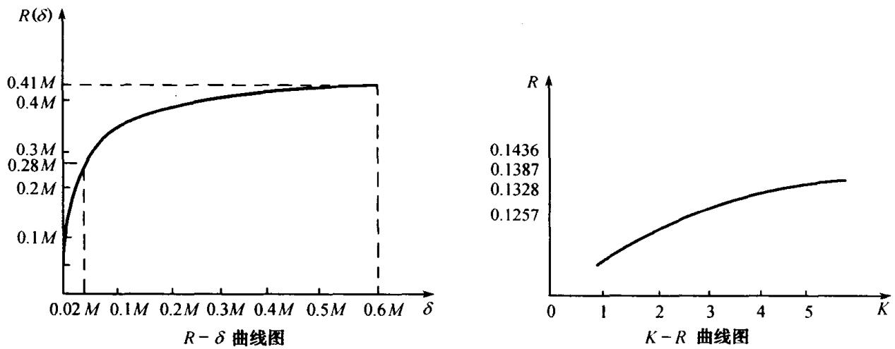

由上图曲线知, 曲线可分为三段; i) $0 \leqslant \delta / M \leqslant 0.007$ 时, $R$ 急骤增大, 这是因为随着 $\delta$ 的增大, 投资者对风险的厌恶程度降低, 即投资者由保守型走向风险型, 并且此时只需考虑问题二的 15 种投资, 故 $R$ 增大显著. ii) $0.007 < \delta / M < 0.02$ 时, $R$ 随 $\delta$ 快速增大, 这是因为风险的增加对投资方向的影响减缓. iii) $\delta / M > 0.02$ 时, $R$ 渐趋平缓.

为了研究投资资产的个数 K 对 R 的影响, 我们取 $\delta = 0.01$ , 利用模型 B 分别计算了不同投资产数目时的收益, 由计算结果可以看出: 当资产数目较少时, 随着资产数的增加, R 迅速增长, 但当 K = 5 时, R 几乎与最大收益相等. 由此可看出, 投资过于分散, 并不能增加 R. 再考虑到资金管理因素, 因此组合投资的数目不宜过多.

## 五、灵敏度分析

1. 在模型 $A, B$ 中, 我们假设 $M_{i} \geqslant u_{i}$ 成立, 研究此假设的合理性, 我们求出满足假设的最小总投资额 $M'$ , 此时 $M' \cdot z_{i} - M'z_{i} \cdot P_{i} \geqslant U_{i}$ 恒成立, 故

$$
M ^ {\prime} = \max _ {1 \leqslant i \leqslant n} \left\{\frac {U _ {i}}{z _ {i} (1 - P _ {i})} \right\}.
$$

对于模型 A 或 B 来说, 当 $\mu$ 或 $\delta$ 变化时, $M'$ 也随之变化. 为此, 我们可以通过改变 $\mu$ 或 $\delta$ 的值, 得到一组 $M'$ , 其结果见表 5.1, 表 5.2, 从表中结果可以看出: $M'$ 相对于资金总额 M 很小, 故对模型 A 和模型 B 的简化是合理的.

表 5.1

<table><tr><td> $\mu$ </td><td>0.1</td><td>0.2</td><td>0.3</td><td>0.4</td><td>0.5</td><td>0.6</td><td>0.7</td><td>0.8</td><td>0.9</td><td>0.10</td></tr><tr><td> $M'$ </td><td>104</td><td>104</td><td>104</td><td>104</td><td>104</td><td>104</td><td>104</td><td>281</td><td>433</td><td>433</td></tr></table>

表 5.2

<table><tr><td> $\delta/M$ </td><td>0.05</td><td>0.1</td><td>0.15</td><td>0.2</td><td>0.35</td><td>0.4</td><td>0.45</td><td>0.5</td><td>0.6</td><td></td></tr><tr><td> $M'$ </td><td>5154</td><td>2603</td><td>2361</td><td>1288</td><td>1501</td><td>650</td><td>650</td><td>947</td><td>1616</td><td>6655</td></tr></table>

2. 一个好的模型不仅只适用于某一具体问题, 而且还应对同一类问题有效, 因此我们尝试对原始数据进行修改, 以考察模型的适用性. 由于银行资产比较特殊, 故此我们对银行利率进行改动, 我们选择 0.05, 0.1, 0.15 三个数据进行考察.

表 5.3

<table><tr><td rowspan="2"> $r_0$ </td><td colspan="2"> $\mu = 0.1$ 时</td><td colspan="2"> $\mu = 0.5$ </td><td colspan="2"> $\mu = 0.1$ </td></tr><tr><td> $R$ </td><td> $z_0$ </td><td> $R$ </td><td> $z_0$ </td><td> $R$ </td><td> $z_0$ </td></tr><tr><td>0.05</td><td>0.267</td><td>0</td><td>0.267</td><td>0</td><td>0.05</td><td>1</td></tr><tr><td>0.10</td><td>0.267</td><td>0</td><td>0.267</td><td>0</td><td>0.10</td><td>1</td></tr><tr><td>0.15</td><td>0.267</td><td>0</td><td>0.267</td><td>0</td><td>0.15</td><td>1</td></tr></table>

表5.3中的数据由模型 $A$ 计算计算得到，银行利率改变对投资没有影响，这主要是因为 $S_{1}, S_{2}, S_{3}, S_{4}$ 均为高收益低风险资产，从表5.3中看出：银行利率的小幅上涨（相对于 $S_{1} \sim S_{4}$ )并不改变投资者的投资方向.

表5.4

<table><tr><td rowspan="2"> $r_0$ </td><td colspan="2"> $\delta = 0.01$ </td><td colspan="2"> $\delta = 0.05$ </td><td colspan="2"> $\delta = 0.1$ </td><td colspan="2"> $\delta = 0.5$ </td></tr><tr><td> $R$ </td><td> $\dot{z}_0$ </td><td> $R$ </td><td> $z_0$ </td><td> $R$ </td><td> $z_0$ </td><td> $R$ </td><td> $z_0$ </td></tr><tr><td>0.05</td><td>0.09</td><td>0.693</td><td>0.26</td><td>0</td><td>0.33</td><td>0</td><td>0.4</td><td>0</td></tr><tr><td>0.128</td><td>0.798</td><td>0.26</td><td>0</td><td>0.33</td><td>0</td><td>0.4</td><td>0</td><td></td></tr><tr><td>0.17</td><td>0.844</td><td>0.27</td><td>0.22</td><td>0.33</td><td>0</td><td>0.4</td><td>0</td><td></td></tr></table>

表 5.4 中的数据由模型 B 计算得到, 当 $\delta$ 较小时, 即投资者对风险承受力较小, 银行利率变化对投资者影响较大; 而当 $\delta$ 较大时, 影响几乎为 0, 这说明对于冒险型投资者来说银行利率的提高并不影响他们的投资方向.

## 七、模型的优缺点及改进方向(略)

## 参考文献

[1] 陈云贤,证券投资论,北京工业大学出版社,北京,1992.  
[2] 程仕军,系统工程,极大化证券组合的投资收益率,1994.  
[2] 董加礼等, 工程运筹学, 北京工业大学出版社, 北京, 1988.

对于数学而言尤其如此:数学存在的主要原因是它具有通过抽象过程将一个领域的思想转移到另一个领域的能力。

《Michael F. Atiyah Collected Works》, v. 1, p. 358. (这是 Atiyah 在会议 ESF Conference in Colma 上的报告), Cambridge Univ. Press, 1985, 24 - 41; 数学译林, v. 10 (1991), no. 3, p. 238.

# 资产投资收益与风险模型

陈定涛 蒋 浩 肖红英

(四川联合大学, 成都 610065)

指导教师 梁元第

编者按 本文建立了正确的双目标模型,并且把该模型通过控制总体风险合理地转化的单目标线性规划问题,还给出了计算结果.文章的特色在于通过计算的收益—风险的一系列解,通过多次函数拟合建立了收益—风险的函数关系,并且根据函数的导数、二阶导数的性质,结合本题的经济含义,获得了保守型、温和型、冒险型的区分及较合理的投资区间.分析结论有一定的数学理论依据,而且也较符合实际.

摘要 本文应用多目标决策方法建立模型,并通过简化,成为一个单目标线性规划问题.计算后得到了一个合乎公司要求的、净收益尽可能大,而总体风险尽可能小的最优方案,如下所示:

问题1的最佳投资方案

<table><tr><td>对第i项投资的金额</td><td> $S_0$ </td><td> $S_1$ </td><td> $S_2$ </td><td> $S_3$ </td><td> $S_4$ </td></tr><tr><td>收益</td><td>0.0033M</td><td>0.2368M</td><td>0.3947M</td><td>0.1076M</td><td>0.2277M</td></tr></table>

对表二中的数据进行同样的计算和分析,也获得了一个理想的投资方案,从而证明了我们的模型具有一般性.

## 问题重述(略)

## 问题分析

本题中的投资问题是利用所给数据,通过计算分析得到一种尽量让人满意的投资方案,并推广到一般情况.下面是实际中要考虑的两点情况.

a. 在风险一定的情况下,取得最大的收益

b. 在收益一定的情况下,所冒风险最小.

不同的投资者对利益和风险的侧重点不同,但在一定范围内都是正常的.所以我们只能要求选择一种尽量好的方案.即风险尽量小,收益尽量大,这符合题意和一般投资者的心理.

表1给出的四种投资项目各自的平均收益率、风险损失率以及交易费率各不相同，我们先以 $q_{i}$ 为横坐标表示风险。以 $(r_i - p_i)$ 为纵坐标表示收益建立一个粗略的图形。从大体趋势可以看出， $q_{i}$ 越大， $(r_i - p_i)$ 也越大，即风险越大，期望收益越大。同理对表2画出图2，亦可看出同样的趋势。虽然很粗糙，但符合一般的实际情况。

题目中给出交易费的计算数额是一个分段函数, 设为 $t_i = \begin{cases} u_i, x_i \leqslant u_i \\ x_i, x_i > u_i \end{cases}$ , 在实际计算中, 不容易处理, 但我们注意到, 在表1中, $u_i$ 的数值非常小, $\sum_{i=1} u_i = 103 + 198 + 52 + 40 = 287$ 元, 对其中最大的 $u_i$ 来说, $u_2 = 198 < 200$ 元, 而已知 $M$ 是一笔相当大的资金. 同时交易费率 $p_i$ 的值也很小. 即使在 $x_i < u_i$ 时, 以 $u_i$ 来计算交易费与用 $x_i$ 直接计算交易费相差无几. 所以, 后面我们具体计算时, 为简化暂不考虑 $u_{i}$ 的约束, 都以 $x_{i}$ 来代替 $u_{i}$ 计算交易费. 这一小的误差将在后面的讨论中具体加以分析.

公司在问题一的情况下可对五种项目投资,其中银行无风险,收益 $r_{0}=5\%$ 为定值,在投资期间不会变动.其它投资项目虽都有一定的风险,但收益可能大于银行利率.我们拟建立一个模型,这个模型对一般投资者都适用.并根据他们风险承受能力的不同提出多个实用于各种类型人的投资方案.(把投资者分为一冒险型,温和型与保守型,越积极冒险的人对风险损失的承受能力越强,用e作为指标来划分.)

由前面的分析已经知道,风险越大,利益可能越大.所以,利益与风险是一对矛盾,我们根据公司要求,用多目标划来建模,力求利益大,风险小.寻找一种令公司满意的方案.

设计第 $i$ 种资产投入钱数占总金额 $M$ 的比例为 $x_{i}$ , 则投资期满所得净收益为 $\sum (x_{i}r_{i} - t_{i}p_{i})$ 总风险以 $S_{i}$ 项中所冒风险的最大值来考虑. 这是一个二目标线性规划模型.

问题二扩大了投资范围,首先我们根据问题一中所建模型对数据计算,取不同的 e 值,得到一组数据,这与前面的方法相同.

我们又对表2中的数据观察,发现数据极一规则,有些项目 $x_{i},q_{i},p_{i}$ 的数值明显不符合投资要求,因而可在计算之前整体优化.即对所给项目粗略去舍,再对剩余项目进行投资.这将在模型的优化中加以讨论.

## 模型建立

当该公司对市场上的资产进行投资时,涉及到两个衡量投资方案好坏的标准,也即有两个目标:1. 净收益大;2. 风险小.

我们设 $z_{1}$ 为净收益函数

$$
z _ {1} = \sum_ {i = 0} ^ {n} x _ {i} + \sum_ {i = 0} ^ {n} x _ {i} r _ {i} - 1.
$$

又因为此 $\sum_{i=0}(x_i + t_ip_i) = 1$ (同投资时交易费从 $M$ 中扣去) 所以

$$
z _ {1} = \sum (x _ {i} r _ {i} - t _ {i} p _ {i}) \quad \text {其中} t _ {i} = \left\{ \begin{array}{l l} u _ {i}, x _ {i} \leqslant u _ {i}, \\ x _ {i}, x _ {i} > u _ {i}, \end{array} \right.
$$

同时,我们希望,所投第 i 项中最大风险越小越好.以 $z_{2}$ 表示风险函数.

$$
z _ {2} = \max \{x _ {i} q _ {i}, i = 0, 1, 2, \dots , n \}
$$

综合以上分析,得出模型:

模型 A:(双目标决策模型)

$$
\begin{array}{l} \max \left\{z _ {1} = \sum_ {i = 0} ^ {n} \left(x _ {i} r _ {i} - t _ {i} p _ {i}\right) \right\}, \min \left\{z _ {2} = m a x \left\{\mathrm{x} _ {\mathrm{i}} \mathrm{q} _ {\mathrm{i}} \right\} \right\}, \\ \sum_ {i = 0} ^ {n} (x _ {i} + t _ {i} p _ {i}) = 1 \\ s. t. \mathbf {x} _ {\mathrm{i}} \geqslant 0. \\ \end{array}
$$

该模型的非劣解集可以用线性加权法求出,但对于双目标决策来说,存在两个问题:

1. 两目标各自的权重不好任意决定；  
2. 对本模型目标 $z_{2}$ 难以处理, 考虑到这两种情况, 我们对模型 $A$ 进行下面的简化.

引进一个参量 $e$ ，表示投资者风险的承受能力。由题意要求： $x_{i}q_{i} \leqslant e$ 这样迫使投资分散，风险也就相应减小，从直观上来讲就是各个项目同时发生风险的概率不大。防止了盲目的追求利益，是对风险的一种量化。于是对

$$
\min \{z _ {2} = \max \{x _ {i} q _ {i} \} \}
$$

可以把目标函数 $z_{2}$ 变成约束条件

$$
x _ {i} q _ {i} \leqslant e
$$

在问题分析中,已经证明不考虑 $u_{i}$ 的约束,对投资方案影响不大.综合各种情况把模型 A 整个简化成以下模型.

模型 $B$

$$
\max z _ {i} = \sigma x _ {i} (r _ {i} - p _ {i})
$$

$$
\mathrm{s.t:} x _ {i} q _ {i} \leqslant e
$$

$$
\text {sum} x _ {i} (1 + p _ {i}) = 1
$$

$$
x _ {i} \geqslant 0
$$

这个模型是一个单目标的线性规划. 在给定的 $e$ 值下, 很容易求出此时的最优解, 我们又根据各人的不同承受能力给出一系列 $e$ 值, 求出一系列最优解. 我们期望通过对这一系列点 $(e, z)$ 的拟合, 得出一个函数关系式 $z_{1} = f(e)$ , 从而由此拟合函数 $f(e)$ , 运用数学方法可以求得一个合理的投资方案.

## 数据计算与分析

## 一、对问题1的计算与分析

利用附表 A 的程序(略)在 mathematica 软件包中解出对应于给定不同 e 的最优解, 列表如下:

<table><tr><td>投资项 $e\%$ </td><td> $z_1$ </td><td> $x_0$ </td><td> $x_1$ </td><td> $x_2$ </td><td> $x_3$ </td><td> $x_4$ </td></tr><tr><td>0.1</td><td>7.5528</td><td>0.8316</td><td>0.04</td><td>0.0667</td><td>0.0182</td><td>0.0385</td></tr><tr><td>0.2</td><td>10.1055</td><td>0.6633</td><td>0.08</td><td>0.1333</td><td>0.0364</td><td>0.0769</td></tr><tr><td>0.3</td><td>12.6583</td><td>0.4949</td><td>0.12</td><td>0.2</td><td>0.0545</td><td>0.4454</td></tr><tr><td>0.4</td><td>15.211</td><td>0.3266</td><td>0.16</td><td>0.2647</td><td>0.0727</td><td>0.1338</td></tr><tr><td>0.45</td><td>11.4874</td><td>0.2424</td><td>0.18</td><td>0.3</td><td>0.818</td><td>0.1731</td></tr><tr><td>0.5</td><td>17.7638</td><td>0.1582</td><td>0.2</td><td>0.3333</td><td>0.0909</td><td>0.01923</td></tr><tr><td>0.55</td><td>19.0402</td><td>0.074</td><td>0.22</td><td>0.3167</td><td>0.1</td><td>0.2115</td></tr><tr><td>0.6</td><td>20.1908</td><td>0</td><td>0.24</td><td>0.4</td><td>0.1091</td><td>0.2212</td></tr><tr><td>0.7</td><td>20.6607</td><td>0</td><td>0.28</td><td>0.4667</td><td>0.1273</td><td>0.1016</td></tr><tr><td>0.8</td><td>21.1043</td><td>0</td><td>0.32</td><td>0.5532</td><td>0.1271</td><td>0</td></tr><tr><td>0.9</td><td>21.552</td><td>0</td><td>0.36</td><td>0.6</td><td>0.0233</td><td>0</td></tr><tr><td>1.0</td><td>21.902</td><td>0</td><td>0.4</td><td>0.5843</td><td>0</td><td>0</td></tr><tr><td>1.5</td><td>23.5392</td><td>0</td><td>0.6</td><td>0.3863</td><td>0</td><td>0</td></tr><tr><td>2.0</td><td>25.1763</td><td>0</td><td>0.8</td><td>0.1882</td><td>0</td><td>0</td></tr><tr><td>2.5</td><td>26.7327</td><td>0</td><td>0.9901</td><td>0</td><td>0</td><td>0</td></tr></table>

从表中数据可看出， $e$ 越大， $z_{1}$ 越大。即风险大，收益也大。这是合乎常理的。

通过对上述数据的分析,我们不妨把投资者分为三种类型,即:保守型、温和型、冒险型.由上表,我们还可以看出,当投资越分散时,投资者所承担的风险也越小,这与题意也是一致的,也冒险型的投资者会出现集中投资的情况,而保守型的投资者则尽量分散投资.

我们又对一系列坐标点 $(e,z)$ 进行多项式拟合.六次拟合状况如下图所示：

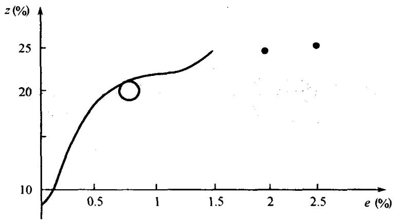

<details>
<summary>scatter</summary>

| e (%) | z (%) |
| --- | --- |
| ~1.95 | ~24.8 |
| ~2.50 | ~25.3 |
</details>

所得的 $z - e$ 函数关系式为

$$
z _ {1} = 7. 2 - 9. 1 e + 1 6 2. 2 e ^ {2} - 3 0 1 e ^ {3} + 2 3 5 e ^ {4} - 8 3. 7 e ^ {5} + 1 1. 2 e ^ {6}
$$

由图我们注意到: 尽管当 $e$ 增大时, $z_{1}$ 也同时增大, 但其增长势头也即 $f'(e)$ 在一定区间 $[e_{1}, e_{2}]$ 内迅速减少.

我们认为在 $f'(e)$ 发生相对剧烈变化的区间投资是合理的. 因为在现实生活中, 正常人不会多冒相对较大的风险去求取相对很少的收益, 即这也就是指 $e > e_2$ 的投资区域, 相反, 也不会因为多冒相对很小的风险, 而放弃相对增加很多的收益, 这也就是指 $e < e_1$ 的投资区域. 在这里, $f'(e)$ 可以理解为每一个单位风险所能获得的收益, 又注意到 $f'(e)$ 在经过急剧减少后, $f'(e)$ 将会保持保持相对稳定, 但 $f(e)$ 趋向水平也即每增加一个单位风险所能多获得的收益很小.

作为一个理性的投资者,我们确定以 $\left[e_{1},e_{2}\right]$ 区间上曲率最大(也即 $f(e)$ 函数线最弯曲的点所对应的投资方案作为最佳的投资方案).

即对于曲率公式

$$
k = \frac {| y ^ {\prime \prime} |}{(1 + y ^ {\prime 2}) ^ {3 / 2}}
$$

要求函数 $K$ 取最大值时所对应的点，也就是最佳方案所对应的点.

从拟合曲线可估算出 $[e_1, e_2]$ 区间为[0.4,1]区间，在Mathematica软件上计算可得 $e^* = 0.74$ ，然而我们通过连接折线注意到拟合曲线在折线斜率急剧变化的区间拟合得不好，因而在这段区间上我们通过增加坐标点进行小区间拟合，又通过Mathematica软件计算出，当 $e^{**} = 0.592$ 时，其曲率最大，所以我们选择 $e^{**}$ 为最优点，其对应的方案如下：

<table><tr><td>对第i项投资的金额</td><td> $x_{0}$ </td><td> $x_{1}$ </td><td> $x_{2}$ </td><td> $x_{3}$ </td><td> $x_{4}$ </td></tr><tr><td>收益</td><td>0.0033</td><td>0.2368</td><td>0.3947</td><td>0.1076</td><td>0.2277</td></tr></table>

即在 $e^{**}=0.592$ 时,有一个最佳的投资方案.

## 二、对表二的计算分析

利用附录程序 $B$ 在Mathematica软件下解出对应于给定 $\pmb{e}$ 的最优解 $z_{1}$ 列表如下

<table><tr><td>e</td><td>0.5</td><td>1.5</td><td>3</td><td>5</td><td>8</td><td>15</td><td>30</td></tr><tr><td> $x_0$ </td><td>0.8459</td><td>0.5376</td><td>0.0753</td><td>0</td><td>0</td><td>0</td><td>0</td></tr><tr><td> $x_1$ </td><td>0.0119</td><td>0.0357</td><td>0.0714</td><td>0</td><td>0</td><td>0</td><td>0</td></tr><tr><td> $x_2$ </td><td>0.0093</td><td>0.0278</td><td>0.0556</td><td>0.026</td><td>0</td><td>0</td><td>0</td></tr><tr><td> $x_3$ </td><td>0.0083</td><td>0.025</td><td>0.05</td><td>0.0833</td><td>0.1333</td><td>0.25</td><td>0.5</td></tr><tr><td> $x_4$ </td><td>0.0119</td><td>0.0357</td><td>0.0714</td><td>0.1190</td><td>0</td><td>0</td><td>0</td></tr><tr><td> $x_5$ </td><td>0</td><td>0</td><td>0</td><td>0</td><td>0</td><td>0</td><td>0</td></tr><tr><td> $x_6$ </td><td>0.0128</td><td>0.0385</td><td>0.0769</td><td>0.1125</td><td>0</td><td>0</td><td>0</td></tr><tr><td> $x_7$ </td><td>0.0083</td><td>0.025</td><td>0.05</td><td>0.0833</td><td>0.1333</td><td>0.25</td><td>0.4451</td></tr><tr><td> $x_8$ </td><td>0.0149</td><td>0.0449</td><td>0.0898</td><td>0.1497</td><td>0.1739</td><td>0</td><td>0</td></tr><tr><td> $x_9$ </td><td>0.0094</td><td>0.0281</td><td>0.0563</td><td>0.0938</td><td>0.1501</td><td>0</td><td>0</td></tr><tr><td> $x_{10}$ </td><td>0.0125</td><td>0.0375</td><td>0.075</td><td>0.125</td><td>0.2</td><td>0.375</td><td>0</td></tr><tr><td> $x_{11}$ </td><td>0.0161</td><td>0.0484</td><td>0.0968</td><td>0</td><td>0</td><td>0</td><td>0</td></tr><tr><td> $x_{12}$ </td><td>0</td><td>0</td><td>0</td><td>0</td><td>0</td><td>0</td><td>0</td></tr><tr><td> $x_{13}$ </td><td>0.0109</td><td>0.0326</td><td>0.0652</td><td>0.1087</td><td>0.0829</td><td>0.0829</td><td>0</td></tr><tr><td> $x_{14}$ </td><td>0</td><td>0</td><td>0</td><td>0</td><td>0</td><td>0</td><td>0</td></tr><tr><td> $x_{15}$ </td><td>0.0217</td><td>0.0652</td><td>0.1304</td><td>0</td><td>0</td><td>0</td><td>0</td></tr><tr><td> $z_1$ </td><td>7.2714</td><td>11.8141</td><td>18.6283</td><td>26.6713</td><td>35.0148</td><td>35.0148</td><td>37.32</td></tr></table>

## 注 其余数据见附录(略).

由上表数据也可以看出,风险承受能力越大,收益也越大,而投资越分散,其对应的风险了就越小,这与表数据结果的分析结论是吻合的.同样,我们也可以对 $(e,z)$ 点集进行拟合函数为:

$$
\begin{array}{l} z _ {1} = 3. 4 3 8 6 7 + 6. 3 4 5 9 8 e - 0. 3 8 2 2 8 3 e ^ {2} + 0. 0 0 0 9 2 3 e ^ {3} + 0. 0 0 0 6 7 4 e ^ {4} - 0. 0 0 0 0 2 2 e ^ {5} + 2. 1 6 5 9 3 \\ \times 10^{-7}e^{6} \\ \end{array}
$$

从而得到

$$
e ^ {*} = 7. 4 0
$$

在此情况下的最优投资方案为

$$
\begin{array}{l} (0, 0, 0, 0. 1 2 3 3, 0. 0 1 2 3, 0, 0, 0. 1 2 3 3, 0. 2 2 1 6, \\ 0. 1 3 8 8, 0. 1 8 5, 0, 0, 0. 1 6 0 9, 0, 0) \\ \end{array}
$$

对表 2 数据的计算与分析, 验证了我们的模型适合于一般情形.

## 模型的优化

考虑到当投资项过多时,会使计算很复杂,因而我们在直接计算数据前对投资项目按一定标准进行估算,去掉一些明显的劣项,进而简化计算,我们这里以 $(r_{i}-p_{i})$ 作为净收益的估计值,以 $q_{i}$ 作为风险的估计值.给定在两目标决策时净收益与风险的权重分别为0.9和0.1,即 $0.9(r_{i}-p_{i})-0.1q_{i}$ 作一个综合的估计值.从而对表2的的数据进行估算,由上面的数据可以得出(1)、(11)、(12)、(15),这几项是可以去看的.然后,我们任选一 $e(e=1.5)$ 通过计算, $z^{*}=11.5269$ ,对在简化之前同等件下z=11.8141.

<table><tr><td> $S_1$ </td><td> $\frac{r_i - p_i}{q_i}$ </td><td>数学期望</td></tr><tr><td>1</td><td>0.178</td><td>2.55</td></tr><tr><td>2</td><td>0.283</td><td>8.37</td></tr><tr><td>3</td><td>0.723</td><td>33.06</td></tr><tr><td>5</td><td>0.5533</td><td>15.96</td></tr><tr><td>6</td><td>0.417</td><td>0.33</td></tr><tr><td>7</td><td>0.516</td><td>24.79</td></tr><tr><td>8</td><td>0.841</td><td>21.92</td></tr><tr><td>9</td><td>0.58</td><td>22.48</td></tr><tr><td>10</td><td>0.848</td><td>26.51</td></tr><tr><td>11</td><td>0.216</td><td>2.93</td></tr><tr><td>12</td><td>0.6</td><td>2.42</td></tr><tr><td>13</td><td>0.762</td><td>24.47</td></tr><tr><td>14</td><td>0.925</td><td>3.88</td></tr><tr><td>15</td><td>0.319</td><td>4.34</td></tr></table>

我们可以得出,删除一些劣等投资项目后,会对 z 以及 $x_{i}$ 产生影响,但对收益 z 的影响不大,可计算出相对误差 $= (11.8141 - 11.5269)/11.8141 = 0.024$ ,而当投资项目众多,而又有一定数量的劣等投资项目时,这件方法对计算的简化是非常明显的.

## 模型的讨论

## 一、拟合状况对最优投资方案的影响

由于是以拟合曲线在一定范围内曲率最大的点所所对应的方案,为最待方案,但是考虑到在实际中拟合曲线,存在一定的误差,因而我们所选取的方案不一定是一般情况下最好的方案,但必定在最优方案的附近.为了解决这个问题,我们可以将各坐标点用线段连接起来,通过分析可以得到各线段,斜率变化相对剧烈的区间,进而在这个区间内通过减小e的步长来增加坐标点然后在这个区间内进行第二次拟合,再用同样的方可以求出区间内曲率,最大的一点.从而得到一般情况下的最好方案.

## 二、稳定性的讨论

灵敏度讨论:在我们所建立的线性规划模型 B 中,假定参数 $r_{i}, q_{i}$ 都是常数,但实际上这些系数往往是估计值和预测值,市场和人为因素对这类参数的确定有一定影响,当 $r_{i}, q_{i}$ 有微小变化时,目标函数的变化是否会很大?因此需要进行灵敏度分析.

不妨在 $e = 0.05$ 时，使 $r_i$ 与 $q_i$ 有小的增长，求出目标函数 $f$ 变化幅度并列表如下：

对该表数据进行分析可知, $r_{i},q_{i}$ 微小变化对目标函数影响不大,表明我们的模的模型通过了灵敏度检验,具有实用价值.

<table><tr><td>r增长幅度</td><td>q增长幅度</td><td>f值变化幅度</td></tr><tr><td>1%</td><td>0</td><td>1.1%</td></tr><tr><td>2%</td><td>0</td><td>2.2%</td></tr><tr><td>5%</td><td>0</td><td>5.5%</td></tr><tr><td>10%</td><td>0</td><td>11%</td></tr><tr><td>0</td><td>0</td><td>-0.7%</td></tr><tr><td>0</td><td>2%</td><td>-1.4%</td></tr><tr><td>0</td><td>5%</td><td>-3.4%</td></tr><tr><td>0</td><td>10%</td><td>-6.5%</td></tr><tr><td>10%</td><td>10%</td><td>3.4%</td></tr><tr><td>5%</td><td>10%</td><td>1.5%</td></tr></table>

## 三、对 $u_{i}$ 的讨论

在模型中, 我们没有考虑 $u_{i}$ 对交易费的影响, 从而简化了模型. 由条件可知, 当满足 $x_{i}M \geqslant u_{i}$ 时, 可以对 $u_{i}$ 忽略不计, 通过对数据的计算可知, 在 $M$ 相当大的情况下, $x_{i}$ 都能满足上述条件, 因而我们认为一般情况下 $u_{i}$ 对模型的影响非常小, 所以在计算时忽略它是比较合理的.

## 附录(略)

## 参考文献

[1] 钱颂迪等, 运筹学, 清华大学出版社, 北京, 1990.  
[2] 周汉良, 范玉妹, 数学规划及其应用, 冶金工业出版社, 北京, 1985.  
[3] 陈雨露, 赵锡军, 金融投资学, 中国人民大学出版社, 北京, 1996.  
[4] 李庆扬等,数值分析,华中理工大学出版社,武汉,1996.

# 资本市场的最佳投资组合

闫珺 王璐 韩嘉睿

(北京大学数学科学学院, 北京 100871)

指导教师 邓明华

编者按 本文作者对投资理论相当熟悉,对问题的讨论也更多地解决投资组合问题,而不拘泥于数学表达.尤其是作者在最后对模型的评价更显示出他们对投资决策有相当全面的理解.本文在数学上也极有特色.他们的解法出乎常规:通过随机投点法描出有效投资组合前沿,前沿由直线段所组成,再结合经济上的考虑给出适当的解答.这样做是颇有创见的.

摘要 市场上有多种可提供投资者选择的资产.本文试图对各种收益和风险进行分析，在一定的标准下给出全部资产组合的效益前沿,即有效资产组合,为投资者提供参考.

在建立模型时,考虑到资本市场的实际情况,我们对题目的条件作了适当的简化和补充.由于用于投资的资金 M 很大,我们忽略了单位资产的交易费用 $u_{i}$ , 同时我们允许从银行贷款进行投资,以增加投资的灵活性.我们把资产的平均收益率和风险损失率作为各种资产及组合的收益和风险地定量描述,用计算机模拟了各种可能的投资组合,得到了完整的风险—收益图,直观地给出了有效资产组合的区域,并给出了精确的计算方法计算资产组合集合的效率前沿,使不同类型的投资者都可以找到最佳的投资组合.

最后,我们指出了一些在模型中没有考虑进去的因素,并分析了这些因素可能对模型产生的影响,并提出了模型的改进方向,以满足对预测的可靠程度要求更高的投资者的需求.

## 一、问题的表述(略)

## 二、市场上的投资组合模型

## （一）基本假设及其合理性

(1) 一项资产的平均收益率是在一个投资周期内各种可能收益值在总投资中所占的百分比统计平均. 单项资产的收益用其平均收益率来衡量, 由若干项资产所组成的资产组合的收益用构成该资产组合的各项资产的平均收益率的权重平均来表示.  
(2) 一项资产的风险损失率是在一个投资周期内资产在发生风险时最大可能的损失在总投资中所占的百分比. 单项资产的风险用其风险损失率来衡量, 由若干项资产所组成的资产组合的风险用构成该资产组合的各项资产中最大的一个风险来衡量.  
(3) 公司(投资者)按照其对投资所具有的期望收益和风险程度的估计做出投资决策.  
(4) 进行投资决策时坚持“最大化原则”. 即给定一定的风险水平, 投资者将选择期望收益最高的资产或资产组合; 给定一定的期望收益, 投资者将选择风险最低的资产或资产组合.  
(5) 公司(投资者)只能按照市场价格买入或卖出资产,且这种单期的买卖行为不会对资产的价格产生影响.  
(6) 资本市场是无障碍的, 即交易费用为零, 资产的交易数量不限, 公司(投资者) 可根据其财力在市场上按市场价格购买任何一种资产.

(7) 公司(投资者)可以用相同的利率水平 $(r_{0})$ 无风险无限制地从银行借入或借出资金.

前两条假设确定了对资产的收益和风险的度量,第3、4、5项假设是基本符合实际的.由于M是一笔数额相对很大的资金,我们忽略了 $u_{i}$ 的作用作了第6项假设.事实上,以表3.1中的数据为例, $u_{i}$ 至多造成

$$
103\times 1\% +198\times 2\% +52\times 4.5\% +40\times 6.5\% = 9.93(\text{元})
$$

的损失,在 M 很大时是可以忽略不计的,后一条假设虽然与实际情况略有出入,但不会影响到结论的正确性,对我们分析问题、简化模型提供了帮助.

## (二) 建立模型

设占资金 M 中比例为 $\alpha_{i}$ 的部分被用来购买资产 $S_{i}(i=1,\cdots,n)$ . 令 $\alpha_{0}=1-\sum_{i=1}^{n}\alpha_{i}$ ，当 $\alpha_{0}>0$ 时，将剩余的资金 $\alpha_{0}M$ 存入银行；当 $\alpha_{0}<0$ 时，从银行中借出资金 $\alpha_{0}M$ . 借入借出资金的利率为 $r_{0},\sum_{i=1}^{n}\alpha_{i}=1$ .

对给定的 $i \in \{1, 2, \cdots, n\}$ ，购买资产 $S_{i}$ 的资金为 $\alpha_{i}M$ ，忽略 $u_{i}$ 的作用，实际用于资产 $S_{i}$ 的投资为 $\alpha_{i}M \frac{1}{1 + p_{i}}$ 。从而资产 $S_{i}$ 的预期收益为 $\alpha_{i}M \frac{1}{1 + p_{i}} r_{i}$ ，投资组合的总收益为 $\sum_{i} M \frac{1}{1 + p_{i}} r_{i}$ ；购买资产 $S_{i}$ 的风险损失率为 $q_{i}$ ，风险为 $\alpha_{i}M \frac{1}{1 + p_{i}} q_{i}$ ，总体风险为 $\max\{\alpha_{i}M \frac{1}{1 + p_{i}} q_{i}\}$ 。称

$$
r _ {i} = \frac {r _ {i}}{1 + p _ {i}}, \tag {2.1}
$$

为实际收益率

$$
\bar {q} _ {i} = \frac {q _ {i}}{1 + p _ {i}}, \tag {2.2}
$$

为实际风险率, 总体收益率 $E = \sum_{i} \alpha_{i} r_{i}$ , 总体风险率 $Q = \max \{\alpha_{i} q_{i}\}$ . 问题的实质即在 $\sum_{i} \alpha_{i} = 1$ 的条件下求出 $\alpha_{i}$ 的值, 使总体收益率 $R$ 尽量大, 总体风险率 $Q$ 尽量小.

## （三）多项风险资产的组合

我们首先来考察四项风险资产的组合投资问题. 在计算中我们使用 $n = 1$ 时的相关数据如表3.1所示.

表3.1

<table><tr><td> $S_i$ </td><td> $r_i(\%)$ </td><td> $q_i(\%)$ </td><td> $p_i(\%)$ </td><td> $u_i(\%)$ </td><td> $\bar{r}_i(\%)$ </td><td> $\bar{q}_i(\%)$ </td></tr><tr><td> $S_1$ </td><td>28</td><td>2.5</td><td>1</td><td>103</td><td>27.7</td><td>2.48</td></tr><tr><td> $S_2$ </td><td>21</td><td>1.5</td><td>2</td><td>198</td><td>20.6</td><td>1.47</td></tr><tr><td> $S_3$ </td><td>23</td><td>5.5</td><td>4.5</td><td>52</td><td>22.0</td><td>5.26</td></tr><tr><td> $S_4$ </td><td>25</td><td>2.6</td><td>6.5</td><td>40</td><td>23.4</td><td>2.44</td></tr></table>

表中的 $\bar{r}_{i}$ 和 $\bar{q}_{i}$ 是根据(2.1)和(2.2)计算出来的. 将这四项风险资产按一定比例组合在一起, 例构成了四项风险资产的组合. 我们用计算机对可能的投资组合进行了随机模拟, 绘制了图3.1. 图中的横轴表示总体风险率, 纵轴表示总体收益率.

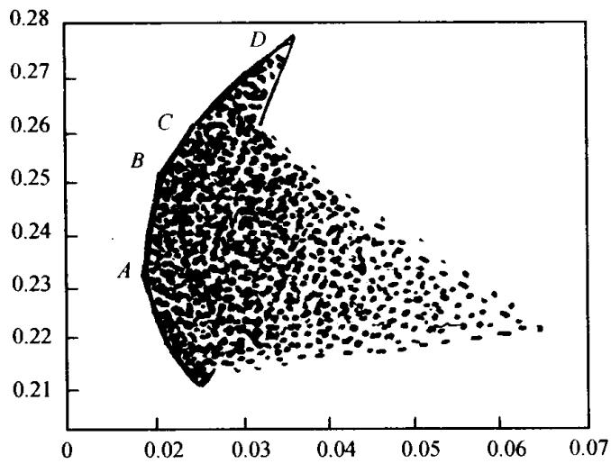

<details>
<summary>scatter</summary>

| Region | X (range) | Y (range) |
| --- | --- | --- |
| A | 0.018~0.025 | 0.21~0.23 |
| B | 0.018~0.035 | 0.23~0.26 |
| C | 0.018~0.035 | 0.23~0.27 |
| D | 0.035~0.065 | 0.22~0.27 |
</details>

图3.1

对每一个随机产生的资产组合,我们把该组合的总体风险和收益用风险一收益图中一个点来表示.图2.1中的黑色部分近似地表示了4项构成的各种资产组合的集合,投资者的任何一种投资组合对应图中的一个点.我们观察到在这个区域的边缘存在一条折线ABCD,对于投资者的任何一种选择,在该折线上都可找到一种投资组合具有更高的收益和更低的风险.因此投资者将只在折线ABCD上选择,在该折线上都可找到一种投资组合具有更高的收益和更低的风险.因此投资者将只在折线ABCD上选择他所需要的资产组合,我们称折线ABCD为这一资产组合集合的效率前沿.

下面我们给出一种方法,通过表3.1确定出点A,B,C,D的坐标,从而得到资产组合的效率前沿.

首先将资产 $S_{1}, S_{2}, S_{3}, S_{4}$ 重新排序，使 $\bar{r}_i$ 递减排列，得到新的表3.2.

表3.2

<table><tr><td>No</td><td> $S_i$ </td><td> $\bar{r}_i(\%)$ </td><td> $\bar{q}_i(\%)$ </td><td> $\bar{q}_i^{-1}$ </td></tr><tr><td>1</td><td> $S_1$ </td><td>27.7</td><td>2.48</td><td>40.3</td></tr><tr><td>2</td><td> $S_2$ </td><td>23.4</td><td>2.44</td><td>41.0</td></tr><tr><td>3</td><td> $S_3$ </td><td>22.0</td><td>5.26</td><td>19.0</td></tr><tr><td>4</td><td> $S_4$ </td><td>20.6</td><td>1.47</td><td>68.0</td></tr></table>

对表3.2的最后一列求和并取倒数，作为点 $A$ 的横坐标；将表3.2的第二列与第四列对应数据乘积的和与刚才得到的横坐标相乘，作为点 $A$ 的纵坐标。即点 $A$ 的横坐标为

$$
(4 0. 3 + 4 1. 0 + 1 9. 0 + 6 8. 0) ^ {- 1} = 0. 0 0 5 9,
$$

点 $A$ 的纵坐标为

$$
(27.7\% * 40.3 + 23.4\% * 41.0 + 22.0\% * 19.0
$$

$$
\left. + 20.6\% ^{*} 68.0\right) ^{*} 0.0059 = 0.230.
$$

去掉表格的最后一行,重复上述步骤可以得到点 B 的纵坐标为

$$
(4 0. 3 + 4 1. 0 + 1 9. 0) ^ {- 1} = 0. 0 1 0 0,
$$

点 $B$ 的横坐标为

$$
(27.7\% ^* 40.3 + 23.4\% ^* 41.0 + 22.0\% ^* 19.0)^{*}0.0100 = 0.249.
$$

依此类推可算出点 $C$ 的坐标为(0.0123,0.256)，点 $D$ 的坐标为(0.0248,0.277).在坐标纸上描出折线ABCD即得到了投资组合的效率前沿.投资者可依自身对风险的偏好程度在效率前沿上选择适当的投资组合.效率前沿的性质及计算方法的严格证明请参见附录(略).

## （四）风险资产与无风险资产的组合

如果公司(投资者)还可以选择在无风险资产上进行投资,则其投资策略将更加灵活,资产组合的集合及效率前沿也会发生较大的变化.我们选用银行存款的利率 $r_{0}$ 为无风险资产的平均收益率,设对风险资产的投资组合的总体收益率为R,总体风险率为Q.总投资由a比例风险资产和(1-a)比例无风险资产组成.则这种投资组合的总体风险率为 $\bar{Q}=aQ$ ,总体收益率为 $\bar{R}=(1-a)r_{0}+aR=a(R-r_{0})+r_{0}$ .一般来说,风险投资的收益率R应大于无风险投资的收益率 $r_{0}$ ,所以当风险资产所占比例 $0\leqslant a\leqslant1$ 时,在风险—收益图上得到一条向右上方倾斜的线段,如图4.1所示.该线段向右上方的延长线对应a>1,此时我们认为公司以无风险收益率 $r_{0}$ 从银行借入占总资产(a-1)的资金.从图中可以看到,随着贷款的增加,风险和收益都呈线性上升.a>0的部分是该资产组合的效率前沿.

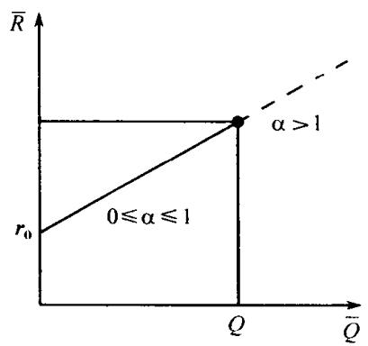

<details>
<summary>line</summary>

| Point | R | Q |
| --- | --- | --- |
| Start | r0 | 0 |
| End | r0 | Q |
</details>

图4.1

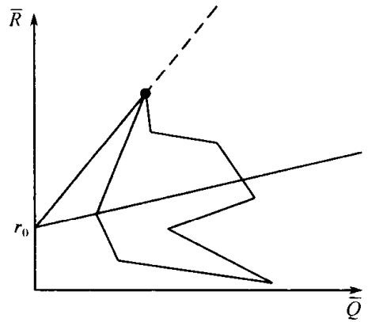

<details>
<summary>line</summary>

| Point | R | Q̄ |
| --- | --- | --- |
| Start (r0) | r0 | 0 |
| Peak (R) | ~High | ~Low-Mid |
| End (R) | 0 | ~Mid-High |
</details>

图4.2

在一项无风险资产和多项风险资产的组合投资中,对风险资产的每一种投资组合,效率前沿都是从点 $(0,r_{0})$ 出发,过点 $(Q,R)$ 的直线.这是因为,所有可行的风险资产组合也可视为一种风险资产.在2.3的讨论中我们知道风险资产的投资组合应在一条折线上选择,因此总体投资的效率前沿应为折线上的点与点 $(0,r_{0})$ 的连线中斜率最大的一条,如图4.2所示.

应用 2.3 中的方法, 我们已经可以对多种风险投资的效率前沿进行精确的计算, 在得到效率前沿各顶点的坐标后, 分别比较它们与点 $(0, r)$ 的连线的斜率, 即可得到总投资的效率前沿.

## （五）风险投资的比率

在前面两节的讨论中,我们已经得到了投资组合的效率前沿,由于实际中无风险资产的存在,一般来说,这个效率前沿是一条射线.对这条射线上的每一点所对应的投资组合,我们已经知道了它的风险和收益.在效率前沿上,风险是随着收益的增加而增加的.对投资者来说,选择哪一种投资组合,取决于投资者对风险的喜好程度.对于风险回避型(risk averse)的投资者来说,他会选择见险较低的投资组合,在效率前沿上,对应的点接近 $(0,r_0)$ ,即他会把多数的资金投入银行.另一方面,对于风险喜好者(risk loving)来说,他会选择高风险高收益的投资组合,在效率前沿上,对应的点远离 $(0,r_0)$ ,他有可能从银行贷款进行风险投资.

下面我们来计算具体的投资比例. 对 n 种风险资产 $S_{i}(i=1\cdots n)$ 的相应的实际收益率 $\bar{r}_{i}$ 与实际风险率 $\bar{q}_{i}$ 说, 不妨设 $\bar{r}_{1} > \bar{r}_{2} > \cdots > \bar{r}_{n}$ 应用 2.3 的方法, 我们可以算出风险投资的效率前沿折线的 n 个顶点 $P_{1}, P_{2}, \cdots, P_{n}$ , 其中点 $P_{i}$ 的坐标为

$$
\left(\frac {1}{\frac {1}{q _ {1}} + \frac {1}{q _ {2}} + \cdots + \frac {1}{q _ {i}}}, \frac {\frac {\bar {r} _ {1}}{q _ {1}} + \frac {\bar {r} _ {2}}{q _ {2}} + \cdots + \frac {\bar {r} _ {i}}{q _ {i}}}{\frac {1}{q _ {1}} + \frac {1}{q _ {2}} + \cdots + \frac {1}{q _ {i}}} \right.
$$

从这 $n$ 个顶点向点 $(0, r_0)$ 所引的直线的斜率为

$$
\begin{array}{l} \left(\frac {\bar {r} _ {1}}{\bar {q} _ {1}} + \frac {\bar {r} _ {2}}{\bar {q} _ {2}} + \dots + \frac {\bar {r} _ {i}}{\bar {q} _ {i}}, \frac {\bar {r} _ {1}}{\bar {q} _ {1}} + \frac {\bar {r} _ {2}}{\bar {q} _ {2}} + \dots + \frac {\bar {r} _ {i}}{\bar {q} _ {i}}{\frac {1}{\bar {q} _ {1}} + \frac {1}{\bar {q} _ {2}} + \dots + \frac {1}{\bar {q} _ {i}}}, r _ {0}\right) / \frac {1}{\frac {1}{\bar {q} _ {1}} + \frac {1}{\bar {q} _ {2}} + \dots + \frac {1}{\bar {q} _ {i}}} \\ = \frac {\bar {r} _ {1} - r _ {0}}{\bar {q} _ {1}} + \frac {\bar {r} - 1 - r _ {0}}{\bar {q} _ {2}} + \dots + \frac {\bar {r} _ {i} - r _ {0}}{\bar {q} _ {i}} \\ \end{array}
$$

由于已经假设 $\bar{r}_{1} > \bar{r}_{2} > \cdots > \bar{r}_{n}$ 为了直线的斜率尽可能大，只需 $i_{0} = \max\{i \mid r_{i} > r_{0}\}$ ，则风险投资组合的投资比率为对 $1 \leqslant k \leqslant i_{0}$ ，见险投资中比率为 $\frac{\frac{1}{q_{k}}}{\frac{1}{q_{1}} + \frac{1}{q_{2}} + \cdots + \frac{1}{q_{i_{0}}}}$ 的资金被用来购买资产 $S_{k}$ ，而其余资产则不投入资金。若投资者根据自己的偏好确定了投资风险资产的比率 $\alpha$ ，则总投资组合为向 $S_{k}$ 投入资金 $\frac{\frac{1}{q_{k}}}{\frac{1}{q_{1}} + \frac{1}{q_{2}} + \cdots + \frac{1}{q_{i_{0}}}} (1 \leqslant k \leqslant i_{0})$ ，而将其余的占比率为 $(1 - \alpha)$ 的资金存入银行（当 c > 1 时为从银行借出占比率 $(\alpha - 1)$ 的资金用于风险投资）。

下面我们将这一结果应用于题目中给出的两组数据：

对于第一组数据,参见表2.2可知所有的 $\bar{r}_{i}$ 均大于 $r_{0}$ , 从而风险投资中投向资产 $S_{1}$ , $S_{2}$ , $S_{3}$ , $S_{4}$ 的比率分别为23.95%, 24.36%, 11.29%, 40.40%. 在风险—收益图上,效益前沿为过点(0,0.05)和点(0.0059,0.230)的线段.

对于第二组数据,相应的数据如表5.1所示,仍然有所有 $\bar{r}_{i}$ 均大于 $r_{0}$ ,于是风险投资中投向资产 $S_{1},S_{2},\cdots,S_{15}$ 的比率分别为:2.0%,1.5%,1.4%,2.0%,72.1%,2.0%,1.3%,2.5%,1.6%,2.1%,2.7%,1.6%,1.8%,1.6%,3.8%.当公司在这种比例下进行风险投资时可以达到投资组合的效率前沿.效率前沿为过点(0.0081,0.1155)的直线.

表5.1

<table><tr><td> $S_i$ </td><td> $r_i(\%)$ </td><td> $q_i(\%)$ </td><td> $p_i(\%)$ </td><td> $u_i(\%)(元)$ </td><td> $\bar{r}_i(\%)$ </td><td> $\bar{q}_i(\%)$ </td></tr><tr><td> $S_1$ </td><td>9.6</td><td>42</td><td>2.1</td><td>181</td><td>9.40</td><td>41.14</td></tr><tr><td> $S_2$ </td><td>18.5</td><td>54</td><td>3.2</td><td>407</td><td>17.93</td><td>52.33</td></tr><tr><td> $S_3$ </td><td>49.4</td><td>60</td><td>6.0</td><td>428</td><td>46.60</td><td>56.60</td></tr><tr><td> $S_4$ </td><td>23.9</td><td>42</td><td>1.5</td><td>549</td><td>23.55</td><td>41.38</td></tr><tr><td> $S_5$ </td><td>8.1</td><td>1.2</td><td>7.6</td><td>270</td><td>7.53</td><td>1.12</td></tr><tr><td> $S_6$ </td><td>14</td><td>39</td><td>3.4</td><td>397</td><td>13.54</td><td>37.72</td></tr><tr><td> $S_7$ </td><td>40.7</td><td>68</td><td>5.6</td><td>178</td><td>38.54</td><td>64.39</td></tr><tr><td> $S_8$ </td><td>31.2</td><td>33.4</td><td>3.1</td><td>220</td><td>30.26</td><td>32.40</td></tr><tr><td> $S_9$ </td><td>33.6</td><td>53.3</td><td>2.7</td><td>475</td><td>32.72</td><td>51.90</td></tr><tr><td> $S_{10}$ </td><td>36.8</td><td>40</td><td>2.9</td><td>248</td><td>35.76</td><td>38.87</td></tr><tr><td> $S_{11}$ </td><td>11.8</td><td>31</td><td>5.1</td><td>195</td><td>11.23</td><td>29.50</td></tr><tr><td> $S_{12}$ </td><td>9</td><td>5.5</td><td>5.7</td><td>320</td><td>8.51</td><td>52.03</td></tr><tr><td> $S_{13}$ </td><td>35</td><td>46</td><td>2.7</td><td>267</td><td>34.08</td><td>44.79</td></tr><tr><td> $S_{14}$ </td><td>9.4</td><td>5.3</td><td>4.5</td><td>328</td><td>9.00</td><td>50.72</td></tr><tr><td> $S_{15}$ </td><td>15</td><td>23</td><td>7.6</td><td>131</td><td>13.94</td><td>21.38</td></tr></table>

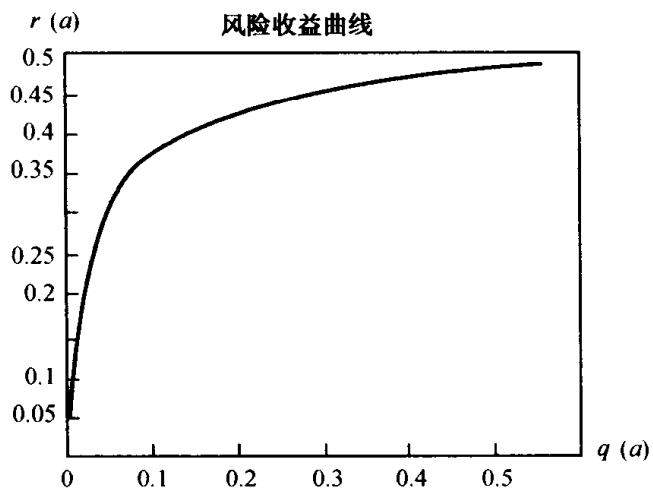

<details>
<summary>line</summary>

| q (a) | r (a) |
| --- | --- |
| 0 | 0.05 |
| ~0.05 | ~0.35 |
| ~0.1 | ~0.40 |
| ~0.2 | ~0.44 |
| ~0.3 | ~0.46 |
| ~0.4 | ~0.48 |
| ~0.5 | ~0.49 |
</details>

图5.1

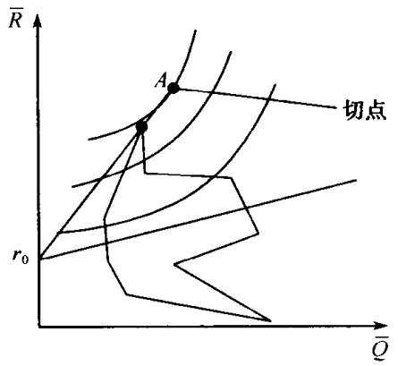

<details>
<summary>text_image</summary>

R̅
A
切点
r₀
Q̅
</details>

图6.1

从计算结果中我们看到,如果选择点(0.0081,0.1155)附近的投资组合,风险已经降至1%以下,而收益高于10%.因此多项资产构成的投资组合可以大幅度地减少投资风险.对市场投资的调查表明,想有效地减少风险,至少要有十种左右的资产,15种资产是比较好的数量.这里计算结果和实际情况是相符的.在图5.1中,我们给出了风险投资的效率前沿折线,折线的顶点用小圆圈标出.该折线在风险较大时收益的增加速度很慢.这表明在风险投资中,如果选择了高收益的投资组合,则势必造成风险的上升.而且风险上升的速度随收益的增加而加快.因此,在决策时不能片面地追求高收益而冒无畏的风险.

## (六) 投资组合的决策

为了定量的描述风险与收益在决策时所起的作用,对一个特定的投资者而言,下面我们引入该投资者的无差异曲线. 在经济学上, 效用是指人们从某事物中所得到的主观上的满足程度. 由于在效率前沿上的投资组合较其余选择更为有效, 投资者不会选择效率前沿以外的资产组合. 而在效益前沿上, 投资者将追求使效用最大的投资组合. 每一组(风险, 收益) 对投资者的效用是确定的, 于是我们可在风险一收益图上描出一族曲线, 每一条曲线上的点所对应的效用相等, 称这样的一条曲线为无差异曲线. 我们把一族无差异曲线画在图 4.1 上, 得到了图 6.1. 则切点 $A$ 对应于投资者在效率前沿上的选择. 对于题目中所给的两组数据, 我们已经给出了效率前沿的范围. 下面我们针对公司决策者的不同类型来给出不同的效用函数.

(1) 风险喜好型 (risk loving) 效用函数可取作 $f_{L}(Q, R)$ , 此时的无差另曲线族为 $f_{L}(Q, R) = C (0 < C < \infty)$ , 无差异曲线见图6.2(1)和图6.2(2):

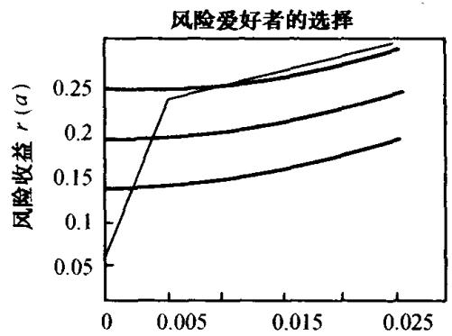

<details>
<summary>line</summary>

| X | 风险收益 r(a) (Series 1) | 风险收益 r(a) (Series 2) | 风险收益 r(a) (Series 3) | 风险收益 r(a) (Series 4) |
|---|---|---|---|---|
| 0 | ~0.06 | ~0.19 | ~0.25 | ~0.14 |
| 0.005 | ~0.24 | ~0.20 | ~0.25 | ~0.14 |
| 0.015 | ~0.27 | ~0.22 | ~0.27 | ~0.16 |
| 0.025 | ~0.29 | ~0.25 | ~0.29 | ~0.19 |
</details>

图 6.2(1) 风险指数 $q(a)$

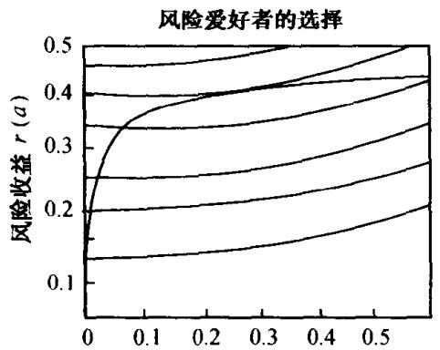

<details>
<summary>contour</summary>

| X | Y (Series 1) | Y (Series 2) | Y (Series 3) | Y (Series 4) | Y (Series 5) | Y (Series 6) |
|---|---|---|---|---|---|---|
| 0 | ~0.13 | ~0.20 | ~0.25 | ~0.33 | ~0.40 | ~0.46 |
| 0.1 | ~0.14 | ~0.21 | ~0.26 | ~0.34 | ~0.40 | ~0.47 |
| 0.2 | ~0.15 | ~0.22 | ~0.27 | ~0.35 | ~0.41 | ~0.48 |
| 0.3 | ~0.16 | ~0.23 | ~0.28 | ~0.36 | ~0.42 | ~0.49 |
| 0.4 | ~0.17 | ~0.24 | ~0.29 | ~0.37 | ~0.43 | >0.5 |
| 0.5 | ~0.18 | ~0.25 | ~0.30 | ~0.38 | ~0.44 | >0.5 |
</details>

图 6.2(2) 风险指数 $q(a)$

(2) 风险中性(risk neutral) 效用函数可取作 $f_{n}(Q, R)$ , 此时的无差另曲线族为 $f_{N}(Q, R) = C (0 < C < \infty)$ 无差异曲线见图6.3(1)和图6.3(2);

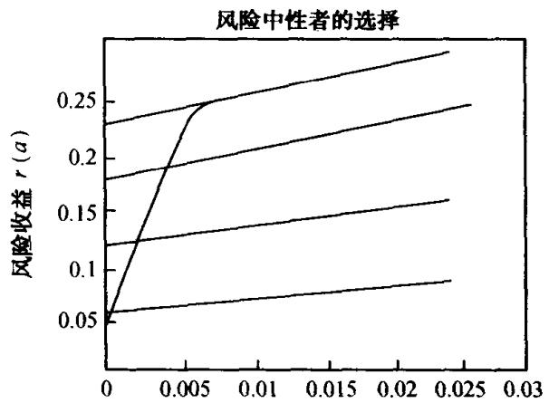

<details>
<summary>line</summary>

| X | 风险收益 r(a) (曲线1) | 风险收益 r(a) (曲线2) | 风险收益 r(a) (曲线3) | 风险收益 r(a) (曲线4) |
|---|---|---|---|---|
| 0 | 0.05 | 0.12 | 0.18 | 0.23 |
| 0.005 | ~0.24 | ~0.13 | ~0.19 | ~0.24 |
| 0.01 | — | ~0.14 | ~0.20 | ~0.26 |
| 0.015 | — | ~0.15 | ~0.21 | ~0.27 |
| 0.02 | — | ~0.16 | ~0.22 | ~0.28 |
| 0.025 | — | ~0.16 | ~0.24 | ~0.29 |
</details>

图 6.3(1) 风险指数 $q(a)$

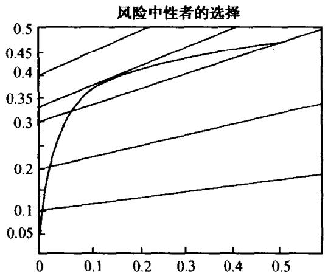

<details>
<summary>line</summary>

| X | Y (Series 1) | Y (Series 2) | Y (Series 3) | Y (Series 4) | Y (Series 5) |
| --- | --- | --- | --- | --- | --- |
| 0 | 0.05 | 0.1 | 0.2 | 0.3 | 0.4 |
| 0.1 | ~0.12 | ~0.22 | ~0.35 | ~0.42 | ~0.5 |
| 0.2 | ~0.14 | ~0.26 | ~0.42 | ~0.48 | >0.5 |
| 0.3 | ~0.16 | ~0.29 | ~0.46 | >0.5 | >0.5 |
| 0.4 | ~0.17 | ~0.32 | ~0.49 | >0.5 | >0.5 |
| 0.5 | ~0.19 | ~0.34 | >0.5 | >0.5 | >0.5 |
</details>

图 6.3(2) 风险指数 $q(a)$

(3) 风险回避型 (risk averse) 效用函数可取作 $f_{A}(Q, R)$ , 此时的无差另曲线族为 $f_{A}(Q, R) = C (0 < C < \infty)$ , 无差异曲线见图6.4(1)和图6.4(2).

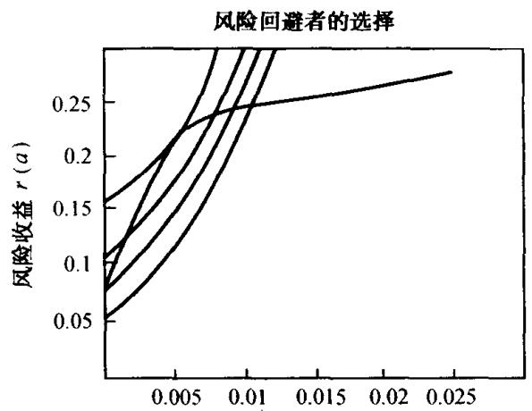

<details>
<summary>contour</summary>

| X | Series 1 (Top) | Series 2 | Series 3 | Series 4 | Series 5 (Bottom) |
| --- | --- | --- | --- | --- | --- |
| 0.000 | ~0.16 | ~0.11 | ~0.08 | ~0.07 | ~0.05 |
| 0.005 | ~0.22 | ~0.19 | ~0.16 | ~0.14 | ~0.11 |
| 0.010 | >0.28 | >0.28 | >0.28 | >0.28 | ~0.24 |
| 0.015 | — | — | — | — | ~0.25 |
| 0.020 | — | — | — | — | ~0.26 |
| 0.025 | — | — | — | — | ~0.27 |
</details>

图 6.4(1) 风险指数 $q(a)$

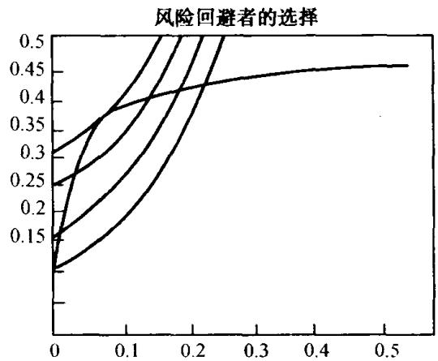

<details>
<summary>line</summary>

| X | Series 1 (Top) | Series 2 | Series 3 | Series 4 (Bottom) |
| --- | --- | --- | --- | --- |
| 0 | 0.3 | 0.25 | 0.15 | 0.12 |
| 0.1 | ~0.4 | ~0.38 | ~0.25 | ~0.18 |
| 0.2 | >0.5 | ~0.42 | ~0.35 | ~0.28 |
| 0.3 | — | — | >0.5 | ~0.4 |
| 0.4 | — | — | — | ~0.44 |
| 0.5 | — | — | — | ~0.46 |
</details>

图 6.4(2) 风险指数 $q(a)$

## 三、对模型的评价和讨论

利用上面的数学模型解出的效率前沿可以帮助投资者作出有效的投资组合.但最终对投资组合的选择,还要靠投资者的风险承受能力决定.这一模型对投资的指导意义在于,人们可以利用计算机对大量风险资产的历史数据进行处理,通过对历史数据的分析研究预测出资产的平均收益率和风险损失率,根据模型例可以计算出资产组合集合的效率前沿.

当然,模型中也存在不足.用平均收益率和风险损失率代表收益和风险与实际情况有所不同,而且没有提出精确的预测收益和风险的方法,这就不能在模型内部保证预测的准确程度.在实际的市场动作中,各种风险资产之间是有一定关联的.比如在某一时期货币汇率的下跌往往伴随着股市的下跌,这时如果同时在外汇市场和股票市场上进行了投资,则实际的风险要高于这两个投资风险中的任何一个.在假设用所有投资中最大的风险代表混合投资的风险时,我们没有体现出这一点,这也降低了模型的合理性.

尽管如此,这个模型还是对组合投资的决策提供了重要的启示和指导:为了减少风险,我们应该在多种资产上进行投资,并且少量的资产组合就可以大幅度地减少风险;在一定条件下,投资者可以从银行贷款进行投资,以获得更大的收益;在进行投资决策时,投资者应尽可能获得完整的市场信息,银行贷款进行投资,以获得更大的收益;在进行投资决策时,投资者应尽可能获得完整的市场信息,以作出合理的预测.这些在实际投资中被总结出来的重要经验,在模型中都得到了不同程度的反映.

确定一个有效的资产组合是一个非常复杂的决策过程. 我们已经知道, 风险中的一部分可以通过增加资产组合中的资产数目而消除, 这一部分风险称作非系统风险. 非系统风险是由个别资产本身的各种因素造成的收益的不稳定, 例如政府对汇率的干预、股市上的传闻等等, 都会对某类资产产生短期的影响. 还有一部分风险是反映各资产共同状况的, 不能通过改变资产组合的办法加以消除. 例如全球范围内的经济紧缩、大的自然灾害、爆发战争等, 所有的资产都会受到作用而产生共同运动表现出整体收益的不稳定性. 研究表明, 下述四个因素对大多数资产和证券的收益有着显著的影响:

(1) 通货膨胀率的意外变化； (2) 工业生产的意外变化；  
(3) 风险补偿的意外变化； (3) 利率结构的意外变化.

在度量风险和收益时,投资者还可以选择其他的标准,例如期望收益和标准差、离差率等等. 在进行决策分析时, 也可以选择其他的模型例如资本资产定价模型 (CAPM) 等对收益和风险进行预测. 为了获得更为合理的结果, 我们对模型提出了一些改进的方向, 以适应不同投资者的需求:

一、单位资产的价格.对于个人投资者来说,资产的单价也是相当重要的.以表格5.1中的数据为例,在投资分配不利时,投资者有可能多付出

$$
181 ^{*} 2.1\% + 407 ^{*} 3.2\% + 428 ^{*} 6.0\%
$$

$$
+ \dots + 131 ^{*} 7.6\% = 243.053(\text{元})
$$

在多次买卖中,这些损失可能会对总体的收益和风险产生一定的影响.因此在制定投资策略时,应尽量使购买每一种资产的资金都是单位资产成本的整数倍,一减少手续费的损失.

二、从银行贷款. 银行的贷款得率一般要高于存款利率, 但仍小于风险投资的收益率. 因此在效率前沿上, 对应于从银行贷款投资的射线的斜率应略小于在银行存款的那条线段的斜率. 而且从银行贷款有偿还的责任, 不能任意的追加投资, 因此实际上的风险要比名义上的风险损失率大, 投资者贷款时必须要极端慎重. 如果确定要贷款, 在衡量风险时应考虑到投资者偿还贷款的能力.

三、风险资产之间的相互关系.前面已经提到,风险资产之间有着一定的相互作用.为了更精确的刻画这种关系,我们可以选用其他的方式来衡量资产的风险.例如用标准差来衡量风险的程度.这时在计算资产组合的风险时不仅要考虑各项资产的标准差的权中平均,而且要将每两种资产的相关程度计算在内,这便可以反映出资产之间的联系和相互作用.

四、衡量风险的标准. 在我们的模型中, 衡量风险只单纯考虑了资产在一个投资周期后发生的损失, 忽略了在购买资产时付出的手续费. 为了更精细的估算, 我们可在衡量总体风险时综合考虑手续费的损失, 这时的总体风险函数应为 $Q = \max \{\alpha_i q_i\} + \sum \alpha_i p_i$ . 在这种情况下, 可以类似的证明有关效率前沿的性质和计算方. 下图给出了在采用这样的风险估计时效率前沿在风险一收益图上的形状 (对应于题目中的第一组数据).

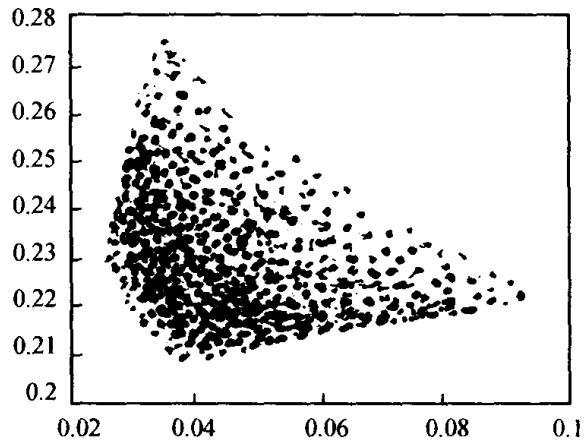

<details>
<summary>scatter</summary>

| Series | X (range) | Y (range) |
| --- | --- | --- |
| Data Points | 0.025~0.095 | 0.208~0.275 |
</details>

此外，在实际操作中还要综合考虑到通货膨胀、市场操纵、投机等多种因素对已作出的投资组合的方案进行调整，才能得到最佳的资产组合方案。

附录(略)

# 风险投资组合的线性规划模型

邓刚毅 许剑勇 周斌

(中国纺织大学, 上海 200051)

指导教师 胡良剑

编者按 本文通过风险函数转化为不等约束,建立线性规划模型.直接采用现成程序进行计算,得出优化决策方案.并且给出有效投资曲线,根据投资者主观偏好,选择投资方向.

摘要 对市场上的多种风险资产和一种无风险资产(存银行)进行组合投资策略的设计需要考虑两个目标:总体收益尽可能大和总体风险尽可能小,而这两个目标在一定意义上是对立的.本文给出组合投资方案设计的一个线性规划模型.主要思路是通过线性加权综合两个设计目标;假设在投资规模相当大的基础上,将交易费函数近似线性化;通过决策变量的选取化解风险函数的非线性.模型的最大优点是:计算过程稳定性好,速度快.我们对各种加权因子,求得了最优化决策方案,从而得到问题的有效投资曲线.根据有效投资曲线,投资者可以由自己的主观偏好,直观地选择自己的投资方向.

## 一、问题的提出(略)

## 二、符号说明

$S_{i}$ : 第 i 种资产 $(i = 1, 2, \cdots, n, n + 1)$ ，其中 $S_{n+1}$ 表示存入银行；

$r_{i}:S_{i}$ 的平均收益率； $q_{i}:S_{i}$ 的风险损失率；

$p_{i}:S_{i}$ 的交易费率； $u_{i}:S_{i}$ 购买额阈值；M:资金总额；

$X_{i}$ : 投资 $S_{i}$ 占总额的比重(不含交易费), 以下简称投资;

$Y_{i}$ : 投资 $S_{i}$ 的交易费占总额的比重, 经下简称交易费;

$f_{1}$ : 净收益； $f_{2}$ : 总体风险； $\lambda$ : 权因子.

## 三、模型的建立

## (一) 基本模型

我们的目标是对各种资产投资以后,不仅收益尽可能大,同时总体风险还要尽可能小,所以我们的目标函数应为收益和风险两个函数.由于在一段时间内的各种资产的平均收益率和风险损失率均已由财务人员分析了出来,因此我们可以建立以下数学模型:

目标 1 $\max f_{1} = \sum_{i=1}^{n+1}(r_{i}X_{i} - Y_{i})$

目标 2 $\min f_{2} = \max_{1 \leqslant i \leqslant n} (q_{i} X_{i})$

$$
\text {s.t.} \quad \sum_ {i = 1} ^ {n + 1} (X _ {i} + Y _ {i}) = 1,
$$

$$
Y _ {i} = \left\{ \begin{array}{l l} 0, & X _ {i} = 0, \\ \frac {u _ {i}}{M} p _ {i}, & 0 <   X _ {i} <   \frac {u _ {i}}{M}, \\ X _ {i} p _ {i}, & X _ {i} \geqslant \frac {u _ {i}}{M}. \end{array} \right.
$$

这是一个多目标非线性数学规划模型, 且 $f_{1}$ 不是 $x_{i}$ 的连续函数, 优化求解困难. 下面我们将它转化为一个线性规划模型.

## (二) 线性规划模型

## 1. 目标函数的确定

多目标规划有多种方法化为单目标问题解决. 我们使用线性加权法.

$$
\text {总目标函数} \quad \min f = \lambda f _ {2} + (1 - \lambda) (- f _ {1})
$$

$\lambda$ 反映了风险投资中投资者的主观因素, $\lambda$ 越小表示投资越冒险. 特别地 $\lambda = 0$ 表示只顾收益不顾风险, 这样的人有可能取得最大收益; $\lambda = 1$ 表示只顾风险而不顾收益, 这样的人会将所有资金存入银行.

## 2. 交易费函数的线性化近似

本题难点之一是 $Y_{i}$ 不是 $X_{i}$ 的连续函数. 现将 $Y_{i}$ 近似为 $X_{i}$ 的线性函数.

$$
Y _ {i} = p _ {i} X _ {i}
$$

对阈值以下有一定误差(图(略)).但当投资规模充分大时,对优化结果不会有明显影响.一方面,对于 $i=1,2,\cdots,n$ ,若 $S_{i}$ 的投资很小,会白白浪费交易费,对优化不利,最优解一般不会出现小 $X_{i}$ ;另一方面当投资总额很大时,不足购买费阈值的追加费用对目标函数影响不大.

## 3. 风险函数的转化

令 $X_{n + 2} = f_2$ 那么必有 $q_{i}X_{i}\leqslant X_{n + 2}(i = 1,2,\dots ,n)$ .由于目标函数优化 $f$ ，从而最优解必可使 $\max_{1\leqslant i\leqslant n}(q_iX_i)$ 达到 $X_{n + 2}$ .这样得到线性规划模型

$$
\begin{array}{l} \min f = (1 - \lambda) \sum_ {i = 1} ^ {n + 1} (p _ {i} - r _ {i}) X _ {i} + \lambda X _ {n + 2} \\ \text {s.t.} \left\{ \begin{array}{l l} \sum_ {i = 1} ^ {n + 1} (1 + p _ {i}) X _ {i} = 1, \\ q _ {i} X _ {i} - X _ {n + 2} \leqslant 0, & i = 1, 2, \dots , n, \\ X _ {i} \geqslant 0, & i = 1, 2, \dots , n + 2. \end{array} \right. \\ \end{array}
$$

## 四、模型的求解

## (一) 求解方法

本文采且 MATLAB 优化工具箱中的线性规划函数 lp 求解. 它优化下列线性规划模型:

$$
\begin{array}{l} \min C ^ {T} X, \\ \mathrm{s.t.} A X \leqslant b \\ \end{array}
$$

使用格式为

$$
X = l p (C, A, b, v l b, v u b, X _ {0}, N)
$$

其中 $vib, vub$ 分别是上下界， $X_0$ 为初始值， $N$ 表示约束条件中前 $N$ 个约束为等式约速.

## （二）计算步骤

1. 输入数据,选取权因子 $\lambda$ ;  
2. 生成矩阵 C, A, b;  
3. 根据需要取 $vlb, vub, X_0, N$ (本问题 $vlb$ 取零向量, $N$ 取 1, $vub$ 和 $X_0$ 无特殊要求, 置为空集);  
4. 使用 MATLAB 函数 lp 求解；

## （三）计算结果及分析

## 1. 投资问题一(略)

使用上述方法分别求解当 $\lambda = 0.1, 0.2, \cdots, 1.0$ 时的最优决策及风险和收益如下：

<table><tr><td> $S_i$ </td><td> $\lambda = 0 \sim 0.7$ </td><td> $\lambda = 0.8$ </td><td> $\lambda = 0.9$ </td><td> $\lambda = 1$ </td></tr><tr><td> $S_1$ </td><td>0.9901</td><td>0.3690</td><td>0.2376</td><td>0.0000</td></tr><tr><td> $S_2$ </td><td>0.0000</td><td>0.6150</td><td>0.3960</td><td>0.0000</td></tr><tr><td> $S_3$ </td><td>0.0000</td><td>0.0000</td><td>0.1080</td><td>0</td></tr><tr><td> $S_4$ </td><td>0</td><td>0</td><td>0.2284</td><td>0.0000</td></tr><tr><td>存银行</td><td>0.0000</td><td>0.0000</td><td>0.0000</td><td>1.0000</td></tr><tr><td>净收益</td><td>0.2673</td><td>0.2165</td><td>0.2016</td><td>0.0500</td></tr><tr><td>风险</td><td>0.0248</td><td>0.0092</td><td>0.0059</td><td>0.0000</td></tr></table>

## 2. 投资问题二(略)

使用上述方法分别求解 $\lambda = 0.1, 0.2, \cdots, 1.0$ 的最优决策及风险和收益如下：

<table><tr><td> $S_i$ </td><td> $\lambda = 0 \sim 0.1$ </td><td> $\lambda = 0.2$ </td><td> $\lambda = 0.3$ </td><td> $\lambda = 0.4 \sim 0.5$ </td><td> $\lambda = 0.6 \sim 0.7$ </td><td> $\lambda = 0.8$ </td><td> $\lambda = 0.9 \sim 1$ </td></tr><tr><td> $S_1$ </td><td>0.0000</td><td>0.0000</td><td>0.0000</td><td>0.0000</td><td>0.0000</td><td>0.0874</td><td>0.0000</td></tr><tr><td> $S_2$ </td><td>0.0000</td><td>0.0000</td><td>0.0000</td><td>0.0000</td><td>0.0000</td><td>0.0680</td><td>0.0000</td></tr><tr><td> $S_3$ </td><td>0.9434</td><td>0.2051</td><td>0.1658</td><td>0.1269</td><td>0.1071</td><td>0.0612</td><td>0.0000</td></tr><tr><td> $S_4$ </td><td>0.0000</td><td>0.0000</td><td>0.0000</td><td>0.0000</td><td>0.1531</td><td>0.0874</td><td>0.0000</td></tr><tr><td> $S_5$ </td><td>0.0000</td><td>0.0000</td><td>0</td><td>0.0000</td><td>0.0000</td><td>0.0000</td><td>0.0000</td></tr><tr><td> $S_6$ </td><td>0.0000</td><td>0.0000</td><td>0.0000</td><td>0.0000</td><td>0.0000</td><td>0.0942</td><td>0.0000</td></tr><tr><td> $S_7$ </td><td>0.0000</td><td>0.1810</td><td>0.1463</td><td>0.1119</td><td>0.0945</td><td>0.0540</td><td>0.0000</td></tr><tr><td> $S_8$ </td><td>0.0000</td><td>0.0000</td><td>0.0000</td><td>0.2279</td><td>0.1925</td><td>0.1100</td><td>0.0000</td></tr><tr><td> $S_9$ </td><td>0.0000</td><td>0</td><td>0.1867</td><td>0.1428</td><td>0.1206</td><td>0.0689</td><td>0.0000</td></tr><tr><td> $S_{10}$ </td><td>0.0000</td><td>0.3077</td><td>0.2487</td><td>0.1903</td><td>0.1607</td><td>0.0918</td><td>0.0090</td></tr><tr><td> $S_{11}$ </td><td>0.0000</td><td>0.0000</td><td>0.0000</td><td>0.0000</td><td>0.0000</td><td>0.0000</td><td>0</td></tr><tr><td> $S_{12}$ </td><td>0.0000</td><td>0.0000</td><td>0.0000</td><td>0.0000</td><td>0.0000</td><td>0.0000</td><td>0.0000</td></tr><tr><td> $S_{13}$ </td><td>0.0000</td><td>0.2676</td><td>0.2163</td><td>0.1655</td><td>0.1398</td><td>0.0798</td><td>0.0000</td></tr><tr><td> $S_{14}$ </td><td>0.0000</td><td>0.0000</td><td>0.0000</td><td>0.0000</td><td>0.0000</td><td>0.0000</td><td>0.0000</td></tr><tr><td> $S_{15}$ </td><td>0.0000</td><td>0.0000</td><td>0.0000</td><td>0.0000</td><td>0.0000</td><td>0.1597</td><td>0.0000</td></tr><tr><td>存银行</td><td>0.0000</td><td>0.0000</td><td>0.0000</td><td>0.0000</td><td>0.0000</td><td>0.0000</td><td>0.0000</td></tr><tr><td>净收益</td><td>0.4094</td><td>0.3433</td><td>0.3352</td><td>0.3205</td><td>0.3050</td><td>0.2130</td><td>0.0500</td></tr><tr><td>风险</td><td>0.5660</td><td>0.1231</td><td>0.0995</td><td>0.0761</td><td>0.0643</td><td>0.0367</td><td>0.0000</td></tr></table>

## 3. 投资方案分析

（1）从上面结果得到问题一的四个典型最优组合，问题二有7个典型最优组合。对于不同风险承受能力，选择该风险水平下的最优投资组合。例如：对问题一，若风险承受水平是0.02，那么取 $\lambda = 0.2$ 时的决策方案。  
(2) 净收益和风险都是 $\lambda$ 的单调下降函数(图(略)). 说明谨慎程度越强, 风险越小但受益也越小. 具有明确的实际意义.  
(3) 更详细的计算结果见下图. 我们用 $\lambda = 0 \sim 1$ 内300等分点, 求得最优投资组合集及它们形成的有效投资曲线上的任一点都表示该风险水平的最大可能收益和该收益要求的最小风险实际上我们发现其有效投资曲线是离散的, 问题一只有5个最优方案, 问题二只有13个最优方案. 其中问题一风险0.0059 (即 $\lambda = 0.9$ ) 的决策 (0.2376, 0.3960, 0.1080, 0.2284, 0) 和问题二风险0.0995 (即 $\lambda = 0.3$ ) 的决策 (0, 0, 0.1658, 0, 0, 0, 0.1463, 0, 0.1867, 0.2487, 0, 0, 0.2163, 0, 0, 0) 具有特别重要的意义, 因为它们对应在风险增长较慢情形下最大的收益, 可认为是一般意义上的最优解.

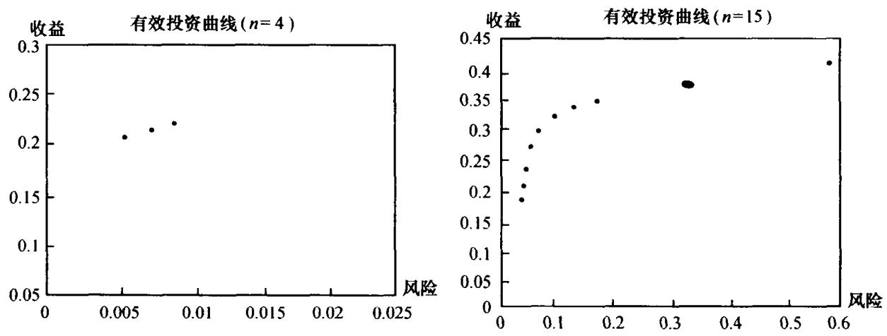

## 4. 适用性分析

当 $0 < X_{i} < \frac{u_{i}}{x_{i}}$ 线性规划模型可能不是最优解. 也就是说结果的正确性与 $M$ 有关, $M > \left(\frac{u_{i}}{x_{i}}\right)$ 时必最优, 但 $M < \left(\frac{u_{i}}{x_{i}}\right)$ 时结果不一定可靠. 比如对问题二, 当 $\lambda = 0.3$ 时, 这个临界值为2581; 对问题一, $\lambda = 0.9$ 时, 这个临界值为500.

## 五、模型的验证(略)

## 参考文献

[1] 运筹学, 清华大学出版社, 北京, 1990.  
[2] 赵锡军等, 金融投资学, 中国人民大学出版社, 北京, 1996.  
[3] 施阳, MATLAB 语言工具箱, 西北工业大学出版社, 西安, 1998.

# 投资收益与风险的优化模型

曾劲松 俞 杰 薛大雷

(华北工学院理学系, 太原 030054)

指导教师 雷英杰

编者按 本文将二目标优化问题,对两个目标作加权组合化成单目标优化问题.寻找最优解时采用了净收益率排序,风险固定时净收益率大者优先的原则,逐项确定各投资项目的投资额.对这一解法的合理性,文章给出了理论证明.解题步骤、理论依据均简明、清析.

摘要 本文以投资效益为目标,对投资问题建立了一个优化模型.由于不同的投资方式具有不同的收益和风险损失,该模型根据优化组合的原理,提出了两个准则,并根据准则从众多投资方式中选出若干种投资,组合成非劣投资,使经济效益尽可能最大,风险尽可能最小.

## 一、符号说明

$m_{i}$ — 购买 $S_{i}$ 的购买资金；G — 总体净收益；F — 总体风险；A — 投资效益； $(r_{i} - p_{i})/(1 + p_{i})$ — 投资效益率 $^{①}$ ;

$S_{k}$ — 在所有的投资项目中 $(r_{i}-p_{i})/(1+p_{i})$ 最大的那一投资项；

$g_{i}(m_{i})$ — 购买 $S_{i}$ 的投资资金为 $m_{i}$ 时的净收益；t — 投资项目数.

## 二、模型的建立与求解

银行存款可视为对 $S_{0}$ 的投资, 其平均收益率为 $r_{0} = 5\%$ , 风险损失率 $q_{0}$ 、购买费率 $p_{0}$ 皆为 0. 由于各项投资量都比较大, 为追求最大投资效益, 对第 i 项的投资至少应大于等于 $u_{i}$ .

$$
\begin{array}{l} A = G - K \cdot F \\ = \sum_ {i = 0} ^ {n} g _ {i} \left(m _ {i}\right) - K \cdot \max \left\{q \cdot m _ {i} \right\} (i = 0, 1, \dots , n) \\ = \sum_ {i = 0} ^ {n} (r _ {i} - p _ {i}) \cdot m _ {i} - K \cdot \max \left\{q _ {i} \cdot m _ {i} \right\} \\ = \sum_ {i = 0} ^ {n} m _ {i} (r _ {i} - p _ {i}) - K \cdot \max \left\{q _ {i} \cdot m _ {i} \right\} \\ \end{array}
$$

其中

$$
\sum_ {i = 0} ^ {n} m _ {i} (1 + p _ {i}) = M.
$$

准则一 当总体风险一定, 即 $F = \max\{q_{i} \cdot m_{i}\}(i = 0, 1, 2, \cdots, n)$ 一定时, 投资效益 A 取最大的必要条件是 $(r_{i} - p_{i})/(1 + p_{i})$ 值最大的那一项投资的购买额为 $F/q_{k}(F \leqslant M \cdot q_{k}/(1 + p_{k}))$ . 证(略)

准则二 若总体风险 F，总的资金 M 和投资项目为 $S_{k}$ 的风险损失率 $q_{k}$ ，购买费率 $p_{k}$ 满

足 $F \geqslant M \cdot q_k / (1 + p_k)$ 且所有投资都用来购买 $S_k$ 时，投资效益 $A$ 最大.证(略)

根据准则一, 当给定 $F(F \leqslant q_k \cdot M / (1 + p_k))$ 时, 若要 $A$ 最大, 需把 $(r_i - p_i) / (1 + p_i)$ 值最大的一项投资 $S_k$ 作为优先投资项目, 对该项投资 $F / q_k$ 后, 在后面的投资中仍需将 $(r_i - p_i) / (1 + p_i)$ 值较大者作为优先投资项目, 得到一个在 $F$ 一定时的最优投资方案.

根据准则二, 当 $F > q_k M$ 时所有资金都用来购买 $S_k$ , 对于题(1)所给的数据, 计算投资效益率 $(r_i - p_i)/(1 + p_i)$ 得

$$
\begin{array}{l} (r _ {0} + p _ {0}) / (1 + p _ {0}) = 0. 0 5 \quad (r _ {1} + p _ {1}) / (1 + p _ {1}) = 0. 2 6 7 3 \\ (r _ {2} + p _ {2}) / (1 + p _ {2}) = 0. 1 8 6 3 \quad (r _ {3} + p _ {3}) / (1 + p _ {3}) = 0. 1 7 7 0 \\ (r _ {4} + p _ {4}) / (1 + p _ {4}) = 0. 1 7 3 7 \\ \end{array}
$$

将投资效益率从大到小排列得

$$
\frac {r _ {1} - p _ {1}}{1 + p _ {1}} > \frac {r _ {4} - p _ {4}}{1 + p _ {4}} > \frac {r _ {3} - p _ {3}}{1 + p _ {3}} > \frac {r _ {2} - p _ {2}}{1 + p _ {2}} > \frac {r _ {0} - p _ {0}}{1 + p _ {0}}
$$

于是优先投资项的先后顺序为 $S_{1}, S_{2}, S_{3}, S_{4}, S_{0}$ , 假定所给 $M$ 为 1 时, 根据此方案, 对于不同风险的最佳投资方案如附表一(略).

对于一般的情况,可以对投资效益率排序,按优先顺序先后投资,且各投资量以不超过给定风险为限,则可得最佳投资方案.具体的计算过程如下

首先，由 $\sum_{j=0}^{t-1} \frac{F}{q_j} (1 + p_j) \leqslant M \leqslant \sum_{j=0}^{t} \frac{F}{q_j} \cdot (1 + p_j)$ 来确定 $t$ 的值，则

$$
G = \sum_ {j = 0} ^ {t - 1} \frac {F}{q _ {j}} \cdot (r _ {j} - p _ {j}) + \frac {M - \sum_ {j = 0} ^ {t - 1} \frac {F}{q _ {j}} \cdot (1 + p _ {j})}{1 + p _ {t}} \cdot (r _ {t} - p _ {t})
$$

其各项购买额 $m_{j}$ 为当 $j < 1$ 时， $m_{j} = \frac{F}{q_{j}}$ ；当 $j = t$ 时，

$$
m _ {j} = \left[ M - \sum_ {j = 0} ^ {t - 1} \frac {F}{q _ {j}} \cdot (1 + p _ {j}) \right] \cdot \frac {1}{1 + p _ {t}},
$$

当 $j > t$ 时， $m_{j} = 0$ .

## 模型评价与推广(略)

## 参考文献

[1] 赵国杰, 技术经济学, 天津大学出版社, 天津.  
[2] 庄俊鸿等, 投资经济学, 华南理工大学出版社, 广州.  
[3] 荆新等, 财务管理学, 中国人民大学出版社, 北京.

# 一类投资组合问题的建模与分析

浙江大学 陈叔平

复旦大学 谭永基

在今年的全国大学生数学建模竞赛中,陈叔平提供的赛题(即 A 题)被竞赛全国组委会采用.

该题是一类关于投资组合的决策问题,构思这道题目的主要动机是它有广泛的背景和一定的难度,同时也让参赛学生有较大的发挥余地.在人类的经济活动中,收益和风险往往是相伴而来的,不同的经营(或投资)项目有不同的收益和风险.此外,每一项目都需要经营(或投资)成本,而可用的资金都是有限的.因此相当大的一类决策问题可归结为在资金总额约束下,对一批成本—收益—风险各不相同的项目进行权衡并作出经营(或投资)抉择.我们可以列出许多这样的问题.下面就是一个例子.

某出版社有 $n$ 种不同的书籍可供选择出版. 确定出版一种图书时, 要支付固定数额的稿酬和制版费. 当印数达到某一数量时, 包括印刷发行费在内的整个成本可视为印数的线性函数. 此外每种图书都有各自的利润率, 但当第 $i$ 种图书印数为 $y_{i}$ 时, 将可能有 $g_{i}(y_{i})$ 的量销不出去, 这部分图书只能作为废纸回收处理, 相当于损失. 如果 $g_{i}(y_{i}) = q_{i}y_{i}$ , 其中 $q_{i}$ 是常值, 那么这一问题就与 A 题所给出的情形基本相同.

我们选择证券投资组合为具体背景是因为它是目前社会上的一个热点,接近大众生活,容易引起兴趣,但与此同时也带来了一些弊病.下面我们具体介绍这道赛题的几个特点,同时分析一下命题中的一些缺陷.

1. 交易费问题. 一项商业活动的成本一般由固定成本和可变成本两部分组成. 研制开发费、基建费等与产量无关的基本费用属固定成本. 原材料、能耗等与产量或经营规模相关的属可变成本. 赛题中给出的这类成本函数是有代表性和有趣的, 开发生产一种新药或新软件如此, 乘坐出租车也如此. 从数学上看, 这类成本函数非凸也非连续. 因此放到目标函数和约束条件中求解优化问题有一定的困难, 至少没有完全现成的方法可直接套用.  
2. 风险问题. 风险是人们都能意会、十分熟悉但又没有统一标准的一个量. 为了明确起见, 我们选择 $\max_{1 \leqslant i \leqslant n} q_i x_i$ 作为投资 $x_i$ 于 $S_i$ , $1 \leqslant i \leqslant n$ 的总体风险. 它反映了风险损失一般不会同时发生的现实, 也与一些文献 (如[1]) 中所采用的一致. 本拟给出这个具体表达式, 后考虑到检验参赛学生的建模能力而改成文字叙述. 由于问题的背景是证券投资, 一些参赛学生从各种不同的参考资料中查阅了金融风险的其他公式 (如Markowitz的定义, 见[2]), 从而引起了一定程度的混乱. 对金融风险的不同度量公式进行比较, 在完成本题基本要求基础上才予讨论.  
3. 多目标优化问题. 人们的经济行为之所以呈多样性, 主要原因是兼顾收益和风险时有不同的考虑, 且各人可支配的资金也不同. 追求大的收益和小的风险构成一个两目标优化问题. 传统上, 这类问题大多用某种方式化为单目标问题来求解. 例如, 将一个指标作为约束来优化另一指标, 或将两指标加权合成一个指标. 这一过程依赖于决策者对收益和风险的理解与偏好, 因而往往是不唯一的. 对固定的一个单目标优化问题求解不是主要目的, 因为所

得的结果对本题的具体背景并无太大的实际意义. 本题的决策包含两个层次: 首先是决定买哪些股票, 然后是决定各买多少. 对在不同的偏好考虑下算得的结果进行分析、比较则更有意义, 也有更大的讨论和发挥余地.

4. 计算和数据问题. 由于交易成本函数的非凸、非连续, 该题在一般情况下的求解是有一定难度的. 例如, 一维装箱问题就可化为固定风险水平条件下极大化收益这类问题的特殊情况. 吴雄伟的论文[3]曾对加权和模型的算法作过巧妙且较复杂的分析. 当资金总额不足以购买这 $N$ 种证券“起步值”之和, 即 $M \leqslant \sum_{i=1}^{n} u_i$ 时, 情况变得有些复杂. 因此我们加了 $M$ “相当大”这一条件. 当 $N$ 和 $\{(r_i, q_i, p_i, u_i)\}$ 的值由数据具体给出时, 就可构造各种数值算法. 由于命题较匆忙且宥于我国股市目前的实际情况, 赛题中给出的数据不够理想, 使得把交易成本当作线性函数处理时, 对计算结果的影响不大, 这就造成了解题和评卷时的又一些混乱.

## 一、参考建模与求解过程

## 1. 模型的建立

设购买 $S_{i}$ 的金额为 $x_{i}$ , 所需的交易费 $c(x_{i})$ 为

$$
c _ {i} (x _ {i}) = \left\{ \begin{array}{l l} 0, & x _ {i} = 0, \\ p _ {i} u _ {i}, & 0 <   x _ {i} <   u _ {i}, i = 1, 2, \dots , n, \\ p _ {i} x _ {i}, & x _ {i} \geqslant u _ {i}, \end{array} \right.
$$

设存银行的金额为 $x_{0}$ ，显然 $c_{0}(x_{0})=0$ 。

对 $S_{i}$ 投资的收益为

$$
R _ {i} (x _ {i}) = (1 + r _ {i}) x _ {i} - (x _ {i} + c _ {i} (x _ {i})) = r _ {i} x _ {i} - c _ {i} (x _ {i}),
$$

投资组合 $x=(x_{0},x_{1},\cdots,x_{n})$ 的净收益为

$$
R (x) = \sum_ {i = 0} ^ {n} R _ {i} (x _ {i}).
$$

由题意,投资的风险

$$
Q (x) = \max _ {1 \leqslant i \leqslant n} q _ {i} x _ {i},
$$

投资所需资金为

$$
F (x) = \sum_ {i = 0} ^ {n} (x _ {i} + c _ {i} (x _ {i})).
$$

因此,问题的数学模型是一个双目标优化:

$$
\min \left\{\binom{Q (x)}{- R (x)} \mid F (x) = M, x \geqslant 0 \right\}.
$$

## 2. 模型的约化

上述双目标优化模型可用多种方式化为单目标优化问题,主要有以下三种:

模型 a 固定风险水平,优化收益:

$$
\begin{array}{l} \max R (x), \\ \mathrm{s.t.} Q (x) \leqslant k, \\ F (x) = M, x \geqslant 0. \\ \end{array}
$$

模型 b 固定盈利水平,极少化风险:

$$
\begin{array}{l} \min Q (x), \\ \mathrm{s.t.} R (x) \geqslant h, \\ F (x) = M, x \geqslant 0. \\ \end{array}
$$

模型 c 确定投资者对风险—收益的相对偏好参数 $\rho > 0$ ，求解

$$
\begin{array}{l} \min \rho Q (x) - (1 - \rho) R (x), \\ \mathrm{s.t.} F (x) = M, x \geqslant 0. \\ \end{array}
$$

在上述三个问题中,选择 k, h 的不同水平和 $\rho$ 的不同值进行求解,就可揭示投资和风险之间的相互依存规律,再根据投资者对风险的承受能力,确定投资方案.

## 3. 化简与求解

因为 $M$ 相当大， $S_{i}$ 若被选中，其投资额 $x_{i}$ 一般都超过 $u_{i}$ ，投资费用可简化为

$$
c _ {i} (x _ {i}) = p _ {i} x _ {i}.
$$

在进行计算时, 可设 M=1, 此时 $(1+p_{i})x_{i}$ 可视作投资 $S_{i}$ 的比例.

对固定风险的情形,问题可化为求如下线性规划问题:

$$
\begin{array}{l} \max \sum_ {i = 0} ^ {n} (r _ {i} - p _ {i}) x _ {i}, \\ \mathrm{s.t.} q _ {i} x _ {i} \leqslant k, i = 1, 2, \dots , n, \\ \sum_ {i = 0} ^ {n} (1 + p _ {i}) x _ {i} = M. \\ \end{array}
$$

对于有相对偏好参数 $\rho$ 的优化问题, 引入变量 $x_{n+1}$ , 可化为如下线性规划:

$$
\begin{array}{l} \min L (x) = \rho x _ {n + 1} - (1 - \rho) \sum_ {i = 0} ^ {n} (r _ {i} - p _ {i}) x _ {i}, \\ \text {s.t.} \sum_ {i = 0} ^ {n} (1 + p _ {i}) x _ {i} = M, x \geqslant 0, \\ q _ {i} x _ {i} \leqslant x _ {n + 1}, i = 1, 2, \dots , n. \\ \end{array}
$$

这两个问题易于用 Mathematica, Matlab, Lingo 等数学软件来求解, 对固定收益、优化风险的问题也可作类似处理.

## 二、几点评述

多数参赛队能够正确地写出净收益的表达式. 有些参赛队用投资 $S_{i}$ 的全部费用(包括投资与手续费) $y_{i} = x_{i} + c_{i}(x_{i})$ 作基本变量. 当 $M$ 较大时 $c_{i}(x_{i}) = p_{i}x_{i}$ , 从而 $y_{i} = x_{i} + p_{i}x_{i} = (1 + p_{i})x_{i}$ , 因此收益表达式为

$$
R = \sum_ {i = 1} ^ {n} \frac {(r _ {i} - p _ {i}) y _ {i}}{1 + p _ {i}}.
$$

固定风险,优化收益问题就成为

$$
\max \sum \frac {(r _ {i} - p _ {i}) y _ {i}}{1 + p _ {i}},
$$

$$
\text {s.t.} \max \frac {q _ {i} y _ {i}}{1 + p _ {i}} \leqslant k,
$$

$$
\sum_ {i = 0} ^ {n} y _ {i} = M, y _ {i} \geqslant 0, i = 1, 2, \dots , n.
$$

此问题既可以用线性规划求解,但也可以证明,将 $\frac{r_{i}-p_{i}}{1+p_{i}}$ 按由大到小次序排队,投资时尽可能将资金投向 $\frac{r_{i}-p_{i}}{1+p_{i}}$ 最大的投资项目即能获得最优解.这样,无需求解线性规划也能获得最优解.

本题建模中主要的缺陷表现在两个方面. 其一, 计算投资总支出时遗漏交易费用, 约束条件误为

$$
\sum_ {i = 0} ^ {n} x _ {i} = M.
$$

另一个缺陷是未用题目的所要求的 $\max_{1\leqslant i\leqslant n}q_i x_i$ 作为风险的度量，而是采用Markowitz定义的风险.

在数值示解时,有些参赛队用随机模拟或枚举的方法求最优解,但计算量较大,精度也略差一些.有些参赛队直接解非线性规划,但没有注意到交易费不是一个光滑函数,因此目标函数和约束条件均不是可微的,而直接调用一些需用导数的非线性规划程序,这样做是不可取的.

各参赛队的答卷中总的来说对模型的验证、评价和敏感性分析等方面似嫌不足,有待提高.

## 参考文献

[1] Cai, X., Teo, K. L., Yang, X. Q. and Zhou, X. Y.. Portfolio Optimization Under Minimax Risk Measure. Management Sci. 1998  
[2] Elton, E.J. and Gruber, M.J., Modern Portfolio Theory and Investment Analysis. New York: John Wiley & Sons. 1995  
[3] 吴雄伟. 一类带交易成本的证券组合投资—模型及算法. 浙江大学博士学位论文, 1998

## 14. 灾情巡视路线(CUMCM 1998 年 B 题)

下图为某县的乡(镇)、村公路网示意图,公路边的数字为该路段的公里数.

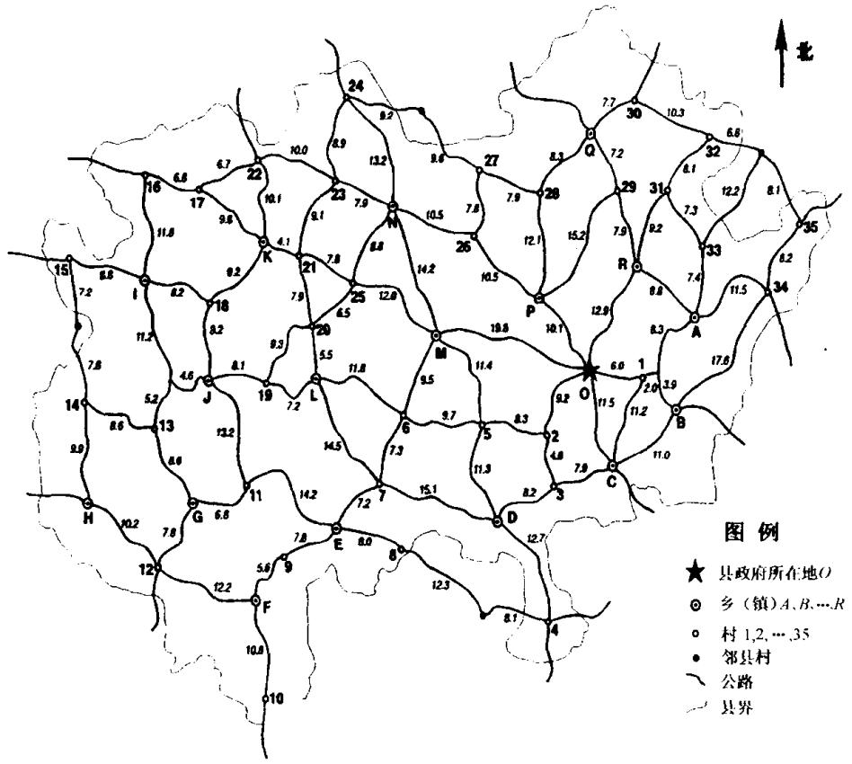

<details>
<summary>text_image</summary>

图例
★ 县政府所在地O
○ 乡（镇）A、B、…R
○ 村1,2,…,35
● 邻县村
— 公路
— 县界
</details>

图

今年夏天该县遭受水灾.为考察灾情、组织自救,县领导决定,带领有关部门负责人到全县各乡(镇)、村巡视.巡视路线指从县政府所在地出发,走遍各乡(镇)、村,又回到县政府所在地的路线.

1. 若分三组(路)巡视,试设计总路程最短且各组尽可能均衡的巡视路线.  
2. 假定巡视人员在各乡(镇)停留时间 $T = 2$ 小时, 在各村停留时间 $t = 1$ 小时, 汽车行驶速度 $V = 35$ 公里/小时. 要在 24 小时内完成巡视, 至少应分几组; 给出这种分组下你认为最佳的巡视路线.  
3. 在上述关于 $T, t$ 和 $V$ 的假定下, 如果巡视人员足够多, 完成巡视的最短时间是多少; 给出在这种最短时间完成巡视的要求下, 你认为最佳的巡视路线.  
4. 若巡视组数已定(比如三组), 要求尽快完成巡视, 讨论 $T, t$ 和 $V$ 改变对最佳巡视路线的影响.

# 最佳灾情巡视路线的数学模型

杨庭栋 李晓涛 郑长江

(解放军后勤工学院, 重庆 400016)

指导教师 赵 静

编者按 本文力求运用数学概念和方法来严格处理涉及的各种对象;力求借助于几何直观和生活体验的启发作用,为计算机搜索制定行之有效的操作规则;在数值结果方面,粗估与细节化相结合,从而提供较为完备的数值描述.本文第四部分定理证明中有误,为版面计从删.欲窥全豹,试索原文.

摘要 本文将求最佳巡视路线问题转化为图论中求最佳推销员回路的问题，并用近似算法去寻求近似最优解。对分组问题定义了均衡度用以衡量分组的均衡性。对问题1和问题2先定出几个分组的准则进行初步分组，并用近似算法求每一组的近似最佳推销员回路，再根据均衡度进行微调，得到较优的均衡分组和每组的近似最佳推销员回路，对问题1得出总路程较短且各组尽可能均衡的路线，各组的巡视路程分别为216.4公里，191.1公里，192.3公里，总路程为599.8公里。对问题2，证明了应至少分为4组，并求出了分为4组时各组的较优巡视路线，各组的巡视时间分别为22.74小时，22.59小时，21.69小时，22.54小时。对问题3，求出完成巡视的最短时间为6.43小时，并用较为合理的分组的准则，分成22个组。对问题4，研究了在不影响分组的均衡条件下，T, t, V的允许变化范围，并得出了这三个变量的关系式，并由此对分三个组的情况进行了具体讨论。

## 一、问题重述(略)

## 二、模型的假设与符号说明(略)

## 三、模型的建立与分析

本问题要求在某县的乡(镇)、村公路网中,寻找从县政府所在地(图中O点)出发,走遍各乡(镇)、村,又回到县政府所在地,使总路程或时间最少.将公路网图中,每个乡(镇)或村看为图中的一个节点,各乡(镇)、村之间的公路看作图中对应节点间的边,各条公路的长度(或行驶时间)看作对应边上的权,所给公路网就转化为图论中的加权网络图,问题就转化为一个图论问题,即在给定的加权网络图中寻找从给定点O出发,行遍所有顶点至少一次再回到O点,使得总权(路程或时间)最小.

为了讨论方便,先给出图论中相关的一些定义.

定义1 经过图 $G$ 的每个顶点正好一次的圈, 称为 $G$ 的哈米尔顿圈, 简称 $H$ 圈.

定义 2 在加权图 $G = (V, E)$ 中

(1) 权最小的哈米顿圈称为最佳 H 圈；  
(2) 经过每个顶点至少一次且权最小的闭通路称为最佳推销员回路.

由定义2可知,本问题是一个寻求最佳推销员回路的问题.最佳推销员回路的问题可转化为最佳H圈的问题.方法是由给定的图 $G=(V,E)$ 构造一个以V为顶点集的完备图 $G'=(V,E')$ , $E'$ 中每条边 $(x,y)$ 的权等于顶点x与y在图G中最短路径的权,即

$$
\forall (x, y) \in E ^ {\prime}, \omega (x, y) = \min d _ {G} (x, y).
$$

在图论中有以下定理：

定理1 加权图 $G$ 的最佳推销员回路的权和 $G'$ 的最佳 $H$ 圈的权相同.

定理2 在加权完备图中求最佳 $H$ 圈的问题是 $NP-$ 完全问题.

我们采用一种近似算法求出该问题的一个近似最优解,来代替最优解,算法如下:

算法一 求加权图 $G(V,E)$ 的最佳推销员回路的近似算法：

1. 用图论软件包求出 $G$ 中任意两个顶点间的最短路，构造出完备图 $G'(V, E')$

$$
\forall (x, y) \in E ^ {\prime}, \omega (x, y) = \min d _ {G} (x, y),
$$

2. 输入图 $G'$ 的一个初始 $H$ 圈；

3. 用对角线完全算法 $^{[2]}$ 产生一个初始H圈；

4. 随机搜索出 $G'$ 中若干个 H 圈, 例如 2000 个;

5. 对 2、3、4 步所得的每个 $H$ 圈, 用二边逐次修正法 ${ }^{[2]}$ 进行优化, 得到近似最佳 $H$ 圈;

6. 在第 5 步求出的所有 H 圈中, 找出权最小的一个, 此即要找的最佳 H 圈的近似解.

此算法程序见附录(略)(由于二边逐次修正法的结果与初始圈有关,故本算法第2、3、4步分别用三种方法产生初始圈,以保证能得到较优的计算结果).

问题一 若分为三组巡视,设计总路程最短且各组尽可能均衡的巡视路线.

此问题是多个推销员的最佳推销员回路问题. 即在加权图 G 中求顶点集 V 的划分 $V_{1}$ ， $V_{2}, \cdots, V_{n}$ ，将 G 分成 n 个生成子图 $G[V_{1}], G[V_{2}], \cdots, G[V_{n}]$ 使得

(1) 顶点 $O \in V_{i}, i = 1,2,3,\dots,n$ .

(2) $\bigcup_{i=1}^{n} V_i = V(G)$ .

(3) $\frac{\max_{i,j}|\omega(C_i)-\omega(C_j)|}{\max_i\omega(C_i)}\leqslant\alpha$ ，其中 $C_i$ 为 $V_i$ 的导出子图 $G[V_1]$ 中的最佳 $H$ 圈， $\omega(G_i)$ 为 $C_i$ 的权， $i,j=1,2,3,\cdots,n$

(4) $\sum_{i=1}^{n} \omega(C_i) = \min$

定义3 称 $\alpha_0 = \frac{\max_{i,j} |\omega(C_i) - \omega(C_j)|}{\max_i \omega(C_i)}$ 为该分组的实际路程均衡度. $\alpha$ 为最大容许均衡度. 显然 $0 \leqslant \alpha_0 \leqslant 1, \alpha_0$ 越小, 说明分组的均衡性越好. 取定一个 $\alpha$ 后, $\alpha_0$ 与 $\alpha$ 满足条件 (3) 的分组是一个均衡分组. 条件 (4) 表示总巡视路程最短.

此问题包含两方面:第一,对顶点分组;第二,在每组中求最佳推销员回路,即为单个推销员的最佳推销员问题.我们只能去寻求一种较合理的划分准则,对图1进行初步划分后,求出各部分的近似最佳推销员回路的权,再进一步进行调整,使得各部分满足均衡性条件(3).

从 $O$ 点出发去其它点, 要使路程较小应尽量走 $O$ 点到该点的最短路. 故用图论软件包求出 $O$ 点到其余顶点的最短路, 这些最短路构成一棵 $O$ 为树根的树, 将从 $O$ 点出发的树枝称为干枝, 见图1, 从图中可以看出, 人 $O$ 点出发到其它点共有6条干枝, 它们的名称分别为①, ②, ③, ④, ⑤, ⑥.

根据实际工作的经验及上述分析,在分组时应遵从以下准则:

准则一 尽量使同一干枝上及其分枝上的点分在同一组；

准则二 应将相邻的干枝上的点分在同一组；

准则三 尽量将长的干枝与短的干枝分在同一组.

由上述分组准则,我们找到两种分组形式如下:

分组一:(⑥,①),(②,③),(⑤,④);

分组二:(①,②),(③,④),(⑤,⑥);

显然分组一的方法极不均衡,故考虑分组二.

对分组二中每组顶点的生成子图,用算法一求出近似最优解及相应的巡视路线.使用算法一时在每个子图所构造的完备图中,取一个尽量包含图1中树上的边的H圈作为其第2步输入的初始圈.

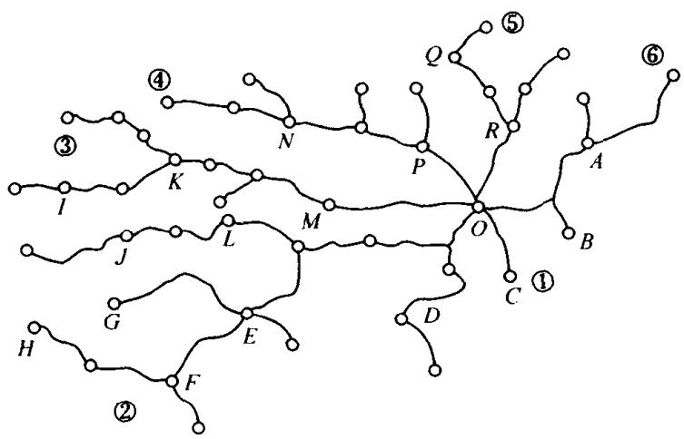

<details>
<summary>text_image</summary>

①
②
③
④
⑤
⑥
I
K
N
P
R
Q
A
B
C
D
E
F
G
H
J
L
M
O
</details>

图1 $O$ 点到任意的最短路线图

分组二的近似解见表1.

表 1 （单位:公里）

<table><tr><td>小组名称</td><td>路线</td><td>总路线长度</td><td>路线的总长度</td></tr><tr><td>I</td><td> $O - P - 28 - 27 - 26 - N - 24 - 23 - 22 - 17 - 16 - I - 15 - I - 18 - K - 21 - 20 - 25 - M - O$ </td><td>191.1</td><td rowspan="3">558.5</td></tr><tr><td>II</td><td> $O - 2 - 5 - 6 - L - 19 - J - 11 - G - 13 - 14 - H - 12 - F - 10 - F - 9 - E - 7 - E - 8 - 4 - D - 3 - C - O$ </td><td>241.9</td></tr><tr><td>III</td><td> $O - R - 29 - Q - 30 - 32 - 31 - 33 - 35 - 34 - A - B - 1 - O$ </td><td>125.5</td></tr></table>

因为该分级的均衡度

$$
\alpha_ {0} = \frac {\omega (C _ {1}) - \omega (C _ {2})}{\max _ {i = 1 , 2 , 3} \omega (C _ {i})} = \frac {2 4 1 . 9 - 1 2 5 . 5}{2 4 1 . 9} = 5 4. 2\%
$$

所以此分法的均衡性很差.

为改善均衡性,将第Ⅱ组中的顶点C,2,3,D,4划归第Ⅲ组,重新分组后的近似最优解见表2,各组的近似最优巡视路线见图2.

表 2 （单位:公里）

<table><tr><td>编号</td><td>路线</td><td>路线长度</td><td>路线总长度</td></tr><tr><td>I</td><td> $O - P - 28 - 27 - 26 - N - 24 - 23 - 22 - 17 - 16 - I - 15 - I - 18 - K - 21 - 20 - 25 - M - O$ </td><td>191.1</td><td rowspan="3">599.8</td></tr><tr><td>II</td><td> $O - 2 - 5 - 6 - 7 - E - 8 - E - 9 - F - 10 - F - 12 - H - 14 - 13 - G - 11 - J - 19 - L - 6 - 5 - 2 - O$ </td><td>216.4</td></tr><tr><td>III</td><td> $O - R - 29 - Q - 30 - 32 - 31 - 33 - 35 - 34 - A - 1 - B - C - 3 - D - 4 - D - 3 - 2 - O$ </td><td>192.3</td></tr></table>

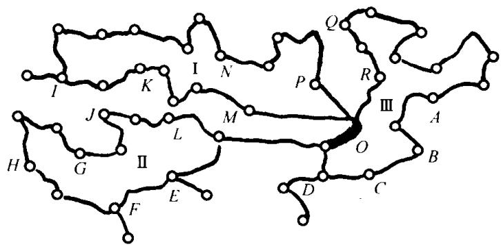

<details>
<summary>text_image</summary>

I
K
I
N
P
Q
R
J
L
M
III
A
O
B
H
G
II
F
E
D
C
</details>

图 2 分为 3 组时各组的巡视路线图  
注：图中粗线部分为Ⅱ组与Ⅲ组共同经过的路线

下面对此结果进行分析.因该分组的均衡度

$$
\alpha_ {0} = \frac {\omega (C _ {1}) - \omega (C _ {2})}{\max _ {i = 1 , 2 , 3} \omega (C _ {i})} = \frac {2 1 6 . 4 - 1 9 1 . 1}{2 1 6 . 4} = 1 1. 6 9
$$

所以这种分法的均衡性较好. 若取最大容许的均衡度 $\alpha = 12\%$ , 则这是一个均衡分组.

$$
\begin{array}{l} \text {用算法一算出整个网络图的近似最佳推销员巡回为} O - C - 3 - 2 - 5 - D - 4 - 8 - \\ E - 9 - F - 1 0 - F - 1 2 - H - 1 2 - G - 1 1 - J - 1 9 - L - 7 - 6 - M - N - 2 5 - 2 0 - \\ 2 1 - K - 1 8 - J - 1 3 - 1 4 - 1 5 - I - 1 6 - 1 7 - 2 2 - 2 3 - 2 4 - 2 7 - 2 6 - P - 2 8 - Q - \\ 3 0 - Q - 2 9 - R - 3 1 - 3 3 - 3 1 - 3 2 - 3 5 - 3 4 - A - B - O. \end{array}
$$

总路长为 588.6 公里. 而表 2 中三组巡回的总路线长为 599.8 公里. 可以认为这样设计的分组方法和巡回路线能使总路线近似最短.

问题二 当巡视人员在各乡(镇)、村的停留时间一定,汽车的行驶速度一定,要在24小时内完成巡视,至少要分几组及最佳的巡视路线.

由于 T = 2 小时, t = 1 小时, V = 35 公里 / 小时, 需访问的乡镇共有 17 个, 村共有 35 个. 计算出在乡(镇)及村的总停留时间为 $17 \times 2 + 35 = 69$ 小时, 要在 24 小时内完成巡回, 考虑行走时间, 故至少要分 4 组.

由于该网络的乡(镇)、村分布较为均匀,故有可能找出停留时间尽量均衡的分组,当分4组时各组停留时间大约为 $\frac{69}{4}=17.25$ 小时,则每组分配在路途上的时间大约为24-17.25=6.75小时.而前面讨论过,分三组时有个总路599.8公里的巡视路线,分4组时的总路程不会比599.8公里大太多,不妨以599.8公里来计算.路上时间约为 $\frac{599.8}{35}=17$ 小时,若平均分配给4个组,每个组约需 $\frac{17}{4}=4.25$ 小时<6.75小时,故分成4组是可能办到的.

现在尝试将顶点分为4组.分组的原则:除遵从前面准则一、二、三外,还应遵从以下准则:

准则四 尽量使各组的停留时间相等.

用上述原则在图1上将图分为4组,同时计算各组的停留时间,然后用算法一算出各组的近似最佳推销员巡回,得出路线长度及行走时间,从而得出完成巡视的近似最佳时间.用算法一计算时,初始圈的输入与分三组时同样处理.

注1. 图中粗线表示其中两组都要经过的路段.2. 方框中的点表示其中两组都经过的地主.3. 方框中有两字符,罗马字符表示要停留于此地的巡视组,另一字符表示此地点的代号.

这 4 组的近似最优解见表 3, 各组的近似最优巡视路线见图 3.

表 2 （单位:公里）

<table><tr><td>组名</td><td>路线</td><td>路线总长度</td><td>停留时间</td><td>行走时间</td><td>完成巡视的总时间</td></tr><tr><td>I</td><td> $O - 2 - 5 - 6 - 7 - E - 8 - E - 11 - G - 12 - H - 12 - F - 10 - F - 9 - E - 7 - 6 - 5 - 2 - O$ </td><td>1995.8</td><td>17</td><td>5.59</td><td>22.59</td></tr><tr><td>II</td><td> $O - \bar{R} - 29 - Q - 30 - Q - 28 - 27 - 26 - N - 24 - 23 - 22 - 17 - 16 - 17 - \bar{K} - 22 - 23 - N - 26 - P - O$ </td><td>199.2</td><td>16</td><td>5.69</td><td>21.69</td></tr><tr><td>III</td><td> $O - M - 25 - 20 - 21 - K - 18 - I - 15 - 14 - 13 - J - 19 - L - \bar{6} - M - O$ </td><td>159.1</td><td>18</td><td>4.54</td><td>22.54</td></tr><tr><td>IV</td><td> $O - R - A - 33 - 31 - 32 - 35 - 34 - B - 1 - C - - D - 4 - D - 3 - \bar{2} - O$ </td><td>166</td><td>18</td><td>4.74</td><td>22.74</td></tr></table>

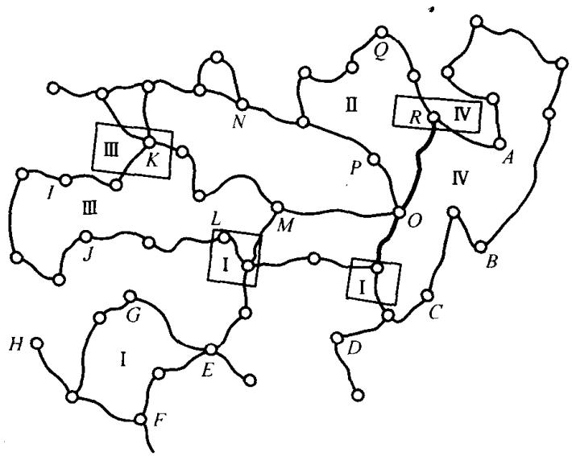

<details>
<summary>text_image</summary>

I
II
III
K
N
P
R
IV
A
O
IV
B
L
M
J
I
I
C
D
G
H
I
E
F
</details>

图 3 分为 4 组时各组的巡视路线图

表中符号说明:黑体表示前面经过并停留过,此次只经过不需停留;上加横线的表示此点只经过不停留.该分组实际均衡度

$$
\alpha_ {0} = \frac {2 2 . 7 - 2 1 . 6 9}{2 2 . 7 4} = 4. 62\%
$$

可以看出,表3分组的均衡度很好,且完全满足24小时完成巡视的要求.

问题三 在 $T, t, V$ 的假定下, 巡视人员足够多, 完成巡视的最短时间为多少, 并给出此条件下的最佳路线.

我们发现从 O 点巡视 H 点的最短时间是所有最短时间中最长的, 其距离为 77.5 公里, 算出时间为

$$
t _ {H} = \frac {7 7 . 5}{3 5} \times 2 + 2 = 6. 4 3 \text {小时},
$$

因此，T = 2 小时，t = 1 小时，V = 35 公里 / 小时时，若巡视人员足够多，完成巡视的最短时间为 6.43 小时。

在最短时间的限定下,完成巡视的最优路线应满足如下条件:

(1) 每个组巡视的总时间不能超过最短时间 $t_{H} = 6.43$ 小时；  
(2) 所有的点都必须访问到, 不能漏点;  
(3) 所需巡视组数要尽量少.

在寻求最优路线时,从距离 O 点较远的一些点(如 12,10,15,22 等点)开始搜索比较容易,因为到这些点的路线比较少.

具体方法如下：

第一步 依据图1算出从 $O$ 点到每一个点的最短距离；

第二步 找出其中最大的一个,算出从 O 点沿最短路巡视所需的时间 $t_{i}$ , 并求 $\Delta t = t_{H} - t_{i}$ .

第三步 若 $\Delta t < 1$ ，则这一组只能访问这一点；

若 $\Delta t < 1$ ，则在余下的点中找到距离 $O$ 点最远的点，根据条件看这一组能否巡视这一点。

第四步 若能巡视则算出 $\Delta t$ ，转到第三步；

第五步 若不能,则依次判断次远点、第三远点 $\cdots$ ,满足总巡视时间不超过 $t_{H}$ , 就让这组巡视这一点,直到 $\Delta t < 1$ ,然后再从第二步开始.

通过以上的方法,最后我们找到的最优解是22个组.如表4.

问题四 巡视组数已定,要求尽快完成巡视,讨论 T,t 和 V 的改变对最佳巡视路线的影响.

要尽快完成巡视, 就得要求每组完成巡视时间尽量均衡, 因为总的完成巡视时间按最长的完成巡视时间计算. 现在讨论在在均衡允许的范围内已分成 $n$ 组后, 改变 $T, t, V$ 对最佳巡视路线的影响. 显然在分组不变的情况下, 无论 $T, t, V$ 如何改变, 对每组内的最佳巡视路线是没有影响的, 但可能会影响各组间的均衡性. 因此该问题实际上是讨论 $T, t, V$ 对分组的影响, 即在不破坏原来分组均衡的条件下, $T, t, V$ 允许的最大变化范围.

在分 n 组的情况下, 设

$S_{i}$ : 表示第 i 组的最佳推销员回路路线总长度;

表 4 （时间单位:小时）

<table><tr><td>编号</td><td>巡视路径</td><td>停留地点</td><td>所需时间</td><td>时间差</td></tr><tr><td>1</td><td>O - H - O</td><td>H</td><td>6.43</td><td>0</td></tr><tr><td>2</td><td>O - 2 - 5 - 6 - L - 19 - J - 13 - 14 - 13 - J - 19 - L - 6 - 5 - 2 - O</td><td>13,14</td><td>6.15</td><td>0.28</td></tr><tr><td>3</td><td>O - M - 25 - 21 - K - 18 - I - 15 - I - 16 - 17 - K - 21 - 25 - M - O</td><td>15,16</td><td>6.31</td><td>0.12</td></tr><tr><td>4</td><td>O - 2 - 5 - 6 - 7 - E - 9 - F - 12 - G - 11 - E - 7 - 6 - 5 - 2 - O</td><td>12,11</td><td>5.94</td><td>0.49</td></tr><tr><td>5</td><td>O - 2 - 5 - 6 - 7 - E - 8 - E - 9 - F - 10 - F - 9 - E - 7 - 6 - 5 - 2 - O</td><td>8,10</td><td>6.22</td><td>0.21</td></tr><tr><td>6</td><td>O - 2 - 5 - 6 - .7 - E - 11 - G - 11 - E - 7 - 6 - 5 - 2 - O</td><td>G</td><td>5.58</td><td>0.85</td></tr><tr><td>7</td><td>O - 2 - 5 - 6 - 7 - E - 9 - F - 9 - E - 7 - 6 - 5 - 2 - O</td><td>9,F</td><td>6.14</td><td>0.29</td></tr><tr><td>8</td><td>O - 2 - 5 - 6 - L - 19 - J - 18 - K - 21 - 25 - M - O</td><td>J,18</td><td>6.29</td><td>0.14</td></tr><tr><td>9</td><td>O - M - 25 - 21 - K - 18 - I - 18 - K - 21 - 25 - M - O</td><td>I</td><td>5.49</td><td>0.94</td></tr><tr><td>10</td><td>O - M - 25 - 21 - K - 17 - 22 - 23 - N - 26 - P - O</td><td>17,22,23</td><td>6.12</td><td>0.31</td></tr><tr><td>11</td><td>O - 2 - 5 - 6 - L - 19 - L - 6 - 5 - 2 - O</td><td>L,19</td><td>5.64</td><td>0.79</td></tr><tr><td>12</td><td>O - M - 25 - 20 - 21 - 23 - 24 - N - 26 - P - O</td><td>20,21,24</td><td>6.10</td><td>0.33</td></tr><tr><td>13</td><td>O - M - 25 - 21 - K - 21 - 25 - M - O</td><td>25,K</td><td>5.50</td><td>0.93</td></tr><tr><td>14</td><td>O - 2 - 5 - 6 - 7 - E - 7 - 6 - 5 - 2 - O</td><td>6,7,E</td><td>6.38</td><td>0.05</td></tr><tr><td>15</td><td>O - R - 31 - 32 - 35 - 34 - A - 1 - O</td><td>31,32,35,34</td><td>6.32</td><td>0.11</td></tr><tr><td>16</td><td>O - R - 29 - Q - 30 - Q - 28 - P - O</td><td>Q,30,28</td><td>6.11</td><td>0.32</td></tr><tr><td>17</td><td>O - P - 26 - 27 - 26 - N - 26 - P - O</td><td>26,27,N</td><td>6.32</td><td>0.20</td></tr><tr><td>18</td><td>O - 2 - 3 - D - 4 - D - 3 - 2 - O</td><td>3,D,4</td><td>5.99</td><td>0.44</td></tr><tr><td>19</td><td>O - 1 - A - 33 - 31 - R - 29 - R - O</td><td>A,33,29</td><td>5.97</td><td>0.46</td></tr><tr><td>20</td><td>O - 2 - 5 - M - O</td><td>2,5,M</td><td>5.40</td><td>1.03</td></tr><tr><td>21</td><td>O - 1 - B - C - O</td><td>1,B,C</td><td>5.98</td><td>0.45</td></tr><tr><td>22</td><td>O - P - O - R - O</td><td>P,R</td><td>5.32</td><td>1.11</td></tr></table>

$X_{i}$ : 表示第 i 组所要停留的乡镇的数目;

$Y_{i}$ : 表示第 i 组所要停留的村的数目;

$$
i = 1, 2, 3, \dots , n.
$$

显然，当 $X_{i}=X_{j}, Y_{i}=Y_{j}, S_{i}=S_{j}; i, j=1,2,3,\cdots,n$ 时，即每组的乡（镇）数、村数、最佳巡回的长度均相等，因而分组绝对均衡时，即 $\alpha_{0}=0$ ，无论 T, t, V 如何改变都不会改变原来分组的均衡。

## （一）不影响分组的均衡时，T, t, V 的最大允许变化范围的讨论：

对任意一个组 i, 其完成巡视的时间

$$
T _ {i} = X _ {i} T + Y _ {i} t + \frac {S _ {i}}{V}, i = 1, 2, 3, \dots , n.
$$

设均衡分组的最大允许时间均衡度为 $\alpha$ ，即

$$
\frac {| T _ {i} - T _ {j} |}{\max _ {i = 1, 2, \cdots , n} T _ {i}} \leqslant \alpha , i, j = 1, 2, \dots , n,
$$

则有

$$
\mid T _ {i} - T _ {j} \mid \leqslant \alpha \cdot \max _ {i = 1, 2, \dots , n} T _ {i}
$$

记 $\varepsilon = \alpha \cdot \max_{i=1,2,\cdots,n} T_{i}$ ，则 $\varepsilon$ 表示均衡分组所允许的最大时间误差，称为最大允许时间误差。则

$$
\left| (X _ {i} - X _ {j}) \cdot T + (Y _ {i} - Y _ {j}) \cdot t + \frac {S _ {i} - S _ {j}}{V} \right| \leqslant \varepsilon \tag {1}
$$

由式(1) 我们得到

$$
- \varepsilon \leqslant (X _ {i} - X _ {j}) \cdot T + (Y _ {i} - Y _ {j}) \cdot t + \frac {S _ {i} - S _ {j}}{V} \leqslant \varepsilon , \tag {2}
$$

由式(2)可推出以下结果

1. 当 $X_{i} - X_{j} > 0$ 时, 要保持原均衡分组不变, $T$ 必须满足的条件为

$$
\begin{array}{l} \max _ {X _ {i} - X _ {j} > 0} \left\{\frac {- \varepsilon - (Y _ {i} - Y _ {j}) \cdot t + \frac {S _ {i} - S _ {j}}{V}}{X _ {i} - X _ {j}} \right\} \\ \leqslant T \leqslant \max _ {X _ {i} - X _ {j} > 0} \left\{\frac {\varepsilon - (Y _ {i} - Y _ {j}) \cdot t + \frac {S _ {i} - S _ {j}}{V}}{X _ {i} - X _ {j}} \right\}. \tag {3} \\ \end{array}
$$

2. 当 $Y_{i} - Y_{j} > 0$ 时, 要保持原均衡分组不变, $t$ 必须满足的条件为

$$
\begin{array}{l} \max _ {Y _ {i} - Y _ {j} > 0} \left\{\frac {- \varepsilon - \left(X _ {i} - X _ {j}\right) \cdot T - \frac {S _ {i} - S _ {j}}{V}}{Y _ {i} - Y _ {j}} \right\} \\ \leqslant t \leqslant \max _ {Y _ {i} - Y _ {j} > 0} \left\{\frac {\varepsilon - (X _ {i} - X _ {j}) \cdot T - \frac {S _ {i} - S _ {j}}{V}}{Y _ {i} - Y _ {j}} \right\}. \tag {4} \\ \end{array}
$$

3. 当 $S_{i} - S_{j} > 0$ 时, 由(2)式得

$$
(X _ {j} - X _ {i}) \cdot T + (Y _ {j} - Y _ {i}) \cdot t - \varepsilon \leqslant \frac {S _ {i} - S _ {j}}{V} \leqslant \varepsilon (X _ {i} - X _ {j}) \cdot T - (Y _ {i} - Y _ {j}) \cdot t
$$

① 当 $0 \leqslant (X_{j} - X_{i}) \cdot T + (Y_{j} - Y_{i}) \cdot t \leqslant \varepsilon$ 时，有

$$
V \geqslant \max _ {S _ {i} - S _ {j} > 0} \left\{\frac {S _ {i} - S _ {j}}{\varepsilon - (X _ {i} - X _ {j}) \cdot T - (Y _ {i} - Y _ {j}) \cdot t} \right\} \tag {5}
$$

② 当 $(X_{j}-X_{i})\cdot T+(Y_{j}-Y_{i})\cdot t>\varepsilon$ 时,有

$$
\begin{array}{l} \max _ {S _ {i} - S _ {j} > 0} \left\{\frac {S _ {i} - S _ {j}}{\varepsilon - (X _ {i} - X _ {j}) \cdot T - (Y _ {i} - Y _ {j}) \cdot t} \right\} \\ \leqslant V \leqslant \max _ {S _ {i} - S _ {j} > 0} \left\{\frac {S _ {i} - S _ {j}}{(X _ {j} - X _ {i}) \cdot T + (Y _ {j} - Y _ {i}) \cdot t - \varepsilon} \right\} \tag {6} \\ \end{array}
$$

由(3)-(6)式, 当 T, t, V 三个变量中任意两个变量无论如何变化, 都可计算出为保持均衡分组不变, 三个变量所允许的最大变化范围.

## （二）分三组的实例讨论

现对分三组的情况进行讨论. 对问题一中所得的三个分组, 若考虑停留时间和行驶时间, 且取 $T = T_{0} = 2$ 小时, $t = t_{0} = 1$ 小时, $V = V_{0} = 35$ 公里/小时时, 结果如表5.
表 5 （路程单位:公里;时间单位:小时）

<table><tr><td>编号</td><td> $X_i$ </td><td> $Y_i$ </td><td> $S_i$ </td><td>行驶时间</td><td>总时间</td></tr><tr><td>I</td><td>5</td><td>13</td><td>191.1</td><td>5.46</td><td>28.46</td></tr><tr><td>II</td><td>6</td><td>11</td><td>192.3</td><td>5.49</td><td>28.49</td></tr><tr><td>III</td><td>6</td><td>11</td><td>216.4</td><td>6.18</td><td>29.18</td></tr></table>

实际均衡度为 $\alpha_{0}=\frac{29.18-28.46}{29.18}=2.5\%$ .

实际时间误差为 $\varepsilon_{0}=2.5\%\times29.18=0.72$ 小时.

现分别规定均衡分组的最大允许均衡度 $\alpha = 2.5\%$ 和 $\alpha = 5\%$ ，即最大容许的时间误差分别为 $\varepsilon = 0.72$ 小时和 $\varepsilon = 1.44$ 小时，计算出 T, t, V 三个参量中固定任意两个时，要不破坏原均衡分组，另一个参量所容许的变化范围。结果如下表：

表6

<table><tr><td></td><td> $t, V$ 不变</td><td> $T, V$ 不变</td><td> $T, t$ 不变</td></tr><tr><td> $\alpha = 2.5\% , \varepsilon = 0.72$ 小时</td><td> $1.25 \leqslant T \leqslant 2$ </td><td> $1 \leqslant t \leqslant 1.38$ </td><td> $V \geqslant 35$ </td></tr><tr><td> $\alpha = 5\% , \varepsilon = 1.44$ 小时</td><td> $0.51 \leqslant T \leqslant 2.74$ </td><td> $0.63 \leqslant t \leqslant 1.75$ </td><td> $V \geqslant 17.3$ </td></tr></table>

表上表可以看出：

（1）当实际均衡度 $\alpha_{0}=2.5\%$ 刚好等于最大容许均衡度 $\alpha=2.5\%$ 时，要保持原均衡分组，当

t, V 不变时, T 只能减小, 且下界为 1.25 小时; T 的上界为 $T_{0} = 2$ 小时;

T, V 不变时, t 只能增大, 且上界为 1.38 小时; t 的下界为 $t_{0} = 1$ ;

T, t 不变时, V 只能增大, 且无上界. V 的下界为 $V_{0} = 35$ .

(2) 当实际均衡度 $\alpha_{0}=2.5\%$ 小于最大容许均衡度 $\alpha=2.5$ 时, 即 $\varepsilon_{0}<\varepsilon$ 时要保持原均衡分组, 当

t, V 不变时, T 变化的下界为 0.51 小时, 上界为 2.74 小时;

T, V 不变时, t 变化的下界为 0.63 小时, 上界为 1.75 小时;

T, t 不变时, V 可以增大但无上界, 也可减小, 且下界为 17.3 公里 / 小时.

## （三）对实例结果的分析.

上述实例的均衡分组有一个特点:各组的停留时间相等,即取 $T = T_{0} = 2$ 小时, $t = t_{0} = 1$ 小时, $V = V_{0} = 35$ 公里/小时时,在表5的分组中

$$
(X _ {i} - X _ {j}) \cdot T _ {0} + (Y _ {i} - Y _ {j}) \cdot t _ {0} = 0, i, j = 1, 2, 3 \tag {7}
$$

定义4 各组的停留时间相等的均衡分组称为停留时间相等的均衡分组.由(7)式得

$$
T _ {0} = - \frac {Y _ {i} - Y _ {j}}{X _ {i} - X _ {j}} \cdot t _ {0}, X _ {i} - X _ {j} \neq 0, i, j = 1, 2, 3 \tag {8}
$$

现讨论对停留时间相等的均衡分组，T, t, V 的变化规律.

对停留时间相等的均衡分组,分组的实际时间误差:

$$
\begin{array}{l} \varepsilon_ {0} = \max _ {i, j} \left\{\left| \left(X _ {i} - X _ {j}\right) \cdot T _ {0} + \left(Y _ {i} - Y _ {j}\right) \cdot t _ {0} + \frac {S _ {i} - S _ {j}}{V _ {0}} \right| \right\} \\ = \max _ {i, j} \left\{\left| \frac {S _ {i} - S _ {j}}{V _ {0}} \right| \right\} = \frac {S _ {i ^ {\prime}} - S _ {j ^ {\prime}}}{V _ {0}} \tag {9} \\ \end{array}
$$

其中， $i^{\prime}$ 为使 $S_{i}$ 最大的组的标号； $j^{\prime}$ 为使 $S_{j}$ 最小的组的标号. （\*）

当 $T, t$ 不变时，即 $T = T_0, t = t_0$ 时因 $(X_i - X_j) \cdot T_0 + (Y_i - Y_j) \cdot t_0 = 0 < \varepsilon$ ，由式(6)知，要保持平衡分组， $V$ 的下界应为

$$
\begin{array}{l} V _ {\min} = \max _ {S _ {i} - S _ {j} > 0} \left\{\frac {S _ {i} - S _ {j}}{\varepsilon - \left(X _ {i} - X _ {j}\right) \cdot T _ {0} - \left(Y _ {i} - Y _ {j}\right) \cdot t _ {0}} \right\} \\ = \max _ {S _ {i} \quad S _ {j} > 0} \left\{\frac {S _ {i} - S _ {j}}{\varepsilon} \right\} \\ = \frac {S _ {i ^ {\prime}} - S _ {j ^ {\prime}}}{\varepsilon} \quad i ^ {\prime}, j ^ {\prime} \text {的含义同} (*) \\ \end{array}
$$

① 取 $\varepsilon = \varepsilon_0$ 时，由(9)式得

$$
V _ {\max} = \frac {S _ {i ^ {\prime}} - S _ {j ^ {\prime}}}{\varepsilon} = V _ {0}
$$

② $\varepsilon > \varepsilon_{0}$ 时，由(9)式得

$$
V _ {\min} = \frac {S _ {i ^ {\prime}} - S _ {j ^ {\prime}}}{\varepsilon} <   V _ {0}
$$

故有以下定理

定理 当取 $V = V_{0}, T = T_{0}, t = t_{0}$ 时，对图进行停留时间相等的均衡分组后，设该分组的实际时间误差为 $\varepsilon_{0}$ .

(1) 若取最大允许时间误差 $\varepsilon = \varepsilon_{0}$ ，当 T, t 不变时，要使该均衡分组保持不变，V 的下界为 $V_{0}$ ，即 V 只能增加不能减少；  
(2) 若取最大允许时间误差 $\varepsilon > \varepsilon_{0}$ ，当 T, t 不变时，要使该均衡分组保持不变，V 的变化范围的下界小于 $V_{0}$ .

## 四、模型的推广(略)

## 五、优缺点分析

优点

1. 本文提出的分组准则简便易行, 可操作性强, 且可逐步调整使分组达到均衡.  
2. 用均衡度的概念定量的刻画了分组的均衡性.  
3. 在用近似算法求近似最佳推销员回路时,采取了三种不同的方法产生初始圈,使得算法比较完善,得到了误差很小的近似最优解.  
4. 从理论上定量地讨论了 $V, T, t$ 的变化对均衡分组灵敏度的影响, 得到了得好的结果. 缺点(略)

## 参考文献

[1] 舒贤林, 余志才编著, 图论基础及应用.  
[2] 龚劬编, 图论与网络最优算法.  
[3] 费培之编著, 图和网络及其应用.

# 灾情巡视路线的设计

韦芳芳 杨兰兰 柏瑞

(东南大学, 南京 210018)

指导教师 杨廉峰

编者按 本文不仅提出了若干种确定初始巡视路线的方法,而且对路线的调整给出了一些准则和启发式算法,简捷、有效地解决了各个问题,行文简明、通畅.

摘要 本文建模的主要思想是将巡视路线的设计分为两个部分:首先生成一个可行的巡视路线,然后利用启发式算法对巡视路线进行调整优先.对可行路线的生成给出了三种方法,1.采用直观判断,较为简单.2.借鉴了求Hamilton圈的方法.3.基于最小生成树;求出的路线总路程较短,为553.6公里.本文采用方法3得出的路线作为启发式算法的初始路线.

本文提出了一系列启发式算法并采用一定的调整规则对初始路线进行了调整,较好地解决了所提出的问题.对于问题1,给出了均衡度的概念来衡量各组路线的均衡性.解为总路程587.2公里,均衡度0.16;对于问题2,采用点调整的规则求出用4组完成巡视所需的最短的时间22.62小时,对于问题3,采用一种最短路线调整法求出在最短的时间6.43小时内,用22组就可以完成巡视.

## 问题重述与模型假设(略)

## 问题分析

问题要求对巡视的路线进行设计,同时必须考虑的因素包括总路程最短、组数的选择和各组巡视路线尽量均衡的条件下完成一次巡视需要的最短时间.按如下几点进行分析:

1. 关于总路程和组数的关系, 我们引入定理一: 当有 $i$ 个组同时进行巡视时, 必然存在一总路程最短的路线, 记这时的总路程为 $d$ , 则对于 $j$ 组的巡视若 $i \geqslant j$ , 有 $d_i \geqslant d_j$ . (附录一)  
2. 为了对各组之间的均衡度进行量化, 引入距离均衡度的概念. 距离均衡即要求各组巡视所经过的路程 $a_{i}$ 尽量接近, 由此定义均衡度来衡量这种接近程度, 距离均衡度 $B = \frac{\max\{a_{i}\} - \max\{a_{i}\}}{a / n}$ , 在同等条件下, $B$ 越大, 各组越不均衡.

3. 由1可知, 要求总路程最短, 在极限情况下为只有一组进行巡视, 由定理1此时巡视总路程最短, 但由于只有一组同时巡视时消耗时间较多, 只有在人员较缺乏的情况下, 采用一组巡视. 在多组同时巡视时要求尽量均衡的情况下(问题一), 本文定义只有满足均衡度 $B < 0.2$ 的路线为可行路线.

4. 当 $n = 1$ 时, 该问题可以转化为“货郎担”问题为 NPC 问题, 因此无法给出最优解, 只能给出一种启发式算法, 得到一个较优解.

本文建立的模型就是基于这种考虑首先给出一些初始路线,然后提出了一些启发式算法,按照一定的规则对初始路线进行优化.

## 模型准备

1. 问题2要求给出满足一定要求的最小分组数, 因此必须知道总路程的一个下界. 根据定理一, 显然一组巡视时的最优路线是总路程的一个较好的下界. 但由于一组巡视时的最优路线与“货郎担”问题是等价的, 因而是不可解的. 所以我们要用别的方法求出总线程的一个下界. 注意到巡视路线必须走遍所有的乡、村, 因此总路程必然大于公路图的最小生成树的权和. 因此我们可以将该图的最小生成树的路程之和作为总路程的下界. 本文用Prim算法求出了公路图的最小生成树, 并求出最小生成树的总路程为422.7公里.

2 问题 3 要求给出完成巡视的最短时间,由于巡视人员足够多,显然这与距离 O 点(乡镇府)最远的乡、村有关.另外,在从一个村巡视完后到另一个村巡视时为了节约时间,要求按照最短路径行进.本文用 Floyed 算法求出了任意两点之间的最短路径,附录二(略)给出了所有点与 O 点之间的最短路径.

## 模型建立与求解

由问题分析可知,本文对该问题的求解分为两个步骤,即初始值的确定和利用启发式稳步法的求解下面我们根据这种思路建立模型如下:

## 一、初始值的确定

对问题一,在极限情况下,由问题分析3可知,可以认为仅仅一组巡视,而另外两组不动,这时总路程最短,但这样均衡性极差.为转化问题,我们加入两个虚拟点代表县城,则求三组的问题可以转化为对55个点求一组的路线问题.对一组的路线的求解可化为“货郎担”问题,可通过经典的求“货郎担”问题的“近似”算法进行求解.但通过计算机的求解发现这三个县城点在整个路线中相邻很近,很难给出规则保证三个点在整个路线中的均衡性.因此考虑将该图分三个区域,分别对每个区域进行求解,则问题的关键就转化为如何对图进行区域划分.

## 方法一: 直接判断法

对给出的图可以直观地进行分块,手工给出其初始解.很显然,由于县城位置偏向一边,则若分为三组,县城远离的一边分为两块的可能性比临近县城的一边大得多.这样可以得到手工给出的分为三组巡视的路线1如下:

$$
\begin{array}{c}\mathrm{I}: O \rightarrow 1 \rightarrow B \rightarrow A \rightarrow 3 4 \rightarrow 3 5 \rightarrow 3 3 \rightarrow 3 1 \rightarrow 3 2 \rightarrow 3 0 \rightarrow Q \rightarrow 2 8 \rightarrow 2 7 \rightarrow 2 6 \rightarrow P \rightarrow\\2 9 \rightarrow R \rightarrow O;\end{array}
$$

$$
\begin{array}{c}\text {II}: O \rightarrow M \rightarrow N \rightarrow 2 4 \rightarrow 2 3 \rightarrow 2 2 \rightarrow 1 7 \rightarrow 1 6 \rightarrow I \rightarrow 1 5 \rightarrow I \rightarrow 1 8 \rightarrow K \rightarrow 2 1 \rightarrow 2 0 \rightarrow\\2 5 \rightarrow M \rightarrow O;\end{array}
$$

$$
\begin{array}{r l}&\text {III}: O \rightarrow 2 \rightarrow 5 \rightarrow 6 \rightarrow 7 \rightarrow L \rightarrow 1 9 \rightarrow J \rightarrow 1 1 \rightarrow G \rightarrow 1 3 \rightarrow 1 4 \rightarrow H \rightarrow 1 2 \rightarrow F \rightarrow 1 0 \rightarrow\\&F \rightarrow E \rightarrow 8 \rightarrow 4 \rightarrow D \rightarrow 3 \rightarrow C \rightarrow O.\end{array}
$$

各组所走的路程分别为(单位:公里): I :168 Ⅱ:176.7 Ⅲ:237.5.

各组所走路程总和为(单位:公里):582.2.可以求出其均衡度为0.34.

## 方法二:逐步加入法

该方法的思想为:任取最外围一点,以逆时针为搜索方向,假定搜索尽量走方向变化最小的路线即先加入本区域最外围的点,然后在内部逐步加入新的点.

最后得到本区域的所有点.该方法首先必须确定巡视要分为几组,并且规定各组必须经过县城即 O 点,然后用上述方法确定各区域的范围.以这种方法可以进行调整得到一总路程较短的初始化路线 2 如下:

$$
\mathrm{I}: O \rightarrow C \rightarrow B \rightarrow 3 4 \rightarrow 3 5 \rightarrow 3 2 \rightarrow 3 0 \rightarrow Q \rightarrow 2 9 \rightarrow R \rightarrow 3 1 \rightarrow 3 3 \rightarrow A \rightarrow 1 \rightarrow O;
$$

$$
\begin{array}{c}\text {II}: O \rightarrow P \rightarrow 2 8 \rightarrow 2 7 \rightarrow 2 6 \rightarrow N \rightarrow 2 4 \rightarrow 2 3 \rightarrow 2 2 \rightarrow 1 7 \rightarrow 1 6 \rightarrow I \rightarrow 1 5 \rightarrow I \rightarrow 1 8 \rightarrow\\K \rightarrow 2 1 \rightarrow 2 0 \rightarrow M \rightarrow O;\end{array}
$$

$$
\begin{array}{c}\text {III}: O \rightarrow 2 \rightarrow 3 \rightarrow D \rightarrow 4 \rightarrow 8 \rightarrow E \rightarrow 9 \rightarrow F \rightarrow 1 0 \rightarrow F \rightarrow 1 2 \rightarrow H \rightarrow 1 4 \rightarrow 1 3 \rightarrow G \rightarrow\\1 1 \rightarrow J \rightarrow 1 9 \rightarrow L \rightarrow 7 \rightarrow 6 \rightarrow 5 \rightarrow 2 \rightarrow O.\end{array}
$$

各组所走的路程分别为(单位:公里)I:136.5 II:191.1 III:232.1.

各组所走路程总和为(单位:公里)559.7.可以求出其均衡度为:0.54.

## 方法三:基于最小生成树的深度优先搜索法

(1) 根据逐步加入法所得的结果 559.7, 将它分为 $d_{1}, d_{2}, d_{3}$ 满足 $d_{1} < d_{2} < d_{3}$ , 且 $d_{1} + d_{2} + d_{3}$ 为初值, 再设 $S_{1}, S_{2}, S_{3}$ 为实际每组的路程.

(2) 选择最小生成树中任一点为起点, 将该点与 $O$ 点的最短路程赋值给 $S_{1}$ 进行深度优先搜索, $S := S_{1} +$ (树上连续搜索两点之间的最短距离), 若 $S_{1} +$ (正在搜索点到 $O$ 点的最短距离) $>d_{1}$ , 则停止搜索.

(3) 在以上所找点中找到一条与 $O$ 相连且距离在 $d_{1}$ 限制范围内的一条至少过顶点一次的回路.

(4) 找到这条回路中所包括点(除 O 点外)中最后搜索的点, 将此点作为寻找回路 2 的起点.

(5) 将 $d_{1}$ 改为 $d_{2}$ 和 $d_{3}$ 重复 (2) $\sim$ (4).

(6) 找出3条回路后, 如已比559.7小或 $d_{1}, d_{2}, d_{3}$ 不满足限制条件则退出, 否则以步长5改变 $d_{1}, d_{2}, d_{3}$ 重复以上步骤.

根据这种方法可得到以下的路线 3:

$$
\begin{array}{r l}&\mathrm{I}: O \rightarrow P \rightarrow 2 8 \rightarrow 2 7 \rightarrow 2 6 \rightarrow N \rightarrow 2 4 \rightarrow 2 3 \rightarrow 2 1 \rightarrow K \rightarrow 2 2 \rightarrow 1 7 \rightarrow 1 6 \rightarrow I \rightarrow 1 5 \rightarrow\\&I \rightarrow 1 8 \rightarrow J \rightarrow 1 9 \rightarrow L \rightarrow 2 0 \rightarrow 2 5 \rightarrow M \rightarrow O;\end{array}
$$

$$
\mathrm{II}: O \rightarrow 1 \rightarrow B \rightarrow A \rightarrow 3 4 \rightarrow 3 5 \rightarrow 3 3 \rightarrow 3 1 \rightarrow 3 2 \rightarrow 3 0 \rightarrow Q \rightarrow 2 9 \rightarrow R \rightarrow O;
$$

$$
\begin{array}{c}\text {III}: O \rightarrow 2 \rightarrow 5 \rightarrow 6 \rightarrow 7 \rightarrow E \rightarrow 1 1 \rightarrow G \rightarrow 1 3 \rightarrow 1 4 \rightarrow H \rightarrow 1 2 \rightarrow F \rightarrow 1 0 \rightarrow F \rightarrow 9 \rightarrow\\E \rightarrow 8 \rightarrow 4 \rightarrow D \rightarrow 3 \rightarrow C \rightarrow O.\end{array}
$$

各组所走的路程分别为(单位:公里): I :212.2 Ⅱ:125.5 Ⅲ:215.9.

各组所走路程总和为(单位:公里):553.6.可以求出其均衡度为:0.49.

## 二、启发式算法

以上求出的初始路线都是没有考虑均衡情况下的解,均衡度不满足我们定义的要求,因而可以采用一些启发式算法对初始路线进行调整,从而减小均衡度即提高各组巡视路程的均衡程度以获得满足要求的较佳路线.本文采用如下调整规则对初始化路线进行调整:

## 规则一、边界调整法

边界调整主要目标就是在边界对各区域进行调整,以提高各组的均衡程度.

比较上述几种方法生成的初始路线,这里主要对方法三的初始路线进行调整.

假设三区域Ⅰ、Ⅱ和Ⅲ各自路程满足 $a_{1}<a_{2}<a_{3}$ ，我们对调整规定如下准则：

(1) 为增强相邻区域的可调整性, 规定首先对相邻边界点较多的两区域进行调整.  
(2) 优先对 $a_{i}$ 最小的区域 I 和 $a_{i}$ 最大的区域 III 之间进行调整, 若区域之间的相邻点相对较少, 则通过第三个区域 II 进行 I、II 和 II、III 之间的调整进行.

(3) 规定调整结束的标志为满足均衡度要求, 即

$$
\max \{a _ {i} \} - \min \{a _ {i} \} <   \frac {0 . 2 \times a}{n},
$$

则距离均衡度 B < 0.2 满足要求.

根据以上准则,其调整步骤如下:

(1) 计算当前方案的均衡度, 如果满足准则(3), 退出; 否则, 转(2).  
(2) 选择路程相差较大的两块区域,通过规则(2)进行调整,调整后转(3).  
(3) 若调整超过一定的次数, 退出; 否则, 返回步骤(1).

根据以上算法对方法三的初始路线3进行调整后得到的优化路线4如下：

$$
\begin{array}{r l}&\mathrm{I}: O C \rightarrow B \rightarrow 3 4 \rightarrow 3 5 \rightarrow 3 2 \rightarrow 3 0 \rightarrow Q \rightarrow 2 8 \rightarrow 2 7 \rightarrow 2 6 \rightarrow P \rightarrow 2 9 \rightarrow R \rightarrow 3 1 \rightarrow 3 3\\&\rightarrow A \rightarrow 1 \rightarrow O;\end{array}
$$

$$
\begin{array}{c}\text {II}: O \rightarrow M \rightarrow N \rightarrow 2 4 \rightarrow 2 3 \rightarrow 2 1 \rightarrow K \rightarrow 2 2 \rightarrow 1 7 \rightarrow 1 6 \rightarrow I \rightarrow 1 5 \rightarrow I \rightarrow 1 8 \rightarrow J \rightarrow\\1 9 \rightarrow L \rightarrow 2 0 \rightarrow 2 5 \rightarrow M \rightarrow O;\end{array}
$$

$$
\begin{array}{r l}&\text {III}: O \rightarrow 2 \rightarrow 5 \rightarrow 6 \rightarrow 7 \rightarrow E \rightarrow 1 1 \rightarrow G \rightarrow 1 3 \rightarrow 1 4 \rightarrow H \rightarrow 1 2 \rightarrow F \rightarrow 1 0 \rightarrow F \rightarrow 9 \rightarrow\\&E \rightarrow 8 \rightarrow 4 \rightarrow D \rightarrow 3 \rightarrow 2 \rightarrow O.\end{array}
$$

各组所走的路程分别为(单位:公里): I : 179 II : 197.7 III : 210.5. 总和为: 587.2.

可以求出其均衡度为0.16,满足要求,则用本方法所调整的路线即为问题一的解.

## 规则二、转移点调整法

本方法主要用来对问题二进行求解.首先我们证明分三组不可能在24小时内完成巡视(略).

由于分三组不可能在24小时内完成巡视,接着我们试图寻找分四组完成巡视的路线.为使总耗时最短,我们要尽量使各组停留时间均衡,各组行驶路程也尽量均衡,则采用同于问题一的解法,可以得到一个分为四组的路线5如下:

$$
\begin{array}{r l}&\mathrm{I}: O \rightarrow 1 \rightarrow B \rightarrow 3 4 \rightarrow 3 5 \rightarrow 3 2 \rightarrow 3 0 \rightarrow Q \rightarrow 2 8 \rightarrow Q \rightarrow 2 9 \rightarrow R \rightarrow 3 1 \rightarrow 3 3 \rightarrow A \rightarrow\\&1 \rightarrow O;\end{array}
$$

$$
\begin{array}{l}\text {II}: O \rightarrow P \rightarrow 2 6 \rightarrow 2 7 \rightarrow 2 4 \rightarrow N \rightarrow 2 3 \rightarrow 2 2 \rightarrow 1 7 \rightarrow 1 6 \rightarrow 1 7 \rightarrow K \rightarrow 2 1 \rightarrow 2 5 \rightarrow M\\\rightarrow O;\end{array}
$$

$$
\begin{array}{c}\text {III}: O \rightarrow 2 \rightarrow 5 \rightarrow 6 \rightarrow L \rightarrow 2 0 \rightarrow 1 9 \rightarrow J \rightarrow 1 8 \rightarrow I \rightarrow 1 5 \rightarrow 1 4 \rightarrow H \rightarrow 1 4 \rightarrow 1 3 \rightarrow J \rightarrow\\1 9 \rightarrow L \rightarrow 6 \rightarrow 5 \rightarrow 2 \rightarrow O; \text {IV}: O \rightarrow C \rightarrow 3 \rightarrow D \rightarrow 4 \rightarrow 8 \rightarrow E \rightarrow 9 \rightarrow F \rightarrow 1 0 \rightarrow F \rightarrow 1 2\\\rightarrow G \rightarrow 1 1 \rightarrow E \rightarrow 7 \rightarrow D \rightarrow 3 \rightarrow 2 \rightarrow O.\end{array}
$$

各组所走的路程分别为(单位:公里): I :142.5 Ⅱ :152.1 Ⅲ :194.6 Ⅳ :189.2.

各组所需的时间分别为(单位:小时): I :21.07 Ⅱ :21.34 Ⅲ :22.56 Ⅳ :23.40.

各组所走路程总和为(单位:公里):678.4 总共所需的时间为(单位:小时):23.40 可以求出其均衡度为 0.3.

若要求完成巡视所需时间尽量短,则要对上面所求出的路线5进行调整.分析路线5的数据可知,各组的时间相差很近,所以不能较大幅度地对路线5进行调整,而采用转移点的规则,即通过Ⅱ和Ⅲ来降低初始路线中时间较长的组的时间、加长初始路线中时间较短的组的时间,每组的点数变化不超过Ⅰ.假设四个区域Ⅰ、Ⅱ、Ⅲ和Ⅳ满足 $T_{4}>T_{2}(T_{3})>T_{1},T_{i}$ 为调整后的时间,则一次调整的规则如下:

本次调整的状态变化为：I 中增加来自 II、III 或 IV 中的一点，IV 中减少一点至 I、II 或 III，II 和 III 中只增加或减少一点。

规定达到调整精度要求时 $\max\{T_{i}\}-\min\{T_{i}\}<2$ .

(1) 如满足 $T_{1} < T_{4}$ 转(2)，否则转(3).  
(2) 若满足 $T_{1} < T_{2(3)}$ 则转(4)，否则转(3).  
(3) 返回本次调整前的状态, 若调整次数大于规定次数或达到精度要求, 退出, 否则转 (1).  
(4) 若调整次数大于规定次数或达到精度要求, 退出, 否则转(1).

采用上述方法,对路线5进行调整1次就可以满足调整的要求,得到一优化路线6如下:

$$
\begin{array}{l} \begin{array}{c}\mathrm{I}: O \rightarrow 1 \rightarrow B \rightarrow 3 4 \rightarrow 3 5 \rightarrow 3 2 \rightarrow 3 0 \rightarrow Q \rightarrow 2 8 \rightarrow 2 7 \rightarrow 2 8 \rightarrow Q \rightarrow 2 9 \rightarrow R \rightarrow 3 1 \rightarrow\\3 3 \rightarrow A \rightarrow 1 \rightarrow O;\end{array} \\ \begin{array}{r l}&\text {II}: O \rightarrow P \rightarrow 2 6 \rightarrow N \rightarrow 2 4 \rightarrow 2 3 \rightarrow 2 2 \rightarrow 1 7 \rightarrow 1 6 \rightarrow 1 7 \rightarrow K \rightarrow 2 1 \rightarrow 2 0 \rightarrow 2 5 \rightarrow M\\&\rightarrow O;\end{array} \\ \end{array}
$$

$$
\begin{array}{r l}&\text {III}: O \rightarrow 2 \rightarrow 5 \rightarrow 6 \rightarrow L \rightarrow 1 9 \rightarrow J \rightarrow 1 8 \rightarrow I \rightarrow 1 5 \rightarrow 1 4 \rightarrow H \rightarrow 1 4 \rightarrow 1 3 \rightarrow J \rightarrow 1 9 \rightarrow\\&L \rightarrow 6 \rightarrow 5 \rightarrow 2 \rightarrow 3 \rightarrow 2 \rightarrow O;\end{array}
$$

$$
\begin{array}{c}\text {IV}: O \rightarrow C \rightarrow 3 \rightarrow D \rightarrow 4 \rightarrow 8 \rightarrow E \rightarrow 9 \rightarrow F \rightarrow 1 0 \rightarrow F \rightarrow 1 2 \rightarrow G \rightarrow 1 1 \rightarrow E \rightarrow 7 \rightarrow\\D \rightarrow 3 \rightarrow 2 \rightarrow O.\end{array}
$$

各组所走的路程分别为(单位:公里): I : 158.3 II : 143.6 III : 196.6 IV : 189.2.

各组所需的时间分别为(单位:小时): I :22.52 Ⅱ :21.10 Ⅲ :22.62 Ⅳ :22.40.

各组所走路程总和为(单位:公里):687.7. 总共所需的时间为(单位:小时)22.62. 可以求出其均衡度为0.31.

则问题二的解为: 至少分四组在 24 小时内可以完成巡视. 若要求路程较短, 巡视路线为路线 5; 若灾情较为严重, 要求时间较短, 则巡视路线为路线 6.

## 规则三、最短路调整法

该方法利用求出的最短路进行求解,较好地解决了问题三.根据附录二的到 O 点的各点的最短路,可以得出一个最短路的排序,设为 $d_{1}<d_{2}<\cdots<d_{k}$ ,该方法的思想是首先确定最长的一个最短路 $d_{k}$ 所需的时间即所求的最短时间,然后以此为上限,逐次考虑 $d_{k-1}, d_{k-2}, \cdots$ ,在每一最短路中尽量在时间限制范围内多巡视几点.由附录二可知最长的最短路路程为 77.5 公里,计算出最短时间为 6.43 小时,则具体求解方法如下:

方法一 按上述从大到小的顺序考虑每个尚未巡视过的节点, 若当前考虑的点为 i, 则当巡视完点 i 后, 沿最短路径原路返回 O 点. 若时间允许, 则可顺便巡视该路径上的点. 优先考虑巡视最短路径上的乡及最短路径的上的距 O 点较远的点. 在该路上可以在最短时间限制内尽量多巡视一些地方, 则对于问题 3, 在 6.43 小时之内, 需要 24 组完成巡视, 各组的巡视路线见附录三(1) 略.

方法一在处理离 O 点较近的点时，在上述规则下容易产生浪费，则考虑对方法一进行

改进.

方法二 仍然按最短路的排序进行考虑,不断加入新的点.但巡视某一点i后,如果时间充裕,并不按i点到O点的最短路径返回,而是先到j点巡视,然后再返回O点.定义 $dis(i,j)$ 为i点和j点之间的距离,则对于下一节点j应满足:

(1) $dis(i,j)$ 应尽量小；(2) $dis(O,j)$ 应尽量大；(3) $j$ 点尚未巡视过；(4) $j$ 点返回 $O$ 点总共所花的时间 $< 6.43$ 时.

为了满足条件(1)及(2)，我们选择 $dis(O,j) - dis(i,j)$ 最大的点作为 $j$ 点.

由此规则对问题 3 进行求解, 可得到在 6.43 小时这内需要 22 组完成巡视, 各组的巡视路线见附录三(2)(略).

对于问题 3, 完成巡视的最短时间为 6.43 小时; 在最短时间限制下, 可以考虑以最少的巡视组数(人员数)来确定方案的优劣, 因而我们给出问题 3 的解为在最短时间 6.43 小时内用 22 组巡视人员来完成巡视, 其巡视路线见附录三(2)(表).

## 模型分析

在问题 4 中, 我们定义每组的巡视时间 $t_{i}(i=1,2,3)$ , 则表达式如下

$$
\left\{ \begin{array}{l} t _ {1} = \frac {d _ {1}}{v} + x _ {1} \cdot T + y _ {1} \cdot t \\ t _ {2} = \frac {d _ {2}}{v} + x _ {2} \cdot T + y _ {2} \cdot t \\ t _ {3} = \frac {d _ {3}}{v} + x _ {3} \cdot T + y _ {3} \cdot t \end{array} \right.
$$

其中 $x_{i}, y_{i}$ 分别为第 $i$ 组巡视的乡数和村数. $t_{\max} = \max[t_{1}, t_{2}, t_{3}]$ 即为整体所花的时间， $t_{min} = \min[t_{1}, t_{2}, t_{3}]$ .

为了满足尽块完成任务,则 $t_{max}$ 应尽量少,也即 $t_{1}, t_{2}, t_{3}$ 应越均衡,这样总体耗时减少.

我们定义 $\alpha = \frac{t_{\max} - t_{\min}}{\sum t_{i}/3}$ ， $\alpha$ 称为相对时间均衡度，当我们取不同的 $\alpha$ 值，T, t, V 改变对最佳巡视路线的影响结果是不同的：以路线 4 为例分析如下，路线 4：

$$
d _ {1} = 1 7 9, \quad x _ {1} = 6, \quad y _ {1} = 1 1,
$$

$$
d _ {2} = 1 9 7. 7, \quad x _ {2} = 6, \quad y _ {2} = 1 1,
$$

$$
d _ {3} = 2 1 0. 5, \quad x _ {3} = 5, \quad y _ {3} = 1 3.
$$

当取 T = 2, t = 1, V = 35 时

$$
\left\{ \begin{array}{l} t _ {1} = 2 8. 1 1, \\ t _ {2} = 2 8. 6 4, \\ t _ {3} = 2 9. 0 1, \end{array} \right. \quad \alpha_ {1} = \frac {2 9 . 0 1 - 2 8 . 1 1}{\frac {2 9 . 0 1 + 2 8 . 6 4 + 2 8 . 1 1}{3}} = 0. 0 3
$$

假设参数 T, t, V 改变时, 最佳巡视路线不变, 考察 $\alpha$ 是否满足一定的均衡度, 如果不满足均衡度, 则假设不成立, 最佳巡视路线需要改变.

当取 T = 0, t = 0, V = 35 时

$$
\left\{ \begin{array}{l} t _ {1} = 5. 1 \\ d _ {2} = 5. 6 5 \\ t _ {3} = 6. 0 0 \end{array} \right. \quad \alpha_ {1} = \frac {6 . 0 - 5 . 1 1}{\frac {6 . 0 + 5 . 1 + 5 . 6 5}{3}} = 0. 1 6.
$$

若取 $\alpha < 20\%$ ，则以上两种 $T, t$ 和 $V$ 条件下，路线4都可以作为最佳路线；若取 $\alpha < 15\%$ ，在参数为 $T = 2, t = 1, V = 35$ 时的路线不能作为参数改变为 $T = 0, t = 0, V = 35$ 时的最佳路线，所以 $T = 0, t = 0, V = 35$ 条件下的最佳路线发生了改变.

从以上分析可得, $T, t$ 和 $V$ 的改变对最佳路线的影响不但与 $T, t$ 和 $V$ 改变方式有关, 而与最佳路线均衡度的精度要求有关, 所以我们不能笼统地认为 $T, t$ 和 $V$ 的改变对最佳路线有影响, 但我们可以进行局部分析.

(1) 若要使 $T_{j}, t_{j}, V_{j}$ 最佳路线在一定均衡度条件下是稳定的，即从 $T_{j}, t_{j}, V_{j}$ 变到 $T_{k}, t_{k}, V_{k}$ 后最佳路线不变， $T_{k}, t_{k}, V_{k}$ 应满足何条件？则对于一条具体的对应 $T_{j}, t_{j}, V_{j}$ 最佳路线，我们可确定 $x_{i}, y_{i}, d_{i} (i = 1, 2, 3)$ 及均衡度，保持最佳路线不变，即 $x_{i}, y_{i}, d_{i} (i = 1, 2, 3)$ 不变，对于 $T_{k}, t_{k}, V_{k}$ ，计算 $\alpha$ ，则 $\alpha = f(T_{k}, t_{k}, V_{k})$ ，若满足均衡度要求 $\alpha$ ，即 $f(T_{k}, t_{k}, V_{k}) < \alpha$ 时则认为在参数变为 $T_{k}, t_{k}, V_{k}$ 时，最佳线路不变。

(2) 若 $T = 0, t = 0$ ，则从 $(*)$ 可以很简单地得到 $V$ 的任意变化都不改变最佳路线.

(3) 要求出 $T, t, V$ 的任意变化对最佳巡视路线的影响, 可以进行大量的 $T, t, V$ 下的最佳路线的模拟, 再通过分析得到的对最佳路线的影响.

以分析即为对问题4的讨论.

## 模型评价及改进

本文所建模型的主要思想是将巡视路线的设计分为两个部分:首先生成一个可行的巡视路线,然后利用启发式算法对巡视路线进行优化.在初始值的生成中本文给出了三种方法,方法一直观地进行了判断,较为简单;方法二借鉴了求Hamilton圈的方法;方法三则基于最小生成树,求出的路线总路程较短,方法较为有效,本文就采用该方法求得的路线作为后面启发式算法的初始路线.

基于生成的初始巡视路线,本文提出了一系列启发式算法并采用一定的调整规则对初始路线进行了调整,较好地解决了所提出的问题.由于问题考虑的因素太多,因此针对不同的要求就要给出不同的调整规则,采用不同的启发式算法.

规则一、二和三就是分别针对问题1、2和3而提出的，在问题1、2和3中的组数、T、t、V等条件发生变化时，对问题仍然适用。模型的分析则分析了T,t和V的变化对最佳路线的影响。

以上模型均建立在将区域分为几个区域的基础之上,而本文在模型建立中提出了一种添加虚拟点来将求多组路线问题转化为一组路线的问题的思想,如果能够找出一种准则,使三个代表县城点之间的距离尽量大,则在最好的情况下,将使两个县城点均分整个一条路线,从而求出最均衡的三条路线;并且的满足均衡度的条件下可以降低均衡来求出较短路程的路线.这种改进将简化问题的求解,并可以得到较好的解.

附录一

定理一 当有 $i$ 个组同时进行巡视时，必然存在一总路程最短的路线，记这时的总路

程为 $d$ ，则对于 $j$ 组的巡视若 $i\geqslant j$ ，有 $d_{i}\geqslant d_{j}$ .证明(略).

## 附录二(略)

## 附录三

说明 巡视路线中经过乡(镇)时,时间增加2小时;经过村庄时,时间增加1小时.由于行驶的速度为35公里/小时,则在经过乡(镇)巡视可以等效于在路程中增加70公里,同理经过村庄巡视则增加35公里.下面的巡视路线中折算的路程即基于此思想.

(1) 在最短时间内用 24 组人员巡视的路线(略).  
(2) 在最短时间内用 22 组人员巡视的路线.

<table><tr><td>组号称</td><td>巡视点</td><td>巡视路线</td><td>路程(公里)</td></tr><tr><td>1</td><td>H</td><td>O→H→O</td><td>225</td></tr><tr><td>2</td><td>14,13</td><td>O→14→13→O</td><td>215.4</td></tr><tr><td>3</td><td>15,16</td><td>O→15→16→O</td><td>220.8</td></tr><tr><td>4</td><td>12,11</td><td>O→12→11→O</td><td>207.8</td></tr><tr><td>5</td><td>0,8</td><td>O→10→8→O</td><td>217.8</td></tr><tr><td>6</td><td>G</td><td>O→G→O</td><td>195.4</td></tr><tr><td>7</td><td>I</td><td>O→I→O</td><td>192.2</td></tr><tr><td>8</td><td>F,9</td><td>O→F→9→O</td><td>215.2</td></tr><tr><td>9</td><td>J,18</td><td>O→J→18→O</td><td>220.4</td></tr><tr><td>10</td><td>17,22,23</td><td>O→17→22→23→O</td><td>214.2</td></tr><tr><td>11</td><td>19,L</td><td>O→19→L→O</td><td>197.4</td></tr><tr><td>12</td><td>24,K</td><td>O→24→K→O</td><td>215.1</td></tr><tr><td>13</td><td>E,7,6</td><td>O→E→7→6→O</td><td>223.4</td></tr><tr><td>14</td><td>21,20,25</td><td>O→21→20→25→O</td><td>190.8</td></tr><tr><td>15</td><td>35,34,A</td><td>O→35→34→A→O</td><td>212</td></tr><tr><td>16</td><td>30,Q,28</td><td>O→30→Q→28→O</td><td>213.9</td></tr><tr><td>17</td><td>4,D,5</td><td>O→4→D→5→O</td><td>216.4</td></tr><tr><td>18</td><td>N,26,27</td><td>O→N→26→27→O</td><td>217.8</td></tr><tr><td>19</td><td>32,31,33</td><td>O→32→31→33→O</td><td>174.3</td></tr><tr><td>20</td><td>P,29,R</td><td>O→P→29→R→O</td><td>221.1</td></tr><tr><td>21</td><td>2,3,M</td><td>O→2→3→M→O</td><td>198.3</td></tr><tr><td>22</td><td>1,B,C</td><td>O→1→B→C→O</td><td>209.4</td></tr></table>

# 灾情巡视路线寻优模型

罗卢杨 龙继东 唐小军

(成都电子科技大学, 成都 610054)

指导教师 徐全智

编者按 本文对模型的叙述清晰、简明、有特色,提出了一系列策略对巡视路线进行有效的调整.

摘要 本文讨论了灾情巡视路线的优化问题.并总结出一些在这类图中求最优回路的有效法则.文中首先将乡村公路示意图转化为赋权连通图,并通过最小生成树分解法将原权图分为若干子图,分析并给出在这些子图中寻找最佳回路的若干原则:扩环策略、增环策略、依据这些原则,求得不同条件下的巡视路线.

当巡视人员分为组时，在要求总路程最短且尽可能均衡的条件下各组巡视路程分别为：206.8km, 219.5km, 159.3km. 当要求在24小时完成巡视，至少需分4组，巡视完成时间为：22.3小时. 当巡视人员足够多时，完成巡视的最短时间为6.43小时，巡视人员需分22组.

## 一、问题重述(略)

## 二、问题分析

如果巡视人员只分一组, 巡视路线是指巡视人员从县政府 $O$ 出发, 沿乡村公路遍历各乡镇、村, 最后回到县政府. 把该问题抽象为图论的赋权连通图问题, 即有一武权无向连通图 $G(V, E), O \in V$ , 两村之间公路的长度, 即为该无向图的边权 $\omega(e)$ , 寻找一条最佳的路线, 即在图 $G(V, E)$ 中, 找到一条包含 $O$ 的回路, 它至少经过所有的顶点 $E$ 一次, 使总路程 (总时间) 最小. 这是一个一般推销员问题 (general salesman problem) $^{[1]}$ .

如果巡视人员分成若干组,每组考察一部分区域,且所有乡村都考察到.如果能把这些乡村分块,即图 $G(V,E)$ 中把图分为若干个连通的子图G,每个子图 $G_{i}$ 中寻找一条包含O的回路 $L_{i}$ ,则对每个子图 $G_{i}$ 而言,化为一般推销员问题.

完成巡视的时间应是各组巡视时间中最长的时间. 故为使巡视效率高, 应尽量使各组巡视时间接近, 反映在图 G 分块时应尽量均衡.

## 三、变量及符号说明

$G(V,E)$ :赋权连通图; $G_{i}:G(V,E)$ 的第 i 个子图; $L_{i}$ :子图 $G_{i}$ 中的最佳回路;

$\omega(e)$ : 边 e 的边权; $\omega(v)$ : 点 v 的点权; $l_{i}: L_{i}$ 的各边权之各;

$e_{i}:L_{i}$ 的各点权之各:T:巡视中在每个乡镇停留时间;

t:巡视中在每个村的停留时间; $\bar{V}$ :汽车行驶速度.

为叙述方便起见,我们在文中不加说明的使用上述变量或符号的变形形式,它们的含义可通过上下文确定.

## 四、条件假设(略)

## 五、模型的建立

把乡村公路示意图抽象为一赋权连通图 $G(V, E)$ , 在权图 $G$ 中, $v_i \in V(G)$ 对应示意图中乡、村所在地, $v_0$ 表示县政府所在地, $e_j \in E(G)$ 对应示意图中的公路. 边权 $\omega(e_j)$ 对应示意图中的公路长度, 点权 $\omega(v_i) = \begin{cases} T \times \bar{V}, v_i \text{ 代表乡镇}, \\ t \times \bar{V}, v_i \text{ 代表村} \end{cases}$ , 其中 $\bar{V}$ 表示车速.

建立的数学模型如下：

$\forall e \in E(G), \exists \omega(e) \in N, \exists v \in V(G), \exists \omega(v) \in \{\overline{V} \times T, \overline{V} \times t\}, v_0 \in V(G)$ , 求 $G$ 中回路 $L_1, L_2, \dots, L_k (k > 1)$ , 使得满足:

(1) $v_{0} \in V(L_{i}), i = 1, 2, \cdots, k;$ (2) $\bigcup_{i=1}^{k} V(L_{i}) = V(G);$

(3) $\sum_{i=1}^{n} \sum_{e \in E(L_i)} \omega(e) = \min(\text{目标为总距离最短})$ ; 或 $\max_{1 \leqslant i \leqslant k} \left\{\sum_{e \in E(L_i)} \omega(e) + \sum_{v \in V(L_i)} \omega(v)\right\} = \min(\text{目标为巡视时间最短})$

## 六、模型的求解

问题1 现要分三组巡视,则需把图 G 分成三个子图 $G_{i}(i=1,2,3)$ , 在每个子图 $G_{i}$ 中寻找取佳回路 $L_{i}(i=1,2,3)$ .

因为最小生成树能包含图 G 中所有顶点 E，而且最小树的边权是相邻两顶点之间的距离，它描述了顶点之间的相近程度，故可考试利用最小生成树初步分块。

根据最小生成树求解 Kruskal 算法 $^{[1]}$ ，我们找到图的最小生成树如图 1:

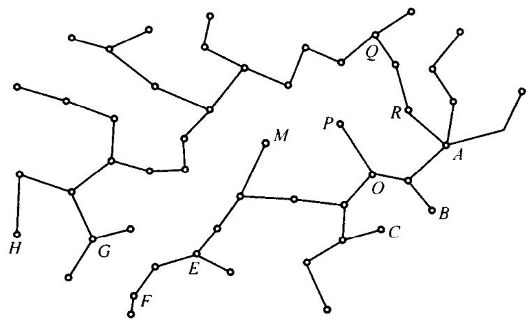

<details>
<summary>text_image</summary>

Q
R
A
P
O
B
M
C
E
F
G
H
</details>

图1

现要对已得到的最小生成树 $T$ 分解, 以获得三个子图 $G$ , 使得分解结果尽量均衡. 由于在最小生成树上, 边权接近, 可略认为均衡即各子图包含的顶点数接近, 故各子图包含的顶点尽量接近 $[(35 + 17)/3] = 17$ 个. 故有以下分解原则:

最小生成树分解原则：

(i) 分解点为 $O$ 点或尽可能接近 $O$ 点；(ii) 分解所得的三个子图 $G_{i}$ 所包含的顶点数尽可能接近 17 个；(iii) 尽量使分解所得的子图 $G_{i}$ 为连通图；(iv) 尽量使子图 $G_{i}$ 与点 $O$ 最短路上的点在该子图内，尽量使各子图的点在子图内部形成环路.

根据以上分解原则,我们得到分解结果如图2所示.

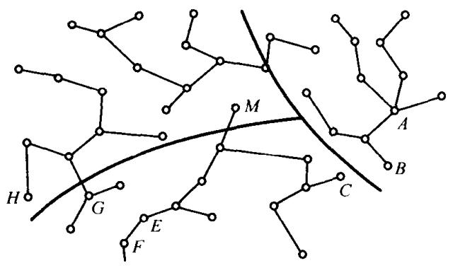

<details>
<summary>text_image</summary>

A
B
C
M
H
G
E
F
</details>

图2

从而根据最小生成树的分解方法把图 $G(V, E)$ 划分为三个子图 $G_{i}, i = 1,2,3$ ，分别在 $G_{i}$ 中寻找最佳巡视路线。现给出几个在寻找最优回路的有效优化规则：

## 1 扩环策略：

如果在图 $G$ 中的路径 $C_i$ 中, 有孤立的枝存在, 如图3.1所示代表1,2,3三个顶点, 若 $\omega_{1,2} + \omega_{1,3} > \omega_{2,3}$ , 则应考虑扩环. 扩环策略还可扩展到多个顶点的情况:

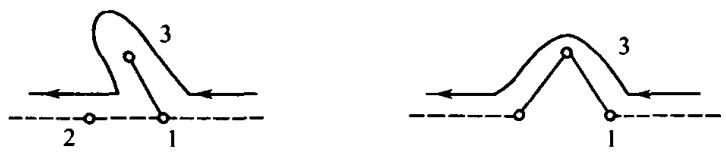  
图3.1

如图 3.2 所示: 扩环后相比扩环前其权和变化为:

$$
\Delta = - \left\{\omega_ {1, 2} + 2 \left[ \omega_ {1, 3} + \sum_ {k = 4} ^ {i} \omega_ {k - 1, k} \right\rbrace + \left\{\omega_ {1, 3} + \sum_ {k = 4} ^ {i} \omega_ {k - 1, k} + \omega_ {1. 2} \right\} \right.
$$

则 $\Delta < 0$ ，则应扩环。当 $\omega_{1,2} < \omega_{1,3} + \cdots + \omega_{i,2}$ 时，扩环后总路程更少，可进扩环调整。

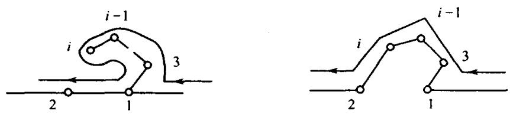  
图3.2

## 2 增环策略：

若环路上某顶点处长出两条枝,且存在可使两枝成环的边,可考虑增环.增环前后其权

和变化为

$$
\Delta = \omega_ {i, i + 1} - \left(\sum_ {k = 2} ^ {t} \omega_ {k - 1, k} + \omega_ {j, 2}\right)
$$

若 $\Delta < 0$ ，则应增环。当 $\omega_{i,i+1} < \omega_{2,3} + \cdots + \omega_{j,2}$ 时，增环后总路程更少，可进行增环环调整。

我们对图 4 进行分析, 发现扩环策略条件完全满足, 故这两种策略完全适用.

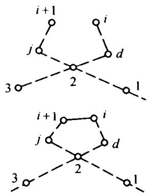  
图4

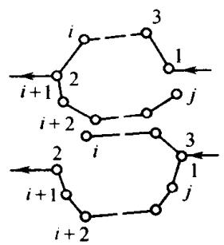

<details>
<summary>text_image</summary>

i
3
1
i+1
2
j
i+2
i
2
3
1
j
i+1
i+2
</details>

图 5

## 3 换枝策略：

若环路上某顶点长出一条枝,而该枝末梢同环路中另一顶点距离接近,可考虑换枝.如图5所示,若

$$
\omega_ {1, 3} + \dots + \omega_ {i, 2} + 2 (\omega_ {2, i + 1} + \dots + \omega_ {j - 1, j}) > \omega_ {1, j} + \dots + \omega_ {i + 1, 2} + 2 (\omega_ {1, 3} + \omega_ {i - 1, i})
$$

则应考虑换枝. 换枝的结果是使被重复的路减少.

根据以上的优化策略及分块结果,在 $G_{1}, i = 1, 2, 3$ , 中分别寻找一条从 O 出发, 遍历 V 并回到 O 的最短路线.

在图 $G(V, E)$ 中, 求三条从 $O$ 出发并回到 $O$ 的路 $L_{1}, L_{2}, L_{3}$ , 满足 $V = \bigcup_{i=1}^{3} V_{i}, V_{i}, (i = 1, 2, 3)$ 为 $L_{i}$ 中经过点的集合, 使得 $\sum L_{i}$ 最小, 且 $L_{i}$ 与 $L_{j}$ 相差不大.

为求出 $L_{1}, L_{2}, L_{3}$ ，我们以下列步骤进行：

1. 作出 $G$ 与 $O$ 之间的最短路；

2. 以 $O$ 与 $G$ 连通的路径及原图 $G$ 的最优树在 $G_{i}$ 中保留的边为基础, 进行增环扩环调整, 使最后尽可能形成一个环路.

12, G, 11 归入 $G_{3}$ 是因为 M 在 $G_{2}$ 与 O 的最短路上. 现对 $G_{2}$ 进行调整: 首先, 根据增环法添上 $e_{2,16}$ , 根据对换法, 添 $e_{17,K}$ , 再进行扩环, 加边 $e_{21,23}$ , 去边 $e_{21,25}$ ; 加边 $e_{23,N}$ , 去边 $e_{24,N}$ , 得到图 6.1. 同样, 根据这些法则对 $G_{1}, G_{3}$ 调整, 分别可得到图 6.2 和图 6.3.

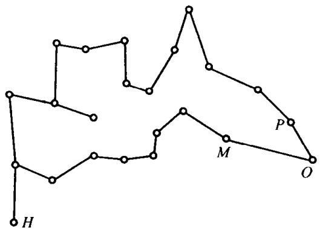

<details>
<summary>text_image</summary>

H
M
P
O
</details>

图6.1

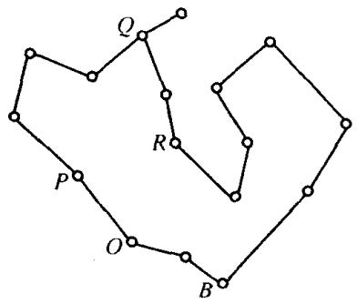

<details>
<summary>text_image</summary>

Q
R
P
O
B
</details>

图6.2

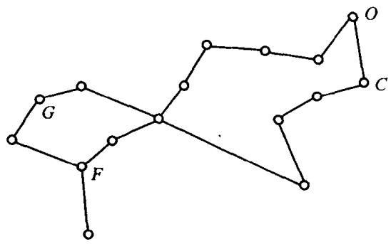

<details>
<summary>text_image</summary>

G
F
C
O
</details>

图6.3

再由图计算得 $l_{1} = 159.3, l_{2} = 206.8, l_{3} = 219.5(KM)$ ，总路程长 $585.6\mathrm{km}$ . 如图所示.

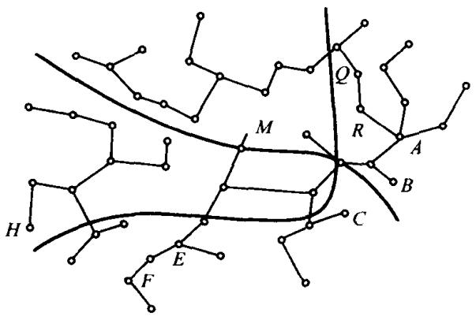

<details>
<summary>text_image</summary>

Q
R
A
M
C
H
E
F
</details>

图7

## 问题 2 （限时巡视的最佳路线）

若分成 $n$ 组巡视人员, 其各自所走的路径 $L_{i}$ , 回路 $L_{i}$ 中边权 $\omega(e_{i})$ , 点权 $\omega(v_{i})$ , 则有 $l_{i} = \sum_{e \in E(L_{i})} \omega(e_{i})$ , 点权和 $e_{i} = \sum_{e \in E(L_{i})} \omega(v_{i}) = (2a_{i} + b_{i}) \times 35$ , 其中 $a_{i}$ 为乡相对应的点的数目, $b_{i}$ 为与村相对应的数目, 巡视至少应分的组数 $n: n = \min \{n \mid \frac{L_{i}}{35} + 2a_{i} + b_{i} < 24\}, \{i = 1, \dots, n\}$ .

可以证明 $n > 3$ (略).

考虑 $n = 4$ ，同分三组的情况类似，用最优树分解方法把图 $G$ 分成子图 $G_{i}(i = 1,2,3,$ 4)，子图中点权之和 $2a_{i} + b_{i}$ 尽量相同，总的点权之和为 $17\times 2 + 35 = 69$ ，故平均每个子图中点权和为 $[69 / 4] = 17$ ，故参照分三组时的最小树分解原则，分成4组时最小树分解原则为：

1) 使各子图中点劝和尽量接近 17;  
2）分解后的各子图尽量为连通图；  
3) 分解点为 O 或尽量接近 O;  
4) 生成的子图容易形成圈或接近圈. 为使尽量均衡, 大致划分如图所示:

通过增环、扩环,换枝等策略,对各子图内部调整而寻找最佳巡视回路,其结果如图8所示:

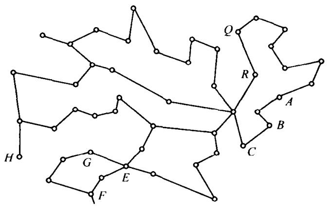

<details>
<summary>text_image</summary>

Q
R
A
B
C
H
G
E
F
</details>

图8

经计算得到如下结果：

<table><tr><td>组数</td><td>路程(km)</td><td>巡视时间(h)</td><td>巡视路线</td></tr><tr><td>1</td><td>140.1</td><td>22.0</td><td>O,C,B,1,A,34,35,33,31,32,30,29,R,O</td></tr><tr><td>2</td><td>154.3</td><td>21.4</td><td>O,P,28,27,26,N,23,22,17,16,K,21,25,M,O</td></tr><tr><td>3</td><td>185</td><td>22.3</td><td>O,M,25,21,K,18,I,15,14,H,14,13,J,19,20,L,6,5,2,O</td></tr><tr><td>4</td><td>182</td><td>21.1</td><td>O,2,5,6,7,E,11,G,12,F,10,9,E,8,4,D,3,C,O</td></tr></table>

完成巡视的最小时间为 $t_{\mathrm{min}} = 22.3$ 小时. 其中路线重合部分的点, 播 $K, 21, 25, M$ 为二组巡视视. 6.5, 1 由三组巡视.

问题3 巡视人员足够多, 到并没汽车也足够多, 甚至每个村、镇都可分配一组巡视员, 这些组的完成时间中最长的即为完成巡视的时间下限 $t_{\min}$ , 从最短生成树上可以看出, $H$ 离 $O$ 距离 $I_{O,H}$ 最长, 且 $H$ 的权最大 $= 2$ , 故巡视 $H$ 的那组所花的时间为完成整个巡视的时间下限, $t_{\min} = \frac{2l_{O,H}}{V} + \omega H = 6.43$ , 因此, 需解决的问题是

$$
\begin{array}{l} \min n \\ \mathrm{s.t.} \frac {2 l _ {i}}{3 5} + 2 a _ {i} + b _ {i} \leqslant t _ {\min} \\ \end{array}
$$

我们给出一种算法,按此算法可比较好地解决这个问题.算法如下:

1) 令 $i = 0$ .  
2) 选最短路树形图中未被标号的点中离点 $O$ 最近的点, 设为 $M, M$ 与 $O$ 的距离为 $l_{m}$ , 设第 $i$ 个巡视点集 $V_{i} = \{M\}$ , 计算 $V$ 最多还可增加的点的权之和 $l_{m} = t_{\min} - \frac{2l_{m}}{V} - \omega_{m}$ .  
3) 尽可能使并入 $V_{i}$ 的点的权之和为 $[l'_m]$ , 同时满足存在从 $O$ 出发, 经历 $V_{i}$ 中所有点并回到 $O$ 点的路 $L_{i}$ , 使 $\frac{l_i}{V} + Ta_i + tb_i \leqslant tb_i \leqslant t_{\min}, l_i$ 为 $L_{i}$ 的长度, $a_i, b_i$ 分别为中权为 $T$ , $t$ 的点的个数. 若同时存在几种并入方式, 先取并入的点到 $O$ 距离之和最大的那一种.  
4) 在图中把中含有的点标上号, 若还有点未标号, 令 $i = i + 1$ 转(2), 否则, 停止. 通过这种算法, 得到应分为22组, 结果见表.

问题 4 设某种情况下, 即 $\bar{V}, T, t$ 取某一组值时, 在满足 $\max t_{i}$ 取最小值的条件下的点集为 $V_{i}$ , 对应路为 $L_{i}$ , 其长度为 $l_{i}, i = 1, 2, \cdots, n$ . 令 $t_{i} = \frac{l_{i}}{\bar{V}} + Ta_{i} + tb_{i}$ , 此时应满足 $t_{i}, t_{j}$ 相差不大, 否则, 可将 $t_{i}$ 中最大的点集去掉一个点, 并将其加到 $t_{i}$ 中最上的点集中去.

当 $\bar{V}$ 改变 $\Delta\bar{V}$ 时， $t_{i}$ 的改变量为 $\Delta t_{i} = \frac{(\bar{V} - \bar{V}^{\prime})}{\bar{V}\bar{V}^{\prime}}$ .

<table><tr><td>分组</td><td>巡视路线</td><td>花费时间(h)</td><td>路程(km)</td></tr><tr><td>{H}</td><td>O,2,3,8,7,E,11,Q,12,H,12,Q,11,E,7,8,3,2,O</td><td>6.43</td><td>155</td></tr><tr><td>{14,13}</td><td>O,2,5,6,L,19,J,13,14,13,J,19,L,6,5,2,O</td><td>6.15</td><td>145.4</td></tr><tr><td>{15,16}</td><td>O,26,N,23,22,16,I,15,I,18,K,21,25,M,O</td><td>6.37</td><td>153</td></tr><tr><td>{12,11}</td><td>O,2,5,6,7,E,9,F,12,G,11,E,7,6,5,2,O</td><td>5.93</td><td>137.6</td></tr><tr><td>{10,18}</td><td>O,2,5,6,7,E,9,F,10,F,9,E,8,E,7,6,5,2,O</td><td>6.21</td><td>147.4</td></tr><tr><td>{G}</td><td>O,2,5,6,7,E,11,G,11,E,7,6,5,2,O</td><td>5.58</td><td>125.4</td></tr><tr><td>{I}</td><td>O,M,25,21,K,18,I,18,K,21,25,M,O</td><td>5.49</td><td>122.2</td></tr><tr><td>{F,9}</td><td>O,2,5,6,7,E,9,F,9,E,7,6,5,2,O</td><td>6.17</td><td>111.2</td></tr><tr><td>{J,18}</td><td>O,2,5,6,L,19,J,18,K,21,25,M,O</td><td>6.29</td><td>115.4</td></tr><tr><td>{17,22,20}</td><td>O,P,26,N,33,22,17,K,21,20,25,M,O</td><td>6.31</td><td>115.8</td></tr><tr><td>{19,K}</td><td>O,M,25,21,K,21,20,19,L,6,5,2,O</td><td>6.18</td><td>111.2</td></tr><tr><td>{24,23,21}</td><td>O,P,26,N,24,23,21,25,M,O</td><td>5.79</td><td>97.9</td></tr><tr><td>{E,7,6}</td><td>O,2,5,6,7,E,7,6,5,2,O</td><td>6.38</td><td>83.4</td></tr><tr><td>{L,5,25}</td><td>O,M,25,20,L,6,5,2,O</td><td>6.36</td><td>82.8</td></tr><tr><td>{30,Q,32}</td><td>O,R,31,32,30,Q,29,R,O</td><td>6.17</td><td>76.2</td></tr><tr><td>{35,34,33,31}</td><td>O,1,A,34,35,33,31,R,O</td><td>6.42</td><td>84.7</td></tr><tr><td>{4,D,3}</td><td>O,2,3,D,4,D,3,C,1,A,1,O</td><td>5.99</td><td>69.8</td></tr><tr><td>{N,27,28}</td><td>O,P,26,N,26,27,28,P,O</td><td>6.27</td><td>79.5</td></tr><tr><td>{29,P,R}</td><td>O,R,29,P,O</td><td>6.32</td><td>46.1</td></tr><tr><td>{31,2,C}</td><td>O,R,31,R,O,C,3,2,O</td><td>6.22</td><td>77.6</td></tr><tr><td>{26,M}</td><td>O,M,N,26,P,O</td><td>4.86</td><td>65.1</td></tr><tr><td>{B,A}</td><td>O,1,B,A,1,O</td><td>5.15</td><td>40.4</td></tr></table>

由于 $l_{i}$ 的不同, $\Delta t_{i}$ 也不同, 当 $\overline{V}$ 变化很大时, 可能使 $t_{i}$ 相差很大, 从而需要重新调整巡视路线. 现在 $n = 3, V = 35, T = 2, t = 1$ 讨论变动对路线的影响.

首先,从1中所得的三条巡视路线及对应巡视点集开始,将 $t_{i}$ 最大的点集中调整一个到 $t_{i}$ 最小的点集中去,直到 $\max t_{i}$ 不再减小为止,我们得到三条路线,对应长度分别为194、205.3、206.8,各巡视点中权为1、2的点的个数分别为: $a_{1}=6,b_{1}=11,a_{2}=5,b_{2}=13,a_{3}=6,b_{3}=11$ .

当 $T$ 增加时，对应时间分别为 $t_1 = 6\Delta T + 28.5, t_2 = 5\Delta T + 28.9, t_3 = 6\Delta T + 28.9,$ 当 $\Delta T > 3.4$ 时，可将 $V_{3}$ 中的点 $H$ 调入 $V_{2}$ 中，此时对应的时间为 $t'_1 = 6\Delta T + 28.5, t'_2 = 5\Delta T + 31.5, t'_3 = 6\Delta T + 26.3$ 均比 $\max \{t_1, t_2, t_3\} = t_3$ 小，故应改变巡视路线.

## 模型的评论及改进

1. 该问题实际上是一个一般推销员问题, 是已被论证的 NPC 问题, 至今仍无有效的算法. 求最优 Hamilton 回路是该问题的常见的计算机近似算法, 它不能保证得到最优解, 运算量很大, 这种算法能很容易在图论文献中查到 $^{[1,2]}$ .

我们的策略改进方法也不能保证求得最优解,但接近最优解.并且所提出的策略能大幅度减少计算量,以至于根据手算便能得到较为满意的结果.

2. 我们利用最优树分解方法对图分块,但未能给出一个准确的原则定量地给出总路程最短同均衡性最好的制约关系.

## 参考文献

[1] E. 米涅卡 [美], 网络和图的最优化算法, 中国铁道出版社, 北京, 1984.  
[2] 卢开澄, 图论及应用, 清华大学出版社, 北京, 1981.

在科学知识和工程实践的进展中,现在把计算看作是和理论以及实验同等重要而且必不可少的伙伴。数值模拟能使人们能研究复杂的系统和自然现象,如果要通过直接的实验来研究它们那将是费钱或危险、甚至是根本不可能的。对这种模拟中从未有过的高层次的细节和现实性的探求要求极大的计算能力,而且这种探求已经为计算机算法和系统结构中的重大突破提供了推动力。由于这些进展,计算科学家和工程师现在能够解决过去曾经认为是难以对付的大规模的问题。计算科学和工程是与科学、工程、数学以及计算机科学有关的一个迅速发展的多学科交叉的领域。CSE着重研制问题解决的方法以及解决科学和工程问题的强健的工具。我们相信 CSE 将对科学发现和工程设计的未来起到重要的纵使不是支配的一作用。

旨在推进计算和应用数学(它们处于 CSE 的核心地位)的学会 SIAM 当然应该在这个学科的发育和发展中发挥作用。本报告的目的是试图确定 CSE 的核心领域和范围,从而为 CSE 的课程设置和研究生教学计划提供想法、建议和信息,并就 SIAM 能为此作出贡献的潜力提出建议。

Graduate Education in Computational Science and Engineering, SIAM Review, v. 43 (2001), no. 1, 163 - 177.

# 灾情巡视的最佳路线(节选)

田家国 吴小丽 夏传刚

(黑龙江矿业学院, 鸡西 158105)

指导教师 数学建模教练组

编者按 这里只选载该文有特色的一部分,即对问题3的一种新看法.一辆(足够大的)车为一组,巡视人员沿途上、下车巡视沿途的每一点.这样在最短时间内用6组即可完成任务.

我们求出各偏远乡(镇)、村距县政府的最小距离. 在这些最小距离中, 最大为 $H$ 距离政府的距离, 其值为 77.5 公里. 完成对 $H$ 的巡视的最短时间为 $77.5 / 35 + 2 = 6.43$ 小时, 即为完成巡视的最短时间. 我们采用的对策是在通往 $H$ 镇的巡视车载有足够的巡视人员, 每经一个乡(镇)、村就有一组巡视人员下车去巡视. 直到 $H$ , 当 $H$ 镇巡视完毕后, 巡视车按原路返乡(镇)、村的最短路过程中, 而无法经过 $G, 11, 20$ 这三个点, 对这三个点采用的方法是: 如果邻近的巡视路线经过这三个点所花费的时间不超过 6.43 小时, 那么可以不走最短路线, 严格按照以上方案, 我们确定巡视路线为 7 条. 但是, 这样使各组巡视人员的工作量不均衡. 因此, 我们近一步优化, 得到分为 6 组的巡视路线, 这样巡视完全县所有的乡(镇)、村所需时间为 6.45 小时, 比分为 7 组巡视多 0.02 小时, 但考虑到该问题的实际意义, 我们采用分为 6 组的巡视路线, 具体路线如下表和图所示.

<table><tr><td>组号</td><td>路线(原路返回)</td></tr><tr><td>1</td><td>O 1 B A 34 35 33 31 32 30</td></tr><tr><td>2</td><td>O R 29 O 28 27 24 23 22 17 16</td></tr><tr><td>3</td><td>O P 26 N 25 20 21 K 18 I 15</td></tr><tr><td>4</td><td>O M 6 L 19 J 11 G 13 14</td></tr><tr><td>5</td><td>O 2 5 6 7 E 9 F 12 H</td></tr><tr><td>6</td><td>O C 3 D 4 8 E 9 F 10</td></tr></table>

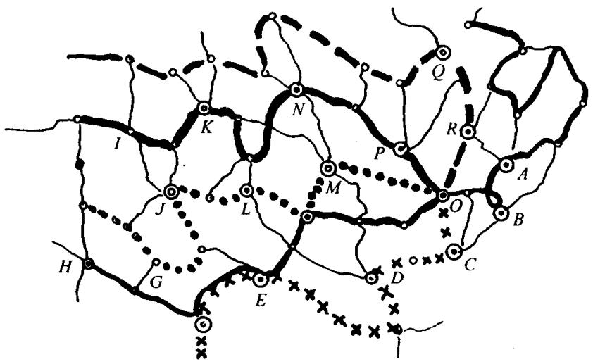

<details>
<summary>text_image</summary>

I
K
N
P
R
A
O
B
C
D
E
G
H
J
L
M
</details>

# 灾情巡视的最佳路线

## 上海海运学院

## 丁颂康

## 一、关于问题的数学模型

本题给出了某县的道路交通网络图,要求的是在不同条件下,灾情巡视的最佳分组方案和路线.这是一类图上点的行遍性问题,也就是要用若干条闭链覆盖图上所有的顶点,并使某些指标达到最优.

点的行遍性问题在图论和组合最优化中分别称为哈密顿问题和旅行商问题,所谓哈密顿问题,就是研究图中是否存在经过所有顶点恰好一次的圈或路,这种圈或路(如果存在)分别称为哈密顿圈和哈密顿路,简称为H-圈和H-路.而旅行商问题通常是指在赋权图上经过所有顶点至少一次,且使总长度(即边权之和)达到最小的闭链.而本题所求的分组巡视的最佳路线,则与多旅行商问题(MTSP)类似,也就是m条经过同一点并覆盖所有其他顶点又使边权之和达到最小的闭链.

求解非完全图的多旅行商问题,通常所用的方法可分为两步.首先是利用任意两点间的最短路长度作为该两点间边的权构造一个完全图.这一点对于原图中没有边相连的点对尤为重要.容易证明,在如此构造出来的完全图中,各边的权将自然满足三角不等式,即任意三点间,两边权之和不小于第三边的权;并且该完全图中的最优哈密顿圈与原图上的最优旅行商路线等价.第二步,以一点v为起终点(本题中的县城O)的多旅行商问题,可以采用将该点视作若干点 $v_{1},v_{2},\cdots,v_{k}(k$ 为旅行商人数),并令 $w(u,v_{j})=w(u,v)$ (对所有的点 $u\neq v$ )及 $w(v_{i},v_{j})=\infty(i\neq j,i,j=1,2,\cdots,k)$ 的方法,再将前述的完全图拓展成增广完全图.然后,在该增广完全图上求最优哈密顿圈.通常情况下,这个最优哈密顿圈将经过 $v_{1},v_{2},\cdots,v_{n}$ 各一次,而这些点在圈上又不相邻.因此,它们将把这个圈分解成恰好k段,这k段形成以v作为起终点的闭链,分别对应k个旅行商的旅行路线,并且这些旅行路线对于总长度最短的目标来说一定是最优的.

在拓展完全图上求解最优哈密顿圈 $C^*$ , 可以表达成下述线性规划(更确切地讲是0-1规划)的形式:

$$
\begin{array}{l} \min \sum_ {i} \sum_ {j} w _ {i j} x _ {i j}, \\ \text {s.t.} \sum_ {j} x _ {i j} = 1, \quad \forall i, \\ \sum_ {i} x _ {i j} = 1, \quad \forall j, \tag {*} \\ \sum_ {i \in S, j \in \bar {S}} x _ {i j} \geqslant 1 \quad \forall S \subset V, \text {且} S \neq \varnothing , \\ x _ {i j} = 0 \text {或} 1, \\ \end{array}
$$

其中 $w_{ij}$ 就是点 $i$ 和 $j$ 间边的权， $V$ 是图的点集，而条件 $\sum_{i\in S,j\in S}x_{ij}\geqslant 1$ 是为了保证取 $x_{ij} = 1$ 的边不形成小的圈, 这里 $S$ 是点集 $V$ 任意的非空真子集. (\*)式的最优解中 $x_{ij} = 1$ 的边 $(i, j)$ 将构成最优哈密顿圈 $C^*$ .

值得注意的是,用(\*)式求得增广完全图上的最优解(也就是多旅行商问题的最优解),能使k条旅行路线的总路程达到最小,但是这k条路线的均衡性可能相当差.因此,当要求均衡性较好的解还需要做大量的调整工作.此外,哈密顿问题和旅行商问题都属NP完全类,也就是说,(\*)式问题的求解没有多项式时间算法.对于本题的规模(包括县城共有53个点,再加上构造增广完全图时添加的k-1个点),要想求得真正的最优解是不现实的.为此只能采用启发式算法,求得近似最优解.

单旅行商问题的近似算法,有如分枝定界、最小插入、最小生成树、对换调优、最近邻点,以及神经网络、模拟退火、遗传算法等方法.容易证明,单旅行的最优路线长度,必定是多旅行商最优路线总长度的下界.已知的一条原图的单旅行商最优路线的近似解为: $O - P - 29 - R - 31 - 33 - A - 34 - 35 - 32 - 30 - Q - 28 - 27 - 26 - N - 24 - 23 - 21 - K - 22 - 17 - 16 - I - 15 - I - 18 - J - 19 - L - 20 - 25 - M - 6 - 7 - E - 11 - G - 13 - 14 - H - 12 - F - 10 - F - 9 - E - 8 - 4 - D - 5 - 2 - 3 - C - B - 1 - O$ .其长度为 $514 \mathrm{~km}$ .

在求本题的解之前,对原问题所给条件作一些适当的假设还是必要的.例如,公路不考虑等级差别,也不受灾情或交通情况的影响,各条公路段上汽车行驶速度可以认为是均匀的:各巡视组巡视的乡(镇)、村不受行政区划的影响,即某乡(镇)与隶属于它的村不一定要分在同一组内;各巡视组保持统一行动,即不允许一个巡视组再分成若干小组等等.

## 二、关于问题的求解

本题的第一问,要求设计分三组巡视时,使总路程最短且各组尽可能均衡的巡视路线.

这里有两个目标. 若记三组的巡视路线长度从小到大分别为 $C_1, C_2, C_3$ , 则该两目标的数学表达式为:

$$
\min (C _ {1} + C _ {2} + C _ {3})
$$

以及

$$
\min (C _ {3} - C _ {1}).
$$

但是这两个目标又是相互矛盾的,也就是不可能同时达到最小.因此具体求解时,应两者兼顾,用多目标的方法处理.为简单起见,根据实际灾情巡视的背景,一种较为合理的考虑是转换成一个目标函数,即

$$
\min C _ {3}.
$$

根据前面的分析,分组巡视路线的最优解,应当采用增广完全图上的单旅行商路线分段的方法求得.但是根据原题图的规模以及边的稀疏性,用这种方法处理反而将使问题变得更为复杂.而且考虑到均衡性要求需做的调整工作也将是大量的.因此,可以采用先适当进行点的分组,分别求出各组的单旅行商路线,然后在组间进行适当调整的方法求得近似解.

对于巡视组的划分,我们可以利用原图的最小生成树(所选择的都是权最小边).从县城出发的最短路生成树,或者原图的单旅行商路线等等子图作为依据,因为它们都是在某种指标下的最优解,而这类指标与原题的要求又相当接近.当然,也可以直接利用地理位置、射线扫描、对边界进行合理划分后向内扩展等直观方法作近似处理.

分组以后,由于规模较小,最优巡视路线的设计就变得较为简单.一般可借助现成软件求出精确解来.即便没有这类软件,采用近似算法或者直接搜索也都能较容易地找出很好的近似最优解.

这里提供两种近似最优解的参考答案. 前者的总路程较短但均衡性较差; 后者的均衡性相当好但总路程稍长. 假如以 $\min C_3$ 的目标来衡量, 后者是已知的最好答案.

第一种方案：

第一组： $O - C - B - 34 - 35 - 32 - 30 - Q - 28 - Q - 29 - R - 31 - 33 - A - 1 - O.$ 总路程为 $153.1\mathrm{km}$

第二组： $O - P - 26 - 27 - 26 - N - 24 - 23 - 21 - K - 22 - 17 - 16 - I - 15 - I - 18 - J - 19 - L - 20 - 25 - M - O.$ 总路程 $210.5\mathrm{km}$

第三组： $O - 2 - 3 - D - 4 - 8 - E - 9 - F - 10 - F - 12 - H - 14 - 13 - G - 11 - E - 7$ $-6 - 5 - 2 - O.$ 总路程 $210.5\mathrm{km}$

第二种方案：

第一组： $O - 1 - B - 34 - 35 - 32 - 31 - 33 - A - R - 29 - Q - 30 - Q - 28 - 27 - 24 - 23 - N - 26 - P - O.$ 总路程 $197.6\mathrm{km}$

第二组： $O - M - 25 - 20 - 21 - K - 22 - 17 - 16 - I - 13 - G - 11 - E - 8 - 4 - D - 3 - C - O.$ 总路程 $200.4\mathrm{km}$

第三组： $O - 2 - 5 - 6 - L - 19 - J - 18 - I - 15 - 14 - H - 12 - F - 10 - F - 9 - E - 7 - 6 - 5 - 2 - O.$ 总路程 $203.5\mathrm{km}$

综观参赛队的答卷,三组巡视总路程和各组路程的极差大体有以下关系:总路程约在540\~550公里时,极差将达到100公里;总路程在570公里左右时,极差约为50公里;而极差在10公里以内时,总路程将略超过600公里.

## 三、有时间约束的最佳路线

本题的第二问是添加了巡视组停留时间 $T = 2$ 小时, $t = 1$ 小时以及汽车行驶速度 $V = 35$ 公里/小时的条件后, 要求在24小时内完成巡视的最少分组数以及相应的最佳巡视路线. 第三问则是在上述时间参数条件下, 尽可能在最短时间内完成巡视所需的最少组数以及相应的巡视方案. 尽管两问形式雷同, 但却蕴含着不同的数学内涵.

在前文中我们曾经提到,原图的单旅行商路线长度是分组巡视总路程的下界.而已知的单旅行商路线长度均在500公里以上.因此各组花在汽车行驶上的时间之和将超过14小时 $(35\times14=490<500)$ .加上在各乡(镇)、村的停留时间 $m\cdot T+n\cdot t=17\times2+35\times1=69$ 小时(其中m为乡(镇)数,n为村数),各组所需时间之和将大于83小时.若分成三组,就不可能在24小时内完成巡视.于是,所求的最小分组数为4.

若记 $C_j$ 为第 $j$ 组的巡视路线长度, $m_j, n_j$ 分别为该组停留的乡(镇)和村数 $(j = 1,2,3,4)$ , 则各组所花费的时间 $h_j$ 为:

$$
h _ {j} = 2 m _ {j} + n _ {j} + C _ {j} / V, \quad j = 1, 2, 3, 4.
$$

和第一问的情况类似,所谓最佳的要求仍然是两目标的.即要求

$$
\min (h _ {1} + h _ {2} + h _ {3} + h _ {4})
$$

以及

$$
\min \left\{\max _ {j} h _ {j} \right\}.
$$

假若我们仍然以后者作为主要目标来考虑,那么,乡村数的均衡性和各组路程的均衡性就依然是分组的主要依据.参照第一问解答的方法和所得的结果,并对各组的交界作适当的调整,用计算机搜索的方法容易得到较好的解.一个比较好的分组方案为:

第一组： $O - C - 3 - D - 4 - 8 - E - 9 - F - 10 - (F - 9 - E) - 7 - 6 - 5 - 2 - O.$ 总路程 $C_1 = 158.8\mathrm{km},m_1 = 4,n_1 = 9$ ；总巡视时间为 $h_1 = 21.54$ 小时.

第二组： $O - (2 - 5 - 6) - L - 19 - J - 13 - 14 - H - 12 - G - 11 - (J - 19) - 20 - 25 - M - O.C_2 = 176.3\mathrm{km},m_2 = 5,n_2 = 7;h_2 = 22.04$ 小时.

第三组： $O - (P) - 28 - 27 - 24 - 23 - 22 - 17 - 16 - I - 15 - (I) - 18 - K - 21 - (23)$ $-N - 26 - (P) - O.C_3 = 180.3\mathrm{km},m_3 = 3,n_3 = 11;h_3 = 22.15$ 小时.

第四组： $O - 1 - B - 34 - 35 - 32 - 30 - Q - 29 - R - 31 - 33 - A - (1 - O) - P - O.$ $C_4 = 146.1\mathrm{km},m_4 = 5,n_4 = 8;h_4 = 22.17$ 小时.

(以上各组巡视路线中括号的点为只经过不停留的点). 各组的巡视时间均在 22 小时左右, 极差仅 0.23 小时, 以 $\min \{\max h_j\}$ 为标准而言, 是已知的最好方案之一. 一般来说, 较好的参赛文章都能得到分四组, 且四组巡视时间总和在 $87 \sim 88$ 小时之间、偏差又较小的方案.

问题的第三问是在上述时间参数假设下,如果有足够多的巡视人员,要求出完成巡视的最短时间,并给出在最短时间限制下的最佳巡视路线.

事实上, 完成巡视的最短时间受到单独巡视离县城最远的乡(镇)所需时间的制约. 采用图上述最短路径的 Dijkstra 算法, 可以求得从县城到各点的距离. 离县城最远的乡为 $H$ 点, 距离为 77.5 公里, 因此单独巡视该乡所需时间为 $h_{H} = \frac{77.5 \times 2}{35} + 2 = 6.43$ 小时. (离县城最远的村为 14, 若单独巡视所需时间要小得多). 即使人员足够多, 分组再细, 完成巡视至少需要 6.43 小时. 于是, 问题便成为在 6.43 小时内完成巡视所需的最少分组数和巡视方案.

容易验证,要在6.43小时内完成巡视,有些点(如I,J,H)只能单独作为一组,时间不允许在别的乡村停留.而绝大部分乡村可以和其他乡村分在同一组内,并在限定时间内完成巡视.

我们把能够放在同一组内巡视的乡村称为一个可行集. 这种可行集是原图点集 $V$ 的一个子集. 显然, 原题所求的最少分组数便是点集的可行集最小覆盖问题. 同旅行商问题一样, 子集覆盖问题也属 NP 完全类. 因此, 求该问题的最优解也是在短时间内做不到的. 采用计算机作近似搜索仍不失为较常用的办法. 关于该问题的研究, 后面一篇发表的华东理工大学俞文鰩教授的文章有详细讨论. 他的文章还证明了本题的最小覆盖数为 22.

参照点在图中从县城出发的最短路树上的位置,采用就近归组的搜索方法,容易得到最优解22组的分组方法及相应的巡视路线,这里不一一列举了.

在阅卷中发现,有个别的参赛队找到了一种分成21个组的方案,并且指明尽管其中有两组的巡视时间超过了最短时间的要求,但因为超出时间不长(小于0.1小时),考虑到问题的实际背景,用两个小组几分钟时间的代价换取了节省一个组的人力物力的效果.我们认为,就数学建模竞赛的本意而言,这些同学的构思是可取的.

## 四、关于 $T, t, V$ 的讨论

本题第四问要求在巡视组数已定的情况下尽快完成巡视, 讨论参数 T, t 和 V 的改变

对最佳巡视路线的影响.

前面我们已经提到,要尽快完成巡视,即要求各组巡视时间的最大值也要最小.用数学式子表示就是:

$$
\min \left\{\max _ {j} h _ {j} \right\} = \min \left\{\max _ {1 \leqslant j \leqslant k} \left(m _ {j} \times T + n _ {j} \times t + \frac {C _ {j}}{V}\right) \right\},
$$

这里 k 是给定的分组数, $m_{j}, n_{j}$ 分别是第 j 组停留的乡(镇)数和村数, $C_{j}$ 是第 j 组巡视路线的长度 $(j=1,2,\cdots,k)$ .

在上述 $h_j$ 的表达式中，由于 $T$ 和 $t$ 的作用完全相仿，所以为简化讨论起见，对于任意给定的 $T$ 和 $t$ ，不妨记 $p = T / t$ ，即 $T = pt$ .这里 $h_j$ 可简记为：

$$
h _ {j} = (p \cdot m _ {j} + n _ {j}) \cdot t + \frac {C _ {j}}{V}.
$$

1. 若 $t$ 增大而 $V$ 不变. 为了使 $h_j$ 的最大值尽可能小, 就要求 $pm_j + n_j$ 的最大值尽可能小. 但是当 $T$ 和 $t$ 的关系确定后, $\sum_{j} (pm_j + n_j)$ 是定值 ( $= p \cdot m + n$ , 其中 $m$ 是全县的乡 (镇) 数 17, $n$ 是全县的村数 35), 上述要求就成为各组停留乡村数 (加权以后之和) 尽可能均匀, 用数学式子表示即为:

$$
\lfloor \frac {p m + n}{k} \rfloor \leqslant p m _ {j} + n _ {j} \leqslant \lceil \frac {p m + n}{k} \rceil ,
$$

这里 $\lfloor a\rfloor$ 和 $\lceil a\rceil$ 分别表示数 $a$ 的下整数和上整数. 当然, 在调整各组停留的乡村数使之达到均衡时, 自然会给各组的路线及其长度带来影响, 这时应当考虑进行适当调整.

2. 若 $t$ 不变而 $V$ 增大. 这种情况下, 在 $h_j$ 中可能导致 $C_j / V$ 起主导作用. 那么, 和 1 的结论类似, 我们更应使 $C_j$ 即各组的巡视路线尽可能均衡. 诚然, 因为 $\sum_{j} C_j$ 不是常数, 而且 $C_j$ 的均衡性会带来 $\sum_{j} C_j$ 的增大, 这对于尽快完成巡视会带来负面影响. 所以对具体情况应作具体分析, 比如可以考虑 $h_j$ 的前半部份 $(pm_j + n_j) \cdot t$ 对均衡性的修正, 对路程较长的组尽量考虑停留较少乡村.

至于 $t$ 和 $V$ 的交互作用, 对于这样一个原本很难得到最优解的离散最优化问题来说, 将变得更为复杂, 这里就不再进一步讨论了.

# 多旅行商路线的几个问题\*

## 上海华东理工大学应用数学研究所

## 俞文鱿

旅行商问题是运筹学中的一个典型问题,多旅行商问题是它的扩充,它可应用于车辆路线组织,作业调度等方面 $^{[1]}$ ,全国大学生数学建模竞赛98B题正是这样一类问题.一般来说,这类问题不存在好算法.由于实际要求的不同,这类问题中的目标函数与约束条件又可以有多种形式,这样,结合具体问题的特殊性,进行较为深入的讨论,仍然是可能的.

本文对 98B 题的几个较为深入的问题进行讨论, 在 1 中, 我们讨论无向图上最小 Hamilton 回路与最优旅行商路线的关系, 指出二者何时相同、何时可能不相同的一些判断. 在 2 中, 针对 98B 中的目标函数的处理, 讨论如何将双目标化为单目标的问题以及如何把点权化为边权的问题. 我们在 3 中讨论, 在给定的时间下, 如何确定最小组数的问题. 特别, 98B 题第三小题中, 当给定时间限定为 6.4286 小时, 可断言 22 组是最小组数, 也就是说, 21 组是不可行的, 对此, 我们在 4 中介绍了集合覆盖问题, 在 5 中讨论了有关 98B 题第三小题的性质, 最后在 6 中给出证明.

为节省篇幅,我们对98B题不再复述,因为在本期杂志的若干文章中均有叙述.98B题的图形亦略,但有关数据列在附录中,以保持本文的完整性.

1 最小 Hamilton 回路与最优旅行商路线的关系

我们限于讨论无向图的情形.

给定一个连通图 $G = (V, E, w)$ , 其中 $V$ 为顶点集, $E$ 为边集, $w$ 为定义在 $E$ 上的权 (非负). $G$ 的一个 Hamilton 回路是顶点集上的一个循环排列 $\sigma = \sigma_1 \sigma_2 \cdots \sigma_n \sigma_{n+1} (\sigma_{n+1} = \sigma_1)$ , 其中一切 $\sigma_i \sigma_{i+1} \in E$ , $w(\sigma)$ 定义为 $\sigma$ 上所有边权之和. 当 $w(\sigma)$ 达到最小, $\sigma$ 称为最小 Hamilton 回路. $G$ 的一个旅行商路线是顶点集 $V$ 的可重复但不遗漏的一个循环排列, 多旅行商路线则是顶点集 $V$ 的可重复但总体上不遗漏的多个循环排列, 其余有关概念类同于 Hamilton 回路. 对于 $G$ 为完全图的情形, 不难得到以下两个结论[2].

结论1 如果完全图 $G = (V, E, w)$ 的权不受限制, 那么存在例子使得: $G$ 的最小Hamilton回路不是 $G$ 的最优旅行商路线.

结论2 如果完全图 $G = (V, E, w)$ 的权满足三角形不等式：

$$
\forall i, j, k \in V, \quad w _ {i, k} \leqslant w _ {i, j} + w _ {j, k}, \tag {1}
$$

那么 $G$ 的最小Hamilton回路必是 $G$ 的最优旅行商路线.

对于 $G$ 为连通但不是完全图的情形, 容易注意到: $G$ 可能不存在 Hamilton 回路, 这时也就不存在最小 Hamilton 回路; 还可以想到: $G$ 的最优旅行商路线可到完全图 $G'$ 上去找, 这个完全图 $G' = (V, E', w')$ , 其中边集 $E'$ 包含 $V$ 的一切点对, 而 $w_{i,j}'$ 定义为 $G$ 上顶点 $i$ 与顶点 $j$ 之间的距离 (最短路长度), 它必定满足三角形不等式.

结论3 连通图 $G = (V, E, w)$ 所相应的完全图 $G' = (V, E', w')$ 的最小Hamilton回路 $H'$ , 必定给出 $G$ 的最优旅行商路线, 其中 $H'$ 中的边用 $G$ 中的最短路 (其二端点与该边的二端点相同) 来代替.

结论 3 具有直观解释, 它可用反证法加以证明.

从98B题的竞赛答案来看,不少答卷提到上述结论2与结论3,但是在叙述结论2时,一些答卷未指明这一结论只适用于完全图,在叙述结论3时,一些答卷也未强调G与 $G'$ 的差别.这样,也就产生了一个疑问:结论2能否推广到非完全图呢?这时,相应于三角形不等式(1)的条件要变为:

对任 $(i,k)\in E$ 及从i至k的任一条路P，

$$
w _ {i, k} \leqslant \sum_ {(j, l) \in P} w _ {j, l}, \tag {2}
$$

也就是说,对任 $(i,k)\in E,w_{i,k}$ 恰等于 $G = (V,E,w)$ 中顶点 $i$ 与 $k$ 之间的最短路长.对于上述疑问结论如下:

结论 4 有例子表明, 即使 $G = (V, E, w)$ 满足(2)且存在 Hamilton 回路, 但 G 的最小 Hamilton 回路不是 G 的最优旅行商路线.

证 如图 1, $G = (V, E, w)$ , $V$ 由 10 个顶点组成, 而 $E$ 由 13 条边组成, 权 $\omega_{i,j}$ 分别标出在每一条边旁, 其中 $x$ 大于 1. 显然, 对此图 $G$ , (2) 是成立的. 图 $G$ 有唯一的 Hamilton 回路 ABCDEFGHIJA, 其长度 (即最小的 Hamilton 回路长度) 为

$$
l _ {1} = 8 + 4 x. \tag {3}
$$

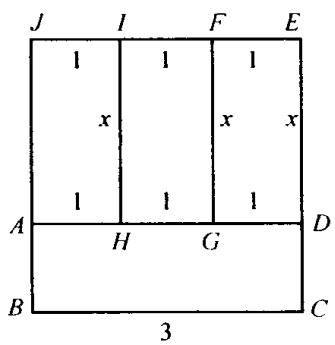

<details>
<summary>text_image</summary>

J I F E
1 1 1
x x x
1 1 1
A H G D
B 3 C
</details>

图 1

但图 $G$ 的旅行商路线ABAHGDCDEFIJA的长度为

$$
l _ {2} = 1 0 + 2 x. \tag {4}
$$

由于 $x > 1$ ，必有 $l_{2} < l_{1}$ ，这样就得到了结论4.证毕

尚待研究的问题是,对满足(2)且存在Hamilton回路的图,再增加什么合理的条件,可保证G的最小Hamilton回路必是最优旅行商路线呢?

## 2 关于目标函数的处理

在 98B 题第一小题中, 要求设计三组“总路程最短且各组尽可能均衡的巡视路线”. 以 $C_{1}, C_{2}, C_{3}$ 表示三组巡视路线的长度, 上述要求可表示为如下双目标函数的优化:

$$
\min (C _ {1} + C _ {2} + C _ {3}), \quad \min (\max _ {1 \leqslant i \leqslant 3} C _ {i} - \min (\max _ {1 \leqslant i \leqslant 3} C _ {i}).
$$

从问题的实际背景出发,可考虑替代为下列目标函数的优化:

$$
\min _ {1 \leqslant i \leqslant 3} \max C _ {i}. \tag {5}
$$

它与上述双目标在含义上有一致的地方,但不尽相同.

在98B题第二小题中,容易确定最小组数为4(参见本文3).在98B题中已将35个村编号为从1到35,现再将17个乡的字母编号依次改为从36至52,将县城编号为53,引入点权(顶点上的权)如下:

$$
v _ {i} = 3 5 (1 \leqslant i \leqslant 3 5), \quad v _ {i} = 7 0 (3 6 \leqslant i \leqslant 5 2), \quad v _ {5 3} = 0, \tag {6}
$$

其中已将在村与乡的巡视时间依照汽车行驶速度35公里/小时化成了公里数.以 $G = (V, E, w)$ 表示98B题的图，以 $G' = (V, E', w')$ 表示相应的完全图（ $w'$ 表示任二点之间的距离），以 $H_1, H_2, H_3, H_4$ 表示 $G'$ 上的4个旅行商路线，其全体能覆盖 $V$ ，且每个 $H_i$ 均包含顶点53(县城).对 $i = 1, 2, 3, 4$ ，令

$$
G _ {i} = \sum_ {(j, k) \in H _ {i}} w _ {j, k} ^ {\prime}, \quad D _ {i} = \sum_ {j \in H _ {i}} v _ {j}.
$$

类似于(5)，对98B题第二小题，可考虑 $G^{\prime} = (V,E^{\prime},w^{\prime})$ 上的下列目标函数的优化：

$$
\min \max _ {1 \leq i \leq 4} (C _ {i} + D _ {i}). \tag {7}
$$

但是，(7)与(5)的区别是明显的，(5)中的目标函数含有边权，而(7)中的目标函数兼含边权与点权.为了把(7)转换为与(5)相同的形式，引入另一完全图 $G'' = (V,E',w'')$ ，其中

$$
\forall (j, k) \in E ^ {\prime}, \quad w _ {j, k} ^ {\prime \prime} = w _ {j, k} ^ {\prime} + \frac {1}{2} v _ {j} + \frac {1}{2} v _ {k}. \tag {8}
$$

易知, 边权 $w''$ 仍满足三角形不等式. 这样, 对 $i = 1,2,3,4$ , 令

$$
C _ {i} ^ {\prime \prime} = \sum_ {(j, k) \in H _ {i}} w _ {j, k} ^ {\prime \prime},
$$

利用(8)容易证明,必成立 $C''_{i}=C_{i}+D_{i}$ . 从而,可以得到下列优化问题

$$
\min \max _ {1 \leqslant i \leqslant 4} C _ {i} ^ {\prime \prime}. \tag {9}
$$

结论 5 $G'=(V,E',w')$ 上的优化问题(7)等价于 $G''=(V,E',w'')$ 上的优化问题(9)，其中边权 $w''$ 由(8)给出.

结论5的意义在于， $G'$ 上的边权与点权都化成了 $G''$ 的边权，从而使第二小题的问题与第一小题的问题(5)成为相同的形式(只是组数不同)，它们可采用相同的近似算法来处理。我们发现，在98B题的个别答卷，提到过把点权化为边权的思想，但要把这一思想明确地形成一个结论，还需联系到目标函数的具体形式，以上讨论了单目标函数 $\max C_i$ 的情形，对前述双目标的情形和下一节的最小组数的问题，讨论是类似的。

## 3 最小组数问题

给定长度约束,求解多旅行商路线的最小组数,是一个有实际意义的重要问题.98B题中第二小题与第三小题均涉及这样的问题.用2中的记号,它可以表示成如下形式:给定一个连通图 $G=(V,E,w)$ (98B题的相应数据见附录),求相应的完全图 $G'=(V,E',w')$ 上多旅行商路线 $H_{i}(i=1,2,\cdots,r)$ ,使其全体能覆盖V,其每一个旅行商路线均含有顶点53(县城),且达到:

$$
\min r \tag {10}
$$

$$
\text {s.t.} \sum_ {j \in H _ {i}} v _ {j} + \sum_ {(j, l) \in H _ {i}} w _ {j, l} ^ {\prime} \leqslant L, \quad i = 1, 2, \dots , r, \tag {11}
$$

其中 $v_{j}$ 为点权, L 为给定的长度上限.

一般来说,求解最小组数问题(10)\~(11),或者说,要确定最小组数 r,包括两个方面,一方面,要构造 $G'$ 的 $r$ 个旅行商路线,满足相应的长度约束;另一方面,要证明 $r$ 是组数的下界,即证明 $r - 1$ 组是不可行的.

对98B第二小题来说,问题(10)\~(11)中的长度上界 $L$ 为840公里,相应的时间上界为24小时.给出4组可行的旅行商路线是不困难的,多数答卷都能做到,但要证明4组是一个下界,不少答卷都做得不好,只有少数试卷给出了简洁的论证.以下是一个这样的论证.假如3组可行的旅行商路线能符合长度约束或相应的时间约束,由于从县城至所有点(村或乡)的距离的最大值为 $d = 77.5$ 公里,而 $2d$ 是 $G$ 的多旅行商问题的一个简单下界,这样,由(11)可得:

$$
3. 8 4 0 \geqslant \sum_ {i = 1} ^ {5 2} v _ {i} + 2 d = 6 9 \times 3 5 + 1 5 5 = 2 5 7 0,
$$

便得矛盾.

对于一般的长度上界 $L$ (相应的时间上界为 $T = L / 35$ ), 最小组数问题 $(10) \sim (11)$ 的解答会是相当困难的. 计算量也会很大. 对98B第三小题来说, 问题 $(10) \sim (11)$ 中的长度上界 $L$ 为225公里, 它相当于时间上界6.4286小时. 很多答卷给出23组可行的旅行商路线, 不少答卷给出22组可行的旅行商路线, 但22组是否为最小组数呢? 对此, 未发现有一个答卷能够给出正确的论证. 当然, 这与答卷时间有限也是有关的. 我们将在5与6中证明下列结论.

结论 6 当 L=225 时, 最小组数问题(10)\~(11)具有下界 r=22.

## 4 集合覆盖问题及其下界

为证明结论 6 做准备,我们在本节叙述集合覆盖问题的概念及关于下界的一个结论.集合覆盖问题的提法如下:

给定集合 $N = \{1,2,\dots ,n\}$ 的一个子集族 $F$ ，在 $F$ 中寻找最小个数(称最小覆盖数)的子集族 $F^{\prime}\subseteq F$ ，使得 $N$ 的每一个元素至少属于 $F^{\prime}$ 中的一个子集.

在计算复杂性理论中,该问题是一个 NP 难问题.同时,对于一般情况,也很难得到什么结论.为了得到有用的结论,我们对 N 与 F 的形式做出一些限制.

假设1 对任何 $S \in F, S$ 的子集亦属于 $F$ .

假设 2 记 $F_{j}$ 为子集族 F 中元素个数为 j 的那些子集组成的族, 假设成立

$$
F = F _ {1} \cup F _ {2} \cup F _ {3} \cup F _ {4}.
$$

假设3 设 $N = A \cup B$ ，记 $F_{j,l}$ 为子集族 $F$ 中 $A$ 元素个数为 $j, B$ 元素个数为 $l$ 的那些子集组成的族，假设成立

$$
F _ {3} = F _ {3, 0} \cup F _ {2, 1} \cup F _ {1, 2}, \quad F _ {4} = F _ {4, 0} \cup F _ {3, 1}, \tag {12}
$$

上述二个假设等价于

$$
F _ {5} = \varnothing , \qquad F _ {0, 3} = \varnothing , \qquad F _ {2, 2} = F _ {1, 3} = F _ {0, 4} = \varnothing.
$$

这表明, 比起 $A$ 中的元素来说, $B$ 中的元素的“权”较重, 从而, $F_{3}$ 中没有 3 元素皆属于 $B$ 的三点子集, $F_{4}$ 也有类似的性质.

结论7 若 $N$ 的子集族 $F$ 满足假设 $1 \sim 3$ , 设 $|N| = n, |B| = b$ , 又 $F_{1,2} \cup F_{3,1}$ 的最大分离子集数为 $q$ , 则集合覆盖问题的最小覆盖数 $r$ 满足:

$$
r \geqslant \lceil (n + b - q) / 4 \rceil ,
$$

这里 $\lceil a\rceil$ 表示取数 $a$ 的上整数.

该结论的证明从略,有兴趣的读者可以自己研究.

该结论给出了最小覆盖数的一个下界, 它特别适合于 $F_{1,2}$ 与 $F_{3,1}$ 所含子集个数较少的情形. 此外, 在有关假设满足时, 另有两个明显的下界 $\lceil n / 4 \rceil$ 与 $\lceil b / 2 \rceil$ .

## 5 合格组的一些性质

首先,简述一下2中提到过的顶点编号.顶点集N分为A(村)与B(乡),其中

$$
A = \{1, 2, \dots , 3 5 \}, \quad B = \{3 6, 3 7, \dots , 5 2 \}
$$

与最小组数问题(10)\~(11)相一致,根据98B第三小题的要求,我们引入下列定义.

定义 1 $N = A \cup B$ 的一个子集 S 称为合格组, 如果

$$
\sum_ {j \in S} v _ {j} + L T S P (S \cup \{5 3 \}) \leqslant 2 2 5, \tag {13}
$$

其中点权 $v_{i}$ 由(6)给出， $LTSP(\cdot)$ 表示这些点的旅行商路线的最优长度.

这样,每个合格组确定了一个可行的旅行商路线,98B题第三小题中的要求就是要确定寻找组数最少的合格组,使其全体能覆盖所有村与乡.

合格组的全体构成 $N$ 的子集族 $F$ . 如前, 以 $F_{j}$ 表点数为 $j$ 的合格组的全体. 经过计算与分析, 我们得到:

$$
\mid F _ {1} \mid = 5 2, \tag {14}
$$

$$
\mid F _ {2} \mid = 7 9 5, \tag {15}
$$

$$
\mid F _ {3} \mid = 1 3 5 4, \tag {16}
$$

$$
\mid F _ {4} \mid = 5 8, \tag {17}
$$

$$
\(| F _ {5} | = 0. \tag {18}
$$

现对上述诸式作简要的说明如下.(13)右端225公里相当于时间上界6.4286小时,它恰是 $v_{j}+LTSP(\{j,53\})$ 对一切j的最大值,所以每一个点(村或乡)均是一个合格组,因此显然成立(14).(15)与(16)可通过穷举法算得.为了较快地确定 $F_{4}$ ,即确定一切4点合格组,可考虑 $F_{3}$ 中哪些3点合格组可以扩充,例如,假如3点合格组 $\{i,j,k\}$ 能扩充为4点合格组,它至少应满足

$$
\sum_ {j \in S} v _ {j} + L T S P (S \cup \{5 3 \}) \leqslant 1 9 0,
$$

即它至少有松弛量35公里，相当于1小时。同时，假如它扩充为4点合格组 $\{i,j,k,l\}$ ，那么还应有 $\{i,j,l\} \in F_3, \{i,k,l\} \in F_3$ 。这样，4点合格组的候选者就少得多了，从而 $F_4$ 可以较快地计算出来，便得(17)。当然，以上 $F_2, F_3, F_4$ 的计算都要借助于计算机来完成。

下面, 我们证明(18). 不然的话, 设存在 5 点合格组 $S = \{k_{1}, k_{2}, k_{3}, k_{4}, k_{5}\}$ . 由点权(6)及定义 1, S 中至多一个点为 B 的点(乡). 假如 S 中确一个点为 B 的点, S 中点权之和为 210, 于是对 $i = 1, 2, 3, 4, 5$ , 有

$$
w ^ {\prime} (k _ {i}, 5 3) \leqslant \frac {1}{2} L T S P (S \cup \{5 3 \}) \leqslant \frac {1}{2} (2 2 5 - 2 1 0) = 7. 5, \tag {19}
$$

其中 $w^{\prime}(i,j) = w_{i,j}^{\prime}$ 表示点 $i$ 与点 $j$ 之间的距离.容易检验，满足(19)的只有一个点(点1)，不可能有5个点，便得矛盾.假如S中所有点为A的点，S中点权之和为175，于是对 $i = 1$ 2,3,4,5,有

$$
w ^ {\prime} (k _ {i}, 5 3) \leqslant \frac {1}{2} L T S P (S \cup \{5 3 \} \leqslant \frac {1}{2} (2 2 5 - 1 7 5) = 2 5. \tag {20}
$$

同样，对 $i, j = 1,2,3,4,5 (i \neq j)$ ，有

$$
w ^ {\prime} (k _ {i}, k _ {j}) \leqslant \frac {1}{2} L T S P (S \cup \{5 3 \}) \leqslant 2 5. \tag {21}
$$

容易检验, $A$ 中点满足(20)的有9个, 其全体记为 $A^{*} = \{1, 2, 3, 5, 26, 28, 29, 31, 33\}$ . 也容易检验, 只有 $A^{*}$ 中的点 $k_{i} = 1$ , 存在 $A^{*}$ 中其他四个点 $k_{j}$ 能满足(21). 但(21)要求这样的点 $k_{i}$ 有5个, 所以亦得矛盾.

如前, 以 $F_{j,l}$ 表示 $A$ 中点数为 $j, B$ 中点数为 $l$ 的合格组的全体. 用(18)的推理过程同样可证明

$$
\mid F _ {0, 3} \mid = \mid F _ {2, 2} \mid = 0, \tag {22}
$$

从而更有 $F_{1,3} = F_{0,4} = \emptyset$ . 由(13)所确定的合格组构成的子集族 $F$ 满足假设 1, 是显然的. (18)与(23)表明 $F$ 满足假设 $2 \sim 3$ . 根据计算, $F_{1,2} \cup F_{3,1}$ 包含下列 15 个合格组:

$$
\{1, 3 6, 3 7 \}, \{1, 3 6, 3 8 \}, \{1, 3 6, 5 2 \}, \{1, 3 7, 3 8 \}, \{1, 3 7, 5 0 \},
$$

$$
\{1, 3 7, 5 2 \}, \{1, 3 8, 5 0 \}, \{2, 3 7, 3 8 \}, \{2, 3 8, 3 9 \}, \{3, 3 7, 3 8 \},
$$

$$
\{3, 3 8, 3 9 \}, \{2 9, 5 0, 5 2 \}, \{1, 2, 3, 3 7 \}, \{1, 2, 3, 3 8 \}, \{2, 3, 5, 3 8 \}.
$$

由于上述15个合格组只涉及11个点，而上述每个合格组为3点或4点，所以 $F_{1,2} \cup F_{3,1}$ 至多有3个分离的合格组.通过简单列举，可知 $F_{1,2} \cup F_{3,1}$ 的最大分离合格组个数为

$$
q = 3. \tag {23}
$$

## 6 结论6的证明

由 $|N| = 52, |b| = 17$ 及(23)，根据结论7可算得复盖 $N$ 的最小组数的一个下界为 $\lceil (|N| + |B| - q)/4 \rceil = \lceil 66/4 \rceil = 17$ ，但它与结论6(22组为下界)相去甚远。因此，我们还要讨论子集族 $F$ 的更多性质，以发掘与利用覆盖 $N$ 的合格组的结构。

以 $F_{j}(k)$ 表示 $F_{j}$ 中含有点 k 的合格组的全体(也是子集族)，类似地引入记号 $F_{j,l}(k)$ 。对计算结果进行检验，根据 $F_{2}(k)=\varnothing$ 等要求可以发现 N 的下列子集：

$$
B _ {1} = \{4 2, 4 3, 4 4 \}, \quad A _ {1} = \{1 0, 1 2, 1 3, 1 4, 1 5, 1 6 \},
$$

$$
B _ {2} = \{4 1, 4 5, 4 6 \}, \quad A _ {2} = \{8, 9, 1 1, 1 7, 1 8, 1 9, 2 2, 2 4 \}.
$$

它们分别具有下列性质：

$$
\forall k \in B _ {1}, \quad F _ {2} (k) = \varnothing , \tag {24}
$$

$$
\forall k \in A _ {1}, \quad F _ {1, 1} (k) = \varnothing , \quad F _ {3} (k) = \varnothing , \tag {25}
$$

$$
\forall k \in B _ {2}, \quad F _ {0, 2} (k) = \varnothing , \quad F _ {3} (k) = \varnothing , \tag {26}
$$

$$
\forall k \in A _ {2}, \quad F _ {1, 2} (k) = F _ {2, 1} (k) = \varnothing , \quad F _ {3, 0} (k) \neq \varnothing , \quad F _ {4} (k) = \varnothing . \tag {27}
$$

设 $T=\{S_{1},S_{2},\cdots,S_{r}\}$ 由 r 个合格组组成, 它能覆盖点集 $N=A\cup B$ . 由于满足假设 1, 可设不同合格组是互相分离的. 由性质(24), T 必含有 3 个单点合格组, 不妨设

$$
S _ {1} = \{4 2 \}, \quad S _ {2} = \{4 3 \}, \quad S _ {3} = \{4 4 \}.
$$

由性质(25)～(26)，覆盖 $A_{1} \cup B_{2}$ 的必是2点合格组. 进一步，可以发现，两点均在 $A_{1} \cup B_{2}$ 中的2点合格组只有4个，更具体地说，有

$$
F _ {2} ^ {\prime} = F _ {2} \cap (A _ {1} \cup B _ {2}) ^ {2} = \{\{1 2, 1 3 \}, \{1 3, 1 4 \}, \{1 3, 1 6 \}, \{1 5, 1 6 \} \}. \tag {28}
$$

由(28)易知 $F_{2}^{\prime}$ 中分离的2点合格组至多有2个，因此只可能有以下三个情形：

情形 1 $\left|T\cap F_{2}^{\prime}\right|=2;$

情形 2 $\left|T\cap F_{2}^{\prime}\right|=1;$

情形 3 $\left|T\cap F_{2}^{\prime}\right|=0$

以情形1来分析,其他二情形的分析是类似的.在情形 $1,T\cap F_{2}^{\prime}$ 的两个2点合格组能覆盖 $A_{1}\cup B_{2}$ 中的4个点,T必还有5个合格组覆盖 $A_{1}\cup B_{2}$ 的另外5个点.由于(25)\~(26),这5个合格组必定皆为2点合格组,它们的全体亦覆盖 $A_{1}\cup B_{2}$ 之外的5个点 $i_{1},i_{2},i_{3},i_{4},i_{5}$ ,且这5个点皆属于A(即不能属于B).现不妨设覆盖 $A_{1}\cup B_{2}$ 的7个2点合格组为 $S_{4},S_{5},\cdots,S_{10}$ ,且令

$$
T _ {1} = \{S _ {1 1}, S _ {1 2}, \dots , S _ {r} \}, \tag {29}
$$

$$
N _ {1} = N \setminus (B _ {1} \cup A _ {1} \cup B _ {2} \cup \{i _ {1}, i _ {2}, i _ {3}, i _ {4}, i _ {5} \}). \tag {30}
$$

于是， $T_{1}$ 覆盖 $N_{1}$ . 经计算可检验如下性质： $A_{2}$ 的任三点不能组成一个合格组，即

$$
F _ {3} \cap (A _ {2} \times A _ {2} \times A _ {2}) = \varnothing . \tag {31}
$$

由于 $|A_{2}| = 8, A_{2}^{\prime} = A_{2} \setminus \{i_{1}, i_{2}, i_{3}, i_{4}, i_{5}\}$ 至少有3个点. 同时，(31)保证这3个点至少属于两个合格组. 因此，不妨设 $i_{6} \in A_{2}^{\prime} \cap S_{11}, i_{7} \in A_{2}^{\prime} \cap S_{12}$ . 由(27)，可分以下情形：

情形 1.1 $\left|S_{11}\right|=\left|S_{12}\right|=3;$

情形 1.2 $\left|S_{11}\right|\leqslant2$ 或 $\left|S_{12}\right|\leqslant2$ .

其实,情形1.2又可分成若干情形.现只分析情形1.1,因其他情形亦类似.分析的整个思路可参见图2.不妨设

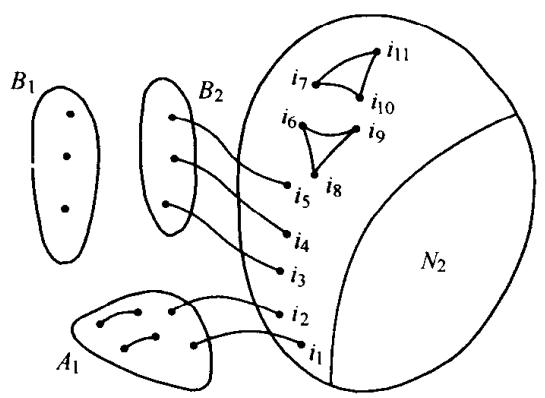

<details>
<summary>text_image</summary>

B₁
B₂
i₁
i₂
i₃
i₄
i₅
i₆
i₇
i₈
i₉
i₁₀
i₁₁
N₂
A₁
</details>

图 2

$$
S _ {1 1} = \{i _ {6}, i _ {8}, i _ {9} \} \in F _ {3, 0}, S _ {1 2} = \{i _ {7}, i _ {1 0}, i _ {1 1} \} \in F _ {3, 0}.
$$

接着(29)\~(30)，令

$$
T _ {2} = T _ {1} \setminus \{S _ {1 1}, S _ {1 2} \} = \{S _ {1 3}, S _ {1 4}, \dots , S _ {r} \},
$$

$$
N _ {2} = N _ {1} \setminus \{i _ {1}, i _ {2} \dots , i _ {1 1} \} = A ^ {\prime} \cup B ^ {\prime},
$$

其中 $A' \subset A, B' \subset B$ . 实际上，

$$
A ^ {\prime} = A \setminus (A _ {1} \cup \{i _ {1}, i _ {2}, \dots , i _ {1 1} \}),
$$

$$
B ^ {\prime} = B \setminus (B _ {1} \cup B _ {2}).
$$

所以 $|A'| = 35 - 17 = 18,$

$$
\(| B ^ {\prime} | = 1 7 - 6 = 1 1, | N _ {2} | = 2 9.
$$

由于 $T_{2}$ 覆盖 $N_{2}$ ，根据结论 7 与 (22)，可得 $T_{2}$ 中组数的下界如下：

$$
r - 1 2 \geqslant \lceil (2 9 + 1 1 - 3) / 4 \rceil = \lceil 3 7 / 4 \rceil = 1 0
$$

所以 $r \geqslant 22$ . 结论6证毕.

注 如果要校核上述证明中的计算是否正确,实际上不必要算出 $F_{2}, F_{3}, F_{4}$ 的全部合格组(见(15)～(17)),而只需校核对推理过程起作用的以下内容:(12),(23),(24)～(27)以及(31).

## 附录

98B题的图形所相应的图 $G = (V, E, w)$ 的有关数据如下，以备必要时可复算. $w(32, 33) = 19$ 不满足三角形不等式(2)，该值被略去.

$$
\begin{array}{l} w (5 3, 1) = 6, \quad w (5 3, 2) = 9. 2, \quad w (5 3, 3 8) = 1 1. 5, \quad w (5 3, 4 8) = 1 9. 8, \\ w (5 3, 5 0) = 1 0. 1, w (5 3, 5 2) = 1 2. 9, w (1, 3 6) = 1 0. 3, \quad w (1, 3 7) = 5. 9, \\ w (1, 3 8) = 1 1. 2, \quad w (2, 3) = 4. 8, \quad w (2, 5) = 8. 3, \quad w (3, 3 8) = 7. 9, \\ w (3, 3 9) = 8. 2, \quad w (4, 8) = 2 0. 4, \quad w (4, 3 9) = 1 2. 7, \quad w (5, 6) = 9. 7, \\ w (5, 3 9) = 1 1. 3, \quad w (5, 4 8) = 1 1. 4, \quad w (6, 7) = 7. 3, \quad w (6, 4 7) = 1 1. 8, \\ w (6, 4 8) = 9. 5, \quad w (7, 3 9) = 1 5. 1, \quad w (7, 4 0) = 7. 2, \quad w (7, 4 7) = 1 4. 5, \\ w (8, 4 0) = 8, \quad w (9, 4 0) = 7. 8, \quad w (9, 4 1) = 5. 6, \quad w (1 0, 4 1) = 1 0. 8, \\ w (1 1, 4 0) = 1 4. 2, w (1 1, 4 2) = 6. 8, w (1 1, 4 5) = 1 3. 2, w (1 2, 4 1) = 1 2. 2, \\ w (1 2, 4 2) = 7. 8, \quad w (1 2, 4 3) = 1 0. 2, \quad w (1 3, 1 4) = 8. 6, \quad w (1 3, 4 2) = 8. 6, \\ w (1 3, 4 4) = 1 6. 4, w (1 3, 4 5) = 9. 8, w (1 4, 1 5) = 1 5, \quad w (1 4, 4 3) = 9. 9, \\ w (1 5, 4 4) = 8. 8, \quad w (1 6, 1 7) = 6. 8, \quad w (1 6, 4 4) = 1 1. 8, \quad w (1 7, 2 2) = 6. 7, \\ w (1 7, 4 6) = 9. 8, \quad w (1 8, 4 4) = 8. 2, \quad w (1 8, 4 5) = 8. 2, \quad w (1 8, 4 6) = 9. 2, \\ w (1 9, 2 0) = 9. 3, \quad w (1 9, 4 5) = 8. 1, \quad w (1 9, 4 6) = 7. 2, \quad w (2 0, 2 1) = 7. 9, \\ w (2 0, 2 5) = 6. 5, \quad w (2 0, 4 7) = 5. 5, \quad w (2 1, 2 3) = 9. 1, \quad w (2 1, 2 5) = 7. 8, \\ w (2 1, 4 6) = 4. 1, \quad w (2 2, 2 3) = 1 0, \quad w (2 2, 4 6) = 1 0. 1, \quad w (2 3, 2 4) = 8. 9, \\ w (2 3, 4 9) = 7. 9, \quad w (2 4, 2 7) = 1 8. 8, \quad w (2 4, 4 9) = 1 3. 2, \quad w (2 5, 4 8) = 1 2, \\ w (2 5, 4 9) = 8. 8, \quad w (2 6, 2 7) = 7. 8, \quad w (2 6, 4 9) = 1 0. 5, \quad w (2 6, 5 0) = 1 0. 5, \\ w (2 7, 2 8) = 7. 9, \quad w (2 8, 5 0) = 1 2. 1, \quad w (2 8, 5 1) = 8. 3, \quad w (2 9, 5 0) = 1 5. 2, \\ w (2 9, 5 1) = 7. 2, \quad w (2 9, 5 2) = 7. 9, \quad w (3 0, 3 2) = 1 0. 3, \quad w (3 0, 5 1) = 7. 7, \\ w (3 1, 3 2) = 8. 1, \quad w (3 1, 3 3) = 7. 3, \quad w (3 1, 5 2) = 9. 2, \quad w (3 2, 3 5) = 1 4. 9, \\ w (3 3, 3 5) = 2 0. 3, w (3 3, 3 6) = 7. 4, w (3 4, 3 5) = 8. 2, w (3 4, 3 6) = 1 1. 5, \\ w (3 4, 3 7) = 1 7. 6, w (3 6, 3 7) = 1 2. 2, w (3 6, 5 2) = 8. 8, \quad w (3 7, 3 8) = 1 1, \\ w (4 4, 4 5) = 1 5. 8, w (4 8, 4 9) = 1 4. 2, \\ \end{array}
$$

## 参考文献

[1] 杜端浦. 运筹图论. 北京: 北京航空航天大学出版社, 1994  
[2] E. L. Lawler, Lenstra J k, A. H. G. Rinnooy Kan, D. B. Shmoys.

The Traveling Salesman Problem. Wileys, Chichester, 1995

## 15. 自动化车床管理(CUMCM 1999 年 A 题)

一道工序用自动化车床连续加工某种零件,由于刀具损坏等原因该工序会出现故障,其中刀具损坏故障占95%,其他故障仅占5%.工序出现故障是完全随机的,假定在生产任一零件时出现故障的机会均相同.工作人员通过检查零件来确定工序是否出现故障.

现积累有 100 次刀具故障记录, 故障出现时该刀具完成的零件数如附表. 现计划在刀具加工一定件数后定期更换新刀具.

已知生产工序的费用参数如下：

故障时产出的零件损失费用 f=200 元/件；

进行检查的费用 t = 10 元/次；

发现故障进行调节使恢复正常的平均费用 d = 3000 元/次(包括刀具费);

未发现故障时更换一把新刀具的费用 k = 1000 元/次.

1) 假定工序故障时产出的零件均为不合格品, 正常时产出的零件均为合格品, 试对该工序设计效益最好的检查间隔(生产多少零件检查一次)和刀具更换策略.  
2) 如果该工序正常时产出的零件不全是合格品, 有 $2\%$ 为不合格品; 而工序故障时产出的零件有 $40\%$ 为合格品, $60\%$ 为不合格品. 工序正常而误认有故障停机产生的损失费用为 1500 元/次. 对该工序设计效益最好的检查间隔和刀具更换策略.

3) 在 2) 的情况，可否改进检查方式获得更高的效益.

附:100 次刀具故障记录(完成的零件数)

<table><tr><td>459</td><td>362</td><td>624</td><td>542</td><td>509</td><td>584</td><td>433</td><td>748</td><td>815</td><td>505</td></tr><tr><td>612</td><td>452</td><td>434</td><td>982</td><td>640</td><td>742</td><td>565</td><td>706</td><td>593</td><td>680</td></tr><tr><td>926</td><td>653</td><td>164</td><td>487</td><td>734</td><td>608</td><td>428</td><td>1153</td><td>593</td><td>844</td></tr><tr><td>527</td><td>552</td><td>513</td><td>781</td><td>474</td><td>388</td><td>824</td><td>538</td><td>862</td><td>659</td></tr><tr><td>775</td><td>859</td><td>755</td><td>649</td><td>697</td><td>515</td><td>628</td><td>954</td><td>771</td><td>609</td></tr><tr><td>402</td><td>960</td><td>885</td><td>610</td><td>292</td><td>837</td><td>473</td><td>677</td><td>358</td><td>638</td></tr><tr><td>699</td><td>634</td><td>555</td><td>570</td><td>84</td><td>416</td><td>606</td><td>1062</td><td>484</td><td>120</td></tr><tr><td>447</td><td>654</td><td>564</td><td>339</td><td>280</td><td>246</td><td>687</td><td>539</td><td>790</td><td>581</td></tr><tr><td>621</td><td>724</td><td>531</td><td>512</td><td>577</td><td>496</td><td>468</td><td>499</td><td>544</td><td>645</td></tr><tr><td>764</td><td>558</td><td>378</td><td>765</td><td>666</td><td>763</td><td>217</td><td>715</td><td>310</td><td>851</td></tr></table>

(北京大学 孙山泽提供)

# 自动化车床最优刀具检测更换模型

戚正君 任 毅 司 勇

(大连理工大学, 大连 116024)

指导教师 教师组

编者按 本文对问题一给出了正确的模型和结果,对问题二也进行了详细的分析,给出了基本正确的结果,这在所有提交的论文中是较少见的.本文缺点是没有考虑5%的其它故障,问题三的讨论也不充分.

摘要本文通过对自动化车床100次刀具故障的记录进行数理统计分析，研究了自动化车床连续加工单一零件时刀具的检测及更换模型。首先利用概率大样本场合的 $D$ 检验方法证明了刀具的故障发生规律服从正态分布[1]，继而求出系统工序的寿命分布函数[2]，列出以合格零件单位期望损失为目标，关于检测间隔和刀具定期更换间隔为变量的多目标函数方程，最后利用计算机进行列举比较求解，从而得出取得最大经济效益的系统工序的最优检测间隔以及最优刀具更换策略。由于刀具的故障发生服从正态分布，我们对模型进行了改进，采取有规律的不等间隔的检查方式，结果取得了相对于等检查间隔的更优解。

本文利用算法较好地解决了问题,得到了问题的优化解.对于问题1,解得换刀间隔和检查间隔分别为369和18,单位合格零件损失4.615元,采用不等间隔的损失为4.405元;对于问题2,由于情况复杂,解得换刀间隔和检查间隔分别为306和28,单位合格零件损失9.268元,采用不等间隔的损失为9.047元,从而验证了本文提出的不等间隔检查方式的更优性.

## 1 问题的提出(略)

## 2 基本假设

(1) 假设在生产任一零件时出现故障的机会均相同.  
(2) 假设无论 95% 的刀具损坏故障还是 5% 的其它故障, 发生故障并使恢复正常的平均费用均为 3000 元/次.  
(3) 假设问题 2 中工序正常时而误认为有故障停机产生的损失费用(1500 元/次)不包括刀具费用, 即发现检查有误时不进行换刀.  
(4) 假设发现故障和停机维修所用的时间可忽略不计.  
(5) 假设生产任一零件所需时间相同.  
(6) 假设检查时不停止生产, 只在检查出不合格零件时才停止生产进行维修.  
(7) 假设提供的刀具故障记录数据是独立同分布的.  
(8) 假设 5% 的其它故障不予考虑.

## 3 符号说明

$T_{c}$ 检查零件的单位时间间隔.

T 定期换刀的单位时间间隔.

$T(C)$ 以检测时间间隔为 $T_{c}$ 时, 系统工序合格零件的单位期望损失.

$Tc^{*}$ 以经济损失最小为目标的最优检查的时间间隔.

$T^{*}$ 以经济损失最小为目标的最优的换刀间隔.

$T(C)^{*}$ 在 $Tc^{*}$ 和 $T^{*}$ 的情况下, 系统工序合格零件的最小单位期望损失.

$f(x)$ 系统的失效概率密度.

$F(x)$ 累计失效概率,亦即寿命分布函数.

f 故障时产出的零件损失费用 200 元/件.

t 检查的费用 10 元/次.

d 发现故障进行调节使恢复正常的平均费用 3000 元/次(包括刀具费).

k 未发现故障时更换一把新刀具的费用 1000 元/次.

$\mu$ 刀具平均寿命

σ 样本标准差

## 4 模型的建立与求解

## 4.1 建立模型前的数据处理

## 1. 正态性检验

首先根据大样本场合 $(n>50)$ 的D检验验证刀具寿命记录的概率分布的方式.

$$
D = \frac {\sum_ {i = 1} ^ {n} \left(i - \frac {n + 1}{2}\right) x _ {(i)}}{n ^ {\frac {3}{2}} \sqrt {\sum_ {i = 1} ^ {n} (x _ {i} - \bar {x}) ^ {2}}} \quad Y = \frac {(D - 0 . 2 8 2 0 9 4 7 9) \sqrt {n}}{0 . 0 2 9 9 8 5 9 8}
$$

正态分布的拒绝域为 $\{Y \leqslant Y_{\alpha / 2}$ 或 $Y \geqslant Y_{1 - \alpha / 2}\}$ 取 $\alpha = 0.05$ 由于 $n = 100$ ，则拒绝域为 $\{Y \leqslant -2.54$ 或 $Y \geqslant 1.31\}$ ，

经计算有 D=0.2782, Y=-1.2933

由于样本未落入拒绝域,故在 $\alpha=0.05$ 时可认为刀具故障记录满足正态分布.

## 2. 概率密度函数的求解

于是失效概率密度函数为： $f(t)=f_{N}(t;\sigma^{2},x)=\frac{1}{\sigma\sqrt{2\pi}}e^{-(t-\bar{x})^{2}/2\sigma^{2}}$

其中 $\bar{x} = \frac{1}{N} \sum_{i=1}^{N} x_{i}$

$$
\sigma^ {2} \approx S ^ {2} = \frac {1}{N - 1} \sum_ {i = 1} ^ {N} (x _ {i} - \bar {x}) ^ {2}
$$

数据统计得 $\bar{x}=600\quad\sigma=196.6291695$

则累积失效概率分布函数(寿命分布函数)为

$$
F (t) = F _ {N} (t; \sigma^ {2}, \bar {x}) = \int_ {0} ^ {t} f (x) \mathrm{d} x
$$

## 4.2 模型一

我们首先建立以合格零件的单位期望损失为目标函数的数学模型.

系统工序合格零件的单位期望损失 $T(C)=\frac{\text{系统工序的期望总损失 } U_{\text{总}}}{\text{系统工序产生的合格零件总数}}$

4.2.1 首先求系统工序的期望总损失 $U_{总}$

假设自动化车床在连续运行中将发生 N 次更新过程(每次换刀或者维修换刀为一次更新过程), 即包括到固定换刀间隔才换刀和发生故障后立即维修换刀两类情况.

这 N 次更新刀具的过程又可分为两种情况：

1. 换刀间隔 $T$ 前尚未出现故障。发生这种情况时的更新间隔均为 $T$ ，出现的次数等于刀具更新的总次数乘以以 $T$ 为更新间隔情况下换刀前仍未出现故障的概率，即 $N[1 - F(T)]$ ，因此定期换刀前未出现故障的情况下的总损失 $U_{1}$ 等于这种情况下的刀具更新次数 $N[1 - F(T)]$ 乘以单位更新过程的损失费用 $P_{1} \times U_{1} = N[1 - F(T)]P_{1}$  
2. 换刀间隔 $T$ 前就出现故障。这时在故障发生后进行检查并进行维修换刀，从而完成了一个更新过程。这种情况下总的发生次数等于总的更换次数乘以系统中发生这种情况的概率，即 $N \cdot F(T)$ ，因此定期换刀前出现故障的情况下的总损失 $U_{2}$ 等于这种情况下的刀具更新次数 $N \cdot F(T)$ 乘以单位更新过程的损失费用 $P_{2}$ 。 $U_{2} = N \cdot F(T) \cdot P_{2}$

而 $U_{\text{总}} = U_{1} + U_{2}$

注. 其中 $F(T)$ 为以 $T$ 为更新周期的情况下工序出现故障的概率, 即为前面的数据处理2中的累计失效概率分布函数, $F(t) = \int_{0}^{t} f(x) \mathrm{d}x$ , 当 $t = T$ 情况下 $F(T)$ 的结果.

下面我们将通过对一个换刀间隔 $T$ 的研究来求 $P_{1}$ 和 $P_{2}$ .

1. 求到换刀间隔 T 尚未出现故障时一次更新所消耗费用 $P_{1}$ :

(1) 检查费用: 检查费用等于检查的次数乘以单次检查所需的费用, 即 $g_{1}t$

注 其中 $g_{1}$ 表示一次换刀前未出现故障的过程的检查次数, 等于固定换刀间隔 T 除以检查周期 $T_{c}$ 所得的整数部分.

(2) 换刀费用: k  
(3) 不合格零件损失费用:0

所以 $P_{1} = g_{1}t + k + 0$

于是,在换刀前未出现故障的情况下总的损失费用 $U_{1}$ 为:一次换刀周期内的损失乘以这种情况可能发生的总的更新次数,即

$$
U _ {1} = N [ 1 - F (T) ] [ g _ {1} t + K + 0 ]
$$

2. 求换刀时已出现故障时一次更新过程所消耗费用 $P_{2}$

这种更新过程如图1所示,即在定期换刀间隔T内发生故障,则在故障发生后的下一次检查时及时发现并维修换刀,从而完成一个更新过程.一次更新过程的费用包括:

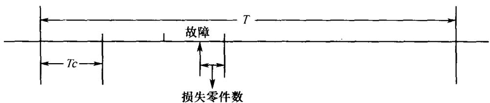

<details>
<summary>text_image</summary>

T
故障
Tc
损失零件数
</details>

图 1

(1) 发生故障时的维修换刀费用: d  
(2) 故障维修前所有的损失费用: 由于故障发生的随机性, 因此可以发生在 T 内的任何位置. 因此这部分的损失费用等于对于周期 T 内任意点 x 处发生故障所造成的损失与

在 $x$ 处可能发生故障的概率的乘积进行积分的结果，即 $\int_0^T W_x\frac{f(x)}{F(T)}\mathrm{d}x$

其中 $\frac{f(x)}{F(T)}$ 表示在一个换刀周期 $T$ 内任意的 $x$ 处发生故障概率.

任意位置发生故障的损失费 $W_{x}=$ 检查费用 + 零件损失费

a. 检查费用等于检查次数乘以单次检查费用, 即 $\left[g_{2}+1\right]t$ ( $g_{2}$ 为发生故障 x 前的检查次数, 等于 x/Tc 所得的整数部分)  
b. 零件损失费用等于从发生故障到维修检查之间产生的不合格零件数乘以单个零件的损失费用, 即 $[Tc - H]f$

注 $H$ 为发生故障的检查间隔内产生的合格零件数, 即发生故障前的所有合格零件数除以检查间隔所得的余数.

所以

$$
P _ {2} = \int_ {0} ^ {T} \left\{\left[ g _ {2} + 1 \right] t + \left[ T c - H \right] f \right\} \frac {f (x)}{F (T)} \mathrm{d} x + d
$$

于是得到在换刀前已出现故障的情况下的损失总费用 $U_{2}$ 为

$$
U _ {2} = N \cdot F (T) \left\{\int_ {0} ^ {T} \left\{\left[ g _ {2} + 1 \right] t + \left[ T c - H \right] f \right\} \frac {f (x)}{F (T)} \mathrm{d} x + d \right\}
$$

因此工序总的期望损失为 $U_{总} = U_{1} + U_{2}$

系统工序产生的合格零件总数为:换刀前没发生故障情况产生的合格零件总数加上换刀前发生故障情况下产生的合格零件总数,即

$$
N [ 1 - F (T) ] T + N \cdot F (T) \int_ {0} ^ {T} x \frac {f (x)}{F (T)} \mathrm{d} x
$$

系统工序合格零件的单位期望损失 $T(C) = \frac{\text{系统工序的期望总损失 } U_{\text{总}}}{\text{系统工序产生的合格零件总数}} = \frac{U_1 + U_2}{N[1 - F(T)T] + N \cdot F(T) \int_0^T x \frac{f(x)}{F(T)} \, \mathrm{d}x} (U_1, U_2 \text{ 见上文})$

上式中 $N$ 可以约去, 式子变成了以 $T, Tc$ 为变量, $T(c)$ 为目标函数的方程. 为使 $T(c)$ 最小, 我们利用计算机进行穷举比较法求解. 首先选取 $T = 50$ 为步长进行求解比较, 求得 $T = 400, Tc = 16$ 时出现最优解; 然后在 $T \in (350, 450)$ 之间逐一进行求解比较, 从而得到模型的优化解如下:

$$
\begin{array}{l} T (C) ^ {*} = 4. 6 1 5 \\ T ^ {*} = 3 6 9 \\ T c ^ {*} = 1 8 \\ \end{array}
$$

## 4.3 对模型一的进一步改进

由于故障记录满足正态分布,因此在等检查间隔内产生的不合格零件数并不相等,即故障发生在各间距内的概率并不相等,也就是说这样便不符合在生产任一零件时出现故障的机会均相等的假设.为了使在任意检查区间内故障发生的概率积累均相同,我们根据故障记录的正态分布规律,开始时工序故障发生的概率小,到工序运行中期达到最大,然后再次变小的变化规律,如图采用不等间隔的检查方式,即检查间隔由大一小一大的方式进行检查,从而相对于等间隔检查更加合理. 如图 2 所示:

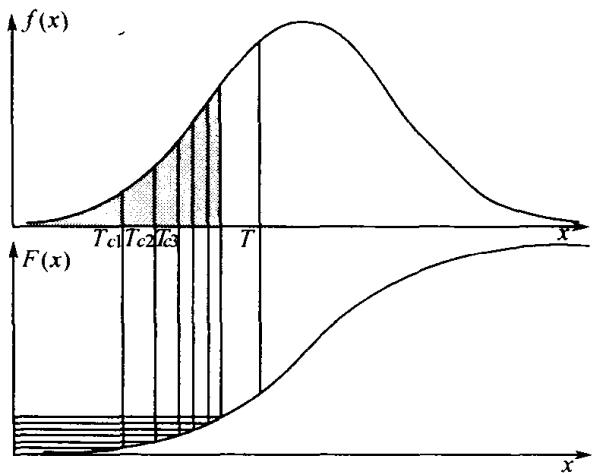

<details>
<summary>area</summary>

| Interval | Description |
| --- | --- |
| Tc1 | Leftmost interval (shaded) |
| Tc2 | Second interval (shaded) |
| Tc3 | Third interval (shaded) |
| T | Rightmost interval (shaded) |
</details>

图2

由图2已知单位检查间隔内产生的不合格零件的累计失效概率密度用面积area表示，各块面积大小相等，即在各单位检查间隔内产生不合格零件的概率积累均相同，由此可以确定检查间隔 $Tc$ 具体的变化规律。设在一个换刀间隔内检测间隔次数为 $g_{1}(T)$ ，图2下半部分中的纵坐标累积失效概率即为图2上半部分中的面积area，

因此， $g_{1}(T) = F(T)$ div area (div 表示整除) (1)

设在 T 的周期内任一点 X 处发生故障, 设在故障 x 之前的检测次数为 $g_{2}(x)$

则 $g_{2}(x) = [F(x - 1)\text{div area}] + 1$ (2)

于是得到损失零件数 $H(x) = F^{-1}[g_2(x)\times area] - x\qquad (H(x) <   T - x)$

如果 $H(x) \geqslant T - x$ 时则损失零件数为 $T - x$ (3)

我们将改进后的(1)、(2)、(3)的结果应用于模型一中,得到了模型一的更优解和更好的效益.

$$
T (C) ^ {*} = 4. 4 0 5
$$

$$
T ^ {*} = 3 6 9
$$

$$
a r e a ^ {*} = 0. 0 0 6
$$

改进后的模型得到的更优解较改进前期望损失的最小值降低了5%，对于不等间隔检查，其检查间隔 $Tc(n)$ 的计算公式为：

$$
T c (n) = F ^ {- 1} [ a r e a \times n ] - F ^ {- 1} [ a r e a (n - 1) ]
$$

$Tc(n)$ 的计算结果如下表所示.

<table><tr><td>检查次数</td><td>检查间隔</td><td>检查零件号</td><td>检查次数</td><td>检查间隔</td><td>检查零件号</td></tr><tr><td>1</td><td>106</td><td>106</td><td>11</td><td>9</td><td>303</td></tr><tr><td>2</td><td>50</td><td>156</td><td>12</td><td>9</td><td>312</td></tr><tr><td>3</td><td>31</td><td>187</td><td>13</td><td>9</td><td>321</td></tr><tr><td>4</td><td>24</td><td>211</td><td>14</td><td>7</td><td>328</td></tr><tr><td>5</td><td>19</td><td>230</td><td>15</td><td>8</td><td>336</td></tr><tr><td>6</td><td>16</td><td>246</td><td>16</td><td>7</td><td>343</td></tr><tr><td>7</td><td>14</td><td>260</td><td>17</td><td>7</td><td>350</td></tr><tr><td>8</td><td>12</td><td>272</td><td>18</td><td>6</td><td>356</td></tr><tr><td>9</td><td>12</td><td>284</td><td>19</td><td>7</td><td>363</td></tr><tr><td>10</td><td>10</td><td>294</td><td>20</td><td>6</td><td>369</td></tr></table>

## 4.4 模型二

相对于模型一,模型二需要增加考虑两种情况:一种是在工序正常工作时有可能检查到2%的不合格零件而误认为出现故障停机,发现误检后不进行换刀,继续正常工作,每次误停机将造成1500元的损失;第二种情况是由于工序发生故障后仍有40%的合格零件产生,必然会导致因为检查到40%的合格零件而认为工序正常的错误,这样会增加不合格零件的数量和相应增加不必要的检查,从而使工序的损失增加.

同模型一,我们同样列出以单位合格零件的期望损失为目标的函数方程

系统工序合格零件的单位期望损失 $T(C)=\frac{\text{系统工序的期望总损失 } U_{\text{总}}}{\text{系统工序产生的合格零件总数}}$

系统工序的总损失 $U_{总}$ 又包括定期换刀前出现故障情况下产生的损失 $U_{1}$ 加上定期换刀前未出现故障情况下产生的损失 $U_{2}$ .

我们仍假设整个系统共包括 $N$ 次更新过程.

换刀前出现故障的更新次数: $N\cdot F(T)(F(T)$ 的含义同模型一)

换刀前未出现故障的更新次数: $N[1-F(T)]$

所以

$$
U _ {1} = N [ 1 - F (T) ] P _ {1}
$$

$$
U _ {2} = N \cdot F (T) \cdot P _ {2}
$$

下面我们将通过对一个换刀间隔 $T$ 的研究来求 $P_{1}, P_{2}$

1. 换刀前未出现故障的更新过程的单位损失费用 $P_{1}$ 包括：

(1) 一次换刀费用: k

(2) 检查费用: 单位更新周期内的检查次数乘以单次检查费用

即 $g_{1}t$

同模型一我们用 $g_{1}$ 表示 $T / Tc$ 的整数部分

(3) 由于车床在正常工作时将会产生 2% 的不合格产品, 如果在检测时正好被检测到, 将误认为有故障而停机, 造成的误停机损失总费用等于误停机的次数乘以一次误停机的损失.

误检测而停机的次数 = 总的检测次数 × 在正常情况下不合格产品所占总产品的百分含量, 即: $2\% g_{1} = \frac{g_{1}}{50}$

所以,误检测而停机造成的损失费用为: $\frac{g_{1}}{50}\times1500=30g_{1}$

(4) 在工序正常运行中产生的不合格零件的损失费用 = 单位换刀间隔 T 内产生的不合格零件总数 $T \times 2\%$ 与单个不合格零件的损失 f 的乘积, 即

$$
Tf2\% = \frac{Tf}{50}
$$

合计(1)、(2)、(3)、(4)各项的费用,即为换刀前未出现故障的更新过程的单位损耗费用 $P_{1}$ :

$$
P _ {1} = k + g _ {1} t + 3 0 g _ {1} + \frac {T f}{5 0}
$$

所以换刀前未出现故障的情况下的损失费用 $U_{1}$ 合计为：

$$
U _ {1} = N [ 1 - F (T) ] \left[ k + g _ {1} t + 3 0 g _ {1} + \frac {T f}{5 0} \right]
$$

2. 同上, 定期换刀前出现故障情况下的总损失 $U_{2} = N \cdot F(T) \cdot P_{2}$ , 其中 $P_{2}$ 为换刀前出现故障的更新过程的单位损失费用.

由于故障的出现是随机的,即故障可能在 $x \leqslant T$ 的任意点发生,同模型一,系统在此单位刀具更换间隔内的平均损失费用为: $P_{2} = \int_{0}^{T} W_{X} \frac{f(x)}{F(T)} dx$

其中单位换刀间隔内的 x 点处发生故障的平均损失费用 $W_{2}$ 包括：

（1）发生故障前的检查费用： $(g_{2}-1)t(g_{2}$ 表示包括故障后的那次检查的故障前所有检查次数的和）

(2) 发生故障前由于误检停机造成的损失费用(同一(3)中表述):

$$
(g _ {2} - 1) \times 2 \% \times 1 5 0 0 = 3 0 (g _ {2} - 1)
$$

(3) 正常工序中 2% 的不合格零件造成的损失：

$$
2 \% xf = \frac {xf}{50}
$$

(4) 发生故障后的检查所需费用：

① 因为每次故障后要进行一次检查,而这次检查时可能检查到 40% 的合格品,也就是下一次是否进行检查的可能性为 40%,于是对从 $g_{2}$ 次(记为第 0 次)到 $g_{1}$ (记为第 $g_{1}-g_{2}$ 次)进行累计作为平均检查次数,即

$$
\sum_ {i = 0} ^ {g _ {1} \dots g _ {2}} 0. 4 ^ {i} \quad (\text {当} T - x > H \text {时})
$$

其中 H 等于 $T_{C}$ 减去 X 除以 $T_{C}$ 所得的余数, 即为发生故障的检查间隔内, 发生故障到下次检查之间产生的零件数.

这时发生故障后的检查所需费用为 $\sum_{i=0}^{g_{1}-g_{2}}0.4^{i}t$

② 而当 $T - x \leqslant H$ 时, 即换刀发生在从故障发生到下一次检查维修之间的时候, 检查次数为 0, 所以检查费用为 0.

(5)对故障进行维修换刀的平均损失：

$$
(1 - 0. 4 ^ {g _ {1} - g _ {2} + 1}) d
$$

其中 $0.4^{g_1 - g_2 + 1}$ 为第 $g_{1} - g_{2} + 1$ 次检查时检查到合格品时的概率.

(6)发生故障后产生的不合格零件的平均损失费用：

① 当 T-x>H 时即当故障发生后第一次检查到合格零件而误认为是无故障发生直到检查出故障而进行换刀或维修为止的情况。这时损失可分为两个部分：

a. 发生故障产生后到第一次检查的所产生不合格零件的损失, 即

$$
0. 6 H f
$$

b. 从发生故障后的第一次检查直到维修换刀时产生不合格零件的损失.

于是当 T-x>H 时, 发生故障后产生的不合格零件的平均损失费用:

$$
(H + 0. 4 T _ {c} + 0. 4 ^ {2} T _ {c} + \dots 0. 4 ^ {g _ {1} - g _ {2}} T _ {c}) 0. 6 f
$$

② 当 $T - x \leqslant H$ ，即固定换刀发生在从故障发生到第一次检查之间时，发生故障后产生

的不合格零件的平均损失费用：

$$
(T - x) \cdot 0. 6 f
$$

所以换刀前出现故障的情况下总的损失费用 $U_{2} = N\cdot F(T)\int_{0}^{T}W_{X}\frac{f(x)}{F(T)}\mathrm{d}x$

其中 $W_{X}$ 等于(1)、(2)、(3)、(4)、(5)、(6)各项损失之和.

因此,整个系统的平均损失为

$$
U _ {\text {总}} = \left[ k + g _ {1} t + 3 0 g _ {1} + \frac {T f}{5 0} \right] \cdot N \cdot [ 1 - F (T) ] + \int_ {0} ^ {T} W _ {X} \frac {f (x)}{F (T)} \mathrm{d} x \cdot N \cdot F (T)
$$

共产生的合格零件总数为：

(1) 换刀前未发生故障所产生的总的合格零件个数: 它等于换刀前未发生故障的情况下产生的零件总数与合格零件所占百分比的乘积

$$
N [ 1 - F (T) ] T \times 98\%
$$

(2) 换刀前发生故障所产生的总的合格零件个数

$$
N \cdot F (T) \left[ \int_ {0} ^ {T} \left(98\% x + \frac {(6)}{0 . 6 f} 0. 4\right) \frac {f (x)}{F (T)} \mathrm{d} x \right] \quad ((6) \text {结果见上式})
$$

于是,模型二中系统工序的单位期望损失为

$T(C) = \frac{W_{\text{总}}}{(1) + (2)}$ 从而再次转化为确定 $T$ 和 $Tc$ 的值使 $T(c)$ 最小的关系式. ((1), (2) 结果见上式)

同模型—利用计算机进行穷举比较法计算得出最优解

$$
T (C) ^ {*} = 9. 2 6 8
$$

$$
T ^ {*} = 3 0 6
$$

$$
T c ^ {*} = 2 8
$$

同模型一的改进,我们对模型二进行不等间隔检查的改进,用改进的模型一中的 $g_{1}(T)$ (单位换刀间隔内的检查次数)、 $g_{2}(x)$ (在故障 x 前进行检查的次数)、 $H(x)$ (从损坏到下次检查间产生的零件数)代入模型二中,求得

$$
T (C) ^ {*} = 9. 0 4 7
$$

$$
T ^ {*} = 3 1 6
$$

$$
a r e a ^ {*} = 0. 0 1 7
$$

相对于模型一,由于模型二发生故障后仍有40%的合格品产生,因此给检查带来了困难,为了尽量减少误检造成的损失,于是相应的检查间隔变大而换刀间隔减小,从而单位期望损失也由4.405变为9.047.

## 4.5 模型二检查方式的改进(问题 3 的解答)

对于问题二,由于工序正常时产出的零件仍有2%为不合格品,而工序故障时产生的零件有40%为合格品,这样工作人员在通过定期检查单个零件来确定工序是否出现故障的检查方式必然会导致正常工序时因检查到不合格零件而误认为出现故障停机的错误和工序发生故障后检查到的仍是合格品而认为工序正常的错误,都将造成很大损失.于是我们建议工作人员当检查到一个零件为合格品时,再检查一个零件,若仍是合格品则判断工序正常,若为不合格品则判定为系统工序出现故障.这样虽然会相应地增加检查的费用,但大大降低了因误检而造成的损失,从而使系统工序获得更高的效益.(编者按:这就是Bayes决策的思想,最好具体算一下这样处理后,减少了多少误判概率.)

## 5 对模型的评价和改进

本文所阐述的模型是以单位期望效益为目标的更新报酬定理 $^{[3]}$ 的改进与推广。它广泛适用于自动化车床的管理系统，但只能是单道工序加工单一零件的情况，却对扩展到多道工序和多种零件的复杂车床管理系统产生指导意义。本文还应用等概率法对等间隔检查方式进行了改进，利用失效概率密度函数使检查间隔符合等概率分布，使模型更优。本模型对可能发生的故障损失逐一进行了细致的分析求解，但多目标的模型方程比较繁琐，于是本模型选择了用计算机进行了给定范围的穷举比较法来进行求解。

在假设中我们假设检查零件时如检查到不合格零件,立即停止生产(即不再产生不合格产品),而实际中由于检查时间不容忽视,必然会多产生一些不合格产品,本模型中并没有考虑,会造成一些误差.另外本模型没有对故障及维修时间提出具体要求,即在整个工序中如何尽量提高生产效率问题上留下了遗憾.

## 参考文献

[1] 茚诗松, 周纪芗. 概率论与数理统计. 中国统计出版社.  
[2] 蔡俊. 可靠性工程学. 黑龙江科学技术出版社.  
[3] 沈玉波, 冯敬海. 可修系统的最优检测更新模型. 数学的实践与认识, 1996.3.

这种创造过程所牵涉的是摸索、疏忽、猜测和假设。想象、直觉、预测、洞察实验、机会、运气、艰苦的工作以及巨大的耐心都被用来掌握一个关键的概念，构成一个猜想以及找到一个证明。总体来说，数学创造在于“用自己的智慧做自己最厌烦的事，同时把握住一切可能。”

数学家在创造性工作中所能得到的满意,射猎的兴奋,发现的颤音,取得成就的意识,以及成功的得意,所有这些都比他在按照演绎模式对证明做最后整理的工作中所能得到的要多得多,强烈得多。

Morris Kline; 摘自 J. N. Kapur, Thought on Nature of Mathematics of Alexandrov et al., 1973; 中译本,《数学家谈数学本质》, 北京大学出版社, 1989, 320 - 321;

# 自动化车床管理

于杰 蒋爱民 李荣冰

(南京航空航天大学, 南京 210016)

指导教师 倪 勤

编者按 本文思路清晰,叙述简洁扼要,在处理5%其他故障方面有独到之处.但问题二的分析和结果有不足和错误.

摘要 本文讨论了系统的最优维修策略问题,考虑到题目中所涉及的变量大多为随机变量,我们建立了单目标的期望值模型.并利用计算机采用穷举搜索法求解得第一种情况最优解为每生产18个零件检查1次,当检查到20次时更换刀具,这时生产单个零件的最低平均费用为4.62元.

最后,我们指出了模型中一些未考虑的因素,分析了这些因素可能对模型产生的影响,并提出了模型的改进方案.

## 1 问题的提出(略)

## 2 基本假设

(1) 假定生产任一零件出现故障机会均等,且相互独立  
(2) 发现故障时无法区分刀具故障和其它故障  
(3) 其它故障服从几何分布  
(4) 每次只检查 1 个零件  
(5) 零件检查时间很小, 可忽略不计  
(6) 检查间隔是相等的  
(7) 假设随机变量 X1、X2 是相互独立的，X1、X2 的含义见符号说明

## 3 符号说明

n：每生产 n 个零件检查一次

m: 检查第 m 次时更换新的刀具

T: 定期更换刀具时已生产的产品的总数即刀具更换周期 $T = n \cdot m$

$\bar{T}$ :刀具更换周期的数学期望(均值)

F: 故障时产出的零件损失费用 F = 200 元/件

J: 进行检查的费用 J = 10 元/次

D: 发现故障进行调节使恢复正常的平均费用 D = 3000 元/次(包括刀具费)

K: 未发现故障时更换一把新刀具的费用 K = 1000 元/次

M: 工序正常而误认为有故障停机产生的损失费用 M = 1500 元/次

$\bar{C}(n,m)$ : 整个工序在刀具更换周期的总费用的数学期望值

$\bar{S}(n,m)$ : 整个工序在刀具更换周期的生产单个零件平均费用的数学期望值

$X_{1}$ : 表示首次产生刀具故障时已加工的零件数

$X_{2}$ : 表示其它原因引起的首次故障时已加工的零件数

X: 首次故障时已加工的零件数即故障间隔

## 4 问题分析

自动化车床发生故障时,要及时实施维修,如果检查周期太长,故障不能及时发现,给生产带来损失;检查周期太短,又会增加费用,因为车床出现故障是随机的,问题是如何安排设备检查方案,使得刀具更换时,每个零件的平均费用最低.

对于第1种情况若检查零件为合格的,则工序未出现故障,此时更换刀具称为预备性替换;若检查零件为不合格的,则工序必已出现故障,此时应立即更换刀具,此称为事后替换(参见文献[1]).

第 2 种情况较为复杂, 因为仅凭 1 次检查零件是否合格, 不能准确判断工序是否正常, 这时我们可以分情况讨论, 如果发现零件不合格, 就停机检查工序是否正常, 若正常继续生产, 如果不正常就更换刀具, 如果到周期结束时即第 m 次检查后零件仍合格必须换刀具.

为解决此问题我们建立了单目标期望值模型.

## 5 模型的建立

1. 刀具故障完成零件个数的数据统计分析.

我们使用 MATLAB 软件包对 100 次刀具故障记录数据处理作直方图, 用分布拟合检验法可以证明刀具故障数据近似服从正态分布.

假设 $H_{0}:X_{1}$ 的概率密度为

$$
f (x _ {1}) = \frac {1}{\sqrt {2 \pi} \sigma} e ^ {- \frac {(x - \mu) ^ {2}}{2 \sigma^ {2}}} \quad - \infty <   x <   + \infty
$$

由极大似然估计法得

$$
\hat {\mu} = 6 0 0, \hat {\sigma} = 1 9 6. 6 2 9 2,
$$

将 $X(0\sim 1200)$ 分为12个区间，若 $H_0$ 为真，则 $X_{1}$ 的概率密度为

$$
f (x _ {1}) = \frac {1}{\sqrt {2 \pi} \times 1 9 6 . 6 2 9 2} e ^ {- \frac {(x \cdot 6 0 0) ^ {2}}{2 \cdot 1 9 6 . 6 2 9 2 ^ {2}}}
$$

按上式查标准正态分布函数表可得概率 $P_{i}$

$$
\therefore \quad \sum_ {i = 1} ^ {1 2} (f _ {i} - n P _ {i}) ^ {2} / n P _ {i} = 4. 0 9
$$

因为

$$
\chi_ {0. 0 5} ^ {2} (1 2 - 2 - 1) = \chi_ {0. 0 5} ^ {2} (9) = 1 6. 9 1 9 > 4. 0 9
$$

所以接受假设,在显著性水平 $\alpha=0.05$ 下接受总体服从正态分布(参见文献 $[2]$ ).

我们已假设其它随机原因对于任一零件出现故障的机会相同,且相互独立,所以可假设 $X_{2}$ 服从几何分布,其分布函数是

$$
F (x _ {2}) = \sum_ {k = 1} ^ {\{x _ {2} \}} p (1 - p) ^ {k - 1}, (0 <   p <   1), E (X _ {2}) = \frac {1}{p}
$$

由题意知,刀具损坏故障占工序故障95%,而其它故障占5%,近似

$$
\frac {E \left(X _ {2}\right)}{E \left(X _ {1}\right)} = \frac {1}{\mu p} = \frac {95 \%}{5 \%} = 19
$$

求得 $p = 0.000087719$

所以总故障间隔 $X = \text{MIN}(X_{1}, X_{2})$ , X 分布函数

$$
\begin{array}{l} F _ {x} (x) = 1 - (1 - F _ {x _ {1}} (x)) (1 - F _ {x _ {2}} (x)) \\ = 1 - \left(1 - \Phi \left(\frac {x - \mu}{\sigma}\right)\right) \left(1 - \sum_ {k = 1} ^ {[ x ]} p (1 - p) ^ {k - 1}\right) \\ = 1 - \left(1 - \Phi \left(\frac {x - \mu}{\sigma}\right)\right) (1 - p) ^ {[ x ]} \quad (\text {参见文献[2]}). \\ \end{array}
$$

## 2. 模型 1:

对于第一种情况,设每生产 n 个零件检查 1 次,检查 m 次换刀具,若第 m 次检查零件仍合格,则前面生产的零件全部为合格的,即工序正常,这时费用记为 $C_{1}$ ,则

$$
C _ {1} = (J \cdot m + K) \times P \{X > n \cdot m \}
$$

若第 $k$ 次检查零件不合格, 则工序必出现故障, 设故障出现在第 $(k - 1)n + i$ 个 (如图).

$$
i (\text {出现故障}) \tag {0 n \dots (k - 1) n k n n m}
$$

这时费用记为 $C_2$

$$
C _ {2} = \sum_ {k = 1} ^ {m} \left[ J \cdot k + D + F \cdot \frac {\sum_ {i = 1} ^ {n} i \cdot P \{X = (k - 1) n + i \}}{P \{(k - 1) n <   X \leqslant k n \}} \right] \cdot P \{(k - 1) n <   X \leqslant k n \}
$$

对于刀具更换周期 $T$ 来说, 因为它是 $n, m$ 的函数, 所以也是随机变量, 求其数学期望值:

$$
\begin{array}{l} \bar {T} = E (n, m) = \int_ {0} ^ {n m} t \mathrm{d} F (t) + \int_ {n m} ^ {\infty} n m f (t) \mathrm{d} t \\ = m n F (n m) - \int_ {0} ^ {n m} F (t) \mathrm{d} t + n m [ 1 - F (n m) ] \\ = \int_ {0} ^ {n m} \left[ 1 - F (t) \right] \mathrm{d} t \\ \therefore \quad \bar {S} (n, m) = \frac {\bar {C} (n , m)}{\bar {T}} = \frac {C _ {1} + C _ {2}}{\bar {T}} \quad (\text {参见文献[3]}) \\ \end{array}
$$

## 3. 模型 2:

对于第二种情况,我们分为两类(如图):

$$
i (\text {出现故障}) \quad k n \quad (k - 1) n \quad n t (\text {发现故障}) \quad n m
$$

(1) 工序在生产第 $kn + i$ 个零件时出现故障, 其概率为 $P\{X = kn + i\}$ .

情况一:虽然故障发生在第 $(kn+i)$ 个零件,但直到第t次检查时才发现,并换刀具.第 $(k+1)n$ 到第tn个零件中检查到的t-k-1个零件均为合格的零件,其概率为 $0.6\times$

$$
0. 4 ^ {t - k - 1}.
$$

此情况中,在生产第 $kn + i$ 个零件前工序正常. 不合格零件的平均个数为 $(kn + i - 1) \times 0.02$ 个, 因零件不合格损失 $(kn + i - 1) \times 0.02 \times F$ 元. 被查到的 $k$ 个零件中平均有 $k \times 0.02$ 个不合格, 此种情况下停机检查工序需花费 $k \times 0.02 \times M$ 元.

生产第 $kn + i$ 个零件到 $tn$ 个零件时，工序处于故障状态，不合格零件的平均个数是 $(tn - kn - i + 1) \times 0.6$ ，零件不合格损失的费用为 $(tn - kn - i + 1) \times 0.6 \times F$ 元，到第 $t$ 次检查完换刀，检查费用为 $J \cdot t$ ：

上述情形对于每一可能的 $t$ ，费用为 $S_{k,i,t}$

$$
\begin{array}{l} S _ {k, i, t} = \{J \cdot t + D + \left[ (t n - k n - i + 1) \times 0. 6 + (k n + i - 1) \times 0. 0 2 \right] \\ \times F + 0. 0 2 M k \} \times \frac {0 . 6 \times 0 . 4 ^ {t - k - 1}}{t n} \\ t = k + 1, k + 2, \dots , m \\ \end{array}
$$

情况二, 直到必须换刀具时, 仍未发现工序故障, 此情况的概率 $0.4^{m - k}$ .

此情况下的损失包括:检查费 Jm、换刀具费 K、零件损失费 $\left[(mn-kn-i)\times0.6+(kn+i+1)\times0.02\right]\cdot F$ 、故障出现前的误判损失费为 0.02Mk.

∴ 总平均费用为

$$
\begin{array}{l} S _ {k, i, m} = \{J \cdot m + D + [ (m n - k n - i) \times 0. 6 + (k n + i + 1) \times 0. 0 2 ]\} \\ \times F + 0. 0 2 M k \} \times \frac {0 . 4 ^ {m - k}}{m n} \\ \end{array}
$$

将情况一和情况二合并得:情况(1)下的平均费用为

$$
S _ {1} = \sum_ {t = k + 1} ^ {m} S _ {k, i, t} \quad k = 0, 1, 2, \dots , m - 1; i = 1, 2, \dots , n
$$

(2) 在必须换刀具的第 $m$ 次检查以前工序一直正常, 其概率为 $P\{X \geqslant nm + 1\}$ , 单个零件平均费用为

$$
S _ {2} = (J \cdot m + K + 0. 0 2 F \cdot n \cdot m + 0. 0 2 M \cdot m) / (m \cdot n)
$$

由(1)和(2)得总平均费用为

$$
\bar {S} _ {n, m} = \sum_ {k = 0} ^ {m - 1} \sum_ {i = 1} ^ {n} S _ {1} \cdot P \{X = k n + i \} + S _ {2} \cdot P \{X \geqslant n m + 1 \}
$$

## 6 计算方法设计和计算机实现

对于模型1,我们用C语言编程并采用穷举法进行搜索.由 $X_{1}$ 呈正态分布可知,当刀具生产600个零件附近时出现故障概率最大.所以刀具更换周期 $T$ 即 $m\cdot n$ 的最优解应在600附近,我们取 $200\sim 900$ 范围.又因为 $n$ 与 $m$ 有关系,既不可能只检查1次就更换刀具,也不可能每生产一个零件都检查一次.所以我们可以判定 $m$ 和 $n$ 的最优解必落在(10\~100)之间.现在先以10为步长计算费用.可以发现最优解的区间 $m$ 在(20\~30), $n$ 在(10\~20)之间,改变步长为1,在上述区间内再进行搜索得最优解为 $n = 18, m = 20, \bar{S}_{n\cdot m} = 4.62$ (详见附表).

对于模型2, 刀具更换周期的数学期望 $\bar{T}$ 近似用 $n \cdot m$ 代替, 误差不大, 用同样方法搜索得最优解为 n = 48, m = 6, $\bar{S}_{n \cdot m} = 11.16$ .

## 7 模型的改进

对于模型 2, 我们作改进方案分析.

工序故障不服从均匀分布,而我们在模型2的建立和求解中均采用等间隔检查.这是模型2的一个缺点,因此,我们依据工序故障服从的分布函数,用变间隔去逼近理想情况.随着加工的零件的增多,刀具出现故障的概率会大大增加,故检查间隔应随之减小.

我们将间隔取为等差数列,利用这种方案在模型2得到的最优解的基础上进一步搜索,可以得到更好的结果.

## 参考文献

[1] 可靠性、维修性的数理基础.[日]三根久 河合一著.机械工业出版社.  
[2] 概率论与数理统计(第二版). 浙江大学, 盛骤著. 高等教育出版社.  
[3] 运筹学随机模型．严颖、成世学等著．中国人民大学出版社．

附表

<table><tr><td>n\m</td><td>10</td><td>20</td><td>30</td><td>40</td><td>50</td><td>60</td><td>70</td><td>80</td><td>90</td></tr><tr><td>10</td><td>11.14</td><td>6.33</td><td>5.04</td><td>4.83</td><td>5.20</td><td>5.87</td><td>6.60</td><td>7.19</td><td>7.56</td></tr><tr><td>20</td><td>5.63</td><td>4.71</td><td>6.31</td><td>8.12</td><td>8.87</td><td>8.98</td><td>8.99</td><td>8.99</td><td>8.99</td></tr><tr><td>30</td><td>4.77</td><td>7.07</td><td>10.02</td><td>10.48</td><td>10.49</td><td>10.49</td><td>10.49</td><td>10.48</td><td>10.48</td></tr><tr><td>40</td><td>5.20</td><td>10.72</td><td>12.06</td><td>12.07</td><td>12.07</td><td>12.07</td><td>12.06</td><td>12.06</td><td>12.06</td></tr><tr><td>50</td><td>6.88</td><td>13.45</td><td>13.68</td><td>13.68</td><td>13.68</td><td>13.68</td><td>13.68</td><td>13.67</td><td>13.67</td></tr><tr><td>60</td><td>9.60</td><td>15.30</td><td>15.31</td><td>15.31</td><td>15.31</td><td>15.30</td><td>15.30</td><td>15.30</td><td>15.29</td></tr><tr><td>70</td><td>12.90</td><td>16.96</td><td>16.96</td><td>16.99</td><td>16.94</td><td>16.94</td><td>16.94</td><td>16.93</td><td>16.94</td></tr><tr><td>80</td><td>15.22</td><td>18.60</td><td>18.60</td><td>18.59</td><td>18.59</td><td>18.58</td><td>18.58</td><td>18.57</td><td>18.57</td></tr><tr><td>90</td><td>19.11</td><td>20.25</td><td>20.25</td><td>20.89</td><td>20.23</td><td>20.23</td><td>20.22</td><td>20.21</td><td>20.21</td></tr><tr><td>100</td><td>21.47</td><td>21.90</td><td>21.90</td><td>21.89</td><td>21.88</td><td>21.87</td><td>21.87</td><td>21.86</td><td>21.85</td></tr></table>

# 车床管理优化模型

张继伟 韩方华 顾利龙

(甘肃工业大学, 兰州 730050)

指导教师 夏亚峰

编者按 本文的特色在于利用管理成本理论,得到了由四个部分组成的单位工件成本的表达式,及最优检查周期所满足的方程,作者特别细致地注意到由检查滞后而引起的成本部分,继而在定期更换刀具及考虑到其他非刀具因素故障情况下对成本公式作了修正,并用搜索法求得了最优解.

摘要 本文讨论了自动化车床连续加工零件工序定期检查和刀具更换的最优策略.

针对问题一,应用管理成本理论结合概率统计方法,建立定期检查调节零件的平均管理成本的优化设计模型,通过计算机求解、模拟,得到工序设计效益最好的检查间隔和刀具更换间隔.针对问题二,在问题一的基础上,利用概率知识调整了检查间隔中的不合格品数带来的平均损失,同时加上了因工序正常而误认为有故障停机产生的平均损失,然后建立起目标函数,得到工序设计效益最好的检查间隔和刀具更换策略.对于工序故障采用自动检查装置,设计出了自动检查调节系统,并给出了算法框图,有效地避免工序正常而误认为有故障停机损失,提高工序效益.

## 1 问题的重述(略)

## 2 模型的假设

1. 工序出现故障是完全随机的,生产任一零件时出现故障的机会相同;  
2. 累积的 100 次刀具故障记录中每一个记录是刀具完成的零件数, 其中有一个不合格品(即滞后数);  
3. 有完全充足的刀具可供更换；  
4. 故障时产生的零件损失费理解为每产生不合格品就损失的费用；  
5. 对一个零件进行检查的过程中, 生产并不停止. 从生产开始到检查结束, 有 1 个零件生产出来.

## 3 参数的说明

f ——故障时产出的每件零件损失费用, f=200 元/件;

t ——每次进行检查的费用, t = 10 元/次;

d ——发现故障进行调节使恢复正常的平均费用, d = 3000 元/次;

k ——末发现故障时更换一把新刀具的费用, k = 1000/次;

L ——定间隔检查调节单位零件平均管理成本；

n ——检查间隔(生产多少个零件检查一次);

$\bar{u}$ ——平均故障间隔(每两次故障之间平均生产的零件数);

$\bar{u}^{*}$ ——采用定期更换后的平均故障间隔；

$\bar{u}^{\prime}$ ——平均更换刀具间隔；

$\bar{u}_{定}$ ——考虑其它原因后定期更换刀具时的平均故障间隔；

$\bar{u}_{其它}$ ——由其它原因产生的平均故障间隔；

l ——检查滞后数,即检查过程中工序所生产出的零件数;

$p'$ ——刀具寿命低于平均故障间隔中的零件数的比率；

$p_{1}$ ——除刀具损坏外其它原因的故障率.

## 4 问题分析

工序制造出的零件,总能以某种单位进行计量,要保持工序的正常状态,就要经常对工序进行检查,所谓对工序进行检查是通过对零件的检查来施行的.检查过于频繁,自然能使工序经常处于正常状态而少出不合格品,然而,这将使诊断费用过高;诊断间隔过长,虽然可以减少诊断费用,但由于不能及时调节工序而可能导致大量不合格品出现,这也必将提高单位零件的平均管理成本,从而所求问题就转化为当检查间隔为多少时其平均管理成本最低.

## 5 模型的建立

对 100 个数据进行统计分析, 利用 $\chi^{2}$ 检验得出这些数据符合正态分布 N(600, $195.6^{2}$ ).

## 5.1 问题1

单位零件的平均管理成本 L 由下列四部分组成：

I = 单个零件的平均检查费；

II = 单个零件的平均调节费；

Ⅲ = 由检查滞后所产生的不合格带来的平均损失；

IV = 由检查间隔中的不合格品带来的平均损失.

因 n 个零件检查一次, 所以每个零件所分推到的检查费用为 t/n, 即:

$$
I = t / n
$$

由于检查到故障时才进行调节,而平均每 $\bar{u}$ 个零件出一次故障,因此,每个零件所分推到的调节费是,即:

$$
\mathbb {I} = d / \bar {u}
$$

至于Ⅲ,由于检查时生产并不停止,而检查又需一定时间.假设检查一个零件的同时,已又有l个零件生产出来.因此,每一次故障由于检查滞后造成损失为 $l\cdot f$ ,于是每个零件所分推到的检查滞后损失为 $l\cdot f/\bar{u}$ ,即:

$$
\mathbb {I} = l \cdot f / \bar {u}
$$

最后来分析IV, 注意每 n 个零件才检查一次, 在某检查点一但发现零件为不合格品, 一般说来, 不合格品就不只这一个, 详细情况见下图:

前一检查点  
某一检查点

<table><tr><td>(1)</td><td>0</td><td>0</td><td>0</td><td> $\cdots$ </td><td>0</td><td>0</td><td>0</td><td>x</td></tr><tr><td>(2)</td><td>0</td><td>0</td><td>0</td><td> $\cdots$ </td><td>0</td><td>0</td><td>x</td><td>x</td></tr><tr><td>(3)</td><td>0</td><td>0</td><td>0</td><td> $\cdots$ </td><td>0</td><td>x</td><td>x</td><td>x</td></tr><tr><td> $\cdot$ </td><td></td><td></td><td></td><td> $\cdot$ </td><td></td><td></td><td></td><td></td></tr><tr><td> $\cdot$ </td><td></td><td></td><td></td><td> $\cdot$ </td><td></td><td></td><td></td><td></td></tr><tr><td> $\cdot$ </td><td></td><td></td><td></td><td> $\cdot$ </td><td></td><td></td><td></td><td></td></tr><tr><td>(n-1)</td><td>0</td><td>x</td><td>x</td><td> $\cdots$ </td><td>x</td><td>x</td><td>x</td><td></td></tr><tr><td>(n)</td><td>x</td><td>x</td><td>x</td><td> $\cdots$ </td><td>x</td><td>x</td><td>x</td><td>x</td></tr></table>

注 1.“0”代表零件是合格品；2.“x”代表不合格品.

对于(1)情况,恰在某一检查点工序不正常,而前面是正常的.因此,恰有一个不合格品;(2)情况是在某检查点的前一个零件,工序开始不正常.因此有两个不合格品, $\cdots(n)$ 情况是,在前一个检查点后,工序就不正常了,因此,有n个不合格品.所以,平均来说,在某个检查点发现零件不合格时,在检查间隔中平均有 $\frac{1+2+\cdots+n}{n}=\frac{n+1}{2}$ 个不合格品.由此带来的损失为 $\frac{n+1}{2}f$ ,平均每 $\overline{u}$ 个零件出一次故障,因此每个零件所分推到的该项损失是 $\frac{n+1}{2}\cdot\frac{f}{u}$ ,即:

$$
\mathrm{IV} = \frac {n + 1}{2} \cdot \frac {f}{\bar {u}}
$$

综上,可得出定间隔检查调节单位零件的平均管理成本的基本公式

$$
L = \frac {t}{n} + \frac {d}{\bar {u}} + \frac {l \cdot f}{\bar {u}} + \frac {n + 1}{2} \cdot \frac {f}{\bar {u}} \tag {1}
$$

最好的检查间隔, 即使 L 达到最小的 n, 两边对 n 求得:

$$
L ^ {\prime} = - \frac {t}{n ^ {2}} - \frac {1}{2} \cdot \frac {f}{\bar {u}}
$$

令 $L' = 0$ ，解得：

$$
n = \sqrt {\frac {2 t \cdot \bar {u}}{f}} \tag {2}
$$

如果再考虑对发现故障进行调节等一些细节,可得最宜检查间隔 n 的修正公式为:

$$
n = \sqrt {\frac {2 (l + \bar {u}) t}{f - d / \bar {u}}} \tag {3}
$$

由于检查滞后生产 $l$ 个不合格品, 可取 $l = 1$ 即生产出一件不合格品就确定工序不正常.

由公式(1)可知要降低管理费用,可让平均故障间隔增大,定期更换刀具的办法可使平均故障间隔增大,不过由于进行定期更换刀具,刀具费也将会增加,这样管理费用就会增大,因此采用该办法是否合算的问题,要通过计算来加以验证.

由于工序故障绝大部分来自刀具损坏,具体来讲:

(1)其它原因的故障率 $p_{1}=0.05$ ;  
(2) 记刀具发生故障时平均加工的零件数低于 $\bar{u}^{\prime}$ 件的比率为 $p^{\prime}$ .

引入定期更换后的平均故障间隔系数 $\bar{u}^{*}$ ，那么：

$$
L ^ {*} = \frac {k}{u ^ {\prime}} + \left[ \frac {t}{n} + \frac {d}{\overline {{u ^ {*}}}} + \frac {l \cdot f}{\overline {{u ^ {*}}}} + \frac {n + 1}{2} \cdot \frac {f}{\overline {{u ^ {*}}}} \right] \tag {4}
$$

对于 $\bar{u}^{*}$ ，可作如下估算：

$$
\overline {{u ^ {*}}} = \frac {\text {产品数}}{\text {故障数}} = \frac {a \times \bar {u} ^ {\prime}}{a \times p ^ {\prime}} = \frac {\bar {u} ^ {\prime}}{p ^ {\prime}}
$$

另外,工序故障可能由其它原因引起虽它仅占5%,但也要考虑进去,则定期更换刀具平均故障间隔 $\overline{u}_{其它}$ 可由下式给出:

$$
\overline {{u _ {\text {其它}}}} = \frac {\text {产品数}}{\text {其它故障数}} = \frac {\text {产品数}}{\text {总故障数}} \times \frac {\text {总故障数}}{\text {其它故障数}} = \bar {u} ^ {\prime} \cdot \frac {1}p ^ {\prime}
$$

定期更换刀具时平均故障间隔 $\overline{u}_{定}$ ，取 $\overline{u^{*}}$ ， $\overline{u_{其它}}$ 的调和平均：

$$
\bar {\mu} _ {\text {定}} = \frac {1}{\frac {1}{u ^ {*}} + \frac {1}{u _ {\text {其它}}}}
$$

问题 1 的模型为:

$$
\text {Min}: L _ {\text {定}} = \frac {k}{\bar {u} ^ {\prime}} + \left[ \frac {t}{n} + \frac {d}{\bar {u} _ {\text {定}}} + \frac {l \cdot f}{\bar {u} _ {\text {定}}} + \frac {n + l}{2} \cdot \frac {f}{\bar {u} _ {\text {定}}} \right] \tag {5}
$$

令 $L'_{定}=0$ 得最宜检查间隔为：

$$
n = \sqrt {\frac {2 \cdot \bar {u} _ {\text {定}} \cdot t}{f}} \tag {6}
$$

修正公式为：

$$
n = \sqrt {\frac {2 \left(\bar {u} _ {\text {定}} + l\right) t}{f - d / \bar {u} _ {\text {定}}}} \tag {7}
$$

对该模型的求解可通过计算机编程进行一维搜索实现,其结果为:最宜检查间隔 n = 15(件),最佳换刀间隔 $\bar{\mu}^{\prime} = 365$ (件),最小单位零件的平均管理成本 L = 4.65(元).

## 5.2 问题 2(略)

## 5.3 问题3

设计安装工序自动检查调节装置,对每个零件进行检查,假设检查费为零.下面给出的自动检查调节系统可以有效避免问题2中正常工序而误认为故障停机产生的损失,从而降低单位零件的平均管理成本.

设 $n$ 为自动检查调节装置统计的件数, 本系统按顺序检查 $n$ 个零件出现的不合格品数 $m$ , 建立动态检查模式, 自动记录按顺序检查的 $n$ 和 $n$ 个零件中出现的不合格品数 $m$ , 并且自动记录工序正常时所检查的零件数 $k$ , 有以下四种情况:

1. 顺序统计的 n 个零件, 次品率低于 2%, 认为工序正常, 继续生产;  
2. 顺序统计的 n 个零件, 次品率高于 2% 低于 60%, 但所有已检查零件的次品率低于 2%, 认为工序正常, 继续生产;  
3. 顺序统计的 n 个零件, 次品率高于 60%, 但所有已检查零件的次品率低于 2%, 认为工序正常, 继续生产;  
4. 顺序统计的 $n$ 个零件次品率高于 $60\%$ ，并且所有检查零件的次品率高于 $2\%$ ，认为

工序故障,系统自动发出信号并进行调节.(算法框图略)

## 6 模型的优缺点

## 优点：

(1)本文建模思想易于理解,模型可操作性强,有广泛的应用价值.  
(2)所建两个模型的平均管理成本目标函数呈下凸曲线形态,由计算机求解极小值,所得结果稳定性强,而且得到的解与实际情况相吻合,能用一般的常识解释.  
(3)本文用到的数学方法(一般的概率统计知识和一元函数求极值)都比较简单.  
(4)由对已往数据通过概率统计建立的模型,得出的结论对以后工序长期生产有指导价值.

## 缺点：

(1)没有考虑到刀具寿命对零件的影响,降低了模型的实用性;  
(2)零件生产过程的连续性有所欠缺,在模型的改进上扩展性不是太强.

## 参考文献

[1] 沈恒范. 概率论与数理统计教程(第三版). 高等教育出版社, 北京, 1995.  
[2] 现代质量管理统计方法编写组．现代质量管理统计方法．期刊出版社，北京，1988.  
[3] 姜启源. 数学模型. 高等教育出版社, 北京, 1998.  
[4] 谭浩强. C 程序设计. 清华大学出版社, 北京, 1998.  
[5] 吕松棠等. C 语言科学与工程程序库. 电子工业出版社, 北京, 1992.

工程是“把科学和数学的原理应用于诸如设计、制造，以及有效又经济的结构、机器、过程和系统的操作的实际目的。”

The American Heritage Dictionary of the English Language, 4rd Edition, Houghton Mifflin Company, 2000, p. 592.

# 自动化车床管理

石 敏 林超友 方 斌

(海军工程大学, 武汉 430033)

指导教师 数模组

编者按 该文思路正确,考虑较全面,对问题一给出了正确的模型和结果,并对检查方式、灵敏度分析、误差分析进行了详细讨论.本文另一特色是进行了计算机模拟,这对许多类似的问题都行之有效.本文缺点是对问题二的模型有欠缺.

摘要 本文对自动化车床管理问题进行了讨论, 将检查间隔和刀具更换策略的确定归结为单个零件期望损失最小的一个优化问题, 并提供了有效算法. 对问题一, 得到检查间隔 $\tau_0 = 18$ , 定期换刀间隔 $\tau_1 = 342$ , 相应的单个零件期望损失费用 $C = 4.75$ 元的最优解, 并用蒙特卡罗法对结果进行了模拟检验. 对问题二, 得到检查间隔 $\tau_0 = 11$ , 定期换刀间隔 $\tau_1 = 242$ , 单个零件期望损失费用 $C = 7.22$ 元. 对问题三, 我们采用新的改进方案使单个零件期望损失费用降为 5.34 元. 本文还对变检查间隔、参数灵敏性、误差分析等进行了讨论.

## 1 问题的重述(略)

## 2 问题的分析

由于刀具损坏等原因会使工序出现故障,工序出现故障是完全随机的.工作人员通过检查零件来确定工序是否出现故障,并且计划在刀具加工一定件数的零件后定期更新刀具.

因此,给定检查间隔,对零件作检查,当发现零件不合格时则认为工序发生了故障并立即进行停机检查,若实际存在故障则进行修理,无故障则继续生产;当检查发现零件合格则不干涉设备的工作.当到了定期更换刀具时刻,即使设备未出现故障,也进行刀具更新.

显然,检查间隔过大,可能会使设备长时间处于故障状态,造成损失增大;若检查时间间隔过小,会使检查费用增加.定期更换刀具的情况亦是如此.问题是寻找最优的检查间隔和定期更换刀具的间隔,使工序效益达到最好.这里将工序效益最好表示为单个零件的期望损失最小,并把相邻两次刀具更新之间称为一个周期.则

$$
\text {单个零件的期望损失费用} C = \frac {\text {一个周期内的期望损失}}{\text {期望周期长}}
$$

## 3 假设

1. 生产单个零件的时间设为 1.  
2. 不考虑检测时间和故障调节及更换刀具的时间.  
3. 更换刀具或故障调节后,工序恢复初始状态.  
4. 工作人员一经检查发现不合格零件,即认为工序出现故障.  
5. 一台自动化车床只有一把刀具.

## 4 符号约定

f 产出不合格品的损失费用 f=200 元/件

t 检查的费用 t = 10 元/次

d 故障调节所需的平均费用 d = 3000 元/次

k 未发现故障时更换一把新刀具的费用(定期更换刀具费) k=1000 元/次

X 工序无故障工作时间

$F(x)$ $X$ 的分布函数

$p(x)$ X的概率密度函数

$\tau_{0}$ 检查间隔时间

$\tau_{1}$ 定期更换刀具间隔时间

$E(L)$ 一个周期内的期望总损失费用

$E(T)$ 期望周期长

C 单个零件期望损失费用

## 5 模型的设计及结果

## 5.1 建模的准备

## 1.100 次刀具故障记录的统计分析

首先画出频数分布的直方图(略). 通过检验可知: 在 $\alpha = 0.10$ 的显著性水平下, 刀具无故障工作时间近似服从 $N(\mu, \sigma^{2})$ 分布, 其中 $\mu = 600, \sigma^{2} = 195.64^{2}$ .

## 2. 工序无故障工作时间的概率分布

由于刀具损失故障占 $95\%$ ，起决定作用.我们认为，整个工序无故障工作时间长的分布近似于刀具无故障工作时间长的分布，即 $X\sim N(0.95\mu ,(0.95\sigma)^2)$

## 3. 刀具更换策略

在定期更换前, 必须进行检查. 若检查出故障, 立即修理, 若没有检查出故障, 再进行定期更换. 为了实际操作的方便, 可将定期更换周期定在第 m 次检查后, 即若 $\tau_{0}$ 为常数, 则 $\tau_{1}=m\tau_{0}(m=1,2,\cdots)$

## 5.2 模型的建立及求解

## 1. 模型 $I$ (问题一的模型)

若 $X > \tau_{1}$

损失为： $L_{1}=mt+k$ ;

若 $n\tau_{0}<X\leqslant(n+1)\tau_{0}\quad(n=0,1,2,\cdots,m-1)$

损失为： $L_{n} = (n + 1)t + d + [(n + 1)\tau_{0} - X]f$

期望损失 $E(L) = \int_{m\tau_0}^{\infty}L_1p(x)\mathrm{d}x + \sum_{n = 0}^{m - 1}\int_{n\tau_0}^{(n + 1)\tau_0}L_np(x)\mathrm{d}x$

期望周期长 $E(T) = m\tau_0 \int_{m\tau_0}^{\infty} p(x) \, \mathrm{d}x + \sum_{n=0}^{(m-1)} \int_{n\tau_0}^{(n+1)\tau_0} (n+1)\tau_0 p(x) \, \mathrm{d}x$

要使效益最好,等价于求 $\tau_{0},\tau_{1}$ , 使 $C=\frac{E(L)}{E(T)}$ 达到最小. 经计算得 $\tau_{0}=18$ (即每生产 18 个零件检查一次), $\tau_{1}=342$ (即每生产 342 个零件定期更换刀具一次), 单个零件期望损失费用 C=4.75 元.

## 2. 模型Ⅱ(问题二的模型略)

## 3. 模型Ⅲ(问题三的模型)

考虑到一般设备使用期限内可分为稳定期和不稳定期. 这里的稳定是指故障少, 而所谓不稳定是指故障多.

我们改进等间隔检查方式,使其在稳定期内检查间隔长,在不稳定期内检查间隔短,从而获得更高的效益.这里检查间隔 $\tau_{0}$ 与时间 x 有关,记作 $\tau_{0}(x)$ .

也就是说故障率大时(即设备运行到 $x$ 时刻未发生故障的条件下， $[x, x + dx]$ 时间内设备发生故障的条件概率大)，那么单位时间内的检查次数 $n(x)$ 也随之增大。 $\left( \text{易知 } \tau_0(x) = \frac{1}{n(x)} \right)$ . 我们取

$$
n (x) = \sqrt {\frac {f}{t} \cdot \frac {p (x)}{1 - F (x)}}
$$

其中： $p(x)dx$ 是设备在 $[x,x+dx]$ 内发生故障的概率，

$1 - F(x)$ 是 x 时刻设备未发生故障的概率.

因此， $\frac{p(x)dx}{1 - F(x)}$ 是设备到 $x$ 时刻未发生故障的条件下， $[t, t + dt]$ 内设备发生故障的条件概率. 这里

$$
p (x) = \frac {1}{\sqrt {2 \pi} 1 8 5 . 9} e ^ {- \frac {(x - 5 7 0) ^ {2}}{2 \times 1 8 5 . 9 ^ {2}}}
$$

根据以上分析,检查方式可表述如下:

第1次检查时间间隔为 $d_{1} = \left[\frac{1}{n(0)}\right]$ ; $\left(\left[\frac{1}{n(0)}\right]\text{表示对}\frac{1}{n(0)}\text{取整}, d_{i}\text{表示第} i\text{次检查的时间间隔}\right)$

第2次检查时间间隔为 $d_{2} = \left[\frac{1}{n(d_{1})}\right]$ ;

第3次检查时间间隔为 $d_{3} = \left[\frac{1}{n(d_{1} + d_{2})}\right]$ ;

... ... ...

结果列表如下：

<table><tr><td>i</td><td>1</td><td>2</td><td>3</td><td>4</td><td>5</td><td>6</td><td>7</td><td>8</td><td>9</td><td>10</td><td>11</td><td>12</td><td>13</td><td>14</td><td>15</td></tr><tr><td> $d_i$ </td><td>72</td><td>42</td><td>32</td><td>26</td><td>22</td><td>20</td><td>18</td><td>16</td><td>15</td><td>14</td><td>13</td><td>12</td><td>12</td><td>11</td><td>10</td></tr><tr><td colspan="16"></td></tr><tr><td>i</td><td>16</td><td>17</td><td>18</td><td>19</td><td>20</td><td>21</td><td>22</td><td>23</td><td>24</td><td>25</td><td>26</td><td>27</td><td>28</td><td>29</td><td>30</td></tr><tr><td> $d_i$ </td><td>10</td><td>10</td><td>9</td><td>9</td><td>9</td><td>8</td><td>8</td><td>8</td><td>8</td><td>7</td><td>7</td><td>7</td><td>7</td><td>7</td><td>7</td></tr><tr><td colspan="16"></td></tr><tr><td>i</td><td>31</td><td>32</td><td>33</td><td>34</td><td>35</td><td>36</td><td>37</td><td>38</td><td>39</td><td>40</td><td>41</td><td>42</td><td>43</td><td colspan="2">......</td></tr><tr><td> $d_i$ </td><td>7</td><td>6</td><td>6</td><td>6</td><td>6</td><td>6</td><td>6</td><td>6</td><td>6</td><td>6</td><td>5</td><td>5</td><td>5</td><td colspan="2">......</td></tr></table>

将以上 $d_{i}$ 代入问题(2)的目标函数 $C = \frac{E(L)}{E(T)}$ 中，即可得期望损失费用 $C = 5.344$ ，此

费用小于问题(2)的期望损失费用.

并且在问题(2)定期更换刀具 $\tau_{1}=242$ 情况下, 我们的检查方式为: 对第 72、114、146、172、194、214、232、242 个零件检查, 大大减少了检查次数, 从而可以使效益提高.

## 6 模型的检验

## 1. 计算机模拟检验

针对问题一的情况,我们采取蒙特卡罗法进行模拟检验,具体步骤如下:

1) 工序无故障工作时间 $X \sim N(570, 185.9^{2})$ ，用蒙特卡罗法模拟产生 1000 个无故障工作时间的伪随机数 $X_{i} (i = 1, 2, \cdots, 1000)$ （编者按：1000 太少了）

2) 给定检查间隔 $\tau_{0}$ 和刀具定期更换间隔 $\tau_{1}$ ，可以计算出 $X_{i}$ 所对应的损失费用 $L_{i}$

$$
L _ {i} = \left\{ \begin{array}{l l} k + \frac {\tau_ {1}}{\tau_ {0}} t & [ X _ {i} ] > \tau_ {1} \quad ([ X _ {i} ] \text {表示对} X _ {i} \text {取整}) \\ d + \frac {\tau_ {1}}{\tau_ {0}} \cdot t & [ X _ {i} ] = \tau_ {1} \\ d + \left[ \frac {X _ {i}}{\tau_ {0}} \right] t + (\tau_ {0} - [ X _ {i} ] \% \tau_ {0}) f & [ X _ {i} ] <   \tau_ {1} \quad (\% \text {表示求余运算}) \end{array} \right.
$$

3) 计算单个零件的损失费用 C

$$
C = \frac {\sum_ {i = 1} ^ {1 0 0 0} L _ {i}}{\sum_ {i = 1} ^ {1 0 0 0} T _ {i}}
$$

$$
\text {其中} T _ {i} = \left\{ \begin{array}{l l} \tau_ {1} & [ X _ {i} ] \geqslant \tau_ {1} \\ \left(\left[ \frac {X _ {i}}{\tau_ {0}} \right] + 1\right) \tau_ {0} & [ X _ {i} ] <   \tau_ {1} \end{array} \right.
$$

4) 对 $\tau_0, \tau_1$ 进行搜索，取 $\tau_0 \in (0,200), \tau_1 \in (0,1000)$ 求得单个零件损失费用 $C$ 最小时的最优检查间隔 $\tau_0 = 18$ ，定期更换刀具间隔， $\tau_1 = 378$ ，相应的单个零件损失费用为4.16元.

将模型 I 的结果与蒙特卡罗模拟的结果进行比较, 列表如下

<table><tr><td></td><td> $\tau_0$ </td><td> $\tau_1$ </td><td>C</td></tr><tr><td>模型 I</td><td>18</td><td>342</td><td>4.75</td></tr><tr><td>蒙特卡罗模拟</td><td>18</td><td>378</td><td>4.16</td></tr></table>

由以上数据观察可发现用计算机模拟的结果与模型 I 的结果比较接近. 因此说明模型 I 的结果较为稳定.

## 2. 灵敏度分析

对于 $X \sim N(570, 185.86^{2})$ 的正态分布, 我们改变 $P(P$ 为工序正常时不合格产品的比例) 和 $q(q$ 为工序故障时不合格产品的比例) 得下表及 P - C、q - C 散点图:

<table><tr><td>P</td><td>0.01</td><td>0.012</td><td>0.014</td><td>0.016</td><td>0.018</td><td>0.02</td><td>0.022</td><td>0.024</td><td>0.026</td><td>0.028</td><td>0.03</td><td>0.035</td></tr><tr><td> $\tau_0$ </td><td>13</td><td>13</td><td>12</td><td>12</td><td>12</td><td>11</td><td>11</td><td>11</td><td>10</td><td>10</td><td>9</td><td>7</td></tr><tr><td>m</td><td>22</td><td>22</td><td>22</td><td>22</td><td>22</td><td>22</td><td>22</td><td>22</td><td>22</td><td>22</td><td>22</td><td>22</td></tr><tr><td> $\tau_1$ </td><td>286</td><td>286</td><td>264</td><td>264</td><td>264</td><td>242</td><td>242</td><td>242</td><td>220</td><td>220</td><td>198</td><td>154</td></tr><tr><td>C</td><td>6.3</td><td>6.5</td><td>6.7</td><td>6.88</td><td>7.05</td><td>7.22</td><td>7.37</td><td>7.52</td><td>7.64</td><td>7.76</td><td>7.85</td><td>7.93</td></tr></table>

<table><tr><td>q</td><td>0.1</td><td>0.2</td><td>0.3</td><td>0.4</td><td>0.5</td><td>0.6</td><td>0.7</td><td>0.8</td><td>0.9</td></tr><tr><td> $\tau_0$ </td><td>12</td><td>12</td><td>12</td><td>11</td><td>11</td><td>11</td><td>11</td><td>11</td><td>11</td></tr><tr><td>m</td><td>22</td><td>22</td><td>22</td><td>22</td><td>22</td><td>22</td><td>22</td><td>22</td><td>22</td></tr><tr><td> $\tau_1$ </td><td>264</td><td>264</td><td>242</td><td>242</td><td>242</td><td>242</td><td>242</td><td>242</td><td>242</td></tr><tr><td>C</td><td>7.06</td><td>7.14</td><td>7.18</td><td>7.21</td><td>7.22</td><td>7.22</td><td>7.22</td><td>7.21</td><td>7.20</td></tr></table>

由 $P - C, q - C$ 图可知, $P, q$ 的变化都会对单个零件的损失费 $C$ 产生影响. 由 $P - C$ 图可知, $P$ 与 $C$ 之间的关系基本上是线性的且 $P$ 对 $C$ 的影响较 $q$ 显著. 从 $q - C$ 图可知, 当 $q$ 达到0.4左右时, $q$ 的继续增大对 $C$ 的影响不大. 总之, $C$ 对 $P$ 的变化反应灵敏, 而对 $q$ 的变化反应迟钝. 因此在实际管理中只要控制好 $P$ 的大小就能较好地控制单个零件的期望损失费. 我们要尽量减小 $P$ , 使 $C$ 达到最小, 从而使效益最高.

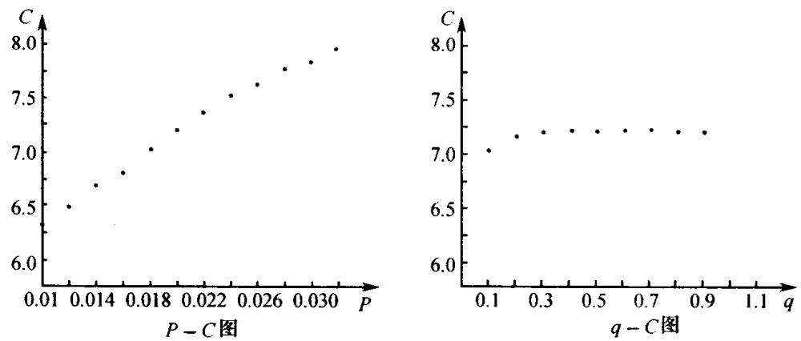

同理, 改变误认为有故障而停机产生的损失费(1500元/次), 发现它的变化对 C 的影响并不明显.

## 3. 误差分析

我们在分析工序无故障的工作时间时,用刀具无故障工作时间的分布来近似,但实际工序无故障的工作时间是未知的.若用正态分布来描述,其均值 $\mu$ 、均方差 $\sigma$ 的不确定性,对结果会造成误差.我们利用模型 I 的结果来进行误差分析,得下表:

<table><tr><td>μ</td><td>570</td><td>570</td><td>580</td><td>590</td><td>600</td><td>600</td></tr><tr><td>σ</td><td>185.86</td><td>195.64</td><td>185.86</td><td>185.86</td><td>185.86</td><td>195.64</td></tr><tr><td>C</td><td>4.75</td><td>4.9</td><td>4.63</td><td>4.51</td><td>4.4</td><td>4.55</td></tr><tr><td>Δ</td><td>0</td><td>3.2%</td><td>2.5%</td><td>5%</td><td>7.4%</td><td>4.2%</td></tr></table>

$\Delta$ 代表相对误差，用 $\left|\frac{C - C_0}{C_0}\right| \times 100\% (C_0$ 取4.75)表示.

由表可见均值 $\mu$ 、均方差 $\sigma$ 的较小变化对结果的影响不大, 因此我们采用文中所给方法近似工序无故障工作时间的分布是合理的.

## 7 模型的评价及改进

1. 本模型通过对检查间隔和换刀间隔进行遍历搜索,得到了固定检查间隔下的最优解.  
2. 进行蒙特卡洛方法模拟的次数有限, 使得模拟结果精度有限, 误差较大.  
3. 对问题三, 只提供了一种有效的方案, 而没能给出最优解. 我们建议提出一种简单易行的方案, 便于工作人员在实际操作中按方案进行检查.

## 参考文献

[1] 曹晋华等. 可靠性数学引论. 科学出版社, 北京.  
[2] 蔡常丰. 数学模型建模分析. 科学出版社, 北京.  
[3] 徐士良. C 常用算法程序集. 清华大学出版社, 北京.

在应用数学中一种特别具有挑战性的活动是发现应用数学的新思想并在至今没有系统地使用数学方法的领域中发展数学理论(社会科学和生物学是常提起的例子)。这些努力可以导致新的数学思想和定理(通过抽象、推广和别的工作)，这就其自身而言就是纯数学的一部分。认识这种二元性对于应用数学的精神是必要的。强调了这种二元性，显然就强调了应用数学和纯数学，以及应用数学与实验科学间的差别。

C. C. Lin (林家翘). 摘自 J. N. Kapur, Thought on Nature of Mathematics of Alexandrov et al., 1973; 中译本,《数学家谈数学本质》, 北京大学出版社, 1989, p. 62.

# 自动化车床管理建模分析

北京大学

孙山泽

今年全国大学生数学建模竞赛采用了一道有随机因素的优化题——自动化车床管理（A题）。该题有较强的实际应用背景，在一般数学建模教材和可靠性书籍中，通常将工序流程中的定期检查和预防性保全刀具更换作为两个论题，分别进行讨论。本题将这两个措施同时用于一个工序流程，另外除刀具故障外还涉及非刀具故障，这两点增加了问题的难度，此次竞赛中许多队完全不考虑非刀具故障，显然降低了难度。

解决此问题,当然首先要建立损失函数(效益函数). 日本质量管理专家田口玄一博士在其著作《线上质量管理》一书中曾讨论过这一问题,给出了本题第一问情形下的损失函数式. 此次竞赛中,有些同学查到了有关的参考书籍,如1988年,学术期刊出版社出版的《现代质量管理统计方法》. 这次我们也选刊了一篇利用田口的损失函数式解题的参赛论文. 但从这些论文可以看到,多数同学对这一损失函数式的来龙去脉并不是了解得很清楚. 下面我们对此解法作一较详细的分析,然后再讨论此次参赛中较多的队采用的另一种解法.

## 1 解法一

1. 首先我们明确一下解题的假设,该题给出了100次刀具故障记录,应该看到这批数据产生的经验分布或由它们拟合的连续型分布是一个条件分布,是在无刀具故障,新刀起始点已知的条件下,刀具的寿命分布.当工序流程中存在非刀具故障,且出现非刀具故障进行修复时,不必换刀(实际工作中一般是这样处理的),这样工序流程没有明显的周期状态.我们随机地在工序流程中取一点作为管理的始点,在这种考虑下,假定在流程中各点发生故障的无条件概率均相同,是一个合理的假定.这一假定与前述刀具寿命的条件分布是正态分布或其他类型分布不是一回事,两者并不相悖.

工序检查和刀具更换均考虑固定间隔.

现在我们将模型的基本假设复述如下：

1）刀具每加工 u 件零件后定期更换, 更换费用为 k.  
2) 每生产 $n$ 件零件定期进行检查, 检查费用为 $t$ , 通常 $n \ll u$ , 为简化计算, 不妨设 $u = sn$ .

3) 在 1), 2) 下, 工序的平均故障间隔记为 $c$ 件, 此时平均故障率 $p = 1 / c$ .

4）检查时发现零件不合格，认定为工序故障，进行修复，修复的平均费用为 $d$

5) 每件不合格品的损失费为 $f$ .

6) 刀具寿命的分布由所给数据确定记为 $F(x)$ .

2. 效益函数可考虑为生产每个零件的平均费用 $L$ 。从理论上讲，考虑为每个合格零件的平均更为合理，但由于工序故障率较小，在不同的换刀间隔和检查间隔下，生产的合格零件数与全部零件数之比变化很小，因而两种考虑下建立的效益函数的最优解不会有大的差异，而考虑为生产每个零件的平均费用时，效益函数会简单些。 $L$ 包括预防保全费用 $L_{1}$ ，检查费用 $L_{2}$ ，和故障造成的不合格品损失和修复费用 $L_{3}$ .

3. 第一问的效益函数: 按每个零件分摊.

$$
L _ {1} = \frac {k}{u}, L _ {2} = \frac {t}{n}, L _ {3} = \left[ (m + h) f + d \right] / c,
$$

其中 m 为相邻两次检查的后一次检查发现故障时, n 件零件中不合格品的平均数, h 为检查发现故障至停止生产的过程中, 产生的零件数, 此数对问题的解法无影响, 不妨设 h = 0. 于是问题为确定 u, n 使

$$
L = \frac {k}{u} + \frac {t}{n} + \frac {m f}{c} + \frac {d}{c} \tag {1}
$$

最小. 式中的 $m, c$ 可如下计算.

m 的计算. 由假设 3), 在相邻两次检查的后一次发现故障的条件下, 出现 i 件不合格品的概率为 $(1 - p)^{n - i} \cdot p / [1 - (1 - p)^{n}]$ , $i = 1, 2, \cdots, n$ , 于是

$$
m = \sum_ {i = 1} ^ {n} i (1 - p) ^ {n - i} p / [ 1 - (1 - p) ^ {n} ]. \tag {2}
$$

上式经运算可得

$$
m = \frac {n + 1}{2} + \frac {n ^ {2} - 1}{1 2} p + O (p ^ {2}) \approx \frac {n + 1}{2},
$$

其中由于 $p = \frac{1}{c}$ 很小，将 $O(p)$ 忽略，代入(1)得

$$
L = \frac {k}{u} + \frac {t}{n} + \frac {(n + 1) f}{2 c} + \frac {d}{c}. \tag {3}
$$

c 的计算. 首先根据给出的 100 个数据算出无预防性更换时, 刀具故障平均间隔为 a = 600 件. 由题设刀具故障占 95%, 非刀具故障占 5%, 故非刀具平均故障间隔为 $b = a \cdot \frac{95}{5} = 11400$ 件.

其次由100个数据确定刀具寿命的经验分布或拟合分布 $F(x)$

当进行预防保全定期 u 更换刀具时, 刀具故障的平均间隔

$$
a _ {u} = \frac {1}{F (u)} \Big (\sum_ {c = 1} ^ {u - 1} i \cdot (F (i) - F (i - 1) + u (1 - F (u)) \Big), \tag {4}
$$

若 $F(x)$ 为连续型分布，有密度函数 $f(x)$ ，则可有

$$
a _ {u} = \frac {1}{F (u)} \left(\int_ {0} ^ {u} t f (t) \mathrm{d} t + u (1 - F (u))\right).
$$

工序的平均故障间隔 c 由 $a_{u}$ 和 b 决定, 满足 $1/c = 1/a_{u} + 1/b$ ,

$$
c = \frac {1}{1 / a _ {u} + 1 / b}, \tag {5}
$$

所以 $c$ 是 $u$ 的函数.

4. 对目标函数(3)的参数优化可如下进行. 给定 $u$ , 计算出 $c$ , 则 $L$ 是 $n$ 的函数, 由(3)不难求得

$$
n = \sqrt {\frac {2 c t}{f}} \tag {6}
$$

L 达到极小, 按一定的步长, 比如步长取 50, 对 u = 100, 150, 200, …逐个求出 L 的极小值及相应的 n 值, 其中使 L 最小者所对应的 u 和 n 即为所求.

有部分参赛队,对两参数的目标函数,固定第一个参数,求得另一参数的最优值.然后在此最优值下,求第一个参数的优化值,例如在 $n = 1$ 或不考虑检查时求出最优的 $u$ 值 $u_{1}$ , 固定 $u_{1}$ 再求出 $n$ 的优化值 $n_{1}$ , 认为 $(u_{1}, n_{1})$ 即为最优解, 这种单参数分别寻优的做法是不正确的.此种做法只有在目标函数非常规则的情况下才能找到最优点.

5. 第二问的效益函数要考虑两种误判. 一是工序正常时检查到不合格品误判停机, 将使检查的费用增加; 二是工序故障时检查到合格品, 将继续生产直到下一次检查, 使不合格品损失增加, 此时两次故障间由此产生的不合格品平均数为

$$
\begin{array}{l} \frac {n + 1}{2} \\ + W \cdot n \left[ \sum_ {j = 1} ^ {s} \left(\sum_ {i = 1} ^ {j} i W ^ {i - 1} (1 - W)\right) \frac {(1 - p) ^ {(j - 1) n} - (1 - p) ^ {(j n)}}{1 - (1 - p) ^ {n}} \right] \\ \approx \frac {n + 1}{2} + n \frac {W}{1 - W}, \tag {7} \\ \end{array}
$$

式中 $W = 40\%$ 为工序故障时的合格品率， $p$ 为工序在生产一零件时的平均故障率， $u = sn$ 故在第二问的条件下，效益函数应为

$$
L = \frac {k}{u} + \frac {1}{n} [ t + (1 - p) ^ {n} v e ] + \frac {f}{c} \left(\frac {n + 1}{2} + n \frac {W}{1 - W}\right) + \frac {d}{c}, \tag {8}
$$

式中 $v = 2\%$ 是工序正常时零件的不合格品率， $e = 1500$ 为第一种误判产生停机的损失费.

确定目标函数后,解的其他过程与第一问类似.

6. 第三问是一个开放性的问题。有充分的空间可供讨论思考。这次竞赛中有不少队提出了自己的想法，主要可归纳为两类。一类是建议减少误判，在检查时不限于检查一个零件，适当时可再查一个零件。另一类是建议在刀具新使用时采用大的检查间隔，而刀具使用一定时间后采用小的检查间隔，但讨论大多比较抽象，没有具体的计算结果支持。

## 2 解法二

1. 本次竞赛中多数队采用有更新点的周期计算效益函数。此解法需假定工序故障后一律换刀具，不论是刀具故障还是非刀具故障均更换新刀，形成更新点。主要的几点假定可明确如下：

1) 工序故障均换刀,从新刀至下一次工序故障或预防性换刀构形一个周期.

2) 非刀具故障在任一零件处发生的概率均相同, 记为 q.

3) 无非刀具故障的条件下, 从更新点起刀具寿命为 $F(x)$ (以下设 $F(x)$ 为连续型分布, 有密度函数 $f(x)$ ).

4) 检查的固定间隔记为 $n$ ，预防性换刀的固定间隔 $u = sn$ .

计算一个周期内每一零件平均费用.

2. 不考虑非刀具故障时, 分两种情况考虑费用.

1) 刀具至 $u$ 未坏, 费用为 $c_{1} = (s - 1)t + k$ .

2) 刀具在 u 前故障, 费用为

$$
c _ {2} = \sum_ {i = 1} ^ {s - 1} \left(i t + d + f \cdot \frac {n + 1}{2}\right) \frac {F (i n) - F ((i - 1) n)}{F (u)}
$$

$$
+ \left((s - 1) t + k + f \frac {n + 1}{2}\right) \frac {F (u) - F ((s - 1) n)}{F (u)}.
$$

两种情况的加权平均费用

$$
\begin{array}{l} C _ {a} = c _ {1} (1 - F (u)) + c _ {2} F (u) \approx \left(d + f \frac {n + 1}{2}\right) F (u) \\ + k (1 - F (u)) + \frac {t}{n} \left(u - \int_ {0} ^ {u} F (x) \mathrm{d} x\right), \tag {9} \\ \end{array}
$$

而在一周期内完成零件的平均数

$$
T _ {a} = \int_ {o} ^ {u} x f (x) \mathrm{d} x + u (1 - F (u)) = u - \int_ {o} ^ {u} F (x) \mathrm{d} x. \tag {10}
$$

每一零件平均费用

$$
L = \frac {C _ {a}}{T _ {a}}. \tag {11}
$$

有一部分参赛队对两种情况分别求每一零件平均费用,然后再加权平均,也应该是合理的.

3. 考虑非刀具故障. 可算出在工序中每一零件处非刀具平均故障率 $q = 1 / 11400$ .

u 之前出现非刀具故障的费用

$$
\begin{array}{l} C _ {o} = \sum_ {j = 1} ^ {u - 1} \left(\left(\frac {j}{n}\right) t + d + f \frac {n + 1}{2}\right) (1 - q) ^ {j - 1} q \\ + \left[ (s - 1) t + k \right] (1 - q) ^ {u - 1}, \tag {12} \\ \end{array}
$$

u 之前出现非刀具故障, 平均产出零件数

$$
T _ {o} = \sum_ {j = 1} ^ {u - 1} j (1 - q) ^ {j - 1} q + u (1 - q) ^ {u - 1} = \frac {1 - (1 - q) ^ {u}}{q}. \tag {13}
$$

无非刀具故障条件下,平均费用 $C_{a}$ ,产出零件平均数 $T_{a}$ ,如2中所叙.故加权平均的费用和零件数

$$
\begin{array}{l} C = C _ {o} \left[ 1 - (1 - q) ^ {u} \right] + C _ {a} (1 - q) ^ {u}, \\ T = T _ {o} \left[ 1 - (1 - q) ^ {u} \right] + T _ {a} (1 - q) ^ {u}. \tag {14} \\ \end{array}
$$

每一零件平均费用为

$$
L = \frac {C}{T _ {\bullet}}. \tag {15}
$$

由此目标函数可确定最优的 $(u, n)$ .

有些同学忽略了刀具寿命分布 $F(x)$ 是无非刀具故障条件下的条件分布，出现各种情况加权时，权的总和不等于1的错误.

4. 有许多参赛队采用修正刀具寿命分布 $F(x)$ 的办法, 得到工序故障间隔的分布 (包括刀具故障和非刀具故障) 按照前述 2 确定目标函数. 修正的方法有下列几种:

1) 设 $x_{1}$ 为刀具故障间隔(刀具寿命), $x_{2}$ 为非刀具故障间隔, $Y = \min(x_{1}, x_{2})$ 为工序故障间隔, 求得 $Y$ 的分布 $G(x)$ , 以 $G(x)$ 取代 $F(x)$ .  
2）直接将刀具故障间隔 $x_{1}$ 乘以0.95，取 $Y = 0.95x_{1}$ ，作为工序故障间隔。以 $Y$ 的分布 $G(x)$ 取代 $F(x)$ 。  
3) 以 $G(x) = 0.95F(x) + 0.05H(x)$ , 其中 $H(x)$ 是非刀具故障间隔的分布, 取代 $F(x)$ .

这三种修正办法,1)似乎比较合理,2)和3)则较为粗糙.

5. 第二问和第三问的考虑与解法一差不多, 需要对目标函数中的某些费用作适当调整, 发表的参赛论文中有较详细的考虑, 这里不再赘述.

以上是关于基本模型和基本解法的分析。另外在具体的数值计算上，有些参赛队在选用适宜的数学软件和编程上也存在一些问题，在模型基本正确的情况下，解出的最优解与正确答案相去甚远。

## 参考文献

[1] 田口玄一. 线上质量管理. 日本标准协会, 1979  
[2] 现代质量管理统计方法编写组编．现代质量管理统计方法．学术期刊出版社，1988

掌握从现实到抽象的数学模型的变换,以及对精确程度和可逼近程度做出鉴别,都需要直觉感觉,而后者是依靠经验才变得敏锐了的。此外,也可能常常还牵扯到构造那些真正困难的数学问题,而这些问题又难到目前科学的已有技术无法解决的地步。这种困难性成为某些数学家从事智力冒险的部分原因,也是他们所达到满意的本质,这些数学家是和工程师、自然科学家共同工作以掌握“真实”问题的,而那些问题又是在人们延伸他们对自然的理解与控制时大量出现的。

R. Courant, 摘自 J. N. Kapur, Thought on Nature of Mathematics of Alexandrov et al., 1973; 中译本,《数学家谈数学本质》, 北京大学出版社, 1989, p. 124.

## 16. 钻井布局(CUMCM 1999 年 B 题)

勘探部门在某地区找矿. 初步勘探时期已零散地在若干位置上钻井, 取得了地质资料. 进入系统勘探时期后, 要在一个区域内按纵横等距的网格点来布置井位, 进行“撒网式”全面钻探. 由于钻一口井的费用很高, 如果新设计的井位与原有井位重合(或相当接近), 便可利用旧井的地质资料, 不必打这口新井. 因此, 应该尽量利用旧井, 少打新井, 以节约钻探费用. 比如钻一口新井的费用为 500 万元, 利用旧井资料的费用为 10 万元, 则利用一口旧井就节约费用 490 万元.

设平面上有 n 个点 $P_{i}$ ，其坐标为 $(a_{i}, b_{i}), i = 1, 2, \cdots, n$ ，表示已有的 n 个井位。新布置的井位是一个正方形网格 N 的所有结点（所谓“正方形网格”是指每个格子都是正方形的网格；结点是指纵线和横线的交叉点）。假定每个格子的边长（井位的纵横间距）都是 1 单位（比如 100 米）。整个网格是可以在平面上任意移动的。若一个已知点 $P_{i}$ 与某个网格结点 $X_{i}$ 的距离不超过给定误差 ( $\varepsilon = 0.05$ 单位），则认为 $P_{i}$ 处的旧井资料可以利用，不必在结点 $X_{i}$ 处打新井。

为进行辅助决策,勘探部门要求我们研究如下问题:

1) 假定网格的横向和纵向是固定的(比如东西向和南北向), 并规定两点间的距离为其横向距离(横坐标之差绝对值)及纵向距离(纵坐标之差绝对值)的最大值. 在平面上平行移动网格, 使可利用的旧井数尽可能大. 试提供数值计算方法, 并对下面的数值例子用计算机进行计算.  
2) 在欧氏距离的误差意义下, 考虑网格的横向和纵向不固定(可以旋转)的情形, 给出算法及计算结果.  
3)如果有 $n$ 口旧井，给出判定这些井均可利用的条件和算法(你可以任意选定一种距离).

数值例子 $n = 12$ 个点的坐标如下表所示

<table><tr><td>i</td><td>1</td><td>2</td><td>3</td><td>4</td><td>5</td><td>6</td><td>7</td><td>8</td><td>9</td><td>10</td><td>11</td><td>12</td></tr><tr><td> $a_{i}$ </td><td>0.50</td><td>1.41</td><td>3.00</td><td>3.37</td><td>3.40</td><td>4.72</td><td>4.72</td><td>5.43</td><td>7.57</td><td>8.38</td><td>8.98</td><td>9.50</td></tr><tr><td> $b_{i}$ </td><td>2.00</td><td>3.50</td><td>1.50</td><td>3.51</td><td>5.50</td><td>2.00</td><td>6.24</td><td>4.10</td><td>2.01</td><td>4.50</td><td>3.41</td><td>0.80</td></tr></table>

(郑州大学 林诒勋提供)
# 钻井布局模型

陈罡 郭成良 吴廷彬

(大连理工大学, 大连 116024)

指导教师 教师组

编者按 本文根据钻井布局的实际情况,重点研究了在欧氏距离下最大限度地利用初探时所钻井的问题.提出了仅依据旧井的坐标检验旧井是否能全部利用的条件,并提出了两种检验方法.虽然将所得条件用于寻找最大数量的旧井(问题2)时仍较麻烦,是否还能找到更简便的办法有待进一步研究,但作者在三天时间内能对该问题作出较深入的分析,得出了关键性的结果,并给出了较严格的证明,是十分可嘉的.

摘要 本文的关键思想是找出在变化中的不变量。对于第一小题，作者发现可以把所有的点“移到”一个方格中，而它们相对网格结点的距离不变，这样问题就得到了大大的简化。对于第二题，本文发现坐标变换时各点之间的欧氏距离不变，利用各点的距离关系，给出一系列的判定条件，最后用优化算法(充要条件)判定。第二题的算法对于第三题也是通用的，因此第三题应用第二题的方法来解决。

关键词 M-N 分解;网格坐标系;结点

## 1 问题重叙(略)

## 2 问题的条件和假设

(1) 在本题中, 地形对误差无影响, 无需考虑地形这一因素.  
(2) 不需要考虑总井数, 利用旧井不会导致总井数的增加, 只要考虑尽可能多利用旧井.  
(3) 给出的旧井均在所定勘探区域内.  
(4) 网格充分大.

## 3 符号约定和名词解释

[X] 取整,等于 X 的整数部分.

ε 在没有说明的情况下代表题设误差, 即 0.05 单位.

$P_{i}$ 第 i 口旧井 $(a_{i}, b_{i})$ 所在的点.

$P_{i}^{\prime}$ 第 $i$ 口旧井平移 $(m,n)$ 个单位后的点 $(a_{i} + m,b_{i} + n)$ （ $m,n\in Z$ ）.

$X_{i}$ 代表 $P_{i}$ 附近的网格结点.

Q 一个边长为 $2\varepsilon$ 的只可平移不可转动的正方形.

W 结点 $(0,0)$ , $(0,1)$ , $(1,0)$ , $(1,1)$ 所围成的一个网格.

网格坐标系 以某点为坐标原点,以网格纵横方向为 x,y 轴方向建立的坐标系,并以题设网格边长为单位长度.

矢量的 $\mathbf{M} - \mathbf{N}$ 分解 若矢量 $\overrightarrow{A_1A_2}$ 可表示成 $\overrightarrow{A_1A_2} = m\vec{i} + n\vec{j}, m, n \in Z, \vec{i}, \vec{j}$ 为互相垂直的单位向量，则称 $m, n$ 为 $\overrightarrow{A_1A_2}$ 的一组 $\mathbf{M} - \mathbf{N}$ 分解.

距离的近似 $\mathbf{M} - \mathbf{N}$ 分解 两个点 $P_{i}P_{j}$ 的距离 $d$ 满足 $|d - \sqrt{m^2 + n^2}| \leqslant 2\varepsilon$ $m, n \in Z$ , 称 $m, n$ 为距离 $d$ 的近似 $\mathbf{M} - \mathbf{N}$ 分解, 简称近似 $\mathbf{M} - \mathbf{N}$ 分解.

网格原点 设起始时网格坐标系与题设坐标系重合,称这时的坐标原点为网格原点.

## 4 问题分析和解答

## 4.1 问题一的分析

根据题意,网格的方向是固定的,对于任意一点 $P_{i}$ ,当网格纵横平移整数个单位时, $P_{i}$ 相对于最近的网格结点的距离是不变的,即当 $P_{i}$ 在网格上纵横平移整数个单位时, $P_{i}$ 相对于网格结点的距离不变.于是,我们把所有的旧井点都纵横平移整数个单元,使它们都落在

同一网格单元中, 此时, 各点相对于最近网格结点的距离保持不变.

如图1-1所示,我们把 $n$ 个旧井点都移到网格 $\mathbf{W}$ 里.在题一的距离意义下,要使尽可能多的网格结点与旧井点的距离不大于 $\varepsilon$ ,等价于让尽可能多的旧井点落在以结点为中心, $2\varepsilon$ 为边长的正方形内.此时,如果正方形的中心为某种网格的网格结点,则正方形里面的点都可以利用.这样原来的问题就转化为用小正方形 $\mathbf{Q}$ 去盖住尽可能多的点.

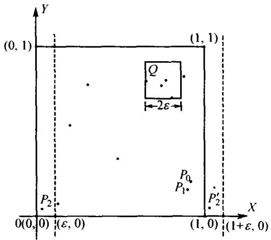

<details>
<summary>scatter</summary>

| Point | X | Y |
| --- | --- | --- |
| P0 | 1 | 0 |
| P1 | 1 | 0 |
| P' | 1+ε, 0 | 0 |
| Q | 1 | 1 |
</details>

图1-1

## 4.2 问题一解题步骤

基本步骤如下：

1. 对所有的旧井点进行坐标变换使它们平移到网格 $W$ 里。设原旧井点的坐标为 $(x, y)$ ，则新的坐标为 $(x', y')$ ，其中： $\begin{cases} x' = x - [x] \\ y' = y - [y] \end{cases}$

2. 考虑到图1-1中点 $P_{2}$ , 它位于离网格边界 $\leqslant \varepsilon$ 的地方, 它的映像点 $P_{2}^{\prime}$ 可能与 $P_{0}, P_{1}$ 同时被正方形 $\mathbf{Q}$ 盖住, 如果不作处理, 则这种情况可能遗漏. 因此在实际解题的过程中, 我们把这样的点映射到 $[1, 1 + \varepsilon]$ 再进行处理.

3. 对于网格 W 中的旧井点, 我们先对它们按 X, Y 坐标进行分组, 设

$$
\begin{array}{l} A _ {i} = \{(x, y) \mid x \in [ a _ {i}, a _ {i} + 2 \varepsilon ], (x, y) \in \{(a _ {1}, b _ {1}), (a _ {2}, b _ {2}), \dots , (a _ {n}, b _ {n}) \} \} \\ (i = 1, 2, \dots , n) \\ B _ {i} = \{(x, y) \mid y \in [ b _ {i}, b _ {i} + 2 \varepsilon ], (x, y) \in \{(a _ {1}, b _ {1}), (a _ {2}, b _ {2}), \dots , (a _ {n}, b _ {n}) \} \} \\ (i = 1, 2, \dots , n) \\ \end{array}
$$

令 $C_{ij} = A_{i} \cap B_{j} (i = 1, 2, \cdots, n; j = 1, 2, \cdots, n)$

易知任何一个 $C_{ij}$ 中所有的点都可以被左下角坐标为 $(a_i, b_i)$ 的正方形 $\mathbf{Q}$ 同时盖住，同时这个正方形不能再盖住别的点.

4. 找出元素数目最多的 $C_{ij}$ , 以此再构造一个正方形来盖住这些点. 则这个正方形的中心就是达到盖住最多旧井点的结点. 把网格原点移到这个结点, 此时的网格 $N$ 即为所求.

## 4.3 问题一的结论

按上述步骤编写的程序为 FIRST.CPP. 对于所附的数据经过计算机计算后得出结论为 : 最大可同时利用四口旧井(编号为 4,10,5,2), 此时网格原点移到: (0.40,0.55).

## 4.4 问题二的分析

由于纵横坐标方向不定,且坐标原点不定,因此直接考虑坐标是不切实际的,但是在坐标变换的过程中,点和点的距离是不变的.

命题2-1 两口旧井能同时利用的充要条件是：

存在 $m, n \in Z$ 使得 $|S_{P_i P_j} - \sqrt{m^2 + n^2}| \leqslant 2\varepsilon$ （其中 $S_{P_i P_j}$ 为旧井 $P_i, P_j$ 之间的距离.）

证明 【必要性】如果 $P_{i}, P_{j}$ 能同时利用，如图2-1，则存在两个网格结点 $X_{i}, X_{j}$ 满足 $S_{P_{i}X_{i}} \leqslant \varepsilon, S_{P_{j}X_{j}} \leqslant \varepsilon$

显然存在两个整数 $m, n$ 使得 $S_{X_i X_j} = \sqrt{m^2 + n^2}$

$$
\because S _ {P _ {i} P _ {j}} \leqslant S _ {X _ {i} X _ {j}} + S _ {P _ {i} X _ {i}} + S _ {P _ {j} X _ {j}}
$$

$$
\therefore S _ {P _ {i} P _ {j}} + S _ {P _ {i} X _ {i}} + S _ {P _ {j} X _ {j}} \geqslant S _ {X _ {i} X _ {j}}
$$

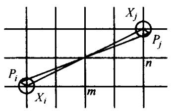

<details>
<summary>text_image</summary>

X_j
P_j
P_i
X_i
m
n
</details>

图2-1

整理得 $S_{P_{i}P_{j}} - S_{X_{i}X_{j}} \mid \leqslant |S_{P_{i}X_{i}} + S_{P_{j}X_{j}}| \leqslant 2\varepsilon$

即 $|S_{P,P_1} - \sqrt{m^2 + n^2}| \leqslant 2\varepsilon(1)$

【充分性】在线段 $P_{1}P_{2}$ 所在直线上取两点 $X_{1}, X_{2}$ （其中 $X_{1}$ 在 $P_{1}$ 一侧， $X_{2}$ 在 $P_{2}$ 一侧），使得 $|X_{1}X_{2}| = \sqrt{m^{2} + n^{2}}$ 且 $P_{1}, P_{2}$ 的中点与 $X, X_{2}$ 的中点重合，则

$$
\mid P _ {1} X _ {1} \mid = \mid P _ {2} X _ {2} \mid = \frac {\mid \mid P _ {1} P _ {2} \mid - \mid X _ {1} X _ {2} \mid \mid}{2} = \frac {\mid \mid P _ {1} P _ {2} \mid - \sqrt {m ^ {2} + n ^ {2}} \mid}{2} \leqslant \varepsilon
$$

又∵ $|X_{1}X_{2}|=\sqrt{m^{2}+n^{2}}\quad m,n\in Z$

显然 $X_{1}, X_{2}$ 都可在某网格的结点上.

∴两个旧井能同时利用.

证毕.

推论 2-1 n 口旧井能同时利用的必要条件是任意两口旧井的距离满足近似 M-N 分解.

命题2-2 三个点 $X_{1}, X_{2}, X_{3}$ 在某网格坐标系下都是结点的充要条件是向量 $\overrightarrow{X_1X_2}$ , $\overrightarrow{X_2X_3}, \overrightarrow{X_3X_1}$ 存在 $\mathrm{M - N}$ 分解 $(m_1, n_1), (m_2, n_2), (m_3, n_3)$ 使得：

$$
\left\{ \begin{array}{l} \sum_ {i = 1} ^ {3} m _ {i} = 0 \\ \sum_ {i = 1} ^ {3} n _ {i} = 0 \end{array} \right. \tag {2}
$$

证明 【必要性】根据向量的性质知 $\overrightarrow{X_{1}X_{2}} + \overrightarrow{X_{2}X_{3}} + \overrightarrow{X_{3}X_{1}} = 0$ ，相应的分量相加即为(2)式.

【充分性】设 $\overrightarrow{X_{1}X_{2}},\overrightarrow{X_{2}X_{3}},\overrightarrow{X_{3}X_{1}}$ 可表示为：

$$
\left\{ \begin{array}{l} \overrightarrow {X _ {1} X _ {2}} = m _ {1} \vec {i _ {1}} + n _ {1} \vec {j _ {1}} \\ \overrightarrow {X _ {2} X _ {3}} = m _ {2} \vec {i _ {2}} + n _ {2} \vec {j _ {2}} \\ \overrightarrow {X _ {3} X _ {1}} = m _ {3} \vec {i _ {3}} + n _ {3} \vec {j _ {3}} \end{array} \right.
$$

设有一网格坐标系(如图2-2)，记其 $x$ 轴， $y$ 轴的单位向量为 $\vec{i}, \vec{j}$ ，在该网格任取一结点 $Y_{1}$ ，由于 $m_{1}, m_{2}, n_{1}, n_{2} \in Z$ ，可找到结点 $Y_{2}, Y_{3}$ 使 $\overrightarrow{Y_{1}Y_{2}} = m_{1}\vec{i} + n_{1}\vec{j}, \overrightarrow{Y_{2}Y_{3}} = m_{2}\vec{i} + n_{2}\vec{j}$

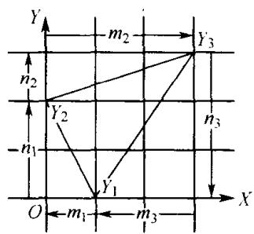

<details>
<summary>text_image</summary>

Y
m₂ → Y₃
n₂
Y₂
n₁
Y₁
O ← m₁ ← m₃ → X
n₃
</details>

图2-2

又 $\overrightarrow{Y_3Y_1} = -\overrightarrow{Y_1Y_3} = -(\overrightarrow{Y_1Y_2} +\overrightarrow{Y_2Y_3}) = -(m_1 + m_2)\dot{i} -(n_1 + n_2)\dot{j}$

及 $m_{1} + m_{2} + m_{3} = 0, n_{1} + n_{2} + n_{3} = 0$

可知 $\overrightarrow{Y_3Y_1} = m_3\vec{i}_3 + n_3\vec{j}_3$

以下证明 $\triangle Y_{1}Y_{2}Y_{3}$ 与 $\triangle X_{1}X_{2}X_{3}$ 全等.

事实上, 根据构造 $\triangle Y_{1}Y_{2}Y_{3}$ 过程易知 $\triangle Y_{1}Y_{2}Y_{3}$ 与 $\triangle X_{1}X_{2}X_{3}$ 对应边长相等, 所以两三角形全等. 由于 $Y_{1}, Y_{2}, Y_{3}$ 在一网格的结点上, 所以 $X_{1}, X_{2}, X_{3}$ 也可以在某网格的结点上.

三点共线时, 易证结论成立.

证毕.

如果三个点的任意一边满足距离的近似 $\mathbf{M} - \mathbf{N}$ 分解，而且分出的 $(m_i, n_i)$ 满足命题2-2的条件，称这三个点构成的三角形为可近似整数分解三角形.

推论2-2 若 $\triangle P_{1}P_{2}P_{3}$ 是可近似整数分解三角形, 则存在某网格的三个结点, 使得该三角形的三个顶点分别靠近这些网格结点.

证明 如图2-3, 设 $P_{1}P_{2}, P_{1}P_{3}, P_{2}P_{3}$ 的近似 $\mathrm{M} - \mathrm{N}$ 分解分别为 $(m_{1}, n_{1}), (m_{2}, n_{2}), (m_{3}, n_{3})$ ，作一条与 $P_{1}P_{2}$ 中点重合，且在 $P_{1}P_{2}$ 所在直线上，长度为 $\sqrt{m_{1}^{2} + n_{1}^{2}}$ 的线段AB. 则易知 $|P_{1}A| < \varepsilon$ ； $|P_{2}B| < \varepsilon$ 。设点C是使得 $\triangle ABC$ 为三边分解为 $(m_{1}, n_{1}), (m_{2}, n_{2}), (m_{3}, n_{3})$ 的可整数分解三角形的点。这样可以根据 $A, B, C$ 建立网格坐标系，使得 $A, B, C$ 都是网格结点。又因为 $\triangle ABC$ 与 $\triangle P_{1}P_{2}P_{3}$ 各边的差很小（根据 $\triangle P_{1}P_{2}P_{3}$ 为近似可整数分

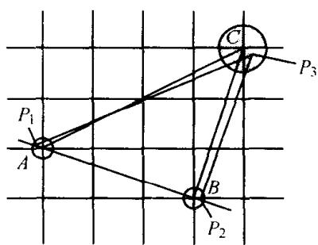

<details>
<summary>text_image</summary>

P₁
A
B
P₂
C
P₃
</details>

图2-3

解三角形且其分解和 $\triangle ABC$ 的分解相同), 所以 $C$ 点和 $P_{3}$ 点的距离也很小 (当然这个距离可能大于 $\varepsilon$ , 但是现在不需要也无法给出一个充分的结论). 证毕.

推论2-3 $n$ 口井都可同时利用的必要条件是:任意三个点构成的三角形都是近似整数化三角形.

命题 2-3 n 个共线的点 $X_{1}, X_{2}, \cdots, X_{n}$ 都是某网格坐标系的结点的充分必要条件是它们的一组 M-N 分解满足：

$$
\left\{ \begin{array}{l} m _ {1 2} + m _ {2 i} + m _ {i 1} = 0 \\ n _ {1 2} + n _ {2 i} + n _ {i 1} = 0 \end{array} \right. \quad (i = 3, 4, \dots , n) \tag {3}
$$

(其中 $m_{ij}, n_{ij}$ 为 $\overrightarrow{X_{i}X_{j}}$ 的一组 M-N 分解, 且不妨设当 i = j 时, $m_{ij} = 0, n_{ij} = 0$ .)

证明 【充分性】以 $X_{1}$ 点为原点建立一网格坐标系, 旋转该坐标系使 $X_{2}$ 处在结点$(m_{12}, n_{12})$ 上(根据 $\mathbf{M} - \mathbf{N}$ 分解的定义, 易知这是可以实现的). 取结点 $(m_{1i}, n_{1i})$ , 显然这个点与 $X_{1}, X_{2}$ 构成的矢量的 $\mathbf{M} - \mathbf{N}$ 分解满足(3)式且在 $X_{1}X_{2}$ 所在的直线上. 又因为满足(3)式的点到 $X_{1}X_{2}$ 两点的距离确定, 所以这个结点就是 $X_{i}$ .

【必要性】如果有 n 个共线的点 $X_{1}, X_{2}, \cdots, X_{n}$ 在网格结点上，显然有(3)式成立.

引理 若一个点 $X_{1}$ 到三个不共线三点 $X_{2}, X_{3}, X_{4}$ 的距离确定, 则 $X_{1}$ 的相对位置唯一.

证明 如果存在不同于 $X_{1}$ 的点 $X_{1}^{\prime}$ 使得 $\mid X_1X_i\mid = \mid X_1'X_i\mid$ ，则点 $X_{2},X_{3},X_{4}$ 在线段 $X_{1}X_{1}^{\prime}$ 的中垂线上与 $X_{2},X_{3},X_{4}$ 不共线的假设相矛盾.

命题 2-4 设有 n 个点 $X_{i}(i=1,2,\cdots,n)$ 不共线，且 $X_{1}, X_{2}, X_{3}$ 为不共线的点，则这 n 个点都在某网格坐标系的结点上的充分必要条件是满足：

$$
\left\{ \begin{array}{l} m _ {1 2} + m _ {2 i} + m _ {i 1} = 0 \\ n _ {1 2} + n _ {2 i} + n _ {i 1} = 0 \\ m _ {2 3} + m _ {3 i} + m _ {i 2} = 0 \\ n _ {2 3} + n _ {3 i} + n _ {i 2} = 0 \end{array} \right. \quad (i = 3, 4, \dots , n) \tag {4}
$$

(其中 $m_{ij}, n_{ij}$ 的意义同命题 2-3 中 $m_{ij}, n_{ij}$ )

证明 【充分性】

1. $n = 3$ 时即为命题2-2,显然成立.

2. 设 $n = k - 1$ 时成立.

3. 当 $n = k$ 时, 考虑:

$$
\left\{ \begin{array}{l} m _ {1 2} + m _ {2 k} + m _ {k 1} = 0 \\ n _ {1 2} + n _ {2 k} + n _ {k 1} = 0 \\ m _ {2 3} + m _ {3 k} + m _ {k 2} = 0 \\ n _ {2 3} + n _ {3 k} + n _ {k 2} = 0 \end{array} \right. \tag {5}
$$

根据上一步假设 $k - 1$ 个点时成立，即在某网格坐标G下 $k - 1$ 个点都在某格节点上，在该网格坐标系G中，作 $\overrightarrow{X_1X_k} = m_{1k}\cdot \vec{i} +n_{1k}\cdot \vec{j}$ （ $m_{1k} = -m_{k1},n_{1k} = -n_{k1},\vec{i},\vec{j}$ 意义同前），连接线段 $X_{2}X_{k}^{\prime},X_{3}X_{k}^{\prime}$ ，根据(5)式和矢量的性质可知 $\overrightarrow{X_2X_k} = m_{2k}\cdot \vec{i} +n_{2k}\vec{j},$ $\overrightarrow{X_3X_k} = m_{3k}\cdot \vec{i} +n_{3k}\cdot \vec{j}$

$$
\therefore \left| X _ {1} X _ {k} \right| = \left| X _ {1} X _ {k} ^ {\prime} \right|, \left| X _ {2} X _ {k} \right| = \left| X _ {2} X _ {k} ^ {\prime} \right|, \left| X _ {2} X _ {k} \right| = \left| X _ {2} X _ {k} ^ {\prime} \right|
$$

又 $X_{1}, X_{2}, X_{3}$ 不共线.

根据引理可知 $X_{k}$ 与 $X_{k}^{\prime}$ 重合， $X_{k}$ 在网格节点上

∴ n = k 时成立

【必要性】设 $X_{i}(i=1,2,\cdots,n)$ 在网格坐标系 G 下都是结点，对 $X_{i}(i\geqslant3)$ 进行分析。当 i=3 时，设 $\overrightarrow{X_{1}X_{2}},\overrightarrow{X_{2}X_{3}},\overrightarrow{X_{3}X_{1}}$ 在 G 下的分量分别为 $(m_{12},n_{12}),(m_{23},n_{23}),(m_{31},n_{31})$ 根据命题 2-2,(4) 式前两个等式成立。

当 $i > 3$ 时，由于 $X_{1}, X_{2}, X_{3}, X_{4}$ 都在网格结点上，根据命题2-2可知(4)式前两个等式和后两个等式分别成立. 证毕.

易知:命题2-3的条件包含在命题2-4的条件中,所以满足命题2-4的条件自然满足命题2-3的条件.

推论 2-4 如果 n 个旧井点的相互连线 $P_{i}P_{j}(i=1,2,\cdots,n;j=1,2,\cdots,n)$ 的近似 M-N 分解 $m_{ij}, n_{ij}$ 满足命题 2-4 中(4)式，那么这 n 个旧井点可以通过坐标变换分别靠近某网格的 n 个结点（不一定小于 $\varepsilon$ ）.

根据命题2-3和推论2-2容易得到结论.

命题 2-5 n 口井 $P_{i}(a_{i}, b_{i})$ 都可利用充分必要条件是以下两式有公共解.

$$
\left\{ \begin{array}{l} (x _ {i} - x _ {1}) ^ {2} + (y _ {i} - y _ {1}) ^ {2} = m _ {i 1} ^ {2} + n _ {i 1} ^ {2} \\ (x _ {i} - x _ {2}) ^ {2} + (y _ {i} - y _ {2}) ^ {2} = m _ {i 2} ^ {2} + n _ {i 2} ^ {2} \\ (x _ {i} - x _ {3}) ^ {2} + (y _ {i} - y _ {3}) ^ {2} = m _ {i 3} ^ {2} + n _ {i 3} ^ {2} \end{array} \quad (i = 2, 3, \dots , n) \right. \tag {6}
$$

$$
\sqrt {(x _ {i} - a _ {i}) ^ {2} + (y _ {i} - b _ {i}) ^ {2}} \leqslant \varepsilon \quad (i = 1, 2, \dots , n) \tag {7}
$$

(其中： $m_{ij}, n_{ij}$ 为 $P_{i}P_{j}$ 的一种近似 M-N 分解且满足命题 2-4，当 i = j 时，记 $m_{ij} = 0, n_{ij} = 0$ ，且所有的 $\frac{m_{ij}}{n_{ij}}$ 不全等时，总是设 $\frac{m_{12}}{n_{12}} \neq \frac{m_{13}}{n_{13}}$ ).

证明 【充分性】设(6)式有解, 表示存在一系列点 $X_{i}(x_{i}, y_{i}) (i = 1,2,\cdots,n)$ , 使得 $|X_{i}X_{j}| = \sqrt{m_{ij}^{2} + n_{ij}^{2}}$ , 所以 $\overrightarrow{X_{i}X_{j}}$ 存在一种 M-N 分解为 $(m_{ij}, n_{ij})$ . 又因为 $m_{ij}, n_{ij}$ 满足命题 2-4 中的(4)式, 根据命题 2-4 的充分条件 ( $\frac{m_{ij}}{n_{ij}}$ 全等时表明 $X_{i}$ 共线, 由于 $m_{ij}, n_{ij}$ 满足 (4)式显然也满足(3)式, 由命题 2-3 的充分条件) 可知 $X_{i} (i = 1,2,\cdots,n)$ 都在某网格坐标系的结点上. 而(7)式说明 $|P_{i}X_{i}| \leqslant \varepsilon, (i = 1,2,\cdots,n)$ , 即 $P_{i} (i = 1,2,\cdots,n)$ 都可以利用.

【必要性】n 口井都利用即表示在某网格坐标系(不妨设为 G)下 $\left|P_{i}X_{i}\right|\leqslant\varepsilon\left(X_{i}(x_{i},y_{i})\right.$ 为该网格上的结点)，则 $X_{i}(x_{i},y_{i})$ 满足(7)式。又因为 $X_{i}$ 是 G 上的结点，设 $\overrightarrow{X_{i}X_{j}}$ 在坐标 G 下的分量为 $m_{ij}, n_{ij}$ ，显然 $m_{ij}, n_{ij}$ 满足(6)式。

∴必要条件成立.

证毕.

## 4.5 问题二的解答步骤

步骤1 建立一张12口井之间的距离互相关系表. 如下表所示, 当两口旧井之间的距离满足近似的 $\mathbf{M} - \mathbf{N}$ 分解时, 记录下能进行所有可能的近似 $\mathbf{M} - \mathbf{N}$ 分解. 如果旧井点 $P_{i}, P_{j}$ 可以进行近似 $\mathbf{M} - \mathbf{N}$ 分解, 就在第 $i$ 行 $j$ 列记下 $P_{i}P_{j}$ 的近似 $\mathbf{M} - \mathbf{N}$ 分解的可能数目, 如果 $P_{i}, P_{j}$ 不能进行近似 $\mathbf{M} - \mathbf{N}$ 分解, 则记为0. 通过对绝对值小于两点之间的距离的所有整数进行穷举, 求出所有可能的 $m, n$ , 把它们存入数组, 以供以后使用. (下面是根据原题所附数据得出的结果)

<table><tr><td>2 #</td><td>0</td><td></td><td></td><td></td><td></td><td></td><td></td><td></td></tr><tr><td>3 #</td><td>0</td><td>0</td><td></td><td></td><td></td><td></td><td></td><td></td></tr><tr><td>4 #</td><td>1</td><td>1</td><td>1</td><td></td><td></td><td></td><td></td><td></td></tr><tr><td>5 #</td><td>1</td><td>1</td><td>1</td><td>1</td><td></td><td></td><td></td><td></td></tr><tr><td>6 #</td><td>2</td><td>1</td><td>0</td><td>1</td><td>0</td><td></td><td></td><td></td></tr><tr><td>7 #</td><td>1</td><td>1</td><td>3</td><td>1</td><td>1</td><td>1</td><td></td><td></td></tr><tr><td>8 #</td><td>1</td><td>2</td><td>1</td><td>1</td><td>0</td><td>1</td><td>1</td><td></td></tr><tr><td>9 #</td><td>3</td><td>2</td><td>0</td><td>1</td><td>1</td><td>1</td><td>1</td><td>1</td></tr></table>

<table><tr><td>10#</td><td>1</td><td>3</td><td>1</td><td>1</td><td>3</td><td>1</td><td>2</td><td>1</td><td>0</td><td></td><td></td></tr><tr><td>11#</td><td>2</td><td>1</td><td>1</td><td>1</td><td>1</td><td>1</td><td>1</td><td>1</td><td>1</td><td>0</td><td></td></tr><tr><td>12#</td><td>2</td><td>3</td><td>0</td><td>1</td><td>1</td><td>2</td><td>2</td><td>0</td><td>1</td><td>0</td><td>0</td></tr><tr><td></td><td>1#</td><td>2#</td><td>3#</td><td>4#</td><td>5#</td><td>6#</td><td>7#</td><td>8#</td><td>9#</td><td>10#</td><td>11#</td></tr></table>

步骤 2 根据推论 2-1, 找出系列集合, 使得集合中间任意两点之间的距离都可以进行近似 M-N 分解 (通过步骤 1 给出的表判定), 算法程序为子程序 Tconduct, 为了加快运算, 用子程序 band 去掉重复的集合.

步骤3 根据命题2-2,在上述集合中,进一步判断,找出任意三个点都可构成近似整数分解三角形的集合.

步骤4 对步骤3判断的结果进一步判断. 对其中的任何一个集合, 判断这 $k$ 个点的近似 $\mathrm{M} - \mathrm{N}$ 分解是否可能满足命题2-4条件, 如果不可能, 则该集合不满足条件. 如果可能, 则输出该集合和相应的 $\mathrm{M} - \mathrm{N}$ 分解值. 这样可以得到可能的结果为: (只打出4个元素以上的集合)

<table><tr><td>1</td><td>4</td><td>6</td><td>8</td><td></td><td></td></tr><tr><td>1</td><td>4</td><td>6</td><td>9</td><td></td><td></td></tr><tr><td>1</td><td>4</td><td>6</td><td>11</td><td></td><td></td></tr><tr><td>2</td><td>4</td><td>5</td><td>10</td><td></td><td></td></tr><tr><td>1</td><td>4</td><td>6</td><td>8</td><td>9</td><td>11</td></tr><tr><td>1</td><td>6</td><td>7</td><td>8</td><td>9</td><td>11</td></tr></table>

真解就是在这些集合中.

以上 4 步由程序 PREDUCT.CPP, SECOND.CPP 完成.

步骤5 对输出集合进行顺序调整, 当 $k$ 个点都在同一直线上 (即: $\frac{m_1}{n_1} = \frac{m_2}{n_2} = \cdots = \frac{m_k}{n_k}$ ) 任取三点 $X_1, X_2, X_3$ . 否则, 不妨设有不共线的三点 $X_1, X_2, X_3$ , 然后把(6)式转化为

$$
f (x _ {1}, x _ {2}, \dots , x _ {k}, y _ {1}, y _ {2}, \dots , y _ {k}) = \sqrt {(a _ {1} - x _ {1}) ^ {2} + (b _ {1} - y _ {1}) ^ {2}} - \varepsilon
$$

$g(x_{1},x_{2},\cdots,x_{k},y_{1},y_{2},\cdots,y_{k}),h(x_{1},x_{2},\cdots,x_{k},y_{1},y_{2},\cdots,y_{k})$ 为向量函数. 其分量为

$$
\begin{array}{l} g _ {i - 1} (x _ {1}, x _ {2}, \dots , x _ {k}, y _ {1}, y _ {2}, \dots , y _ {k}) = \sqrt {(a _ {i} - x _ {i}) ^ {2} + (b _ {i} - y _ {i}) ^ {2}} - \varepsilon \\ h _ {i - 1} = (x _ {i} - x _ {1}) ^ {2} + (y _ {i} - y _ {1}) ^ {2} - (m _ {i 1} ^ {2} + n _ {i 1} ^ {2}) \\ h _ {k + i - 3} = (x _ {i} - x _ {2}) ^ {2} + (y _ {i} - y _ {2}) ^ {2} - (m _ {i 2} ^ {2} + n _ {i 2} ^ {2}) \\ h _ {2 k + i - 6} = (x _ {i} - x _ {3}) ^ {2} + (y _ {i} - y _ {3}) ^ {2} - (m _ {i 3} ^ {2} + n _ {i 3} ^ {2}) \\ (i = 1, 2, \dots , k) \\ \end{array}
$$

考虑如下规划模型

$$
\begin{array}{l} \min f (x _ {1}, \dots , x _ {k}, y _ {1}, \dots , y _ {k}) \\ \mathrm{s.t.} \quad g _ {i} (x _ {1}, \dots , x _ {k}, y _ {1}, \dots , y _ {k}) \leqslant 0 \\ h _ {i} (x _ {1}, \dots , x _ {k}, y _ {1}, \dots , y _ {k}) = 0 \\ \end{array}
$$

显然该规划模型与命题2-5中(6)(7)式是等价的．又因为命题2-5是一个充分必要条件，所以：当 $\min f(x_{1},\cdots,x_{k},y_{1},\cdots,y_{k})\leqslant0$ 时表示存在 $X_{i}(x_{i},y_{i})$ 满足(6)式，即n口井都可以利用. 当 $\min f(x_{1},\cdots,x_{k},y_{1},\cdots,y_{k})>0$ 时，n 口井不可能被同时利用.

采用 MATLAB 作为优化工具, 用 constr 函数进行优化, 逐步判断所有集合中所含元素最多的子集和集合本身, 通过运算得出满足条件的集合为: $\{1,6,7,8,9,11\}$ . 根据返回的 $X_{i}(x_{i},y_{i})$ 的 M-N 分解值建立网格坐标系, 将 12 个旧井点的坐标进行转换, 得到如附图所示的结果, 在这个网格中, 6 个点到它们各自附近整点的距离最大值为: $S_{9} = 0.049 < \varepsilon$

## 4.6 问题三的分析和解法

显然,问题二的解法是一个通用算法,对于问题三同样适用. 综合问题二的命题和推论得出以下算法:(本题在欧氏距离意义下讨论)

1. 根据推论 2-1: $n$ 个点能同时利用必需满足对任意两点 $P_{i}, P_{j}$ , 存在 $(m_{ij}, n_{ij})$ 使得 $\left| |P_{i}P_{j}| - \sqrt{m_{ij}^{2} + n_{ij}^{2}}\right| \leqslant 2\varepsilon$  
2. 根据推论 2-3: $n$ 个点能同时利用必须满足任意三点 $P_{i}, P_{j}, P_{k}$ 的任意一边满足近似 $\mathrm{M} - \mathrm{N}$ 分解, 而且分出的 $(m_{i}, n_{i})$ 满足命题 2-2 中式(2).  
3. 根据推论 2-4: 如果 n 个旧井点的相互连线 $P_{i}P_{j} (i = 1,2,\dots,n; j = 1,2,\dots,n)$ 的近似 M-N 分解 $m_{ij}, n_{ij}$ 满足命题 2-4 中(4), 那么这 n 个旧井点可以通过坐标变换靠近 $n$ 个网格结点 (不一定小于 $\varepsilon$ ).

在通过这三步的判断后我们提出两种方法来作最后的判断.

方法一 根据命题 2-5:n 口井能同时利用的充分必要条件是在满足上述三个条件的前提下, 满足命题 2-5 中的不等式(7). 依次判断给定的 n 个点是否满足上面分析中的 4 个条件, 如果其中一步不满足, 则表明不能同时利用, 如果全部满足, 则表示这 n 个点可以同时利用. 具体步骤参考问题二.

方法二 根据前面的计算得出的可能网格坐标系结点, 算出这些结点在该网格坐标系下的坐标为 $X_{i}(c_{i}, d_{i})$ ，则把这些结点作坐标变换 $\begin{pmatrix} x_{i}' \\ y_{i}' \end{pmatrix} = \begin{pmatrix} \cos\theta & \sin\theta \\ -\sin\theta & \cos\theta \end{pmatrix} \begin{pmatrix} c_{i} + \Delta x \\ d_{i} + \Delta y \end{pmatrix}$ ，即可得：

$$
\left\{ \begin{array}{l} x _ {i} ^ {\prime} = f _ {i} (\theta , \Delta x, \Delta y) = \cos \theta (c _ {i} + \Delta x) + \sin \theta (d _ {i} + \Delta y) \\ y _ {i} ^ {\prime} = f _ {i} (\theta , \Delta x, \Delta y) = - \sin \theta (c _ {i} + \Delta x) + \cos \theta (d _ {i} + \Delta y) \end{array} \right. \tag {8}
$$

又根据命题3-3(见后面所附命题)，要使得 $n$ 个点能同时被利用，至少要保证任何一个点 $P_{i}$ 附近存在 $n$ 层重叠区域 $S_{i}$ ，根据 $S_{i}$ 的构造方法易知判断 $S_{i}$ 的存在性等价于判断下面的不等式组是否有解：

$$
\left\{ \begin{array}{l} \sqrt {(a _ {i} - x _ {i}) ^ {2} + (b _ {i} - y _ {i}) ^ {2}} \leqslant \varepsilon \\ \sqrt {(a _ {j} - x _ {i}) ^ {2} + (b _ {j} - y _ {i}) ^ {2}} \leqslant S _ {i j} + \varepsilon \\ \sqrt {(a _ {j} - x _ {i}) ^ {2} + (b _ {j} - y _ {i}) ^ {2}} \geqslant S _ {i j} - \varepsilon \end{array} \right. \tag {9}
$$

(其中 $j = 1, 2, \cdots, i - 1, i + 1, \cdots, n; S_{ij} = \sqrt{(x_i - x_j)^2 + (y_i - y_j)^2}$ ) 把(8)式代入不等式组(9)并整理即可得一组关于 $(\theta, \Delta x, \Delta y)$ 的不等式组

$$
\left\{ \begin{array}{l} \sqrt {(a _ {i} - f _ {i} (\theta , \Delta x , \Delta y)) ^ {2} + (b _ {i} - g _ {i} (\theta , \Delta x , \Delta y)) ^ {2}} \leqslant \varepsilon \\ \left| \sqrt {(a _ {i} - f _ {i} (\theta , \Delta x , \Delta y)) ^ {2} + (b _ {j} - g _ {i} (\theta , \Delta x , \Delta y)) ^ {2}} \right| \leqslant \varepsilon \end{array} \right. \tag {10}
$$

对所有的 $X_{i}$ 解这样的不等式组就可得出结论。由于时间的关系，我们没有给出方法二的具体程序，但是因为方法二是一个比较初等的方法，因此可以很容易的构造出它的具体解法和程序。

## 4.7 问题三的附加命题

命题3-1 设有任意两点 $P_{1}, P_{2}$ 和某网格两结点 $X_{1}, X_{2}, s = |X_{1}X_{2}|$ ，以 $P_{1}$ 点为圆环中心，作一个半径为 $R = s + \varepsilon, r = s - \varepsilon$ 的圆环，再以 $P_{2}$ 点为圆心作一个半径为 $\varepsilon$ 的圆，设圆环和圆的重叠区域为 $S_{2}$ 。同理对称地在 $P_{1}$ 点附近求得一个重叠区域 $S_{1}$ 。那么满足 $|X_{1}P_{1}| \leqslant \varepsilon, |X_{2}P_{2}| \leqslant \varepsilon$ 的充要条件是：存在 $X_{1} \in S_{1}, X_{2} \in S_{2}$ 。

证明 【充分性】如果 $X_{1} \in S_{1}, X_{2} \in S_{2}$ , 命题显然成立.

【必要性】(先不妨设 $s \leqslant |P_1P_2|$ ，则圆环与圆的重叠区域必然如图3-1所示)假设，不妨设 $X_2 \in S_2'$ ( $S_2'$ 为 $P_2$ 圆内除去 $S_2$ 的部分). 连接 $X_1P_1, X_1X_2, X_2P_1$ 三条线段，根据三角形的性质有： $|X_1P_1| + |X_1X_2| \geqslant |X_2P_1|$

又显然 $X_{2}$ 在圆环外侧，所以 $|X_2P_1| > R = s + \varepsilon$

$$
\therefore \mid X _ {1} X _ {2} \mid \geqslant \mid X _ {2} P _ {1} \mid - \mid X _ {1} P _ {1} \mid > s + \varepsilon - \varepsilon = s
$$

即 $|X_1X_2| > |X_1X_2|$ ，产生矛盾.

∴假设不成立.

$\therefore X_{2}\in S_{2}$ ，同理 $X_{1}\in S_{1}$

当 $s > |P_1P_2|$ 时，证法与此类似，应用三角形三边的关系即可得证，因此略去.

命题3-2 在命题3-1的基础上考虑三个点 $P_{1}, P_{2}, P_{3}$ 的情形，如图3-2. 取其重复三层覆盖的区域为 $S_{1}, S_{2}, S_{3}$ ，这样要使 $|X_{1}P_{1}| \leqslant \varepsilon, |X_{2}P_{2}| \leqslant \varepsilon, |X_{3}P_{3}| \leqslant \varepsilon$ 的充要条件是：存在 $X_{1} \in S_{1}, X_{2} \in S_{2}, X_{3} \in S_{3}$ .

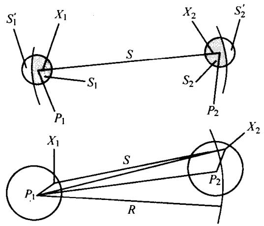

<details>
<summary>text_image</summary>

S₁'
X₁
S
S₁
P₁
S
X₂
S₂'
P₂
P₂
X₁
S
P₁
R
X₂
P₂
</details>

图3-1

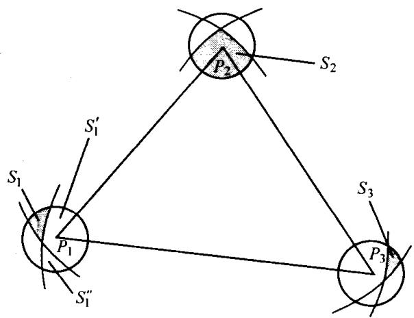

<details>
<summary>text_image</summary>

S₁
P₁
S₁'
P₂
S₂
S₃
P₃
S₁''
</details>

图3-2

证明 【充分性】易知.

【必要性】例如对点 $P_{1}$ , 根据命题 3-1, 如果 $X_{1} \in S_{1}^{\prime}$ , 则 $X_{1}, X_{3}$ 不能同时满足条件, 如果 $X_{1} \in S_{1}^{\prime \prime}$ , 则 $X_{1}, X_{2}$ 不能同时满足条件.

命题3-3 类似地可以对 $n$ 个点的情形进行证明, 取其 $n$ 层重叠区域为 $S_{1}, S_{2}, \cdots, S_{n}$ . 要使得 $|X_{i}P_{i}| \leqslant \varepsilon, (i = 1, 2, \cdots, n)$ . 如果某一个点 $P_{i}$ 附近不存在 $n$ 层重叠区域, 即 $S_{i}$ $\in \emptyset$ ，则 $X_{i} \in \emptyset$ ，这样的 $X_{i}$ 不存在，即这 $n$ 个点不可能同时有某网格的 $n$ 个结点使得 $|X_{i}P_{i}| \leqslant \varepsilon$ 。如果存在，且能找到某网格的 $n$ 个结点 $X_{1}, X_{2}, \dots, X_{n}$ 使得 $X_{i} \in S_{i}$ ，则这 $n$ 个点能满足同时利用的条件。

## 5 算法分析

(1) 在第二题的解法中, 我们给出了一个通用的解法, 不仅能判断 $n$ 个旧井点是否可以同时利用, 而且在不能同时利用时给出了能同时利用旧井点的最大数.  
(2) 算法采用逐层筛选, 不存在误差. 最后的多变量求极值时, 根据命题四的分析, 我们知道 $n$ 个点都靠近网格结点, 因此误差很小.  
(3) 通过必要条件的层层筛选, 不仅优化步骤提供了 M-N 分解值, 是必不可少的一步. 而且使后来的优化处理的数据范围小, 大大减少了优化的次数.  
(4) 在第三题的解法中, 我们给出了两种不同的解法, 这两种解法的区别在于第二种解法需要的仅仅是求关于三个变量的 $n_{2}$ 个不等式是否有解, 可以用穷举的办法来解决, 不需要用优化方法来解题.

## 参考文献

[1] 周承高,廖园.《优化方法及应用程序设计》.中国铁道出版社,1989.  
[2] 张培强.《MATLAB 语言》. 中国科技大学出版社,1995.11.  
[3] 刘来福, 曾文艺. 《数学模型与数学建模》. 北京师范大学出版社, 1997, 8.

“… 数学的发展关系到整个科学技术的发展,而科学技术是第一生产力;所以数学的发展是一件国家大事。”

钱学森,发展我国的数学科学—在中国数学会召开的数学教育与科研座谈会上的讲话,《数学进展》,1990,19(2):129-135.

# 钻井布局

徐胜阳 陈思多 金豪

(武汉汽车工业大学，武汉 430070)

指导教师 数学建模教练组

编者按 本文对前两问的解答采用了正确的穷举算法,得到了正确的结果. 对问题三的解答有特点:第一,给出了一个好用的充分条件: $\forall i,j,D_{ij}\leqslant\varepsilon$ ; 第二,通过算法给出了求 n 个像点的最小外接圆的方法,该圆的半径即可作为判别 n 个源点是否可用的条件. 此处反应出作者们较强的创造性.

摘 要 本文将旧井的利用问题归结为0-1规划问题,由此建立了目标函数.提出映射原理,将旧井的位置映射到一个单位网格中,从而大大地简化了模型的求解.应用映射原理和穷举方法,求解出有方向约束条件下的可利用点为4个,经过转化,推广到无方向约束条件下的可利用问题,解得6个点可利用.研究了目标成立的充分条件,给出了三种特殊情形下的判定方法.提出了中垂线上的二分逼近法.

## 1 问题重述(略)

## 2 符号约定

xoy 为绝对坐标系, 记为 S;

$x_{1}o_{1}y_{1}$ 为题设给定的点所在平面的坐标系, 记为 $S_{1}$ ;

$x_{2}o_{2}y_{2}$ 为网格所在平面的坐标系, 满足坐标轴与网格上的边平行, 坐标原点与网格上某一结点重合, 记为 $S_{2}$ ;

$D_{ij}$ 为 $P_{i}^{*}$ 与 $P_{j}^{*}$ 之间的距离 ( $i \neq j; i, j = 1, 2, \cdots, n$ ).

## 3 模型的建立

旧井要么被利用,要么被舍弃,这便形成了一种0-1规划问题.由此得到目标函数:

$$
z _ {\max} = \sum Z _ {i}, Z _ {i} = \left\{ \begin{array}{l l} 1, \text {第} i \text {个旧井被利用} \\ 0, \text {第} i \text {个旧井被舍弃} \end{array} \quad i = 1, 2, \dots , n \right.
$$

我们要寻求目标函数的最大值, 即 $w = z_{\max}$ .

每个 $Z_{i}$ , 都由同一个激活函数 $[1]f$ 确定. 在给定某种距离 $D$ 下, $D \leqslant \varepsilon$ 时有激活函数 $f(P_{i}) = 1$ , 否则为 0. 即有阈值 $[1]\varepsilon$ . 当源点 $P_{i}$ 与距离最近的结点的距离不大于给定误差 $\varepsilon$ 时, 点 $P_{i}$ 被激活可用.

由题设,采用向量的 $p$ 一范数定义距离.问题一为 $\| \cdot \|_{\infty}$ , 平面上的 $\varepsilon$ 一邻域为边长 $2\varepsilon$ 的正方形域;问题二为 $\| \cdot \|_{2}$ , 平面上的 $\varepsilon$ 一邻域为半径 $\varepsilon$ 的圆域.

## 4 模型求解

## 4.1 问题一:有方向约束下的求解问题

引理 设有非负实数 $a$ ，非负整数 $m, n$ ，则有： $(a + m) \bmod 1 = (a + n) \bmod 1$ （证略）.

映射原理 给定边长为1单位的正方形网格, 以其上某结点为原点建立直角坐标系 $S_{1}$ , 令坐标轴与网格纵横边平行, 并满足所有点均处于第一象限. 根据上述引理, 对应坐标系上任意一点 $P_{i}(x_{i}, y_{i})$ , 在矩形区域 $C = \begin{cases} 0 \leqslant x < 1 \\ 0 \leqslant y < 1 \end{cases}$ 中有唯一的点 $P_{i}^{*}(x_{i}^{*}, y_{i}^{*})$ $\begin{cases} x_{i}^{*} = x_{i} \bmod 1 \\ y_{i}^{*} = y_{i} \bmod 1 \end{cases}$ 与之对应. 把所有旧井的坐标 $P_{i}$ (以下称为源点) 映射到这个矩形区域 $C$ 内, 它包含了所有经过映射后的点 $P_{i}^{*}$ (以下称为像点), 我们称区域 $C$ 为映射区.

$P_{i}$ 映射到 $P_{i}^{*}$ 后，相对于包含它的单个网格的相对位置不变，故源点与像点的激活状态完全相同，即有 $f(P_{i}^{*}) \equiv f(P_{i})$ 。问题转化成在映射区中寻找像点 $P_{i}$ 分布最为密集的边长为 $2\varepsilon$ 的正方形区域，该区域内所有像点 $P_{i}^{*}$ 所对应的源点 $P_{i}$ 均在 $\varepsilon$ 一邻域内可供利用。

这种映射算法按一个常数倍数减小了时间复杂度.

根据问题一所设,用 $\| \cdot \|_{\infty}$ 定义距离下 $P^{*}$ 的 $\varepsilon$ —邻域,对包含所有像点 $P_{i}^{*}$ 的映射区 $C$ 作穷举,激活 $\varepsilon$ —邻域内的所有像点,以确定目标函数.

在映射区内,按照平移方式穷举,移动步长为 s. 步长 s 的选取要权衡复杂度与精度的问题,以保证在不漏掉可能的最优解的情况下使运算时间最短.

边界问题 图2中, 由粗线围成的区域为映射区, 与其内部的细线围成环状区域, 其宽度为 $\varepsilon$ . 由旧井方位 $P_{1}$ 与 $P_{2}$ 映射而成的两点 $P_{1}^{*}$ 与 $P_{2}^{*}$ 分别分布在映射区两条对边的附近, 与对应边的距离均不超过给定误差 $\varepsilon$ , 它们可能同时成为可利用点. 如果直接用 $\varepsilon$ —邻域在映射区穷举, 则不可能同时容纳这两点. 为了不漏掉可能的最优解, 下面给出边界问题的解决方法.

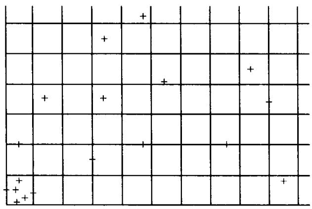

<details>
<summary>text_image</summary>

Grid-based puzzle or placement diagram with scattered plus and minus signs, likely representing a logic or pattern recognition task.
</details>

图 1 旧井及其映射点的方位

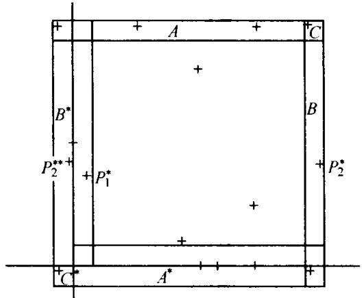

<details>
<summary>text_image</summary>

A
C
B*
P2**
+ P1*
B
+ P2*
C*
A*
</details>

图 2 边界问题示意图

如图2,网格的右、上两条边附近有区域 $A, B, C$ , 将这些区域及其上的所有点分别复制到对应区域 $A^{*}, A^{*}, C^{*}$ . 为了易于编制程序, 将左上角与右下角区域也补齐, 形成一个边长为 $1 + \varepsilon$ 的扩大的正方形搜索区域, 那么原有的点与点之间的关系将全部反映到映射后的网格上, 从而解决了边界问题, 得到了完善的算法. 在计算机上求解得出, 在第一象限内, 距原点最近的网格结点, 相对于原点的横向偏移为0.4, 纵向偏移为0.5, 可利用点为第2,4, 5, 10点.

## 4.2 问题二:无方向约束的求解问题

显然,问题一是问题二的特殊情况.下面探讨无方向约束下的求解问题.为了方便研究,在约定中给定了三种坐标系 $S$ 、 $S_{1}$ 、 $S_{2}$ .

我们所关心的是源点坐标系 $S_{1}$ 与网格坐标系 $S_{2}$ 之间的相互关系。如图4，令源点坐标系 $S_{1}$ 的原点 $O_{1}$ 与绝对坐标系 $S$ 的原点 $O$ 重合，则 $S_{1}$ 可由 $S$ 绕原点 $O$ 旋转 $\theta$ 得到；令网格坐标系 $S_{2}$ 的方向与绝对坐标系 $S$ 的方向相同，则 $S_{2}$ 可由 $S$ 平移位移量 $(u, v)$ 得到。这样，坐标系 $S_{1}$ 与 $S_{2}$ 之间的相互关系便由转角 $\theta$ 与位移量 $(u, v)$ 唯一确定。

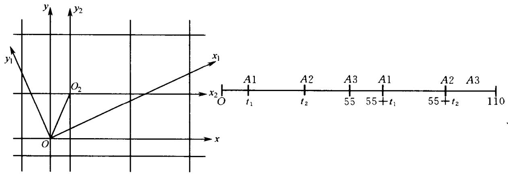

<details>
<summary>text_image</summary>

y
y2
y1
x1
O2
x2
O
A1
A2
A3
A1
A2
A3
t1
t2
55 55+t1
55+t2
110
x
</details>

图3 三个坐标系  
图 4 最优解下网格的覆盖方式

考虑到网格由正方形构成,转角 $\theta$ 只需变化 $\pi/2$ 便可以穷举,故可取转角 $\theta$ 为网格纵边或横边与 x 轴的正向夹角,并满足 $0 \leqslant \theta < \pi/2$ .由于假设网格足够大,可任意确定一网格结点为坐标系 $S_{2}$ 的原点 $O_{2}$ ,为了方便,我们取为绝对坐标系 S 第一象限上距原点 O 最近的点,易证,位移向量 $(u, v)$ 在映射区 C 内.

以相互独立的参数 $\theta, u, v$ 作为状态分量, 得到三维状态空间 $A^{[2]}$ . A 中每一状态 $(\theta, u, v)$ 均唯一确定一个目标函数值 $z(\theta, u, v)$ .

令转角 $\theta$ 以足够小的步长从0到 $\pi /2$ 变化.每当转角 $\theta$ 确定时，源点所在平面已经固定在绝对坐标系 $S$ 上了，剩下的工作便是固定方向平移网格，寻找目标函数的最优解.此时的工作与问题一相比，除 $\varepsilon$ 一误差邻域是 $\| \cdot \| _2$ 定义距离下的之外，其它完全相同，可以全盘借用问题一算法，故不赘述.

运算结果(如图4)为:夹角 $\theta=0.779$ , 位移量 $(0.950,0.730)$ . 可利用点为第1,6,7,8,9,11点.

## 4.3 问题三: 完全利用的问题

所有旧井均可利用的充分条件是: 当所有源点旋转角度 $\alpha(0 \leqslant \alpha < \pi/2)$ 形成一个映射区(称为 $\alpha$ —映射区)后, 所有像点必须落在一个半径 $R \leqslant \varepsilon$ 的圆(即 $\varepsilon$ —邻域)内, 即 w = n. 并且 $D_{ij} \leqslant 2\varepsilon$ . 我们称其为误差圆. 对于完全利用问题, 可用如下判据作优先判断:

判据一 在 $\alpha$ 一映射区内, 若存在两点间的距离 $D_{ij} > 2\varepsilon$ , 则 $n$ 口旧井不能同时利用. 因为相距 $D_{ij} > 2\varepsilon$ 的两点不可能同时在一个误差圆内.

判据二 若 $\alpha$ 一映射区内任意两点间距离 $D_{ij}$ 满足 $D_{ij} \leqslant \sqrt{3} \varepsilon$ ，则有 $W = n$ ，即这 $n$ 个像

点能全部被包含在误差圆内,这时 n 口旧井能全部利用.

证明 如图 5, 作误差圆的内接正三角形 ABC, 边长为 $\sqrt{3}\varepsilon$ . 分别以 A、B、C 为圆心作半径为 $\sqrt{3}\varepsilon$ 的圆, 得到其交集区域 E (阴影区域), 由于映射区内任何一点到 A、B、C 的距离都不超过 $\sqrt{3}\varepsilon$ , 必落在区域 E 中. 得证.

判据三 任意连接三个像点成三角形, 若成锐角或直角三角形, 则其外接圆是能将三个顶点完全包围的最小圆; 若成钝角三角形, 则以钝角的对边为直径所作的圆为能将三个顶点完全包围的所有圆中的最小圆. 当最小圆半径 $R > \varepsilon$ 时, 则 $W < n$ . 这就是说如果存在三个点不能同时在一个误差圆中, 这时 $n$ 口旧井就一定不能同时被利用.

有一种更简洁的求最小圆的算法：

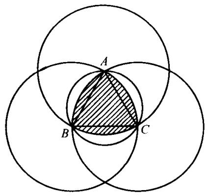

<details>
<summary>text_image</summary>

A
B
C
</details>

图 5 判据二的示意图

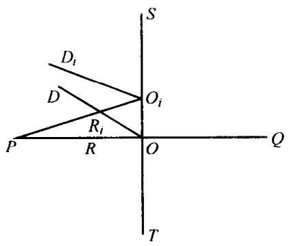

<details>
<summary>text_image</summary>

S
D₁
Oᵢ
D
Rᵢ
P
R
O
Q
T
</details>

图 6 中垂线上的二分逼近法

中垂线上的二分逼近法 如图6,为了在映射区中找到能覆盖全部像点的最小圆域,作包含n个像点的凸 $m(m\leqslant n)$ 边形,作其直径PQ的中垂线交多边形于S,T.从PQ与ST的交点O出发,在中垂线上搜索所求圆的圆心,步骤如下:

1. 取点 O 为圆心, $R = |OP| = |OQ|$ 为半径作圆;  
2. 找出其余 m-2 个像点到 O 点的最长距离 D. 若 D>R，则使圆心 $O_{i}$ 朝 $R_{i}$ 增大而 $D_{i}$ 减小的方向(向外)移至 SO 的中点，继续步骤 3；若 $D \leqslant R$ ，则 R 即为所求最小圆的半径，结束；(下标 i 表示迭代运算的次数， $i=1,2,\cdots$ )  
3. 找出其余 $m - 2$ 个像点到 $O_{i}$ 的最长距离 $D_{i}$ , 若 $D_{i} > R_{i}(R_{i} = PO_{i})$ , 则使圆心 $O_{i + 1}$ 向 $R_{i}$ 增大的方向移动, 移至 $D_{i}$ 与其向外方向邻接点的中点处; 若 $D_{i} < R_{i}$ , 则使圆心 $O_{i + 1}$ 向 $R_{i}$ 减少的方向(向内)移动, 移至 $O_{i}$ 与其向内方向邻接点的中点处; 若 $D_{i} = R_{i}$ , 则 $R_{i}$ 即  
为所求最小圆的半径,结束;

4. 重复步骤3的工作, 直到 $|D_i - R_i| \leqslant \eta$ ( $\eta$ 为任一给定的充分小的正实数)为止, 此时 $R_j$ 即为所求最小圆的半径.

求得唯一的包含 $m$ 边形的最小圆(以下称圆 $Q$ ) 的半径.

边界问题 如图 7, $S_{1}$ 为非边界区. $S_{2}$ 为边界区. $S_{3}$ 为处理区, 根据映射原理, 对于 $S_{2}$ 内的点, 对应 $S_{3}$ 中一个或几个不同点. 而在中垂线上的二分逼近法求 $R$ 的过程中, 因 $0 \leqslant D_{ij} \leqslant 2\varepsilon$ , 故 $m$ 个点都在最小圆 $Q$ 内. 下面证明结论一: 若 $n$ 口井能被全部利用, 则圆 $Q$ 内一定有 $n$ 个点, 且一个源点在圆 $Q$ 内只

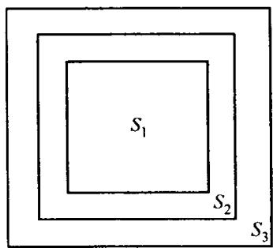

<details>
<summary>text_image</summary>

S₁
S₂
S₃
</details>

图 7 边界问题示意图

对应一个像点.

证明 如图8, 因 $n$ 口井能被全部利用, 则有 $0 \leqslant D_{ij} \leqslant 2\varepsilon$ , 处于边界区的每个源点对应圆 $Q$ 内一个像点, 而任一源点所对应的两个或三个像点只能有一个在圆 $Q$ 中, 得证.

由结论一, 可利用中垂线上的二分逼近法求解最小圆的半径. 将题设的 12 个源点代入算法, 判定 $R > \varepsilon$ , 即这 12 个源点不在半径为 $\varepsilon$ 的圆内; 而将问题二求出的 6 个点代入算法中, 求得圆的半径 $R \leqslant \varepsilon$ , 这与问题二的最优解相吻合. 这样从正反两方面验证该算法可行.

## 参考文献

[1] 何振亚. 神经智能——认知科学中的若干重大问题的研究. 湖南科学技术出版社, 1997.  
[2] 郑大钟. 现代控制理论(第一册). 清华大学出版社, 1978.

工业革命是以世纪为单位来划分阶段的，而计算机革命精神则是以十年为单位度量的，……在18，19世纪，机器逐步代替了人们的体力劳动，而在20世纪后期，则是智力活动的机械化，现在是大脑而不是手正在成为多余物。这就意味着我们所面临的挑战是非同寻常的，因而简单地与过去类比就会误入歧途。……

总而言之，计算机正在数学家工作的所有阶段，特别是在探索和实验阶段提供着实际和有效的帮助。

M. F. Atiyah, 数学与计算机革命, 数学译林, v. 10 (1991), no. 1, p. 62 - 67.

# 钻井布局的数学模型

胡海洋 陈建 陆鑫

(南京大学, 南京 210093)

指导教师 陈 晖 姚天行

摘要 本文对钻井布局问题的研究,是从全局搜索入手,逐步深入讨论了各种算法的有效性、适用性和复杂性,得到不同条件下求最多可利用旧井数的较好算法.

对问题1,我们给出了全局搜索模型、局部精化模型与图论模型,讨论了各种算法的可行性和复杂度.得到的答案为:最多可使用4口旧井,井号为2,4,5,10.对问题2,我们给出了全局搜索、局部精化和旋转矢量等模型,并对局部精化模型给出了理论证明,答案为:最多可使用6口旧井,井号为1,6,7,8,9,11,此时的网格逆时针旋转44.37度,网格原点坐标为(0.47,0.62).

对问题3,给出判断 $n$ 口井是否均可利用的几个充分条件、必要条件和充要条件及其有效算法.

## 1 模型假设及符号说明(略)

## 2 问题分析与模型准备

如果一个已知点 $P_{i}$ 与某个网络结点 $X_{j}$ 距离不超过给定误差 $\varepsilon(0.05)$ 单位，则认为 $P_{i}$ 处的旧井资料可以利用。因此，在棋盘(欧氏)距离定义下，可以以 $P_{i}$ 为中心， $2\varepsilon$ 单位为边长作一个正方形(半径为 $\varepsilon$ 的圆)。若网络在平移过程中，网络中的某个结点 $X_{j}$ 落在以 $P_{i}$ 为中心的正方形(圆)内或边上，可认为 $X_{j}$ 可利用旧井 $P_{i}$ 的相应资料。同样可以以 $X_{j}$ 为中心， $2\varepsilon$ 单位为边长作一个正方形(圆)。若网络在平移过程中， $P_{i}$ 落在以 $X_{j}$ 为中心的正方形(圆)内或边上，可认为 $X_{j}$ 可利用旧井 $P_{i}$ 的相应资料。这两种方法分别对应于网格移动和坐标平移，显然它们是等价的。以下的讨论将不明显区别这两种方法。为了简化讨论，引入以下法则。

## 映射法则：

将点 $i$ 映射至以 $(a, b), (a + 1, b + 1)$ 为对角顶点的正方形内的点 $i', i'_x = i_x - [i_x] + a$ ; $i'_y = i_y - [i_y] + b$ , 其中 $[x]$ 为 $x$ 的整数部分.

## 覆盖法则：

将所有旧井映射至 $(-1, -1), (0, 0); (-1, 0), (0, 1); (0, -1), (1, 0); (0, 0), (1, 1)$ 为对角顶点的四个正方形上. 以 $2\varepsilon$ 为边长作小正方形, 该正方形形心在以 $(-0.5, -0.5)$ , $(0.5, 0.5)$ 为对角顶点的正方形内移动, 则可被正方形所覆盖的映射点为可同时利用的点. 这样的正方形称为判决正方形或判决方块. 相应的, 在第二问中采用一个半径为 $\varepsilon$ 的圆移动来覆盖映射点, 称为判决圆.

映射法则和覆盖法则是易于理解也是易于证明的.下面我们讨论时都应用了映射法则和覆盖法则,将点映射后在映射区间内判断旧井是否可利用.

## 3 模型的建立

## 3.1 对问题一的讨论

## 1. 目标函数的给出

设网络的起点为 $(a,b)$ ，地域中某旧井 $P_{i}$ 坐标为 $(P_{ix},P_{iy})$ ，则该旧井可利用的条件是：

$$
a + N _ {i} - \varepsilon \leqslant P _ {i x} \leqslant a + N _ {i} + \varepsilon
$$

且 $b + N_{j} - \varepsilon \leqslant P_{iy} \leqslant b + N_{j} + \varepsilon,$

其中 $N_{i}$ 和 $N_{j}$ 为非负整数.

令函数

$$
M \left(X _ {i}, Y _ {i}\right) = \left\{ \begin{array}{l l} 1, & a + N _ {i} - \varepsilon \leqslant X _ {i} \leqslant a + N _ {i} + \varepsilon , b + N _ {j} - \varepsilon \leqslant Y _ {i} \leqslant b + N _ {i} + \varepsilon \\ 0, & \text {其它} \end{array} \right.
$$

由于问题要求寻找尽量多的可利用旧井点,因此,建立目标函数如下:

$$
F (a, b) = \max \Big (\sum_ {i = 1} ^ {n} M (X _ {i}, Y _ {i}) \Big).
$$

根据以上的分析,可以建立以下模型.

## 2. 模型一: 枚举法

在本题中,由于精度的要求为0.01,且网格可上下、左右平行移动.因此可按纵、横坐标方向分别平移100次(即1个单位长),用覆盖法对区域中的所有12个旧井点搜索,如覆盖旧井点,则记录覆盖数.最后比较在这 $100\times100$ 次平移中,哪一次覆盖数最大,则该网格位置为最优.

该算法的复杂度为 $O(n / \rho^2)$ ， $n$ 为旧井数， $\rho$ 为数值的要求精度，在本题中为0.01.

计算结果如下：网格节点为(0.36,0.46)，最多可利用旧井数为4，分别是2,4,5,10号井。枚举法对精度要求不高时，颇为有用，但当精度要求很高时，往往较为复杂。在模型一的基础上，我们进行了部分改进，提出模型二及其算法。

## 3. 模型二: 部分穷举法 I

显然对12个旧井点中的任一个井点都存在一个网格，使得该井点可被该网格所用。因此可以在 $P_{i}$ 已被该网格利用的情况下，再去检查其它旧井点能否被该网格所利用。因此，可将网格中一个结点放在以该点为中心， $2\varepsilon$ 为边长的一个正方形区域中，再去测试其它旧井点是否满足条件。对于一个而言，网格某个结点，在以该点为中心， $2\varepsilon$ 为边长的正方形区域中有 $(2\varepsilon / \rho)^{2}$ 种放置法。这样即得部分穷举法的复杂度为 $O(n^{2}(\varepsilon / \rho)^{2})$ 。

部分穷举法抓住一个旧井点后考察其它旧井点的情况. 因此, 它比全部穷举法优点在于: 避免了对所有旧井点均不可利用的情形的搜索. 但该算法的缺点在于 $n$ 不能太大, 否则可能得不偿失, 使计算量大为增加.

计算结果与模型一相同.

## 4. 模型三: 部分穷举法Ⅱ

在模型二中我们根据至少利用一个点的原则移动判决方块. 在本模型中我们在至少有两口井可用情况下, 由两口井确定一个判决方块, 进而进一步缩减计算量.

定理1.3.1 在覆盖点数最多的判决方块中必有一个方块 $A$ 满足下述两条之一：

(1) 有两点 $P_{i}$ 与 $P_{j}$ 分别在 A 的左边框和下边框上；  
(2) 有一点 $P_{i}$ 在 $A$ 的左下顶点处.

该定理的证明从直观上看是显然的, 若某判决方块 $A'$ 覆盖的点数最多, 将 $A'$ 连续向右和向上移动, 直至若继续移动将会有点跑出为止, 此时 $A'$ 的位置记为 $A$ , 则 $A$ 必适合定理中两条件之一, 且 $A$ 中点数也是最多的.

由此定理,我们只需在所有以两点确定左边框和下边框的判决方块和以一点为左下顶点确定的判决方块的覆盖数之间进行比较,最大者即为最多可利用旧井数.

该方法对于 $n$ 个井点，需计算约 $(C_n^2 + n)n$ ，复杂度为 $O(n^3)$ ，是与精度无关的算法.

计算结果同上.

## 5. 模型四: 涂层法

由映射法则, $P_{i},P_{j}$ 的映射点在正方形 $\left[(-\varepsilon,-\varepsilon);(1+\varepsilon,1+\varepsilon)\right]$ 内为 $P_{i}^{\prime},P_{j}^{\prime}$ ，则 $P_{i},P_{j}$ 可用的充要条件是 $d(P_{i}^{\prime},P_{j}^{\prime})\leqslant2\varepsilon$ ，即分别以 $P_{i}^{\prime},P_{j}^{\prime}$ 为心，边长 $2\varepsilon$ 的两个正方形相交。对于n个点，则这n个点都可用的充要条件是以这n个点为中心的正方形都相叠。以相叠部分为网格点，总可以利用这n个点。本模型即用这样的思路，计算最多有多少正方形相叠，并以相叠部分中的一点以网格结点作网格。

算法思想:用矩阵 A 表示 $\left[(-\varepsilon,-\varepsilon);(1+\varepsilon,1+\varepsilon)\right]$ ，将点离散化，以精度 $\rho$ 取样。则 A 表示为 $\frac{1+2\varepsilon}{\rho}$ 阶零矩阵。用全 1 矩阵 a 表示以映射点 $P_{j}^{\prime}$ 为中心， $2\varepsilon$ 为边长的小方形。则将这些小矩阵加到大矩阵的相应位置上去，即相当于把小正方形“涂”到大框里。则 A 中某点上数字之和即表示该点被多少正方形覆盖，也即以该点为起点的网格可利用多少旧井。找出 A 中数字最大者，即为最大利用旧井数，该点为最优网格的起始点。

该算法复杂度为 $O(n(\varepsilon / \rho)^2)$ . 在精度不太高时计算是迅速的. 精度高时, 对内存和速度都有较高要求.

计算结果同上.

## 6. 模型五: 图论模型.

定理1.5.1 作一无向图 $G[V, E], V$ 为旧井点的集合. 若第 $i$ 与第 $j$ 号井可同时利用, 则在 $i, j$ 之间加一条边. 则可同时利用的井点组成一个完全子图, 即团. 在棋盘距离下最多可利用旧井数等于最大团的阶数.

证明 (略).

此定理对欧氏距离不适用.由此定理可得到下述推论.

推论 在棋盘距离下,若某些旧井两两可同时利用,则这些旧井可被同时利用.

由此提出图论模型如下:按定理 1.5.1 构造图 G, 找最大完全子图.

首先,找出可同时利用的旧井对.可利用下述定理求得.

定理 1.5.2 $P_{i}, P_{j}$ 均可以在某网络中被利用的充要条件是存在非负整数 $N_{1}, N_{2}$ ，使得：

$$
d _ {x} (P _ {i}, P _ {j}) \in [ N _ {1} - 2 \varepsilon , N _ {1} + 2 \varepsilon ],
$$

$$
d _ {y} (P _ {i}, P _ {j}) \in [ N _ {2} - 2 \varepsilon , N _ {2} + 2 \varepsilon ],
$$

其中 $d_{x}$ 与 $d_{y}$ 分别表示 x 方向与 y 方向距离.

证明（略）.

下述定理是图论中熟知的定理.

定理1.5.3 设 $G$ 是 $n$ 阶无向图, $V^{*}$ 为 $G$ 中极大(最大)团当且仅当 $V^{*}$ 为 $\overline{G}$ 的中的极大(最大)独立集, 其中 $\overline{G}$ 是 $G$ 的补图.

因此,问题归结为寻找 $\overline{G}$ 中的最大独立集.但寻找最大独立集为 NP 问题,目前尚无好的方法.

图论模型优点在于:它在理论上是完备与精确的,不受数值精度与 $\varepsilon$ 的影响.

## 7. 五个模型的比较

对于五个模型的比较,我们认为模型三、四、五是较优的.模型三与精度无关,复杂度为 $O(n^{3})$ .对于大多数情况都是适用的.模型四与精度有关.复杂度为 $O(n(,\varepsilon/\rho)^{2})$ ,在本题中 $\varepsilon/\rho=5$ .在精度要求不太高,且点数较多时,可获得比模型三更快的速度.模型五是一个NP问题,当点数较多时,甚至是不可能求解的.但本模型提供了一个较完美的具有理论意义的图论模型.

## 3.2 对问题二的讨论

## 1. 模型一: 全局搜索法

以某一个角度为步长转动网格，在每一角度下，固定网格方向按问题一的方法检验最多有多少旧井可以利用。再比较所有搜索过的角度下可利用的旧井数，即可得允许转动时可利用最多旧井数。两点间的棋盘距离会因转动而改变，故问题二采用欧氏距离。由于方格的对称性，只需从 $0^{\circ}$ 旋转到 $90^{\circ}$ 即可。为保证旋转小角度后，点的变动不超过精度 $\rho = 0.01$ ，使步长 $\Delta \theta \leqslant \frac{\rho}{R}$ ， $R$ 为距离最远点到旋转中心的距离。本题中求出 $\Delta \theta \leqslant 1.04 \times 10^{-3}$ 。需要将 $\left[0, \frac{\pi}{2}\right]$ 分为2000份，因此本题要进行2000次问题一的计算。该模型简单可靠，易于理解，缺点是计算量较大，有很多不必要的搜索。因此有待改进。

计算结果为: 网格逆时针转动 $44.37^{\circ}$ ，一个网格点在原坐标系下的坐标为 $(0.47, 0.62)$ 。这时可有 6 个井被同时使用，井号为 1,6,7,8,9,11。

## 2. 模型二: 旋转矢量法

首先找两个可以同时利用的旧井, 将这两旧井确定一个大致的方向, 至多只能再转动一个极小的角度. 在这个极小的角度内以步长 $\Delta\theta$ 转动, 搜索最多可利用的旧井数. 任意一对可同时利用的旧井都需要进行以上操作.

定理2.2.1 两旧井 $a, b$ 可同时利用的充要条件为存在整数 $m, n$ 使 $\left|d - \sqrt{m^2 + n^2}\right| \leqslant 2\varepsilon$ ，其中 $d = \sqrt{(a_x - b_x)^2 + (a_y - b_y)^2}$ 为两旧井的欧氏距离。

证明 (略)

定理2.2.2 设两旧井 $a, b$ 可同时被利用， $a$ 点到网格原点距离 $d_{1}$ 与 $b$ 点到结点 $(m, n)$ 距离 $d_{2}$ 均不超过 $\varepsilon$ . 则当网格转动角度超过 $\frac{4\varepsilon}{d}$ (其中 $d$ 为 $a$ 到 $b$ 的距离) 弧度时，则 $d_{1}$ 与 $d_{2}$ 中至少一个将超过 $\varepsilon$ .

证 因 $\varepsilon < d$ ，以原点为旋转中心，将网格旋转 $\Delta\theta$ 弧度， $b$ 点相对结点 $(m, n)$ 至少移动 $d\Delta\theta$ ，于是当 $\Delta\theta > \frac{2\varepsilon}{d}$ 时， $d_2 > \varepsilon$ 。同样以 $(m, n)$ 为旋转中心，旋转 $\Delta\theta \frac{2\varepsilon}{d}$ 时， $d_1 > \varepsilon$ 。考虑最不利情形，当网格转动 $\Delta\theta \frac{4\varepsilon}{d}$ 时， $d_1$ 与 $d_2$ 中至少一个超过 $\varepsilon$ 。

依据该定理,先将网格旋转与平移到某一位置,使 a, b 两旧井均被利用,在该位置,网格最多允许再旋转 $\frac{4\varepsilon}{d}$ 弧度.我们只需要在该小范围内检查其它井是否可被利用.对每一对井均作上述讨论,即可求得可利用的井数的最大值.

## 3. 模型三: 全局搜索 局部精化

本模型的思想是先以较大步长进行全局搜索,找到一个大概范围,再在该范围内精确搜索,直至得到最优结果.

将网格旋转某一角度 $\theta$ (以弧度为单位)，再将所有旧井按前文方法映射到原点周围四个单位网格内。现将误差扩大为 $\varepsilon'=(1+\delta)\varepsilon$ ，其中 $\delta>0$ 。作半径分别为 $\varepsilon$ 与 $\varepsilon'$ 的同心圆 $\odot$ 与 $\odot'$ ，使得 $\odot'$ 内覆盖的映射点数最大，设为 $k'$ 。若网格旋转角度有一个小的改变量 $\Delta\theta$ ，则各旧井在网格中的位置将移动 $\left|R_{i}\Delta\theta\right|$ ，其中 $R_{i}$ 为第 i 号井到旋转中心的距离，此时它们的映射点也将移动 $\left|R_{i}\Delta\theta\right|$ 距离。设 $R=\max\{R_{1},R_{2},\cdots,R_{n}\}$ ，且 $\left|R\Delta\theta\right|\leqslant\varepsilon'-\varepsilon=\delta\varepsilon$ ，即

$$
\mid \Delta \theta \mid \leqslant \delta \varepsilon / R, \tag {*}.
$$

则原来在 $\odot'$ 外的点不可能移入至 $\odot$ 中(这是因为这两个同心圆边界的距离 $\delta\varepsilon$ 大于映射点移动距离),于是当(\*)成立时, $\odot$ 覆盖的映射点数 $k\leqslant k'$ .

基于上述分析,算法思想为:先取一适当的 $\delta$ , 以 $\varepsilon'=(1+\delta)\varepsilon$ 为允许误差,

$\rho = 2|\Delta \theta | = 2\delta \varepsilon /R$ 为步长，从0到 $\frac{\pi}{2}$ 进行搜索，求得可利用旧井数的上界 $M$ .将允许误差仍回到 $\varepsilon$ ，求得圆 $\odot$ 覆盖的点数为 $m$ .若 $m = M$ ，则可利用的旧井数就是 $M$ ，问题已解决.若 $m <   M$ ，则适当减小 $\delta$ ，此时步长 $\rho$ 也相应减小，进行精细搜索.搜索的范围可以减少很多.这是因为若对某一个角度 $\theta_{i}$ ，第一次以 $\varepsilon^{\prime}$ 为允许误差求得的覆盖点数小于 $m$ ，则显然旋转角度在区间 $[\theta_i - |\Delta \theta |,\theta_i + |\Delta \theta |]$ 内时，可利用的点数也小于 $m$ ，因此在第二次精细搜索时，该区间就不必检查了.

从 $(\ast)$ 可看出，若能减小 $R$ 值，则在相同允许误差 $\varepsilon' = (1 + \delta)\varepsilon$ 条件下，步长 $\rho = 2|\Delta \theta|$ 将可增大，我们的做法是选择旋转中心，使得各旧井到旋转中心的最远距离最小，目标函数为

$$
f (x, y) = \max _ {1 \leqslant i \leqslant n} \{(x _ {i} - x) ^ {2} + (y _ {i} - y) ^ {2} \},
$$

$$
\text {s.t.} \quad \min f (x, y),
$$

其中 $(x,y)$ 为新坐标原点(即旋转中心).

这是非线性无约束最优规划问题,我们用 SAS 软件,采用单纯形法计算,结果为 x = 5.04, y = 1.70, $R = \sqrt{f(x, y)} = 4.55$ . 此时 R 比以原坐标原点为旋转中心减少一半以上.

我们取检查次数 $N = 120$ ，步长为 $90^{\circ} / 120 = 0.75^{\circ}$ 。此时 $\delta = \frac{\pi R}{4N\varepsilon} \approx 0.6, \varepsilon' \approx 1.6\varepsilon$ ，得到可利用旧井的上界 $M = 6$ 。

另一方面，取任一步长，以半径为 $\varepsilon$ 的判决圆搜索可得到可利用旧井数的下界 $m$ 。

显然若上界与下界相等,则可利用的旧井数最多为 m.而网格的方向就随之可确定.

对于本题, 步数取 120, 判决圆半径为 $\varepsilon' = (1 + \delta) \cdot \varepsilon$ 时, 可得上界 $M = 6$ . 再取步数为 2, 判决圆半径为 $\varepsilon$ 时, 步长为 45 度, 得下界 $m = 6$ . 故可知最多可利用旧井数为 6, 旋转角度即为 45 度. 仅需 122 次左右问题一的计算, 可以较大的削减计算量.

算法结果: 可利用的旧井数的上限为 6. 网络逆时针旋转 $45^{\circ}$ , 其中一个节点坐标为 $(0.46, 0.56)$ , 可利用旧井序号为 $(1, 6, 7, 8, 9, 11)$ .

## 4. 对问题二各模型的评价

模型一是直观和易于理解的,但搜索步数过多,耗时过长,模型二是先确定一个大致方向,再在该方向附近进行搜索.在 n 较小时,可较大的削减计算量.但 n 较大时,其确定的大致方向数过多,有可能得不偿失,反而增加计算复杂性.

模型三我们认为是较好的,先以较大的步长搜索,再以小步长搜索,可以较大地减少计算量.

## 3.3 问题三的解答

在解决问题一、问题二的基础上，解决问题三.我们仅判断 $n$ 个点是否均可利用

## 1. 棋盘距离下

因坐标旋转会改变两点间的棋盘距离, 故只讨论网格不可旋转的情形. 以某一口旧井为坐标原点建立平面直角坐标系, 再将各旧井映射到以 $(-0.5, -0.5)$ 与 $(0.5, 0.5)$ 为对角顶点的正方形内, 即若旧井 $P_{i}(i=1,2,\cdots,n)$ 的坐标为 $(x_{i}, y_{i})$ , 它的映射象 $P'_{i}$ 的坐标 $(x'_{i}, y'_{i})$ 满足

(1) $-0.5 < x_{i}^{\prime} \leqslant 0.5, -0.5 < y_{i}^{\prime} \leqslant 0.5;$

(2) $x_{i}-x^{\prime}_{i}$ 与 $y_{i}-y^{\prime}_{i}$ 均为整数.

显然我们有：

定理3.1 记 $d_{x} = \max_{1\leqslant i <   j\leqslant n}\{\mid x_{i} - x_{j}\mid \},d_{y} = \max_{1\leqslant i <   j\leqslant n}\{\mid y_{i} - y_{j}\mid \}$ ，则在棋盘距离下 $n$ 口旧井均可利用的充要条件为 $d_{x}\leqslant 2\varepsilon ,d_{y}\leqslant 2\varepsilon$

## 2. 欧氏距离下网格不可旋转的情况

同上述棋盘距离的映射方法,我们有:

定理 3.2.1 网络不可旋转的条件下,采用欧氏距离,n 口旧井均可利用的充要条件为它们的映射象 $P'_{1}, P'_{2}, \cdots, P'_{n}$ 可被一判决圆所覆盖.

适当移动判决圆, 总可使该判决圆周上至少含两个映射点. 据此, 算法思想为: 以任意两映射点确定两个半径为 $\varepsilon$ 的圆, 检查是否所有的映射点均在判决圆上. 最多检查 $2C_{n}^{2} = n(n - 1)$ 次. 算法的时间复杂度为 $O(n^{3})$ .

我们还可给出欧氏距离下,不可旋转时 n 口旧井均可利用的充分条件与必要条件:

定理3.2.2 充分条件为任意两个映射象 $P_{i}^{\prime}$ 与 $P_{j}^{\prime}$ 的距离均不超过 $\sqrt{3}\varepsilon$

证明 (略)

定理3.2.3 必要条件为任意两个映射象 $P_{i}^{\prime}$ 与 $P_{j}^{\prime}$ 的距离均不超过 $2\varepsilon$ .

证明 (略)

## 3. 欧氏距离下网格可旋转的情况

选择一口旧井, 使各旧井到它的最远距离最小, 以这口井为坐标原点和旋转中心. 设旋转了某一角度 $\theta$ 后, 各井按旋转后的新坐标映射到以 $(-0.5, 0.5)$ 与 $(0.5, 0.5)$ 为对角顶点的正方形内, 它们的映射象为 $P_{i}^{\prime}, i = 1,2,\dots,n$ . 则我们有

定理 3.3.1 存在一个角度 $\theta\in[0,\pi/2]$ ，使得旋转 $\theta$ 角后，各旧井的映射象 $P_{1}^{\prime}, P_{2}^{\prime}, \cdots, P_{n}^{\prime}$ 被一判决圆全部覆盖.

计算可利用井数在问题二中已有详细讨论,我们建立的模型与算法均可用.

例如由定理2.2.1可知,若对两旧井 $a, b$ , 不存在整数 $m, n$ , 使得 $\left|d - \sqrt{m^2 + n^2}\right| \leqslant 2\varepsilon$ 成立, 则 $a, b$ 中最多只能利用一口井. 因此该定理可作为判别 $n$ 口井均可利用的一个必要条件.

对于该问题,我们认为有效的一个充要条件是难找的,只有对实际问题进行求解计算来验证.

## 4 模型结论改进方向及建议(略)

## 参考文献

[1] 姜启源. 数学模型. 高等教育出版社, 北京, 1993.  
[2] 叶其孝．大学生数学建模竞赛辅导教材．湖南教育出版社，长沙，1997.  
[3] 朱道元．数学建模精品．东南大学出版社，南京，1999.

掌握从现实到抽象的数学模型的变换,以及对精确程度和可逼近程度做出鉴别,都需要直觉感觉,而后者是依靠经验才变得敏锐了的。此外,也可能常常还牵扯到构造那些真正困难的数学问题,而这些问题又难到目前科学的已有技术无法解决的地步。这种困难性成为某些数学家从事智力冒险的部分原因,也是他们所达到满意的本质,这些数学家是和工程师、自然科学家共同工作以掌握“真实”问题的,而那些问题又是在人们延伸他们对自然的理解与控制时大量出现的。

R. Courant, 摘自 J. N. Kapur, Thought on Nature of Mathematics of Alexandrov et al., 1973; 中译本,《数学家谈数学本质》, 北京大学出版社, 1989, p. 124.

# 钻井布局的设计

朱振波 谢文冲 皮兴宇

(空军雷达学院, 武汉 430010)

指导教师 数学建模组

编者按 本文建立了正确的数学模型来研究怎样尽可能利用旧井的问题,用多种方法来求解,得到正确的结果,还给出了利用 n 个旧井的充分必要条件.

摘要 本文首先给出钻井布局的数学模型, 进一步采用全面搜索法、局部搜索法、图论法、目测法、图上作业法等不同的优化方法, 进行了模型求解. 对于给定的数值例子, 得到问题(1)的解为4, 可利用的旧井为 $P_{2}, P_{4}, P_{5}$ 和 $P_{10}$ ; 问题(2)的解为6, 可利用的旧井为 $P_{1}, P_{6}, P_{7}, P_{8}, P_{9}$ 和 $P_{11}$ . 最后对于问题(3), 本文给出了 $n$ 个旧井均可利用的充分必要条件.

## 1 问题的提出(略)

## 2 问题的分析与假设

1. 取定坐标系, 向东为横轴正向, 向北为纵轴正向. 旧井位点的坐标可记为 $P_{i}(a_{i}, b_{i}), i = 1, \dots, n$ .  
2. 由于问题是尽量利用旧井, 故可以假设边长为 1 个单位的正方形网格 $N$ 覆盖整个平面.  
3. 为分析问题简便起见, 总可以假设网格 $N$ 的铅垂网线, 水平网线分别与两坐标轴平行, 故一个网格 $N$ 可由该网格中的任何一个结点所唯一确定.

## 3 模型的建立与求解

## 3.1 问题(1)的求解

由于网格 $N$ 的横向与纵向是固定的，故一个网格 $N$ 可由该网格中的一个结点 $X_{i}$ 所唯一确定，记为 $N_{X_{i}}$ 。因此覆盖整个平面的各种不同网格必可由任一单位正方形内的所有点所确定。对于一个网格 $N_{X_{i}}$ ，用 $f(N_{X_{i}})$ 表示所能利用的旧井点数。于是我们得到如下模型：

$$
\max f (N _ {X})
$$

$$
\text {s.t.} \quad \max \left\{\mid x - x _ {i} \mid , \mid y - y _ {i} \mid \right\} \leqslant 0. 5;
$$

其中 $X = (x, y), X_i = (x_i, y_i)$ .

由于此模型很难用分析法进行求解,故利用计算机进行数值计算.

## 模式Ⅰ 全面搜索(地毯式搜索)

由于所给例子中井位坐标的最小单位为0.01,而误差 $\varepsilon$ 为0.05单位,从而我们只需以步长(0.01单位)来作平移搜索.

定义 1 设 $Q_{1}=(x_{1},y_{1}),Q_{2}=(x_{2},y_{2})$

$$
D _ {x} = \min \left\{x _ {1} - x _ {2} - \left[ x _ {1} - x _ {2} \right], 1 + \left[ x _ {1} - x _ {2} \right] - (x _ {1} - x _ {2}) \right\}
$$

$$
D _ {y} = \min \left\{y _ {1} - y _ {2} - \left[ y _ {1} - y _ {2} \right], 1 + \left[ y _ {1} - y _ {2} \right] - (y _ {1} - y _ {2}) \right\}
$$

$$
D (Q _ {1}, Q _ {2}) = \max \{D _ {x}, D _ {y} \} \quad \text {其中}: [ x ] \text {表示对} x \text {取整}.
$$

则称 $D(Q_{1},Q_{2})$ 为 $Q_{1}$ 与 $Q_{2}$ 的网格距离. 特别用 $D(Q)$ 表示 $Q$ 点与原点的网格距离.

由此定义立即可知:若构造网格 $N_{Q}$ ，则 $D(P_{i}, Q)$ 表示旧井位 $P_{i}$ 与网格 $N_{Q}$ 中某个结点的距离，故 $D(P_{i}, Q)$ 也可称为 $P_{i}$ 与网格 $N_{Q}$ 的距离.

易知:网格距离有下述性质与定理:

性质1 $D(Q_{1},Q_{2}) = D(Q_{2},Q_{1}).$

性质2 $0 \leqslant D(Q_{1}, Q_{2}) \leqslant 0.5$ .

定理1 设 $N_{Q}$ 为已知网格, $P_{i}$ 为旧井位的坐标, 则 $P_{i}$ 可以被利用 $\Leftrightarrow D(P_{i}, Q) \leqslant \varepsilon$ .

定理2 设 $P_{1}, P_{2}$ 为两个旧井位，则存在某个网格 $N$ ，使得 $P_{1}, P_{2}$ 可同时利用的充要条件是： $D(P_{1}, P_{2}) \leqslant 2\varepsilon$ .

由定理 2 可知, $f(N_{X})$ 即为 $P_{1},\cdots,P_{n}$ 中与 X 的网格距离 $\leqslant\varepsilon$ 的个数.

上述两个定理的直观意义是明显的,为节省篇幅,证明过程从略.

编程思想如下：

(1) 令 $Q$ 为原点, 构造网格 $N_{Q}$ , 若 $D(P_{i}, Q) \leqslant \varepsilon$ , $i = 1, \cdots, n$ , 则旧井位 $P_{i}$ 可以利用. 所有这些可利用的 $P_{i}$ 的个数即为 $f(N_{Q})$ .  
(2) 将 $Q$ 每次向右平移 1 个步长 (每步长为 0.01 单位), 移一百次, 再向上按同样的步长移动 100 次, 即可得到 (对于所给例子) $100^{2} = 10000$ 个 $f(N_{Q})$ , 取其最大者即得.

对于所给的例子,相应的程序清单见附录(略),程序运算结果如下:

最大可利用的旧井数为 4，旧井点分别为： $P_{2}$ ， $P_{4}$ ， $P_{5}$ ， $P_{10}$ .

网格平移范围:(1)向左平移:0.58—0.63;(2)向上平移:0.45—0.54.

模式Ⅱ 局部搜索

模式Ⅰ是全面搜索,需循环10000次.事实上只须小范围搜索即可.

方法是：先取 $Q = P_{i}, (i = 1, \cdots, n)$ ，按模式 I 所给方法计算 $f(N_{Q})$ ，然后让 Q 在以 $P_{i}$ 为中心，边长为 $2\varepsilon$ 的小正方形内遍历（步长为 0.01）计算 $f(N_{Q})$ ，共有 $11^{2}$ 个 $f(N_{Q})$ 。对于所给例子，最多需计算 $11^{2} \times 12$ 个 $f(N_{Q})$ （实际上，有很多 Q 是相同的，故不须重复计算），然后取一个最大的即可。

对于所给的例子,相应的程序清单见附录(略),程序运算结果如下:

最大可利用旧井数为 4，旧井点分别为： $P_{2}$ ， $P_{4}$ ， $P_{5}$ ， $P_{10}$ .

网格平移范围:(1)向左平移:0.58——0.63;(2)向上平移:0.45——0.54;

模式Ⅲ 图论方法

令 $a_{ij} = \begin{cases} 1, & D(P_i, P_j) \leqslant 2\varepsilon \\ 0, & D(P_i, P_j) > 2\varepsilon \end{cases}$ ，则 $A = (a_{ij})$ 为 $n$ 阶布尔方阵，故只需寻找 $A$ 所对应图的最大完全子图（即含顶点数最多的完全子图），其顶点数就是可利用的最大旧井位数（依据见后文定理5）.

求一个图的最大完全子图,程序见附录(略).

程序运算结果为：

最大可利用的旧井数为 4，旧井点分别为： $P_{2}$ ， $P_{4}$ ， $P_{5}$ ， $P_{10}$ .

上述三个模型为精确的算法．此外还可用如下简便实用的解法：

## 模式Ⅳ 目测法

先把所有点都移到以原点为左下角的一个单位正方形内,方法如下:

令 $P_{i}^{'} = (a_{i}^{'} , b_{i}^{'})$ , $P_{i}^{''} = (a_{i}^{''}, b_{i}^{''})$ 其中

$$
a _ {i} ^ {\prime} = a _ {i} - [ a _ {i} ], \quad b _ {i} ^ {\prime} = b _ {i} - [ b _ {i} ] \quad (i = 1, \dots , n)
$$

$$
a _ {i} ^ {"} = a _ {i} - \left[ a _ {i} \right] + 1, \quad b _ {i} ^ {"} = b _ {i} - \left[ b _ {i} \right] + 1 \quad (i = 1, \dots , n)
$$

则 $P_{i}^{\prime}, (i=1,\cdots,n)$ 就位于上述单位正方形内。再把该正方形分别向上、向右扩充 0.1 个单位，扩大成一个边长为 1.1 个单位的正方形，并在图上标出 $P_{i}^{\prime}$ 。如果 $P_{i}^{\prime\prime}(i=1,\cdots,n)$ 也在上述扩大的正方形内，则将其标在图上（见图 1）。通过观察图上各点分布的密集程度，即可得出最多有几个点在某个边长为 0.1 单位的正方形内，则此点数即为最多可利用的旧井数。

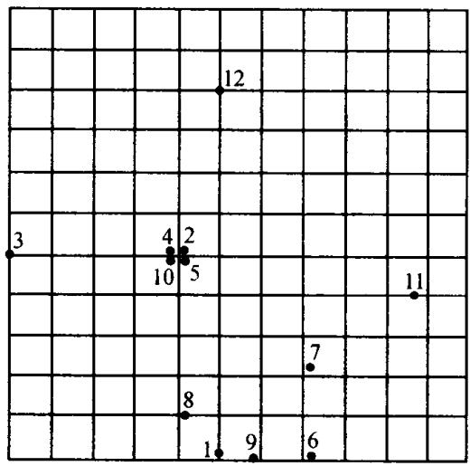

<details>
<summary>text_image</summary>

12
3
4 2
10 5
11
8
7
1 9 6
</details>

图1

对于所给的例子,用此法一眼就能看出最大可利用的旧井数为4,它们分别是: $P_{2}$ , $P_{4}$ , $P_{5}$ , $P_{10}$ .

## 模式 V 图上作业法

先按照模式IV的方法构造上述图形,然后用单位为0.1的正方形透明网格状矩形尺(要求与上述图形单位一致)在图上进行平移,可以直观看出哪个正方形内包含的点最多,则相应的点数即为满足条件的最多点数.

对于所给的例子,用此法能很快地得出最大可利用的旧井数为4,它们分别是: $P_{2}$ , $P_{4}$ , $P_{5}$ , $P_{10}$ .

## 3.2 问题(2)的求解

设 $N$ 是平面中的一个正方形网格. $X$ 是 $N$ 中的一个结点. 那么, 显然 $N$ 中的网线与给定坐标系横轴正向的夹角有 2 个, 设为 $\theta_{1}$ 与 $\theta_{2}$ (以横轴正向转到网线为准). 令 $\theta = \min (\theta_{1},\theta_{2})$ , 称 $\theta$ 为网格 $N$ 与坐标系的夹角. 显然, $0\leqslant \theta < \frac{\pi}{2}$ , 该网格 $N$ 由结点 $X$ 与 $\theta$ 完全确定, 记为 $N_{X}(\theta)$ . 可见问题(1)中的 $N_{X}$ 是 $N_{X}(\theta)$ 当 $\theta = 0$ 时的特例, 即 $N_{X} = N_{X}(0)$ . 对于一个网格 $N_{X_i}(\theta)$ , 用 $g(N_{X_i}(\theta))$ 表示所能利用的旧井点数, 则问题(2)的数学模型为:

$$
\max g (N _ {X} (\theta))
$$

$$
\mathrm{s.t.} \quad \max \{| x |, | y | \} \leqslant 0. 5 \quad \text {且} \quad 0 \leqslant \theta <   \frac {\pi}{2}.
$$

其中， $X = (x,y)$

类似于问题(1)，我们利用计算机进行数值求解.

模式 I Q 全面搜索

为方便叙述,先给出必要的定义和结论.

定义 2 设 $Q_{1}=(x_{1},y_{1}),Q_{2}=(x_{2},y_{2})$

$$
D _ {x} = \min \left\{x _ {1} - x _ {2} - \left[ x _ {1} - x _ {2} \right], 1 + \left[ x _ {1} - x _ {2} \right] - (x _ {1} - x _ {2}) \right\}
$$

$$
D _ {y} = \min \left\{y _ {1} - y _ {2} - \left[ y _ {1} - y _ {2} \right], 1 + \left[ y _ {1} - y _ {2} \right] - (y _ {1} - y _ {2}) \right\}
$$

$$
\rho (Q _ {1}, Q _ {2}) = \sqrt {D _ {x} ^ {2} + D _ {y} ^ {2}}
$$

则称 $\rho(Q_1, Q_2)$ 为 $Q_1$ 与 $Q_2$ 的欧氏网格距离。特别用 $\rho(Q)$ 表示 $Q$ 点与原点的欧氏网格距离。

由此定义立即可知:若构造网格 $N_{Q}$ ，则 $\rho(P_{i}, Q)$ 表示旧井位 $P_{i}$ 与网格 $N_{Q}$ 中某个结点的欧氏距离，故 $\rho(P_{i}, Q)$ 也可称为 $P_{i}$ 与网格 $N_{Q}$ 的欧氏距离.

易知:欧氏网格距离有下述性质与定理.

性质3 $\rho (Q_1,Q_2) = \rho (Q_2,Q_1)$

性质 4 $0 \leqslant \rho(Q_{1}, Q_{2}) \leqslant 0.5.$

定理3 设 $N_{Q}$ 为已知网格, $P_{i}$ 为旧井位的坐标, 则 $P_{i}$ 可以被利用 $\Leftrightarrow \rho(P_{i}, Q) \leqslant \varepsilon$ .

定理4 设 $P_{1}, P_{2}$ 为两个旧井位，则存在某个网格 $N$ ，使得 $P_{1}, P_{2}$ 可同时利用的充要条件是： $\rho(P_{1}, P_{2}) \leqslant 2\varepsilon$ 。

由定理 4 可知, $g(N_{X})$ 即为 $P_{1},\cdots,P_{n}$ 中与 X 的欧氏网格距离 $\leqslant\varepsilon$ 的个数.

编程思想如下：

首先,取网格的铅垂网线,水平网线与所给坐标系的纵横轴平行,再用类似问题(1)所提供的方法平移求解.然后将坐标系统原点旋转 $\alpha$ 角度,计算井位 $P_{i}$ 在新坐标系下的坐标,记为 $P_{i}(\alpha) = (a_{i}(\alpha), b_{i}(\alpha))$ .对旋转后的新坐标系中的井位新坐标 $P_{i}(\alpha)$ ,再按问题(1)所提供的方法求解.如此继续下去,直至转过角度 $\geqslant \frac{\pi}{2}$ 为止.将所有这些旋转所得的数值进行比较,最大的数即为可利用的最大的旧井数目.

为减少误差, 步长(即旋转角度) $\alpha$ 必须适当的小. 令 $R = \max_{1 \leqslant i \leqslant n} \rho(P_i)$ , $\alpha$ 的选取应使最大弧长 $\leqslant 0.01$ , 即 $R\alpha \leqslant 0.01$ , 所以 $\alpha \leqslant \frac{0.01}{R}$ . 在所给例子中, $R \leqslant 10$ , 所以 $\alpha \leqslant 0.001$ . 为使旋转角度 $\geqslant \frac{\pi}{2}$ , 至少必须旋转 $\frac{\pi}{2\alpha} \approx 1570$ 次. 为保证精度, $\alpha$ 可取为 $\frac{1}{2000} \times \frac{\pi}{2}$ , 即需循环 4000 次, 则总循环数为 $4000 \times 100^2$ 次.

对于所给的例子,相应的程序清单见附录(略). 程序运算结果如下:

最大可利用旧井数为6,旧井点分别为: $P_{1},P_{6},P_{7},P_{8},P_{9},P_{11}$ .

模式Ⅱ 局部搜索

模式 I 是全面搜索,需循环 $4000 \times 100^{2}$ 次. 事实上只须小范围搜索即可.

方法是:先取 $Q = P_{i}, (i = 1, \cdots, n)$ ，按模式 I 所给方法计算 $g(N_{Q})$ ，然后让 Q 在以 $P_{i}$ 为中心，半径为 $\varepsilon$ 的圆内遍历（步长为 0.01）计算 $g(N_{Q})$ ，共有 $11^{2}$ 个 $g(N_{Q})$ 。对于所给例子, 最多需计算 $11^{2} \times 12$ 个 $g(N_{Q})$ (实际上, 有很多 $Q$ 是相同的, 故不须重复计算). 然后将坐标系绕原点旋转 $\alpha = \frac{1}{2000} \times \frac{\pi}{2}$ 角度, 计算井位 $P_{i}$ 在新坐标系下的坐标, 记为 $P_{i}(\alpha) = (a_{i}(\alpha), b_{i}(\alpha))$ , 对旋转后的新坐标系中井位的新坐标 $P_{i}(\alpha)$ , 再按问题(1)所提供的方法求解. 如此继续下去, 直至转过角度 $\geqslant \frac{\pi}{2}$ 为止. 将所有这些旋转所得的数值进行比较, 最多需

计算 $4000 \times 11^{2} \times 12$ 个 $g(N_{Q})$ (实际上, 有很多 $N_{Q}$ 是相同的, 故不须重复计算), 然后取一个最大的即可. 最大的数即为可利用的最大的旧井数目.

对于所给的例子,相应的程序清单见附录(略).程序运算结果如下(参见附图2):最大可利用旧井数为6,旧井点分别为: $P_{1},P_{6},P_{7},P_{8},P_{9},P_{11}$ .

## 3.3 问题(3)的求解

## 1. 假定网格的横向和纵向是固定的

情况一:选定两点距离为网格距离.

定理 5 设坐标为 $(a_{i}, b_{i})$ 的点 $P_{i}, i = 1, \cdots, n$ ，表示已有的 n 个旧井位，则

$$
P _ {1}, \dots , P _ {n} \text {全部可被利用} \Leftrightarrow \max _ {1 \leqslant i, j \leqslant n} D (P _ {i}, P _ {j}) \leqslant 2 \varepsilon
$$

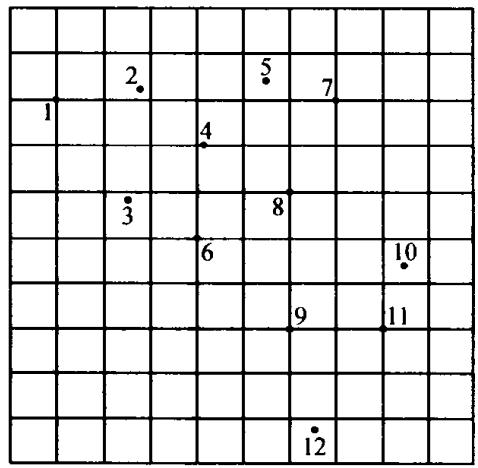

<details>
<summary>text_image</summary>

2
1
3
5
4
8
6
9
10
11
12
</details>

图2

证明 先证充分性, 把所有点都移到以 $P_{1}$ 为中心的边长为 $4\varepsilon$ 的正方形内, 方法如下:

令 $P_{i}^{\prime} = (a_{i}^{\prime}, b_{i}^{\prime})$ ，其中

$$
a _ {i} ^ {\prime} = \min \left\{a _ {i} - \left[ a _ {1} \right], 1 + \left[ a _ {i} \right] - a _ {1} \right\} \quad b _ {i} ^ {\prime} = \min \left\{b _ {i} - \left[ b _ {1} \right], 1 + \left[ b _ {i} \right] - b _ {1} \right\}
$$

这是因为 $D(P_{i}^{'}, P_{1}) = \max\{|a_{i}^{'} - a_{1}|, |b_{i}^{'} - b_{1}|\}$ $(i = 2, \cdots, n)$

再令 $P_{1}^{\prime} = P_{1}$ ，则存在 $i_0\in \{1,\dots ,n\} ,j_0\in \{1,\dots ,n\}$ ，使得

$$
a _ {i _ {0}} = \min _ {1 \leqslant i \leqslant n} \left\{a _ {i} ^ {\prime} \right\}, b _ {j _ {0}} = \min _ {1 \leqslant i \leqslant n} \left\{b _ {i} ^ {\prime} \right\}
$$

取点 $Q=(a_{i_{0}}+\varepsilon,b_{j_{0}}+\varepsilon)$ 构造网格 $N_{Q}$ ，则 $D(P_{i},Q)\leqslant\varepsilon(i=2,\cdots,n)$ ，由定理 1, $P_{1}$ ，…， $P_{n}$ 全部可被利用；否则，存在 i, $D(P_{i},Q)=D(P_{i}^{'},Q)>\varepsilon$ ，则

$$
a _ {i} ^ {'} - (  a _ {i _ {0}} + \varepsilon  ) > \varepsilon \text {或} b _ {i} ^ {'} - (  b _ {j _ {0}} + \varepsilon  ) > \varepsilon
$$

不妨设 $a_{i}^{'} - (a_{i_{0}} + \varepsilon) > \varepsilon$ ，那么 $a_{i}^{'} - a_{i_{0}} > 2\varepsilon$ ，因此 $D(P_{i}^{'} , P_{i_{0}}^{'} ) = D(P_{i}, P_{i_{0}}) > 2\varepsilon$ ，与题设矛盾.

再证必要性,由定理2立即可得.

算法容易实施,略去.

## 情况二:选定两点距离为欧氏距离

首先，任意两点之间的欧氏网格距离不能大于 $2\varepsilon$ ，即若 $\max_{1\leqslant i,j\leqslant n}\rho (P_i,P_j) > 2\varepsilon$ ，则由定理 $2,P_1,\dots ,P_n$ 不可能全部被利用.

显然， $n$ 个点 $P_{1}, P_{2}, \cdots P_{n}$ 全部可被利用的充要条件是平面上存在一点 $P$ ，满足 $\max_{1 \leqslant i \leqslant n} \rho(P, P_{i}) \leqslant \varepsilon$ 。为了缩小搜索范围，减小运算量，我们给出下面的局部搜索定理。

定理 6 $P_{1}, \cdots, P_{n}$ 全部可被利用的充分必要条件是：

$$
\exists P \in \bigcup_ {j = 1} ^ {n} \{P \mid \rho (P, P _ {j}) \leqslant \varepsilon \} \text {使得} \max _ {1 \leqslant i \leqslant n} \rho (P, P _ {i}) \leqslant \varepsilon .
$$

证明 充分性

设条件成立, 则 $\exists j, P$ , 满足 $\rho(P, P_{j}) \leqslant \varepsilon$ , $\max_{1 \leqslant i \leqslant n} \rho(P, P_{i}) \leqslant \varepsilon$ . 取定网格 $N_{P}$ , 由定理 3, $P_{1}, P_{2}, \cdots, P_{n}$ 可以被利用.

必要性

设存在某网格 $N_{P}$ ，使得 $P_{1}, P_{2}, \cdots, P_{n}$ 都是可被利用，则由定理 3

$$
\rho (P, P _ {i}) \leqslant \varepsilon , i = 1, 2, \dots , n.
$$

$$
\therefore \quad P \in \bigcup_ {j = 1} ^ {n} \{P \mid \rho (P, P _ {j}) \leqslant \varepsilon \} \text {且} \max _ {1 \leqslant i \leqslant n} \rho (P, P _ {i}) \leqslant \varepsilon .
$$

编程思想如下：

分别取 $j=1,2,\cdots,n$ ，让 P 在以 $P_{j}$ 为圆心， $\varepsilon$ 为半径的圆内变动。选取合适的步长，编程计算 $\rho(P,P_{1}),\cdots,\rho(P,P_{n})$ 。若能搜索到 P 点，使

$$
\max _ {1 \leqslant i \leqslant n} \rho (P, P _ {i}) \leqslant \varepsilon
$$

说明 $P_{1}, P_{2}, \cdots, P_{n}$ 都可以被利用, 结束程序; 否则继续搜索.

## 2. 网格的横向和纵向不固定(可以旋转)

首先,取网格的铅垂网线,水平网线与所给坐标系的纵横轴平行,按上文所提供的方法进行判别和编程.

其次，将坐标系绕原点旋转 $\alpha$ 角度（为保证精度， $\alpha$ 的选取必须适当的小），计算井位 $P_{i}$ 在新坐标系下的坐标。记为 $P_{i}(\alpha) = (a_{i}(\alpha), b_{i}(\alpha))$ ，对旋转后的新坐标系中井位新坐标 $P_{i}(\alpha)$ ，再继续按上文所提供的方法求解。如此继续下去，直到旋过角度 $\geqslant \frac{\pi}{2}$ 为止。

如果在上述搜索过程中,已得知 $P_{1},\cdots,P_{n}$ 可被全部利用,即可终止程序,打印结果.

## 4 模型分析及推广应用

对于直接搜索模型,作为一种最直接、最简单的模型,它能够保证在不遗漏一个点的情况下找到解.但是,此模型是建立在全面搜索的基础上,丝毫不考虑可简化的因素,因而具有计算量大,搜索速度慢等缺点,不利于推广应用.

而对于优化搜索模型,它在充分考虑有利条件的同时,可避免某些不利因素,从而能够在比较短的时间内寻找到目标点,完成任务.这对于其它类似问题也有很好的参考价值.比如说在考虑已有交通枢纽城镇的情况下,如何安排某地区交通建设,使投资比较少,但达到改善各地交通及城市建设规划的目的,以及在充分利用已有某些有利条件下,再如何人为增加有利因素,以达到最优化效果等,本优化模型都有一定的借鉴作用.当然,如何较快的找到优化模型,就成为其进一步推广应用的重要制约因素.

## 参考文献

[1] 姜启源、数学模型．北京：高等教育出版社，1987.  
[2] 齐欢. 数学模型方法. 武汉: 华中理工大学出版社, 1996, 6.  
[3] 施久玉等. 数学建模. 哈尔滨: 哈尔滨工程大学出版社, 1996, 5.  
[4] 张莹. 运筹学基础. 北京: 清华大学出版社, 1995, 4.  
[5] 王树禾. 图论及其算法. 北京: 中国科学技术出版社, 1990, 10.

# “钻井布局”问题评述

郑州大学

林诒勋

## 1 问题来源

80年代一位地质工程师在从事一项研究中与笔者讨论过此题的原型,当时研究的情况比较复杂,如网格的纵横间隔可以选择,但不能太小,转角也有限制,尽可能利用全部旧井.本题就是从中提取出来的一个形式比较简明的问题.后来又经过组委会几位同志的精心设计,才得到专科组的两小题和本科组的三小题(赛题参见前面的介绍).

数值例子的数据不是真实的.由于此题原先是入选为 $D$ 题(专科组)的,希望计算上容易些,故意使某些点的坐标的小数部分比较密集.这样就造成了一个缺陷:数据对计算方案的不敏感性.

笔者在评阅工作过程中,受到一些优秀答卷的启发,并听取了评阅专家的讨论意见,对这道赛题的认识有很大的提高.现在谈一些看法,供大家参考.

## 2 基本概念

解此题不需要专门的知识,方法是初等的,但一些基本概念要清楚.一些好的答卷都是由于把握住这些概念;而大部分答卷中的错误都是源于这些方面的疏忽.

## (1)取整运算

研究网格点与其它点的关系必然要用取整运算.常用的有如下两种：

$[x]=$ 不大于 x 的最大整数 (x 的整数部分),

$r(x)=[x+\frac{1}{2}](x$ 按四舍五入规则的取整 $)$ .

前者相当于计算机中的函数 INT, 后者相当于函数 ROUND(对非负数而言). 此外, 有时还会用到上取整(ceiling)和下取整(floor). 这里 $[x]$ 相当于下取整. 我们可以分别表示按下取整及四舍五入取整的小数部分为

$$
\{x \} = x - [ x ], \quad f (x) = | x - r (x) |.
$$

用这些记号来表示一个点与格点的距离是方便的.

## (2)距离概念

本题考虑两种距离. 给定两点 $P(a, b)$ 及 $X(x, y)$ ，第一种距离是所谓 $l_{\infty}$ 模距离：

$$
d (P, X) = \max \{| x - a |, | y - b | \},
$$

在平面上通常称为纵横距离.第二种距离是欧氏距离,即 $l_{2}$ 模距离:

$$
\rho (P, X) = \sqrt {(x - a) ^ {2} + (y - b) ^ {2}},
$$

在平面上也称直线距离.

大部分答卷都通过对坐标“去整运算”(去掉整数部分)，将 $n$ 个点 $P_{i}$ 变换到单位正方形

$$
Q = [ 0, 1; 0, 1 ] = \{(x, y) \mid 0 \leqslant x \leqslant 1, 0 \leqslant y \leqslant 1 \}
$$

内.一个关键之处是上述变换使距离概念发生了变化.事实上,由于函数 $\{x\}$ 的周期性,正方形 $Q$ 的左边界与右边界是粘合的, 上边界与下边界是粘合的. 因此, 严格地说, $Q$ 不再是一个平面区域, 而是一个环面 (象汽车轮胎一样的曲面), 其中的距离发生了变化: 在 $Q$ 中两点 $\overline{P}_i(\bar{a}_i, \bar{b}_i)$ 及 $\overline{P}_j(\bar{a}_j, \bar{b}_j)$ 的纵横距离变为

$$
\begin{array}{l} d ^ {\prime} \left(\bar {P} _ {i}, \bar {P} _ {j}\right) = \max \left\{\min \left\{\mid a _ {i} - a _ {j} \mid , 1 - \mid a _ {i} - a _ {j} \mid \right. \right\}, \\ \min \left\{\mid \bar {b} _ {i} - \bar {b} _ {j} \mid , 1 - \mid b _ {i} - \bar {b} _ {j} \mid \right\} \\ = \max \left\{f \left(\mid \bar {a} _ {i} - \bar {a} _ {j} \mid\right), f \left(\mid \bar {b} _ {i} - \bar {b} _ {j} \mid\right) \right\}, \\ \end{array}
$$

这里 $\bar{a}_i = \{a_i\}, \bar{b}_i = \{b_i\}$ .

我们并不强求学生的答卷明确写出这种变换后的距离公式,但要意识到这种距离的变化.好的答卷都对此做了处理.例如,将正方形 Q 向外扩展一定程度,将粘合的边界摊开,然后运用原来平面上的距离;或者当要求 $d'(\bar{P}_{i},\bar{P}_{j})\leqslant2\varepsilon$ 时,等价地写出

$$
\left\{ \begin{array}{l l} {| \bar {a} _ {i} - \bar {a} _ {j} | \leqslant 2 \varepsilon \text {或} | \bar {a} _ {i} - \bar {a} _ {j} | \geqslant 1 - 2 \varepsilon ,} \\ {| \bar {b} _ {i} - \bar {b} _ {j} | \leqslant 2 \varepsilon \text {或} | \bar {b} _ {i} - \bar {b} _ {j} | \geqslant 1 - 2 \varepsilon .} \end{array} \right.
$$

而那些不考虑距离变化的答卷就必然导出错误的结论.

## (3)关于“同时被利用”

对集合上的一种性质来说,如集 A 具有这种性质能推出 A 的任意子集也具有,数学上便称它为“独立性”.这种独立性十分普遍,例如:(a)一组向量线性无关,(b)图中一组边的导出子图不含圈,(c)图中一组边(顶点)构成匹配(独立集),(d)一组随机事件相互独立.在我们的问题中,一组旧井可以同时被利用,则它的一部分亦然;所以“同时被利用”也是一种独立性.在这种意义上,我们的问题实质上是一类最大独立集问题.现在要问:一个集合中任意两个元素组成的子集是独立的(两两独立)能否推出整个集合是独立的?在上述例子(a)\~(d)中,除(c)之外,回答都是否定的(例如,三个向量中任意二者线性无关不能推出三者线性无关).对目前的问题来说,我们却有如下有趣的结论:

(i)在坐标轴方向固定的情形,对纵横距离而言,一组旧井可以同时被利用当且仅当其中任意两口井可以同时被利用.  
(ii)在坐标轴方向固定的情形,对欧氏距离而言,一组旧井可以同时被利用当且仅当其中任意三口井可以同时被利用.

在坐标轴方向不固定的情形,难以得到此类结论.

根据结论(i),不少同学利用两口井同时被利用的条件建立一个二元关系,进而将问题转化为图论中的最大团问题,这是对的,而且对问题作了很好的刻画.但是,对欧氏距离,甚至坐标轴方向不固定的情形也这样做就错了.在这一点上犯错误的答卷相当多.根据结论(ii),用覆盖方法去解决问题就容易实现了(详见5).

## 3 数学模型

关于数学模型的写法,较多答卷采用语言描述方式,实际上可以写得更确切些.不妨设 $a_{i},b_{i}\geqslant0(i=1,2,\cdots,n)$ ,即所有井点 $P_{i}$ 处在原坐标系xOy的第一象限.在网格N上,取第一象限中离原点O最近的结点为 $(s,t)$ ,其中 $0\leqslant s<1,0\leqslant t<1$ .这个结点看作是网格N上一个参照点或新坐标系的原点,它可以在上述单位正方形Q内移动.于是N的任一结点可表为 $(s+p,t+q)$ ,其中 $p,q\in Z$ (这里Z表示整数集).对问题1)而言,当且仅当 $\varepsilon$ 邻域

$$
U _ {\varepsilon} (P _ {i}) = \{(x, y) \mid a _ {i} - \varepsilon \leqslant x \leqslant a _ {i} + \varepsilon , b _ {i} - \varepsilon \leqslant y \leqslant b _ {i} + \varepsilon \}
$$

中存在结点,即不等式组

$$
\left\{ \begin{array}{l} a _ {i} - \varepsilon \leqslant s + x _ {i} \leqslant a _ {i} + \varepsilon , \\ b _ {i} - \varepsilon \leqslant t + y _ {i} \leqslant b _ {i} + \varepsilon , \\ 0 \leqslant s, t <   1, \\ x _ {i}, y _ {i} \in Z \end{array} \right. \tag {1}
$$

有解时, $P_{i}$ 是可利用的.对给定的 $(s,t)$ ,(1)有解的充要条件是

$$
\left\{ \begin{array}{l} a _ {i} - \varepsilon - s \leqslant [ a _ {i} + \varepsilon - s ], \\ b _ {i} - \varepsilon - t \leqslant [ b _ {i} + \varepsilon - t ]. \end{array} \right. \tag {2}
$$

当 $P_{i}$ 可利用时记 $u_{i} = 1$ ，否则 $u_{i} = 0.$ 这样一来，问题1)归结为如下的最优化问题：

$$
\left\{ \begin{array}{l} \max \sum_ {i = 1} ^ {n} u _ {i}, \\ \text {s.t.} (a _ {i} - \varepsilon - s - [ a _ {i} + \varepsilon - s ]) u _ {i} \leqslant 0, \quad i = 1, \dots , n, \\ (b _ {i} - \varepsilon - t - [ b _ {i} + \varepsilon - t ]) u _ {i} \leqslant 0, \quad i = 1, \dots , n, \\ 0 \leqslant s, t <   1, \\ u _ {i} \in \{0, 1 \}, \quad i = 1, \dots , n. \end{array} \right.
$$

这是一个非线性的混合整数规划.

问题2)也可以写成数学规划的形式,但较复杂,我们换一种写法.为简单起见,假定坐标系经旋转 $\varphi\left(0\leqslant\varphi<\frac{\pi}{2}\right)$ 之后,点 $P_{i}$ 的坐标仍记为 $(a_{i},b_{i})$ .所以现在的 $a_{i}$ 及 $b_{i}$ 是 $\varphi$ 的函数(坐标变换式从略).在网格 $N$ 上,处于第一象限内而离原点最近的结点仍记为 $(s,t)$ .欧氏距离的 $\varepsilon$ 邻域为

$$
S _ {\varepsilon} (P _ {i}) = \{(x, y) \mid (x - a _ {i}) ^ {2} + (y - b _ {i}) ^ {2} \leqslant \varepsilon^ {2} \}.
$$

显然 $S_{\varepsilon}(P_i)\subset U_{\varepsilon}(P_i)$ .当(2)成立时，含于 $U_{\varepsilon}(P_{i})$ 中唯一的结点是

$$
(s + [ a _ {i} + \varepsilon - s ], t + [ b _ {i} + \varepsilon - t ]).
$$

因此， $P_{i}$ 是可利用的当且仅当

$$
\left\{ \begin{array}{l} a _ {i} - \varepsilon - s \leqslant [ a _ {i} + \varepsilon - s ], \\ b _ {i} - \varepsilon - t \leqslant [ b _ {i} + \varepsilon - t ], \\ (s + [ a _ {i} + \varepsilon - s ]) ^ {2} + (t + [ b _ {i} + \varepsilon - t ]) ^ {2} \leqslant \varepsilon^ {2}. \end{array} \right. \tag {3}
$$

这样一来,问题2)是如下的最优化问题:

$$
\max \sum_ {i = 1} ^ {n} u _ {i} (s, t),
$$

其中

$$
u _ {i} (s, t) = \left\{ \begin{array}{l l} 1, & \text {当(3)成立,} \\ 0, & \text {否,} \end{array} \right.
$$

$$
0 \leqslant s, t <   1.
$$

虽然问题1),2)的数学模型写起来有点麻烦,但设计参数至多只有三个 $(s,t,\varphi)$ ,所以在实际应用时是容易运用数值方法求解的.绝大部分答卷都能设计出遍历搜索算法,并算出数值例子的正确解答,不少答卷还给出加速搜索的算法及误差分析等.

关于问题3), 答卷中的做法各式各样, 但归纳起来有如下两种途径. 但不管哪种途径, 问题3) 是一个尚待深入研究的问题. 事实上, 问题3) 要求给出 $n$ 口旧井均可利用的判定条件, 一个不言而喻的要求是: 判定条件只能运用已知的 $n$ 个点的坐标, 并且检查条件成立与否是可以用有效算法来实现的. 我们只是在一些特殊情形达到了这一要求.

## 4 代数途径

首先考虑纵横距离,并假定坐标轴方向(转角 $\varphi$ )已给定, $P_{i}$ 的坐标为 $(a_{i},b_{i})$ .所谓代数途径,就是研究不等式组的整数解存在性问题.根据前一节的数学模型,n 口井同时被利用的充要条件是对 $i=1,2,\cdots,n$ 的不等式组(1)有解,即如下两个不等式组有解:

$$
\left\{ \begin{array}{l} a _ {i} - \varepsilon \leqslant s + x _ {i} \leqslant a _ {i} + \varepsilon , \quad i = 1, \dots , n, \\ x _ {i} \in Z, \quad i = 1, \dots , n, \quad 0 \leqslant s <   1, \end{array} \right. \tag {4}
$$

$$
\left\{ \begin{array}{l} b _ {i} - \varepsilon \leqslant t + y _ {i} \leqslant b _ {i} + \varepsilon , \quad i = 1, \dots , n, \\ y _ {i} \in Z, \quad i = 1, \dots , n, \quad 0 \leqslant t <   1. \end{array} \right. \tag {5}
$$

它们的形式是一样的, 只要研究其中一组, 比如(4). 由于

$$
a _ {i} - \varepsilon - 1 <   a _ {i} - \varepsilon - s \leqslant x _ {i} \leqslant a _ {i} + \varepsilon - s \leqslant a _ {i} + \varepsilon ,
$$

所以

$$
[ a _ {i} - \varepsilon ] \leqslant x _ {i} \leqslant [ a _ {i} + \varepsilon ].
$$

注意: 左边的不等式是由 $a_{i}-\varepsilon-1<x_{i}$ 及 $x_{i}$ 为整数得到的. 记 $\alpha_{i}=[a_{i}-\varepsilon]$ , $\beta_{i}=[a_{i}+\varepsilon]$ . 根据题目的实际意义, 可以约定 $\varepsilon<\frac{1}{4}$ . 由此可知 $0\leqslant\beta_{i}-\alpha_{i}\leqslant1$ . 所以(4)的整变量 $x_{i}$ 只有两个可能值 $\alpha_{i}$ 及 $\beta_{i}$ .

命题 当且仅当如下两条件之一成立时,不等式组(4)有解:

(i) $\max_{1\leqslant i\leqslant n}(a_i - \varepsilon -\alpha_i)\leqslant \min_{1\leqslant i\leqslant n}(a_i + \varepsilon -\alpha_i),$  
(ii) $\max_{1\leqslant i\leqslant n}(a_i - \varepsilon -\beta_i)\leqslant \min_{1\leqslant i\leqslant n}(a_i + \varepsilon -\beta_i)$ .

证明 当(i)成立时, 取 s 满足 $\max(a_{i}-\varepsilon-\alpha_{i})\leqslant s\leqslant\min(a_{i}+\varepsilon-\alpha_{i}), x_{i}=\alpha_{i}(i=1,\cdots,n)$ ; 当(ii)成立时, 取 s 满足 $\max(a_{i}-\varepsilon-\beta_{i})\leqslant s\leqslant\min(a_{i}+\varepsilon-\beta_{i}), x_{i}=\beta_{i}(i=1,\cdots,n)$ , 便得到(4)的解.

反之，设(4)有解 $x_{1},\dots ,x_{n}$ 及 $s$ .若 $s\geqslant \frac{1}{2}$ ，则可断言 $x_{i} = \alpha_{i}(i = 1,\dots ,n)$ .若不然，则 $x_{i} = \beta_{i} = \alpha_{i} + 1$ ，从而

$$
\frac {1}{2} + a _ {i} - \varepsilon <   \frac {1}{2} + [ a _ {i} - \varepsilon ] + 1 \leqslant s + x _ {i} \leqslant a _ {i} + \varepsilon ,
$$

于是 $\varepsilon >\frac{1}{4}$ ，与假设矛盾.这样一来，

$$
a _ {i} - \varepsilon - \alpha_ {i} \leqslant s \leqslant a _ {i} + \varepsilon - \alpha_ {i}, \quad i = 1, \dots , n,
$$

故条件(i)成立. 同理, 若 $s \leqslant \frac{1}{2}$ , 则可断言 $x_{i} = \beta_{i}$ , 从而(ii)成立. 证毕.

结合此命题关于(4)及(5)的结论,即得

定理 1 设坐标轴方向给定, 对纵横距离而言, n 口旧井可同时被利用的充分必要条件

为

$$
\max _ {1 \leqslant i \leqslant n} (a _ {i} - \varepsilon - [ a _ {i} - \varepsilon ]) \leqslant \min _ {1 \leqslant i \leqslant n} (a _ {i} + \varepsilon - [ a _ {i} - \varepsilon ])
$$

或

$$
\max _ {1 \leqslant i \leqslant n} (a _ {i} - \varepsilon - [ a _ {i} + \varepsilon ]) \leqslant \min _ {1 \leqslant i \leqslant n} (a _ {i} + \varepsilon - [ a _ {i} + \varepsilon ]),
$$

$$
\max _ {1 \leqslant i \leqslant n} \left(b _ {i} - \varepsilon - [ b _ {i} - \varepsilon ]\right) \leqslant \min _ {1 \leqslant i \leqslant n} \left(b _ {i} + \varepsilon - [ b _ {i} - \varepsilon ]\right)
$$

或

$$
\max _ {1 \leqslant i \leqslant n} \left(b _ {i} - \varepsilon - \left[ b _ {i} + \varepsilon \right]\right) \leqslant \min _ {1 \leqslant i \leqslant n} \left(b _ {i} + \varepsilon - \left[ b _ {i} + \varepsilon \right]\right).
$$

注意:验证此判定条件的计算复杂性为 $O(n)$ . 这是因为计算每一个 max 或 min 的比较次数都是 n-1.

这种途径,对欧氏距离及旋转角度 $\varphi$ 变动的情形,未能得到简洁的判定条件.

## 5 几何途径

首先假定坐标轴方向是固定的，并考虑纵横距离。如前所述，大部分答卷都运用几何直观，将点 $P_{i}(a_{i},b_{i})$ 变换为 $\bar{P}_i(\bar{a}_i,\bar{b}_i)$ ，其中 $\bar{a}_i = \{a_i\} = a_i - [a_i],\bar{b}_i = \{b_i\} = b_i - [b_i],i = 1,\dots ,n$ 。这就使 $\bar{P}_1,\bar{P}_2,\dots ,\bar{P}_n$ 落入单位正方形 $Q = [0,1;0,1]$ 之中。同时，一个由参照点 $(s,t)$ 确定的网格的所有结点都变换到 $Q$ 中同一个点 $(s,t)$ 。对这样的变换来说，点 $P_{i}$ 与其最接近的结点的距离等于 $\bar{P}_i$ 与 $(s,t)$ 的距离。因此， $P_1,P_2,\dots ,P_n$ 可同时被利用当且仅当 $\bar{P}_1,\bar{P}_2,\dots ,\bar{P}_n$ 可同时被利用。

定理2 设坐标轴方向给定. 对纵横距离而言, $n$ 口旧井可同时被利用的充分必要条件为: 对任意 $i, j (1 \leqslant i, j \leqslant n)$ 均有

$$
\left\{ \begin{array}{l l} {|   \bar {a} _ {i} - \bar {a} _ {j} | \leqslant 2 \varepsilon \text {或} |   \bar {a} _ {i} - \bar {a} _ {j} | \geqslant 1 - 2 \varepsilon} \\ {|   \bar {b} _ {i} - \bar {b} _ {j} | \leqslant 2 \varepsilon \text {或} |   \bar {b} _ {i} - \bar {b} _ {j} | \geqslant 1 - 2 \varepsilon .} \end{array} \right.
$$

证明 根据2中关于 $Q$ 中的距离概念, 此条件等价于 $d'(\bar{P}_i, \bar{P}_j) \leqslant 2\varepsilon$ . 若 $n$ 口井同时被利用, 则存在参照点 $X(s, t) \in Q$ 使 $d'(\bar{P}_i, X) \leqslant \varepsilon (i = 1, \cdots, n)$ . 故对任意 $i$ 和 $j$ , $d'(\bar{P}_i, \bar{P}_j) \leqslant d'(\bar{P}_i, X) + d'(\bar{P}_j, X) \leqslant 2\varepsilon$ . 反之, 若对任意 $i$ 和 $j$ , $d'(\bar{P}_i, \bar{P}_j) \leqslant 2\varepsilon$ , 则可取距离最大的两点 $\bar{P}_{i_0}, \bar{P}_{j_0}$ , 作包含它们且各边平行于坐标轴的最小正方形 $K$ . 易证: $K$ 覆盖所有点 $\bar{P}_i (i = 1, \cdots, n)$ , 且 $K$ 的边长 $\leqslant 2\varepsilon$ . 取 $K$ 的中心为参照点 $X$ , 则 $d'(\bar{P}_i, X) \leqslant \varepsilon (i = 1, \cdots, n)$ , 从而 $n$ 口井同时被利用. 证毕.

容易看出, 定理 2 的条件与定理 1 的条件是等价的. 但是, 验证定理 2 判定条件的计算复杂性是 $O(n^{2})$ , 因为其中有 $n(n - 1)$ 个不等式. 定理 2 有多种等价的写法, 例如, 运用诸点原来的坐标表示:

$$
\max \{f (| a _ {i} - a _ {j} |), f (| b _ {i} - b _ {j} |) \} \leqslant 2 \varepsilon ,
$$

其中 $f(x) = |x - r(x)|, r(x) = [x + \frac{1}{2}]$ （见2中的取整运算）.

其次, 讨论欧氏距离, 并假定坐标轴方向(转角 $\varphi$ ) 已给定. 如前, 通过取整运算, 将诸点变换到正方形 $Q$ 内. 注意到环面 $Q$ 的周期性, $Q$ 中两点的直线距离也发生了变化 (特别对那些接近 $Q$ 的边界的点). 为避免这种周期性的影响, 许多答卷都将 $Q$ 的边界向外扩展, 并将接近边界的点变为两个或三个点 (新点称为镜像点). 这样, 两点间的距离就变成一点及其镜像点与另一点及其镜象点之间的最短距离. 下面的“切补法”也是可行的. 首先将 $Q = [0,$

1;0,1]分成三部分：

$$
A = [ 0, \frac {1}{4}; 0, 1 ], B = [ \frac {1}{4}, \frac {3}{4}; 0, 1 ], C = [ \frac {3}{4}, 1; 0, 1 ].
$$

若 $A, C$ 内均有井点，则 $B$ 内不可能有井点（否则 $B$ 内井点到 $A \cup C$ 内井点的最大距离 $>\frac{1}{2} > 2\varepsilon$ ，它们不可能同时被利用，这种情形可以排除）。于是可以把区域 $A$ 切补到 $[1, 1 + \frac{1}{4}; 0, 1]$ 的位置，得到正方形 $Q'$ 。同理可对 $Q'$ 作纵向的处理，得到正方形 $Q''$ 。这样就可以在 $Q''$ 内直接运用欧氏距离了。

我们仍不妨假定 $n$ 个井点分布于单位正方形 $Q$ 中. 从几何上说, $n$ 个井点同时被利用就是存在一个半径为 $\varepsilon$ 的圆域覆盖住这 $n$ 个点, 其圆心就是网格 $N$ 的参照点 $(s, t)$ . 下面是一个判定条件.

定理3 平面上 $n$ 个点可以被一个半径为 $\varepsilon$ 的圆域所覆盖，当且仅当如下两条件成立：

(i) 任意两点距离 $\leqslant2\varepsilon$ ;

(ii) 任意形成锐角三角形的三点的外接圆半径 $\leqslant \varepsilon$ .

证明 必要性显然. 充分性实质上是证明这样一个对偶命题: 包含 $n$ 个点的圆域半径的最小值等于任意“三点确定的圆域”的半径的最大值. 这里, 所谓三点确定的圆域是指包含它们的最小圆域, 即当三点构成锐角三角形时, 它就是外接圆, 否则就是以斜边为直径的圆. 我们把其中以两点联线为直径的圆称为第一类圆 (满足条件(i)), 锐角三角形的外接圆称为第二类圆 (满足条件(ii)). 根据条件(i) 和(ii), 这些圆的半径的最大值 $r \leqslant \varepsilon$ . 现在作覆盖 $n$ 个给定点的最小圆域, 设其圆周为 $C$ , 半径为 $r^*$ . 由覆盖性知 $r^* \geqslant r$ . 由最小性知, $C$ 上至少有两个给定点. 若恰有两个, 则 $C$ 为第一类圆, 从而 $r^* \leqslant r$ . 下设 $C$ 上的给定点为 $P_1, P_2, \dots, P_t (t \geqslant 3)$ . 在 $C$ 上取出包含这 $t$ 个点的最小圆弧 $A$ . 分如下三种情形:

(a) 若 $A$ 小于半圆, 则可以过 $A$ 的两端点作出半径小于 $r^*$ 的圆域包含 $n$ 个给定点, 与 $C$ 的最小性矛盾.  
(b) 若 $A$ 恰为半圆, 则 $C$ 是以 $A$ 的两个端点联线为直径的圆, 即第一类圆, 故 $r^{*} \leqslant r$ .  
(c) 若 A 大于半圆, 则在 $P_{1}, P_{2}, \cdots, P_{t}$ 中可找到三点构成锐角三角形, 从而 C 是第二类圆, 故 $r^{*} \leqslant r$ .

综上得到 $r^* = r \leqslant \varepsilon$ . 证毕.

推论 设坐标轴方向给定. 对欧氏距离而言, $n$ 个井点可同时被利用的充要条件是任意三点可同时被利用.

至于如何检验定理3的条件,可以先作出包含这n个点的最小凸多边形(凸包),然后在它的顶点中找距离最大的两点和“最分散”的三点.如用穷举法,至多求 $O(n^{3})$ 个外接圆半径.

以上是关于坐标轴方向给定的一些结果. 对于坐标轴方向不给定, 即转角 $\varphi$ 未知的情形, 不少答卷作了不同程度的探索. 其中分析得最为深入的结果可参见本期上发表的优秀论文.

## 6 进一步研究的问题

通过这一道竞赛题目,开阔了思路,引出了许多值得研究的问题.

(1) 对问题 3), 目前只就坐标轴方向已给定的情形得到较简明且易于实现的判定条件. 坐标轴方向不定 (转角 $\varphi$ 未知) 的情形较难, 涉及较多关于整点分布的性质, 值得深入研究.  
(2)关于问题1)中数值解法的搜索步长选择,不少答卷进行了讨论.由于例子中所有数据只有两位小数,以0.01为步长一定可以搜索到最优解,不会漏掉.但对问题2),要对角度 $\varphi$ 进行搜索 $(0\leqslant\varphi<\frac{\pi}{2})$ ,步长和搜索点都是有理数(以 $\frac{\pi}{2}$ 为一单位来看).如果最优的 $\varphi$ 为无理数,会不会搜索不到最优解呢?  
(3)有些答卷将问题1)转化为一个组合问题——求一种特殊图的最大团.虽然求一般图的最大团是NP完全问题,但对此题构造的特殊图,求最大团未必是难题.如果能得出好的纯组合算法是很有意义的.  
(4)在几何方法中,根据定理3的条件找覆盖n个点的最小圆域,能否找到更有效的算法?  
(5)可以考虑更多的距离概念,如常用的 $l_{1}$ 模距离(rectilinear 距离).  
(6)在实际问题中,网格 N 的格子可以不是单位正方形,而是边长有一定限制的矩形.应如何推广我们的模型.

钻井布局问题是一类较复杂的选址(Location)问题,不仅要选择网格参照点的位置 $(s,t)$ ,而且要选择倾斜角 $\varphi$ .对它的深入研究必将对选址理论的发展产生影响.

确实,数学在科学中的一个关键作用就是创建能容许人们对事实上是远为混乱的东西形成概念的理想化。

Nancy Kopell, We Got Rhythm: Dynamical Systems of the Nervous System, Notices of the AMS, v. 47(2000), no. 1, 6 - 16.

## 17. 煤矸石堆积(大专组)(CUMCM 1999 年 C 题)

煤矿采煤时,会产出无用废料——煤矸石.在平原地区,煤矿不得不征用土地堆放矸石.通常矸石的堆积方法是:

架设一段与地面角度约为 $\beta=25^{\circ}$ 的直线形上升轨道(角度过大, 运矸车无法装满), 用在轨道上行驶的运矸车将矸石运到轨道顶端后向两侧倾倒, 待矸石堆高后, 再借助矸石堆延长轨道, 这样逐渐堆起如下图所示的一座矸石山来.

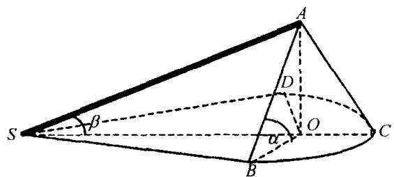

<details>
<summary>text_image</summary>

A
D
β
O
α
B
C
S
</details>

现给出下列数据：

矸石自然堆放安息角(矸石自然堆积稳定后,其坡面与地面形成的夹角) $\alpha\leqslant55^{\circ}$ ;

矸石容重(碎矸石单位体积的重量)约2吨/米 $^{3}$ ;

运矸车所需电费为 0.50 元/度(不变);

运矸车机械效率(只考虑堆积坡道上的运输)初始值(在地平面上)约30%,坡道每延长10米,效率在原有基础上约下降2%;

土地征用费现值为8万元/亩,预计地价年涨幅约10%;

银行存、贷款利率均为 5%；

煤矿设计原煤产量为 300 万吨/年；

煤矿设计寿命为 20 年；

采矿出矸率(矸石占全部采出的百分比)一般为7%\~10%.

另外,为保护耕地,煤矿堆矸土地应比实际占地多征用10%.

现在煤矿设计中用于处理矸石的经费(只计征地费及堆积时运矸车用的电费)为100万元/年,这笔钱是否够用?试制订合理的年度征地计划,并对不同的出矸率预测处理矸石的最低费用.

(太原理工大学 贾晓峰提供)

# 煤矸石堆放的最低费用预测

钟小勇 段国辉 马雨东

(北京建筑工程学院, 北京 100044)

指导小组:代西武等

编者按 本文作者通过分析,首先得到征地费和电费都取决于矸石堆积的安息角 $\alpha$ 和出矸率 $p$ 的结论,正确地导出矸石堆体积和占地面积由运输坡道长度 $x$ 表示的关系式.所提出的数学模型简洁而清楚.

本文的最大特点是,作者从实际出发,既建立了符合参考答案的“一次性征地”模型,又通过实际调查研究有创造性地提出符合我国《土地法》要求的模型,而且假设简单合理,解答正确,行文流畅.

文章的不足之处是所给出矸石堆的体积和面积表达式过于复杂,未通过简单的数值计算加以简化.另外,正文中也未给出最主要的数值计算结果.

摘要 本文主要研究如何对原地区煤矿堆积煤矸石制订出合理的年度征地方案,并对最低费用进行预测.由于要考虑存贷款、地价上涨、煤矸石的产量以及电费计算等诸多因素的变化,人工计算的工作量巨大,而且短时间内不能完成.因此,我们通过建立不同的数学模型利用计算机来解决这个复杂的问题.

本文最终从出矸率和自然安息角的各种不同值中,找出了对应费用最小的合理方案,并对原问题中未涉及到的《土地法》的因素进行了讨论.

## 1 问题的提出(略)

## 2 基本假设

①对运矸车机械效率理解为电能完全转化成煤矸石的重力势能的效率(即运矸车的质量及摩擦产生的能耗均已考虑,且机械效率随着坡道的延长而连续下降).  
②每年比实际占地多征的10%用地为空地,不可以用来堆下一年煤矸石.  
③题目中的“全部采出”理解为原煤和矸石的总和.  
④电费与征地费全部在年初交纳,100万元每年年初一次到位.  
⑤假设运矸车总是在图中 A 点(即矸石山的山顶)向两侧倒煤矸石.  
⑥题中“出矸率一般为 $7\% \sim 10\%$ ”，我们只考虑 $7\% \sim 10\%$ 的出矸率，且认为出矸率在20年内是不变动的。

## 3 问题分析

由题意,处理矸石的经费只计征地费和堆积时运矸车的电费.

## a. 征地费分析

征地费取决于矸石的占地面积,而占地面积由立体几何知识可知,取决于矸石堆积的体积和自然堆的安息角 $\alpha$ ,而体积又由出矸率决定,因此,征地费只取决于 $\alpha$ 和出矸率 p 值.

## b. 电费分析

电费取决于运矸车的机械效率和煤矸石运到轨道顶端所获得的重力势能。由假设①可知机械效率只取决于轨道长度，而重力势能取决于煤矸石的质量和所达高度。轨道长度、高度和煤矸石的质量均由矸石堆的体积和形状决定，矸石堆体积由出矸率 $p$ 决定，其形状取决于自然安息角 $\alpha$ 。因此，电费也只取决于 $\alpha$ 和 $p$ 值。

由 a 和 b 可知, 每年总费用 Sumfee 只取决于 $\alpha$ 和 p, 从而可建立三者之间的函数关系: Sumfee = $f(\alpha, p)$

本问题就是对此函数求最小值,即根据不同的出矸率制订出合理的年度征地计划和预测出矸石处理的最低费用.

## 4 单位换算和记号约定

a. 单位换算：

1度 $= 3.6 \times 10^{6}$ 焦 1亩 $= 666.67$ 平方米 1吨 $= 1000$ 千克

b. 记号约定：

p——出矸率； $\Delta m$ ——矸石堆每一年增加的质量； $\Delta V$ ——矸石堆每一年增加的体积； $V_{i}$ ——第i年末矸石堆的总体积； $x_{i}$ ——第i年末的轨道SA的长度； $S_{i}$ ——第i年末矸石堆占地面积； $Zd(i)$ ——第i年的征地面积； $Zdfee(i)$ ——第i年的征地费用； $\eta$ ——机械效率； $Dfee(i)$ ——第i年的电费； $Sumfee(i)$ ——第i年的总费用； $y_{i}$ ——第i年用于堆积煤矸石的投资余额，可正可负（包含存款、贷款利息）。

所有费用以万元为单位,以后出现的符号及变量将在文中说明.

## 5 模型建立及其合理性分析

我们建立了以下列三种模型,其中电费的计算方法都是一样的,区别仅在于征地方式的不同.

模型一：

这是一种比较符合实际的模型,即每年征入当年堆研用地.若每年100万元加上前一年余额之和够用,则将多余的资金存入银行;不足,则进行贷款.

在此模型中每一年年初根据出矸率预测出本年采出的矸石总质量,进而求出这一年所要占用土地的实际面积,由此求出这一年的征地费,再加上这一年的电费,即得出这一年的总费用.如果总费用大于本年拨的100万元与前一年的余额之和,则必须贷款,贷到够本年用为止;反之,可将余款存入银行,作为下一年经费.

a. 每年征地费的计算：

由于出矸率一定,原煤产量一定,所以每年煤矸石采出量固定.

由 $\frac{\Delta m}{3\times 10^9 + \Delta m} = p$ 得 $\Delta m = \frac{3\times 10^9p}{1 - p}$

每年矸石的增量相同,所以矸石堆每年体积增量也相同

$$
\Delta V = \Delta m / 2 0 0 0 = 1. 5 \times 1 0 ^ {6} \cdot p / (1 - p)
$$

由 $V_{i}=i\Delta V$ ，及立体几何知识可推出矸石堆体积 V、占地面积 S 与轨道长度 x 的函数关系：(推导见附录)

(1) $V = \frac{1}{3} x^3\{\sin^3\beta \cdot \operatorname{ctg}^2\alpha \cdot \frac{\pi + 2\arcsin(\operatorname{tg}\beta \cdot \operatorname{ctg}\alpha)}{2}\}$

$$
\begin{array}{l} \left. + \sin^ {2} \beta \cos \beta \cdot \operatorname{ctg} \alpha \cdot \cos [ \arcsin (\operatorname{tg} \beta \cdot \operatorname{ctg} \alpha) ] \right\} \\ S = x ^ {2} \left\{\sin^ {2} \beta \cdot \operatorname{ctg} ^ {2} \alpha \cdot \frac {\pi + 2 \arcsin (\operatorname{tg} \beta \cdot \operatorname{ctg} \alpha)}{2} \right. \tag {2} \\ + \cos \beta \cdot \sin \beta \cdot \operatorname{ctg} \alpha \cdot \cos [ \arcsin (\operatorname{tg} \beta \cdot \operatorname{ctg} \alpha) ] \\ \end{array}
$$

由此可计算出第 i 年矸石堆积占地面积 $Zd(i)$ 和征地费用 $Zdfee(i)$ :

$$
Zd(i) = (1 + 10\%) (S_i - S_{i-1})
$$

$$
Z d f e e (i) = Z d (i) \times 0. 0 1 2 \times (1 + 10 \%) ^ {i - 1}
$$

(0.012 万元 / 米 $^{2}$ = 8 万元 / 亩)

## b. 每年的电费计算

求电费的关键在于求出把煤矸石运到轨道顶端所耗电能。由于假设轨道连续变化，而煤矸石的重力势能随着轨道的延长连续变化，所以可用积分法求出电能。

由于 $dV = 3Ax^2 dx$ ，其中

$$
\begin{array}{l} A = \frac {1}{3} \left\{\sin^ {3} \cdot \beta \mathrm{ctg} ^ {2} \alpha \frac {\pi + 2 \arcsin (\mathrm{tg} \beta \cdot \mathrm{ctg} \alpha)}{2} \right. \\ \left. + \sin^ {2} \beta \cos \beta \cdot \operatorname{ctg} \alpha \cdot \cos [ \arcsin (\operatorname{tg} \beta \cdot \operatorname{ctg} \alpha) ] \right\} \\ \end{array}
$$

$$
d m = 2 \times 1 0 ^ {3} d V
$$

而且轨道顶端离地面高度 $h = x \sin \beta$ ，所以一年所耗的电能

$$
E _ {i} = \int_ {x _ {i - 1}} ^ {x _ {i}} \frac {6 \times 1 0 ^ {3} A x ^ {2} \cdot x \sin \beta}{\eta} \mathrm{d} x
$$

其中机械效率 $\eta=0.3\times(1-0.02)^{\frac{x}{10}}$ 。第 i 年的电费

$$
D f e e (i) = \frac {E _ {i}}{3 . 6 \times 1 0 ^ {6}} \times 0. 5
$$

## c. 总费用和余额的计算

第i年的总费用 $Sumfee(i) = Zdfee(i) + Dfee(i)$

对第 $i$ 年来说, 前一年的余额 $y_{i-1}$ 是已知的 $(y_0 = 0)$

$$
y _ {i} = \left[ 1 0 0 + y _ {i - 1} - S u m f e e (i) \right] \times (1 + 0. 0 5)
$$

当 $100 + y_{i-1} > \text{Sumfee}(i)$ 时, 说明这一年的资金有余, 将多余的资金加上利息留给下一年.

当 $100 + y_{i-1} = \text{Sumfee}(i)$ 时, 说明这一年的资金刚好够用, 余额为零.

当 $100 + y_{i-1} < Sumfee(i)$ 时, 说明这一年的资金不够, 需要的贷款加贷款利息留给下年偿还.

## 模型二：

由于地价涨幅大于同期贷款利率,采取一次性征地费用最低.可在第一年征足二十年要用的土地,以后每年只须付电费.

a. 每年征地费计算：

征地费只须计算第一年的,以后每年均为0.所以 $Zdfee(1)=(1+10\%)\cdot S_{20}\times0.012(S_{20}$ 为第20年末矸石堆的占地面积).

$$
Z d f e e (i) = 0 \quad (1 <   i \leqslant 2 0);
$$

b. 电费的算法同模型一.

c. 总费用和余额的算法同模型一.

## 模型三：

考虑《土地法》中对征地连续二年末使用则要求收回土地使用权及保护耕地的因素,但由于地价涨幅大于同期贷款利率,因此,在政策允许范围内,也要尽可能的多征土地.即每年要把下一年用地提前征用.

a. 征地费的算法：

设模型三每年征地面积为 $Zd_{(i)}'$ ，则

$$
Z d _ {(1)} ^ {\prime} = Z d (1) + Z d (2)
$$

$(Zd(i)$ 为每一年的实际用地, 包括矸石堆占地面积和保护耕地的用地. )

$$
Z d _ {(i)} ^ {\prime} = Z d (i + 1) \quad (1 <   i \leqslant 1 9)
$$

$$
Z d _ {(2 0)} = 0
$$

征地费 $Zdfee(i)=Zd_{(i)}^{\prime}\times0.012\times(1+10\%)^{i-1}$

b. 电费的算法同模型一.

c. 总费用和余额的计算同模型一.

## 6 模型结果分析和方法确定：

选择模型一, 给定 $\alpha = 55^{\circ}, p = 10\%$ . 可用计算机求出每年的征地费、电费和总费用. 经比较发现征地费是影响总费用的主要因素, 因此对征地费用需进一步研究. 征地费用主要取决于矸石堆占地面积, 占地面积由 $\alpha$ 和 $p$ 值决定. 当 $p$ 为定值时, 容易设想, $\alpha$ 越大, 矸石堆越陡, 占地面积越小, 因此, 在 $p$ 不变的情况下, $\alpha$ 越大, 征地越少, 从而征地费越少. 由于征地费是影响总费用的主要原因, 为了考察“ $\alpha = 55^{\circ}$ 时总费用最小”, 这个假设是否合理, 在 $\alpha \in (25^{\circ}, 55^{\circ}]$ (为什么 $\alpha$ 在范围内取值, 见附录的证明) 每隔 $1^{\circ}$ 选取--值, 制订计算程序, 根据运行结果, 证明假设是正确的.

因此 $\alpha$ 取 $55^{\circ}$ , 在此情况下, 对三个模型取不同的 $p$ 值, 再求出总费用的最小值. 经编程上机计算得出下表:

煤矸石堆放最低费用一览表 （单位：万元）

<table><tr><td>方案\出研率</td><td>7%</td><td>7.5%</td><td>8.0%</td><td>8.5%</td><td>9.0%</td><td>9.5%</td><td>10%</td></tr><tr><td>一</td><td>1584.90</td><td>1780.81</td><td>1978.87</td><td>2179.03</td><td>2381.78</td><td>2587.24</td><td>2795.61</td></tr><tr><td>二</td><td>790.972</td><td>946.526</td><td>1104.66</td><td>1265.54</td><td>1429.33</td><td>1596.20</td><td>1766.30</td></tr><tr><td>三</td><td>1483.30</td><td>1674.05</td><td>1866.92</td><td>2062.12</td><td>2259.89</td><td>2460.41</td><td>2663.88</td></tr></table>

对结果进行比较可知:方案二最经济,方案三次之,所以,首选这两个方案.但考虑到《土地法》和保护耕地因素,方案三更符合实际.

## 7 模型评价(略)

附录

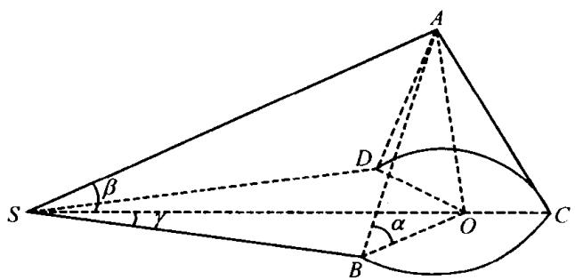

<details>
<summary>text_image</summary>

A
D
β
S
γ
α
B
O
C
</details>

解一：

推导体积 V 和面积 S 与轨道长度 x 的函数关系式：

$$
\beta = 2 5 ^ {\circ} \quad \gamma = \angle B S C
$$

$$
A O = S A \sin \beta ;
$$

$$
S O = S A \cos \beta ;
$$

$$
B O = A O \mathrm{ctg} \alpha ;
$$

$$
\gamma = \arcsin \frac {B O}{S O} \quad \angle B O S = 9 0 ^ {\circ} - \gamma
$$

$$
\angle B O D = 1 8 0 + 2 \gamma
$$

$$
\begin{array}{l} \dot {V} = \frac {1}{3} S _ {A - S B C D} A O + \frac {1}{3} \pi B O ^ {2} \cdot A O \cdot \frac {\angle B O D}{3 6 0 ^ {\circ}} \\ = \frac {1}{3} x ^ {3} \sin^ {2} \beta \cos \beta \cdot \operatorname{ctg} \alpha \cdot \cos [ \arcsin (\operatorname{tg} \beta \cdot \operatorname{ctg} \alpha) ] \\ + \frac {1}{3} \pi x ^ {3} \sin^ {3} \beta \mathrm{ctg} ^ {2} \alpha \cdot \frac {1 8 0 ^ {\circ} + 2 \arcsin (\mathrm{tg} \beta \cdot \mathrm{ctg} \beta)}{3 6 0 ^ {\circ}} \\ \end{array}
$$

$$
\begin{array}{l} S = \pi B O ^ {2} \cdot \frac {\angle B O D}{3 6 0 ^ {\circ}} + 2 \cdot S B \cdot B O \times \frac {1}{2} \\ = \pi x ^ {2} \sin^ {2} \beta \mathrm{ctg} ^ {2} \alpha \cdot \frac {1 8 0 ^ {\circ} + 2 \arcsin (\mathrm{tg} \beta \cdot \mathrm{ctg} \alpha)}{3 6 0 ^ {\circ}} \\ + x ^ {2} \cos \beta \sin \beta \mathrm{ctg} \alpha \cdot \cos [ \arcsin (\mathrm{tg} \beta \cdot \mathrm{ctg} \alpha) ] \\ \end{array}
$$

证明一：

已知: $AO \perp$ 平面 SBCD

SB 为圆的切线, 即 $SB \perp OB$

可证 $SB \perp AB$

证：∵AO⊥平面SBCD

$$
\therefore A O \perp S B
$$

又∵SB⊥OB

且 $OB\cap AO = O$

∴ SB ⊥ 平面 ABO

$\therefore SB \perp AB$

证明二：

本证明解释为什么搜索 $\alpha$ 范围在 $(25^{\circ}, 55^{\circ}]$ , 即 $\alpha > 25^{\circ}$

$$
\because B O = A O \cdot \operatorname{ctg} \alpha
$$

$$
S O = A O \cdot \operatorname{ctg} \beta
$$

在 $Rt\Delta SBO$ 中, $SO > BO$

即 $AO\cdot \mathrm{ctg}\alpha <  AO\cdot \mathrm{ctg}\beta$

$$
\mathrm{ctg} \alpha <   \mathrm{ctg} \beta
$$

$$
\therefore \alpha > \beta = 2 5 ^ {\circ}
$$

# 煤矸石堆积模型

赵易蓉 陈伟 孙东杰

(集美大学, 厦门 361021)

指导教师 储理才

编者按 本文对于煤矿堆积煤矸石的费用问题建立起数学模型,并就不同的征地方式和煤矸石堆数进行了分析讨论,得出了合理的结论.作者将严格的数学论证与科学计算很好地结合起来,其方法具有普遍性,比如,通过建立微分方程来求得运矸车的机械效率;通过引进一些重要参数来比较取不同的征地方式和堆数所得到的结论;最后还对不同的出矸率所需的最低费用作了预测,并结合实际对模型作出了较客观的评价.

摘要 本文就煤矿堆积煤矸石费用问题建立数学模型,就不同的征地方式(建矿初期一次性征完20年所需用地和分批征地方式)和煤矸石堆数进行了分析讨论,得出结论:在建矿初期一次性征完所需用地,且所有煤矸石全堆成一堆的方案是最优的,并就不同的出矸率计算出该最优方案的总费用,最后给出对不同的出矸率处理矸石的最低年度平均费用公式.

## 1 问题重述(略)

## 2 模型假设

1. 所选征地非常平坦, 即 S, D, C, B, O 五点看成在同一平面上. SA 轨道为一直线, 不考虑其宽度. 矸石山由四棱锥 A-SDOB 与不完全圆锥 A-BCDO 组成.  
2. 矸石堆积均匀, 其容重为 2 吨/立方米.  
3. 机械效率随坡道长度的增加而递减,且呈连续型变化,坡道长度每延长10米,效率在原有基础上约下降2%,机械效率函数可导.  
4. 全部采出仅包括原煤和矸石, 出矸率 = 矸石重量 / (矸石重量 + 原煤重量), 一般为 7% \~ 10%, 原煤年产量理解为去掉矸石的净煤产量.  
5. 运矸车沿 SA 轨道运矸石, 到顶点 A 才卸货, 途中矸石无掉落.  
6. 所征土地的形状为 SBCD 的相似图形.  
7. 所有存贷款利率均按复利计算, 利率为 5%.  
8. 土地征用费现值为 8 万元/亩, 地价年涨幅为 10%, 运矸车所需电费为 0.50 元/度 (不变).  
9. 征地费于年初付出, 每年电费于当年年末付出.  
10. 煤矿设计寿命为 20 年, 设计原煤产量为 300 万吨/年, 每年用于处理矸石的 100 万元于年初拨出.  
11. 为节省耕地, 堆放矸石时应使矸石堆侧面与地面角度尽可能最大.  
12. 为保护耕地,煤矿堆积矸石土地应比实际占地多征用 10%.

## 3 参数说明

1. h: 矸石山最高点 A 到地面的垂直距离；

2. V: 矸石山的体积.(单位:立方米);  
3. $S_{1}$ : 矸石山的底面积.(单位:平方米);  
4. S: 实际征地面积(单位: 亩);  
5. $\eta(h)$ : 运矸车在高度为 h 时的机械效率;  
6. $W(v)$ : 堆放体积为 v 的矸石山, 运矸车所必需消耗的总电能(单位: 焦耳);  
7. $D(v)$ : 堆放体积为 v 的矸石山所消耗的总电费(单位: 万元);  
8. $\alpha$ : 矸石自然堆放安息角 $\angle ABO$ , 取 $\alpha = 55^{\circ}$ ;  
9. $\beta$ : 直线上升轨道与地面夹角 $\angle ASO$ , 取 $\beta = 25^{\circ}$ ;  
10. g : 重力加速度, 取 g = 9.8 牛顿/千克;  
11. $\rho$ : 矸石容重, 取 $\rho = 2$ 吨/立方米;  
12. r : 采矿出矸率;

## 4 模型建立与求解

1. 堆积成体积为 v 的矸石山所需消耗的电费以及需征地的面积

(I). 面积 $S_{1}$ ，体积 V 关于高度 h 的函数关系

由题中图形, 设 AO = h, 则

$$
S A = \frac {h}{\sin \beta}, A B = \frac {h}{\sin \alpha}, O B = h \cot \alpha , S O = h \cot \beta
$$

$$
S B = \sqrt {S A ^ {2} - A B ^ {2}} = \frac {\sqrt {\sin^ {2} \alpha - \sin^ {2} \beta}}{\sin \alpha \sin \beta} h,
$$

$$
\angle S O B = \arccos \frac {B O}{S O} = \arccos \frac {\tan \beta}{\tan \alpha}
$$

$$
\begin{array}{l} S _ {1} = S B \times O B + \pi \times B O ^ {2} \times \frac {2 \pi - 2 \angle S O B}{2 \pi} \\ = \frac {\sqrt {\sin^ {2} \alpha - \sin^ {2} \beta}}{\sin \alpha \sin \beta} h ^ {2} \cot \alpha + (\pi - \angle S O B) h ^ {2} \cot^ {2} \alpha \\ = \mathrm{h} ^ {2} \left[ \frac {\sqrt {\sin^ {2} \alpha - \sin^ {2} \beta}}{\sin \alpha \sin \beta} \cot \alpha + (\pi - \angle S O B) \cot^ {2} \alpha \right] \\ \end{array}
$$

令 $a = \frac{\sqrt{\sin^2\alpha - \sin^2\beta}}{\sin\alpha\sin\beta}\cot \alpha + (\pi - \angle SOB)\cot^2\alpha$

由 $\alpha = 55^{\circ},\beta = 25^{\circ},\angle SOB = \arccos \left(\frac{\tan\beta}{\tan\alpha}\right)$

得:a=2.3525,故

$$
S _ {1} = a \mathrm{h} ^ {2} = 2. 3 5 2 5 h ^ {2} \quad (\text {平方米}) \tag {1}
$$

$$
V = \frac {1}{3} \mathrm{S} _ {1} \mathrm{h} = \frac {1}{3} a \mathrm{h} ^ {3} = 0. 7 8 4 2 h ^ {3} \quad (\text {立方米}) \tag {2}
$$

由(2)可得

$$
h = \sqrt [ 3 ]{\frac {3 v}{a}} = 1. 0 8 4 4 \sqrt [ 3 ]{v} (\text {米}) \tag {3}
$$

## (Ⅱ) 实际征地面积与矸石山体积的函数关系

由(1)，(3)得

$$
S _ {1} = \sqrt [ 3 ]{9 a v ^ {2}} = 2. 7 6 6 4 \sqrt [ 3 ]{v ^ {2}} \quad (\text {平方米}) \tag {4}
$$

实际征地

$$
S = \frac {S _ {1}}{6 6 7} \times (1 + 10 \%) = 0. 0 0 4 5 6 2 \sqrt [ 3 ]{v ^ {2}} \quad (\text {亩}) \tag {5}
$$

（Ⅲ）运矸车的机械效率 $\eta$ 与矸石山的高度 h 之间的函数关系由假设 3, 可列下式

$$
\left\{ \begin{array}{l} \frac {d \eta}{d h} = - \frac {0 . 0 2 \times \eta (h)}{1 0 \sin \beta} \\ \eta (0) = 0. 3 \end{array} \right.
$$

解得 $\eta (h) = 0.3e^{-0.002h\csc \beta} = 0.3e^{-0.0047h}$ (6)

(IV)由微元分析法知,堆成体积为 v 的矸石山所做的总功

$$
\mathrm{W(v)} = \int_ {0} ^ {h (\mathrm{v})} \frac {\rho g h}{\eta (h)} \mathrm{dv(h)}
$$

代入(3)，(6)，(2)以及 $\rho = 2000$ （千克/立方米）， $g = 9.8$ （牛顿/千克），得

$$
\mathrm{W(v)} = 1 5 3 6 9 6. 6 6 6 7 \int_ {0} ^ {1. 0 8 4 4 \sqrt [ 3 ]{\mathrm{v}}} h ^ {3} e ^ {0. 0 0 4 7 h} \mathrm{d} h (\text {焦耳})
$$

堆成体积为 V 的矸石山所需的电费

$$
\mathrm{D(v)} = \frac {W (\mathrm{v})}{7 . 2 \times 1 0 ^ {1 0}} \quad (\text {万元})
$$

用Mathematic3.0软件解得：

$$
\begin{array}{l} \mathrm{D(v)} = 2 6 2 4 7. 7 3 1 3 + \mathrm{e} ^ {0. 0 0 5 1 \mathrm{v} ^ {\frac {1}{3}}} (- 2 6 2 4 7. 7 3 1 3 + 1 3 3. 7 7 6 3 \mathrm{v} ^ {\frac {1}{3}} \\ - 0. 3 4 0 9 \mathrm{v} ^ {\frac {z}{3}} + 0. 0 0 0 5 7 9 2 \mathrm{v}) \quad (\text {万元}) \tag {7} \\ \end{array}
$$

## 2. 堆积煤矸石堆数和征地方式的选择

煤矸石堆数越多,无疑征地费将增加,但电费将减少;在建矿初期一次性征完全部用地,地价较低廉,但须向银行贷款;分期征地方式可少借贷款,但地价较高,如何选择煤矸石的堆数和征地方式才能使总费用最少呢?本节将考虑最佳堆数和最佳征地方式问题.

由于存、贷款利率均为 $5\%$ ，因此实际中当该矿每年100万元不够用时向银行贷款，盈余时还贷款的方式等效于20年中所有处理矸石的费用(征地费和电费)均向银行贷款，而每年的用于处理煤矸石的经费100万元均如数存入银行，20年后再全部取出还贷.因此，为了能够比较不同方案的优劣，可将所有费用都折合到第20年年末.由原煤年产量，出矸率 $\mathbf{r}$ 以及矸石容重可得，每年产出的煤矸石体积

$$
V _ {1} = \frac {3 \times 1 0 ^ {6} r}{2 \times (1 - r)} = 1. 5 \times 1 0 ^ {6} \times \frac {r}{1 - r} \quad (\text {立方米}) \tag {8}
$$

假设每年产出的煤矸石平均堆在 $\mathrm{m}(\mathrm{m}\geq 1)$ 堆上，共堆20年，那么累计至n年每一堆的体积若记为 $V_{n}(m,r)$ ，则

$$
V _ {n} (m, r) = 1. 5 \times 1 0 ^ {6} \times \frac {n r}{m (1 - r)} \quad (\text {立方米}) \tag {9}
$$

由(7)，可得20年的总电费(折算到20年年末，以下若涉及到费用皆如此处理)

$$
E (m, r) = m \times \sum_ {n = 1} ^ {2 0} (D [ V _ {n} (m, r) ] - D [ V _ {n - 1} (m, r) ]) \times (1 + 5 \%) ^ {2 0 - n} (\text {万元}) \tag {10}
$$

由(5)，(9)，n年后总的占地面积

$$
\begin{array}{l} S _ {n} (m, r) = \mathrm{m} \times 0. 0 0 4 5 6 2 \times (1. 5 \times 1 0 ^ {6} \times \frac {n r}{m (1 - r)}) ^ {\frac {2}{3}} \\ = 5 9. 7 7 9 1 \mathrm{m} ^ {\frac {1}{3}} \left(\frac {n r}{1 - r}\right) ^ {\frac {2}{3}} \quad (\text {亩}) \tag {11} \\ \end{array}
$$

方案一 每年年初都征用一次土地

若记第 n 年征地的费用为 $L_{n}(m, r)$ ，则

$$
L _ {n} (m, r) = \left[ S _ {n} (m, r) - S _ {n - 1} (m, r) \right] \times 8 \times (1 + 1 0 \%) ^ {n - 1} \times (1 + 5 \%) ^ {2 1 - n} \quad (\text {万元})
$$

则20年征地费用为 $\sum_{n = 1}^{20}L_n(m,r)$

于是方案一总费用(征地费和电费)为

$$
C _ {1} (\mathbf {m}, \mathbf {r}) = \sum_ {n = 1} ^ {2 0} L _ {n} (m, r) + E (m, r) \quad (\text {万元}) \tag {12}
$$

将 m 视为连续变量, 用数学软件 Mathematica 作出方案一总费用函数 $C_{1}(m, r)$ 的三维图形(图 1)

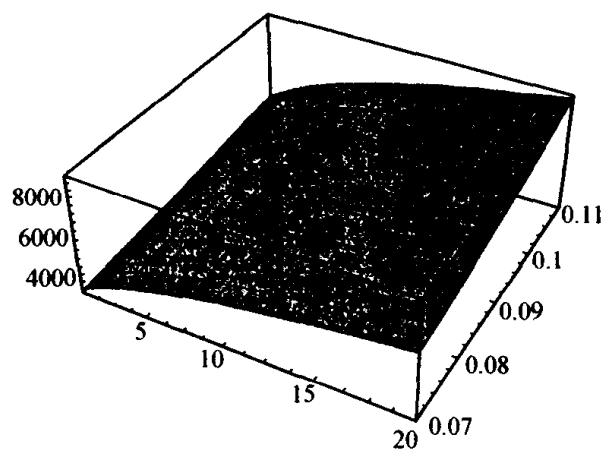

<details>
<summary>surface_3d</summary>

| X | Y | Value |
| --- | --- | --- |
| 5~20 | 4000~8000 | 0.07~0.11 |
</details>

图1

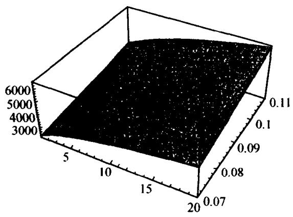

<details>
<summary>surface_3d</summary>

| X | Y | Z |
| --- | --- | --- |
| 5~20 | 5~6000 | 0.07~0.11 |
</details>

图2

## 方案二 第一年年初征完 20 年所需用地

由(5)，(9)可得征地总费用

$$
\begin{array}{l} L (m, r) = m \times 0. 0 0 4 5 6 2 \times (V _ {2 0} (m, r)) ^ {\frac {2}{3}} \times 8 \times (1 + 5 \%) ^ {2 0} \\ = 9 3 4 9. 2 9 3 5 m ^ {\frac {1}{3}} \left(\frac {r}{1 - r}\right) ^ {\frac {2}{3}} (\text {万元}) \tag {13} \\ \end{array}
$$

于是方案二总费用(征地费和电费)为

$$
C _ {2} (m, r) = L (m, r) + E (m, r) \quad (\text {万元}) \tag {14}
$$

用数学软件 Mathematica 作出方案二总费用函数 $C_{2}(m, r)$ 的三维图形(图 2)

仔细观察以上两图可发现: 当出矸率 r 一定时, 随着 m 的增大, 总费用都单调递增, 即无论以上任何方案, 堆数 m 越少, 总费用越少, 所以 m = 1 时, 总费用最少; 另一方面, 将 $C_{1}(m, r)$ 和 $C_{2}(m, r)$ 的图形作在同一个坐标系下(图 3), 可发现曲面 $C_{2}(m, r)$ 全部位于

曲面 $C_1(m,r)$ 的下面，即 $C_1(m,r) > C_2(m,r)$ ，即对相同的堆数 $m$ 和出矸率 $r$ ，方案二比方案一节省费用。因此可得出结论：最优方案是：所有煤矸石全堆在一堆上，且在第一年年初一次性征完20年中所需要的全部用地。

## 3. 最优方案求解

本节考虑采用上节得到的最优方案,每年100万元处理矸石的经费是否够用问题.

基于上节的说明,仍然假设所有费用全部来自银行贷款,每年初所拨出的100万元经费

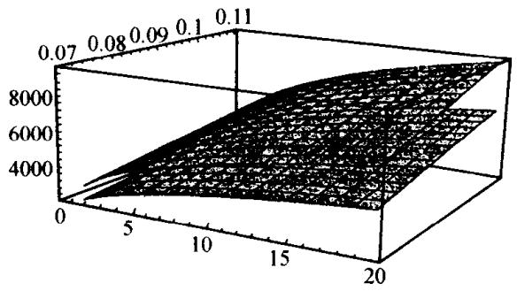

<details>
<summary>surface_3d</summary>

| X | Y | Z |
| --- | --- | --- |
| 0~20 | 0~8000 | 0.07~0.11 |
</details>

图3

全部存入银行,在第20年年末取出全部存款去还银行贷款.则20年后存款总额(含存款利息)

$$
Y = \sum_ {n = 1} ^ {2 0} 1 0 0 \times 1. 0 5 ^ {(2 1 - n)} = 3 4 7 1. 9 3 \quad (\text {万元}) \tag {15}
$$

取 m=1，由(13)，可得20年后要还的期初征地费用(含贷款利息)

$$
L (r) = 9 3 4 9. 2 9 3 5 (\frac {r}{1 - r}) ^ {\frac {2}{3}} \quad (\text {万元}) \tag {16}
$$

取 $m = 1$ ，由(10)，可得20年后要还的所有电费(含贷款利息)

$$
E (r) = \sum_ {n = 1} ^ {2 0} (D [ V _ {n} (1, r) ] - D [ V _ {n - 1} (1, r) ]) \times (1 + 5 \%) ^ {2 0 - n} \quad (\text {万元}) \tag {17}
$$

共计20年后要还的总金额

$$
S u m (r) = L (r) + E (r) \quad (\text {万元}) \tag {18}
$$

对不同的出矸率 r, 利用 Mathematica 软件很容易求得下表.

不同出研率的费用表

<table><tr><td>出矸率 r</td><td>征地费(万元)</td><td>总电费(万元)</td><td>总费用(万元)</td></tr><tr><td>0.07</td><td>1666.69</td><td>537.73</td><td>2204.42</td></tr><tr><td>0.08</td><td>1835.05</td><td>673.34</td><td>2508.38</td></tr><tr><td>0.09</td><td>1999.46</td><td>823.01</td><td>2822.47</td></tr><tr><td>0.10</td><td>2160.81</td><td>987.13</td><td>3147.94</td></tr><tr><td>0.11</td><td>2319.78</td><td>1166.16</td><td>3485.94</td></tr></table>

从表中可看出, 当出矸率 r<0.11 时, 总费用都小于 3471.93, 即通过银行调节, 每年 100 万元处理矸石的经费足够使用, 当 $r \geqslant 0.11$ 时, 经费就不够了.

## 4. 对不同出矸率预测处理矸石的最低年度平均经费

由(18)，容易得到平均每年应投入处理煤矸石的最小费用计算公式

$$
f (r) = \frac {S u m (r)}{\sum_ {n = 1} ^ {2 0} (1 + 5 \%) ^ {n}} (\text {万元})
$$

在 Mathematica 环境下运行下述程序, 只要输入出矸率, 计算机马上给出最低年度经费 (单位: 万元)

<div class="mineru-algorithm" style="white-space: pre-wrap; font-family:monospace;">
v = . ; n = . ; r = . ; s = . ; Landfee = . ; Ele = . ;
v[n _, r _ ] := 1.5 * 10^6 * n * r/(1 - r);
s[v _ ] := 0.004562 * v^(2/3);
Landfee[r _ ] := s[v[20, r]] * 8 * (1 + 0.05)^20;
Ele[v _ ] := 26247.7313 + E^(0.0051 * v^(1/3)) * (-26247.7313 +
133.7763 * v^(1/3) - 0.3409 * v^(2/3) + 0.0005792v);
Elefee[r _ ] := Sum[(Ele[v[n, r]] - Ele[v[n-1, r]]) * (1 + 0.05)^(20 - n), {n, 1, 20}];
Totafee[r _ ] := Landfee[r] + Elefee[r];
r = Input["请输入出矸率 r:"];
Print["r = ", r," minfee", Totafee[r]/Sum[1.05^n, {n, 1, 20}]]
例如: r = 0.07, minfee = 63.4928,
r = 0.10, minfee = 90.6685
r = 0.11, minfee = 100.404
</div>

即:当出矸率小于11%时,每年100万元是够用的;当出矸率为11%时,年度最低经费为100.404万元!

## 5 模型的分析与评价

此模型首先确定了总费用对出矸率和堆数的函数关系,通过三维图形的比较确定了最优堆积煤矸石的堆数和征地方式.此模型经过多次选择,最优方案的准确性较高,计算较简单,较为完满地解决了原始问题;缺点是实际中存贷款利率并不相等,地价的增长率,出矸率也并非恒定,此模型未将这些因素考虑进去,在实际应用中会受到一定的限制.

## 参考文献

[1] 姜启源. 数学模型(第二版). 高等教育出版社, 北京, 1993.  
[2] 张韵华. Mathematica 符号计算系统实用教程. 中国科学技术大学出版社, 合肥, 1998.  
[3] 同济大学数学教研室. 高等数学(第四版). 高等教育出版社, 北京, 1996.

# 煤矸石堆积问题的解答及引起的思考

## 太原理工大学 贾晓峰

## 清华大学 唐云

今年是第一次在全国大学生数学建模竞赛中设置专供大专院校学生做的 C, D 题。由贾晓峰提供的“煤矸石堆积”问题被全国组委会选为 C 题。这题比较切合大专院校学生的水准：所要求的基础知识和方法并不多，学生只要掌握中学的求面积和体积公式以及一些微积分的初步知识就应能做出。

煤矸石堆积问题是有它的实际背景的，在平原地区一些煤矿常采用征地的方式来堆放矸石，所给出的数据也是根据实测作出的估计。本题是问给定的年度经费是否够用，并对费用做出适当的讨论。一个重要问题是如何建立合理的模型，有相当一部分答卷是由于对问题的理解的不同，作出的假设不同，答案也不尽一致。下面我们先给出这个问题的参考解答，然后针对学生答案中由于对出矸率及征地方式理解不同而导出的不同解答进行分析，最后从学生答卷中的缺点及错误提出一些在数学建模教学中值得思考的问题和建议。

## 1 模型的建立和参考解答

## 1.1 模型假设：

除了题中已给的数据外还作以下假设：

(1) 原煤年产量理解为去掉矸石的净煤产量；  
(2) 年度征地方案理解为最多在每年初征地一次；  
(3) 煤矿用于处理矸石的经费 100 万元/年 理解为每年初一次拨出；  
(4) 银行利息为复利,煤矿使用银行资金存贷自由;  
(5) 征地费于当时付出,电费于当年内付出,不可拖欠;  
(6) 20 年只堆积一个矸石山(参看最后的附注).

由于本问题要求的经费包括征地费和电费两部分,因此,下面针对这两方面来建立模型并给出参考解答.

## 1.2 矸石山的底面积和征地费

## 1. 矸石山的底面积、体积与高度的关系

在题图中 A-SBOD 是棱锥部分, A-BCD 是圆锥部分, $\triangle SOB$ 是直角三角形. 记矸石山高 h = AO, $\gamma = \angle OSB$ , 可得

$$
\sin \gamma = \frac {h / \operatorname{tg} \alpha}{h / \operatorname{tg} \beta} = \frac {\operatorname{tg} \beta}{\operatorname{tg} \alpha} \Rightarrow \gamma = 1 9 ^ {\circ},
$$

矸石山的底面积为 $\triangle SOB,\triangle SOD$ 与扇形OBCD面积之和,得

$$
S = h ^ {2} \left(\frac {\cos \gamma}{\operatorname{tg} \beta \operatorname{tg} \alpha} + \frac {\gamma + \pi / 2}{\operatorname{tg} ^ {2} \alpha}\right) = 2. 3 4 5 \mathrm{h} ^ {2} \mathrm{m} ^ {2}, \tag {1}
$$

征地面积至少为

$$
S (h) = 1. 1 S = 2. 5 8 7 \mathrm{h} ^ {2} \mathrm{m} ^ {2}. \tag {2}
$$

矸石山的体积为

$$
V (h) = S h / 3 = 0. 7 8 4 \mathrm{h} ^ {3} \mathrm{m} ^ {3}. \tag {3}
$$

## 2. 征地面积与采煤出矸率的关系

设出矸率为 $p$ ，记 $q = p / (1 - p)$ ，则年均出矸量为 $300q \times 10^{7} \mathrm{~kg}$ ，按矸石容重 $c = 2 \times 10^{3} \mathrm{~kg} / \mathrm{m}^{3}$ 换算成体积为 $1.5q \times 10^{6} \mathrm{~m}^{3}$ ，于是 $t$ 年后矸石山的体积为

$$
V (t) = 1. 5 q t \times 1 0 ^ {6} \mathrm{m} ^ {3}. \tag {4}
$$

由(3)，(4)式可得矸石山高度与出矸率的关系

$$
h (t) = 1 2 4. 1 (q t) ^ {1 / 3} \mathrm{m}, \tag {5}
$$

(5)代入(2)得 t 年后占地面积为

$$
S (t) = 5 9. 7 7 (q t) ^ {2 / 3} \text {亩}. \tag {6}
$$

这样,可得20年后矸石山高度与占地面积分别为

$$
h (2 0) = 3 3 7. 1 q ^ {1 / 3} \mathrm{m}, \quad S (2 0) = 4 4 0. 4 q ^ {2 / 3} \text {亩}.
$$

特别, 当 p=0.1 时, $h(20)=162\ m$ , $S(20)=102$ 亩.

## 3. 征地计划

因为地价年涨幅 10% 高于贷款利率 5%, 所以应在开始时一次性将用地全部购入, 所缺经费向银行贷款.

当 p=0.1 时, 征地费为 $Q=8 \times 102 = 816$ 万元.

## 1.3 堆积矸石的电费

## 1. 运矸车机械效率

设运矸车坡道行程为 $l, l = x / \sin \beta (x$ 为高度), 则运矸车机械效率为

$$
\eta (x) = 0. 3 (1 - 0. 0 2) ^ {1 / 1 0} = 0. 3 \times 0. 9 8 ^ {r / 1 0 \sin \beta} = 0. 3 \mathrm{e} ^ {- 0. 0 0 4 7 8 x}. \tag {7}
$$

## 2. 运矸车机械功

堆积到高度的机械功为

$$
J (h) = \int_ {0} ^ {h} \frac {c x g}{\eta (x)} \mathrm{d} V (x), \tag {8}
$$

以(3)，(7)和 $g = 9.8\mathrm{m / s^2}$ 代入，得

$$
J (h) = 1. 5 3 7 \times 1 0 ^ {5} \int_ {0} ^ {h} x ^ {3} \mathrm{e} ^ {0. 0 0 4 7 8 x} \mathrm{d} x \mathrm{J}. \tag {9}
$$

(9)式右端的积分可以算出：

$$
\int_ {0} ^ {h} x ^ {3} \mathrm{e} ^ {b x} \mathrm{d} x = \left[ (h ^ {3} b ^ {3} - 3 h ^ {2} b ^ {2} + 6 h b - 6) \mathrm{e} ^ {b h} + b \right] / b ^ {4}. \tag {10}
$$

## 3.电费

按照1度(电) $= 3.6 \times 10^{6} \mathrm{~J}$ 和0.5元/度，可以由(10)，(5)算出从开始到 $t$ 年的电费。当 $p = 0.1$ 时， $t = 1$ 到 $t = 20$ 年的分年度电费(单位：万元) $k(t)$ 如下：

<table><tr><td>t</td><td>1</td><td>2</td><td>3</td><td>4</td><td>5</td><td>6</td><td>7</td><td>8</td><td>9</td><td>10</td></tr><tr><td>k(t)</td><td>8.50</td><td>14.25</td><td>18.00</td><td>21.09</td><td>23.82</td><td>26.32</td><td>28.64</td><td>30.83</td><td>32.92</td><td>34.93</td></tr><tr><td>t</td><td>11</td><td>12</td><td>13</td><td>14</td><td>15</td><td>16</td><td>17</td><td>18</td><td>19</td><td>20</td></tr><tr><td>k(t)</td><td>36.86</td><td>38.73</td><td>40.55</td><td>42.33</td><td>44.07</td><td>45.77</td><td>47.44</td><td>49.08</td><td>50.69</td><td>52.28</td></tr></table>

为了与所给经费比较,将它们都按利率5%折合成现值.20年总电费K和总经费投入S分别为

$$
K = \sum_ {t = 1} ^ {2 0} \frac {k (t)}{1 . 0 5 ^ {t - 1}} = 4 0 4 \text {万元},
$$

$$
S = 1 0 0 \sum_ {t = 1} ^ {2 0} \frac {1}{1 . 0 5 ^ {t - 1}} = 1 2 6 9 \text {万元}. \tag {11}
$$

总电费 K 与征地费 Q 之和为 1220 万元, 未超过总经费 S.

## 4. 结论

开始时按 10% 的出矸率为 20 年堆积矸石征地 102 亩, 不足经费向银行贷款, 以后每年用当年经费缴电费并还贷, 20 年经费刚好够用.

若出矸率高于 $10\%$ ，如 $11\%$ 时，上述结果表明，经费已不足.

需要指出的是,上面的计算是基于20年只堆积一个矸石山的假设.若堆积多个矸石山,显然征地费将增加,而电费将减少.例如:若堆积两个矸石山,每个10年,不难算出,征地费为 $513\times2=1026$ 万元,电费为 $185\times2=370$ 万元,总费用1396万元,大于上面的1220万元.由此不难验证,堆积一个矸石山是正确的.

## 2 对题目的不同理解引出的解答

## 1. 对出矸率的不同理解.

如果将参考答案中的模型假设(3)改为“原煤包含煤矸石”，则对应参考答案会有 $p = q$ ，以 $p = 10\%$ 算出的出矸量会比参考答案中少 $10\%$ ，这样，征地费用和电费都将相应减少。

## 2. 对征地方式的不同理解

由题目条件,容易得出应于开始时一次性征用全部堆矸用地的结论.但部分答卷参照我国《土地法》的有关规定:征入后闲置二年以上的土地将被收回.如果将暂时未能堆积矸石的土地理解为“闲置”,就会导出“每年征购当年及次年用地”的征地方式.由于地价涨幅远高于银行利率,这种方式会大大增加征地费用,因而造成出矸率较高时总费用不够的结论.我们认为,这种不拘泥于问题本身而考虑到国情的解答是有创造性的.

## 3. 关于堆积多个矸石山的考虑

由参考答案最后的简单讨论,容易理解二十年只堆积一个矸石山是正确的结论.但值得注意的是,有少数答卷在解决“二十年堆几个矸石山费用最小”的问题时,颇有创造性地提出一种图论解法:

(1)给出 $v_{0}, v_{1}, \cdots, v_{20}$ ，共21个顶点，并在这些顶点间依下面的规则加边：从下标为 i 到下标为 $j = \min\{i + k, 20\} (i = 0, 1, \cdots, 19; k = 1, 2, \cdots, 20)$ 的顶点间添加有向边 $v_{i}v_{j}$ ;  
(2) 给上述每一条有向边赋权 $W_{ij}$ , 令 $W_{ij} =$ 从第 $i$ 年初开始至第 $j$ 年末堆积一座矸石山的总费用 (应为折现值);  
(3)求出上述赋权有向图中从 $v_{0}$ 至 $v_{20}$ 的最短路，该最短路就对应了应堆积几座矸石山及在哪些年应开始堆积新矸石山的正确结论.

另外,还有一些答卷采用线性规划方法讨论这一问题,也可得出正确结论.

## 4. 其他

有些答卷采用不同的计算方式,如在求面积时将底面扇形近似地看成半圆,或在求电费时用分段求和代替积分等,其结果与参考答案略有差异.但有些答卷对安息角的讨论过细,除 $550^{\circ}$ 外还讨论 $540^{\circ}$ 和 $530^{\circ}$ 等,这就有些累赘了.

## 3 由竞赛答卷看数学建模培训中应注意的问题

数学建模竞赛是对学生数学应用能力的测试,综合性很强,因而要求数学建模的教学和培训也应特别注意对学生综合能力的培养.但我们发现竞赛答卷中存在一些具有一定典型性的问题,反映出教师在数学建模教学中的片面性和某些不足.这里将其中的一些主要问题列出如下,供教师在有关的教学中参考改进.

## 1. 关于假设、公式和叙述的简明性问题

数学建模的假设是否合理是全文清晰叙述的基础,所以一定要经过反复勘酌、挑选,将最重要、最基本的概念,用清晰而严格的语言给以界定或描述.但不少论文中假设太多,如本题答卷中有的论文模型假设条目达二十余条.还有些所作假设含义或界限不清,这就使整篇论文不可能成为层次分明、叙述清楚的好文章.

数学建模论文应规范化,符号、公式和文字说明都要求简练而又能说明问题.有些文章使用数学记号达二十多个,而且符号前后也不统一.还有些论文中公式推导或表述则过于繁冗,使人难以判断其正确性.如本题中矸石堆形状可理想化为棱锥与部分圆锥的嵌合,有的答卷在其体积公式表述中就出现这样的项:

$$
c ^ {3} \sin^ {2} \beta \cos \beta \operatorname{ctg} \alpha \cos [ \arcsin (\operatorname{tg} \beta \operatorname{ctg} \alpha) ].
$$

类似的问题并不少见．事实上，数学建模问题中常出现一些来源于实测的、带有一定误差的量，通过代入其量值或设出新的变量简化公式常常是必要的．这样做不但会使文章显得简洁，而且其数学规律也会更加突出.

有些文章,所给出的数学模型只是一些数学表达式的罗列而缺乏必要的文字说明,基本步骤和主要的推导过程不清楚,使人难以理解.有的答卷还将一些重要的计算结果放在附录中,若去掉附录,文章也就失去了完整性.特别值得注意的是,部分答卷中对数学模型的文字描述是用程序形式表达的,有的竟然是从计算机语言“翻译”过来的.这当然使文章表述的清晰程度大打折扣,因为对于一个算法表述重要的是说明算法的思想,这和罗列计算机程序是根本不同的.这些都是不规范的,是在数学建模教学中应注意的问题.

## 2. 关于数学建模论文中的“形式套用”问题

本题中的“年度征地计划”问题,本来通过很简单的推导即可得出正确结论,但不少答卷中却引进“目标函数”、“约束条件”等概念,套用线性规划方法进行推导,占去文章大量篇幅.类似的从形式上套用优化方法等模式来讨论问题的情形并不少见.出现这类问题的原因可能是数学建模教学中过于强调一些常见的优化方法所致,但这样做与提倡建模的创造性显然是背道而驰的,因为建立一个数学模型的核心是其解决问题的思想而不是形式.

还有的文章滥用定义、定理等形式，将一些简单易明的概念冠以“定义”名目，或将显然的结论用“定理”形式给出。有些所谓定理还有表达含混的问题。这些都需要教师在数学建模教学中加以注意，避免引起误导。

## 3. 关于摘要能力问题

摘要能力是科学研究的重要能力,所以国家标准 GB7713-87 中对科学论文摘要提出很高的要求,兹摘述如下:“摘要是论文内容不加注释和评论的简短陈述.……摘要应具有独立性和自含性,即只阅读摘要,不阅读论文全文,就能获得必要的信息.摘要中要有数据、有结论,是一篇完整的短文,可以独立使用,可以引用,可以用于工艺推广.摘要的内容应包含与论文同等量的主要信息,可供读者确定有无必要阅读全文,也可供文摘等二次文献选用.摘要一般应说明研究工作的目的、实验方法,结果和最终结论等,重点是结果和结论.”

对于大学生数学建模竞赛来讲,由于是对同一个问题给出的解答,为了使评阅人较快弄清作者的思路,我们认为摘要还是尽可能详细一些为好.特别是应写清条件、结论、基本过程、关键步骤、要领、所采用的方法以及有些什么特色等.

但本题目答卷中几乎见不到令人满意的摘要,表明数学建模教学中对这一能力的培养是不够的.当然,要写好一篇论文摘要也是困难的,因而更需要教师及早加以注意和培养.

宇宙就是哲学的全书。这本书向着人们的好奇心敞开着，但是谁如果不先掌握好写这本书所用的语言和文字，他就不用想读懂它。这个语言就是数学，这些文字就是三角形、圆和其它图形。

Galileo Gallilei, 摘自 J. N. Kapur, Thought on Nature of Mathematics of Alexandrov et al., 1973; 中译本,《数学家谈数学本质》, 北京大学出版社, 1989, p. 280.

## 18. 钻井布局(CUMCM 1999 年 D 题)

勘探部门在某地区找矿. 初步勘探时期已零散地在若干位置上钻井, 取得了地质资料. 进入系统勘探时期后, 要在一个区域内按纵横等距的网格点来布置井位, 进行“撒网式”全面钻探. 由于钻一口井的费用很高, 如果新设计的井位与原有井位重合(或相当接近), 便可利用旧井的地质资料, 不必打这口新井. 因此, 应该尽量利用旧井, 少打新井, 以节约钻探费用. 比如钻一口新井的费用为500万元, 利用旧井资料的费用为10万元, 则利用一口旧井就节约费用490万元.

设平面上有 n 个点 $P_{i}$ ，其坐标为 $(a_{i}, b_{i}), i = 1, 2, \cdots, n$ ，表示已有的 n 个井位。新布置的井位是一个正方形网格 N 的所有结点（所谓“正方形网格”是指每个格子都是正方形的网格；结点是指纵线和横线的交叉点）。假定每个格子的边长（井位的纵横间距）都是 1 单位（比如 100 米）。整个网格是可以在平面上任意移动的。若一个已知点 $P_{i}$ 与某个网格结点 $X_{i}$ 的距离不超过给定误差 ( $\varepsilon = 0.05$ 单位），则认为 $P_{i}$ 处的旧井资料可以利用，不必在结点 $X_{i}$ 处打新井。

为进行辅助决策,勘探部门要求我们研究如下问题:

1) 假定网格的横向和纵向是固定的(比如东西向和南北向), 并假定距离误差是沿横向和纵向计算的, 即要求可利用点 $P_{i}$ 与相应结点 $X_{i}$ 的横坐标之差(取绝对值)及纵坐标之差(取绝对值)均不超过 $\varepsilon$ . 在平面上平行移动网格 $N$ , 使可利用的旧井数尽可能大. 试提供数值计算方法, 并对下面的数值例子用计算机进行计算.  
2) 在问题 1) 的基础上, 考虑网格的横向和纵向不固定(可以旋转)的情形, 给出算法及计算结果.

数值例子 $n = 12$ 个点的坐标如下表所示

<table><tr><td>i</td><td>1</td><td>2</td><td>3</td><td>4</td><td>5</td><td>6</td><td>7</td><td>8</td><td>9</td><td>10</td><td>11</td><td>12</td></tr><tr><td> $a_i$ </td><td>0.50</td><td>1.41</td><td>3.00</td><td>3.37</td><td>3.40</td><td>4.72</td><td>4.72</td><td>5.43</td><td>7.57</td><td>8.38</td><td>8.98</td><td>9.50</td></tr><tr><td> $b_i$ </td><td>2.00</td><td>3.50</td><td>1.50</td><td>3.51</td><td>5.50</td><td>2.00</td><td>6.24</td><td>4.10</td><td>2.01</td><td>4.50</td><td>3.41</td><td>0.80</td></tr></table>

(郑州大学 林诒勋提供)

## 19. DNA 序列分类(CUMCM 2000 年 A 题)

2000年6月,人类基因组计划中DNA全序列草图完成,预计2001年可以完成精确的全序列图,此后人类将拥有一本记录着自身生老病死及遗传进化的全部信息的“天书”.这本大自然写成的“天书”是由4个字符A,T,C,G按一定顺序排成的长约30亿的序列,其中没有“断句”也没有标点符号,除了这4个字符表示4种碱基以外,人们对它包含的“内容”知之甚少,难以读懂.破译这部世界上最巨量信息的“天书”是二十一世纪最重要的任务之一.在这个目标中,研究DNA全序列具有什么结构,由这4个字符排成的看似随机的序列中隐藏着什么规律,又是解读这部天书的基础,是生物信息学(Bioinformatics)最重要的课题之一.

虽然人类对这部“天书”知之甚少,但也发现了DNA序列中的一些规律性和结构.例如,在全序列中有一些是用于编码蛋白质的序列片段,即由这4个字符组成的64种不同的3字符串,其中大多数用于编码构成蛋白质的20种氨基酸.又例如,在不用于编码蛋白质的序列片段中,A和T的含量特别多些,于是以某些碱基特别丰富作为特征去研究DNA序列的结构也取得了一些结果.此外,利用统计的方法还发现序列的某些片段之间具有相关性,等等.这些发现让人们相信,DNA序列中存在着局部的和全局性的结构,充分发掘序列的结构对理解DNA全序列是十分有意义的.目前在这项研究中最普通的思想是省略序列的某些细节,突出特征,然后将其表示成适当的数学对象.这种被称为粗粒化和模型化的方法往往有助于研究规律性和结构.

作为研究 DNA 序列结构的尝试,提出以下对序列集合进行分类的问题:

1) 下面有 20 个已知类别的人工制造的序列(见下页), 其中序列标号 1\~10 为 A 类, 11\~20 为 B 类. 请从中提取特征, 构造分类方法, 并用这些已知类别的序列, 衡量你的方法是否足够好. 然后用你认为满意的方法, 对另外 20 个未标明类别的人工序列(标号 21\~40) 进行分类, 把结果用序号(按从小到大的顺序) 标明它们的类别(无法分类的不写入):

A 类 \_\_\_\_；B 类 \_\_\_\_。

请详细描述你的方法,给出计算程序.如果你部分地使用了现成的分类方法,也要将方法名称准确注明.

这 40 个序列也放在如下地址的网页上,用数据文件 Art-model-data 标识,供下载:

网易网址:www.163.com 教育频道 在线试题;

教育网: www.cbi.pku.edu.cn News mcm2000

教育网: www.csiam.edu.cn/mcm

2) 在同样网址的数据文件 Nat-model-data 中给出了 182 个自然 DNA 序列, 它们都较长. 用你的分类方法对它们进行分类, 像 1) 一样地给出分类结果.

提示:衡量分类方法优劣的标准是分类的正确率,构造分类方法有许多途径,例如提取序列的某些特征,给出它们的数学表示:几何空间或向量空间的元素等,然后再选择或构造适合这种数学表示的分类方法;又例如构造概率统计模型,然后用统计方法分类等.

## Art-model-data

1. aggcacggaaaaacgggaataacggaggaggacttggcacggcattacacggaggacgaggtaaaggaggcttgtctacggccggaagtgaagggggatat gaccgcttgg  
2. cggaggacaaacgggatggcggtattggaggtggcggactgttcgggggaattattcggtttaaacgggacaaggaaggcggctggaacaaccggacggtgg cagcaaagga  
3. gggacggatacggattctggccacggacggaaaggaggacacggcggacatacacggcggcaacggacggaacggaggaaggagggcggcaatcggtacggaggcggcgga  
4. atggataacggaaacaaaccagacaaacttcggtagaaatacagaagcttagatgcatatgttttttaaataaaatttgtattattatggtatcataaaaaaaggtt gcga  
5. cggctggcggacaacggactggcggattccaaaaacggaggaggcggacggaggctacaccaccgtttcggcggaaaggcggagggctggcaggaggctca ttacggggag  
6. atggaaaattttcggaaaggcggcaggcaggaggcaaaggcggaaaggaaggaaacggcggatatttcggaagtggatattaggagggcggaataaaggaa cggcggcaca  
7. atgggattattgaatggcggaggaagatccggaataaaatatggcggaaagaacttgttttcggaaatggaaaaaggactaggaatcggcggcaggaagga tatggaggcg  
8. atggccgatcggcttaggctggaaggaacaaataggcggaattaaggaaggcgttctcgcttttcgacaaggaggcggaccataggaggcggattaggaac ggttatgagg  
9. atggcggaaaaaggaaatgtttggcatcggcgggctccggcaactggaggttcggccatggaggcgaaaatcgtgggcggcggcagcgctggccggagtttgaggagcgcg  
10. tggccgcggaggggcccgtcgggcgcggatttctacaagggcttcctgttaaggaggtggcatccaggcgtcgcacgctcggcgcggcaggaggcacgcggaaaaaacg  
11. gttagatttaacgttttttatggaatttatggaattataaatttaaaaatttatatttttaggtaagtaatccaacgtttttattactttttaaaattaaatatttatt  
12. gtttaattactttatcatttaatttaggttttaattttaaatttaatttaggtaagatgaatttggttttttttaaggtagttatttaattatcgttaaggaaagttaaa  
13. gtattacaggcagaccttatttaggttattattattattattggatttttttttttttttttaagttaaccgaattattttctttaaagacgttacttaatgtcaatgc  
14. gttagtcttttttagattaaattattagattatgcagttttttacataagaaaatttttttttcggagtccatattctaatctgtctttattaaatcttagagatatta  
15. gtattatatttttttatttttattatttttagaatataatttgaggtatgtgtttaaaaaaaatttttttttttttttttttttttttaaaatttataaattta  
16. gttatttttaaatttaattttaattttaaaatacaaaatttttactttctaaaattggtctctggatcgataatgtaaaacttattgaatctatagaattacattattgat  
17. gtatgtctatttcacggaagaatgcaccactatatgatttgaaatttatctatggctaaaaaccctcagtaaaatcaatccctaaacccttaaaaaacggcggcc tatccc  
18. gttaattatttattccttacgggcaattaattatttattacggttttatttacaattttttttttttgtcctatagagaaattacttacaaaacgttattttacatactt  
19. gttacattatttattattatccgttatcgataattttttacctcttttttcgctgagtttttattcttactttttttcttcttttatataggatctcatttaatatcttaa  
20. gtatttaactctctttacttttttttcactctctacattttcatcttctaaaactgtttgatttaaacttttgtttctttaaggattttttttactlatcctctgttat  
21. tttagctcagtccagctagctagtttacaatttcgacaccagtttcgcaccatcttaaatttcgatccgtaccgtaatttagcttagatttggatttaaaggattta gattga  
22. tttagtacagtagctcagtccaagaacgatgtttaccgtaacgtqacgtaccgtacgctaccgttaccggattccggaaagccgattaaggaccgatcgaaaggg  
23. cgggcggatttaggccgacggggacccgggattcgggacccgaggaaattcccggattaaggtttagcttcccgggatttagggcccggaatggctgggaccc  
24. tttagctagctacttttagctatttttagtagctagccagcctttaaggctagcttttagctagcattgttctttattgggacccaagttcgacttttacgatttagttttga ccgt  
25. gaccaaaggtgggctttagggacccgatgcttttagtcgcagctggaccagttccccagggtattaggcaaaagctgacgggcaattgcaatttaggcttaggcca

26. gatttacttttagcatttttagctgacgttagcaagcatttagcttttagccaatttcgcatttgccagtttcgcagctcagttttaacgcgggatcttltagcttcaagcttt ttac  
27. ggattcggatttacccggggattggcggaacgggacctttaggtcgggacccattaggagtaaatgccaaaggacgctggttttagccagtccgttaaggcttag  
28. tccttagatttcagttactatatttgacttacagtctttgagatttcccttacgattttgacttaaaatttagacgttagggcttatcagttatggattaatttagcttattttcga  
29. ggccaattccggtaggaaggtgatggcccgggggttcccgggaggatttaggctgacgggccggccatttcggtttagggagggccgggacgcgttagggc  
30. cgctaagcagctcaagctcagtcagtcacgttttgccaagtcagtaatttgccaaagttaaccgttagctgacgctgaacgctaaacagtattagctgatgactcgta  
31. ttaaggacttaggctttagcagttactttagtttagttccaagctacgtttacgggaccagatgctagctagcaatttattatccgtattaggcttaccgtaggtttagcgt  
32. gctaccgggcagtctttaacgtagctaccgtttagtttgggccagccttgcggtgtttcggatlaattcgttgtcagtcgctctriggggttagtcattcccaa aagg  
33. cagtttagctgaatcgttttagccatttgacgtaaacatgattttacgtacgtaaattttagccctgacgttttagctaggaatttatgctgacgtagcgategacttt agcac  
34. cggtagggcaaaggttggatttcgacccagggggaaagcccgggacccgaacccagggctttagcgtaggctgacgctaggcttaggttggaacccggaaa  
35. gcggaagggcgtaggtttgggatgcttagccgtaggctagctttcgacacgatcgattcgcaccacaggataaaagttaagggaccggtaagtcgcggtagcc  
36. ctagctacgaacgcttttaggcgccccgggagtagtcgttaccgttagtatagcagtcgcagtcgcaattcgcaaaagtccccagcttttagccccagagtcgacg  
37. gggatgctgacgctggttagctttaggcttagcgtagctttagggccccagtctgcaggaaatgccccaaaggaggcccaccgggtagatgccasagtgcaccgt  
38. aacttttagggcatttccagttttacgggttattttcccagttaaactttgcaccattttacgigttacgatttacgtataatttgaccttattttggacacttttagttgggttac  
39. ttagggccaagtcccgaggcaaggaattctgatccaagtccaatcacgtacagtccaagtccaccgtttgcagctaccgtttaccgtacgttgcaagtcaaatccat  
40. ccattagggtttatattacctgtttatatttttcccagaccttaggtttaccgtactttttaacggtttacctttgaaattttggactagcttaccctggatttaacggcc agttt

(北京工业大学 孟大志提供)

# DNA 序列的分类模型

汤诗杰 周亮 王晓玲

(中国科技大学, 合肥 230026)

指导老师 孙广中

编者按 本文提出了 DNA 序列分类的三种模型, 其一, 基于 A、G、T、C 四种碱基出现的频率; 其二利用了同一碱基在序列中的间隔, 这一信息是单纯考虑频率所不能包含的; 在第三种模型中, 作者把 DNA 序列视为一个信息流, 考虑每增加一个字符所带来的信息增量. 尽管文中信息量的定义方式仍可讨论, 但本文思想新颖活跃, 有其独特之处. 本文最后的分类方法, 是以上三种的综合使用.

摘要 本文针对 DNA 序列分类这个实际问题,提出了相应的数学模型.为了很好的体现 DNA 序列的局部性和全局性的特征,我们给出了衡量分类方法优劣的标准,即在满足一定限制条件的情况下,是否能充分反映序列的各方面特性.

依据我们提出的判别标准,单一标准的分类是无法满足要求的. 我们的方法是侧重点不同的三种方法的综合集成. 这三种方法分别体现了序列中元素出现的概率, 序列中元素出现的周期性, 序列所带有的信息含量. 利用这个方法, 完成了对未知类型的人工序列及自然序列的分类工作. 最后, 对分类模型的优缺点进行了分析, 并就模型的推广作了讨论.

## 1 问题的提出(略)

## 2 问题的分析

这是一个比较典型的分类问题,为了表述的严格和方便,我们用数学的方法来重述这个问题.已知字母序列 $S_{1}, S_{2}, S_{3} \cdots S_{40}, S_{i} = x_{1}x_{2}x_{3}\cdots x_{n_{i}}$ , 其中 $x_{j} \in \{a, t, c, g\}$ ; 有字符序列集合 $A, B$ , 满足 $A \cap B = \varphi$ , 并当 $1 \leq i \leq 10$ 时, $S_{i} \in A$ ; 当 $11 \leq i \leq 20$ 时, $S_{i} \in B$ . 现要求考虑当 $21 \leq i \leq 40$ 时, $S_{i}$ 与集合 $A$ 及集合 $B$ 的关系.

在这里,问题的关键就是要从已知的分好类的20个字母序列中提取用于分类的特征.知道了这些特征,我们就可以比较容易的对那些未标明类型的序列进行分类.下面我们将首先对用于分类的标准问题进行必要的讨论.

## 3 分类的标准及评价

首先,我们提取的特征应该满足以下两个条件:

(1) 所取特征必须可以标志 A 组和 B 组。也就是说, 我们利用这些特征应该可以很好的区分已经标示分类的 20 个序列。这是比较显然的一个理由。  
(2) 所取特征必须是有一定的实际意义的. 这一点是决不能被忽视的. 比如, 如果不考虑模型的实际意义, 我们就可以以序列的开头字母为分类标准: 已知在 B 类中的十个序列都是以 gt 开始的, 而已知在 A 类中 10 个序列没有以 gt 开始的, 甚至以 g 开始的都没有. 显然这是满足上面的第一个条件的. 如果仅因此就认为这种特征是主要的, 并简单的利用这个特征将所有待分类的序列分成两类, 显然是不甚合理的.

对于这样的一个复杂的分类问题,需要考虑的因素很多,也就是说,可供我们使用的分类特征有许多.如何从众多的因素中提取分类的主要因素,是我们处理这个问题的困难之处.上面的第一个条件是我们的分类方法所必须满足的,可以看作是个限制条件;而第二个条件是我们在设计分类方法时必须考虑到的,可以看作是对分类方法优劣的一种衡量,是某种意义下的目标函数.

## 4 模型的建立及分析

由上面的分析可知,由于 DNA 序列本身的复杂性,我们很难在不知道确切的分类标准的情况下,使用单一的方法来处理这个分类问题.由于,DNA 序列同时具有局部性和全局性的特征,我们尝试综合使用几种设计思想不同的方法来处理这个问题,以使该分类方法具有好的分类性能和相当的健壮性.

下面我们先从不同的角度出发,提出三种侧重点不同的分类方法,第一种从频率角度出发,第二种从字母出现的周期性的角度出发,第三种从序列所带的某方面的信息量出发,并给出它们单独使用时的分类结果.我们认为,这三方面综合考虑,可以较好的体现出序列各个方面的特征,最后,从这三种方法出发,得到一个综合系统的分类方法,并利用它得到了最终的182个序列的分类结果.

## 方法 1 基于字母出现频率

不同段的 DNA 中, 每个碱基出现的概率并不相同, 从生物理论中, 我们知道, 编码蛋白质的 DNA 中 G、C 含量偏高, 而非编码蛋白质的 DNA 中 A、T 含量偏高. 因此, A、G、T、C 的频率中会含有很多的信息, 下面给出 A、B 组的频率统计. 见表 1, 表 2(略).

由统计的数字可以看出，A组的碱基构成与B组的碱基构成有较大的不同。A组的G含量较高，B组的T含量较高。为做定量化的分析，引入数学中的内积概念，即将A、T、G、C的频率分别作为四维向量的四个分量 $(P_{A}, P_{G}, P_{T}, P_{C})$ ，现在我们得到两组向量 $A_{i}, B_{i} (i = 1,2,3\cdots\cdots 10)$ ，然后将未知的序列 $21 \sim 40$ 作为一个新的向量 $C$ ，要将它归入A组或B组，我们可以尝试在Hilbert空间中将向量归一化后求C与A组和B组的平均距离。记 $\overline{C}, \overline{Ai}$ 、 $\overline{Bi}$ 为归一化后的向量。为此，我们计算内积和 $\sum_{i=1}^{10} \overline{C} \cdot \overline{A_{i}}$ 与 $\sum_{i=1}^{10} \overline{C} \cdot \overline{B_{i}}$ ，其中内积定义为欧氏度量引导出的内积 $(c_{1}, c_{2}, c_{3}, c_{4})$ 。 $(a_{1}, a_{2}, a_{3}, a_{4}) = c_{1}a_{1} + c_{2}a_{2} + c_{3}a_{3} + c_{4}a_{4}$ 。即

$$
\text {内积} = \frac {\left(P _ {A} , P _ {G} , P _ {T} , P _ {C}\right) _ {A} \cdot \left(P _ {A} , P _ {G} , P _ {T} , P _ {C}\right) _ {\text {未知}}}{| A | \cdot | \text {未知} |}
$$

内积小的两个序列,我们可以认为它们的相关性小,而内积大的序列,我们就认为其相关性大.因此,如果 $\sum_{i=1}^{10}\overline{C}.\overline{A_{i}}>$ $\sum_{i=1}^{10}\overline{C}.\overline{B_{i}}$ ,则认为C应归入A类,否则认为它应归入B类.

计算结果如表 3 所示

由此,我们找到了区分 C 组的一种方法,这种比较 $\sum_{i=1}^{10}\overline{C}\cdot\overline{A_{i}}$ 和 $\sum_{i=1}^{10}\overline{C}\cdot\overline{B_{i}}$ 的方法,我们可以归纳为一个目标函数 $F_{1}(l)$ ,即

$$
F _ {1} (l) = \frac {\sum_ {i = 1} ^ {1 0} \overline {{C}} \cdot \overline {{A _ {i}}}}{\sum_ {i = 1} ^ {1 0} \overline {{C}} \cdot \overline {{B _ {i}}}}
$$

表 3

<table><tr><td>未知的序号</td><td>与A组的内积</td><td>与B组的内积</td><td>属于的类别</td><td>未知的序号</td><td>与A组的内积</td><td>与B组的内积</td><td>属于的类别</td></tr><tr><td>1</td><td>0.815781</td><td>0.938814</td><td>B</td><td>11</td><td>0.852231</td><td>0.920957</td><td>B</td></tr><tr><td>2</td><td>0.926922</td><td>0.803952</td><td>A</td><td>12</td><td>0.866976</td><td>0.853967</td><td>A</td></tr><tr><td>3</td><td>0.939727</td><td>0.656827</td><td>A</td><td>13</td><td>0.860955</td><td>0.917122</td><td>B</td></tr><tr><td>4</td><td>0.788524</td><td>0.937135</td><td>B</td><td>14</td><td>0.961689</td><td>0.67678</td><td>A</td></tr><tr><td>5</td><td>0.948194</td><td>0.772073</td><td>A</td><td>15</td><td>0.960322</td><td>0.739089</td><td>A</td></tr><tr><td>6</td><td>0.801201</td><td>0.930121</td><td>B</td><td>16</td><td>0.904282</td><td>0.747578</td><td>A</td></tr><tr><td>7</td><td>0.953019</td><td>0.76695</td><td>A</td><td>17</td><td>0.944724</td><td>0.723664</td><td>A</td></tr><tr><td>8</td><td>0.746071</td><td>0.968035</td><td>B</td><td>18</td><td>0.75862</td><td>0.954652</td><td>B</td></tr><tr><td>9</td><td>0.931007</td><td>0.613193</td><td>A</td><td>19</td><td>0.885631</td><td>0.811837</td><td>A</td></tr><tr><td>10</td><td>0.897774</td><td>0.844082</td><td>A</td><td>20</td><td>0.75584</td><td>0.941</td><td>B</td></tr></table>

方法一讨论 这种方法是从概率统计的角度分析问题,通过对每个字母出现频率的计算,找出A,B两类DNA链中的频率特性,建立四维向量空间,然后对待求分类的序列统计频率,与已知分类的向量进行内积运算,找出量化的关联性,从而将其分类.但这种方法也有其局限性,在统计字母出现的频率时,忽略了字母所在位置以及各个字母之间的相互关系,造成用这种方法对已知分类的序列进行检验时,个别频率特性不明显的序列不太容易分类.所以,这种方法虽然有其科学性,但还不够完善,不能完全体现序列的所有特征.

## 方法二 基于字母出现周期性

在以上进行了基于字母出现频率的分类之后,我们认为,一个序列所含的信息远不止每个字母出现的频率,还有字母出现和它前后若干个字母的相关联性,字母在序列中出现的规律性等等.前一个问题我们留到下面讨论,现在我们想办法处理后一个问题.

对于某单个字母, 以 $a$ 为例, 假设它在序列中第 $t_1, t_2, \dots, t_{k+1}$ , 个位置出现, 我们试图找出这些数字之间的关联. 首先, 可以认识到考查 $t_i$ 的分布及绝对值是意义不大的, 因为序列是一大段 DNA 中的一个片断, 片断的起始段不同会导致 $t_i$ 的不同. 于是为了抵消 $t_i$ 的线性位移, 考虑下面一组值

$$
s _ {i} = t _ {i + 1} - t _ {i} \quad i = 1, 2, \dots , k
$$

即字母 $a$ 出现的间距.

可以看出, 序列 $s_1, s_2, \dots, s_n$ 的大小包含的信息是 $a$ 的“稠密度”, 也可看成一个与频率有关的量, 前面已经处理过. 所以我们可以考虑序列 $s_1, s_2, \dots, s_n$ 的波动幅度, 幅度越小, 说明 $s_i (i = 1, 2, \dots, k)$ 的值越趋于统一, 即 $a$ 的出现周期性越大. 而表征波动幅度的量在统计中是中心矩. 现求 $s_i$ 的二阶中心矩, 即方差.

$$
\mathrm{Var} _ {a} (s _ {1}, s _ {2}, \dots , s _ {n}) = \sqrt {\frac {1}{n - l} \sum_ {i = l} ^ {n} (s _ {i} - \overline {{s}}) ^ {2}}, \overline {{s}} = \frac {\sum_ {i = l} ^ {n} s _ {i}}{n}
$$

同理,可以求出 $Var_{g}$ 、 $Var_{t}$ 、 $Var_{c}$ .

由所得数据知, 对 $\operatorname{Var}_g$ 与 $\operatorname{Var}_t$ , 上述方法对 A、B 组的区分率很高, 就有良好的可分辨性. 为了强调这种特征的显著性, 我们用 $F_2 = \operatorname{Var}_g / \operatorname{Var}_t$ 作为这种方法的目标函数.

由图 1 可以看出点与原点连线的斜率在 A 组中和 B 组中有显著差别, 根据这个特征, A

组和 B 组可以很好地区分开来,并且较好地弥补了方法一中的不全面之处.

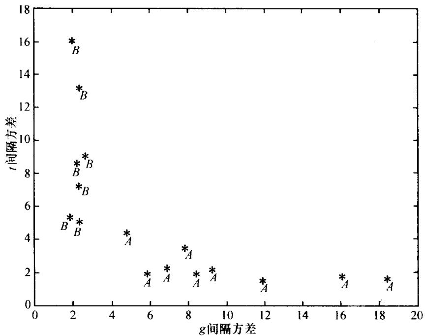

<details>
<summary>scatter</summary>

| Category | g间隔方差 | t间隔方差 |
| --- | --- | --- |
| B | ~2.0 | 16 |
| B | ~2.5 | 13 |
| B | ~2.5 | 8.5 |
| B | ~2.5 | 9 |
| B | ~2.5 | 7 |
| B | ~2.0 | 5 |
| B | ~2.0 | 4.5 |
| A | ~4.8 | 4.2 |
| A | ~5.8 | 1.8 |
| A | ~6.8 | 2.2 |
| A | ~8.0 | 3.4 |
| A | ~8.5 | 1.8 |
| A | ~9.2 | 2.1 |
| A | ~11.8 | 1.4 |
| A | ~16.0 | 1.6 |
| A | ~18.5 | 1.5 |
</details>

图1

方法二讨论 这种方法是从序列中相邻相同字母之间的距离即字母出现的周期性着手分析的。它统计了每个字母在序列中两次出现的间隔，并且用方差度量这种间隔的波动大小，由此找到了一个能较好区分A,B组的目标函数，综合地考虑了序列全局和局部的性质。

## 方法三 基于序列熵值

我们可以把一串 DNA 序列看成一个信息流, 这与生物学的基础知识是相应的. 关于 A、B 的分类, 可以考虑其单位序列所含信息量(即熵)的多少. 从直观上来看, 我们可以认为, 重复得越多, 信息量越少. 这是我们通过观察 A、B 组的特点而归纳出的方法.

设序列为 $L = (a_{1}, a_{2}, a_{3}, \dots, a_{n})$ ；前 $m$ 个字符所带的信息量为 $f_{m}(l)$ ，记

$$
g _ {m} (l) = f _ {m} (l) - f _ {m - 1} (l),
$$

即 $g_{m}(l)$ 为加上第 $m$ 个字母之后所增加的信息量. 然后, 由 $g_{m}(l) = f_{m}(l) - f_{m-1}(l)$ , 得 $f_{n}(l) = \sum_{i=1}^{n} g_{i}(l)$ , 则 $f_{n}(l)$ 为整个序列所带的信息量. $F_{3}(l) = \frac{f_{n}(l)}{|l|}$ 即为单位长度所带的信息量. 现在的问题就归结为如何找出一个合适的 $g_{m}(l)$ .

我们有理由认为: g 具有以下性质:

性质 $1: g_m(l) > 0$ 。即任意加上一个字符，它或多或少带有一定信息量；

性质 2: 第 m 个字符(或者是以它结尾的较短序列)与前面的序列(信息流)重复得越多, $g_{m}(l)$ 的值必然越小;

性质3：第 $m$ 个字符(或者是以它结尾的较短序列)如果和与它靠得越近的重复， $g_{m}(l)$ 的值越小；和与它离得越远的重复， $g_{m}(l)$ 的值越大；

性质 4: $f_{0}(l)=0$ .

对此,我们可以构造如下函数:

$$
g _ {m} (l) = \frac {b}{b + t _ {1} \sigma_ {1} + t _ {2} \sigma_ {2} + \cdots + t _ {p} \sigma_ {p}}
$$

其中 $b$ 为防止分母为零而设的一个小正数；

$$
\sigma_ {i} = \sum_ {i = 1} ^ {m} a ^ {t} \delta_ {i t};
$$

$\delta_{it} = \left\{ \begin{array}{cc}1 & \text{以第} m - t\text{个字符结尾的} i\text{字串且与以第} t\text{个字符结尾的} i\text{字串完全相同}\\ 0 & \text{否则} \end{array} \right.$

$a$ 为一个小于1的数, 其存在体现了 $g$ 的性质3, 即如果越近的位置出现重复, 认为字串信息量越少, 反之较多.

$\sigma_{i}$ 的表达式中， $t$ 表示两个相同字串之间的距离， $i$ 表示字串长度，这个表达式定量的给出距离和信息量之间的关系。

又由于长度不同的字串重复对信息量的影响是不同的,所以必须在 $\sigma_{i}$ 前乘上一个权值 $t_{i}$ ,由概率统计的知识可知,这种影响是呈指数上升的,则可选择一适当的常数 c>1,使得 $t_{i}=c^{i-1}$ ,这个表达式定量的给出长度和信息量之间的关系.

可以认为, 字串长度太大的重复非常少见, 则可将 $p$ 取为某一固定的正数. 那么, 给出 $a, b, c, p$ 四个参数, 就可以把 $f_n$ 严格确定下来. 通过反复上机搜索, 我们认为, 取 $p = 6$ , 即只检查长度为 1 到 6 的字串即可.

另外，取 $a = 0.392$ ， $b = 0.1$ ， $c = 3$ 可以将A、B组 $F_{3}(l)$ 值分得较开，并可以用来处理未知数据.

方法三讨论 这种方法从序列的信息量(熵)入手,认为当序列中有大量的重复元素时,信息量就会比重复少的序列所含有的信息少.所以,其侧重点是是序列前后的重复性,也就是序列元素的相关性.从所给的A,B两类中可以很清楚地看到B中序列重复量大,所含的信息明显少于A组,而这个特征就被我们定义的熵函数凸显出来.将DNA序列看成一个信息流的方法由于其在实际问题中的广泛背景,将会是一个很有价值的想法,统计学和信息论的一套非常成熟的强大工具也会在DNA研究中发挥巨大的作用.

## 综合模型的建立

以上我们分别用三种方法得出了分类方案,这三种方案分别基于三种不同的方面对问题进行分析.第一种方法主要考虑的是单个字母出现的频率;第二种方法主要考虑每个字母的出现是否具有周期性;而第三种方法则考虑的是每条DNA所蕴含的信息量.我们将这三种方法对A、B组自身进行了检验,都得到了较令人满意的结果,但因为每个模型都只突出考虑序列某一方面的特征,所以,总有一些不尽如人意的地方,于是,我们认为应该把三种方法综合起来考虑,使序列各方面的特征都能得到体现,以使分类更加科学.

下苗就是我们将几种方法综合考虑得到最后结果.

以上我们用三种方法得到了三个目标函数: $F_{1}(l), F_{2}(l), F_{3}(l)$ ，这三个目标函数可以作为分类的判别标准。将它们看成定义在序列空间 $L = \{l \mid l$ 是由 a, g, t, c 四个字母组成的序列上，作用于实轴上的函数。现在，我们必须找到一个函数 F，使得 F 可以体现序列的各个特征。

由于 $F_{1}(l), F_{2}(l), F_{3}(l)$ 的值域范围差别很大, 为了有效的比较这三个函数, 我们必须将它们归一化, 将 $\xi_{i} = f_{i}(l) (i = 1,2,3,$ 以下同) 看成一定义在 $L$ 空间上的随机变量, $A$ , $B$ 为 $L$ 的子集, 则将 $f_{i}$ 归一化得

$$
g _ {i} = \frac {\xi_ {i} - E \xi_ {i}}{\operatorname{Var} \xi_ {i}} \tag {1}
$$

而现有样本点 $f_{i}(11)$ , $f_{i}(12)$ , $\cdots$ , $f_{i}(120)$ 利用距估计方法估计得：

$$
\begin{array}{l} E \xi_ {i} = \frac {1}{n} \sum_ {j = 1} ^ {n} f _ {j} (l _ {j}) \\ \mathrm{Var} \xi_ {i} = \sqrt {\frac {1}{n - 1} \sum_ {j = 1} ^ {n} (f _ {j} (l _ {j}) - E S _ {j}) ^ {2}} \\ \end{array}
$$

代入(1)即得 $g_{i}$

现估计 $g_{i}$ 投射 $L$ 的点到实轴上后， $g_{i}(A)$ 和 $g_{i}(B)$ 的分界点 $x_{i}$ ，其中

$$
g _ {i} (A) = \{g (a) \mid a \in A \}
$$

$$
g _ {i} (B) = \{g (b) \mid b \in B \}
$$

以 $g_{1}$ 为例，A的10个样本点和B的10个样本点不能被一个分界点分开，由极大似然估计的思想，分界点应该把尽可能多的点分开，即

$$
x _ {i} \in (- 0. 2 7 6 7 5 8, 0. 4 8 2 2 9 6)
$$

由于 $g_{i}(l)$ 的分布未知，故只能假设其满足较均匀的分布，则A,B的分界点的最好估计为 $\frac{Eg_i(A) + Eg_i(B)}{2}$ ，而 $Eg_{i}(A) + Eg_{i}(B)$ 的矩估计为 $\sum_{i=1}^{20} g(l_i) = 0$ （由 $g$ 的定义）。恰好 $0 \in (-0.276758, 0.482296)$ ，则 $x_1 = 0$ 是分界点的最佳估计。

同理， $x_{2} = 0, x_{3} = 0$ 分别是 $g_{2}, g_{3}$ 对应分界点的最佳估计.

令 $F = a_{1}g_{1} + a_{2}g_{2} + a_{3}g_{3}$ ，则其分界点为 $x = a_{1}\times 0 + a_{2}\times 0 + a_{3}\times 0 = 0$

由 $F$ 的构造方法知, $F$ 作用到 A 样本上大于零, 作用到 B 样本上小于零. 我们确定适当的权值, 以此作为 A, B 的分类法即可. 根据不同的实际情况, 可以相应调节这三个权值, 以体现分类中的不同因素所在的比重. 在下面的计算中, 我们简单的取 $a_1 = 1, a_2 = -1, a_3 = 0.5$ . 得到的结果如表 4, 表 5 所示:

表 4

<table><tr><td colspan="2">序号</td><td>目标函数值</td><td colspan="2">序号</td><td>目标函数值</td><td colspan="2">序号</td><td>目标函数值</td><td colspan="2">序号</td><td>目标函数值</td></tr><tr><td></td><td>1</td><td>1.80288</td><td></td><td>6</td><td>1.75355</td><td></td><td>11</td><td>-1.38528</td><td></td><td>16</td><td>-2.60295</td></tr><tr><td rowspan="2">A</td><td>2</td><td>1.75894</td><td>A</td><td>7</td><td>1.25115</td><td>B</td><td>12</td><td>-1.22372</td><td>B</td><td>17</td><td>-0.0165438</td></tr><tr><td>3</td><td>2.5887</td><td></td><td>8</td><td>1.41371</td><td></td><td>13</td><td>-0.940004</td><td></td><td>18</td><td>-1.31022</td></tr><tr><td rowspan="2">组</td><td>4</td><td>0.27582</td><td>组</td><td>9</td><td>1.9011</td><td>组</td><td>14</td><td>-0.93612</td><td>组</td><td>19</td><td>-2.6043</td></tr><tr><td>5</td><td>2.1781</td><td></td><td>10</td><td>1.97282</td><td></td><td>15</td><td>-2.27465</td><td></td><td>20</td><td>-3.603</td></tr></table>

表 5

<table><tr><td>序号</td><td>目标函数值</td><td>类别</td><td>序号</td><td>目标函数值</td><td>类别</td></tr><tr><td>21</td><td>-1.96454</td><td>B</td><td>31</td><td>-1.06638</td><td>B</td></tr><tr><td>22</td><td>0.873279</td><td>A</td><td>32</td><td>-0.668504</td><td>B</td></tr><tr><td>23</td><td>2.32887</td><td>A</td><td>33</td><td>-0.877053</td><td>B</td></tr><tr><td>24</td><td>-1.48005</td><td>B</td><td>34</td><td>2.60904</td><td>A</td></tr><tr><td>25</td><td>1.21328</td><td>A</td><td>35</td><td>1.69535</td><td>A</td></tr><tr><td>26</td><td>-1.184</td><td>B</td><td>36</td><td>1.22298</td><td>A</td></tr><tr><td>27</td><td>1.22569</td><td>A</td><td>37</td><td>1.83991</td><td>A</td></tr><tr><td>28</td><td>-3.71616</td><td>B</td><td>38</td><td>-3.01466</td><td>B</td></tr><tr><td>29</td><td>2.69272</td><td>A</td><td>39</td><td>0.499763</td><td>A</td></tr><tr><td>30</td><td>0.550393</td><td>A</td><td>40</td><td>-2.77993</td><td>B</td></tr></table>

由以上数据可以看出,我们构造的目标函数具有较好的区分度.对于A组,目标函数值都大于零;而对B组,目标函数值都小于零.也就是说,用这种方法,对A、B组样本的区分率已达到了100%.正如前面所说,这种方法综合了序列中的许多信息.因此,我们完全可以采用这个标准来区分C组.表5是对C组区分的结果.

对 20 个未标明分类的人工序列的分类结果为：

A 类:22,23,25,27,29,30,34,35,36,37,39

B类:21,24,26,28,31,32,33,38,40

同样的,我们利用这种方法对所给的182个自然序列进行了分类,结果如下所示(略).

## 5 模型的评价及推广

在我们的模型基础上提出的分类方法可以很好的验证已知的20个序列，并且很好的完成了对未知类型序列的分类。我们认为这种模型，同时考虑了序列中元素的局部性质和序列的全局性质，具有相当的实际背景。当我们知道分类标准的更多信息时，我们可以很方便的调整模型中的参数，使之符合新的情况，具有很好的自学习性。但这个模型比较复杂，在实际计算中参数选择需要花费大量计算时间进行搜索。

我们在模型中使用的基于信息流的方法中,如果选取更为合适的熵函数,一定可以使它更加符合实际情况;在三种方法综合的时候,所取的权值也是可以采用更为有效的方法选取,如应用层次分析法;还可以选取其他分类方法加入.这些都是本模型可以改进的地方.

## 参考文献

[1] 姜启源. 数学模型(第二版). 高等教育出版社, 1992.  
[2] 刘郁强等．序列空间方法．广东科技出版社，1996.  
[3] 刘祖洞. 遗传学(第二版). 高等教育出版社, 1991.  
[4] 姜丹，钱玉美．信息理论与编码．中国科学技术大学出版社，1992.  
[5] 王玲玲等．常用统计方法．华东师范大学出版社，1994.  
[6] 陆璇. 应用统计. 清华大学出版社, 1999.

# 关于 DNA 序列分类问题的模型

冯 涛 康喆雯 韩小军

(大连理工大学, 大连 116024)

指导老师 贺明峰

编者按 本文以统计方法提取样本特征,以之作为BP神经网络的输入,用MATLAB中相应算法进行训练.然后用于解决本分类问题,得到了较准确的结果.本文提取特征时考虑较为全面,在此基础上正确地运用了神经网络方法,发挥了神经网络适用于非线性问题、具有自适应能力的优点.思路清楚,文字简练.

摘要 本文提出了一种将人工神经元网络用于DNA分类的方法。作者首先应用概率统计的方法对20个已知类别的人工DNA序列进行特征提取，形成DNA序列的特征向量，并将之作为样本输入BP神经网络进行学习。作者应用了MATLAB软件包中的Neural Network Toolbox(神经网络工具箱)中的反向传播(Back propagation BP)算法来训练神经网络。在本文中，作者构造了两个三层BP神经网络，将提取的DNA特征向量集作为样本分别输入这两个网络进行学习。通过训练后，将20个未分类的人工序列样本和182个自然序列样本提取特征形成特征向量并输入两个网络进行分类。结果表明：本文中提出的分类方法能够以很高的正确率和精度对DNA序列进行分类，将人工神经元网络用于DNA序列分类是完全可行的。

## 1 问题重述(略)

DNA 序列由四个碱基 A、T、C、G 按一定规律排列而成。已知所给人工序列 1-10 属于 A 类, 11-20 属于 B 类。本题中, 我们的主要工作有两个:

1) 提取 A、B 两类特征；  
2) 以所提取 A、B 两类特征为依据, 把 20 个人工序列及 182 个自然序列分为 A、B 两类 (可能存在同时不具有 A、B 两类特征, 不能归为 A、B 中任一类的序列).

在本题中,先以序列 1-20 为依据,提取出 A、B 两类序列的统计特征,然后运用神经网络中的 BP 网络对未知序列进行了分类识别.

## 2 模型建立的理论依据

神经网络是近年来发展的一种大规模并行分布处理的非线性系统 $^{[1]}$ ，其主要特点有：

1) 能以任意精度逼近任意给定连续的非线性函数；  
2）对复杂不确定问题具有自适应和自学习能力；  
3) 具有较强的容错能力和信息综合能力,能同时处理定量和定性的信息,能很好地协调多种输入信息的关系.

传统的分类识别方法,对于一般非线性系统的识别很困难,而神经网络却为此提供了一个强有力的工具.它实质上是选择了一个适当的神经网络模型来逼近实际系统.目前,在神经网络中应用最多的是BP网络.

对于具有 $n$ 个输入节点, $m$ 个输出节点的BP网络, 输入到输出的关系可以看作是一个 $n$ 维欧式空间到 $m$ 维欧式空间的映射, $F: R^n \to R^m$ , 这一映射是高度非线性映射. K.T.
Funahashi 于 1989 年证明了这样的一个定理 $^{[2]}$ : 如果 BP 网络隐层节点可以根据问题的不同作相应的配置的话, 那么用三层的激励函数为双曲线正切型的 BP 网络, 可以以任意精度逼近任意连续函数. 这一定理保证了 BP 网络在分类识别问题中的可用性.

将复杂系统看作是一个黑箱,以实测输入,输出数据为学习样本,送入BP网络,网络通过样本进行学习,在学习过程中,网络的权值不断地修改 $^{[3]}$ ,使输入到输出的映象逐渐与实际对象的特性相逼近,但网络输出的整体误差E小于给定的标准时,整个网络便模拟出实际系统的外部特性.

实际分类识别问题中,输入空间一般是多维欧式空间,我们可以计算空间中点与点的欧式距离,并根据这些距离知道哪些样本互相靠得近,哪些样本相距甚远,也就是说在输入空间中存在着一个距离度量,只要输入模式接近于某个输出模式,由于BP网络所具有的联想记忆能力,则网络的输出亦会接近学习样本的输出.

## 3 模型的基本假设

1) 假设碱基序列的特征值包括以下两个内容: (1) 单个碱基在序列中的数量特征, 即 A, T, C, G 四种碱基在序列中的含量; (2) 特征碱基串在序列中的数量特征(包括双字符碱基串和三字符碱基串).  
2) 由于给定的已知碱基序列是从 DNA 全序列中随机截取出来的, 因此无法确定序列的起始位, 无法从序列中辨认出氨基酸. 假设在对 DNA 序列分类时, 是从碱基层次上进行分类, 而不是从氨基酸层次上分类.

## 4 模型的建立与求解

## 4.1 提取 A、B 两类的特征

经过计算,我们提取出 A、B 两类的统计特征(a)和(b),具体方法如下:

特征(a): 单个字符出现的频率. 特征(a)对应基本假设1中的第1条

对 1-20 每个人工序列, 我们统计出单个字符 A、T、C、G 出现的频率 Pi, Pi = Ti / (S - M + 1), i = A, T, C, G

S 为序列长度, M 为字符长度(这里, M=1), Ti 为每个序列中 i 出现的次数.

序列 1-20 特征(a)的数值如下:(略)

特征(b): 特征字符串出现的频率. 特征(b)对应基本假设1中的第2条

通过对序列1-20种A、T、C、G四字母的不同组合(如两两组合,三三组合,四四组合)出现频率的分析,可以知道:对于双字符串和三字符串,均出现了数种多次出现较有规律的组合形式,而对于四四组合及更长的组合,字符串重复出现的频率小,分散度大,未得出较有规律的组合方式.我们认为:充分统计并分析序列1-20种双字符串及三字符串出现的规律已能较为全面地认识序列中的局部相关性及A、B两类的特征差异.因此,只对序列1-20种的双、三字符串进行统计分析,找出特征双字符串,特征三字符串.

以下是以提取特征三字符串为例介绍统计算法：

第一步 确定各字符串的优先权重

三字符串共有64种可能排列方式,对这些三字符串进行初次排列,确定优先权重.

以 A 类序列 1 为例,aggcacggaa......gcttgg.

1) 指针指向第一个字符 a, 向后数两个字符, 第一个出现的三字符串是 agg, 记录 agg.  
2) 指针向后移一个字符, 第二个出现的三字符串是 ggc.  
3) 以此类推, 记录到该序列中最后一个三字符串 (tgg) (特别的, 如果相邻两个字符串完全相同, 只纪录一次).

同理可得序列 2-10 种所有出现的三字符串, 最后把 A 类中所有这些三字符串按其出现频率大小进行排序, 出现频率多的字符串优先权重就大.

第二步 选出特征字符串,对字符串进行二次排序,找出特征字符串.

仍以 A 类序列 1 为例:aggcacggaa

1) 先考虑前 5 个字符, aggca, 其中包含了 3 个三字符串: agg, ggc, gca, 按第一步所得的三字符串优先权重的大小, 确定这 3 个字符串中有一个为特征字符串 (如果 ggc 在前 10 个序列中出现的频率比 agg 和 gca 大, 那么在本例中就选 ggc, 而不考虑第一个字符 a).  
2)再把指针移至特征字符串后的第一个字符(本例中移向a)重复(1)操作．以此类推，直至找出A类序列1-10种所有特征字符串.

我们采用分类统计的方法进行排序,B类的操作方法同A类.

第三步 把 A、B 两类的所有特征字符串进行排序, 计算出每个特征字符串在两类序列 (1-20) 中出现的总次数. 如果小于 5 次, 认为此字符串不能体现 A、B 两类的特征差异, 不予考虑. 这样, 统计出 1-20 中出现频率较大的特征三字符串 (共 21 种), 他们在每个序列中出现的频率为: $3 *$ 该字符串在本序列中出现的次数 $/(\mathrm{S}-\mathrm{M}+1)$ , 这里, $\mathrm{M}=3$ )

统计特征二字符串时,采取类似的方法,得出15个特征二字符串:他们在每个序列中出现的频率为:2\*该字符串在本序列中出现的次数/ $(S-M+1)$ ,这里,M=3).

## 4.2 网络输入与输出变量的选取及处理

选取网络的输入变量时,如输入变量过少,能引起建模不充分,过多的输入变量会降低网络的学习速度,延长收敛时间,使模型的输入输出关系过于复杂.结合本题的实际情况,我们提出两套输入变量选取方案.

方案 1 输入每个序列中单字符及特征三字符串出现的频率(共 25 个输入变量)

方案 2 输入每个序列中单字符及特征双字符串出现的频率(共 19 个输入变量)

如果要同时考虑单字符,特征双、三字符串出现的频率共需40个输入变量,模型过于复杂.因此,暂不考虑这种方案.

规定: A 类序列的期望输出值为 -1, B 类为 1. 这样, 通过观察 BP 网络的输出值, 可以直观地判断未知序列的类别.

## 4.3 BP 网络的结构与参数

BP 网络的结构与参数决定着网络学习的效果和分类识别的精度。其中，输入、输出节点数由实际问题决定，本题中输出节点为 1 个。需要选择的是网络的激发函数，隐层数及各层隐节点数。

对方案 1、2, 各构造网络 1、2 与之相对应. 对于这两个网络, 均选用三层 BP 网络, 各层激发函数均为双曲线正切函数 (函数值在 -1\~+1 之间变化).

R. P Lippmann 研究中指出 $^{[4]}$ : 对于任给 K 个实数值样本, 有 $2K + 1$ 个隐节点的三层网络可以记忆它们, 这个隐单元的激发函数可以是任何渐近函数. 基于这一结论, 我们根据样本集的规模,选隐层节点数 N=5,这样可使网络有能力记忆全体样本,不至于在学习过程中丢失前面的学习过的样本的信息.

## 4.4 网络的训练及检验

在已知类别序列 $1 \sim 20$ 中, 取 A 类前 7 个序列 $(1 \sim 7)$ 和 B 类前 7 个序列 $(11 \sim 17)$ 作为训练样本集 Strain, 序列 $8 \sim 10, 18 \sim 20$ 作为检验样本集 Stest 对网络 $1:25 - 5 - 1$ 及网络 $19 - 5 - 1$ 进行训练, 给定样本总体误差标准为 $10 - 5$ . 当网络学习收敛于给定的标准后, 用检验样本集进行分类检验, 考察其分类识别的准确性. 网络 1、2 的初始权值均为 $-0.2 \sim +0.2$ 之间的随机数. 学习算法采用了两种改进措施相结合的 BP 算法, 即变周期和变步长相结合的方法, 用以提高网络的收敛速度. 在网络 1 开始训练时, 学习率 $\eta$ 取 0.9 (网络 2 取 1.0), 惯性系数 $\alpha$ 取 0.6 (网络 2 取 $\alpha$ 为 0.7), 修正周期 $T$ 取 10. 随着误差 $E$ 的减少, 网络不断逼近对象的输出特性, 此时, 逐渐减少 $\eta$ 及 $\alpha$ , 增大 $T$ , 直至网络收敛于给定的标准. 训练达到稳定时, 两个网络对训练样本集的学习速率曲线如图 1(a) 和图 2(a)(略), 此时对检验样本的检验结果如图 1(b) 和图 2(b)(略):

图 1(a) 和图 2(a)，网络 1 进行了 303 步，网络 2 进行了 241 步的学习后，就达到了精度要求，均学习速率较快，效率较高。

图 1(b) 和图 2(b)，如果允许误差为 10%，那么此时网络 1 对检验样本分类的准确性为 98.3%，网络 2 为 94.7%，命中率均为 100%，我们将检验集加入到训练集中，得组合集 Strain + test。网络用此集进行学习。收敛后，网络 1、2 可对未知序列进行分类识别了。

## 5 结果及分析

## 5.1 对人工序列 21\~40 的分类

我们应用 MATLAB 软件包中的神经网络工具箱(BP 网络)对未知序列进行分类. 我们发现: 若以高于 0.9 和低于 -0.9 作为分类标准, 两个 BP 网络的命中率相同, 但输出函数值不等, 网络 1 的输出值与期望值更接近. 这种情况出现的原因是:

①网络 2 中输入变量较网络 1 少,在样本集个数相同的情况下,建模不够充分;  
②双字符串的组合形式较三字符串少,因此,采用特征三字符串能有更好的体现序列中片段的相关性.

经过反复训练、检验、分类,我们发现:网络1较网络2学习速度快,对未知序列区分的精度更高,因此,认为网络1更优.

在这里,采用网络1的分类结果,即:A类:22,23,25,27,29,34,35,37,39;B类:21,24,26,28,30,31,32,33,36,38,40.

## 5.2 对182个自然序列的分类

我们把 $21\sim 40$ 中已明确分类的序列加入到样本中，重新对网络1进行训练，直至达到误差 $10^{-5}$ 。分别以高于0,0.2,0.5和低于0,0.2,0.5作为分类标准，对182个自然序列的分类结果为：(略)

随着分类标准的变化,分类率随之变化.采用0作为分类标准可把182个自然序列分开.

## 6 模型的优缺点及改进方向

## 优点：

① 基因特征这种非线性系统很难用数学方程表达出来,而且可利用的样本有限,以至于传统的分类识别方法显得无效,神经网络从其良好的学习功能和很强的非线性计算能力,为分类提供了一种新方法;  
② 传统的分类方法是一种模型驱动方法,大部分统计模型基于线性回归,而神经网络用数据驱动方式来解决分类问题,它通过样本学习逼近实际系统模型的能力很强;  
③ 由于 BP 网络的信息分布性,各输入变量对输出变量的影响在对样本学习时已自动记下,并由整个网络的内部表达而表现出来,从而省略了通常建模前所需的对各变量的相关分析;  
④ BP 网络有更多的可调变量(各权值、阀值), 故网络可以以更复杂的方式逼近系统的外部特征. BP 模型的不足之处在于存储于各权上的知识人们无法理解, 所建立的模型难以用解析方式表达出来.

## 改进方向：

① 样本集如何处理,更能改善网络的学习效果,提高识别精度;  
② 研究网络的结构及诸参数与分类效果的关系；  
③ 如何根据样本集的选择网络学习参数,以提高网络的收敛速度;  
④ 研究适用于分类识别问题的神经网络的闭环结构,利用反馈信息,提高网络预测的精度.

## 参考文献

[1] 王永骥, 徐建. 神经网络控制. 机械工业出版社, 1998.  
[2] Funahashi K J. the Appronimate Realization of Continuous Mapping by Neural Networks. Neutral Networks, 1989, (2).  
[3] Rumelhart D E, Moclell J L. Parallel Distributed Processing: Exploration in the Microstructure of cognition. MIT Press, London, 1996.  
[4] 袁曾任. 人工神经网络及其应用. 清华大学出版社, 1999.  
[5] 陈明. 神经网络模型. 大连理工大学出版社, 1995.  
[6] 楼顺天, 施阳. 基于 MATLAB 的系统分析与设计——神经网络. 西安电子科技大学出版社, 1999.  
[7] 王士同, 陈剑天. 问题求解的人工智能神经网络方法. 气象出版社, 1995.  
[8] 胡守仁. 神经网络应用技术. 国防科技大学出版社, 1993.

# DNA 分类模型

杨健 王驰 杨勇

(北京大学，北京 100871)

指导老师 王鸣

编者按 本文将 DNA 序列的碱基的组合看作“文章”的关键词,用逐步优选法对关键词进行优选并用分层分类的方法进行分类.从理论上说,这一方法可以提取较好的特征,而且分类也较精细.这一模型有一定创造性,分析问题比较精细而贴近实际,思路清楚,叙述通顺简练.

摘要 本模型充分利用了所给数据的特点,运用统计、最优化等数学方法,从已知样本序列中提炼出能较好代表两类特征的关键字符串,据此提出量化的分类标准,能较好的对任给DNA序列进行分类.首先,从已知样本序列中用广度优先法选出所有重复出现的字符串,并计算其标准化频率及分散度.然后,利用样本数据结合最小二乘法确定两类字符串各自的优先级函数,并且逐步优化其参数使之达到稳定,提高了可信度.最后,根据优先级函数找出关键词,然后确定权数,用层次分析法对未知样本进行分类,并定出显著水平,从而得到了一个比较通用的分类方法.经过检验,此方法对21—40号待测样本进行了很好的分类,对后面的182个DNA序列进行同样的操作,也有较好的效果.

## 1 问题的重述(略)

## 2 模型假设

(1) 假定待分类样本 21—40 中既不属于 A 类也不属于 B 类的样本百分比不超过 5%.  
(2) 假设 keyword 的重要性与 $t$ 和 $s$ 有确定的关系, 且只与 $t$ 和 $s$ 有关 ( $t, s$ 定义见下).  
(3) 假设不代表 A、B 类特征的字符串在 DNA 序列中是均匀分布的.

## 3 模型的分析

从所给的 DNA 序列观察发现,很多字符串重复出现的频率很高,而且有些字符串在 A 类和 B 类中出现的次数有很明显的差距,这暗示把某些字符串作为 A,B 两类的一个分类标准.所以应对 A、B 两类已知样本做统计分析,找出其中可能代表该类特征的字符串.因为每个字符串重要性可能不一样,所以对这些字串的重要性排序,选出最能代表该类特征的一部分字串.然后用这些字串作为标准判断验证 A,B 两类,看所选的标准的准确性,最后用于任何一个 DNA 序列的分类.

## 4 定义与符号说明

A 类样本: 编号为 1—10 的 DNA 序列.

B 类样本: 编号为 11—20 的 DNA 序列.

词(word): 由 a, c, t, g 组成的在样本中重复至少两次的字符串.

关键词(keyword): 能代表 A 类或 B 类的特征由 a, c, t, g 组成的词.

分散度(s): 指某一类中包含某个 word 的 DNA 序列的个数.

出现次数(l):某一字符串在 DNA 序列中的出现次数

序列长度(n):DNA 序列的长度

字符串长(m): 字符串的长度

标准化频率(t): $t = l \frac{4^{m}}{n} m$ 标准化了的词的出现次数

优先级函数 $(f)$ :衡量词重要性的指标,是s和t的函数.

权值(D):衡量 DNA 序列类别特征的量化指标

## 5 模型的建立与求解

## (1) Keywords 的选择

选择 keyword 是所有工作的基础,能否对基因序列进行有效的分类在很大程度上依赖 keyword 选择的好坏,所以我们的原则是所选的 keyword 一定要能代表 A 类和 B 类基因序列的尽量全面的特征,并且所选的 keyword 应对两类基因有好的区分度,以利于分类.

第一步:选择 word(广度优先法). 以 A 类样本为例:

① 计算字长为 1 的 word 的出现次数, 并置 i = 1;  
② 分别以字长为 $i$ 的各结点为根结点。对每一个根结点，若其出现次数大于1，在其后分别加入‘a’、‘c’、‘g’、‘t’，组成长度为 $i + 1$ 的新字符串，计算其出现次数及出现位置。

例如：i=1 时，字长为 1 的 word‘a’、‘c’、‘g’、‘t’ 可做根结点。对于‘g’，在其后分别加入‘a’、‘c’、‘g’、‘t’，生成‘ga’、‘gc’、‘gg’、‘gt’ 四个长度为 2 的新串。

③ 若②中找到了新词, 则置 $i = i + 1$ , 转到②, 否则结束. 程序流程图如图1:

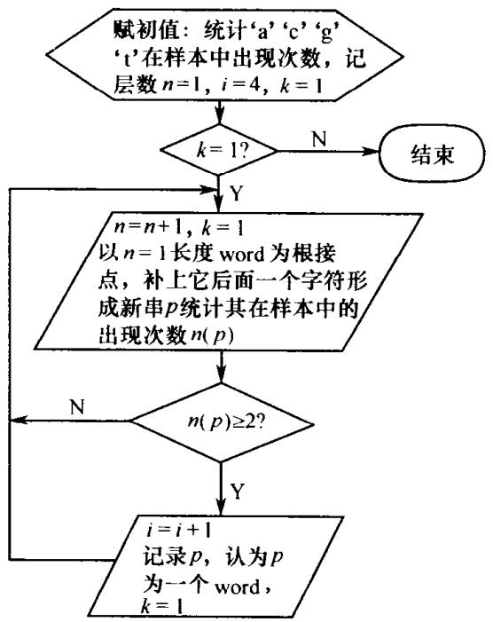

<details>
<summary>flowchart</summary>

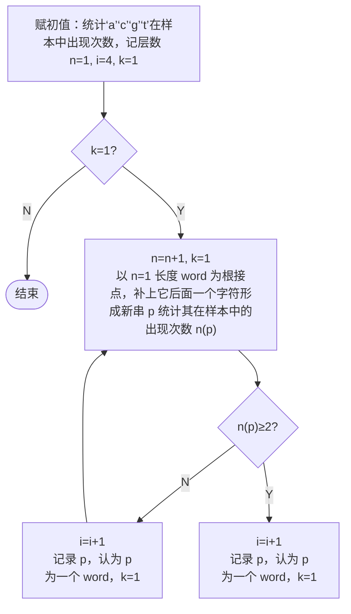
```mermaid
graph TD
  A["赋初值：统计‘a’‘c’‘g’‘t’在样本中出现次数，记层数 n=1, i=4, k=1"] --> B{"k=1?"}
  B -->|N| C([结束])
  B -->|Y| D["n=n+1, k=1\n以 n=1 长度 word 为根接点，补上它后面一个字符形成新串 p 统计其在样本中的出现次数 n(p)"]
  D --> E{"n(p)≥2?"}
  E -->|N| F["i=i+1\n记录 p，认为 p\n为一个 word，k=1"]
  F --> D
  E -->|Y| G["i=i+1\n记录 p，认为 p\n为一个 word，k=1"]
```
</details>

图1

## 第二步:选择 keywords(逐步优选法)

现在我们已经有了 A、B 类的所有的 word, 下面要在这些 word 中选出好的 keyword.

①选择典型代表.

我们认为,对于每一个 word,标准化频率 $t$ 和分散度 $s$ 越大,它越具有代表性,所以我们先在所有的 word 中人工粗选出一些明显具有类别特征的 word 作为初选关键词,选择时,不妨多选出一些,尽量不要丢失信息,也就是‘囫囵吞枣’,我们在具体操作时,对 A、B 类各选出了 30 个左右.

②进行初步优选：

我们假定 keyword 的重要性只与 $t$ 和 $s$ 有关, 而且这种关系在一定的范围内有确定的解析表达式, 我们想找出这个函数关系 $f$ .

显然， $f$ 是 $s$ 的增函数，也是 $t$ 的增函数，所以假设 $f$ 具有形式：

$$
f (s, t) = s ^ {\alpha} t ^ {\beta} \tag {1}
$$

其中 $\alpha$ 和 $\beta$ 分别称为 $s$ 和 $t$ 的影响力因子

对于某个 word, 由(1)式求出的值称为它的 f 值

接下来我们用上面选出的30多个word结合最小二乘法来确定 $\alpha$ 和 $\beta$ ．以A类为例，设A类中粗选的word分别有值：

$$
t _ {1}, t _ {2}, \dots , t _ {3 9} \text {和} s _ {1}, s _ {2}, \dots , s _ {3 9}
$$

为了运用最小二乘法对(1)式取对数有：

$$
\log f = \alpha \log s + \beta \log t \tag {2}
$$

我们期望好的 keyword 的 $f$ 值都较大, 而且稳定在某个下限之上, 所以把 A 类的 39 个 word 的 $f$ 的期望值定为 50.0 (这个值只具有相对意义, 具体定为多少对模型的优劣没有影响). 然后对这 39 个样本运用最小二乘法, 即: 求 $\alpha$ 和 $\beta$ , 使得

$$
g (\alpha , \beta) = \sum_ {i = 1} ^ {3 9} (\alpha \log s _ {i} + \beta \log t _ {i} - \log 5 0) ^ {2} \tag {3}
$$

达到最小

利用 MATLAB 提供的优化工具箱处理此最小二乘问题, 得到

$$
\alpha_ {A} = 0. 4 6 2 5 \quad \beta_ {A} = 0. 8 0 5 7
$$

同样处理B类的26个word同样处理得到：

$$
\alpha_ {B} = 0. 2 2 1 7 \quad \beta_ {B} = 1. 3 0 6 0
$$

这样,我们就得到了 A 类 B 类的优先级函数的表达式:

$$
f _ {A} = s ^ {\alpha_ {A}} t ^ {\beta_ {A}} \tag {4}
$$

$$
f _ {B} = s ^ {\alpha_ {B}} t ^ {\beta_ {B}} \tag {5}
$$

这个函数只是一个初步的函数,在下面的步骤中还会进一步优化函数的参数值.

将 A 类 B 类的所有 word 的 s 和 t 值分别代入(4)(5)式, 得到每个 word 对应的 f 值, 即优先级, 将每类的 word 按优先级大小排序, 选择优先级最高的 16 个 word 作为每类初步优化后的 keywords

③ 对上面得到的 keywords 重复第②步的方法,用最小二乘法求出每类新的 $\alpha$ 和 $\beta$ 值,这样就得到了进一步优化之后的优先级函数,用此函数算出每个 word 新的优先级,再选择优先级最高的 16 个作为进一步优化之后的 keyword.

④重复几遍第③步, 直到 $\alpha$ 和 $\beta$ 的值达到稳定. 此时的结果是:

$$
\alpha_ {A} = 0. 4 5 8 5 \quad \beta_ {A} = 0. 8 8 5 1
$$

$$
\alpha_ {B} = 0. 2 3 4 7 \quad \beta_ {B} = 1. 3 7 6 9
$$

至此,选择 keyword 的工作结束,而且得到的 keyword 是按优先级大小排序的.

由上面的工作步骤可以看出,这 32 个 keyword 基本上代表了 A 类 B 类的特征,而且 A 类 B 类的 keyword 基本没有重复,有很好的区分度. Keywords 见表 1.

表 1 选择的关键字

<table><tr><td colspan="3">A组</td><td colspan="3">B组</td></tr><tr><td>关键字</td><td>出现次数</td><td>分散度</td><td>关键字</td><td>出现次数</td><td>分散度</td></tr><tr><td>agga</td><td>32</td><td>9</td><td>taa</td><td>50</td><td>10</td></tr><tr><td>ga</td><td>109</td><td>10</td><td>ttta</td><td>52</td><td>10</td></tr><tr><td>ggcgg</td><td>28</td><td>7</td><td>aa</td><td>119</td><td>10</td></tr><tr><td>ggc</td><td>69</td><td>9</td><td>tat</td><td>148</td><td>10</td></tr><tr><td>ggaggc</td><td>11</td><td>8</td><td>at</td><td>131</td><td>10</td></tr><tr><td>aa</td><td>115</td><td>8</td><td>ttaa</td><td>34</td><td>10</td></tr><tr><td>agg</td><td>65</td><td>4</td><td>tatt</td><td>36</td><td>10</td></tr><tr><td>ggaa</td><td>34</td><td>10</td><td>ta</td><td>62</td><td>10</td></tr><tr><td>ggcgga</td><td>17</td><td>10</td><td>att</td><td>80</td><td>10</td></tr><tr><td>a</td><td>318</td><td>10</td><td>a</td><td>325</td><td>10</td></tr><tr><td>cgg</td><td>80</td><td>10</td><td>ttat</td><td>42</td><td>10</td></tr><tr><td>cgga</td><td>42</td><td>10</td><td>attt</td><td>44</td><td>10</td></tr><tr><td>ggagg</td><td>26</td><td>9</td><td>tta</td><td>105</td><td>10</td></tr><tr><td>gga</td><td>93</td><td>10</td><td>ttttttt</td><td>58</td><td>10</td></tr><tr><td>gg</td><td>198</td><td>10</td><td>t</td><td>552</td><td>7</td></tr><tr><td>g</td><td>425</td><td>10</td><td>ttt</td><td>193</td><td>10</td></tr></table>

图 2 为每个 word 的优先级对分散度、标准化频率的图象．其中 keyword 用圈标出．从图中看出，用逐步优选法求出的 keyword 确实分别代表了 A、B 类的重要特征．

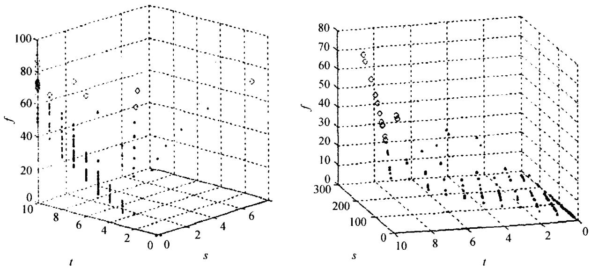  
图2

图 3 为逐步优选法的流程图. 需要注意的是, word 的 f 值不仅是提取 keyword 的标准, 而且也反映了每个 keyword 的重要程度, 这对于以后的基因分类标准也具有重要的价值.

## (2) 加权系数的确定

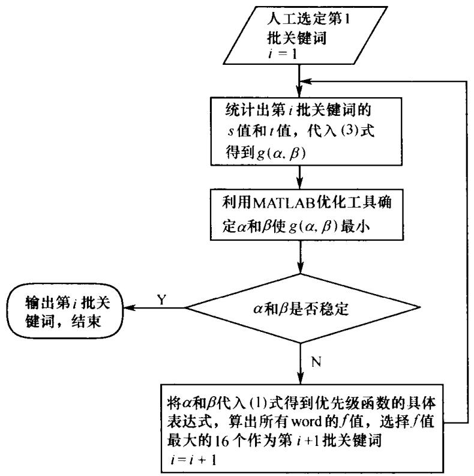

<details>
<summary>flowchart</summary>

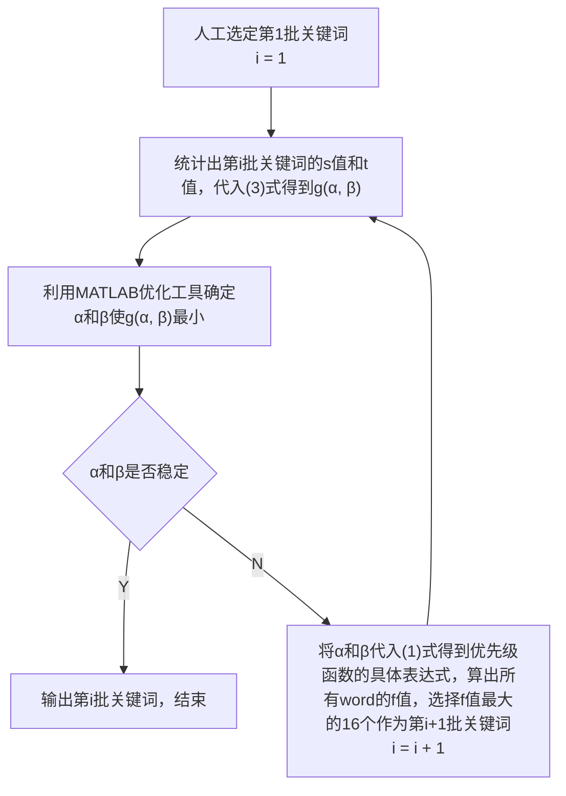
```mermaid
graph TD
  A["人工选定第1批关键词\ni = 1"] --> B["统计出第i批关键词的s值和t值，代入(3)式得到g(α, β)"]
  B --> C["利用MATLAB优化工具确定α和β使g(α, β)最小"]
  C --> D{"α和β是否稳定"}
  D -->|Y| E["输出第i批关键词，结束"]
  D -->|N| F["将α和β代入(1)式得到优先级函数的具体表达式，算出所有word的f值，选择f值最大的16个作为第i+1批关键词\ni = i + 1"]
  F --> B
```
</details>

图3

现在来提取A类和B类基因序列的主要特征以便提出分类标准.

对于某条基因序列 P，我们假定它相对于每一类的权值 D 只与此类 keyword 在 P 中的出现次数 l 和 keyword 的优先级(即 f)有关，我们希望找到这个关系.

显然,一个合理的假定是: P 的权值 D 是 l 和 f 值的某种组合. 设某条基因序列 P 的权值具有表达式:

$$
D _ {A} (P) = \sum_ {i = 1} ^ {1 6} f _ {A, i} ^ {\lambda_ {A}} x _ {A, i} (P) \tag {6}
$$

$$
D _ {B} (P) = \sum_ {i = 1} ^ {1 6} f _ {B, i} ^ {\lambda_ {B}} x _ {B, i} (P) \tag {7}
$$

式(6)中， $f_{A,i}$ 是 A 类第 i 个 keyword 的优先级函数值

$x_{A,i}$ 是序列 P 中具有 A 类第 i 个 keyword 的个数

$\lambda_{A}$ 称为 A 类 keyword 的影响力因子

式(7)中的变量、参数同理理解.

称 $D_{A}(P)$ 为基因序列 $\pmb{P}$ 的 $D_{A}$ 值， $D_{B}(P)$ 为 $\pmb{P}$ 的 $D_{B}$ 值

下面来确定 $\lambda_{A}$ 和 $\lambda_{B}$ ，以 $\lambda_{A}$ 为例.

我们期望对于10个A类样本，它们的 $D_{A}$ 值都较大且稳定在某个定值(设为 $d$ )周围，另外，为了提高分类效率我们把 $\lambda_{\mathrm{A}}$ 推广为 $\lambda_{\mathrm{A,k}}$ ，表示只与前 $k$ 个keyword有关，它的作用在第3点详细讨论．借用最小二乘法的思想，令

$$
h \left(\lambda_ {A, k}\right) = \sum_ {i = 1} ^ {1 0} \left(\sum_ {j = 1} ^ {k} f _ {A, j} ^ {\lambda_ {A, k}} (P _ {i}) - d\right) ^ {2} \tag {8}
$$

利用 MATLAB 的最优化工具箱, 就可以确定 $\lambda_{A,k}$ 的值使 $h(\lambda_{A,k})$ 达到极小(与上面的

分析相同，d 只具有相对意义，它的选择对模型好坏没有影响).

## 3 层次分类法

现在要确定一个分类标准值 $r$ ，当待分类样本 $P$ 对某类的权值 $>r$ 时就将 $P$ 分为该类。但通过上面确定 $\lambda_{A,k}, \lambda_{B,k}$ 的过程可以看出，由 A、B 类的已知样本确定 $r$ 值会使标准过高，所以用待分类的 20 个样本确定 $r$ 。一个合理的假设是这 20 个样本中既不属于 A 也不属于 B 的样本数很少 ( $\leqslant 5\%$ )。用下面的程序经过几次实验即可得出较合适的 $r$ 值。

另一个问题是选取多少个 keyword. 选择越多的 keyword 标准越严, 所以在算法中将 $k$ 从 16 逐一递减到 $7 (k < 7$ 时 $\lambda_{A,k}$ 为负值, 标准无判断力), 逐层判别 $P$ 是否属于 A、B 类. 计算方法:

对于待分类样本 $P$ ，先取定一个 $r$ 值. 使用最严格的标准，即 $k = 16$ ，计算 $D_A(P)$ ，若大于 $r$ ，则认为 $P$ 属于A类，并记下此时的 $k$ 值和 $D_A(P)$ ，否则逐步降低 $k$ 值并与 $r$ 比较，直到 $k = 7$ 为止. 若此时 $D_A(P)$ 仍然小于 $r$ ，则认为 $P$ 不属于A. 同理可判断 $P$ 是否属于B.

上述算法中 $r$ 的确定：

在保证不漏掉一个待分类样本的条件下,使被同时归为 A,B 两类的样本数最小(不超过待分类样本总数的 5%).

据此标准确定的 r 值为 4.565(表 2)

表 2 $\lambda_{A}$ 、 $\lambda_{B}$ 的计算值

<table><tr><td></td><td>1</td><td>2</td><td>3</td><td>4</td><td>5</td><td>6</td><td>7</td><td>8</td></tr><tr><td> $\lambda_A$ </td><td>-3.5033</td><td>-1.7439</td><td>-1.1226</td><td>-0.9562</td><td>-0.6998</td><td>-0.2840</td><td>0.6556</td><td>0.7058</td></tr><tr><td> $\lambda_B$ </td><td>-0.8553</td><td>-0.1686</td><td>-0.0716</td><td>0.0007</td><td>0.0301</td><td>0.0584</td><td>0.2300</td><td>0.2651</td></tr><tr><td></td><td>9</td><td>10</td><td>11</td><td>12</td><td>13</td><td>14</td><td>15</td><td>16</td></tr><tr><td> $\lambda_A$ </td><td>0.7953</td><td>0.9480</td><td>1.1425</td><td>1.1628</td><td>1.2812</td><td>1.3328</td><td>1.4940</td><td>1.5398</td></tr><tr><td> $\lambda_B$ </td><td>0.3250</td><td>0.3353</td><td>0.3513</td><td>0.4042</td><td>0.4272</td><td>0.4915</td><td>0.5050</td><td>0.5220</td></tr></table>

程序流程图如图 4:

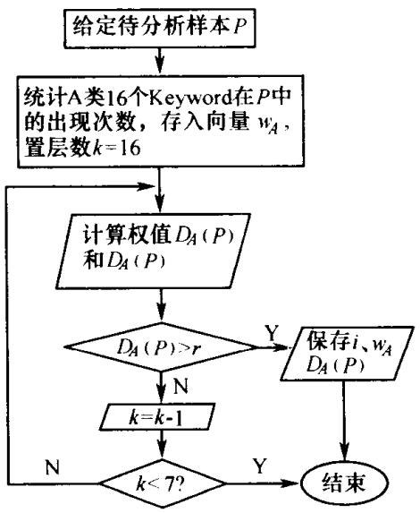

<details>
<summary>flowchart</summary>

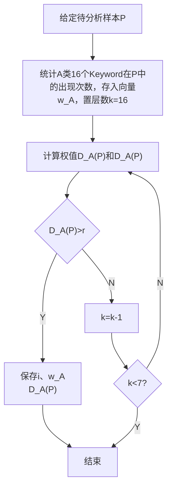
```mermaid
graph TD
  A["给定待分析样本P"] --> B["统计A类16个Keyword在P中的出现次数，存入向量w_A，置层数k=16"]
  B --> C["计算权值D_A(P)和D_A(P)"]
  C --> D{"D_A(P)>r"}
  D -->|Y| E["保存i、w_A\nD_A(P)"]
  D -->|N| F["k=k-1"]
  F --> G{"k<7?"}
  G -->|N| C
  G -->|Y| H["结束"]
  E --> H
```
</details>

图 4

## 4 方法总结

对于未知样本 P, 用本模型对其分类的操作方法总结如下:

统计 A、B 类的 keyword 在 P 中的出现次数 $l_{A}, l_{B}$ ；用层次分类法对①中的数据进行分析，求出权值 $D_{A}$ 、 $D_{B}$ 及层次数 $k_{A}$ 、 $D_{B}$ 。

比较这两组数据,确定 P 属于哪一类. 还可以定义显著性水平(以 A 为例):

a) 层数为 16 且 $k_{A} - k_{B} > 1$ 的定为高度显著属于 A(\*\*\*);  
b) 层数为 15——14 且 $k_{A} - k_{B} > 1$ 或 $k_{A} = k_{B}$ 且 $D_{A} - D_{B} > 1$ 的定为属于显著 A( $^{**}$ );  
c) 层数为 13——7 且 $k_{A} - k_{B} > 1$ 的定为较显著属于 A(\*)；  
d) 其余认为不显著；

若 P 对 A、B 两类均不显著, 将其归入另类.

## 5 模型的检验及效果

① 对 A、B 类已知样本: 最小二乘法保证 A 类样本的 $D_{A}$ 值, B 类样本的 $D_{B}$ 值足够大, 这些样本必能正确归类; ② 对 20 组待测样本可以看出, A、B 类区分度很大.

A 类（11 个）：23 25 27 29 32 34 35 36 37 39；B 类（9 个）：
21 24 26 28 30 31 33 38 40

③ 对 182 组未知样本:(略)

可以看出有少部分样本不能很好归类。原因一是已知样本数量太少、长度太短，无法有效检索到一些长度较长的 keyword；二是模型有系统误差；还可能有部分样本本来就不属于 A 和 B。

模型的稳定性:分别把 A,B 两组中的序列任意改变一些字符,再利用本文的方法进行分类,经过多次实验,新的分类结果均和原来相同,说明本模型的算法有很高的稳定性.

## 6 模型的改进

在选择 keyword 时, 数量上可以增加(本模型对每组选了 16 个 keyword), 这样更全面的概括 A, B 两组的特点, 使的分组更充分.

本模型是利用算术加权的方法综合各 keyword 的分类重要性, 可以探索其它的加权法, 如几何加权法, 对加权数的选择也可以进一步改进.

在分类的过程中采用学习法:如果某个 DNA 序列用本文的结果判断,发现对 A 组(或 B 组)的特点高度一致,就可以把次序列列入 A 组作为一个分类序列,然后对新的 A,B 组重复本文的过程,这样可以得到更好的分类法.

## 7 模型的评价和推广

(1) 模型的优点

① 本模型中有较多的新想法和新的标准, 创建了一些比较独特使用的函数, 比如字符数字转化函数 yj.m(见附录).  
② 分类标准直观明了,容易用计算机完成.  
③ 本模型的算法容易推广到实际的 DNA 的序列分析中, 具有一定的实际应用价值.

④ 关键词选择时考虑较全面(涉及到出现次数,频率,理论概率各个方面).  
⑤ 对任何一个给定的 DNA 序列采取多层分类法, 能够保证一定的置信度.  
⑥ 灵活的利用掩码‘m’，使得程序简洁，编程量大大减少.

## (2) 模型的不足之处

① 所给分类数据太有限,导致采用 keyword 分类的方法,判别与已知样本长度相差太大的未知序列时准确率有所限制.  
② 一些新的想法缺乏足够的理论根据,所以有些问题的解决带有一定的主观性.  
③ 本模型纯粹从数学的角度来分类,缺乏生物学背景.

## (3) 模型的推广与应用

由于本模型主要是根据20个长度比较短的DNA序列的特征归纳出的分类方法,如果直接用本模型的结果用于实际的科研中,可能会有很大的局限性,但是本模型用keyword作为分类标准的思想是一个可以推广的比较好的想法,具体的推广思路:从自然DNA序列任意选出比较多的(为了保证较高的准确性),利用keyword作为分类标准,然后利用本文提供的加权系数的确定方法就可以定出一个具体的定量标准.具有一定实用价值.

## 参考文献

[1] 李涛,贺勇军等. MATLAB工具箱应用指南——应用数学篇. 电子工业出版社.  
[2] 袁亚湘. 最优化方法. 科学出版社.  
[3] 张乃孝, 裘宗燕. 数据结构——c++与面向对象的途径. 高教出版社.  
[4] 汪仁官. 概率论引论. 北京大学出版社.  
[5] 陈家鼎, 孙山泽等. 数理统计学讲义. 高教出版社.

纯数学使我们能够发现概念和联系这些概念的规律,这些概念和规律给了我们理解自然现象的钥匙。

—Albert Einstein, 摘自 J. N. Kapur, Thought on Nature of Mathematics of Alexandrov et al., 1973; 中译本,《数学家谈数学本质》, 北京大学出版社, 1989, p. 101.

# DNA 序列的分类

韩轶平 余 杭 刘 威

(浙江大学, 杭州 310027)

指导老师 杨启帆

编者按 本文借助于计算机符号处理的能力来把握序列中不同碱基的丰度特征,从而进行了利用数理统计方法的分类研究.而后引入相关度分类判别算法及反馈机制来比较碱基的相对位置,在既定方向上颇具新意地把工作推向深入.不足之处在于,未能使用相关度工具对各类样本分别进行分析;此外,“纯数学”必须与其他学科紧密结合才会有优秀的建模工作,本文虽然对编码氨基酸的三联体进行初步探讨,着墨处自是轻淡许多.

摘要 本文对 A 题中给出的 DNA 序列分类问题进行了讨论。从“不同序列中碱基含量不同”入手建立了欧氏距离判别模型，马氏距离判别模型以及 Fisher 准则判定模型；又从“不同序列中碱基位置不同”入手建立了利用序列相关知识的相关度分类判别算法，并进一步研究了带反馈的相关度分类判别算法。对于题中所给的待分类的人工序列和自然序列，本文都一一作了分类。接着，本文又对其它各种常见的分类算法进行了讨论，并着重从分类算法的稳定性上对几种方法作了比较。

## 1 问题的重述(略)

## 2 模型的条件和假设(略)

## 3 符号约定

na:任一给定序列中碱基 A 的百分含量；

ng:任一给定序列中碱基 G 的百分含量;

nt:任一给定序列中碱基 T 的百分含量；

nc:任一给定序列中碱基 C 的百分含量.

Gi: 由某些具有相同属性的个体组成的类

## 4 问题的分析和解答

## 4.1 概述

根据题意,我们首先要提取出一个序列的特征,然后给出它的数学表示,最后选择并构造基于这种数学表示的分类方法.对于任意一个DNA序列,我们认为,反映该序列特征的方面有两个:

1. 碱基的含量,反映了该序列的内容;

2. 碱基的排列情况,反映了该序列的形式.

## 4.2 基于碱基含量特征分类的模型

首先,我们考虑采用序列中的 A,G,T,C 的含量百分比作为该序列的特征. 这样的抽取特征的方法具有其生物学的意义。前面提到过，在不用于编码蛋白质的序列片断中， $A$ 和 $T$ 的含量特别多些，因此以某些碱基特别丰富作为特征去研究 DNA 序列的结构是具有可行性的。将序列中的 $A, G, T, C$ 的含量百分比分别记为 $na, ng, nt, nc$ ，则得到一组表征该序列特征的四维向量 $(na, ng, nt, nc)$ 。考虑到 $na, nt, ng, nc$ 线性相关 $(na + ng + nt + nc = 1)$ ，所以我们采用简化的三维向量 $(na, nt, ng)$ 来进行计算。对于标号为 $i$ 的序列，记它的特征向量为 $Xi$ 。显然，任意序列的特征向量与一个 3 维空间的点对映。

一般的判别问题为: 设有 k 个类别 $G_{1}, G_{2}, \cdots, G_{k}$ ，对任意一个属于 $G_{i}$ 类样品 x，其特征向量 X 的值都可以获得。现给定一个由已知类别的一些样品 $x_{1}, x_{2}, \cdots, x_{n}$ 组成的学习样本，要求对一个来自这 k 个类别的某样品 x，根据其特征向量 X 的值作出其所属类别的判断。

在本题DNA序列分类中， $k = 2, G_{1} = A, G_{2} = B$ ，特征向量 $X$ 是三维的。学习样本共包含 $n = 20$ 个样本，其中10个属于 $A, 10$ 个属于 $B$ 。我们分别采用了欧氏距离(Euclid)分类模型，马氏距离(Mahalanobis)分类模型和Fisher判别模型来对序列样本分类。

## 4.2.1 欧氏距离(Euclid)分类模型

在欧氏距离(Euclid)分类模型中,把每个样本视为三维空间的一个点,以其到不同集合几何中心的欧氏距离作为判据.具体的算法如下:

1. 计算属于 A 类与属于 B 类的 10 个样本点的集合各自的几何中心：

$$
C _ {A} = \frac {1}{1 0} \sum_ {i = 1} ^ {1 0} X _ {i} \quad C _ {B} = \frac {1}{1 0} \sum_ {i = 1 1} ^ {2 0} X _ {i}
$$

2. 对于给定的样本点 $X_{i}$ , 分别计算该点到 $C_{A}$ 的欧氏距离 $D_{A} = |X_{i} - C_{A}|$ , 以及该点到 $C_{B}$ 的欧氏距离 $D_{B} = |X_{i} - C_{B}|$ ;

3. 判别准则如下：

(1) 若 $D_{A} < D_{B}$ ，则将 $X_{i}$ 点判为 A 类；  
(2) 若 $D_{A} > D_{B}$ ，则将 $X_{i}$ 点判为 B 类；  
(3) 若 $D_A = D_B$ ，则将 $X_i$ 点判为不可判类；

用上述算法对已知样学习样本 A1—A20 进行分类, 结果是除了 A4 被错误的分到了 B 类外, 其余的 19 个样本全部正确, 分类准确率达到 95%.

用上述算法对未知的人工序列 A21—A40 进行分类, 得到的结果是:

A类:22,23,25,27,29,30,32,34,35,36,37,39; B类:21,24,26,28,31,33,38,40

用上述算法对未知的自然序列 N1—N182 进行分类,得到的结果见附录.(略)

用欧氏距离作为判据虽然简便直观,但存在着明显的缺陷:从概率统计的角度来看,用欧氏距离描述随机点之间的距离并不好.因此当待分类样本是随机样本,具有一定的统计性质时,这个模型并不能很好的描述两个随机点之间的接近程度.

## 4.2.2 马氏距离(Mahalanobis)分类模型

为了克服采用欧氏距离时的缺陷,我们采用马氏距离来代替欧氏距离.改进后的算法如下:

设:三维总体 G 的均值为 $\mu=(\mu_{1},\mu_{2},\mu_{3})^{T}$ ，协方差矩阵为非奇异阵 $V_{3x3}$ ，则三维样本 X 到总体 G 的马氏距离为：

$$
d m (X, G) = \sqrt {(X - \mu) ^ {T} V ^ {- 1} (X - \mu)}
$$

其中未知的 $\mu$ 可用学习样本的均值来代替, 协方差矩阵 $V$ 可用学习样本的样本协方差矩阵来代替.

将马氏距离用于判别模型,遵循判据如下:

1. 若 $dm(X, A) < dm(X, B)$ , 则判定 $x$ 为 A 类;  
2. 若 $dm(X, A) > dm(X, B)$ , 则判定 $x$ 为 B 类;  
3. 若 $dm(X, A) = dm(X, B)$ , 则判定 $x$ 为不可判类;

用上述算法对已知样学习样本 A1—A20 进行分类, 结果是除了 A4 被错误的分到了 B 类外, 其余的 19 个样本全部正确, 分类准确率达到 95%.

用上述算法对未知序列 A21—A40 进行分类,得到的结果是:

A 类:22,23,25,27,29,30,32,33,34,35,36,37

B类:21,24,26,28,31,38,39,40

用上述算法对未知的自然序列 N1—N182 进行分类,得到的结果见附录 .(略)

## 4.2.3 Fisher 准则分类模型

在多维空间里分类的方法不仅仅是距离分类法一种,常用的 Fisher 分类法就是另一种基于几何特性的分类法. 在距离判别模型中,三维空间的样品 X 被映射为一维的距离 d 来作判断. Fisher 分类法的思想也是把三维空间的样本映射为一维的特征值 y,并依据 y 来进行判别. 具体的作法是先引入一个与样本同维的待定向量 u,再将 y 取为 X 坐标的线性组合 $y = u^{T}x$ . 而 u 的选取. 要使同一类别产生的 y 尽量聚拢,不同类别产生的 y 尽量拉开. 这样,我们便可将样品 X 到某一类 G 的距离定义为 $y = u^{T}x$ 与 $yc = u^{T}c$ 之间的欧氏距离:

$$
L (X, G) = | y - y c | = | u ^ {T} (x - c) |
$$

其中 $c$ 为 $G$ 的几何中心.

Fisher 分类的判据为：

1 若 $L(X,A)<L(X,B)$ ，则判定 x 为 A 类；  
2 若 $L(X, A) > L(X, B)$ , 则判定 $x$ 为 $B$ 类;  
3 若 $L(X, A) = L(X, B)$ , 则判定 $x$ 为不可判类.

根据对 u 的要求, Fisher 提出了比较有效的选择算法, 利用该算法, 从学习样本中获得: $u = (0.3365, -0.087, 0.9377)T$

$$
L (X, A) = | 0. 3 3 6 5 ^ {*} (n a - 0. 2 8 6 0) - 0. 0 8 7 ^ {*} (n t - 0. 1 5 5 0) + 0. 9 3 7 7 ^ {*} (n g - 0. 3 8 3 0) |
$$

$$
L (X, B) = | 0. 3 3 6 5 ^ {*} (n a - 0. 2 9 4 0) - 0. 0 8 7 ^ {*} (n t - 0. 5 0 1 0) + 0. 9 3 7 7 ^ {*} (n g - 0. 1 0 1 0) |
$$

用上述算法对已知样学习样本 A1—A20 进行分类, 结果仍然是除了 A4 被错误的分到了 B 类外, 其余的 19 个样本全部正确, 分类准确率达到 95%.

对于未知序列 A21—A40 进行分类,得到的结果是:

A类:22,23,25,27,29,34,35,36,37;B类:21,24,26,28,30,31,32,33,38,39,40

用上述算法对未知的自然序列 N1-N182 进行分类,得到的结果见附录 .(略)

## 4.2.4 三种距离分类模型的比较

这三种模型在分类结果上有一定的区别,对于序列 A30,A32,A33 及 A39,三种方法给出了不同结果,见表 1.

表 1

<table><tr><td></td><td>欧氏距离法</td><td>马氏距离法</td><td>Fisher 准则法</td></tr><tr><td>30</td><td>A</td><td>A</td><td>B</td></tr><tr><td>32</td><td>A</td><td>A</td><td>B</td></tr><tr><td>33</td><td>B</td><td>A</td><td>B</td></tr><tr><td>39</td><td>A</td><td>B</td><td>B</td></tr></table>

对于这种情况,我们提出一个联合判定准则:对于任一个序列,当三种分类法结果完全一致时,认为它判别有效;若不然,当三种分类法结果不一致时,认为该序列为不可判类.

对于三种方法都无法正确分类的 A4 序列, 可认为是异常情况, 不影响算法的性能.

## 4.3 基于碱基位置特征分类的模型

虽然上述采用碱基 A, T, G, C 在 DNA 序列里的含量作为该序列的特征的方法有一定的生物学意义并且在 DNA 序列的分类中获得了比较理想的结果。但是，用这种方法抽取特征，没有充分体现碱基排列的信息量，仅仅考虑碱基含量并没有体现碱基在序列中的排列情况。例如，序列(ATGC)与序列(CGTA)有着相同的碱基含量，他们的特征向量是完全一样的，并不能体现在排列结构上的不同。因此，直接从序列本身的碱基排列顺序来考察序列就成为一种更加合适的提取特征的方式。因此采纳数值序列中的相关性分析设计了算法。

通常任意两个数值序列的相关性都是通过这两个序列的相关函数来刻画的。由于本题中的DNA序列是非数值的序列，同时无法将碱基按通常的方式进行数值化，因而刻画任意两个序列的相关程度的变量需要重新定义。

## 4.3.1 定义一: 相关运算“⊗”

对于任意碱基 m 和 n，相关运算“ $m \otimes n$ ”的值由表 2 定义：

表 2

<table><tr><td>⊗</td><td>A</td><td>G</td><td>T</td><td>C</td></tr><tr><td>A</td><td>1</td><td>0</td><td>0</td><td>0</td></tr><tr><td>G</td><td>0</td><td>1</td><td>0</td><td>0</td></tr><tr><td>T</td><td>0</td><td>0</td><td>1</td><td>0</td></tr><tr><td>C</td><td>0</td><td>0</td><td>0</td><td>1</td></tr></table>

## 4.3.2 定义二: 哑元 O

除四个碱基外,我们另行定义一个哑元 O,规定任意碱基与哑元作相关运算的结果都为 0.

## 4.3.3 定义三:序列的延拓

对于任意一个长度为 $N$ 的序列 $Ai$ (其中 $0 \leqslant i < N$ ), 定义它的延拓为如下一个无限序列:

$A^{+}j$ : 当 $0 \leqslant j < N$ 时, $A_{j}^{+} = A_{j}$ ; 当 $-\infty < j < 0$ 及 $N \leqslant j < \infty$ 时, $A^{+}j = O$ .

即在该序列的左右两端均用哑元 $O$ 填充.

## 4.3.4 定义四: 序列的相关度

对于任意的两个序列 $A_{N}, B_{M}$ ，定义序列 A 和序列 B 的相关序列 $S_{i}$ 为：

$$
S _ {i} = \sum_ {k = 0} ^ {\infty} A _ {k + 2 - i} ^ {+} \otimes B _ {k} ^ {+} \quad (0 \leq i \leq n + m - 1)
$$

定义序列 B 对序列 A 的相关度为：

$$
S = M A X \{S _ {i} \} \quad (0 \leq i \leq n + m - 1)
$$

例如对于序列 $A\{T,C,T\}$ 与序列 $B\{A,G,T,C,T,C\}$ ，相关序列及相关度的计算步骤如下：

<table><tr><td colspan="12">第一项: $S_0 = A_2 \otimes B_0 = T \otimes A = 0$ </td></tr><tr><td>...</td><td> $A_{-1}^{+}$ </td><td> $A_0^+$ </td><td> $A_1^+$ </td><td> $A_2^+$ </td><td> $A_3^+$ </td><td> $A_4^+$ </td><td> $A_5^+$ </td><td> $A_6^+$ </td><td> $A_7^+$ </td><td> $A_8^+$ </td><td>...</td></tr><tr><td>...</td><td>O</td><td>T</td><td>C</td><td>T</td><td>O</td><td>O</td><td>O</td><td>O</td><td>O</td><td>O</td><td>...</td></tr><tr><td>...</td><td>O</td><td>O</td><td>O</td><td>A</td><td>G</td><td>T</td><td>C</td><td>T</td><td>C</td><td>O</td><td>...</td></tr><tr><td>...</td><td> $B_{-3}^{+}$ </td><td> $B_{-2}^{+}$ </td><td> $B_{-1}^{+}$ </td><td> $B_0^+$ </td><td> $B_1^+$ </td><td> $B_2^+$ </td><td> $B_3^+$ </td><td> $B_4^+$ </td><td> $B_5^+$ </td><td> $B_6^+$ </td><td>...</td></tr></table>

<table><tr><td colspan="12">第二项: $S_{1} = A_{1} \otimes B_{0} + A_{2} \otimes B_{1} = T \otimes G + C \otimes A = 0$ </td></tr><tr><td>...</td><td> $A^{+}_{-2}$ </td><td> $A^{+}_{-1}$ </td><td> $A_{0}^{+}$ </td><td> $A_{1}^{+}$ </td><td> $A_{2}^{+}$ </td><td> $A_{3}^{+}$ </td><td> $A_{4}^{+}$ </td><td> $A_{5}^{+}$ </td><td> $A_{6}^{+}$ </td><td> $A_{7}^{+}$ </td><td>...</td></tr><tr><td>...</td><td>O</td><td>O</td><td>T</td><td>C</td><td>T</td><td>O</td><td>O</td><td>O</td><td>O</td><td>O</td><td>...</td></tr><tr><td>...</td><td>O</td><td>O</td><td>O</td><td>A</td><td>G</td><td>T</td><td>C</td><td>T</td><td>C</td><td>O</td><td>...</td></tr><tr><td>...</td><td> $B^{+}_{-3}$ </td><td> $B^{+}_{-2}$ </td><td> $B^{+}_{-1}$ </td><td> $B_{0}^{+}$ </td><td> $B_{1}^{+}$ </td><td> $B_{2}^{+}$ </td><td> $B_{3}^{+}$ </td><td> $B_{4}^{+}$ </td><td> $B_{5}^{+}$ </td><td> $B_{6}^{+}$ </td><td>...</td></tr></table>

<table><tr><td colspan="12">第三项: $S_{2} = A_{0} \otimes B_{0} + A_{1} \otimes B_{1} = T \otimes T + G \otimes C + A \otimes T = 1$ </td></tr><tr><td>...</td><td> $A^{+}_{-3}$ </td><td> $A^{+}_{-2}$ </td><td> $A^{+}_{-1}$ </td><td> $A_{0}^{+}$ </td><td> $A_{1}^{+}$ </td><td> $A_{2}^{+}$ </td><td> $A_{3}^{+}$ </td><td> $A_{4}^{+}$ </td><td> $A_{5}^{+}$ </td><td> $A_{6}^{+}$ </td><td>...</td></tr><tr><td>...</td><td>O</td><td>O</td><td>O</td><td>T</td><td>C</td><td>T</td><td>O</td><td>O</td><td>O</td><td>O</td><td>...</td></tr><tr><td>...</td><td>O</td><td>O</td><td>O</td><td>A</td><td>G</td><td>T</td><td>C</td><td>T</td><td>C</td><td>O</td><td>...</td></tr><tr><td>...</td><td> $B^{+}_{-3}$ </td><td> $B^{+}_{-2}$ </td><td> $B^{+}_{-1}$ </td><td> $B_{0}^{+}$ </td><td> $B_{1}^{+}$ </td><td> $B_{2}^{+}$ </td><td> $B_{3}^{+}$ </td><td> $B_{4}^{+}$ </td><td> $B_{5}^{+}$ </td><td> $B_{6}^{+}$ </td><td>...</td></tr></table>

以下类推得(表略):

第四项： $S_{3} = A_{0}\textcircled{\times} B_{1} + A_{1}\textcircled{\times} B_{2} + A_{2}\textcircled{\times} B_{3} = T\textcircled{\times} C + C\textcircled{\times} T + T\textcircled{\times} G = 0$

第五项： $S_{4} = A_{0}\textcircled{\times} B_{2} + A_{1}\textcircled{\times} B_{3} + A_{2}\textcircled{\times} B_{4} = T\textcircled{\times} T + C\textcircled{\times} C + T\textcircled{\times} T = 3$

第六项： $S_{5} = A_{0}\textcircled{\times} B_{3} + A_{1}\textcircled{\times} B_{4} + A_{2}\textcircled{\times} B_{5} = T\textcircled{\times} C + C\textcircled{\times} T + T\textcircled{\times} C = 0$

第七项： $S_{6}=A_{0}\otimes B_{4}+A_{1}\otimes B_{5}=C\otimes C+T\otimes T=2$

第八项: $S_{7}=A_{0}\otimes B_{5}=T\otimes C=0$

<table><tr><td colspan="12">第八项: $S_{7} = A_{0} \otimes B_{5} = T \otimes C = 0$ </td></tr><tr><td>...</td><td> $A_{-8}^{+}$ </td><td> $A_{-7}^{+}$ </td><td> $A_{-6}^{+}$ </td><td> $A_{-5}^{+}$ </td><td> $A_{-4}^{+}$ </td><td> $A_{-3}^{+}$ </td><td> $A_{-2}^{+}$ </td><td> $A_{-1}^{+}$ </td><td> $A_{0}^{+}$ </td><td> $A_{1}^{+}$ </td><td>...</td></tr><tr><td>...</td><td>O</td><td>O</td><td>O</td><td>O</td><td>O</td><td>O</td><td>O</td><td>O</td><td>T</td><td>C</td><td>...</td></tr><tr><td>...</td><td>O</td><td>O</td><td>O</td><td>A</td><td>G</td><td>T</td><td>C</td><td>T</td><td>C</td><td>O</td><td>...</td></tr><tr><td>...</td><td> $B_{-3}^{+}$ </td><td> $B_{-2}^{+}$ </td><td> $B_{-1}^{+}$ </td><td> $B_{0}^{+}$ </td><td> $B_{1}^{+}$ </td><td> $B_{2}^{+}$ </td><td> $B_{3}^{+}$ </td><td> $B_{4}^{+}$ </td><td> $B_{5}^{+}$ </td><td> $B_{6}^{+}$ </td><td>...</td></tr></table>

两序列的相关度为 $S = \text{MAX}\{S_{i}\} = S_{5} = 3;$

4.3.5 定理一:任意给定三个序列 S, A, B, 若 A 与 S 的相关度大于 B 与 S 的相关度且 B 与 A 等长, 则 A 与 S 属同一类的可能性大于 B 与 S 属同一类的可能性

4.3.6 基于相关度的分类算法：

利用上述概念,我们构造了一个基于相关度的分类算法,如下:

1. 对于序列 A21—A40, N1—N182 中的任意一个序列, 将其与序列 A1—A20 中的每一个依次作求相关度的运算, 结果记为 SS1, SS2, SS3……SS20;  
2. 对于前十个相关度, 求出它们的平均相关度 $\mathrm{SA} = (\mathrm{SS1} + \mathrm{SS2} + \cdots \cdots \mathrm{SS10}) / 10$ , 并定义其为与 A 类的相关度;  
3. 对于后十个相关度, 求出它们的平均相关度 $\mathrm{SB} = (\mathrm{SS11} + \mathrm{SS12} + \cdots \cdots \mathrm{SS20}) / 10$ , 并定义其为与 B 类列的相关度;  
4. 记 W = SA/SB, 根据定理一, 判别依据为:

若 W>1, 则将 X 点判为 A 类;

若 W<1, 则将 X 点判为 B 类;

若 W=1, 则将 X 点判为不可判类;

5.W 可作为衡量该序列分类的可信性的一个标准. 显然当 W 越接近于 1, 该序列与 A 类的相关性和与 B 类的相关性区别就越小, 分类结果就越不可信; 反之, W 与 1 差的越远, 该序列与 A 类的相关性和与 B 类的相关性区别就越小, 分类结果就越可信. 这个变量对我们下面带有反馈的相关度分类算法具有重要的意义.

用上述算法对已知样学习样本 A1-A20 进行分类, 得到的结果是分类完全正确, A,B 类可以完全分开, 准确率达到 100%.

对于未知序列 A21—A40 进行分类,得到的结果是:

A 类:22 23 25 27 29 34 35 36 37

B类:21 24 26 28 30 31 32 33 38 39 40

用上述算法对未知的自然序列 N1—N182 进行分类, 得到的结果见附录(略).

4.3.7 相关度分类算法的改进——带有反馈的分类算法

上述的相关度分类算法是一次性学习过程,学习的过程只体现在学习样本的过程中,而在对未知样本分类的过程中没有对已分类情况作出修正,即是属于无反馈型的学习.然而,采用反馈型的学习过程会有更好的分类结果.一般说来,带反馈的算法以神经网络算法最具有代表性.但对于一般的分类算法而言,可以采用多次反复分类的办法来实现反馈的目的.针对上述的相关度分类算法,我们设计了如下带反馈的相关度分类算法:

1. 对全部 182 个样本进行相关度分类；  
2. 计算全部 182 个 W 的值  
3. 在所有被判为 A 类的待分类序列中, 取出 W 值最大的一个, 作为标准学习样本, 加入到 A 类的标准样本中 (若有多个, 则全部加入到 A 类中, 若无被判为 A 类的序列, 则保持 A 类标准学习样本不变.)  
4. 在所有被判为 B 类的待分类序列中, 取出 W 值最小的一个, 作为标准学习样本, 加入到 B 类的标准样本中 (若有多个, 则全部加入到 B 类中, 若无被判为 B 类的序列, 则保持 B 类标准学习样本不变.)  
5. 重复对剩余的待分类序列进行相关度分类，并按上述步骤不断扩充标准学习样本，

直至全部的待分类序列都被加入到标准学习样本中.

我们用新算法编程对182个序列进行了重新分类,得到了不同于原无反馈分类算法的结果,而且新的分类结果的W值明显与1离开的更大,这使我们有理由相信,反馈对算法的性能有一定的改进.

## 5 进一步研究的问题

## 5.1 基于生物学的特征抽取

我们上述的两种特征抽取方法更多的是从纯数学眼光来研究序列的特征．除此之外，我们还可以考虑DNA序列在生物学意义下的数学特征.

一个比较容易考虑到的方面便是三联体在 DNA 序列中的出现。由于具有三联体形式的遗传密码子对蛋白质的合成具有决定性作用，有理由认为它在序列中的出现体现了该序列的本质特征。题中没有明确的指明所给的序列是全序列还是序列片断，我们无法对三联体在序列中的出现位置进行定位，一种代替的方法是将序列假定为全序列，从第一个碱基开始三个三个一组的划分为密码子，然后统计 64 个密码子的出现概率，形成 64 维的向量。再使用距离分类等模型，或利用生物学的知识先将 64 维向量的某几维合并，降维后再分类。我们编程演算后，觉得该种分类方法比较依赖于密码子的划分，一位碱基的缺失或错位均会造成分类错误，所以必须加以修改，一条思路是尝试将序列移一位或二位再划分密码子，由于时间所限，没有进一步研究。

## 5.2 基于人工神经网络的模型

人工神经网络是一种带反馈的自适应算法,随着计算机速度提高被广泛应用.对于本题的情况采用神经网络模型是合适的,它可以在给定特征向量的情况下代替一般的距离分类模型.对于基于碱基含量的特征向量 $(na, nt, ng)$ ,构造了如下的反向传播算法:

1. 网络简单的分为两层, 一层为输入层, 有 3 个单元, 分别为权重 $a, b, c$ ; 一层为输出层, 有 1 个单元, 为判别结果; 各单元均为 Sigmoid 型函数激励.  
2. 设定 $(a, b, c)$ 的初值为 $(0, 0, 0)$ ; A 类学习样本的标准输出定为 1; B 类学习样本的标准输出定为 0

3. 对每一个学习样本, 计算 $S = a * na + b * nt + c * ng$ 作为输出;

4. 将学习样本的标准输出与 $S$ 相减, 所得的差用来指导权重的改变, 权重的改变遵从 Widrow-Hoff 准则.

5. 反复学习样本, 到权重值稳定收敛.

6. 代入待分类样本, 分类.

用上述算法所得到的结果与普通的分类模型没有区别。事实上当权值稳定收敛后， $S = a * na + b * nt + c * ng$ 就是特征空间的一张(超)平面，从这一点来说，人工神经网络模型与一般的距离分类模型得到的结果没有两样。考虑到人工神经网络模型还存在结果对初值有较强敏感性，缺乏选择理想步长的准则和收敛性等问题，在一定的时间内，我们无法较好的解决这些问题，所以我们也没有作进一步讨论。

## 6 算法的稳定性

前面比较算法的时候,曾多次提到分类算法的稳定性问题. 分类算法的稳定性是除了算法的成功率之外的另一较重要的指标。所谓分类算法的稳定性，是指算法在样本发生了轻微变化时作出正确判别的能力。对于本题，是指算法在样本序列发生了轻微的碱基缺失，错位，错排情况时作出正确判别的能力。因为本题要求我们研究的是DNA序列粗粒化和模型化的问题，所以分类时是对序列的整体特征进行区分。局部碱基的组成变化应该对算法的分类结果没有影响。我们所提出的几个模型均较好的满足了这一点。

## 参考文献

[1] 孙乃恩, 孙东旭, 朱德煦. 《分子遗传学》. 南京大学出版社, 1996.  
[2] 白其峥.《数学建模案例分析》. 海洋出版社, 2000.  
[3] 潘德惠.《数学模型的统计方法》. 辽宁科学技术出版社, 1986.  
[4] 阎平凡, 黄端旭. 《人工神经网络》. 安徽教育出版社, 1991.  
[5] 李振刚.《分子遗传学概论》.中国科学技术大学出版社,1990.  
[6] Duane Hanselman. Bruce Littlefield 《Mastering MATLAB: a comprehensive tutorial and reference》. Prentice Hall, 1996.

“鉴于数学研究的范围无限广阔，这门科学，即使是现代数学，也还处于婴儿时期。在今后两千年内，在人类思想领域里具有压倒性的新情况，将是数学地理解问题占统治地位。”

A. N. Whitehead, 摘自: 胡世华, 信息时代的数学, 数学进展, 1988, 17(1): 12-20.

# DNA 序列分类的数学模型

吕金翅 马小龙 曹芳

(中国科学技术大学，合肥 230026)

指导老师 陶大程

编者按 本文能从生物学背景提出不同的三种判别模型. 建模的分析和文字叙述条理清楚, 模型一对 21—40 和 182 样本均进行了分类, 分类正确率较高.

摘 要 本文从三个不同的角度分别论述了如何对 DNA 序列进行分类的问题,依据这三个角度分别建立了三类模型.

首先,从生物学背景和几何对称观点出发,建立了 DNA 序列的三维空间曲线的表达形式.建立了初步数学模型-积分模型,并且通过模型函数计算得到了 1 到 20 号 DNA 序列的分类结果,发现与题目所给分类结果相同,然后我们又对后 20 个 DNA 序列进行了分类.

然后,从人工神经网络的角度出发,得到了第二类数学模型-人工神经网络模型.并且选择了三种适用于模式分类的基本网络,即感知机模型,多层感知机(BP网络)模型以及LVQ矢量量化学习器,同时就本问题提出了对BP网络的改进(改进型多层感知机),最后采用多种训练方案,均得到了较理想的分类结果.同时也发现了通过人工神经网络的方法得到的分类结果与积分模型得到的分类结果是相同的(前四十个).

最后,我们对碱基赋予几何意义:A.C.G.T分别表示右.下.左.上.用DNA序列控制平面上点的移动,每个序列得到一个游动曲线,提取游动方向趋势作为特征,建立起了模型函数,同时也得到了后二十个DNA序列的分类结果,而且发现结果与上述两个模型所得到的分类结果几乎相同(其中有一个不同,在本模型中表示为不可分的).此模型保留的信息量更多,而且稳定性更强.

## 1 问题的重述(略)

## 2 基本假设及模型建立：

## 第一类数学模型:积分模型

DNA 序列是一种用 4 种字母符号(A、T、G、C)表达的一维链。在这条链上不仅包含有制造人类全部蛋白质的信息(也就是基因)，还有按照特定的时空模式把这些蛋白质装配成生物体的四维调控信息(三维空间和一维时间)，找到这些信息的编码方式和调节规律是人类基因组研究的首要科学问题。下面我们首先将着手从几何学的角度来分析 DNA 序列。鉴于自然界对称这一朴素原理，我们的模型始于对 4 种碱基对称性的考察。图 1.1(略)从纯化学的角度，我们可以将碱基进行两类划分：(1) 按双环或单环结构，可分为：嘌呤碱基 R(A 或 G)与嘧啶碱基 Y(C 或 T)(2) 按环中对应位置上是否存在氨基或酮基，可分为：氨基碱基 M(A 或 C)与酮基碱基 K(G 或 T)从生物学的角度，在双螺旋结构中，按碱基对形成氢键的数目或强弱，碱基又可分：强氢键碱基 S(G 或 C)与弱氢键碱基 W(A 或 T)，这一种划分既包含了化学的也包含了 DNA 双螺旋的结构信息在内。

参照基本粒子理论中的做法,我们利用三维 Euclid 空间中的对称几何图形——立方体

$G$ 来表示碱基的上述三种对称性. 如图1.2所示, 以 $G$ 的中心为坐标原点建立三维直角坐标系, 使 $G$ 的三组对面分别与三条坐标轴相垂直. 分别与 $X, Y, Z$ 轴相交的 $G$ 的三组对面称为嘧啶/嘌呤面, 酮基/氨基面, 弱氢键/强氢键面. 在 $G$ 的六个面中各引一条对角线, 使相对面的对角线两两相互垂直, 如图1.2所示. 在嘌呤面对角线的两端分别标上 $A$ 和 $G$ ; 在嘧啶面对角线的两端分别标上 $C$ 和 $T$ , 如图1.2所示. 显然, 此时上述碱基的三种对称关系全部自动成立. 而且, 六条对角线刚好是正四面体 $ACGT$ 的六条棱.

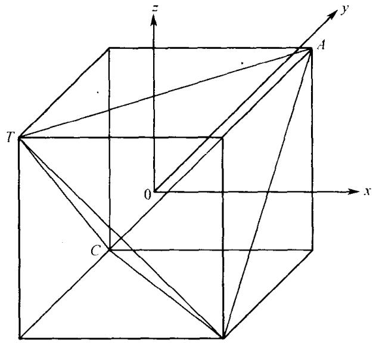

<details>
<summary>text_image</summary>

z
y
A
T
0
C
x
</details>

图 1.2 用立方体表示碱基的三种对称性

现在考察一个长为 L 的单链 DNA 序列, 阅读方向不限. 从第一个碱基开始, 依次考察此序列, 每次只考察一个碱基. 当考察到第 n 个碱基时 $(n=1,2,\cdots,L)$ , 统计一下从 1 到 n 这个子序列中四种碱基各自出现的次数, 并以 $A_{n}$ 、 $C_{n}$ 、 $G_{n}$ 、 $T_{n}$ 分别表示 4 种碱基 A、C、G、T 出现的次数, 如图 1.3 所示. 显然它们都是非负整数. 根据正四面体的对称性我们可以证明, 正四面体内存在唯一的一个点 $P_{n}$ 与这四个非负整数一一对应. 在图 1.3 所示建立的坐标系之下, 点 $P_{n}$ 的坐标可用四个非负整数来表达.

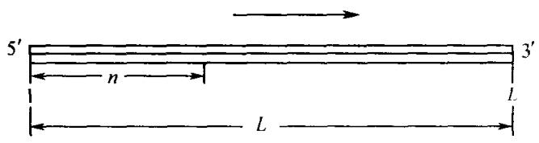

<details>
<summary>text_image</summary>

5'
n
L
3'
L
</details>

图 1.3 DNA 序列示意图

$$
\begin{array}{r l} & X _ {n} = 2 (A _ {n} + G _ {n}) - n, Y _ {n} = 2 (A _ {n} + C _ {n}) - n, Z _ {n} = 2 (A n + T n) - n, X _ {n}, Y _ {n}, Z _ {n} \in \\ & [ - n, n ], n = 1, 2, \dots , L; \end{array}
$$

其中 $X_{n}, Y_{n}$ 和 $Z_{n}$ 为点 $P_{n}$ 的三个坐标分量. 当 $n$ 从1到 $L$ 时, 我们依次得到 $P_{1}, P_{2}, \cdots, P_{L}$ 共 $L$ 个点. 将相邻两点用适当的曲线连接所得到的整条曲线, 就成为表示此DNA序列的 $P$ -曲线. 可以证明, $P$ -曲线与所表示的DNA序列是一一对应的, 也就是说, 给定一定DNA序列, 存在唯一的一条 $P$ -曲线与之对应; 反之, 给定一条 $P$ -曲线, 可以找到唯一的一个

DNA 序列与之对应. 换言之, $P$ -曲线很大程度上包含了 DNA 序列的内蕴信息. $P$ -曲线是与符号 DNA 序列等价的另一种几何表现形式. 我们的核心想法就是通过对 $P$ -曲线的研究来挖掘 DNA 序列的内蕴信息.

$P$ -曲线的三个分量都具有明确的生物学意义: $X_{n}$ 表示嘌呤/嘧啶碱基沿序列的分布. 当从 1 到 $n$ 这个子序列中嘌呤碱基多于嘧啶碱基时, $X_{n} > 0$ ; 否则 $X_{n} < 0$ ; 当两者相等时 $X_{n} = 0$ . 同样, $Y_{n}$ 表示氨基/酮基碱基沿序列的分布. 当在子序列中氨基碱基多于酮基碱基时, $Y_{n} > 0$ ; 否则, $Y_{n} < 0$ ; 当两者相等时 $Y_{n} = 0$ . $Z_{n}$ 表示强/弱氢键碱基沿序列的分布. 当弱氢键碱基多于强氢键碱基时, $Z_{n} > 0$ ; 否则, $Z_{n} < 0$ ; 当两者相等时 $Z_{n} = 0$ . 由概率论中的结论: 如果任何一种分布均不能由其他两种分布的线性叠加表示出来, 则这三种分布是相互独立的. 给定的 DNA 序列唯一的决定了这三种分布; 这三种分布唯一的描述了 DNA 序列.

我们对 $P_{n}$ 的三个坐标分量分别积分, 发现 $Y_{n}, Z_{n}$ 两个方向上并没有什么区别, 而在 $X_{n}$ 方向上, A 组均大于零, B 组均小于零.

$$
f (t) = \int_ {0} ^ {L} X _ {n} (t) \mathrm{d} t
$$

这表明在整个序列上不同结构的碱基对所占的成分, 即 A 组嘌呤的含量较大, B 组嘧啶的含量较大.

以“X方向分量大于/小于零”为标准对给出的序列21\~40进行分类,得到如下结果:

A类:2,3,5,7,9,14,15,17,19; B类:1,4,6,8,10,11,12,13,16,18,20

## 第二类数学模型:神经网络模型

由于神经网络具有运用已知认识新信息,解决新问题,学习新方法,预见新趋势,创造新思维的能力,所以我们将神经网络处理问题的方法介入进来,处理模式分类的问题.

在本题中,采用如下几种方案:1.单层感知机;2.双层感知机;3.改进型双层感知机.

## 4. LVQ 矢量量化学习

对于每种算法我们又采用了三种统计方案,即:

1. 统计 $a$ c g t 在 DNA 序列中出现的次数(共有 4 种)  
2. 统计 $a$ $c$ $g$ $t$ 的两两组合在 DNA 序列中出现的次数(共有 $4^{2}$ 种不同的组合)  
3. 统计 $a$ $c$ $g$ $t$ 的三三组合在 DNA 序列中出现的次数(共有 $4^{3}$ 种不同的组合)

所以总共可以得到12种模式分类模型.

下面给出详细讨论,但只列出12种方案中的四种,因为剩下八种只是在统计方案上有所不同,其训练实质和学习实质以及最后的模拟实质是相同的,所以不需要一一罗列.

## 第一方案(单层感知机)

## 1. 综述：

单层感知机是一个具有单层计算神经元的神经网络,并由线形域值单元组成. 原始的Perceptron算法只有一个输出节点,它相当于单个神经元. 当它用于两类模式的分类时,相当于在高维样本空间中,用一个超平面将两类样本分开. F. Rosenblatt也已证明,如果两类模式是线形可分的(指存在一个超平面将它们分开),则算法一定收敛. 感知器特别适用于简单的模式分类问题,也可用于基于模式分类的学习控制和多模态控制中.

## 2.修正方案：

首先分析问题实质,即采用一个单一神经元解决简单分类问题:将 n 个输入矢量分为

两类,其中一部分为1,另一部分为0. 最后确定网络结构(图1.4):

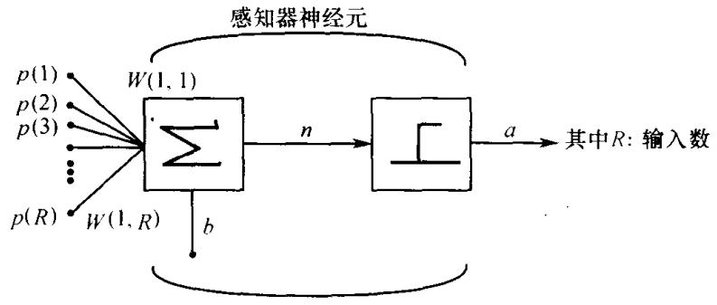

<details>
<summary>flowchart</summary>

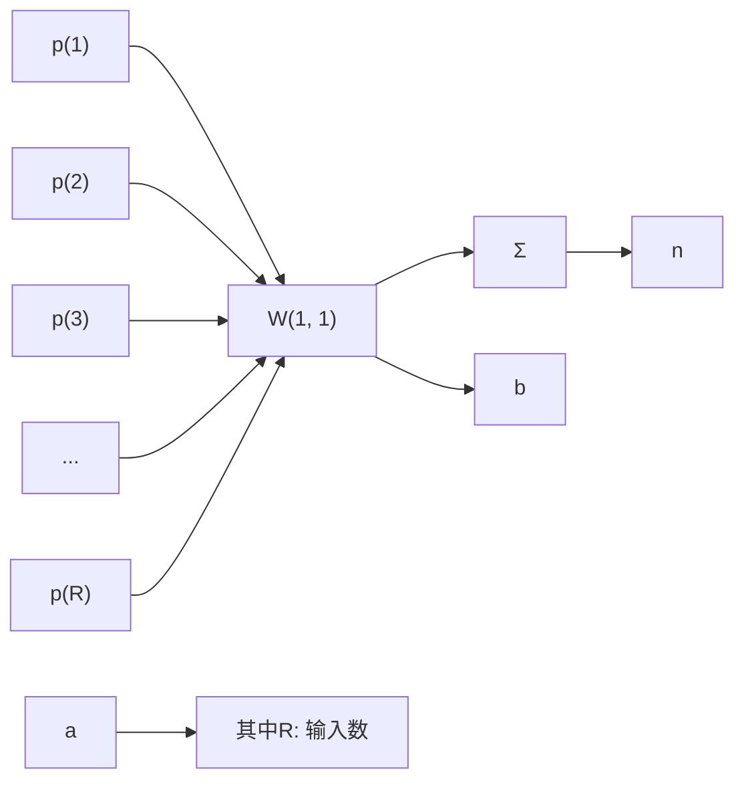
```mermaid
graph LR
  A["p(1)"] --> B["W(1, 1)"]
  C["p(2)"] --> B
  D["p(3)"] --> B
  E["..."] --> B
  F["p(R)"] --> B
  B --> G["Σ"]
  G --> H["n"]
  I["a"] --> J["其中R: 输入数"]
  B --> K["b"]
```
</details>

图1.4

3. 训练算法: (采用单层感知机的经典算法, 这里略去)

判定网络收敛的标准有两种:一是平均平方误差,二是误差平方和.这里采用第二种.

学习结束后的网络将学习样本模式以连接权的形式分布记忆下来。当给网络提供一输入模式时，网络将按上式计算出输出值 $y_{k}$ ，并可根据 $y_{k}$ 为1或0判断出这一输入模式属于记忆中的哪一种模式。

4. 训练和模拟结果：

a)从20个已知结果的DNA序列中随机选取不同的4个序列(向量)进行训练,再对20个序列(向量)进行重新模拟,其正确率为90%,发现出错的原因在于,第4个和第17个序列在这几种统计方式下具有相似性.  
b) 每次从 20 个已知结果的 DNA 序列中随机选取不同的 4 个序列(向量)进行训练, 共进行两次, 再对 20 个序列(向量)进行重新模拟, 其正确率为 $95\%$ , 依然发现出错的原因在于, 第 4 个和第 17 个序列在这几种统计方式下具有相似性.  
c) 每次从 20 个已知结果的 DNA 序列中随机选取不同的 4 个序列(向量)进行训练, 共进行三次, 再对 20 个序列(向量)进行重新模拟, 其正确率为 $95\%$ , 依然发现出错的原因在于, 第 4 个和第 17 个序列在这几种统计方式下具有相似性.  
5. 结论: 数据为线性不可分的, 所以单层网络不能实现完全识别.  
6. 优缺点分析: 以上采用的是单个神经元的网络进行分类, 其优点是运算速度快, 但模式分类正确率较低.

## 第二方案(双层感知机, 即 BP 网络)

1. 综述: BP 神经网络, 由于含有隐藏层, 所以可实现非线性分类. BP 算法属于 $\delta$ 算法, 是一种监督式的学习算法.  
2. 算法推导: (略)  
3. 网络结构(图 1.5):

4. 训练算法: 由于其训练过程与学习过程相似, 所以这里不再赘述.  
5. 训练和模拟结果: 与第一方案相似, 只是分类正确率有所提高.  
7. 结论: 本题所给数据是线性不可分的, 而且通过简单的模式分类也很难行得通, 所以即使用多(双)层网络也难以实现完全识别.  
8. 优缺点分析: 以上采用的是多个神经元的带有一个隐藏层的网络进行分类, 其优点是

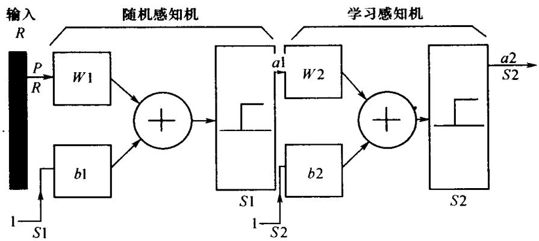

<details>
<summary>flowchart</summary>

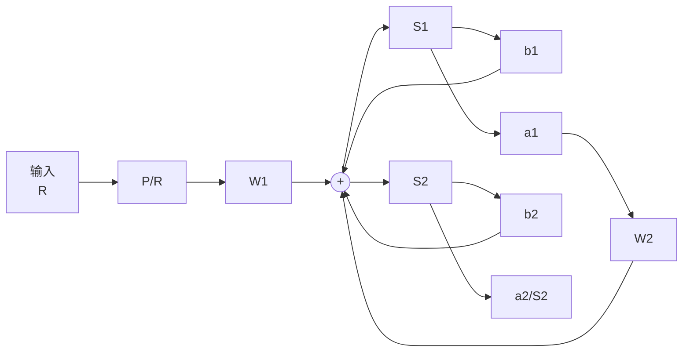
```mermaid
graph LR
  Input["输入\nR"] --> P_R["P/R"]
  P_R --> W1["W1"]
  S1["S1"] --> b1["b1"]
  b1 --> Sum(("+"))
  W1 --> Sum
  Sum --> S1
  S1 --> a1["a1"]
  S2["S2"] --> b2["b2"]
  a1 --> W2["W2"]
  b2 --> Sum
  W2 --> Sum
  Sum --> S2
  S2 --> a2["a2/S2"]
```
</details>

图1.5

运算速度较快,且模式分类正确率较高,但依然存在不可完全识别的问题.

## 第三方案(改进型双层感知机)

1. 综述: 为了改进上述算法的不可完全识别的缺点, 现在对网络进行改进, 其目的是使网络可以对所有向量进行正确的分类.  
2. 改进的方案: 以提取更多的 1 分类信息为原网络结构与 BP 神经网络相似, 但随机感知机层的响应函数采用 sigmoid 函数.  
3. 训练算法: 采用与 BP 网络相同的训练算法.  
4. 训练和模拟结果: (分类正确率有所提高, 这里略去)  
5. 结论: 数据是线性不可分的, 而且通过简单的模式分类也很难行的通, 所以只是简单改进网络结构, 是很难实现完全识别的. 所以下面将采用其它方法 (LVQ 矢量量化学习) 进行模式识别.  
6. 优缺点分析: 以上采用的是改进型多个神经元的带有一个隐藏层的网络(也就是改进型 BP 神经网络)进行分类, 其优点是运算速度较快, 且模式分类正确率较高, 但依然存在不可完全识别的问题.

## 第四方案(LVQ 学习向量量化)

1. 综述: 学习向量量化(LVQ)是在监督状态下对竞争层进行训练的一种学习算法. 竞争层将自动学习对输入向量进行分类, 这种分类的结果仅仅依赖于输入向量之间的距离. 如果两个输入向量之间特别相近, 竞争层就把他们分在同一类.  
2. 训练算法: (采用经典算法这里略去)  
3. 训练和模拟结果: (分类正确率有所提高, 这里略去)  
4. 要想从网络角度和学习算法上调整, 使得对已有的数据进行正确分类, 必须进行大规模学习, 但是如果对所有的样本进行训练再检策网络分类能力, 其可信服程度就大大降低了. 所以最后将采用改进网络输入的办法, 即结合生物学结论.  
5. 优缺点分析: 可靠性较高, 但算法复杂度较大.

## 第五方案：

仅从神经网络结构上的角度考虑,我们发现很难找到一个很好的网络,所以将结合生物学重建神经网络.

引用生物学的结论,我们将输入模式变为 100 \* 4,其中 4 表示从 20 个已知样本中随机

抽取 4 个样本．100 表示(A+G)含量的输入序列.

采用BP神经网络结构．训练方案采用方案二中的误差逆传播算法.

训练和模拟结果：

a)从20个已知结果的DNA序列中随机选取不同的4个向量进行训练,再对20个向量进行重新模拟,其正确率为95%(较单层感知机有所改进,但与BP网络和LVQ向量量化学习是相同的),发现出错的原因是由于学习不充分造成的.其本质是第4组数据和第17组数据可分性不好,所以反应到网络上其可学习性又较大;但如果学习不足,则会导制误判,所以应加大学习力度.  
b) 每次从 20 个已知结果的 DNA 序列中随机选取不同的 4 个向量进行训练, 共进行两次, 在对 20 个向量进行重新模拟, 其正确率为 $100\%$ 。这次的结果充分说明了上述问题.

结论: 目前的方法已很好的解决了分类的问题, 所以如果加大训练力度可以对其它数据进行正确率更高的分类. 我们对网络进行了 100 次随机抽取, 每次抽取的结果均进行训练, 最后对 40 个数据进行模拟, 发现前 20 个数的输出完全正确, 而且发现误差曲线也是十分好的, 所以有理由认为这个结论的正确性.

模拟结果序列 21\~40 为：

A类:22,23,25,27,29,34,35,37,39; B类:21,24,26,28,30,31,32,33,36,38,40

## 第三类数学模型:二维随机游动模型

以四种碱基分别代表复平面上四个不同的方向,顺序读取 DNA 序列,得到一条由原点出发的每次向相应方向移动单位长度的轨迹. 发现曲线明显地向两个相反的方向收敛(图 1.6)(略). 我们依此建立如下的数学模型:

设 DNA 序列长为 $L$ , 记 $A_{n}, G_{n}, C_{n}, T_{n}$ 为 1 到 $n$ 这个子序列中碱基 $A, G, C, T$ 所出现的次数, 令 $P_{n}$ 为复平面上的点, 且

$$
P _ {n} = A _ {n} + G _ {n} i - T _ {n} - C _ {n} = (A _ {n} - T _ {n}) + i (G _ {n} - C _ {n}) = r _ {n} e ^ {i \theta_ {n}},
$$

其中 $r_n = \sqrt{(A_n - T_n)^2 + (G_n - C_n)^2}, \theta_n = \text{Arg}P_n, \overline{\theta} = \frac{1}{L}\sum_{k=1}^{L}\theta_K$

假设 $n = 0$ 时， $A_{n} = G_{n} = C_{n} = T_{n} = 0$ ，当 $n$ 从 0 到 $L$ 时，在复平面上便得到了 $L + 1$ 个点，并且得到了从原点出发的一条游动轨迹。

鉴于幅角信息的突出重要地位,我们依此对 DNA 序列进行分类,为了避免那种螺旋轨迹我们假设 DNA 序列可分类,当且仅当 $\exists p \in N$ , s.t. 当 n > p 时 $\sum_{i=1}^{n} \theta_{i}$ 保持定号.

模型一: 对 20 个参数已知的 DNA 序列, 分别求出其相应的游动方程 $P_{n} = (A_{n} - T_{n}) + i(G_{n} - C_{n})$ , 设 $\theta_{j,k}^{i}$ 为第 i 类第 j 个 DNA 序列的 $\operatorname{Arg} P_{K}$

$$
\overline {{\theta}} _ {j} ^ {i} = \frac {1}{L} \sum_ {k = 1} ^ {L} \theta_ {j, k} ^ {i}, j = 1, 2, \dots , 1 0, i = 1, 2.
$$

在每一类中求出 $\theta_{\min}^{i} = \min_{1\leqslant j\leqslant 10}\theta_{j}^{i},\theta_{\max}^{i} = \max_{1\leqslant j\leqslant 10}\theta_{j}^{i}$ ，从而得到每个类的辐角特征区间 $[\theta_{\min}^{i},\theta_{\max}^{i}]$ 如果 $[\theta_{\min}^{1},\theta_{\max}^{1}]\cap [\theta_{\min}^{2},\theta_{\max}^{2}] = \varnothing$ ，则对任意DNA序列，若可分类，则满足 $\overline{\theta}\in [\theta_{\min}^{i},$ $\theta_{\max}^{i}]$ 的属于第 $i$ 类；否则，不可分类.

显然,这时存在着不可分类的情形,这主要是由于我们从 DNA 序列样本中提取了两类游动在辐角上的趋势信息并将作为我们进行分类的标准.这一点,在模型二中得到了改进.

而实际上 $L$ 总有限, 前面关于可分类的假设是基于对游动辐角变化总体趋势的一种控制, 对于有限而言, 对此也有刻画即 $\exists p \in N \text{ s.t.}$ 当 $n > p$ , 辐角保持后续信息.

模型二、上面模型一提取了DNA序列的最本质的辅角特征，这里我们假设各类的DNA序列的 $\overline{\theta}$ 在如下变换后满足正态分布。首先辐角值可以与复平面中的圆周上的点建立自然的对应关系，并且圆周挖去一点之后同胚于实直线，为方便起见，投影后的点仍用原来的字母表示，从 $\{\theta_j^i: 1 \leqslant j \leqslant 10\}$ 可得均值 $\mu_i$ 和方差 $\sigma_i$ 及在第 $i$ 类的概率密度函数为 $p_i(\theta) = \frac{1}{\sqrt{2\pi}\sigma_i} e^{-(\theta - \mu_i)^2}$ .

任给一个DNA序列， $\bar{\theta}$ 它属于第 $i$ 类的概率：

$$
P _ {i} (\overline {{\theta}}) = \lim _ {\theta \to 0 +} \frac {\int_ {\theta - \theta} ^ {\theta + \theta} p _ {i} (\theta) \mathrm{d} \theta}{\int_ {\theta - \theta} ^ {\theta + \theta} [ p _ {1} (\theta) + p _ {2} (\theta) ] \mathrm{d} \theta} = \frac {p _ {i} (\overline {{\theta}})}{p _ {1} (\overline {{\theta}}) + p _ {2} (\overline {{\theta}})}
$$

以概率0.5为阀值，如 $p_i(\overline{\theta}) > 0.5$ ，则属于第 $i$ 类.

下面再用区间估计法给出结果在统计意义上的可信度，设 $n$ 个相互独立的样本 $X_{i} \sim N(a, \sigma^{2}), i = 1, 2, \dots, n$ ，令 $Z = (X_{1} + X_{2} + \dots + X_{n}) / n$ ，则 $Y = (Z - a) / (\sigma^{2} / n)^{1/2} \sim N(0, 1)$ ，但 $\sigma^{2}$ 未知，必须先把它估计出来，用 $Sn^{2} = [(X_{1} - Z)^{2} + (X_{2} - Z)^{2} + \dots + (X_{n} - Z)^{2}] / (n - 1)$ 代替 $\sigma^{2}, (Z - a) / (Sn^{2} / n)^{1/2} = (Z - a)(\sigma^{2} / n)^{-1/2} / (Sn^{2} / \sigma^{2})^{1/2} = Y / (Sn^{2} / \sigma^{2})^{1/2}$ ，因 $Y \sim N(0, 1), (Sn^{2} / \sigma^{2})^{1/2} = \{[(X_{1} - Z) / \sigma]^{2} + [(X_{2} - Z) / \sigma]^{2} + \dots + [(X_{n} - Z) / \sigma]^{2}\} / (n - 1) \sim \chi^{2}(n - 1)$ ，因而 $t = (Z - a) / (Sn^{2} / n)^{1/2} \sim t(n - 1)$ ，这里要求 $Y$ 与 $(Sn^{2} / \sigma^{2})^{1/2}$ 相互独立。于是给定 $\alpha$ 后，查表 $t(n - 1)$ 可得 $t^{*}$ ，使得 $Pr(|t| \leqslant t^{*}) = 1 - \alpha$ ，即 $Pr(|Z - a| / (Sn^{2} / n)^{1/2} \leqslant t^{*}) = 1 - \alpha$ ，从而我们便得到了 $a$ 的 $1 - \alpha$ 水平上的置信区间为 $[Z - t^{*} Sn / n^{1/2}, Z + t^{*} Sn / n^{1/2}]$ 。现在共有 10 个已知样本点 $X_{1}, X_{2}, \dots, X_{10}$ ，为了保证 $Y$ 与 $(Sn^{2} / \sigma^{2})^{1/2}$ 相互独立，现将这 10 个样本点等分成两组这样便得到 $Z = (X_{1} + X_{2} + \dots + X_{5}) / 5, Z' = (X_{6} + X_{7} + \dots + X_{10}) / 5, Y = (Z - a) / (\sigma^{2} / 5)^{1/2}, S_{5}^{2} = [(X_{6} - Z')^{2} + (X_{7} - Z')^{2} + \dots + (X_{10} - Z')^{2}] / (5 - 1), t = (Z - a) / (S_{5}^{2} / 5)^{1/2}$ ，依前所述给定 $\alpha$ ，我们可得 $a$ 的 $1 - \alpha$ 水平上的置信区间为 $[Z - t^{*} S_{5} / 5^{1/2}, Z + t^{*} S_{5} / 5^{1/2}]$ 。

由该模型可以看出曲线的趋向正代表着序列中所含对应元素的整体含量和分布。当基因序列中所含的非特征随机信息较多时，会导致游动曲线螺旋摇摆情形，从而导致前进距离变短，但是由随机信号在各方向上的平均性，总体前进方向并未受到影响，故我们只提取方向而忽略距离作为特征信息。

我们从不同角度,提取序列整体上和局部之间的特征,建立了以上三种数学模型.三种模型各有优劣,但他们在特征提取,模式识别和分类上的都具有一定的普适性和优越性.

## 参考文献

[1] 郝柏林, 刘寄星. 理论物理与生命科学. 上海科学技术出版社.  
[2] 金冬燕, 金奇, 侯云德. 核酸和蛋白质的化学合成与序列分析. 科学出版社.

# DNA 序列中的结构与简化模型

北京工业大学

孟大志

## 1 引 子

这是我第一次参与全国大学生数学建模竞赛,深深地被这一十分有意义的赛事蒸蒸日上的发展所鼓舞,为在赛事中涌现出来的青年学生们聪明才智和对科学强烈的热爱而惊喜,为自己在这次参与中学到的和感受到的十分有益的知识而兴奋.2000年7月清华的唐云教授电话约我为竞赛出一道题,出于个人兴趣,也出于希望青年学生更关注在重大科学问题中运用数学和发展数学的原因,于是就在全世界由人类基因组计划的成果掀起的巨大热潮中,找一个题目,以期诱导有志青年投入这一21世纪的科学热点中.我和领导建模比赛的全国组委会的一些教授们(叶其孝、姜启源、王强、唐云等)共同讨论了这个题目,反复修改和润色,希望更适合中国大学生的实际.但一直担心这样一个热点科学中引出的问题,一个开放式问题的较大的自由度是否会为难青年学生.结果出人意料,特别是重点大学的参赛队,十分热烈地选择A题作为他们一显身手的考卷,而且答出了同样出乎意料的水平.然而在A题的理解、解法及评判的一系列问题中,仍有许多问题需要明确,于是我应组委会之邀,特写此文力窥全豹,也对参与竞赛的师生们作一个交待.

## 2 A 题的背景

2000年6月26日，“人类基因组计划”规定的禁发时间(EMBARGO)北京时间18:00刚过，新华社、法新社、美联社、路透社……各国新闻发布机构以第一条消息发布了人类基因组草图绘就的重要消息。美国总统克林顿在白宫举行的庆祝仪式上表示，人类基因组草图是迄今“人类所绘制的最为奇妙的图谱”；英国首相布莱尔说：“这是21世纪第一项伟大的科技成就……医学科学领域一场革命，其意义远远超过抗生素的发现”；日本首相森喜郎在声明中指出，人类基因组草图绘制成功，代表人类在破解自身构成方面向前迈出巨大的一步；……许多国家的元首、科技官员和著名科学家纷纷发表谈话，赞扬人类基因组草图的完成，评估这一伟大成果的意义。6月28日，中国主席江泽民在中央思想政治工作会议上也对人类基因组的意义作出评价并赞扬了中国科学家在其中的出色工作[1]。

显然,当7月份组委会提出建模赛题一事时,顺应这一世纪科学大事,在其中构造赛题,将引导青年学子关注世界科技热点,鼓励学生敢于投身到科学重大问题中去,培养学生用数学这一工具去解决科学技术问题的能力具有特殊的意义.

2003年将完成人类基因组DNA全序列的测序，它将带给人类一本“自身的说明书”，这对人类认识自己、保护自身、发展新的生物产业都将是意义重大的。在许多科普读物中，将人类基因组全序列这部“书”描绘成一座巨大金矿，解读这部书就是从中发掘出无量的财富，这种比喻一点儿也不过分。生命科学称这一研究阶段为“后基因组时期”或“后基因组计划”(Post-Genome Project)，而将数学与计算机科学融入这一计划之中，又常被人称为生物信息学(Bioinformation)。人类基因组研究中已经浮现出大量的数学问题，已为世界上众多数学家关注 $^{[2]}$ . 作为解读基因组这一庞大计划的一个十分重要而又基础的部分, 就是研究基因组的结构, 而其中更基础的是 DNA 序列的结构. “结构”这个词在这里的含义是十分广泛的, 也就是说, 作为由 A, T, C, G 四个字符组成的一个有序字符串, 任何呈现规律性的特征都可以称为结构. 由于规律呈现范围不同, 我们又可以分为局部结构与整体结构, 或称小尺度结构与大尺度结构, 这些结构的揭示将大大有助于人们对于基因与基因组的解读. 这一点可以形象地比喻为一部 100 万页的书, 如果我们能够知道这部“天书”的篇、章、节的结构, 甚至段落、语句或词的结构都清楚了, 要读懂这部书的内容就变得容易了. 从这种意义上说, DNA 序列的结构的研究显然是生物信息学中重要的内容之一.

本届数学建模比赛的 A 题是在这一世界科学发展的大背景下,作为 20 世纪最后一届比赛,以翘首 21 世纪的姿态,选择基因组研究为命题的学科领域,以后基因组计划中生物信息的 DNA 序列结构作为课题,是顺应时代潮流的具有前瞻性的选题.

## 3 A 题的立意

在 A 题设计之前, 立意就很明确: 源于科学实际, 解法充分开放.

本题取材于DNA的结构的研究, 这里的结构指的是在DAN序列中重复出现的有特征的片断, 这种重复出现形成了规律. 由于结构的含义是广泛的, 担心学生因此而无从下手, 我们特别举出三种结构为例, 其目的仅仅是为了说明, DNA序列貌似随机地由A, T, C, G四个字符组成, 但它之所以有“万能”的功能, 正是由于在随机的外衣下隐藏着大量的结构, 正是这种结构决定了功能. 因此, 在生物信息学中, 人们普遍相信这样一个信条: 序列——结构——功能. 这一信条引导人们成功地在DNA序列中挖掘出许多与生物功能相关的自然规律. 在A题中举出的三种结构是十分基础而且在科学界广泛为人们所接受的. 一种是四种碱基的丰度, 对于DNA序列的不同的片段常常表现出碱基丰度的差别, 因此碱基的丰度往往成为区别不同序列片段的特征; 第二种是三联子对蛋白质的编码, 它首先由发现DNA双螺旋结构的克里克和南非的分子生物学家西德尼·布伦纳确定的, 这种不重叠的三联子组成的编码区(Exon)与非编码区的交替出现形成了DNA序列中一个重要的结构. 如果读者想了解这一方面的知识只要在互联网上搜索“Exon-Intron Structure”, 你会得到供选读的大量文献. A题举的第三个例子是所谓DNA序列的长程相关性, 这一规律最早由C·K·Peng等人在1992年Nature上报导[3], 此后人们研究了各种DNA长序列, 分别发现了DNA序列在大尺度的范围内具有统计相关性, 然而这种相关性的细节及意义至今还是一个迷. A题中举出这三种结构, 也为了说明在DNA序列的结构中既有大尺度全局性的, 也有局部性的, 研究和发现DNA序列中的这些规律均有重要意义.

正由于这种结构的多样性和一般性,为求解 A 题确定了解法的开放性. 虽然事实上许多试卷都把这一结构理解成为编码区与非编码区,但这种局限性的理解并没有比一般性理解结构的试卷更好些. A 题定义结构的一般性,有两方面的理由. 一方面希望在求解 A 题时对生物知识的依赖不要太多,除了最基本的 DNA 序列的背景外,解题中并不需要有更多的基因组结构的知识(例如,是否知道 Exon 与 Intron 并无大关系). 这样做是为了在“数学建模”这一基本的专业性质下平等. 第二个方面就是希望这种开放性,可以使从初等到高等的许多数学模型化方法均能对 A 题做出一定水平的解答. 而且也希望发现一些富有创造性的、十分有效的方法. 事实上,本届比赛中也的确涌现出大量富有创意的方法,实在令命题

者兴奋不已.

解答方法的开放性, 是 A 题的命题领域本身就决定了的. 事实上, 仅在编码区预测的文献中就有了许多不同的方法. 有通过核苷酸片段差异的区分方法 $^{[4]}$ , 同源比较算法 $^{[5]}$ , 隐马尔可夫模型 (Hidden Markov Model, HMM. 这种方法将 DNA 序列的形成看作随机过程, 而 HMM 可自动找出其隐藏的统计规律性 $^{[6]}$ .), 大家熟知的动态规划方法 $^{[7]}$ , 以及傅立叶分析 $^{[8]}$ , 线性判别分析 (Linear Discriminant Analysis, LDA) $^{[9]}$ . 此外许多专门的方法用于 DNA 的结构分析与寻找: 法则系统 (rule-based system) $^{[10]}$ , 语言系统 (linguistic) $^{[11]}$ , 决策树 (decision tree) $^{[12]}$ . 这些方法对于从 DNA 序列中找出编码序列均有很好效果, 有些准确率高达 $90\%$ . 有兴趣的读者可以在最近出版的《解码生命》 $^{[13]}$ 一书中查到有关评论.

A 题将 DNA 结构的研究具体化为不同序列的分类, 这种分类对于寻找出序列的结构具有基础价值. 它是寻找结构的一种简化而有效的变形, 这种具体化在帮助学生模型化时是有益的. 然而这种具体化也给出题带来一定困难, 为了方便广大参赛队对这种分类方法的理解与数值实验, 我们设计了两套数据. 一套是人工构造的数据, 而另一套是来源于自然的 DNA 数据库. 显然这两套数据既有联系又有明显的差别, 这种差别使得企图用比较简单的方法而不加区别地处理这两类数据将不会得到好的效果. 正如自然界给人类提出的问题不太可能恰好满足我们希望的数学条件一样, A 题也要求解题者具有立足于实际、从有限而不完全的已知数据去探索更复杂数据中的未知规律这样的一种研究素质.

## 4 阅卷随想

在评阅试卷时,老师们对年轻学子在 A 题解法中表现出的热情、智慧、严谨和富予创造性都留下极深刻的印象.作为命题人,更对本科学生能在短短的三天中所做出的成果惊喜,并在许多十分聪明的解法中学习到了新的东西.A题的试卷几乎令所有阅卷老师叹服:中国大学生年轻有为!

学生论文的立意大多在“特征提取→分类方法”这一模式，这显然是最容易想到的，大多数试卷也在这一立意之下，选择好的方法而得到较好的结果。特征的选择，首先易于让人想到的是A,T,C,G四个字符在字符串中出现的频率，这在文献中常称为“单个碱基丰度”。单纯使用这一特征，许多学生的文章对人工数据得到好的结果，但对后面182个序列的分类却常常不太理想。在优秀论文中浙江大学的一个队将这种特征提取后形成四维特征向量，然后分别用欧氏距离、马氏距离分类法和Fisher判别模型，对人工数据得到理想的分类，对自然数据(182个)也得到很高的分类正确率，是这一类算法中较突出的卷例。另有一些试卷在这一特征基础上考虑到字符的顺序，将模型做得更复杂些。更多的论文是用4个字符的字符串作为特征，由于这时特征一下子增加了许多，于是需要从其中评判挑选并排出特征的重要性顺序，这种特征的提取往往可以得到较好的效果。特别是对于自然序列，大连理工大学的一个队通过概率统计方法首先对已知的人工序列集进行特征提取，从而形成特征向量较为全面地表达分类特征，当然也出现了高维问题的计算复杂性，他们得到了很好的分类效果。值得指出的是，由于竞赛题一方面源于生物学实际问题，同时又相对地独立于生物而形成适当抽象的“试题”，因此试题并不是基因组中某种结构的翻版。有些试卷过多地研究了生物学的来源，而且将A题仅局限于他们所想象的结构（例如Exon结构），于是三联子编码成为分类的唯一特征，而三联码的不重叠性又使他们在阅读框的起始位置前不知所措，以至

所产生的结果不理想.

在分类方法上,统计的方法(特别是聚类方法)是最易于想到的,许多试卷从而构造了好的方法.但是简单而不加修正地使用统计方法并不能得到好的结果.这是因为人工已知序列的样本数只有20个,而且都很短,待分类的自然数据样本数182,且都长得多,因此从小样本中得到的统计规律在处理大样本时效果显然不佳.这是众多用统计方法所得到结果不理想的一个直接原因.有些学生看到并指出了这一点,而且有的试卷注意到人工数据与自然数据的生物学的差别而在分类自然序列时修改了分类方法而得到较好的结果,显然概念的清楚与思维的灵活得到很好的统一.用各种方式构造判别函数的方法以及神经网络的方法,特别对于非线性系统的识别很有效.因此通过构造各种神经网络来进行分类,更多的队得到很好的效果.例如大连理工大学的一个队,用统计方法提取较好的特征,又用BP网络进行分类,方法严谨,考虑细致,对自然序列的分类正确率高达 $88\%$ .而中国科技大学的一个队通过对神经网络方法的逐层的改进,又辅以统计方法,产生了比较精细的网络算法,也得到分类自然数据的正确率达 $65\%$ 的好效果.

除了上述大量“正规方法”以外，一些试卷有创意地提出了一些十分新颖的思想，有些还取得了很好的效果。例如中国科技大学的一个队将序列看作信息流，注意到字母出现的特征是熵的改变，是十分有新意的，他们最终又将设计好的几个模型形成综合判别的目标函数，也得到好的分类效果，对自然数据分类正确性达 $58\%$ 。而北京大学的一个队将DNA字符串看作一篇文章，而利用了类似文本分类中的特征判别方法定义关键词标准，进而使用优选法，找出关键词的特征，然后使用层次分类。他们的方法精细，尽管分类最终效果并不十分理想，仍不失为值得一读的好文章。由于篇幅有限，有些文章虽然没有作为优秀论文刊出，但是在其中仍然表现出学生丰富的想象力和创造精神。一篇十分有趣的文章是大连理工大学的另一个队，这些学生既没有拘泥于“特征提取 $\rightarrow$ 分类”的模式，也没有局限自己的思维于“概率统计”“神经网络”“判别函数”等“大路”方法。他们深入地分析了序列问题的生物来源，又观察人工序列的数学结构和数值试验结果，在一些DNA序列几何表达文献的启发下，提出了简捷的几何分类法，得到了出色的分类结果。对自然数据分类的正确率高达 $94\%$ 。而且这种不依赖训练集的方法，属于目前研究基因组结构的令人关注的方向。

应当指出,科研能力的表现是多方面的.在试卷中,我们注意到许多学生十分用心于科学文献的检索、阅读与借鉴.例如一些试卷研究了我国著名学者,中科院院士张春霆教授的Z曲线方法 $^{[14]}$ ,并简化用于A题分类(例如中国科技大学的另一个队),也取得好的结果.此外,特别值得指出的是香港城市大学的论文,该文的思路清晰、表述严谨、图表数据完整、行文流畅,作为本科学生三天完成的科研论文值得赞赏!

综上所述,作为 A 题的命题人,原先的担心与顾虑被事实扫得干干净净.学生的聪明才智、扎实的数学功底和运用于实际问题的灵活性、创造性证明,中国大学生完全可以适应更贴近科学研究实际,更贴近工程技术实际,更贴近社会经济生活实际的数学建模比赛问题.中国大学生在数学建模比赛的锻炼中必将大大提高应用数学的能力,在 21 世纪的人类新科技的发展中做出出色的成绩.

## 参考文献

[1] 子言. 基因: 讲述生命的故事. 经济日报出版社, 2000 年 7 月

[2] Mathematics: Frontiers and Perspectives, AMS. Providence, 2000. M. Atiyah 前言  
[3] Peng C. K. Buldyvev, S. V. Goldberger, A. L. Havlin, S. Sxiortino, F. Simonso, M. And Stanley, H. E. Long-range correlation in nucleotide sequences. nature 356:168\~170  
[4] Claverie J M. Computational methods for the identification of genes in vertebrate genomic sequence, human Mol Genet, 1997, 6(10):1735\~1744  
[5] Green P, Lipman D, Hillier L, Waterston R, States D, Clavierie JM. Ancient conserved regions in new gene sequences and the protein databases. Science, 1993, 259: 1711\~1716  
[6] Kroyh A, Mian I S, Hanssler D. A hidden Markov model that finds genes in E. coli DNA. Nucleic Acids Res, 1994, 22(22):4768\~4778  
[7] Gelfand M S, Roytberg M A. Prediction of the exon-intron structure by a dynamic programming approach. Biosystems, 1993, 30(1\~3):173\~182  
[8] Tiwavi S. Ramachandran S, Bhattacharga A, Bhattachgarga S, Ramaswamy R. Prediction of probable genes by Fourier analysis of genomic sequences. comput Appl Biosci, 1997, 13(3):263\~270  
[9] Fickett JM, Tung C S. Assessment of protein coding measures. Nucleic Acids Res, 1992, 20(24): 6441 \~ 6450  
[10] Guigo R, Knudsen S, Drake N, Smith T. Prediction of gene structure. J Mol Biol, 1992, 226(1):141\~157  
[11] Dong S, Searls D B. Gene structure prediction by linguistic methods. Genomics, 23(3):540\~551  
[12] Salzberg S. Locating protein coding regions in human DNA using a decision tree algorithm. J Comput Biol, 2(3):473\~485  
[13] 贺林. 解码生命——人类基因组计划和后基因组计划. 北京: 科学出版社, 2000  
[14] ZHANG Chun-Ting, LIN Zhe-suai, YNA Ming, ZHANG Ren. A Novel Approach to Distinguish Between Intron-containing and Intronless Genes Based on Format of Z Curves. J theor Biol, 1998, 192: 467\~473

## 20. 钢管订购和运输(CUMCM 2000 年 B 题)

要铺设一条 $A_{1} \rightarrow A_{2} \rightarrow \cdots \rightarrow A_{15}$ 的输送天然气的主管道，如图 1 所示(见下页). 经筛选后可以生产这种主管道钢管的钢厂有 $S_{1}, S_{2}, \cdots, S_{7}$ . 图中粗线表示铁路，单细线表示公路，双细线表示要铺设的管道(假设沿管道或者原来有公路，或者建有施工公路)，圆圈表示火车站，每段铁路、公路和管道旁的阿拉伯数字表示里程(单位：km).

为方便计,1 km 主管道钢管称为 1 单位钢管.

一个钢厂如果承担制造这种钢管,至少需要生产500个单位.钢厂 $S_{i}$ 在指定期限内能生产该钢管的最大数量为 $s_{i}$ 个单位,钢管出厂销价1单位钢管为 $p_{i}$ 万元,如下表:

<table><tr><td>i</td><td>1</td><td>2</td><td>3</td><td>4</td><td>5</td><td>6</td><td>7</td></tr><tr><td> $s_i$ </td><td>800</td><td>800</td><td>1000</td><td>2000</td><td>2000</td><td>2000</td><td>3000</td></tr><tr><td> $p_i$ </td><td>160</td><td>155</td><td>155</td><td>160</td><td>155</td><td>150</td><td>160</td></tr></table>

1 单位钢管的铁路运价如下表：

<table><tr><td>里程(km)</td><td> $\leqslant 300$ </td><td>301~350</td><td>351~400</td><td>401~450</td><td>451~500</td></tr><tr><td>运价(万元)</td><td>20</td><td>23</td><td>26</td><td>29</td><td>32</td></tr><tr><td>里程(km)</td><td>501~600</td><td>601~700</td><td>701~800</td><td>801~900</td><td>901~1000</td></tr><tr><td>运价(万元)</td><td>37</td><td>44</td><td>50</td><td>55</td><td>60</td></tr></table>

1000 km 以上每增加 1\~100 km, 运价增加 5 万元.

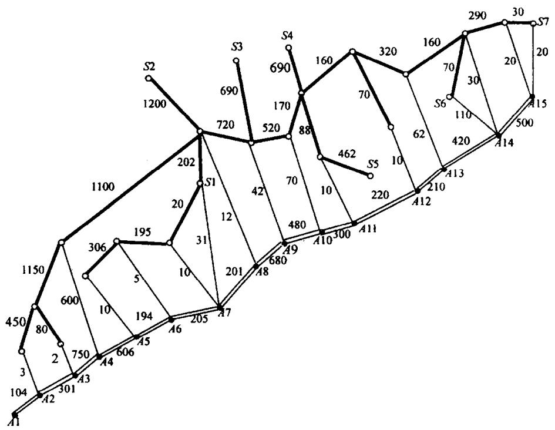

<details>
<summary>wireframe</summary>

| Node | Value |
| --- | --- |
| A1 | 104 |
| A2 | 301 |
| A3 | 750 |
| A4 | 606 |
| A5 | 194 |
| A6 | 205 |
| A7 | 201 |
| A8 | 680 |
| A9 | 480 |
| A10 | 300 |
| A11 | 220 |
| A12 | 210 |
| A13 | 420 |
| A14 | 500 |
| S1 | 202 |
| S2 | 1200 |
| S3 | 690 |
| S4 | 690 |
| S5 | 462 |
| S6 | 110 |
| S7 | 290 |
</details>

图1

公路运输费用为1单位钢管每公里0.1万元(不足整公里部分按整公里计算).
钢管可由铁路、公路运往铺设地点(不只是运到点 $A_{1},A_{2},\cdots,A_{15}$ ，而是管道全线).

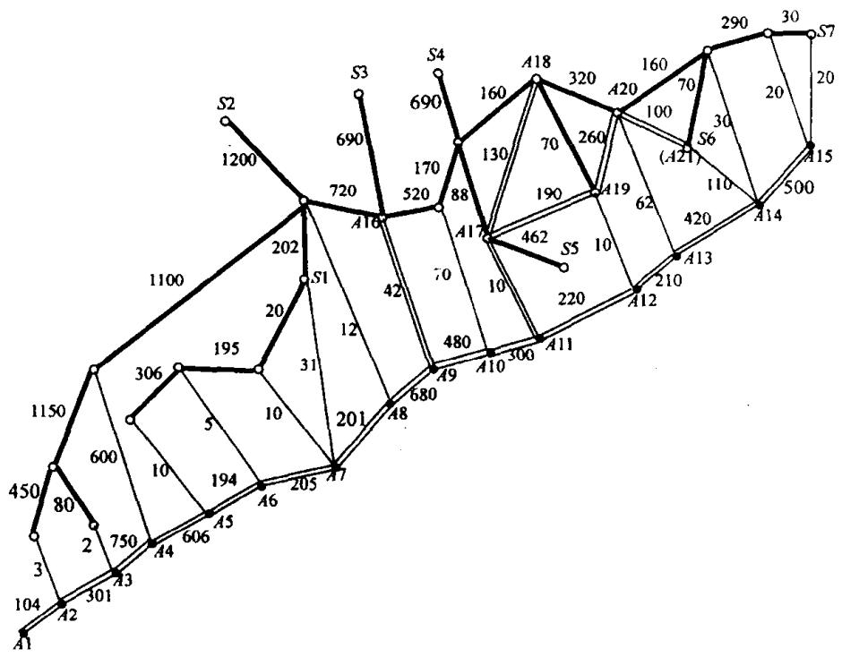

<details>
<summary>wireframe</summary>

| Node | Value |
| --- | --- |
| A1 | 104 |
| A2 | 301 |
| A3 | 750 |
| A4 | 606 |
| A5 | 205 |
| A6 | 194 |
| A7 | 306 |
| A8 | 680 |
| A9 | 480 |
| A10 | 300 |
| A11 | 220 |
| A12 | 210 |
| A13 | 420 |
| A14 | 500 |
| S1 | 202 |
| S2 | 1200 |
| S3 | 690 |
| S4 | 690 |
| S5 | 462 |
| S6 | (A21) |
| S7 | 290 |
| S8 | 160 |
| S9 | 130 |
| S10 | 190 |
| S11 | 10 |
| S12 | 70 |
| S13 | 170 |
| S14 | 520 |
| S15 | 42 |
| S16 | 720 |
| S17 | 480 |
| S18 | 320 |
| S19 | 260 |
| S20 | 160 |
| S21 | 70 |
| S22 | 100 |
| S23 | 30 |
| S24 | 20 |
| S25 | 20 |
</details>

图2

(1)请制定一个主管道钢管的订购和运输计划,使总费用最小(给出总费用).  
(2)请就(1)的模型分析:哪个钢厂钢管的销价变化对购运计划和总费用影响最大?哪个钢厂钢管的产量上限的变化对购运计划和总费用影响最大?并给出相应的数字结果.  
(3)如果要铺设的管道不是一条线,而是一个树形图,铁路、公路和管道构成网络,请就这种更一般的情形给出一种解决办法,并对图2按(1)的要求给出模型和结果.

(武汉大学 费浦生提供)

# 管道订购与运输问题

杨志江 李国欣 张敏

(中国矿业大学，江苏徐州 221008)

指导老师 中国矿业大学数模教练组

编者按 本文采用将待铺设管道按单位长度分解成 $n$ 个需求点, 建立运输模型的方法, 避免了问题一和三的差别. 模型切合原赛题要求, 并针对原问题的规模, 对算法作了一定的改进, 得到了较好的结果. 本刊予以摘要发表.

摘要 本文在详细分析的基础上,通过合理假设并引入等价转换原则,将管道订购与运输问题转化为单一的公路运输问题.运用组合优化的思想和方法,给出了数学模型——产量未定的运输模型.针对此模型,我们设计了“改进的最小元素法”和“改进的伏格尔法”,先求得了一个初始解,再通过“试探法”和“迭代法”进行调整优化,最后得出结果:对第一问,最小总费用为1279019万元;对第三问,最小总费用为1407383万元.

## 1 问题的重述(略)

## 2 基本假设

(1) 只考虑订购费用和运输费用, 不考虑装卸等其它费用.  
(2) 钢管单价与订购量、订购次数、订购日期无关.  
(3) 订购计划是指对每个厂商的定货数量; 运输方案是指具有如下属性的一批记录: 管道区间, 供应厂商, 具体运输路线.  
(4) 将每一单位的管道所在地看成一个需求点, 向一单位管道的所在地运输钢管即为向一个点运输钢管.

## 3 符号说明

m:钢厂总数.
n:单位管道总数.  
$S_{i}$ : 第 $i$ 个钢厂. $s_{i}$ : 第 $i$ 个钢厂的产量上限.  
$p_i$ : 第 $i$ 个钢厂单位钢管的销售价. $A_{i}$ : 管道线上第 $i$ 个站点.  
$d_{i}$ :管道线上第 i 个单位管道的位置.
F:总费用.

$C_{ij}$ : 从钢厂 $S_{i}(i=1,2,\cdots,m)$ 到点 $d_{j}(j=1,2,\cdots,n)$ 的最低单位费用.

## 4 问题分析

运输费用等价转换法则: 按单位运费相等原则将任意两点间的最短铁路线转换为公路线. 对于铁路线上的任意两点 $V_{i}$ 、 $V_{j}$ ，用 Floyd 算法找出两点间最短铁路路线的长度 $L_{ij}$ ，查铁路运价表求得 $L_{ij}$ 对应的铁路单位运费 $f_{ij}$ ; 又设与该段铁路等费用的公路长度为 $l_{ij}$ ，则：

$$
f _ {i j} = 0. 1 \times l _ {i j}
$$

由此,我们就在 $V_{i}$ 、 $V_{j}$ 之间用一条等价的公路线来代替 $V_{i}$ 、 $V_{j}$ 间的最短铁路线.如果

$V_{i}$ 、 $V_{j}$ 之间原来就有公路，就选择新旧公路中较短的一条。这样，我们就把铁路运输网络转换成了公路运输网络。

销价等价转换法则:按单位费用相等将任意钢厂的单位销价转换为公路单位运价.

对于钢厂 $S_{i}$ 的销售单价 $p_i$ ，我们可以虚设一条公路线，连接钢厂 $S_{i}$ 及另一虚拟钢厂 $S_{i}^{\prime}$ ，其长度为 $l_{i}$ ，并且满足 $l_{i} = 0.1 \times p_{i}$ ；从而将钢厂的销售单价转换成公路运输单价，而新钢厂 $S_{i}^{\prime}$ 的销售价为0。

将铁路和销价转换为公路的过程可以由计算机编程实现.

通过上述的分析,我们可以将原问题化为一个相对简单的产量未定的运输问题,利用 $A_{1}$ 到 $A_{15}$ 之间的管道距离和钢厂和站点之间的公路距离建立一个产量未定的运输问题的模型.但是由于 $A_{1},A_{2},\cdots,A_{15}$ 并不能代表所有的实际需求点(实际需求点是n个单位管道),因此,我们可以用Floyd算法进一步算出7个钢厂到所有实际的n个需求点(对于问题一,n=5171;对于问题三,n=5903)的最短路径,并由此得出一个具有7个供应点、n个需求点的产量未定的运输模型.

## 5 模型的建立

## 产量未定的运输模型

根据假设 4, 我们可以将每一单位的管道看成一个需求点, 向一单位管道的所在地运输钢管即为向一个点运输钢管. 对每个点, 我们可以根据该点的位置和最短等价公路距离, 求出各钢厂与该点之间最小单位运输费用 $C_{ij}$ (销价已经归入运输费用之中了). 设总共有 m 个供应点(钢厂), n 个需求点, 我们就可以得到一个产量未定的运输模型:

有 $m$ 个供应点、 $n$ 个需求点，每个供应点的供应量 $u_i \in \{0\} \cup \{500, s_i\}$ ；每个需求点需要 1 单位，运输单价矩阵为 $C$ ，求使得总运输费用最小的运输方案。

其数学规划模型：

$$
\begin{array}{l} \min \quad F = \sum_ {i = 1} ^ {m} \sum_ {j = 1} ^ {n} C _ {i j} x _ {i j} \\ \begin{array}{l l} { \sum_ {j = 1} ^ {n} x _ {i j} \in \{0 \} \cup \{5 0 0, S _ {i} \} \quad i = 1, 2, \dots , m} \\ {\mathrm{s.t.} \quad \left\{ \begin{array}{l l} { \sum_ {i = 1} ^ {m} x _ {i j} = 1 \quad j = 1, 2, \dots n} \\ {x _ {i j} = 0 \text {或} 1} \end{array} \right.} \end{array} \\ \end{array}
$$

其中：

$$
C = \left( \begin{array}{c c c c} C _ {1 1} & C _ {1 2} & \dots & C _ {1 n} \\ \dots & & & \dots \\ C _ {m 1} & C _ {m 2} & \dots & C _ {m n} \end{array} \right) \text {为单位费用矩阵}
$$

$$
\mathrm{X} = \left( \begin{array}{c c c c} x _ {1 1} & x _ {1 2} & \dots & x _ {1 n} \\ \dots & & & \dots \\ x _ {m 1} & x _ {m 2} & \dots & x _ {m n} \end{array} \right) \text {为决策矩阵,也为} 0 - 1 \text {矩阵}
$$

## 6 模型的求解

对于本题,上述0—1规划规模宏大,现有的一些算法不能胜任,我们必须具体问题具体

分析,结合本题实际情况,寻找行之有效的算法.

## (1) 初始方案的改进的最小元素法和改进的伏格尔法

## \* 改进的最小元素法

改进的最小元素法又称为贪婪法或瞎子爬山法,它的宗旨是每一步都取当前的最优值.算法步骤为,对费用矩阵 C 作 n 次下列循环:

① C 中找一个最小值 $C_{ij}$ ;  
② 令 $x_{ij} = 1$ ;  
③ C 的第 j 列的所有数据改为 $+\infty$ ;  
④ 如果 $\sum_{j=1}^{n} x_{ij} = s_i$ ，第 $i$ 个供应点的供应量已达上限，将 $C$ 的第 $i$ 行数据全改为 $+\infty$ ；

对于问题一和问题三,我们用贪婪法求得的最小总费用的初始分别为:1286692.1万元和1414515.2万元.

## \* 改进的伏格尔法

改进的最小元素法确定的初始方案往往缺乏全局观念,即为了节省一处的费用,在其它处要花费更多. 改进的伏格尔法的主要思想:一个目的地如果不能采用最小值供应(供应点供应不足),就必须考虑次小值供应,这里就存在一个差额. 差额越大,在不能采用最小值时,损失越大. 因此,改进的伏格尔法的宗旨是每一步对当前差值最大的点取当前最小值.

算法的步骤为,对矩阵 C 做 n 次下列循环:

① 指出每一行最小值与最大值之差最大的一行, 第 i 行, 找出该行的最小值为 $C_{ij}$ ;  
② 令 $x_{ij} = 1$ ;  
③ 令 C 的第 j 列的数据为 +∞;  
④ 如果 $\sum_{j=1}^{n} x_{ij} = s_i$ ，第 $i$ 个供应点供应量已达上限，令 $C$ 的第 $i$ 行的所有数据为 $+\infty$ .

对于问题一和问题三,我们用改进的伏格尔法求得方案的总费用分别为 1279019 万元和 1407383 万元.

## (2) 调整优化

调整优化是将一个离最优解很近的初始解调整到在调整算法下无法更优的程度。调整优化分两个部分，第一部分是用试探法对供应点的供应量进行优化。第二部分是用迭代法对供应点进行两两对调优化。

## \* 试探法调整优化实际供应量在500以下的供应点

对每个实际供应量在 500 以下的供应点, 只存在两种合理的优化方法: 一种是将其供应量增加到 500, 另一种是将其供应量减少到 0. 试探法将分别试探进行下列两种优化:

其一是先将供应点的供应量强行提升至500,使用改进的伏格尔法的优先顺序,从其它供应点负责供应的需求点抢夺一部分,再用对调法优化至无法更优,得出一个总费用 $F_{1}$ ;其二是先将该供应点的供应量调整为0,其原供应的需求点由其它钢厂用改进的伏格尔法的优先顺序补充,再用对调法优化至无法更优,得出一个总费用 $F_{2}$ .那么,就应当采取总费用较小的方法.

例如,对于第一问,按改进的伏格尔法获得的初始方案中, $S_{7}$ 的用量仅为245,优化时,试探将其降为0和将其提升为500后的最优结果,分别为1279019万元和1280506万元,则

说明应将 $S_{7}$ 降为0.

## \* 用迭代法进行对调优化

改进的伏格尔法给出的初始值虽然很接近最优值,但仍有不足之处,即可能存在两个需求点,调换供应点能使总费用更小,例如,需求点 a 和 b 的供应点是 x 和 y,费用分别是 $C(x,a)$ 和 $C(y,b)$ ,如果让 y 供应 a,x 供应 b 的话,费用将是 $C(y,a)$ 和 $r(x,b)$ ,如果:

$$
C (y, a) + r (x, b) <   C (x, a) + C (y, b)
$$

则说明对调后总费用更低.

因此,我们可以采用迭代法对任意两个需求点的供应点两两对调至无法更优.

由于一共只有 $m = 7$ 个供应点，所以两两对调的可行方案一共有 $C_7^2 = 21$ 种，因此，两两对调供应点的方法是可行的，具体步骤如下：

Step1 对于任意两个供应点 $x_{i}$ 和 $x_{j}$ $i=1,2,\cdots,m$ $j=1,2,\cdots,m$ $i\neq j$

1) 找出所有由 $x_{i}$ 供应的需求点, 构成点集 $A = \{a_{1}, a_{2}, c\}$  
2) 找出所有由 $x_{i}$ 供应的需求点, 构成点集 $B=\{b_{1}, b_{2}, \cdots\}$  
3) 对 A 中所有点, 如果改用 $x_{j}$ 来供应, 将付出的代价构成向量 $A = \{a_{1}^{'} , a_{1}^{'} , \cdots\}$  
4) 对 B 中所有点, 如果改用 $x_{i}$ 来供应, 将付出的代价构成向量 $B' = \{b_{1}', b_{1}', \cdots\}$

5) 对 $A'$ 和 $B'$ 分别按升序排序.

6) 同时对 $A'$ 和 $B'$ 从前向后遍历, 如果 $a_i' + b_i' < 0$ (表示对调供应者将降低总费用), 则对调其供应者, 直到出现 $a_i' + b_i' \geqslant 0$ 为止.

Step2 统计这 $C_m^2$ 轮对调后的总费用 $F'$ 是否比原来的总费用 $\mathrm{F}$ 有明显的进步, 即 $F' - F > \delta$ ( $\delta$ 为一固定的较小值). 如果有明显的进步, 则再回 Step1 执行, 否则结束优化.

令人振奋的是,采用改进的最小元素法和改进的伏格尔法得到问题一的初始方案分别采用这种优化方案后,竟都达到了相同的最小费用:1279019万元.

## (3) 结果(略)

## 参考文献

[1] 薛秀谦等编著.《运筹学》.中国矿业大学出版社,1998年.  
[2] 赵新泽著.《线性规划的新方法和应用》. 世界图书出版社, 1996 年.  
[3] 王树禾著.《图论极其算法》. 中国科学技术大学出版社, 1990 年.  
[4] LUCAS W F 著.《离散与系统模型》. 国防科技大学出版社, 1996 年.

# 钢管订购和运输策略

段晓军 俞昌盛 吴建德

(西北工业大学，西安 710072)

指导老师 张胜贵

编者按 本文节选的是原论文中模型的分析与建立以及之前的准备工作部分.该部分通过单位钢管的最小运购费,建立了问题求解的二次规划模型,特点是思路、表述简明、清晰,尤其是第3问的模型具有较强的一般性,适用于树形结构的通常情形.值得注意的是,模型中有关铺设费的假设和表达式与常见情形略有不同.

摘 要 在铺设管道为一条线的情况下,我们建立了解决钢管订购和运输问题的非线性规划模型. 由于变量较少,约束条件大都为线性的,目标函数为二次函数,所以利用 Lingo 软件,可以很快求得比较满意的订购和运输方案. 我们利用 Matlab 软件,对所得到的数据进行拟合,得到相应的反映销价变化对总费用影响的曲线,然后比较各个钢厂钢管销价变化对总费用影响的大小. 对于钢厂钢管产量上限变化对总费用和购运计划的影响,我们也作了类似的处理. 如果要铺设的管道是树形图,我们对树形图的每条边定向,建立了与铺设管道为一条线时类似的数学模型,从而大大拓广了模型的使用范围. 在论文中,我们还对所建立的模型的优缺点和需要改进的方向进行了讨论.

## 1 符号说明

$s_{i}$ ：钢厂 $S_{i}$ 在指定期限内钢管的最大产量；  
- $w_{i,j}$ : $A_i$ 到 $A_j$ 之间铺设管道的里程数;  
$c_{ij}$ ：单位钢管从钢厂 $S_{i}$ 运到 $A_{j}$ 所需最小订购和运输费用；  
· $x_{i}$ ：钢厂 $S_{i}$ 是否承担制造这种钢管；  
$y_{ij}$ ：钢厂 $S_{i}$ 运抵 $A_{j}$ 点的钢管数量，不含路过 $A_{j}$ 的部分；  
· $z_{j}$ ：运到 $A_{j}$ 的所有钢管沿 $A_{j} \rightarrow A_{j+1}$ 铺设的数量；  
- $z_{ij}$ : 运抵 $A_i$ 的所有钢管沿 $A_i \to A_j$ 铺设的数量;  
· $d(A_{j})$ ：树中 $A_{j}$ 的度数；  
· $d^{-}(A_{j})$ ：树中 $A_{j}$ 的入度；  
$d^{+}(A_{j})$ ：树中 $A_{j}$ 的出度；  
· $\mu$ ：单位钢管1公里的公路运输费用.

## 2 基本假设

根据题目的要求,并为达到简化问题的目的,我们有以下假设:

1. 假设运到 $A_{j}$ 的钢管, 只能在 $A_{j-1}$ 到 $A_{j+1}$ 之间包含 $A_{j}$ 的某个区段内铺设. 并且到达 $A_{j}$ 的钢管在 $A_{j-1}$ 到 $A_{j+1}$ 之间包含 $A_{j}$ 的铺设区段和到达 $A_{j+1}$ 的钢管在 $A_{j}$ 到 $A_{j+2}$ 之间包含 $A_{j+1}$ 的铺设区段不相交. 否则的话, 总可以调节铺设方案, 使得总费用减少.  
2. 在考虑问题 2 时, 假设钢管价格不可能有太大幅度变化. 所以, 我们只考虑钢管价格在其原售价 10% 的范围内波动. 同时, 我们假定, 钢厂的产量不可能成倍的增加或减少. 我

们在减少 300 个单位, 增加 600 个单位的范围内讨论, 这意味着我们不考虑钢厂破产或者超大规模扩大生产的情况.

3. 在具体铺设每一公里时, 我们只把钢管运到每一公里开始的地方, 沿运送方向向前铺, 然后往前铺设的运送费用我们不予考虑.

## 3 模型建立

## 1. 问题 1 的模型

## (1) 决策变量

我们首先引入一组 0 - 1 变量 $x_{1}, x_{2}, \cdots, x_{7}$ , 其中 $x_{i}$ 表示钢厂 $S_{i}$ 是否承担制造这种钢管. 如果钢厂 $S_{i}$ 承担制造这种钢管, 则 $x_{i} = 1$ , 否则 $x_{i} = 0$ .

所有的钢管,都是先运到 $A_{1}, A_{2}, \cdots, A_{15}$ 后,或者转运到其它地方,或者在包含 $A_{j}$ 的一个区段内铺设. 我们设从钢厂 $S_{i}$ 运抵 $A_{j}$ 且在包含 $A_{j}$ 的一个区段内铺设的钢管数量为 $y_{ij}$ ,这里 $i = 1, 2, \cdots, 7; j = 1, 2, \cdots, 15$ .

我们用变量 $z_{j}$ 来表示从所有的钢厂运到 $A_{j}$ 的钢管总量中沿 $A_{j} \rightarrow A_{j+1}$ 铺设的部分, 这里 $j = 1, 2, \cdots, 14$ .

这样,我们一共引入了三组决策变量: $x_{i}(i=1,2,\cdots,7)$ ; $y_{ij}(i=1,2,\cdots,7; j=1,2,\cdots,15)$ ; $z_{k}(k=1,2,\cdots,14)$ .

## (2) 目标函数

问题 1 的目的是寻求好的订购和运输方案,使得总费用最小.事实上,总费用可以分成两部分.第一部分包括钢管的订购费用和钢管从钢厂运抵 $A_{1}, A_{2}, \cdots, A_{15}$ 所需的运费;我们用 $c_{ij}$ 来表示单位钢管从钢厂 $S_{i}$ 运抵 $A_{j}$ 所需的最小订购和运输费用,则第一部分费用为

$$
u _ {1} = \sum_ {i = 1} ^ {7} \sum_ {j = 1} ^ {1 5} c _ {i j} y _ {i j}.
$$

第二部分费用是指钢管运抵 $A_{1}, A_{2}, \cdots, A_{15}$ 后，再运到具体铺设地点的费用。由假设 3，从 $A_{j}$ 到 $A_{j+1}$ 区段部分所需的费用为

$$
\frac {\mu z _ {j} (z _ {j} - 1)}{2} + \frac {\mu (w _ {j , j + 1} - z _ {j}) (w _ {j , j + 1} - z _ {j} - 1)}{2},
$$

其中 $w_{j,j + 1}$ 表示 $A_{j}$ 到 $A_{j + 1}$ 铺设管道的长度．这样，我们不难得知第二部分费用为

$$
u _ {2} = \frac {\mu}{2} \sum_ {j = 1} ^ {1 4} \left[ (z _ {j} - 1) z _ {j} + (w _ {j, j + 1} - z _ {j}) (w _ {j, j + 1} - z _ {j} - 1) \right].
$$

## (3) 约束条件

首先,由于一个钢厂如果承担制造这种钢管,则至少需要生产500个单位,而钢厂 $S_{i}$ 在指定期限内能生产钢管的最大数量为 $s_{i}$ 个单位.所以,我们得到以下一组约束条件

$$
5 0 0 x _ {i} \leq \sum_ {j = 1} ^ {1 5} y _ {i j} \leq s _ {i} x _ {i}, \quad i = 1, 2, \dots , 7.
$$

由于订购的所有钢管总量等于 $A_{1} \rightarrow A_{2} \rightarrow \cdots \rightarrow A_{15}$ 的里程数,那么

$$
\sum_ {i = 1} ^ {7} \sum_ {j = 1} ^ {1 5} y _ {i j} = 5 1 7 1.
$$

很显然,我们可以设 $z_{j} \leq w_{j,j+1}$ . 因为如果 $z_{j} > w_{j,j+1}$ , 则相当于有 $z_{j} - w_{j,j+1}$ 数量的

钢管是从 $A_{j}$ 直接运送到 $A_{j + 1}$ 后再送到具体铺设地点.

运抵 $A_{j}$ 的钢管总数量, 等于向包含 $A_{j}$ 的区段铺设的里程数, 那么

$$
\sum_ {i = 1} ^ {7} y _ {i j} = z _ {j} + (w _ {j - 1, j} - z _ {j - 1}), \quad j = 2, 3, \dots , 1 4.
$$

并且,我们还有 $\sum_{i=1}^{7}y_{i1}=z_{1}$ 和 $\sum_{i=1}^{7}y_{i,15}=w_{14,15}-z_{14}$ .

## (4) 数学模型

通过上面的分析,我们得到问题1的如下模型

$$
\begin{array}{l} \min \sum_ {i = 1} ^ {7} \sum_ {j = 1} ^ {1 5} c _ {i j} y _ {i j} + \frac {\mu}{2} \sum_ {j = 1} ^ {1 4} [ z _ {j} (z _ {j} - 1) + (w _ {j, j + 1} - z _ {j}) (w _ {j, j + 1} - z _ {j} - 1) ] \\ \text {(A)} s. t \left\{ \begin{array}{l l} 5 0 0 x _ {i} \leq \sum_ {j - 1} ^ {1 5} y _ {i j} \leq s _ {i} x _ {i}, & j = 1, 2, \dots , 7 \\ \sum_ {i = 1} ^ {7} \sum_ {j = 1} ^ {1 5} y _ {i j} = 5 1 7 1 \\ \sum_ {i = 1} ^ {7} y _ {i j} = z _ {j} + \left(w _ {j - 1, j} - z _ {j - 1}\right), & j = 2, 3, \dots , 1 4 \\ \sum_ {i = 1} ^ {7} y _ {i 1} = z _ {1} \\ \sum_ {i = 1} ^ {7} y _ {i, 1 5} = w _ {1 4, 1 5} - z _ {1 4} \\ 0 \leq z _ {j} \leq w _ {j, j + 1}, & j = 1, 2, \dots , 1 4 \\ x _ {i} = 0, 1, & i = 1, 2, \dots , 7 \\ y _ {i j} \geq 0, & i = 1, 2, \dots , 7; j = 1, 2, \dots , 1 5 \end{array} \right. \\ \end{array}
$$

可以看出,这是一个非线性规划问题.

## 2. 问题 2 的模型

为了分析钢厂钢管销价的变化对购运计划和总费用的影响,对于每个钢厂,利用模型(A),我们分别算出它的钢管销价发生一系列的变化后,所得到的总费用和购运计划;并根据所得到的数据,利用Matlab软件拟合出销价变化和总费用变化量关系的曲线,对所得到的曲线进行分析和对比,找到钢管销价变化对购运计划和总费用影响最大的钢厂.类似地,我们用同样的方法,对钢厂产量上限发生变化对购运计划和总费用的影响进行了分析.

## 3. 问题 3 的模型

如果要铺设的管道不是一条线, 而是一个树形图, 我们首先给树形图的每条边指定一个方向, 使得所得到的有向树有一个度数为 1 的顶点的入度为 0 , 而其它每个顶点的入度均为 1 . 与问题 1 一样, 我们可以引入 0 - 1 变量 $x_{i} (i = 1,2,\cdots,7)$ 以及变量 $y_{ij} (i = 1,2,\cdots,7, j = 1,2,\cdots,21)$ , 它们的含义与问题 1 中的定义完全一致. 类似于问题 1 , 对于有向树的有向边 $(A_{i}, A_{j})$ , 我们用 $z_{ij}$ 表示运抵 $A_{i}$ 的所有钢管沿 $A_{i} \rightarrow A_{j}$ 铺设的里程数. 数学模型为

$$
\min \sum_ {i = 1} ^ {7} \sum_ {j = 1} ^ {1 5} c _ {i j} y _ {i j} + \frac {\mu}{2} \sum_ {(A _ {i}, A _ {j}) \in E (T)} \left[ z _ {i j} (z _ {i j} - 1) + (w _ {i, j} - z _ {i j}) (w _ {i, j} - z _ {i j} - 1) \right]
$$

$$
(B) s. t \left\{ \begin{array}{l l} 5 0 0 x _ {i} \leq \sum_ {j = 1} ^ {2 1} y _ {i j} \leq s _ {i} x _ {i}, & j = 1, 2, \dots , 7 \\ \sum_ {i = 1} ^ {7} \sum_ {j = 1} ^ {2 1} y _ {i j} = 5 9 0 3 \\ \text {当} d (A _ {j}) > 1 \text {时,} \sum_ {i = 1} ^ {7} y _ {i j} = \sum_ {(A _ {j}, A _ {k}) \in E (T)} z _ {j k} + (w _ {h, j} - z _ {h j}), \text {其中} (A _ {h}, A _ {j}) \in E (T) \\ \text {当} d ^ {+} (A _ {j}) = 0 \text {时,} \sum_ {i = 1} ^ {7} y _ {j 1} = w _ {k, j} - z _ {k j}, \text {其中} (A _ {k}, A _ {j}) \in E (T) \\ \text {当} d ^ {-} (A _ {j}) = 0 \text {时,} \sum_ {i = 1} ^ {7} y _ {i j} = z _ {j k}, \text {其中} (A _ {j}, A _ {k}) \in E (T) \\ 0 \leq z _ {i j} \leq w _ {i, j}, & (A _ {i}, A _ {j}) \in E (T) \\ x _ {i} = 0, 1, & i = 1, 2, \dots , 7 \\ y _ {i j} \geq 0, & i = 1, 2, \dots , 7; j = 1, 2, \dots , 2 1 \end{array} \right.
$$

## 参考文献

[1] 甘应爱, 田丰等著. 运筹学. 清华大学出版社, 北京, 1994.  
[2] 袁亚湘, 孙文瑜著. 最优化理论与方法. 科学出版社, 北京, 1997.  
[3] 徐俊明著. 图论及其应用. 中国科学技术大学出版社, 合肥, 1997.

国内正式出版的数学建模教材、译著及竞赛辅导材料：

• E. A. Bender, 数学模型引论, 朱尧辰、徐伟宣译, 科学普及出版社, 1982.  
- 近藤次郎, 数学模型, 宫荣章等译, 机械工业出版社, 1985.  
• C. L. 戴姆, E. S. 艾维著, 数学构模原理, 海洋出版社, 1985.  
- 姜启源,数学模型,高等教育出版社,1987.  
- 任善强, 数学模型, 重庆大学出版社, 1987.  
- M. Braun, C. S. Coleman, D. A. Drew, 微分方程模型, 朱煜民、周宇虹译, 国防科技大学出版社, (本书为 W. F. Lucas 主编的 Modules in Applied Mathematics 一书的第一卷), 1988.  
- 谌安琦,科技工程中的数学模型,中国铁道出版社,1988.  
- 江裕钊、辛培清,数学模型与计算机模拟,电子科技大学出版社,1989.  
- 杨启帆、边馥萍,数学模型,浙江大学出版社,1990.  
- 董加礼、曹旭东、史明仁，数学模型，北京工业大学出版社，1990.  
- 唐焕文、冯恩民、孙育贤、孙丽华,数学模型引论,大连理工大学出版社,1990.  
- 姜启源, 数学模型(第二版), 高等教育出版社, 1993.  
- H. P. Williams, 数学规划模型建立与计算机应用, 国防工业出版社, 1991.

(下转第573页)

# 钢管的订购和运输解答模型

邵铮 周天凌 马健兵

(清华大学, 北京 100084)

指导老师 龛志明

编者按 本文把 B 题的问题 1 和 3 归结为网络最小费用流问题, 建立了线性和非线性最小费用流模型, 并运用相应的解法和分支定界法求解, 叙述清晰, 简洁, 层次分明. 本刊予以部分发表. 我们指出: 本文的网络流模型和线性规划中标号运输问题模型是等价的.

摘要 首先通过最短路算法简化了供需距离网络,去掉了铁路、公路等边的性质,使供需距离网络简化为一个供需运输价格表. 在此基础上构造了三个模型:线性费用的网络流模型、改进的线性费用的网络流模型和具有非线性费用的网络流模型. 通过改进传统的最小费用最大流算法,解决了本题的非线性费用网络流模型,并给出了算法的正确性证明与复杂度分析.

关键词 运输问题；网络流；树形网络；分支定界

## 1 问题的提出(略)

## 2 基本假设和符号说明

## 2.1 基本假设

1. 原图是一个连通的简单图；  
2. 铁路、公路的运量没有限制；  
3. 为了满足费用最小的要求,允许出现生产过剩现象;  
4. 工厂的数目(图中 S 点的个数)不太多,约在 10 个以下;  
5. 待铺设的钢管长度不太长, 约在 10000 公里以下;  
6. 待铺设的线路的段数不太多, 约在 40 段以下;  
7. 公路运输不足整公里部分按整公里算.

## 2.2 符号说明

1. 工厂(图中 S 点), 设有 n 个, 记作 $S_{1}, S_{2}, \cdots, S_{n}$ ;  
2. 在不至于混淆的情况下, $S_{i}$ 同时用来表示每个工厂的产量, $i=1,\cdots n$ ;  
3. 待铺设线路的端点(图中 A 点, 以后简称关节点), 设有 m 个, 记作 $A_{1}, A_{2}, \cdots A_{m}$ ;  
4. 在不至于混淆的情况下, $A_{j}$ 同时用来表示从各个工厂运到 $A_{j}$ 的钢管总数量, $j=1,\cdots m;$  
5. 待铺设的管道, 记作 $P_{jk} (j \neq k)$ , 表示 $A_j$ 与 $A_k$ 之间有一条待铺设的管道, 它的长度也用 $P_{jk}$ 来表示, 如果 $A_j$ 与 $A_k$ 之间没有待铺设的管道, 则 $P_{jk} = 0$ ;

6. $SAQ_{ij}$ 表示从 $S_{i}$ 到 $A_{j}$ 的运输量, $i=1,\cdots,n,j=1,\cdots,m;$

7. $SAP_{ij}$ 表示从 $S_{i}$ 到 $A_{j}$ 运输单位长度钢管的最小费用, $i=1,\cdots,n,j=1,\cdots,m$ ;

8. $AAQ_{jk}$ 表示 $A_{j}$ 提供的用于铺设 $A_{j}$ 与 $A_{k}$ 之间管道的长度, $j, k = 1, \cdots, m$ . 显然有 $AAQ_{jk} + AAQ_{kj} = P_{jk}$ ;

9. 下文所有费用的单位均为千元.

## 3 问题的分析与简化

## 3.1 问题的分析

整个铺设管道的工程看似错综复杂,其实可分为三个部分:

1. 各个工厂(S 点)生产一定数量的钢管

2. 把钢管从工厂(S 点)运送到铺设管道的关节点(A 点)

3. 从关节点(A 点)将管道运至铺设地点

这三个部分是相互依赖的,不能简单地把三个部分孤立开来讨论.但是通过仔细观察,我们发现第二部分中的运费事实上只与出发点(S点)、目标点(A点)和运量有关,并且是运量的线性函数,具备可叠加性.

运输总费用： $W = \sum_{i=1}^{n}\sum_{j=1}^{m}SAQ_{ij}\times SAP_{ij}$

因此,我们可以简化第二部分的计算,即先从铁路与公路网络得出 SAP 矩阵.

## 3.2 问题的简化

求 SAP 矩阵的基本思路是图的最短路算法.

由于铁路的运输费用与线路的长度不是线性关系,必须对铁路网做一些预处理才能套用图的标准最短路算法.

下面叙述求 SAP 矩阵的过程：

1. 利用图的标准最短路算法, 从铁路网络得出图中任两个点之间的最短路径表 $T$ (如果两个点之间不连通, 认为它们之间的最短路长度为 $+\infty$ ).  
2. 利用题中的铁路运价表将 $T$ 中的每个元素(即最短距离)转化为运输费用, 将运输费用表记为 $C$ .  
3. 将公路的长度换算为运输费用, 由公路路程图(包括要沿线铺设管道的公路)得出公路费用图 $G$ , 若 $i, j$ 不连通, 则令 $G_{ij} = +\infty$ .  
4. 对于任一组 $(i,j)\in\{1,\cdots n\}\times\{1,\cdots m\}$ 如果 $C_{ij}<+\infty$ ，且小于 $G_{ij}$ ，那么就在公路费用图中加一条边。即令 $G_{ij}=\min\{C_{ij},G_{ij}\}$ 。  
5. 利用图的标准最短路算法, 求公路费用图中任一个 $S$ 点到任一个 $A$ 点的最小费用路径, 得出 $SAP$ 矩阵. 如表 1 所示:

表 1 图 1 的 SAP 矩阵

<table><tr><td>AS\A</td><td>1</td><td>2</td><td>3</td><td>4</td><td>5</td><td>6</td><td>7</td><td>8</td><td>9</td><td>10</td><td>11</td><td>12</td><td>13</td><td>14</td><td>15</td></tr><tr><td>1</td><td>1707</td><td>1603</td><td>1402</td><td>986</td><td>380</td><td>205</td><td>31</td><td>212</td><td>642</td><td>920</td><td>960</td><td>1060</td><td>1212</td><td>1280</td><td>1420</td></tr><tr><td>2</td><td>2157</td><td>2053</td><td>1902</td><td>1716</td><td>1110</td><td>955</td><td>860</td><td>712</td><td>1142</td><td>1420</td><td>1460</td><td>1560</td><td>1712</td><td>1780</td><td>1920</td></tr><tr><td>3</td><td>2307</td><td>2203</td><td>2002</td><td>1816</td><td>1210</td><td>1055</td><td>960</td><td>862</td><td>482</td><td>820</td><td>860</td><td>960</td><td>1112</td><td>1180</td><td>1320</td></tr><tr><td>4</td><td>2607</td><td>2503</td><td>2352</td><td>2166</td><td>1560</td><td>1405</td><td>1310</td><td>1162</td><td>842</td><td>620</td><td>510</td><td>610</td><td>762</td><td>830</td><td>970</td></tr><tr><td>5</td><td>2557</td><td>2453</td><td>2252</td><td>2066</td><td>1460</td><td>1305</td><td>1210</td><td>1112</td><td>792</td><td>570</td><td>330</td><td>510</td><td>712</td><td>730</td><td>870</td></tr><tr><td>6</td><td>2657</td><td>2553</td><td>2352</td><td>2166</td><td>1560</td><td>1405</td><td>1310</td><td>1212</td><td>842</td><td>620</td><td>510</td><td>450</td><td>262</td><td>110</td><td>280</td></tr><tr><td>7</td><td>2757</td><td>2653</td><td>2452</td><td>2266</td><td>1660</td><td>1505</td><td>1410</td><td>1312</td><td>992</td><td>760</td><td>660</td><td>560</td><td>382</td><td>260</td><td>20</td></tr></table>

经过这一变换,问题大大简化,下面将原问题用纯数学语言做一个描述.

## 3.3 问题的数学描述

常量： $R_{i}$ ：第 $i$ 个工厂的钢管单价， $L_{i}$ ：第 $i$ 个工厂的产量上限.

变量表: $S_{i}$ , $SAQ_{ij}$ , $A_{j}$ , $AAQ_{jk}$

$$
\min (c 1 + c 2 + c 3)
$$

s. t.

$$
c 1 = \sum_ {i = 1} ^ {n} S _ {i} \times R _ {i}
$$

$$
c 2 = \sum_ {i = 1} ^ {n} \sum_ {j = 1} ^ {m} S A Q _ {i j} \times S A P _ {i j}
$$

$$
c 3 = \sum_ {j = 1} ^ {m} \sum_ {k = 1} ^ {m} (A A Q _ {j k} \times (A A Q _ {j k} + 1) / 2)
$$

$$
S _ {i} = \sum_ {j = 1} ^ {m} S A Q _ {i j}
$$

$$
A _ {j} = \sum_ {i = 1} ^ {n} S A Q _ {i j}
$$

$$
A _ {j} = \sum_ {k = 1} ^ {m} A A Q _ {j k}
$$

$$
A A Q _ {j k} + A A Q _ {k j} = P _ {j k}
$$

$$
S _ {i} <   = L _ {i}
$$

$$
S _ {i} = 0 \text {or} S _ {i} > = 5 0 0
$$

## 4 问题的求解

上面的数学描述中,最难处理的是 $S_{i}=0$ or $S_{i}>=500$ 这个条件. 求解过程分为三步:

A. 假设工厂的产量只有上限, 下面的三个流网络模型都是针对这种情况的.

B. 假设工厂的产量有上下限，“产量有下限的模型”一节讨论这种情况.

C. 工厂的产量 $\in \{0, [500, Li]\}$ , “基于分支定界搜索的求解过程”一节讨论这种情况.

## 4.1 线性费用流网络模型一

下面建立一个线性费用流网络的模型(图 1):

图中边上的 $(A,B)$ ,A表示边的流量限制,B表示边的单位流量的费用,下同.

1) 网络有一个源点 Source, 从 Source 到每个 $S$ 点有一条边, 边的流量限制为 $Si$ 的最大产量 $Li$ , 单位费用为 $S_i$ 生产钢管的单价 $R_i$ .  
2) 从 $S_{i}$ 到 $A_{j}$ 有一条边, 边的流量限制为 $+\infty$ , 单位费用为 $SAP_{ij}$ , 即从 $S_{i}$ 到 $A_{j}$ 运输单位长度钢管的费用.  
3) 对于每一条要铺设的管道 $P$ , 设其长度为 $Len$ , 两端点为 $A_{j}, A_{k}$ , 则 $P$ 对应着 $Len$ 个点, 分别表示要铺设的一个单位长度的钢管 (如图中 $P_{11}, P_{12}, P_{13}$ ), 从 $A_{j}$ 到这 $Len$ 个点各有一条边, 边的流量限制为 1, 单位费用分别为 $1, 2, 3 \dots, Len$ , 从 $A_{k}$ 到这 $Len$ 个点也各有一条边, 边的流量限制为 1, 单位费用分别为 $Len, Len - 1, \dots, 3, 2, 1$ .  
4) 从 3) 中的点(代表每单位长度的钢管的点)到图的汇点 Target 各有一条边, 流量限

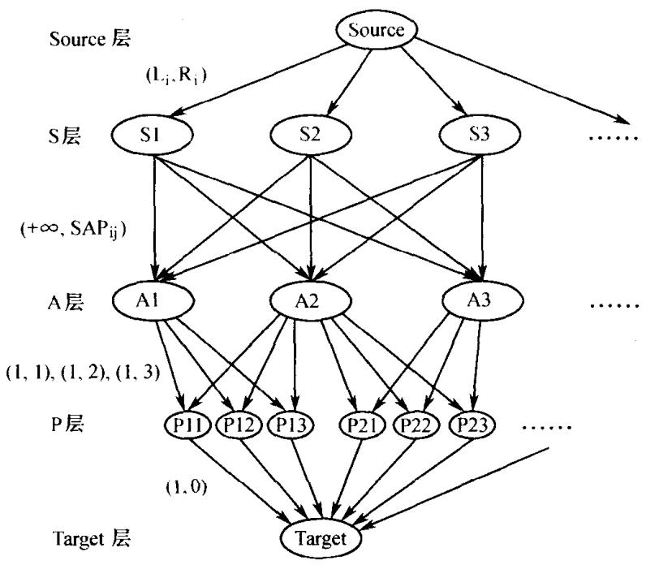

<details>
<summary>flowchart</summary>

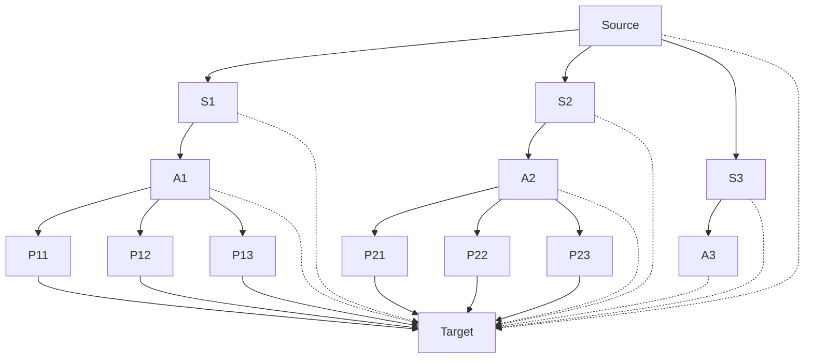
```mermaid
graph TD
  Source["Source"] --> S1["S1"]
  Source --> S2["S2"]
  Source --> S3["S3"]
  
  S1 --> A1["A1"]
  S2 --> A2["A2"]
  S3 --> A3["A3"]
  
  A1 --> P11["P11"]
  A1 --> P12["P12"]
  A1 --> P13["P13"]
  
  A2 --> P21["P21"]
  A2 --> P22["P22"]
  A2 --> P23["P23"]
  
  P11 --> Target["Target"]
  P12 --> Target
  P13 --> Target
  P21 --> Target
  P22 --> Target
  P23 --> Target
  
  Source -.-> Target
  S1 -.-> Target
  S2 -.-> Target
  S3 -.-> Target
  A1 -.-> Target
  A2 -.-> Target
  A3 -.-> Target
```
</details>

图 1 线性费用流网络模型一

制为 1, 单位费用为 0.

这种流网络模型最简单,效率也较低. 设铺设的管道共有 $Tl$ 公里, 显然 $Tl > > n$ 与 $m$ . 网络中的点数大约为 $Tl$ 个, 边数大约为 $3 \times Tl$ , 最大流量为 $Tl$ . 标准的网络流算法的时间复杂度为 $O(V^3 \times MaxFlow)$ , 因此, 这个模型的复杂度为 $O(Tl^4)$ . 对于题中的数据, $Tl$ 大约在 5000 左右, $Tl^4 \approx 10^{15}$ , 不可承受.

## 4.2 线性费用流网络模型二(图 2)

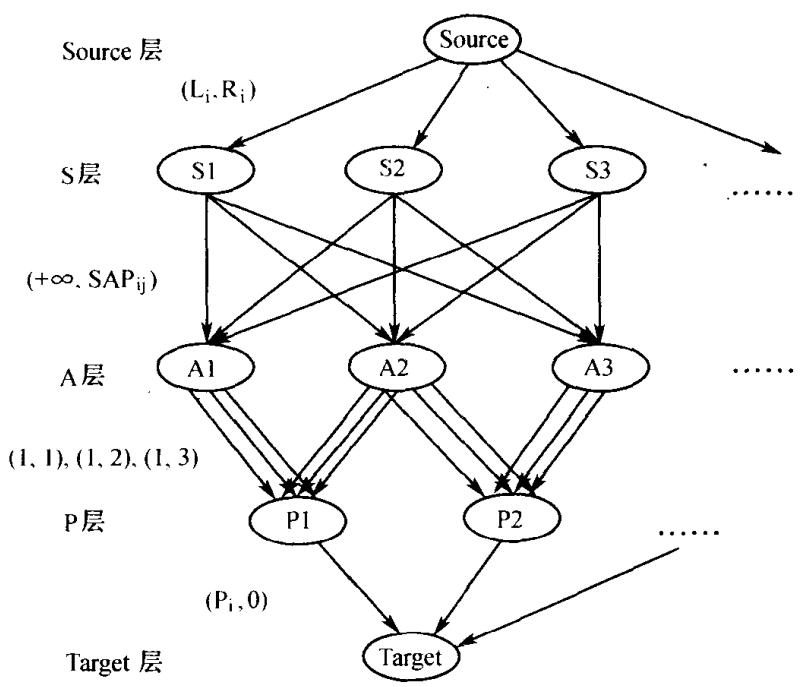

<details>
<summary>flowchart</summary>

```mermaid
graph TD
  Source --> S1["S1"]
  Source --> S2["S2"]
  Source --> S3["S3"]
  
  S1 --> A1["A1"]
  S2 --> A2["A2"]
  S3 --> A3["A3"]
  
  A1 --> P1["P1"]
  A2 --> P2["P2"]
  A3 --> P1
  
  P1 --> Target["Target"]
  P2 --> Target
  
  Source --> L1["(Li, Ri)"]
  S1 --> (+∞, SAPij)["(+∞, SAPij)"]
  A1 --> (1, 1), (1, 2), (1, 3)
  P1 --> (Pi, 0)["(Pi, 0)"]
  P2 --> Target
```
</details>

图 2 线性费用流网络模型二

模型一之所以效率低,最主要的问题是流网络中的点太多了.通过点的合并,可以大幅减小流网络中点的个数.将线性费用流网络模型一中对应同一段要铺设的管道的点合并成一个点(即模型一图中的 $P_{11},P_{12},P_{13}$ 合并为 $P_{1}$ ),从A点到这些点的边现在全部转到一个点上(如图),从这些点到Target的边合并为流量限制为 $P_{i}(P_{i}$ 即要铺设的管道的长度),单位费用为0的一条边.

模型二中的点数为 $n + m + Pcount + 2$ ，边数大约为 $2 \times Tl$ 个。均比模型一有了大幅减小。然而边数仍然太多，而且这张流网络不是一张简单图（ $A$ 层与 $P$ 层中两个点之间的边数 $>1$ ），因此，不能直接套用标准最小费用最大流的复杂度计算公式。

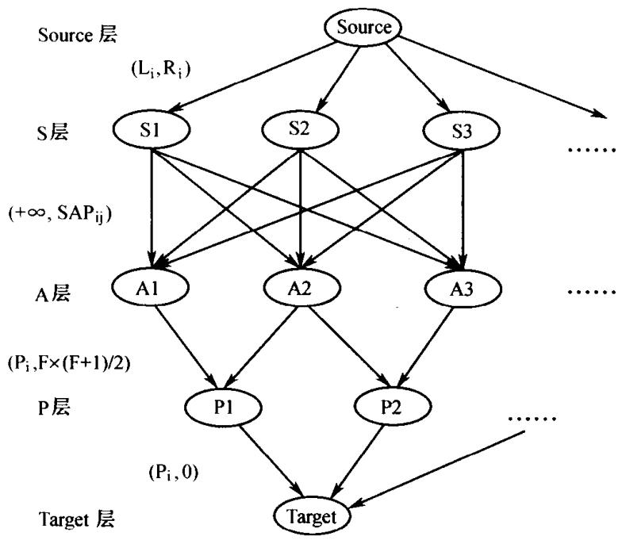

<details>
<summary>flowchart</summary>

```mermaid
graph TD
  Source --> S1["S1"]
  Source --> S2["S2"]
  Source --> S3["S3"]
  
  S1 --> A1["A1"]
  S2 --> A2["A2"]
  S3 --> A3["A3"]
  
  A1 --> P1["P1"]
  A2 --> P2["P2"]
  A3 --> P3["P3"]
  
  P1 --> Target["Target"]
  P2 --> Target
  P3 --> Target
  
  Source -.-> S1
  Source -.-> S2
  Source -.-> S3
  Source -.-> A1
  Source -.-> A2
  Source -.-> A3
  Source -.-> P1
  Source -.-> P2
  Source -.-> P3
```
</details>

图 3 非线性费用流网络模型

## 4.3 非线性费用流网络模型(图 3)

第三种模型是非线性费用网络流模型.

1）模型中所有的点与模型二相同；  
2) 模型中除了 A 层与 P 层之间的边以外, 均与模型二相同;  
3) $A$ 层与 $P$ 层之间的边的流量限制与模型二相同, 但是没有单位费用的概念, 因为费用是非线性的, 费用 $= \text{流量} \times (\text{流量} + 1)/2$ .

线性费用流网络模型一可用标准的最小费用最大流算法(如最小费用路算法)来求解.而非线性费用流网络模型不能直接套用标准算法.下面我们先叙述一下最小费用路算法,再提出非线性模型的求解算法.

标准的最小费用最大流算法——最小费用路算法：

Step 0: 取零流 f 为初始可行流.

Step 1: 如果 $v(f) =$ 最大流量 $v_{\max}$ , 则 $f$ 为 $D$ 中流值为 $v_{\max}$ 的最小费用流; 否则转 Step 2;

Step 2: 构造增量网络 $D(f)$ . 如果 $D(f)$ 中不存在 (Source, Target) 路, 则 $D(f)$ 中没有流值为 $v_{\max}$ 的可行流, 停止, 否则在 $D(f)$ 中找一条最小费用路 $U$ , 转 Step 3.

Step 3: 用 $c(U)$ 表示 $U$ 的容量, 对 $f$ 沿 $U$ 增广流值, 增广量为 $c(U)$ , 得到新流 $f$ , 转 Step 1.

最小费用路算法在找最小费用路时要用到边的单位费用,而非线性模型中的非线性费用边没有单位费用的概念.为此,将最小费用路算法做一点修改:

定义非线性费用边的上下边际费用：

上边际费用 定义为: 流量增加 1, 非线性费用边的费用的增加值

下边际费用定义为:流量减小1,非线性费用边的费用的减小值

当最小费用路算法查询正向流过这条边的单位费用时,用上边际费用作为单位费用;

当最小费用路算法查询负向流过这条边的单位费用时，用下边际费用作为单位费用；

经过这个修改,最小费用路算法就能应用于本题的非线性模型了.

## 4.4 有产量下限的模型

下面考虑进一步的模型.

现在我们给定每个工厂的生产量范围 $\left[Low_{i}, High_{i}\right]$ ，求最小费用方案。

为了解决这个问题,我们要对原来的网络作一点修改(图 4):

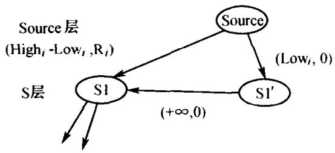

<details>
<summary>flowchart</summary>

```mermaid
graph TD
  Source --> S1
  Source --> S1["S1'"]
  S1 --> S1
  S1 --> S1
  S1 --> S1
  S1 --> S1
  S1 -.->|(+∞,0)| S1
  S1 -.->|(High_i -Low_i, R_i)| Source
```
</details>

图 4 产量有上下限的非线性费用流网络模型

1）为每个产量下限非0的工厂增加一个虚拟点，如图中的 $S_{1}$ 点，  
2) 增加一条从 Source 到 $S_{1}$ 的边, 流量限制为 $Low_{1}$ , 费用为 0,  
3) 增加一条从 $S_{1}$ 到 $S_{1}$ 的边, 流量限制为 $+\infty$ , 费用为 0,  
4) 将 Source 到 $S_{1}$ 的边的流量限制改为 $High_{1}-Low_{1}$

这样的模型得出的最小费用要加上 $\sum_{i=1}^{n} \mathrm{Low}_{\mathrm{i}} \times R_{i}$ 才是原问题的解.

由于我们假设允许生产过剩现象,这种方法的正确性显而易见,这里不再证明.

## 4.5 基于分支定界搜索的求解过程

由于题中给出的工厂产量的范围 $\{0, [500, \mathrm{Li}]\}$ 不是一个区间，我们需要用分支定界搜索来求解。下面以图1中的数据为例，分析分支定界搜索的求解过程。

1) 将工厂产量的范围设定为 $(0 - 800, 0 - 800, 0 - 1000, 0 - 2000, 0 - 2000, 0 - 2000, 0 - 2000)$ ，求得一个解：

费用为 12753516, 生产方案为 = (800, 800, 1000, 0, 1366, 960, 245).

2）由于1的解中第7个工厂的产量 $245 \in (0, 500)$ ，要将问题分解为两部分：

i. 范围: $(0 - 800, 0 - 800, 0 - 1000, 0 - 2000, 0 - 2000, 0 - 2000, 0 - 0)$

解得:费用为 12786316, 生产方案为(800,800,1000,0,1366,1205,0),

这个方案是合法的,将其作为当前最优解

ii. 范围: $(0 - 800, 0 - 800, 0 - 1000, 0 - 2000, 0 - 2000, 0 - 2000, 500 - 2000)$

解得:费用为 12796606, 生产方案为(800,800,1000,0,1336,735,500)

费用＞当前最优解,舍弃当前节点

搜索结束,最优解:费用为12786316,生产方案为(800,800,1000,0,1366,1205,0)至此,题中第一问与第三问都已被圆满的解决了.

## 4.6 运行结果

· 图 1 的最优解: 总费用 12786316 千元  
· S1 到 S7 的产量 = (800, 800, 1000, 0, 1366, 1205, 0)  
· 图 2 的最优解: 总费用: 14066314 千元  
- S1 到 S7 的产量 = (800, 800, 1000, 0, 1303, 2000, 0)

## 4.7 算法的复杂度分析

(V 指网络中的总点数, $V = n + m + Pcount + 2$ , Tl 指待铺设的管道的总长度)

i. 预处理时用到的图的最短路算法的复杂度为 $O(V^{3})$  
ii. 主程序外层是分支定界搜索算法, 最坏情况的运行次数为 $2^{n}$ . 一般情况下运行次数不多  
iii. 主程序内层是非线性费用网络流模型, 使用非线性最小费用路算法, 复杂度为 $O(V^{3} \times Tl)$ ,;

由此可见算法的时间复杂度在 $O(V^{3} \times Tl)$ 到 $O(V^{3} \times Tl \times 2^{n})$ 之间. 若数据规模如假设中所述, 则运算量大约在 $10^{10}$ 以下.

## 参考文献

[1] 徐俊明.《图论及其应用》. 中国科学技术大学出版社, 1998.  
[2] 谢政，李建平.《网络算法与复杂性理论》.国防科技大学出版社，1995.

# 订购和运输钢管的最优方案

陆维新 林皓 陈晓东

(四川大学，成都 610064)

指导老师 周 杰

编者按 该文建立了用于天然气管道铺设的钢管订购和运输总费用最省的二次规划模型。总费用作为目标函数，钢管生产厂的产量限制等作为约束条件。所建模型通过定性分析与使用 Lingo 软件求解获得了满意的方案，并且计算量大大减少了。整篇文章理由描述充分，层次清楚，洞察力强而篇幅较短。

摘要 本文研究铺设天然气钢管的最优方案问题. 我们建立了一个以总费用为目标函数的二次规划模型.

## 1 问题的重述与分析(略)

## 2 模型的假设与符号说明

1) 基本假设：

①要铺设的管道侧有公路,可运送所需钢管;  
②钢管在运输中由铁路运转为公路运时不计换车费用；  
③所需钢管均由 $S_{i}(i=1,\cdots,7)$ 钢厂提供；  
④假设运送的钢管路途中没有损耗.

2）符号说明 $(i=1,2,\cdots,7,j=1,2,\cdots,15)$ :

$s_{i}$ ：钢厂 $S_{i}$ 的最大生产能力；  
$p_{i}$ ：钢厂 $S_{i}$ 的出厂钢管单位价格(单位:万元);  
d : 公路上一单位钢管的每公里运费(d = 0.1 万元);  
e：铁路上一单位钢管的运费(分段函数见表1);  
$c_{ij}$ : 1 单位钢管从钢厂 $S_{i}$ 运到 $A_{j}$ 的最小费用(单位:万元);

$b_{j}$ ：从 $A_{j}$ 到 $A_{j+1}$ 之间的距离(单位:千米);

$x_{ij}$ : 钢厂 $S_{i}$ 运到 $A_{j}$ 的钢管数；

$y_{j}$ ：运到 $A_{j}$ 地的钢管向左铺设的数目；

$z_{j}$ ：运到 $A_{j}$ 地的钢管向右铺设的数目；

$t_{i}$ : $=\left\{\begin{aligned}&1,\quad&钢厂 S_{i} 提供钢管\\ &0,\quad&钢厂 S_{i} 不提供钢管\end{aligned}\right.$ ;

W: 所求钢管订购、运输的总费用(单位:万元);

表 1 铁路的单位运费

<table><tr><td>r(单位:公里)</td><td>r≤300</td><td>301≤r≤350</td><td>351≤r≤400</td><td>401≤r≤450</td><td>451≤r≤500</td></tr><tr><td>e(单位:万元)</td><td>20</td><td>23</td><td>26</td><td>29</td><td>32</td></tr><tr><td>501≤r≤600</td><td>601≤r≤700</td><td>701≤r≤800</td><td>801≤r≤900</td><td>901≤r≤1000</td><td>r≥1000</td></tr><tr><td>37</td><td>44</td><td>50</td><td>55</td><td>60</td><td> $5\left(\left[\frac{r-1000}{100}\right]+1\right)+60$ </td></tr></table>

## 3 模型的建立

我们的目标函数是总费用 W，它包含三项：钢管出厂总价 Q，运输费 P，及铺设费 T。即

$$
W = Q + P + T
$$

其中 $Q = \sum_{i=1}^{7} \sum_{j=1}^{15} p_j \cdot x_{ij}, P = \sum_{i=1}^{7} \sum_{j=1}^{15} c_{ij} \cdot x_{ij},$

铺设费 T 可以如下来确定: $A_{j}$ 开始从左右两个方向铺设, $y_{j}$ 与 $z_{j}$ 单位长钢管的费用为

$$
d \cdot 1 + d \cdot 2 + \dots + d \cdot y _ {j} = d \frac {(1 + y _ {j}) y _ {j}}{2} \text {与} d \frac {(1 + z _ {j}) z _ {j}}{2}
$$

故 $T = d\sum_{j = 1}^{15}\left(\frac{(1 + y_j)y_j}{2} +\frac{(1 + z_j)z_j}{2}\right)$

约束条件为：

① 生产能力的限制： $500 \cdot t_{i} \leqslant \sum_{j=1}^{15} x_{ij} \leqslant s_{i} \cdot t_{i} \quad (i = 1, \cdots, 7) \quad (t_{i} = 0 \text{ 或 } 1)$  
② 运到 $A_{j}$ 的钢管用完: $\sum_{i=1}^{7} x_{ij} = y_{j} + z_{j} \quad (j = 1, \cdots, 15)$  
③ $A_{j}$ 与 $A_{j-1}$ 之间的钢管： $z_{j} + y_{j+1} = b_{j}$ $(j=1,\cdots,14)$  
④ 变量非负性限制: $x_{ij} \geqslant 0, y_j \geqslant 0, z_j \geqslant 0, (i = 1, \cdots, 7, j = 1, \cdots, 15)$ .

综合以上讨论,得出问题Ⅰ的数学模型如下:

$$
\mathrm{Obj1:min} \quad W = \sum_ {i = 1} ^ {7} \sum_ {j = 1} ^ {1 5} p _ {i} \cdot x _ {i j} + \sum_ {i = 1} ^ {7} \sum_ {j = 1} ^ {1 5} c _ {i j} \cdot x _ {i j} + d \sum_ {j = 1} ^ {1 5} \left[ \frac {(1 + y _ {j}) y _ {j}}{2} + \frac {(1 + z _ {j}) z _ {j}}{2} \right]
$$

s. t.

$$
5 0 0 \cdot t _ {i} \leqslant \sum_ {j = 1} ^ {1 5} x _ {i j} \leqslant s _ {i} \cdot t _ {i} \quad (i = 1, \dots , 7)
$$

$$
\sum_ {i = 1} ^ {7} x _ {i j} = y _ {j} + z _ {j} \quad (j = 1, \dots , 1 5)
$$

$$
z _ {j} + y _ {j + 1} = b _ {j} \quad (j = 1, \dots , 1 4)
$$

$$
y _ {1} = 0, \quad z _ {1 5} = 0
$$

$$
x _ {i j} \geqslant 0, y _ {j} \geqslant 0, z _ {j} \geqslant 0, (i = 1, \dots , 7, j = 1, \dots , 1 5)
$$

$$
t _ {i} = 0 \text {或} 1 \quad (i = 1, \dots , 7)
$$

## 4 对模型 Obj1 的求解：

为了求解模型,必须求出系数 $(c_{ij})_{7\times15}$ ,其中每一 $c_{ij}$ 表示 $S_{i}$ 到 $A_{j}$ 的最小费用,因而,求解 $c_{ij}$ 实际上是一个求最短路的问题. 总路段由铁路和公路组成, 由于单位运费的差别, 分别计算就有一定难度, 因此考虑将单位运费乘以路程来作为“距离”, 这样将两者统一起来, 利用最短路的算法, 可得到从 $S_i$ 到 $A_j$ 的最小运费. 具体实现算法如下:

① 将图中39个点构成一个 $39 \times 39$ 的权矩阵 $A_{39 \times 39}$ , 其中 $a_{ij}$ 表示从 $A_i$ 到 $A_j$ 的最短路程, 若 $A_i, A_j$ 不能直接相连, 用 $a_{ij} = \infty$ 表示. 铁路自身构成 $A_{39 \times 39}^1$ , 公路自身构成一个 $A_{39 \times 39}^2$ , 分别对 $A^1$ 和 $A^2$ 运用弗洛依德算法, 得出局部最短路程矩阵和最短路径矩阵 path1, paht2.

② 对公路, 将 $0.1 \times A^{2}$ 记为公路局部最短“距离”(运费)矩阵 $A^{1'}$ , 对铁路, 用铁路的费用 $e$ 进行转换, 得局部最短“距离”(运费)矩阵 $A^{2'}$ . 令 $A = \min(A^{1'}, A^{2'})$ , min 表示 $A^{1'}$ 与 $A^{2'}$ 中对应元素较小者.

③ 对得到的 A, 再使用一次弗洛依德算法, 得到全局的最短“距离”, 实际上, 就是每两点间最小运费矩阵, 从中抽取出 $S_{i}$ 到 $A_{j}$ 之间的子矩阵 $C'$ .

④ 为了便于以后计算, 将 $S_{i}$ 的单价 $p_{i}$ 加到 $C'$ 中 $S_{i}$ 对应的列上, 得最小费用矩阵 $C$ (略).

下面先通过分析,对模型解进行估计.

首先,由题图可估计,最右边的钢厂,如 $S_{6}, S_{7}$ 一定不会运往 $A_{1} \sim A_{3}$ 等较左边的点.其次,由最小费用矩阵 $C$ 来决定订购的优先级, $A_{j}$ 中费用最小的权所对应的 $S_{i}$ 即为最优,可分析得:对 $A_{1} \sim A_{8}: S_{1}$ 最优, $S_{2}$ 次优, $S_{3}$ 再次;对 $A_{9}: S_{3}$ 最优, $S_{1}$ 次优;对 $A_{10} \sim A_{11}: S_{5}$ 最优, $S_{6}$ 次优, $S_{4}$ 再次;对 $A_{12} \sim A_{14}: S_{6}$ 最优, $S_{7}$ 次优;对 $A_{15}: S_{7}$ 最优.

另外，由于钢厂一旦开工就必须生产500单位，而 $A_{15}$ 至多需要铺500单位，所以可能不从 $S_{7}$ 购运。 $S_{4}$ 对应的权基本为每一行中最大成本，所以为最末考虑因素，所以可能不运出。再考虑生产上限因素，由于 $S_{5} \sim S_{7}$ 上限很大，所以 $A_{10} \sim A_{15}$ 由 $S_{5} \sim S_{7}$ 应能完全供给，并达到目标值最优。而 $S_{1}$ 上限只有800单位，所以先满足 $A_{1} \sim A_{8}$ 中优先级较高的，接下面方法排序：令 $\operatorname{sub}(S_i \to A_j, S_i' \to A_j')$ 表示从 $S_i$ 到 $A_j$ 所需单位成本与 $S_i'$ 到 $A_j'$ 所需的成本之差。若差值越大，表明越应该由两者较小的来提供 $A_j$ 的钢管，如 $\operatorname{sub}(S_1 \to A_5, S_2 \to A_5) = 68$ 单位，而 $\operatorname{sub}(S_1 \to A_7, S_2 \to A_7) = 78$ 单位，表示 $S_1$ 应优先满足 $A_7$ 。∴可得优先级为 $A_7 > A_6 > A_5 = A_4 > A_8 > A_3 > A_1$ 。再由 $S_i$ 的产量上限以及 $A_j$ 两边要铺设的钢管数，得到结论： $S_1, S_2, S_3$ 必须满荷运出，即 $S_1 = 800$ 单位， $S_2 = 800$ 单位， $S_3 = 1000$ 单位，才能使目标值较优，且由要铺的所有钢管数，可大致推出： $S_1 \to A_5, A_6, A_7; S_2 \to A_1, A_2, A_3; S_3 \to A_4, A_7, A_8, A_9; S_5 \to A_{10}, A_{11}; S_6 \to A_{12}, A_{13}, A_{14}; S_7 = 0; S_4 = 0$ 。

然后，再把 $S_{1}, S_{2}, S_{3}$ 可运到的铺设点范围放宽，观察 $(c_{ij})$ 矩阵，其中该矩阵右上角和左下角的 $c_{ij}$ 比较大，故可考虑把其对应的 $x_{ij}$ 取为0，则只需考虑 $(x_{ij})$ 矩阵的左上角、右下角对应的 $3 \times 8$ 矩阵求解，运用数学软件Lingo5.0，编程求出： $W_{1}^{*} = 1.282142 \times 10^{6}$ （万元）.

## 5 对模型 Obj1 的灵敏度分析

1) 确定哪个钢厂的销价的变化对购运计划和总费用的影响最大

我们假设该钢厂的销价变化在 $\pm 10\% p_i$ 万元以内, 这是较为合理的. 将目标函数的 $W$ 表示为 $p_i$ 的函数,

$$
\boldsymbol {W} = f (p _ {1}, p _ {2}, \dots , p _ {7}),
$$

$$
\Delta W = \frac {\partial f}{\Delta p _ {1}} \cdot \Delta p _ {1} + \frac {\partial f}{\Delta p _ {2}} \Delta p _ {2} + \dots + \frac {\partial f}{\partial p _ {7}} \Delta p _ {7}.
$$

因此在销价的变化量相同时， $\frac{\partial f}{\partial p_i}$ 越大，则 $p_i$ 的变化对 $\omega$ 的变化影响越大.

由模型 Obj1 计算得到的数据可以知道 $\frac{\partial f}{\partial p_6} = 2000$ 单位是最大的, 所以 $S_6$ 的销价变化对购运计算和总费用的影响最大, 我们可以通过简单的分析来证明: 由于 $S_6$ 提供的数量最大, 销价只要很小变化的, 就会引起总费用的很大变化, 同时, 当价格越来越高, 由于 $p_6$ 和 $\sum_{j=1}^{15} x_{6j}$ 互为消长的关系, 当 $S_6$ 越来越小, 它在总需求中占的份额减少, 影响减弱, $S_6$ 下降的速度也将放慢.

除了销价的升高,我们还必须考虑销价的降低,此时应尽量满足提供量最少的点 $S_{5}$ , 当价格越来越低, 由互为消长关系, $S_{5}$ 点的提供量将增加, 它占总需求的份额增加, 影响增强, 对于 $S_{5}$ 上升的速度将放慢.

2) 确定哪个钢厂的生产上限的变化对物运计划和总费用的影响最大

由于 $S_{1}$ 是 $A_{1}$ 到 $A_{8}$ 的最优首选，因此若 $S_{1}$ 与其它 $S_{i}$ 同时扩大相同的 $\Delta S$ 容量，则 $S_{1}$ 会更优，所以推断 $S_{1}$ 应为影响最大者。由最小费用矩阵 $C$ 可以知道， $A_{i} (i = 1, \dots, 8)$ 所需的钢管量最好都能由 $S_{1}$ 提供，则此时 $S_{1}$ 达到最大需求量，在模型 Obj1 的条件下， $S_{1}$ 为 2536 单位，而 $S_{1}$ 的上限为 800 单位，考虑到实际钢厂的投入与产出，在很短的时期内生产要达到原来的 3 倍，不符合实际意义，所以考虑 $S_{1}$ 在 $10\%$ 范围内变化。同理对于 $A_{9}$ 点，最优为 $S_{3}$ 全部提供，即 $S_{3}$ 应提供 634 单位，对于 $A_{12}, A_{13}, A_{14}, A_{15}$ ，由 $S_{6}$ 全部提供为最优，即 $S_{6}$ 应提供 1205 单位， $A_{11}, A_{10}$ 由 $S_{5}$ 全部提供为最优，即 $S_{5}$ 应提供 796 单位。

利用计算机模拟,得出5个供货钢厂分别扩建1%,2%,4%,6%,8%,10%时的成本的增长率,见表2.可以看出,相同的 $\Delta S$ 下 $A_{1}$ 产生的增长率最大,符合上述分析.一旦工厂扩建范围超过最大需求量,则不再会使目标函数优化,则此时增长率为0,即是上图中 $S_{5},S_{6}$ 的情况.而对于 $S_{1}$ ,一旦 $S_{1}>2536$ ,则其增长率也为0.( $S_{1}$ 的数字结果见表2)

表 2 某个 $S_{i}$ 在变化 $\Delta S$ 的情况下目标函数减小量及减小的比率

<table><tr><td rowspan="2"> $\Delta S$ </td><td colspan="2"> $S_1$ </td><td colspan="2"> $S_2$ </td><td colspan="2"> $S_3$ </td><td colspan="2"> $S_5$ </td><td colspan="2"> $S_6$ </td></tr><tr><td> $\Delta z$ (万元)</td><td> $\frac{\Delta z}{z}$ (%)</td><td> $\Delta z$ (万元)</td><td> $\frac{\Delta z}{z}$ (%)</td><td> $\Delta Z$ (万元)</td><td> $\frac{\Delta z}{z}$ (%)</td><td> $\Delta z$ (万元)</td><td> $\frac{\Delta z}{z}$ (%)</td><td> $\Delta z$ (万元)</td><td> $\frac{\Delta z}{z}$ (%)</td></tr><tr><td>1%</td><td>872</td><td>0.068</td><td>328</td><td>0.025</td><td>310</td><td>0.024</td><td>0</td><td>0</td><td>0</td><td>0</td></tr><tr><td>2%</td><td>1744</td><td>0.136</td><td>656</td><td>0.051</td><td>620</td><td>0.048</td><td>0</td><td>0</td><td>0</td><td>0</td></tr><tr><td>4%</td><td>3488</td><td>0.272</td><td>1312</td><td>0.102</td><td>1240</td><td>0.096</td><td>0</td><td>0</td><td>0</td><td>0</td></tr><tr><td>6%</td><td>5232</td><td>0.408</td><td>1968</td><td>0.153</td><td>1860</td><td>0.145</td><td>0</td><td>0</td><td>0</td><td>0</td></tr><tr><td>8%</td><td>6976</td><td>0.544</td><td>2624</td><td>0.204</td><td>2480</td><td>0.193</td><td>0</td><td>0</td><td>0</td><td>0</td></tr><tr><td>10%</td><td>8720</td><td>0.685</td><td>3280</td><td>0.256</td><td>3100</td><td>0.242</td><td>0</td><td>0</td><td>0</td><td>0</td></tr></table>

## 6 问题Ⅰ的分析

若要铺设的道路不是一条钱,而是一个树形图,则有以下两个问题.

首先,模型一中给出的算法可以进行扩展,对于网络中不同性质的路有 n 种,设 n 个与原矩阵同阶的局部距离矩阵,局部最优后,再统一求解.

其次，由于树形图的出现，则某些管道处会出现多支路.则模型一中模型的 $y_{j}$ （左铺）， $z_{j}$ （右铺）不再适用，此时可考虑多增加一些支路变量，如 $y_{1j}, y_{2j}, \cdots, z_{1j}, z_{2j}, \cdots$ 之类，增加约束条件 $y_{1j} + y_{2j} + \cdots + z_{1j} + z_{2j} + \cdots = x_{ij}$ ，在目标函数中增加相应的铺设费，具体做法可由下面对图二的模型获知，问题Ⅲ建模如下（ $m_{j}$ 是运到 $A_{j}$ 的钢管向第三支路铺设的数目）：

$$
\begin{array}{l} \mathrm{Obj2:min} W = \sum_ {i = 1} ^ {7} \sum_ {j = 1} ^ {2 1} p _ {i} x _ {i j} + \sum_ {i = 1} ^ {7} \sum_ {j = 1} ^ {2 1} c _ {i j} x _ {i j} + d \left[ \sum_ {i = 2} ^ {1 5} \frac {y _ {i} (y _ {i} + 1)}{2} + \sum_ {i = 1} ^ {1 4} z _ {i} \frac {(z _ {i} + 1)}{2} \right. \\ \left. + \frac {m _ {9} (m _ {9} + 1)}{2} + \frac {m _ {1 1} (m _ {1 1} + 1)}{2} + \frac {m _ {1 7} (m _ {1 7} + 1)}{2} \right] \\ \end{array}
$$

$$
\mathrm{s.t.} \quad 5 0 0 \cdot t _ {i} \leqslant \sum_ {j = 1} ^ {2 1} x _ {i j} \leqslant s _ {i} \cdot t _ {i} \quad (i = 1, \dots , 7)
$$

$$
\sum_ {i = 1} ^ {7} x _ {i j} = y _ {j} + z _ {j} \quad (j = 1, \dots , 2 1 \text {且} j \neq 9, 1 1, 1 7)
$$

$$
\sum_ {i = 1} ^ {7} x _ {i j} = y _ {j} + z _ {j} + m _ {j} \qquad (j = 9, 1 1, 1 7)
$$

$$
z _ {j} + y _ {j + 1} = b _ {j} \quad (j = 1, 2, \dots , 1 4)
$$

$$
m _ {9} + y _ {1 6} = 4 2, \quad z _ {1 9} + y _ {2 0} = 2 6 0
$$

$$
z _ {2 0} + y _ {2 1} = 1 0 0, \quad m _ {1 1} + m _ {1 7} = 1 0
$$

$$
y _ {1 7} + y _ {1 8} = 1 3 0, \quad z _ {1 7} + y _ {1 9} = 1 9 0
$$

$$
x _ {i j}, y _ {j}, z _ {j}, m _ {j} \geqslant 0 \quad (i = 1, \dots , 7, j = 1, \dots , 2 1), \quad t _ {i} = 0 \text {或} 1 \quad (i = 1, \dots , 7)
$$

运用数学软件 Lingo5.0 编程求出：

$$
W _ {2} ^ {*} = 1. 4 0 6 3 3 \times 1 0 ^ {6} (\text {万元})
$$

## 参考文献

[1] 姜启源.《数学模型》. 高等教育出版社, 北京, 1996.  
[2] 严蔚敏，吴伟民.《数据结构》. 清华大学出版社，北京，1992.  
[3] 叶其孝.《大学生数学建模竞赛辅导教材》. 湖南教育出版社, 长沙, 1993.

# 管道订购和运输

马欣 郭世强 王佳

(大连海事大学，大连 116026)

指导老师 教师组

编者按 本文只是 B 题的第一问的求解部分,该求解过程对所建立的非线性优化模型,采用两阶段法求解,首先通过对铺设路线上运输费用的分析,为非线性规划的线性化提供了依据,从而直接采用线性规划方法求解.然后采用拆分法,将原管道运输网络图分成二部分,利用类似于原网络的方法,逐步对问题调优.最后,以所得可行解为初始点,采用模拟退火算法,求得最后的近似最优解.

摘 要 在对图形一分析的基础之上,首先建立了问题一的非线性规划的模型.然后采用了两种方法分别对问题一求解.

## 1 问题的重述(略)

## 2 基本假设(略)

## 3 符号约定

$P_{i}$ : 各钢厂的钢管的出厂销价(万元/单位).

$C_{i,j}$ : 单位钢管从钢厂 $S_{i}$ 购出并经单位运费最小路运至 $A_{j}$ 时单位钢管的所需费用包括销价和运费两部分.

$X_{i,j}$ :从 $S_{i}$ 到 $A_{j}$ 运输钢管的总数.

$l_{j}$ : 从 $A_{j}$ 点到 $A_{j+1}$ 点所需要铺设钢管的数量.

$Ca_{j}$ : 表示从 $A_{j}$ 到 $A_{j+1}$ 段上钢管的运输费用.

D:钢管总的需求量.

$s_{i}$ : 各钢厂 $S_{i}$ 的最大供给力.

$a_{j}$ : 运到 $A_{j}$ 的钢管总数.

$a_{j,1}$ : 为从 $A_{j}$ 向左铺设的里程数.

$a_{j,2}$ : 为从 $A_{j}$ 向右铺设的里程数.

$t_{i}$ : 钢厂 $S_{i}$ 的实际供给量.

Cost: 总费用函数.

## 4 问题的分析和模型的建立

## (1) 分析：

依照题目中所给出的数据,我们可以计算出由 $S_{i}$ 经单位运费最小路运至 $A_{j}$ 点时单位钢管的费用(即运费与出厂销价之和 $C_{i,j}$ ).

(2) 模型的建立: 在运送钢管时, 必须将钢管先运到各 $A_{j}$ 点, 再由各 $A_{j}$ 点转运到铺设地

点,因此我们考虑下将整个购运过程分为两个阶段:

I. 将钢管从各钢厂 $S_{i}(i=1,\cdots,7)$ 运到 $A_{j}(j=1,\cdots,15)$ 点.

Ⅱ. 从 $A_{i}$ 分别向左右两端运输并铺设.

在I阶段中，费用为 $\mathrm{Cos}t_{1} = \sum_{i = 1}^{7}\sum_{j = 1}^{15}C_{i,j}X_{i,j}$

在Ⅱ阶段中,费用用为 $\mathrm{Cos}t_{2}=\sum_{j}Ca_{j}$

其中任意施工段 $L_{j}$ 内所花费的运输费用为

$$
C a _ {j} = \frac {0 . 1 \times (a _ {j , 2} - 1) \times a _ {j , 2}}{2} + \frac {0 . 1 \times (a _ {j + 1 , 1} - 1) \times a _ {j + 1 , 1}}{2}
$$

再根据题目所要求的各种约束条件,我们可以建立模型如下:

$$
\min \mathrm{Cos} t = \cos t _ {1} + \cos t _ {2} = \sum_ {i = 1} ^ {7} \sum_ {j = 1} ^ {1 5} C _ {i, j} X _ {i, j} + \sum_ {j = 1} ^ {1 5} \left[ \frac {(a _ {j , 1} - 1) \cdot a _ {j , 1}}{2} + \frac {(a _ {j , 2} - 1) \cdot a _ {j , 2}}{2} \right] \times 0. 1
$$

$$
\mathrm{s.t} \quad a _ {j, 2} + a _ {j + 1, 1} = l _ {j} (j = 1, \dots , 1 4)
$$

$$
\dot {5} 0 0 \leqslant \sum_ {j = 1} ^ {1 5} X _ {i, j} \leqslant S _ {i} \quad \text {or} \quad \sum_ {j = 1} ^ {1 5} X _ {i, j} = 0
$$

$$
\sum_ {i = 1} ^ {7} X _ {i, j} = a _ {j, 2} + a _ {j + 1, 1} (j = 1, \dots , 1 4)
$$

$$
X _ {i, j} \geqslant 0, a _ {j, 1} \geqslant 0, a _ {j, 2} \geqslant 0
$$

## 5 模型的求解

由于目标函数的图像是一个多维的抛物面,它的约束条件所对应的区域不是凸集,因而模型给出的是在非连续可行域上的二次规划问题.这样就很难找到一个统一的方法来求解.我们注意到:在 $A_{2}$ 和 $A_{15}$ 处,有 $a_{2,1} = 104$ , $a_{15,2} = 0$ ;在 $A_{1} \rightarrow A_{2} \rightarrow \cdots A_{15}$ 上有 $a_{j,2} + a_{j+1,1} = l_{j}$ ,并且

$$
\begin{array}{l} C a _ {j} = 0. 0 5 \times [ (a _ {j, 2}) ^ {2} + (a _ {j + 1, 1}) ^ {2} - a _ {j, 2} - a _ {j + 1, 1} ] \\ = 0. 0 5 \times [ (a _ {j, 2}) ^ {2} + (a _ {j + 1, 1}) ^ {2} - (a _ {j, 2} + a _ {j + 1, 1}) ] \\ = 0. 0 5 \times [ (a _ {j, 2}) ^ {2} + (a _ {j + 1, 1}) ^ {2} - l _ {j} ] \\ \geqslant 0. 0 5 \times (2 a _ {j, 2} \cdot a _ {j + 1, 1} - l _ {j}) \\ \end{array}
$$

及 $Ca_{j} = 0.1 \times [(a_{j,2} - 1)a_{j,2} + (l_{j} - a_{j,2} - 1)(l_{j} - a_{j,2})] / 2$

$$
= 0. 0 5 \times [ 2 (a _ {j, 2}) ^ {2} + l _ {j} ^ {2} - 2 l _ {j} \cdot a _ {j, 2} - l _ {j} ]
$$

$$
= 0. 0 5 \times [ 2 (a _ {j, 2} - l _ {j} / 2) ^ {2} + l _ {j} ^ {2} / 2 - l _ {j} ]
$$

所以，当 $a_{j,2} = a_{j + 1,1}$ 成立时，在这段路上费用最少；当 $a_{j,2} = 0$ 时，这段路上的费用最大.

综合以上,我们可以得到 $Ca_{j}$ 的最值为:

$\min Ca_{j} = 0.1\times [(l_{j})^{2} - 2l_{j}] / 4$ ，从而得 $\min \sum Ca_{j} = 61064.325,$

$\max Ca_{j} = 0.1 \times [(l_{j})^{2} - l_{j}] / 2$ ，从而得 $\max \sum Ca_{j} = 122387.2$

于是， $\max \sum Ca_{j} - \min \sum Ca_{j} = 61322.875.$

我们先把Ⅰ，Ⅱ两个阶段分开分析，因为公路和铁路的路线较长并且单价已经加入到 $S_{i}$ 到 $A_{j}$ 的费用上，这一段的费用占总费用的大部分，所以考虑先将 $A_{j}$ 各点的钢管到达量固定．由上面的推断，我们知道，在不考虑其他条件时，当 $a_{j,2} = a_{j + 1,1} = l_j / 2$ 时费用最低．所以，我们先固定 $a_{j} = (l_{j - 1} + l_{j}) / 2$ ，这时模型变成：

$$
\min C o s t _ {1} = \sum_ {i = 1} ^ {7} \sum_ {j = 1} ^ {1 5} C _ {i, j} X _ {i, j}
$$

$$
\mathrm{s.t} \quad \sum_ {i = 1} ^ {7} X _ {i, j} = a _ {j} (j = 1, \dots , 1 4) \tag {①}
$$

$$
5 0 0 \leqslant \sum_ {j = 1} ^ {1 5} X _ {i, j} \leqslant S _ {i} \quad \text {or} \quad \sum_ {j = 1} ^ {1 5} X _ {i, j} = 0 \tag {②}
$$

$$
X _ {i, j} \geqslant 0 (i = 1, \dots , 7, j = 1, \dots , 1 4) \tag {③}
$$

如果让所有工厂全部生产 500 单位以上时, 即忽略掉约束②的后一半, 那么原问题就被简化成为一个线性规划问题.

通过计算,得到总费用最优时的供给情况如下表所示:

<table><tr><td></td><td> $S_{1}$ </td><td> $S_{2}$ </td><td> $S_{3}$ </td><td> $S_{4}$ </td><td> $S_{5}$ </td><td> $S_{6}$ </td><td> $S_{7}$ </td></tr><tr><td>供给量</td><td>800</td><td>800</td><td>1000</td><td>500</td><td>831</td><td>740</td><td>500</td></tr></table>

此时目标函数的值为:1242957.

我们发现, 工厂 $S_{4}$ 和 $S_{7}$ 都只生产 500 个单位, 那么有可能是在让 $S_{4}$ 和 $S_{7}$ 不生产时费用更低. 在前面的线性规划中可以假设钢厂 $S_{4}$ 不生产, 就得到结果如下表所示:

<table><tr><td></td><td> $S_{1}$ </td><td> $S_{2}$ </td><td> $S_{3}$ </td><td> $S_{4}$ </td><td> $S_{5}$ </td><td> $S_{6}$ </td><td> $S_{7}$ </td></tr><tr><td>供给量</td><td>800</td><td>800</td><td>1000</td><td>0</td><td>1331</td><td>740</td><td>500</td></tr></table>

此时目标函数的值为：1237047. 同样，当 $S_{7}$ 不生产时，得到结果如下表所示：

<table><tr><td></td><td> $S_{1}$ </td><td> $S_{2}$ </td><td> $S_{3}$ </td><td> $S_{4}$ </td><td> $S_{5}$ </td><td> $S_{6}$ </td><td> $S_{7}$ </td></tr><tr><td>供给量</td><td>800</td><td>800</td><td>1000</td><td>500</td><td>831</td><td>1240</td><td>0</td></tr></table>

此时目标函数的值为：1241672. 当 $S_{4}$ 和 $S_{7}$ 都不生产时，得到结果如下表所示：

<table><tr><td></td><td> $S_{1}$ </td><td> $S_{2}$ </td><td> $S_{3}$ </td><td> $S_{4}$ </td><td> $S_{5}$ </td><td> $S_{6}$ </td><td> $S_{7}$ </td></tr><tr><td>供给量</td><td>800</td><td>800</td><td>1000</td><td>0</td><td>941</td><td>1630</td><td>0</td></tr></table>

此时目标函数的值为：1236122. 可以看到，当 $S_{4}$ 和 $S_{7}$ 都不生产时，目标函数更优化一些.

因此,当我们固定 $a_{j}$ 的值时,可以得到沿管道的运输费用为 61064,进而,得到总费用为: $1236122+61064=1297186$ . 这是一个满足模型约束的可行解.

为了进一步优化,我们尝试将这个图形进行拆分. 观察下表:

<table><tr><td></td><td> $A_{10}$ </td><td> $A_{11}$ </td><td> $A_{12}$ </td><td> $A_{13}$ </td><td> $A_{14}$ </td><td> $A_{15}$ </td></tr><tr><td> $S_5$ </td><td>212</td><td>188</td><td>206</td><td>221.2</td><td>228</td><td>242</td></tr><tr><td> $S_6$ </td><td>212</td><td>201</td><td>195</td><td>176.2</td><td>161</td><td>178</td></tr></table>

通过对图的右半部分作简单的计算,可以发现:

由 $S_{6}$ 单独供应 $A_{14} \rightarrow A_{15}$ 时的费用要比由 $S_{7}$ 单独供应或 $S_{7}, S_{6}$ 共同供应时的费用少， $S_{6}$ 离 $A_{11}, A_{12}, A_{13}, A_{14}$ 比 $S_{7}$ 更近，但这几段管道的总需求不能使 $S_{6}$ 的供给达到饱和，所以由 $S_{6}$ 而不是 $S_{7}$ 来供应 $A_{11}, A_{12}, A_{13}, A_{14}$ ，同理由于 $S_{4}$ 距 $A_{10}, A_{11}, A_{12}$ 比 $S_{5}$ 远，所以由 $S_{5}$ 而不是 $S_{4}$ 来供应 $A_{10}, A_{11}, A_{12}$ . 所以 $A_{11}, A_{12}$ 由 $S_{5}$ 和 $S_{6}$ 共同供应.

根据上述模型,我们可以求出各段所用的费用,相加便得到右半部分费用的最小值为

$$
\sum_ {j = 1 0} ^ {1 4} C a _ {j} = 3 0 6 9 7 2. 6
$$

而在前面求得的线性规划问题的最优解中， $S_{1}, S_{2}, S_{3}$ 的供给量已经达到饱和，这说明左半部分的需求量比供给量大，需要由右半部分来补充，补充量为445单位。通过观察可以发现在右半部分的工厂中， $S_{5}$ 距离这些点是最近的，而且在供给左半部分不足部分后其供给量也不会达到饱和。

这样图的左半部分 $A_{1}$ 到 $A_{10}$ 加上工厂 $S_{1}, S_{2}, S_{3}, S_{4}, S_{5}$ 就形成了一个类似原大图模型的小模型，但已经不存在不生产的工厂，因为右半部分已经可以求到最优，再对左边继续进行优化.

类似前述对大图进行优化的方法,我们固定 $a_{j}$ , 依旧求解线性规划, 得出到各 $A_{j}$ 点的运输费用: 934628, 再加上沿管道的运输费用 46725, 得到总费用 1288326.

至此我们就得到了一个更优化的解,可以相信已经非常接近最优值,以这个值为初值,继续进行优化,我们采取了模拟退火算法来优化,得到目标函数值为: $\cos t=1278198$ .

## 参考文献

[1] 钱颂迪，薛华成.《运筹学》. 清华大学出版社, 北京, 1990.  
[2] 盛昭瀚，曹忻.《最优化方法基本教程》.东南大学出版社，江苏，1992.  
[3] 陈宝林.《最优化理论和算法》.清华大学出版社，北京，1989.  
[4] 杨冰.《使用最优化方法及计算机程序》. 哈尔滨船舶工程学院出版社, 哈尔滨, 1994.

# 钢管的订购和运输

丁勇薛斐张振

(东南大学，南京 210096)

指导老师 涂永明 陈恩水

编者按 该文针对问题的特点,提出了最小面积模型,创造性较强,求解比较简便.该文对灵敏度的分析也较为准确,近似根据线性规划进行分析有一定新意.该文的几个结果均较为准确,故部分予以发表.

摘要 本文先利用问题一中铺设线路无分岔的特点,建立了基于图解法的最小面积模型,将规划问题转化为使若干折线段下方面积和最小的问题,通过简单的判别准则,手工求得最小总费用为1278631.6万元,并对该结果最优性进行了说明.对问题三参考网络流思想建立了适用于一般铺设路线的非线性规划模型,用SAS得到一个最优方案和最小费用1406631.4万元,并用此模型对问题一的灵敏度进行了准确的定量分析.

## 1 问题的分析

注意到原图中待铺设管道的路线 $A_{1} \sim A_{15}$ 具有线性结构(无分岔)，这样就可以把生产并铺设单位管道的费用作为纵坐标，铺设位置作为横坐标表示在一张图中。该图由七条折线组成，表示了七个钢厂生产并向管道路线上任意一点铺设单位钢管费用(见图)。购运计划是将 $A_{1} \sim A_{15}$ 分成若干段，每一段指定一个厂家生产并铺设钢管。某一段的相应费用为该厂家对应的折线在这一段上与横坐标轴之间的面积，而总费用是各段费用之和。这样就将复杂的规划问题转化成求图形面积最小的问题。我们完全可以手工求解这个最小面积模型。

考虑到运向 $A_{i}$ 的钢管量等于运离 $A_{i}$ 的钢管量, 再综合产量的约束, 对问题三可以借用网络流的思想建立一个通用的非线性规划模型. 该模型的形式十分便于计算机求解并进行各参数的灵敏度分析.

## 2 模型建立和求解

## 模型一、最小面积模型

首先以铺设管道的长度为横坐标 x，单位钢管从工厂运输到 x 的费用（包括成本和运输费）为纵坐标 y，做出折线图如下，考虑到作图的方便，这里考虑费用连续的情况。

可以看出,任意一种铺设管道的方案就是选择一条首尾相接的折线(这里相接是指相邻的两部分折线端点的横坐标相等),它在 x 轴上的投影为[0,5171]整个区间.

首先要说明的是 $S_{4}$ 厂和 $S_{7}$ 厂不会参与整体的购运计划中，这是因为对应 $S_{4}$ 的折线高于其他折线(实质就是费用较高)，因而应予以剔除，而 $S_{7}$ 只可能对 $A_{14}A_{15}$ 的供应钢管，但这样它的供应量却不足500单位的下限，如果强行供应，将造成成本费用的很大增长；可以算得若改用 $S_{6}$ 供应，虽然运费将增加一些，但是节约的成本更多，所以改用 $S_{6}$ 代替 $S_{7}$ 为 $A_{14}A_{15}$ 提供钢管是经济的.

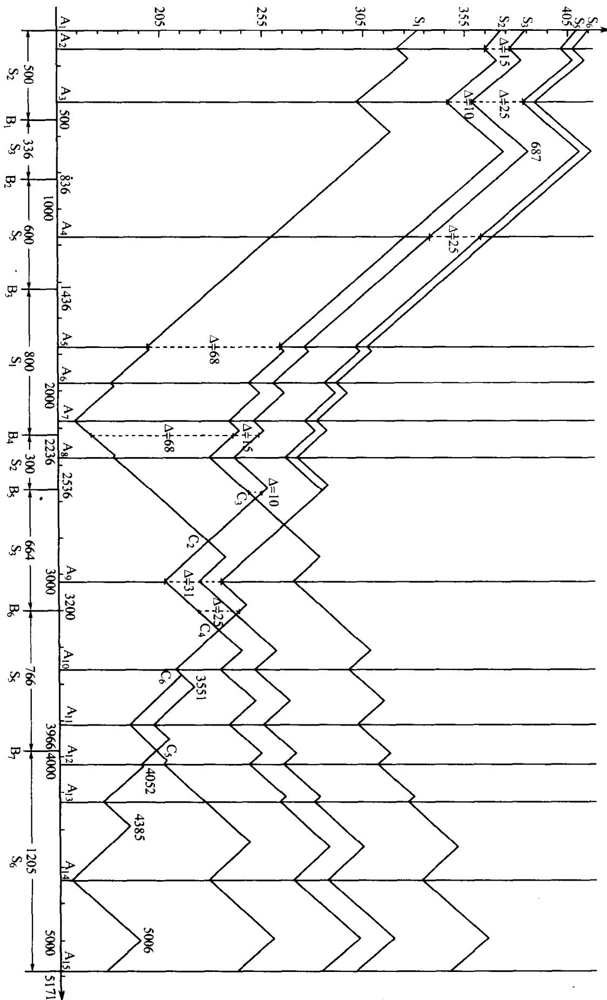

<details>
<summary>line</summary>

| Interval | Value |
| --- | --- |
| 1 | 5006 |
| 2 | 4385 |
| 3 | 4052 |
| 4 | 3551 |
| 5 | 34 |
| 6 | 31 |
| 7 | 25 |
| 8 | 10 |
| 9 | 15 |
| 10 | 687 |
| 11 | 15 |
| 12 | 10 |
| 13 | 336 |
| 14 | 336 |
| 15 | 500 |
</details>

易知任意一种方案就是它所对应的折线下面的面积。如果没有产量上界的限制，最小的费用就是该折线族的下包络线，对应的费用约在113亿元左右。产量上限约束使得这种理想的情况无法实现。下面先说明如何在有产量限制的情况下，合理选取一条首尾相接的折线，使得折线下面的面积(同时也是这种方案的费用)达到最小。选取方法如下：

先定义 $\Delta_{ij}(x)$ 为在地点 $X$ 选用工厂 $S_{i}$ 的钢管与选用 $S_{j}$ 工厂的单位钢管的费用差；定义路线 $L$ 为一段或几段路段组成， $|L|$ 表示 $L$ 的长度.

如图，在 $A_{1}C_{2}$ 上考虑 $S_{1}$ , 因为 $A_{1}C_{2}$ 上使用 $S_{1}$ 厂生产的钢管费用最小, 假设它的铺设路线为 $L_{1}$ , 那么选取 $L_{1}$ 的原则是使 $\int_{L_{1}} \Delta_{12}(x) \mathrm{d}x$ 为最大且 $|L_{1}| = 800$ , 因为 $\Delta_{12}(x)$ 是分段线性函数的差, 所以它也是分段线性函数, 由此不难计算得出 $L_{1} = B_{3}B_{4}$ , 其中 $B_{3} = 1436, B_{3} = 2236, \Delta_{12} = \Delta_{12}(B_{4}) = 68$ , 易知在 $L_{1}$ 路线以外的 $\Delta_{12}(x)$ 值均不大于68; 实际上, 我们可以进一步得到, 在 $L_{1}$ 上有 $\int_{L_{1}} \Delta_{1j}(x) \mathrm{d}x, j = 2, 3, 5, 6$ 都为最大;

因为 $S_{1}$ 的产量已经达到上限，所以除去 $S_{1}$ ，在 $A_{1}B_{3} \cup B_{4}B_{5}$ 上考虑 $S_{2}$ ，此段上使用 $S_{2}$ 厂家的钢管将使费用最小，假设它的铺设路线为 $L_{2}$ ，那么选取 $L_{2}$ 使 $\int_{L_{2}} \Delta_{23}(X) \mathrm{d}x$ 为最大且 $|L_{2}| = 800$ ，如上所述，可求得 $L_{2} = A_{1}B_{2} \cup B_{4}B_{5}$ ，其中 $B_{1} = 500, B_{4} = 2236, B_{5} = 2536$ ， $\Delta_{23}(B_{1}) = \Delta_{23}(B_{5}) = 10$ ，易知在 $L_{1}, L_{2}$ 以外的 $\Delta_{23}(x)$ 值均不大于 10，进一步得到，在 $L_{2}$ 上有 $\int_{L_{2}} \Delta_{2j}(x) \mathrm{d}x, j = 3, 5, 6$ 都为最大；

除去 $S_{1}, S_{2}$ , 在 $B_{1}B_{3} \cup B_{5}C_{4}$ 上考虑 $S_{3}$ , 此段上使用 $S_{3}$ 厂家的钢管将使费用最小, 假设它的铺设路线为 $L_{3}$ , 那么选取 $L_{3}$ 使 $\int_{L_{2}} 2j(x)\mathrm{d}x$ 最大且 $|L_{3}| = 1000, L_{3} = B_{1}B_{2} \cup B_{5}B_{6}$ , 其中 $B_{1} = 500, B_{2} = 836, B_{5} = 2536, B_{6} = 3200$ 和 $\Delta_{35}(B_{2}) = \Delta_{35}(B_{6}) = 25$ ; 进一步在 $L_{3}$ 上有 $\int_{L_{2}} \Delta_{3}j(x)\mathrm{d}x, j = 5, 6$ 都为最大;

除去 $S_{1}, S_{2}, S_{3}$ , 在 $B_{2}B_{3} \cup B_{6}C_{5}$ 上考虑 $S_{5}$ , 此段上使用 $S_{5}$ 厂家的钢管将使费用最小, 且此时产量上限不起约束, 得 $L_{5} = B_{2}B_{3} \cup B_{6}C_{5}$ ;

最后，在 $B_{7}A_{15}$ 上考虑 $S_{6}$ ，此段上使用 $S_{6}$ 厂家的钢管将使费用最小，且此时产量上限不起约束，得 $L_{6} = B_{7}A_{15}$ ；

由以上数据算得该方案的总费用为 1278631.6 万元（若铺设费用当作公路运输里程的连续函数则为 1278373 万元。下面简称这种情况为连续费用，按题中的要求为离散费用）

需要补充说明的是,上述方案为简单起见,用的是连续费用,对于离散费用来说如上所示图中的直线段将变为阶梯形的折线,最小总费用可能会有微小变化,而实际上由于最优的分配方案中各厂到各点的运输量均为整数或半整数的形式,使得离散地考虑运费将得到同上一样的分配方案.

对于问题二,我们首先可以利用这张图来清楚地考察哪个钢厂钢管的销价变化对购运计划和总费用的影响最大.直观上讲,厂家销价的变化使得图中对应于该厂家的那条折线整体向上(销价上涨)或向下(销价下跌)平移,那么最优解中包含此厂家的费用也将随之变化, 同时, 当在某一段它的销价已经超过另外一个厂家时, 最优的购运计划也将改变; 因此, 要分析哪个厂家的销价对整体购运计划和总费用的影响最大, 只要看在当前的最优解中, 哪个厂家供应的路线最长, 它就是对整体影响最大的. 在上述的最优解中, $S_{6}$ 厂供应的路线最长, 为 1205 (虽然表面上 $S_{5}$ 提供的钢管数量更多, 但是在 $B_{6}C_{2}$ 之间应视为 $S_{5}$ 与 $S_{6}$ 共同的部分, 不应考虑), 它就是总费用对其销价最敏感的厂家. 另外也可以看出, 如果 $S_{6}$ 的销价上涨, 在 $A_{11}A_{15}$ 之间 $S_{6}$ 将逐步替代厂为此段提供钢管, 直至达到产量上限.

要考察哪个厂家 $S_{i}$ 的产量上限变化对整体购运计划和费用的影响最大，应该有 $S_{i}$ 使得 $\Delta_{ij}(x)j > i$ 最大，图中明显可以确定是 $S_{1}$ . 在 $A_{1}C_{2}$ 上它都位于整个折线族的最下方且可以明确看出它与选用 $S_{2}$ 的费用差别最大，提高 $S_{1}$ 的产量将使 $A_{1}C_{2}$ 段的费用逐渐降至最小值；同时可以看出在很大范围内，提高 $S_{1}$ 产量将使总费用下降 $\max_{x\in L_1}\Delta_{12} + \max_{x\in L_1\cup L_2}\Delta_{23} + \max_{x\in L_1\cup L_2\cup L_3}\Delta_{35} = 68 + 25 + 10 = 103$ ，即在扩大 $S_{1}$ 产量上限的初期，整体的费用将呈线性下降；同时，新的购运计划中，的比重将会越来越大. 其他参数的灵敏度分析可以类似进行.

## 模型二、网络流模型

与问题一不同,问题三中所铺设的管道线路构成树状,而不再是问题一中的线性结构,这增加了问题的复杂程度.我们将提出的网络流模型有较强的通用性,在解决此类复杂问题时更显示出其优越性.

设 $x_{ik}$ 表示由 $S_{1}$ 运输至 $A_{k}$ 的， $M_{k}$ 表示提供给 $A_{k}$ 的钢管总量， $\overline{A}_{i}\overline{A}_{j}$ 表示相邻两点 $A_{i}$ 与 $A_{j}$ 之间的钢管长度.

取 $A_{1}$ 为构成待铺设管道的树的根节点，设任意一个节点 $A_{K}$ 的父节点为 $A_{K_{0}}$ （或无父节点），其后继节点为 $A_{K1}A_{K2}\dots A_{KN(k)}$ ，共 $N(k)$ 个后继节点(或无后继节点)， $A_{k}$ 向其父节点方向铺设管道量为 $y_{k}$ （若无父节点则为0）， $A_{k}$ 的后继节点向 $A_{k}$ 方向铺设的管道量为 $y_{k1}\sim y_{kN(k)}$ .该问题可化为线性约束的规划问题：

$$
\begin{array}{l} \text {Min} \quad F = f 1 + f 2 + f 3 \\ \text {s.t.} \left\{ \begin{array}{l l} 0 \leq y _ {k} \leq \overline {{A j _ {0} A _ {k}}} & K = 3 - 2 1 \\ y _ {2} = \overline {{A _ {1} A _ {2}}} \\ x _ {i k} \geq 0 \quad i = 1 - 7, k = 2 - 2 1 \\ M _ {k} = y _ {k} + \sum_ {p = 1} ^ {N (K)} [ \overline {{A _ {k} A _ {k p}}} - y _ {k p} ] = \sum_ {i = 1} ^ {i = 7} x _ {i k} \quad k = 2 - 2 1 \\ 5 0 0 \leq \sum_ {k = 2} ^ {2 1} x _ {k} \leq s _ {i} \quad \text {or} \quad \sum_ {k = 2} ^ {2 1} x _ {i k} = 0 \quad i = 1 - 7 \end{array} \right. \end{array}
$$

其中，f1 为购买钢管的总成本，f2 为钢管运输到各站点 $A_{k}(k=2\sim21)$ 的总运输费用，f3 为以各站点为起点铺设钢管所耗费的总费用.

对模型二, 利用 SAS 求解, 得到问题三的最小费用 $F^{*}=1406631.4$

## 3 通用模型的灵敏性分析

利用前面的通用非线性规划模型中相应参数的小量变化,我们求得以下结果(各表达式都是在其他参数不变时成立):

$$
F = F ^ {*} - 1 0 3 \times (s _ {1} - 8 0 0) (7 0 0 \leq s _ {1} \leq 9 0 0) \quad F = F ^ {*} - 3 5 \times (s _ {2} - 8 0 0) (7 0 0 \leq s _ {2} \leq 9 0 0)
$$

$$
F = F ^ {*} - 2 5 \times (s _ {2} - 1 0 0 0) (9 0 0 \leq s _ {3} \leq 1 1 0 0) F = F ^ {*} + 8 0 0 \times (p _ {2} - 1 6 0) (1 4 5 \leq p _ {1} \leq 1 7 0)
$$

$$
F = F ^ {*} + 8 0 0 \times (p _ {2} - 1 5 5) (1 4 5 \leq p _ {2} \leq 1 6 5) F = F ^ {*} + 1 0 0 0 \times (p _ {3} - 1 5 5) (1 4 5 \leq p _ {3} \leq 1 6 5)
$$

$$
\begin{array}{l} \lim _ {\Delta p _ {5} \rightarrow 0 ^ {-}} \frac {F - F ^ {*}}{\Delta p _ {5}} \approx 1 3 6 7 \quad \lim _ {\Delta p _ {5} \rightarrow 0 ^ {+}} \frac {F - F ^ {*}}{\Delta p _ {5}} \approx 1 0 1 1 \\ \lim _ {\Delta p _ {6} \to 0 ^ {-}} \frac {F - F ^ {*}}{\Delta p _ {6}} \approx 1 5 6 0 \quad \lim _ {\Delta p _ {6} \to 0 ^ {+}} \frac {F - F ^ {*}}{\Delta p _ {6}} \approx 1 2 0 4 \\ \end{array}
$$

（其中 $\Delta p_{5}$ 和 $\Delta p_{6}$ 分别为 $S_{5}$ 与 $S_{6}$ 钢管单价的增量. $F^{*}$ 为问题一的总费用1.2786亿元，六个取值范围只是对应等式成立范围的子集）

由于 $S_{4}$ 与 $S_{7}$ 没有参与生产，估计它们的钢管单价在一定范围内变小仍不足以使其加入生产行列(经过计算的确如此)，产量上界对规划结果没有影响；而 $S_{5}$ 与 $S_{6}$ 的产量均未达到上界，其产量上界变大或一定程度地变小(只要不小于原最优解中的产量)不会对总费用产生影响。这样就列出所有在小范围内变化对总费用有影响的价格和产量上界。

$S_{1} \sim S_{3}$ 的钢管单价和生产上界在上述范围内变化时均与总费用呈线性关系,且它们仍都是满负荷生产.一次项系数的大小说明了总费用对参数的敏感程度,所以 $S_{1}$ 的产量上界的变化对总费用影响最大.

$S_{5}$ 与 $S_{6}$ 的钢管单价与总费用之间是非线性关系，四个取绝对值的差商相应于包含 $p_1 \sim p_3$ 的三个式子中的一次项。我们的模型计算表明：当 $\Delta p_{5}$ 与 $\Delta p_{6}$ 为负且继续减小时，相应的差商会增大；当它们为正且继续增大时，相应差商会减小。综合看来，应该是 $S_{6}$ 的钢管单价对总费用的影响最大。

有趣的是每一组中向前差商与向后差商截然不同,对此可以给一些粗略的解释: $S_{5}$ 与 $S_{6}$ 具有使总费用尽可能小的“互助”作用.当其中任何一个厂的钢管单价减小时,另一个产量减少使前者产量增加,这样可以使总费用的减少量大于选择原购运计划的总费用的减少量;一个厂的钢管单价增加时,另一个产量增加使前者产量减少,因而使总费用的增加量小于选择原购运计划的总费用的增加量.所以 $\Delta p_{5}$ 与 $\Delta p_{6}$ 为负时的差商大于它们为正时的差商.

## 4 近似分析

考虑到模型的目标函数由三部分 $(f1,f2,f3)$ 组成,而f3在总费用中所占的比例很小,购运计划的制定及总费用主要取决于f1与f2,而该规划问题中唯一的非线性项在f3中,由此我们可以作一些近似分析,省略目标函数中的f3,从而成为一个线性规划问题,而线性规划的灵敏度分析是比较容易的.

对于 $P_{i}$ (单位钢管成本)的灵敏度分析可化为对该线性规划问题的价值系数的灵敏度分析. 对于每一个 $P_{i}, \mathrm{SAS}$ 的 $LP$ 过程能求出一个区间 $[\Delta imax, \Delta imax]$ , 使得当在 $P_{i}$ 上作 $\triangle P_{i}$ 的浮动且其它 $P$ 值保持不变时 (其中 $\triangle P_{i} \in [\triangle imin, \triangle imax]$ ), 最优的分配方案不变. 对应区间范围最小的 $P_{m}$ 对最优分配方案的影响最大.

## 参考文献

[1] 倪勤. SAS 最优化软件速成. 科学出版社, 1998.  
[2] 叶其孝. 大学生数学建模竞赛辅导教材. 湖南教育出版社, 1993.  
[3] 钱颂迪. 运筹学. 清华大学出版社, 1990.

# 关于“钢管订购和运输”的评注

## 上海海运学院

## 丁颂康

2000年网易杯全国大学生数学建模竞赛 $B$ 题：“钢管订购和运输”是一道离散优化的问题。它的目标是针对两种不同的天然气输送管道的铺设要求，制定使总费用最小的钢管订购运输计划。此外，还须求出在前一种铺设要求下，哪一家钢厂钢管销价的变化以及产量上限的变化对购运方案和总费用的影响最大。

在本文中,我们根据阅卷情况,简述一些本题求解中值得注意的问题.

## 1 关于订购和运输单价的计算

要制定出使总费用最小的订购和运输计划,首先需要计算出单位长度的钢管从各钢厂 $S_{i}(i=1,2,\cdots,7)$ 到需铺设的主管道(问题一)或树形图(问题三)上各枢钮点 $A_{j}(j=1,2,\cdots,15$ 或 $j=1,2,\cdots,21$ )的最小费用 $C_{ij}$ .(如果采用运输问题模型或者网络最小费用流模型,更需计算出钢厂运往铺设管道沿线各点的单位钢管购运的最小费用.)

由于钢管可以通过铁路和公路运往铺设地点,其中公路段的运费是运输里程的线性函数,而铁路段的运费则是分段阶跃的常数函数,因此在计算时,不管对运输总里程还是对费用而言,都不具有可加性.图论中用以计算最短路的Dijkstra算法和Floyd算法均失效.在本次竞赛中,一些参赛队注意到这个问题,提出了利用Dijkstra算法的思想、经过调整和修改的算法,从而得出相应的购运单价的矩阵.

然而,由于题意中不考虑铁路公路间转运的中转费用,也不限制转运次数,因此在参赛队自行设计的算法中普遍存在着考虑不周全的缺陷,即便是许多获奖的队也不例外.最明显的就是在计算从 $S_{7}$ 到 $A_{10}$ 点的购运单位时,大多数队都是先通过铁路(共1130公里)再通过公路(70公里),从而得到单位运费77万元的结果.但事实上,最小的单位运价应当是先通过公路(从 $S_{7}$ 到 $A_{15}$ 然后折返的路段共40公里),然后经铁路(共1100公里)再经公路(70公里)运到 $A_{10}$ 点,这时的单位运价将为76万元.

其次，对于每一段待铺设的管线 $A_{j}A_{j+1}(j=2,3,\cdots,14)$ （对问题三， $j=2,3,\cdots,14,17,19,20$ 以及 $A_{9}A_{16}, A_{11}A_{17}, A_{17}A_{19}$ ）中的任一铺设点 $P$ 而言，从某一钢厂 $S_{i}$ 将钢管运到 $P$ 点不外乎有通过 $A_{j}$ 和通过 $A_{j+1}$ 两种可能。显然，这两种走法的运费是不同的。为此，要计算 $S_{i}$ 到 $P$ 点的费用，还应该比较这两种走法的大小。对于每一段管线，都会有一个平衡点（即两种走法运价相同的点）。在该平衡点的两侧，应该分别采用两种走法。值得注意的是，对于同一段管线，这种运价的平衡点又会因运出钢厂的不同而异。因此绝不可以将运到枢纽点 $A_{j}$ 和运到具体的铺设点割裂开来考虑。那种采用普通的运输问题模型先将各厂的钢管运到各枢钮点 $A_{j}$ ，再由 $A_{j}$ 起向各方向铺设的“两步走”的模型将是完全错误的。

至于有同学提出铁路运价表中给出的数据将导致铁路分段运输费用反而低于连续运输的费用的现象(例如650公里的运价为44万元,而分300公里和350公里两段运只需43万元),笔者认为这可能是命题时的疏漏,请不必过多的关注.
## 2 关于最小购运费用模型及其求解

解决赛题提出的费用问题,主要有以下两种思路:

## 模型一 运输问题模型

假若将待铺设的主管道全线, 按照 1 公里作为一个单位分割成 5171 个点 $P_{j}$ (对于问题三, 可以将树形图分割成 5903 个点), 以 $C_{ij}$ 记一个单位钢管从 $S_{i}$ 运到 $P_{j}$ 的最小费用(含订购费用), $X_{ij}$ 记从 $S_{i}$ 到 $P_{j}$ 的运量(决策变量), 那么, 根据题意, 便可构造出如下模型:

$$
\min \sum_ {i = 1} ^ {7} \sum_ {j} C _ {i j} X _ {i j}. \tag {1}
$$

约束条件为：

$$
\sum_ {j} X _ {i j} \in \{0 \} \cup [ 5 0 0, s _ {i} ], \tag {2}
$$

其中 $s_{i}$ 为第 i 个钢厂的最大产量 $(i=1,2,\cdots,7)$ 以及

$$
X _ {i j} \geqslant 0. \tag {3}
$$

这种模型与普通运输问题模型的区别在于约束条件(2)，因为赛题给出要求：“一个钢厂如果承担制造这种钢管，至少需要生产500个单位”。而普通的运输问题相应的约束条件则是

$$
\sum_ {j} X _ {i j} \leqslant s _ {i}, \quad i = 1, 2, \dots , 7.
$$

有的参赛队采用最小费用网络流模型或者二分图的模型。其实，这些模型和运输问题模型并没有本质的差别。我们把它归在同一类。有兴趣的读者可参阅有关网络流的著作。

这个类似运输问题的模型的最大优点是其目标函数为线性函数,处理起来比较简单.而且,这种模型对赛题的第一问和第三问的情况都适用.而这种模型的最大缺点是规模太大、决策变量太多.一般的求解线性规划的软件会因为变量太多而无法工作.为此,许多采用这种模型的参赛队,就采取了先期比较运费将 $S_{4}$ 从供应商中删除,根据图形特点将供需点归类等手段,尽可能减少决策变量数.应当指出,这种分析方法事实上只能针对本赛题的具体情况而不具有一般性.此外,采用这种方法,将很难证明所得的结果一定是最优的.

解决本题的一种较好的、也是多数优秀论文采用的模型则是：

模型二(a) 二次规划模型(问题一)

若以 $C_{ij}$ 记一个单位钢管从第 $i$ 个钢厂 $S_i$ 运到第 $j$ 个枢纽站点 $A_j$ 的最小运价， $X_{ij}$ 为 $S_i$ 到 $A_j$ 的运量。再把 $A_j$ 得到的钢管分解为向 $A_j A_{j-1}$ 路段铺设和向 $A_j A_{j+1}$ 路段铺设的两部分，记两部分的数量分别为 $Z_j$ 和 $Y_j, A_j A_{j+1}$ 路段的长度（即需铺设的钢管数量）为 $T_j$ 。于是根据题意有：

从 $S_{i}$ 到 $A_{j}$ 的购运总费用为 $\sum_{i=1}^{7} \sum_{j=1}^{15} C_{ij} X_{ij}$ ，而向两边铺设的费用为 $0.1 \times \frac{Z_{j}(Z_{j} + 1)}{2} + 0.1 \times \frac{Y_{j}(Y_{j} + 1)}{2}$ ，于是问题的目标为：

$$
\min W = \sum_ {i = 1} ^ {7} \sum_ {j = 1} ^ {1 5} C _ {i j} X _ {i j} + \frac {0 . 1}{2} \sum_ {j = 1} ^ {1 5} \left[ Z _ {j} (Z _ {j} + 1) + Y _ {j} (Y _ {j} + 1) \right] \tag {1}
$$

约束条件有：

$$
\sum_ {j = 1} ^ {1 5} X _ {i j} \in \{0 \} \cup [ 5 0 0, s _ {i} ], \quad i = 1, 2, \dots , 7, \tag {2}
$$

$$
\sum_ {i = 1} ^ {7} X _ {i j} = Z _ {j} + Y _ {j}, \quad j = 1, 2, \dots , 1 5, \tag {3}
$$

$$
Y _ {j} + Z _ {j + 1} = T _ {j}, \quad j = 1, 2, \dots , 1 4, \tag {4}
$$

$$
Z _ {1} = 0, \quad Y _ {1 5} = 0, \tag {5}
$$

$$
X _ {i j} \geqslant 0, \quad Y _ {j} \geqslant 0, \quad Z _ {j} \geqslant 0, i = 1, 2, \dots 7, j = 1, 2, \dots , 1 5. \tag {6}
$$

钢管运到 $A_{j}$ 以后, 向两边分别铺设 $Y_{j}$ 和 $Z_{j}$ 的费用, 有的参赛队采用单位运价对于长度的积分

$$
\int_ {0} ^ {Y _ {j}} 0. 1 y \mathrm{d} y + \int_ {0} ^ {Z _ {j}} 0. 1 z \mathrm{d} z = \frac {0 . 1}{2} (Y _ {j} ^ {2} + Z _ {j} ^ {2})
$$

来做,虽然在理论上是正确的,但是与本题的假设——不足整公里部分按整公里计算——是相悖的.而少数参赛队更是认为运到单位长度的起点就算,从而得到

$$
\frac {0 . 1}{2} [ Y _ {j} (Y _ {j} - 1) + Z _ {j} (Z _ {j} - 1) ],
$$

则更不符合题目的原假设. 好在因为

$$
\sum_ {j = 1} ^ {1 5} (Y _ {j} + Z _ {j}) = L,
$$

其中 L 为整个铺设主管道总长, 所以模型最优解不变, 而最优值将分别减少 $\frac{0.1}{2}L = 258.55$ 万元和 0.1L = 517.1 万元.

和模型一是运输问题的一种变形一样,由于约束(2)的关系,模型二也不是纯粹的二次规划.

对于问题三,由于要铺设的管道不是一条线,而是一个树形图.因此,有些枢钮站点 $A_{j}$ 的度不再是1或2.于是将运到 $A_{j}$ 点的钢管总量不能简单地分为 $Y_{j}$ 和 $Z_{j}$ 两部分,而应该考虑从 $A_{j}$ 出发的各个方向.于是有

模型二(b) 二次规划模型(问题三)

$$
\begin{array}{l} \min W = \sum_ {i = 1} ^ {7} \sum_ {j = 1} ^ {2 1} C _ {i j} X _ {i j} + \frac {0 . 1}{2} \sum_ {j = 2} ^ {2 1} \sum_ {(j, k) \in E} Y _ {j k} (Y _ {j k} + 1), \\ \mathrm{s.t} \sum_ {j = 1} ^ {2 1} X _ {i j} \in \{0 \} \cup [ 5 0 0, s _ {i} ], \quad i = 1, 2, \dots , 7, \\ \sum_ {i = 1} ^ {7} X _ {i j} = \sum_ {(j, k) \in E} Y _ {j k}, \quad j = 1, 2, \dots , 2 1, \\ Y _ {j k} + Y _ {k j} = T _ {j k}, \quad (j, k) \in E, \\ X _ {i j} \geqslant 0, Y _ {j k} \geqslant 0, \quad i = 1, 2, \dots , 7, j, k = 1, 2, \dots , 2 1, (j, k) \in E, \\ \end{array}
$$

其中 $E$ 是树形图的边集， $(j, k)$ 是连接点 $A_{j}$ 和 $A_{k}$ 的边， $Y_{jk}$ 是运到 $A_{j}$ 的钢管沿 $(j, k)$ 边向 $A_{k}$ 方向铺设的数量.

容易看到,模型二(a)和模型二(b)没有本质的差别,或者可以说二(a)只是二(b)的一种特殊情况.

应当指出,在模型二(a)和(b)中,仍然是把购运总费用分解为运到 $A_{j}$ 点和将运到 $A_{j}$ 点的总量向各方向铺设这两部分,但是由于模型的求解必须同时兼顾参数的 $i$ 和 $j$ 的变化,因此,它和前文所说的分为“两步走”的方法是完全不同的.

此外, 模型二是把模型一中从 $S_{i}$ 运到 $(j, k)$ 路段中各点的运量分别“捏合”到运往 $A_{j}$ 和 $A_{k}$ 两端考虑, 因此它将大大地减少模型一中的决策变量的个数. 当然, 二次规划的求解比线性规划的求解要困难得多. 好在许多软件包如 Lingo 和 Matlab 等, 都有求解二次规划的现成软件, 这种困难也就不足为惧了.

## 3 关于模型的求解

由以上分析,由于约束条件(2)

$$
\sum_ {j = 1} ^ {n} X _ {i j} \in \{0 \} \cup [ 5 0 0, s _ {i} ], \qquad i = 1, 2, \dots , 7
$$

的存在,因此模型的求解不能简单地调用线性规划或者二次规划的软件.一种合理的解决办法是首先将该约束条件改为松弛条件

$$
0 \leqslant \sum_ {j = 1} ^ {n} X _ {i j} \leqslant s _ {i}, \quad i = 1, 2, \dots , 7,
$$

于是模型便成为典型的运输问题或者二次规划。如果其最优解符合原有的约束条件，则便是原问题的最优解。如果存在个别的i，使 $\sum_{j=1}^{n} X_{ij} \in (0,500)$ ，那么可以针对这些 $i$ ，用类似于Gomory割平面法或分枝定界法的思想，强制地将它分为 $X_{ij} = 0$ 和 $\sum_{j=1}^{n} X_{ij} \geqslant 500$ 两种情况考虑，然后找出其中最优的结果。

根据这种思想,运用二次规划软件得到的最优解中, $X_{4j}=0,\sum_{j=1}^{n}X_{7j}<500$ .于是将 $S_{4}$ 从供应厂名单中删除,再将第7家工厂的供货量改为0以及不小于500两种情况重做.相比之下,取0的情况总费用较小,从而也应把 $S_{7}$ 删去.得到问题一的最优解为:

最优供货矩阵 $X_{ij}$ :

$$
\boldsymbol {X} = \left\{ \begin{array}{c c c c c c c c c c c c c c} & A _ {1} & A _ {2} & A _ {3} & A _ {4} & A _ {5} & A _ {6} & A _ {7} & A _ {8} & A _ {9} & A _ {1 0} & A _ {1 1} & A _ {1 2} & A _ {1 3} & A _ {1 4} & A _ {1 5} \\ & & & & & 3 3 4 & 2 0 0 & 2 6 6 \\ & & 1 7 9 & 3 2 1 \\ & & & 1 8 7 & & 1 4 9 \\ & & & & & 6 0 0 \end{array} \right. \quad \text {300} \quad \text {664} \quad \text {351} \quad \text {415} \quad (3 5 1) \quad \text {86} \quad \text {333} \quad \text {621} \quad 1 6 5 \left. \begin{array}{l} S _ {1} \\ S _ {2} \\ S _ {3} \\ S _ {5} \\ S _ {6} \end{array} \right\}
$$

其中:未标出的元素全为0,并且运到 $A_{10}$ 的351单位钢管可以从 $S_{5}$ 订购,也可向 $S_{6}$ 订购.以及

$$
\begin{array}{l} Z _ {2} = 1 0 4, Y _ {2} = 7 5; Z _ {3} = 2 2 6, Y _ {3} = 2 8 2; Z _ {5} = 1 0 7 4, Y _ {5} = 9; Z _ {6} = 1 8 5, Y _ {6} = 1 5; Z _ {7} = 1 9 0, Y _ {7} = \\ 7 6; Z _ {8} = 1 2 5, Y _ {8} = 1 7 5; Z _ {9} = 5 0 5, Y _ {9} = 1 5 9; Z _ {1 0} = 3 2 1, Y _ {1 0} = 3 0; Z _ {1 1} = 2 7 0, Y _ {1 1} = 1 4 5; Z _ {1 2} = \\ 7 5, Y _ {1 2} = 1 1; Z _ {1 3} = 1 9 9, Y _ {1 3} = 1 3 4; Z _ {1 4} = 2 8 6, Y _ {1 4} = 3 3 5; Z _ {1 5} = 1 6 5. \text {最优值} W ^ {*} = 1 2 7. 8 4 \text {亿元}. \end{array}
$$

用同样的方法,也可以得到问题三的解:第4,7两家钢厂不生产,1,2,3,6四家工厂饱

和生产,余下的由 $S_{5}$ 供应. 购运方案略,最优值约为 140.66 亿元.

## 4 关于问题二的讨论

本赛题的问题二要求根据问题一的分析,指出哪家钢厂销价的变化对购运计划和总费用影响最大?哪家钢厂钢管产量上限的变化对购运计划和总费用影响最大?并给出相应的数字结果.

这个问题属于规划问题的灵敏度分析. 一般来说, 应该对于销价的变化 $\Delta p$ 和产量上限的变化 $\Delta s$ 求出相应的总费用的变化 $\Delta w$ . 但是针对本题的情况, 要得到 $\Delta w$ 关于 $\Delta p$ 和 $\Delta s$ 的函数关系, 几乎是不可能的. 好在本题只要求对每个钢厂进行单独讨论, 然后作相对比较. 大多数参赛队都是按照一定的增减幅度求得相应的总费用变化, 得到了比较一致的结果. 即 $S_{5}$ 或 $S_{6}$ 的销价的变化影响最大, 而 $S_{1}$ 产量上限的变化影响最大. 限于本文篇幅, 就不展开详细的论述了.

## (上接第547页)

国内正式出版的数学建模教材、译著及竞赛辅导材料：

- 李文,应用数学模型,华中理工大学出版社,1993.  
- 叶其孝主编,大学生数学建模竞赛辅导教材,湖南教育出版社,1993.  
- 寿纪麟, 数学建模 — 方法与范例, 西安交通大学出版社, 1993.  
- 叶其孝主编，数学建模教育与国际数学建模竞赛，《工科数学》杂志社，1994.  
- 濮定国、田蔚文主编,数学模型,东南大学出版社,1994.  
- 欧阳亮,系统科学中数学模型,山东大学出版社,1995.  
- 陈义华, 数学模型, 重庆大学出版社, 1995.  
- 朱思铭, 李尚廉, 数学模型, 中山大学出版社, 1995.  
- 蔡常丰, 数学模型建模分析, 科学出版社, 1995.  
- 徐全智, 杨晋浩, 数学建模入门, 电子科技大学出版社, 1996.  
- 沈继红、施久玉、高振滨、张晓威,数学建模,哈尔滨工程大学出版社,1996.  
- 任善强、雷鸣，数学模型，重庆大学出版社，1996.  
- 齐欢,数学模型方法,华中理工大学出版社,1996.  
- 王树禾, 数学模型基础, 中国科学技术大学出版社, 1996.  
- 李尚志主编,数学建模竞赛教程,江苏教育出版社,1996.  
- 南京地区工科院校数学建模与工业数学讨论班编,数学建模与实验,河海大学出版社,1996.  
- 谭永基,俞文?,数学模型,复旦大学出版社,1997.  
D. Burghes, 数学建模 — 来自英国四个行业中的案例研究, 叶其孝、吴庆宝译, 世界图书出版公司, 1997.  
- 叶其孝主编,大学生数学建模竞赛辅导教材(二),湖南教育出版社,1997.

(下转第574页)

## 21. 飞越北极(CUMCM 2000 年 C 题)

今年6月,扬子晚报发布消息:“中美航线下月可飞越北极,北京至底特律可节省4小时”,摘要如下:

7月1日起,加拿大和俄罗斯将允许民航班机飞越北极,此改变可大幅度缩短北美与亚洲间的飞行时间,旅客可直接从休斯敦、丹佛及明尼阿波利斯直飞北京等地.据加拿大空中交通管制局估计,如飞越北极,底特律至北京的飞行时间可节省4个小时.由于不需中途降落加油,实际节省的时间不止此数.

假设:飞机飞行高度约为10公里,飞行速度约为每小时980公里;从北京至底特律原来的航线经以下10处:

A1(北纬31度,东经122度); A2(北纬36度,东经140度);

A3(北纬53度,西经165度); A4(北纬62度,西经150度);

A5(北纬59度,西经140度); A6(北纬55度,西经135度);

A7(北纬50度,西经130度); A8(北纬47度,西经125度);

A9(北纬47度,西经122度); A10(北纬42度,西经87度).

请对“北京至底特律的飞行时间可节省4小时”从数学上作出一个合理的解释,分两种情况讨论:

(1) 设地球是半径为 6371 千米的球体；  
(2) 设地球是一旋转椭球体, 赤道半径为 6378 千米, 子午线短半轴为 6357 千米.

(复旦大学 谭永基提供)

## (上接第573页)

国内正式出版的数学建模教材、译著及竞赛辅导材料：

- 刘来福, 曾文艺, 数学模型与数学建模, 北京师范大学出版社, 1997.  
- S. J. Brams, W. F. Lucas, P. D. Straffin, Jr., 政治及有关模型, 国防科技大学出版社, (本书为 W. F. Lucas 主编的 Modules in Applied Mathematics 一书的第二卷), 1997.  
- W. F. Lucas, F. S. Roberts, R. M. Thrall, 离散与系统模型, 国防科技大学出版社, (本书为 W. F. Lucas 主编的 Modules in Applied Mathematics 一书的第三卷), 1997.  
- H. Marcus-Roberts, M. Thompson, 生命科学模型, 国防科技大学出版社, (本书为 W. F. Lucas 主编的 Modules in Applied Mathematics 一书的第四卷), 1997.  
- 叶其孝主编,大学生数学建模竞赛辅导教材(三),湖南教育出版社,1998.

# 飞越北极的数学模型

钟绍军 骆凤银 王国刚

(黄冈师范学院，黄冈 438000)

指导老师 数模组

编者按 本文为这次竞赛中 C 题的优秀答卷之一。在将地球视为旋转球体时，论文给出了多种近似计算旋转椭球面上两点之间短程线的方法，其中的模拟搜索法有一定的新意。论文对模型的验证做得很好。在将地球近似作为球体的情况，用互联网上获得的数据与模型的计算结果进行了对照检查。在将地球近似为旋转椭球体的情形又用数学软件中求近似测地线的程序的计算结果对模型计算结果进行了检验，这是值得提倡的。

摘要 本文针对扬子晚报提出的飞机飞越北极的最节时航线问题作了详尽、细致、深入的分析，从而验证了在将地球考虑为球体和椭球体两种情况下，“飞机从北京直飞到底律特要节省4小时”的结论。文中利用微分几何的知识建立了合理解释该报道的数学模型，解决了空间任意两点间的曲面最短距离的算法问题，同时又阐述了求曲面上两点之间的最短距离（特别是椭球面）的近似计算方法：压缩比率法、曲线射影法和模拟搜索法。另外，本文针对空间曲面上的最短程问题所建立的数学模型可以求解出地球上任意两点间的最短距离，具有很强的推广性。

关键词 数学模型;测地线;压缩比率法;曲线射影法;模拟搜索法

## 1 问题的提出(略)

## 2 问题的分析

首先分析当地球是一个半径为 $R$ 的均匀球体时的情况. 先在曲面上建立直角坐标系, 以地心为坐标原点 $O$ , 以赤道平面为 $XOY$ 平面, 以0度经线(即本初子午线)圈所在的平面为 $XOZ$ 平面. 那么, 我们就可以写出球面的参数方程如下:

$$
\left\{ \begin{array}{l} X = R \cos \varphi \cos \theta \\ y = R \cos \varphi \sin \theta \\ z = R \sin \varphi \end{array} \right. \quad (0 \leqslant \theta \leqslant 2 \pi , 0 \leqslant \varphi \leqslant \pi) \tag {1}
$$

根据解析几何的基础知识可以解出球面上任意两点 $P_{1}, P_{2}$ 间的圆心角 $\angle P_{1}OP_{2}$ 的度数. 由微分几何的知识可知道, 球面上任意两点 (不是一条直径的两个端点) 之间的最小距离就是过这两点的大圆 (即经过球心的圆) 的劣弧长. 根据这一方法, 我们就可以确定任意两点之间的飞行最短航线.

再来分析一下地球为旋转椭球体时的情形,这比球体的情况要复杂得多.我们无法确定在未改变航道时的情况下飞机的最短航线,也无法确定球面上任意两点之间的测地线方程.但是,我们可以假定椭球面上任意两点A、B之间的测地线在通过A、B两点的一个平面内.因此,我们可以写出过直线AB的平面族(含一个参数).下面就要求出过直线AB的平面与椭球面的交线.我们可以利用解析几何知识来完成这些工作.最后我们就可以利用搜索的方法求出交线上A、B两点之间的劣弧长.然后求出弧长的最小值.在本文后面的模型建

立和求解过程中有该法的详细解答过程.

对于椭球面上任意两点的最短曲面距离的求解,目前还没有精确的方法,但从问题的可行性出发,我们采用了近似计算的方法,运用数学类推的思想,在球体的基础上进行类推,算出旋转椭球面上两点之间的最短距离.在后面的求解过程中我们给出了详细的解答过程.

## 3 问题的假设

1)飞机从机场起飞与降落过程的时间忽略不计.飞机从 $A$ 地到 $B$ 地的飞行时间只考虑 $A$ 地上空(10千米高度)和 $B$ 地上空(10千米高度)两点之间的测地线长；  
2)飞机在飞行过程中,途经各站起飞、降落及中途加油和等待调度所用的时间均忽略不计;  
3)飞机总在地球的引力场内飞行,而地球的自转和公转对飞机的绝对飞行速度和大小的影响忽略不计,飞机的飞行速度只考虑飞机相对于地球的速度;  
4)飞机的航线始终满足最短路线原则.即飞机从 $A_{i}$ 站到 $A_{j}$ 站的航线是曲面上点 $A_{i}$ 与 $A_{j}$ 之间的最短路线，即飞机从一目的地到另一目的地不绕道飞行的路线；  
5)飞机飞行过程中的飞行速度保持不变.

## 4 符号的说明

<table><tr><td> $(x_i, y_i, z_i)$ </td><td>球面(或椭球面)上的点  $A_i$  的三维直角坐标;</td></tr><tr><td> $(\theta_i, \varphi_i)$ </td><td>球面(或椭球面)上的点  $A_i$  的经度与纬度;</td></tr><tr><td>t</td><td>飞机的飞行时间;</td></tr><tr><td> $\Delta t$ </td><td>飞机飞行所节省的时间;</td></tr><tr><td> $l_i$ </td><td>城市  $A_i$  与  $A_{i+1}$  之间的最短路程;</td></tr><tr><td> $l_{\text{总}}$ </td><td>飞机分段飞行路程相加的总路程;</td></tr><tr><td>R</td><td>地球半径;</td></tr><tr><td>h</td><td>飞机飞行高度;</td></tr><tr><td> $(a, b)$ </td><td>旋转椭球体的长半轴与短半轴;</td></tr><tr><td> $r_i$ </td><td>城市  $A_i$  离地心的距离(即径长);</td></tr></table>

## 5 模型的建立

基于以上对问题的详细分析,我们可以建立以下的数学模型来验证“从北京至底特律可节省4小时”的结论.

## 情形一、假设地球是半径为 6371 公里的球体

此时 A、B 是地球上空相距地面 10 公里的两点，由微分几何知识我们可以知道：过 A、B 两点的大圆的劣弧长即为两点的最短距离，A、B 两点的坐标分别为：

$$
\begin{array}{l} A ((R + h) \cos \theta_ {1} \cos \varphi_ {1}, (R + h) \sin \theta_ {1} \cos \varphi_ {1}, (R + h) \sin \varphi_ {1}) \\ B ((R + h) \cos \theta_ {2} \cos \varphi_ {2}, (R + h) \sin \theta_ {2} \cos \varphi_ {2}, (R + h) \sin \varphi_ {2}) \\ \end{array}
$$

从 $A$ 地到 $B$ 地的飞行路程 $l_{AB} = (R + h)\arccos \left(\frac{OA\cdot OB}{|OA|\cdot|OB|}\right)$

从 A 地到 B 地的飞行时间 $t_{AB}=\frac{l_{AB}}{980}$

## 情形二、假设地球是一个旋转椭球体(赤道半径为6378km,子午线短半轴为6357km)

此时 A、B 是地球上空距地面 10km 的任意两点，坐标分别为 $(x_{1}, y_{1}, z_{1})$ ， $(x_{2}, y_{2}, z_{2})$ 。在 x 轴上任取一点 $C(m, 0, 0)$ ，则过 A、B 两点的椭圆曲线方程为：

$$
\left\{ \begin{array}{l} \left| \begin{array}{c c c} x - m & y & z \\ x _ {1} - m & y _ {1} & z _ {1} \\ x _ {2} - m & y _ {2} & z _ {2} \end{array} \right| = 0 \\ \frac {x ^ {2} + y ^ {2}}{(6 3 7 8 + 1 0) ^ {2}} + \frac {z ^ {2}}{(6 3 5 7 + 1 0) ^ {2}} = 1 \end{array} \right. \tag {2}
$$

由此方程组可解得： $\left\{ \begin{array}{l}y = y(x,m)\\ z = z(x,m) \end{array} \right.$ 那么由解析几何知识可知 $A$ 与 $B$ 之间的弧长：

$$
l (m) = \int_ {x _ {1}} ^ {x _ {2}} \sqrt {1 + y _ {x} ^ {\prime 2} + z _ {x} ^ {\prime 2}} \mathrm{d} x
$$

我们可求出 $l(m)$ 的最小值，即为 $AB$ 的曲面最短路线长.

## 6 模型的求解

## 情形一、假设地球是一个半径为 $R = 6371$ 千米的球体

以地心为坐标原点,以赤道平面为 XOY 面,以 0 度经线(即本初子午线)圈所在的平面为 XOZ 平面,建立三维直角坐标系,球面上各点向量可表示为:

$$
\begin{array}{l} O A _ {i} = (R + h) (\vec {i} \cos \theta_ {i} \cos \varphi_ {i} + \vec {j} \sin \theta_ {i} \cos \varphi_ {i} + \vec {k} \sin \varphi_ {i}) \\ O A _ {i + 1} = (R + h) (\vec {i} \cos \theta_ {i + 1} \cos \varphi_ {i + 1} + \vec {j} \sin \theta_ {i + 1} \cos \varphi_ {i + 1} + \vec {k} \sin \varphi_ {i + 1}) \\ \end{array}
$$

则两地之间的距离可表示为：

$$
A _ {i} \hat {A} _ {i + 1} = (R + h) \cdot a r c c o s \left(\frac {\vec {O A} _ {i} \cdot \vec {O A} _ {i + 1}}{| O A _ {i} | \cdot | O A _ {i + 1} |}\right)
$$

沿飞行路线飞行总时间是 $t = \sum_{i=0}^{11} \frac{A_i A_{i+1}}{980}$ ，飞机从北京直达底特律的航行时间为，则 $t' = \frac{A_0 A_{11}}{980}$ ，则飞机直达所节省的时间为： $\Delta t = t - t'$ 。从图1的飞行路线示意图中我们可以基本了解飞机的航线：

以上我们给出了解题的数学模型,现在用 C 程序设计语言(程序略)计算出具体结果(单位:公里):

★“北京”与 A1 之间的距离是:1113.191576 ★A1 与 A2 之间的距离是:1758.78953  
★A2与A3之间的距离是:4624.407995 ★A3与A4之间的距离是:1339.08267  
★A4与A5之间的距离是:641.162553 ★A5与A6之间的距离是:538.594244  
★A6与A7之间的距离是:651.536106 ★A7与A8之间的距离是:497.569491  
★A8与A9之间的距离是:227.843664 ★A9与A10之间的距离是:2810.85917

★A10 与“底特律”之间的距离是:331.924046

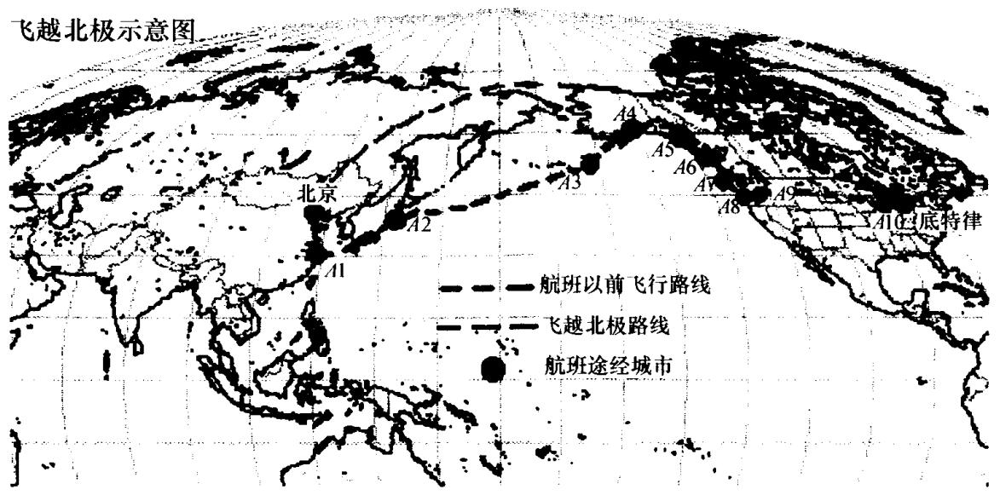

<details>
<summary>text_image</summary>

飞越北极示意图
北京
A4
A5
A6
A7
A8
A9
A10底特律
A2
A3
A1
航班途经城市
—— 航班以前飞行路线
—— 飞越北极路线
</details>

图1

★“北京”直达“底特律”的距离是:10684.861107  
★ 沿飞行原路线飞行总时间 t = 14.831600(小时)  
★飞机从北京直达底特律的航行时间 $t' = 10.902912$ (小时)  
★飞行节省的时间 $\Delta t = 3.928681$ (小时)

通过网上查询,我们在美国一家权威地理网站(http://www.indo.com/distance/)查询到本题所涉及到的地点的距离,查询结果如下:(单位:公里)

☆“北京”与 A1 之间的距离是:1112

☆A1与A2之间的距离是:1759

☆A2 与 A3 之间的距离是:4627

☆A3与A4之间的距离是:1340

☆A4 与 A5 之间的距离是:642

☆A5与A6之间的距离是:539

☆A6与A7之间的距离是:651

☆A7与A8之间的距离是:498

☆A8与A9之间的距离是:228

☆A9与A10之间的距离是:2814

☆A10 与“底特律”之间的距离是:325

☆“北京”直达“底特律”的距离是:10681

☆沿飞行路线飞行总时间 t = 14.822(小时)

☆飞机从北京直达底特律的航行时间 $t' = 10.89898$ (小时)

☆飞行节省的时间 $\Delta t = 3.9230$ (小时)

通过对比我们发现以上方法求解的结果与实际情况基本吻合.这说明“北京至底特律的飞行时间可节省4小时”的报道是有科学根据的.

## 情形二、假设地球是一个旋转椭球体，赤道半径为6378公里，子午线短半轴为6357公里

此时过空间任意两点 A, B (A, B 距地面 10 公里) 的平面族方程可表示为：

$$
\left| \begin{array}{c c c} x - m & y & z \\ x _ {1} - m & y _ {1} & z _ {1} \\ x _ {2} - m & y _ {2} & z _ {2} \end{array} \right| = 0
$$

其中 $(x_{1},y_{1},z_{1})$ ， $(x_{1},y_{2},z_{2})$ 分别是A、B两点的坐标，m为参数。显然平面过X轴上的一点

$C(m,0,0)$ ，地球球面的方程为 $\frac{x^2 + y^2}{(6378 + 10)^2} +\frac{z^2}{(6357 + 10)^2} = 1$ ，则过 $A,B$ 两点的曲线方程为：

$$
\left\{ \begin{array}{l} \left| \begin{array}{c c c} x - m & y & z \\ x _ {1} - m & y _ {1} & z _ {1} \\ x _ {2} - m & y _ {2} & z _ {2} \end{array} \right| = 0 \\ \frac {x ^ {2} + y ^ {2}}{(6 3 7 8 + 1 0) ^ {2}} + \frac {z ^ {2}}{(6 3 5 7 + 1 0) ^ {2}} = 1 \end{array} \right.
$$

A、B的弧长： $l_{AB}(m) = \int_{x_1}^{x_2}\sqrt{1 + y'_x^2 + z'_x^2}\mathrm{d}x$ (3)

求解出 $l_{AB}(m)$ 的极小值即为 $A, B$ 两点的最短曲面距离. 由于上面的含参椭圆积分没有显式解析表达式, 所以我们对模型作如下修正

首先我们观察从北京到底特律中途所经城市的纬度关系,不难发现,各城市的纬度之差都不会超过 $10^{\circ}$ ,可以作这样的近似处理: $A_{i}$ 与 $A_{j}$ 之间的曲面最短距离 $L_{ij}$ 可由过 $A_{i}A_{j}$ 的平面(即过最短距离的弧所在的平面)上的弧 $A_{i}A_{j}$ 在赤道上的投影弧的长度来近似计算.虽然此方法计算比较粗糙,但所得的弧长比实际弧长小,因此,节约的时间会更长.

在原模型的基础上,我们用数学软件 Mathematica 4.0 写出了如下的模拟搜索法的源程序(略). 当每两个相邻城市之间的最短距离算出来以后,就可以得到:

原航线的总长度为:14458.4公里;飞行时间为:14.7535小时;

飞越北极直达的航线长为:10605.8公里;直达时间为:10.8222小时;

节省的时间为: $\Delta t=3.9313$ 小时.

## 7 模型的改进

前面我们利用空间曲线积分的思想求出了旋转椭球面上的弧线长,计算所得的结果精度较高,且结果比较符合实际情况.但是对弧长的积分推导计算量大,表达式很复杂.我们可采用“空间压缩比率法”更直观地计算出大致的结果,具体改进方案如下:

## 改进方案一、压缩比率法

## (1) 轴向压缩比率法：

当我们假设地球是旋转椭球体时,由题知长半轴 a=6371 公里 $\approx R$ (R 为地球半径),而短半轴 b=6357 公里,与 R 有差距.若忽视 R 与 a 的微小差距,我们假设椭球是由球体沿短半轴 b 压缩而得到的,在球面上的原来各点 $A_{0}, A_{1}, A_{2}, \cdots, A_{11}$ 压缩后在椭球面上.且

两点间的纬度差越大,对压缩后的弧长影响也越大,同一纬度上的点,压缩后弧长变化很小,由题目所给的条件可知: $A_{0},A_{1},\cdots,A_{11}$ 各相邻点的纬度差分别为: $8.9^{\circ},5^{\circ},7^{\circ},9^{\circ},3^{\circ},4^{\circ},5^{\circ},3^{\circ},0^{\circ},5^{\circ},0.4^{\circ}$ ,北京与底特律的纬度差为 $3^{\circ}$ ,差值都很小.由此可见这里我们用压缩法是行之有效的.压缩比率为定值 $k=\frac{b+h}{R+h}=\frac{6357+10}{6371+10}=0.997806$ ;假设地球为球体时,我们已求出了航线的长度,在将这一结果乘以k,则可得到为椭球体时的航线长.

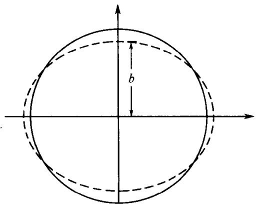

<details>
<summary>text_image</summary>

b
</details>

下面是我们利用这一方法得出的结果：

分段飞行时: 总航线的长度 l = 14534.96114 公里, 总的飞行时间 t = 14.799 小时;

从北京直达底特律的航线长度 $l' = 10657.6$ 公里，飞行时间 $t' = 10.872522$ 小时，

则缩短的路程 $\Delta l = 3877.36$ 公里, 节省的时间 $\Delta t = 3.9265$ 小时.

## (2)径向压缩比率法

假设椭球体是球体沿半径方向逐点按比率收缩而得到的,收缩可看作是沿半径方向进行的,即球心角在收缩过程中将保持不变,球面上各点收缩的比率不同.椭球面上的曲线弧长可近似地用下式表示:

$$
l = \frac {r _ {i} + r _ {i + 1}}{2} \times \beta \tag {4}
$$

其中 $r_i$ 表示椭球面上点的径长， $\beta$ 表示各段弧对应的球心角。由已知的经度 $\theta$ 和纬度 $\varphi$ ，可用将所附程序(略)中的“ $R + 10$ ”分别改为 $a$ 和 $b$ ，得出各点在椭球体上的坐标：

$$
\left\{ \begin{array}{l l} x = a \cdot \cos \theta \cos \varphi \\ y = a \cdot \sin \theta \cos \varphi \\ z = b \cdot \sin \varphi \end{array} \right. \quad (\text {其中} a = 6 3 8 8, b = 6 3 6 7)
$$

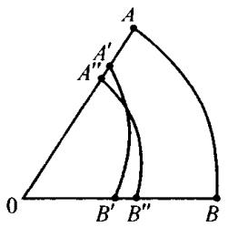

<details>
<summary>text_image</summary>

A
A'
A''
0
B'
B''
B
</details>

得到 $a_{0}, a_{1}, \cdots, a_{11}$ 的坐标. 球心角 $\beta$ 可根据下面的公式得到:

$$
\beta = \frac {2 R ^ {2} - | r _ {i} \cdot r _ {i + 1} |}{2 R ^ {2}}
$$

根据上面的公式得到一组数据(单位:弧度): $\beta_{0}=0.173492,\beta_{1}=0.27563,\beta_{2}=0.724716,\beta_{3}=0.209856,\beta_{4}=0.100481,\beta_{5}=0.084405,\beta_{6}=0.102103,\beta_{7}=0.0779813,\beta_{8}=0.035693,\beta_{9}=0.440504,\beta_{10}=0.0508779$ ，将这组数据代入上面的弧长公式(4)得到分段飞行的数据(表1)，所以分段飞行的时间:t=14.8096(小时);

表 1

<table><tr><td>径长 r(单位:公里)</td><td>弧长 l(单位:公里)</td></tr><tr><td>6379.37</td><td>1107.04</td></tr><tr><td>6382.44</td><td>1758.96</td></tr><tr><td>6380.7</td><td>4622.01</td></tr><tr><td>6374.61</td><td>1337.44</td></tr><tr><td>6371.63</td><td>640.275</td></tr><tr><td>6372.58</td><td>537.935</td></tr><tr><td>6343.92</td><td>650.887</td></tr><tr><td>6375.69</td><td>497.227</td></tr><tr><td>6376.78</td><td>227.642</td></tr><tr><td>6376.78</td><td>2809.42</td></tr><tr><td>6378.60</td><td>324.531</td></tr><tr><td>6378.46</td><td>总计:14513.4</td></tr></table>

飞机直飞时： $|A_{0}A_{11}|=9468.31,\beta=1.67184$

则飞机直飞的航线长度: $l' = 10664.5$ (公里), 直飞所用的时间: $t' = 10.8821$ (小时),

所以飞机从北京直飞至底特律可节省的时间: $\Delta t=3.9275$ (小时).

## 改进方案二: 利用现成的软件包求曲面上两点之间的最短路程

本解法的关键是要弄清楚曲面上经过已知两点的测地线长是否就是这两点的最短距离.参考文献[1]给了我们这一问题一个明确的回答,有定理证明这是正确的.

有了以上的结论,我们就可以用数学软件“Mathematica4.0”,执行以下命令可以算出两城市间的航线长度:

<div class="mineru-algorithm" style="white-space: pre-wrap; font-family:monospace;">
&lt;&lt; Miscellaneous 'Geodesy'
$L = \text{SpheroidalDistance}[\{\varphi_1, \theta_1\}, \{\varphi_2, \theta_2\}, \text{Radius} -&gt; R, \text{SemimajorAxis} -&gt; b, \text{Eccentricity} -&gt; e] // N$ $t = l / 980 // N$
</div>

其中：L 为两点间的弧长， $\varphi_{1}$ 为城市 1 的纬度， $\varphi_{2}$ 为城市 2 的纬度， $\theta_{1}$ 为城市 1 的经度， $\theta_{2}$ 为城市 2 的经度，e 为地球的离心率，t 为城市 1 到城市 2 的最短飞行时间

根据上面的命令,我们可以得出各相邻城市间的距离: $l_{1},l_{2},\cdots,l_{11}$ ;最后得出:

分段飞行的总距离 $l_{总}=14503.693$ (公里)，飞行总时间 $T_{总}=14.79766$ (公里)；

直飞的飞行距离: $l' = 10658.8$ (公里), 飞行时间 $t' = 10.8763$ (小时);

所以节省的时间 $\Delta t = 3.92136$ (小时).

可见,改进后的方案运算简便,且得出的结果: $\Delta t=3.92136$ 小时与原模型求得的值 3.9353 小时比较接近.

## 8 模型的评价与推广

## 一、模型的评价：

(一)本模型成功地解决了空中飞行最省时航线问题,其优点主要在于:

1. 能充分利用地理知识和实物图对路线进行一定的限制,避免了选择航线的盲目性.  
2. 运算的效率较低, 我们重新修改后的新算法, 极大地提高了模型的运算效率, 且吻合性能也较好.  
3. 本模型在建立过程中, 充分用各种方法来求最最节时航线, 体现出了不同算法的利与弊, 具有不同程度的可用性.  
4. 用 C 语言程序进行大量的计算, 运行效率高, 可推广到多个空间点的计算.

## (二)不足以及需要改进的地方在于：

1. 我们的模型只适合空间光滑的凸曲线的最短距离问题的计算. 对于非规则形状的曲面, 它的测地线不一定在一个平面内, 这就超出了本模型的使用范围.  
2. 本模型内假设飞机只在恒定的高度飞行, 这也是不实际的. 在实际的飞行过程中飞机是不会只在恒定的高度上飞行的, 实际上它在飞行过程中可能会因遇到高山或其他障碍物而不断爬升和下降. 所以如果我们能过给出不断变化的海拔高度, 并考虑飞机因为爬升或下降所多用的时间和多飞行的路程, 那我们的模型可能会更实用.

## 二、模型的推广：

本模型在计算空间未知曲线的弧长时,引入了“曲线射影法”和“压缩比率法”近似算法,在实际工程中,将对工程建筑和导弹发射等预测控制都会带来帮助.

(1)对于最初积分算法的模型,可以推广到多维空间的情况.  
(2)对于曲线射影法,可根据投影值符合率,选择最佳投影面.  
(3)用压缩比率的近似计算方法,则可把不规则立体转化为规则立体,从而简化计算.

## 参考文献：

[1] 梅向明, 黄敬之. 微分几何. 高教出版社, 1987.  
[2] 华东师范大学数学系. 数学分析(第二版). 华东师大出版社, 1997.  
[3] 姜启源. 数学模型. 高等教育出版社, 1987.  
[4] 谌安琦. 科技工程中的数学模型. 中国铁道出版社, 1988.  
[5] 裘宗燕. Mathematica 数学软件系统的应用及其程序设计. 北京大学出版社, 1994.  
[6] 谭浩强. C 语言程序设计(第二版). 清华大学出版社, 1998.

## (上接第574页)

国内正式出版的数学建模教材、译著及竞赛辅导材料：

- 袁震东等, 数学建模, 华东师范大学出版社, 1997.  
- 贺昌政等,数学建模导论,成都科技大学出版社,1998.  
- 费培之等,数学模型实用教程,四川大学出版社,1998.  
- 蔡锁章等,数学建模原理与方法,海洋出版社,  
- 白其峥等,数学建模案例分析,海洋出版社,  
- 朱道元,数学建模精品案例,东南大学出版社,1999.  
- 雷功炎,数学模型讲义,北京大学出版社,1999.  
- 吴翊等,数学建模的理论与实践,国防科技大学出版社,1999.  
- 周义仓等,数学建模实验,西安交通大学出版社,1999.  
- 萧树铁等,数学实验,高等教育出版社,1999.  
- 李尚志等,数学实验,高等教育出版社,1999.  
- 乐经良等,数学实验,高等教育出版社,1999.  
- 谢云荪等,数学实验,科学出版社,1999.  
- 边馥萍等,工科基础数学实验,天津大学出版社,1999.  
- 贾晓峰等,微积分与数学模型,高等教育出版社,1999.  
- 傅鹂等,数学实验,科学出版社,2000.  
- 杨学桢,数学建模方法,河北大学出版社,2000.  
- 赵静等,数学建模与数学实验,高等教育出版社,施普林格出版社,2000.  
- 叶其孝等,大学生数学建模竞赛辅导教材(四),湖南教育出版社,2001.  
- 何万生等,数学模型与建模,甘肃教育出版社,2001.

# “飞越北极”的数学模型

仲银花 李利军 张琴

(连云港化工高等专科学校，连云港 222001)

指导老师 数模教练组

编者按 本文对视地球为椭球的情况采用了测量学中的贝塞尔方法和用积分计算弧长的方法,针对地球扁率很小的特点对积分求弧长给出了一个方便的近似公式,使计算大为简化,这是本文的一个特点.在处理实际问题时,在满足一定精度的前提下,合理地作简化近似可以用较少的计算达到预期的目的.本文的另一个特点是对大地纬度和归化纬度的关系交待很清楚,反映了同学查阅背景材料是出色的.

摘要 本文将“飞行时间节约4小时”的问题，在飞行速度恒定的条件下，转化为计算飞机航程的问题。根据题目的要求建立两个模型。在球体模型Ⅰ中，利用几何知识推出飞机航程和经纬度之间的直接关系，进而算得飞行节约的时间为4.0504小时。在旋转椭球体模型Ⅱ中，解法Ⅰ利用测量学中的贝赛尔方法，给出了飞机航程的近似计算公式，算得飞行节约的时间为4.041小时。解法Ⅱ则构造了一个简单的弧长作为两地间的近似航程，利用积分给出了弧长的精确计算公式和近似计算公式，算得飞行节约的时间分别为4.0535小时和4.0531小时。这些结果解释了原题中“节约4小时”的估计。

## 1 问题的提出(略)

## 2 模型的假设

1. 不考虑地球的自转.  
2. 飞机每经相邻两地的航程, 均以曲面上两点间最短距离进行计算.  
3. 飞机飞行中途不需降落加油, 同时忽略升降时间.  
4. 开辟新航线后,飞机由北京经过北极上空直飞底特律.

## 3 数据的说明

在以下计算中,北京的坐标用 $A_{0}(40^{\circ},116^{\circ})$ , 底特律的坐标用 $A_{11}(43^{\circ},83^{\circ})$ , 飞机原航线途中站点经纬度用表 1 的数据.

## 4 模型的建立与求解

模型Ⅰ：地球是半径为6371千米的球体。（略）

模型Ⅱ:地球是一旋转椭球体,赤道半径为6378千米,子午线短半轴为6357千米.

几个基本概念：

(1) 大地经度: 如图 1, P 点的子午面 NPS 与 NGS 起始子午面所构成的二面角 L.  
(2) 大地纬度: 如图 1, P 点的法线 $P_{n}$ 与赤道面的夹角 B.  
(3) 归化纬度: 如图 2, 把点 P 上的 y 线向上延伸, 与以 a 为半径的大圆弧 $AN'$ 相交于 $P'$ , 则 $OP'$ 与 X 轴夹角叫归化纬度.

(4) 大地线: 椭球面上两点间的最短曲线.

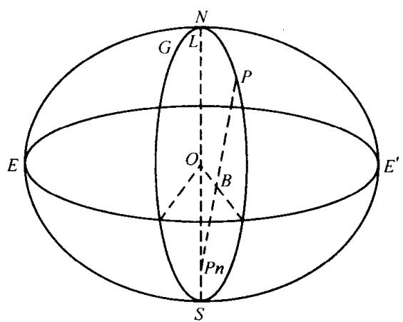

<details>
<summary>text_image</summary>

N
G L
P
O
B
E'
Pn
S
</details>

图1

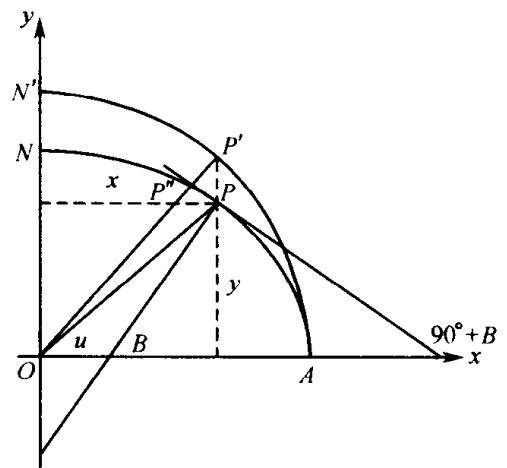

<details>
<summary>text_image</summary>

y
N'
N
x
P"
P
y
u
O
B
A
90°+B
x
</details>

图2

解法Ⅰ：

在控制测量学中,常使用归化纬度计算两已知点之间的大地线长度.

(1) 归化纬度与大地纬度的转化

如图2， $P$ 点所在子午椭圆的方程式为 $\frac{x^2}{a^2} +\frac{y^2}{b^2} = 1$ ，由上式求导，得

$$
\frac {\mathrm{d} y}{\mathrm{d} x} = - \frac {b ^ {2} x}{a ^ {2} y}, \tag {1}
$$

曲线在点 P 处的一阶导数就是该处切线的斜率, 即

$$
\frac {\mathrm{d} y}{\mathrm{d} x} = \tan (9 0 ^ {\circ} + B) = - \cot B \tag {2}
$$

由(1)、(2)两式得： $\frac{y}{x}=\frac{b^{2}}{a^{2}}\tan B$ ，由椭圆的几何作图原理知，图2中， $OP'=a$ ， $OP''=b$ ．于是

$$
\left\{ \begin{array}{l} x = O P ^ {\prime} \cos u = a \cos u \\ y = O P ^ {\prime \prime} \sin u = b \sin u \end{array} . \right.
$$

代入 $\frac{y}{x} = \frac{b^2}{a^2}\tan B$ 得： $\tan u = \frac{ay}{bx} = \frac{b}{a}\tan B$ 。所以归化纬度与大地纬度的关系为

$$
\tan u = \frac {b}{a} \tan B \tag {3}
$$

(2) 计算公式的导出

长距离大地主题解算的贝赛尔方法中，椭球面上两点 $P_{1}(L_{1},u_{1})$ 与 $P_{2}(L_{2},u_{2})$ 间的大地线 $S$ 与其辅助球面上大圆弧 $\sigma$ 的微分关系式为 $dS = a\sqrt{1 - e^2\cos^2u}\mathrm{d}\sigma .$

由于地球的扁率 $\alpha = \frac{a - b}{a} \approx 0.003$ ，则计算中略去 $\alpha^2$ 项，于是

$$
d S = a \sqrt {1 - 2 \alpha \cos^ {2} u} \mathrm{d} \sigma = a (1 - \alpha + \alpha \sin^ {2} u) \mathrm{d} \sigma \tag {4}
$$

球面直角极三角形的球面三角公式为 $\sin u = \sin u_n\cos \sigma$ ，将其代入(4)得：

$$
d S = a \left(1 - \alpha + \alpha \sin^ {2} u _ {n} \frac {1 + \cos 2 \sigma}{2}\right) \mathrm{d} \sigma \tag {5}
$$

对(5)式两端积分得：

$$
S = a \triangle \sigma \left(1 - \alpha + \frac {\alpha}{2} \sin^ {2} u _ {n}\right) + \frac {1}{4} a \alpha \sin^ {2} u _ {n} (\sin 2 \sigma_ {2} - \sin 2 \sigma_ {1}) \tag {6}
$$

由于 $u_{n},\sigma_{1},\sigma_{2}$ 未知，将此用 $u_{1},u_{2}$ 和 $\triangle \sigma$ 表示，其中 $\triangle \sigma = \sigma_2 - \sigma_1$ ，由球面三角公式有

$$
\left\{ \begin{array}{l} \sin u _ {1} = \sin u _ {n} \cos \sigma_ {1} \\ \sin u _ {2} = \sin u _ {n} \cos \sigma_ {2} \end{array} \right. \tag {7}
$$

令 $U = (\sin u_{1} + \sin u_{2})^{2}$ ， $V = (\sin u_{1} - \sin u_{2})^{2}$ ，可得

$$
\sin^2 u_n = \frac{U}{2(1 + \cos\triangle\sigma)} + \frac{V}{2(1 - \cos\triangle\sigma)} \tag{8}
$$

$$
\sin^ {2} u _ {n} (\sin 2 \sigma_ {2} - \sin 2 \sigma_ {1}) = \sin \triangle \sigma \left[ \frac {U}{1 + \cos \triangle \sigma} - \frac {V}{1 - \cos \triangle \sigma} \right] \tag {9}
$$

$\triangle\sigma$ 是辅助球面上两点的大圆弧长,有如下近似公式:

$$
\cos \triangle \sigma = \sin u _ {1} \sin u _ {2} + \cos u _ {1} \cos u _ {2} \cos (L _ {1} - L _ {2}).
$$

根据对 $\triangle \sigma$ 的近似处理，(6)式可简化为如下近似公式：

$$
S = a \triangle \sigma - \frac {a \alpha}{2} \triangle \sigma \sin^ {2} u _ {n} + \frac {a \alpha}{4} \sin^ {2} u _ {n} (\sin 2 \sigma_ {2} - \sin 2 \sigma_ {1})
$$

将(8)(9)代入上式得：

$$
S = a \triangle \sigma - \frac {1}{4} a \alpha \left[ \frac {\triangle \sigma - \sin \triangle \sigma}{1 + \cos \triangle \sigma} U + \frac {\triangle \sigma + \sin \triangle \sigma}{1 - \cos \triangle \sigma} V \right] \tag {10}
$$

若令 $H = \frac{a\alpha}{4} = \frac{a - b}{4}$ , $M = \frac{\triangle\sigma - \sin\triangle\sigma}{1 + \cos\triangle\sigma}$ , $N = \frac{\triangle\sigma + \sin\triangle\sigma}{1 - \cos\triangle\sigma}$ , 则

$$
S = a \triangle \sigma - H (M U - N V) \tag {11}
$$

对于飞机航线相邻两站点 $A_{i}(B_{i},L_{i})$ ， $A_{i + 1}(B_{i + 1},L_{i + 1})$ 之间的航程有如下近似计算公式：

$$
S _ {i} = - a \sigma - H (M U + N V),
$$

$$
\cos \sigma = \sin u _ {i} \sin u _ {i + 1} + \cos u _ {i} \cos u _ {i + 1} \cos (L _ {i + 1} - \cos L _ {i}),
$$

$$
U = (\sin u _ {i} + \sin u _ {i + 1}) ^ {2}, V = (\sin u _ {i} - \sin u _ {i + 1}) ^ {2},
$$

$$
H = \frac {a - b}{4}, M = \frac {\sigma - \sin \sigma}{1 + \cos \sigma}, N = \frac {\sigma - \sin \sigma}{1 + \cos \sigma} \tag {12}
$$

其中 $u_{i}, u_{i+1}$ 可由(3)式计算得出，且飞机在地球上空10千米的椭球面上运动， $a = 6388$ 千米， $b = 6367$ 千米。计算得，飞机原来的总航程 $S = 14605.36$ （千米）。

飞机由北京直飞底特律的新航程 $S' = 10645.562$ (千米)

飞机飞行节约的时间

$$
\triangle t = \frac {S - S ^ {\prime}}{V} = \frac {1 4 6 0 5 . 3 6 - 1 0 6 4 5 . 3 6}{9 8 0} = 4. 0 4 1 (\text {小时}) \tag {13}
$$

(13)式的结果解释了“北京至底特律可节约4小时”的估计.

解法Ⅱ：

在控制测量学中有较多的计算大地线长度的方法,对于那些方法,已推导得比较严密,尽管精度较高,但计算方法过于繁琐.现在,我们运用数学的方法,将大地坐标转化为空间直角坐标后,用微分法求弧长的方法来近似计算旋转椭球面上两点间最短的距离.

首先引进椭球面上点的空间直角坐标:以椭球体中心 O 为原点,起始子午面与赤道交线为 X 轴,在赤道面上与 X 轴正交的方向为 Y 轴,椭球体的旋转轴为 Z 轴,构成空间直角坐标系,则 $(x,y,z)$ 为点的空间直角坐标.

根据大地坐标及空间直角坐标的定义,可以得

$$
\left\{ \begin{array}{l} x = \frac {a ^ {2}}{\sqrt {a ^ {2} + b ^ {2} \tan^ {2} B}} \cos L \\ y = \frac {a ^ {2}}{\sqrt {a ^ {2} + b ^ {2} \tan^ {2} B}} \sin L \\ z = \frac {b ^ {2} \tan B}{\sqrt {a ^ {2} + b ^ {2} \tan^ {2} B}} \end{array} \right. \tag {14}
$$

设飞机航线上相邻两站点为 $A_{i}(B_{i},L_{i})$ ， $A_{i + 1}(B_{i + 1},L_{i + 1})$ ，显然其处于同一椭球体表面．利用(14)式计算出空间坐标．我们用过点 $A_{i},A_{i + 1}$ 和原点的平面截椭球表面所得弧长 $A_{i}A_{i + 1}$ 近似作为 $A_{i},A_{i + 1}$ 两地间航程 $S_{i}$ .方便起见，令 $D = \frac{a^2}{\sqrt{a^2 + b^2\tan^2b}}$ ，易得平面 $OA_{i}A_{i + 1}$ 的方程为

$$
n _ {1} x + n _ {2} y - n _ {3} z = 0 \tag {15}
$$

$$
\left\{ \begin{array}{l} n _ {1} = \left(\frac {b}{a}\right) ^ {2} (\sin L _ {i} \tan B _ {i + 1} - \sin L _ {i + 1} \tan B _ {i}), \\ n _ {2} = \left(\frac {b}{a}\right) ^ {2} (\cos L _ {i + 1} \tan B _ {i} - \cos L _ {i} \tan B _ {i + 1}), \\ n _ {3} = - \sin (L _ {i} - L _ {i + 1}). \end{array} \right.
$$

将(14)式代入(15)式得：

$$
n _ {1} a ^ {2} \cos L + n _ {2} a ^ {2} \sin L = n _ {3} b ^ {2} \tan B
$$

故

$$
\tan B = \frac {n _ {1} a ^ {2}}{n _ {3} b ^ {2}} \cos L + \frac {n _ {2} a ^ {2}}{n _ {3} b ^ {2}} \sin L = \frac {a ^ {2}}{b ^ {2}} n \sin (L + \varphi_ {0}) \tag {16}
$$

其中 $n = \frac{\sqrt{n_1^2 + n_2^2}}{|n_3|}$ ， $\varphi_0 = \arctan \frac{n_1}{n_2}$ 。将(16)式代回(14)式得：

$$
\left\{ \begin{array}{l} x = \frac {a b}{\sqrt {a ^ {2} n ^ {2} \sin^ {2} (L + \varphi_ {0}) + b ^ {2}}} \cos L \\ y = \frac {a b}{\sqrt {a ^ {2} n ^ {2} \sin^ {2} (L + \varphi_ {0}) + b ^ {2}}} \sin L \\ z = \frac {a b n \sin (L + \varphi_ {0})}{\sqrt {a ^ {2} n ^ {2} \sin^ {2} (L + \varphi_ {0}) + b ^ {2}}} \end{array} \right. \tag {17}
$$

于是， $F(L) = x^{2}(L) + y^{2}(L) + z^{2}(L)$

$$
= a ^ {2} \frac {\left(\frac {a ^ {2}}{b ^ {2}} n ^ {2} + 1\right) ^ {2} \sin^ {2} (L + \varphi_ {0}) + (n ^ {2} + 1) \cos^ {2} (L + \varphi_ {0})}{\left[ \left(\frac {a}{b}\right) ^ {2} n ^ {2} \sin^ {2} (L + \varphi_ {0}) + 1 \right] ^ {3}} \tag {18}
$$

所以椭球面上两点 $A_{i}$ ， $A_{i + 1}$ 的弧长

$$
A _ {i} A _ {i + 1} = \left| \int_ {L _ {1}} ^ {L _ {2}} \sqrt {F (L)} \mathrm{d} L \right| \tag {19}
$$

(19)式可作为航程 $S_{i}$ 的近似公式，但由于计算较繁，先对它作出简化处理.

因 $a$ 与 $b$ 的值差很小, 我们以 $\frac{a^2}{b^2} n^2 + 1$ 替换(18)式中出现的 $n^2 + 1$ , (18)式化为近似式

$$
F (L) = \frac {a ^ {2} \left(\frac {a ^ {2}}{b ^ {2}} n ^ {2} + 1\right)}{\left[ \left(\frac {a}{b}\right) ^ {2} n ^ {2} \sin^ {2} \left(L + \varphi_ {0}\right) + 1 \right] ^ {2}} \tag {20}
$$

将(20)代入(19)易得航程 $S_{i}$ 的一个近似计算公式：

$$
S _ {i} = a \left| \arctan \left[ \frac {b}{\sqrt {a ^ {2} n ^ {2} + b ^ {2}}} \cot \left(L _ {i + 1} + \varphi_ {0}\right) \right] - \arctan \left[ \frac {b}{\sqrt {a ^ {2} n ^ {2} + b ^ {2}}} \cot \left(L _ {i} + \varphi_ {0}\right) \right] \right| \tag {21}
$$

$$
n _ {1} = \left(\frac {b}{a}\right) ^ {2} \left(\sin L _ {i} \tan B _ {i + 1} - \sin L _ {i + 1} \tan B _ {i}\right), n _ {2} = \left(\frac {b}{a}\right) ^ {2} \left(\cos L _ {i + 1} \tan B _ {i} - \cos L _ {i} \tan B _ {i + 1}\right),
$$

$$
n _ {3} = - \sin \left(L _ {1} - L _ {2}\right), n = \frac {\sqrt {n _ {1} ^ {2} + n _ {2} ^ {2}}}{\mid n _ {3} \mid}, \varphi_ {0} = \arctan \frac {n _ {1}}{n _ {2}}
$$

由以上一组公式,用计算机编程可直接代入大地坐标得到

飞机原来的总航程 S = 14610.89(千米)

飞机从北京直飞底特律的新航程 $S' = 10638.79$ (千米)

所以飞行节约的时间

$$
\triangle t = \frac {S - S ^ {\prime}}{V} = \frac {1 4 6 1 0 . 8 9 - 1 0 6 3 8 . 7 9}{9 8 0} = 4. 0 5 3 1 (\text {小时}) \tag {22}
$$

在上面的计算中, 我们对积分式作了近似处理. 如不作近似, 根据 (18) 和 (19) 并用 Mathematica 4.0 软件直接算得结果为: 原航程 $S = 14604.448$ (千米), 新航程 $S' = 10631.986$ (千米). 于是飞行节约的时间

$$
\triangle t = \frac {S - S ^ {\prime}}{V} = \frac {1 4 6 0 4 . 4 4 8 - 1 0 6 3 1 . 9 8 6}{9 8 0} = 4. 0 5 3 5 (\text {小时}) \tag {23}
$$

式(22)和(23)的两个结果只相差0.0004小时,即相当于1.44秒,其误差完全可以忽略.这说明了我们上面所作的近似计算是合理的,同时,这一结果解释了原题中“节约4小时”的估计.

## 5 模型的评价(略)

## 参考文献

[1] 姜启源. 数学模型(第二版). 北京: 高等教育出版社, 1993.  
[2] 同济大学数学教研室. 高等数学(第四版). 北京: 高等教育出版社, 1996.  
[3] 武汉测绘学院控制测量教研室等. 控制测量学(下册). 北京: 测绘出版社, 1995.  
[4] 孔祥元, 梅是义. 控制测量学. 北京: 测绘出版社, 1995.  
[5] 杨珏, 梅是义. 控制测量学. 北京: 测绘出版社, 1995.

# 飞越北极

何永强 陆新根 沈重欢

(浙江万里学院, 宁波 315101)

指导老师 数模组

编者按 若将地球视作旋转椭球,飞机的航线应为长、短半轴分别为6388和6367千米的椭圆旋转而得的旋转椭球面上过给定两点的短程线即测地线.本文应用微分几何知识,给出了测地线满足的微分方程,并借助数学软件求得多数航线段的长度.该方法有一定的特点,是可取的.我们选取了论文的这一部分内容,予以发表.若使计算更加精确,应将地理纬度转化为归化纬度(详见本期《飞越北极的数学计算模型》一文).

摘要 本文对“飞机从北京出发、飞越北极直达底特律的所需时间，可比原航线节省多少时间”的问题进行讨论，并将航线选择归结为寻求曲面上的最短弧.

应用“曲面上最短弧为测地线”的事实进行了讨论。模型(一)假设地球是球体,我们可通过单位向量的点乘与夹角的关系,加以解决;对于模型(二)设地球是旋转椭球体,我们利用微分几何学中测地线方程加以解决,并且把球面的纬度转化为旋转椭球面纬度。对于4组较特殊的点,纬度几乎相等或相近,或者两者之间的经度差过大时,用测地线计算比较困难,我们用椭圆弧(长)代替测地线长,结合数学软件Mathematica的数值积分功能,可求得测地线长。

## 1 问题的重述(略)

## 2 模型一(略)

## 3 模型二

## 3.1 假设

(1)地球为旋转椭球体；  
(2)为简化模型,设赤道半径+飞行高度为单位长度1;  
(3)所给纬度为理想球面上的纬度；  
(4)从北京到底特律中途不需加油.

## 3.2 参数说明

a: 为子午线半径与飞行高度之和跟赤道半径与飞行高度之和的比值 $(a=6367/6388)$ ;

θ: 为经度数值, 单位为度;

$\varphi$ :为纬度数值,单位为度;

L: 为弧长, 单位为公里.

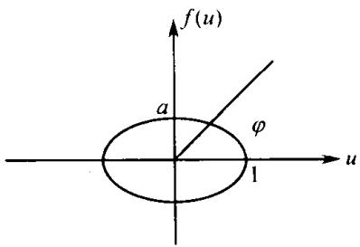

<details>
<summary>text_image</summary>

f(u)
a
φ
1
u
</details>

## 3.3 模型解答

首先,飞机的航线一定是曲面上两点(站)之间的最短曲线,那么航线的问题可以归结为求测地线及其弧长的问题. 根据[1]中定理2.14,“在曲面上两点间的最短曲线 $C$ 必为测地线”，用参数曲面方程来表示旋转椭球体可表示为[详见[2]P169]:

$$
\vec {r} = (\mu \mathrm{Cos} \theta , \mu \mathrm{Sin} \theta , f (\mu))
$$

其中 $\mu=1/\sqrt{1+\operatorname{tg}^{2}\varphi/a^{2}}$ ,

(因为 $\mathrm{tg}\varphi = f(u)/u = a\sqrt{1 - u^{2}}/u$ ，因为都是北纬， $tg\varphi$ 取正数值).

因为椭圆上的标准式为： $\frac{u^{2}}{1}+\frac{f^{2}(u)}{a^{2}}=1,f^{2}(u)=(1-u^{2})a^{2}$ ，故： $|f'(u)|=\frac{au}{\sqrt{1-u^{2}}}$ ，于是，曲面的第一基本形式为：

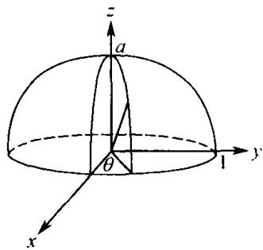

<details>
<summary>text_image</summary>

z
a
θ
1
y
x
</details>

$I = [1 + f'^{2}(u)]du^{2} + u^{2}d\theta^{2}$ [详见书[2]P169例题或该书第三章第三节]
其中 $E = 1 + f'^{2}(u)$ ; F = 0 (正交); $G = u^{2}$ .

若在曲面上有一条曲线 C，它的方程是关于参数 t 的函数：

$$
u = u (t); \theta = \theta (t); (t _ {0} \leqslant t \leqslant t _ {1})
$$

则它的弧长公式就为：

$$
L = \int_ {t _ {0}} ^ {t _ {1}} \left[ E (u (t), \theta (t)) \left(\frac {\mathrm{d} u}{\mathrm{d} t}\right) ^ {2} + G (u (t), \theta (t)) \left(\frac {\mathrm{d} \theta}{\mathrm{d} t}\right) ^ {2} \right] ^ {\frac {1}{2}} \mathrm{d} t
$$

令 $\left\{\begin{aligned}u&=t\\ \theta&=\theta(u)\end{aligned}\right.$ ，则 $\frac{d\theta}{dt}=\frac{d\theta}{du}$ ;

$$
L = \int_ {u _ {0}} ^ {u} \left[ 1 + f ^ {\prime 2} (u) + u ^ {2} \left(\frac {\mathrm{d} \theta}{\mathrm{d} u}\right) ^ {2} \right] ^ {\frac {1}{2}} \mathrm{d} u = \int_ {u _ {0}} ^ {u} \left[ 1 + \frac {(a u) ^ {2}}{1 - u ^ {2}} + u ^ {2} \left(\frac {\mathrm{d} \theta}{\mathrm{d} u}\right) ^ {2} \right] ^ {\frac {1}{2}} \mathrm{d} u \tag {1}
$$

根据[2]P170公式(10)，测地线满足下面方程：

$$
\frac {\mathrm{d} \theta}{\mathrm{d} u} = \frac {c \sqrt {1 + (f ^ {\prime} (u)) ^ {2}}}{u \sqrt {u ^ {2} - c ^ {2}}} = \frac {c \sqrt {1 + \frac {(a u) ^ {2}}{1 - u ^ {2}}}}{u \sqrt {u ^ {2} - c ^ {2}}} (c: \text {为常数}) \tag {2}
$$

把(2)代入(1)式得

$$
L _ {\min} = \int_ {u _ {0}} ^ {u} \left[ 1 + \frac {(a u) ^ {2}}{1 - u ^ {2}} + \frac {c ^ {2} \left(1 + \frac {(a u) ^ {2}}{1 - u ^ {2}}\right)}{u ^ {2} - c ^ {2}} \right] ^ {\frac {1}{2}} \mathrm{d} u \tag {3}
$$

现在,我们先来确定常数 c.

由(2)式得

$$
\theta = c _ {1} + \int_ {u _ {0}} ^ {u} \frac {c \sqrt {1 + (f ^ {\prime} (u)) ^ {2}}}{u \sqrt {u ^ {2} - c ^ {2}}} \mathrm{d} u
$$

取 $u = u_0, c_1 = \theta_0$ ，所以

$$
\theta = \theta_ {0} + \int_ {u _ {0}} ^ {u} \frac {c \sqrt {1 + (f ^ {\prime} (u)) ^ {2}}}{u \sqrt {u ^ {2} - c ^ {2}}} \mathrm{d} u = \theta_ {0} + \int_ {u _ {0}} ^ {u} \frac {c \sqrt {1 + \frac {(a u) ^ {2}}{1 - u ^ {2}}}}{u \sqrt {u ^ {2} - c ^ {2}}} \mathrm{d} u
$$

其中 $u = 1 / \sqrt{1 + \mathrm{tg}^2\varphi / a^2}$ （ $\varphi$ 是纬度）. 特别当 $u = u_{1}$ 时， $\theta = \theta_{1}$ ，于是有方程

$$
\theta_ {1} = \theta_ {0} + \int_ {u _ {0}} ^ {u _ {1}} \frac {c \sqrt {1 + \frac {(a u) ^ {2}}{1 - u ^ {2}}}}{u \sqrt {u ^ {2} - c ^ {2}}} \mathrm{d} u
$$

因为,各点的 $\theta$ 、 $\varphi$ 的值是确定.于是,可以通过 Mathematica 数学软件中的 FindRoot 命令输入式,可得以下数据:

<table><tr><td></td><td>常数 $|C|$ </td><td>单位椭球时的弧长 $L'$ </td><td>弧长 $L$ (单位:公里)</td></tr><tr><td>北京→A1</td><td>0.371057</td><td> $L'_1 = 0.174480$ </td><td> $L_1 = 1114.58$ </td></tr><tr><td>A1→A2</td><td>0.786575</td><td> $L'_2 = 0.275349$ </td><td> $L_2 = 1758.93$ </td></tr><tr><td>A2→A3</td><td>0.600374</td><td> $L'_3 = 0.723465$ </td><td> $L_3 = 4621.49$ </td></tr><tr><td>A3→A4</td><td>0.350192</td><td> $L'_4 = 0.209363$ </td><td> $L_4 = 1337.41$ </td></tr><tr><td>A4→A5</td><td>0.417523</td><td> $L'_5 = 0.100230$ </td><td> $L_5 = 640.27$ </td></tr><tr><td>A5→A6</td><td>0.304690</td><td> $L'_6 = 0.084212$ </td><td> $L_6 = 537.946$ </td></tr><tr><td>A6→A7</td><td>0.314597</td><td> $L'_7 = 0.101895$ </td><td> $L_7 = 650.903$ </td></tr><tr><td>A7→A8</td><td>0.489572</td><td> $L'_8 = 0.0778326$ </td><td> $L_8 = 497.195$ </td></tr></table>

因为其余四组: $A8 \rightarrow A9, A9 \rightarrow A10, A10 \rightarrow$ 底特律, 北京 $\rightarrow$ 底特律之间的纬度相等或相近, 或者两者之间的经度差过大, 经过计算验证, 上述方法对此四组数据无法处理, 所以在计算此四组数据时, 由于测地线计算的困难, 我们考虑经过两点、以球心为中心的椭圆, 并以两点间的椭圆弧(长)代替测地线(长).

## 椭圆弧长

设球面上两点(向量) $A=(x,y,z)$ , $B=(x^{*},y^{*},z^{*})$ ，则连接它们的大圆圆弧的方程为

$$
\vec {r} (t) = \frac {t \vec {A} + (1 - t) \vec {B}}{| t \vec {A} + (1 - t) \vec {B} |} \quad (0 \leqslant t \leqslant 1)
$$

即 $\vec{r}(t) = \left(\frac{tx + (1 - t)x^*}{|t\vec{A} + (1 - t)\vec{B}|},\frac{ty + (1 - t)y^*}{|t\vec{A} + (1 - t)\vec{B}|},\frac{tz + (1 - t)z^*}{|t\vec{A} + (1 - t)\vec{B}|}\right)$

曲线 $C$ 的弧长公式为

$$
L ^ {\prime} = \int_ {0} ^ {1} \sqrt {x ^ {\prime} (t) ^ {2} + y ^ {\prime} (t) ^ {2} + z ^ {\prime} (t) ^ {2}}
$$

下面的映射将球面变成旋转椭球面， $(x, y, z) \mapsto (x, y, az)$ . 如图，球面上点的纬度 $\Psi$ 和变换后旋转椭球面上点的纬度 $\varphi$ 满足 $\Psi = \operatorname{arctg}(\operatorname{tg}\varphi / a)$ ，而经度不变.

由球面曲线的弧长公式,可得旋转椭球的弧长公式为

$$
L = \int_ {0} ^ {1} \sqrt {x ^ {\prime} (t) ^ {2} + y ^ {\prime} (t) ^ {2} + (a z ^ {\prime} (t)) ^ {2}} \mathrm{d} t
$$

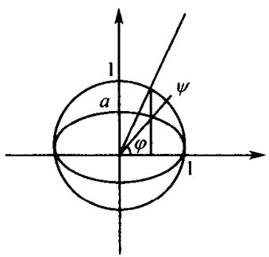

<details>
<summary>text_image</summary>

1
a
ψ
φ
1
</details>

利用 Mathematica 软件的数值积分功能, 可得

<table><tr><td></td><td>单位弧长  $L'$ </td><td>弧长  $L$ (单位:公里)</td></tr><tr><td> $A8 \rightarrow A9$ </td><td> $L'_{9} = 0.03564422474$ </td><td> $L_{9} = 227.695$ </td></tr><tr><td> $A9 \rightarrow A10$ </td><td> $L'_{10} = 0.4397685785$ </td><td> $L_{10} = 2809.24$ </td></tr><tr><td> $A10 \rightarrow \text{底特律}$ </td><td> $L'_{11} = 0.05091055547$ </td><td> $L_{11} = 325.217$ </td></tr><tr><td>北京→底特律</td><td> $L' = 1.669532606$ </td><td> $L = 10665.0$ </td></tr></table>

综上所述, 可得从北京飞经十站到底特律的距离为: $S = \sum_{i=1}^{11} L_i = 14520.9$ (公里), 因此可得节约时间为: 3.935 小时.

## 3.4 模型二的总结

由计算可知,模型二所得结果比模型一更为合理,所节约时间更多,更符合实际情况.如考虑中途停靠加油,所节约时间将不止此数.

## 参考文献

[1] 方德值. 微分几何基础, 科学出版社, 1984.  
[2] 陈维桓. 微分几何初步. 北京大学出版社, 1999.  
[3] 陈省身，陈维桓. 微分几何讲义. 北京大学出版社, 1999.  
[4] Martin M, 杨正清、李世杰、黄锦能译. 微分几何的理论和习题. 上海科学技术出版社, 1989.

## 1-7 全国大学生数学建模竞赛章程(1997年)

## 第一条 总则

全国大学生数学建模竞赛(以下简称竞赛)是国家教委高教司和中国工业与应用数学学会共同主办的面向全国大学生的群众性科技活动,目的在于激励学生学习数学的积极性,提高学生建立数学模型和运用计算机技术解决实际问题的综合能力,鼓励广大学生踊跃参加课外科技活动,开拓知识面,培养创造精神及合作意识,推动大学数学教学体系、教学内容和方法的改革。

## 第二条 竞赛内容

竞赛题目一般来源于工程技术和管理科学等方面经过适当简化加工的实际问题,不要求参赛者预先掌握深入的专门知识,只需要学过普通高校的数学课程。题目有较大的灵活性供参赛者发挥其创造能力。参赛者应根据题目要求,完成一篇包括模型的假设、建立和求解、计算方法的设计和计算机实现、结果的分析和检验、模型的改进等方面的论文(即答卷)。竞赛评奖以假设的合理性、建模的创造性、结果的正确性和文字表述的清晰程度为主要标准。

(下转第594页)

## 飞越北极

## 复旦大学

## 谭永基

假定飞机保持飞行高度10千米作匀速飞行,忽略起飞、降落和地球自转和公转的影响,C题可以归结为求飞越通过指定各点的球面或旋转椭球面上的短程线(或测地线)的航线,与飞越直接连结北京上空10千米至底特律上空10千米的经过北极圈的新航线的时间差.又由于假设飞机作时速为980千米/小时的匀速飞行,问题又可归结为求相应的航程差.

## 1 地球为球体的情形

取直角坐标系如下:以球心为原点,z轴指向北极,x轴通过赤道上经度为 $0^{\circ}$ 和 $180^{\circ}$ 的两点,正向指向 $0^{\circ}$ ,y轴垂直于x轴和z轴,构成右手坐标系.

在半径 $r = 6381$ 千米的球面上建立球面坐标系 $(\varphi, \theta)$ , 由于航线在北半球, 我们取 $\varphi$ 和北纬度一致, $\theta$ 和东经度一致. 因此航线上某处的地理坐标为 $(f, l)$ , 可用以下方法得到对应的球面坐标 $(\varphi, \theta)$ :

$$
\varphi = f \times \pi / 1 8 0,
$$

$$
\theta^ {\circ} = \left\{ \begin{array}{l l} l, & \text {为东经,} \\ 3 6 0 - l, & l \text {为西经,} \end{array} \right.
$$

$$
\theta = \theta^ {\circ} \times \pi / 1 8 0,
$$

应有

$$
\left\{ \begin{array}{l} x = r \cos \varphi \cos \theta , \\ y = r \cos \varphi \sin \theta , \\ z = r \sin \varphi . \end{array} \right.
$$

若球面上两点的球面坐标为 $(\varphi_{1},\theta_{1}),(\varphi_{2},\theta_{2})$ ，过这两点的短程线是过这两处的大圆的劣圆弧(即长度较短的一条大圆弧).从球心指向此两点的矢量分别为

$$
(r \cos \varphi_ {i} \cos \theta_ {i}, r \cos \varphi_ {i} \sin \theta_ {i}, r \sin \varphi_ {i}), \quad i = 1, 2.
$$

设它们的夹角为 $\alpha$ ，则有

$$
\begin{array}{l} \cos \alpha = \cos \varphi_ {1} \cos \theta_ {1} \cos \varphi_ {2} \cos \theta_ {2} + \cos \varphi_ {1} \sin \theta_ {1} \cos \varphi_ {2} \sin \theta_ {2} \\ + \sin \varphi_ {1} \sin \varphi_ {2}, \\ \end{array}
$$

从而求得 $\alpha$ ，进而求得过这两点的航程 $r\alpha$

多数参赛队都能正确计算航程,从而获得节省时间大约为3.91小时的结论.由于题目未给出北京和底特律的经纬度,有些队对两地的经纬度误差估计较大,因此计算的误差也较大.

## 2 设地球为旋转椭球的情形

此时,飞机的航线位于方程为

$$
\left\{ \begin{array}{l} x = 6 3 8 8 \cos \varphi \cos \theta , \\ y = 6 3 8 8 \cos \varphi \sin \theta , \\ z = 6 3 6 7 \sin \varphi \end{array} \right.
$$

的旋转椭球面上,它通过给定地理坐标的各点,在相邻两点间为上述椭球面的短程线.在大地测量中,一点的地球坐标 $(f,l)$ 中的地理纬度是这样定义的:用通过该点的子午面与椭球交得一椭圆,过该点作椭圆的法线,法线与水平线的夹角f,即为该点的纬度(见图1).

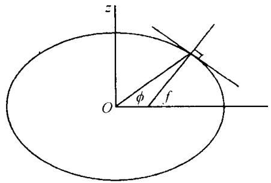

<details>
<summary>text_image</summary>

z
O
φ
f
</details>

图1

由于该椭圆的方程为

$$
\left\{ \begin{array}{l} x = 6 3 8 8 \cos \varphi , \\ y = 6 3 6 7 \sin \varphi , \end{array} \right.
$$

该点的切向量和法向量分别为

$$
\binom{- 6 3 8 8 \sin \varphi}{6 3 6 7 \cos \varphi}, \binom{- 6 3 6 7 \cos \varphi}{6 3 8 8 \sin \varphi}
$$

从而 $\tan \varphi = \frac{6367}{6388}\tan f, \varphi = \arctan \left(\frac{6367}{6388}\tan f\right)$ ,

得到我们所需的纬度,文献称为归约纬度.

在一般的有关大地测量的文献中均有对地理纬度与归约纬度之间关系的论述，但有较多答卷直接将地理纬度作为归约纬度建模计算。虽因长短半轴差别较小，计算误差不算大，但作为精确的数学模型，这种做法是有缺陷的。

就笔者所知,到现在为止尚未得到过旋转椭球面上任意两点的短程线的解析表达式.在大地测量学和航海学的有关文献中采用过一些有效的近似公式如贝塞尔公式等,在参赛队中采用这种方法也不在少数.其中有些队从求短程线出发,建立模型,经合理简化得到相应的计算公式,这是可取的;另一些队简单生硬地套用公式,多少偏离了数学建模竞赛的宗旨和要求,他们的答卷不能认为是优秀的答卷.

解决问题的另一方法是建立问题的变分模型。这种方法根据航线是短程线的要求，将过给定两点的曲线的长度表示为以原曲线的参数方程的一个泛函，在满足该曲线落在旋转椭球面上的约束条件下，使该泛函达到最小。在用Lagrange乘子法后得到Euler方程，然后对此方程用数值方法，得到近似短程线。有几个参赛队采用此方法，并得到Euler方程的表达式。但因方程较复杂，未能最终求出数值解。

还有一个方法就是用微分几何知识直接获得椭球面上短程线应满足的微分方程,利用微分方程表达式得到弧长计算公式,并用数值积分法求得短程线的近似长度.有的参赛队建立了这样的模型,得到了结果.

一种比较直观的方法就是直接搜索法, 即在椭球面上过给定两点的众多曲线中搜索出长度最短的一条作为短程线的近似. 由于这些曲线的长度需通过数值积分, 需要将 $\varphi$ 和 $\theta$ 进行剖分, 这就将问题化为一个离散的优化问题, 可以采用优化的方法求解. 在本期发表的优秀论文中有一篇采用了在一类椭球面上过给定两点的曲线中进行搜索的方法.

较多的答卷直接将地球作为球的结果移植到作为旋转椭球的情形,简单地认为“过椭球面上给定两点的短程线即为过此两点和地心的平面与椭球面交线的劣弧(两点间较短的一条)”.这一结论是错误的,有时会导致很大的误差.

数学软件 Mathematica 的程序库中有求近似测地线的函数, 利用这一函数不难求出各点之间的航程. 有个别参赛队没有建立合适的数学模型, 直接调用这一函数, 得到近似的结果, 不能视作好的答案.

另一些队将用此软件获得的结果作为验证和评价自己模型的手段之一, 这是很值得称道的.

(上接第591页)

## 第三条 竞赛形式、规则和纪律

1. 全国统一竞赛题目,采取通讯竞赛方式,以相对集中的形式进行。  
2. 竞赛一般在每年9月末的三天内举行。  
3. 大学生以队为单位参赛,每队 3 人,专业不限。研究生不得参加。每队可设一名指导教师(或教师组),从事赛前辅导和参赛的组织工作,但在竞赛期间必须回避参赛队员,不得进行指导或参与讨论,否则按违反纪律处理。  
4. 竞赛期间参赛队员可以使用各种图书资料、计算机和软件，在国际互联网上浏览，但不得与队外任何人(包括在网上)讨论。  
5. 工作人员将密封的赛题按时启封发给参赛队员,参赛队在规定时间内完成答卷,并准时交卷。  
6．参赛院校应责成有关职能部门负责竞赛的组织和纪律监督工作，保证本校竞赛的规范性和公正性。

## 第四条 组织形式

1. 竞赛由全国竞赛组织委员会主持，负责每年发动报名、拟定赛题、组织全国优秀答卷的复审和评奖、印制获奖证书、举办全国颁奖仪式等。全国竞赛组委会每届任期四年，其组成人员由国家教委高教司和中国工业与应用数学学会负责确定。  
2. 竞赛分赛区组织进行。原则上一个省(自治区、直辖市)为一个赛区,每个赛区应至少有6所院校的20个队参加(每所院校至多10个队)。邻近的省可以合并成立一个赛区。每个赛区建立组织委员会,负责本赛区的宣传发动及报名、监督竞赛纪律和组织评阅答卷等工作。组委会成员由各省(自治区、直辖市)教委、工业与应用数学学会的同志及有关人士组成(没有成立地方学会的,由各地教委与全国竞赛组委会指定的院校协商确定),报全国竞赛组委会备案,并保持相对稳定。未成立赛区的各省院校的参赛队可直接向全国竞赛组委会报名参赛。  
3. 设立组织工作优秀奖, 表彰在竞赛组织工作中成绩优异或进步突出的赛区组委会, 以参赛(相对)校数和(绝对)队数、征题的数量和质量、无违纪现象、以及与全国组委会的配合等为主要标准。 (下转第603页)

## 22. 空洞探测(CUMCM 2000 年 D 题)

山体、隧洞、坝体等的某些内部结构可用弹性波测量来确定.一个简化问题可描述为,一块均匀介质构成的矩形平板内有一些充满空气的空洞,在平板的两个邻边分别等距地设置若干波源,在它们的对边对等地安放同样多的接收器,记录弹性波由每个波源到达对边上每个接收器的时间,根据弹性波在介质中和在空气中不同的传播速度,来确定板内空洞的位置.现考察如下的具体问题:

一块 $240 \, m \times 240 \, m$ 的平板(如图)，在 AB 边等距地设置 7 个波源 $P_{i} (i = 1, \cdots, 7)$ ，CD 边对等地安放 7 个接收器 $Q_{j} (j = 1, \cdots, 7)$ ，记录由 $P_{i}$ 发出的弹性波到达 $Q_{j}$ 的时间 $t_{ij}$ 秒；在 AD 边等距地设置 7 个波源 $R_{i} (i = 1, \cdots, 7)$ ，BC 边对等地安放 7 个接收器 $S_{j} (j = 1, \cdots, 7)$ ，记录由 $R_{i}$ 发出的弹性波到达 $S_{j}$ 的时间 $\tau_{ij}$ 秒。已知弹性波在介质和空气中的传播速度分别为 2880 米/秒和 320 米/秒，且弹性波沿板边缘的传播速度与在介质中的传播速度相同。

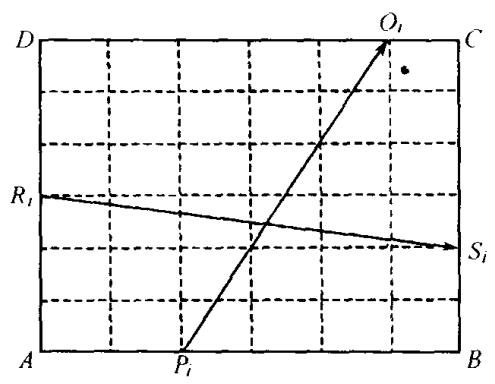

<details>
<summary>text_image</summary>

D
O₁
C
R₁
S₁
A
Pᵢ
B
</details>

1) 确定该平板内空洞的位置.

2) 只根据由 $P_{i}$ 发出的弹性波到达 $Q_{j}$ 的时间 $t_{ij}(i, j=1, \cdots, 7)$ ，能确定空洞的位置吗？讨论在同样能够确定空洞位置的前提下，减少波源和接受器的方法。

<table><tr><td> $t_{ij}$ </td><td> $Q_1$ </td><td> $Q_2$ </td><td> $Q_3$ </td><td> $Q_4$ </td><td> $Q_5$ </td><td> $Q_6$ </td><td> $Q_7$ </td></tr><tr><td> $P_1$ </td><td>0.0611</td><td>0.0895</td><td>0.1996</td><td>0.2032</td><td>0.4181</td><td>0.4923</td><td>0.5646</td></tr><tr><td> $P_2$ </td><td>0.0989</td><td>0.0592</td><td>0.4413</td><td>0.4318</td><td>0.4770</td><td>0.5242</td><td>0.3805</td></tr><tr><td> $P_3$ </td><td>0.3052</td><td>0.4131</td><td>0.0598</td><td>0.4153</td><td>0.4156</td><td>0.3563</td><td>0.1919</td></tr><tr><td> $P_4$ </td><td>0.3221</td><td>0.4453</td><td>0.4040</td><td>0.0738</td><td>0.1789</td><td>0.0740</td><td>0.2122</td></tr><tr><td> $P_5$ </td><td>0.3490</td><td>0.4529</td><td>0.2263</td><td>0.1917</td><td>0.0839</td><td>0.1768</td><td>0.1810</td></tr><tr><td> $P_6$ </td><td>0.3807</td><td>0.3177</td><td>0.2364</td><td>0.3064</td><td>0.2217</td><td>0.0939</td><td>0.1031</td></tr><tr><td> $P_7$ </td><td>0.4311</td><td>0.3397</td><td>0.3566</td><td>0.1954</td><td>0.0760</td><td>0.0688</td><td>0.1042</td></tr></table>

<table><tr><td> $\tau_{ij}$ </td><td> $S_1$ </td><td> $S_2$ </td><td> $S_3$ </td><td> $S_4$ </td><td> $S_5$ </td><td> $S_6$ </td><td> $S_7$ </td></tr><tr><td> $R_1$ </td><td>0.0645</td><td>0.0602</td><td>0.0813</td><td>0.3516</td><td>0.3867</td><td>0.4314</td><td>0.5721</td></tr><tr><td> $R_2$ </td><td>0.0753</td><td>0.0700</td><td>0.2852</td><td>0.4341</td><td>0.3491</td><td>0.4800</td><td>0.4980</td></tr><tr><td> $R_3$ </td><td>0.3456</td><td>0.3205</td><td>0.0974</td><td>0.4093</td><td>0.4240</td><td>0.4540</td><td>0.3112</td></tr><tr><td> $R_4$ </td><td>0.3655</td><td>0.3289</td><td>0.4247</td><td>0.1007</td><td>0.3249</td><td>0.2134</td><td>0.1017</td></tr><tr><td> $R_5$ </td><td>0.3165</td><td>0.2409</td><td>0.3214</td><td>0.3256</td><td>0.0904</td><td>0.1874</td><td>0.2130</td></tr><tr><td> $R_6$ </td><td>0.2749</td><td>0.3891</td><td>0.5895</td><td>0.3016</td><td>0.2058</td><td>0.0841</td><td>0.0706</td></tr><tr><td> $R_7$ </td><td>0.4434</td><td>0.4919</td><td>0.3904</td><td>0.0786</td><td>0.0709</td><td>0.0914</td><td>0.0583</td></tr></table>

# 空洞探测

邹建光 刘丹娟 曾德刚

(岳阳师范学院，岳阳 414006)

指导老师 罗文华 胡星航

编者按 本文用排除法求解,给出两个方案,方案一以未通过空洞的波源与接收器连线为依据,方案二定义一种几何平均值为依据,并逐次计算,简单可行,有启发意义.

摘 要 本文给出了两个方案:方案一基于对数据的分析,采用连线方法,用较小的计算量找出了空洞的位置及洞径.方案二通过对洞径求几何平均值确定空洞的位置.

## 1 问题的提出(略)

## 2 基本假设

1. 假设对弹性波传播时间的测量值存在测量误差.  
2. 假设问题给出的所有测量数据均为可供分析用的可靠数据, 即除测量误差外, 不存在错误数据.  
3. 若某路径上弹性波传播时间的实际测量值与该路径上无空洞时弹性波传播时间的理论计算值之差在测量误差范围内, 则该路径上无空洞分布.

## 3 符号说明

$L_{i,j}$ —— $P_{i}Q_{j}$ 或 $R_{i}S_{j}$ 路径的长度； $\alpha_{i,j}$ —— $P_{i}Q_{j}$ 连线上测得的空洞的总长度； $\beta_{i,j}$ —— $R_{i}S_{j}$ 连线上测得的空洞的总长度； $A_{mn}$ ——36个方格区域中的mn区(见图2)； $d_{mn}$ ——方块 $A_{mn}$ 中的空洞的洞径； $\alpha_{i,j}^{(mn)}$ ——连接 $P_{i}$ 、 $Q_{j}$ 两点且通过方格 $A_{mn}$ 的波束线上的空洞总长度； $\beta_{i,j}^{(mn)}$ ——连接 $R_{i}$ 、 $S_{j}$ 两点且通过方格 $A_{mn}$ 的波束线上的空洞总长度。 $i,j=1,\cdots7;m,n=1,\cdots6.$

## 4 对测量数据的初步分析

已知均匀平板的尺寸为 $240(\text{米}) \times 240(\text{米})$ ，弹性波在介质和空气中的传播速度分别为 2880(米/秒) 和 320(米/秒)，如果介质中无空洞，则弹性波从 $P_{i}$ 到 $Q_{i}$ 或从 $R_{i}$ 到 $S_{i} (i = 1, 2, \cdots, 7)$ 的传播时间应为 $i = 240(\text{米}) \div 2880(\text{米/秒}) = 0.0833(\text{秒})$

通过对表中给出的测量时间的分析发现, 弹性波从 $P_{i}$ 到 $Q_{i}$ 或从 $R_{i}$ 到 $S_{i}(i=1,2\cdots7)$ 的测量时间从 $\tau_{7,7}=0.0583$ (秒) 到 $t_{7,7}=0.1024$ (秒) 不等, 与理论计算值 0.0833 秒不符, 最大偏差为: $\triangle t=0.0833$ (秒) - 0.0583 (秒) = 0.025 (秒)

结论1 显然, 实际测量值不应小于弹性波在纯介质中传播时的理论计算值, 故根据基本假设 1、2, 此 $\triangle t$ 应视为弹性波传播时间的测量值的最大误差.

结论 2 以 $\triangle t$ 乘以弹性波在空气中的传播速度, 得 $320 \times \triangle t = 8$ (米). 可见, 由于测量误差的限制, 只能探测到沿传播方向上洞径大于 8 米的空洞.

结论3 根据上述数据分析及假设3可知,所有 $P_{i}Q_{i}$ 或 $R_{i}S_{i}$ 连线上均无空洞分布,空洞仅可能分布于由诸 $P_{i}Q_{i}$ 连线及 $R_{i}S_{i}$ 连线所划分的36个方格区域中.

## 5 空洞位置的确定

## 方案一：

仔细分析测量时间数据, 发现有一特征: 数据并不密集变化, 即 $t_{i,j}$ 和 $\tau_{i,j}$ 不存在从 0.1024 秒到 0.1768 秒范围内的测量值. 因 0.1402(秒) - 0.0833(秒) ≤ △t, 故可认为凡是传播时间不大于 0.1042 秒的弹性波均在无空洞的路径上传播. 在平板上将此类 $t_{i,j}$ 和 $\tau_{i,j}$ 对应的收发点用直线连接, 得到图 1.

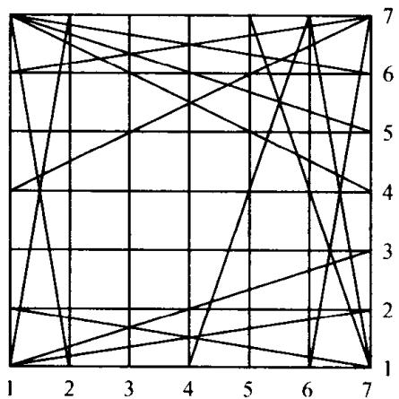

<details>
<summary>wireframe</summary>

| X | Y |
| --- | --- |
| 1 | 0 |
| 1 | 2 |
| 1 | 4 |
| 1 | 6 |
| 1 | 7 |
| 2 | 0 |
| 2 | 2 |
| 2 | 4 |
| 2 | 6 |
| 2 | 7 |
| 3 | 1 |
| 3 | 3 |
| 3 | 5 |
| 3 | 7 |
| 4 | 0 |
| 4 | 2 |
| 4 | 4 |
| 4 | 6 |
| 4 | 7 |
| 5 | 1 |
| 5 | 3 |
| 5 | 5 |
| 5 | 7 |
| 6 | 0 |
| 6 | 2 |
| 6 | 4 |
| 6 | 6 |
| 6 | 7 |
| 7 | 0 |
| 7 | 2 |
| 7 | 4 |
| 7 | 6 |
| 7 | 7 |
</details>

图1

依 $P_{i}Q_{i}$ 和 $R_{i}S_{i}$ 连线 $(i = 1,2\cdots 7)$ 将平板划分为36个方格区域 $A_{mn}(m,n = 1\dots ,6)$ . 为判断各 $A_{mn}$ 区域是否有空洞存在，根据基本假设3，并考虑到前述的结论2，提出如下判断准则：图1中凡有1条以上连线通过的方块区域均无空洞存在.据此可知，仅有8个方格区域可能存在空洞.

下面估算各空洞的大小. 根据弹性波从 $P_{i}$ 到 $Q_{i}$ 的传播速度, 可写出下列计算弹性波传播时间的方程:

$$
\frac {L _ {i , j} - \alpha_ {i , j}}{2 8 8 0} + \frac {\alpha_ {i , j}}{3 2 0} = t _ {i, j} \tag {1}
$$

$$
\frac {L _ {i , j} - \beta_ {i , j}}{2 8 8 0} + \frac {\beta_ {i , j}}{3 2 0} = \tau_ {i, j} \tag {2}
$$

式中 $L_{i,j} = 40\sqrt{(j - i)^2 + 6^2}$ $(i,j = 1,2,3\dots 7)$ (3)

将方程(2)分别应用于直线 $R_{5}S_{6}$ 和 $R_{6}S_{5}$ :

$R_{5}S_{6}$ 直线： $\beta_{5,6} = (\tau_{5,6} - \frac{L_{5,6}}{2880})\times 360$

$$
\begin{array}{l} = (0. 1 8 7 4 - 0. 0 8 4 4) \times 3 6 0 \\ = 3 7. 7 (\text {米}) \\ \end{array}
$$

$R_{6}S_{5}$ 直线： $\beta_{6,5} = (\tau_{6,5} - \frac{L_{6,5}}{2880}) \times 360$

$$
= 4 3. 7 (\text {米})
$$

即直线 $R_{5}S_{6}$ 或 $R_{6}S_{5}$ 通过的区域的空洞总长约为40米左右，由图1及前述判断准则知，除 $A_{25}$ 以外， $A_{15}, A_{35}, A_{45}, A_{55}, A_{65}$ 均有连线通过，可见仅在方格 $A_{25}$ 中存在空洞，洞径 $d_{25}$ 约为40米，同理可推出 $d_{53}$ 约为40米， $d_{44}$ 约为36米.

类似地，设 $P_{i}Q_{j}$ 连线或 $R_{i}S_{j}$ 连线 $(i\neq j)$ 通过区域 $A_{mn}$ ，且测得 $A_{mn}$ 的洞径为 $d_{mn}$ ，则有：

$$
R _ {4} S _ {5} \text {直线与} R _ {5} S _ {4} \text {直线：} d _ {3 4} + d _ {4 4} = \frac {8 7 + 8 7}{2} \tag {4}
$$

$$
P _ {2} Q _ {3} \text {直线与} P _ {3} Q _ {2} \text {直线：} d _ {2 2} + d _ {2 3} + d _ {2 5} = \frac {1 2 8 + 1 1 8}{2} \tag {5}
$$

$$
P _ {3} Q _ {4} \text {直线与} P _ {4} Q _ {3} \text {直线：} d _ {3 2} + d _ {3 3} + d _ {3 4} = \frac {1 1 9 + 1 1 5}{2} \tag {6}
$$

$$
R _ {2} S _ {3} \text {直线与} R _ {3} S _ {2} \text {直线：} d _ {2 2} + d _ {3 2} = \frac {7 2 + 8 5}{2} \tag {7}
$$

$$
P _ {1} Q _ {7} \text {直线与} R _ {1} S _ {7} \text {直线}: d _ {2 2} + d _ {3 3} + d _ {4 4} = \frac {1 6 1 + 1 6 3}{2 \times \sqrt {2}} \tag {8}
$$

方程式(8)右端除以 $\sqrt{2}$ 是考虑到 $P_{1}Q_{7}$ 直线与 $R_{1}S_{7}$ 直线均以对角线方式通过方格区域.

解方程组(4)—(8)可得 $A_{22}, A_{32}, A_{23}, A_{33}$ 和 $A_{34}$ 的洞径均在 40(米)左右. 计算结果中出现 $d_{mn}$ 大于方格线度的情况应归结于测量误差, 据此可认定上述 8 个区域中均存在空洞, 如图 2 中阴影区域所示.

## 方案二：

建立一个6行 $\times 6$ 列的方阵 $A$ ，其元素为 $a_{mn}$ ，为使 $a_{mn}$ 约比例于所在区域中空洞的洞径，定义 $a_{mn}$ 的值为：

$$
a _ {m n} = \left[ \prod_ {\substack {i, j \\ i \neq j}} \frac {1}{z _ {i , j}} \alpha_ {i, j} ^ {(m n)} \cdot \prod_ {\substack {l, k \\ k \neq l}} \frac {1}{z _ {i , j}} \beta_ {k, l} ^ {(m n)} \right] ^ {\frac {l}{h}} \tag{9}
$$

式中 $h$ 为各 $\alpha_{i,j}^{(mn)}$ 和 $\beta_{k,l}^{(mn)}$ 的个数之和， $z_{i,j}$ 为波束线 $i,j$ 上可能具有空洞的区域的个数，按此定义，各 $a_{mn}$ 为0的区域对应于无空洞的区域.

$a_{mn}$ 的数值可依据下述方式分步计算：

1. 首先计算相邻波束线 $P_{i}Q_{j}$ 和 $R_{k}S_{l}(i - j = \pm 1, k - l = \pm 1)$ 上的空洞总长对 $a_{mn}$ 的平均贡献值(几何平均值), 以 $a_{mn}^{(1)}$ 表示, 此时取 $z_{i,j} = 6$ , 得计算通式为:

$$
a _ {m n} ^ {(1)} = \frac {1}{6} (\alpha_ {m, m + 1} \cdot \alpha_ {m + 1, m} \cdot \beta_ {n + 1, n} \cdot \beta_ {n, n + 1}) ^ {\frac {1}{4}} \tag {10}
$$

计算表明,经取整后的矩阵为:

$$
A ^ {(1)} = \left[ \begin{array}{c c c c c c} 0 & 0 & 0 & 0 & 0 & 0 \\ 0 & 9 & 1 2 & 1 0 & 7 & 0 \\ 0 & 9 & 1 1 & 9 & 6 & 0 \\ 0 & 1 6 & 2 0 & 1 7 & 1 1 & 0 \\ 0 & 1 6 & 2 0 & 1 7 & 1 2 & 0 \\ 0 & 0 & 0 & 0 & 0 & 0 \end{array} \right]
$$

可见周边的小方格内无空洞, 空洞仅可能分布于中间的 16 个小方格中.

2. 计算次相邻波束线 $P_{i}Q_{j}$ 和 $R_{k}S_{l}(i-j=\pm2,k-l)$

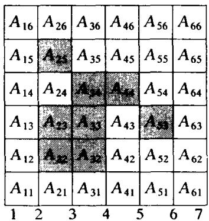

<details>
<summary>heatmap</summary>

| Row | Column 1 | Column 2 | Column 3 | Column 4 | Column 5 | Column 6 | Column 7 |
| --- | --- | --- | --- | --- | --- | --- | --- |
| 1 | A16 | A26 | A36 | A46 | A56 | A66 | — |
| 2 | A15 | A24 | A35 | A45 | A55 | A65 | — |
| 3 | A14 | A24 | A34 | A44 | A54 | A64 | — |
| 4 | A13 | A22 | A33 | A43 | A53 | A63 | — |
| 5 | A12 | A22 | A32 | A42 | A52 | A62 | — |
| 6 | A11 | A21 | A31 | A41 | A51 | A61 | — |
| 7 | — | — | — | — | — | — | — |
</details>

图 2

$= \pm 2)$ 上的空洞总长对 $a_{mn}$ 的平均贡献值，以 $a_{mn}^{(2)}$ 表示.考虑到1中的结论及方程(9)，实际只须计算对应于中间的16个方格的 $a_{mn}^{(2)}$ ，故取 $z_{i,j} = 4$ ，得计算通式为：

$$
a _ {m n} ^ {(2)} = \frac {1}{4} (\alpha_ {m, m + 2} \cdot \alpha_ {m + 1, m - 1} \cdot \beta_ {n, n + 2} \cdot \beta_ {n + 1, n - 1}) ^ {\frac {1}{4}} \quad (m = 2, 3, n = 2, 3)
$$

$$
a _ {m n} ^ {(2)} = \frac {1}{4} (\alpha_ {m, m + 2} \cdot \alpha_ {m + 1, m - 1} \cdot \beta_ {n - 1, n + 1} \cdot \beta_ {n + 2, n}) ^ {\frac {1}{4}} \quad (m = 4, 5, n = 2, 3)
$$

余者类推．计算可得：

$$
A ^ {(2)} = \left[ \begin{array}{c c c c c c} 0 & 0 & 0 & 0 & 0 & 0 \\ 0 & 1 6 & 1 7 & 0 & 0 & 0 \\ 0 & 1 7 & 1 7 & 2 4 & 0 & 0 \\ 0 & 2 5 & 2 8 & 0 & 1 8 & 0 \\ 0 & 2 6 & 2 8 & 0 & 0 & 0 \\ 0 & 0 & 0 & 0 & 0 & 0 \end{array} \right]
$$

3. 依同法可计算出波束线 $P_{i}Q_{j}$ 和 $R_{k}S_{l}(i - j = \pm 3, k - l = \pm 3)$ 上的空洞总长对 $a_{mn}$ 的平均贡献值 $a_{mn}^{(3)}$ , 得到矩阵:

$$
A ^ {(3)} = \left[ \begin{array}{c c c c c c} 0 & 0 & 0 & 0 & 0 & 0 \\ 0 & 2 5 & 0 & 0 & 1 8 & 0 \\ 0 & 0 & 2 4 & 1 7 & 9 & 0 \\ 0 & 1 3 & 1 6 & 1 2 & 1 2 & 0 \\ 0 & 1 9 & 1 5 & 1 4 & 9 & 0 \\ 0 & 0 & 0 & 0 & 0 & 0 \end{array} \right]
$$

对 $A^{(4)}, A^{(5)}, A^{(6)}$ 的计算可依法施行, 此处从略.

4. 矩阵 $A$ 各元素的值可依下式确定：

$$
a _ {m n} = \Big (\prod_ {i = 1} ^ {6} a _ {m n} ^ {(i)} \Big) ^ {\frac {1}{6}}
$$

由此得矩阵 $A$ 为：

$$
A = \left[ \begin{array}{c c c c c c} 0 & 0 & 0 & 0 & 0 & 0 \\ 0 & 2 1 & 0 & 0 & 0 & 0 \\ 0 & 0 & 2 1 & 2 3 & 0 & 0 \\ 0 & 2 2 & 2 5 & 0 & 2 0 & 0 \\ 0 & 1 8 & 2 2 & 0 & 0 & 0 \\ 0 & 0 & 0 & 0 & 0 & 0 \end{array} \right]
$$

上述矩阵中仅有8个元素不为零,表明这些区域中有空洞存在,各非零元素对应的空洞位置与图2中的阴影区域一一对应.

## 6 对减少波源和接受器问题的讨论

有两点理由,说明只根据由 $P_{i}$ 发出的弹性波到达 $Q_{j}$ 的时间 $t_{i,j}(i,j=1,\cdots7)$ 是不能确定空洞的位置的:

理由1:如果存在平行于AB连线方向的若干个空洞,其总长接近240米,且空洞的洞径在沿垂直于 $AB$ 的方向上接近相等, 则因这些洞引起的、由各 $P_{i}$ 发出的弹性波到达所对应接受器的时间延迟都近似相同, 此时便不能确定空洞存在的上下位置.

理由 2: 过 $P_{2}, P_{3}, P_{4}$ 分别作 $P_{1}Q_{7}, P_{2}Q_{7}, P_{3}Q_{7}$ 连线的垂线, 高分别为 $h_{1}, h_{2}, h_{3}$ , 如图 3.

$$
h _ {1} = 4 0 \times \sin (\pi / 4) = 2 8. 3 (\text {米})
$$

$$
h _ {2} = 4 0 \times \sin \angle Q _ {7} P _ {2} P _ {3}
$$

$$
h _ {3} = 4 0 \times \sin \angle Q _ {7} P _ {3} P _ {4}
$$

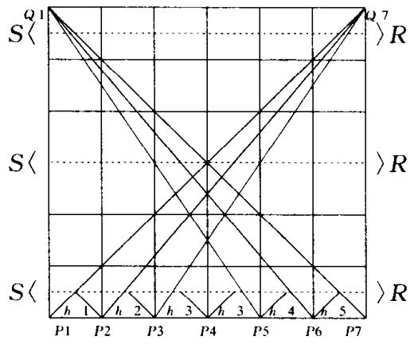

<details>
<summary>text_image</summary>

S^Q1
S^R
S^R
S^R
P1 P2 P3 P4 P5 P6 P7
h 1 h 2 h 3 h 3 h 4 h 5
Q7 R
</details>

图3

因 $\angle Q_{7}P_{3}P_{4} > \angle Q_{7}P_{2}P_{3} > \frac{\pi}{4}$ , 所以 $h_{3} > h_{2} > h_{1} > 28$ (米). 同理有 $h_{3} > h_{4} > h_{5} > 28$ (米), 即在波源附近存在直径大于 28 米的空间区域, 这些空间区域是仪器的精度可以探测到但却因减少波源和接受器的个数而使波束线无法达到的死区, 如在这些区域中有空洞存在, 则将被漏测.

由对称性分析,在接受器附近也存在类似的情况.

在 $P_{l}Q_{l}$ 直线和 $P_{7}Q_{7}$ 直线中点附近 20 米的地方,也是仪器测量的死区,如果存在空洞,也无法探测到,所以仅靠纵向探测装置是不行的.

要想保证确定空洞的位置, 可分别在 $R_{1}R_{2}$ 的中点, $R_{4}$ 点和 $R_{6}R_{7}$ 的中点各设置 1 个波源, CD 边对等地安放了 3 个接受器, 由作图法可知, 如此既可解决理由 1 中提出的困难,又能消除 AB 边和 CD 边附近的死区, 按此设置使波源和接受器减少 4 对:

## 7 对模型的评价和改进

本文的方案 1 采用连线方法, 将空洞可能存在的区域用图标示出来, 然后通过简单计算确定空洞的位置及近似的洞径, 模型直观, 计算简单.

方案 2 先将任一波束线上测得的空洞总长平均分配给所经过的各方格区域,而后对每一方格区域所分配的诸平均洞长再求几何平均值,作为空洞存在与否的判据,所依赖的假设少,结果合理可信.

但两方案均依赖于平板的分区,若空洞的分布跨越多个方格区域,则应寻求更为普遍的模型与算法.

# 空洞探测的最优解法

练祥华 杨胜铭 秦焜

(南京师范大学，南京 210097)

指导老师 数模教研组

编者按 本文是 $D$ 题中的优秀论文之一. 论文的假设合理, 使空洞探测问题简化; 建立的线性方程组模型正确, 有一定的创意; 计算结论正确. 论文的文风朴实, 简洁.

摘 要 本文论述在探测过程中,对山体、坝体、隧洞等某些内部空洞定位问题. 问题简化后,通过对平面进行区域(我们把它叫做像元)划分,对波宽带化后,波经过某空洞像元,此像元必对波在时间上有贡献,因而在每个空气洞像元必减慢一个时间单位数(波通过单位空洞所需时间),进而建立线性方程组模型. 从而解决空洞定位问题.

## 1 问题的提出(略)

## 2 基本假设

(1) 所有探测均在同一平面上进行,所谓空洞即平面上一个区域(即像元).  
(2) 如果存在一条狭长的空洞, 只对一条宽带有贡献, 这种情况, 我们不予考虑. 因为这样的空洞在误差范围内.  
(3) 如果存在某些(个)数据太小(即比弹性波在最短介质线内传播时间还小), 无法用数学解释, 我们认为是由误差引起的, 满足这样的带宽即为介质线.  
(4) 用 $a_{ijl}$ 表示 $(i, j)$ 像元第 $L$ 条宽带通过 $(i, j)$ 的关系，并满足 $a_{ijl} = S_x / S$ （宽带在像元 $(i, j)$ 中的面积 $S_x$ 与像元面积 $S$ 之比）.

## 3 名词解释与符号

像元:所探测平面划分成 $(M=N*N)$ 个边长为矩形区域.

带宽:假设弹性波以一定的宽度(其值为 $\tau$ ) 向对应的接收器传播,称为波的带宽.

介质线:宽带所经过的路线没有任何空洞像元,这样的宽带称为介质线.

空洞线:宽带所经过的路线至少有一个空洞像元,这样的宽带称为空洞线.

空洞强度 $X_{ij}$ : 像元在时间上对宽带的贡献量. $X_{ij} = 0$ , 表示没有空洞; $X_{ij} = 1$ , 表示有一个空洞.

时间单位数: 弹性波通过一个像元所需的时间.

## 4 模型的建立、分析

将待测的区域划分为 $N*N$ 个像元, 用 $(i,j)$ 表示像元 $(i,j=1,2,\cdots,N)$ , 每个像元单位长为 $\tau$ , 设测量线穿过一个小空洞像元, 延长一个时间单位数. $X_{ij}$ 表示 $(i,j)$ 空洞像元变量.

设测量线为 $B_{1}, B_{2}, B_{3}, \cdots, B_{L}$ ，由于测量线通过像元的角度不同，长度不一样，即

$$
a _ {i j l} = \left\{ \begin{array}{l l} S _ {x} / S, \text {第} l \text {条线通过} (i, j) \text {像元}; \\ 0, \text {第} l \text {条线不通过} (i, j) \text {像元}. \end{array} \right.
$$

设 $b_{l}$ 为第 $L$ 条线的测量时间换算后的时间单位数，则应有如下关系式：

$$
\sum_ {i, j} a _ {i j l} \cdot X _ {i j} = b _ {l} (l = 1, 2, \dots , L).
$$

## 5 模型求解

## (1) 求解问题

我们采用最小二乘法求解该问题：

$$
\min \sum_ {l} \left(\sum a _ {i j l} X _ {i j} - b _ {l}\right) ^ {2} (l = 1, 2, \dots , L)
$$

如果空洞强度 $X_{ij}$ 接近于零, 则表示没有空洞; 反之, 如果 $X_{ij}$ 接近于 1 , 则表示有空洞. 采用 SAS 编程, 得到如下结果:

<table><tr><td>0</td><td>0</td><td>0</td><td>0</td><td>0.01410</td><td>0</td></tr><tr><td>0</td><td>0.8789</td><td>0</td><td>0</td><td>0</td><td>0</td></tr><tr><td>0.06944</td><td>0.0012</td><td>0.8950</td><td>0.861745</td><td>0</td><td>0</td></tr><tr><td>0.04675</td><td>0.8447</td><td>0.8391</td><td>0.048862</td><td>0.822708</td><td>0.03541</td></tr><tr><td>0</td><td>0.8895</td><td>0.9139</td><td>0</td><td>0.011109</td><td>0</td></tr><tr><td>0</td><td>0</td><td>0</td><td>0</td><td>0</td><td>0</td></tr></table>

从以上数据看出， $X_{ij}$ 比较大，表示空洞像元； $X_{ij}$ 接近于0的，表示非空洞像元.

如果以 $A$ 点所在像元为(1,1), 则 $B$ 点(6,1), $C$ 点(6,6), $D$ 点为(1,6), 则以下的坐标点均为空洞像元(2,2), (2,3), (2,5), (3,2), (3,3), (3,4), (4,4), (5,3). 通过对数据的验证, 在一定的误差内, 这些空洞像元符合要求.

## (2) 求解问题 2.

## (a) 对只设置一边波源后定位判断

通过对空洞像元位置的分析, 只通过一侧的波源, 不可能得出所要结果.

## (b) 减少波探测器的方法

对某一具体平面内的空洞像元定位判断,我们可以减少波源和接收器.因为 $M=N*N$ 是可变的,假设在某一定边长的矩形平面上放置 $(2N-1)$ 个波源和 $(2N-1)$ 个接收器,若减少一对探测器,再进行等距放置,不影响空洞的定位,但精度降低.我们若进行不等距设置,将所建模型稍加修改,同样能确定空洞像元的位置.

例如, 减少 P3, P6, Q2, Q4, R3, R5, S2, S4 后, 用 SAS 编程求解, 得

<table><tr><td>0</td><td>0</td><td>0</td><td>0</td><td>0</td><td>0</td></tr><tr><td>0</td><td>0.9056</td><td>0.0125</td><td>0</td><td>0</td><td>0</td></tr><tr><td>0.0504</td><td>0</td><td>0.8767</td><td>0.9314</td><td>0.0125</td><td>0.0269</td></tr><tr><td>0.0821</td><td>0.8969</td><td>0.8182</td><td>0.0396</td><td>0.7845</td><td>0.0352</td></tr><tr><td>0</td><td>0.8539</td><td>0.8534</td><td>0</td><td>0</td><td>0</td></tr><tr><td>0</td><td>0.0367</td><td>0</td><td>0</td><td>0</td><td>0</td></tr></table>

经比较,两组结果相近,说明能够减少波源和接收器.

## 6 对模型的评价

本文所阐述的模型是以探测山体空洞为目标,广泛地应用于对山体、坝体、隧洞等某些内部空洞定位.问题2的解答,拓宽了本模型的应用范围.对于特殊的坝体、山体等,利用本模型的不等距设置波源和接收器,同样能测出空洞的位置,因而具有很强的实用性.

## 参考文献

[1] 南京地区工科院校数学协会建模工业数学讨论班. 数学建模与实验. 河海大学出版社, 1996.  
[2] 朱道元. 数学建模精品案例. 东南大学出版社, 1999.  
[3] 中国数学协会. 数学的实践与认识. 1998.  
[4] 庄天戈. CT 原理与算法. 上海交通大学出版社, 1992.

(上接第 594 页)

## 第五条 评奖办法

1. 各赛区组委会聘请专家组成评阅委员会，评选本赛区的一等、二等奖（也可增设三等奖），获奖比例一般不超过三分之一，其余凡完成合格答卷者获得成功参赛奖。  
2. 各赛区组委会按规定的比例将本赛区的优秀答卷送全国竞赛组委会。全国竞赛组委会聘请专家组成全国评委会，按统一标准从各赛区送交的优秀答卷中评选出全国一等、二等奖，获奖比例为全国参赛队数的百分之十左右。  
3. 全国与各赛区的一、二等奖均颁发获奖证书。竞赛成绩记入学生档案，对成绩优秀的参赛学生，各院校在评优秀生、奖学金及报考(或免试直升)研究生时应予以适当考虑。对指导教师的辛勤努力应予以表彰。  
4. 参赛队的指导教师一律不得参加本赛区及全国的评阅和决定获奖名次的工作。  
5. 对违反竞赛规则的参赛队，一经发现，取消参赛资格，成绩无效。对所在院校要予以警告、通报，直至取消该校下一年度参赛资格。对违反评阅答卷和评奖工作规定的赛区，全国竞赛组委会不承认其评奖结果。  
6. 设立异议期制度,具体内容见《全国大学生数学建模竞赛异议期制度的若干规定》。

## 第六条 经费

1. 参赛队向各赛区组委会交纳报名费。  
2. 赛区组委会向全国组委会交纳一定数额的经费。  
3. 各级教育管理部门的资助。  
4. 社会各界的资助。

# 空洞探测问题及有关情况

东北电力学院

关信 韩洁平

## 1 问题产生的背景

本题目来源于吉林丰满水电站水库大坝的检测与维修.

这种类型的大坝每隔一定时间就需进行较全面的维修。为此，首先就要对坝的内部结构有清楚的了解，以便进行有效的维修。

丰满大坝前些年进行一次较全面的维修。维修前的基础工作是对大坝进行检测，通过检测了解大坝内部可能的缺陷情况。丰满大坝的检测应用的就是弹性波断层技术。通过检测，获得了大量的数据；对数据进行处理，才能得到大坝的有关情况；由于数据量大，要由计算机完成处理。这样就必须要有符合实际的模型和有效的算法。

基于上述背景,简化后给出了一个二维空间探测问题.为了不造成计算上的困难,给定的数据量很少.

## 2 模型与算法

## 2.1 网格化

连结波源与其相对应的接收器,用这样形成的两组与边平行的平行线将给定区域划分成网格.每个小矩形(此题是小正方形)称为一个单元.使每个单元与一个变量相对应,若单元位于空洞部分,其取值为1,否则取值为0.

设一边上的波源为 m 个, 另一边上的波源为 n 个, 于是得到单元为 $(m-1)(n-1)$ 个, 所对应的变量也是 $(m-1)(n-1)$ 个, 记为 $x_{1}, x_{2}, \cdots, x_{(m-1)(n-1)}$ .

计算精度由网络所决定,即由波源与接收器的数量与分布所决定.

2.2 将给定数据转化为相应的通过空洞部分的总长度

2.3 计算有关系数和常数项

令 $A = (a_{ij})_{m_1 \times n_1}, m_1 = m(m - 1) + n(n - 1), n_1 = (m - 1)(n - 1)$ .

$a_{ij}$ 的值为联结波源与接收器的直线被相应单元截得的线段长.

令 $b = (b_{1}, b_{2}, \dots, b_{m_{1}})^{T}, m_{1} = m(m - 1) + n(n - 1),$

令 $x = (x_{1}, x_{2}, \dots, x_{n_{1}})^{T}, n_{1} = (m - 1)(n - 1),$

于是得

$$
\mathbf {A} x = b. \tag {1}
$$

通常(1)式为超定方程组,应用最小二乘法,得

$$
\min J (x) = (\mathbf {A} x - b) ^ {\mathrm{T}} (\mathbf {A} x - b), \tag {2}
$$

(2)式即为“0-1”规划问题.

问题(2)可通过法方程求解.

## 3 答卷与评阅情况

有少数答卷将所给问题归结为“0-1”规划.

有相当数量的答卷是用排除法(或称剔除法)求解的. 针对此问题的特殊情况, 此方法是有效的, 也是较简单的. 但有一定的局限性, 而不具备较普遍的适用性.

答卷能将问题用数学语言表述清楚,符合题目要求,结果正确,即认定基本合格.

评阅时,特别注意创造性. 答卷若有一定的创造性,对一些枝节性的毛病与不足就适当地放宽,以鼓励创造性.

全国大学生数学建模竞赛组委会办公室通讯地址：

100084 北京清华大学数学科学系郝秀荣

电话及传真:(010)62781785

电子邮件: jxie@math.tsinghua.edu.cn qjiang@math.tsinghua.edu.cn

全国大学生数学建模竞赛组委会网址：

http://csiam.edu.cn/mcm/

Document generated by Anna's Archive around 2023-2024 as part of the DuXiu collection (https://annas-blog.org/duxiu-exclusive.html).

Images have been losslessly embedded. Information about the original file can be found in PDF attachments. Some stats (more in the PDF attachments):

```json
{
"filename": "XzExMTEwOTU4LnppcA==",
"filename_decoded": "_11110958.zip",
"filesize": 47393282,
"md5": "46ab561765f26e61d86298fba6c1945e",
"header_md5": "79a09b0bb42a586b799982b7655585a4",
"sha1": "7758b841fe6226cf70ff2ac5870bc967a3affb65",
"sha256": "e08c22838e17be34da2eaea93ac72e331021873f634048f7c1f2603954da1145",
"crc32": 1186679698,
"zip_password": "wcpfxk&^TDwcpfxk",
"uncompressed_size": 49752202,
"pdg_dir_name": "",
"pdg_main_pages_found": 605,
"pdg_main_pages_max": 605,
"total_pages": 612,
"total_pixels": 3966943152,
"pdf_generation_missing_pages": false
}
```
