# 储油罐的变位识别与罐容表标定

## 摘要：

储存燃油的地下储油罐是加油站的主要计量储存器具，属强制检定计量设备，研究其精密计量方法具有重要的现实意义。本文首先根据平行截面面积求体积的方法，建立了无变位圆柱体油罐罐容量计量模型，其次在无变位模型的基础上建立了纵向变位角度为 $\alpha$ 的油罐罐容量计量模型，该模型根据油位高度的不同，分三种情况进行探讨，得到相应的油位高度与储油量关系的数学模型。并通过MATLAB仿真了两种模型的油位高度与罐内储油量的对应关系，且与实际数据进行了对比，验证了两种模型具有较高的精度，误差范围在[0,5.5%]之间。

在后面的分析中, 两端为球冠体的圆柱体储油罐在纵向变位 $\alpha$ 和横向变位 $\beta$ 后, 首先将油罐体分成三部分, 并针对三部分建立不同的坐标系, 然后用平行截面面积求体积的方法, 并在问题 1 中已证明的数学模型基础上, 建立油位高度和储油量关系的数学模型, 根据附件 2 给出的进油前的数据, 用 Matlab 拟合仿真,得到变位角 $\alpha 、 \beta$ 的近似值, 再进一步利用一次性补充进油后的数据, 通过 MATLAB 仿真数据, 与实际数据作对比, 验证结果表明误差较小, 从而证明了模型的合理性。

关键字：卧式储油罐；变位识别；罐容表标定

## 一 问题的提出

通常加油站都有若干个储存燃油的地下储油罐，并且一般都有与之配套的“油位计量管理系统”，采用流量计和油位计来测量进/出油量与罐内油位高度等数据，通过预先标定的罐容表（即罐内油位高度与储油量的对应关系）进行实时计算，以得到罐内油位高度和储油量的变化情况。

许多储油罐在使用一段时间后，由于地基变形等原因，使罐体的位置会发生纵向倾斜和横向偏转等变化（以下称为变位），从而导致罐容表发生改变。按照有关规定，需要定期对罐容表进行重新标定。如下所示，图1-1是一种典型的储油罐尺寸及形状示意图，其主体为圆柱体，两端为球冠体。图1-2是其罐体纵向倾斜变位的示意图，图1-3是罐体横向偏转变位的截面示意图。

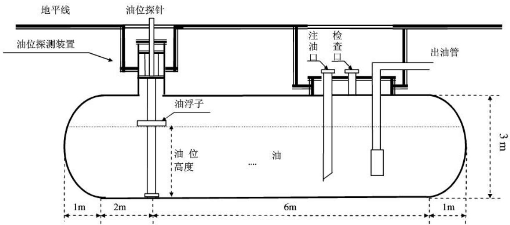

<details>
<summary>text_image</summary>

地平线
油位探针
注油口
检查口
出油管
油浮子
油位高度
油
1m 2m 6m 1m
3m
</details>

图 1-1 储油罐正面示意图

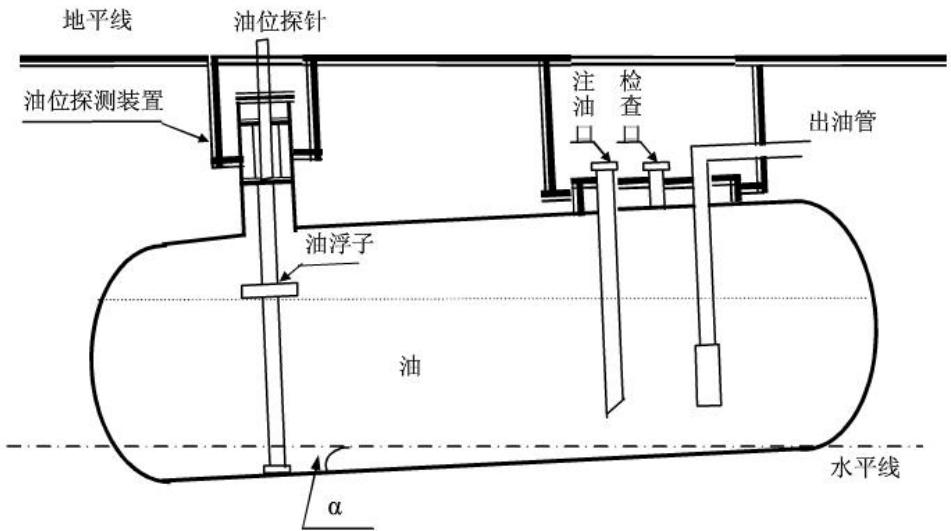

<details>
<summary>text_image</summary>

地平线
油位探针
油位探测装置
注油
检查
出油管
油浮子
油
水平线
α
</details>

图 1-2 储油罐纵向倾斜变位后示意图

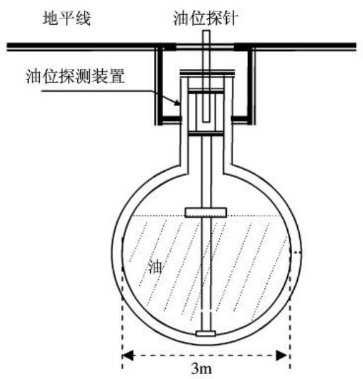

<details>
<summary>text_image</summary>

地平线
油位探针
油位探测装置
油
3m
</details>

(a) 无偏转倾斜的正截面图

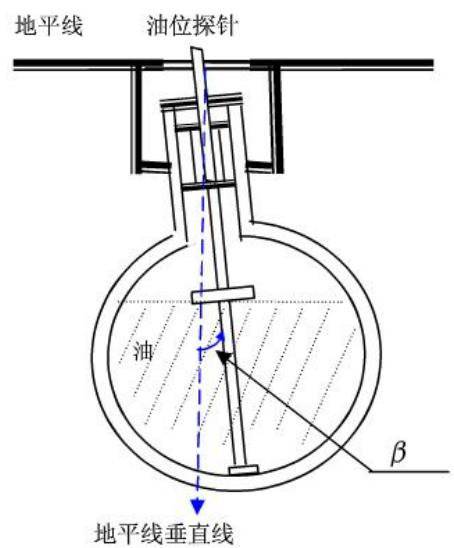

<details>
<summary>text_image</summary>

地平线
油位探针
油
β
地平线垂直线
</details>

(b) 横向偏转倾斜后正截面图

图 1-3 储油罐截面示意图  
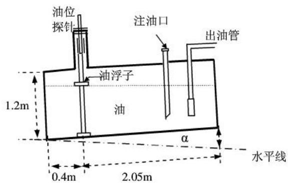

<details>
<summary>text_image</summary>

油位
探针
注油口
出油管
1.2m
油浮子
油
α
水平线
0.4m
2.05m
</details>

(a) 小椭圆油罐正面示意图

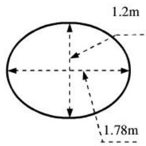

<details>
<summary>text_image</summary>

1.2m
1.78m
</details>

(b) 小椭圆油罐截面示意图  
图 1-4 小椭圆型油罐形状及尺寸示意图

本文的问题是:

（1）为了掌握罐体变位后对罐容表的影响，利用如图1-4的小椭圆型储油罐（两端平头的椭圆柱体），分别对罐体无变位和倾斜角为 $\alpha=4.1^{0}$ 的纵向变位两种情况做了实验，实验数据如附件1所示。建立数学模型研究罐体变位后对罐容表的影响，并给出罐体变位后油位高度间隔为1cm的罐容表标定值。  
(2) 对于图1-1所示的实际储油罐, 建立罐体变位后标定罐容表的数学模型, 即罐内储油量与油位高度及变位参数 (纵向倾斜角度 $\alpha$ 和横向偏转角度 $\beta$ ) 之间的一般关系。利用附件中实际检测数据, 根据所建立的数学模型确定变位参数, 并绘出罐体变位后油位高度间隔为 $10 \mathrm{~cm}$ 的罐容表标定值。进一步利用实际检测数据来分析检验模型的正确性与方法的可靠性。

## 二 模型的假设

基于上面的问题，本文提出如下几点假设：

1. 油罐变位角度 $\alpha$ 在 $[0, \frac{\pi}{2})$ 范围内；

2. 油罐是规则的几何体;

3. 假设油罐始终没有挂壁现象，忽略油罐壁的厚度；忽略外界温度等环境因素对油容积的影响；

## 三 符号说明

## 3.1 问题一符号说明

(1) a 表示圆柱体椭圆截面中长轴

(2) b 表示圆柱体椭圆截面短轴

(3) L 表示储油罐长度

(4) h 表示储油罐内液体高度

(5) S 表示椭圆截面的面积

(6) V 表示储油罐内储油量

(7) $\alpha$ 表示油罐的纵向变位

(8) $h_{1}$ 表示探针到油罐左侧的距离；

(9) $h_{2}$ 表示探针到油罐右侧的距离；

## 3.2 问题二符号说明

(1) R 表示圆柱体截面圆的半径

(2) ${\mathrm{H}}_{1}$ 表示左侧球冠体与圆柱体连接面到探针的距离

(3) ${\mathrm{H}}_{2}$ 表示右侧球冠体与圆柱体连接面到探针的距离

(4) a 表示球冠体的高度

(5) $\alpha$ 表示油罐的纵向变位

(6) β 表示油罐的横向变位

## 四 模型分析

## 4.1 问题一的分析

## 4.1.1 无变位模型分析

通过对储油罐在无变位情况下的分析，利用平行截面面积求积分的方法，建立计算容积的数学模型，并通过计算机仿真求出罐内储油的容积，从而得出罐内油位高度与储油量的对应关系。另外，利用matlab仿真技术进一步对实际检测数据来分析，检验模型的正确性与方法的可靠性。

## 4.1.2 纵向变位 $\alpha$ 度模型分析

通过对储油罐在纵向变位角为 $\alpha$ 情况下的分析，将储油罐油容积的求解分成三种情况讨论。一是在油位高度小于 $2.05\tan \alpha$ 条件下建立数学模型；二是油位高度大于 $2.05\tan \alpha$ 且小于 $1.2 - 0.4\tan \alpha$ 条件下建立模型；三是油位高度大于 $1.2 - 0.4\tan \alpha$ 且小于1.2条件下建立模型。根据平行截面面积求积分的方法，建立罐内油位高度与储油量的对应关系，并计算出罐容表标定值。另外利用Matlab对该模型进行仿真，并与附录表中的实测数据进行比较，参照比较的结果实现对模型的优劣判断，并计算出罐体变位后油位高度间隔为 $1\mathrm{cm}$ 的罐容表标定值。

## 4.2 问题二的分析

首先分析罐内储油量和油位高度与变位参数纵向倾斜角度 $\alpha$ 关系，通过积分求得体积，为简化积分，将图形分段积分，最后得到体积关于油位高度的函数表达，再分析油罐横向偏转倾斜 $\beta$ 后，罐内储油量与油位高度的关系，由于横向倾斜对液面的垂直距离影响很小，可近似忽略，最终可得到体积关于油位高度的数学模型。再通过最小二乘拟合，根据附表二中的数据，得到最接近实际的偏转角 $\alpha$ 、 $\beta$ ，将 $\alpha$ 和 $\beta$ 的近似值代入上述数学模型，并用Matlab仿真出函数曲线，与真实曲线进行误差分析，验证模型的真实性和合理性。

## 五 问题的求解

## 5.1 问题一求解

## 5.1.1 无变位模型求解

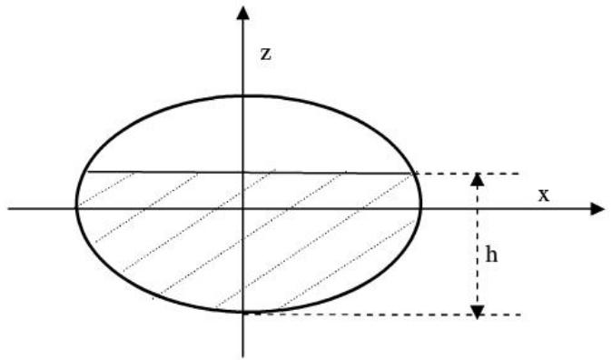

<details>
<summary>text_image</summary>

z
x
h
</details>

图 5-1

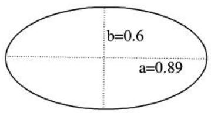

<details>
<summary>text_image</summary>

b=0.6
a=0.89
</details>

图5-2

$$
\begin{array}{l} S = \int_ {- b} ^ {h - b} d z \int_ {- a \sqrt {1 - \frac {z ^ {2}}{b ^ {2}}}} ^ {a \sqrt {1 - \frac {z ^ {2}}{b ^ {2}}}} d x \\ = \int_ {- b} ^ {h - b} 2 a \sqrt {1 - \frac {z ^ {2}}{b ^ {2}}} d z \\ = \frac {2 a}{b} \int_ {- b} ^ {h - b} \sqrt {b ^ {2} - z ^ {2}} d z \\ = \frac {a}{b} \left[ (h - b) \sqrt {2 h b - h ^ {2}} + b ^ {2} \arcsin \frac {h - b}{b} + \frac {\pi}{2} b ^ {2} \right] \\ V = S L \\ = \frac {a L}{b} \left[ (h - b) \sqrt {2 h b - h ^ {2}} + b ^ {2} \arcsin \frac {h - b}{b} + \frac {\pi}{2} b ^ {2} \right] \\ \end{array}
$$

通过计算机仿真实验得出在无变位情况下拟合的曲线图如下所示，深蓝色曲线为模型计算绘制的曲线，浅蓝色为实际测验得出的曲线，通过观察比较可知，在拟合效果上满足要求。

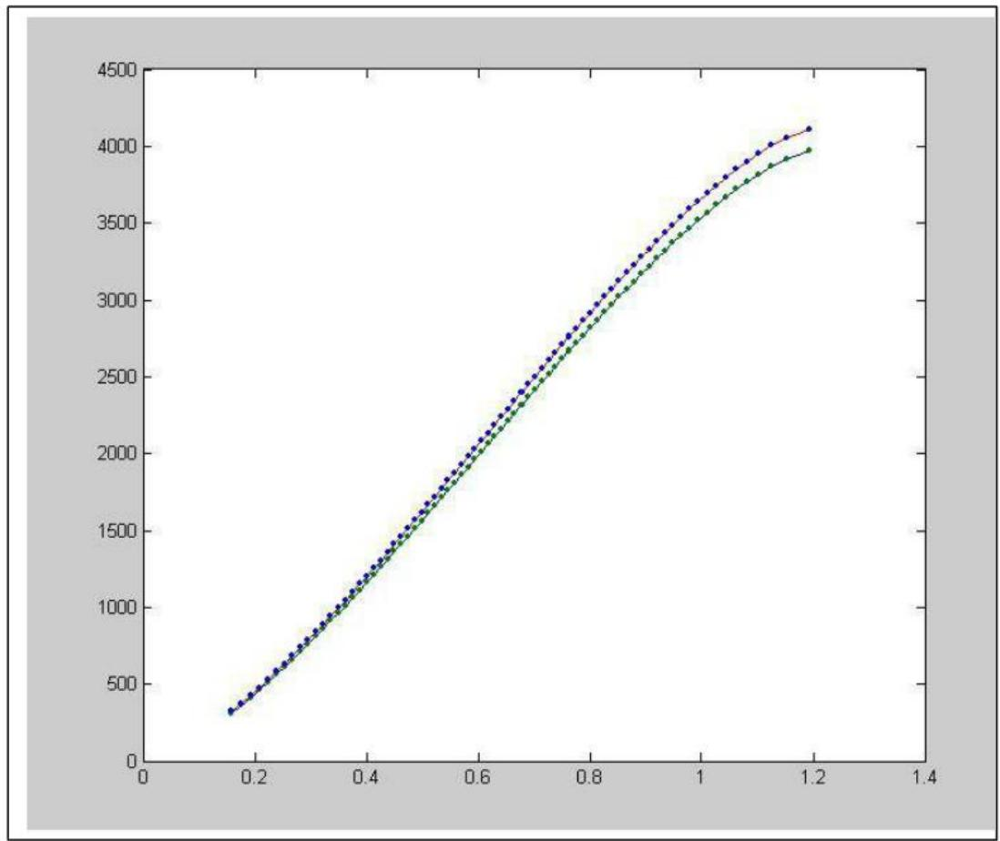

<details>
<summary>line</summary>

| X | Blue (dotted) | Green (solid) |
| --- | --- | --- |
| 0.15 | ~320 | ~320 |
| 0.2 | ~450 | ~450 |
| 0.3 | ~800 | ~780 |
| 0.4 | ~1200 | ~1150 |
| 0.5 | ~1650 | ~1600 |
| 0.6 | ~2100 | ~2050 |
| 0.7 | ~2550 | ~2500 |
| 0.8 | ~2950 | ~2900 |
| 0.9 | ~3350 | ~3300 |
| 1.0 | ~3700 | ~3650 |
| 1.1 | ~4000 | ~3900 |
| 1.2 | ~4120 | ~3980 |
</details>

图5-3

## 5.1.2 纵向变位 $\alpha$ 度模型求解

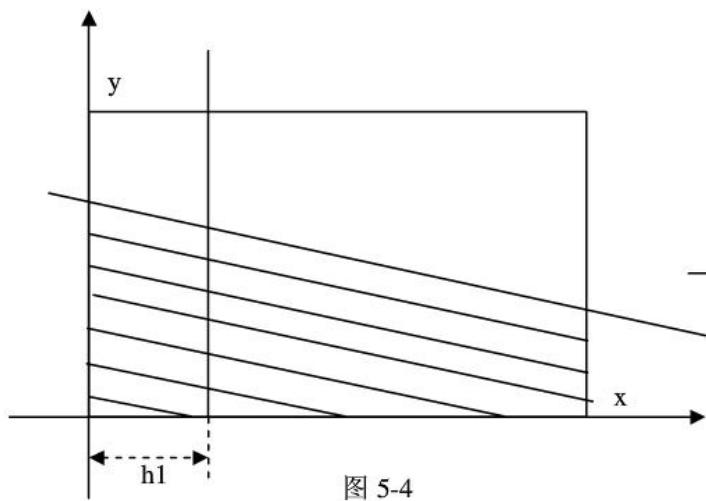

<details>
<summary>text_image</summary>

y
h1
图 5-4
x
</details>

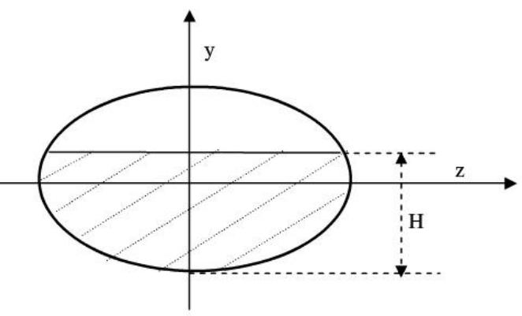

<details>
<summary>text_image</summary>

y
z
H
</details>

图5-5

1 当 $0 \leq h \leq h_{2} \tan (\alpha)$ 时

先令 $H = h - (x - h_1)\tan \alpha$

$$
\begin{array}{l} V = \int_ {0} ^ {h \cot \alpha + h _ {1}} d x \int_ {0} ^ {H} d y \int_ {- a \sqrt {1 - (\frac {y - b}{b}) ^ {2}}} ^ {a \sqrt {1 - (\frac {y - b}{b}) ^ {2}}} d z \\ = \int_ {0} ^ {h \cot \alpha + h _ {1}} d x \int_ {0} ^ {H} 2 a \sqrt {1 - (\frac {y - b}{b}) ^ {2}} d y \\ = \frac {a}{b} \int_ {0} ^ {h \cot \alpha + h _ {1}} [ (H - b) \sqrt {b ^ {2} - (H - b) ^ {2}} + b ^ {2} \arcsin \frac {H - b}{b} - b ^ {2} \arcsin (- 1) ] d x \\ = \frac {a}{b} \int_ {0} ^ {h \cot \alpha + h _ {1}} [ (H - b) \sqrt {2 H b - H ^ {2}} + b ^ {2} \arcsin \frac {H - b}{b} + b ^ {2} * \frac {\pi}{2} ] d x \\ = - \frac {a}{b} \cot \alpha \int_ {h + h _ {1} \tan \alpha} ^ {0} [ (H - b) \sqrt {b ^ {2} - (H - b) ^ {2}} + b ^ {2} \arcsin \frac {H - b}{b} + \frac {\pi}{2} b ^ {2} ] d H \\ \end{array}
$$

令

$$
\begin{array}{l} F (H) = - \frac {a}{b} \cot \alpha \left(b ^ {3} (\frac {H - b}{b} \arcsin \frac {H - b}{b} + \sqrt {1 - (\frac {H - b}{b}) ^ {2}}) - \frac {1}{3} [ b ^ {2} - (H - b) ^ {3 / 2} ] + \frac {\pi}{2} b ^ {2} H\right) \\ = F (0) - F (h + h _ {1} \tan \alpha) \\ \end{array}
$$

2 当 $h_2 * \tan (\alpha) \leq h \leq 2b - h_1 \tan (\alpha)$ 时

先令 $H = h - (x - h_1)\tan \alpha$

$$
\begin{array}{l} \mathrm{V} = \int_ {0} ^ {h _ {1} + h _ {2}} d x \int_ {0} ^ {H} d y \int_ {- a} ^ {a} \sqrt {1 - (\frac {y - b}{b}) ^ {2}} d z \\ = \int_ {0} ^ {h _ {1} + h _ {2}} d x \int_ {0} ^ {H} 2 a \sqrt {1 - (\frac {y - b}{b}) ^ {2}} d y \\ = \frac {a}{b} \int_ {0} ^ {h _ {1} + h _ {2}} [ (H - b) \sqrt {b ^ {2} - (H - b) ^ {2}} + b ^ {2} \arcsin \frac {H - b}{b} - b ^ {2} \arcsin (- 1) ] d x \\ = \frac {a}{b} \int_ {0} ^ {h _ {1} + h _ {2}} \left[ (H - b) \sqrt {2 H b - H ^ {2}} + b ^ {2} \arcsin \frac {H - b}{b} + b ^ {2} * \frac {\pi}{2} \right] d x \\ = - \frac {a}{b} \cot \alpha \int_ {h + h _ {1} \tan \alpha} ^ {h - h _ {2} \tan \alpha} [ (H - b) \sqrt {b ^ {2} - (H - b) ^ {2}} + b ^ {2} \arcsin \frac {H - b}{b} + \frac {\pi}{2} b ^ {2} ] d H \\ \end{array}
$$

令

$$
\begin{array}{l} F (H) = - \frac {a}{b} \cot \alpha \left(b ^ {3} (\frac {H - b}{b} \arcsin \frac {H - b}{b} + \sqrt {1 - (\frac {H - b}{b}) ^ {2}}) - \frac {1}{3} [ b ^ {2} - (H - b) ^ {2} ] ^ {2 / 3} + \frac {\pi}{2} b ^ {2} H\right) \\ = F (h - h _ {2} \tan \alpha) - F (h + h _ {1} \tan \alpha) \\ \end{array}
$$

3. 当 $h \geq 2b - h_{1} \tan (\alpha)$ 时

先令 $H = h - (x - h_{1}) \tan \alpha$

$$
\begin{array}{l} \mathrm{V} = \int_ {h _ {1} - (2 b - h) \cot \alpha} ^ {h _ {1} + h _ {2}} d x \int_ {0} ^ {H} d y \int_ {- a \sqrt {1 - (\frac {y - b}{b}) ^ {2}}} ^ {a \sqrt {1 - (\frac {y - b}{b}) ^ {2}}} d z + \pi a b [ h _ {1} - (2 b - h) \cot \alpha) ] \\ = \int_ {h _ {1} - (2 b - h) \cot \alpha} ^ {h _ {1} + h _ {2}} d x \int_ {0} ^ {H} 2 a \sqrt {1 - (\frac {y - b}{b}) ^ {2}} d h _ {1} + \pi a b [ h _ {1} - (2 b - h) \cot \alpha ] \\ = \frac {a}{b} \int_ {h _ {1} - (2 b - h) \cot \alpha} ^ {h _ {1} + h _ {2}} [ (H - b) \sqrt {b ^ {2} - (H - b) ^ {2}} + b ^ {2} \arcsin \frac {H - b}{b} - b ^ {2} \arcsin (- 1) ] d x \\ + \pi a b [ h _ {1} - (2 b - h) \cot \alpha ] \\ = \frac {a}{b} \int_ {h _ {1} - (2 b - h) \cot \alpha} ^ {h _ {1} + h _ {2}} [ (H - b) \sqrt {2 H b - H ^ {2}} + b ^ {2} \arcsin h _ {1} \frac {H - b}{b} + b ^ {2} * \frac {\pi}{2} ] d x + \pi a b [ h _ {1} - (2 b - h) \cot \alpha ] \\ = - \frac {a}{b} \cot \alpha \int_ {2 b} ^ {h - h _ {2} \tan \alpha} [ (H - b) \sqrt {b ^ {2} - (H - b) ^ {2}} + b ^ {2} \arcsin \frac {H - b}{b} + \frac {\pi}{2} b ^ {2} ] d H + \pi a b [ h _ {1} - (2 b - h) \cot \alpha ] \\ \end{array}
$$

在 1 和 2 两种情况下，通过计算机仿真计算得出在纵向变位 $\alpha = 4.1^{\circ}$ 时，模型拟合的曲线如下所示：（红色点为模型计算绘制的曲线，蓝色点为实际测量值得出的曲线）

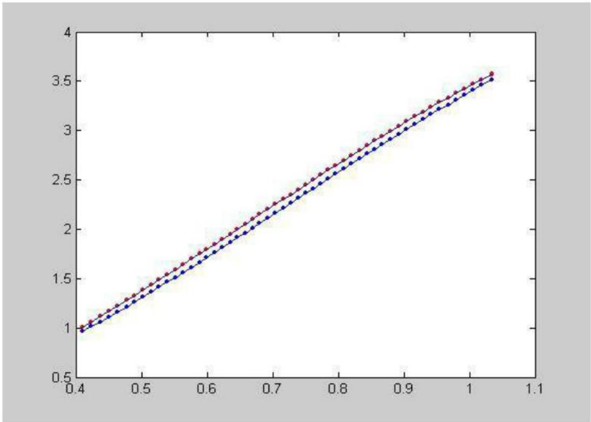

<details>
<summary>line</summary>

| X | Red Series | Blue Series |
| --- | --- | --- |
| 0.4 | ~1.0 | ~0.95 |
| 0.5 | ~1.4 | ~1.35 |
| 0.6 | ~1.8 | ~1.75 |
| 0.7 | ~2.2 | ~2.15 |
| 0.8 | ~2.6 | ~2.55 |
| 0.9 | ~3.0 | ~2.95 |
| 1.0 | ~3.5 | ~3.45 |
</details>

图5-6

可同样仿真出在这种情况下,数学模型得出的值与实际测量得到值的误差曲线如下所示。

为了更好的检测所建的数学模型，可以在这种条件下，绘制 $\alpha = 0^{\circ}$ 时的拟合曲线如下图所示，由下图可知它与在与在无变位模型曲线拟合的效果是非常相似的，这也可以进一步的证明所建的模型的准确性。

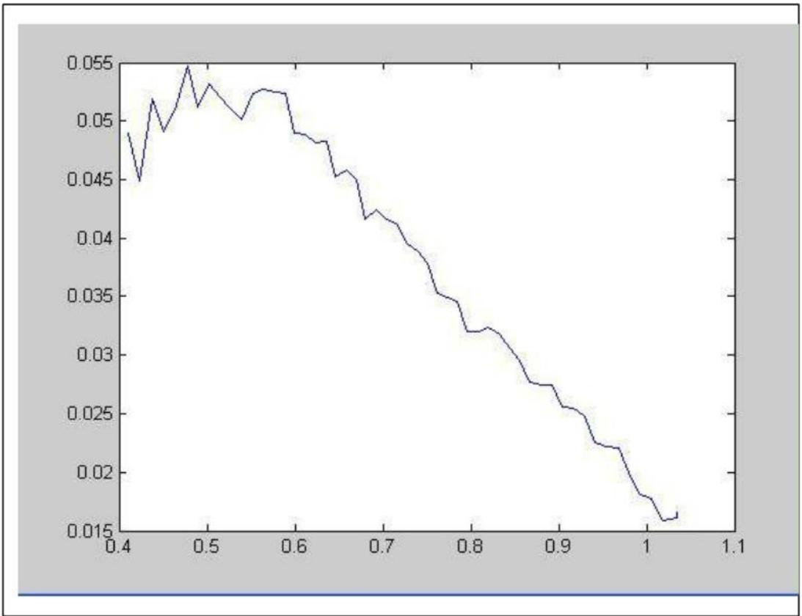

<details>
<summary>line</summary>

| X | Y |
| --- | --- |
| 0.4 | ~0.049 |
| 0.42 | ~0.045 |
| 0.44 | ~0.052 |
| 0.46 | ~0.049 |
| 0.48 | ~0.055 |
| 0.5 | ~0.051 |
| 0.52 | ~0.053 |
| 0.54 | ~0.051 |
| 0.56 | ~0.052 |
| 0.58 | ~0.053 |
| 0.6 | ~0.052 |
| 0.62 | ~0.049 |
| 0.64 | ~0.048 |
| 0.66 | ~0.048 |
| 0.68 | ~0.045 |
| 0.7 | ~0.046 |
| 0.72 | ~0.042 |
| 0.74 | ~0.043 |
| 0.76 | ~0.041 |
| 0.78 | ~0.039 |
| 0.8 | ~0.035 |
| 0.82 | ~0.032 |
| 0.84 | ~0.032 |
| 0.86 | ~0.031 |
| 0.88 | ~0.028 |
| 0.9 | ~0.027 |
| 0.92 | ~0.026 |
| 0.94 | ~0.025 |
| 0.96 | ~0.022 |
| 0.98 | ~0.022 |
| 1.0 | ~0.018 |
| 1.02 | ~0.016 |
| 1.04 | ~0.017 |
</details>

图5-7

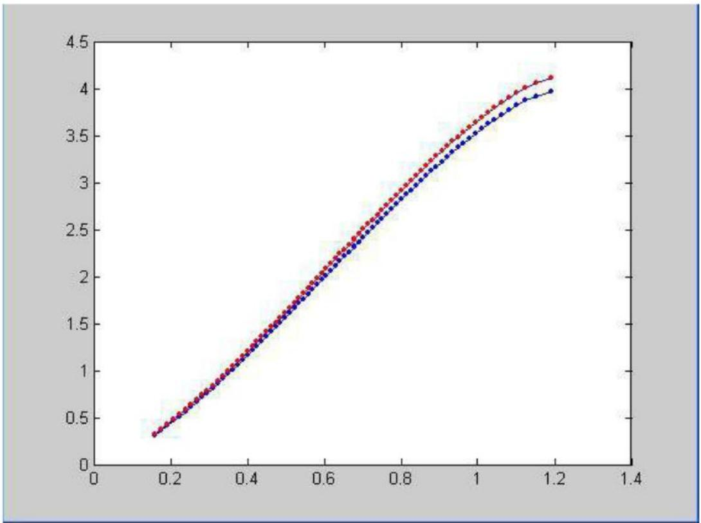

<details>
<summary>line</summary>

| X | Red Series | Blue Series |
| --- | --- | --- |
| 0.15 | ~0.35 | ~0.35 |
| 0.2 | ~0.5 | ~0.5 |
| 0.3 | ~0.85 | ~0.85 |
| 0.4 | ~1.25 | ~1.25 |
| 0.5 | ~1.65 | ~1.65 |
| 0.6 | ~2.05 | ~2.05 |
| 0.7 | ~2.45 | ~2.4 |
| 0.8 | ~2.85 | ~2.8 |
| 0.9 | ~3.25 | ~3.2 |
| 1.0 | ~3.65 | ~3.55 |
| 1.1 | ~3.95 | ~3.85 |
| 1.2 | ~4.15 | ~4.0 |
</details>

图5-8

通过上面的仿真实验可知模型得到罐体变位后油位高度间隔每 1cm 的油位高度与储油量之间的关系，即罐容表的标定值如下所示：

表 1 图 1-4 中油罐变位后罐容表标定值表

<table><tr><td>油位高度/mm</td><td>0</td><td>10</td><td>20</td><td>30</td><td>40</td><td>50</td><td>60</td><td>70</td><td>80</td><td>90</td></tr><tr><td>储油量/L</td><td>1.7</td><td>3.5</td><td>6.3</td><td>10</td><td>14.8</td><td>20.7</td><td>27.9</td><td>36.3</td><td>46.1</td><td>57.4</td></tr><tr><td>油位高度/mm</td><td>100</td><td>110</td><td>120</td><td>130</td><td>140</td><td>150</td><td>160</td><td>170</td><td>180</td><td>190</td></tr><tr><td>储油量/L</td><td>70.1</td><td>84.4</td><td>100.3</td><td>117.7</td><td>136.9</td><td>157.8</td><td>180.3</td><td>204</td><td>228.9</td><td>254.9</td></tr><tr><td>油位高度/mm</td><td>200</td><td>210</td><td>220</td><td>230</td><td>240</td><td>250</td><td>260</td><td>270</td><td>280</td><td>290</td></tr><tr><td>储油量/L</td><td>281.9</td><td>309.8</td><td>338.5</td><td>368.1</td><td>398.5</td><td>429.7</td><td>461.5</td><td>494</td><td>527.1</td><td>560.9</td></tr><tr><td>油位高度/mm</td><td>300</td><td>310</td><td>320</td><td>330</td><td>340</td><td>350</td><td>360</td><td>370</td><td>380</td><td>390</td></tr><tr><td>储油量/L</td><td>595.2</td><td>630.1</td><td>665.6</td><td>701.5</td><td>738</td><td>774.9</td><td>812.2</td><td>850</td><td>888.2</td><td>926.7</td></tr><tr><td>油位高度/mm</td><td>400</td><td>410</td><td>420</td><td>430</td><td>440</td><td>450</td><td>460</td><td>470</td><td>480</td><td>490</td></tr><tr><td>储油量/L</td><td>965.7</td><td>1005</td><td>1044.6</td><td>1084.5</td><td>1124.8</td><td>1165.3</td><td>1206.2</td><td>1247.2</td><td>1288.6</td><td>1330.1</td></tr><tr><td>油位高度/mm</td><td>500</td><td>510</td><td>520</td><td>530</td><td>540</td><td>550</td><td>560</td><td>570</td><td>580</td><td>590</td></tr><tr><td>储油量/L</td><td>1371.9</td><td>1413.9</td><td>1456</td><td>1498.4</td><td>1540.9</td><td>1583.5</td><td>1626.3</td><td>1669.2</td><td>1712.2</td><td>1755.3</td></tr><tr><td>油位高度/mm</td><td>600</td><td>610</td><td>620</td><td>630</td><td>640</td><td>650</td><td>660</td><td>670</td><td>680</td><td>690</td></tr><tr><td>储油量/L</td><td>1798.5</td><td>1841.8</td><td>1885.1</td><td>1928.5</td><td>1971.9</td><td>2015.4</td><td>2058.8</td><td>2102.3</td><td>2145.7</td><td>2189.1</td></tr><tr><td>油位高度/mm</td><td>700</td><td>710</td><td>720</td><td>730</td><td>740</td><td>750</td><td>760</td><td>770</td><td>780</td><td>790</td></tr><tr><td>储油量/L</td><td>2232.5</td><td>2275.8</td><td>2319.1</td><td>2362.3</td><td>2405.4</td><td>2448.4</td><td>2491.3</td><td>2534</td><td>2576.6</td><td>2619.1</td></tr><tr><td>油位高度/mm</td><td>800</td><td>810</td><td>820</td><td>830</td><td>840</td><td>850</td><td>860</td><td>870</td><td>880</td><td>890</td></tr><tr><td>储油量/L</td><td>2661.4</td><td>2703.6</td><td>2745.5</td><td>2787.2</td><td>2828.7</td><td>2870</td><td>2911.1</td><td>2951.8</td><td>2992.3</td><td>3032.5</td></tr><tr><td>油位高度/mm</td><td>900</td><td>910</td><td>920</td><td>930</td><td>940</td><td>950</td><td>960</td><td>970</td><td>980</td><td>990</td></tr><tr><td>储油量/L</td><td>3072.4</td><td>3112</td><td>3151.2</td><td>3190.1</td><td>3228.6</td><td>3266.7</td><td>3304.4</td><td>3341.7</td><td>3378.5</td><td>3414.9</td></tr><tr><td>油位高度/mm</td><td>1000</td><td>1010</td><td>1020</td><td>1030</td><td>1040</td><td>1050</td><td></td><td></td><td></td><td></td></tr><tr><td>储油量/L</td><td>3450.7</td><td>3486.1</td><td>3520.9</td><td>3555.1</td><td>3588.8</td><td>3621.8</td><td></td><td></td><td></td><td></td></tr></table>

## 5.2 问题2的求解

一 由题意可先分析罐内储油量和油位高度与变位参数纵向倾斜角度 $\alpha$ 的关系，如图5-9所示，

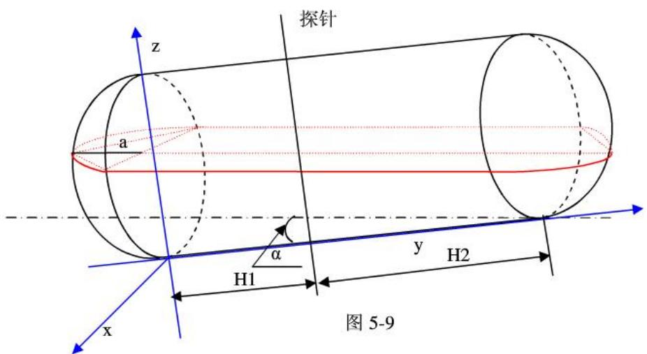

<details>
<summary>text_image</summary>

探针
z
a
H1
y
H2
x
图 5-9
</details>

由题意可知分为四种情况分析：

(1) 当 $h \leq H_{2} \tan \alpha$ 时，油罐的储油量可分为 $V_{1}$ 和 $V_{2}$ 两种情况，图形如下图5-4所示：

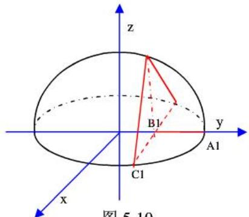

<details>
<summary>text_image</summary>

z
B1
A1
C1
y
x
图 5-10
</details>

图5-10

图中 $A_{1}B_{1} = h_{1} = h(H_{1} + H_{2}) / H_{2}$

点的坐标分别为 $A_{1}(0,R,0),B_{1}(0,R - h,0),C_{1}(\sqrt{2Rh_{1} - h_{1}^{2}},R - h_{1},0)$

$V_{1}$ 是上图中截面的体积，其方程为： $\operatorname*{det}\left( \begin{array}{ccc}x & y - R + h_1 & z\\ 0 & -\sin \alpha & \cos \alpha \\ 1 & 0 & 0 \end{array} \right) = 0,$

化简为 $(y - R + h_1)\frac{\cos\alpha}{\sin\alpha} +z = 0$

则体积为：

$$
V _ {1} = \iiint_ {v} d V = \iint_ {D} 2 \sqrt {1 - \frac {y ^ {2} + x ^ {2}}{R ^ {2}}} d x d y - \frac {1}{3} S _ {\mathrm{底}} \cdot \mathrm{h} _ {\mathrm{高}} \quad \mathrm{D} = \{(\mathrm{x}, \mathrm{y}) | \mathrm{y} _ {1} (\mathrm{x}) \leq \mathrm{y} \leq \sqrt {R ^ {2} - x ^ {2}}, 0 \leq \mathrm{x} \leq R - \mathrm{h} _ {1} \}
$$

其中

$$
y _ {1} (x) = y _ {0} + (R - h - y ^ {0}) x / \sqrt {2 R h _ {1} - h _ {1} ^ {2}}
$$

$$
S _ {\mathrm{底}} = 2 (R - \frac {H _ {1} + H _ {2}}{H _ {2}} \cdot h - y _ {0}) \cdot \sqrt {R ^ {2} - (R - \frac {H _ {1} + H _ {2}}{H _ {2}} \cdot h) ^ {2}}
$$

$$
h _ {\mathrm{高}} = z _ {0}
$$

其中 $(y_0,z_0)$ 是 $\left\{ \begin{array}{l}z\sin \alpha +(-y + R - h_1)\cos \alpha = 0\\ z^2 +y^2 /R^2 = 1 \end{array} \right.$ 的解

另外 $V_{0}$ 可根据问题1的求解模型，得出

$$
V _ {0} = V (h) = \int_ {0} ^ {h \cot \alpha + H _ {1}} d z \int_ {0} ^ {h - (z - H _ {1}) \tan \alpha} 2 R \sqrt {1 - (\frac {x - R}{R}) ^ {2}} d x
$$

$$
\begin{array}{l} V (h) = \iint_ {D} 2 \sqrt {1 - \frac {y ^ {2} + x ^ {2}}{R ^ {2}}} d y d x - \frac {1}{3} z _ {0} (R - \frac {H _ {1} + H _ {2}}{H _ {2}} \cdot h - y _ {0}) \cdot \sqrt {R ^ {2} - (R - \frac {H _ {1} + H _ {2}}{H _ {2}} \cdot h) ^ {2}} \\ + \int_ {0} ^ {h \cot \alpha + H _ {1}} d z \int_ {0} ^ {h - (z - H _ {1}) \tan \alpha} 2 R \sqrt {1 - (\frac {x - R}{R}) ^ {2}} d x \\ \end{array}
$$

其中 $D=\{(x,y)|y_{1}(x)\leq y\leq\sqrt{R^{2}-x^{2}},0\leq x\leq R-h_{1}\}$

(2) 当 $H_{2} \tan \alpha < h \leq 2R - H_{1} \tan \alpha$ 时, 图形如下图 5-5 所示, 油罐的储油量可分为 $V_{1}, V_{2}, V_{0}$ , 其中 $V_{1}$ 表示油面所截左端球冠体中油的体积, $V_{2}$ 表示油面所截右端球冠体中油的体积。

先考虑左端球冠体中油的体积 $V_{1}$

如图

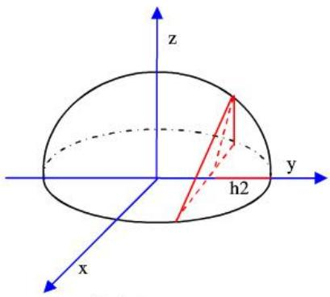

<details>
<summary>text_image</summary>

z
y
h2
x
</details>

图 5-11

由上图知 $V_{1} = \frac{1}{2} V_{\text{椭球体}} - 2V_{0}'$ ， $V_{0}'$ 表示截面右侧与椭球体所围图形的体积，

由图5-9可知：， $V_{\text{椭球体}} = \frac{4}{3}\pi \mathbf{R}^2\cdot \mathbf{a},\quad h_2 = \frac{H_1 + H_2}{H_2}\cdot h$

图中的截面方程为:

$$
\det \left( \begin{array}{c c c} x & y - R + h _ {2} & z \\ 1 & 0 & 0 \\ 0 & \sin \alpha & \cos \alpha \end{array} \right) = 0
$$

即：

$$
z \sin \alpha + (- y - h _ {2} + R) \cos \alpha = 0
$$

故

$$
V _ {0} ^ {\prime} = \iint_ {D _ {1}} (y - h _ {2}) \cot \alpha d x d y + \iint_ {D _ {2}} \sqrt {1 - \frac {x ^ {2} + y ^ {2}}{R ^ {2}}} d x d y
$$

$$
D _ {1}: \{(x, y) | 0 \leq x \leq \sqrt {R ^ {2} - y ^ {2}}, R - h _ {2} \leq y \leq y _ {1} \}
$$

$$
D _ {2}: \{(x, y) \mid 0 \leq x \leq \sqrt {R ^ {2} - y ^ {2}}, y _ {1} \leq y \leq R \}
$$

其中 $y_{1}$ 是方程组

$$
\left\{ \begin{array}{l} z \sin \alpha + (- y - h _ {2} + R) \cos \alpha = 0 \\ z ^ {2} + y ^ {2} / R ^ {2} = 1 \end{array} \right.
$$

的解，

再考虑右端球冠体中油的体积 $V_{2}$

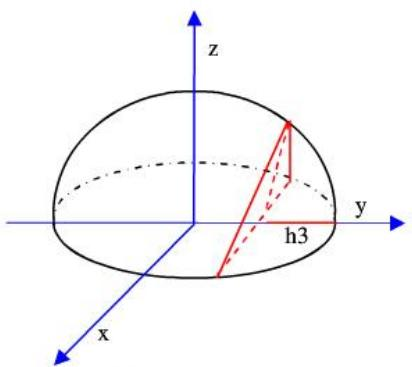

<details>
<summary>text_image</summary>

z
y
h3
x
</details>

图 5-12

由图 5-9 知

$$
h _ {3} = \frac {H _ {2}}{H _ {1} + H _ {2}} h
$$

图 5-12 中截面表达式

$$
\det \left( \begin{array}{c c c} x & y - (R - h _ {3}) & z \\ 1 & 0 & 0 \\ 0 & \sin \alpha & \cos \alpha \end{array} \right) = 0
$$

即

$$
[ - y + (R - h _ {3}) ] \cos \alpha + z \sin \alpha = 0
$$

$V_{2}$ 是截面右侧与椭球体所围图形的体积，

$$
V _ {2} = 2 \iint_ {D _ {1}} (y - (R - h _ {3})) \cot \alpha d x d y + 2 \iint_ {D _ {2}} \sqrt {1 - (x ^ {2} + y ^ {2}) / R ^ {2}} d x d y
$$

$$
D _ {1} ^ {\prime} = \left\{(x, y) \mid 0 \leq x \leq \sqrt {R ^ {2} - y ^ {2}}, R - h _ {3} \leq y \leq y _ {2} \right\}
$$

$$
D _ {2} ^ {\prime} = \left\{(x, y) \mid 0 \leq x \leq \sqrt {R ^ {2} - y ^ {2}}, y _ {2} \leq y \leq R \right\}
$$

其中 $(y_{2},z_{2})$ 是方程组 $\left\{\begin{aligned}[-y+(R-h_{3})]\cos\alpha+z\sin\alpha=0\\ z^{2}+y^{2}/R^{2}=1\end{aligned}\right.$ 的解

又 $V_{0} = \int_{0}^{H_{1} + H_{2}}dx\int_{0}^{h - (x - H_{1})\tan \alpha}dy\int_{-R\sqrt{1 - (\frac{y - R}{R})^{2}}}^{R\sqrt{1 - (\frac{y - R}{R})^{2}}}dz$

故 $\mathrm{V} = V_{1} + V_{2} + V_{0}$

$$
\begin{array}{l} V (h) = \frac {2}{3} \pi R ^ {2} a - 2 (\iint_ {D _ {1}} (y - h _ {2}) \cot \alpha d x d y + \iint_ {D _ {2}} \sqrt {1 - \frac {x ^ {2} + y ^ {2}}{R ^ {2}}} d x d y) + 2 \iint_ {D _ {1}} (y - (R - h _ {3})) \cot \alpha d x d y \\ + 2 \iint_ {D _ {2}} \sqrt {1 - (x ^ {2} + y ^ {2}) / R ^ {2}} d x d y + \int_ {0} ^ {H _ {1} + H _ {2}} d x \int_ {0} ^ {h - (x - H _ {1}) \tan \alpha} d y \int_ {- R \sqrt {1 - (\frac {y - R}{R}) ^ {2}}} ^ {R \sqrt {1 - (\frac {y - R}{R}) ^ {2}}} d z \\ \end{array}
$$

其中

$$
\begin{array}{l} D _ {1}: \{(x, y) \mid 0 \leq x \leq \sqrt {R ^ {2} - y ^ {2}}, R - h _ {2} \leq y \leq y _ {1} \} \\ D _ {2}: \left\{\left(\mathrm{x}, \mathrm{y}\right) \mid 0 \leq \mathrm{x} \leq \sqrt {R ^ {2} - \mathrm{y} ^ {2}}, \mathrm{y} _ {1} \leq \mathrm{y} \leq R \right\} \\ D _ {1} ^ {\prime}: \left\{(x, y) \mid 0 \leq x \leq \sqrt {R ^ {2} - y ^ {2}}, R - h _ {3} \leq y \leq y _ {2} \right\} \\ D _ {2} ^ {\prime}: \left\{(x, y) \mid 0 \leq x \leq \sqrt {R ^ {2} - y ^ {2}}, y _ {2} \leq y \leq R \right\} \\ \end{array}
$$

(3) 当 $2R - H_{1} \tan \alpha < h < 2R$ 时，此时储油量 $V = V_{\text{罐}} - V_{3}$ ，

$$
V _ {\text {罐}} = \pi R ^ {2} (H _ {1} + H _ {2}) + \frac {4}{3} \pi a R ^ {2},
$$

$V_{3}$ 是情况（1）中油高为2R-h时的 $V_{0}$ ，

即 $V(h) = \pi R^2 (H_1 + H_2) + \frac{4}{3}\pi aR^2 -V_0(2R - h)$

(4) 液面继续上升时，h 值不再改变，此时可认为桶内已装满油，即

$$
V = V _ {\mathrm{罐}} = \pi R ^ {2} (H _ {1} + H _ {2}) + \frac {4}{3} \pi a R ^ {2}
$$

## 二 接下来考虑油桶横向偏转倾斜 $\beta$ 后罐内储油量与油位高度的关系

假设油桶横向偏转倾斜 $\beta$ 前观测油位高度为 $h^{\prime}$ ，横向偏转倾斜后观测油位高度为 $h$ ，由倾斜角 $\beta$ 很小，且两端球冠体扁度较小，故横向偏转 $\beta$ 所造成的误差很小，可近似认为液面的垂直高度不改变，

则 $h^{\prime} = (h - R)\cos \beta +R,$

罐内储油量 V 即为油桶横向偏转倾斜 $\beta$ 前观测油位高度为 $(h-R)\cos\beta + R$ 时油的体积。

三 综合上述分析，罐内储油量 V 与油位高度 h 及变位参数（纵向倾斜角度 $\alpha$ 和横向偏转角度 $\beta$ ）之间关系式为

$$
V = V (R + (h - R) \cos \beta),
$$

其中 V 表示分析一中液面与容积的模型。

四 结合题意，带入所有已知数据，即

$H_{1} = 2, H_{2} = 6, R = 1.5, a = 1$ ，取附件二中一些数据，代入

$$
V = V (R + (h - R) \cos \beta),
$$

V取上述二中分析（2）的模型。

经过最小二乘拟合，得到 $\alpha$ 、 $\beta$ 的估计值， $\alpha$ 取 $\alpha = 2.35^{\circ}$ ， $\beta = 4.57^{\circ}$ 取，此时与实际值拟合最相似。再根据 $\alpha = 2.35^{\circ}$ ， $\beta = 4.57^{\circ}$ 用 MATLAB 仿真出模型曲线，与真实曲线的误差很小。

下表为用模型计算出的油罐变位后油位高度与油储量之间的关系。

表 2 图 1-2 中油罐变位后罐容表标定值表

<table><tr><td>油位高度/mm</td><td>0</td><td>100</td><td>200</td><td>300</td><td>400</td><td>500</td><td>600</td><td>700</td><td>800</td><td>900</td></tr><tr><td>油储量/l</td><td>441.2</td><td>271.4</td><td>262.3</td><td>309.8</td><td>461.8</td><td>653</td><td>876</td><td>1146.6</td><td>1369.2</td><td>1638.2</td></tr><tr><td>油位高度/mm</td><td>1000</td><td>1100</td><td>1200</td><td>1300</td><td>1400</td><td>1500</td><td>1600</td><td>1700</td><td>1800</td><td>1900</td></tr><tr><td>油储量/l</td><td>1922</td><td>2213.9</td><td>2301.9</td><td>2645.1</td><td>2890.2</td><td>3081.9</td><td>3677.4</td><td>3875.7</td><td>4258.6</td><td>4337.5</td></tr><tr><td>油位高度/mm</td><td>2000</td><td>2100</td><td>2200</td><td>2300</td><td>2400</td><td>2500</td><td>2600</td><td>2700</td><td>2800</td><td>2900</td></tr><tr><td>油储量/l</td><td>4536.4</td><td>4678.7</td><td>4917.8</td><td>5362.5</td><td>5628.2</td><td>5856.8</td><td>6047.4</td><td>6341.8</td><td>6380.5</td><td>6333.9</td></tr><tr><td>油位高度/mm</td><td>3000</td><td></td><td></td><td></td><td></td><td></td><td></td><td></td><td></td><td></td></tr><tr><td>油储量/l</td><td>6449.9</td><td></td><td></td><td></td><td></td><td></td><td></td><td></td><td></td><td></td></tr></table>

## 六 模型的结果分析

## 1、模型一的结果分析

对于积分求得数学模型求的罐内储油量与油高度的关系，通过观察分析数学模型得出的值与实际测量得到值的误差曲线，无变位的情况下误差在 $3.4\%$ 左右，在拟合效果上满足要求。在发生纵向偏转的情况下，起始误差较大，后降为 $2\%$ 一下为了更好的检测所建的可以在这种条件下，绘制 $\alpha = 0$ 时的拟合曲线，可知它与在与在无变位模型曲线拟合的效果是非常相似的，这也可以进一步的证明所建的模型的准确性。

## 2、模型二的结果分析

误差可由多种因素形成，如测量油罐外径时，油罐桶壁厚度未考虑，直接当做内径考虑，且测量过程中温度变化会影响测量结果。由MATLAB的数据拟合，得出 $\alpha = 2.35^{\circ}$ ， $\beta = 4.57^{\circ}$ ，并通过实际数据的仿真，验证出误差在可控范围内，根据误差存在的客观性，确定模型在 $\alpha, \beta$ 较小范围内是合理的。

## 参考文献

[1] 华东师范大学数学系，《数学分析》，上海：高等教育出版社，2008.4  
[2] 薛定宇、陈阳泉，《高等应用数学问题的 MATLAB 求解》（第二版），北京：清华大学出版社，2008.10  
[3] 王金涛、刘子勇、张珑等，大型油罐容量计量中 3D 空间与比对试验分析 [J]，2010(31):421-425  
[4] 战景林、王春平、王喜忠，倾斜椭平顶卧式罐容积的计算[J]，中国计量，2006(4):73-74  
[5] 林明富，卧式容器及球罐体积标定计算[J]，石油化工设备，2005(3):34-36  
[6] 陈伟，卧式金属罐容积检定装置的测量不确定度[J]，计量与测试技术，2006(12):61-63

## 附录：

## 1.1 存放 $\mathrm{x}$ 的测量值

function x=get\_x()

x=[159.02

176.14

192.59

208.50

223.93

238.97

253.66

268.04

282.16

296.03

309.69

323.15

336.44

349.57

362.56

375.42

388.16

400.79

413.32

425.76

438.12

450.40

462.62

474.78

486.89

498.95

510.97

522.95

534.90

546.82

558.72

570.61

582.48

594.35

606.22

618.09

629.96

641.85

653.75

665.67

## 1.2 存放 $y$ 点的测量值

function y=get\_y()

y=[

312

362

## 1.3 绘图5-3

```matlab
x0=get_x;
y0=get_y;
x0=x0/1000;
a=0.89;
b=0.6;
y1=((a/b)*((x0-b).*sqrt(2*b*x0-x0.*x0)+b^2*asin((x0-b)/b)+1/2*pi*b^2))*2.45*1000;
plot(x0,y0,x0,y0,'.');
hold on
plot(x0,y1,'r',x0,y1,'');
```

1.4 绘出计算得出数据与实际数据的拟合图，如图5-6  
```javascript
a=0.89;
b=0.60;
theta=(4.1/180)*pi;
x0=get_x2;
y0=get_y2;
x0=x0/1000;
y0=y0/1000;
syms x y z h;
z1=-a*sqrt(1-((z-b)/b)^2);
z2=a*sqrt(1-((z-b)/b)^2);
y1=int(int(int(1,y,z1,z2),z,0,h+(0.4-x)*tan(theta)),x,0,2.45);
h=x0;
y1=-267/51651525650828710000.*(-411080515727443026281968197598547425-2076918743413931051412198531688038400.*h.^2+3102691577449791281791997902239825920.*h).^(1/2)+13083/20000.*pi+89/38619367830047372976433151994237428253952855548887040000.*(-411080515727443026281968197598547425-2076918743413931051412198531688038400.*h.^2+31026915774497 91281791997902239825920.*h).^(3/2)-4809844402031689728/645644070635358875.*asin(5/3.*h-1076462383623532943/864691128455135232).*h+287415456427483295781/51651525650828710000.*asin(5/3.*h-1076462383623532943/864691128455135232)+267/6456440706353588750.*(-32451855365842672678315602057625600.*h.^2+37081284105617688860023357639229440.*h+1089886599015528850431783800350127).^(1/2)-89/75428452793061275344595999988744977058501670993920000.*(-32451855365842672678315602057625600.*h.^2+37081284105617688860023357639229440.*h+108988659901552885O4317838O035O127).^(3/2)+48098444O2O31689728/645644O7O635358875.*asin(5/3.*h-1029212384918O9O33/1O8O86391O56891O4).*h-2747997O677313O1I 1I 1I 1I 6A 5 6 4 4 0 7 0 6 3 5 3 5 8 8 7 5 0.*asin(5/3.*h-1O 2 9 2 1 2 3 8 4 9 1 8 0 9 0 3 3 / 1 O 8 0 8 6 3 9 1 0 5 6 8 9 1 9 0 4);
plot(xO,yO,'b');
hold on;
plot(xO,yO);
plot(xO,yI,'r',xO,yI);
```

1.5 如图 5-7  
```matlab
a=0.89;
b=0.60;
theta=(4.1/180)*pi;
x0=get_x2;
y0=get_y2;
x0=x0/1000;
y0=y0/1000;
syms x y z h;
z1=-a*sqrt(1-((z-b)/b)^2);
z2=a*sqrt(1-((z-b)/b)^2);
y1=int(int(int(1,y,z1,z2),z,0,h+(0.4-x)*tan(theta)),x,0,2.45);
```

```txt
>> h=x0;
y1=-267/51651525650828710000.*(-411080515727443026281968197598547425-207691874341
3931051412198531688038400.*h.^2+3102691577449791281791997902239825920.*h).^(1/2)+1
3083/20000.*pi+89/38619367830047372976433151994237428253952855548887040000.*(-4110
80515727443026281968197598547425-2076918743413931051412198531688038400.*h.^2+310
2691577449791281791997902239825920.*h).^(3/2)-4809844402031689728/6456440706353588
75.*asin(5/3.*h-1076462383623532943/864691128455135232).*h+287415456427483295781/51
651525650828710000.*asin(5/3.*h-1076462383623532943/864691128455135232)+267/6456440
706353588750.*(-32451855365842672678315602057625600.*h.^2+37081284105617688860023
357639229440.*h+1089886599015528850431783800350127).^(1/2)-89/75428452793061275344
595999988744977058501670993920000.*(-32451855365842672678315602057625600.*h.^2+37
081284105617688860023357639229440.*h+1089886599015528850431783800350127).^(3/2)+4
809844402031689728/645644070635358875.*asin(5/3.*h-102921238491809033/108086391056
891904).*h-27479970677313011811/6456440706353588750.*asin(5/3.*h-102921238491809033/
108086391056891904);
y2=abs(y1-y0);
for i=1:length(y2)
y3(i)=y2(i)/y0(i);
end
>> plot(x0,y3);
```

1. 6 当 $\mathrm{a} = 0$ 时与真实值差异,如图 5-8  
```matlab
a=0.89;
b=0.60;
theta=0;
x0=get_x;
y0=get_y;
x0=x0/1000;
y0=y0/1000;
syms x y z h;
z1=-a*sqrt(1-((z-b)/b)^2);
z2=a*sqrt(1-((z-b)/b)^2);
y1=int(int(int(1,y,z1,z2),z,0,h+(0.4-x)*tan(theta)),x,0,2.45);
h=x0;
y1=4361/6000.*(-25.*h.^2+30.*h).^(1/2).*h-4361/10000.*(-25.*h.^2+30.*h).^(1/2)+13083/10000
.*asin(5/3.*h-1)+13083/20000.*pi;
y2=y(1)-y(0);
plot(x0,y2);
```

1.7 求解间隔 $1 \mathrm{~cm}$ 的的代码情况  
```txt
theta=(4.1/180)*pi;
```

```txt
syms h;
```

```txt
syms x y z;
```

```c
a=0.89;
b=0.6;
z1=-a*sqrt(1-((y-b)/b)^2);
z2=a*sqrt(1-((y-b)/b)^2);
h=0:0.01:0.14;
Y=-27479970677313011811/12912881412707177500.*pi+2404922201015844864/645644070635358875.*pi.*h+267/6456440706353588750.*(-32451855365842672678315602057625600.*h.^2+37081284105617688860023357639229440.*h+1089886599015528850431783800350127).^(1/2)-89/75428452793061275344595999988744977058501670993920000.*(-32451855365842672678315602057625600.*h.^2+37081284105617688860023357639229440.*h+108988659901552885
0431783800350127).^(3/2)+4809844402031689728/645644070635358875.*asin(5/3.*h-102921238491809033/108086391056891904).*h-27479970677313011811/6456440706353588750.*asin(
5/3.*h-102921238491809033/108086391056891904);
theta=0.4*tan((4.1/180)*pi);
h=0.15:0.01:1.05;
y=-267/51651525650828710000.*(-411080515727443026281968197598547425-2076918743413
931051412198531688038400.*h.^2+3102691577449791281791997902239825920.*h).^(1/2)+13
083/20000.*pi+89/38619367830047372976433151994237428253952855548887040000.*(-41108
0515727443026281968197598547425-2076918743413931051412198531688038400.*h.^2+3102
691577449791281791997902239825920.*h).^(3/2)-4809844402031689728/64564407063535887
5.*asin(5/3.*h-1076462383623532943/864691128455135232).*h+287415456427483295781/516
51525650828710000.*asin(5/3.*h-1076462383623532943/864691128455135232)+267/64564407
06353588750.*(-32451855365842672678315602057625600.*h.^2+370812841056176888600233
57639229440.*h+1089886599015528850431783800350127).^(1/2)-89/754284527930612753445
95999988744977058501670993920000.*(-32451855365842672678315602057625600.*h.^2+370
81284105617688860023357639229440.*h+1089886599015528850431783800350127).^(3/2)+48
098444402031689728/645644070635358875.*asin(5/3.*h-1029212384918O9O33/1OBOB6C9IOTG
9IHOA).*h-274TENHTOCTTHTTHTTHTTHTTHTTHTTHTTHTTHTTHTTHTTHTTHTTHTTHTTHTTHTTHTTHTTHTTHTTHTTHTTHTTHTTHTTHTTHTTHTTHTTHTTHTTHTTHTTHTTHTTHTTHTTHTTHTTHTTHTTHTTHTTHTTHTTHTTHTTHTTHTTCT
*asin(5/3.*h-1OBOB6C9IOTG
*asin(5/3.*h-1OBOB6C9IOTG
*asin(5/3.*h-1OBOB6C9IOTG
*asin(5/3.*h-<nl>
```