## 2010年全国大学生

# 数学建模竞赛

储油罐的变位识别与罐容表标定

2010 高教社杯全国大学生数学建模竞赛

承诺书

我们仔细阅读了中国大学生数学建模竞赛的竞赛规则.

我们完全明白，在竞赛开始后参赛队员不能以任何方式（包括电话、电子邮件、网上咨询等）与队外的任何人（包括指导教师）研究、讨论与赛题有关的问题。

我们知道，抄袭别人的成果是违反竞赛规则的，如果引用别人的成果或其他公开的资料（包括网上查到的资料），必须按照规定的参考文献的表述方式在正文引用处和参考文献中明确列出.

我们郑重承诺，严格遵守竞赛规则，以保证竞赛的公正、公平性。如有违反竞赛规则的行为，我们将受到严肃处理。

我们参赛选择的题号是（从 A/B/C/D 中选择一项填写）：\_\_\_\_ A \_\_\_\_

我们的参赛报名号为（如果赛区设置报名号的话）：\_\_\_\_
所属学校（请填写完整的全

赛区评阅编号（由赛区组委会评阅前进行编号）：

doc in 豆丁
www.docin.com

# 2010 高教社杯全国大学生数学建模竞赛

## 编号专用页

赛区评阅编号（由赛区组委会评阅前进行编号）：

赛区评阅记录（可供赛区评阅时使用）：

<table><tr><td>评阅人</td><td></td><td></td><td></td><td></td><td></td><td></td><td></td><td></td><td></td><td></td></tr><tr><td>评分</td><td></td><td></td><td></td><td></td><td></td><td></td><td></td><td></td><td></td><td></td></tr><tr><td>备注</td><td></td><td></td><td></td><td></td><td></td><td></td><td></td><td></td><td></td><td></td></tr></table>

全国统一编号（由赛区组委会送交全国前编号）：

全国评阅编号（由全国组委会评阅前进行编号）：

# 储油罐的变位识别与罐容表标定

## 摘要

加油站储油罐罐容表的精确度直接关系到加油站的经济利益，然而由于地基变形等原因，罐体的位置会发生纵向倾斜和横向偏转等变化，从而导致罐容表发生改变，影响其精度.

本文要解决的就是储油罐的变位识别与罐容表标定的问题。其中罐容表的标定，就是建立罐内油位高度与储油量的关系。对此，我们应用微积分及空间解析几何理论的相关知识，建立油罐体积函数模型 $V(H)$ 。对于储油罐的变位识别问题，我们借助已建立的函数模型 $V(H)$ ，用实际的油位高度确定理论储油量和变位参数值，并将理论储油量与实际测出的储油量采用最小二乘法进行拟合，然后通过拟合系数来判断模型的准确性。

对问题(1)，储油罐有无变位和纵向变位这两种情况，均要建立油罐体积积分函数模型，并运用 matlab 软件求解模型，且将求解结果采用最小二乘法拟合，分析结果表明理论结果与数据模拟结果相吻合。最小二乘法拟合分析时也表明了模型求解中存在误差，从而以此为基础对模型进行修正，并得出罐容标定值表(见表一)。

对问题(2)，同样建立建立油罐体积积分函数模型，采用离差平方和的算法并运用matlab软件确定了变位参数 $\alpha$ 、 $\beta$ 的值为 $\alpha = 2^{0}$ 、 $\beta = 4.9^{0}$ 。以此为基础给出罐体变位后罐容表标定值表(见表三).

对问题一和二的模型做误差分析和修正后所得的结果显示, 我们所建立的模型能很好的与实际情况相吻合, 其吻合系数达到 0.9996. 最后我们还对模型进行了正确性验证与方法可靠性检验, 并结合实际情况和应用价值对模型进行了改进与推广.

关键词 微积分；变位识别；小二乘拟合；误差；标定值

## 一、问题重述

通常加油站都有若干个储存燃油的地下储油罐，并且一般都有与之配套的“油位计量管理系统”，采用流量计和油位计来测量进/出油量与罐内油位高度等数据，通过预先标定的罐容表(即罐内油位高度与储油量的对应关系)进行实时计算，以得到罐内油位高度和储油量的变化情况.

许多储油罐在使用一段时间后，由于地基变形等原因，使罐体的位置会发生纵向倾斜和横向偏转等变化(以下称为变位)，从而导致罐容表发生改变。按照有关规定，需要定期对罐容表进行重新标定。一种典型的储油罐其主体为圆柱体，两端为球冠体。现需要用数学建模方法研究解决储油罐的变位识别与罐容表标定的问题。

(1) 为了掌握罐体变位后对罐容表的影响, 利用小椭圆型储油罐 (两端平头的椭圆柱体), 分别对罐体无变位和倾斜角为 $\alpha = 4$ 。 $1^{\circ}$ 的纵向变位两种情况做了实验, 实验数据如附录一所示. 现需要建立数学模型研究罐体变位后对罐容表的影响, 并给出罐体变位后油位高度间隔为 $1 \mathrm{~cm}$ 的罐容表标定值.  
(2) 对于主体为圆柱体, 两端为球冠体的储油罐, 试建立罐体变位后标定罐容表的数学模型, 即罐内储油量与油位高度及变位参数 (纵向倾斜角度 $\alpha$ 和横向偏转角度 $\beta$ ) 之间的一般关系. 利用罐体变位后在进/出油过程中的实际检测数据附录二, 根据所建立的数学模型确定变位参数, 并给出罐体变位后油位高度间隔为 $10 \mathrm{~cm}$ 的罐容表标定值. 进一步利用附录二中的实际检测数据来分析检验模型的正确性与方法的可靠性.

## 二、问题分析

## 2.1 问题一的分析

通常情况下，我们都可以通过油位计管理系统来标定罐容表，即通过测量进/出油量与罐内油位高度得到储油量的变化情况。但是储油罐在使用一段时间后，由于地基变形等原因，罐体的位置会发生纵向倾斜和横向偏转，导致罐容表测量值发生改变，这就需要我们定期对罐容表进行重新标定。

对罐容表进行重新标定前，首先我们必须判定油罐是否发生变位，即将测量的进出口油量实际值与罐体位置未发生变位时的理论值进行差分拟合，当读数误差达到一定值时，就可以判定罐体的位置是发生了变位．而对罐体无变位时罐容表的识别，可以通过对罐体已知的几何结构进行分析计算，确定罐体无变位时储油量 $V$ 与可测油位高度 $H$ 之间的函数关系 $V = f(H)$ ．其次必须解决变位后罐容表如何重新标定的问题.

要解决上述问题, 我们必须先建立 $V(H, \alpha)$ 的函数模型. 在建立 $V(H, \alpha)$ 的函数模型过程中, 我们参照了高等数学微积分 $^{[1]}$ 的相关知识, 采用微元的思想得出模型.

## 2.2 问题二的分析

实际情况中，储油罐不单单只发生纵向倾斜，纵向和横向倾斜也应考虑，所以该问题中的情形比问题一更具有实际意义.

该问题是在问题一的基础之上增加了对横向倾角 $\beta$ 的考虑, 也就是要求我们同时考虑三个变量对储油量的影响, 建立 $V(H, \alpha, \beta)$ .

根据事物的变化规律，针对该倾斜问题，我们发现:在两种倾斜同时发生时的结果与分步依次发生的结果是相同的，这就启发了我们可以通过分步考虑来简化模型的建立.接着我们又考虑到，该问题中储油罐是圆柱体和球冠体这样两个特殊的对称体的组合体.分析其几何特征可知:罐内液体不管怎么横向倾斜，其横截面均为垂直于水平面、左右对称的薄片,也就是说横向变位对纵向变位储油量无影响.

所以为了易于模型的建立，我们假设油罐每次倾斜的完成顺序均如下图：

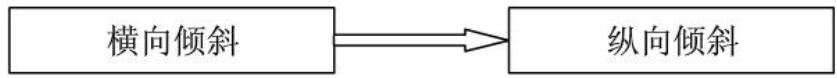

<details>
<summary>flowchart</summary>


</details>

这样该问题中模型的建立又可以直接参照问题一中模型的建立，最后得 $V(H,\alpha,\beta)$ 函数模型.

模型建立的基本思路如下:

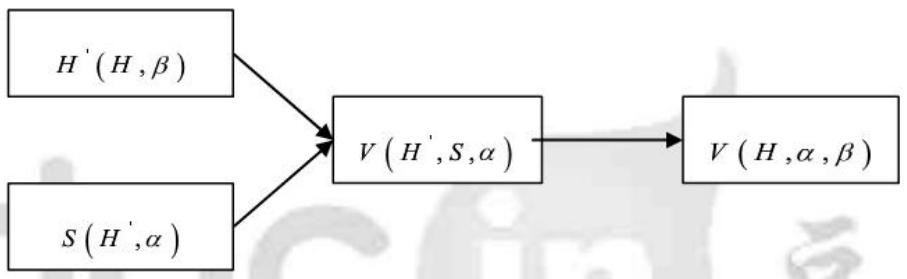

<details>
<summary>flowchart</summary>

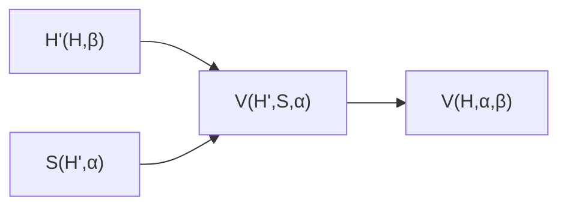
</details>

模型建立完后, 得出储油量与油位高度及变位参数 (纵向倾斜角度与横向倾斜角度) 之间的关系模型. 我们就可以开始确定变位参数 $\alpha$ 、 $\beta$ 的值. 再将确定了变位参数 $\alpha$ 、 $\beta$ 的值后代入模型来给出罐体变位后油位高度间隔为 $10 \mathrm{~cm}$ 的罐容表标定值. 最后可以再提出用实际检测数据对模型分析检验与建模方法的可靠性验证的方法.

## 三、模型假设及符号定义与说明

## 3.1 模型假设

1. 罐内储油不受温度压强等的影响，即储油量的体积大小只与油位高度有关；  
2. 油浮子为一质点, 其大小可忽略不计;  
3. 储油罐壁的厚度很薄，可以忽略不计；  
4. 外界因素的改变不会影响储油罐的形状，即不会发生形变；  
5. 储油罐内部罐壁为理想、对称的几何图形，忽略其制造工艺带来的误差；  
6. 储油罐内部一系列小构建对储油量的影响忽略不计;  
7. 油的自身性质和蒸发损耗对储油量的影响忽略不计；  
8. 对油浮子与油接触时带来不可避免的仪器误差忽略不计.

## 3.2 符号定义与说明

$\alpha$ : 储油罐的纵向倾角;

$\beta$ : 储油罐的横向倾角;

l: 储油罐的罐长;

v : 储油量;

a: 小椭圆油罐截面中椭圆的长半轴;

b: 小椭圆油罐截面中椭圆的短半轴;

H : 油浮子所在油面处的油位高度;

h : 储油罐中任一油面位置处的油位高度;

$V_{c}(H)$ :测量出的储油量与油位高度关系函数;

$V_{L}(H)$ : 实际的储油量与油位高度关系函数.

## 四、关于小椭圆型储油罐的模型建立与求解

为了层次清楚，我们先交待本节的结构。根据储油量的多少，以及油浮子位置的限制，对于近油位探针端下倾这种情形，分成如下几种情况进行考虑：

情形 I $0 \leq H \leq m \tan \alpha$ ，储油情况如图 1-4 所示，并建立模型 II；

情形 II $m \tan \alpha \leq H \leq 2b - n \tan \alpha$ ，储油情况如图 1-1 所示，并建立模型 I；

情形 III $2b - n \tan \alpha \leq H \leq 2b$ 储油情况如图1-5所示，并建立模型III.

## 4.1 情形I时，罐容与油面高度关系的模型建立

通常状况下， $\alpha$ 在较小的情况下就会被工作人员所发现，并重新摆放储油罐，所以 $m \tan \alpha \leq H \leq 2b - n \tan \alpha$ 时，比较常见，据此我们对此种情景在此做重点介绍.

如图1-1所示, 取椭球圆柱体的中心轴为 $z$ 轴, 并设该立体在过点 $z = 0 、 z = l$ 且垂直于 $z$ 轴的两平面之间. 以 $S_{1}(y)$ 表示过 $z$ 且垂直与 $x$ 轴的截面面积. 这时, 取 $z$ 为积分变量, 它的变化区间为 $[0, l]$ ; 相应于 $[0, l]$ 上任一小区间 $[z, z + dz]$ 的一薄片的体积近似于底面积为 $S_{1}(y)$ , 高为 $dz$ 的扁柱体的体积, 即体积元素

$$
d V _ {1} = S _ {1} (y) d z.
$$

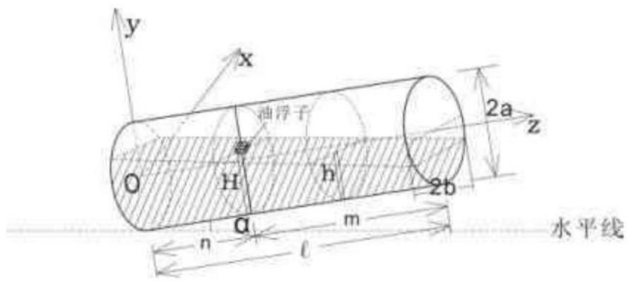

<details>
<summary>text_image</summary>

y
x
油浮子
2a
z
O
H
h
2b
n
α
m
l
水平线
</details>

图1-1

以 $S_{1}(y)dz$ 为被积分表达式，在闭区间 $[0,l]$ 上作定积分，便得所求立体的体积

$$
V _ {1} (y) = \int_ {0} ^ {l} S _ {1} (y) d z. \tag {1}
$$

接下来我们建立 $S_{1}(h)$ 函数关系.

如图1-2所示，以图中椭圆柱体最左端椭球截面中心点为原点，以平行水平面和垂直水平面的方向分别为 $x$ 、 $y$ 轴建立直角坐标系，其中每片截面投影到 $\mathrm{xoy}$ 坐标轴上的如图所示.

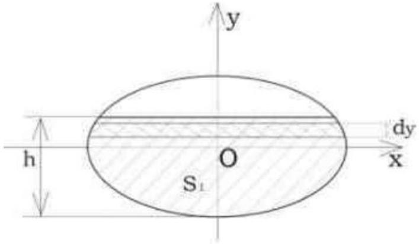

<details>
<summary>text_image</summary>

y
h
O
S₁
dy
x
</details>

图1-2

图中椭圆面积公式为

$$
\frac {x ^ {2}}{a ^ {2}} + \frac {y ^ {2}}{b ^ {2}} = 1 \Rightarrow x = \pm \frac {a}{b} \sqrt {b ^ {2} - y ^ {2}}.
$$

现在，取纵坐标 $y$ 为积分变量，它的变化区间为 $[-b, y]$ 。相应于 $[-b, y]$ 上任一小区间 $[y, y + dy]$ 的窄条面积近似于高为 $dy$ 、底为 $2\frac{a}{b}\sqrt{b^2 - y^2}$ 的窄矩形的面积，从而得到面积元素

$$
d S _ {1} = \left(2 \frac {a}{b} \sqrt {b ^ {2} - y ^ {2}}\right) d y,
$$

从而得

$$
S _ {1} (y) = \int_ {- b} ^ {y} 2 \frac {a}{b} \sqrt {b ^ {2} - y ^ {2}} d y,
$$

由图1-2有 $y = h - b$ ，代入得

$$
S = \int_ {- b} ^ {h - b} 2 \frac {a}{b} \sqrt {b ^ {2} - y ^ {2}} d y.
$$

接下来以 $2\frac{a}{b}\sqrt{b^2 - y^2} dy$ 为被积分表达式，运用MATLAB程序，在区间 $[-b, h - b]$ 上作定积分，得所求的 $S_1(h)$ 函数表达式为(程序见附录一)

$$
S _ {1} (h) = \int_ {- b} ^ {h - b} 2 \frac {a}{b} \sqrt {b ^ {2} - y ^ {2}} d y = \frac {b}{a} (h - b) \sqrt {2 h b - h ^ {2}} + a b \arcsin \frac {h - b}{b} + \frac {\pi}{2} a b. \tag {2}
$$

进而，我们通过建立 $H$ 与 $h$ 的函数关系，将 $H$ 引入到 $S_{1}(h)$ 中，建立 $V_{1}(H)$ 函数模型.

选取 yoz 坐标面上的截面如图 1-3 所示，油浮子所在处油位高度为 H，对应在 y 轴上的投影点为 C 点，在 z 轴上的投影长度为 n；油面上任一点的油位高度为 h，对应在 y 轴上的投影为点 B，在 z 轴上的投影长度为 z，即为该点的纵坐标大小；D 点为油面在 y 轴上的交点.

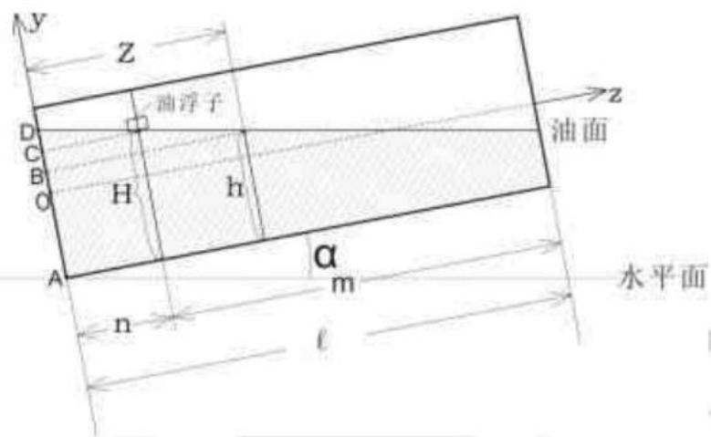

<details>
<summary>text_image</summary>

y
z
D
C
B
O
H
h
A
n
m
l
α
水平面
油面
z
</details>

图1-3

很明显的有线段长度关系

$$
A B + B D = A C + C D ,
$$

而

$$
A B = h, B D = z \tan \alpha , A C = H, C D = n \tan \alpha ,
$$

所以

$$
h + z \tan \alpha = H + n \tan \alpha \quad \Rightarrow h = H + (n - z) \tan \alpha . \tag {3}
$$

对上述定积分公式(2)计算时,先不考虑积分限,直接对 ${S}_{1}\left( h\right)$ 做不定积分,即

$$
\begin{array}{l} \int S _ {1} (h) d h \\ = \cot \alpha \left(\frac {a}{3 b} \sqrt {\left(b ^ {2} - (h - b) ^ {2}\right) ^ {3}} - a b \arcsin \frac {h - b}{b} - a b \sqrt {b ^ {2} - (h - b) ^ {2}} - \frac {1}{2} \pi a b (h - b)\right) + C. \\ \end{array}
$$

联立(1)，(2)和(3)式，因为所得结果比较复杂，为了简便起见，我们在此令 $k = H + n\tan \alpha - b$ ， $j = H - m\tan \alpha - b$ ，所以积分后的式子为

$$
V _ {1} (H, \alpha) = \int_ {H + n \tan \alpha - b} ^ {H - m \tan \alpha - b} S _ {1} (h) d h
$$

$$
\begin{array}{l} = a b \cot \alpha \left(\frac {1}{3 b ^ {2}} \sqrt {\left(b ^ {2} - j ^ {2}\right) ^ {3}} - \arcsin \frac {j}{b} - \sqrt {b ^ {2} - j ^ {2}} + \frac {\pi}{2} (m - n) \tan \alpha\right) \\ - a b \cot \alpha \left(\frac {1}{3 b ^ {2}} \sqrt {\left(b ^ {2} - k ^ {2}\right) ^ {3}} - \arcsin \frac {k}{b} - \sqrt {b ^ {2} - k ^ {2}}\right). \\ \end{array}
$$

4.2 情形Ⅱ时，罐容与油面高度关系的模型建立

如图1-4所示，即为 $0 \leq H \leq m \tan \alpha$ 时的储油情形.

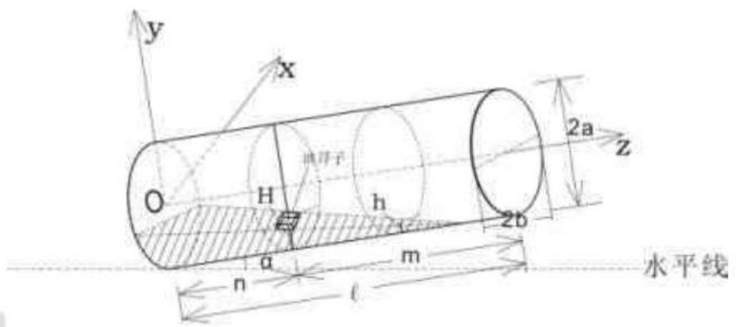

<details>
<summary>text_image</summary>

y
x
O
H
h
2a
z
2b
水平线
n
m
l
</details>

图1-4

此种情形下模型的建立与模型 I 的建立基本相同，唯一不同的是 z 轴方向上的积分上限: 模型 I 中的上限为罐长 l，而此处模型中油面边缘最右端与罐下壁有交界，投影到 z 轴上的交点即为 $(0,0,H\cot\alpha+n)$ ，所以该模型上限为 $H\cot\alpha+n$ ．即有

$$
V _ {2} (y) = \int_ {0} ^ {H c o t u + n} S _ {2} (y) d z. \tag {4}
$$

所求的 $S_{2}(h)$ 函数表达式与模型 I 中完全相同，即为

$$
S _ {2} (h) = \int_ {- b} ^ {h - b} 2 \frac {a}{b} \sqrt {b ^ {2} - y ^ {2}} d y = \frac {b}{a} (h - b) \sqrt {2 h b - h ^ {2}} + a b \arcsin \frac {h - b}{b} + \frac {\pi}{2} a b. \tag {5}
$$

$H$ 与 $h$ 的函数关系也为

$$
h = H + (n - z) \tan \alpha . \tag {6}
$$

同样联立(4)(5)(6)三式求解，为简便起见，我们也在此令 $k = H + n\tan \alpha -b$ ，同理得函数模型

$$
\begin{array}{l} V _ {2} (H, \alpha) = \int_ {H + l \tan \alpha - b} ^ {0} S _ {2} (h) d h \\ = ab\cot \alpha \left(\frac{1}{3b^2}\sqrt{\left(b^2 - (h - b)^2\right)^3} - \arcsin \frac{h - b}{b} - \sqrt{b^2 - (h - b)^2} - \frac{1}{2}\pi (h - b)\right)\bigg|_{H + l\tan \alpha -b}^{0} \\ \end{array}
$$

$$
= - a b \cot \alpha \left(\frac {1}{3 b ^ {2}} \sqrt {\left(b ^ {2} - k ^ {2}\right) ^ {3}} - \arcsin \frac {k}{b} - \sqrt {b ^ {2} - k ^ {2}} - \frac {1}{2} \pi (k + b + 1)\right).
$$

## 4.3 情形Ⅲ时，罐容与油面高度关系的模型建立模型

如图1-5所示，即为 $2b - n\tan \alpha \leq H\leq 2b$ 时的储油情形.

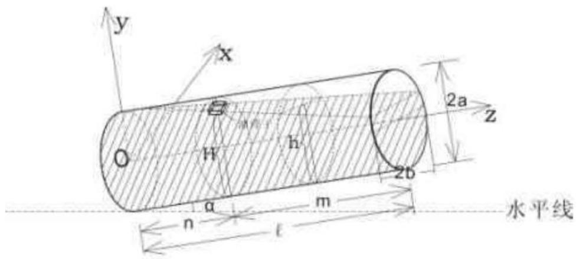

<details>
<summary>text_image</summary>

y
x
O
H
h
2a
z
2b
a
m
n
l
水平线
</details>

图1-5

此种情形下模型的建立也与模型 I 的建立基本相同，与模型 I 相比，该模型相当于是模型 I 中储油油体形状的立体图与一椭圆柱体的组合，所以该模型体积的求解分两部分完成，具体如下：

$$
V _ {3} = V _ {3 - 1} + V _ {3 - 2}.
$$

其中 $V_{3-1}$ 为椭圆柱体的体积， $V_{3-2}$ 为似模型I的体积.

在求解 $V_{3-1}$ 的函数关系式时，利用椭圆柱体的体积公式：体积 $=$ 底 $\times$ 高。

求解时，为解释更加清楚，我们将 yoz 坐标面上的图形截出平放如图1-6所示.

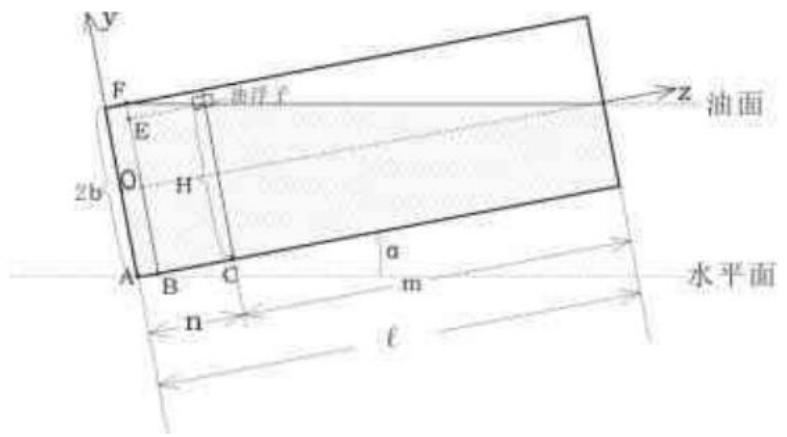

<details>
<summary>text_image</summary>

y
F
E
2b
O
H
A
B
C
n
a
m
ℓ
z 油面
水平面
</details>

图1-6

观察图形可得如下线段关系式

$$
A B = A C - B C, B C = E F \times \cot \alpha , E F = B F - B E,
$$

而

$$
A C = n, B E = C G = H.
$$

所以最终可得椭圆柱体的高为 $n - (2b - H)\cot \alpha$ ：

在求解底面时，我们直接取用椭圆的面积公式，得面积为 $\pi ab$ ，所以有

$$
V _ {3 - 1} = \pi a b (n - (2 b - H) \cot \alpha). \tag {7}
$$

在求解 $V_{3-2}$ 的函数关系式时, 我们参照模型 I 的求解过程, 抓住其本质的不同之处, 仅将其积分下限换为 $n - (2b - H)\cot \alpha$ 即得

$$
V _ {3} (y) = \int_ {n - (2 b - H)} ^ {l} S _ {3} (y) d z.
$$

所求的 $S_{3}(h)$ 函数表达式也与模型I中完全相同，即为

$$
S _ {3} (h) = \int_ {- b} ^ {h - b} 2 \frac {a}{b} \sqrt {b ^ {2} - y ^ {2}} d y = \frac {b}{a} (h - b) \sqrt {2 h b - h ^ {2}} + a b \text {arc} \frac {h - b}{b} + \frac {\pi}{2} a b. \tag {8}
$$

$H$ 与 $h$ 的函数关系也为

$$
h = H + (n -) \text {ztan} \alpha . \tag {9}
$$

同样联立(7)(8)(9)三式求解，为简便起见，我们也在此令 $k = H + n \tan \alpha - b$ ，同理得函数模型

$$
\begin{array}{l} V _ {3} (H, \alpha) = \int_ {H - b} ^ {H - m \tan \alpha - b} S _ {3} (h) d h + \pi a b (n - (2 b - H) \cot \alpha) \\ = a b \cot \alpha \left(\frac {1}{3 b ^ {2}} \sqrt {\left(b ^ {2} - j ^ {2}\right) ^ {3}} - \arcsin \frac {j}{b} - \sqrt {b ^ {2} - j ^ {2}} + \frac {1}{2} \pi m \tan \alpha\right) \\ - a b \cot \alpha \left(\frac {1}{3 b ^ {2}} \sqrt {\left(b ^ {2} - (H - b) ^ {2}\right) ^ {3}} - \arcsin \frac {H - b}{b} - \sqrt {b ^ {2} - (H - b) ^ {2}}\right) \\ + \pi a b (n - (2 b - H) \cot \alpha). \\ \end{array}
$$

4.4 情形IV时，罐容与油面高度关系的模型建立模型

如图1-7所示, 即为 $\alpha = 0$ 时的情形.

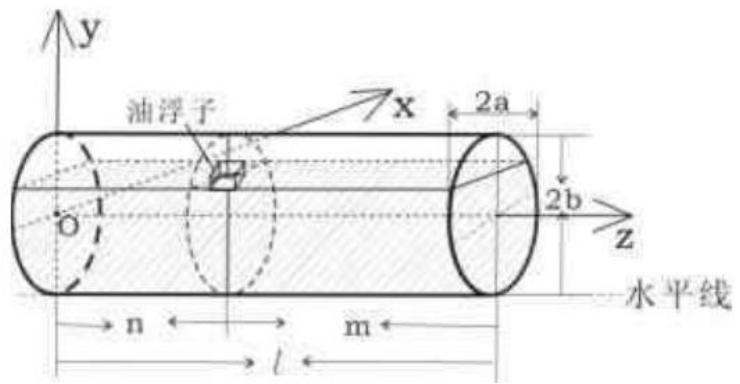

<details>
<summary>text_image</summary>

油浮子
x
2a
2b
z
水平线
n
m
l
y
</details>

图1-7

很明显，影响储油量 $V$ 的只有油面高度 $\mathrm{H}$ ，所以我们直接建立 $V$ 与 $H$ 的函数表达式 $V(H)$ ，以下即为函数 $V(H)$ 的建立：

此种情形下模型的建立与模型 I 的建立基本相同, 则有

$$
V _ {4} (y) = \int_ {0} ^ {l} S _ {4} (y) d z. \tag {10}
$$

所求的 $S_{4}(h)$ 函数表达式与模型I中完全相同，即为

$$
S _ {2} = \int_ {- b} ^ {h - b} 2 \frac {a}{b} \sqrt {b ^ {2} - y ^ {2}} d y = \frac {b}{a} (h - b) \sqrt {2 h b - h ^ {2}} + a b \arcsin \frac {h - b}{b} + \frac {\pi}{2} a b. \tag {11}
$$

由于 $\alpha = 0$ ，所以液面各处 $H$ 与 $h$ 均相等，即有

$$
h = H \quad . \tag {12}
$$

同样联立(10)(11)(12)三式求解得

$$
V _ {4} (H) = \frac {b l}{a} (H - b) \sqrt {2 H b - H ^ {2}} + a b l \arcsin \frac {H - b}{b} + \frac {\pi}{2} a b l.
$$

## 4.5 一些补充说明

1、除了以上所建立的三种模型外，我们也考虑到了其他可能会有的情况，如图所示图 1-8 和图 1-9，但是考虑到油浮子的测量局限性，这两种情况油浮子无法测量，所以我们在此也不做考虑.

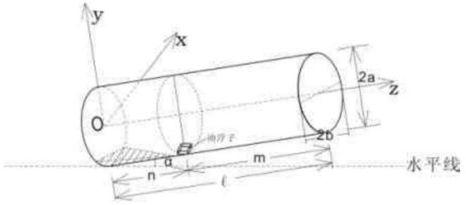

<details>
<summary>text_image</summary>

y
x
O
a
m
n
l
2a
z
2b
水平线
</details>

图1-8

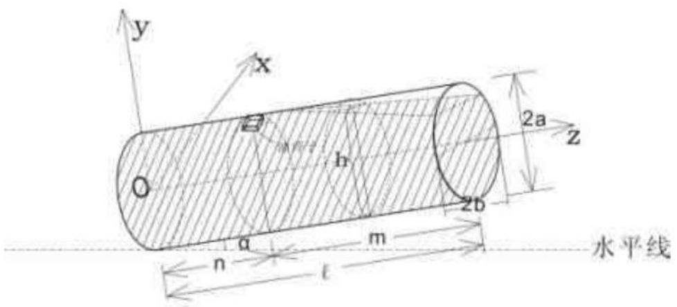

<details>
<summary>text_image</summary>

y
x
O
h
2a
z
2b
a
m
n
l
水平线
</details>

图1-9

2、发生纵向倾斜时, 可能为近油位探针端下倾, 也可能为远油位探针端下倾, 以上考虑的仅为近油位探针端下倾的情形. 若出现远油位探针端下倾这一情形, 对可测得油面高度 $H$ 的储油量函数可采用如下方法进行计算.

对于小椭圆柱体型储油罐这样的对称体，如图 1-10 所示，假设储油罐内有两个油浮子，分别位列储油罐内两对称的位置．并假设仅远油位探针端的油浮子可读，为 H，则另一油浮子，即近油位探针端油浮子油位高度为 2a - H，即对应的储油量函数直接套用以上模型即为：

$$
V (H) = f (2 a - H).
$$

但因远离油位探针端下倾时, 微小的油位变化就会引起储油量发生很大的变化, 实际工作中会很快被相关工作人员所发现, 并重新放置. 即远离油位探针端下倾没有太大的实际意义, 所以我们在此不做进一步讨论.

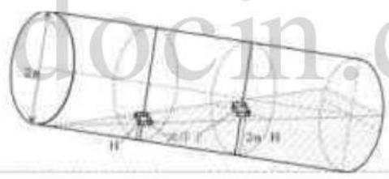

<details>
<summary>text_image</summary>

2m
H
2m H
</details>

图1-10

4.6 罐容与油面高度关系模型的求解

4.6.1、罐体变位后对罐容表的影响的求解

所谓罐体变位后对罐容表的影响，即考虑当的油位高度 $H$ 固定，为常数时，纵向倾角 $\alpha$ 对罐体储油体积 $V(H,\alpha)$ 的影响．可以通过理论值与实测值之间的差 $\Delta V(H,\alpha)$ 来判断

$$
\Delta V (H, \alpha) = V _ {2} (H, \alpha) - V _ {c} (H, \alpha).
$$

对上式拟合分析得， $V(H,\alpha)$ 是关于纵向倾角 $\alpha$ 的增函数，即 $\alpha$ 值增大时， $V(H,\alpha)$ 值增大.

## 4.6.2、给出 $\alpha = 4.1^{\circ}$ 时油高间隔为 $1cm$ 所对应的一系列的罐容标定值

在使用已建立出的模型做标定之前，为确保结果的精确度，我们先采用差值拟合的方法对模型进行修正．即对油罐储油体积 $V(H)$ 理论值与实际测量值的差做拟合曲线，也就是建立实测值与模型值的误差函数.

又因为采用数据拟合的方法可以反映函数曲线（面） $V = f(H)$ 反映对象整体的变化趋势，且使 $f(H)$ 在某种准则下与所有实际测量值最为接近，即曲线拟合得最好。于是我们将实际测量值的数据点用matlab拟合，在用三次拟合时，三次相前系数几乎为0，且做二次拟合时，相关系数r=0.9996，精度较高，说明拟合效果较好，故这里我们只采用中二次拟合。

现在计算误差函数. 油罐储油体积无论是理论值还是实际测量值都与油位高度 $H$ 有关, 所以误差函数也是 $H$ 的函数. 拟合时因进油表数值和出油表数值均为外部仪器测量, 其数值较为精确, 故采用进油表数值或采用出油表数值不会影响拟合效果.

用matlab $^{[2]}$ 做二次曲线拟合 $^{[3]}$ (程序见附录二、三)得出误差函数曲线方程为:

## (1) 未发生变位时，

实测值与模型值的误差函数为:

$$
\Delta V (H) = V _ {\mathrm{c}} (H) - V _ {\mathrm{L}} (H) = 1. 6 8 2 7 \times 1 0 ^ {- 5} H ^ {2} - 0. 1 5 6 9 3 H + 1 7. 9 8 2 6.
$$

故进行修正以后模型的函数为:

$$
V (H) = V _ {\mathrm{c}} (H) - \Delta V (H).
$$

用matlab编程有修正前后拟合曲线如下图1-11所示

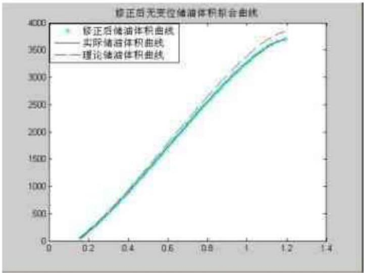

<details>
<summary>line</summary>

| X | 修正后储油体积曲线 | 实际储油体积曲线 | 理论储油体积曲线 |
| --- | --- | --- | --- |
| 0.2 | ~100 | ~100 | ~100 |
| 0.4 | ~850 | ~850 | ~850 |
| 0.6 | ~1750 | ~1750 | ~1750 |
| 0.8 | ~2600 | ~2600 | ~2600 |
| 1.0 | ~3300 | ~3300 | ~3300 |
| 1.2 | ~3700 | ~3700 | ~3850 |
</details>

图1-11

## (2) 发生变位时

实测值与模型值的误差函数:

$$
\Delta V (H) = V _ {\mathrm{c}} (H) - V _ {\mathrm{L}} (H) = 0. 0 0 0 3 9 7 3 9 H ^ {2} - 0. 5 8 3 4 2 H + 1 2 4. 2 5 3 7.
$$

修正以后的模型的函数为:

$$
V (H) = V _ {\mathrm{c}} (H) - \Delta V (H).
$$

修正前后拟合曲线如下图1-12所示:

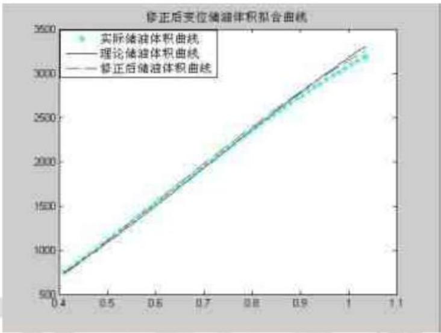

<details>
<summary>scatter</summary>

| X | 实际储油体积曲线 | 理论储油体积曲线 | 修正后储油体积曲线 |
| --- | --- | --- | --- |
| 0.4 | ~750 | ~750 | ~750 |
| 0.5 | ~1250 | ~1250 | ~1250 |
| 0.6 | ~1750 | ~1750 | ~1750 |
| 0.7 | ~2250 | ~2250 | ~2250 |
| 0.8 | ~2750 | ~2750 | ~2750 |
| 0.9 | ~3100 | ~3100 | ~3100 |
| 1.0 | ~3200 | ~3300 | ~3300 |
</details>

图1-12

现在采用相位分析法对修正后模型相似度进行检验，即用 $\delta = \cos \theta = \frac{V}{|V_1|^{\square}|_{1 - 2|}}$ 计算得 $\delta = 0.99$ ，这也就证明了模型的准确性.

从上可知修正后函数模型与实际情况吻合系数较高，符合实际情况，现利用matlab编程给出罐体变位后油位高度间隔为1cm的罐容表标定值定标 $^{[4]}$ 表如下表一：

表一 油位高度间隔为 $1\mathrm{\;{cm}}$ 的罐容表标定值

<table><tr><td>H(cm)</td><td>0.0</td><td>1.0</td><td>2.0</td><td>3.0</td><td>4.0</td><td>5.0</td><td>6.0</td><td>7.0</td></tr><tr><td>V(L)无变位</td><td>17.98</td><td>23.28</td><td>32.92</td><td>45.35</td><td>60.01</td><td>76.57</td><td>94.80</td><td>114.54</td></tr><tr><td>V(L)变位</td><td>124.25</td><td>127.76</td><td>130.51</td><td>134.19</td><td>139.01</td><td>144.91</td><td>152.10</td><td>160.52</td></tr><tr><td>8.0</td><td>9.0</td><td>10.0</td><td>11.0</td><td>12.0</td><td>13.0</td><td>14.0</td><td>15.0</td><td>16.0</td></tr><tr><td>135.65</td><td>158.02</td><td>181.56</td><td>206.20</td><td>231.87</td><td>258.51</td><td>286.07</td><td>314.49</td><td>343.74</td></tr><tr><td>170.34</td><td>181.61</td><td>194.33</td><td>208.57</td><td>224.41</td><td>241.90</td><td>261.09</td><td>281.95</td><td>304.39</td></tr><tr><td>17.0</td><td>18.0</td><td>19.0</td><td>20.0</td><td>21.0</td><td>22.0</td><td>23.0</td><td>24.0</td><td>25.0</td></tr><tr><td>373.78</td><td>404.56</td><td>436.05</td><td>468.22</td><td>501.05</td><td>534.49</td><td>568.53</td><td>603.14</td><td>638.30</td></tr><tr><td>328.15</td><td>353.05</td><td>379.02</td><td>406.00</td><td>433.88</td><td>462.65</td><td>492.24</td><td>522.63</td><td>553.76</td></tr><tr><td>26.0</td><td>27.0</td><td>28.0</td><td>29.0</td><td>30.0</td><td>31.0</td><td>32.0</td><td>33.0</td><td>34.0</td></tr><tr><td>673.97</td><td>710.15</td><td>746.81</td><td>783.92</td><td>821.47</td><td>859.45</td><td>897.82</td><td>936.58</td><td>975.70</td></tr><tr><td>585.59</td><td>618.09</td><td>651.25</td><td>684.97</td><td>719.33</td><td>754.22</td><td>789.65</td><td>825.58</td><td>862.01</td></tr><tr><td>35.0</td><td>36.0</td><td>37.0</td><td>38.0</td><td>39.0</td><td>40.0</td><td>41.0</td><td>42.0</td><td>43.0</td></tr><tr><td>1015. 17</td><td>1054. 98</td><td>1095. 10</td><td>1135. 53</td><td>1176. 24</td><td>1217. 23</td><td>1258. 47</td><td>1299. 95</td><td>1341. 66</td></tr><tr><td>898. 89</td><td>936. 23</td><td>974. 03</td><td>1012. 20</td><td>1050. 75</td><td>1089. 67</td><td>1128. 97</td><td>1168. 59</td><td>1208. 53</td></tr><tr><td colspan="9"></td></tr><tr><td>44. 0</td><td>45. 0</td><td>46. 0</td><td>47. 0</td><td>48. 0</td><td>49. 0</td><td>50. 0</td><td>51. 0</td><td>52. 0</td></tr><tr><td>1383. 59</td><td>1425. 71</td><td>1468. 03</td><td>1510. 52</td><td>1553. 17</td><td>1595. 97</td><td>1638. 90</td><td>1681. 96</td><td>1725. 13</td></tr><tr><td>1248. 81</td><td>1289. 33</td><td>1330. 15</td><td>1371. 21</td><td>1412. 51</td><td>1454. 08</td><td>1495. 84</td><td>1537. 81</td><td>1579. 97</td></tr><tr><td colspan="9"></td></tr><tr><td>53. 0</td><td>54. 0</td><td>55. 0</td><td>56. 0</td><td>57. 0</td><td>58. 0</td><td>59. 0</td><td>60. 0</td><td>61. 0</td></tr><tr><td>1768. 40</td><td>1811. 75</td><td>1855. 17</td><td>1898. 66</td><td>1942. 19</td><td>1985. 76</td><td>2029. 35</td><td>2072. 96</td><td>2116. 57</td></tr><tr><td>1622. 29</td><td>1664. 78</td><td>1707. 42</td><td>1750. 21</td><td>1793. 10</td><td>1836. 13</td><td>1879. 23</td><td>1922. 42</td><td>1965. 70</td></tr><tr><td colspan="9"></td></tr><tr><td>62. 0</td><td>63. 0</td><td>64. 0</td><td>65. 0</td><td>66. 0</td><td>67. 0</td><td>68. 0</td><td>69. 0</td><td>70. 0</td></tr><tr><td>2160. 16</td><td>2203. 73</td><td>2247. 27</td><td>2290. 75</td><td>2334. 18</td><td>2377. 53</td><td>2420. 79</td><td>2463. 96</td><td>2507. 02</td></tr><tr><td>2009. 01</td><td>2052. 40</td><td>2095. 81</td><td>2139. 23</td><td>2182. 69</td><td>2226. 14</td><td>2269. 57</td><td>2312. 99</td><td>2356. 35</td></tr><tr><td colspan="9"></td></tr><tr><td>71. 0</td><td>72. 0</td><td>73. 0</td><td>74. 0</td><td>75. 0</td><td>76. 0</td><td>77. 0</td><td>78. 0</td><td>79. 0</td></tr><tr><td>2549. 95</td><td>2592. 75</td><td>2635. 40</td><td>2677. 89</td><td>2720. 21</td><td>2762. 34</td><td>2804. 26</td><td>2845. 97</td><td>2887. 46</td></tr><tr><td>2399. 66</td><td>2442. 92</td><td>2486. 09</td><td>2529. 20</td><td>2572. 19</td><td>2615. 07</td><td>2657. 80</td><td>2700. 44</td><td>2742. 90</td></tr><tr><td colspan="9"></td></tr><tr><td>80. 0</td><td>81. 0</td><td>82. 0</td><td>83. 0</td><td>84. 0</td><td>85. 0</td><td>86. 0</td><td>87. 0</td><td>88. 0</td></tr><tr><td>2928. 70</td><td>2969. 68</td><td>3010. 39</td><td>3050. 82</td><td>3090. 94</td><td>3130. 75</td><td>3170. 22</td><td>3209. 35</td><td>3248. 10</td></tr><tr><td>2785. 23</td><td>2827. 34</td><td>2869. 27</td><td>2911. 00</td><td>2952. 48</td><td>2993. 79</td><td>3034. 81</td><td>3075. 59</td><td>3116. 07</td></tr><tr><td colspan="9"></td></tr><tr><td>89. 0</td><td>90. 0</td><td>91. 0</td><td>92. 0</td><td>93. 0</td><td>94. 0</td><td>95. 0</td><td>96. 0</td><td>97. 0</td></tr><tr><td>3286. 48</td><td>3324. 45</td><td>3362. 00</td><td>3399. 12</td><td>3435. 77</td><td>3471. 95</td><td>3507. 63</td><td>3542. 78</td><td>3577. 39</td></tr><tr><td>3156. 27</td><td>3196. 16</td><td>3235. 74</td><td>3274. 95</td><td>3313. 82</td><td>3352. 33</td><td>3390. 42</td><td>3428. 09</td><td>3465. 37</td></tr><tr><td colspan="9"></td></tr><tr><td>98. 0</td><td>99. 0</td><td>100. 0</td><td>101. 0</td><td>102. 0</td><td>103. 0</td><td>104. 0</td><td>105. 0</td><td>106. 0</td></tr><tr><td>3611. 43</td><td>3644. 88</td><td>3677. 70</td><td>3709. 87</td><td>3741. 37</td><td>3772. 15</td><td>3802. 18</td><td>3831. 43</td><td>3859. 85</td></tr><tr><td>3502. 19</td><td>3538. 55</td><td>3574. 39</td><td>3609. 73</td><td>3644. 52</td><td>3678. 78</td><td>3712. 41</td><td>3745. 44</td><td>3777. 83</td></tr><tr><td colspan="9"></td></tr><tr><td>107. 0</td><td>108. 0</td><td>109. 0</td><td>110. 0</td><td>111. 0</td><td>112. 0</td><td>113. 0</td><td>114. 0</td><td>115. 0</td></tr><tr><td>3887. 41</td><td>3914. 05</td><td>3939. 72</td><td>3964. 36</td><td>3987. 91</td><td>4010. 28</td><td>4031. 38</td><td>4051. 12</td><td>4069. 35</td></tr><tr><td>3809. 55</td><td>3840. 55</td><td>3870. 78</td><td>3900. 24</td><td>3928. 88</td><td>3956. 64</td><td>3983. 39</td><td>4009. 19</td><td>4033. 90</td></tr><tr><td colspan="9"></td></tr><tr><td>116. 0</td><td>117. 0</td><td>118. 0</td><td>119. 0</td><td>120. 0</td><td></td><td></td><td></td><td></td></tr><tr><td>4085. 91</td><td>4100. 57</td><td>4113. 01</td><td>4122. 65</td><td>4127. 94</td><td></td><td></td><td></td><td></td></tr><tr><td>4057. 46</td><td>4079. 62</td><td>4100. 22</td><td>4119. 08</td><td>4136. 30</td><td></td><td></td><td></td><td></td></tr></table>

## 五、关于实际储油罐的模型建立与求解

## 5.1 实际储油罐的模型建立

## 5.1.1 建立 $H^{\prime}(H,\beta)$ 关系式

如图 2-1 所示，取出油浮子所在处的截面，并以其下端点为原心，该处切线方向为 x 轴，垂直 x 轴方向为 y 轴，建立直角坐标系．其中平行与 x 轴的直线为油面所在水平线，所以 B 点为油浮子在 y 轴上的投影点，同时我们设其在 y 轴正半轴上的投影高

度为 $H'$ ．油浮子的测量高度仍然设为H．

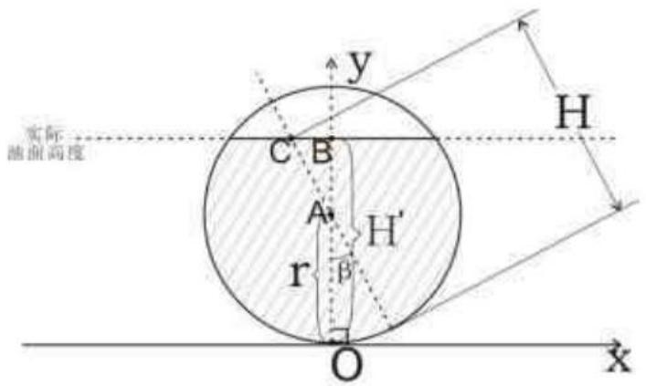

<details>
<summary>text_image</summary>

实际
曲面高度
C B
A H'
r B'
O x
y
H
</details>

图2-1

由图可得如下线段关系

$$
O B = O A + A B, A B = A C \cos \beta , A C = C D - A D,
$$

而

$$
C D = H, A D = r,
$$

最后可得

$$
H ^ {\prime} (H, \beta) = (H - r) \cos \beta + r. \tag {13}
$$

## 5.1.2 建立 $V(H', S, \alpha)$ 关系式

接下来考虑纵向倾斜时，我们只需利用 $H'$ ，结合微元积分的思想，建立函数关系式 $V(H', \alpha, \beta)$ ，最终通过(13)式将 $H$ 引入即得我们所需要的 $V(H, \alpha, \beta)$ 函数模型.

与问题一的思路相同，首先，我们根据储油量的多少，以及油浮子位置的限制，对于近油位探针端下倾这种情形，分成如下几种情况进行考虑：

$$
0 \leq H ^ {\prime} <   6 \tan \alpha , 6 \tan \alpha \leq H ^ {\prime} <   7 \tan \alpha + 1. 5, 7 \tan \alpha + 1. 5 \leq H ^ {\prime} <   3.
$$

我们以储油罐最下端切线方向为 $y$ 轴, 以过储油罐最左端点且垂直于 $y$ 轴, 并切于该点的指向上的直线为 $z$ 轴, 以 $y$ 轴与 $z$ 轴交点为原点, 以过原点且垂直于 $y$ 轴和 $z$ 轴的直线为 $x$ 轴建立空间直角坐标系, 如图 2-2 所示. 同时设油面与储油罐的罐壁交点分别为点 $E$ 和点 $D$ , 观察图形得积分方向 $y$ 轴的五个区域:

$$
0 \leq y \leq y _ {E}, \quad y _ {E} \leq y \leq 1, \quad 1 \leq y \leq 9, \quad 9 \leq y \leq y _ {D}, \quad y _ {D} \leq y \leq 1 0.
$$

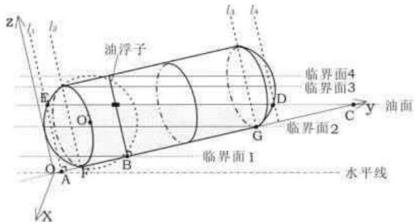

<details>
<summary>text_image</summary>

z
l₁
l₂
油浮子
E
O
临界面4
临界面3
D
G
C
y 油面
临界面2
临界面1
水平线
A
F
B
X
</details>

图2-2

我们先考虑 $y_{E} > 1.5$ ，即左端处一直存在一个由过点 $E$ 且垂直于 $y$ 轴的面所截出小球冠体，而对于 $0 \leq y_{E} \leq 1.5$ 这种情况我们将在后面单独做以交代.

(1) 当 $0 \leq H' < 6 \tan \alpha$ 时, 其油面位置在如图 2-2 所示临界面 1 和临界面 2 之间, 即为模型 I.

$$
V = \int_ {0} ^ {y _ {g}} S _ {1} d y + \int_ {y _ {g}} ^ {1} S _ {2} d y + \int_ {1} ^ {3 + H ^ {\prime} \cot \alpha} S _ {3} d y . \tag {14}
$$

（2）当 $6 \tan \alpha \leq H' < 7 \tan \alpha + 1.5$ 时，其油面位置在如图2-2所示临界面2和临界面3之间，即为模型Ⅱ.

$$
V = \int_ {0} ^ {y _ {g}} S _ {1} d y + \int_ {y _ {g}} ^ {1} S _ {2} d y + \int_ {1} ^ {9} S _ {3} d y + \int_ {9} ^ {y _ {D}} S _ {4} d y. \tag {15}
$$

（3）当 $7\tan \alpha + 1.5 \leq H' < 3 - 2\tan \alpha$ 时，其油面位置在如图2-2所示临界面3和临界面4之间，即为模型III.

$$
V = \int_ {0} ^ {y _ {\varepsilon}} S _ {1} d y + \int_ {y _ {\varepsilon}} ^ {1} S _ {2} d y + \int_ {1} ^ {9} S _ {3} d y + \int_ {9} ^ {y _ {D}} S _ {4} d y + \int_ {y _ {D}} ^ {1 0} S _ {5} d y . \tag {16}
$$

（4）当 $3 - 2\tan \alpha \leq H' < 3$ 时，其油面位置在如图2-2所示临界面3和临界面4之间，即为模型I II III IV.，观察图可得在积分上下限为1到9的立体中有一部分组成是高为 $2 - (3 - H')\cot \alpha$ 的圆柱体，所以在上式的基础上我们有如下表达式：

$$
V = \int_ {0} ^ {y _ {E}} S _ {1} d y + \int_ {y _ {E}} ^ {1} S _ {2} d y + \int_ {1} ^ {3 - (3 - H ^ {'}) \cot \alpha} S _ {\mathrm{圆}} d y + \int_ {3 - (3 - H ^ {'}) \cot \alpha} ^ {9} S _ {3} d y + \int_ {9} ^ {y _ {D}} S _ {4} d y + \int_ {y _ {D}} ^ {1 0} S _ {5} d y . \tag {17}
$$

现需要解决的就是求解 D 、 E 点的坐标, 来确定各模型表达式中积分上下限.

很明显点 $y_{D}$ 和 $y_{E}$ 是直线 DE 与两个部分球面体的交点，根据初等数学的相关知识，

我们分别建立直线以及球面方程，最终联立求解得 D 、 E 坐标.

## （一）直线方程的建立

如图 2-2 所示，有如下的线段关系：

$$
O C = O A + A B + C B ,
$$

而

$$
O A = 1, A B = 2, C B = H ^ {\prime} \cot \alpha ,
$$

所以得

$$
O C = 3 + H ^ {\prime} \cot \alpha .
$$

即 C 点的坐标为 $(0,3 + H' \cot \alpha, 0)$ .

又已知 $\angle ECA = \alpha$ ，可得其斜率为 $-\tan \alpha$ ，再根据点斜式方法，可得该直线的方程为：

$$
z = - \tan \alpha y + H ^ {\prime} + 3 \tan \alpha . \tag {18}
$$

## （二）球面方程的建立

如图 2-3 所示，设球体半径为 R .

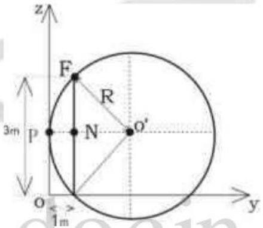

<details>
<summary>text_image</summary>

z
F
R
3m
P
N
O'
O
1m
y
</details>

图2-3

由图可得如下线段关系式

$$
O ^ {\prime} N ^ {2} + N F ^ {2} = O ^ {\prime} F ^ {2}, O ^ {\prime} N = O ^ {\prime} P - N P,
$$

由于

$$
O ^ {\prime} P = O ^ {\prime} F = R, N P = 1,
$$

得

$$
\left(R - 1\right) ^ {2} + 1. 5 ^ {2} = R ^ {2} \Rightarrow R = 1. 6 2 5.
$$

则左半边球冠体球心 $O'$ 的坐标为(0,1.625,1.5)，同理可求得右半边球冠体球心的坐标为(0,8.375,1.5).

左半边球冠体所在球的方程:

$$
\left(y - 1. 6 2 5\right) ^ {2} + \left(z - 1. 5\right) ^ {2} = 1. 6 2 5 ^ {2}. \tag {19}
$$

右半边球冠体所在球的方程:

$$
\(\left(y - 8.375\right)^2 + \left(z - 1.5\right)^2 = 1.625^2.\)
$$

点 $E(y_{E},z_{E})$ 既在左半边球冠体横截面圆的曲线上，同时也过直线 $CE$ ，为求 $E$ 点的坐标 $y_{E}$ ，则可以联立方程(18)和(19)求解得：

$$
\begin{array}{l} y _ {E} = \frac {3 . 2 5 + 2 \tan \alpha \left(H ^ {\prime} + 3 \tan \alpha - 1 . 5\right)}{2 \sec^ {2} \alpha} \\ \frac {\sqrt {\left[3 . 2 5 + 2 \tan \alpha \left(H ^ {\prime} + 3 \tan \alpha - 1 . 5\right) \right] ^ {2} - 4 \sec^ {2} \alpha \left(H ^ {\prime} + 3 \tan \alpha - 1 . 5\right) ^ {2}}}{2 \sec^ {2} \alpha}. \\ \end{array}
$$

同理可联立方程(18)和(20)求解得:

$$
y _ {D} = \frac {1 6 . 7 5 + 2 \tan \alpha \left(H ^ {\prime} + 3 \tan \alpha - 1 . 5\right)}{2 \sec^ {2} \alpha}
$$

$$
+ \frac {\sqrt {\left[ 1 6 . 7 5 + 2 \tan \alpha \left(H ^ {\prime} + 3 \tan \alpha - 1 . 5\right) \right] ^ {2} - 4 \sec^ {2} \alpha \left[ \left(H ^ {\prime} + 3 \tan \alpha - 1 . 5\right) ^ {2} + 8 . 3 7 5 ^ {2} - 1 6 . 2 5 ^ {2} \right]}}{2 \sec^ {2} \alpha}.
$$

## 5.1.3 建立 $S(H', \alpha)$ 关系式

由于弓形面积公式以及 $L(y)$ 将会在以下多次用到，所以在此，我们单独将两式列出，后面就不再重复了.

设弓高为 $h$ ，则弓形的面积为：

$$
S = \left(\pi - \arccos \frac {h - r}{r}\right) r ^ {2} + (h - r) \sqrt {r ^ {2} - (h - r) ^ {2}}.
$$

如图 2-2 所示，有关系式

$$
\begin{array}{l} \tan \alpha = \frac {L (y)}{O C - O M} = \frac {L (y)}{O C - y} \\ \Rightarrow L (y) = \tan \alpha (O C - y) = \left(H ^ {\prime} \cot \alpha + 3\right) \tan \alpha - y \tan \alpha = H ^ {\prime} + (3 - y) \tan \alpha. \\ \end{array}
$$

(1) 当 $0 \leq y \leq y_{E}$ 时, 体积可看成一连串圆面该区间范围内的积分, 此时记圆的面积:

$$
S _ {1} (y) = \pi r _ {1} ^ {2} = \pi \left[ R ^ {2} - (R - y) ^ {2} \right] = \pi \left[ 1. 6 2 5 ^ {2} - (y - 1. 6 2 5) ^ {2} \right] = \pi (3. 2 5 y - y ^ {2}). \tag {21}
$$

(2) 当 $y_{E} \leq y \leq 1$ 时，体积可看成一连串弓形面在该区间范围内的积分，设弓高为 $h_{2}$ ，

$$
\begin{array}{l} h _ {2} = L (y) - \left[ 1. 5 - \sqrt {1 . 6 2 5 ^ {2} - (y - 1 . 6 2 5) ^ {2}} \right] \\ = H ^ {\prime} + (3 - y) \tan \alpha - \left[ 1. 5 - \sqrt {1 . 6 2 5 ^ {2} - (y - 1 . 6 2 5) ^ {2}} \right]. \tag {22} \\ \end{array}
$$

结合弓形面积公式得

$$
\begin{array}{l} S _ {2} (y) = \left(\pi - \arccos \frac {L (y) - 1 . 5}{\sqrt {1 . 6 2 5 ^ {2} - (y - 1 . 6 2 5) ^ {2}}}\right) \left[ 1. 6 2 5 ^ {2} - (y - 1. 6 2 5) ^ {2} \right] \\ + (L (y) - 1.) \sqrt [ 4 ]{1 . 6 ^ {2} 2 (5 y - \quad) ^ {2}} \cdot \left[ L (y) - 1. \right] ^ {2} 5 \tag {23} \\ \end{array}
$$

(3) 当 $1 \leq y \leq 9$ 时, 体积可看成一连串弓形面在该区间范围内的积分, 设弓高为 $h_{3}$ ,

$$
\begin{array}{l} h _ {3} = L (y) - \left[ 1. 5 - \sqrt {1 . 6 2 5 ^ {2} - (y - 1 . 6 2 5) ^ {2}} \right] \\ = H ^ {\prime} + (3 - y) \tan \alpha - \left[ 1. 5 - \sqrt {1 . 6 2 5 ^ {2} - (y - 1 . 6 2 5) ^ {2}} \right], \\ \end{array}
$$

得

$$
S _ {3} (y) = \left(\pi - \arccos \frac {L (y) - 1 . 5}{1 . 5}\right) 1. 5 ^ {2} + \left[ L (y) - 1. 5 \right] \sqrt {3 L (y) - L ^ {2} (y)}. \tag {24}
$$

（4）当 $9 \leq y \leq y_{D}$ 时，体积可看成一连串弓形面在该区间范围内的积分，设弓高为 $h_{4}$ ，

$$
h _ {4} = L (y) - \left[ 1. 5 - \sqrt {1 . 6 2 5 ^ {2} - (y - 8 . 3 7 5) ^ {2}} \right] = H ^ {\prime} + (3 - y) \tan \alpha - \left[ 1. 5 - \sqrt {1 . 6 2 5 ^ {2} - (y - 8 . 3 7 5) ^ {2}} \right]
$$

得

$$
\begin{array}{l} S _ {4} (y) = \left(\pi - \arccos \frac {L (y) - 1 . 5}{\sqrt {1 . 6 2 5 ^ {2} - (y - 8 . 3 7 5) ^ {2}}}\right) \\ + \left[ L (y) - 1. 5 \right] \sqrt {1 . 6 2 5 ^ {2} - (y - 8 . 3 7 5) ^ {2} - \left[ L (y) - 1 . 5 \right] ^ {2}}. \tag {25} \\ \end{array}
$$

(5) 当 $y_{D} \leq y \leq 10$ 时, 体积可看成一连串圆面在一定区间范围内的积分, 此时记圆的面积:

$$
S _ {s} (y) = \pi r _ {s} ^ {2} = \pi \left[ R ^ {2} - (R - y) ^ {2} \right] = \pi \left\{1. 6 2 5 ^ {2} - [ 1. 6 2 5 - (1 0 - y) ] ^ {2} \right\} = \pi (- 6 7. 5 + 1 6. 7 5 y - y ^ {2}). \tag {26}
$$

最终联立(13)、(14)～(17)和(21)～(26)这10个公式即得(程序见附录四)

$$
V (H) = \left\{ \begin{array}{l} \int_ {0} ^ {y _ {B}} S _ {1} (y) d y + \int_ {y _ {B}} ^ {1} S _ {2} (y) d y + \int_ {1} ^ {3 + h \tan \alpha} S _ {3} (y) d y, 0 \leq h <   6 \tan \alpha \\ \int_ {0} ^ {y _ {B}} S _ {1} (y) d y + \int_ {y _ {B}} ^ {1} S _ {2} (y) d y + \int_ {1} ^ {9} S _ {3} (y) d y + \int_ {9} ^ {y _ {D}} S _ {4} (y) d y, 6 \tan \alpha \leq h <   7 \tan \alpha + 1. 5 \\ \int_ {0} ^ {y _ {B}} S _ {1} (y) d y + \int_ {y _ {B}} ^ {1} S _ {2} (y) d y + \int_ {1} ^ {9} S _ {3} (y) d y + \int_ {9} ^ {y _ {D}} S _ {4} (y) d y + \int_ {y _ {D}} ^ {1 0} S _ {5} (y) d y, 7 \tan \alpha + 1. 5 \leq h <   3 - 2 \tan \alpha \\ \pi 1. 5 ^ {2} [ 2 - (3 - h) \cot \alpha ] + \int_ {3 - (3 - h) \cot \alpha} ^ {9} S _ {3} (y) d y + \int_ {9} ^ {y _ {D}} S _ {4} (y) d y + \int_ {y _ {D}} ^ {1 0} S _ {5} (y) d y, 3 - 2 \tan \alpha \leq h <   3 \end{array} \right.
$$

## 5.2 变位参数 $\alpha$ 、 $\beta$ 值的确定

上面我们建立了罐内储油量与油位高度 $H$ 及变位参数（纵向倾斜角度 $\alpha$ 和横向偏转角度 $\beta$ ）之间的关系一般。现在我们需要用罐体变位后在进/出油过程中的实际检测数据确定模型中的变位参数 $\alpha$ 、 $\beta$ 。

对于给定的油面高度 $H$ ，当 $\alpha$ 、 $\beta$ 值不同时，理论计算出的罐内储油量不同，为与实际情况相吻合，采用如下算法来确定 $\alpha$ 、 $\beta$ 的值：

第一步，取 $0^{0} < \alpha < 10^{0}$ 、 $0^{0} < \beta < 10^{0}$ ，且 $\alpha$ 、 $\beta$ 均以 $0.1^{0}$ 为步长.

第二步, 对 $100 \times 100$ 组 $\alpha$ 、 $\beta$ 值, 在理论模型下计算出每一组值在不同油面高度 $H$ 时罐内储油量 $V(H)$ .

第三步，计算每一组 $\alpha$ 、 $\beta$ 值对应罐内储油量理论值与实际值的离差平方和，将对应 $100\times 100$ 组离差平方和值比较取出平方差值最小时的 $\alpha$ 、 $\beta$ 值，即：

$$
\left(\alpha , \beta\right) = \min \sum_ {i = 1} ^ {n} \left(V (H) - V _ {C}\right) ^ {2}.
$$

另在问题 A 附件 2：实际采集数据表．xls 中，前一次显示油量容积值减去出油量后与下一次显示油量容积值不相等，即显示油量容积值存在误差，故程序调用数据前，必须对出油表数据做修正，现用流水号 201 数据来说明数据修正的方法如：

表二

<table><tr><td>流水号</td><td>出油量/L</td><td>显示油高/mm</td><td>显示油量容积/L</td><td>出油后理论剩油量</td><td></td><td>修正后的数据</td></tr><tr><td>201</td><td>60.00</td><td>2632.23</td><td>60448.88</td><td>60299.79</td><td>11.64</td><td>60460.52</td></tr><tr><td>202</td><td>149.09</td><td>2624.30</td><td>60311.43</td><td>60242.98</td><td>5.05</td><td>60316.48</td></tr><tr><td>203</td><td>68.45</td><td>2620.67</td><td>60248.03</td><td>60048.76</td><td>16.35</td><td>60264.38</td></tr><tr><td>204</td><td>199.27</td><td>2610.29</td><td>60065.11</td><td>59995.06</td><td>4.63</td><td>60069.74</td></tr><tr><td>205</td><td>70.05</td><td>2606.61</td><td>59999.69</td><td>59863.33</td><td>10.73</td><td>60010.42</td></tr></table>

流水号201出油后，显示油量容积为60448.88L，流水号202出油后，显示油量容积 60311.43L，出油后理论剩油量 60299.79L，显示油量容积与出油后理论剩油量差为 11.64L，故流水号 201 出油后，显示油量容积修正为 60448.88+11.64=60460.52L，故任一流水号 $\eta$ 的修正数据为：

$$
V _ {\mathrm{修} \eta} = V _ {\mathrm{显} (\eta + 1)} + V _ {\mathrm{出} (\eta + 1)}.
$$

据此得用 excel $^{[5]}$ 修正后的数据见问题 A 附件 2：实际采集数据表．xls 中 K2---K603；

对算法用 matlab 编程（程序见附录五）得 $\alpha = 0^{0}$ 、 $\beta = 0^{0}$ ，此时为不发生变位的情况．故将算法修正为

第一步，取 $0^0 < \alpha < 10^0$ 、 $0^0 < \beta < 10^0$ ，且 $\alpha$ 、 $\beta$ 均以 $0.1^0$ 为步长.

第二步，对 $100 \times 100$ 组 $\alpha$ 、 $\beta$ 值，在理论模型下计算出出油量的值即：

$$
V _ {c} = V \left(H _ {\eta}\right) - V \left(H _ {\eta + 1}\right).
$$

第三步，计算每一组 $\alpha$ 、 $\beta$ 值对应罐内出油量理论值与实际值的离差平方和，将对应 $100 \times 100$ 组离差平方和值比较取出平方差值最小时的 $\alpha$ 、 $\beta$ 值，即

$$
\left(\alpha , \beta\right) = \min \sum_ {i = 1} ^ {n} \left(V (H) - V _ {c}\right) ^ {2}.
$$

同理，对算法用matlab编程（程序见附录五）得 $\alpha = 2^0$ 、 $\beta = 4.9^0$

将 $\alpha$ 、 $\beta$ 值代入模型, 再用 matlab 编程 (附录) 给出罐体变位后油位高度间隔为 $10 \mathrm{~cm}$ 的罐容表标定值表如下:

表三

<table><tr><td>高度(cm)</td><td>10. 0</td><td>20. 0</td><td>30. 0</td><td>40. 0</td><td>50. 0</td><td>60. 0</td><td>70. 0</td><td>80. 0</td></tr><tr><td>罐容(L):</td><td>353. 58</td><td>1082. 40</td><td>2256. 23</td><td>3743. 13</td><td>5476. 99</td><td>7417. 59</td><td>9534. 62</td><td>11803. 02</td></tr><tr><td colspan="9"></td></tr><tr><td>90. 0</td><td>100. 0</td><td>110. 0</td><td>120. 0</td><td>130. 0</td><td>140. 0</td><td>150. 0</td><td>160. 0</td><td>170. 0</td></tr><tr><td>14201. 01</td><td>16708. 92</td><td>19308. 57</td><td>21982. 83</td><td>24715. 34</td><td>27490. 23</td><td>30292. 00</td><td>33105. 37</td><td>35915. 11</td></tr><tr><td colspan="9"></td></tr><tr><td>180. 0</td><td>190. 0</td><td>200. 0</td><td>210. 0</td><td>220. 0</td><td>230. 0</td><td>240. 0</td><td>250. 0</td><td>260. 0</td></tr><tr><td>38705. 94</td><td>41462. 42</td><td>44168. 78</td><td>46808. 76</td><td>49365. 44</td><td>51820. 90</td><td>54155. 94</td><td>56349. 43</td><td>58377. 46</td></tr><tr><td colspan="9"></td></tr><tr><td>270. 0</td><td>280. 0</td><td>290. 0</td><td>300. 0</td><td></td><td></td><td></td><td></td><td></td></tr><tr><td>60211. 73</td><td>61816. 26</td><td>63138. 46</td><td>64065. 23</td><td></td><td></td><td></td><td></td><td></td></tr></table>

## 5.3 正确性验证与方法可靠性检验

在对 $\alpha$ 、 $\beta$ 值确定过程中，我们计算得到了 $\alpha = 0^0$ 、 $\beta = 0^0$ 时储油量理论值数据（附录），将其与实际值做差 $(V(H) - V_{s})$ 得差值拟合的百分差为 $0.23\%$ ，这就验证了模型的正确性．据此我们提出一种正确性验证方法：

令 $\alpha = 0^{0}$ 、 $\beta = 0^{0}$ ，代入储油体积函数 $V(H)$ 中计算出理论的储油体积值，并与实际储油体积做离差平方和 $\sum_{i=1}^{n} \left( V(H) - V_{c} \right)^{2}$ ，或对理论计算值与实际测量值用最小二乘法拟合，从而确定误差的大小，即模型的正确性.

## 六、误差分析

虽然我们建立了模型，得出了 $H$ 与 $V$ 的一一对应关系，但是模型的建立是在理想的假设基础之上的，实际上：油浮子是有一定的体积，而不是质点，如图3-1所示，其测量会有一定的误差；储油罐的厚度是存在的，所以罐内液体的长度一定比所给出的罐长要小．所以实际与理论之间必定存在一定的误差.

现在我们选择其中之一，即考虑油浮子对油位高度的测量的影响而带来的误差。根据实际情况，油位探针上的油浮子的机械外形各式各样，但我们可以将油浮子分为两类：1. 储油罐无油时，油浮子与罐底接触相切（如图3-1右图）；2. 储油罐无油时，油浮子与罐底有间隙，与罐壁相割（如图3-1左图）。

不考虑油的性质，无变位时，分别对上述两类进行分析，当为第一种类型时，油浮子可以检测到无油的状态，则此时的油浮子对油位高度的测量几乎无影响；当为第二种类型时，油浮子与储油罐总有一定间隙，则该间隙中的油位高度是无法测量到的，所以会对测量油位高度产生一定影响。

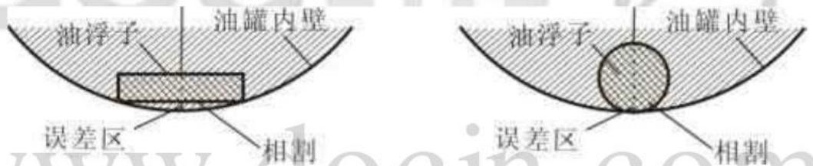  
图3-1

## 七、模型的优缺点分析

本文建立的模型比较多，都是基于不同形状的储油的正截面面积在不同范围内的积分而建立起来的，有比较强的理论性及实用性，可以通过这些模型对储油罐的油位高度进行更为准确地测量，以便对储油罐内储油量进行估计，有利于油位计量管理系统的完善，其实际价值十分明显，并且对于储油罐的设计有一定指导意义。但是在建立模型时，我们忽略了一些客观因素，例如：温度、气压、罐体本身机械结构等对油浮子测量油位高度的影响，是在非常理想的状况下建立的模型，所以通过这些模型得到的理论值与实际测量值仍有一定差距。于是我们便将理论与实际的数据进行比较，求解出无变位/变位时的误差分析函数，对模型进行修正，尽量将理论值与实际测量值之间的差距减小到最小程度。

## 八、模型改进与推广

随着我国石油工业的发展需要, 测量对于油库计量的重要性与日俱增, 对测量方法和精度提出了更高的要求. 在对问题的模型建立及求解过中, 我们单纯地从有无变位而造成的储油正截面不同形状的角度出发，运用微积分的思想，建立了罐内储油量与油位高度及变位参数（纵向倾斜角度α和横向偏转角度β）之间一般关系的模型，是理想化的，然而结合实际情况，仍有一些影响测量油位高度的因素存在，所以我们权衡了各项影响因素后提出了：储油罐容积修正——液体静压力修正值的概念，分析油的静压力所引起的储油罐罐身产生形变而导致对计量精度的影响，并由此得出液体静压力修正值的计算公式为： $\Delta V_{static pressure} = kH^{2}$ ，其中 $k = \frac{\pi g\rho R^{3}}{E\sigma} \times 10^{-6}$ ，这里ρ——储油罐内所盛油的平均密度， $g/cm^{3}$ ；R——储油罐的基本几何半径，cm；E——储油罐罐体材料的弹性模量， $N/cm^{3}$ ；H——储油罐内测量的油位高度，cm；g——液面在不同高度时的重力加速度， $m/s^{2}$ ；σ——储油罐罐体平均厚度，cm。

在运用模型对油位高度进行标定时，除了结合误差函数外，如果再结合该液体静压力修正值 $\Delta V_{\text{static pressure}}$ ，对模型进行改进，则可进一步提高测量精度，更接近真实值.

该模型研究储油罐的变位识别与罐容表标定，我们也可以将其运用于生产制造过程中原料添加量计量，潜水艇工作时蓄水量计量，洒水车盛水量计量等领域，具有较强的推广意义。

## 参考文献

[1]同济大学数学系．高等数学(第六版)．北京:高等教育出版社，2007.  
[2](美)Gerald Recktenwald. 数值方法和 MATLAB 实现及应用. 北京: 机械工业出版社, 2004.  
[3]施浒立，赵彦．误差设计新理念与方法．北京:科学出版社，2007.  
[4]黄波，王本善．中华人民共和国计量检定规程 JJG266-1996．中国计量科学研究院．1996.  
[5]闫志朝. Excel 函数、图表与数据分析. 北京: 机械工业出版社, 2006.  
[6] 柴俊．数学实验教程(Matlab版). 北京: 科学出版社, 2006.  
[7] 杨旭武. 试验误差原理与数据处理. 北京: 科学出版社, 2009.  
[8] 姜启源．数学模型(第二版)．北京:高等教育出版社，1993.

## 附录

附录一 椭圆侧面面积求解  
```txt
clear
clc
%椭圆侧面面积求解
syms a b H y
f=2*(a/b)*sqrt(b^2-y^2); %侧面面积积分函数
S=int(f, 'y', '-b', 'H-b')
```

附录二 变位时椭圆柱体体积求解与拟合与误差曲线拟合  
```matlab
clear
clc
%变位时椭圆柱体体积求解与拟合与误差曲线拟合
%**********参数赋值**********
a=0. 89; %椭圆截面长半轴长
b=0. 6; %椭圆截面短半轴长
l=2. 45; %椭圆柱体长
n=0. 4;
m=2. 05;
alpha=4. 1*pi/180; %椭圆柱体纵向倾斜角度
k=H+n*tan(alpha)-b; %中间参数定义
j=H-m*tan(alpha)-b;
%**********参数赋值**********
%**********模型体积求解**********
if 0<=H&H<=m*tan(alpha)
V=-10^(3)*(a*b*cot(alpha)*(((1/(3*b^2))*sqrt((b^2-k.^2))+a*b*asin(k/b)+0.
5*pi*(k+b+1)));    %有变位时椭圆柱体体积1
end
if m*tan(alpha)<H&H<=2*b-ntan(alpha)
V=-10^(3)*(cot(alpha)*a*b*((1/(3*b^2))*sqrt((b^2-j.^2))+a*b*asin(j/b)+0.
5*pi*(m-n)tan(alpha)). . .
    -((1/(3*b^2))*sqrt((b^2-k.^2))-a*b*asin(k/b))); %有变位时椭圆柱体体积2
end
if 2*b-ntan(alpha)<=H&H<=2b
V=-10^(3)*(cot(alpha)*a*b*((1/(3*b^2))*sqrt((b^2-j.^2))+a*b*asin(j/b)+0.
5*pi*(m-n)tan(alpha)). . .

-((1/(3*b^2))*sqrt((b^2-(H-b).^2))-a*b*asin((H-b)/b))))+pi*a*b*(n-(m-H)cot
(alpha))); %有变位时椭圆柱体体积3
end
%**********模型体积求解**********
H=10^(-3)*xlsread('F:\all\2010A\问题A附件1: 实验采集数据表.xls', '无变位进
```

```txt
油', 'D2:D54');
D=xlsread('F:\all\2010A\问题A附件1: 实验采集数据表.xls', '无变位进油',
'H2:H54');
V2=polyfit(H, V-D, 2)%V-D表示体积的理论值与实际值的差
VV=V+V2; %对模型进行误差修订
%*********储油体积曲线绘制拟合*****************
plot(H, V, 'c*', H, VV, 'k-', H, D, 'r--')
title('有变位时储油体积拟合曲线');
legend('理论计算储油体积曲线','修正后储油体积曲线','实际计算储油体积曲线');
%*********储油体积曲线绘制拟合*****************
%*********罐容表标定值求解*****************
H=0:10:3000;
p=V
%*********罐容表标定值求解*****************
```

附录三 模型检验拟合曲线绘制  
```matlab
clear
clc
%**********模型检验拟合曲线绘制****************
H=xlsread('C:\Documents and Settings\k01\桌面\问题A附件2: 实际采集数据表.xls', '实际储油罐的采集数据', 'E2:E603');
D=xlsread('C:\Documents and Settings\k01\桌面\问题A附件2: 实验采集数据表.xls', '实际储油罐的采集数据', 'K2:K603');
M=polyfit(H, V, 2)
plot(H, V, 'b-', H, D, 'ro')
title('模型检验拟合曲线');
legend('修正后储油体积曲线', '实际计算储油体积曲线');
%**********模型检验拟合曲线绘制****************
```

附录四 求解变位时储油罐的储油体积函数  
```matlab
clear
clc
%求解变位时储油罐的储油体积函数
function V=volume(H)
syms alpha beta y(D) y(E) S1 S2 S3 S4 S5
%**********横向变位时，实际油位高度h与测量油位高度H的函数关系****************
h=(H-1. 5)*cos(beta)+1. 5;
%**********横向变位时，实际油位高度h与测量油位高度H的函数关系****************
%**********点D、点E在y轴上的坐标值****************
y(D)=(3. 25+2*tan(alpha)*(h+3*tan(alpha)-1. 5). . .

-sqrt((3. 25+2*tan(alpha)*(h+3*tan(alpha)-1. 5))^2-4*sec(alpha)^2*(h+3*tan(
```

```txt
alpha)-1. 5)^2)). . .
    /(2*sec(alpha)^2); %点D在y轴上的坐标y(D)
y(E)=(16. 75+2*tan(alpha)*(h+3*tan(alpha)-1. 5). . .
    +sqrt((16. 75+2*tan(alpha)*(h+3*tan(alpha)-1. 5))^2. . .
    -4*sec(alpha)^2*(h+3*tan(alpha)-1. 5)^2)+8. 375^2-16. 25^2)). . .
    /(2*sec(alpha)^2); %点E在y轴上的坐标y(E)
```

%\*\*\*\*\*\*\*\*\*\*点D、点E在y轴上的坐标值\*\*\*\*\*\*\*\*\*\*
%\*\*\*\*\*\*\*\*\*\*在不同空间范围内，储油截面图形的面积\*\*\*\*\*\*\*\*\*\*  
```matlab
S1=pi*(3. 25*y-y^2); %当0<=y<=y(D)时，截面为圆的面积
S2=(pi-acos((L(y)-1.5)/sqrt(1.625^2-(y-1.625)^2)))*(1.625^2-(y-1.625)^2)...
+(L(y)-1. 5)*sqrt(1. 625^2-(y-1. 625)^2)/(-(L(y)-1. 5)^2); %当y(D)<=y<=1时，
截面为弓形的面积
```

$S3=(pi-acos((L(y)-1.5)/1.5))*1.5^2+(L(y)-1.5)*sqrt(3*L(y)-(L(y))^2)$ ; %当 $1<=y<=9$ 时，截面为弓形的面积

<div class="mineru-algorithm" style="white-space: pre-wrap; font-family:monospace;">
$S4=(pi-acos((L(y)-1.5)/sqrt(1.625^2-(y-8.375)^2)))$ . .
 $+(L(y)-1.5)*sqrt(1.625^2-(y-8.375)^2-(L(y)-1.5)^2);\%当9&lt;=y&lt;=y(E)时，截面为弓形的面积$
</div>

S5=pi\*(3. 25\*y-y^2); %当y(E)<=y<=10时，截面为圆的面积

%\*\*\*\*\*\*\*\*\*\*在不同空间范围内，储油截面图形的面积\*\*\*\*\*\*\*\*\*\*  
```matlab
%*********储油罐的储油体积计算*********
while 0<=h&h<=6*tan(alpha)
    V=int(S1, 'y', 'y(D)', '0')+int(S2, 'y', '1', 'y(D)'). . .
        +int(S3, 'y', '3+h*tan(alpha)')%当0<=h<=6*tan(alpha)时，储油罐的储油
体积1
```

```matlab
while 6*tan(alpha)<=h&h<7*tan(alpha)+1. 5
    V=int(S1, 'y', 'y(D)', '0')+int(S2, 'y', '1', 'y(D)')+int(S3, 'y',
'3+h*tan(alpha)')....
    +int(S4, 'y', 'y(E)', '9')%当6*tan(alpha)<=h<=7*tan(alpha)时，储油罐的储油体积2
```

while 7\*tan(alpha)+1. 5<=h&h<3-2\*tan(alpha)
    V=int(S1, 'y', 'y(D)', '0')+int(S2, 'y', '1', 'y(D)')+int(S3, 'y',
'3+h\*tan(alpha)'). . .
    +int(S4,'y','y(E)', '9')+int(S5,'y','10','y(E)')%当7\*tan(alpha)<=h<3
时，储油罐的储油体积3  
```matlab
while 3-2*tan(alpha)<=h&h<3
    V=pi*1.5^2*(2-(3-h)*cot(alpha))+int(S3,'y','9','3-(3-h)*cot(alpha)')...
        +int(S4,'y','y(E)','9')+int(S5,'y','10','y(E)')%当
```  
3-2\*tan(alpha)<=h<3时，储油罐的储油体积4  
%\*\*\*\*\*\*\*\*\*\*储油罐的储油体积计算\*\*\*\*\*\*\*\*\*\*

附录五 倾斜角αβ值定标

```txt
clear
clc
```

%\*\*\*\*\*\*\*\*\*\*\*\*\*\*\*\*\*\*\*\*\*\*\*\*\*\*\*倾斜角αβ值定标\*\*\*\*\*\*\*\*\*\*\*\*\*\*\*\*\*\*\*\*\*\*\*\*\*\*\*  
```matlab
for l=1:10000
    for alpha=0:0. 1:10
        for beta=0:0. 1:10, l=1:10000
            H=10^(-3)*xlsread('F:\all\2010A\问题A附件2: 实际储油罐的采集数据.xls', '实际储油罐的采集数据', 'E2:E604');
            D=xlsread('F:\all\2010A\问题A附件2: 实际储油罐的采集数据.xls', '实际储油罐的采集数据', 'F2:F604');
            sum1=sum((V-D). ^2); %求理论储油体积与实际储油体积的差方
            Q(l)=sqrt(sum1);
            a(l)=alpha;
            b(l)=beta;
        end
    end
end
for l=1:10000 %比较理论储油体积与实际储油体积的和均方差大小
    M=Q(1);
    if Q(l)>Q(l+1)
        M=Q(l+1);
        alpha=a(l+1);
        beta=b(l+1);
    end
end
alpha %输出均方差最小时α值
beta %输出均方差最小时β值
%*****************倾斜角αβ值定标*****************
%*****************算法修正后倾斜角αβ值定标*****************
for l=1:10000
    for alpha=0:0. 1:10
        for beta=0:0. 1:10, l=1:10000
            H=10^(-3)*xlsread('F:\all\2010A\问题A附件2: 实际储油罐的采集数据.xls', '实际储油罐的采集数据', 'E2:E804');
            D=xlsread('F:\all\2010A\问题A附件2: 实际储油罐的采集数据.xls', '实际储油罐的采集数据', 'D2:D604');
            VC=V(k)-V(k+1);
            sum1=sum((VC-D). ^2); %求理论储油体积与实际储油体积的差方
            Q(l)=sqrt(sum1);
            a(l)=alpha;
            b(l)=beta;
        end
    end
end
for l=1:10000 %比较理论储油体积与实际储油体积的和均方差大小
    M=Q(1);
```

```matlab
if Q(1)>Q(1+1)
    M=Q(1+1);
    alpha=a(1+1);
    beta=b(1+1);
end
```

end

alpha %输出均方差最小时α值

beta %输出均方差最小时β值

%\*\*\*\*\*\*\*\*\*\*\*\*\*\*\*\*\*\*\*\*\*\*\*\*\*\*\*算法修正后倾斜角α β 值定标\*\*\*\*\*\*\*\*\*\*\*\*\*\*\*\*\*\*\*\*\*\*\*\*\*\*\*

## 附录六 无变位进油表

问题一表 无变位进油（部分）

<table><tr><td>流水号</td><td>油罐号</td><td>累加进油量/L</td><td>油位高度/mm</td><td>采集时间</td><td>进油量差</td><td>油高差</td><td>实际储油量</td></tr><tr><td>11</td><td>1</td><td>50</td><td>159.02</td><td>2010-08-1810:32:18</td><td></td><td></td><td>312</td></tr><tr><td>12</td><td>1</td><td>100</td><td>176.14</td><td>2010-08-1810:33:18</td><td>50</td><td>17.12</td><td>362</td></tr><tr><td>13</td><td>1</td><td>150</td><td>192.59</td><td>2010-08-1810:34:18</td><td>50</td><td>16.45</td><td>412</td></tr><tr><td>14</td><td>1</td><td>200</td><td>208.50</td><td>2010-08-1810:35:18</td><td>50</td><td>15.91</td><td>462</td></tr><tr><td>15</td><td>1</td><td>250</td><td>223.93</td><td>2010-08-1810:36:18</td><td>50</td><td>15.43</td><td>512</td></tr><tr><td>16</td><td>1</td><td>300</td><td>238.97</td><td>2010-08-1810:37:08</td><td>50</td><td>15.04</td><td>562</td></tr><tr><td>17</td><td>1</td><td>350</td><td>253.66</td><td>2010-08-1810:38:08</td><td>50</td><td>14.69</td><td>612</td></tr><tr><td>18</td><td>1</td><td>400</td><td>268.04</td><td>2010-08-1810:39:08</td><td>50</td><td>14.38</td><td>662</td></tr><tr><td>19</td><td>1</td><td>450</td><td>282.16</td><td>2010-08-1810:40:08</td><td>50</td><td>14.12</td><td>712</td></tr><tr><td>20</td><td>1</td><td>500</td><td>296.03</td><td>2010-08-1810:41:08</td><td>50</td><td>13.87</td><td>762</td></tr><tr><td>21</td><td>1</td><td>550</td><td>309.69</td><td>2010-08-1810:41:58</td><td>50</td><td>13.66</td><td>812</td></tr><tr><td>22</td><td>1</td><td>600</td><td>323.15</td><td>2010-08-1810:42:58</td><td>50</td><td>13.46</td><td>862</td></tr><tr><td>23</td><td>1</td><td>650</td><td>336.44</td><td>2010-08-1810:43:58</td><td>50</td><td>13.29</td><td>912</td></tr><tr><td>24</td><td>1</td><td>700</td><td>349.57</td><td>2010-08-1810:45:18</td><td>50</td><td>13.13</td><td>962</td></tr><tr><td>25</td><td>1</td><td>750</td><td>362.56</td><td>2010-08-1810:46:08</td><td>50</td><td>12.99</td><td>1012</td></tr><tr><td>26</td><td>1</td><td>800</td><td>375.42</td><td>2010-08-1810:47:08</td><td>50</td><td>12.86</td><td>1062</td></tr><tr><td>27</td><td>1</td><td>850</td><td>388.16</td><td>2010-08-1810:48:08</td><td>50</td><td>12.74</td><td>1112</td></tr><tr><td>28</td><td>1</td><td>900</td><td>400.79</td><td>2010-08-1810:49:08</td><td>50</td><td>12.63</td><td>1162</td></tr><tr><td>29</td><td>1</td><td>950</td><td>413.32</td><td>2010-08-1810:49:58</td><td>50</td><td>12.53</td><td>1212</td></tr><tr><td>30</td><td>1</td><td>1000</td><td>425.76</td><td>2010-08-1810:50:58</td><td>50</td><td>12.44</td><td>1262</td></tr><tr><td>31</td><td>1</td><td>1050</td><td>438.12</td><td>2010-08-1810:51:58</td><td>50</td><td>12.36</td><td>1312</td></tr><tr><td>32</td><td>1</td><td>1100</td><td>450.40</td><td>2010-08-1810:52:48</td><td>50</td><td>12.28</td><td>1362</td></tr><tr><td>33</td><td>1</td><td>1150</td><td>462.62</td><td>2010-08-1810:53:48</td><td>50</td><td>12.22</td><td>1412</td></tr><tr><td>34</td><td>1</td><td>1200</td><td>474.78</td><td>2010-08-1810:54:48</td><td>50</td><td>12.16</td><td>1462</td></tr><tr><td>35</td><td>1</td><td>1250</td><td>486.89</td><td>2010-08-1810:55:48</td><td>50</td><td>12.11</td><td>1512</td></tr><tr><td>36</td><td>1</td><td>1300</td><td>498.95</td><td>2010-08-1810:56:38</td><td>50</td><td>12.06</td><td>1562</td></tr><tr><td>37</td><td>1</td><td>1350</td><td>510.97</td><td>2010-08-1810:57:38</td><td>50</td><td>12.02</td><td>1612</td></tr><tr><td>38</td><td>1</td><td>1400</td><td>522.95</td><td>2010-08-1810:58:38</td><td>50</td><td>11.98</td><td>1662</td></tr><tr><td>39</td><td>1</td><td>1450</td><td>534.90</td><td>2010-08-1810:59:28</td><td>50</td><td>11.95</td><td>1712</td></tr><tr><td>40</td><td>1</td><td>1500</td><td>546.82</td><td>2010-08-1811:00:28</td><td>50</td><td>11.92</td><td>1762</td></tr><tr><td>41</td><td>1</td><td>1550</td><td>558.72</td><td>2010-08-1811:01:18</td><td>50</td><td>11.90</td><td>1812</td></tr><tr><td>42</td><td>1</td><td>1600</td><td>570.61</td><td>2010-08-1811:02:18</td><td>50</td><td>11.89</td><td>1862</td></tr><tr><td>43</td><td>1</td><td>1650</td><td>582.48</td><td>2010-08-1811:03:18</td><td>50</td><td>11.87</td><td>1912</td></tr><tr><td>44</td><td>1</td><td>1700</td><td>594.35</td><td>2010-08-1811:04:08</td><td>50</td><td>11.87</td><td>1962</td></tr><tr><td>45</td><td>1</td><td>1750</td><td>606.22</td><td>2010-08-1811:05:08</td><td>50</td><td>11.87</td><td>2012</td></tr><tr><td>46</td><td>1</td><td>1800</td><td>618.09</td><td>2010-08-1811:05:58</td><td>50</td><td>11.87</td><td>2062</td></tr><tr><td>47</td><td>1</td><td>1850</td><td>629.96</td><td>2010-08-1811:06:58</td><td>50</td><td>11.87</td><td>2112</td></tr><tr><td>48</td><td>1</td><td>1900</td><td>641.85</td><td>2010-08-1811:07:58</td><td>50</td><td>11.89</td><td>2162</td></tr><tr><td>49</td><td>1</td><td>1950</td><td>653.75</td><td>2010-08-1811:08:48</td><td>50</td><td>11.90</td><td>2212</td></tr><tr><td>50</td><td>1</td><td>2000</td><td>665.67</td><td>2010-08-1811:09:48</td><td>50</td><td>11.92</td><td>2262</td></tr></table>

附录七 倾斜变位进油表  
问题一表 倾斜变位进油（部分）

<table><tr><td>211</td><td>1</td><td>747.86</td><td>411.29</td><td>2010-08-19 15:10:27</td><td></td><td></td></tr><tr><td>212</td><td>1</td><td>797.86</td><td>423.45</td><td>2010-08-19 15:11:27</td><td>50</td><td>12.16</td></tr><tr><td>213</td><td>1</td><td>847.86</td><td>438.33</td><td>2010-08-19 15:12:37</td><td>50</td><td>14.88</td></tr><tr><td>214</td><td>1</td><td>897.86</td><td>450.54</td><td>2010-08-19 15:13:27</td><td>50</td><td>12.21</td></tr><tr><td>215</td><td>1</td><td>947.86</td><td>463.90</td><td>2010-08-19 15:14:27</td><td>50</td><td>13.36</td></tr><tr><td>216</td><td>1</td><td>997.86</td><td>477.74</td><td>2010-08-19 15:15:37</td><td>50</td><td>13.84</td></tr><tr><td>217</td><td>1</td><td>1047.86</td><td>489.37</td><td>2010-08-19 15:16:27</td><td>50</td><td>11.63</td></tr><tr><td>218</td><td>1</td><td>1097.79</td><td>502.56</td><td>2010-08-19 15:17:27</td><td>49.93</td><td>13.19</td></tr><tr><td>219</td><td>1</td><td>1147.79</td><td>514.69</td><td>2010-08-19 15:18:27</td><td>50</td><td>12.13</td></tr><tr><td>220</td><td>1</td><td>1197.73</td><td>526.84</td><td>2010-08-19 15:19:27</td><td>49.94</td><td>12.15</td></tr><tr><td>221</td><td>1</td><td>1247.73</td><td>538.88</td><td>2010-08-19 15:20:37</td><td>50</td><td>12.04</td></tr><tr><td>222</td><td>1</td><td>1297.73</td><td>551.96</td><td>2010-08-19 15:21:37</td><td>50</td><td>13.08</td></tr><tr><td>223</td><td>1</td><td>1347.73</td><td>564.40</td><td>2010-08-19 15:22:37</td><td>50</td><td>12.44</td></tr><tr><td>224</td><td>1</td><td>1397.73</td><td>576.56</td><td>2010-08-19 15:23:37</td><td>50</td><td>12.16</td></tr><tr><td>225</td><td>1</td><td>1447.73</td><td>588.74</td><td>2010-08-19 15:24:37</td><td>50</td><td>12.18</td></tr><tr><td>226</td><td>1</td><td>1497.73</td><td>599.56</td><td>2010-08-19 15:25:37</td><td>50</td><td>10.82</td></tr><tr><td>227</td><td>1</td><td>1547.73</td><td>611.62</td><td>2010-08-19 15:26:37</td><td>50</td><td>12.06</td></tr><tr><td>228</td><td>1</td><td>1597.73</td><td>623.44</td><td>2010-08-19 15:27:37</td><td>50</td><td>11.82</td></tr><tr><td>229</td><td>1</td><td>1647.73</td><td>635.58</td><td>2010-08-19 15:28:37</td><td>50</td><td>12.14</td></tr><tr><td>230</td><td>1</td><td>1697.73</td><td>646.28</td><td>2010-08-19 15:29:27</td><td>50</td><td>10.70</td></tr><tr><td>231</td><td>1</td><td>1747.73</td><td>658.59</td><td>2010-08-19 15:30:27</td><td>50</td><td>12.31</td></tr><tr><td>232</td><td>1</td><td>1797.73</td><td>670.22</td><td>2010-08-19 15:31:27</td><td>50</td><td>11.63</td></tr><tr><td>233</td><td>1</td><td>1847.73</td><td>680.63</td><td>2010-08-19 15:32:17</td><td>50</td><td>10.41</td></tr><tr><td>234</td><td>1</td><td>1897.73</td><td>693.03</td><td>2010-08-19 15:33:17</td><td>50</td><td>12.40</td></tr><tr><td>235</td><td>1</td><td>1947.73</td><td>704.67</td><td>2010-08-19 15:34:17</td><td>50</td><td>11.64</td></tr><tr><td>236</td><td>1</td><td>1997.73</td><td>716.45</td><td>2010-08-19 15:35:17</td><td>50</td><td>11.78</td></tr><tr><td>237</td><td>1</td><td>2047.73</td><td>727.66</td><td>2010-08-19 15:36:17</td><td>50</td><td>11.21</td></tr><tr><td>238</td><td>1</td><td>2097.73</td><td>739.39</td><td>2010-08-19 15:37:17</td><td>50</td><td>11.73</td></tr><tr><td>239</td><td>1</td><td>2147.73</td><td>750.90</td><td>2010-08-19 15:38:17</td><td>50</td><td>11.51</td></tr><tr><td>240</td><td>1</td><td>2197.73</td><td>761.55</td><td>2010-08-19 15:39:07</td><td>50</td><td>10.65</td></tr><tr><td>241</td><td>1</td><td>2247.73</td><td>773.43</td><td>2010-08-19 15:40:07</td><td>50</td><td>11.88</td></tr><tr><td>242</td><td>1</td><td>2297.73</td><td>785.39</td><td>2010-08-19 15:41:07</td><td>50</td><td>11.96</td></tr><tr><td>243</td><td>1</td><td>2347.73</td><td>796.04</td><td>2010-08-19 15:41:57</td><td>50</td><td>10.65</td></tr><tr><td>244</td><td>1</td><td>2397.73</td><td>808.27</td><td>2010-08-19 15:42:57</td><td>50</td><td>12.23</td></tr><tr><td>245</td><td>1</td><td>2447.73</td><td>820.80</td><td>2010-08-19 15:43:57</td><td>50</td><td>12.53</td></tr><tr><td>246</td><td>1</td><td>2497.73</td><td>832.80</td><td>2010-08-19 15:44:57</td><td>50</td><td>12.00</td></tr><tr><td>247</td><td>1</td><td>2547.73</td><td>844.47</td><td>2010-08-19 15:45:57</td><td>50</td><td>11.67</td></tr><tr><td>248</td><td>1</td><td>2597.73</td><td>856.29</td><td>2010-08-19 15:46:57</td><td>50</td><td>11.82</td></tr><tr><td>249</td><td>1</td><td>2647.73</td><td>867.60</td><td>2010-08-19 15:47:47</td><td>50</td><td>11.31</td></tr><tr><td>250</td><td>1</td><td>2697.73</td><td>880.06</td><td>2010-08-19 15:48:47</td><td>50</td><td>12.46</td></tr><tr><td>251</td><td>1</td><td>2747.73</td><td>892.92</td><td>2010-08-19 15:49:57</td><td>50</td><td>12.86</td></tr><tr><td>252</td><td>1</td><td>2797.73</td><td>904.34</td><td>2010-08-19 15:50:57</td><td>50</td><td>11.42</td></tr><tr><td>253</td><td>1</td><td>2847.73</td><td>917.34</td><td>2010-08-19 15:51:57</td><td>50</td><td>13.00</td></tr><tr><td>254</td><td>1</td><td>2897.73</td><td>929.90</td><td>2010-08-19 15:52:57</td><td>50</td><td>12.56</td></tr><tr><td>255</td><td>1</td><td>2947.73</td><td>941.42</td><td>2010-08-19 15:53:47</td><td>50</td><td>11.52</td></tr><tr><td>256</td><td>1</td><td>2997.73</td><td>954.60</td><td>2010-08-19 15:54:47</td><td>50</td><td>13.18</td></tr><tr><td>257</td><td>1</td><td>3047.73</td><td>968.09</td><td>2010-08-19 15:55:47</td><td>50</td><td>13.49</td></tr><tr><td>258</td><td>1</td><td>3097.73</td><td>980.14</td><td>2010-08-19 15:56:37</td><td>50</td><td>12.05</td></tr><tr><td>259</td><td>1</td><td>3147.73</td><td>992.41</td><td>2010-08-19 15:57:37</td><td>50</td><td>12.27</td></tr><tr><td>260</td><td>1</td><td>3197.73</td><td>1006.34</td><td>2010-08-19 15:58:37</td><td>50</td><td>13.93</td></tr></table>

## 附录七 问题二实际储油罐的采集数据表

问题二实际储油罐的采集数据表（部分）

<table><tr><td>流水号</td><td>油罐号</td><td>进油量/L</td><td>出油量/L</td><td>显示油高/mm</td><td>显示油量容积/L</td><td colspan="2">采集时间</td><td>修正值</td></tr><tr><td>201</td><td>02</td><td>0</td><td>60.00</td><td>2632.23</td><td>60448.88</td><td>2010-08-01</td><td>08:00:49</td><td>60460.52</td></tr><tr><td>202</td><td>02</td><td>0</td><td>149.09</td><td>2624.30</td><td>60311.43</td><td>2010-08-01</td><td>08:15:42</td><td>60316.48</td></tr><tr><td>203</td><td>02</td><td>0</td><td>68.45</td><td>2620.67</td><td>60248.03</td><td>2010-08-01</td><td>08:23:41</td><td>60264.38</td></tr><tr><td>204</td><td>02</td><td>0</td><td>199.27</td><td>2610.29</td><td>60065.11</td><td>2010-08-01</td><td>08:38:14</td><td>60069.74</td></tr><tr><td>205</td><td>02</td><td>0</td><td>70.05</td><td>2606.61</td><td>59999.69</td><td>2010-08-01</td><td>08:53:08</td><td>60010.42</td></tr><tr><td>206</td><td>02</td><td>0</td><td>136.36</td><td>2599.59</td><td>59874.06</td><td>2010-08-01</td><td>09:08:01</td><td>59889.76</td></tr><tr><td>207</td><td>02</td><td>0</td><td>232.74</td><td>2587.60</td><td>59657.02</td><td>2010-08-01</td><td>09:32:06</td><td>59663.48</td></tr><tr><td>208</td><td>02</td><td>0</td><td>107.97</td><td>2582.05</td><td>59555.51</td><td>2010-08-01</td><td>09:56:18</td><td>59559.18</td></tr><tr><td>209</td><td>02</td><td>0</td><td>49.24</td><td>2579.57</td><td>59509.94</td><td>2010-08-01</td><td>10:10:09</td><td>59514.42</td></tr><tr><td>210</td><td>02</td><td>0</td><td>80.65</td><td>2575.44</td><td>59433.77</td><td>2010-08-01</td><td>10:26:28</td><td>59443.14</td></tr><tr><td>211</td><td>02</td><td>0</td><td>120.29</td><td>2569.46</td><td>59322.85</td><td>2010-08-01</td><td>10:48:35</td><td>59331.41</td></tr><tr><td>212</td><td>02</td><td>0</td><td>108.24</td><td>2564.12</td><td>59223.17</td><td>2010-08-01</td><td>11:02:48</td><td>59226.12</td></tr><tr><td>213</td><td>02</td><td>0</td><td>83.46</td><td>2559.83</td><td>59142.66</td><td>2010-08-01</td><td>11:36:04</td><td>59157.62</td></tr><tr><td>214</td><td>02</td><td>0</td><td>229.93</td><td>2548.47</td><td>58927.69</td><td>2010-08-01</td><td>13:16:24</td><td>58940.31</td></tr><tr><td>215</td><td>02</td><td>0</td><td>181.70</td><td>2539.63</td><td>58758.61</td><td>2010-08-01</td><td>13:24:25</td><td>58772.53</td></tr><tr><td>216</td><td>02</td><td>0</td><td>238.52</td><td>2528.01</td><td>58534.01</td><td>2010-08-01</td><td>13:37:33</td><td>58541.37</td></tr><tr><td>217</td><td>02</td><td>0</td><td>131.79</td><td>2521.63</td><td>58409.58</td><td>2010-08-01</td><td>14:00:03</td><td>58423.64</td></tr><tr><td>218</td><td>02</td><td>0</td><td>238.33</td><td>2510.23</td><td>58185.31</td><td>2010-08-01</td><td>14:36:02</td><td>58187.44</td></tr></table>

<table><tr><td>219</td><td>02</td><td>0</td><td>42.92</td><td>2508.17</td><td>58144.52</td><td>2010-08-01 14:52:08</td><td>58154.70</td></tr><tr><td>220</td><td>02</td><td>0</td><td>171.34</td><td>2500.07</td><td>57983.36</td><td>2010-08-01 15:06:14</td><td>57994.87</td></tr><tr><td>221</td><td>02</td><td>0</td><td>212.34</td><td>2490.06</td><td>57782.53</td><td>2010-08-01 15:16:43</td><td>57787.46</td></tr><tr><td>222</td><td>02</td><td>0</td><td>92.38</td><td>2485.73</td><td>57695.08</td><td>2010-08-01 15:48:22</td><td>57708.52</td></tr><tr><td>223</td><td>02</td><td>0</td><td>243.85</td><td>2474.40</td><td>57464.67</td><td>2010-08-01 16:06:31</td><td>57473.71</td></tr><tr><td>224</td><td>02</td><td>0</td><td>206.69</td><td>2464.77</td><td>57267.02</td><td>2010-08-01 16:25:54</td><td>57279.15</td></tr><tr><td>225</td><td>02</td><td>0</td><td>224.50</td><td>2454.51</td><td>57054.65</td><td>2010-08-01 16:41:24</td><td>57062.50</td></tr><tr><td>226</td><td>02</td><td>0</td><td>169.26</td><td>2446.77</td><td>56893.24</td><td>2010-08-01 17:06:08</td><td>56904.95</td></tr><tr><td>227</td><td>02</td><td>0</td><td>220.09</td><td>2436.85</td><td>56684.86</td><td>2010-08-01 17:45:54</td><td>56690.40</td></tr><tr><td>228</td><td>02</td><td>0</td><td>117.54</td><td>2431.55</td><td>56572.86</td><td>2010-08-01 18:03:34</td><td>56576.56</td></tr><tr><td>229</td><td>02</td><td>0</td><td>93.44</td><td>2427.32</td><td>56483.12</td><td>2010-08-01 18:14:52</td><td>56488.57</td></tr><tr><td>230</td><td>02</td><td>0</td><td>114.46</td><td>2422.20</td><td>56374.11</td><td>2010-08-01 18:35:24</td><td>56380.83</td></tr><tr><td>231</td><td>02</td><td>0</td><td>174.69</td><td>2414.35</td><td>56206.14</td><td>2010-08-01 19:12:55</td><td>56216.99</td></tr><tr><td>232</td><td>02</td><td>0</td><td>232.77</td><td>2404.05</td><td>55984.22</td><td>2010-08-01 20:34:44</td><td>55988.91</td></tr><tr><td>233</td><td>02</td><td>0</td><td>110.86</td><td>2399.15</td><td>55878.05</td><td>2010-08-01 21:05:57</td><td>55885.46</td></tr><tr><td>234</td><td>02</td><td>0</td><td>138.59</td><td>2393.12</td><td>55746.87</td><td>2010-08-02 07:18:34</td><td>55756.66</td></tr><tr><td>235</td><td>02</td><td>0</td><td>242.21</td><td>2382.50</td><td>55514.45</td><td>2010-08-02 07:23:30</td><td>55521.33</td></tr><tr><td>236</td><td>02</td><td>0</td><td>186.43</td><td>2374.35</td><td>55334.90</td><td>2010-08-02 07:39:21</td><td>55346.06</td></tr><tr><td>237</td><td>02</td><td>0</td><td>275.38</td><td>2362.44</td><td>55070.68</td><td>2010-08-02 07:48:36</td><td>55073.22</td></tr><tr><td>238</td><td>02</td><td>0</td><td>92.65</td><td>2358.40</td><td>54980.57</td><td>2010-08-02 08:04:44</td><td>54989.68</td></tr><tr><td>239</td><td>02</td><td>0</td><td>239.28</td><td>2348.13</td><td>54750.40</td><td>2010-08-02 08:28:32</td><td>54759.53</td></tr><tr><td>240</td><td>02</td><td>0</td><td>206.68</td><td>2339.37</td><td>54552.85</td><td>2010-08-02 08:33:36</td><td>54555.80</td></tr><tr><td>241</td><td>02</td><td>0</td><td>104.63</td><td>2334.88</td><td>54451.17</td><td>2010-08-02 08:46:28</td><td>54456.55</td></tr><tr><td>242</td><td>02</td><td>0</td><td>158.80</td><td>2328.13</td><td>54297.75</td><td>2010-08-02 08:58:39</td><td>54303.49</td></tr><tr><td>243</td><td>02</td><td>0</td><td>142.43</td><td>2322.14</td><td>54161.06</td><td>2010-08-02 09:03:54</td><td>54166.88</td></tr><tr><td>244</td><td>02</td><td>0</td><td>189.17</td><td>2314.14</td><td>53977.71</td><td>2010-08-02 09:14:47</td><td>53986.22</td></tr><tr><td>245</td><td>02</td><td>0</td><td>238.95</td><td>2304.14</td><td>53747.27</td><td>2010-08-02 09:25:55</td><td>53750.30</td></tr><tr><td>246</td><td>02</td><td>0</td><td>73.58</td><td>2301.09</td><td>53676.72</td><td>2010-08-02 09:35:54</td><td>53684.64</td></tr><tr><td>247</td><td>02</td><td>0</td><td>245.27</td><td>2290.87</td><td>53439.37</td><td>2010-08-02 09:59:33</td><td>53447.94</td></tr><tr><td>248</td><td>02</td><td>0</td><td>251.78</td><td>2280.46</td><td>53196.16</td><td>2010-08-02 10:13:32</td><td>53200.73</td></tr><tr><td>249</td><td>02</td><td>0</td><td>134.59</td><td>2274.92</td><td>53066.14</td><td>2010-08-02 10:18:24</td><td>53070.58</td></tr><tr><td>250</td><td>02</td><td>0</td><td>153.02</td><td>2268.61</td><td>52917.56</td><td>2010-08-02 10:26:36</td><td>52923.34</td></tr><tr><td>251</td><td>02</td><td>0</td><td>188.26</td><td>2260.89</td><td>52735.08</td><td>2010-08-02 10:38:33</td><td>52742.11</td></tr><tr><td>252</td><td>02</td><td>0</td><td>220.97</td><td>2251.88</td><td>52521.14</td><td>2010-08-02 10:46:54</td><td>52526.34</td></tr><tr><td>253</td><td>02</td><td>0</td><td>229.97</td><td>2242.46</td><td>52296.37</td><td>2010-08-02 10:58:37</td><td>52304.38</td></tr><tr><td>254</td><td>02</td><td>0</td><td>237.73</td><td>2232.88</td><td>52066.65</td><td>2010-08-02 11:05:34</td><td>52068.89</td></tr><tr><td>255</td><td>02</td><td>0</td><td>144.04</td><td>2226.99</td><td>51924.85</td><td>2010-08-02 11:26:38</td><td>51931.21</td></tr><tr><td>256</td><td>02</td><td>0</td><td>158.25</td><td>2220.70</td><td>51772.96</td><td>2010-08-02 11:58:37</td><td>51780.19</td></tr><tr><td>257</td><td>02</td><td>0</td><td>287.87</td><td>2209.13</td><td>51492.32</td><td>2010-08-02 12:09:46</td><td>51496.72</td></tr><tr><td>258</td><td>02</td><td>0</td><td>192.77</td><td>2201.40</td><td>51303.95</td><td>2010-08-02 12:36:44</td><td>51309.87</td></tr><tr><td>259</td><td>02</td><td>0</td><td>262.67</td><td>2190.91</td><td>51047.20</td><td>2010-08-02 12:55:32</td><td>51052.00</td></tr><tr><td>260</td><td>02</td><td>0</td><td>121.96</td><td>2186.14</td><td>50930.04</td><td>2010-08-02 13:18:34</td><td>50936.00</td></tr><tr><td>261</td><td>02</td><td>0</td><td>208.47</td><td>2177.92</td><td>50727.53</td><td>2010-08-02 13:26:42</td><td>50731.27</td></tr><tr><td>262</td><td>02</td><td>0</td><td>198.58</td><td>2170.04</td><td>50532.69</td><td>2010-08-02 13:38:24</td><td>50540.91</td></tr><tr><td>263</td><td>02</td><td>0</td><td>297.29</td><td>2158.40</td><td>50243.62</td><td>2010-08-02 13:45:37</td><td>50244.78</td></tr><tr><td>264</td><td>02</td><td>0</td><td>72.41</td><td>2155.54</td><td>50172.37</td><td>2010-08-02 13:55:34</td><td>50176.02</td></tr><tr><td>265</td><td>02</td><td>0</td><td>178.40</td><td>2148.54</td><td>49997.62</td><td>2010-08-02 14:18:36</td><td>50000.88</td></tr><tr><td>266</td><td>02</td><td>0</td><td>184.06</td><td>2141.32</td><td>49816.82</td><td>2010-08-02 14:27:33</td><td>49818.43</td></tr><tr><td>267</td><td>02</td><td>0</td><td>74.38</td><td>2138.42</td><td>49744.05</td><td>2010-08-02 14:48:24</td><td>49751.19</td></tr><tr><td>268</td><td>02</td><td>0</td><td>285.23</td><td>2127.37</td><td>49465.96</td><td>2010-08-02 14:56:38</td><td>49471.09</td></tr><tr><td>269</td><td>02</td><td>0</td><td>279.15</td><td>2116.53</td><td>49191.94</td><td>2010-08-02 15:05:14</td><td>49196.09</td></tr><tr><td>270</td><td>02</td><td>0</td><td>166.23</td><td>2110.14</td><td>49029.86</td><td>2010-08-02 15:16:38</td><td>49034.40</td></tr><tr><td>271</td><td>02</td><td>0</td><td>254.41</td><td>2100.32</td><td>48779.99</td><td>2010-08-02 15:27:54</td><td>48780.85</td></tr><tr><td>272</td><td>02</td><td>0</td><td>89.64</td><td>2096.84</td><td>48691.21</td><td>2010-08-02 15:48:34</td><td>48696.31</td></tr><tr><td>273</td><td>02</td><td>0</td><td>214.75</td><td>2088.64</td><td>48481.56</td><td>2010-08-02 15:56:39</td><td>48484.19</td></tr><tr><td>274</td><td>02</td><td>0</td><td>120.77</td><td>2084.03</td><td>48363.42</td><td>2010-08-02 16:23:44</td><td>48366.60</td></tr><tr><td>275</td><td>02</td><td>0</td><td>168.81</td><td>2077.58</td><td>48197.79</td><td>2010-08-02 16:32:36</td><td>48201.79</td></tr><tr><td>276</td><td>02</td><td>0</td><td>272.92</td><td>2067.14</td><td>47928.87</td><td>2010-08-02 16:54:32</td><td>47930.26</td></tr><tr><td>277</td><td>02</td><td>0</td><td>103.92</td><td>2063.17</td><td>47826.34</td><td>2010-08-02 17:38:34</td><td>47828.18</td></tr><tr><td>278</td><td>02</td><td>0</td><td>131.94</td><td>2058.14</td><td>47696.24</td><td>2010-08-02 17:45:26</td><td>47700.70</td></tr><tr><td>279</td><td>02</td><td>0</td><td>181.74</td><td>2051.30</td><td>47518.96</td><td>2010-08-02 18:08:37</td><td>47521.34</td></tr><tr><td>280</td><td>02</td><td>0</td><td>142.11</td><td>2045.92</td><td>47379.23</td><td>2010-08-02 19:24:24</td><td>47383.97</td></tr><tr><td>281</td><td>02</td><td>0</td><td>264.62</td><td>2035.94</td><td>47119.35</td><td>2010-08-02 19:48:54</td><td>47122.72</td></tr><tr><td>282</td><td>02</td><td>0</td><td>313.84</td><td>2024.06</td><td>46808.88</td><td>2010-08-02 20:08:36</td><td>46811.49</td></tr><tr><td>283</td><td>02</td><td>0</td><td>96.66</td><td>2020.47</td><td>46714.83</td><td>2010-08-02 20:13:24</td><td>46716.62</td></tr><tr><td>284</td><td>02</td><td>0</td><td>116.16</td><td>2016.11</td><td>46600.46</td><td>2010-08-02 20:43:34</td><td>46602.21</td></tr><tr><td>285</td><td>02</td><td>0</td><td>239.12</td><td>2007.08</td><td>46363.09</td><td>2010-08-03 07:01:55</td><td>46366.09</td></tr><tr><td>286</td><td>02</td><td>0</td><td>154.50</td><td>2001.33</td><td>46211.59</td><td>2010-08-03 07:47:25</td><td>46216.03</td></tr><tr><td>287</td><td>02</td><td>0</td><td>314.56</td><td>1989.59</td><td>45901.47</td><td>2010-08-03 08:03:51</td><td>45906.83</td></tr><tr><td>288</td><td>02</td><td>0</td><td>316.03</td><td>1977.87</td><td>45590.80</td><td>2010-08-03 08:15:35</td><td>45592.72</td></tr><tr><td>289</td><td>02</td><td>0</td><td>226.29</td><td>1969.43</td><td>45366.43</td><td>2010-08-03 08:33:26</td><td>45369.78</td></tr><tr><td>290</td><td>02</td><td>0</td><td>285.90</td><td>1958.83</td><td>45083.88</td><td>2010-08-03 08:53:45</td><td>45086.80</td></tr><tr><td>291</td><td>02</td><td>0</td><td>163.75</td><td>1952.81</td><td>44923.05</td><td>2010-08-03 09:04:33</td><td>44925.04</td></tr><tr><td>292</td><td>02</td><td>0</td><td>224.69</td><td>1944.49</td><td>44700.35</td><td>2010-08-03 09:27:36</td><td>44704.02</td></tr><tr><td>293</td><td>02</td><td>0</td><td>321.69</td><td>1932.64</td><td>44382.33</td><td>2010-08-03 10:02:12</td><td>44383.81</td></tr><tr><td>294</td><td>02</td><td>0</td><td>205.69</td><td>1925.05</td><td>44178.12</td><td>2010-08-03 10:57:23</td><td>44181.97</td></tr><tr><td>295</td><td>02</td><td>0</td><td>309.66</td><td>1913.71</td><td>43872.31</td><td>2010-08-03 11:22:45</td><td>43873.33</td></tr><tr><td>296</td><td>02</td><td>0</td><td>249.73</td><td>1904.51</td><td>43623.60</td><td>2010-08-03 11:35:36</td><td>43624.76</td></tr><tr><td>297</td><td>02</td><td>0</td><td>186.43</td><td>1897.67</td><td>43438.33</td><td>2010-08-03 12:31:53</td><td>43441.83</td></tr><tr><td>298</td><td>02</td><td>0</td><td>231.42</td><td>1889.27</td><td>43210.41</td><td>2010-08-03 13:37:51</td><td>43212.63</td></tr><tr><td>299</td><td>02</td><td>0</td><td>297.79</td><td>1878.40</td><td>42914.84</td><td>2010-08-03 13:57:25</td><td>42915.35</td></tr></table>

## doc in 豆丁 www.docin.com