# 倾斜卧式储油罐油量标定的实用方法

## 摘要

储油罐长期使用会产生变位，从而使罐容表的标定值与理论值存在误差。因此，需要进行识别变位并对罐容表进行重新标定。

首先，对小椭圆形储油罐进行研究：利用微积分知识建立了平头罐无变位情况下罐内油量和油位高度关系的数学模型，并在此基础上建立了纵向倾角$\alpha = 4 . 1 ^ { \circ }$ 时罐内油量和油位高度关系的 理论模型，利用用龙贝格积分公式求解不同油位高度时储油量的数值解，进而进行罐容表的标定。

其次，对实际储油罐进行研究：将油位高度分成三种情况，在每种情况下，对球冠、筒身的油量与油位高度的函数关系进行了分别推导。在计算球冠内油量与油位高度的关系时采用了拆补法，边缘情况使用了近似计算。对于最终建立的储油量和油位高度关系理论模型，利用最小二乘法和单目标优化的的方法进行参数估计，求得：

$$
\alpha = 2. 1 4 ^ {\circ} \quad \beta = 4. 6 ^ {\circ}
$$

得到α和β后，对罐容量进行重新标定。检验模型时利用相对标准偏差的思想，构造评价函数 $\delta$ ，得到结果 $\delta = \ 0 . 0 0 5 5 \%$ ，误差极其微小，说明了所建模型的正确性和可靠性。

所建模型充分利用了附表中的数据，并合理地筛选了有效数据，适于推广到运输，化工，储藏行业。

关键词：龙贝格积分法，最小二乘法，单目标优化，误差分析

## 目录

1.问题重述- -2  
2.问题分析- --2  
3.模型假设- --2  
4.符号说明- --3  
5.模型建立与求解 -4

5.1小椭圆型储油罐的罐容表标定 -4

5.1.1 罐体无变位时的罐容表标定 -4  
5.1.2 纵向变位倾斜角α=4.1°时的罐容表标定- -5

5.2实际储油罐的罐容表标定 -10

5.2.1 油罐内油料体积的计算-- ---10  
5.2.2 利用最小二乘法对α、β进行估计- --14  
5.2.3 误差分析及模型检验 --15

6.模型分析- --16

7.参考文献- --17

8.附录-- --17

8.1 附录一 龙贝格积分 matlab 程序- --17  
8.2 附录二 参数估计的 C++程序- - 18

## 1．问题重述

通常加油站都有若干地下储油罐，许多储油罐在使用一段时间后，罐体的位置会发生纵向倾斜和横向偏转等变化，需要定期对罐容表重新标定。本题要求用数学建模的方法研究以下两个问题：

问题一：对平头小椭圆型储油罐无变位和纵向倾斜 $4 . 1 ^ { ^ { \circ } }$ 两种情况进行研究，并建立数学模型，研究罐体变位对罐容表的影响，并重新标定罐容表。

问题二：对球形封头的实际储油罐的横向偏转和纵向倾斜进行研究，并建立出罐体变位后标定罐容表的数学模型，根据所建立的模型确定变位参数α和 $\beta$ ，最后利用实验数据对模型进行检验。

## 2．问题分析

题目采用油位计来测量进/出油量与罐内油位高度等数据，通过预先标定的罐容表进行实时计算，以得到罐内油位高度和储油量的变化情况。由于变位等原因产生了理论值和标定值的相应误差。题中要求分析这些误差并予以修订。

在第一问中，需要对倾斜角 $\alpha = 4 . 1 ^ { \circ }$ 的罐容表进行重新标定。因此，解决该问题的关键是：充分利用各种几何关系求出储油量和油位高度的函数关系，并合理解决积分形式较复杂时函数数值解的计算问题。

在第二问中，同样需要先计算出储油量和油位高度的函数关系式，由于问题中变位参数未知，故解决此问题的关键是：寻找一种方法，利用求得的罐内储油量与油位高度及变位参数的关系式来确定α和β具体的数值，从而确定罐容表，并利用统计学相关知识检验模型的正确性并进行误差分析

## 3．模型假设

1）变位纵向倾斜时只在出油管一侧向上倾斜  
2）不计储油罐壁厚对油量统计的影响及温度对油体积的影响  
3）进/出油时无油量损失

## 4．符号说明

= 0.89 小椭圆型油罐横截面长半轴

$b = 0 . 6$ 小椭圆型油罐横截面短半轴

$h$ 油浮子测得的油高

α 纵向倾斜角

$\beta$ 横向倾斜角

$L _ { 1 }$ 油浮子到小椭圆型油罐左壁的距离

$L _ { 2 }$ 油浮子到小椭圆型油罐右壁的距离

$S ( h )$ 油高为 h 时小椭圆油罐截面面积

( ) 小椭圆型油罐油高为h 时罐内理论剩余油量

$V _ { 1 } ( h )$ 小椭圆型油罐油高为 h 时罐内实际剩余油量

$\boldsymbol { V } _ { m }$ 小椭圆型油罐装满油时的油量

$V _ { h e a d } \left( h \right)$ 油高为h 时 实际储油罐球冠的理论储油量

$V _ { b o d y } \left( h \right)$ 油高为 h 时实际储油罐中间筒体的理论储油量

$R$ 球冠的球径

$r _ { h }$ 球冠水平截面圆的半径

$r$ 球冠竖直截面圆的半径

$ { \boldsymbol { J } } _ { 0 }$ 实际储油罐出油时的初始油量

## 5．模型建立与求解

## 5.1 问题一：小椭圆型储油罐的罐容表标定

此部分针对小椭圆型储油罐，分别对罐体无变化和倾斜角为<sub>α</sub>的纵向变位两种情况进行模型建立，然后与附表中所给实验数据进行对比，以此分析模型建立的准确性，并研究罐体变位后对罐容表的影响。

## 5.1.1 罐体无变位时的罐容表标定

## （1）模型的建立：

小椭圆型油罐横截面如图 1 所示，以椭圆下顶点为原点建立坐标系，可得椭圆方程 ${ \frac { x ^ { 2 } } { a ^ { 2 } } } + { \frac { \left( y - 0 . 6 \right) ^ { 2 } } { b ^ { 2 } } } = 1$ ，其中 $a = 0 . 8 9 , b = 0 . 6$ 0

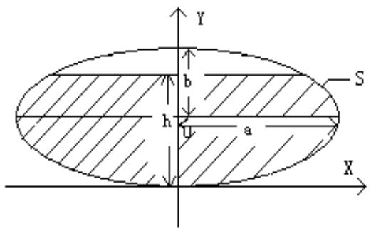

<details>
<summary>text_image</summary>

Y
b
S
h
a
X
</details>

图 1

由椭圆方程可导出 $x = \frac { a } { b } \times \sqrt { - y ^ { 2 } + 2 b y }$ ，在 y 轴上积分得油高为 h 时椭圆油罐截面面积 $S ( \boldsymbol { h } ) = \int _ { 0 } ^ { \boldsymbol { h } } ( 2 \times \frac { a } { b } \times \sqrt { - y ^ { 2 } + 2 y b } ) d y$ 。无变位时，油罐内剩余油量可视为一个高度为 2.45m的柱体，故油高为 h 时对应的剩余油料体积

$$
V (h) = L \times \int_ {0} ^ {h} (2 \times \frac {a}{b} \times \sqrt {- y ^ {2} + 2 b y}) d y
$$

积分得：

$$
V (h) = 2 a b L \left[ \frac {h - b}{2 b} \sqrt {1 - \left(\frac {h - b}{b}\right) ^ {2}} + \frac {1}{2} \arcsin \left(\frac {h - b}{b}\right) + \frac {\pi}{4} \right]
$$

## （2）模型求解与验证：

为验证模型的正确性，现将计算结果与实验数据进行对比。取表中所给一系列 h 值，求出对应的剩余油量，即为计算值；同时，将表中列出的剩余油量数据进行曲线拟合得到如下函数：

$$
V _ {1} (x) = - 7. 2 4 7 \times 1 0 ^ {- 1 0} \times x ^ {4} - 4. 7 0 6 \times 1 0 ^ {- 7} \times x ^ {3} + 0. 0 0 2 5 3 5 \times x ^ {2} + 2. 3 2 1 \times x - 3 8 8. 1 + 2 6 2
$$

画出 $V ( h )$ 与 $V _ { 1 } ( h )$ 的曲线图如下：

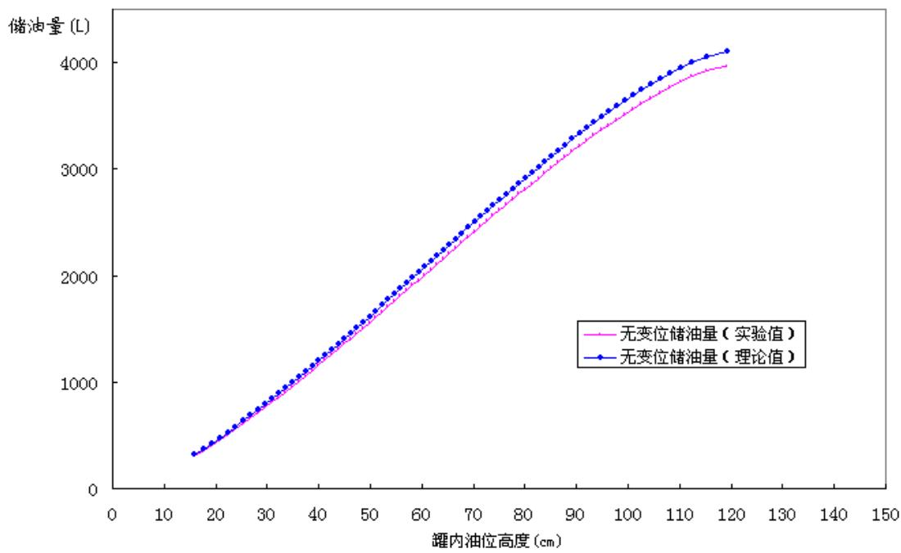

<details>
<summary>line</summary>

| 罐内油位高度 (cm) | 无变位储油量 (实验值) (L) | 无变位储油量 (理论值) (L) |
| --- | --- | --- |
| 15 | ~350 | ~350 |
| 20 | ~480 | ~490 |
| 25 | ~620 | ~640 |
| 30 | ~780 | ~800 |
| 35 | ~950 | ~980 |
| 40 | ~1120 | ~1150 |
| 45 | ~1300 | ~1330 |
| 50 | ~1480 | ~1520 |
| 55 | ~1680 | ~1720 |
| 60 | ~1880 | ~1920 |
| 65 | ~2080 | ~2120 |
| 70 | ~2280 | ~2320 |
| 75 | ~2480 | ~2520 |
| 80 | ~2680 | ~2720 |
| 85 | ~2880 | ~2920 |
| 90 | ~3080 | ~3120 |
| 95 | ~3280 | ~3320 |
| 100 | ~3480 | ~3520 |
| 105 | ~3680 | ~3720 |
| 110 | ~3880 | ~3920 |
| 115 | ~3980 | ~4050 |
| 120 | ~4000 | ~4150 |
</details>

图2 无变位储油量理论值与实际值对比图

由图 2 看出，理论计算值与实际值有存在一定的偏差，并且随h 的增高，理论计算值与实际测量值的差值越来越大。

仔细分析其原因：由于注油管、出油管及油浮子均占有一定体积，随 的增高，注油管、出油管及油浮子浸入液面下的体积也在逐渐增加，导致实际值比理论值偏大，且差值会随 h 的增加而增加。

## 5.1.2 纵向变位倾斜角 $\alpha = 4 . 1 ^ { \circ }$ 时的罐容表标定

## （1）模型的建立：

由 5.1.1 模型建立过程问可知，高度为h，长短轴为 a、b 的椭圆部分面积

$$
S (h) = 2 a b \left[ \frac {h - b}{2 b} \sqrt {1 - \left(\frac {h - b}{b}\right) ^ {2}} + \frac {1}{2} \arcsin \left(\frac {h - b}{b}\right) + \frac {\pi}{4} \right]
$$

当纵向倾斜角 $\alpha = 4 . 1 ^ { \circ }$ 时，为方便运算，将油罐经旋转后放入坐标系进行分析，如下图所示：

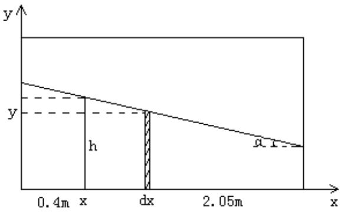

<details>
<summary>line</summary>

| X | Y |
| --- | --- |
| 0.4m | ~y_1 |
| x | y_1 |
| dx | y_1 |
| 2.05m | ~y_1 |
</details>

图 3

由图知，当油浮子显示高度为h时，横坐标为x处的油面高度 $\gamma = \not \ h + ( \not { L } _ { 1 } - \ X ) \times \tan \alpha$ 对 x 轴上每一点对应的截面积进行积分，即得到油料体积。

由积分范围的不同，油料体积的计算分为以下三种情况：

① $\angle _ { 1 } \tan \alpha \leq h \leq \angle _ { 2 } \tan \alpha$ 时：如图 4 所示

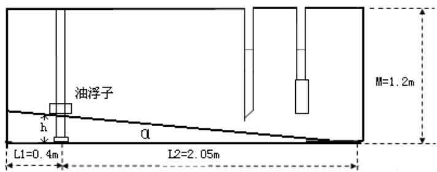

<details>
<summary>text_image</summary>

油浮子
h
L1=0.4m
d
L2=2.05m
M=1.2m
</details>

图 4

油罐内油料体积 $V ( h ) = \int _ { 0 } ^ { \frac { h } { \tan \alpha } + L _ { 1 } } { S ( h + ( L _ { 1 } - x ) \times \tan \alpha ) d x }$

② L h M L tan tan α α < < − 时：如图 5 所示

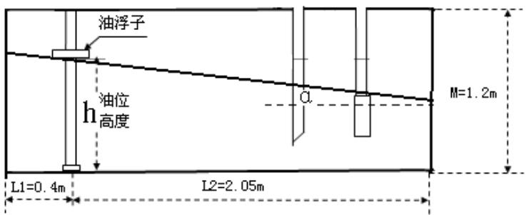

<details>
<summary>text_image</summary>

油浮子
h油位高度
L1=0.4m
L2=2.05m
M=1.2m
</details>

图 5

油罐内油料体积 $V ( h ) = \int _ { 0 } ^ { L _ { 1 } + L _ { 2 } } S ( h + ( L _ { 1 } - x ) \times \tan \alpha ) d x$

③ $M - L _ { 1 } \tan \alpha \leq h \leq M$ 时：如图 6 所示

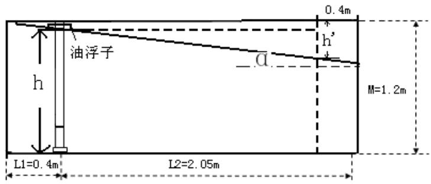

<details>
<summary>text_image</summary>

油浮子
h
L1=0.4m
L2=2.05m
0.4m
h'
A
M=1.2m
</details>

图 6

如图设 <sup>'</sup> h，则易看出 $\begin{array} { r } { \dot { \mu ^ { \bf { \Delta } } } = M - \mu + ( L _ { 2 } - L _ { 1 } ) \tan \alpha } \end{array}$ 。于是，设罐内总油量为 $\boldsymbol { V } _ { m }$ ，可以直观地看出：油罐内的剩余油量 $\boldsymbol { V } = \boldsymbol { V } _ { m } - \boldsymbol { V } ^ { \ast }$ 。同时，可使用①中的方法利用求得空余部分体积 $V ^ { " } = { \cal { H } } ( h ^ { " } )$ ，最终可得到：

$$
\text {罐内油料体积} V = V _ {m} - \int_ {0} ^ {\frac {h ^ {\prime}}{\tan \alpha} + L _ {1}} S \left(h ^ {\prime} + \left(L _ {1} - x\right) \times \tan \alpha\right) d x
$$

## （2）模型求解与验证：

由于以上体积函数形式不一，且较为复杂，若通过正常的积分求取结果会比较繁琐。考虑问题一不要求找出具体函数关系，只需要每隔 1cm 标注一次结果，故利用龙贝格积分<sup>[2]</sup>算法求解积分的数值解，从而对罐容量进行标定。龙贝格积分法具体算法如下：

设用复合梯形计算积分 $\int _ { a } ^ { b } f ( x ) d x$ 的近似值，取步长 $h = { \frac { b - a } { n } }$ ，并记 $\begin{array} { r } { T _ { 1 } ( h ) = T _ { n } } \end{array}$ 则有 $I \approx T _ { 1 } ( h ) = { \frac { h } { 2 } } { \bigg [ } f ( a ) + f ( b ) + 2 \sum _ { i = 1 } ^ { n - 1 } f ( x _ { i } ) { \bigg ] }$ 。当 f <sub>x</sub>( )在[ , ]<sub>a</sub> b 上充分光滑时，可证用 $T _ { 1 } ( h )$ 逼近I的截断误差是 $J - T _ { 1 } ( \hbar ) = a _ { 1 } h ^ { 2 } + a _ { 2 } h ^ { 4 } + \cdots + a _ { k } h ^ { 2 k } + \cdots$ ，其中 $a _ { k }$ 是与无关的常数。按理查森外推法 $\left\{ \begin{array} { l l } { F _ { 1 } \mathopen { } \mathclose \bgroup \left( h \aftergroup \egroup \right) = F \mathopen { } \mathclose \bgroup \left( h \aftergroup \egroup \right) } \\ { F _ { m + 1 } \mathopen { } \mathclose \bgroup \left( h \aftergroup \egroup \right) = \frac { F _ { m } \mathopen { } \mathclose \bgroup \left( q h \aftergroup \egroup \right) - q _ { m } ^ { p } F _ { m } \mathopen { } \mathclose \bgroup \left( h \aftergroup \egroup \right) } { 1 - q ^ { p _ { m } } } } \end{array} \right.$ $m = 1 , 2 \cdots$ 其中 q 为满 足 $1 - q ^ { p _ { m } } \neq 0 ( m = 1 , 2 \cdots )$ 的 适 当 正 数 。 以 $q { = } \frac { 1 } { 2 }$ 取 序 列$T _ { m + 1 } ( \hbar ) = { \frac { 4 ^ { m } \cdot T _ { m } ( { \frac { \hbar } { 2 } } ) - T _ { n } ( \hbar ) } { 4 ^ { m } - 1 } } , ( m = 1 , 2 \cdots )$ 。 其 中 用 $T _ { m + 1 } ( h )$ 来 逼 近 I 的 误 差 为$O ( h ^ { 2 ( m + 1 ) } )$

龙贝格算法具体实现见附录一，将 $\mathrm { h } { = } 0 , 1 , 2 , 3 \cdots 1 1 9 , 1 2 0$ 带入到V h( )，由龙

贝格算法计算得到油位高度间隔为1cm 的罐容表标定值，列表如下：

表 1 小椭圆型储油罐罐容表

<table><tr><td>油高(mm)</td><td>储油罐油量(L)</td><td>油高(mm)</td><td>储油罐油量(L)</td><td>油高(mm)</td><td>储油罐油量(L)</td></tr><tr><td>0</td><td>0~1.674387</td><td>400</td><td>965.660776</td><td>800</td><td>2661.422634</td></tr><tr><td>10</td><td>3.531122</td><td>410</td><td>1004.953782</td><td>810</td><td>2703.552425</td></tr><tr><td>20</td><td>6.263648</td><td>420</td><td>1044.583921</td><td>820</td><td>2745.491028</td></tr><tr><td>30</td><td>9.976866</td><td>430</td><td>1084.534871</td><td>830</td><td>2787.224773</td></tr><tr><td>40</td><td>14.758956</td><td>440</td><td>1124.790717</td><td>840</td><td>2828.739779</td></tr><tr><td>50</td><td>20.694101</td><td>450</td><td>1165.335924</td><td>850</td><td>2870.021937</td></tr><tr><td>60</td><td>27.858068</td><td>460</td><td>1206.155298</td><td>860</td><td>2911.056886</td></tr><tr><td>70</td><td>36.320883</td><td>470</td><td>1247.233966</td><td>870</td><td>2951.829995</td></tr><tr><td>80</td><td>46.147722</td><td>480</td><td>1288.557344</td><td>880</td><td>2992.326337</td></tr><tr><td>90</td><td>57.399578</td><td>490</td><td>1330.111117</td><td>890</td><td>3032.530662</td></tr><tr><td>100</td><td>70.133778</td><td>500</td><td>1371.881217</td><td>900</td><td>3072.42737</td></tr><tr><td>110</td><td>84.404394</td><td>510</td><td>1413.8538</td><td>910</td><td>3112.000481</td></tr><tr><td>120</td><td>100.262581</td><td>520</td><td>1456.01523</td><td>920</td><td>3151.233596</td></tr><tr><td>130</td><td>117.756843</td><td>530</td><td>1498.352059</td><td>930</td><td>3190.109866</td></tr><tr><td>140</td><td>136.933273</td><td>540</td><td>1540.851013</td><td>940</td><td>3228.611946</td></tr><tr><td>150</td><td>157.818421</td><td>550</td><td>1583.498973</td><td>950</td><td>3266.721951</td></tr><tr><td>160</td><td>180.259099</td><td>560</td><td>1626.282961</td><td>960</td><td>3304.421402</td></tr><tr><td>170</td><td>203.999405</td><td>570</td><td>1669.190128</td><td>970</td><td>3341.691168</td></tr><tr><td>180</td><td>228.906603</td><td>580</td><td>1712.20774</td><td>980</td><td>3378.511401</td></tr><tr><td>190</td><td>254.884875</td><td>590</td><td>1755.32316</td><td>990</td><td>3414.861462</td></tr><tr><td>200</td><td>281.857661</td><td>600</td><td>1798.523842</td><td>1000</td><td>3450.719834</td></tr><tr><td>210</td><td>309.760769</td><td>610</td><td>1841.797318</td><td>1010</td><td>3486.06402</td></tr><tr><td>220</td><td>338.538729</td><td>620</td><td>1885.131182</td><td>1020</td><td>3520.870436</td></tr><tr><td>230</td><td>368.142595</td><td>630</td><td>1928.513081</td><td>1030</td><td>3555.114269</td></tr><tr><td>240</td><td>398.5285</td><td>640</td><td>1971.930708</td><td>1040</td><td>3588.76932</td></tr><tr><td>250</td><td>429.656656</td><td>650</td><td>2015.371783</td><td>1050</td><td>3621.80782</td></tr><tr><td>260</td><td>461.49062</td><td>660</td><td>2058.824048</td><td>1060</td><td>3654.20019</td></tr><tr><td>270</td><td>493.996746</td><td>670</td><td>2102.275257</td><td>1070</td><td>3685.91477</td></tr><tr><td>280</td><td>527.143753</td><td>680</td><td>2145.713159</td><td>1080</td><td>3716.917462</td></tr><tr><td>290</td><td>560.902397</td><td>690</td><td>2189.125495</td><td>1090</td><td>3747.171291</td></tr><tr><td>300</td><td>595.245191</td><td>700</td><td>2232.499981</td><td>1100</td><td>3776.635821</td></tr><tr><td>310</td><td>630.146191</td><td>710</td><td>2275.824302</td><td>1110</td><td>3805.266392</td></tr><tr><td>320</td><td>665.580805</td><td>720</td><td>2319.086097</td><td>1120</td><td>3833.013049</td></tr><tr><td>330</td><td>701.525646</td><td>730</td><td>2362.272952</td><td>1130</td><td>3859.819002</td></tr><tr><td>340</td><td>737.958395</td><td>740</td><td>2405.372383</td><td>1140</td><td>3885.618241</td></tr><tr><td>350</td><td>774.857693</td><td>750</td><td>2448.371831</td><td>1150</td><td>3910.33151</td></tr><tr><td>360</td><td>812.203042</td><td>760</td><td>2491.258644</td><td>1160</td><td>3933.85845</td></tr><tr><td>370</td><td>849.974723</td><td>770</td><td>2534.020068</td><td>1170</td><td>3956.05568</td></tr><tr><td>380</td><td>888.153723</td><td>780</td><td>2576.643232</td><td>1180</td><td>3973.212325</td></tr><tr><td>390</td><td>926.721671</td><td>790</td><td>2619.115135</td><td>1190</td><td>3992.388755</td></tr><tr><td></td><td></td><td></td><td></td><td>1200</td><td>4009.883017</td></tr></table>

为分析模型的准确性，将模型求得的数据与表中所给数据在同一坐标中作出V-h 曲线图如下：

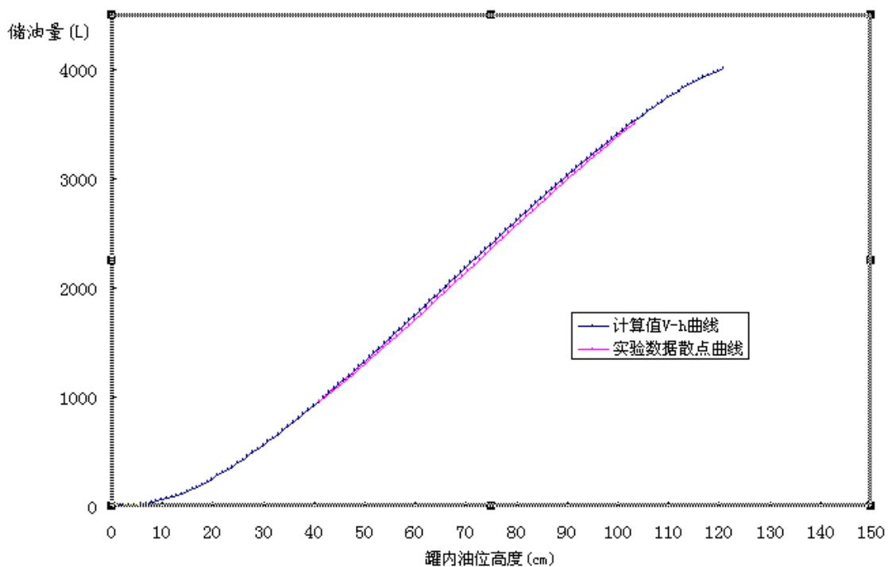

<details>
<summary>line</summary>

| 罐内油位高度 (cm) | 计算值V-h曲线 (L) | 实验数据散点曲线 (L) |
| --- | --- | --- |
| 0 | 0 | 0 |
| 10 | ~50 | ~50 |
| 20 | ~300 | ~300 |
| 30 | ~600 | ~600 |
| 40 | ~950 | ~950 |
| 50 | ~1350 | ~1350 |
| 60 | ~1750 | ~1750 |
| 70 | ~2200 | ~2150 |
| 80 | ~2650 | ~2600 |
| 90 | ~3100 | ~3050 |
| 100 | ~3500 | ~3450 |
| 110 | ~3850 | ~3800 |
| 120 | ~4050 | — |
</details>

图 7

由图 7 可看出，由模型得到的曲线与实验数据散点曲线基本相吻合，说明模型结果基本正确。

除此以外，为研究罐体变位后对罐容表的影响，利用模型所得数据，分别作出罐体变位前后的 V-h 曲线进行对比，模型曲线图如下：

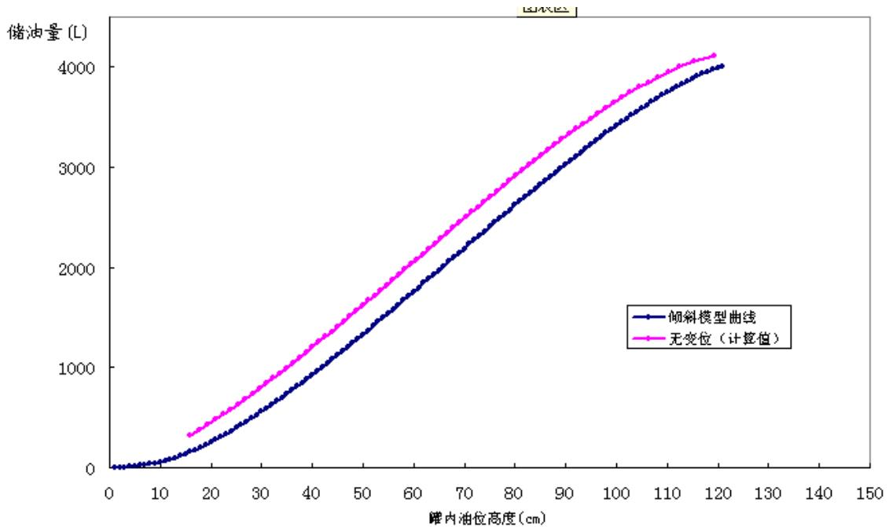

<details>
<summary>line</summary>

| 罐内油位高度 (cm) | 倾斜模型曲线 (L) | 无变位（计算值）(L) |
| --- | --- | --- |
| 0 | 0 | — |
| 10 | ~50 | — |
| 20 | ~250 | ~350 |
| 30 | ~600 | ~800 |
| 40 | ~950 | ~1250 |
| 50 | ~1350 | ~1700 |
| 60 | ~1800 | ~2200 |
| 70 | ~2300 | ~2750 |
| 80 | ~2800 | ~3250 |
| 90 | ~3300 | ~3700 |
| 100 | ~3750 | ~4050 |
| 110 | ~4050 | ~4250 |
| 120 | — | — |
</details>

图 8

由图 看出，罐体发生变位后，原始罐容表的标定值与实际油量相比会偏大即实际罐容表数据变小，且变位参数越大，偏差量越大。此时，若不对罐容表进行修改，则所得数据比实际值大，使得对罐内储油量的判断产生错误。

## 5.2 问题二 实际储油罐的罐容表标定

为计算储油罐实际变位量<sub>α</sub> 、 $\beta$ ，首先建立模型，求得油浮子显示高度 h与储油量 $V ( \alpha , \beta )$ 的关系，然后通过所给数据估计<sub>α</sub>、 $\beta$ 的具体数值，最后根据实际数据验证模型的准确性。

## 5.2.1 油罐内油料体积的计算

## （1）两侧球缺体积的计算

对于实际储油罐，变位后为了建立罐内储油量与油位高度及变位参数（纵向倾斜角度<sub>α</sub>和横向偏转角度β）之间的一般关系。将罐内的容油量分为三部分，$V = V _ { h e a d 1 } + V _ { h e a d 2 } + V _ { b o d y }$ 。其中 $V _ { h e a d 1 }$ 及 $V _ { h e a d 2 }$ 表示两端凸头的容油量， $V _ { b o d y }$ 表示中间筒体的容油量。令 r为圆柱截面圆半径。油罐中间部分横截面示意图如下图所示由图 9 可知，当油罐的横向偏转角度为β时，显示的油位高度为 h。可求得油面到罐底的最大垂直距离 $H = r - ( r - h ) \cos \beta$

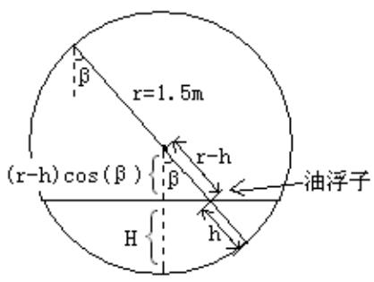

<details>
<summary>text_image</summary>

(r-h) cos(β) { β r-h} { H { h } } 油浮子
r=1.5m
</details>

图 9

用同“问题一”的方法，将储油罐纵向旋转一个角度<sub>α</sub>放入坐标平面内，如下图：

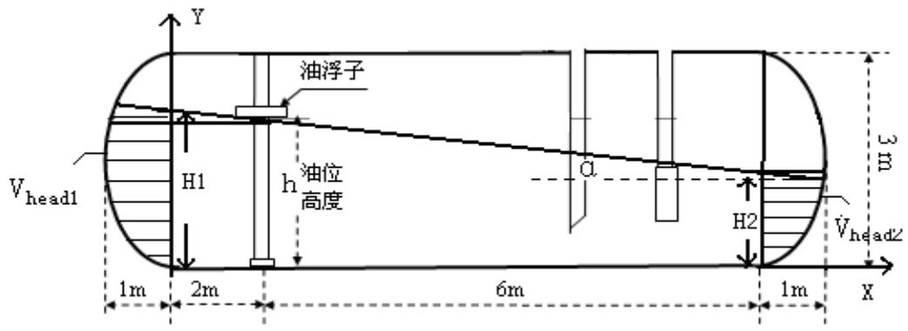

<details>
<summary>text_image</summary>

油浮子
H1
h
油位高度
Vhead1
1m 2m 6m 1m X
3m
Q
H2
Vhead2
</details>

图 10

由图 10 可知， $H _ { 1 } = H + 2 \tan \alpha$ $H _ { 2 } = H - 6 \tan \alpha$

①当 $H _ { 1 } \leq 3 , H _ { 2 } \geq 0$ 时

下面，首先计算油位高度显示h 时两端凸头内的油料体积：

如图 10 所示，在 A 点与 B 点分别作水平圆面，则由几何知识易知 $V _ { h e a d 1 }$ 的“余”部分可以近似补到 $V _ { h e a d 2 }$ 的“缺”部分，则求球头内油体积的问题转化为了求如下图所示的水平面下的球头体积问题<sup>[1]</sup>。

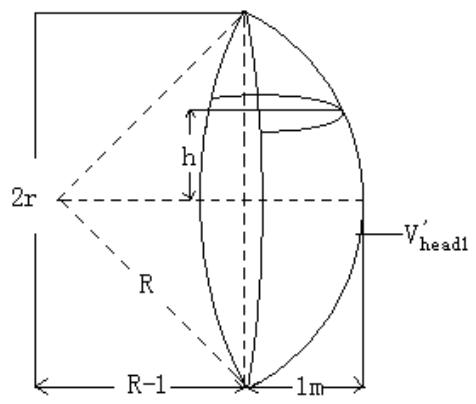

<details>
<summary>text_image</summary>

2r
h
R
R-1
1m
V'_{head1}
</details>

图 11

图 11 是 $V _ { h e a d 1 }$ 的情况，其中 R 是两端封头球径， $V _ { h e a d 1 } ^ { ' }$ 是水平面下球头内油体积。图 12是水平截面圆，阴影部分面积S 为某一高度的封头内油面积，只需将 S对深度进行积分即可求出体积 $V _ { h e a d 1 } ^ { ' }$ 。

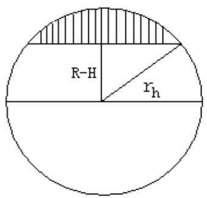

<details>
<summary>text_image</summary>

R-H
r_h
</details>

图 12

设 $r _ { h }$ 为水平截面圆的半径，则由图 12 可知 $r _ { h } = \sqrt { R ^ { 2 } - h ^ { 2 } }$ 。于是，水平截面积 $S ( \hbar ) = \int _ { R - 1 } ^ { r _ { \hbar } } 2 \sqrt { r _ { \hbar } ^ { 2 } - s ^ { 2 } } d s = \int _ { R - 1 } ^ { \sqrt { R ^ { 2 } - \hbar ^ { 2 } } } 2 \sqrt { R ^ { 2 } - \hbar ^ { 2 } - s ^ { 2 } } d s$ ，通过积分可得结果如下：

$$
S (h) = (1 - h) \sqrt {2 R - h ^ {2} - 1} + \frac {1}{2} \pi (R ^ {2} - h ^ {2}) + (h ^ {2} - R ^ {2}) \arctan \left(\frac {R - 1}{\sqrt {2 R - h ^ {2} - 1}}\right)
$$

再对此面积在纵向进行积分得：

$$
\begin{array}{l} V _ {\text {head}} (h) = \int_ {0} ^ {h} S (h) d h = \frac {\pi R ^ {2} (h \cos \beta - R \cos \beta + 2 \tan a + R)}{2} - \frac {\pi (h \cos \beta - R \cos \beta + 2 \tan a + R) ^ {3}}{6} \\ + \frac {2 (h \cos \beta - R \cos \beta + 2 \tan a + R) \sqrt {2 R - (h \cos \beta - R \cos \beta + 2 \tan a + R) ^ {2} - 1}}{3} \\ \frac {2 R (h \cos \beta - R \cos \beta + 2 \tan a + R) \sqrt {2 R - (h \cos \beta - R \cos \beta + 2 \tan a + R) ^ {2} - 1}}{3} \\ - \frac {2 R ^ {3} - 3 R + 1}{3} \arctan \left(\frac {(h \cos \beta - R \cos \beta + 2 \tan a + R)}{\sqrt {2 R - (h \cos \beta - R \cos \beta + 2 \tan a + R) ^ {2} - 1}}\right) \\ + \frac {(h \cos \beta - R \cos \beta + 2 \tan a + R) ^ {3} - 3 R ^ {2} (h \cos \beta - R \cos \beta + 2 \tan a + R)}{3} \\ \times \arctan \left(\frac {R - 1}{\sqrt {2 R - (h \cos \beta - R \cos \beta + 2 \tan a + R) ^ {2} - 1}}\right) \\ + \frac {2 R ^ {3}}{3} \arctan \left(\frac {(R - 1) (h \cos \beta - R \cos \beta + 2 \tan a + R)}{\sqrt {2 R - (h \cos \beta - R \cos \beta + 2 \tan a + R) ^ {2} - 1}}\right) \\ \end{array}
$$

于是得到 $\dot { V _ { h e a d 1 } } = V _ { h e a d } ^ { ' } ( H _ { 1 } ) , \enspace V _ { h e a d 2 } ^ { ' } = V _ { h e a d } ^ { ' } ( H _ { 2 } )$

② 当 $H _ { 1 } \leq 3 , H _ { 2 } < 0$ 时，只有 $V _ { h e a d 1 }$ ，此时 $V _ { \ h e a d 1 } \approx V _ { \ h e a d 1 } ^ { ' }$  
③ 当 $\textstyle H _ { 1 } > 3$ 时， $V _ { \ h e a d 1 } = V _ { \ h e a d 1 } ^ { ' } , V _ { \ h e a d 2 } \approx V _ { \ h e a d 2 } ^ { ' }$

## （2）中间圆筒部分体积的计算

由“问题一”中椭圆部分面积公式可推出，半径为R 高为 t的弓形面积：

$$
S (t) = - r ^ {2} \arcsin \frac {r - t}{r} - (r - t) \sqrt {2 r t - t ^ {2}} + \frac {\pi}{2} r ^ {2}
$$

为计算方便，同样将油罐经旋转后放入坐标系进行分析，如下图所示：

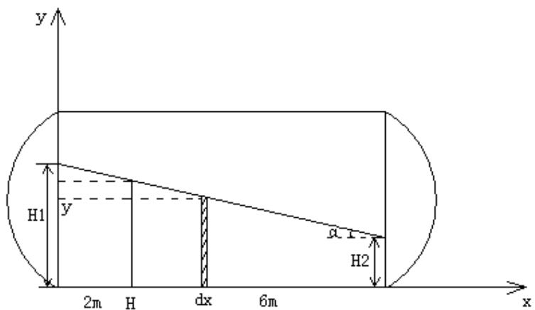

<details>
<summary>text_image</summary>

y
H1
y
α1
H2
2m H dx 6m x
</details>

图 13

设液体表面任意一点坐标为 $\mathbf { \Phi } ( \mathbf { x } , \mathbf { y } )$ ，则有 $\gamma = H _ { 1 } - x \tan \alpha \Rightarrow d x = - { \frac { 1 } { \tan \alpha } } d y$

⇒图13 中阴影部分体积 $d V = s ( y ) d x$ ，中间部分体积的计算分一下三种情况：

① 当 $H _ { 1 } \leq 3 , H _ { 2 } \geq 0$ 时，从最左端积到最右端，得：

$$
\begin{array}{l} V _ {b o d y} = \int_ {0} ^ {8} S (y) d x = - \frac {1}{\tan \alpha} \int_ {H _ {1}} ^ {H _ {1} - 8 \tan \alpha} S (y) d y \\ = - \frac {1}{\tan \alpha} \int_ {H _ {1}} ^ {H _ {1} - 8 \tan \alpha} \left[ - r ^ {2} \arcsin \frac {r - y}{R} - (r - y) \sqrt {2 r y - y ^ {2}} + \frac {\pi}{2} r ^ {2} \right] d y \\ = - \frac {1}{\tan \alpha} \left[ r ^ {2} (R - y) \arcsin \frac {r - y}{r} + r ^ {2} \sqrt {r ^ {2} - (r - y) ^ {2}} - \frac {1}{3} \left(2 r y - y ^ {2}\right) ^ {\frac {3}{2}} + \frac {\pi}{2} r ^ {2} y \right] \Bigg | _ {H _ {1}} ^ {H _ {1} - 8 \tan \alpha} \\ = - \frac {1}{\tan \alpha} \left\{r ^ {2} \left(r - H _ {1} + 8 \tan \alpha\right) \arcsin \frac {r - H _ {1} + 8 \tan \alpha}{r} - r ^ {2} \left(r - H _ {1}\right) \arcsin \frac {r - H _ {1}}{r} \right. \\ + r ^ {2} \sqrt {r ^ {2} - \left(r - H _ {1} + 8 \tan \alpha\right) ^ {2}} - r ^ {2} \sqrt {2 r H _ {1} - H _ {1} ^ {2}} - \frac {1}{3} \left[ 2 r \left(H _ {1} - 8 \tan \alpha\right) - \left(H _ {1} - 8 \tan \alpha\right) ^ {2} \right] ^ {\frac {3}{2}} \\ + \frac {1}{3} (2 r H _ {1} - H _ {1} ^ {2}) ^ {\frac {3}{2}} - 4 \pi r ^ {2} \tan \alpha \} \\ \end{array}
$$

② 当 $H _ { 1 } \leq 3 , H _ { 2 } < 0$ 时，由以上 $\textstyle H _ { 1 } \cdot \ H _ { 2 }$ 、H和h的关系可求得 $h \leq 0 . 2 2$ ，用同“问题一”的体积计算方法，可得：

$$
\begin{array}{l} V _ {m} = \int_ {0} ^ {\frac {H _ {1}}{\tan \alpha}} S (y) d x = - \frac {1}{\tan \alpha} \int_ {H _ {1}} ^ {0} S (y) d y \\ = - \frac {1}{\tan \alpha} \int_ {H _ {1}} ^ {0} \left[ - r ^ {2} \arcsin \frac {r - y}{r} - (r - y) \sqrt {2 r y - y ^ {2}} + \frac {\pi}{2} r ^ {2} \right] d y \\ = - \frac {1}{\tan \alpha} \left[ \frac {\pi}{2} r ^ {3} - r ^ {2} \left(r - H _ {1}\right) \arcsin \frac {r - H _ {1}}{r} - r ^ {2} \sqrt {2 r H _ {1} - H _ {1} ^ {2}} + \frac {1}{3} \left(2 r H _ {1} - H _ {1} ^ {2}\right) ^ {\frac {3}{2}} - \frac {\pi}{2} r ^ {2} H _ {1} \right] \\ \end{array}
$$

③ 当 $\textstyle H _ { 1 } > 3$ 时，与②同理可求得 $h \geq 2 . 9 2$ ，此时 $\varGamma _ { m } =$ 中间部分总体积−上部空余体，上部空余体积用（2）中公式计算。

综上（1）（2）可得，罐内总油量

$$
V (\alpha , \beta , h) = V _ {h e a d} ^ {\prime} (H _ {1}) + V _ {h e a d} ^ {\prime} (H _ {2}) + V _ {b o d y} (H _ {1})
$$

其中 $H _ { 1 } = H + 2 \tan \alpha$ $H _ { 2 } = H { - } 6 \tan \alpha$ $H = r - ( r - h ) \cos \beta$

## 5.2.2 利用最小二乘法对<sub>α</sub>、 $\beta$ 的值进行估计

## （1）参数估计模型的建立

以上求出的储油罐中剩余油料体积公式中含有参数 $\alpha$ 、 $\beta$ ，下面用题中所给的实际储油罐的采集数据对其具体值进行估计。首先，对“实际采集数据表”进行分析，每个采集点记录了一个出油量 $\Delta \nu _ { _ i }$ 、显示的油高 $h _ { \scriptscriptstyle i }$ 、显示的油量容积 $V _ { i }$ ，其中 $V _ { i }$ 是储油罐无变位情况下油高为 $h _ { i }$ 时对应的油料体积，与实际数据不符，不能用来对 $\alpha$ 、 $\beta$ 进行估计。

因此，为得到油高为hi时实际的剩余油料体积，设原始油料体积为 $ { \boldsymbol { J } } _ { 0 }$ ，对所给数据进行处理，算出油高为 hi时的总出油量 $\nu _ { i }$ 。于是，有高为 hi时，油罐内的实际剩余油量 $V _ { i } ^ { ' } = V _ { 0 } ^ { ' } - \nu _ { i }$ ；于是得到一系列数据 $( h _ { i } , \ V _ { i } ^ { ' } )$ ，且这些数据均满足表达式 $\itGamma  | \mathrm { ( } \alpha , \beta , h _ { \it i } ) $ 。给出任意一组符合条件的<sub>α</sub>、 $\beta$ $ { \boldsymbol { J } } _ { 0 }$ ，可算出计算值与测量值的总偏差

$$
F (\alpha , \beta , V _ {0}) = \sum_ {i = 1} ^ {N} \left(V (\alpha , \beta , h _ {i}) - V _ {0} + v _ {i}\right)
$$

显然，使得总偏差 $F ( \alpha , \beta , V _ { 0 } )$ 最小的α、 $\beta$ 、 $ { \boldsymbol { J } } _ { 0 }$ 即为实际的有效参数。于是，此问题变为以下最优化问题：求取合适的 $\alpha ^ { * }$ 、 $\beta ^ { * }$ 、 $\boldsymbol { V } _ { 0 } ^ { * }$ ，使得

$$
F (\alpha^ {*}, \beta^ {*}, V _ {0} ^ {*}) = \min F (\alpha , \beta , V _ {0})
$$

## （2）模型求解：

这里采用枚举法求<sub>α</sub>、 $\beta$ 、 $ { \boldsymbol { J } } _ { 0 }$ 的值。首先分析所给数据，在一次性补充进油前，可算出累计出油量为 54118.18L，此时显示的剩余油量为 6086.74L；由上面求得的体积函数 $\itGamma  / ( \alpha , \beta , h _ { \it i } )$ 可看出，hi一定时， $\itGamma  / ( \alpha , \beta , h _ { \it i } )$ 随<sub>α</sub>、 $\beta$ 的增大而减小，故此时油罐中的剩余油量必大于显示值。于是可得出，初始油量 $ { \boldsymbol { J } } _ { 0 }$ 必大于累计出油量、小于累积出油量+显示值，即 $5 4 1 1 8 . 1 8 L < V _ { \mathrm { o } } < 6 0 2 0 4 . 9 2 L$ 。<sub>α</sub> 、 $\beta$ 的范围均为 $0 { \sim } 9 0 ^ { \circ }$ 。然后用 C++编程计算三个变量的具体数值。

为减少计算量，采用逐步细化的方法：先在以上范围内以较大步长（<sub>α</sub>、 $\beta$ 步长为 $1 ^ { \circ }$ ， $ { \boldsymbol { J } } _ { 0 }$ 步长为 $1 m ^ { 3 } )$ 枚举 、 $\beta$ 、 $ { \boldsymbol { J } } _ { 0 }$ 的值，计算出个参数的一个大概数值，在该数值附近再次进行较精细的计算，如此反复，直到达到参数所需要的精度为止。通过该方法计算出<sub>α</sub>、 $\beta$ 、 $ { \boldsymbol { J } } _ { 0 }$ 结果如下：

$$
\alpha = 2. 1 4 ^ {\circ} \text {、} \beta = 4. 6 ^ {\circ} \text {、} V _ {0} = 5 8. 9 8 m ^ {3}
$$

枚举算法的 C++程序见附录二。

将计算出的 $\alpha$ 、 $\beta$ 值带入到函数 $\itGamma $ 中，取适当的 $h _ { _ i }$ 得到实际储油罐油位高度间隔为 10cm 时的罐容表标定如下表：

表 2 实际储油罐罐容表

<table><tr><td>浮油子高度(mm)</td><td>储油罐油量(L)</td><td>浮油子高度(mm)</td><td>储油罐油量(L)</td></tr><tr><td>100</td><td>0~356.34</td><td>1600</td><td>33036.57</td></tr><tr><td>200</td><td>1062.58</td><td>1700</td><td>35846.89</td></tr><tr><td>300</td><td>2213.02</td><td>1800</td><td>38638.09</td></tr><tr><td>400</td><td>3687.75</td><td>1900</td><td>41394.69</td></tr><tr><td>500</td><td>5413.81</td><td>2000</td><td>44100.95</td></tr><tr><td>600</td><td>7349.39</td><td>2100</td><td>46740.62</td></tr><tr><td>700</td><td>9463.31</td><td>2200</td><td>49296.84</td></tr><tr><td>800</td><td>11730.02</td><td>2300</td><td>51751.78</td></tr><tr><td>900</td><td>14127.3</td><td>2400</td><td>54086.32</td></tr><tr><td>1000</td><td>16635.22</td><td>2500</td><td>56279.51</td></tr><tr><td>1100</td><td>19235.37</td><td>2600</td><td>58307.66</td></tr><tr><td>1200</td><td>21910.43</td><td>2700</td><td>60142.76</td></tr><tr><td>1300</td><td>24643.88</td><td>2800</td><td>61749.31</td></tr><tr><td>1400</td><td>27419.75</td><td>2900</td><td>63075.39</td></tr><tr><td>1500</td><td>30222.43</td><td>3000</td><td>64011.43</td></tr></table>

## 5.2.3误差分析及模型检验

## （1）方法一：

将附件 2 中显示油高数据带入到所得的罐内储油量与油位高度及变位参数（纵向倾斜角度α和横向偏转角度 $B ^ { \mathbf { \alpha } } )$ ）之间的函数关系式中，再加上相对应的累积出油量可得到 603组油量初始值，分析这 603 组数据和我们已经得到的理论油

量初始值，利用相对标准偏差的思想 我们构造评价函数 $\delta = \frac { \sqrt { \displaystyle \sum _ { j = 1 } ^ { n } ( V _ { i } - V _ { 0 } ) ^ { 2 } } } { n - 1 }$ 其中$\boldsymbol { V } _ { i }$ 为第 i 组数据得到的油量初始值， $ { \boldsymbol { J } } _ { 0 }$ 为理论油量初始值。

通过计算得 $\delta = \ 0 . 0 0 5 5 \%$ ，误差很小，说明所建模型较为准确，基本可以用来解决实际问题。

## （2）方法二：

令得到的罐内储油量与油位高度及变位参数（纵向倾斜角度α和横向偏转角度β ）之间的函数关系式中的 $\alpha = 0 , \beta = 0$ ，得到无变位情况下，罐内储油量与油位高度的关系，代入附件 2 中显示油高数据组，得到对应的出油量理论值。每隔20 个点取一个数据，将其与显示的油量体积作对比，如下表所示：

表 3 储油量实际值与理论值对比表

<table><tr><td>高度(mm)</td><td>标注体积(L)</td><td>计算体积(L)</td><td>高度(mm)</td><td>标注体积(L)</td><td>计算体积(L)</td></tr><tr><td>2632.23</td><td>60448.88</td><td>60448.8</td><td>473.22</td><td>6154.36</td><td>6154.25</td></tr><tr><td>2490.06</td><td>57782.53</td><td>57782.45</td><td>2357.27</td><td>54955.32</td><td>54955.25</td></tr><tr><td>2334.88</td><td>54451.17</td><td>54451.1</td><td>2240.56</td><td>52250.9</td><td>52250.83</td></tr><tr><td>2177.92</td><td>50727.53</td><td>50727.46</td><td>2091.02</td><td>48542.48</td><td>48542.41</td></tr><tr><td>2035.94</td><td>47119.35</td><td>47119.28</td><td>1957.15</td><td>45039.03</td><td>45038.96</td></tr><tr><td>1868.46</td><td>42643.93</td><td>42643.87</td><td>1815.31</td><td>41186.12</td><td>41186.05</td></tr><tr><td>1710.1</td><td>38261.74</td><td>38261.68</td><td>1681.91</td><td>37471.31</td><td>37471.25</td></tr><tr><td>1581.14</td><td>34629.99</td><td>34629.93</td><td>1542.45</td><td>33534.85</td><td>33534.79</td></tr><tr><td>1450.53</td><td>30930.79</td><td>30930.67</td><td>1405.53</td><td>29657.54</td><td>29657.41</td></tr><tr><td>1305.06</td><td>26827.49</td><td>26827.36</td><td>1280.75</td><td>26146.69</td><td>26146.57</td></tr><tr><td>1163.62</td><td>22898.62</td><td>22898.5</td><td>1127.72</td><td>21916.34</td><td>21916.22</td></tr><tr><td>1020.05</td><td>19018.44</td><td>19018.32</td><td>982.05</td><td>18015.71</td><td>18015.59</td></tr><tr><td>870.36</td><td>15141.26</td><td>15141.14</td><td>841.56</td><td>14419.83</td><td>14419.71</td></tr><tr><td>726.89</td><td>11640.87</td><td>11640.76</td><td>712.82</td><td>11311.13</td><td>11311.01</td></tr></table>

通过对比可看出，计算出的体积与表中标注的体积十分接近，误差很小，说明体积函数 $\itGamma $ 模型建立基本正确。

## 6．模型分析

## 模型优点：

（1）充分利用了附表中的数据，通过对图表中数据的分析，合理地筛选了有效数据，提高了模型建立的准确性。  
（2）使用最小二乘法进行优化，确定参数值，得到结果误差很小，十分可靠。  
（3）该模型具有普适性，适于推广到运输，化工，储藏等行业。

## 模型缺点：

建模方法较单一，对于同一问题没有建立多个模型，无法进行多种方法的分析比较。

## 7. 参考文献

[1] 付昶林.倾斜油罐容量的计算[J].黑龙江八一农垦大学学报，1981：43-52  
[2] 刘玉娟，陈应祖，卢克功.龙贝格积分法及其应用编程[J].重庆科技学院学报，2007（3）:97-100  
[3] 高恩强，丰培云.卧式倾斜安装圆柱体油罐不同液面高度时贮油量的计算[J].山东冶金，1998（2）：26-28  
[4] 管冀年，赵海.卧式储油罐内油品体积标定的实用方法[J].计量与测试技术，2004（2）：36  
[5] 姜启源. 数学模型（第三版）[M].北京：高等教育出版社，2003，59-121  
[6] 施光燕，董加礼.最优化方法[M].北京：高等教育出版社，1999,63-107

## 8. 附录

附录一：龙贝格积分matlab 程序  
```matlab
%====================================
function R = romberg(f, a, b, n)
format long
% ROMBERG -- Compute Romberg table integral approximation.
%
% SYNOPSIS:
%    R = romberg(f, a, b, n)
%
% DESCRIPTION:
%    Computes the complete Romberg table approximation to the integral
%
%           / b
%       I = |      f(x) dx
%       /   a
%
% PARAMETERS:
%    f    - The integrand.  Assumed to be a function callable as
%             y = f(x)
%             with `x' in [a, b].
%    a    - Left integration interval endpoint.
%    b    - Right integration interval endpoint.
%    n    - Maximum level in Romberg table.
%
% RETURNS:
%    R    - Romberg table.  Represented as an (n+1)-by-(n+1) lower
```

% triangular matrix of integral approximations.

%

% SEE ALSO:

% TRAPZ, QUAD, QUADL.

% NOTE: all indices adjusted for MATLAB's one-based indexing scheme.

% Pre-allocate the Romberg table. Avoids subsequent re-allocation which

% is often very costly.

R = zeros([n + 1, n + 1]);

% Initial approximation. Single interval trapezoidal rule.

R(0+1, 0+1) = (b - a) / 2 \* (feval(f, a) + feval(f, b));

% First column of Romberg table. Increasingly accurate trapezoidal

% approximations.

for i = 1 : n,

h = (b - a) / 2^i;

s = 0;

for k = 1 : 2^(i-1),

s = s + feval(f, a + (2\*k - 1)\*h);

end

R(i+1, 0+1) = R(i-1+1, 0+1)/2 + h\*s;

End

## 附录二：参数估计的C++程序

#include <iostream>

#include <cmath>

#define PI 3.1415926

using namespace std;

double r = 1.625;

double p1, p2;

double R = 1.5;

```txt
double f(double x)
{
    double ans = PI*r*r*x/2-PI*x*x*x/6+2*x*sqrt(2.25-x*x)/3
    -2*x*r*sqrt(2.25-x*x)/3
    -(1-3*r+2*r*r*r)*atan(x/sqrt(2.25-x*x))/3
    +(x*x*x-3*x*r*r)*atan(0.625/sqrt(2.25-x*x))/3
```

```txt
+2*r*r*r*atan(0.625*x/(r*sqrt(2.25-x*x)))/3+2.0289;
return ans;
}

double g(double x)
{
    double ans = 4*PI*R*R-(R*R*(R-x+8*tan(p1))*asin((R-x+8*tan(p1))/R)+R*R*sqrt(2*R*(x-8*tan(p1))-(x-8*tan(p1))*(x-8*tan(p1)))-R*R*(R-x)*asin((R-x)/R)-R*R*sqrt(2*R*x-x*x)-pow((2*R*(x-8*tan(p1))-(x-8*tan(p1))*(x-8*tan(p1))), 1.5)/3+pow((2*R*x-x*x), 1.5)/3)/tan(p1);
    return ans;
}

int main()
{
    double H1, V1, H, H2, h1, h2;
    double out, s, t, ans, ansx, ansy, ansz, tt, ss, pppp;

    double numx[1024], numy[1024], left[1024];

    freopen("in2.txt", "r", stdin);
    freopen("out1.txt", "w", stdout);
    numx[0] = 0;
    int k = 1;
    while(scanf("%lf %lf", &numx[k], &numy[k]) == 2)
    {
        numx[k] += numx[k-1];
        k++;
    }
    printf("%d\n", k);

    double ansk = 100000000;
    //此处先采用大范围大步长、再使用小范围小步长
    for(int qq = 5850; qq <= 5950; qq++)
    {
        double q = (double)qq/100;
        ans = 100000000;
        for(int j = 40; j <= 60; j++)
        {
            for(int i = 190; i <= 220; i++)
            {
                p1 = (double)i/18000*PI; //角度
                p2 = (double)j/1800*PI;
```

```c
double tmp = 0;
for(int o = 5; o <= 290; o++)
{
    t = numy[o];
    out = numx[o];
    t /= 1000;
    out /= 1000;
    H = 1.5-(1.5-t)*cos(p2);
    H1 = H+2*tan(p1);
    H2 = H-6*tan(p1);
    h1 = H1-1.5;
    h2 = H2-1.5;

    V1 = f(h1)+f(h2)+g(H1);
    tmp += (V1-q+out)*(V1-q+out);
}
if(tmp < ans)
{
    ans = tmp;
    ansx = i;
    ansy = j;
    ansz = q;
}
}
if(ans < ansk)
{
    ansk = ans;
    tt = ansx;
    ss = ansy;
    pppp = q;
}
printf("%.2lf %lf total:%lf\n", ansx/100, ansy/10, q);
}
printf("答案: %.2lf %lf total:%lf\n", tt/100, ss/10, pppp);
return 0;
}
```