# 储油罐的变位识别与罐容表标定

## 摘要

通常加油站都有若干个储存燃油的地下储油罐，通过预先标定的罐容表（即罐内油位高度与储油量的对应关系）进行实时计算，以得到罐内油位高度和储油量的变化情况。题目要求用数学建模方法研究解决储油罐的变位识别与罐容表标定的问题。

本文通过了几何学、积分学、数值积分，最小二乘法等，针对三种不同情况建立了如下模型。

模型一：小椭圆油罐无变位情况下油容量V1与油位高度h1的关系。

$$
v _ {1} = a b l \left(\frac {h _ {1} - b}{b} \sqrt {1 - \left(\frac {h _ {1} - b}{b}\right) ^ {2}} + \arcsin \left(\frac {h _ {1} - b}{b}\right) + \frac {\pi}{2}\right)
$$

模型二：小椭圆油罐有变位情况下油容量 V1 与油位高度 h 的关系

$$
V _ {1} = \frac {1}{\tan \alpha} \int_ {h _ {1}} ^ {h _ {2}} S (h) d h
$$

模型三：实际油罐有变位情况下油容量 V 与油位高度 h 以及变位参数的关系

$$
V = \frac {1}{\tan \alpha} \int_ {h _ {b}} ^ {h _ {a}} S (h) d h + \int_ {- r} ^ {h _ {a}} S (y) d y + \int_ {- r} ^ {h _ {b}} S (y) d y
$$

通过对模型一和模型二的比较, 可得出在有变位的情况下, 相同油位高度下, 无变位比有变位含有更多的油。并在附录中给出罐容表标定值。

通过考察模型三，通过最小二乘法求得 $\alpha=2.1, \beta=4.6$ （单位：角度），并将变位参数带入模型三中，经过附件 2 中数据进行检验，得出大多数误差在 1L 以内。

关键词：卧式储油罐 体积标定 数值积分 最小二乘法 多重积分

## 1. 问题提出

## 1.1 背景

通常加油站都有若干个储存燃油的地下储油罐，并且一般都有与之配套的“油位计量管理系统”，采用流量计和油位计来测量进/出油量与罐内油位高度等数据，通过预先标定的罐容表（即罐内油位高度与储油量的对应关系）进行实时计算，以得到罐内油位高度和储油量的变化情况。

许多储油罐在使用一段时间后，由于地基变形等原因，使罐体的位置会发生纵向倾斜和横向偏转等变化（以下称为变位），从而导致罐容表发生改变。按照有关规定，需要定期对罐容表进行重新标定。图1是一种典型的储油罐尺寸及形状示意图，其主体为圆柱体，两端为球冠体。图2是其罐体纵向倾斜变位的示意图，图3是罐体横向偏转变位的截面示意图。图见附录。

用数学建模方法研究解决储油罐的变位识别与罐容表标定的问题。

## 1.2 问题

（1）为了掌握罐体变位后对罐容表的影响，利用如图4的小椭圆型储油罐（两端平头的椭圆柱体，见附录），分别对罐体无变位和倾斜角为 $\alpha=4.10$ 的纵向变位两种情况做了实验，实验数据如附件1所示。请建立数学模型研究罐体变位后对罐容表的影响，并给出罐体变位后油位高度间隔为1cm的罐容表标定值。  
（2）对于图1所示的实际储油罐，试建立罐体变位后标定罐容表的数学模型，即罐内储油量与油位高度及变位参数（纵向倾斜角度 $\alpha$ 和横向偏转角度 $\beta$ ）之间的一般关系。请利用罐体变位后在进/出油过程中的实际检测数据（附件2），根据你们所建立的数学模型确定变位参数，并给出罐体变位后油位高度间隔为10cm的罐容表标定值。进一步利用附件2中的实际检测数据来分析检验你们模型的正确性与方法的可靠性。

## 2. 条件假设

1) 忽略油罐发生纵向位移以及横向位移时引起的油罐结构的变化  
2）假设油罐发生变位角不会过大  
3）假设油位探针、出油管以及进油管等设备对油罐内容积影响忽略不计

## 3. 符号说明

a——小椭圆油罐截面长半轴

b ——小椭圆油罐截面短半轴。

$\alpha$ ——油罐纵向倾斜角度

$\beta$ ——油罐横向倾斜角度。

$h_{1}$ ——小椭圆油罐油位探针显示高度

$h_{2}$ ——实际储油罐油标探针显示高度

## 4. 问题分析

## 4.1 问题一分析

问题一要求对小椭圆油罐建立模型研究罐体变位后对罐容表的影响, 给出油位高度间隔差为 1cm 的罐容表标定值, 并在附录中提供了实验数据。对于问题一, 本文对两种情况, 即无变位和变位时, 分别建立数学模型, 对罐体变位后对罐容表的影响进行评估, 而附录中提供的数据可以用于检验模型的精确性以及与实际的误差。

对于无变位的情况, 可以利用几何学和积分学求得油罐中油的体积与油位高度的函数关系。对于变位的情况, 类似地也可求得油罐中油的体积与油位高度的函数关系。对这两个函数关系进行考察即可。最后, 利用题目附录中提供的数据检验模型, 比较两个函数关系即可得出罐体变位后对罐容表的影响。

利用油罐变位后的数学模型即可求得变位后油位高度间隔 1cm 时的罐容表标定值。

## 4.2 问题二分析

问题二要求对于实际储油罐（如图一所示，见附录），建立罐体变位后标定罐容表的数学模型，并根据实际检测数据确定变位参数。

首先数学模型即为罐内储油量与油位高度及变位参数（纵向倾斜角度 $\alpha$ 和横向偏转角度 $\beta$ ）之间的一般关系。在这里主要考虑变位参数的影响。由问题一得出纵向倾斜角度 $\alpha=4.1^{\circ}$ 时油罐内储油量与油位高度的关系。将纵向倾斜角 $\alpha$ 一般化可类似地求得油罐内储油量与纵向倾斜角 $\alpha$ 的关系。由于油罐是圆筒形，所以水平倾斜时只要考虑浮标所测的油位高度变化即可。

## 5. 模型建立与求解

## 5.1 问题一的解答

## 5.1.1 模型建立

## 模型一：无变位

由下图 5.1.1.1, $v_{1}=S(h_{1})\cdot l$ ，即无变位时，储油量 $v_{1}$ 与浮标测定的高度 $h_{1}$ 的关系，其中 $S(h_{1})$ 是油位高度为 $h_{1}$ 时，油罐椭圆截面的面积。

$$
\begin{array}{l} S (h _ {1}) = a b \left(\frac {h _ {1} - b}{b} \sqrt {1 - \left(\frac {h _ {1} - b}{b}\right) ^ {2}} + \arcsin \left(\frac {h _ {1} - b}{b}\right) + \frac {\pi}{2}\right) \\ \text {则} \quad - \sqrt {- -} \quad - - - \\ \end{array}
$$

其中 $a = 0.89m, b = 0.6m, l = 2.45m$

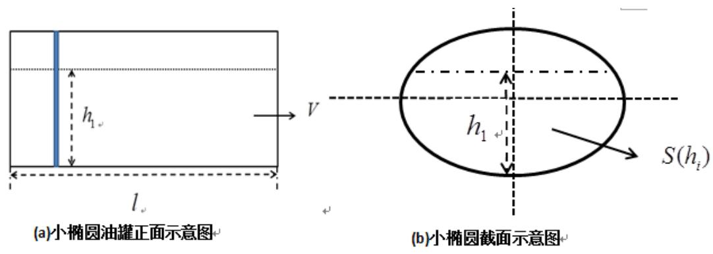

<details>
<summary>text_image</summary>

(a)小椭圆油罐正面示意图
h₁
l
V
h₁
S(hᵢ)
(b)小椭圆截面示意图
</details>

图 5.1.1.1 小椭圆油罐无变位示意图

## 模型二：有变位[1]

有变位时，变位角 $\alpha=4.1^{\circ}$ 时，油罐储油量与浮标所测定的高度 $h_{1}$ 的关系有五种情况，下面分情况讨论

(1). 如下图 5.1.1.2，由于有纵向倾角，但浮标显示是 0 时，油罐内实际并不为零。经过计算可得：

$$
\text {当} h _ {1} = 0 \text {时,} V _ {1} \leq 1. 6 7 4 3 L;
$$

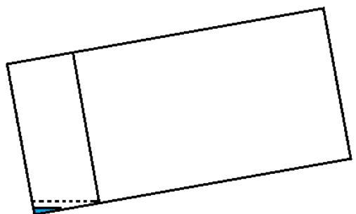

<details>
<summary>natural_image</summary>

Simple geometric diagram with a rectangle divided into two parts, one solid and one dashed, with no text or symbols.
</details>

图5.1.1.2

(2). 如下图 5.1.1.3，表示油罐内的油量的平面低于所示虚线，此时油罐的正面示意图是三角形。

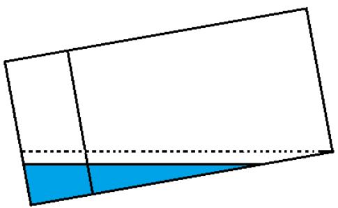

<details>
<summary>natural_image</summary>

Geometric diagram showing a rectangle divided into two parts with a blue shaded triangle at the bottom (no text or symbols)
</details>

图 5.1.1.3

则有当 $0 < h_{1} \leq 2.05 \tan \alpha m$ ，即 $0 < h_{1} \leq 146.9458mm$ 时：

$$
\begin{array}{l} V _ {1} (h) = \int_ {0} ^ {\frac {h _ {1}}{\tan \alpha} + 0. 4} \int_ {- b} ^ {z \tan \alpha - b} \int_ {- a \sqrt {1 - \frac {y ^ {2}}{b ^ {2}}}} ^ {a \sqrt {1 - \frac {y ^ {2}}{b ^ {2}}}} d x d y d z \\ = \int_ {0} ^ {\frac {h _ {1}}{\tan \alpha} + 0. 4} 2 a \int_ {- b} ^ {z \tan \alpha - b} \sqrt {1 - \frac {y ^ {2}}{b ^ {2}}} d y d z \\ = \int_ {0} ^ {\frac {h _ {1}}{\tan \alpha} + 0. 4} a b \left[ \frac {z \tan \alpha - b}{b} \sqrt {1 - \left(\frac {z \tan \alpha - b}{b}\right) ^ {2}} + \arcsin \left(\frac {z \tan \alpha - b}{b}\right) \right] d z \\ \end{array}
$$

令 $u=\frac{z\tan\alpha-b}{b}$ ,

$$
\begin{array}{l} = \frac {a b}{\tan \alpha} \left(- \frac {b}{3} \sqrt {\left[ 1 - \left(\frac {h + 0 . 4 \tan \alpha - b}{b}\right) ^ {2} \right] ^ {3}}\right) + \\ \frac {a b}{\tan \alpha} \left(\left(h _ {1} + 0. 4 \tan \alpha - b\right) \arcsin \frac {h _ {1} + 0 . 4 \tan \alpha - b}{b}\right) + \\ \frac {a b}{\tan \alpha} b \sqrt {1 - \left(\frac {h _ {1} + 0 . 4 \tan \alpha - b}{b}\right) ^ {2}} + \\ \frac {a b}{\tan \alpha} \left(\frac {\pi}{2} \bigl (h _ {1} + 0. 4 \tan \alpha - b \bigr)\right) \\ \end{array}
$$

原式 $= \frac{ab}{\tan\alpha}\int_{-1}^{\frac{h_1 + 0.4\tan\alpha - b}{b}}\left(u\sqrt{1 - u^2} +\arcsin u + \frac{\pi}{2}\right)du$

(3). 如下图 5.1.1.4，油罐内油量的液面低于所示虚线，此时油没有完全覆盖油罐的任意一个底面：

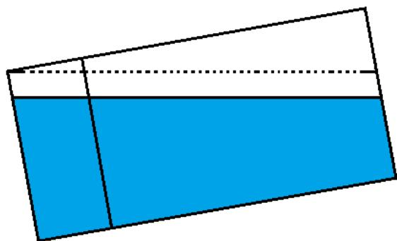

<details>
<summary>natural_image</summary>

Geometric diagram showing a trapezoid divided into two equal parts, one blue and one white, with no text or symbols.
</details>

图 5.1.1.4

当 $2.05 \tan \alpha < h_{1} \leq 1.2 - 0.4 \tan \alpha$ ，即 $146.9458 < h_{1} \leq 1171.3276$ 时：

$$
V_{1}(h) = \int \limits_{\substack{\frac{1.2}{\tan\alpha} -2.45}}^{\frac{1.2}{\tan\alpha}}\int \limits_{-b}^{z\tan \alpha}\int \limits_{-a\sqrt{1 - \frac{y^{2}}{b^{2}}}}^{a\sqrt{1 - \frac{y^{2}}{b^{2}}}}dxdydz
$$

积分方法同上可得

$$
\begin{array}{l} V _ {1} (h) = \frac {a b}{\tan \alpha} \left(\frac {b}{3} \sqrt {\left[ 1 - \left(\frac {h _ {1} - 2 . 0 5 \tan \alpha - b}{b}\right) ^ {2} \right] ^ {3}}\right) - \\ \frac {a b}{\tan \alpha} \left(\frac {b}{3} \sqrt {\left[ 1 - \left(\frac {h _ {1} + 0 . 4 \tan \alpha - b}{b}\right) ^ {2} \right] ^ {3}}\right) + \\ \frac {a b}{\tan \alpha} \left[ \left(h _ {1} + 0. 4 \tan \alpha - b\right) \arcsin \frac {h _ {1} + 0 . 4 \tan \alpha - b}{b} \right] + \\ \frac {a b}{\tan \alpha} \left(b \sqrt {1 - \left(\frac {h _ {1} + 0 . 4 \tan \alpha - b}{b}\right) ^ {2}}\right) - \\ \frac {a b}{\tan \alpha} \left[ \left(h _ {1} - 2. 0 5 \tan \alpha - b\right) \arcsin \frac {h _ {1} - 2 . 0 5 \tan \alpha - b}{b} \right] - \\ \frac {a b}{\tan \alpha} \left(b \sqrt {1 - \left(\frac {h _ {1} - 2 . 0 5 \tan \alpha - b}{b}\right) ^ {2}}\right) + \\ \frac {a b}{\tan \alpha} \left(2. 4 5 \frac {\pi}{2} \tan \alpha\right) \\ \end{array}
$$

(4). 如下图 5.1.1.5，油罐内油完全覆盖油罐的一个底面。

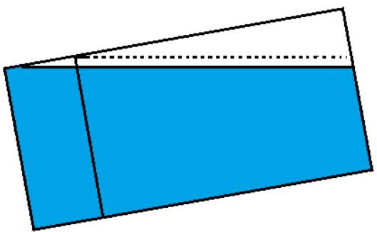

<details>
<summary>natural_image</summary>

Geometric diagram of a trapezoid divided into two equal parts, one blue and one white, with no text or symbols.
</details>

图 5.1.1.5

当 $1.2 - 0.4 \tan \alpha < h_{1} \leq 1.2 m$ , 即 $1171.3276 \mathrm{~mm} < \mathrm{h}_{1} \leq 1.2 \mathrm{~mm}$ 时:

$$
V _ {1} (h) = V _ {a} + \int_ {\frac {h _ {1}}{\tan \alpha} - 2. 0 5} ^ {\frac {h _ {1}}{\tan \alpha}} \int_ {- b} ^ {z \tan \alpha - b} \int_ {- a \sqrt {1 - \frac {y ^ {2}}{b ^ {2}}}} ^ {a \sqrt {1 - \frac {y ^ {2}}{b ^ {2}}}} d x d y d z
$$

其中 $V_{a}=\pi ab(0.4-\frac{1.2-h_{1}}{\tan\alpha})$ ,

原式 $= \pi ab(0.4 - \frac{1.2 - h_1}{\tan\alpha})+$

$$
\begin{array}{l} \frac {a b}{\tan \alpha} \left(\frac {b}{3} \sqrt {\left[ 1 - \left(\frac {h _ {1} - 2 . 0 5 \tan \alpha - b}{b}\right) ^ {2} \right] ^ {3}}\right) - \\ \frac {a b}{\tan \alpha} \left[ \left(h _ {1} - 2. 0 5 \tan \alpha - b\right) \arcsin \frac {h _ {1} - 2 . 0 5 \tan \alpha - b}{b} \right] - \\ \frac {a b}{\tan \alpha} \left(b \sqrt {1 - \left(\frac {h _ {1} - 2 . 0 5 \tan \alpha - b}{b}\right) ^ {2}}\right) + \\ \frac {a b}{\tan \alpha} \Biggl [ \left(3 b - h _ {1} + 2. 0 5 \tan \alpha\right) \frac {\pi}{2} \Biggr ] \\ \end{array}
$$

(5). 如下图 5.1.1.6，浮标测得的油位高度显示油罐为满，然而实际上并没有满。

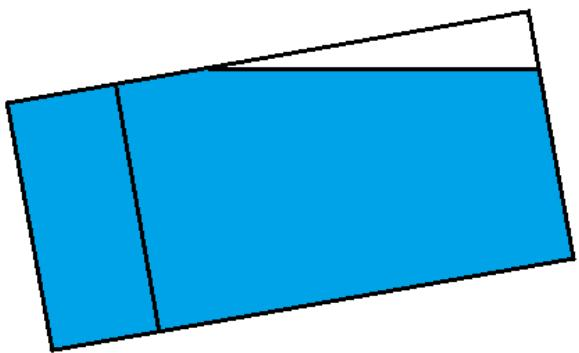

<details>
<summary>natural_image</summary>

Simple geometric diagram with two blue rectangles separated by a white gap (no text or symbols)
</details>

图 5.1.1.6

此时经计算得到:

当 $h_{1}=1.2m$ 时， $4012.747\leq V_{1}\leq4110.146L$

## 5.1.2 模型求解及改进

首先对 5.1.1 中建立的模型，用题目附录中的数据进行检验。

对于无变位的模型, 将题目附录中的提供的数据中的油位高度带入函数关系式可求得相应的储油罐中的容量, 然后与题目附录中的储油量高度进行比对, 发现相对误差维持在 3.48% 左右。由于相对误差几乎保持不变, 我们可以认为实际测量过程存在系统误差。可以对这个结果加以修正。

## 模型修正

对无变位的油罐模型进行修正。在这里定义残差 $\varepsilon$ 为实际测量值与模型所得值的差，即 $\varepsilon = V - V(h)$ 。（其中 V 表示实验测得的油罐内油容量， $V(h)$ 表示当油位高度为 h 时，由模型求得的油罐内油的容量）。建立关系 $\varepsilon - -V(h)$ ， $\varepsilon$ 关于油位高度 $V(h)$ 的拟合图像如下。

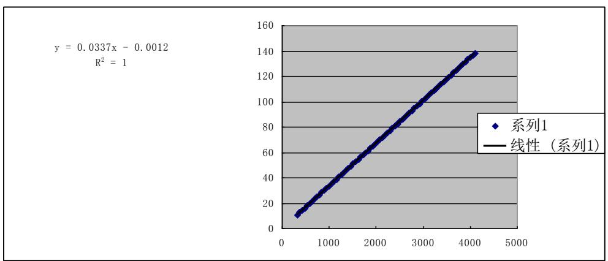

<details>
<summary>scatter</summary>

| X | Y |
| --- | --- |
| ~350 | ~10 |
| ~400 | ~12 |
| ~450 | ~14 |
| ~500 | ~16 |
| ~550 | ~18 |
| ~600 | ~20 |
| ~650 | ~22 |
| ~700 | ~24 |
| ~750 | ~26 |
| ~800 | ~28 |
| ~850 | ~30 |
| ~900 | ~32 |
| ~950 | ~34 |
| ~1000 | ~36 |
| ~1050 | ~38 |
| ~1100 | ~40 |
| ~1150 | ~42 |
| ~1200 | ~44 |
| ~1250 | ~46 |
| ~1300 | ~48 |
| ~1350 | ~50 |
| ~1400 | ~52 |
| ~1450 | ~54 |
| ~1500 | ~56 |
| ~1550 | ~58 |
| ~1600 | ~60 |
| ~1650 | ~62 |
| ~1700 | ~64 |
| ~1750 | ~66 |
| ~1800 | ~68 |
| ~1850 | ~70 |
| ~1900 | ~72 |
| ~1950 | ~74 |
| ~2000 | ~76 |
| ~2050 | ~78 |
| ~2100 | ~80 |
| ~2150 | ~82 |
| ~2200 | ~84 |
| ~2250 | ~86 |
| ~2300 | ~88 |
| ~2350 | ~90 |
| ~2400 | ~92 |
| ~2450 | ~94 |
| ~2500 | ~96 |
| ~2550 | ~98 |
| ~2600 | ~100 |
| ~2650 | ~102 |
| ~2700 | ~104 |
| ~2750 | ~106 |
| ~2800 | ~108 |
| ~2850 | ~110 |
| ~2900 | ~112 |
| ~2950 | ~114 |
| ~3000 | ~116 |
| ~3050 | ~118 |
| ~3100 | ~120 |
| ~3150 | ~122 |
| ~3200 | ~124 |
| ~3250 | ~126 |
| ~3300 | ~128 |
| ~3350 | ~130 |
| ~3400 | ~132 |
| ~3450 | ~134 |
| ~3500 | ~136 |
| ~3550 | ~138 |
| ~3600 | ~140 |
</details>

图 5.1.2.1

函数关系为 $\varepsilon=0.0337V(h)-0.0012$ ，对原无变位模型进行修正得 $V=v_{1}+\varepsilon$ 。此时利用附件中的数据对其进行验证得绝对误差绝对值在 0.01L 以内，相对误差在 $10^{-5}$ 数量级或者更小。具体图表见附录中表 2。

对于油罐变位后的模型，与无变位的检验同理。得到相对误差在 1%～5%以内。在可容许的范围内，因此我们认为此模型有效。

油罐变位后对罐容表的影响可以通过比较无变位和有变位的数学模型得出。利用 MATLAB[2] 在一定区间内对两个模型作图于同一个坐标系中。程序见附件。图形如下图 5.1.2.1。

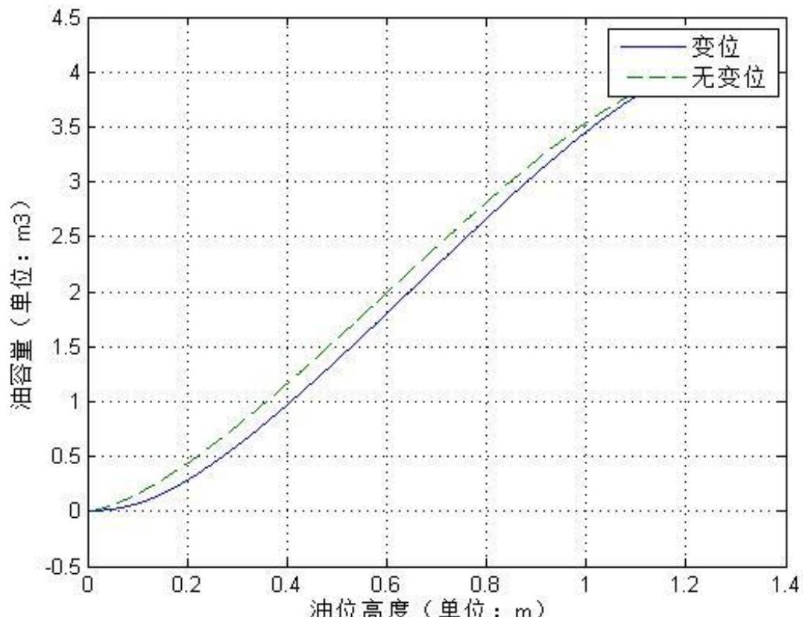

<details>
<summary>line</summary>

| 油位高度 (m) | 变位 (m3) | 无变位 (m3) |
| --- | --- | --- |
| 0 | 0 | 0 |
| 0.2 | ~0.3 | ~0.5 |
| 0.4 | ~1.0 | ~1.2 |
| 0.6 | ~1.8 | ~2.0 |
| 0.8 | ~2.7 | ~2.9 |
| 1.0 | ~3.5 | ~3.6 |
| 1.2 | ~3.8 | ~3.9 |
</details>

图 5.1.2.2

由图可看出在一定区间内, 变位后相同油位高度的情况下实际储油量要比无变位的储油罐在相同油位高度下的储油量要少, 且差值保持在一定值左右波动。这一点也可以从题目附录中的数据得到验证。在高度相同的情况下, 无变位与变位的油罐模型油量差值保持在 200L 左右。

当然，由 5.1.1.1 的变位模型的第一种情况可知，变位后的油罐在浮标测得高度之前就可能已含有油，即由于倾角的影响，浮标显示油位高度为 0，而变位油罐可能并不是空的。同理知 5.1.1.1 的变位模型第五种，当浮标显示油位高度为满的时候，由于倾角的影响，油罐实际上的储油量可能并不是满的。考虑到在现实情况下，纵向倾角不可能太大，所以变位油罐模型的第一种和第五种情况不做过多讨论。

另外，罐体变位后油位高度间隔为 $1 \, cm$ 的罐容表标定值可以由模型得到，结果如下：

罐体变位后罐容表标定值

<table><tr><td>高度 0.00mm</td><td>V &lt;= 1.67L</td></tr><tr><td>高度 10.00mm</td><td>V = 3.53L</td></tr><tr><td>高度 20.00mm</td><td>V = 6.26L</td></tr><tr><td>高度 30.00mm</td><td>V = 9.97L</td></tr><tr><td>高度 40.00mm</td><td>V = 14.76L</td></tr><tr><td>高度 50.00mm</td><td>V = 20.69L</td></tr><tr><td>高度 60.00mm</td><td>V = 27.85L</td></tr><tr><td>高度 70.00mm</td><td>V = 36.32L</td></tr><tr><td>高度 80.00mm</td><td>V = 46.14L</td></tr><tr><td>高度 90.00mm</td><td>V = 57.39L</td></tr><tr><td>高度 100.00mm</td><td>V = 70.13L</td></tr><tr><td>高度 110.00mm</td><td>V = 84.40L</td></tr><tr><td>高度 120.00mm</td><td>V = 100.25L</td></tr><tr><td>高度 130.00mm</td><td>V = 117.75L</td></tr><tr><td>高度 140.00mm</td><td>V = 136.92L</td></tr><tr><td>高度 150.00mm</td><td>V = 157.82L</td></tr><tr><td>高度 160.00mm</td><td>V = 180.26L</td></tr><tr><td>高度 170.00mm</td><td>V = 204.00L</td></tr><tr><td>高度 180.00mm</td><td>V = 228.91L</td></tr><tr><td>高度 190.00mm</td><td>V = 254.88L</td></tr><tr><td>高度 200.00mm</td><td>V = 281.86L</td></tr><tr><td>高度 210.00mm</td><td>V = 309.76L</td></tr><tr><td>高度 220.00mm</td><td>V = 338.54L</td></tr><tr><td>高度 230.00mm</td><td>V = 368.14L</td></tr><tr><td>高度 240.00mm</td><td>V = 398.53L</td></tr><tr><td>高度 250.00mm</td><td>V = 429.66L</td></tr><tr><td>高度 260.00mm</td><td>V = 461.49L</td></tr><tr><td>高度 270.00mm</td><td>V = 494.00L</td></tr><tr><td>高度 280.00mm</td><td>V = 527.14L</td></tr><tr><td>高度 290.00mm</td><td>V = 560.90L</td></tr><tr><td>高度 300.00mm</td><td>V = 595.25L</td></tr><tr><td>高度 310.00mm</td><td>V = 630.15L</td></tr><tr><td>高度 320.00mm</td><td>V = 665.58L</td></tr><tr><td>高度 330.00mm</td><td>V = 701.53L</td></tr><tr><td>高度 340.00mm</td><td>V = 737.96L</td></tr><tr><td>高度 350.00mm</td><td>V = 774.86L</td></tr><tr><td>高度 360.00mm</td><td>V = 812.20L</td></tr><tr><td>高度 370.00mm</td><td>V = 849.97L</td></tr><tr><td>高度 380.00mm</td><td>V = 888.15L</td></tr><tr><td>高度 390.00mm</td><td>V = 926.72L</td></tr></table>

<table><tr><td>高度</td><td>400.00mm</td><td>V = 965.66L</td></tr><tr><td>高度</td><td>410.00mm</td><td>V = 1004.95L</td></tr><tr><td>高度</td><td>420.00mm</td><td>V = 1044.58L</td></tr><tr><td>高度</td><td>430.00mm</td><td>V = 1084.53L</td></tr><tr><td>高度</td><td>440.00mm</td><td>V = 1124.79L</td></tr><tr><td>高度</td><td>450.00mm</td><td>V = 1165.34L</td></tr><tr><td>高度</td><td>460.00mm</td><td>V = 1206.16L</td></tr><tr><td>高度</td><td>470.00mm</td><td>V = 1247.23L</td></tr><tr><td>高度</td><td>480.00mm</td><td>V = 1288.56L</td></tr><tr><td>高度</td><td>490.00mm</td><td>V = 1330.11L</td></tr><tr><td>高度</td><td>500.00mm</td><td>V = 1371.88L</td></tr><tr><td>高度</td><td>510.00mm</td><td>V = 1413.85L</td></tr><tr><td>高度</td><td>520.00mm</td><td>V = 1456.02L</td></tr><tr><td>高度</td><td>530.00mm</td><td>V = 1498.35L</td></tr><tr><td>高度</td><td>540.00mm</td><td>V = 1540.85L</td></tr><tr><td>高度</td><td>550.00mm</td><td>V = 1583.50L</td></tr><tr><td>高度</td><td>560.00mm</td><td>V = 1626.28L</td></tr><tr><td>高度</td><td>570.00mm</td><td>V = 1669.19L</td></tr><tr><td>高度</td><td>580.00mm</td><td>V = 1712.21L</td></tr><tr><td>高度</td><td>590.00mm</td><td>V = 1755.32L</td></tr><tr><td>高度</td><td>600.00mm</td><td>V = 1798.52L</td></tr><tr><td>高度</td><td>610.00mm</td><td>V = 1841.80L</td></tr><tr><td>高度</td><td>620.00mm</td><td>V = 1885.13L</td></tr><tr><td>高度</td><td>630.00mm</td><td>V = 1928.51L</td></tr><tr><td>高度</td><td>640.00mm</td><td>V = 1971.93L</td></tr><tr><td>高度</td><td>650.00mm</td><td>V = 2015.37L</td></tr><tr><td>高度</td><td>660.00mm</td><td>V = 2058.82L</td></tr><tr><td>高度</td><td>670.00mm</td><td>V = 2102.28L</td></tr><tr><td>高度</td><td>680.00mm</td><td>V = 2145.71L</td></tr><tr><td>高度</td><td>690.00mm</td><td>V = 2189.13L</td></tr><tr><td>高度</td><td>700.00mm</td><td>V = 2232.50L</td></tr><tr><td>高度</td><td>710.00mm</td><td>V = 2275.82L</td></tr><tr><td>高度</td><td>720.00mm</td><td>V = 2319.09L</td></tr><tr><td>高度</td><td>730.00mm</td><td>V = 2362.27L</td></tr><tr><td>高度</td><td>740.00mm</td><td>V = 2405.37L</td></tr><tr><td>高度</td><td>750.00mm</td><td>V = 2448.37L</td></tr><tr><td>高度</td><td>760.00mm</td><td>V = 2491.26L</td></tr><tr><td>高度</td><td>770.00mm</td><td>V = 2534.02L</td></tr><tr><td>高度</td><td>780.00mm</td><td>V = 2576.64L</td></tr><tr><td>高度</td><td>790.00mm</td><td>V = 2619.12L</td></tr><tr><td>高度</td><td>800.00mm</td><td>V = 2661.42L</td></tr><tr><td>高度</td><td>810.00mm</td><td>V = 2703.55L</td></tr><tr><td>高度</td><td>820.00mm</td><td>V = 2745.49L</td></tr><tr><td>高度</td><td>830.00mm</td><td>V = 2787.22L</td></tr></table>

<table><tr><td>高度 840.00mm V = 2828.74L</td></tr><tr><td>高度 850.00mm V = 2870.02L</td></tr><tr><td>高度 860.00mm V = 2911.06L</td></tr><tr><td>高度 870.00mm V = 2951.83L</td></tr><tr><td>高度 880.00mm V = 2992.33L</td></tr><tr><td>高度 890.00mm V = 3032.53L</td></tr><tr><td>高度 900.00mm V = 3072.43L</td></tr><tr><td>高度 910.00mm V = 3112.00L</td></tr><tr><td>高度 920.00mm V = 3151.23L</td></tr><tr><td>高度 930.00mm V = 3190.11L</td></tr><tr><td>高度 940.00mm V = 3228.61L</td></tr><tr><td>高度 950.00mm V = 3266.72L</td></tr><tr><td>高度 960.00mm V = 3304.42L</td></tr><tr><td>高度 970.00mm V = 3341.69L</td></tr><tr><td>高度 980.00mm V = 3378.51L</td></tr><tr><td>高度 990.00mm V = 3414.86L</td></tr><tr><td>高度 1000.00mm V = 3450.72L</td></tr><tr><td>高度 1010.00mm V = 3486.06L</td></tr><tr><td>高度 1020.00mm V = 3520.87L</td></tr><tr><td>高度 1030.00mm V = 3555.11L</td></tr><tr><td>高度 1040.00mm V = 3588.77L</td></tr><tr><td>高度 1050.00mm V = 3621.81L</td></tr><tr><td>高度 1060.00mm V = 3654.20L</td></tr><tr><td>高度 1070.00mm V = 3685.91L</td></tr><tr><td>高度 1080.00mm V = 3716.92L</td></tr><tr><td>高度 1090.00mm V = 3747.17L</td></tr><tr><td>高度 1100.00mm V = 3776.64L</td></tr><tr><td>高度 1110.00mm V = 3805.27L</td></tr><tr><td>高度 1120.00mm V = 3833.01L</td></tr><tr><td>高度 1130.00mm V = 3859.82L</td></tr><tr><td>高度 1140.00mm V = 3885.62L</td></tr><tr><td>高度 1150.00mm V = 3910.33L</td></tr><tr><td>高度 1160.00mm V = 3933.86L</td></tr><tr><td>高度 1170.00mm V = 3956.06L</td></tr><tr><td>高度 1180.00mm V = 3976.66L</td></tr><tr><td>高度 1190.00mm V = 3995.54L</td></tr><tr><td>高度 1200.00mm 4012.74L &lt;= V &lt;= 4110.15L</td></tr></table>

## 5.2 问题二的解答

## 5.2.1 模型建立

问题二要求建立罐体变位后标定罐容表的数学模型，并根据附件中的实验检

测数据确定变位参数。

首先建立数学模型。油罐的示意图如下，先考虑只有纵向位移

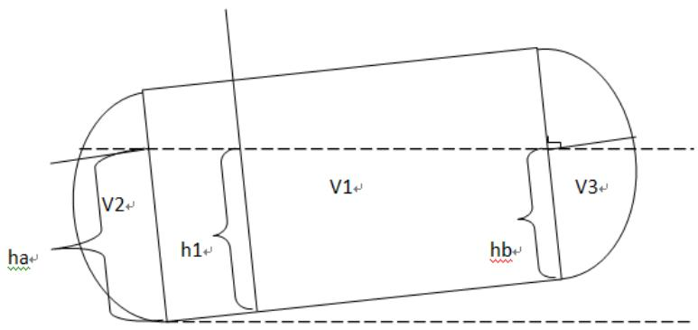

<details>
<summary>text_image</summary>

ha
V2
h1
V1
hb
V3
</details>

图 5.2.1.1

两条虚线为水平线，倾角为 $\alpha$ ，则油罐内容积为

$$
V = V _ {1} + V _ {2} + V _ {3} \circ
$$

其中 $V_{1}$ 为油罐中间部分体积， $V_{2}, V_{3}$ 分别为两球冠的体积。

下面分别利用几何学，以及积分分别求解 $V_{1},V_{2},V_{3}$ 。

## 5.2.2 模型求解

## 5.2.2.1 求解 $V_{1}$

$V_{1}$ 的情况与第一问类似, 需要分五种情况进行讨论, 由于有些情况比较类似, 在这里主要讨论一般情况, 如下图所示。

先考虑只存在纵向倾角

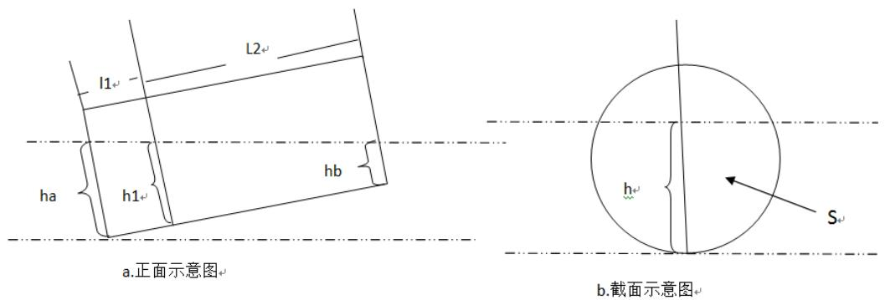

<details>
<summary>text_image</summary>

L1
L2
ha
h1
hb
a.正面示意图
b.截面示意图
</details>

图 5.2.2.1.1 圆筒部分示意图

由三角形的相关性质可得:

$$
h _ {a} = h _ {1} + l _ {1} \tan \alpha , h _ {b} = h _ {1} - l _ {2} \tan \alpha ,
$$

S 为图 b 所示部分的面积，可推出

$$
S = S (h) {=} r ^ {2} \left(\frac {h - r}{r} \sqrt {1 - \left(\frac {h - r}{r}\right) ^ {2}} + \arcsin \frac {h - r}{r}\right),
$$

其中 $r$ 为截面圆的半径，则

$$
\begin{array}{l} V _ {1} = \frac {1}{\tan \alpha} \int_ {h _ {b}} ^ {h _ {a}} S (h) d h \\ = \frac {r ^ {2}}{\tan \alpha} \left[ \frac {r}{3} \sqrt {\left(1 - x _ {1} ^ {2}\right) ^ {3}} - \frac {r}{3} \sqrt {\left(1 - x _ {2} ^ {2}\right) ^ {3}} + r \left(x _ {2} \arcsin x _ {2} + \sqrt {1 - x _ {2} ^ {2}} - x _ {1} \arcsin x _ {1} - \sqrt {1 - x _ {1} ^ {2}}\right) + \left(x _ {2} - x _ {1}\right) r \frac {\pi}{2} \right] \\ \end{array}
$$

其中 $x_{1}=\frac{h-r-6\tan\alpha}{r}, x_{2}=\frac{h-r+2\tan\alpha}{r}$ ，h 即为图示中的 $h_{1}$ ，即浮标所测定的油位高度。

再考虑水平倾角，图示如下

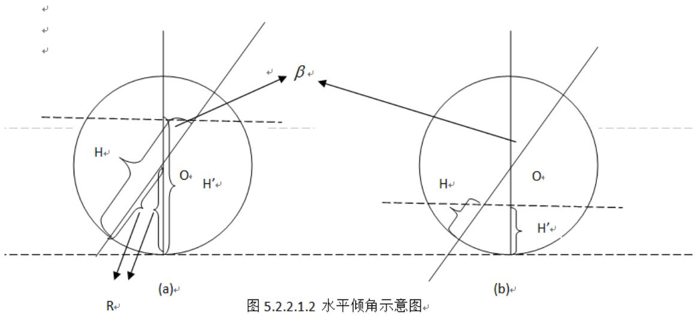

<details>
<summary>text_image</summary>

图 5.2.2.1.2 水平倾角示意图
</details>

图中 R 表示截面圆的半径， $H'$ 表示没有横向偏转角时浮标所测定的油位高度，H 表示横向偏转角为 $\beta$ 时的浮标所测定的油位高度。

对于情况(a)，得 $\cos \beta = \frac{H' - R}{H - R}$

对于情况(b)，得 $\cos\beta=\frac{R-H'}{R-H}$

所以可以统一形式为 $\cos\beta=\frac{H'-R}{H-R}$ ，易知横向偏转角只对浮标所测定的高度有影响。所以对之前没有横向偏转角时的表达式中 H 进行代换，只需改变 $x_{1}, x_{2}$ 即可。

$$
x _ {1} = \frac {h \cos \beta - r \cos \beta - 6 \tan \alpha}{r}, \quad x _ {2} = \frac {h \cos \beta - r \cos \beta + 2 \tan \alpha}{r}
$$

## 5.2.2.2 求解 $V_{2}, V_{3}$

$V_{2}, V_{3}$ 为油罐两端的球冠的体积，考虑到积分的复杂性以及现实中倾角不会太大，这里作了简化，如图 5.2.1.1，过水平面与球冠底面相交线作垂直于球冠底面的平面。取新的平面与原球冠面的所围成的体积近似代替原体积。如下图

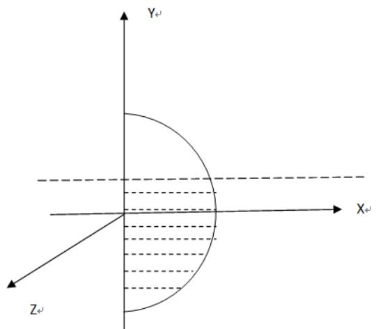

<details>
<summary>text_image</summary>

Y
X
Z
</details>

(a)

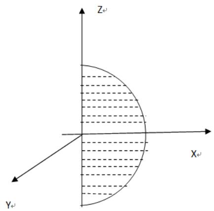

<details>
<summary>text_image</summary>

Z_{+J}
X_{+J}
Y_{+J}
</details>

(b)  
图 5.2.2.2.1 球缺的两种不同视图

(a)情况为油罐正面视图下球冠体的视图，像图中建立空间直角坐标系。当从Y轴正向负看去时，呈现(b)情况。设球缺在X0Z平面内的面面积为S。则球冠体体积可以表示为[3]

$$
V _ {2} = \int_ {- r} ^ {h _ {a}} S d y, V _ {3} = \int_ {- r} ^ {h _ {b}} S d y
$$

$$
S = \left(R ^ {2} - y ^ {2}\right) a \cos \left(\frac {R - a}{\sqrt {R ^ {2} - y ^ {2}}}\right) - \sqrt {R ^ {2} - y ^ {2} - \left(R - a\right) ^ {2}} \left(R - a\right)
$$

其中：R 为球冠半径，a 为球冠体的高

算法设计：（数值积分）[4]

考虑到 S 表达式的复杂性，利用定积分求球冠体积是非常困难的，甚至是不可能的。这时候考虑到数值积分，可以用数值积分编程进行求解，即将积分区间 l 划分为 N 段（N 足够大以至于可以忽略函数 S 在区间长度 $\frac{l}{N}$ 上的变化），这时结果即为 $\sum_{i=1}^{n} S_{i} \cdot \frac{l}{N}$ 。经编程实现了该积分，并将误差降到可以忽略的数量级。程序代码见附录中程序 1。

由上两部分得到问题二的数学模型，如下：

## 5.2.2.3 求解变位参数 $\alpha, \beta$

利用附件 2 中的数据求解变位参数。附件 2 提供的数据中显示油高和显示油量容积是基于无变位时的罐容表的。可以利用这两列数据对模型在无变位情况下进行一定的评估。

最小二乘法:

$$
X = \left[ x _ {1}, x _ {2} \dots x _ {i} \dots . x _ {n} \right] \quad , \text {表示出油量}
$$

$$
H = \left[ h _ {1}, h _ {2}, \dots h _ {i} \dots h _ {n + 1} \right], \text {表示油位高度}
$$

$$
\text {令} I = \min \sum_ {i = 1} ^ {n} \left(V (h _ {i + 1}) - V (h _ {i}) - x _ {i}\right) ^ {2}
$$

求解变位参数可以利用显示油高和进出油量这两行数据来进行确定。在模型中，每一个油位高度对应一个油罐储油量，则两个油位高度间油量的差值则可以通过进出油量来确定，这是可以由附件2中CD行数据提供给的（即进油量与出油量）。

具体方法是取 N 组显示高度的数据，以及相对应的 N-1 组油量差值。（每相邻两个油位高度对应一个油量差值）。将油位高度带入模型求得相应的储油量，由相邻的储油量即产生油量差值，然后将这些数据差值与附件 2 中提供的油量差值相减，并对这些差的平方求和。则每对应一组 $\alpha, \beta$ 值便存在一个和。求变位参数即可理解为寻找使和最小的一组的 $\alpha, \beta$ 值，而这可以通过枚举 $\alpha, \beta$ 值来确定。通过编程实现该思想并求得 $\alpha = 2.1, \beta = 4.6$ （单位：角度）。程序见附录二“变位参数求解程序”。

确定变位参数后，将参数带入模型即可求得罐容表标定值，结果如下：

变位罐容表标定值

<table><tr><td>高度:0.00mm</td><td>剩余油量:&lt;=46.21L</td></tr><tr><td>高度:100.00mm</td><td>剩余油量:355.71L</td></tr><tr><td>高度:200.00mm</td><td>剩余油量:1068.21L</td></tr><tr><td>高度:300.00mm</td><td>剩余油量:2226.14L</td></tr><tr><td>高度:400.00mm</td><td>剩余油量:3705.48L</td></tr><tr><td>高度:500.00mm</td><td>剩余油量:5435.16L</td></tr><tr><td>高度:600.00mm</td><td>剩余油量:7373.74L</td></tr><tr><td>高度:700.00mm</td><td>剩余油量:9490.19L</td></tr><tr><td>高度:800.00mm</td><td>剩余油量:11759.02L</td></tr></table>

<table><tr><td>高度:900.00mm</td><td>剩余油量:14158.10L</td></tr><tr><td>高度:1000.00mm</td><td>剩余油量:16667.53L</td></tr><tr><td>高度:1100.00mm</td><td>剩余油量:19268.91L</td></tr><tr><td>高度:1200.00mm</td><td>剩余油量:21944.96L</td></tr><tr><td>高度:1300.00mm</td><td>剩余油量:24679.18L</td></tr><tr><td>高度:1400.00mm</td><td>剩余油量:27455.60L</td></tr><tr><td>高度:1500.00mm</td><td>剩余油量:30258.65L</td></tr><tr><td>高度:1600.00mm</td><td>剩余油量:33072.97L</td></tr><tr><td>高度:1700.00mm</td><td>剩余油量:35883.29L</td></tr><tr><td>高度:1800.00mm</td><td>剩余油量:38674.31L</td></tr><tr><td>高度:1900.00mm</td><td>剩余油量:41430.58L</td></tr><tr><td>高度:2000.00mm</td><td>剩余油量:44136.33L</td></tr><tr><td>高度:2100.00mm</td><td>剩余油量:46775.35L</td></tr><tr><td>高度:2200.00mm</td><td>剩余油量:49330.73L</td></tr><tr><td>高度:2300.00mm</td><td>剩余油量:51784.67L</td></tr><tr><td>高度:2400.00mm</td><td>剩余油量:54118.02L</td></tr><tr><td>高度:2500.00mm</td><td>剩余油量:56309.82L</td></tr><tr><td>高度:2600.00mm</td><td>剩余油量:58336.33L</td></tr><tr><td>高度:2700.00mm</td><td>剩余油量:60169.50L</td></tr><tr><td>高度:2800.00mm</td><td>剩余油量:61773.73L</td></tr><tr><td>高度:2900.00mm</td><td>剩余油量:63096.98L</td></tr><tr><td>高度:3000.00mm</td><td>剩余油量:64029.08L &lt;= V &lt;= 64664.45L</td></tr></table>

## 5.2.3 结果分析与模型检测

结果：问题二中通过对油罐的三个组成部分分别建模，得出了总体的数学模型。并通过数学模型由附件 2 中提供的数据求出变位参数 $\alpha=2.1, \beta=4.6$ （单位：角度）。

验证：将变位参数带入数学模型，从题目附件2中随机取60组数据进行检测，研究误差，发现大多数绝对误差在1L范围内,个别数据误差在2L左右。表见附录中表3。在一定程度上验证了模型的合理性，以及结果的正确性与可靠性。

## 6. 模型评价

## 6.1 模型优点

(1). 小椭圆储油罐无变位模型情况比较简单，算法容易设计，根据积分很容易得到其具体表达式且相对来说比较精确。  
(2). 小椭圆储油罐变位模型针对具体情况分类讨论。  
(3). 实际储油罐模型比较实用。在球缺部分的建模过程中，适当的运用了近似算法使复杂情况简单化，易于计算。

## 6.2 模型缺点

(1). 小椭圆储油罐无变位模型仅有简单的积分得来，没有将具体情况考虑进去，应用范围狭窄。对于误差修差模型中的线性拟合没有具体意义。  
(2). 小椭圆储油罐变位模型未能很好的模拟出，误差有待进一步改进。  
(3). 实际储油罐模型构造中，关于球冠部分的计算采用了近似方法，使得计算结果与实际结果有一定误差，有待进一步改进。在数值积分中，结果的准确性受到迭代次数的限制。

## 7. 模型改进

1. 小椭圆储油罐变位模型所得结果与实验测得结果存在一定的误差, 需要考虑具体情况对模型进行适当地修正。  
2. 实际储油罐模型球冠体部分由于采用了近似的方法，增加了误差的必然性。需要对这种方法进行改进，对模型忽略部分进行精确求解，减小误差。在运用模型求解变位参数时采用了对参数进行枚举的方法，而枚举法在运行时间以及空间上是比较浪费资源，效率不高。可以考虑采取更高效的算法。

## 8. 参考文献

[1]《实用积分表》编委会, 实用积分表, 合肥: 中国科学技术大学出版社, 2006年1月第1版  
[2] 邓薇，MATLAB 函数速查手册，北京：人民邮电出版社，2010 年 5 月第 2 版  
[3] 付昶林，倾斜油罐容量计算，黑龙江八一农垦大学，第二期，43——52，1981  
[4] 余永峰 张友春，卧式容器球冠形封头液位与相对应的液体容积计算，中国特种设备安全，第24卷，第11期，24——26

## 附录

表 1 罐体变位后罐容表标定值

<table><tr><td>高度 0.00mm</td><td>V &lt;= 1.67L</td></tr><tr><td>高度 10.00mm</td><td>V = 3.53L</td></tr><tr><td>高度 20.00mm</td><td>V = 6.26L</td></tr><tr><td>高度 30.00mm</td><td>V = 9.97L</td></tr><tr><td>高度 40.00mm</td><td>V = 14.76L</td></tr><tr><td>高度 50.00mm</td><td>V = 20.69L</td></tr><tr><td>高度 60.00mm</td><td>V = 27.85L</td></tr><tr><td>高度 70.00mm</td><td>V = 36.32L</td></tr><tr><td>高度 80.00mm</td><td>V = 46.14L</td></tr><tr><td>高度 90.00mm</td><td>V = 57.39L</td></tr><tr><td>高度 100.00mm</td><td>V = 70.13L</td></tr><tr><td>高度 110.00mm</td><td>V = 84.40L</td></tr><tr><td>高度 120.00mm</td><td>V = 100.25L</td></tr><tr><td>高度 130.00mm</td><td>V = 117.75L</td></tr><tr><td>高度 140.00mm</td><td>V = 136.92L</td></tr><tr><td>高度 150.00mm</td><td>V = 157.82L</td></tr><tr><td>高度 160.00mm</td><td>V = 180.26L</td></tr><tr><td>高度 170.00mm</td><td>V = 204.00L</td></tr><tr><td>高度 180.00mm</td><td>V = 228.91L</td></tr><tr><td>高度 190.00mm</td><td>V = 254.88L</td></tr><tr><td>高度 200.00mm</td><td>V = 281.86L</td></tr><tr><td>高度 210.00mm</td><td>V = 309.76L</td></tr><tr><td>高度 220.00mm</td><td>V = 338.54L</td></tr><tr><td>高度 230.00mm</td><td>V = 368.14L</td></tr><tr><td>高度 240.00mm</td><td>V = 398.53L</td></tr><tr><td>高度 250.00mm</td><td>V = 429.66L</td></tr><tr><td>高度 260.00mm</td><td>V = 461.49L</td></tr><tr><td>高度 270.00mm</td><td>V = 494.00L</td></tr><tr><td>高度 280.00mm</td><td>V = 527.14L</td></tr><tr><td>高度 290.00mm</td><td>V = 560.90L</td></tr><tr><td>高度 300.00mm</td><td>V = 595.25L</td></tr><tr><td>高度 310.00mm</td><td>V = 630.15L</td></tr><tr><td>高度 320.00mm</td><td>V = 665.58L</td></tr><tr><td>高度 330.00mm</td><td>V = 701.53L</td></tr><tr><td>高度 340.00mm</td><td>V = 737.96L</td></tr><tr><td>高度 350.00mm</td><td>V = 774.86L</td></tr><tr><td>高度 360.00mm</td><td>V = 812.20L</td></tr></table>

<table><tr><td>高度</td><td>370.00mm</td><td>V = 849.97L</td></tr><tr><td>高度</td><td>380.00mm</td><td>V = 888.15L</td></tr><tr><td>高度</td><td>390.00mm</td><td>V = 926.72L</td></tr><tr><td>高度</td><td>400.00mm</td><td>V = 965.66L</td></tr><tr><td>高度</td><td>410.00mm</td><td>V = 1004.95L</td></tr><tr><td>高度</td><td>420.00mm</td><td>V = 1044.58L</td></tr><tr><td>高度</td><td>430.00mm</td><td>V = 1084.53L</td></tr><tr><td>高度</td><td>440.00mm</td><td>V = 1124.79L</td></tr><tr><td>高度</td><td>450.00mm</td><td>V = 1165.34L</td></tr><tr><td>高度</td><td>460.00mm</td><td>V = 1206.16L</td></tr><tr><td>高度</td><td>470.00mm</td><td>V = 1247.23L</td></tr><tr><td>高度</td><td>480.00mm</td><td>V = 1288.56L</td></tr><tr><td>高度</td><td>490.00mm</td><td>V = 1330.11L</td></tr><tr><td>高度</td><td>500.00mm</td><td>V = 1371.88L</td></tr><tr><td>高度</td><td>510.00mm</td><td>V = 1413.85L</td></tr><tr><td>高度</td><td>520.00mm</td><td>V = 1456.02L</td></tr><tr><td>高度</td><td>530.00mm</td><td>V = 1498.35L</td></tr><tr><td>高度</td><td>540.00mm</td><td>V = 1540.85L</td></tr><tr><td>高度</td><td>550.00mm</td><td>V = 1583.50L</td></tr><tr><td>高度</td><td>560.00mm</td><td>V = 1626.28L</td></tr><tr><td>高度</td><td>570.00mm</td><td>V = 1669.19L</td></tr><tr><td>高度</td><td>580.00mm</td><td>V = 1712.21L</td></tr><tr><td>高度</td><td>590.00mm</td><td>V = 1755.32L</td></tr><tr><td>高度</td><td>600.00mm</td><td>V = 1798.52L</td></tr><tr><td>高度</td><td>610.00mm</td><td>V = 1841.80L</td></tr><tr><td>高度</td><td>620.00mm</td><td>V = 1885.13L</td></tr><tr><td>高度</td><td>630.00mm</td><td>V = 1928.51L</td></tr><tr><td>高度</td><td>640.00mm</td><td>V = 1971.93L</td></tr><tr><td>高度</td><td>650.00mm</td><td>V = 2015.37L</td></tr><tr><td>高度</td><td>660.00mm</td><td>V = 2058.82L</td></tr><tr><td>高度</td><td>670.00mm</td><td>V = 2102.28L</td></tr><tr><td>高度</td><td>680.00mm</td><td>V = 2145.71L</td></tr><tr><td>高度</td><td>690.00mm</td><td>V = 2189.13L</td></tr><tr><td>高度</td><td>700.00mm</td><td>V = 2232.50L</td></tr><tr><td>高度</td><td>710.00mm</td><td>V = 2275.82L</td></tr><tr><td>高度</td><td>720.00mm</td><td>V = 2319.09L</td></tr><tr><td>高度</td><td>730.00mm</td><td>V = 2362.27L</td></tr><tr><td>高度</td><td>740.00mm</td><td>V = 2405.37L</td></tr><tr><td>高度</td><td>750.00mm</td><td>V = 2448.37L</td></tr><tr><td>高度</td><td>760.00mm</td><td>V = 2491.26L</td></tr><tr><td>高度</td><td>770.00mm</td><td>V = 2534.02L</td></tr><tr><td>高度</td><td>780.00mm</td><td>V = 2576.64L</td></tr><tr><td>高度</td><td>790.00mm</td><td>V = 2619.12L</td></tr><tr><td>高度</td><td>800.00mm</td><td>V = 2661.42L</td></tr></table>

<table><tr><td>高度 810.00mm V = 2703.55L</td></tr><tr><td>高度 820.00mm V = 2745.49L</td></tr><tr><td>高度 830.00mm V = 2787.22L</td></tr><tr><td>高度 840.00mm V = 2828.74L</td></tr><tr><td>高度 850.00mm V = 2870.02L</td></tr><tr><td>高度 860.00mm V = 2911.06L</td></tr><tr><td>高度 870.00mm V = 2951.83L</td></tr><tr><td>高度 880.00mm V = 2992.33L</td></tr><tr><td>高度 890.00mm V = 3032.53L</td></tr><tr><td>高度 900.00mm V = 3072.43L</td></tr><tr><td>高度 910.00mm V = 3112.00L</td></tr><tr><td>高度 920.00mm V = 3151.23L</td></tr><tr><td>高度 930.00mm V = 3190.11L</td></tr><tr><td>高度 940.00mm V = 3228.61L</td></tr><tr><td>高度 950.00mm V = 3266.72L</td></tr><tr><td>高度 960.00mm V = 3304.42L</td></tr><tr><td>高度 970.00mm V = 3341.69L</td></tr><tr><td>高度 980.00mm V = 3378.51L</td></tr><tr><td>高度 990.00mm V = 3414.86L</td></tr><tr><td>高度 1000.00mm V = 3450.72L</td></tr><tr><td>高度 1010.00mm V = 3486.06L</td></tr><tr><td>高度 1020.00mm V = 3520.87L</td></tr><tr><td>高度 1030.00mm V = 3555.11L</td></tr><tr><td>高度 1040.00mm V = 3588.77L</td></tr><tr><td>高度 1050.00mm V = 3621.81L</td></tr><tr><td>高度 1060.00mm V = 3654.20L</td></tr><tr><td>高度 1070.00mm V = 3685.91L</td></tr><tr><td>高度 1080.00mm V = 3716.92L</td></tr><tr><td>高度 1090.00mm V = 3747.17L</td></tr><tr><td>高度 1100.00mm V = 3776.64L</td></tr><tr><td>高度 1110.00mm V = 3805.27L</td></tr><tr><td>高度 1120.00mm V = 3833.01L</td></tr><tr><td>高度 1130.00mm V = 3859.82L</td></tr><tr><td>高度 1140.00mm V = 3885.62L</td></tr><tr><td>高度 1150.00mm V = 3910.33L</td></tr><tr><td>高度 1160.00mm V = 3933.86L</td></tr><tr><td>高度 1170.00mm V = 3956.06L</td></tr><tr><td>高度 1180.00mm V = 3976.66L</td></tr><tr><td>高度 1190.00mm V = 3995.54L</td></tr><tr><td>高度 1200.00mm 4012.74L &lt;= V &lt;= 4110.15L</td></tr></table>

表 2 无变位油罐改进模型后结果与实验的比对及误差分析

<table><tr><td>每次进油量</td><td>油位高度</td><td>累积油量</td><td>模型二求得的量</td><td>相对误差</td><td>绝对误差</td></tr><tr><td>50</td><td>159.02</td><td>312</td><td>312.000213</td><td>6.83E-07</td><td>0.000213043</td></tr><tr><td>100</td><td>176.14</td><td>362</td><td>362.0066668</td><td>1.84E-05</td><td>0.006666763</td></tr><tr><td>150</td><td>192.59</td><td>412</td><td>411.9952111</td><td>-1.2E-05</td><td>-0.004788881</td></tr><tr><td>200</td><td>208.50</td><td>462</td><td>462.0174908</td><td>3.79E-05</td><td>0.017490804</td></tr><tr><td>250</td><td>223.93</td><td>512</td><td>511.9946381</td><td>-1E-05</td><td>-0.005361912</td></tr><tr><td>300</td><td>238.97</td><td>562</td><td>562.0044175</td><td>7.86E-06</td><td>0.004417465</td></tr><tr><td>350</td><td>253.66</td><td>612</td><td>612.0068391</td><td>1.12E-05</td><td>0.006839102</td></tr><tr><td>400</td><td>268.04</td><td>662</td><td>661.9925824</td><td>-1.1E-05</td><td>-0.007417579</td></tr><tr><td>450</td><td>282.16</td><td>712</td><td>712.0137855</td><td>1.94E-05</td><td>0.013785533</td></tr><tr><td>500</td><td>296.03</td><td>762</td><td>762.0013568</td><td>1.78E-06</td><td>0.001356825</td></tr><tr><td>550</td><td>309.69</td><td>812</td><td>812.0085084</td><td>1.05E-05</td><td>0.008508396</td></tr><tr><td>600</td><td>323.15</td><td>862</td><td>861.9925854</td><td>-8.6E-06</td><td>-0.007414566</td></tr><tr><td>650</td><td>336.44</td><td>912</td><td>911.994962</td><td>-5.5E-06</td><td>-0.005037984</td></tr><tr><td>700</td><td>349.57</td><td>962</td><td>961.9912676</td><td>-9.1E-06</td><td>-0.008732448</td></tr><tr><td>750</td><td>362.56</td><td>1012</td><td>1012.001968</td><td>1.94E-06</td><td>0.00196773</td></tr><tr><td>800</td><td>375.42</td><td>1062</td><td>1062.01541</td><td>1.45E-05</td><td>0.015410246</td></tr><tr><td>850</td><td>388.16</td><td>1112</td><td>1112.024629</td><td>2.21E-05</td><td>0.024629477</td></tr><tr><td>900</td><td>400.79</td><td>1162</td><td>1162.026831</td><td>2.31E-05</td><td>0.026831275</td></tr><tr><td>950</td><td>413.32</td><td>1212</td><td>1212.022934</td><td>1.89E-05</td><td>0.022933643</td></tr><tr><td>1000</td><td>425.76</td><td>1262</td><td>1262.017155</td><td>1.36E-05</td><td>0.01715451</td></tr><tr><td>1050</td><td>438.12</td><td>1312</td><td>1312.016639</td><td>1.27E-05</td><td>0.016639385</td></tr><tr><td>1100</td><td>450.40</td><td>1362</td><td>1361.990313</td><td>-7.1E-06</td><td>-0.009686728</td></tr><tr><td>1150</td><td>462.62</td><td>1412</td><td>1411.990576</td><td>-6.7E-06</td><td>-0.009423514</td></tr><tr><td>1200</td><td>474.78</td><td>1462</td><td>1461.990283</td><td>-6.6E-06</td><td>-0.009717019</td></tr><tr><td>1250</td><td>486.89</td><td>1512</td><td>1512.004708</td><td>3.11E-06</td><td>0.004707629</td></tr><tr><td>1300</td><td>498.95</td><td>1562</td><td>1562.009177</td><td>5.87E-06</td><td>0.009176671</td></tr><tr><td>1350</td><td>510.97</td><td>1612</td><td>1612.0215</td><td>1.33E-05</td><td>0.021500031</td></tr><tr><td>1400</td><td>522.95</td><td>1662</td><td>1662.018929</td><td>1.14E-05</td><td>0.018929235</td></tr><tr><td>1450</td><td>534.90</td><td>1712</td><td>1712.021222</td><td>1.24E-05</td><td>0.021221531</td></tr><tr><td>1500</td><td>546.82</td><td>1762</td><td>1762.007068</td><td>4.01E-06</td><td>0.007068344</td></tr><tr><td>1550</td><td>558.72</td><td>1812</td><td>1811.997642</td><td>-1.3E-06</td><td>-0.002357822</td></tr><tr><td>1600</td><td>570.61</td><td>1862</td><td>1862.014723</td><td>7.91E-06</td><td>0.014722837</td></tr><tr><td>1650</td><td>582.48</td><td>1912</td><td>1911.996258</td><td>-2E-06</td><td>-0.003741922</td></tr><tr><td>1700</td><td>594.35</td><td>1962</td><td>1962.006704</td><td>3.42E-06</td><td>0.00670404</td></tr><tr><td>1750</td><td>606.22</td><td>2012</td><td>2012.02647</td><td>1.32E-05</td><td>0.026469814</td></tr><tr><td>1800</td><td>618.09</td><td>2062</td><td>2062.035975</td><td>1.74E-05</td><td>0.03597545</td></tr><tr><td>1850</td><td>629.96</td><td>2112</td><td>2112.015629</td><td>7.4E-06</td><td>0.015628935</td></tr><tr><td>1900</td><td>641.85</td><td>2162</td><td>2162.029879</td><td>1.38E-05</td><td>0.02987863</td></tr><tr><td>1950</td><td>653.75</td><td>2212</td><td>2212.016668</td><td>7.54E-06</td><td>0.016667725</td></tr><tr><td>2000</td><td>665.67</td><td>2262</td><td>2261.997765</td><td>-9.9E-07</td><td>-0.002235294</td></tr><tr><td>2050</td><td>677.63</td><td>2312</td><td>2312.036112</td><td>1.56E-05</td><td>0.03611247</td></tr><tr><td>2053.83</td><td>678.54</td><td>2315.83</td><td>2315.83827</td><td>3.57E-06</td><td>0.008270146</td></tr><tr><td>2103.83</td><td>690.53</td><td>2365.83</td><td>2365.859676</td><td>1.25E-05</td><td>0.029676423</td></tr><tr><td>2105.06</td><td>690.82</td><td>2367.06</td><td>2367.06771</td><td>3.26E-06</td><td>0.00771047</td></tr><tr><td>2155.06</td><td>702.85</td><td>2417.06</td><td>2417.097072</td><td>1.53E-05</td><td>0.037072425</td></tr><tr><td>2205.06</td><td>714.91</td><td>2467.06</td><td>2467.073646</td><td>5.53E-06</td><td>0.013646104</td></tr><tr><td>2255.06</td><td>727.03</td><td>2517.06</td><td>2517.097986</td><td>1.51E-05</td><td>0.037985932</td></tr><tr><td>2305.06</td><td>739.19</td><td>2567.06</td><td>2567.062771</td><td>1.08E-06</td><td>0.00277133</td></tr><tr><td>2355.06</td><td>751.42</td><td>2617.06</td><td>2617.065292</td><td>2.02E-06</td><td>0.005291636</td></tr><tr><td>2404.98</td><td>763.70</td><td>2666.98</td><td>2666.996508</td><td>6.19E-06</td><td>0.016508176</td></tr><tr><td>2406.83</td><td>764.16</td><td>2668.83</td><td>2668.861211</td><td>1.17E-05</td><td>0.031210545</td></tr><tr><td>2456.83</td><td>776.53</td><td>2718.83</td><td>2718.842791</td><td>4.7E-06</td><td>0.012791034</td></tr><tr><td>2506.83</td><td>788.99</td><td>2768.83</td><td>2768.853459</td><td>8.47E-06</td><td>0.023459184</td></tr><tr><td>2556.83</td><td>801.54</td><td>2818.83</td><td>2818.85944</td><td>1.04E-05</td><td>0.02944039</td></tr><tr><td>2606.83</td><td>814.19</td><td>2868.83</td><td>2868.864524</td><td>1.2E-05</td><td>0.034523511</td></tr><tr><td>2656.83</td><td>826.95</td><td>2918.83</td><td>2918.869151</td><td>1.34E-05</td><td>0.039151253</td></tr><tr><td>2706.83</td><td>839.83</td><td>2968.83</td><td>2968.870002</td><td>1.35E-05</td><td>0.040002382</td></tr><tr><td>2756.83</td><td>852.84</td><td>3018.83</td><td>3018.859526</td><td>9.78E-06</td><td>0.029525805</td></tr><tr><td>2806.83</td><td>866.00</td><td>3068.83</td><td>3068.863191</td><td>1.08E-05</td><td>0.033190507</td></tr><tr><td>2856.83</td><td>879.32</td><td>3118.83</td><td>3118.861918</td><td>1.02E-05</td><td>0.03191776</td></tr><tr><td>2906.83</td><td>892.82</td><td>3168.83</td><td>3168.867175</td><td>1.17E-05</td><td>0.037174962</td></tr><tr><td>2906.91</td><td>892.84</td><td>3168.91</td><td>3168.940736</td><td>9.7E-06</td><td>0.030736466</td></tr><tr><td>2956.91</td><td>906.53</td><td>3218.91</td><td>3218.917404</td><td>2.3E-06</td><td>0.00740361</td></tr><tr><td>3006.91</td><td>920.45</td><td>3268.91</td><td>3268.931153</td><td>6.47E-06</td><td>0.021152907</td></tr><tr><td>3056.91</td><td>934.61</td><td>3318.91</td><td>3318.924584</td><td>4.39E-06</td><td>0.014584094</td></tr><tr><td>3106.91</td><td>949.05</td><td>3368.91</td><td>3368.931512</td><td>6.39E-06</td><td>0.021512365</td></tr><tr><td>3156.91</td><td>963.80</td><td>3418.91</td><td>3418.929731</td><td>5.77E-06</td><td>0.019731105</td></tr><tr><td>3206.91</td><td>978.91</td><td>3468.91</td><td>3468.939053</td><td>8.38E-06</td><td>0.029053039</td></tr><tr><td>3256.91</td><td>994.43</td><td>3518.91</td><td>3518.944238</td><td>9.73E-06</td><td>0.034237755</td></tr><tr><td>3306.91</td><td>1010.43</td><td>3568.91</td><td>3568.949049</td><td>1.09E-05</td><td>0.039049461</td></tr><tr><td>3356.91</td><td>1026.99</td><td>3618.91</td><td>3618.925679</td><td>4.33E-06</td><td>0.015678546</td></tr><tr><td>3406.91</td><td>1044.25</td><td>3668.91</td><td>3668.934349</td><td>6.64E-06</td><td>0.024349074</td></tr><tr><td>3456.91</td><td>1062.37</td><td>3718.91</td><td>3718.948593</td><td>1.04E-05</td><td>0.038593159</td></tr><tr><td>3506.91</td><td>1081.59</td><td>3768.91</td><td>3768.941057</td><td>8.24E-06</td><td>0.031056652</td></tr><tr><td>3556.91</td><td>1102.33</td><td>3818.91</td><td>3818.950213</td><td>1.05E-05</td><td>0.040213436</td></tr><tr><td>3606.91</td><td>1125.32</td><td>3868.91</td><td>3868.931781</td><td>5.63E-06</td><td>0.021781455</td></tr><tr><td>3656.91</td><td>1152.36</td><td>3918.91</td><td>3918.93835</td><td>7.23E-06</td><td>0.028350034</td></tr><tr><td>3706.91</td><td>1193.49</td><td>3968.91</td><td>3968.94279</td><td>8.26E-06</td><td>0.032790218</td></tr></table>

表 3 第二问模型检测：

<table><tr><td>44171.907481-&gt;43857.494197</td><td>误差:-0.146716</td></tr><tr><td>43857.494197-&gt;43542.723331</td><td>误差:-1.259134</td></tr><tr><td>43542.723331-&gt;43315.507421</td><td>误差:0.925910</td></tr><tr><td>43315.507421-&gt;43029.520325</td><td>误差:0.087097</td></tr><tr><td>43029.520325-&gt;42866.800116</td><td>误差:-1.029791</td></tr><tr><td>42866.800116-&gt;42641.560031</td><td>误差:0.550085</td></tr><tr><td>42641.560031-&gt;42320.069008</td><td>误差:-0.198977</td></tr><tr><td>42320.069008-&gt;42113.739299</td><td>误差:0.639708</td></tr><tr><td>42113.739299-&gt;41804.885363</td><td>误差:-0.806064</td></tr><tr><td>41804.885363-&gt;41553.817322</td><td>误差:1.338041</td></tr><tr><td>21893.252932-&gt;21692.035745</td><td>误差:1.897188</td></tr><tr><td>21692.035745-&gt;21448.530270</td><td>误差:-0.124525</td></tr><tr><td>21448.530270-&gt;21136.913986</td><td>误差:-0.503716</td></tr><tr><td>21136.913986-&gt;20963.828306</td><td>误差:0.905680</td></tr><tr><td>20963.828306-&gt;20887.314351</td><td>误差:-0.766045</td></tr><tr><td>20887.314351-&gt;20818.094264</td><td>误差:1.000088</td></tr><tr><td>20818.094264-&gt;20595.971755</td><td>误差:-0.327491</td></tr><tr><td>20595.971755-&gt;20329.706597</td><td>误差:-1.334842</td></tr><tr><td>20329.706597-&gt;20091.815853</td><td>误差:-0.339256</td></tr><tr><td>20091.815853-&gt;19946.738897</td><td>误差:1.396956</td></tr><tr><td>30340.462408-&gt;30187.530405</td><td>误差:-1.867997</td></tr><tr><td>30187.530405-&gt;29911.835560</td><td>误差:2.414845</td></tr><tr><td>29911.835560-&gt;29666.036684</td><td>误差:-0.451123</td></tr><tr><td>29666.036684-&gt;29607.903532</td><td>误差:-0.506848</td></tr><tr><td>29607.903532-&gt;29382.733791</td><td>误差:-0.850259</td></tr><tr><td>29382.733791-&gt;29217.992410</td><td>误差:0.551381</td></tr><tr><td>29217.992410-&gt;28904.950768</td><td>误差:0.501642</td></tr><tr><td>28904.950768-&gt;28848.593664</td><td>误差:0.697104</td></tr><tr><td>28848.593664-&gt;28663.034518</td><td>误差:-1.540854</td></tr><tr><td>28663.034518-&gt;28487.926719</td><td>误差:1.657800</td></tr><tr><td>16699.001069-&gt;16394.311008</td><td>误差:-0.369938</td></tr><tr><td>16394.311008-&gt;16287.614298</td><td>误差:-0.333291</td></tr><tr><td>16287.614298-&gt;16209.797373</td><td>误差:-0.623075</td></tr><tr><td>16209.797373-&gt;16131.054012</td><td>误差:0.303362</td></tr><tr><td>16131.054012-&gt;16064.321195</td><td>误差:1.392816</td></tr><tr><td>16064.321195-&gt;15911.063221</td><td>误差:-2.662026</td></tr><tr><td>15911.063221-&gt;15747.307222</td><td>误差:1.006000</td></tr><tr><td>15747.307222-&gt;15604.611220</td><td>误差:0.336002</td></tr><tr><td>15604.611220-&gt;15362.559889</td><td>误差:0.311331</td></tr><tr><td>15362.559889-&gt;15155.190448</td><td>误差:-1.320559</td></tr><tr><td>52122.384718-&gt;51883.798099</td><td>误差:-0.363381</td></tr><tr><td>51883.798099-&gt;51810.786953</td><td>误差:-0.568854</td></tr><tr><td>51810.786953-&gt;51565.324909</td><td>误差:0.192044</td></tr><tr><td>51565.324909-&gt;51314.025888</td><td>误差:-0.480980</td></tr><tr><td>51314.025888-&gt;51179.772977</td><td>误差:-0.337089</td></tr><tr><td>12269.034018-&gt;12105.666840</td><td>误差:0.597179</td></tr><tr><td>12105.666840-&gt;11904.659450</td><td>误差:0.027390</td></tr><tr><td>11904.659450-&gt;11649.771264</td><td>误差:0.178186</td></tr><tr><td>11649.771264-&gt;11477.845751</td><td>误差:0.595513</td></tr><tr><td>11477.845751-&gt;11366.099961</td><td>误差:-0.464210</td></tr><tr><td>44236.337381-&gt;44010.261493</td><td>误差:-0.004112</td></tr><tr><td>44010.261493-&gt;43855.884992</td><td>误差:-0.043499</td></tr><tr><td>43855.884992-&gt;43750.968223</td><td>误差:1.926769</td></tr><tr><td>43750.968223-&gt;43581.983163</td><td>误差:-1.394940</td></tr><tr><td>43581.983163-&gt;43398.476498</td><td>误差:0.806665</td></tr><tr><td>11949.012063-&gt;11840.675814</td><td>误差:0.976249</td></tr><tr><td>11840.675814-&gt;11783.570546</td><td>误差:-2.824732</td></tr><tr><td>11783.570546-&gt;11560.810539</td><td>误差:-0.299993</td></tr><tr><td>11560.810539-&gt;11457.885059</td><td>误差:1.415480</td></tr><tr><td>11457.885059-&gt;11309.187375</td><td>误差:0.627683</td></tr></table>

表 4 第二问变位罐容表标定值

<table><tr><td>高度:0.00mm</td><td>剩余油量:&lt;=46.21L</td></tr><tr><td>高度:100.00mm</td><td>剩余油量:355.71L</td></tr><tr><td>高度:200.00mm</td><td>剩余油量:1068.21L</td></tr><tr><td>高度:300.00mm</td><td>剩余油量:2226.14L</td></tr><tr><td>高度:400.00mm</td><td>剩余油量:3705.48L</td></tr><tr><td>高度:500.00mm</td><td>剩余油量:5435.16L</td></tr><tr><td>高度:600.00mm</td><td>剩余油量:7373.74L</td></tr><tr><td>高度:700.00mm</td><td>剩余油量:9490.19L</td></tr><tr><td>高度:800.00mm</td><td>剩余油量:11759.02L</td></tr><tr><td>高度:900.00mm</td><td>剩余油量:14158.10L</td></tr><tr><td>高度:1000.00mm</td><td>剩余油量:16667.53L</td></tr><tr><td>高度:1100.00mm</td><td>剩余油量:19268.91L</td></tr><tr><td>高度:1200.00mm</td><td>剩余油量:21944.96L</td></tr><tr><td>高度:1300.00mm</td><td>剩余油量:24679.18L</td></tr><tr><td>高度:1400.00mm</td><td>剩余油量:27455.60L</td></tr><tr><td>高度:1500.00mm</td><td>剩余油量:30258.65L</td></tr><tr><td>高度:1600.00mm</td><td>剩余油量:33072.97L</td></tr><tr><td>高度:1700.00mm</td><td>剩余油量:35883.29L</td></tr><tr><td>高度:1800.00mm</td><td>剩余油量:38674.31L</td></tr><tr><td>高度:1900.00mm</td><td>剩余油量:41430.58L</td></tr><tr><td>高度:2000.00mm</td><td>剩余油量:44136.33L</td></tr><tr><td>高度:2100.00mm</td><td>剩余油量:46775.35L</td></tr></table>

高度:2200.00mm 剩余油量:49330.73L

高度:2300.00mm 剩余油量:51784.67L

高度:2400.00mm 剩余油量:54118.02L

高度:2500.00mm 剩余油量:56309.82L

高度:2600.00mm 剩余油量:58336.33L

高度:2700.00mm 剩余油量:60169.50L

高度:2800.00mm 剩余油量:61773.73L

高度:2900.00mm 剩余油量:63096.98L

高度:3000.00mm 剩余油量:64029.08L <= V <= 64664.45L

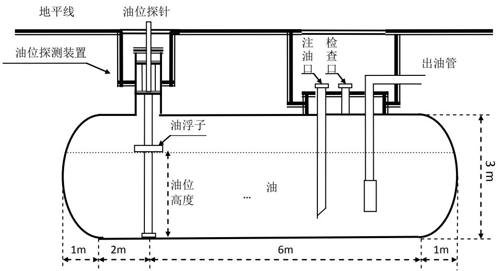

<details>
<summary>text_image</summary>

地平线
油位探针
油位探测装置
注油口
检查口
出油管
油浮子
油位高度
油
1m 2m 6m 1m
3m
</details>

图 1 储油罐正面示意图

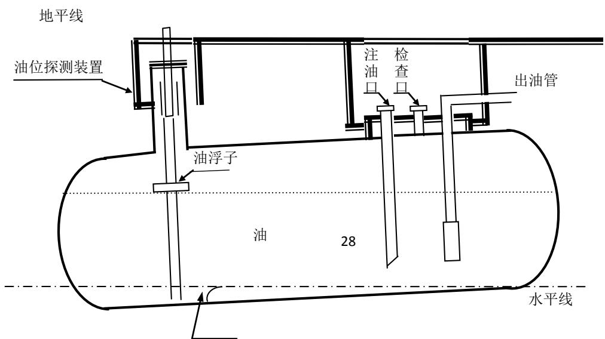

<details>
<summary>text_image</summary>

地平线
油位探测装置
注油口
检查口
出油管
油浮子
油 28
水平线
</details>

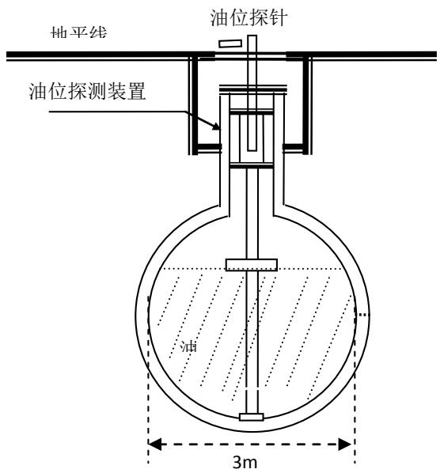

<details>
<summary>text_image</summary>

地平线
油位探针
油位探测装置
3m
</details>

(a) 无偏转倾斜的正截面图

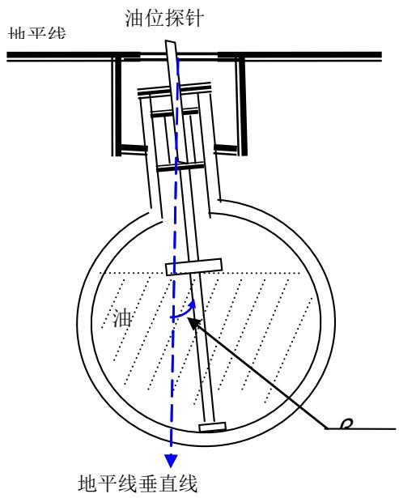

<details>
<summary>text_image</summary>

地平线
油位探针
油
地平线垂直线
</details>

(b) 横向偏转倾斜后正截面图  
图 3 储油罐截面示意图

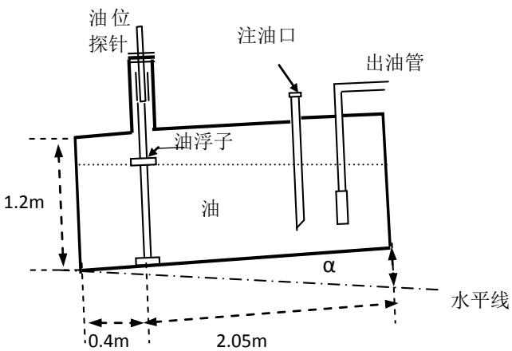

<details>
<summary>text_image</summary>

油位
探针
注油口
出油管
1.2m
油浮子
油
α
水平线
0.4m
2.05m
</details>

(a) 小椭圆油罐正面示意图

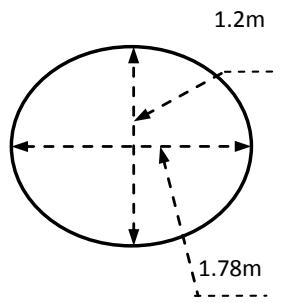

<details>
<summary>text_image</summary>

1.2m
1.78m
</details>

(b) 小椭圆油罐截面示意图  
图 4 小椭圆型油罐形状及尺寸示意图

程序 1 数值积分求球冠体体积程序主要代码  
```lisp
double qiuguan(double h)
{
    double a = 1000, R = 1625, y = h;
    double Ra = R - a;
    double n = 1000; /*迭代 100000 次*/
    double temp = (y + 1500.0) / n;
    y = -1500;
    double out = 0;
    for (int i = 0; i < n; i++)
    {
        double r = sqrt(R * R - y * y);
        double L = 2.0 * sqrt(r * r - Ra * Ra);
        out += (r * r * acos(Ra / r) - L * Ra / 2.0) * temp;
        y += temp;
    }
    return( out / 1e6);
}
```

程序 2：罐容表标定值打印程序  
```c
#include <stdio.h>
#include <math.h>

double qiuguan(double h)
{
    double a = 1000, R = 1625, y = h;
    double Ra = R - a;
    double n = 1000; /*迭代 100000 次*/
    double temp = (y + 1500.0) / n;
    y = -1500;
    double out = 0;
    for (int i = 0; i < n; i++)
    {
        double r = sqrt(R * R - y * y);
        double L = 2.0 * sqrt(r * r - Ra * Ra);
        out += (r * r * acos(Ra / r) - L * Ra / 2.0 ) * temp;
        y += temp;
    }
    return( out / 1e6);
}

int main()
```

```lisp
{
    FILE *fp;
    fp = fopen("a2.txt", "w+");
    double h, v;
    double pi = acos(-1);
    double a = 2.1, b = 4.6;
    double hua = a * pi / 180;
    double hub = b * pi / 180;
    h = 0;
    while (h != 3100)
    {
        if (h == 0)
        {
            fprintf(fp, "高度:0.00mm\t 剩余油量:<=46.21L\n");
        }
        else if (h < 6000 * tan(hua))
        {
            double hb = (cos(hub) * h - cos(hub) * 1500 + 2000 * tan(hua))/1500.0;
            double vm = 15 * 15.0 / tan(hua) * (-1500/3 * sqrt(pow((1 - hb * hb), 3)) + 1500 * (hb * asin(hb) + sqrt(1 - hb * hb)) + hb * pi / 2 * 1500)/100;
            double va = qiuguan(cos(hub)*h - cos(hub)*1500 + 2000 * tan(hua));
            v = va + vm;
            fprintf(fp, "高度:%.2lfmm\t 剩余油量:%.2lfL\n", h, v);
        }
        else if (h < 3000 - 2000 * tan(hua))
        {
            double hf = (h - 1500) * cos(hub) + 1500;
            double ha = hf - 6000 * tan(hua);
            double hb = hf + 2000 * tan(hua);
            double va = qiuguan(ha- 1500);
            double vb = qiuguan(hb-1500);
            double xa = (cos(hub) * h - cos(hub) * 1500 - 6000 * tan(hua)) / 1500;
            double xb = (cos(hub) * h - cos(hub) * 1500 + 2000 * tan(hua) ) / 1500;
            double vm = 15 * 15.0 / tan(hua) * (1500.0 / 3.0 * sqrt(pow(1- xa * xa, 3)) - 1500.0 / 3 * sqrt(pow(1 - xb * xb, 3))
+ 1500.0 * (xb * asin(xb) + sqrt(1 - xb * xb)- xa * asin(xa) - sqrt(1 - xa * xa)) + (xb - xa) * pi / 2.0 * 1500)/100 ;
        v = (va + vb + vm);
        fprintf(fp, "高度:%.2lfmm\t 剩余油量:%.2lfL\n", h, v);
    }
    else if (h < 3000)
    {
        double ha = (cos(hub) * h - cos(hub) * 1500.0 - 6000 * tan(hua))/1500.0;
        double va = qiuguan(1500);
```

```txt
double vb = qiuguan(cos(hub) * h - cos(hub) * 1500 - 6000 * tan(hua));
double vm = 15 * 15 / tan(hua) * (1500 / 3 * sqrt(pow(1- ha * ha, 3)) - 1500 * ha * asin(ha) - 1500.0 * sqrt(1 - ha * ha)
+ (2 - ha) * pi / 2 * 1500.0 + pi * (cos(hub) * h - cos(hub) * 1500.0 + 2000 * tan(hua) - 1500.0)) / 100;
v = va + vb + vm;
fprintf(fp,"高度:%.2lfmm\t 剩余油量:%.2lfL\n", h, v);
}
else
{
    fprintf(fp,"高度:3000.00mm\t 剩余油量:64029.08L <= V <= 64664.45L\n", NULL);
}
h += 100;
}
}
```