# 2010 高教社杯全国大学生数学建模竞赛

## 承诺书

我们仔细阅读了中国大学生数学建模竞赛的竞赛规则.

我们完全明白，在竞赛开始后参赛队员不能以任何方式（包括电话、电子邮件、网上咨询等）与队外的任何人（包括指导教师）研究、讨论与赛题有关的问题。

我们知道，抄袭别人的成果是违反竞赛规则的，如果引用别人的成果或其他公开的资料（包括网上查到的资料），必须按照规定的参考文献的表述方式在正文引用处和参考文献中明确列出。

我们郑重承诺，严格遵守竞赛规则，以保证竞赛的公正、公平性。如有违反竞赛规则的行为，我们将受到严肃处理。

我们参赛选择的题号是（从 A/B/C/D 中选择一项填写）：\_\_\_\_ A \_\_\_\_

我们的参赛报名号为（如果赛区设置报名号的话）：\_\_\_\_

所属学校（请填写完整的全名）：\_\_\_\_ 江西师范大学

参赛队员 (打印并签名)：1. 洪情

2. 杨玉花

3. 袁定欢

指导教师或指导教师组负责人 (打印并签名): \_\_\_\_ 教练组 \_\_\_\_

日期：2010年9月12日

赛区评阅编号（由赛区组委会评阅前进行编号）：

# 2010 高教社杯全国大学生数学建模竞赛

# 编号专用页

赛区评阅编号（由赛区组委会评阅前进行编号）：

赛区评阅记录（可供赛区评阅时使用）：

<table><tr><td>评阅人</td><td></td><td></td><td></td><td></td><td></td><td></td><td></td><td></td><td></td><td></td></tr><tr><td>评分</td><td></td><td></td><td></td><td></td><td></td><td></td><td></td><td></td><td></td><td></td></tr><tr><td>备注</td><td></td><td></td><td></td><td></td><td></td><td></td><td></td><td></td><td></td><td></td></tr></table>

www.docin.com

全国统一编号（由赛区组委会送交全国前编号）：

全国评阅编号（由全国组委会评阅前进行编号）

## 摘要

本文通过对储油罐中油位高度及变位参数之间的不同情形的储油量进行分析并建立相应的数学模型，在该过程中先利用投影法、截面法及微元法得出储油量与油位高度及变位参数的函数关系。再由 Matlab 编程可知各高度储油量的理论数据，最后分析误差及评价模型的合理性。

对于问题一的任一种情形，我们均建立笛卡尔坐标系，当储油罐无变位时，利用微元法得到体积关于 $h$ 的公式，当储油罐发生变位时，根据储油罐中油量的多少分成三种情形，就每一类利用微元法得到体积关于 $h$ 的公式。代人附件1实验数据中的高度得到储油罐中的理论油量 $V$ 。根据理论油量及实际油量得出误差，判断误差所服从的分布，再利用相对误差进行误差分析并评价模型的合理性。由上述得到储油罐发生变位时体积关于 $h$ 的公式我们给出了罐体变位后油位高度间隔为 $1\mathrm{cm}$ 的罐容表标定值（即进/出油量与罐内油位高度的表格）。

对于问题二中的储油罐，我们先将问题进行简化考虑，得出了储油罐水平卧放时油量与浮油子高度的函数关系；再考虑储油量与油位高度及变位参数（纵向倾斜角度 $\alpha$ 和横向偏转角度 $\beta$ ）的一般情况，在该过程中，我们进行近似处理，利用投影法和截面法得出了储油量关于油位高度及变位参数的函数关系；并在固定的横向偏转角度 $\beta$ 条件下，就纵向倾斜角度 $\alpha$ 的变化进行分成三类讨论，这三类又可以分成八种情形，得到了每一种情形下实际储油罐罐内储油量与油位高度的函数关系。

在模型的改进中, 我们就问题二储油量与油位高度及变位参数的一般情况进行了仔细的考虑, 将含油部分的体积分成四个部分, 每一个部分将上述所提到的积分方法相结合, 得到了各个部分的储油量与油位高度及变位参数的函数关系, 从而可得总储油量与油位高度及变位参数的函数关系; 并据此利用 Matlab 编程和实际测量的数据求得 $\alpha$ 和 $\beta$ 值; 与此同时我们可以得出在固定 $\alpha$ 、 $\beta$ 值时各高度下的理论储油量; 根据理论油量及实际油量得出误差, 判断误差所服从的分布再利用相对误差进行误差分析并评价模型的合理性。由上述得到储油罐发生变位时体积关于 $h$ 的公式我们给出了罐体变位后油位高度间隔为 $10\mathrm{cm}$ 的罐容表标定值。

## §1 问题重述

通常加油站都有若干个储存燃油的地下储油罐，并且一般都有与之配套的“油位计量管理系统”，采用流量计和油位计来测量进/出油量与罐内油位高度等数据，通过预先标定的罐容表（即罐内油位高度与储油量的对应关系）进行实时计算，以得到罐内油位高度和储油量的变化情况。

许多储油罐在使用一段时间后，由于地基变形等原因，使罐体的位置会发生纵向倾斜和横向偏转等变化（以下称为变位），从而导致罐容表发生改变。按照有关规定，需要定期对罐容表进行重新标定。

请你们用数学建模方法研究解决储油罐的变位识别与罐容表标定的问题。

(1) 为了掌握罐体变位后对罐容表的影响, 利用如图 4 的小椭圆型储油罐 (两端平头的椭圆柱体), 分别对罐体无变位和倾斜角为 $\alpha = 4.1^{\circ}$ 的纵向变位两种情况做了实验, 实验数据如附件 1 所示。请建立数学模型研究罐体变位后对罐容表的影响, 并给出罐体变位后油位高度间隔为 $1 \mathrm{~cm}$ 的罐容表标定值。  
(2) 对于图 1 所示的实际储油罐, 试建立罐体变位后标定罐容表的数学模型, 即罐内储油量与油位高度及变位参数 (纵向倾斜角度 $\alpha$ 和横向偏转角度 $\beta$ ) 之间的一般关系。请利用罐体变位后在进/出油过程中的实际检测数据 (附件 2), 根据你们所建立的数学模型确定变位参数, 并给出罐体变位后油位高度间隔为 $10 \mathrm{~cm}$ 的罐容表标定值。进一步利用附件 2 中的实际检测数据来分析检验你们模型的正确性与方法的可靠性。(以上涉及的图 1\~4 均在附录中)

## § 2 模型的假设与符号的约定

## § 2.1 模型的假设与说明

(1) 在储油罐倾斜的情况下, 忽略油浮子高度为 0 时油所占的体积;  
(2) 在储油罐倾斜的情况下, 假设当油浮子高度达到最大后不再进油;  
(3) 油的挥发速度很慢, 忽略因油的挥发而造成储油量的减少;  
(4) 储油罐的材料为钢体, 忽略因渗出油而造成储油量的减少;  
(5) 储油罐管理妥当, 不会因特殊情况而造成储油量的变化。

## § 2.2 符号的约定与说明

$V$ 表示储油罐中油的体积；

L表示储油罐圆柱体部分的长度；

a 表示任一椭球截面的长半轴；

b 表示任一椭球截面的短半轴；

$a_{1}$ 表示油浮子在圆柱体高方向上投影至两端的较小值；

h表示油浮子到圆柱体高方向的距离；

$h_{1}$ 表示储油罐接地一端油面到地面得距离；

$\alpha$ 表示纵向倾斜角度；

$\beta$ 表示横向倾斜角度；

$h_{0}$ 表示球冠高；

$b_{0}$ 表示球冠底半径；

## § 3 问题的分析

## § 3.1 问题一的分析

当储油罐无变位时，储油罐圆柱体的接地一端为原点，以圆柱体高方向为 $z$ 轴，建立笛卡尔坐标系，利用微元法得到体积关于 $h$ 的公式，代人附件1实验数据中的高度得到储油罐中的理论油量 $\nu$ 。利用附件1实验数据中得到储油罐中的实际油量，根据理论油量及实际油量就可以得出误差，判断误差所服从的分布，利用相对误差进行误差分析。

当储油罐发生变位时，以储油罐圆柱体的接地一端为原点，圆柱体高方向为z轴，建立笛卡尔坐标系。根据储油罐中油量的多少分成三类，然后就每一类利用微元法得到体积关于h的公式，代人附件1实验数据中的高度得到储油罐中的理论油量v。利用附件1实验数据中得到储油罐中的实际油量，根据理论油量及实际油量就可以得出误差，判断误差所服从的分布，利用相对误差进行误差分析。

由上述得到储油罐发生变位时体积关于 $h$ 的公式可以给出罐体变位后油位高度间隔为 $1 \mathrm{~cm}$ 的罐容表标定值（即进/出油量与罐内油位高度的表格）。

## § 3.2 问题二的分析

对于实际储油罐，我们首先将问题进行简化考虑，得出了当实际储油罐水平卧放时实际储油罐中油量与浮油子高度的函数关系；

然后我们先考虑实际储油罐罐内储油量与油位高度及变位参数(纵向倾斜角度 $\alpha$ 和横向偏转角度 $\beta$ )的一般情况，在该过程中，我们进行近似处理，利用投影法和截面法得出了储油量关于油位高度及变位参数的函数关系，再在固定的横向偏转角度 $\beta$ 条件下，就纵向倾斜角度 $\alpha$ 的变化进行分类讨论，一共有三种情形，得到了每一种情形下实际储油罐罐内储油量与油位高度的函数关系。

最后我们先利用附件2中的少量实际数据得出了附件2所处状态下的纵向倾斜角度 $\alpha$ 和横向偏转角度 $\beta$ ，再利用附件2中给定各高度进行代人，得到实际储油罐理论的储油量，与实际储油量进行比较，求出误差及相对误差。

由上述得到储油罐发生变位时体积关于 $h$ 的公式可以给出罐体变位后油位高度间隔为 $10\mathrm{cm}$ 的罐容表标定值（即进/出油量与罐内油位高度的表格）。

## § 4 模型的建立与求解

## § 4.1 问题一

## § 4.1.1 模型一

当储油罐体无变位时，储油罐圆柱体的接地一端为原点，以圆柱体高方向为 $z$ 轴，建立笛卡尔坐标系，如图4-1所示，在高度为 $h$ 时，利用微元法过垂直 $z$ 轴的方向做截面 $S(z)$ ，对 $S(z)$ 关于 $z$ 进行积分，得到体积关于 $h$ 的公式。

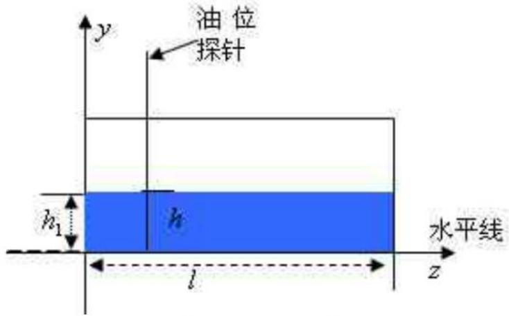

<details>
<summary>text_image</summary>

油位
探针
h₁
h
l
水平线
z
</details>

图4-1

$$
\text {由} \frac {x ^ {2}}{a ^ {2}} + \frac {y ^ {2}}{b ^ {2}} = 1 \quad \Rightarrow x = \frac {a}{b} \sqrt {b ^ {2} - y ^ {2}}.
$$

$$
\begin{array}{l} S (z) = 2 \frac {a}{b} \int_ {0} ^ {k} \sqrt {b ^ {2} - y ^ {2}} d y \\ = \frac {a}{b} \left[ (h - b) \sqrt {2 b h - h ^ {2}} + b ^ {2} \arcsin \frac {h - b}{b} + \frac {1}{2} b ^ {2} \pi \right] \\ \end{array}
$$

$$
d V = S (z) d z
$$

$$
\begin{array}{l} V = \int_ {0} ^ {L} S (z) d z \\ = \frac {a}{b} L \left[ (h - b) \sqrt {2 b h - h ^ {2}} + b ^ {2} \arcsin \frac {h - b}{b} + \frac {1}{2} \pi b ^ {2} \right] \\ \end{array}
$$

$$
V = \frac {a}{b} L \left[ (h - b) \sqrt {2 b h - h ^ {2}} + b ^ {2} \arcsin \frac {h - b}{b} + \frac {1}{2} \pi b ^ {2} \right]
$$

利用 Matlab 中的命令 subs 代人附件 1 实验数据中的各高度得到储油罐中的理论油量 v 。

由附件 1 实验数据中进油量、出油量及储油罐罐内油量初值可以得到储油罐中的实际储油量，根据理论油量及实际油量就可以得出误差。

由附录中的程序 youliang1，我们得到了理论储油量，误差及相对误差。

进油后理论储油量与实际储油量随高度的变化规律如图4-2所示：

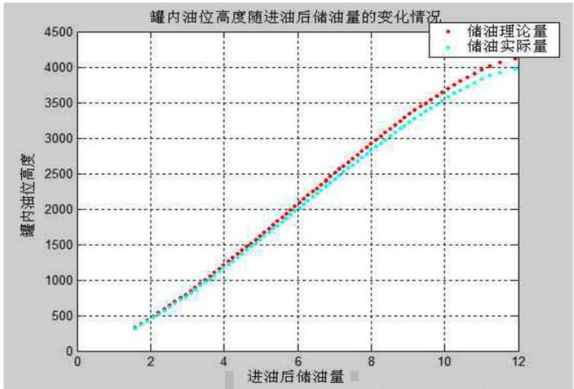

<details>
<summary>line</summary>

| 进油后储油量 | 储油理论量 (罐内油位高度) | 储油实际量 (罐内油位高度) |
| --- | --- | --- |
| 1.5 | ~350 | ~350 |
| 2.0 | ~500 | ~480 |
| 3.0 | ~900 | ~880 |
| 4.0 | ~1300 | ~1250 |
| 6.0 | ~2100 | ~2050 |
| 8.0 | ~3000 | ~2900 |
| 10.0 | ~3700 | ~3600 |
| 12.0 | ~4100 | ~4000 |
</details>

图4-2

出油后理论储油量与实际储油量随高度的变化规律如图 4-3 所示:

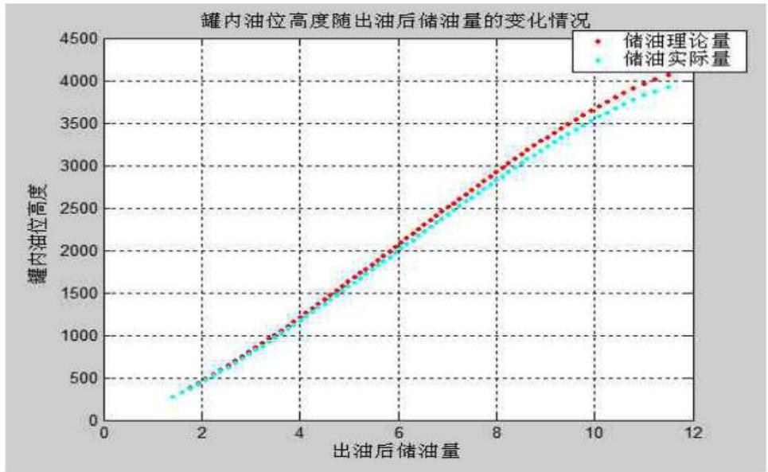

<details>
<summary>line</summary>

| 出油后储油量 | 储油理论量 (罐内油位高度) | 储油实际量 (罐内油位高度) |
| --- | --- | --- |
| 1.5 | ~250 | ~250 |
| 2.0 | ~450 | ~450 |
| 3.0 | ~800 | ~800 |
| 4.0 | ~1200 | ~1200 |
| 6.0 | ~2100 | ~2000 |
| 8.0 | ~3000 | ~2900 |
| 10.0 | ~3700 | ~3600 |
| 11.5 | ~4100 | ~4000 |
</details>

图 4-3

无变位进油和无变位出油的储油理论量和储油实际量及误差和相对误差的数据如表 4-1 所示:

表 4-1

<table><tr><td colspan="4">无变位进油</td><td colspan="4">无变位出油</td></tr><tr><td>储油量实际值</td><td>储油量理论值</td><td> $\varepsilon_i$ (误差)</td><td>相对误差</td><td>储油量实际值</td><td>储油量理论值</td><td> $\varepsilon_i$ (误差)</td><td>相对误差</td></tr><tr><td>312</td><td>322.9</td><td>10.88</td><td>3.37%</td><td>3916.2</td><td>4052.8</td><td>136.61</td><td>3.37%</td></tr><tr><td>362</td><td>374.6</td><td>12.63</td><td>3.37%</td><td>3866.2</td><td>4001.0</td><td>134.86</td><td>3.37%</td></tr><tr><td>412</td><td>426.4</td><td>14.36</td><td>3.37%</td><td>3816.2</td><td>3949.3</td><td>133.13</td><td>3.37%</td></tr><tr><td>462</td><td>478.1</td><td>16.13</td><td>3.37%</td><td>3766.2</td><td>3897.6</td><td>131.38</td><td>3.37%</td></tr><tr><td>512</td><td>529.9</td><td>17.85</td><td>3.37%</td><td>3716.2</td><td>3845.8</td><td>129.65</td><td>3.37%</td></tr><tr><td>562</td><td>581.6</td><td>19.61</td><td>3.37%</td><td>3666.2</td><td>3794.1</td><td>127.88</td><td>3.37%</td></tr><tr><td>612</td><td>633.4</td><td>21.35</td><td>3.37%</td><td>3616.2</td><td>3742.3</td><td>126.16</td><td>3.37%</td></tr><tr><td>662</td><td>685.1</td><td>23.08</td><td>3.37%</td><td>3566.2</td><td>3690.6</td><td>124.39</td><td>3.37%</td></tr><tr><td>712</td><td>736.8</td><td>24.85</td><td>3.37%</td><td>3516.2</td><td>3638.8</td><td>122.65</td><td>3.37%</td></tr><tr><td>762</td><td>788.6</td><td>26.58</td><td>3.37%</td><td>3466.2</td><td>3587.1</td><td>120.92</td><td>3.37%</td></tr><tr><td>812</td><td>840.3</td><td>28.33</td><td>3.37%</td><td>3416.2</td><td>3535.4</td><td>119.17</td><td>3.37%</td></tr><tr><td>862</td><td>892.1</td><td>30.06</td><td>3.37%</td><td>3366.2</td><td>3483.6</td><td>117.43</td><td>3.37%</td></tr><tr><td>912</td><td>943.8</td><td>31.80</td><td>3.37%</td><td>3316.2</td><td>3431.9</td><td>115.70</td><td>3.37%</td></tr><tr><td>962</td><td>995.5</td><td>33.54</td><td>3.37%</td><td>3266.2</td><td>3380.1</td><td>113.94</td><td>3.37%</td></tr><tr><td>1012</td><td>1047.3</td><td>35.30</td><td>3.37%</td><td>3216.2</td><td>3328.4</td><td>112.18</td><td>3.37%</td></tr><tr><td>1062</td><td>1099.1</td><td>37.05</td><td>3.37%</td><td>3166.2</td><td>3276.6</td><td>110.45</td><td>3.37%</td></tr><tr><td>1112</td><td>1150.8</td><td>38.81</td><td>3.37%</td><td>3116.2</td><td>3224.9</td><td>108.70</td><td>3.37%</td></tr><tr><td>1162</td><td>1202.6</td><td>40.55</td><td>3.37%</td><td>3066.2</td><td>3173.2</td><td>106.96</td><td>3.37%</td></tr><tr><td>1212</td><td>1254.3</td><td>42.29</td><td>3.37%</td><td>3016.2</td><td>3121.4</td><td>105.22</td><td>3.37%</td></tr><tr><td>1262</td><td>1306.0</td><td>44.03</td><td>3.37%</td><td>2966.2</td><td>3069.7</td><td>103.46</td><td>3.37%</td></tr><tr><td>1312</td><td>1357.8</td><td>45.77</td><td>3.37%</td><td>2916.2</td><td>3017.9</td><td>101.73</td><td>3.37%</td></tr><tr><td>1362</td><td>1409.5</td><td>47.49</td><td>3.37%</td><td>2866.2</td><td>2966.2</td><td>100.00</td><td>3.37%</td></tr><tr><td>1412</td><td>1461.2</td><td>49.24</td><td>3.37%</td><td>2816.2</td><td>2914.4</td><td>98.23</td><td>3.37%</td></tr><tr><td>1462</td><td>1513.0</td><td>50.98</td><td>3.37%</td><td>2766.2</td><td>2862.7</td><td>96.50</td><td>3.37%</td></tr><tr><td>1512</td><td>1564.7</td><td>52.74</td><td>3.37%</td><td>2716.2</td><td>2811.0</td><td>94.76</td><td>3.37%</td></tr><tr><td>1562</td><td>1616.5</td><td>54.49</td><td>3.37%</td><td>2666.2</td><td>2759.2</td><td>93.02</td><td>3.37%</td></tr><tr><td>1612</td><td>1668.2</td><td>56.24</td><td>3.37%</td><td>2616.2</td><td>2707.5</td><td>91.26</td><td>3.37%</td></tr><tr><td>1662</td><td>1720.0</td><td>57.98</td><td>3.37%</td><td>2566.2</td><td>2655.7</td><td>89.51</td><td>3.37%</td></tr><tr><td>1712</td><td>1771.7</td><td>59.73</td><td>3.37%</td><td>2516.2</td><td>2603.9</td><td>87.76</td><td>3.37%</td></tr><tr><td>1762</td><td>1823.5</td><td>61.46</td><td>3.37%</td><td>2466.2</td><td>2552.2</td><td>86.03</td><td>3.37%</td></tr><tr><td>1812</td><td>1875.2</td><td>63.19</td><td>3.37%</td><td>2416.2</td><td>2500.5</td><td>84.30</td><td>3.37%</td></tr><tr><td>1862</td><td>1927.0</td><td>64.95</td><td>3.37%</td><td>2366.2</td><td>2448.7</td><td>82.53</td><td>3.37%</td></tr><tr><td>1912</td><td>1978.7</td><td>66.68</td><td>3.37%</td><td>2316.2</td><td>2397.0</td><td>80.80</td><td>3.37%</td></tr><tr><td>1962</td><td>2030.4</td><td>68.43</td><td>3.37%</td><td>2266.2</td><td>2345.3</td><td>79.07</td><td>3.37%</td></tr><tr><td>2012</td><td>2082.2</td><td>70.20</td><td>3.37%</td><td>2216.2</td><td>2293.5</td><td>77.32</td><td>3.37%</td></tr><tr><td>2062</td><td>2134.0</td><td>71.95</td><td>3.37%</td><td>2166.2</td><td>2241.7</td><td>75.55</td><td>3.37%</td></tr><tr><td>2112</td><td>2185.7</td><td>73.67</td><td>3.37%</td><td>2116.2</td><td>2190.0</td><td>73.84</td><td>3.37%</td></tr><tr><td>2162</td><td>2237.4</td><td>75.43</td><td>3.37%</td><td>2066.2</td><td>2138.3</td><td>72.08</td><td>3.37%</td></tr><tr><td>2212</td><td>2289.2</td><td>77.16</td><td>3.37%</td><td>2016.2</td><td>2086.5</td><td>70.32</td><td>3.37%</td></tr><tr><td>2262</td><td>2340.9</td><td>78.89</td><td>3.37%</td><td>1966.2</td><td>2034.8</td><td>68.60</td><td>3.37%</td></tr><tr><td>2312</td><td>2392.7</td><td>80.67</td><td>3.37%</td><td>1916.2</td><td>1983.0</td><td>66.85</td><td>3.37%</td></tr><tr><td>2315.8</td><td>2396.6</td><td>80.78</td><td>3.37%</td><td>1866.2</td><td>1931.3</td><td>65.12</td><td>3.37%</td></tr><tr><td>2365.8</td><td>2448.4</td><td>82.54</td><td>3.37%</td><td>1816.2</td><td>1879.5</td><td>63.35</td><td>3.37%</td></tr><tr><td>2367.1</td><td>2449.6</td><td>82.56</td><td>3.37%</td><td>1766.2</td><td>1827.8</td><td>61.61</td><td>3.37%</td></tr><tr><td>2417.1</td><td>2501.4</td><td>84.34</td><td>3.37%</td><td>1716.2</td><td>1776.1</td><td>59.88</td><td>3.37%</td></tr><tr><td>2467.1</td><td>2553.1</td><td>86.05</td><td>3.37%</td><td>1666.2</td><td>1724.3</td><td>58.12</td><td>3.37%</td></tr><tr><td>2517.1</td><td>2604.9</td><td>87.82</td><td>3.37%</td><td>1616.2</td><td>1672.6</td><td>56.37</td><td>3.37%</td></tr><tr><td>2567.1</td><td>2656.6</td><td>89.53</td><td>3.37%</td><td>1566.2</td><td>1620.8</td><td>54.64</td><td>3.37%</td></tr><tr><td>2617.1</td><td>2708.3</td><td>91.28</td><td>3.37%</td><td>1516.2</td><td>1569.1</td><td>52.87</td><td>3.37%</td></tr><tr><td>2667</td><td>2760.0</td><td>93.03</td><td>3.37%</td><td>1466.2</td><td>1517.3</td><td>51.14</td><td>3.37%</td></tr><tr><td>2668.8</td><td>2761.9</td><td>93.11</td><td>3.37%</td><td>1416.2</td><td>1465.6</td><td>49.42</td><td>3.37%</td></tr><tr><td>2718.8</td><td>2813.7</td><td>94.83</td><td>3.37%</td><td>1366.2</td><td>1413.8</td><td>47.65</td><td>3.37%</td></tr><tr><td>2768.8</td><td>2865.4</td><td>96.59</td><td>3.37%</td><td>1316.2</td><td>1362.1</td><td>45.91</td><td>3.37%</td></tr><tr><td>2818.8</td><td>2917.2</td><td>98.34</td><td>3.37%</td><td>1266.2</td><td>1310.4</td><td>44.18</td><td>3.37%</td></tr><tr><td>2868.8</td><td>2968.9</td><td>100.09</td><td>3.37%</td><td>1216.2</td><td>1258.6</td><td>42.42</td><td>3.37%</td></tr><tr><td>2918.8</td><td>3020.7</td><td>101.84</td><td>3.37%</td><td>1166.2</td><td>1206.9</td><td>40.68</td><td>3.37%</td></tr><tr><td>2968.8</td><td>3072.4</td><td>103.58</td><td>3.37%</td><td>1116.2</td><td>1155.1</td><td>38.94</td><td>3.37%</td></tr><tr><td>3018.8</td><td>3124.1</td><td>105.31</td><td>3.37%</td><td>1066.2</td><td>1103.4</td><td>37.19</td><td>3.37%</td></tr><tr><td>3068.8</td><td>3175.9</td><td>107.06</td><td>3.37%</td><td>1016.2</td><td>1051.6</td><td>35.43</td><td>3.37%</td></tr><tr><td>3118.8</td><td>3227.6</td><td>108.80</td><td>3.37%</td><td>966.2</td><td>999.9</td><td>33.71</td><td>3.37%</td></tr><tr><td>3168.8</td><td>3279.4</td><td>110.55</td><td>3.37%</td><td>916.2</td><td>948.2</td><td>31.96</td><td>3.37%</td></tr><tr><td>3168.9</td><td>3279.5</td><td>110.55</td><td>3.37%</td><td>866.2</td><td>896.4</td><td>30.20</td><td>3.37%</td></tr><tr><td>3218.9</td><td>3331.2</td><td>112.27</td><td>3.37%</td><td>816.2</td><td>844.6</td><td>28.45</td><td>3.37%</td></tr><tr><td>3268.9</td><td>3382.9</td><td>114.03</td><td>3.37%</td><td>766.2</td><td>792.9</td><td>26.71</td><td>3.37%</td></tr><tr><td>3318.9</td><td>3434.7</td><td>115.76</td><td>3.37%</td><td>716.2</td><td>741.2</td><td>24.99</td><td>3.37%</td></tr><tr><td>3368.9</td><td>3486.4</td><td>117.52</td><td>3.37%</td><td>666.2</td><td>689.4</td><td>23.25</td><td>3.37%</td></tr><tr><td>3418.9</td><td>3538.2</td><td>119.26</td><td>3.37%</td><td>616.2</td><td>637.7</td><td>21.51</td><td>3.37%</td></tr><tr><td>3468.9</td><td>3589.9</td><td>121.01</td><td>3.37%</td><td>566.2</td><td>585.9</td><td>19.74</td><td>3.37%</td></tr><tr><td>3518.9</td><td>3641.7</td><td>122.76</td><td>3.37%</td><td>516.2</td><td>534.2</td><td>18.02</td><td>3.37%</td></tr><tr><td>3568.9</td><td>3693.4</td><td>124.51</td><td>3.37%</td><td>466.2</td><td>482.5</td><td>16.28</td><td>3.37%</td></tr><tr><td>3618.9</td><td>3745.1</td><td>126.23</td><td>3.37%</td><td>416.2</td><td>430.7</td><td>14.50</td><td>3.37%</td></tr><tr><td>3668.9</td><td>3796.9</td><td>127.98</td><td>3.37%</td><td>366.2</td><td>379.0</td><td>12.77</td><td>3.37%</td></tr><tr><td>3718.9</td><td>3848.6</td><td>129.74</td><td>3.37%</td><td>316.2</td><td>327.2</td><td>11.02</td><td>3.37%</td></tr><tr><td>3768.9</td><td>3900.4</td><td>131.48</td><td>3.37%</td><td>266.2</td><td>275.5</td><td>9.28</td><td>3.37%</td></tr><tr><td>3818.9</td><td>3952.1</td><td>133.23</td><td>3.37%</td><td></td><td></td><td></td><td></td></tr><tr><td>3868.9</td><td>4003.9</td><td>134.95</td><td>3.37%</td><td></td><td></td><td></td><td></td></tr><tr><td>3918.9</td><td>4055.6</td><td>136.70</td><td>3.37%</td><td></td><td></td><td></td><td></td></tr><tr><td>3968.9</td><td>4107.4</td><td>138.45</td><td>3.37%</td><td></td><td></td><td></td><td></td></tr></table>

由上述的表格可以得出相对误差稳定，不会随高度发生变化。

当储油罐体发生变位时, 我们就油面及油浮子的位置与倾斜角度的变化情况分成将该问题三类, 然后就每一类进行分析, 找出了储油罐中油的体积与油浮子位置的函数关系, 其立体图如图 4-4 所示:

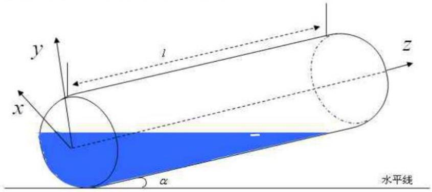

<details>
<summary>text_image</summary>

y
l
z
x
α
水平线
</details>

图4-4

（1）当油浮子的高度在 $0 \leq h \leq h_{1} - z \tan \alpha$ 时，如图4-5所示，截面图如图4-6所示

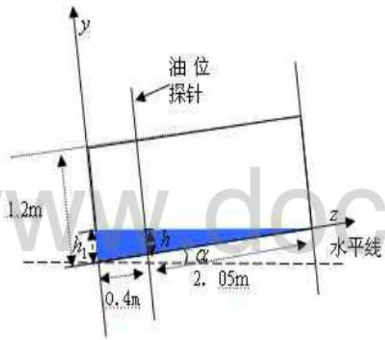

<details>
<summary>text_image</summary>

油位
探针
1.2m
h₁
h
α
0.4m
2. 05m
水平线
z
</details>

图4-5

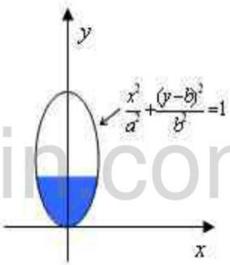

<details>
<summary>text_image</summary>

y
x²/a² + (y - b)²/b² = 1
x
</details>

图4-6截面图

截面面积为:

$$
\begin{array}{l} S (z) = \int_ {0} ^ {h _ {1} - z \tan \alpha} 2 \frac {a}{b} \sqrt {b ^ {2} - (y - b ^ {2})} d y \\ = \frac {a}{b} \left(\left(h _ {1} - z \tan (\alpha) - b\right) \sqrt {2 b \left(h _ {1} - z \tan (\alpha)\right) - \left(h _ {1} - z \tan (\alpha)\right) ^ {2}}\right) \\ + \frac {a}{b} \left(b ^ {2} \arcsin \left(\frac {h _ {1} - z \tan (\alpha) - b}{b}\right) + \frac {1}{2} \pi b ^ {2}\right) \\ \end{array}
$$

所以油罐体积为:

$$
\begin{array}{l} V = f (h _ {1}) = \int_ {0} ^ {\frac {k _ {1}}{\tan \alpha}} S (z) d z \\ = \int_ {0} ^ {\frac {h _ {1}}{\tan \alpha}} \frac {a}{b} \left(\left(h _ {1} - z \tan (\alpha) - b\right) \sqrt {2 b \left(h _ {1} - z \tan (\alpha)\right) - \left(h _ {1} - z \tan (\alpha)\right) ^ {2}}\right) \tag {1.1} \\ + \int_ {0} ^ {\frac {h _ {1}}{\tan \alpha}} \frac {a}{b} \left(b ^ {2} \arcsin \left(\frac {h _ {1} - z \tan (\alpha) - b}{b}\right) + \frac {1}{2} \pi b ^ {2}\right) \\ \end{array}
$$

将 $h = h_{1} - a \tan \alpha$ 代入公式（1.1）

令 $\frac{h + a_1\tan\alpha - z\tan\alpha - b}{b} = t$ ，则公式（1.1）

$$
\begin{array}{l} V = a b \frac {- b}{\tan \alpha} \int_ {\frac {k + a _ {1} \tan \alpha - b}{b}} ^ {- 1} (t \sqrt {1 - t ^ {2}} + \arcsin t + \frac {1}{2} \pi) d t \\ = \frac {a b ^ {2}}{\tan \alpha} \left(\frac {h + a _ {1} \tan \alpha - b}{b} \arcsin \left(\frac {h + a _ {1} \tan \alpha - b}{b}\right) + \sqrt {1 - \left(\frac {h + a _ {1} \tan \alpha - b}{b}\right) ^ {2}}\right) \\ + \frac {a b ^ {2}}{\tan (\alpha)} \left(\frac {1}{2} \pi \left(\frac {h + a _ {1} \tan (\alpha) - b}{b}\right) - \frac {1}{3} \left(1 - \left(\frac {h + a _ {1} \tan (\alpha) - b}{b}\right) ^ {2}\right) ^ {3 / 2}\right) \\ \end{array}
$$

（2）当油浮子的高度在 $l\tan \alpha < h < 2b - a_{1}\tan a$ 时，如图4-7所示，

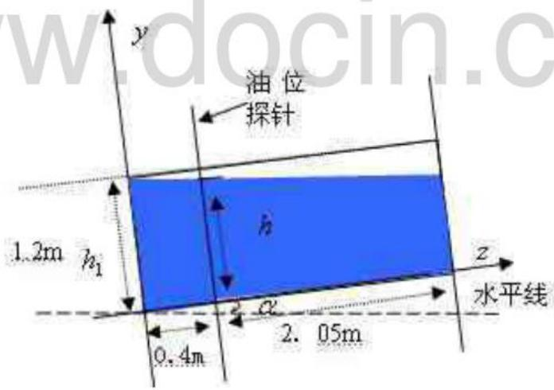

<details>
<summary>text_image</summary>

油位
探针
1.2m h₁
h₂
α
0.4m
2. 05m
水平线
y
z
</details>

图 4-7

截面面积为:

$$
\begin{array}{l} S (z) = \int_ {0} ^ {h _ {1} - z \tan \alpha} 2 \frac {a}{b} \sqrt {b ^ {2} - (y - b ^ {2})} d y \\ = \frac {a}{b} \left(\left(h _ {1} - z \tan (\alpha) - b\right) \sqrt {2 b \left(h _ {1} - z \tan (\alpha)\right) - \left(h _ {1} - z \tan (\alpha)\right) ^ {2}}\right) \quad \text {错误！未找} \\ + \frac {a}{b} \left(b ^ {2} \arcsin \left(\frac {h _ {1} - z \tan (\alpha) - b}{b}\right) + \frac {1}{2} \pi b ^ {2}\right) \\ \end{array}
$$

到引用源。

所以油罐装油的体积为；

$$
\begin{array}{l} V = \int_ {0} ^ {L} S (z) d z \\ = a b \int_ {0} ^ {L} \left(\frac {\mathrm{h} + \mathrm{a} _ {1} \tan (\alpha) - \mathrm{z} \tan (\alpha) - \mathrm{b}}{\mathrm{b} ^ {2}} + \arcsin \left(\frac {\mathrm{h} + \mathrm{a} _ {1} \tan (\alpha) - \mathrm{z} \tan (\alpha) - \mathrm{b}}{\mathrm{b}}\right) + \frac {1}{2} \pi\right) d z \\ \end{array}
$$

错误！未找到引用源。

将 $h=h_{1}-a_{1}\tan(\alpha)$ 公式错误！未找到引用源。，令 $\frac{h+a_{1}\tan(\alpha)-z\tan(\alpha)-b}{b}=t$

公式（2.2）化为：

$$
\mathrm{V(h)} = \frac {- \mathrm{ab} ^ {2}}{\tan (\alpha)} \int_ {\left(\mathrm{h} + \mathrm{a} _ {1} \tan (\mathrm{a}) - \mathrm{b}\right) / \mathrm{b}} ^ {\left(\mathrm{h} + \mathrm{a} _ {1} \tan (\mathrm{a}) - \mathrm{L} \tan (\mathrm{a}) - \mathrm{b}\right) / \mathrm{B}} \left(\mathrm{t} \sqrt {1 - \mathrm{t} ^ {2}} + \arcsin (t) + \frac {1}{2} \pi\right) d t
$$

将积分下限令为 $p$ ，积分上限令为 $\mathbf{q}$ ，则

$$
\mathrm{p} = \frac {h + a _ {1} \tan (\alpha) - b}{b}, \quad q = \frac {\mathrm{h} + a _ {1} \tan (\alpha) - \mathrm{L} \tan (\alpha) - \mathrm{b}}{\mathrm{b}}
$$

$$
\begin{array}{l} \mathrm{V(h)} = \frac {a b ^ {2}}{\tan (\alpha)} \left(\frac {1}{3} \left(\sqrt {1 - q ^ {2}}\right) ^ {3} - \sqrt {1 - q ^ {2}} - q \sin (q) - \frac {1}{3} \left(\sqrt {1 - p ^ {2}}\right) ^ {3} + p \sin (p) + \sqrt {1 - p ^ {2}}\right) \\ = \frac {a b ^ {2}}{\tan (\alpha)} \left(\frac {1}{3} \left(\sqrt {1 - \left(\frac {h + a _ {1} \tan (\alpha) - b}{b}\right) ^ {2}}\right) ^ {3}\right) \\ \end{array}
$$

(3) 当油浮子的高度 $L \tan \alpha < h \leq 2b$ 时，如图 4-8 所示，

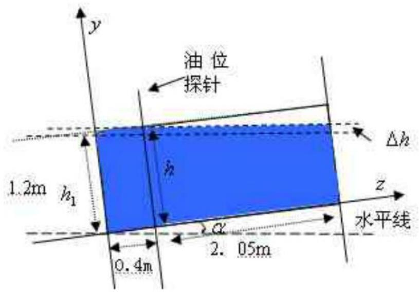

<details>
<summary>text_image</summary>

油位
探针
1.2m h₁
0.4m
Δh
z
水平线
α
2. 05m
</details>

图4-8

其中， $\left\{\begin{aligned}\Delta h&=h_{1}-h=h_{1}-2b+a\tan\alpha,\\ h_{2}&=l\tan\alpha-\Delta h.\end{aligned}\right.$ ，此时截面面积为：

$$
\begin{array}{l} S (z) = \int_ {0} ^ {k _ {2} - z \tan \alpha} 2 \frac {a}{b} \sqrt {b ^ {2} - (y - b) ^ {2}} d y \\ = \frac {a}{b} \left(\left(h - (z - a _ {1}) \tan (\alpha) - b\right) \sqrt {2 b \left((h - (z - a _ {1}) \tan (\alpha) - b)\right) - \left(h - (z - a _ {1}) \tan (\alpha) - b\right) ^ {2}}\right) \\ + \frac {a}{b} \left(b ^ {2} \arcsin \left(\frac {h - (z - a _ {1}) \tan (\alpha) - b}{b}\right) + \frac {1}{2} \pi b ^ {2}\right) \\ \end{array}
$$

所以油罐装油的体积为

$$
V (h) = \int_ {L} ^ {\frac {L \tan (\alpha) - h + 2 b - a _ {1} \tan (\alpha)}{\tan (\alpha)}} \mathrm{s(z)dz}
$$

$$
\text {令} \mathrm{t} = \frac {h - (z - a _ {1}) \tan (\alpha) - b}{b}, p = \frac {h - (L - a _ {1}) \tan (\alpha) - b}{b}, q = \frac {2 h + 2 a _ {1} \tan (\alpha) - 3 b - L \tan (\alpha)}{b}
$$

则上式公式变为:

$$
\begin{array}{l} V (h) = \frac {- a b ^ {2}}{\tan (\alpha)} \int_ {p} ^ {q} \left(t \sqrt {1 - t ^ {2}} + \arcsin (t) + \frac {1}{2} \pi\right) d t \\ = \frac {a b ^ {2}}{\tan (\alpha)} \left(\frac {1}{3} \left(\sqrt {1 - q ^ {2}}\right) ^ {3} - \sqrt {1 - q ^ {2}} - q \sin (q) - \frac {1}{3} \left(\sqrt {1 - p ^ {2}}\right) ^ {3} + p \sin (p) + \sqrt {1 - p ^ {2}}\right) \\ \end{array}
$$

利用Matlab中的命令subs代人附件1实验数据中的各高度得到储油罐中的理论油量v。

由附件1实验数据中进油量、出油量及储油罐罐内油量初值可以得到储油罐

中的实际油量，根据理论油量及实际油量就可以得出误差。

由附录中的程序 youliang2，我们得到了理论油量，误差及相对误差。

倾斜时进油后理论储油量与实际储油量随高度的变化规律如图 4-9 所示:

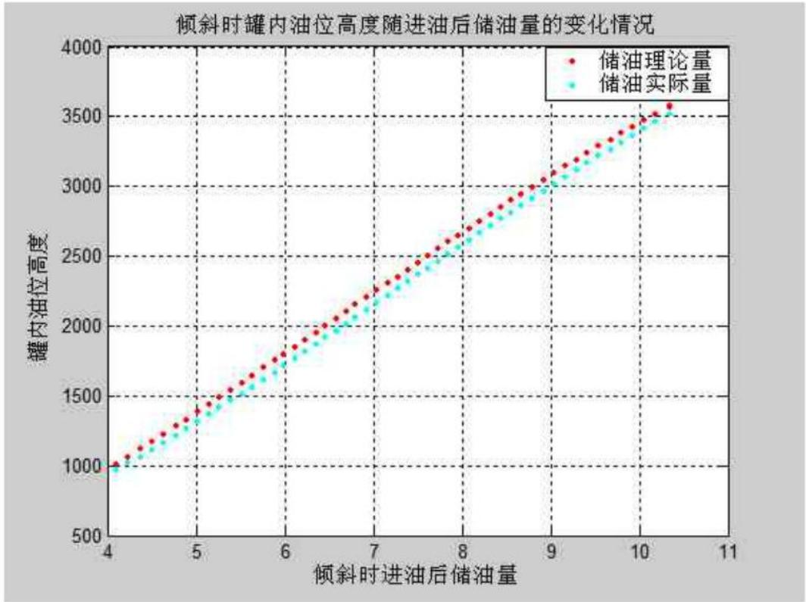

<details>
<summary>line</summary>

| 倾斜时进油后储油量 | 储油理论量 (罐内油位高度) | 储油实际量 (罐内油位高度) |
| --- | --- | --- |
| 4 | 1000 | 1000 |
| 5 | ~1400 | ~1350 |
| 6 | ~1800 | ~1750 |
| 7 | ~2250 | ~2150 |
| 8 | ~2700 | ~2650 |
| 9 | ~3100 | ~3050 |
| 10 | ~3500 | ~3450 |
</details>

图 4-9

倾斜时出油后理论储油量与实际储油量随高度的变化规律如图 4-10 所示:

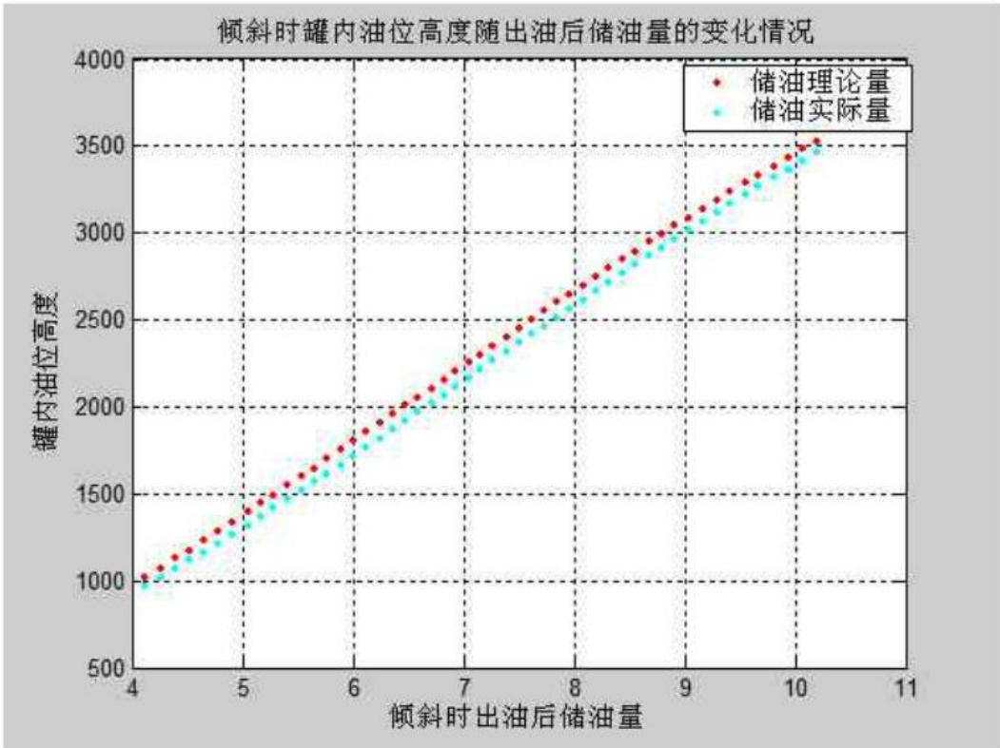

<details>
<summary>line</summary>

| 倾斜时出油后储油量 | 储油理论量 | 储油实际量 |
| --- | --- | --- |
| 4 | ~1020 | ~980 |
| 5 | ~1400 | ~1350 |
| 6 | ~1850 | ~1750 |
| 7 | ~2250 | ~2150 |
| 8 | ~2650 | ~2550 |
| 9 | ~3050 | ~2950 |
| 10 | ~3450 | ~3400 |
</details>

图 4- 10

将倾斜进油和倾斜变位出油的储油理论值和储油实际值及误差和相对误差的数据如表 4-2 所示:

表 4-2

<table><tr><td colspan="4">倾斜变位进油</td><td colspan="4">倾斜变位出油</td></tr><tr><td>储油量实际量</td><td>储油量理论值</td><td> $\varepsilon_i$ (误差)</td><td>相对误差</td><td>储油量实际值</td><td>储油量理论值</td><td> $\varepsilon_i$ (误差)</td><td>相对误差</td></tr><tr><td>962.9</td><td>1010.0</td><td>7.19</td><td>4.67%</td><td>3464.7</td><td>3523.1</td><td>58.37</td><td>1.66%</td></tr><tr><td>1012.9</td><td>1058.3</td><td>45.47</td><td>4.30%</td><td>3414.7</td><td>3478.1</td><td>63.35</td><td>1.82%</td></tr><tr><td>1062.9</td><td>1118.0</td><td>55.19</td><td>4.94%</td><td>3364.7</td><td>3430.4</td><td>65.67</td><td>1.91%</td></tr><tr><td>1112.9</td><td>1167.5</td><td>54.67</td><td>4.68%</td><td>3314.7</td><td>3382.0</td><td>67.28</td><td>1.99%</td></tr><tr><td>1162.9</td><td>1222.1</td><td>59.29</td><td>4.85%</td><td>3264.7</td><td>3330.9</td><td>66.19</td><td>1.99%</td></tr><tr><td>1212.9</td><td>1279.2</td><td>66.34</td><td>5.19%</td><td>3214.7</td><td>3289.4</td><td>74.69</td><td>2.27%</td></tr><tr><td>1262.9</td><td>1327.5</td><td>64.63</td><td>4.87%</td><td>3164.7</td><td>3234.5</td><td>69.77</td><td>2.16%</td></tr><tr><td>1312.8</td><td>1382.6</td><td>69.82</td><td>5.05%</td><td>3114.7</td><td>3188.9</td><td>74.17</td><td>2.33%</td></tr><tr><td>1362.8</td><td>1433.6</td><td>70.81</td><td>4.94%</td><td>3064.7</td><td>3137.3</td><td>72.57</td><td>2.31%</td></tr><tr><td>1412.7</td><td>1485.0</td><td>72.23</td><td>4.86%</td><td>3014.7</td><td>3088.9</td><td>74.11</td><td>2.40%</td></tr><tr><td>1462.7</td><td>1536.1</td><td>73.35</td><td>4.78%</td><td>2964.7</td><td>3040.1</td><td>75.40</td><td>2.48%</td></tr><tr><td>1512.7</td><td>1591.9</td><td>79.14</td><td>4.97%</td><td>2914.7</td><td>2989.2</td><td>74.48</td><td>2.49%</td></tr><tr><td>1562.7</td><td>1645.1</td><td>82.42</td><td>5.01%</td><td>2864.7</td><td>2947.7</td><td>82.98</td><td>2.82%</td></tr><tr><td>1612.7</td><td>1697.4</td><td>84.67</td><td>4.99%</td><td>2814.7</td><td>2891.1</td><td>76.36</td><td>2.64%</td></tr><tr><td>1662.7</td><td>1749.9</td><td>87.16</td><td>4.98%</td><td>2764.7</td><td>2845.4</td><td>80.62</td><td>2.83%</td></tr><tr><td>1712.7</td><td>1796.6</td><td>83.89</td><td>4.67%</td><td>2714.7</td><td>2794.0</td><td>79.31</td><td>2.84%</td></tr><tr><td>1762.7</td><td>1848.8</td><td>86.08</td><td>4.66%</td><td>2664.7</td><td>2747.5</td><td>82.72</td><td>3.01%</td></tr><tr><td>1812.7</td><td>1900.0</td><td>87.32</td><td>4.60%</td><td>2614.7</td><td>2695.8</td><td>81.07</td><td>3.01%</td></tr><tr><td>1862.7</td><td>1952.7</td><td>90.01</td><td>4.61%</td><td>2564.7</td><td>2644.5</td><td>79.78</td><td>3.02%</td></tr><tr><td>1912.7</td><td>1999.2</td><td>86.48</td><td>4.33%</td><td>2514.7</td><td>2598.1</td><td>83.33</td><td>3.21%</td></tr><tr><td>1962.7</td><td>2052.7</td><td>89.97</td><td>4.38%</td><td>2464.7</td><td>2547.1</td><td>82.38</td><td>3.23%</td></tr><tr><td>2012.7</td><td>2103.2</td><td>90.50</td><td>4.30%</td><td>2414.7</td><td>2500.2</td><td>85.47</td><td>3.42%</td></tr><tr><td>2062.7</td><td>2148.4</td><td>85.72</td><td>3.99%</td><td>2364.7</td><td>2451.9</td><td>87.11</td><td>3.55%</td></tr><tr><td>2112.7</td><td>2202.3</td><td>89.54</td><td>4.07%</td><td>2314.7</td><td>2402.9</td><td>88.14</td><td>3.67%</td></tr><tr><td>2162.7</td><td>2252.7</td><td>90.01</td><td>4.00%</td><td>2264.7</td><td>2349.7</td><td>84.97</td><td>3.62%</td></tr><tr><td>2212.7</td><td>2303.7</td><td>91.01</td><td>3.95%</td><td>2214.7</td><td>2298.8</td><td>84.11</td><td>3.66%</td></tr><tr><td>2262.7</td><td>2352.2</td><td>89.44</td><td>3.80%</td><td>2164.7</td><td>2256.0</td><td>91.29</td><td>4.05%</td></tr><tr><td>2312.7</td><td>2402.7</td><td>90.02</td><td>3.75%</td><td>2114.7</td><td>2204.4</td><td>89.66</td><td>4.07%</td></tr><tr><td>2362.7</td><td>2452.2</td><td>89.51</td><td>3.65%</td><td>2064.7</td><td>2156.6</td><td>91.83</td><td>4.26%</td></tr><tr><td>2412.7</td><td>2497.9</td><td>85.17</td><td>3.41%</td><td>2014.7</td><td>2106.7</td><td>91.97</td><td>4.37%</td></tr><tr><td>2462.7</td><td>2548.7</td><td>85.93</td><td>3.37%</td><td>1964.7</td><td>2053.1</td><td>88.35</td><td>4.30%</td></tr><tr><td>2512.7</td><td>2599.6</td><td>86.83</td><td>3.34%</td><td>1914.7</td><td>2005.6</td><td>90.81</td><td>4.53%</td></tr><tr><td>2562.7</td><td>2644.7</td><td>81.96</td><td>3.10%</td><td>1864.7</td><td>1953.5</td><td>88.78</td><td>4.54%</td></tr><tr><td>2612.7</td><td>2696.3</td><td>83.55</td><td>3.10%</td><td>1814.7</td><td>1905.1</td><td>90.39</td><td>4.74%</td></tr><tr><td>2662.7</td><td>2748.8</td><td>86.11</td><td>3.13%</td><td>1764.7</td><td>1852.8</td><td>88.02</td><td>4.75%</td></tr><tr><td>2712.7</td><td>2798.9</td><td>86.14</td><td>3.08%</td><td>1714.7</td><td>1801.5</td><td>86.77</td><td>4.82%</td></tr><tr><td>2762.7</td><td>2847.2</td><td>84.49</td><td>2.97%</td><td>1664.7</td><td>1752.7</td><td>87.99</td><td>5.02%</td></tr><tr><td>2812.7</td><td>2895.9</td><td>83.13</td><td>2.87%</td><td>1614.7</td><td>1699.3</td><td>84.55</td><td>4.98%</td></tr><tr><td>2862.7</td><td>2942.1</td><td>79.34</td><td>2.70%</td><td>1564.7</td><td>1645.9</td><td>81.18</td><td>4.93%</td></tr><tr><td>2912.7</td><td>2992.6</td><td>79.84</td><td>2.67%</td><td>1514.7</td><td>1602.0</td><td>87.27</td><td>5.45%</td></tr><tr><td>2962.7</td><td>3044.2</td><td>81.48</td><td>2.68%</td><td>1464.7</td><td>1544.1</td><td>79.35</td><td>5.14%</td></tr><tr><td>3012.7</td><td>3089.6</td><td>76.91</td><td>2.49%</td><td>1414.7</td><td>1492.6</td><td>77.89</td><td>5.22%</td></tr><tr><td>3062.7</td><td>3140.8</td><td>78.10</td><td>2.49%</td><td>1364.7</td><td>1444.1</td><td>79.41</td><td>5.50%</td></tr><tr><td>3112.7</td><td>3189.7</td><td>76.99</td><td>2.41%</td><td>1314.7</td><td>1392.3</td><td>77.56</td><td>5.57%</td></tr><tr><td>3162.7</td><td>3234.0</td><td>71.32</td><td>2.21%</td><td>1264.7</td><td>1333.4</td><td>68.62</td><td>5.15%</td></tr><tr><td>3212.7</td><td>3284.1</td><td>71.39</td><td>2.17%</td><td>1214.7</td><td>1280.5</td><td>65.78</td><td>5.14%</td></tr><tr><td>3262.7</td><td>3334.6</td><td>71.88</td><td>2.16%</td><td>1164.7</td><td>1230.6</td><td>65.91</td><td>5.36%</td></tr><tr><td>3312.7</td><td>3379.0</td><td>66.29</td><td>1.96%</td><td>1114.7</td><td>1175.1</td><td>60.37</td><td>5.14%</td></tr><tr><td>3362.7</td><td>3423.5</td><td>60.82</td><td>1.78%</td><td>1064.7</td><td>1124.7</td><td>59.97</td><td>5.33%</td></tr><tr><td>3412.7</td><td>3473.2</td><td>60.46</td><td>1.74%</td><td>1014.7</td><td>1067.8</td><td>53.10</td><td>4.97%</td></tr><tr><td>3462.7</td><td>3517.7</td><td>54.93</td><td>1.56%</td><td>964.7</td><td>1011.8</td><td>47.05</td><td>4.65%</td></tr><tr><td>3512.7</td><td>3569.5</td><td>56.73</td><td>1.59%</td><td></td><td></td><td></td><td></td></tr><tr><td>3514.7</td><td>3573.2</td><td>58.49</td><td>1.64%</td><td></td><td></td><td></td><td></td></tr></table>

由上述的程序还可以描绘出倾斜时储油量的误差随罐内油位高度的变化情况，如图 4-11 所示：

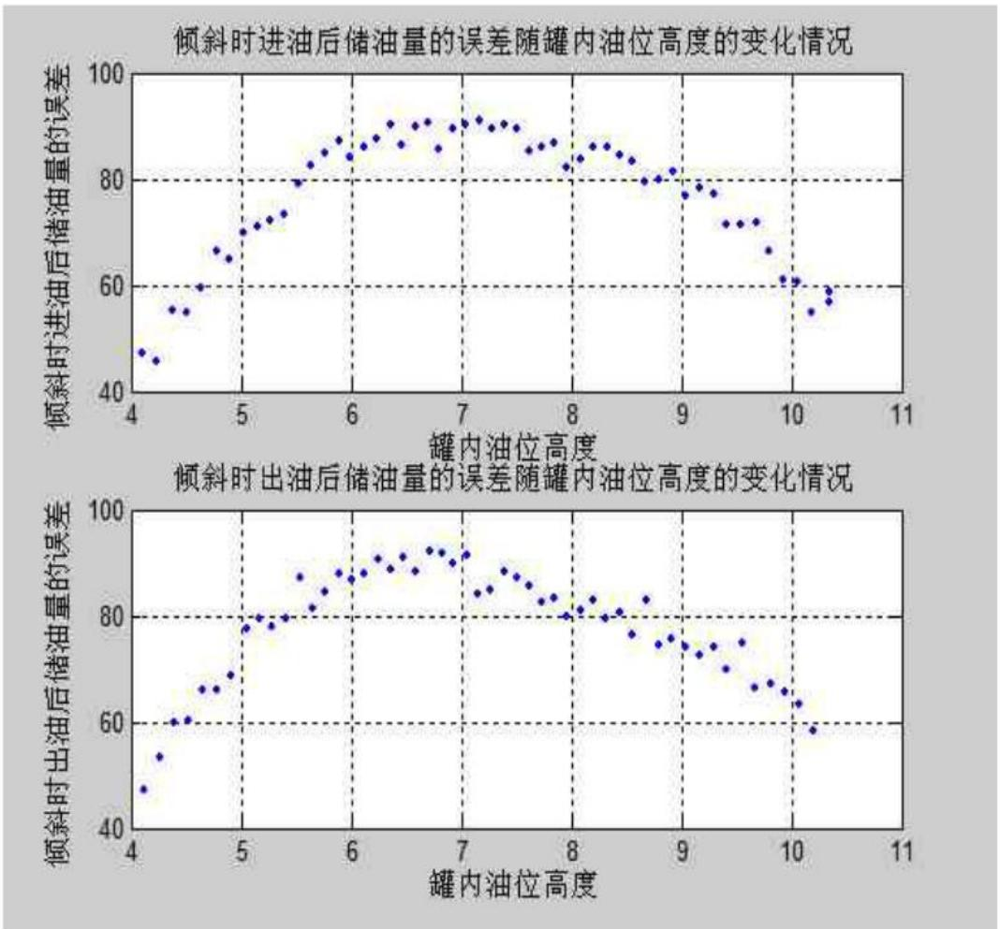

<details>
<summary>scatter</summary>

| 罐内油位高度 | 倾斜时进油后储油量的误差 | 倾斜时出油后储油量的误差 |
| --- | --- | --- |
| 4.0 | ~47 | ~47 |
| 4.1 | ~46 | ~53 |
| 4.2 | ~55 | ~60 |
| 4.3 | ~55 | ~60 |
| 4.4 | ~60 | ~66 |
| 4.5 | ~67 | ~66 |
| 4.6 | ~65 | ~69 |
| 4.7 | ~70 | ~78 |
| 4.8 | ~71 | ~79 |
| 4.9 | ~72 | ~80 |
| 5.0 | ~73 | ~81 |
| 5.1 | ~79 | ~87 |
| 5.2 | ~83 | ~82 |
| 5.3 | ~85 | ~85 |
| 5.4 | ~87 | ~88 |
| 5.5 | ~84 | ~87 |
| 5.6 | ~86 | ~89 |
| 5.7 | ~88 | ~90 |
| 5.8 | ~90 | ~89 |
| 5.9 | ~87 | ~91 |
| 6.0 | ~90 | ~92 |
| 6.1 | ~91 | ~93 |
| 6.2 | ~90 | ~92 |
| 6.3 | ~91 | ~91 |
| 6.4 | ~90 | ~92 |
| 6.5 | ~89 | ~91 |
| 6.6 | ~88 | ~90 |
| 6.7 | ~87 | ~89 |
| 6.8 | ~86 | ~88 |
| 6.9 | ~85 | ~87 |
| 7.0 | ~84 | ~86 |
| 7.1 | ~83 | ~85 |
| 7.2 | ~82 | ~84 |
| 7.3 | ~81 | ~83 |
| 7.4 | ~80 | ~82 |
| 7.5 | ~79 | ~81 |
| 7.6 | ~78 | ~80 |
| 7.7 | ~77 | ~79 |
| 7.8 | ~76 | ~78 |
| 7.9 | ~75 | ~77 |
| 8.0 | ~74 | ~76 |
| 8.1 | ~73 | ~75 |
| 8.2 | ~72 | ~74 |
| 8.3 | ~71 | ~73 |
| 8.4 | ~70 | ~72 |
| 8.5 | ~69 | ~71 |
| 8.6 | ~68 | ~70 |
| 8.7 | ~67 | ~69 |
| 8.8 | ~66 | ~68 |
| 8.9 | ~65 | ~67 |
| 9.0 | ~64 | ~66 |
| 9.1 | ~63 | ~65 |
| 9.2 | ~62 | ~64 |
| 9.3 | ~61 | ~63 |
| 9.4 | ~60 | ~62 |
| 9.5 | ~59 | ~61 |
| 9.6 | ~58 | ~60 |
| 9.7 | ~57 | ~59 |
| 9.8 | ~56 | ~58 |
| 9.9 | ~55 | ~57 |
| 10.0 | — | — |
| 10.1 | — | — |
| 10.2 | — | — |
| 10.3 | — | — |
| 10.4 | — | — |
| 10.5 | — | — |
| 10.6 | — | — |
| 10.7 | — | — |
| 10.8 | — | — |
| 10.9 | — | — |
| 11.0 | — | — |
| 11.1 | — | — |
| 11.2 | — | — |
| 11.3 | — | — |
| 11.4 | — | — |
| 11.5 | — | — |
| 11.6 | — | — |
| 11.7 | — | — |
| 11.8 | — | — |
| 11.9 | — | — |
| 12.0 | — | — |
| 12.1 | — | — |
| 12.2 | — | — |
| 12.3 | — | — |
| 12.4 | — | — |
| 12.5 | — | — |
| 12.6 | — | — |
| 12.7 | — | — |
| 12.8 | — | — |
| 12.9 | — | — |
| 13.0 | — | — |
| 13.1 | — | — |
| 13.2 | — | — |
| 13.3 | — | — |
| 13.4 | — | — |
| 13.5 | — | — |
| 13.6 | — | — |
| 13.7 | — | — |
| 13.8 | — | — |
| 13.9 | — | — |
| 14.0 | — | — |
| 14.1 | — | — |
| 14.2 | — | — |
| 14.3 | — | — |
| 14.4 | — | — |
| 14.5 | — | — |
| 14.6 | — | — |
| 14.7 | — | — |
| 14.8 | — | — |
| 14.9 | — | — |
| 15.0 | — | — |
| 15.1 | — | — |
| 15.2 | — | — |
| 15.3 | — | — |
| 15.4 | — | — |
| 15.5 | — | — |
| 15.6 | — | — |
| 15.7 | — | — |
| 15.8 | — | — |
| 15.9 | — | — |
| 16.0 | — | — |
| 16.1 | — | — |
| 16.2 | — | — |
| 16.3 | — | — |
| 16.4 | — | — |
| 16.5 | — | — |
| 16.6 | — | — |
| 16.7 | — | — |
| 16.8 | — | — |
| 16.9 | — | — |
| 17.0 | — | — |
| 17.1 | — | — |
| 17.2 | — | — |
| 17.3 | — | — |
| 17.4 | — | — |
| 17.5 | — | — |
| 17.6 | — | — |
| 17.7 | — | — |
| 17.8 | — | — |
| 17.9 | — | — |
| 18.0 | — | — |
| 18.1 | — | — |
| 18.2 | — | — |
| 18.3 | — | — |
| 18.4 | — | — |
| 18.5 | — | — |
| 18.6 | — | — |
| 18.7 | — | — |
| 18.8 | — | — |
| 18.9 | — | — |
| 19.0 | — | — |
| 19.1 | — | — |
| 19.2 | — | — |
| 19.3 | — | — |
| 19.4 | — | — |
| 19.5 | — | — |
| 19.6 | — | — |
| 19.7 | — | — |
| 19.8 | — | — |
| 19.9 | — | — |
</details>

图4-11

由上述图我们可以知道倾斜时不管是进油后储油量的误差还是出油后储油量的误差均随罐内油位高度的变化呈正态分布，说明该模型建立得贴合实际。

由上述得到储油罐发生变位时体积关于 h 的公式我们可以给出罐体变位后油位高度间隔为 1cm 的罐容表标定值（即进/出油量与罐内油位高度的表格），如表 4-3 所示：

表 4-3 罐体变位后油位高度间隔为 $1\mathrm{\;{cm}}$ 的罐容表标定值

<table><tr><td>高度(h)cm</td><td>体积(v)L</td><td>高度(h)cm</td><td>体积(v)L</td><td>高度(h)cm</td><td>体积(v)L</td><td>高度(h)cm</td><td>体积(v)L</td></tr><tr><td>1</td><td>3.531</td><td>26</td><td>461.5</td><td>51</td><td>1413.9</td><td>76</td><td>2491.3</td></tr><tr><td>2</td><td>6.2635</td><td>27</td><td>494</td><td>52</td><td>1456</td><td>77</td><td>2534</td></tr><tr><td>3</td><td>9.9748</td><td>28</td><td>527.1</td><td>53</td><td>1498.4</td><td>78</td><td>2576.6</td></tr><tr><td>4</td><td>14.7563</td><td>29</td><td>560.9</td><td>54</td><td>1540.9</td><td>79</td><td>2619.1</td></tr><tr><td>5</td><td>20.6908</td><td>30</td><td>595.2</td><td>55</td><td>1583.5</td><td>80</td><td>2661.4</td></tr><tr><td>6</td><td>27.8542</td><td>31</td><td>630.1</td><td>56</td><td>1626.3</td><td>81</td><td>2703.6</td></tr><tr><td>7</td><td>36.3163</td><td>32</td><td>665.6</td><td>57</td><td>1669.2</td><td>82</td><td>2745.5</td></tr><tr><td>8</td><td>46.1424</td><td>33</td><td>701.5</td><td>58</td><td>1712.2</td><td>83</td><td>2787.2</td></tr><tr><td>9</td><td>57.3935</td><td>34</td><td>738</td><td>59</td><td>1755.3</td><td>84</td><td>2828.7</td></tr><tr><td>10</td><td>70.127</td><td>35</td><td>774.9</td><td>60</td><td>1798.5</td><td>85</td><td>2870</td></tr><tr><td>11</td><td>84.3968</td><td>36</td><td>812.2</td><td>61</td><td>1841.8</td><td>86</td><td>2911.1</td></tr><tr><td>12</td><td>100.2541</td><td>37</td><td>850</td><td>62</td><td>1885.1</td><td>87</td><td>2951.8</td></tr><tr><td>13</td><td>117.7475</td><td>38</td><td>888.2</td><td>63</td><td>1928.5</td><td>88</td><td>2992.3</td></tr><tr><td>14</td><td>136.923</td><td>39</td><td>926.7</td><td>64</td><td>1971.9</td><td>89</td><td>3032.5</td></tr><tr><td>15</td><td>157.8246</td><td>40</td><td>965.7</td><td>65</td><td>2015.4</td><td>90</td><td>3072.4</td></tr><tr><td>16</td><td>180.4939</td><td>41</td><td>100.5</td><td>66</td><td>2058.8</td><td>91</td><td>3112</td></tr><tr><td>17</td><td>204.971</td><td>42</td><td>1044.6</td><td>67</td><td>2102.3</td><td>92</td><td>3151.2</td></tr><tr><td>18</td><td>228.9</td><td>43</td><td>1084.5</td><td>68</td><td>2145.7</td><td>93</td><td>3190.1</td></tr><tr><td>19</td><td>254.9</td><td>44</td><td>11248</td><td>69</td><td>2189.1</td><td>94</td><td>3228.6</td></tr><tr><td>20</td><td>281.9</td><td>45</td><td>1165.3</td><td>70</td><td>2232.5</td><td>95</td><td>3266.7</td></tr><tr><td>21</td><td>309.8</td><td>46</td><td>1206.2</td><td>71</td><td>2275.8</td><td>96</td><td>3304.4</td></tr><tr><td>22</td><td>338.5</td><td>47</td><td>1247.2</td><td>72</td><td>2319.1</td><td>97</td><td>3341.7</td></tr><tr><td>23</td><td>368.1</td><td>48</td><td>1.2886</td><td>73</td><td>2362.3</td><td>98</td><td>3378.5</td></tr><tr><td>24</td><td>398.5</td><td>49</td><td>1330.1</td><td>74</td><td>2405.4</td><td>99</td><td>3414.9</td></tr><tr><td>25</td><td>429.7</td><td>50</td><td>1371.9</td><td>75</td><td>2448.4</td><td>100</td><td>3450.7</td></tr></table>

## § 4.2 问题二

我们一开始考虑当储油罐水平放置时油量与浮油子高度的函数关系。

当储油罐水平放置无横向与纵向倾斜时，设油高为 h，所建立的空间直角建立坐标系如图 4-12 所示：

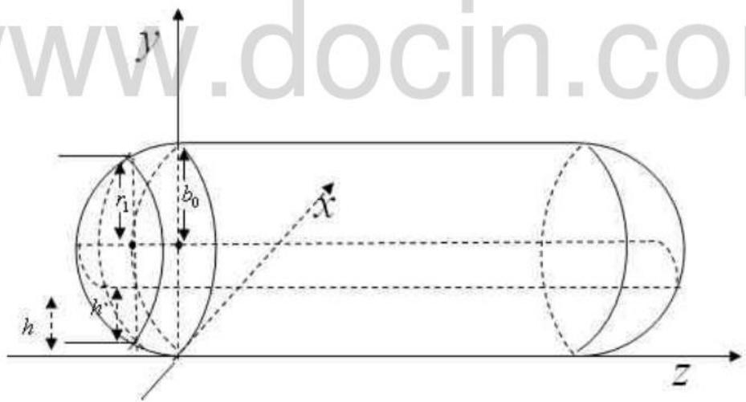

<details>
<summary>text_image</summary>

www.docin.com
y
r₁
b₀
h
x
z
</details>

图 4- 12

储油罐中储油的体积可分为两部分, 圆柱体中储存油的体积与两端的球罐体中油的体积, 根据对称性, 两端的球罐体中油的体积相等。用垂直于 z 轴 的平面截储油罐, 根据截面法求体积公式可求出储油的体积。

第一种情况：当 $0 \leq h \leq b_{0}$ 时

1、对于圆柱体部分：截面圆的方程为 $x^{2} + (y - b_{0})^{2} = b_{0}^{2}$

由 $x^{2} + (y - b_{0})^{2} = b_{0}^{2}\Rightarrow x = \sqrt{b_{0}^{2} - (y - b_{0})^{2}}$

截面 $s(z) = 2\int_0^h\sqrt{b_0^2 - (y - b_0)^2} dy$

$$
\begin{array}{l} = 2 \left[ \right.\left(\frac {y - b _ {0}}{2} \sqrt {b _ {0} ^ {2} - (y - b _ {0}) ^ {2}} + \frac {b ^ {2}}{2} a r c \sin \left(\frac {y - b _ {0}}{b _ {0}}\right) + \frac {1}{4} \pi b _ {0} ^ {2}\right)\left. \right| _ {0} ^ {k} \left. \right] \\ = (h - b _ {0}) \sqrt {b _ {0} ^ {2} - (h - b _ {0}) ^ {2}} + b _ {0} ^ {2} a r c \sin \left(\frac {h - b _ {0}}{b _ {0}}\right) + \frac {1}{2} \pi b _ {0} ^ {2} \\ \end{array}
$$

体积 $v_{1}=\int_{0}^{L_{0}}s(z)dz$

$$
= L _ {0} (h - b _ {0}) \sqrt {b _ {0} ^ {2} - (h - b _ {0}) ^ {2}} + L _ {0} b _ {0} ^ {2} a r c \sin \left(\frac {h - b _ {0}}{b _ {0}}\right) + \frac {1}{2} \pi b _ {0} ^ {2} L _ {0}
$$

2、对于两端的球冠体，根据对称性，两端的球冠体储油体积相等，如图4-13所示：

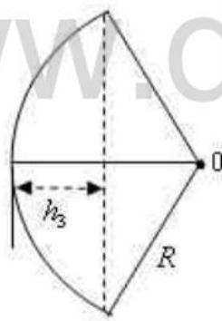

<details>
<summary>text_image</summary>

w.W.C
h₃
R
</details>

图4-13

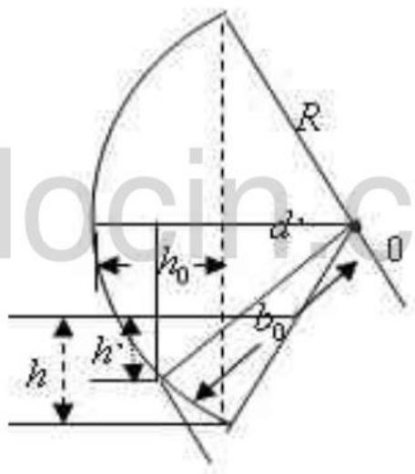

<details>
<summary>text_image</summary>

R
h₀
d'
0
b₀
h
h'
</details>

图4-14

由图 4-13 可看出，根据几何关系：

$$
\mathrm{R} ^ {2} = (\mathrm{R} - h _ {3}) ^ {2} + b _ {0} ^ {2} \quad \Rightarrow R = \frac {h _ {3} ^ {2} + b _ {0} ^ {2}}{2 h _ {3}}
$$

用平面 $z = z$ 截球罐体，设截得小圆半径为 $r_1$ ，所图4-14所示，根据几何关

系得：

$$
r _ {1} ^ {2} = R ^ {2} - (d ^ {\prime} + z) ^ {2} \quad \Rightarrow d ^ {\prime} = \sqrt {R ^ {2} - b _ {0} ^ {2}}
$$

$$
r _ {1} ^ {2} = \mathrm{R} ^ {2} - \left(\sqrt {\mathrm{R} ^ {2} - b _ {0} ^ {2}} + z\right) ^ {2} \quad r _ {1} = \sqrt {\mathrm{R} ^ {2} - \left(\sqrt {\mathrm{R} ^ {2} - b _ {0} ^ {2}} + z\right) ^ {2}}
$$

截面圆的油高为 $h^{\prime}$ ， $h^{\prime} = r_{1} - (b_{0} - h)$

截面 $S(z) = 2\int_{0}^{h}\sqrt{r_1^2 - (y - r_1)^2} dy$

$$
= (h ^ {\prime} - r _ {1}) \sqrt {r _ {1} ^ {2} - (h ^ {\prime} - r _ {1}) ^ {2}} + r _ {1} ^ {2} a r c \sin \left(\frac {h ^ {\prime} - r _ {1}}{r _ {1}}\right) + \frac {1}{2} \pi r _ {1} ^ {2}
$$

$$
h _ {3} = R - \sqrt {R ^ {2} - b _ {0} ^ {2}}
$$

$$
\begin{array}{l} \mathrm{V} _ {2} = 2 \int_ {0} ^ {h _ {3} - h _ {3} \frac {h}{b _ {0}}} S (z) d z \\ = 2 \int_ {0} ^ {k _ {3} - b _ {3} \frac {h}{b _ {0}}} \left(h - b _ {0}\right) \sqrt {R ^ {2} - \left(\sqrt {R ^ {2} - b _ {0} ^ {2}} + z\right) ^ {2} - \left(h - b _ {0}\right) ^ {2}} d z \\ + 2 \int_ {0} ^ {h _ {5} - k _ {3} \frac {h}{b _ {0}}} \left(R ^ {2} - \left(\sqrt {R ^ {2} - b _ {0} ^ {2}} + z\right) ^ {2}\right) a r c \sin \left\{\frac {h - b _ {0}}{\sqrt {R ^ {2} - \left(\sqrt {R ^ {2} - b _ {0} ^ {2}} + z\right) ^ {2}}} \right\} d z \\ + \pi \int_ {0} ^ {h _ {3} - h _ {3} \frac {h}{b _ {0}}} R ^ {2} - \left(\sqrt {R ^ {2} - b _ {0} ^ {2}} + z\right) ^ {2} d z \\ \end{array}
$$

积分解得:

$$
\begin{array}{l} V _ {2} = \frac {\pi h R ^ {2}}{2} - \frac {\pi h ^ {3}}{6} - \frac {2 h}{3} \sqrt {2 h _ {3} R - h ^ {2} - h _ {3} ^ {2}} (h _ {3} - R) - \frac {h _ {3} ^ {3} - 3 h _ {3} ^ {2} R + 2 R ^ {3}}{3} \arctan \left(\frac {h}{\sqrt {2 h _ {3} R - h ^ {2} - h _ {3} ^ {2}}}\right) \\ + \frac {2}{3} R ^ {3} \arctan \left(\frac {h (R - h _ {3})}{\sqrt {2 h _ {3} R - h ^ {2} - h _ {3} ^ {2}}}\right) \\ \end{array}
$$

$$
\begin{array}{l} V = V _ {1} + 2 V _ {2} \\ = \pi h R ^ {2} - \frac {\pi h ^ {3}}{3} + h L _ {0} \sqrt {b _ {0} ^ {2} - h ^ {2}} - \frac {4}{3} h \sqrt {b _ {0} ^ {2} - h ^ {2}} \sqrt {R ^ {2} - b _ {0} ^ {2}} \\ + \left[ L _ {0} b _ {0} ^ {2} - \frac {2}{3} \sqrt {R ^ {2} - b _ {0} ^ {2}} \left(2 R ^ {2} + b _ {0} ^ {2}\right) \right] \arctan \left(\frac {\sqrt {R ^ {2} - b _ {0} ^ {2}}}{\sqrt {b _ {0} ^ {2} - h ^ {2}}}\right) + \frac {4}{3} R ^ {3} \arctan \left(\frac {h \sqrt {R ^ {2} - b _ {0} ^ {2}}}{R \sqrt {b _ {0} ^ {2} - h ^ {2}}}\right) \\ \end{array}
$$

第二种情况：当 $b_{0} \leq h \leq 2b_{0}$ 时

对于圆柱体的部分同第一种情况

$$
\begin{array}{l} V _ {1} = \int_ {0} ^ {L _ {0}} S (z) d z \\ = L _ {0} (h - b _ {0}) \sqrt {b _ {0} ^ {2} - (h - b _ {0}) ^ {2}} + L _ {0} b _ {0} ^ {2} a r c \sin \left(\frac {h - b _ {0}}{b _ {0}}\right) + \frac {1}{2} \pi b _ {0} ^ {2} L _ {0} \\ \end{array}
$$

对于球罐体体积

截面圆的油高为 $h^{\prime} \quad h^{\prime} = r_{1} + (h - b_{0})$

$$
\begin{array}{l} \mathrm{S} (z) = 2 \int_ {0} ^ {h} \sqrt {r _ {1} ^ {2} - (y - r _ {1}) ^ {2}} d y \\ = (h ^ {\prime} - r _ {1}) \sqrt {r _ {1} ^ {2} - (h ^ {\prime} - r _ {1}) ^ {2}} + r _ {1} ^ {2} a r c \sin \left(\frac {h ^ {\prime} - r _ {1}}{r _ {1}}\right) + \frac {1}{2} \pi r _ {1} ^ {2} \\ \end{array}
$$

这种情况与第一种情况相同，因此与第一种情况相同。

模型的建立:

V 与 h 的函数关系为:

$$
\begin{array}{l} V = V _ {1} + 2 V _ {2} \\ = \left[ L _ {0} b _ {0} ^ {2} - \frac {2}{3} \sqrt {R ^ {2} - b _ {0} ^ {2}} \left(2 R ^ {2} + b _ {0} ^ {2}\right) \right] \arctan \left(\frac {\sqrt {R ^ {2} - b _ {0} ^ {2}}}{\sqrt {b _ {0} ^ {2} - h ^ {2}}}\right) + \frac {4}{3} R ^ {3} \arctan \left(\frac {h \sqrt {R ^ {2} - b _ {0} ^ {2}}}{R \sqrt {b _ {0} ^ {2} - h ^ {2}}}\right) \\ + \pi h R ^ {2} - \frac {\pi h ^ {3}}{3} + h L _ {0} \sqrt {b _ {0} ^ {2} - h ^ {2}} - \frac {4}{3} h \sqrt {b _ {0} ^ {2} - h ^ {2}} \sqrt {R ^ {2} - b _ {0} ^ {2}} \\ \end{array}
$$

我们就油所占的体积进行初步讨论,建立笛卡尔坐标系如图 4-15,可以得出球冠体的球面方程为:

$$
x ^ {2} + y ^ {2} + \left[ z - (h _ {3} - \frac {b _ {0} ^ {2} - h _ {0} ^ {2}}{2 h _ {0}}) \right] ^ {2} = \left[ \frac {b _ {0} ^ {2} + h _ {0} ^ {2}}{2 h _ {0}} \right] ^ {2}
$$

圆柱体部分的方程： $x^{2} + y^{2} = b_{0}^{2}$

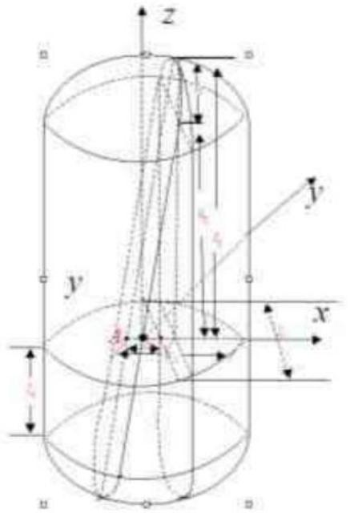

<details>
<summary>text_image</summary>

Diagram of a cylindrical coordinate system with labeled axes (x, y, z) and internal geometric elements, likely from a physics or engineering context.
</details>

图4-15

如图 4-15 所示，油罐体中所含油的部分分成两份，分别计算它们的体积。

因为 $\tan \alpha = \frac{x_0 + h_1^{\prime} - b_0}{l_2} = \frac{x_0 + h_1^{\prime} - b_0}{h_3 + \frac{b_0 - x_0}{b_0} h_0}$

$$
\begin{array}{l} \Rightarrow \tan \alpha = \frac {x _ {0} + h _ {1} ^ {\prime} - 1 . 5}{7 + \frac {x _ {0}}{1 . 5}} \\ \Rightarrow x _ {0} + h _ {1} ^ {\prime} - 1. 5 = \left(7 + \frac {x _ {0}}{1 . 5}\right) \tan \alpha \\ \Rightarrow 1. 5 x _ {0} + 1. 5 h _ {1} ^ {\prime} - 2. 2 5 = (1 0. 5 + x _ {0}) \tan \alpha = 1 0. 5 \tan \alpha + x _ {0} \tan \alpha \\ \Rightarrow 1. 5 h _ {1} ^ {\prime} - 2. 2 5 - 1 0. 5 \tan \alpha = (\tan \alpha - 1. 5) x _ {0} \\ \Rightarrow x _ {0} = \frac {1 . 5 h _ {1} ^ {\prime} - 2 . 2 5 - 1 0 . 5 \tan \alpha}{\tan \alpha - 1 . 5} \\ \end{array}
$$

$$
h _ {1} = \left(h _ {1} ^ {'} - b _ {0}\right) \cos \beta + b _ {0} \text {且} \cos \beta_ {\max} = \frac {b _ {0} - h _ {1}}{b _ {0}} \Rightarrow \beta \leq \arccos \frac {b _ {0} - h _ {1}}{b _ {0}}
$$

右半部分的体积 $v_{1}$ 利用投影法可以由以下约束公式算出

$$
\left\{ \begin{array}{l} x ^ {2} + y ^ {2} + \left[ z - (h _ {3} - \frac {b _ {0} ^ {2} - h _ {0} ^ {2}}{2 h _ {0}}) \right] ^ {2} = \left[ \frac {b _ {0} ^ {2} + h _ {0} ^ {2}}{2 h _ {0}} \right] ^ {2} \\ x ^ {2} + y ^ {2} \leq b _ {0} ^ {2} \\ z \geq h _ {3} - \frac {b _ {0} ^ {2} - h _ {0} ^ {2}}{2 h _ {0}} \\ x \geq x _ {0} \end{array} \right.
$$

由上述第一个公式可以得出曲顶柱体的盖面方程为

$$
\begin{array}{l} z = \sqrt {x ^ {2} + y ^ {2} - \left[ \frac {b _ {0} ^ {2} + h _ {0} ^ {2}}{2 h _ {0}} \right] ^ {2}} + h _ {3} - \frac {b _ {0} ^ {2} - h _ {0} ^ {2}}{2 h _ {0}} \\ \Rightarrow V _ {1} = \iint_ {\substack {x ^ {2} + y ^ {2} \leq b _ {0} ^ {2} \\ x \geq x _ {0}}} \sqrt {x ^ {2} + y ^ {2} - \left[ \frac {b _ {0} ^ {2} + h _ {0} ^ {2}}{2 h _ {0}} \right] ^ {2}} + h _ {3} - \frac {b _ {0} ^ {2} - h _ {0} ^ {2}}{2 h _ {0}} d x d y \\ = \iint_ {\substack {x ^ {2} + y ^ {2} \leq 2.25 \\ x \geq x _ {0}}} \sqrt {x ^ {2} + y ^ {2} - \left[ \frac {3 .35}{3} \right] ^ {2}} + 6 - \frac {-1.25}{2} dxdy \\ = \iint_ {\substack {x ^ {2} + y ^ {2} \leq 2.25 \\ x\geq x _ {0}}} \sqrt {x ^ {2} + y ^ {2} - 1.25} + 6.625dxdy \\ \end{array}
$$

左半部分的体积 $V_{2}$ 近似利用截面法可以由以下公式算出，由图4-15可以得出 $A$ 点的坐标为 $(- (h_1' - b_0), 0, 0)$ ；过垂直于 $x$ 轴做截面，设过 $x$ 的截面面积为

$$
S \left(x\right)  ;    \text {由}   x ^ {2} + y ^ {2} = b _ {0} ^ {2} \Rightarrow   y = \pm \sqrt {b _ {0} ^ {2} - x ^ {2}} \Rightarrow   l _ {4} = 2 \left| y \right| = 2 \sqrt {b _ {0} ^ {2} - x ^ {2}}
$$

由图4-15可知 $\frac{x + h_1 - b_0}{x_0 + h_1 - b_0} = \frac{h_2}{l_2} = \frac{h_2}{h_3 + l_3}$ 而且 $\frac{l_3}{h_0} = \frac{b_0 - x_0}{b_0} \Rightarrow l_3 = \frac{b_0 - x_0}{b_0} h_0$

$$
\Rightarrow h _ {2} = \frac {x + h _ {1} ^ {\prime} - b _ {0}}{x _ {0} + h _ {1} ^ {\prime} - b _ {0}} \left(h _ {3} + \frac {b _ {0} - x _ {0}}{b _ {0}} h _ {0}\right)
$$

过 $x$ 的截面面积为 $S(x)$ 近似可表示如下：

$$
\begin{array}{l} \Rightarrow S (x) = \frac {1}{2} l _ {4} h _ {2} = \sqrt {b _ {0} ^ {2} - x ^ {2}} \frac {x + h _ {1} ^ {\prime} - b _ {0}}{x _ {0} + h _ {1} ^ {\prime} - b _ {0}} \left(h _ {3} + \frac {b _ {0} - x _ {0}}{b _ {0}} h _ {0}\right) \\ = \sqrt {2 . 2 5 - x ^ {2}} \frac {x + h _ {1} ^ {\prime} - 1 . 5}{x _ {0} + h _ {1} ^ {\prime} - 1 . 5} \left(6 + \frac {1 . 5 - x _ {0}}{1 . 5}\right) \\ = \sqrt {2 . 2 5 - x ^ {2}} \frac {x + h _ {1} ^ {\prime} - 1 . 5}{x _ {0} + h _ {1} ^ {\prime} - 1 . 5} \left(7 - \frac {x _ {0}}{1 . 5}\right) \\ \end{array}
$$

$$
\begin{array}{l} V _ {2} = \int_ {1. 5 - h _ {1}} ^ {x _ {0}} S (x) d x \\ = \int_ {1. 5 - h _ {1} ^ {\prime}} ^ {x _ {0}} \sqrt {2 . 2 5 - x ^ {2}} \frac {x + h _ {1} ^ {\prime} - 1 . 5}{x _ {0} + h _ {1} ^ {\prime} - 1 . 5} \left(7 - \frac {x _ {0}}{1 . 5}\right) d x \\ \end{array}
$$

有上述的 $v_{1},v_{2}$ 可以得到储油罐中油量与油位高度及变位参数的函数关系：

$$
\begin{array}{l} V = V _ {1} + V _ {2} \\ = \iint_ {\substack {x ^ {2} + y ^ {2} \leq 2.25 \\ x \geq x _ {0}}} \sqrt {x ^ {2} + y ^ {2} - 1.25} + 6.625 dx dy + \int_ {1.5 - h _ {1} ^ {\prime}} ^ {x _ {0}} \sqrt {2.25 - x ^ {2}} \frac {x + h _ {1} ^ {\prime} - 1 .5}{x _ {0} + h _ {1} ^ {\prime} - 1 .5} \left(7 - \frac {x _ {0}}{1 .5}\right) dx \\ \end{array}
$$

以下为在固定的横向偏转角度 $\beta$ 条件下，就纵向倾斜角度 $\alpha$ 的变化进行分类讨论。

令 $2a = 3m, a_{2} = 2m, a_{3} = 1m$ ;

情形I．当 $\alpha \leq \arctan \frac{2a}{l_1}$ 时，

（1）当 $h_1 \leq l_1 \tan \alpha$ 时，该情况的图4-16所示：

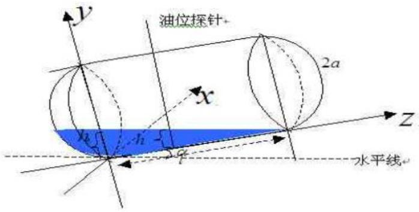

<details>
<summary>text_image</summary>

油位探针+
2a
x
h
h
q
水平线
z
y
</details>

图 4- 16

由图4-16可知 $\frac{h}{h_1} = \frac{l_1 - a_2}{l_1}, (x - a\sin \beta)^2 + (y - a\cos \beta)^2 = a^2.$

$$
\frac {h _ {1} \tan \alpha - z}{h _ {1} \tan \alpha} = \frac {y _ {0}}{h _ {1}}, S (z) = \int_ {0} ^ {y _ {0}} 2 (a \sin \beta + \sqrt {a ^ {2} - (y - a \cos \beta) ^ {2}}) d y
$$

$$
V _ {1} = \int_ {0} ^ {\frac {k _ {i}}{\tan \alpha}} S (z) d z = \int_ {0} ^ {\frac {k _ {i}}{\tan \alpha}} \int_ {0} ^ {y _ {0}} 2 (a \sin \beta + \sqrt {a ^ {2} - (y - a \cos \beta) ^ {2}}) d y d z
$$

令 A = 1.5 m, B = 1.5 m, C = 1 m.

$$
\frac {x ^ {2}}{A ^ {2}} + \frac {(y - B) ^ {2}}{B ^ {2}} = 1 \Rightarrow x = \frac {A}{B} \sqrt {2 B y - y ^ {2}}
$$

$$
\frac {(y - B) ^ {2}}{B ^ {2}} + \frac {z ^ {2}}{C ^ {2}} = 1 \Rightarrow z = \frac {C}{B} \sqrt {2 B y - y ^ {2}}
$$

$$
\begin{array}{l} V _ {0} = \int_ {0} ^ {k _ {1}} (2 x l _ {1} + \pi x z) d y \\ = 2 l \int_ {0} ^ {h _ {1}} x d y + \pi \int_ {0} ^ {h _ {1}} x z d y \\ \end{array}
$$

x 和 z 式代入 $V_{0}$ 式，得：

$$
\begin{array}{l} V _ {0} = 2 \int_ {0} ^ {h _ {1}} \frac {A}{B} \sqrt {B ^ {2} + (y - B) ^ {2}} d y + \pi \int_ {0} ^ {h _ {1}} \frac {A}{B} \sqrt {2 B y - y ^ {2}} \frac {C}{B} \sqrt {2 B y - y ^ {2}} d y \\ = A B \left[ \frac {h _ {1} - B}{B} \sqrt {1 - \left(\frac {h - B}{B}\right) ^ {2}} + \arcsin \frac {h _ {1} - B}{B} + \frac {\pi}{2} \right] + \frac {\pi A C}{B ^ {2}} \left[ B h _ {1} ^ {2} - \frac {1}{3} h _ {1} ^ {3} \right] \\ \end{array}
$$

$$
V _ {2} = \frac {V _ {0}}{2} = \frac {A B}{2} \left[ \frac {h _ {1} - B}{B} \sqrt {1 - \left(\frac {h - B}{B}\right) ^ {2}} + \arcsin \frac {h _ {1} - B}{B} + \frac {\pi}{2} \right] + \frac {\pi A C}{B ^ {2}} \left[ B h _ {1} ^ {2} - \frac {1}{3} h _ {1} ^ {3} \right]
$$

由此可得:

$$
\begin{array}{l} V = V _ {1} + V _ {2} \\ = \int_ {0} ^ {\frac {k _ {1}}{\tan \alpha}} \int_ {0} ^ {y _ {0}} 2 (a \sin \beta + \sqrt {a ^ {2} - (y - a \cos \beta) ^ {2}}) d y d z + \\ \frac {A B}{2} \left[ \frac {h _ {1} - B}{B} \sqrt {1 - \left(\frac {h - B}{B}\right) ^ {2}} + \arcsin \frac {h _ {1} - B}{B} + \frac {\pi}{2} \right] + \frac {\pi A C}{B ^ {2}} \left[ B h _ {1} ^ {2} - \frac {1}{3} h _ {1} ^ {3} \right] \\ \end{array}
$$

(2) 当 $l_{1}\tan\alpha \leq h_{1} \leq 2a$ 时，该情况如图 4-17 所示：

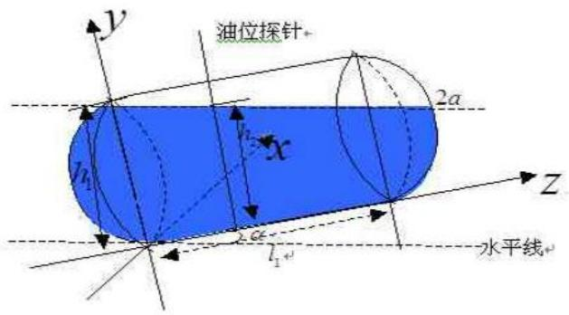

<details>
<summary>text_image</summary>

油位探针+
2α
h₁
l₁
α
水平线+
</details>

图4-17

$$
S (z) = \int_ {0} ^ {y _ {0}} 2 (a \sin \beta + \sqrt {a ^ {2} - (y - a \cos \beta) ^ {2}}) d y
$$

$$
V _ {1} = \int_ {0} ^ {l _ {1}} S (z) d z = \int_ {0} ^ {l _ {1}} \int_ {0} ^ {y _ {0}} 2 (a \sin \beta + \sqrt {a ^ {2} - (y - a \cos \beta) ^ {2}}) d y d z
$$

同上可得

$$
V _ {2} = \frac {A B}{2} \left[ \frac {h _ {1} - B}{B} \sqrt {1 - \left(\frac {h - B}{B}\right) ^ {2}} + \arcsin \frac {h _ {1} - B}{B} + \frac {\pi}{2} \right] + \frac {\pi A C}{B ^ {2}} \left[ B h _ {1} ^ {2} - \frac {1}{3} h _ {1} ^ {3} \right]
$$

$$
\begin{array}{l} V = V _ {1} + V _ {2} \\ = \int_ {0} ^ {l _ {1}} \int_ {0} ^ {y _ {0}} 2 (a \sin \beta + \sqrt {a ^ {2} - (y - a \cos \beta) ^ {2}}) d y d z + \\ \frac {A B}{2} \left[ \frac {h _ {1} - B}{B} \sqrt {1 - \left(\frac {h - B}{B}\right) ^ {2}} + \arcsin \frac {h _ {1} - B}{B} + \frac {\pi}{2} \right] + \frac {\pi A C}{B ^ {2}} \left[ B h _ {1} ^ {2} - \frac {1}{3} h _ {1} ^ {3} \right] \\ \end{array}
$$

（3）当 $h_1 = 2a$ 且 $\mathrm{h}\leq 2\mathrm{a}$ 时，该情况如图4-18所示：

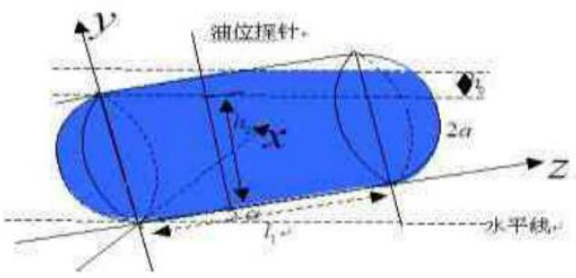

<details>
<summary>text_image</summary>

油位探针。
2a
水平线。
</details>

图 4- 18

令 $h_{0}=l_{1}\tan\alpha,\Delta h=h-h_{2}$

$$
\frac {l _ {1} - a _ {2}}{l _ {1}} = \frac {h _ {2}}{2 a} \Rightarrow h _ {2} = \frac {2 a (l _ {1} - a _ {2})}{l _ {1}}, h _ {1} ^ {\prime} = h _ {0} - \Delta h = l _ {1} \tan \alpha - h + \frac {2 a (l _ {1} - a _ {2})}{l _ {1}}
$$

$$
\frac {h _ {1} ^ {\prime} \tan \alpha - z}{h _ {1} ^ {\prime} \tan \alpha} = \frac {y _ {0} ^ {\prime}}{h _ {1} ^ {\prime}}, S (z) = \int_ {0} ^ {y _ {0} ^ {\prime}} 2 (a \sin \beta + \sqrt {a ^ {2} - (y - a \cos \beta) ^ {2}}) d y
$$

$$
\Rightarrow V _ {1} ^ {\prime} = \int_ {0} ^ {\frac {k _ {1} ^ {\prime}}{\tan \alpha}} S (z) d z = \int_ {0} ^ {\frac {k _ {1} ^ {\prime}}{\tan \alpha}} \int_ {0} ^ {y _ {0} ^ {\prime}} 2 (a \sin \beta + \sqrt {a ^ {2} - (y - a \cos \beta) ^ {2}}) d y d z
$$

$$
V _ {2} ^ {\cdot} = \frac {A B}{2} \left[ \frac {h _ {1} ^ {\cdot} - B}{B} \sqrt {1 - \left(\frac {h - B}{B}\right) ^ {2}} + \arcsin \frac {h _ {1} ^ {\cdot} - B}{B} + \frac {\pi}{2} \right] + \frac {\pi A C}{B ^ {2}} \left[ B h _ {1} ^ {\cdot 2} - \frac {1}{3} h _ {1} ^ {\cdot 3} \right]
$$

设实际储油罐总体积为 $v_{全}$ ，

$$
\begin{array}{l} V _ {\mathrm{全}} = \pi R ^ {2} L _ {0} + \frac {2 \pi (R - h _ {0}) ^ {2} (3 b _ {0} - R - h _ {0})}{3} \\ = \pi R ^ {2} L _ {0} + \frac {2 \pi (b _ {0} - \sqrt {b _ {0} - R ^ {2}}) ^ {2} (3 b _ {0} - b _ {0} + \sqrt {b _ {0} - R ^ {2}})}{3} \\ = \pi R ^ {2} L _ {0} + \frac {2 \pi}{3} (b _ {0} - \sqrt {b _ {0} - R ^ {2}}) ^ {2} (2 b _ {0} + \sqrt {b _ {0} - R ^ {2}}) \\ \end{array}
$$

$$
\begin{array}{l} \Rightarrow V = V _ {\mathrm{全}} - V _ {1} ^ {'} - V _ {2} ^ {'} \\ = V _ {\mathrm{全}} - \int_ {0} ^ {\frac {k _ {1} ^ {\prime}}{\tan \alpha}} \int_ {0} ^ {y _ {0} ^ {\prime}} 2 (a \sin \beta + \sqrt {a ^ {2} - (y - a \cos \beta) ^ {2}}) d y d z \\ \left. - \frac {A B}{2} \left[ \frac {h _ {1} ^ {\prime} - B}{B} \sqrt {1 - \left(\frac {h - B}{B}\right) ^ {2}} + \arcsin \frac {h _ {1} ^ {\prime} - B}{B} + \frac {\pi}{2} \right] + \frac {\pi A C}{B ^ {2}} \left[ B h _ {1} ^ {\prime 2} - \frac {1}{3} h _ {1} ^ {\prime 3} \right] \right. \\ \end{array}
$$

情形Ⅱ．当 $\arctan\frac{2a}{l_{1}}<\alpha\leq\arctan\frac{l_{1}-2a}{2a}$ 时，

(1) 当 $h_{1} \leq 2a$ 时，该情况的图示如下：

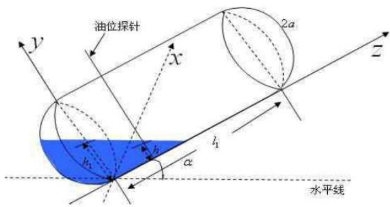

<details>
<summary>text_image</summary>

油位探针
2a
x
y
z
l₁
l₂
α
水平线
</details>

图4-19

$$
\frac {h}{h _ {1}} = \frac {l _ {1} - a _ {2}}{l _ {2}}, \frac {h _ {1} \tan \alpha - z}{h _ {1} \tan \alpha} = \frac {y _ {0}}{h _ {1}}, S (z) = \int_ {0} ^ {y _ {0}} 2 (a \sin \beta + \sqrt {a ^ {2} - (y - a \cos \beta) ^ {2}}) d y
$$

$$
V _ {1} = \int_ {0} ^ {\frac {k _ {1}}{\tan \alpha}} S (z) d z = \int_ {0} ^ {\frac {k _ {1}}{\tan \alpha}} \int_ {0} ^ {y _ {0}} 2 (a \sin \beta + \sqrt {a ^ {2} - (y - a \cos \beta) ^ {2}}) d y d z
$$

$$
V _ {2} = \frac {V _ {0}}{2} = \frac {A B}{2} \left[ \frac {h _ {1} - B}{B} \sqrt {1 - \left(\frac {h - B}{B}\right) ^ {2}} + \arcsin \frac {h _ {1} - B}{B} + \frac {\pi}{2} \right] + \frac {\pi A C}{B ^ {2}} \left[ B h _ {1} ^ {2} - \frac {1}{3} h _ {1} ^ {3} \right]
$$

$$
\begin{array}{l} V = V _ {1} + V _ {2} \\ = \int_ {0} ^ {\frac {k _ {1}}{\tan \alpha}} \int_ {0} ^ {y _ {0}} 2 (a \sin \beta + \sqrt {a ^ {2} - (y - a \cos \beta) ^ {2}}) d y d z + \\ \frac {A B}{2} \left[ \frac {h _ {1} - B}{B} \sqrt {1 - \left(\frac {h - B}{B}\right) ^ {2}} + \arcsin \frac {h _ {1} - B}{B} + \frac {\pi}{2} \right] + \frac {\pi A C}{B ^ {2}} \left[ B h _ {1} ^ {2} - \frac {1}{3} h _ {1} ^ {3} \right] \\ \end{array}
$$

(2) 当 $h_{1}=2a$ 且 $h\leq2a-\frac{l_{1}-a_{2}}{\tan\alpha}$ 时，该情况如图 4-20 所示：

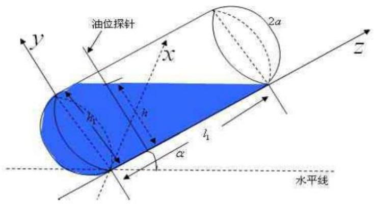

<details>
<summary>text_image</summary>

油位探针
y
x
2a
z
h₁
l₁
α
水平线
</details>

图 4-20

$$
S (z) = \int_ {0} ^ {y _ {0}} 2 (a \sin \beta + \sqrt {a ^ {2} - (y - a \cos \beta) ^ {2}}) d y
$$

$$
V _ {1} = \int_ {0} ^ {l _ {1}} S (z) d z = \int_ {0} ^ {l _ {1}} \int_ {0} ^ {y _ {0}} 2 (a \sin \beta + \sqrt {a ^ {2} - (y - a \cos \beta) ^ {2}}) d y d z
$$

$$
V _ {2} = \frac {A B}{2} \left[ \frac {h _ {1} - B}{B} \sqrt {1 - \left(\frac {h - B}{B}\right) ^ {2}} + \arcsin \frac {h _ {1} - B}{B} + \frac {\pi}{2} \right] + \frac {\pi A C}{B ^ {2}} \left[ B h _ {1} ^ {2} - \frac {1}{3} h _ {1} ^ {3} \right]
$$

$$
V = V _ {1} + V _ {2}
$$

$$
= \int_ {0} ^ {l _ {1}} \int_ {0} ^ {y _ {0}} 2 (a \sin \beta + \sqrt {a ^ {2} - (y - a \cos \beta) ^ {2}}) d y d z +
$$

$$
\frac {A B}{2} \left[ \frac {h _ {1} - B}{B} \sqrt {1 - \left(\frac {h - B}{B}\right) ^ {2}} + \arcsin \frac {h _ {1} - B}{B} + \frac {\pi}{2} \right] + \frac {\pi A C}{B ^ {2}} \left[ B h _ {1} ^ {2} - \frac {1}{3} h _ {1} ^ {3} \right]
$$

（3）当 $2\mathrm{a} - \frac{l_1 - a_2}{\tan\alpha} < \mathrm{h}\leq 2a$ 时，该情况如图4-21所示：

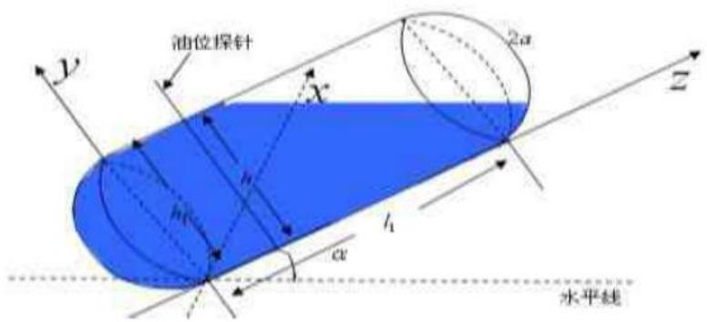

<details>
<summary>text_image</summary>

油位探针
2α
y
x
h
α
z
水平线
</details>

图4-21

令 $\mathrm{h}_{0} = l_{1}\tan \alpha ,\Delta h = h - h_{2}$

$$
\begin{array}{l} \frac {l _ {1} - a _ {2}}{l _ {1}} = \frac {h _ {2}}{2 a} \Rightarrow h _ {2} = \frac {2 a (l _ {1} - a _ {2})}{l _ {1}}, h _ {1} ^ {\prime} = h _ {0} - \Delta h = l _ {1} \tan \alpha - h + \frac {2 a (l _ {1} - a _ {2})}{l _ {1}} \\ \frac {h _ {1} ^ {\prime} \tan \alpha - z}{h _ {1} ^ {\prime} \tan \alpha} = \frac {y _ {0} ^ {\prime}}{h _ {1} ^ {\prime}}, S (z) = \int_ {0} ^ {y _ {0} ^ {\prime}} 2 (a \sin \beta + \sqrt {a ^ {2} - (y - a \cos \beta) ^ {2}}) d y \\ \Rightarrow V _ {1} ^ {\prime} = \int_ {0} ^ {\frac {k _ {1} ^ {\prime}}{\tan \alpha}} S (z) d z = \int_ {0} ^ {\frac {k _ {1} ^ {\prime}}{\tan \alpha}} \int_ {0} ^ {y _ {0} ^ {\prime}} \int_ {0} ^ {y _ {0} ^ {\prime}} 2 (a \sin \beta + \sqrt {a ^ {2} - (y - a \cos \beta) ^ {2}}) d y d z \\ V _ {2} ^ {\prime} = \frac {A B}{2} \left[ \frac {h _ {1} ^ {\prime} - B}{B} \sqrt {1 - \left(\frac {h - B}{B}\right) ^ {2}} + \arcsin \frac {h _ {1} ^ {\prime} - B}{B} + \frac {\pi}{2} \right] + \frac {\pi A C}{B ^ {2}} \left[ B h _ {1} ^ {\prime 2} - \frac {1}{3} h _ {1} ^ {\prime 3} \right] \\ \Rightarrow V = V _ {\mathrm{全}} - V _ {1} ^ {'} - V _ {2} ^ {'} \\ = V _ {\text {全}} - \int_ {0} ^ {\frac {k _ {1} ^ {\prime}}{\tan \alpha}} \int_ {0} ^ {y _ {0} ^ {\prime}} 2 (a \sin \beta + \sqrt {a ^ {2} - (y - a \cos \beta) ^ {2}}) d y d z \\ \left. - \frac {A B}{2} \left[ \frac {h _ {1} ^ {\prime} - B}{B} \sqrt {1 - \left(\frac {h - B}{B}\right) ^ {2}} + \arcsin \frac {h _ {1} ^ {\prime} - B}{B} + \frac {\pi}{2} \right] + \frac {\pi A C}{B ^ {2}} \left[ B h _ {1} ^ {\prime 2} - \frac {1}{3} h _ {1} ^ {\prime 3} \right] \right. \\ \end{array}
$$

情形Ⅲ. 当 $\alpha >\arctan \frac{l_1 - 2a}{2a}$ 时，

(1) 当 $h_{1} \leq 2a$ 时，该情况如图 4-22 所示：

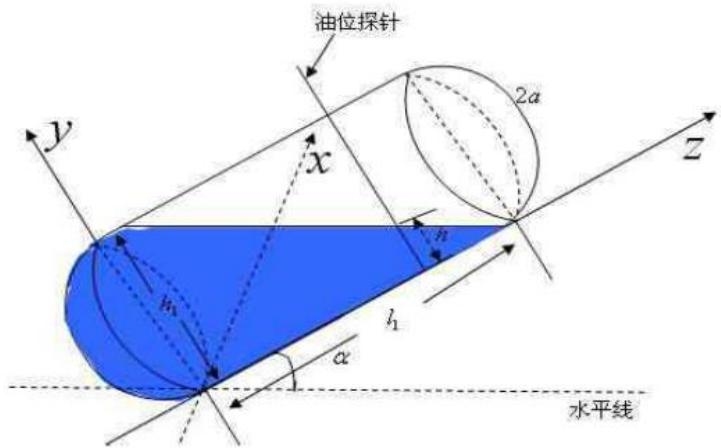

<details>
<summary>text_image</summary>

油位探针
y
x
h₁
l₁
α
水平线
z
2a
</details>

图 4-22

$$
\frac {h}{h _ {1}} = \frac {l _ {1} - a _ {2}}{l _ {2}}, \frac {h _ {1} \tan \alpha - z}{h _ {1} \tan \alpha} = \frac {y _ {0}}{h _ {1}}, S (z) = \int_ {0} ^ {y _ {0}} 2 (a \sin \beta + \sqrt {a ^ {2} - (y - a \cos \beta) ^ {2}}) d y
$$

$$
V _ {1} = \int_ {0} ^ {\frac {h _ {1}}{\tan \alpha}} S (z) d z = \int_ {0} ^ {\frac {h _ {1}}{\tan \alpha}} \int_ {0} ^ {y _ {0}} 2 (a \sin \beta + \sqrt {a ^ {2} - (y - a \cos \beta) ^ {2}}) d y d z
$$

$$
V _ {2} = \frac {V _ {0}}{2} = \frac {A B}{2} \left[ \frac {h _ {1} - B}{B} \sqrt {1 - \left(\frac {h - B}{B}\right) ^ {2}} + \arcsin \frac {h _ {1} - B}{B} + \frac {\pi}{2} \right] + \frac {\pi A C}{B ^ {2}} \left[ B h _ {1} ^ {2} - \frac {1}{3} h _ {1} ^ {3} \right]
$$

$$
\begin{array}{l} V = V _ {1} + V _ {2} \\ = \int_ {0} ^ {\frac {k _ {1}}{\tan \alpha}} \int_ {0} ^ {y _ {0}} 2 (a \sin \beta + \sqrt {a ^ {2} - (y - a \cos \beta) ^ {2}}) d y d z + \\ \frac {A B}{2} \left[ \frac {h _ {1} - B}{B} \sqrt {1 - \left(\frac {h - B}{B}\right) ^ {2}} + \arcsin \frac {h _ {1} - B}{B} + \frac {\pi}{2} \right] + \frac {\pi A C}{B ^ {2}} \left[ B h _ {1} ^ {2} - \frac {1}{3} h _ {1} ^ {3} \right] \\ \end{array}
$$

(2) 当 $h_{1}=2a$ 且 $h\leq2a$ 时，该情况如图 4-23 所示：

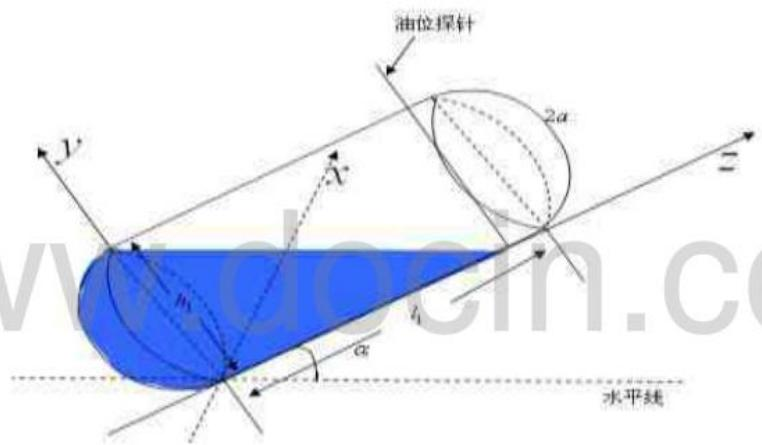

<details>
<summary>text_image</summary>

油位探针
2α
y
l
h₁
l₁
α
水平线
z
</details>

图4-23

$$
S (z) = \int_ {0} ^ {y _ {0}} 2 (a \sin \beta + \sqrt {a ^ {2} - (y - a \cos \beta) ^ {2}}) d y
$$

$$
V _ {1} = \int_ {0} ^ {l _ {1}} S (z) d z = \int_ {0} ^ {l _ {1}} \int_ {0} ^ {y _ {0}} 2 (a \sin \beta + \sqrt {a ^ {2} - (y - a \cos \beta) ^ {2}}) d y d z
$$

$$
V _ {2} = \frac {A B}{2} \left[ \frac {h _ {1} - B}{B} \sqrt {1 - \left(\frac {h - B}{B}\right) ^ {2}} + \arcsin \frac {h _ {1} - B}{B} + \frac {\pi}{2} \right] + \frac {\pi A C}{B ^ {2}} \left[ B h _ {1} ^ {2} - \frac {1}{3} h _ {1} ^ {3} \right]
$$

$$
\begin{array}{l} V = V _ {1} + V _ {2} \\ = \int_ {0} ^ {l _ {1}} \int_ {0} ^ {y _ {0}} 2 (a \sin \beta + \sqrt {a ^ {2} - (y - a \cos \beta) ^ {2}}) d y d z + \\ \frac {A B}{2} \left[ \frac {h _ {1} - B}{B} \sqrt {1 - \left(\frac {h - B}{B}\right) ^ {2}} + \arcsin \frac {h _ {1} - B}{B} + \frac {\pi}{2} \right] + \frac {\pi A C}{B ^ {2}} \left[ B h _ {1} ^ {2} - \frac {1}{3} h _ {1} ^ {3} \right] \\ \end{array}
$$

## § 5 模型的进一步讨论

就第二问我们在上述讨论一般情况分析的基础上对左半部分进行了详细的分析。

$$
S _ {1}: \left\{ \begin{array}{l l} x ^ {2} + y ^ {2} = b _ {0} ^ {2} \\ - (h _ {1} - b _ {0}) \leq x \leq c t g \alpha - (h _ {1} - b _ {0}) \end{array} , \quad z (x, y): z = c t g \alpha [ x + (h _ {1} - b _ {0}) ] \right.
$$

$$
\begin{array}{l} V _ {1} = \iint_ {\substack {x ^ {2} + y ^ {2} \leq b _ {0} ^ {2} \\ - (h _ {1} - b _ {0}) \leq x \leq c t g \alpha - (h _ {1} - b _ {0})}} c t g \alpha [ x + (h _ {1} - b _ {0}) ] d x d y \\ = ctg\alpha \iint \limits_{\substack{x^2 + y^2\leq b^2\\ -(h_1 - b_0)\leq x\leq ctg\alpha -(h_1 - b_0)}}xdxdy + ctg\alpha (h_1 - b_0)S_1 \\ \end{array}
$$

因 $\theta = \arcsin \frac{x_0}{b_0}$

所以阴影部分面积 $= 2\left(\frac{1}{2} b_{0}x_{0}\cos \theta +\theta b_{0}^{2}\right) = b_{0}x_{0}\cos \theta +2\theta b_{0}^{2}$

$$
= b _ {0} x _ {0} \sqrt {1 - \frac {x _ {0} ^ {2}}{b _ {0} ^ {2}}} + 2 b _ {0} ^ {2} \arcsin \frac {x _ {0}}{b _ {0}} = x _ {0} \sqrt {b _ {0} ^ {2} - x _ {0} ^ {2}} + 2 b _ {0} ^ {2} \arcsin \frac {x _ {0}}{b _ {0}}
$$

$$
\Rightarrow S _ {1} = (h _ {1} - b _ {0}) \sqrt {b _ {0} ^ {2} - (h _ {1} - b _ {0}) ^ {2}} + b _ {0} ^ {2} \arcsin \frac {h _ {1} - b _ {0}}{b _ {0}}
$$

$$
+ \left[ c t g \alpha - (h _ {1} - b _ {0}) \right] \sqrt {b _ {0} ^ {2} - \left[ c t g \alpha - (h _ {1} - b _ {0}) \right] ^ {2}} + 2 b _ {0} ^ {2} \arcsin \frac {c t g \alpha - (h _ {1} - b _ {0})}{b _ {0}}
$$

$$
\text{因} \quad \iint_ {\substack {x ^ {2} + y ^ {2} \leq b _ {0} ^ {2} \\ -(h _ {1} - b _ {0}) \leq x \leq c t g \alpha - (h _ {1} - b _ {0})}} x   d x   d y = \int_ {- (h _ {1} - b _ {0})} ^ {c t g \alpha - (h _ {1} - b _ {0})} x   d x \int_ {- \sqrt {b _ {0} ^ {2} - x ^ {2}}} ^ {\sqrt {b _ {0} ^ {2} - x ^ {2}}} d y = \int_ {- (h _ {1} - b _ {0})} ^ {c t g \alpha - (h _ {1} - b _ {0})} \sqrt {b _ {0} ^ {2} - x ^ {2}}   d x ^ {2}
$$

$$
= - \frac {2}{3} \left(b _ {0} ^ {2} - x ^ {2}\right) ^ {\frac {3}{2}} \Bigg | _ {- (h _ {1} - b _ {0})} ^ {c t g \alpha - (h _ {1} - b _ {0})} = \frac {2}{3} \left[ b _ {0} ^ {2} - (h _ {1} - b _ {0}) ^ {2} \right] ^ {\frac {3}{2}} - \frac {2}{3} \left[ b _ {0} ^ {2} - \left[ c t g \alpha - (h _ {1} - b _ {0}) \right] ^ {2} \right] ^ {\frac {3}{2}}
$$

以下方程用来求 $x_{0}$ :

$$
\begin{array}{l} \sqrt {\left(\frac {b _ {0} ^ {2} + h _ {0} ^ {2}}{2 d}\right) ^ {2} - x _ {0} ^ {2}} + \left(l - \frac {b _ {0} ^ {2} - h _ {0} ^ {2}}{2 h _ {0}}\right) = c t g \alpha \left[ x _ {0} + (h _ {1} - b _ {0}) \right] \\ \Rightarrow \left(\frac {b _ {0} ^ {2} + h _ {0} ^ {2}}{2 h _ {0}}\right) ^ {2} - x _ {0} ^ {2} = \left(c t g \alpha \left[ x _ {0} + (h _ {1} - b _ {0}) \right] - \left(l - \frac {b _ {0} ^ {2} - h _ {0} ^ {2}}{2 h _ {0}}\right)\right) ^ {2} \\ \mathrm{令} \Delta = c t g \alpha (h _ {1} - b _ {0}) - \left[ l - \frac {b _ {0} ^ {2} - h _ {0} ^ {2}}{2 h _ {0}} \right] <   0 \\ \Rightarrow \csc^ {2} \alpha x _ {0} ^ {2} + 2 c t g \alpha \cdot \Delta \cdot x _ {0} - \left(\frac {b _ {0} ^ {2} + h _ {0} ^ {2}}{2 h _ {0}}\right) ^ {2} = 0 \\ \Rightarrow x _ {0} = \frac {2 c t g \alpha \cdot \Delta \pm \sqrt {4 c t g ^ {2} \alpha \cdot \Delta^ {2} - 4 \csc^ {2} \alpha \left(\Delta^ {2} - \left(\frac {b _ {0} ^ {2} + h _ {0} ^ {2}}{2 h _ {0}}\right) ^ {2}\right)}}{2 \csc^ {2} \alpha} \\ \frac {c t g \alpha \cdot \Delta \pm \sqrt {c t g ^ {2} \alpha \cdot \Delta^ {2} - \csc^ {2} \alpha \left(\Delta^ {2} - \left(\frac {b _ {0} ^ {2} + h _ {0} ^ {2}}{2 h _ {0}}\right) ^ {2}\right)}}{\csc^ {2} \alpha} \\ V _ {1} = \frac {2}{3} c t g \alpha \left\{\left[ b _ {0} ^ {2} - (h _ {1} - b _ {0}) ^ {2} \right] ^ {\frac {3}{2}} - \left[ \left[ b _ {0} ^ {2} - [ c t g \alpha - (h _ {1} - b _ {0}) ] ^ {2} \right] ^ {\frac {3}{2}} \right] \right\} \\ + c t g \alpha (h _ {1} - b _ {0}) \left\{\left[ c t g \alpha - (h _ {1} - b _ {0}) \right] \sqrt {b _ {0} ^ {2} - \left[ c t g \alpha - (h _ {1} - b _ {0}) \right] ^ {2}} \right\} \\ \end{array}
$$

$$
+ c t g \alpha \left(h _ {1} - b _ {0}\right) \left[ \left(h _ {1} - b _ {0}\right) \sqrt {b _ {0} ^ {2} - \left(h _ {1} - b _ {0}\right) ^ {2}} + b _ {0} ^ {2} \arcsin \frac {h _ {1} - b _ {0}}{b _ {0}} + b _ {0} ^ {2} \arcsin \frac {c t g \alpha - \left(h _ {1} - b _ {0}\right)}{b _ {0}} \right]
$$

首先我们求出截面和球冠体的交线:

$$
\begin{array}{r l} & {\left\{ \begin{array}{l l} {\text {截面}} & {z = c t g   \alpha \left[ x _ {0} + (h _ {1} - b _ {0}) \right]} \\ & \\ {\text {球面方程}} & {x ^ {2} + y ^ {2} + \left[ z - (h _ {3} - \frac {b _ {0} ^ {2} - h _ {0} ^ {2}}{2 h _ {0}}) \right] ^ {2} \leq \left[ \frac {b _ {0} ^ {2} + h _ {0} ^ {2}}{2 h _ {0}} \right] ^ {2}} \\ & \\ {z \geq l} \end{array} \right.} \end{array}
$$

## § 6 模型的优缺点

## § 6.1 优点

(1) 对于问题一, 从储油罐无变位与变位两个方面建立了模型, 求得的储油量理论值与储油量实际值吻合得较好, 相对误差小; 特别是水平时相对误差稳定, 符合要求, 因此能准确的预测出罐体变位后油位高度间隔为 $1 \mathrm{~cm}$ 的罐容表标定值。  
(2) 对于问题二, 先就一般情况考虑, 再细分成 8 种情形, 思维缜密, 考虑周到。利用 Matlab 软件求出值, 求得各高度下的储油量理论值与储油量实际值吻合得较好, 相对误差小, 符合要求, 因此能准确的预测出罐体变位后油位高度间隔为 $10 \mathrm{~cm}$ 的罐容表标定值。  
（3）模型实用性好，具有很强的现实应用指导意义，数学推导严谨，理论性强。

## § 6.2 缺点

模型的假设不够充分,对误差的检验不够详细,没有从多方面进行误差诊断。

## §7 参考文献

[1]韩中庚.数学建模竞赛-获奖论文精选与点评[M].北京：科学出版社,2007.  
[2] 王文波. 数学建模及其基础知识详解 [M]. 武汉：武汉大学出版社，2006.  
[3] 王庚，王敏生. 现代数学建模方法 [M]. 北京: 科学出版社, 2006.  
[4]赵静,但琦.数学建模与数学实验[M].北京:高等教育出版社,2007.  
[5]姜启源, 谢金星, 叶俊. 数学模型 [M]. 北京: 高等教育出版社, 2003.  
[6]冯杰, 黄力伟, 王勤, 尹成义. 数学建模原理与案例 [M]. 北京: 科学出版社, 2007.

## § 7 附录

## § 7.1 附件 1

表 7-1 无变位进油

<table><tr><td>流水号</td><td>油罐号</td><td>累加进油量/L</td><td>油位高度/mm</td><td>采集时间</td></tr><tr><td>11</td><td>1</td><td>50</td><td>159.02</td><td>2010-08-18 10:32:18</td></tr><tr><td>12</td><td>1</td><td>100</td><td>176.14</td><td>2010-08-18 10:33:18</td></tr><tr><td>13</td><td>1</td><td>150</td><td>192.59</td><td>2010-08-18 10:34:18</td></tr><tr><td>14</td><td>1</td><td>200</td><td>208.5</td><td>2010-08-18 10:35:18</td></tr><tr><td>15</td><td>1</td><td>250</td><td>223.93</td><td>2010-08-18 10:36:18</td></tr><tr><td>16</td><td>1</td><td>300</td><td>238.97</td><td>2010-08-18 10:37:08</td></tr><tr><td>17</td><td>1</td><td>350</td><td>253.66</td><td>2010-08-18 10:38:08</td></tr><tr><td>18</td><td>1</td><td>400</td><td>268.04</td><td>2010-08-18 10:39:08</td></tr><tr><td>19</td><td>1</td><td>450</td><td>282.16</td><td>2010-08-18 10:40:08</td></tr><tr><td>20</td><td>1</td><td>500</td><td>296.03</td><td>2010-08-18 10:41:08</td></tr><tr><td>21</td><td>1</td><td>550</td><td>309.69</td><td>2010-08-18 10:41:58</td></tr><tr><td>22</td><td>1</td><td>600</td><td>323.15</td><td>2010-08-18 10:42:58</td></tr><tr><td>23</td><td>1</td><td>650</td><td>336.44</td><td>2010-08-18 10:43:58</td></tr><tr><td>24</td><td>1</td><td>700</td><td>349.57</td><td>2010-08-18 10:45:18</td></tr><tr><td>25</td><td>1</td><td>750</td><td>362.56</td><td>2010-08-18 10:46:08</td></tr><tr><td>26</td><td>1</td><td>800</td><td>375.42</td><td>2010-08-18 10:47:08</td></tr><tr><td>27</td><td>1</td><td>850</td><td>388.16</td><td>2010-08-18 10:48:08</td></tr><tr><td>28</td><td>1</td><td>900</td><td>400.79</td><td>2010-08-18 10:49:08</td></tr><tr><td>29</td><td>1</td><td>950</td><td>413.32</td><td>2010-08-18 10:49:58</td></tr><tr><td>30</td><td>1</td><td>1000</td><td>425.76</td><td>2010-08-18 10:50:58</td></tr><tr><td>31</td><td>1</td><td>1050</td><td>438.12</td><td>2010-08-18 10:51:58</td></tr><tr><td>32</td><td>1</td><td>1100</td><td>450.4</td><td>2010-08-18 10:52:48</td></tr><tr><td>33</td><td>1</td><td>1150</td><td>462.62</td><td>2010-08-18 10:53:48</td></tr><tr><td>34</td><td>1</td><td>1200</td><td>474.78</td><td>2010-08-18 10:54:48</td></tr><tr><td>35</td><td>1</td><td>1250</td><td>486.89</td><td>2010-08-18 10:55:48</td></tr><tr><td>36</td><td>1</td><td>1300</td><td>498.95</td><td>2010-08-18 10:56:38</td></tr><tr><td>37</td><td>1</td><td>1350</td><td>510.97</td><td>2010-08-18 10:57:38</td></tr><tr><td>38</td><td>1</td><td>1400</td><td>522.95</td><td>2010-08-18 10:58:38</td></tr><tr><td>39</td><td>1</td><td>1450</td><td>534.9</td><td>2010-08-18 10:59:28</td></tr><tr><td>40</td><td>1</td><td>1500</td><td>546.82</td><td>2010-08-18 11:00:28</td></tr><tr><td>41</td><td>1</td><td>1550</td><td>558.72</td><td>2010-08-18 11:01:18</td></tr><tr><td>42</td><td>1</td><td>1600</td><td>570.61</td><td>2010-08-18 11:02:18</td></tr><tr><td>43</td><td>1</td><td>1650</td><td>582.48</td><td>2010-08-18 11:03:18</td></tr><tr><td>44</td><td>1</td><td>1700</td><td>594.35</td><td>2010-08-18 11:04:08</td></tr><tr><td>45</td><td>1</td><td>1750</td><td>606.22</td><td>2010-08-18 11:05:08</td></tr><tr><td>46</td><td>1</td><td>1800</td><td>618.09</td><td>2010-08-18 11:05:58</td></tr><tr><td>47</td><td>1</td><td>1850</td><td>629.96</td><td>2010-08-18 11:06:58</td></tr><tr><td>48</td><td>1</td><td>1900</td><td>641.85</td><td>2010-08-18 11:07:58</td></tr><tr><td>49</td><td>1</td><td>1950</td><td>653.75</td><td>2010-08-18 11:08:48</td></tr><tr><td>50</td><td>1</td><td>2000</td><td>665.67</td><td>2010-08-18 11:09:48</td></tr><tr><td>51</td><td>1</td><td>2050</td><td>677.63</td><td>2010-08-18 11:10:48</td></tr><tr><td>52</td><td>1</td><td>2053.83</td><td>678.54</td><td>2010-08-18 11:11:18</td></tr><tr><td>53</td><td>1</td><td>2103.83</td><td>690.53</td><td>2010-08-18 11:12:18</td></tr><tr><td>54</td><td>1</td><td>2105.06</td><td>690.82</td><td>2010-08-18 12:36:18</td></tr><tr><td>55</td><td>1</td><td>2155.06</td><td>702.85</td><td>2010-08-18 12:37:18</td></tr><tr><td>56</td><td>1</td><td>2205.06</td><td>714.91</td><td>2010-08-18 12:38:18</td></tr><tr><td>57</td><td>1</td><td>2255.06</td><td>727.03</td><td>2010-08-18 12:39:18</td></tr><tr><td>58</td><td>1</td><td>2305.06</td><td>739.19</td><td>2010-08-18 12:40:18</td></tr><tr><td>59</td><td>1</td><td>2355.06</td><td>751.42</td><td>2010-08-18 12:41:18</td></tr><tr><td>60</td><td>1</td><td>2404.98</td><td>763.7</td><td>2010-08-18 12:42:18</td></tr><tr><td>61</td><td>1</td><td>2406.83</td><td>764.16</td><td>2010-08-18 12:50:28</td></tr><tr><td>62</td><td>1</td><td>2456.83</td><td>776.53</td><td>2010-08-18 12:51:38</td></tr><tr><td>63</td><td>1</td><td>2506.83</td><td>788.99</td><td>2010-08-18 12:53:08</td></tr><tr><td>64</td><td>1</td><td>2556.83</td><td>801.54</td><td>2010-08-18 12:54:08</td></tr><tr><td>65</td><td>1</td><td>2606.83</td><td>814.19</td><td>2010-08-18 12:54:58</td></tr><tr><td>66</td><td>1</td><td>2656.83</td><td>826.95</td><td>2010-08-18 12:56:08</td></tr><tr><td>67</td><td>1</td><td>2706.83</td><td>839.83</td><td>2010-08-18 12:57:08</td></tr><tr><td>68</td><td>1</td><td>2756.83</td><td>852.84</td><td>2010-08-18 12:58:08</td></tr><tr><td>69</td><td>1</td><td>2806.83</td><td>866</td><td>2010-08-18 12:59:08</td></tr><tr><td>70</td><td>1</td><td>2856.83</td><td>879.32</td><td>2010-08-18 13:00:08</td></tr><tr><td>71</td><td>1</td><td>2906.83</td><td>892.82</td><td>2010-08-18 13:01:38</td></tr><tr><td>72</td><td>1</td><td>2906.91</td><td>892.84</td><td>2010-08-18 13:02:18</td></tr><tr><td>73</td><td>1</td><td>2956.91</td><td>906.53</td><td>2010-08-18 13:03:28</td></tr><tr><td>74</td><td>1</td><td>3006.91</td><td>920.45</td><td>2010-08-18 13:04:28</td></tr><tr><td>75</td><td>1</td><td>3056.91</td><td>934.61</td><td>2010-08-18 13:05:28</td></tr><tr><td>76</td><td>1</td><td>3106.91</td><td>949.05</td><td>2010-08-18 13:06:18</td></tr><tr><td>77</td><td>1</td><td>3156.91</td><td>963.8</td><td>2010-08-18 13:07:28</td></tr><tr><td>78</td><td>1</td><td>3206.91</td><td>978.91</td><td>2010-08-18 13:08:18</td></tr><tr><td>79</td><td>1</td><td>3256.91</td><td>994.43</td><td>2010-08-18 13:09:18</td></tr><tr><td>80</td><td>1</td><td>3306.91</td><td>1010.43</td><td>2010-08-18 13:10:28</td></tr><tr><td>81</td><td>1</td><td>3356.91</td><td>1026.99</td><td>2010-08-18 13:11:28</td></tr><tr><td>82</td><td>1</td><td>3406.91</td><td>1044.25</td><td>2010-08-18 13:12:28</td></tr><tr><td>83</td><td>1</td><td>3456.91</td><td>1062.37</td><td>2010-08-18 13:13:28</td></tr><tr><td>84</td><td>1</td><td>3506.91</td><td>1081.59</td><td>2010-08-18 13:14:18</td></tr><tr><td>85</td><td>1</td><td>3556.91</td><td>1102.33</td><td>2010-08-18 13:15:18</td></tr><tr><td>86</td><td>1</td><td>3606.91</td><td>1125.32</td><td>2010-08-18 13:16:28</td></tr><tr><td>87</td><td>1</td><td>3656.91</td><td>1152.36</td><td>2010-08-18 13:17:28</td></tr><tr><td>88</td><td>1</td><td>3706.91</td><td>1193.49</td><td>2010-08-18 13:18:28</td></tr></table>

注：（1）罐体无变位进油，罐内油量初值262L；  
(2) 第三列累加进油量是每次加入一定量油后的累加值;  
(3) 第四列是原罐内初始油量加入相应油量后油位高度值。

表 7-2 无变位出油

<table><tr><td>流水号</td><td>油罐号</td><td>累加出油量/L</td><td>油位高度/mm</td><td>采集时间</td></tr><tr><td>111</td><td>1</td><td>52.72</td><td>1150.72</td><td>2010-08-18 14:31:01</td></tr><tr><td>112</td><td>1</td><td>102.72</td><td>1123.99</td><td>2010-08-18 14:31:56</td></tr><tr><td>113</td><td>1</td><td>152.72</td><td>1101.15</td><td>2010-08-18 14:32:56</td></tr><tr><td>114</td><td>1</td><td>202.72</td><td>1080.51</td><td>2010-08-18 14:33:46</td></tr><tr><td>115</td><td>1</td><td>252.72</td><td>1061.36</td><td>2010-08-18 14:34:46</td></tr><tr><td>116</td><td>1</td><td>302.72</td><td>1043.29</td><td>2010-08-18 14:35:46</td></tr><tr><td>117</td><td>1</td><td>352.72</td><td>1026.08</td><td>2010-08-18 14:36:36</td></tr><tr><td>118</td><td>1</td><td>402.72</td><td>1009.54</td><td>2010-08-18 14:37:36</td></tr><tr><td>119</td><td>1</td><td>452.72</td><td>993.57</td><td>2010-08-18 14:38:26</td></tr><tr><td>120</td><td>1</td><td>502.72</td><td>978.08</td><td>2010-08-18 14:39:26</td></tr><tr><td>121</td><td>1</td><td>552.72</td><td>962.99</td><td>2010-08-18 14:40:16</td></tr><tr><td>122</td><td>1</td><td>602.72</td><td>948.26</td><td>2010-08-18 14:41:16</td></tr><tr><td>123</td><td>1</td><td>652.72</td><td>933.84</td><td>2010-08-18 14:42:06</td></tr><tr><td>124</td><td>1</td><td>702.72</td><td>919.69</td><td>2010-08-18 14:43:06</td></tr><tr><td>125</td><td>1</td><td>752.72</td><td>905.78</td><td>2010-08-18 14:43:56</td></tr><tr><td>126</td><td>1</td><td>802.72</td><td>892.1</td><td>2010-08-18 14:44:56</td></tr><tr><td>127</td><td>1</td><td>852.72</td><td>878.61</td><td>2010-08-18 14:45:46</td></tr><tr><td>128</td><td>1</td><td>902.72</td><td>865.3</td><td>2010-08-18 14:46:46</td></tr><tr><td>129</td><td>1</td><td>952.72</td><td>852.15</td><td>2010-08-18 14:47:36</td></tr><tr><td>130</td><td>1</td><td>1002.72</td><td>839.14</td><td>2010-08-18 14:48:36</td></tr><tr><td>131</td><td>1</td><td>1052.72</td><td>826.27</td><td>2010-08-18 14:49:26</td></tr><tr><td>132</td><td>1</td><td>1102.72</td><td>813.52</td><td>2010-08-18 14:50:26</td></tr><tr><td>133</td><td>1</td><td>1152.72</td><td>800.87</td><td>2010-08-18 14:51:16</td></tr><tr><td>134</td><td>1</td><td>1202.72</td><td>788.33</td><td>2010-08-18 14:52:16</td></tr><tr><td>135</td><td>1</td><td>1252.72</td><td>775.88</td><td>2010-08-18 14:53:16</td></tr><tr><td>136</td><td>1</td><td>1302.72</td><td>763.51</td><td>2010-08-18 14:54:06</td></tr><tr><td>137</td><td>1</td><td>1352.72</td><td>751.21</td><td>2010-08-18 14:55:06</td></tr><tr><td>138</td><td>1</td><td>1402.72</td><td>738.98</td><td>2010-08-18 14:56:06</td></tr><tr><td>139</td><td>1</td><td>1452.72</td><td>726.81</td><td>2010-08-18 14:56:56</td></tr><tr><td>140</td><td>1</td><td>1502.72</td><td>714.7</td><td>2010-08-18 14:57:56</td></tr><tr><td>141</td><td>1</td><td>1552.72</td><td>702.64</td><td>2010-08-18 14:58:46</td></tr><tr><td>142</td><td>1</td><td>1602.72</td><td>690.61</td><td>2010-08-18 14:59:46</td></tr><tr><td>143</td><td>1</td><td>1652.72</td><td>678.63</td><td>2010-08-18 15:00:36</td></tr><tr><td>144</td><td>1</td><td>1702.72</td><td>666.68</td><td>2010-08-18 15:01:36</td></tr><tr><td>145</td><td>1</td><td>1752.72</td><td>654.75</td><td>2010-08-18 15:02:36</td></tr><tr><td>146</td><td>1</td><td>1802.72</td><td>642.84</td><td>2010-08-18 15:03:26</td></tr><tr><td>147</td><td>1</td><td>1852.72</td><td>630.96</td><td>2010-08-18 15:04:26</td></tr><tr><td>148</td><td>1</td><td>1902.72</td><td>619.08</td><td>2010-08-18 15:05:16</td></tr><tr><td>149</td><td>1</td><td>1952.72</td><td>607.21</td><td>2010-08-18 15:06:16</td></tr><tr><td>150</td><td>1</td><td>2002.72</td><td>595.35</td><td>2010-08-18 15:07:06</td></tr><tr><td>151</td><td>1</td><td>2052.72</td><td>583.48</td><td>2010-08-18 15:08:06</td></tr><tr><td>152</td><td>1</td><td>2102.72</td><td>571.61</td><td>2010-08-18 15:09:06</td></tr><tr><td>153</td><td>1</td><td>2152.72</td><td>559.72</td><td>2010-08-18 15:09:56</td></tr><tr><td>154</td><td>1</td><td>2202.72</td><td>547.82</td><td>2010-08-18 15:10:56</td></tr><tr><td>155</td><td>1</td><td>2252.72</td><td>535.9</td><td>2010-08-18 15:11:46</td></tr><tr><td>156</td><td>1</td><td>2302.72</td><td>523.95</td><td>2010-08-18 15:12:46</td></tr><tr><td>157</td><td>1</td><td>2352.72</td><td>511.97</td><td>2010-08-18 15:13:36</td></tr><tr><td>158</td><td>1</td><td>2402.72</td><td>499.96</td><td>2010-08-18 15:14:36</td></tr><tr><td>159</td><td>1</td><td>2452.72</td><td>487.9</td><td>2010-08-18 15:15:36</td></tr><tr><td>160</td><td>1</td><td>2502.72</td><td>475.8</td><td>2010-08-18 15:16:26</td></tr><tr><td>161</td><td>1</td><td>2552.72</td><td>463.65</td><td>2010-08-18 15:17:26</td></tr><tr><td>162</td><td>1</td><td>2602.72</td><td>451.43</td><td>2010-08-18 15:18:26</td></tr><tr><td>163</td><td>1</td><td>2652.72</td><td>439.15</td><td>2010-08-18 15:19:16</td></tr><tr><td>164</td><td>1</td><td>2702.72</td><td>426.8</td><td>2010-08-18 15:20:16</td></tr><tr><td>165</td><td>1</td><td>2752.72</td><td>414.36</td><td>2010-08-18 15:21:16</td></tr><tr><td>166</td><td>1</td><td>2802.72</td><td>401.84</td><td>2010-08-18 15:22:06</td></tr><tr><td>167</td><td>1</td><td>2852.72</td><td>389.22</td><td>2010-08-18 15:23:06</td></tr><tr><td>168</td><td>1</td><td>2902.72</td><td>376.49</td><td>2010-08-18 15:23:56</td></tr><tr><td>169</td><td>1</td><td>2952.72</td><td>363.64</td><td>2010-08-18 15:24:56</td></tr><tr><td>170</td><td>1</td><td>3002.72</td><td>350.67</td><td>2010-08-18 15:25:56</td></tr><tr><td>171</td><td>1</td><td>3052.72</td><td>337.55</td><td>2010-08-18 15:26:46</td></tr><tr><td>172</td><td>1</td><td>3102.72</td><td>324.27</td><td>2010-08-18 15:27:46</td></tr><tr><td>173</td><td>1</td><td>3152.72</td><td>310.82</td><td>2010-08-18 15:28:46</td></tr><tr><td>174</td><td>1</td><td>3202.72</td><td>297.18</td><td>2010-08-18 15:29:36</td></tr><tr><td>175</td><td>1</td><td>3252.72</td><td>283.33</td><td>2010-08-18 15:30:36</td></tr><tr><td>176</td><td>1</td><td>3302.72</td><td>269.24</td><td>2010-08-18 15:31:26</td></tr><tr><td>177</td><td>1</td><td>3352.72</td><td>254.88</td><td>2010-08-18 15:32:26</td></tr><tr><td>178</td><td>1</td><td>3402.72</td><td>240.21</td><td>2010-08-18 15:33:26</td></tr><tr><td>179</td><td>1</td><td>3452.72</td><td>225.21</td><td>2010-08-18 15:34:26</td></tr><tr><td>180</td><td>1</td><td>3502.72</td><td>209.81</td><td>2010-08-18 15:35:16</td></tr><tr><td>181</td><td>1</td><td>3552.72</td><td>193.94</td><td>2010-08-18 15:36:16</td></tr><tr><td>182</td><td>1</td><td>3602.72</td><td>177.54</td><td>2010-08-18 15:37:16</td></tr><tr><td>183</td><td>1</td><td>3652.72</td><td>160.48</td><td>2010-08-18 15:38:06</td></tr><tr><td>184</td><td>1.00</td><td>3702.72</td><td>142.62</td><td>2010-08-18 15:39:06</td></tr></table>

注：（1）罐体无变位出油；  
(2) 第三列的累加出油量是每次抽出一定量油后的累加值;  
(3) 第四列是从罐内抽出相应油量后油位高度值。

表 7-3 倾斜变位进油

<table><tr><td>流水号</td><td>油罐号</td><td>累加进油量/L</td><td>油位高度/mm</td><td>采集时间</td></tr><tr><td>211</td><td>1</td><td>747.86</td><td>411.29</td><td>2010-08-19 15:10:27</td></tr><tr><td>212</td><td>1</td><td>797.86</td><td>423.45</td><td>2010-08-19 15:11:27</td></tr><tr><td>213</td><td>1</td><td>847.86</td><td>438.33</td><td>2010-08-19 15:12:37</td></tr><tr><td>214</td><td>1</td><td>897.86</td><td>450.54</td><td>2010-08-19 15:13:27</td></tr><tr><td>215</td><td>1</td><td>947.86</td><td>463.9</td><td>2010-08-19 15:14:27</td></tr><tr><td>216</td><td>1</td><td>997.86</td><td>477.74</td><td>2010-08-19 15:15:37</td></tr><tr><td>217</td><td>1</td><td>1047.86</td><td>489.37</td><td>2010-08-19 15:16:27</td></tr><tr><td>218</td><td>1</td><td>1097.79</td><td>502.56</td><td>2010-08-19 15:17:27</td></tr><tr><td>219</td><td>1</td><td>1147.79</td><td>514.69</td><td>2010-08-19 15:18:27</td></tr><tr><td>220</td><td>1</td><td>1197.73</td><td>526.84</td><td>2010-08-19 15:19:27</td></tr><tr><td>221</td><td>1</td><td>1247.73</td><td>538.88</td><td>2010-08-19 15:20:37</td></tr><tr><td>222</td><td>1</td><td>1297.73</td><td>551.96</td><td>2010-08-19 15:21:37</td></tr><tr><td>223</td><td>1</td><td>1347.73</td><td>564.4</td><td>2010-08-19 15:22:37</td></tr><tr><td>224</td><td>1</td><td>1397.73</td><td>576.56</td><td>2010-08-19 15:23:37</td></tr><tr><td>225</td><td>1</td><td>1447.73</td><td>588.74</td><td>2010-08-19 15:24:37</td></tr><tr><td>226</td><td>1</td><td>1497.73</td><td>599.56</td><td>2010-08-19 15:25:37</td></tr><tr><td>227</td><td>1</td><td>1547.73</td><td>611.62</td><td>2010-08-19 15:26:37</td></tr><tr><td>228</td><td>1</td><td>1597.73</td><td>623.44</td><td>2010-08-19 15:27:37</td></tr><tr><td>229</td><td>1</td><td>1647.73</td><td>635.58</td><td>2010-08-19 15:28:37</td></tr><tr><td>230</td><td>1</td><td>1697.73</td><td>646.28</td><td>2010-08-19 15:29:27</td></tr><tr><td>231</td><td>1</td><td>1747.73</td><td>658.59</td><td>2010-08-19 15:30:27</td></tr><tr><td>232</td><td>1</td><td>1797.73</td><td>670.22</td><td>2010-08-19 15:31:27</td></tr><tr><td>233</td><td>1</td><td>1847.73</td><td>680.63</td><td>2010-08-19 15:32:17</td></tr><tr><td>234</td><td>1</td><td>1897.73</td><td>693.03</td><td>2010-08-19 15:33:17</td></tr><tr><td>235</td><td>1</td><td>1947.73</td><td>704.67</td><td>2010-08-19 15:34:17</td></tr><tr><td>236</td><td>1</td><td>1997.73</td><td>716.45</td><td>2010-08-19 15:35:17</td></tr><tr><td>237</td><td>1</td><td>2047.73</td><td>727.66</td><td>2010-08-19 15:36:17</td></tr><tr><td>238</td><td>1</td><td>2097.73</td><td>739.39</td><td>2010-08-19 15:37:17</td></tr><tr><td>239</td><td>1</td><td>2147.73</td><td>750.9</td><td>2010-08-19 15:38:17</td></tr><tr><td>240</td><td>1</td><td>2197.73</td><td>761.55</td><td>2010-08-19 15:39:07</td></tr><tr><td>241</td><td>1</td><td>2247.73</td><td>773.43</td><td>2010-08-19 15:40:07</td></tr><tr><td>242</td><td>1</td><td>2297.73</td><td>785.39</td><td>2010-08-19 15:41:07</td></tr><tr><td>243</td><td>1</td><td>2347.73</td><td>796.04</td><td>2010-08-19 15:41:57</td></tr><tr><td>244</td><td>1</td><td>2397.73</td><td>808.27</td><td>2010-08-19 15:42:57</td></tr><tr><td>245</td><td>1</td><td>2447.73</td><td>820.8</td><td>2010-08-19 15:43:57</td></tr><tr><td>246</td><td>1</td><td>2497.73</td><td>832.8</td><td>2010-08-19 15:44:57</td></tr><tr><td>247</td><td>1</td><td>2547.73</td><td>844.47</td><td>2010-08-19 15:45:57</td></tr><tr><td>248</td><td>1</td><td>2597.73</td><td>856.29</td><td>2010-08-19 15:46:57</td></tr><tr><td>249</td><td>1</td><td>2647.73</td><td>867.6</td><td>2010-08-19 15:47:47</td></tr><tr><td>250</td><td>1</td><td>2697.73</td><td>880.06</td><td>2010-08-19 15:48:47</td></tr><tr><td>251</td><td>1</td><td>2747.73</td><td>892.92</td><td>2010-08-19 15:49:57</td></tr><tr><td>252</td><td>1</td><td>2797.73</td><td>904.34</td><td>2010-08-19 15:50:57</td></tr><tr><td>253</td><td>1</td><td>2847.73</td><td>917.34</td><td>2010-08-19 15:51:57</td></tr><tr><td>254</td><td>1</td><td>2897.73</td><td>929.9</td><td>2010-08-19 15:52:57</td></tr><tr><td>255</td><td>1</td><td>2947.73</td><td>941.42</td><td>2010-08-19 15:53:47</td></tr><tr><td>256</td><td>1</td><td>2997.73</td><td>954.6</td><td>2010-08-19 15:54:47</td></tr><tr><td>257</td><td>1</td><td>3047.73</td><td>968.09</td><td>2010-08-19 15:55:47</td></tr><tr><td>258</td><td>1</td><td>3097.73</td><td>980.14</td><td>2010-08-19 15:56:37</td></tr><tr><td>259</td><td>1</td><td>3147.73</td><td>992.41</td><td>2010-08-19 15:57:37</td></tr><tr><td>260</td><td>1</td><td>3197.73</td><td>1006.34</td><td>2010-08-19 15:58:37</td></tr><tr><td>261</td><td>1</td><td>3247.73</td><td>1019.07</td><td>2010-08-19 15:59:27</td></tr><tr><td>262</td><td>1</td><td>3297.73</td><td>1034.24</td><td>2010-08-19 16:00:37</td></tr><tr><td>263</td><td>1</td><td>3299.74</td><td>1035.36</td><td>2010-08-19 16:01:27</td></tr></table>

注：（1）罐体纵向倾斜变位进油，纵向倾斜角 $4.1^{\circ}$ ，罐内油量初值215L；  
(2) 第三列累加进油量是每次加入一定量油后的累加值;  
(3) 第四列是原罐内油量加入相应油量后油位高度值。

表 7-4 倾斜变位出油

<table><tr><td>流水号</td><td>油罐号</td><td>累加出油量/L</td><td>油位高度/mm</td><td>采集时间</td></tr><tr><td>311</td><td>1</td><td>50</td><td>1020.65</td><td>2010-08-19 16:10:31</td></tr><tr><td>312</td><td>1</td><td>100</td><td>1007.73</td><td>2010-08-19 16:11:21</td></tr><tr><td>313</td><td>1</td><td>150</td><td>994.32</td><td>2010-08-19 16:12:21</td></tr><tr><td>314</td><td>1</td><td>200</td><td>980.96</td><td>2010-08-19 16:13:11</td></tr><tr><td>315</td><td>1</td><td>250</td><td>967.1</td><td>2010-08-19 16:14:11</td></tr><tr><td>316</td><td>1</td><td>300</td><td>956.01</td><td>2010-08-19 16:15:01</td></tr><tr><td>317</td><td>1</td><td>350</td><td>941.54</td><td>2010-08-19 16:16:01</td></tr><tr><td>318</td><td>1</td><td>400</td><td>929.69</td><td>2010-08-19 16:16:51</td></tr><tr><td>319</td><td>1</td><td>450</td><td>916.44</td><td>2010-08-19 16:17:51</td></tr><tr><td>320</td><td>1</td><td>500</td><td>904.14</td><td>2010-08-19 16:18:51</td></tr><tr><td>321</td><td>1</td><td>550</td><td>891.9</td><td>2010-08-19 16:19:41</td></tr><tr><td>322</td><td>1</td><td>600</td><td>879.23</td><td>2010-08-19 16:20:41</td></tr><tr><td>323</td><td>1</td><td>650</td><td>868.99</td><td>2010-08-19 16:21:31</td></tr><tr><td>324</td><td>1</td><td>700</td><td>855.13</td><td>2010-08-19 16:22:31</td></tr><tr><td>325</td><td>1</td><td>750</td><td>844.02</td><td>2010-08-19 16:23:21</td></tr><tr><td>326</td><td>1</td><td>800</td><td>831.64</td><td>2010-08-19 16:24:21</td></tr><tr><td>327</td><td>1</td><td>850</td><td>820.47</td><td>2010-08-19 16:25:11</td></tr><tr><td>328</td><td>1</td><td>900</td><td>808.16</td><td>2010-08-19 16:26:11</td></tr><tr><td>329</td><td>1</td><td>950</td><td>796</td><td>2010-08-19 16:27:11</td></tr><tr><td>330</td><td>1</td><td>1000</td><td>785.04</td><td>2010-08-19 16:28:01</td></tr><tr><td>331</td><td>1</td><td>1050</td><td>773.07</td><td>2010-08-19 16:29:01</td></tr><tr><td>332</td><td>1</td><td>1100</td><td>762.09</td><td>2010-08-19 16:29:51</td></tr><tr><td>333</td><td>1</td><td>1150</td><td>750.81</td><td>2010-08-19 16:30:51</td></tr><tr><td>334</td><td>1</td><td>1200</td><td>739.42</td><td>2010-08-19 16:31:41</td></tr><tr><td>335</td><td>1</td><td>1250</td><td>727.09</td><td>2010-08-19 16:32:41</td></tr><tr><td>336</td><td>1</td><td>1300</td><td>715.32</td><td>2010-08-19 16:33:41</td></tr><tr><td>337</td><td>1</td><td>1350</td><td>705.43</td><td>2010-08-19 16:34:31</td></tr><tr><td>338</td><td>1</td><td>1400</td><td>693.52</td><td>2010-08-19 16:35:31</td></tr><tr><td>339</td><td>1</td><td>1450</td><td>682.5</td><td>2010-08-19 16:36:21</td></tr><tr><td>340</td><td>1</td><td>1500</td><td>671.02</td><td>2010-08-19 16:37:21</td></tr><tr><td>341</td><td>1</td><td>1550</td><td>658.68</td><td>2010-08-19 16:38:21</td></tr><tr><td>342</td><td>1</td><td>1600</td><td>647.74</td><td>2010-08-19 16:39:11</td></tr><tr><td>343</td><td>1</td><td>1650</td><td>635.76</td><td>2010-08-19 16:40:11</td></tr><tr><td>344</td><td>1</td><td>1700</td><td>624.61</td><td>2010-08-19 16:41:01</td></tr><tr><td>345</td><td>1</td><td>1750</td><td>612.53</td><td>2010-08-19 16:42:01</td></tr><tr><td>346</td><td>1</td><td>1800</td><td>600.69</td><td>2010-08-19 16:43:01</td></tr><tr><td>347</td><td>1</td><td>1850</td><td>589.4</td><td>2010-08-19 16:43:51</td></tr><tr><td>348</td><td>1</td><td>1900</td><td>577</td><td>2010-08-19 16:44:51</td></tr><tr><td>349</td><td>1</td><td>1950</td><td>564.58</td><td>2010-08-19 16:45:51</td></tr><tr><td>350</td><td>1</td><td>2000</td><td>554.33</td><td>2010-08-19 16:46:41</td></tr><tr><td>351</td><td>1</td><td>2050</td><td>540.76</td><td>2010-08-19 16:47:41</td></tr><tr><td>352</td><td>1</td><td>2100</td><td>528.65</td><td>2010-08-19 16:48:41</td></tr><tr><td>353</td><td>1</td><td>2150</td><td>517.19</td><td>2010-08-19 16:49:31</td></tr><tr><td>354</td><td>1</td><td>2200</td><td>504.87</td><td>2010-08-19 16:50:31</td></tr><tr><td>355</td><td>1</td><td>2250</td><td>490.78</td><td>2010-08-19 16:51:51</td></tr><tr><td>356</td><td>1</td><td>2300</td><td>478.06</td><td>2010-08-19 16:52:51</td></tr><tr><td>357</td><td>1</td><td>2350</td><td>465.97</td><td>2010-08-19 16:53:41</td></tr><tr><td>358</td><td>1</td><td>2400</td><td>452.4</td><td>2010-08-19 16:54:41</td></tr><tr><td>359</td><td>1</td><td>2450</td><td>439.98</td><td>2010-08-19 16:55:31</td></tr><tr><td>360</td><td>1</td><td>2500</td><td>425.83</td><td>2010-08-19 16:56:31</td></tr><tr><td>361</td><td>1</td><td>2550</td><td>411.73</td><td>2010-08-19 16:57:31</td></tr></table>

注：（1）罐体纵向倾斜变位出油，纵向倾斜角4.1°；  
(2) 第三列累加出油量是每次抽出一定量油后的累加值;  
(3) 第四列是原罐内油量抽出一定量油后的油位高度值。

## § 7.2 附件 2

表 7-5 实际储油罐的采集数据

<table><tr><td>流水号</td><td>油罐号</td><td>进油量/L</td><td>出油量/L</td><td>显示油高/mm</td><td>显示油量容积/L</td><td>采集时间</td></tr><tr><td>201</td><td>02</td><td>0</td><td>60.00</td><td>2632.23</td><td>60448.88</td><td>2010-08-0108:00:49</td></tr><tr><td>202</td><td>02</td><td>0</td><td>149.09</td><td>2624.30</td><td>60311.43</td><td>2010-08-0108:15:42</td></tr><tr><td>203</td><td>02</td><td>0</td><td>68.45</td><td>2620.67</td><td>60248.03</td><td>2010-08-0108:23:41</td></tr><tr><td>204</td><td>02</td><td>0</td><td>199.27</td><td>2610.29</td><td>60065.11</td><td>2010-08-0108:38:14</td></tr><tr><td>205</td><td>02</td><td>0</td><td>70.05</td><td>2606.61</td><td>59999.69</td><td>2010-08-0108:53:08</td></tr><tr><td>206</td><td>02</td><td>0</td><td>136.36</td><td>2599.59</td><td>59874.06</td><td>2010-08-0109:08:01</td></tr><tr><td>207</td><td>02</td><td>0</td><td>232.74</td><td>2587.60</td><td>59657.02</td><td>2010-08-0109:32:06</td></tr><tr><td>208</td><td>02</td><td>0</td><td>107.97</td><td>2582.05</td><td>59555.51</td><td>2010-08-0109:56:18</td></tr><tr><td>209</td><td>02</td><td>0</td><td>49.24</td><td>2579.57</td><td>59509.94</td><td>2010-08-0110:10:09</td></tr><tr><td>210</td><td>02</td><td>0</td><td>80.65</td><td>2575.44</td><td>59433.77</td><td>2010-08-0110:26:28</td></tr><tr><td>211</td><td>02</td><td>0</td><td>120.29</td><td>2569.46</td><td>59322.85</td><td>2010-08-0110:48:35</td></tr><tr><td>212</td><td>02</td><td>0</td><td>108.24</td><td>2564.12</td><td>59223.17</td><td>2010-08-0111:02:48</td></tr><tr><td>213</td><td>02</td><td>0</td><td>83.46</td><td>2559.83</td><td>59142.66</td><td>2010-08-01</td></tr><tr><td>214</td><td>02</td><td>0</td><td>229.93</td><td>2548.47</td><td>58927.69</td><td>11:36:042010-08-0113:16:24</td></tr><tr><td>215</td><td>02</td><td>0</td><td>181.70</td><td>2539.63</td><td>58758.61</td><td>2010-08-0113:24:25</td></tr><tr><td>216</td><td>02</td><td>0</td><td>238.52</td><td>2528.01</td><td>58534.01</td><td>2010-08-0113:37:33</td></tr><tr><td>217</td><td>02</td><td>0</td><td>131.79</td><td>2521.63</td><td>58409.58</td><td>2010-08-0114:00:03</td></tr><tr><td>218</td><td>02</td><td>0</td><td>238.33</td><td>2510.23</td><td>58185.31</td><td>2010-08-0114:36:02</td></tr><tr><td>219</td><td>02</td><td>0</td><td>42.92</td><td>2508.17</td><td>58144.52</td><td>2010-08-0114:52:08</td></tr><tr><td>220</td><td>02</td><td>0</td><td>171.34</td><td>2500.07</td><td>57983.36</td><td>2010-08-0115:06:14</td></tr><tr><td>221</td><td>02</td><td>0</td><td>212.34</td><td>2490.06</td><td>57782.53</td><td>2010-08-0115:16:43</td></tr><tr><td>222</td><td>02</td><td>0</td><td>92.38</td><td>2485.73</td><td>57695.08</td><td>2010-08-0115:48:22</td></tr><tr><td>223</td><td>02</td><td>0</td><td>243.85</td><td>2474.40</td><td>57464.67</td><td>2010-08-0116:06:31</td></tr><tr><td>224</td><td>02</td><td>0</td><td>206.69</td><td>2464.77</td><td>57267.02</td><td>2010-08-0116:25:54</td></tr><tr><td>225</td><td>02</td><td>0</td><td>224.50</td><td>2454.51</td><td>57054.65</td><td>2010-08-0116:41:24</td></tr><tr><td>226</td><td>02</td><td>0</td><td>169.26</td><td>2446.77</td><td>56893.24</td><td>2010-08-0117:06:08</td></tr><tr><td>227</td><td>02</td><td>0</td><td>220.09</td><td>2436.85</td><td>56684.86</td><td>2010-08-0117:45:54</td></tr><tr><td>228</td><td>02</td><td>0</td><td>117.54</td><td>2431.55</td><td>56572.86</td><td>2010-08-0118:03:34</td></tr><tr><td>229</td><td>02</td><td>0</td><td>93.44</td><td>2427.32</td><td>56483.12</td><td>2010-08-0118:14:52</td></tr><tr><td>230</td><td>02</td><td>0</td><td>114.46</td><td>2422.20</td><td>56374.11</td><td>2010-08-0118:35:24</td></tr><tr><td>231</td><td>02</td><td>0</td><td>174.69</td><td>2414.35</td><td>56206.14</td><td>2010-08-0119:12:55</td></tr><tr><td>232</td><td>02</td><td>0</td><td>232.77</td><td>2404.05</td><td>55984.22</td><td>2010-08-0120:34:44</td></tr><tr><td>233</td><td>02</td><td>0</td><td>110.86</td><td>2399.15</td><td>55878.05</td><td>2010-08-0121:05:57</td></tr><tr><td>234</td><td>02</td><td>0</td><td>138.59</td><td>2393.12</td><td>55746.87</td><td>2010-08-0207:18:34</td></tr><tr><td>235</td><td>02</td><td>0</td><td>242.21</td><td>2382.50</td><td>55514.45</td><td>2010-08-02</td></tr><tr><td>236</td><td>02</td><td>0</td><td>186.43</td><td>2374.35</td><td>55334.90</td><td>07:23:302010-08-0207:39:21</td></tr><tr><td>237</td><td>02</td><td>0</td><td>275.38</td><td>2362.44</td><td>55070.68</td><td>2010-08-0207:48:36</td></tr><tr><td>238</td><td>02</td><td>0</td><td>92.65</td><td>2358.40</td><td>54980.57</td><td>2010-08-0208:04:44</td></tr><tr><td>239</td><td>02</td><td>0</td><td>239.28</td><td>2348.13</td><td>54750.40</td><td>2010-08-0208:28:32</td></tr><tr><td>240</td><td>02</td><td>0</td><td>206.68</td><td>2339.37</td><td>54552.85</td><td>2010-08-0208:33:36</td></tr><tr><td>241</td><td>02</td><td>0</td><td>104.63</td><td>2334.88</td><td>54451.17</td><td>2010-08-0208:46:28</td></tr><tr><td>242</td><td>02</td><td>0</td><td>158.80</td><td>2328.13</td><td>54297.75</td><td>2010-08-0208:58:39</td></tr><tr><td>243</td><td>02</td><td>0</td><td>142.43</td><td>2322.14</td><td>54161.06</td><td>2010-08-0209:03:54</td></tr><tr><td>244</td><td>02</td><td>0</td><td>189.17</td><td>2314.14</td><td>53977.71</td><td>2010-08-0209:14:47</td></tr><tr><td>245</td><td>02</td><td>0</td><td>238.95</td><td>2304.14</td><td>53747.27</td><td>2010-08-0209:25:55</td></tr><tr><td>246</td><td>02</td><td>0</td><td>73.58</td><td>2301.09</td><td>53676.72</td><td>2010-08-0209:35:54</td></tr><tr><td>247</td><td>02</td><td>0</td><td>245.27</td><td>2290.87</td><td>53439.37</td><td>2010-08-0209:59:33</td></tr><tr><td>248</td><td>02</td><td>0</td><td>251.78</td><td>2280.46</td><td>53196.16</td><td>2010-08-0210:13:32</td></tr><tr><td>249</td><td>02</td><td>0</td><td>134.59</td><td>2274.92</td><td>53066.14</td><td>2010-08-0210:18:24</td></tr><tr><td>250</td><td>02</td><td>0</td><td>153.02</td><td>2268.61</td><td>52917.56</td><td>2010-08-0210:26:36</td></tr><tr><td>251</td><td>02</td><td>0</td><td>188.26</td><td>2260.89</td><td>52735.08</td><td>2010-08-0210:38:33</td></tr><tr><td>252</td><td>02</td><td>0</td><td>220.97</td><td>2251.88</td><td>52521.14</td><td>2010-08-0210:46:54</td></tr><tr><td>253</td><td>02</td><td>0</td><td>229.97</td><td>2242.46</td><td>52296.37</td><td>2010-08-0210:58:37</td></tr><tr><td>254</td><td>02</td><td>0</td><td>237.73</td><td>2232.88</td><td>52066.65</td><td>2010-08-0211:05:34</td></tr><tr><td>255</td><td>02</td><td>0</td><td>144.04</td><td>2226.99</td><td>51924.85</td><td>2010-08-0211:26:38</td></tr><tr><td>256</td><td>02</td><td>0</td><td>158.25</td><td>2220.70</td><td>51772.96</td><td>2010-08-0211:58:37</td></tr><tr><td>257</td><td>02</td><td>0</td><td>287.87</td><td>2209.13</td><td>51492.32</td><td>2010-08-02</td></tr><tr><td>258</td><td>02</td><td>0</td><td>192.77</td><td>2201.40</td><td>51303.95</td><td>12:09:462010-08-0212:36:44</td></tr><tr><td>259</td><td>02</td><td>0</td><td>262.67</td><td>2190.91</td><td>51047.20</td><td>2010-08-0212:55:32</td></tr><tr><td>260</td><td>02</td><td>0</td><td>121.96</td><td>2186.14</td><td>50930.04</td><td>2010-08-0213:18:34</td></tr><tr><td>261</td><td>02</td><td>0</td><td>208.47</td><td>2177.92</td><td>50727.53</td><td>2010-08-0213:26:42</td></tr><tr><td>262</td><td>02</td><td>0</td><td>198.58</td><td>2170.04</td><td>50532.69</td><td>2010-08-0213:38:24</td></tr><tr><td>263</td><td>02</td><td>0</td><td>297.29</td><td>2158.40</td><td>50243.62</td><td>2010-08-0213:45:37</td></tr><tr><td>264</td><td>02</td><td>0</td><td>72.41</td><td>2155.54</td><td>50172.37</td><td>2010-08-0213:55:34</td></tr><tr><td>265</td><td>02</td><td>0</td><td>178.40</td><td>2148.54</td><td>49997.62</td><td>2010-08-0214:18:36</td></tr><tr><td>266</td><td>02</td><td>0</td><td>184.06</td><td>2141.32</td><td>49816.82</td><td>2010-08-0214:27:33</td></tr><tr><td>267</td><td>02</td><td>0</td><td>74.38</td><td>2138.42</td><td>49744.05</td><td>2010-08-0214:48:24</td></tr><tr><td>268</td><td>02</td><td>0</td><td>285.23</td><td>2127.37</td><td>49465.96</td><td>2010-08-0214:56:38</td></tr><tr><td>269</td><td>02</td><td>0</td><td>279.15</td><td>2116.53</td><td>49191.94</td><td>2010-08-0215:05:14</td></tr><tr><td>270</td><td>02</td><td>0</td><td>166.23</td><td>2110.14</td><td>49029.86</td><td>2010-08-0215:16:38</td></tr><tr><td>271</td><td>02</td><td>0</td><td>254.41</td><td>2100.32</td><td>48779.99</td><td>2010-08-0215:27:54</td></tr><tr><td>272</td><td>02</td><td>0</td><td>89.64</td><td>2096.84</td><td>48691.21</td><td>2010-08-0215:48:34</td></tr><tr><td>273</td><td>02</td><td>0</td><td>214.75</td><td>2088.64</td><td>48481.56</td><td>2010-08-0215:56:39</td></tr><tr><td>274</td><td>02</td><td>0</td><td>120.77</td><td>2084.03</td><td>48363.42</td><td>2010-08-0216:23:44</td></tr><tr><td>275</td><td>02</td><td>0</td><td>168.81</td><td>2077.58</td><td>48197.79</td><td>2010-08-0216:32:36</td></tr><tr><td>276</td><td>02</td><td>0</td><td>272.92</td><td>2067.14</td><td>47928.87</td><td>2010-08-0216:54:32</td></tr><tr><td>277</td><td>02</td><td>0</td><td>103.92</td><td>2063.17</td><td>47826.34</td><td>2010-08-0217:38:34</td></tr><tr><td>278</td><td>02</td><td>0</td><td>131.94</td><td>2058.14</td><td>47696.24</td><td>2010-08-0217:45:26</td></tr><tr><td>279</td><td>02</td><td>0</td><td>181.74</td><td>2051.30</td><td>47518.96</td><td>2010-08-02</td></tr><tr><td>280</td><td>02</td><td>0</td><td>142.11</td><td>2045.92</td><td>47379.23</td><td>18:08:372010-08-0219:24:24</td></tr><tr><td>281</td><td>02</td><td>0</td><td>264.62</td><td>2035.94</td><td>47119.35</td><td>2010-08-0219:48:54</td></tr><tr><td>282</td><td>02</td><td>0</td><td>313.84</td><td>2024.06</td><td>46808.88</td><td>2010-08-0220:08:36</td></tr><tr><td>283</td><td>02</td><td>0</td><td>96.66</td><td>2020.47</td><td>46714.83</td><td>2010-08-0220:13:24</td></tr><tr><td>284</td><td>02</td><td>0</td><td>116.16</td><td>2016.11</td><td>46600.46</td><td>2010-08-0220:43:34</td></tr><tr><td>285</td><td>02</td><td>0</td><td>239.12</td><td>2007.08</td><td>46363.09</td><td>2010-08-0307:01:55</td></tr><tr><td>286</td><td>02</td><td>0</td><td>154.50</td><td>2001.33</td><td>46211.59</td><td>2010-08-0307:47:25</td></tr><tr><td>287</td><td>02</td><td>0</td><td>314.56</td><td>1989.59</td><td>45901.47</td><td>2010-08-0308:03:51</td></tr><tr><td>288</td><td>02</td><td>0</td><td>316.03</td><td>1977.87</td><td>45590.80</td><td>2010-08-0308:15:35</td></tr><tr><td>289</td><td>02</td><td>0</td><td>226.29</td><td>1969.43</td><td>45366.43</td><td>2010-08-0308:33:26</td></tr><tr><td>290</td><td>02</td><td>0</td><td>285.90</td><td>1958.83</td><td>45083.88</td><td>2010-08-0308:53:45</td></tr><tr><td>291</td><td>02</td><td>0</td><td>163.75</td><td>1952.81</td><td>44923.05</td><td>2010-08-0309:04:33</td></tr><tr><td>292</td><td>02</td><td>0</td><td>224.69</td><td>1944.49</td><td>44700.35</td><td>2010-08-0309:27:36</td></tr><tr><td>293</td><td>02</td><td>0</td><td>321.69</td><td>1932.64</td><td>44382.33</td><td>2010-08-0310:02:12</td></tr><tr><td>294</td><td>02</td><td>0</td><td>205.69</td><td>1925.05</td><td>44178.12</td><td>2010-08-0310:57:23</td></tr><tr><td>295</td><td>02</td><td>0</td><td>309.66</td><td>1913.71</td><td>43872.31</td><td>2010-08-0311:22:45</td></tr><tr><td>296</td><td>02</td><td>0</td><td>249.73</td><td>1904.51</td><td>43623.60</td><td>2010-08-0311:35:36</td></tr><tr><td>297</td><td>02</td><td>0</td><td>186.43</td><td>1897.67</td><td>43438.33</td><td>2010-08-0312:31:53</td></tr><tr><td>298</td><td>02</td><td>0</td><td>231.42</td><td>1889.27</td><td>43210.41</td><td>2010-08-0313:37:51</td></tr><tr><td>299</td><td>02</td><td>0</td><td>297.79</td><td>1878.40</td><td>42914.84</td><td>2010-08-0313:57:25</td></tr><tr><td>300</td><td>02</td><td>0</td><td>109.19</td><td>1874.41</td><td>42806.16</td><td>2010-08-0314:21:51</td></tr><tr><td>301</td><td>02</td><td>0</td><td>162.87</td><td>1868.46</td><td>42643.93</td><td>2010-08-03</td></tr><tr><td>302</td><td>02</td><td>0</td><td>328.52</td><td>1856.54</td><td>42318.32</td><td>14:36:232010-08-0314:47:55</td></tr><tr><td>303</td><td>02</td><td>0</td><td>166.13</td><td>1850.51</td><td>42153.30</td><td>2010-08-0315:14:34</td></tr><tr><td>304</td><td>02</td><td>0</td><td>237.66</td><td>1841.92</td><td>41917.87</td><td>2010-08-0315:34:26</td></tr><tr><td>305</td><td>02</td><td>0</td><td>303.97</td><td>1830.91</td><td>41615.55</td><td>2010-08-0315:58:50</td></tr><tr><td>306</td><td>02</td><td>0</td><td>330.11</td><td>1818.96</td><td>41286.70</td><td>2010-08-0316:17:44</td></tr><tr><td>307</td><td>02</td><td>0</td><td>235.69</td><td>1810.42</td><td>41051.26</td><td>2010-08-0317:37:12</td></tr><tr><td>308</td><td>02</td><td>0</td><td>86.15</td><td>1807.34</td><td>40966.26</td><td>2010-08-0317:44:56</td></tr><tr><td>309</td><td>02</td><td>0</td><td>66.88</td><td>1804.98</td><td>40901.09</td><td>2010-08-0318:07:55</td></tr><tr><td>310</td><td>02</td><td>0</td><td>225.69</td><td>1796.80</td><td>40675.04</td><td>2010-08-0318:14:46</td></tr><tr><td>311</td><td>02</td><td>0</td><td>213.49</td><td>1789.13</td><td>40462.79</td><td>2010-08-0318:35:43</td></tr><tr><td>312</td><td>02</td><td>0</td><td>323.39</td><td>1777.51</td><td>40140.74</td><td>2010-08-0319:07:24</td></tr><tr><td>313</td><td>02</td><td>0</td><td>263.59</td><td>1768.05</td><td>39878.12</td><td>2010-08-0320:42:51</td></tr><tr><td>314</td><td>02</td><td>0</td><td>240.84</td><td>1759.42</td><td>39638.21</td><td>2010-08-0408:21:22</td></tr><tr><td>315</td><td>02</td><td>0</td><td>201.31</td><td>1752.19</td><td>39437.00</td><td>2010-08-0408:32:26</td></tr><tr><td>316</td><td>02</td><td>0</td><td>128.80</td><td>1747.59</td><td>39308.87</td><td>2010-08-0408:41:46</td></tr><tr><td>317</td><td>02</td><td>0</td><td>324.38</td><td>1735.97</td><td>38984.85</td><td>2010-08-0408:53:32</td></tr><tr><td>318</td><td>02</td><td>0</td><td>206.56</td><td>1728.57</td><td>38778.25</td><td>2010-08-0409:21:22</td></tr><tr><td>319</td><td>02</td><td>0</td><td>64.47</td><td>1726.26</td><td>38713.71</td><td>2010-08-0409:55:27</td></tr><tr><td>320</td><td>02</td><td>0</td><td>251.13</td><td>1717.30</td><td>38463.22</td><td>2010-08-0410:11:28</td></tr><tr><td>321</td><td>02</td><td>0</td><td>201.55</td><td>1710.10</td><td>38261.74</td><td>2010-08-0410:34:22</td></tr><tr><td>322</td><td>02</td><td>0</td><td>72.35</td><td>1707.51</td><td>38189.22</td><td>2010-08-0410:51:26</td></tr><tr><td>323</td><td>02</td><td>0</td><td>305.18</td><td>1696.61</td><td>37883.79</td><td>2010-08-04</td></tr><tr><td>324</td><td>02</td><td>0</td><td>148.15</td><td>1691.31</td><td>37735.15</td><td>11:15:522010-08-0411:31:55</td></tr><tr><td>325</td><td>02</td><td>0</td><td>120.83</td><td>1687.01</td><td>37614.49</td><td>2010-08-0411:45:23</td></tr><tr><td>326</td><td>02</td><td>0</td><td>88.98</td><td>1683.87</td><td>37526.35</td><td>2010-08-0412:01:22</td></tr><tr><td>327</td><td>02</td><td>0</td><td>142.33</td><td>1678.77</td><td>37383.13</td><td>2010-08-0412:17:27</td></tr><tr><td>328</td><td>02</td><td>0</td><td>121.05</td><td>1674.48</td><td>37262.60</td><td>2010-08-0412:51:12</td></tr><tr><td>329</td><td>02</td><td>0</td><td>240.40</td><td>1665.96</td><td>37023.08</td><td>2010-08-0413:53:26</td></tr><tr><td>330</td><td>02</td><td>0</td><td>75.05</td><td>1663.30</td><td>36948.26</td><td>2010-08-0414:11:25</td></tr><tr><td>331</td><td>02</td><td>0</td><td>133.08</td><td>1658.55</td><td>36814.61</td><td>2010-08-0415:01:42</td></tr><tr><td>332</td><td>02</td><td>0</td><td>134.22</td><td>1653.73</td><td>36678.94</td><td>2010-08-0415:25:28</td></tr><tr><td>333</td><td>02</td><td>0</td><td>303.81</td><td>1642.93</td><td>36374.74</td><td>2010-08-0416:44:42</td></tr><tr><td>334</td><td>02</td><td>0</td><td>181.64</td><td>1636.48</td><td>36192.94</td><td>2010-08-0417:41:33</td></tr><tr><td>335</td><td>02</td><td>0</td><td>268.23</td><td>1626.92</td><td>35923.33</td><td>2010-08-0418:15:44</td></tr><tr><td>336</td><td>02</td><td>0</td><td>226.45</td><td>1618.89</td><td>35696.73</td><td>2010-08-0418:31:22</td></tr><tr><td>337</td><td>02</td><td>0</td><td>276.49</td><td>1609.06</td><td>35419.17</td><td>2010-08-0419:13:26</td></tr><tr><td>338</td><td>02</td><td>0</td><td>87.44</td><td>1605.92</td><td>35330.47</td><td>2010-08-0419:31:45</td></tr><tr><td>339</td><td>02</td><td>0</td><td>331.77</td><td>1594.13</td><td>34997.30</td><td>2010-08-0419:44:23</td></tr><tr><td>340</td><td>02</td><td>0</td><td>293.80</td><td>1583.65</td><td>34700.98</td><td>2010-08-0419:56:42</td></tr><tr><td>341</td><td>02</td><td>0</td><td>72.05</td><td>1581.14</td><td>34629.99</td><td>2010-08-0420:31:21</td></tr><tr><td>342</td><td>02</td><td>0</td><td>187.88</td><td>1574.48</td><td>34441.58</td><td>2010-08-0506:55:34</td></tr><tr><td>343</td><td>02</td><td>0</td><td>148.35</td><td>1569.22</td><td>34292.75</td><td>2010-08-0507:26:32</td></tr><tr><td>344</td><td>02</td><td>0</td><td>233.46</td><td>1560.92</td><td>34057.83</td><td>2010-08-0507:35:14</td></tr><tr><td>345</td><td>02</td><td>0</td><td>120.98</td><td>1556.62</td><td>33936.10</td><td>2010-08-05</td></tr><tr><td>346</td><td>02</td><td>0</td><td>220.76</td><td>1548.82</td><td>33715.25</td><td>07:50:322010-08-0508:05:34</td></tr><tr><td>347</td><td>02</td><td>0</td><td>224.72</td><td>1540.79</td><td>33487.84</td><td>2010-08-0508:18:32</td></tr><tr><td>348</td><td>02</td><td>0</td><td>224.46</td><td>1532.79</td><td>33261.23</td><td>2010-08-0508:30:56</td></tr><tr><td>349</td><td>02</td><td>0</td><td>183.46</td><td>1526.30</td><td>33077.38</td><td>2010-08-0508:44:24</td></tr><tr><td>350</td><td>02</td><td>0</td><td>65.53</td><td>1523.95</td><td>33010.80</td><td>2010-08-0508:55:34</td></tr><tr><td>351</td><td>02</td><td>0</td><td>200.46</td><td>1516.81</td><td>32808.51</td><td>2010-08-0509:06:27</td></tr><tr><td>352</td><td>02</td><td>0</td><td>170.84</td><td>1510.73</td><td>32636.23</td><td>2010-08-0509:17:34</td></tr><tr><td>353</td><td>02</td><td>0</td><td>86.76</td><td>1507.65</td><td>32548.96</td><td>2010-08-0509:28:28</td></tr><tr><td>354</td><td>02</td><td>0</td><td>187.61</td><td>1501.06</td><td>32362.23</td><td>2010-08-0509:40:39</td></tr><tr><td>355</td><td>02</td><td>0</td><td>181.73</td><td>1494.55</td><td>32177.83</td><td>2010-08-0509:56:24</td></tr><tr><td>356</td><td>02</td><td>0</td><td>210.27</td><td>1487.03</td><td>31964.75</td><td>2010-08-0510:15:56</td></tr><tr><td>357</td><td>02</td><td>0</td><td>282.54</td><td>1476.98</td><td>31680.00</td><td>2010-08-0510:25:32</td></tr><tr><td>358</td><td>02</td><td>0</td><td>253.04</td><td>1467.97</td><td>31424.74</td><td>2010-08-0510:42:14</td></tr><tr><td>359</td><td>02</td><td>0</td><td>300.69</td><td>1457.25</td><td>31121.10</td><td>2010-08-0510:55:54</td></tr><tr><td>360</td><td>02</td><td>0</td><td>70.11</td><td>1454.73</td><td>31049.73</td><td>2010-08-0511:06:30</td></tr><tr><td>361</td><td>02</td><td>0</td><td>118.47</td><td>1450.53</td><td>30930.79</td><td>2010-08-0511:45:24</td></tr><tr><td>362</td><td>02</td><td>0</td><td>185.56</td><td>1443.93</td><td>30743.92</td><td>2010-08-0512:03:31</td></tr><tr><td>363</td><td>02</td><td>0</td><td>323.97</td><td>1432.35</td><td>30416.13</td><td>2010-08-0512:15:34</td></tr><tr><td>364</td><td>02</td><td>0</td><td>277.01</td><td>1422.45</td><td>30136.01</td><td>2010-08-0512:26:35</td></tr><tr><td>365</td><td>02</td><td>0</td><td>181.51</td><td>1415.93</td><td>29951.59</td><td>2010-08-0512:48:22</td></tr><tr><td>366</td><td>02</td><td>0</td><td>149.46</td><td>1410.60</td><td>29800.87</td><td>2010-08-0513:15:37</td></tr><tr><td>367</td><td>02</td><td>0</td><td>72.20</td><td>1408.01</td><td>29727.64</td><td>2010-08-05</td></tr><tr><td>368</td><td>02</td><td>0</td><td>262.95</td><td>1398.60</td><td>29461.68</td><td>13:36:242010-08-0513:45:55</td></tr><tr><td>369</td><td>02</td><td>0</td><td>197.90</td><td>1391.53</td><td>29261.94</td><td>2010-08-0514:02:32</td></tr><tr><td>370</td><td>02</td><td>0</td><td>111.01</td><td>1387.53</td><td>29148.98</td><td>2010-08-0514:15:23</td></tr><tr><td>371</td><td>02</td><td>0</td><td>174.85</td><td>1381.26</td><td>28971.96</td><td>2010-08-0514:39:00</td></tr><tr><td>372</td><td>02</td><td>0</td><td>103.94</td><td>1377.57</td><td>28867.81</td><td>2010-08-0514:55:32</td></tr><tr><td>373</td><td>02</td><td>0</td><td>263.82</td><td>1368.05</td><td>28599.24</td><td>2010-08-0515:17:37</td></tr><tr><td>374</td><td>02</td><td>0</td><td>157.63</td><td>1362.37</td><td>28439.09</td><td>2010-08-0515:44:33</td></tr><tr><td>375</td><td>02</td><td>0</td><td>317.84</td><td>1350.95</td><td>28117.30</td><td>2010-08-0516:05:22</td></tr><tr><td>376</td><td>02</td><td>0</td><td>59.23</td><td>1348.78</td><td>28056.19</td><td>2010-08-0516:16:34</td></tr><tr><td>377</td><td>02</td><td>0</td><td>286.14</td><td>1338.49</td><td>27766.55</td><td>2010-08-0516:35:38</td></tr><tr><td>378</td><td>02</td><td>0</td><td>229.92</td><td>1330.22</td><td>27533.96</td><td>2010-08-0517:06:23</td></tr><tr><td>379</td><td>02</td><td>0</td><td>204.09</td><td>1322.84</td><td>27326.55</td><td>2010-08-0517:15:34</td></tr><tr><td>380</td><td>02</td><td>0</td><td>235.19</td><td>1314.33</td><td>27087.57</td><td>2010-08-0519:39:25</td></tr><tr><td>381</td><td>02</td><td>0</td><td>255.78</td><td>1305.06</td><td>26827.49</td><td>2010-08-0521:05:04</td></tr><tr><td>382</td><td>02</td><td>0</td><td>80.70</td><td>1302.12</td><td>26745.05</td><td>2010-08-0607:46:57</td></tr><tr><td>383</td><td>02</td><td>0</td><td>297.81</td><td>1291.34</td><td>26443.03</td><td>2010-08-0608:04:34</td></tr><tr><td>384</td><td>02</td><td>0</td><td>58.55</td><td>1289.20</td><td>26383.11</td><td>2010-08-0608:26:52</td></tr><tr><td>385</td><td>02</td><td>0</td><td>134.84</td><td>1284.26</td><td>26244.87</td><td>2010-08-0608:37:24</td></tr><tr><td>386</td><td>02</td><td>0</td><td>105.09</td><td>1280.46</td><td>26138.58</td><td>2010-08-0608:44:47</td></tr><tr><td>387</td><td>02</td><td>0</td><td>309.59</td><td>1269.19</td><td>25823.64</td><td>2010-08-0609:06:52</td></tr><tr><td>388</td><td>02</td><td>0</td><td>74.59</td><td>1266.51</td><td>25748.82</td><td>2010-08-0609:15:37</td></tr><tr><td>389</td><td>02</td><td>0</td><td>213.87</td><td>1258.70</td><td>25530.91</td><td>2010-08-06</td></tr><tr><td>390</td><td>02</td><td>0</td><td>228.59</td><td>1250.33</td><td>25297.63</td><td>09:36:592010-08-0609:59:17</td></tr><tr><td>391</td><td>02</td><td>0</td><td>232.85</td><td>1241.82</td><td>25060.73</td><td>2010-08-0610:36:47</td></tr><tr><td>392</td><td>02</td><td>0</td><td>291.52</td><td>1231.17</td><td>24764.66</td><td>2010-08-0610:53:43</td></tr><tr><td>393</td><td>02</td><td>0</td><td>69.58</td><td>1228.61</td><td>24693.57</td><td>2010-08-0611:15:35</td></tr><tr><td>394</td><td>02</td><td>0</td><td>274.83</td><td>1218.44</td><td>24411.40</td><td>2010-08-0611:26:27</td></tr><tr><td>395</td><td>02</td><td>0</td><td>199.23</td><td>1211.15</td><td>24209.41</td><td>2010-08-0611:55:53</td></tr><tr><td>396</td><td>02</td><td>0</td><td>240.50</td><td>1202.21</td><td>23962.04</td><td>2010-08-0612:16:55</td></tr><tr><td>397</td><td>02</td><td>0</td><td>114.57</td><td>1198.09</td><td>23848.16</td><td>2010-08-0612:30:51</td></tr><tr><td>398</td><td>02</td><td>0</td><td>199.32</td><td>1190.65</td><td>23642.72</td><td>2010-08-0612:46:22</td></tr><tr><td>399</td><td>02</td><td>0</td><td>243.63</td><td>1181.63</td><td>23394.00</td><td>2010-08-0612:58:50</td></tr><tr><td>400</td><td>02</td><td>0</td><td>312.12</td><td>1170.06</td><td>23075.57</td><td>2010-08-0613:13:57</td></tr><tr><td>401</td><td>02</td><td>0</td><td>172.18</td><td>1163.62</td><td>22898.62</td><td>2010-08-0613:23:21</td></tr><tr><td>402</td><td>02</td><td>0</td><td>77.28</td><td>1160.77</td><td>22820.38</td><td>2010-08-0613:34:47</td></tr><tr><td>403</td><td>02</td><td>0</td><td>68.22</td><td>1158.19</td><td>22749.60</td><td>2010-08-0613:46:51</td></tr><tr><td>404</td><td>02</td><td>0</td><td>222.45</td><td>1149.90</td><td>22522.38</td><td>2010-08-0613:57:21</td></tr><tr><td>405</td><td>02</td><td>0</td><td>267.60</td><td>1139.94</td><td>22249.89</td><td>2010-08-0614:06:57</td></tr><tr><td>406</td><td>02</td><td>0</td><td>238.23</td><td>1131.02</td><td>22006.33</td><td>2010-08-0614:17:56</td></tr><tr><td>407</td><td>02</td><td>0</td><td>143.68</td><td>1125.57</td><td>21857.74</td><td>2010-08-0614:36:33</td></tr><tr><td>408</td><td>02</td><td>0</td><td>303.60</td><td>1114.10</td><td>21545.60</td><td>2010-08-0614:47:22</td></tr><tr><td>409</td><td>02</td><td>0</td><td>191.38</td><td>1106.90</td><td>21350.06</td><td>2010-08-0614:56:37</td></tr><tr><td>410</td><td>02</td><td>0</td><td>304.75</td><td>1095.36</td><td>21037.34</td><td>2010-08-0615:07:56</td></tr><tr><td>411</td><td>02</td><td>0</td><td>71.71</td><td>1092.63</td><td>20963.48</td><td>2010-08-06</td></tr><tr><td>412</td><td>02</td><td>0</td><td>108.70</td><td>1088.56</td><td>20853.45</td><td>15:16:172010-08-0615:25:50</td></tr><tr><td>413</td><td>02</td><td>0</td><td>254.23</td><td>1078.81</td><td>20590.32</td><td>2010-08-0615:36:38</td></tr><tr><td>414</td><td>02</td><td>0</td><td>293.80</td><td>1067.66</td><td>20290.19</td><td>2010-08-0615:49:37</td></tr><tr><td>415</td><td>02</td><td>0</td><td>255.77</td><td>1057.84</td><td>20026.55</td><td>2010-08-0615:56:57</td></tr><tr><td>416</td><td>02</td><td>0</td><td>129.62</td><td>1052.88</td><td>19893.65</td><td>2010-08-0616:05:59</td></tr><tr><td>417</td><td>02</td><td>0</td><td>91.24</td><td>1049.36</td><td>19799.43</td><td>2010-08-0616:16:00</td></tr><tr><td>418</td><td>02</td><td>0</td><td>273.31</td><td>1038.89</td><td>19519.72</td><td>2010-08-0616:31:51</td></tr><tr><td>419</td><td>02</td><td>0</td><td>252.40</td><td>1029.04</td><td>19257.31</td><td>2010-08-0616:56:11</td></tr><tr><td>420</td><td>02</td><td>0</td><td>122.34</td><td>1024.33</td><td>19132.09</td><td>2010-08-0617:01:52</td></tr><tr><td>421</td><td>02</td><td>0</td><td>109.36</td><td>1020.05</td><td>19018.44</td><td>2010-08-0617:22:17</td></tr><tr><td>422</td><td>02</td><td>0</td><td>134.35</td><td>1014.84</td><td>18880.29</td><td>2010-08-0617:36:50</td></tr><tr><td>423</td><td>02</td><td>0</td><td>265.55</td><td>1004.54</td><td>18607.78</td><td>2010-08-0617:58:37</td></tr><tr><td>424</td><td>02</td><td>0</td><td>261.97</td><td>994.32</td><td>18338.22</td><td>2010-08-0618:16:57</td></tr><tr><td>425</td><td>02</td><td>0</td><td>196.85</td><td>986.62</td><td>18135.68</td><td>2010-08-0618:25:30</td></tr><tr><td>426</td><td>02</td><td>0</td><td>195.02</td><td>978.90</td><td>17933.11</td><td>2010-08-0618:36:33</td></tr><tr><td>427</td><td>02</td><td>0</td><td>122.92</td><td>974.04</td><td>17805.83</td><td>2010-08-0620:12:20</td></tr><tr><td>428</td><td>02</td><td>0</td><td>226.90</td><td>965.05</td><td>17570.93</td><td>2010-08-0620:44:53</td></tr><tr><td>429</td><td>02</td><td>0</td><td>252.54</td><td>955.08</td><td>17311.22</td><td>2010-08-0707:10:26</td></tr><tr><td>430</td><td>02</td><td>0</td><td>159.70</td><td>948.67</td><td>17144.71</td><td>2010-08-0708:11:21</td></tr><tr><td>431</td><td>02</td><td>0</td><td>162.52</td><td>942.21</td><td>16977.27</td><td>2010-08-0708:22:16</td></tr><tr><td>432</td><td>02</td><td>0</td><td>166.93</td><td>935.55</td><td>16805.03</td><td>2010-08-0708:40:24</td></tr><tr><td>433</td><td>02</td><td>0</td><td>118.14</td><td>930.76</td><td>16681.41</td><td>2010-08-07</td></tr><tr><td>434</td><td>02</td><td>0</td><td>218.17</td><td>922.00</td><td>16455.87</td><td>08:50:032010-08-0709:00:26</td></tr><tr><td>435</td><td>02</td><td>0</td><td>273.32</td><td>910.97</td><td>16172.90</td><td>2010-08-0709:12:27</td></tr><tr><td>436</td><td>02</td><td>0</td><td>271.65</td><td>899.88</td><td>15889.56</td><td>2010-08-0709:22:49</td></tr><tr><td>437</td><td>02</td><td>0</td><td>232.94</td><td>890.41</td><td>15648.56</td><td>2010-08-0709:35:28</td></tr><tr><td>438</td><td>02</td><td>0</td><td>112.97</td><td>885.81</td><td>15531.81</td><td>2010-08-0709:50:16</td></tr><tr><td>439</td><td>02</td><td>0</td><td>216.63</td><td>876.91</td><td>15306.54</td><td>2010-08-0710:05:23</td></tr><tr><td>440</td><td>02</td><td>0</td><td>80.75</td><td>873.59</td><td>15222.71</td><td>2010-08-0710:17:47</td></tr><tr><td>441</td><td>02</td><td>0</td><td>78.26</td><td>870.36</td><td>15141.26</td><td>2010-08-0710:30:26</td></tr><tr><td>442</td><td>02</td><td>0</td><td>94.48</td><td>866.45</td><td>15042.81</td><td>2010-08-0710:45:49</td></tr><tr><td>443</td><td>02</td><td>0</td><td>84.35</td><td>862.99</td><td>14955.81</td><td>2010-08-0711:10:06</td></tr><tr><td>444</td><td>02</td><td>0</td><td>189.36</td><td>855.14</td><td>14758.91</td><td>2010-08-0711:30:29</td></tr><tr><td>445</td><td>02</td><td>0</td><td>64.76</td><td>852.41</td><td>14690.59</td><td>2010-08-0712:13:56</td></tr><tr><td>446</td><td>02</td><td>0</td><td>244.00</td><td>842.18</td><td>14435.27</td><td>2010-08-0712:25:22</td></tr><tr><td>447</td><td>02</td><td>0</td><td>221.72</td><td>832.95</td><td>14205.87</td><td>2010-08-0712:37:54</td></tr><tr><td>448</td><td>02</td><td>0</td><td>267.55</td><td>821.69</td><td>13927.29</td><td>2010-08-0712:51:26</td></tr><tr><td>449</td><td>02</td><td>0</td><td>162.77</td><td>814.77</td><td>13756.79</td><td>2010-08-0713:00:35</td></tr><tr><td>450</td><td>02</td><td>0</td><td>200.98</td><td>806.22</td><td>13546.88</td><td>2010-08-0713:21:21</td></tr><tr><td>451</td><td>02</td><td>0</td><td>254.71</td><td>795.32</td><td>13280.49</td><td>2010-08-0713:34:43</td></tr><tr><td>452</td><td>02</td><td>0</td><td>171.33</td><td>787.93</td><td>13100.67</td><td>2010-08-0713:42:21</td></tr><tr><td>453</td><td>02</td><td>0</td><td>112.21</td><td>783.11</td><td>12983.73</td><td>2010-08-0714:10:16</td></tr><tr><td>454</td><td>02</td><td>0</td><td>271.64</td><td>771.35</td><td>12699.59</td><td>2010-08-0714:32:56</td></tr><tr><td>455</td><td>02</td><td>0</td><td>54.02</td><td>768.99</td><td>12642.77</td><td>2010-08-07</td></tr><tr><td>456</td><td>02</td><td>0</td><td>121.50</td><td>763.72</td><td>12516.14</td><td>14:40:342010-08-0715:00:26</td></tr><tr><td>457</td><td>02</td><td>0</td><td>267.19</td><td>751.99</td><td>12235.51</td><td>2010-08-0715:12:29</td></tr><tr><td>458</td><td>02</td><td>0</td><td>128.44</td><td>746.34</td><td>12100.96</td><td>2010-08-0715:24:43</td></tr><tr><td>459</td><td>02</td><td>0</td><td>114.50</td><td>741.25</td><td>11980.09</td><td>2010-08-0715:30:56</td></tr><tr><td>460</td><td>02</td><td>0</td><td>72.75</td><td>738.04</td><td>11904.03</td><td>2010-08-0716:20:16</td></tr><tr><td>461</td><td>02</td><td>0</td><td>249.97</td><td>726.89</td><td>11640.87</td><td>2010-08-0716:35:26</td></tr><tr><td>462</td><td>02</td><td>0</td><td>74.75</td><td>723.53</td><td>11561.89</td><td>2010-08-0716:51:28</td></tr><tr><td>463</td><td>02</td><td>0</td><td>119.01</td><td>718.21</td><td>11437.14</td><td>2010-08-0717:03:54</td></tr><tr><td>464</td><td>02</td><td>0</td><td>242.18</td><td>707.24</td><td>11181.08</td><td>2010-08-0717:11:21</td></tr><tr><td>465</td><td>02</td><td>0</td><td>153.85</td><td>700.24</td><td>11018.54</td><td>2010-08-0717:22:25</td></tr><tr><td>466</td><td>02</td><td>0</td><td>179.45</td><td>692.09</td><td>10830.14</td><td>2010-08-0717:33:35</td></tr><tr><td>467</td><td>02</td><td>0</td><td>169.32</td><td>684.25</td><td>10649.77</td><td>2010-08-0717:50:26</td></tr><tr><td>468</td><td>02</td><td>0</td><td>196.36</td><td>675.27</td><td>10444.23</td><td>2010-08-0718:00:23</td></tr><tr><td>469</td><td>02</td><td>0</td><td>48.46</td><td>672.98</td><td>10391.99</td><td>2010-08-0718:13:44</td></tr><tr><td>470</td><td>02</td><td>0</td><td>157.16</td><td>665.70</td><td>10226.44</td><td>2010-08-0718:26:25</td></tr><tr><td>471</td><td>02</td><td>0</td><td>48.80</td><td>663.38</td><td>10173.84</td><td>2010-08-0718:30:26</td></tr><tr><td>472</td><td>02</td><td>0</td><td>219.44</td><td>653.11</td><td>9941.94</td><td>2010-08-0718:50:21</td></tr><tr><td>473</td><td>02</td><td>0</td><td>113.93</td><td>647.71</td><td>9820.62</td><td>2010-08-0719:10:26</td></tr><tr><td>474</td><td>02</td><td>0</td><td>220.43</td><td>637.24</td><td>9586.64</td><td>2010-08-0719:24:27</td></tr><tr><td>475</td><td>02</td><td>0</td><td>93.66</td><td>632.78</td><td>9487.47</td><td>2010-08-0719:30:21</td></tr><tr><td>476</td><td>02</td><td>0</td><td>163.22</td><td>624.97</td><td>9314.53</td><td>2010-08-0720:13:56</td></tr><tr><td>477</td><td>02</td><td>0</td><td>233.20</td><td>613.59</td><td>9064.22</td><td>2010-08-08</td></tr><tr><td>478</td><td>02</td><td>0</td><td>49.86</td><td>611.11</td><td>9009.94</td><td>06:43:212010-08-0807:23:47</td></tr><tr><td>479</td><td>02</td><td>0</td><td>51.84</td><td>608.57</td><td>8954.45</td><td>2010-08-0807:36:28</td></tr><tr><td>480</td><td>02</td><td>0</td><td>47.19</td><td>606.36</td><td>8906.24</td><td>2010-08-0807:50:56</td></tr><tr><td>481</td><td>02</td><td>0</td><td>178.87</td><td>597.55</td><td>8714.85</td><td>2010-08-0808:00:36</td></tr><tr><td>482</td><td>02</td><td>0</td><td>161.73</td><td>589.56</td><td>8542.35</td><td>2010-08-0808:12:53</td></tr><tr><td>483</td><td>02</td><td>0</td><td>62.71</td><td>586.42</td><td>8474.84</td><td>2010-08-0808:25:32</td></tr><tr><td>484</td><td>02</td><td>0</td><td>199.66</td><td>576.46</td><td>8261.77</td><td>2010-08-0808:33:59</td></tr><tr><td>485</td><td>02</td><td>0</td><td>162.83</td><td>568.28</td><td>8087.99</td><td>2010-08-0808:42:16</td></tr><tr><td>486</td><td>02</td><td>0</td><td>51.86</td><td>565.58</td><td>8030.88</td><td>2010-08-0808:50:56</td></tr><tr><td>487</td><td>02</td><td>0</td><td>53.85</td><td>562.89</td><td>7974.10</td><td>2010-08-0809:02:51</td></tr><tr><td>488</td><td>02</td><td>0</td><td>66.32</td><td>559.53</td><td>7903.35</td><td>2010-08-0809:13:54</td></tr><tr><td>489</td><td>02</td><td>0</td><td>189.63</td><td>549.64</td><td>7696.21</td><td>2010-08-0809:22:36</td></tr><tr><td>490</td><td>02</td><td>0</td><td>58.51</td><td>546.71</td><td>7635.17</td><td>2010-08-0809:33:34</td></tr><tr><td>491</td><td>02</td><td>0</td><td>83.87</td><td>542.34</td><td>7544.40</td><td>2010-08-0809:42:26</td></tr><tr><td>492</td><td>02</td><td>0</td><td>84.74</td><td>537.90</td><td>7452.52</td><td>2010-08-0809:55:27</td></tr><tr><td>493</td><td>02</td><td>0</td><td>60.32</td><td>534.85</td><td>7389.60</td><td>2010-08-0810:11:37</td></tr><tr><td>494</td><td>02</td><td>0</td><td>199.47</td><td>524.27</td><td>7172.62</td><td>2010-08-0810:24:53</td></tr><tr><td>495</td><td>02</td><td>0</td><td>168.82</td><td>515.29</td><td>6990.02</td><td>2010-08-0810:36:26</td></tr><tr><td>496</td><td>02</td><td>0</td><td>174.06</td><td>505.95</td><td>6801.65</td><td>2010-08-0810:44:21</td></tr><tr><td>497</td><td>02</td><td>0</td><td>156.82</td><td>497.44</td><td>6631.41</td><td>2010-08-0810:52:59</td></tr><tr><td>498</td><td>02</td><td>0</td><td>131.25</td><td>490.28</td><td>6489.23</td><td>2010-08-0811:05:22</td></tr><tr><td>499</td><td>02</td><td>0</td><td>94.42</td><td>485.02</td><td>6385.39</td><td>2010-08-08</td></tr><tr><td>500</td><td>02</td><td>0</td><td>156.18</td><td>476.40</td><td>6216.36</td><td>11:16:252010-08-0811:23:56</td></tr><tr><td>501</td><td>02</td><td>0</td><td>56.73</td><td>473.22</td><td>6154.36</td><td>2010-08-0811:34:50</td></tr><tr><td>502</td><td>02</td><td>0</td><td>60.81</td><td>469.74</td><td>6086.74</td><td>2010-08-0811:43:40</td></tr><tr><td>503</td><td>02</td><td>51124</td><td></td><td>2486.21</td><td>57704.79</td><td>2010-08-0812:52:52</td></tr><tr><td>504</td><td>02</td><td>0</td><td>55.00</td><td>2483.61</td><td>57652.14</td><td>2010-08-0813:09:42</td></tr><tr><td>505</td><td>02</td><td>0</td><td>189.53</td><td>2474.79</td><td>57472.64</td><td>2010-08-0813:19:56</td></tr><tr><td>506</td><td>02</td><td>0</td><td>52.96</td><td>2472.37</td><td>57423.14</td><td>2010-08-0813:28:46</td></tr><tr><td>507</td><td>02</td><td>0</td><td>59.96</td><td>2469.66</td><td>57367.59</td><td>2010-08-0813:39:51</td></tr><tr><td>508</td><td>02</td><td>0</td><td>154.21</td><td>2462.44</td><td>57218.95</td><td>2010-08-0813:48:50</td></tr><tr><td>509</td><td>02</td><td>0</td><td>65.27</td><td>2459.47</td><td>57157.55</td><td>2010-08-0813:57:26</td></tr><tr><td>510</td><td>02</td><td>0</td><td>222.81</td><td>2449.29</td><td>56945.91</td><td>2010-08-0814:10:18</td></tr><tr><td>511</td><td>02</td><td>0</td><td>223.49</td><td>2439.11</td><td>56732.48</td><td>2010-08-0814:24:33</td></tr><tr><td>512</td><td>02</td><td>0</td><td>205.20</td><td>2429.89</td><td>56537.68</td><td>2010-08-0814:33:00</td></tr><tr><td>513</td><td>02</td><td>0</td><td>76.96</td><td>2426.39</td><td>56463.35</td><td>2010-08-0814:42:06</td></tr><tr><td>514</td><td>02</td><td>0</td><td>192.39</td><td>2417.80</td><td>56280.08</td><td>2010-08-0814:54:50</td></tr><tr><td>515</td><td>02</td><td>0</td><td>162.33</td><td>2410.61</td><td>56125.76</td><td>2010-08-0815:03:56</td></tr><tr><td>516</td><td>02</td><td>0</td><td>263.86</td><td>2398.88</td><td>55872.19</td><td>2010-08-0815:15:00</td></tr><tr><td>517</td><td>02</td><td>0</td><td>193.37</td><td>2390.39</td><td>55687.29</td><td>2010-08-0815:28:41</td></tr><tr><td>518</td><td>02</td><td>0</td><td>228.18</td><td>2380.39</td><td>55468.06</td><td>2010-08-0815:40:56</td></tr><tr><td>519</td><td>02</td><td>0</td><td>151.83</td><td>2373.85</td><td>55323.85</td><td>2010-08-0815:51:20</td></tr><tr><td>520</td><td>02</td><td>0</td><td>146.07</td><td>2367.52</td><td>55183.64</td><td>2010-08-0816:05:32</td></tr><tr><td>521</td><td>02</td><td>0</td><td>236.81</td><td>2357.27</td><td>54955.32</td><td>2010-08-08</td></tr><tr><td>522</td><td>02</td><td>0</td><td>65.60</td><td>2354.44</td><td>54892.01</td><td>16:20:022010-08-0816:36:27</td></tr><tr><td>523</td><td>02</td><td>0</td><td>77.52</td><td>2351.11</td><td>54817.35</td><td>2010-08-0816:48:24</td></tr><tr><td>524</td><td>02</td><td>0</td><td>87.95</td><td>2347.37</td><td>54733.31</td><td>2010-08-0816:59:22</td></tr><tr><td>525</td><td>02</td><td>0</td><td>138.59</td><td>2341.46</td><td>54600.09</td><td>2010-08-0817:10:50</td></tr><tr><td>526</td><td>02</td><td>0</td><td>241.94</td><td>2331.15</td><td>54366.47</td><td>2010-08-0817:20:56</td></tr><tr><td>527</td><td>02</td><td>0</td><td>236.55</td><td>2321.11</td><td>54137.50</td><td>2010-08-0817:32:16</td></tr><tr><td>528</td><td>02</td><td>0</td><td>62.47</td><td>2318.51</td><td>54077.98</td><td>2010-08-0817:45:23</td></tr><tr><td>529</td><td>02</td><td>0</td><td>143.05</td><td>2312.52</td><td>53940.48</td><td>2010-08-0817:56:44</td></tr><tr><td>530</td><td>02</td><td>0</td><td>173.97</td><td>2305.25</td><td>53772.92</td><td>2010-08-0818:10:50</td></tr><tr><td>531</td><td>02</td><td>0</td><td>147.01</td><td>2299.08</td><td>53630.15</td><td>2010-08-0818:25:46</td></tr><tr><td>532</td><td>02</td><td>0</td><td>206.67</td><td>2290.51</td><td>53430.98</td><td>2010-08-0818:40:56</td></tr><tr><td>533</td><td>02</td><td>0</td><td>199.37</td><td>2282.23</td><td>53237.61</td><td>2010-08-0818:53:53</td></tr><tr><td>534</td><td>02</td><td>0</td><td>118.74</td><td>2277.31</td><td>53122.28</td><td>2010-08-0819:20:56</td></tr><tr><td>535</td><td>02</td><td>0</td><td>153.10</td><td>2271.00</td><td>52973.90</td><td>2010-08-0819:33:07</td></tr><tr><td>536</td><td>02</td><td>0</td><td>52.79</td><td>2268.84</td><td>52922.99</td><td>2010-08-0820:50:55</td></tr><tr><td>537</td><td>02</td><td>0</td><td>288.44</td><td>2257.00</td><td>52642.84</td><td>2010-08-0908:01:11</td></tr><tr><td>538</td><td>02</td><td>0</td><td>89.57</td><td>2253.33</td><td>52555.64</td><td>2010-08-0908:20:14</td></tr><tr><td>539</td><td>02</td><td>0</td><td>77.67</td><td>2250.27</td><td>52482.81</td><td>2010-08-0908:28:41</td></tr><tr><td>540</td><td>02</td><td>0</td><td>140.75</td><td>2244.54</td><td>52346.10</td><td>2010-08-0908:41:33</td></tr><tr><td>541</td><td>02</td><td>0</td><td>97.47</td><td>2240.56</td><td>52250.90</td><td>2010-08-0908:50:25</td></tr><tr><td>542</td><td>02</td><td>0</td><td>171.12</td><td>2233.66</td><td>52085.39</td><td>2010-08-0909:02:42</td></tr><tr><td>543</td><td>02</td><td>0</td><td>132.29</td><td>2228.27</td><td>51955.70</td><td>2010-08-09</td></tr><tr><td>544</td><td>02</td><td>0</td><td>286.23</td><td>2216.75</td><td>51677.33</td><td>09:13:262010-08-0909:22:12</td></tr><tr><td>545</td><td>02</td><td>0</td><td>279.24</td><td>2205.55</td><td>51405.17</td><td>2010-08-0909:31:54</td></tr><tr><td>546</td><td>02</td><td>0</td><td>63.31</td><td>2203.02</td><td>51343.48</td><td>2010-08-0909:43:51</td></tr><tr><td>547</td><td>02</td><td>0</td><td>236.08</td><td>2193.64</td><td>51114.14</td><td>2010-08-0909:51:57</td></tr><tr><td>548</td><td>02</td><td>0</td><td>118.13</td><td>2188.95</td><td>50999.09</td><td>2010-08-0910:05:11</td></tr><tr><td>549</td><td>02</td><td>0</td><td>156.01</td><td>2182.72</td><td>50845.87</td><td>2010-08-0910:16:15</td></tr><tr><td>550</td><td>02</td><td>0</td><td>189.74</td><td>2175.25</td><td>50661.59</td><td>2010-08-0910:25:57</td></tr><tr><td>551</td><td>02</td><td>0</td><td>290.80</td><td>2163.82</td><td>50378.40</td><td>2010-08-0910:42:13</td></tr><tr><td>552</td><td>02</td><td>0</td><td>156.39</td><td>2157.64</td><td>50224.70</td><td>2010-08-0911:01:35</td></tr><tr><td>553</td><td>02</td><td>0</td><td>302.07</td><td>2145.81</td><td>49929.32</td><td>2010-08-0911:14:01</td></tr><tr><td>554</td><td>02</td><td>0</td><td>128.83</td><td>2140.80</td><td>49803.78</td><td>2010-08-0911:30:00</td></tr><tr><td>555</td><td>02</td><td>0</td><td>230.70</td><td>2131.79</td><td>49577.35</td><td>2010-08-0911:41:30</td></tr><tr><td>556</td><td>02</td><td>0</td><td>223.70</td><td>2123.12</td><td>49358.67</td><td>2010-08-0911:57:11</td></tr><tr><td>557</td><td>02</td><td>0</td><td>191.25</td><td>2115.73</td><td>49171.67</td><td>2010-08-0912:11:16</td></tr><tr><td>558</td><td>02</td><td>0</td><td>232.52</td><td>2106.75</td><td>48943.71</td><td>2010-08-0912:32:53</td></tr><tr><td>559</td><td>02</td><td>0</td><td>224.94</td><td>2098.08</td><td>48722.86</td><td>2010-08-0912:51:28</td></tr><tr><td>560</td><td>02</td><td>0</td><td>99.02</td><td>2094.30</td><td>48626.34</td><td>2010-08-0913:01:44</td></tr><tr><td>561</td><td>02</td><td>0</td><td>85.91</td><td>2091.02</td><td>48542.48</td><td>2010-08-0913:13:13</td></tr><tr><td>562</td><td>02</td><td>0</td><td>312.61</td><td>2079.03</td><td>48235.06</td><td>2010-08-0913:22:32</td></tr><tr><td>563</td><td>02</td><td>0</td><td>96.96</td><td>2075.32</td><td>48139.66</td><td>2010-08-0913:33:51</td></tr><tr><td>564</td><td>02</td><td>0</td><td>60.82</td><td>2072.99</td><td>48079.68</td><td>2010-08-0913:44:42</td></tr><tr><td>565</td><td>02</td><td>0</td><td>200.15</td><td>2065.38</td><td>47883.43</td><td>2010-08-09</td></tr><tr><td>566</td><td>02</td><td>0</td><td>285.12</td><td>2054.56</td><td>47603.51</td><td>13:52:112010-08-0914:04:17</td></tr><tr><td>567</td><td>02</td><td>0</td><td>228.64</td><td>2045.87</td><td>47377.93</td><td>2010-08-0914:13:25</td></tr><tr><td>568</td><td>02</td><td>0</td><td>103.62</td><td>2041.97</td><td>47276.47</td><td>2010-08-0914:25:46</td></tr><tr><td>569</td><td>02</td><td>0</td><td>150.01</td><td>2036.28</td><td>47128.22</td><td>2010-08-0915:23:01</td></tr><tr><td>570</td><td>02</td><td>0</td><td>175.95</td><td>2029.67</td><td>46955.64</td><td>2010-08-0915:36:42</td></tr><tr><td>571</td><td>02</td><td>0</td><td>313.96</td><td>2017.86</td><td>46646.38</td><td>2010-08-0915:45:47</td></tr><tr><td>572</td><td>02</td><td>0</td><td>95.17</td><td>2014.29</td><td>46552.67</td><td>2010-08-0915:55:35</td></tr><tr><td>573</td><td>02</td><td>0</td><td>282.16</td><td>2003.74</td><td>46275.12</td><td>2010-08-0916:06:14</td></tr><tr><td>574</td><td>02</td><td>0</td><td>226.08</td><td>1995.29</td><td>46052.18</td><td>2010-08-0916:15:55</td></tr><tr><td>575</td><td>02</td><td>0</td><td>154.42</td><td>1989.53</td><td>45899.88</td><td>2010-08-0916:25:14</td></tr><tr><td>576</td><td>02</td><td>0</td><td>102.99</td><td>1985.62</td><td>45796.35</td><td>2010-08-0916:36:33</td></tr><tr><td>577</td><td>02</td><td>0</td><td>170.38</td><td>1979.33</td><td>45629.56</td><td>2010-08-0916:45:25</td></tr><tr><td>578</td><td>02</td><td>0</td><td>182.70</td><td>1972.51</td><td>45448.37</td><td>2010-08-0917:00:13</td></tr><tr><td>579</td><td>02</td><td>0</td><td>86.60</td><td>1969.31</td><td>45363.23</td><td>2010-08-0917:11:45</td></tr><tr><td>580</td><td>02</td><td>0</td><td>212.04</td><td>1961.41</td><td>45152.73</td><td>2010-08-0917:20:48</td></tr><tr><td>581</td><td>02</td><td>0</td><td>115.70</td><td>1957.15</td><td>45039.03</td><td>2010-08-0917:35:43</td></tr><tr><td>582</td><td>02</td><td>0</td><td>159.69</td><td>1951.30</td><td>44882.67</td><td>2010-08-0918:00:38</td></tr><tr><td>583</td><td>02</td><td>0</td><td>211.38</td><td>1943.47</td><td>44673.02</td><td>2010-08-0918:20:33</td></tr><tr><td>584</td><td>02</td><td>0</td><td>121.44</td><td>1938.96</td><td>44552.06</td><td>2010-08-0918:42:41</td></tr><tr><td>585</td><td>02</td><td>0</td><td>133.70</td><td>1934.05</td><td>44420.22</td><td>2010-08-0919:20:23</td></tr><tr><td>586</td><td>02</td><td>0</td><td>220.64</td><td>1925.88</td><td>44200.47</td><td>2010-08-0920:25:32</td></tr><tr><td>587</td><td>02</td><td>0</td><td>128.18</td><td>1921.23</td><td>44075.20</td><td>2010-08-09</td></tr><tr><td>588</td><td>02</td><td>0</td><td>280.39</td><td>1910.98</td><td>43798.57</td><td>21:02:532010-08-0921:23:31</td></tr><tr><td>589</td><td>02</td><td>0</td><td>321.38</td><td>1899.16</td><td>43478.71</td><td>2010-08-1008:12:12</td></tr><tr><td>590</td><td>02</td><td>0</td><td>255.44</td><td>1889.86</td><td>43226.43</td><td>2010-08-1008:25:34</td></tr><tr><td>591</td><td>02</td><td>0</td><td>148.38</td><td>1884.42</td><td>43078.62</td><td>2010-08-1008:40:32</td></tr><tr><td>592</td><td>02</td><td>0</td><td>214.32</td><td>1876.58</td><td>42865.28</td><td>2010-08-1008:52:12</td></tr><tr><td>593</td><td>02</td><td>0</td><td>85.12</td><td>1873.50</td><td>42781.36</td><td>2010-08-1009:05:52</td></tr><tr><td>594</td><td>02</td><td>0</td><td>304.04</td><td>1862.44</td><td>42479.59</td><td>2010-08-1009:22:11</td></tr><tr><td>595</td><td>02</td><td>0</td><td>297.74</td><td>1851.64</td><td>42184.24</td><td>2010-08-1009:35:12</td></tr><tr><td>596</td><td>02</td><td>0</td><td>280.74</td><td>1841.46</td><td>41905.25</td><td>2010-08-1009:41:34</td></tr><tr><td>597</td><td>02</td><td>0</td><td>127.28</td><td>1836.85</td><td>41778.73</td><td>2010-08-1009:55:33</td></tr><tr><td>598</td><td>02</td><td>0</td><td>221.33</td><td>1828.91</td><td>41560.56</td><td>2010-08-1010:23:12</td></tr><tr><td>599</td><td>02</td><td>0</td><td>59.45</td><td>1826.68</td><td>41499.23</td><td>2010-08-1010:34:52</td></tr><tr><td>600</td><td>02</td><td>0</td><td>172.55</td><td>1820.43</td><td>41327.19</td><td>2010-08-1010:45:12</td></tr><tr><td>601</td><td>02</td><td>0</td><td>143.40</td><td>1815.31</td><td>41186.12</td><td>2010-08-1010:54:42</td></tr><tr><td>602</td><td>02</td><td>0</td><td>100.47</td><td>1811.69</td><td>41086.29</td><td>2010-08-1011:15:12</td></tr><tr><td>603</td><td>02</td><td>0</td><td>103.57</td><td>1807.90</td><td>40981.71</td><td>2010-08-1011:26:36</td></tr><tr><td>604</td><td>02</td><td>0</td><td>174.33</td><td>1801.67</td><td>40809.66</td><td>2010-08-1011:45:12</td></tr><tr><td>605</td><td>02</td><td>0</td><td>81.73</td><td>1798.73</td><td>40728.40</td><td>2010-08-1011:56:34</td></tr><tr><td>606</td><td>02</td><td>0</td><td>219.97</td><td>1790.75</td><td>40507.64</td><td>2010-08-1012:05:51</td></tr><tr><td>607</td><td>02</td><td>0</td><td>187.55</td><td>1784.04</td><td>40321.79</td><td>2010-08-1012:17:12</td></tr><tr><td>608</td><td>02</td><td>0</td><td>248.02</td><td>1775.08</td><td>40073.31</td><td>2010-08-1012:55:12</td></tr><tr><td>609</td><td>02</td><td>0</td><td>252.46</td><td>1766.08</td><td>39823.38</td><td>2010-08-10</td></tr><tr><td>610</td><td>02</td><td>0</td><td>233.45</td><td>1757.69</td><td>39590.09</td><td>13:00:192010-08-1013:13:15</td></tr><tr><td>611</td><td>02</td><td>0</td><td>64.41</td><td>1755.36</td><td>39525.25</td><td>2010-08-1013:25:12</td></tr><tr><td>612</td><td>02</td><td>0</td><td>74.82</td><td>1752.67</td><td>39450.36</td><td>2010-08-1013:36:42</td></tr><tr><td>613</td><td>02</td><td>0</td><td>145.22</td><td>1747.47</td><td>39305.53</td><td>2010-08-1013:45:54</td></tr><tr><td>614</td><td>02</td><td>0</td><td>204.36</td><td>1740.16</td><td>39101.75</td><td>2010-08-1013:57:33</td></tr><tr><td>615</td><td>02</td><td>0</td><td>239.00</td><td>1731.62</td><td>38863.43</td><td>2010-08-1014:08:26</td></tr><tr><td>616</td><td>02</td><td>0</td><td>170.27</td><td>1725.54</td><td>38693.59</td><td>2010-08-1014:22:12</td></tr><tr><td>617</td><td>02</td><td>0</td><td>284.73</td><td>1715.34</td><td>38408.39</td><td>2010-08-1014:35:55</td></tr><tr><td>618</td><td>02</td><td>0</td><td>257.72</td><td>1706.16</td><td>38151.41</td><td>2010-08-1014:46:16</td></tr><tr><td>619</td><td>02</td><td>0</td><td>327.08</td><td>1694.47</td><td>37823.78</td><td>2010-08-1014:57:48</td></tr><tr><td>620</td><td>02</td><td>0</td><td>204.55</td><td>1687.16</td><td>37618.70</td><td>2010-08-1015:06:42</td></tr><tr><td>621</td><td>02</td><td>0</td><td>149.65</td><td>1681.91</td><td>37471.31</td><td>2010-08-1015:15:12</td></tr><tr><td>622</td><td>02</td><td>0</td><td>83.02</td><td>1678.85</td><td>37385.37</td><td>2010-08-1015:27:51</td></tr><tr><td>623</td><td>02</td><td>0</td><td>229.38</td><td>1670.74</td><td>37157.48</td><td>2010-08-1015:35:12</td></tr><tr><td>624</td><td>02</td><td>0</td><td>273.31</td><td>1660.96</td><td>36882.43</td><td>2010-08-1015:46:36</td></tr><tr><td>625</td><td>02</td><td>0</td><td>175.17</td><td>1654.72</td><td>36706.81</td><td>2010-08-1015:55:13</td></tr><tr><td>626</td><td>02</td><td>0</td><td>83.88</td><td>1651.81</td><td>36624.88</td><td>2010-08-1016:07:32</td></tr><tr><td>627</td><td>02</td><td>0</td><td>129.82</td><td>1647.15</td><td>36493.63</td><td>2010-08-1016:15:12</td></tr><tr><td>628</td><td>02</td><td>0</td><td>97.24</td><td>1643.61</td><td>36393.90</td><td>2010-08-1016:28:52</td></tr><tr><td>629</td><td>02</td><td>0</td><td>137.82</td><td>1638.80</td><td>36258.34</td><td>2010-08-1016:35:12</td></tr><tr><td>630</td><td>02</td><td>0</td><td>179.47</td><td>1632.40</td><td>36077.90</td><td>2010-08-1016:46:17</td></tr><tr><td>631</td><td>02</td><td>0</td><td>204.59</td><td>1625.13</td><td>35872.83</td><td>2010-08-10</td></tr><tr><td>632</td><td>02</td><td>0</td><td>184.45</td><td>1618.55</td><td>35687.13</td><td>16:55:122010-08-1017:08:18</td></tr><tr><td>633</td><td>02</td><td>0</td><td>302.62</td><td>1607.80</td><td>35383.58</td><td>2010-08-1017:15:52</td></tr><tr><td>634</td><td>02</td><td>0</td><td>203.48</td><td>1600.62</td><td>35180.73</td><td>2010-08-1017:24:15</td></tr><tr><td>635</td><td>02</td><td>0</td><td>321.65</td><td>1589.18</td><td>34857.36</td><td>2010-08-1017:35:12</td></tr><tr><td>636</td><td>02</td><td>0</td><td>235.05</td><td>1580.81</td><td>34620.66</td><td>2010-08-1017:46:14</td></tr><tr><td>637</td><td>02</td><td>0</td><td>326.24</td><td>1569.23</td><td>34293.03</td><td>2010-08-1017:55:12</td></tr><tr><td>638</td><td>02</td><td>0</td><td>122.32</td><td>1564.82</td><td>34168.22</td><td>2010-08-1018:06:15</td></tr><tr><td>639</td><td>02</td><td>0</td><td>248.05</td><td>1556.06</td><td>33920.25</td><td>2010-08-1018:25:12</td></tr><tr><td>640</td><td>02</td><td>0</td><td>137.65</td><td>1551.17</td><td>33781.79</td><td>2010-08-1018:35:00</td></tr><tr><td>641</td><td>02</td><td>0</td><td>246.30</td><td>1542.45</td><td>33534.85</td><td>2010-08-1019:00:10</td></tr><tr><td>642</td><td>02</td><td>0</td><td>252.17</td><td>1533.50</td><td>33281.35</td><td>2010-08-1019:15:12</td></tr><tr><td>643</td><td>02</td><td>0</td><td>73.94</td><td>1530.82</td><td>33205.43</td><td>2010-08-1019:45:45</td></tr><tr><td>644</td><td>02</td><td>0</td><td>128.71</td><td>1526.27</td><td>33076.53</td><td>2010-08-1019:55:24</td></tr><tr><td>645</td><td>02</td><td>0</td><td>118.68</td><td>1522.03</td><td>32956.40</td><td>2010-08-1020:06:16</td></tr><tr><td>646</td><td>02</td><td>0</td><td>244.88</td><td>1513.36</td><td>32710.75</td><td>2010-08-1020:35:12</td></tr><tr><td>647</td><td>02</td><td>0</td><td>292.62</td><td>1502.91</td><td>32414.65</td><td>2010-08-1020:51:35</td></tr><tr><td>648</td><td>02</td><td>0</td><td>154.80</td><td>1497.47</td><td>32260.57</td><td>2010-08-1108:01:49</td></tr><tr><td>649</td><td>02</td><td>0</td><td>273.28</td><td>1487.66</td><td>31982.60</td><td>2010-08-1108:14:41</td></tr><tr><td>650</td><td>02</td><td>0</td><td>246.25</td><td>1478.91</td><td>31734.68</td><td>2010-08-1108:23:44</td></tr><tr><td>651</td><td>02</td><td>0</td><td>58.64</td><td>1476.84</td><td>31676.03</td><td>2010-08-1108:38:16</td></tr><tr><td>652</td><td>02</td><td>0</td><td>226.02</td><td>1468.82</td><td>31448.82</td><td>2010-08-1108:46:28</td></tr><tr><td>653</td><td>02</td><td>0</td><td>164.19</td><td>1462.95</td><td>31282.55</td><td>2010-08-11</td></tr><tr><td>654</td><td>02</td><td>0</td><td>312.54</td><td>1451.79</td><td>30966.47</td><td>08:55:012010-08-1109:10:34</td></tr><tr><td>655</td><td>02</td><td>0</td><td>55.66</td><td>1449.78</td><td>30909.56</td><td>2010-08-1109:26:28</td></tr><tr><td>656</td><td>02</td><td>0</td><td>187.10</td><td>1443.16</td><td>30722.12</td><td>2010-08-1109:35:09</td></tr><tr><td>657</td><td>02</td><td>0</td><td>173.45</td><td>1436.91</td><td>30545.19</td><td>2010-08-1109:56:28</td></tr><tr><td>658</td><td>02</td><td>0</td><td>184.05</td><td>1430.30</td><td>30358.12</td><td>2010-08-1110:04:35</td></tr><tr><td>659</td><td>02</td><td>0</td><td>273.68</td><td>1420.60</td><td>30083.68</td><td>2010-08-1111:00:48</td></tr><tr><td>660</td><td>02</td><td>0</td><td>145.31</td><td>1415.38</td><td>29936.03</td><td>2010-08-1111:36:04</td></tr><tr><td>661</td><td>02</td><td>0</td><td>276.05</td><td>1405.53</td><td>29657.54</td><td>2010-08-1113:16:26</td></tr><tr><td>662</td><td>02</td><td>0</td><td>188.11</td><td>1398.82</td><td>29467.90</td><td>2010-08-1113:24:25</td></tr><tr><td>663</td><td>02</td><td>0</td><td>63.63</td><td>1396.46</td><td>29401.21</td><td>2010-08-1113:37:33</td></tr><tr><td>664</td><td>02</td><td>0</td><td>105.47</td><td>1392.70</td><td>29294.99</td><td>2010-08-1114:03:03</td></tr><tr><td>665</td><td>02</td><td>0</td><td>257.94</td><td>1383.48</td><td>29034.63</td><td>2010-08-1114:36:02</td></tr><tr><td>666</td><td>02</td><td>0</td><td>187.06</td><td>1376.75</td><td>28844.67</td><td>2010-08-1114:52:08</td></tr><tr><td>667</td><td>02</td><td>0</td><td>98.55</td><td>1373.22</td><td>28745.07</td><td>2010-08-1115:04:16</td></tr><tr><td>668</td><td>02</td><td>0</td><td>151.44</td><td>1367.81</td><td>28592.47</td><td>2010-08-1115:16:43</td></tr><tr><td>669</td><td>02</td><td>0</td><td>225.70</td><td>1359.73</td><td>28364.67</td><td>2010-08-1115:38:22</td></tr><tr><td>670</td><td>02</td><td>0</td><td>106.68</td><td>1355.82</td><td>28254.49</td><td>2010-08-1115:44:31</td></tr><tr><td>671</td><td>02</td><td>0</td><td>261.04</td><td>1346.43</td><td>27990.02</td><td>2010-08-1115:55:24</td></tr><tr><td>672</td><td>02</td><td>0</td><td>122.99</td><td>1342.00</td><td>27865.32</td><td>2010-08-1116:11:24</td></tr><tr><td>673</td><td>02</td><td>0</td><td>309.81</td><td>1330.83</td><td>27551.11</td><td>2010-08-1116:32:08</td></tr><tr><td>674</td><td>02</td><td>0</td><td>130.53</td><td>1326.14</td><td>27419.28</td><td>2010-08-1117:45:54</td></tr><tr><td>675</td><td>02</td><td>0</td><td>266.27</td><td>1316.48</td><td>27147.93</td><td>2010-08-11</td></tr><tr><td>676</td><td>02</td><td>0</td><td>106.76</td><td>1312.60</td><td>27039.01</td><td>18:03:342010-08-1118:14:55</td></tr><tr><td>677</td><td>02</td><td>0</td><td>135.63</td><td>1307.72</td><td>26902.09</td><td>2010-08-1118:35:24</td></tr><tr><td>678</td><td>02</td><td>0</td><td>79.26</td><td>1304.81</td><td>26820.47</td><td>2010-08-1119:12:55</td></tr><tr><td>679</td><td>02</td><td>0</td><td>214.49</td><td>1297.05</td><td>26602.96</td><td>2010-08-1120:34:44</td></tr><tr><td>680</td><td>02</td><td>0</td><td>243.09</td><td>1288.22</td><td>26355.68</td><td>2010-08-1121:05:57</td></tr><tr><td>681</td><td>02</td><td>0</td><td>206.41</td><td>1280.75</td><td>26146.69</td><td>2010-08-1207:18:34</td></tr><tr><td>682</td><td>02</td><td>0</td><td>171.54</td><td>1274.49</td><td>25971.69</td><td>2010-08-1207:23:22</td></tr><tr><td>683</td><td>02</td><td>0</td><td>230.76</td><td>1266.05</td><td>25735.97</td><td>2010-08-1207:39:21</td></tr><tr><td>684</td><td>02</td><td>0</td><td>233.21</td><td>1257.57</td><td>25499.40</td><td>2010-08-1207:48:36</td></tr><tr><td>685</td><td>02</td><td>0</td><td>239.81</td><td>1248.78</td><td>25254.46</td><td>2010-08-1208:04:43</td></tr><tr><td>686</td><td>02</td><td>0</td><td>227.09</td><td>1240.42</td><td>25021.78</td><td>2010-08-1208:25:32</td></tr><tr><td>687</td><td>02</td><td>0</td><td>313.02</td><td>1228.97</td><td>24703.56</td><td>2010-08-1208:33:36</td></tr><tr><td>688</td><td>02</td><td>0</td><td>111.18</td><td>1224.88</td><td>24590.03</td><td>2010-08-1208:46:28</td></tr><tr><td>689</td><td>02</td><td>0</td><td>246.20</td><td>1215.79</td><td>24337.95</td><td>2010-08-1208:58:39</td></tr><tr><td>690</td><td>02</td><td>0</td><td>119.20</td><td>1211.43</td><td>24217.17</td><td>2010-08-1209:03:54</td></tr><tr><td>691</td><td>02</td><td>0</td><td>87.35</td><td>1208.23</td><td>24128.58</td><td>2010-08-1209:14:47</td></tr><tr><td>692</td><td>02</td><td>0</td><td>217.58</td><td>1200.16</td><td>23905.36</td><td>2010-08-1209:25:51</td></tr><tr><td>693</td><td>02</td><td>0</td><td>177.85</td><td>1193.66</td><td>23725.80</td><td>2010-08-1209:35:54</td></tr><tr><td>694</td><td>02</td><td>0</td><td>177.88</td><td>1187.07</td><td>23543.96</td><td>2010-08-1209:59:33</td></tr><tr><td>695</td><td>02</td><td>0</td><td>230.61</td><td>1178.45</td><td>23306.41</td><td>2010-08-1210:13:32</td></tr><tr><td>696</td><td>02</td><td>0</td><td>262.13</td><td>1168.75</td><td>23039.56</td><td>2010-08-1210:18:24</td></tr><tr><td>697</td><td>02</td><td>0</td><td>148.12</td><td>1163.25</td><td>22888.46</td><td>2010-08-12</td></tr><tr><td>698</td><td>02</td><td>0</td><td>230.85</td><td>1154.63</td><td>22651.98</td><td>10:24:362010-08-1210:38:33</td></tr><tr><td>699</td><td>02</td><td>0</td><td>165.42</td><td>1148.47</td><td>22483.22</td><td>2010-08-1210:46:54</td></tr><tr><td>700</td><td>02</td><td>0</td><td>278.40</td><td>1138.05</td><td>22198.25</td><td>2010-08-1210:58:37</td></tr><tr><td>701</td><td>02</td><td>0</td><td>275.32</td><td>1127.72</td><td>21916.34</td><td>2010-08-1211:05:36</td></tr><tr><td>702</td><td>02</td><td>0</td><td>121.64</td><td>1123.15</td><td>21791.82</td><td>2010-08-1211:26:38</td></tr><tr><td>703</td><td>02</td><td>0</td><td>216.12</td><td>1115.02</td><td>21570.61</td><td>2010-08-1211:58:37</td></tr><tr><td>704</td><td>02</td><td>0</td><td>206.56</td><td>1107.20</td><td>21358.20</td><td>2010-08-1212:09:46</td></tr><tr><td>705</td><td>02</td><td>0</td><td>196.22</td><td>1099.79</td><td>21157.29</td><td>2010-08-1212:36:44</td></tr><tr><td>706</td><td>02</td><td>0</td><td>280.73</td><td>1089.09</td><td>20867.78</td><td>2010-08-1212:55:32</td></tr><tr><td>707</td><td>02</td><td>0</td><td>123.17</td><td>1084.44</td><td>20742.19</td><td>2010-08-1213:16:35</td></tr><tr><td>708</td><td>02</td><td>0</td><td>135.54</td><td>1079.26</td><td>20602.45</td><td>2010-08-1213:26:42</td></tr><tr><td>709</td><td>02</td><td>0</td><td>84.51</td><td>1076.07</td><td>20516.49</td><td>2010-08-1213:38:24</td></tr><tr><td>710</td><td>02</td><td>0</td><td>298.42</td><td>1064.67</td><td>20209.84</td><td>2010-08-1213:45:37</td></tr><tr><td>711</td><td>02</td><td>0</td><td>219.88</td><td>1056.21</td><td>19982.86</td><td>2010-08-1213:56:35</td></tr><tr><td>712</td><td>02</td><td>0</td><td>176.67</td><td>1049.42</td><td>19801.04</td><td>2010-08-1214:18:36</td></tr><tr><td>713</td><td>02</td><td>0</td><td>218.93</td><td>1041.03</td><td>19576.83</td><td>2010-08-1214:27:33</td></tr><tr><td>714</td><td>02</td><td>0</td><td>191.84</td><td>1033.58</td><td>19378.17</td><td>2010-08-1214:48:24</td></tr><tr><td>715</td><td>02</td><td>0</td><td>219.72</td><td>1025.11</td><td>19152.81</td><td>2010-08-1214:56:38</td></tr><tr><td>716</td><td>02</td><td>0</td><td>191.82</td><td>1017.67</td><td>18955.30</td><td>2010-08-1215:05:14</td></tr><tr><td>717</td><td>02</td><td>0</td><td>235.36</td><td>1008.46</td><td>18711.39</td><td>2010-08-1215:16:38</td></tr><tr><td>718</td><td>02</td><td>0</td><td>185.72</td><td>1001.23</td><td>18520.39</td><td>2010-08-1215:27:54</td></tr><tr><td>719</td><td>02</td><td>0</td><td>305.06</td><td>989.30</td><td>18206.12</td><td>2010-08-12</td></tr><tr><td>720</td><td>02</td><td>0</td><td>107.03</td><td>985.11</td><td>18096.02</td><td>15:48:342010-08-1215:56:39</td></tr><tr><td>721</td><td>02</td><td>0</td><td>78.44</td><td>982.05</td><td>18015.71</td><td>2010-08-1216:23:44</td></tr><tr><td>722</td><td>02</td><td>0</td><td>78.44</td><td>978.95</td><td>17934.42</td><td>2010-08-1216:32:36</td></tr><tr><td>723</td><td>02</td><td>0</td><td>65.34</td><td>976.32</td><td>17865.52</td><td>2010-08-1216:54:32</td></tr><tr><td>724</td><td>02</td><td>0</td><td>155.92</td><td>970.27</td><td>17707.24</td><td>2010-08-1217:38:34</td></tr><tr><td>725</td><td>02</td><td>0</td><td>162.75</td><td>963.79</td><td>17538.06</td><td>2010-08-1217:45:26</td></tr><tr><td>726</td><td>02</td><td>0</td><td>142.36</td><td>958.13</td><td>17390.58</td><td>2010-08-1218:08:37</td></tr><tr><td>727</td><td>02</td><td>0</td><td>241.74</td><td>948.50</td><td>17140.30</td><td>2010-08-1219:24:24</td></tr><tr><td>728</td><td>02</td><td>0</td><td>208.69</td><td>940.22</td><td>16925.76</td><td>2010-08-1219:48:54</td></tr><tr><td>729</td><td>02</td><td>0</td><td>240.84</td><td>930.50</td><td>16674.70</td><td>2010-08-1220:08:36</td></tr><tr><td>730</td><td>02</td><td>0</td><td>281.26</td><td>919.17</td><td>16383.16</td><td>2010-08-1220:13:24</td></tr><tr><td>731</td><td>02</td><td>0</td><td>291.06</td><td>907.44</td><td>16082.58</td><td>2010-08-1220:43:34</td></tr><tr><td>732</td><td>02</td><td>0</td><td>96.06</td><td>903.52</td><td>15982.43</td><td>2010-08-1307:01:55</td></tr><tr><td>733</td><td>02</td><td>0</td><td>84.03</td><td>900.13</td><td>15895.94</td><td>2010-08-1307:47:25</td></tr><tr><td>734</td><td>02</td><td>0</td><td>217.70</td><td>891.17</td><td>15667.87</td><td>2010-08-1308:03:51</td></tr><tr><td>735</td><td>02</td><td>0</td><td>72.77</td><td>888.23</td><td>15593.21</td><td>2010-08-1308:15:35</td></tr><tr><td>736</td><td>02</td><td>0</td><td>177.34</td><td>880.98</td><td>15409.46</td><td>2010-08-1308:33:26</td></tr><tr><td>737</td><td>02</td><td>0</td><td>178.20</td><td>873.67</td><td>15224.73</td><td>2010-08-1308:53:45</td></tr><tr><td>738</td><td>02</td><td>0</td><td>256.15</td><td>863.06</td><td>14957.57</td><td>2010-08-1309:04:33</td></tr><tr><td>739</td><td>02</td><td>0</td><td>164.02</td><td>856.21</td><td>14785.71</td><td>2010-08-1309:27:36</td></tr><tr><td>740</td><td>02</td><td>0</td><td>143.51</td><td>850.28</td><td>14637.34</td><td>2010-08-1310:02:12</td></tr><tr><td>741</td><td>02</td><td>0</td><td>208.74</td><td>841.56</td><td>14419.83</td><td>2010-08-13</td></tr><tr><td>742</td><td>02</td><td>0</td><td>225.36</td><td>832.15</td><td>14186.04</td><td>10:57:232010-08-1311:22:45</td></tr><tr><td>743</td><td>02</td><td>0</td><td>169.90</td><td>824.95</td><td>14007.80</td><td>2010-08-1311:35:36</td></tr><tr><td>744</td><td>02</td><td>0</td><td>129.18</td><td>819.47</td><td>13872.54</td><td>2010-08-1312:31:53</td></tr><tr><td>745</td><td>02</td><td>0</td><td>84.11</td><td>815.97</td><td>13786.32</td><td>2010-08-1313:37:51</td></tr><tr><td>746</td><td>02</td><td>0</td><td>183.13</td><td>808.11</td><td>13593.21</td><td>2010-08-1313:57:25</td></tr><tr><td>747</td><td>02</td><td>0</td><td>107.36</td><td>803.49</td><td>13480.03</td><td>2010-08-1314:21:51</td></tr><tr><td>748</td><td>02</td><td>0</td><td>59.93</td><td>801.05</td><td>13420.35</td><td>2010-08-1314:36:23</td></tr><tr><td>749</td><td>02</td><td>0</td><td>223.06</td><td>791.50</td><td>13187.45</td><td>2010-08-1314:47:55</td></tr><tr><td>750</td><td>02</td><td>0</td><td>101.51</td><td>787.07</td><td>13079.78</td><td>2010-08-1315:14:34</td></tr><tr><td>751</td><td>02</td><td>0</td><td>148.07</td><td>780.65</td><td>12924.16</td><td>2010-08-1315:34:26</td></tr><tr><td>752</td><td>02</td><td>0</td><td>205.31</td><td>771.77</td><td>12709.71</td><td>2010-08-1315:58:50</td></tr><tr><td>753</td><td>02</td><td>0</td><td>128.35</td><td>766.18</td><td>12575.21</td><td>2010-08-1316:17:44</td></tr><tr><td>754</td><td>02</td><td>0</td><td>214.02</td><td>756.81</td><td>12350.62</td><td>2010-08-1317:37:12</td></tr><tr><td>755</td><td>02</td><td>0</td><td>135.84</td><td>750.87</td><td>12208.81</td><td>2010-08-1317:44:56</td></tr><tr><td>756</td><td>02</td><td>0</td><td>200.57</td><td>742.03</td><td>11998.59</td><td>2010-08-1318:07:55</td></tr><tr><td>757</td><td>02</td><td>0</td><td>201.28</td><td>732.99</td><td>11784.64</td><td>2010-08-1318:14:46</td></tr><tr><td>758</td><td>02</td><td>0</td><td>144.71</td><td>726.57</td><td>11633.34</td><td>2010-08-1318:35:43</td></tr><tr><td>759</td><td>02</td><td>0</td><td>50.19</td><td>724.37</td><td>11581.62</td><td>2010-08-1319:07:24</td></tr><tr><td>760</td><td>02</td><td>0</td><td>116.75</td><td>719.06</td><td>11457.04</td><td>2010-08-1320:42:51</td></tr><tr><td>761</td><td>02</td><td>0</td><td>140.18</td><td>712.82</td><td>11311.13</td><td>2010-08-1408:21:22</td></tr><tr><td>762</td><td>02</td><td>0</td><td>103.13</td><td>708.12</td><td>11201.56</td><td>2010-08-1408:32:26</td></tr><tr><td>763</td><td>02</td><td>0</td><td>86.97</td><td>704.15</td><td>11109.25</td><td>2010-08-14</td></tr><tr><td>764</td><td>02</td><td>0</td><td>225.39</td><td>693.93</td><td>10872.59</td><td>08:41:462010-08-1408:53:32</td></tr><tr><td>765</td><td>02</td><td>0</td><td>137.10</td><td>687.63</td><td>10727.42</td><td>2010-08-1409:21:22</td></tr><tr><td>766</td><td>02</td><td>0</td><td>235.68</td><td>676.75</td><td>10478.02</td><td>2010-08-1409:55:27</td></tr><tr><td>767</td><td>02</td><td>0</td><td>126.01</td><td>670.84</td><td>10343.25</td><td>2010-08-1410:11:28</td></tr><tr><td>768</td><td>02</td><td>0</td><td>208.71</td><td>661.15</td><td>10123.36</td><td>2010-08-1410:34:22</td></tr><tr><td>769</td><td>02</td><td>0</td><td>127.78</td><td>655.18</td><td>9988.56</td><td>2010-08-1410:51:26</td></tr><tr><td>770</td><td>02</td><td>0</td><td>213.28</td><td>645.10</td><td>9762.14</td><td>2010-08-1411:15:52</td></tr><tr><td>771</td><td>02</td><td>0</td><td>200.68</td><td>635.55</td><td>9549.03</td><td>2010-08-1411:31:55</td></tr><tr><td>772</td><td>02</td><td>0</td><td>119.58</td><td>629.77</td><td>9420.71</td><td>2010-08-1411:45:23</td></tr><tr><td>773</td><td>02</td><td>0</td><td>87.63</td><td>625.61</td><td>9328.67</td><td>2010-08-1412:01:22</td></tr><tr><td>774</td><td>02</td><td>0</td><td>205.05</td><td>615.71</td><td>9110.70</td><td>2010-08-1412:17:27</td></tr><tr><td>775</td><td>02</td><td>0</td><td>234.92</td><td>604.21</td><td>8859.42</td><td>2010-08-1412:51:12</td></tr><tr><td>776</td><td>02</td><td>0</td><td>107.45</td><td>598.94</td><td>8744.97</td><td>2010-08-1413:53:26</td></tr><tr><td>777</td><td>02</td><td>0</td><td>175.48</td><td>590.23</td><td>8556.78</td><td>2010-08-1414:11:25</td></tr><tr><td>778</td><td>02</td><td>0</td><td>128.20</td><td>583.84</td><td>8419.49</td><td>2010-08-1415:03:41</td></tr><tr><td>779</td><td>02</td><td>0</td><td>206.00</td><td>573.50</td><td>8198.76</td><td>2010-08-1415:25:28</td></tr><tr><td>780</td><td>02</td><td>0</td><td>191.45</td><td>563.82</td><td>7993.72</td><td>2010-08-1416:44:42</td></tr><tr><td>781</td><td>02</td><td>0</td><td>72.20</td><td>560.14</td><td>7916.18</td><td>2010-08-1417:41:33</td></tr><tr><td>782</td><td>02</td><td>0</td><td>206.04</td><td>549.52</td><td>7693.71</td><td>2010-08-1418:15:44</td></tr><tr><td>783</td><td>02</td><td>0</td><td>231.25</td><td>537.63</td><td>7446.94</td><td>2010-08-1418:31:22</td></tr><tr><td>784</td><td>02</td><td>0</td><td>135.86</td><td>530.48</td><td>7299.73</td><td>2010-08-1419:13:26</td></tr><tr><td>785</td><td>02</td><td>0</td><td>205.87</td><td>519.64</td><td>7078.29</td><td>2010-08-14</td></tr><tr><td>786</td><td>02</td><td>0</td><td>145.64</td><td>511.76</td><td>6918.64</td><td>19:31:342010-08-1419:43:23</td></tr><tr><td>787</td><td>02</td><td>0</td><td>66.65</td><td>508.21</td><td>6847.08</td><td>2010-08-1419:56:42</td></tr><tr><td>788</td><td>02</td><td>0</td><td>74.31</td><td>504.21</td><td>6766.73</td><td>2010-08-1420:31:21</td></tr><tr><td>789</td><td>02</td><td>0</td><td>112.80</td><td>498.14</td><td>6645.37</td><td>2010-08-1506:55:34</td></tr><tr><td>790</td><td>02</td><td>0</td><td>171.72</td><td>488.66</td><td>6457.19</td><td>2010-08-1507:26:32</td></tr><tr><td>791</td><td>02</td><td>0</td><td>185.46</td><td>478.40</td><td>6255.45</td><td>2010-08-1507:35:14</td></tr><tr><td>792</td><td>02</td><td>0</td><td>177.26</td><td>468.50</td><td>6062.70</td><td>2010-08-1508:04:32</td></tr><tr><td>793</td><td>02</td><td>0</td><td>91.52</td><td>463.31</td><td>5962.42</td><td>2010-08-1508:15:34</td></tr><tr><td>794</td><td>02</td><td>0</td><td>128.34</td><td>455.97</td><td>5821.49</td><td>2010-08-1508:22:32</td></tr><tr><td>795</td><td>02</td><td>0</td><td>50.13</td><td>453.07</td><td>5766.11</td><td>2010-08-1508:35:56</td></tr><tr><td>796</td><td>02</td><td>0</td><td>54.91</td><td>449.96</td><td>5706.90</td><td>2010-08-1508:47:24</td></tr><tr><td>797</td><td>02</td><td>0</td><td>57.17</td><td>446.59</td><td>5642.96</td><td>2010-08-1508:55:34</td></tr><tr><td>798</td><td>02</td><td>0</td><td>149.83</td><td>437.81</td><td>5477.45</td><td>2010-08-1509:06:27</td></tr><tr><td>799</td><td>02</td><td>0</td><td>118.46</td><td>430.86</td><td>5347.56</td><td>2010-08-1509:15:34</td></tr><tr><td>800</td><td>02</td><td>0</td><td>65.81</td><td>426.96</td><td>5275.11</td><td>2010-08-1509:23:28</td></tr><tr><td>801</td><td>02</td><td>0</td><td>115.30</td><td>420.01</td><td>5146.78</td><td>2010-08-1509:35:39</td></tr><tr><td>802</td><td>02</td><td>0</td><td>57.09</td><td>416.53</td><td>5082.90</td><td>2010-08-1509:46:24</td></tr><tr><td>803</td><td>02</td><td>0</td><td>43.13</td><td>413.98</td><td>5036.26</td><td>2010-08-1509:55:56</td></tr></table>

注：（1）第三列进油量；  
(2) 第四列出油量是加油机不同时段的出油量 vi;  
(3) 第五列显示油高是进/出油 vi 后对应的罐内, 油位显示高度 hi;  
(4) 第六列显示油量容积是进/出油 vi 后，罐内，油位显示高度为 hi 时系统的显示储油量 Vi。

§ 7.3 图形  
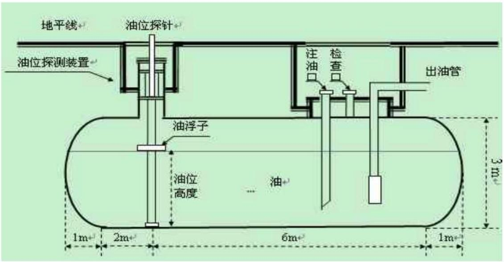

<details>
<summary>text_image</summary>

地平线
油位探针
油位探测装置
注油
检查口
出油管
油浮子
油位高度
油
1m
2m
6m
1m
3m
</details>

图 1 储油罐正面示意图  
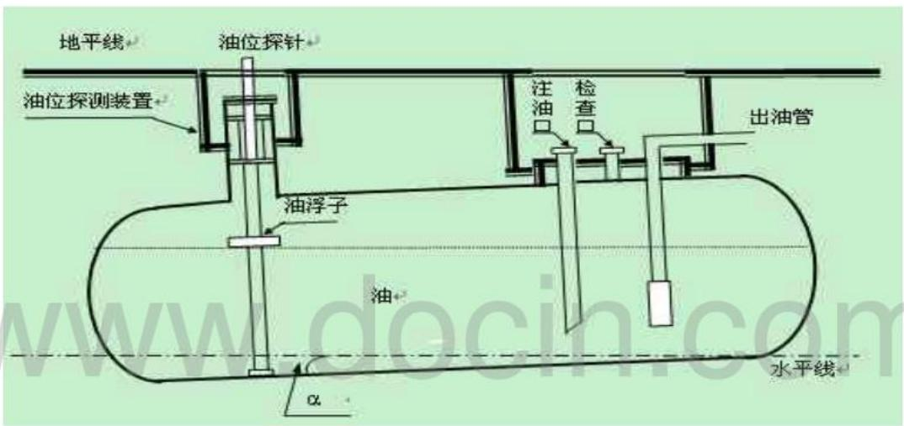

<details>
<summary>text_image</summary>

地平线
油位探针
油位探测装置
注油
检查
出油管
油浮子
油
水平线
α
</details>

图 2 储油罐纵向倾斜变位后示意

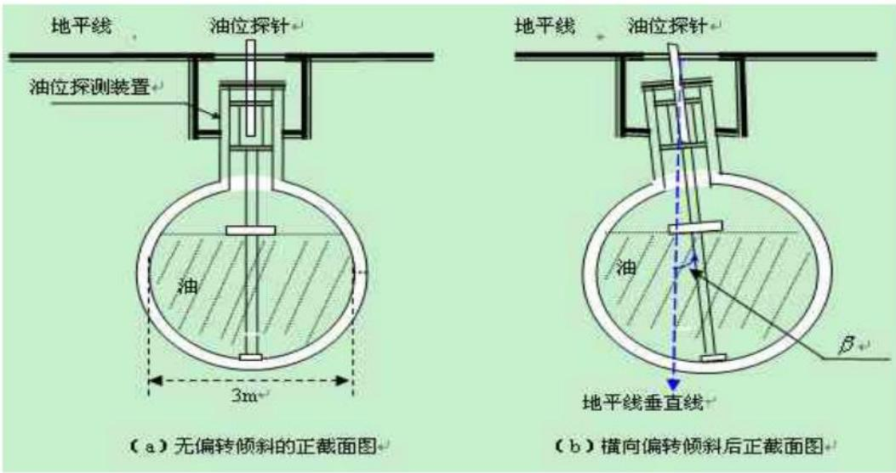

图 3 储油罐截面示意图  
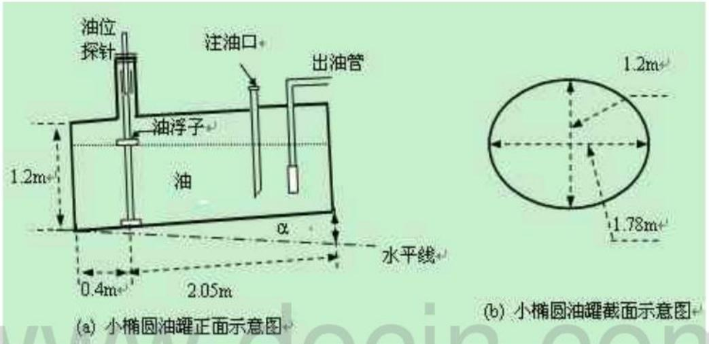  
图 4 小椭圆油罐示意图

## § 7.4 程序

程序youliang1

load jinyou1.txt

load chuyou1.txt

g1=jinyou1(:,2)\*10^(-2);

g2=chuyou1(:,2)\*10^(-2);

syms a b h l

a=0.89\*10;b=0.6\*10;l=2.45\*10;

V=(a\*1/b).\*((h-b).\*((2.\*h.\*b-h.^2).^0.5)+b.^2.\*asin((h-b)./b)+0.5.\*b.^2\*pi);

V1=subs(V, h, g1)

```matlab
V2=subs(V, h, g2)
h1=jinyou1(:, 1)+262;
h2=3706.91+262-chuyou1(:, 1);
c1=V1-h1
c2=V2-h2
x1=abs(V1-h1)./V1
x2=abs(V2-h2)./V2
plot(g1, V1, '.r', g1, h1, '.c')
xlabel('进油后储油量');
ylabel('罐内油位高度');
title('罐内油位高度随进油后储油量的变化情况')
legend('储油理论量','储油实际量')
grid on
figure(2)
plot(g2, V2, '.r', g2, h2, '.c')
xlabel('出油后储油量');
ylabel('罐内油位高度');
title('罐内油位高度随出油后储油量的变化情况')
legend('储油理论量','储油实际量')
grid on
figure(3)
subplot(2, 1, 1)
plot(g1, c1, '.b')
xlabel('罐内油位高度');
ylabel('进油后储油量的误差');
title('进油后储油量的误差随罐内油位高度的变化情况')
grid on
subplot(2, 1, 2)
plot(g2, c2, '.b')
xlabel('罐内油位高度');
```

```matlab
ylabel('出油后储油量的误差');
title('出油后储油量的误差随罐内油位高度的变化情况')
grid on
程序 youliang2
load jinyou2.txt
load chuyou2.txt
g1=jinyou2(:,2)*10^(-2);
g2=chuyou2(:,2)*10^(-2);
syms a b h m a1
a=0.89*10;
b=0.6*10;
a1=0.4*10;
L=2.45*10;
m=4.1*pi/180;
k=(a1*tan(m)/b)-1;
p=(h+a1*tan(m)-b)/b;
q=(h+a1*tan(m)-b-L*tan(m))/b;
V=-((-1/3)*(1-q.^2).^(3/2)+(1-q.^2).^(1/2)+q.*asin(q)+1/3.*(1-p.^2).^(3/2)-(1-p.^2).^(1/2)-p.*asin(p)+pi*(q-p)*0.5).*a*b^2./tan(m)
V1=subs(V,h,g1)
V2=subs(V,h,g2)
h1=jinyou2(:,1)+215;
h2=3299.74+215-chuyou2(:,1);
c1=V1-h1
c2=V2-h2
x1=abs(V1-h1)./V1
x2=abs(V2-h2)./V2
plot(g1,V1,'.r',g1,h1,'.c')
xlabel('倾斜时进油后储油量');
ylabel('罐内油位高度');
```

title('倾斜时罐内油位高度随进油后储油量的变化情况')

legend('储油理论量','储油实际量')

grid on

figure(2)

plot(g2, V2, '.r', g2, h2, '.c')

xlabel('倾斜时出油后储油量');

ylabel('罐内油位高度');

title('倾斜时罐内油位高度随出油后储油量的变化情况')

legend('储油理论量','储油实际量')

grid on

figure(3)

subplot(2,1,1)

plot(g1,c1,'.b')

xlabel('罐内油位高度');

ylabel('倾斜时进油后储油量的误差');

title('倾斜时进油后储油量的误差随罐内油位高度的变化情况')

grid on

subplot(2,1,2)

plot(g2, c2, '.b')

xlabel('罐内油位高度');

ylabel('倾斜时出油后储油量的误差');

title('倾斜时出油后储油量的误差随罐内油位高度的变化情况')

grid on