# 储油罐的变位识别与罐容表标定

摘要：本文主要运用几何学，微积分的方法解决储油罐的变位识别与罐容表标定问题。对问题一，通过截面法对整个椭圆储油罐进行积分，计算椭圆平头卧式油罐未变位时的油量与油高的关系式，并利用附件数据对计算式的正确性进行了验证。通过纵向倾斜时油面高度与位置的一次函数关系，得到油罐纵向倾斜时油量与油高及纵向变位角的关系，进而得到纵向倾角为 $4 . 1 ^ { \circ }$ 时的罐容表。运用MATLAB 计算得到纵向倾角对罐容表的影响，即纵向变位角越小，相同的油面高度对应的储油量越大。对问题二，在横向变位后，利用测量的油面高度与实际油面高度在横向变位角一定时的一一对应关系，得到储油罐内储油量与油位高度及变位参数（纵向倾斜角度 和横向偏转角度β ）之间的一般关系。利用此关系式得到实际测量数据中两相邻高度之间的出油量及进油量计算值，并与实际值对比，得到使两者之间的差别最小的纵向变位角 $\mathrm { \Delta } \mathrm { a } { = } 2 . \mathrm { ~ } 1 ^ { \circ }$ 和横向变位角 $\beta { = } 5 ^ { \circ }$ °。进而对罐容表进行了标定并对误差进行了检验。

关键字： 储油罐 变位识别 罐容表标定 微积分

## 1．问题重述

通常加油站采用流量计和油位计来测量储油罐进/出油量与罐内油位高度等数据，通过预先标定的罐容表（即罐内油位高度与储油量的对应关系）进行实时计算，以得到罐内油位高度和储油量的变化情况。

许多储油罐在使用一段时间后，由于地基变形等原因，使罐体的位置会发生纵向倾斜和横向偏转等变化，从而导致罐容表发生改变，需要定期对罐容表进行重新标定。要求用数学建模方法研究解决储油罐的变位识别与罐容表标定的问题。

（1）为了掌握罐体变位后对罐容表的影响，利用小椭圆型储油罐（两端平头的椭圆柱体），分别对罐体无变位和倾斜角为α=4.1°的纵向变位两种情况做了实验，并得到了实验数据。请建立数学模型研究罐体变位后对罐容表的影响，并给出罐体变位后油位高度间隔为 1cm 的罐容表标定值。  
（2）对于实际储油罐，建立罐体变位后标定罐容表的数学模型，即罐内储油量与油位高度及变位参数（纵向倾斜角度α和横向偏转角度β ）之间的一般关系。请利用罐体变位后在进/出油过程中的实际检测数据，根据所建立的数学模型确定变位参数，并给出罐体变位后油位高度间隔为 10cm 的罐容表标定值。进一步利用实际检测数据来分析检验模型的正确性与方法的可靠性。

## 2．模型假设

1．假设题目中油面高度的测量是准确的，罐内储油量测量的误差仅仅是由于未考虑变位造成的。  
2．假设由于量具以及人为的原因，附件 2 中实验实际测量的出油量及进油量存在一定的误差。  
3．相对于整个储油罐，球冠体的体积很小，因此假设实际储油罐在纵向倾斜时，球冠体内的油面相对于罐底假设是水平的，中间圆柱体部分的油面相对于罐底是倾斜的。  
4. 假设油罐没有设计缺陷，如局部无凹陷。

## 3．符号说明

： 油罐的纵向变位角度

： 实验用小椭圆形球罐体横截面的半长轴

： 实验用小椭圆形球罐体横截面的半短轴

： 油罐的横向变位角度

： 实际储油罐两侧球冠体在高度 处的横向宽度

： 油罐体中任意位置处的油面高度

$h _ { 0 }$ ：只考虑纵向倾斜时油罐体中测得的油面高度

$h _ { \scriptscriptstyle n }$ ： 既考虑纵向倾斜有考虑横向倾斜时测得的油面高度

： 油罐体的总长度

： 实际储油罐单侧球冠体的长度

： 实际储油罐两侧球冠体的半径

： 实际储油罐两侧球冠体在高度为 处的横截面圆半径

( )： 实验用小椭圆形球冠体在油面高度为 时的横截面中浸油部分面积

S h( )： 实际油罐体两侧球冠体在高度为h处的横截面面积

S h( )：实际储油罐在高度为h处中间圆柱体部分横截面面积

( )：实验用小椭圆形储油罐在油面高度为 时的储油量

V h( )：实际油罐体在油面高度为h时，左侧球冠体的储油量

V h( )：实际油罐体在油面高度为h时，右侧球冠体中的储油量

V h( )：实际储油罐在油面高度为h时，中间圆柱体部分的储油量

( )V h ：实际储油罐在油面高度为h时，储油罐的储油量

' V h( ) ： 根据题目中的数据直接得到的实验用小椭圆形储油罐在油高为h的实际储油量

## 4．问题分析

为了求解罐体变位对罐容表的影响，需要首先求解罐体变位后，油罐体体积与测量的油位高度之间的理论表达关系式，然后利用题目中所给的数据检验理论表达式的准确性。首先，利用体积分求解出油罐未倾斜时，在油罐体中液面高度为h时，油罐体中的油量。然后在油罐体倾斜时，各处的液面高度相对罐底不再相等，此时需引入纵向倾斜时油面高度与位置的一次函数关系，求解油罐体储油量就需要对整个油罐体进行积分，得到油罐体倾斜时的积分表达式。在此基础上与实际测量数据进行对比对理论表达式进行验证。进而得到第一问中的罐容表。

对于第二问中的实际油罐体，其与第一问中的实验用小椭圆油罐的不同之处在于，实际油罐体两端具有球冠体且实际油罐体的中间部分是圆柱体而不是实验中所用的椭圆柱体，因而，在计算时，只需要加上其两端球冠体的体积即可。对于实际油罐体纵向倾斜时，只需要按照第一问中的思路，按照各处的高度不同，对整个油罐体进行积分即可。在求出油罐体的体积在纵向倾斜的情况下与油面的高度、纵向变位角之间的关系后，利用在横向变位时测量的油面高度与实际油面高度在横向变位角一定时的一一对应关系，得到储油罐内储油量与油位高度及变位参数（纵向倾斜角度α和横向偏转角度β ）之间的一般关系。利用此关系式得到实际测量数据中相邻两高度之间的出油量及进油量计算值，与实际出油量及进油量对比，得到使两者之间的差别最小的α和β 即实际油罐的纵向变位角与横向变位角。然后在此基础上对罐容表进行标定。

## 5．模型的建立与求解

## 5.1第一问的求解

## 5.1.1未变位时小椭圆形储油罐的出油量与油位高度的求解

为了掌握罐体变位对罐容表的影响，首先求解小椭圆形储油罐在未变位之前 小椭圆形储油罐的储油量与油位高度之间的关系式，即小椭圆形储油罐在未变位 之前的罐容表。

小椭圆形储油罐在未变位之前在油位高度为h时，其横截面如图 1 所示：

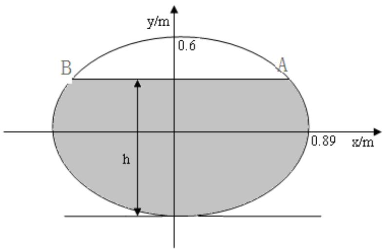

text_image

y/m
0.6
A
B
h
0.89 x/m

图1 小椭圆形储油罐未变位前横截面图

首先求解在油面高度为h 时，含油部分的面积，即图中阴影部分的面积。椭圆的半长轴为a=0.89m，半短轴为 b=0.6m，油面的高度为 h。

首先根据下列方程组求解 A，B 两点的坐标：

$$
\left\{ \begin{array}{l} \frac {x ^ {2}}{0 . 8 9 ^ {2}} + \frac {y ^ {2}}{0 . 6 ^ {2}} = 1 ^ {2} \\ y = h \end{array} \right.
$$

$$
x = \pm \sqrt {0 . 8 9 ^ {2} (1 - \frac {h ^ {2}}{0 . 6 ^ {2}})} , y = h
$$

椭圆中阴影部分的面积为：

$$
S (h) = 2 \int_ {- b} ^ {h - b} a \sqrt {1 - \frac {x ^ {2}}{b ^ {2}}} d x = 2 \int_ {- 0. 6} ^ {h - 0. 6} 0. 8 9 \sqrt {1 - \frac {x ^ {2}}{0 . 6 ^ {2}}} d x
$$

因而在小椭圆形储油罐没有任何偏转时其储油量与油位高度之间的关系如下：

$$
V (h) = S (h) l _ {1} = 2. 4 5 S (h)
$$

经计算得到其罐容表如下：

表1 小椭圆油罐未变位时的理论罐容表

<table><tr><td>高度/mm</td><td>油量/L</td><td>高度/mm</td><td>油量/L</td><td>高度/mm</td><td>油量/L</td><td>高度/mm</td><td>油量/L</td></tr><tr><td>10</td><td>5.29</td><td>310</td><td>841.51</td><td>610</td><td>2098.68</td><td>910</td><td>3344.16</td></tr><tr><td>20</td><td>14.94</td><td>320</td><td>879.89</td><td>620</td><td>2142.28</td><td>920</td><td>3381.28</td></tr><tr><td>30</td><td>27.37</td><td>330</td><td>918.65</td><td>630</td><td>2185.85</td><td>930</td><td>3417.94</td></tr><tr><td>40</td><td>42.04</td><td>340</td><td>957.77</td><td>640</td><td>2229.38</td><td>940</td><td>3454.11</td></tr><tr><td>50</td><td>58.60</td><td>350</td><td>997.25</td><td>650</td><td>2272.87</td><td>950</td><td>3489.79</td></tr><tr><td>60</td><td>76.83</td><td>360</td><td>1037.05</td><td>660</td><td>2316.30</td><td>960</td><td>3524.95</td></tr><tr><td>70</td><td>96.57</td><td>370</td><td>1077.18</td><td>670</td><td>2359.65</td><td>970</td><td>3559.56</td></tr><tr><td>80</td><td>117.68</td><td>380</td><td>1117.61</td><td>680</td><td>2402.92</td><td>980</td><td>3593.60</td></tr><tr><td>90</td><td>140.05</td><td>390</td><td>1158.32</td><td>690</td><td>2446.09</td><td>990</td><td>3627.05</td></tr><tr><td>100</td><td>163.59</td><td>400</td><td>1199.31</td><td>700</td><td>2489.15</td><td>1000</td><td>3659.88</td></tr><tr><td>110</td><td>188.24</td><td>410</td><td>1240.55</td><td>710</td><td>2532.08</td><td>1010</td><td>3692.05</td></tr><tr><td>120</td><td>213.91</td><td>420</td><td>1282.03</td><td>720</td><td>2574.88</td><td>1020</td><td>3723.54</td></tr><tr><td>130</td><td>240.55</td><td>430</td><td>1323.75</td><td>730</td><td>2617.54</td><td>1030</td><td>3754.33</td></tr><tr><td>140</td><td>268.11</td><td>440</td><td>1365.67</td><td>740</td><td>2660.03</td><td>1040</td><td>3784.36</td></tr><tr><td>150</td><td>296.53</td><td>450</td><td>1407.80</td><td>750</td><td>2702.34</td><td>1050</td><td>3813.61</td></tr><tr><td>160</td><td>325.78</td><td>460</td><td>1450.12</td><td>760</td><td>2744.47</td><td>1060</td><td>3842.04</td></tr><tr><td>170</td><td>355.82</td><td>470</td><td>1492.61</td><td>770</td><td>2786.4</td><td>1070</td><td>3869.60</td></tr><tr><td>180</td><td>386.60</td><td>480</td><td>1535.26</td><td>780</td><td>2828.11</td><td>1080</td><td>3896.24</td></tr><tr><td>190</td><td>418.10</td><td>490</td><td>1578.06</td><td>790</td><td>2869.60</td><td>1090</td><td>3921.91</td></tr><tr><td>200</td><td>450.27</td><td>500</td><td>1621.00</td><td>800</td><td>2910.84</td><td>1100</td><td>3946.55</td></tr><tr><td>210</td><td>483.10</td><td>510</td><td>1664.06</td><td>810</td><td>2951.83</td><td>1110</td><td>3970.10</td></tr><tr><td>220</td><td>516.54</td><td>520</td><td>1707.23</td><td>820</td><td>2992.54</td><td>1120</td><td>3992.47</td></tr><tr><td>230</td><td>550.58</td><td>530</td><td>1750.50</td><td>830</td><td>3032.97</td><td>1130</td><td>4013.58</td></tr><tr><td>240</td><td>585.20</td><td>540</td><td>1793.85</td><td>840</td><td>3073.09</td><td>1140</td><td>4033.31</td></tr><tr><td>250</td><td>620.35</td><td>550</td><td>1837.28</td><td>850</td><td>3112.90</td><td>1150</td><td>4051.55</td></tr><tr><td>260</td><td>656.03</td><td>560</td><td>1880.76</td><td>860</td><td>3152.37</td><td>1160</td><td>4068.11</td></tr><tr><td>270</td><td>692.21</td><td>570</td><td>1924.30</td><td>870</td><td>3191.50</td><td>1170</td><td>4082.77</td></tr><tr><td>280</td><td>728.87</td><td>580</td><td>1967.87</td><td>880</td><td>3230.26</td><td>1180</td><td>4095.21</td></tr><tr><td>290</td><td>765.98</td><td>590</td><td>2011.46</td><td>890</td><td>3268.63</td><td>1190</td><td>4104.85</td></tr><tr><td>300</td><td>803.54</td><td>600</td><td>2055.07</td><td>900</td><td>3306.61</td><td>1200</td><td>4110.15</td></tr></table>

根据题目中所给的数据得到的储油量Vh( )′与h的关系如表 2 所示：

表2 实际测量的储油量与油面高度的关系

<table><tr><td>油高/mm</td><td>体积/L</td><td>油高/mm</td><td>体积/L</td><td>油高/mm</td><td>体积/L</td><td>油高/mm</td><td>体积/L</td></tr><tr><td>159.02</td><td>312</td><td>438.12</td><td>1312</td><td>677.63</td><td>2312</td><td>892.82</td><td>3168.83</td></tr><tr><td>176.14</td><td>362</td><td>450.40</td><td>1362</td><td>678.54</td><td>2315.83</td><td>892.84</td><td>3168.91</td></tr><tr><td>192.59</td><td>412</td><td>462.62</td><td>1412</td><td>690.53</td><td>2365.83</td><td>906.53</td><td>3218.91</td></tr><tr><td>208.50</td><td>462</td><td>474.78</td><td>1462</td><td>690.82</td><td>2367.06</td><td>920.45</td><td>3268.91</td></tr><tr><td>223.93</td><td>512</td><td>486.89</td><td>1512</td><td>702.85</td><td>2417.06</td><td>934.61</td><td>3318.91</td></tr><tr><td>238.97</td><td>562</td><td>498.95</td><td>1562</td><td>714.91</td><td>2467.06</td><td>949.05</td><td>3368.91</td></tr><tr><td>253.66</td><td>612</td><td>510.97</td><td>1612</td><td>727.03</td><td>2517.06</td><td>963.80</td><td>3418.91</td></tr><tr><td>268.04</td><td>662</td><td>522.95</td><td>1662</td><td>739.19</td><td>2567.06</td><td>978.91</td><td>3468.91</td></tr><tr><td>282.16</td><td>712</td><td>534.90</td><td>1712</td><td>751.42</td><td>2617.06</td><td>994.43</td><td>3518.91</td></tr><tr><td>296.03</td><td>762</td><td>546.82</td><td>1762</td><td>763.70</td><td>2666.98</td><td>1010.43</td><td>3568.91</td></tr><tr><td>309.69</td><td>812</td><td>558.72</td><td>1812</td><td>764.16</td><td>2668.83</td><td>1026.99</td><td>3618.91</td></tr><tr><td>323.15</td><td>862</td><td>570.61</td><td>1862</td><td>776.53</td><td>2718.83</td><td>1044.25</td><td>3668.91</td></tr><tr><td>336.44</td><td>912</td><td>582.48</td><td>1912</td><td>788.99</td><td>2768.83</td><td>1062.37</td><td>3718.91</td></tr><tr><td>349.57</td><td>962</td><td>594.35</td><td>1962</td><td>801.54</td><td>2818.83</td><td>1081.59</td><td>3768.91</td></tr><tr><td>362.56</td><td>1012</td><td>606.22</td><td>2012</td><td>814.19</td><td>2868.83</td><td>1102.33</td><td>3818.91</td></tr><tr><td>375.42</td><td>1062</td><td>618.09</td><td>2062</td><td>826.95</td><td>2918.83</td><td>1125.32</td><td>3868.91</td></tr><tr><td>388.16</td><td>1112</td><td>629.96</td><td>2112</td><td>839.83</td><td>2968.83</td><td>1152.36</td><td>3918.91</td></tr><tr><td>400.79</td><td>1162</td><td>641.85</td><td>2162</td><td>852.84</td><td>3018.83</td><td>1193.49</td><td>3968.91</td></tr><tr><td>413.32</td><td>1212</td><td>653.75</td><td>2212</td><td>866.00</td><td>3068.83</td><td></td><td></td></tr><tr><td>425.76</td><td>1262</td><td>665.67</td><td>2262</td><td>879.32</td><td>3118.83</td><td></td><td></td></tr></table>

由以上两组数据的对比可以看到理论计算的罐容表与实际测量的数据在误差允许的范围内是比较接近的，基本符合要求。误差的存在可能是由实际测量过程中量具的系统误差，或者储油罐的罐壁粘油造成的。

## 5.1.2 纵向变位后小椭圆形储油罐的出油量与油位高度的求解

在得到油罐未倾斜的情况下的小椭圆形油罐的罐容表之后，下面计算在油罐纵向倾角为α时的罐容表，并分析纵向倾角对罐容表的影响。由于题目中给出了在 $\alpha = 4 . 1 ^ { \circ }$ 时的实际测量结果，因而我们使用这组数据对理论计算进行检验。

在油罐的纵向倾角为α时，其横向截面如图 1 所示，只不过，在纵向各个地方油面的高度不再相同，而是变成了一个与位置有关的函数。在图示坐标中表示为 h x( ) 。

其纵向截面如图2 所示。

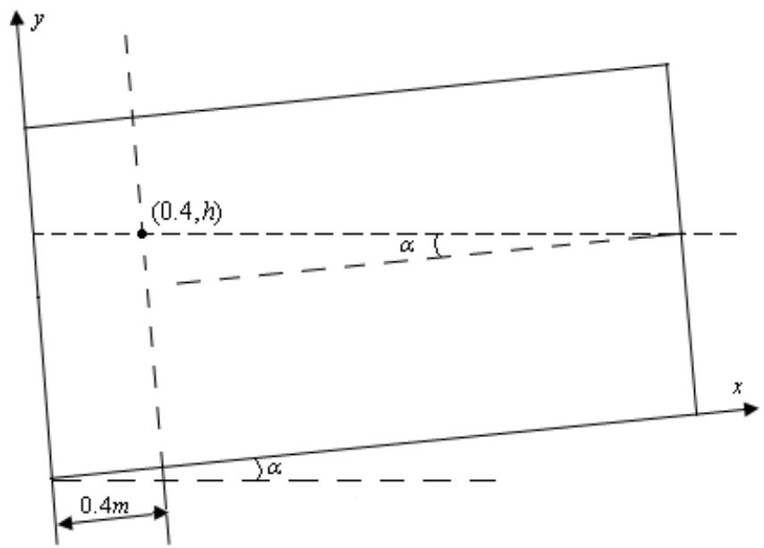

text_image

(0.4,h)
α
α
0.4m
x
y

图 2 小油罐纵向截面示意图

如上图所示，在油罐的纵向倾角为α时，其各个点x处的油面高度 $\boldsymbol { h } ( \boldsymbol { x } )$ 满足下列关系式：

$$
h (x) = h _ {0} - (x - 0. 4) \tan \alpha
$$

其中 $h _ { 0 }$ 为 $x = 0 . 4 m$ 处的油面高度，即测得的油面高度。

因此，在这种情况下，储油量 $V (  { h _ { 0 } } )$ 与测得的油面高度 $h _ { 0 }$ 的关系可通过下面的方法求得：

$$
d V (h _ {0}) = S (h (x)) d x = S (h _ {0} - (x - 0. 4) \tan \alpha - b) d x
$$

因而

$$
\begin{array}{l} V (h _ {0}) = 2 \int_ {0} ^ {l _ {1}} \int_ {- b} ^ {h _ {0} - (x - 0. 4) \tan \alpha - b} a \sqrt {1 - \frac {y ^ {2}}{b ^ {2}}} d y d x \\ = 2 a \int_ {0} ^ {2. 4 5} \int_ {- b} ^ {h _ {0} - (x - 0. 4) \tan \alpha - b} \sqrt {1 - \frac {y ^ {2}}{b ^ {2}}} d y d x \\ \end{array}
$$

其中 $a = 0 . 8 9 m , \ : \ : \ : b = 0 . 6 m$ C

这就得到了纵向倾角为α时的储油量与油面高度之间的关系式。

取 $\alpha = 4 . 1 ^ { \circ } = 0 . 0 7 1 5 6 ( \mathrm { \sharp / / \mathrm { \overline { { \alpha } } } ) }$ 即可得到 $\alpha = 4 . 1 ^ { \circ }$ 时的罐容表，如下表 3 所示。

表 3 α = 4 .1� 时的罐容表

<table><tr><td>高度/mm</td><td>油量/L</td><td>高度/mm</td><td>油量/L</td><td>高度/mm</td><td>油量/L</td><td>高度/mm</td><td>油量/L</td></tr><tr><td>10</td><td>3.53</td><td>310</td><td>630.15</td><td>610</td><td>1841.80</td><td>910</td><td>3112.00</td></tr><tr><td>20</td><td>6.26</td><td>320</td><td>665.58</td><td>620</td><td>1885.13</td><td>920</td><td>3151.23</td></tr><tr><td>30</td><td>9.97</td><td>330</td><td>701.53</td><td>630</td><td>1928.51</td><td>930</td><td>3190.11</td></tr><tr><td>40</td><td>14.76</td><td>340</td><td>737.96</td><td>640</td><td>1971.93</td><td>940</td><td>3228.61</td></tr><tr><td>50</td><td>20.69</td><td>350</td><td>774.86</td><td>650</td><td>2015.37</td><td>950</td><td>3266.72</td></tr><tr><td>60</td><td>27.85</td><td>360</td><td>812.20</td><td>660</td><td>2058.82</td><td>960</td><td>3304.42</td></tr><tr><td>70</td><td>36.32</td><td>370</td><td>849.97</td><td>670</td><td>2102.28</td><td>970</td><td>3341.69</td></tr><tr><td>80</td><td>46.14</td><td>380</td><td>888.15</td><td>680</td><td>2145.71</td><td>980</td><td>3378.51</td></tr><tr><td>90</td><td>57.39</td><td>390</td><td>926.72</td><td>690</td><td>2189.13</td><td>990</td><td>3414.86</td></tr><tr><td>100</td><td>70.13</td><td>400</td><td>965.66</td><td>700</td><td>2232.5</td><td>1000</td><td>3450.72</td></tr><tr><td>110</td><td>84.40</td><td>410</td><td>1004.95</td><td>710</td><td>2275.82</td><td>1010</td><td>3486.06</td></tr><tr><td>120</td><td>100.25</td><td>420</td><td>1044.58</td><td>720</td><td>2319.09</td><td>1020</td><td>3520.87</td></tr><tr><td>130</td><td>117.75</td><td>430</td><td>1084.53</td><td>730</td><td>2362.27</td><td>1030</td><td>3555.11</td></tr><tr><td>140</td><td>136.92</td><td>440</td><td>1124.79</td><td>740</td><td>2405.37</td><td>1040</td><td>3588.77</td></tr><tr><td>150</td><td>157.82</td><td>450</td><td>1165.34</td><td>750</td><td>2448.37</td><td>1050</td><td>3621.81</td></tr><tr><td>160</td><td>180.26</td><td>460</td><td>1206.16</td><td>760</td><td>2491.26</td><td>1060</td><td>3654.20</td></tr><tr><td>170</td><td>204.00</td><td>470</td><td>1247.23</td><td>770</td><td>2534.02</td><td>1070</td><td>3685.91</td></tr><tr><td>180</td><td>228.91</td><td>480</td><td>1288.56</td><td>780</td><td>2576.64</td><td>1080</td><td>3716.92</td></tr><tr><td>190</td><td>254.88</td><td>490</td><td>1330.11</td><td>790</td><td>2619.12</td><td>1090</td><td>3747.17</td></tr><tr><td>200</td><td>281.86</td><td>500</td><td>1371.88</td><td>800</td><td>2661.42</td><td>1100</td><td>3776.64</td></tr><tr><td>210</td><td>309.76</td><td>510</td><td>1413.85</td><td>810</td><td>2703.55</td><td>1110</td><td>3805.27</td></tr><tr><td>220</td><td>338.54</td><td>520</td><td>1456.02</td><td>820</td><td>2745.49</td><td>1120</td><td>3833.01</td></tr><tr><td>230</td><td>368.14</td><td>530</td><td>1498.35</td><td>830</td><td>2787.22</td><td>1130</td><td>3859.82</td></tr><tr><td>240</td><td>398.53</td><td>540</td><td>1540.85</td><td>840</td><td>2828.74</td><td>1140</td><td>3885.62</td></tr><tr><td>250</td><td>429.66</td><td>550</td><td>1583.50</td><td>850</td><td>2870.02</td><td>1150</td><td>3910.33</td></tr><tr><td>260</td><td>461.49</td><td>560</td><td>1626.28</td><td>860</td><td>2911.06</td><td>1160</td><td>3933.86</td></tr><tr><td>270</td><td>494.00</td><td>570</td><td>1669.19</td><td>870</td><td>2951.83</td><td>1170</td><td>3956.06</td></tr><tr><td>280</td><td>527.14</td><td>580</td><td>1712.21</td><td>880</td><td>2992.33</td><td>1180</td><td>3976.66</td></tr><tr><td>290</td><td>560.90</td><td>590</td><td>1755.32</td><td>890</td><td>3032.53</td><td>1190</td><td>3995.54</td></tr><tr><td>300</td><td>595.25</td><td>600</td><td>1798.52</td><td>900</td><td>3072.43</td><td>1200</td><td>4012.74</td></tr></table>

根据题目中所给的数据得到实际 $\alpha = 4 . 1 ^ { \circ }$ 时的罐容表，如下表 4 所示。

表 4 $\alpha = 4 . 1 ^ { \circ }$ 时的实际罐容表

<table><tr><td>高度/mm</td><td>油量/L</td><td>高度/mm</td><td>油量/L</td><td>高度/mm</td><td>油量/L</td><td>高度/mm</td><td>油量/L</td></tr><tr><td>411.29</td><td>962.86</td><td>727.66</td><td>2262.73</td><td>1035.36</td><td>3514.74</td><td>715.32</td><td>2214.74</td></tr><tr><td>423.45</td><td>1012.86</td><td>739.39</td><td>2312.73</td><td>1020.65</td><td>3464.74</td><td>705.43</td><td>2164.74</td></tr><tr><td>438.33</td><td>1062.86</td><td>750.90</td><td>2362.73</td><td>1007.73</td><td>3414.74</td><td>693.52</td><td>2114.74</td></tr><tr><td>450.54</td><td>1112.86</td><td>761.55</td><td>2412.73</td><td>994.32</td><td>3364.74</td><td>682.50</td><td>2064.74</td></tr><tr><td>463.90</td><td>1162.86</td><td>773.43</td><td>2462.73</td><td>980.96</td><td>3314.74</td><td>671.02</td><td>2014.74</td></tr><tr><td>477.74</td><td>1212.86</td><td>785.39</td><td>2512.73</td><td>967.10</td><td>3264.74</td><td>658.68</td><td>1964.74</td></tr><tr><td>489.37</td><td>1262.86</td><td>796.04</td><td>2562.73</td><td>956.01</td><td>3214.74</td><td>647.74</td><td>1914.74</td></tr><tr><td>502.56</td><td>1312.79</td><td>808.27</td><td>2612.73</td><td>941.54</td><td>3164.74</td><td>635.76</td><td>1864.74</td></tr><tr><td>514.69</td><td>1362.79</td><td>820.80</td><td>2662.73</td><td>929.69</td><td>3114.74</td><td>624.61</td><td>1814.74</td></tr><tr><td>526.84</td><td>1412.73</td><td>832.80</td><td>2712.73</td><td>916.44</td><td>3064.74</td><td>612.53</td><td>1764.74</td></tr><tr><td>538.88</td><td>1462.73</td><td>844.47</td><td>2762.73</td><td>904.14</td><td>3014.74</td><td>600.69</td><td>1714.74</td></tr><tr><td>551.96</td><td>1512.73</td><td>856.29</td><td>2812.73</td><td>891.90</td><td>2964.74</td><td>589.40</td><td>1664.74</td></tr><tr><td>564.40</td><td>1562.73</td><td>867.60</td><td>2862.73</td><td>879.23</td><td>2914.74</td><td>577.00</td><td>1614.74</td></tr><tr><td>576.56</td><td>1612.73</td><td>880.06</td><td>2912.73</td><td>868.99</td><td>2864.74</td><td>564.58</td><td>1564.74</td></tr><tr><td>588.74</td><td>1662.73</td><td>892.92</td><td>2962.73</td><td>855.13</td><td>2814.74</td><td>554.33</td><td>1514.74</td></tr><tr><td>599.56</td><td>1712.73</td><td>904.34</td><td>3012.73</td><td>844.02</td><td>2764.74</td><td>540.76</td><td>1464.74</td></tr><tr><td>611.62</td><td>1762.73</td><td>917.34</td><td>3062.73</td><td>831.64</td><td>2714.74</td><td>528.65</td><td>1414.74</td></tr><tr><td>623.44</td><td>1812.73</td><td>929.90</td><td>3112.73</td><td>820.47</td><td>2664.74</td><td>517.19</td><td>1364.74</td></tr><tr><td>635.58</td><td>1862.73</td><td>941.42</td><td>3162.73</td><td>808.16</td><td>2614.74</td><td>504.87</td><td>1314.74</td></tr><tr><td>646.28</td><td>1912.73</td><td>954.60</td><td>3212.73</td><td>796.00</td><td>2564.74</td><td>490.78</td><td>1264.74</td></tr><tr><td>658.59</td><td>1962.73</td><td>968.09</td><td>3262.73</td><td>785.04</td><td>2514.74</td><td>478.06</td><td>1214.74</td></tr><tr><td>670.22</td><td>2012.73</td><td>980.14</td><td>3312.73</td><td>773.07</td><td>2464.74</td><td>465.97</td><td>1164.74</td></tr><tr><td>680.63</td><td>2062.73</td><td>992.41</td><td>3362.73</td><td>762.09</td><td>2414.74</td><td>452.40</td><td>1114.74</td></tr><tr><td>693.03</td><td>2112.73</td><td>1006.34</td><td>3412.73</td><td>750.81</td><td>2364.74</td><td>439.98</td><td>1064.74</td></tr><tr><td>704.67</td><td>2162.73</td><td>1019.07</td><td>3462.73</td><td>739.42</td><td>2314.74</td><td>425.83</td><td>1014.74</td></tr><tr><td>716.45</td><td>2212.73</td><td>1034.24</td><td>3512.73</td><td>727.09</td><td>2264.74</td><td>411.73</td><td>964.74</td></tr></table>

下 面 分 析 一 下 油 罐 的 纵 向 倾 角 对 其 罐 容 表 的 影 响 ， 分 别 做 出=1.1 ,3.1 , 4.1 ,5.1 ,6.1� � � � � 时储油量与油面高度之间的函数关系图像如下图：

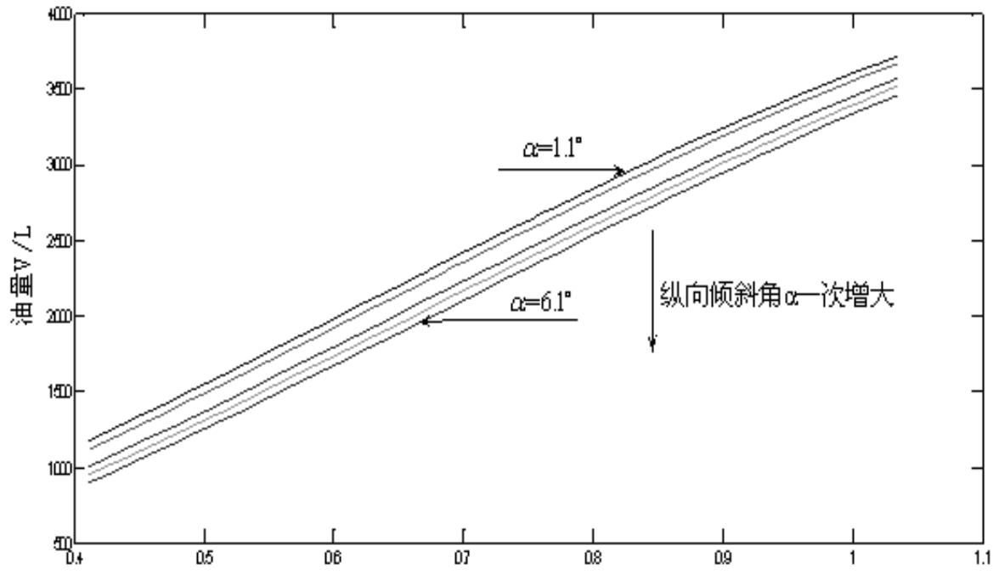

line

| X | \(\alpha=1.1{}^{\circ} (\)Oil Volume V/L) | \(\alpha=6.1{}^{\circ} (\)Oil Volume V/L) |
| --- | --- | --- |
| 0.4 | ~120 | ~95 |
| 0.5 | ~160 | ~135 |
| 0.6 | ~200 | ~175 |
| 0.7 | ~240 | ~215 |
| 0.8 | ~280 | ~255 |
| 0.9 | ~320 | ~295 |
| 1.0 | ~360 | ~345 |

图3 油罐的纵向倾角对其罐容表的影响

由上图可以看出，若油罐的纵向倾角α变大时，在相同的油面高度下，其所对应的储油量变小，即当 $\alpha = 0 ^ { \circ }$ 时，其所对应的罐容表数值最大。

## 5.2第二问的求解：

对于实际储油罐，试建立罐体变位后标定罐容表的数学模型，即罐内储油量与油位高度及变位参数（纵向倾斜角度α和横向偏转角度β ）之间的一般关系。求解理论表达式的过程如下：

## 5.2.1 未变位时实际储油罐储油量与油高关系的求解

实际的储油罐，其两侧为球冠体形状，中间部分为圆柱体。

首先求解在罐体内油面的高度为h时，其所对应的储油量。罐体油面高度为h时，其两侧的球冠体对应的体积。首先求解球冠体的半径，球冠体的半径可以通过下面的方法求得。其纵向截面如图 4 所示：

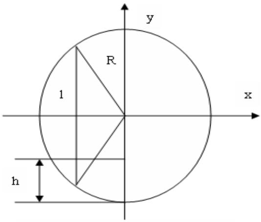

text_image

y
R
1
x
h

图4 球冠体的纵向截面示意图

利用勾股定理可得：

$$
R ^ {2} = (R - 1) ^ {2} + 1. 5 ^ {2}
$$

解得：R=1.625m

利用微积分中的截面法对球冠体从0 到 $h _ { 0 }$ 进行积分求取球冠体的体积，球冠体在高为h处的横向截面如下图所示。其横向截面从下图可以看出为一半径为r的圆的一部分。如图5 阴影部分所示：

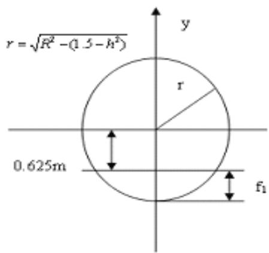

text_image

r = \sqrt{R^2 - (1.5 - h^2)}\n0.625m\nr\nf_1

图5 球冠体横向截面积

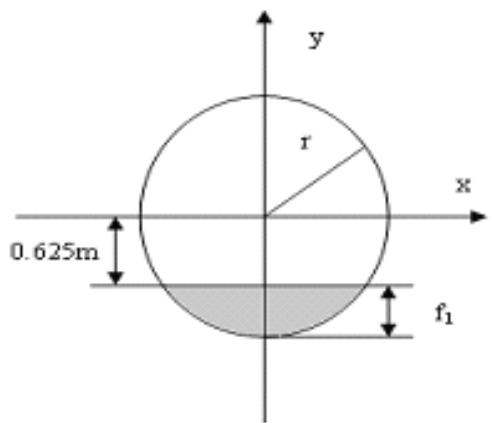

text_image

y
r
x
0.625m
f₁

图6球冠体横向截面

如图 4 所示，在高位h 处，其半径 $r = \sqrt { R ^ { 2 } - ( 1 . 5 - \ h ) ^ { 2 } }$ o

在高为h 处的截面积为：

$$
S _ {1} (h) = r ^ {2} \cdot \arccos (\frac {r - f _ {1}}{r}) - \frac {1}{2} r ^ {2} \cdot \sin [ 2 \arccos (\frac {r - f _ {1}}{r}) ] \tag {1}
$$

其中， $r = \sqrt { R ^ { 2 } - ( 1 . 5 - \ h ) ^ { 2 } }$ $\mathscr { f } _ { 1 } = r - 0 . 6 2 5$ 代入（1）式得：

$$
S _ {1} (h) = [ R ^ {2} - (1. 5 - h) ^ {2} ] \cdot \arccos [ \frac {0 . 6 2 5}{\sqrt {R ^ {2} - (1 . 5 - h) ^ {2}}} ] - \frac {1}{2} [ R ^ {2} - (1. 5 - h) ^ {2} ] \cdot \sin \{2 \arccos [ \frac {0 . 6 2 5}{\sqrt {R ^ {2} - (1 . 5 - h) ^ {2}}} ] \}
$$

经简化的到：

$$
S _ {1} (h) = [ R ^ {2} - (1. 5 - h) ^ {2} ] \cdot \arccos \frac {0 . 6 2 5}{\sqrt {R ^ {2} - (1 . 5 - h) ^ {2}}} - 0. 6 2 5 \times \sqrt {R ^ {2} - (1 . 5 - h) ^ {2} - 0 . 6 2 5 ^ {2}}
$$

当 $R = 1 . 6 2 5 m , h = 1 . 5 m$ 时， $\mathcal { f } _ { 1 } = 1 m$

$$
S _ {1} (1. 5) = 1. 6 2 5 ^ {2} \arccos \frac {0 . 6 2 5}{1 . 6 2 5} - 0. 6 2 5 \times \sqrt {1 . 6 2 5 ^ {2} - 0 . 6 2 5 ^ {2}} = 2 1 6 7 9
$$

即在高度为 1.5m 处的球冠体截面积为 $2 . 1 6 7 9 \mathrm { m } ^ { 2 }$

因而在油罐内油面高度为 $h _ { 0 }$ 时，两个球冠体内的油量为：

$$
V _ {1} (h _ {0}) = 2 \int_ {0} ^ {h} S _ {1} (h) d h
$$

若取 $\textit { h } _ { 0 } = 3 m$ ，那么 $V _ { 1 } ( 3 ) = 8 . 1 1 4 m ^ { 3 }$ ，即两个球冠体的总体积为 $8 . 1 1 4 \mathrm { m } ^ { 3 }$

下面求解中间圆柱体在油面高度为h 时，中间圆柱体内的总油量。

中间圆柱体的横向截面图如下面图7 所示：

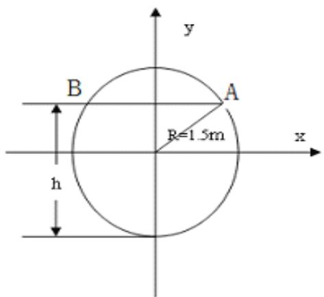

text_image

B
A
R=1.5m
h
x
y

图7 中间圆柱体横向截面图

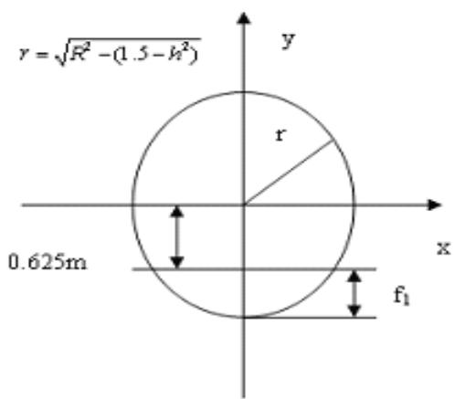

text_image

r = \sqrt{R^2 - (1.5 - h^2)}\n0.625m\nf_1

图8 球罐体横向截面积

因为横向截面的圆方程为

$$
x ^ {2} + y ^ {2} = R ^ {2} = 1. 5 ^ {2},
$$

将其与方程

$$
y = h
$$

联立得到 A,B 两点的坐标：

$$
x = \pm \sqrt {1 . 5 ^ {2} - y ^ {2}}, \quad y = h
$$

下面求解当油面高度为 h 时，对应圆柱体截面中含油部分的面积 $S _ { 2 } ( h )$

$$
S _ {2} (h) = 2 \int_ {- 1. 5} ^ {h - 1. 5} \sqrt {1 . 5 ^ {2} - y ^ {2}} d y
$$

当高度是 h 时储油体积为:

$$
V (h) = 2 \int_ {0} ^ {h _ {0}} S _ {1} (h) d h + 2 S _ {2} (h _ {0}) \cdot (2 + 6) = 2 \int_ {0} ^ {h _ {0}} S _ {1} (h) d h + 1 6 S _ {2} (h _ {0}) \quad (h _ {0} \text {从} 0 \text {到} 3 m)
$$

单个球冠体体积：

$$
V _ {\text {球冠体}} = \frac {1}{3} \times \pi \times (3 \times 1. 6 2 5 - 1) \times 1 ^ {2} = 4. 0 5 7 m ^ {3}
$$

中间柱体的体积：

$$
V _ {\text {柱体}} = \pi \times (2 + 6) \times 1. 5 ^ {2} = 5 6. 5 4 9 m ^ {3}
$$

则总的体积为：

$$
V _ {\text {总}} = 2 V _ {\text {球冠体}} + V _ {\text {柱体}} = 6 4. 6 6 3 m ^ {3}
$$

## 5.2.2纵向变位后实际储油罐储油量与油高及纵向变位角关系的求解

既然求出了此时的体积 $V ( h )$ ，那么下面求解纵向倾角为 $\alpha$ 时的储油量。

当纵向倾斜角度为 $\alpha$ ，罐体纵向变化角度为 $\alpha$ 时，球冠体的体积较小，所以可以取左 、右侧球冠体中的油高分别为 $x = 0$ 和 $x = 8 m$ 处的油高，即在计算时，左侧球冠体中油面的高度取图中阴影部分的下边，右侧球冠体中的油高取图中阴影部分的上边。

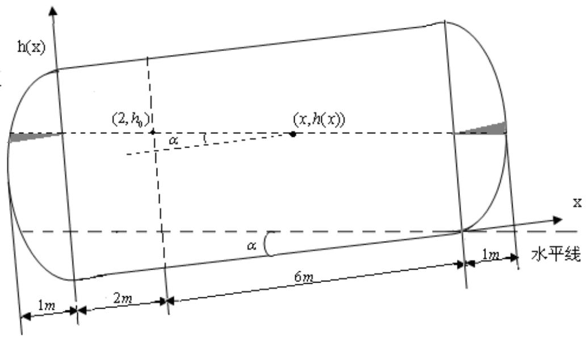

text_image

h(x)
(2,h₀)
α
(x,h(x))
α
1m
2m
6m
1m
水平线
x

图 9 储油罐纵向倾斜变位后示意图

若在 $x = 2 m$ 处的油面高度为 $h _ { 0 }$ ，既测得的油面高度为 $h _ { 0 }$ 。在如上图所示，在 x 处，油面的高度为：

$$
h (x) = h _ {0} - (x - 2) \tan \alpha
$$

则油罐内油的总体积为：

$$
\begin{array}{l} V (h _ {0}) = \int_ {0} ^ {h _ {0} + 2 \tan \alpha} S _ {1} (h) d h + \int_ {0} ^ {8} 2 \int_ {- 1. 5} ^ {h _ {0} - (x - 2) \tan \alpha - 1. 5} \sqrt {1 . 5 ^ {2} - y ^ {2}} d y d x + \int_ {0} ^ {h _ {0} - 6 \tan \alpha} S _ {1} (h) d h \\ = \int_ {0} ^ {h _ {0} + 2 \tan \alpha} S _ {1} (h) d h + \int_ {0} ^ {8} S _ {2} (h _ {0} - (x - 2) \tan \alpha) d x + \int_ {0} ^ {h _ {0} - 6 \tan \alpha} S _ {1} (h) d h \\ \end{array}
$$

## 5.2.3 横向变位后实际储油罐储油量与油高及变位角关系的求解

现在已经知道在纵向倾斜时，油罐体积与高度及 $\alpha$ 的关系表达式，下面来研究在倾斜角为 $\alpha$ 时横向偏转 $\beta$ 对其的影响。

按照常理而言，储油罐的油位探测装置与储油管整体体积相比可以认为非常小，因而，在储油罐的横向偏转可以近似为储油罐绕着上部顶点的旋转，储油罐的直径为 3m。

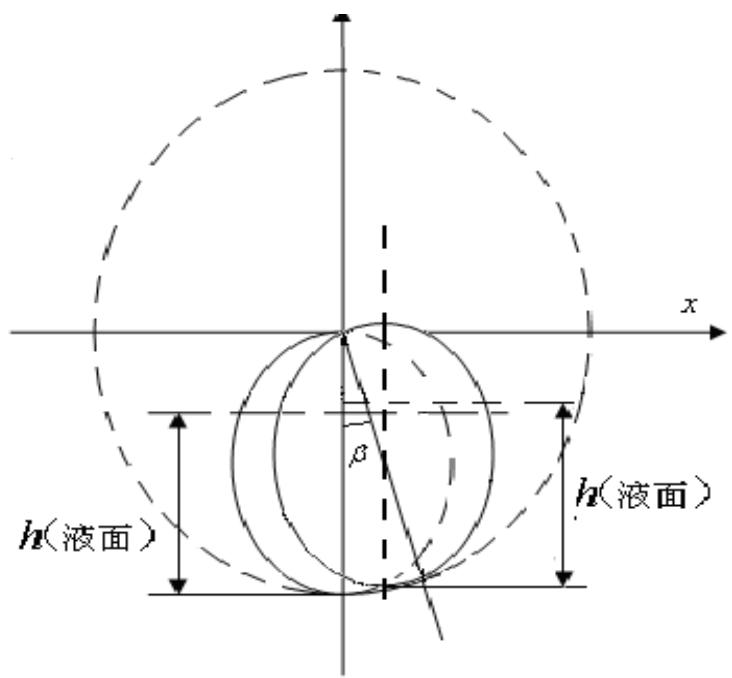

text_image

h(液面)
h(液面)

图 10 储油罐横向偏转截面示意图

若原来油高为 $h _ { 0 }$ ,对应的体积为 $V ( h _ { 0 } )$ ，那么当储油罐横向偏转之后， $h _ { 0 }$ 对应的油位高度为：

$$
h _ {n} = r + \frac {(h _ {0} - r)}{\cos \beta}
$$

其中 $r = 3 m$ ，所以在横向偏转 $\beta$ 后， $h _ { 0 }$ 对应有为高度为：

$$
h _ {n} = 3 + \frac {(h _ {0} - 3)}{\cos \beta}
$$

即 $h _ { 0 } = 3 + ( h _ { n } - 3 ) \cdot \cos \beta$

也就是说，只要将其中的 $h _ { 0 }$ 变为 $3 + \left( h _ { n } - 3 \right) \cdot \cos \beta$ 即可得到新的油高对应的储油量。

综上所述：

$$
\begin{array}{l} V _ {F} (h _ {n}, \alpha , \beta) = \int_ {0} ^ {3 + (h _ {n} - 3) \cdot \cos \beta + 2 \tan \alpha} S _ {1} (h) d h + \int_ {0} ^ {8} S _ {2} (3 + (h _ {n} - 3) \cdot \cos \beta - (x - 2) \cdot \tan \alpha) \cdot d x \\ \begin{array}{l} 3 + (h _ {n} - 3) \cdot \cos \beta \\ + \int_ {0} ^ {1} S _ {1} (h) d h \end{array} \\ \end{array}
$$

上式即为最终得到的罐内储油量与油位高度及变位参数（纵向倾斜角度α和横向偏转角度 $B ^ { \prime } )$ ）之间的一般关系。

下面利用罐体变位后在进/出油过程中的实际检测数据确定实测的变位系数。

变位系数的确定：

首先将 $\alpha = 0 ^ { \circ }$ $\beta = 0 ^ { \circ }$ 代入上面 $V _ { F } ( h _ { n } , \alpha , \beta )$ 得到在既没有纵向变位也没有横向变位的情况下，利用其理论计算结构得到其罐容表：

发现其与附件 2 中所给的显示油高与显示油量容积的关系一模一样，因而可以得到：附件二中显示油高与显示油量容积所对应的罐容表为既没有纵向变位也没有横向变位的罐容表。

那么实际测量的时候油罐是否有横向变位与纵向变位呢？

进一步的分析发现：实际的出油量与显示油量容积相邻两个之间的差值并不相同，即显示的油量容积是不准确的（附件二所给的数据中，出油量一列我们认为数据是准确的）。

实际的出油量与显示的出油量之间的对比见附件 1

造成实际的出油量与显示的出油量之间的差别的原因在于在附件2中显示出油量时采用的罐容表是未变位时的罐容表，而附件 2 实际采集数据的大油罐已经发生了变位。

变位系数的确定所要达到的目的是使得显示的出油量与实际的出油量尽可能的接近。

## 5.3 油罐的纵向变位倾角α对显示的出油量的影响

下面首先研究油罐的纵向变位倾角α对显示的出油量即等间距油高所对应的出油量的影响。

下面不妨利用附件 2 中的实际检测数据中的显示油高，分别得到 $\alpha = 0 ^ { \circ }$ $\alpha = 1 ^ { \circ }$ $\alpha = 2 ^ { \circ }$ $\alpha = 3 ^ { \circ }$ 时显示的出油量与油高变化之间的关系：

$\alpha = 0 ^ { \circ }$ 时的显示出油与油高的差值关系可有题目中所给的数据直接得到，如附件 1 所示。

$\alpha = 1 ^ { \circ }$ $\alpha = 2 ^ { \circ }$ $\alpha = 3 ^ { \circ }$ 时的显示出油量与油高的差值关系利用 MATLAB计算得到，详见附件1。

将 $\alpha = 0 ^ { \circ }$ $\alpha = 1 ^ { \circ }$ $\alpha = 2 ^ { \circ }$ $\alpha = 3 ^ { \circ }$ 时显示的出油量与实际出油量作差，然后绘制其误差的趋势线图，如下图所示：

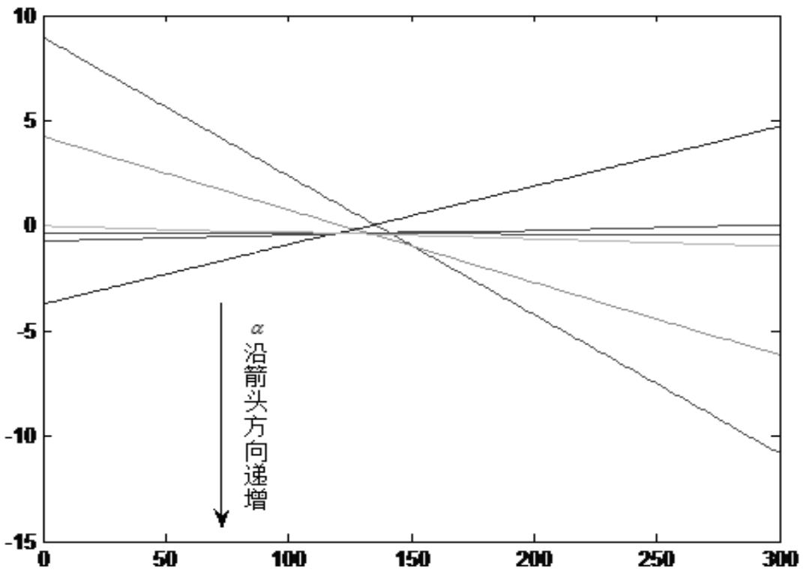

line

| X | Series 1 (Top) | Series 2 | Series 3 | Series 4 | Series 5 (Bottom) |
| --- | --- | --- | --- | --- | --- |
| 0 | ~9 | ~4.2 | ~0 | ~-0.8 | ~-3.8 |
| 125 | 0 | 0 | 0 | 0 | 0 |
| 300 | ~5 | ~-6 | ~-0.8 | ~-0.8 | ~-11 |

图 11 α 对实际出油量与计算值差值影响

由上图可以看出，随着α的增大，理论计算的出油量与实际的出油量首先接近，然后再慢慢远离，因而，存在一个最佳的α值，使得理论值与实际值最接近。即为实际测量油罐的纵向倾角。

通过作图得到最佳的 $\alpha { = } 2 . 1 ^ { \circ }$ C

## 5.4 油罐的横向变位倾角β对显示的出油量的影响

在 $\alpha$ 确定的情况下，下面研究 $\beta$ 对理论出油量与实际出油量的影响。

下面不妨利用附件 2 中的实际检测数据中的显示油高，分别得到 $\alpha = 2 . 1 ^ { \circ }$ $\beta = 0 ^ { \circ }$ $\beta = 1 ^ { \circ }$ $\beta = 2 ^ { \circ }$ $\beta = 3 ^ { \circ }$ 时显示的出油量与油高变化之间的关系：

$\beta = 0 ^ { \circ }$ 时的显示出油量与油高的关系可有上一步中计算得到的数据直接得到，如附件 2 示。

$\beta = 1 ^ { \circ }$ $\beta = 2 ^ { \circ }$ $\beta = 3 ^ { \circ }$ 时的显示出油量与油高的关系利用 MATLAB 计算得到，详见附件 2。

利用 $\beta = 0 ^ { \circ }$ $\beta = 1 ^ { \circ }$ $\beta = 2 ^ { \circ }$ $\beta = 3 ^ { \circ }$ 时显示的出油量与实际出油量作差，然后绘制其误差趋势线图，如下图所示：

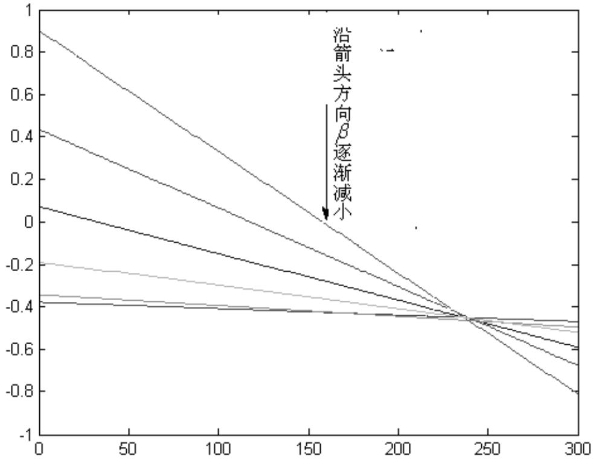

line

| X | Series 1 | Series 2 | Series 3 | Series 4 | Series 5 |
| --- | --- | --- | --- | --- | --- |
| 0 | ~0.9 | ~0.42 | ~0.07 | ~-0.2 | ~-0.38 |
| 300 | ~-0.8 | ~-0.6 | ~-0.5 | ~-0.48 | ~-0.48 |

图 12 $\beta$ 对实际出油量与显示出油量的影响

通过上表及上图可以看出，随着 $\beta$ 值的变大，实际出油量与显示出油量之差具有变陡的趋势，但是从图中可以看出，所有的趋势线都经过负半轴区域的一点。

我们可以看出，在 $\beta$ 值较小时，实际出油量总是比显示出油量较大，但是差值量对应的曲线比较平坦。而当 $\beta$ 值较大时，我们可以看到，差值量对应的曲线变陡，但是平均值更接近于零。因而我们取 $\beta$ 为一个较大的数值，使得所有误差之和接近于零。通过对表格数据以及图像的观察得到，在 $\beta = 5 ^ { \circ }$ 时，所有误差之和最接近于 0。因而实际油罐的纵向及横向倾角分别为:

$$
\alpha = 2. 1 ^ {\circ}, \beta = 5 ^ {\circ}
$$

在 $\alpha = 2 . 1 ^ { \circ } \beta = 5 ^ { \circ }$ 时，利用 MATLAB，得到其罐容表如下（求解源程序见附件 3）：

表 5 $\alpha = 2 . 1 ^ { \circ }$ $\beta = 5 ^ { \circ }$ 时的罐容表

<table><tr><td>油高/cm</td><td>油量/L</td><td>油高/m</td><td>储油量/L</td><td>油高/m</td><td>油量/L</td></tr><tr><td>10</td><td>388.9</td><td>110</td><td>19428.5</td><td>210</td><td>46918.6</td></tr><tr><td>20</td><td>1130.7</td><td>120</td><td>22107.2</td><td>220</td><td>49467.5</td></tr><tr><td>30</td><td>2312.8</td><td>130</td><td>24843</td><td>230</td><td>51913.9</td></tr><tr><td>40</td><td>3809</td><td>140</td><td>27620</td><td>240</td><td>54238.8</td></tr><tr><td>50</td><td>5552.2</td><td>150</td><td>30422.7</td><td>250</td><td>56421</td></tr><tr><td>60</td><td>7501.8</td><td>160</td><td>33235.8</td><td>260</td><td>58436.8</td></tr><tr><td>70</td><td>9627.4</td><td>170</td><td>36044</td><td>270</td><td>60257.8</td></tr><tr><td>80</td><td>11903.8</td><td>180</td><td>38831.9</td><td>280</td><td>61848</td></tr><tr><td>90</td><td>14309.1</td><td>190</td><td>41584.3</td><td>290</td><td>63154.1</td></tr><tr><td>100</td><td>16823.4</td><td>200</td><td>44285.3</td><td>300</td><td>64062.3</td></tr></table>

## 6. 模型的检验

在 $\alpha = 2 . 1 ^ { \circ }$ $\beta = 5 ^ { \circ }$ 的情况下：

实际测量的每次出油量以及通过理论计算得到的每次出油量的数值，两者的差值，相对误差部分数据如下所示（求解源程序见附件4）：

表格 1 实际测量数据与理论计算数据及其误差分析

<table><tr><td>标号</td><td>实际出油量/mm</td><td>理论计算出油量/L</td><td>两者的差值/L</td><td>相对误差</td></tr><tr><td>1</td><td>149.09</td><td>148.1</td><td>0.99</td><td>0.006685</td></tr><tr><td>2</td><td>68.45</td><td>68.2</td><td>0.25</td><td>0.003666</td></tr><tr><td>3</td><td>199.27</td><td>196.5</td><td>2.77</td><td>0.014097</td></tr><tr><td>4</td><td>70.05</td><td>70.2</td><td>-0.15</td><td>-0.00214</td></tr><tr><td>5</td><td>136.36</td><td>134.6</td><td>1.76</td><td>0.013076</td></tr><tr><td>6</td><td>232.74</td><td>232.1</td><td>0.64</td><td>0.002757</td></tr><tr><td>7</td><td>107.97</td><td>108.4</td><td>-0.43</td><td>-0.00397</td></tr><tr><td>8</td><td>49.24</td><td>48.6</td><td>0.64</td><td>0.013169</td></tr><tr><td>9</td><td>80.65</td><td>81.2</td><td>-0.55</td><td>-0.00677</td></tr><tr><td>10</td><td>120.29</td><td>118.2</td><td>2.09</td><td>0.017682</td></tr><tr><td>11</td><td>108.24</td><td>106</td><td>2.24</td><td>0.021132</td></tr><tr><td>12</td><td>83.46</td><td>85.6</td><td>-2.14</td><td>-0.025</td></tr><tr><td>13</td><td>229.93</td><td>228.3</td><td>1.63</td><td>0.00714</td></tr><tr><td>14</td><td>181.70</td><td>179.2</td><td>2.50</td><td>0.013951</td></tr><tr><td>15</td><td>238.52</td><td>237.7</td><td>0.82</td><td>0.00345</td></tr><tr><td>16</td><td>131.79</td><td>131.5</td><td>0.29</td><td>0.002205</td></tr><tr><td>17</td><td>238.33</td><td>236.8</td><td>1.53</td><td>0.006461</td></tr><tr><td>18</td><td>42.92</td><td>43</td><td>-0.08</td><td>-0.00186</td></tr><tr><td>19</td><td>171.34</td><td>169.8</td><td>1.54</td><td>0.009069</td></tr><tr><td>20</td><td>212.34</td><td>211.3</td><td>1.04</td><td>0.004922</td></tr><tr><td>21</td><td>92.38</td><td>92</td><td>0.38</td><td>0.00413</td></tr><tr><td>22</td><td>243.85</td><td>242</td><td>1.85</td><td>0.007645</td></tr><tr><td>23</td><td>206.69</td><td>207.3</td><td>-0.61</td><td>-0.00294</td></tr></table>

有上表可以看出，利用本文所建立的模型进行计算，相对误差几乎全部在1%以内，只有极个别的点相对误差略大于 1%。

估计造成以上误差的原因一方面是由于测量过程中人为的原因，另一方面由理论计算过程中的某些近似以及忽略油罐壁厚造成的，如果能够提高测量的准确性，估计相对误差会更小。

但总的来说，本模型基本满足实际生活的要求。对误差的控制也在要求的精度内。

## 7. 模型评价

通过检验，该模型较好的符合了测量的数据，并且具有相当的精度，对实际中的储油罐变位后罐容表的标定具有一定的参考意义；模型比较简单。但是该数学模型中的导出油量和油高的关系是用计算定积分的方法, 分别算出罐身及凸头的盛油容积, 虽比较精确, 但运算麻烦而且对形状大小不完全一致的椭圆柱型卧式油罐, 就得采用不同的被积函数, 因而不能一劳永逸地解决问题，即模型的可移植性不令人满意。有些文献中指出，引入相对量建模方式，提高模型的适用性，是该模型值得改进的地方。另外，该模型的计算及处理中进行了理想化的处理，如忽略罐壁厚度，罐内油渣，和实际情况还不完全吻合，要想运用在实际生产生活中，需要引入相应的修正系数。

## 8. 参考文献

[1]闵发龙 . 实用油罐体积的计算研究 . 南方农机 . 2008 年第3 期 . 1\~2 页

[2]黄正华 . 油罐中储油量的测量与计算 . 油气田地面工程（OGSE）. 第14 卷第3 期1995 年 5 月 1\~2 页