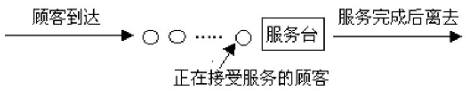
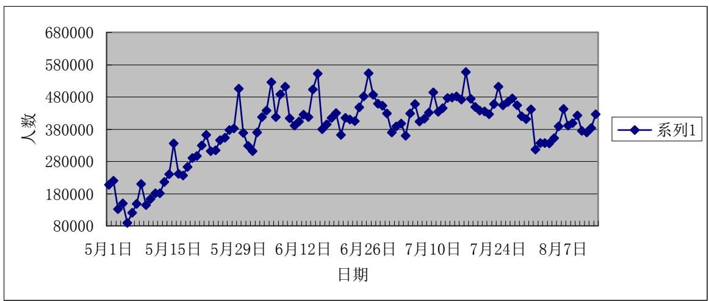

## 世博会参观线路设计

摘要：本文针对不同的情况设计出了不同的世博参观路线。比如对于我们自己我们选择了几个必去的场馆，算出去这几个馆的最优路线；对于组织者，他们安排的路线、时间等需要使绝大部分旅客的满意；而对于一般的参观者，自然参观的馆数越多越好。

问题一：我们选出了中国，沙特，日本，阿联酋，德国 5个馆。大概的测出了他们之间的距离，通过最小生成树法，得出最优路线（见 $p _ { 5 }$ ）。然后考虑到一天的参观时间只有 13 个小时，加上排队时间，我们还需要安排在各馆的滞留时间，以保证完成目标。

问题二：针对世博局，我们认为作为世博的组织者，应该让绝大部分参观者都尽量满意的回家，即将入口，交通，参观时间，购票等服务安排的合理便捷。而入口，交通，购票等因素已经差不多固定了，因此我们认为应该在参观时间上改善，由排队论，我们建议参观时间应该为：按时开放，可以考虑在凌晨五点左右关门，六点到九点左右作为场馆的清理时间。

问题三：见附录 8.1表1，对于一般的参观者，最好不要一天的时间都用于排队，且排队时间尽量越短越好，参观到吸引度高的馆数越多越好，吸引度的高低我们对各馆加入了权重，建立了以参观馆的数目最多为目标，观园时间为约束条件的0-1规划模型：最后得出一天能参观ABC三个区中的19 个馆，耗时 10:45h。

关键词：最优路线 世博局 排队论 权重 0-1规划

## 1．问题重述

## 1.1 问题背景

2010年中国上海世界博览会 5月1日正式隆重拉开帷幕。

中国的盛情诚邀得到了国际社会积极响应，最终有 189 个国家、57 个国际组织确认参展上海世博会，轻而易举地打破了 2000 年德国汉诺威世博会保持的177个国家和国际组织参展的纪录，改写了历届世博会国际参展方数量的历史。截止到5月17日，参观者已经达到 295.68万人，其中 5月26日一天就达到 34万多人,热门场馆出现了排队几个小时的现象。200 多个场馆，使参观者应接不暇。

## 1.2 问题提出

(1) 如果你作为一个参观者，你将参观哪些场馆？请根据不同情况设计参观线路。  
(2) 针对组织者（上海世博局、各参展国或组织），你有什么建议？  
(3) 针对参观者，你有什么建议？

## 2.问题分析

问题一：我们选定了中国，沙特，日本，阿联酋，德国 5个馆，粗测得到了他们之间的距离，根据最小生成树法，用 matlab 编程，求得最短路线为：中国沙特→日本→阿联酋→德国。

参观者应该在所允许的时间内根据路线尽量安排好各馆的滞留时间，使得自己在一天内都参观完，若有时间剩，就可以考虑坐上观光车，游遍所有的地方。

问题二：针对上海世博局，我们认为应该从减少排队人数增加参观者的参观场馆的个数入手，让参观者能够更有效的利用他们参观世博的时间和金钱。这样或许也可以增加参观世博的人数。利用排队论我们可以算出参观时间和平均参观人数，然后与实际相对比我们给出了延长开发时间的建议。

问题三：根据附表，我们仅考虑一天的行程，在这一天内我们仅考虑 ABC三个片区的 70 个场馆。我们以参观的馆数最多为目标，根据附表中；不同颜色的区域，加入权重：

<table><tr><td></td><td>绿色区域</td><td>黄色区域</td><td>红色区域</td></tr><tr><td>权重</td><td>3</td><td>2</td><td>1</td></tr></table>

从而目标函数为： $\scriptstyle { \mathrm { m a x } = 2 \times { \mathrm { p } } + { \mathrm { q } } ; \mathrm { ~ ( ~ } p _ { 6 } \mathrm { ~ ) } }$ 用 lingo 编程解出一天共可以参观 21 个馆，用时13个小时。

## 3. 模型假设

①.假设问题1中参观者已经拥有去往中国馆的预约券，且已经进入园区。  
②.参观者在一馆到另一馆时间很短可以忽略不计。

③.参观者休息的时间和吃饭的时间全部设为是排队时间。  
④.假设在中国馆已经饱和了时的情况下考虑排队论  
⑤.世博会中所有的馆在规定的时间内全部开放。  
⑥中国馆外用来排队的面积为无穷大。  
⑦参观者心中各个馆的权重固定不变。  
⑧在排队过程中中途不会放弃。

## 4.符号约定

$$
x _ {i} = \left\{ \begin{array}{c} 1, \text {选择该馆} \\ 0, \text {不选择该馆} \end{array} i = 0, 1, 2, \dots , 7 0 \right.
$$

a:参观时间，这里约定 $a = 0 . 5 h$

b：排队时间，由附表中给定的数据而定

$$
p = \sum_ {i = 1} ^ {7 0} x _ {i} \text {所选馆的个数}
$$

$q$ ：权重为3的馆减去权重为 1 的馆

$p _ { 0 }$ ：在系统里没有顾客的概率，即所有服务设施空闲得概率

$L _ { q }$ ：排队的平均长度，即排队的平均顾客数

$L _ { s }$ ：在系统里的平均顾客数，包括排队的顾客数和正在参观的顾客数

$W _ { q }$ ：一位顾客花在排队上的平均时间

$W _ { s }$ ：每位顾客花在系统得平均逗留时间

：为单位时间的顾客平均到达率。

$\mu$ 为单位时间的平均服务率。

## 5.模型的建立与求解

## 5.1 模型一：

我们选择中国，沙特，日本，阿联酋，德国 5个馆作为参观目标，参观每个馆都有排队时间和参观时间两部分，我们暂时不考虑各馆的参观时间。假设各馆的排队时间一样。

粗测出5馆间的距离为：（单位：米）

<table><tr><td>馆名</td><td>中国1</td><td>沙特2</td><td>日本3</td><td>阿联酋4</td><td>德国5</td></tr><tr><td>中国1</td><td>0</td><td>740</td><td>1300</td><td>780</td><td>1500</td></tr><tr><td>沙特 2</td><td>740</td><td>0</td><td>430</td><td>560</td><td>2000</td></tr><tr><td>日本 3</td><td>1300</td><td>430</td><td>0</td><td>550</td><td>2200</td></tr><tr><td>阿联酋 4</td><td>780</td><td>560</td><td>550</td><td>0</td><td>200</td></tr><tr><td>德国 5</td><td>1500</td><td>2000</td><td>2200</td><td>200</td><td>0</td></tr></table>

通过matlab编程得到路线为：

<table><tr><td>1</td><td>2</td><td>3</td><td>4</td></tr><tr><td>2</td><td>3</td><td>4</td><td>5</td></tr><tr><td>740</td><td>430</td><td>550</td><td>200</td></tr></table>

即路线为中国 沙特 日本 阿联酋 德国。

根据去过世博的人的经验我们假设各馆的排队时间为：

<table><tr><td></td><td>中国馆</td><td>沙特馆</td><td>日本馆</td><td>阿联酋馆</td><td>德国馆</td></tr><tr><td>排队时间/h</td><td>1</td><td>3</td><td>2</td><td>1.5</td><td>2</td></tr></table>

所以按最短路线排为：中国 阿联酋 日本（德国） 德国（日本） 沙特。算得总时间为9：30即在剩下的 3：30小时内我们必须合理且紧凑的安排时间才能勉强的参观这5个馆。

## 5.2模型二：

参观者参观各个馆，由于参观的人数过多、各个馆的容量又有限，就出现了排队现象。以中国馆为例，考虑它达到稳态时的队伍状况。

参观者拿到预约卷在规定时间内开始排队，其顾客源是无限的。一般情况，我们认为参观者相继到达的时间间隔、服务时间符合负指数分布，排队规则为先来先服务。中国馆就只有一个服务台。设中国馆的最大容量为 N，参观者在馆外排队，认为可以无限地排下去。所以该排队系统我们表示为：

$$
M / M / 1 \text {∅} \quad \text { ∞ } \quad F C I
$$

排队情况如下图所示：



<details>
<summary>flowchart</summary>

```mermaid
graph LR
  A["顾客到达"] --> B((""))
  B --> C["服务台"]
  C --> D["服务完成后离去"]
  E["正在接受服务的顾客"] -.-> C
```
</details>

由实际，我们了解到， $\lambda < \mu$ ，否则队列将无限的增加，中国馆根本没法处理所有到达的参观者。设服务强度 $\rho = \lambda / \mu$ ，我们有：

平均排队顾客数： $L _ { _ q } = \frac { \lambda ^ { 2 } } { \mu ( \mu - \lambda ) }$ . 。

在系统里的平均顾客数 $L _ { \it s } = L _ { \it q } + \frac { \lambda } { \mu }$ C

一位顾客花在排队上的平均时间 $W _ { q } = \frac { L _ { q } } { \lambda }$

每位顾客花在系统得平均逗留时间 $W _ { s } = W _ { q } + \frac { 1 } { \mu }$

按实际情况，我们给定 $\lambda = 0 . 5$ 人 $\mathit { / s , \mu = 0 . 5 0 0 5 } \lambda \mathit { / s }$ ，各自带入上式，得到：

$$
L _ {q} = 9 9 9
$$

$$
L _ {s} = 1 0 0 \text {众}
$$

$$
W _ {q} = 1 9 9 \mathrm{s8}
$$

$$
W _ {s} = 2 0 0 \mathrm{s} 0
$$

$$
\rho = 0. 9 9 9
$$

由这些数据可与以知道，在中国馆达到稳态后，到达中国馆有 99.93%是要排队等待，排队长度平均为 999人。排队的平均时间为 1988s,即半个多小时。所以我们认为有必要改善这个排队系统。如延长馆的开放时间，按时开放，可以考虑在凌晨五点左右关门，六点到九点左右作为馆和园的清理时间。这样就可以减少平均排队时间和参观时间。

## 5.3模型三：

我们仅考虑一天内参观者的参观安排，为了尽量能让旅客能参观到更多的馆，且是相对较热门的馆，我们考虑到的一天的时间是有限的，就选择参观 ABC三个片区中的几个，我们假设其参观每个馆的时间都为 0.5h，根据附录，我们设出各馆的排队时间 $b _ { i }$ 为：

<table><tr><td>1</td><td>2</td><td>3</td><td>4</td><td>5</td><td>6</td><td>7</td><td>8</td><td>9</td><td>10</td></tr><tr><td>2.25</td><td>3</td><td>1.75</td><td>0.5</td><td>0.75</td><td>0.5</td><td>0.5</td><td>1.75</td><td>0.5</td><td>1.25</td></tr><tr><td>11</td><td>12</td><td>13</td><td>14</td><td>15</td><td>16</td><td>17</td><td>18</td><td>19</td><td>20</td></tr><tr><td>1.25</td><td>1</td><td>1</td><td></td><td>1</td><td>0</td><td>0.5</td><td>0.5</td><td>1</td><td>1</td></tr><tr><td>21</td><td>22</td><td>23</td><td>24</td><td>25</td><td>26</td><td>27</td><td>28</td><td>29</td><td>30</td></tr><tr><td>1</td><td>0.5</td><td>0</td><td>1.25</td><td>1.75</td><td>1</td><td>1</td><td>1</td><td>0.5</td><td>2.25</td></tr><tr><td>31</td><td>32</td><td>33</td><td>34</td><td>35</td><td>36</td><td>37</td><td>38</td><td>39</td><td>40</td></tr><tr><td>0.75</td><td>0.75</td><td>0.5</td><td>0.5</td><td>0.5</td><td>0.5</td><td>0.75</td><td>0.5</td><td>0.875</td><td>0.5</td></tr><tr><td>41</td><td>42</td><td>43</td><td>44</td><td>45</td><td>46</td><td>47</td><td>48</td><td>49</td><td>50</td></tr><tr><td>0.17</td><td>0.75</td><td>0.5</td><td>0.5</td><td>0.5</td><td>0.75</td><td>0.5</td><td>0.5</td><td>0.5</td><td>0.75</td></tr><tr><td>51</td><td>52</td><td>53</td><td>54</td><td>55</td><td>56</td><td>57</td><td>58</td><td>59</td><td>60</td></tr><tr><td>0.5</td><td>1.25</td><td>0.25</td><td>0.25</td><td>0</td><td>0.75</td><td>0.25</td><td>0</td><td>0</td><td>0</td></tr><tr><td>61</td><td>62</td><td>63</td><td>64</td><td>65</td><td>66</td><td>67</td><td>68</td><td>69</td><td>70</td></tr><tr><td>0</td><td>0</td><td>0</td><td>0</td><td>0</td><td>0</td><td>0.5</td><td>0.5</td><td>0.5</td><td>0.5</td></tr></table>

根据附录我们加入了权重为：

<table><tr><td></td><td>绿色区域</td><td>黄色区域</td><td>红色区域</td></tr><tr><td>权重</td><td>3</td><td>2</td><td>1</td></tr></table>

以参观的馆数最多为目标，时间为约束条件。我们建立的模型为：

s.t.

$$
x _ {i} (a + b _ {i}) \leq 1 3
$$

$$
p = \sum_ {i = 1} ^ {7 0} x _ {i},
$$

其中： $q = x _ { 1 } + x _ { 3 } + x _ { 8 } + x _ { 1 1 } + x _ { 1 2 } + x _ { 1 3 } + x _ { 1 4 } + x _ { 1 6 } + x _ { 1 9 } + x _ { 2 0 } + x _ { 2 3 } + x _ { 2 4 }$

$$
+ x _ {2 5} + x _ {2 7} + x _ {3 0} + x _ {3 2} + x _ {4 2} + x _ {4 8} - (x _ {1} + x _ {4} + x _ {2 6} + x _ {3 1} + x _ {3 7} + x _ {3 8} + x _ {4 1})
$$

用lingo求解得：参观的馆数为 21个，用时13h具体的馆为：

<table><tr><td></td><td>1</td><td>2</td><td>3</td><td>4</td><td>5</td><td>6</td><td>7</td></tr><tr><td>世博文化中心</td><td>新西兰</td><td>太平洋联合</td><td>安哥拉</td><td>非洲联合</td><td>智利</td><td>墨西哥</td><td></td></tr><tr><td></td><td>8</td><td>9</td><td>10</td><td>11</td><td>12</td><td>13</td><td>14</td></tr><tr><td>巴西</td><td>瑞典</td><td>斯里兰卡</td><td>亚联一</td><td>亚联二</td><td>亚联三</td><td colspan="2">土库曼斯坦</td></tr><tr><td></td><td>15</td><td>16</td><td>17</td><td>18</td><td>19</td><td>20</td><td>21</td></tr><tr><td>卡塔尔</td><td>黎巴嫩</td><td>伊朗</td><td>朝鲜</td><td>乌兹别克斯坦</td><td>哈萨克</td><td colspan="2">越南</td></tr></table>

然而这样的话会比较赶，而且没有考虑到休息吃饭的时间，因此，我们可以考虑休息和吃饭的时间为两个小时，即让约束条件化为 $x _ { i } ( a + b _ { i } ) \leq 1 1$ ，结果就是参观的个数就变为19 个，用时10.45h。这样比较合理。当然若有时间剩，还可以坐上观光车去了解一下世博园区的其他风景。

从世博会开园到现在我们了解到旅客人数的统计情况（见附录 8.1 表2）：对数据用Excel 处理得到下图：



<details>
<summary>line</summary>

| 日期 | 系列1 (人数) |
| --- | --- |
| 5月1日 | ~200000 |
| 5月2日 | ~210000 |
| 5月3日 | ~120000 |
| 5月4日 | ~90000 |
| 5月5日 | ~140000 |
| 5月6日 | ~160000 |
| 5月7日 | ~130000 |
| 5月8日 | ~170000 |
| 5月9日 | ~180000 |
| 5月10日 | ~210000 |
| 5月11日 | ~230000 |
| 5月12日 | ~320000 |
| 5月13日 | ~240000 |
| 5月14日 | ~230000 |
| 5月15日 | ~260000 |
| 5月16日 | ~290000 |
| 5月17日 | ~310000 |
| 5月18日 | ~330000 |
| 5月19日 | ~360000 |
| 5月20日 | ~310000 |
| 5月21日 | ~330000 |
| 5月22日 | ~340000 |
| 5月23日 | ~360000 |
| 5月24日 | ~380000 |
| 5月25日 | ~490000 |
| 5月26日 | ~370000 |
| 5月27日 | ~310000 |
| 5月28日 | ~370000 |
| 5月29日 | ~420000 |
| 5月30日 | ~440000 |
| 5月31日 | ~490000 |
| 6月1日 | ~420000 |
| 6月2日 | ~490000 |
| 6月3日 | ~420000 |
| 6月4日 | ~430000 |
| 6月5日 | ~440000 |
| 6月6日 | ~490000 |
| 6月7日 | ~540000 |
| 6月8日 | ~380000 |
| 6月9日 | ~410000 |
| 6月10日 | ~430000 |
| 6月11日 | ~370000 |
| 6月12日 | ~420000 |
| 6月13日 | ~430000 |
| 6月14日 | ~470000 |
| 6月15日 | ~490000 |
| 6月16日 | ~540000 |
| 6月17日 | ~480000 |
| 6月18日 | ~460000 |
| 6月19日 | ~440000 |
| 6月26日 | ~380000 |
| 7月1日 | ~410000 |
| 7月2日 | ~370000 |
| 7月3日 | ~420000 |
| 7月4日 | ~440000 |
| 7月5日 | ~420000 |
| 7月6日 | ~430000 |
| 7月7日 | ~450000 |
| 7月8日 | ~480000 |
| 7月9日 | ~490000 |
| 7月12日 | ~495000 |
| 7月13日 | ~495555555555555555555555555555555555555555555555555555555555555555555555555555555555555555555555555555<nl> |
| Date (approx) | Value (人) |
</details>

从上表分析我们得出，6、7 月份的参观人数最多，且有一定的规律：假如出发旅游前5天左右参观的人数明显很多，那么这段时期相对人数会减少，因此我们建议参观者在出发前应该去搜索一下近期的旅客人数，然后适时前往。

## 6.结果分析

问题一：我们考虑到的5个馆可能都是太热门的，在预测的排队时间内可能无法正常进入场馆进行参观，也有可能比预期你的情况更好，即排队时间不需要那么久，具体时间安排还得自己稍微做点安排。但路线是没有出入的。

问题二：在中国馆达到稳态后，假设馆内的最大容量为 5000，把馆内的 4999个人看作一个整体。到达中国馆有 99.93%是要排队等待，排队长度平均为 999人。排队的平均时间为 1988s,即半个多小时。所以我们认为有必要改善这个排队系统。如延长馆的开放时间，按时开放，可以考虑在凌晨五点左右关门，六点到九点左右作为馆和园的清理时间。这样就可以减少平均排队时间和参观时间。

问题三：在这个模型中，很多的数据都是根据附录中的数据来定的，数据通过对大多数人而调查出来的，我们不能够亲自去调查，但这数据是可以说明问题的。模型最后的结果有所更改，是根据旅客的正常生活来考虑的，旅游不是马拉松，总是要有时间休息和静下来吃顿饭的，因此，我们最后考虑空出 2个小时来供旅客休息。最后得出参观 19个馆，耗时10.45h

## 7.模型的评价与推广

## 7.1模型的优点：

（1）.模型一应用最小生成树法，求得最优路线，为参观者提供了很好的建议。  
（2）.模型二我们运用排队论，很好的说明了一个馆的管理模型，然后我们可以延伸到各个场馆。

（3）.模型中参考了大量的数据，尽量的去完善各个模型。  
（4）.模型三中我们考虑到了各个馆的热门程度，可以尽量的去反映旅客的旅游情形，这样就能更好的反映结果的合理性。

## 7.2模型的缺点：

（1）.模型一只考虑我们自身的参观喜好，是在我们自身的角度去解决问题的，不是很具有普遍性。  
（2）.模型三仅考虑了一天的行程，而对于 2 天或者更多天的并没有考虑，结果可能有些太普遍。

## 7.3 模型的推广：

本模型可用于最短路线或最短路、最大流问题，如多方位旅游、推销、运货等

## 8.参考文献

[1]孔造杰 运筹学 北京：机械工业出版社  
[2] 杨圣红 排队论（简本） 排队论.ppt  
[3]http://map.baidu.com/  
[4]http://map.expo2010.cn/  
[5]赵静 数学建模与数学实验 北京：高等教育出版社 2001.11  
[6] http://wenku.baidu.com/view/d8ae3612a216147917112895.html 提 供 者：mlxinyuan24

## 附录：

## 8.1 表 1

世博会场馆评价表：

<table><tr><td>国家</td><td>实际平均排队时间</td><td>最长忍耐时间</td><td>场馆评价</td></tr><tr><td colspan="4">A片区(亚洲)</td></tr><tr><td>日本</td><td>2小时-2个半小时</td><td>1个半小时(建议入园首选)</td><td>★★★★★</td></tr><tr><td>沙特</td><td>3小时</td><td>1个半小时(建议入园首选)</td><td>★★★</td></tr><tr><td>韩国</td><td>1小时45分</td><td>1个半小时(建议下午-晚上入)</td><td>★★★☆</td></tr><tr><td>尼泊尔</td><td>30分钟以内</td><td>15分钟(全天都可)</td><td>★★</td></tr><tr><td>以色列</td><td>45分钟</td><td>15分钟(建议下午-晚上入)</td><td>★★☆</td></tr><tr><td>巴基斯坦</td><td>30分钟以内</td><td>15分钟(全天都可)</td><td>★★☆</td></tr><tr><td>阿曼</td><td>30分钟以内</td><td>15分钟(全天都可)</td><td>★★☆</td></tr><tr><td>阿联酋</td><td>1个半小时-2小时</td><td>1个半小时(建议下午-晚上入)</td><td>★★★☆</td></tr><tr><td>摩洛哥</td><td>30分钟以内</td><td>15分钟(全天都可)</td><td>★★☆</td></tr><tr><td>印度</td><td>1小时-1个半小时</td><td>30分钟(建议下午-晚上入)</td><td></td></tr><tr><td>中国</td><td>1小时-1个半小时</td><td>凭券(最好根据票面时间)</td><td>★★★★★</td></tr><tr><td>香港</td><td>未知</td><td>凭券(根据票面时间)</td><td></td></tr><tr><td>澳门</td><td>未知</td><td>凭券(根据票面时间)</td><td></td></tr><tr><td>台湾</td><td>未知</td><td>凭券(根据票面时间)</td><td></td></tr><tr><td>其他</td><td>除个别场馆,基本都是直接进</td><td>30分钟以内(全天都可)</td><td></td></tr><tr><td colspan="4">B片区(东南亚+大洋洲)</td></tr><tr><td>新西兰</td><td>30分钟</td><td>45分钟(全天都可)</td><td>★★★☆</td></tr><tr><td>马来西亚</td><td>30分钟</td><td>30分钟(全天都可)</td><td>★★☆</td></tr><tr><td>新加坡</td><td>1小时</td><td>45分钟(建议晚上入)</td><td>★★★</td></tr><tr><td>澳大利亚</td><td>1小时</td><td>1小时(建议晚上入)</td><td>★★★☆</td></tr><tr><td>泰国</td><td>1小时</td><td>1小时15分(建议下午-晚上入)</td><td>★★★★</td></tr><tr><td>菲律宾,文莱,印尼</td><td>30分钟内</td><td>未知(全天都可)</td><td></td></tr><tr><td>太平洋联合</td><td>直接进</td><td>直接进</td><td>★★☆</td></tr></table>

<table><tr><td colspan="4">C片区(欧美+非洲)</td></tr><tr><td>西班牙</td><td>1小时-1个半小时</td><td>1个半小时(建议入园首选,或晚上入)</td><td>★★★★</td></tr><tr><td>瑞士</td><td>1个半小时-2小时</td><td>2小时(建议入园首选)</td><td>★★★★☆</td></tr><tr><td>法国</td><td>1小时</td><td>1个半小时(建议晚上入)</td><td>★★★★</td></tr><tr><td>英国</td><td>1小时</td><td>可看性较低,高峰慎入(一定晚上入)</td><td>★★</td></tr><tr><td>意人利</td><td>1小时</td><td>1个半小时(建议晚上入)</td><td>★★★★</td></tr><tr><td>卢森堡</td><td>30分钟</td><td>30分钟(全天都可)</td><td>★★☆</td></tr><tr><td>荷兰</td><td>30分钟以内</td><td>30分钟(全天都可)</td><td>★★★</td></tr><tr><td>德国</td><td>2小时-2个半小时</td><td>2小时(建议入园首选,或晚上闭园前入)</td><td>★★★★☆</td></tr><tr><td>波兰</td><td>45分钟</td><td>可看性较低,高峰慎入</td><td>★★</td></tr><tr><td>比利时欧盟</td><td>45分钟</td><td>1小时(建议下午-晚上入)</td><td>★★★★</td></tr><tr><td>摩纳哥,塞尔维亚</td><td>30分钟以内</td><td>30分钟(全天都可)</td><td>★★★</td></tr><tr><td>爱沙尼亚,拉脱维亚</td><td>30分钟以内</td><td>15分钟(全天都可)</td><td>★★☆</td></tr><tr><td>土耳其</td><td>30分钟以内</td><td>20分钟(全天都可)</td><td>★★☆</td></tr><tr><td>奥地利</td><td>30分钟</td><td>20分钟(全天都可)</td><td>★★☆</td></tr><tr><td>罗马尼亚</td><td>可能超过45分钟</td><td>可看性较低,高峰慎入</td><td>★★</td></tr><tr><td>克罗地亚</td><td>30分钟以内</td><td>可看性较低,高峰慎入</td><td>★☆</td></tr><tr><td>俄罗斯</td><td>45分钟-1小时</td><td>45分钟(建议晚上入)</td><td>★★★★☆</td></tr><tr><td>挪威</td><td>30分钟</td><td>30分钟(暂停盖章后,全天都可)</td><td>★★★</td></tr><tr><td>乌克兰</td><td>不超过10分钟</td><td>可看性较低,无需排队再进</td><td>★☆</td></tr><tr><td>瑞典</td><td>45分钟</td><td>45分钟(建议晚上入)</td><td>★★★★☆</td></tr><tr><td>丹麦</td><td>30分钟</td><td>30分钟(建议下午-晚上入)</td><td>★★★</td></tr><tr><td>芬兰</td><td>30分钟</td><td>30分钟(有短信预约服务)</td><td>★★★</td></tr><tr><td>捷克</td><td>30分钟以内</td><td>30分钟(全天都可)</td><td>★★★</td></tr><tr><td>加拿大</td><td>45分钟</td><td>30分钟(建议下午-晚上入)</td><td>★★★</td></tr><tr><td>巴西</td><td>30分钟</td><td>30分钟(建议下午-晚上入)</td><td>★★★</td></tr><tr><td>美国</td><td>1小时-1个半小时</td><td>1个半小时(建议下午-晚上入)</td><td>★★★★★</td></tr><tr><td>墨西哥</td><td>15分钟</td><td>15分钟(全天都可,下午-晚上较好)</td><td>★★☆</td></tr><tr><td>智利</td><td>15分钟</td><td>15分钟(全天都可,下午-晚上较好)</td><td>★★☆</td></tr><tr><td>非洲联合</td><td>直接进</td><td>直接进</td><td>★★★★☆</td></tr><tr><td>南非</td><td>30分钟</td><td>30分钟(全天都可,下午-晚上较好)</td><td>★★☆</td></tr><tr><td>埃及</td><td>45分钟</td><td>30分钟(全天都可,下午-晚上较好)</td><td>★★☆</td></tr><tr><td>安哥拉</td><td>15分钟</td><td>15分钟(全天都可)</td><td>★★</td></tr></table>

表示值得一看的场馆

一般般，个别星较多的馆有亮点

包括个别“剧毒”场馆，原则上不排队可以看看，排队就pass吧

\*实际平均排队时间：是自己根据实际排队，现场观察以及询问工作人员后得出，会有些偏差，但不会太大。

表 2

<table><tr><td>5月1日</td><td>206900</td><td>6月1日</td><td>311100</td><td>7月1日</td><td>369800</td><td>8月1日</td><td>316000</td></tr><tr><td>5月2日</td><td>220000</td><td>6月2日</td><td>369600</td><td>7月2日</td><td>388000</td><td>8月2日</td><td>336700</td></tr><tr><td>5月3日</td><td>131700</td><td>6月3日</td><td>417500</td><td>7月3日</td><td>397600</td><td>8月3日</td><td>336000</td></tr><tr><td>5月4日</td><td>148600</td><td>6月4日</td><td>437000</td><td>7月4日</td><td>358800</td><td>8月4日</td><td>335700</td></tr><tr><td>5月5日</td><td>88900</td><td>6月5日</td><td>524900</td><td>7月5日</td><td>428500</td><td>8月5日</td><td>352100</td></tr><tr><td>5月6日</td><td>120200</td><td>6月6日</td><td>417400</td><td>7月6日</td><td>457100</td><td>8月6日</td><td>388100</td></tr><tr><td>5月7日</td><td>147700</td><td>6月7日</td><td>487900</td><td>7月7日</td><td>403400</td><td>8月7日</td><td>442400</td></tr><tr><td>5月8日</td><td>209800</td><td>6月8日</td><td>510900</td><td>7月8日</td><td>411500</td><td>8月8日</td><td>390700</td></tr><tr><td>5月9日</td><td>144000</td><td>6月9日</td><td>413400</td><td>7月9日</td><td>430500</td><td>8月9日</td><td>398400</td></tr><tr><td>5月10日</td><td>163000</td><td>6月10日</td><td>391300</td><td>7月10日</td><td>493600</td><td>8月10日</td><td>422700</td></tr><tr><td>5月11日</td><td>180400</td><td>6月11日</td><td>403000</td><td>7月11日</td><td>433800</td><td>8月11日</td><td>373800</td></tr><tr><td>5月12日</td><td>180100</td><td>6月12日</td><td>424600</td><td>7月12日</td><td>444700</td><td>8月12日</td><td>369700</td></tr><tr><td>5月13日</td><td>215500</td><td>6月13日</td><td>417300</td><td>7月13日</td><td>476100</td><td>8月13日</td><td>383200</td></tr><tr><td>5月14日</td><td>240300</td><td>6月14日</td><td>503200</td><td>7月14日</td><td>477300</td><td>8月14日</td><td>425800</td></tr><tr><td>5月15日</td><td>335300</td><td>6月15日</td><td>552000</td><td>7月15日</td><td>481200</td><td></td><td></td></tr><tr><td>5月16日</td><td>241500</td><td>6月16日</td><td>379000</td><td>7月16日</td><td>471800</td><td></td><td></td></tr><tr><td>5月17日</td><td>236400</td><td>6月17日</td><td>394100</td><td>7月17日</td><td>557200</td><td></td><td></td></tr><tr><td>5月18日</td><td>261900</td><td>6月18日</td><td>414400</td><td>7月18日</td><td>474000</td><td></td><td></td></tr><tr><td>5月19日</td><td>290600</td><td>6月19日</td><td>429800</td><td>7月19日</td><td>448400</td><td></td><td></td></tr><tr><td>5月20日</td><td>296400</td><td>6月20日</td><td>361200</td><td>7月20日</td><td>437400</td><td></td><td></td></tr><tr><td>5月21日</td><td>328500</td><td>6月21日</td><td>415100</td><td>7月21日</td><td>435300</td><td></td><td></td></tr><tr><td>5月22日</td><td>361200</td><td>6月22日</td><td>409800</td><td>7月22日</td><td>425800</td><td></td><td></td></tr><tr><td>5月23日</td><td>311700</td><td>6月23日</td><td>404100</td><td>7月23日</td><td>457200</td><td></td><td></td></tr><tr><td>5月24日</td><td>314500</td><td>6月24日</td><td>447100</td><td>7月24日</td><td>512000</td><td></td><td></td></tr><tr><td>5月25日</td><td>345800</td><td>6月25日</td><td>480900</td><td>7月25日</td><td>453100</td><td></td><td></td></tr><tr><td>5月26日</td><td>353500</td><td>6月26日</td><td>553500</td><td>7月26日</td><td>463800</td><td></td><td></td></tr><tr><td>5月27日</td><td>377000</td><td>6月27日</td><td>486800</td><td>7月27日</td><td>475400</td><td></td><td></td></tr><tr><td>5月28日</td><td>382200</td><td>6月28日</td><td>458300</td><td>7月28日</td><td>453800</td><td></td><td></td></tr><tr><td>5月29日</td><td>505000</td><td>6月29日</td><td>452600</td><td>7月29日</td><td>420100</td><td></td><td></td></tr><tr><td>5月30日</td><td>368300</td><td>6月30日</td><td>427900</td><td>7月30日</td><td>410500</td><td></td><td></td></tr><tr><td>5月31日</td><td>327500</td><td></td><td></td><td>7月31日</td><td>440900</td><td></td><td></td></tr></table>

## 8.2模型一的程序：

Matlab 程序：

```txt
clc;clear;
    a=[0 740 1300 780 1500
        740 0 430 560 2000
        1300 430 0 550 2200
        780 560 550 0 200
        1500 2000 2200 200 0];
```

```matlab
result=[];p=1;tb=2:length(a);
while length(result)~=length(a)-1
    temp=a(p, tb);temp=temp(:);
    d=min(temp);
    [jb, kb]=find(a(p, tb)==d);
    j=p(jb(1));k=tb(kb(1));
    result=[result, [j;k;d]];p=[p, k];tb(find(tb==k))=[];
end
```

result

## 8.3模型三的程序：

model:

sets:

gs/1..70/:a,b,x;

endsets

```yaml
data:a=0.5 0.5 0.5 0.5 0.5 0.5 0.5 0.5 0.5 0.5 0.5 0.5 0.5
0.5 0.5 0.5 0.5 0.5 0.5 0.5 0.5 0.5 0.5 0.5 0.5 0.5 0.5
0.5 0.5 0.5 0.5 0.5 0.5 0.5 0.5 0.5 0.5 0.5 0.5
0.5 0.5 0.5 0.5 0.5 0.5 0.5 0.5 0.5 0.5 0.5 0.5
0.50.50.50.50.50.50.50.50.50.50.50.50.5
b=2.2531.750.50.750.50.51.750.51.251.25111100.5
0.51110.501.251.751110.50.52.250.750.750.50.5
0.50.50.750.50.8750.50.170.750.50.50.750.51.25
0.250.2500.50.750.2500000000000000
b=2.2531.750.50.750.50.51.750.51.251.251111
b=2.253111
b=2.253111
b=2.253111
```

enddata

```matlab
p=@sum(gs(i):x(i));
q=x(1)+x(3)+x(8)+x(11)+x(12)+x(13)+x(14)+x(16)+x(19)+x(20)+x(23)+x(24)
)+x(25)+x(27)+x(30)+
x(32)+x(42)+x(48)+x(1)-(x(4)+x(26)+x(31)+x(37)+x(38)+x(41));
max=2*p+q;
@sum(gs(i):x(i)*(a(i)+b(i)))<=11;
s=@sum(gs(i):x(i)*(a(i)+b(i)));
@for(gs(i):@bin(x(i)));
end
```