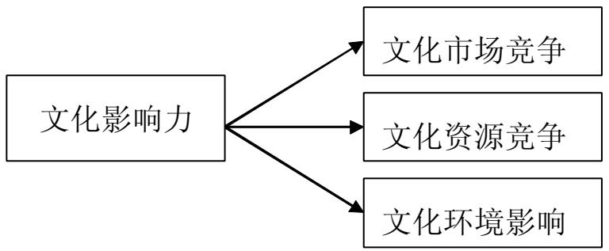
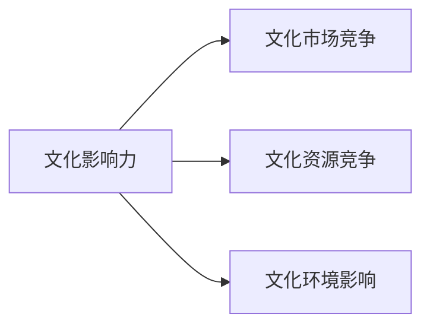
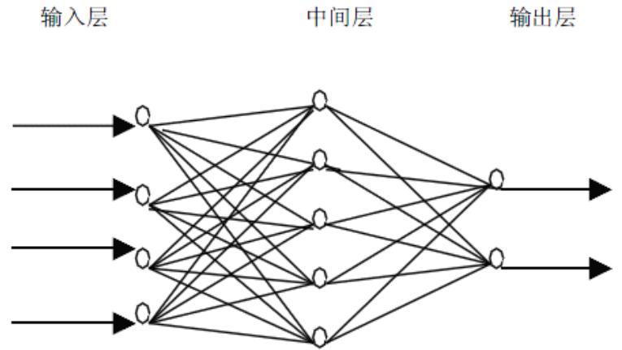
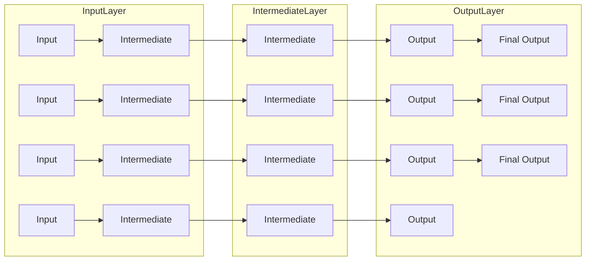
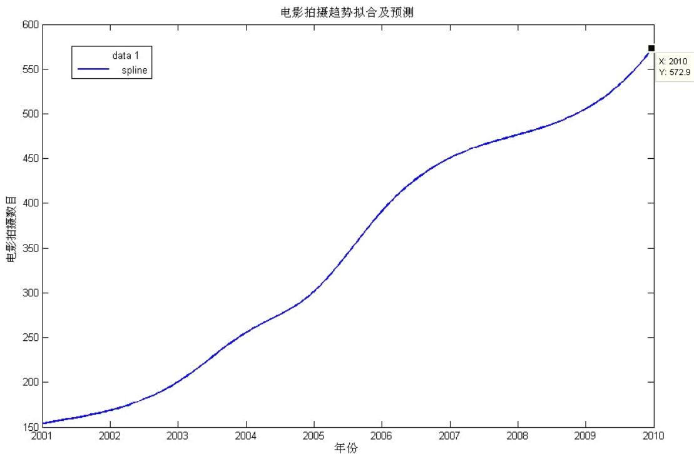
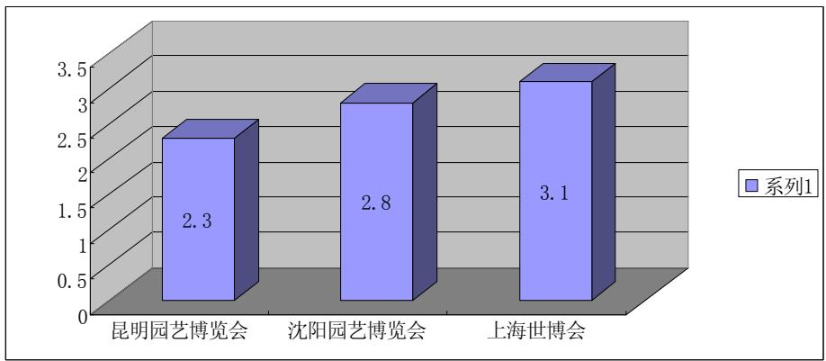
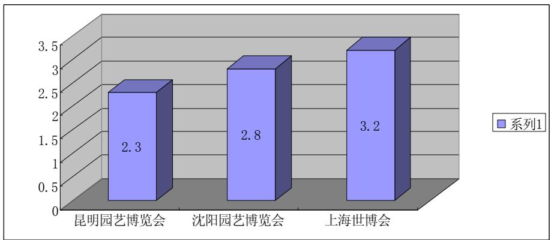
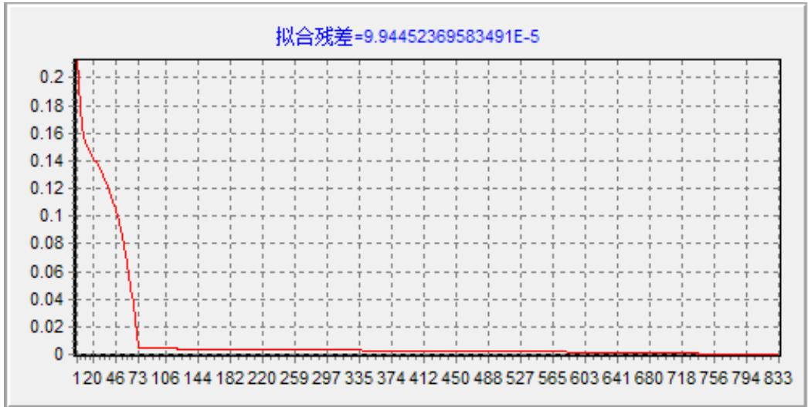

# 2010高教社杯全国大学生数学建模竞赛

## 承 诺 书

我们仔细阅读了中国大学生数学建模竞赛的竞赛规则.

我们完全明白，在竞赛开始后参赛队员不能以任何方式（包括电话、电子邮件、网上咨询等）与队外的任何人（包括指导教师）研究、讨论与赛题有关的问题。

我们知道，抄袭别人的成果是违反竞赛规则的, 如果引用别人的成果或其他公开的资料（包括网上查到的资料），必须按照规定的参考文献的表述方式在正文引用处和参考文献中明确列出。

我们郑重承诺，严格遵守竞赛规则，以保证竞赛的公正、公平性。如有违反竞赛规则的行为，我们将受到严肃处理。

我们参赛选择的题号是（从 A/B/C/D 中选择一项填写）： B

我们的参赛报名号为（如果赛区设置报名号的话）： 07050

所属学校（请填写完整的全名）： 哈尔滨工业大学

参赛队员 (打印并签名) ：1. 孙阳

2. 张兴起

3. 雷博

指导教师或指导教师组负责人 (打印并签名)： 尚寿亭

日期： 2010 年 9 月 13 日

赛区评阅编号：

# 2010高教社杯全国大学生数学建模竞赛

## 编 号 专 用 页

赛区评阅编号：

赛区评阅记录：

<table><tr><td>评阅人</td><td></td><td></td><td></td><td></td><td></td><td></td><td></td><td></td><td></td><td></td></tr><tr><td>评分</td><td></td><td></td><td></td><td></td><td></td><td></td><td></td><td></td><td></td><td></td></tr><tr><td>备注</td><td></td><td></td><td></td><td></td><td></td><td></td><td></td><td></td><td></td><td></td></tr></table>

全国统一编号：

全国评阅编号：

# 对上海世博会文化影响力的定量评估

## 摘要

世界博览会是人类文明的驿站，是多元文化跨国界交流的平台。2010 年上海世博会是首次在中国举办的世界博览会。上海世博会的举办，无论对上海还是整个中国都有着深远的影响。它将给经济和文化等多个领域带来前所未有的推动力。本文从上海世博会对文化的影响这个侧面来定量评估2010年上海世博会的影响力。

本文对世博会的文化影响力的研究是从文化市场影响力、文化资源影响力、文化环境影响力 3 个方面进行分析，对文化商品贸易份额等9 个角度加以量化。

我国承办过的与本届世博会相似的世界性博览会有1999昆明世界园艺博览会、2006沈阳世界园艺博览会、2008年奥运会。但考虑到奥运会的赛会性质和举办目的显著不同，且人们对其的关注程度差异较大，所以本文以昆明和沈阳的园艺博览会为样本对本届世博会进行文化影响力评估。我们采用中国统计局《年度统计年鉴》中的客观数据，通过因子分析和 BP 神经网络两种方法评估出世博的文化影响力。

为了权衡众多影响因素对文化影响力方面评价时的相关性，本文首先运用了线性关系因素的因子分析法，得出了各影响因素对文化影响力的影响权重。再通过已公布的2010 年 6 月的统计数据对尚在进行中的上海世博会的文化影响进行了量化预测。

然而，影响文化影响力指数的因素之间有一定的非线性，所以要求求解算法最好有一定的非线性映射能力，因此我们又利用了 BP 神经网络的方法建立了神经网络模型。利用 BP 神经网络算法的泛化能力和容错能力建立出理论上更加完善的解算方案。

最后我们对两种方法做了系统性比较评价，可行性和误差分析。

关键字：上海世博会 文化影响力 BP 神经网络模型 因子分析法 非线性回归

## 引言

世界博览会是人类文明的驿站，是各种新思想、新科技、新发明、新创造、新理念充分展示的盛会，也是多元文化跨国界交流的平台。从1851 年英国伦敦举办首届现代意义的世界博览会以来，世博会以创新为基石，以科技展示和文化展现作为其实现教育功能的两大手段，以科技的光芒指引人类前行，用文化的力量震撼人类的心灵。

## 一、问题重述

2010 年上海世博会是首次在中国举办的世界博览会。从1851 年伦敦的“万国工业博览会”开始，世博会正日益成为各国人民交流历史文化、展示科技成果、体现合作精神、展望未来发展等的重要舞台。世博会,在为本国经济创造效益的同时,其文化方面的的贡献也是意义深远的. 众所周知,世博会,本身就起着文化方面的宣传和推广作用.同时,由于它的举办,而间接发挥的文化作用更是不可估量的.这些统合起来,即是世博文化方面的影响力.

## 二、模型假设

2.1 文化影响力是相对的，可以通过与其它地区的比较来衡量。  
2.2 文化影响力的总和为100，地区文化影响力等于它占整体文化影响力总和的比例。  
2.3 假定在世博会期间，每个月份文化市场影响力数值相同。  
2.4 假定在世博会期间，只有世博会影响文化影响力。

## 三、符号说明

<table><tr><td>符号</td><td>符号说明</td></tr><tr><td> $Q$ </td><td>调整激励函数形式的 Sigmoid 参数</td></tr><tr><td> $O_i$ </td><td>节点 i 的输出</td></tr><tr><td>N</td><td>样本数</td></tr><tr><td> $x_i$ </td><td>网络输入</td></tr><tr><td> $y_i$ </td><td>网络输出</td></tr><tr><td> $O_{ik}$ </td><td>网络输出为  $y_k$  节点 i 的输出</td></tr><tr><td> $net_{jk}$ </td><td>网络输出为  $y_k$  节点 j 的输入</td></tr><tr><td>E</td><td>误差函数</td></tr><tr><td> $\hat{y}_k$ </td><td>网络实际输出</td></tr><tr><td>M</td><td>层数</td></tr><tr><td> $W_{ij}$ </td><td>权值</td></tr><tr><td> $z_i$ </td><td>测试变量</td></tr><tr><td> $U_i$ </td><td>独特因子</td></tr><tr><td> $F_p$ </td><td>公共因子</td></tr><tr><td>A</td><td>因子负荷矩阵</td></tr><tr><td> $a_{ij}$ </td><td>第 i 个变量( $z_i$ )在第 j 个公共因子  $F_j$  上的负荷</td></tr></table>

## 四、问题分析

世界博览会是人类文明的驿站，是各种新思想、新科技、新发明、新创造、新理念充分展示的盛会，也是多元文化跨国界交流的平台。从1851 年英国伦敦举办首届现代意义的世界博览会以来，世博会以创新为基石，以科技展示和文化展现作为其实现教育功能的两大手段，以科技的光芒指引人类前行，用文化的力量震撼人类的心灵。

上海世博会的举办无论对上海还是整个中国都有着深远的影响。它将给经济和文化等多个领域前所未有的推动力，本文我们将从上海世博会对文化市场影响力这个侧面来定量评估 2010 年上海世博会的影响力。

上海世博会上，各参展国家的展馆及其展示，都是各国历史和文化的缩影。其间的2 万场文化演艺娱乐活动中，将有许多是参展国组织的具有本国文化特色的活动。通过建筑、音乐、戏曲、舞蹈等人类共同的语言，中华文明的精髓将在与世界各种文明相互交流、碰撞甚至摩擦中得以延绵，中华文化的内涵将得以丰富，中华文化的实体将得以发展。举办此次世博会将全面提升中国的文化“软实力”。

一方面，上海世博会中国国家馆集中展现中华文化的魅力瑰宝，成为中国这个千年文明古国在2010 年世博会上的“国家名片”。另一方面，上海世博会期间的文化活动也将成为展现中华文化源远流长、根深叶茂的又一重要形式。上海世博会的举办，将为中华文化与世界多元文化的交融提供平台，从而为中华文化吸引力的提升提供沃土。

据介绍，上海世博会期间，预计在园区内举办的各类文化演艺娱乐活动将达到2 万场，而中国 56个民族的特色文化、300多个地方传统剧种、500多种国家级的非物质文化遗产的展现，将成为上海世博会 2 万场活动中的重要组成部分，以喜闻乐见的形式向来自世界各地的参观者展现中华文化。上海世博会特别鼓励具有中国元素的原创作品在世博会上进行首演，人们共同期待着上海世博会能够成为中华文化继往开来的一个崭新起点。

## 4.1 文化影响力概念

文化影响力是一个地区对整个文化市场和文化生活的客观影响的总和。对文化市场的影响可以分为直接影响和间接影响；直接影响来源于文化市场竞争，间接影响与文化资源竞争相关。对文化生活的影响同样可以分为直接影响和间接影响；直接影响与文化贸易（文化市场影响）相关，间接影响与文化资源和文化环境相关。文化资源影响文化贸易和文化生活。文化环境包括政治环境、经济环境、社会环境、生态环境和国民素质等；文化环境不仅影响文化生活，而且影响文化贸易。如果把与文化市场竞争相关的影响力简称文化市场影响力、把与文化资源竞争相关的影响力简称为文化资源影响力、把与文化环境相关的影响力简称为文化环境影响力，那么，文化影响力可以大致分解为三个部分：文化市场影响力、文化资源影响力和文化环境影响力。文化影响力评价衡量一个地区对整个文化市场和文化生活的三个基本方面的影响大小——文化市场、文化资源和文化环境影响。

flowchart

图4-1 文化影响力结构示意图

## 4.2 文化影响力的评价原理

文化影响力评价的原理是：文化影响力是一个地区对整个文化市场和文化生活的客观影响的大小；文化影响力指数等于文化市场影响力、文化资源影响力和文化环境影响力的相对水平的加权平均值，等于参与评价的文化指标的影响指数的加权平均值（表4-2）。文化影响力评价是一种相对水平评价。

<table><tr><td>假设和推论</td><td>主要的内容</td></tr><tr><td colspan="2">主要假设</td></tr><tr><td>假设一</td><td>文化影响力是一个地区对整个文化市场和文化生活的客观影响的大小</td></tr><tr><td>假设二</td><td>文化影响力与文化市场影响力、文化资源影响力和文化环境影响力正相关</td></tr><tr><td>假设三</td><td>整体文化影响力的总和为100,地区的文化影响力等于它占整体影响力总和的比例</td></tr><tr><td>假设四</td><td>存在一个标杆,它的文化影响力的各项指标位居第一</td></tr><tr><td>假设五</td><td>标杆的文化影响力等于它的影响力占整体影响力总和的比例</td></tr><tr><td>假设六</td><td>标杆的各项文化指标的影响指数为100</td></tr><tr><td>假设七</td><td>标杆的文化影响力指数等于各项指标的影响指数的加权平均值,等于100</td></tr><tr><td>假设八</td><td>文化影响力是相对的,可以通过与标杆的比较来衡量</td></tr><tr><td colspan="2">主要推论</td></tr><tr><td>模型一</td><td>某个地区的文化影响力的单个指标的影响指数等于它的数值与标杆数值相比的相对值</td></tr><tr><td>模型二</td><td>某个地区的文化影响力指数等于参与评价的文化指标的单个指数的加权平均值</td></tr></table>

表 4-2 文化影响力评价的概念模型

## 4.3 文化影响力的评价指标

为了客观、准确、完整地并且定量的评价 2010 上海世博会文化的影响力，必须建立一个能够全方位、多角度反映文化影响力的评价指标体系。表4-3 是文化影响力的标准恒定指标。

<table><tr><td>一级指标</td><td>二级指标(S)</td><td>三级指标(T)</td><td>指标含义</td><td>单位</td></tr><tr><td rowspan="5">文化影</td><td rowspan="4">文化市场影响力</td><td>文化商品贸易份额</td><td>文化商品贸易/文化商品总贸易</td><td>%</td></tr><tr><td>文化服务贸易份额</td><td>文化服务贸易/文化服务总贸易</td><td>%</td></tr><tr><td>国际旅游收支份额</td><td>国际旅游收支/国际旅游收支总和</td><td>%</td></tr><tr><td>国际旅游人次份额</td><td>出入境 旅游人次/出入境旅游总人次</td><td>%</td></tr><tr><td>文化资源影响力</td><td>图书出版种类份额</td><td>图书出版种类/世界图书出版种类</td><td>%</td></tr><tr><td rowspan="4">响力</td><td></td><td>电影产量份额</td><td>电影产量/世界电影产量</td><td>%</td></tr><tr><td rowspan="3">文化环境影响力</td><td>劳动生产率</td><td>经济环境,GDP/劳动力</td><td>美元</td></tr><tr><td>国际移民份额</td><td>社会环境,国际移民/世界移民总数</td><td>%</td></tr><tr><td>森林覆盖率</td><td>生态环境,森林面积/国土面积</td><td>%</td></tr></table>

## 4-3 文化影响力的评价指标

文化影响力与文化市场影响力、文化资源影响力和文化环境影响力正相关。文化影响力的评价指标可以从文化市场、文化资源和文化环境三个方面选择。而文化资源影响力和文化环境影响力是间接的影响力。文化市场影响力是直接的影响力。

因为在定量评估 2010 上海世博会影响时，文化资源和文化环境中的指标不易评定，并且文化市场影响力才是文化影响力的直接体现。所以在对上海世博会文化影响力的定量评估中，我们将通过建立数学模型定量分析在2010上海世博会期间 6 月份的市场文化影响力指标（因无法得到2010年全年数据，在这里，我们假定上海世博会期间，每个月份文化影响力相同，从而通过定量评估 6 月份指标来分析其文化影响力）。此外，我们还将比较分析 2010 年上海世博会和 2006 年沈阳世博会的文化市场影响力的差异，更深入的反应2010上海世博会的文化影响力。

## 五、模型的建立

在定量评估世博会文化影响力时，我们将建立不同模型，采用因子分析算法和 BP神经网络算法两种不同的算法进行评估，从而更全面地分析上海世博会的文化影响力。

## 5.1 因子分析算法

## 5.1.1 因子分析算法的简介

因子分析是将多个实测变量转换为少数几个不相关的综合指标的多元统计方法。在多变量分析中，变量间往往存在相关性，又不能直接的表示出来，它们之间存在着不能直接观测到、但影响可观测变量变化的公共因子。因子分析法就是将大量的彼此可能存在相关关系的变量转换成较少的，彼此不相关的综合指标的多元统计方法。这样既可减轻收集信息的工作量，且各综合指标代表的信息不重叠，便于分析得出结论。

## 5.1.2 因子分析算法的模型

设m个可能存在相关关系的测试变量 $\mathbf { \mathrm { : } } Z 1 , Z 2 , \cdots { \mathrm { , } } Z { \mathrm { : } } m$ 含有P个独立的公共因子$\mathrm { F } _ { 1 } , \mathrm { F } _ { 2 } , \cdots , \mathrm { F } _ { \mathrm { p } } ( \mathrm { m } \geq \mathrm { p } )$ ,测试变量z含有独特因子 $\mathbf { \dot { U } i } ( \mathrm { i } { = } 1 \mathrm { . . . } \mathbf { m } )$ ，诸U间互不相关，且与$\mathrm { F j } ( \mathsf { j } { = } 1 \ldots \mathsf { p } )$ 也互不相关，每个z可由P个公共因子和自身对应的独特因子U线性表示出：

$$
\left\{ \begin{array}{l} Z _ {1} = a _ {1 1} F _ {1} + a _ {1 2} F _ {2} + \dots + a _ {1 p} F _ {p} + c _ {1} U _ {1} \\ Z _ {2} = a _ {1 2} F _ {1} + a _ {2 2} F _ {2} + \dots + a _ {2 p} F _ {p} + c _ {2} U _ {2} \\ \dots \dots \\ Z _ {m} = a _ {m 1} F _ {1} + a _ {m 2} F _ {2} + \dots + a _ {m p} F _ {p} + c _ {m} U _ {m} \end{array} \right. \tag {式5-1}
$$

用矩阵表示：

$$
\left( \begin{array}{l} Z _ {1} \\ Z _ {2} \\ \vdots \\ Z _ {m} \end{array} \right) = (a _ {i j}) _ {m \times p}. \left( \begin{array}{c} F _ {1} \\ F _ {2} \\ \vdots \\ F _ {p} \end{array} \right) + \left( \begin{array}{c} c _ {1} U _ {1} \\ c _ {2} U _ {2} \\ \vdots \\ c _ {m} U _ {m} \end{array} \right) \tag {式5-2}
$$

简记为 $\begin{array} { r } { Z = \underset { ( m \times 1 ) } { \mathcal { A } } \cdot \underset { ( p \times 1 ) } { \mathcal { F } } + \underset { ( m \times m ) } { C } \underset { ( m \times 1 ) } { U } } \\ { \underset { ( \mathbb { X } \times \mathbb { H } ) } { \ell } \cdot \underset { ( \mathbb { X } \times \mathbb { H } ) } { \ell } \underset { ( \mathbb { X } \times \mathbb { H } ) } { \ell } \underset { ( \mathbb { X } \times 1 ) } { U } } \end{array}$ （式5-3）

且满足：(I) $\mathbf { P } { \leqslant }$ m

(II) COV(F.U)=0 （即 F 与 U 是不相关的）

(III) E(F)=0 COV(F)= p p p= I× ( )11 ⋱

即 $\mathrm { F _ { 1 } } , \cdots { } \cdots \mathrm { F _ { P } }$ 不相关，且方差皆为 1，均值皆为 0

(IV) $\scriptstyle \mathrm { E ( U ) = 0 } \quad \mathrm { C O V ( U ) = I _ { m } }$ 即 $\mathrm { U } _ { 1 } , \cdots , \mathrm { U } _ { \mathrm { m } }$ 不相关，且都是标准化的变量，假定 $\mathrm { Z _ { 1 } } , \cdots , \mathrm { Z _ { m } }$ 也是标准化的，但并不相互独立。

式中A称为因子负荷矩阵，其元素(即(5.2.2-1)中各方程的系数 $) \mathrm { a _ { i j } }$ 表示第i个变量(z)在第j个公共因子 $\mathrm { F _ { j } }$ 上的负荷，简称因子负荷，如果把z看成P维因子空间的一个向量，则$\mathrm { a _ { i j } }$ 表示z在坐标轴 $\operatorname { F } _ { \mathrm { j } }$ 上的投影。

## 5.1.3 因子算法模型的应用

为了综合考虑文化商品贸易份额、文化服务贸易份额、国际旅游收支份额、国际旅游人次份额、图书出版种类份额、电影产量份额、劳动生产率、国际移民份额、森林覆盖率这9 个因素对文化影响力的影响，下面对其进行因子分析。通过数据判断 9 个因素之间的关系，可以使用因子分析法。

设存在1999年中国文化影响力、2006年中国文化影响力两个变量，m=2，记 $z _ { 1 } = \phantom { - } _ { 1 6 } \mathrm { _ { 1 9 9 9 } }$ 年中国文化影响力”， $z _ { 2 } = \mathrm { ~ } _ { \cdots 2 0 0 6 }$ 年中国文化影响力”。公共因子 $\qquad F _ { 1 } = \quad _ { 6 6 }$ “文化商品贸易份额”， $F _ { 2 } = \mathbf { \varepsilon } _ { 6 6 }$ “文化服务贸易份额”， $F _ { 3 } = \mathbf { \varepsilon } _ { 6 6 }$ “国际旅游收支份额”， $F _ { 4 } = \ _ { 6 6 }$ “国际旅游人次份额”， $F _ { 5 } = \mathbf { \Omega } _ { 6 6 }$ 图书出版种类份额”， $F _ { 6 } = { } ^ { 6 6 }$ “电影产量份额”， $F _ { 7 } = \ldots$ 劳动生产率”， $F _ { 8 } = \mathbf { \Omega } _ { 6 6 }$ 国际移民份额”， $F _ { 9 } = \mathbf { \Gamma } _ { 6 6 }$ “森林覆盖率”，由此可得线性方程：

$$
\left\{ \begin{array}{l} z _ {1} = a _ {1 1} F _ {1} + a _ {1 2} F _ {2} + a _ {1 3} F _ {3} + \dots \dots + a _ {9} F _ {9} \\ z _ {2} = a _ {2 1} F _ {1} + a _ {2 2} F _ {2} + a _ {2 3} F _ {3} + \dots \dots + a _ {9} F _ {9} \end{array} \right. \tag {式5-4}
$$

矩阵：

$$
\left( \begin{array}{l} Z _ {1} \\ Z _ {2} \end{array} \right) = \left(a _ {i j}\right) _ {2 \times 9} \cdot \left( \begin{array}{l} F _ {1} \\ F _ {2} \\ F _ {3} \\ F _ {4} \\ F _ {5} \\ F _ {6} \\ F _ {7} \\ F _ {8} \\ F _ {9} \end{array} \right) \tag {式5-5}
$$

设对变量Zi 进行测试得容量为 $\mathrm { n } { = } 2$ 的观测值（i=1,2）

$$
z _ {i 1}, z _ {i 2} \dots , z _ {i n} \quad (i = 1 - m)
$$

记 $r _ { i j } = \frac { L _ { i j } } { \sqrt { L _ { i i } ^ { } L _ { j j } ^ { } } }$

其中 ∑= =1 Z ik jk 1 n ∑ ∑   ( )( ) k k

$$
l _ {i i} = \sum_ {k = 1} ^ {n} z _ {i k} ^ {2} - \frac {1}{n} (\sum_ {k = 1} ^ {} z _ {i k}) ^ {2} \tag {式5-6}
$$

称 $\mathrm { r _ { i j } }$ 为 $\mathrm { \Delta Z _ { i } , ~ Z _ { j } }$ 的样本相关系数

记 $R = ( r _ { i j } ) = \left( \begin{array} { l l l l l } { 1 } & { r _ { 1 2 } } & { r _ { 1 3 } } & { \cdots } & { r _ { 1 m } } \\ { r _ { 2 1 } } & { 1 } & { r _ { 2 3 } } & { \cdots } & { r _ { 2 m } } \\ { \vdots } \\ { r _ { m 1 } } & { r _ { m 2 } } & { r _ { m 3 } } & { \cdots } & { 1 } \end{array} \right) _ { m \times n }$ 此为 Z 的样本相关矩阵，是一个 m 阶对称

阵。

得到测试变量Z 的样本相关矩阵 R 之后，现求主因子解。

（1）求R的特征根，即解方程：

$$
\mid \lambda E - R \mid = \left| \begin{array}{c c c c} \lambda - 1 & - r _ {1 2} & \dots & - r _ {1 m} \\ - r _ {2 1} & \lambda - 1 & \dots & - r _ {2 m} \\ \dots & \dots & \dots & \dots \\ - r _ {m 1} & - r _ {m 2} & \dots & \lambda - 1 \end{array} \right| = 0 \tag {式5-7}
$$

由 是非负定阵，解出的特征值都是非负的，将其非零特征值按从大到小排序并重新编码： $\lambda \mathbin { \lrcorner } \geqslant \lambda \mathbin { \lrcorner } \geqslant \cdots 0$ 。

（2）按预先规定所取的 P=9 个公共因子的累计方差贡献率达到的百分比(85%)，使

$$
\frac {\sum_ {i = 1} ^ {p} \lambda_ {i}}{\sum_ {1} ^ {m} \lambda_ {i}} \geq 0. 8 5 \text {的P即为所取的公因子数。}
$$

（3）对选定的前 P 个特征值 $\lambda _ { \mathrm { \scriptsize ~ 1 } } \ge \lambda _ { \mathrm { \scriptsize ~ 2 } } \ge \cdots \ge \lambda _ { \mathrm { \scriptsize ~ p } } > 0$ 求相应的单位特征向量

$$
u _ {1} ^ {\circ}, u _ {2} ^ {\circ}, \dots \dots u _ {p} ^ {\circ} \circ
$$

为此求 $\lambda _ { \mathrm { i } } ( 1 { \leqslant } \mathrm { j } { \leqslant } \mathrm { p } )$ 的特征向量 $\mathrm { u _ { j } }$ ，即解方程组：

$$
\left\{ \begin{array}{l} (\lambda_ {j} - 1) x _ {1} - r _ {1 2} x _ {2} - \dots - r _ {1 m} x _ {m} = 0 \\ \dots \\ - r _ {m 1} x _ {1} - r _ {m 2} x _ {2} \dots + (\lambda_ {j} - 1) x _ {m} = v \end{array} \right.
$$

xi ( )−即（λ E R ⋮ = 0 ) ⎝

（4）得出因子负荷阵

$$
A = \left( \begin{array}{c c c c} u _ {1 1} ^ {\circ} \sqrt {\lambda_ {1}} & u _ {1 2} ^ {\circ} \sqrt {\lambda_ {2}} & \vdots & u _ {1 p} ^ {\circ} \sqrt {\lambda_ {p}} \\ u _ {2 1} ^ {\circ} \sqrt {\lambda_ {1}} & u _ {2 2} ^ {\circ} \sqrt {\lambda_ {1}} & \vdots & u _ {2 p} ^ {\circ} \sqrt {\lambda_ {p}} \\ \vdots & \vdots & \vdots & \vdots \\ u _ {m 1} ^ {\circ} \sqrt {\lambda_ {1}} & u _ {m 2} ^ {\circ} \sqrt {\lambda_ {2}} & \vdots & u _ {m p} ^ {\circ} \sqrt {\lambda_ {p}} \end{array} \right) \tag {式5-8}
$$

## 5.1.4 数据统计

## 1) 评价文化影响力指标的数据统计

本文对文化影响力的研究是从文化市场影响力、文化资源影响力、文化环境影响力 3个方面，文化商品贸易份额、文化服务贸易份额等9 个角度加以量化评估。通过对中国统计局的《年度统计年鉴》等中的相关数据，我们对各项评定指标数据进行列表如下：

<table><tr><td>项目</td><td>算法</td><td>第三产业GDP数额(亿元)</td><td>占第三产业GDP比例</td><td>数额(亿元)</td><td>世界文化商品总贸易(亿元)</td><td>比例</td></tr><tr><td>文化商品贸易份额</td><td>文化商品贸易/文化商品总贸易</td><td>26591.202</td><td>0.0211</td><td>561.0743622</td><td>55007.29041</td><td>1.02%</td></tr><tr><td>文化服务贸易份额</td><td>文化服务贸易/文化服务总贸易</td><td>26591.202</td><td>0.0101</td><td>268.5711402</td><td>54810.43678</td><td>0.49%</td></tr></table>

表5-1 1999昆明园艺博览会文化影响力各决定因素统计Ⅰ

<table><tr><td>项目</td><td>算法</td><td>分子量</td><td>分母量</td><td>比值</td></tr><tr><td>国际旅游收支份额</td><td>国际旅游收支/国际旅游收支总和(百万美元)</td><td>14099</td><td>561713.1474</td><td>2.51%</td></tr><tr><td>国际旅游人次份额</td><td>入境旅游人次/出入境旅游总人次(万人)</td><td>843</td><td>1766</td><td>47.74%</td></tr><tr><td>图书出版种类份额</td><td>图书出版种类/世界图书出版种类(种)</td><td>141831</td><td>4418411</td><td>3.21%</td></tr><tr><td>电影产量份额</td><td>电影产量/世界电影产量(部)</td><td>182</td><td>2935</td><td>6.20%</td></tr><tr><td>劳动生产率</td><td>经济环境,GDP/劳动力(亿/万人)</td><td>80579.4</td><td>70586</td><td>11416</td></tr><tr><td>国际移民份额</td><td>社会环境,国际移民/世界移民总数(万人)</td><td>91</td><td>10022</td><td>0.91%</td></tr><tr><td>森林覆盖率</td><td>生态环境,森林面积/国土面积</td><td>17491</td><td>95998.90231</td><td>18.22%</td></tr></table>

表5-2 1999昆明园艺博览会文化影响力各决定因素统计Ⅱ

<table><tr><td>项目</td><td>算法</td><td>第三产业GDP数额(亿元)</td><td>占第三产业GDP比例</td><td>数额(亿元)</td><td>世界文化商品总贸易(亿元)</td><td>比例</td></tr><tr><td>文化商品贸易份额</td><td>文化商品贸易/文化商品总贸易</td><td>84769.4</td><td>0.0911</td><td>7722.49234</td><td>77070.78184</td><td>10.02%</td></tr><tr><td>文化服务贸易份额</td><td>文化服务贸易/文化服务总贸易</td><td>84769.4</td><td>0.0801</td><td>6790.02894</td><td>79976.78375</td><td>8.49%</td></tr></table>

表5-3 2006沈阳园艺博览会文化影响力各决定因素统计Ⅰ

<table><tr><td>项目</td><td>算法</td><td>分子量</td><td>分母量</td><td>比值</td></tr><tr><td>国际旅游收支份额</td><td>国际旅游收支/国际旅游收支总和(百万美元)</td><td>33949</td><td>271374.9001</td><td>12.51%</td></tr><tr><td>国际旅游人次份额</td><td>入境旅游人次/出入境旅游总人次(万人)</td><td>4221</td><td>5673</td><td>74.41%</td></tr><tr><td>图书出版种类份额</td><td>图书出版种类/世界图书出版种类(种)</td><td>141831</td><td>778863</td><td>18.21%</td></tr><tr><td>电影产量份额</td><td>电影产量/世界电影产量(部)</td><td>424</td><td>3475</td><td>12.20%</td></tr><tr><td>劳动生产率</td><td>GDP/劳动力(亿/千万人)</td><td>211923.5</td><td>76.400</td><td>27.739</td></tr><tr><td>国际移民份额</td><td>社会环境,国际移民/世界移民总数(万人)</td><td>291</td><td>20949</td><td>1.39%</td></tr><tr><td>森林覆盖率</td><td>生态环境,森林面积/国土面积</td><td>26591.202</td><td>160671.9154</td><td>16.55%</td></tr></table>

表5-4 2006沈阳园艺博览会文化影响力各决定因素统计Ⅱ

## 2)文化影响力指数的数据评估

因为文化影响力的评估有很强的主观因素，我们在评估世博会文化影响力时采用专家评估法。专家评估法也称专家调查法，该方法以专家为索取未来信息的对象，组织各领域的专家运用专业方面的知识和经验，通过直观的归纳，对预测对象过去和现在的状况、发展变化过程进行综合分析与研究，找出预测对象变化、发展规律、从而对预测对象未来的发展区实际状况做出判断。

所以我们在专家评分过程中选择了来自不同地区的 5 名同学，并为他们提供 1999年昆明世界园艺博览会、2006年沈阳世界园艺博览会的相关资料，5 名同学依据文化影响力评价标准中的 9 个指标分别对其进行评分，满分为5 分。

统计后的表格如表 5-5：

<table><tr><td></td><td>1</td><td>2</td><td>3</td><td>4</td><td>5</td><td>平均值</td></tr><tr><td>沈阳世博会</td><td>3</td><td>2.7</td><td>2.5</td><td>2.8</td><td>3.1</td><td>2.8</td></tr><tr><td>昆明世博会</td><td>2.8</td><td>2.8</td><td>2</td><td>1.6</td><td>1.9</td><td>2.3</td></tr></table>

表 5-5 博览会文化影响力专家评估统计

## 5.1.5 采用因子分析模型对数据处理结果与分析

将文化商品贸易份额、文化服务贸易份额、国际旅游收支份额、国际旅游人次份额、图书出版种类份额、电影产量份额、劳动生产率、国际移民份额、森林覆盖率这9个影响文化影响力的相关数据代入模型，最终得出权向量矩阵。

对其列表统计如表5-6：

<table><tr><td>公共因子</td><td>权重 %</td><td>总和 %</td></tr><tr><td>文化商品贸易份额</td><td>17</td><td rowspan="9">100</td></tr><tr><td>文化服务贸易份额</td><td>15</td></tr><tr><td>国际旅游收支份额</td><td>23</td></tr><tr><td>国际旅游人次份额</td><td>19</td></tr><tr><td>图书出版种类份额</td><td>8</td></tr><tr><td>电影产量份额</td><td>4</td></tr><tr><td>劳动生产率</td><td>3</td></tr><tr><td>国际移民份额</td><td>2</td></tr><tr><td>森林覆盖率</td><td>8</td></tr></table>

表 5-6 利用因子分析法所得各影响因素权重

可以得出：文化影响力与文化商品贸易份额、文化服务贸易份额、国际旅游收支份额、国际旅游人次份额、图书出版种类份额、电影产量份额、劳动生产率、国际移民份额、森林覆盖率的函数关系式确定为：

$$
y = 0. 1 7 F _ {1} + 0. 1 5 F _ {2} + 0. 2 3 F _ {3} + 0. 1 9 F _ {4} + 0. 0 8 F _ {5} + 0. 0 4 F _ {6} + 0. 0 0 0 0 3 F _ {7} + 0. 0 2 F _ {8} + 0. 0 8 F _ {9} \tag {式5-9}
$$

其中 $\begin{array} { r l } { F _ { 1 } = } & { { } ^ { 6 6 } } \end{array}$ “文化商品贸易份额”， $F _ { 2 } = { } ^ { 6 6 }$ “文化服务贸易份额”， $F _ { _ 3 } = ^ { \mathbf { \delta } _ { 6 6 } }$ “国际旅游收支份额”， $F _ { 4 } = { } ^ { 6 6 }$ 国际旅游人次份额”， $F _ { \varsigma } = { \bf \sf \Gamma } ^ { 6 6 }$ “图书出版种类份额”， $F _ { 6 } = { } ^ { 6 6 }$ “电影产量份额”， F =“劳动生产率”， F =“国际移民份额”， F =“森林覆盖率”带入数据相应数据得：

$$
1 9 9 9 \text {年昆明园艺博览会} y _ {1} = 2. 3
$$

2006年沈阳园艺博览会 $y _ { 2 } { = } 2 . 8$

说明可通过因子分子模型解算，得出正确结论。

## 5.2 BP 神经网络算法

## 5.2.1 BP 神经网络算法的简介

目前，已发展了几十种神经网络，如 Hopficld模型、Feld-mann等连接网络模型、Hinton 等的波尔茨曼机模型以及 Rumel-hart 等的多层感知模型和 Kohonen 的自组织网络模型等等。在众多神经网络模型中，应用最广泛的是多层感知机神经网络。多层感知机神经网络的研究始于 20 世纪 50 年代，但一直进展不大。直到 1985 年，Rumelhart等人提出了误差反向传递学习算法（即 BP算法），实现了 Minsky的多层网络设想，如图 5-7 所示。

flowchart

图5-7 BP 神经网络模型

BP 神经网络是由输入层、中间层、输出层组成的阶层型神经网络。中间层可扩展为多层，相邻层之间的各神经元进行全连接，而每层各神经元之间无连接。当一对学习模式提供给网络后，各神经元获得网络的输入响应产生连接权值，然后按减小希望输出与实际输出误差的方向，从输出层经各中间层逐层修正各连接权，回到输入层。此过程反复交替进行，直至网络的全局误差趋向给定的极小值，即完成学习的过程。运用神经网络评价企业文化影响力的优点表现在以下几个方面：①不需要过程非常复杂的人工演算，减少出错率；②不需要确定权数（一般是根据经验确定权数，人为性比较强），提高精确度；③只需要输入已有的参考数值，计算机便能很快算出数值结果节省时间。

## 5.2.2 BP 神经网络算法的模型

BP 算法不仅有输入层节点﹑输出层节点，还可有 1 个或多个隐含层节点。对于输入信号，要先向前传播到隐含层节点，经作用函数后，再把隐节点的输出信号传播到输出节点，最后给出输出结果。节点的作用的激励函数通常选取 S 型函数，如

$$
f (x) = \frac {1}{1 + e ^ {- x / Q}} \tag {式5-10}
$$

式中 Q 为调整激励函数形式的Sigmoid参数。该算法的学习过程正向传播和反向传播组成。在正向传播过程中，输入信息从输入层经隐含层逐层处理，并传向输出层。每一层神经元的状态只影响下一层神经元的状态。如果输出层得不到期望的输出，则转入反向传播，将误差信号沿原来的连接通道返回，通过修改各层神经元的权值，使得误差信号最小。

设含有n 个节点的任意网络，各节点之特性为Sigmoid型。为简便起见，指定网络只有一个输出y，任意节点i的输出为 $\mathrm { O _ { i } }$ ,并设有N个样本 $( \mathbf { \nabla \mathcal { X } } _ { k } , \ \mathbf { \mathcal { Y } } _ { k } ) ( \mathrm { k } { = } 1 , 2 , 3 { \ = } { \cdot } { \bf \Phi } )$ 对某一输入 $x _ { k }$ ,网络输出为 $O _ { _ { i k } }$ 的节点 的输出为 ,节点 的输入为

$$
n e t _ {j k} = \sum_ {i} W _ {i j} O _ {i k} \tag {式5-11}
$$

并将误差函数定义为

$$
E = \frac {1}{2} \sum_ {k = 1} ^ {N} \left(y _ {k} - \hat {y} _ {k}\right) ^ {2} \tag {式5-12}
$$

其中 $\hat { y } _ { k }$ 为网络实际输出, 定义 $E _ { k } = ( y _ { k } - \hat { y } _ { k } ) ^ { 2 }$ $\delta _ { _ { j k } } = \frac { \hat { \sigma } E _ { k } } { \hat { \sigma } n e t _ { _ { j k } } }$

且 ( ) O f net jk jk= 于是

$$
\frac {\partial E _ {k}}{\partial W _ {j k}} = \frac {\partial E _ {k}}{\partial n e t _ {j k}} \frac {\partial n e t _ {j k}}{\partial W _ {j k}} = \frac {\partial E _ {k}}{\partial n e t _ {j k}} O _ {j k} = \delta_ {j k} O _ {j k} \tag {式5-13}
$$

当 $j$ 为输出节点时 $O _ { j k } = \hat { y } _ { k }$

$$
\delta_ {j k} = \frac {\partial E _ {k}}{\partial \hat {y} _ {k}} \frac {\partial \hat {y} _ {k}}{\partial n e t _ {j k}} = - (y _ {k} - \hat {y} _ {k}) f ^ {\prime} (\mathrm{net} _ {j k}) \tag {式5-14}
$$

当 $j$ 不是输出节点，则有

$$
\delta_ {j k} = \frac {\partial E _ {k}}{\partial n e t _ {j k}} = \frac {E _ {k}}{O _ {j k}} \frac {O _ {j k}}{n e t _ {j k}} = \frac {E _ {k}}{O _ {j k}} f (n e t _ {j k}) \tag {式5-15}
$$

$$
\begin{array}{l} \frac {\partial E _ {k}}{\partial O _ {j k}} = \sum_ {\mathrm{m}} \frac {\partial E _ {k}}{\partial n e t _ {m k}} \frac {\partial n e t _ {m k}}{\partial O _ {j k}} \tag {式5-16} \\ = \sum_ {m} \frac {\partial E _ {k}}{\partial n e t _ {m k}} \frac {\partial}{\partial O _ {j k}} \sum_ {i} W _ {m i} O _ {i k} \\ = \sum_ {m} \frac {\partial E _ {k}}{\partial n e t _ {m k}} \sum_ {i} W _ {m j} = \sum_ {m} \delta_ {m k} W _ {m j} \\ \end{array}
$$

因此

$$
\left\{ \begin{array}{c} \delta_ {j k} = f ^ {\prime} \left(\text {net} _ {j k}\right) \sum_ {m} \delta_ {m k} W _ {m j} \\ \frac {\partial E _ {k}}{\partial W _ {i j}} = \delta_ {m k} O _ {i k} \end{array} \right. \tag {式5-17}
$$

如果有 M 层，而M 层含输入节点，第一层为输入节点，则 BP 算法为;

第一步，选取初始权值 $\mathcal { W }$

第二步，重下述过程直至收敛

a. 对于 k=1 到 N

⑴ 计算 ${ \it O } _ { i k } , \ n e t _ { { \it j k } }$ 和 $\hat { y } _ { k }$ 的值(正向过程);  
⑵对各层从 M 到2 反向计算(反向过程)

b. 对同一节点 $j \in M$ ,由式(34.1)和(34.2)计算 $\delta _ { \mathbf { \Gamma } _ { j k } }$

第三步,修正权值, $\mathcal { W } _ { i j } = { W } _ { i j } - \mu \frac { \partial E } { \partial W _ { j k } } , \mu > 0$ ,其中

$$
\frac {\partial \mathrm{E}}{W _ {j k}} = \sum_ {k} ^ {\mathrm{N}} \frac {\partial E}{\partial W _ {j k}} \tag {式5-18}
$$

从上述BP 算法可以看出，BP 模型把一组样本 I/O问题变成一个非线性优化问题，它使用的是优化中最普遍的梯度下降法。如果把神经网络看成输入到输出的映射，则这个映射是一个高度非线性映射。设计一个神经网络专家系统重点在于模型的构成和学习算法的选择。一般来说，结构是根据所研究领域及要解决的问题确定的。通过对所研究问题的大量历史资料数据的分析及目前的神经网络理论发展水平，建立合适的模型，并针对所选的模型采用相应的学习算法，在网络学习的过程中，不断的调整网络参数，直到输出结果满足要求。

## 5.2.3采用 BP 神经网络模型的解算

对于 BP 神经网络模型的解算，我们没有采用传统的自编程序的方法，我们利用 DPS软件,不但应用简单，而且与自编软件相比，可以使时间和空间代价更少。

软件提供多功能数理统计和数学模型处理软件系统，它将数值计算、统计分析、模型模拟以及画线制表等功能融为一体，兼有如 等流行电子表格软件系统和若干专业统计分析软件系统的功能。其中的神经网络工具箱可以进行 BP 网络算法等多种算法的解算。

## 六、模型应用

## 6.1 上海世博会文化影响力指数预测

利用建立的模型对本次上海世博会的文化影响力的量化指数进行计算。因此我们需要得到上海世博会期间的个因素的统计结果，我们通过中国旅游指导机构公布的 2010年 6 月国际旅游收支情况见表 6-1 可以得到国际旅游方面的指标。但是由于世博会并未结束，所以有些长期统计因素的统计值并未公布，所以它们的值只能靠预测。

<table><tr><td></td><td>计量单位</td><td>6月</td><td>同比增长(%)</td><td>1-6月</td><td>同比增长(%)</td></tr><tr><td>旅游人数</td><td>万人次</td><td>1088.30</td><td>9.41</td><td>6551.99</td><td>5.57</td></tr><tr><td>#外国人</td><td>万人次</td><td>223.51</td><td>30.67</td><td>1255.09</td><td>22.97</td></tr><tr><td>香港同胞</td><td>万人次</td><td>630.89</td><td>4.00</td><td>3923.67</td><td>3.06</td></tr><tr><td>澳门同胞</td><td>万人次</td><td>189.84</td><td>3.11</td><td>1125.80</td><td>-3.53</td></tr><tr><td>台湾同胞</td><td>万人次</td><td>44.06</td><td>33.64</td><td>247.43</td><td>17.13</td></tr><tr><td>旅游人数</td><td>万人次</td><td>458.51</td><td>15.87</td><td>2716.74</td><td>10.63</td></tr><tr><td>#外国人</td><td>万人次</td><td>182.30</td><td>32.67</td><td>1022.58</td><td>24.97</td></tr><tr><td>香港同胞</td><td>万人次</td><td>206.56</td><td>3.86</td><td>1293.06</td><td>2.72</td></tr><tr><td>澳门同胞</td><td>万人次</td><td>32.18</td><td>3.22</td><td>190.81</td><td>-3.49</td></tr><tr><td>台湾同胞</td><td>万人次</td><td>37.47</td><td>32.70</td><td>210.30</td><td>16.18</td></tr><tr><td>旅游(外汇)收入</td><td>亿美元</td><td>37.94</td><td>23.36</td><td>218.62</td><td>16.05</td></tr><tr><td>#外国人</td><td>亿美元</td><td>22.91</td><td>32.56</td><td>128.52</td><td>24.86</td></tr><tr><td>香港同胞</td><td>亿美元</td><td>7.92</td><td>3.91</td><td>49.43</td><td>2.84</td></tr><tr><td>澳门同胞</td><td>亿美元</td><td>2.30</td><td>3.17</td><td>13.62</td><td>-3.51</td></tr><tr><td>台湾同胞</td><td>亿美元</td><td>4.82</td><td>32.76</td><td>27.05</td><td>16.23</td></tr></table>

表 6-1 2010年 6 月国际旅游收支情况

对长期统计量的预测，我们采用曲线拟合的方法，外推插值出 2010 年的统计数据。以下我们以电影产量份额的因素作为算例进行说明。

我们通过过去 9 年的电影产量如表 6-2，通过插值的方法得出图 6-3，从图中可以直观的得到 2010 年的电影产量为572.9 部

<table><tr><td>年份</td><td>故事片</td><td>动画片</td><td>科学教育片</td><td>纪录片</td><td>合计(部)</td></tr><tr><td>2001</td><td>88</td><td>1</td><td>56</td><td>9</td><td>154</td></tr><tr><td>2002</td><td>100</td><td>2</td><td>60</td><td>7</td><td>169</td></tr><tr><td>2003</td><td>140</td><td>2</td><td>53</td><td>6</td><td>201</td></tr><tr><td>2004</td><td>212</td><td>4</td><td>30</td><td>10</td><td>256</td></tr><tr><td>2005</td><td>260</td><td>7</td><td>33</td><td>2</td><td>302</td></tr><tr><td>2006</td><td>330</td><td>13</td><td>36</td><td>13</td><td>392</td></tr><tr><td>2007</td><td>402</td><td>6</td><td>34</td><td>9</td><td>451</td></tr><tr><td>2008</td><td>406</td><td>16</td><td>39</td><td>16</td><td>477</td></tr><tr><td>2009</td><td>412</td><td>24</td><td>49</td><td>21</td><td>506</td></tr></table>

表6-2 国内电影产量统计

line

| 年份 | 电影拍摄数目 |
| --- | --- |
| 2010 | 572.9 |

图 6-3 电影产量插值结果

其他未得到年度统计数据的因素也依照相同方法得到，结果如表 6-4

<table><tr><td>项目</td><td>算法</td><td>第三产业GDP数额(亿元)</td><td>占第三产业GDP比例</td><td>数额(亿元)</td><td>世界文化商品总贸易(亿元)</td><td>比例</td></tr><tr><td>文化商品贸易份额</td><td>文化商品贸易/文化商品总贸易</td><td>32591.202</td><td>0.0246</td><td>561.0743622</td><td>55007.29041</td><td>1.35%</td></tr><tr><td>文化服务贸易份额</td><td>文化服务贸易/文化服务总贸易</td><td>32591.202</td><td>0.0151</td><td>268.5711402</td><td>54810.43678</td><td>0.84%</td></tr></table>

图 6-4 2010上海世博会文化影响力各决定因素预测Ⅰ

<table><tr><td>项目</td><td>算法</td><td>分子量</td><td>分母量</td><td>比值</td></tr><tr><td>国际旅游收支份额</td><td>国际旅游收支/国际旅游收支总和(百万美元)</td><td>15120</td><td>561713.1474</td><td>2.72%</td></tr><tr><td>国际旅游人次份额</td><td>入境旅游人次/出入境旅游总人次(万人)</td><td>960</td><td>1766</td><td>48.2%</td></tr><tr><td>图书出版种类份额</td><td>图书出版种类/世界图书出版种类(种)</td><td>183831</td><td>4418411</td><td>5.21%</td></tr><tr><td>电影产量份额</td><td>电影产量/世界电影产量(部)</td><td>573</td><td>2935</td><td>6.90%</td></tr><tr><td>劳动生产率</td><td>经济环境,GDP/劳动力(亿/万人)</td><td>32591.2</td><td>70432</td><td>11416</td></tr><tr><td>国际移民份额</td><td>社会环境,国际移民/世界移民总数(万人)</td><td>95.2</td><td>10022</td><td>1.23%</td></tr><tr><td>森林覆盖率</td><td>生态环境,森林面积/国土面积</td><td>17491</td><td>95998.90231</td><td>18.92%</td></tr></table>

表 6-5 2010上海世博会文化影响力各决定因素预测Ⅱ

通过以上数据，分别利用两种模型算法，解得上海世博会的文化影响力指数，见表6-6

<table><tr><td></td><td>因子分析法</td><td>BP 神经网络</td></tr><tr><td>上海世博会文化影响力指数</td><td>3.1</td><td>3.2</td></tr></table>

表 6-6 上海世博会文化影响力预测

以上结果与沈阳园艺博览会和昆明园艺博览会的文化影响力指数对比如图 6-7、图 6-8

bar

| Category | Value |
| --- | --- |
| 昆明园艺博览会 | 2.3 |
| 沈阳园艺博览会 | 2.8 |
| 上海世博会 | 3.1 |

图 6-7 三次博览会文化影响力指数对比（因子分析法）

bar

| Category | Value |
| --- | --- |
| 昆明园艺博览会 | 2.3 |
| 沈阳园艺博览会 | 2.8 |
| 上海世博会 | 3.2 |

图6-8 三次博览会文化影响力指数对比（BP 神经网络法）

## 6.2 BP 神经网络的解算残差分析

其中对BP 神经网络得出拟合残差，可见拟合的近似程度很高，足以满足要求，如下图所示：

line

| X | Y |
| --- | --- |
| 1 | ~0.21 |
| 20 | ~0.15 |
| 46 | ~0.10 |
| 73 | ~0.01 |
| 106 | ~0.005 |
| 144 | ~0.003 |
| 182 | ~0.002 |
| 220 | ~0.002 |
| 259 | ~0.002 |
| 297 | ~0.002 |
| 335 | ~0.002 |
| 374 | ~0.002 |
| 412 | ~0.002 |
| 450 | ~0.002 |
| 488 | ~0.002 |
| 527 | ~0.002 |
| 565 | ~0.002 |
| 603 | ~0.002 |
| 641 | ~0.002 |
| 680 | ~0.002 |
| 718 | ~0.002 |
| 756 | ~0.002 |
| 794 | ~0.002 |
| 833 | ~0.002 |

图 6-9 对上海世博会文化影响力 BP 算法残差分析

## 七、算法复杂性分析及模型的评价

## 7.1 复杂性分析

通过推导我们可解得第k+l步的最优学习参数α、β、γ，由(式5-18)更新权值得到W(k+1)使得误差函数E(α,β,γ)达到最小。从解的结果看，最优学习参数的表达式比较繁琐，但仔细观察(式5-17)式会发现，求解学习参数的计算量只与输出层的神经元个数有关，与网络的结构无关。而且(式5-15)—(式5-17)中 $\frac { \hat { \sigma } E _ { k } } { \hat { \sigma } w }$ 的值在求▽E(k)时可以直接得到，并不需要增加计算量。

由于学习参数对网络的训练有着很大的影响，许多研究者对此作了很多的研究。但是较多文献所提出的自适应学习率是根据学习误差通过一个放缩因子来进行调节，该调节方法是很粗糙的，有时会引起震荡现象。而通过本文提出的算法所得到的最优学习参数的估计是比较精确的，每一步迭代都是使误差函数达到最小。

## 7.2 模型评价

## 7.2.1 因子分析模型的缺点

对因子分析模型和理论特别是小样本因子分析模型漏掉了方差贡献小的公共因子、没有除去零方差的特殊因子等情形进行讨论和说明。

## 7.2.2 BP 神经网络模型的优点

运用 BP 神经网络评价文化影响力的优点主要表现在以下几个方面：

①避开权数、确定问题。如上述操作，在整个 神经网络学习过程中没有复杂的人工计算过程，不需要计算衡量权数。因为在权数的定值上，有很大模糊性，BP 神经网络很好地避开了这点；  
②指出症结所在。在一般的评价方法的结果中，只能见到一个数据或一个笼统的评价，很难或者不能发现企业文化中哪方面存在问题。在图 中可以直接明了地看出文化指标中的短板和需要改进的地方；  
③运用 DPS 软件操作过程简单易行。整个操作过程不需要人工计算，只需要在 DPS 中输入数据。

## 7.2.3 BP 神经网络模型的缺点

对初始权重非常敏感，极易收敛于局部极小， 算法本身就是一个优秀的局部搜索算法加上 对初始网络权重非常敏感，以不同的权重初始化网络， 算法会收敛于不同的局部极小。

其次是它往往停滞于误差梯度曲面的平坦区，收敛缓慢甚至不能收敛在误差梯度曲面的平坦区，误差梯度信息极小，每次对权重的改变量也极小，使得网络收敛及其缓慢，甚至网络不能收

敛。

## 7.3 模型可行性分析

虽然模型是完全客观准确的，但在应用于实际问题上也会存在一些可行性问题。在实际问题中，各因素对文化影响力的贡献权重往往不是一成不变，而应该是时变的值，所以本文中利用已有观测（两届世界性博览盛会）对上海世博会的文化影响力中各指标的权重进行评定存在一定的制约。

此外，由于上海世博会未结束，导致一些评定文化影响力的指标数据不完善，并且只能用上海世博会期间某个月份的数据来代替整体上海世博会的影响，定量分析上会存在一定的片面性。

## 【参考文献】

[1] 姜启源，数学模型（第三版）[M]，北京：高等教育出版社，2003；  
[2]韩中庚，数学建模竞赛，北京：科学出版社，2007;  
[3]陈华溢，基于 BP 神经网络的企业文化影响力评价[J],江苏，2008；  
[4]中华人民共和国国家统计局，http://www.stats.gov.cn/ ，2010.9.11;  
[5] 中 国 发 展 门 户 网 ， 中 国 文 化 影 响 力 的 评 价 、 原 理 和 指 标 ，http://cn.chinagate.cn/reports/whxdh/2009-01/24/content\_17182808.htm , 2010.9.11。  
[6]世界银行 WDI 数据库

## 附录

## 3-6 第三产业增加值构成

本表按当年价格计算。

单位: %

<table><tr><td>行业</td><td>1991</td><td>1992</td><td>1993</td><td>1994</td><td>1995</td><td>1996</td><td>1997</td><td>1998</td><td>1999</td></tr><tr><td>总计</td><td>100.0</td><td>100.0</td><td>100.0</td><td>100.0</td><td>100.0</td><td>100.0</td><td>100.0</td><td>100.0</td><td>100.0</td></tr><tr><td>农、林、牧、渔服务业</td><td>0.7</td><td>0.7</td><td>0.7</td><td>0.7</td><td>0.6</td><td>0.6</td><td>0.8</td><td>0.8</td><td>0.8</td></tr><tr><td>地质勘查业水利管理业</td><td>1.1</td><td>1.1</td><td>1.2</td><td>1.3</td><td>1.4</td><td>1.4</td><td>1.3</td><td>1.2</td><td>1.2</td></tr><tr><td>交通运输、仓储及邮电</td><td></td><td></td><td></td><td></td><td></td><td></td><td></td><td></td><td></td></tr><tr><td>通信业</td><td>19.5</td><td>18.4</td><td>18.7</td><td>18.0</td><td>17.0</td><td>17.1</td><td>16.5</td><td>16.4</td><td>16.5</td></tr><tr><td>交通运输和仓储业</td><td>17.5</td><td>16.3</td><td>16.1</td><td>14.8</td><td>13.2</td><td>12.9</td><td>11.7</td><td>11.5</td><td>11.3</td></tr><tr><td>邮电通信业</td><td>2.0</td><td>2.1</td><td>2.6</td><td>3.2</td><td>3.8</td><td>4.2</td><td>4.8</td><td>4.9</td><td>5.2</td></tr><tr><td>批发和零售贸易餐饮业</td><td>28.9</td><td>29.9</td><td>27.3</td><td>27.1</td><td>27.5</td><td>27.2</td><td>26.7</td><td>26.1</td><td>25.6</td></tr><tr><td>金融、保险业</td><td>17.8</td><td>17.5</td><td>18.2</td><td>18.5</td><td>19.4</td><td>19.7</td><td>19.7</td><td>18.6</td><td>17.9</td></tr><tr><td>房地产业</td><td>5.1</td><td>5.7</td><td>5.7</td><td>5.8</td><td>5.9</td><td>5.6</td><td>5.5</td><td>5.8</td><td>5.7</td></tr><tr><td>社会服务业</td><td>6.2</td><td>6.6</td><td>7.9</td><td>8.0</td><td>8.6</td><td>8.4</td><td>9.5</td><td>10.5</td><td>10.7</td></tr><tr><td>卫生体育和社会福利业</td><td>3.0</td><td>2.9</td><td>2.9</td><td>2.9</td><td>2.7</td><td>2.8</td><td>2.7</td><td>2.7</td><td>2.7</td></tr><tr><td>教育、文化艺术及广播</td><td></td><td></td><td></td><td></td><td></td><td></td><td></td><td></td><td></td></tr><tr><td>电影电视业</td><td>6.3</td><td>6.0</td><td>6.3</td><td>6.5</td><td>6.3</td><td>6.6</td><td>6.8</td><td>7.2</td><td>7.8</td></tr><tr><td>科学研究和综合技术服务业</td><td>1.3</td><td>1.4</td><td>1.3</td><td>1.4</td><td>1.5</td><td>1.6</td><td>1.9</td><td>1.9</td><td>2.1</td></tr><tr><td>国家机关、政党机关和社会团体</td><td>9.2</td><td>8.9</td><td>8.7</td><td>8.6</td><td>8.0</td><td>7.9</td><td>7.7</td><td>7.8</td><td>8.1</td></tr><tr><td>其他行业</td><td>0.9</td><td>1.0</td><td>1.1</td><td>1.1</td><td>1.0</td><td>1.0</td><td>1.0</td><td>1.0</td><td>1.0</td></tr></table>

## 18-5 国际旅游外汇收入及构成

单位: 百万美元

<table><tr><td rowspan="2">指标</td><td colspan="2">1999</td><td colspan="2">2000</td></tr><tr><td>数额</td><td>比重</td><td>数额</td><td>比重</td></tr><tr><td>总计</td><td>14099</td><td>100.0</td><td>16224</td><td>100.0</td></tr><tr><td>长途交通</td><td>4165</td><td>29.6</td><td>4880</td><td>30.1</td></tr><tr><td>民航</td><td>3140</td><td>22.3</td><td>3502</td><td>21.6</td></tr><tr><td>铁路</td><td>445</td><td>3.2</td><td>596</td><td>3.7</td></tr><tr><td>汽车</td><td>382</td><td>2.7</td><td>596</td><td>3.7</td></tr><tr><td>轮船</td><td>198</td><td>1.4</td><td>186</td><td>1.1</td></tr><tr><td>游览</td><td>749</td><td>5.3</td><td>751</td><td>4.6</td></tr><tr><td>住宿</td><td>2034</td><td>14.4</td><td>2205</td><td>13.6</td></tr><tr><td>餐饮</td><td>1528</td><td>10.8</td><td>1523</td><td>9.4</td></tr><tr><td>商品销售</td><td>2771</td><td>19.7</td><td>3231</td><td>19.9</td></tr><tr><td>娱乐</td><td>845</td><td>6.0</td><td>1193</td><td>7.3</td></tr><tr><td>邮电通讯</td><td>411</td><td>2.9</td><td>503</td><td>3.1</td></tr><tr><td>市内交通</td><td>533</td><td>3.8</td><td>534</td><td>3.3</td></tr><tr><td>其他服务</td><td>1063</td><td>7.5</td><td>1404</td><td>8.7</td></tr></table>

18-1 旅 游 事 业 发 展 情 况

<table><tr><td>指标</td><td>1996</td><td>1997</td><td>1998</td><td>1999</td><td>2000</td></tr><tr><td>旅行社总数(个)</td><td>4252</td><td>4986</td><td>6222</td><td>7326</td><td>8993</td></tr><tr><td>国际旅行社</td><td>977</td><td>991</td><td>1312</td><td>1256</td><td>1268</td></tr><tr><td>国内旅行社</td><td>3275</td><td>3995</td><td>4910</td><td>6070</td><td>7725</td></tr><tr><td>旅行社职工人数(人)</td><td>87555</td><td>94829</td><td>100448</td><td>108830</td><td>164336</td></tr><tr><td>国际旅行社</td><td>53093</td><td>48881</td><td>52290</td><td>47153</td><td>68093</td></tr><tr><td>国内旅行社</td><td>34462</td><td>45948</td><td>48158</td><td>61677</td><td>96243</td></tr><tr><td>涉外饭店总数(个)</td><td>4418</td><td>5201</td><td>5782</td><td>7035</td><td>10481</td></tr><tr><td>入境旅游人数(万人)</td><td>5112.75</td><td>5758.79</td><td>6347.84</td><td>7279.56</td><td>8344.39</td></tr><tr><td>外国人</td><td>674.43</td><td>742.80</td><td>710.77</td><td>843.23</td><td>1016.04</td></tr><tr><td>华侨</td><td>15.46</td><td>9.90</td><td>12.07</td><td>10.81</td><td>7.55</td></tr><tr><td>港澳同胞</td><td>4249.47</td><td>4794.33</td><td>5407.54</td><td>6167.06</td><td>7009.94</td></tr><tr><td>台湾同胞</td><td>173.39</td><td>211.76</td><td>217.46</td><td>258.46</td><td>310.86</td></tr><tr><td>三大旅行社接待</td><td></td><td></td><td></td><td></td><td></td></tr><tr><td>入境旅游人数(万人)</td><td>171.46</td><td>189.68</td><td>167.00</td><td>205.11</td><td>223.30</td></tr><tr><td>中国国际旅行社</td><td>80.80</td><td>88.45</td><td>77.45</td><td>100.25</td><td>91.16</td></tr><tr><td>中国旅行社</td><td>59.25</td><td>66.94</td><td>53.79</td><td>65.10</td><td>88.32</td></tr><tr><td>中国青年旅行社</td><td>31.41</td><td>34.29</td><td>35.76</td><td>39.76</td><td>43.82</td></tr><tr><td>国内居民出境总人数(万人)</td><td>758.82</td><td>817.54</td><td>842.56</td><td>923.24</td><td>1047.26</td></tr><tr><td>#因私出境人数</td><td>241.39</td><td>243.96</td><td>319.02</td><td>426.61</td><td>563.09</td></tr><tr><td>国内旅游人数(万人)</td><td>63900</td><td>64400</td><td>69450</td><td>71900</td><td>74400</td></tr><tr><td>旅游收入</td><td></td><td></td><td></td><td></td><td></td></tr><tr><td>国际旅游收入 (亿美元)</td><td>102.00</td><td>120.74</td><td>126.02</td><td>140.99</td><td>162.24</td></tr><tr><td>国内旅游收入 (亿元)</td><td>1638.38</td><td>2112.70</td><td>2391.18</td><td>2831.92</td><td>3175.54</td></tr></table>

21-13 全国图书、杂志和报纸出版情况

<table><tr><td rowspan="2">年份地区</td><td colspan="4">图书</td><td colspan="4">杂志</td><td colspan="4">报纸</td></tr><tr><td>种数(种)</td><td>#新出版</td><td>总印数(亿册、张)</td><td>总印张数(亿印张)</td><td>种数(种)</td><td>每期平均印数(万册)</td><td>总印数(亿册)</td><td>总印张数(亿印张)</td><td>种数(种)</td><td>每期平均印数(万份)</td><td>总印数(亿份)</td><td>总印张数(亿印张)</td></tr><tr><td>1978</td><td>14987</td><td>11888</td><td>37.7</td><td>135.4</td><td>930</td><td>6200</td><td>7.6</td><td>22.7</td><td>186</td><td>4280</td><td>127.8</td><td>113.5</td></tr><tr><td>1979</td><td>17212</td><td>14007</td><td>40.7</td><td>172.5</td><td>1470</td><td>7960</td><td>11.8</td><td>30.1</td><td></td><td>4762</td><td>130.8</td><td>123.0</td></tr><tr><td>1980</td><td>21621</td><td>17660</td><td>45.9</td><td>195.7</td><td>2191</td><td>10298</td><td>11.3</td><td>36.7</td><td>188</td><td>6236</td><td>140.4</td><td>141.7</td></tr><tr><td>1981</td><td>25601</td><td>19854</td><td>55.8</td><td>217.7</td><td>2801</td><td>13096</td><td>14.6</td><td>45.4</td><td>242</td><td>7152</td><td>140.7</td><td>133.6</td></tr><tr><td>1982</td><td>31784</td><td>23445</td><td>58.8</td><td>222.0</td><td>3100</td><td>13885</td><td>15.1</td><td>15.1</td><td>277</td><td>8074</td><td>140.0</td><td>129.1</td></tr><tr><td>1983</td><td>35700</td><td>25826</td><td>58.0</td><td>232.4</td><td>3415</td><td>15995</td><td>17.7</td><td>52.5</td><td>340</td><td>9611</td><td>155.1</td><td>142.7</td></tr><tr><td>1984</td><td>40072</td><td>28794</td><td>62.5</td><td>260.6</td><td>3907</td><td>20440</td><td>21.8</td><td>64.3</td><td>458</td><td>16246</td><td>180.8</td><td>162.3</td></tr><tr><td>1985</td><td>45603</td><td>33743</td><td>66.7</td><td>282.8</td><td>4705</td><td>23952</td><td>25.6</td><td>77.3</td><td>1445</td><td>19107</td><td>246.8</td><td>202.8</td></tr><tr><td>1986</td><td>51798</td><td>39426</td><td>52.0</td><td>220.3</td><td>5248</td><td>21980</td><td>24.0</td><td>68.1</td><td>1574</td><td>18387</td><td>242.7</td><td>203.5</td></tr><tr><td>1987</td><td>60213</td><td>42854</td><td>62.5</td><td>261.3</td><td>5687</td><td>24375</td><td>25.9</td><td>72.7</td><td>1611</td><td>20275</td><td>264.5</td><td>223.6</td></tr><tr><td>1988</td><td>65962</td><td>46774</td><td>62.3</td><td>269.0</td><td>5865</td><td>23275</td><td>25.5</td><td>71.2</td><td>1537</td><td>19788</td><td>267.8</td><td>231.3</td></tr><tr><td>1989</td><td>74973</td><td>55475</td><td>58.6</td><td>243.6</td><td>6078</td><td>17145</td><td>18.4</td><td>50.7</td><td>1576</td><td>15288</td><td>207.0</td><td>179.5</td></tr><tr><td>1990</td><td>80224</td><td>55245</td><td>56.4</td><td>232.1</td><td>5751</td><td>16156</td><td>17.9</td><td>48.1</td><td>1444</td><td>14670</td><td>211.3</td><td>182.8</td></tr><tr><td>1991</td><td>89615</td><td>58467</td><td>61.4</td><td>266.1</td><td>6056</td><td>18216</td><td>20.6</td><td>54.4</td><td>1524</td><td>16393</td><td>236.5</td><td>205.8</td></tr><tr><td>1992</td><td>92148</td><td>58169</td><td>63.4</td><td>280.4</td><td>6486</td><td>20506</td><td>23.6</td><td>62.7</td><td>1657</td><td>18031</td><td>257.9</td><td>238.8</td></tr><tr><td>1993</td><td>96761</td><td>66313</td><td>59.3</td><td>282.3</td><td>7011</td><td>20780</td><td>23.5</td><td>64.2</td><td>1788</td><td>18478</td><td>263.8</td><td>287.1</td></tr><tr><td>1994</td><td>103836</td><td>69779</td><td>60.1</td><td>297.2</td><td>7325</td><td>19763</td><td>22.1</td><td>63.9</td><td>1953</td><td>17736</td><td>253.2</td><td>310.8</td></tr><tr><td>1995</td><td>101381</td><td>59159</td><td>63.2</td><td>316.8</td><td>7583</td><td>19794</td><td>23.4</td><td>67.0</td><td>2089</td><td>17644</td><td>263.3</td><td>359.6</td></tr><tr><td>1996</td><td>112813</td><td>63647</td><td>71.6</td><td>360.5</td><td>7916</td><td>19300</td><td>23.1</td><td>68.1</td><td>2163</td><td>17877</td><td>274.3</td><td>392.4</td></tr><tr><td>1997</td><td>120106</td><td>66585</td><td>73.1</td><td>364.0</td><td>7918</td><td>20046</td><td>24.4</td><td>73.3</td><td>2149</td><td>18259</td><td>287.6</td><td>459.8</td></tr><tr><td>1998</td><td>130613</td><td>74719</td><td>72.4</td><td>373.6</td><td>7999</td><td>20928</td><td>25.4</td><td>79.9</td><td>2053</td><td>18211</td><td>300.4</td><td>540.0</td></tr><tr><td>1999</td><td>141831</td><td>83095</td><td>73.2</td><td>391.4</td><td>8187</td><td>21845</td><td>28.5</td><td>96.8</td><td>2038</td><td>18632</td><td>318.4</td><td>636.7</td></tr><tr><td>2000</td><td>143376</td><td>84235</td><td>62.7</td><td>376.2</td><td>8725</td><td>21544</td><td>29.4</td><td>100.0</td><td>2007</td><td>17914</td><td>329.3</td><td>799.8</td></tr></table>

21-8 摄 制 电 影 片 产 量

<table><tr><td>年份</td><td>电影故事片厂(个)</td><td>故事片(部)</td><td>美术片(本)</td><td>科学教育片(本)</td><td>纪录片(本)</td></tr><tr><td>1952</td><td>4</td><td>4</td><td>2</td><td>41</td><td>157</td></tr><tr><td>1957</td><td>11</td><td>40</td><td>5</td><td>84</td><td>272</td></tr><tr><td>1962</td><td>16</td><td>34</td><td>17</td><td>94</td><td>133</td></tr><tr><td>1965</td><td>16</td><td>52</td><td>21</td><td>240</td><td>378</td></tr><tr><td>1975</td><td>15</td><td>27</td><td>11</td><td>214</td><td>313</td></tr><tr><td>1978</td><td>12</td><td>46</td><td>26</td><td>289</td><td>202</td></tr><tr><td>1979</td><td>17</td><td>65</td><td>25</td><td>349</td><td>317</td></tr><tr><td>1980</td><td>17</td><td>82</td><td>32</td><td>337</td><td>242</td></tr><tr><td>1981</td><td>19</td><td>105</td><td>33</td><td>277</td><td>276</td></tr><tr><td>1982</td><td>19</td><td>112</td><td>33</td><td>284</td><td>259</td></tr><tr><td>1983</td><td>19</td><td>127</td><td>37</td><td>343</td><td>299</td></tr><tr><td>1984</td><td>20</td><td>144</td><td>37</td><td>387</td><td>337</td></tr><tr><td>1985</td><td>20</td><td>127</td><td>45</td><td>357</td><td>419</td></tr><tr><td>1986</td><td>20</td><td>134</td><td>46</td><td>383</td><td>417</td></tr><tr><td>1987</td><td>22</td><td>146</td><td>45</td><td>353</td><td>347</td></tr><tr><td>1988</td><td>22</td><td>158</td><td>38</td><td>344</td><td>350</td></tr><tr><td>1989</td><td>22</td><td>136</td><td>53</td><td>334</td><td>259</td></tr><tr><td>1990</td><td>22</td><td>134</td><td>51</td><td>326</td><td>296</td></tr><tr><td>1991</td><td>22</td><td>130</td><td>46</td><td>351</td><td>283</td></tr><tr><td>1992</td><td>22</td><td>170</td><td>56</td><td>354</td><td>307</td></tr><tr><td>1993</td><td>22</td><td>154</td><td>47</td><td>252</td><td>300</td></tr><tr><td>1994</td><td>22</td><td>148</td><td>32</td><td>182</td><td>22</td></tr><tr><td>1995</td><td>30</td><td>146</td><td>37</td><td>40</td><td>111</td></tr><tr><td>1996</td><td>30</td><td>110</td><td>58</td><td>33</td><td>39</td></tr><tr><td>1997</td><td>31</td><td>88</td><td>28</td><td>34</td><td>95</td></tr><tr><td>1998</td><td>31</td><td>82</td><td>9</td><td>30</td><td>54</td></tr><tr><td>2000</td><td>31</td><td>91</td><td>1</td><td>49</td><td>10</td></tr></table>

注: 本表电影故事片厂只包括国务院批准的厂。

5-1 就 业 基 本 情 况

<table><tr><td>项目</td><td>1996</td><td>1997</td><td>1998</td><td>1999</td><td>2000</td></tr><tr><td>从业人员合计(万人)</td><td>68850</td><td>69600</td><td>69957</td><td>70586</td><td>71150</td></tr><tr><td>第一产业</td><td>34769</td><td>34730</td><td>34838</td><td>35364</td><td>35575</td></tr><tr><td>第二产业</td><td>16180</td><td>16495</td><td>16440</td><td>16235</td><td>16009</td></tr><tr><td>第三产业</td><td>17901</td><td>18375</td><td>18679</td><td>18987</td><td>19566</td></tr><tr><td>从业人员构成(合计=100)</td><td></td><td></td><td></td><td></td><td></td></tr><tr><td>第一产业</td><td>50.5</td><td>49.9</td><td>49.8</td><td>50.1</td><td>50.0</td></tr><tr><td>第二产业</td><td>23.5</td><td>23.7</td><td>23.5</td><td>23.0</td><td>22.5</td></tr><tr><td>第三产业</td><td>26.0</td><td>26.4</td><td>26.7</td><td>26.9</td><td>27.5</td></tr><tr><td>按城乡分从业人员(万人)</td><td></td><td></td><td></td><td></td><td></td></tr><tr><td>城镇从业人员</td><td>19815</td><td>20207</td><td>20678</td><td>21014</td><td>21274</td></tr><tr><td>#国有单位</td><td>11244</td><td>11044</td><td>9058</td><td>8572</td><td>8102</td></tr><tr><td>城镇集体单位</td><td>3016</td><td>2883</td><td>1963</td><td>1712</td><td>1499</td></tr><tr><td>股份合作单位</td><td>-</td><td>-</td><td>136</td><td>144</td><td>155</td></tr><tr><td>联营单位</td><td>49</td><td>43</td><td>48</td><td>46</td><td>42</td></tr><tr><td>有限责任公司</td><td>-</td><td>-</td><td>484</td><td>603</td><td>687</td></tr><tr><td>股份有限公司</td><td>363</td><td>468</td><td>410</td><td>420</td><td>457</td></tr><tr><td>私营企业</td><td>620</td><td>750</td><td>973</td><td>1053</td><td>1268</td></tr><tr><td>港澳台商投资单位</td><td>265</td><td>281</td><td>294</td><td>306</td><td>310</td></tr><tr><td>外商投资单位</td><td>275</td><td>300</td><td>293</td><td>306</td><td>332</td></tr><tr><td>个体</td><td>1709</td><td>1919</td><td>2259</td><td>2414</td><td>2136</td></tr><tr><td>乡村从业人员</td><td>49035</td><td>49393</td><td>49279</td><td>49572</td><td>49876</td></tr><tr><td>#乡镇企业</td><td>13508</td><td>13050</td><td>12537</td><td>12704</td><td>12820</td></tr><tr><td>私营企业</td><td>551</td><td>600</td><td>737</td><td>969</td><td>1139</td></tr><tr><td>个体</td><td>3308</td><td>3522</td><td>3855</td><td>3827</td><td>2934</td></tr><tr><td>职工人数 (万人)</td><td>14845</td><td>14668</td><td>12337</td><td>11773</td><td>11259</td></tr><tr><td>国有单位</td><td>10949</td><td>10766</td><td>8809</td><td>8336</td><td>7878</td></tr><tr><td>城镇集体单位</td><td>2954</td><td>2817</td><td>1900</td><td>1652</td><td>1447</td></tr><tr><td>其他单位</td><td>942</td><td>1085</td><td>1628</td><td>1785</td><td>1935</td></tr><tr><td>城镇单位女性</td><td>-</td><td>-</td><td>-</td><td>4613</td><td>4411</td></tr><tr><td>从业人员(万人)</td><td></td><td></td><td></td><td></td><td></td></tr><tr><td>城镇登记失业人数(万人)</td><td>553</td><td>570</td><td>571</td><td>575</td><td>595</td></tr><tr><td>城镇登记失业率 (%)</td><td>3.0</td><td>3.1</td><td>3.1</td><td>3.1</td><td>3.1</td></tr></table>

注 年以后 经济活动人口、从业人员总计、城镇和乡村从业人员小计资料根据人口变动  
情况抽样调查调整, 因此分地区、分经济类型、分行业的资料相加不等于总计。(下表同)。  
2.1998 年及以后城镇单位从业人员、职工人数统计口径有调整,详见本篇末指标解释。