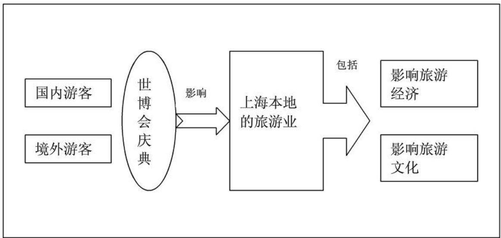
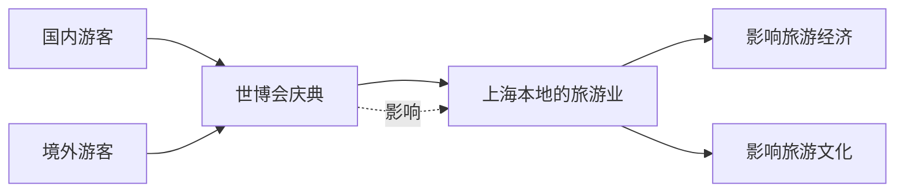
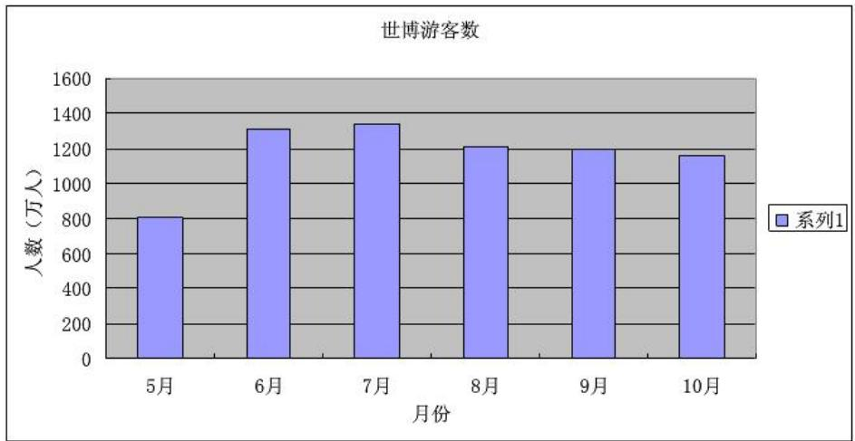
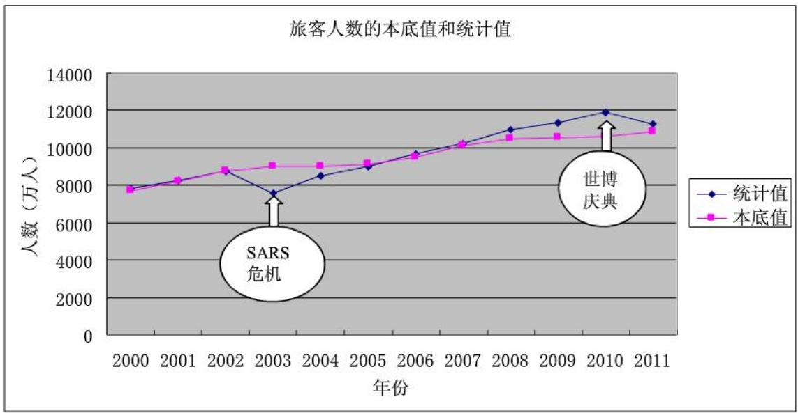

## doc in 豆丁 www.docin.com

# 2010 高教社杯全国大学生数学建模竞赛

## 承诺书

我们仔细阅读了中国大学生数学建模竞赛的竞赛规则.

我们完全明白，在竞赛开始后参赛队员不能以任何方式（包括电话、电子邮件、网上咨询等）与队外的任何人（包括指导教师）研究、讨论与赛题有关的问题。

我们知道，抄袭别人的成果是违反竞赛规则的，如果引用别人的成果或其他公开的资料（包括网上查到的资料），必须按照规定的参考文献的表述方式在正文引用处和参考文献中明确列出。

我们郑重承诺，严格遵守竞赛规则，以保证竞赛的公正、公平性。如有违反竞赛规则的行为，我们将受到严肃处理。

我们参赛选择的题号是（从 A/B/C/D 中选择一项填写）：B\_\_\_\_

我们的参赛报名号为（如果赛区设置报名号的话）：\_\_\_\_

所属学校（请填写完整的全名）：\_\_\_\_

参赛队员 (打印并签名)：1.

2.

3.

指导教师或指导教师组负责人 (打印并签名): \_\_\_\_

日期：2010年9月13日

赛区评阅编号（由赛区组委会评阅前进行编号）：

# 2010 高教社杯全国大学生数学建模竞赛

## 编号专用页

赛区评阅编号（由赛区组委会评阅前进行编号）：

赛区评阅记录（可供赛区评阅时使用）：

<table><tr><td>评阅人</td><td></td><td></td><td></td><td></td><td></td><td></td><td></td><td></td><td></td><td></td></tr><tr><td>评分</td><td></td><td></td><td></td><td></td><td></td><td></td><td></td><td></td><td></td><td></td></tr><tr><td>备注</td><td></td><td></td><td></td><td></td><td></td><td></td><td></td><td></td><td></td><td></td></tr></table>

全国统一编号（由赛区组委会送交全国前编号）：

全国评阅编号（由全国组委会评阅前进行编号）：

# 上海世博会影响力的定量评估

## 摘要

本文是一个对上海世博会影响力的定量评估问题，首先我们收集了与世博会有关的数据，如国内来沪旅游人数，国外来沪旅游人数等。并用灰色预测对相应的数据进行了预处理，然后我们从横向（本届世博对上海的影响）和纵向（本届世博和历届世博的影响比较）两个角度对世博影响力进行了研究，最后还应用了多目标优化模型求出在不同投资增长系数下上海世博对当地旅游经济最大影响力系数。

第一步，我们横向考虑世博会对本地旅游业的影响力，并将该影响分为对旅游经济的影响和对旅游文化的影响两方面。首先应用本底趋势线模型得出相应数据的本底值，再分别建立对旅游经济和旅游文化的影响力系数模型，然后利用本底值和统计值得出相应的影响力系数，结果表示如下：

<table><tr><td>旅游业</td><td>时间</td><td>举办世博影响力系数</td><td>不举办世博影响力系数</td><td>增加的影响力系数</td></tr><tr><td rowspan="4">旅游经济</td><td>世博前期</td><td>1.18</td><td>1</td><td>0.18</td></tr><tr><td>世博期间</td><td>1.58</td><td>1</td><td>0.58</td></tr><tr><td>世博后期</td><td>1.15</td><td>1</td><td>0.15</td></tr><tr><td>世博影响年均值</td><td>1.30</td><td>1</td><td>0.30</td></tr><tr><td>旅游文化</td><td></td><td>1.29</td><td>1</td><td>0.29</td></tr></table>

可得出世博期间的世博会对旅游经济影响力系数最大，为 1.58。相比旅游收入的本底值增加了 579.39 亿元的旅游收入。而世博对旅游文化的影响力系数为 1.29。

第二步，我们纵向考虑上海世博会与历届世博会相比的影响力。根据收集的历届世博会相关的规模数据，将世博会影响力等级从低到高分为1-5等，从而建立了世博会综合影响力的模糊评价模型。对历届世博会的影响力做出综合评价并得出了相应的综合影响力系数。得出的前三名的排名情况如下：

<table><tr><td>举办年份</td><td>世博会名称</td><td>综合影响力系数</td><td>影响力排名</td></tr><tr><td>2010</td><td>上海世博会</td><td>4.094134</td><td>1</td></tr><tr><td>1970</td><td>日本万国博览会</td><td>3.789834</td><td>2</td></tr><tr><td>1939</td><td>纽约世界博览会</td><td>3.465383</td><td>3</td></tr></table>

第三步，我们从环保，旅游收入以及后世博效应三个角度对上海世博的影响重新进行了思考。综合权衡这三个方面因素，我们建立了一个多目标优化的模型。得出了在不同投资增长系数下的一个合理的旅游经济影响力系数和世博年最优的旅游者的人数。当投资增长系数为0.4时，其对旅游经济的影响力系数为1.297，则该年最大的旅客人数为13415.54万人。而我们根据预测值得出2010年总旅客人数为12695万人，说明预测的旅客人数未超过最大人数限制。

最后，我们根据所求得的影响力系数，对上海世博会写了一篇影响力评估报告。

关键词：本底趋势线模型

模糊评价模型

多目标优化

旅游文化影响力系数

## 1. 问题重述

## 1.1 问题背景

中国 2010 年上海世界博览会（Expo 2010），是第 41 届世界博览会。于 2010 年 5 月 1 日至 10 月 31 日期间，在中国上海市举行。此次世博会也是由中国举办的首届世界博览会。上海世博会以“城市，让生活更美好”（Better City, Better Life）为主题，总投资达 450 亿人民币，创造了世界博览会史上最大规模记录。上海世博会于 2010 年 4 月 30 日晚 8 点 10 分，由国家主席胡锦涛宣布正式开幕，已有 12 项纪录入选中国世界纪录协会世界之最。

2010 年上海世博会是首次在中国举办的世界博览会。从 1851 年伦敦的 “万国工业博览会” 开始，世博会正日益成为各国人民交流历史文化、展示科技成果、体现合作精神、展望未来发展等的重要舞台。

## 1.2 需要解决的问题

请你们选择感兴趣的某个侧面，建立数学模型，利用互联网数据，定量评估 2010 年上海世博会的影响力。

## 2. 模型假设

1. 假设 2007 年之前受世博的影响可以忽略不计。  
2. 假设所收集的各方面的数据均具有一定的准确性。  
3. 假设忽略当年其它突发事件的影响。  
4. 假设在世博期间来上海的旅游者基本都去参观了世博会。

## 3. 符号说明

<table><tr><td> $\overline{S_{i}}$ </td><td>国内旅游收入本底值。</td></tr><tr><td> $\overline{S_{o}}$ </td><td>境外旅游收入本底值。</td></tr><tr><td> $\overline{N_{i}}$ </td><td>国内旅游者人数的本底值。</td></tr><tr><td> $\overline{N_{o}}$ </td><td>境外旅游者人数的本底值。</td></tr><tr><td> $\overline{C_{i}}$ </td><td>国内旅游者人均消费支出本底值。</td></tr><tr><td> $\overline{C_{o}}$ </td><td>境外旅游者人均消费支出本底值。</td></tr><tr><td> $S_{i}$ </td><td>国内旅游收入统计值。</td></tr><tr><td> $S_{o}$ </td><td>境外旅游收入统计值</td></tr><tr><td> $N_{i}$ </td><td>国内旅游者人数的统计值。</td></tr><tr><td> $N_{o}$ </td><td>境外旅游者人数的统计值。</td></tr><tr><td> $C_{i}$ </td><td>国内旅游者人均消费支出的统计值。</td></tr><tr><td> $C_{o}$ </td><td>境外旅游者人均消费支出的统计值。</td></tr><tr><td> $\chi_{1}$ </td><td>世博会对旅游经济的影响力系数。</td></tr><tr><td> $\chi_{2}$ </td><td>世博会对旅游文化的影响力系数。</td></tr><tr><td> $R$ </td><td>模糊综合评价模型中的评判矩阵。</td></tr><tr><td> $q$ </td><td>上海吸引外地投资金额。</td></tr><tr><td> $\alpha$ </td><td>各国世博会的综合评价值。</td></tr><tr><td> $K$ </td><td>上海本地居民产生的污染量。</td></tr><tr><td> $N$ </td><td>世博年游客和居民产生的总的污染量处理所需费用。</td></tr><tr><td> $\mu$ </td><td>避免后世博效应过大的最大投资增长系数。</td></tr><tr><td> $b$ </td><td>世博期间来沪游客平均产生污染物量的处理费用。</td></tr><tr><td> $y$ </td><td>上海旅游收入总值。</td></tr><tr><td> $\overline{y}$ </td><td>上海旅游收入本底值</td></tr></table>

## 4. 问题分析

本题要求我们定量评估2010年上海世博会的影响力，我们考虑从以下三方面进行探究。

## 4.1横向对比得出世博会对上海市旅游业的影响力

旅游者分类：我们将到上海的旅游者分为国内旅游者和境外旅游者。

世博对上海市旅游业的影响分为对旅游经济的影响和对旅游文化的影响。要求得世博对上海旅游业的影响力，则需要有一个对比值，即举办世博会与不举办世博会的对旅游的影响（分别考虑对旅游经济和旅游文化的影响）之比。

世博对旅游经济影响：根据旅游业本底趋势线模型理论，应算出假如上海2010年不举行世博的旅游收入，即排除庆典（世博会）影响后旅游收入本底值。用旅游收入的统计值与旅游收入的本底值相比，即为我们要求的影响力系数（我们设定不举办世博时影响力系数为1）。对于世博会这种大型的盛会它是具有一定的影响年限的，我们将世博影响年可分为世博前期，世博期间和世博后期的三个部分，然后我们再根据查询的与旅游业有关的数据，可求得举办世博对这三个期间的总的影响力系数和相应的旅游收入。

世博对旅游文化影响：即旅游业对当地文化的影响，属于一个潜在影响力，我们知道，对当地人来说，为了迎接这次世博会，必须加强自身的文化素质，这也间接的提升了当地居民的文化水平。同时世博期间各国人民之间的相互的文化艺术交流，也是与世博对旅游文化影响有关的。所以可以认为旅游文化的影响力与入境人数以及参加世博会的国家数是有关的。由于“文化影响力与文化市场影响力、文化资源影响力和文化环境影响力正相关”[1]，文化影响力的评价指标可以从文化市场、文化资源和文化环境三个方面选择。我们同样设定不举办世博会文化影响系数为1，那么可求出举办世博会的影响力系数，并与之对比。



<details>
<summary>flowchart</summary>


</details>

图 1 世博对旅游的影响图

## 4.2 横向对比得出上海世博会与历届世博会相比的影响力

评价一届世博会影响力的大小，我们还需将其与历届世博会的影响力相比较，我们可以建立模糊综合评价模型对世博会做出定量综合评价。可将世博会的举办时间长度，举办场馆面积，参加国及团体和参馆人数设为评判因素。通过模糊评价最终可得出上海世博会和历届世博会相比的综合影响力以及排名。

## 4.3 求出最优的世博对旅游经济的影响力

我们从环保，旅游收入以及后世博效应三个角度对上海世博的影响重新进行了思考。由后世博效应我们可知若由于某大事件引起投资剧增，将会在大事件结束后出现经济衰退现象，旅客人数的增多虽然会增加旅游经济的收入，但也会对环境造成一定的负面影响，增大环保压力，我们综合权衡这三个方面因素，建立了一个多目标优化的模型。得出了在不同投资增长系数下，尽量减小后世博效应以及环境污染程度的的一个最大的旅游经济影响力系数和世博年最大的旅游者的人数。然后将求得的人数的最大限制值与我们预测得到的值相比较，从而得出人数是否超过限制

## 5. 数据收集与分析

## 5.1 数据收集

(1) 世博会期间的游客人数（数据来至对世博会官网[2]数据的整理）

表 1 世博会期间的游客人数

<table><tr><td>世博期间(5月—8月)</td><td>5月</td><td>6月</td><td>7月</td><td>8月</td><td>9月(1-10号)</td></tr><tr><td>参观世博人数(万人)</td><td>803.44</td><td>1309.57</td><td>1341.06</td><td>1215.83</td><td>229.75</td></tr></table>

(2) 2010 年（1 月-8 月）来沪旅游的入境旅客数（数据来至上海统计局网站 $^{[3]}$ 月度数据）

表 2 来沪旅游的入境旅客数

<table><tr><td>1月</td><td>2月</td><td>3月</td><td>4月</td><td>5月</td><td>6月</td><td>7月</td><td>8月</td></tr><tr><td>54.1</td><td>47.92</td><td>59.43</td><td>67.46</td><td>71.37</td><td>75.66</td><td>71.04659</td><td>73.12837</td></tr></table>

(3) 2000 年至 2008 年国内旅游者来沪旅游人数和人均消费统计信息（数据来至《上

海统计年鉴》)

表 3 国内旅游者来沪旅游人数和人均消费

<table><tr><td></td><td>2000</td><td>2001</td><td>2002</td><td>2003</td><td>2004</td><td>2005</td><td>2006</td><td>2007</td></tr><tr><td>国内来沪人数(万人)</td><td>7848</td><td>8255</td><td>8761</td><td>7603</td><td>8505</td><td>9012</td><td>9684</td><td>10210</td></tr><tr><td>国内旅游者人均消费支出(元)</td><td>1248</td><td>1223</td><td>1134</td><td>1465</td><td>1430</td><td>1452</td><td>1466</td><td>1578</td></tr></table>

(4) 2000 年至 2008 年境外旅游者来沪人数和人均消费情况统计信息（数据来至《上海统计年鉴》）

表 4 境外旅游者来沪人数和人均消费

<table><tr><td></td><td>2000</td><td>2001</td><td>2002</td><td>2003</td><td>2004</td><td>2005</td><td>2006</td><td>2007</td></tr><tr><td>国际旅游收入(亿美元)</td><td>16</td><td>18</td><td>23</td><td>21</td><td>31</td><td>36</td><td>40</td><td>47</td></tr><tr><td>国际来沪人数(万人)</td><td>181</td><td>204</td><td>273</td><td>320</td><td>492</td><td>571</td><td>606</td><td>666</td></tr><tr><td>国际旅游者人均消费支出(元)</td><td>6224</td><td>6196</td><td>5843</td><td>4493</td><td>4396</td><td>4420</td><td>4578</td><td>4982</td></tr></table>

(5)世博区间，国内旅行者和国外旅行者的人均消费情况（数据来至商务预报网站 $^{[4]}$ ）

表 5 国内旅行者和国外旅行者的人均消费

<table><tr><td></td><td>国内旅游者</td><td>境外旅游者</td></tr><tr><td>旅游者均消费(元)</td><td>1853</td><td>6361</td></tr><tr><td>餐饮、购物的消费</td><td>985</td><td>1663</td></tr><tr><td>基准票价</td><td>160</td><td>160</td></tr><tr><td>其他(交通,通讯,娱乐,住宿)</td><td>708</td><td>4538</td></tr></table>

(6)历届综合类世博会的相关数据收集（详见附录表 23）（数据来至凤凰网[5]和百度百科）

表 6 历届综合类世博会的相关数据

<table><tr><td>年份</td><td>举办国城市</td><td>类型</td><td>场馆面积(公顷)</td><td>参展国家和组织</td><td>参观人数(万人)</td><td>天数</td></tr><tr><td>1851</td><td>英国伦敦</td><td>综合</td><td>10.4</td><td>25</td><td>604</td><td>190</td></tr><tr><td>1876</td><td>美国费城</td><td>综合</td><td>115</td><td>35</td><td>800</td><td>180</td></tr><tr><td>......</td><td>......</td><td>......</td><td>......</td><td>......</td><td>......</td><td>......</td></tr><tr><td>2005</td><td>日本爱知</td><td>综合</td><td>173</td><td>120</td><td>2200</td><td>185</td></tr><tr><td>2010</td><td>中国上海</td><td>综合</td><td>528</td><td>240</td><td>7020(预计)</td><td>184</td></tr></table>

(7)2000 年至 2008 年之间投资建设金额，旅游收入，来沪旅游总人数（数据来至于《上海统计年鉴》）

表 7 投资建设金额，旅游收入，来沪旅游总人数

<table><tr><td></td><td>2000</td><td>2001</td><td>2002</td><td>2003</td><td>2004</td><td>2005</td><td>2006</td><td>2007</td><td>2008</td></tr><tr><td>投资建设金额(亿元)</td><td>2061.66</td><td>2485.08</td><td>2847.6</td><td>3270.19</td><td>4199.16</td><td>5108.34</td><td>5746.69</td><td>6281.7</td><td>6556.12</td></tr><tr><td>旅游收入(万元)</td><td>1100.4054</td><td>1145.1865</td><td>1164.1224</td><td>1267.8145</td><td>1447.89</td><td>1579.1424</td><td>1716.7494</td><td>1966.413</td><td></td></tr><tr><td>来沪旅游总人数(万人)</td><td>8029.4</td><td>8459.26</td><td>9033.53</td><td>7922.87</td><td>8996.92</td><td>9583.35</td><td>10289.67</td><td>10875.59</td><td>11646.37</td></tr></table>

## 5.2 数据处理

由于世博会已经开始了 4 个多月，为了得到世博的总的参观人数，我们考虑应用表 1 的 5 月至 8 月的数据对剩余两个月的客流量进行灰色预测。

## 5.2.1 灰色预测模型的建立

(1) 原始数据,原始数据 5 月至 8 月的的客流量数据 (即) 表示为

$$
x ^ {(0)} = (x ^ {(0)} (1), x ^ {(0)} (2), \dots , x ^ {(0)} (n))
$$

(2) 计算生成序列 $X^{(1)}$ ，用 $\mathrm{GM}(1,1)$ 建模时，首先我们对原始数据 $X^{(0)}$ 作一次累加得到 $X^{(1)}$ 序列 $x^{(1)}(i) = \sum_{m=1}^{i} x^{(0)}(m) (i = 1,2...n)$

可以得到相应的 $K_{j}$ 的递增系列 $X^{(1)} = (x^{(1)}(1), x^{(1)}(2), \cdots, \ldots)$

(3) 得到模型的白化方程，首先对 $X^{(1)}$ 计算紧邻均值生成 $Z_{j}^{(1)}$ ：

$$
z _ {j} ^ {(1)} (m) = \frac {1}{2} \left[ x ^ {(1)} (m) + x ^ {(1)} (m - 1) \right] \dots \quad \dots \quad (m = 2, \dots , \dots ,
$$

接着我们根据 GM(1,1)建模，写出灰色函数： $x^{(0)}(k)+az^{(1)}(k)=b$

根据最小二乘参数估计法估计参数矩阵再利用离散数据系列建立近似的微分方程模型，

得到 GM(1,1)的白化方程即： $\frac{dx^{(1)}(t)}{dt}+ax^{(1)}(t)=b$

(4) 白化方程的求解，得到预测值 $\hat{x}^{(0)}$ 表达式，其白色方程的解为时间响应函数

$$
x ^ {(1)} (k) = \left(x ^ {(0)} (1) - \frac {b}{a}\right) e ^ {- a (t - 1)} + \frac {b}{a}
$$

通过改变 $k$ 的值我们可以得出原始数据序列 $X^{(0)}$ 的预测值为：

$$
\hat {x} ^ {(0)} (k + 1) = \hat {x} ^ {(1)} (k + 1) - \hat {x} ^ {(1)} (k) \quad (k = 1, 2 \dots n - 1)
$$

## 5.2.2 灰色模型的预测

在已知世博前四个月的客流量前提下，应用灰色预测对剩余两个月的客流量进行预测

表 8 世博期间参馆人数（粗体标注代表为预测值单位：万人）

<table><tr><td>世博期间(5月—10月)</td><td>5月</td><td>6月</td><td>7月</td><td>8月</td><td>9月</td><td>10月</td><td>总人数</td></tr><tr><td>参观人数(万人)</td><td>803.44</td><td>1309.57</td><td>1341.06</td><td>1215.83</td><td>1199.55</td><td>1157.56</td><td>7027.01</td></tr><tr><td>入境人数(万人)</td><td>71.37</td><td>75.66</td><td>71.05</td><td>73.13</td><td>70.74</td><td>69.51</td><td>431.46</td></tr><tr><td>国内人数(万人)</td><td>732.07</td><td>1233.91</td><td>1270.01</td><td>1142.70</td><td>1128.81</td><td>1088.04</td><td>6595.54</td></tr></table>

世博游客数用图形表示如下:



<details>
<summary>bar</summary>

| 月份 | 系列1 (万人) |
| --- | --- |
| 5月 | ~820 |
| 6月 | ~1320 |
| 7月 | ~1350 |
| 8月 | ~1220 |
| 9月 | ~1200 |
| 10月 | ~1170 |
</details>

图 2 世博期间游客分布图

## 5.2.3 模型的精度检验

相对误差，斜率关联度，均方差比值，小误差概率四个指标对其进行检验得到，检验精度如下表：

表 9 灰色预测检验精度表

<table><tr><td>相对误差 $\varepsilon$ </td><td>0.0203</td><td>二级(Qualified)</td></tr><tr><td>关联度 $^{\gamma}$ </td><td>0.9565</td><td>一级(Good)</td></tr><tr><td>均方差比 $C$ </td><td>0.1503</td><td>一级(Good)</td></tr><tr><td>小误差概 $P$ </td><td>1</td><td>一级(Good)</td></tr></table>

其四个检验标准都在二级以上，说明检验效果很好。

由于灰色预测预测效果较好，由于2009年至2010的数据统计年鉴还未统计出，我们同样我们应用灰色预测国内来沪人数，国内旅游者人均消费支出，国际来沪人数，国内旅游者人均消费，具体预测结果见表12

## 6. 模型一的建立与求解

从横向影响力出发，我们选取世博对旅游产业的影响进行分析求解，对旅游业的影响体现在旅游经济和旅游文化两个方面。

## 6.1 模型一的准备

我们将世博对旅游业的影响定义为举办世博会的旅游经济指标和文化指标与没有举办世博相应的旅游经济指标和文化指标的比值，从而建立影响力模型。没有举办世博会的旅游指标是未知的，这样我们就需要对其进行预测，我们考虑运用本底趋势线模型预测。我们设定运用本底趋势线模型预测的值为本底值。

## 6.1.1 本底趋势线理论简介

“旅游本底趋势线理论是孙根年在1998年提出，是指在消除突发事件（危机和庆典）的冲击或影响之后旅游业发展所呈现的基本趋势，是旅游区与客源地段面的相互作用的必然结果”[6]，本底线理论一个地区旅游业应有其确定规律，可用“趋势项+周期项”的组合进行模拟。

旅游本底趋势线有两个功能：

①分析与评估突发事件（危机或庆典）对旅游业发展的影响。  
②预测未来旅游业的发展趋势。

## 6.1.2 本底趋势线模型表达式

“趋势项+周期项”一般可以如下几种基本模型表示：

$$
\mathrm{直线-逻辑增长复合模型：方程为} Y = a \cdot t + b + \frac {K}{1 + e ^ {c - r \cdot t}},
$$

直线-三角函数复合模型：方程为 $Y = a\cdot t + b + q\cdot \sin (\omega \cdot t + \phi)$

指数-三角函数复合模型：方程为 $Y = c\cdot e^{rt} + q\cdot \sin (\omega \cdot t + \phi)$

（上面各式中 Y 为需要求本底值的对象，比如：国内来沪旅游者人数。而自变量则是时间 t ，其余各项均为参数。）

最优复合模型选择原则:对不同的预测对象我们用以往数据进行非线性拟合,再选择各自最优的模型(求解显著性最强)。建立各自的本底趋势线,得出不受境内外重大事件冲击和干扰的情况下所呈现的固有趋势方程。

## 6.1.3 本底值的求解

不考虑世博会的影响，我们将来沪的游客分为国内游客和国外游客，根据 2000—2007 年的数据分别对每年国内旅游者人数，国内旅游者人均消费，国外旅游人数和国外旅游者人均消费进行本底趋势线预测。

以下只对国内来沪旅游人数的本底值求解做详细说明。

国内来沪旅游人数的本底值求解，步骤如下：

I. 数据查询, 2000-2007 年国内来沪旅游者人数的原始数据 (统计值) 已查出, 见表 3 II. 我们应用 1st0pt 软件对 2000-2007 年国内来沪旅游者人数的原始数据和其对应的年份进行非线性拟合, 选择各自最优的本底趋势线模型

表 10 各模型拟合方程以及相关系数

<table><tr><td>本底趋势线模型</td><td>本底趋势线趋势方程</td><td>相关系数</td></tr><tr><td>直线-三角函数</td><td>Y=287.9*t-567858.8-262.1*sin(1.15*t-1454.8)</td><td>0.992</td></tr><tr><td>直线-逻辑增长</td><td>Y=226.5*t-444442.03-582.02/[1+exp(-43621+21.74*t)]</td><td>0.961</td></tr><tr><td>指数-三角函数</td><td>Y=0.388*exp(0.0058*t)-35415.35*sin(0.026*t-0.456)</td><td>0.931</td></tr></table>

相关系数越高则趋势方程预测效果越优秀，所以我们选取直线-三角函数增长复合模型。则本底趋势线方程为：

$$
Y = 2 8 7. 8 9 \cdot t - 5 6 7 8 5 8. 7 8 - 2 6 2. 1 2 \cdot \sin (1. 1 5 2 5 \cdot t - 1 4 5 4. 7 7 1)
$$

III. 应用本底趋势线方程进行本底值求解（因2009-2010年的统计值还未统计出，所以取灰色预测所得的值）

国内来沪旅游者人数的统计值（加粗数据为灰色预测值）和本底值如下表：

表 11 国内来沪旅游者人数

<table><tr><td>时间(t)</td><td>2000</td><td>2001</td><td>2002</td><td>2003</td><td>2004</td><td>2005</td><td>2006</td><td>2007</td><td>2008</td><td>2009</td><td>2010</td><td>2011</td></tr><tr><td>统计值</td><td>7848</td><td>8255</td><td>8761</td><td>7603</td><td>8505</td><td>9012</td><td>9684</td><td>10210</td><td>11006</td><td>11366</td><td>11897</td><td>11315</td></tr><tr><td>本底值(Y)</td><td>7684</td><td>8212</td><td>8738</td><td>8979</td><td>8990</td><td>9100</td><td>9521</td><td>10094</td><td>10481</td><td>10564</td><td>10587</td><td>10864</td></tr></table>

用图形表示如下：



<details>
<summary>line</summary>

| 年份 | 统计值 (万人) | 本底值 (万人) |
| --- | --- | --- |
| 2000 | ~7900 | ~7900 |
| 2001 | ~8300 | ~8300 |
| 2002 | ~8900 | ~8900 |
| 2003 | ~7600 | ~9100 |
| 2004 | ~8600 | ~9100 |
| 2005 | ~9100 | ~9200 |
| 2006 | ~9700 | ~9600 |
| 2007 | ~10300 | ~10300 |
| 2008 | ~11100 | ~10600 |
| 2009 | ~11400 | ~10700 |
| 2010 | ~12000 | ~10700 |
| 2011 | ~11400 | ~11000 |
</details>

图（3）旅客人数统计值和本底值图

IV.曲线分析：由于2003年出现SARA危机，较大的影响了旅游业，所以出现凹点，而2010年时由于世博庆典，所于国内旅游者人数会相应的增加，出现凸点。

同理，对国内来沪平均消费，境外旅游者来沪人数，境外旅游者来沪平均消费三个指标选择合适的本底线方程，以及求得的本底值如下表：

表 12 各个指标本底线方程以及本底值

<table><tr><td></td><td>时间(t)</td><td>2000</td><td>2001</td><td>2002</td><td>2003</td><td>2004</td><td>2005</td><td>2006</td><td>2007</td><td>2008</td><td>2009</td><td>2010</td><td>2011</td></tr><tr><td rowspan="3">国内来沪平均消费</td><td>统计值</td><td>1248</td><td>1223</td><td>1134</td><td>1465</td><td>1430</td><td>1452</td><td>1466</td><td>1578</td><td>1650</td><td>1724</td><td>1800</td><td>1880</td></tr><tr><td>本底值(Y)</td><td>1255</td><td>1203</td><td>1210</td><td>1373</td><td>1487</td><td>1441</td><td>1436</td><td>1592</td><td>1717</td><td>1679</td><td>1663</td><td>1811</td></tr><tr><td colspan="13">本底线方程及相关系数:Y=57.12*t-113063.67+85.254*sin(1.542*t-22.125),R=0.941</td></tr><tr><td rowspan="3">境外旅游者来沪人数</td><td>统计值</td><td>181</td><td>204</td><td>273</td><td>320</td><td>492</td><td>571</td><td>606</td><td>666</td><td>640</td><td>720</td><td>796</td><td>720</td></tr><tr><td>本底值(Y)</td><td>181</td><td>203</td><td>229</td><td>259</td><td>291</td><td>324</td><td>357</td><td>388</td><td>416</td><td>439</td><td>458</td><td>471</td></tr><tr><td colspan="13">本底线方程及相关系数:Y=82.024*t-163920.7-43.44*sin(1.354*t-982.509),R=0.996</td></tr><tr><td rowspan="3">境外旅游者来沪平均消费</td><td>统计值</td><td>6224</td><td>6196</td><td>5843</td><td>4493</td><td>4396</td><td>4420</td><td>4578</td><td>4982</td><td>4940</td><td>5071</td><td>5204</td><td>5441</td></tr><tr><td>本底值(Y)</td><td>3962</td><td>3737</td><td>4043</td><td>4493</td><td>4396</td><td>4209</td><td>4578</td><td>4982</td><td>4827</td><td>4692</td><td>5113</td><td>5261</td></tr><tr><td colspan="13">本底线方程及相关系数:Y=120.84*t-237801.3+266.38*sin(1.62*t-56.96),R=0.989</td></tr></table>

## 6.2 模型一的建立

利用求出的本底值和统计值建立世博对当地旅游业的影响力模型

## 6.2.1 世博对上海市旅游经济的影响力

因旅游收入=旅游人数\*人均消费支出，我们将旅游收入统计值和旅游收入本底值之比记为影响力系数。

我们定义世博对旅游经济的影响力系数如下:

$$
\chi_ {1} = \frac {S _ {i} + S _ {o}}{S _ {i} + S _ {o}} = \frac {N _ {i} \cdot C _ {i} + N _ {o} \cdot C _ {o}}{N _ {i} \cdot C _ {i} + N _ {o} \cdot C _ {o}}
$$

其中： $\overline{s}_{i}$ 为国内旅游收入本底值。 $\overline{s}_{o}$ 为境外旅游收入本底值。

$\overline{N_{i}}$ 为国内旅游者人数的本底值。 $\overline{N_{o}}$ 为境外旅游者人数的本底值。

$\overline{c_{i}}$ 为国内旅游者人均消费支出本底值。

$\overline{C_{o}}$ 为境外旅游者人均消费支出本底值。

$S_{i}$ ：国内旅游收入统计值。 $S_{o}$ 为境外旅游收入统计值。

$N_{i}$ 为国内旅游者人数的统计值。 $N_{o}$ 为境外旅游者人数的统计值。

$c_{i}$ 为国内旅游者人均消费支出的统计值。

$C_{o}$ 为境外旅游者人均消费支出的统计值。

## 6.2.2 世博对上海市旅游文化的影响力

我们设定一个文化影响力系数，由于我们需要求解世博对旅游文化的影响力，故需求出不举办世博的旅游文化影响力指数 $\overline{\alpha_2}$ 以及举办世博的旅游文化影响力指数 $\alpha_{2}$ ，然后对二者进行比较。根据文化影响力评价的概念模型的推论可知，若我们将 $\alpha_{2}$ 设定为标杆值，则 $\overline{\alpha_2}$ 的各项指标的影响力可以通过它的数值与 $\alpha_{2}$ 的数值的比值求出，然后对各项指标加权求出 $\overline{\alpha_2}$ 的值。

令举办世博会的旅游文化影响力指数 $\alpha_{2}=1$ ，入境旅游人数 $N_{o}$ 决定了文化市场的影响力，参展团体数M决定了文化资源的影响力，本地文化景点数A决定了文化环境的影响力（对于未举办世博会时，参展团体等效于外国驻上海领事馆数 $\overline{M}$ ）。

我们建立如下的文化影响力的评价模型：

$$
\overline {{\alpha_ {2}}} = \omega_ {1} \cdot \frac {\overline {{N _ {o}}}}{N _ {o}} + \omega_ {2} \cdot \frac {\overline {{M}}}{M} + \omega_ {3} \cdot \frac {\overline {{A}}}{A}
$$

其中：

故定义世博会旅游文化影响力系数为：

$$
\chi_ {2} = \frac {\alpha_ {2}}{\alpha_ {2}}
$$

## 6.2.3 综上所述得世博会对上海旅游业影响力系数模型

世博对上海旅游经济影响力系数：

$$
\chi_ {1} = \frac {S _ {i} + S _ {o}}{S _ {i} + S _ {o}} = \frac {N _ {i} \cdot C _ {i} + N _ {o} \cdot C _ {o}}{N _ {i} \cdot C _ {i} + N _ {o} \cdot C _ {o}}
$$

世博对上海旅游文化影响力系数：

$$
\chi_ {2} = \frac {\alpha_ {2}}{\alpha_ {2}}
$$

## 6.3 模型一的求解

## 6.3.1 求解世博对上海市旅游经济的影响

我们将世博的影响年份分为世博前期，世博期间，世博后期三个阶段，“一般重大事件对旅游业的影响年限为3到4年”。我们划分为（2009-2011年）

① 世博前期（2009年1月-2010年4月）

求解所需数据（见下表）及其由来

我们已经通过本底趋势线模型算出 2010 全年的本底值（见表 11 和 12），我们将全年的本底值均分为 12 个月，即可得到世博前期的 4 个月的本底值。而对于人均消费本底值，因月份相近，所以 2010 年前 4 个月的人均消费本底值近似等于 2009 年的人均本底值，

同样对于 2010 全年的统计值（见表 11 和 12），同样均分为 12 个月，即可得到世博前期的 4 个月的统计值。而但对于人均消费统计值，因月份相近，所以 2010 年前 4 个月的人均消费统计值近似等于 2009 年的统计值。

表 13 世博前期本底值与统计值比较

<table><tr><td>旅游者类别</td><td>2009 全年</td><td>2010 年前 4 月</td><td>世博前期</td></tr><tr><td>国内旅游者(万人)本底值</td><td>10564</td><td>3529</td><td>14093</td></tr><tr><td>国内旅游者(万人)统计值</td><td>11366</td><td>3965</td><td>15331</td></tr><tr><td>入境旅游者(万人)本底值</td><td>439</td><td>152.6</td><td>591.6</td></tr><tr><td>入境旅游者(万人)统计值</td><td>720</td><td>265</td><td>985</td></tr><tr><td>国内旅游者人均消费本底值(元)本底值</td><td colspan="3">1679</td></tr><tr><td>国内旅游者人均消费统计值(元)统计值</td><td colspan="3">1724</td></tr><tr><td>境外旅游者人均消费本底值(元)本底值</td><td colspan="3">4692</td></tr><tr><td>境外旅游者人均消费统计值(元)统计值</td><td colspan="3">5071</td></tr></table>

i 求旅游经济收入的本底值

世博前期（2009年1月-2010年4月）旅游收入的本底值为

$$
\overline {{S _ {i}}} + \overline {{S _ {o}}} = \overline {{N _ {i}}} \cdot \overline {{C _ {i}}} + \overline {{N _ {o}}} \cdot \overline {{C _ {o}}} = 2 6 4 3. 7 9 \text {亿元}
$$

ii 求旅游经济收入的统计值

世博前期（2009年1月-2010年4月）旅游收入的统计值为

$$
S _ {i} + S _ {o} = N _ {i} \cdot C _ {i} + N _ {o} \cdot C _ {o} = 3 1 4 2. 5 6 \text {亿元}
$$

iii 求出世博前期，世博会对旅游经济的影响力系数

世博前期的世博会对旅游经济影响力系数 $\chi_{1}=1.18$ ，即举办世博比不举办世博增加了498.77亿元的旅游经济收入。

② 世博期间（2010年5月-10月）

求解所需数据的由来

我们已经通过本底趋势线模型算出 2010 全年的本底值（见表 12），我们将全年的本底值均分为 12 个月，即可得到世博期间的 6 个月的本底值。世博会区间国内和国外游客的人均消费值 $c_{n}$ 和 $c_{r}$ ，已经得出见表 5，且世博期间的游客数在数据处理时已求出（见表 9）

表 14 世博期间本底值比较

<table><tr><td>旅游者类别</td><td>2010 全年</td><td>5 月-10 月</td></tr><tr><td>国内旅游者(万人)本底值</td><td>10587</td><td>5293.5</td></tr><tr><td>国内旅游者(万人)统计值</td><td></td><td>6595.54</td></tr><tr><td>入境旅游者(万人)本底值</td><td>457.78</td><td>228.89</td></tr><tr><td>入境旅游者(万人)统计值</td><td></td><td>431.46</td></tr><tr><td>国内旅游者人均消费本底值(元)本底值</td><td colspan="2">1663</td></tr><tr><td>国内旅游者人均消费统计值(元)统计值</td><td colspan="2">1853</td></tr><tr><td>境外旅游者人均消费本底值(元)本底值</td><td colspan="2">5113</td></tr><tr><td>境外旅游者人均消费统计值(元)统计值</td><td colspan="2">6361</td></tr></table>

## i 求旅游经济收入的本底值

2010年5-10月间旅游收入的本底值为

$$
\overline {{S _ {i}}} + \overline {{S _ {o}}} = \overline {{N _ {i}}} \cdot \overline {{C _ {i}}} + \overline {{N _ {o}}} \cdot \overline {{C _ {o}}} = 9 9 7. 4 0 \mathrm{亿元}
$$

## ii 求旅游经济收入的统计值

2010年5-10月间旅游收入的统计值为

$$
S _ {i} + S _ {o} = N _ {i} \cdot C _ {i} + N _ {o} \cdot C _ {o} = 1 5 7 6. 5 6 \mathrm{亿元}
$$

## iii 求出世博期间，世博会对旅游经济的影响力系数

世博区间世博会对旅游经济的总影响力系数 $\chi_{1}=1.581$ ，即 2010 世博区间，举办世博比不举办世博增加了 579.39 亿元的旅游经济收入。

## ③ 世博后期（2010年11月-2011月12月）

世博后期的处理方法与世博前期的方法类似，

## i 求旅游经济收入的本底值

世博后期旅游经济收入的本底值 $\overline{S_i} +\overline{S_o} = \overline{N_i}\cdot \overline{C_i} +\overline{N_o}\cdot \overline{C_o} = 2574.962$ 亿元

## ii 求旅游经济收入的统计值

世博后期旅游经济收入统计值 $S_{i} + S_{o} = N_{i}\cdot C_{i} + N_{o}\cdot C_{o} = 2963.77$ 亿元。

## iii 求出世博会对旅游经济的影响力系数

世博后期世博会对旅游经济的影响力系数 $\chi_{1}=1.15$ ，在2010年11月-2011月12月举办世博比不举办世博增加了388.81亿元的旅游经济收入。

## 6.3.2 求解世博对上海市旅游文化的影响

已查得上海世博期间参展团体 $M$ 有240个，而外国驻上海领事馆数 $\overline{M}$ 有49个。而对文化景点数来说，查阅资料可得世博期间没有新建大型文化旅游景点（ $\frac{\overline{A}}{A} = 1$ ）。而我们知道文化市场影响力是直接的影响力。文化资源影响力和文化环境影响力是间接的影响力。直接影响力和间接影响力的权重可以设计为60：40。文化资源影响力和文化环境影响力的权重可以设计为20：20。所以 $w_{1} = 0.6, w_{2} = 0.2, w_{3} = 0.2$ 。我们通过本底趋势线模型求出了2010年的入境旅游人数见表12，我们只考虑世博期间（5月-10月）的影响如下表

表 15 入境人数统计值与本底值

<table><tr><td>统计入境旅游人数(万人)</td><td>431.4611</td></tr><tr><td>本底入境旅游人数(万人)</td><td>228.8892</td></tr></table>

可得到上海对旅游文化的影响力系数为 $\chi_{2}=\frac{\alpha_{2}}{\alpha_{2}}=1.296$ ，即举办世博与不举办世博的相比，举办世博使得旅游文化影响力增加到了1.296倍。

## 6.3.3 综合以上求解结果，我们将世博对旅游业的影响力结果表示如下

表 16 世博影响力

<table><tr><td>旅游业</td><td>时间</td><td>举办世博影响力系数</td><td>不举办世博影响力系数</td><td>增加的影响力系数</td><td>增加的旅游收入(亿元)</td></tr><tr><td rowspan="4">对旅游经济影响力系数</td><td>世博前期(200901-201004)</td><td>1.18</td><td>1</td><td>0.18</td><td>498.77</td></tr><tr><td>世博期间(201005-201010)</td><td>1.58</td><td>1</td><td>0.58</td><td>579.39</td></tr><tr><td>世博后期(201011-201112)</td><td>1.15</td><td>1</td><td>0.15</td><td>388.81</td></tr><tr><td>世博影响年均值</td><td>1.30</td><td>1</td><td>0.30</td><td></td></tr><tr><td>对旅游文化影响力系数</td><td></td><td>1.29</td><td>1</td><td>0.29</td><td></td></tr></table>

## 6.4 模型一的结果分析

可以得出世博期间的影响力系数最大，相比不举办世博增加了0.58。在世博区间增加的旅游收入为579.39亿元，世博影响年(2009-2010年3年)平均影响力系数为1.30，比不举办世博增加了0.30。而世博后期其影响力逐渐降低，影响系数为1.15，世博影响这3年相比不举办世博会为上海旅游业共带来了1466.97亿元的旅游收入。而对于旅游文化影响力，举办世博比不举办世博文化影响力增加了0.29，举办世博带来的文化影响力系数为1.29。

## 7. 模型二的建立与求解

从纵向影响力出发来评判它的影响力。我们搜集了以往 18 届世博会的举办时间长度，举办场馆面积，参加国及团体，参馆人数，数据见附录，表 23，然后利用模糊综合评判方法求出各届世博会的影响力并对其进行综合排名。

## 7.1 模型二的建立

模型二我们采用的是模糊评价模型，该模型就是对多种影响因素的实物和现象进行总的评价，且在评价过程中最显著的特征就是涉及模糊因素。由于各中复杂多变的不确定性因素的影响，难于用解析方法作定量的分析，因而通过模型综合评价，将会使问题得到满意解决。故我们建立模糊综合评价模型对对世博会做出定量综合评价。而使用此模型的前提条件是对个影响指标划分一定数量的等级。

## ①确定分界标准值

从某种程度上对世博会来说，举办时间长度，举办场馆面积，参加国及团体，参馆人数都是越大越好。首先我们对各项指标进行分级，共分为五个等级。

分等级原则如下：

将每届世博会的各项指标按照从小到大的顺序进行排序，然后分别求出各项指标排序后相邻两数的差值，选取差值最大的四个作为分界点，我们取分界点两数的平均值作为分类标准值。如下表：

表 17 排序后的各届世博会的各项指标值

<table><tr><td>场馆面积(公顷)</td><td>相邻两数差值</td><td>参展国家和组织</td><td>相邻两数差值</td><td>参观人数(万人)</td><td>相邻两数差值</td><td>天数</td><td>相邻两数差值</td></tr><tr><td>10.4</td><td></td><td>19</td><td></td><td>604</td><td></td><td>153</td><td></td></tr><tr><td>25</td><td>14.6</td><td>21</td><td>2</td><td>800</td><td>196</td><td>170</td><td>17</td></tr><tr><td>75</td><td>50</td><td>25</td><td>4</td><td>1200</td><td>400</td><td>170</td><td>0</td></tr><tr><td>96</td><td>21</td><td>25</td><td>0</td><td>1616</td><td>416</td><td>176</td><td>6</td></tr><tr><td>115</td><td>19</td><td>32</td><td>7</td><td>1800</td><td>184</td><td>180</td><td>4</td></tr><tr><td>120</td><td>5</td><td>33</td><td>1</td><td>1883</td><td>83</td><td>182</td><td>2</td></tr><tr><td>160</td><td>40</td><td>35</td><td>2</td><td>1969</td><td>86</td><td>183</td><td>1</td></tr><tr><td>170</td><td>10</td><td>35</td><td>0</td><td>2200</td><td>231</td><td>183</td><td>0</td></tr><tr><td>173</td><td>3</td><td>36</td><td>1</td><td>2257</td><td>57</td><td>184</td><td>1</td></tr><tr><td>200</td><td>27</td><td>42</td><td>6</td><td>2512</td><td>255</td><td>185</td><td>1</td></tr><tr><td>215</td><td>15</td><td>58</td><td>16</td><td>2700</td><td>188</td><td>185</td><td>0</td></tr><tr><td>254</td><td>39</td><td>60</td><td>2</td><td>4100</td><td>1400</td><td>185</td><td>0</td></tr><tr><td>287</td><td>33</td><td>62</td><td>2</td><td>4150</td><td>50</td><td>186</td><td>1</td></tr><tr><td>290</td><td>3</td><td>81</td><td>19</td><td>4500</td><td>350</td><td>190</td><td>4</td></tr><tr><td>500</td><td>210</td><td>114</td><td>33</td><td>5000</td><td>500</td><td>210</td><td>20</td></tr><tr><td>500</td><td>0</td><td>120</td><td>6</td><td>5031</td><td>31</td><td>210</td><td>0</td></tr><tr><td>528</td><td>28</td><td>172</td><td>52</td><td>6422</td><td>1391</td><td>288</td><td>78</td></tr><tr><td>865</td><td>337</td><td>240</td><td>68</td><td>7020</td><td>598</td><td>340</td><td>52</td></tr></table>

对场馆面积，找出最大四个差值 337, 210, 50, 40；参展国家和组织最大四个差值 68, 52, 33, 19；参观人数最大四个差值 1400, 1391, 1078, 500；天数最大四个差值 78, 52, 20, 17。

并以此分界求出各项指标的分界标准值如下表:

表 18 各项指标分等级表格

<table><tr><td>举办天数(天)</td><td>等级一</td><td>等级二</td><td>等级三</td><td>等级四</td><td>等级五</td></tr><tr><td>举办场馆面积(公顷)</td><td>x&lt;=50</td><td>50140395x&gt;691.5</td><td>140395x&gt;691.5</td><td>395x&gt;691.5</td><td>x&gt;691.5</td></tr><tr><td>参加国及团体(个)</td><td>x&lt;=71.5</td><td>71.597.5146x&gt;206</td><td>97.5146x&gt;206</td><td>146x&gt;206</td><td>x&gt;206</td></tr><tr><td>参馆人数(万人)</td><td>x&lt;=3400</td><td>340047505726.5x&gt;6721</td><td>47505726.5x&gt;6721</td><td>5726.5x&gt;6721</td><td>x&gt;6721</td></tr><tr><td>参馆人数(万人)</td><td>x&lt;=161.5</td><td>161.5200299x&gt;314</td><td>200299x&gt;314</td><td>299x&gt;314</td><td>x&gt;314</td></tr></table>

## ②建立评价因素集

对世博会综合评价，将举办时间长度，举办场馆面积，参加国及团体，参馆人数作为评判的标准。故我们首先设定因素集 $U = \{u_{1}, u_{2}, u_{3}, u_{4}\}$

## ③建立评价等级集

然后设定评价等级集 $V = \{1,2,3,4,5\}$ 。分别表示等级一，等级二，等级三，等级四，等级五。

## ④建立评价矩阵 $R$

本题参与评价的因素 $m$ 有4个，世博会各个指标的评价标准 $n$ 有5个级别。对 $U$ 中每一个因素根据评判规则进行模糊评判。 $r_y$ 表示第 $i$ 种评判指标第 $j$ 个等级的可能性，即 $r_y$ 是 $i$ 对 $j$ 的隶属度，所以可得到评判矩阵如下：

$$
R = \left[ \begin{array}{c c c c} r _ {1 1} & r _ {1 2} & \dots & r _ {1 n} \\ r _ {2 1} & r _ {2 2} & \dots & r _ {2 n} \\ \dots & \dots & \dots & \dots \\ r _ {m 1} & r _ {m 2} & \dots & r _ {m n} \end{array} \right]
$$

因 $r_y$ 是 $i$ 对 $j$ 的隶属度，我们借鉴水质等级评判《地表水环境质量标准》对各类水质的隶属度计算公式。得到本题中隶属度公式如下：

$$
\left\{ \begin{array}{l} r _ {i j} = \left\{ \begin{array}{c c} 1 & c _ {i} \geq s _ {j} \\ \frac {c _ {i} - s _ {j + 1}}{s _ {j} - s _ {j + 1}} & s _ {j} > c _ {i} > s _ {j + 1} \\ 0 & c _ {i} \leq s _ {j + 1} \end{array} \right. \\ r _ {i (j - 1)} = 1 - \frac {c _ {i} - s _ {j + 1}}{s _ {j} - s _ {j + 1}} \end{array} \right.
$$

其中对每一届世博会来说， $c_{i}$ 是第i个评判标准的值， $s_{j}$ 是第j类的分类标准边界值。这样对每一届世博会，我们都可以得出一个评判矩阵 $R_{i}$ 。

⑤确定权重向量w

当然，实质上来说，各个评判标准在对世博会的综合评价中起到的作用不会完全相同，如评判世博会成功与否，参馆人数就占了很大的比重。故我们需要对各个因素设定一个权重系数。

我们可以用评价因子贡献率的方法来确定权重向量。我们定义 $I_{i} = \frac{\overline{s_{i}}}{c_{i}},\overline{s_{i}}$ 是第 $i$ 个评判标准的各个分类值的平均值。故每个指标的权重计算公式如下：

$$
w _ {i} = \frac {I _ {i}}{\sum_ {i = 1} ^ {m} I _ {i}}
$$

故我们得出各个评判标准的权重矩阵：

$$
W = \left[ w _ {1}, w _ {2}, \dots , w _ {m} \right]
$$

⑥得出加权后的评价矩阵

$$
T = W * R = \left[ t _ {1}, t _ {2}, \dots , t _ {n} \right]
$$

即 T 未考虑权重系数后的评判矩阵，元素 $t_{i}$ 代表的意义为被分为第 i 等的概率。

⑦综上①②③④⑤⑥所述我们建立了如下的模糊综合评价模型：

为了得到综合影响系数，我们定义矩阵 $B = [1, 2, \ldots, n]$ ，可得出的综合影响力系数

$$
\alpha = T ^ {*} B ^ {\prime} (\text {其中} B \cdot \text {为} B \text {的转置矩阵})
$$

## 7.2 模型二的求解

我们用 Matlab 求出了近 17 届综合性质的世博会以及上海世博会（其中参馆人数为预测值）的综合评定值并排名，最终得到的综合评价值在 1 和 5 之间，且值越大，表示世博影响力越大。如下表：

表 19 各届世博会综合评价值以及排名

<table><tr><td>年份</td><td>名称</td><td> $\alpha$ </td><td>排名</td></tr><tr><td>1851</td><td>伦敦万国工业产品大博览会</td><td>1.446607</td><td>14</td></tr><tr><td>1876</td><td>美国独立百年博览会</td><td>1.312808</td><td>16</td></tr><tr><td>1878</td><td>第3届巴黎世界博览会</td><td>1.042581</td><td>18</td></tr><tr><td>1880</td><td>万国工农业,制造与艺术博览会</td><td>1.657505</td><td>12</td></tr><tr><td>1889</td><td>世界博览会</td><td>1.235442</td><td>17</td></tr><tr><td>1893</td><td>芝加哥哥伦布纪念博览会</td><td>1.747186</td><td>11</td></tr><tr><td>1900</td><td>第5届巴黎世界博览会</td><td>1.951117</td><td>8</td></tr><tr><td>1904</td><td>圣路易斯百周年纪念博览会</td><td>2.298088</td><td>6</td></tr><tr><td>1915</td><td>旧金山巴拿马太平洋博览会</td><td>2.298754</td><td>5</td></tr><tr><td>1933</td><td>芝加哥万国博览会</td><td>1.3244</td><td>15</td></tr><tr><td>1939</td><td>纽约世界博览会</td><td>3.465383</td><td>3</td></tr><tr><td>1958</td><td>布鲁塞尔世界博览会</td><td>1.635674</td><td>13</td></tr><tr><td>1967</td><td>加拿大世界博览会</td><td>2.011517</td><td>7</td></tr><tr><td>1970</td><td>日本万国博览会</td><td>3.789834</td><td>2</td></tr><tr><td>1992</td><td>塞维亚世界博览会</td><td>1.84564</td><td>10</td></tr><tr><td>2000</td><td>汉诺威世界博览会</td><td>2.365815</td><td>4</td></tr><tr><td>2005</td><td>爱知地球博览会</td><td>1.88527</td><td>9</td></tr><tr><td>2010</td><td>上海世博会</td><td>4.094134</td><td>1</td></tr></table>

## 7.3 模型二的结果分析

从表中可知，上海世博会综合影响力系数是最高的，为 4.09。1970 年日本大阪万国博览会第二，综合影响力系数为 3.79，1939 年美国纽约纽约世界博览会第三，综合影响力系数为 3.46。说明上海世博会相比以前的各界世博会的综合影响力是最大的。

## 8. 模型三的建立与求解

世博会大量的旅游客源为世博会带来了大量的旅游收入，对旅游经济的影响是相当显著的，但同时大量的客源也会对上海本地带来很多的环境污染，我们假定世博会还未举行，从环保和旅游收入以及后世博效应三个角度，我们需综合权衡这三个方面，得出一个合理的旅游经济影响力系数。

## 8.1 模型的准备

为了模型的建立，我们首先对后世博效应和投资增长系数进行定义

后世博效应：与后奥运效应相似，过盛以及剧增的投资会引起后世博效应，导致世博后出现经济衰退期。故我们需要控制世博期间入境旅游人数来减少后世博效应的影响。

投资增长系数：我们把2009年当作是是世博会的筹备年，为了避免后世博效应，即2010年的外商以及国内对上海的建设投资不能太过于膨胀，则 $\mu$ 为避免后世博效应过大的最大投资增长率。

## 8.1.1 数据处理

我们首先查2000-2008年数据得到每年上海的入沪旅游人数 $x$ 和上海旅游收入 $y$ 以及每年上海建设的投资金额 $q$ （已统计出，见表7)，然后我们通过一元线性回归可以分别得出上海旅游收入与入沪人数的关系式 $y = f_{1}(x)$ 。上海建设投资金额与入沪旅游人数的关系式 $q = f_{2}(x)$ 。

我们以旅游收入 $y$ 为因变量，来沪旅游人数为自变量，进行一元线性回归的到如下回归方程： $y = f_{1}(x) = 0.2727 \times -1071$

对回归方程的显著性检验

表 20 入沪旅游人数与旅游收入的回归检验

<table><tr><td></td><td>自由度</td><td>平方和</td><td>平均平方和</td><td>F统计量</td><td>F临界值</td><td>p值</td><td>显著性</td></tr><tr><td>回归</td><td>1</td><td>575383.5209</td><td>575383.5209</td><td>33.33982306</td><td>5.987377584</td><td>0.001178588</td><td>显著</td></tr><tr><td>剩余</td><td>6</td><td>103548.8736</td><td>17258.14561</td><td></td><td></td><td></td><td></td></tr><tr><td>总计</td><td>7</td><td>678932.3945</td><td></td><td></td><td></td><td></td><td></td></tr></table>

我们以投资金额 $q$ 为因变量，来沪旅游人数为 $x$ 自变量，进行一元线性回归的到如下回归方程： $q = f_{2}(x) = 1.227x - 7282.3$

对回归显著性检验

表 21 投资金额与入沪旅游人数回归检验

<table><tr><td></td><td>自由度</td><td>平方和</td><td>平均平方和</td><td>F统计量</td><td>F临界值</td><td>p值</td><td>显著性</td></tr><tr><td>回归</td><td>1</td><td>20001302.01</td><td>20001302.01</td><td>43.15684188</td><td>5.591447848</td><td>0.000313108</td><td>显著</td></tr><tr><td>剩余</td><td>7</td><td>3244192.761</td><td>463456.1088</td><td></td><td></td><td></td><td></td></tr><tr><td>总计</td><td>8</td><td>23245494.77</td><td></td><td></td><td></td><td></td><td></td></tr></table>

## 8.2 模型三的建立

## 8.2.1 确定目标函数

要使世博对上海市旅游业的带来的正面影响力越大越好，即旅游收入越大越好。由于世博对2010年旅游业的影响使得2010旅游经济收入为 $y$ ，而根据孙根年的孙根年的本底趋势线模型我们可以求得 $\overline{y}$ 。所以我们确定目标函数为使正面影响力系数最大：

$$
\begin{array}{l} y = 0. 2 7 2 7 x - 1 0 7 1 \\ \mathrm{max} \quad \chi_ {1} = \frac {y}{y} \\ \end{array}
$$

世博期间，由于人数过多相应的环境保护压力越大。N 为处理世博年游客和居民产生的总的生活垃圾的花费。我们知道 N 主要受到来沪游客数和当地居民数的影响，未开世博时上海处理生活垃圾的花费为 K 。我们设世博年外来旅游者平均每人的生活垃圾处理费为 b 元。为了提倡环保世博那么世博年的垃圾处理费 N 越小越好。

$$
\text { min } N = K + b x
$$

## 8.2.2 确定约束条件

首先考虑然后考虑到后世博效应，我们把2009年当作是是世博会的筹备年，为了避免后世博效应，即2010年的外商以及国内投资不能太过于膨胀， $\mu$ 为避免后世博效应过大的最大投资增长系数。

我们得出如下约束条件：

$$
\begin{array}{l} q _ {2 0 1 0} \leq q _ {2 0 0 9} \cdot (1 + \mu) \\ q = 1. 2 2 7 x - 7 2 8 2. 3 \\ \end{array}
$$

我们设没有举办世博会, 考虑到环境承受能力, 我们知道上海世博会国家投入了 $Q$ , 其中有 $\beta \%$ 用在清洁环境上面, 则我们可得出, 即世博会投资资金中的有 $Q \cdot \beta \%$ 用于处理生活垃圾, 那么世博年处理生活垃圾所花的费用应小于 $Q \cdot \beta \%$ , 故我们得到如下约束条件:

$$
K + bx \leq Q \cdot \beta \%
$$

## 8.2.3 综上所述我们建立了多目标优化模型如下:

$$
\mathrm{max} \quad \chi_ {1} = \frac {0 . 2 7 2 7 x - 1 0 7 1}{y}
$$

$$
\text {min} \quad N = K + b x
$$

$$
\begin{array}{l} s. t \left\{ \begin{array}{l} q _ {2 0 1 0} \leq q _ {2 0 0 9} (1 + \mu) \\ K + b x \leq Q \cdot \beta \% \end{array} \right. \end{array}
$$

## 8.3 模型三的求解

通过查的数据可知未举办世博会时，2008年用于处理上海本地居民所产生的生活垃圾花费为13750万元，世博期间处理游客生活垃圾平均花费为0.2元，而对上海世博会的投资金额为220亿（网络数据不一致，官方数据位220亿，百度百科数据为450亿）分别取不同的 $\mu$ 值（为避免后世博效应过大的最大投资增长系数）得到如下结果：

表 22 不同 $\mu$ 值的最大世博影响力和最大入沪人数

<table><tr><td>μ取值</td><td>0.1</td><td>0.2</td><td>0.3</td><td>0.4</td><td>0.5</td><td>0.6</td></tr><tr><td>影响力系数</td><td>1.077951</td><td>1.150996</td><td>1.224041</td><td>1.297086</td><td>1.37013</td><td>1.443175</td></tr><tr><td>最大的来沪旅游人数</td><td>11812.58</td><td>12346.9</td><td>12881.22</td><td>13415.54</td><td>13949.86</td><td>14484.18</td></tr><tr><td>最少的污染物处理费用</td><td>18112.52</td><td>18219.38</td><td>18326.24</td><td>18433.11</td><td>18539.97</td><td>18646.84</td></tr></table>

## 8.4 结果分析

从表中可以看出，世博会影响力随着来沪旅游人数的增加而增加，当取不同的 $\mu$ 值时，即考虑到不同程度上的后世博效应的影响时，各种情况下的最优限制来沪旅游人数是不同的。我们应用表 11 和表 12 可得出 2010 年来沪旅游的预测总人数为 12695 万人，而对该年的旅游经济影响系数为 1.30，由上表可得当最大投资系数为 0.4 时，最大的旅游经济影响力系数为 1.297，对应的最大来沪人数为 18433.11 万人，而我们的预测值为 12695 万人，说明旅客人数并未超过限制。

## 9. 影响力评估报告

评估目的：得出上海世博会的影响力的大小，对本届世博会定量做出的评价。

评估对象：上海世博会的影响力

评估方法和结论：分别从横向和纵向两个方向对上海世博会影响力进行相应的评估

## (1) 横向对比得出世博会对上海市旅游业的影响力

评估方法：我们将世博对上海旅游业的影响分为对旅游经济的影响和对旅游文化的影响两方面。来沪旅游者推动了上海旅游业的发展，我们将来沪旅游者分为国内旅游者和境外旅游者两类。我们将世博影响年份分为世博前期（2009年01月-2010年04月），世博期间（2010年05月-2010年10月），世博后期（2010年11月-2011年12月）首先应用本底趋势线模型得出相应统计数据的本底值，再分别建立对旅游经济和旅游文化的影响力系数模型，然后利用本底值和统计值分别得出旅游经济的影响力系数和旅游文化的影响力系数。

评估结论：世博会对于旅游经济的影响力系数均值为 1.30，相比不举办世博会增加了 0.30，而这 3 年因上海世博会的举办总共增加了了 1466.97 亿元的旅游收入。其中世博期间（201005-201010）的影响力系数最大达到了 1.58。而对于旅游文化的影响力系数也达到了 1.29，相比该年不举办世博增加了 0.29，所以世博会很好的促进了上海市旅游业的发展，使得旅游经济和旅游文化都有较大的提高。

(2) 纵向对比得出上海世博会与历届世博会相比的影响力

评估方法：根据收集的历届世博会相关的规模数据，建立了模糊评价模型。可将世博会的举办时间长度，举办场馆面积，参加国及团体和参馆人数设为评判因素，将世博会的影响力分为5个等级，利用模糊评价即可得出对历届综合世博会的影响力做出综合评价并得出了相应的综合影响力系数。

评估结论：评估出来得到，2010年上海世博会的综合影响力系数为4.09，影响力排名在历届综合世博会中为第1。1970年日本大阪万国博览会的综合影响力系数为3.78，影响力排名第2，1939年纽约世界博览会的综合影响力系数为3.46，影响力排名第3。所以上海世博会相比以往历届世博会综合影响力是最大的。

综合（1）和（2）所以从横向和纵向两个方面来说，上海世博会的影响力都是较大的。

评估日期：2010-9-13

## 10. 模型的评价、改进及推广

## 9.1 模型的评价

优点：

1. 在研究世博会对旅游的影响力方面，我们应用了本地趋势线模型。该模型可准确的预测出在消除突发事件（危机或庆典）的冲击或影响之后旅游业今后的发展趋势。特别是对于世博会这样的事件。而且用此模型还可清楚的反映出“世博前期”，“世博中期”，“世博后期”世博会对旅游的影响。此外模型的推广性也是极强的。  
2. 对于历届世博会的综合排名, 我们采用的模型是模糊评判模型, 该模型综合考虑了各届世博会的重要指标。其中应用因子分析法处理了权重的问题。最终所得结果与现实情况很相符。  
3. 我们进行了优化分析，对世博会的负面影响也做了的分析，总体上比较全面。缺点：

1. 对于本底趋势线模型而言，该模型需要达到曲线的高度拟合。需要的数据是不受任何大事件影响的自然变化数据，故对数据的准确选取具有较大难度。

2. 对模糊评判模型而言，由于先前各评判指标没有确定的标准，而是我们主观的制定的。所以结果带有一定的主观性。另外，由于受所能查询的资料所限，我们只选取了四个评判指标，致使结果不够全面的。

## 9.2 模型的改进

对模型一，本文可以考虑更加详细一些，可以考虑旅游中餐饮，住宿，服装，购买的各种方面，得出世博对这些方面的影响。另外，本文将世博期间实际旅游收入与本地收入之比作为世博会的影响指标，实际旅游收入由于有些数据没有统计出来，故只能采用预测得出，本文采用的是灰色预测，虽然预测效果很不错，但与实际数据还是有较大的误差的，故在模型改进中，可以增加一个修正系数，来使预测结果更加符合现实。进而对世博会影响力的求解更为精确，

对模型二，我们将上海世博会与以往各届世博会相比较，对各届世博会的规模进行综合排名。但是我们没有具体分析各届世博会的影响力，故在模型拓展中，我们可以分析世博规模的各项指标的影响力，再进行综合排名。

## 9.3 模型的推广

本题中应用了很多的模型，如模型一中的本地趋势线模型可以对各种重大事件对旅游业的影响进行预测，如政治事件，地质灾难事件等。模型二中的模糊评价模型可推广至对水质，土地沙漠化的评价。

## 11. 参考文献

[1]《现代化报告 2009》 http://tieba.baidu.com/f?kz=234302492，2010 年 9 月 11 号。  
[2]《世博会官网》，http://www.expo2010.cn/，2010年9月10号。  
[3]《上海统计局》，http://www.stats-sh.gov.cn/2008shtj/index.asp，2010年9月10日  
[4]《商务预报网站》，  
http://cif.mofcom.gov.cn/cif/html/sheng/xwkx/xinwen/2007/5/1179371809948.html，2010年9月10日  
[5]《凤凰网》，http://expo2010.ifeng.com/，2010年9月10日  
[6]孙根年，我国境外旅游本底趋势线的建立及其科学意义，[J]，地理科学，1998

## 12. 附录

## 第一问源程序:

求各类本底值我们应用了 1st0pt 软件进行各类非线性函数的回归，以下仅以 “国内旅游者人均消费支出” 的本底值预测举例说明：

1. 对直线---三角函数复合模型

Title "a";

Parameters a,b,q,w,u;

Variable t,y ;

Function y=a\*t+b+q\*sin(w\*t+u);

data;

//ty

2000 1248

2001 1223

2002 1134

2003 1465

2004 1430

2005 1452

2006 1466

2007 1578

2。对直线—逻辑线增长复合模型

Title "a";

Parameters a,b,k,c,r;

Variable t,y ;

Function y=a\*t+b+k/(1+exp(c-r\*t));

```c
data;
// t y
2000 1248
2001 1223
2002 1134
2003 1465
2004 1430
2005 1452
2006 1466
2007 1578
```  
3。对指数—三角函数复合模型

```txt
Title "a";
Parameters a,b,q,w,u;
Variable t,y ;
Function y=a*exp(b*t)+q*sin(w*t+u);
data;
// t y
2000 1248
2001 1223
2002 1134
2003 1465
2004 1430
2005 1452
2006 1466
2007 1578
```  
对数据进行灰色预测的源程序

1. 灰色预测的主程序:  
```matlab
function [X0 detaeq gama C p]=di(x0)
n=size(x0',1);
x1=zeros(1,n);
z1=zeros(1,n);
X0=zeros(1,n);
deta=zeros(1,n);
if any(x0<0)
    min1=min(x0);
else min1=0;
end
for i=1:n
x0(i)=x0(i)+2*abs(min1);
end
for i=1:n
x1(i)=sum(x0(1:i));
end
for i=2:n
```

```matlab
z1(i)=(x1(i)+x1(i-1))/2;
end
B=[-z1(2:n)' ones(n-1,1)];
Y=x0(2:n)';
a=inv(B'*B)*B'*Y;
X0(1)=(x0(1)-a(2)/a(1))*exp(-a(1)*0)+a(2)/a(1)-2*abs(min1);
for t=1:n+9
X1=(x0(1)-a(2)/a(1))*exp(-a(1)*t)+a(2)/a(1);
X12=(x0(1)-a(2)/a(1))*exp(-a(1)*(t-1))+a(2)/a(1);
X0(t+1)=X1-X12-2*abs(min1);
end
%求 deta 平均值。
for i=1:n
deta(i)=abs(X0(i)-x0(i))/x0(i);
end
detaeq=mean(deta);
p=(1-detaeq)*100/100;
[gama C p]=f3(x0,X0);
求关联度，C，p 的程序
function [gama C p]=f3(x0,X0)
  %以下求 gama
  n=size(x0',1);
  gama=0;
    k=1;
    while k<=n-1
    gama=gama+1/(n-1)*1/(1+abs((x0(k+1)-x0(k))/x0(k+1)-(X
    k=k+1;
    end
  %以下求 C
  temp=0;
  j=1;
    while j<=n
      temp=temp+1/n*x0(j);
      j=j+1;
    end
    %求 s1
    s1=0;
    k=1;
    while k<=n
    s1=s1+1/n*(x0(k)-temp)^2;
    k=k+1;
    end
    %求 s2
    ebq=0;%ebq 相对误差的均值。
```

```matlab
k=1;
while k<=n
    ebq=ebq+1/n*(x0(k)-X0(k));%ebq 相对误差的均值。
    k=k+1;
end
s2=0;
k=1;
while k<=n
    s2=s2+1/n*(x0(k)-X0(k)-ebq)^2;
    k=k+1;
end
C=(s2/s1)^(1/2);
%以下求 p
    r=0;w=0;
    for k=1:n
        if abs((x0(k)-X0(k)-ebq))<0.6745*s1
            r=r+1;
        else
            w=w+1;
        end
    end
    p=r/(r+w);
```

## 第二问源程序

模糊评判模型源程序

```matlab
function [r,w]=pingjia(c,s)
for i=1:1:4
    if c(i)<s(i,1)
        r(i,1)=1;r(i,2:5)=0;
    end
    if c(i)<s(i,2)&&c(i)>=s(i,1)
        r(i,1)=(-c(i)+s(i,2))/(-s(i,1)+s(i,2));
        r(i,2)=1-r(i,1); r(i,3:5)=0;
    end
    if c(i)<s(i,3)&&c(i)>=s(i,2)
        r(i,2)=(-c(i)+s(i,3))/(-s(i,2)+s(i,3));
        r(i,3)=1-r(i,2); r(i,4:5)=0;r(i,1)=0;
    end
    if c(i)<s(i,4)&&c(i)>=s(i,3)
        r(i,3)=(-c(i)+s(i,4))/(-s(i,3)+s(i,4));
        r(i,4)=1-r(i,3); r(i,5)=0;r(i,1:2)=0;
    end
    if c(i)>=s(i,4)
        r(i,5)=1;
```

```matlab
r(i,1:4)=0;
    end
    se=mean(s(i,1:4));
    I(i)=c(i)/se;
end

for i=1:1:4
    w(i)=I(i)/sum(I);
end

end
```

求解程序：其中 p 为我们要求的结果。

s=[50 140 395 696.5;50 97.5 146 206;3400 4750 5710 6721;171.5 200 299 314];

load g.txt %g 为评判指标值所构成的矩阵。

```matlab
for i=1:1:size(g,1)
    c=g(i,:);
[r,w]=pingjia(c,s);
b=w*r;
p(i)=b*[1 2 3 4 5]'
end
```

## 第三问源程序

```javascript
max=(0.2727*x-1071)/(1994.7935*A);
1.227*x-7282.3<=6556.12*(1+u);
A<=2.2*10000*b;
A=13750+0.2*x;
b=1;
!u可调,取0.1-0.6;
u=0.5;
```

表23 各界世博会的规模数据

<table><tr><td>年份</td><td>举办国城市</td><td>名称</td><td>类型</td><td>主题</td><td>场馆面积(公顷)</td><td>参展国家和组织</td><td>参观人数(万人)</td><td>天数</td></tr><tr><td>1851</td><td>英国伦敦</td><td>伦敦万国工业产品大博览会</td><td>综合</td><td>万国工业</td><td>10.4</td><td>25</td><td>604</td><td>190</td></tr><tr><td>1876</td><td>美国费城</td><td>美国独立百年博览会</td><td>综合</td><td>庆祝美国百年独立</td><td>115</td><td>35</td><td>800</td><td>180</td></tr><tr><td>1878</td><td>法国巴黎</td><td>第3届巴黎世界博览会</td><td>综合</td><td>农业</td><td>75</td><td>36</td><td>1616</td><td>170</td></tr><tr><td>1880</td><td>澳大利亚墨尔本</td><td>万国工农业,制造与艺术博览会</td><td>综合</td><td>万国工农业</td><td>25</td><td>33</td><td>1200</td><td>210</td></tr><tr><td>1889</td><td>法国巴黎</td><td>世界博览会(1889)</td><td>综合</td><td>法国大革命百年,艾菲尔铁塔落成</td><td>96</td><td>35</td><td>2512</td><td>182</td></tr><tr><td>1893</td><td>美国芝加哥</td><td>芝加哥哥伦布纪念博览会</td><td>综合</td><td>哥伦布发现新大陆四百年</td><td>290</td><td>19</td><td>2700</td><td>183</td></tr><tr><td>1900</td><td>法国巴黎</td><td>第5届巴黎世界博览会</td><td>综合</td><td>世纪回顾</td><td>120</td><td>58</td><td>5000</td><td>210</td></tr><tr><td>1904</td><td>美国圣路易斯</td><td>圣路易斯百周年纪念博览会</td><td>综合</td><td>该市成立百年</td><td>500</td><td>60</td><td>1969</td><td>185</td></tr><tr><td>1915</td><td>美国旧金山</td><td>旧金山巴拿马太平洋博览会</td><td>综合</td><td>庆祝巴拿马运河通航</td><td>254</td><td>32</td><td>1883</td><td>288</td></tr><tr><td>1933</td><td>美国芝加哥</td><td>芝加哥万国博览会</td><td>综合</td><td>进步的世纪</td><td>170</td><td>21</td><td>2257</td><td>170</td></tr><tr><td>1939</td><td>美国纽约</td><td>纽约世界博览会</td><td>综合</td><td>建设明天的世界</td><td>500</td><td>25</td><td>4500</td><td>340</td></tr><tr><td>1958</td><td>比利时布鲁塞尔</td><td>布鲁塞尔世界博览会</td><td>综合</td><td>科学</td><td>200</td><td>42</td><td>4150</td><td>186</td></tr><tr><td>1967</td><td>加拿大蒙特利尔</td><td>加拿大世界博览会</td><td>综合</td><td>人类与世界</td><td>287</td><td>62</td><td>5031</td><td>185</td></tr><tr><td>1970</td><td>日本大坂</td><td>日本万国博览会</td><td>综合</td><td>人类的进步与和谐</td><td>865</td><td>81</td><td>6422</td><td>183</td></tr><tr><td>1992</td><td>西班牙塞维亚</td><td>塞维亚世界博览会</td><td>综合</td><td>发现的时代</td><td>215</td><td>114</td><td>4100</td><td>176</td></tr><tr><td>2000</td><td>德国汉诺威</td><td>汉诺威世界博览会</td><td>综合</td><td>人类</td><td>160</td><td>172</td><td>1800</td><td>153</td></tr><tr><td>2005</td><td>日本爱知</td><td>爱知地球博览会</td><td>综合</td><td>自然的睿智</td><td>173</td><td>120</td><td>2200</td><td>185</td></tr><tr><td>2010</td><td>中国上海</td><td>上海世博会</td><td>综合</td><td>城市,让生活更美好</td><td>528</td><td>240</td><td>7500(预计)</td><td>184</td></tr></table>

## doc in 豆丁 www.docin.com