# 2010高教社杯全国大学生数学建模竞赛

## 承 诺 书

我们仔细阅读了中国大学生数学建模竞赛的竞赛规则.

我们完全明白，在竞赛开始后参赛队员不能以任何方式（包括电话、电子邮件、网上咨询等）与队外的任何人（包括指导教师）研究、讨论与赛题有关的问题。

我们知道，抄袭别人的成果是违反竞赛规则的, 如果引用别人的成果或其他公开的资料（包括网上查到的资料），必须按照规定的参考文献的表述方式在正文引用处和参考文献中明确列出。

我们郑重承诺，严格遵守竞赛规则，以保证竞赛的公正、公平性。如有违反竞赛规则的行为，我们将受到严肃处理。

我们参赛选择的题号是（从A/B/C/D 中选择一项填写）： B

我们的参赛报名号为（如果赛区设置报名号的话）： 07083

所属学校（请填写完整的全名）： 哈尔滨工业大学

参赛队员 (打印并签名) ：1. 张艳霞  
2. 宋敏晶  
3. 张曦

指导教师或指导教师组负责人 (打印并签名)：

日期： 2010 年 9 月 13 日

赛区评阅编号（由赛区组委会评阅前进行编号）：

# 2010高教社杯全国大学生数学建模竞赛

## 编 号 专 用 页

赛区评阅编号（由赛区组委会评阅前进行编号）：

赛区评阅记录（可供赛区评阅时使用）：

natural_image

Blank grid with uniform white squares and empty white cells, no text or symbols present.

全国统一编号（由赛区组委会送交全国前编号）：

全国评阅编号（由全国组委会评阅前进行编号）：

# 2010 世博会对上海旅游业的影响研究

## 摘要

2010 年上海世博会是上海经济发展的又一个历史机遇，对于加速推进上海国际化大都市的建设和建设国际经济、金融、贸易、航运中心具有积极作用。世博会是通过世博经济对举办国家和城市产生影响，因此定量评估世博会对上海经济的影响力，可以使人们更好的了解世博会，参与世博会，具有重要意义。

本文主要通过定量研究世博会对上海旅游经济的影响力，从这一侧面反映世博会对上海经济的影响，为此我们建立了两个数学模型，即 T-BTL（旅游本底趋势线）模型和FA-MR（因子分析与多元回归混合）模型。

在T-BTL 模型中，我们选取了旅游业的7 个主要经济衡量指标，并且搜集了大量的数据，通过建立旅游业各项指标的本底趋势线方程，定量描述了上海旅游业在没有重大事件发生时的自然发展趋势。在忽略其他外在因素影响力的前提下，通过计算模拟定量给出了 2010年上海旅游业各项指标，即各指标的本底值；通过分析前九个月上海旅游业形势及网上的评估，计算出2010 年上海旅游业各项指标的实际值，通过对实际值和本底值的比较分析，多方位的定量评估了世博会对上海旅游业发展的影响力。结果表明：世博会对 7 个指标的数值影响值大小，影响率和贡献率数值都较为明显，在世博会的影响下，上海旅游业 7 项指标数值相较于本底值都有大幅度的增长，所以说明上海世博会对 2010 年上海旅游业的发展起到了极大的推进作用。

在FA\_MR 模型中，先对所选取的指标因子分析合理性进行验证，利用因子分析将众多错综复杂的变量按照相关性进行分组，使同组内的变量相关性高，而每组之间的相关性较低的特性，对所有指标进行分组，每组变量代表一个基本结构，这些基本结构代表了旅游业发展的一个侧面，本文中定义为国内助长因子与国外主张因子，通过对主因子进行回归分析比较，从一个侧面反映了世博会对旅游业的影响，同时印证了第一个模型结果的合理性。

两个不同的模型从不同的侧面进行计算机模拟，得到了类似的结果，即世博会对上海市旅游业产生了较大的影响，彼此的结果又相互得到了印证，说明了模型的合理性。

关键词：旅游本底趋势线 因子分析 曲线回归模型 KMO 检验

## 目录

## 1 .问题介绍...... ........ 3

1.1 背景介绍.... .......3  
1.2 前人工作.. ...4

1.2.1 研究基础... ......4  
1.2.2 研究方法... .......5

1.3 我们的贡献... ......5

## 2 预备知识. ..... 5

2.1 旅游本地趋势线模型 .... 5  
2.2 因子分析.. ...6  
2.3 KMO（Kaiser-Meyer-Olkin）检验.. ..... 7

## 3 模型综述... ......... 7

3.1 旅游本底趋势线模型 ...... 7  
3.2 FA-MR 模型. ... 8

## 4 模型建立. ..... 8

4.1 条件假设... .....9  
4.2 旅游本底趋势线模型 ...... 9

4.2.1 模型建立. ....9

4.3 FA-MR 模型（因子分析与多元回归模型. ..... 9  
4.3.1 模型建立. ....9

## 5 模型仿真求解.... .......10

5.1 旅游本底趋势线模型求解. ... 10

5.1.1 国内旅游人次本底趋势线模型 ... 10  
5.1.2 入境旅游人次本底趋势线模型. ....... 12  
5.1.3 国内旅游收入本地趋势线模型. ....... 12  
5.1.4 外汇旅游收入本底趋势线模型. ....... 13  
5.1.5 旅游总收入本底趋势线模型 ....... 14  
5.1.6 国内生产总值 GDP 本底趋势线模型 ...14  
5.1.7 旅游业总收入占 GDP 本底趋势线模型 ...... 15

## 5.2 FA-MR 模型求解... ......17

5.2.1 适应性检验. ...... 17  
5.2.2 提取因子. ...... 17  
5.2.3 因子命名..... ...... 18

## 6 模型评价及优缺点分析.. ... 22

6.1 T-BTL 模型（旅游本底趋势线模型） ....22

6.1.1 优点分析... .... 22  
6.1.2 缺点分析... ..... 23  
6.1.3 改进的方向.... .... 23

## 6.2 FA-MR 模型. ... 23

6.2.1 优点分析... .... 23  
6.2.2 缺点分析. ... 23

## 7 结论... ... 24

## 8 参考文献.. ... 25

## 9 附录..... .... 26

## 2010 世博会对上海旅游业的影响研究

## 1 .问题介绍

## 1.1 背景介绍

旅游业是为旅游者服务的综合性产业，是当今世界发展势头强劲且倍受各国重视的新兴产业。旅游业可分为国内旅游业和国际旅游业，而国际旅游业又可以分为本国游客的出境旅游和外国游客的入境旅游。

中国旅游业虽然起步较晚，但是发展速度却相当快。中国国际旅游业的快速发展得益于改革开放以来的经济社会发展及相应的国家利好政策措施[1]。2010 年的世博将会为上海旅游业的发展提供了极大的机遇。一个国家举办世博会，受益最直接的就是旅游业，而旅游业的发展将会带动一系列周边经济的发展，如赚取外汇和解决就业，以此产生巨大的效应[2]。因此，对世博会造成旅游业发展的定量评估是衡量上海世博会影响力的一个重要指标。

旅游地稳定地占有一定数量和规模的旅游客源市场，是保证旅游业持续发展的关键。一个地区旅游业的发展有几个重要指标，包括境外旅游人数、国内旅游人数、旅游外汇收入，国内旅游收入、旅游总收入占GDP 的比值等[3]。纵观历年旅游业的发展，可知中国的旅游业总体上呈现一种直线上升、跳跃式发展的状态，以 1998年至 2009年的旅游业总收入数据可得出旅游行业各指标的大致发展状态（见下图），但是当有某一特殊事件发生时，旅游业的总体发展态势受到来自这种事件的作用，将会发生一定的改变， 对这种巨变式的发展状态的研究将不仅有助于旅游业进一步发展作出预测，同时对于世博会此类大型事件的发生对于经济发展情况的深远影响亦能做出初步的判别分析。

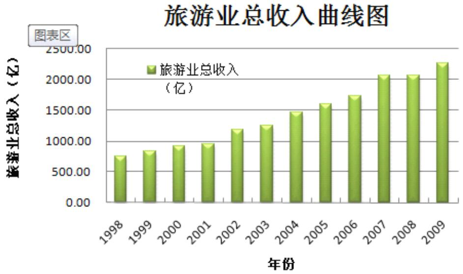

bar

| 年份 | 旅游业总收入 (亿) |
| --- | --- |
| 1998 | ~750 |
| 1999 | ~850 |
| 2000 | ~950 |
| 2001 | ~980 |
| 2002 | ~1200 |
| 2003 | ~1250 |
| 2004 | ~1480 |
| 2005 | ~1600 |
| 2006 | ~1750 |
| 2007 | ~2080 |
| 2008 | ~2080 |
| 2009 | ~2280 |

图 1 上海市旅游业总收入直方图

入境旅游人次曲线图  
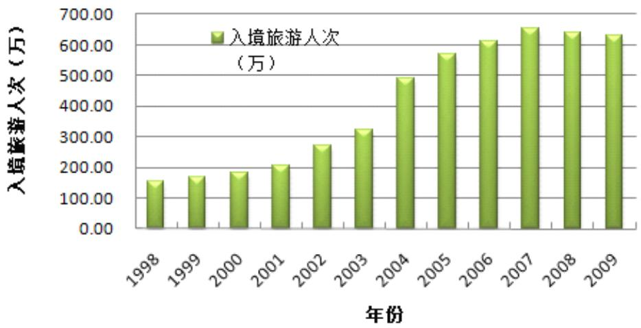

bar

| 年份 | 入境旅游人次 (万) |
| --- | --- |
| 1998 | ~160 |
| 1999 | ~175 |
| 2000 | ~190 |
| 2001 | ~210 |
| 2002 | ~280 |
| 2003 | ~330 |
| 2004 | ~500 |
| 2005 | ~580 |
| 2006 | ~620 |
| 2007 | ~660 |
| 2008 | ~650 |
| 2009 | ~640 |

图2 上海市入境旅游人次曲线图

## 1.2 前人工作

## 1.2.1 研究基础

改革开发初期，国内并没有真正意义上的旅游活动，对旅游、旅游业及其基本规律的研究还是个空白。因此，学者们对国际旅游研究成果进行翻译等，这对我国旅游行业的发展和研究起到了重大作用。这些学者的研究丰富了中国旅游研究的领域，使中国旅游学术研究逐步融进了国际学术研究的大环境[1]。世博会作为重大事件的研究主要内容，对举办城市的经济影响一直受到关注，如 Getz 就曾经给出了重大事件的举办对举办城市的全面分析框架，认为重大事件能增加举办城市政府支出、创造就业等，由于世博会举办过程的阶段性，对其举办城市的价值提升也出现了阶段性特征，如下图所示：

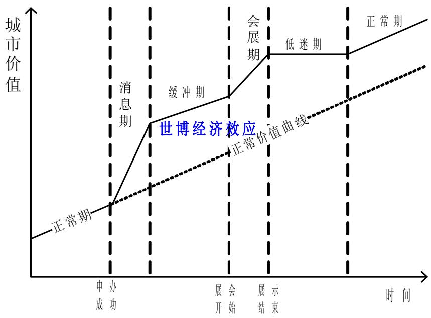

line

| 阶段 | 描述 |
| --- | --- |
| 申办成功 | 正常期 |
| 消息期 | 线性增长 |
| 缓冲期 | 线性增长 |
| 展会开始 | 线性增长 |
| 展示结束 | 会展期 |
| 低 迷期 | 会展期 |
| 正常期 | 线性增长 |

图 3 世博会对举办城市价值的阶段性提升图

## 1.2.2 研究方法

几十年以来，无论是中国的经济发展，还是旅游业的规模与发展旅游的观念，已经是今非昔比。中国与世界的关系和中国的旅游发展在世界地位的变化更是几十年前所意想不到的。“中国现象”已经成为学术界十分关注的话题，有许多的中国学者提出了一系列适合中国国情的理论研究方法。例如 ：楚义芳博士对我国旅游研究的定量分析贡献很大，他采用数学模型方法深入研究了旅游地开发评价问题，构建了中国观赏型旅游地的综合性评价模型系统，被学术界广泛采用。许春晓的主要贡献为旅游规划和旅游市场理论。他对我国 20 多年来旅游规划中的市场导向历程进行来综述型的研究，评述了三个阶段的发展特点和发展水平，并进行了展望[4]。在我国的旅游市场研究方面，己经有相当数量的关于中国国际旅游业发展状况的文章，基本上以定性研究居多，或者是对旅游统计年鉴上统计数字做一些简单的统计分析。

另外，许多研究人员对各个省份的入境旅游客源市场建立了一些预测模型。如秦立公的“桂林入境旅游发展的非线性回归拟合与自惯性预测研究”，卫海燕的“深圳市境外游客市场的动态预测模型分析”、“深圳市境外游客市场的灰色预测模型”，武娇、刘新平的“我国国际旅游外汇收入的时间序列预测模型”等等。

## 1.3 我们的贡献

1) 使用比较基本的回归模型利用历史数据进行拟合，在拟合的基础上对未来数据进行预测，在此基础上介入人为因素的控制机制，使得基本模型趋于理想化[5]。  
2) 利用基本本底趋势线模型，模拟了近十二年来上海市旅游业发展在没有重大事件影响下的自然走势。  
3) 用官方预测的 2010 年上海市旅游业各主要指标，与模型计算得到的本底值进行比较分析，定量描述了世博会对上海旅游业发展的影响[6]。  
4) 利用matlab 中的 cftool 工具箱，对本底趋势线方程中的系数进行确定，直观方便。  
5) 利用最基本的因子分析与曲线回归，具体化问题的同时，对问题提出了比较的简单的解决办法  
6) 我们从理论上分析了两个模型的合理性并验证了方法的可行性，进一步指出了选择参数的方法，并基于不同的模型进行了结果的分析  
7) 比较分析了模型的优缺点，并进一步指出未来仍需要进一步完善的工作  
8) 给出了执行摘要，使得完全没有数学与经济学基础的管理者也可以根据执行摘要制定适当的交易规则

## 2 预备知识

## 2.1 旅游本地趋势线模型

旅游本底趋势线是指在不受境内外重大事件冲击和干扰的情况下所呈现的固有趋势方程。旅游本底趋势线反映了一个国家（或地区）旅游业发展天然而稳定的趋势和时间规律，是旅游目的地及其与客源市场在旅游需求，社会经济发展等诸多因素相互作用的综合结果[5]。

建立旅游本底趋势线，可以揭示某国（或地区）旅游发展的固有趋势，结合旅游业发展的统计线又可作为知识旅游业兴衰的“晴雨表”，对本底趋势线的自然延伸还可预测旅游业发展的基本趋势，为旅游业的宏观规划和决策提供科学依据。

旅游业的发展趋势是确定的和可预报的，而各年增长率的变化却是随机和不可预报的。旅游发展的本底趋势线归结为 4 种基本形式和 6 种复合形式，直线（或指数线）增长基础上的周期性波动可能反映了旅游业发展的基本规律。在此基础上进而将其归纳统一方程

$$
T _ {t} = A _ {t} + C _ {t} + S _ {t} \tag {1}
$$

旅游业的发展动态（ $T _ { \iota } )$ 可分解为趋势项 $( \mathbf { \nabla } _ { A _ { t } } )$ ），周期项 $( \mathbf { \nabla } C _ { t } )$ ，随机项 $( \mathbf { \nabla } S _ { t } )$ 三个部分。其中趋势项 $( \mathbf { \nabla } _ { A _ { t } } )$ 可用直线方程

$$
y _ {t} = y _ {0} \exp (r t) \tag {2}
$$

来反映，周期项 $( \ C _ { t } )$ 可用三角函数

$$
y _ {t} = q \sin (\omega t + \varphi) \tag {3}
$$

或逻辑增长函数

$$
y _ {t} = K / (1 + \exp (c - r t)) \tag {4}
$$

来反映，随机项 $( \mathbf { \nabla } _ { S _ { t } } )$ 可用随机时间序列分析中的 AR(r)或 ARMA(p,q)来模拟。与以往单纯的直线模拟、灰色模拟、时间序列模拟相比较，这种时域组合模式经济意义明确，包含时间序列的信息量丰富，更能精确地反映旅游业发展的动态变化规律。

## 2.2 因子分析

因子分析以最少的信息丢失为前提，将众多的原有变量综合成较少几个综合指标，各为因子。通常，因子具有以下特点：

� 因子个数远少于原有变量的个数  
� 因子能够反映原有变量的绝大多数信息  
� 因子之间的线性关系不显著  
� 因子具有命名解释性

因子分析的核心是用较少的互相独立的因子反映原有变量的绝大多数信息，可用数学模型表示为：设原有 p 个原有变量 $\mathcal { X } _ { 1 } , \mathcal { X } _ { 2 } , \ldots \mathcal { X } _ { p }$ ，且每个变量（或经过标准化处理后）的均值为 0，标准差为 1。现将每个原有变量用 $\boldsymbol { \mathrm {  } } \left( \boldsymbol { \mathrm { k \textcircled { \cdot } p } } \right)$ 个因子 $\mathcal { f } _ { 1 } , \mathcal { f } _ { 2 } , . . . \mathcal { f } _ { k }$ 的线性组合，则有：

$$
\left\{ \begin{array}{c} x _ {1} = a _ {1 1} f _ {1} + a _ {1 2} f _ {2} + \ldots + a _ {1 k} f _ {k} + \varepsilon_ {1} \\ x _ {2} = a _ {2 1} f _ {1} + a _ {2 2} f _ {2} + \ldots + a _ {2 k} f _ {k} + \varepsilon_ {2} \\ x _ {3} = a _ {3 1} f _ {1} + a _ {3 2} f _ {2} + \ldots + a _ {3 k} f _ {k} + \varepsilon_ {3} \\ \cdots \\ x _ {p} = a _ {p 1} f _ {1} + a _ {p 2} f _ {2} + \ldots + a _ {p k} f _ {k} + \varepsilon_ {p} \end{array} \right.
$$

上述表达式便是因子分析的数学模型，可用矩阵的形式表示为： $\mathbf { X } = \mathbf { A } \mathbf { F } + \boldsymbol \varepsilon$ ,其中 F为公共因子。A 称为因子载荷矩阵， $a _ { i j } ( i { = } 1 , 2 { , } . . . { p } ; j { = } 1 , 2 { , } . . . k )$ 称为载荷因子，是第 i 个原有变量在第 j 个因子上的负荷。

## 2.3 KMO（Kaiser-Meyer-Olkin）检验

KMO 检验统计量是用于比较变量间简单相关系数和偏相关系数的指标，数学定义为：

$$
\mathrm{KMO} = \frac {\sum_ {i \neq j} r _ {i j} ^ {2}}{\sum_ {i \neq j} r _ {i j} ^ {2} + \sum_ {i \neq j} p _ {i j} ^ {2}} \tag {5}
$$

式中， $r _ { i j }$ 是变量 $x _ { i }$ 与其他变量 $x _ { j }$ 间的简单相关系数， $p _ { i j }$ 是变量 $x _ { i }$ 和其他变量 $x _ { j }$ 间在控制了剩余变量下的偏相关系数。

## 3 模型综述

## 3.1 旅游本底趋势线模型

旅游本底趋势线反映了一个国家（或地区）旅游业发展天然而稳定的趋势和时间规律，借鉴旅游本底趋势线模型在不受境内外重大事件冲击和干扰的情况下所呈现的固有趋势方程的特征，利用互联网搜集的历年上海旅游业相关数据，依据本行业的情况，选取相应的指标，将搜集来的数据先进行内插处理，得到的内插数据能更好的反映旅游业的发展状况。

根据内插数据，针对各项指标建立一组本底趋势线模型，通过分析比较选择出最合适的模型，根据得到的趋势线方程计算出 2010 年上海各项指标的本底值，用 2010 年实际的各项指标（根据 2010 年前 9 个月上海旅游业的发展形势及网上评估计算得出）与 2010 年各项指标的本底值作比较，即得到了由于 2010 年世博会的影响值。

根据本底趋势线的思想，计算得到的影响值实际上是指由于举办世博会而带来的各项指标的增加值，因此用各项指标的影响值就可以从经济侧面反映上海世博会的影响[7]。具体模型计算过程如下所示：

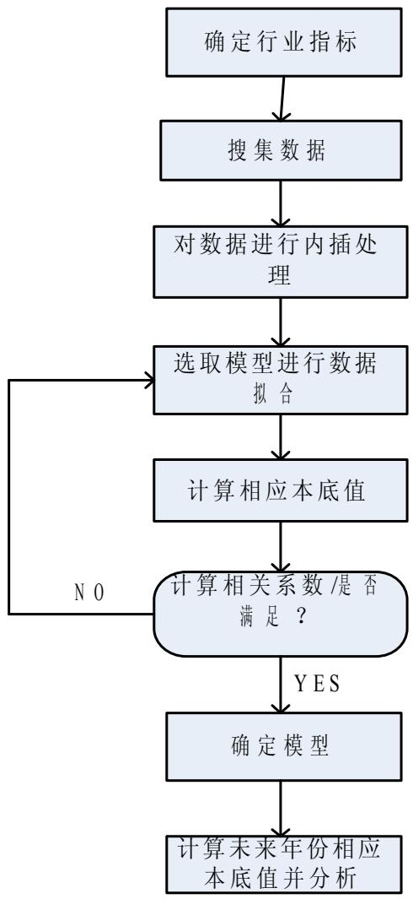

flowchart

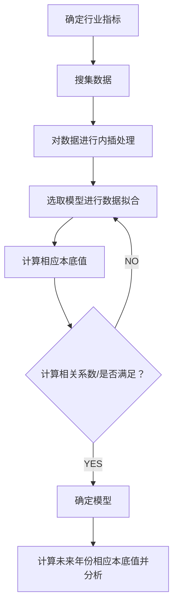

图 4 旅游本底趋势线模型计算流程

## 3.2 FA-MR 模型（因子分析与多元回归模型）

因子分析法的主要思想是将众多错综复杂的变量按照相关性进行分组，使同组内的变量相关性高，而每组之间的相关性较低。每组变量代表一个基本结构，这个基本结构称为公共因子。使众多的变量归结为几个公共因子，以达到降维、便于分析的目的[8]。多元回归具有较好的预测作用，FA-MR 模型利用因子分析的优点，将旅游业发展的众多衡量指标通过因子分析得到两个因子得分 F1,F2,其中 F1 为国内旅游助长因子，用于衡量国内因素对于上海旅游业的发展促进作用，F2 为国外旅游助长因子，用于衡量国外因素对于上海旅游业的促进作用；FA-MR 模型综合因子分析与多元回归的优点，通过预测的方式来分析2010年上海世博会对于上海旅游业的影响作用。

## 4 模型建立

综合旅游业的具体情况，通过在互联网上的数据搜集（见附录），本文选取的旅游行业的指标包括：国内旅游人次（y1），入境旅游人次（y2），国内旅游收入（y3），外汇旅游收入 $( \mathsf { y 4 } )$ ），旅游业总收入 $( \mathsf { y } \mathsf { \boldsymbol { 5 } } )$ ），国内生产总值 $\mathsf { G D P } ( \mathsf { y } 6 )$ 以及旅游业总收入占 GDP 比值 $( \mathsf { y } \mathsf { 7 } )$

## 4.1 条件假设

1) 旅游业的发展总是具有一定的规律，并且该规律在一定程度上可进行模拟，并且在较短的时间内该发展规律不会发生较大的改变  
2) 2010 年度官方预测的各指标数据与本年度实际数据之间比较接近  
3) 上海世博会是一段时期内上海影响力最大的事件，忽略期间上海可能发生的其他严重影响旅游业发展的事件，在建立数学模型时忽略了随机波动项，着重分析其趋势项和周期波动项[9]。

## 4.2 旅游本底趋势线模型

## 4.2.1 模型建立

建立本底线的基本方法是：

1. 选取订正后的时间序列数据，做出趋势线统计图；  
2. 根据最小二乘原理进行数据的最优拟合，确定有关系数，建立本底趋势线方程（多个）。  
3. 观测统计图，对结果进行讨论分析，从多个本底趋势线方程中选取最佳的一个。

在上述假设条件的前提下，结合经济发展的固有规律，我们选取了以下5 个初始本底趋势线模型：

1) $y ( x ) = a \times b ^ { x }$ ，其中 $a , b$ 为常数  
2) $y ( x ) = a \times x ^ { b } ,$ ，其中 $a , b$ 为常数  
3) $y ( x ) = a \times e ^ { b x } + c \sin ( \omega x + \varphi )$ ，其中 $a , b , c , \omega , \varphi$ 为常数  
4) $\begin{array} { r } { \gamma ( x ) = a x + b + K / [ 1 + e ^ { c - r x } ] } \end{array}$ ，其中 $a , b , K , c , \gamma$ 为常数  
5) $y ( x ) = a x + b + c \sin ( \omega x + \varphi )$ ，其中 $a , b , c , \omega , \varphi$ 为常数

注： $\mathrm {  ~ y ~ } ( \mathrm {  ~ x ~ } )$ 表示各项指标，x 表示年份(用 1 代表 1998，2 代表 1999，以此类推)

## 4.3 FA-MR 模型（因子分析与多元回归模型

## 4.3.1 模型建立

记选取旅游行业的j个指标分别为 $x ( j ) ; j = 1 , 2 , . . . m ; x _ { i } ( j ) , i = 1 , 2 , . . . n$ 表示第 i个变量第j个指标的取值，则：

$$
\overline {{X}} _ {j} = \frac {1}{n} \sum_ {i = 1} ^ {n} x _ {i} (j); j = 1, 2, \dots m \tag {6}
$$

表示第j个指标所有变量的均值；

$$
S _ {j} ^ {2} = \frac {1}{n - 1} \sum_ {i = 1} ^ {n} \left(\overline {{X}} - x _ {i} (j)\right) ^ {2} \tag {7}
$$

表示第j个指标所有变量的方差；

设经过计算所满足的因子得分系数矩阵如下：

$$
F = \left[ \begin{array}{c c c c} \gamma_ {1 1} & \gamma_ {1 2} & \dots & \gamma_ {1 p} \\ \gamma_ {2 1} & \dots & \dots & \gamma_ {2 p} \\ \cdot & & & \cdot \\ \cdot & \dots & \dots & \cdot \\ \cdot & & & \cdot \\ \gamma_ {j 1} & \gamma_ {j 2} & \dots & \gamma_ {j p} \end{array} \right], j = 1, 2, \dots m; \tag {8}
$$

其中， $\mathfrak { p }$ 代表选取的因子个数， $\gamma _ { \mathbf { \Omega } _ { j p } }$ 代表第 $\dot { p }$ 个因子在第j指标上的得分系数，则因子得分函数为：

$$
\mathrm{F} _ {p} = \sum_ {j = 1} ^ {m} \gamma_ {j p} \frac {x _ {j} - \overline {{X _ {j}}}}{S _ {j}} \tag {9}
$$

因子得分 $\mathrm { \cdot F _ { P ^ { \prime } } }$ 作为衡量给个变量的最终指标，通过对各个变量因子得分 $\mathrm { F p }$ 进行曲线回归，最终可得到预测函数[10]。

## 5 模型仿真求解

## 5.1 旅游本底趋势线模型求解

旅游本底趋势线模型的关键在于选取拟合度较高的曲线方程以及解出所选定模型的各个系数，在此我们采取曲线拟合的方法。在此，我们应用 SPSS 软件与 matlab 对5种模型进行计算机模拟。

## 5.1.1 国内旅游人数本底趋势线模型

首先要对搜集的数据进行订正，建立旅游本底趋势线,需要对因突发事件所造成统计数据的异常变化进行订正，在此统计数据的订正采用了直线内插法[11],即对于存在异常值的某段区间，确定直线内插的起始点 $\mathrm { n } _ { \mathrm { a } }$ 与终止点 $\mathrm { n _ { b } }$ ，用内插值公式：

$$
Y _ {n} = Y _ {a} + (n - n _ {a}) \times d, d = (Y _ {b} - Y _ {a}) / (n _ {b} - n _ {a}) \tag {10}
$$

对各个指标进行内插处理（内插后的值称为内插值），内插后的数据能更好的反映排除重大事件影响的旅游业自然发展趋势，使得本底趋势线最符合实际情况。

各项指标内插数据对比如下表：

表1 各项指标内插数据表

<table><tr><td>年份</td><td>国内旅游人次(万)</td><td>入境旅游人次(万)</td><td>国内旅游收入(亿)</td><td>外汇旅游收入(亿美元)</td><td>旅游业总收入(亿)</td><td>国内生产总值(GDP)(亿)</td><td>旅游业总收入相当于GDP的比重</td></tr><tr><td>1998</td><td>7098.00</td><td>152.70</td><td>646.00</td><td>12.45</td><td>750.00</td><td>3688.20</td><td>20.34%</td></tr><tr><td>1999</td><td>7498.00</td><td>165.68</td><td>719.33</td><td>13.64</td><td>832.54</td><td>4034.96</td><td>20.63%</td></tr><tr><td>2000</td><td>7848.00</td><td>181.40</td><td>775.00</td><td>16.13</td><td>908.63</td><td>4551.15</td><td>19.96%</td></tr><tr><td>2001</td><td>8254.00</td><td>204.26</td><td>805.78</td><td>18.25</td><td>957.25</td><td>4950.84</td><td>19.34%</td></tr><tr><td>2002</td><td>8761.00</td><td>272.53</td><td>993.82</td><td>22.75</td><td>1182.60</td><td>5408.76</td><td>21.86%</td></tr><tr><td>2003</td><td>8801.12</td><td>319.87</td><td>1079.80</td><td>24.65</td><td>1250.20</td><td>6250.81</td><td>20.00%</td></tr><tr><td>2004</td><td>8951.32</td><td>491.92</td><td>1216.34</td><td>30.89</td><td>1472.11</td><td>7450.27</td><td>19.76%</td></tr><tr><td>2005</td><td>9325.03</td><td>571.35</td><td>1308.41</td><td>36.08</td><td>1604.26</td><td>9143.95</td><td>17.54%</td></tr><tr><td>2006</td><td>9683.90</td><td>610.23</td><td>1420.00</td><td>40.36</td><td>1731.10</td><td>10297.00</td><td>16.81%</td></tr><tr><td>2007</td><td>10200.00</td><td>652.36</td><td>1611.30</td><td>47.40</td><td>2074.80</td><td>12001.16</td><td>17.29%</td></tr><tr><td>2008</td><td>11000.00</td><td>640.37</td><td>1612.41</td><td>50.27</td><td>2060.31</td><td>13698.15</td><td>15.04%</td></tr><tr><td>2009</td><td>12360.74</td><td>628.92</td><td>1913.80</td><td>51.32</td><td>2266.34</td><td>14900.93</td><td>15.21%</td></tr></table>

下面以“国内旅游人次”为例介绍数据拟合及模型选择过程：

应用 MATLAB 进行计算机模拟，即年份 x=[1,2,3,4,5,6,7,8,10,11,12];

y1=[7098.00,7498.00,7848.00,8254.00,8761.00,8801.12,8951.32,9325.03,9683.90,10200.00,11000.00,12360.74],分别用上述 5 个本底趋势线模型进行拟合，得到各个模型相应系数，所得结果如下：

$$
y _ {1 1} (x) = 6 7 4 9 \times 1. 0 4 6 ^ {x}
$$

$$
y _ {1 2} (x) = 6 2 8 4 \times x ^ {0. 2 1 8}
$$

$$
y _ {1 3} (x) = 3 4. 1 8 \times e ^ {0. 4 1 7 9 x} + 8 4 2 5 \sin (0. 1 0 2 9 x + 0. 8 7 8 6)
$$

$$
y _ {1 4} (x) = 4 0 1. 6 x + 3 4 8 6 + \frac {3 0 5 2}{1 + e ^ {- 9 1 . 0 7 - 9 5 . 7 7 x}}
$$

( ) 479 .5 5824 77 .77 sin( 61 .6 19 .33 ) y x = x + − x + 在上述 5 个模型的基础上，计算国内旅游人数本底值如下表所示：

表2 各模型得道德旅游人数本底值表

<table><tr><td>年份</td><td>Y11</td><td>Y12</td><td>Y13</td><td>Y14</td><td>Y15</td></tr><tr><td>1998</td><td>7059.00</td><td>6284.00</td><td>7056.00</td><td>6940.00</td><td>6357.00</td></tr><tr><td>1999</td><td>7384.00</td><td>7309.00</td><td>7527.00</td><td>7341.00</td><td>6854.00</td></tr><tr><td>2000</td><td>7724.00</td><td>7985.00</td><td>7933.00</td><td>7743.00</td><td>7257.00</td></tr><tr><td>2001</td><td>8079.00</td><td>8501.00</td><td>8277.00</td><td>8144.00</td><td>7667.00</td></tr><tr><td>2002</td><td>8451.00</td><td>8925.00</td><td>8569.00</td><td>8546.00</td><td>8177.00</td></tr><tr><td>2003</td><td>8840.00</td><td>9287.00</td><td>8821.00</td><td>8948.00</td><td>8747.00</td></tr><tr><td>2004</td><td>9246.00</td><td>9604.00</td><td>9059.00</td><td>9349.00</td><td>9255.00</td></tr><tr><td>2005</td><td>9671.00</td><td>9888.00</td><td>9320.00</td><td>9751.00</td><td>9664.00</td></tr><tr><td>2006</td><td>10116.00</td><td>10145.00</td><td>9665.00</td><td>10152.00</td><td>10068.00</td></tr><tr><td>2007</td><td>10582.00</td><td>10381.00</td><td>10184.00</td><td>10554.00</td><td>10567.00</td></tr><tr><td>2008</td><td>11068.00</td><td>10599.00</td><td>11013.00</td><td>10956.00</td><td>11136.00</td></tr><tr><td>2009</td><td>11578.00</td><td>10802.00</td><td>12363.00</td><td>11357.00</td><td>11655.00</td></tr></table>

对上述所得数据进行计算机拟合，得到的各拟合曲线如下图：

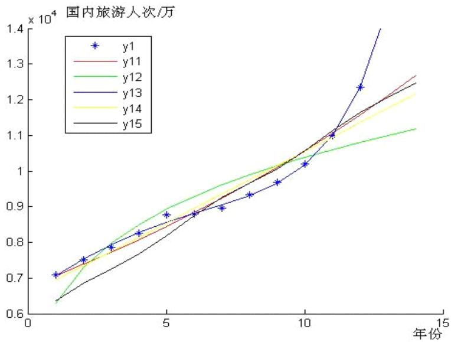

line

| 年份 | y1 (x 10^4) |
| --- | --- |
| 1 | ~0.71 |
| 2 | ~0.75 |
| 3 | ~0.79 |
| 4 | ~0.83 |
| 5 | ~0.88 |
| 6 | ~0.88 |
| 7 | ~0.90 |
| 8 | ~0.93 |
| 9 | ~0.97 |
| 10 | ~1.02 |
| 11 | ~1.10 |
| 12 | ~1.24 |

图 5 上海市 2010 年国内旅游人次计算机拟合图

根据国内旅游人次的内插值和5 个模型所得的本底值，分别计算其相关系数，得到如下相关系数：

表 3 内插值与各模型本底值相关系数表

<table><tr><td colspan="7">Correlations</td></tr><tr><td></td><td>国内旅游人次</td><td>G1</td><td>G2</td><td>G3</td><td>G4</td><td>G5</td></tr><tr><td>国内旅游人次</td><td>1</td><td>0.973**</td><td>0.903**</td><td>0.999**</td><td>0.962**</td><td>0.965**</td></tr></table>

其中 Gi 代表第 i 个模型得到的本底值

通过分析比较，可知指数-三角函数复合函数的拟合优度最高，确定此函数为为国内旅游人次的最佳本底趋势线，即国内旅游人次的最终本地趋势线方程为：

$$
y _ {1} (x) = 3 4. 1 8 \times e ^ {0. 4 1 7 9 x} + 8 4 2 5 \sin (0. 1 0 2 9 x + 0. 8 7 8 6) \tag {11}
$$

## 5.1.2 入境旅游人次本底趋势线模型

同上理理可得指标入境旅游人次的最佳本底趋势线方程为：

$$
y _ {2} (x) = 5 4. 8 4 * x + 5 4. 6 9 - \frac {1 0 . 6 5}{1 + e ^ {- 2 . 3 9 6 + 0 . 4 8 6 5 x}}
$$

拟合曲线图如下所示：

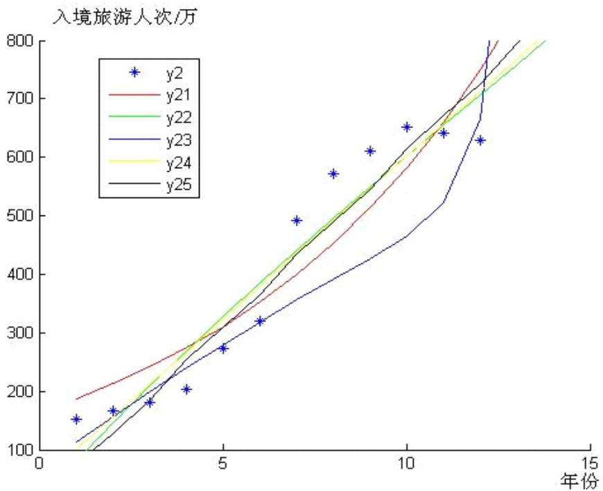

line

| 年份 | y2 (万人次) |
| --- | --- |
| 1 | ~150 |
| 2 | ~170 |
| 3 | ~180 |
| 4 | ~200 |
| 5 | ~270 |
| 6 | ~320 |
| 7 | ~490 |
| 8 | ~570 |
| 9 | ~610 |
| 10 | ~650 |
| 11 | ~640 |
| 12 | ~630 |

图 6 上海市 2010 年入境旅游人次计算机拟合图

## 5.1.3 国内旅游收入本地趋势线模型

国内旅游收入本底趋势线方程为：

$$
y _ {3} (x) = 5 9 5. 5 \times 1. 1 0 1 ^ {x} \tag {12}
$$

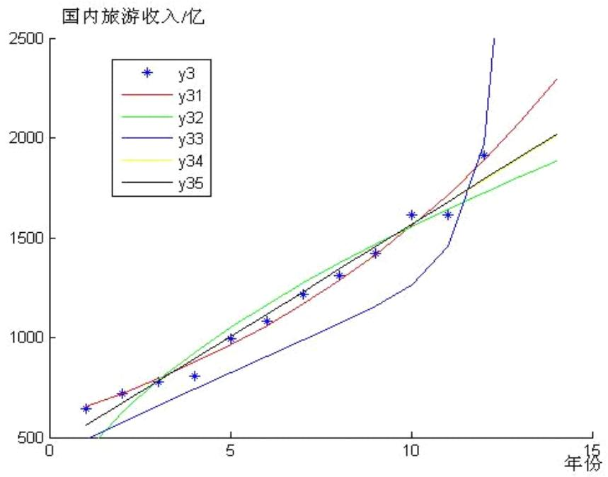

line

| 年份 | y3 (亿) |
| --- | --- |
| 1 | ~650 |
| 2 | ~720 |
| 3 | ~780 |
| 4 | ~800 |
| 5 | ~1000 |
| 6 | ~1080 |
| 7 | ~1220 |
| 8 | ~1320 |
| 9 | ~1420 |
| 10 | ~1620 |
| 11 | ~1620 |
| 12 | ~1920 |

图 7 上海市 2010 年国内旅游收入计算机拟合图

## 5.1.4 外汇旅游收入本底趋势线模型

外汇旅游收入本底趋势线方程为：

$$
y _ {4} (x) = 3. 6 7 7 x + 6. 2 1 6 + 3. 1 8 9 \sin (- 0. 5 8 9 8 x + 2 0. 2 6) \tag {13}
$$

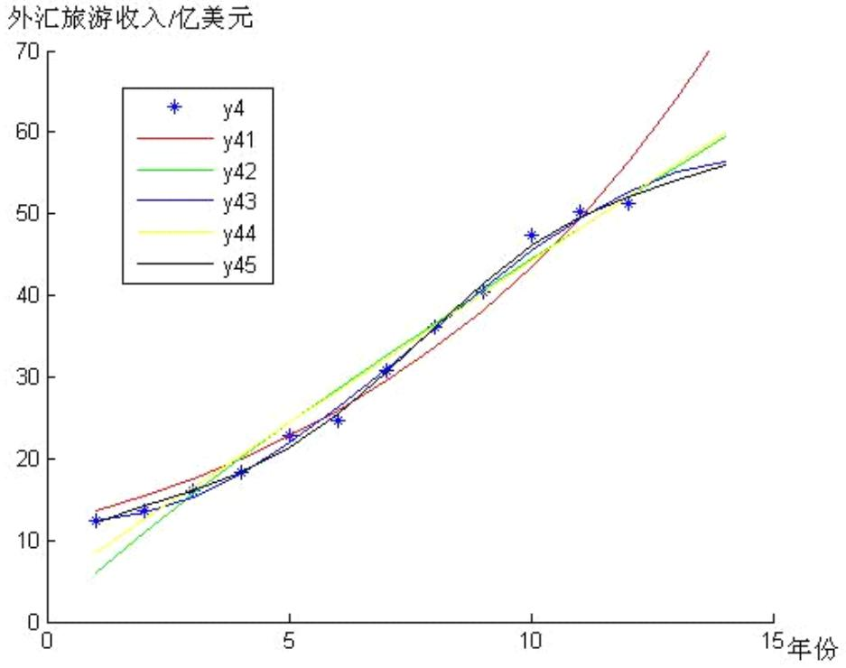

line

| 年份 | y4 (亿美元) |
| --- | --- |
| 1 | ~12.5 |
| 2 | ~13.5 |
| 3 | ~16 |
| 4 | ~18.5 |
| 5 | ~22.5 |
| 6 | ~24.5 |
| 7 | ~30.5 |
| 8 | ~36 |
| 9 | ~40.5 |
| 10 | ~47 |
| 11 | ~50 |
| 12 | ~51 |
| 13 | ~56 |

图 8 上海市 2010 年外汇旅游人次计算机拟合图

## 5.1.5 旅游总收入本底趋势线模型

旅游本底趋势线方程为：

$$
y _ {5} (x) = 6 9 2. 5 \times 1. 1 0 7 ^ {x} \tag {14}
$$

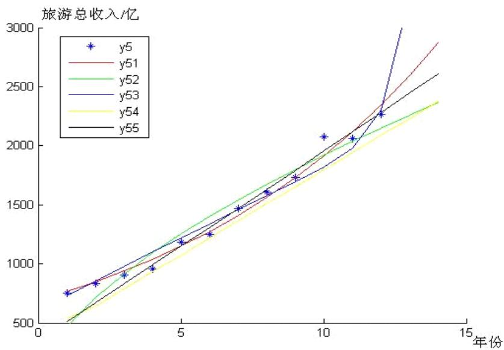

line

| 年份 | y5 (亿) | y51 (亿) | y52 (亿) | y53 (亿) | y54 (亿) | y55 (亿) |
| --- | --- | --- | --- | --- | --- | --- |
| 1 | ~750 | ~750 | ~500 | ~750 | ~500 | ~750 |
| 2 | ~850 | ~850 | ~800 | ~850 | ~750 | ~850 |
| 3 | ~900 | ~950 | ~900 | ~950 | ~900 | ~950 |
| 4 | ~950 | ~1050 | ~1050 | ~1050 | ~1000 | ~1050 |
| 5 | ~1150 | ~1150 | ~1150 | ~1150 | ~1100 | ~1150 |
| 6 | ~1250 | ~1250 | ~1250 | ~1250 | ~1200 | ~1250 |
| 7 | ~1450 | ~1450 | ~1450 | ~1450 | ~1350 | ~1450 |
| 8 | ~1600 | ~1600 | ~1600 | ~1600 | ~1500 | ~1600 |
| 9 | ~1750 | ~1750 | ~1750 | ~1750 | ~1650 | ~1750 |
| 10 | ~2050 | ~2050 | ~2050 | ~2050 | ~1800 | ~2050 |
| 11 | ~2050 | ~2250 | ~2250 | ~2250 | ~2000 | ~2250 |
| 12 | ~2250 | ~2450 | ~2450 | ~2450 | ~2200 | ~2450 |
| 13 | — | ~2650 | ~2650 | >3000 | ~2350 | — |
| 14 | — | — | — | — | — | — |
| 14.5 | — | — | — | — | — | — |
| 14.8 | — | — | — | — | — | — |
| 14.9 | — | — | — | — | — | — |
| 14.9 (end) | — | — | — | — | — | — |
| 14.9 (final) | — | — | — | — | — | — |
| 14.9 (final) (end) | — | — | — | — | — | — |
| 14.9 (final) (final) | — | — | — | — | — | — |
| 14.9 (final) (final) (final) (end) | — | — | — | — | — | — |
| 14.9 (final) (final) (final) (end) | — | — | — | — | — | — |
| 14.9 (final) (final) (final) (end) | — | — | — | — | — | — |
| 14.9 (final) (final) (final) (end) | — | — | 2350~2600 (estimated) | 300~3350 (estimated) | 235~2380 (estimated) | 260~2880 (estimated) |
| 14.9 (final) (final) (final) (end) | — | — | 238~2380 (estimated) | 338~3380 (estimated) | 238~2380 (estimated) | 268~2880 (estimated) |

图9 上海市2010 年旅游总收入计算机拟合图

## 5.1.6 国内生产总值GDP 本底趋势线模型

国内生产总值GDP本底趋势线方程为：

$$
y _ {6} (x) = 2 9 3 1 \times 1. 1 4 8 ^ {x} \tag {15}
$$

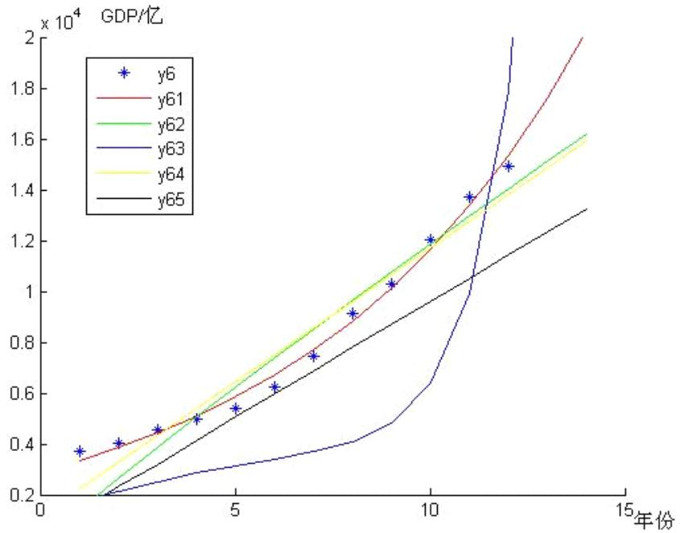

line

| 年份 | y6 (x 10^4) | y61 (x 10^4) | y62 (x 10^4) | y63 (x 10^4) | y64 (x 10^4) | y65 (x 10^4) |
| --- | --- | --- | --- | --- | --- | --- |
| 1 | ~0.37 | ~0.34 | ~0.28 | ~0.20 | ~0.22 | ~0.20 |
| 2 | ~0.40 | ~0.39 | ~0.35 | ~0.23 | ~0.32 | ~0.28 |
| 3 | ~0.45 | ~0.45 | ~0.42 | ~0.26 | ~0.42 | ~0.35 |
| 4 | ~0.50 | ~0.51 | ~0.49 | ~0.29 | ~0.51 | ~0.42 |
| 5 | ~0.54 | ~0.57 | ~0.56 | ~0.32 | ~0.60 | ~0.50 |
| 6 | ~0.62 | ~0.64 | ~0.63 | ~0.35 | ~0.69 | ~0.58 |
| 7 | ~0.74 | ~0.72 | ~0.71 | ~0.38 | ~0.79 | ~0.67 |
| 8 | ~0.91 | ~0.81 | ~0.79 | ~0.41 | ~0.89 | ~0.76 |
| 9 | ~1.03 | ~0.91 | ~0.88 | ~0.48 | ~0.99 | ~0.85 |
| 10 | ~1.20 | ~1.02 | ~0.97 | ~0.64 | ~1.09 | ~0.94 |
| 11 | ~1.37 | ~1.13 | ~1.06 | ~1.05 | ~1.19 | ~1.03 |
| 12 | ~1.49 | ~1.24 | ~1.15 | >2.0 | ~1.29 | ~1.12 |
| 13 | — | ~1.35 | ~1.24 | — | ~1.39 | ~1.21 |
| 14 | — | ~1.46 | ~1.33 | — | ~1.49 | ~1.30 |
| 15 | — | ~1.57 | ~1.42 | — | ~1.59 | ~1.39 |
| 16 | — | ~1.68 | ~1.51 | — | ~1.69 | ~1.48 |
| 17 | — | ~1.79 | ~1.60 | — | ~1.79 | ~1.57 |
| 18 | — | ~1.90 | ~1.69 | — | ~1.89 | ~1.66 |
| 19 | — | ~2.01 | ~1.78 | — | ~1.99 | ~1.75 |
| 20 | — | — | — | — | — | — |
| 21 | — | — | — | — | — | — |
| 22 | — | — | — | — | — | — |
| 23 | — | — | — | — | — | — |
| 24 | — | — | — | — | — | — |
| 25 | — | — | — | — | — | — |
| 26 | — | — | — | — | — | — |
| 27 | — | — | — | — | — | — |
| 28 | — | — | — | — | — | — |
| 29 | — | — | — | — | — | — |
| 30 | — | — | — | — | — | — |
| 31 | — | — | — | — | — | — |
| 32 | — | — | — | — | — | — |
| 33 | — | — | — | — | — | — |
| 34 | — | — | — | — | — | — |
| 35 | — | — | — | — | — | — |
| 36 | — | — | — | — | — | — |
| 37 | — | — | — | — | — | — |
| 38 | — | — | — | — | — | — |
| 39 | — | — | — | — | — | — |

图 10 上海市 2010 年 GDP 计算机拟合图

## 5.1.7 旅游业总收入占 GDP 本底趋势线模型

旅游业总收入占GDP 本底趋势线方程为：

$$
y _ {7} (x) = - 0. 0 0 5 0 2 3 x + 0. 2 2 1 1 - 0. 0 1 1 2 5 \sin (0. 6 5 6 3 x + 0. 8 0 1 5) \tag {16}
$$

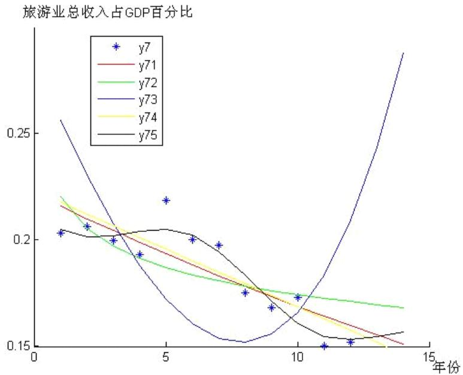

line

| 年份 | y7 | y71 | y72 | y73 | y74 | y75 |
| --- | --- | --- | --- | --- | --- | --- |
| 1 | 0.203 | — | — | — | — | — |
| 2 | 0.206 | — | — | — | — | — |
| 3 | 0.200 | — | — | — | — | — |
| 4 | 0.193 | — | — | — | — | — |
| 5 | 0.218 | — | — | — | — | — |
| 6 | 0.200 | — | — | — | — | — |
| 7 | 0.197 | — | — | — | — | — |
| 8 | 0.175 | — | — | — | — | — |
| 9 | 0.168 | — | — | — | — | — |
| 10 | 0.173 | — | — | — | — | — |
| 11 | 0.150 | — | — | — | — | — |
| 12 | 0.152 | — | — | — | — | — |
| 13 | — | — | — | — | — | — |
| 14 | — | — | — | — | — | — |
| 15 | — | ~0.155 | ~0.168 | ~0.285 | ~0.150 | ~0.158 |

图11 上海市 2010 年旅游业总收入占 GDO 百分比计算机拟合图

根据上述所得7 个最佳本底趋势线模型，即可求出2010年 7 项指标的本底值，结

果如下表：

表 4 2010 年自然状态下各指标预测值

<table><tr><td>年份</td><td>Y1/万</td><td>Y2/万</td><td>Y3/亿</td><td>Y4/亿美元</td><td>Y5/亿</td><td>Y6/亿</td><td>Y7/1</td></tr><tr><td>2010</td><td>14571.00</td><td>767.40</td><td>2080.30</td><td>54.10</td><td>2596.2</td><td>15357.00</td><td>0.1548</td></tr></table>

在世博会影响下上海 2010 旅游业 7 项指标（根据前 9 个月估测）如下表：

表 5 2010 年由实际值预测各指标数据表

<table><tr><td>年份</td><td>Y1&#x27;/万</td><td>Y2&#x27;/万</td><td>Y3&#x27;/亿</td><td>Y4&#x27;/亿美元</td><td>Y5&#x27;/亿</td><td>Y6&#x27;/亿</td><td>Y7&#x27;/1</td></tr><tr><td>2010</td><td>18000.00</td><td>842.12</td><td>2930.00</td><td>59.00</td><td>3328.84</td><td>16000.00</td><td>0.2081</td></tr></table>

世博会对各个指标的影响值（即实际值与本底值之差）如下表：

表 6 实际指标值与本底值差指标

<table><tr><td>年份</td><td>Y1”/万</td><td>Y2”/万</td><td>Y3”/亿</td><td>Y4”/亿美元</td><td>Y5”/亿</td><td>Y6”/亿</td><td>Y7”/1</td></tr><tr><td>2010</td><td>3429.00</td><td>74.72</td><td>850.00</td><td>4.90</td><td>932.64</td><td>643.00</td><td>0.0533</td></tr></table>

根据表 3 的计算结果，2010 年，世博会对上海市国内旅游人次的影响值为 3429万人次，对入境游客人次的影响值为 74.72 万人次，对国内旅游收入的影响值为850 亿元，对外汇旅游收入的影响值为 4.9 亿美元，对旅游业总收入的影响值为932.64，对 GDP 的影响值为 643.00 元，对旅游业总收入占 GDP 百分比的影响值为 0.0533。

根据上面的说明，这些数值也就是上海世博会给上海旅游业带来的效应，在理论上，这些数值也是在不举办世博会的情况下，上海市在 2010 年将损失的旅游效应和 GDP 数额。

世博会对 2010 年各个指标的贡献率如下表：

表 7 世博会对 2010 年各指标贡献率

<table><tr><td>年份</td><td>Y1””/1</td><td>Y2””/1</td><td>Y3””/1</td><td>Y4””/1</td><td>Y5””/1</td><td>Y6””/1</td><td>Y7””/1</td></tr><tr><td>2010</td><td>0.2353</td><td>0.0974</td><td>0.4087</td><td>0.0906</td><td>0.2822</td><td>0.0419</td><td>0.3443</td></tr></table>

根据本底趋势线的相关概念，为衡量世博会对 2010 年上海旅游业各项指标的贡献程度，定义影响值与本底值的比值为世博会对 2010 年上海旅游业各项指标的贡献率，计算得到的结果显示：2010 年，世博会对上海市国内旅游人次的贡献率为23.53%，对入境游客人次的贡献率是 9.74%，对国内旅游收入的贡献率为 40.87%，对外汇旅游收入的贡献率为 9.06%，对旅游业总收入的贡献率为 28.22%，对 GDP的影响率为 4.19%，对旅游业总收入占 GDP 百分比的贡献率为 34.43%。

世博会对 2010 年各个指标的影响率如下表：

表 8 世博会对各指标值影响率表

<table><tr><td>年份</td><td>Y1””/1</td><td>Y2””/1</td><td>Y3””/1</td><td>Y4””/1</td><td>Y5””/1</td><td>Y6””/1</td><td>Y7””/1</td></tr><tr><td>2010</td><td>0.1905</td><td>0.0887</td><td>0.2901</td><td>0.0831</td><td>0.2201</td><td>0.0402</td><td>0.2561</td></tr></table>

在贡献率的基础上，为了衡量世博会对上海旅游业 2010 年各项指标的影响程度，定义影响值与实际值的比值为世博会对上海旅游业 年各项指标的影响率，计算得到的结果显示：2010 年，世博会对上海市国内旅游人次的影响率为 19.05%，对入境游客人次的影响率是 8.87%，对国内旅游总收入的影响率为 29.01%，对外汇旅游收入的影响率是 8.31%，对旅游业总收入的影响率是 22.01%，对 GDP 的影响率是 4.02%，

对旅游业总收入占 GDP 百分比的影响率为 25.61。

通过以上分析，可以看到上海世博会对上海旅游业的影响力和推动力是巨大的，而旅游业的发展以整个国民经济发展水平为基础并受其制约，同时又直接、间接地促进国民经济有关部门的发展，如推动商业、饮食服务业、旅馆业、民航、铁路、公路、邮电、日用轻工业、工艺美术业、园林等的发展，并促使这些部门不断改进和完善各种设施、增加服务项目，提高服务质量[12]。因此从世博会促进旅游业发展这一侧面，可以看出，世博会对于促进上海经济的发展发挥了重要的作用，使得上海的生活质量进一步提高。

## 5.2 FA-MR 模型求解

## 5.2.1 适应性检验

在因子分析之前，借助变量的相关系数矩阵与KMO 检验，对因子分析方法进行适应性他检验，结分析结果见下表：

表9 各指标相关系数表

<table><tr><td colspan="2"></td><td>国内旅游人次</td><td>入境旅游人次</td><td>国内旅游收入</td><td>外汇旅游收入</td><td>国内生产总值</td></tr><tr><td rowspan="5">Correlation</td><td>国内旅游人次</td><td>1.000</td><td>.868</td><td>.974</td><td>.949</td><td>.968</td></tr><tr><td>入境旅游人次</td><td>.868</td><td>1.000</td><td>.949</td><td>.971</td><td>.935</td></tr><tr><td>国内旅游收入</td><td>.974</td><td>.949</td><td>1.000</td><td>.987</td><td>.983</td></tr><tr><td>外汇旅游收入</td><td>.949</td><td>.971</td><td>.987</td><td>1.000</td><td>.988</td></tr><tr><td>国内生产总值</td><td>.968</td><td>.935</td><td>.983</td><td>.988</td><td>1.000</td></tr></table>

由上表可知，变量之间都有较大的相关性，相关系数都在0.9以上，呈现出较强的线性关系，能够从中提取出公共因子，适合进行因子分析。下表是KMO检验与巴特利特球度检验的结果

表10 KMO检验与巴菲特球度检验值表

<table><tr><td colspan="3">KMO and Bartlett&#x27;s Test</td></tr><tr><td colspan="2">Kaiser-Meyer-Olkin Measure of Sampling Adequacy.</td><td>.769</td></tr><tr><td rowspan="3">Bartlett&#x27;s Test of Sphericity</td><td>Approx. Chi-Square</td><td>130.057</td></tr><tr><td>df</td><td>10</td></tr><tr><td>Sig.</td><td>.000</td></tr></table>

由上表可知，巴菲特球度检验统计量的观测值为130.057，相应的概率P-值接近于

0,。如果显著性水平为 $\alpha = 0 . 0 5$ ，由于概率P-值小于显著性水平，应拒绝原假设，认为相关系数矩阵与单位阵有显著差异。同时，KMO值为0.769，根据Kaiser给出的KMO度量标准可知原有变量适合进行因子分析。

## 5.2.2 提取因子

本文根据原有变量的相关系数矩阵，采用主成分分析法提取因子并从中选取2个因子，因子解释原有变量总方差的情况如下表所示：

表11 因子方差累计贡献率表

<table><tr><td rowspan="2">Component</td><td colspan="3">Initial Eigenvalues</td><td colspan="3">Extraction Sums of Squared Loadings</td><td colspan="3">Rotation Sums of Squared Loadings</td></tr><tr><td>Total</td><td>% of Variance</td><td>Cumulative %</td><td>Total</td><td>% of Variance</td><td>Cumulative %</td><td>Total</td><td>% of Variance</td><td>Cumulative %</td></tr><tr><td>1</td><td>4.830</td><td>96.601</td><td>96.601</td><td>4.830</td><td>96.601</td><td>96.601</td><td>2.591</td><td>51.812</td><td>51.812</td></tr><tr><td>2</td><td>.140</td><td>2.795</td><td>99.396</td><td>.140</td><td>2.795</td><td>99.396</td><td>2.379</td><td>47.584</td><td>99.396</td></tr><tr><td>3</td><td>.022</td><td>.446</td><td>99.842</td><td></td><td></td><td></td><td></td><td></td><td></td></tr><tr><td>4</td><td>.005</td><td>.095</td><td>99.937</td><td></td><td></td><td></td><td></td><td></td><td></td></tr><tr><td>5</td><td>.003</td><td>.063</td><td>100.000</td><td></td><td></td><td></td><td></td><td></td><td></td></tr></table>

由上表可知，所提取的2个因子包含了原指标所涵盖信息的99.396%，信息丢失量较少，因子提取结果较理想。下图为碎石图，下图可知，前两个个因子的特征根值很高，对解释原有变量的贡献较大，以后的解释力较小。

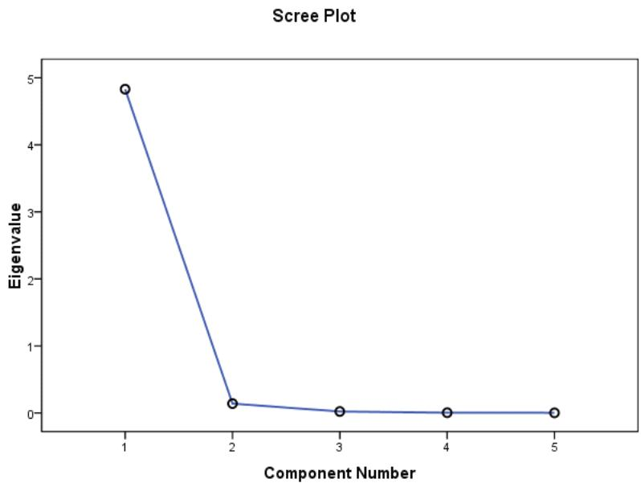

line

| Component Number | Eigenvalue |
| --- | --- |
| 1 | ~4.8 |
| 2 | ~0.2 |
| 3 | ~0.05 |
| 4 | ~0.03 |
| 5 | ~0.02 |

图12 因子提取碎石图

## 5.2.3 因子命名

表12 正交旋转矩阵表

<table><tr><td></td><td>Component</td></tr></table>

<table><tr><td></td><td>1</td><td>2</td></tr><tr><td>国内旅游人次</td><td>.867</td><td>.495</td></tr><tr><td>入境旅游人次</td><td>.507</td><td>.861</td></tr><tr><td>国内旅游收入</td><td>.743</td><td>.664</td></tr><tr><td>外汇旅游收入</td><td>.679</td><td>.732</td></tr><tr><td>国内生产总值</td><td>.754</td><td>.646</td></tr></table>

依据最大方差正交旋转矩阵可以看出主因子F1主要由国内旅游人次、国内旅游收入、国内生产总值组成，这三个指标在主因子F1S上的因子载荷均较高，因子将F1命名为国内助长因子，同理可得，将F2因子命名为国外助长因子。下表是因子的系数矩阵表

表13 因子得分系数矩阵表

<table><tr><td colspan="3">Component Score Coefficient Matrix</td></tr><tr><td></td><td colspan="2">Component</td></tr><tr><td></td><td>1</td><td>2</td></tr><tr><td>国内旅游人次</td><td>1.338</td><td>-1.110</td></tr><tr><td>入境旅游人次</td><td>-1.200</td><td>1.543</td></tr><tr><td>国内旅游收入</td><td>.315</td><td>-.031</td></tr><tr><td>外汇旅游收入</td><td>-.146</td><td>.452</td></tr><tr><td>国内生产总值</td><td>.416</td><td>-.138</td></tr></table>

因子得分系数矩阵反映了主因子在每一个指标的得分情况，由上表可得因子得分函数如下：

国内助长因子：

$$
\mathrm{F} _ {1} = 1. 1 3 8 * \frac {x _ {1} - 9 1 4 8 4 3}{1 5 0 4 5 3 4} - 1. 2 * \frac {x _ {2} - 4 0 7 6 3}{2 0 8 8 9 4 9 4} + 0. 3 1 5 * \frac {x _ {3} - 1 1 7 5 2}{4 0 8 1 8 1 2 6} - 0. 1 4 6 * \frac {x _ {4} - 3 0 3 4 9 2}{1 4 4 5 7} + 0. 4 1 6 * \frac {x _ {5} - 8 0 3 1 3}{3 9 1 1}
$$

国外助长因子：

$$
\mathrm{F} _ {2} = - 1. 1 1 * \frac {x _ {1} - 9 1 4 8 4 3}{1 5 0 4 5 3 4} + 1. 5 4 3 * \frac {x _ {2} - 4 0 7 6 3}{2 0 8 8 9 4 9 4} - 0. 3 1 * \frac {x _ {3} - 1 1 7 5 2}{4 0 8 1 8 1 2 6} + 0. 4 5 2 * \frac {x _ {4} - 3 0 3 4 9 2}{1 4 4 5 7} - 0. 1 3 8 * \frac {x _ {5} - 8 0 3 1 3}{3 9 1 1} -
$$

其中 x (i = 1,2,3,4,5) 分别代表国内旅游人次等5个指标。

由因子函数可得从1998年至2009年12年间的个子因子得分，见下表：

表14 各年各因子得分数据

<table><tr><td>年份</td><td>F1</td><td>F2</td><td>因子综合得分 F</td></tr><tr><td>1998</td><td>-0.7760</td><td>-0.3748</td><td>-0.76014</td></tr><tr><td>1999</td><td>-0.4666</td><td>-0.6047</td><td>-0.46764</td></tr><tr><td>2000</td><td>-0.2195</td><td>-0.7295</td><td>-0.23238</td></tr><tr><td>2001</td><td>0.0012</td><td>-0.8313</td><td>-0.0221</td></tr><tr><td>2002</td><td>0.1409</td><td>-0.7194</td><td>0.115964</td></tr><tr><td>2003</td><td>0.0360</td><td>-0.4349</td><td>0.02261</td></tr><tr><td>2004</td><td>-0.6688</td><td>0.7742</td><td>-0.62444</td></tr><tr><td>2005</td><td>-0.6436</td><td>1.1178</td><td>-0.59052</td></tr><tr><td>2006</td><td>-0.4300</td><td>1.1486</td><td>-0.38329</td></tr><tr><td>2007</td><td>-0.0239</td><td>1.0937</td><td>0.007523</td></tr><tr><td>2008</td><td>0.8025</td><td>0.4439</td><td>0.787631</td></tr><tr><td>2009</td><td>2.2474</td><td>-0.8831</td><td>2.146359</td></tr></table>

因子综合得分

$$
\mathrm{F} = \eta_ {1} * \mathrm{F} _ {1} + \eta_ {2} * \mathrm{F} _ {2}
$$

其中 $\eta _ { 1 } = 0 . 9 6 6 0 1 , \eta _ { 2 } = 0 . 0 2 7 9 5$ 分别为两个因子的方差贡献率。

用spss分别对F1、F2、因子综合得分F进行曲线回归，得到图示如下所示

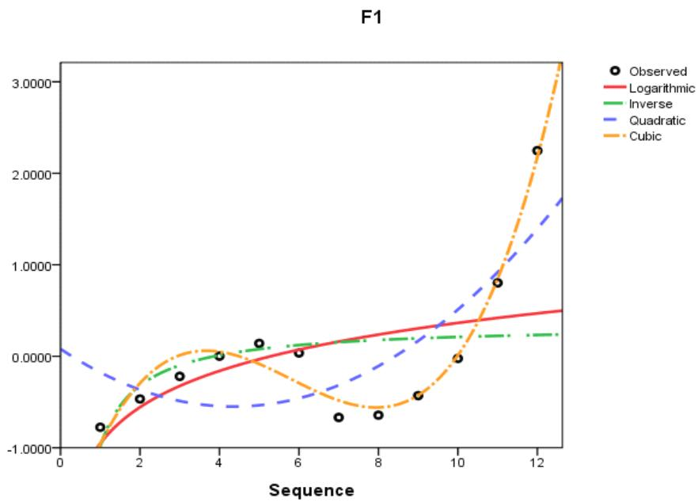

line

| Sequence | Observed | Logarithmic | Inverse | Quadratic | Cubic |
| --- | --- | --- | --- | --- | --- |
| 1 | ~-0.75 | ~-0.95 | ~-0.95 | ~0.10 | ~-0.95 |
| 2 | ~-0.45 | ~-0.60 | ~-0.35 | ~-0.35 | ~-0.35 |
| 3 | ~-0.20 | ~-0.35 | ~-0.15 | ~-0.45 | ~0.05 |
| 4 | ~0.00 | ~-0.15 | ~0.00 | ~-0.50 | ~0.10 |
| 5 | ~0.15 | ~-0.05 | ~0.10 | ~-0.50 | ~-0.10 |
| 6 | ~0.05 | ~0.10 | ~0.15 | ~-0.45 | ~-0.35 |
| 7 | ~-0.65 | ~0.20 | ~0.20 | ~-0.35 | ~-0.55 |
| 8 | ~-0.60 | ~0.30 | ~0.25 | ~-0.20 | ~-0.60 |
| 9 | ~-0.40 | ~0.40 | ~0.25 | ~0.15 | ~-0.45 |
| 10 | ~0.00 | ~0.45 | ~0.25 | ~0.65 | ~-0.15 |
| 11 | ~0.85 | ~0.50 | ~0.25 | ~1.15 | ~0.85 |
| 12 | ~2.30 | ~0.55 | ~0.25 | ~1.75 | ~3.25 |

图13 国内助长因子曲线回归图

上图是使用基本曲线进行拟合的图示，通过上图可知曲线Cubic拟合效果较好。

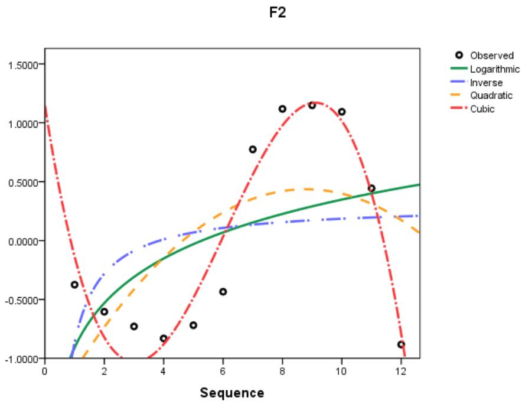

scatter

| Sequence | Observed | Logarithmic | Inverse | Quadratic | Cubic |
| --- | --- | --- | --- | --- | --- |
| 1 | ~-0.35 | ~-0.85 | ~-0.85 | ~-0.95 | ~1.15 |
| 2 | ~-0.60 | ~-0.45 | ~-0.45 | ~-0.65 | ~-0.25 |
| 3 | ~-0.70 | ~-0.25 | ~-0.25 | ~-0.35 | ~-0.95 |
| 4 | ~-0.85 | ~-0.15 | ~-0.15 | ~-0.15 | ~-0.95 |
| 5 | ~-0.70 | ~-0.05 | ~-0.05 | ~0.05 | ~-0.65 |
| 6 | ~-0.40 | ~0.05 | ~0.05 | ~0.25 | ~-0.15 |
| 7 | ~0.80 | ~0.15 | ~0.15 | ~0.35 | ~0.45 |
| 8 | ~1.15 | ~0.25 | ~0.20 | ~0.40 | ~0.95 |
| 9 | ~1.15 | ~0.35 | ~0.20 | ~0.45 | ~1.15 |
| 10 | ~1.10 | ~0.40 | ~0.20 | ~0.45 | ~1.15 |
| 11 | ~0.45 | ~0.45 | ~0.20 | ~0.35 | ~0.65 |
| 12 | ~-0.90 | ~0.50 | ~0.20 | ~0.10 | ~-0.95 |

图14 国外助长因子曲线回归图

上图为国外助长因子的拟合图示，由图可知Cubic曲线拟合的效果较好。

F  
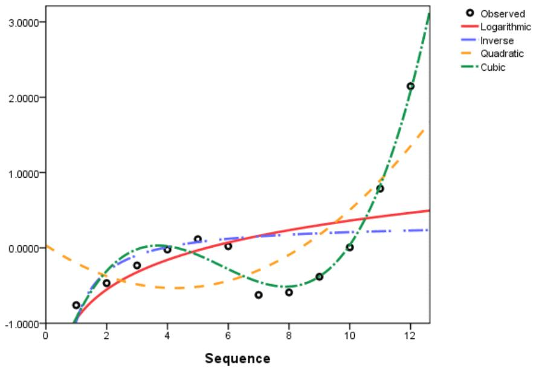

line

| Sequence | Observed | Logarithmic | Inverse | Quadratic | Cubic |
| --- | --- | --- | --- | --- | --- |
| 1 | ~-0.75 | ~-0.85 | ~-0.85 | ~-0.15 | ~-0.95 |
| 2 | ~-0.45 | ~-0.55 | ~-0.45 | ~-0.35 | ~-0.35 |
| 3 | ~-0.20 | ~-0.35 | ~-0.25 | ~-0.45 | ~-0.10 |
| 4 | ~0.00 | ~-0.20 | ~-0.10 | ~-0.50 | ~0.05 |
| 5 | ~0.15 | ~-0.10 | ~0.05 | ~-0.45 | ~-0.15 |
| 6 | ~0.05 | ~0.05 | ~0.15 | ~-0.35 | ~-0.35 |
| 7 | ~-0.60 | ~0.15 | ~0.20 | ~-0.25 | ~-0.45 |
| 8 | ~-0.60 | ~0.25 | ~0.25 | ~-0.15 | ~-0.50 |
| 9 | ~-0.40 | ~0.35 | ~0.25 | ~0.15 | ~-0.35 |
| 10 | ~0.00 | ~0.45 | ~0.25 | ~0.45 | ~0.05 |
| 11 | ~0.80 | ~0.50 | ~0.25 | ~0.85 | ~0.85 |
| 12 | ~2.15 | ~0.55 | ~0.25 | ~1.60 | ~3.10 |

图15 综合因子曲线回归图

上图为综合因子得分的拟合示意图，由图可知Cubic曲线拟合的效果较好。综上可知在因子得分拟合中，三次函数拟合的效果较为理想，故在此选取三次函数为曲线回归模型，通过MTALAB拟合可知结果如下

国内助长因子方程为：

$$
\mathrm{F} _ {1} (t) = 0. 0 1 5 8 6 * t ^ {3} - 0. 2 7 6 * t ^ {2} + 1. 3 8 4 * t - 2. 0 8 5 \tag {17}
$$

其中 $t = 1 , 2 , .$ ..分别代表从1998年始每一年， $\mathrm { R } ^ { 2 } = 0 . 9 5 7 1$

国外助长因子方程为：

$$
\mathrm{F} _ {2} (t) = - 0. 0 1 9 5 6 * t ^ {3} + 0. 3 5 6 1 * t ^ {2} - 1. 6 1 8 * t + 1. 1 4 5 \tag {18}
$$

其中 $\ t = 1 , 2 , \ldots$ 分别代表从1998年始每一年，其中 $\mathrm { R } ^ { 2 } = 0 . 9 2 8 9$

综合因子方程为：

$$
\mathrm{F} (t) = 0. 0 1 4 7 8 * t ^ {3} - 0. 2 5 6 7 * t ^ {2} + 1. 2 9 2 * t - 1. 9 8 2 \tag {19}
$$

其中 $\ t = 1 , 2 , \ldots$ 分别代表从1998年始每一年，其中 $\mathrm { R } ^ { 2 } = 0 . 9 5 9 4$

当取 t=13时，即 2010 年的因子得分计算结果分别如下：

$$
\mathrm{F} _ {1} = f _ {1} (1 3) = 4. 1 7 3 3 3
$$

$$
\mathrm{F} _ {2} = f _ {2} (1 3) = - 2. 6 8 1 4 2
$$

$$
\mathrm{F} = f (1 3) = 3. 9 0 3 3 6
$$

现将1998年至2010年数据应用因子分析可得到如下因子得分系数矩阵：

表 15 正交旋转矩阵

<table><tr><td colspan="3">Component Score Coefficient Matrix</td></tr><tr><td></td><td colspan="2">Component</td></tr><tr><td></td><td>1</td><td>2</td></tr><tr><td>国内旅游人次</td><td>-.742</td><td>1.153</td></tr><tr><td>入境旅游人次</td><td>.670</td><td>-.454</td></tr><tr><td>国内旅游收入</td><td>-.311</td><td>.675</td></tr><tr><td>外汇旅游收入</td><td>.617</td><td>-.388</td></tr><tr><td>GDP</td><td>.509</td><td>-.265</td></tr></table>

$$
\begin{array}{l} \overline {{\mathrm{F} _ {1}}} = - 0. 7 4 2 * \frac {x _ {1} - 9 8 2 9 . 3}{2 8 4 6 3 9 0 4 1} + 0. 6 7 * \frac {x _ {2} - 4 4 1 . 0 5}{2 3 3 . 4 9 9 8 1} - 0. 3 1 1 * \frac {x _ {3} - 1 3 1 0 2}{6 2 4 . 1 8 5 7 4} + 0. 6 1 7 * \frac {x _ {4} - 3 2 . 5 5 3 1}{1 5 . 9 6 0 3 8} + 0. 5 0 9 * \frac {x _ {5} - 8 6 4 4 3}{4 3 4 8 0 8 7 7} \\ \overline{\mathrm{F}}_2 = 1.153*\frac{x_1 - 98293}{284639041} -0.454*\frac{x_2 - 441.05}{233.49981} +0.675*\frac{x_3 - 13102}{624.18574} -0.388*\frac{x_4 - 32.5531}{15.96038} -0.265*\frac{x_5 - 86443}{434808775} \\ \end{array}
$$

代入2010年的数据可得如下结果

$$
\begin{array}{l} \overline {{\mathrm{F} _ {1}}} = - 0. 7 4 2 * \frac {1 8 0 0 0 - 9 8 2 9 . 3}{2 8 4 6 3 9 0 4 1} + 0. 6 7 * \frac {8 4 2 1 2 - 4 4 1 . 0 5}{2 3 3 . 4 9 9 8 1} - 0. 3 1 1 * \frac {2 9 3 0 - 1 3 1 0 2}{6 2 4 . 1 8 5 7 4} + 0. 6 1 7 * \frac {5 9 - 3 2 . 5 5 3 1}{1 5 . 9 6 0 3 8} \\ + 0. 5 0 9 * \frac {1 6 0 0 0 - 8 6 4 4 3}{4 3 4 8 0 8 7 7 5} = 4. 9 8 6 7 \\ \bar {\mathrm{F}} _ {2} = 1. 1 5 3 * \frac {1 8 0 0 0 - 9 8 2 9 . 3}{2 8 4 6 3 9 0 4 1} - 0. 4 5 4 * \frac {8 4 2 . 1 2 - 4 4 1 . 0 5}{2 3 3 . 4 9 9 8 1} + 0. 6 7 5 * \frac {2 9 3 0 - 1 3 1 0 2}{6 2 4 . 1 8 5 7 4} - 0. 3 8 8 * \frac {5 9 - 3 2 . 5 5 3 1}{1 5 . 9 6 0 3 8} \\ - 0. 2 6 5 * \frac {1 6 0 0 0 - 8 6 4 4 3}{4 3 4 8 0 8 7 7 5} = 1. 5 4 7 3 \\ \end{array}
$$

经过 SPSS 分析可知有

$$
\overline {{\mathrm{F}}} = \eta_ {1} * \overline {{\mathrm{F}} _ {1}} + \eta_ {2} * \overline {{\mathrm{F}} _ {2}} = 5. 5 4 9 9, \text {其中} \eta = 0. 9 3 5 7 2, \eta_ {2} = 0. 5 3 6 0
$$

由上述可得 2010 年的预测因子与计算因子比较如下表所示

表 16 2010 年各因子比较表

<table><tr><td>2010年</td><td>国内助长因子F1</td><td>国外助长因子F2</td><td>综合因子F</td></tr><tr><td>回归预测值</td><td>4.17333</td><td>-2.68142</td><td>3.90336</td></tr><tr><td>计算值</td><td>4.9867</td><td>1.5473</td><td>5.5499</td></tr></table>

由上表结果可知，回归预测的结果显示2010年国内助长因子得分为4.17333分 ，与2009年的国内助长因子2.2474相比而言，2010年国内游客对上海旅游业发展有较为明显的促进作用；同时，国外助长因子得分却由2009年的-0.8831降至-2.68142，综合因子得分较上年的2.146359上升到3.90336，说明上海旅游业总体发展一直呈现逐渐上升的趋势，国内游客对于上海旅游业的发展一直呈现正的增长状态，国外游客的增长受到多方面的影响，但是总体趋势呈现增长形势，而且国内游客对于上海旅游业的促进作用较为明显，具体增长情况见图所示：

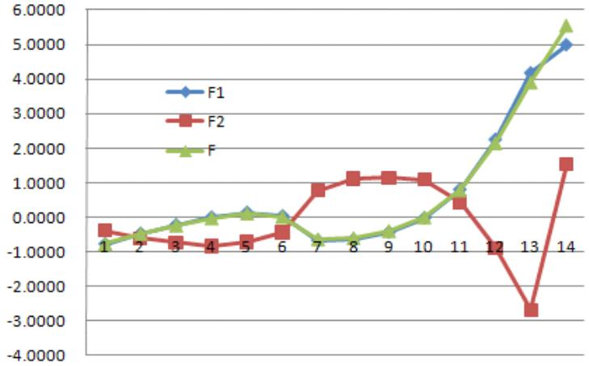

line

| Category | F1 | F2 | F |
| --- | --- | --- | --- |
| 1 | ~-0.8 | ~-0.4 | ~-0.8 |
| 2 | ~-0.5 | ~-0.7 | ~-0.5 |
| 3 | ~-0.2 | ~-0.7 | ~-0.2 |
| 4 | ~0.0 | ~-0.8 | ~0.0 |
| 5 | ~0.1 | ~-0.7 | ~0.1 |
| 6 | ~0.1 | ~-0.4 | ~0.1 |
| 7 | ~-0.6 | ~0.8 | ~-0.6 |
| 8 | ~-0.6 | ~1.1 | ~-0.6 |
| 9 | ~-0.4 | ~1.1 | ~-0.4 |
| 10 | ~0.0 | ~1.1 | ~0.0 |
| 11 | ~0.8 | ~0.4 | ~0.8 |
| 12 | ~2.2 | ~-0.9 | ~2.1 |
| 13 | ~4.2 | ~-2.7 | ~3.8 |
| 14 | ~5.0 | ~1.5 | ~5.5 |

图16 1998年至2010年因子得分预测折线图

但是2010年官方出示的数据却与在自然状态下预测的数值之间存在着一些区别，由于2010年世博会对于上海旅游业的影响作用，实际国内助长因子值为4.9867，因子得分比自然状态下增长0.81343，说明由于上海世博会的影响，国内因素对上海旅游业的促进作用为19.5%；国外助长因子发生了巨大的变化，因子得分增长了4.2左右，综合因子也呈现较大幅度的增长，增长率为42%左右，具体见下表：

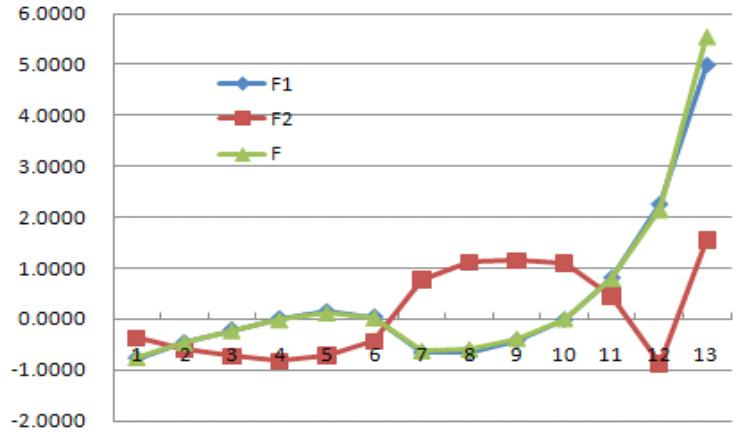

line

| Category | F1 | F2 | F |
| --- | --- | --- | --- |
| 1 | ~-0.8 | ~-0.4 | ~-0.8 |
| 2 | ~-0.5 | ~-0.6 | ~-0.5 |
| 3 | ~-0.2 | ~-0.7 | ~-0.3 |
| 4 | ~0.0 | ~-0.8 | ~0.0 |
| 5 | ~0.2 | ~-0.7 | ~0.1 |
| 6 | ~0.1 | ~-0.4 | ~0.0 |
| 7 | ~-0.6 | ~0.8 | ~-0.6 |
| 8 | ~-0.6 | ~1.1 | ~-0.6 |
| 9 | ~-0.4 | ~1.2 | ~-0.4 |
| 10 | ~0.0 | ~1.1 | ~0.0 |
| 11 | ~0.8 | ~0.5 | ~0.8 |
| 12 | ~2.3 | ~-0.9 | ~2.1 |
| 13 | ~5.0 | ~1.6 | ~5.5 |

图17 1998年至2010年因子实际得分折线图

## 6 模型评价及优缺点分析

## 6.1 T-BTL模型（旅游本底趋势线模型）

## 6.1.1 优点分析

1) 利用旅游本底趋势线模型确实可以在一定程度上反应旅游业各项指标的自然走势，从而估测出某年甚至某些年份在排除某些重大事件影响条件下的各项旅游业指标，进而与实际值进行比较，然后根据结果讨论分析，评估出该重大事件的影响力[13]。  
2)利用该模型，我们从促进旅游业发展这一侧面，评估了 2010 年上海世博会的影响力，得出了比较令人信服的结果。

## 6.1.2 缺点分析

在建立模型过程中，忽略除 2010 上海世博会外的其他重大事件的影响。得到的结果可能会有偏差，所得出的结论也不完全准确，可能夸大或缩小了上海世博会对上海旅游业的影响。

旅游本底趋势线原本可以预测未来几年旅游业的发展形势[14]，并得到相应的本底值，与未来几年的实际值进行相比较，就可得出影响值等相应数据，用来反映上海世博会对未来几年上海旅游业发展的影响力[15]，但由于网上缺乏对未来几年上海旅游业相关指标较为准确的估计值（可能确实难以估计），使得我们没能对上海世博会对未来几年上海旅游业发展的影响力做出评估[16]，这不能不说是一种遗憾。

## 6.1.3 改进的方向

在模型方程中加入反映突发事件对指标影响的部分，从而使得到的结果更贴近实际，更能反映指标的自然走势。

## 6.2 FA-MR 模型

## 6.2.1 优点分析

1) 应用因子分析与曲线回归相结合的方法，将抽象的问题具体[17]，使问题的解决简单化  
2) 采用简单的回归方法对旅游业未来发展情况进行预测，,能体现出旅游业发展阶段性变化的趋势和特点,精度高[18]。随着新的一年统计数据的变化,模型可以动态调整,使其更符合经济的实际变化规模

## 6.2.2 缺点分析

1) 将旅游业所处的市场环境理想化，默认该行业本年度发生的变化只来自世博会的影响  
2) 对于2010 年的数据只采取预测值的处理办法，在计算的过程中存在一定的误差

## 7 结论

为了从促进上海旅游业发展这一侧面评估 2010年上海世博会的影响力，我们建立了两个模型，即 T-BTL（旅游本底趋势线）模型和FA-MR（因子分析和多元回归）模型。

在T-BTL 模型中，在忽略其他重大事件对上海旅游业发展的影响条件下，根据旅游业发展满足一定规律，并且这种规律可以定量描述的原则，我们在网上搜集了一些数据，并制定了反映旅游业发展的7 个指标，提出了 5 个旅游本底趋势线的模型，通过计算机进行拟合分析，最终确定了 7 个最佳模型分别用以反映 7 个指标的自然发展趋势，并计算得到 2010年上海旅游业 7 个指标的本底值，通过比较分析本底值与实际值（含估测成分），我们得到了上海世博会对 7 个指标的影响值，影响率和贡献率。具体如下表：

表 17 世博会影响值统计表

<table><tr><td>指标</td><td>国内旅游人数</td><td>入境旅游人数</td><td>国内旅游收入</td><td>外汇旅游收入</td><td>总收入</td><td>GDP</td><td>总收入占GDP比重</td></tr><tr><td>影响值</td><td>3429.00 万</td><td>74.72 万</td><td>850.00 亿</td><td>4.90 亿美元</td><td>932.64 亿</td><td>643.00 亿</td><td>0.0533</td></tr><tr><td>贡献率</td><td>0.2353</td><td>0.0974</td><td>0.4087</td><td>0.0906</td><td>0.2822</td><td>0.0419</td><td>0.3443</td></tr><tr><td>影响率</td><td>0.1905</td><td>0.0887</td><td>0.2901</td><td>0.0831</td><td>0.2201</td><td>0.0402</td><td>0.2561</td></tr></table>

我们得到如下所示结果：

在上海世博会的影响下，上海旅游业7 项指标相较于本底值都有大幅度的增长，其中对国内旅游收入的贡献率达到了40.87%，对旅游业总收入占 GDP 百分比的贡献率达到了 34.43%，由此可见，2010 年上海世博会对上海市旅游业的发展起到了极大的推进作用，而旅游业的发展只是上海经济发展的一个方面，可以进行合理推测：世博会必定对上海经济的发展起到了巨大的推进作用。

在 FA-MR（因子分析和多元回归）模型中，选取了几个代表性的指标，通过因子分析得到了两个公共因子国内助长因子F1与国外助长因子F2,国内主张因子形容国内因素比如说国内旅游人次等对上海旅游行业的促进作用，国外助长因子 F2 说明了国外因素对上海旅游业的促进作用，通过对因子得分的曲线回归以及比较，我们得到如下的结论：

1) 国内助长因子得分呈现有规律的动态增长，说明上海市旅游业受到本国内的影响呈现一定形式的增长；国外助长因子的处于相比而言大幅度的变化中，但是总体呈现增长增长的趋势，并且上海市旅游业的总体发展态势主要受到国内主张因子的影响，其发展规律同国内助长因子分布大体相同。

2) 在忽略外界其他因素干扰的情况下，世博会对上海市旅游业的影响是广泛而深远的。由于世博会的影响，上海市国内助长因子得分比自然状态下增长0.81343，说明上海市旅游业受到来自国内因素（比如说国内游客人次）的促进作用使其总体发展情况增长19.5%左右；

3) 国外主张因子发生了较大的变化，综合因子也呈现较大的增长，增长幅度大约为42%左右，说明世博会在很大程度上促进了外国游客来上海的旅游，使得上海市的旅游业在原来的基础上同比增长50%左右。

## 8 参考文献

[1] 张广瑞，关于中国旅游研究的思考，旅游学刊，2007.  
[2] 张景春，上海国际金融中心建设的世博效应，中国市场，2007.  
[3] 张红贤、马耀峰， 中国入境旅游市场的多元回归预测，资源开发与市场，2005.  
[4] 张颖， 青年学者对中国旅游研究的贡献， 旅游经济,2007.  
[5] 苟小东、孙根年，上海市入境旅游本底趋势线的建立及其应用，陕西师范大学学报，2000.  
[6] 戴光全、保继刚，昆明世博会效应的定量估算：本底趋势线模型，地理科学,2007.  
[7] 郭英之、臧胜男、彭兰亚， 社区居民对 2010年上海世博会影响感知的实证研究，旅游科学，2009.  
[8] 任志远，中国旅游的国外客源市场态势分析，西北大学学报，2000.  
[9] 熊靓，上海市入境旅游市场统计分析及预测模型研究，华东师范大学硕士学位论文，2004.  
[10] 张友兰、周爱民、王新学，旅游预测模型及应用，河北省科学院学报，2000.  
[11] 卫海燕，上海市四个主要境外旅游客源市场的灰色预测模型，陕西师范大学学

报,2000.

[12] 肖道刚，基于成本—收益理论的上海世博经济影响研究，华东师范大学硕士学位论文，2008.  
[13] 武娇、刘新平，我国国际旅游外汇收入的时间序列预测模型，纺织高校基础科学学报,2001.  
[14] 魏启恩、刘新平，西安市境外游客动态预测模型，陕西师范大学学报.  
[15] 史常凯，灰色系统理论在旅游客源市场预测中的应用， 高师理科学刊，2005.  
[16] Ken Peattie, Sue Peattie. Promotional Competition : a Winning Tool for Tourism Marketing, Tourism Management, 1996.  
[17] Stephen LJ Smith, Tourism Analysis: A Handbook[M].Longman, 1995.  
[18] Stephen R Witt, Modeling and forecasting demand in tourism, Recreation Research Review, 1983.

9 附录

<table><tr><td>YEAR</td><td>X1</td><td>X2</td><td>X3</td><td>X4</td><td>X5</td><td>F1</td><td>F2</td><td>F</td><td>总和</td></tr><tr><td>1998</td><td>7098.00</td><td>152.70</td><td>646.00</td><td>12.45</td><td>3688.20</td><td>-0.7760</td><td>-0.3748</td><td>-0.76014</td><td>-1.1508</td></tr><tr><td>1999</td><td>7498.00</td><td>165.68</td><td>719.33</td><td>13.64</td><td>4034.96</td><td>-0.4666</td><td>-0.6047</td><td>-0.46764</td><td>-1.0713</td></tr><tr><td>2000</td><td>7848.00</td><td>181.40</td><td>775.00</td><td>16.13</td><td>4551.15</td><td>-0.2195</td><td>-0.7295</td><td>-0.23238</td><td>-0.9489</td></tr><tr><td>2001</td><td>8254.00</td><td>204.26</td><td>805.78</td><td>18.25</td><td>4950.84</td><td>0.0012</td><td>-0.8313</td><td>-0.0221</td><td>-0.8302</td></tr><tr><td>2002</td><td>8761.00</td><td>272.53</td><td>993.82</td><td>22.75</td><td>5408.76</td><td>0.1409</td><td>-0.7194</td><td>0.115964</td><td>-0.5785</td></tr><tr><td>2003</td><td>8801.12</td><td>319.87</td><td>1079.80</td><td>24.65</td><td>6250.81</td><td>0.0360</td><td>-0.4349</td><td>0.02261</td><td>-0.3989</td></tr><tr><td>2004</td><td>8951.32</td><td>491.92</td><td>1216.34</td><td>30.89</td><td>7450.27</td><td>-0.6688</td><td>0.7742</td><td>-0.62444</td><td>0.1054</td></tr><tr><td>2005</td><td>9325.03</td><td>571.35</td><td>1308.41</td><td>36.08</td><td>9143.95</td><td>-0.6436</td><td>1.1178</td><td>-0.59052</td><td>0.4741</td></tr><tr><td>2006</td><td>9683.90</td><td>610.23</td><td>1420.00</td><td>40.36</td><td>10297.00</td><td>-0.4300</td><td>1.1486</td><td>-0.38329</td><td>0.7186</td></tr><tr><td>2007</td><td>10200.00</td><td>652.36</td><td>1611.30</td><td>47.40</td><td>12001.16</td><td>-0.0239</td><td>1.0937</td><td>0.007523</td><td>1.0698</td></tr><tr><td>2008</td><td>11000.00</td><td>640.37</td><td>1612.41</td><td>50.27</td><td>13698.15</td><td>0.8025</td><td>0.4439</td><td>0.787631</td><td>1.2464</td></tr><tr><td>2009</td><td>12360.74</td><td>628.92</td><td>1913.80</td><td>51.32</td><td>14900.93</td><td>2.2474</td><td>-0.8831</td><td>2.146359</td><td>1.3644</td></tr></table>