# 输油管的布置模型

## 摘要

建造炼油厂时要综合各方面的情况，对输油管线作周密的布置，因为输油管线的不同布置将直接影响总费用的多少。某油田计划在铁路线一侧建造两家炼油厂，为了方便运送成品油，需在铁路线上增建一个车站。此种模式具有一定的普遍性，油田设计院希望建立管线建设费用最省的一般数学模型与方法。

对于问题 1, 综合考虑铺设时, 不同生产能力造成的输油管线标准不同和是否有共用管线以及共用管线与非共用管线费用同异等问题, 建立模型:

$$
\min Z = \sqrt {(x - a _ {1}) ^ {2} + (b _ {1} - y) ^ {2}} \times m + \sqrt {(x - a _ {2}) ^ {2} + (b _ {1} - y) ^ {2}} \times p + y \times n
$$

结合模型建立过程的流程图，用图形结合法和比较分析法来确定可能出现的各种情形，通过赋值，得出不同情况下的最优化模型。

对于问题 2, 考虑到城区必须的拆迁和工程补偿等附加费用, 建立优化模型:

$$
\min Z = (\sqrt {x ^ {2} + (a - y) ^ {2}} + \sqrt {(x - c) ^ {2} + (y - y _ {0}) ^ {2}}) \times m + \sqrt {(l - c) ^ {2} + ((b - y _ {0}) ^ {2}} \times (m + k) + y \times m
$$

用 Lingo 软件求解，得出：车站应建在离炼油厂 A 所在线 5.45km，且共用管线 1.85km 时费用最少，最少费用为 $Z_{\min} = 282.70$ （万元）。

对于问题 3, 是在问题 2 的基础上, 做进一步改进, 将问题 2 中的特殊模型一般化, 建立优化模型:

$$
\min Z = \sqrt {x ^ {2} + (a - y) ^ {2}} \times m _ {1} + \sqrt {(x - c) ^ {2} + (y - y _ {0}) ^ {2}} \times m _ {2} + \sqrt {(l - c) ^ {2} + (b - y _ {0}) ^ {2}} \times (m _ {2} + k) + y \times m _ {3}
$$

用 Lingo 软件求解，得出：车站应建在离 A 炼油厂所在线 6.73km，且共用管线 0.14km 时费用最少，最少费用为： $Z_{min}=252.00$ （万元）。

关键词: 数形结合 Lingo 程序 优化方案 最小费用

## 1、问题的提出

## 1.1 基本情况

某油田计划在铁路线一侧建造两家炼油厂同时在铁路线上增建一个车站，用来运送成品油。由于这种模式具有一定的普遍性，油田设计院希望建立管线建设费用最省的一般数学模型与方法。

## 1.2 相关信息

(1) 附图一: 两炼油厂的具体位置。  
(2) 附表一: 不同工程咨询公司对拆迁和工程补偿等附加费用的估算情况。

## 1.3 基本要求

(1) 在两炼油厂到铁路线距离和两炼油厂间距离确定的情况下, 提出的方案要满足费用最省。  
(2) 考虑共用管线费用与非共用管线费用相同或不同的情形, 确定实际生活中是否需要共用管线。  
(3) 在考虑城区附加费用的情况下, 更好的综合三家工程咨询公司的估算结果, 使拆迁和工程补偿等附加费用最合理。  
(4) 根据炼油厂生产能力的强弱, 选用相适应的输油管, 进一步节省费用。

## 1.4 需要解决的问题

(1) 一般类型。针对两炼油厂到铁路线距离和两炼油厂间距离的各种不同情形,提出你的设计方案。在方案设计时, 若有共用管线, 应考虑共用管线费用与非共用管线费用相同或不同的情形。  
(2) 复杂情形。在给定两炼油厂的具体位置由附图一所示, 其中 A 厂位于郊区 (图中的 I 区域), B 厂位于城区 (图中的 II 区域), 两个区域的分界线用图中的虚线表示。图中各字母表示的距离 (单位: 千米) 分别为 $a = 5$ , $b = 8$ , $c = 15$ , $l = 20$ 。若所有管线的铺设费用均为每千米 7.2 万元。铺设在城区的管线还需增加拆迁和工程补偿等附加费用, 为对此项附加费用进行估计, 聘请三家工程咨询公司 (其中公司一具有甲级资质, 公司二和公司三具有乙级资质) 进行了估算, 估算结果见附表一。要求为设计院给出管线布置最优方案及相应最省的费用。  
(3) 具体设计。在实际问题中, 为进一步节省费用, 可以根据炼油厂的生产能力,选用相适应的油管。这时的管线铺设费用将分别降为输送 A 厂成品油的每千米 5.6 万元,输送 B 厂成品油的每千米 6.0 万元, 共用管线费用为每千米 7.2 万元, 拆迁等附加费用同上。要求给出管线最佳布置方案及相应最省的费用。

## 2、模型的建立与求解

## 2.1 问题 1 的解答

## 2.1.1 问题的分析

已知条件中只告知我们两炼油厂在铁路线的同一侧，而其到铁路线的距离是个未知数，所以先从距离的不同这方面入手，列出所有可能的情况。

由于共用管线的输油量较大，需考虑其与非共用管线费用相同、不同的情形，经分析得出，先从炼油厂 A、B 两输油管线铺设费用是否相同入手，再分别讨论是否有共用管线开始求解。

## 2.1.2 模型假设和符号说明

## (1) 模型假设

①所有结果保留小数点后两位。

②不考虑输油管的热胀冷缩。

③在整个输油线路均为单管线输送。

④A、B两炼油厂所在地的地质结构和施工条件相同。

⑤炼油厂选址在出油量相对较大的地方。

## (2) 模型的符号说明

<table><tr><td>符号</td><td>意义</td></tr><tr><td> $a_{1}$ </td><td>A炼油厂所在位置的横坐标</td></tr><tr><td> $b_{1}$ </td><td>A炼油厂所在位置的纵坐标</td></tr><tr><td> $a_{2}$ </td><td>B炼油厂所在位置的横坐标</td></tr><tr><td> $b_{2}$ </td><td>B炼油厂所在位置的纵坐标</td></tr><tr><td>m</td><td>A炼油厂输油管线的铺设费用(万元/千米)</td></tr><tr><td>p</td><td>B炼油厂输油管线的铺设费用(万元/千米)</td></tr><tr><td>n</td><td>共用输油管线的铺设费用(万元/千米)</td></tr><tr><td>x</td><td>车站所在位置的横坐标</td></tr><tr><td>y</td><td>两炼油厂交汇点的横坐标</td></tr><tr><td>Z</td><td>总费用(万元)</td></tr></table>

## 2.1.3 模型建立和讨论;

流程图为；

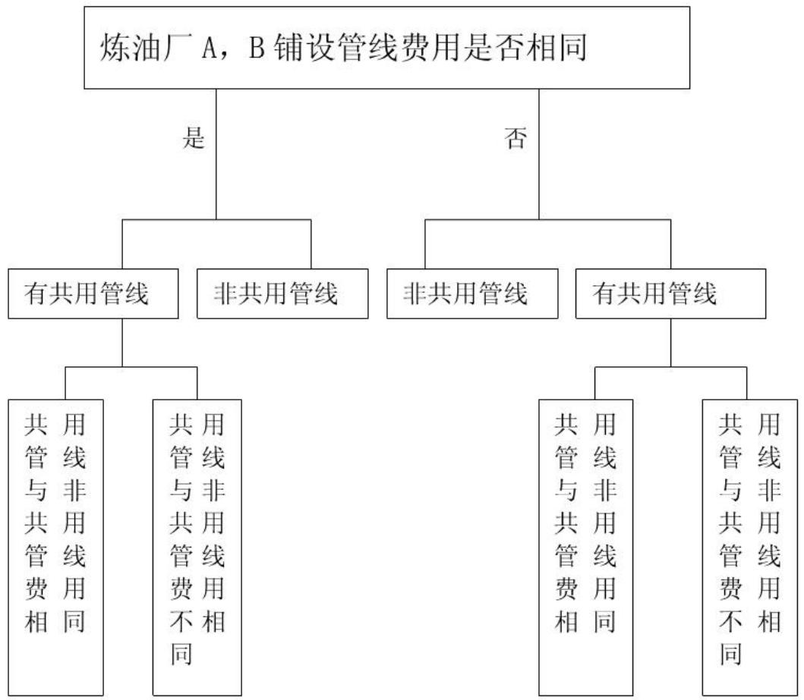

<details>
<summary>flowchart</summary>

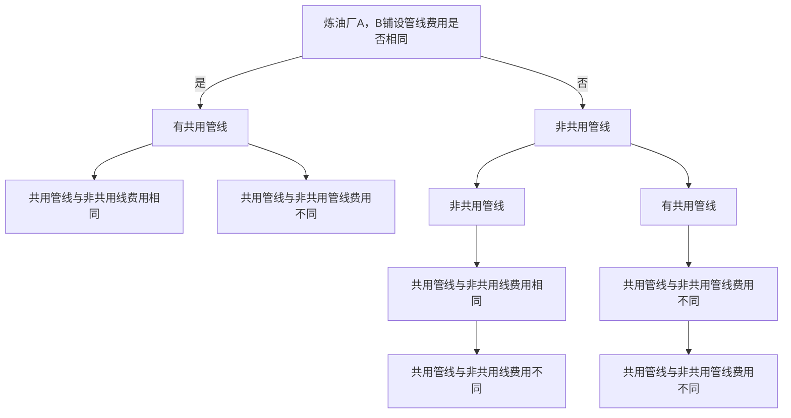
</details>

## 一、当 $m = p$ 时：

## (1) 无共用管线

实际生活中有如下三种情况：

(A表示A炼油厂，B表示B炼油厂，C表示车站)

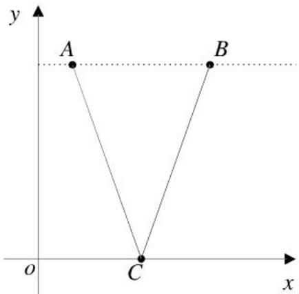

<details>
<summary>text_image</summary>

y
A B
o C x
</details>

图1

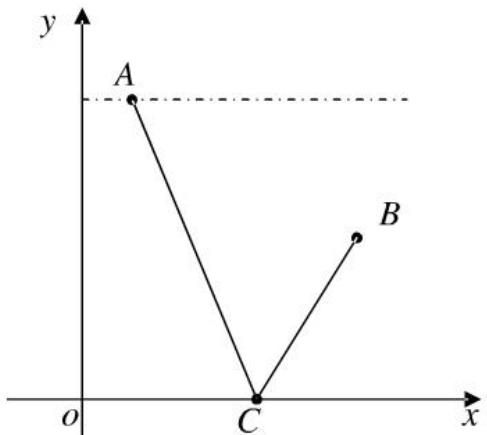

<details>
<summary>text_image</summary>

y
A
B
o
C
x
</details>

图2

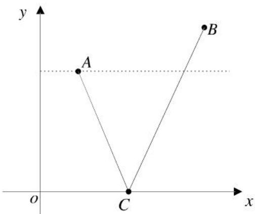

<details>
<summary>text_image</summary>

y
A
B
o
C
x
</details>

图3

现设各点坐标， $A(a_{1},b_{1}),B(a_{2},b_{2}),C(x,o)$ ，由于m=p，所以建立总费用最少的优化模型可为：

$$
\min Z = (\sqrt {(x - a _ {1}) ^ {2} + b _ {1} ^ {2}} + \sqrt {(x - a _ {2}) ^ {2} + b _ {2} ^ {2}}) \times m
$$

$$
s. t. \quad a _ {1} \leq x \leq a _ {2}
$$

假定 A(5,8)，m=p=7.2 保持不变，通过改变 B 点坐标，验证上述三个图形来确定最优模型。

对于图1，令B(7,8)，用Lingo软件 $^{[1]}$ 求的 $Z_{min}=116.10$ （万元）

对于图2，令B(7,5)，用Lingo软件求的 $Z_{\mathrm{min}} = 94.70$ （万元）

对于图3，令B(7,10)，用Lingo软件求的 $Z_{\mathrm{min}} = 130.40$ （万元）

求解程序见附录1;

经比较，在相同条件下，图 2 所示布置方案最省费用，相应模型为：

$$
\min Z = (\sqrt {(x - a _ {1}) ^ {2} + b _ {1} ^ {2}} + \sqrt {(x - a _ {2}) ^ {2} + b _ {2} ^ {2}}) \times m
$$

$$
s. t. \quad a _ {1} \leq x \leq a _ {2}
$$

(2)有共用管线

情形一：

当共用管线费用与非共用管线费用不同（即 $n \neq p = m$ ）时，实际生活中有如下四种情况：

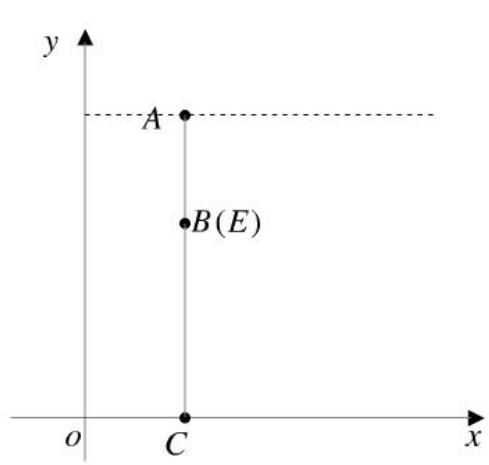

<details>
<summary>text_image</summary>

y
A
B(E)
o
C
x
</details>

图4

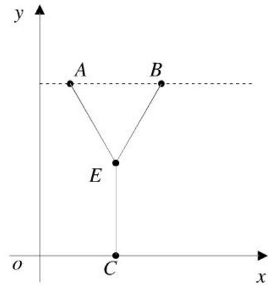

<details>
<summary>text_image</summary>

y
A B
E
o C x
</details>

图5

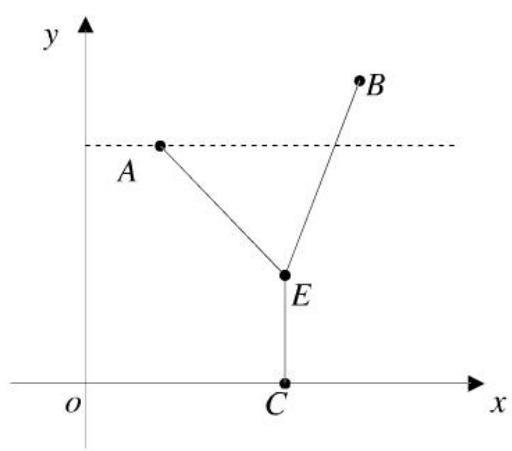

<details>
<summary>text_image</summary>

y
A
B
E
C
o
x
</details>

图6

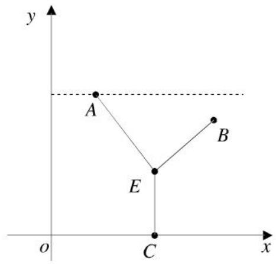

<details>
<summary>text_image</summary>

y
A
B
E
C
o
x
</details>

图7

现设各点坐标 $A(a_{1},b_{1}),B(a_{2},b_{2}),C(x,\mathrm{o}),E(x,\mathrm{y})$ ；由于 $m = p$ 所以建立模型可

为： $\min Z = (\sqrt{(x - a_1)^2 + (b_1 - y)^2} +\sqrt{(x - a_2)^2 + (b_2 - y)^2})\times m + y\times n$

$$
s. t \left\{ \begin{array}{c} a _ {1} \leq x \leq a _ {2} \\ 0 \leq y \leq \min (b _ {1}, b _ {2}) \end{array} \right.
$$

假定 A （5，8），m = p = 6，n = 7.2 保持不变，通过改变 B 点坐标，验证上述四个图形来确定最优模型。

对于图 4 令 B（5，5）用 Lingo 软件求得 $Z_{\min}=54.00$ （万元）；

对于图 5 令 B（7，8）用 Lingo 软件求得 $Z_{\min}=67.20$ （万元）；

对于图6令B（7，10）用Lingo软件求得 $Z_{\min}=74.57$ （万元）；

对于图7令 $B$ （7，5）用Lingo软件求得 $Z_{\mathrm{min}} = 57.63$ （万元）；

求解程序见附录1

经比较，在相同情况下，图4所示布置方案最省费用。

相应模型为： $\min Z = (|b_1 - y| + |b_2 - y|)\times m + y\times n$

$$
s. t = \left\{ \begin{array}{l l} & 0 \leq y \leq \min (b _ {1}, b _ {2}) \end{array} \right.
$$

情形二：

当共用管线费用与非共用管线费用相同(即 $m = p = n$ )时，在情形一的基础上，得最优

模型为： $\min Z = (|b_{1} - y| + |b_{2} - y| + y) \times m$

$$
s. t = \left\{ \begin{array}{l l} & 0 \leq y \leq \min (b _ {1}, b _ {2}) \end{array} \right.
$$

实际生活中可根据输油管线的费用确定有共用管线时，情形一、情形二的最优解。

## 二、当 $m \neq p$ 时

(1) 无共用管线

也有图 1、图 2、图 3 三种模型，建立如下优化模型：

$$
\min Z = \sqrt {(x - a _ {1}) ^ {2} + b _ {1} ^ {2}} \times m + \sqrt {(x - a _ {2}) ^ {2} + b _ {2} ^ {2}} \times p
$$

$$
s. t. \quad a _ {1} \leq x \leq a _ {2}
$$

假定 A(5,8)，m=6，p=7 保持不变，通过改变 B 点坐标，用上述三个非共用管线图形来确定最优模型：

对于图1令B（7，8）用Lingo软件求得 $Z_{\mathrm{min}} = 104.80$ （万元）

对于图2令B（7，5）用Lingo软件求得 $Z_{\min}=83.97$ （万元）

对于图3令 $B$ （7，10）用Lingo软件求得 $\mathbf{Z}_{\mathrm{min}} = 118.72$ （万元）

求解程序见附录2;

经比较, 在相同条件下, 图 2 所示布置方案最省费用, 得出费用最少的优化模型为:

$$
\min Z = \sqrt {(x - a _ {1}) ^ {2} + b _ {1} ^ {2}} \times m + \sqrt {(x - a _ {2}) ^ {2} + b _ {2} ^ {2}} \times p
$$

$$
s. t. \quad a _ {1} \leq x \leq a _ {2}
$$

(2) 有共用管线

由于前提已经限制了 $m \neq p$ ，故排除共用管道费用与非共用管道费用相同的情况；

得出模型： $\min Z = \sqrt{(x - a_1)^2 + (b_1 - y)^2}\times m + \sqrt{(x - a_2)^2 + (b_2 - y)^2}\times p + y\times n$

$$
s. t \left\{ \begin{array}{c} a _ {1} \leq x \leq a _ {2} \\ 0 \leq y \leq \min (b _ {1}, b _ {2}) \end{array} \right.
$$

假定 A(5,8)，m=6，p=7，n=7.2 保持不变，通过改变 B 点坐标，用上述的四个共用管线图形来确定最优模型：

对于图4令 $B$ （5，5）用Lingo软件求得 $Z_{\mathrm{min}} = 54.00$ （万元）

对于图5令 $B$ （7，8）用Lingo软件求得 $Z_{\mathrm{min}} = 68.32$ （万元）

对于图6令 $B$ （7，10）用Lingo软件求得 $Z_{\mathrm{min}} = 77.40$ （万元）

对于图7令 $B$ （7，5）用Lingo软件求得 $Z_{\mathrm{min}} = 57.63$ （万元）

比较得出费用最少的优化模型：在给定条件下，图4所示布置方案最省费用得出费用最少的优化模型为： $\min Z = \sqrt{(x - a_1)^2 + b_1^2}\times m + \sqrt{(x - a_2)^2 + b_2^2}\times p$

$$
s. t \left\{ \begin{array}{c} a _ {1} \leq x \leq a _ {2} \\ 0 \leq y \leq \min (b _ {1}, b _ {2}) \end{array} \right.
$$

## 2.1.4 模型评价

优点：（1）在不考虑地理位置的情况下，可将管线布置方案的范围缩小。

(2) 本文建立的数学模型有相应的专用 Lingo 软件支持，容易推广。

(3) 考虑到了炼油厂的实际生产能力这一实际问题。

建议：考虑到生活中地理位置的不同，需要对该模型作进一步改进，为油田设计院提供更精确的方案。

## 2.2 问题 2 的模型

## 2.2.1 问题的分析:

题中给定了炼油厂 A 和炼油厂 B 的位置，将 A、B 分别布置在郊区和城区，而城区铺建管线时要考虑拆迁和工程补偿等附加费用，从附图和相关数据的显示情况可知，郊区范围是城区范围的 3 倍。车站若建在城区内，附加费用明显增多，从而确定车站建在郊区内。然后从有无共用管线两方面入手建立线性规划模型，利用 Lingo 软件求出符合条件的最优解，再结合实际情况得出结论。

## 2.2.2 模型假设与符号说明

(1) 模型假设:

①不考虑输油管的热胀冷缩。  
②在整个输油线路均为单管输送。  
③甲级资质公司估算准确率占50%，乙级资质的两家公司估算准确率各占25%.  
④假设郊区与城区均为平坦地带，不考虑其他地理条件因素。

(2) 模型符号说明:

<table><tr><td>符号</td><td>意义</td></tr><tr><td>a</td><td>炼油厂A到铁路线的距离</td></tr><tr><td>b</td><td>炼油厂B到铁路线的距离</td></tr><tr><td>c</td><td>A炼油厂距城区分界线的距离</td></tr><tr><td>l</td><td>A、B两炼油厂间的距离</td></tr><tr><td>x</td><td>车站所在位置的横坐标</td></tr><tr><td>y</td><td>两炼油厂交汇点所在位置的纵坐标</td></tr><tr><td>y0</td><td>有共用管线时B炼油厂与城区分界线交点的纵坐标</td></tr><tr><td>y1</td><td>无共用管线时B炼油厂与城区分界线交点的纵坐标</td></tr><tr><td>m</td><td>所有管线的铺设费用(万元/km)</td></tr><tr><td>n</td><td>拆迁和工程补偿等附加费用(万元/km)</td></tr><tr><td>d3</td><td>A炼油厂到两炼油厂交汇点的距离</td></tr><tr><td>d1</td><td>炼油厂B与城区分界线的交点F到两炼油厂的交汇点E的距离</td></tr><tr><td>d2</td><td>炼油厂B与城区分界线的交点F到炼油厂B的距离</td></tr><tr><td>Z</td><td>总费用</td></tr></table>

## 2.2.3 模型建立与求解

情形一：

有共用管线时

以铁路线所在直线为 x 轴，过炼油厂 A 与铁路线垂直的线为 y 轴建立如下坐标系：

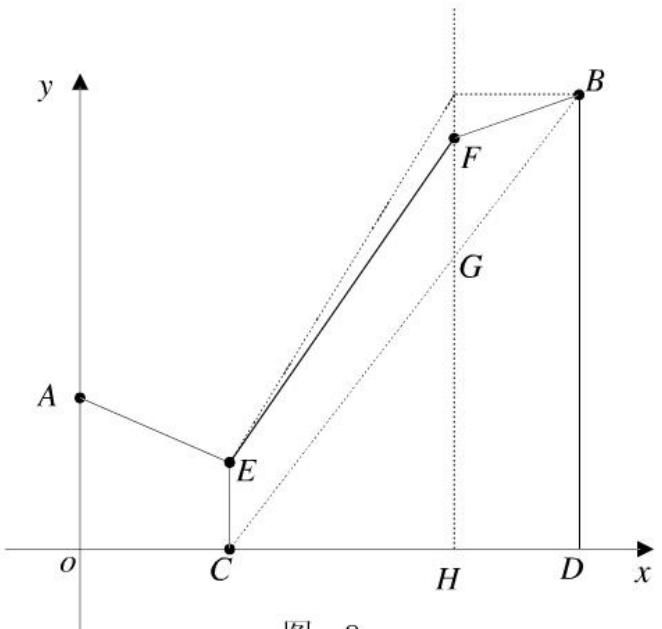

<details>
<summary>text_image</summary>

y
A
E
C
O
H
D
B
F
G
x
图 8
</details>

图8

由题中数据确定各点坐标: A(0, a), B(l, b), D(l, 0), H(c, 0), 设: C(x, 0), E(x, y), F(c, $y_{0}$ ), G(c, $y_{1}$ ) 在 $\Delta$ CDB 中, 依据相似定理得: $\frac{CH}{CD} = \frac{GH}{BD}$ 即 $\frac{c - x}{l - x} = \frac{y_{1}}{b}$ 整理得： $y_{1}=\frac{b\times(c-x)}{l-x}$

$$
d _ {1} = \sqrt {(x - c) ^ {2} + (y - y _ {0}) ^ {2}} \quad d _ {2} = \sqrt {(l - c) ^ {2} + (b - y _ {0}) ^ {2}} \quad d _ {3} = \sqrt {x ^ {2} + (a - y) ^ {2}}
$$

目标函数： $\min Z = (d_3 + d_1)\times m + d_2\times (m + k) + y\times m$

$$
s. t \left\{ \begin{array}{l} 0 \leq x \leq c \\ 0 \leq y \leq a \\ y _ {1} \leq y _ {0} \leq b \end{array} \right.
$$

下面确定附加费用的标准

<table><tr><td>工程咨询公司</td><td>公司一</td><td>公司二</td><td>公司三</td></tr><tr><td>附加费用(万元/千米)</td><td>21</td><td>24</td><td>20</td></tr><tr><td>估算准确度</td><td>50%</td><td>25%</td><td>25%</td></tr></table>

综合各家公司的估算结果得到附加费用 k=21.5 万元/千米；

将数值代入模型用Lingo软件求得

$$
Z _ {\mathrm{min}} = 2 8 2. 7 0 \text {万元}
$$

## 情形二：无共用管线

这种情形只需令情形一中的 y=0;

求解的 $Z_{\min}=284.54$ 万元

求解过程见附录3

## 2.2.4 最佳结论

分析比较两种情形的计算结果，得到的最佳结果为下图所示：

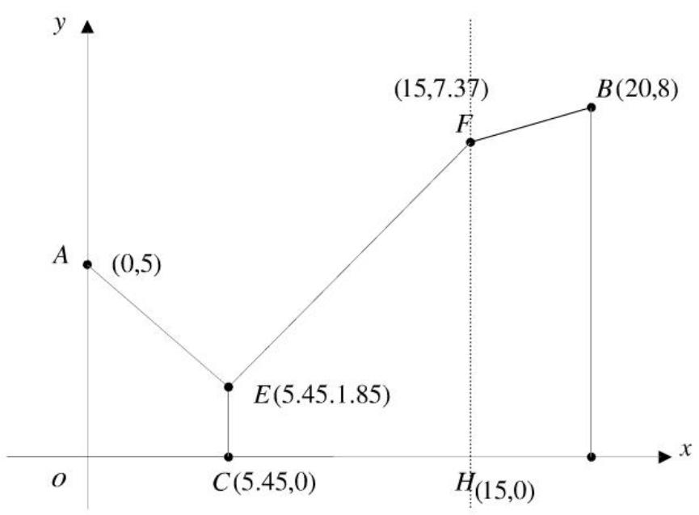

<details>
<summary>line</summary>

| Point | X | Y |
| --- | --- | --- |
| A | 0 | 0.5 |
| E | 5.45 | 1.85 |
| F | 15 | 7.37 |
| B | 20 | 8 |
</details>

图 9

即车站应建在离 A 炼油厂所在线 5.45km，距离 B 炼油厂所在线 14.55km，且共用管线 1.85km 时费用最少， $Z_{min}=282.70$ （万元）

## 2.2.5 模型的评价

优点：（1）本文建立的数学模型有相应的专用 Lingo 软件支持，容易推广。

(2) 具有普遍特性，在给定炼油厂的位置后，在综合考虑输管线费用和附加费用的情况下，即可确定最省布置方案。

(3) 很好的反映了实际铺建时是否需要共用管线。

建议：结合实际生活中的条件，对附加费用作更精确的估算。

## 2.3 问题三的模型

## 2.3.1 问题的分析

题目要求在 “该实际问题中”，则是在问题（2）的模型基础上作进一步改进，要求改变各输油管线的费用。

## 2.3.2 模型假设和符号说明（同问题（2）的模型）

对符号说明稍作补充

<table><tr><td>符号</td><td>意义</td></tr><tr><td> $m_{1}$ </td><td>A 炼油厂输油管线的费用(万元/千米)</td></tr><tr><td> $m_{2}$ </td><td>B 炼油厂输油管线的费用(万元/千米)</td></tr><tr><td> $m_{3}$ </td><td>共用输油管线的费用</td></tr></table>

## 2.3.3 模型建立

在模型（2）的基础上稍加改进用如下模型：

$$
\min Z = d _ {3} \times m _ {1} + d _ {1} \times m _ {2} + d _ {2} \times (m _ {2} + k) + y \times m _ {3}
$$

$$
s. t \left\{ \begin{array}{l} 0 \leq x \leq c \\ 0 \leq y \leq a \\ y _ {1} \leq y _ {0} \leq b \end{array} \right.
$$

代入数值用Lingo原件求得 $Z_{\mathrm{min}} = 252.00$ （万元）

求解过程见附录4

## 2.3.4 最佳结论

由结果数据分析如图布置输油管线最节省费用：

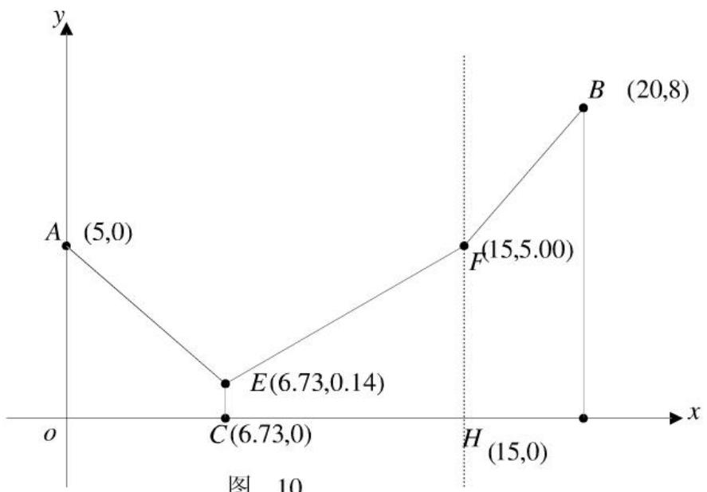

<details>
<summary>line</summary>

| Point | X | Y |
| --- | --- | --- |
| A | 5 | 0 |
| C | 6.73 | 0 |
| E | 6.73 | 0.14 |
| F | 15 | 5.00 |
| B | 20 | 8 |
| H | 15 | 0 |
</details>

图10

即车站应建在离 A 炼油厂所在线 6.73km，距离 B 炼油厂所在线 13.27km，且共用管线 0.14km 时费用最少， $Z_{min}=252.00$ （万元）

## 2.3.5 模型的评价

优点: (1) 该模型综合考虑了炼油厂的生产能力, 选择了相适应的输油管, 使管线铺设费用在一定程度上有所节省。

(2) 很好的反映了实际铺建时是否需要共用管线。

(3) 提出的方案具有一定的实用价值, 可为管线的规划设计、可行性研究以及经济评价提供依据。

建议：结合实际生活中的条件，对附加费用作更精确的估算。

## 3、参考文献

【1】谢金星.优化建模与LINDO/LINGO软件.北京：清华大学出版社，2005.7。

附图一：

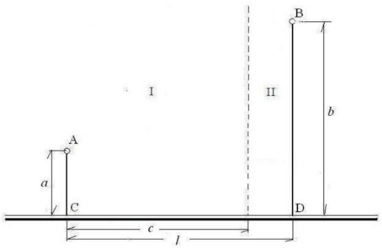

<details>
<summary>text_image</summary>

I
II
A
a
C
b
D
c
l
</details>

附表一：

<table><tr><td>工程咨询公司</td><td>公司一</td><td>公司二</td><td>公司三</td></tr><tr><td>附加费用(万元/千米)</td><td>21</td><td>24</td><td>20</td></tr></table>

附录 1:

## 一、当 $m = p$ 时：

无共用管线

图1

model:

$$
\min = \left(\left((x - a 1) ^ {\wedge} 2 + b 1 ^ {\wedge} 2\right) ^ {\wedge} (1 / 2) + \left((x - a 2) ^ {\wedge} 2 + b 2 ^ {\wedge} 2\right) ^ {\wedge} (1 / 2)\right) * m;
$$

$$
\mathrm{x} > = \mathrm{a} 1;
$$

$$
\mathrm{x} <   = \mathrm{a} 2;
$$

```matlab
a1=5;
b1=8;
a2=7;
b2=8;
m=7.2
end
```

Local optimal solution found at iteration: 13

Objective value: 116.0965

<table><tr><td>Variable</td><td>Value</td><td>Reduced Cost</td></tr><tr><td>X</td><td>5.999998</td><td>-0.9473906E-08</td></tr><tr><td>A1</td><td>5.000000</td><td>0.000000</td></tr><tr><td>B1</td><td>8.000000</td><td>0.000000</td></tr><tr><td>A2</td><td>7.000000</td><td>0.000000</td></tr><tr><td>B2</td><td>8.000000</td><td>0.000000</td></tr><tr><td>M</td><td>7.200000</td><td>0.000000</td></tr></table>

<table><tr><td>Row</td><td>Slack or Surplus</td><td>Dual Price</td></tr><tr><td>1</td><td>116.0965</td><td>-1.000000</td></tr><tr><td>2</td><td>0.9999985</td><td>0.000000</td></tr><tr><td>3</td><td>1.000002</td><td>0.000000</td></tr><tr><td>4</td><td>0.000000</td><td>0.8929414</td></tr><tr><td>5</td><td>0.000000</td><td>-7.144403</td></tr><tr><td>6</td><td>0.000000</td><td>-0.8931588</td></tr><tr><td>7</td><td>0.000000</td><td>-7.144402</td></tr><tr><td>8</td><td>0.000000</td><td>-16.12452</td></tr></table>

图2  
```matlab
model:
min=(( (x-a1)^2+b1^2)^(1/2)+((x-a2)^2+b2^2)^(1/2))*m;
x>=a1;
x<=a2;
a1=5;
b1=8;
a2=7;
b2=5;
m=7.2;
end
```

Local optimal solution found at iteration: 13
Objective value: 94.70121

<table><tr><td>Variable</td><td>Value</td><td>Reduced Cost</td></tr><tr><td>X</td><td>6.230768</td><td>0.000000</td></tr><tr><td>A1</td><td>5.000000</td><td>0.000000</td></tr><tr><td>B1</td><td>8.000000</td><td>0.000000</td></tr><tr><td>A2</td><td>7.000000</td><td>0.000000</td></tr><tr><td>B2</td><td>5.000000</td><td>0.000000</td></tr><tr><td>M</td><td>7.200000</td><td>0.000000</td></tr></table>

<table><tr><td>Row</td><td>Slack or Surplus</td><td>Dual Price</td></tr><tr><td>1</td><td>94.70121</td><td>-1.000000</td></tr><tr><td>2</td><td>1.230768</td><td>0.000000</td></tr><tr><td>3</td><td>0.7692323</td><td>0.000000</td></tr><tr><td>4</td><td>0.000000</td><td>1.094704</td></tr><tr><td>5</td><td>0.000000</td><td>-7.116279</td></tr><tr><td>6</td><td>0.000000</td><td>-1.094984</td></tr><tr><td>7</td><td>0.000000</td><td>-7.116280</td></tr><tr><td>8</td><td>0.000000</td><td>-13.15295</td></tr></table>

......

## 有共用管线

图4

```matlab
model:
min=((x-a1)^2+(b1-y)^2)^(1/2)+((x-a2)^2+(b2-y)^2)^(1/2))*m+y*n;
x>=a1;
x<=a2;
y>=0;
y<=b2;
a1=5;
b1=8;
a2=5;
b2=5;
m=6;
n=7.2;
end
  Local optimal solution found at iteration:          26
  Objective value:                    54.00001
```

<table><tr><td>Variable</td><td>Value</td><td>Reduced Cost</td></tr><tr><td>X</td><td>5.000000</td><td>0.000000</td></tr><tr><td>A1</td><td>5.000000</td><td>0.000000</td></tr></table>

<table><tr><td>B1</td><td>8.000000</td><td>0.000000</td></tr><tr><td>Y</td><td>4.999997</td><td>0.000000</td></tr><tr><td>A2</td><td>5.000000</td><td>0.000000</td></tr><tr><td>B2</td><td>5.000000</td><td>0.000000</td></tr><tr><td>M</td><td>6.000000</td><td>0.000000</td></tr><tr><td>N</td><td>7.200000</td><td>0.000000</td></tr></table>

<table><tr><td>Row</td><td>Slack or Surplus</td><td>Dual Price</td></tr><tr><td>1</td><td>54.00001</td><td>-1.000000</td></tr><tr><td>2</td><td>0.000000</td><td>-2.390888</td></tr><tr><td>3</td><td>0.000000</td><td>0.000000</td></tr><tr><td>4</td><td>4.999997</td><td>0.000000</td></tr><tr><td>5</td><td>0.2638812E-05</td><td>5.133152</td></tr><tr><td>6</td><td>0.000000</td><td>-2.391132</td></tr><tr><td>7</td><td>0.000000</td><td>-6.000000</td></tr><tr><td>8</td><td>0.000000</td><td>-5.935499</td></tr><tr><td>9</td><td>0.000000</td><td>-0.7558839</td></tr><tr><td>10</td><td>0.000000</td><td>-3.000005</td></tr><tr><td>11</td><td>0.000000</td><td>-4.999997</td></tr></table>

...

附录2

$m \neq p$ 无共用管线

图1

```matlab
model:
min=((x-a1)^2+b1^2)^(1/2)*m+((x-a2)^2+b2^2)^(1/2)*p;
x>=a1;
x<=a2;
a1=5;
b1=8;
a2=7;
b2=8;
m=6;
p=7;
end
```

Local optimal solution found at iteration: 13
Objective value: 104.8045

Variable            Value        Reduced Cost
X                6.078116         0.3273251E-07

<table><tr><td>A1</td><td>5.000000</td><td>0.000000</td></tr><tr><td>B1</td><td>8.000000</td><td>0.000000</td></tr><tr><td>M</td><td>6.000000</td><td>0.000000</td></tr><tr><td>A2</td><td>7.000000</td><td>0.000000</td></tr><tr><td>B2</td><td>8.000000</td><td>0.000000</td></tr><tr><td>P</td><td>7.000000</td><td>0.000000</td></tr></table>

<table><tr><td>Row</td><td>Slack or Surplus</td><td>Dual Price</td></tr><tr><td>1</td><td>104.8045</td><td>-1.000000</td></tr><tr><td>2</td><td>1.078116</td><td>0.000000</td></tr><tr><td>3</td><td>0.9218839</td><td>0.000000</td></tr><tr><td>4</td><td>0.000000</td><td>0.8012539</td></tr><tr><td>5</td><td>0.000000</td><td>-5.946248</td></tr><tr><td>6</td><td>0.000000</td><td>-0.8014501</td></tr><tr><td>7</td><td>0.000000</td><td>-6.953982</td></tr><tr><td>8</td><td>0.000000</td><td>-8.072319</td></tr><tr><td>9</td><td>0.000000</td><td>-8.052942</td></tr></table>

......

附录 3:

有共用管线

model:

$$
\min = (d 3 + d 1) * m + d 2 * (m + k) + y * m;
$$

$$
\mathrm{d} 1 = \left(\left(\mathrm{x} - \mathrm{c}\right) ^ {\wedge} 2 + \left(\mathrm{y} - \mathrm{y} 0\right) ^ {\wedge} 2\right) ^ {\wedge} (1 / 2);
$$

$$
\mathrm{d} 2 = ((1 - \mathrm{c}) ^ {\wedge} 2 + (\mathrm{b} - \mathrm{y} 0) ^ {\wedge} 2) ^ {\wedge} (1 / 2);
$$

$$
\mathrm{d} 3 = (\mathrm{x} ^ {\wedge} 2 + (\mathrm{a-y}) ^ {\wedge} 2) ^ {\wedge} (1 / 2);
$$

$$
\mathrm{y} 1 = \mathrm{b} * (\mathrm{c} - \mathrm{x}) / (1 - \mathrm{x});
$$

$$
\mathrm{x} > = 0;
$$

$$
\mathrm{x} <   = \mathrm{c};
$$

$$
\mathrm{y} > = 0;
$$

$$
\mathrm{y} <   = \mathrm{a};
$$

$$
\mathrm{y} 0 > \mathrm{y} 1;
$$

$$
\mathrm{y} 0 <   = \mathrm{b};
$$

$$
\mathrm{a} = 5;
$$

$$
\mathrm{b=8};
$$

$$
\mathrm{c} = 1 5;
$$

$$
1 = 2 0;
$$

$$
\mathrm{m} = 7. 2;
$$

$$
\mathrm{k} = 2 1. 5;
$$

$$
\text {end}
$$

Local optimal solution found at iteration: 41

Objective value: 282.6973

<table><tr><td>Variable</td><td>Value</td><td>Reduced Cost</td></tr><tr><td>D3</td><td>6.292426</td><td>0.2439079E-07</td></tr><tr><td>D1</td><td>11.02808</td><td>0.000000</td></tr><tr><td>M</td><td>7.200000</td><td>0.000000</td></tr><tr><td>D2</td><td>5.039806</td><td>0.000000</td></tr><tr><td>K</td><td>21.50000</td><td>0.000000</td></tr><tr><td>Y</td><td>1.853786</td><td>0.000000</td></tr><tr><td>X</td><td>5.449400</td><td>0.000000</td></tr><tr><td>C</td><td>15.00000</td><td>0.000000</td></tr><tr><td>Y0</td><td>7.367827</td><td>0.000000</td></tr><tr><td>L</td><td>20.00000</td><td>0.000000</td></tr><tr><td>B</td><td>8.000000</td><td>0.000000</td></tr><tr><td>A</td><td>5.000000</td><td>0.000000</td></tr><tr><td>Y1</td><td>5.250972</td><td>0.000000</td></tr></table>

<table><tr><td>Row</td><td>Slack or Surplus</td><td>Dual Price</td></tr><tr><td>1</td><td>282.6973</td><td>-1.000000</td></tr><tr><td>2</td><td>0.000000</td><td>-7.200000</td></tr><tr><td>3</td><td>0.000000</td><td>-28.70000</td></tr><tr><td>4</td><td>0.000000</td><td>-7.200000</td></tr><tr><td>5</td><td>0.000000</td><td>0.000000</td></tr><tr><td>6</td><td>5.449400</td><td>0.000000</td></tr><tr><td>7</td><td>9.550600</td><td>0.000000</td></tr><tr><td>8</td><td>1.853786</td><td>0.000000</td></tr><tr><td>9</td><td>3.146214</td><td>0.000000</td></tr><tr><td>10</td><td>2.116855</td><td>0.000000</td></tr><tr><td>11</td><td>0.6321727</td><td>0.000000</td></tr><tr><td>12</td><td>0.000000</td><td>-3.600106</td></tr><tr><td>13</td><td>0.000000</td><td>-3.600695</td></tr><tr><td>14</td><td>0.000000</td><td>22.23791</td></tr><tr><td>15</td><td>0.000000</td><td>-28.47333</td></tr><tr><td>16</td><td>0.000000</td><td>-24.21410</td></tr><tr><td>17</td><td>0.000000</td><td>-5.039806</td></tr></table>

Local optimal solution found at iteration: 28

Objective value: 284.5368

<table><tr><td>Variable</td><td>Value</td><td>Reduced Cost</td></tr><tr><td>D3</td><td>7.924751</td><td>0.000000</td></tr><tr><td>D1</td><td>11.40923</td><td>0.000000</td></tr><tr><td>M</td><td>7.200000</td><td>0.000000</td></tr><tr><td>D2</td><td>5.063836</td><td>0.000000</td></tr><tr><td>K</td><td>21.50000</td><td>0.000000</td></tr><tr><td>Y</td><td>0.000000</td><td>0.000000</td></tr></table>

<table><tr><td>X</td><td>6.148307</td><td>0.000000</td></tr><tr><td>C</td><td>15.00000</td><td>0.000000</td></tr><tr><td>Y0</td><td>7.198478</td><td>0.000000</td></tr><tr><td>L</td><td>20.00000</td><td>0.000000</td></tr><tr><td>B</td><td>8.000000</td><td>0.000000</td></tr><tr><td>A</td><td>5.000000</td><td>0.000000</td></tr><tr><td>Y1</td><td>5.112266</td><td>0.000000</td></tr></table>

附录4  
有共用管线  
```matlab
model:
min=d3*m1+d1*m2+d2*(m2+k)+y*m3;
d1=((x-c)^2+(y-y0)^2)^(1/2);
d2=((1-c)^2+(b-y0)^2)^(1/2);
d3=(x^2+(a-y)^2)^(1/2);
y1=b*(c-x)/(1-x);
x>=0;
x<=c;
y>=0;
y<=a;
y0>y1;
y0<=b;
a=5;
b=8;
c=15;
l=20;
m1=5.6;
m2=6.0;
m3=7.2;
k=21.5;
end
```

Local optimal solution found at iteration: 40

Objective value: 251.9685

<table><tr><td>Variable</td><td>Value</td><td>Reduced Cost</td></tr><tr><td>D3</td><td>8.305068</td><td>0.000000</td></tr><tr><td>M1</td><td>5.600000</td><td>0.000000</td></tr><tr><td>D1</td><td>10.92330</td><td>0.000000</td></tr><tr><td>M2</td><td>6.000000</td><td>0.000000</td></tr><tr><td>D2</td><td>5.051645</td><td>0.000000</td></tr><tr><td>K</td><td>21.50000</td><td>0.000000</td></tr><tr><td>Y</td><td>0.1388983</td><td>-0.4273243E-07</td></tr></table>

<table><tr><td>M3</td><td>7.200000</td><td>0.000000</td></tr><tr><td>X</td><td>6.733783</td><td>0.000000</td></tr><tr><td>C</td><td>15.00000</td><td>0.000000</td></tr><tr><td>Y0</td><td>7.279501</td><td>0.000000</td></tr><tr><td>L</td><td>20.00000</td><td>0.000000</td></tr><tr><td>B</td><td>8.000000</td><td>0.000000</td></tr><tr><td>A</td><td>5.000000</td><td>0.000000</td></tr><tr><td>Y1</td><td>4.984822</td><td>0.000000</td></tr></table>

<table><tr><td>Row</td><td>Slack or Surplus</td><td>Dual Price</td></tr><tr><td>1</td><td>251.9685</td><td>-1.000000</td></tr><tr><td>2</td><td>0.000000</td><td>-6.000000</td></tr><tr><td>3</td><td>0.000000</td><td>-27.50000</td></tr><tr><td>4</td><td>0.000000</td><td>-5.600000</td></tr><tr><td>5</td><td>0.000000</td><td>0.000000</td></tr><tr><td>6</td><td>6.733783</td><td>0.000000</td></tr><tr><td>7</td><td>8.266217</td><td>0.000000</td></tr><tr><td>8</td><td>0.1388983</td><td>0.000000</td></tr><tr><td>9</td><td>4.861102</td><td>0.000000</td></tr><tr><td>10</td><td>2.294679</td><td>0.000000</td></tr><tr><td>11</td><td>0.7204991</td><td>0.000000</td></tr><tr><td>12</td><td>0.000000</td><td>-3.277832</td></tr><tr><td>13</td><td>0.000000</td><td>-3.922883</td></tr><tr><td>14</td><td>0.000000</td><td>22.67831</td></tr><tr><td>15</td><td>0.000000</td><td>-27.21887</td></tr><tr><td>16</td><td>0.000000</td><td>-8.305068</td></tr><tr><td>17</td><td>0.000000</td><td>-15.97495</td></tr><tr><td>18</td><td>0.000000</td><td>-0.1388983</td></tr><tr><td>19</td><td>0.000000</td><td>-5.051645</td></tr></table>