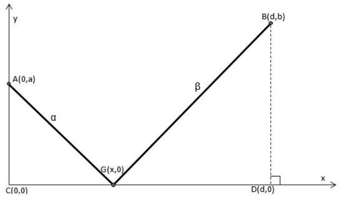
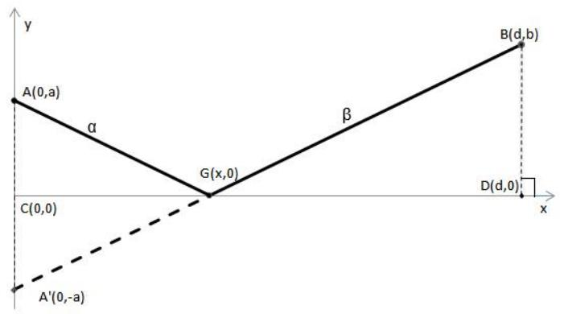
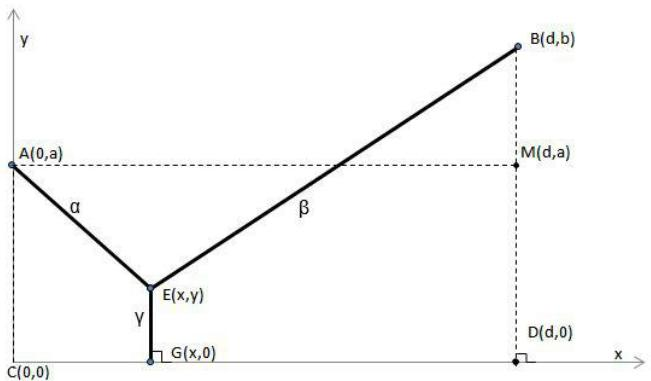
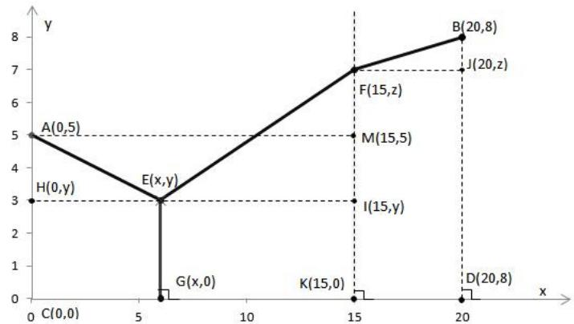
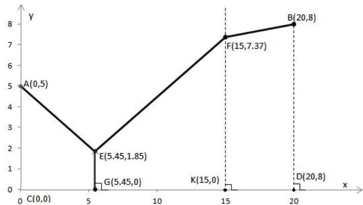
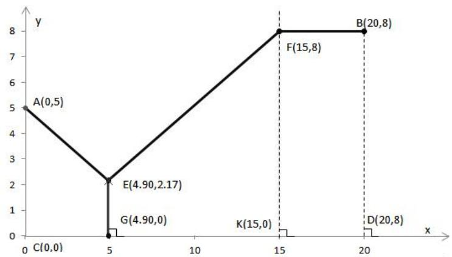
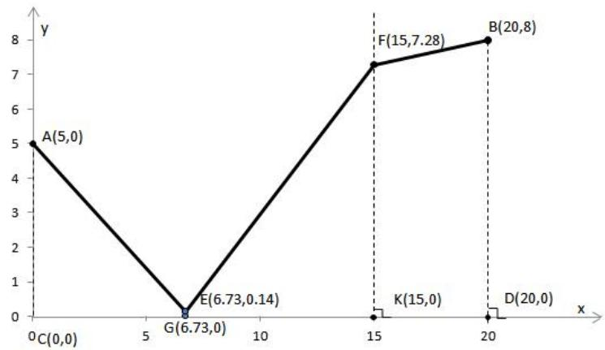
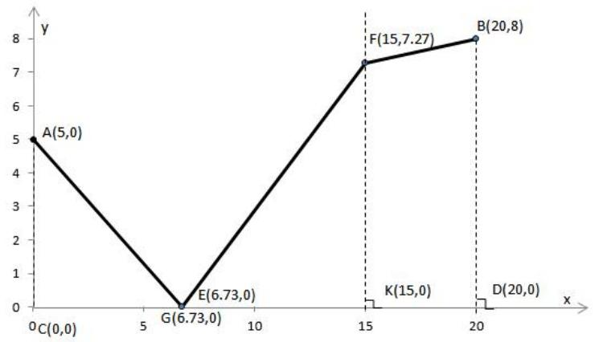

# 2010高教社杯全国大学生数学建模竞赛

## 承 诺 书

我们仔细阅读了中国大学生数学建模竞赛的竞赛规则.

我们完全明白，在竞赛开始后参赛队员不能以任何方式（包括电话、电子邮件、网上咨询等）与队外的任何人（包括指导教师）研究、讨论与赛题有关的问题。

我们知道，抄袭别人的成果是违反竞赛规则的, 如果引用别人的成果或其他公开的资料（包括网上查到的资料），必须按照规定的参考文献的表述方式在正文引用处和参考文献中明确列出。

我们郑重承诺，严格遵守竞赛规则，以保证竞赛的公正、公平性。如有违反竞赛规则的行为，我们将受到严肃处理。

我们参赛选择的题号是（从A/B/C/D中选择一项填写）： C

我们的参赛报名号为（如果赛区设置报名号的话）： Y3706

所属学校（请填写完整的全名）： 西安欧亚学院

参赛队员 (打印并签名) ：1. 杨旭周

2. 徐巧玲

3. 张波

指导教师或指导教师组负责人 (打印并签名)： 教练组

日期： 2010 年 9 月 13 日

赛区评阅编号（由赛区组委会评阅前进行编号）：

# 2010高教社杯全国大学生数学建模竞赛

## 编 号 专 用 页

赛区评阅编号（由赛区组委会评阅前进行编号）：

赛区评阅记录（可供赛区评阅时使用）：

<table><tr><td>评阅人</td><td></td><td></td><td></td><td></td><td></td><td></td><td></td><td></td><td></td><td></td></tr><tr><td>评分</td><td></td><td></td><td></td><td></td><td></td><td></td><td></td><td></td><td></td><td></td></tr><tr><td>备注</td><td></td><td></td><td></td><td></td><td></td><td></td><td></td><td></td><td></td><td></td></tr></table>

全国统一编号（由赛区组委会送交全国前编号）：

全国评阅编号（由全国组委会评阅前进行编号）：

# 输油管布置问题的优化模型

## 摘要

本文针对输油管线的布置问题，从不同角度出发，以总费用最省为目标函数，建立了多个优化模型。

对问题一：分为所铺设的管线中无共用管线和有共用管线这两种情况考虑。当所铺设的管线中无共用管线时，建立直角坐标系，标出各点坐标，分别设两炼油厂铺设管线的单位费用为α万元、β万元，根据α与β是否相等分为两种情况来考虑：当 $\alpha = \beta$ 时，利用对称及两点间直线最短的原理，可以找到此种情况下的铺设管线的最佳路径，此时要增建的车站的位置点G 的坐标为 $\textstyle { \big ( } { \frac { a d } { a + b } } , 0 { \big ) }$ ,根据G 点坐标可以求出最省的总费用为α(√(ad)2 + a2 +√b2 +(d −ad)2)万元。当α ≠β时，设出车站建设点G的坐标，根据总费用等于A厂铺设的非共用管线的费用和B厂铺设的非共用管线费用之和，最终建立总费用最省的优化模型，并利用Matlab 软件进行求解[6]，由于结果过于繁琐，不加表述。当所铺设的管线中有共用管线时，要使铺设管线的总费用最小，需要考虑共用管线费用与各炼油厂非共用管线的费用之和最小。根据此分析，建立直角坐标系，分别设出共用管线和非共用管线交接点E及车站建设点G的坐标，同样根据总费用最省的计算方法，建立优化模型，运用Matlab 软件对其求解[6] ，由于此处结果过于复杂，不加表述。

对问题二：首先对每个公司的估算值进行加权求和，确定出附加费用。建立直角坐标系，分别设出各点的坐标。从费用最省的角度出发，可建立一个总费用最小的目标函数，再根据题意及参考文献[5]中的结论找出约束条件，由此建立单目标的优化模型，运用 Lingo 软件求解得出此种情况下最省的总费用为 282.6973 万元，且要增建车站G 点坐标为(5.45,0)。从对城市规划的影响及扰民情况方面进行分析，就要使得在城区内铺设的管线长度最短。同样可以建立一个总费用最少的目标函数，根据分析找出约束条件，从而建立优化模型，并用 Lingo 求解得出此情况下最省的总费用为 283.8307 万元，要增建车站G 点坐标为(4.90,0)。

对问题三：首先建立直角坐标系，标出各点坐标。其次根据问题二的分析方法进行建模，并用 Lingo 求解得到铺设管线的最省总费用为 251.9685 万元，要增建车站G 点坐标为(6.73,0)。通过对问题三结果的分析可以发现，共用管线的长度仅为0.14千米，又因为根据资料[7]可得，当两炼油厂有共用管线时且采用间歇传送成品油时，如果两炼油厂传送的成品油种类不同时，会产生一定的混油量，而混油会造成成品油价值的贬值，从而造成经济损失，所以可以考虑需铺设的管线中无共用管线。通过此分析可建立一个总费用最少的目标函数，且根据分析找出其约束条件，进而建立优化模型，用Lingo 求解可得在此种情况下的最省总费用为251.9755万元，要增建车站G点坐标为(6.73,0)。

关键词：费用最省 直角坐标系 费尔马点 优化模型

## 一、问题重述

某油田计划在铁路线一侧建造两家炼油厂，同时在铁路线上增建一个车站，用来运送成品油。油田设计学院希望建立管线建设费用最省的一般数学模型与方法。

1、针对两炼油厂到铁路线距离与两炼油厂间距离的各种不同情形，提出你的设计方案。在方案设计时，若有共用管线，应考虑共用管线费用与非共用管线费用相同或不  
2、两油厂的具体位置已确定（见题中附图），其中A厂位于郊区（图中的I区域），B厂位于城区（图中的II 区域），两个区域的分界线用图中虚线表示。图中个字母表示的距离（单位：千米）分别为a=5，b=8，c=15，l=20。设所有管线的铺设费用均为7.2 万元。铺设在城区的管线还需要增加拆迁和工程补偿等附加费用，为对此附加费用进行估计，聘请三家工程咨询公司（其中公司一具有甲级资质，公司二和公司三具有乙级资质）进行了估算（估算结果见题目）。要求为设计院给出管线布置方案及相应的费用。  
3、在该实际问题中，为进一步节省费用，可根据炼油厂的生产能力，选用相适应的油管。这是的管线铺设费用将分别降为输送A厂成品油的 5.6 万元/千米，输送B厂成品油的6.0 万元/千米，共用管线费用为7.2万元/千米，拆迁等附加费用同上。要求给出管线的最佳布置方案及相应的费用。

## 二、符号说明

$C _ { i }$ 表示编号为i的公司估算出的附加费用。

W 表示编号为i的公司分配到的权重。

l 表示加权求和后确定的每千米的附加费用。  
L 表示铺设管线的最少总费用。

## 三、基本假设

1、假设油田所在区域的铁路线为直线。  
2、假设铺设管线时是沿着所设计的路径直线铺设的。  
3、假设铺设管线的总费用只考虑管线铺设费用和附加费用。  
4、假设将两个炼油厂及要增建的车站看作三个点。  
5、假设油田所在区域不存在影响输油管线线路选择的限制区域(如国家重点文物，国家军事设施等)。  
6、假设城区内人口分布比较均匀。

## 四、问题分析

结合该油田输油管的布置所提出的三个问题和相关要求，我们从以下几方面进行分析和讨论。

对问题一要分两种情况考虑： (1)当铺设的管线中无共用管线时，该问题可以转化为一个以总费用最省为目标函数的优化模型。在这种情况下又分别考虑两个炼油厂单位管线的铺设费用相同和不同两种情形；建立出不同的优化模型。(2)当铺设的管线中有共用管线时，即要考虑共用管线的铺设费用与各炼油厂非共用管线铺设费用之和最小，从而建立出以总费用最省为目标函数的优化模型。

对问题二：由于铺设在城区的管线还需增加拆迁和工程补偿等费用，首先根据三家工程咨询公司具有的资质，对各个公司估算的附加费用分配权重，进而通过加权求和确定出每千米的附加费用。从单纯考虑铺设费用最省的角度，可以建立一个总费用最省的优化模型。又从城市的规划与扰民情况考虑，在城区内铺设的管道要尽可能短，由此角度考虑，同样可以建立另一种总费用最省的优化模型。

对问题三：问题三是问题二的细化，即给出各炼油厂非共用管线的单位铺设价格和共用管线的单位铺设价格。因为都是要求铺设费用最省，且问题三只是将问题二中的费用具体化，所以问题三可按照问题二中单纯考虑总费用最少的模型的分析方法，建立模型，求出最佳的铺设方案。

## 五、模型的建立与求解

## 5.1 问题一模型的建立与求解

此问题需要分两种情况考虑：一是所铺设的管线中没有共用管线；二是所铺设的管线中有共用管线。

## 5.1.1所需铺设的管线中无共用管线模型的建立与求解

首先，设两炼油厂为A和B,以铁路线所在的直线为横坐标轴，以垂直与铁路线且过其中A炼油厂的直线为纵坐标轴，以C点为坐标原点，建立直角坐标系。设需要增建的车站为点 $G$ ；设A点坐标为 $( 0 , a )$ ，B 点坐标为(d,b)，D 点的坐标为(d ,0),G 点坐标为 $( x , 0 )$ ；设铺设A厂管线费用为每千米万元，铺设B厂管线费用为每千米 $\beta$ 万元。各点的具体表示见图1：

line

| Point | X-coordinate | Y-coordinate |
| --- | --- | --- |
| A | 0 | a |
| B | d | b |
| C | 0 | 0 |
| G | x | 0 |

图1 炼油厂与车站坐标示意图

当 $\alpha = \beta$ 时，即铺设费用大小只取决于两炼油厂到车站的距离之和，要满足铺设费用最少，只需要满足距离和最小即可。因此可以利用几何知识求解出铺设管线总费用最省的设计方案。具体步骤如下：

在图一的基础上，做出A点关于x轴的对称点 $\ddot { A }$ ，然后连接 $B A ^ { ' }$ ，与x轴交于G点，再连接 $_ { A G }$ ，G点即为要增建车站的位置。AG和BG即为需要铺设的管线，如图2：

line

| Point | X-coordinate | Y-coordinate |
| --- | --- | --- |
| A | 0 | a |
| B | d,b | b |
| C | 0 | 0 |
| D | d,0 | 0 |
| G | x,0 | 0 |
| A' | 0 | -a |

图2 各炼油厂非共用管线的费用相同时的设计图

根据几何知识可以求得点G 的坐标为 $\textstyle { \left( \frac { a d } { a + b } , 0 \right) }$ ，又根据勾股定理可以求得：$A G = { \sqrt { \left( { \frac { a d } { a + b } } \right) ^ { 2 } + a ^ { 2 } } } \ , B G = { \sqrt { b ^ { 2 } + \left( d - { \frac { a d } { a + b } } \right) ^ { 2 } } }$ ，根据以上分析可求得此情况下的最小费用为： $L = \alpha ( A G + B G )$ ，即： $\begin{array} { r } { L = \alpha ( \sqrt { ( \frac { a d } { a + b } ) ^ { 2 } + a ^ { 2 } } + \sqrt { b ^ { 2 } + ( d - \frac { a d } { a + b } ) ^ { 2 } } ) } \end{array}$ 。则此情况下最小的总费用为 $\begin{array} { r } { \alpha ( \sqrt { ( \frac { a d } { a + b } ) ^ { 2 } + a ^ { 2 } } + \sqrt { b ^ { 2 } + ( d - \frac { a d } { a + b } ) ^ { 2 } } ) } \end{array}$ 万元。

当 $\alpha \neq \beta$ 时，结合图一，可以将该问题转化为在 x 轴上寻找一点 G ，使得$A G \cdot \alpha + B G \cdot \beta$ 的值最小。由此可建立目标函数为： $\operatorname* { m i n } { L } = \alpha \cdot A G + \beta \cdot B G$ ，又根据勾股定理可求得 $A G = \sqrt { a ^ { 2 } + x ^ { 2 } } \ , B G = \sqrt { \left( d - x \right) ^ { 2 } + b ^ { 2 } }$ ，所以该目标函数可以转化为：

$$
\min L = \alpha \sqrt {a ^ {2} + x ^ {2}} + \beta \sqrt {b ^ {2} + (d - x) ^ {2}} \tag {1}
$$

对该目标函数的约束条件分析如下：

(1)根据参考文献[5]的结论可知点G是落在ACDB这个区域内的。又因为此处考虑的是无共用管线的情况，所以点G一定落在CD这条线段上，即:

$$
0 \leq x \leq d \tag {2}
$$

(2) ${ a , b , d , \alpha , \beta }$ 均为未知参数。

根据以上分析，可建立单目标优化模型如下：

目标函数： $\operatorname* { m i n } L = \alpha { \sqrt { a ^ { 2 } + x ^ { 2 } } } + \beta { \sqrt { b ^ { 2 } + ( d - x ) ^ { 2 } } }$

$$
s. t. \left\{ \begin{array}{l} 0 \leq x \leq d \\ a, b, d, \alpha , \beta \text {均为未知参数} \end{array} \right. \tag {3}
$$

运用Matlab软件对以上模型进行求解(程序[6]见源程序一)，由于结果过于繁琐，不便于表达，在此不做叙述。具体运用时可直接将 $a , b , d , \alpha , \beta$ 等参数带入模型中求解。

## 5.1.2所需铺设的管线中有共用管线模型的建立与求解

设两炼油厂为A和B，以该铁路线所在直线为横坐标轴，以垂直于该铁路线且过A炼油厂的直线为纵坐标轴，以C点为坐标原点，建立直角坐标系。设从两个炼油厂A和B铺设的管线相接于E点，过E点做x轴的垂线，与x轴相交于G，则共用管线的铺设路线即为点E向铁路线做的那条垂线，G点即为要增建的车站位置。过A点做与x轴平行的直线 AM 交 BD 与M 。设 A 点坐标为(0,a)， B 点坐标为(d,b)，D 点的坐标为( d ,0), E 点坐标为 (x,y) ，G 点坐标为 (x,0) 。得到图 3：

line

| Point | X-coordinate | Y-coordinate |
| --- | --- | --- |
| A | 0 | a |
| E | x | y |
| G | x | 0 |
| B | d | b |
| D | d | 0 |

图3 有共用管线时的设计图

结合图三，运用两点间的距离公式可以得出： $B E = \sqrt { \left( d - x \right) ^ { 2 } + \left( b - y \right) ^ { 2 } }$ $E G = y$ $A E = \sqrt { x ^ { 2 } + ( a - y ) ^ { 2 } }$ 。因为要求铺设管线的总费用最省，即使AE、BE、EG乘以各自的所铺设管线的费用之和最小，由此可建立目标函数如下：

$$
\min L = \alpha \cdot A E + \beta \cdot B E + \gamma \cdot E G
$$

即： $\operatorname* { m i n } L = \alpha \sqrt { x ^ { 2 } + ( a - y ) ^ { 2 } } + \beta \sqrt { ( d - x ) ^ { 2 } + ( b - y ) ^ { 2 } } + \gamma$ (4)

对于约束条件我们做了以下分析：

(1)根据参考文献[5]的结论可知点G是落在ACDM 这个区域内的。由此可得

$$
0 \leq x \leq d, 0 \leq y \leq a \tag {5}
$$

(2) $a , b , d , \alpha , \beta , \gamma$ 均为未知参数。

综合以上分析可建立模型如下：

目标函数： $\operatorname* { m i n } L = \alpha \sqrt { x ^ { 2 } + ( a - y ) ^ { 2 } } + \beta \sqrt { ( d - x ) ^ { 2 } + ( b - y ) ^ { 2 } } + \gamma$

$$
s. t. \left\{ \begin{array}{l} 0 \leq x \leq d \\ 0 \leq y \leq a \\ a, b, d, \alpha , \beta , \gamma \text {均为未知参数} \end{array} \right. \tag {6}
$$

运用Matlab对以上模型求解(程序[6]见源程序二)，由于结果过于繁琐，不便于表达，在此不做叙述。具体运用时可直接将a,b,d,α,β,γ等参数带入模型中求解。

## 5.2 问题二模型的建立与求解

## 5.2.1附加费用的确定

由于被聘请的三家工程咨询公司的资质不一样，即公司一具有甲级资质，公司二和公司三具有乙级资质。而公司具有的资质越高，其估算的准确度就越高。根据网上查找的大量的资料以及三家工程咨询公司所具有的资质，分别为三家公司分配权值为 0.5、0.25、0.25。首先为每个公司编号如表1：

表1 各公司编号表

<table><tr><td>工程咨询公司</td><td>公司一</td><td>公司二</td><td>公司三</td></tr><tr><td>公司编号</td><td>1</td><td>2</td><td>3</td></tr></table>

根据以上分析及表 1，利用数学表达式 $l = \sum _ { i = 1 } ^ { 3 } c _ { i } w _ { i }$ 求得城区中附加费用的估算值为21.5 万元/千米。

## 5.2.2单纯从总费用最省方面考虑的模型的建立与求解

以铁路线所在直线为x轴、以线段AC所在的直线为y轴、以C为坐标原点建立直角坐标系，可知A点坐标为(0,5)，B点坐标为(20,8)，C点坐标为(0,0)，D点坐标为(20,0)。在城郊分界线上取一点F，在ACDM 中取一点E，连接AE、FE。由E点向x轴引垂线，垂足设为点G。过点E、F、A各做一条平行于x轴的直线，分别与y轴交于点H，与城郊分界线分别交于点I和M，与BD交于点J，设城郊分界线与x轴的交点为K点。设E点坐标为(x,y)，F点坐标为(15,z)，G点坐标为(x,0)，H点坐标为(0, y )， I 点坐标为(15, y )， J 点坐标为(20, z )， K 点坐标为(15,0)，M 点坐标为(15,5)，作出图 4：

line

| Point | X-coordinate | Y-coordinate |
| --- | --- | --- |
| A | 0 | 5 |
| B | 20 | 8 |
| C | 0 | 0 |
| D | 20 | 0 |
| E | 6 | 3 |
| F | 15 | 7 |
| G | 6 | 0 |
| H | 0 | 3 |
| I | 15 | 3 |
| J | 20 | 7 |
| K | 15 | 0 |
| M | 15 | 5 |

图4 管线铺设概况示意图

则A、B两点为两炼油厂的位置。由于铺设在城区的管线需要增加拆迁和工程补偿等附加费用，且此费用与管线的铺设费用相差较大，从节省费用的角度出发，可以在城郊分界线上找出点F，并在ACKM 中找到一点E，使得炼油厂铺设管线的总费用最小。AE即为A炼油厂需要铺设的非共用管线的长度，BF即为B炼油厂在城区内需要铺设的非共用管线的长度，EF即为B炼油厂在郊区内需要铺设的非共用管线的长度，EG即为所需铺设的共用管线的长度，G点即为所需增建的车站的位置。

设 $s _ { 1 } = A E , s _ { 2 } = E F , s _ { 3 } = E G , s _ { 4 } = B F$ ，结合上图，根据两点间的距离公式可以求得 $s _ { 1 } = \sqrt { ( 5 - y ) ^ { 2 } + x ^ { 2 } } \ , \ s _ { 2 } = \sqrt { ( 1 5 - x ) ^ { 2 } + ( z - y ) ^ { 2 } } \ , \ s _ { 3 } = y \ , \ s _ { 4 } = \sqrt { ( 8 - z ) ^ { 2 } + 2 5 ^ { 2 } } \ .$ 。从节省费用的角度出发，结合题目中给出的铺设管线的费用及附加费用，建立目标函数如下：

$$
\min L = 7. 2 \times (s _ {1} + s _ {2} + s _ {3} + s _ {4}) + 2 1. 5 s _ {2} \text {即:}
$$

$$
\min L = 7. 2 (\sqrt {(5 - y) ^ {2} + x ^ {2}} + \sqrt {(1 5 - x) ^ {2} + (z - y) ^ {2}} + y + \sqrt {(8 - z) ^ {2} + 2 5}) + 2 1. 5 \sqrt {(1 5 - x) ^ {2} + (z - y) ^ {2}} \tag {7}
$$

对约束条件我们做了以下分析：

(1)根据参考文献[5]中的结论可知E点是落在ACDM 这个区域内的，结合图四得：

$$
0 \leq x \leq 1 5, \quad 0 \leq y \leq 5 \tag {8}
$$

由上图可得 $s _ { 1 }$ 大于等于E点到y轴的最短距离， $s _ { 2 }$ 大于等于E点到城郊分界线的最短距离， $s _ { 4 }$ 大于等于F点到BD的最短距离。即:

$$
s _ {1} \geq x, \quad s _ {2} \geq 1 5 - x, \quad s _ {4} \geq 5 \tag {9}
$$

综合以上分析，可建立单目标优化模型如下：

目标函数：

$$
\min L = 7. 2 (\sqrt {(5 - y) ^ {2} + x ^ {2}} + \sqrt {(1 5 - x) ^ {2} + (z - y) ^ {2}} + y + \sqrt {(8 - z) ^ {2} + 2 5}) + 2 1. 5 \sqrt {(1 5 - x) ^ {2} + (z - y) ^ {2}}
$$

$$
s. t. \left\{ \begin{array}{l} 0 \leq x \leq 1 5 \\ 0 \leq y \leq 5 \\ s _ {1} \geq x \\ s _ {2} \geq 1 5 - x \\ s _ {4} \geq 5 \end{array} \right. \tag {10}
$$

运用Lingo软件对此模型进行求解(程序见源程序三)，可得（原始结果见附录一）：$L = 2 8 2 . 6 9 7 3 ; { s _ { 1 } } = 6 . 2 9 , { s _ { 2 } } = 1 1 . 0 3 , { s _ { 3 } } = 1 . 8 5 , { s _ { 4 } } = 5 . 0 4 ; { x } = 5 . 4 5 , y = 1 . 8 5 . z = 7 . 3 7 3$ ，即铺设管线的最省总费用为282.6973万元，交接点E的坐标为(5.45,1.85)，城区管线和郊区管线的交接点F的坐标为(15,7.37)，要增建车站G点坐标为(5.45,0)。具体位置见图5：

line

| Point | X | Y |
| --- | --- | --- |
| A | 0 | 5 |
| E | 5.45 | 1.85 |
| G | 5.45 | 0 |
| F | 15 | 7.37 |
| B | 20 | 8 |
| K | 15 | 0 |
| D | 20 | 0 |

图5 单纯从总费用最省考虑的管线铺设方案图

## 5.2.3从城市规划及扰民情况方面考虑模型的建立与求解

由于在城区中铺设管线时需要进行拆迁，会影响到市民的生活以及城市的规划。从这个角度出发，应尽量减少对市民生活及城市规划的影响。所以城区内铺设管线的长度应该尽可能的短，这时F点应为由B点出发向城郊分界线做垂线的垂足，即F点坐标为(15,8)，即z 8。在此种情况下，因为要求铺设管线的总费用最少，可建立目标函数如下:

$$
\min L = 7. 2 (\sqrt {(5 - y) ^ {2} + x ^ {2}} + \sqrt {(1 5 - x) ^ {2} + (8 - y) ^ {2}} + y + 5) + 2 1. 5 \sqrt {(1 5 - x) ^ {2} + (8 - y) ^ {2}} \tag {11}
$$

对于约束条件的分析跟编号为(10)的约束条件相同。由此可建立模型如下：

目标函数：

$$
\min L = 7. 2 (\sqrt {(5 - y) ^ {2} + x ^ {2}} + \sqrt {(1 5 - x) ^ {2} + (8 - y) ^ {2}} + y + 5) + 2 1. 5 \sqrt {(1 5 - x) ^ {2} + (8 - y) ^ {2}}
$$

$$
s. t. \left\{ \begin{array}{l} z = 8 \\ 0 \leq x \leq 1 5 \\ 0 \leq y \leq 5 \\ s _ {1} \geq x \\ s _ {2} \geq 1 5 - x \\ s _ {4} \geq 5 \end{array} \right. \tag {12}
$$

运用Lingo软件对此模型求解(程序见源程序四)，可得(原始结果见附录二)：

L = 283.8307; s, = 5.66, s, = 11.66, s3 = 2.17, s4 = 5.00; x = 4.90, y = 2.17, z = 8.00 ,即： 在此种情况下，铺设管线的最省总费用为 283.8307万元，交接点E的坐标为(4.90,2.17)，城区管线和郊区管线的交接点F的坐标为(15,8)，要增建车站G点坐标为(4.90,0)。具体坐标位置如图6：

line

| Point | X | Y |
| --- | --- | --- |
| A | 0 | 5 |
| E | 4.90 | 2.17 |
| G | 4.90 | 0 |
| F | 15 | 8 |
| B | 20 | 8 |

图6 从城市规划及扰民情况分析的管线铺设方案图

## 5.3 问题三模型的建立与求解

## 5.3.1单纯从总费用最省方面考虑的模型的建立与求解

问题三是问题二的细化，即给出各炼油厂非共用管线的单位铺设价格和共用管线的单位铺设价格。因为都是要求铺设费用最省，且问题三只是将问题二中的费用具体化，所以问题三可按照问题二的分析方法求解，结合题意及以上分析，可以建立目标函数如下：

$$
\min L = 5. 6 \sqrt {(5 - y) ^ {2} + x ^ {2}} + 6. 0 (\sqrt {(1 5 - x) ^ {2} + (z - y) ^ {2}} + \sqrt {(8 - z) ^ {2} + 2 5}) + 7. 2 y + 2 1. 5 \sqrt {(8 - z) ^ {2} + 2 5} \tag {13}
$$

对此问题约束条件的分析与问题二中的模型的约束条件相同。

由此可建立单目标优化模型如下：

目标函数:

$$
\min L = 5. 6 \sqrt {(5 - y) ^ {2} + x ^ {2}} + 6. 0 (\sqrt {(1 5 - x) ^ {2} + (z - y) ^ {2}} + \sqrt {(8 - z) ^ {2} + 2 5}) + 7. 2 y + 2 1. 5 \sqrt {(8 - z) ^ {2} + 2 5}
$$

$$
s. t. \left\{ \begin{array}{l} 0 \leq x \leq 1 5 \\ 0 \leq y \leq 5 \\ s _ {1} \geq x \\ s _ {2} \geq 1 5 - x \\ s _ {4} \geq 5 \end{array} \right. \tag {14}
$$

运用 Lingo 软件对以上模型求解(程序见源程序五)，可得(原始结果见附录三)：$L = 2 5 1 . 9 6 8 5 ; \boldsymbol { s } _ { 1 } = 8 . 3 1 , \boldsymbol { s } _ { 2 } = 1 0 . 9 2 , \boldsymbol { s } _ { 3 } = 0 . 1 4 , \boldsymbol { s } _ { 4 } = 5 . 0 5 ; \boldsymbol { x } = 6 . 7 3 , \boldsymbol { y } = 0 . 1 4 , \boldsymbol { z } = 7 . 2 8$ ，即铺设管线的最省总费用为251.9685万元，交接点E的坐标为(6.73,0.14)，城区管线和郊区管线的交接点F的坐标为(15,7.28)，要增建车站G点坐标为(6.73,0)。具体位置如图7：

line

| Point | X | Y |
| --- | --- | --- |
| A | 0 | 5 |
| G | 6.73 | 0 |
| E | 6.73 | 0.14 |
| F | 15 | 7.28 |
| B | 20 | 8 |

图7 输油管线铺设方案图

## 5.3.2对问题三结果的分析

根据资料[7]可得，当两炼油厂有共用管线时且采用间歇传送成品油时，如果两炼油厂传送的成品油种类不同时，会产生一定的混油量，而混油会造成成品油价值的贬值，从而造成经济损失。又因为EG =0.14 千米，即共用管线的铺设长度较短，从长远的角度考虑，铺设的管线中无共用管线较为合适，即 $E G = 0$ 的时候，此时 $y = 0$ 。又因为要求总费用最省，可建立目标函数如下：

$$
\min L = 5. 6 \sqrt {5 ^ {2} + x ^ {2}} + 6. 0 (\sqrt {(1 5 - x) ^ {2} + z ^ {2}} + \sqrt {(8 - z) ^ {2} + 2 5}) + 2 1. 5 \sqrt {(8 - z) ^ {2} + 2 5} \tag {15}
$$

对约束条件的分析和编号为(14)的模型的约束条件相同。由此可建立模型如下：目标函数：

$$
\min L = 5. 6 \sqrt {5 ^ {2} + x ^ {2}} + 6. 0 (\sqrt {(1 5 - x) ^ {2} + z ^ {2}} + \sqrt {(8 - z) ^ {2} + 2 5}) + 2 1. 5 \sqrt {(8 - z) ^ {2} + 2 5}
$$

$$
s. t. \left\{ \begin{array}{l} 0 \leq x \leq 1 5 \\ 0 \leq y \leq 5 \\ s _ {1} \geq x \\ s _ {2} \geq 1 5 - x \\ s _ {4} \geq 5 \end{array} \right. \tag {16}
$$

运用Lingo软件对此模型求解(程序见源程序六)，可得(原始结果见附录四)：

$L = 2 5 1 . 9 7 5 5 ; s _ { 1 } = 8 . 4 0 , s _ { 2 } = 1 0 . 9 9 , s _ { 3 } = 0 . 0 0 , s _ { 4 } = 5 . 0 5 ; x = 6 . 7 5 , y = 0 . 0 0 , z = 7 . 2 7$ ，即：在此种情况下的最省总费用为 251.9755 万元，交接点E的坐标为(6.73,0)，城区管线和郊区管线的交接点F的坐标为(15,7.27)，要增建车站G点坐标为(6.73,0)。具体坐标见图8：

line

| Point | X | Y |
| --- | --- | --- |
| A | 0 | 5 |
| G | 6.73 | 0 |
| E | 6.73 | 0 |
| F | 15 | 7.27 |
| B | 20 | 8 |

图 8 从长远方面考虑的管线铺设方案图

## 六、模型的评价

## 6.1 模型的优点：

(1)问题一从共用管线和非共用管线两种情况考虑建立模型，考虑的比较充分，并且所建立的模型具有一定的普适性，可以应用到选址问题的求解。  
(2)合理地引入直角坐标系，使问题的理解和处理变得更加容易。  
(3)问题一模型求解时运用了Matlab软件，问题二，问题三模型求解时运用了Lingo软件，使结果变得更加合理科学。

## 6.2 模型的缺点：

(1)问题一用Matlab求解出的结果过于繁琐，不便于表述。  
(2)对于问题二，利用权重确定附加费用的值，带有一定的主观性。

## 七、参考文献

[1]谢金星，优化建模与LINDO\LINGO软件[M]，北京：清华大学出版社，2005  
[2]姜启源，数学模型[M]，北京：高等教育出版社，2003  
[3]董霖，MATLAB 使用详解[M]，电子工业出版社，2009  
[4]吴建成，高等数学[M]，北京：高等教育出版社，2008  
[5]储炳南，三角形"费尔马点"的一个推广，中学数学教学，第 5 期，32-33 页，2006年  
[6]Differences and approximate derivatives - MATLAB,

http://www.mathworks.com/help/techdoc/ref/diff.html,2010 年 9 月 11 日

[7] GB50253-2003+输油管道工程设计规范(2006 年版)\_百度文库,

http://wenku.baidu.com/view/ba75ff11f18583d049645947.html，2010 年 9 月 11 日

## 八、附录

附录一 对5.2.2模型求解的原始结果

<table><tr><td colspan="2">Local optimal solution found.</td></tr><tr><td>Objective value:</td><td>282.6973</td></tr><tr><td>Total solver iterations:</td><td>68</td></tr></table>

<table><tr><td>Variable</td><td>Value</td><td>Reduced Cost</td></tr><tr><td>X1</td><td>6.292425</td><td>0.000000</td></tr><tr><td>X2</td><td>11.02808</td><td>0.000000</td></tr><tr><td>X3</td><td>1.853788</td><td>0.000000</td></tr><tr><td>X4</td><td>5.039806</td><td>0.000000</td></tr><tr><td>Y</td><td>1.853788</td><td>0.000000</td></tr><tr><td>X</td><td>5.449400</td><td>0.000000</td></tr><tr><td>Z</td><td>7.367829</td><td>0.000000</td></tr></table>

附录二 对5.2.3模型求解的原始结果

<table><tr><td colspan="2">Local optimal solution found.</td></tr><tr><td>Objective value:</td><td>283.8307</td></tr><tr><td>Extended solver steps:</td><td>0</td></tr><tr><td>Total solver iterations:</td><td>29</td></tr></table>

<table><tr><td>Variable</td><td>Value</td><td>Reduced Cost</td></tr><tr><td>S1</td><td>5.660254</td><td>0.000000</td></tr><tr><td>S2</td><td>11.66025</td><td>0.000000</td></tr><tr><td>S3</td><td>2.169873</td><td>0.000000</td></tr><tr><td>S4</td><td>5.000000</td><td>0.000000</td></tr><tr><td>Y</td><td>2.169873</td><td>0.000000</td></tr><tr><td>X</td><td>4.901924</td><td>0.000000</td></tr><tr><td>Z</td><td>8.000000</td><td>0.000000</td></tr></table>

附录三 对5.3.1模型求解的原始结果

<table><tr><td colspan="2">Local optimal solution found.</td></tr><tr><td>Objective value:</td><td>251.9685</td></tr><tr><td>Total solver iterations:</td><td>27</td></tr></table>

<table><tr><td>Variable</td><td>Value</td><td>Reduced Cost</td></tr><tr><td>X1</td><td>8.305068</td><td>0.000000</td></tr><tr><td>X2</td><td>10.92330</td><td>0.000000</td></tr><tr><td>X4</td><td>5.051645</td><td>0.000000</td></tr><tr><td>X3</td><td>0.1388990</td><td>0.000000</td></tr><tr><td>Y</td><td>0.1388990</td><td>0.000000</td></tr><tr><td>X</td><td>6.733784</td><td>0.6237698E-08</td></tr><tr><td>Z</td><td>7.279503</td><td>0.000000</td></tr></table>

附录四 对5.3.2结果分析的改进模型求解的原始结果

Local optimal solution found.

<table><tr><td>Objective value:</td><td>251.9755</td></tr><tr><td>Extended solver steps:</td><td>0</td></tr><tr><td>Total solver iterations:</td><td>24</td></tr></table>

<table><tr><td>Variable</td><td>Value</td><td>Reduced Cost</td></tr><tr><td>S1</td><td>8.402522</td><td>0.000000</td></tr><tr><td>S2</td><td>10.99455</td><td>0.000000</td></tr><tr><td>S4</td><td>5.052875</td><td>0.000000</td></tr><tr><td>S3</td><td>0.000000</td><td>0.000000</td></tr><tr><td>Y</td><td>0.000000</td><td>0.000000</td></tr><tr><td>X</td><td>6.752954</td><td>0.000000</td></tr><tr><td>Z</td><td>7.270930</td><td>0.000000</td></tr></table>