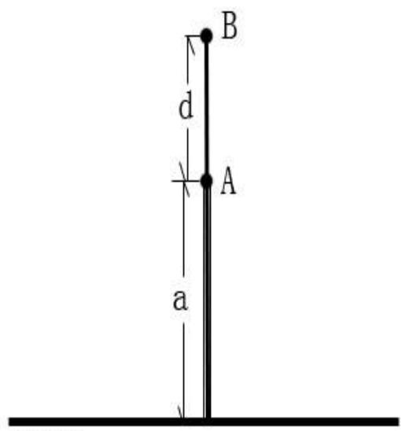
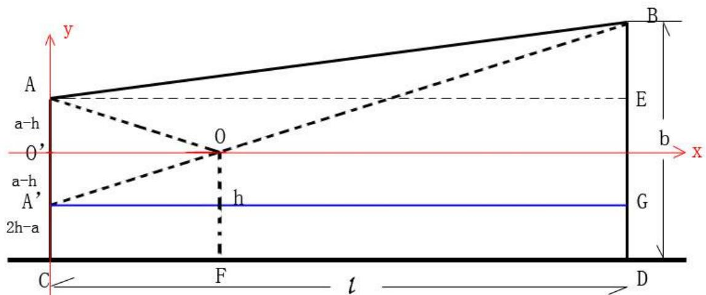
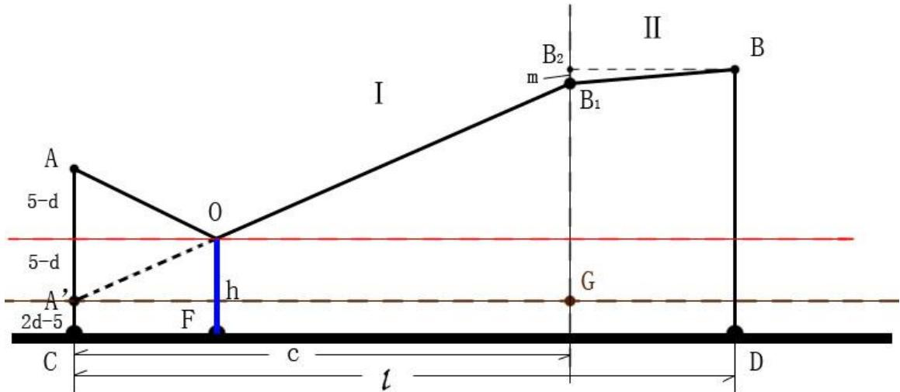
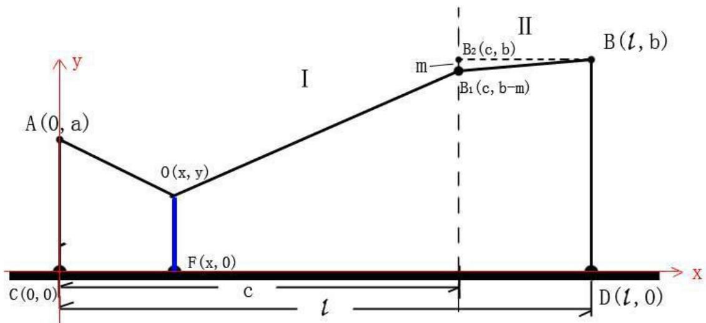

# 2010高教社杯全国大学生数学建模竞赛

## 承 诺 书

我们仔细阅读了中国大学生数学建模竞赛的竞赛规则。

我们完全明白，在竞赛开始后参赛队员不能以任何方式（包括电话、电子邮件、网上咨询等）与队外的任何人（包括指导教师）研究、讨论与赛题有关的问题。

我们知道，抄袭别人的成果是违反竞赛规则的，如果引用别人的成果或其他公开的资料（包括网上查到的资料），必须按照规定的参考文献的表述方式在正文引用处和参考文献中明确列出。

我们郑重承诺，严格遵守竞赛规则，以保证竞赛的公正、公平性。如有违反竞赛规则的行为，我们将受到严肃处理。

我们参赛选择的题号是（从A/B/C/D中选择一项填写）： C

我们的参赛报名号为（如果赛区设置报名号的话）： 1328303

所属学校（请填写完整的全名）： 武汉职业技术学院

参赛队员 （打印并签名）：1. XXX

2. XXX

3. X X

指导教师或指导教师组负责人（打印并签名）： 数模指导组

日期： 2010 年 9 月 12 日

赛区评阅编号（由赛区组委会评阅前进行编号）：

# 2010高教社杯全国大学生数学建模竞赛

## 编 号 专 用 页

赛区评阅编号（由赛区组委会评阅前进行编号）：

赛区评阅记录（可供赛区评阅时使用）：

<table><tr><td>评阅人</td><td></td><td></td><td></td><td></td><td></td><td></td><td></td><td></td><td></td><td></td></tr><tr><td>评分</td><td></td><td></td><td></td><td></td><td></td><td></td><td></td><td></td><td></td><td></td></tr><tr><td>备注</td><td></td><td></td><td></td><td></td><td></td><td></td><td></td><td></td><td></td><td></td></tr></table>

全国统一编号（由赛区组委会送交全国前编号）：

全国评阅编号（由全国组委会评阅前进行编号）：

# 输油管的布置

## 摘 要

本文对输油管线的布置主要从建设费用最省的角度进行研究。

首先，对问题一，我们按照共用管线与非共用管线铺设费用相同或不相同，进行分类讨论。为了更好的说明，我们根据共用管线与非共用管线铺设费用相同或不同及两炼油厂连线与铁路线垂直或不垂直分成四类讨论。

其次，对问题二，由于需要考虑在城区中铺设管线，涉及到拆迁补偿费等。通过对三个公司的估算费用加权，求得期望值 $P _ { 0 } = 2 1 . 5$ （万元）。并利用建立的规划模型②求得管道建设的最省费用为282.70 万元。其中共用管线长度为1.85千米，炼油厂B在城区铺设的管道线对城郊分界线的射影为0.63千米。

最后，对问题三，由于炼油厂A和B的输油管线铺设费用不同，所以最短管道长度和未必能保证铺设总费用最省，因而我们又建立了规划模型③，通过LINGO 软件求得管道建设的最省费用为 251.97 万元，三种管道的结合点 O 到炼油厂 A与铁路垂线的距离为6.13千米，结合点O到铁路的距离为0.14千米，炼油厂 B在城区铺设的管道线对城郊分界线的射影为0.72千米。

关键词：管线铺设 平面镜成像 光的反射 规划

## 1. 问题重述

## 1.1. 背景资料与条件

某油田计划在铁路线一侧建造两家炼油厂，同时在铁路线上增建一个车站，用来运送成品油。由于这种模式具有一定的普遍性，油田设计院希望建立管线建设费用最省的一般数学模型与方法。

## 1.2. 需要解决的问题

## 1.2.1. 问题一

针对两炼油厂到铁路线距离和两炼油厂间距离的各种不同情形，提出自己的设计方案。在方案设计时，若有共用管线，应考虑共用管线费用与非共用管线费用相同或不同的情形。

## 1.2.2. 问题二

设计院目前需对一更为复杂的情形进行具体的设计。两炼油厂的具体位置及相关参数见赛题中附图及其说明。

现所有管线的铺设费用均为 7.2万元/千米。 铺设在城区的管线还需增加拆迁和工程补偿等附加费用，下面是聘请的三家工程咨询公司对此附加费进行估算的结果。

<table><tr><td>工程咨询公司</td><td>公司一(甲级资质)</td><td>公司二(乙级资质)</td><td>公司三(乙级资质)</td></tr><tr><td>附加费用(万元/千米)</td><td>21</td><td>24</td><td>20</td></tr></table>

表 1

据此、我们要为设计院设计出管线布置方案并给出相应的费用。

## 1.2.3. 问题三

在该实际问题中，为进一步节省费用，可以根据炼油厂的生产能力，选用相适应的油管。这时的管线铺设费用分别为A 厂 5.6万元/千米、B厂 6.0万元/千米，共用管线费用为 7.2万元/千米，拆迁等附加费用同上。要求给出管线最佳布置方案及相应的费用。

## 2. 问题分析

## 2.1. 问题的重要性分析

炼油厂的建立及输油管线的铺设涉及到是否可行（配套设施，如水、电等能否到位……）、安全隐患、总体费用等一系列重大问题，因此要求我们设计出一种经济、科学、可行的方案。

## 2.2. 问题的思路分析

## 2.2.1.问题一

由题得知非共用油管价格相同，我们只需考虑两炼油厂到铁路线距离和两炼油厂间距离的各种不同情形，以及有共用管线时共用管线费用与非共用管线费用相同或不同的情形。

为解决此问题，我们在下文建立模型①，并相应做出图1，图2。

在问题一中，我们首先以共用与非公用管道价格是否相同为标准，分为共用管道与非共用管道单位长度造价相同和共用管道与非共用管道单位长度造价不相同两种情况，再在每种情况下分为两炼油厂的连线所在直线垂直于铁路线和两炼油厂的连线所在直线不垂直于铁路线两种情况（至于两油厂离铁路线距离的比较,将有模型中a、b大小的比较进行区分，a、b 含义见符号说明）。

当两炼油厂的连线垂直于铁路线时，路线很明显，在此不细说。

当两炼油厂的连线不垂直于铁路线时，我们先在图二中矩形 ACDE 中选择一点O作为两厂油管结合点，实际也是共用油管的起点。先假设共用油管的长度一定，这样油管结合点就可以在平行于铁路线的一条直线上移动（下文建模求解时，是以此直线为 x 轴，O 点是在位于矩形 ACDE 范围内的 x轴上移动的），为了使费用最少，在非共用油管价格相同的题知下，问题即转化为求两炼油厂间距离之和的最小值（在下文里即是求|AO|+|BO|的最小值），于是便可借光的反射定律求出这个最小值、并可确定 O 点的位置。由于，对如任意给定的 h,均可求出一个这样的最小值，在一系列这样的最小值中一定可以找到一个最小的，此最小值及其所对应的O点即为所要求的两炼油厂间距离之和的最小值。至此，问题一得以解决并相应建立模型①。

（说明：当共用油管的起点被确定后，共用油管一定是按照垂直于铁路线的方向铺设，只有这样才能使费用最少。应用反射定律时，是以x轴为镜面的。）

## 2.2.2.问题二

题目中已经给出了一系列数据，并明确说明所有管线的铺设费用均为 7.2万元/千米，所不同的是，在城区铺设油管时还得支付由拆迁建筑物引起的附加费用等。且 A炼油厂到铁路线的距离小于B炼油厂到铁路线的距离。我们假定城区油管是从城郊分界线的B<sub>1</sub>（即下文图 3中的点B<sub>1</sub>）处进入郊区的。

解决郊区费用时，下文中，我们套用模型①，a<b且两炼油厂连线不垂直于铁路线时的子模型解决。

现在需解决在城区铺设油管的费用问题，此部分费用包括油管铺设费和相关拆迁补偿费。

至于油管铺设费，只要求出城区油管长度（在下文中即为|BB<sub>1</sub>|）再乘以其价格，即可得出；而相关拆迁补偿费，题中已给出三家工程咨询公司的参考值，我们采用对三家公司依情况赋予相应权重，再据权重及给出的对应单位长度费用估测值，算得单位长度费用估测值的期望值（下文中记为P ），再用这个期望值乘以城区油管长度，即可得出。于是两部分费用相加，即得出城区铺设油管的总费用。至此，问题二得以解决并相应建立规划模型二。

## 2.2.3. 问题三

这一问是承接第二问而来，但是对数据做了一些调整。

具体为：此问在第二问的基础上做了更进一步的实际化，共用管道和 A、B两炼油厂的非共用管道的单价均不相同，其它条件不变！

尽管变化很小，但由于非公用管道单价的改变，导致上文中所有模型均不适用。因为在非共用管道问题上，最短管道长度和未必能保证铺设总费用最省，所以再求最短管道长度和已失去实际意义，因此需重新建立模型求解。

现建立如下模型：

建立直角坐标系（详见下文图 3），设出管道结合点O 及其坐标，由此增建车站点（即下文图3中的点F）的坐标即被确定，其它各点的坐标由已知条件均可得出。再利用数学中求点间距离的公式分别求出图 3中线段AO、FO、B1O的长度，由于线段AO、FO、B1O所代表的管道的价格以及B1O所代表的管道的附加费价格均为已知，于是管线建设最省费用便可得出。

## 3. 模型假设

1)两炼油厂之间的距离以及两炼油厂离铁路线的距离等均在安全范围内（通过相关资料查得安全距离大致应在1000 米以上）。  
2)两炼油厂间的铁路线近似为直线，且建模时不考虑地质影响（即在施工时会出现一些地方由于地质原因不能铺设）。  
3)非共用管线价格不会比共用管线贵。

## 4. 符号说明

2. a：炼油厂A到铁路线的垂直距离；

b：炼油厂B 到铁路线的垂直距离；

c：炼油厂A 到城郊分界线垂直距离；

d：两炼油厂间的距离；

h：公用管道的长度；

l：两炼油厂到城郊分界线垂直距离之和；

m：城区铺设的管道线在两区分界线上的射影长度；

P ：两厂所用非公用管道价格相同时，非公用管道单位长度的造价；

$P ^ { \prime }$ ：公用管道单位长度的造价；

：工程咨询公司对城区铺设管道时产生的单位长度管道附加费用的评估$p _ { \ast }$ 的期望值；

$P _ { 1 }$ ：A炼油厂铺设非公用管道时单位长度的造价；

$P _ { 2 }$ ：B 炼油厂铺设非公用管道时单位长度的造价；

W ：管线建设总费用；

## 5. 模型的建立与求解

## 5.1. 问题一

## 5.1.1. 在共用管道与非共用管道单位长度造价相同的情况下：

a. 当两炼油厂的连线所在直线垂直于铁路线时，如图1所示（A，B上下位置可互换）：

明显的，从远油厂铺设非共用管道到近油厂，再从近油厂铺设共用管道到增建的车站，费用最少。

此时，总费用为 $W = P \big ( d + a \big )$

b. 当两炼油厂的连线所在直线不垂直于铁路线时，建立模型①，如图 2所示（其中a,b大小不确定）：

由于两种管道的单位造价相同，要使总铺设费用最小，则应使铺设距离最短，为求得最小距离，则必须确定两种管道的结合点O。

于是问题转化为在四边形 ABCD 内找一点O，使 $\left| \mathrm { A O } \right| + \left| \mathrm { B O } \right| + \left| \mathrm { O F } \right.$ |最小。据实际情况判断，O 应界定在矩形 ACDE内。



<details>
<summary>text_image</summary>

B
d
A
a
</details>

图 1



<details>
<summary>text_image</summary>

y
A
E
O'
b
x
O
O
h
A'
2h-a
C
F
D
l
</details>

图 2

当 $a \leq b$ 时， $0 \leq | F O | | \leq a$ ，即 $0 \leq h \leq a$

当 $a > b$ 时， $0 \leq | \boldsymbol { F } \boldsymbol { O } | \leq b$ ，即 $0 \leq h \leq b$

假设O点如图2中所示。现以AC 所在直线为y轴，过O作 $O O ^ { \prime } \bot A C$ 于 $O ^ { \prime }$ ，以 $O "$ 为原点， $O O ^ { \prime }$ 为 x轴，建立如图所示直角坐标系。

对任一给定的 OF 长度值 h，通过 O 点在 x 轴上移动，相应确定 $\left| { \tt A O } \right| + \left| { \tt B O } \right|$ |的最小值。再通过x轴的上下滑动，可得到不同h值下 $\left| \mathrm { A 0 } \right| + \left| \mathrm { B 0 } \right|$ 的最小值。

应用物理学中镜面反射原理，以x轴为对称轴，作A点镜像点 $A "$ ，连接 $A ^ { \prime } \mathrm { B }$ 可知， $| _ { \ r { A } ^ { \prime } \ r { B } } |$ 即为 $\left| \mathrm { A 0 } \right| + \left| \mathrm { B 0 } \right|$ 的最小值。

在图中，

$$
\begin{array}{l} \mid A ^ {\prime} O ^ {\prime} \mid = \mid A O ^ {\prime} \mid = a - h \\ \mid A ^ {\prime} C \mid = \mid G D \mid = 2 h - a \\ \mid A ^ {\prime} G \mid = \mid C D \mid = l \\ \mid B G \mid = b + a - 2 h \\ \end{array}
$$

在 $R t \Delta B A ^ { \prime } G$ 中，由勾股定理求得

$$
\begin{array}{l} \mid A ^ {\prime} B \mid = \sqrt {l ^ {2} + (b + a - 2 h) ^ {2}} \\ \left(\left| A O \right| + \left| O B \right|\right) _ {\min} = \sqrt {l ^ {2} + (b + a - 2 h) ^ {2}} \\ \left(\left| O F \right| + \left| A O \right| + \left| O B \right|\right) _ {\min} = \sqrt {l ^ {2} + (b + a - 2 h) ^ {2}} + h \\ \end{array}
$$

综上所述，建设管道总费用为 W：

当a≤b时，W =P(√l+(b+a−2h)2 +h) (0≤h≤a)

当 $a > b$ 时， $W = P \left( \sqrt { l ^ { 2 } + ( b + a - 2 h ) ^ { 2 } } + h \right) \qquad ( \ 0 \leq h \leq b \ )$

## 5.1.2. 在共用管道与非共用管道单位长度造价不同的情况下：

a. 当两炼油厂的连线所在直线垂直于铁路线时，情景与图 1 相同：

明显的，从远油厂铺设非共用管道到近油厂，再从近油厂铺设共用管道到增建的车站，费用最少。

此时，总费用为 $W = P d + P ^ { \prime } a$

b. 当两炼油厂的连线所在直线不垂直于铁路线时，同图 2（其中 a,b大小不确定，不妨假设 $a \leq b \ )$

由于两种管道单位造价不相同，但非共用管道单位造价相同，当共用管道长度给定时，为使费用最少，必须使非共用管道长度之和最短，此时仍可套用模型①，只是此时在计算共用管道总费和非共用管道总费用所用的单位造价不同。

建设管道总费用计算过程如下：

$$
\left(\left| A O \right| + \left| O B \right|\right) _ {\min} = \sqrt {l ^ {2} + (b + a - 2 h) ^ {2}}
$$

$$
W = P \left(\sqrt {l ^ {2} + (b + a - 2 h) ^ {2}}\right) + P ^ {\prime} h
$$

## 5.2. 问题二

相对于问题一而言，问题二中增加了在城区铺设管道的问题。

假设炼油厂B 所铺设管道从城区进入郊区的地点为 $B _ { 1 }$ ，B在城郊分界线上的射影点为 $B _ { 2 }$ 。

现考虑城区铺设管道的情况，因为在城区铺设管道，涉及到的费用包括管道铺设费用和拆迁补偿费等，而城区铺设管道的长度通过勾股定理可表示为：

$$
\sqrt {(l - c) ^ {2} + m ^ {2}}
$$

对于郊区铺设管道的长度，可以借用模型①（如图3）。



<details>
<summary>text_image</summary>

A
5-d
O
B2
II
B
m
B1
A'
2d-5
F
h
G
C
c
l
D
</details>

图 3

因为对于给定的任意共用管道长度h，AO、 $B _ { 1 } 0$ 段的管道长度和总可通过光的反射原理得到一个最小值：

$$
\left(\left| A O \right| + \left| B _ {1} O \right|\right) _ {\min} = \sqrt {c ^ {2} + (b - m + a - 2 h) ^ {2}}
$$

所以，管道总的铺设费用可以表示为一个关于h 和m的函数：

$$
f (h, m) = P (\sqrt {c ^ {2} + (b - m + a - 2 h) ^ {2}} + h) + (P + P _ {0}) (\sqrt {(l - c) ^ {2} + m ^ {2}})
$$

根据题意，可得到 $0 \leq h \leq a \ , \ 0 \leq m \leq b$ 。其中 $a = 5 , b = 8 , c = 1 5 , l = 2 0 , P = 7 . 2$ 均为已知。而 $P _ { 0 }$ 为单位长度拆迁费用的期望值，根据题目中三家工程咨询公 $\overrightarrow { \Xi } \sqrt { }$ 对拆迁和工程补偿等附加费用的估算（估算情况详见表1），通过加权，可如下求出：

因为公司一具有甲级资质，公司二和公司三具有乙级资质，所以可设定公司一的权重为50%，公司二、三的权重均为25%，则

$$
P _ {0} = 2 1 \times 50 \% + 2 4 \times 25 \% + 2 0 \times 25 \% = 2 1. 5 \text {(万元)}
$$

综上，可建立一个规划模型②：

决策变量：设共用管道的长度为 h 千米，炼油厂 B 在城区铺设的管道线在城郊分界线上的射影长度为m千米。

目标函数：铺设管道费用及城区拆迁附加费用的总费用最省：

$$
f (h, m) = 7. 2 (\sqrt {1 5 ^ {2} + (8 - m + 5 - 2 h) ^ {2}} + h) + (7. 2 + 2 1. 5) (\sqrt {(2 0 - 1 5) ^ {2} + m ^ {2}})
$$

## 约束条件：

1）共用管道的长度h不超过A炼油厂到铁路的垂直距离5千米，即 $h \leq 5$  
2）炼油厂B在城区铺设的管道线在城郊分界线上的射影长度m不超过B炼油厂到铁路的垂直距离8 千米，即 $m \leq 8$  
3）h，m 均不能为负值，即 $h \geq 0 ~ , ~ m \geq 0$

通过LINGO 8.0软件对规划模型②进行求解（求解程序见附件1），可得到$h = 1 . 8 5$ （千米）， $m = 0 . 6 3$ （千米）

管线建设最省的费用为f(h,m)282.70（万元）

## 5.3. 问题三



<details>
<summary>text_image</summary>

A(0, a)
O(x, y)
F(x, 0)
C(0, 0)
c
l
D(l, 0)
B1(c, b-m)
B2(c, b)
I
m
II
B(l, b)
</details>

图 4

在问题三中，共用管道和 A、B 两炼油厂的非共用管道的单价均不相同。所以在非共用管道问题上，最短管道长度和未必能保证铺设总费用最省。

因此，不能利用已建立的模型①，需重新建立模型求解。

我们以铁路线所在的直线为 x 轴，以 AC 所在直线为 y 轴，建立如图 4 所示平面直角坐标系。设三种管道的结点O（x，y），新建车站 F（x，0）。（其它点坐

标可由图 4所示参数指出）

则: $\scriptstyle \left| A O \right| = { \sqrt { x ^ { 2 } + \left( y - a \right) ^ { 2 } } }$

$$
\left| B _ {1} O \right| = \sqrt {\left(c - x\right) ^ {2} + \left(b - m - y\right) ^ {2}}
$$

$$
\left| B B _ {1} \right| = \sqrt {\left(l - c\right) ^ {2} + m ^ {2}}
$$

此时可得到总费用与x，y，m之间的关系：

$$
f (x, y, m) = P _ {1} \sqrt {x ^ {2} + (y - a) ^ {2}} + P _ {2} \sqrt {(c - x) ^ {2} + (b - m - y) ^ {2}} + \left(P _ {0} + P _ {2}\right) \sqrt {(l - c) ^ {2} + m ^ {2}} + P ^ {\prime} y
$$

根据题意，可得到 $0 \leq x \leq l , 0 \leq y \leq b , 0 \leq m \leq b$ ，其中 $a = 5 , b = 8 , c = 1 5 , l = 2 0 \cdot$

$P _ { 0 } = 2 1 . 5 , P _ { 1 } = 5 . 6 , P _ { 2 } = 6 . 0 , P ^ { \prime } = 7 . 2$ 均为已知。

综上，可建立一个规划模型③：

决策变量：设三种管道的结点 O 到铁路的距离为 y 千米，结点 O 到炼油厂 A与铁路垂线的距离为x 千米，炼油厂B 在城区铺设的管道线在城郊分界线上的射影长度为 m千米

目标函数：铺设管道费用及城区拆迁附加费用的总费用最省：

$$
f (x, y, m) = 5. 6 \sqrt {x ^ {2} + (y - 5) ^ {2}} + 6. 0 \sqrt {(1 5 - x) ^ {2} + (8 - m - y) ^ {2}} + (2 1. 5 + 6. 0) \sqrt {(2 0 - 1 5) ^ {2} + m ^ {2}} + 7. 2 y
$$

## 约束条件：

1） 三种管道的结点 O 到炼油厂 A 与铁路垂线的距离x 不超过两炼油厂到城郊分界线垂直距离之和 20 千米，即 $x \leq 2 0$  
2） 结点O到铁路的距离y不超过B炼油厂到铁路的垂直距离8千米，即 $y \le 8$  
3） 炼油厂 B在城区铺设的管道线在城郊分界线上的射影长度 m不超过 B炼油厂到铁路的垂直距离 8千米，即 $m \leq 8$  
4） x，y，m均不能为负值，即 $x \ge 0 ~ , ~ y \ge 0 ~ , ~ m \ge 0$

通过 LINGO 8.0软件对规划模型③进行求解（求解程序见附件2），可得到

$x = 6 . 7 3$ （千米） y = 0.14（千米） m= 0.72（千米）

管线建设最省的费用为 $f ( x , y , m ) = 2 5 1 . 9 7 ~ ( \overline { { { \mathcal { A } } } } \bar { \pi } )$

## 6. 模型的灵敏度分析

在假设中忽略了地质等原因可能导致部分管线按设计方案无法铺设的情况。但在实际生活中，这样的问题普遍存在。

## 7. 模型的评价

本题我们共建立的三个模型，简单易懂。

对于模型①和模型②，通过选择合适的变量，在非共用管线单价一致的情况下，巧妙地转换了研究对象，由最少费用转换为最短管线铺设距离，并且很恰当地利用物理学上平面镜成像及光的反射原理进行求解。

但本模型仅适用于两个炼油厂或其它类似工厂的最优运输线路的设计问题。

对于规划模型③，除可以解决模型①和模型②适用的所有问题，还可以解决模型①和模型②不能解决的多个炼油厂或其它类似工厂的最优运输线路的设计问题。但计算较为复杂，须借助相关数学软件求解。

## 参考文献：

[1]姜启源 谢金星 叶俊 《数学模型（第三版）》 高等教育出版社 2003.8  
[2]苏金明 阮沈勇 《MATLAB实用教程（第2 版）》 电子工业出版社 2008.2  
[3]王 湛 杨维军《新时期炼油厂选址应注意的问题》石油规划设计 2008.7  
[4]余 伟 《炼油厂环境风险评价的实践和思考》 工业安全与环保 2007.6

## 附件

## 1. 附件一

程序：  
```matlab
model:
min=7.2*((13-2*h-m)^2+225)^0.5+h)+28.7*(m^2+25)^0.5;
h<5;
m<8;
end
```

结果：  
```txt
Local optimal solution found at iteration: 53
Objective value: 282.6973
```

<table><tr><td>Variable</td><td>Value</td><td>Reduced Cost</td></tr><tr><td>H</td><td>1.853787</td><td>-0.6132680E-07</td></tr><tr><td>M</td><td>0.6321706</td><td>0.000000</td></tr><tr><td>Row</td><td>Slack or Surplus</td><td>Dual Price</td></tr><tr><td>1</td><td>282.6973</td><td>-1.000000</td></tr><tr><td>2</td><td>3.146213</td><td>0.000000</td></tr><tr><td>3</td><td>7.367829</td><td>0.000000</td></tr></table>

## 2. 附件二

程序：  
```matlab
model:
min=5.6*(x^2+(y-5)^2)^0.5+6.0*((15-x)^2+(8-m-y)^2)^0.5+7.2*y+27.5
*(m^2+25)^0.5;
x<15;
y<8;
m<8;
end
```

结果：  
```txt
Local optimal solution found at iteration: 67
Objective value: 251.9685
```

<table><tr><td>Variable</td><td>Value</td><td>Reduced Cost</td></tr><tr><td>X</td><td>6.733782</td><td>-0.1688306E-07</td></tr><tr><td>Y</td><td>0.1388995</td><td>0.000000</td></tr><tr><td>M</td><td>0.7204969</td><td>0.000000</td></tr><tr><td>Row</td><td>Slack or Surplus</td><td>Dual Price</td></tr><tr><td>1</td><td>251.9685</td><td>-1.000000</td></tr><tr><td>2</td><td>8.266218</td><td>0.000000</td></tr><tr><td>3</td><td>7.861100</td><td>0.000000</td></tr><tr><td>4</td><td>7.279503</td><td>0.000000</td></tr></table>