# 2010高教社杯全国大学生数学建模竞赛

## 承 诺 书

我们仔细阅读了中国大学生数学建模竞赛的竞赛规则.

我们完全明白，在竞赛开始后参赛队员不能以任何方式（包括电话、电子邮件、网上咨询等）与队外的任何人（包括指导教师）研究、讨论与赛题有关的问题。

我们知道，抄袭别人的成果是违反竞赛规则的, 如果引用别人的成果或其他公开的资料（包括网上查到的资料），必须按照规定的参考文献的表述方式在正文引用处和参考文献中明确列出。

我们郑重承诺，严格遵守竞赛规则，以保证竞赛的公正、公平性。如有违反竞赛规则的行为，我们将受到严肃处理。

我们参赛选择的题号是（从A/B/C/D中选择一项填写）： C

我们的参赛报名号为（如果赛区设置报名号的话）：

所属学校（请填写完整的全名）：

参赛队员 (打印并签名) ：1.

2.

3.

指导教师或指导教师组负责人 (打印并签名)：

日期： 2010 年 9 月 10 日

赛区评阅编号（由赛区组委会评阅前进行编号）：

# 2010高教社杯全国大学生数学建模竞赛

## 编 号 专 用 页

赛区评阅编号（由赛区组委会评阅前进行编号）：

赛区评阅记录（可供赛区评阅时使用）：

<table><tr><td>评阅人</td><td></td><td></td><td></td><td></td><td></td><td></td><td></td><td></td><td></td><td></td></tr><tr><td>评分</td><td></td><td></td><td></td><td></td><td></td><td></td><td></td><td></td><td></td><td></td></tr><tr><td>备注</td><td></td><td></td><td></td><td></td><td></td><td></td><td></td><td></td><td></td><td></td></tr></table>

全国统一编号（由赛区组委会送交全国前编号）：

全国评阅编号（由全国组委会评阅前进行编号）：

# 输油管的布置

## 摘要

“输油管的布置”数学建模的目的是设计最优化的路线，建立一条费用最省的输油管线路，但是不同于普遍的最短路径问题，该题需要考虑多种情况，例如，城区和郊区费用的不同，采用共用管线和非公用管线价格的不同等等。我们基于最短路径模型，对于题目实际情况进行研究和分析，对三个问题都设计了合适的数学模型做出了相应的解答和处理。

问题一：此问只需考虑两个加油站和铁路之间位置的关系，根据位置的不同设计相应的模型，我们基于光的传播原理，设计了一种改进的最短路径模型，在不考虑共用管线价格差异的情况下，只考虑如何设计最短的路线，因此只需一个未知变量便可以列出最短路径函数；在考虑到共用管线价格差异的情况下，则需要建立2个未知变量，如果带入已知常量，可以解出变量的值。

问题二：此问给出了两个加油站的具体位置，并且增加了城区和郊区的特殊情况，我们进一步改进数学模型，将输油管路线横跨两个不同的区域考虑为光在两种不同介质中传播的情况，输油管在城区和郊区的铺设将不会是直线方式，我们将其考虑为光在不同介质中传播发生了折射。在郊区的路线依然可以采用问题一的改进最短路径模型，基于该模型，我们只需设计2个变量就可以列出最低费用函数，利用Matlab和VC++ 都可以解出最小值，并且我们经过多次验证和求解，将路径精度控制到米，费用精度控制到元。

问题三：该问的解答方法和问题二类似，但是由于A管线、B 管线、共用管线三者的价格均不一样，我们利用问题二中设计的数学模型，以铁路为横坐标，城郊交汇为纵坐标建立坐标轴，增加了一个变量，建立了最低费用函数，并且利用VC++解出了最低费用和路径坐标。

关键字： 改进的最短路径 光的传播 Matlab 数学模型

## 输油管的布置

## 一、问题的重述

某油田计划在铁路线一侧建造两家炼油厂，同时在铁路线上增建一个车站，用来运送成品油。由于这种模式具有一定的普遍性，油田设计院希望建立管线建设费用最省的一般数学模型与方法。

利用模型分析管线布置和管线费用的情况，具体问题如下：

1. 针对两炼油厂到铁路线距离和两炼油厂间距离的各种不同情形，提出你的设计方案。在方案设计时，若有共用管线，应考虑共用管线费用与非共用管线费用相同或不同的情形。  
2. 设计院目前需对一更为复杂的情形进行具体的设计。两炼油厂的具体位置由附图所示，其中A厂位于郊区（图中的I 区域），B厂位于城区（图中的 II区域），两个区域的分界线用图中的虚线表示。图中各字母表示的距离（单位：千米）分别为 a= 5，= 8，c = 15，l = 20。

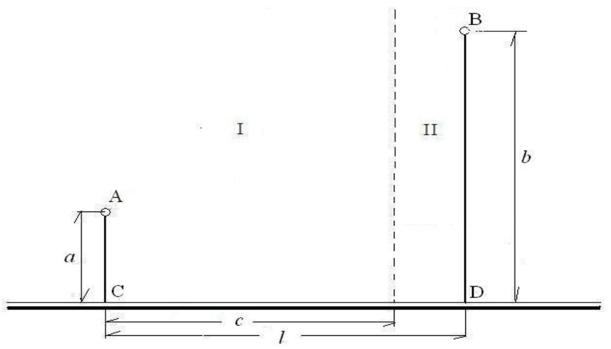

<details>
<summary>text_image</summary>

I
II
B
a
A
C
b
D
c
l
</details>

若所有管线的铺设费用均为每千米 7.2 万元。 铺设在城区的管线还需增加拆迁和工程补偿等附加费用，为对此项附加费用进行估计，聘请三家工程咨询公司（其中公司一具有甲级资质，公司二和公司三具有乙级资质）进行了估算。估算结果如下表所示：

<table><tr><td>工程咨询公司</td><td>公司一</td><td>公司二</td><td>公司三</td></tr><tr><td>附加费用(万元/千米)</td><td>21</td><td>24</td><td>20</td></tr></table>

请为设计院给出管线布置方案及相应的费用。

3. 在该实际问题中，为进一步节省费用，可以根据炼油厂的生产能力，选用相适应的油管。这时的管线铺设费用将分别降为输送A厂成品油的每千米5.6万元，输送 B厂成品油的每千米6.0万元，共用管线费用为每千米7.2万元，拆迁等附加费用同上。请给出管线最佳布置方案及相应的费用。

## 二、模型假设

1、管道均以直线段铺设，不考虑地形影响。  
2、不考虑管道的接头处费用。  
3、不考虑施工之中的意外情况，所有工作均可顺利进行。

4、共用管线的价格如果和非公用管线不一致，则共用管线价格大于任意一条非公用管线价格，小于两条非公用管线价格之和。

## 三、符号说明

h：共用管道的高度（问题一中b）

h1:共用管道高度

h2:管线与分界线的交点到B厂与铁路平行线的距离

w：方案的经费

a：A 厂到铁路的距离

b：B 厂到铁路的距离

c:A 厂到城郊分界线的距离

l:A、B 两厂之间的铁路长度

x：A 厂离共用管道的距离（问题一中的c）

y：共用管道的高度（问题一中的 c）

m：共用管道的费用（问题一）

n：非共用管道费用（问题一）

y1：为 o点的纵坐标

y2：为 o1 点的纵坐标

x1：为 o点的横坐标

x2：为 o1 点的横坐标

L: 为管线总长度（问题一中的 b）

## 四、问题分析

问题一：要考虑有和没有共用管线，还要考虑共用管线与非共用管线费用相同和不同两种情况。同时还要考虑两个工厂是否在铁路的同一侧，如果两个工厂在铁路的同一侧那么一定没有共用管线。 不在铁路的同一侧那么就要考虑有和没有共用管线这个问题。计算共用管线的长度时，用光学原理，把一个工厂当作光源发射一束光经过一个平面的反射通过另一个工厂，这样能够保证路线最短。这个平面与铁路的距离即为共用管线的长度。同时与这个平面的交点就是两厂的管线的交点。当共用管线与非共用管线费用不相同时可以通过建立方程组来解答。

当共用管线与非共用管线费用不相同时要建立方程组来计算其最小费用从而来确定方案的可行性，共用管线与非共用管线长度作为变量来控制总费用，那么我们就可以列出一个方程组，从而在变量的约束条件下可以确定最小费用。

问题二：把这个问题分两部分来考虑，即市区和郊区分两个部分，火车站建立在郊区费用要小得多，郊区共用管线与非共用管线的费用相同所以可以用最短路径的方法来考虑，同时又要求费用最小，可以解出最低费用及对应的铺设线路。

问题三：通过建立坐标系设两个点的坐标，同时也是表达管线的长度，然后再与各自的费用之积确定总的费用，从而算出两点的坐标值。即确定了管线的路线。

## 五、模型的建立与求解

## 5.1 关于问题1的模型建立与求解

对于管线布置的分析，分为两种情况：

1. 两厂分别在铁路的两侧如下图：

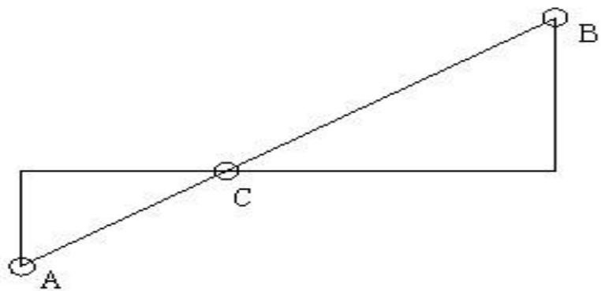

<details>
<summary>text_image</summary>

A
C
B
</details>

那么连接两厂A、B 与铁路的交点C即为火车站的位置。

2. 当两厂位于铁路的同一侧时,此时要分有公用管线与没有公用管线两种情况。

a.当没有公用管线时，此时找出两厂与铁路交点连线的最近路线即可，如图：

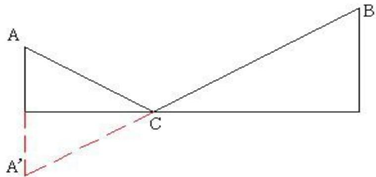

<details>
<summary>text_image</summary>

A
C
A'
B
</details>

过铁路作A厂的对称点 $\mathrm { A } '$ ，连接A’B与铁路交于一点C，该点C即为火车站的位置。

b.当有共用管线时又要分为共线管线费用与非共线管线费用相同与不同两种情况：当共线管线与非共线管线相同时，费用为m万元/千米如图所示：

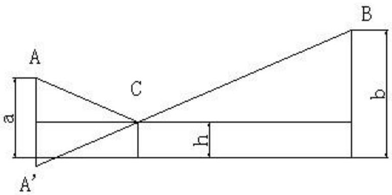

<details>
<summary>text_image</summary>

A
a
C
h
A'
B
b
</details>

假设共线管线的长度为 h，A厂到铁路的距离为a，B 厂到铁路的距离为 b，则总的管线长度为： $L = { \sqrt { [ ( a - h ) + ( b - h ) ] ^ { 2 } + l ^ { 2 } } } + h ( 0 \leq h \leq b )$

则总费用： $W 1 = L \times m$

c.当共线管线与非共线管线不同时，共用管线费用为m万元/千米 ，非共用管线费用为n万元/千米，如图所示：

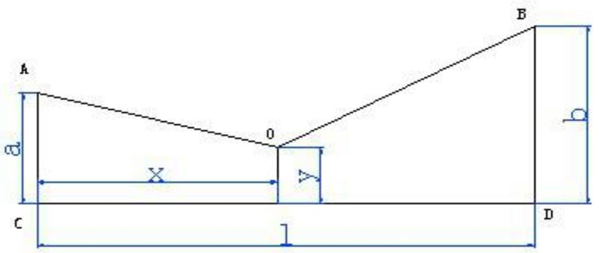

<details>
<summary>text_image</summary>

A
B
a
x
O
C
l
D
</details>

总费用为： $W = \left( m \times y + { \sqrt { \left( a - y \right) ^ { 2 } + x ^ { 2 } } } + { \sqrt { \left( l - x \right) ^ { 2 } + \left( b - y \right) ^ { 2 } } } \right) \times n$

其中

$$
0 \leq x \leq l
$$

$$
0 \leq y \leq \max (a, b)
$$

实际的费用可以根据已知道的常量a、b、l 再结合x、y的取值范围可以得出最小费用。

## 5.2 关于问题2的模型建立与求解

因为在城区和郊区铁路管线的费用相同，但城区要增加拆迁和工程补偿等费用，因此城区和郊区要分为两部分来考虑。我们考虑三家咨询公司给出的三个方案，我们考虑到甲级资质和乙级资质的评估准确性，首先排除掉公司二的预算，对于公司一和公司三的预算，我们将分别求出最小费用，考察两者的差别。

1．假设共用管线在郊区把该模型看作是一束光从B点发射在分界处G点发生了折射，把左边的问题看作是最短路径问题，如图所示：

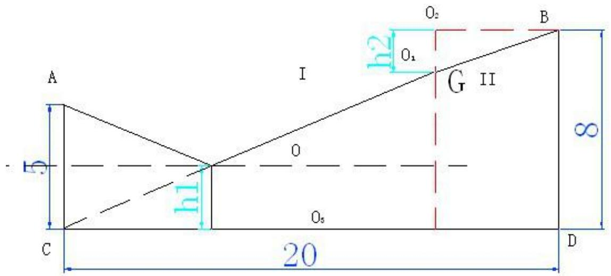

<details>
<summary>text_image</summary>

A
h2
O2
B
I
O
G II
5
h1
O6
C
20
D
8
</details>

设共用管线的长度为 h1，G 点到 O2B 的距离为 h2。在区域Ⅱ中即 BG段每千米的费用为：20+7.2=27.2 万元。

由以上分析数据可得如下关系式：

总费用：W1（最小） =(√(8− h1 − h2 +5−h1)2 +152 + h1)×7.2 +27.2×√h2 + 25 （式 1)

参数 $h _ { 1 }$ 的取值范围： $0 \leq h _ { 1 } \leq 8$ （式 2）

参数 $h _ { 2 }$ 的取值范围： $0 \leq h _ { 2 } \leq 8$ （式 3）

利用Matlab将式（1）（2）（3）联立关系式绘图：

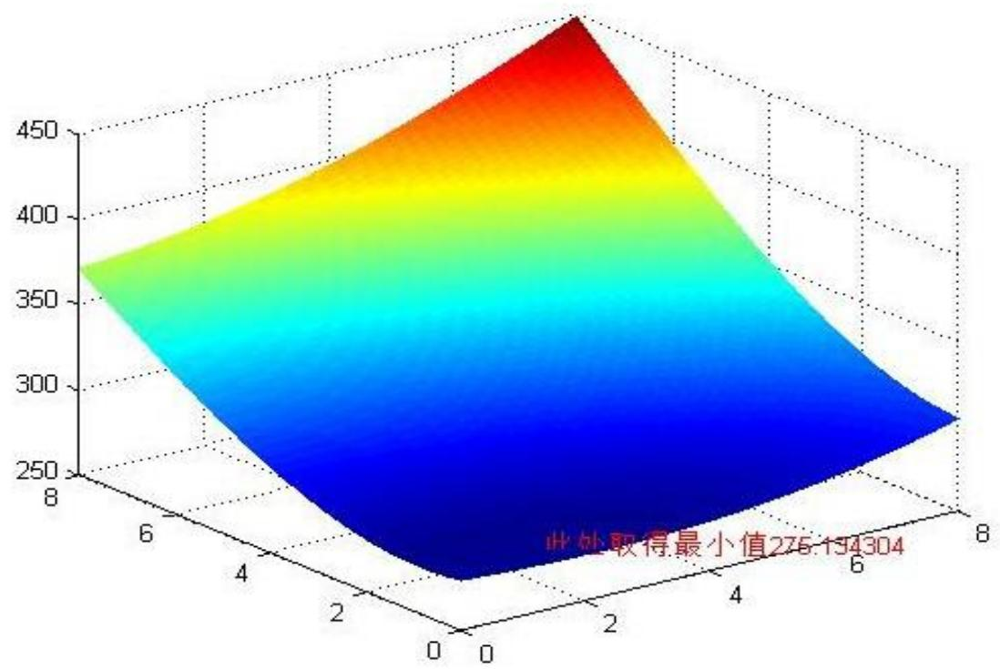

<details>
<summary>surface_3d</summary>

| X | Y | Value |
| --- | --- | --- |
| 8 | 8 | 275.194304 |
</details>

用 Microsoft Visual C++ 6.0 解:

W1(最小)= 275.13404 万元

运行结果：

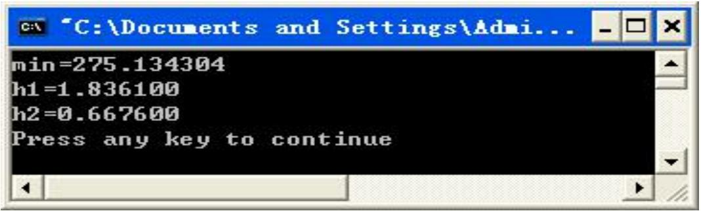

<details>
<summary>text_image</summary>

C:\Documents and Settings\Admi...
min=275.134304
h1=1.836100
h2=0.667600
Press any key to continue
</details>

在这种情况下采用公司一的预算，只需要在上式中将27.2 增加为28.2即可，计算得到总费用：280.177831 万元

运行结果：

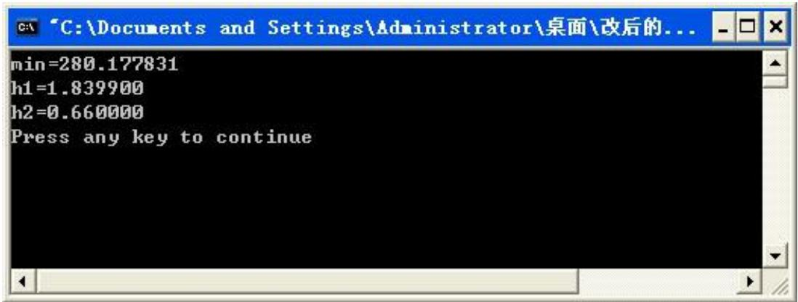

<details>
<summary>text_image</summary>

C:\Documents and Settings\Administrator\桌面\改后的...
min=280.177831
h1=1.839900
h2=0.660000
Press any key to continue
</details>

2．假设共用管线在城区同理，如图所示：

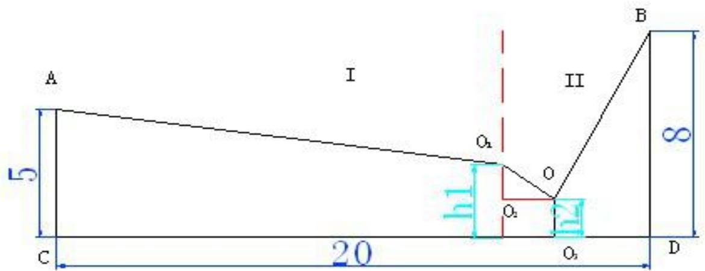

<details>
<summary>text_image</summary>

A
I
II
B
5
O₁
O₂
O₃
C
20
D
8
</details>

由以上分析数据可得如下关系式：

总费用：W2（最小)=27.2×(h2+√[8+h−2×h2]2+25)+5.6×√152 +(5−h{)2 （式 1）参

数 $h _ { 1 }$ 的取值范围： 0 ≤ h≤ 8 （式2）

参数 $h _ { 2 }$ 的取值范围： 0 ≤ h2≤ 8 （式3）

用 Microsoft Visual C++ 6.0 解得

$$
\mathrm{W} _ {2} (\text {最小}) = 3 5 5. 2 5 5 8 7
$$

运行结果：

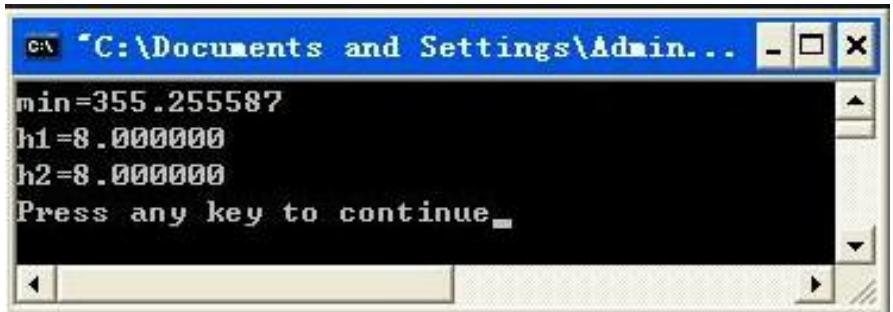

<details>
<summary>text_image</summary>

min=355.255587
h1=8.000000
h2=8.000000
Press any key to continue_
</details>

显然W1（最小）<W2（最小）方案一费用少于方案二，因此舍掉这种方案。

最终求得的结果为，如果采用一咨询公司的估算价格，则最终费用为 275.134304万元，如果采用三咨询公司的估算价格，则最终费用为 280.177831 万元，考虑到公司一具有高级资质，因此我们采用公司一的价格方案，将最终预算设为280.177831万元，但是实际铺设管道的价格有可能在两种估算价格之间。

## 5.3 关于问题3的模型建立与求解

1、O 点为 B管线与分界线的交点，O1 点为 A 管与 B 管的交点，如下图建立坐标轴，采用公司三的估算费用，

总费用等于各段路线的长度与各段费用的积为：

$$
W = 5. 6 \times A O 1 + 6. 0 \times O O 1 + (6 + 2 0. 0) \times O B + 7. 2 \times O 1 O 2
$$

坐标法解答，A01，OO1，OB，如图： $0 \left( \mathrm { x 1 } , \mathrm { y 1 } \right) , 0 1 \left( \mathrm { x 2 } , \mathrm { y 2 } \right)$

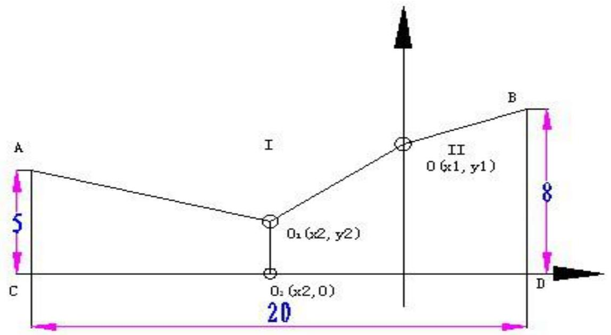

<details>
<summary>line</summary>

| Segment | X-coordinate | Y-coordinate |
| --- | --- | --- |
| I | x2 | y2 |
| II | x1 | y1 |
</details>

由以上分析数据可得如下关系式：

A厂到管道交接点 O1的长度：

$$
\mathrm{AO1} = \sqrt {\left(x _ {2} + 1 5\right) + \left(y _ {2} - 5\right) ^ {2}} \quad (\text {式} 1)
$$

管道交点O1到B 厂与城郊分界线交点O的长度：

$$
\mathrm{OO} 1 = \sqrt {x _ {2} ^ {2} + \left(y _ {1} - y _ {2}\right) ^ {2}} \tag {式2}
$$

B厂到交点O 的长度：

$$
\mathrm{OB} = \sqrt {2 5 + \left(8 - y _ {1}\right) ^ {2}} \tag {式3}
$$

铁路站点O2到交叉管道O1 的长度：

$$
\mathrm{O} _ {1} \mathrm{O} _ {2} = y _ {2} \tag {式4}
$$

参数 $x _ { 2 }$ 的取值范围：

$$
- 1 5 \leq x _ {2} \leq 0 \tag {式5}
$$

参数 $y _ { 1 }$ 的取值范围：

$$
0 \leq y _ {1} \leq 8 \tag {式6}
$$

参数 $y _ { 2 }$ 的取值范围：

$$
0 \leq y _ {2} \leq 8 \tag {式7}
$$

总费用：

$$
W = 5. 6 \times \sqrt {(x _ {2} + 1 5) + (y _ {2} - 5) ^ {2}} + 6. 0 \times \sqrt {x _ {2} ^ {2} + (y _ {1} - y _ {2}) ^ {2}} + 2 6. 0 \times \sqrt {2 5 + (8 - y _ {1}) ^ {2}} + 7. 2 \times y _ {2}
$$

由以上式子利用 Microsoft Visual C++ 6.0 软件求得最小经费：

W3（最小值）= 244.386494 万元。

运行结果：

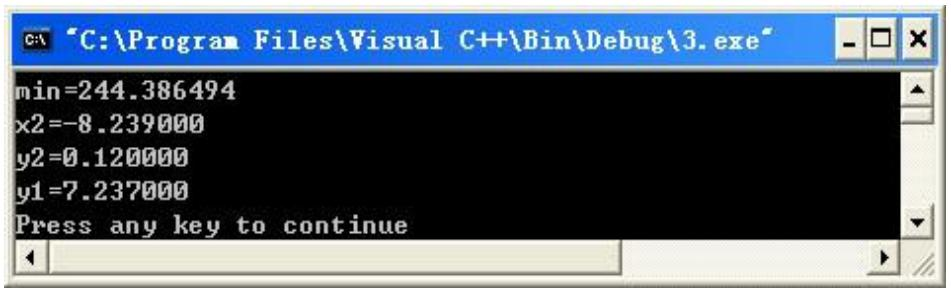

<details>
<summary>text_image</summary>

C:\Program Files\Visual C++\Bin\Debug\3.exe
min=244.386494
x2=-8.239000
y2=0.120000
y1=7.237000
Press any key to continue
</details>

在同种情况下，用公司一的预算费的总费用：

运行结果：

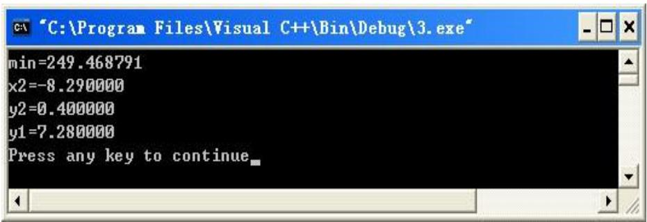

<details>
<summary>text_image</summary>

C:\Program Files\Visual C++\Bin\Debug\3.exe"
min=249.468791
x2=-8.290000
y2=0.400000
y1=7.280000
Press any key to continue_
</details>

当火车站建在市区费用太高同二题中的方案二故不选用那种方案。因此类似于问题二，我们采取公司一的估算价格，最终预算为 249.468791 万元。但是公司三的价格也具有一定参考性，实际铺设管道价格应为244.386494万元到249.468791万元之间。

## 六、模型的评价与应用

从实际的生活出发输油管道是石油生产过程中的重要环节，是石油工业的动脉。在石油的生产过程中，至始至终都离不开输油管道。我们可以把石油的生产过程简单的表示为：

油→ 计量站→ 井联合站→ 转油站→ 矿场油库→ 炼油厂→ 用户

从油井出来的油气通过管道输送到计量站，经过计量后又由管道输送往联合站，在联合站生产出合格的原油，合格原油通过管道和转油站输到矿场油库或外输到管道首站，通过长输原油管道输到炼油厂加工精练，生产出各种产品，通过成品油管道或铁路、公路、水路将各种产品送往用户，其中成品油管道就需要用到管道的布置设计。

## 优点：

模型使问题由复杂变简单，方便运输，提高输油效率，规划线路。管线布置和规划及相应的费用减到最小，在不同的环境下用这种环境中的最优模型，方便快捷，节约开支，使实际问题更加精确。同时对于题目的三个问题都设计了合适的模型，并且当给出具体数值的时候能够给出足够精确的解，具有一定的普遍性。

##

该模型在提出的时候将部分因素没有考虑进来，例如管线接头处的费用，以及工作工程中的一些意外情况等等，使得该模型在实际应用中会缺少精确性。

## 应用：

模型在实际运用中，不仅仅可以用在成品油运输管布置，还可运用到原油输送和污水处理，电线电缆的布置还有公路铁路的修建等一些列的线路布置问题。

## 七、参考文献

【1】 赵静 但琦 《数学建模与数学实验》第三版 22-29 页，178-194 页 高等教育出版社 2008 年1月  
【2】 曹戈 《MATLAB 教程及实训》 37-60 页 机械工业出版社 2008年5月  
【3】 邬学军 周凯《数学建模竞赛辅导教程》 73-96 页 浙江大学出版社 2009年1 月

## 附录：

## 问题2 程序

1、按照公司三的评估总费用为：  
```c
#include<stdio.h>

#include<math.h>

void main()
{
    double h1,h2,w;

    double a,b;

    double min = 10000;

    for(h1=0;h1<=8;h1+=0.001)

        for(h2=0;h2<=8;h2+=0.001)

        {
            if(h1+h2>8)
                continue;

            w=27.2*sqrt(25+h2*h2)+(sqrt((5-h1+8-h1-h2)*(5-h1+8-h1-h2)+225)+h1)*7.2;
            if(min>w)

            {
                min=w;

                a=h1;

                b=h2;
            }
        }
        printf("%f \n",min);

        printf("%f %f \n",a,b);
}
```

运行结果：

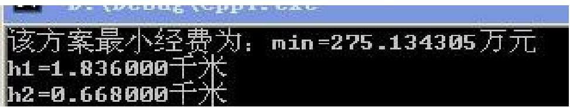

<details>
<summary>text_image</summary>

该方案最小经费为：min=275.134305万元
h1=1.836000千米
h2=0.668000千米
</details>

2、按照公司一评估总费用为：

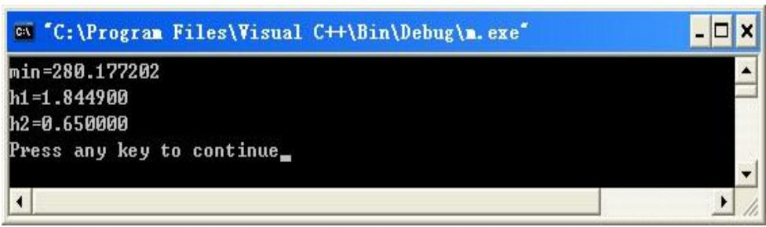

<details>
<summary>text_image</summary>

C:\Program Files\Visual C++\Bin\Debug\n.exe
min=280.177202
h1=1.844900
h2=0.650000
Press any key to continue_
</details>

## 问题3 程序：

1、按照公司三评估总费用为：

```c
#include"stdio.h"
#include"math.h"
main()
{ double x2,y2,y1,w,a,b,c,min=1000;
  for(x2=-15;x2<=0;x2+=1)
    for(y1=0;y1<=8;y1+=1)
      for(y2=0;y2<=8;y2+=1)
    {
      w=5.6*sqrt((x2+15)*(x2+15)+(y2-5)*(y2-5))+6.0*sqrt((x2*x2)+(y1-y2)
      *(y1-y2))+26.0*sqrt(25+(8-y1)*(8-y1))+7.2*y2;
      if(min>w)
      {
        min=w;
        a=x2;
        b=y2;
        c=y1;
      }
    }
    printf("min=%f \nx2=%f \ny2=%f \ny1=%f\n",min,a,b,c);
}
```

运行结果：

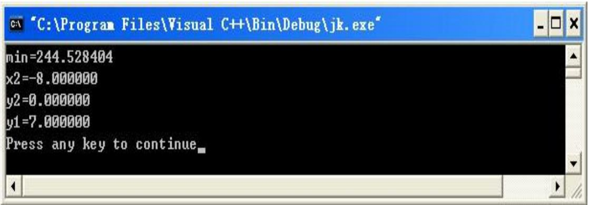

<details>
<summary>text_image</summary>

C:\Program Files\Visual C++\Bin\Debug\jk.exe
min=244.528404
x2=-8.000000
y2=0.000000
y1=7.000000
Press any key to continue_
</details>

将循环因子的步长降低之后，进一步精确求解值为：

```c
#include"stdio.h"
#include"math.h"
main()
{ double x2,y2,y1,w,a,b,c,min=1000;
  for(x2=-9;x2<=-7;x2+=0.001)
    for(y1=6;y1<=8;y1+=0.001)
      for(y2=0;y2<=1;y2+=0.001)
    {
      w=5.6*sqrt((x2+15)*(x2+15)+(y2-5)*(y2-5))+6.0*sqrt((x2*x2)+(y1-y2)
      *(y1-y2))+26.0*sqrt(25+(8-y1)*(8-y1))+7.2*y2;
      if(min>w)
      {
        min=w;
        a=x2;
        b=y2;
        c=y1;
      }
    }
    printf("min=%f \nx2=%f \ny2=%f \ny1=%f\n",min,a,b,c);
}
```

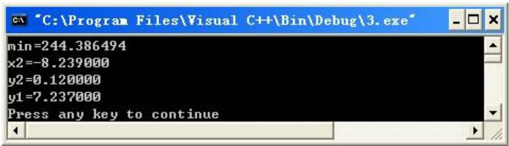

<details>
<summary>text_image</summary>

C:\Program Files\Visual C++\Bin\Debug\3.exe
min=244.386494
x2=-8.239000
y2=0.120000
y1=7.237000
Press any key to continue
</details>

2、按照公司一的评估的总费用为：

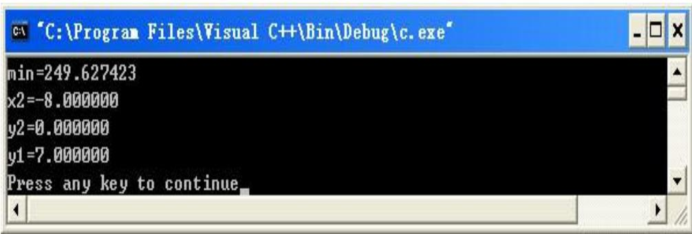

<details>
<summary>text_image</summary>

C:\Program Files\Visual C++\Bin\Debug\c.exe
min=249.627423
x2=-8.000000
y2=0.000000
y1=7.000000
Press any key to continue
</details>