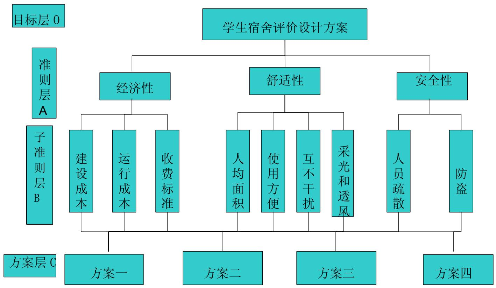
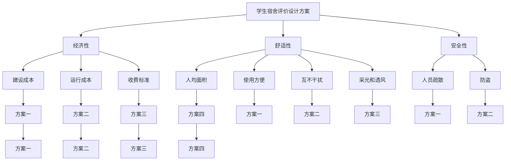
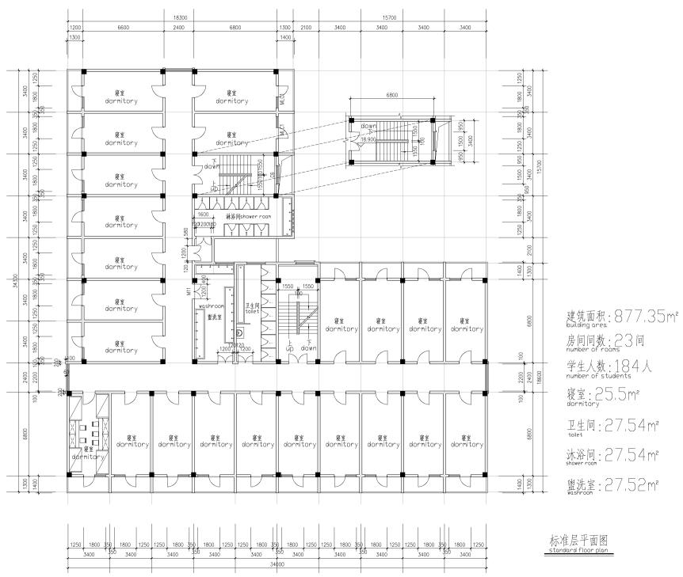
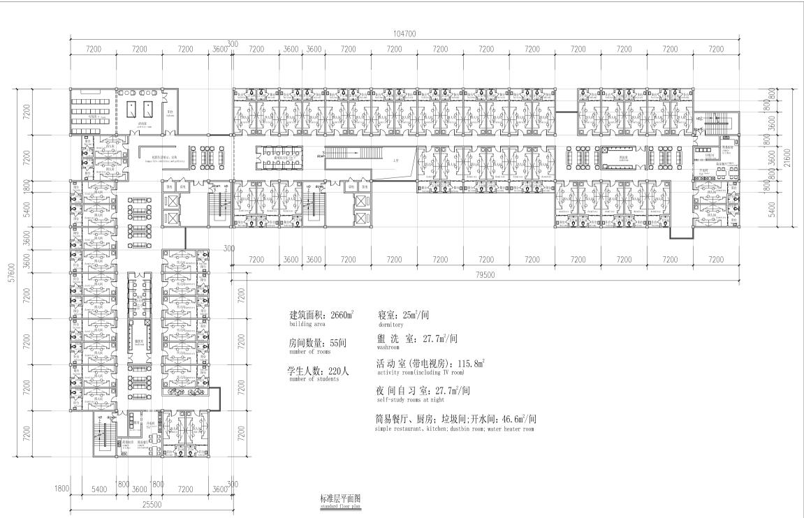
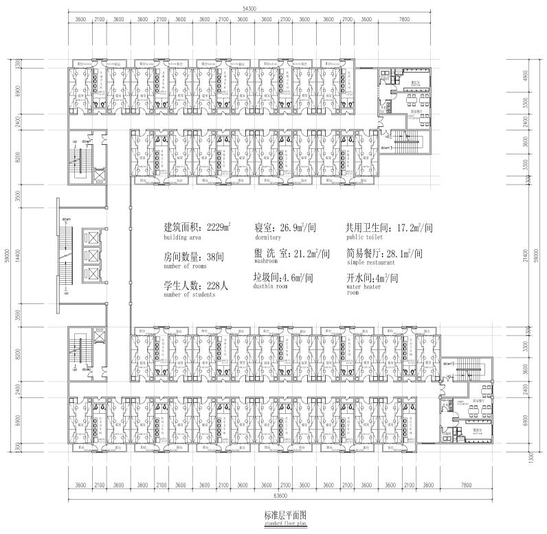
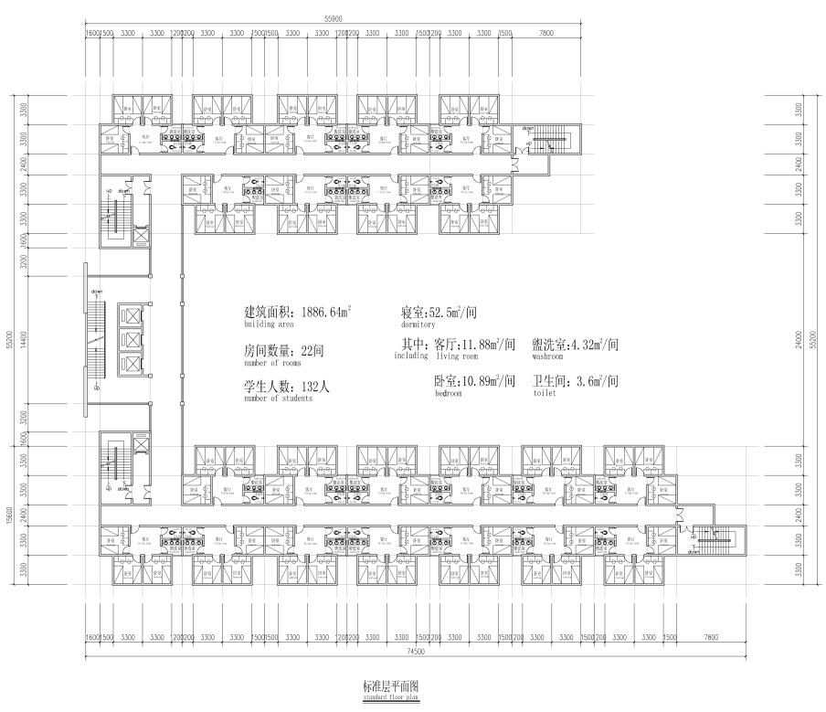

# 2010高教社杯全国大学生数学建模竞赛

## 承 诺 书

我们仔细阅读了中国大学生数学建模竞赛的竞赛规则.

我们完全明白，在竞赛开始后参赛队员不能以任何方式（包括电话、电子邮件、网上咨询等）与队外的任何人（包括指导教师）研究、讨论与赛题有关的问题。

我们知道，抄袭别人的成果是违反竞赛规则的, 如果引用别人的成果或其他公开的资料（包括网上查到的资料），必须按照规定的参考文献的表述方式在正文引用处和参考文献中明确列出。

我们郑重承诺，严格遵守竞赛规则，以保证竞赛的公正、公平性。如有违反竞赛规则的行为，我们将受到严肃处理。

我们参赛选择的题号是（从 A/B/C/D中选择一项填写）： D

我们的电子文件名：

所属学校（请填写完整的全名）： 泸州职业技术学院

参赛队员 (打印并签名) ：1. 庞梅

2. 叶超

3. 张德煜

指导教师或指导教师组负责人 (打印并签名)： 邓敏英

日期： 2010 年 9 月 13 日

赛区评阅编号（由赛区组委会评阅前进行编号）：

# 2010高教社杯全国大学生数学建模竞赛

## 编 号 专 用 页

赛区评阅编号（由赛区组委会评阅前进行编号）：

赛区评阅记录（可供赛区评阅时使用）：

<table><tr><td>评阅人</td><td></td><td></td><td></td><td></td><td></td><td></td><td></td><td></td><td></td><td></td></tr><tr><td>评分</td><td></td><td></td><td></td><td></td><td></td><td></td><td></td><td></td><td></td><td></td></tr><tr><td>备注</td><td></td><td></td><td></td><td></td><td></td><td></td><td></td><td></td><td></td><td></td></tr></table>

全国统一编号（由赛区组委会送交全国前编号）：

全国评阅编号（由全国组委会评阅前进行编号）：

# 学生宿舍设计方案的评价

## 摘要

随着高等教育改革,高校合并,扩大招生,后勤社会化改革等一系列高校发展措施的实施,加强高校学生宿舍的建设已成为一项重要的任务。但是,我国传统的学生宿舍建设水平较低,设计师在进行创作的过程中可以凭借的理论资料较少,这一切使高校学生宿舍的研究显得十分迫切和重要。为了保障学生的经济性方面、舒适性方面和安全性方面和学院的经济效益综合考虑。对此，采用定性与定量相结合的层次分析法对学生宿舍设计方案的评价进行分析，本文给出了它的原理、思想和评价步骤，并进行了算法比较。并用改进层次分析法确定各评价指标的权重，最终得出最好建设方案。

采用定性与定量相结合的层次分析法(AHP)对学生宿舍设计方案进行分析，并从经济性、舒适性和安全性方面等因素建立模型。建立各个层次的判断矩阵，通过MATLAB软件计算各个方面的总权重值并进行排序，从而判断出哪个因素是我们考虑的重点，进而抉择出哪种方案最好,最终得出第二种方案最好。

从实例中得到的结论与实际相符，并且数学模型简单，容易掌握，是切实可行的、易接受的、也便于推广。 实例证明：论文所建立的学生宿舍设计方案评价方法是先进的，该模型和算法具有严密的逻辑推理和数学依据，为学生宿舍设计方案评价提供了一个新的方法。

关键词： 层次分析法 MATLAB 计算法 判断矩阵 量化数据

## 一、问题重述

随着社会的发展教育越来越重要，学生的数量越来越多，学生的生活成为了我们比较观注的问题。学生宿舍事关学生在校期间的生活品质, 直接或间接地影响到学生的生活、学习和健康成长。学生宿舍的使用面积、布局和设施配置等的设计既要让学生生活舒适，也要方便管理, 同时要考虑成本和收费的平衡, 这些还与所在城市的地域、区位、文化习俗和经济发展水平有关。因此，学生宿舍的设计必须考虑经济性、舒适性和安全性等问题。

经济性：建设成本、运行成本和收费标准等。

舒适性：人均面积、使用方便、互不干扰、采光和通风等。

安全性：人员疏散和防盗等。

附件是四种比较典型的学生宿舍的设计方案。请你们用数学建模的方法就它们的经济性、舒适性和安全性作出综合量化评价和比较。

## 二、问题分析

本文首先从目前高校学生宿舍的建设情况出发,参阅了多种理论著作。然后,通过对高校学生进行实地走访和问卷调查,了解到目前高校学生宿舍在使用上的一些不合理现象。接着,结合调查分析指出影响宿舍设计的主要因素,提出“以人为本”的设计原则。从学生的经济性、舒适性和安全性各方面因素考虑，也要从学院的投资、收益上来考虑，本问题的定量数据不多，但问题包含的因素及其关系具体而明确。我们运用层次分析法，两两比较列出成对比较矩阵，进而求出相应的最大特征值和权向量。并进行层次单排序、组合总排序及其一致性检验，得出最佳方案。

## 三、问题的假设：

1、假设每个设计方案建设成本的单价一致；  
2、假设各宿舍公共设施一致；  
3、假设每平方米的消耗（运行成本）一致；  
4、假设每个平方米的收费标准一致；  
5、假设城市的区位、文化习俗的差异不大；  
6、假设每套方案的建筑楼层的使用年限是一致的；  
7、假设每个地域的光照强度和风的动力因素相差不大；  
8、假设每个地域的治安条件相差不大；  
9、假设每个地域的自然灾害因素的发生几率是一致的；  
10、假设每个寝室与寝室之间互不干扰。

## 四、符号说明：

:表示准则层A对目标层O 的成对比较矩阵；  
$\mathcal { A } _ { i }$ :表示子准则层B 对于准则层A的成对比较矩阵；i=1,2,3  
$B _ { i }$ :表示方案层C对子准则层B 的成对比较矩阵；i=1,2….9  
$\lambda _ { \dot { \iota } \dot { \jmath } }$ :表示每个矩阵的最大特征值；

$C { I } _ { i j }$ :表示各一致性指标；

$R { / } _ { i j }$ ：表示各随机一致性指标；

$C R _ { i j }$ : 表示各随机一致性比率；

$B _ { j }$ ：表示子准则层的各个因素；

$\mathcal { A } _ { \dot { \iota } }$ ：表示准则层各个因素；

$\omega _ { \it { i j } }$ ：表示未归一化的权向量；

$\varpi _ { \ddot { y } }$ ：表示归一化后的权向量；

表示 A层对目标所建立矩阵的阶数；  
$n _ { 1 }$ 表示经济性方面的子准则层因素对经济性的对比矩阵的阶数；  
$n _ { 2 }$ 表示舒适性方面的子准则层因素对舒适性的对比矩阵的阶数；  
$n _ { 3 }$ 表示安全性方面的子准则层因素对安全性的对比矩阵的阶数。

## 五、模型的建立与分析：

运用层次分析法分析、解决学生宿舍设计方案的评价。层次分析法是一种定性与定量相结合的系统分析法，根据问题的总目标，以系统化的观点，把问题分解成若干因素，并按其支配关系构成递阶层次结构模型，然后运用两两比较的方法确定决策方案的重要性，从而获得满意的决策。

## 5.1 构造层次结构图：

将决策的目标、考虑的因素（决策准则）和决策对象按它们之间的相互关系分为最高层、中间层和最低层，绘出层次结构图如下：



<details>
<summary>flowchart</summary>


</details>

## 5.2 构造成对比较矩阵

在确定各层次各因素之间的权重时，如果只是定性的结果，则常常不易被别人接受，因而我们采用了Santy等人提出的一致矩阵法，即不把所有因素放在一起比较，而是两两相互比；此时采用相对尺度，尽可能减少性质不同的诸因素相互比较的困难，以提高准确度。

判断矩阵是表示本层所有因素针对上一层某一个因素的相对重要性的比较。判断矩阵的元素 $a _ { i j }$ 用 Santy 的 1—9 标度方法给出。从层次结构的第二层开始，对于从属于上一层每一个因素的同一诸因素，用成对比法和 1-9 比较尺度构造成对比较阵，每次取两个因素 $\mathcal { A } _ { i }$ 和 $A _ { j }$ 用 $a _ { \scriptscriptstyle \dot { y } }$ 表示 $\mathcal { A } _ { i }$ 和 $A _ { j }$ 对目标的影响之比，全部比较结果可用成对比较矩阵：

$$
A = (a _ {i j}) _ {n \times n}, a _ {i j} > 0, a _ {j i} = (a _ {i j}) ^ {- 1} \quad (\mathrm{i}, \mathrm{j} = 1, 2, 3)
$$

比较子准则层各因素 $B _ { i }$ 和 $B _ { j }$ （i=1,2,3,4,5,6,7,8,9;j=1,2,3,4）相对于准则层 A 的每个因素的重要性，构造成对比较矩阵：

$$
B _ {i j} = (b _ {i j}) _ {n \times n}, b _ {i j} = \frac {x _ {i}}{x _ {j}} > 0, b _ {j i} = \frac {1}{b _ {i j}} \quad (\mathrm{i} = 1, 2, 3, 4, 5, 6, 7, 8, 9; \mathrm{j} = 1, 2, 3, 4)
$$

比较准则层三个因素 $A _ { i } ( \mathrm { i } \mathrm { = } 1 , \ 2 , \ 3 )$ 对目标 O 的影响。采用两两成对比较，用 $a _ { i j }$ 表示因素 $\mathcal { A } _ { i }$ 与因素 $A _ { j }$ 对目标 O的影响程度之比。通常用 1-9 及其倒数作为程度比较标准，即九级标度法：

<table><tr><td>标度</td><td>含义</td></tr><tr><td>1</td><td>表示两个因素相比,具有同样重要性</td></tr><tr><td>3</td><td>表示两个因素相比,一个因素比另一个因素稍微重要</td></tr><tr><td>5</td><td>表示两个因素相比,一个因素比另一个因素明显重要</td></tr><tr><td>7</td><td>表示两个因素相比,一个因素比另一个因素强烈重要</td></tr><tr><td>9</td><td>表示两个因素相比,一个因素比另一个因素极端重要</td></tr><tr><td>2、4、6、8</td><td>上述两相邻判断的中值</td></tr><tr><td>倒数</td><td>因素i与j比较的判断 $a_{ij}$ ,则因素j与i比较的判断 $a_{ji}=1/a_{ij}$ </td></tr></table>

A层对目标层：

$$
\mathrm{A} = \left[ \begin{array}{c c c} 1 & 3 & 5 \\ 1 / 3 & 1 & 3 \\ 1 / 5 & 1 / 3 & 1 \end{array} \right]
$$

B 层对 A层：

$$
A _ {1} = \left[ \begin{array}{c c c} 1 & 1 / 3 & 1 / 2 \\ 3 & 1 & 4 \\ 2 & 1 / 4 & 1 \end{array} \right] \quad A _ {2} = \left[ \begin{array}{c c c c} 1 & 1 / 2 & 1 & 2 \\ 2 & 1 & 1 / 2 & 2 \\ 1 & 2 & 1 & 2 \\ 1 / 2 & 1 / 2 & 1 / 2 & 1 \end{array} \right] \quad A _ {3} = \left[ \begin{array}{c c} 1 & 1 / 3 \\ 3 & 1 \end{array} \right]
$$

C层对 B层的对比矩阵：

$$
\begin{array}{l} B _ {1} = \left[ \begin{array}{c c c c} 1 & 1 / 3 & 1 / 5 & 1 / 2 \\ 3 & 1 & 1 & 2 \\ 5 & 1 & 1 & 1 \\ 2 & 1 / 2 & 1 & 1 \end{array} \right] \quad B _ {2} = \left[ \begin{array}{c c c c} 1 & 1 / 4 & 1 / 3 & 1 / 3 \\ 4 & 1 & 3 & 2 \\ 3 & 1 / 3 & 1 & 1 / 2 \\ 3 & 1 / 2 & 2 & 1 \end{array} \right] \quad B _ {3} = \left[ \begin{array}{c c c c} 1 & 1 / 5 & 1 / 2 & 1 / 3 \\ 5 & 1 & 3 & 2 \\ 2 & 1 / 3 & 1 & 2 \\ 3 & 1 / 2 & 1 / 2 & 1 \end{array} \right] \\ B _ {4} = \left[ \begin{array}{c c c c} 1 & 1 / 3 & 1 / 4 & 1 / 5 \\ 3 & 1 & 1 / 2 & 1 / 5 \\ 4 & 2 & 1 & 1 / 2 \\ 5 & 5 & 2 & 1 \end{array} \right] \quad B _ {5} = \left[ \begin{array}{c c c c} 1 & 1 / 4 & 1 / 3 & 1 / 5 \\ 4 & 1 & 3 & 2 \\ 3 & 1 / 3 & 1 & 1 / 2 \\ 5 & 1 / 2 & 2 & 1 \end{array} \right] \quad B _ {6} = \left[ \begin{array}{c c c c} 1 & 1 / 3 & 1 / 2 & 1 / 3 \\ 3 & 1 & 3 & 3 \\ 2 & 1 / 3 & 1 & 1 / 2 \\ 3 & 1 / 3 & 2 & 1 \end{array} \right] \\ B _ {7} = \left[ \begin{array}{c c c c} 1 & 3 & 2 & 5 \\ 1 / 3 & 1 & 1 / 2 & 3 \\ 1 / 2 & 2 & 1 & 2 \\ 1 / 5 & 1 / 3 & 1 / 2 & 1 \end{array} \right] \quad B _ {8} = \left[ \begin{array}{c c c c} 1 & 2 & 1 / 2 & 1 / 3 \\ 1 / 2 & 1 & 1 / 3 & 1 / 5 \\ 2 & 3 & 1 & 1 / 2 \\ 3 & 5 & 2 & 1 \end{array} \right] \quad B _ {9} = \left[ \begin{array}{c c c c} 1 & 3 & 4 & 3 \\ 1 / 3 & 1 & 2 & 1 / 3 \\ 1 / 4 & 1 / 2 & 1 & 1 / 2 \\ 1 / 3 & 3 & 2 & 1 \end{array} \right] \\ \end{array}
$$

$B _ { 1 }$ ：表示方案层对建设成本的成对比较矩阵，是根据四个方案中的建筑总面积以及公用设施等来进行量化的；

$B _ { 2 }$ ：表示方案层对运行成本的成对比较矩阵，是根据四个方案中的房间数量，每一个房间所住的人数来进行量化；

$B _ { 3 }$ ：表示方案层对收费标准的成对比较矩阵，是根据四个方案中的每一个房间所住的人数，以及楼层的公用设施的多少与方便来进行量化；

$B _ { 4 }$ ：表示方案层对人均面积的成对比较矩阵，是根据四个方案中的每一个人占有的人均面积多少来进行量化；

$B _ { 5 }$ ：表示方案层对使用方便的成对比较矩阵是根据四个方案中宿舍房间内部是否自带卫生间和沐浴室等等情况来进行量化；

$B _ { 6 }$ ：表示方案层对互不干扰的成对比较矩阵，是根据四个方案中的宿舍内设计是否是双层中间加一走廊的形式，或者是否是单一排面的形式来进行量化；

$B _ { 7 }$ 表示方案层对采光和通风的成对比较矩阵，是根据四个方案中的楼层是否向风，是否是单一排面等因素来进行量化；

$B _ { 8 }$ 表示方案层对人口疏散的成对比较矩阵，是根据四个方案中的楼梯通道以及走廊的人均面积来进行量化；

$B _ { 9 }$ 表示方案层对防盗的成对比较矩阵，是根据四个方案中的每个寝室的门窗质量和寝室是否设计有门窗等一系列因素来量化。

以上的成对比较矩阵的计算过程见附录表

## 5.3 计算权向量并做一致性检验

对于每一个成对矩阵，计算最大特征根 λ及对应特征向量 $\omega _ { \ddot { \psi } }$ ，利用一致性指标$C T = \frac { \lambda - n } { n - 1 }$ ，随机一致性指标 和一致性比例 $C R = \frac { C I } { R I } < 0 . 1$ 作一致性检验。（ =0，有完全的一致性；CI接近于 0，有满意的一致性；CI 越大，不一致越严重）若通过一致性检验，特征向量归一化后即为权向量；若通不过，需重新构造成对比较矩阵。

对矩阵A用 matlab 求得

最大特征根 ： $\lambda _ { \operatorname* { m a x } } = 3 . 0 3 8 5 ,$

未归化的权向量 ： $\omega _ { 1 } = ( 0 . 9 1 6 , 0 . 3 7 2 , 0 . 1 5 0 )$

归化后的权向量为 ： $\varpi _ { 1 } = ( 0 . 8 3 9 , 0 . 1 3 8 , 0 . 0 2 2 )$

的一致性指标 ： $C I _ { \mathit { 1 } } = { \frac { \lambda _ { \operatorname* { m a x } } - n } { n - 1 } } = { \frac { 3 . 0 3 8 5 - 3 } { 3 - 1 } } = 0 . 0 1 9 3$

表明A有满意的一致性。为了确定A的不一致程度的容许范围，我们引入了随机一致性指标RI如表所示：

<table><tr><td>n</td><td>1</td><td>2</td><td>3</td><td>4</td><td>5</td><td>6</td><td>7</td><td>8</td><td>9</td><td>10</td><td>11</td></tr><tr><td>RI</td><td>0</td><td>0</td><td>0.58</td><td>0.9</td><td>1.12</td><td>1.24</td><td>1.32</td><td>1.41</td><td>1.45</td><td>1.49</td><td>1.51</td></tr></table>

表中 $n = 3$ 时， $R I = 0 . 5 8$ 这时的一致性比率 $C R _ { _ { d } } = { \frac { C I _ { _ { d } } } { R I _ { _ { \it 4 } } } } = { \frac { 0 . 0 1 9 3 } { 0 . 5 8 } } = 0 . 0 3 3 6 < 0 . 1 _ { \cdot }$

表明判断矩阵A有满意的一致性，各个分量作为相应的各个因素的权重值是合理的，可以用 $\varpi _ { 1 }$ 作为其权向量。

用上述的方法，同理可得其他判断矩阵的最大特征根、权向量、一致性指标、随机一致性指标、一致性比率，如下表所示：

<table><tr><td>判断矩阵</td><td>最大特征值</td><td>归化后权向量( $\varpi_{ij}$ )</td><td>CI</td><td>RI</td><td> $_\alpha$ CR</td></tr><tr><td>A</td><td>3.0385</td><td>(0.8393,0.1380,0.0127)</td><td>0.0195</td><td>0.5800</td><td>0.0336</td></tr><tr><td> $A_1$ </td><td>3.1078</td><td>(0.1032,0.6469,0.2499,)</td><td>0.0539</td><td>0.5800</td><td>0.0930</td></tr><tr><td> $A_2$ </td><td>4.1855</td><td>(0.2198,0.2794,0.4609,0.0399)</td><td>0.0617</td><td>0.9000</td><td>0.0686</td></tr><tr><td> $A_3$ </td><td>2</td><td>(0.1000,0.9000)</td><td>0.0000</td><td>0.0000</td><td>0.0000</td></tr><tr><td> $B_1$ </td><td>4.1053</td><td>(0.0436,0.4089,0.3756,0.1718)</td><td>0.0351</td><td>0.9000</td><td>0.0390</td></tr><tr><td> $B_2$ </td><td>4.0875</td><td>(0.0189,0.6311,0.0674,0.2826)</td><td>0.0291</td><td>0.9000</td><td>0.0324</td></tr><tr><td> $B_3$ </td><td>4.1587</td><td>(0.0490,0.6935,0.1588,0.0987)</td><td>0.0529</td><td>0.9000</td><td>0.0588</td></tr><tr><td> $B_4$ </td><td>4.1046</td><td>(0.0132,0.0546,0.2198,0.7124)</td><td>0.0349</td><td>0.9000</td><td>0.0387</td></tr><tr><td> $B_5$ </td><td>4.1032</td><td>(0.0187,0.5961,0.0945,0.2907)</td><td>0.0344</td><td>0.9000</td><td>0.0382</td></tr><tr><td> $B_6$ </td><td>4.1431</td><td>(0.0194,0.6881,0.1276,0.1649)</td><td>0.0477</td><td>0.9000</td><td>0.0530</td></tr><tr><td> $B_7$ </td><td>4.1074</td><td>(0.5782,0.0750,0.3445,0.0022)</td><td>0.0358</td><td>0.9000</td><td>0.0398</td></tr><tr><td> $B_8$ </td><td>4.0145</td><td>(0.0600,0.0280,0.2307,0.6813)</td><td>0.0048</td><td>0.9000</td><td>0.0530</td></tr><tr><td> $B_9$ </td><td>4.1431</td><td>(0.0194,0.6881,0.1276,0.1649)</td><td>0.0477</td><td>0.9000</td><td>0.0530</td></tr></table>

表中数据显示 $C R _ { i j } = \frac { C I _ { i j } } { R I _ { i j } } < 0 . 1 , \mathrm { i } , \mathrm { j } = 1 , 2 , . . . . , 9$ 说明各判断矩阵有完全的一致性，通过检验，可按照总排序权向量表示的结果进行决策。

## 5.4 层次总排序及其一致性检验

## 5.4.1 B 层对目标层的总排序及其组合一致性检验

B 层对目标层组合权向量： $\omega _ { _ B } = \omega _ { _ { X } } \omega _ { _ { A } }$

其中 <sup>T</sup>(0.1032,0.6469,0.2499,0,0,0,0,0,0)ω =

$$
\omega_ {2 2} = (0, 0, 0, 0. 2 1 9 8, 0. 2 7 9 4, 0. 4 6 0 9, 0. 0 3 9 9, 0, 0) ^ {T}
$$

$$
\omega_ {2 3} = (0, 0, 0, 0, 0, 0, 0, 0. 1 0 0 0, 0. 9 0 0 0) ^ {T}
$$

$$
\omega_ {A} = (0. 8 3 9 3, 0. 1 3 8 0, 0. 0 1 2 7) ^ {T}
$$

$$
\omega_ {X} = (\omega_ {2 1}, \omega_ {2 2}, \omega_ {2 3})
$$

$$
\omega_ {B} = (0. 0 8 6 6, 0. 5 4 2 9, 0. 2 0 9 7, 0. 0 3 0 3, 0. 0 3 8 6, 0. 0 6 3 6, 0. 0 0 5 5, 0. 0 0 1 3, 0. 0 1 1 4) ^ {T}
$$

B 层对目标层的组合一致性检验：

利用总排序的一致性比率：

$$
C R _ {3 1} = \frac {a _ {1} C I _ {3 1} + a _ {2} C I _ {3 2} + a _ {3} C I _ {3 3} + a _ {4} C I _ {3 4} + a _ {5} C I _ {3 5} + a _ {6} C I _ {3 6} + a _ {7} C I _ {3 7} + a _ {8} C I _ {3 8} + a _ {9} C I _ {3 9}}{a _ {1} R I _ {3 1} + a _ {2} R I _ {3 2} + a _ {3} R I _ {3 3} + a _ {4} R I _ {3 4} + a _ {5} R I _ {3 5} + a _ {6} R I _ {3 6} + a _ {7} R I _ {3 7} + a _ {8} R I _ {3 8} + a _ {9} R I _ {3 9}}
$$

第三层通过组合一致性检验的条件 $C R _ { 3 1 } = 0 . 0 4 0 0 < 0 . 1$ ；故第三层的组合一致性通过检验。

## 5.4.2 方案层对目标层的总排序

方案层对目标层的组合权向量： $\omega _ { \scriptscriptstyle C } = \omega _ { \scriptscriptstyle Y } \omega _ { \scriptscriptstyle B }$

其中 (0.0436,0.0189,0.0490,0.0132,0.0187,0.0194,0.5782,0.0600,0.0194)ω =

$$
\omega_ {3 2} = (0. 4 0 8 9, 0. 6 3 3 1, 0. 6 9 3 5, 0. 0 5 4 6, 0. 5 9 6 1, 0. 6 8 8 1, 0. 0 7 5 0, 0. 0 2 8 0, 0. 6 8 8 1)
$$

$$
\omega_ {3 3} = (0. 3 7 5 6, 0. 0 6 7 4, 0. 1 5 8 8, 0. 2 1 9 8, 0. 0 9 4 5, 0. 1 2 7 6, 0. 3 4 4 5, 0. 2 3 0 7, 0. 1 2 7 6)
$$

$$
\omega_ {3 4} = (0. 1 7 1 8, 0. 2 8 2 6, 0. 0 9 8 7, 0. 7 1 2 4, 0. 2 9 0 7, 0. 1 6 4 9, 0. 0 0 2 2, 0. 6 8 1 3, 0. 1 6 4 9)
$$

$$
\omega_ {C} = (0. 0 3 0 1, 0. 6 0 1 3, 0. 1 2 4 5, 0. 2 3 5 1) ^ {T}
$$

方案层对目标层的组合一致性检验：

利用总排序的一致性比率：

$$
C R _ {4 1} = \frac {b _ {1} C I _ {4 1} + b _ {2} C I _ {4 2} + b _ {3} C I _ {4 3} + b _ {4} C I _ {4 4}}{b _ {1} R I _ {4 1} + b _ {2} R I _ {4 2} + b _ {3} R I _ {4 3} + b _ {4} R I _ {4 4}}
$$

第四层通过组合一致性检验的条件为 $C R _ { 4 1 } = = 0 . 0 4 5 2 \langle 0 . 1$ ;故第四层的组合一致通过检验。

综上所述，组合权向量 $\boldsymbol { \omega } _ { \scriptscriptstyle C } = ( 0 . 0 3 0 1 , 0 . 6 0 1 3 , 0 . 1 2 4 5 , 0 . 2 3 5 1 ) ^ { \scriptscriptstyle T }$ 及方案层对最高层的层次总排序，

可知方案二所占的比重较大，所以学生宿舍的设计方案应选方案二。

通过上述的组合权向量的比重得出，方案层的等级：最好、良好、中等、一般，如下表所示：

<table><tr><td>方案</td><td>方案一</td><td>方案二</td><td>方案三</td><td>方案四</td></tr><tr><td>评价等级</td><td>一般</td><td>最好</td><td>中等</td><td>良好</td></tr></table>

## 六、模型的评价

## 6.1 模型优点：

1、系统性：层次分析法把研究对象作为一个系统，按照分解，比较判断、综合的思维方式进行决策，符合人们的思维模式，易于为人们接受。  
2、广泛性：定性分析与定量分析相结合，使许多用传统的优化方法和技术无法着手的问题被成功的解决，也使其应用范围越来越广泛。  
3、简洁性：本方法不需要复杂的数学基础知识，具有中学文化程度的人也能学会，容易为决策者了解和掌握。

## 6.2 模型局限性：

1、 只能从原有方案优选，不能生成新方案。  
2、 由形成成对比较矩阵等过程易见，它的判断、比较及其引起的最终结果都是比较粗糙的，不适合精度要求很高的实际问题。当然对于粗线条的和宏观的分析，它总可以给出一个相当不错的估计。因此，在应用中要注意实际化问题的精确要求，不可随意引用。  
3、 从建立层次结构模型到给出成对比较矩阵，掺入了较多的人为主观因素，这就使决策结果可能难以为众人所接受。不过，这个缺点可以通过采取专家群体判断、统计分析及模糊评判等多种途径加以克服。

## 6.3 模型的改进与推广：

前面提到层次分析法不能用于精确度较高的实际问题，而且在构造成对比较矩阵时，掺入了较多的人为因素，不能客观的分析问题，有可能决策的结果难以被众人所接受。所以，采用层次分析法与专家评分法、模糊综合评判相结合的评价方法进行改进。

改进的评价方法是以模糊理论为基础.评价是一个多指标、多属性的问题,为此首先应用层次分析法进行分析,形成的递阶结构.采用 1--9 标度法进行每个元素的相对比较,构造判断矩阵进行计算,求解判断矩阵的特征根,计算最大特征根 $\lambda _ { \operatorname* { m a x } }$ 。其次,找出它所对应的特征向量V,即为同一层各影响因素相对于上一层某因素的相对重要性的排序权重;然后进行一致性检验.。

下一步即进行评价模型的确定.一般情况下(U，R)构成一个模糊综合评判数学模 T) 以特征向量 $\mathrm { w \{ = \infty , \stackrel { - } { - } } \infty , \stackrel { - } { - }  ) 2 . . . = . \}$ 作为权重集,通过模糊矩阵 $\scriptstyle { \mathrm { R - } } = ( \Gamma , ) \backslash$ ,将其变换为评语集V上的模糊集 $\mathbf { \partial } : \mathbf { b } = \mathbf { W R } \mathop { \longrightarrow } ( ( \mathbf { b } \mathbf { \ d } \mathbf { v } \dots \mathbf { b } , )$ ,即为综合评判的结果.对于二级模糊综合评价,则一级模糊综合评判集为 ${ \mathrm { : B } } \longrightarrow \mathrm { W } , \mathrm { " R } , { = } ( \mathrm { b } , \mathrm { b } , 2 , \mathrm { { - } } , \mathrm { b } , ) ( \mathrm { i } { = } 1 , 2 , \mathrm { { - } } , )$ ,二级模糊综合评判集为 ${ \mathrm { : B = W \cdots R = W \longrightarrow ( ( b , b , . - k ) } }$ .求出评判指标 $\mathtt { b , ( k { = } 1 } , 2 , { \ " } 0 , \mathtt { p } )$ 后,可按最大隶属度原则,取 B向量中最大的评判指标所对应的评语集元素作为评判的结果,即是模糊综合评估结论可见,因为评判对象各因素的取舍及权重分配直接关系到评判结果的合理性,所以采用层次分析法、专家评分法及模糊综合评判相结合能使评价结果更为公正、客观、合理、并且此方法较为简便,可操作性强。

## [参考文献]

[1] 李佐锋,《数学建模》,长春：东北师范大学出版社,185-194页 2005.12  
[2] 叶菊芳,《教师教学质量评价的数学模型》湖北职业技术学院学报，第11 卷第 1 期：1-3 页 2008  
[3] 刘卫国，《MATLAB程序设计教程》，北京：中国水电水利出版社,2005  
[4] 姜启源,谢金星,叶俊,数学模型（第三版），北京：高等教育出版社, 224-244页 2003

$$
\mathrm{A} = \left[ \begin{array}{l l l l l l l l} 1 & 3 & 5; 1 / 3 & 1 & 3; 1 / 5 & 1 / 3 & 1 \end{array} \right]
$$

$$
A =
$$

1.0000 3.0000 5.0000

0.3333 1.0000 3.0000

0.2000 0.3333 1.0000

$$
\gg \mathrm{eig(A)}
$$

$$
\text {ans} =
$$

3.0385

-0.0193 + 0.3415i

-0.0193 - 0.3415i

$$
\gg [ \mathrm{v} \mathrm{d} ] = \operatorname{eig} (\mathrm{A})
$$

$$
\mathrm{v} =
$$

0.9161 0.9161 0.9161

0.3715 -0.1857 + 0.3217i -0.1857 - 0.3217i

0.1506 -0.0753 - 0.1304i -0.0753 + 0.1304i

$$
\mathrm{d} =
$$

3.0385 0 0

0 -0.0193 + 0.3415i 0

0 0 -0.0193 - 0.3415i

$$
\gg \mathrm{v} / \operatorname{sum} (\mathrm{v})
$$

$$
\mathrm{ans} =
$$

0.8393

0.1380

0.0227

$$
\gg \mathrm{A1} = [ 1 1 / 3 1 / 2; 3 1 4; 2 1 / 4 1 ]
$$

$$
\mathrm{A1} =
$$

1.0000 0.3333 0.5000

```txt
3.0000 1.0000 4.0000
2.0000 0.2500 1.0000

>> eig(A1)

ans =

3.1078
-0.0539 + 0.5764i
-0.0539 - 0.5764i

>> [v d]=eig(A1)

v =

0.2215 -0.1107 - 0.1918i -0.1107 + 0.1918i
0.9214 0.9214 0.9214
0.3194 -0.1597 + 0.2766i -0.1597 - 0.2766i

d =

3.1078 0 0
0 -0.0539 + 0.5764i 0
0 0 -0.0539 - 0.5764i

>> v/sum(v)

ans =

0.0491
0.8489
0.1020

>> A2=[1 1/2 1 2;2 1 1/2 2;1 2 1 2;1/2 1/2 1/2 1]

A2 =

1.0000 0.5000 1.0000 2.0000
2.0000 1.0000 0.5000 2.0000
1.0000 2.0000 1.0000 2.0000
0.5000 0.5000 0.5000 1.0000

>> eig(A2)
```

ans =

4.1855

-0.0928 + 0.8763i

-0.0928 - 0.8763i

-0.0000

>> [v d]=eig(A2)

v =

Columns 1 through 3

<table><tr><td>0.4538</td><td>-0.2941 - 0.3021i</td><td>-0.2941 + 0.3021i</td></tr><tr><td>0.5502</td><td>-0.2364 + 0.5476i</td><td>-0.2364 - 0.5476i</td></tr><tr><td>0.6510</td><td>0.6753</td><td>0.6753</td></tr><tr><td>0.2598</td><td>0.0145 - 0.1007i</td><td>0.0145 + 0.1007i</td></tr></table>

Column 4

-0.3714 0

-0.7428

0.5571

d =

Columns 1 through 3

<table><tr><td>4.1855</td><td>0</td><td>0</td></tr><tr><td>0</td><td>-0.0928 + 0.8763i</td><td>0</td></tr><tr><td>0</td><td>0</td><td>-0.0928 - 0.8763i</td></tr><tr><td>0</td><td>0</td><td>0</td></tr></table>

Column 4

0 0 0

-0.0000

>> v/sum(v)

```python
ans =

    0.2198
    0.2794
    0.4609
    0.0399 + 0.0000i

>> A3=[1 1/3;3 1]

A3 =

    1.0000     0.3333
    3.0000     1.0000

>> eig(A3)

ans =

    2
    0

>> [v d]=eig(A3)

v =

    0.3162   -0.3162
    0.9487     0.9487

d =

    2       0
    0       0

>> v/sum(v)

ans =

    0.1000
    0.9000

>> B1=[1 1/3 1/5 1/2;3 1 1 2;5 1 1 1;2 1/2 1 1]
```

B1 =

<table><tr><td>1.0000</td><td>0.3333</td><td>0.2000</td><td>0.5000</td></tr><tr><td>3.0000</td><td>1.0000</td><td>1.0000</td><td>2.0000</td></tr><tr><td>5.0000</td><td>1.0000</td><td>1.0000</td><td>1.0000</td></tr><tr><td>2.0000</td><td>0.5000</td><td>1.0000</td><td>1.0000</td></tr></table>

>> eig(B1)

ans =

<table><tr><td>4.1053</td></tr><tr><td>-0.0243 + 0.6549i</td></tr><tr><td>-0.0243 - 0.6549i</td></tr><tr><td>-0.0567</td></tr></table>

>> [v d]=eig(B1)

v =

Columns 1 through 3

<table><tr><td>0.1757</td><td>0.0311 - 0.1576i</td><td>0.0311 + 0.1576i</td></tr><tr><td>0.6386</td><td>0.4557 - 0.1430i</td><td>0.4557 + 0.1430i</td></tr><tr><td>0.6227</td><td>-0.7207</td><td>-0.7207</td></tr><tr><td>0.4165</td><td>0.1272 + 0.4588i</td><td>0.1272 - 0.4588i</td></tr></table>

Column 4

<table><tr><td>0.1592</td></tr><tr><td>-0.8869</td></tr><tr><td>-0.2498</td></tr><tr><td>0.3546</td></tr></table>

d =

Columns 1 through 3

<table><tr><td>4.1053</td><td>0</td><td>0</td></tr><tr><td>0</td><td>-0.0243 + 0.6549i</td><td>0</td></tr><tr><td>0</td><td>0</td><td>-0.0243 - 0.6549i</td></tr><tr><td>0</td><td>0</td><td>0</td></tr></table>

```txt
Column 4
        0
        0
        0
-0.0567

>> v/sum(v)

ans =

    0.0436
    0.4089 - 0.0000i
    0.3756
    0.1718

>> B2=[1 1/4 1/3 1/3;4 1 3 2;3 1/3 1 1/2;3 1/2 2 1]

B2 =

    1.0000    0.2500    0.3333    0.3333
    4.0000    1.0000    3.0000    2.0000
    3.0000    0.3333    1.0000    0.5000
    3.0000    0.5000    2.0000    1.0000

>> eig(B2)

ans =

    4.0875
-0.0199 + 0.5960i
-0.0199 - 0.5960i
-0.0478

>> [v d]=eig(B2)

v =

Columns 1 through 3

-0.1506          -0.0296 - 0.1918i   -0.0296 + 0
-0.8072            0.7819             0.7819
-0.3110            -0.3732 + 0.1655i   -0.3732 - 0
-0.4785            0.2203 + 0.3684i   0.2203 - 0
```

Column 4

0.0590

-0.7673

-0.2122

0.6023

d =

Columns 1 through 3

<table><tr><td>4.0875</td><td>0</td><td>0</td></tr><tr><td>0</td><td>-0.0199 + 0.5960i</td><td>0</td></tr><tr><td>0</td><td>0</td><td>-0.0199 - 0.5960i</td></tr><tr><td>0</td><td>0</td><td>0</td></tr></table>

Column 4

0 0 0

-0.0478

>> v/sum(v)

ans =

0.0189 - 0.0000i  
0.6311  
0.0674 + 0.0000i  
0.2826

>> B3=[1 1/5 1/2 1/3;5 1 3 2;2 1/3 1 2;3 1/2 1/2 1]

B3 =

<table><tr><td>1.0000</td><td>0.2000</td><td>0.5000</td><td>0.3333</td></tr><tr><td>5.0000</td><td>1.0000</td><td>3.0000</td><td>2.0000</td></tr><tr><td>2.0000</td><td>0.3333</td><td>1.0000</td><td>2.0000</td></tr><tr><td>3.0000</td><td>0.5000</td><td>0.5000</td><td>1.0000</td></tr></table>

>> eig(B3)

ans =

4.1587

-0.0163

-0.0712 + 0.8077i

-0.0712 - 0.8077i

>> [v d]=eig(B3)

v =

Columns 1 through 3

<table><tr><td>-0.1523</td><td>0.1643</td><td>0.1055 - 0.0502i</td></tr><tr><td>-0.8370</td><td>-0.9813</td><td>0.7218</td></tr><tr><td>-0.4004</td><td>0.0894</td><td>-0.2390 + 0.4805i</td></tr><tr><td>-0.3405</td><td>-0.0461</td><td>-0.2919 - 0.3036i</td></tr></table>

Column 4

0.1055 + 0.0502i

0.7218

-0.2390 - 0.4805i

-0.2919 + 0.3036i

d =

Columns 1 through 3

<table><tr><td>4.1587</td><td>0</td><td>0</td></tr><tr><td>0</td><td>-0.0163</td><td>0</td></tr><tr><td>0</td><td>0</td><td>-0.0712 + 0.8077i</td></tr><tr><td>0</td><td>0</td><td>0</td></tr></table>

Column 4

0

0

0

-0.0712 - 0.8077i

>> v/sum(v)

```python
ans =

    0.0490 + 0.0000i
    0.6935
    0.1588
    0.0987
```

```txt
>> B4=[1 1/3 1/4 1/5;3 1 1/2 1/5;4 2 1 1/2;5 5 2 1]
```

```txt
B4 =
    1.0000    0.3333    0.2500    0.2000
    3.0000    1.0000    0.5000    0.2000
    4.0000    2.0000    1.0000    0.5000
    5.0000    5.0000    2.0000    1.0000
```

```txt
>> eig(B4)
```

```python
ans =

    4.1046
    -0.0664 + 0.6548i
    -0.0664 - 0.6548i
    0.0281
```

```txt
>> [v d]=eig(B4)
```

<div class="mineru-algorithm" style="white-space: pre-wrap; font-family:monospace;">
$\mathrm{V} =$
</div>

Columns 1 through 3

```txt
-0.1164    0.0621 + 0.1233i   0.0621 - 0.1233i
-0.2389    0.1534 - 0.2197i   0.1534 + 0.2197i
-0.4419    -0.0322 - 0.0701i   -0.0322 + 0.0701i
-0.8568    -0.9504        -0.9504
```

Column 4  
```csv
0.0429
0.1901
-0.8337
0.5167
```

d =

Columns 1 through 3

<table><tr><td>4.1046</td><td>0</td><td>0</td></tr><tr><td>0</td><td>-0.0664 + 0.6548i</td><td>0</td></tr><tr><td>0</td><td>0</td><td>-0.0664 - 0.6548i</td></tr><tr><td>0</td><td>0</td><td>0</td></tr></table>

Column 4

0 0 0

0.0281

>> v/sum(v)

ans =

0.01320.05460.21980.7124

>> B5=[1 3 4 3;1/3 1 2 1/3;1/4 1/2 1 1/2;1/3 3 2 1]

B5 =

<table><tr><td>1.0000</td><td>3.0000</td><td>4.0000</td><td>3.0000</td></tr><tr><td>0.3333</td><td>1.0000</td><td>2.0000</td><td>0.3333</td></tr><tr><td>0.2500</td><td>0.5000</td><td>1.0000</td><td>0.5000</td></tr><tr><td>0.3333</td><td>3.0000</td><td>2.0000</td><td>1.0000</td></tr></table>

>> eig(B5)

ans =

4.1752  
-0.0508 + 0.8493i  
-0.0508 - 0.8493i  
-0.0735

>> [v d]=eig(B5)

v =

Columns 1 through 3

<table><tr><td>0.8528</td><td>0.7842</td><td>0.7842</td></tr><tr><td>0.2435</td><td>-0.2361 - 0.1517i</td><td>-0.2361 + 0.1517i</td></tr><tr><td>0.1730</td><td>0.0825 - 0.1065i</td><td>0.0825 + 0.1065i</td></tr><tr><td>0.4285</td><td>-0.1487 + 0.5157i</td><td>-0.1487 - 0.5157i</td></tr></table>

Column 4

-0.9633

-0.0751

0.1683

0.1954

d =

Columns 1 through 3

<table><tr><td>4.1752</td><td>0</td><td>0</td></tr><tr><td>0</td><td>-0.0508 + 0.8493i</td><td>0</td></tr><tr><td>0</td><td>0</td><td>-0.0508 - 0.8493i</td></tr><tr><td>0</td><td>0</td><td>0</td></tr></table>

Column 4

0 0 0

-0.0735

>> v/sum(v)

ans =

0.7253 0.0402 0.0521 0.1825 + 0.0000i

>> B6=[1 1/3 1/2 1/3;3 1 3 3;2 1/3 1 1/2;3 1/3 2 1]

B6 =

<table><tr><td>1.0000</td><td>0.3333</td><td>0.5000</td><td>0.3333</td></tr><tr><td>3.0000</td><td>1.0000</td><td>3.0000</td><td>3.0000</td></tr><tr><td>2.0000</td><td>0.3333</td><td>1.0000</td><td>0.5000</td></tr><tr><td>3.0000</td><td>0.3333</td><td>2.0000</td><td>1.0000</td></tr></table>

>> eig(B6)

ans =

4.1431  
-0.0374 + 0.7658i  
-0.0374 - 0.7658i  
-0.0684

>> [v d]=eig(B6)

v =

Columns 1 through 3

<table><tr><td>-0.1782</td><td>-0.0514 - 0.1708i</td><td>-0.0514 + 0.1708i</td></tr><tr><td>-0.8414</td><td>0.8920</td><td>0.8920</td></tr><tr><td>-0.2714</td><td>-0.1650 + 0.0297i</td><td>-0.1650 - 0.0297i</td></tr><tr><td>-0.4320</td><td>-0.0920 + 0.3688i</td><td>-0.0920 - 0.3688i</td></tr></table>

Column 4

0.2898  
-0.5061  
-0.6266  
0.5170

d =

Columns 1 through 3

<table><tr><td>4.1431</td><td>0</td><td>0</td></tr><tr><td>0</td><td>-0.0374 + 0.7658i</td><td>0</td></tr><tr><td>0</td><td>0</td><td>-0.0374 - 0.7658i</td></tr></table>

```txt
0
0
0
Column 4

0
0
0
-0.0684

>> v/sum(v)

ans =

0.0194
0.6881
0.1276
0.1649 + 0.0000i

>> B7=[1 3 2 5;1/3 1 1/2 3;1/2 2 1 2;1/5 1/3 1/2 1]

B7 =

1.0000    3.0000    2.0000    5.0000
0.3333    1.0000    0.5000    3.0000
0.5000    2.0000    1.0000    2.0000
0.2000    0.3333    0.5000    1.0000

>> eig(B7)

ans =

4.1074
0.0244
-0.0659 + 0.6632i
-0.0659 - 0.6632i

>> [v d]=eig(B7)

v =

Columns 1 through 3

0.8311        0.9625        -0.3138 + 0.1114i
0.3102        -0.0755        0.2983 - 0.4861i
```

<table><tr><td>0.4342</td><td>-0.2577</td><td>-0.6995</td></tr><tr><td>0.1566</td><td>-0.0395</td><td>0.1529 + 0.2263i</td></tr></table>

Column 4

-0.3138 - 0.1114i  
0.2983 + 0.4861i  
-0.6995  
0.1529 - 0.2263i

d =

Columns 1 through 3

<table><tr><td>4.1074</td><td>0</td><td>0</td></tr><tr><td>0</td><td>0.0244</td><td>0</td></tr><tr><td>0</td><td>0</td><td>-0.0659 + 0.6632i</td></tr><tr><td>0</td><td>0</td><td>0</td></tr></table>

Column 4

0  
0  
0  
-0.0659 - 0.6632i

>> v/sum(v)

ans =

0.5782  
0.0750  
0.3445  
0.0022

>> B8=[1 2 1/2 1/3;1/2 1 1/3 1/5;2 3 1 1/2;3 5 2 1]

B8 =

1.0000 2.0000 0.5000 0.3333  
0.5000 1.0000 0.3333 0.2000  
2.0000 3.0000 1.0000 0.5000  
3.0000 5.0000 2.0000 1.0000

>> eig(B8)

ans =

4.0145

-0.0013 + 0.2414i

-0.0013 - 0.2414i

-0.0119

>> [v d]=eig(B8)

v =

Columns 1 through 3

<table><tr><td>0.2694</td><td>-0.2948 - 0.0748i</td><td>-0.2948 + 0.0748i</td></tr><tr><td>0.1513</td><td>0.0371 - 0.1321i</td><td>0.0371 + 0.1321i</td></tr><tr><td>0.4667</td><td>-0.0385 + 0.5360i</td><td>-0.0385 - 0.5360i</td></tr><tr><td>0.8287</td><td>0.7745</td><td>0.7745</td></tr></table>

Column 4

0.1790

-0.1603

-0.3296

0.9130

d =

Columns 1 through 3

<table><tr><td>4.0145</td><td>0</td><td>0</td></tr><tr><td>0</td><td>-0.0013 + 0.2414i</td><td>0</td></tr><tr><td>0</td><td>0</td><td>-0.0013 - 0.2414i</td></tr><tr><td>0</td><td>0</td><td>0</td></tr></table>

Column 4

0

0

0

-0.0119

```python
>> v/sum(v)

ans =

    0.0600 - 0.0000i
    0.0280
    0.2307
    0.6813
```

```html
>> B9=[1 3 4 3;1/3 1 2 1/3;1/4 1/2 1 1/2;1/3 3 2 1]
```

```txt
B9 =
```

```txt
1.0000 3.0000 4.0000 3.0000  
0.3333 1.0000 2.0000 0.3333  
0.2500 0.5000 1.0000 0.5000  
0.3333 3.0000 2.0000 1.0000
```

```txt
>> eig(B9)
```

```txt
ans =
```

```csv
4.1752
-0.0508 + 0.8493i
-0.0508 - 0.8493i
-0.0735
```

```txt
>> [v d]=eig(B9)
v =
```

Columns 1 through 3  
```txt
0.8528 0.7842 0.7842
0.2435 -0.2361 - 0.1517i -0.2361 + 0.1517i
0.1730 0.0825 - 0.1065i 0.0825 + 0.1065i
0.4285 -0.1487 + 0.5157i -0.1487 - 0.5157i
```

```txt
Column 4

-0.9633
-0.0751
 0.1683
```

0.1954

d =

Columns 1 through 3

<table><tr><td>4.1752</td><td>0</td><td>0</td></tr><tr><td>0</td><td>-0.0508 + 0.8493i</td><td>0</td></tr><tr><td>0</td><td>0</td><td>-0.0508 - 0.8493i</td></tr><tr><td>0</td><td>0</td><td>0</td></tr></table>

Column 4

0 0 0

-0.0735

>> v/sum(v)

ans =

0.7253  
0.0402  
0.0521  
0.1825 + 0.0000i

附方案图纸：



<details>
<summary>text_image</summary>

建筑面积: 877.35㎡
房间间数: 23间
number of rooms
学生人数: 184人
number of students
寝室: 25.5㎡
dornitary
卫生间: 27.54㎡
toilet
沐浴间: 27.54㎡
shower room
卧室 room
卧室
卧室
卧室
卧室
卧室
卧室
卧室
卧室
卧室
卧室
卧室
卧室
卧室
卧室
卧室
卧室
卧室
卧室
卧室
卧室
卧室
卧室
卧室
卧室
卧室
卧室
卧室
卧室
卧室
卧室
卧室
卧室
卧室
卧室
卧室
卧室
卧室
卧室
卧室
卧室
卧室
卧室
卧室
卧室
卧室
卧室
卧室
卧室
卧室
卧室
地下室
dornitary
dornitary
dornitary
dornitary
dornitary
dornitary
dornitary
dornitary
dornitary
dornitary
dornitary
dornitary
dornitary
dornitary
dornitary
dornitary
dornitary
dornitary
dornitary
dornitary
dornitary
dornitary
dornitary
dornitary
dornitary
dornitory
dornitory
dornitory
dornitory
dornitory
dornitory
dornitory
dornitory
dornitory
dornitory
dornitory
dornitory
dornitory
dornitory
dornitory
dornitory
dornitory
dornitory
dornitory
dornitory
dornitory
</details>

（方案一）  


<details>
<summary>text_image</summary>

104700
7200 7200 7200 3600 7200 3600 3600 7200 7200 7200 7200 7200 7200 7200
7200
7200
1800
5400
3600
3600
7200
7200
7200
7200
7200
7200
7200
79500
7200
7200
7200
7200
7200
7200
7200
1800 5400 800 3600 800 7200 3600
标准层平面图
standard floor plan
建筑面积: 2660㎡
building area
房间数量: 55间
number of rooms
学生人数: 220人
number of students
寝室: 25㎡/间
dormitory
盥洗室: 27.7㎡/间
wushroom
活动室(带电视房): 115.8㎡
activity room(including TV room)
夜间自习室: 27.7㎡/间
self-study rooms at night
简易餐厅、厨房; 垃圾间; 开水间: 46.6㎡/间
simple restaurant, kitchen; dustbin room; water heater room
</details>

（方案二）



<details>
<summary>text_image</summary>

54300
2300
6000
2400
8000
3300
59000
14400
3500
8200
2400
6900
1300
3600 2100 3600 3600 2100 3600 3600 2100 3600 3600 2100 3600 7800
建筑面积: 2229㎡
building area
房间数量: 38间
number of rooms
学生人数: 228人
number of students
63500
标准层平面图
narral floor plan
寝室: 26.9㎡/间
dormitory
盥洗室: 21.2㎡/间
washroom
垃圾间: 4.6㎡/间
dustbin room
共用卫生间: 17.2㎡/间
public toilet
简易餐厅: 28.1㎡/间
simple restaurant
开水间: 4㎡/间
water heater room
</details>

（方案三）



<details>
<summary>text_image</summary>

55900
6000 500 3300 200 200 3300 1500 500 3300 200 200 3300 1500 500 200 3300 1500 500 200 3300 1500 500 200
7800
3300
3300
2460
3300
3300
2460
3300
2460
55200
55200
1440
1440
1440
1440
1440
1440
1440
1440
1440
1440
1440
1440
1440
1440
1440
1440
1440
1440
1440
1440
1460
1460
1460
1460
1460
1460
1460
1460
1460
1460
1460
1460
1460
1460
1460
1460
1460
1460
1460
1460
1480
1480
1480
1480
1480
1480
1480
1480
1480
1480
1480
1560
1560
1560
1560
1560
1560
1560
1560
1560
1560
1560
1560
1560
1560
1560
1560
1560
1560
1560
1560
1580
1580
1580
1580
1580
1580
1580
1580
1580
1580
1580
1580
1580
1580
1580
1580
1580
1580
1580
1580
1590
1590
1590
1590
1590
1590
1590
1590
1590
1590
1590
1590
1590
1590
1590
1629.9m²/间 dormitory:
其中: 客厅: 11.88m²/间 including living room:
学生人数: 132人 number of students:
卧室: 10.89m²/间 bedroom:
卫生间: 3.6m²/间 toilet:
建筑面积: 1886.64m² building area:
房间数量: 22间 number of rooms:
其中: 客厅: 11.88m²/间 including living room:
学生人数: 132人 number of students:
卧室: 10.89m²/间 bedroom:
卫生间: 3.6m²/间 toilet:
标准层平面图 standard floor plan
</details>

（方案四）