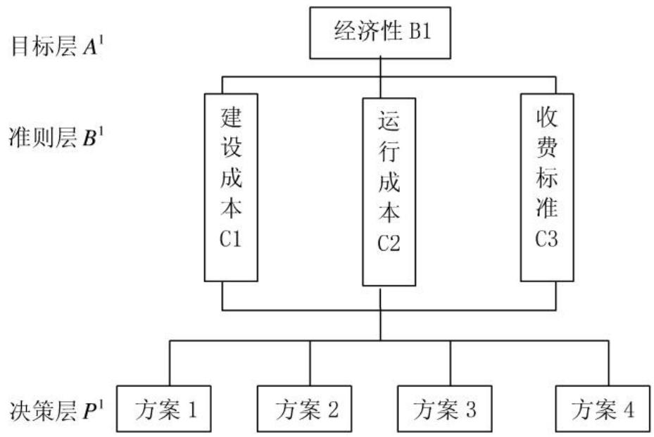
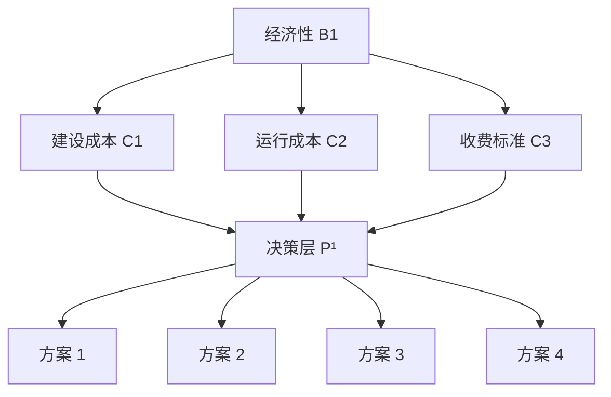
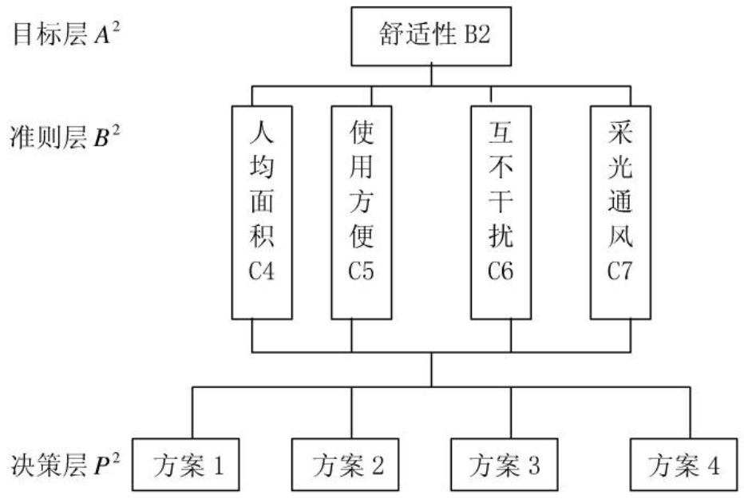
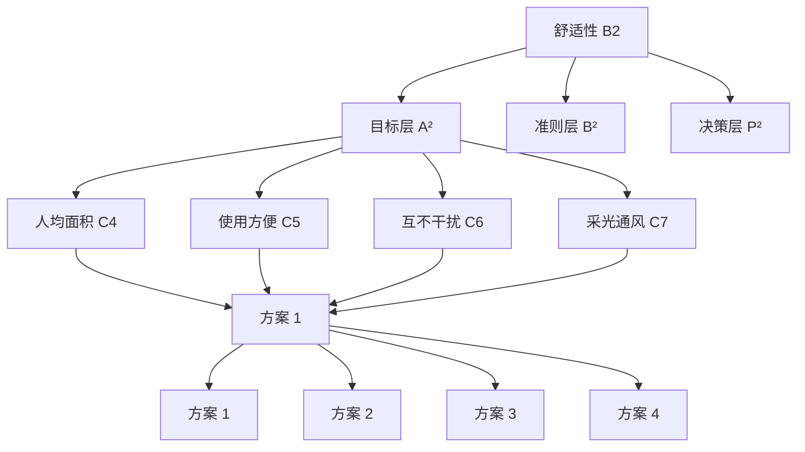
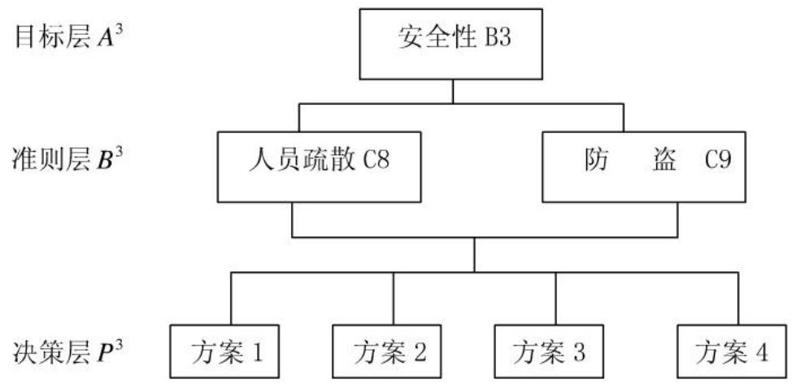
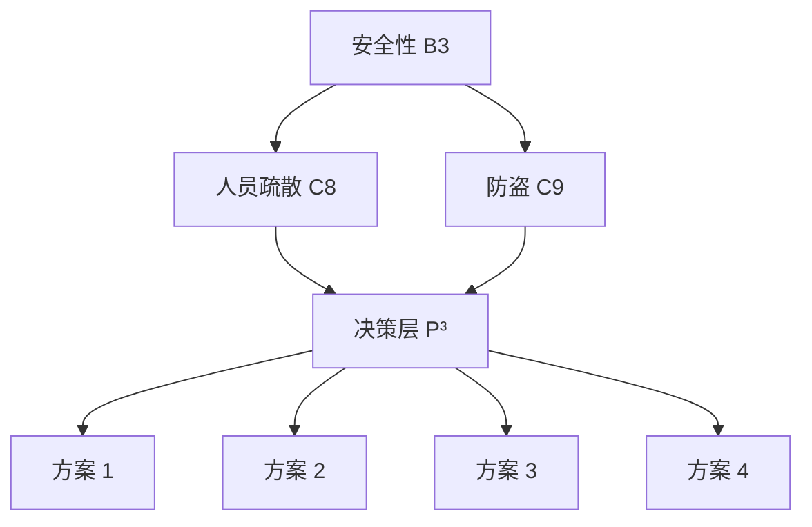

## D 题 对学生宿舍设计方案的评价

学生宿舍事关学生在校期间的生活品质，直接或间接地影响到学生的生活、学习和健康成长。学生宿舍的使用面积、布局和设施配置等的设计既要让学生生活舒适，也要方便管理，同时要考虑成本和收费的平衡，这些还与所在城市的地域、区位、文化习俗和经济发展水平有关。因此，学生宿舍的设计必须考虑经济性、舒适性和安全性等问题。

经济性：建设成本、运行成本和收费标准等。

舒适性：人均面积、使用方便、互不干扰、采光和通风等。

安全性：人员疏散和防盗等。

附件是四种比较典型的学生宿舍的设计方案。请你们用数学建模的方法就它们的经济性、舒适性和安全性作出综合量化评价和比较。

# 对学生宿舍设计方案的评价

## 摘要

本文主要从经济性、舒适性、安全性三个方面对四种学生宿舍的设计方案做出综合量化和比较。在评价过程中，主要运用了模糊决策和层次分析法，并利用 MATLAB 软件进行求解。

由于本问题的许多条件比较模糊，具有隐藏性，我们先对附件中的数据进行预处理，从中提取与评价相关的因素，然后利用层次分析法确定各准则对目标的权重，从而建立学生宿舍设计方案的评价模型。具体结果为：

（1）经济性方面：得出四种学生宿舍设计方案在此方面的的组合权向量为：  
(0.0440,0.5627,0.2265,0.1668)，根据指标越小，优先选择程度越大的准则得出：方案1是经济性最优的，其次为方案4、方案3，最后为方案2。  
(2) 舒适性方面: 得到组合权向量为: (0.1124,0.5301,0.1576,0.1999), 根据指标越大, 优先选择程度越大的准则得出: 方案 2 是舒适度最高的, 其次为方案 4、方案 3, 最后为方案 1。  
(3) 安全性方面: 得到组合权向量为: (0.0935, 0.4158, 0.2684, 0.2223), 利用和 (2) 同样的准则, 得出了方案 2 是安全性最强的, 其次为方案 3、方案 4, 最后为方案 1。  
(4) 综合分析方面: 得到组合权向量为: (0.0678, 0.5398, 0.2111, 0.1813), 由此得出方案 2 是综合指标最高的, 其次为方案 3、方案 4、最后为方案 1。

最后，对以上建立的模型进行合理化的评价和深入的探讨，分析了模型的优缺点，并提出了进一步的改进方向。

关键词：评价模型 层次分析法 权重 MATLAB

## 1. 问题重述

现如今的学生宿舍的使用面积、布局和设施配置等的设计既要让学生生活舒适，也要方便管理，同时要考虑成本和收费的平衡，这些还与所在城市的地域、区位、文化习俗和经济发展水平有关。因此，学生宿舍的设计必须考虑经济性、舒适性和安全性等问题。

请用数学建模的方法，从经济性、舒适性、安全性方面对附件中给出的四种学生宿舍的设计方案作出综合量化和比较。

## 2. 问题分析

本问题要解决的问题是对四种典型的学生宿舍设计方案进行评价与比较。

题目中的数据比较模糊，具有隐藏性，而且是用图表的方式展示给我们的，因而解决这一问题的关键点有两个：（1）如何把附件中四个平面设计图中所隐藏的数据量化；（2）在建立评价比较模型时如何确定各个因素之间的权重与影响。

因而我们采用模糊决策和层次分析法相结合的方法构架评价模型，来评判各个宿舍设计方案的优劣。

## 3. 模型假设

1）我们以附件中的四个图片作为研究的对象；  
2) Design1、Design2、Design3 和 Design4 分别对应层次结构中的方案层 P;  
3）假设收集到的数据与理论根据是准确合理的；  
4）不考虑宿舍未住满、设施损毁等情形；  
5）单位面积内的建设成本我们假设为定值。

## 4. 符号说明

<table><tr><td>符号</td><td>含义表示</td></tr><tr><td> $A$ 、 $A^{1}$ 、 $A^{2}$ 、 $A^{3}$ </td><td>不同层次结构下的目标层</td></tr><tr><td> $B$ 、 $B^{1}$ 、 $B^{2}$ 、 $B^{3}$ </td><td>不同层次结构下的准则层</td></tr><tr><td> $P$ 、 $P^{1}$ 、 $P^{2}$ 、 $P^{3}$ </td><td>不同层次结构下的决策层</td></tr><tr><td> $B1$ </td><td>准则层下的经济性因素</td></tr><tr><td> $B2$ </td><td>准则层下的舒适性因素</td></tr><tr><td> $B3$ </td><td>准则层下的安全性因素</td></tr><tr><td> $C1$ </td><td>子准则层下的建设成本因素</td></tr><tr><td> $C2$ </td><td>子准则层下的运行成本因素</td></tr><tr><td> $C3$ </td><td>子准则层下的收费标准因素</td></tr><tr><td> $C4$ </td><td>子准则层下的人均面积因素</td></tr><tr><td>C5</td><td>子准则层下的使用方便因素</td></tr><tr><td>C6</td><td>子准则层下的互不干扰因素</td></tr><tr><td>C7</td><td>子准则层下的采光通风因素</td></tr><tr><td>C8</td><td>子准则层下的人员疏散因素</td></tr><tr><td>C9</td><td>子准则层下的防盗因素</td></tr><tr><td>CI</td><td>一致性指标</td></tr><tr><td>RI</td><td>随机一致性指标</td></tr><tr><td>CR</td><td>一致性比率</td></tr><tr><td> $\lambda$ </td><td>正互反矩阵的特征值</td></tr><tr><td> $W^1$ </td><td>建设成本、运行成本、收费标准分别对经济的权向量</td></tr><tr><td>W1</td><td>经济情况下四种方案之间的权向量</td></tr><tr><td>W2</td><td>舒适情况下四种方案之间的权向量</td></tr><tr><td>W3</td><td>安全情况下四种方案之间的权向量</td></tr><tr><td> $W_0$ </td><td>经济性、舒适性、安全性分别对综合评价的权向量</td></tr><tr><td>W</td><td>四种设计方案之间的权向量</td></tr></table>

表1

## 5. 模型的建立与求解

## 5.1 经济性方面

在这个层面上，把经济性设为目标层，把建设成本、运行成本、收费标准设为准则层，四种方案设为决策层，层次结构图如图2所示。

在这里我们的评价准则为：指标越小，优先选择程度越大，也就是说，所需的经费越少。

flowchart

图2

得到其相对应的成对比较矩阵如下面所示：

第二层对第一层的成对比较矩阵为:

$$
B 1 = \left( \begin{array}{c c c} 1 & 1 / 2 & 1 / 6 \\ 2 & 1 & 1 / 4 \\ 6 & 4 & 1 \end{array} \right)
$$

求得其最大特征根为 $\lambda \max = 3.0092$ ，经一致性检验：

$$
C I = \frac {\lambda (A) - n}{n - 1} = 0. 0 0 4 5 8
$$

查找相应的平均随机一致性指标（见上表3） $RI$ ，计算一致性比率为：

$$
C R = \frac {C I}{R I} = \frac {0 . 0 0 4 5 8}{0 . 5 8} = 0. 0 0 7 9 <   0. 1
$$

CR 说明矩阵 B1 的不一致程度是可以接受的，矩阵 B1 的权向量为：

$$
W ^ {1} = (0. 1 0 6 1, 0. 1 9 2 9, 0. 7 0 1 0) ^ {T}
$$

第三层对第二层的成对比较矩阵为：

$$
\begin{array}{l} C 1 = \left( \begin{array}{c c c c} 1 & 1 / 9 & 1 / 7 & 1 / 5 \\ 9 & 1 & 2 & 5 \\ 7 & 1 / 2 & 1 & 5 \\ 5 & 1 / 5 & 1 / 5 & 1 \end{array} \right) \\ C 2 = \left( \begin{array}{c c c c} 1 & 1 / 9 & 1 / 7 & 1 / 5 \\ 9 & 1 & 3 & 5 \\ 7 & 1 / 3 & 1 & 3 \\ 5 & 1 / 5 & 1 / 3 & 1 \end{array} \right) \\ C 3 = \left( \begin{array}{c c c c} 1 & 1 / 9 & 1 / 5 & 1 / 5 \\ 9 & 1 & 3 & 4 \\ 5 & 1 / 3 & 1 & 1 \\ 5 & 1 / 4 & 1 & 1 \end{array} \right) \\ \end{array}
$$

通过 MATLAB 编程计算可得两两判断矩阵在单一准则下的权向量 W1、最大特征根 $\lambda$ 与一致性指标 CR，具体求解结果见下表 4:

<table><tr><td></td><td>B1</td><td>C1</td><td>C2</td><td>C3</td></tr><tr><td rowspan="4">W1</td><td>0.1061</td><td>0.0398</td><td>0.0399</td><td>0.0458</td></tr><tr><td>0.1929</td><td>0.5028</td><td>0.5660</td><td>0.5708</td></tr><tr><td>0.7010</td><td>0.3429</td><td>0.2674</td><td>0.1976</td></tr><tr><td></td><td>0.1145</td><td>0.1267</td><td>0.1858</td></tr><tr><td> $\lambda$ </td><td>3.0092</td><td>4.2138</td><td>4.1707</td><td>4.0620</td></tr><tr><td>CR</td><td>0.0079</td><td>0.0792</td><td>0.0632</td><td>0.0229</td></tr></table>

表4

上述一致性比率 $CR$ 均小于0.1，可以判断矩阵具有满意的一致性。

于是得出，单在经济性方面上四种设计方案的组合权向量为：

$$
W 1 = (0. 0 4 4 0, 0. 5 6 2 7, 0. 2 2 6 5, 0. 1 6 6 8) ^ {T}
$$

作出综合评价结论为：方案1在经济性上的权重占0.0440，方案2占0.5627，方案3占0.2265，方案4占0.1668。

因而方案1是经济性最优的，其次为方案4、方案3，最后是方案2。

## 5.2 舒适性方面

同上面的方法，建立了舒适性方面如图 3 所示的层次结构图。

在这里我们的评价准则为：指标越大，优先选择程度越大，也就是说，舒适性就越好。

flowchart

图3

从而得到其相对应的成对比较矩阵如下所示:

第二层对第一层的成对比较矩阵为：

$$
B 2 = \left( \begin{array}{c c c c} 1 & 2 & 3 & 5 \\ 1 / 2 & 1 & 3 & 4 \\ 1 / 3 & 1 / 3 & 1 & 1 \\ 1 / 5 & 1 / 4 & 1 & 1 \end{array} \right)
$$

第三层对第二层的成对比较矩阵为:

$$
C 4 = \left( \begin{array}{c c c c} 1 & 1 / 7 & 1 / 5 & 2 / 9 \\ 7 & 1 & 4 & 3 \\ 5 & 1 / 4 & 1 & 2 / 5 \\ 9 / 2 & 1 / 3 & 5 / 2 & 1 \end{array} \right)
$$

$$
C 5 = \left( \begin{array}{c c c c} 1 & 1 / 7 & 1 / 3 & 1 / 5 \\ 7 & 1 & 5 & 4 \\ 3 & 1 / 5 & 1 & 1 / 2 \\ 5 & 1 / 4 & 2 & 1 \end{array} \right)
$$

$$
C 6 = \left( \begin{array}{c c c c} 1 & 4 & 2 & 6 \\ 1 / 4 & 1 & 3 / 5 & 3 \\ 1 / 2 & 5 / 3 & 1 & 5 \\ 1 / 6 & 1 / 3 & 1 / 5 & 1 \end{array} \right)
$$

$$
C 7 = \left( \begin{array}{c c c c} 1 & 1 / 9 & 1 / 7 & 3 \\ 9 & 1 & 5 & 7 \\ 7 & 1 / 5 & 1 & 3 \\ 1 / 3 & 1 / 7 & 1 / 3 & 1 \end{array} \right)
$$

通过 MATLAB 编程计算可得两两判断矩阵在单一准则下的权向量 W2、最大特征根 $\lambda$ 与一致性指标 CR，具体结果见下表：

<table><tr><td></td><td>B2</td><td>C4</td><td>C5</td><td>C6</td><td>C7</td></tr><tr><td rowspan="4">W2</td><td>0.4739</td><td>0.0515</td><td>0.0549</td><td>0.5081</td><td>0.1213</td></tr><tr><td>0.3149</td><td>0.5430</td><td>0.6023</td><td>0.1570</td><td>0.6850</td></tr><tr><td>0.1166</td><td>0.1548</td><td>0.1260</td><td>0.2721</td><td>0.1359</td></tr><tr><td>0.0946</td><td>0.2507</td><td>0.2168</td><td>0.0628</td><td>0.0578</td></tr><tr><td>λ</td><td>4.0658</td><td>4.1892</td><td>4.1213</td><td>4.0488</td><td>4.1766</td></tr><tr><td>CR</td><td>0.0244</td><td>0.0701</td><td>0.0456</td><td>0.0181</td><td>0.0654</td></tr></table>

表5

上述一致性比率 CR 均小于 0.1，可以判断矩阵具有满意的一致性。

于是得出，单在舒适性方面上四种设计方案的组合权向量为：

$$
W 2 = (0. 1 1 2 4, 0. 5 3 0 1, 0. 1 5 7 6, 0. 1 9 9 9) ^ {T}
$$

作出综合评价结论为：方案 1 在舒适性上的权重占 0.1124，方案 2 占 0.5301，方案 3 占 0.1576，方案 4 占 0.1999。

因而方案 2 是舒适度最高的，其次为方案 4、方案 3，最后是方案 1。

## 5.3 安全性方面

此方面仅考虑了人员的疏散与防盗，而不考虑其他的特殊情况。

用同 5.1 中的方法建立了安全性方面的层次结构图，如图 4 所示。

在这里我们的评价准则为：指标越大，优先选择程度越大，也就是说，安全性就越高。

flowchart

图4

经过分析我们得到了如下的成对比较矩阵：

第二层对第一层的成对比较矩阵为:

$$
B 3 = \left( \begin{array}{c c} 1 & 5 \\ 1 / 5 & 1 \end{array} \right)
$$

第三层对第二层的成对比较矩阵为:

$$
\begin{array}{l} C 8 = \left( \begin{array}{c c c c} 1 & 1 / 4 & 1 / 2 & 1 / 3 \\ 4 & 1 & 3 / 2 & 5 / 4 \\ 2 & 2 / 3 & 1 & 3 / 2 \\ 3 & 4 / 5 & 2 / 3 & 1 \end{array} \right) \\ C 9 = \left( \begin{array}{c c c c} 1 & 1 / 9 & 1 / 7 & 1 \\ 9 & 1 & 5 & 7 \\ 7 & 1 / 5 & 1 & 6 \\ 1 & 1 / 7 & 1 / 6 & 1 \end{array} \right) \\ \end{array}
$$

通过 MATLAB 编程计算可得两两判断矩阵在单一准则下的权向量 W3、最大特征根 $\lambda$ 与一致性指标 CR，具体结果见下表 6:

<table><tr><td></td><td>B3</td><td>C8</td><td>C9</td></tr><tr><td rowspan="4">W3</td><td>0.8333</td><td>0.1022</td><td>0.0501</td></tr><tr><td>0.1667</td><td>0.3703</td><td>0.6431</td></tr><tr><td></td><td>0.2720</td><td>0.2505</td></tr><tr><td></td><td>0.2555</td><td>0.0563</td></tr><tr><td>λ</td><td>2</td><td>4.0688</td><td>4.2627</td></tr><tr><td>CR</td><td>0</td><td>0.0158</td><td>0.0973</td></tr></table>

表6

于是上述一致性比率 $CR$ 均小于0.1，可以判断矩阵具有满意的一致性。

最后得出，单在安全性方面上四种设计方案的组合权向量为：

$$
W 3 = (0. 0 9 3 5, 0. 4 1 5 8, 0. 2 6 8 4, 0. 2 2 2 3) ^ {T}
$$

由此可见，作出综合评价结论为：方案1在安全性上的权重占0.0935，方案2占0.4158，方案3占0.2684，方案4占0.2223。

因而方案 2 是安全性最强的，其次为方案 3、方案 4，最后是方案 1。

## 5.4 综合分析

综合考虑经济性、舒适性、安全性三个方面之间的权重，层次分析结构图见图1，我们得到了如下的成对比较矩阵为：

$$
A _ {0} = \left( \begin{array}{c c c} 1 & 3 & 5 \\ 1 / 3 & 1 & 4 \\ 1 / 5 & 1 / 4 & 1 \end{array} \right)
$$

通过MATLAB计算可得两两判断矩阵在单一准则下的权向量为：

$$
W _ {0} = (0. 6 2 6 7, 0. 2 7 9 7, 0. 0 9 3 6) ^ {T}
$$

最大特征根 $\lambda_{max}=3.0858$ 与一致性指标 CR=0.0739<0.1，则说明矩阵不一致程度是可以接受的。

于是得到最终的组合权向量为:

$$
W = (0. 0 6 7 8, 0. 5 3 9 8, 0. 2 1 1 1, 0. 1 8 1 3) ^ {T}
$$

各层的一致性检验及组合一致性检验全部通过；上面的组合权向量可以作为四个学生宿舍设计方案评价的依据。

由此得出最终的综合评价为：方案 2 是综合指标最高的，其次为方案 3、方案 4，最后是方案 1。

## 6. 模型的分析

我们所建立的模型是评价模型，对四种典型宿舍设计方案作出了评价与比较。近几年，随着我国经济的发展，人民生活水平的不断提高，学生可以根据自己的实际情况选择宿舍类型，对于不同层次的学生人群，可以根据我们的模型进行选择。

比如对于经济性要求比较高的学生来说，可以根据模型分解（经济性方面）进行评价选择；若对舒适性要求比较高的学生来说，可以根据模型分解（舒适性方面）进行择优选择。

综合三个指标，方案二是最优选择，它既在一定程度上满足学生对居住私密性的要求，又能创造一个优美舒适，富有文化气氛的学习、休息和交往的居住环境，并在一定程度上为学生对宿舍的选择提供了依据。

## 7. 模型的评价与推广

## 7.1 模型的评价

本文主要运用模糊决策和层次分析法，对宿舍的经济性、舒适性、安全性作出科学合理的决策，克服了主观定性分析的弊端。在建立模型时所考虑的影响因素全面且符合实际，并对各影响因素进行了合理的量化处理。通过对已知数据的加工整合，巧妙的构建了成对比较矩阵，并用 MATLAB 软件求出模型的结果。此外，模型运用大量的图表，使得到的结果非常直观，易于理解，让问题很明了，思路很清晰。

本模型的弊端是针对附件中的四个设计图之间的对比，由于受现有资料的限制，无法代表所有学生宿舍的构建情况，这样大大局限了模型的灵活性。

## 7.2 模型的推广

本文构造的模型，能更准确的评价宿舍的优劣，该模型还可以应用到选拔决策中，在日常生活中经常会遇到各式各样的选拔，比如足球员的选拔，三好学生的选拔等等，都可以应用本模型。在运用此模型时应结合各个有关部门的实际情况，尽量选取科学合理的指标及其权数。

## 参考文献：

[1] 姜启源、谢金星、叶俊，数学建模（第三版），北京：高等教育出版社，2003年8月第3版。  
[2] 刘卫国，MATLAB 程序设计教程，北京：中国水利水电出版社，2005 年。  
[3] 许树柏，层次分析法原理，天津：天津大学出版社，1988年。  
[4] 费浦生、羿旭明，数学建模及其基础知识详解，武昌：武汉大学出版社，2006年。