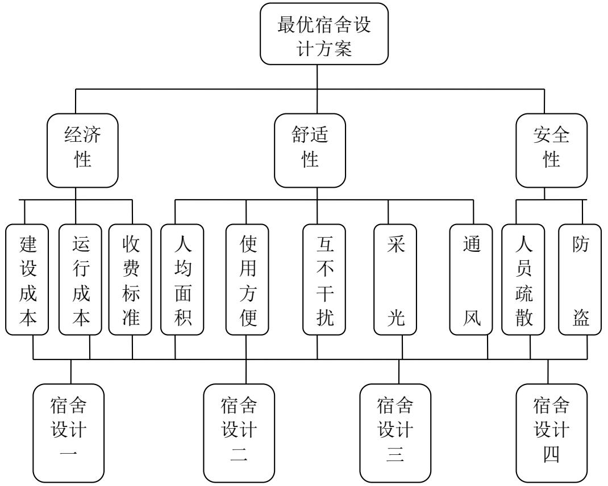
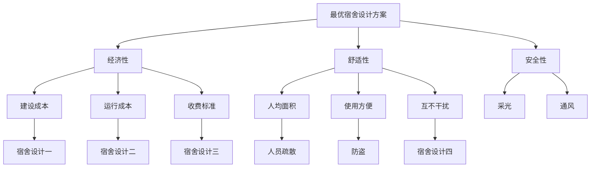
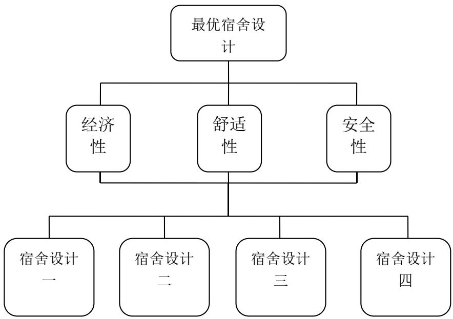
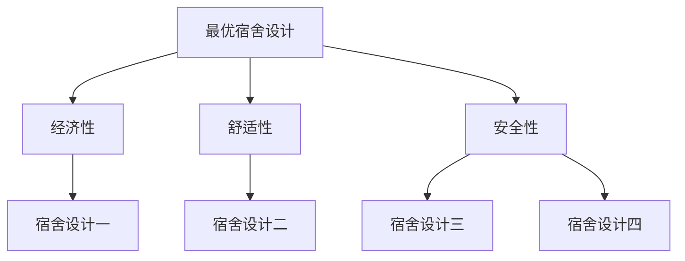
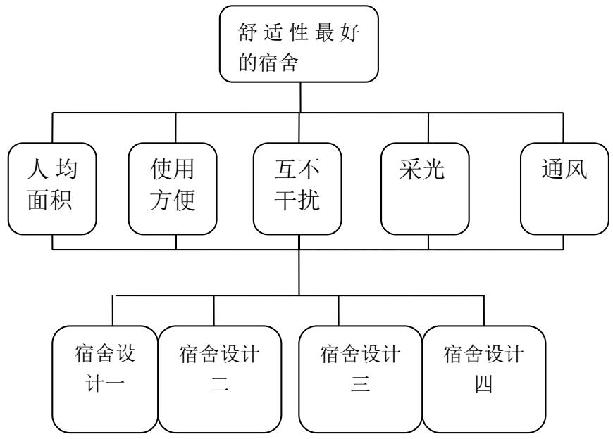
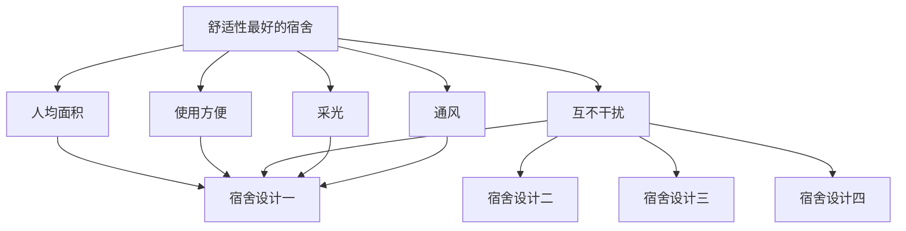
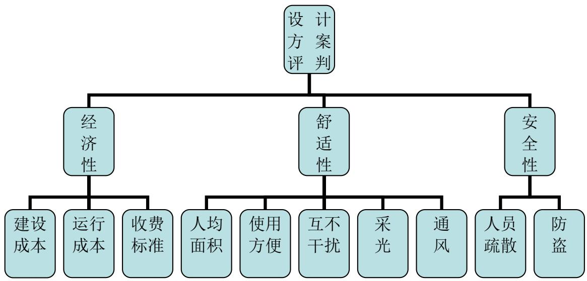
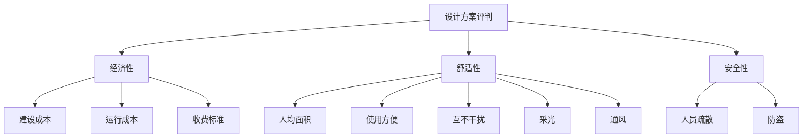
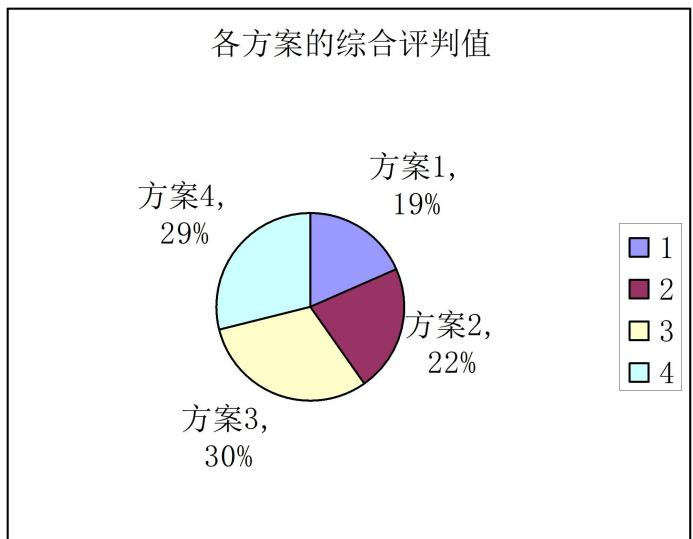

# D 题:对学生宿舍设计方案的评价

## 摘要

本文是一个对学生宿舍设计方案进行综合评价的问题，文中运用了层次分析法，模糊综合评判法等方法建立了三个评价模型。通过这些方法对设计方案的评价因素进行综合量化，最后比较得出了最优设计方案。

模型一：我们主要运用层次分析法，将问题分为四个层次,对各项指标采用和法计算，算出各项的最大特征根及权重，此模型未对经济性中的运行成本进行考虑，我们将准则层中经济性进行量化，最后解出各宿舍综合量化评价比较与年限有关，我们使用Matlab 软件计算出 10 年后的评价与比较，其结果为：宿舍设计方案四排第一，宿舍设计方案三为第二，宿舍设计方案二为第三，宿舍设计方案一为第四。

模型二：基于模型一的缺点，我们在模型一的基础上重新考虑了运行成本，定义每人每年的运行费为 200 元，对此元素重新量化，再利用层次分析法求出30 年后四类型宿舍的评价与对比，其结果为：方案三最优。

模型三(模糊综合评判模型)：学生宿舍的用户(学生）和决策者的偏好对方案选择的影响很大，所以在方案优选时，应该综合考虑决策者及宿舍用户的偏好。为确定最优方案，可以通过层次分析法确定不同的权重，以用户和决策层偏好的总体偏差最小为目标，建立评语集，采用模糊综合评判的方法，最后利用区间等级赋值法，根据得分进行排序按由高到低的顺序比较出优劣。经过评价对比其结果为：方案三最优。

关键词: 和法；层次分析法；模湖综合评判法；Matlab软件；量化

## 一、问题重述

## 1、背景

学生宿舍事关学生在校期间的生活品质, 直接或间接地影响到学生的生活、学习和健康成长。学生宿舍的使用面积、布局和设施配置等的设计既要让学生生活舒适，也要方便管理, 同时要考虑成本和收费的平衡, 这些还与所在城市的地域、区位、文化习俗和经济发展水平有关。因此，学生宿舍的设计必须考虑经济性、舒适性和安全性等问题。

经济性：建设成本、运行成本和收费标准等。

舒适性：人均面积、使用方便、互不干扰、采光和通风等。

安全性：人员疏散和防盗等。

## 2、问题

附件是四种比较典型的学生宿舍的设计方案。需要我们用数学建模的方法就它们的经济性、舒适性和安全性作出综合量化评价和比较。

## 二、模型假设

通过对该问题的分析，我们做出如下一些合理的假设：

1、四种宿舍设计的宿舍都是按国家标准<宿舍建筑设计规范>要求建成的。  
2、在考虑各宿舍安全性时无自然灾害的影响及人为毁坏。  
3、学校住宿收费按国家标准收费。  
4、四种学生宿舍的地域，区位，文化，习俗和经济发展水平基本一样。  
5、四种学生宿舍建设设施材料相同。

## 三、符号说明

<table><tr><td>符号</td><td>说明</td></tr><tr><td>B</td><td>四种宿舍楼舒适性各项对舒适性的判断矩阵</td></tr><tr><td>C</td><td>建设成本的判断矩阵</td></tr><tr><td>D</td><td>收费标准的判断矩阵</td></tr><tr><td>E</td><td>宿舍安全性的判断矩阵</td></tr><tr><td> $e_{ni}$ </td><td>n年后的第i种宿舍的经济收益额</td></tr><tr><td> $w_{iC},w_{iD}$ </td><td>分别为第i种宿舍楼收费值及建设成本所占的权重</td></tr><tr><td> $a_1,a_2,a_{3j}$ </td><td>分别为第i种宿舍楼的单位面积的建设成本、运行成本及收费标准</td></tr><tr><td> $x_j,y_j$ </td><td>分别为第j种宿舍楼的人数及面积</td></tr><tr><td> $f_j$ </td><td>n年后第i种宿舍经济收益总额</td></tr><tr><td> $b_{ij}$ </td><td>相对一上层目标的适度评分值</td></tr><tr><td> $s_{ij}$ </td><td>四种宿舍楼舒适性各项所占权重比较值</td></tr><tr><td> $t_i$ </td><td>四种宿舍楼的舒适性</td></tr><tr><td> $w_i$ </td><td>四种宿舍楼舒适性所占的权重</td></tr><tr><td> $W'$ </td><td>舒适性排序权重向量</td></tr><tr><td> $d_i$ </td><td>第i种宿舍两楼梯口的最大距离</td></tr><tr><td> $f_{jj}$ </td><td>30年的NG的归一化结果</td></tr><tr><td> $\lambda$ </td><td>最大特征根</td></tr></table>

## 四、问题分析

这是一个学生宿舍的设计方案评价选优问题，是一个模糊的定性问题，需采用恰当的方法将其定量化，在方法的选取上，我们可以综合采用二种不同的方法进行评价：层次分析法、模糊综合评判法。

在对具体问题的解决上，我们按照以下几个步骤进行

(1) 构建出评价指标体系  
(2) 通过咨旬有关专家和构造一些定义结合层次分析法，得出评价体系需要的有关数据  
(3) 根据构建出的指标体系及利用有关的数据依次采用不同的方法得出评价结论  
(4) 对二种不同方法得出的结论进行综合分析说明

这个学生宿舍设计方案的评价问题，解决的难点在于指标体系的构建与数据的提取上。我们通过请教我校多名有经验的工程建筑和工程造价的专业老师，并在局部范围内调查了一些同学对学生宿舍的有关要求及看法，在听取了他们的一些意见与建议后，构建了一个评价的指标体系，并制定了一个打分表格由这多名教师和学生进行评分，最后我们根据评分表进行有关的数据挖掘，提练出解决问题时需要的数据对于指标体系中各项指标的权重，我们可以由制定的专家打分表运用层次分析法的理论得出。

## 五、层次分析模型的建立与求解

为了运用层次分析法，我们构建了以下指标体系：

flowchart

## 模型一：

## 5.1经济性、舒适性、安全性等指标对宿舍各楼房的影响权重,我们采用层次分析法进行确定：

## 5.1.1、对经济性、舒适性、安全性等指标体系的确定。

本题是一个评价问题，我们将其转化为一个决策性问题。因此，可将决策问题分为三个层次，最上层为总目标层，即最优宿舍设计方案；最下层为方案层，分为宿舍设计一, 宿舍设计二, 宿舍设计三, 宿舍设计四这4种典型；中间层为准则层，有经济性，舒适性，安全性三个准则，层间的联系用相连的线段表示如图(最优宿舍设计层次结构图):

flowchart

(最优宿舍设计层次结构图)

5.1.2、相对于上一层目标的适度标度值，按1—9自然数进行标度表示如下表：

<table><tr><td></td><td>1</td><td>2</td><td>3</td><td>4</td><td>5</td><td>6</td><td>7</td><td>8</td><td>9</td></tr><tr><td>经济性</td><td></td><td></td><td></td><td></td><td></td><td></td><td></td><td></td><td>✓</td></tr><tr><td>舒适性</td><td></td><td></td><td></td><td></td><td>✓</td><td></td><td></td><td></td><td></td></tr><tr><td>安全性</td><td></td><td></td><td></td><td>✓</td><td></td><td></td><td></td><td></td><td></td></tr></table>

（表1）

由此我们将各项对比得出下表(宿舍设计指标比较) :

<table><tr><td></td><td>经济性( $a_{1}$ )</td><td>舒适性( $a_{2}$ )</td><td>安全性( $a_{3}$ )</td></tr><tr><td>经济性( $a_{1}$ )</td><td>1</td><td>5</td><td>6</td></tr><tr><td>舒适性( $a_{2}$ )</td><td>1/5</td><td>1</td><td>2</td></tr><tr><td>安全性( $a_{3}$ )</td><td>1/6</td><td>1/2</td><td>1</td></tr></table>

（表 2)

通过最优宿舍设计层次结构图中经济性，舒适性，安全性之间两两比较我们得出如下矩阵A ：

$$
A = \left( \begin{array}{c c c} 1 & 5 & 6 \\ 1 / 5 & 1 & 2 \\ 1 / 6 & 1 / 2 & 1 \end{array} \right) \text {我们对} A \text {矩阵采用和法求出权向量}
$$

$$
W = (0. 7 2 2 6, 0. 1 7 4 1, 0. 1 0 3 3)
$$

最大特征根 $\lambda _ { \operatorname* { m a x } } = 3 . 0 2 9 5$

判断矩阵的一致性检验

当矩阵满足：

CR = CI/RI  0.1时，判断矩阵一致性可接受，否则判断矩阵必须作修改，其中 $C I = ( \lambda _ { \operatorname* { m a x } } - n ) / ( n - 1 )$ 为一致性指标，式中 $\lambda _ { \operatorname* { m a x } }$ 为矩阵最大特征根，RI为平均随机一致性指标，如下表：

<table><tr><td>n</td><td>1</td><td>2</td><td>3</td><td>4</td><td>5</td><td>6</td><td>7</td><td>8</td><td>9</td><td>10</td><td>11</td></tr><tr><td>RI</td><td>0</td><td>0</td><td>0.58</td><td>0.90</td><td>1.12</td><td>1.24</td><td>1.32</td><td>1.41</td><td>1.45</td><td>1.49</td><td>1.51</td></tr></table>

（表3）

经计算， $C I = ( 3 . 0 2 9 5 - 3 ) / ( 3 - 1 ) = 0 . 0 1 4 7 5 , C R = C I / R I = 0 . 0 2 5 4 < 0 . 1$ 通过一次性检验。

## 5.2建设成本、运行成本和收费标准对经济性的考虑

我们只考虑建设成本（或者建设成本和运行成本模糊一起综合考虑）和收费标准两个条件，因此，我们定义经济性的量化=收费值-建设成本。

下面我们采用模糊关联分析、层次分析对经济性的各因素（包括建设成本、运行成本和收费标准等）

按照 1-9 标度法我们对四种宿舍建设成本进行标度如下表 (建设成本----收费标准标度表) ：

<table><tr><td></td><td>1</td><td>2</td><td>3</td><td>4</td><td>5</td><td>6</td><td>7</td><td>8</td><td>9</td></tr><tr><td>宿舍设计一建设成本</td><td></td><td></td><td></td><td></td><td>✓</td><td></td><td></td><td></td><td></td></tr><tr><td>宿舍设计二建设成本</td><td></td><td></td><td></td><td></td><td></td><td></td><td>✓</td><td></td><td></td></tr><tr><td>宿舍设计三建设成本</td><td></td><td></td><td></td><td></td><td></td><td>✓</td><td></td><td></td><td></td></tr><tr><td>宿舍设计四建设成本</td><td></td><td></td><td></td><td></td><td></td><td></td><td></td><td></td><td>✓</td></tr><tr><td>宿舍设计一收费标准</td><td></td><td></td><td>✓</td><td></td><td></td><td></td><td></td><td></td><td></td></tr><tr><td>宿舍设计二收费标准</td><td></td><td></td><td></td><td></td><td>✓</td><td></td><td></td><td></td><td></td></tr><tr><td>宿舍设计三收费标准</td><td></td><td></td><td></td><td></td><td></td><td></td><td>✓</td><td></td><td></td></tr><tr><td>宿舍设计四收费标准</td><td></td><td></td><td></td><td></td><td></td><td></td><td></td><td></td><td>✓</td></tr></table>

（表4）  
对各种宿舍的建设成本和收费标准的衡量，进行量化比较：

我们利用上述模糊关联评分表得到建设成本和收费标准的判断矩阵分别为C和D：

将建设成本标度进行比较得出下表(建设成本标度比较表)：

<table><tr><td></td><td>宿舍设计一</td><td>宿舍设计二</td><td>宿舍设计三</td><td>宿舍设计四</td></tr><tr><td>宿舍设计一</td><td>1</td><td>1/3</td><td>1/2</td><td>1/5</td></tr><tr><td>宿舍设计二</td><td>3</td><td>1</td><td>2</td><td>1/3</td></tr><tr><td>宿舍设计三</td><td>2</td><td>1/2</td><td>1</td><td>1/4</td></tr><tr><td>宿舍设计四</td><td>5</td><td>3</td><td>4</td><td>1</td></tr></table>

（表 5)

将收费标准标度进行比较得出下表(收费标准标度比较表)：

<table><tr><td></td><td>宿舍设计一</td><td>宿舍设计二</td><td>宿舍设计三</td><td>宿舍设计四</td></tr><tr><td>宿舍设计一</td><td>1</td><td>1/3</td><td>1/5</td><td>1/7</td></tr><tr><td>宿舍设计二</td><td>3</td><td>1</td><td>1/3</td><td>1/5</td></tr><tr><td>宿舍设计三</td><td>5</td><td>3</td><td>1</td><td>1/5</td></tr><tr><td>宿舍设计四</td><td>7</td><td>5</td><td>3</td><td>1</td></tr></table>

（表 6)

根据建设成本得出判断矩阵C

$C = \left( \begin{array} { c c c c } { { 1 } } & { { 1 / 3 } } & { { 1 / 2 } } & { { 1 / 5 } } \\ { { 3 } } & { { 1 } } & { { 2 } } & { { 1 / 3 } } \\ { { 2 } } & { { 1 / 2 } } & { { 1 } } & { { 1 / 4 } } \\ { { 5 } } & { { 3 } } & { { 4 } } & { { 1 } } \end{array} \right)$ 经过使用和法计算求出C矩阵的最大特征根为 $\lambda _ { \operatorname* { m a x } { c } } = 4 . 0 5 1 3$

其中 $C I = { \frac { 4 . 0 5 1 3 - 4 } { 4 - 3 } } = 0 . 0 1 7 1 \qquad C R = { \frac { C I } { R I } } = 0 . 0 5 7 < 0 .$ 1通过一致性检验

根据收费标度得出判断矩阵D

$D = \left( { \begin{array} { c c c c } { 1 } & { 1 / 3 } & { 1 / 5 } & { 1 / 7 } \\ { 3 } & { 1 } & { 1 / 3 } & { 1 / 5 } \\ { 5 } & { 3 } & { 1 } & { 1 / 3 } \\ { 7 } & { 5 } & { 3 } & { 1 } \end{array} } \right) .$ 同理对D矩阵使用和法计算，求出D矩阵的最大特征根 $\lambda _ { \operatorname* { m a x } \mathrm { D } } = 3 . 7 1 4 3$

经计算，矩阵D的CR为 $C R _ { { D } } = - 0 . 1 0 5 8 \langle 0 . 1$ ，通过一致性检验。

因为我们定义经济性的量化=收费的权重值－建设成本的权重值，我们用 $e _ { n i }$ 表示n年后的第i种宿舍的经济收益额，并且我们将这些量都进行归一化处理，得出它们的权重关系。

$w _ { i C }$ 表示第i种宿舍收费值所占的权重，即

$$
w _ {i C} = (0. 0 8 4 7, 0. 2 3 3 3, 0. 1 3 9 7, 0. 5 4 2 4), i = (1, 2, 3, 4)
$$

$w _ { i D }$ 表示第i种宿舍建设成本所占的权重，即

$$
w _ {i D} = (0. 0 6 1 3, 0. 1 3 1 2, 0. 2 0 6 7, 0. 6 0 0 8), \quad i = (1, 2, 3, 4)
$$

所以，n年后的第i种宿舍的经济收益额 $e _ { n i } { = } n { \times } w _ { i C } - w _ { i D }$ ，即

一年后的经济收益：

$$
e _ {1 i} = (- 0. 0 2 3 4, - 0. 1 0 2 1, 0. 0 6 7 0, 0. 0 5 8 4), \quad i = (1, 2, 3, 4)
$$

两年后的经济收益：

$$
e _ {2 i} = (0. 0 3 7 9, 0. 0 2 9 1, 0. 2 7 3 7, 0. 6 5 9 1), \quad i = (1, 2, 3, 4)
$$

十年后的经济收益：

$$
e _ {1 0 i} = (0. 5 2 8 2, 1. 0 7 8 7, 1. 9 2 7 3, 5. 4 6 5 4), \quad i = (1, 2, 3, 4)
$$

## 5.3人均面积、使用方便、互不干扰、采光和通风等因素相对舒适性的权重的确定：

我们依然采用层次分析法对各因素的影响进行了确定：

1、我们对它们之间的影响关系作了如下的等级分层：

flowchart

(舒适性最好的层次结构图)

相对上一层目标的适度标度，按 1—9标度法进行标度，由此我们对各项之间进行对比得出下表 (舒适性各项指标比较)：

<table><tr><td></td><td>人均面积</td><td>使用方便</td><td>互不干扰</td><td>采光</td><td>通风</td></tr><tr><td>人均面积</td><td>1</td><td>2</td><td>3</td><td>4</td><td>4</td></tr><tr><td>使用方便</td><td>1/2</td><td>1</td><td>1</td><td>1/2</td><td>1/2</td></tr><tr><td>互不干扰</td><td>1/3</td><td>1</td><td>1</td><td>1/2</td><td>2</td></tr><tr><td>采光</td><td>1/4</td><td>2</td><td>2</td><td>1</td><td>1</td></tr><tr><td>通风</td><td>1/4</td><td>2</td><td>1/2</td><td>1</td><td>1</td></tr></table>

（表7）

通过舒适性中人均面积，使用方便，互不干扰，采光，通风两两比较我们得出矩阵B：

$$
B = \left( \begin{array}{c c c c c} 1 & 2 & 3 & 4 & 4 \\ 1 / 2 & 1 & 1 & 1 / 2 & 1 / 2 \\ 1 / 3 & 1 & 1 & 1 / 2 & 2 \\ 1 / 4 & 2 & 2 & 1 & 1 \\ 1 / 4 & 2 & 1 / 2 & 1 & 1 \end{array} \right)
$$

将B矩阵运用和法计算得出权向量

$$
W ^ {\prime} = (0. 3 7 5 8, 0. 1 0 6 8, 0. 2 3 9 3, 0. 1 5 6 7, 0. 1 2 1 3)
$$

最大特征根 $\lambda _ { \operatorname* { m a x } } = 4 . 4 7 2$

经计算，CI = (4.472−5)/(5−1)= −0.132， $C R = C I / R I = - 0 . 1 1 7 9 < 0 . 1$ ，通过一次性检验。

## 5.3.1 因舒适性包括人均面积、使用方便、互不干扰、采光、通风等影响因素，为此，我们对题中给出的 4种典型宿舍平面图进行了仔细观察和认真分析，最终我们对这些因素进行了量化：

a. 对于人均面积，我们统一将每个寝室的面积除以该宿舍的人数得出该种学生宿舍的人均面积.结果如下表：

<table><tr><td>宿舍</td><td>宿舍设计一</td><td>宿舍设计二</td><td>宿舍设计三</td><td>宿舍设计四</td></tr><tr><td>人均面积( $m^{2}$ )</td><td>3.1875</td><td>6.25</td><td>4.483</td><td>7.425</td></tr></table>

（表8）  
将表中数据利用和法求出权向量为：

$$
s _ {1 j} = (0. 1 4 9 3, 0. 2 9 2 8, 0. 2 1 0 0, 0. 3 4 7 8) \quad j = 1, 2, 3, 4
$$

b. 对于使用方便的量化，我们将卫生间、淋浴室、盥洗室、活动室、夜间自习室、厨房简易餐厅、垃圾间、开水间等日常活动用室的面积人均化得出下表：

<table><tr><td>宿舍</td><td>宿舍设计一</td><td>宿舍设计二</td><td>宿舍设计三</td><td>宿舍设计四</td></tr><tr><td>使用方便人均面积( $m^{2}$ )</td><td>3.1875</td><td>6.25</td><td>4.483</td><td>7.425</td></tr></table>

（表9）

同理，将表中数据构成矩阵求出其权向量为

$$
s _ {2 j} = (0. 0 4 9 6, 0. 5 8 2 0, 0. 2 2 2 7, 0. 1 4 5 7) \quad j = 1, 2, 3, 4
$$

c.对于互不干扰的量化，我们用相邻两个宿舍的距离来衡量。

<table><tr><td>宿舍</td><td>宿舍设计一</td><td>宿舍设计二</td><td>宿舍设计三</td><td>宿舍设计四</td></tr><tr><td>相邻两个宿舍的距离(mm)</td><td>350</td><td>300</td><td>300</td><td>1350</td></tr></table>

（表10）

同理求出其权向量为

$$
s _ {3 j} = (0. 1 5 2 2, 0. 1 3 0 4, 0. 1 3 0 4, 0. 5 8 7 0) \quad j = 1, 2, 3, 4
$$

d.对于采光性的量化问题，我们从专业化的角度来考虑。因为采光性跟房子的结构、构造、面积大小有关系，根据图纸请专家标度如下表：

<table><tr><td>各种学生宿舍</td><td>宿舍设计一</td><td>宿舍设计二</td><td>宿舍设计三</td><td>宿舍设计四</td></tr><tr><td>专家标度</td><td>5</td><td>6</td><td>3</td><td>8</td></tr></table>

（表11）

同理求出其权向量为：

$$
s _ {4 j} = (0. 2 2 7 3, 0. 2 7 2 7, 0. 1 3 6 4, 0. 3 6 3 6) \quad j = 1, 2, 3, 4
$$

e.对于通风性的量化问题，我们考虑各宿舍楼道的人均面积，经计算得出下表:

<table><tr><td>各种学生宿舍</td><td>宿舍设计一</td><td>宿舍设计二</td><td>宿舍设计三</td><td>宿舍设计四</td></tr><tr><td>通风人均面积 $(m^{2})$ </td><td>0.7539</td><td>0.5116</td><td>1.5442</td><td>3.5473</td></tr></table>

（表12）

同理求出其权向量为：

$$
s _ {5 j} = (0. 1 1 8 6, 0. 0 8 0 5, 0. 2 4 2 9, 0. 5 5 8 0) \quad j = 1, 2, 3, 4
$$

四种宿舍舒适性各项所占权重表

<table><tr><td></td><td>宿舍设计一</td><td>宿舍设计二</td><td>宿舍设计三</td><td>宿舍设计四</td></tr><tr><td>人均面积所占权 $s_{1j}$ </td><td>0.1493</td><td>0.2928</td><td>0.2100</td><td>0.3478</td></tr><tr><td>使用方便所占权 $s_{2j}$ </td><td>0.0496</td><td>0.5820</td><td>0.2227</td><td>0.1457</td></tr><tr><td>互不干扰所权重 $s_{3j}$ </td><td>0.1522</td><td>0.1304</td><td>0.1304</td><td>0.5870</td></tr><tr><td>采光性所占权重 $s_{4j}$ </td><td>0.2273</td><td>0.2727</td><td>0.1364</td><td>0.3636</td></tr><tr><td>通风性所占权重 $s_{5j}$ </td><td>0.1186</td><td>0.0805</td><td>0.2429</td><td>0.5580</td></tr></table>

（表13）

## 5.3.2将四种宿舍舒适性量化的计算结果：

四种宿舍楼的舒适性 $t _ { i }$ 等于以上五种因素在舒适性所占的权重 $w _ { i }$ 乘以各种因素的权重比较值 $S _ { i j }$ ，即

$$
t _ {i} = \boldsymbol {w ^ {\prime}} _ {i} \times \boldsymbol {s} _ {i j}
$$

利用 MATLAB软件求解得(附录一):

$$
t _ {i} = (0. 1 4 7 7, 0. 2 7 5 4, 0. 1 9 3 8, 0. 3 8 3 1)
$$

## 5.4安全性的评比

对宿舍楼房安全性的考虑，我们仅考虑人员疏散这一指标。根据专业人士的权威说法，两楼梯口的最大距离的一半小于 30米，则认为是安全的。因此,我们以两楼梯口之间最大距离作为参考对四种宿舍楼的安全性进行评比。

我们通过对图形的观察和分析,得出第i种宿舍两楼梯口的最大距离的一半$d _ { i }$ ，即

$$
d _ {i} = (8. 5, 2 8. 8, 2 6. 1, 2 8. 3), \text {其中} i = (1, 2, 3, 4) 。
$$

根据专家的说法可知两楼梯口的最大距离越小，那么安全性就越高，因此，我们根据这些距离数字分别给它们标度，标度表如下(宿舍设计对安全性标度表)：

<table><tr><td></td><td>1</td><td>2</td><td>3</td><td>4</td><td>5</td><td>6</td><td>7</td><td>8</td><td>9</td></tr><tr><td>宿舍设计一</td><td></td><td></td><td></td><td></td><td></td><td></td><td></td><td></td><td>✓</td></tr><tr><td>宿舍设计二</td><td></td><td>✓</td><td></td><td></td><td></td><td></td><td></td><td></td><td></td></tr><tr><td>宿舍设计三</td><td></td><td></td><td></td><td>✓</td><td></td><td></td><td></td><td></td><td></td></tr><tr><td>宿舍设四</td><td></td><td></td><td>✓</td><td></td><td></td><td></td><td></td><td></td><td></td></tr></table>

（表14）

将四种宿舍设计安全性进行比较得出下表：

<table><tr><td></td><td>宿舍设计一</td><td>宿舍设计二</td><td>宿舍设计三</td><td>宿舍设计四</td></tr><tr><td>宿舍设计一</td><td>1</td><td>8</td><td>6</td><td>7</td></tr><tr><td>宿舍设计二</td><td>1/8</td><td>1</td><td>1/3</td><td>1/2</td></tr><tr><td>宿舍设计三</td><td>1/6</td><td>3</td><td>1</td><td>2</td></tr><tr><td>宿舍设计四</td><td>1/7</td><td>2</td><td>1/2</td><td>1</td></tr></table>

（表15）

根据上表，我们得出了一个对安全性的判断矩阵 $E = \left( \begin{array} { c c c c } { 1 } & { 8 } & { 6 } & { 7 } \\ { 1 / 8 } & { 1 } & { 1 / 3 } & { 1 / 2 } \\ { 1 / 6 } & { 3 } & { 1 } & { 2 } \\ { 1 / 7 } & { 2 } & { 1 / 2 } & { 1 } \end{array} \right)$ ，利用和法

对矩阵E求出最大特征向量为 $w _ { i E } = ( 0 . 6 7 5 3 , 0 . 0 6 2 1 , 0 . 1 6 2 2 , 0 . 1 0 0 4 )$ ，最大特征值为

$$
\lambda_ {\max E} = 4. 0 8 5 7
$$

经计算 $R I = \frac { 4 . 0 8 5 7 - 4 } { 4 - 1 } = 0 . 0 2 8 6$ $C R = \frac { C I } { R I } = 0 . 0 2 8 6 < 0$ .1通过一致性检验

## 5.5综上所解，我们对所求的各个权向量进行加权求和得出下例结果

因此一年后这四种宿舍就经济性，舒适性，安全性作综合量的比较

$$
w \left( \begin{array}{c} e _ {1 i} \\ t _ {i} \\ w _ {i e} \end{array} \right) = \left( \begin{array}{c c c c} 0. 0 7 8 6 & - 0. 0 2 2 8 & 0. 0 9 7 3 & 0. 1 2 4 2 \end{array} \right)
$$

由数据知，宿舍建后一年最优宿舍为宿舍设计方案四，第二为宿舍设计方案三，第三为宿舍设计方案一，最后为宿舍设计方案二。

同理，第二年后四种宿舍的综合量化比较：

$$
w \left( \begin{array}{l} e _ {2 i} \\ t _ {i} \\ w _ {i E} \end{array} \right) = \left( \begin{array}{l l l l} 0. 1 2 2 9 & 0. 0 7 2 0 & 0. 2 4 6 7 & 0. 5 5 8 3 \end{array} \right)
$$

宿舍建后二年，最优宿舍仍为宿舍设计方案四，第二为宿舍设计方案三，第三为宿舍设计方案一，最后为宿舍设计方案二。

同理第十年后四种宿舍的综合量化比较：

$$
w \left( \begin{array}{c} e _ {1 0 i} \\ t _ {i} \\ w _ {i E} \end{array} \right) = \left( \begin{array}{l l l l} 0. 4 7 7 4 & 0. 8 3 0 4 & 1. 4 4 1 6 & 4. 0 3 1 3 \end{array} \right)
$$

宿舍建后十年，最优宿舍仍为宿舍设计方案四，第二为宿舍设计方案三，第三为宿舍设计方案二，最后为宿舍设计方案一。

## 模型二∶

基于模型一未对经济性中的运行成本进行考虑，为了增大模型的精确度，使模型更实用更科学，们建立了第二个模型。

首先，我们定义净收益额(NG) =总的收费额-建设成本-运行成本，假设建设成本跟建筑面积成正比，总的收费额和运行成本跟宿舍人数成正比。因此,我们建立了以下的模型：

假 设 第 i 种 宿 舍 楼 的 单 位 面 积 的 建设成本为 $[ a _ { 1 }$ 元 $/ m ^ { 2 }$ ，运行成本为 $a _ { 2 }$ 元 $/ ( m ^ { 2 }$ /年），收费标准为 $a _ { 3 i }$ 元（/ 人/年），则

第i 种宿舍楼的建设成本为 $\sum _ { i = 1 , j = 1 } ^ { 4 } ( a _ { 1 } \cdot y _ { j } )$ ，n 年后第i 种宿舍楼的运行成本为$\sum _ { i = 1 , j = 1 } ^ { 4 } ( \boldsymbol { a } _ { 2 } \cdot \boldsymbol { x } _ { j } \cdot \boldsymbol { n } )$ ，n年后第i种宿舍楼的收费总额为 $\sum _ { j = 1 } ^ { 4 } ( a _ { 3 j } \cdot x _ { j } \cdot n )$ 。由此,我们得出n年后第i种宿舍经济收益总额 $f _ { j } = \sum _ { j = 1 } ^ { 4 } ( a _ { 3 j } \cdot x _ { j } \cdot n - a _ { 2 } x _ { j } \cdot n - a _ { 1 } \cdot y _ { j } )$ (\*)

以上式中 $x _ { j }$ 表示第j种宿舍楼的人数

$y _ { j }$ 表示第j种宿舍楼的面积, 即

$$
x _ {j} = (1 8 4, 2 2 0, 2 2 8, 1 3 2) (\text {单位:人}),
$$

$$
y _ {j} = (8 7 7. 3 5, 2 6 6 0, 2 2 2 9, 1 8 8 6. 6 4) (\text {单位}: m ^ {2})
$$

根据一般的市场行情,我们令

$$
a _ {1} = 1 2 0 0, \quad a _ {2} = 2 0 0, \quad a _ {3 j} = (6 0 0, 8 0 0, 1 0 0 0, 1 2 0 0), \quad j = 1, 2, 3, 4, n = 3 0
$$

将数据代入(\*)可得：

$$
f _ {j} = (1 1 5 5 1 8 0 \quad 7 6 8 0 0 0 \quad 2 7 9 7 2 0 0 \quad 1 6 9 6 0 3 2)
$$

对它进行归一化得 $f _ { j j } = ( 0 . 1 8 0 0 , 0 . 1 1 9 7 , 0 . 4 3 5 9 , 0 . 2 6 4 3 )$ 即为经济性的权重关系。

由模型二中经济性的各个分量为 $f _ { j j } = ( 0 . 1 8 0 0 , 0 . 1 1 9 7 , 0 . 4 3 5 9 , 0 . 2 6 4 3 )$ (表示 30年后的NG的归一化结果)

$$
W \left( \begin{array}{c} f _ {j j} \\ t _ {i} \\ w _ {i E} \end{array} \right) = (0. 2 2 5 5 \quad 0. 1 4 0 9 \quad 0. 3 6 5 5 \quad 0. 2 6 8 1)
$$

根据计算结果对四种方案进行综合评比，案三排第一，方案四排第二，方案一排第三，方案二排第四。

## 六 模糊综合评判模型的建立与求解

一套科学合理的评价方案应该综合考虑到影响评价的各个因素，由于前一模型没有考虑到学生宿舍的实际用户与建筑决策者的偏好,我们将其改进,建立了模糊综合评判模型。

## 6.1指标体系的构建

和上一模型相同,构建出一个二级指标体系

flowchart

## 6.2 数据的准备

由于影响到学生宿舍设计方案的各个评价因素都是比较主观的因素, 为进行评价,需要将其数量化.

首先我们通过制定出的调查表(表 16)然后由有经验的专家和大量学生宿舍的用户(学生)填写得出数据表格(如附表 1\~\~附表 4),再根据这些表格进行数据挖掘处理,可以得出本模型需要的一些数据

<table><tr><td>权重\指标</td><td>经济性</td><td>舒适性</td><td>安全性</td></tr><tr><td>学生</td><td>0.4</td><td>0.4</td><td>0.2</td></tr><tr><td>决策者</td><td>0.6</td><td>0.3</td><td>0.1</td></tr></table>

(表 16)

<table><tr><td>权重\指标</td><td>建设成本</td><td>运行成本</td><td>收费标准</td></tr><tr><td>学生</td><td>0.4</td><td>0.4</td><td>0.2</td></tr><tr><td>决策者</td><td>0.3</td><td>0.5</td><td>0.2</td></tr></table>

（表17）

<table><tr><td>权重\指标</td><td>人均面积</td><td>使用方便</td><td>互不干扰</td><td>采光</td><td>通风</td></tr><tr><td>学生</td><td>0.3</td><td>0.3</td><td>0.2</td><td>0.1</td><td>0.1</td></tr><tr><td>决策者</td><td>0.2</td><td>0.3</td><td>0.3</td><td>0.1</td><td>0.1</td></tr></table>

（表18）

<table><tr><td>权重\指标</td><td>人员疏散</td><td>防盗</td></tr><tr><td>学生</td><td>0.6</td><td>0.4</td></tr><tr><td>决策者</td><td>0.7</td><td>0.3</td></tr></table>

（表19）

现有 100名专家对方案一的打分统计结果:

方案一的统计结果

<table><tr><td></td><td>很好</td><td>好</td><td>一般</td><td>差</td></tr><tr><td>建设成本</td><td>9</td><td>23</td><td>14</td><td>54</td></tr><tr><td>运行成本</td><td>5</td><td>13</td><td>45</td><td>37</td></tr><tr><td>收费标准</td><td>8</td><td>19</td><td>31</td><td>42</td></tr><tr><td>人均面积</td><td>2</td><td>10</td><td>23</td><td>65</td></tr><tr><td>使用方便</td><td>6</td><td>8</td><td>25</td><td>61</td></tr><tr><td>互不干扰</td><td>6</td><td>18</td><td>24</td><td>52</td></tr><tr><td>采光</td><td>41</td><td>23</td><td>21</td><td>15</td></tr><tr><td>通风</td><td>58</td><td>22</td><td>18</td><td>2</td></tr><tr><td>人员疏散</td><td>38</td><td>29</td><td>20</td><td>13</td></tr><tr><td>防盗</td><td>59</td><td>20</td><td>15</td><td>6</td></tr></table>

（表20）

下面是 100名学生对方案一的打分统计结果

方案一的统计结果

<table><tr><td></td><td>很好</td><td>好</td><td>一般</td><td>差</td></tr><tr><td>建设成本</td><td>39</td><td>32</td><td>24</td><td>5</td></tr><tr><td>运行成本</td><td>38</td><td>31</td><td>15</td><td>16</td></tr><tr><td>收费标准</td><td>25</td><td>49</td><td>19</td><td>7</td></tr><tr><td>人均面积</td><td>16</td><td>10</td><td>23</td><td>65</td></tr><tr><td>使用方便</td><td>5</td><td>8</td><td>25</td><td>61</td></tr><tr><td>互不干扰</td><td>6</td><td>18</td><td>24</td><td>52</td></tr><tr><td>采光</td><td>41</td><td>23</td><td>21</td><td>15</td></tr><tr><td>通风</td><td>58</td><td>22</td><td>18</td><td>2</td></tr><tr><td>人员疏散</td><td>38</td><td>29</td><td>20</td><td>13</td></tr><tr><td>防盗</td><td>59</td><td>20</td><td>15</td><td>6</td></tr></table>

（表21）

## 6.3 模糊综合评判模型的建立

首先我们需据有关数据,运用下列步骤,采用等级赋值法, 分别得出学生和专家的模糊综合评判结论.然后综合学生和专家的结论采用不同的权重得出各种方案的最终评价.

(以下以学生对设计方案 1的综合评判步骤为例)

## 6.3.1 学生对方案一的:

## (1)、确定了评判因素集

建立因素集 $U = \{ U _ { 1 } , U _ { 2 } , U _ { 3 } \} = \{$ {经济性，舒适性,安全性};

其中 $U _ { 1 } = \{ u _ { 1 1 } , u _ { 1 2 } , u _ { 1 3 } \} =$ {建设成本,运行成本,收费标准}；

$U _ { _ { 2 } } = \{ u _ { _ { 2 1 } } , u _ { _ { 2 2 } } , u _ { _ { 2 3 } } , u _ { _ { 2 4 } } , u _ { _ { 2 5 } } \} = \{$ 人均面积,使用方便,互不干扰,采光,通风};

$U _ { 3 } = \{ u _ { 3 1 } , u _ { 3 2 } \} = \{$ {人员疏散,防盗}；

## (2)、确定评语集

建立评语集 $V = \{ V _ { 1 } , V _ { 2 } , V _ { 3 } , V _ { 4 } \} = \{$ {很好,好,一般,差}

## (3)、确定各因素集之权重

用统计的方法，先请数位建筑专家分別对各子因素集中各因素填入权重比例后平均得：

(说明:在这里我们以学生的权重为例,专家的计算类同)

I) 确立第一级因素集 $U = \{ U _ { 1 } , U _ { 2 } , U _ { 3 } \}$ 的权重 $A = ( 0 . 4 , 0 . 4 , 0 . 2 )$

II) 分别确定第二级因素集 $U _ { 1 } , U _ { 2 } , U _ { 3 }$ 的权重 $A _ { 1 } , A _ { 2 } , A _ { 3 }$

$U _ { 1 } = \{ u _ { 1 1 } , u _ { 1 2 } , u _ { 1 3 } \} = \{$ {建设成本,运行成本,收费标准}；

$$
A _ {1} = (0. 4, 0. 4, 0. 2)
$$

$U _ { _ { 2 } } = \{ u _ { _ { 2 1 } } , u _ { _ { 2 2 } } , u _ { _ { 2 3 } } , u _ { _ { 2 4 } } , u _ { _ { 2 5 } } \} = \{$ 人均面积,使用方便,互不干扰,采光,通风};

$$
A _ {2} = (0. 3, 0. 3, 0. 2, 0. 1, 0. 1)
$$

$U _ { 3 } = \{ u _ { 3 1 } , u _ { 3 2 } \} = \{$ {人员疏散,防盗}；

$$
A _ {3} = (0. 6, 0. 4)
$$

## (4) 对第二级因素集进行单因素评判构建第二级模糊关系矩阵

根据我们给100个学生填写的调查数据表(X)，最后经算术平均得到数据.

对于 $U _ { 1 }$ ,可得模糊关系矩阵 $R _ { 1 } = \left( \begin{array} { c c c c } { { 0 . 0 9 0 0 } } & { { 0 . 2 3 0 0 } } & { { 0 . 1 4 0 0 } } & { { 0 . 5 4 0 0 } } \\ { { } } & { { 0 . 0 5 0 0 } } & { { 0 . 1 3 0 0 } } & { { 0 . 4 5 0 0 } } & { { 0 . 3 7 0 0 } } \\ { { } } & { { 0 . 0 8 0 0 } } & { { 0 . 1 9 0 0 } } & { { 0 . 3 1 0 0 } } & { { 0 . 4 2 0 } } \end{array} \right)$

同理对于 $U _ { \scriptscriptstyle 2 } , U _ { \scriptscriptstyle 3 }$ ,可得到模糊关系矩阵 $R _ { 2 } , R _ { 3 }$ 即

$$
R _ {2} = \left( \begin{array}{c c c c} 0. 0 2 0 0 & 0. 1 0 0 0 & 0. 2 3 0 0 & 0. 6 5 0 0 \\ 0. 0 6 0 0 & 0. 0 8 0 0 & 0. 2 5 0 0 & 0. 6 1 0 0 \\ 0. 0 6 0 0 & 0. 1 8 0 0 & 0. 2 4 0 0 & 0. 5 2 0 0 \\ 0. 4 1 0 0 & 0. 2 3 0 0 & 0. 2 1 0 0 & 0. 1 5 0 0 \\ 0. 5 8 0 0 & 0. 2 2 0 0 & 0. 1 8 0 0 & 0. 0 2 0 0 \end{array} \right),
$$

$$
R _ {3} = \left( \begin{array}{c c c c} 0. 3 8 0 0 & 0. 2 9 0 0 & 0. 2 0 0 0 & 0. 1 3 0 0 \\ 0. 5 9 0 0 & 0. 2 0 0 0 & 0. 1 5 0 0 & 0. 0 6 0 0 \end{array} \right)
$$

(5) 求出一级模糊关系矩阵 R

由于考虑到计算量较大，我们利用 Matlab 软件编写了一个名为 maxmin.m的函数M 文件用来进行主因决定型 $M ( \land , \lor )$ 的模糊运算。

我们采用主因决定型 $M ( \land , \lor )$ 依次进行模糊运算得

$$
B _ {1} = A _ {1} \circ R _ {1} = (0. 0 9, 0. 2 3, 0. 4, 0. 4)
$$

$$
B _ {2} = A _ {2} \circ R _ {2} = (0. 1, 0. 1 8, 0. 2 5, 0. 3)
$$

$$
B _ {3} = A _ {3} \circ R _ {3} = (0. 6, 0. 6, 0. 6, 0. 6)
$$

$$
R = (B _ {1}, B _ {2}, B _ {3}) ^ {T} = \left( \begin{array}{c c c c} 0. 0 9 & 0. 2 3 & 0. 4 & 0. 4 \\ 0. 1 & 0. 1 8 & 0. 2 5 & 0. 3 \\ 0. 6 & 0. 6 & 0. 6 & 0. 6 \end{array} \right)
$$

(6) 求出最终的综合评判结果

据模型 $M ( \land , \lor )$ 运用matlab 软件，依次进行模糊运算得

$$
B = A \circ R = (0. 2, 0. 2 3, 0. 4, 0. 4)
$$

对 B进行归一化得

$$
B = A \circ R = (0. 1 6 2 6 \quad 0. 1 8 7 0 \quad 0. 3 2 5 2 \quad 0. 3 2 5 2)
$$

(7) 给出模糊综合评判结果

$$
B ^ {\prime} = A \circ R = (0. 1 6 2 6 \quad 0. 1 8 7 0 \quad 0. 3 2 5 2 \quad 0. 3 2 5 2)
$$

我们采用等级赋值法，对各评语等级赋值,定义:

“很好”=4 “好”=3,”一般”=2,”差”=1.

那么等级赋值矩阵为 $\lambda = ( 4 3 2 1 ) ^ { \prime }$ ,综合评判的结果等级

$$
Q = B ^ {\prime} \lambda = (0. 1 6 2 6 \quad 0. 1 8 7 0 \quad 0. 3 2 5 2 \quad 0. 3 2 5 2) \left( \begin{array}{c} 4 \\ 3 \\ 2 \\ 1 \end{array} \right) = 2. 1 8 7
$$

Q=2.187 接近 2 于 3 之间且较靠近 2，

所以据最大隶属度原则学生对设计方案一的评价为”一般”。

## 6.3.2 专家对设计方案一的综合评价

与6.3.1同理,我们得出专家的综合评判向量为

$$
B ^ {\prime} = A \circ R = (0. 1 6 \quad 0. 1 8 \quad 0. 3 5 \quad 0. 3 1)
$$

评判等级的结果Q 为:

$$
Q = B ^ {\prime} \lambda = (0. 1 6 \quad 0. 1 8 \quad 0. 3 5 \quad 0. 3 1) \left( \begin{array}{c} 4 \\ 3 \\ 2 \\ 1 \end{array} \right) = 2. 1 9
$$

Q=2.19 接近 2 于 3 之间且较靠近 2，

所以据最大隶属度原则专家对设计方案一的评价为”一般”。

## 6.3.3 专家与学生对方案一的综合评价

专家评判的Q 值为2.19,学生评判的Q值为2.187

假定专家与学生对方案的综合评判的权重向量为（0.7，0.3）,则

综合评判值为 $2 . 1 9 \times 0 . 7 + 2 . 1 8 7 \times 0 . 3 = 2 . 1 8 9 1$

=2.19接近2于3之间且较靠近2，

所以专家和学生对设计方案一的综合评价结论为”一般”。

## 6.3.4 专家与学生对方案二、方案三、方案四的综合评价

重复 6.3.1、6.3.2、6.6.3的步骤做法,得出其他设计方案的最终评价结果,最终统计为如下表:

<table><tr><td></td><td>方案一</td><td>方案二</td><td>方案三</td><td>方案四</td></tr><tr><td>综合评判值</td><td>2.187</td><td>2.567</td><td>3.601</td><td>3.412</td></tr><tr><td>评价结果</td><td>“一般”</td><td>“一般”</td><td>“很好”</td><td>“好”</td></tr></table>

pie

| 方案 | 综合评判值 (%) |
| --- | --- |
| 方案1 | 19 |
| 方案2 | 22 |
| 方案3 | 30 |
| 方案4 | 29 |

所以,我们可以对四个方案优劣评价排序为: 方案三>方案四>方案二>方案一。

## 七、模型检验

模型一中我们对各项指标进行了 1-9的标度,又对所求出的权重进行了一致性检验,均通过了一致性检验,对此可以证明模型一的合理性。

模型二是在模型一的基础上建立的，由模型一的合理性可以验证。

模型三运用模糊综合评判法对学生宿舍设计方案中模糊不确定的因素量化，并在评判时采用专家指派法，这种复合形式，略突出了主要因素的作用，使得结果更为有效合理，克服了主观定性分析的弊端，为学生宿舍设计方案评价提供了科学有效方法。

## 八、模型评价与推广

## 8.1、模型的优点：

（1）运用层次分析法和模糊综合评判方法将定性的问题定量化，使决策者便于作出科学合理的评价。  
（2）本文建立了三个模型对设计方案来进行综合评价，并对其评价结果进行综合比较，得出设计方案3为最优的一致结论，体现了评价结果具有较好的可信度  
(3) 本文综合考虑了决策者及学生宿舍用户的偏好，构建出一个令双方较为满意的评判模型。  
（4）在模型三中采用主因突出型模糊算法，充分考虑主要因素兼顾次要因素，得出一种较为合理的评判方案。  
（5）在对数据的处理上，制定出相应调查表，由我校有经验的建筑工程及工程造价专业教师和多名同学填写，使优选方案的评价具有较为科学的依据

## 8.2、模型的缺点：

（1）对于模型一中未考虑运行成本，使结果会产生一定偏差。  
（2）数据中的主观因素过多，使评价结果不具可靠性。

## 8.3、模型的推广：

使用层次分析法及模糊评判法可以在制导仿真系统可信度评估中，治理蝗灾的最优策略，大学生毕业选择中，备选型中，决策河道运输条件改善方案，深基坑支护系统方案优选中，经济计划和管理中，能源政策和分配，人才选拔和评价，生产决策，交通运输，科研选题，产业结构，教育，医疗，环境，军事等起到很好的应用。

## 九、参考文献

[1]《数学模型（第三版）》姜启源 谢金星 叶俊北京市西城区 德外大街4号 高等教育出版社。2003.8  
[2]《学建模及典型安例分析》李志林 欧宜贵 北京市东城区青年湖南街13号 化学业出版社。2006.12  
[3]《数学建模与数学实验（第2版）》赵静 但琦 北京市西城区 德外大街4号 高等教育出版社。2003.6  
[4]《优化建模与 lindo/lingo 软件》谢金星 薛毅 北京清华大学学研大厦 A座清华大学出版社。2005.7  
[5] 互 联 网 , 基 础 知 识 ( 一 ) 指 导 - 建 筑 设 计 方 安 评价 ,http://jianzhu.china-b.com/ytgcs/jcfd/20100131/258836\_1.html;2010年 9 月 10 日  
[6] 孙 林 柱 , 杨 芳 ; 住 宅 小 区 建 筑 设 计 方 案 评 价 的 灰 色 关 联 法http://www.docin.com/p-49117331.html;2010 年 9 月 10 日