# 2011高教社杯全国大学生数学建模竞赛

## 承 诺 书

我们仔细阅读了中国大学生数学建模竞赛的竞赛规则.

我们完全明白，在竞赛开始后参赛队员不能以任何方式（包括电话、电子邮件、网上咨询等）与队外的任何人（包括指导教师）研究、讨论与赛题有关的问题。

我们知道，抄袭别人的成果是违反竞赛规则的, 如果引用别人的成果或其他公开的资料（包括网上查到的资料），必须按照规定的参考文献的表述方式在正文引用处和参考文献中明确列出。

我们郑重承诺，严格遵守竞赛规则，以保证竞赛的公正、公平性。如有违反竞赛规则的行为，我们将受到严肃处理。

我们参赛选择的题号是（从 A/B/C/D 中选择一项填写）： B

我们的参赛报名号为（如果赛区设置报名号的话）：

所属学校（请填写完整的全名）：

参赛队员 (打印并签名) ：1.

2.

3.

指导教师或指导教师组负责人 (打印并签名)：

日期： 2011 年 9 月 12 日

赛区评阅编号（由赛区组委会评阅前进行编号）：

# 2011高教社杯全国大学生数学建模竞赛

## 编 号 专 用 页

赛区评阅编号（由赛区组委会评阅前进行编号）：

赛区评阅记录（可供赛区评阅时使用）：

<table><tr><td>评阅人</td><td></td><td></td><td></td><td></td><td></td><td></td><td></td><td></td><td></td><td></td></tr><tr><td>评分</td><td></td><td></td><td></td><td></td><td></td><td></td><td></td><td></td><td></td><td></td></tr><tr><td>备注</td><td></td><td></td><td></td><td></td><td></td><td></td><td></td><td></td><td></td><td></td></tr></table>

全国统一编号（由赛区组委会送交全国前编号）：

全国评阅编号（由全国组委会评阅前进行编号）：

# 基于0-1 规划的交巡警平台设置与调度模型

## 摘 要

本文研究的是交巡警平台的设置、管辖区域的划分以及发生重大突发事件时警务资源的调度问题。

问题一中，我们对城区 A的交通网络和交巡警平台的设置进行了分析。首先，通过Floyd算法，计算出20 个平台与各节点间的最短路径，并以此划分管辖区域，使各节点被距离它最近的平台管辖。尽管如此，仍有6个节点（28、29、38、39、61、92）距离平台超过 3km,导致这些节点发生案件时相应平台的出警时间过长。接下来，我们利用0-1 规划模型，制定出了发生重大突发事件时交巡警平台警力的调度方案，并得出了最快完成全封锁的时间为 8min。最后，为使 A 区交巡警平台的设置更为合理，我们以各平台工作量的变异系数最小和最长出警时间最短为目标，再次建立 0-1 规划模型，设计出了新增平台的方案，即：①新增4个平台，分别位于节点 28（或29）、61、39、91，此时，最长出警时间为 2.71min，工作量变异系数为 0.2004，是能在3min 内快速出警且新增平台数最少的方案； ②新增 5 个平台，分别位于节点 28（或 29）、61、39、91、67，此时，最长出警时间仍为 2.71min，工作量变异系数下降为 0.1526，是能在 3min 内快速出警且各平台工作量最均衡的方案。

问题二中，我们首先结合问题一中的 Floyd 算法和 0-1 规划模型，在不增加交巡警平台的前提下，对全市各区平台的管辖范围进行了划分，得到了最优的分配方案，并对其合理性进行了分析，发现：① 主城各区交巡警平台工作量的变异系数都较小，即各平台的工作量较均衡，比较合理；② 主城各区的最长出警时间都较大，尤其是 D 区和E 区，远远超过了规定的 3min 出警时间，因此不合理。针对这一问题，以缩短最长出警时间为目标，继续采用 0-1 规划模型，设计出了能够在 3min 内快速出警且新增平台数最少的改进方案。

最后，在点 P（第 32 个节点）发生了重大刑事案件且犯罪嫌疑人已驾车逃跑 3min的情况下，我们以嫌疑犯落网时间（从开始逃跑到最后被捕的时间）最短为目标，以交巡警成功封锁节点和嫌疑犯被完全围堵为约束条件，建立了 0-1规划模型。求解出了 A区的围堵方案，并发现在围堵的区域内有逃离 A区的4个出口（节点 28，30，38，48），因此再将围堵范围拓展到 C、D、F区。最终的调度方案为：调度 18个平台的警力封锁个节点，可使嫌疑犯在 分钟内落网。

本文建立的0-1规划模型能与实际紧密联系，结合实际情况对问题进行求解，使得模型具有很好的通用性和推广性。

关键词：最短路径 0-1规划 交巡警平台

## 1 问题重述

交巡警平台是将行政执法、治安管理、交通管理、服务群众四大职能有机融合的新型防控体系。由于警务资源有限，如何根据城市的实际情况与需求合理地设置交巡警服务平台、分配各平台的管辖范围、调度警务资源是警务部门需要面临的一个实际课题。

试就某市设置交巡警服务平台的相关情况，建立数学模型分析研究下面的问题：

（1）根据该市中心城区 A的交通网络和现有的 20个交巡警服务平台的设置情况示意图及相关的数据信息，请为各交巡警服务平台分配管辖范围，使其在所管辖的范围内出现突发事件时，尽量能在 3分钟内有交巡警（警车的时速为 60km/h）到达事发地。

对于重大突发事件，需要调度全区 20 个交巡警服务平台的警力资源，对进出该区的 13 条交通要道实现快速全封锁。实际中一个平台的警力最多封锁一个路口，请给出该区交巡警服务平台警力合理的调度方案。

根据现有交巡警服务平台的工作量不均衡和有些地方出警时间过长的实际情况，拟在该区内再增加2至5 个平台，请确定需要增加平台的具体个数和位置。

（2）针对全市（主城六区 A，B，C，D，E，F）的具体情况，按照设置交巡警服务平台的原则和任务，分析研究该市现有交巡警服务平台设置方案的合理性。如果有明显不合理，请给出解决方案。

如果该市地点 P（第 32 个节点）处发生了重大刑事案件，在案发 3 分钟后接到报警，犯罪嫌疑人已驾车逃跑。为了快速搜捕嫌疑犯，请给出调度全市交巡警服务平台警力资源的最佳围堵方案。

## 2 模型假设

（1）交巡警出警时间是指从交巡警平台到达事发地路口节点所用的时间；  
（2）交巡警平台管辖区域的划分对象为路口节点；  
（3）一般情况下，各个交巡警平台的管辖范围相互独立；  
（4）警车的平均时速为 60km/h；  
（5）全封锁是以最后一个路口节点完成封锁为标志；  
（6）常规情形下，全市各区的交巡警平台不跨区管理；  
（7）每个节点仅由一个平台管辖，每个平台可管辖多个节点；  
（8）嫌疑犯的平均逃跑速度与警车的平均速度相同。

## 3 符号说明

(1) ：研究范围内节点的个数；  
(2) ：研究范围内交巡警平台的个数；  
(3) ：研究范围内进出口个数；  
(4) $S _ { i j }$ ：交巡警平台 到节点i的距离；  
(5) ：警车时速；  
(6) $C _ { i }$ ：节点i的案发率；  
(8) $T _ { j }$ ：第 个平台的最长出警时间；

(7) $W _ { j }$ ：交巡警平台 的工作量，即平台j管辖范围内各节点案发率的总和；

## 4 问题分析

问题一：

对于交巡警平台管辖区域的分配问题，为了尽量使交巡警在3分钟内（警车的时速为 60km/h）到达事发地。我们将节点归为距离其最短的平台来管辖。该问题即转化为对平台与节点间最短路径的求解<sup>[1]</sup>。

发生重大突发事件后，调度20个交巡警服务平台的警力资源，对进出该区的 13条交通要道实现快速全封锁。根据假设 5，完成全封锁的时间取决于调度中距离最远的交巡警平台的警力到达出口的时间。因此，我们提出以下两个调度原则：（1）以最大调度距离最短为优；（2）以总调度距离最小为优。对于各平台，只有调度和不调度两种情况，因此，可用0-1规划的思想建立模型<sup>[2]</sup>。

为了改善现有交巡警服务平台的工作量不均衡和有些地方出警时间过长的实际情况，我们提出以下交巡警平台设置原则：（1）平台的最长出警时间最短为优；（2）平台工作量的变异系数最小为优。依据以上两个原则，利用0-1规划模型，对管辖范围重新划分，并确定新增平台的个数及位置。

问题二：

要分析研究全市的交巡警服务平台设置是否合理，首先应根据问题一中交巡警平台的设置原则，对各区各平台的管辖范围进行划分，然后，根据平台的最长出警时间和工作量的均衡性，对其合理性进行分析。若不合理，则可通过增加平台数，来解决这一问题。 校园咖客收集整理（www.campustars.com）

该市地点 P（第 32 个节点）发生了重大刑事案件，犯罪嫌疑人已驾车逃跑 3min。为了快速围堵嫌疑犯，以其落网时间（从逃跑到最后被捕的时间）最短为目标，可以通过0-1规划模型设计平台警力的调度方案。成功封锁节点是指交巡警先于嫌疑犯到达该节点；成功围堵是指嫌疑犯被限制于一定的区域内，该区域与外界相通的道路节点全部被成功封锁。计算时可以先求出 A 区的围堵方案，在围堵的区域内若存在逃离 A 区的出口节点，则再将围堵范围拓展到其他区，直至嫌疑犯被完全围堵。

## 5 模型的建立与求解

## <sub>5.1</sub> 问题一：A 区交巡警平台的设置与调度分析

## 5.1.1 A 区交巡警平台的管辖范围分配

当出现突发事件时，显然为使交巡警警力尽量能在 3分钟内（警车的时速为 60km/h）到达事发地点，需要各节点由距离其最近的交巡警平台来管辖。该问题的核心是对平台与节点间路径之和最小值的求解，常用Floyd算法。

## 5.1.1.1 Floyd 算法步骤<sup>[3]</sup>（A 区的计算结果见附录 1）

第1步：将各顶点编为1,2,…,N确定矩阵 $D _ { 0 }$ ，其中 元素等于从顶点 到顶点最短弧的长度(如果有最短弧的话)。如果没有这样的弧，则令 $d _ { i j } ^ { 0 } = \infty$ 。对于 ，令 $d _ { i i } ^ { 0 } = 0$

第2步：对 $m = 1 , 2 , \cdots , N$ ，依次由 $D _ { m - 1 }$ 的元素确定 $D _ { m }$ 的元素，应用下列递归公式

$$
d _ {i j} ^ {m} = \min \left\{d _ {i m} ^ {m - 1} + d _ {m j} ^ {m - 1}, d _ {i j} ^ {m - 1} \right\} \tag {1}
$$

每当确定一个元素时，就记下它所表示的路。在算法终止时，矩阵 $D _ { n }$ 的元素 就表示从顶点 到顶点j最短路的长度。

根据附件中各点的坐标，作A区的交通网络图，见图1（画图程序见附录 2）。

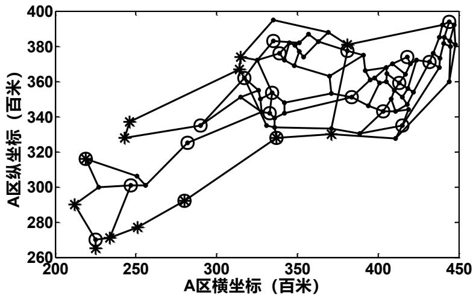  
注：图中节点处加上圈的是平台。

图 1 A区的交通网络与平台设置的示意图

5.1.1.2 根据Floyd算法结果，和图2中的流程图，利用 MATLAB 编程<sup>[4]</sup>，可找出距离各节点最近的平台及其距离（程序见附录3），见表 1。

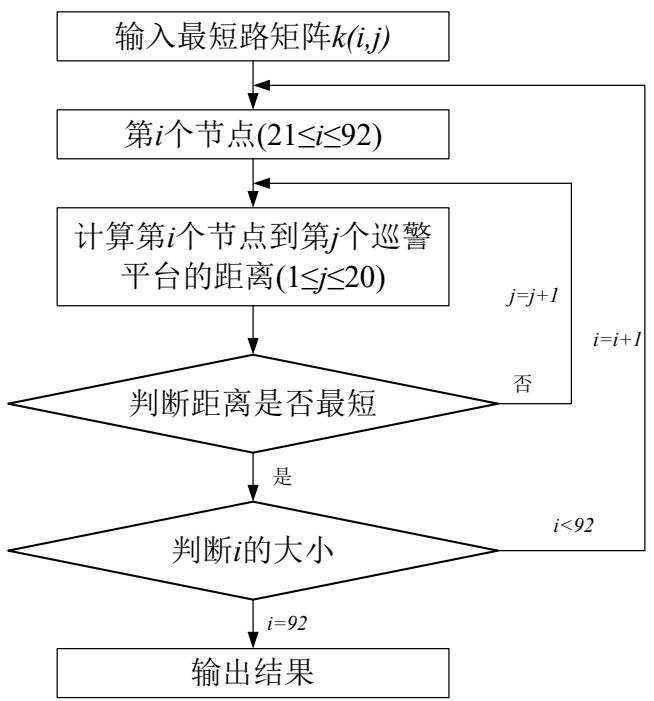

<details>
<summary>flowchart</summary>

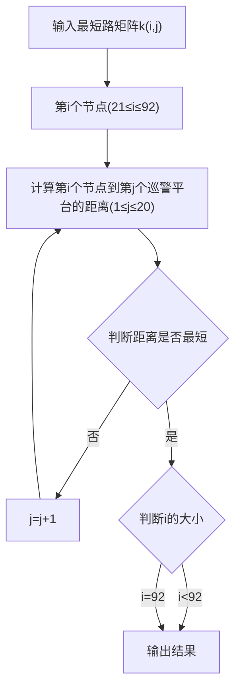
</details>

图 2 A 区寻找距离节点最近的交巡警平台的流程图

表 1 距离各节点最近的平台编号及距离

<table><tr><td>节点编号</td><td>平台编号</td><td>距离(百米)</td><td>节点编号</td><td>平台编号</td><td>距离(百米)</td><td>节点编号</td><td>平台编号</td><td>距离(百米)</td></tr><tr><td>21</td><td>A13</td><td>27.0831</td><td>45</td><td>A9</td><td>10.9508</td><td>69</td><td>A1</td><td>5</td></tr><tr><td>22</td><td>A13</td><td>9.0554</td><td>46</td><td>A8</td><td>9.3005</td><td>70</td><td>A2</td><td>8.6023</td></tr><tr><td>23</td><td>A13</td><td>5</td><td>47</td><td>A7</td><td>12.8062</td><td>71</td><td>A1</td><td>11.4031</td></tr><tr><td>24</td><td>A13</td><td>23.8537</td><td>48</td><td>A7</td><td>12.902</td><td>72</td><td>A2</td><td>16.0623</td></tr><tr><td>25</td><td>A12</td><td>17.8885</td><td>49</td><td>A5</td><td>5</td><td>73</td><td>A1</td><td>10.2961</td></tr><tr><td>26</td><td>A11</td><td>9</td><td>50</td><td>A5</td><td>8.4853</td><td>74</td><td>A1</td><td>6.265</td></tr><tr><td>27</td><td>A11</td><td>16.433</td><td>51</td><td>A5</td><td>12.2932</td><td>75</td><td>A1</td><td>9.3005</td></tr><tr><td>*28</td><td>A15</td><td>47.5184</td><td>52</td><td>A5</td><td>16.5943</td><td>76</td><td>A1</td><td>12.8361</td></tr><tr><td>*29</td><td>A15</td><td>57.0053</td><td>53</td><td>A5</td><td>11.7082</td><td>77</td><td>A19</td><td>9.8489</td></tr><tr><td>30</td><td>A7</td><td>5.831</td><td>54</td><td>A3</td><td>22.7089</td><td>78</td><td>A1</td><td>6.4031</td></tr><tr><td>31</td><td>A9</td><td>20.5572</td><td>55</td><td>A3</td><td>12.659</td><td>79</td><td>A19</td><td>4.4721</td></tr><tr><td>32</td><td>A7</td><td>11.4018</td><td>56</td><td>A5</td><td>20.837</td><td>80</td><td>A18</td><td>8.0623</td></tr><tr><td>33</td><td>A8</td><td>8.2765</td><td>57</td><td>A4</td><td>18.6815</td><td>81</td><td>A18</td><td>6.7082</td></tr><tr><td>34</td><td>A9</td><td>5.0249</td><td>58</td><td>A5</td><td>23.0189</td><td>82</td><td>A18</td><td>10.7935</td></tr><tr><td>35</td><td>A9</td><td>4.2426</td><td>59</td><td>A5</td><td>15.2086</td><td>83</td><td>A18</td><td>5.3852</td></tr><tr><td>36</td><td>A16</td><td>6.0828</td><td>60</td><td>A4</td><td>17.3924</td><td>84</td><td>A20</td><td>11.7522</td></tr><tr><td>37</td><td>A16</td><td>11.1818</td><td>*61</td><td>A7</td><td>41.902</td><td>85</td><td>A20</td><td>4.4721</td></tr><tr><td>*38</td><td>A16</td><td>34.0588</td><td>62</td><td>A4</td><td>3.5</td><td>86</td><td>A20</td><td>3.6056</td></tr><tr><td>*39</td><td>A2</td><td>36.8219</td><td>63</td><td>A4</td><td>10.3078</td><td>87</td><td>A20</td><td>14.6509</td></tr><tr><td>40</td><td>A2</td><td>19.1442</td><td>64</td><td>A4</td><td>19.3631</td><td>88</td><td>A20</td><td>12.9463</td></tr><tr><td>41</td><td>A17</td><td>8.5</td><td>65</td><td>A3</td><td>15.2398</td><td>89</td><td>A20</td><td>9.4868</td></tr><tr><td>42</td><td>A17</td><td>9.8489</td><td>66</td><td>A3</td><td>18.402</td><td>90</td><td>A20</td><td>13.0224</td></tr><tr><td>43</td><td>A2</td><td>8</td><td>67</td><td>A1</td><td>16.1942</td><td>91</td><td>A20</td><td>15.9877</td></tr><tr><td>44</td><td>A2</td><td>9.4868</td><td>68</td><td>A1</td><td>12.0711</td><td>*92</td><td>A20</td><td>36.0127</td></tr></table>

注：表中加“\*”表示该节点距离相应平台的最短距离超过 3km.

由此可得各平台的管辖范围，见表2。

表 2 各平台的管辖范围

<table><tr><td colspan="4">交巡警平台</td><td colspan="6">节点</td></tr><tr><td>A1</td><td>67</td><td>68</td><td>69</td><td>71</td><td>73</td><td>74</td><td>75</td><td>76</td><td>78</td></tr><tr><td>A2</td><td>39</td><td>40</td><td>43</td><td>44</td><td>70</td><td>72</td><td></td><td></td><td></td></tr><tr><td>A3</td><td>54</td><td>55</td><td>65</td><td>66</td><td></td><td></td><td></td><td></td><td></td></tr><tr><td>A4</td><td>57</td><td>60</td><td>62</td><td>63</td><td>64</td><td></td><td></td><td></td><td></td></tr><tr><td>A5</td><td>49</td><td>50</td><td>51</td><td>52</td><td>53</td><td>56</td><td>58</td><td>59</td><td></td></tr><tr><td>A6</td><td>无</td><td></td><td></td><td></td><td></td><td></td><td></td><td></td><td></td></tr><tr><td>A7</td><td>30</td><td>32</td><td>47</td><td>48</td><td>61</td><td></td><td></td><td></td><td></td></tr><tr><td>A8</td><td>33</td><td>46</td><td></td><td></td><td></td><td></td><td></td><td></td><td></td></tr><tr><td>A9</td><td>31</td><td>34</td><td>35</td><td>45</td><td></td><td></td><td></td><td></td><td></td></tr><tr><td>A10</td><td>无</td><td></td><td></td><td></td><td></td><td></td><td></td><td></td><td></td></tr><tr><td>A11</td><td>26</td><td>27</td><td></td><td></td><td></td><td></td><td></td><td></td><td></td></tr><tr><td>A12</td><td>25</td><td></td><td></td><td></td><td></td><td></td><td></td><td></td><td></td></tr><tr><td>A13</td><td>21</td><td>22</td><td>23</td><td>24</td><td></td><td></td><td></td><td></td><td></td></tr><tr><td>A14</td><td>无</td><td></td><td></td><td></td><td></td><td></td><td></td><td></td><td></td></tr><tr><td>A15</td><td>28</td><td>29</td><td></td><td></td><td></td><td></td><td></td><td></td><td></td></tr><tr><td>A16</td><td>36</td><td>37</td><td>38</td><td></td><td></td><td></td><td></td><td></td><td></td></tr><tr><td>A17</td><td>41</td><td>42</td><td></td><td></td><td></td><td></td><td></td><td></td><td></td></tr><tr><td>A18</td><td>80</td><td>81</td><td>82</td><td>83</td><td></td><td></td><td></td><td></td><td></td></tr><tr><td>A19</td><td>77</td><td>79</td><td></td><td></td><td></td><td></td><td></td><td></td><td></td></tr><tr><td>A20</td><td>84</td><td>85</td><td>86</td><td>87</td><td>88</td><td>89</td><td>90</td><td>91</td><td>92</td></tr></table>

表 2 中，平台 6，10，14 由于距离周围的节点较远，因此主要负责解决自身的突发事件。

根据表2，我们在图中对各个平台的管辖范围进行划分，见图 3。

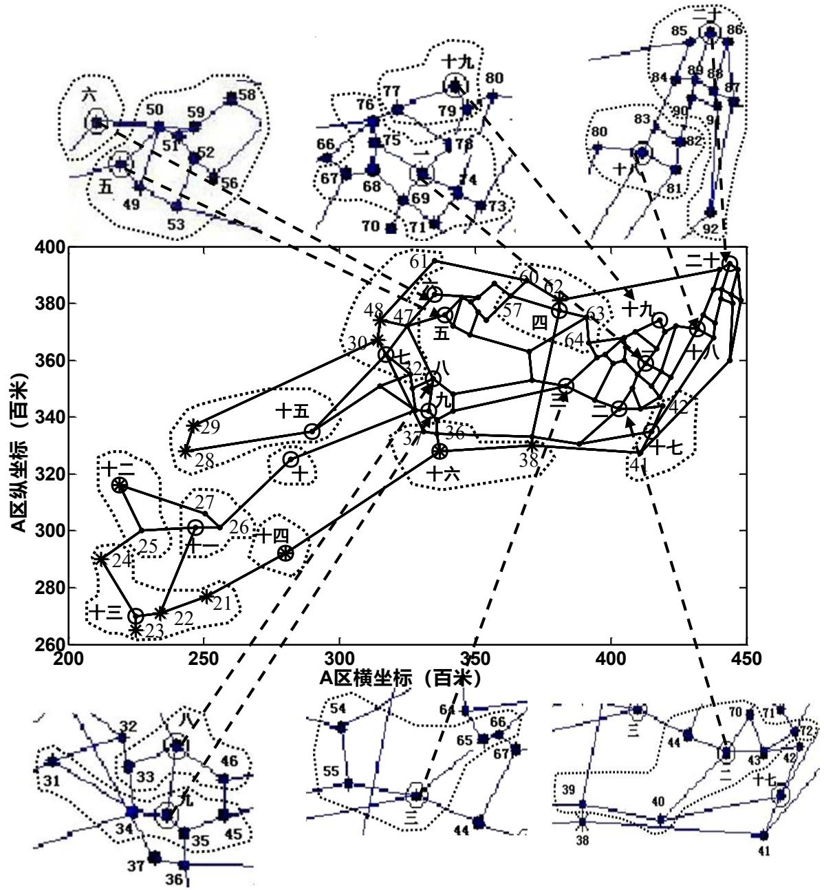

<details>
<summary>scatter</summary>

| Point ID | A区横坐标 (百米) | A区纵坐标 (百米) |
| --- | --- | --- |
| 1 | ~215 | ~315 |
| 2 | ~215 | ~290 |
| 3 | ~220 | ~270 |
| 4 | ~230 | ~265 |
| 5 | ~240 | ~300 |
| 6 | ~250 | ~300 |
| 7 | ~260 | ~290 |
| 8 | ~270 | ~335 |
| 9 | ~280 | ~335 |
| 10 | ~290 | ~325 |
| 11 | ~300 | ~365 |
| 12 | ~310 | ~365 |
| 13 | ~320 | ~345 |
| 14 | ~330 | ~345 |
| 15 | ~340 | ~345 |
| 16 | ~350 | ~345 |
| 17 | ~360 | ~345 |
| 18 | ~370 | ~345 |
| 19 | ~380 | ~345 |
| 20 | ~390 | ~345 |
| 21 | ~250 | ~275 |
| 22 | ~240 | ~270 |
| 23 | ~230 | ~265 |
| 24 | ~215 | ~290 |
| 25 | ~220 | ~300 |
| 26 | ~260 | ~300 |
| 27 | ~270 | ~315 |
| 28 | ~280 | ~325 |
| 29 | ~280 | ~340 |
| 30 | ~310 | ~365 |
| 31 | ~210 | ~315 |
| 32 | ~215 | ~315 |
| 33 | ~240 | ~315 |
| 34 | ~240 | ~315 |
| 35 | ~260 | ~315 |
| 36 | ~270 | ~315 |
| 37 | ~280 | ~315 |
| 38 | ~340 | ~345 |
| 39 | ~410 | ~345 |
| 40 | ~410 | ~345 |
| 41 | ~410 | ~345 |
| 42 | ~410 | ~345 |
| 43 | ~410 | ~345 |
| 44 | ~410 | ~345 |
| 45 | ~410 | ~345 |
| 46 | ~410 | ~345 |
| 47 | ~320 | ~385 |
| 48 | ~320 | ~385 |
| 49 | ~320 | ~385 |
| 50 | ~290 | ~385 |
| 51 | ~290 | ~385 |
| 52 | ~290 | ~385 |
| 53 | ~290 | ~385 |
| 54 | ~290 | ~385 |
| 55 | ~290 | ~385 |
| 56 | ~290 | ~385 |
| 57 | ~340 | ~385 |
| 58 | ~290 | ~385 |
| 59 | ~290 | ~385 |
| 60 | ~360 | ~385 |
| 61 | ~360 | ~385 |
| 62 | ~370 | ~385 |
| 63 | ~380 | ~385 |
| 64 | ~380 | ~385 |
| 65 | ~380 | ~385 |
| 66 | ~380 | ~385 |
| 67 | ~380 | ~385 |
| 68 | ~380 | ~385 |
| 69 | ~380 | ~385 |
| 70 | ~290 | ~385 |
| 71 | ~290 | ~385 |
| 72 | ~290 | ~385 |
| 73 | ~290 | ~385 |
| 74 | ~290 | ~385 |
| 75 | ~290 | ~385 |
| 76 | ~290 | ~385 |
| 77 | ~290 | ~385 |
| 78 | ~290 | ~385 |
| 79 | ~290 | ~385 |
| 80 | ~290 | ~385 |
| 81 | ~290 | ~385 |
| 82 | ~290 | ~385 |
| 83 | ~290 | ~385 |
| 84 | ~290 | ~385 |
| 85 | ~290 | ~385 |
| 86 | ~290 | ~385 |
| 87 | ~290 | ~385 |
| 88 | ~290 | ~385 |
| 89 | ~290 | ~385 |
| 90 | ~290 | ~385 |
| 91 | ~290 | ~385 |
| 92 | ~290 | ~385 |
</details>

图 3 A 区各平台管辖范围示意图

## 5.1.2 A区13条交通要道的快速封锁调度方案

根据Floyd算法得出的最短路径矩阵，我们可以求出A区20个平台分别到达 A区13个出口的最短路程，见表 3（程序见附录4）。

表 3 A 区各平台到出口的最短路程（单位：百米）

<table><tr><td>出口</td><td>A1</td><td>A2</td><td>A3</td><td>A4</td><td>A5</td><td>A6</td><td>A7</td><td>A8</td><td>A9</td><td>A10</td></tr><tr><td>1</td><td>222.36</td><td>204.64</td><td>183.52</td><td>219.97</td><td>176.28</td><td>176.59</td><td>149.15</td><td>140.93</td><td>130.11</td><td>75.87</td></tr><tr><td>2</td><td>160.28</td><td>141.30</td><td>127.67</td><td>150.09</td><td>129.70</td><td>130.00</td><td>109.01</td><td>94.34</td><td>82.74</td><td>127.76</td></tr><tr><td>3</td><td>92.87</td><td>73.88</td><td>60.26</td><td>82.67</td><td>62.28</td><td>62.59</td><td>41.60</td><td>26.92</td><td>15.33</td><td>69.57</td></tr><tr><td>4</td><td>192.93</td><td>173.95</td><td>160.32</td><td>182.73</td><td>162.35</td><td>162.65</td><td>141.66</td><td>126.99</td><td>115.39</td><td>95.11</td></tr><tr><td>5</td><td>210.96</td><td>191.97</td><td>178.35</td><td>200.76</td><td>177.50</td><td>177.80</td><td>150.36</td><td>142.14</td><td>131.32</td><td>77.08</td></tr><tr><td>6</td><td>225.02</td><td>206.03</td><td>192.41</td><td>214.82</td><td>191.55</td><td>191.86</td><td>164.42</td><td>156.19</td><td>145.38</td><td>91.13</td></tr><tr><td>7</td><td>228.93</td><td>211.21</td><td>190.09</td><td>226.54</td><td>182.85</td><td>183.16</td><td>155.72</td><td>147.50</td><td>136.68</td><td>82.44</td></tr><tr><td>8</td><td>190.01</td><td>172.29</td><td>151.17</td><td>162.27</td><td>113.07</td><td>113.37</td><td>85.70</td><td>102.28</td><td>97.76</td><td>141.95</td></tr><tr><td>9</td><td>195.16</td><td>177.44</td><td>156.32</td><td>155.35</td><td>106.15</td><td>106.46</td><td>80.15</td><td>104.93</td><td>107.24</td><td>151.44</td></tr><tr><td>10</td><td>120.83</td><td>103.11</td><td>82.00</td><td>81.03</td><td>31.83</td><td>32.14</td><td>5.83</td><td>30.61</td><td>34.92</td><td>79.11</td></tr><tr><td>11</td><td>58.81</td><td>39.82</td><td>60.94</td><td>48.61</td><td>94.21</td><td>94.52</td><td>73.53</td><td>58.85</td><td>47.26</td><td>101.50</td></tr><tr><td>12</td><td>118.50</td><td>103.10</td><td>81.98</td><td>73.96</td><td>24.76</td><td>25.06</td><td>12.90</td><td>30.99</td><td>41.99</td><td>86.19</td></tr><tr><td>13</td><td>48.85</td><td>60.35</td><td>43.93</td><td>3.50</td><td>52.55</td><td>53.37</td><td>79.92</td><td>86.77</td><td>93.37</td><td>147.61</td></tr></table>

续表：

<table><tr><td>出口</td><td>A11</td><td>A12</td><td>A13</td><td>A14</td><td>A15</td><td>A16</td><td>A17</td><td>A18</td><td>A19</td><td>A20</td></tr><tr><td>1</td><td>37.91</td><td>0.00</td><td>59.77</td><td>119.50</td><td>170.30</td><td>145.43</td><td>218.92</td><td>242.47</td><td>225.47</td><td>269.46</td></tr><tr><td>2</td><td>83.37</td><td>119.50</td><td>59.73</td><td>0.00</td><td>132.98</td><td>67.42</td><td>149.03</td><td>185.14</td><td>169.61</td><td>212.13</td></tr><tr><td>3</td><td>113.95</td><td>145.43</td><td>127.15</td><td>67.42</td><td>65.56</td><td>0.00</td><td>81.62</td><td>117.73</td><td>102.20</td><td>144.71</td></tr><tr><td>4</td><td>50.72</td><td>86.85</td><td>27.08</td><td>32.65</td><td>165.63</td><td>100.07</td><td>181.68</td><td>217.79</td><td>202.26</td><td>244.78</td></tr><tr><td>5</td><td>32.70</td><td>68.83</td><td>9.06</td><td>50.68</td><td>171.51</td><td>118.09</td><td>199.71</td><td>235.82</td><td>220.29</td><td>262.81</td></tr><tr><td>6</td><td>46.75</td><td>64.77</td><td>5.00</td><td>64.73</td><td>185.56</td><td>132.15</td><td>213.77</td><td>249.88</td><td>234.35</td><td>276.86</td></tr><tr><td>7</td><td>38.05</td><td>35.92</td><td>23.85</td><td>83.59</td><td>176.87</td><td>151.00</td><td>225.49</td><td>249.04</td><td>232.04</td><td>276.03</td></tr><tr><td>8</td><td>186.33</td><td>217.81</td><td>228.08</td><td>180.50</td><td>47.52</td><td>113.08</td><td>186.57</td><td>210.12</td><td>193.12</td><td>230.11</td></tr><tr><td>9</td><td>195.82</td><td>227.30</td><td>237.57</td><td>189.17</td><td>57.01</td><td>121.75</td><td>195.24</td><td>215.27</td><td>198.26</td><td>223.19</td></tr><tr><td>10</td><td>123.50</td><td>154.98</td><td>165.25</td><td>114.84</td><td>44.01</td><td>47.43</td><td>120.92</td><td>140.94</td><td>123.94</td><td>148.87</td></tr><tr><td>11</td><td>145.88</td><td>177.36</td><td>161.21</td><td>101.48</td><td>97.50</td><td>34.06</td><td>47.56</td><td>83.67</td><td>76.39</td><td>110.66</td></tr><tr><td>12</td><td>130.57</td><td>162.05</td><td>172.32</td><td>121.91</td><td>51.09</td><td>54.50</td><td>127.99</td><td>136.99</td><td>119.99</td><td>141.80</td></tr><tr><td>13</td><td>191.99</td><td>223.47</td><td>213.32</td><td>153.59</td><td>118.10</td><td>86.17</td><td>78.21</td><td>67.34</td><td>50.34</td><td>64.49</td></tr></table>

出现重大突发事件时，需调度 20 个交巡警服务平台的警力资源，对进出该区的 13条交通要道实现快速全封锁。校园咖客收集整理（www.campustars.com）

对于各平台，只有调度和不调度两种情况，因此，可用 0-1规划的思想建立模型。设 $x _ { k j }$ 为第 个出口被第j个平台的警力封锁的情况，则有：

$$
x _ {k j} = \left\{ \begin{array}{l l} 0, & \text {第} k \text {个出口不被第} j \text {个平台的警力封锁} \\ 1, & \text {第} k \text {个出口被第} j \text {个平台的警力封锁} \end{array} \right. \tag {2}
$$

$$
k = 1, 2, 3, \dots , l; j = 1, 2, 3, \dots , n
$$

## 5.1.2.1 最快实现完全封锁的调度方案

题目要求在最短时间内实现全封锁，而全封锁的时间是由封锁最后一个路口所用的时间决定的。因此，以最快实现全封锁为目标函数，可转化为求最远调度距离的最小值，表述为：

$$
\min Z = \max _ {1 \leq k \leq l} (\sum_ {j = 1} ^ {n} S _ {k j} x _ {k j}) \tag {3}
$$

其中，Z表示所有调度中的最远距离， $S _ { k j }$ 表示第j个平台到第k个出口的距离。

约束条件为：

(1)平台安排的约束。由于有 20个平台，13 个出口，每个平台最多封锁一个出口，因此第 个平台不一定被调去封锁出口，即

$$
\sum_ {k = 1} ^ {l} x _ {k j} \leq 1, j = 1, 2, 3, \dots , n \tag {4}
$$

(2)出口被唯一一个平台封锁的约束，则有

$$
\sum_ {j = 1} ^ {n} x _ {k j} = 1, k = 1, 2, 3, \dots , l \tag {5}
$$

综上，最快实现全封锁的模型为<sup>[5]</sup>：

$$
\begin{array}{l} \min Z = \max _ {1 \leq k \leq l} (\sum_ {j = 1} ^ {n} S _ {k j} x _ {k j}) \\ s. t. \left\{ \begin{array}{l} \sum_ {k = 1} ^ {l} x _ {k j} \leq 1, j = 1, 2, 3, \dots , n \\ \sum_ {j = 1} ^ {n} x _ {k j} = 1, k = 1, 2, 3, \dots , l \\ x _ {k j} \in \{0, 1 \} \end{array} \right. \tag {6} \\ \end{array}
$$

根据模型（6），利用 MATLAB 编程，最后可以得到数个最优解（程序见附录 5），再结合表3，可得到其中四个结果，见表4\~7。

表 4 调度方案 1

<table><tr><td>出口</td><td>平台</td><td>距离(百米)</td></tr><tr><td>1</td><td>A12</td><td>0.00</td></tr><tr><td>2</td><td>A16</td><td>67.42</td></tr><tr><td>3</td><td>A5</td><td>62.28</td></tr><tr><td>4</td><td>A13</td><td>27.08</td></tr><tr><td>5</td><td>A10</td><td>77.08</td></tr><tr><td>6</td><td>A14</td><td>64.73</td></tr><tr><td>7</td><td>A11</td><td>38.05</td></tr><tr><td>8</td><td>A15</td><td>47.52</td></tr><tr><td>9</td><td>A7</td><td>80.15</td></tr></table>

表 5 调度方案 2

<table><tr><td>出口</td><td>平台</td><td>距离(百米)</td></tr><tr><td>1</td><td>A12</td><td>0</td></tr><tr><td>2</td><td>A16</td><td>67.42</td></tr><tr><td>3</td><td>A2</td><td>73.88</td></tr><tr><td>4</td><td>A14</td><td>32.65</td></tr><tr><td>5</td><td>A10</td><td>77.08</td></tr><tr><td>6</td><td>A13</td><td>5.00</td></tr><tr><td>7</td><td>A11</td><td>38.05</td></tr><tr><td>8</td><td>A15</td><td>47.52</td></tr><tr><td>9</td><td>A7</td><td>80.15</td></tr><tr><td>10</td><td>A8</td><td>30.61</td></tr><tr><td>11</td><td>A9</td><td>47.26</td></tr><tr><td>12</td><td>A4</td><td>73.96</td></tr><tr><td>13</td><td>A2</td><td>60.35</td></tr></table>

表 6 调度方案 3

<table><tr><td>出口</td><td>平台</td><td>距离(百米)</td></tr><tr><td>1</td><td>A12</td><td>0.00</td></tr><tr><td>2</td><td>A16</td><td>67.42</td></tr><tr><td>3</td><td>A9</td><td>15.33</td></tr><tr><td>4</td><td>A14</td><td>32.65</td></tr><tr><td>5</td><td>A10</td><td>77.08</td></tr><tr><td>6</td><td>A11</td><td>46.75</td></tr><tr><td>7</td><td>A13</td><td>23.85</td></tr><tr><td>8</td><td>A15</td><td>47.52</td></tr><tr><td>9</td><td>A7</td><td>80.15</td></tr><tr><td>10</td><td>A8</td><td>30.61</td></tr><tr><td>11</td><td>A4</td><td>48.61</td></tr><tr><td>12</td><td>A5</td><td>24.76</td></tr><tr><td>13</td><td>A2</td><td>60.35</td></tr></table>

<table><tr><td>10</td><td>A9</td><td>34.92</td></tr><tr><td>11</td><td>A8</td><td>58.85</td></tr><tr><td>12</td><td>A5</td><td>24.76</td></tr><tr><td>13</td><td>A4</td><td>3.50</td></tr></table>

表 7 调度方案 4

<table><tr><td>出口</td><td>平台</td><td>距离(百米)</td></tr><tr><td>1</td><td>A12</td><td>0.00</td></tr><tr><td>2</td><td>A16</td><td>67.42</td></tr><tr><td>3</td><td>A8</td><td>26.92</td></tr><tr><td>4</td><td>A13</td><td>27.08</td></tr><tr><td>5</td><td>A10</td><td>77.08</td></tr><tr><td>6</td><td>A14</td><td>64.73</td></tr><tr><td>7</td><td>A11</td><td>38.05</td></tr><tr><td>8</td><td>A15</td><td>47.52</td></tr><tr><td>9</td><td>A7</td><td>80.15</td></tr><tr><td>10</td><td>A9</td><td>34.92</td></tr><tr><td>11</td><td>A2</td><td>39.82</td></tr><tr><td>12</td><td>A4</td><td>73.96</td></tr><tr><td>13</td><td>A5</td><td>52.55</td></tr></table>

观察上述四个调度方案可以发现，这些调度方案中，距离最远的都是平台 7至出口9，为80.15百米，所以完成 A区完全封锁的时间即由此决定，需要8分钟。

在此基础上，以总调度距离最短为目标函数，对除平台7和出口9 以外的出口和交巡警平台进一步作0-1 规划的模型为：

$$
\min Y = \sum_ {k = 1} ^ {l - 1} \sum_ {j = 1} ^ {n - 1} S _ {k j} x _ {k j}
$$

$$
s. t. \left\{ \begin{array}{l} \sum_ {k = 1} ^ {l - 1} x _ {k j} \leq 1, j = 1, 2, 3, \dots , (n - 1) \\ \sum_ {j = 1} ^ {n - 1} x _ {k j} = 1, k = 1, 2, 3, \dots , (l - 1) \\ x _ {k j} \in \{0, 1 \} \end{array} \right. \tag {7}
$$

其中， 表示总调度距离。 表示除平台 7 以外的平台总数， 表示除出口 9以外的出口总数。

利用lingo 软件对其求解<sup>[6]</sup>（程序见附录6），最终结果见表8。

表8 最快实现完全封锁且总距离相对最短的调度方案

<table><tr><td>出口</td><td>平台</td><td>距离(百米)</td></tr><tr><td>1</td><td>A12</td><td>0</td></tr><tr><td>2</td><td>A16</td><td>67.42</td></tr><tr><td>3</td><td>A8</td><td>26.92</td></tr><tr><td>4</td><td>A14</td><td>32.65</td></tr><tr><td>5</td><td>A10</td><td>77.08</td></tr><tr><td>6</td><td>A13</td><td>5</td></tr><tr><td>7</td><td>A11</td><td>38.05</td></tr><tr><td>8</td><td>A15</td><td>47.52</td></tr><tr><td>9</td><td>A7</td><td>80.15</td></tr><tr><td>10</td><td>A9</td><td>34.92</td></tr><tr><td>11</td><td>A2</td><td>39.82</td></tr><tr><td>12</td><td>A5</td><td>24.76</td></tr><tr><td>13</td><td>A4</td><td>3.5</td></tr></table>

综上，最快实现完全封锁的时间为 8分钟，调度的总距离为477.79 百米。5.1.2.2 总距离最短的调度方案

若以总距离最小为目标函数（不考虑是否能最快完成全封锁），可表述为：

$$
\min Y = \sum_ {k = 1} ^ {l} \sum_ {j = 1} ^ {n} S _ {k j} x _ {k j} \tag {8}
$$

约束条件为：

$$
\left\{ \begin{array}{l} \sum_ {k = 1} ^ {l} x _ {k j} \leq 1, j = 1, 2, \dots , n \\ \sum_ {j = 1} ^ {n} x _ {k j} = 1, k = 1, 2, \dots , l \\ x _ {k j} = 0, 1 \end{array} \right. \tag {9}
$$

利用LINGO软件对其求解（程序见附录 7），最终结果见表9。

表 9 总距离最短的调度方案

<table><tr><td>出口</td><td>平台</td><td>距离(百米)</td></tr><tr><td>1</td><td>A12</td><td>0</td></tr><tr><td>2</td><td>A14</td><td>0</td></tr><tr><td>3</td><td>A16</td><td>0</td></tr><tr><td>4</td><td>A9</td><td>115.39</td></tr><tr><td>5</td><td>A10</td><td>77.08</td></tr><tr><td>6</td><td>A13</td><td>5</td></tr><tr><td>7</td><td>A11</td><td>38.05</td></tr><tr><td>8</td><td>A15</td><td>47.51</td></tr><tr><td>9</td><td>A8</td><td>104.93</td></tr><tr><td>10</td><td>A7</td><td>5.83</td></tr><tr><td>11</td><td>A2</td><td>39.82</td></tr><tr><td>12</td><td>A5</td><td>24.75</td></tr><tr><td>13</td><td>A4</td><td>3.5</td></tr></table>

总距离为461.88百米，最远距离为 115.39 百米，在11分32秒时完成全部封锁。

通过对比上述两种目标不同的规划，可以发现总距离最短时，完成全封锁所需的时间更长，是由于其最远距离并非最短，不符合题目要求。因此我们采用最快实现完全封锁且总距离相对最短的调度方案（见表 8）。

## 5.1.3 增加交巡警平台的分配方案

由于各平台管辖范围内的节点数差异很大，以及各节点的案发率不同，造成现有交巡警服务平台的工作量不均衡，部分地方的出警时间过长。因此，可以通过增加交巡警服务平台及重新分配管辖范围，来解决这一问题。

根据Floyd算法，平台与节点间的最短路程不超过 3km 的对应关系见表10及表11（程序见附录 8）。校园咖客收集整理（www.campustars.com）

表 10 各交巡警平台周围 3km以内的所有节点

<table><tr><td>交巡警平台</td><td>节点</td></tr><tr><td>A1</td><td>1、42、43、44、64、65、66、67、68、69、70、71、72、73、74、75、76、77、78、79、80</td></tr><tr><td>A2</td><td>2、39、40、42、43、44、66、67、68、69、70、71、72、73、74、75、76、78</td></tr><tr><td>A3</td><td>3、43、44、54、55、64、65、66、67、68、70、76</td></tr><tr><td>A4</td><td>4、57、58、60、62、63、64、65、66</td></tr><tr><td>A5</td><td>5、47、48、49、50、51、52、53、56、58、59</td></tr><tr><td>A6</td><td>6、47、48、50、51、52、56、58、59</td></tr><tr><td>A7</td><td>7、30、31、32、33、34、47、48、61</td></tr><tr><td>A8</td><td>8、31、32、33、34、35、36、37、45、46、47</td></tr><tr><td>A9</td><td>9、31、32、33、34、35、36、37、45、46</td></tr><tr><td>A10</td><td>10</td></tr><tr><td>A11</td><td>11、25、26、27</td></tr><tr><td>A12</td><td>12、25</td></tr><tr><td>A13</td><td>13、21、22、23、24</td></tr><tr><td>A14</td><td>14</td></tr><tr><td>A15</td><td>15、28、29、31</td></tr><tr><td>A16</td><td>16、33、34、35、36、37、38、45、46</td></tr><tr><td>A17</td><td>17、40、41、42、43、70、72</td></tr><tr><td>A18</td><td>18、71、72、73、74、77、78、79、80、81、82、83、84、85、87、、88、89、90、91</td></tr><tr><td>A19</td><td>19、64、65、66、67、68、69、70、71、73、74、75、76、77、78、79、80、81、82、83</td></tr><tr><td>A20</td><td>20、81、82、83、84、85、86、87、88、89、90、91、92</td></tr></table>

注：由表1可知，有6个节点（28、29、38、39、61、92）与距其最近的交巡警平台的距离超过 3km，但仍将其划归为距离最近的平台。

表11 各节点周围3km以内的所有平台

<table><tr><td>节点i</td><td>平台编号j</td><td>节点i</td><td>平台编号j</td><td>节点i</td><td>平台编号j</td><td>节点i</td><td>平台编号j</td></tr><tr><td>1</td><td>A1</td><td>24</td><td>A13</td><td>47</td><td>A5、A6、A7、A8</td><td>70</td><td>A1、A2、A3、A17、A19</td></tr><tr><td>2</td><td>A2</td><td>25</td><td>A11、A12</td><td>48</td><td>A5、A6、A7、A23</td><td>71</td><td>A1、A2、A17、A18</td></tr><tr><td>3</td><td>A3</td><td>26</td><td>A11</td><td>49</td><td>A5</td><td>72</td><td>A1、A2、A17、A18</td></tr><tr><td>4</td><td>A4</td><td>27</td><td>A11</td><td>50</td><td>A5、A6</td><td>73</td><td>A1、A2、A18、A19</td></tr><tr><td>5</td><td>A5</td><td>28</td><td>A15</td><td>51</td><td>A5、A6</td><td>74</td><td>A1、A2、A18、A19</td></tr><tr><td>6</td><td>A6</td><td>29</td><td>A15</td><td>52</td><td>A5、A6</td><td>75</td><td>A1、A2、A19</td></tr><tr><td>7</td><td>A7</td><td>30</td><td>A7</td><td>53</td><td>A5</td><td>76</td><td>A1、A2、A3、A19</td></tr><tr><td>8</td><td>A8</td><td>31</td><td>A7、A8、A9、A15</td><td>54</td><td>A3</td><td>77</td><td>A1、A18、A19</td></tr><tr><td>9</td><td>A9</td><td>32</td><td>A7、A8、A9</td><td>55</td><td>A3</td><td>78</td><td>A1、A2、A18、A19</td></tr><tr><td>10</td><td>A10</td><td>33</td><td>A7、A8、A9、A16</td><td>56</td><td>A5、A6</td><td>79</td><td>A1、A18、A19</td></tr><tr><td>11</td><td>A11</td><td>34</td><td>A7、A8、A9、A16</td><td>57</td><td>A4</td><td>80</td><td>A1、A18、A19</td></tr><tr><td>12</td><td>A12</td><td>35</td><td>A8、A9、A16</td><td>58</td><td>A4、A5、A6</td><td>81</td><td>A18、A19、A20</td></tr><tr><td>13</td><td>A13</td><td>36</td><td>A8、A9、A16</td><td>59</td><td>A5、A6</td><td>82</td><td>A18、A19、A20</td></tr><tr><td>14</td><td>A14</td><td>37</td><td>A8、A9、A16</td><td>60</td><td>A4</td><td>83</td><td>A18、A19、A20、</td></tr><tr><td>15</td><td>A15</td><td>38</td><td>A16</td><td>61</td><td>A7</td><td>84</td><td>A18、A20</td></tr><tr><td>16</td><td>A16</td><td>39</td><td>A2</td><td>62</td><td>A4</td><td>85</td><td>A18、A20</td></tr><tr><td>17</td><td>A17</td><td>40</td><td>A2、A17、A22</td><td>63</td><td>A4</td><td>86</td><td>A20</td></tr><tr><td>18</td><td>A18</td><td>41</td><td>A17</td><td>64</td><td>A1、A3、A4、A19</td><td>87</td><td>A18、A20</td></tr><tr><td>19</td><td>A19</td><td>42</td><td>A1、A2、A17</td><td>65</td><td>A1、A3、A4、A19</td><td>88</td><td>A18、A20</td></tr><tr><td>20</td><td>A20</td><td>43</td><td>A1、A2、A3、A17</td><td>66</td><td>A1、A2、A3、A4、A19</td><td>89</td><td>A18、A20</td></tr><tr><td>21</td><td>A13</td><td>44</td><td>A1、A2、A3</td><td>67</td><td>A1、A2、A3、A19</td><td>90</td><td>A18、A20</td></tr><tr><td>22</td><td>A13</td><td>45</td><td>A8、A9、A16</td><td>68</td><td>A1、A2、A3、A19</td><td>91</td><td>A18、A20</td></tr><tr><td>23</td><td>A13</td><td>46</td><td>A8、A9、A16</td><td>69</td><td>A1、A2、A19</td><td>92</td><td>A20</td></tr></table>

由表 11 可知，部分节点周围 3km 以内有多个平台，因此根据工作量和出警时间对其进行规划，使得每个节点只被一个平台管辖。

对于节点 ，只有被平台 管辖和不被平台 管辖两种情况，因此，可设计0-1变量。令：

$$
x _ {i j} = \left\{ \begin{array}{l l} 0, & \text {第} i \text {个节点不被第} j \text {个平台管辖} \\ 1, & \text {第} i \text {个节点被第} j \text {个平台管辖} \end{array} \right. \tag {10}
$$

$$
i = 1, 2, 3, \dots , m; j = 1, 2, 3, \dots , n
$$

交巡警平台的工作量可表示为该平台管辖范围内各节点案发率的总和，即：

$$
W _ {j} = \sum_ {i} C _ {i} x _ {i j} \tag {11}
$$

$$
(i = 1, 2, 3, \dots , m; j = 1, 2, 3, \dots , n)
$$

其中， $W _ { j }$ 指交巡警平台 的工作量， $C _ { i }$ 表示节点 的日案发率。

根据假设1，交巡警的出警时间是指从接警到到达事发地路口节点的时间，即：

$$
T _ {j} = \max _ {1 \leq i \leq m} (\frac {S _ {i j} x _ {i j}}{V}) \tag {12}
$$

$$
(i = 1, 2, 3, \dots , m; j = 1, 2, 3, \dots , n)
$$

其中， $T _ { j }$ 表示第 个平台的最长出警时间， $S _ { i j }$ 表示第j个平台到达第 个节点的最短距离。

## （1）确定目标函数

目标函数 1：要使各平台的工作量更加均衡，可使各交巡警平台工作量的变异系数最小，其值越小，表示各平台工作量越均衡，即：

$$
\min f _ {1} = \frac {\sqrt {\frac {1}{n - 1} \sum_ {j = 1} ^ {n} (W _ {j} - \bar {W}) ^ {2}}}{\bar {W}} \tag {13}
$$

目标函数2：最长出警时间达到最少，则有：

$$
\min f _ {2} = \max _ {1 \leq j \leq n} (T _ {j}) \tag {14}
$$

## （2）约束条件

1）平台不闲的约束。为使每个平台不至于无管辖范围，可约束为它至少管辖自己所在的节点。当 $i = j$ 时，即：

$$
x _ {i j} = 1, \quad \text {当} i = j \tag {15}
$$

2）每个节点都被平台管辖的约束。当 $i \neq j$ 时，由假设7，第 个节点必定被 $1 \sim n$ 中的唯一一个平台管辖，即：

$$
\sum_ {j = 1} ^ {n} x _ {i j} = 1, \quad \text {当} i \neq j \tag {16}
$$

## 3）出警时间不超过 3min。

综上，考虑平台的工作量呈均衡性及合理出警时间的模型<sup>[7]</sup>为：

$$
\begin{array}{l} \min f _ {1} = \frac {\sqrt {\frac {1}{n - 1} \sum_ {j = 1} ^ {n} \left(W _ {j} - \bar {W}\right) ^ {2}}}{\bar {W}} \\ \min f _ {2} = \max _ {1 \leq j \leq n} (T _ {j}) \\ s. t. \left\{ \begin{array}{l} x _ {i j} = 1, \quad \text {当} i = j \\ \sum_ {j = 1} ^ {n} x _ {i j} = 1, \quad \text {当} i \neq j \\ \frac {S _ {i j}}{V} \leq 3 \\ x _ {i j} \in \{0, 1 \} \\ \bar {W} = \frac {1}{n} \sum_ {j = 1} ^ {n} W _ {j} \\ i = 1, 2, 3, \dots , m; \quad j = 1, 2, 3, \dots , n \end{array} \right. \tag {17} \\ \end{array}
$$

在不增加交巡警平台的前提下，将表 11 中的数据代入模型（17），利用 MATLAB软件（程序见附录9）进行求解，结果见表12。

表12 最长出警时间最短且工作量均衡时各平台的管辖范围

<table><tr><td>交巡警平台</td><td colspan="6">管辖的节点</td><td>日工作量(案件数)</td></tr><tr><td>A1</td><td>1</td><td>71</td><td>73</td><td>74</td><td>75</td><td>68</td><td>6.5</td></tr><tr><td>A2</td><td>2</td><td>43</td><td>44</td><td>70</td><td>69</td><td></td><td>6.9</td></tr><tr><td>A3</td><td>3</td><td>54</td><td>55</td><td>65</td><td>66</td><td>67</td><td>6.4</td></tr><tr><td>A4</td><td>4</td><td>57</td><td>60</td><td>62</td><td>63</td><td>64</td><td>6.6</td></tr><tr><td>A5</td><td>5</td><td>49</td><td>52</td><td>53</td><td>56</td><td>58</td><td>6.9</td></tr><tr><td>A6</td><td>6</td><td>50</td><td>59</td><td>47</td><td>51</td><td>48</td><td>6.9</td></tr><tr><td>A7</td><td>7</td><td>30</td><td>61</td><td></td><td></td><td></td><td>5.1</td></tr><tr><td>A8</td><td>8</td><td>33</td><td>46</td><td>32</td><td></td><td></td><td>6.5</td></tr><tr><td>A9</td><td>9</td><td>31</td><td>35</td><td>45</td><td></td><td></td><td>6.5</td></tr><tr><td>A10</td><td>10</td><td>34</td><td></td><td></td><td></td><td></td><td>3.7</td></tr><tr><td>A11</td><td>11</td><td>26</td><td>27</td><td></td><td></td><td></td><td>5.6</td></tr><tr><td>A12</td><td>12</td><td>25</td><td>24</td><td></td><td></td><td></td><td>5.1</td></tr><tr><td>A13</td><td>13</td><td>22</td><td>23</td><td></td><td></td><td></td><td>6</td></tr><tr><td>A14</td><td>14</td><td>21</td><td></td><td></td><td></td><td></td><td>4.9</td></tr><tr><td>A15</td><td>15</td><td>28</td><td>29</td><td></td><td></td><td></td><td>4.8</td></tr><tr><td>A16</td><td>16</td><td>36</td><td>37</td><td>38</td><td>39</td><td></td><td>6.4</td></tr><tr><td>A17</td><td>17</td><td>41</td><td>42</td><td>40</td><td>72</td><td></td><td>6.8</td></tr><tr><td>A18</td><td>18</td><td>81</td><td>82</td><td>83</td><td>84</td><td>90 86</td><td>8.4</td></tr><tr><td>A19</td><td>19</td><td>76</td><td>77</td><td>78</td><td>79</td><td>80</td><td>6.1</td></tr><tr><td>A20</td><td>20</td><td>87</td><td>88</td><td>89</td><td>91</td><td>92 85</td><td>8.4</td></tr></table>

在不增加交巡警平台的前提下，最长出警时间为 5.70min，出现在平台 15前往节点29处理突发事件时。工作量的变异系数为0.1830。

同理可求得增加平台 1\~5个时工作量变异系数及最长出警时间的变化，见表14。

表 13 增加平台后工作量的变异系数和最长出警时间

<table><tr><td>新增平台个数</td><td>新增平台位置(节点号)</td><td>工作量的标准差</td><td>工作量的均值</td><td>变异系数</td><td>最长出警时间(min)</td></tr><tr><td>0</td><td>无</td><td>1.14</td><td>6.23</td><td>0.1830</td><td>5.70</td></tr><tr><td>1</td><td>28或29</td><td>1.34</td><td>5.93</td><td>0.2260</td><td>4.19</td></tr><tr><td>2</td><td>61</td><td>1.51</td><td>5.66</td><td>0.2668</td><td>3.82</td></tr><tr><td>3</td><td>39</td><td>1.35</td><td>5.41</td><td>0.2495</td><td>3.68</td></tr><tr><td>4</td><td>91</td><td>1.04</td><td>5.19</td><td>0.2004</td><td>2.71</td></tr><tr><td>5</td><td>67</td><td>0.76</td><td>4.98</td><td>0.1526</td><td>2.71</td></tr></table>

由表 可知，增加 个交巡警平台时，新增的平台主要设置在原来距离其所属平台较远的节点处，这样大大缩减了最长出警时间，但是该新增平台能够分担的工作量相对较少，因此变异系数反而增加。而当增加 4\~5个交巡警平台时，新增的平台主要分布在节点相对较密集而平台较少的区域，使工作量更加均衡，因而变异系数大大减小。

出现这种变化趋势的原因是：在未增加交巡警平台时，两个规划目标中出警时间过长是主要矛盾；而当新增平台数超过 3个时，出警时间已维持在一个较低的水平，此时，工作量的变异系数成为了影响结果的主导因素。

结论：增加4个交巡警平台，分别位于节点 28（29）、61、39和91，此时，最长出警时间已达到最小，为 2.71min，工作量的变异系数较小，为 0.2004。 增加5个交巡警平台，分别位于节点 28（29）、61、39、91 和 67，此时，工作量的变异系数最小，为0.1526，最长出警时间最短，为 2.71min。 因此，若只考虑最长出警时间，可以只增加4个交巡警平台；若同时考虑工作量的均衡性，需增加 5个交巡警平台。

## 5.2 问题二：全市交巡警平台的设置与调度

## 5.2.1 全市现有交巡警平台设置的合理性分析及调整方案

## （1）B 区的情况

B 区现有交巡警平台 8个，节点73个。首先，根据Floyd算法，得到平台与节点间的最短路程，并与3km 作比较，结果如图4（程序见附录 10）。

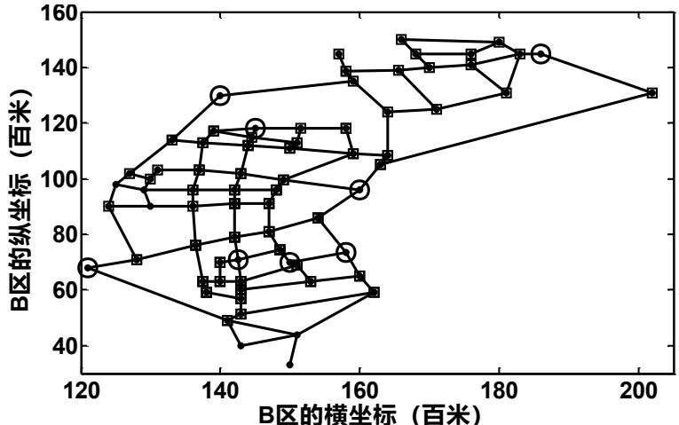

<details>
<summary>scatter</summary>

| Series | B区的横坐标 (百米) | B区的纵坐标 (百米) |
| --- | --- | --- |
| Circle | ~121 | ~68 |
| Square | ~123 | ~90 |
| Square | ~124 | ~102 |
| Square | ~125 | ~71 |
| Square | ~126 | ~98 |
| Square | ~127 | ~103 |
| Square | ~128 | ~114 |
| Square | ~130 | ~90 |
| Square | ~131 | ~96 |
| Square | ~132 | ~103 |
| Square | ~133 | ~117 |
| Square | ~134 | ~90 |
| Square | ~135 | ~96 |
| Square | ~136 | ~103 |
| Square | ~137 | ~117 |
| Square | ~138 | ~90 |
| Square | ~139 | ~96 |
| Square | ~140 | ~103 |
| Square | ~141 | ~117 |
| Square | ~142 | ~90 |
| Square | ~143 | ~96 |
| Square | ~144 | ~103 |
| Square | ~145 | ~117 |
| Square | ~146 | ~90 |
| Square | ~147 | ~96 |
| Square | ~148 | ~103 |
| Square | ~149 | ~117 |
| Square | ~150 | ~90 |
| Square | ~151 | ~96 |
| Square | ~152 | ~103 |
| Square | ~153 | ~117 |
| Square | ~154 | ~90 |
| Square | ~155 | ~96 |
| Square | ~156 | ~103 |
| Square | ~157 | ~117 |
| Square | ~158 | ~90 |
| Square | ~159 | ~96 |
| Square | ~160 | ~103 |
| Square | ~161 | ~117 |
| Square | ~162 | ~90 |
| Square | ~163 | ~96 |
| Square | ~164 | ~103 |
| Square | ~165 | ~117 |
| Square | ~166 | ~90 |
| Square | ~167 | ~96 |
| Square | ~168 | ~103 |
| Square | ~169 | ~117 |
| Square | ~170 | ~90 |
| Square | ~171 | ~96 |
| Square | ~172 | ~103 |
| Square | ~173 | ~117 |
| Square | ~174 | ~90 |
| Square | ~175 | ~96 |
| Square | ~176 | ~103 |
| Square | ~177 | ~117 |
| Square | ~178 | ~90 |
| Square | ~179 | ~96 |
| Square | ~180 | ~103 |
| Square | ~181 | ~117 |
| Square | ~182 | ~90 |
| Square | ~183 | ~96 |
| Square | ~184 | ~103 |
| Square | ~185 | ~117 |
| Square | ~186 | ~90 |
| Square | ~187 | ~96 |
| Square | ~188 | ~103 |
| Square | ~189 | ~117 |
| Square | ~190 | ~90 |
| Square | ~191 | ~96 |
| Square | ~192 | ~103 |
| Square | ~193 | ~117 |
| Square | ~194 | ~90 |
| Square | ~195 | ~96 |
| Square | ~196 | ~103 |
| Square | ~197 | ~117 |
| Square | ~198 | ~90 |
| Square | ~199 | ~96 |
| Square | 200+ | 60~72 |
</details>

注：图中加有圆圈的节点表示交巡警平台，加有方框的节点表示被3km以内的平台管辖的节点，未加方框的节点距离周围平台超过 3km。(图 5\~图 8 同)

图4 B 区现有交巡警平台设置示意图

由图可知，其中距离周围平台超过 3km 的节点是造成出警时间过长的原因，将 B区的数据代入模型（17）可得到现有交巡警平台管辖范围的划分方案，见表 14。

表14 B 区现有交巡警平台的管辖范围及工作量

<table><tr><td colspan="5">交巡警平台</td><td colspan="6">管辖的节点</td><td>工作量</td></tr><tr><td>B1</td><td>101</td><td>102</td><td>103</td><td>120</td><td>121</td><td>122</td><td>123</td><td></td><td></td><td></td><td>5.4</td></tr><tr><td>B2</td><td>104</td><td>105</td><td>106</td><td>107</td><td>108</td><td>109</td><td>110</td><td>111</td><td>112</td><td>117</td><td>7.1</td></tr><tr><td>B3</td><td>113</td><td>114</td><td>115</td><td>116</td><td>126</td><td>128</td><td>129</td><td>131</td><td>136</td><td></td><td>7.3</td></tr><tr><td>B4</td><td>124</td><td>127</td><td>130</td><td>133</td><td>134</td><td>138</td><td>139</td><td>140</td><td>141</td><td></td><td>6.2</td></tr><tr><td>B5</td><td>135</td><td>137</td><td>143</td><td>144</td><td>119</td><td>142</td><td>145</td><td>162</td><td></td><td></td><td>6.7</td></tr><tr><td>B6</td><td>155</td><td>156</td><td>157</td><td>158</td><td>159</td><td>160</td><td>161</td><td></td><td></td><td></td><td>7.5</td></tr><tr><td>B7</td><td>148</td><td>149</td><td>152</td><td>153</td><td>163</td><td>164</td><td>165</td><td></td><td></td><td></td><td>5.2</td></tr><tr><td>B8</td><td>125</td><td>132</td><td>146</td><td>147</td><td>150</td><td>151</td><td>154</td><td>118</td><td></td><td></td><td>5.5</td></tr></table>

B 区最长出警时间为 4.47分钟，平台工作量的变异系数为 0.1743。

同理可求得其余各区的管辖范围及工作量。

## （2）C 区的情况

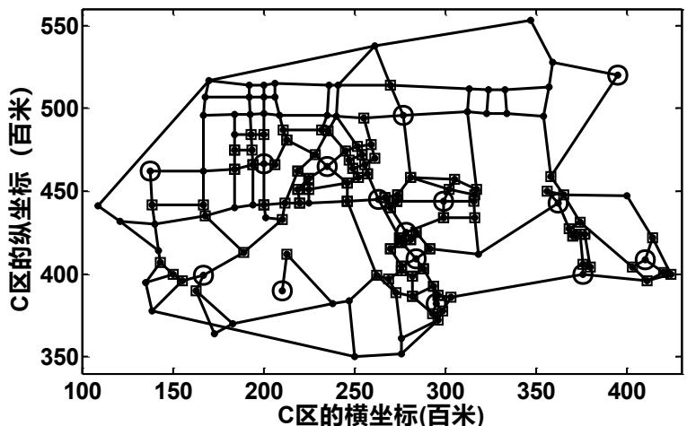

<details>
<summary>scatter</summary>

| Marker Type | C区的横坐标 (百米) | C区的纵坐标 (百米) |
| --- | --- | --- |
| Circle | ~140 | ~465 |
| Circle | ~210 | ~390 |
| Circle | ~280 | ~495 |
| Circle | ~370 | ~445 |
| Circle | ~410 | ~410 |
| Circle | ~420 | ~520 |
| Square | ~140 | ~440 |
| Square | ~160 | ~400 |
| Square | ~170 | ~390 |
| Square | ~210 | ~415 |
| Square | ~250 | ~470 |
| Square | ~260 | ~495 |
| Square | ~270 | ~495 |
| Square | ~280 | ~415 |
| Square | ~290 | ~385 |
| Square | ~300 | ~450 |
| Square | ~310 | ~450 |
| Square | ~360 | ~450 |
| Square | ~370 | ~425 |
| Square | ~380 | ~400 |
| Square | ~390 | ~400 |
| Square | ~420 | ~400 |
| Square | ~250 | ~350 |
| Square | ~260 | ~400 |
| Square | ~270 | ~395 |
| Square | ~280 | ~395 |
| Square | ~290 | ~385 |
| Square | ~300 | ~385 |
| Square | ~310 | ~385 |
| Square | ~320 | ~385 |
| Square | ~330 | ~385 |
| Square | ~340 | ~385 |
| Square | ~350 | ~385 |
| Square | ~360 | ~385 |
| Square | ~370 | ~385 |
| Square | ~380 | ~385 |
| Square | ~390 | ~385 |
| Square | ~400 | ~385 |
| Square | ~410 | ~385 |
| Square | ~420 | ~385 |
| Square | ~430 | ~385 |
| Square | ~440 | ~385 |
| Square | ~450 | ~385 |
| Square | ~460 | ~385 |
| Square | ~470 | ~385 |
| Square | ~480 | ~385 |
| Square | ~490 | ~385 |
| Square | ~500 | ~385 |
| Square | ~510 | ~385 |
| Square | ~520 | ~385 |
| Square | ~530 | ~385 |
| Square | ~540 | ~385 |
| Square | ~550 | ~385 |
| Square | ~110 | 440 |
| Square | ~120 | 435 |
| Square | ~130 | 415 |
| Square | ~140 | 415 |
| Square | ~150 | 415 |
| Square | ~160 | 415 |
| Square | ~170 | 415 |
| Square | ~180 | 415 |
| Square | ~190 | 415 |
| Square | ~200 | 415 |
| Square | ~210 | 415 |
| Square | ~220 | 415 |
| Square | ~230 | 415 |
| Square | ~240 | 415 |
| Square | ~250 | 415 |
| Square | ~260 | 415 |
| Square | ~270 | 415 |
| Square | ~280 | 415 |
| Square | ~290 | 415 |
| Square | ~300 | 415 |
| Square | ~310 | 415 |
| Square | ~320 | 415 |
| Square | ~330 | 415 |
| Square | ~340 | 415 |
| Square | ~350 | 415 |
| Square | ~360 | 415 |
| Square | ~370 | 415 |
| Square | ~380 | 415 |
| Square | ~390 | 415 |
| Square | ~400 | 415 |
| Square | ~410 | 415 |
| Square | ~420 | 415 |
| Square | ~430 | 415 |
| Square | ~440 | 415 |
| Square | ~450 | 415 |
| Square | ~460 | 415 |
| Square | ~470 | 415 |
| Square | ~480 | 415 |
| Square | ~490 | 415 |
| Square | ~500 | 415 |
| Square | ~510 | 415 |
| Square | ~520 | 415 |
| Square | ~530 | 415 |
| Square | ~540 | 415 |
| Square | ~110 | 395 |
| Square | ~120 | 395 |
| Square | ~130 | 395 |
| Square | ~140 | 395 |
| Square | ~150 | 395 |
| Square | ~160 | 395 |
| Square | ~170 | 395 |
| Square | ~180 | 395 |
| Square | ~190 | 395 |
| Square | ~200 | 395 |
| Square | ~210 | 395 |
| Square | ~220 | 395 |
| Square | ~230 | 395 |
| Square | ~240 | 395 |
| Square | ~250 | 395 |
| Square | ~260 | 395 |
| Square | ~270 | 395 |
| Square | ~280 | 395 |
| Square | ~290 | 395 |
| Square | ~300 | 395 |
| Square | ~310 | 395 |
| Square | ~320 | 395 |
| Square | ~330 | 395 |
| Square | ~340 | 395 |
| Square | ~350 | 395 |
| Square | ~360 | 395 |
| Square | ~370 | 395 |
| Square | ~380 | 395 |
| Square | ~390 | 395 |
| Square | ~400 | 395 |
| Square | ~410 | 395 |
| Square | ~420 | 395 |
| Square | ~430 | 395 |
| Square | ~440 | 395 |
| Square | ~450 | 395 |
| Square | ~460 | 395 |
| Square | ~470 | 395 |
| Square | ~480 | 395 |
| Square | ~490 | 395 |
| Square | ~500 | 395 |
| Square | ~510 | 395 |
| Square | ~520 | 395 |
| Square | ~530 | 395 |
</details>

图 5 C 区现有交巡警平台设置示意图

表 15 C 区现有交巡警平台的管辖范围及工作量

<table><tr><td>平台</td><td colspan="9">管辖的节点</td><td>工作量</td></tr><tr><td>C1</td><td>262</td><td>263</td><td>264</td><td>265</td><td>260</td><td>261</td><td>243</td><td>244</td><td></td><td>7.7</td></tr><tr><td>C2</td><td>248</td><td>249</td><td>250</td><td>251</td><td>252</td><td>255</td><td>258</td><td></td><td></td><td>9.3</td></tr><tr><td>C3</td><td>189</td><td>190</td><td>191</td><td>192</td><td>246</td><td>253</td><td>315</td><td>316</td><td></td><td>7.3</td></tr><tr><td>C4</td><td>254</td><td>286</td><td>287</td><td>289</td><td>290</td><td>259</td><td>247</td><td></td><td></td><td>6.8</td></tr><tr><td>C5</td><td>222</td><td>223</td><td>224</td><td>225</td><td>226</td><td>273</td><td>276</td><td>277</td><td>283</td><td>8.0</td></tr><tr><td>C6</td><td>215</td><td>216</td><td>230</td><td>231</td><td>240</td><td>241</td><td>242</td><td>288</td><td></td><td>9.6</td></tr><tr><td>C7</td><td>217</td><td>218</td><td>227</td><td>228</td><td>229</td><td>311</td><td>312</td><td></td><td></td><td>8.1</td></tr><tr><td>C8</td><td>232</td><td>233</td><td>234</td><td>235</td><td>236</td><td>237</td><td>238</td><td>239</td><td>245</td><td>9.0</td></tr><tr><td>C9</td><td>211</td><td>212</td><td>213</td><td>214</td><td>219</td><td>220</td><td>221</td><td></td><td></td><td>7.5</td></tr><tr><td>C10</td><td>183</td><td>193</td><td>194</td><td>195</td><td>196</td><td>197</td><td>198</td><td>199</td><td></td><td>8.8</td></tr><tr><td>C11</td><td>184</td><td>185</td><td>186</td><td>187</td><td>188</td><td>303</td><td>304</td><td>295</td><td>296</td><td>10.0</td></tr><tr><td>C12</td><td>200</td><td>201</td><td>202</td><td>305</td><td>306</td><td>307</td><td>291</td><td>292</td><td></td><td>9.7</td></tr><tr><td>C13</td><td>203</td><td>204</td><td>205</td><td>206</td><td>207</td><td>208</td><td>209</td><td>210</td><td>284</td><td>9.6</td></tr><tr><td>C14</td><td>274</td><td>275</td><td>278</td><td>279</td><td>280</td><td>281</td><td>282</td><td>285</td><td></td><td>9.8</td></tr><tr><td>C15</td><td>268</td><td>269</td><td>270</td><td>297</td><td>298</td><td>299</td><td>300</td><td>301</td><td>302</td><td>9.3</td></tr><tr><td>C16</td><td>266</td><td>267</td><td>317</td><td>318</td><td>319</td><td>308</td><td>309</td><td>310</td><td></td><td>10.6</td></tr><tr><td>C17</td><td>256</td><td>257</td><td>271</td><td>272</td><td>293</td><td>294</td><td>313</td><td>314</td><td></td><td>9.3</td></tr></table>

C 区最长出警时间为 6.86分钟，平台工作量的变异系数为 0.1725。

（3）D区的情况

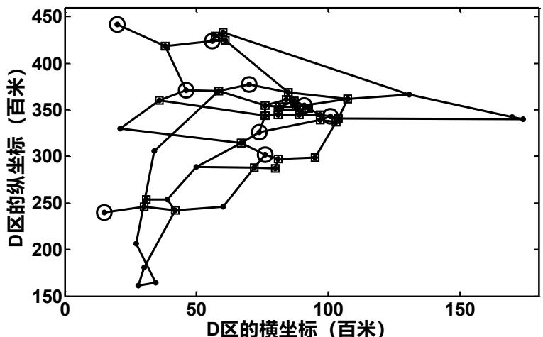

<details>
<summary>scatter</summary>

| Series | D区的横坐标 (百米) | D区的纵坐标 (百米) |
| --- | --- | --- |
| Circle (top) | ~20 | ~440 |
| Square (top) | ~35 | ~420 |
| Circle (top) | ~60 | ~425 |
| Square (top) | ~60 | ~430 |
| Circle (top) | ~75 | ~380 |
| Square (bottom) | ~30 | ~250 |
| Square (bottom) | ~35 | ~245 |
| Circle (bottom) | ~30 | ~210 |
| Circle (bottom) | ~30 | ~165 |
| Circle (bottom) | ~30 | ~185 |
| Circle (bottom) | ~75 | ~300 |
| Circle (bottom) | ~75 | ~325 |
| Circle (bottom) | ~90 | ~360 |
| Circle (bottom) | ~100 | ~340 |
| Circle (bottom) | ~130 | ~370 |
| Circle (bottom) | ~180 | ~340 |
| Circle (bottom) | ~180 | ~340 |
| Circle (bottom) | ~180 | ~340 |
| Circle (bottom) | ~180 | ~340 |
| Circle (bottom) | ~180 | ~340 |
| Circle (bottom) | ~180 | ~340 |
| Circle (bottom) | ~180 | ~340 |
| Square (middle) | ~35 | ~360 |
| Square (middle) | ~60 | ~370 |
| Square (middle) | ~75 | ~315 |
| Square (middle) | ~75 | ~290 |
| Square (middle) | ~85 | ~295 |
| Square (middle) | ~95 | ~300 |
| Square (middle) | ~105 | ~360 |
| Square (middle) | ~105 | ~340 |
| Square (middle) | ~105 | ~340 |
| Square (middle) | ~105 | ~340 |
| Square (middle) | ~105 | ~340 |
| Square (middle) | ~105 | ~340 |
| Square (middle) | ~105 | ~340 |
| Square (middle) | ~105 | ~340 |
| Circle (middle) | ~75 | ~355 |
| Circle (middle) | ~85 | ~360 |
| Circle (middle) | ~95 | ~360 |
| Circle (middle) | ~95 | ~360 |
| Circle (middle) | ~95 | ~360 |
| Circle (middle) | ~95 | ~360 |
| Circle (middle) | ~95 | ~360 |
| Circle (middle) | ~95 | ~360 |
| Circle (middle) | ~95 | ~360 |
| Circle(bottom) | ~20 | ~240 |
| Circle(bottom) | ~60 | ~290 |
| Circle(bottom) | ~75 | ~295 |
| Circle(bottom) | ~85 | ~295 |
| Circle(bottom) | ~95 | ~295 |
| Circle(bottom) | ~180 | ~240 |
| Circle(bottom) | ~180 | ~240 |
| Circle(bottom) | ~180 | ~240 |
| Circle(bottom) | ~180 | ~240 |
| Circle(bottom) | ~180 | ~240 |
| Circle(bottom) | ~180 | ~240 |
| Circle(bottom) | ~180 | ~240 |
| Circle (bottom) | ~180 | ~240 |
| Circle(bottom) | ~180 | ~240 |
| Circle(bottom) | ~180 | ~240 |
| Circle(bottom) | ~180 | ~240 |
| Circle(bottom) | ~180 | ~240 |
| Circle(bottom) | ~180 | ~240 |
| Circle(bottom) | 180~180 | 340~370 |
| Circle(bottom) | 180~180 | 370~440 |
| Circle(bottom) | 180~180 | 440~470 |
</details>

图6 D 区现有交巡警平台设置示意图

表 16 D区现有交巡警平台的管辖范围及工作量

<table><tr><td>平台</td><td colspan="5">管辖的节点</td><td>工作量</td></tr><tr><td>D1</td><td>347</td><td>348</td><td>349</td><td>350</td><td>370</td><td>6.5</td></tr><tr><td>D2</td><td>351</td><td>352</td><td>353</td><td>354</td><td>355</td><td>3.8</td></tr><tr><td>D3</td><td>367</td><td>359</td><td>360</td><td>368</td><td>369</td><td>6.2</td></tr><tr><td>D4</td><td>344</td><td>345</td><td>361</td><td>362</td><td>334</td><td>5</td></tr><tr><td>D5</td><td>363</td><td>364</td><td>365</td><td>366</td><td></td><td>6.8</td></tr><tr><td>D6</td><td>371</td><td>356</td><td>357</td><td>358</td><td></td><td>3.9</td></tr><tr><td>D7</td><td>343</td><td>346</td><td>335</td><td>336</td><td>339</td><td>4.5</td></tr><tr><td>D8</td><td>337</td><td>338</td><td>340</td><td>341</td><td>342</td><td>6.2</td></tr><tr><td>D9</td><td>329</td><td>330</td><td>331</td><td>332</td><td>333</td><td>4.3</td></tr></table>

D区最长出警时间为 16.06分钟，平台工作量的变异系数为 0.2070。（4）E区情况

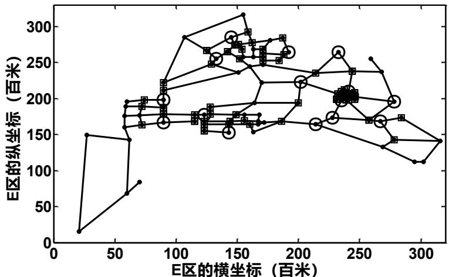

<details>
<summary>scatter</summary>

| Series | E区的横坐标 (百米) (range) | E区的纵坐标 (百米) (range) |
| --- | --- | --- |
| Circle | 60~280 | 150~290 |
| Square | 70~310 | 140~310 |
| Triangle | 20~310 | 110~320 |
</details>

图 7 E 区现有交巡警平台设置示意图

表 17 E 区现有交巡警平台的管辖范围及工作量

<table><tr><td>平台</td><td colspan="6">管辖的节点</td><td>工作量</td></tr><tr><td>E1</td><td>409</td><td>410</td><td>411</td><td>412</td><td>413</td><td>414</td><td>4.5</td></tr><tr><td>E2</td><td>437</td><td>438</td><td>456</td><td>415</td><td>457</td><td></td><td>4.1</td></tr><tr><td>E3</td><td>427</td><td>432</td><td>433</td><td>434</td><td>435</td><td>436</td><td>5.0</td></tr></table>

<table><tr><td>E4</td><td>424</td><td>425</td><td>426</td><td>428</td><td>429</td><td>430</td><td></td><td>4.9</td></tr><tr><td>E5</td><td>393</td><td>394</td><td>395</td><td>396</td><td>431</td><td></td><td></td><td>4.4</td></tr><tr><td>E6</td><td>416</td><td>462</td><td>463</td><td>464</td><td>469</td><td>470</td><td></td><td>7.5</td></tr><tr><td>E7</td><td>458</td><td>459</td><td>451</td><td>473</td><td>474</td><td></td><td></td><td>6.2</td></tr><tr><td>E8</td><td>417</td><td>418</td><td>419</td><td>420</td><td>421</td><td>422</td><td>423</td><td>8.7</td></tr><tr><td>E9</td><td>387</td><td>388</td><td>389</td><td>390</td><td>391</td><td>392</td><td></td><td>6.0</td></tr><tr><td>E10</td><td>397</td><td>398</td><td>399</td><td>400</td><td>405</td><td>406</td><td></td><td>5.1</td></tr><tr><td>E11</td><td>401</td><td>402</td><td>403</td><td>404</td><td>407</td><td>408</td><td></td><td>6.2</td></tr><tr><td>E12</td><td>452</td><td>453</td><td>454</td><td>455</td><td>460</td><td>461</td><td></td><td>7.1</td></tr><tr><td>E13</td><td>465</td><td>466</td><td>467</td><td>468</td><td>471</td><td>472</td><td></td><td>6.5</td></tr><tr><td>E14</td><td>445</td><td>446</td><td>448</td><td>449</td><td>450</td><td></td><td></td><td>4.8</td></tr><tr><td>E15</td><td>439</td><td>440</td><td>441</td><td>442</td><td>443</td><td>444</td><td>447</td><td>5.8</td></tr></table>

E区最长出警时间为 19.10分钟，平台工作量的变异系数为 0.1979。

## （5）F区情况

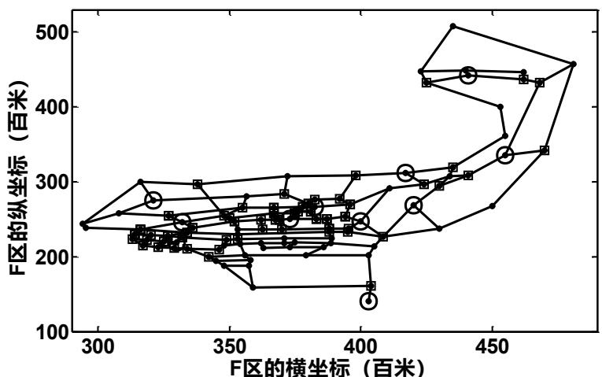

<details>
<summary>line</summary>

| Series | F区的横坐标 (百米) (range) | F区的纵坐标 (百米) (range) |
| --- | --- | --- |
| Trajectory 1 | 300~480 | 160~510 |
| Trajectory 2 | 300~480 | 160~510 |
| Trajectory 3 | 300~480 | 160~510 |
| Trajectory 4 | 300~480 | 160~510 |
| Trajectory 5 | 300~480 | 160~510 |
| Trajectory 6 | 300~480 | 160~510 |
| Trajectory 7 | 300~480 | 160~510 |
| Trajectory 8 | 300~480 | 160~510 |
| Trajectory 9 | 300~480 | 160~510 |
| Trajectory 10 | 300~480 | 160~510 |
| Trajectory 11 | 300~480 | 160~510 |
| Trajectory 12 | 300~480 | 160~510 |
| Trajectory 13 | 300~480 | 160~510 |
| Trajectory 14 | 300~480 | 160~510 |
| Trajectory 15 | 300~480 | 160~510 |
| Trajectory 16 | 300~480 | 160~510 |
| Trajectory 17 | 300~480 | 160~510 |
| Trajectory 18 | 300~480 | 160~510 |
| Trajectory 19 | 300~480 | 160~510 |
| Trajectory 20 | 300~480 | 160~510 |
| Trajectory 21 | 300~480 | 160~510 |
| Trajectory 22 | 300~480 | 160~510 |
| Trajectory 23 | 300~480 | 160~510 |
| Trajectory 24 | 300~480 | 160~510 |
| Trajectory 25 | 300~480 | 160~510 |
| Trajectory 26 | 300~480 | 160~510 |
| Trajectory 27 | 300~480 | 160~510 |
| Trajectory 28 | 300~480 | 160~510 |
| Trajectory 29 | 300~480 | 160~510 |
| Trajectory 30 | 300~480 | 160~510 |
| Trajectory 31 | 300~480 | 160~510 |
| Trajectory 32 | 300~480 | 160~510 |
| Trajectory 33 | 300~480 | 160~510 |
| Trajectory 34 | 300~480 | 160~510 |
| Trajectory 35 | 300~480 | 160~510 |
| Trajectory 36 | 300~480 | 160~510 |
| Trajectory 37 | 300~480 | 160~510 |
| Trajectory 38 | 300~480 | 160~510 |
| Trajectory 39 | 300~480 | 160~510 |
| Trajectory 40 | 300~480 | 160~510 |
| Trajectory 41 | 300~480 | 160~510 |
| Trajectory 42 | 300~480 | 160~510 |
| Trajectory 43 | 300~480 | 160~510 |
| Trajectory 44 | 300~480 | 160~510 |
| Trajectory 45 | 300~480 | 160~510 |
| Trajectory 46 | 300~480 | 160~510 |
| Trajectory 47 | 300~480 | 160~510 |
| Trajectory 48 | 300~480 | 160~510 |
| Trajectory 49 | 300~480 | 160~510 |
| Trajectory 50 | 325~475 | ~275 ~475 |
| Trajectory 51 | ~325 ~475 | ~275 ~475 |
| Trajectory 52 | ~325 ~475 | ~275 ~475 |
| Trajectory 53 | ~325 ~475 | ~275 ~475 |
| Trajectory 54 | ~325 ~475 | ~275 ~475 |
| Trajectory 55 | ~325 ~475 | ~275 ~475 |
| Trajectory 56 | ~325 ~475 | ~275 ~475 |
| Trajectory 57 | ~325 ~475 | ~275 ~475 |
| Trajectory 58 | ~325 ~475 | ~275 ~475 |
| Trajectory 59 | ~325 ~475 | ~275 ~475 |
| Trajectory 60 | ~325 ~475 | ~275 ~475 |
| Trajectory 61 | ~325 ~475 | ~275 ~475 |
| Trajectory 62 | ~325 ~475 | ~275 ~475 |
| Trajectory 63 | ~325 ~475 | ~275 ~475 |
| Trajectory 64 | ~325 ~475 | ~275 ~475 |
| Trajectory 65 | ~325 ~475 | ~275 ~475 |
| Trajectory 66 | ~325 ~475 | ~275 ~475 |
| Trajectory 67 | ~325 ~475 | ~275 ~475 |
| Trajectory 68 | ~325 ~475 | ~275 ~475 |
| Trajectory 69 | ~325 ~475 | ~275 ~475 |
| Trajectory 70 | ~325 ~475 | ~275 ~475 |
| Trajectory 71 | ~325 ~475 | ~275 ~475 |
| Trajectory 72 | ~325 ~475 | ~275 ~475 |
| Trajectory 73 | ~325 ~475 | ~275 ~475 |
| Trajectory 74 | ~325 ~475 | ~275 ~475 |
| Trajectory 75 | ~325 ~475 | ~275 ~475 |
| Trajectory 76 | ~325 ~475 | ~275 ~475 |
| Trajectory 77 | ~325 ~475 | ~275 ~475 |
| Trajectory 78 | ~325 ~475 | ~275 ~475 |
| Trajectory 79 | ~325 ~475 | ~275 ~475 |
| Trajectory 80 | ~325 ~475 | ~275 ~475 |
| Trajectory 81 | ~325 ~475 | ~275 ~475 |
| Trajectory 82 | ~325 ~475 | ~275 ~475 |
| Trajectory 83 | ~325 ~475 | ~275 ~475 |
| Trajectory 84 | ~325 ~475 | ~275 ~475 |
| Trajectory 85 | ~325 ~475 | ~275 ~475 |
| Trajectory 86 | ~325 ~475 | ~275 ~475 |
| Trajectory 87 | ~325 ~475 | ~275 ~475 |
| Trajectory 88 | ~325 ~475 | ~275 ~475 |
| Trajectory 89 | ~325 ~475 | ~275 ~475 |
| Trajectory 90 | ~325 ~475 | ~275 ~475 |
| Trajectory 91 | ~325 ~475 | ~275 ~475 |
| Trajectory 92 | ~325 ~475 | ~275 ~475 |
| Trajectory 93 | ~325 ~475 | ~275 ~475 |
| Trajectory 94 | ~325 ~475 | ~275 ~475 |
| Trajectory 95 | ~325 ~475 | ~275 ~475 |
| Trajectory 96 | ~325 ~475 | ~275 ~475 |
| Trajectory 97 | ~325 ~475 | ~275 ~475 |
| Trajectory 98 | ~325 ~475 | ~275 ~475 |
| Trajectory 99 | ~325 ~475 | ~275 ~475 |
</details>

图8 F区现有交巡警平台设置示意图

表18 F 区现有交巡警平台的管辖范围及工作量

<table><tr><td>平台</td><td colspan="10">管辖的节点</td><td>工作量</td></tr><tr><td>F1</td><td>550</td><td>551</td><td>555</td><td>556</td><td>557</td><td>558</td><td>559</td><td>561</td><td></td><td></td><td>4.5</td></tr><tr><td>F2</td><td>532</td><td>533</td><td>534</td><td>535</td><td>543</td><td>544</td><td>545</td><td>546</td><td></td><td></td><td>6.1</td></tr><tr><td>F3</td><td>492</td><td>493</td><td>494</td><td>495</td><td>496</td><td>497</td><td>498</td><td>499</td><td>500</td><td>501</td><td>4.0</td></tr><tr><td>F4</td><td>512</td><td>513</td><td>514</td><td>515</td><td>524</td><td>525</td><td>526</td><td>527</td><td>528</td><td></td><td>4.9</td></tr><tr><td>F5</td><td>573</td><td>575</td><td>576</td><td>577</td><td>578</td><td>579</td><td>580</td><td>581</td><td>582</td><td></td><td>4.4</td></tr><tr><td>F6</td><td>562</td><td>566</td><td>567</td><td>568</td><td>569</td><td>574</td><td>502</td><td>503</td><td></td><td></td><td>4.5</td></tr><tr><td>F7</td><td>486</td><td>490</td><td>491</td><td>531</td><td>548</td><td>549</td><td>547</td><td>552</td><td>553</td><td>554</td><td>6.2</td></tr><tr><td>F8</td><td>487</td><td>488</td><td>489</td><td>560</td><td>538</td><td>539</td><td>542</td><td>537</td><td></td><td></td><td>6.7</td></tr><tr><td>F9</td><td>510</td><td>511</td><td>507</td><td>508</td><td>509</td><td>516</td><td>517</td><td>536</td><td></td><td></td><td>7.0</td></tr><tr><td>F10</td><td>540</td><td>541</td><td>570</td><td>504</td><td>505</td><td>506</td><td>563</td><td>564</td><td>565</td><td></td><td>5.1</td></tr><tr><td>F11</td><td>571</td><td>572</td><td>518</td><td>519</td><td>520</td><td>521</td><td>522</td><td>523</td><td>529</td><td>530</td><td>8.2</td></tr></table>

F区最长出警时间为 8.48 分钟，平台工作量的变异系数为 0.1883。

## （6）全市六个区的汇总情况

表19 全市现有交巡警平台的相关数据

<table><tr><td>主城六区</td><td>节点数</td><td>平台数</td><td>平均工作量</td><td>工作量变异系数</td><td>最长出警时间(min)</td></tr><tr><td>A区</td><td>92</td><td>20</td><td>6.23</td><td>0.1830</td><td>5.70</td></tr><tr><td>B区</td><td>73</td><td>8</td><td>6.36</td><td>0.1743</td><td>4.47</td></tr><tr><td>C区</td><td>154</td><td>17</td><td>8.85</td><td>0.1725</td><td>6.86</td></tr><tr><td>D区</td><td>52</td><td>9</td><td>5.24</td><td>0.2070</td><td>16.06</td></tr><tr><td>E区</td><td>103</td><td>15</td><td>5.79</td><td>0.1979</td><td>19.10</td></tr><tr><td>F区</td><td>108</td><td>11</td><td>5.60</td><td>0.1883</td><td>8.48</td></tr></table>

设置交巡警服务平台的原则为：1）交巡警服务平台的工作量尽量平衡；2）最长出警时间尽量最短。根据以上原则，结合表19中的数据，我们对全市（A，B，C，D，E，F）现有的交巡警服务平台设置方案的合理性进行分析。

① 主城各区工作量的变异系数都较小，即各交巡警平台的工作量均衡，比较合理；  
② 主城各区的最长出警时间都较大，尤其是 D区和E区，远远超过了规定的出警时间 3min，不合理，因此各区的交巡警服务平台都有待调整。造成这一结果的原因主要是部分节点与最近平台间的距离超过 3km。

## （7）全市各区交巡警平台的调整方案

针对全市各区交巡警平台的出警时间过长这一问题，我们选择的优化方式是在不改变原有交巡警平台的基础上，增加尽量少的平台，使最长出警时间小于 3min。

利用问题一中A区增加平台的方法，寻找 B、C、D、E、F各区新增平台的个数及位置，结果见表20（程序见附录 11）。

表 20 各区新增平台的位置

<table><tr><td>分区</td><td colspan="12">距离最近的平台超过3km的节点(节点编号)</td><td colspan="4">新增平台位置(节点编号)</td></tr><tr><td>A</td><td>28</td><td>29</td><td>38</td><td>39</td><td>61</td><td>92</td><td></td><td></td><td></td><td></td><td></td><td></td><td>28</td><td>39</td><td>61</td><td>92</td></tr><tr><td>B</td><td>122</td><td>123</td><td>124</td><td>151</td><td>152</td><td>153</td><td></td><td></td><td></td><td></td><td></td><td></td><td>123</td><td>152</td><td></td><td></td></tr><tr><td rowspan="5">C</td><td>183</td><td>199</td><td>200</td><td>201</td><td>202</td><td>203</td><td>205</td><td>206</td><td>207</td><td>208</td><td>209</td><td>166</td><td>167</td><td>168</td><td>169</td><td></td></tr><tr><td>210</td><td>215</td><td>238</td><td>239</td><td>240</td><td>247</td><td>248</td><td>251</td><td>252</td><td>253</td><td>257</td><td>170</td><td>171</td><td>174</td><td>175</td><td></td></tr><tr><td>259</td><td>261</td><td>262</td><td>263</td><td>264</td><td>268</td><td>269</td><td>285</td><td>286</td><td>287</td><td>288</td><td>176</td><td>177</td><td>178</td><td>179</td><td></td></tr><tr><td>299</td><td>300</td><td>301</td><td>302</td><td>303</td><td>304</td><td>312</td><td>313</td><td>314</td><td>315</td><td>316</td><td>180</td><td>183</td><td>199</td><td>201</td><td></td></tr><tr><td>317</td><td>318</td><td>319</td><td></td><td></td><td></td><td></td><td></td><td></td><td></td><td></td><td>203</td><td>205</td><td></td><td></td><td></td></tr><tr><td rowspan="2">D</td><td>329</td><td>330</td><td>331</td><td>332</td><td>336</td><td>337</td><td>339</td><td>344</td><td>362</td><td>369</td><td>370</td><td>320</td><td>322</td><td>324</td><td>325</td><td></td></tr><tr><td>371</td><td></td><td></td><td></td><td></td><td></td><td></td><td></td><td></td><td></td><td></td><td>326</td><td>328</td><td>329</td><td></td><td></td></tr><tr><td rowspan="4">E</td><td>387</td><td>388</td><td>389</td><td>390</td><td>391</td><td>392</td><td>393</td><td>395</td><td>407</td><td>408</td><td>409</td><td>372</td><td>373</td><td>374</td><td>376</td><td></td></tr><tr><td>411</td><td>412</td><td>413</td><td>415</td><td>417</td><td>418</td><td>419</td><td>420</td><td>438</td><td>439</td><td>443</td><td>382</td><td>383</td><td>384</td><td>385</td><td></td></tr><tr><td>445</td><td>446</td><td>451</td><td>452</td><td>455</td><td>458</td><td>459</td><td>464</td><td>469</td><td>471</td><td>474</td><td>386</td><td>387</td><td>388</td><td>390</td><td></td></tr><tr><td></td><td></td><td></td><td></td><td></td><td></td><td></td><td></td><td></td><td></td><td></td><td>393</td><td></td><td></td><td></td><td></td></tr><tr><td rowspan="4">F</td><td>486</td><td>487</td><td>505</td><td>506</td><td>507</td><td>508</td><td>509</td><td>510</td><td>512</td><td>513</td><td>514</td><td>475</td><td>477</td><td>478</td><td>479</td><td></td></tr><tr><td>515</td><td>516</td><td>517</td><td>518</td><td>519</td><td>522</td><td>523</td><td>524</td><td>525</td><td>526</td><td>527</td><td>480</td><td>482</td><td>483</td><td>484</td><td></td></tr><tr><td>529</td><td>533</td><td>540</td><td>541</td><td>559</td><td>560</td><td>561</td><td>566</td><td>569</td><td>574</td><td>575</td><td>485</td><td>486</td><td>490</td><td>505</td><td></td></tr><tr><td>578</td><td>582</td><td></td><td></td><td></td><td></td><td></td><td></td><td></td><td></td><td></td><td></td><td></td><td></td><td></td><td></td></tr></table>

增加平台后，各区交巡警平台的最长出警时间与不增加平台时的对比见表21。

表21 增加平台前后各区最长出警时间的比较（单位：分钟）

<table><tr><td>主城六区</td><td>不增加平台时</td><td>增加平台后</td></tr><tr><td>A 区</td><td>5.70</td><td>2.71</td></tr><tr><td>B 区</td><td>4.47</td><td>2.91</td></tr><tr><td>C 区</td><td>6.86</td><td>2.99</td></tr><tr><td>D 区</td><td>16.06</td><td>2.91</td></tr><tr><td>E 区</td><td>19.10</td><td>2.97</td></tr><tr><td>F 区</td><td>8.48</td><td>2.95</td></tr></table>

由表 21 可知，新增平台后，主城六区的最长出警时间与不增加平台时（表 19）相比，明显缩短，全部控制住 3min中之内，因此更合理。

## 5.2.2 最佳围堵方案

## 5.2.2.1 模型的建立

要寻找最佳的围堵方案，我们要在有 100%的把握抓住嫌疑犯的前提下（要围堵住可能的最远路线），以最快抓捕嫌疑犯为目标，表述为

$$
\min U = \max (\frac {L (i , 3 2)}{V}) \tag {18}
$$

其中， 表示从事发地(第32节点)到落网地点（节点 ）的距离； 表示嫌疑犯从逃跑到落网的时间；根据假设 8，嫌疑犯的逃跑速度为 。

约束条件为：校园咖客收集整理（www.campustars.com）

1、由于部分节点是否被封堵，对抓捕嫌疑犯无意义，因此，不一定每个节点都被封堵，即：

$$
\sum_ {j = 1} ^ {n} x _ {i j} \leq 1, i = 1, 2, 3, \dots , m \tag {19}
$$

$$
x _ {i j} = \left\{ \begin{array}{l l} 0, & \text {平台} j \text {不封锁节点} i \\ 1, & \text {平台} j \text {封锁节点} i \end{array} \right. \tag {20}
$$

$$
(i = 1, 2, 3, \dots , m; \quad j = 1, 2, 3, \dots , n)
$$

2、不一定每个平台都出警，即：

$$
\sum_ {i = 1} ^ {m} x _ {i j} \leq 1, j = 1, 2, 3, \dots , n \tag {21}
$$

3、嫌疑犯到达节点 的时间减3min 比交巡警从平台 到节点 的时间长，表示节点能成功的被平台j封堵，即：

$$
\frac {L (i , j)}{V} \leq \frac {L (i , 3 2)}{V} - 3 \tag {22}
$$

其中， $L ( i , j )$ 表示平台 到节点i的距离。

4、为描述嫌疑犯被封堵在一定的区域内，定义节点i被封堵表示为 $L ^ { \prime } ( Q , i ) = \operatorname { i n f }$ 即其他任意节点与节点i不相通，距离表示为inf。若 $\mathcal { Q } _ { 1 }$ 表示被封堵区域以外所有节点的集合， $Q _ { 2 }$ 表示被封堵区域内所有节点的集合，则：

$$
L ^ {\prime} (Q _ {1}, Q _ {2}) = \inf \tag {23}
$$

综上，模型为：

$$
\begin{array}{l} \min U = \max (\frac {L (i , 3 2)}{V}) \\ s. t. \left\{ \begin{array}{l} \sum_ {j = 1} ^ {n} x _ {i j} \leq 1, i = 1, 2, 3, \dots , m \\ \sum_ {i = 1} ^ {m} x _ {i j} \leq 1, j = 1, 2, 3, \dots , n \\ \frac {L (i , j)}{V} \leq \frac {L (i , 3 2)}{V} - 3 \\ L ^ {\prime} (Q _ {1}, Q _ {2}) = \inf \\ x _ {i j} \in \{0, 1 \} \end{array} \right. \tag {24} \\ \end{array}
$$

## 5.2.2.2 模型的求解

## （1）A区的封堵

将A区的相关数据代入模型（24），可得A区的封堵方案，见表22。

表 22 A 区的封堵方案

<table><tr><td>出发的平台</td><td>被封锁的节点</td><td>出发的平台</td><td>被封锁的节点</td></tr><tr><td>A1</td><td>63</td><td>A15</td><td>29</td></tr><tr><td>A2</td><td>3</td><td>A16</td><td>16</td></tr><tr><td>A3</td><td>55</td><td>A17</td><td>40</td></tr><tr><td>A4</td><td>4</td><td>A18</td><td>41</td></tr><tr><td>A10</td><td>10</td><td>A19</td><td>62</td></tr></table>

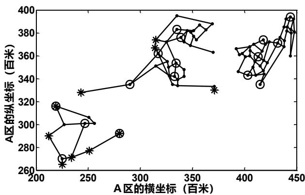

<details>
<summary>scatter</summary>

| Series | A区的横坐标 (百米) (range) | A区的纵坐标 (百米) (range) |
| --- | --- | --- |
| Circle | 220~445 | 270~395 |
| Asterisk | 210~375 | 265~380 |
</details>

图 9 A 区围堵效果示意图

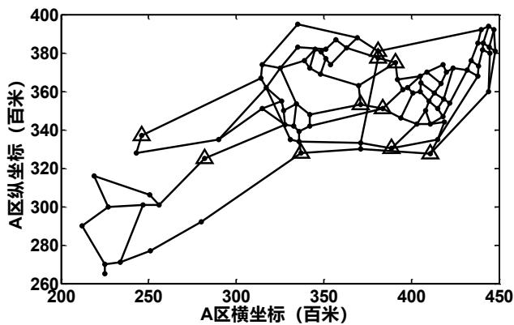

<details>
<summary>line</summary>

| A区横坐标 (百米) | A区纵坐标 (百米) |
| --- | --- |
| ~215 | ~290 |
| ~220 | ~316 |
| ~225 | ~270 |
| ~230 | ~300 |
| ~235 | ~271 |
| ~245 | ~301 |
| ~250 | ~307 |
| ~255 | ~278 |
| ~285 | ~326 |
| ~290 | ~293 |
| ~315 | ~367 |
| ~320 | ~374 |
| ~325 | ~352 |
| ~330 | ~342 |
| ~335 | ~396 |
| ~340 | ~383 |
| ~345 | ~370 |
| ~350 | ~381 |
| ~355 | ~389 |
| ~360 | ~375 |
| ~365 | ~363 |
| ~370 | ~388 |
| ~375 | ~362 |
| ~380 | ~382 |
| ~385 | ~378 |
| ~390 | ~352 |
| ~395 | ~376 |
| ~400 | ~366 |
| ~405 | ~346 |
| ~410 | ~369 |
| ~415 | ~344 |
| ~420 | ~374 |
| ~425 | ~361 |
| ~430 | ~372 |
| ~435 | ~369 |
| ~440 | ~385 |
| ~445 | ~394 |
| ~445 | ~381 |
| ~445 | ~392 |
| ~445 | ~381 |
</details>

注：图中用三角形标记的节点表示被封锁的节点。

图 10 A区被封锁节点的示意图

图9的中间部分是逃犯可能到达的区域，其中包括 A区的四个出口，即出口 8、10、11、12，对应的节点编号分别为28、30、38、48。从30、48节点处可以逃往 C 区，从28节点处可以逃往D区，从 38节点处可以逃往 F区。

逃往 C 区时，逃犯逃往 C 区入口（节点 237、235），需要花费的时间分别为1.87+1.72=3.59 分钟和 1.69+2.43=4.12 分钟。而距离最近的 C8 平台封锁节点 237、235所需的时间分别为1.13 和0.53分钟。因此逃犯可以从 237节点处进入 C 区。

逃往 D 区时，从节点 28 可到达 D 区入口 371。若 D 区派 D1 平台（节点 320）封锁节点 371，其封锁时间为 7.36 分钟，而逃犯从 P 点逃往节点 371 需要花费时间7.00+8.89=15.89分钟，因此若逃犯逃往D区的 371节点，则会被成功围堵。

逃往 F 区时，从节点 38 可到达 F 区入口 561。若 F 区派 F1 平台（节点 475）封锁节点 561，其封锁时间为 4.35 分钟，而逃犯从 P 点逃往节点 561 需要花费 6.49+2.30=8.79分钟，因此若逃犯逃往 F区的561节点，就会被成功围堵。

综上，我们还需进一步讨论 C 区的围堵方案。将 C 区的相关数据代入模型（24），可得C 区的封堵方案，见表 23。

表 23 C 区的封堵方案

<table><tr><td>出发的平台</td><td>被封锁的节点</td><td>出发的平台</td><td>被封锁的节点</td></tr><tr><td>C2</td><td>248</td><td>C6</td><td>245</td></tr><tr><td>C3</td><td>168</td><td>C7</td><td>231</td></tr><tr><td>C4</td><td>240</td><td>C8</td><td>246</td></tr></table>

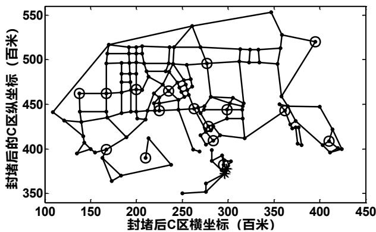

<details>
<summary>scatter</summary>

| Point Type | 封堵后C区横坐标 (百米) | 封堵后的C区纵坐标 (百米) |
| --- | --- | --- |
| Circle | ~135 | ~460 |
| Circle | ~170 | ~400 |
| Circle | ~210 | ~390 |
| Circle | ~280 | ~445 |
| Circle | ~290 | ~415 |
| Circle | ~300 | ~380 |
| Circle | ~305 | ~375 |
| Circle | ~360 | ~445 |
| Circle | ~395 | ~520 |
| Circle | ~410 | ~410 |
| Triangle | ~110 | ~440 |
| Triangle | ~165 | ~365 |
| Triangle | ~215 | ~385 |
| Triangle | ~260 | ~400 |
| Triangle | ~275 | ~415 |
| Triangle | ~285 | ~445 |
| Triangle | ~295 | ~415 |
| Triangle | ~300 | ~380 |
| Triangle | ~315 | ~415 |
| Triangle | ~320 | ~510 |
| Triangle | ~345 | ~555 |
| Triangle | ~360 | ~495 |
| Triangle | ~395 | ~520 |
| Triangle | ~425 | ~400 |
| Triangle | ~235 | ~490 |
| Triangle | ~240 | ~465 |
| Triangle | ~245 | ~490 |
| Triangle | ~260 | ~535 |
| Triangle | ~270 | ~495 |
| Triangle | ~315 | ~510 |
| Triangle | ~320 | ~510 |
| Triangle | ~360 | ~495 |
| Triangle | ~370 | ~445 |
| Triangle | ~375 | ~425 |
| Triangle | ~380 | ~410 |
| Triangle | ~385 | ~425 |
| Triangle | ~390 | ~410 |
| Triangle | ~395 | ~425 |
| Triangle | ~400 | ~410 |
| Triangle | ~405 | ~425 |
| Triangle | ~410 | ~410 |
| Triangle | ~415 | ~425 |
| Triangle | ~420 | ~410 |
| Triangle | ~425 | ~425 |
| Triangle | ~430 | ~410 |
| Triangle | ~435 | ~425 |
| Triangle | ~440 | ~410 |
| Triangle | ~445 | ~425 |
| Triangle | ~450 | ~410 |
| Triangle | ~455 | ~425 |
| Triangle | ~460 | ~410 |
| Triangle | ~465 | ~425 |
| Triangle | ~470 | ~410 |
| Triangle | ~475 | ~425 |
| Triangle | ~480 | ~410 |
| Triangle | ~485 | ~425 |
| Triangle | ~490 | ~410 |
| Triangle | ~495 | ~425 |
| Triangle | ~500 | ~410 |
| Triangle | ~505 | ~425 |
| Triangle | ~510 | ~410 |
| Triangle | ~515 | ~425 |
| Triangle | ~520 | ~410 |
| Triangle | ~525 | ~425 |
| Triangle | ~530 | ~410 |
| Triangle | ~535 | ~425 |
| Triangle | ~540 | ~410 |
| Triangle | ~545 | ~425 |
| Triangle | ~550 | ~410 |
| Triangle | ~555 | ~425 |
| Triangle | ~560 | ~410 |
| Triangle | ~565 | ~425 |
| Triangle | ~570 | ~410 |
| Triangle | ~575 | ~425 |
| Triangle | ~580 | ~410 |
| Triangle | ~585 | ~425 |
| Triangle | ~590 | ~410 |
| Triangle | ~595 | ~425 |
| Triangle | ~600 | ~410 |
| Triangle | ~605 | ~425 |
| Triangle | ~610 | ~410 |
| Triangle | ~615 | ~425 |
| Triangle | ~620 | ~410 |
| Triangle | ~625 | ~425 |
| Triangle | ~630 | ~410 |
| Triangle | ~635 | ~425 |
| Triangle | ~640 | ~410 |
| Triangle | ~645 | ~425 |
| Triangle | ~650 | ~410 |
| Triangle | ~655 | ~425 |
| Triangle | ~660 | ~410 |
| Triangle | ~665 | ~425 |
| Triangle | ~670 | ~410 |
| Triangle | ~675 | ~425 |
| Triangle | ~680 | ~410 |
| Triangle | ~685 | ~425 |
| Triangle | ~690 | ~410 |
| Triangle | ~695 | ~425 |
| Triangle | ~700 | ~410 |
| Triangle | ~705 | ~425 |
| Triangle | ~710 | ~410 |
| Triangle | ~715 | ~425 |
| Triangle | ~720 | ~410 |
| Triangle | ~725 | ~425 |
| Triangle | ~730 | ~410 |
| Triangle | ~735 | ~425 |
| Triangle | ~740 | ~410 |
| Triangle | ~745 | ~425 |
| Triangle | ~750 | ~410 |
| Triangle | ~755 | ~425 |
| Triangle | ~760 | ~410 |
| Triangle | ~765 | ~425 |
| Triangle | ~770 | ~410 |
| Triangle | ~775 | ~425 |
| Triangle | ~780 | ~410 |
| Triangle | ~785 | ~425 |
| Triangle | ~790 | ~410 |
| Triangle | ~795 | ~425 |
| Triangle | ~800 | ~410 |
| Triangle | ~805 | ~425 |
| Triangle | ~810 | ~410 |
| Triangle | ~815 | ~425 |
| Triangle | ~820 | ~410 |
| Triangle | ~825 | ~425 |
| Triangle | ~830 | ~410 |
| Triangle | ~835 | ~425 |
| Triangle | ~840 | ~410 |
| Triangle | ~845 | ~425 |
| Triangle | ~850 | ~410 |
| Triangle | ~855 | ~425 |
| Triangle | ~860 | ~410 |
| Triangle | ~865 | ~425 |
| Triangle | ~870 | ~410 |
| Triangle | ~875 | ~425 |
| Triangle | ~880 | ~410 |
| Triangle | ~885 | ~425 |
| Triangle | ~890 | ~410 |
| Triangle | ~895 | ~425 |
</details>

图 11 C区围堵效果示意图

综上，全市各区的围堵方案见表 24。

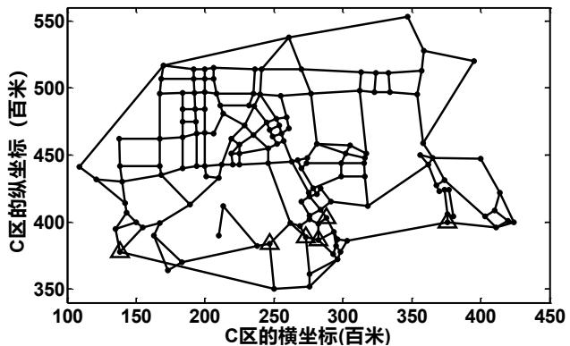

<details>
<summary>wireframe</summary>

| Series | C区的横坐标(百米) (range) | C区的纵坐标(百米) (range) |
| --- | --- | --- |
| Circle | 105~425 | 350~555 |
| Triangle | 130~380 | 375~460 |
</details>

注：图中用三角形标记的节点表示被封锁的节点。

图 12 A区被封锁节点的示意图  
表 24 全市各区的围堵方案

<table><tr><td>调度平台</td><td>封锁节点</td><td>逃跑时间(min)</td><td>封锁时间(min)</td><td>调度平台</td><td>封堵节点</td><td>逃跑时间(min)</td><td>封锁时间(min)</td></tr><tr><td>A1</td><td>63</td><td>8.63</td><td>3.50</td><td>A19</td><td>62</td><td>9.13</td><td>5.03</td></tr><tr><td>A2</td><td>3</td><td>6.48</td><td>2.11</td><td>C2</td><td>248</td><td>20.52</td><td>3.67</td></tr><tr><td>A3</td><td>55</td><td>5.21</td><td>1.27</td><td>C3</td><td>168</td><td>12.59</td><td>0</td></tr><tr><td>A4</td><td>4</td><td>8.80</td><td>0.00</td><td>C4</td><td>240</td><td>10.15</td><td>6.94</td></tr><tr><td>A10</td><td>10</td><td>6.19</td><td>0.00</td><td>C6</td><td>245</td><td>5.61</td><td>2.57</td></tr><tr><td>A15</td><td>29</td><td>9.16</td><td>5.70</td><td>C7</td><td>231</td><td>6.96</td><td>2.78</td></tr><tr><td>A16</td><td>16</td><td>3.30</td><td>0.00</td><td>C8</td><td>246</td><td>6.54</td><td>3.08</td></tr><tr><td>A17</td><td>40</td><td>7.96</td><td>2.69</td><td>D1</td><td>371</td><td>15.89</td><td>7.36</td></tr><tr><td>A18</td><td>41</td><td>10.50</td><td>5.54</td><td>F1</td><td>561</td><td>8.79</td><td>4.35</td></tr></table>

完成以上所有节点的封锁后，即可成功围堵嫌疑犯。完成全区域封锁的时间为7.36分钟，嫌疑犯最快会在 20.52分钟内落网。

全市的封堵方案见图 13。

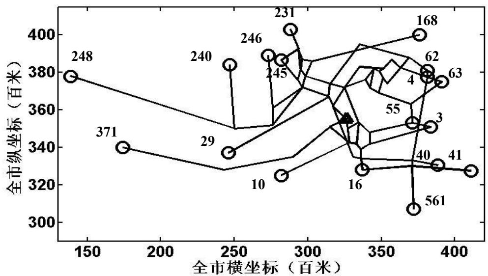

<details>
<summary>scatter</summary>

| Point ID | 全市横坐标 (百米) | 全市纵坐标 (百米) |
| --- | --- | --- |
| 248 | ~140 | ~378 |
| 371 | ~175 | ~340 |
| 29 | ~245 | ~338 |
| 240 | ~245 | ~384 |
| 10 | ~280 | ~325 |
| 246 | ~275 | ~388 |
| 245 | ~280 | ~386 |
| 231 | ~290 | ~402 |
| 16 | ~335 | ~328 |
| 168 | ~375 | ~400 |
| 62 | ~380 | ~380 |
| 4 | ~380 | ~378 |
| 63 | ~390 | ~375 |
| 3 | ~385 | ~352 |
| 55 | ~375 | ~362 |
| 40 | ~380 | ~332 |
| 41 | ~390 | ~330 |
| 561 | ~375 | ~308 |
</details>

图 13 全市的封堵方案示意图

## 6 模型的评价及推广

## 6.1 模型的优点

## 1）模型统一，通用性强

平台的调度方案使用统一模型，仅需代入相应数据即可求解。

## 2）优化合理，结果可靠

本文建立的 0-1 规划模型能与实际紧密联系，结合实际情况对问题进行求解，能得到全局最优解，结果可靠。

3）模型简单易懂，方法灵活，具有较强的推广性。

## 6.2 模型的不足

程序运行时间较长。由于是非线性的 0-1规划，对计算机要求比较高，需要提高计算机配置才能快速求解。

## 6.3 模型的推广

本文中的0-1规划模型由于方法灵活，且便于用计算机求解，目前已成功应用于求解生产进度问题、旅行推销员问题、工厂选址问题、背包问题及分配问题等，有较强的推广性。

## 参考文献

[1]管丽萍，尹湘源.交通事件管理系统研究现状综述[J].中外公路，2009,29(3):255-261.  
[2]朱茵，王军利，周彤梅.智能交通系统导论[M].北京：中国人民公安大学出版社，2007.  
[3]叶奇明，石世光.Floyd 算法的演示模型研究[J]，海南大学学报自然科学版,2008,26(1):47-50.  
[4]马莉.MATLAB 数学实验与建模[M].北京：清华大学出版社.2010:215-262.  
[5]姜启源，谢金星，叶俊.数学模型(第三版)[M].北京:高等教育出版社，2003:274-324.  
[6]谢金星.优化建模与 LINDO\LINGO 软件[M].北京：清华大学出版社.2011:315-343.

[7]张锦，王坤.流线网络优化的变分不等式模型与算法[J]，西南交通大学学报,2011,46(3) :481-487.

## 附录

附录 1：  
```matlab
%floyd 算法求解 A 区所有 92 个点之间的最短距离
function [D,path]=floyd(K)
A=load('C:\Documents and Settings\Administrator\桌面\1.txt');
B=load('C:\Documents and Settings\Administrator\桌面\2.txt');
K=inf(92,92);
for i=1:length(B)
    a(i)=line([A(B(i,1),1),A(B(i,2),1)],[A(B(i,1),2),A(B(i,2),2)]);hold on
    K(B(i,1),B(i,2))=sqrt((A(B(i,1),1)-A(B(i,2),1))^2+(A(B(i,1),2)-A(B(i,2),2))^2);
    K(B(i,2),B(i,1))=K(B(i,1),B(i,2));
end
for i=1:92
    K(i,i)=0;
end
n=size(K,1);
D=K;path=zeros(n,n);
for i=1:n
    for j=1:n
        if D(i,j)~=inf
            path(i,j)=j;
        end
    end
end
for k=1:n
    for i=1:n
        for j=1:n
            if D(i,k)+D(k,j)<D(i,j)
                D(i,j)=D(i,k)+D(k,j);
                path(i,j)=path(i,k);
            end
        end
    end
end
```

附录 2：  
```matlab
%画图程序
clear all
clc
A=load('C:\Documents and Settings\Administrator\桌面\1.txt');%坐标的数据
B=load('C:\Documents and Settings\Administrator\桌面\2.txt');%公路的数据
plot(A(:,1),A(:,2),'.');hold on
K=inf(92,92);
```

```matlab
for i=1:length(B)                      %两点见距离
    a(i)=line([A(B(i,1),1),A(B(i,2),1),[A(B(i,1),2),A(B(i,2),2)]);hold on
    K(B(i,1),B(i,2))=sqrt((A(B(i,1),1)-A(B(i,2),1))^2+(A(B(i,1),2)-A(B(i,2),2))^2);
    K(B(i,2),B(i,1))=K(B(i,1),B(i,2));
end
for i=1:92
    K(i,i)=0;
end
for i=1:20                          %平台的位置
    plot(A(i,1),A(i,2),'o');
end
C=[12 14 16 21 22 23 24 28 29 30 38 48 62];          %A 区出口位置
for i=1:length(C)
    plot(A(C(i),1),A(C(i),2),'*')
end
```

## 附录 3：

%筛选所有节点距离最近的交巡警平台，并计算其最短距离及其

k=ans;

Z=[];

Y=min(k(1:20,21:92));

for i=21:92

```matlab
for j=1:20
    if k(i,j)<Y(i-20)+0.0001
        Z(i-20,1)=i;
        Z(i-20,2)=j;
        Z(i-20,3)=k(i,j);
    end
end
end
Z
```

## 附录 4：

%计算20个平台到达13个A 区出口的距离

k=ans;

C=[12 14 16 21 22 23 24 28 29 30 38 48 62]; %A 区出口位置

for i=1:length(C)

X(i,:)=(k(C(i),1:20)+30)/10;

end

## 附录 5：

%求解封锁问题中最大值最小的解

clear all 校园咖客收集整理（www.campustars.com）

clc

```matlab
B=1:13;
C=[12,14,16,9,10,13,11,15,8,7,2,5,4];
A=load('C:\Documents and Settings\Administrator\桌面\1.5.txt');
for i=1:2000000
    D=ceil(12*rand(1,2));
    D1=min(D);
    D2=max(D);
    if D1<D2
        C=[C(1,1:D1),C(1,D2+1:13),C(1,D1+1:D2)];
    end
    D=[B',C(1:13)]';
    for j=1:13
        D(j,3)=A(D(j,1),D(j,2));
    end
    if i<2
        E=D;
    end
    if max(D(:,3))<max(E(:,3));
        E=D;
    end
end
E
max(E(:,3))
```

附录 6：  
```csv
sets:
r/1..11/;;
c/1..18/;;
link(r,c):score,x;
endsets
data:
score=222.36 204.64 183.52 219.97 176.28 176.59 140.93 130.11 75.87 37.91
0.00 59.77 119.50 145.43 218.92 242.47 225.47 269.46
160.28 141.30 127.67 150.09 129.70 130.00 94.34 82.74 127.76 83.37
119.50 59.73 0.00 67.42 149.03 185.14 169.61 212.13
92.87 73.88 60.26 82.67 62.28 62.59 26.92 15.33 69.57 113.95
145.43 127.15 67.42 0.00 81.62 117.73 102.20 144.71
192.93 173.95 160.32 182.73 162.35 162.65 126.99 115.39 95.11 50.72 86.85
27.08 32.65 100.07 181.68 217.79 202.26 244.78
210.96 191.97 178.35 200.76 177.50 177.80 142.14 131.32 77.08 32.70 68.83
9.06 50.68 118.09 199.71 235.82 220.29 262.81
225.02 206.03 192.41 214.82 191.55 191.86 156.19 145.38 91.13 46.75 64.77
5.00 64.73 132.15 213.77 249.88 234.35 276.86
228.93 211.21 190.09 226.54 182.85 183.16 147.50 136.68 82.44 38.05 35.92
```

```julia
23.85 83.59 151.00 225.49 249.04 232.04 276.03
120.83 103.11 82.00 81.03 31.83 32.14 30.61 34.92 79.11 123.50
154.98 165.25 114.84 47.43 120.92 140.94 123.94 148.87
58.81 39.82 60.94 48.61 94.21 94.52 58.85 47.26 101.50 145.88
177.36 161.21 101.48 34.06 47.56 83.67 76.39 110.66
118.50 103.10 81.98 73.96 24.76 25.06 30.99 41.99 86.19 130.57
162.05 172.32 121.91 54.50 127.99 136.99 119.99 141.80
48.85 60.35 43.93 3.50 52.55 53.37 86.77 93.37 147.61 191.99
223.47 213.32 153.59 86.17 78.21 67.34 50.34 64.49 ;
enddata
min=@sum(link:x*score);
@for(link:@bin(x));
@for(r(i):@sum(c(j):x(i,j))=1);
@for(c(j):@sum(r(i):x(i,j))<=1);
```

附录 7：  
```csv
sets:
r/1..13/;;
c/1..20/;;
link(r,c):score,x;
endsets
data:
score=222.36 204.64 183.52 219.97 176.28 176.59 149.15 140.93 130.11 75.87
37.91 0.00 59.77 119.50 170.30 145.43 218.92 242.47 225.47 269.46
160.28 141.30 127.67 150.09 129.70 130.00 109.01 94.34 82.74 127.76 83.37
119.50 59.73 0.00 132.98 67.42 149.03 185.14 169.61 212.13
92.87 73.88 60.26 82.67 62.28 62.59 41.60 26.92 15.33 69.57
113.95 145.43 127.15 67.42 65.56 0.00 81.62 117.73 102.20 144.71
192.93 173.95 160.32 182.73 162.35 162.65 141.66 126.99 115.39 95.11 50.72
86.85 27.08 32.65 165.63 100.07 181.68 217.79 202.26 244.78
210.96 191.97 178.35 200.76 177.50 177.80 150.36 142.14 131.32 77.08 32.70
68.83 9.06 50.68 171.51 118.09 199.71 235.82 220.29 262.81
225.02 206.03 192.41 214.82 191.55 191.86 164.42 156.19 145.38 91.13 46.75
64.77 5.00 64.73 185.56 132.15 213.77 249.88 234.35 276.86
228.93 211.21 190.09 226.54 182.85 183.16 155.72 147.50 136.68 82.44 38.05
35.92 23.85 83.59 176.87 151.00 225.49 249.04 232.04 276.03
190.01 172.29 151.17 162.27 113.07 113.37 85.70 102.28 97.76 141.95
186.33 217.81 228.08 180.50 47.52 113.08 186.57 210.12 193.12 230.11
195.16 177.44 156.32 155.35 106.15 106.46 80.15 104.93 107.24 151.44
195.82 227.30 237.57 189.17 57.01 121.75 195.24 215.27 198.26 223.19
120.83 103.11 82.00 81.03 31.83 32.14 5.83 30.61 34.92 79.11
123.50 154.98 165.25 114.84 44.01 47.43 120.92 140.94 123.94 148.87
58.81 39.82 60.94 48.61 94.21 94.52 73.53 58.85 47.26 101.50
145.88 177.36 161.21 101.48 97.50 34.06 47.56 83.67 76.39 110.66
```

```matlab
118.50 103.10 81.98 73.96 24.76 25.06 12.90 30.99 41.99 86.19
    130.57 162.05 172.32 121.91 51.09 54.50 127.99 136.99 119.99 141.80
48.85 60.35 43.93 3.50 52.55 53.37 79.92 86.77 93.37 147.61
    191.99 223.47 213.32 153.59 118.10 86.17 78.21 67.34 50.34 64.49 ;
enddata
min=@sum(link:x*score);
@for(link:@bin(x));
@for(r(i):@sum(c(j):x(i,j))=1);
@for(c(j):@sum(r(i):x(i,j))<=1);
```

## 附录 8：

%计算可以监测的节点，和距离平台的距离

```matlab
k=ans;
n=0;
for i=1:20
    for j=21:92
        if k(i,j)<30
            n=n+1;
            A(n,1)=i;
            A(n,2)=j;
            A(n,3)=k(i,j);
        end
    end
end
A
```

## 附录 9：

```matlab
clear all
clc
k=ans;                                %最短路程矩阵
F=load('C:\Documents and Settings\Administrator\桌面\3.txt');          %案发率的数据
B=1:13;
C=[12,14,16,9,10,13,11,15,8,7,2,5,4];
A=load('C:\Documents and Settings\Administrator\桌面\1.5.txt');
for i=1:2000000
    D=ceil(12*rand(1,2));
    D1=min(D);
    D2=max(D);
    if D1<D2
        C=[C(1,1:D1),C(1,D2+1:13),C(1,D1+1:D2)];
    end
    D=[B',C(1:13)];
    for j=1:13
        D(j,3)=A(D(j,1),D(j,2));
```

```matlab
end
    if i<2
        E=D;
    end
    if max(D(:,3))<max(E(:,3));
        E=D;
    end
end
A=[1 1;1 71;1 73;1 74;1 75;1 68;
2 2;2 43;2 44;2 70;2 69;
3 3;3 54;3 55;3 65;3 66;3 67
4 4;4 57;4 60;4 62;4 63;4 64
5 5;5 49;5 52;5 53;5 56;5 58
6 6;6 50;6 59;6 47;6 51
7 7;7 30;7 61;
8 8;8 33;8 46;8 32
9 9;9 31;9 35;9 45
10 10;10 34;10 48;
11 11;11 26;11 27
12 12;12 25;12 24
13 13;13 22;13 23
14 14;14 21
15 15
16 16;16 36;16 37;16 38;16 39
17 17;17 41;17 42;17 40;17 72
18 18;18 81;18 82;18 83;18 84;18 85;18 90
19 19;19 76;19 77;19 78;19 79;19 80
20 20;20 86;20 87;20 88;20 89;20 91;20 92
28 28;28 29];
W1=[];
n=2;
K=1;
for i=1:92
    if A(i,1)<n
        W1(A(i,1),K)=k(A(i,1),A(i,2))/10;
        K=K+1;
    else
        n=n+1;
        W1(A(i,1),n-1)=k(A(i,1),A(i,2))/10;
        K=1;
    end
end
W2=zeros(28,1);
for i=1:92
```

```matlab
W2(A(i,1))=W(A(i,1))+C(A(i,2));
end

附录 10:
以计算 B 区的情况为例，其余 C、D、E、F 各区更换数据套用程序。
B1.m
%基础的画图程序
clear all
clc
A=load('C:\Documents and Settings\Administrator\桌面\B.txt');%坐标的数据
B=load('C:\Documents and Settings\Administrator\桌面\B1.txt');%公路的数据
plot(A(:,1),A(:,2),'k');hold on
K=inf(length(A),length(A));
for i=1:length(B)                      %两点见距离
    a(i)=line([A(B(i,1)-92,1),A(B(i,2)-92,1),[A(B(i,1)-92,2),A(B(i,2)-92,2)]);hold on
    K(B(i,1),B(i,2))=sqrt((A(B(i,1)-92,1)-A(B(i,2)-92,1))^2+(A(B(i,1)-92,2)-A(B(i,2)-92,2))^2);
    K(B(i,2),B(i,1))=K(B(i,1),B(i,2));
end
for i=1:length(A)
    K(i,i)=0;
end
for i=1:8                          %平台的位置
    plot(A(i,1),A(i,2),'ok');
end

B2.m
%floyd 算法求解 B 区所有 73 个点之间的最短距离
function [D,path]=floyd(K)
A=load('C:\Documents and Settings\Administrator\桌面\B.txt');
B=load('C:\Documents and Settings\Administrator\桌面\B1.txt');
K=inf(length(A),length(A));
for i=1:length(B)                      %两点见距离
    %a(i)=line([A(B(i,1)-92,1),A(B(i,2)-92,1),[A(B(i,1)-92,2),A(B(i,2)-92,2)]);hold on
    K(B(i,1)-92,B(i,2)-92)=sqrt((A(B(i,1)-92,1)-A(B(i,2)-92,1))^2+(A(B(i,1)-92,2)-A(B(i,2)-92,2))^2);
    K(B(i,2)-92,B(i,1)-92)=K(B(i,1)-92,B(i,2)-92);
end
for i=1:length(A)
    K(i,i)=0;
end
n=size(K,1);
D=K;path=zeros(n,n);
for i=1:n
    for j=1:n
        if D(i,j)~=inf
```

```matlab
path(i,j)=j;
    end
end
end
for k=1:n
    for i=1:n
        for j=1:n
            if D(i,k)+D(k,j)<D(i,j)
                D(i,j)=D(i,k)+D(k,j);
                path(i,j)=path(i,k);
            end
        end
    end
end

B3.m
%计算可以监测的节点，和距离平台的距离
k=ans;
n=0;
for i=1:8
    for j=9:73
        if k(i,j)<30
            n=n+1;
            A(n,1)=i;
            A(n,2)=j;
            A(n,3)=k(i,j);
        end
    end
end
A
a=load('C:\Documents and Settings\Administrator\桌面\B.txt');
b=load('C:\Documents and Settings\Administrator\桌面\B1.txt');
for i=1:length(A)
    plot(a(A(i,2),1),a(A(i,2),2),'sk');hold on
end
Z=[];
Y=min(k(1:8,9:73));
for i=9:73
    for j=1:8
        if k(i,j)<Y(i-8)+0.0001
            Z(i-8,1)=i;
            Z(i-8,2)=j;
            Z(i-8,3)=k(i,j);
        end
```

```matlab
end
end
C=load('C:\Documents and Settings\Administrator\桌面\B2.txt');%案发率的数据
A=[1      9;1  10;1 11;1 28;1 29;1 30;1 31;
    2      12;2 13;2 14;2 15;2 16;2 17;2 18;2 19;2 20;2 25;8 26;
    3      21;3 22;3 23;3 24;3 34;3 36;3 37;3 39;3 44;8 62;
    4      32;4 35;4 38;4 41;4 42;4 46;4 47;4 48;4 49;
    5      43;5 45;5 51;5 52;5 27;5 50;5 53;
    6      63;6 64;6 65;6 66;6 67;6 68;6 69;5 70;
    7      71;7 72;7 73;7 56;7 57;7 60;7 61;
    8      33;8 40;8 54;8 55;8 58;8 59];
W=zeros(8,1);
for i=1:65
    W(A(i,1))=W(A(i,1))+C(A(i,2));
end
```

附录 11：

以规划B 区的平台分布为例

B4.m

function [D,path]=floyd(K)

A=load('C:\Documents and Settings\Administrator\桌面\B.txt');

B=load('C:\Documents and Settings\Administrator\桌面\B1.txt');

K=inf(length(A),length(A));

for i=1:length(B)

%两点见距离

%a(i)=line([A(B(i,1)-92,1),A(B(i,2)-92,1)],[A(B(i,1)-92,2),A(B(i,2)-92,2)]);hold on

K(B(i,1)-92,B(i,2)-92)=sqrt((A(B(i,1)-92,1)-A(B(i,2)-92,1))^2+(A(B(i,1)-92,2)-A(B(i,2)-92,2))^2);

K(B(i,2)-92,B(i,1)-92)=K(B(i,1)-92,B(i,2)-92);

end

for i=1:length(A)

K(i,i)=0;

end

n=size(K,1);

D=K;path=zeros(n,n);

for i=1:n

for j=1:n

if D(i,j)\~=inf

path(i,j)=j;

end

end

end

for k=1:n

for i=1:n

for j=1:n

if D(i,k)+D(k,j)<D(i,j)

```matlab
D(i,j)=D(i,k)+D(k,j);
        path(i,j)=path(i,k);
    end
end
end
end
```  
B5.m  
K=ans;

Z=[];  
Y=min(k(1:8,9:73));  
for i=9:73  
```matlab
for j=1:8
    if k(i,j)<Y(i-8)+0.0001
        Z(i-8,1)=i;
        Z(i-8,2)=j;
        Z(i-8,3)=k(i,j);
    end
end
```  
end  
%计算超出范围的点

n=1;  
```matlab
for i=1:length(Z)
    if Z(i,3)>30
        U(n,1)=Z(i,1);
        U(n,2)=Z(i,2);
        U(n,3)=Z(i,3);
        n=n+1;
    end
```

end  
```matlab
for i=1:length(U)
    for j=1:length(U)
        V(i,j)=k(U(i,1),U(j,1));
    end
```  
end

n=0;  
```matlab
for i=1:length(V)
    for j=1:length(V)
        if k(i,j)<30
            n=n+1;
            W(n,1)=i;
            W(n,2)=j;
            W(n,3)=k(i,j);
        end
```

end end