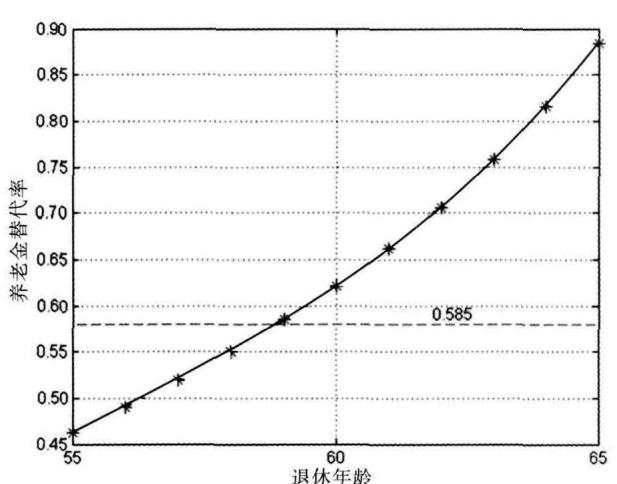
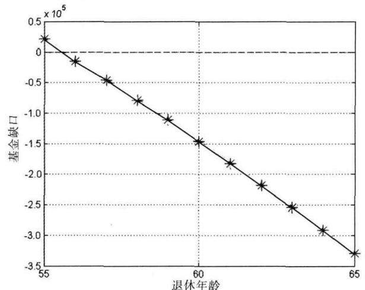
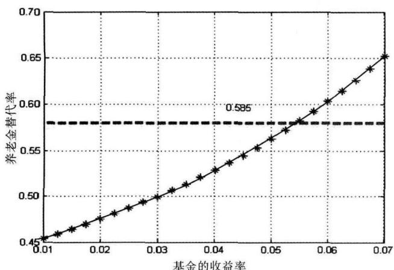
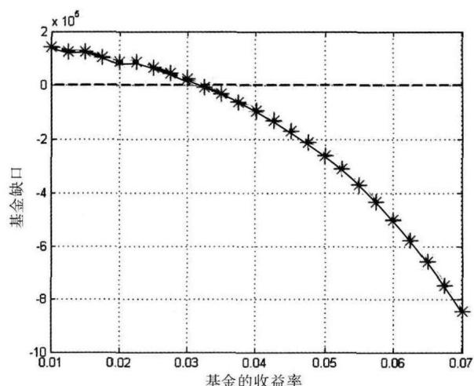
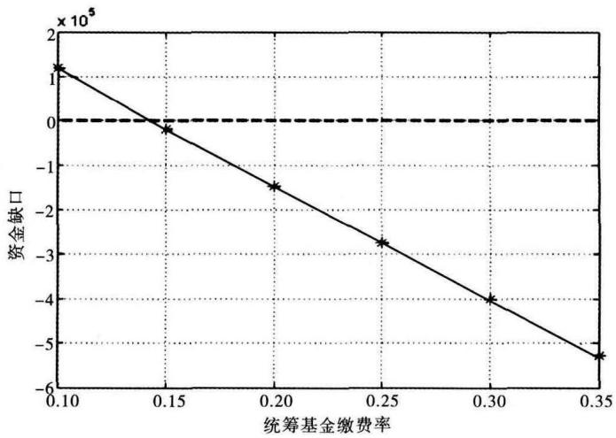
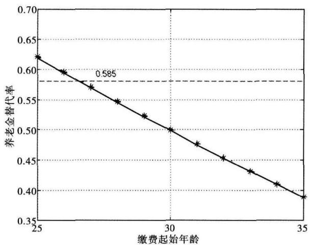
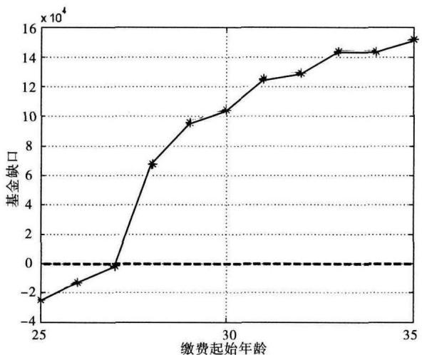

## 竞赛论坛

# 企业退休职工养老金模型

乔衡山 ，许琼 ，徐景华

指导教师 ：陈萍 柯林 许成锋

（九江学院 理学院 江西 九江332005）

摘 要 ：本文讨论了目前我国养老保险体制改革的相关问题 首先 通过分析年工资增长趋势 对其数据进行回归分析 构造出年工资的Loistic模型 并预测出职工未来年份的年平均年工资 其次 构造养老金替代率模型 并得到多种情况下的替代率 再次 建立养老金缺口模型 用来分析养老基金缺口情况以及达到平衡时领取养老金的年数 最后 分析得出影响养老金替代率和收支平衡的4个因素 即社会统筹基金的缴费比例 基金收益率 退休年龄和开始缴纳养老保险的年龄 对其进行敏感性分析 并提出一些相应的改进建议

关键词 ：Logistic模型 ；养老金替代率 ；养老金缺口 ；敏感性分析

中图分类号 ：O29

文献标志码 ：A

文章编号 ：2095－3070（2012）02－0039－06

## 1 模型假设

1）国家的经济情况以人均国民生产总值来衡量 ；  
2）年龄段的年工资为各年龄段最低年工资和最高年工资的平均值  
3）同年龄段的缴费指数相同 ；  
4）退休金按社会平均年工资同步增长 ；  
5）求养老金资金缺口时 考虑社会统筹基金的利率问题  
6）求养老金资金缺口时 把社会统筹基金和个人账户基金看成整体支付养老金  
7）每年的养老金在当年的年初一次性发放 ；  
8）不考虑个人账户基金继承的情况  
9）银行年利率不发生变动 且为3％

## 2 模型建立与求解

## 2．1 年工资Logistic模型

近30年来我国经济发展迅速 年工资增长率也较高 而现今中等发达国家的年工资增长率较小 我国经济发展的战略目标是在21世纪中叶达到中等发达国家的水平 ，由此可知，我国年工资增长的趋势是先快后慢，而 S 型曲线能反映出这种趋势 ，因此我们选取Logistic函数 $\displaystyle y = \frac { 1 } { a + b \mathrm { e } ^ { - c t } }$ 作为年工资预测模型

由 $\operatorname* { l i m } _ { t \to + \infty } y = \operatorname* { l i m } _ { t \to + \infty } { \frac { 1 } { a + b \mathrm { e } ^ { - c t } } } = { \frac { 1 } { a } }$ 知 ， $\frac { 1 } { a }$ 代表的是年工资在21世纪中叶的水平 $( a = \frac { 1 } { y _ { \mathrm { m a x } } } \ , y _ { \mathrm { m a x } }$ 表示未来山东省最高年工资57331元） c为年平均工资的固有增长率 $ { b } = \frac { 1 } { y _ { 0 } } - \frac { 1 } { y _ { \mathrm { m a x } } } \ ( y _ { 0 }$ 表示山东省1978年的年平均工资566元） 年工资的增长又与经济增长相关 已知中等发达国家人均国民生产总值（人均GNP） 为8000美$\overline { { \overline { { \pi } } } } ^ { [ 1 ] }$ （即人民币51109元，人民币兑换美元的兑换率每天都不同 ，所以我们只能选取2011年9月9日的为参考值，而且未来的兑换率我们也无从得知）［2］ ，如果知道人均 GNP与年工资 y 的关系，就能确定 a 的值。查找我国1978年到2010年人均GNP的数据［3］ ，作出职工平均年工资与人均GNP散点图，发现它们存在线性关系 做线性回归得到 $y = 1 . 1 2 \mathrm { G N P } + 8 9 . 0 7$ 将21世纪中叶人均 $\mathrm { G N P } = 5 1 \ 1 0 9$ 代入式中，求得 $a = { \frac { 1 } { 5 7 \ 3 3 1 } } { \circ }$

再根据山东省1978年到2010年职工年均年工资的数据 运用回归方法求出Logistic模型中的其他参数，得到 $b = 0 . 0 0 6 \ 5 , c = 0 . 1 8 4 \ 1$ 。因此年平均工资的Logistic模型的表达式为

$$
y = \frac {1}{1 / 5 7 3 3 1 + 0 . 0 0 6 5 \mathrm{e} ^ {- 0 . 1 8 4 1 t}} 。 \tag {1}
$$

用模型（1） 可预测出未来年份的职工年平均年工资

## 2．2 养老金替代率模型

养老金替代率 SA 为职工刚退休时的养老金与退休前年工资的比例 退休前年工资可以根据年工资的Logistic模型预测的结果可知， 则问题转化到求养老金上 通过养老金的计算方法可知 ， 养老金由基础养老金与个人账户养老金组成

## 2．2．1 个人账户养老金

个人账户养老金PE为个人账户储存额PA与计发月数 $_ { g n }$ 的比值，即 $P E = P A / g n$ 。参保人员退休前每年的年工资 $x _ { i }$ 按比例 $r _ { 1 } \cdot$ （职工每年总年工资缴纳到个人帐户的百分比） 缴纳到个人账户的资金，银行利率为r，可得 $P A =$ $\sum _ { i = 1 } ^ { m } x _ { i } \times r _ { 1 } \times ( 1 + r ) ^ { i }$ ，其中 $m$ 为缴费年限。因此个人账户养老金公式为 $P E = \sum _ { i = 1 } ^ { m } x _ { i } \times r _ { 1 } \times ( 1 + r ) ^ { i } / g n$ 。

## 2．2．2 基础养老金

## 1） 缴费指数

职工每年缴费年工资指数等于当年缴费年工资 x 与全省在岗职工平均年工资 $c _ { i }$ 的比值 $\cdot { \frac { x _ { i } } { c _ { i } } }$ 根据企业各个年龄段年工资 求出该年龄段平均年工资与企业年平均年工资的比值 作为职工在该年龄段上的缴费指数 。

由于所能求出的年龄段上的缴费指数是有限的 因此我们需要用有限的年龄段上的缴费指数拟合出其他的年龄段上的缴费指数 如表1有各年龄段的缴费指数

表1 各年龄段缴费指数

<table><tr><td>年龄段</td><td>[20,24]</td><td>[25,29]</td><td>[30,34]</td><td>[35,39]</td><td>[40,44]</td><td>[45,49]</td><td>[50,54]</td><td>[55,59]</td></tr><tr><td>缴费指数</td><td>0.669 24</td><td>0.804 93</td><td>0.982 51</td><td>1.066 70</td><td>1.172 80</td><td>1.266 60</td><td>1.208 70</td><td>1.155 00</td></tr></table>

通过表1可以作出各年龄段（20－24记作125－29记作2 以此类推） 缴费指数对年龄段的散点图 发现比值与年龄段存在二次函数关系 设该函数表达式为 $R = \alpha T ^ { 2 } + \beta T + \gamma$ 通过二次拟合求解得到 R ＝－0．0188T2 ＋0．2453T＋0．4169 代入 T＝9就可以求出 $6 0 - 6 4$ 岁年龄段上的缴费指数为1．1002 将数据代入平均缴费指数公式 $\lambda = ( \frac { x _ { 1 } } { c _ { 1 } } + \frac { x _ { 2 } } { c _ { 2 } } + \cdots + \frac { x _ { m } } { c _ { m } } ) / m$ 求得λ

## 2） 基础养老金

基础养老金 FU 与全省上年度在岗职工月平均年工资 $\frac { c _ { 1 } } { 1 2 } ( c _ { 1 }$ 为退休前一年全省的年平均年工资） 本人指数化月平均缴费年工资 S和缴费年限 有关 根据其关系可计算出基础养老金 $F U = c _ { 1 } \times ( 1 + \lambda ) \div 2 4 \times$ $m \times 1$ ％ 。

## 2．2．3 替代率

替代率 SA 为职工刚退休时的养老金 $A _ { 1 }$ 与退休前年工资 $x _ { 1 }$ 的比例 即

$$
S A = \frac {A _ {1}}{x _ {1}} = \frac {[ P E + F U ] \times 1 2}{x _ {1}} = \frac {\left[ \sum_ {i = 1} ^ {m} x _ {i} \times r _ {1} \times (1 + r) ^ {i} / g n + c _ {1} \times (1 + \lambda) \div 2 4 \times m \times 1 \% \right] \times 1 2}{x _ {1}} 。 \tag {2}
$$

代入式（2） 中所有变量所对应的数据 求得自2000年起分别从30岁 40岁开始缴养老保险 一直缴费到退休（55岁 60岁 65岁） 各种情况下的养老金替代率 结果见表2

表2 养老金替代率

<table><tr><td>[开始缴费年龄, 退休年龄]</td><td>[30,55]</td><td>[30,60]</td><td>[30,65]</td><td>[40,55]</td><td>[40,60]</td><td>[40,65]</td></tr><tr><td>替代率</td><td>0.3871</td><td>0.5224</td><td>0.7420</td><td>0.2138</td><td>0.3158</td><td>0.4694</td></tr></table>

从表2中可以看出 当开始缴费年限不变时 退休年龄越晚 替代率越大；开始缴费年龄越晚 替代率越小

## 2．3 养老金缺口模型

所谓养老金缺口，是指当养老保险基金入不敷出时出现的收支之差

## 2．3．1 职工退休前缴纳的养老基金总额

## 1） 个人账户储存额

个人账户储存额为职工开始缴费到退休时的每年按比例 r 缴纳到个人账户的资金与利息之和 因此个人账户储存额为 PA

## 2） 社会统筹基金储存额

社会统筹基金储存额 SP 为职工开始缴费到退休时的每年按比例 $r _ { 2 }$ （职工年总年工资缴纳到社会统筹基金帐户的百分比） 缴纳到社会统筹基金账户的资金与利息之和 即 $S P = \sum _ { i = 1 } ^ { m } x _ { i } \times r _ { 2 } \times ( 1 + r ) ^ { i }$ 。

## 3） 职工退休前缴纳的养老基金总额

职工退休前缴纳的养老基金总额 BC 为个人账户储存额 PA 与社会统筹基金储存额 SP 之和 即

$$
B C = S P + P A = \sum_ {i = 1} ^ {m} x _ {i} \times (1 + r) ^ {i} \times (r _ {1} + r _ {2}) 。 \tag {3}
$$

## 2．3．2 退休后每年领取的养老金

职工所领取的养老金包括个人账户养老金和基础养老金 其中个人账户养老金不变 基础养老金与全省上年度在岗职工月平均年工资SC ／12有关 其中 $S C _ { j }$ 为退休时第 年全省上年度年平均年工资 所以养老金每年都在变化 根据分析 可以得到退休后第 j 年领取的养老金为

$$
A _ {j} = \left(P E + F U _ {j}\right) \times 1 2 = \left(P A / g n + \frac {\left(S C _ {j} / 1 2\right) \times (1 + \lambda)}{2} \times \mathrm{m} \times 1 \%\right) \times 1 2 。 \tag {4}
$$

## 2．3．3 养老金缺口

养老金缺口值为职工到死亡时领取的养老金与缴纳的养老基金的差额。当职工退休后，每年从缴纳的养老基金账户中领取养老金 其余额按照银行利率来领取利息 而它将与其他剩余账户资金作为第二年的本息。根据分析，可以得到退休后第 j 年养老基金账户余额的公式为 $L = B C ( 1 + r ) ^ { j - 1 } - \sum _ { n = 1 } ^ { j } A _ { n } ( 1 + r ) ^ { j - n }$ 。则养老金缺口值 K ＝－L，即

$$
K = - B C (1 + r) ^ {j - 1} + \sum_ {n = 1} ^ {j} A _ {n} (1 + r) ^ {j - n} 。 \tag {5}
$$

当 $K > 0$ 时 基金存在缺口 当 K＝0时所需的年数为收支达到平衡时的年数 当 $K < 0$ 时 基金还有剩余 收入大于支出 不存在平衡的条件 代入职工退休前缴纳的养老基金总额 每年领取的养老金总额 通过编程求解后结果见表3

表3 养老金缺口

<table><tr><td>[开始缴费年龄,退休年龄]</td><td>[30,55]</td><td>[30,60]</td><td>[30,65]</td></tr><tr><td>缺口资金</td><td>21 745</td><td>-146 580</td><td>-329 180</td></tr><tr><td>收支平衡时的年数</td><td>19</td><td>—</td><td>—</td></tr></table>

从表3中的数据可以看到 一个人从30岁开始缴养老金 退休的年龄为55岁时 资金存在缺口 会给国家经济带来很大的负担 推迟退休年龄到60岁 养老基金账户还有较多的剩余 对个人而言不太公平

## 3 模型分析和讨论

分析公式（2）养老金替代率模型和公式（5）养老金缺口模型 可以得到影响目标替代率与缺口的因素主要有 社会统筹基金的缴费比例 基金收益率 开始缴纳养老保险的年龄以及退休年龄 下面对各个因素做敏感性分析 得到其对替代率和缺口的影响

## 3．1 退休年龄

以退休年龄为55～65岁 社会统筹基金的缴费比例20％ 个人账户的缴费比例3％ 开始缴纳养老保险的年龄30岁 银行利率3％为数据作替代率和基金缺口随退休年龄变化的图象 结果如图1和图2所示根据图1和图2可以看到 达到目标替代率的退休年龄为59岁 达到基金平衡的退休年龄为55或56 因此推迟退休年龄 替代率接近目标替代率 并且养老基金剩余越多 目前我国男职工的退休年龄为60岁 女职工的退休年龄为55岁 是比较合适的 但女职工的退休年龄可以在55岁至60岁之间做适当调整 甚至可以实行弹性退休制度 既照顾女职工的特殊性 又考虑女性职工里高级人才的工作意愿 可谓一举多得

line

| 退休年龄 | 养老金替代率 |
| --- | --- |
| 55 | ~0.46 |
| 56 | ~0.49 |
| 57 | ~0.52 |
| 58 | ~0.55 |
| 59 | ~0.58 |
| 60 | ~0.62 |
| 61 | ~0.66 |
| 62 | ~0.70 |
| 63 | ~0.76 |
| 64 | ~0.81 |
| 65 | ~0.88 |

图 退休年龄对替代率的影响

line

| 退休年龄 | 基金缺口 (x 10^5) |
| --- | --- |
| 55 | ~0.25 |
| 56 | ~-0.15 |
| 57 | ~-0.45 |
| 58 | ~-0.8 |
| 59 | ~-1.1 |
| 60 | ~-1.5 |
| 61 | ~-1.85 |
| 62 | ~-2.2 |
| 63 | ~-2.55 |
| 64 | ~-2.95 |
| 65 | ~-3.3 |

图2 退休年龄对基金缺口

## 3．2 基金收益率

在计算替代率和养老金缺口的时候 个人账户养老金和社会统筹养老金都是按照银行利率来考虑利息的 而我们国家的现实情况是将养老基金全部进行投资 有一定的投资收益率 考虑收益率的变化 以基金收益率在1％～7％之间 退休年龄60岁 社会统筹基金的缴费比例20％ 个人账户的缴费比例3％ 开始缴纳养老保险的年龄30岁为数据作替代率和基金缺口随基金收益率变化的图象 结果如图34所示 当基金收益率达到3％时 缺口值为零 基金达到平衡 收益率的继续增加会使基金有剩余 当基金收益率在5％～6％之间时 达到目标替代率 我国的养老基金都是由全国社保基金理事会管理 进行股票 房地产等风险投资 收益率随经济形势的变化波动较大 时而收益较高 时而亏损较大［4］

line

| 基金的收益率 | 养老金替代率 |
| --- | --- |
| 0.01 | ~0.455 |
| 0.012 | ~0.46 |
| 0.014 | ~0.465 |
| 0.016 | ~0.47 |
| 0.018 | ~0.475 |
| 0.02 | ~0.48 |
| 0.022 | ~0.485 |
| 0.024 | ~0.49 |
| 0.026 | ~0.495 |
| 0.028 | ~0.5 |
| 0.03 | ~0.505 |
| 0.032 | ~0.51 |
| 0.034 | ~0.515 |
| 0.036 | ~0.52 |
| 0.038 | ~0.525 |
| 0.04 | ~0.53 |
| 0.042 | ~0.535 |
| 0.044 | ~0.54 |
| 0.046 | ~0.545 |
| 0.048 | ~0.55 |
| 0.05 | ~0.56 |
| 0.052 | ~0.57 |
| 0.054 | ~0.58 |
| 0.056 | ~0.59 |
| 0.058 | ~0.6 |
| 0.06 | ~0.61 |
| 0.062 | ~0.62 |
| 0.064 | ~0.63 |
| 0.066 | ~0.64 |
| 0.068 | ~0.65 |

3 基金收益率对替代率的影响

line

| 基金的收益率 | 基金缺口 (x 10^5) |
| --- | --- |
| 0.01 | ~1.4 |
| 0.012 | ~1.3 |
| 0.014 | ~1.3 |
| 0.016 | ~1.2 |
| 0.018 | ~1.1 |
| 0.02 | ~1.0 |
| 0.022 | ~0.9 |
| 0.024 | ~0.8 |
| 0.026 | ~0.7 |
| 0.028 | ~0.6 |
| 0.03 | ~0.4 |
| 0.032 | ~0.2 |
| 0.034 | ~-0.1 |
| 0.036 | ~-0.3 |
| 0.038 | ~-0.5 |
| 0.04 | ~-0.7 |
| 0.042 | ~-1.0 |
| 0.044 | ~-1.3 |
| 0.046 | ~-1.7 |
| 0.048 | ~-2.1 |
| 0.05 | ~-2.6 |
| 0.052 | ~-3.1 |
| 0.054 | ~-3.7 |
| 0.056 | ~-4.3 |
| 0.058 | ~-5.0 |
| 0.06 | ~-5.8 |
| 0.062 | ~-6.6 |
| 0.064 | ~-7.5 |
| 0.066 | ~-8.5 |

图4 基金收益率对缺口的影

而在发达国家如美国政府 从法律上规定联邦社保基金不得被用于购买股票 或进行委托投资 房地产开发等其他方面的投资 联邦社保基金理事会的投资均为年利率3．5％～9．25％的历年特种国债和公债有价证券 没有一分钱的其他“风险”投资［5］ 由计算的结果来看 收益率达到3％ 就能保证养老金平衡 建议我国养老基金应提高固定收益产品的投资 减少风险投资

## 3．3 社会统筹基金账户缴纳比例 r2

公式（2）中不存在 $r _ { 2 }$ ， 所以养老金替代率与 $r _ { 2 }$ 无关 。

以社会统筹基金的缴费比例在10％～35％之间退休年龄为60岁 开始缴纳养老保险的年龄30岁 银行存储利率3％为数据作基金缺口随社会统筹基金的缴费比例变化的图象 结果见图5 根据图5 社会统筹账户缴纳比例 $r _ { 2 }$ 在14％左右时 可以达到收支平衡 目前的缴纳比例为20％ 因此可以适当降低缴纳比例 减轻企业的负担

## 3．4 开始缴纳养老保险的年龄

以起始缴费年龄在25～35岁之间 退休年龄60岁 社会统筹基金的缴费比例20％ 个人账户的缴费比例3％ 银行利率3％为数据作替代率和基金缺口随缴费起始年龄变化的图象 结果如图6和图7

line

| 统筹基金缴费率 | 资金缺口 (x 10^5) |
| --- | --- |
| 0.10 | ~1.2 |
| 0.15 | ~-0.2 |
| 0.20 | ~-1.5 |
| 0.25 | ~-2.7 |
| 0.30 | -4.0 |
| 0.35 | ~-5.3 |

图5 统筹金缴费比例对缺口的影响

line

| 缴费起始年龄 | 养老金替代率 |
| --- | --- |
| 25 | ~0.62 |
| 26 | ~0.60 |
| 27 | ~0.57 |
| 28 | ~0.55 |
| 29 | ~0.525 |
| 30 | ~0.50 |
| 31 | ~0.475 |
| 32 | ~0.455 |
| 33 | ~0.43 |
| 34 | ~0.41 |
| 35 | ~0.39 |

图6 缴费起始年龄对替代率的影

line

| 缴费起始年龄 | 基金缺口 (x 10^4) |
| --- | --- |
| 25 | ~-2.5 |
| 26 | ~-1.3 |
| 27 | ~-0.2 |
| 28 | ~6.8 |
| 29 | ~9.6 |
| 30 | ~10.4 |
| 31 | ~12.6 |
| 32 | ~13.0 |
| 33 | ~14.4 |
| 34 | ~14.4 |
| 35 | ~15.2 |

图7 缴费起始年龄对缺口的影响

从图6和图7可以看出 开始缴费年龄在27岁左右 可以达到目标替代率 资金缺口趋于零 养老基金达到收支平衡 在这之后 开始缴费年龄越晚 替代率越小 资金缺口不断增大 一般职工从工作开始就开始缴费 开始缴费年龄即为职工开始工作的年龄 职工参加工作越晚 在此之前受的教育或培训过程越长 素质愈高 年工资收入往往就会愈高 造成替代率较低和资金缺口较大 不过养老保险政策制定者不能控制职工开始工作年龄 提前开始工作年龄的来提高替代率和减少养老金缺口的意义不大

## 后记

通过这次比赛 我们对数模有了一个更为深刻的认识 怎样应用理论知识去解决各类实际问题 而建立数学建模是关键的一步 也是困难的一步 这需要深厚扎实的数学基础 敏锐的洞察力和想象力等

写论文的过程中 我们对论文作了好几次修改 原因不仅仅是论文中有些地方表述不清 还有使用的模型有缺陷等问题 而且在整个比赛过程中 我们更是经常否定自己好不容易构想出来的方法 的确 有些方法很巧妙 但会让人产生错误的判断 当我们发现它是不完善的 就尽量去完善甚至摒弃它 并寻找新的方法 这个过程耗费了我们很多心血 从中我们也体会到了科研工作的艰辛

这次数学建模比赛的过程中 感触很深 我们真正感觉到了什么是坚持与毅力 什么是团结与合作 当我们把模型建立出来时 那是我们最高兴 最激动的时刻 在这三天中 队友之间的相互鼓励与合作的精神

更令我们难忘与感动

## 参考文献

［1］ 腾讯网．杭州市人均 GDP已迈上中等发达国家 ［EB／OL］．［2009－02－17］．http： ／／finance．qq．com／a／20090217／003469htm  
［2］中国银行．外汇牌价［EB／OL］．［2011－09－09］．http： ／／www．boc．cn／sourcedb／whpj  
［3］中华人民共和国国家统计局．中国统计年鉴2011［DB／OL］．［2011－09－09］．http ／／www．stats．gov．cn／tjsj／ndsj／2011／indexch．htm  
［4］向日葵保险网．08年社保基金亏损巨大［EB／OL］．［2010－08－09］．http：／／www．xiangrikui．com／yanglaobaoxian／41220．html  
［5］向日葵保险网．国外社保基金如何监管 美国社保基金作用巨大［EB／OL］．［2011－11－08］．http： ／／www．xiangrikui．com／yanglaobaoxian／xinwen／20101108／71711＿2．html  
［6］姜启源 ，谢金星 ，叶俊．数学模型［M］．3版．北京 ：高等教育出版社 ，2003  
［7］李德宜 ，李明．数学建模［M］．北京 ：科学出版社 ，2009  
［8］韩明 李家宝．数学实验［M］．上海 同济大学出版社 2009

# TheModelofSocialSecurityPension

QiaoHengshanXuQiongXuJinghua

Advisor：ChenPing，KeLin，XuChengfeng

（CollegeofScienceJiujiangUniversityJiujiangJiangxi332005China）

AbstractThis aerdiscssessme rblems ftherefrm f ensinsstem Firstfallanalzin thetrends f ae r th andusin thedatetodoreressionweestablishthewae－Loisticmodelwhichisusedfor redictin thefutureannualaverae wage．Secondlythemodelofreplacementrateofpensionissetup andcalculatedseveralreplacementrates．Thirdly we establishthemodelofpensiondeficittoanalysethedeficitofpensionandtheyearsofreachingthebalanceofpaymentpension Finall weconcludefourfactorsaffectin relacementrateof ensionandthebalanceof ension ament whicharethe paymentrateofsocialplanningpensiontherateofpensionfundthebeginningpayingpensionageandretirementage Accordingtotheresultofsensitivityanalysis，weputforwardsuggestionsforimprovement

Keywords：Logisticmodel；thereplacementrate；pensiondeficit；sensitivityanalysis

## 指导教师简介

陈萍 硕士 讲师 研究方向 最优化原理

柯林 学士 讲师 研究方向 数值代数

许成锋 硕士 副教授 研究方向 泛函分析