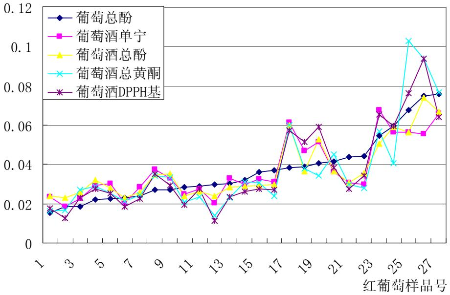
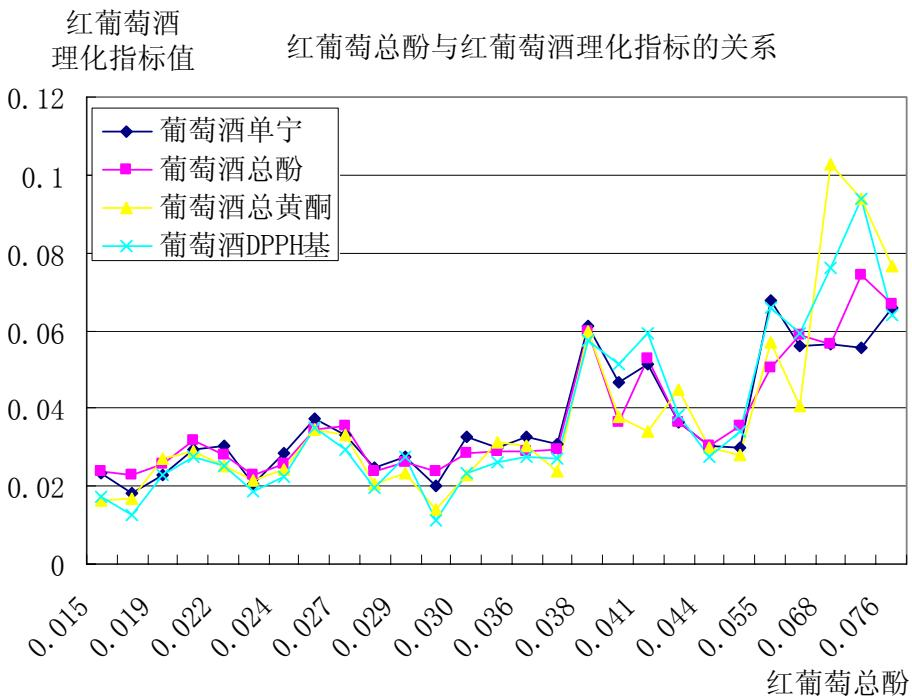
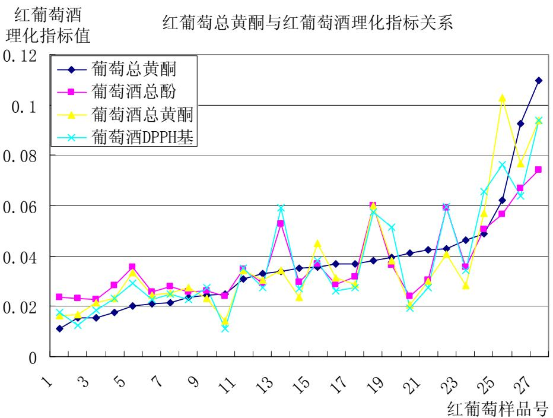
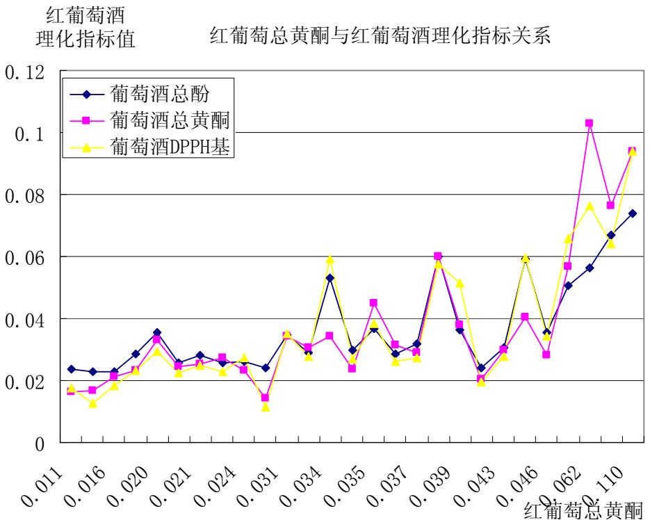
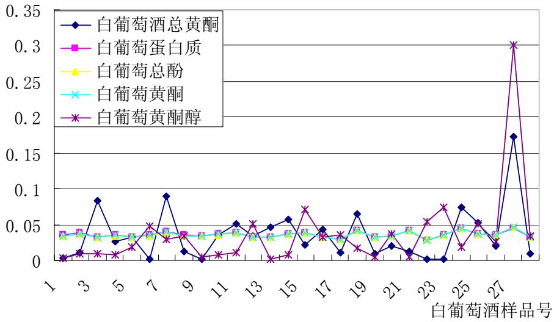

题目： A

参赛队员：队员1\_蔡悠然\_\_ 队员 2\_董璐\_ 队员 3\_施望\_

指导教师： 教练组

单位： 江西师范大学

# 2012 高教社杯全国大学生数学建模竞赛

## 承 诺 书

我们仔细阅读了中国大学生数学建模竞赛的竞赛规则.

我们完全明白，在竞赛开始后参赛队员不能以任何方式（包括电话、电子邮件、网上咨询等）与队外的任何人（包括指导教师）研究、讨论与赛题有关的问题。

我们知道，抄袭别人的成果是违反竞赛规则的, 如果引用别人的成果或其他公开的资料（包括网上查到的资料），必须按照规定的参考文献的表述方式在正文引用处和参考文献中明确列出。

我们郑重承诺，严格遵守竞赛规则，以保证竞赛的公正、公平性。如有违反竞赛规则的行为，我们将受到严肃处理。

我们授权全国大学生数学建模竞赛组委会，可将我们的论文以任何形式进行公开展示（包括进行网上公示，在书籍、期刊和其他媒体进行正式或非正式发表等）。

我们参赛选择的题号是（从A/B/C/D中选择一项填写）： A

我们的参赛报名号为（如果赛区设置报名号的话）：

所属学校（请填写完整的全名）： 江西师范大学

参赛队员 (打印并签名) ：1. 蔡悠然

2. 董 璐

3. 施 望

指导教师或指导教师组负责人 (打印并签名)： 教练组

日期： 2012 年 9 月 10 日

赛区评阅编号（由赛区组委会评阅前进行编号）：

# 2012 高教社杯全国大学生数学建模竞赛

## 编 号 专 用 页

赛区评阅编号（由赛区组委会评阅前进行编号）：

赛区评阅记录（可供赛区评阅时使用）：

<table><tr><td>评阅人</td><td></td><td></td><td></td><td></td><td></td><td></td><td></td><td></td><td></td><td></td></tr><tr><td>评分</td><td></td><td></td><td></td><td></td><td></td><td></td><td></td><td></td><td></td><td></td></tr><tr><td>备注</td><td></td><td></td><td></td><td></td><td></td><td></td><td></td><td></td><td></td><td></td></tr></table>

全国统一编号（由赛区组委会送交全国前编号）：

全国评阅编号（由全国组委会评阅前进行编号）

# 葡萄酒的评价

## 摘要

食品问题的研究与评价已经成为普遍性社会关注问题，为更好的解决这类问题，建立一套完整有效可靠的模型，对研究和分析这类问题有重要作用。本文就葡萄酒的两组评价结果，酿酒葡萄的等级划分和评判，酿酒葡萄与葡萄酒的各理化指标之间的联系，以及能否用葡萄和葡萄酒的理化指标来评价葡萄酒的质量这四个方面做出分析、研究，依据不同原理建立了四个模型，分别解决相应的问题。

针对问题一，红葡萄酒和白葡萄酒的差异性分析方法是相同的，现以红葡萄为例给予说明。首先对两组品酒员评分的数据做差异性分析，将总体看成正态总体，构造统计量 ${ \frac { n - p } { p ( n - 1 ) } } T ^ { 2 }$ ，取显著性水平 $\alpha$ 为 0.05，得到拒绝域，再将样本值带入 ${ \frac { n - p } { p ( n - 1 ) } } T ^ { 2 }$ ，发现其在拒绝域内，因此两组品酒员对红葡萄酒的评价存在显著性差异。同样得到，两组品酒员对白葡萄酒的评价也存在显著性差异。而总体为非正态总体，所以再做双样本秩检验。检验的结果也是两组品酒员对红、白葡萄酒的评价都存在显著性差异。由此可知，模型的差异性分析是正确的。

其次，对存在差异的两组数据做可靠性分析，将每一组品酒师对各种样品酒评价作方差 的，比较两组品酒师对各种样品酒评价的方差的和，第二组品酒员 评分可靠性更高。

针对问题二，先对 28 种理化指标做主成分分析，求的主成分 $y _ { i }$ 后，再在这个基础求得每一类葡萄上做聚类分析，将葡萄分为若干类。然后根据每种酒样品的质量得分，的平均得分，以此确定葡萄的好坏。红葡萄和白葡萄的等级划分为：

红葡萄的第一级（优）有样品 5，10，17，20，23，24，25，26，27；第二级（良）（中等）有样品1，8，14；第四级（差）有样有样品2，3，6，7，9，21，22；第三级品 4，11，12，13，15，16,18，19。

白葡萄的第一级（优）有样品 1,3,5,10,15,24,25,28；第二级（良）有样品三级（中等）有样品 14,21,23,27；第四级（差）有样品2,4,9,17,19,20,22,26；第6,7,8,11,12,13,16,18。

针对问题三，对葡萄和葡萄酒的理化指标做相关性分析，求的相关系数矩阵，对系数大于 0.8（红）或 0.3（白）的两种指标作图分析。图 1-1 表示红葡萄酒的单宁、总酚、总黄酮、DPPH基含量是随着葡萄的总酚含量增加而增加的，图 1-2表示这四种物质与红葡萄总酚的关系是相似的。图2-1 表示红葡萄酒的总酚、总黄酮、DPPH基含量也是随着红葡萄的总黄酮含量增加而增加的，图2-2表示这三种物质与红葡萄总黄酮的关系黄酮、黄酮醇含量影响着白葡萄酒总黄是相似的。图3-1表示白葡萄的蛋白质、总酚、酮的含量，且这几者的含量都是相对稳定的。

针对问题四，将葡萄和葡萄酒理化指标分别与葡萄酒的质量做相关性分析，求出指标与质量的相关系数，找出相关系数大的理化指标，说明它们对葡萄酒的质量有一定的影响。为了找出这些指标与酒的质量之间的具体函数关系，对它们进行多元回归分析。得到的 $R ^ { 2 }$ 值较低，表示葡萄和葡萄酒的理化指标与葡萄酒质量之间无法得到很好的函数关系。但相关性分析表示葡萄和葡萄酒的理化指标与葡萄酒的质量之间的关系程度较为密切，所以这只能模糊的说明不能用葡萄和葡萄酒的理化指标来评判葡萄酒的质量。

键词：关 $T ^ { 2 }$ 统计量 双样本秩检验 主成分分析 聚类分析 相关性分析 多元统计回归

## 一、问题重述

确定葡萄酒质量时一般是通过聘请一批有资质的评酒员进行品评。每个评酒员在对葡萄酒进行品尝后对其分类指标打分，然后求和得到其总分，从而确定葡萄酒的质量。酿酒葡萄的好坏与所酿葡萄酒的质量有直接的关系，葡萄酒和酿酒葡萄检测的理化指标会在一定程度上又会反映葡萄酒和葡萄的质量。附件1给出了某一年份一些葡萄酒的评价结果，附件2和附件3分别给出了该年份这些葡萄酒的和酿酒葡萄的成分数据。请尝试建立数学模型讨论下列问题：

信？1. 分析附件 1中两组评酒员的评价结果有无显著性差异，哪一组结果更可  
酒葡萄进行分级。2. 根据酿酒葡萄的理化指标和葡萄酒的质量对这些酿  
3. 分析酿酒葡萄与葡萄酒的理化指标之间的联系。  
对葡萄酒质量的影响，并论证能否用葡萄和4．分析酿酒葡萄和葡萄酒的理化指标葡萄酒的理化指标来评价葡萄酒的质量？

## 二、问题分析

## 2.1 问题一的分析

在题目附件一提供的数据显示中，每种酒样品有两组品酒员评价，每一组有 10 名品酒员，每人要针对 10 种指标对酒进行评分。红葡萄酒有 27 种，白葡萄酒有 28 种。由查阅的葡萄酒资料知道，品酒分为感官评价和喜好评价，专业品酒员一般进行的感官评价。可是不同品酒员在视觉、嗅觉、味觉等方面的灵敏度不相同，这就不可避免的在品酒的外观、香气、口感方面有所不同。我们要做的就是分析出两组品酒员的评分有没作建模求解。因两种类别的酒的求解方有显著差异性，分红葡萄酒和白葡萄酒两种情况法一样，下面我们以红葡萄酒的情况来分析。

通过讨论，为简化问题，我们将每组10名品酒员的评价看成是一名品酒员的10次评价。就第一组对酒的评价来说，将每一次对 10 种指标的评分数据写成一个向量，这样每种酒样品就有了10个向量。再对每种指标的10个分值求出平均数，这样每组品的每种酒的 10 个指标就有了 10 个得分。第二组情况同上。第一组、第二组分别有 27 组向量，再每一个相对应的向量分别作差，得到 27 个向量。我们就将两个总体均值的检单个总体均值的情况，由检验就可以得到两组品酒员的评价结果有无显著性差验化成异。

为使上述结果更可信，我们决定用双样本秩检验对两组品酒员的评酒结果做比较分异性的分析结果。如果两种方法得到的结果是一样的，则说明我们的建模是析，得到差正确的。

下面针对两组的可靠性比较，我们选用方差作为比较依据。同样拿一组作为例子，个总首先算出第一组中每种红葡萄酒的10 个总评分的方差，将27个方差加起来得到一的方差。我们再将两个总的方差相比较，方差小的那组则表示更为可靠的一组。

## 2.2 问题二的分析

葡萄好坏。因此根据酿酒葡萄的好坏影响酒的质量，而葡萄的各项指标可以反映出酿酒葡萄的理化指标和葡萄酒的质量可以分析各种葡萄的好坏。

葡萄有 28 种理化指标，它们对葡萄质量的影响是不相同的。如果直接对他们做聚所以考虑先对指标做主成分分析，求的几个主成类分析，可能得到的结果不会太理想，分后，再在这个基础上做聚类分析。

件作主成分分析和聚类分析，然后由每类葡萄酿成的葡萄酒的质量确定用 SPSS 软葡萄的等级。

在考虑葡萄酒的质量时，我们首先想到的是将每个酒样品的平均分作为酒的质量，但是每种酒有两组得分，且两组评分的差异性可能比较大。所以我们通过讨论，决定用赋两组得分加权值的方法来计算得分，这个加权值是每组 10 个总分值的方差的倒数。如果得分越大则说明该类葡萄的质量越好。

## 2.3 问题三的分析

葡萄酒中的理化指标都有酿酒葡萄的理化指标与它相对应，且酒的指标比葡萄的指标少，这说明葡萄中多个因素可能只影响葡萄酒的某个理化指标。为此，我们分析葡萄酒和葡萄的理化指标之间的相关性，若两个理化指标相关性系数小，则说明两者没有多图分大的关系；若相关系数大，则说明两者之间关系较大，那么我们就对这两种指标作析，以便直观明了地观察葡萄酒的理化指标含量随葡萄的理化指标含量的变化。

## 2.4 问题四的分析

根据题目，要分析酿酒葡萄和葡萄酒的理化指标对葡萄酒质量的影响，并论证能否用葡萄和葡萄酒的理化指标来评价葡萄酒的质量。由于酿酒葡萄和葡萄酒的理化指标繁多，如要一一的对每一项理化指标相对于葡萄酒质量的影响都进行分析就会很复杂。为了避免这种繁琐的分析，先分别对葡萄和葡萄酒的各个理化指标与葡萄酒的质量进行相关性分析，得到相关系数矩阵。然后对理化指标与葡萄酒质量相关性高的指标进行分析。

## 三、模型假设

1、数据是真实可靠的。  
2、假设每位品酒员的品酒都使客观、专业，不带个人喜好的。  
每组10名品酒员对一个样品酒的评酒相当于 1名品酒员对一个样品酒的103、假设次评价。  
对葡萄酒质量的影响，而不考虑工艺、采摘、4、假设在问题二中只考虑葡萄质量产量、酒年份等因素对酒质量的影响。  
之间的联系，假设红葡萄酒的 27种样品酒5、在分析酿酒葡萄与葡萄酒的理化指标相当于取一种样品酒的27个样本做分析。

四、符号说明

<table><tr><td>符号</td><td>说明</td></tr><tr><td> $x_i$ </td><td>第一组10位品酒员打分的平均值</td></tr><tr><td> $y_i$ </td><td>第二组10位品酒员打分的平均值</td></tr><tr><td> $d_i = x_i - y_i$ </td><td>两组平均值的差</td></tr><tr><td> $\sigma^2$ </td><td>方差</td></tr><tr><td> $\alpha_i (i=1,2,\cdots,8)$ </td><td>第i个主成分的特征向量</td></tr><tr><td> $p_i$ </td><td>第i个葡萄理化指标的一组数据</td></tr><tr><td> $q_i$ </td><td>第i个主成分</td></tr></table>

## 五、模型的建立与求解

## 5.1 问题一

## 5.1.1 模型的建立

## 5.1.1.1 两组差异性分析

设 $( x _ { i } , y _ { i } ) , i = 1 , 2 , . . . n ( n > p )$ 是成对比试验数据，令

$$
d _ {i} = x _ {i} - y _ {i}, i = 1, 2, \dots n
$$

又设 $d _ { 1 } , d _ { 2 } , . . . d _ { n }$ 独立同分布于 $N _ { p } ( \mu , \sigma )$ ，其中 $\sigma > 0 \ , \ \mu = \mu _ { 1 } - \mu _ { 2 } , \ \mu _ { 1 }$ 和 $\mu _ { 2 }$ 分别是总体 和x均值向量。我们希望的检验假设总体y 的

$$
H _ {0}: \mu_ {1} = \mu_ {2}, H _ {1}: \mu_ {1} \neq \mu_ {2}
$$

等价于

$$
H _ {0}: \sigma = 0, \sigma \neq 0
$$

这样，两个总体的均值比较检验问题就可以化为一个总体的情形。构造统计量

$$
T ^ {2} = n \overline {{d}} S ^ {- 1} \overline {{d}} ^ {T}
$$

其中，

$$
\overline {{d}} = \overline {{x}} - \overline {{y}}
$$

$$
S = \frac {1}{n - 1} \sum_ {i = 1} ^ {n} (d _ {i} - \overline {{d}}) ^ {T} (d _ {i} - \overline {{d}})
$$

当原假设 $H _ { 0 } : \sigma = 0$ 为真时，统计量

$$
\frac {n - p}{p (n - p)} T ^ {2}
$$

服从自由度为p和 $n - p$ 的F 分布，对给定的显著水平 $\alpha$ ，拒绝域规则为：

若 $\mathrm { T } ^ { 2 } \geq T _ { \alpha } ^ { 2 } ,$ ，则拒绝H<sub>0</sub>

其中，

$$
T ^ {2} = \frac {\mathrm{p(n-1)}}{\mathrm{n-p}} F _ {\alpha} (p, n - p)
$$

## 5.1.1.2 双样本秩检验

双样本秩检验（中位数检验）方法对为使得到的结果更加可靠、准确，我们另选用两组品酒员的评酒再做一次分析，即便检验上述的结果。

设 $( X _ { 1 } , X _ { 2 } , . . . , X _ { \mathrm { { m } } } )$ 和 $( Y _ { 1 } , Y _ { 2 } , . . . , Y _ { \mathrm { { n } } } )$ 分别为两个连续总体X和Y 中随机抽取出来的样本，我们关心两个总体是否有相同的分布形状，或者他们的中位数是否相等。

$$
H _ {0}: M _ {x} = M _ {y}
$$

<table><tr><td> $H_{1}:M_{x}>M_{y}$ </td></tr><tr><td> $H_{1}:M_{x}<M_{y}$ </td></tr><tr><td> $H_{1}:M_{x}\neq M_{y}$ </td></tr></table>

为了对假设作出判定，如果 $H _ { 0 }$ 为真，那么将m x个 和n个y的数据，按数值的相对大小从小到大排序x和y的值应该期望被很好地混合，这 $m + n = N$ 个观察值能够被看作来y大于x，或大部分的x大于y ，将自于共同总体的一个单一的随机样本。若大部分的不能证实这个有序的序列是一个随机的混合，将拒绝 ,x y来自一个相同总体的零假设。在x,y混合排列的序列中，x占有的位置是相对于y 的相对位置，因此等级或秩是表示位置的一个极为方便的方法。在x y, 的混合排列中，等级1是最小的观察值，等级 是N最大的。若X 的等级大部分大于Y的等级，那么数据将支持 $H _ { \mathrm { 1 } } : M _ { \mathrm { \mathstrut } _ { x } } > M _ { \mathrm { \mathstrut } _ { y } }$ <sub>y</sub>，若 X 的等级大部分小于Y的等级，那么数据将支持 $H _ { \mathrm { 1 } } : M _ { \mathrm { \mathstrut } _ { x } } < M _ { \mathrm { \mathstrut } _ { y } }$ <sub>y</sub>检验统计量。根据上面的基本原理，检验统计量为：

$$
W _ {x} = X \text {的秩和} \quad W _ {y} = Y \text {的秩和}
$$

由于X,Y的混合序列的等级和为：

$$
1 + 2 + \dots + \mathrm{N} = \mathrm{N} \times \mathrm{N} + 1
$$

所以，

$$
W _ {x} + W _ {y} = N (N + 1) / 2
$$

检验的统计量：

$$
W _ {x} = X
$$

如有第一个总体的样本： $x _ { 1 } , x _ { 2 } , . . . x _ { m }$ 和第二个总体的样本：

$$
y _ {1}, y _ {2}, \dots y _ {n}, \quad m + n = N 。
$$

令 $W y x$ 使把所有的观测值 与 观测值做比较后， 大于 的个数。令 y x x y $W x y$ 使把所有的 观测值与 观测值做比较后， 大于 的个数，有x y y x

$$
W y = W _ {x y} + \frac {n (n + 1)}{2}, \quad W x = W _ {y x} + \frac {m (m + 1)}{2}
$$

由此得到：

<table><tr><td>假设</td><td>检验的统计量(k)</td><td>P值</td></tr><tr><td> $H_1:M_x>M_y$ </td><td> $W_{xy}$ 或 $W_y$ </td><td> $P(K \leq k)$ </td></tr><tr><td> $H_1:M_x<W_{yx}$ 或 $W_x$ </td><td> $W_{yx}$ 或 $W_x$ </td><td> $P(K \leq k)$ </td></tr><tr><td> $H_1:M_x \neq M_y$ </td><td> $\min(W_{xy},W_{yx})\min(W_x,W_y)$ </td><td> $2P(K \leq k)$ </td></tr></table>

## 5.1.1.3 可靠性分析

的评价的结果进行可靠性分析，我们考虑到要是一组 10 位品酒师要对两组品酒师之间给出的评价有很大的差异就说明这一组品酒师的可靠性不高，反之，要是同一组品酒师 酒的评价对同一种样品 差异很小就可以说明这一组品酒师的可靠性高。所以我们就差分析，比较两组品酒师对各种样品酒对每一组品酒师对各种样品酒评价作方 评价的方差的和，方差小的那组可靠性就更高。

## 5.1.2 模型的求解

首先我们先做差异性分析的求解：

对于酒样品 $\textit { i } \left( i = 1 . . . 2 7 \right)$ 的每项评价指标，第一组 10 位品酒员打分的平均值记为$x _ { i } = ( x _ { i 1 } \ x _ { i 2 } \ x _ { i 3 } \ x _ { i 4 } \ x _ { i 5 } \ x _ { i 6 } \ x _ { i 7 } \ x _ { i 8 } \ x _ { i 9 } \ x _ { i 1 0 } )$ ，第二组 10 位品酒员打分的平均值记为$y _ { i } = ( y _ { i 1 } y _ { i 2 } y _ { i 3 } y _ { i 4 } y _ { i 5 } y _ { i 6 } y _ { i 7 } y _ { i 8 } y _ { i 9 } y _ { i 1 0 } )$ ，那么对于每项评价指标，他们打分的平均值的差记为 $d _ { i } = x _ { i } - y _ { i } = ( d _ { i 1 } ~ d _ { i 2 } ~ d _ { i 3 } ~ d _ { i 4 } ~ d _ { i 5 } ~ d _ { i 6 } ~ d _ { i 7 } ~ d _ { i 8 } ~ d _ { i 9 } ~ d _ { i 1 0 } )$ 0

现在先对红葡萄酒进行求解：

$$
x _ {1} = (2. 3 \quad 6. 4 \quad 4. 3 \quad 5. 4 \quad 1 2. 2 \quad 2. 9 \quad 4. 5 \quad 5. 2 \quad 1 1. 8 \quad 7. 7)
$$

$$
y _ {1} = (3. 1 \quad 7. 6 \quad 3. 6 \quad 5. 5 \quad 1 0. 8 \quad 3. 8 \quad 5. 7 \quad 6 \quad 1 3. 6 \quad 8. 4)
$$

则 d = (-0.8 -1.2 0.7 -0.1 1.4 -0.9 -1.2 -0.8 -1.8 -0.7)

同样可以得到：

$$
\begin{array}{l} d _ {2} = (- 0. 2 \quad 0. 2 \quad 0 \quad 0. 9 \quad 1 \quad 0. 6 \quad 0. 8 \quad 0. 7 \quad 1. 8 \quad 0. 5) \\ d _ {3} = (0 \quad 1. 8 \quad 0. 5 \quad 0 \quad 1 \quad 0. 3 \quad 0. 1 \quad 0. 6 \quad 1 \quad 0. 5) \\ d _ {4} = (0. 5 \quad 1. 6 \quad - 0. 8 \quad - 1. 4 \quad - 1 \quad - 0. 5 \quad 0. 1 \quad - 0. 1 \quad - 0. 6 \quad - 0. 4) \\ \begin{array}{c}\bullet \\ \bullet \\ \bullet \end{array} \\ d _ {2 7} = (0 \quad 0 \quad 0. 1 \quad 0. 2 \quad - 0. 2 \quad 0. 2 \quad 0. 8 \quad 0. 2 \quad 0 \quad 0. 2) \\ \end{array}
$$

那 么 对 上 述 求 得 的 $d _ { i }$ 的 各 列 求 平 均 值 ， 从 而 得 到$\overline { { d } } = \left( - 0 . 0 3 8 0 . 8 7 7 0 . 1 8 0 0 0 . 2 5 2 0 . 5 0 6 0 . 0 9 9 0 . 2 5 5 0 . 1 2 7 0 . 4 2 3 0 . 0 5 2 \right)$ ，然后计算协方差矩阵 $S = { \frac { 1 } { n - 1 } } \sum _ { i = 1 } ^ { n } ( d _ { i } - { \overline { { d } } } ) ^ { T } ( d _ { i } - { \overline { { d } } } )$ 27，其中n = 。

利用C语言编程得到：

$$
S = \left[ \begin{array}{l l l l l l l l l l} 0. 5 4 6 2 & 0. 3 5 2 6 & 0. 1 1 4 7 & 0. 0 1 9 2 & 0. 2 0 0 2 & 0. 1 8 3 7 & 0. 1 8 6 0 & 0. 0 7 4 1 & 0. 3 7 0 9 & 0. 1 2 1 5 \\ 0. 3 5 2 6 & 0. 7 5 6 8 & 0. 0 2 1 7 & - 0. 0 0 1 0 & 0. 1 0 1 8 & 0. 1 7 0 7 & 0. 2 1 0 9 & 0. 1 2 9 4 & 0. 3 8 4 7 & 0. 1 1 3 5 \\ 0. 1 1 4 7 & 0. 0 2 1 7 & 0. 2 3 7 8 & 0. 2 6 2 6 & 0. 3 9 4 2 & 0. 1 2 1 6 & 0. 1 4 0 9 & 0. 0 8 8 8 & 0. 3 1 7 6 & 0. 1 3 2 9 \\ 0. 0 1 9 2 & - 0. 0 0 1 0 & 0. 2 6 2 6 & 0. 5 4 9 5 & 0. 5 3 5 0 & 0. 1 8 9 5 & 0. 2 8 0 9 & 0. 1 4 4 3 & 0. 4 6 9 4 & 0. 2 0 2 2 \\ 0. 2 0 0 2 & 0. 1 0 1 8 & 0. 3 9 4 2 & \text {   } \text {   } \text {   } \text {   } \text {   } \text {   } \text {   } \text {   } \text {   } \text {   } \text {   } \text {   } \text {   } \text {   } \text {   } \text {   } \text {   } \text {   } \text {   } \text {   } \text {   }\end{array} \right]
$$

再利用 Matlab计算得到 的逆矩阵S $S ^ { - 1 }$

取显著性水平 $\alpha = 0 . 0 5$ ，将 $p = 1 0 , \ n = 2 7$ 代入 ${ T _ { \alpha } } ^ { 2 } = { \frac { p ( n - 1 ) } { n - p } } F _ { \alpha } ( p , n - p )$ 中，得到${ T _ { \alpha } } ^ { 2 } = 3 7 . 4 7 0 6$ （其中 $F _ { 0 . 0 5 } ( 1 0 , 1 7 )$ 通过查表得其值为 2.45）。将样本的值代入统计量$T ^ { 2 } = n \overline { { d } } S ^ { - 1 } \overline { { d } } ^ { T }$ 中，得到 $T ^ { 2 } = 6 0 . 1 5 9 2$ ，显然 $T ^ { 2 } > { T _ { \alpha } } ^ { 2 }$ ，即拒绝原假设，所以两组品酒员对于红葡萄酒的评价结果有显著性差异。

白 行求 于红葡萄酒，可以得到：再对 葡萄酒进 解，类似

$$
\begin{array}{l} d _ {1} ^ {\prime} = (0. 3 \quad 0. 8 \quad 0. 4 \quad 0. 9 \quad 0. 6 \quad - 0. 1 \quad 0. 4 \quad - 0. 1 \quad 0. 6 \quad 0. 3) \\ d _ {2} ^ {\prime} = (- 0. 2 \quad 0. 2 \quad 0. 5 \quad 0. 8 6 7 \quad 0. 4 \quad - 0. 9 \quad 0. 1 \quad - 0. 1 \quad - 1. 8 \quad - 0. 1) \\ d _ {3} ^ {\prime} = (0. 6 \quad 0. 9 \quad - 0. 2 \quad 0. 4 \quad - 0. 1 \quad 0. 1 \quad 0. 4 \quad 6. 7 \quad 0. 6 \quad 0. 3) \\ \begin{array}{c}\bullet \\ \bullet \\ \bullet \end{array} \\ d _ {2 8} ^ {\prime} = (0. 7 \quad 1 \quad 0. 4 \quad 0. 1 \quad 0. 4 \quad - 0. 6 \quad - 0. 1 \quad 0. 2 \quad - 0. 3 \quad - 0. 1) \\ \end{array}
$$

同 样 将 上 述 求 得 的 $d _ { i } ^ { \phantom { \dagger } } $ 各 列 求 平 均 值 ， 从 而 得 到的d ' = (-0.136 -0.068 0.007 0.092 0.064 -0.482 -0.243 -0.036 -1.168 -0.282) ，然后计算协方差矩阵 $S ^ { \prime } { = } \frac { 1 } { n { - } 1 } { \sum _ { i = 1 } ^ { n } ( d _ { i } { ' } { - } \overline { { d } } ^ { \prime } ) } ^ { T } ( d _ { i } { ' } { - } \overline { { d } } ^ { \prime } )$ ，其中 $n = 2 8$

利用 件进Matlab软 行编程得到：

$$
S ^ {\prime} = \left[ \begin{array}{l l l l l l l l l l} 0. 4 6 0 2 & 0. 4 4 3 0 & 0. 1 1 8 0 & 0. 2 5 8 3 & 0. 2 5 6 1 & 0. 0 5 7 3 & 0. 0 9 7 7 & 0. 2 9 1 6 & 0. 2 6 1 2 & 0. 0 8 9 6 \\ 0. 4 4 3 0 & 0. 8 9 9 3 & 0. 1 3 3 8 & 0. 3 7 6 6 & 0. 3 1 1 6 & 0. 0 6 5 7 & 0. 1 8 8 8 & 0. 3 3 3 4 & 0. 3 9 5 6 & 0. 1 6 6 4 \\ 0. 1 1 8 0 & 0. 1 3 3 8 & 0. 2 2 5 1 & 0. 2 7 5 7 & 0. 3 4 4 0 & 0. 1 1 2 5 & 0. 0 9 0 3 & 0. 0 4 7 3 & 0. 2 8 0 9 & 0. 1 2 5 4 \\ 0. 2 5 8 3 & 0. 3 7 6 6 & 0. 2 7 5 7 & 0. 5 2 7 6 & 0. 5 0 8 6 & 0. 2 0 9 2 & 0. 2 2 3 7 & 0. 2 8 3 5 & 0. 5 0 6 6 & 0. 2 0 5 1 \\ 0. 2 5 6 1 & 0. 3 1 1 6 & 0. 3 4 4 0 & 0. 5 0 8 6 & 0. 6 7 7 9 & 0. {1} {9} {9} {2} & {0.} {2} {0} {2} {5} & {0.} {1} {4} {6} {5} & {0.} {4} {8} {7} {9} & {0.} {2} {1} {3} {3} \\ {0.} {0} {5} {7} {3} & {0.} {0} {6} {5} {7} & {0.} {1} {1} {2} {5} & {0.} {2} {0} {9} {2} & {0.} {1} {9} {9} {2} & {0.} {2} {2} {6} {7} & {0.} {1} {4} {9} {7} & {0.} {2} {6} {4} {4} & {0.} {4} {9} {8} {3} & {0.} {1} {4} {7} {8} \\ {0.} {0} {9} {7} {7} & {0.} {1} {8} {8} {8} & {0.} {0} {9} {0} {3} & {0.} {2} {2} {3} {7} & {0.} {2} {0} {2} {5} & {0.} {1} {4} {9} {7} & {0.} {2} {0} {7} {7} & {0.} {2} {9} {4} {0} & {0.} {4} {1} {1} {4} & {0.} {1} {4} {7} {8} \\ {0.} {2} {9} {1} {6} & {0.} {3} {3} {3} {4} & {0.} {0} {4} {7} {3} & {0.} {2} {8} {3} {5} & {0.} {{1}} {{4}} {{6}} {{5}} & {{0.}} {{2}} {{6}} {{4}} {{4}} & {{0.}} {{2}} {{9}} {{4}} {{0}} & {1}. {{9}} {{6}} {{2}} {{4}} & {0}. {{7}} {{8}} {{4}} {{5}} & {0}. {{2}} {{6}} {{5}} {{1}} \\ {0.} {{2}} {{6}} {{1}} {{2}} & {0}. {{3}} {{9}} {{5}} {{6}} & {0}. {{2}} {{8}} {{0}} {{9}} & {0}. {{5}} {{0}} {{6}} {{6}} & {0}. {{4}} {{8}} {{7}} {{9}} & {0}. {{4}} {{9}} {{8}} {{3}} & {0}. {{4}} {{1}} {{1}} {{4}} & {0}. {{7}} {{8}} {{4}} {{5}} & {1}. {{5}} {{8}} {{8}} {{9}} & {{0}. {{{4}}} {{{1}}} {{{3}}} {{{8}}}} \\ {0.} {{0}} {{8}} {{9}} {{6}} & {0}. {{1}} {{6}} {{6}} {{4}} & {0}. {{1}} {{2}} {{5}} {{4}} & {0}. {{2}} {{0}} {{5}} {{1}} & {0}. {{2}} {{1}} {{3}} {{3}} & {0}. {{1}} {{4}} {{7}} {{8}} & {0}. {{1}} {{4}} {{7}} {{8}} & {0}. {{{2}}} {{{6}}} {{{5}}} {{{1}}} & {0}. {{{4}}} {{{1}}} {{{3}}} {{{8}}} & {{{0}. {{{1}}} {{{8}}} {{{8}}} {{{9}}}}} \end{array} \right]
$$

那么，S 的逆矩阵 $S ^ { - 1 }$ 可求的。

同样取显著性水平 $\alpha = 0 . 0 5$ ，将 $p = 1 0 , \ n = 2 8$ 代入 ${ T _ { \alpha } } ^ { 2 } = \frac { p ( n - 1 ) } { n - p } { F _ { \alpha } } ( p , n - p )$ 中得到$T _ { \alpha } { } ^ { 2 } = 3 6 . 1 5$ （其中 $F _ { 0 . 0 5 } ( 1 0 , 1 8 )$ 通过查表得其值为 2.41）。将样本的值代入统计量${ \cal T } ^ { 2 } = n \overline { { { d } } } \mathrm { \large " } S \mathrm { \large " } ^ { - 1 } \overline { { { d } } } \mathrm { \large " } \mathrm { \large ~ \mu }$ ，得到 ${ T } ^ { 2 } = 7 9 . 0 7 4 3$ 然，显 $T ^ { 2 } > { T _ { \alpha } } ^ { 2 }$ ，即拒绝原假设，所以两组品酒员对于白葡萄酒的评价结果也有显著性差异。

因为 验可能不可靠 验差异性分析所作的结 靠的，我们再做只做一种检 ，为检 果是可一个双样本秩检验考察两组品酒员的评酒是否有差异性。

双样本秩检验（中位数检验）的求解：

分别对各个品酒师对样品酒的评价作平均，得到两组数据， 为这两组数据不我们视服从正态分布，对两组品酒师的评价作差异分析。

对于 说，两组品酒师 27种样品酒的评价得分如下表所示：红葡萄酒来 对

表一：两组品酒师对 27种样品酒的评价得分

<table><tr><td>样品酒</td><td>第一组品酒师的评价得分</td><td>第二组品酒师的评价得分</td></tr><tr><td>样品酒1</td><td>62.7</td><td>68.1</td></tr><tr><td>样品酒2</td><td>80.3</td><td>74</td></tr><tr><td>样品酒3</td><td>80.4</td><td>74.6</td></tr><tr><td>样品酒4</td><td>68.6</td><td>71.2</td></tr><tr><td>样品酒5</td><td>73.3</td><td>72.1</td></tr><tr><td>样品酒6</td><td>72.2</td><td>66.3</td></tr><tr><td>样品酒7</td><td>71.5</td><td>65.3</td></tr><tr><td>样品酒8</td><td>72.3</td><td>66</td></tr><tr><td>样品酒9</td><td>81.5</td><td>78.2</td></tr><tr><td>样品酒10</td><td>74.2</td><td>68.8</td></tr><tr><td>样品酒11</td><td>70.1</td><td>61.6</td></tr><tr><td>样品酒12</td><td>53.9</td><td>68.3</td></tr><tr><td>样品酒13</td><td>74.6</td><td>68.8</td></tr><tr><td>样品酒14</td><td>73</td><td>72.6</td></tr><tr><td>样品酒 15</td><td>58.7</td><td>65.7</td></tr><tr><td>样品酒 16</td><td>74.9</td><td>69.9</td></tr><tr><td>样品酒 17</td><td>79.3</td><td>74.5</td></tr><tr><td>样品酒 18</td><td>59.9</td><td>65.4</td></tr><tr><td>样品酒 29</td><td>78.6</td><td>72.6</td></tr><tr><td>样品酒 20</td><td>78.6</td><td>75.8</td></tr><tr><td>样品酒 21</td><td>77.1</td><td>72.2</td></tr><tr><td>样品酒 22</td><td>77.2</td><td>71.6</td></tr><tr><td>样品酒 23</td><td>85.6</td><td>77.1</td></tr><tr><td>样品酒 24</td><td>78</td><td>71.5</td></tr><tr><td>样品酒 25</td><td>69.2</td><td>68.2</td></tr><tr><td>样品酒 26</td><td>73.8</td><td>72</td></tr><tr><td>样品酒 27</td><td>73</td><td>71.5</td></tr></table>

再由 Minit 检验 表ab软件得到 的结果如下 所示：

二： 红葡 异分析表 两组品酒师对 萄酒评价差

<table><tr><td>中位数之差置信区间</td><td>中位数之差的点估计</td><td>W值</td><td>P值</td></tr><tr><td>(0.901,6.7)</td><td>4.1</td><td>893.5</td><td>0.0092</td></tr></table>

所以，根据 009 拒结果 P =0. 2<0.05,即要 绝 $H _ { 0 }$ 是说 师对,也就 两组品酒 红葡萄酒的评 差异价存在着 。

，用 对白 价 分析 果如同样的 同样的方法 葡萄酒的评 进行差异性 得到的结 下表所示：

表三： 红葡 异分析两组品酒师对 萄酒评价差

<table><tr><td>中位数之差置信区间</td><td>中位数之差的点估计</td><td>W值</td><td>P值</td></tr><tr><td>(0.5999,6.402)</td><td>3.4</td><td>882.5</td><td>0.0158</td></tr></table>

所以，根据结 =0.015 拒果 P 8<0.05,即要 绝 $H _ { 0 }$ ,也就是说两组品酒师对白葡萄酒的评 异价存在着差 。

检验 果是：两组品酒员对红葡萄酒和白葡萄酒的评价都存在显著差双样本秩 得到结异性。

种 是相 们 是可 的。由此，两 方法的结果 同的，即我 建立的模型 靠、准确

下面我们就存在显著差异的两组评价分析哪一组的评价更可靠。可靠性分析的求解如下：

Excel 如下表所示：通过用 计算得到两组品酒师对红、白葡萄酒样品酒的评分方差，

表四：两组品酒师对红、白葡萄酒评价的方差值

<table><tr><td rowspan="2">样品酒</td><td colspan="2">红葡萄酒</td><td rowspan="2">样品酒</td><td colspan="2">白葡萄酒</td></tr><tr><td>第一组评分的方差</td><td>第二组评分的方差</td><td>第一组评分的方差</td><td>第二组评分的方差</td></tr><tr><td>样品酒1</td><td>92.9</td><td>81.87778</td><td>样品酒1</td><td>83</td><td>25.87778</td></tr><tr><td>样品酒2</td><td>39.78889</td><td>16.22222</td><td>样品酒2</td><td>180.96</td><td>54.32222</td></tr><tr><td>样品酒3</td><td>45.82222</td><td>30.71111</td><td>样品酒3</td><td>328.61</td><td>142.4889</td></tr><tr><td>样品酒4</td><td>108.0444</td><td>41.28889</td><td>样品酒4</td><td>40.24</td><td>42.1</td></tr><tr><td>样品酒5</td><td>62.01111</td><td>13.65556</td><td>样品酒5</td><td>113.8</td><td>26.27778</td></tr><tr><td>样品酒6</td><td>59.73333</td><td>21.12222</td><td>样品酒6</td><td>146.44</td><td>22.72222</td></tr><tr><td>样品酒7</td><td>103.6111</td><td>62.67778</td><td>样品酒7</td><td>35.25</td><td>42.17778</td></tr><tr><td>样品酒8</td><td>44.01111</td><td>65.11111</td><td>样品酒8</td><td>165.24</td><td>31.12222</td></tr><tr><td>样品酒9</td><td>32.94444</td><td>25.73333</td><td>样品酒9</td><td>83.49</td><td>106.2667</td></tr><tr><td>样品酒10</td><td>30.4</td><td>36.17778</td><td>样品酒10</td><td>191.41</td><td>67.83333</td></tr><tr><td>样品酒11</td><td>70.76667</td><td>38.04444</td><td>样品酒11</td><td>159.41</td><td>87.82222</td></tr><tr><td>样品酒12</td><td>79.65556</td><td>25.12222</td><td>样品酒12</td><td>104.21</td><td>140.0444</td></tr><tr><td>样品酒13</td><td>44.93333</td><td>15.28889</td><td>样品酒13</td><td>153.69</td><td>46.76667</td></tr><tr><td>样品酒14</td><td>36</td><td>23.15556</td><td>样品酒14</td><td>102.8</td><td>15.87778</td></tr><tr><td>样品酒15</td><td>85.56667</td><td>41.34444</td><td>样品酒15</td><td>118.44</td><td>54.04444</td></tr><tr><td>样品酒16</td><td>18.1</td><td>20.1</td><td>样品酒16</td><td>160.2</td><td>82.23333</td></tr><tr><td>样品酒17</td><td>88.01111</td><td>9.166667</td><td>样品酒17</td><td>129.76</td><td>38.45556</td></tr><tr><td>样品酒18</td><td>47.21111</td><td>50.26667</td><td>样品酒18</td><td>140.89</td><td>30.23333</td></tr><tr><td>样品酒19</td><td>47.37778</td><td>55.15556</td><td>样品酒19</td><td>41.76</td><td>26.04444</td></tr><tr><td>样品酒20</td><td>26.04444</td><td>39.06667</td><td>样品酒20</td><td>57.96</td><td>50.04444</td></tr><tr><td>样品酒21</td><td>116.1</td><td>35.51111</td><td>样品酒21</td><td>155.44</td><td>64.4</td></tr><tr><td>样品酒22</td><td>50.62222</td><td>24.26667</td><td>样品酒22</td><td>124.8</td><td>53.6</td></tr><tr><td>样品酒23</td><td>32.48889</td><td>24.76667</td><td>样品酒23</td><td>39.29</td><td>11.6</td></tr><tr><td>样品酒24</td><td>74.88889</td><td>10.72222</td><td>样品酒24</td><td>100.01</td><td>38.54444</td></tr><tr><td>样品酒25</td><td>64.62222</td><td>43.73333</td><td>样品酒25</td><td>30.49</td><td>106.5</td></tr><tr><td>样品酒26</td><td>31.28889</td><td>41.55556</td><td>样品酒26</td><td>65.61</td><td>102.9</td></tr><tr><td>样品酒27</td><td>49.77778</td><td>20.5</td><td>样品酒27</td><td>129.96</td><td>35.55556</td></tr><tr><td></td><td></td><td></td><td>样品酒28</td><td>72.41</td><td>25.37778</td></tr><tr><td>方差总和</td><td>1582.722</td><td>912.3444</td><td>方差总和</td><td>3255.57</td><td>1571.233</td></tr></table>

比较红、白葡萄酒的两组方差和，根据评判准则，得到结论：第二组品酒师对红葡萄酒和白葡萄酒的评价更为可靠。

，得到问题一的结论：两组品酒员对红葡萄酒和白葡萄酒的评价都存在显通过建模著性 评 都差异，且第二组的品酒员对红葡萄酒和白葡萄酒的 价 更为可靠。

## 5.2 问题二

## 5.2.1 模型的建立

这个模型的建立包括先做主成分分析，再做聚类分析，最后做等级的划分。

先对酿酒葡萄的理化指标做主成分分析，得到几个主成分 $( y _ { 1 } y _ { 2 } \cdots y _ { n } )$ ，和各个主成分的特征向量 $A = \left[ { \alpha _ { 1 } } \alpha _ { 2 } \cdots \alpha _ { n } \right]$ ( )n为主成分的个数 ，其中 $\alpha _ { n }$ 为一个主成分的特征向量。

设 $\begin{array} { r } { P = \left[ \begin{array} { l } { p _ { 1 } } \\ { p _ { 2 } } \\ { \vdots } \\ { p _ { n } } \end{array} \right] ( p _ { n } } \end{array}$ )n为第 个指标的向量 ，则每个主成分的得分为：

$$
Q _ {i} = A P (i \text {为样品数}).
$$

再对 $Y _ { i }$ 聚类分析。先对数据进行标准化处理，再对标准化后的数据和葡萄做聚类分析，就可以得到葡萄的分类。

一般聚类分析将个案归为3或4或5类，分析三种结果选出较为合适的分类。

聚类分析的基本思想是：先将待聚类的n个样品（或者变量）各自看成一类，共有聚类统计量，即某种距离（或者相似n类；然后按照实现选定的方法计算每两类之间的系数），将关系最为密切的两类合为一类，其余不变,即得到n−1类；再按照前面的计算方法计算新类与其他类之间的距离（或相似系数），再将关系最为密切的两类归为一类，其他不变，即得带n−2类；如此 每 都 类 样下去， 次重复 减少一 ，直到最后所有的 品都归为 。一类为止

萄 标 P 萄对葡 的理化指 做聚类分析，就是利用S SS软件分别对红葡 和白葡萄的28种理 据 理 将 分 。化指标数 进行处 ，最后 红葡萄和白葡萄 为几类

萄 后 需 萄 级 利用 软件计算确定葡 的类别 ，我们 要对每一类的葡 划分等 。我们 Excel的方法为：

由问 求 知 种 方（1） 题一的 解已经 道每 酒的两组 差 $\sigma _ { 1 } ^ { 2 }$ 和 $\sigma _ { 2 } ^ { 2 }$ 和两组评分的平均值 $z _ { 1 }$ 和$z _ { 2 }$ 0  
将 差 的 即（2） 每组方 的倒数作为各自 权重， $\omega _ { i } = \frac { 1 } { \sigma _ { i } ^ { 2 } } \left( i = 1 , 2 \right)$ ，得到每种酒的质量得分 $\chi _ { j } = \frac { \omega _ { 1 } } { \omega _ { 1 } + \omega _ { 2 } } \times z _ { 1 } + \frac { \omega _ { 2 } } { \omega _ { 1 } + \omega _ { 2 } } \times z _ { 2 } \ ( \ j = 1 , \cdots , n )$ 白，其中n为红葡萄酒或 葡萄酒的样品数。  
最 一 种 的 均 到 萄（3） 后将每 类中每 葡萄酿成的酒 得分求平 ，即得 该类葡 的得分存在于该 萄 量 类的葡 酒的质 得分= ，其中m为该类中的葡萄数。m

综 酒 时 到 品 分 的这样在 合每种 的质量 ，考虑 了两组 酒员评 的情况，如此计算 葡萄的得 准确分更为 。

以 萄 高 葡 越 越由葡萄的得分可 确定葡 的优良。得分越 则该类 萄质量 好，得分 低则该类 越 此 可 优 。葡萄质量 差。由 ，所有的葡萄就 以分出 良等级

## 5.2.2 模型的求解

。首先根据5.2.1中的方法计算出每种酒的质量得分（见附件二）

对 酒 行下面先 红葡萄 的酿酒葡萄进 分级。

红 标 S 行 分 显首先对 葡萄27种样品的理化指 运用SP S软件进 主成分 析。结果 示有8率 种主成分（具体结果见附件）种主成分时累计贡献 达到 83.227%，即有 8 。然后我们表求得这28个理化指标的特征向量如下 所示：

表五：8 个主成分的特征向量 $\alpha _ { i }$

<table><tr><td>指标</td><td> $\alpha_1$ </td><td> $\alpha_2$ </td><td> $\alpha_3$ </td><td> $\alpha_4$ </td><td> $\alpha_5$ </td><td> $\alpha_6$ </td><td> $\alpha_7$ </td><td> $\alpha_8$ </td></tr><tr><td>氨基酸</td><td>0.137</td><td>0.271</td><td>-0.04</td><td>0.261</td><td>-0.15</td><td>0.282</td><td>-0.058</td><td>-0.001</td></tr><tr><td>蛋白质</td><td>0.264</td><td>-0.216</td><td>-0.04</td><td>0.14</td><td>0.148</td><td>0.107</td><td>-0.034</td><td>-0.096</td></tr><tr><td>VC</td><td>-0.045</td><td>-0.194</td><td>-0.04</td><td>-0.008</td><td>-0.401</td><td>-0.033</td><td>-0.115</td><td>0.198</td></tr><tr><td>花色苷</td><td>0.321</td><td>-0.06</td><td>0.127</td><td>-0.057</td><td>0.053</td><td>0.161</td><td>0.088</td><td>0.012</td></tr><tr><td>酒石酸</td><td>0.169</td><td>0.035</td><td>-0.18</td><td>0.226</td><td>0.252</td><td>0.213</td><td>0.355</td><td>-0.275</td></tr><tr><td>苹果酸</td><td>0.112</td><td>0.144</td><td>-0.11</td><td>-0.376</td><td>0.031</td><td>-0.342</td><td>0.102</td><td>0.159</td></tr><tr><td>柠檬酸</td><td>0.113</td><td>0.074</td><td>-0.23</td><td>-0.213</td><td>0.282</td><td>0.147</td><td>0.403</td><td>-0.104</td></tr><tr><td>多酚酶</td><td>0.11</td><td>0.08</td><td>0.089</td><td>-0.378</td><td>0.204</td><td>0.099</td><td>-0.271</td><td>0.011</td></tr><tr><td>褐变度</td><td>0.218</td><td>-0.009</td><td>-0.05</td><td>-0.44</td><td>0.001</td><td>-0.106</td><td>-0.124</td><td>0.049</td></tr><tr><td>DPPH</td><td>0.311</td><td>-0.182</td><td>0.081</td><td>0.098</td><td>-0.049</td><td>0.003</td><td>0.082</td><td>0.135</td></tr><tr><td>总酚</td><td>0.334</td><td>-0.034</td><td>0.14</td><td>0.104</td><td>-0.055</td><td>-0.182</td><td>0.045</td><td>0.024</td></tr><tr><td>单宁</td><td>0.288</td><td>-0.029</td><td>0.192</td><td>-0.083</td><td>-0.159</td><td>-0.072</td><td>0.252</td><td>0.058</td></tr><tr><td>总黄酮</td><td>0.29</td><td>-0.099</td><td>0.177</td><td>0.135</td><td>-0.031</td><td>-0.171</td><td>0.203</td><td>0.086</td></tr><tr><td>白藜芦醇</td><td>0.05</td><td>-0.077</td><td>-0.4</td><td>0.066</td><td>-0.163</td><td>0.036</td><td>0.181</td><td>0.471</td></tr><tr><td>黄酮醇</td><td>0.231</td><td>0.044</td><td>-0.01</td><td>-0.085</td><td>-0.077</td><td>0.512</td><td>-0.175</td><td>0.258</td></tr><tr><td>总糖</td><td>0.076</td><td>0.384</td><td>0.05</td><td>0.156</td><td>0.063</td><td>-0.101</td><td>-0.106</td><td>0.207</td></tr><tr><td>还原糖</td><td>0.001</td><td>0.361</td><td>0.014</td><td>0.085</td><td>0.095</td><td>0.035</td><td>-0.104</td><td>0.055</td></tr><tr><td>可溶物</td><td>0.066</td><td>0.382</td><td>0.138</td><td>0.082</td><td>0.072</td><td>-0.08</td><td>-0.084</td><td>0.17</td></tr><tr><td>ph值</td><td>0.121</td><td>-0.117</td><td>-0.07</td><td>0.431</td><td>0.083</td><td>-0.092</td><td>-0.331</td><td>0.066</td></tr><tr><td>可滴定酸</td><td>-0.141</td><td>0.216</td><td>0.307</td><td>-0.024</td><td>-0.264</td><td>0.09</td><td>0.288</td><td>-0.012</td></tr><tr><td>固酸比</td><td>0.159</td><td>-0.025</td><td>-0.22</td><td>0.021</td><td>0.39</td><td>-0.207</td><td>-0.266</td><td>0.1</td></tr><tr><td>干物质</td><td>0.113</td><td>0.416</td><td>0.064</td><td>0.05</td><td>0.066</td><td>-0.008</td><td>0.062</td><td>0.068</td></tr><tr><td>果穗质量</td><td>-0.117</td><td>-0.222</td><td>0.178</td><td>0.048</td><td>0.399</td><td>0.082</td><td>0.049</td><td>0.215</td></tr><tr><td>百粒质量</td><td>-0.198</td><td>-0.171</td><td>0.305</td><td>0.045</td><td>0.15</td><td>0.055</td><td>0.013</td><td>0.243</td></tr><tr><td>果梗比</td><td>0.239</td><td>-0.061</td><td>-0.1</td><td>-0.158</td><td>-0.245</td><td>0.283</td><td>-0.215</td><td>-0.064</td></tr><tr><td>出汁率</td><td>0.199</td><td>-0.056</td><td>0.181</td><td>0.085</td><td>-0.047</td><td>-0.347</td><td>0.067</td><td>0.035</td></tr><tr><td>果皮质量</td><td>-0.086</td><td>-0.093</td><td>0.377</td><td>-0.101</td><td>0.216</td><td>0.243</td><td>0.06</td><td>0.341</td></tr><tr><td>果皮颜色</td><td>-0.146</td><td>0.027</td><td>-0.37</td><td>0.054</td><td>0.019</td><td>-0.004</td><td>0.242</td><td>0.444</td></tr></table>

据此我们通 lab 算 个主成分如下表：过Mat 软件计 得到8

表六：8 个主成分 $q _ { i }$

<table><tr><td>样品编号</td><td> $q_1$ </td><td> $q_2$ </td><td> $q_3$ </td><td> $q_4$ </td><td> $q_5$ </td><td> $q_6$ </td><td> $q_7$ </td><td> $q_8$ </td></tr><tr><td>样品 1</td><td>721.9</td><td>617.1</td><td>-11.9</td><td>187.6</td><td>-62.6</td><td>477.4</td><td>-327.7</td><td>187.4</td></tr><tr><td>样品 2</td><td>754.2</td><td>642.5</td><td>-5.8</td><td>373.1</td><td>-101.4</td><td>577.7</td><td>-280.8</td><td>136.4</td></tr><tr><td>样品 3</td><td>1501.4</td><td>2411.3</td><td>-200.3</td><td>2231.3</td><td>-1056.9</td><td>2452.9</td><td>-620.8</td><td>163.1</td></tr><tr><td>样品 4</td><td>486.0</td><td>646.5</td><td>34.3</td><td>677.6</td><td>-100.9</td><td>648.4</td><td>-200.2</td><td>130.3</td></tr><tr><td>样品 5</td><td>437.0</td><td>447.4</td><td>143.8</td><td>595.0</td><td>121.6</td><td>584.8</td><td>-165.2</td><td>226.6</td></tr><tr><td>样品 6</td><td>666.3</td><td>1015.6</td><td>11.4</td><td>1008.0</td><td>-262.1</td><td>984.5</td><td>-286.9</td><td>156.8</td></tr><tr><td>样品 7</td><td>592.9</td><td>773.9</td><td>0.5</td><td>582.1</td><td>-164.6</td><td>652.3</td><td>-271.1</td><td>137.7</td></tr><tr><td>样品 8</td><td>815.8</td><td>553.7</td><td>23.1</td><td>59.5</td><td>-28.2</td><td>536.0</td><td>-343.1</td><td>238.4</td></tr><tr><td>样品 9</td><td>709.1</td><td>607.0</td><td>33.0</td><td>570.7</td><td>-77.4</td><td>690.7</td><td>-231.5</td><td>142.9</td></tr><tr><td>样品 10</td><td>438.6</td><td>348.5</td><td>62.2</td><td>306.6</td><td>47.2</td><td>390.5</td><td>-184.7</td><td>174.3</td></tr><tr><td>样品 11</td><td>508.7</td><td>714.9</td><td>-8.4</td><td>736.0</td><td>-122.2</td><td>691.0</td><td>-218.2</td><td>142.0</td></tr><tr><td>样品 12</td><td>527.5</td><td>808.4</td><td>40.4</td><td>777.3</td><td>-132.1</td><td>726.6</td><td>-241.2</td><td>166.3</td></tr><tr><td>样品 13</td><td>421.1</td><td>425.2</td><td>51.8</td><td>484.2</td><td>19.6</td><td>449.5</td><td>-165.1</td><td>130.0</td></tr><tr><td>样品 14</td><td>635.2</td><td>372.6</td><td>29.4</td><td>29.3</td><td>71.9</td><td>368.7</td><td>-280.9</td><td>206.1</td></tr><tr><td>样品 15</td><td>501.7</td><td>642.5</td><td>39.6</td><td>645.8</td><td>-102.2</td><td>632.2</td><td>-202.7</td><td>131.7</td></tr><tr><td>样品 16</td><td>534.0</td><td>472.5</td><td>4.3</td><td>330.0</td><td>-18.7</td><td>408.1</td><td>-219.5</td><td>125.3</td></tr><tr><td>样品 17</td><td>400.8</td><td>477.6</td><td>139.9</td><td>572.6</td><td>106.5</td><td>546.9</td><td>-175.3</td><td>236.0</td></tr><tr><td>样品 18</td><td>510.0</td><td>735.8</td><td>46.6</td><td>718.4</td><td>-104.0</td><td>692.4</td><td>-233.5</td><td>163.0</td></tr><tr><td>样品19</td><td>584.7</td><td>723.0</td><td>33.0</td><td>703.8</td><td>-129.8</td><td>728.4</td><td>-233.9</td><td>148.0</td></tr><tr><td>样品20</td><td>446.3</td><td>609.8</td><td>100.0</td><td>732.5</td><td>-22.2</td><td>684.8</td><td>-204.9</td><td>199.7</td></tr><tr><td>样品21</td><td>1129.0</td><td>1805.9</td><td>-135.9</td><td>1730.0</td><td>-726.6</td><td>1830.3</td><td>-462.2</td><td>125.9</td></tr><tr><td>样品22</td><td>631.8</td><td>804.8</td><td>-14.0</td><td>633.5</td><td>-181.8</td><td>701.2</td><td>-273.0</td><td>140.1</td></tr><tr><td>样品23</td><td>632.0</td><td>655.4</td><td>70.7</td><td>594.0</td><td>-74.0</td><td>697.6</td><td>-234.7</td><td>203.2</td></tr><tr><td>样品24</td><td>401.2</td><td>416.5</td><td>149.9</td><td>537.5</td><td>140.5</td><td>527.8</td><td>-148.3</td><td>231.6</td></tr><tr><td>样品25</td><td>356.4</td><td>349.9</td><td>102.2</td><td>456.6</td><td>65.4</td><td>449.8</td><td>-146.2</td><td>169.6</td></tr><tr><td>样品26</td><td>228.1</td><td>100.6</td><td>208.7</td><td>371.6</td><td>378.8</td><td>333.5</td><td>-97.5</td><td>273.5</td></tr><tr><td>样品27</td><td>432.0</td><td>333.1</td><td>59.9</td><td>188.3</td><td>106.5</td><td>299.2</td><td>-199.8</td><td>177.5</td></tr></table>

再对这8个主成分运用 件进行聚类 的结果是将这27个红葡萄酒SPSS软 分析，得到样品分为4类。假设将这四 等级定义为 中等、差。然后利用已经算类葡萄的 ：优、良、出的酒的质量得分得到各级样品酒的平均得分，比较得到葡萄的等级情况如下表所示：

的分级情况表七：红葡萄酒酿酒葡萄酒

<table><tr><td>级别</td><td>样品编号</td><td>样品酒质量得分</td><td>每级的平均得分</td></tr><tr><td rowspan="9">第一级(优)</td><td>样品5</td><td>72.31656</td><td rowspan="9">73.6825</td></tr><tr><td>样品10</td><td>71.73431</td></tr><tr><td>样品17</td><td>74.95278</td></tr><tr><td>样品20</td><td>77.48</td></tr><tr><td>样品23</td><td>80.77679</td></tr><tr><td>样品24</td><td>72.31408</td></tr><tr><td>样品25</td><td>68.60361</td></tr><tr><td>样品26</td><td>73.02685</td></tr><tr><td>样品27</td><td>71.93755</td></tr><tr><td rowspan="7">第二级(良)</td><td>样品2</td><td>70.72724</td><td rowspan="7">72.79177</td></tr><tr><td>样品3</td><td>76.92741</td></tr><tr><td>样品6</td><td>67.84128</td></tr><tr><td>样品7</td><td>67.63691</td></tr><tr><td>样品9</td><td>79.64723</td></tr><tr><td>样品21</td><td>73.3477</td></tr><tr><td>样品22</td><td>73.4146</td></tr><tr><td rowspan="3">第三级(中等)</td><td>样品1</td><td>65.57027</td><td rowspan="3">69.36198</td></tr><tr><td>样品8</td><td>69.75909</td></tr><tr><td>样品14</td><td>72.75657</td></tr><tr><td rowspan="8">第四级(差)</td><td>样品4</td><td>70.48113</td><td rowspan="8">68.06434</td></tr><tr><td>样品11</td><td>64.57192</td></tr><tr><td>样品12</td><td>64.84736</td></tr><tr><td>样品13</td><td>70.27247</td></tr><tr><td>样品15</td><td>63.41958</td></tr><tr><td>样品16</td><td>72.53089</td></tr><tr><td>样品18</td><td>62.5638</td></tr><tr><td>样品19</td><td>75.82757</td></tr></table>

同样得到白葡萄的分级情况，如下表所示：

表八：红葡萄酒酿酒葡 况萄酒的分级情

<table><tr><td>级别</td><td>样品编号</td><td>样品酒质量得分</td><td>每级的平均得分</td></tr><tr><td rowspan="8">第一级</td><td>样品1</td><td>78.87448</td><td rowspan="8">77.79743</td></tr><tr><td>样品3</td><td>78.53387</td></tr><tr><td>样品5</td><td>79.53026</td></tr><tr><td>样品10</td><td>75.92435</td></tr><tr><td>样品15</td><td>76.52002</td></tr><tr><td>样品24</td><td>75.32107</td></tr><tr><td>样品25</td><td>77.63417</td></tr><tr><td>样品28</td><td>80.04118</td></tr><tr><td rowspan="8">第二级</td><td>样品2</td><td>77.96868</td><td rowspan="8">77.46218</td></tr><tr><td>样品4</td><td>78.17824</td></tr><tr><td>样品9</td><td>76.19988</td></tr><tr><td>样品17</td><td>79.95709</td></tr><tr><td>样品19</td><td>74.78673</td></tr><tr><td>样品20</td><td>77.15603</td></tr><tr><td>样品22</td><td>76.87623</td></tr><tr><td>样品26</td><td>78.57452</td></tr><tr><td rowspan="4">第三级</td><td>样品14</td><td>76.41768</td><td rowspan="4">76.55869</td></tr><tr><td>样品21</td><td>78.37977</td></tr><tr><td>样品23</td><td>77.05809</td></tr><tr><td>样品27</td><td>74.37923</td></tr><tr><td rowspan="8">第四级</td><td>样品6</td><td>74.54631</td><td rowspan="8">72.40921</td></tr><tr><td>样品7</td><td>75.99763</td></tr><tr><td>样品8</td><td>72.15736</td></tr><tr><td>样品11</td><td>71.7197</td></tr><tr><td>样品12</td><td>67.18247</td></tr><tr><td>样品13</td><td>72.03359</td></tr><tr><td>样品16</td><td>69.57264</td></tr><tr><td>样品18</td><td>76.06397</td></tr></table>

## 5.3 问题三

## 5.3.1 模型的建立与求解

对于两组数据序列 $x _ { i } \ , y _ { i } \ ( i { = } 1 , 2 , \cdots , n )$ ，可以由下式计算出两组数据的相关系数：

$$
r = \frac {\sum (x _ {i} - \overline {{x}}) (y _ {i} - \overline {{y}})}{\sqrt {\sum (x _ {i} - \overline {{x}}) ^ {2} \sum (y _ {i} - \overline {{y}}) ^ {2}}}
$$

的 接 说 据 度 之 系相关系数 绝对值越 近 1， 明两组数 相关程 越高；反 ，相关 数越小，则说 间明两者之 的联系越小。

葡 化 间先求出红 萄与红葡萄酒的理 指标之 的联系：

Evi 求 化 的 数 到 关我们用 ews 软件 两组理 指标数据 相关系 ，可以得 一个相 系数表，如下所示：

的 指 系表九：红 两组理化 标的相关 数值

<table><tr><td>理化指标</td><td>花色苷</td><td>单宁</td><td>总酚</td><td>酒总黄酮</td><td>白藜芦醇</td><td>DPPH</td><td>色泽</td></tr><tr><td>氨基酸</td><td>0.106</td><td>0.496</td><td>0.336</td><td>0.201</td><td>0.334</td><td>0.401</td><td>-0.139</td></tr><tr><td>蛋白质</td><td>0.296</td><td>0.471</td><td>0.435</td><td>0.438</td><td>-0.005</td><td>0.384</td><td>-0.397</td></tr><tr><td>VC含量</td><td>-0.089</td><td>-0.092</td><td>-0.129</td><td>-0.099</td><td>-0.028</td><td>-0.122</td><td>0.047</td></tr><tr><td>花色苷</td><td>0.608</td><td>0.702</td><td>0.739</td><td>0.739</td><td>0.354</td><td>0.687</td><td>-0.532</td></tr><tr><td>酒石酸</td><td>0.034</td><td>0.281</td><td>0.271</td><td>0.157</td><td>0.218</td><td>0.238</td><td>-0.059</td></tr><tr><td>苹果酸</td><td>0.693</td><td>0.298</td><td>0.353</td><td>0.267</td><td>-0.186</td><td>0.245</td><td>-0.653</td></tr><tr><td>柠檬酸</td><td>0.380</td><td>0.145</td><td>0.139</td><td>-0.082</td><td>-0.204</td><td>0.017</td><td>-0.347</td></tr><tr><td>多酚酶</td><td>0.481</td><td>0.142</td><td>0.154</td><td>0.124</td><td>-0.128</td><td>0.073</td><td>-0.308</td></tr><tr><td>褐色度</td><td>0.7607</td><td>0.445</td><td>0.459</td><td>0.443</td><td>-0.095</td><td>0.380</td><td>-0.698</td></tr><tr><td>DPPH基</td><td>0.567</td><td>0.753</td><td>0.814</td><td>0.764</td><td>0.421</td><td>0.778</td><td>-0.653</td></tr><tr><td>总酚</td><td>0.613</td><td>0.817</td><td>0.875</td><td>0.883</td><td>0.459</td><td>0.875</td><td>-0.682</td></tr><tr><td>单宁</td><td>0.661</td><td>0.718</td><td>0.743</td><td>0.701</td><td>0.315</td><td>0.700</td><td>-0.656</td></tr><tr><td>总黄酮</td><td>0.441</td><td>0.684</td><td>0.815</td><td>0.823</td><td>0.567</td><td>0.814</td><td>-0.515</td></tr><tr><td>白藜芦醇</td><td>-0.035</td><td>0.049</td><td>0.076</td><td>0.047</td><td>0.014</td><td>0.073</td><td>-0.127</td></tr><tr><td>黄酮醇</td><td>0.408</td><td>0.579</td><td>0.405</td><td>0.299</td><td>0.074</td><td>0.422</td><td>-0.386</td></tr><tr><td>总糖</td><td>0.052</td><td>0.320</td><td>0.193</td><td>0.193</td><td>0.155</td><td>0.265</td><td>-0.035</td></tr><tr><td>还原糖</td><td>-0.068</td><td>0.087</td><td>-0.007</td><td>-0.015</td><td>-0.003</td><td>0.078</td><td>0.076</td></tr><tr><td>可溶物</td><td>0.191</td><td>0.410</td><td>0.237</td><td>0.249</td><td>0.007</td><td>0.314</td><td>-0.138</td></tr><tr><td>PH值</td><td>-0.020</td><td>0.234</td><td>0.144</td><td>0.285</td><td>0.178</td><td>0.231</td><td>-0.148</td></tr><tr><td>滴定酸</td><td>-0.216</td><td>-0.066</td><td>-0.116</td><td>-0.181</td><td>0.109</td><td>-0.061</td><td>0.317</td></tr><tr><td>固酸比</td><td>0.315</td><td>0.238</td><td>0.239</td><td>0.323</td><td>-0.093</td><td>0.217</td><td>-0.400</td></tr><tr><td>干物质</td><td>0.230</td><td>0.415</td><td>0.296</td><td>0.245</td><td>0.076</td><td>0.330</td><td>-0.178</td></tr><tr><td>果穗量</td><td>-0.104</td><td>-0.267</td><td>-0.184</td><td>-0.237</td><td>0.076</td><td>-0.196</td><td>0.118</td></tr><tr><td>百粒质量</td><td>-0.263</td><td>-0.329</td><td>-0.255</td><td>-0.248</td><td>-0.045</td><td>-0.229</td><td>0.276</td></tr><tr><td>果梗比</td><td>0.502</td><td>0.474</td><td>0.402</td><td>0.299</td><td>0.192</td><td>0.334</td><td>-0.443</td></tr><tr><td>出汁率</td><td>0.328</td><td>0.361</td><td>0.399</td><td>0.483</td><td>0.256</td><td>0.424</td><td>-0.391</td></tr><tr><td>果皮质量</td><td>-0.039</td><td>-0.077</td><td>-0.101</td><td>-0.098</td><td>-0.023</td><td>-0.035</td><td>0.160</td></tr><tr><td>果皮颜色</td><td>-0.386</td><td>-0.362</td><td>-0.340</td><td>-0.335</td><td>-0.260</td><td>-0.343</td><td>0.229</td></tr></table>

分析上表，我们取0.8为边界值。相关系数大于0.8的两者联系较为密切，我们利用 Excel 软件做出它们之间联系图；相关系数小于 0.8，我们认为两者之间没有多大的联系，不需要做出联系图。表中有红葡萄的总酚与红葡萄酒的单宁、总酚、酒总黄酮、DPPH 的相关系数，红葡萄的总黄酮与红葡萄酒的总酚、酒总黄酮、DPPH 的相关系数，都大于0.8。所作图如下所示：

红葡萄酒理化指标值  
红葡萄总酚与红葡萄酒理化指标的关系  


<details>
<summary>line</summary>

| 红葡萄样品号 | 葡萄总酚 | 葡萄酒单宁 | 葡萄酒总酚 | 葡萄酒总黄酮 | 葡萄酒DPPH基 |
| --- | --- | --- | --- | --- | --- |
| 1 | ~0.017 | ~0.025 | ~0.024 | ~0.018 | ~0.019 |
| 3 | ~0.020 | ~0.020 | ~0.024 | ~0.026 | ~0.014 |
| 5 | ~0.023 | ~0.030 | ~0.032 | ~0.029 | ~0.028 |
| 7 | ~0.024 | ~0.031 | ~0.024 | ~0.023 | ~0.020 |
| 9 | ~0.028 | ~0.038 | ~0.035 | ~0.035 | ~0.035 |
| 11 | ~0.029 | ~0.026 | ~0.027 | ~0.021 | ~0.020 |
| 13 | ~0.031 | ~0.022 | ~0.025 | ~0.015 | ~0.012 |
| 15 | ~0.033 | ~0.034 | ~0.031 | ~0.031 | ~0.027 |
| 17 | ~0.038 | ~0.032 | ~0.031 | ~0.025 | ~0.029 |
| 19 | ~0.039 | ~0.062 | ~0.062 | ~0.058 | ~0.058 |
| 21 | ~0.041 | ~0.048 | ~0.037 | ~0.035 | ~0.060 |
| 23 | ~0.044 | ~0.042 | ~0.036 | ~0.046 | ~0.042 |
| 25 | ~0.045 | ~0.031 | ~0.035 | ~0.029 | ~0.028 |
| 27 | ~0.055 | ~0.068 | ~0.051 | ~0.103 | ~0.066 |
| 29 | ~0.068 | ~0.057 | ~0.057 | ~0.041 | ~0.077 |
| 31 | ~0.076 | ~0.056 | ~0.074 | ~0.115 | ~0.115 |
| 33 | ~0.077 | ~0.067 | ~0.067 | ~0.115 | ~0.115 |
</details>

图 1-1



<details>
<summary>line</summary>

| 红葡萄总酚 | 葡萄酒单宁 | 葡萄酒总酚 | 葡萄酒总黄酮 | 葡萄酒DPPH基 |
| --- | --- | --- | --- | --- |
| 0.015 | ~0.024 | ~0.025 | ~0.017 | ~0.018 |
| 0.019 | ~0.019 | ~0.024 | ~0.018 | ~0.013 |
| 0.022 | ~0.024 | ~0.033 | ~0.028 | ~0.028 |
| 0.024 | ~0.031 | ~0.029 | ~0.026 | ~0.025 |
| 0.027 | ~0.029 | ~0.024 | ~0.023 | ~0.023 |
| 0.029 | ~0.038 | ~0.036 | ~0.035 | ~0.035 |
| 0.030 | ~0.033 | ~0.036 | ~0.033 | ~0.031 |
| 0.036 | ~0.025 | ~0.025 | ~0.024 | ~0.021 |
| 0.038 | ~0.028 | ~0.025 | ~0.024 | ~0.011 |
| 0.041 | ~0.033 | ~0.029 | ~0.031 | ~0.024 |
| 0.044 | ~0.033 | ~0.031 | ~0.031 | ~0.028 |
| 0.055 | ~0.062 | ~0.061 | ~0.061 | ~0.061 |
| 0.068 | ~0.047 | ~0.037 | ~0.038 | ~0.052 |
| 0.076 | ~0.052 | ~0.054 | ~0.034 | ~0.061 |
| 0.084 | ~0.037 | ~0.037 | ~0.045 | ~0.037 |
| 0.156 | ~0.031 | ~0.031 | ~0.029 | ~0.028 |
| 0.228 | ~0.069 | ~0.051 | ~0.058 | ~0.067 |
| 156 | ~0.057 | ~0.058 | ~0.104 | ~0.077 |
| 284 | ~0.056 | ~0.076 | ~0.115 | ~0.115 |
| 488 | ~0.067 | ~0.068 | ~0.115 | ~0.115 |
</details>

图 1-2



<details>
<summary>line</summary>

| 红葡萄样号 | 葡萄总黄酮 | 葡萄酒总酚 | 葡萄酒总黄酮 | 葡萄酒DPPH基 |
| --- | --- | --- | --- | --- |
| 1 | ~0.012 | ~0.024 | ~0.016 | ~0.018 |
| 3 | ~0.015 | ~0.024 | ~0.017 | ~0.013 |
| 5 | ~0.018 | ~0.029 | ~0.023 | ~0.023 |
| 7 | ~0.021 | ~0.036 | ~0.034 | ~0.030 |
| 9 | ~0.022 | ~0.026 | ~0.025 | ~0.025 |
| 11 | ~0.025 | ~0.028 | ~0.028 | ~0.027 |
| 13 | ~0.031 | ~0.035 | ~0.035 | ~0.035 |
| 15 | ~0.034 | ~0.053 | ~0.034 | ~0.060 |
| 17 | ~0.036 | ~0.030 | ~0.045 | ~0.028 |
| 19 | ~0.037 | ~0.037 | ~0.031 | ~0.027 |
| 21 | ~0.038 | ~0.032 | ~0.061 | ~0.058 |
| 23 | ~0.041 | ~0.037 | ~0.037 | ~0.051 |
| 25 | ~0.042 | ~0.025 | ~0.021 | ~0.021 |
| 27 | ~0.043 | ~0.031 | ~0.041 | ~0.028 |
| 29 | ~0.044 | ~0.060 | ~0.066 | ~0.066 |
| 31 | ~0.047 | ~0.036 | ~0.028 | ~0.035 |
| 33 | ~0.051 | ~0.051 | ~0.057 | ~0.066 |
| 35 | ~0.063 | ~0.057 | ~0.104 | ~0.076 |
| 37 | ~0.111 | ~0.075 | ~0.094 | ~0.094 |
</details>

图 2-1



<details>
<summary>line</summary>

| 红葡萄总黄酮 | 葡萄酒总酚 | 葡萄酒总黄酮 | 葡萄酒DPPH基 |
| --- | --- | --- | --- |
| 0.011 | ~0.024 | ~0.017 | ~0.018 |
| 0.016 | ~0.023 | ~0.018 | ~0.013 |
| 0.020 | ~0.029 | ~0.023 | ~0.024 |
| 0.021 | ~0.036 | ~0.034 | ~0.030 |
| 0.024 | ~0.026 | ~0.025 | ~0.023 |
| 0.031 | ~0.029 | ~0.027 | ~0.025 |
| 0.034 | ~0.025 | ~0.015 | ~0.012 |
| 0.035 | ~0.035 | ~0.035 | ~0.035 |
| 0.037 | ~0.031 | ~0.031 | ~0.029 |
| 0.039 | ~0.054 | ~0.035 | ~0.060 |
| 0.043 | ~0.031 | ~0.025 | ~0.027 |
| 0.046 | ~0.037 | ~0.046 | ~0.038 |
| 0.062 | ~0.029 | ~0.032 | ~0.027 |
| 0.110 | ~0.033 | ~0.031 | ~0.028 |
| 0.111 | ~0.061 | ~0.061 | ~0.058 |
| 0.112 | ~0.037 | ~0.039 | ~0.052 |
| 0.113 | ~0.025 | ~0.021 | ~0.021 |
| 0.114 | ~0.031 | ~0.031 | ~0.028 |
| 0.115 | ~0.041 | ~0.041 | ~0.061 |
| 0.116 | ~0.036 | ~0.029 | ~0.034 |
| 0.117 | ~0.051 | ~0.057 | ~0.066 |
| 0.118 | ~0.057 | ~0.104 | ~0.077 |
| 0.119 | ~0.067 | ~0.077 | ~0.064 |
| 0.121 | ~0.074 | ~0.095 | ~0.095 |
</details>

图 2-2

现在以葡萄的总酚与酒的单宁、总酚、总黄酮、DPPH基之间的联系图为例子，说明所作图形的意义。我们将27个样本看成是将一种葡萄检测指标检测了27次。图1-1是用Excel软件做出的以红葡萄酒样品号为横坐标，葡萄的总酚与酒的单宁、总酚、总黄酮、 PH基的数据值为纵坐标的折线图。首先对1至27号的红葡萄的总酚数据做升序，DP的排列，即得到一个总酚值逐渐递增的过程，随之各样本相对应的单宁、得到一个样本据也跟着改变，将排列后的所有数据做出折线图，就得到了总酚、总黄酮、DPPH基的数图1-1。这个图说明酒中的单宁、总酚、总黄酮、DPPH基的含量是随着葡萄中总酚的含

量增加而增加的。

图1-2是以红葡萄总酚含量为横坐标，以红葡萄酒理化指标值为纵坐标的折线图。该图显示随着葡萄中总酚含量的增加，葡萄酒的单宁、总酚、总黄酮、DPPH基的含量在整体上是呈增长趋势的，且这四种物质的增长趋势比较一致，这说明这四种物质与葡萄中总酚的关系是相似的。

酚的含量比较大，则葡萄酒中单宁、总酚、由图1-1和图1-2可知，如果葡萄中总总黄 酚的含量增多而增多的，且它们增多酮、DPPH基的含量也大，它们是随着葡萄中总的变化率是较一致的。

依此可知图2-1和图2-2的表示的意思，在此就不赘述了。

下面再对白葡萄与白葡萄酒的理化指标之间的联系做分析：

同红葡萄的方法相同，求出两组理化指标之间的相关系数，如下表所示：

表 理化指十：白的两组 标的相关系数值

<table><tr><td>理化指标</td><td>单宁</td><td>总酚</td><td>酒总黄酮</td><td>白藜芦醇</td><td>DPPH</td><td>色泽</td></tr><tr><td>氨基酸</td><td>0.011603</td><td>0.0417</td><td>0.072511</td><td>-0.09754</td><td>-0.09155</td><td>-0.28186</td></tr><tr><td>蛋白质</td><td>0.361992</td><td>0.419102</td><td>0.604648</td><td>-0.22352</td><td>0.225293</td><td>-0.04207</td></tr><tr><td>VC含量</td><td>-0.16548</td><td>-0.09953</td><td>-0.15508</td><td>0.12953</td><td>0.232909</td><td>-0.09271</td></tr><tr><td>花色苷</td><td>-0.21652</td><td>-0.29804</td><td>-0.16267</td><td>0.065394</td><td>-0.17654</td><td>0.038044</td></tr><tr><td>酒石酸</td><td>0.181633</td><td>0.004811</td><td>-0.18797</td><td>-0.30894</td><td>0.099306</td><td>0.293721</td></tr><tr><td>苹果酸</td><td>0.04619</td><td>0.121666</td><td>0.467196</td><td>-0.24877</td><td>-0.12341</td><td>-0.2739</td></tr><tr><td>柠檬酸</td><td>0.248247</td><td>0.079827</td><td>0.163398</td><td>-0.09816</td><td>-0.04963</td><td>0.156031</td></tr><tr><td>多酚酶</td><td>-0.23672</td><td>-0.40333</td><td>-0.23154</td><td>0.156241</td><td>-0.36861</td><td>-0.0758</td></tr><tr><td>褐色度</td><td>-0.0536</td><td>-0.01843</td><td>0.233335</td><td>-0.01168</td><td>0.048902</td><td>0.169629</td></tr><tr><td>DPPH基</td><td>0.409406</td><td>0.449724</td><td>0.133039</td><td>0.082332</td><td>0.386546</td><td>0.037043</td></tr><tr><td>总酚</td><td>0.428352</td><td>0.546665</td><td>0.743836</td><td>-0.13618</td><td>0.422382</td><td>-0.14593</td></tr><tr><td>单宁</td><td>0.573833</td><td>0.572736</td><td>0.345992</td><td>-0.00151</td><td>0.425984</td><td>0.217958</td></tr><tr><td>总黄酮</td><td>0.495109</td><td>0.587998</td><td>0.696746</td><td>-0.1011</td><td>0.429607</td><td>-0.15373</td></tr><tr><td>白藜芦醇</td><td>-0.06166</td><td>0.037149</td><td>-0.09501</td><td>-0.21283</td><td>-0.05246</td><td>0.23064</td></tr><tr><td>黄酮醇</td><td>0.410668</td><td>0.38581</td><td>0.613852</td><td>-0.09479</td><td>0.359527</td><td>0.289478</td></tr><tr><td>总糖</td><td>0.355319</td><td>0.323075</td><td>-0.1202</td><td>-0.36568</td><td>0.247626</td><td>0.552944</td></tr><tr><td>还原糖</td><td>0.09332</td><td>0.160475</td><td>0.084406</td><td>0.166743</td><td>-0.02966</td><td>0.514054</td></tr><tr><td>可溶物</td><td>0.348333</td><td>0.361245</td><td>-0.05966</td><td>-0.15805</td><td>0.134483</td><td>0.62364</td></tr><tr><td>PH值</td><td>0.171899</td><td>0.117469</td><td>-0.17423</td><td>-0.04525</td><td>0.054423</td><td>0.326871</td></tr><tr><td>滴定酸</td><td>0.056417</td><td>0.009204</td><td>-0.1285</td><td>0.053459</td><td>0.062782</td><td>-0.3019</td></tr><tr><td>固酸比</td><td>0.039249</td><td>0.082164</td><td>0.138173</td><td>-0.15931</td><td>-0.08941</td><td>0.349494</td></tr><tr><td>干物质</td><td>0.229027</td><td>0.264561</td><td>0.114246</td><td>-0.01468</td><td>0.047469</td><td>0.669859</td></tr><tr><td>果穗量</td><td>0.070928</td><td>0.060896</td><td>0.094252</td><td>-0.05196</td><td>-0.03554</td><td>-0.5156</td></tr><tr><td>百粒质量</td><td>0.040887</td><td>0.00635</td><td>-0.09537</td><td>-0.08513</td><td>-0.05822</td><td>-0.37895</td></tr><tr><td>果梗比</td><td>-0.3498</td><td>-0.43423</td><td>-0.52045</td><td>0.064949</td><td>-0.05053</td><td>0.017409</td></tr><tr><td>出汁率</td><td>-0.29478</td><td>-0.2927</td><td>-0.04758</td><td>0.090557</td><td>-0.15171</td><td>-0.77667</td></tr><tr><td>果皮质量</td><td>0.372608</td><td>0.397038</td><td>0.273813</td><td>-0.09185</td><td>0.13802</td><td>-0.28331</td></tr><tr><td>果皮颜色</td><td>-0.00529</td><td>0.018531</td><td>0.02837</td><td>-0.14569</td><td>0.134961</td><td>0.380225</td></tr></table>

分析上表，我们取0.6为边界值。表中有白葡萄酒总黄酮与白葡萄的蛋白质、总酚、

黄酮、黄酮醇的相关系数大于0.6，那么我们做出它们的联系图，如下图所示：

白葡萄白葡萄酒总黄酮与白葡萄理化指标的关系理化指标值  


<details>
<summary>line</summary>

| 白葡萄酒样品号 | 白葡萄酒总黄酮 | 白葡萄蛋白质 | 白葡萄总酚 | 白葡萄黄酮 | 白葡萄糖黄酮醇 |
| --- | --- | --- | --- | --- | --- |
| 1 | ~0.005 | ~0.04 | ~0.035 | ~0.035 | ~0.005 |
| 2 | ~0.01 | ~0.04 | ~0.035 | ~0.035 | ~0.01 |
| 3 | ~0.085 | ~0.04 | ~0.035 | ~0.035 | ~0.01 |
| 4 | ~0.025 | ~0.035 | ~0.035 | ~0.035 | ~0.01 |
| 5 | ~0.035 | ~0.035 | ~0.035 | ~0.035 | ~0.02 |
| 6 | ~0.09 | ~0.04 | ~0.035 | ~0.035 | ~0.05 |
| 7 | ~0.015 | ~0.035 | ~0.035 | ~0.035 | ~0.03 |
| 8 | ~0.04 | ~0.035 | ~0.035 | ~0.035 | ~0.01 |
| 9 | ~0.055 | ~0.04 | ~0.04 | ~0.04 | ~0.015 |
| 10 | ~0.04 | ~0.035 | ~0.035 | ~0.035 | ~0.055 |
| 11 | ~0.05 | ~0.035 | ~0.035 | ~0.035 | ~0.01 |
| 12 | ~0.06 | ~0.04 | ~0.04 | ~0.04 | ~0.075 |
| 13 | ~0.025 | ~0.035 | ~0.035 | ~0.035 | ~0.035 |
| 14 | ~0.045 | ~0.035 | ~0.035 | ~0.035 | ~0.04 |
| 15 | ~0.015 | ~0.035 | ~0.035 | ~0.035 | ~0.02 |
| 16 | ~0.065 | ~0.04 | ~0.04 | ~0.04 | ~0.01 |
| 17 | ~0.025 | ~0.035 | ~0.035 | ~0.035 | ~0.04 |
| 18 | ~0.015 | ~0.035 | ~0.035 | ~0.035 | ~0.06 |
| 19 | ~0.075 | ~0.04 | ~0.04 | ~0.04 | ~0.28 |
| 20 | ~0.175 | ~0.38 | ~0.38 | ~0.38 | — |
| 21 | — | — | — | — | — |
| 22 | — | — | — | — | — |
| 23 | — | — | — | — | — |
| 24 | — | — | — | — | — |
| 25 | — | — | — | — | — |
| 26 | — | — | — | — | — |
| 27 | — | — | — | — | — |
| 28 | — | — | — | — | — |
| 29 | — | — | — | — | — |
</details>

图 3-1

在做白葡萄与白葡萄酒的理化指标相关性分析时，我们同样是将 28 个样本看成是将一种葡萄检测指标检测了 27 次。图 3-1 也是用 Excel 软件做出的以白葡萄酒样品号为横 坐坐标，白葡萄酒的总黄酮与白葡萄的蛋白质、总酚、黄酮、黄酮醇的数据值为纵标的 本的排列，折线图。首先对 1 至 28 号的白葡萄的总黄酮数据做升序，得到一个样即得到一个总黄酮含量值逐渐递增的过程，随之各样本相对应的蛋白质、总酚、黄酮、着改变，将排列后的所有数据做出折线图，就得到了图 3-1。这个图黄酮醇的含量也跟中白葡萄的四种物质的含量在整体上稳定的，而白葡萄酒总黄酮的含量虽然有一定的波稳定的，也就是说白葡萄酒总黄酮含量与白葡萄的蛋白质、总酚、黄酮、动但还是比较黄酮醇含量是有关系的，也可以说，白葡萄的蛋白质、总酚、黄酮、黄酮醇含量影响着的含量。白葡萄酒总黄酮

## 5.4 问题四

## 5.4.1 模型的建立与求解

利用多元多项式回归模型求解该问题，考虑假设红葡萄酒与白葡萄酒的情况是相同的，那么只用考虑一种葡萄的情况即可。下面我们以红葡萄酒质量与葡萄和红葡萄酒的理化指标进行分析。

我们通过运用 Eviews 软件对红葡萄的理化指标与红葡萄酒质量进行相关性分析，根据结果我们发现红葡萄的蛋白质含量、总酚含量、单宁含量、白藜芦醇含量和可滴定理化指标与和红葡萄酒质量的相关性高。然后我们就利用多元多项式回归对这酸这几项几项理化指标与红葡萄酒质量进行分析。

通过分析我们决定用3阶多项式回归模型：

$$
y _ {i} = \beta_ {0} + \beta_ {1} x _ {i 1} + \beta_ {2} x _ {i 2} + \beta_ {3} x _ {i 3} + \beta_ {4} x _ {i 4} + \beta_ {5} x _ {i 5} + \beta_ {6} x _ {i 1} ^ {2} + \beta_ {7} x _ {i 2} ^ {2} + \beta_ {8} x _ {i 3} ^ {2} + \beta_ {9} x _ {i 4} ^ {2} + \beta_ {1 0} x _ {i 5} ^ {2}
$$

$$
\beta_ {1 1} x _ {i 1} ^ {3} + \beta_ {1 2} x _ {i 2} ^ {3} + \beta_ {1 3} x _ {i 3} ^ {3} + \beta_ {1 4} x _ {i 4} ^ {3} + \beta_ {1 5} x _ {i 5} ^ {3} + \varepsilon_ {0}
$$

结果如下表所示：运用Matlab软件可以得到

表十一：红葡萄理化指标与红葡萄酒的回归结果

<table><tr><td>参数</td><td colspan="2">参数估计值</td><td colspan="2">参数的置信上限</td><td>参数的置信下限</td></tr><tr><td> $\beta_0$ </td><td colspan="2">270.5</td><td colspan="2">-4539</td><td>5079</td></tr><tr><td> $\beta_1$ </td><td colspan="2">332.2</td><td colspan="2">11007</td><td>11007</td></tr><tr><td> $\beta_2$ </td><td colspan="2">379.4</td><td colspan="2">-6570</td><td>7329</td></tr><tr><td> $\beta_3$ </td><td colspan="2">521.7</td><td colspan="2">-8351</td><td>9395</td></tr><tr><td> $\beta_4$ </td><td colspan="2">-820.8</td><td colspan="2">-10251</td><td>8609</td></tr><tr><td> $\beta_5$ </td><td colspan="2">-41.8</td><td colspan="2">-253</td><td>169</td></tr><tr><td> $\beta_6$ </td><td colspan="2">181.6</td><td colspan="2">-5944</td><td>6308</td></tr><tr><td> $\beta_7$ </td><td colspan="2">-725.7</td><td colspan="2">-25228</td><td>23777</td></tr><tr><td> $\beta_8$ </td><td colspan="2">-2179.6</td><td colspan="2">-75687</td><td>71327</td></tr><tr><td> $\beta_9$ </td><td colspan="2">2177.1</td><td colspan="2">-71331</td><td>75685</td></tr><tr><td> $\beta_{10}$ </td><td colspan="2">6.5</td><td colspan="2">-25</td><td>38</td></tr><tr><td> $\beta_{11}$ </td><td colspan="2">0</td><td colspan="2">0</td><td>0</td></tr><tr><td> $\beta_{12}$ </td><td colspan="2">0</td><td colspan="2">0</td><td>0</td></tr><tr><td> $\beta_{13}$ </td><td colspan="2">-0.1</td><td colspan="2">-1</td><td>1</td></tr><tr><td> $\beta_{14}$ </td><td colspan="2">0.1</td><td colspan="2">0</td><td>1</td></tr><tr><td> $\beta_{15}$ </td><td colspan="2">-0.3</td><td colspan="2">-4539</td><td>5079</td></tr><tr><td colspan="2"> $R^2 = 0.6142$ </td><td colspan="2">F=1.1673</td><td colspan="2">P=0.4052</td></tr></table>

根据上表的结果可以知道 $R ^ { 2 } = 0 . 6 1 4 2$ ， $P = 0 . 4 0 5 2$ ，就是说回归方程不能很好的表示两者之间的函数关系，所以只能模糊的说明不能用葡萄理化指标来评价葡萄酒的质量。

对红葡萄酒的理化指标与红葡萄质量作和上面相同的分析，结果同样可以发现只能明不能用葡萄理化指标来评价葡萄酒的质量。模糊的说

## 5.4. 结2 果分析

虽然我们作出的多元回归模型证明葡萄和葡萄酒的理化指标不能用来评价葡萄酒的质 ， 其量 但是仔细分析会发现不仅葡萄和葡萄酒的理化指标对葡萄酒质量存在影响，他的 素因 对葡萄酒的质量影响也占有重要地位。

通过查询资料得到，对葡萄酒质量的分析包括理化指标分析和感官指标分析，我们而且 官 仅仅是要看理化指感 指标分析是主要的分析方法。所以说，影响葡萄酒的质量不标还 要需 分析感官指标，那我们的模型仅仅用理化指标来回归是不准确的，也就是说得到的 程 标和葡萄酒的理方 不能很好的诠释葡萄酒的质量。因此，不能仅仅用葡萄理化指化指 来 的理化指标来评标 评价葡萄酒的质量。做出的结果自然是不能够用葡萄和葡萄酒价葡 酒萄 的质量的。

## 六、模型的评价与推广

## 6.1 型模 的评价

## 一、模型的优点

、 对两组数据做差异性分析，得到的结果是相同的，使结果更1 模型Ⅰ用两种方法为可 ； 在 样信 且 对两组数据做可靠性分析中，对品酒员评分的方差计算考虑到了每一种品酒10个评分的方差，结果可信。  
、模型Ⅱ考虑到聚类分析在样本量较大时无法获得准确结果的缺点，加入主成分2分析 指标化为几个主成分，使红葡萄的聚类结果更准确；同时在计算每种酒的，将大量质量得分时，不单单只是取每种样品酒的平均分，而是用各组方差的倒数作为权重，考虑了问题一中两组评分的可靠性，使计算精确许多。  
、模型Ⅲ的作图使相关性大的两种指标间的关系简单、明了的表示出来了。3  
理论、计算公式、编写程序和计算结果上均有考证。4、模型在建模  
5、运用多种数学软件进行计算，使计算结果更加准确。

## 二、 型模 的缺点

Ⅲ的相关性分析中取的边界值不够客观，还有部分指标的相关联系没有被1、模型表示 来出 。  
需对大量数据做必要处理，如对数据取平均、求方差等，这些方法带来2、题目中一定 误的 差。

## 6.2 模型的改进

## 级分类上的改进1、模型在等

萄 有关系，还和气候、土壤、光照等因素有关。为简葡 的好坏不仅葡萄的理化指标化问 葡萄酒的质量只由葡萄的好坏有关。可是葡萄的理化指标比较多，数题，我们假设据量也较大，因此直接对原始数据做聚类分析的效果可能不是很好，那么我们需要对这些数据进行一些必要的、有效的处理。依据以上分析，在模型中加入对大量数据处理的有效 会对葡萄做出更为可靠的等级分方法，或采取其他更好分类方法，建立新的模型将类时。

## 相关性分析上的改进2、模型在

酒葡萄与葡萄酒的理化指标之间的联系中，做了相关性分析，求出了两者在分析酿之间 相 大多数系数值不高，我们就没有对相应的两者做出分的 关系数矩阵。这个矩阵中析，对相关系数较大的指标我们通过作图进行了分析，可是分析的结果并不是很完整，对两者指标之间的关系密切程度也论述的不是很清楚。那么如果在这方面作出改进，得到的结果将会更加得准确。

## 6.3 型 广模 的推

测、分析、分等级以及对食品评价的可靠性分析都是一个普遍性问题，对食品进行检处理好这类问题，建立一套完整有效可靠的模型，对今后解决这类问题有重要的贡献。尤其是在解决对相关性分析和等级分类上的改进的问候后，可以得到更好更广泛的应用，也可以应用于许多类似的问题上。

## 七、参考文献

北京：高等教育出版社，2011[1] 姜启源，谢金星，叶俊.数学模型（第四版）.  
社，2009[2] 王学民.应用多元分析（第三版）.上海：上海财经大学出版  
人民大学出版社，2008[3] 何晓群.多元统计分析（第二版）.北京：中国  
京：中国人民大学出版社，2011[4] 何晓群，刘文卿.应用回归分析（第三版）.北  
[5] 吴建国.数学建模案例精编.北京：中国水利水电出版社，2005

## 八、附件

附件一：差异性分析求解程序  
红葡萄酒的协方差矩阵（C语言编程求解）：  
```c
#include <stdio.h>
int main()
{
    double d[27][10] = {
        {-0.8, -1.2, 0.7, -0.1, 1.4, -0.9, -1.2, -0.8, -1.8, -0.7},
        {-0.2, 0.2, 0, 0.9, 1, 0.6, 0.8, 0.7, 1.8, 0.5},
        {0, 1.8, 0.5, 0, 1, 0.3, 0.1, 0.6, 1, 0.5},
        {0.5, 1.6, -0.8, -1.4, -1, -0.5, 0.1, -0.1, -0.6, -0.4},
        {0.7, 1.2, 0.4, 0.5, 1.2, -0.1, -0.7 , -0.8 , -0.9 , -0.3},
        {0.4 ,1.8 ,0.6 ,1 ,1 , -0.3 , 0.1 ,0.4 ,0.9 ,0},
        {0.5 , 1.8 ,0.5 ,0.5 ,0.4 , 0.6 ,0.1 ,0.4 , 0.9 ,0.5},
        {-0.7 , 0.2 ,0.7 ,1.4 ,3.2 ,0 , 0.9 ,0.3 ,0.3 ,0},
        {-0.5 , 0 , 0.5 , 0.4 , 0.8 ,0.5 ,0.3 , 0.4 , 0.6 , 0.3},
        {0.2 , 0 , 0.3 ,1.4 ,0.8 , 0.3 ,0.6 ,0.2 ,1.2 , 0.4},
        {0.4, 1.2, 0.6, 0.5, 1.6, 0.5, 1.1, 0.5 ,1.8 ,0.3},
        {-2.4, -1.2, -1, -0.7 , -2.2 , -1.2 , -1.5 , -0.7 , -2.7 ,
-0.8},
        {-1.1 ,1.8 , -0.2 , 0.3, 0.8 ,0.3 ,0.9 ,0.6 ,2.1, 0.3},
        {0.4 , 0.8 ,-0.2 , -1 , -0.2 , 0.2, 0.2 ,0.2 ,0.6 ,-0.6},
        {0.3,1.2,-0.7,-1.6,-1.2,-0.9,-1.2,-0.5,-1.8,-0.6},
        {-0.1, 0.6 ,0.9 ,0.9 ,0.8 ,0.2, 0.6 ,0.2 ,0.6 ,0.3},
        {0.5 , 1 , 0,-0.4 , 0.6 ,0.5 , 0.5 , 0.1 , 1.8 , 0.2},
        {-1.711 , 0.8, -0.4 , 0.3,-0.6 , -0.5 , -0.3 , -0.5 , -1.5 ,
-0.9},
        {0.4 , 1 , 0.2 ,0.5 ,0.8 ,0.3 ,1.2 ,0.5, 0.6, 0.5},
        {0.1 , 1.422 , 0.3 ,0.5, 0.8 ,0.2, 0.3 ,0.2,-0.3 , -0.1},
        {0.3 , 1 , 0.7 ,0.5, 0.4 ,0.2 ,0 .5,-0 .1,, 1 .2, 0 .2},
        {0 .5 , 2 , 0 .2 , 0 .5 ,1 .2 , 0 .7 , 0 .6 , 0 .1,- 0 .3 , 0 .1},
        {-0 .4, 0 .4 , 0 .7 , 0 .7, 0 .8, 0 .4, 0 .6 ,1 .2, 3 , 1 .1},
        {0 .6, 1 .4 , 0 .3 , 0 .8 , 0 .6 , 0 .4 , 0 .6, 0 , 1 .5 , 0 .3},
        {0 .3 ,- 0 .2 , 0 .1, 0 .1, 0 .4, 0 .2, 0 .1, 0 , 0 .3,- 0 .3},
        {- 0 .1 , 0 .4 , 0 .2 , 0 .4 , 0 .8, 0 ,- 0 .1 ,- 0 .2 ,, 0 .3 , 0 .1},
        {O ， O ， O .1,O .2 ,-O .2 ， O .2,O .8,O .2,O ，O .2}
};
double D[10] = {
    -O . 38, O .877,O .18O,O .252,O .5O6,O .O99,O .255,O .127,O .423,O .O52
};

double T[10] = {

};

double result[10][10] = {
    O
};
```

```c
int i = 0, j = 0, k;

for(k = 0; k < 27; ++k)
{
    for(i = 0; i < 10; ++i)
    {
        T[i] = d[k][i] - D[i];
    }

    for(i = 0; i < 10; ++i)
    {
        for(j = 0; j < 10; ++j)
        {
            result[i][j] += T[i] * T[j];
        }
    }
}

for(i = 0; i < 10; ++i)
    {
        for(j = 0; j < 10; ++j)
        {
            printf("%f ", result[i][j]);
        }
        printf("\n");
    }
```

```scss
return 0;
}
```

的协方差矩阵（Matlab软件求解）：白葡萄酒

```javascript
d1=[0.3 0.8 0.4 0.9 0.6 -0.1 0.4 -0.1 0.6 0.3];
d2=[-0.2 0.2 0.5 0.867 0.4 -0.9 0.1 -0.1 -1.8 -0.1];
d3=[0.6 0.9 -0.2 0.4 -0.1 0.1 0.4 6.7 0.6 0.3];
d4=[0.6 0.6 0.2 0.7 1 -0.1 0 0 -0.6 0.1];
d5=[-1.4 -1.8 -0.4 -0.6 -0.8 -0.8 -0.7 -0.9 -2.4 -0.7];
d6=[-0.2 0.8 -0.8 -0.8 -1.4 -1 -0.5 -0.8 -1.8 -0.6];
d7=[0.3 -0.4 0.3 0.2 0.8 0.1 0.2 0.1 0.9 0.8];
d8=[-0.4 0 -0.4 0.2 -0.2 -0.6 0.2 0.9 -0.3 -0.3];
d9=[0.5 0.6 -0.7 -0.6 -1.6 -1.2 -0.9 -0.2 -2.7 -0.7];
d10=[-1.1 -0.4 0.2 -0.1 0.2 -0.6 -0.6 -0.4 -2.4 -0.3];
d11=[0.3 0.2 0.4 0.3 0.4 0.1 -0.3 -0.5 0.6 -0.6];
d12=[-1.1 -2.2 -0.2 -1.1 -0.9 -0.4 -0.5 -0.2 -2.1 -0.4];
d13=[-1.3 -0.6 -0.5 -0.8 -1.2 -0.5 0 -1 -1.8 -0.3];
d14=[-0.6 -1 -0.1 -0.2 0.4 -0.5 -0.4 -0.3 -1.8 -0.6];
d15=[-0.3 -0.8 -0.4 -0.3 -0.4 -0.7 -0.3 -0.7 -1.5 -0.6];
d16=[-0.5 1.8 0.9 1.3 1.6 0.1 0.3 0 0.6 0.6];
d17=[0.4 0.8 0.3 0.7 0.4 -0.6 -0.7 -0.7 -1.8 -0.3];
d18=[0.3 -0.8 0.4 0.1 0.2 -0.5 -0.8 -0.1 -2.1 -0.3];
d19=[-0.4 0 -0.7 0.2 -0.4 -0.2 -0.2 -0.2 -1.8 -0.5];
```

<table><tr><td>d20=[0.3</td><td>0.2</td><td>0.3</td><td>0.5</td><td>0.2</td><td>0.1</td><td>-0.3</td><td>-0.3</td><td>0.3</td><td>-0.1];</td><td></td></tr><tr><td>d21=[-0.8</td><td colspan="2">-1.6</td><td>0.6</td><td>0.6</td><td>0.6</td><td>-0.5</td><td>-0.6</td><td>0.1</td><td>-0.9</td><td>-0.3];</td></tr><tr><td>d22=[-0.1</td><td>0.2</td><td>-0.2</td><td colspan="2">-0.4</td><td>0.2</td><td>-1.4</td><td>-0.8</td><td>-1.1</td><td>-3.9</td><td>-0.9];</td></tr><tr><td>d23=[-0.4</td><td colspan="2">-0.8</td><td colspan="2">-0.1</td><td>0.2</td><td>0.2</td><td>0</td><td>0.1</td><td>-0.3</td><td>-0.4];</td></tr><tr><td>d24=[0.3</td><td>0.4</td><td>-0.1</td><td colspan="2">-0.3</td><td>0.4</td><td>-1</td><td>-0.3</td><td>-0.4</td><td>-1.5</td><td>-0.3];</td></tr><tr><td>d25=[1</td><td>0.6</td><td>0.2</td><td>0.4</td><td>0.8</td><td>-1.1</td><td>-0.3</td><td>-0.5</td><td>-2.7</td><td>-0.8];</td><td></td></tr><tr><td>d26=[0.6</td><td>0.6</td><td>0.7</td><td>1.7</td><td>1.4</td><td>0.4</td><td>0.9</td><td>0.5</td><td>0</td><td>0.2];</td><td></td></tr><tr><td>d27=[-1.2</td><td colspan="2">-1.2</td><td colspan="2">-0.8</td><td colspan="2">-1.6</td><td>-1.4</td><td>-1.1</td><td>-1</td><td>-1.8</td></tr><tr><td>d28=[0.7</td><td>1</td><td>0.4</td><td>0.1</td><td>0.4</td><td>-0.6</td><td>-0.1</td><td>0.2</td><td>-0.3</td><td>-0.1];</td><td></td></tr><tr><td>D=[-0.136</td><td colspan="2">-0.068</td><td colspan="2">0.007</td><td>0.092</td><td>0.064</td><td>-0.482</td><td>-0.243</td><td>-0.036</td><td>-1.168</td></tr><tr><td colspan="11">S=(d1-D)&#x27;*(d1-D)+(d2-D)&#x27;*(d2-D)+(d3-D)&#x27;*(d3-D)+(d4-D)&#x27;*(d4-D)+(d5-D)&#x27;*(d5-D)+(d6-D)&#x27;*(d6-D)+(d7-D)&#x27;*(d7-D)+(d8-D)&#x27;*(d8-D)+(d9-D)&#x27;*(d9-D)+(d10-D)&#x27;*(d10-D)+(d11-D)&#x27;*(d11-D)+(d12-D)&#x27;*(d12-D)+(d13-D)&#x27;*(d13-D)+(d14-D)&#x27;*(d14-D)+(d15-D)&#x27;*(d15-D)+(d16-D)&#x27;*(d16-D)+(d17-D)&#x27;*(d17-D)+(d18-D)&#x27;*(d18-D)+(d19-D)&#x27;*(d19-D)+(d20-D)&#x27;*(d20-D)+(d21-D)&#x27;*(d21-D)+(d22-D)&#x27;*(d22-D)+(d23-D)&#x27;*(d23-D)+(d24-D)&#x27;*(d24-D)+(d25-D)&#x27;*(d25-D)+(d26-D)&#x27;*(d26-D)+(d27-D)&#x27;*(d27-D)+(d28-D)&#x27;*(d28-D);</td></tr><tr><td colspan="11">S/27</td></tr><tr><td colspan="11">B=S/27</td></tr></table>

B =

<table><tr><td>0.4602</td><td>0.4430</td><td>0.1180</td><td>0.2583</td><td>0.2561</td><td>0.0573</td><td>0.0977</td><td>0.2916</td></tr><tr><td>0.2612</td><td>0.0896</td><td></td><td></td><td></td><td></td><td></td><td></td></tr><tr><td>0.4430</td><td>0.8993</td><td>0.1338</td><td>0.3766</td><td>0.3116</td><td>0.0657</td><td>0.1888</td><td>0.3334</td></tr><tr><td>0.3956</td><td>0.1664</td><td></td><td></td><td></td><td></td><td></td><td></td></tr><tr><td>0.1180</td><td>0.1338</td><td>0.2251</td><td>0.2757</td><td>0.3440</td><td>0.1125</td><td>0.0903</td><td>0.0473</td></tr><tr><td>0.2809</td><td>0.1254</td><td></td><td></td><td></td><td></td><td></td><td></td></tr><tr><td>0.2583</td><td>0.3766</td><td>0.2757</td><td>0.5276</td><td>0.5086</td><td>0.2092</td><td>0.2237</td><td>0.2835</td></tr><tr><td>0.5066</td><td>0.2051</td><td></td><td></td><td></td><td></td><td></td><td></td></tr><tr><td>0.2561</td><td>0.3116</td><td>0.3440</td><td>0.5086</td><td>0.6779</td><td>0.1992</td><td>0.2025</td><td>0.1465</td></tr><tr><td>0.4879</td><td>0.2133</td><td></td><td></td><td></td><td></td><td></td><td></td></tr><tr><td>0.0573</td><td>0.0657</td><td>0.1125</td><td>0.2092</td><td>0.1992</td><td>0.2267</td><td>0.1497</td><td>0.2644</td></tr><tr><td>0.4983</td><td>0.1478</td><td></td><td></td><td></td><td></td><td></td><td></td></tr><tr><td>0.0977</td><td>0.1888</td><td>0.0903</td><td>0.2237</td><td>0.2025</td><td>0.1497</td><td>0.2077</td><td>0.2940</td></tr><tr><td>0.4114</td><td>0.1478</td><td></td><td></td><td></td><td></td><td></td><td></td></tr><tr><td>0.2916</td><td>0.3334</td><td>0.0473</td><td>0.2835</td><td>0.1465</td><td>0.2644</td><td>0.2940</td><td>1.9624</td></tr><tr><td>0.7845</td><td>0.2651</td><td></td><td></td><td></td><td></td><td></td><td></td></tr><tr><td>0.2612</td><td>0.3956</td><td>0.2809</td><td>0.5066</td><td>0.4879</td><td>0.4983</td><td>0.4114</td><td>0.7845</td></tr><tr><td>1.5889</td><td>0.4138</td><td></td><td></td><td></td><td></td><td></td><td></td></tr><tr><td>0.0896</td><td>0.1664</td><td>0.1254</td><td>0.2051</td><td>0.2133</td><td>0.1478</td><td>0.1478</td><td>0.2651</td></tr><tr><td>0.4138</td><td>0.1889</td><td></td><td></td><td></td><td></td><td></td><td></td></tr><tr><td colspan="8">&gt;&gt; P=inv(B)</td></tr></table>

P =

<table><tr><td>5.0884</td><td>-2.0795</td><td>0.1240</td><td>-0.6232</td><td>-1.2070</td><td>0.5526</td><td>1.4591</td><td>-0.5473</td></tr><tr><td>-0.4677</td><td>1.5952</td><td></td><td></td><td></td><td></td><td></td><td></td></tr><tr><td>-2.0795</td><td>3.2426</td><td>2.4426</td><td>-2.7267</td><td>0.2917</td><td>3.4681</td><td>-0.3251</td><td>0.2097</td></tr><tr><td>-0.6587</td><td>-2.1722</td><td></td><td></td><td></td><td></td><td></td><td></td></tr><tr><td>0.1240</td><td>2.4426</td><td>31.1720</td><td>-9.2058</td><td>-10.0881</td><td>3.5742</td><td>10.9474</td><td>0.8829</td></tr><tr><td>-1.9066</td><td>-9.9491</td><td></td><td></td><td></td><td></td><td></td><td></td></tr><tr><td>-0.6232</td><td>-2.7267</td><td>-9.2058</td><td>14.4477</td><td>-3.1249</td><td>-6.4515</td><td>-6.4692</td><td>-0.4114</td></tr><tr><td>1.7508</td><td>3.5039</td><td></td><td></td><td></td><td></td><td></td><td></td></tr><tr><td>-1.2070</td><td>0.2917</td><td>-10.0881</td><td>-3.1249</td><td>9.6173</td><td>-0.0934</td><td>-2.9657</td><td>0.3107</td></tr><tr><td>0.4746</td><td>0.4669</td><td></td><td></td><td></td><td></td><td></td><td></td></tr><tr><td>0.5526</td><td>3.4681</td><td>3.5742</td><td>-6.4515</td><td>-0.0934</td><td>21.8608</td><td>-0.6676</td><td>-0.0960</td></tr><tr><td>-5.1735</td><td>-3.6951</td><td></td><td></td><td></td><td></td><td></td><td></td></tr><tr><td>1.4591</td><td>-0.3251</td><td>10.9474</td><td>-6.4692</td><td>-2.9657</td><td>-0.6676</td><td>19.4547</td><td>-0.3508</td></tr><tr><td>-1.8114</td><td>-7.5427</td><td></td><td></td><td></td><td></td><td></td><td></td></tr><tr><td>-0.5473</td><td>0.2097</td><td>0.8829</td><td>-0.4114</td><td>0.3107</td><td>-0.0960</td><td>-0.3508</td><td>0.8099</td></tr><tr><td>-0.1125</td><td>-0.9560</td><td></td><td></td><td></td><td></td><td></td><td></td></tr><tr><td>-0.4677</td><td>-0.6587</td><td>-1.9066</td><td>1.7508</td><td>0.4746</td><td>-5.1735</td><td>-1.8114</td><td>-0.1125</td></tr><tr><td>2.9847</td><td>-1.2836</td><td></td><td></td><td></td><td></td><td></td><td></td></tr><tr><td>1.5952</td><td>-2.1722</td><td>-9.9491</td><td>3.5039</td><td>0.4669</td><td>-3.6951</td><td>-7.5427</td><td>-0.9560</td></tr><tr><td>-1.2836</td><td>21.6709</td><td></td><td></td><td></td><td></td><td></td><td></td></tr><tr><td colspan="8">&gt;&gt;T2=28*D*P*(D')</td></tr></table>

T2 =

79.0743

附件二：每种酒样品的质量得分

<table><tr><td>红葡萄酒的样品</td><td>红葡萄酒的质量得分</td><td>白葡萄酒的样品</td><td>白葡萄酒的质量得分</td></tr><tr><td>样品1</td><td>65.57027</td><td>样品1</td><td>78.87448</td></tr><tr><td>样品2</td><td>70.72724</td><td>样品2</td><td>77.96868</td></tr><tr><td>样品3</td><td>76.92741</td><td>样品3</td><td>78.53387</td></tr><tr><td>样品4</td><td>70.48113</td><td>样品4</td><td>78.17824</td></tr><tr><td>样品5</td><td>72.31656</td><td>样品5</td><td>79.53026</td></tr><tr><td>样品6</td><td>67.84128</td><td>样品6</td><td>74.54631</td></tr><tr><td>样品7</td><td>67.63691</td><td>样品7</td><td>75.99763</td></tr><tr><td>样品8</td><td>69.75909</td><td>样品8</td><td>72.15736</td></tr><tr><td>样品9</td><td>79.64723</td><td>样品9</td><td>76.19988</td></tr><tr><td>样品10</td><td>71.73431</td><td>样品10</td><td>75.92435</td></tr><tr><td>样品11</td><td>64.57192</td><td>样品11</td><td>71.7197</td></tr><tr><td>样品12</td><td>64.84736</td><td>样品12</td><td>67.18247</td></tr><tr><td>样品13</td><td>70.27247</td><td>样品13</td><td>72.03359</td></tr><tr><td>样品14</td><td>72.75657</td><td>样品14</td><td>76.41768</td></tr><tr><td>样品15</td><td>63.41958</td><td>样品15</td><td>76.52002</td></tr><tr><td>样品16</td><td>72.53089</td><td>样品16</td><td>69.57264</td></tr><tr><td>样品17</td><td>74.95278</td><td>样品17</td><td>79.95709</td></tr><tr><td>样品18</td><td>62.5638</td><td>样品18</td><td>76.06397</td></tr><tr><td>样品19</td><td>75.82757</td><td>样品19</td><td>74.78673</td></tr><tr><td>样品20</td><td>77.48</td><td>样品20</td><td>77.15603</td></tr><tr><td>样品21</td><td>73.3477</td><td>样品21</td><td>78.37977</td></tr><tr><td>样品22</td><td>73.4146</td><td>样品22</td><td>76.87623</td></tr><tr><td>样品23</td><td>80.77679</td><td>样品23</td><td>77.05809</td></tr><tr><td>样品24</td><td>72.31408</td><td>样品24</td><td>75.32107</td></tr><tr><td>样品25</td><td>68.60361</td><td>样品25</td><td>77.63417</td></tr><tr><td>样品26</td><td>73.02685</td><td>样品26</td><td>78.57452</td></tr><tr><td>样品27</td><td>71.93755</td><td>样品27</td><td>74.37923</td></tr><tr><td></td><td></td><td>样品28</td><td>80.04118</td></tr></table>

附件三：红葡萄的主成分分析结果  
Total Variance Explained

<table><tr><td rowspan="2">Component</td><td colspan="3">Initial Eigenvalues</td><td colspan="3">Extraction Sums of Squared Loadings</td></tr><tr><td>Total</td><td>% of Variance</td><td>Cumulative %</td><td>Total</td><td>% of Variance</td><td>Cumulative %</td></tr><tr><td>1</td><td>6.710</td><td>23.964</td><td>23.964</td><td>6.710</td><td>23.964</td><td>23.964</td></tr><tr><td>2</td><td>4.664</td><td>16.657</td><td>40.621</td><td>4.664</td><td>16.657</td><td>40.621</td></tr><tr><td>3</td><td>3.324</td><td>11.871</td><td>52.492</td><td>3.324</td><td>11.871</td><td>52.492</td></tr><tr><td>4</td><td>2.741</td><td>9.790</td><td>62.282</td><td>2.741</td><td>9.790</td><td>62.282</td></tr><tr><td>5</td><td>1.969</td><td>7.030</td><td>69.312</td><td>1.969</td><td>7.030</td><td>69.312</td></tr><tr><td>6</td><td>1.509</td><td>5.391</td><td>74.703</td><td>1.509</td><td>5.391</td><td>74.703</td></tr><tr><td>7</td><td>1.238</td><td>4.421</td><td>79.124</td><td>1.238</td><td>4.421</td><td>79.124</td></tr><tr><td>8</td><td>1.149</td><td>4.103</td><td>83.227</td><td>1.149</td><td>4.103</td><td>83.227</td></tr><tr><td>9</td><td>.946</td><td>3.380</td><td>86.607</td><td></td><td></td><td></td></tr><tr><td>10</td><td>.702</td><td>2.506</td><td>89.113</td><td></td><td></td><td></td></tr><tr><td>11</td><td>.632</td><td>2.259</td><td>91.372</td><td></td><td></td><td></td></tr><tr><td>12</td><td>.472</td><td>1.687</td><td>93.059</td><td></td><td></td><td></td></tr><tr><td>13</td><td>.409</td><td>1.459</td><td>94.518</td><td></td><td></td><td></td></tr><tr><td>14</td><td>.311</td><td>1.111</td><td>95.630</td><td></td><td></td><td></td></tr><tr><td>15</td><td>.248</td><td>.886</td><td>96.516</td><td></td><td></td><td></td></tr><tr><td>16</td><td>.229</td><td>.819</td><td>97.335</td><td></td><td></td><td></td></tr><tr><td>17</td><td>.194</td><td>.693</td><td>98.029</td><td></td><td></td><td></td></tr><tr><td>18</td><td>.189</td><td>.676</td><td>98.705</td><td></td><td></td><td></td></tr><tr><td>19</td><td>.140</td><td>.501</td><td>99.206</td><td></td><td></td><td></td></tr><tr><td>20</td><td>.085</td><td>.302</td><td>99.508</td><td></td><td></td><td></td></tr><tr><td>21</td><td>.055</td><td>.197</td><td>99.705</td><td></td><td></td><td></td></tr><tr><td>22</td><td>.039</td><td>.138</td><td>99.844</td><td></td><td></td><td></td></tr><tr><td>23</td><td>.023</td><td>.084</td><td>99.927</td><td></td><td></td><td></td></tr><tr><td>24</td><td>.013</td><td>.047</td><td>99.974</td><td></td><td></td><td></td></tr><tr><td>25</td><td>.006</td><td>.020</td><td>99.995</td><td></td><td></td><td></td></tr><tr><td>26</td><td>.002</td><td>.005</td><td>100.000</td><td></td><td></td><td></td></tr><tr><td>27</td><td>5.407E-17</td><td>1.931E-16</td><td>100.000</td><td></td><td></td><td></td></tr><tr><td>28</td><td>-1.848E-16</td><td>-6.600E-16</td><td>100.000</td><td></td><td></td><td></td></tr></table>

Extraction Method: Principal Component Analysis.

Component Matrix(a)

<table><tr><td rowspan="2"></td><td colspan="8">Component</td></tr><tr><td>1</td><td>2</td><td>3</td><td>4</td><td>5</td><td>6</td><td>7</td><td>8</td></tr><tr><td>氨基酸</td><td>.355</td><td>.586</td><td>-.063</td><td>.432</td><td>-.211</td><td>.347</td><td>-.064</td><td>-.001</td></tr><tr><td>蛋白质</td><td>.683</td><td>-.466</td><td>-.075</td><td>.231</td><td>.207</td><td>.132</td><td>-.038</td><td>-.103</td></tr><tr><td>VC</td><td>-.117</td><td>-.419</td><td>-.079</td><td>-.013</td><td>-.562</td><td>-.040</td><td>-.128</td><td>.212</td></tr><tr><td>花色苷</td><td>.831</td><td>-.129</td><td>.232</td><td>-.094</td><td>.075</td><td>.198</td><td>.098</td><td>.013</td></tr><tr><td>酒石酸</td><td>.438</td><td>.075</td><td>-.319</td><td>.374</td><td>.354</td><td>.262</td><td>.395</td><td>-.295</td></tr><tr><td>苹果酸</td><td>.290</td><td>.310</td><td>-.206</td><td>-.623</td><td>.043</td><td>-.420</td><td>.113</td><td>.170</td></tr><tr><td>柠檬酸</td><td>.292</td><td>.159</td><td>-.414</td><td>-.353</td><td>.396</td><td>.181</td><td>.448</td><td>-.112</td></tr><tr><td>多酚酶</td><td>.286</td><td>.172</td><td>.163</td><td>-.626</td><td>.286</td><td>.121</td><td>-.301</td><td>.012</td></tr><tr><td>褐变度</td><td>.565</td><td>-.019</td><td>-.088</td><td>-.729</td><td>.001</td><td>-.130</td><td>-.138</td><td>.052</td></tr><tr><td>DPPH</td><td>.806</td><td>-.393</td><td>.147</td><td>.162</td><td>-.069</td><td>.004</td><td>.091</td><td>.145</td></tr><tr><td>总酚</td><td>.865</td><td>-.073</td><td>.256</td><td>.172</td><td>-.077</td><td>-.223</td><td>.050</td><td>.026</td></tr><tr><td>单宁</td><td>.745</td><td>-.063</td><td>.350</td><td>-.138</td><td>-.223</td><td>-.088</td><td>.280</td><td>.062</td></tr><tr><td>总黄酮</td><td>.752</td><td>-.213</td><td>.323</td><td>.224</td><td>-.043</td><td>-.210</td><td>.226</td><td>.092</td></tr><tr><td>白藜芦醇</td><td>.129</td><td>-.166</td><td>-.729</td><td>.110</td><td>-.229</td><td>.044</td><td>.201</td><td>.505</td></tr><tr><td>黄酮醇</td><td>.599</td><td>.095</td><td>-.009</td><td>-.140</td><td>-.108</td><td>.629</td><td>-.195</td><td>.277</td></tr><tr><td>总糖</td><td>.196</td><td>.829</td><td>.091</td><td>.259</td><td>.089</td><td>-.124</td><td>-.118</td><td>.222</td></tr><tr><td>还原糖</td><td>.003</td><td>.779</td><td>.025</td><td>.140</td><td>.133</td><td>.043</td><td>-.116</td><td>.059</td></tr><tr><td>可溶物</td><td>.172</td><td>.825</td><td>.251</td><td>.135</td><td>.101</td><td>-.098</td><td>-.094</td><td>.182</td></tr><tr><td>PH值</td><td>.313</td><td>-.253</td><td>-.126</td><td>.714</td><td>.116</td><td>-.113</td><td>-.368</td><td>.071</td></tr><tr><td>可滴定酸</td><td>-.366</td><td>.467</td><td>.559</td><td>-.039</td><td>-.370</td><td>.111</td><td>.320</td><td>-.013</td></tr><tr><td>固酸比</td><td>.411</td><td>-.055</td><td>-.409</td><td>.034</td><td>.547</td><td>-.254</td><td>-.296</td><td>.107</td></tr><tr><td>干物质</td><td>.294</td><td>.899</td><td>.117</td><td>.082</td><td>.093</td><td>-.010</td><td>.069</td><td>.073</td></tr><tr><td>果穗质量</td><td>-.304</td><td>-.479</td><td>.324</td><td>.079</td><td>.560</td><td>.101</td><td>.055</td><td>.230</td></tr><tr><td>百粒质量</td><td>-.513</td><td>-.370</td><td>.556</td><td>.074</td><td>.211</td><td>.067</td><td>.014</td><td>.260</td></tr><tr><td>果梗比</td><td>.620</td><td>-.131</td><td>-.190</td><td>-.261</td><td>-.344</td><td>.348</td><td>-.239</td><td>-.069</td></tr><tr><td>出汁率</td><td>.516</td><td>-.121</td><td>.330</td><td>.140</td><td>-.066</td><td>-.426</td><td>.074</td><td>.037</td></tr><tr><td>果皮质量</td><td>-.223</td><td>-.200</td><td>.687</td><td>-.167</td><td>.303</td><td>.299</td><td>.067</td><td>.366</td></tr><tr><td>果皮颜色</td><td>-.379</td><td>.058</td><td>-.667</td><td>.089</td><td>.027</td><td>-.005</td><td>.269</td><td>.476</td></tr></table>

Undefined error #11401 - Cannot open text file "C:\Program Files\SPSS\en\windows\spss.err": No such a 8 components extracted.

Cluster Membership

<table><tr><td>Case</td><td>5 Clusters</td><td>4 Clusters</td><td>3 Clusters</td></tr><tr><td>1:样品1</td><td>1</td><td>1</td><td>1</td></tr><tr><td>2:样品2</td><td>2</td><td>2</td><td>2</td></tr><tr><td>3:样品3</td><td>3</td><td>2</td><td>2</td></tr><tr><td>4:样品4</td><td>4</td><td>3</td><td>3</td></tr><tr><td>5:样品5</td><td>5</td><td>4</td><td>1</td></tr><tr><td>6:样品6</td><td>3</td><td>2</td><td>2</td></tr><tr><td>7:样品7</td><td>2</td><td>2</td><td>2</td></tr><tr><td>8:样品8</td><td>1</td><td>1</td><td>1</td></tr><tr><td>9:样品9</td><td>2</td><td>2</td><td>2</td></tr><tr><td>10:样品10</td><td>5</td><td>4</td><td>1</td></tr><tr><td>11:样品11</td><td>4</td><td>3</td><td>3</td></tr><tr><td>12:样品12</td><td>4</td><td>3</td><td>3</td></tr><tr><td>13:样品13</td><td>4</td><td>3</td><td>3</td></tr><tr><td>14:样品14</td><td>1</td><td>1</td><td>1</td></tr><tr><td>15:样品15</td><td>4</td><td>3</td><td>3</td></tr><tr><td>16:样品16</td><td>4</td><td>3</td><td>3</td></tr><tr><td>17:样品17</td><td>5</td><td>4</td><td>1</td></tr><tr><td>18:样品18</td><td>4</td><td>3</td><td>3</td></tr><tr><td>19:样品19</td><td>4</td><td>3</td><td>3</td></tr><tr><td>20:样品20</td><td>5</td><td>4</td><td>1</td></tr><tr><td>21:样品21</td><td>3</td><td>2</td><td>2</td></tr><tr><td>22:样品22</td><td>2</td><td>2</td><td>2</td></tr><tr><td>23:样品23</td><td>5</td><td>4</td><td>1</td></tr><tr><td>24:样品24</td><td>5</td><td>4</td><td>1</td></tr><tr><td>25:样品25</td><td>5</td><td>4</td><td>1</td></tr><tr><td>26:样品26</td><td>5</td><td>4</td><td>1</td></tr><tr><td>27:样品27</td><td>5</td><td>4</td><td>1</td></tr></table>

附件四：白葡萄的主成分分析结果  
Total Variance Explained

<table><tr><td rowspan="2">Component</td><td colspan="3">Initial Eigenvalues</td><td colspan="3">Extraction Sums of Squared Loadings</td></tr><tr><td>Total</td><td>% of Variance</td><td>Cumulative %</td><td>Total</td><td>% of Variance</td><td>Cumulative %</td></tr><tr><td>1</td><td>5.721</td><td>20.431</td><td>20.431</td><td>5.721</td><td>20.431</td><td>20.431</td></tr><tr><td>2</td><td>4.660</td><td>16.644</td><td>37.075</td><td>4.660</td><td>16.644</td><td>37.075</td></tr><tr><td>3</td><td>2.837</td><td>10.132</td><td>47.208</td><td>2.837</td><td>10.132</td><td>47.208</td></tr><tr><td>4</td><td>2.079</td><td>7.424</td><td>54.631</td><td>2.079</td><td>7.424</td><td>54.631</td></tr><tr><td>5</td><td>1.885</td><td>6.732</td><td>61.363</td><td>1.885</td><td>6.732</td><td>61.363</td></tr><tr><td>6</td><td>1.652</td><td>5.902</td><td>67.265</td><td>1.652</td><td>5.902</td><td>67.265</td></tr><tr><td>7</td><td>1.498</td><td>5.349</td><td>72.614</td><td>1.498</td><td>5.349</td><td>72.614</td></tr><tr><td>8</td><td>1.253</td><td>4.475</td><td>77.089</td><td>1.253</td><td>4.475</td><td>77.089</td></tr><tr><td>9</td><td>1.089</td><td>3.890</td><td>80.979</td><td>1.089</td><td>3.890</td><td>80.979</td></tr><tr><td>10</td><td>.966</td><td>3.450</td><td>84.429</td><td></td><td></td><td></td></tr><tr><td>11</td><td>.893</td><td>3.189</td><td>87.619</td><td></td><td></td><td></td></tr><tr><td>12</td><td>.731</td><td>2.609</td><td>90.228</td><td></td><td></td><td></td></tr><tr><td>13</td><td>.630</td><td>2.249</td><td>92.477</td><td></td><td></td><td></td></tr><tr><td>14</td><td>.457</td><td>1.633</td><td>94.111</td><td></td><td></td><td></td></tr><tr><td>15</td><td>.381</td><td>1.362</td><td>95.473</td><td></td><td></td><td></td></tr><tr><td>16</td><td>.316</td><td>1.127</td><td>96.600</td><td></td><td></td><td></td></tr><tr><td>17</td><td>.280</td><td>1.002</td><td>97.602</td><td></td><td></td><td></td></tr><tr><td>18</td><td>.246</td><td>.877</td><td>98.479</td><td></td><td></td><td></td></tr><tr><td>19</td><td>.126</td><td>.451</td><td>98.930</td><td></td><td></td><td></td></tr><tr><td>20</td><td>.105</td><td>.376</td><td>99.306</td><td></td><td></td><td></td></tr><tr><td>21</td><td>.070</td><td>.250</td><td>99.555</td><td></td><td></td><td></td></tr><tr><td>22</td><td>.057</td><td>.203</td><td>99.759</td><td></td><td></td><td></td></tr><tr><td>23</td><td>.035</td><td>.125</td><td>99.884</td><td></td><td></td><td></td></tr><tr><td>24</td><td>.021</td><td>.073</td><td>99.957</td><td></td><td></td><td></td></tr><tr><td>25</td><td>.008</td><td>.027</td><td>99.984</td><td></td><td></td><td></td></tr><tr><td>26</td><td>.003</td><td>.011</td><td>99.996</td><td></td><td></td><td></td></tr><tr><td>27</td><td>.001</td><td>.004</td><td>100.000</td><td></td><td></td><td></td></tr><tr><td>28</td><td>1.389E-17</td><td>4.960E-17</td><td>100.000</td><td></td><td></td><td></td></tr></table>

Extraction Method: Principal Component Analysis.

Component Matrix(a)

<table><tr><td rowspan="2"></td><td colspan="9">Component</td></tr><tr><td>1</td><td>2</td><td>3</td><td>4</td><td>5</td><td>6</td><td>7</td><td>8</td><td>9</td></tr><tr><td>氨基酸</td><td>.547</td><td>.281</td><td>.091</td><td>.535</td><td>.008</td><td>.111</td><td>.067</td><td>.155</td><td>.062</td></tr><tr><td>蛋白质</td><td>.071</td><td>.714</td><td>-.002</td><td>-.312</td><td>.085</td><td>-.208</td><td>-.278</td><td>.058</td><td>-.051</td></tr><tr><td>VC</td><td>-.338</td><td>-.224</td><td>-.475</td><td>-.337</td><td>.149</td><td>.360</td><td>.376</td><td>.031</td><td>.063</td></tr><tr><td>花色苷</td><td>-.249</td><td>-.449</td><td>.381</td><td>.290</td><td>.027</td><td>.213</td><td>.125</td><td>-.503</td><td>.150</td></tr><tr><td>酒石酸</td><td>.458</td><td>-.384</td><td>.157</td><td>.229</td><td>.284</td><td>.505</td><td>.156</td><td>.303</td><td>.066</td></tr><tr><td>苹果酸</td><td>.034</td><td>.414</td><td>.017</td><td>.602</td><td>.382</td><td>.258</td><td>-.249</td><td>.014</td><td>-.199</td></tr><tr><td>柠檬酸</td><td>.268</td><td>.028</td><td>.334</td><td>.065</td><td>.181</td><td>.418</td><td>-.421</td><td>.014</td><td>.108</td></tr><tr><td>多酚酶</td><td>-.340</td><td>-.482</td><td>.132</td><td>-.192</td><td>-.149</td><td>.288</td><td>-.370</td><td>-.269</td><td>-.080</td></tr><tr><td>褐变度</td><td>.151</td><td>.141</td><td>-.162</td><td>-.603</td><td>.390</td><td>-.038</td><td>-.361</td><td>.200</td><td>.213</td></tr><tr><td>DPPH</td><td>.271</td><td>.468</td><td>-.298</td><td>-.119</td><td>-.230</td><td>.135</td><td>.337</td><td>-.056</td><td>.070</td></tr><tr><td>总酚</td><td>-.085</td><td>.855</td><td>.255</td><td>-.140</td><td>.175</td><td>.192</td><td>.190</td><td>-.061</td><td>-.133</td></tr><tr><td>单宁</td><td>.384</td><td>.534</td><td>-.043</td><td>-.126</td><td>-.214</td><td>.216</td><td>.317</td><td>-.326</td><td>-.187</td></tr><tr><td>总黄酮</td><td>-.153</td><td>.848</td><td>.313</td><td>-.047</td><td>.056</td><td>.190</td><td>.201</td><td>-.166</td><td>-.069</td></tr><tr><td>白藜芦醇</td><td>.091</td><td>.157</td><td>.114</td><td>.376</td><td>.301</td><td>-.560</td><td>.227</td><td>-.030</td><td>.440</td></tr><tr><td>黄酮醇</td><td>.250</td><td>.481</td><td>.332</td><td>-.363</td><td>.440</td><td>.198</td><td>-.031</td><td>-.046</td><td>.301</td></tr><tr><td>总糖</td><td>.763</td><td>-.018</td><td>-.251</td><td>.021</td><td>-.305</td><td>.006</td><td>-.082</td><td>.156</td><td>.007</td></tr><tr><td>还原糖</td><td>.713</td><td>.120</td><td>-.205</td><td>.162</td><td>-.179</td><td>-.180</td><td>-.301</td><td>-.192</td><td>.139</td></tr><tr><td>可溶物</td><td>.842</td><td>-.091</td><td>-.141</td><td>-.034</td><td>-.310</td><td>.265</td><td>-.038</td><td>.143</td><td>.038</td></tr><tr><td>PH值</td><td>.420</td><td>-.208</td><td>.415</td><td>-.122</td><td>-.060</td><td>-.168</td><td>.404</td><td>.448</td><td>-.231</td></tr><tr><td>可滴定酸</td><td>-.241</td><td>.423</td><td>-.756</td><td>.279</td><td>-.011</td><td>.117</td><td>-.056</td><td>.005</td><td>.037</td></tr><tr><td>固酸比</td><td>.372</td><td>-.379</td><td>.747</td><td>-.206</td><td>-.037</td><td>-.033</td><td>.008</td><td>.065</td><td>-.007</td></tr><tr><td>干物质</td><td>.863</td><td>.068</td><td>-.055</td><td>.156</td><td>-.020</td><td>-.066</td><td>-.136</td><td>-.241</td><td>-.035</td></tr><tr><td>果穗质量</td><td>-.654</td><td>.391</td><td>.267</td><td>.222</td><td>-.018</td><td>-.212</td><td>.024</td><td>.123</td><td>.167</td></tr><tr><td>百粒质量</td><td>-.538</td><td>.149</td><td>-.202</td><td>-.072</td><td>-.371</td><td>.222</td><td>-.066</td><td>.211</td><td>.383</td></tr><tr><td>果梗比</td><td>-.099</td><td>-.547</td><td>-.336</td><td>.119</td><td>.403</td><td>.186</td><td>.231</td><td>-.009</td><td>.244</td></tr><tr><td>出汁率</td><td>-.631</td><td>-.016</td><td>-.136</td><td>.209</td><td>.237</td><td>-.001</td><td>-.173</td><td>.260</td><td>-.484</td></tr><tr><td>果皮质量</td><td>-.316</td><td>.411</td><td>.261</td><td>.222</td><td>-.420</td><td>.257</td><td>-.092</td><td>.387</td><td>.211</td></tr><tr><td>果皮颜色</td><td>.597</td><td>-.012</td><td>-.397</td><td>-.056</td><td>.495</td><td>-.071</td><td>.077</td><td>.049</td><td>-.110</td></tr></table>

Undefined error #11401 - Cannot open text file "C:\Program Files\SPSS\en\windows\spss.err": No such  
a 9 components extracted.

Cluster Membership

<table><tr><td>Case</td><td>5 Clusters</td><td>4 Clusters</td><td>3 Clusters</td></tr><tr><td>1:样品1</td><td>1</td><td>1</td><td>1</td></tr><tr><td>2:样品2</td><td>2</td><td>2</td><td>2</td></tr><tr><td>3:样品3</td><td>3</td><td>1</td><td>1</td></tr><tr><td>4:样品4</td><td>2</td><td>2</td><td>2</td></tr><tr><td>5:样品5</td><td>3</td><td>1</td><td>1</td></tr><tr><td>6:样品6</td><td>4</td><td>3</td><td>2</td></tr><tr><td>7:样品7</td><td>4</td><td>3</td><td>2</td></tr><tr><td>8:样品8</td><td>4</td><td>3</td><td>2</td></tr><tr><td>9:样品9</td><td>2</td><td>2</td><td>2</td></tr><tr><td>10:样品10</td><td>1</td><td>1</td><td>1</td></tr><tr><td>11:样品11</td><td>4</td><td>3</td><td>2</td></tr><tr><td>12:样品12</td><td>4</td><td>3</td><td>2</td></tr><tr><td>13:样品13</td><td>4</td><td>3</td><td>2</td></tr><tr><td>14:样品14</td><td>5</td><td>4</td><td>3</td></tr><tr><td>15:样品15</td><td>1</td><td>1</td><td>1</td></tr><tr><td>16:样品16</td><td>4</td><td>3</td><td>2</td></tr><tr><td>17:样品17</td><td>2</td><td>2</td><td>2</td></tr><tr><td>18:样品18</td><td>4</td><td>3</td><td>2</td></tr><tr><td>19:样品19</td><td>2</td><td>2</td><td>2</td></tr><tr><td>20:样品20</td><td>2</td><td>2</td><td>2</td></tr><tr><td>21:样品21</td><td>5</td><td>4</td><td>3</td></tr><tr><td>22:样品22</td><td>2</td><td>2</td><td>2</td></tr><tr><td>23:样品23</td><td>5</td><td>4</td><td>3</td></tr><tr><td>24:样品24</td><td>3</td><td>1</td><td>1</td></tr><tr><td>25:样品25</td><td>3</td><td>1</td><td>1</td></tr><tr><td>26:样品26</td><td>2</td><td>2</td><td>2</td></tr><tr><td>27:样品27</td><td>5</td><td>4</td><td>3</td></tr><tr><td>28:样品28</td><td>3</td><td>1</td><td>1</td></tr></table>