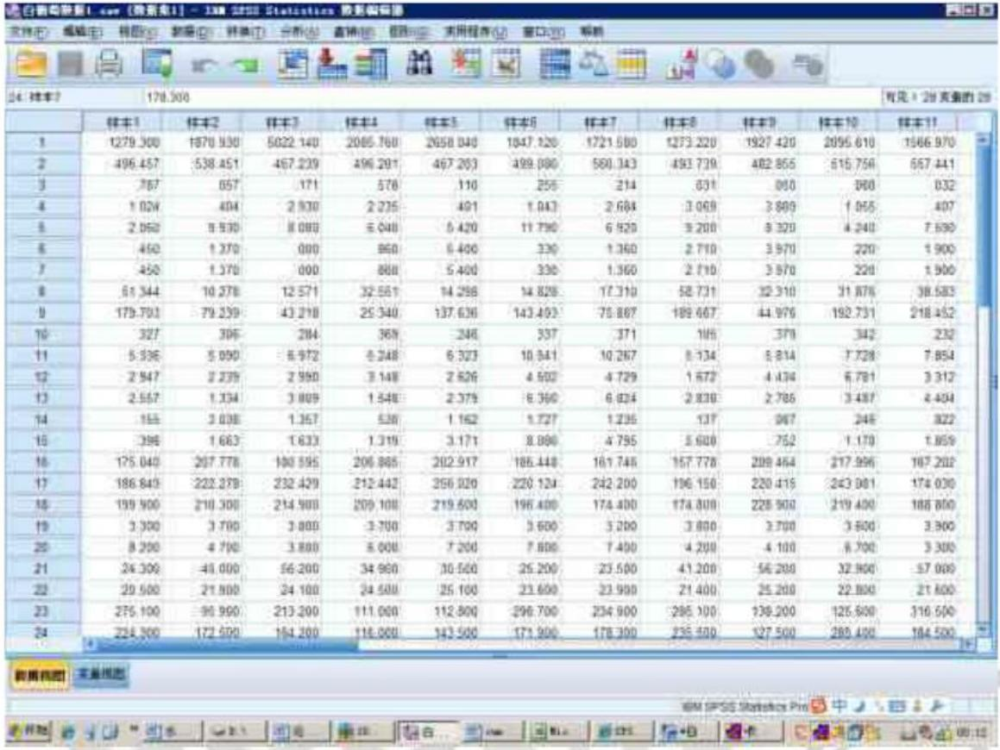
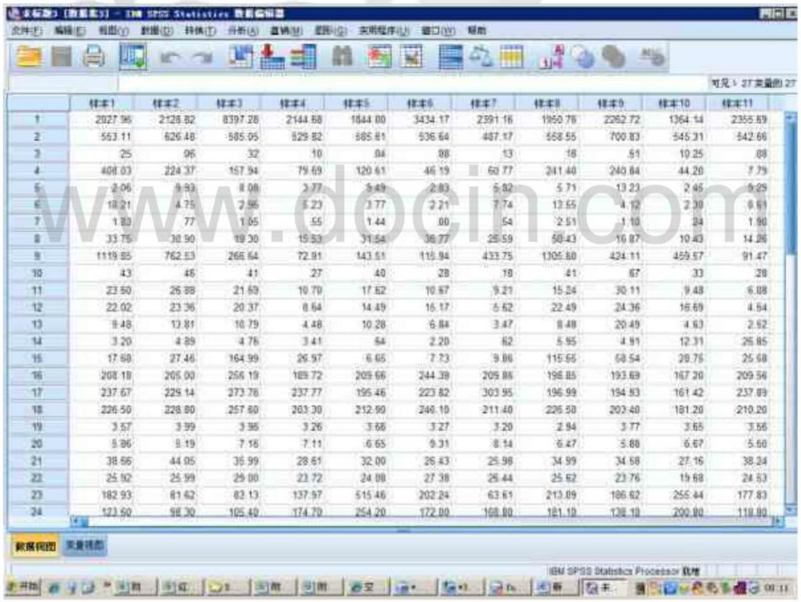
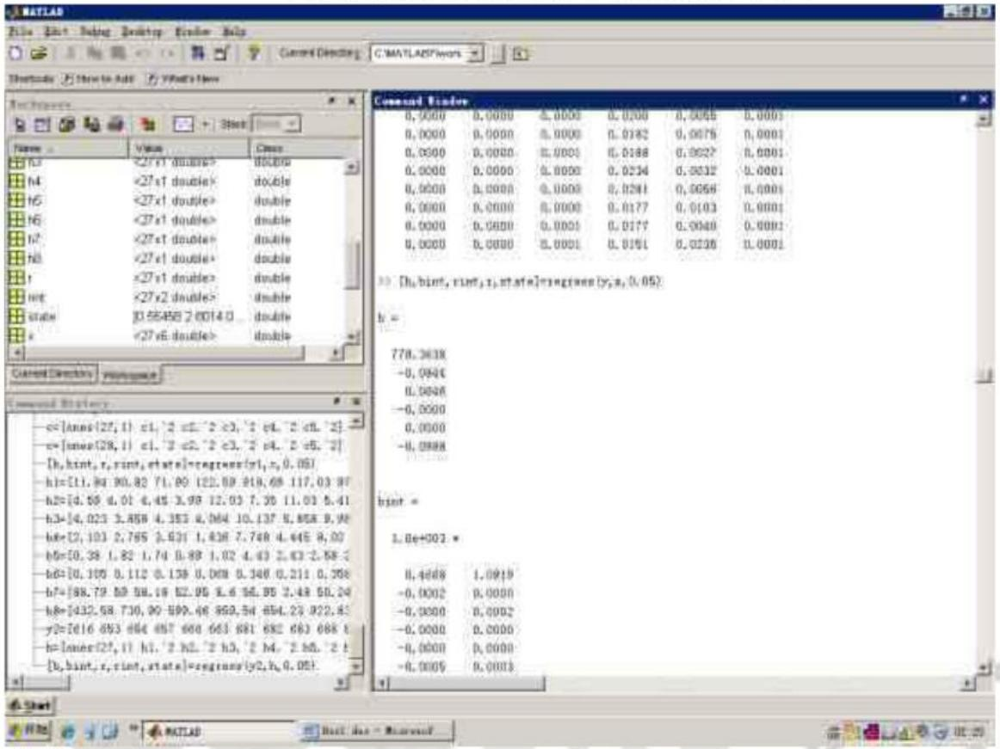
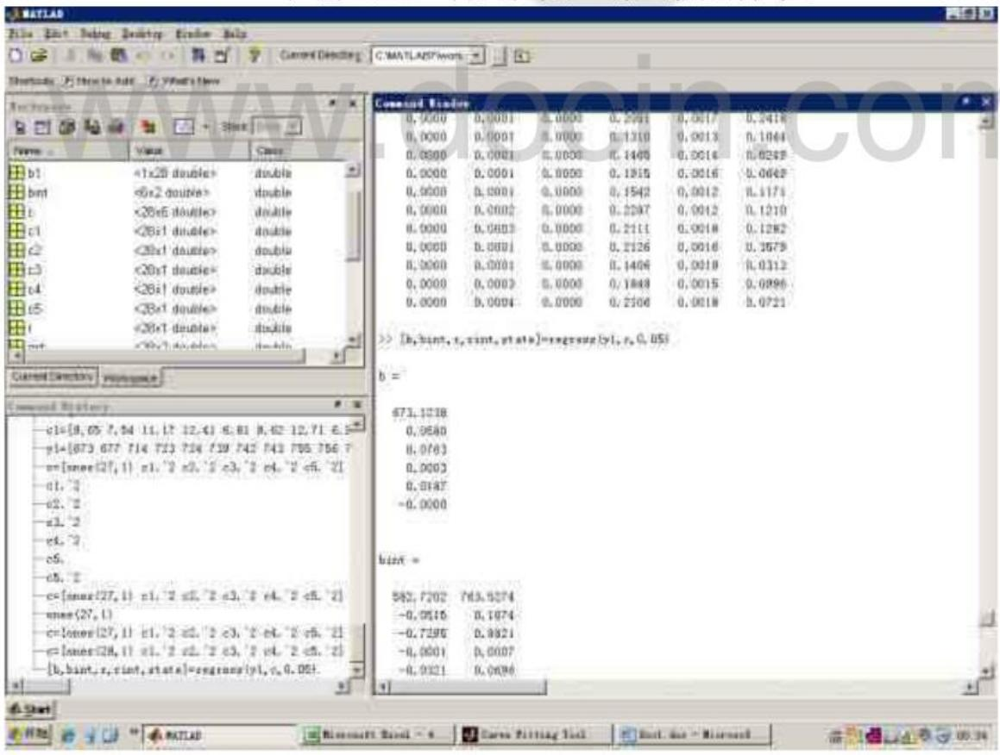
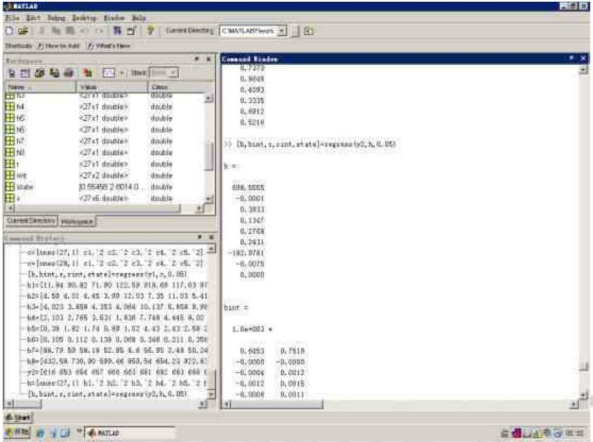
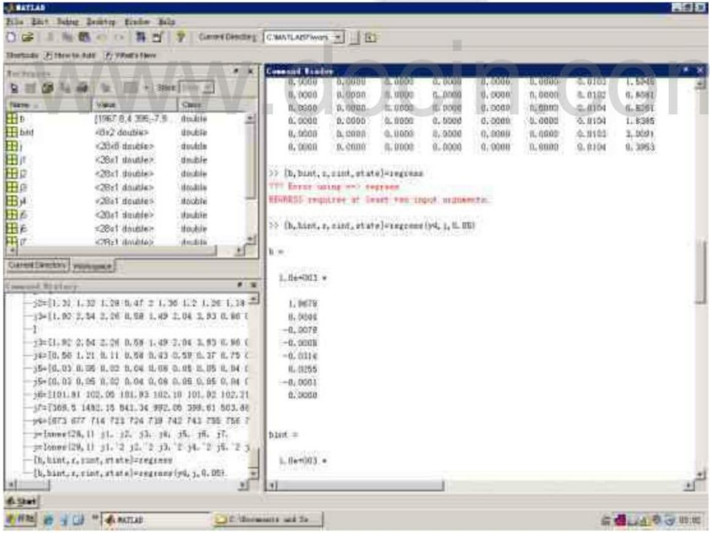

# 2012 高教社杯全国大学生数学建模竞赛

## 承诺书

我们仔细阅读了中国大学生数学建模竞赛的竞赛规则.

我们完全明白，在竞赛开始后参赛队员不能以任何方式（包括电话、电子邮件、网上咨询等）与队外的任何人（包括指导教师）研究、讨论与赛题有关的问题。

我们知道，抄袭别人的成果是违反竞赛规则的，如果引用别人的成果或其他公开的资料（包括网上查到的资料），必须按照规定的参考文献的表述方式在正文引用处和参考文献中明确列出。

我们郑重承诺，严格遵守竞赛规则，以保证竞赛的公正、公平性。如有违反竞赛规则的行为，我们将受到严肃处理。

我们参赛选择的题号是（从 A/B/C/D 中选择一项填写）：\_\_\_\_A\_\_\_\_

我们的参赛报名号为（如果赛区设置报名号的话）：\_\_\_\_ 28005

所属学校（请填写完整的全名）：哈尔滨金融学院

参赛队员（打印并签名）：1. 范凯

2. 马薇

3. 魏星

指导教师或指导教师组负责人 (打印并签名): 刘桂利

日期：2012年9月10日

赛区评阅编号（由赛区组委会评阅前进行编号）：

# 2012 高教社杯全国大学生数学建模竞赛

## 编号专用页

赛区评阅编号（由赛区组委会评阅前进行编号）：

赛区评阅记录（可供赛区评阅时使用）：

<table><tr><td>评阅人</td><td></td><td></td><td></td><td></td><td></td><td></td><td></td><td></td><td></td><td></td></tr><tr><td>评分</td><td></td><td></td><td></td><td></td><td></td><td></td><td></td><td></td><td></td><td></td></tr><tr><td>备注</td><td></td><td></td><td></td><td></td><td></td><td></td><td></td><td></td><td></td><td></td></tr></table>

全国统一编号（由赛区组委会送交全国前编号）：

全国评阅编号（由全国组委会评阅前进行编号）：

# 葡萄酒的评价

## 摘要

为研究葡萄酒评价问题，根据题目所给定信息建立了酿酒葡萄等级划分模型、pearson 相关系数模型、多元统计回归模型。

针对问题一，利用异方差 T-检验法分析评酒员的评价结果，得到两组评价结果的 p 分别为 0.121776, 0.10608，因此两组没有显著性且第二组的评酒员评分更可信。

针对问题二，运用聚类分析法，建立基于理化指标的酿酒葡萄等级划分模型。运用 $spss$ 软件对红白葡萄样本聚类为析，依据聚类结果将酿酒葡萄分为五类。

针对问题三，建立 pearson 相关系数模型，得到红、白酿酒葡萄与葡萄酒理化指标的关联度分别为 0.71、0.86，即酿酒葡萄的品质在很大程度上影响葡萄酒的质量。

针对问题四，基于理化指标分析和感官评价，以几个主要理化指标为自变量，以样品总得分为因变量，建立多元统计回归模型，运用 Matlab 求解得理化指标与葡萄酒质量有较大的关系，但并不能完全据评价葡萄酒的质量。

关键词：聚类分析；pearson相关系数；多元统计回归；spss软件

## 一 问题重述

确定葡萄酒质量时一般是通过聘请一批有资质的评酒员进行品评，每个评酒员在对葡萄酒进行品尝后对其分类指标打分，然后求和得到其总分，从而确定葡萄酒的质量。酿酒葡萄的好坏与所酿葡萄酒的质量有直接的关系，葡萄酒和酿酒葡萄检测的理化指标会在一定程度上反映葡萄酒和葡萄的质量。据此解决以下列问题。

1. 分析附件 1 中两组评酒员的评价结果有无显著性差异，哪一组结果更可信。

2. 根据酿酒葡萄的理化指标和葡萄酒的质量对这些酿酒葡萄进行分级。

3. 分析酿酒葡萄与葡萄酒的理化指标之间的联系。

4. 分析酿酒葡萄和葡萄酒的理化指标对葡萄酒质量的影响，并论证能否用葡萄和葡萄酒的理化指标来评价葡萄酒的质量。

## 二 符号说明

<table><tr><td>符号</td><td>意义</td></tr><tr><td> $j$ </td><td> $j = 1,2^{...}$ 代表第 $j$ 种样品</td></tr><tr><td> $m$ </td><td> $m = 1,2^{...}$ 分别代表十位品酒员</td></tr><tr><td> $n$ </td><td> $n = 1,2^{...}$ 分别代表十种品评的标准(见附表一)</td></tr><tr><td> $A_{mn}$ </td><td>第一组评酒员 $m$ 在标准 $n$ 上对红葡萄酒的打分</td></tr><tr><td> $B_{mn}$ </td><td>第一组评酒员 $m$ 在标准 $n$ 上对白葡萄酒的打分</td></tr><tr><td> $C_{mn}$ </td><td>第二组评酒员 $m$ 在标准 $n$ 上对红葡萄酒的打分</td></tr><tr><td> $D_{mn}$ </td><td>第二组评酒员 $m$ 在标准 $n$ 上对白葡萄酒的打分</td></tr><tr><td> $f_{ij}$ </td><td>第 $i$ 组品酒员给红葡萄酒样品 $j$ 的分数</td></tr><tr><td> $f_{ij}^{'}$ ( $i = 1,2$ )</td><td>第 $i$ 组品酒员给红葡萄酒样品 $j$ 的分数的平均分</td></tr><tr><td> $F_{ij}$ </td><td>第i组品酒员给白葡萄酒样品j的分数</td></tr><tr><td> $F_{ij}'$ </td><td>第i组品酒员对白葡萄酒样品j的分数的平均分</td></tr><tr><td>a</td><td> $a = 1,2\cdots\_$ ,代表附件2中数据简化后白葡萄理化指标数</td></tr><tr><td>b</td><td> $b = 1,2\cdots\_$ ,代表附件2中数据简化后白葡萄的样本数</td></tr><tr><td> $y_{ab}$ </td><td>附件2中数据的简化后第b个样本的第a个理化指标数</td></tr><tr><td> $S_b$ </td><td> $b = 1,2\cdots\_$ , $S_b$ 代表由 $y_{ab}$ 组成的矩阵中,每个样本中含有的所有数据的方差</td></tr><tr><td>p</td><td>p=57代表附件2中数据简化后白葡萄理化指标的个数</td></tr><tr><td>r</td><td>关联度</td></tr><tr><td> $x_j$ </td><td>酿酒葡萄样本j</td></tr><tr><td> $y_j$ </td><td>葡萄酒样本j</td></tr><tr><td> $Z_{紅}$ </td><td>红葡萄样本的得分</td></tr><tr><td> $Z_{白}$ </td><td>白葡萄样本的得分</td></tr><tr><td> $l_q$ </td><td> $l_q(q = 1,2,...,5)$ 分别代表酸类、单宁、总糖、芳香物质、果皮颜色</td></tr><tr><td> $\beta_q$ </td><td> $\beta_q'(q = 0,1,...,5)$ 代表白葡萄回归系数</td></tr><tr><td> $z_{2紅}$ </td><td> $z_{2紅}$ 为红葡萄酒样本的得分</td></tr><tr><td> $z_{2白}$ </td><td> $z_{2白}$ 为白葡萄酒样本的得分</td></tr><tr><td> $\beta_{qs}$ </td><td> $\beta_{qs}(q = 0,1,...,8)$ 为白葡萄酒回归系数</td></tr><tr><td> $\beta_{qs}'$ </td><td> $\beta_{qs}'(q = 0,1,...,7)$ 为白葡萄酒回归系数。</td></tr><tr><td> $l_s'$ </td><td> $l_s'(s = 1,2,...,8)$ 分别代表:花色苷、单宁、总酚酒、总黄酮、白藜芦醇、DPPH、L*(D65)、芳香物质</td></tr></table>

## 三 问题分析

为比较有无显著性差异，应先处理附件 1 中所给的数据，算出每种样品的平均得分，再比较第一组数据和第二组数据的方差是否相同，从而确定应用等方差 t 检验或异方差 t 检验，确定两组评酒员的评价结果有无显著性差异。

为得到酿酒葡萄的分类，应对附件 2 中的数据进行处理，将附件 2 中的数据与酒的质量结合起来，对处理后的数据进行系统聚类分析，得出分级情况。

为了解酿酒葡萄与葡萄酒理化指标的关系，应设法求出酿酒葡萄与葡萄酒理化指标的关联系数，从而判断两者的关系。

在分析酿酒葡萄和葡萄酒的理化指标对葡萄酒质量的影响时，应采用回归分析的方法进行分析。

## 四 模型假设

1. 假设品酒员的评分是客观、公正的。  
2. 假设每种葡萄、葡萄酒中物质的含量固定不变。  
3. 假设酿酒葡萄的好坏与所酿葡萄酒的质量有直接的关系，葡萄酒和酿酒葡萄检测的理化指标会在一定程度上反映葡萄酒和葡萄的质量，而且成正比。  
4. 假设葡萄分级一般为 3 到 5 个等级。  
5. 假设附件 2 中的二级指标对葡萄酒的影响极小，可以不予考虑。

## 五 模型的建立与求解

## 5.1 模型一

5.1.1 差异性检验

1. 通过对题目中所给的葡萄酒品尝评分表的分析，可知各组评酒员的打分情况。可得：每组中每种样品的分数=每组10位评酒员对该酒的评分之和。

即：

$$
A _ {j} = \sum_ {m = 1} ^ {1 0} \sum_ {n = 1} ^ {1 0} A _ {m n}
$$

其中： $A_{j}$ 为第一组第 $j$ 个红葡萄酒样品的总分数， $A_{mn}$ 为第一组的 $m$ 号评酒员在第 $n$ 种

标准上对红葡萄酒的打分数同理，可得：

$$
B _ {j} = \sum_ {m = 1} ^ {1 0} \sum_ {n = 1} ^ {1 0} B _ {m n}
$$

$$
C _ {j} = \sum_ {m = 1} ^ {1 0} \sum_ {n = 1} ^ {1 0} C _ {m n}
$$

$$
D _ {j} = \sum_ {m = 1} ^ {1 0} \sum_ {n = 1} ^ {1 0} D _ {m n}
$$

其中： $B_{j}$ 为第一组第 j 个红葡萄酒样品的总分数， $B_{mn}$ 为第一组的 m 号评酒员在第 n 种标准上对红葡萄酒的打分数； $C_{j}$ 为第一组第 j 个红葡萄酒样品的总分数， $C_{mn}$ 为第一组的 m 号评酒员在第 n 种标准上对红葡萄酒的打分数； $D_{j}$ 为第一组第 j 个红葡萄酒样品的总分数， $D_{mn}$ 为第一组的 m 号评酒员在第 n 种标准上对红葡萄酒的打分数如下表

样品的得分情况

<table><tr><td></td><td>第一组红葡萄酒</td><td>第一组白葡萄酒</td><td>第二组红葡萄酒</td><td>第二组白葡萄酒</td></tr><tr><td>样品1</td><td>627</td><td>820</td><td>681</td><td>779</td></tr><tr><td>样品2</td><td>803</td><td>742</td><td>740</td><td>758</td></tr><tr><td>样品3</td><td>804</td><td>853</td><td>746</td><td>756</td></tr><tr><td>样品4</td><td>686</td><td>794</td><td>712</td><td>769</td></tr><tr><td>样品5</td><td>733</td><td>710</td><td>721</td><td>815</td></tr><tr><td>样品6</td><td>722</td><td>684</td><td>663</td><td>755</td></tr><tr><td>样品7</td><td>715</td><td>775</td><td>653</td><td>742</td></tr><tr><td>样品8</td><td>723</td><td>704</td><td>660</td><td>723</td></tr><tr><td>样品9</td><td>815</td><td>729</td><td>782</td><td>804</td></tr><tr><td>样品10</td><td>742</td><td>743</td><td>688</td><td>798</td></tr><tr><td>样品11</td><td>701</td><td>723</td><td>616</td><td>714</td></tr><tr><td>样品12</td><td>539</td><td>633</td><td>683</td><td>724</td></tr><tr><td>样品13</td><td>746</td><td>659</td><td>688</td><td>739</td></tr><tr><td>样品14</td><td>730</td><td>720</td><td>726</td><td>677</td></tr><tr><td>样品15</td><td>587</td><td>724</td><td>657</td><td>784</td></tr><tr><td>样品16</td><td>749</td><td>740</td><td>699</td><td>673</td></tr><tr><td>样品17</td><td>793</td><td>788</td><td>745</td><td>803</td></tr><tr><td>样品18</td><td>599</td><td>731</td><td>654</td><td>767</td></tr><tr><td>样品19</td><td>786</td><td>722</td><td>726</td><td>764</td></tr><tr><td>样品20</td><td>786</td><td>778</td><td>758</td><td>766</td></tr><tr><td>样品21</td><td>771</td><td>764</td><td>722</td><td>792</td></tr><tr><td>样品22</td><td>772</td><td>710</td><td>716</td><td>794</td></tr><tr><td>样品23</td><td>856</td><td>759</td><td>771</td><td>774</td></tr><tr><td>样品24</td><td>780</td><td>733</td><td>715</td><td>761</td></tr><tr><td>样品25</td><td>692</td><td>771</td><td>682</td><td>795</td></tr><tr><td>样品26</td><td>738</td><td>813</td><td>720</td><td>743</td></tr><tr><td>样品27</td><td>730</td><td>648</td><td>715</td><td>770</td></tr><tr><td>样品28</td><td>627</td><td>813</td><td>681</td><td>796</td></tr></table>

## 2. F-检验，验证各葡萄酒样品得分方差有无差异

运用excel对第一组红葡萄酒、第二组各红葡萄酒的总分进行F-检验，运行结果如下表

F-检验 双样本方差分析（红葡萄酒）

<table><tr><td></td><td>变量1</td><td>变量2</td></tr><tr><td>平均</td><td>730.5556</td><td>705.1481</td></tr><tr><td>方差</td><td>5391.41</td><td>1582.439</td></tr><tr><td>观测值</td><td>27</td><td>27</td></tr><tr><td>Df</td><td>26</td><td>26</td></tr><tr><td>F</td><td>3.407026</td><td></td></tr><tr><td>P(F&lt;=f)单尾</td><td>0.00132</td><td></td></tr><tr><td>F单尾临界</td><td>1.929213</td><td></td></tr></table>

得： $p <   0.05$ ，所以第一组红葡萄酒和第二组红葡萄酒的方差不同。

同理，对第一组白葡萄酒、第二组白葡萄酒的数据进行 F-检验，运行结果如下表 F-检验 双样本方差分析（白葡萄酒）

<table><tr><td></td><td>变量1</td><td>变量2</td></tr><tr><td>平均</td><td>742.25</td><td>761.9643</td></tr><tr><td>方差</td><td>2730.046</td><td>1281.51</td></tr><tr><td>观测值</td><td>28</td><td>7</td></tr><tr><td>df</td><td>27</td><td>28</td></tr><tr><td>F</td><td>2.130324</td><td>27</td></tr><tr><td>P(F&lt;=f)单尾</td><td>0.027147</td><td></td></tr><tr><td>F单尾临界</td><td>3</td><td></td></tr></table>

得： $p < 0.05$ ，所以第一组白葡萄酒和第二组白葡萄酒的方差不同。

## 3. 异方差 T-检验，验证个葡萄酒样品得分差异性是否显著

运用excel对第一组红葡萄酒、第二组各红葡萄酒的总分进行异方差T-检验，运行结果如下表

红葡萄酒的异方差 T-检验

<table><tr><td></td><td>变量1</td><td>变量2</td></tr><tr><td>平均</td><td>730.5556</td><td>705.1481</td></tr><tr><td>方差</td><td>5391.41</td><td>1582.439</td></tr><tr><td>观测值</td><td>27</td><td>27</td></tr><tr><td>假设平均差</td><td>0</td><td></td></tr><tr><td>df</td><td>40</td><td></td></tr><tr><td>t Stat</td><td>1.580906</td><td></td></tr><tr><td>P(T&lt;=t) 单尾</td><td>0.060888</td><td></td></tr><tr><td>t 单尾临界</td><td>1.683851</td><td></td></tr><tr><td>P(T&lt;=t) 双尾</td><td>0.121776</td><td></td></tr><tr><td>t 双尾临界</td><td>2.021075</td><td></td></tr></table>

得出结论： $p > 0.05$ ，第一组红葡萄酒和第二组红葡萄酒的差异不显著。

同理，运用excel对第一组白葡萄酒、第二组白葡萄酒的数据进行异方差T-检验，运行结果如下表

白葡萄酒的异方差 T-检验结果

<table><tr><td></td><td>变量1</td><td>变量2</td></tr><tr><td>平均</td><td>742.25</td><td>761.9643</td></tr><tr><td>方差</td><td>2730.046</td><td>1281.517</td></tr><tr><td>观测值</td><td>28</td><td>28</td></tr><tr><td>假设平均差</td><td></td><td></td></tr><tr><td>df</td><td>48</td><td></td></tr><tr><td>t Stat</td><td>-1.64704</td><td></td></tr><tr><td>P(T&lt;=t) 单尾</td><td>0.053041</td><td></td></tr><tr><td>t 单尾临界</td><td>1.677224</td><td></td></tr><tr><td>P(T&lt;=t) 双尾</td><td>0.106083</td><td></td></tr><tr><td>t 双尾临界</td><td>2.010635</td><td></td></tr></table>

得出结论： $p > 0.05$ ，第一组白葡萄酒和第二组白葡萄酒的差异不显著。

综上可知，两组评酒员的评价结果没有显著性差异。

## 5.1.2 确定可信度

求出各组红，白葡萄酒得分的总方差，根据其大小判断可信度。

$$
\mathrm{方差} = \frac {\sum (\mathrm{样本的值} - \mathrm{样本的平均数}) ^ {2}}{\mathrm{样本数}}
$$

可得上表的方差如下表

第一组红葡萄酒得分的方差

<table><tr><td></td><td>样本方差</td><td></td><td>样本方差</td></tr><tr><td>样本1</td><td>83.61</td><td>样本15</td><td>77.01</td></tr><tr><td>样本2</td><td>35.81</td><td>样本16</td><td>16.29</td></tr><tr><td>样本3</td><td>41.24</td><td>样本17</td><td>79.21</td></tr><tr><td>样本4</td><td>97.24</td><td>样本18</td><td>42.49</td></tr><tr><td>样本5</td><td>55.81</td><td>样本19</td><td>42.64</td></tr><tr><td>样本6</td><td>53.76</td><td>样本20</td><td>23.44</td></tr><tr><td>样本7</td><td>93.25</td><td>样本21</td><td>104.49</td></tr><tr><td>样本8</td><td>39.61</td><td>样本22</td><td>45.56</td></tr><tr><td>样本9</td><td>29.65</td><td>样本23</td><td>29.24</td></tr><tr><td>样本10</td><td>27.36</td><td>样本24</td><td>67.4</td></tr><tr><td>样本11</td><td>63.69</td><td>样本25</td><td>58.16</td></tr><tr><td>样本12</td><td>71.69</td><td>样本26</td><td>28.16</td></tr><tr><td>样本13</td><td>40.44</td><td>样本27</td><td>44.8</td></tr><tr><td>样本14</td><td>32.4</td><td>总计</td><td>1424.45</td></tr></table>

方差总和为 1424.45

同理可得第二组红葡萄酒的方差如下表

第二组红葡萄酒得分的方差

<table><tr><td></td><td>样本方差</td><td></td><td>样本方差</td></tr><tr><td>样本1</td><td>73.69</td><td>样本15</td><td>37.21</td></tr><tr><td>样本2</td><td>14.6</td><td>样本16</td><td>18.09</td></tr><tr><td>样本3</td><td>27.64</td><td>样本17</td><td>8.25</td></tr><tr><td>样本4</td><td>37.16</td><td>样本18</td><td>45.24</td></tr><tr><td>样本5</td><td>12.29</td><td>样本19</td><td>49.64</td></tr><tr><td>样本6</td><td>19.01</td><td>样本20</td><td>35.16</td></tr><tr><td>样本7</td><td>56.41</td><td>样本21</td><td>31.96</td></tr><tr><td>样本8</td><td>58.6</td><td>样本22</td><td>21.84</td></tr><tr><td>样本9</td><td>23.16</td><td>样本23</td><td>22.29</td></tr><tr><td>样本10</td><td>32.56</td><td>样本24</td><td>9.65</td></tr><tr><td>样本11</td><td>34.24</td><td>样本25</td><td>39.36</td></tr><tr><td>样本12</td><td>22.61</td><td>样本26</td><td>37.4</td></tr><tr><td>样本13</td><td>13.76</td><td>样本27</td><td>18.45</td></tr><tr><td>样本14</td><td>20.84</td><td>总计</td><td>821.11</td></tr></table>

方差总和为 821.11

同理，可得第一组白葡萄酒方差为3237.37，第二组白葡萄酒方差为1409.41。见附表1，附表2。

综上所述，第一组红葡萄酒方差为1424.45，第二组红葡萄酒方差为821.11。第一组白葡萄酒方差为3237.37，第二组白葡萄酒方差为1409.41。第一组对应的方差总是大于第二组对应的方差，因此第二组的结果更加可信。

## 5.2 模型二 酿酒葡萄等级分类

## 5.2.1模型二的分析

为了直观的说明酿酒葡萄的分级情况，应该对酿酒葡萄的理化指标和葡萄酒的质量进行分析，通过对一级指标进行系统聚类分析得出酿酒葡萄的分级情况。

## 5.2.2模型二的建立

## 1. 数据处理

假设二级指标并不重要，故舍去附件2酿酒白葡萄中的二级指标，对进行多次测量的数据取平均数，可得出每种理化指标在每种酿酒白葡萄中的平均含量，将其与附件2中不需要处理的数据结合起来。见附表3

## 2. 模型二的建立

①将得到的数据标准化, 这里采用 $Z - \text { Scores }$ (标准化转换) (参考文献为[1]), 据附表3, 设 $y_{ab}$ 为第 $b$ 个样本中第 $a$ 个理化指标的值, 可得矩阵如下

$$
Y = \left[ \begin{array}{c c c c} y _ {1 1} & \dots & \swarrow_ {1 b} & \\ \vdots & \vdots & \vdots & \\ y _ {a 1} & \dots & \swarrow_ {a b} & \end{array} \right]
$$

设 $\overline{y_b}$ 为均值，有： $\overline{y_b} =$ 理化指标数的倒数 $\times$ 第 $b$ 个样本所有理化指标值的和， $\overline{y_b}$ 为第 $b$ 个样本中所有理化指标的均值

即：

$\overline{y_b} = \frac{1}{p}\sum_{a = 1}^{p}y_{ab}$ （ $p$ 代表理化指标个数）

因为 $p = 57$ ，因此 $\overline{y_b} = \frac{1}{57}\sum_{a=1}^{57}y_{ab}$

标准差： $S_{b} = \sqrt{\frac{1}{p}\sum_{a = 1}^{p}\left(y_{ab} - \overline{y_{ab}}\right)^{2}}$ （ $S_{b}$ 为标准差）

因为 $p = 57$ ，因此

$$
S _ {b} = \sqrt {\frac {1}{5 7} \sum_ {a = 1} ^ {5 7} \left(y _ {a b} - \overline {{y _ {a b}}}\right) ^ {2}}
$$

当标准差不为0时，每个元素的值 $y_{ab} = \frac{\text{原元素的值} - \text{均值}}{\text{标准差}}$

即：

$$
y _ {a b} = \left\{ \begin{array}{l l} \frac {y _ {a b} - \overline {{y _ {b}}}}{S _ {b}} & S _ {j} \neq 0 \\ 0 & S _ {j} = 0 \end{array} \right.
$$

②据上述内容建立模型二

$$
Y = \left[ \begin{array}{c c c} y _ {1 1} & \dots & \\ \vdots & \vdots & \vdots \\ y _ {a 1} & \dots & \end{array} \right]
$$

$$
\overline {{y _ {b}}} = \frac {1}{5 7} \sum_ {a = 1} ^ {5 7} y _ {a b}
$$

$$
S _ {b} = \sqrt {\frac {1}{5 7} \sum_ {a = 1} ^ {5 7} \left(y _ {a b} - \overline {{y _ {a b}}}\right) ^ {2}}
$$

$$
y _ {a b} = \left\{ \begin{array}{l l} \frac {y _ {a b} - \overline {{y _ {b}}}}{S _ {b}} & S _ {j} \neq 0 \\ 0 & S _ {j} = 0 \end{array} \right.
$$

## 5.2.3模型二的求解

假定将白葡萄的理化指标分为3到5个等级，运用 $spss$ 软件并结合最小方差法对上述模型进行求解, 得到理化指标的分级情况 (操作步骤见附表 3 )。输出结果见附表 4 。因为酿酒葡萄的理化指标会在一定程度上反映葡萄酒的质量, 因此认为理化指标越好,那么葡萄酒的质量越好。据此可推白葡萄的分级情况如下表

酿酒白葡萄等级划分

<table><tr><td>等级</td><td>酿酒葡萄样品</td></tr><tr><td>一</td><td>样品1</td></tr><tr><td>二</td><td>样品2</td></tr><tr><td>三</td><td>样品3,样品4,样品6,样品7,样品8,样品10,样品11,样品12,样品13,样品14,样品15,样品19,样品20,样品21,样品22,样品25,样品26,样品27</td></tr><tr><td>四</td><td>样品9,样品16,样品17,样品18,样品23,样品24</td></tr><tr><td>五</td><td>样品5</td></tr></table>

同理，运用 $spss$ 软件对上述模型进行求解，可知红葡萄的理化指标分级情况（操作步骤见附表5）。输出结果见附录6。酿酒红葡萄的分级情况如下表

酿酒红葡萄等级划分

<table><tr><td>等级</td><td>酿酒葡萄样品</td></tr><tr><td>一</td><td>样品1</td></tr><tr><td>二</td><td>样品2</td></tr><tr><td>三</td><td>样品3,样品4,样品5,样品6,样品7,样品8,样品10,样品11,样品12,样品13,样品14,样品15,样品19,样品20,样品21,样品22,样品25,样品26,样品27</td></tr><tr><td>四</td><td>样品16,样品17,样品18,样品23,样品24</td></tr><tr><td>五</td><td>样品9</td></tr></table>

## 5.3 模型三 酿酒葡萄与葡萄酒的理化指标之间的联系

## 5.3.1 模型三的分析

为了解酿酒葡萄与葡萄酒理化指标的关系，求两者的关联系数建立模型三，从而判断两者理化指标的关系。

## 5.3.2 模型三的建立

运用 pearson 相关系数法分别算出酿酒葡萄与葡萄酒理化指标的关联度，值越大，关联度越高。

则关联度 $r$ 为：

$$
r = \frac {N \sum x _ {j} y _ {j} - \sum x _ {j} \sum y _ {j}}{\sqrt {N \sum x _ {j} ^ {2} - (\sum x _ {j}) ^ {2}} \sqrt {N \sum y _ {j} ^ {2} - (\sum y _ {i}) ^ {2}}}
$$

其中： $x_{j}$ 为酿酒葡萄样本 $j$ ， $y_{j}$ 为葡萄酒样本 $j$ ， $N$ 为样本数量。

## 5.3.3 模型三的求解

运用excle对模型求解，得到酿酒红葡萄与红葡萄酒及酿酒白葡萄与白葡萄酒的相关度如下表

酿酒葡萄与葡萄酒理化指标相关度

<table><tr><td></td><td>红葡萄与红葡萄酒相关度</td><td>白葡萄与白葡萄酒相关度</td></tr><tr><td>样本1</td><td>0.99</td><td>0.91</td></tr><tr><td>样本2</td><td>0.96</td><td>0.89</td></tr><tr><td>样本3</td><td>0.56</td><td>0.89</td></tr><tr><td>样本4</td><td>0.69</td><td>0.87</td></tr><tr><td>样本5</td><td>0.91</td><td>0.84</td></tr><tr><td>样本6</td><td>0.67</td><td>0.83</td></tr><tr><td>样本7</td><td>0.72</td><td>0.85</td></tr><tr><td>样本8</td><td>0.86</td><td>0.88</td></tr><tr><td>样本9</td><td>0.91</td><td>0.90</td></tr><tr><td>样本10</td><td>0.51</td><td>0.89</td></tr><tr><td>样本11</td><td>0.29</td><td>0.89</td></tr><tr><td>样本12</td><td>0.57</td><td>0.88</td></tr><tr><td>样本13</td><td>0.61</td><td>0.89</td></tr><tr><td>样本14</td><td>0.57</td><td>0.86</td></tr><tr><td>样本15</td><td>0.59</td><td>0.83</td></tr><tr><td>样本16</td><td>0.79</td><td>0.88</td></tr><tr><td>样本17</td><td>0.61</td><td>0.90</td></tr><tr><td>样本18</td><td>0.38</td><td>0.88</td></tr><tr><td>样本19</td><td>0.82</td><td>0.93</td></tr><tr><td>样本20</td><td>0.65</td><td>0.86</td></tr><tr><td>样本21</td><td>0.75</td><td>0.82</td></tr><tr><td>样本22</td><td>0.82</td><td>0.86</td></tr><tr><td>样本23</td><td>0.88</td><td>0.82</td></tr><tr><td>样本24</td><td>0.92</td><td>0.89</td></tr><tr><td>样本25</td><td>0.64</td><td>0.88</td></tr><tr><td>样本26</td><td>0.73</td><td>0.89</td></tr><tr><td>样本27</td><td>0.66</td><td>0.52</td></tr><tr><td>样本28</td><td></td><td>0.81</td></tr><tr><td>平均关联度</td><td>0.71</td><td>0.86</td></tr></table>

其中相关系数判断标准为：0.8-1.0极强相关，0.6-0.8强相关，0.4-0.6中等相关，

0.2-0.4 弱相关，0.0-0.2 不相关。

结合表 4 并依据 pearson 相关系数判断标准可知, 红葡萄与红葡萄酒理化指标关联度为 0.71, 为强关联、白葡萄与白葡萄酒理化指标的关联度为 0.86, 为极强关联。

因此，酿酒葡萄与葡萄酒理化指标是有联系的，且关联度强，即酿酒葡萄的品质很大程度上影响葡萄酒的质量。

## 5.4模型四 酿酒葡萄和葡萄酒的理化指标对葡萄酒质量的影响

## 5.4.1 模型四的分析

据参考文献[1]可知，糖、酸、单宁、色素和芳香物质是构成酿酒葡萄品质优略的要素，因此在论证酿酒葡萄理化指标与葡萄酒品质时，将数据分类整理只保留上述五种因素。

同时在评价时还应考虑芳香物质对葡萄酒的影响。据此建立多元统计回归模型，论证酿酒葡萄理化指标对葡萄酒质量的影响和葡萄酒理化指标对葡萄酒质量的影响。

## 5.4.2 模型四的建立

将所有样品按专家打分高低进行排序，处理后数据见附录7-10。

1. 酿酒葡萄理化指标和感官评价对葡萄酒质量的影响

基于理化指标分析并结合感官评价建立多元统计回归模型：

$$
Z _ {\mathrm{红}} = \beta_ {0} + \beta_ {1} l _ {1} ^ {2} + \beta_ {2} l _ {2} ^ {2} + \beta_ {3} l _ {3} ^ {2} + \beta_ {4} l _ {4} ^ {2} + \beta_ {5} l _ {5} ^ {2}
$$

$$
Z _ {\mathrm{白}} = \beta_ {0} ^ {'} + \beta_ {1} ^ {'} l _ {1} ^ {2} + \beta_ {2} ^ {'} l _ {2} ^ {2} + \beta_ {3} ^ {'} l _ {3} ^ {2} + \beta_ {4} ^ {'} l _ {4} ^ {2} + \beta_ {5} ^ {'} l _ {5} ^ {2}
$$

其中： $Z_{红}$ 为红葡萄样本的得分， $Z_{白}$ 为红葡萄样本的得分， $l_{q}(i=1,2,\ldots,5)$ 分别代表酸类、单宁、总糖、芳香物质、果皮颜色， $\beta_{q}=(q=0,1,\ldots,5)$ 为红葡萄回归系数， $\beta_{q}^{\prime}(q=0,1,\ldots,5)$ 为白葡萄回归系数。

2. 葡萄酒理化指标和感官评价对葡萄酒质量的影响

基于理化指标分析并结合感官评价建立多元统计回归模型：

$$
z _ {2 \text {红}} = \beta_ {0 s} + \beta_ {1 s} l _ {1} ^ {\prime 2} + \beta_ {2 s} l _ {2} ^ {\prime 2} + \beta_ {3 s} l _ {3} ^ {\prime 2} + \beta_ {4 s} l _ {4} ^ {\prime 2} + \beta_ {5 s} l _ {5} ^ {\prime 2} + \beta_ {6 s} l _ {6} ^ {\prime 2} + \beta_ {7 s} l _ {7} ^ {\prime 2} + \beta_ {8 s} l _ {8} ^ {\prime 2}
$$

$$
z _ {2 \text {白}} = \beta_ {0 s} ^ {\prime 2} + \beta_ {1 s} ^ {\prime} l _ {1} ^ {\prime 2} + \beta_ {2 s} ^ {\prime} l _ {2} ^ {\prime 2} + \beta_ {3 s} ^ {\prime} l _ {3} ^ {\prime 2} + \beta_ {4 s} ^ {\prime} l _ {4} ^ {\prime 2} + \beta_ {5 s} ^ {\prime} l _ {5} ^ {\prime 2} + \beta_ {6 s} ^ {\prime} l _ {6} ^ {\prime 2} + \beta_ {7 s} ^ {\prime} l _ {7} ^ {\prime 2}
$$

其中： $z_{2红}$ 为红葡萄酒样本的得分， $z_{2白}$ 为白葡萄酒样本的得分， $l_{s}^{'}(s=1,2,\ldots,8)$ 分别代表：单宁、总酚酒、总黄酮、白藜芦醇、DPPH、L\*(D65)、芳香物质、花色苷（白酒中不含花色苷）， $\beta_{qs}(q=0,1,\ldots,8)$ 为红葡萄酒回归系数， $\beta_{qs}^{'}(q=0,1,\ldots,7)$ 为白葡萄酒回归系数。

## 5.4.3 模型四的求解

运用 Matlab 求解（求解程序见附表 11-14），得到红葡萄的回归系数 $\beta_{q}$ 分别为：779.3638, -0.844, 0, 0, 0.0646, -0.0988，白葡萄 $\beta_{q}$ 分别为：673.1238, 0.058, 0.0763, 0, 0.0003, 0.0187, 0；红葡萄酒的回归系数 $\beta_{os}$ 分别为：698.555, -0.0001, 0, 3933, 0.1347, 0.2768, 0.2431, -182.9781, -0.0075，白葡萄 $\beta_{q}$ 分别为：1967.8, 0.44, -7.9, -0.5, 31.4, 25.5, -0.1。

因此酿酒葡萄的理化指标和对葡萄酒质量的影响关系为：

红葡萄：

$$
z _ {\mathrm{红}} = 7 7 9. 3 6 3 8 - 0. 0 8 4 4 l _ {1} ^ {2} + 0. 0 6 4 6 l _ {2} ^ {2} - 0. 0 9 8 8 l _ {5} ^ {2}
$$

白葡萄：

$$
z _ {2 \text {白}} = 6 7 3. 1 2 3 8 + 0. 0 5 8 l _ {1} ^ {\prime 2} + 0. 0 7 6 3 l _ {2} ^ {\prime 2} + 0. 0 0 0 3 l _ {3} ^ {\prime 2} + 0. 0 1 8 7 l _ {4} ^ {\prime 2}
$$

葡萄酒的理化指标对葡萄酒质量的影响关系为:

红葡萄酒：

$$
\begin{array}{l} z _ {2 \mathrm{红}} = 6 9 8. 5 5 5 + - 0. 0 0 0 1 l _ {1} ^ {' 2} + 0. 3 9 3 3 l _ {2} ^ {' 2} + 0. 1 3 4 7 l _ {3} ^ {' 2} + \\ 0. 2 7 6 8 l _ {4} ^ {\prime 2} + 0. 2 4 3 1 l _ {5} ^ {\prime 2} - 1 8 2. 9 7 8 1 l _ {6} ^ {\prime 2} - 0. 0 0 7 5 l _ {7} ^ {\prime 2} \\ \end{array}
$$

白葡萄酒:

$$
z _ {2 \mathrm{白}} = 1 9 6 7. 8 + 4. 4 l _ {1} ^ {' 2} - 7. 9 l _ {2} ^ {' 2} - 0. 5 l _ {3} ^ {' 2} + 3 1. 4 l _ {4} ^ {' 2} + 2 5. 5 l _ {5} ^ {' 2} - 0. 1 l _ {6} ^ {' 2}
$$

## 5.4.4 结果分析

根据上述结果可知葡萄酒的质量与酿酒葡萄和葡萄酒的理化指标有关，但对葡萄酒的质量评价也包括感官评价（参照参考文献[3]），尽管感官评价与附件3中的芳香物质有很大的关系，但并不能排除品酒员主观因素的影响。由此得出，酿酒葡萄和葡萄酒的理化指标有很大的关系，但他们并不能完全反应葡萄酒的质量。

## 六 模型的评价与推广

## 6.1 模型的评价

## 6.1.1 模型的优点

1. 运用基于理化分析的酿酒葡萄等级划分模型，解决了酿酒葡萄等级划分问题。  
2. 本文建立的葡萄酒等级划分模型是在综合考虑理化指标与感官评价的基础上，对葡萄酒等级进行划分的，对我国葡萄酒行业制定葡萄酒等级划分规定具有参考意义。  
3. 该模型整个过程思路清晰，结构明了，没有运用太偏的知识，容易让人明白、接受，可行性强，易于推广。

## 6.1.2 模型的缺点

1. 利用 Matlab 求解时，计算机存在一定的误差。  
2. 由于数据不充分，不能精确反应酿酒葡萄理化指标与葡萄酒质量的关系。

## 6.2 模型的推广

本文建立的酿酒葡萄等级划分模型，同样可以解决其他等级划分问题，尤其是各种酒精类物质等级划分问题。

## 七 参考文献

[1] 豆丁，SPSS 聚类分析标准化，http://www.docin.com/p-218735480.html  
[2] 第一食品网，判断酿酒葡萄的五大指标性物质 http://www.foods1.com/content/144501/  
[3]百度知道, 法国葡萄酒分级具体数据指标, http://zhidao.baidu.com/question/474178895.html&bd\_tkn\_=64b51a20222690304a3dbd64a6a56eb7984582d08078338d51fed8133ea5c69d362ad36bb4bcda3b39bb3949f6bbe47087ac3af56e60b1f4e7eb60157c5bf9339a6fa1f15b0f03de0125277cd633cc0b4e739b7e0c5ace  
[4]廖芹，郝志峰等，数据挖掘与数学建模，北京：国防工业出版社，2010年。

## 八 附录

附表 1  
第二组红葡萄酒得分的方差

<table><tr><td></td><td>样本方差</td><td></td><td>样本方差</td></tr><tr><td>样本1</td><td>73.69</td><td>样本15</td><td>37.21</td></tr><tr><td>样本2</td><td>14.6</td><td>样本16</td><td>18.09</td></tr><tr><td>样本3</td><td>27.64</td><td>样本17</td><td>8.25</td></tr><tr><td>样本4</td><td>37.16</td><td>样本18</td><td>45.24</td></tr><tr><td>样本5</td><td>12.29</td><td>样本19</td><td>49.64</td></tr><tr><td>样本6</td><td>19.01</td><td>样本20</td><td>35.16</td></tr><tr><td>样本7</td><td>56.41</td><td>样本21</td><td>31.96</td></tr><tr><td>样本8</td><td>58.6</td><td>样本22</td><td>21.84</td></tr><tr><td>样本9</td><td>23.16</td><td>样本23</td><td>22.29</td></tr><tr><td>样本10</td><td>32.56</td><td>样本24</td><td>9.65</td></tr><tr><td>样本11</td><td>34.24</td><td>样本25</td><td>39.36</td></tr><tr><td>样本12</td><td>22.61</td><td>样本26</td><td>37.4</td></tr><tr><td>样本13</td><td>13.76</td><td>样本27</td><td>18.45</td></tr><tr><td>样本14</td><td>20.84</td><td>总计</td><td>821.11</td></tr></table>

附表 2  
第二组白葡萄酒得分的方差

<table><tr><td></td><td>样本方差</td><td></td><td>样本方差</td></tr><tr><td>样本1</td><td>23.29</td><td>样本16</td><td>74.01</td></tr><tr><td>样本2</td><td>44.16</td><td>样本17</td><td>34.61</td></tr><tr><td>样本3</td><td>128.24</td><td>样本18</td><td>27.21</td></tr><tr><td>样本4</td><td>37.89</td><td>样本19</td><td>23.44</td></tr><tr><td>样本5</td><td>23.65</td><td>样本20</td><td>45.04</td></tr><tr><td>样本6</td><td>20.45</td><td>样本21</td><td>57.96</td></tr><tr><td>样本7</td><td>37.96</td><td>样本22</td><td>48.24</td></tr><tr><td>样本8</td><td>28.01</td><td>样本23</td><td>10.44</td></tr><tr><td>样本9</td><td>95.64</td><td>样本24</td><td>34.69</td></tr><tr><td>样本10</td><td>63.36</td><td>样本25</td><td>95.85</td></tr><tr><td>样本11</td><td>79.04</td><td>样本26</td><td>92.61</td></tr><tr><td>样本12</td><td>126.04</td><td>样本27</td><td>32</td></tr><tr><td>样本13</td><td>42.09</td><td>样本28</td><td>22.84</td></tr><tr><td>样本14</td><td>12.01</td><td>总计</td><td>1409.41</td></tr><tr><td>样本15</td><td>48.64</td><td></td><td></td></tr></table>

附表 3  
白葡萄在 spss 软件中的输入程序  

other

| Category | Value 1 | Value 2 | Value 3 | Value 4 | Value 5 | Value 6 | Value 7 | Value 8 | Value 9 | Value 10 | Value 11 |
| --- | --- | --- | --- | --- | --- | --- | --- | --- | --- | --- | --- |
| 1 | 1279.300 | 1870.930 | 5022.140 | 2065.760 | 2658.040 | 1847.120 | 1721.580 | 1273.220 | 1927.420 | 2095.610 | 1566.970 |
| 2 | 496.457 | 538.451 | 467.229 | 496.201 | 467.203 | 499.080 | 560.343 | 493.739 | 482.855 | 515.758 | 557.441 |
| 3 | .767 | .657 | .171 | .578 | .110 | .255 | .214 | .631 | .660 | .660 | .632 |
| 4 | 1.024 | .404 | 2.930 | 2.275 | .491 | 1.043 | 2.684 | 3.069 | 3.889 | 1.065 | .407 |
| 5 | 2.050 | 8.930 | 8.088 | 6.048 | .6420 | 11.790 | 6.929 | 3.208 | 3.320 | 4.240 | 7.699 |
| 6 | .450 | 1.370 | .000 | .850 | .6406 | .330 | 1.360 | .2710 | .3970 | .220 | .1900 |
| 7 | .450 | 1.370 | .000 | .868 | .5400 | .330 | 1.360 | .2710 | .3970 | .220 | .1900 |
| 8 | .61344 | .10278 | .12571 | .32551 | .14298 | .14828 | .17310 | .58731 | .32310 | .31876 | .38583 |
| 9 | .179.793 | .79239 | .43218 | .25340 | .137636 | .143493 | .76887 | .189667 | .44976 | .192731 | .218452 |
| 10 | .327 | .396 | .284 | .369 | .248 | .337 | .371 | .165 | .379 | .342 | .232 |
| 11 | .5336 | .5090 | .6972 | .6248 | .6323 | .10341 | .10267 | .8134 | .8814 | .7728 | .7854 |
| 12 | 2.947 | 2.239 | 2.990 | 3.148 | 2.626 | 4.502 | 4.729 | 1.677 | 4.434 | 6.781 | 3.312 |
| 13 | 2.557 | 1.134 | 3.889 | 1.548 | 2.379 | 6.360 | 6.824 | 2.838 | 2.786 | 3.487 | 4.404 |
| 14 | .155 | 3.038 | 1.357 | .538 | 1.162 | 1.727 | 1.235 | .137 | .967 | .246 | .822 |
| 15 | .398 | 1.683 | 1.633 | 1.319 | 3.171 | 8.980 | 4.795 | 5.600 | .752 | 1.179 | 1.859 |
| 16 | .175.040 | .297.778 | .190595 | .206.885 | .202917 | .186.448 | .161748 | .157778 | .209464 | .217996 | .167202 |
| 17 | .186.849 | .222.278 | .232429 | .212442 | .256920 | .220124 | .242200 | .196150 | .220415 | .243981 | .174030 |
| 18 | .199.900 | .218.300 | .214.988 | .209.108 | .219.500 | .196400 | .174400 | .174800 | .228500 | .219400 | .188800 |
| 19 | .3300 | .3700 | .3800 | .3700 | .3700 | .3600 | .3200 | .3800 | .3700 | .3600 | .3900 |

附表 4

白葡萄理化指标  
群集成员

<table><tr><td>案例</td><td>5 群集</td><td>4 群集</td><td>3 群集</td></tr><tr><td>1:Case 1</td><td>1</td><td>1</td><td>1</td></tr><tr><td>2:Case 2</td><td>2</td><td>2</td><td>2</td></tr><tr><td>3:Case 3</td><td>3</td><td>3</td><td>3</td></tr><tr><td>4:Case 4</td><td>3</td><td>3</td><td>3</td></tr><tr><td>5:Case 5</td><td>4</td><td>4</td><td>3</td></tr><tr><td>6:Case 6</td><td>3</td><td>3</td><td>3</td></tr><tr><td>7:Case 7</td><td>3</td><td>3</td><td>3</td></tr><tr><td>8:Case 8</td><td>3</td><td>3</td><td>3</td></tr><tr><td>9:Case 9</td><td>5</td><td>2</td><td>2</td></tr><tr><td>10:Case 10</td><td>3</td><td>3</td><td>3</td></tr><tr><td>11:Case 11</td><td>3</td><td>3</td><td>3</td></tr><tr><td>12:Case 12</td><td>3</td><td>3</td><td>3</td></tr><tr><td>13:Case 13</td><td>3</td><td>3</td><td>3</td></tr><tr><td>14:Case 14</td><td>3</td><td>3</td><td>3</td></tr><tr><td>15:Case 15</td><td>3</td><td>3</td><td>3</td></tr><tr><td>16:Case 16</td><td>5</td><td>2</td><td>2</td></tr><tr><td>17:Case 17</td><td>5</td><td>2</td><td>2</td></tr><tr><td>18:Case 18</td><td>5</td><td>2</td><td>2</td></tr><tr><td>19:Case 19</td><td>3</td><td>3</td><td>3</td></tr><tr><td>20:Case 20</td><td>3</td><td>3</td><td>3</td></tr><tr><td>21:Case 21</td><td>3</td><td>3</td><td>3</td></tr><tr><td>22:Case 22</td><td>3</td><td>3</td><td>3</td></tr><tr><td>23:Case 23</td><td>5</td><td>2</td><td>2</td></tr><tr><td>24:Case 24</td><td>5</td><td>2</td><td>2</td></tr><tr><td>25:Case 25</td><td>3</td><td>3</td><td>3</td></tr><tr><td>26:Case 26</td><td>3</td><td>3</td><td>3</td></tr><tr><td>27:Case 27</td><td>3</td><td>3</td><td>3</td></tr><tr><td>28:Case 28</td><td>3</td><td>3</td><td>3</td></tr><tr><td>29:Case 30</td><td>3</td><td>3</td><td>3</td></tr></table>

附表 5  
红葡萄在 spss 软件中的输入程序  

other

| Category | Value |
| --- | --- |
| 1 | 2027.96 |
| 2 | 563.11 |
| 3 | 25 |
| 4 | 408.03 |
| 5 | 2.06 |
| 6 | 18.21 |
| 7 | 1.80 |
| 8 | 33.75 |
| 9 | 1119.85 |
| 10 | 43 |
| 11 | 23.50 |
| 12 | 22.02 |
| 13 | 9.48 |
| 14 | 3.20 |
| 15 | 17.68 |
| 16 | 208.18 |
| 17 | 237.67 |
| 18 | 226.50 |
| 19 | 3.57 |
| 20 | 5.86 |
| 21 | 38.66 |
| 22 | 25.92 |
| 23 | 182.93 |
| 24 | 123.50 |

附表 6  
红葡萄理化指标  
群集成员

<table><tr><td>案例</td><td>5 群集</td><td>4 群集</td><td>3 群集</td></tr><tr><td>1:Case 1</td><td>1</td><td>1</td><td>1</td></tr><tr><td>2:Case 2</td><td>2</td><td>2</td><td>2</td></tr><tr><td>3:Case 3</td><td>3</td><td>3</td><td>3</td></tr><tr><td>4:Case 4</td><td>3</td><td>3</td><td>3</td></tr><tr><td>5:Case 5</td><td>3</td><td>3</td><td>3</td></tr><tr><td>6:Case 6</td><td>3</td><td>3</td><td>3</td></tr><tr><td>7:Case 7</td><td>3</td><td>3</td><td>3</td></tr><tr><td>8:Case 8</td><td>3</td><td>3</td><td>3</td></tr><tr><td>9:Case 9</td><td>4</td><td>2</td><td>2</td></tr><tr><td>10:Case 10</td><td>3</td><td>3</td><td>3</td></tr><tr><td>11:Case 11</td><td>3</td><td>3</td><td>3</td></tr><tr><td>12:Case 12</td><td>3</td><td>3</td><td>3</td></tr><tr><td>13:Case 13</td><td>3</td><td>3</td><td>3</td></tr><tr><td>14:Case 14</td><td>3</td><td>3</td><td>3</td></tr><tr><td>15:Case 15</td><td>3</td><td>3</td><td>3</td></tr><tr><td>16:Case 16</td><td>5</td><td>4</td><td>2</td></tr><tr><td>17:Case 17</td><td>5</td><td>4</td><td>2</td></tr><tr><td>18:Case 18</td><td>5</td><td>4</td><td>2</td></tr><tr><td>19:Case 19</td><td>3</td><td>3</td><td>3</td></tr><tr><td>20:Case 20</td><td>3</td><td>3</td><td>3</td></tr><tr><td>21:Case 21</td><td>3</td><td>3</td><td>3</td></tr><tr><td>22:Case 22</td><td>3</td><td>3</td><td>3</td></tr><tr><td>23:Case 23</td><td>5</td><td>4</td><td>2</td></tr><tr><td>24:Case 24</td><td>5</td><td>4</td><td>2</td></tr><tr><td>25:Case 25</td><td>3</td><td>3</td><td>3</td></tr><tr><td>26:Case 26</td><td>3</td><td>3</td><td>3</td></tr><tr><td>27:Case 27</td><td>3</td><td>3</td><td>3</td></tr><tr><td>28:Case 28</td><td>3</td><td>3</td><td>3</td></tr><tr><td>29:Case 29</td><td>3</td><td>3</td><td>3</td></tr><tr><td>30:Case 30</td><td>3</td><td>3</td><td>3</td></tr></table>

附表 7  
红葡萄样品数据处理（样本按打分由低到高排列）

<table><tr><td>红葡萄样本</td><td>酸类</td><td>单宁</td><td>总糖</td><td>芳香物质</td><td>果皮颜色</td><td>专家打分</td></tr><tr><td>11</td><td>19.8</td><td>4.54</td><td>447.4549</td><td>280.86</td><td>28.03</td><td>616</td></tr><tr><td>7</td><td>14.1</td><td>5.62</td><td>513.8112</td><td>210.06</td><td>25.61</td><td>653</td></tr><tr><td>18</td><td>9.71</td><td>5.39</td><td>491.8044</td><td>348.36</td><td>25.52</td><td>654</td></tr><tr><td>15</td><td>11.92</td><td>25.42</td><td>388.0401</td><td>395.22</td><td>25.53</td><td>657</td></tr><tr><td>8</td><td>21.77</td><td>22.49</td><td>395.8389</td><td>282.39</td><td>26.85</td><td>660</td></tr><tr><td>6</td><td>5.04</td><td>15.17</td><td>468.202</td><td>275.58</td><td>25.16</td><td>663</td></tr><tr><td>1</td><td>22.1</td><td>22.02</td><td>445.8423</td><td>163.53</td><td>24.07</td><td>681</td></tr><tr><td>25</td><td>5.51</td><td>9.32</td><td>306.3754</td><td>201.21</td><td>27.1</td><td>682</td></tr><tr><td>12</td><td>12.54</td><td>7.17</td><td>509.8133</td><td>5701.27</td><td>26.57</td><td>683</td></tr><tr><td>10</td><td>4.99</td><td>16.69</td><td>328.6232</td><td>334.16</td><td>27.1</td><td>688</td></tr><tr><td>13</td><td>6.28</td><td>9.82</td><td>410.0941</td><td>2329.16</td><td>27.53</td><td>688</td></tr><tr><td>16</td><td>18.69</td><td>10.09</td><td>393.2832</td><td>186.77</td><td>26.11</td><td>699</td></tr><tr><td>4</td><td>9.55</td><td>8.64</td><td>427.4883</td><td>240.82</td><td>25.98</td><td>712</td></tr><tr><td>24</td><td>14.66</td><td>14.42</td><td>446.3377</td><td>171.08</td><td>25.97</td><td>715</td></tr><tr><td>27</td><td>8.88</td><td>10.31</td><td>409.8827</td><td>724.82</td><td>28.79</td><td>715</td></tr><tr><td>22</td><td>14.99</td><td>12.16</td><td>450.5459</td><td>368.86</td><td>25.94</td><td>716</td></tr><tr><td>26</td><td>9.37</td><td>3.78</td><td>370.7301</td><td>870.65</td><td>28</td><td>720</td></tr><tr><td>5</td><td>14.7</td><td>14.49</td><td>405.1226</td><td>261.42</td><td>26.33</td><td>721</td></tr><tr><td>21</td><td>20.82</td><td>13.61</td><td>464.9041</td><td>3135.27</td><td>25.18</td><td>722</td></tr><tr><td>14</td><td>11.48</td><td>13.94</td><td>446.8433</td><td>234.48</td><td>25.41</td><td>726</td></tr><tr><td>19</td><td>9.96</td><td>13.7</td><td>426.1262</td><td>273.51</td><td>27.19</td><td>726</td></tr><tr><td>2</td><td>15.45</td><td>23.36</td><td>434.1364</td><td>164.63</td><td>26.07</td><td>740</td></tr><tr><td>17</td><td>11.87</td><td>15.73</td><td>484.242</td><td>180.02</td><td>25.4</td><td>745</td></tr><tr><td>3</td><td>12.09</td><td>20.37</td><td>529.9487</td><td>263.08</td><td>25.5</td><td>746</td></tr><tr><td>20</td><td>4.87</td><td>8.11</td><td>420.532</td><td>321.52</td><td>27.09</td><td>758</td></tr><tr><td>23</td><td>9.67</td><td>24.26</td><td>420.2426</td><td>201.05</td><td>26.65</td><td>771</td></tr><tr><td>9</td><td>18.45</td><td>24.36</td><td>388.6156</td><td>485.41</td><td>23.81</td><td>782</td></tr></table>

附表 8  
白葡萄样品数据处理（样本按打分由低到高排列）

<table><tr><td>白葡萄样本</td><td>酸类</td><td>单宁</td><td>总糖</td><td>果皮颜色1</td><td>芳香指标</td><td>评委打分</td></tr><tr><td>16</td><td>9.56</td><td>2.228</td><td>387.408</td><td>31.16</td><td>421.6314</td><td>673</td></tr><tr><td>14</td><td>7.54</td><td>2.388</td><td>430.622</td><td>40.47</td><td>1658.135</td><td>677</td></tr><tr><td>11</td><td>11.17</td><td>3.312</td><td>341.232</td><td>41.7</td><td>213.531</td><td>714</td></tr><tr><td>8</td><td>12.41</td><td>1.672</td><td>353.934</td><td>35.8</td><td>263.6473</td><td>723</td></tr><tr><td>12</td><td>6.81</td><td>3.212</td><td>459.875</td><td>37.97</td><td>1863.655</td><td>724</td></tr><tr><td>13</td><td>9.62</td><td>2.129</td><td>331.664</td><td>37.15</td><td>226.349</td><td>739</td></tr><tr><td>7</td><td>12.71</td><td>4.729</td><td>403.946</td><td>40.99</td><td>410.5349</td><td>742</td></tr><tr><td>26</td><td>6.9</td><td>5.517</td><td>484.718</td><td>40.31</td><td>358.5281</td><td>743</td></tr><tr><td>6</td><td>14.33</td><td>4.502</td><td>406.572</td><td>39.26</td><td>866.702</td><td>755</td></tr><tr><td>3</td><td>21.42</td><td>2.99</td><td>413.024</td><td>37.49</td><td>227.1143</td><td>756</td></tr><tr><td>2</td><td>9.79</td><td>2.239</td><td>430.056</td><td>37.18</td><td>228.0792</td><td>758</td></tr><tr><td>24</td><td>10.07</td><td>8.506</td><td>456.556</td><td>39.38</td><td>144.4984</td><td>761</td></tr><tr><td>19</td><td>15.54</td><td>2.217</td><td>409.252</td><td>30</td><td>1003.979</td><td>764</td></tr><tr><td>20</td><td>20.96</td><td>3.141</td><td>454.879</td><td>39.28</td><td>242.1642</td><td>766</td></tr><tr><td>18</td><td>12.06</td><td>5.783</td><td>382.636</td><td>39.88</td><td>135.6105</td><td>767</td></tr><tr><td>4</td><td>11.82</td><td>3.148</td><td>419.327</td><td>43.72</td><td>350.4004</td><td>769</td></tr><tr><td>27</td><td>19.41</td><td>6.251</td><td>415.559</td><td>40.61</td><td>208.2507</td><td>770</td></tr><tr><td>23</td><td>10.8</td><td>3.389</td><td>452.859</td><td>41.7</td><td>491.7289</td><td>774</td></tr><tr><td>1</td><td>9.83</td><td>2.947</td><td>361.889</td><td>36.2</td><td>323.0769</td><td>779</td></tr><tr><td>15</td><td>10.16</td><td>2.751</td><td>382.692</td><td>37.59</td><td>157.9487</td><td>784</td></tr><tr><td>21</td><td>11.39</td><td>1.952</td><td>437.63</td><td>39.47</td><td>254.6743</td><td>792</td></tr><tr><td>22</td><td>11.8</td><td>6.463</td><td>392.725</td><td>35.08</td><td>342.2189</td><td>794</td></tr><tr><td>25</td><td>13.01</td><td>2.757</td><td>478.246</td><td>34.84</td><td>347.8009</td><td>795</td></tr><tr><td>28</td><td>17.07</td><td>4.583</td><td>459.404</td><td>42.5</td><td>358.055</td><td>796</td></tr><tr><td>10</td><td>10.91</td><td>6.781</td><td>461.077</td><td>39.57</td><td>598.2183</td><td>798</td></tr><tr><td>17</td><td>12.05</td><td>2.247</td><td>374.954</td><td>43.6</td><td>176.9588</td><td>803</td></tr><tr><td>9</td><td>18.03</td><td>4.434</td><td>429.879</td><td>38.34</td><td>315.5525</td><td>804</td></tr><tr><td>5</td><td>21.14</td><td>2.626</td><td>458.937</td><td>42.41</td><td>268.5996</td><td>815</td></tr></table>

附表 9  
红葡萄酒样品数据处理（样本按打分由低到高排列）

<table><tr><td></td><td>花色苷</td><td>单宁</td><td>总酚</td><td>酒总黄酮</td><td>白藜芦醇</td><td>DPPH</td><td>L</td><td>芳香物质</td><td>评委打分</td></tr><tr><td>11</td><td>11.83779</td><td>4.588</td><td>4.023</td><td>2.103</td><td>0.3816</td><td>0.105</td><td>88.790</td><td>432.577</td><td>616</td></tr><tr><td>7</td><td>90.82478</td><td>4.014</td><td>3.858</td><td>2.765</td><td>1.8205</td><td>0.112</td><td>59.000</td><td>730.8903</td><td>653</td></tr><tr><td>18</td><td>71.90173</td><td>4.447</td><td>4.353</td><td>3.531</td><td>1.7396</td><td>0.138</td><td>58.180</td><td>599.4597</td><td>654</td></tr><tr><td>15</td><td>122.5916</td><td>3.985</td><td>4.064</td><td>1.836</td><td>0.8886</td><td>0.068</td><td>52.950</td><td>859.5419</td><td>657</td></tr><tr><td>8</td><td>918.6879</td><td>12.028</td><td>10.137</td><td>7.748</td><td>1.0158</td><td>0.346</td><td>8.600</td><td>654.2291</td><td>660</td></tr><tr><td>6</td><td>117.0255</td><td>7.354</td><td>5.858</td><td>4.445</td><td>4.4311</td><td>0.211</td><td>56.950</td><td>922.826</td><td>663</td></tr><tr><td>1</td><td>973.8783</td><td>11.030</td><td>9.983</td><td>8.020</td><td>2.4382</td><td>0.358</td><td>2.480</td><td>961.5925</td><td>681</td></tr><tr><td>25</td><td>158.5686</td><td>5.406</td><td>4.425</td><td>3.022</td><td>2.5789</td><td>0.165</td><td>50.240</td><td>666.6211</td><td>682</td></tr><tr><td>12</td><td>84.07856</td><td>6.458</td><td>4.817</td><td>2.986</td><td>2.1628</td><td>0.141</td><td>53.680</td><td>831.3716</td><td>683</td></tr><tr><td>10</td><td>138.7138</td><td>5.567</td><td>4.343</td><td>3.145</td><td>3.2459</td><td>0.136</td><td>57.090</td><td>601.9189</td><td>688</td></tr><tr><td>13</td><td>200.0803</td><td>6.385</td><td>4.930</td><td>3.957</td><td>1.3388</td><td>0.166</td><td>41.590</td><td>779.1808</td><td>688</td></tr><tr><td>16</td><td>171.5019</td><td>4.832</td><td>4.044</td><td>2.668</td><td>1.1620</td><td>0.117</td><td>50.470</td><td>730.0989</td><td>699</td></tr><tr><td>4</td><td>183.5195</td><td>6.477</td><td>5.982</td><td>4.306</td><td>2.9337</td><td>0.177</td><td>42.300</td><td>759.9189</td><td>712</td></tr><tr><td>24</td><td>270.1084</td><td>5.747</td><td>5.394</td><td>3.731</td><td>6.8689</td><td>0.165</td><td>42.840</td><td>891.1991</td><td>715</td></tr><tr><td>27</td><td>138.4546</td><td>5.961</td><td>4.734</td><td>3.284</td><td>4.7758</td><td>0.151</td><td>63.140</td><td>1043.945</td><td>715</td></tr><tr><td>22</td><td>251.0172</td><td>7.105</td><td>6.199</td><td>5.827</td><td>4.4666</td><td>0.231</td><td>40.550</td><td>1097.546</td><td>716</td></tr><tr><td>26</td><td>151.4805</td><td>3.615</td><td>3.889</td><td>2.154</td><td>2.7369</td><td>0.076</td><td>33.500</td><td>691.652</td><td>720</td></tr><tr><td>5</td><td>280.1905</td><td>5.849</td><td>6.034</td><td>3.644</td><td>4.9969</td><td>0.207</td><td>34.460</td><td>847.4925</td><td>721</td></tr><tr><td>21</td><td>313.7843</td><td>10.090</td><td>8.941</td><td>4.440</td><td>8.7937</td><td>0.358</td><td>21.500</td><td>703.4233</td><td>722</td></tr><tr><td>14</td><td>251.5701</td><td>6.073</td><td>5.013</td><td>3.068</td><td>2.1659</td><td>0.163</td><td>24.220</td><td>379.3836</td><td>726</td></tr><tr><td>19</td><td>198.6145</td><td>5.981</td><td>5.157</td><td>3.875</td><td>9.0269</td><td>0.167</td><td>47.700</td><td>746.6218</td><td>726</td></tr><tr><td>2</td><td>517.5813</td><td>11.078</td><td>9.560</td><td>13.300</td><td>3.6484</td><td>0.460</td><td>14.260</td><td>858.6524</td><td>740</td></tr><tr><td>17</td><td>234.42</td><td>9.170</td><td>6.168</td><td>4.912</td><td>1.6504</td><td>0.310</td><td>41.210</td><td>929.9216</td><td>745</td></tr><tr><td>3</td><td>398.77</td><td>13.259</td><td>8.549</td><td>7.368</td><td>5.2456</td><td>0.396</td><td>16.390</td><td>639.7591</td><td>746</td></tr><tr><td>20</td><td>74.3767</td><td>5.864</td><td>4.858</td><td>4.044</td><td>0.9641</td><td>0.158</td><td>78.480</td><td>577.5124</td><td>758</td></tr><tr><td>23</td><td>413.9404</td><td>10.888</td><td>12.529</td><td>12.144</td><td>12.6821</td><td>0.566</td><td>14.600</td><td>831.3682</td><td>771</td></tr><tr><td>9</td><td>387.7649</td><td>12.933</td><td>11.313</td><td>9.905</td><td>3.8599</td><td>0.386</td><td>14.170</td><td>722.215</td><td>782</td></tr></table>

附表 10  
红葡萄酒样品数据处理（样本按打分由低到高排列）

<table><tr><td>样本</td><td>花色苷</td><td>单宁</td><td>总酚</td><td>酒总黄酮</td><td>白藜芦醇</td><td>DPPH</td><td>L*</td><td>芳香物质</td><td>评委打分</td></tr><tr><td>16</td><td></td><td>1.28</td><td>1.31</td><td>1.92</td><td>0.56</td><td>0.03</td><td>101.81</td><td>369.50</td><td>673</td></tr><tr><td>14</td><td></td><td>1.32</td><td>1.32</td><td>2.54</td><td>1.21</td><td>0.05</td><td>102.05</td><td>1482.15</td><td>677</td></tr><tr><td>11</td><td></td><td>1.42</td><td>1.28</td><td>2.26</td><td>0.11</td><td>0.02</td><td>101.93</td><td>541.34</td><td>714</td></tr><tr><td>8</td><td></td><td>1.51</td><td>0.47</td><td>0.58</td><td>0.58</td><td>0.04</td><td>102.10</td><td>992.05</td><td>723</td></tr><tr><td>12</td><td></td><td>2.31</td><td>2.00</td><td>1.49</td><td>0.43</td><td>0.08</td><td>101.92</td><td>399.61</td><td>724</td></tr><tr><td>13</td><td></td><td>1.52</td><td>1.36</td><td>2.04</td><td>0.59</td><td>0.05</td><td>102.21</td><td>503.88</td><td>739</td></tr><tr><td>7</td><td></td><td>1.37</td><td>1.20</td><td>3.93</td><td>0.37</td><td>0.05</td><td>101.86</td><td>432.86</td><td>742</td></tr><tr><td>26</td><td></td><td>1.57</td><td>1.26</td><td>0.86</td><td>0.75</td><td>0.04</td><td>101.01</td><td>428.03</td><td>743</td></tr><tr><td>6</td><td></td><td>1.29</td><td>1.18</td><td>0.08</td><td>0.18</td><td>0.04</td><td>102.07</td><td>1060.72</td><td>755</td></tr><tr><td>3</td><td></td><td>2.01</td><td>1.82</td><td>3.67</td><td>0.35</td><td>0.05</td><td>101.79</td><td>1941.20</td><td>756</td></tr><tr><td>2</td><td></td><td>1.23</td><td>1.10</td><td>0.51</td><td>0.22</td><td>0.03</td><td>101.85</td><td>730.61</td><td>758</td></tr><tr><td>24</td><td></td><td>4.47</td><td>3.43</td><td>3.30</td><td>0.27</td><td>0.14</td><td>101.66</td><td>1499.41</td><td>761</td></tr><tr><td>19</td><td></td><td>1.96</td><td>1.34</td><td>0.41</td><td>0.08</td><td>0.04</td><td>101.69</td><td>911.19</td><td>764</td></tr><tr><td>20</td><td></td><td>2.68</td><td>1.32</td><td>0.90</td><td>0.43</td><td>0.05</td><td>102.01</td><td>1514.99</td><td>766</td></tr><tr><td>18</td><td></td><td>1.33</td><td>1.34</td><td>2.88</td><td>0.42</td><td>0.04</td><td>102.12</td><td>579.69</td><td>767</td></tr><tr><td>4</td><td></td><td>2.02</td><td>1.49</td><td>1.13</td><td>0.11</td><td>0.05</td><td>101.70</td><td>994.54</td><td>769</td></tr><tr><td>27</td><td></td><td>3.38</td><td>2.54</td><td>7.66</td><td>0.15</td><td>0.10</td><td>101.62</td><td>1421.48</td><td>770</td></tr><tr><td>23</td><td></td><td>1.33</td><td>1.11</td><td>0.10</td><td>0.15</td><td>0.04</td><td>101.39</td><td>1311.42</td><td>774</td></tr><tr><td>1</td><td></td><td>1.62</td><td>1.26</td><td>0.10</td><td>0.31</td><td>0.03</td><td>102.11</td><td>1088.99</td><td>779</td></tr><tr><td>15</td><td></td><td>2.53</td><td>1.81</td><td>0.94</td><td>0.35</td><td>0.07</td><td>101.99</td><td>698.50</td><td>784</td></tr><tr><td>21</td><td></td><td>1.20</td><td>1.03</td><td>0.54</td><td>0.36</td><td>0.05</td><td>101.97</td><td>1080.66</td><td>792</td></tr><tr><td>22</td><td></td><td>1.90</td><td>1.38</td><td>0.09</td><td>1.26</td><td>0.05</td><td>101.76</td><td>1280.22</td><td>794</td></tr><tr><td>25</td><td></td><td>1.51</td><td>1.46</td><td>2.33</td><td>0.26</td><td>0.03</td><td>101.30</td><td>1262.73</td><td>795</td></tr><tr><td>28</td><td></td><td>2.03</td><td>1.54</td><td>0.42</td><td>0.08</td><td>0.05</td><td>100.89</td><td>898.95</td><td>796</td></tr><tr><td>10</td><td></td><td>2.06</td><td>1.33</td><td>1.56</td><td>0.03</td><td>0.06</td><td>102.05</td><td>908.89</td><td>798</td></tr><tr><td>17</td><td></td><td>1.55</td><td>1.27</td><td>0.50</td><td>0.13</td><td>0.13</td><td>101.89</td><td>1355.93</td><td>803</td></tr><tr><td>9</td><td></td><td>1.84</td><td>1.29</td><td>0.10</td><td>0.20</td><td>0.04</td><td>101.73</td><td>1734.68</td><td>804</td></tr><tr><td>5</td><td></td><td>1.59</td><td>1.54</td><td>1.41</td><td>0.31</td><td>0.04</td><td>101.82</td><td>628.71</td><td>815</td></tr></table>

## 附表 11

应用 matlab 对红葡萄的 5 种元素统计回归  

text_image

MATLAB
File Edit Help
Current Directory: C:\MATLAB\Myors
Startcode Show to Add YFNet's View
Name	Value	Case
h12	<27x1 double>	double
h4	<27x1 double>	double
h5	<27x1 double>	double
h6	<27x1 double>	double
h7	<27x1 double>	double
h8	<27x1 double>	double
h9	<27x1 double>	double
h10	<27x2 double>	double
state	0.55458 2.0014 0...double
	<27x6 double>	double
Command Directory: y=regmsw3
Command Display:
-c=[name(27,1):c1, '2 c2, '2 c3, '2 c4, '2 c5, '2]
-e=[name(28,1):c1, '2 c2, '2 c3, '2 c4, '2 c5, '2]
-h1=[11, 94, 90, 82, 71, 99, 122, 99, 918, 69, 117, 03, 97
-h2=[4, 59, 6, 01, 4, 45, 3, 99, 12, 03, 7, 35, 11, 03, 5, 41
-h3=[4, 023, 3, 858, 4, 353, 8, 084, 10, 137, 8, 858, 8, 99,
-h4=[2, 101, 2, 765, 3, 631, 1, 838, 7, 748, 4, 645, 8, 02,
-h5=[0, 38, 1, 82, 1, 74, 0, 99, 1, 02, 4, 43, 2, 63, 2, 58,
-h6=[0, 109, 0, 112, 0, 139, 0, 008, 0, 346, 0, 211, 0, 296,
-h7=[88, 79, 59, 58, 19, 52, 95, 8, 65, 95, 3, 43, 50, 24,
-h8=[432, 58, 730, 90-599, .66, .659, .54, .654,.23,.922,.8,
-y2=[616, .653, .684, .657, .660, .663, .681, .682, .683, .688,
-h=lower(27',11 h1,'2 h2,'2 h3,'2 h4,'2 h5,'2 t,
-[bHint.,r;rint;state]=regmsw(y2,h_0.05)
Command Reader
0.0000	0.0000	0.0000	0.0200	0.0055	0.0001
0.0000	0.0000	0.0000	0.0182	0.0075	0.0001
0.0500	0.0000	0.0001	0.0188	0.0027	0.0001
0.0000	0.0000	0.0000	0.0234	0.0032	0.0001
0.0000	0.0000	0.0003	0.0241	0.0059	0.0001
0.0000	0.0000	0.0003	0.0177	0.0193	0.0001
0.0000	0.0000	0.0001	0.0177	0.0949	0.0001
H₀₀₀₀₀₀₀₀₀₀₀₀₀₀₀₀₀₀₀₀₀₀₀₀₀₀₀₀₀₀₀₀₀₀₀₀₀₀₀₀₀₀₀₀₀₀₀₀₀₀₀₀₀₀₀₀₀₀₀₀₀₀₀₀₀₀₀₀₀₀₀₀₀₀₀₀₀₀₀₀₀₀₀₀₀₀₀₀₀₀₀₀₀₀₀₀₀₀₀₀ₙ
[H,bint,rint,t,state]=regmsw(y,s_θ_θ_θ)
h =
778.3638
-θ_θφφφ
θ_θφφφ
-θ_θφφφ
θ_θφφφ
hint =
L.De+3D ?
θ_φφφ₈	1.θφφ₉
-θ_θφφ₂	θ_θφφₐ
-θ_θφφₜ	θ_θφφₜ
-θ_θφφₙ	θ_θφφₙ
-θ_θφφₙ₁	θ_θφφₙ₁
-θ_θφφₙ₂	θ_θφφₙ₂
-θ_θφφₙ₃	θ_θφφₙ₃
-θ_θφφₙ₄	θ_θφφₙ₄
-θ_θφφₙ₅	θ_θφφₙ₅

## 附表 12

应用 matlab 对白葡萄的 5 种元素统计回归  

text_image

MATLAB
File Edit Debug Denotry Window Help
Current Directory: C:\MATLAB\Myorex
Name	Value	Case
b1	<1\t25 double> double
bmt	<5\t2 double> double
b	<25\t5 double> double
c1	<25\t1 double> double
c2	<25\t1 double> double
c3	<20\t1 double> double
c4	<25\t1 double> double
c5	<25\t1 double> double
c6	<20\t1 double> double
current directory	performance>
Command History
-c1=[9, 05, 7, 54, 11, 17, 12, 4] -6.81 [9, 62, 12, 71, 6.5]
-c1=[673, 677, 714, 723, 724, 739, 742, 743, 785, 756, 7
-c=[name(27, 1) , c1, '2 c2, '2 c3, '2 c4, '2 c5, '2]
-c1, '2
-c2, '2
-c3, '2
-c4, '2
-c5,
-c6, '2
-c=[name(27, 1) , c1, '2 c2, '2 c3, '2 c4, '2 c5, '2]
-name(27, 1)
-c=lower(27, 1) , c1, '2 c2, '2 c3, '2 c4, '2 c5, '2]
-c=lower(28, 1) , c1, '2 c2, '2 c3, '2 c4, '2 c5, '2]
[bHint,r,cint,state]=regroup(y1,r,0.05)
Command List:
0,000	0,0001	0,0000	0,2991	0,0017	0,2418
0,0000	0,0001	0,0000	0,1310	0,0013	0,1064
0,0500	0,0001	0,0000	0,1495	0,0014	0,0269
0,0000	0,0001	0,0000	0,1315	0,0016	0,0649
0,0000	0,0001	0,0000	0,1542	0,0012	0,1171
0,0000	0,0002	0,0000	0,2397	0,0012	0,1219
0,0000	0,0693	0,0000	0,2111	0,9918	0,1282
0,0000	0,0691	0,0008	0,2126	0,9916	0,3679
0,0000	0,0691	0,9999	0,1496	0,9918	0,9313
b = 
673.1838
6.9589
6.9763
6.9993
6.9187
-6.9999
hint =
583.7292 743.9574
-6.9516 6.974
-6.7396 6.9821
-6.9691 6.9997
-6.9321 6.9886

## 附表 13

应用 matlab 对红葡萄酒的 8 种元素统计回归  

text_image

MATLAB
File Edit View Desktop Window Help
Current Directory C:\MATLAB\Iwors
Methods View to Add YFwd's View
Technologies
Name	Value	Clear
h1	<27x1 double>	double
h4	<27x1 double>	double
h5	<27x1 double>	double
h6	<27x1 double>	double
h7	<27x1 double>	double
h8	<27x1 double>	double
r	≤27x1 double>	double
int	<27x2 double>	double
state	0.55458 2.0014 0	double
r	<27x6 double>	double
Command Results
c=[name(27,1): c1, '2 c2, '2 c3, '2 c4, '2 c5, '2]
c=[name(28,1): c1, '2 c2, '2 c3, '2 c4, '2 c5, '2]
[h,hint, r,sum, etate]=regress(y1, n, 0, 0)
-h1=[11, 94, 90, 82, 71, 95, 122, 99, 918, 69, 117, 03, 97
-h2=[4, 59, 6, 01, 4, 45, 3, 99, 12, 03, 7, 35, 11, 03, 5, 41
-h3=[4, 023, 3, 858, 4, 353, 4, 084, 10, 137, 8, 858, 8, 99
-h4=[2, 103, 2, 785, 3, 631, 1, 638, 7, 749, 4, 645, 8, 00
-h5=[0, 38, 1, 82, 1, 74, 0, 89, 1, 02, 4, 43, 2, 63, 2, 58,
-h6=[0, 100, 0, 112, 0, 139, 0, 008, 0, 346, 0, 211, 0, 396
-h7=[88, 79, 59, 58, 19, 52, 95, 8, 6, 56, 95, 3, 49, 50, 24
-h8=[432, 58, 730, 90-599.46.859.54.654.23.922.8;
y2=7616.853.664.657.660.663.681.682.683.688.t
h=[name(27',1): h1,'2 h2,'2 h3,'2 M,'2 b5,'2 t
[u,bint,r,sum,state]=regress(y2,b,c,d)
Command Values
0.7279
0.8498
0.4093
0.3235
0.6912
0.5216
>> [b,bint,t,s,sum,state]=regress(y2,b,c,d)
h =
698.5065
-0.0001
0.3933
0.1347
0.2768
0.2431
-183.0781
-0.0079
0.0000
bint =
L.De+003 *
0.6053	0.7918
-0.0000	-0.0000
-0.0004	0.0012
-0.0012	0.0015
-0.0006	0.0011

## 附表 14

应用 matlab 对白葡萄酒的 7 种元素统计回归  

text_image

MATLAB
File Edit Binding Desktop Window Help
Current Directory: C:\MATLAB\Pwors
Starts > Show to Add > YFwd's View
For example:
Name	Value	State
B	[1967,0,4,395,-7,8	double
bnd	<0x2 double>	double
J	<20x0 double>	double
JI	<20x1 double>	double
P2	<20x1 double>	double
P3	<20x1 double>	double
P4	<20x1 double>	double
P5	<20x1 double>	double
P6	<20x1 double>	double
P7	<20x1 double>	double
Command Order:
0,0000	0,0000	0,0000	0,0000	0,0000	0,0000	-0,0102	1,5345
0,0000	0,0000	0,0000	0,0000	0,0000	0,0000	-0,0102	0,8391
0,0500	0,0500	0,0500	0,0500	0,0500	0,0500	-0,0104	6,8391
0,0000	0,0000	0,0500	0,0500	0,0500	-0,0500	-5,8395	1,8385
0,0500	0,0500	0,0500	0,0500	-5,8395	-5,8391
B_6.6.6.6.6.6.6.6.6.6.6.6.6.6.6.6.6.6.6.6.6.6.6.6.6.6.6.6.6.6.6.6.6.6.6.6.6.6.6.6.6.6.6.6.6.6.6.6.
>> [b,bint,z,cint,state]=regname
*** Error using => repress
REARSS require at least *on input arguments.
>> [b,bint,z,cint,state]=regname(yd_1),E_88]
b =
1.No=493 *
1.No=78
8.No=49
-8.No=78
-8.No=78
-8.No=78
-8.No=78
-8.No=78
-8.No=78
-8.No=78
-8.No=78
-8.No=78
-8.No=78
-8.No=78
-8.No=78
-8.No=78
-8.No=78
-8.No=78
-bint =
1.No=493 *
Start:
MATLAB	C:\Documents and We

## doc in 豆丁 www.docin.com