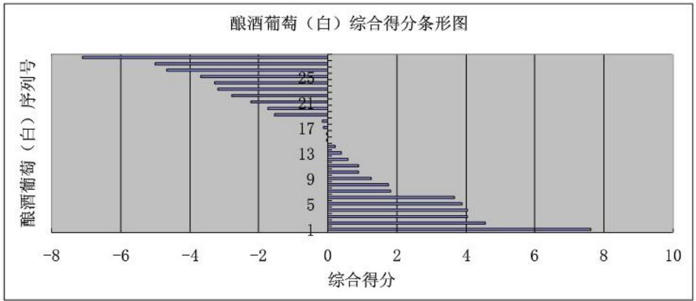
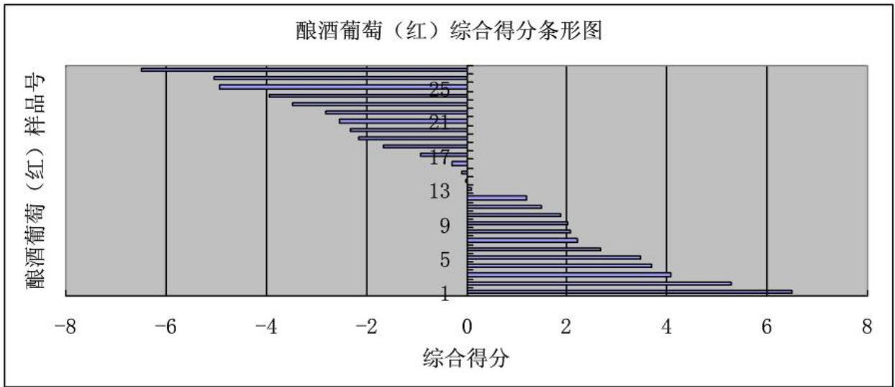

# 2012 高教社杯全国大学生数学建模竞赛

## 承诺书

我们仔细阅读了中国大学生数学建模竞赛的竞赛规则.

我们完全明白，在竞赛开始后参赛队员不能以任何方式（包括电话、电子邮件、网上咨询等）与队外的任何人（包括指导教师）研究、讨论与赛题有关的问题。

我们知道，抄袭别人的成果是违反竞赛规则的，如果引用别人的成果或其他公开的资料（包括网上查到的资料），必须按照规定的参考文献的表述方式在正文引用处和参考文献中明确列出。

我们郑重承诺，严格遵守竞赛规则，以保证竞赛的公正、公平性。如有违反竞赛规则的行为，我们将受到严肃处理。

我们授权全国大学生数学建模竞赛组委会，可将我们的论文以任何形式进行公开展示（包括进行网上公示，在书籍、期刊和其他媒体进行正式或非正式发表等）。

我们参赛选择的题号是（从 A/B/C/D 中选择一项填写）：\_\_\_\_ A \_\_\_\_

我们的参赛报名号为（如果赛区设置报名号的话）： S46027

所属学校（请填写完整的全名）：\_\_\_\_ 郑州轻工业学院

参赛队员 (打印并签名)：1. 任静

2. 李栋

3. 毛新梅

指导教师或指导教师组负责人 (打印并签名): 指导教师组

日期：2012年9月10日

赛区评阅编号（由赛区组委会评阅前进行编号）：

# 2012 高教社杯全国大学生数学建模竞赛

## 编号专用页

赛区评阅编号（由赛区组委会评阅前进行编号）：

赛区评阅记录（可供赛区评阅时使用）：

<table><tr><td>评阅人</td><td></td><td></td><td></td><td></td><td></td><td></td><td></td><td></td><td></td><td></td></tr><tr><td>评分</td><td></td><td></td><td></td><td></td><td></td><td></td><td></td><td></td><td></td><td></td></tr><tr><td>备注</td><td></td><td></td><td></td><td></td><td></td><td></td><td></td><td></td><td></td><td></td></tr></table>

全国统一编号（由赛区组委会送交全国前编号）：

全国评阅编号（由全国组委会评阅前进行编号）：

# 葡萄酒的评价

## 摘要

本文研究的是葡萄酒的评价问题。根据已有数据，采用方差分析和主成分分析等方法，分析了酿酒葡萄和葡萄酒的理化指标与葡萄酒质量的相关关系，给出了较合理的葡萄酒质量评价指标。

针对问题一，根据每组评酒员对每个葡萄酒样品的打分，采用平均值方法，计算出葡萄酒样品的质量得分，对每类葡萄酒的两组质量得分进行单因子方差分析。分析结果显示，两组评酒员对两类葡萄酒评价结果都有显著差异。在此基础上，根据各组评酒员的评价结果，分别计算其方差和，均得出第二组的方差较小，即第二组评酒员的评价结果更可信。

针对问题二，首先，根据资料[8][7]选取30个理化指标中有代表性的12个，同时选取第二组的评价结果作为葡萄酒的质量，采用主成分分析法，得出关于主成分 $F_{13}$ ， $F_{12}$ ， $F_{11}$ ， $F_{10}$ ， $F_{9}$ ， $F_{8}$ 和 $F_{7}$ 的简化系统，并验证了系统的可行性。其次，采用计算各个样品的主成分值的方法，建立关于7个主成分值的综合评价模型，得出葡萄的分级如下表所示。

<table><tr><td>级别</td><td>酿酒葡萄(白)</td><td>酿酒葡萄(红)</td></tr><tr><td>优</td><td>26,21,2,5</td><td>9,23,3</td></tr><tr><td>良</td><td>23,25,10,14,19, 28,22,12,24,16</td><td>14,13,10,25,20,26,2,19,5,17</td></tr><tr><td>中</td><td>9,4,27,20,7,17,3,1,11,8,6</td><td>8,6,27,4,21,15,24,16,22,1,18</td></tr><tr><td>差</td><td>18,15,13</td><td>12,11,7</td></tr></table>

针对问题三，首先，根据附表中的 30 个酿酒葡萄的理化指标，采用主成分分析方法，建立关于酿酒葡萄和葡萄酒的典型相关性分析模型，得出葡萄酒和酿酒葡萄的各理化指标之间存在一定的相关性，具体见正文。

针对问题四，首先，根据第三问的模型分析出酿酒葡萄与葡萄酒理化指标间既有正相关也有负相关的结果，采用多元回归分析法，分别建立酿酒葡萄和葡萄酒的理化指标关于葡萄酒质量的线性拟合模型，得出酿酒葡萄和葡萄酒的理化指标完全可以代替人工评分评定葡萄酒的质量，并加以论证。

关键词：葡萄酒评价 主成分分析 单因子方差分析 理化指标

## 一 问题重述

## 1.1 问题背景

葡萄酒的质量问题是一个很受人关注的问题，确定葡萄酒质量时一般是通过聘请一批有资质的评酒员进行品评。每个评酒员在对葡萄酒进行品尝后对其分类指标打分，然后求和得到其总分，从而确定葡萄酒的质量。酿酒葡萄的好坏与所酿葡萄酒的质量有直接的关系，葡萄酒和酿酒葡萄检测的理化指标会在一定程度上反映葡萄酒和葡萄的质量。

## 1.2 问题提出

该题给出了我们三个附件，其中附件1给出了某一年份一些葡萄酒的评价结果，附件2和附件3分别给出了该年份这些葡萄酒的和酿酒葡萄的成分数据。我们尝试利用这些数据对葡萄酒的质量进行分析，建立数学模型讨论下列问题：

1. 分析附件1中两组评酒员的评价结果有无显著性差异，哪一组结果更可信？  
2. 根据酿酒葡萄的理化指标和葡萄酒的质量对这些酿酒葡萄进行分级。  
3. 分析酿酒葡萄与葡萄酒的理化指标之间的联系。  
4. 分析酿酒葡萄和葡萄酒的理化指标对葡萄酒质量的影响，并论证能否用葡萄和葡萄酒的理化指标来评价葡萄酒的质量？

## 二 模型假设

1. 所有的评酒员对葡萄酒的品质的打分客观公正；  
2. 附件中的葡萄酒样品与酿酒葡萄样品是一一对应的关系;  
3. 酿制红葡萄酒和白葡萄酒的酿酒葡萄是相互对立的;  
4. 附件中错误的数据，缺失的数据对样品总体没影响，可以删去。

## 三 符号说明

$b_{i}$ ：葡萄酒的原始质量；  
$a_{i}$ ：标准化后的第i种葡萄酒的质量；  
n：葡萄酒样品的数量；  
X：酿酒葡萄的指标矩阵；  
$x_{i}$ ：酿酒葡萄的第i个指标的观测值；  
U：7个主成分的各个指标的单位化特征向量矩阵；  
$y_{ji}$ ：第 j 组的第 i 个样品的第 k 个评酒员的评分结果；  
$s_{ji}$ ：第 j 组的第 i 个样品的评分结果的方差；  
$S_{j}$ ：第 j 组的所有样品的评分结果的方差和；  
$W_{i}$ ：第i个酿酒葡萄样品的综合得分；  
$x_{i}$ ：第i个酿酒葡萄的指标的观测值；  
$l_{ii}$ ：第i个酿酒葡萄的指标的组内方差和；  
$F_{j}$ ：单位化特征向量矩阵的第 j 个主成分向量；  
$a_{ji}$ : $x_{i}$ 在 $F_{j}$ 上的载荷；  
A：载荷矩阵；  
$\lambda_{i}$ ：第i个酿酒葡萄指标的特征值；  
R：相关系数矩阵；  
$\mu$ ：单位化特征值向量矩阵；  
$\mu_{ij}$ ：第i个指标关于第j个指标的单位化特征向量；

# 四 模型的建立与求解

## 4.1 问题一的分析

问题一的关键是明确显著性差异的因子，以此建立单因子方差分析模型。首先，根据附表中的数据，去掉两组评分员对每种葡萄酒评分总和的最大值和最小值再求平均值得出葡萄酒的质量，再将数据进行标准化处理，以此为因子建立单因子方差分析模型，进行显著性分析。其次，根据所得的葡萄酒的质量，分析各组品酒员的品酒结果的波动情况，因此采取求各组评定的葡萄酒的质量的方差，分析得出更为可信的评酒员小组。

## 4.1.1 各组评酒员的评价结果

评价员的评价结果即为葡萄酒的质量。葡萄酒的质量是每个评酒员在对葡萄酒进行品尝后对其分类指标打分，然后求和得到的总分。为了使得到的数据更为合理，采用去掉评分结果的最大值和最小值再求平均值的方法来确定葡萄酒的质量。各种葡萄酒的质量如附表1（2）所示。

分析数据时发现第一组四号评酒员评价红葡萄酒样品 20 时，没有给出具体数据，同样的该组的七号评酒员评价白葡萄酒样品 3 时，给出了远超于浓度的数据，为保证分析的严谨，我们把红葡萄酒样品 20 和白葡萄酒样品 3 剔除，因此只剩下了 26 种红葡萄酒样品和 27 种白葡萄样品。

## 4.1.2 两组评价结果的显著性分析

由于各种葡萄酒的质量本身是不同的, 若要对此进行数据分析, 必须将数据标准化。为此建立数据的标准化模型

$$
a _ {i} = \left| b _ {i} - \frac {\sum_ {i = 1} ^ {n} b _ {i}}{n} \right|, \tag {1.1}
$$

其中： $a_{i}$ 为标准化后的第 $i$ 种红（白）葡萄酒的质量， $b_{i}$ 为红（白）葡萄酒的原始质量， $n$ 为红（白）葡萄酒样品的数量， $n = 27,28$ 分别为红、白葡萄酒样品的数量。

将表 1 中的数据代入公式（1.1）标准化的数据见附表 2（2）。

该题中，要比较的是两组的评价结果对葡萄酒的影响，为此，把各种酒标准化后的数值作为因子，记为 A，第一组的评价结果作为因子水平 $A_{1}$ ，第二组的评价结果作为因子水平 $A_{2}$ ，第 j 组对第 i 种葡萄酒的评价结果用 $y_{ji}$ 表示， $i=1,2,\cdots,27$ 或 28，目的是比较两组评价的结果是否相同，为此，把研究的问题归结为一个统计问题，用方差分析法进行分析。

建立方差分析模型为

$$
\left\{ \begin{array}{c} T _ {j} = \sum_ {i = 1} ^ {n} y _ {j i} \\ T = \sum_ {j = 1} ^ {2} T _ {j} \\ S _ {T} = \sum_ {j = 1} ^ {2} \sum_ {i = 1} ^ {n} y _ {j i} ^ {2} - \frac {T ^ {2}}{n}. \\ S _ {A} = \frac {1}{n} \sum_ {j = 1} ^ {2} T _ {j} ^ {2} - \frac {T ^ {2}}{n} \\ S _ {e} = S _ {T} - S _ {A} \end{array} \right. \tag {1.2}
$$

将数据代入公式（1.2）中，用 EXCEL 计算出各偏差平方和，自由度，填入方差分析表，并继续计算得到各均方以及 F 比，p 值，见表 1 所示。

表1. 单因子的方差分析表

<table><tr><td>来源</td><td>平方和</td><td>自由度</td><td>均方</td><td>F比</td><td>p值</td><td>F crit</td></tr><tr><td>因子A</td><td>71.69427</td><td>1</td><td>71.69427</td><td>6.437288</td><td>0.012659</td><td>3.932438</td></tr><tr><td>误差e</td><td>1158.283</td><td>104</td><td>11.13734</td><td></td><td></td><td></td></tr><tr><td>总计T</td><td>1229.978</td><td>105</td><td></td><td></td><td></td><td></td></tr></table>

若取 $\alpha = 0.05$ ，则 $F_{0.95}(1,104) = 3.9324$ ，由于 $F = 6.437288 > 3.9324$ ，故认为因子 $A$ 是显著的，即两组的评价结果有显著差异。

## 4.1.3 两组可信度的分析

根据显著性差异的分析，可知两组的评价结果有显著性差异，因此计算每组的成员对各种酒样品的评价结果的方差的总和（即成员之间评价的波动性强弱）来判断各组评价结果的可信度。

建立可信度的模型为

$$
\left\{ \begin{array}{c} s _ {j i} = \sum_ {k = 1} ^ {1 0} \left(y _ {j i k} - \frac {\sum_ {k = 1} ^ {1 0} y _ {j i k}}{1 0}\right) ^ {2}. \\ S _ {j} = \sum_ {i = 1} ^ {n} s _ {j i} \end{array} \right. \tag {1.3}
$$

其中： $y_{jik}$ 为第 j 组的第 i 个样品的第 k 个评酒员的评分结果， $s_{ji}$ 为第 j 组的第 i 个样品的评分结果的方差， $S_{j}$ 为第 j 组的所有样品的评分结果的方差和。

将附件 1 中的数据代入公式（1.3）中得到数据如附表 1 所示。分别求得的两组对于红酒和白酒的评分结果的方差和如表 2 所示。

表2. 两组的方差和

<table><tr><td></td><td>第一组</td><td>第二组</td></tr><tr><td>红葡萄酒</td><td>1424.45</td><td>821.11</td></tr><tr><td>白葡萄酒</td><td>3255.57</td><td>1411.69</td></tr></table>

由于把每组的成员评价各种酒的评价结果的方差的总和来作为各组评价结果的可信度，根据方差的性质，方差越小，稳定性越好，可信度越高。因此分析上表的结果可知，无论是红酒还是白酒，都是第二组的可信度更高，即为第二组的评价结果更为可信。

## 4.2 问题二的分析

问题二的关键是确定评价指标，建立综合评价模型。首先，根据资料[1]筛选附表中的数据，确定对酿酒葡萄影响较大的理化指标，由于第二组的评价结果更可信，选取第二组的评价结果作为葡萄酒的质量。综上，确定了评价指标。其次，将数据进行标准化处理，采用主因子分析法，找出主因子，以简化评价指标。最后，根据以所得的主因子为新的评价指标，建立对酿酒葡萄分级的综合评价模型，对酿酒葡萄的优劣进行分级。

## 4.2.1 酿酒葡萄分级的评价系统的简化

由于附表的数据量太大，必须对数据进行初步的筛选。根据资料[7][8]，酿酒葡萄中的氨基酸，蛋白质，花色苷，有机酸，酚类，醇类，还原糖，果穗，出汁率，多酚氧化酶活力，DPPH自由基，可溶性固形物这几个理化指标是对酿酒葡萄影响较大的理化指标。其次，由于第二组的评价结果更为可信，故选用第二组的评价结果作为酿酒葡萄的葡萄酒的质量指标。综上所述，初步确定了酿酒葡萄分级的指标。

由于选取的指标太多，而且主观性较强，容易使它们提供的整体信息发生重叠，不易得出简明的规律。因此，采用主成分分析法，将多指标问题化为较少的综合指标问题，不但保证了各指标的不相关性，又反映了原来多指标的信息。

下面根据上述分析来进行主成分析。

首先，要对各个指标的观测值进行标准化。各个指标的观测值的具体值见附表2. $X = (x_{1}, x_{2} \cdots x_{13})^{T}$ ，建立数据标准化模型

$$
\left\{ \begin{array}{l l} l _ {i i} = \sum (x _ {i}) ^ {2} - \frac {1}{n} (\sum x _ {i}) ^ {2} & \\ \quad \quad \quad \quad \quad \quad \quad \quad \quad \quad \quad \quad \quad \quad \quad \quad i = (1, 2, \dots 1 3) , \\ x _ {i} ^ {\prime} = \frac {x _ {i} - x _ {i}}{\sqrt {l _ {i i} / (n - 1)}} & \end{array} \right.
$$

其中： $x_{i}$ 为第 i 个指标的观测值， $l_{ii}$ 为组内方差和。

标准化后的数据见附表 3。

建立各个指标的相关系数模型

$$
\mu_ {i j} = \frac {\sum_ {i = 1} ^ {1 3} \sum_ {j = 1} ^ {1 3} (x _ {i} - \bar {x}) (x _ {j} - x _ {j})}{\sqrt {\sum_ {i = 1} ^ {1 3} (x _ {i} - \bar {x}) ^ {2} \sum_ {j = 1} ^ {1 3} (x _ {j} - x _ {j}) ^ {2}}},
$$

将附表 3 中的数据代入公式中，得到相关矩阵为

$$
R = \left( \right.\begin{array}{c c c c c c c c c c c c c}1&0. 1 2&- 0. 0 6&0. 5 0&- 0. 3 3&0. 2 1&0. 1 8&0. 1 5&0. 4 1&0. 4 5&- 0. 0 9&- 0. 2 5&0. 3 2\\0. 1 2&1&- 0. 4 5&- 0. 0 8&- 0. 2 8&0. 1 0&0. 5 3&0. 3 7&0. 0 3&- 0. 0 4&0. 1 9&- 0. 1 0&- 0. 0 4\\- 0. 0 6&- 0. 4 5&1&0. 1 2&0. 3 5&- 0. 3 0&- 0. 2 2&- 0. 2 0&- 0. 2 3&- 0. 2 4&0. 0 7&- 0. 0 6&- 0. 2 6\\0. 5 0&- 0. 0 8&0. 1 2&1&- 0. 0 9&- 0. 1 0&0. 0 8&0. 2 5&0. 1 0&0. 2 8&- 0. 1 8&- 0. 0 1&0. 3 5\\- 0. 3 3&- 0. 2 8&0. 3 5&- 0. 0 9&1&- 0. 4 3&- 0. 3 2&- 0. 2 0&- 0. 3 1&- 0. 1 4&- 0. 0 2&0. 1 8&- 0. 2 8\\0. 2 1&0. 1 0&- 0. 3 0&- 0. 1 0&- 0. 4 3&1&0. 3 8&0. 1 6&0. 2 7&0. 3 0&- 0. 0 6&- 0. 2 5&0. 3 1\\0. 1 8&0. 5 3&- 0. 2 2&0. 0 8&- 0. 3 2&0. 3 8&I&\text {   } \text {   } \text {   } \text {   } \text {   } \text {   } \text {   } \text {   } \text {   } \text {   } \text {   } \text {   } \text {   } \text {   } \text {   } \text {   } \text {   } \text {   } \text {   } \text {   } \text {   }\]\\\[\begin{array}{c}\text {   }\\\text {   }\\\text {   }\\\text {   }\\\text {   }\\\text {   }\\\text {   }\\\text {   }\\\text {   }\\\text {   }\\\text {   }\\\text {   }\\\text {   }\\\text {   }\\\text {   }\\\text {   }\\\text {   }\\\text {    }\end{array}\\\left( \begin{array}{c|c|cc:ccc} - (a) ^ {-} (b) ^ {-} (c) ^ {-} (d) ^ {-} (e) ^ {-} (f) ^ {-} (g) ^ {-} (h) ^ {-} (i) ^ {-} (j) ^ {-} (k) ^ {-} (l) ^ {-} (m) ^ {-} (n) ^ {-} (o) ^ {-} (p) ^ {-} (q) ^ {-} (r) ^ {-} (s) ^ {-} (t) ^ {-} (u) ^ {-} (v) ^ {-} (w) ^ {-} (x) ^ {-} (y) ^ {-} (z) ^ {-} (u) ^ {-} (v) ^ {-} (w) ^ {-} (x) ^ {-} (y) ^ {-} (z) ^ {-} (u) ^ {-} (v) ^ {-} (w) ^ {-} (x) ^ {-} (y) ^ {-} (z) ^ {-} (u) ^ {-} (v) ^ {-} (w) ^ {-} (x) ^ {-},\\\end{array}\left. \right),\\\end{array}
$$

相关矩阵 $R$ 的特征值及相应的单位化特征向量为

$$
\mu = \left( \begin{array}{c c c c c c c c c c c c c} 0. 1 0 & 0. 3 2 & - 0. 4 5 & 0. 1 0 & - 0. 2 0 & 0. 0 2 & - 0. 3 5 & 0. 4 3 & - 0. 2 2 & - 0. 1 4 & - 0. 4 0 & 0. 0 0 & 0. 3 3 \\ - 0. 1 8 & 0. 2 4 & 0. 3 4 & - 0. 3 1 & - 0. 0 7 & 0. 4 3 & - 0. 2 2 & 0. 2 6 & 0. 4 0 & 0. 0 8 & 0. 0 7 & - 0. 4 5 & 0. 1 3 \\ - 0. 3 6 & 0. 0 8 & 0. 0 4 & - 0. 4 7 & 0. 0 6 & 0. 2 5 & 0. 0 4 & - 0. 0 8 & - 0. 4 5 & 0. 3 3 & - 0. 3 9 & 0. 2 4 & - 0. 2 2 \\ 0. 2 2 & - 0. 0 4 & 0. 5 6 & 0. 1 4 & 0. 2 0 & - 0. 0 3 & 0. 0 7 & - 0. 0 9 & 0. 1 4 & - 0. 2 2 & - 0. 6 7 & 0. 1 1 & 0. 1 9 \\ 0. 1 9 & - 0. 0 1 & 0. 0 7 & - 0. 1 6 & - 0. 3 3 & - 0. 3 3 & - 0. 6 0 & - 0. 1 8 & 0. 3 3 & 0. 2 7 & - 0. 1 0 & 0. 2 4 & - 0. 2 9 \\ 0. 0 1 & 0. 3 7 & 0. 3 6 & 0. 0 0 & - 0. 0 6 & - 0. 2 0 & - 0. 2 7 & - 0. 4 0 & - 0. 5 1 & - 0. 0 8 & 0. 2 8 & - 0. 1 7 & 0. 2 9 \\ - - - - - - - - - - - - - - - - - - - - - - - - - - - - - - - - - - - - - - - - - - - - - - - - - - - - - - - - - - - - - - - - - - - - - - - - - - - - - - - - - - - - - - - - - - - - - - - - - - - - -. \end{array} \right)
$$

由于后七个主成分的累计贡献率

$$
\eta_ {(7)} = \frac {0 . 5 8 + 0 . 8 1 + 0 . 9 6 + 1 . 1 7 + 1 . 4 4 + 2 . 5 1 + 3 . 6 4}{1 3} = 8 5. 3 9 15\% > 85 \%.
$$

故取后七个主成分:

$$
\begin{array}{l} F _ {1 3} = 0. 3 3 x _ {1} + 0. 1 3 x _ {2} - 0. 2 2 x _ {3} + 0. 1 9 x _ {4} - 0. 2 9 x _ {5} + 0. 2 9 x _ {6} + 0. 1 4 x _ {7} + 0. 1 9 x _ {8} + 0. 3 7 x _ {9} + 0. 4 1 x _ {1 0} - 0. 2 7 x _ {1 1} - 0. 3 0 x _ {1 2} + 0. 3 3 x _ {1 3}, \\ F _ {1 2} = 0. 0 0 x _ {1} ^ {\prime} - 0. 4 5 x _ {2} ^ {\prime} + 0. 2 4 x _ {3} ^ {\prime} + 0. 1 1 x _ {4} ^ {\prime} + 0. 2 4 x _ {5} ^ {\prime} - 0. 1 7 x _ {6} ^ {\prime} - 0. 5 0 x _ {7} ^ {\prime} - 0. 3 4 x _ {8} ^ {\prime} + 0. 1 3 x _ {9} ^ {\prime} + 0. 2 6 x _ {1 0} ^ {\prime} - 0. 3 9 x _ {1 1} ^ {\prime} - 0. 0 9 x _ {1 2} ^ {\prime} + 0. 1 7 x _ {1 3}, \\ F _ {1 1} = - 0. 4 0 x _ {1} ^ {\prime} + 0. 0 7 x _ {2} ^ {\prime} - 0. 3 9 x _ {3} ^ {\prime} - 0. 6 7 x _ {4} ^ {\prime} - 0. 1 0 x _ {5} ^ {\prime} + 0. 2 8 x _ {6} ^ {\prime} - 0. 1 6 x _ {7} ^ {\prime} - 0. 2 9 x _ {8} ^ {\prime} + 0. 1 4 x _ {9} ^ {\prime} + 0. 0 7 x _ {1 0} ^ {\prime} - 0. 1 3 x _ {1 1} ^ {\prime} - 0. 0 6 x _ {1 2} ^ {\prime} + 0. 0 0 x _ {1 3}, \\ F _ {1 0} = - 0. 1 4 x _ {1} ^ {\prime} + 0. 0 8 x _ {2} ^ {\prime} + 0. 3 3 x _ {3} ^ {\prime} - 0. 2 2 x _ {4} ^ {\prime} + 0. 2 7 x _ {5} ^ {\prime} - 0. 0 8 x _ {6} ^ {\prime} + 0. 1 3 x _ {7} ^ {\prime} + 0. 3 3 x _ {8} ^ {\prime} + 0. 1 3 x _ {9} ^ {\prime} + 0. 1 0 x _ {1 0} ^ {\prime} - 0. 1 3 x _ {1 1} ^ {\prime} - 0. 6 3 x _ {1 2} ^ {\prime} - 0. 4 2 x _ {1 3} ^ {\prime}, \\ F _ {9} = - 0. 2 2 x _ {1} ^ {\prime} + 0. 4 0 x _ {2} ^ {\prime} - 0. 4 5 x _ {3} ^ {\prime} + 0. 1 4 x _ {4} ^ {\prime} + 0. 3 3 x _ {5} ^ {\prime} - 0. 5 1 x _ {6} ^ {\prime} - 0. 0 7 x _ {7} ^ {\prime} + 0. 2 4 x _ {8} ^ {\prime} - 0. 0 5 x _ {9} ^ {\prime} + 0. 1 2 x _ {1 0} ^ {\prime} - 0. 3 1 x _ {1 1} ^ {\prime} + 0. 1 3 x _ {1 2} ^ {\prime} + 0. 1 0 x _ {1 3} ^ {\prime}, \\ F _ {8} = 0. 4 3 x _ {1} + 0. 2 6 x _ {2} - 0. 0 8 x _ {3} + 0. 0 9 x _ {4} - 0. 1 8 x _ {5} - 0. 4 0 x _ {6} - 0. 2 4 x _ {7} - 0. 2 8 x _ {8} + 0. 4 4 x _ {9} + 0. 0 2 x _ {1 0} + 0. 2 4 x _ {1 1} + 0. 0 1 x _ {1 2} - 0. 3 9 x _ {1 3}, \\ F _ {7} = - 0. 3 5 x _ {1} ^ {\prime} - 0. 2 2 x _ {2} ^ {\prime} + 0. 0 4 x _ {3} ^ {\prime} + 0. 0 7 x _ {4} ^ {\prime} - 0. 6 0 x _ {5} ^ {\prime} - 0. 2 7 x _ {6} ^ {\prime} - 0. 2 7 x _ {7} ^ {\prime} + 0. 3 8 x _ {8} ^ {\prime} + 0. 2 2 x _ {9} ^ {\prime} - 0. 3 2 x _ {1 0} ^ {\prime} - 0. 0 5 x _ {1 1} ^ {\prime} - 0. 0 8 x _ {1 2} ^ {\prime} + 0. 0 9 x _ {1 3} ^ {\prime}. \\ \end{array}
$$

$F_{13}$ 主要反映了 $x_{10}$ （可溶性固物）的信息，它们的系数为 0.41，它代表了 $x_{10}$ 对 $F_{13}$ 作用的权数，同理可分析得出以下结论。

$F_{12}$ 主要综合了 $x_{2}^{'}$ （蛋白质）、 $x_{7}^{'}$ （酚类）、 $x_{11}^{'}$ （果穗质量）的信息；

$F_{11}$ 主要综合了 $x_{1}^{'}$ （氨基酸）和 $x_{4}^{'}$ （有机酸）的信息；

$F_{10}$ 主要综合了 $x_{12}^{'}$ （出汁率）和 $x_{13}^{'}$ （葡萄酒的质量）的信息；

$F_{9}$ 主要综合了 $x_{3}^{'}$ （花色苷鲜重）和 $x_{6}^{'}$ （DPPH 自由基）的信息；

$F_{8}$ 主要反映了 $x_{9}^{'}$ （还原糖）的信息；

$F_{7}$ 主要反映了 $x_{5}^{'}$ （多酚氧化酶活力）和 $x_{8}^{'}$ （醇类）的信息。

## 4.2.2 酿酒葡萄分级的评价系统可行性的验证

为了验证用 $F_{13}$ ， $F_{12}$ ， $F_{11}$ ， $F_{10}$ ， $F_{9}$ ， $F_{8}$ 和 $F_{7}$ 简化系统的可行性，必须验证该简化系统的可行性。

把主成分分析的结果用矩阵的形式表示出来，用 X 表示各种指标的信息矩阵，因此可以将 X 用如下形式表示出来。

$$
X = \left( \begin{array}{c} x _ {1} \\ x _ {2} \\ \vdots \\ x _ {1 3} \end{array} \right) = \left( \begin{array}{c c c c} \mu_ {1 1} & \mu_ {2 1} & \dots & \mu_ {m 1} \\ \mu_ {1 2} & \mu_ {2 2} & \dots & \mu_ {m 2} \\ \vdots & \vdots & \dots & \vdots \\ \mu_ {1, 1 3} & \mu_ {2, 1 3} & \dots & \mu_ {1 3, 1 3} \end{array} \right) \left( \begin{array}{c} F _ {1} \\ F _ {2} \\ \vdots \\ F _ {1 3} \end{array} \right) = U _ {1} F _ {1} + U _ {2} F _ {2} + \dots U _ {1 3} F _ {1 3}
$$

为了分析简化系统的可行性，需要求出 $x_{i}$ 在 $F_{j}$ 上的载荷

$$
a _ {j i} = \mu_ {j i} \sqrt {\lambda_ {j}}
$$

即 $F_{j}$ 上承载了 $x_{i}$ 标准差的多少。则上述矩阵可转化为

$$
X = \left( \begin{array}{c c c c} \mu_ {1 1} & \mu_ {2 1} & \dots & \mu_ {m 1} \\ \mu_ {1 2} & \mu_ {2 2} & \dots & \mu_ {m 2} \\ \vdots & \vdots & \dots & \vdots \\ \mu_ {1, 1 3} & \mu_ {1, 1 3} & \dots & \mu_ {1 3, 1 3} \end{array} \right) \left( \begin{array}{c c c c} \sqrt {\lambda_ {1}} & & & \\ & \sqrt {\lambda_ {2}} & & \\ & & \ddots & \\ & & & \sqrt {\lambda_ {1 3}} \end{array} \right) \left( \begin{array}{c} F _ {1} / \sqrt {\lambda_ {1}} \\ F _ {2} / \sqrt {\lambda_ {2}} \\ \vdots \\ F _ {1 3} / \sqrt {\lambda_ {1 3}} \end{array} \right)
$$

其中 $A = U\Lambda^{\frac{1}{2}} = (a_{1}, a_{1}, \dots, a_{13}) = (\sqrt{\lambda_{1}}U_{1}, \sqrt{\lambda_{2}}U_{2} \dots, \sqrt{\lambda_{13}}U_{13})$ 为 $X$ 在 $F$ 上的载荷阵。将数据代入公式中，计算出因子载荷阵 $A$ ，以阐明各 $x_{i}$ 的方差在各主成分上的载荷：

$$
A = U \Lambda^ {\frac {1}{2}} = \left( \begin{array}{c c c c c c c c c c c c c} 0. 0 4 & 0. 1 5 & - 0. 2 2 & 0. 0 6 & - 0. 1 2 & 0. 0 1 & - 0. 2 7 & 0. 3 8 & - 0. 2 2 & - 0. 1 5 & - 0. 4 7 & 0. 0 1 & 0. 6 3 \\ - 0. 0 7 & 0. 1 1 & 0. 1 7 & - 0. 1 8 & - 0. 0 4 & 0. 3 2 & - 0. 1 6 & 0. 2 4 & 0. 3 9 & 0. 0 9 & 0. 0 8 & - 0. 7 1 & 0. 2 4 \\ - 0. 1 4 & 0. 0 4 & 0. 0 2 & - 0. 2 8 & - 0. 0 4 & 0. 1 8 & - 0. 0 3 & - 0. 0 7 & - 0. 4 4 & 0. 3 6 & - 0. 4 6 & 0. 3 9 & - 0. 4 2 \\ 0. 0 9 & - 0. 0 2 & 0. 2 7 & 0. 0 8 & 0. 1 2 & - 0. 0 2 & 0. 0 5 & - 0. 0 9 & 0. 1 4 & - 0. 2 4 & - 0. 8 1 & 0. 1 7 & 0. 3 6 \\ 0. 0 7 & - 0. 0 1 & 0. 0 3 & - 0. 0 9 & - 0. 2 0 & - 0. 2 5 & - 0. 4 6 & - 0. 1 6 & 0. 3 2 & - \text {或} \quad \text {或} \quad \text {或} \quad \text {或} \quad \text {或} \quad \text {或} \quad \text {或} \quad \text {或} \quad \text {或} \quad \text {或} \quad \text {或} \quad \text {或} \quad \text {或} \quad \text {或} \\ \text {或} \quad \text {或} \quad \text {或} \quad \text {或} \quad \text {或} \quad \text {或} \quad \text {或} \quad \text {或} \quad \text {或} \quad \text {或} \quad \text {或} \quad \text {或} \quad \text {或} \\ \text {或} \quad \text {-} \quad \text {-} \quad \text {-} \quad \text {-} \quad \text {-} \quad \text {-} \quad \text {-} \quad \text {-} \quad \text {-} \quad \text {-} \quad \text {-} \quad \text {-} \\ - \text {或} \quad \text {-} \quad \text {-} \quad \text {-} \quad \text {-} \quad \text {-} \quad \text {-} \quad \text {-} \quad \text {-} \\ - \text {或} \quad - (1) = (-) = (-) = (-) = (-) = (-) = (-) = (-) = (-) = (-) = (-) = (-) = (-) = (-) = (-) = (-) = (-) = (-) = (-) = (-) = (-) = (-) = (-) = (-) = (-) = (-) = (-) = (-) = (-) = (-) = (-) = (-) = (-) = (-) = (-, -) = (-, -) = (-, -) = (-, -) = (-, -) = (-, -) = (-, -) = (-, -) = (-, -) = (-, -) = (-, -) = (-, -) = (-, -) = (-, -) = (-, -) = (-, -) = (-, -) = (-, -) = (-, -) = (-, -) = (-, +) = (-, +) = (-, +) = (-, +) = (-, +) = (-, +) = (-, +) = (-, +) = (-, +) = (-, +) = (-, +) = (-, +) = (-, +) = (-, +) = (-, +) = (-, +) = (-, +) = (-, +) = (-, +) = (-, +) = (-, -, +) = (+), + > + > + > + > + > + > + > + > + > + > + > + > + > + > + > + > + > + > + > + > + > + > + > + > + > + > + > + > + > + > + > + > + > + > + > + > + > + > + > + > + > + > + > + > + > + > + > + > + > + > + <  ) \\ [ (1, (1), (1), (1), (1), (1), (1), (1), (1), (1), (1), (1), (1), (1), (1), (1), (1), (1), (1), (1), (1), (1), (1), (1), (1), (1), (1), (1), (1), (1), (1), (1), (1), (1), (1), (\mathrm{和}) ] ^ {- n _ {i}} ] ^ {- n _ {j}} ] ^ {- n _ {k}} ] ^ {- n _ {l}} ] ^ {- n _ {m}} ] ^ {- n _ {n}} ] ^ {- n _ {o}} ] ^ {- n _ {p}} ] ^ {- n _ {q}} ] ^ {- n _ {r}} ] ^ {- n _ {s}} ] ^ {- n _ {t}} ] ^ {- n _ {u}} ] ^ {- n _ {v}} ] ^ {- n _ {w}} ] ^ {- n _ {x}} ] ^ {- n _ {y}} ] ^ {- n _ {z}} ] ^ {- n _ {y}} ] ^ {- n _ {z}} ] ^ {- n _ {z}} ] ^ {- n _ {z}} ] ^ {- n _ {z}} ] ^ {- n _ {z}} ] ^ {- n _ {z}} ] ^ {- n _ {z}} ] ^ {- n _ {z}} ] ^ {- n _ {z}} ] ^ {- n _ {z}} ] ^ {- n _ {z}} ] ^ {- n _ {z}} ] ^ {- n _ {z}} ] ^{- n _ {z}} ] ^{- n _ {z}} ] ^{- n _ {z}} ] ^{- n _ {z}} ] ^{- n _ {z}} ] ^{- n _ {z}} ] ^{- n _ {z}} ] ^{- n _ {z}} ] ^{- n _ {z}} ] ^{- n _ {z}} ] ^{- n _ {z}} ] ^{- n _ {z}} ] ^{- n _ {x}} ] ^{- n _ {x}} ] ^{- n _ {x}} ] ^{- n _ {x}} ] ^{- n _ {x}} ] ^{- n _ {x}} ] ^{- n _ {x}} ] ^{- n _ {x}} ] ^{- n _ {x}} ] ^{- n _ {x}} ] ^{- n _ {x}} ] ^{- n _ {x}} ] ^{- n _ {x}} ] ^{+},
$$

由于 $x_{i}$ 的方差均为1，则用下面模型

$$
\left\{ \begin{array}{l} v _ {i j} = \mu_ {j i} ^ {2} \lambda_ {j} \\ v _ {i} (l) = \sum_ {j = 1} ^ {l} \mu_ {j i} ^ {2} \lambda_ {j} \end{array} (i = 1, 2, \dots 1 3) \right.
$$

表示 $F_{j}$ 对 $x_{i}$ 和前 $l$ 个主成分对 $x_{i}$ 的方差贡献率。

用上述模型计算出 $F_{13}$ ， $F_{12}$ ， $F_{11}$ ， $F_{10}$ ， $F_{9}$ ， $F_{8}$ ， $F_{7}$ 分别承载了 $x_{13}$ 方差的

$$
v_{13,1} = 0.63^2 = 39.6\% \quad v_{13,2} = 0.01^2 = 0.01\% \quad v_{13,1} = (-0.47)^2 = 22.5\% \quad v_{13,1} = (-0.15)^2 = 2.25\%
$$

$$
v_{13,1} = 0.22^2 = 4.84\% \quad v_{13,1} = 0.38^2 = 14.7\% \quad v_{13,1} = 0.27^2 = 7.26\%
$$

$F_{13}$ ， $F_{12}$ ， $F_{11}$ ， $F_{10}$ ， $F_{9}$ ， $F_{8}$ ， $F_{7}$ 共同承载了 $x_{13}$ 方差的 $v_{13(7)} = 91.1\%$ 。同理可计算 $v_{12(7)} = 81.4\%$ ， $v_{11(7)} = 86.6\%$ ， $v_{10(7)} = 89.6\%$ ， $v_{9(7)} = 88.3\%$ ， $v_{8(7)} = 91.7\%$ ， $v_{7(7)} = 84.5\%$ 这就说明 $F_{13}$ ， $F_{12}$ ， $F_{11}$ ， $F_{10}$ ， $F_{9}$ ， $F_{8}$ ， $F_{7}$ 不但能反映 $X$ 变化信息的 $85.3915\%$ ，而且各 $x_{i}$ 的方差在 $F_{13}$ ， $F_{12}$ ， $F_{11}$ ， $F_{10}$ ， $F_{9}$ ， $F_{8}$ ， $F_{7}$ 上的载荷均很高，从而用 $F_{13}$ ， $F_{12}$ ， $F_{11}$ ， $F_{10}$ ， $F_{9}$ ， $F_{8}$ ， $F_{7}$ 简化的系统是可以的。

## 4.2.3 酿酒葡萄分级的评价系统的求解

用主成分可计算各样品的每个主成分值,将每个样品的所有主成分值加到一起即为该样品的综合得分。

建立样品关于 7 个主成分的主成分值的综合评价模型为

$$
W _ {i} = \sum_ {j = 1} ^ {2 8} (X * U) _ {i j} \quad i = (1, 2, \dots 2 8)
$$

其中: $x$ 为 28 个酿酒葡萄 (白) 的标准化结果矩阵, $U$ 为 7 个主成分的各个指标的单位化特征向量矩阵。 $W_{i}$ 为第 $i$ 个样品的综合得分。

由于酿制红葡萄酒和白葡萄酒的酿酒葡萄的理化指标相同，因此用同样的方法建立类似的模型来分析 27 个酿酒葡萄（红）的综合得分。用 MATLAB 计算结果如表 3 所示。

表3. 27个酿酒葡萄（红）和28个酿酒葡萄（白）的综合得分

<table><tr><td>样品序号</td><td>酿酒葡萄(白)</td><td>酿酒葡萄(红)</td></tr><tr><td>1</td><td>-2.7726</td><td>-3.4819</td></tr><tr><td>2</td><td>4.0311</td><td>1.8823</td></tr><tr><td>3</td><td>-2.23</td><td>4.0794</td></tr><tr><td>4</td><td>-0.049</td><td>-0.9115</td></tr><tr><td>5</td><td>4.0297</td><td>1.2</td></tr><tr><td>6</td><td>-3.6802</td><td>-0.0854</td></tr><tr><td>7</td><td>-1.5322</td><td>-6.4839</td></tr><tr><td>8</td><td>-3.2648</td><td>-0.0269</td></tr><tr><td>9</td><td>-0.0265</td><td>6.4997</td></tr><tr><td>10</td><td>1.8045</td><td>2.6692</td></tr><tr><td>11</td><td>-3.187</td><td>-5.0333</td></tr><tr><td>12</td><td>0.5718</td><td>-4.9215</td></tr><tr><td>13</td><td>-7.1146</td><td>3.4764</td></tr><tr><td>14</td><td>1.7614</td><td>3.6958</td></tr><tr><td>15</td><td>-5.009</td><td>-2.1414</td></tr><tr><td>16</td><td>0.198</td><td>-2.538</td></tr><tr><td>17</td><td>-1.7178</td><td>0.0982</td></tr><tr><td>18</td><td>-4.666</td><td>-3.9351</td></tr><tr><td>19</td><td>1.2693</td><td>1.4832</td></tr><tr><td>20</td><td>-0.1677</td><td>2.0683</td></tr><tr><td>21</td><td>4.5765</td><td>-1.6575</td></tr><tr><td>22</td><td>0.882</td><td>-2.8137</td></tr><tr><td>23</td><td>3.8774</td><td>5.2773</td></tr><tr><td>24</td><td>0.3947</td><td>-2.3314</td></tr><tr><td>25</td><td>3.6651</td><td>2.2013</td></tr><tr><td>26</td><td>7.6107</td><td>2.0088</td></tr></table>

<table><tr><td>27</td><td>-0.1371</td><td>-0.2778</td></tr><tr><td>28</td><td>0.8823</td><td></td></tr></table>

将酿酒葡萄的综合得分按降序排列后用 EXCEL 做出酿酒葡萄的综合条形图如图 1 和图 2 所示。

bar

| 酿酒葡萄 (白) 序列号 | 综合得分 |
| --- | --- |
| 1 | ~7.6 |
| 2 | ~4.5 |
| 3 | ~4.0 |
| 4 | ~3.9 |
| 5 | ~3.8 |
| 6 | ~3.7 |
| 7 | ~3.6 |
| 8 | ~3.5 |
| 9 | ~3.4 |
| 10 | ~3.3 |
| 11 | ~3.2 |
| 12 | ~3.1 |
| 13 | ~3.0 |
| 14 | ~2.9 |
| 15 | ~2.8 |
| 16 | ~2.7 |
| 17 | ~2.6 |
| 18 | ~2.5 |
| 19 | ~2.4 |
| 20 | ~2.3 |
| 21 | ~2.2 |
| 22 | ~2.1 |
| 23 | ~2.0 |
| 24 | ~1.9 |
| 25 | ~-7.0 |

图1.酿酒葡萄（白）综合得分条形图

bar

| 酿酒葡萄 (红) 样品号 | 综合得分 |
| --- | --- |
| 1 | ~6.5 |
| 2 | ~5.3 |
| 3 | ~4.1 |
| 4 | ~3.7 |
| 5 | ~3.4 |
| 6 | ~2.8 |
| 7 | ~2.2 |
| 8 | ~2.1 |
| 9 | ~2.0 |
| 10 | ~1.9 |
| 11 | ~1.8 |
| 12 | ~1.5 |
| 13 | ~1.2 |
| 14 | ~0.1 |
| 15 | ~-0.2 |
| 16 | ~-0.5 |
| 17 | ~-0.8 |
| 18 | ~-1.2 |
| 19 | ~-1.8 |
| 20 | ~-2.2 |
| 21 | ~-2.5 |
| 22 | ~-3.0 |
| 23 | ~-3.5 |
| 24 | ~-4.0 |
| 25 | ~-4.8 |
| 26 | ~-6.5 |

图2.酿酒葡萄（红）综合得分条形图

分析图 1 和图 2，发现大部分的酿酒葡萄的质量落在[-4,4]之间，只有少部分的葡萄在[-8,4]和[4,8]之间。这也正验证了现实的酿酒葡萄的种植情况，极好的葡萄由于难以种植因此数量较少，极差的葡萄由于某些葡萄酒的理化指标需要又必须种植，一般的葡萄由于成本和品质同时可以满足需求，故会大量种植。

综上分析可以将酿酒葡萄分为四个等级：优[4,8]、良[0,4]、中[-4,0]、差[-8,-4]。则对表5中的酿酒葡萄的得分进行分级，即得酿酒葡萄的分级如表4所示。

表4. 酿酒葡萄的分级

<table><tr><td>级别</td><td>酿酒葡萄(白)</td><td>酿酒葡萄(红)</td></tr><tr><td>优</td><td>26,21,2,5</td><td>9,23,3</td></tr><tr><td>良</td><td>23,25,10,14,19, 28,22,12,24,16</td><td>14,13,10,25,20,26,2,19,5,17</td></tr><tr><td>中</td><td>9,4,27,20,7,17,3,1,11,8,6</td><td>8,6,27,4,21,15,24,16,22,1,18</td></tr><tr><td>差</td><td>18,15,13</td><td>12,11,7</td></tr></table>

## 4.3 问题三的分析

问题三要分析酿酒葡萄与葡萄酒的理化指标的联系，关键是将葡萄酒的理化指标与酿酒葡萄的理化指标对应起来，进行相关性分析。首先，采用第二问的模型，分析酿酒葡萄的各个理化指标的相关性。然后，对酿酒葡萄和葡萄酒的共有的理化指标进行相关性分析，再结合已求得的酿酒葡萄的理化指标之间的相关性，即可得出酿酒葡萄与葡萄酒理化指标间的相关性。

## 4.3.1 酿酒葡萄指标的分类

建立同第二问类似的相关系数的模型，对酿酒葡萄（红）的 30 个理化指标进行相关性分析，相关系数见附表 4。

同样的建立同第二问类似的主成分分析的模型，得出 $F_{30}$ 、 $F_{29}$ 、 $F_{28}$ 、 $F_{27}$ 、 $F_{26}$ 、 $F_{25}$ 、 $F_{24}$ 、 $F_{23}$ 、 $F_{22}$ ，并且这七个主成分可以反映这30个酿酒葡萄理化指标的 $86.2\%$ ，可以用于分析这30个理化指标的相关性。

$F_{30}$ 主要反映了总酚、花色苷鲜重、DPPH 自由基、单宁的信息；

$F_{29}$ 主要反映了干物质含量、总糖、还原糖、可溶性固形物的信息；

$F_{28}$ 主要反映了白藜芦醇、果皮颜色 A 的信息；

$F_{27}$ 主要反映了褐变度、PH值、苹果酸、多酚氧化酶活力、氨基酸总量的信息；

$F_{26}$ 主要反映了果穗质量的信息；

$F_{24}$ 主要反映了果皮质量、黄酮醇的信息；

$F_{23}$ 主要反映了酒石酸、柠檬酸、果皮颜色 L 的信息；

$F_{22}$ 主要反映了 VC 含量、出汁率、葡萄总黄酮的信息；

因此可以按主成分将 30 个理化指标分成 8 类。如表 5 所示。

表5. 指标的分类

<table><tr><td>类别</td><td>指标的种类</td></tr><tr><td>1</td><td>总酚、花色苷鲜重、DPPH自由基、单宁</td></tr><tr><td>2</td><td>干物质含量、总糖、还原糖、可溶性固形物</td></tr><tr><td>3</td><td>白藜芦醇、果皮颜色A</td></tr><tr><td>4</td><td>褐变度、PH值、苹果酸、多酚氧化酶活力、氨基酸总量</td></tr><tr><td>5</td><td>果穗质量</td></tr><tr><td>6</td><td>果皮质量、黄酮醇</td></tr><tr><td>7</td><td>酒石酸、柠檬酸、果皮颜色L</td></tr><tr><td>8</td><td>VC含量、出汁率、葡萄总黄酮</td></tr></table>

## 4.3.2 酿酒葡萄与葡萄酒指标的相关性分析

下面分析这 8 类指标与葡萄酒指标之间的相关性。

首先, 将酿酒葡萄与葡萄酒的指标中的相同的指标找出来, 分别为: 花色苷、单宁、总酚、DPPH 半抑制体积 (自由基)、葡萄 (酒) 总黄酮、白藜芦醇、果皮颜色 (色泽) L、果皮颜色 (色泽) A、果皮颜色 (色泽) B。

先分析红酒的 30 个酿酒葡萄的理化指标的相关系数表里可得出各类指标内各指标的相关性,同时结合酿酒葡萄与葡萄酒中相同的指标,选取有葡萄酒的理化指标的四类,从附表 3 的相关系数表可以得到这四类指标间的各个指标间的相关系数。如表 6 所示。

表6. 各类内各指标的相关性

<table><tr><td>相关系数</td><td>花色苷鲜重</td><td>单宁</td><td>总酚</td><td>DPPH 自由基</td></tr><tr><td>花色苷鲜重</td><td>1</td><td>0.688131653</td><td>0.727828016</td><td>0.654607258</td></tr><tr><td>单宁</td><td>0.688131653</td><td>1</td><td>0.754693327</td><td>0.645011318</td></tr><tr><td>总酚</td><td>0.727828016</td><td>0.754693327</td><td>1</td><td>0.85712</td></tr><tr><td>DPPH 自由基</td><td>0.654607258</td><td>0.645011318</td><td>0.85712</td><td>1</td></tr></table>

<table><tr><td>相关系数</td><td>果皮颜色L</td></tr><tr><td>酒石酸</td><td>-0.19709</td></tr><tr><td>柠檬酸</td><td>-0.13178</td></tr></table>

<table><tr><td>相关系数</td><td>葡萄总黄酮</td></tr><tr><td>VC含量</td><td>-0.12923</td></tr><tr><td>出汁率</td><td>0.568325</td></tr></table>

<table><tr><td>相关系数</td><td>白藜芦醇</td></tr><tr><td>果皮颜色A</td><td>0.738243</td></tr></table>

为了分析酿酒葡萄与葡萄酒的理化指标之间的关系，还要找出两者之间的相关性，求得的相关系数如表 7 所示。

表7. 酿酒葡萄与葡萄酒的共有的理化指标的相关系数

<table><tr><td>葡萄酒指标(红)</td><td>酿酒葡萄指标(红)</td><td>相关系数</td></tr><tr><td>花色苷</td><td>花色苷鲜重</td><td>0.922628519</td></tr><tr><td>单宁</td><td>单宁</td><td>0.718040214</td></tr><tr><td>总酚</td><td>总酚</td><td>0.875139176</td></tr><tr><td>DPPH 半抑制体积(IV50)</td><td>DPPH 自由基 1/IC50</td><td>0.778280088</td></tr><tr><td>酒总黄酮</td><td>葡萄总黄酮</td><td>0.822833317</td></tr><tr><td>白藜芦醇</td><td>白藜芦醇</td><td>0.013515055</td></tr><tr><td>色泽 L*(D65)</td><td>果皮颜色 L</td><td>0.493648232</td></tr><tr><td>色泽 A*(D65)</td><td>果皮颜色 A(红绿)</td><td>-0.541953482</td></tr><tr><td>色泽 B*(D65)</td><td>果皮颜色 B(黄蓝)</td><td>0.025494318</td></tr></table>

分析表 9 可知，葡萄酒的花色苷与酿酒葡萄的花色苷呈强正相关，分析表 8 可知，酿酒葡萄的花色苷与酿酒葡萄的单宁、总酚、DPPH 自由基呈强正相关，因此可得到葡萄酒的花色苷与酿酒葡萄的花色苷鲜重、单宁、总酚、DPPH 自由基呈正相关。同理可分析出葡萄酒（红）的理化指标与酿酒葡萄的理化指标之间的相关性，如表 8 所示。

表8. 葡萄酒（红）的与酿酒葡萄的理化指标之间的相关性

<table><tr><td>葡萄酒(红)</td><td>酿酒葡萄</td><td>相关性</td></tr><tr><td rowspan="4">花色苷</td><td>花色苷鲜重</td><td>强正相关</td></tr><tr><td>单宁</td><td>强正相关</td></tr><tr><td>总酚</td><td>强正相关</td></tr><tr><td>DPPH自由基</td><td>强正相关</td></tr><tr><td rowspan="3">酒总黄酮</td><td>葡萄总黄酮</td><td>强正相关</td></tr><tr><td>VC含量</td><td>弱负相关</td></tr><tr><td>出汁率</td><td>正相关</td></tr><tr><td rowspan="4">单宁</td><td>单宁</td><td>强正相关</td></tr><tr><td>花色苷鲜重</td><td>强正相关</td></tr><tr><td>总酚</td><td>强正相关</td></tr><tr><td>DPPH自由基</td><td>强正相关</td></tr><tr><td rowspan="2">白藜芦醇</td><td>白藜芦醇</td><td>弱正相关</td></tr><tr><td>果皮颜色A</td><td>强正相关</td></tr><tr><td>总酚</td><td>总酚</td><td>强正相关</td></tr><tr><td rowspan="3"></td><td>花色苷鲜重</td><td>强正相关</td></tr><tr><td>单宁</td><td>强正相关</td></tr><tr><td>DPPH 自由基</td><td>强正相关</td></tr><tr><td rowspan="2">色泽L</td><td>果皮颜色L</td><td>正相关</td></tr><tr><td>酒石酸</td><td>弱负相关</td></tr><tr><td rowspan="2">色泽A</td><td>果皮颜色A</td><td>负相关</td></tr><tr><td>白藜芦醇</td><td>负相关</td></tr><tr><td>色泽B</td><td>果皮颜色B</td><td>弱正相关</td></tr><tr><td rowspan="4">DPPH 半抑制体积</td><td>DPPH 自由基</td><td>强正相关</td></tr><tr><td>总酚</td><td>强正相关</td></tr><tr><td>花色苷鲜重</td><td>强正相关</td></tr><tr><td>单宁</td><td>强正相关</td></tr></table>

采用同样的方法分析出分析出葡萄酒（白）的理化指标与酿酒葡萄的理化指标之间的相关性，如表 9 所示。

表9. 葡萄酒（白）的与酿酒葡萄的理化指标之间的相关性

<table><tr><td>葡萄酒</td><td>酿酒葡萄</td><td>相关性</td></tr><tr><td rowspan="2">单宁</td><td>单宁</td><td>强正相关</td></tr><tr><td>出汁率(%)</td><td>强负相关</td></tr><tr><td rowspan="2">总酚</td><td>总酚</td><td>强正相关</td></tr><tr><td>葡萄总黄酮</td><td>强正相关</td></tr><tr><td rowspan="2">酒总黄酮</td><td>葡萄总黄酮</td><td>强正相关</td></tr><tr><td>总酚</td><td>强正相关</td></tr><tr><td rowspan="2">白藜芦醇</td><td>白藜芦醇</td><td>弱负相关</td></tr><tr><td>酒石酸</td><td>弱负相关</td></tr><tr><td>DPPH 半抑制体积</td><td>DPPH 自由基 1/IC50</td><td>强正相关</td></tr><tr><td>色泽L</td><td>果皮颜色L</td><td>负相关</td></tr><tr><td rowspan="5">色泽A</td><td>果皮颜色A(红绿)</td><td>负相关</td></tr><tr><td>果皮颜色B(黄蓝)</td><td>正相关</td></tr><tr><td>固酸比</td><td>负相关</td></tr><tr><td>VC含量</td><td>弱正相关</td></tr><tr><td>可滴定酸</td><td>正相关</td></tr><tr><td rowspan="5">色泽B</td><td>果皮颜色B(黄蓝)</td><td>正相关</td></tr><tr><td>果皮颜色A(红绿)</td><td>负相关</td></tr><tr><td>固酸比</td><td>负相关</td></tr><tr><td>VC含量</td><td>弱正相关</td></tr><tr><td>可滴定酸</td><td>正相关</td></tr></table>

## 4.4 问题四的分析

问题四要分析酿酒葡萄与葡萄酒的理化指标的对葡萄酒质量的影响，关键是明确葡萄酒的质量与葡萄酒和酿酒葡萄的理化指标的相关性。首先，根据第三问的模型分析出酿酒葡萄与葡萄酒理化指标间既有正相关也有负相关的结论，用多元回归分析法分别分析葡萄酒和酿酒葡萄的理化指标对葡萄酒质量的影响，即可得出葡萄酒和酿酒葡萄的理化指标对葡萄酒的质量的影响，并对结论加以论证。

## 4.4.1 酿酒葡萄和葡萄酒的理化指标对葡萄酒质量影响的分析

由问题一的结论可知，第二组专家的评定较使人信服，因此可以将第二组专家的评分结果作为葡萄质量的标准，再采用多元回归分析法定量地分析葡萄及葡萄酒的理化指标对葡萄酒的质量影响。

首先，分析酿酒葡萄（红）的理化指标与葡萄酒质量之间的关系。记第二组评酒员对每种葡萄酒的评分结果总分为 $y$ ，将第三问中得出的酿酒葡萄（红）主成分 $F_{30}$ 、 $F_{29}$ 、 $F_{28}$ 、 $F_{27}$ 、 $F_{26}$ 、 $F_{25}$ 、 $F_{24}$ 、 $F_{23}$ 、 $F_{22}$ 为 $x_9^{\prime \prime}, x_8^{\prime \prime}, x_7^{\prime \prime}, x_6^{\prime \prime}, x_5^{\prime \prime}, x_4^{\prime \prime}, x_3^{\prime \prime}, x_2^{\prime \prime}, x_1^{\prime \prime}$ 。然后，用SAS软件的“分析家”对它们进行带参数的拟合，得到此模型的F统计量的值为4.98，其p值 $< 0.0001 < \alpha = 0.05$ ，所以模型的作用是显著的。在SAS得出的汇总信息中的参数估计部分列举了回归方程中两个参数的值以及有关的显著性检验的结果，详见附件5.1。拟合的回归方程为

$$
\begin{array}{l} y = 7 3. 9 9 7 7 7 + 0. 3 5 1 1 3 x _ {1}" - 0. 0 9 4 7 1 x _ {2}" + 0. 0 5 2 4 8 x _ {3}" + \\ 0. 3 0 9 4 8 x _ {4}" + 0. 5 9 1 9 3 x _ {5}" + 1. 1 9 0 4 2 x _ {6}" - 0. 5 8 3 7 3 x _ {7}" - 0. 6 0 5 4 5 x _ {8}" - 0. 6 9 9 1 6 x _ {9}" \\ \end{array}
$$

再进行 t 检验，得出的结果表明 $x_{9}$ ， $x_{8}$ ， $x_{7}$ ， $x_{6}$ ， $x_{5}$ ， $x_{4}$ ， $x_{3}$ ， $x_{2}$ ， $x_{1}$ 的系数显著不为 0，即可以得出红葡萄的理化指标对葡萄酒的质量有很大的影响。

同样可以得出第三问得出的白葡萄的主成分与葡萄酒质量之间的非线性拟合回归方程为

$$
\begin{array}{l} y = 7 7. 3 0 1 7 9 - 0. 1 0 9 5 8 x _ {1}" + 0. 4 3 0 9 5 x _ {2}" - 0. 9 1 5 7 2 x _ {3}" - 0. 1 0 7 6 5 x _ {4}" - 0. 0 9 8 0 2 x _ {5}" \\ + 0. 4 0 7 2 3 x _ {6}" + 0. 0 3 5 5 1 x _ {7}" - 0. 2 2 5 1 2 x _ {8}" + 0. 5 1 5 2 1 x _ {9}" - 0. 0 3 9 1 1 x _ {1 0}" + 0. 7 3 0 0 2 x _ {1 1}\left. \right) ^ {\prime} \\ \end{array}
$$

且其 F 统计量的值为 1.42，其 p 值 <0.0001 < α = 0.05，所以模型的作用是显著的。再进行 t 检验，得出的结果表明 $x_{11}$ ， $x_{10}$ ， $x_{9}$ ， $x_{8}$ ， $x_{7}$ ， $x_{6}$ ， $x_{5}$ ， $x_{4}$ ， $x_{3}$ ， $x_{2}$ ， $x_{1}$ 的系数显著不为 0，即可以得出白葡萄的理化指标对葡萄酒的质量有很大的影响。

设花色苷、单宁、总酚、酒总黄酮、白藜芦醇、DPPH 半抑制体积、色泽中的 L、色泽中的 A、色泽中的 B 分别为自变量 $x_{9}$ ， $x_{8}$ ， $x_{7}$ ， $x_{6}$ ， $x_{5}$ ， $x_{4}$ ， $x_{3}$ ， $x_{2}$ ， $x_{1}$ 。然后采用 SAS 软件可以得出其 F 统计量的值为 2.48，其 p 值 $<0.0001 < \alpha = 0.05$ ，所以模型的作用是显著的。且其非线性拟合回归方程为

$$
\begin{array}{l} y = 8 2. 0 8 0 4 0 - 0. 0 1 8 2 7 x _ {1} ^ {\prime \prime} + 0. 7 9 2 9 2 x _ {2} ^ {\prime \prime} - 0. 4 6 0 3 7 x _ {3} ^ {\prime \prime} + 0. 5 7 2 5 4 x _ {4} ^ {\prime \prime} \\ + 0. 4 4 8 3 2 x _ {5}" - 9. 3 0 9 0 9 x _ {6}" - 0. 1 7 8 0 5 x _ {7}" - 0. 0 6 1 1 8 x _ {8}" - 0. 0 6 5 4 4 x _ {9}" \\ \end{array}
$$

再进行 t 检验，得出的结果表明 $x_{9}$ ， $x_{8}$ ， $x_{7}$ ， $x_{6}$ ， $x_{5}$ ， $x_{4}$ ， $x_{3}$ ， $x_{2}$ ， $x_{1}$ 的系数显著不为 0，即可以得出红葡萄酒的理化指标对葡萄酒的质量有很大的影响。

设花色苷、单宁、总酚、酒总黄酮、白藜芦醇、DPPH 半抑制体积、色泽中的 L、色泽中的 A、色泽中的 B 分别为自变量 $x_{8}^{''}, x_{7}^{''}, x_{6}^{''}, x_{5}^{''}, x_{4}^{''}, x_{3}^{''}, x_{2}^{''}, x_{1}^{''}$ 。然后采用 SAS 软件可以得出其 F 统计量的值为 2.35，其 p 值 <0.0001 < α = 0.05，所以模型的作用是显著的。且其非线性拟合回归方程为

$$
\begin{array}{l} y = 8 2. 0 8 0 4 0 + 0. 0 1 3 1 2 x _ {1} ^ {\prime \prime} - 0. 0 5 5 9 6 x _ {2} ^ {\prime \prime} - 0. 5 0 2 9 4 x _ {3} ^ {\prime \prime} - \\ 1. 1 4 9 0 0 x _ {4}" + 2 9. 3 4 6 5 7 x _ {5}" - 0. 8 1 7 4 7 x _ {6}" + 0. 7 9 7 6 3 x _ {7}" + 0. 3 2 6 9 4 x _ {8}" \\ \end{array}
$$

再进行 t 检验，得出的结果表明 $x_{8}^{''}$ ， $x_{7}^{''}$ ， $x_{6}^{''}$ ， $x_{5}^{''}$ ， $x_{4}^{''}$ ， $x_{3}^{''}$ ， $x_{2}^{''}$ ， $x_{1}^{''}$ 的系数显著不为 0，即可以得出白葡萄酒的理化指标对葡萄酒的质量有很大的影响。

综上分析可知酿酒葡萄与葡萄酒的理化指标对葡萄酒质量的评定有很大的影响，并

可以通过指标之间的线性组合得到葡萄酒质量的生成函数。

## 4.4.2 用酿酒葡萄和葡萄酒的理化指标评价葡萄酒质量的论证

由上面的分析可知酿酒葡萄与葡萄酒的理化指标对葡萄酒的质量有很大影响，这就说明，在对葡萄酒的质量进行评价时，是可以用酿酒葡萄和葡萄酒的理化指标来实现。首先，由于现代科学技术的发展，测量仪器的精密性有力的保证了测量的葡萄酒和酿酒葡萄的理化指标的准确性。

其次, 采用测定理化指标来分析葡萄酒的质量, 不仅可以避免品酒员的主观性错误, 还可以节省测定的时间, 同时也可以减少劳动力的浪费。

最后，采用测定理化指标来评定葡萄酒的质量有效的避免了人为的操作性，使得结果更能令人信服。

## 五 模型优缺点及改进方向

## 5.1 模型的优点

1. 模型所运用了方差分析法、主成分分析法、相关性分析等统计方法对各种数据进行了全面分析。  
2. 模型的实施可操作性强，可运用到类似的统计学问题中，模型中对主成分分析法的验证使分析方法更为合理。

## 5.2 模型的缺点

运用模型解决问题时，仅有小部分样品的数据，具有一定的局限性，另外不能保证参考文献的可信性，从而不能保证模型中简化指标的科学性。

## 5.3 模型的改进方向

我们的模型在保证指标能尽量完整的基础上简化理化指标的评价系统，使得问题的数学描述更为简单直观，但实际上还有部分指标与葡萄酒的质量密切相关，而且是应该加以考虑的。如选取更多的指标，进行更多的理化指标间的相关性分析等，但由于时间关系，我们只是讨论了可以代表所有指标的部分指标，选取更多的指标，进行更多的指标间的相关性分析，这是我们努力的方向。

## 六 参考文献

[1] 韩中庚，数学建模竞赛——获奖论文精选与点评，北京：科学出版社，2007.5；  
[2] 袁志发，周静芋，多元统计分析，北京：科学出版社，2002.9;  
[3] 戴明强 李卫军 杨鹏飞，数学建模及其应用，北京：科学出版社，2007，169-186;  
[4] 史道济 张玉环，应用数理统计，天津：天津大学出版社，2008，13-25；  
[5] 徐全智 杨晋浩，数学建模，北京：高等教育出版社，2008；  
[6] 汪远征，徐雅静，SAS 软件与统计应用教程，北京：机械工业出版社，2012；  
[7] 茚诗松，程依明，濮小龙，概率论与数理统计教程，北京：高等教育出版社，2004.7；  
[8] 李记明，关于葡萄酒品质的评价指标，百度文库，712100：1-4，1999；  
[9] 中国葡萄酒旅游网，葡萄酒的营养以及多酚物质的保健作用，http://www.9winetour.com/Culture/2007-12-07/29791.html，2012.9.8。

## 七 附 录

附录见附件。