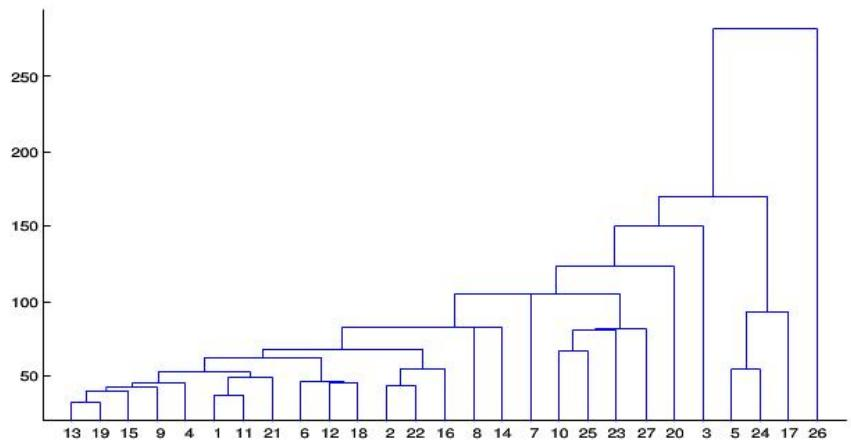
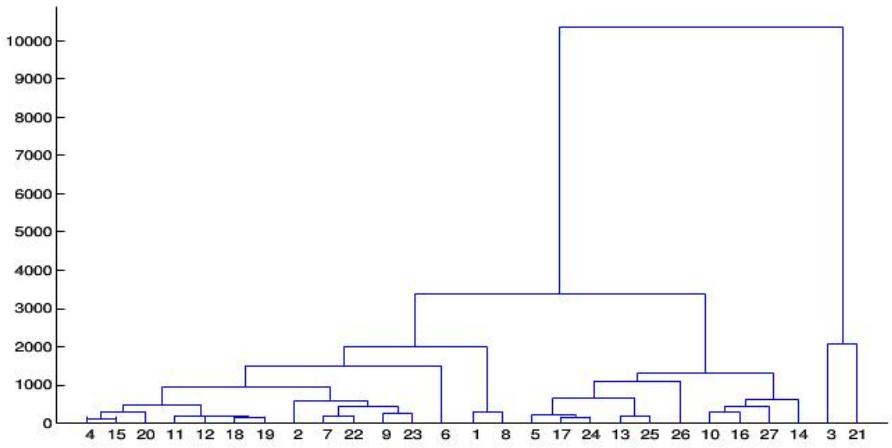

# 2012 高教社杯全国大学生数学建模竞赛

## 承诺书

我们仔细阅读了中国大学生数学建模竞赛的竞赛规则.

我们完全明白，在竞赛开始后参赛队员不能以任何方式（包括电话、电子邮件、网上咨询等）与队外的任何人（包括指导教师）研究、讨论与赛题有关的问题。

我们知道，抄袭别人的成果是违反竞赛规则的，如果引用别人的成果或其他公开的资料（包括网上查到的资料），必须按照规定的参考文献的表述方式在正文引用处和参考文献中明确列出。

我们郑重承诺，严格遵守竞赛规则，以保证竞赛的公正、公平性。如有违反竞赛规则的行为，我们将受到严肃处理。

我们参赛选择的题号是（从 A/B/C/D 中选择一项填写）：\_\_\_\_ A\_\_\_\_

我们的参赛报名号为（如果赛区设置报名号的话）：S55001

所属学校（请填写完整的全名）：\_\_\_\_ 郑州科技学院

参赛队员 (打印并签名)：1. 刘超

2. 赵芬芳

3. 尹峰

指导教师或指导教师组负责人 (打印并签名): 闫天增

日期：2012年9月10日

赛区评阅编号（由赛区组委会评阅前进行编号）：

# 2012 高教社杯全国大学生数学建模竞赛

## 编号专用页

赛区评阅编号（由赛区组委会评阅前进行编号）：

赛区评阅记录（可供赛区评阅时使用）：

<table><tr><td>评阅人</td><td></td><td></td><td></td><td></td><td></td><td></td><td></td><td></td><td></td><td></td></tr><tr><td>评分</td><td></td><td></td><td></td><td></td><td></td><td></td><td></td><td></td><td></td><td></td></tr><tr><td>备注</td><td></td><td></td><td></td><td></td><td></td><td></td><td></td><td></td><td></td><td></td></tr></table>

全国统一编号（由赛区组委会送交全国前编号）：

全国评阅编号（由全国组委会评阅前进行编号）：

# 葡萄酒的评价

## 摘要

确定葡萄酒质量时一般是通过聘请一批有资质的评酒员进行品评。酿酒葡萄的好坏与所酿葡萄酒的质量有直接的关系，葡萄酒和酿酒葡萄检测的理化指标会在一定程度上反映葡萄酒和葡萄的质量。本文通过对27种红葡萄酒和28种白葡萄的理化指标数据进行分析，采用显著性差异分析法、可靠度分析、因子分析法、相关系数分析、主成分分析法以及聚类分析法，借助统计软件SPSS和数学软件MATLAB，分析了两组评酒员的评价结果有无显著性差异和可信度，给出了酿酒葡萄与葡萄酒的理化指标之间的联系，建立了基于酿酒葡萄理化指标和葡萄酒质量的聚类分析模型确定了葡萄酒质量的影响因素，最后通过补充相关信息，建立基于分析模型确定了葡萄酒质量的影响因素。

针对问题一，首先对所有样品的10位评酒员打分的加权平均值进行显著性差异检验，显著性水平取为0.05，通过两组评酒员分别对红葡萄酒和白葡萄酒的显著性检验得出两组评酒员的评价结果有明显差异，最后运用可靠性分析，得到两组评酒员的评价结果的可靠度，结果表明第二组评酒员的评价结果更加可信。

针对问题二，以第二组评酒员的评价结果作为相应葡萄酒样品的质量指标，根据酿酒葡萄理化指标对比葡萄酒的质量利用 SPSS 软件进行聚类分析，得到酿酒葡萄的聚类树状图，从而将酿酒葡萄分成 5 个等级。

针对问题三，对葡萄酒的理化指标进行主成分分析，得到葡萄酒的主要成分，然后将每一个主成分与酿酒葡萄的理化指标进行多元回归分析，根据 SPSS 软件运行结果得出主成分与酿酒葡萄的理化指标的相关性。

针对问题四, 利用因子分析分别给出酿酒葡萄和葡萄酒的理化指标对葡萄酒质量的影响因素, 将附件 3 中 4 个表格里的每张样品中所含各种芳香物质求和作为样品中的芳香指标与葡萄酒的理化指标一并进行因子分析, 比较前后两者结果中由样品中的芳香指标导致的影响差异来确定不能只用葡萄和葡萄酒的理化指标来评价葡萄酒的质量, 还需要结合感官指标, 感官指标是评价葡萄酒质量的最终及最有效的指标。

关键词：理化指标 主成分分析法 可信度分析 显著差异 聚类分析 芳香物质

## 一、问题重述

确定葡萄酒质量时一般是通过聘请一批有资质的评酒员进行品评。每个评酒员在对葡萄酒进行品尝后对其分类指标打分，然后求和得到其总分，从而确定葡萄酒的质量。酿酒葡萄的好坏与所酿葡萄酒的质量有直接的关系，葡萄酒和酿酒葡萄检测的理化指标会在一定程度上反映葡萄酒和葡萄的质量。附件1给出了某一年份一些葡萄酒的评价结果，附件2和附件3分别给出了该年份这些葡萄酒的和酿酒葡萄的成分数据。请尝试建立数学模型讨论下列问题：

1. 分析附件1中两组评酒员的评价结果有无显著性差异，哪一组结果更可信？

2. 根据酿酒葡萄的理化指标和葡萄酒的质量对这些酿酒葡萄进行分级。

3. 分析酿酒葡萄与葡萄酒的理化指标

4. 分析酿酒葡萄和葡萄酒的理化指标对葡萄酒质量的影响, 并且能否葡萄和葡萄酒的理化指标来评价葡萄酒的质量?

## 二、问题分析

(1) 因为两组评酒师对同一样品评价的两个数据之间的差异可看成仅仅是由人的因素引起的, 这样各组中两个数据来比较就能排除种种其他因素, 而 4 组数据的分布都近似为正态分布, 从而够利用 SPSS 软件来测出这两组评酒师的评价结果是否有显著性差异。运用先求加权平均值再求平均值的方法得到最终结果, 再利用 SPSS 软件求得适用于态度、评价的信度分析的 Cronbach's $\alpha$ 系数, 来判断哪组可靠性更好

(2) 本问题先应用主成分分析法, 建立主成分分析的数学模型, 利用 MATLAB 处理数据最终得到相关系数矩阵的特征值、贡献率以及累计贡献率 (至少包含原来指标 $85 \%$ 以上的综合指标), 判断两种葡萄酒的各自的几种主要成分, 再利用主成分与变量的相关性强度分析出主成分的次序, 然后应用聚类分析法, 利用 MATLAB 创建出系统类聚树, 这样就可以从图中看出样品酿酒葡萄的等级

(3) 问题三, 首先通过附表二中的葡萄酒的主成分 y 与酿酒葡萄中的成分进行线性回归分析, 得到系数矩阵 R, 接着运用综合分析得到它们的潜在关系, 由红葡萄样品的各项主成分对红葡萄酒样品成分的线性关系, 可得到成分 $X_{12}, X_{23}$ , 即是总酚和干物质的量对葡萄酒有较大的影响, 而对于白葡萄酒, 也可进行上述的分析流程, 首先得到 4 组相关矩阵 y1, y2, y3, y4 (见附表), 故葡萄酒的酿酒葡萄与葡萄酒的理化指标之间的量化关系可通过上述表示. 然后, 进行对样本典型变量的上述分析, 得到白葡萄各理化指标对白葡萄酒各理化指标间的影响程度.

(4) 利用因子分析分别给出酿酒葡萄和葡萄酒的理化指标对葡萄酒质量的影响因素, 将附件 3 中 4 个表格里的每张样品中所含各种芳香物质求和作为样品中的芳香指标与葡萄酒的理化指标一并进行因子分析, 比较前后两者结果中由样品中的芳香指标导致的影响差异来确定不能只用酿酒葡萄和葡萄酒的理化指标来评价葡萄酒的质量还需要结合感官指标, 感官指标是评价葡萄酒质量的最终及最有效的指标。

## 三、模型假设

1. 假设若评酒员对各个指标的评价数据中有可能出现错误的数据，将此数据换成0.

2. 因为对这四种样品评价数据中，大部分的数据都接近各自的平均数，不会太高也不会是太低，所以四种样品的各自数据都可以看作是来自正态或近似正态总体

3. 假设问题一中评酒师的评价结果的误差仅与人的因素有关

4 假设酿酒葡萄以及葡萄酒中的理化指标中的蓝色二级指标对酿酒葡萄的分级和葡萄酒质量影响不大

5 酿酒方式和酿酒过程对葡萄酒的质量无影响

## 四、符号说明

1. $H_{0}: \mathrm{t}$ 检验的原假设

2. $H_{1}: \mathrm{t}$ 检验的择备假设

3. $\overline{X_{1}}$ , $\overline{X_{2}}$ ：分别为两样本平均数；

4. $\sigma_{x_{1}}^{2}$ , $\sigma_{x_{2}}^{2}$ : 分别为两样本方差;

5. $\gamma$ 为相关样本的相关系数。

6. n: t 检验中的自由度

7. F: 酿酒葡萄的理化指标的主成分

8. $\alpha$ ：检验水平，值为0.05

9. K: 为酒样的总数

10. $\sigma_{i}^{2}$ ：为第i种酒样品得分的方差

11. $\sigma_{T}^{2}$ ：为全酒样总得分的方差。

12: $\mu$ ：为随机误差项。

13. ${\mathrm{X}}_{\mathrm{{ki}}}$ : 葡萄的理化指标变量

14. $\mathrm{B}_{\mathrm{k}}$ 未知参数

15. $\hat{Y}_{i}$ : 解释变量估计值

16. $Y_{i}$ : 实际观测值

17. Y: 变量

18. $e_i$ ：残差

## 五、模型的建立与求解

## 5.1 问题一模型的建立和求解

## 5.1.1. 评价结果的显著性差异分析

（1）应用原理：配对 t 检验，它适用于配对设计的计量资料，在相同的条件下作对比试验，得到一批成对观察值，然后分析观察数据作出推断，或者是检验两个样本平均数与其各自所代表的总体的差异是否显著。配对 t 检验又分为两种情况，一是相关样本平均数差异的显著性检验，用于检验匹配而成的两组被试获得的数据或同组被试在不同条件下所获得的数据的差异性，这两种情况组成的样本即为相关样本。二是独立样本平均数的显著性检验。各实验处理组之间毫无相关存在，即为独立样本。该检验用于检验两组非相关样本被试所获得的数据的差异性 $^{[1]}$ 。

配对设计资料具有一一对应的特点，研究者关心的变量是对子的效应差值，而不是各自的效应值。如果两处理因素的效应无差别，理论上差值 d 的均数应为 0，因此，可将该检验理解为样本均数所对应的总体 $\mu d$ 与总体均数 0 的比较。

其应用条件是差值 d 变量服从正态分布。t 检验步骤如下：

建立原假设 $H_{0}: \mu_{1} = \mu_{2}$ 择备假设 $H_{1}: \mu_{1} \neq \mu_{2}$ 相关样本的 $t$ 检验公式为：

$$
t = \frac {\overline {{X _ {1}}} - \overline {{X _ {2}}}}{\sqrt {\frac {\sigma_ {x _ {1}} ^ {2} + \sigma_ {x _ {2}} ^ {2} - 2 \gamma \sigma_ {x _ {1}} \sigma_ {x _ {2}}}{n - 1}}}
$$

在这里， $\overline{X_{1}}$ ， $\overline{X_{2}}$ 分别为两样本平均数； $\sigma_{X_{1}}^{2}$ ， $\sigma_{X_{2}}^{2}$ 分别为两样本方差； $\gamma$ 为相关样本的相关系数。根据自由度 n，查 t 值表求 t 的拒绝域。若实际计算出来的结果不在拒绝域内，则接受，测量结果无显著性差异，反之，则有显著性差异。

(2) 从应用原理看本题中比较符合第一种情况, 又因为本问题的数据是成对的, 是两组分别对相同的样品测出的数据, 我们看到同一对两个数据之间的差异可看成仅仅是由人的因素引起的, 这样局限于各对中两个数据来比较就能排除种种其他因素, 从而能比较这两组数据中的各自的测量结果是否有显著性差异。

（3）应用先求和后平均的算法作出对各个样品的总的指标，如图表1，按照表1中的数据应用SPSS软件进行 $t$ 检验（检验水平 $\alpha = 0.05$ ）。

表 1: 样品平均值

<table><tr><td></td><td>一红</td><td>二红</td><td>一白</td><td>二白</td></tr><tr><td>样品1</td><td>62.7</td><td>68.1</td><td>82</td><td>77.9</td></tr><tr><td>样品2</td><td>80.3</td><td>74</td><td>74.2</td><td>75.8</td></tr><tr><td>样品3</td><td>80.4</td><td>74.6</td><td>85.3</td><td>75.6</td></tr><tr><td>样品4</td><td>68.6</td><td>71.2</td><td>79.4</td><td>76.9</td></tr><tr><td>样品5</td><td>73.3</td><td>72.1</td><td>71</td><td>81.5</td></tr><tr><td>样品6</td><td>72.2</td><td>66.3</td><td>68.4</td><td>75.5</td></tr><tr><td>样品7</td><td>71.5</td><td>65.3</td><td>77.5</td><td>74.2</td></tr><tr><td>样品8</td><td>72.3</td><td>66</td><td>71.4</td><td>72.3</td></tr><tr><td>样品9</td><td>81.5</td><td>78.2</td><td>72.9</td><td>80.4</td></tr><tr><td>样品10</td><td>74.2</td><td>68.8</td><td>74.3</td><td>79.8</td></tr><tr><td>样品11</td><td>70.1</td><td>61.6</td><td>72.3</td><td>71.4</td></tr><tr><td>样品12</td><td>53.9</td><td>68.3</td><td>63.3</td><td>72.4</td></tr><tr><td>样品13</td><td>74.6</td><td>68.8</td><td>65.9</td><td>73.9</td></tr><tr><td>样品14</td><td>73</td><td>72.6</td><td>72</td><td>77.1</td></tr><tr><td>样品15</td><td>58.7</td><td>65.7</td><td>72.4</td><td>78.4</td></tr><tr><td>样品16</td><td>74.9</td><td>69.9</td><td>74</td><td>67.3</td></tr><tr><td>样品17</td><td>79.3</td><td>74.5</td><td>78.8</td><td>80.3</td></tr><tr><td>样品18</td><td>59.9</td><td>65.4</td><td>73.1</td><td>76.7</td></tr><tr><td>样品19</td><td>78.6</td><td>72.6</td><td>72.2</td><td>76.4</td></tr><tr><td>样品20</td><td>78.6</td><td>75.8</td><td>77.8</td><td>76.6</td></tr><tr><td>样品21</td><td>77.1</td><td>72.2</td><td>76.4</td><td>79.2</td></tr><tr><td>样品22</td><td>77.2</td><td>71.6</td><td>71</td><td>79.4</td></tr><tr><td>样品23</td><td>85.6</td><td>77.1</td><td>75.9</td><td>77.4</td></tr><tr><td>样品24</td><td>78</td><td>71.5</td><td>73.3</td><td>76.1</td></tr><tr><td>样品25</td><td>69.2</td><td>68.2</td><td>77.1</td><td>79.5</td></tr><tr><td>样品26</td><td>73.8</td><td>72</td><td>81.3</td><td>74.3</td></tr><tr><td>样品27</td><td>73</td><td>71.5</td><td>64.8</td><td>77</td></tr></table>

软件应用的过程为：打开 SPSS 软件，选择“分析栏”下的“比较均值”一栏得出运

行结果:

<table><tr><td colspan="2"></td><td>t</td><td>n</td><td>Sig.(双侧)</td></tr><tr><td>对1</td><td>一红-二红</td><td>2.390</td><td>26</td><td>.024</td></tr><tr><td>对2</td><td>一白-二白</td><td>-2.127</td><td>26</td><td>.043</td></tr></table>

结论分析：本题中的自由度 $n = 27 - 1 = 26$ ， $t_{\alpha /2}(26) = 2.0555$ ，即知拒绝域为 $\left|t\right|\geq 2.0555$ ，由上表可知两组评酒师对红、白葡萄酒的评价结果的检验值

$\left|t_{1}\right|=2.390>2.0555,\quad\left|t_{2}\right|=2.127>2.0555$ ，因为两个检验值均在拒绝域，所以两组评酒师的评价结果有显著性差异

## 5.1.2. 评价结果的可信度分析

模型准备；信度主要分为四大类：重测信度(Test-retest Reliability)、复本信度(Alternate-form Reliability)、内部一致性信度(Internal Consistency Reliability)、评分者信度(Scorer Reliability)。本文采用Cronbach's $\alpha$ 信度系数内部一致性信度检验，Cronbach's $\alpha$ 系数是Cronbach于1951年创立的，用于评价问卷的内部一致性。 $\alpha$ 系数取值在0到1之间， $\alpha$ 系数越高，信度越高，评价的内部一致性越好。Cronbach's $\alpha$ 系数不仅适用于两级记分的问卷，还适用于多级计分的问卷。

Cronbach $\alpha$ 信度系数是目前最常用的信度系数[2]，其计算公式为：

$$
\alpha^ {\prime} = \frac {K}{K - 1} \left(1 - \frac {\sum_ {i = 1} ^ {k} \sigma_ {i} ^ {2}}{\sigma_ {T} ^ {2}}\right)
$$

其中，K 为酒样的总数， $\sigma_{i}^{2}$ 为第 i 种酒样品得分的方差， $\sigma_{T}^{2}$ 为全酒样总得分的方差。从公式中可以看出， $\alpha$ 系数评价的是评酒师各酒样得分间的一致性，属于内在一致性 X 信度系数。这种方法适用于态度、评价的信度分析。 $\alpha$ 系数有以下性质：

(1) $\alpha$ 系数是所有可能的分半信度的平均值;

(2) $\alpha$ 系数是估计信度的最低限度;

（3）当问卷计分为二分名义变量时，即答案为0或1， $\alpha$ 系数与KR20值相同，即库德-理查森信度公式是克隆巴赫的 $\alpha$ 系数的一个特例。低信度： $\alpha<0.35$ ，中信度： $0.35<\alpha<0.70$ ，高信度： $0.70<\alpha$ 。一般地，评价的 $\alpha$ 系数在0.8以上该评价才具有使用价值。Cronbach's的 $\alpha$ 值皆达0.85以上，表明评价信度良好。

对附表 1 中两组品酒师对每一种酒样样品的评价结果求加权平均值，然后对 10 位评酒师对该酒样品的得分求平均值作为该酒样品的最终得分。如表 2

表 2: 酒样品的最终得分

<table><tr><td>样品1</td><td>1红</td><td>2红</td><td>1白</td><td>2白</td></tr><tr><td>样品2</td><td>7.79</td><td>8.379</td><td>1.255</td><td>9.785</td></tr><tr><td>样品3</td><td>10.201</td><td>9.352</td><td>9.17</td><td>9.503</td></tr><tr><td>样品4</td><td>10.074</td><td>9.355</td><td>10.427</td><td>9.564</td></tr><tr><td>样品5</td><td>8.57</td><td>8.911</td><td>9.886</td><td>9.695</td></tr><tr><td>样品6</td><td>9.071</td><td>9.017</td><td>9.005</td><td>10.236</td></tr><tr><td>样品7</td><td>8.985</td><td>8.289</td><td>8.6</td><td>9.492</td></tr><tr><td>样品8</td><td>8.897</td><td>8.229</td><td>9.69</td><td>9.237</td></tr><tr><td>样品9</td><td>9.003</td><td>8.19</td><td>8.918</td><td>9.025</td></tr><tr><td>样品10</td><td>10.138</td><td>9.722</td><td>8.928</td><td>10.02</td></tr><tr><td>样品11</td><td>9.204</td><td>8.546</td><td>9.322</td><td>10.058</td></tr><tr><td>样品12</td><td>8.662</td><td>7.603</td><td>9.097</td><td>8.942</td></tr><tr><td>样品13</td><td>6.984</td><td>8.622</td><td>7.987</td><td>9.092</td></tr><tr><td>样品14</td><td>9.395</td><td>8.497</td><td>8.381</td><td>9.331</td></tr><tr><td>样品15</td><td>9.204</td><td>9.118</td><td>9.014</td><td>9.65</td></tr><tr><td>样品16</td><td>9.348</td><td>8.798</td><td>9.3</td><td>8.503</td></tr><tr><td>样品17</td><td>9.901</td><td>9.216</td><td>9.809</td><td>10.348</td></tr><tr><td>样品18</td><td>7.668</td><td>8.292</td><td>9.084</td><td>9.682</td></tr><tr><td>样品19</td><td>9.753</td><td>9.112</td><td>8.999</td><td>9.604</td></tr><tr><td>样品20</td><td>9.817</td><td>9.571</td><td>9.72</td><td>9.582</td></tr><tr><td>样品21</td><td>9.669</td><td>9.078</td><td>9.65</td><td>9.971</td></tr><tr><td>样品22</td><td>9.529</td><td>9.017</td><td>8.725</td><td>9.915</td></tr><tr><td>样品23</td><td>10.716</td><td>9.521</td><td>9.439</td><td>9.599</td></tr><tr><td>样品24</td><td>9.706</td><td>8.923</td><td>9.201</td><td>9.591</td></tr><tr><td>样品25</td><td>8.571</td><td>8.445</td><td>9.49</td><td>10.02</td></tr><tr><td>样品26</td><td>7.309</td><td>8.188</td><td>9.077</td><td>9.802</td></tr><tr><td>样品27</td><td>9.139</td><td>8.879</td><td>9.949</td><td>9.299</td></tr><tr><td>样品28</td><td>9.135</td><td>9.031</td><td>8.234</td><td>9.554</td></tr></table>

在 SPSS 中用进行测验信度分析的模块 Scale 下的 Reliability Analysis Cronbach Alpha, Analyze-->Scale-->Reliability analysis, statistics 选 descriptives for 下 Scale if item deleted。对酒样品的最终得分进行信度分析，可以得到如下结果：

<table><tr><td colspan="3">第一组可靠性统计量</td><td colspan="3">第二组可靠性统计量</td></tr><tr><td>Cronbach&#x27;s Alpha</td><td>基于标准化项的Cronbachs Alpha</td><td>项数</td><td>Cronbach&#x27;s Alpha</td><td>基于标准化项的ronbachs Alpha</td><td>项数</td></tr><tr><td>.806</td><td>.808</td><td>2</td><td>.976</td><td>.977</td><td>2</td></tr></table>

由上述结果表明：第一组品酒师的评价结果的 $\alpha$ 系数和Cronbach's $\alpha$ 值在0.80以上、0.85以下，仅有使用价值；而第二组品酒师的评价结果的 $\alpha$ 系数和Cronbach's $\alpha$ 值在0.85以上，所以第二组品酒师的评价结果更加可信。

## 5.2 问题二模型的建立和求解

## 5.2.1 分析酿酒葡萄的理化指标及葡萄酒的质量

(1) 应用原理: 用主成分分析法分析酿酒葡萄的理化指标及葡萄酒的质量主成分分析法通过研究指标体系的内在结构关系, 从而将多个指标转化为几个相互独立且包含原来指标大部分信息 (80%或 85%以上) 的综合指标。

(2) 选取主成分的理论分析

因为在所有的线性组合中所选取的 $F_{1}$ 应该是方差最大的，故称 $F_{1}$ 为第一主成分。

如果第一主成分不足以代表原来 $p$ 个变量的信息, 再考虑选取 $F_{2}$ 即第二个线性组合, 为了有效地反映原来信息, $F_{1}$ 已有的信息就不需要再出现在 $F_{2}$ 中, 用数学语言表达就是要求 $Cov(F_{1}, F_{2}) = 0$ , 称 $F_{2}$ 为第二主成分, 依此类推可以构造出第三、四……第 $p$ 个主成分。

(3) 主成分分析的数学模型

对于一个样本资料，观测 $p$ 个变量 $x_{1}, x_{2}, \dots, x_{p}$ ， $n$ 个样品的数据资料阵为：

$$
X = \left( \begin{array}{c c c c} x _ {1 1} & x _ {1 2} & \dots & x _ {1 p} \\ x _ {2 1} & x _ {2 2} & \dots & x _ {2 p} \\ \vdots & \vdots & \vdots & \vdots \\ x _ {n 1} & x _ {n 2} & \dots & x _ {n p} \end{array} \right) = (x _ {1}, x _ {2}, \dots x _ {p})
$$

其中： $x_{j} = \left( \begin{array}{c}x_{1j}\\ x_{2j}\\ \vdots \\ x_{nj} \end{array} \right),\qquad j = 1,2,\dots p$

主成分分析就是将 $p$ 个观测变量综合成为 $p$ 个新的变量（综合变量）[3]，即

$$
\left\{ \begin{array}{l} F _ {1} = a _ {1 1} x _ {1} + a _ {1 2} x _ {2} + \dots + a _ {1 p} x _ {p} \\ F _ {2} = a _ {2 1} x _ {1} + a _ {2 2} x _ {2} + \dots + a _ {2 p} x _ {p} \\ \dots \\ F _ {p} = a _ {p 1} x _ {1} + a _ {p 2} x _ {2} + \dots + a _ {p p} x _ {p} \end{array} \right.
$$

简写为:

$$
F _ {j} = \alpha_ {j 1} x _ {1} + \alpha_ {j 2} x _ {2} + \dots + \alpha_ {j p} x _ {p}, \quad j = 1, 2, \dots , p
$$

要求模型满足以下条件:

① $F_{i},F_{j}$ 互不相关（ $i\neq j,\quad i,j=1,2,\cdots,p$ ）；  
② $F_{1}$ 的方差大于 $F_{2}$ 的方差大于 $F_{3}$ 的方差，依次类推；  
③ $a_{k1}^{2}+a_{k2}^{2}+\cdots+a_{kp}^{2}=1$ $k=1,2,\cdots p.$ ;

于是称 $F_{1}$ 为第一主成分， $F_{2}$ 为第二主成分，依此类推，有第 $p$ 个主成分。主成分又叫主分量。这里 $a_{ij}$ 我们称为主成分系数。上述模型可用矩阵表示为： $F = AX$ ，其中

$$
F = \left( \begin{array}{c} F _ {1} \\ F _ {2} \\ \vdots \\ F _ {p} \end{array} \right) \quad X = \left( \begin{array}{c} x _ {1} \\ x _ {2} \\ \vdots \\ x _ {p} \end{array} \right) \quad A = \left( \begin{array}{c c c c} a _ {1 1} & a _ {1 2} & \dots & a _ {1 p} \\ a _ {2 1} & a _ {2 2} & \dots & a _ {2 p} \\ \vdots & \vdots & \vdots & \vdots \\ a _ {p 1} & a _ {p 2} & \dots & a _ {p p} \end{array} \right) = \left( \begin{array}{c} a _ {1} \\ a _ {2} \\ \vdots \\ a _ {p} \end{array} \right),
$$

A 称为主成分系数矩阵。

## (4) 分析过程

首先对红葡萄酒进行分析

①. 将附表 2 中的原数据做平均值处理，  
②. 然后作标准化处理，  
③. 然后将它们代入相关系数公式计算，得到相关系数矩阵，  
④. 求相关系数矩阵计算特征值，以及各个主成分的贡献率与累计贡献率，结果如表3

表3

<table><tr><td>成分</td><td>特征值</td><td>贡献率(%)</td><td>累计贡献率(%)</td></tr><tr><td>1</td><td>5.3259</td><td>0.5918</td><td>0.5918</td></tr><tr><td>2</td><td>1.6622</td><td>0.1847</td><td>0.7765</td></tr><tr><td>3</td><td>0.7598</td><td>0.0844</td><td>0.8609</td></tr><tr><td>4</td><td>0.7056</td><td>0.0784</td><td>0.9393</td></tr><tr><td>5</td><td>0.3036</td><td>0.0337</td><td>0.9730</td></tr><tr><td>6</td><td>0.1438</td><td>0.0160</td><td>0.9890</td></tr><tr><td>7</td><td>0.0399</td><td>0.0044</td><td>0.9934</td></tr><tr><td>8</td><td>0.0306</td><td>0.0034</td><td>0.9968</td></tr><tr><td>9</td><td>0.0287</td><td>0.0032</td><td>1.0000</td></tr></table>

其中：1. 花色苷(mg/L) 2. 单宁(mmol/L) 3. 总酚(mmol/L) 4. 酒总黄酮(mmol/L) 5. 白藜芦醇(mg/L) 6. DPPH 半抑制体积 (IV50) 1/IV50(uL) 7. 色泽 L\*(D65)

8. 色泽 a\*(D65) 9. 色泽 b\*(D65)

⑤. 根据主成分分析规定的特征值方差累计贡献率要高于 85%，前 4 个的累积贡献率高达 93.93%，所以取前 4 个即可  
⑥. 对前 4 个主成分的构成主成分分析模型, 应用 MATLAB 软件求出 F1、F2、F3、F4 的数学矩阵如表 4 从而得出主要成分的次序

表 4: 主成分的数学矩阵

<table><tr><td></td><td>F1</td><td>F2</td><td>F3</td><td>F4</td></tr><tr><td>酒品种1</td><td>-4.0321</td><td>3.6196</td><td>0.8374</td><td>0.1456</td></tr><tr><td>酒品种2</td><td>-3.8866</td><td>0.0578</td><td>-0.4444</td><td>0.3468</td></tr><tr><td>酒品种3</td><td>2.8865</td><td>-0.6357</td><td>-0.5275</td><td>0.3888</td></tr><tr><td>酒品种4</td><td>0.6710</td><td>-0.7083</td><td>-0.0146</td><td>0.4963</td></tr><tr><td>酒品种5</td><td>0.3150</td><td>-0.8298</td><td>0.5800</td><td>0.1092</td></tr><tr><td>酒品种6</td><td>0.6448</td><td>-0.4866</td><td>-0.2724</td><td>-0.5004</td></tr><tr><td>酒品种7</td><td>2.2083</td><td>-0.4435</td><td>-1.0664</td><td>0.5544</td></tr><tr><td>酒品种8</td><td>-3.6148</td><td>2.0198</td><td>0.7447</td><td>1.2835</td></tr><tr><td>酒品种9</td><td>-3.5577</td><td>-0.1010</td><td>-0.5353</td><td>0.3662</td></tr><tr><td>酒品种10</td><td>1.6422</td><td>0.8049</td><td>1.3846</td><td>-0.8820</td></tr><tr><td>酒品种11</td><td>2.6053</td><td>2.4583</td><td>-2.2843</td><td>-0.9982</td></tr><tr><td>酒品种12</td><td>1.4885</td><td>-0.4968</td><td>-0.9500</td><td>0.5251</td></tr><tr><td>酒品种13</td><td>1.0034</td><td>0.1632</td><td>0.5556</td><td>0.5574</td></tr><tr><td>酒品种14</td><td>0.7095</td><td>-1.1133</td><td>-0.4715</td><td>1.6228</td></tr><tr><td>酒品种15</td><td>2.4298</td><td>0.3334</td><td>0.5700</td><td>0.4333</td></tr><tr><td>酒品种16</td><td>1.9190</td><td>0.3081</td><td>0.7170</td><td>0.3956</td></tr><tr><td>酒品种17</td><td>-0.2961</td><td>-0.2239</td><td>-0.2811</td><td>0.6586</td></tr><tr><td>酒品种18</td><td>1.9458</td><td>-0.0004</td><td>-0.1128</td><td>0.0766</td></tr><tr><td>酒品种19</td><td>0.6641</td><td>-1.4231</td><td>1.0296</td><td>-1.2717</td></tr><tr><td>酒品种20</td><td>1.6656</td><td>2.0066</td><td>-1.2740</td><td>-0.9527</td></tr><tr><td>酒品种21</td><td>-1.9686</td><td>-2.0953</td><td>-0.7128</td><td>-0.1326</td></tr><tr><td>酒品种22</td><td>-0.1253</td><td>-0.6373</td><td>-0.1735</td><td>0.0327</td></tr><tr><td>酒品种23</td><td>-4.9984</td><td>-1.7587</td><td>-0.3558</td><td>-2.0311</td></tr><tr><td>酒品种24</td><td>0.5801</td><td>-0.5316</td><td>1.0770</td><td>-0.8318</td></tr><tr><td>酒品种25</td><td>1.5238</td><td>0.3538</td><td>1.4223</td><td>-0.3126</td></tr><tr><td>酒品种26</td><td>1.9771</td><td>-1.0201</td><td>0.3179</td><td>1.0122</td></tr><tr><td>酒品种27</td><td>1.3729</td><td>0.3801</td><td>0.2403</td><td>-1.0922</td></tr></table>

(5) 结果分析:

①. 第一主成分 $F_{1}$ 与 $x_{1}$ ， $x_{5}$ ， $x_{6}$ ， $x_{7}$ ， $x_{9}$ 呈显出较强的正相关，与 $x_{3}$ 呈显出较强的负相关，而这几个变量则综合反映了酒的质量状况，因此可以认为第一主成分 z1 是代表花色苷；  
②. 第二主成分 $F_{2}$ 与 $x_{2}$ ， $x_{4}$ ， $x_{5}$ 呈显出较强的正相关，与 $x_{1}$ 呈显出较强的负相关，因此可以认为第二主成分 $F_{2}$ 代表了总酚；  
③. 第三主成分 $F_{3}$ ，与 x 呈显出的正相关程度最高，其次是 $x_{6}$ ，而与 $x_{7}$ 呈负相关，因此可以认为第三主成分在一定程度上代表了单宁；  
④. 第四成分 $F_{4}$ ，与酒种 $x_{1}$ 呈显现出正相关性程度最大，故我们可以认为第三种成分是酒总黄酮；

显然，用 4 个主成分 $F_{1}$ , $F_{2}$ , $F_{3}$ , $F_{4}$ 代替原来 9 个变量 $(x_{1}, x_{2}, \cdots, x_{9})$ ，描述红葡萄酒的主要成分可以使问题更进一步简化、明了。

{6}. 再对白葡萄酒进行分析, 分析过程同上, 得出结果: 白葡萄酒的主成分 $F_{1}, F_{2}, F_{3}, F_{4}$ 排序为色泽 L, 单宁, 酒总黄酮, 总酚

## 5.2.2. 根据葡萄酒的质量对酿酒葡萄进行分级

## (1) 模型建立: 应用聚类分析法进行分析

系统聚类法是聚类分析中应用最为广泛的一种方法。它的基本原理是：首先将一定数量的样品（或指标）各自看成一类，然后根据样品（或指标）的亲疏程度，将亲疏程度最高的两类合并，如此重复进行，直到所有的样品都合成一类。衡量亲疏程度的指标有两类：距离、相似系数。常用距离有欧氏距离、标准化欧氏距离、马氏距离、Minkowsk 距离等，常用的聚类方法主要有：最短距离法、最长距离法、中间距离法、重心法、平方和递增法等等，本文应用的是最短距离法中的欧式距离求得的 $^{[4]}$ 。

## (2) 模型建立

假设有 $m$ 个聚类的对象，每一个聚类对象都有 $n$ 个要素构成。它们所对应的要素数据可用表5给出。

表 5: 聚类对象与要素数据

<table><tr><td rowspan="2">聚类对象</td><td colspan="6">要素</td></tr><tr><td colspan="6"></td></tr><tr><td>1</td><td> $x_{11}$ </td><td> $x_{12}$ </td><td> $\cdots$ </td><td> $x_{1j}$ </td><td> $\cdots$ </td><td> $x_{1n}$ </td></tr><tr><td>2</td><td> $x_{21}$ </td><td> $x_{22}$ </td><td> $\cdots$ </td><td> $x_{2j}$ </td><td> $\cdots$ </td><td> $x_{2n}$ </td></tr><tr><td> $\vdots$ </td><td> $\vdots$ </td><td> $\vdots$ </td><td></td><td> $\vdots$ </td><td></td><td> $\vdots$ </td></tr><tr><td>i</td><td> $x_{i1}$ </td><td> $x_{i2}$ </td><td> $\cdots$ </td><td> $x_{ij}$ </td><td> $\cdots$ </td><td> $x_{in}$ </td></tr><tr><td> $\vdots$ </td><td> $\vdots$ </td><td> $\vdots$ </td><td></td><td> $\vdots$ </td><td></td><td> $\vdots$ </td></tr><tr><td>m</td><td> $x_{m1}$ </td><td> $x_{m2}$ </td><td> $\cdots$ </td><td> $x_{mj}$ </td><td> $\cdots$ </td><td> $x_{mn}$ </td></tr></table>

在本题中，用到的聚类要素的数据处理（转换）方法：将所给数据统计软件进行极差的标准化，即

$$
x _ {i j} ^ {\prime} = \frac {x _ {i j} - \min _ {1 \leq i \leq n} \left\{x _ {i j} \right\}}{\max _ {1 \leq i \leq n} \left\{x _ {i j} \right\} - \min _ {1 \leq i \leq n} \left\{x _ {i j} \right\}}
$$

经过这种标准化所得的新数据, 各要素的极大值为 1 , 极小值为 0 , 其余的数值均在 0 与 1 之间。然后用最短距离法得出相应的结果, 假设已经得到样本点之间的距离 $y$ , 可以用 linkage 函数创建出系统聚类树, 如图 1、2:

图 1: 红葡萄的等级  


<details>
<summary>dendrogram</summary>

| Item | Cluster Distance |
| --- | --- |
| 13 | ~30 |
| 19 | ~40 |
| 15 | ~42 |
| 9 | ~45 |
| 4 | ~52 |
| 1 | ~62 |
| 11 | ~50 |
| 21 | ~68 |
| 6 | ~45 |
| 12 | ~45 |
| 18 | ~82 |
| 2 | ~42 |
| 22 | ~55 |
| 16 | ~55 |
| 8 | ~82 |
| 14 | ~82 |
| 7 | ~105 |
| 10 | ~68 |
| 25 | ~80 |
| 23 | ~80 |
| 27 | ~125 |
| 20 | ~150 |
| 3 | ~170 |
| 5 | ~280 |
| 24 | ~92 |
| 17 | ~55 |
| 26 | ~280 |
</details>

图 2. 白葡萄的等级  


<details>
<summary>dendrogram</summary>

| Item | Cluster Group |
| --- | --- |
| 4 | Low |
| 15 | Low |
| 20 | Low |
| 11 | Low |
| 12 | Low |
| 18 | Low |
| 19 | Low |
| 2 | Low |
| 7 | Low |
| 22 | Low |
| 9 | Low |
| 23 | Low |
| 6 | Low |
| 1 | Low |
| 8 | Low |
| 5 | Low |
| 17 | Low |
| 24 | Low |
| 13 | Low |
| 25 | Low |
| 26 | Low |
| 10 | Low |
| 16 | Low |
| 27 | Low |
| 14 | Low |
| 3 | High |
| 21 | High |
</details>

由上图可以看出酒的种类和等级如表 6

表 6: 不同样品的葡萄级别

<table><tr><td colspan="2">红葡萄</td><td colspan="2">白葡萄</td></tr><tr><td>样品序号</td><td>级别</td><td>样品序号</td><td>级别</td></tr><tr><td>1</td><td>2</td><td>1</td><td>2</td></tr><tr><td>2</td><td>2</td><td>2</td><td>2</td></tr><tr><td>3</td><td>3</td><td>3</td><td>4</td></tr><tr><td>4</td><td>2</td><td>4</td><td>2</td></tr><tr><td>5</td><td>4</td><td>5</td><td>1</td></tr><tr><td>6</td><td>2</td><td>6</td><td>3</td></tr><tr><td>7</td><td>2</td><td>7</td><td>2</td></tr><tr><td>8</td><td>2</td><td>8</td><td>2</td></tr><tr><td>9</td><td>2</td><td>9</td><td>2</td></tr><tr><td>10</td><td>2</td><td>10</td><td>1</td></tr><tr><td>11</td><td>2</td><td>11</td><td>2</td></tr><tr><td>12</td><td>2</td><td>12</td><td>2</td></tr><tr><td>13</td><td>2</td><td>13</td><td>1</td></tr><tr><td>14</td><td>2</td><td>14</td><td>1</td></tr><tr><td>15</td><td>2</td><td>15</td><td>2</td></tr><tr><td>16</td><td>2</td><td>16</td><td>1</td></tr><tr><td>17</td><td>4</td><td>17</td><td>1</td></tr><tr><td>18</td><td>2</td><td>18</td><td>2</td></tr><tr><td>19</td><td>2</td><td>19</td><td>2</td></tr><tr><td>20</td><td>1</td><td>20</td><td>2</td></tr><tr><td>21</td><td>2</td><td>21</td><td>5</td></tr><tr><td>22</td><td>2</td><td>22</td><td>2</td></tr><tr><td>23</td><td>2</td><td>23</td><td>2</td></tr><tr><td>24</td><td>4</td><td>24</td><td>1</td></tr><tr><td>25</td><td>2</td><td>25</td><td>1</td></tr><tr><td>26</td><td>5</td><td>26</td><td>1</td></tr><tr><td>27</td><td>2</td><td>27</td><td>1</td></tr><tr><td></td><td></td><td></td><td></td></tr></table>

## 5.3 问题三模型的建立和求解

## 5.3.1. 数据的归一化处理

附件中检测表所给的四项指标值具有不同的值域和限值，要得到综合的评价因子，首先必须通过一定方法对数据进行归一化处理。所以我们首先对葡萄的成分X与葡萄酒的某个成分y进行归一化设计，利用线性回归的理念得到葡萄酒的四种主要成分 $Y_{1}, Y_{2}, Y_{3}, Y_{4}$ 与葡萄的成分X的线性关系，又由关系的正负相关性得到它们之间内在关系。

## 5.3.2. 模型建立

假定被解释变量 $Y$ 与多个解释变量 $X_{1}, X_{2}, \dots, X_{k}$ 之间具有线性关系，是解释变量的多元线性函数，称为多元线性回归模型。即

$$
Y = \beta_ {0} + \beta_ {1} X _ {1} + \beta_ {2} X _ {2} + \dots + \beta_ {k} X _ {k} + \mu
$$

其中 $Y$ 为被解释变量， $X_{j}(j=1,2,\cdots,k)$ 为 $k$ 个解释变量， $\beta_{j}(j=0,1,2,\cdots,k)$ 为 $k+1$ 个未知参数， $\mu$ 为随机误差项。被解释变量 $Y$ 的期望值与解释变量 $X_{1}, X_{2}, \cdots, X_{k}$ 的线性方程为：

$$
E (Y) = \beta_ {0} + \beta_ {1} X _ {1} + \beta_ {2} X _ {2} + \dots + \beta_ {k} X _ {k}
$$

称为多元总体线性回归方程，简称总体回归方程 $^{[5]}$ 。

对于 $n$ 组观测值 $Y_{i}, X_{1i}, X_{2i}, \cdots, X_{ki} (i = 1, 2, \cdots, n)$ ，其方程组形式为：

$$
Y _ {i} = \beta_ {0} + \beta_ {1} X _ {1 i} + \beta_ {2} X _ {2 i} + \dots + \beta_ {k} X _ {k i} + \mu_ {i}, (i = 1, 2, \dots , n)
$$

即

$$
\left\{ \begin{array}{l} Y _ {1} = \beta_ {0} + \beta_ {1} X _ {1 1} + \beta_ {2} X _ {2 1} + \dots + \beta_ {k} X _ {k 1} + \mu_ {1} \\ Y _ {2} = \beta_ {0} + \beta_ {1} X _ {1 2} + \beta_ {2} X _ {2 2} + \dots + \beta_ {k} X _ {k 2} + \mu_ {2} \\ \dots \dots \\ Y _ {n} = \beta_ {0} + \beta_ {1} X _ {1 n} + \beta_ {2} X _ {2 n} + \dots + \beta_ {k} X _ {k n} + \mu_ {n} \end{array} \right.
$$

多元线性回归模型包含多个解释变量，多个解释变量同时对被解释变量 $Y$ 发生作用，若要考察其中一个解释变量对 $Y$ 的影响就必须假设其它解释变量保持不变来进行分析。因此多元线性回归模型中的回归系数为偏回归系数，即反映了当模型中的其它变量不变时，其中一个解释变量对因变量 $Y$ 的均值的影响

## 5.3.3 结果解释

由样本红葡萄酒的各项主成分对红葡萄成分的线形关系, 可得到, 成分 $X_{12}, X_{23}$ , 即是总酚和干物质的量对葡萄酒有较大的影响, 而对于白葡萄酒, 也可进行上述的分析流程, 首先得到四组相关矩阵 $Y_{1}, Y_{2}, Y_{3}, Y_{4}$ (见附表), 故葡萄酒的酿酒葡萄与葡萄酒的理化指标之间的量化关系可通过上述表示. 然后, 进行对样本典型变量的上述分析, 得到白葡萄各理化指标对白葡萄酒各理化指标间的影响程度.

对于酿酒葡萄与葡萄酒的理化指标之间的联系的分析, 我们采用典型的相关性分析以红葡萄为例, 并运用 MATLAB 软件将红葡萄的所有成分 $x_{1}, x_{2}, x_{3}, \ldots, x_{27}$ 分别以向量的形式写出来和红葡萄酒的某一主要成分 Y 进行相关性分析得到四种相关数据 $b_{1}, b_{2}, b_{3}, b_{4}$ , 如表 7, 代码和图形, 然后然后通过典型多元线性回归分析可得酿酒葡萄与葡萄酒的理化指标之间四种搭配的相关矩阵, 最后通过分析可以得到具体的成果。同理可得到白葡萄的分析结果。

表 7: 样本葡萄的各项 b 指标

<table><tr><td colspan="5">酿酒白葡萄各项b指标</td><td colspan="5">样本红葡萄的各项b指标</td></tr><tr><td></td><td>色泽Ly1</td><td>酒总黄酮y2</td><td>总酚y3</td><td>单宁y4</td><td></td><td>总酚Y1</td><td>单宁Y2</td><td>花色苷Y3</td><td>酒总黄酮</td></tr><tr><td>成分x1</td><td>0</td><td>0</td><td>0</td><td>0</td><td>成分x1</td><td>0</td><td>0</td><td>0</td><td>0</td></tr><tr><td>成分x2</td><td>-0.0026</td><td>-0.0021</td><td>-0.0006</td><td>-0.0012</td><td>成分x2</td><td>0.0005</td><td>0.0006</td><td>0.0667</td><td>0.0008</td></tr><tr><td>成分x3</td><td>0.0151</td><td>0.1565</td><td>0.0268</td><td>0.0563</td><td>成分x3</td><td>0.0054</td><td>0.0281</td><td>1.1957</td><td>0.008</td></tr><tr><td>成分x4</td><td>1.1589</td><td>-24.3565</td><td>-3.414</td><td>-9.0393</td><td>成分x4</td><td>0.3106</td><td>-0.1625</td><td>-19.9464</td><td>-0.0359</td></tr><tr><td>成分x5</td><td>0.4772</td><td>4.3231</td><td>0.7129</td><td>1.6498</td><td>成分x5</td><td>0.0072</td><td>0.0102</td><td>1.6522</td><td>0.0267</td></tr><tr><td>成分x6</td><td>1.7855</td><td>5.6137</td><td>1.1852</td><td>2.4748</td><td>成分x6</td><td>-0.3926</td><td>0.039</td><td>29.9154</td><td>0.8258</td></tr><tr><td>成分x7</td><td>-2.2718</td><td>-3.6222</td><td>-0.8525</td><td>-1.6872</td><td>成分x7</td><td>-0.2094</td><td>-0.134</td><td>30.9969</td><td>0.2354</td></tr><tr><td>成分x8</td><td>-1.0112</td><td>-2.6233</td><td>-0.4117</td><td>-0.9887</td><td>成分x8</td><td>-0.3295</td><td>-1.9658</td><td>-124.3473</td><td>-4.3741</td></tr><tr><td>成分x9</td><td>-0.144</td><td>0.3506</td><td>0.0332</td><td>0.0884</td><td>成分x9</td><td>-0.0897</td><td>-0.1843</td><td>-1.0633</td><td>-0.0173</td></tr><tr><td>成分x10</td><td>-0.0147</td><td>-0.007</td><td>-0.0016</td><td>-0.004</td><td>成分x10</td><td>0.0011</td><td>0.0061</td><td>0.3775</td><td>0.0038</td></tr><tr><td>成分x11</td><td>-31.086</td><td>64.8484</td><td>10.7045</td><td>22.5754</td><td>成分x11</td><td>0</td><td>0</td><td>0</td><td>0</td></tr><tr><td>成分x12</td><td>-1.2232</td><td>7.1148</td><td>1.0405</td><td>2.0656</td><td>成分x12</td><td>0.9645</td><td>0.1295</td><td>-52.8412</td><td>-0.8893</td></tr><tr><td>成分x13</td><td>-1.8905</td><td>5.1944</td><td>1.2046</td><td>2.1291</td><td>成分x13</td><td>-0.4137</td><td>0.0592</td><td>24.9371</td><td>0.2648</td></tr><tr><td>成分x14</td><td>2.0428</td><td>-13.4103</td><td>-2.3488</td><td>-4.6533</td><td>成分x14</td><td>0.2392</td><td>-0.0466</td><td>-1.9015</td><td>0.3614</td></tr><tr><td>成分x15</td><td>2.0051</td><td>5.768</td><td>1.4502</td><td>2.5732</td><td>成分x15</td><td>0.0834</td><td>0.2028</td><td>12.531</td><td>0.1039</td></tr><tr><td>成分x16</td><td>0.3754</td><td>-0.0427</td><td>0.013</td><td>0.0664</td><td>成分x16</td><td>-0.0057</td><td>-0.0118</td><td>-1.0329</td><td>0.0036</td></tr><tr><td>成分x17</td><td>-0.3645</td><td>0.0596</td><td>-0.0044</td><td>-0.0027</td><td>成分x17</td><td>-0.1438</td><td>-0.0428</td><td>1.1408</td><td>-0.0532</td></tr><tr><td>成分x18</td><td>0.0382</td><td>0.2958</td><td>0.0375</td><td>0.0852</td><td>成分x18</td><td>-0.0601</td><td>-0.0107</td><td>2.1767</td><td>0.0306</td></tr><tr><td>成分x19</td><td>0.5242</td><td>-0.7521</td><td>-0.094</td><td>-0.2022</td><td>成分x19</td><td>0.0223</td><td>0.1174</td><td>7.1803</td><td>0.1575</td></tr><tr><td>成分x20</td><td>-14.8554</td><td>-24.0298</td><td>-6.8008</td><td>-11.8041</td><td>成分x20</td><td>-6.4356</td><td>-5.1906</td><td>-89.9242</td><td>-4.1947</td></tr><tr><td>成分x21</td><td>7.29</td><td>-9.3022</td><td>-2.0512</td><td>-3.6106</td><td>成分x21</td><td>-0.2015</td><td>-1.0229</td><td>-97.537</td><td>-2.1853</td></tr><tr><td>成分x22</td><td>0.7893</td><td>-0.9678</td><td>-0.2184</td><td>-0.4235</td><td>成分x22</td><td>0.0698</td><td>-0.1706</td><td>-21.0591</td><td>-0.3055</td></tr><tr><td>成分x23</td><td>-0.0875</td><td>-1.336</td><td>0.0031</td><td>-0.3285</td><td>成分x23</td><td>2.3869</td><td>0.6739</td><td>-74.7988</td><td>-0.6745</td></tr><tr><td>成分x24</td><td>-0.0345</td><td>0.0568</td><td>0.0127</td><td>0.0221</td><td>成分x24</td><td>0.01</td><td>0.0091</td><td>0.0695</td><td>-0.0065</td></tr><tr><td>成分x25</td><td>0.0646</td><td>-0.3468</td><td>-0.0632</td><td>-0.1251</td><td>成分x25</td><td>-0.0137</td><td>-0.0012</td><td>0.966</td><td>0.0116</td></tr><tr><td>成分x26</td><td>-5.9958</td><td>-3.2398</td><td>-1.2336</td><td>-2.349</td><td>成分x26</td><td>0.3242</td><td>0.3213</td><td>-51.0069</td><td>-1.9494</td></tr><tr><td>成分x27</td><td>0.7977</td><td>0.7543</td><td>0.2358</td><td>0.4268</td><td>成分x27</td><td>-0.0071</td><td>-0.0946</td><td>-6.3766</td><td>0.0027</td></tr><tr><td>成分x28</td><td>-53.3035</td><td>331.4459</td><td>64.9871</td><td>123.5934</td><td>成分x28</td><td>0</td><td>0</td><td>0</td><td>0</td></tr><tr><td>成分x29</td><td>0.6864</td><td>1.8891</td><td>0.3843</td><td>0.7561</td><td>成分x29</td><td>0.1813</td><td>-0.1697</td><td>25.2724</td><td>0.9445</td></tr><tr><td></td><td></td><td></td><td></td><td></td><td>成分x30</td><td>0.0103</td><td>-0.2257</td><td>-38.4702</td><td>-0.2209</td></tr><tr><td></td><td></td><td></td><td></td><td></td><td>成分x31</td><td>0</td><td>0</td><td>0</td><td>0</td></tr></table>

## 5.4 问题四模型的建立和求解

## 5.4.1 模型准备和建立

设 $X = (x_{1}, x_{2}, \dots, x_{p})$ 为观察到的随机向量， $F = (F_{1}, F_{2}, \dots, F_{m})$ 是不可观测的向量。则有

$$
\begin{array}{l} x _ {1} = a _ {1 1} F _ {1} + \dots + a _ {1 m} F _ {m} + \varepsilon_ {1} \\ x _ {2} = a _ {2 1} F _ {1} + \dots + a _ {2 m} F _ {m} + \varepsilon_ {2} \\ \boldsymbol {x} _ {p} = \boldsymbol {a} _ {p 1} \boldsymbol {F} _ {1} + \dots + \boldsymbol {a} _ {p m} \boldsymbol {F} _ {m} + \varepsilon_ {p} \\ \end{array}
$$

:

用矩阵表示为： $X = AF + \varepsilon$ ，其中 $\varepsilon = (\varepsilon_1, \varepsilon_2, \dots, \varepsilon_p)'$ 称作误差或特殊因子，称 $F_i$ 为第 $i$ 个公共因子，式中 $A$ 称为因子载荷矩阵，其元素(系数) $a_{ij}$ 表示第 $i$ 个变量 $x_i$ 在第 $j$ 个公共因子 $F_j$ 上的载荷，简称因子载荷，如果把 $x_i$ 看成P维因子空间的一个向量，则 $a_{ij}$ 表示 $x_i$ 在坐标轴 $F_j$ 上的投影。

## 5.4.2 模型求解

由附件表 2 中的数据，利用统计分析软件 SPSS，将表 2 中的数据标准化，然后计算变量间的相关系数，可见变量之间存在共同因子的可能性很大，可以建立因子分析模型进行相关分析。对酿酒红葡萄、白葡萄以及红葡萄酒、白葡萄酒理化指标建立因子分析模型，求得样本相关矩阵 R 的特征根和贡献率，表 1 总方差分解表所示，由表 1 绘制公共因子与特征根的碎石图。

## 5.4.3 葡萄酒理化指标对葡萄酒质量的影响

表 8: 白葡萄酒解释的总方差

<table><tr><td rowspan="2">成份</td><td colspan="3">初始特征值</td><td colspan="3">提取平方和载入</td></tr><tr><td>合计</td><td>方差的 %</td><td>累积 %</td><td>合计</td><td>方差的 %</td><td>累积 %</td></tr><tr><td>1</td><td>5.248</td><td>74.967</td><td>74.967</td><td>5.248</td><td>74.967</td><td>74.967</td></tr><tr><td>2</td><td>1.098</td><td>15.683</td><td>90.650</td><td>1.098</td><td>15.683</td><td>90.650</td></tr><tr><td>3</td><td>.373</td><td>5.333</td><td>95.983</td><td></td><td></td><td></td></tr><tr><td>4</td><td>.156</td><td>2.226</td><td>98.209</td><td></td><td></td><td></td></tr><tr><td>5</td><td>.059</td><td>.836</td><td>99.045</td><td></td><td></td><td></td></tr><tr><td>6</td><td>.036</td><td>.513</td><td>99.558</td><td></td><td></td><td></td></tr><tr><td>7</td><td>.031</td><td>.442</td><td>100.000</td><td></td><td></td><td></td></tr></table>

红葡萄酒解释的总方差

<table><tr><td rowspan="2">成份</td><td colspan="3">初始特征值</td><td colspan="3">提取平方和载入</td></tr><tr><td>合计</td><td>方差的 %</td><td>累积 %</td><td>合计</td><td>方差的 %</td><td>累积 %</td></tr><tr><td>1</td><td>5.248</td><td>74.967</td><td>74.967</td><td>5.248</td><td>74.967</td><td>74.967</td></tr><tr><td>2</td><td>1.098</td><td>15.683</td><td>90.650</td><td>1.098</td><td>15.683</td><td>90.650</td></tr><tr><td>3</td><td>.373</td><td>5.333</td><td>95.983</td><td></td><td></td><td></td></tr><tr><td>4</td><td>.156</td><td>2.226</td><td>98.209</td><td></td><td></td><td></td></tr><tr><td>5</td><td>.059</td><td>.836</td><td>99.045</td><td></td><td></td><td></td></tr><tr><td>6</td><td>.036</td><td>.513</td><td>99.558</td><td></td><td></td><td></td></tr><tr><td>7</td><td>.031</td><td>.442</td><td>100.000</td><td></td><td></td><td></td></tr></table>

上表叫做总的解释方差表。左边第一栏为各成份的序号，共有7个变量，所以有7个成份。第二大栏为初始特征值，共由三栏构成：特征值、解释方差和累积解释方差。

合计栏为各成份的特征值，栏中只有2个成份的特征值超过了1；其余成份的特征值都没有达到或超过1。方差的%栏为各成分所解释的方差占总方差的百分比，即各因子特征值占总特征值总和的百分比。累积%栏为各因子方差占总方差的百分比的累计百分比。如在方差的%栏中，第一和第二成份的方差百分比分别为74.967、15.683，而在累计百分比栏中，第一成份的累计百分比仍然为74.967，第二成份的累计方差百分比为90.650，即是两个成份的方差百分比的和（74.967+74.967）。第三大栏为因子提取的结果，未旋转解释的方差。第三大栏与第二大栏的前两行完全相同，即把特征值大于1的两个成份或因子单独列出来了。这两特征值由大到小排列，所以第一个共同因子的解释方差最大。

红葡萄酒旋转成份矩阵 $^{a}$

<table><tr><td rowspan="2"></td><td colspan="2">成份</td></tr><tr><td>1</td><td>2</td></tr><tr><td>色泽</td><td>-.960</td><td>.015</td></tr><tr><td>V2</td><td>.936</td><td>-.024</td></tr><tr><td>V3</td><td>.865</td><td>.363</td></tr><tr><td>V4</td><td>.853</td><td>.489</td></tr><tr><td>V5</td><td>.798</td><td>.467</td></tr><tr><td>V7</td><td>.788</td><td>.575</td></tr><tr><td>白藜芦醇(mg/L)</td><td>.049</td><td>.944</td></tr></table>

白葡萄酒旋转成份矩阵 ${}^{a}$

<table><tr><td rowspan="2"></td><td colspan="2">成份</td></tr><tr><td>1</td><td>2</td></tr><tr><td>色泽</td><td>-.960</td><td>.015</td></tr><tr><td>V2</td><td>.936</td><td>-.024</td></tr><tr><td>V3</td><td>.865</td><td>.363</td></tr><tr><td>V4</td><td>.853</td><td>.489</td></tr><tr><td>V5</td><td>.798</td><td>.467</td></tr><tr><td>V7</td><td>.788</td><td>.575</td></tr><tr><td>白藜芦醇(mg/L)</td><td>.049</td><td>.944</td></tr></table>

上表为旋转后的成份矩阵表，表中各变量根据负荷量的大小进行了排列。旋转后的因子矩阵与旋转前的因子矩阵有明显的差异，旋转后的负荷量明显地向0和1两极分化了。从旋转后的矩阵表中，可以很容易地判断哪个变量归入哪个因子。从上表看出，最后一个因子只有一个变量，包含的变量不多，因此删除这个因子可能更为合适。但是删除了一个因子后，因素结构会有所改变，需要重新进行因子分析。

## 5.4.4 酿酒葡萄对葡萄酒质量的影响

(1) 该表格 (见附表) 是因子分析后因子提取和因子旋转的结果。第一列到第四列描述了因子分析初始解对原有变量总体描述情况。第一列是因子分析 27 个初始解序号。第二列是因子变量的方差贡献 (特征值), 它是衡量因子重要程度的指标, 例如第一行的特征值为 5.409 , 后面描述因子的方差依次减少。第三列是各因子变量的方差贡献率 (% of Variance), 表示该因子描述的方差占原有变量总方差的比例。第四列是因子变量的累计方差贡献率, 表示前 m 个因子描述的总方差占原有变量的总方差的比例。第五列和第七列则是从初始解中按照一定标准 (在前面的分析中是设定了提取因子的标准是特征值大于 1 ) 提取了 3 个公共因子后对原变量总体的描述情况。各列数据的含义和前面第二列到第四列相同, 可见提取了 9 个因子后, 它们反映了原变量的大部分信息。

(2) 该表格 (见附表) 是按照前面设定的方差极大法对因子载荷矩阵旋转后的结果。未经过旋转的载荷矩阵中, 因子变量在许多变量上都有较高的载荷。经过旋转之后, 第一个因子含义略加清楚, 基本上反映了 “可溶性固形物”、“总糖”、“还原糖” “干物质含量”、“出汁率” “果穗质量”；第二个因子基本上反映了 “葡萄总黄酮”、“总酚” “单宁” “黄酮醇” “DPPH 自由基”；第三个因子反映了 “固酸比” “可滴定酸” “PH 值”

## 5.4.5.论证能否用葡萄和葡萄酒的理化指标来评价葡萄酒的质量

## (1) 模型准备

设 $X = (x_{1}, x_{2}, \cdots, x_{p})$ 为观察到的随机向量， $F = (F_{1}, F_{2}, \cdots, F_{m})$ 是不可观测的向量。则有

$$
\begin{array}{l} x _ {1} = a _ {1 1} F _ {1} + \dots + a _ {1 m} F _ {m} + F _ {0} + \varepsilon_ {1} \\ x _ {2} = a _ {2 1} F _ {1} + \dots + a _ {2 m} F _ {m} + F _ {0} + \varepsilon_ {2} \\ \boldsymbol {x} _ {p} = \boldsymbol {a} _ {p 1} \boldsymbol {F} _ {1} + \dots + \boldsymbol {a} _ {p m} \boldsymbol {F} _ {m} + \boldsymbol {F} _ {0} + \varepsilon_ {p} \\ \end{array}
$$

:

用矩阵表示为： $X = AF + \varepsilon$ ，其中 $\varepsilon = (\varepsilon_1, \varepsilon_2, \dots, \varepsilon_p)'$

## (2) 模型求解

首先对附件三中的每种样品所含芳香物质进行求和，以此值作为芳香物质指标。将之与葡萄酒中主要理化指标进行因子分析得到表9.1，单独以葡萄酒中主要理化指标进行因子分析得到表9.2，对比两表中的数据可以发现，累计方差贡献率由81.483增至90.650，所以芳香物质指标对葡萄酒质量的评价的重要性不容忽视。

表9.1：加入芳香物质后红葡萄酒解释的总方差

<table><tr><td rowspan="2">成份</td><td colspan="3">初始特征值</td><td colspan="3">提取平方和载入</td></tr><tr><td>合计</td><td>方差的 %</td><td>累积 %</td><td>合计</td><td>方差的 %</td><td>累积 %</td></tr><tr><td>1</td><td>5.301</td><td>66.261</td><td>66.261</td><td>5.301</td><td>66.261</td><td>66.261</td></tr><tr><td>2</td><td>1.218</td><td>15.222</td><td>81.483</td><td>1.218</td><td>15.222</td><td>81.483</td></tr><tr><td>3</td><td>.845</td><td>10.558</td><td>92.041</td><td></td><td></td><td></td></tr><tr><td>4</td><td>.366</td><td>4.573</td><td>96.614</td><td></td><td></td><td></td></tr><tr><td>5</td><td>.153</td><td>1.909</td><td>98.523</td><td></td><td></td><td></td></tr><tr><td>6</td><td>.051</td><td>.643</td><td>99.166</td><td></td><td></td><td></td></tr><tr><td>7</td><td>.036</td><td>.449</td><td>99.615</td><td></td><td></td><td></td></tr><tr><td>8</td><td>.031</td><td>.385</td><td>100.000</td><td></td><td></td><td></td></tr></table>

表9.2：加入芳香物质后白葡萄酒解释的总方差

<table><tr><td rowspan="2">成份</td><td colspan="3">初始特征值</td><td colspan="3">提取平方和载入</td></tr><tr><td>合计</td><td>方差的 %</td><td>累积 %</td><td>合计</td><td>方差的 %</td><td>累积 %</td></tr><tr><td>1</td><td>2.923</td><td>41.754</td><td>41.754</td><td>2.923</td><td>41.754</td><td>41.754</td></tr><tr><td>2</td><td>1.134</td><td>16.194</td><td>57.948</td><td>1.134</td><td>16.194</td><td>57.948</td></tr><tr><td>3</td><td>1.031</td><td>14.727</td><td>72.675</td><td>1.031</td><td>14.727</td><td>72.675</td></tr><tr><td>4</td><td>.900</td><td>12.851</td><td>85.526</td><td></td><td></td><td></td></tr><tr><td>5</td><td>.619</td><td>8.837</td><td>94.363</td><td></td><td></td><td></td></tr><tr><td>6</td><td>.292</td><td>4.166</td><td>98.529</td><td></td><td></td><td></td></tr><tr><td>7</td><td>.103</td><td>1.471</td><td>100.000</td><td></td><td></td><td></td></tr></table>

葡萄酒的质量是葡萄酒的一种特性，它是表示葡萄酒优秀的程度。复杂性和协调性构成了葡萄酒质量的主要属性。影响葡萄酒质量的因素有：品种及其与之相适应的生态条件、酿酒工艺、陈酿条件等；对葡萄酒的质量进行评价是通过感官指标和理化指标来实现的；葡萄酒成分的分析是通过化学法和仪器法，而葡萄酒的感官指标则是通过感官指标和理化指标来实现的；葡萄酒成分的分析是通过化学法和仪器法，而葡萄酒的感官指标则是通过视觉、嗅觉、味觉即感官分析来实现的；葡萄酒的感官分析可鉴别葡萄酒的品种、特性、产地，葡萄酒是否掺假等[6]。

葡萄酒的质量即葡萄酒优秀的程度，它是产品的一种特性，且决定购买者的可接受性。因此，葡萄酒能够满足人类需求的各种特性的总和即构成了它的质量。葡萄酒质量属性主要指：复杂性、协调性以及能够激发消费者感情的能力；复杂性意味着葡萄酒有浓郁的令人愉快的香气与滋味，及它的潜力与精巧性。协调性是指各种感官成分的结合是平衡的，每一种成分与其它成分相比，它的存在及其含量是非常适宜的，而且它的复杂性、颜色强度、香气、滋味、后味是稳定一致的。

葡萄酒质量的评价是人们为了反映葡萄酒的客观性而人为采取的一些方法,主要包括以下指标[7]：(1) 感官指标: 包括葡萄酒的香气 (类型、浓度、和谐程度); 滋味 (协调性、结构感、平衡性、后味等); 典型性 (外观、香气与滋味之间的平衡性); 感官指标是评价葡萄酒质量的最终及最有效的指标。(2) 理化指标: 指由葡萄酒的成分 (糖、酒精、矿物质元素、干浸出物、有机酸等) 所构成的指标。(3) 卫生指标: 指葡萄酒中的微生物 (酵母菌、细菌、大肠杆菌) 和一些对人体健康有影响的限量成分。

葡萄酒的感官分析（品尝）就是利用感官去了解，确定某一产品的感官特征及其优缺点，并最后估价其质量，即利用视觉、嗅觉和味觉对葡萄酒进行观察、分析、描述、定义、分级。葡萄酒的质量检定，单单依靠化学分析或仪器分析，即使完全符合国家标准或部颁标准，是远远不够的，因为化学分析和仪器分析只能表示葡萄酒的化学成分或卫生指标。无法表示酒的风味质量。只有通过目测、鼻嗅与口尝，依靠视觉、嗅觉、味觉对酒的色泽、芳香、滋味做出精密的检定。

以上分析表明感官指标是评价葡萄酒质量的最终及最有效的指标, 仅靠葡萄和葡萄酒的理化指标无法完全确定葡萄酒的质量。

## 六、模型的推广与前景

文中除了分析方法外第一问中还用到了平均数法和加权平均数法，这两种方法应用于各个领域，如工人的月薪与年薪，车站每天的客流量，普通股票的利益问题。另外，本文中的模型还可以推广到食品质量安全的评定等，比较实用与现实生活中，符合大众健康的利益。

随着科技的发展，社会的进步，人们的研究成果与科技产品层出不穷，而且各大领域都相互联系，形成了千丝万缕的关系，所以，现在这个社会不得不借助像显著性差异分析法、可信度分析、主成分分析法、聚类分析法等数学方法，来看清本质，取得成果。通过这些数学方法，建立各种分析模型解决问题，也将成为一种趋势。

## 参考文献

[1]. 韩启航，数学建模，北京：高等教育出版社，2003.  
[2]. 韩中庚，数学建模方法及其应用，北京：高等教育出版社，2005  
[3]. 第 065451 号第盛骤、谢拭千、潘承毅，概率论与数理统计，浙江大学：高等教育

出版社，2001

[4]. SPSS19.0 软件和实用 MATLAB 软件  
[5]. 刘翠平等, 葡萄中香气成分生物合成的研究进展-中外葡萄与葡萄酒-2007(6)  
[6]. 段常青，葡萄酒香气变化规律研究—着重于关键酿造工艺对葡萄酒香气的影响-2007  
[7]. 王玉峰, 葡萄酒香气影响因素的研究- 2010

## 附件

附表 1: 红葡萄解释的总方差

<table><tr><td rowspan="2">成份</td><td colspan="3">初始特征值</td><td colspan="3">提取平方和载入</td></tr><tr><td>合计</td><td>方差的 %</td><td>累积 %</td><td>合计</td><td>方差的 %</td><td>累积 %</td></tr><tr><td>1</td><td>7.083</td><td>26.232</td><td>26.232</td><td>7.083</td><td>26.232</td><td>26.232</td></tr><tr><td>2</td><td>4.751</td><td>17.597</td><td>43.830</td><td>4.751</td><td>17.597</td><td>43.830</td></tr><tr><td>3</td><td>2.905</td><td>10.759</td><td>54.588</td><td>2.905</td><td>10.759</td><td>54.588</td></tr><tr><td>4</td><td>2.893</td><td>10.717</td><td>65.305</td><td>2.893</td><td>10.717</td><td>65.305</td></tr><tr><td>5</td><td>1.780</td><td>6.593</td><td>71.898</td><td>1.780</td><td>6.593</td><td>71.898</td></tr><tr><td>6</td><td>1.541</td><td>5.709</td><td>77.606</td><td>1.541</td><td>5.709</td><td>77.606</td></tr><tr><td>7</td><td>1.202</td><td>4.452</td><td>82.058</td><td>1.202</td><td>4.452</td><td>82.058</td></tr><tr><td>8</td><td>.867</td><td>3.210</td><td>85.269</td><td></td><td></td><td></td></tr><tr><td>9</td><td>.727</td><td>2.694</td><td>87.963</td><td></td><td></td><td></td></tr><tr><td>10</td><td>.654</td><td>2.423</td><td>90.386</td><td></td><td></td><td></td></tr><tr><td>11</td><td>.511</td><td>1.894</td><td>92.279</td><td></td><td></td><td></td></tr><tr><td>12</td><td>.498</td><td>1.845</td><td>94.125</td><td></td><td></td><td></td></tr><tr><td>13</td><td>.360</td><td>1.335</td><td>95.459</td><td></td><td></td><td></td></tr><tr><td>14</td><td>.313</td><td>1.160</td><td>96.620</td><td></td><td></td><td></td></tr><tr><td>15</td><td>.234</td><td>.867</td><td>97.486</td><td></td><td></td><td></td></tr><tr><td>16</td><td>.217</td><td>.802</td><td>98.288</td><td></td><td></td><td></td></tr><tr><td>17</td><td>.185</td><td>.686</td><td>98.975</td><td></td><td></td><td></td></tr><tr><td>18</td><td>.103</td><td>.381</td><td>99.356</td><td></td><td></td><td></td></tr><tr><td>19</td><td>.064</td><td>.238</td><td>99.594</td><td></td><td></td><td></td></tr><tr><td>20</td><td>.043</td><td>.160</td><td>99.754</td><td></td><td></td><td></td></tr><tr><td>21</td><td>.026</td><td>.095</td><td>99.849</td><td></td><td></td><td></td></tr><tr><td>22</td><td>.021</td><td>.077</td><td>99.926</td><td></td><td></td><td></td></tr><tr><td>23</td><td>.016</td><td>.058</td><td>99.984</td><td></td><td></td><td></td></tr><tr><td>24</td><td>.003</td><td>.011</td><td>99.995</td><td></td><td></td><td></td></tr><tr><td>25</td><td>.001</td><td>.003</td><td>99.998</td><td></td><td></td><td></td></tr><tr><td>26</td><td>.001</td><td>.002</td><td>100.000</td><td></td><td></td><td></td></tr><tr><td>27</td><td>-1.901E-16</td><td>-7.041E-16</td><td>100.000</td><td></td><td></td><td></td></tr></table>

附表 2: 白葡萄解释的总方差

<table><tr><td rowspan="2">成份</td><td colspan="3">初始特征值</td><td colspan="3">提取平方和载入</td></tr><tr><td>合计</td><td>方差的 %</td><td>累积 %</td><td>合计</td><td>方差的 %</td><td>累积 %</td></tr><tr><td>1</td><td>5.409</td><td>20.033</td><td>20.033</td><td>5.409</td><td>20.033</td><td>20.033</td></tr><tr><td>2</td><td>4.852</td><td>17.972</td><td>38.005</td><td>4.852</td><td>17.972</td><td>38.005</td></tr><tr><td>3</td><td>2.734</td><td>10.128</td><td>48.133</td><td>2.734</td><td>10.128</td><td>48.133</td></tr><tr><td>4</td><td>2.088</td><td>7.734</td><td>55.866</td><td>2.088</td><td>7.734</td><td>55.866</td></tr><tr><td>5</td><td>1.805</td><td>6.687</td><td>62.553</td><td>1.805</td><td>6.687</td><td>62.553</td></tr><tr><td>6</td><td>1.547</td><td>5.730</td><td>68.283</td><td>1.547</td><td>5.730</td><td>68.283</td></tr><tr><td>7</td><td>1.459</td><td>5.402</td><td>73.685</td><td>1.459</td><td>5.402</td><td>73.685</td></tr><tr><td>8</td><td>1.265</td><td>4.684</td><td>78.369</td><td>1.265</td><td>4.684</td><td>78.369</td></tr><tr><td>9</td><td>1.075</td><td>3.981</td><td>82.350</td><td>1.075</td><td>3.981</td><td>82.350</td></tr><tr><td>10</td><td>.922</td><td>3.414</td><td>85.764</td><td></td><td></td><td></td></tr><tr><td>11</td><td>.830</td><td>3.072</td><td>88.836</td><td></td><td></td><td></td></tr><tr><td>12</td><td>.649</td><td>2.402</td><td>91.239</td><td></td><td></td><td></td></tr><tr><td>13</td><td>.522</td><td>1.934</td><td>93.173</td><td></td><td></td><td></td></tr><tr><td>14</td><td>.431</td><td>1.597</td><td>94.770</td><td></td><td></td><td></td></tr><tr><td>15</td><td>.365</td><td>1.352</td><td>96.121</td><td></td><td></td><td></td></tr><tr><td>16</td><td>.277</td><td>1.027</td><td>97.148</td><td></td><td></td><td></td></tr><tr><td>17</td><td>.240</td><td>.890</td><td>98.038</td><td></td><td></td><td></td></tr><tr><td>18</td><td>.187</td><td>.692</td><td>98.730</td><td></td><td></td><td></td></tr><tr><td>19</td><td>.110</td><td>.408</td><td>99.138</td><td></td><td></td><td></td></tr><tr><td>20</td><td>.090</td><td>.335</td><td>99.473</td><td></td><td></td><td></td></tr><tr><td>21</td><td>.065</td><td>.242</td><td>99.714</td><td></td><td></td><td></td></tr><tr><td>22</td><td>.040</td><td>.148</td><td>99.863</td><td></td><td></td><td></td></tr><tr><td>23</td><td>.028</td><td>.103</td><td>99.966</td><td></td><td></td><td></td></tr><tr><td>24</td><td>.006</td><td>.022</td><td>99.988</td><td></td><td></td><td></td></tr><tr><td>25</td><td>.003</td><td>.010</td><td>99.998</td><td></td><td></td><td></td></tr><tr><td>26</td><td>.001</td><td>.002</td><td>100.000</td><td></td><td></td><td></td></tr><tr><td>27</td><td>2.302E-5</td><td>8.527E-5</td><td>100.000</td><td></td><td></td><td></td></tr></table>

附表 2: 红葡萄旋转成份矩阵 ${}^{a}$

<table><tr><td rowspan="2"></td><td colspan="7">成份</td></tr><tr><td>1</td><td>2</td><td>3</td><td>4</td><td>5</td><td>6</td><td>7</td></tr><tr><td>总酚</td><td>.907</td><td>.147</td><td>.090</td><td>-.120</td><td>.141</td><td>.151</td><td>-.038</td></tr><tr><td>葡萄总黄酮</td><td>.907</td><td>.008</td><td>-.031</td><td>-.012</td><td>.065</td><td>.057</td><td>.007</td></tr><tr><td>DPPH 自由基1/IC50</td><td>.841</td><td>-.176</td><td>-.016</td><td>-.052</td><td>.208</td><td>.331</td><td>.031</td></tr><tr><td>单宁</td><td>.817</td><td>.041</td><td>.254</td><td>-.013</td><td>-.226</td><td>.193</td><td>.139</td></tr><tr><td>出汁率</td><td>.738</td><td>.082</td><td>.075</td><td>.060</td><td>.078</td><td>-.182</td><td>-.021</td></tr><tr><td>花色苷鲜重</td><td>.689</td><td>.071</td><td>.595</td><td>-.079</td><td>.159</td><td>.120</td><td>.036</td></tr><tr><td>VC 含量</td><td>.585</td><td>-.280</td><td>-.137</td><td>.001</td><td>.484</td><td>.357</td><td>.270</td></tr><tr><td>蛋白质</td><td>.585</td><td>-.246</td><td>-.127</td><td>.013</td><td>.493</td><td>.353</td><td>.290</td></tr><tr><td>总糖</td><td>.042</td><td>.925</td><td>.008</td><td>-.081</td><td>.049</td><td>-.037</td><td>-.039</td></tr><tr><td>干物质含量</td><td>.089</td><td>.922</td><td>.156</td><td>-.086</td><td>-.131</td><td>.020</td><td>.188</td></tr><tr><td>可溶性固形物</td><td>.068</td><td>.905</td><td>.097</td><td>.056</td><td>-.074</td><td>-.019</td><td>-.058</td></tr><tr><td>还原糖</td><td>-.187</td><td>.785</td><td>.032</td><td>-.050</td><td>-.021</td><td>-.006</td><td>.027</td></tr><tr><td>氨基酸总量</td><td>.123</td><td>.668</td><td>-.304</td><td>-.306</td><td>-.058</td><td>.375</td><td>.143</td></tr><tr><td>褐变度</td><td>.256</td><td>-.085</td><td>.842</td><td>-.126</td><td>.086</td><td>.272</td><td>.045</td></tr><tr><td>苹果酸</td><td>.097</td><td>.151</td><td>.838</td><td>-.267</td><td>-.024</td><td>-.179</td><td>.054</td></tr><tr><td>多酚氧化酶活力</td><td>-.016</td><td>.148</td><td>.669</td><td>.275</td><td>.088</td><td>.371</td><td>-.024</td></tr><tr><td>果皮质量</td><td>-.007</td><td>-.068</td><td>.004</td><td>.890</td><td>-.210</td><td>.129</td><td>-.046</td></tr><tr><td>果穗质量</td><td>-.062</td><td>-.300</td><td>-.135</td><td>.775</td><td>.227</td><td>-.169</td><td>.107</td></tr><tr><td>百粒质量</td><td>-.107</td><td>-.255</td><td>-.235</td><td>.738</td><td>-.119</td><td>-.178</td><td>-.273</td></tr><tr><td>白藜芦醇</td><td>-.072</td><td>-.238</td><td>-.092</td><td>-.568</td><td>.220</td><td>.135</td><td>.152</td></tr><tr><td>可滴定酸</td><td>-.070</td><td>.348</td><td>-.130</td><td>.207</td><td>-.836</td><td>-.108</td><td>-.128</td></tr><tr><td>固酸比</td><td>.091</td><td>.107</td><td>.282</td><td>-.085</td><td>.813</td><td>-.052</td><td>.170</td></tr><tr><td>PH值</td><td>.335</td><td>.074</td><td>-.480</td><td>-.085</td><td>.675</td><td>.024</td><td>-.116</td></tr><tr><td>黄酮醇</td><td>.199</td><td>.173</td><td>.129</td><td>-.027</td><td>.050</td><td>.879</td><td>.112</td></tr><tr><td>果梗比</td><td>.273</td><td>-.148</td><td>.247</td><td>-.369</td><td>.047</td><td>.699</td><td>-.026</td></tr><tr><td>柠檬酸</td><td>-.061</td><td>.019</td><td>.413</td><td>-.111</td><td>.057</td><td>.058</td><td>.843</td></tr><tr><td>酒石酸</td><td>.210</td><td>.154</td><td>-.258</td><td>-.166</td><td>.250</td><td>.066</td><td>.800</td></tr></table>

附表 4: 白葡萄旋转成份矩阵 ${}^{a}$

<table><tr><td rowspan="2"></td><td colspan="7">成份</td></tr><tr><td>1</td><td>2</td><td>3</td><td>4</td><td>5</td><td>6</td><td>7</td></tr><tr><td>可溶性固形物</td><td>.899</td><td>.028</td><td>.198</td><td>-.059</td><td>.063</td><td>.151</td><td>.039</td></tr><tr><td>总糖</td><td>.854</td><td>-.061</td><td>.070</td><td>-.020</td><td>.138</td><td>.004</td><td>.027</td></tr><tr><td>还原糖</td><td>.795</td><td>-.075</td><td>-.156</td><td>-.104</td><td>.082</td><td>-.243</td><td>.008</td></tr><tr><td>干物质含量</td><td>.780</td><td>.089</td><td>.094</td><td>-.357</td><td>-.017</td><td>-.181</td><td>.187</td></tr><tr><td>出汁率</td><td>-.593</td><td>-.261</td><td>-.245</td><td>.113</td><td>.113</td><td>.005</td><td>.424</td></tr><tr><td>果穗质量</td><td>-.587</td><td>.103</td><td>-.135</td><td>.509</td><td>-.060</td><td>-.234</td><td>.066</td></tr><tr><td>葡萄总黄酮</td><td>-.231</td><td>.857</td><td>-.075</td><td>.258</td><td>.045</td><td>-.202</td><td>.156</td></tr><tr><td>总酚</td><td>-.213</td><td>.856</td><td>-.043</td><td>.196</td><td>.219</td><td>-.136</td><td>.201</td></tr><tr><td>单宁</td><td>.374</td><td>.762</td><td>-.046</td><td>-.111</td><td>-.090</td><td>-.123</td><td>.002</td></tr><tr><td>黄酮醇</td><td>-.019</td><td>.553</td><td>.184</td><td>-.056</td><td>.437</td><td>.061</td><td>-.004</td></tr><tr><td>DPPH 自由基1/IC50</td><td>.405</td><td>.538</td><td>-.254</td><td>.158</td><td>.050</td><td>.121</td><td>-.198</td></tr><tr><td>固酸比</td><td>.095</td><td>-.083</td><td>.890</td><td>-.122</td><td>-.089</td><td>-.092</td><td>-.066</td></tr><tr><td>可滴定酸</td><td>.057</td><td>.099</td><td>-.881</td><td>.149</td><td>.102</td><td>.108</td><td>.176</td></tr><tr><td>PH值</td><td>.216</td><td>.018</td><td>.803</td><td>.089</td><td>.062</td><td>.139</td><td>.028</td></tr><tr><td>果皮质量</td><td>-.077</td><td>.144</td><td>-.070</td><td>.893</td><td>-.044</td><td>-.056</td><td>.097</td></tr><tr><td>百粒质量</td><td>-.293</td><td>.145</td><td>-.091</td><td>.790</td><td>.002</td><td>-.265</td><td>-.115</td></tr><tr><td>褐变度</td><td>.007</td><td>-.014</td><td>-.025</td><td>-.163</td><td>.833</td><td>.047</td><td>-.165</td></tr><tr><td>花色苷鲜重</td><td>-.296</td><td>-.122</td><td>.124</td><td>-.125</td><td>-.712</td><td>.122</td><td>-.077</td></tr><tr><td>蛋白质</td><td>-.012</td><td>.410</td><td>-.106</td><td>.043</td><td>.579</td><td>-.500</td><td>.099</td></tr><tr><td>果梗比</td><td>-.113</td><td>-.354</td><td>-.166</td><td>-.231</td><td>-.105</td><td>.713</td><td>-.078</td></tr><tr><td>酒石酸</td><td>.301</td><td>-.113</td><td>.407</td><td>-.065</td><td>-.081</td><td>.634</td><td>.386</td></tr><tr><td>VC含量</td><td>-.287</td><td>.086</td><td>-.253</td><td>-.257</td><td>.080</td><td>.621</td><td>-.236</td></tr><tr><td>苹果酸</td><td>-.040</td><td>.173</td><td>-.250</td><td>-.032</td><td>-.024</td><td>-.073</td><td>.877</td></tr><tr><td>氨基酸总量</td><td>.499</td><td>.192</td><td>.123</td><td>.113</td><td>-.128</td><td>-.001</td><td>.576</td></tr><tr><td>白藜芦醇</td><td>-.034</td><td>-.022</td><td>.023</td><td>-.012</td><td>-.043</td><td>-.054</td><td>.076</td></tr><tr><td>多酚氧化酶活力</td><td>-.304</td><td>-.316</td><td>.034</td><td>-.210</td><td>-.280</td><td>-.131</td><td>-.164</td></tr><tr><td>柠檬酸</td><td>.189</td><td>.002</td><td>.121</td><td>.134</td><td>.028</td><td>.031</td><td>.191</td></tr></table>

红葡萄酒 MATLAB 源代码

<table><tr><td colspan="9">x=[973.878 11.030 9.983 8.020 2.4382 0.358 2.480 16.100 3.880</td></tr><tr><td>517.581</td><td>11.078</td><td>9.560</td><td>13.300</td><td>3.6484</td><td>0.460</td><td>14.260</td><td>45.770</td><td>24.060</td></tr><tr><td>398.770</td><td>13.259</td><td>8.549</td><td>7.368</td><td>5.2456</td><td>0.396</td><td>16.390</td><td>48.040</td><td>27.560</td></tr><tr><td>183.519</td><td>6.477</td><td>5.982</td><td>4.306</td><td>2.9337</td><td>0.177</td><td>42.300</td><td>59.530</td><td>26.750</td></tr><tr><td>280.190</td><td>5.849</td><td>6.034</td><td>3.644</td><td>4.9969</td><td>0.207</td><td>34.460</td><td>60.160</td><td>24.050</td></tr><tr><td>117.026</td><td>7.354</td><td>5.858</td><td>4.445</td><td>4.4311</td><td>0.211</td><td>56.950</td><td>54.430</td><td>23.570</td></tr><tr><td>90.825</td><td>4.014</td><td>3.858</td><td>2.765</td><td>1.8205</td><td>0.112</td><td>59.000</td><td>48.820</td><td>32.070</td></tr><tr><td>918.688</td><td>12.028</td><td>10.137</td><td>7.748</td><td>1.0158</td><td>0.346</td><td>8.600</td><td>38.860</td><td>14.680</td></tr><tr><td>387.765</td><td>12.933</td><td>11.313</td><td>9.905</td><td>3.8599</td><td>0.386</td><td>14.170</td><td>46.090</td><td>24.190</td></tr><tr><td>138.714</td><td>5.567</td><td>4.343</td><td>3.145</td><td>3.2459</td><td>0.136</td><td>57.090</td><td>58.060</td><td>8.000</td></tr><tr><td>11.838</td><td>4.588</td><td>4.023</td><td>2.103</td><td>0.3816</td><td>0.105</td><td>88.790</td><td>12.140</td><td>19.540</td></tr><tr><td>84.079</td><td>6.458</td><td>4.817</td><td>2.986</td><td>2.1628</td><td>0.141</td><td>53.680</td><td>50.450</td><td>30.590</td></tr><tr><td>200.080</td><td>6.385</td><td>4.930</td><td>3.957</td><td>1.3388</td><td>0.166</td><td>41.590</td><td>58.730</td><td>19.600</td></tr><tr><td>251.570</td><td>6.073</td><td>5.013</td><td>3.068</td><td>2.1659</td><td>0.163</td><td>24.220</td><td>56.170</td><td>35.300</td></tr><tr><td>122.592</td><td>3.985</td><td>4.064</td><td>1.836</td><td>0.8886</td><td>0.068</td><td>52.950</td><td>57.870</td><td>19.090</td></tr><tr><td>171.502</td><td>4.832</td><td>4.044</td><td>2.668</td><td>1.1620</td><td>0.117</td><td>50.470</td><td>59.450</td><td>18.200</td></tr><tr><td>234.420</td><td>9.170</td><td>6.168</td><td>4.912</td><td>1.6504</td><td>0.310</td><td>41.210</td><td>56.030</td><td>25.120</td></tr><tr><td>71.902</td><td>4.447</td><td>4.353</td><td>3.531</td><td>1.7396</td><td>0.138</td><td>58.180</td><td>54.720</td><td>22.550</td></tr><tr><td>198.614</td><td>5.981</td><td>5.157</td><td>3.875</td><td>9.0269</td><td>0.167</td><td>47.700</td><td>64.930</td><td>20.670</td></tr><tr><td>74.377</td><td>5.864</td><td>4.858</td><td>4.044</td><td>0.9641</td><td>0.158</td><td>78.480</td><td>26.390</td><td>15.870</td></tr><tr><td>313.784</td><td>10.090</td><td>8.941</td><td>4.440</td><td>8.7937</td><td>0.358</td><td>21.500</td><td>52.800</td><td>35.210</td></tr><tr><td>251.017</td><td>7.105</td><td>6.199</td><td>5.827</td><td>4.4666</td><td>0.231</td><td>40.550</td><td>54.050</td><td>26.200</td></tr><tr><td>413.940</td><td>10.888</td><td>12.529</td><td>12.144</td><td>12.6821</td><td>0.566</td><td>14.600</td><td>46.860</td><td>25.070</td></tr><tr><td>270.108</td><td>5.747</td><td>5.394</td><td>3.731</td><td>6.8689</td><td>0.165</td><td>42.840</td><td>59.060</td><td>17.680</td></tr><tr><td>158.569</td><td>5.406</td><td>4.425</td><td>3.022</td><td>2.5789</td><td>0.165</td><td>50.240</td><td>63.780</td><td>11.530</td></tr><tr><td>151.481</td><td>3.615</td><td>3.889</td><td>2.154</td><td>2.7369</td><td>0.076</td><td>33.500</td><td>62.050</td><td>29.180</td></tr><tr><td>138.455</td><td>5.961</td><td>4.734</td><td>3.284</td><td>4.7758</td><td>0.151</td><td>63.140</td><td>48.730</td><td>15.980]</td></tr><tr><td colspan="9">[n,p]=size(x);</td></tr></table>

M=mean(x);

s=std(x);

M=ones(n.p)\*diag(s);

s=ones (n,p) \*diag(s);

$n=(x-M)/s;$

z=n;

$\mathrm{z}=$

<table><tr><td>3.0864</td><td>1.2959</td><td>1.4722</td><td>1.0461</td><td>-0.4119</td><td>1.0549</td><td>-1.8067</td><td>-2.5830</td><td>-2.3957</td></tr><tr><td>1.1028</td><td>1.3125</td><td>1.3047</td><td>2.8149</td><td>0.0062</td><td>1.8548</td><td>-1.2554</td><td>-0.3469</td><td>0.2605</td></tr><tr><td>0.5863</td><td>2.0634</td><td>0.9044</td><td>0.8277</td><td>0.5581</td><td>1.3529</td><td>-1.1557</td><td>-0.1758</td><td>0.7211</td></tr><tr><td>-0.3494</td><td>-0.2717</td><td>-0.1121</td><td>-0.1981</td><td>-0.2407</td><td>-0.3645</td><td>0.0568</td><td>0.6901</td><td>0.6145</td></tr><tr><td>0.0708</td><td>-0.4879</td><td>-0.0915</td><td>-0.4199</td><td>0.4722</td><td>-0.1292</td><td>-0.3101</td><td>0.7376</td><td>0.2592</td></tr><tr><td>-0.6385</td><td>0.0303</td><td>-0.1612</td><td>-0.1515</td><td>0.2767</td><td>-0.0979</td><td>0.7424</td><td>0.3058</td><td>0.1960</td></tr><tr><td>-0.7524</td><td>-1.1197</td><td>-0.9531</td><td>-0.7143</td><td>-0.6254</td><td>-0.8742</td><td>0.8383</td><td>-0.1170</td><td>1.3148</td></tr><tr><td>2.8465</td><td>1.6395</td><td>1.5332</td><td>0.9550</td><td>-0.9034</td><td>0.9608</td><td>-1.5203</td><td>-0.8677</td><td>-0.9742</td></tr><tr><td>0.5385</td><td>1.9511</td><td>1.9989</td><td>1.6776</td><td>0.0793</td><td>1.2745</td><td>-1.2596</td><td>-0.3228</td><td>0.2776</td></tr><tr><td>-0.5442</td><td>-0.5850</td><td>-0.7611</td><td>-0.5870</td><td>-0.1328</td><td>-0.6860</td><td>0.7489</td><td>0.5793</td><td>-1.8534</td></tr><tr><td>-1.0958</td><td>-0.9221</td><td>-0.8878</td><td>-0.9361</td><td>-1.1225</td><td>-0.9291</td><td>2.2324</td><td>-2.8814</td><td>-0.3345</td></tr><tr><td>-0.7817</td><td>-0.2782</td><td>-0.5734</td><td>-0.6403</td><td>-0.5071</td><td>-0.6468</td><td>0.5893</td><td>0.0058</td><td>1.1200</td></tr><tr><td>-0.2774</td><td>-0.3034</td><td>-0.5286</td><td>-0.3150</td><td>-0.7918</td><td>-0.4508</td><td>0.0236</td><td>0.6298</td><td>-0.3266</td></tr><tr><td>-0.0536</td><td>-0.4108</td><td>-0.4958</td><td>-0.6128</td><td>-0.5060</td><td>-0.4743</td><td>-0.7893</td><td>0.4369</td><td>1.7399</td></tr><tr><td>-0.6143</td><td>-1.1297</td><td>-0.8715</td><td>-1.0256</td><td>-0.9474</td><td>-1.2193</td><td>0.5552</td><td>0.5650</td><td>-0.3937</td></tr><tr><td>-0.4017</td><td>-0.8381</td><td>-0.8795</td><td>-0.7468</td><td>-0.8529</td><td>-0.8350</td><td>0.4391</td><td>0.6841</td><td>-0.5108</td></tr><tr><td>-0.1282</td><td>0.6555</td><td>-0.0384</td><td>0.0049</td><td>-0.6841</td><td>0.6785</td><td>0.0058</td><td>0.4263</td><td>0.4000</td></tr><tr><td>-0.8346</td><td>-0.9706</td><td>-0.7571</td><td>-0.4577</td><td>-0.6533</td><td>-0.6703</td><td>0.7999</td><td>0.3276</td><td>0.0617</td></tr><tr><td>-0.2838</td><td>-0.4425</td><td>-0.4387</td><td>-0.3425</td><td>1.8647</td><td>-0.4429</td><td>0.3095</td><td>1.0971</td><td>-0.1857</td></tr><tr><td>-0.8239</td><td>-0.4827</td><td>-0.5571</td><td>-0.2859</td><td>-0.9213</td><td>-0.5135</td><td>1.7499</td><td>-1.8075</td><td>-0.8175</td></tr><tr><td>0.2169</td><td>0.9723</td><td>1.0596</td><td>-0.1532</td><td>1.7841</td><td>1.0549</td><td>-0.9166</td><td>0.1829</td><td>1.7281</td></tr><tr><td>-0.0560</td><td>-0.0555</td><td>-0.0261</td><td>0.3114</td><td>0.2889</td><td>0.0590</td><td>-0.0251</td><td>0.2771</td><td>0.5421</td></tr><tr><td>0.6523</td><td>1.2470</td><td>2.4804</td><td>2.4277</td><td>3.1276</td><td>2.6860</td><td>-1.2395</td><td>-0.2648</td><td>0.3934</td></tr><tr><td>0.0270</td><td>-0.5230</td><td>-0.3449</td><td>-0.3907</td><td>1.1190</td><td>-0.4586</td><td>0.0821</td><td>0.6547</td><td>-0.5793</td></tr><tr><td>-0.4579</td><td>-0.6404</td><td>-0.7286</td><td>-0.6282</td><td>-0.3633</td><td>-0.4586</td><td>0.4284</td><td>1.0104</td><td>-1.3888</td></tr><tr><td>-0.4887</td><td>-1.2571</td><td>-0.9408</td><td>-0.9190</td><td>-0.3087</td><td>-1.1565</td><td>-0.3550</td><td>0.8800</td><td>0.9344</td></tr><tr><td>-0.5453</td><td>-0.4493</td><td>-0.6062</td><td>-0.5405</td><td>0.3958</td><td>-0.5684</td><td>1.0320</td><td>-0.1238</td><td>-0.8030</td></tr><tr><td colspan="9">R=cov(z)</td></tr><tr><td>R= 1.0000</td><td>0.7445</td><td>0.7649</td><td>0.6645</td><td>0.1239</td><td>0.6753</td><td>-0.8221</td><td>-0.3649</td><td>-0.3019</td></tr><tr><td>0.7445</td><td>1.0000</td><td>0.9210</td><td>0.8373</td><td>0.3312</td><td>0.9151</td><td>-0.7680</td><td>-0.2981</td><td>0.0172</td></tr><tr><td>0.7649</td><td>0.9210</td><td>1.0000</td><td>0.9039</td><td>0.4860</td><td>0.9528</td><td>-0.8024</td><td>-0.3048</td><td>0.0155</td></tr><tr><td>0.6645</td><td>0.8373</td><td>0.9039</td><td>1.0000</td><td>0.3994</td><td>0.9262</td><td>-0.7018</td><td>-0.2704</td><td>-0.0204</td></tr><tr><td>0.1239</td><td>0.3312</td><td>0.4860</td><td>0.3994</td><td>1.0000</td><td>0.5286</td><td>-0.3525</td><td>0.2387</td><td>0.2136</td></tr><tr><td>0.6753</td><td>0.9151</td><td>0.9528</td><td>0.9262</td><td>0.5286</td><td>1.0000</td><td>-0.7529</td><td>-0.2424</td><td>0.0743</td></tr><tr><td>-0.8221</td><td>-0.7680</td><td>-0.8024</td><td>-0.7018</td><td>-0.3525</td><td>-0.7529</td><td>1.0000</td><td>-0.0423</td><td>-0.1201</td></tr><tr><td>-0.3649</td><td>-0.2981</td><td>-0.3048</td><td>-0.2704</td><td>0.2387</td><td>-0.2424</td><td>-0.0423</td><td>1.0000</td><td>0.3113</td></tr><tr><td>-0.3019</td><td>0.0172</td><td>0.0155</td><td>-0.0204</td><td>0.2136</td><td>0.0743</td><td>-0.1201</td><td>0.3113</td><td>1.0000</td></tr></table>

聚类分析 matlab 源代码

BX=zscore(X); % 标准化数据矩阵

Y=pdist(X) % 用欧氏距离计算两两之间的距离

D=squareform(Y) % 欧氏距离矩阵

$\mathrm{Z} = \mathrm{linkage(Y)}$ %最短距离法

T = cluster(Z,5) %等价于 { T=clusterdata(X,3) }

find(T==3) % 第 3 类集合中的元素

[H,T]=dendrogram(Z) % 画聚类

cwstd.m 总和标准化法标准化矩阵

```matlab
%cwstd.m,用总和标准化法标准化矩阵
function std=cwstd(vector)
cwsum=sum(vector,1);          %对列求和
[a,b]=size(vector);         %矩阵大小,a为行数,b为列数
for i=1:a
    for j=1:b
        std(i,j)= vector(i,j)/cwsum(j);
    end
end
```

cwfac.m 计算相关系数矩阵

```matlab
%cwfac.m
function result=cwfac(vector);
fprintf('相关系数矩阵:\n')
std=CORRCOEF(vector)      %计算相关系数矩阵
fprintf('特征向量(vec)及特征值(val): \n')
[vec,val]=eig(std)      %求特征值(val)及特征向量(vec)
newval=diag(val) ;
[y,i]=sort(newval) ;          %对特征根进行排序，y 为排序结果，i 为索引
fprintf('特征根排序: \n')
for z=1:length(y)
    newy(z)=y(length(y)+1-z);
end
fprintf('%g\n',newy)
```

```matlab
rate=y/sum(y);
fprintf('\n 贡献率: \n')
newrate=newy/sum(newy)
sumrate=0;
newi=[];
for k=length(y):-1:1
    sumrate=sumrate+rate(k);
    newi(length(y)+1-k)=i(k);
    if sumrate>0.85 break;
end
end                      %记下累积贡献率大 85%的特征值的序号放入 newi 中
fprintf('主成分数: %g\n\n',length(newi));
fprintf('主成分载荷: \n')
for p=1:length(newi)
    for q=1:length(y)
        result(q,p)=sqrt(newval(newi(p)))*vec(q,newi(p));
    end
end                          %计算载荷
disp(result)
```

## cwscore.m 文件

```matlab
%cwscore.m,计算得分
function score=cwscore(vector1,vector2);
sco=vector1*vector2;
csum=sum(sco,2);
[newcsum,i]=sort(-1*csum);
[newi,j]=sort(i);
fprintf('计算得分：\n')
score=[sco,csum,j]
    %得分矩阵：sco为各主成分得分；csum为综合得分；j为排序结果
```

## Cwprint.m 文件

```matlab
%cwprint.m
function print=cwprint(filename,a,b);
    %filename 为文本文件文件名，a 为矩阵行数(样本数)，b 为矩阵列数(变量指标数)
fid=fopen(filename,'r')
vector=fscanf(fid,'%g',[a b]);
fprintf('标准化结果如下：\n')
v1=cwstd(vector)
```

result=cwfac(v1);
cwscore(v1,result);