# 2012年电子科技大学中山学院优秀论文

# 葡萄酒等级划分体系模型的探究

摘要

针对目前葡萄酒评价体系不完善的现状，本文对葡萄酒评价体系作出探究。

对于问题一，运用单因素方差分析法，利用 Matlab 软件，以 Anoval 函数求解。求出 p-value，显著性水平取 0.05 作为标准来判断那组有显著性，以及通过比较方差来判断那组数据更加可信。

对于问题二，在问题一中得到第二组评分更可信，因此根据该组的评分进行分级，通过用 Matlab 软件的 Corrcoef 和 Regress 函数对该组成分进行相关性验证和用 EXCEL 画出图表进行分析，找出影响葡萄酒分级的成分，然后在酿酒葡萄数据中找出与影响葡萄酒分级相同的成分，再结合葡萄酒评分对葡萄样品进行分级，得出葡萄样品成分的排列，结合成分的量和葡萄酒分级得出影响酿酒葡萄分级成分的范围。

对于问题三，通过问题二的解答，可以知道葡萄酒和酿酒葡萄的划分级别，利用附件二的资料，对每一种理化指标的数据，根据对应的含量建立模型，运用matlab软件拟合数据，作出拟合线性图，并采用多元回归分析法进行回归分析，最后根据拟合线性图和回归系数来分析两类理化指标之间的关系。

对于问题四，分析酿酒葡萄和葡萄酒的理化指标对葡萄酒质量的影响，并论证能否用葡萄和葡萄酒的理化指标来评价葡萄酒的质量。结合题目给出芬香物质的数据，对感官指标和理化指标进行综合分析，用 MABTLE 拟合感官指标和理化指标的数据，得出结论：需要结合葡萄酒的理化指标和感官指标对葡萄酒的质量进行综合评价。

关键字：方差分析法 分级 理化指标 线性相关 回归分析

## 一、问题的重述

随着我国经济的快速发展，葡萄酒市场竞争也异常激烈和无序 “三精一水”、假年份、假产地酒、假酒庄，影响消费者的健康，虽然我国的 GB15037-2006《葡萄酒》国家标准对葡萄酒的质量作了规定，但由于相应规范的制定工作限制，我国关于葡萄酒质量等级分划的标准还未完善，国家迫切需要制定统一的质量等级制度。

确定葡萄酒质量时一般是通过聘请一批有资质的评酒员进行品评。每个评酒员在对葡萄酒进行品尝后对其分类指标打分，然后求和得到其总分，从而确定葡萄酒的质量。酿酒葡萄的好坏与所酿葡萄酒的质量有直接的关系，葡萄酒和酿酒葡萄检测的理化指标会在一定程度上反映葡萄酒和葡萄的质量，文章给出了某一年份一些葡萄酒的评价结果及该年份这些葡萄酒的和酿酒葡萄的成分数据。本文尝试解决以下问题：

问题一：由于评酒师对葡萄酒的评分存在主观性，需对评酒师的分数进行客观分析，分析两组评酒员的评价结果有无显著性差异，哪一组结果更可信？

问题二：葡萄酒的质量离不开原料酿酒葡萄的质量，所以酿酒葡萄的理化指标至关重要。需根据酿酒葡萄的理化指标和葡萄酒的质量对这些酿酒葡萄进行分级。

问题三: 酿酒葡萄与葡萄酒的理化指标之间的联系可能影响着葡萄酒质量,所以需建立模型,酿酒葡萄与葡萄酒的理化指标之间的联系。

问题四：分析酿酒葡萄和葡萄酒的理化指标对葡萄酒质量的影响，并论证能否用葡萄和葡萄酒的理化指标来评价葡萄酒的质量，能否综合感官指标和理化指标，建立模型，来评价葡萄酒的质量是问题关键所在。

## 二、模型假设

1. 品酒员打分相互之间没有影响；  
2. 品酒员对样品的给的总分是他对该样品所有方面评分的总和, 并且该样品的最终得分可认为是 10 位品酒员打分的平均值;  
3.题目所给的数据真实可靠;  
4. 酿酒方式及酿酒过程对葡萄酒的质量没有影响;  
5. 不同种类葡萄酒的成份数据值统一标准没有差异；  
6. 所有样品的酿造过程相同。

## 三、符号说明

<table><tr><td>n</td><td>测试数量</td></tr><tr><td>r</td><td>测试水平量</td></tr><tr><td>A</td><td>因素</td></tr><tr><td>SS</td><td>各类数据源的平方和</td></tr><tr><td>Df</td><td>各类数据相应的自由度</td></tr><tr><td>MS</td><td>各类的均方值</td></tr><tr><td>F</td><td>统计量</td></tr><tr><td>P</td><td>大于F的概率</td></tr><tr><td> $S_{A}$ </td><td>各组均值对总方差的偏差平方和</td></tr><tr><td> $S_{E}$ </td><td>各组数据对均值偏差平方和的总和</td></tr></table>

## 四、问题分析

问题一的分析

我们要根据附件 1 的数据可知：评酒员对红酒 27 组样品，和白酒 28 组样品进行评分，每件样品都进行了两次评分，即是有两组评分数据，题目要求分析两组评酒员的评分结果有无显著性差异，以及那一组数据更加可信，对于显著性的判断，我们采用单因素方差分析法（Analysis Of Variance）。对于每件样品，评酒员对外观，香气，口感，及其整体评价进行打分，每一组的每件样品都有十名品酒员进行评分，故求每个品酒员对样品酒的总分，之后求出这十名品酒员给的总分的平均分，此平均分就是该样品的总分，葡萄酒分为白酒和红酒，我们对第一组的红酒和第二组的红酒进行方差分析法，运用 matlab 软件中的 anoval 函数可得出 p-value，及 F 值，通过分析就可知道那组更加具有显著性。方差是考察数据的波动性的，方差小就说明数据比较稳定，方差大就是波动性比较大，故通过比较两组数据的方差大小，就知道那一组数据更加可信。

## 问题二的分析

根据问题一可知, 第二组的评酒员的评酒分数更可靠, 所以选择第二组葡萄酒的数据进行处理。从评酒员对葡萄酒评分的分数入手, 用逆向思维反推葡萄的等级。首先将第一问中第二组的白葡萄酒和红葡萄酒的每一种样品的评分进行分等级, 依次分为四个等级, 然后用 EXCEL 将每个等级的样品酒的理化指标画成曲线图, 忽略异常数据点, 观察各等级间的理化指标有没有相关性, 如果有相关性, 找出影响葡萄酒质量的相关因素, 跟酿酒葡萄的理化指标数据进行对照, 得出酿酒葡萄的分级依据。

问题三的分析

结合葡萄酒和酿酒葡萄的理化指标，作出每两个理化指标间的直观趋势图，观察两者之间的大体关系，根据曲线拟合的方法得出两者间的函数关系。

## 问题四的分析

由第三问求解可得出酿酒葡萄与葡萄酒的理化指标之间是呈线性相关的, 因此我们要证明酿酒葡萄和葡萄酒的理化指标对葡萄酒质量是有影响的, 只需证明酿酒葡萄的理化指标对葡萄酒质量是有影响。在综合附录 3 给出的芬香物质, 用 MABTLE 拟合出理化指标和感官指标的关系图呈相关性, 所以要综合葡萄酒的理化指标和感官指标一起来评价葡萄酒的质量。

## 五、模型建立与求解

## 5.1 问题一的模型建立和求解

对于两组评酒员的评价结果有无显著性差异，我们采用单因素方差分析法去解决。

单因素方差分析法:

只考虑一个因素A 对所关心的指标的影响，A 取几个水平，在每个水平上作若干个试验，试验过程中除A 外其它影响指标的因素都保持不变（只有随机因素存在），我们的任务是从试验结果推断，因素A 对指标有无显著影响，即当A 取不同水平时指标有无显著差别。A 取某个水平下的指标视为随机变量，判断A 取不同水平时指标有无显著差别，相当于检验若干总体的均值是否相等。

设 $A$ 取 $n$ 个水平 $A_{1}, A_{2}, A_{3}, \ldots, A_{n}$ ，在水平 $A_{i}$ 下总体 $x_{i}$ 服从正态分步 $\mathrm{N}(u_{i}, \sigma^{2}), \mathrm{i} = 1, \ldots, \mathrm{n}$ ，这里 $u, \sigma^{2}$ 未知， $u_{i}$ 可以互不相同，但假定 $x_{i}$ 有相同的方差，又设在每个水平 $A_{i}$ 下作了 $n_{i}$ 次独立试验，即从中抽取容量为 $n_{i}$ 的样本，记作 $x_{ij}, j = 1, \ldots, n_{j}, x_{ij}$ 服从 $\mathrm{N}(u_{i}, \sigma^{2})$ ， $\mathrm{i} = 1, \ldots, \mathrm{n}, \mathrm{j} = 1, \ldots, n_{i}$ 且且相互独立。将这些数据列成表1（单因素试验数据表）的形式。

表 5.1 单因素试验数据表

<table><tr><td>分值</td><td>第一组红酒</td><td>第二组红酒</td><td>第一组白酒</td><td>第二组白酒</td></tr><tr><td>A1</td><td>X12</td><td>X21</td><td>X12</td><td>X21</td></tr><tr><td>A2</td><td>X21</td><td>X22</td><td>X21</td><td>X22</td></tr><tr><td>......</td><td></td><td></td><td></td><td></td></tr><tr><td>A3</td><td>X31</td><td>X32</td><td>X31</td><td>X32</td></tr></table>

根据上述理论，首先我们对数据进行处理，附件1里有四组数据：红葡萄酒和白葡萄酒各有两组数据，每种酒都有两组人进行对其进行评分，每件样品酒有十名品酒员号打分，采用单因素方差分析法，我们将样品酒的总分作为唯一考虑的因素 A，运用 matlab 软件编程求出品酒员对每组样品打的总分的平均分，见下表：

表 5.2 组样品红酒和白酒的总分

<table><tr><td>样品号</td><td>第一组红葡萄酒品尝综合得分评分</td><td>第一组白葡萄酒品尝综合得分评分</td><td>第二组红葡萄酒品尝综合得分评分</td><td>第二组白葡萄酒品尝综合得分评分</td></tr><tr><td>1</td><td>62.7</td><td>82</td><td>68.1</td><td>77.9</td></tr><tr><td>2</td><td>80.3</td><td>74.2</td><td>74</td><td>75.8</td></tr><tr><td>3</td><td>80.4</td><td>79.7</td><td>74.6</td><td>75.6</td></tr><tr><td>4</td><td>68.6</td><td>79.4</td><td>71.2</td><td>76.9</td></tr><tr><td>5</td><td>73.3</td><td>71</td><td>72.1</td><td>81.5</td></tr><tr><td>6</td><td>72.2</td><td>68.4</td><td>66.3</td><td>75.5</td></tr><tr><td>7</td><td>71.5</td><td>77.5</td><td>65.3</td><td>74.2</td></tr><tr><td>8</td><td>72.3</td><td>71.4</td><td>66</td><td>72.3</td></tr><tr><td>9</td><td>81.5</td><td>72.9</td><td>78.2</td><td>80.4</td></tr><tr><td>10</td><td>74.2</td><td>74.3</td><td>68.8</td><td>79.8</td></tr><tr><td>11</td><td>70.1</td><td>72.3</td><td>61.6</td><td>71.4</td></tr><tr><td>12</td><td>53.9</td><td>63.3</td><td>68.3</td><td>72.4</td></tr><tr><td>13</td><td>74.6</td><td>65.9</td><td>68.8</td><td>73.9</td></tr><tr><td>14</td><td>73</td><td>72</td><td>72.6</td><td>77.1</td></tr><tr><td>15</td><td>58.7</td><td>72.4</td><td>65.7</td><td>78.4</td></tr><tr><td>16</td><td>74.9</td><td>74</td><td>69.9</td><td>67.3</td></tr><tr><td>17</td><td>79.3</td><td>78.8</td><td>74.5</td><td>80.3</td></tr><tr><td>18</td><td>59.9</td><td>73.1</td><td>65.4</td><td>76.7</td></tr><tr><td>19</td><td>78.6</td><td>72.2</td><td>72.6</td><td>76.4</td></tr><tr><td>20</td><td>79.5</td><td>77.8</td><td>75.8</td><td>76.6</td></tr><tr><td>21</td><td>77.1</td><td>76.4</td><td>72.2</td><td>79.2</td></tr><tr><td>22</td><td>77.2</td><td>71</td><td>71.6</td><td>79.4</td></tr><tr><td>23</td><td>85.6</td><td>75.9</td><td>77.1</td><td>77.4</td></tr><tr><td>24</td><td>78</td><td>73.3</td><td>71.5</td><td>76.1</td></tr><tr><td>25</td><td>69.2</td><td>77.1</td><td>68.2</td><td>79.5</td></tr><tr><td>26</td><td>73.8</td><td>81.3</td><td>72</td><td>74.3</td></tr><tr><td>27</td><td>73</td><td>64.8</td><td>71.5</td><td>77</td></tr><tr><td>28</td><td></td><td>81.3</td><td></td><td>79.6</td></tr></table>

对这四组数据，我们将白酒和红酒分开来判断其有无显著性，即第一组红酒与第二组红酒，第一组白酒和第二组白酒比较。

运用matlab软件对数据处理编程得出以下结果，标准ANOVA表分析见下表：

表5.3白葡萄酒ANOVA表

<table><tr><td>Source</td><td>SS</td><td>df</td><td>MS</td><td>F</td><td>Prob&gt;F</td></tr><tr><td>Columns</td><td>86.034</td><td>1</td><td>86.0339</td><td>5.11</td><td>0.0278</td></tr><tr><td>Error</td><td>909.11</td><td>54</td><td>16.8354</td><td></td><td></td></tr><tr><td>Total</td><td>995.144</td><td>55</td><td></td><td></td><td></td></tr></table>

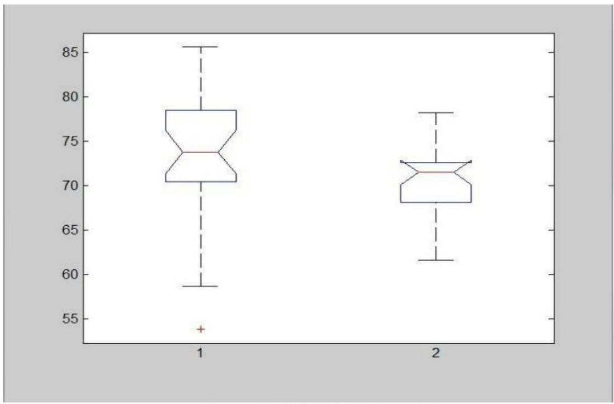

boxplot

| Category | Q1 | Q2 (Median) | Q3 | Min | Max |
| --- | --- | --- | --- | --- | --- |
| 1 | ~70.5 | ~73.8 | ~78.5 | ~58.8 | ~85.5 |
| 2 | ~68.2 | ~71.5 | ~72.8 | ~61.6 | ~78.2 |

图5.1 白葡萄酒盒型（box）图

表 5.4 红葡萄酒 ANOVA 表

<table><tr><td>Source</td><td>SS</td><td>df</td><td>MS</td><td>F</td><td>Prob&gt;F</td></tr><tr><td>Columns</td><td>88.94</td><td>1</td><td>88.935</td><td>2.55</td><td>0.1164</td></tr><tr><td>Error</td><td>1813.75</td><td>52</td><td>34.8799</td><td></td><td></td></tr><tr><td>Total</td><td>1902.69</td><td>53</td><td></td><td></td><td></td></tr></table>

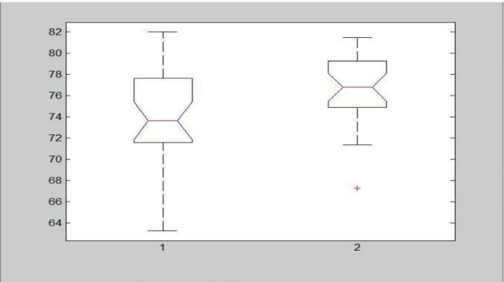

boxplot

| Category | Q1 | Q2 (Median) | Q3 | Min | Max |
| --- | --- | --- | --- | --- | --- |
| 1 | ~71.5 | ~73.6 | ~77.6 | ~63.3 | ~82.0 |
| 2 | ~74.9 | ~76.8 | ~79.3 | ~71.4 | ~81.5 |

图5.2 红葡萄酒的盒型（box）图

表 5.5 方差分析表:

<table><tr><td>方差来源</td><td>平方和(SS)</td><td>自由度 (df)</td><td>均方(MS)</td><td>1-P 分数位 F</td><td>概率 p</td></tr><tr><td>因素 A</td><td> $S_{A}$ </td><td>r-1</td><td> $S_{A} = \frac{S_{A}}{r-1}$ </td><td> $F_{1-p_{r}}(r-1,n-r)$ </td><td> $p_{r}$ </td></tr><tr><td>误差</td><td> $S_{E}$ </td><td>n-r</td><td> $S_{E} = \frac{S_{E}}{n-1}$ </td><td></td><td></td></tr><tr><td>总和</td><td> $S_{T}$ </td><td></td><td></td><td></td><td></td></tr></table>

通常情况下，实验结果 p 达到 0.05 水平或 0.01 水平，才可以说数据之间具备了差异显著或是极显著。在作结论时，应确实描述方向性（例如显著大于或显著小于）。sig 值通常用 P>0.05 表示差异性不显著。在此我们去 0.05 作为显著性水平标准，红酒中的 ANOVA 表中 Prob>F 栏 p 值为 0.0278 <0.05, 故拒绝 Ho，且盒型图的中心线差差别不大，对应的 F 也很小，故可知品酒员对白酒的评分具有显著性。红葡萄酒酒中的 ANOVA 表中的 P>0.05，接受 Ho，故没有显著性。

对于那组数据更加可信，我们知道方差是考察数据的波动性的，方差小就说明数据比较稳定，方差大就是波动性比较大。故我们将红酒，白酒每组样品酒一一对应，第一组的红酒中样品一与第二组红酒中的样品一进行方差分析，以此类推，我们将所求到的方差用 matlab 进行画图。

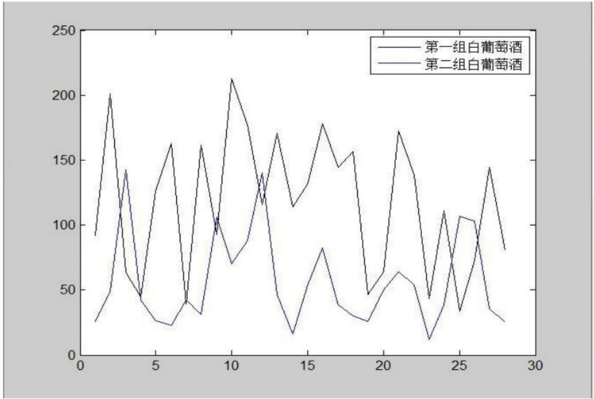

line

| X | 第一组白葡萄酒 | 第二组白葡萄酒 |
| --- | --- | --- |
| 1 | ~92 | ~25 |
| 2 | ~200 | ~48 |
| 3 | ~65 | ~142 |
| 4 | ~45 | ~45 |
| 5 | ~125 | ~28 |
| 6 | ~162 | ~23 |
| 7 | ~42 | ~42 |
| 8 | ~160 | ~32 |
| 9 | ~95 | ~105 |
| 10 | ~212 | ~70 |
| 11 | ~175 | ~88 |
| 12 | ~120 | ~140 |
| 13 | ~170 | ~48 |
| 14 | ~115 | ~18 |
| 15 | ~130 | ~55 |
| 16 | ~178 | ~82 |
| 17 | ~145 | ~38 |
| 18 | ~158 | ~32 |
| 19 | ~48 | ~25 |
| 20 | ~65 | ~45 |
| 21 | ~172 | ~65 |
| 22 | ~140 | ~55 |
| 23 | ~45 | ~12 |
| 24 | ~110 | ~38 |
| 25 | ~35 | ~108 |
| 26 | ~90 | ~105 |
| 27 | ~145 | ~35 |
| 28 | ~80 | ~25 |

图 5.3 白葡萄酒的方差图

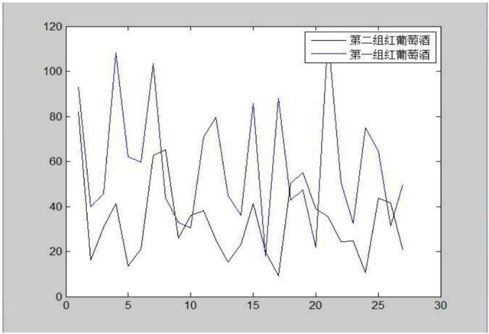

line

| X | 第二组红葡萄酒 | 第一组红葡萄酒 |
| --- | --- | --- |
| 1 | ~82 | ~93 |
| 2 | ~16 | ~40 |
| 3 | ~30 | ~45 |
| 4 | ~41 | ~108 |
| 5 | ~14 | ~62 |
| 6 | ~21 | ~60 |
| 7 | ~63 | ~103 |
| 8 | ~65 | ~44 |
| 9 | ~26 | ~35 |
| 10 | ~36 | ~31 |
| 11 | ~38 | ~70 |
| 12 | ~25 | ~80 |
| 13 | ~15 | ~45 |
| 14 | ~23 | ~36 |
| 15 | ~41 | ~85 |
| 16 | ~18 | ~19 |
| 17 | ~9 | ~88 |
| 18 | ~43 | ~50 |
| 19 | ~47 | ~55 |
| 20 | ~38 | ~22 |
| 21 | ~36 | ~104 |
| 22 | ~24 | ~50 |
| 23 | ~24 | ~32 |
| 24 | ~11 | ~75 |
| 25 | ~43 | ~64 |
| 26 | ~41 | ~31 |
| 27 | ~21 | ~50 |

图 5.4 红葡萄酒的方差图

从两副图中，我们很明显的看到第二组数据的方差基本小于第一组数据，因此我们认为第二组数据更加可信。

## 5.2 酿酒葡萄的分级

## 5.2.1 白葡萄酒的分级

通过统计第二组白葡萄酒的每个样品的分数，将白葡萄酒分为四个等级。

<table><tr><td>第一等级</td><td>(75, 80]</td></tr><tr><td>第二等级</td><td>(70, 75]</td></tr><tr><td>第三等级</td><td>(65, 70]</td></tr><tr><td>第四等级</td><td>(0, 65]</td></tr></table>

由分数等级标准可得到各个样品酒处于的那个等级段，表格如下：

<table><tr><td>第一等级</td><td>9, 23, 20</td></tr><tr><td>第二等级</td><td>3, 17, 2, 14, 11, 21, 5, 26, 22, 24, 27, 4</td></tr><tr><td>第三等级</td><td>16, 10, 13, 12, 25, 1, 6, 8, 15, 18, 7</td></tr><tr><td>第四等级</td><td>11</td></tr></table>

上述各个等级的样品所对应的各个理化指标的关系图如下(其中每个图的横坐标不是样品号, 而是依次每个等级中的样品, 从左到右依次为一, 二, 三, 四等级的样品):

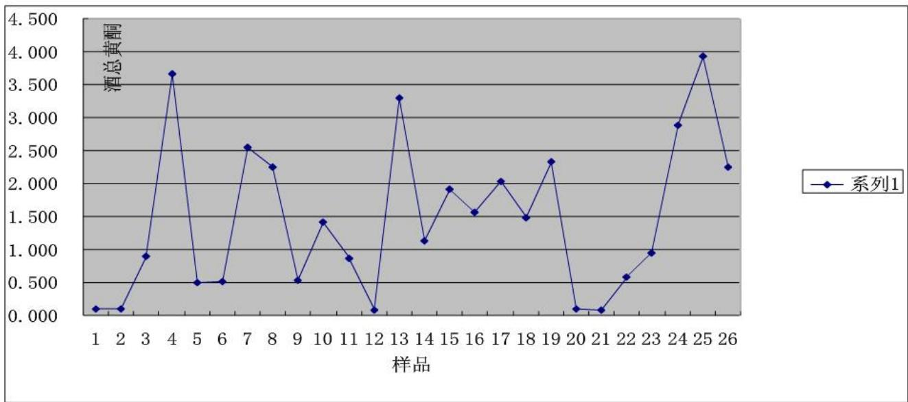

line

| 样品 | 酒总黄酮 |
| --- | --- |
| 1 | ~0.1 |
| 2 | ~0.1 |
| 3 | ~0.9 |
| 4 | ~3.7 |
| 5 | ~0.5 |
| 6 | ~0.5 |
| 7 | ~2.6 |
| 8 | ~2.3 |
| 9 | ~0.5 |
| 10 | ~1.4 |
| 11 | ~0.9 |
| 12 | ~0.1 |
| 13 | ~3.3 |
| 14 | ~1.1 |
| 15 | ~1.9 |
| 16 | ~1.6 |
| 17 | ~2.0 |
| 18 | ~1.5 |
| 19 | ~2.3 |
| 20 | ~0.1 |
| 21 | ~0.1 |
| 22 | ~0.6 |
| 23 | ~1.0 |
| 24 | ~2.9 |
| 25 | ~4.0 |
| 26 | ~2.3 |

图 5.5 各个等级中各样品的酒总黄酮含量

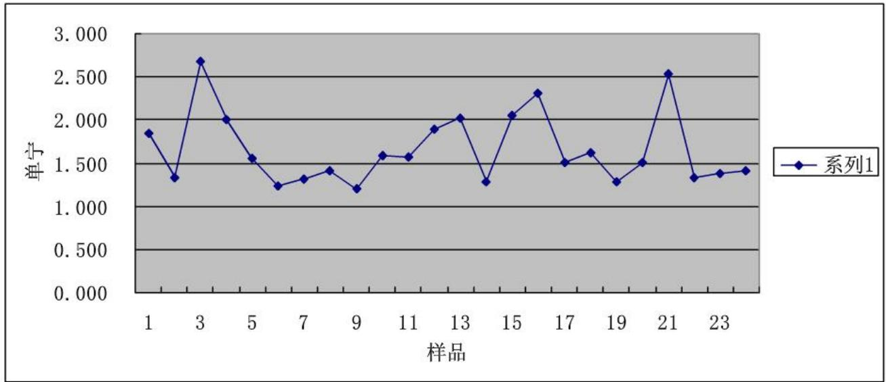

line

| 样品 | 单宁 |
| --- | --- |
| 1 | ~1.85 |
| 2 | ~1.35 |
| 3 | ~2.70 |
| 4 | ~2.00 |
| 5 | ~1.55 |
| 6 | ~1.25 |
| 7 | ~1.35 |
| 8 | ~1.45 |
| 9 | ~1.20 |
| 10 | ~1.60 |
| 11 | ~1.60 |
| 12 | ~1.90 |
| 13 | ~2.00 |
| 14 | ~1.30 |
| 15 | ~2.05 |
| 16 | ~2.30 |
| 17 | ~1.50 |
| 18 | ~1.65 |
| 19 | ~1.30 |
| 20 | ~1.50 |
| 21 | ~2.55 |
| 22 | ~1.35 |
| 23 | ~1.40 |
| 24 | ~1.45 |

图 5.6 各个等级中各样品的单宁含量

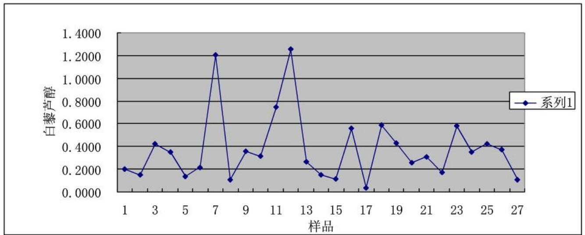

line

| 样品 | 白藜芦醇 |
| --- | --- |
| 1 | ~0.21 |
| 2 | ~0.16 |
| 3 | ~0.43 |
| 4 | ~0.36 |
| 5 | ~0.15 |
| 6 | ~0.23 |
| 7 | ~1.21 |
| 8 | ~0.12 |
| 9 | ~0.37 |
| 10 | ~0.33 |
| 11 | ~0.76 |
| 12 | ~1.26 |
| 13 | ~0.28 |
| 14 | ~0.16 |
| 15 | ~0.13 |
| 16 | ~0.57 |
| 17 | ~0.05 |
| 18 | ~0.60 |
| 19 | ~0.44 |
| 20 | ~0.27 |
| 21 | ~0.32 |
| 22 | ~0.19 |
| 23 | ~0.59 |
| 24 | ~0.36 |
| 25 | ~0.43 |
| 26 | ~0.38 |
| 27 | ~0.12 |

图 5.7 各个等级中各样品的白藜芦醇含量

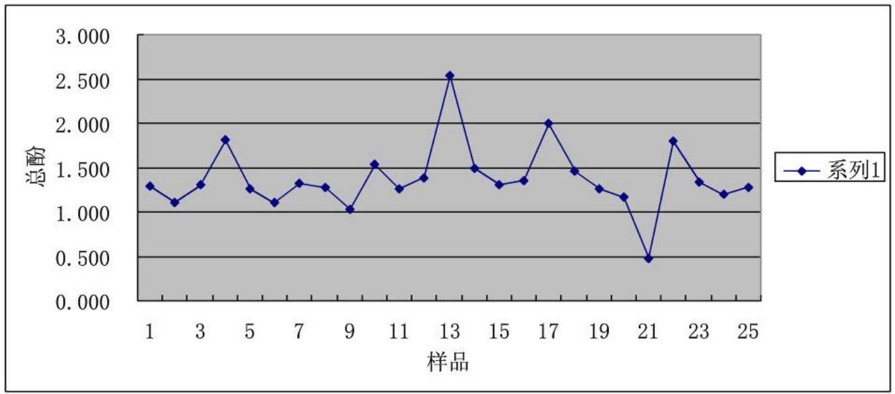

line

| 样品 | 总酚 |
| --- | --- |
| 1 | ~1.3 |
| 2 | ~1.1 |
| 3 | ~1.3 |
| 4 | ~1.8 |
| 5 | ~1.3 |
| 6 | ~1.1 |
| 7 | ~1.3 |
| 8 | ~1.3 |
| 9 | ~1.0 |
| 10 | ~1.6 |
| 11 | ~1.3 |
| 12 | ~1.4 |
| 13 | ~2.6 |
| 14 | ~1.5 |
| 15 | ~1.3 |
| 16 | ~1.4 |
| 17 | ~2.0 |
| 18 | ~1.5 |
| 19 | ~1.3 |
| 20 | ~1.2 |
| 21 | ~0.5 |
| 22 | ~1.8 |
| 23 | ~1.3 |
| 24 | ~1.2 |
| 25 | ~1.3 |

图 5.8 各个等级中各样品的总酚含量

用 MABTLE 软件对以上四幅图进行相关性分析，由 corrcoef 得出四幅图的结果的绝对值都非常不接近 1，且 regress 函数的出 stats 中的 p 远大于 0.05 故可知无相关性，其中酒总黄酮的相关系数为 -0.0892，单宁的相关系数为 -0.114，白藜芦醇的相关系数为 0.2596，总酚的相关系数为 -0.0391，四种因素与样品皆无相关性。

说明：相关系数的绝对值在 0 到 0.3 的呈无相关性，0.3 到 0.8 的呈弱相关性，0.8 到 1 呈强相关性）

## 5.2.2 红葡萄酒的分级

通过统计第二组红葡萄酒的每个样品的分数，将红葡萄酒分为四个等级。

<table><tr><td>第一等级</td><td>(74, 78]</td></tr><tr><td>第二等级</td><td>(70, 74]</td></tr><tr><td>第三等级</td><td>(66, 70]</td></tr><tr><td>第四等级</td><td>(0, 62]</td></tr></table>

由分数等级标准可得到各个样品酒处于的那个等级段，表格如下：

<table><tr><td>第一等级</td><td>9, 23, 20, 3, 17</td></tr><tr><td>第二等级</td><td>2, 19, 14, 21, 5, 26, 22, 24, 27, 4</td></tr><tr><td>第三等级</td><td>16, 13, 10, 12, 25, 1, 6</td></tr><tr><td>第四等级</td><td>23, 15, 18, 7, 11</td></tr></table>

上述各个等级的样品所对应的各个理化指标的关系图如下(其中每个图的横坐标不是样品号，而是依次每个等级中的样品，从左到右依次为一，二，三，四等级的样品，并且去掉异常数据):

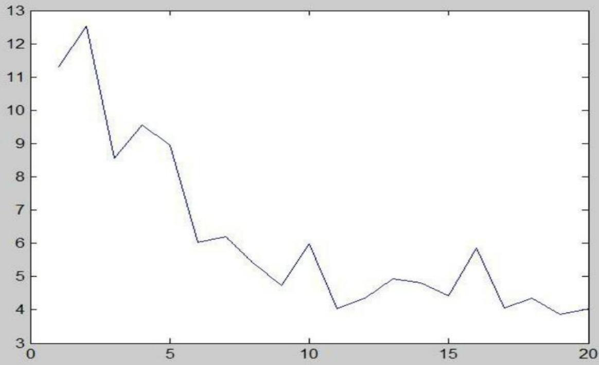

line

| X | Y |
| --- | --- |
| 1 | ~11.3 |
| 2 | ~12.5 |
| 3 | ~8.6 |
| 4 | ~9.6 |
| 5 | ~8.9 |
| 6 | ~6.0 |
| 7 | ~6.2 |
| 8 | ~5.5 |
| 9 | ~4.7 |
| 10 | ~6.0 |
| 11 | ~4.0 |
| 12 | ~4.3 |
| 13 | ~4.9 |
| 14 | ~4.8 |
| 15 | ~4.4 |
| 16 | ~5.8 |
| 17 | ~4.0 |
| 18 | ~4.3 |
| 19 | ~3.8 |
| 20 | ~4.0 |

图5.9 白藜芦醇与样品的关系图

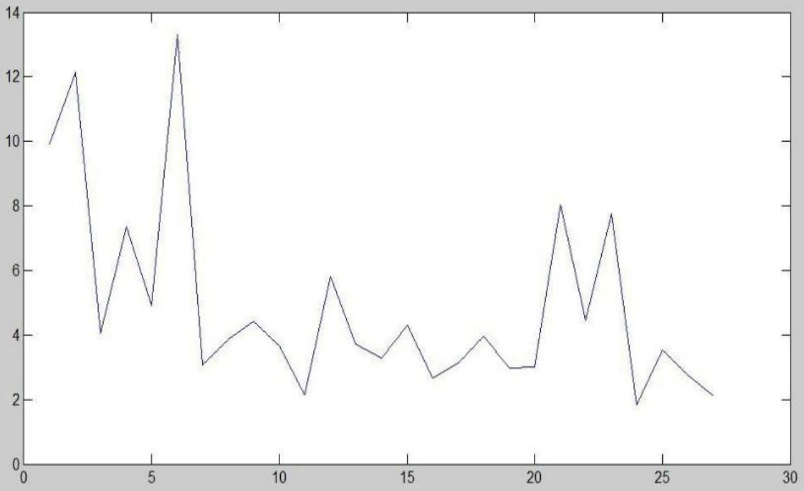

line

| X | Y |
| --- | --- |
| 1 | ~9.9 |
| 2 | ~12.1 |
| 3 | ~4.1 |
| 4 | ~7.4 |
| 5 | ~4.9 |
| 6 | ~13.3 |
| 7 | ~3.1 |
| 8 | ~3.8 |
| 9 | ~4.4 |
| 10 | ~3.7 |
| 11 | ~2.2 |
| 12 | ~5.8 |
| 13 | ~3.7 |
| 14 | ~3.3 |
| 15 | ~4.3 |
| 16 | ~2.7 |
| 17 | ~3.2 |
| 18 | ~4.0 |
| 19 | ~3.0 |
| 20 | ~3.0 |
| 21 | ~8.0 |
| 22 | ~4.5 |
| 23 | ~7.8 |
| 24 | ~1.9 |
| 25 | ~3.6 |
| 26 | ~2.8 |
| 27 | ~2.1 |

图5.10 黄酮与样品的关系图

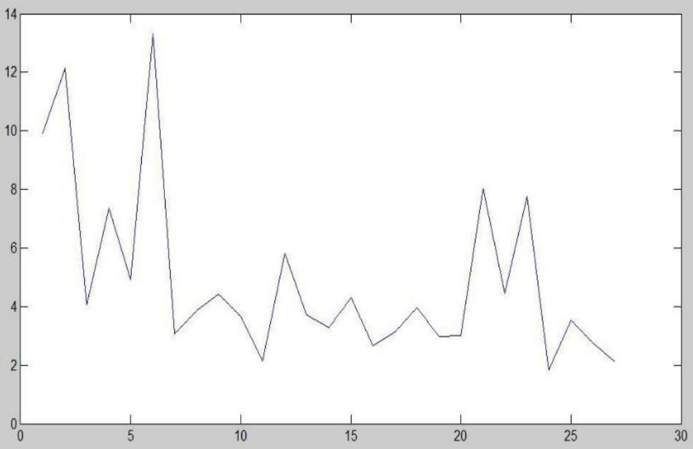

line

| X | Y |
| --- | --- |
| 1 | ~9.9 |
| 2 | ~12.1 |
| 3 | ~4.1 |
| 4 | ~7.4 |
| 5 | ~4.9 |
| 6 | ~13.3 |
| 7 | ~3.1 |
| 8 | ~3.8 |
| 9 | ~4.4 |
| 10 | ~3.7 |
| 11 | ~2.2 |
| 12 | ~5.8 |
| 13 | ~3.7 |
| 14 | ~3.3 |
| 15 | ~4.3 |
| 16 | ~2.7 |
| 17 | ~3.2 |
| 18 | ~4.0 |
| 19 | ~3.0 |
| 20 | ~3.0 |
| 21 | ~8.0 |
| 22 | ~4.5 |
| 23 | ~7.7 |
| 24 | ~1.8 |
| 25 | ~3.5 |
| 26 | ~2.8 |
| 27 | ~2.1 |

图5.11 总酚与样品的关系图

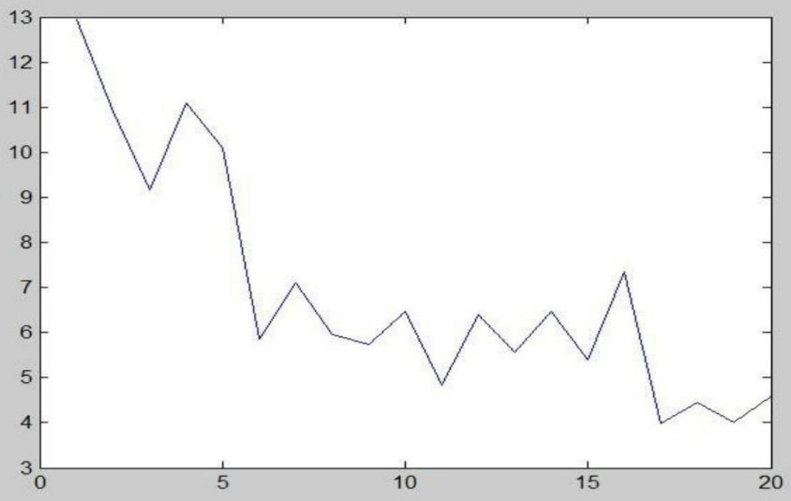

line

| X | Y |
| --- | --- |
| 1 | 13 |
| 3 | ~9.2 |
| 4 | ~11.1 |
| 5 | ~10.1 |
| 6 | ~5.8 |
| 7 | ~7.1 |
| 8 | ~5.9 |
| 9 | ~5.7 |
| 10 | ~6.4 |
| 11 | ~4.8 |
| 12 | ~6.4 |
| 13 | ~5.5 |
| 14 | ~6.4 |
| 15 | ~5.4 |
| 16 | ~7.3 |
| 17 | ~4.0 |
| 18 | ~4.4 |
| 19 | ~4.0 |
| 20 | ~4.5 |

图 5.12 单宁与样品的关系图

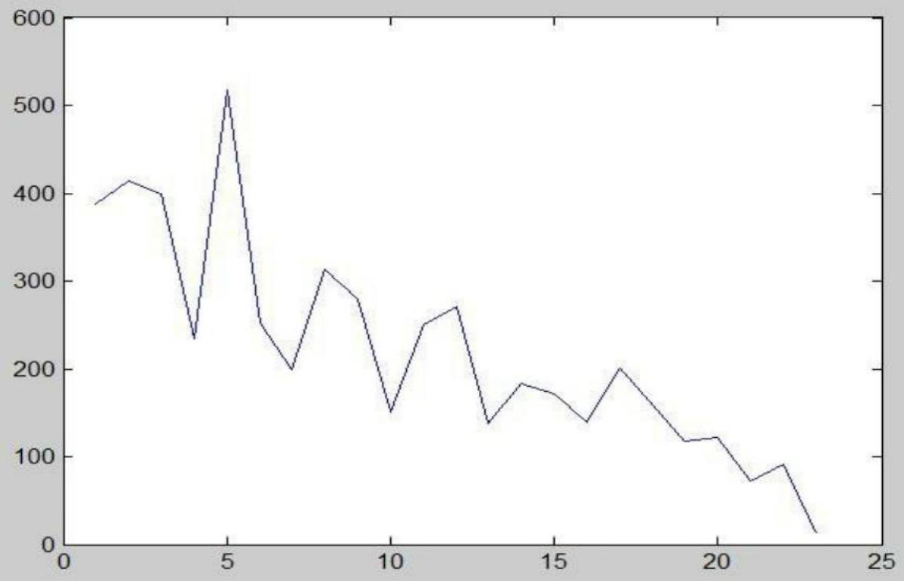

line

| X | Y |
| --- | --- |
| 1 | ~390 |
| 2 | ~415 |
| 3 | ~400 |
| 4 | ~235 |
| 5 | ~520 |
| 6 | ~250 |
| 7 | ~200 |
| 8 | ~315 |
| 9 | ~280 |
| 10 | ~150 |
| 11 | ~250 |
| 12 | ~270 |
| 13 | ~140 |
| 14 | ~185 |
| 15 | ~170 |
| 16 | ~140 |
| 17 | ~200 |
| 18 | ~150 |
| 19 | ~120 |
| 20 | ~125 |
| 21 | ~75 |
| 22 | ~90 |
| 23 | ~15 |

图5.13 花色苷与样品的关系图

用 MABTLE 软件对以上四幅图进行相关性分析，由 corrcoef 得出四幅图的结果的绝对值都接近 1，且 regress 函数的出 stats 中的 p 小于 0.05 故可知有相关性，其中单宁的相关系数到达 -0.8278，总酚的相关系数达到 -0.8341，花色苷的相关系数达到 -0.8533，呈强相关性。白藜芦醇的相关系数为 -0.508，酒总黄酮的相关系数为 -0.486，呈弱相关性。各图的代码如附录 2.

综上所述，影响红葡萄酒质量的等级的因素有单宁，总酚，花色苷，这三个因素直接影响了红葡萄酒的分级，但红葡萄酒的分级也直接影响了酿酒葡萄的质量分级。

下面通过红葡萄酒的理化指标结合酿酒葡萄的数据对酿酒葡萄进行分等级：

表 5.6 影响红葡萄酒分级的因素成分数据表

<table><tr><td colspan="5">影响红葡萄酒分级的成分数据表</td></tr><tr><td>红葡萄酒的样品</td><td>花色苷</td><td>总酚</td><td>单宁</td><td>所属的等级</td></tr><tr><td>葡萄样品9</td><td>240.843</td><td>80.741</td><td>12.933</td><td rowspan="3">第一等级</td></tr><tr><td>葡萄样品23</td><td>172.626</td><td>153.698</td><td>10.888</td></tr><tr><td>葡萄样品20</td><td>23.523</td><td>58.922</td><td>5.864</td></tr><tr><td>葡萄样品3</td><td>157.939</td><td>49.662</td><td>13.259</td><td rowspan="12">第二等级</td></tr><tr><td>葡萄样品17</td><td>59.424</td><td>67.062</td><td>9.170</td></tr><tr><td>葡萄样品2</td><td>224.367</td><td>124.863</td><td>11.078</td></tr><tr><td>葡萄样品14</td><td>140.257</td><td>108.190</td><td>6.073</td></tr><tr><td>葡萄样品19</td><td>115.704</td><td>50.321</td><td>5.981</td></tr><tr><td>葡萄样品21</td><td>89.282</td><td>238.064</td><td>10.090</td></tr><tr><td>葡萄样品5</td><td>120.606</td><td>66.962</td><td>5.849</td></tr><tr><td>葡萄样品26</td><td>58.469</td><td>63.033</td><td>3.615</td></tr><tr><td>葡萄样品22</td><td>74.027</td><td>56.243</td><td>7.105</td></tr><tr><td>葡萄样品27</td><td>34.190</td><td>34.694</td><td>5.961</td></tr><tr><td>葡萄样品24</td><td>144.881</td><td>59.246</td><td>5.747</td></tr><tr><td>葡萄样品4</td><td>79.685</td><td>116.270</td><td>6.477</td></tr><tr><td>葡萄样品16</td><td>60.660</td><td>65.280</td><td>4.832</td><td rowspan="11">第三等级</td></tr><tr><td>葡萄样品13</td><td>65.324</td><td>52.845</td><td>6.385</td></tr><tr><td>葡萄样品10</td><td>44.203</td><td>96.353</td><td>5.567</td></tr><tr><td>葡萄样品12</td><td>32.343</td><td>72.813</td><td>6.458</td></tr><tr><td>葡萄样品25</td><td>49.643</td><td>52.814</td><td>5.406</td></tr><tr><td>葡萄样品1</td><td>408.028</td><td>159.522</td><td>11.030</td></tr><tr><td>葡萄样品6</td><td>46.186</td><td>149.183</td><td>7.354</td></tr><tr><td>葡萄样品8</td><td>241.397</td><td>94.152</td><td>12.028</td></tr><tr><td>葡萄样品15</td><td>52.792</td><td>75.443</td><td>3.985</td></tr><tr><td>葡萄样品18</td><td>40.228</td><td>56.502</td><td>4.447</td></tr><tr><td>葡萄样品7</td><td>60.767</td><td>106.428</td><td>4.014</td></tr><tr><td>葡萄样品11</td><td>7.787</td><td>65.235</td><td>4.588</td><td>第四等级</td></tr></table>

由上表的数据我们可把酿酒红葡萄进行划分等级，如下：

表 5.7 酿酒葡萄酒的等级划分表

<table><tr><td>酿酒红葡萄的类别</td><td colspan="3">各成分的范围值(mg/100g鲜重)</td><td></td></tr><tr><td rowspan="5">酿酒红葡萄</td><td>花色苷 mg/100g鲜重</td><td>总酚(mmol/kg)</td><td>单宁(mmol/kg)</td><td>等级</td></tr><tr><td>[70-240)</td><td>[150-200)</td><td>[11-15)</td><td>一级</td></tr><tr><td>[60-170)</td><td>[100-150)</td><td>[7-11)</td><td>二级</td></tr><tr><td>[20-60)</td><td>[50-100)</td><td>[4-7)</td><td>三级</td></tr><tr><td>[0-20)</td><td>[0-50)</td><td>[0-4)</td><td>四级</td></tr></table>

## 5.3 酿酒葡萄和葡萄酒理化指标的关系

通过观察酿酒葡萄和理化指标的数据, 用 MABTLE 将数据进行处理, 将酿酒葡萄和葡萄酒的相同的理化指标的数据进行拟合, 得到以下图形:

5.3.1 将酿酒葡萄和葡萄酒中的花色苷数据进行拟合，得到下图：

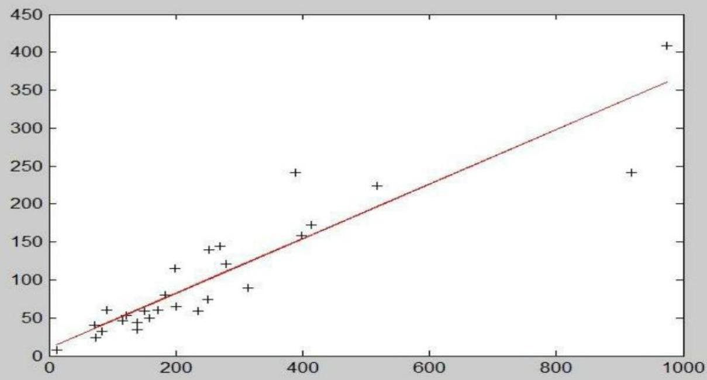

scatter

| X | Y |
| --- | --- |
| ~10 | ~10 |
| ~80 | ~25 |
| ~90 | ~40 |
| ~100 | ~60 |
| ~130 | ~50 |
| ~140 | ~40 |
| ~150 | ~50 |
| ~160 | ~60 |
| ~170 | ~60 |
| ~180 | ~80 |
| ~200 | ~115 |
| ~210 | ~65 |
| ~240 | ~60 |
| ~250 | ~75 |
| ~260 | ~140 |
| ~270 | ~145 |
| ~280 | ~120 |
| ~320 | ~90 |
| ~390 | ~240 |
| ~400 | ~160 |
| ~410 | ~175 |
| ~520 | ~225 |
| ~920 | ~240 |
| ~970 | ~410 |

图 5.14 酿酒葡萄和葡萄酒中的花色苷数据拟合图

5.3.2 将酿酒葡萄和葡萄酒中的单宁数据进行拟合，得到下图：

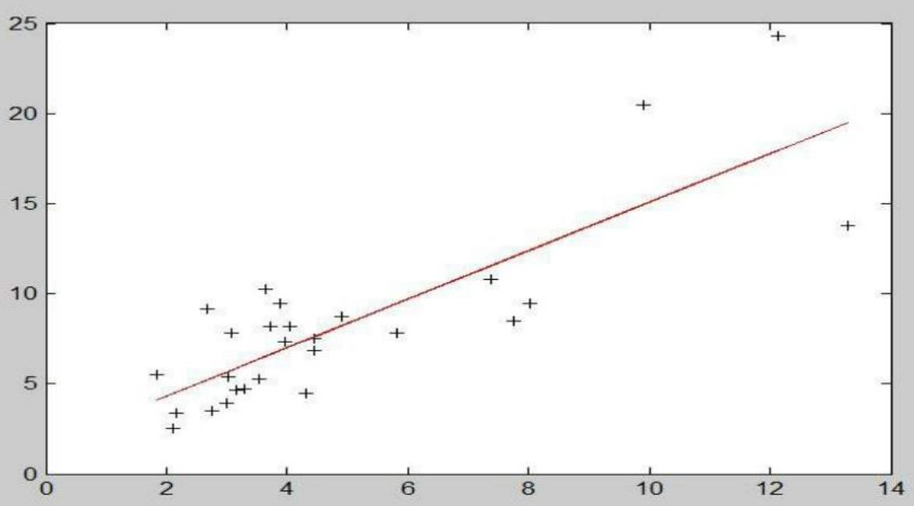

scatter

| X | Y |
| --- | --- |
| ~1.8 | ~5.5 |
| ~2.0 | ~3.5 |
| ~2.0 | ~2.5 |
| ~2.7 | ~9.2 |
| ~2.8 | ~3.5 |
| ~3.0 | ~4.0 |
| ~3.1 | ~4.8 |
| ~3.2 | ~5.2 |
| ~3.3 | ~7.8 |
| ~3.6 | ~10.2 |
| ~3.7 | ~8.2 |
| ~3.8 | ~9.5 |
| ~3.9 | ~7.2 |
| ~4.0 | ~8.2 |
| ~4.1 | ~7.5 |
| ~4.2 | ~4.5 |
| ~4.3 | ~7.5 |
| ~4.4 | ~6.8 |
| ~4.8 | ~8.8 |
| ~5.8 | ~7.8 |
| ~7.4 | ~10.8 |
| ~7.8 | ~8.5 |
| ~8.0 | ~9.5 |
| ~9.9 | ~20.5 |
| ~12.1 | ~24.2 |
| ~13.3 | ~13.8 |

图 5.15 酿酒葡萄和葡萄酒中的单宁数据拟合图

5.3.3 将酿酒葡萄和葡萄酒中的葡萄总黄酮数据进行拟合，得到下图：

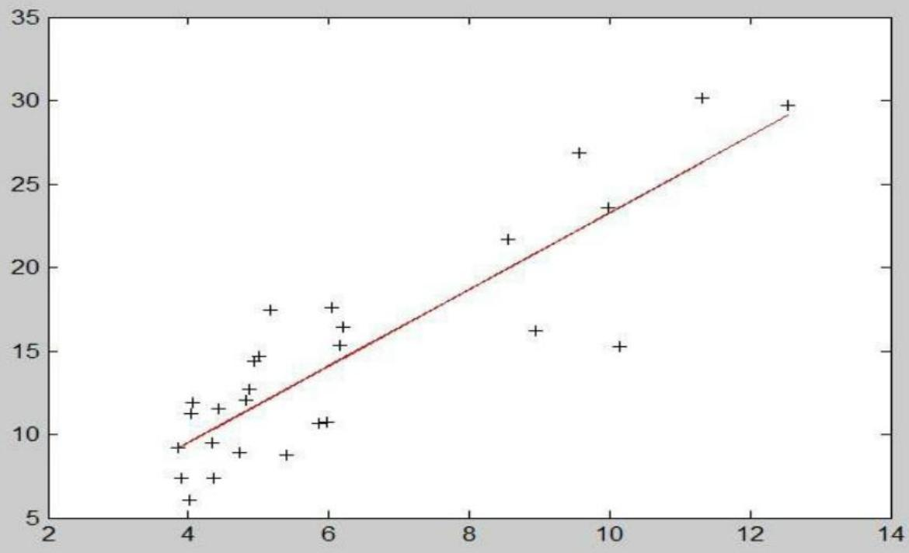

scatter

| X | Y |
| --- | --- |
| ~3.8 | ~9.2 |
| ~3.9 | ~7.5 |
| ~4.0 | ~6.2 |
| ~4.1 | ~11.5 |
| ~4.2 | ~12.0 |
| ~4.3 | ~9.5 |
| ~4.4 | ~7.5 |
| ~4.5 | ~11.5 |
| ~4.8 | ~9.0 |
| ~4.9 | ~12.5 |
| ~5.0 | ~14.5 |
| ~5.1 | ~17.5 |
| ~5.3 | ~8.8 |
| ~5.9 | ~10.8 |
| ~6.0 | ~17.5 |
| ~6.1 | ~16.5 |
| ~6.2 | ~15.2 |
| ~8.5 | ~21.8 |
| ~9.0 | ~16.2 |
| ~9.5 | ~26.8 |
| ~10.0 | ~23.5 |
| ~10.2 | ~15.2 |
| ~11.3 | ~30.0 |
| ~12.5 | ~29.5 |

图 5.16 酿酒葡萄和葡萄酒中的葡萄总黄酮数据拟合图

5.3.4 将酿酒葡萄和葡萄酒中的白藜芦醇数据进行拟合，得到下图：

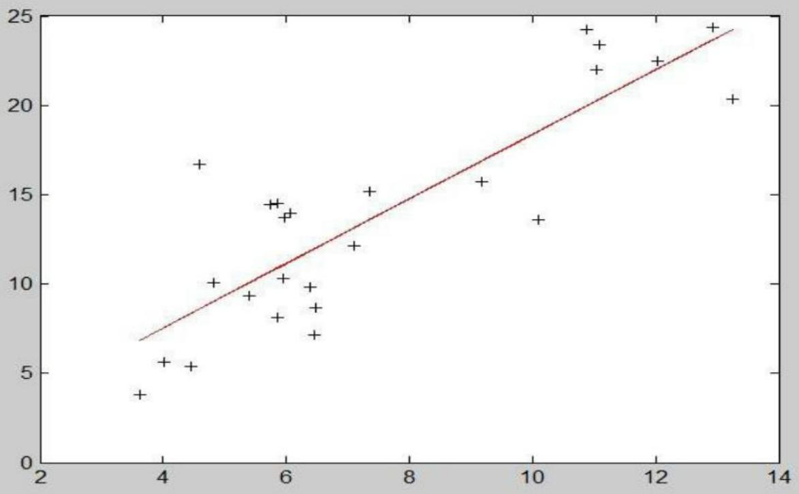

scatter

| X | Y |
| --- | --- |
| ~3.5 | ~4 |
| ~4.0 | ~5.5 |
| ~4.5 | ~5.2 |
| ~4.8 | ~16.5 |
| ~5.0 | ~10 |
| ~5.5 | ~9.2 |
| ~5.8 | ~14.2 |
| ~5.9 | ~14.5 |
| ~6.0 | ~13.8 |
| ~6.0 | ~10.2 |
| ~6.0 | ~8.2 |
| ~6.2 | ~10 |
| ~6.3 | ~9.8 |
| ~6.4 | ~7.2 |
| ~6.5 | ~8.8 |
| ~7.2 | ~12.2 |
| ~7.3 | ~15.2 |
| ~9.2 | ~15.8 |
| ~10.2 | ~13.5 |
| ~10.8 | ~24.2 |
| ~11.0 | ~23.2 |
| ~11.0 | ~22 |
| ~12.0 | ~22.5 |
| ~13.0 | ~24.2 |
| ~13.2 | ~20.2 |

图 5.17 酿酒葡萄和葡萄酒中的总酚数据拟合图

5.3.5 将酿酒葡萄和葡萄酒中的白藜芦醇数据进行拟合，得到下图：

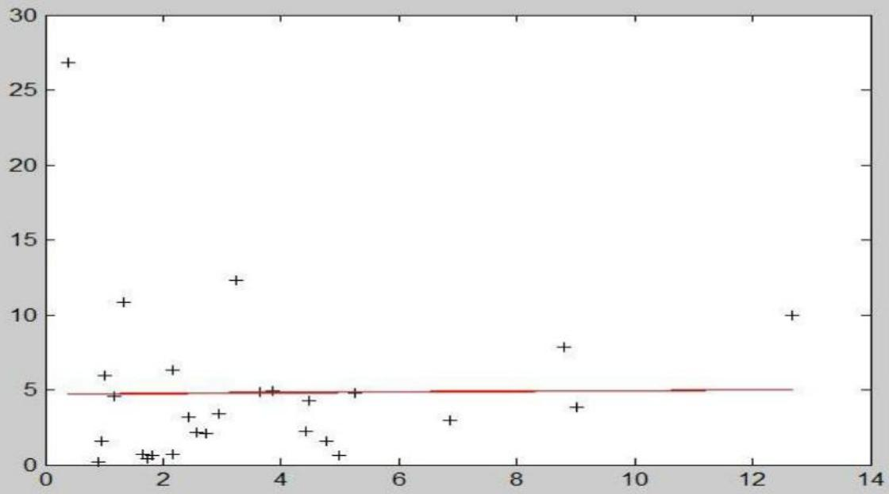

scatter

| X | Y |
| --- | --- |
| ~0.5 | ~26.8 |
| ~1.0 | ~0.2 |
| ~1.0 | ~1.7 |
| ~1.0 | ~4.6 |
| ~1.0 | ~6.0 |
| ~1.3 | ~10.9 |
| ~1.7 | ~0.7 |
| ~1.8 | ~0.6 |
| ~2.0 | ~0.8 |
| ~2.2 | ~6.3 |
| ~2.4 | ~3.2 |
| ~2.5 | ~2.2 |
| ~2.6 | ~2.1 |
| ~2.8 | ~3.4 |
| ~3.3 | ~12.3 |
| ~3.8 | ~4.9 |
| ~3.9 | ~4.9 |
| ~4.4 | ~4.2 |
| ~4.5 | ~2.3 |
| ~4.8 | ~1.6 |
| ~5.0 | ~0.7 |
| ~5.3 | ~4.8 |
| ~6.9 | ~3.0 |
| ~8.8 | ~7.8 |
| ~9.1 | ~3.8 |
| ~12.7 | ~10.0 |

图5.18 酿酒葡萄和葡萄酒中的白藜芦醇数据拟合图

由以上四幅图可知:

一．酿酒葡萄和葡萄酒中花色苷，单宁，葡萄总黄酮，总酚这四个因素呈线性关系，是正相关性。即酿酒葡萄中的花色苷含量，所酿出来的葡萄酒中花色苷含量越高；酿酒葡萄中的单宁含量，所酿出来的葡萄酒中单宁含量越高；酿酒葡萄中的葡萄总黄酮含量，所酿出来的葡萄酒中葡萄总黄酮含量越高；酿酒葡萄中的总酚含量，所酿出来的葡萄酒中总酚含量越高；  
二. 酿酒葡萄和葡萄酒中白藜芦醇对两者不影响

## 5.4 验证理化指标是否能成为葡萄酒等级评价依据

由第三问求解可得出酿酒葡萄与葡萄酒的理化指标之间是呈线性相关的, 因此只需证明酿酒葡萄和葡萄酒的理化指标其中一种对葡萄酒质量是有影响, 则可证明两者的理化指标是对葡萄酒质量是有影响的, 因此我们用 Matlab 进行数据拟合来画其关系图, 并用多元线性回归来判断其是否成线性关系。

我们先对葡萄酒的评分按照从低到高排列，相对应酿酒葡萄的各成分也得到相应的排列，横坐标是葡萄酒的评分，纵坐标是是酿酒葡萄的各成分，各图表如下：

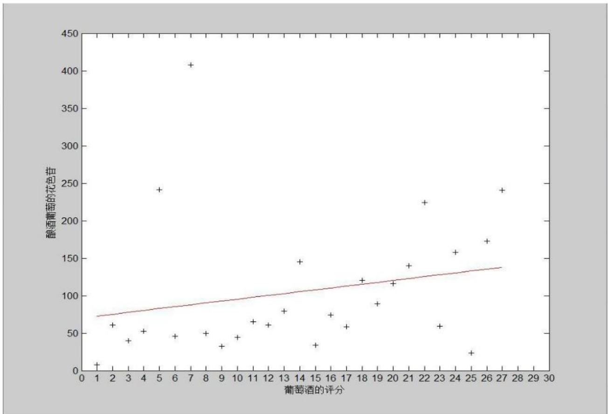

scatter

| 葡萄酒的评分 | 酿酒葡萄的花色苷 |
| --- | --- |
| 1 | ~8 |
| 2 | ~60 |
| 3 | ~40 |
| 4 | ~52 |
| 5 | ~240 |
| 6 | ~45 |
| 7 | ~408 |
| 8 | ~50 |
| 9 | ~32 |
| 10 | ~45 |
| 11 | ~65 |
| 12 | ~60 |
| 13 | ~78 |
| 14 | ~145 |
| 15 | ~35 |
| 16 | ~75 |
| 17 | ~58 |
| 18 | ~120 |
| 19 | ~88 |
| 20 | ~115 |
| 21 | ~140 |
| 22 | ~225 |
| 23 | ~58 |
| 24 | ~158 |
| 25 | ~22 |
| 26 | ~172 |
| 27 | ~240 |

图 5.19 葡萄酒评分和酿酒葡萄的花色苷的关系图

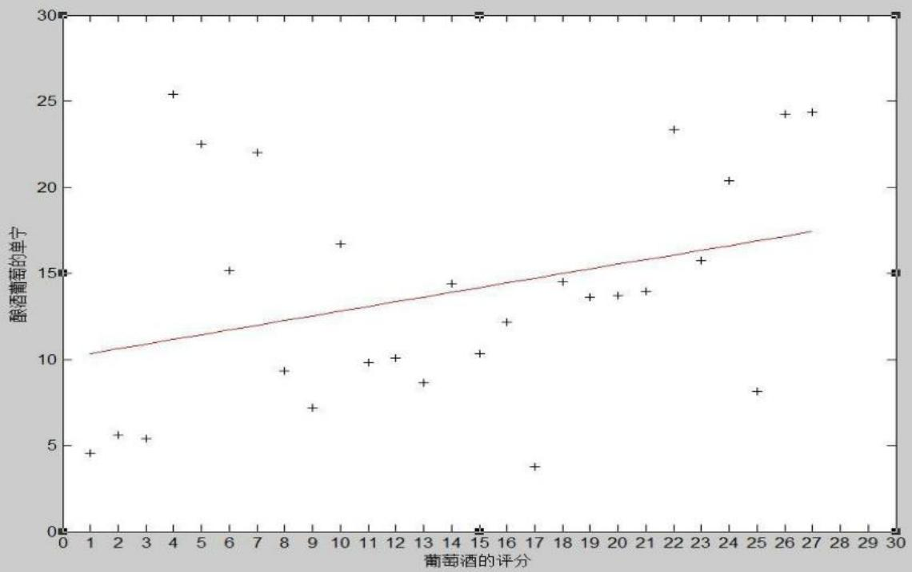

scatter

| 葡萄酒的评分 | 酿酒葡萄的单价 |
| --- | --- |
| 1 | ~4.5 |
| 2 | ~5.5 |
| 3 | ~5.5 |
| 4 | ~25.5 |
| 5 | ~22.5 |
| 6 | ~15 |
| 7 | ~22 |
| 8 | ~9.5 |
| 9 | ~7 |
| 10 | ~16.5 |
| 11 | ~10 |
| 12 | ~10 |
| 13 | ~8.5 |
| 14 | ~14.5 |
| 15 | ~10.5 |
| 16 | ~12 |
| 17 | ~4 |
| 18 | ~14.5 |
| 19 | ~13.5 |
| 20 | ~13.5 |
| 21 | ~14 |
| 22 | ~23.5 |
| 23 | ~15.5 |
| 24 | ~20.5 |
| 25 | ~8 |
| 26 | ~24.5 |
| 27 | ~24.5 |
| 30 | ~15 |

图 5.20 葡萄酒评分和酿酒葡萄的单宁的关系图

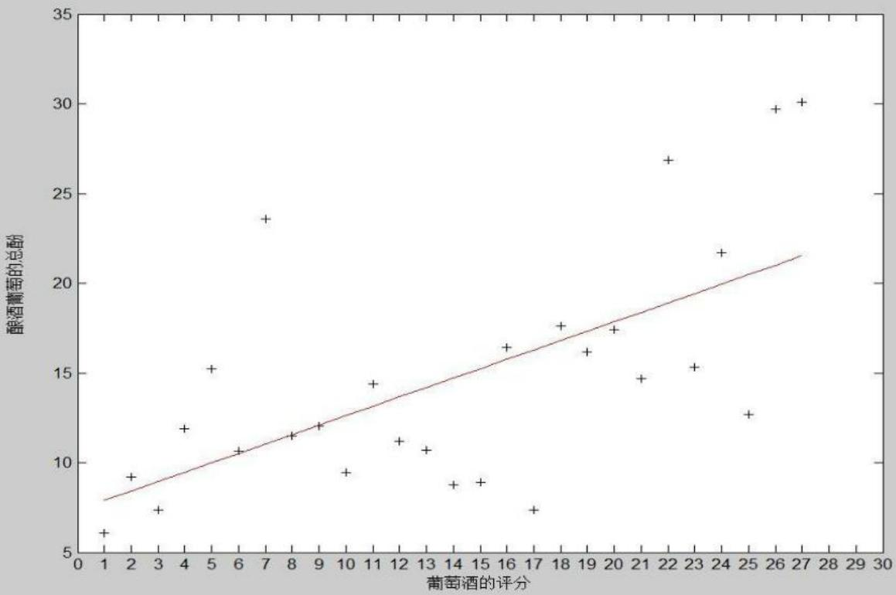

scatter

| 葡萄酒的评分 | 酿酒葡萄的总酚 |
| --- | --- |
| 1 | ~6 |
| 2 | ~9 |
| 3 | ~7.5 |
| 4 | ~12 |
| 5 | ~15 |
| 6 | ~10.5 |
| 7 | ~23.5 |
| 8 | ~11.5 |
| 9 | ~12 |
| 10 | ~9.5 |
| 11 | ~14.5 |
| 12 | ~11 |
| 13 | ~10.5 |
| 14 | ~8.5 |
| 15 | ~9 |
| 16 | ~16.5 |
| 17 | ~7.5 |
| 18 | ~17.5 |
| 19 | ~16 |
| 20 | ~17.5 |
| 21 | ~14.5 |
| 22 | ~27 |
| 23 | ~15.5 |
| 24 | ~21.5 |
| 25 | ~12.5 |
| 26 | ~29.5 |
| 27 | ~30 |

图 5.21 葡萄酒评分和酿酒葡萄的总酚的关系图

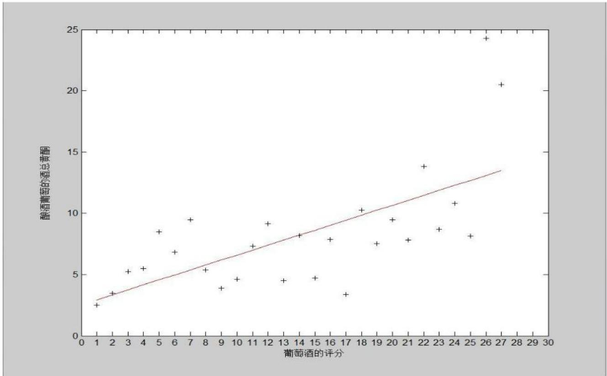

scatter

| 葡萄酒的评分 | 酸酒葡萄的总黄酮 |
| --- | --- |
| 1 | ~2.5 |
| 2 | ~3.5 |
| 3 | ~5.2 |
| 4 | ~5.5 |
| 5 | ~8.5 |
| 6 | ~6.8 |
| 7 | ~9.5 |
| 8 | ~5.3 |
| 9 | ~3.8 |
| 10 | ~4.6 |
| 11 | ~7.3 |
| 12 | ~9.2 |
| 13 | ~4.5 |
| 14 | ~8.2 |
| 15 | ~4.7 |
| 16 | ~7.8 |
| 17 | ~3.3 |
| 18 | ~10.2 |
| 19 | ~7.5 |
| 20 | ~9.5 |
| 21 | ~7.8 |
| 22 | ~13.8 |
| 23 | ~8.7 |
| 24 | ~10.8 |
| 25 | ~8.1 |
| 26 | ~24.2 |
| 27 | ~20.5 |

图 5.22 葡萄酒评分和酿酒葡萄的酒总黄酮的关系图

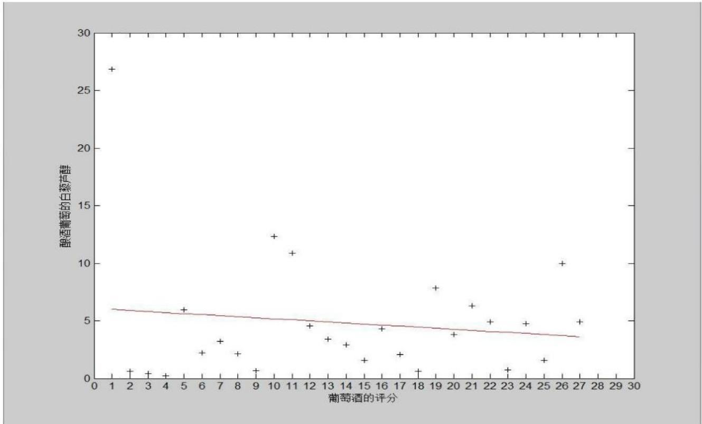

scatter

| 葡萄酒的评分 | 酸香葡萄的白藜芦醇 |
| --- | --- |
| 1 | ~26.8 |
| 2 | ~0.7 |
| 3 | ~0.5 |
| 4 | ~0.3 |
| 5 | ~6.0 |
| 6 | ~2.3 |
| 7 | ~3.3 |
| 8 | ~2.2 |
| 9 | ~0.7 |
| 10 | ~12.4 |
| 11 | ~10.9 |
| 12 | ~4.5 |
| 13 | ~3.4 |
| 14 | ~2.9 |
| 15 | ~1.6 |
| 16 | ~4.3 |
| 17 | ~2.1 |
| 18 | ~0.7 |
| 19 | ~7.8 |
| 20 | ~3.8 |
| 21 | ~6.3 |
| 22 | ~4.9 |
| 23 | ~0.8 |
| 24 | ~4.7 |
| 25 | ~1.6 |
| 26 | ~10.0 |
| 27 | ~4.9 |

图 5.23 葡萄酒评分和酿酒葡萄的白藜芦醇的关系图

通过 Matlab 软件进行数据拟合并画出拟合线性图, 得出酿酒葡萄各成分系数 p 的值分别为 0.0003, 0.0963, 0.0005, 0.0002, 0.5134 (备注 p 越接近 0 , 该成分与葡萄酒的质量相关性越强), 所以我们可得知酿酒葡萄的理化指标对葡萄酒质量是有影响, 因为由第三问知酿酒葡萄与葡萄酒之间有相关性, 所以也间接说明了酿酒葡萄和葡萄酒的理化指标对葡萄酒质量是有影响的。

但是结合附件 3 中各个样品中芬香物质的数据及样品的等级进行数据拟合, 可得下图:

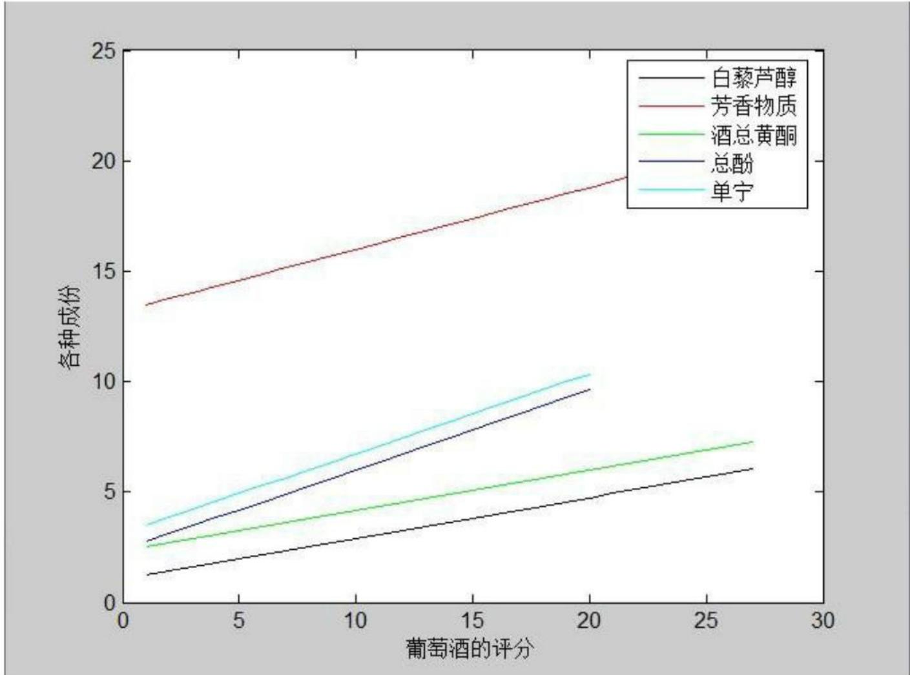

line

| 葡萄酒的评分 | 白藜芦醇 | 芳香物质 | 酒总黄酮 | 总酚 | 单宁 |
| --- | --- | --- | --- | --- | --- |
| 1 | ~1.2 | ~13.5 | ~2.5 | ~2.8 | ~3.5 |
| 20 | ~4.8 | ~19.2 | ~6.0 | ~9.5 | ~10.2 |
| 27 | ~6.0 | — | ~7.2 | — | — |

由图可知葡萄酒的感官指标中的芬香物质与葡萄酒的各个理化指标呈一致的相关性，所以不能只用葡萄酒的理化指标来评价葡萄酒的质量，还要加上葡萄酒的感官指标。即综合葡萄酒的理化指标和感官指标来进行对葡萄酒的质量进行评价。

## 六、模型的评价与优缺点

## 6.1 优点

(1) 对数据进行合理的处理,采用拟合的方法对数据间的关系进行图像化,是

的其问题分析更加明显，简化。

(2) 第二问中采用逆向思维的方法, 反推出酿酒葡萄的等级分划。  
(3) 除去异常数据, 使图像更加合理化, 明显化。  
(4) 将每组数据进行有针对性对比, 如第一组的白葡萄酒和第二组的白葡萄酒进行对比  
(5) 将每个小问题的分析串联起来, 使其思路更加清晰

## 6.2 缺点

(1) 数据量太庞大, 导致我们忽略一些对题目影响不是很大的数据, 使得模型存在误差。  
(2) 编程时数据量太大, 存在很多困难。  
(3) 数据与数据将很难将其联系起来。  
(4)对数据处理不大,没有整体进行求解,只针对某一种葡萄酒进行相关性验证,如第二问只对白葡萄酒进行分级。  
(5) 考虑问题不周全, 如只对第四问验证酿酒葡萄与葡萄酒的理化指标之间的联系, 而没有考虑进一步了解两者存在什么比例。

## 七、参考文献

[1] 姜启源，谢金鑫，叶俊. 数学建模，北京：高等教育出版社，2004  
[2] 单锋，朱丽梅，田贺民，数学建模，北京：国防工业出版社，2012.2  
[3] （美）吉奥丹诺（Giordano，F.R）叶其孝，姜启源，数学建模（原书第三版）北京：机械工业出版社，2005,1  
[4]冯杰，黄力伟，王勤，尹成义.数学建模原理与案例,北京：科学出版社，2007  
[5] 宋叶志，贾东永，MATLAB数值分析与运用，北京：机械工业出版社，2009.7