# 2012 高教社杯全国大学生数学建模竞赛

## 承诺书

我们仔细阅读了中国大学生数学建模竞赛的竞赛规则.

我们完全明白，在竞赛开始后参赛队员不能以任何方式（包括电话、电子邮件、网上咨询等）与队外的任何人（包括指导教师）研究、讨论与赛题有关的问题。

我们知道，抄袭别人的成果是违反竞赛规则的，如果引用别人的成果或其他公开的资料（包括网上查到的资料），必须按照规定的参考文献的表述方式在正文引用处和参考文献中明确列出。

我们郑重承诺，严格遵守竞赛规则，以保证竞赛的公正、公平性。如有违反竞赛规则的行为，我们将受到严肃处理。

我们授权全国大学生数学建模竞赛组委会，可将我们的论文以任何形式进行公开展示（包括进行网上公示，在书籍、期刊和其他媒体进行正式或非正式发表等）。

我们参赛选择的题号是（从 A/B/C/D 中选择一项填写）：\_\_\_\_ A \_\_\_\_

我们的参赛报名号为（如果赛区设置报名号的话）：\_\_\_\_

所属学校（请填写完整的全名）：\_\_\_\_ 东华理工大学

参赛队员 (打印并签名)：1. 卢丰海

2. 郭有林

3. 黄慧

指导教师或指导教师组负责人 (打印并签名): \_\_\_\_

日期：2012年09月10日

赛区评阅编号（由赛区组委会评阅前进行编号）：

# 2012 高教社杯全国大学生数学建模竞赛

## 编号专用页

赛区评阅编号（由赛区组委会评阅前进行编号）：

赛区评阅记录（可供赛区评阅时使用）：

<table><tr><td>评阅人</td><td></td><td></td><td></td><td></td><td></td><td></td><td></td><td></td><td></td><td></td></tr><tr><td>评分</td><td></td><td></td><td></td><td></td><td></td><td></td><td></td><td></td><td></td><td></td></tr><tr><td>备注</td><td></td><td></td><td></td><td></td><td></td><td></td><td></td><td></td><td></td><td></td></tr></table>

全国统一编号（由赛区组委会送交全国前编号）：

全国评阅编号（由全国组委会评阅前进行编号）：

# 葡萄酒的评价

## 摘要

葡萄酒的质量鉴定在常理上是一个定性问题，如何对这个定性的问题进行量化比较，对于葡萄酒行业是一个关键问题。为解决这个问题，本文主要是通过建立与之相关的数学模型进行量化，从而更好地评定葡萄酒的质量。

在求解所有问题前先对所给的附件数据做异常值处理，将特异值用所在指标的平均值替换。对芳香物质使用主成分回归提取成分因子作为烃类指标。

对于问题一，先分别将两组评酒员对葡萄酒的评定总分去除最大最小值后求出均值；然后分别将第一组和第二组红、白葡萄酒的评定总分均值利用 SPSS19.0 做配对 T 检验，得两组的 Sig 值分别为 0.023 与 0.035，均小于 0.05，由此说明红、白葡萄酒的两组分数具有显著性差异；最后分别对每个样本二级评分标准对应的打分情况做信度分析，得出红、白葡萄酒第一组评分数据可信度大于第二组的概率分别为 62.96%、71.43%，所以本文认为红、白葡萄酒的评分数据，第一组打分比第二组更可信。

对于问题二，本文利用葡萄酒平均分数做参考数列，对酿酒葡萄理化指标做灰色关联度分析，并把各指标的关联度系数换算成对应权重。利用该权重与对应酿酒葡萄的理化指标做加权计算，求出样品排序综合成绩；再根据法国葡萄酒4级划分规则，分别用四分位线和 $Q$ 型聚类对综合成绩进行分类，得到与成绩对应的葡萄等级，然后在权重和葡萄的理化指标基础上运用秩和比综合评价法进行改进，计算出各类葡萄的加权秩和比（WRSR），最后对各样本的WRSR值做系统聚类分析，分别得到红、白葡萄划分为3-5类时各类葡萄的分类情况。

针对问题三，首先对酿酒葡萄与葡萄酒的理化指标做相关分析，分析结果知它们之间名称相同指标存在高度相关性，再用酿酒葡萄理化指标为自变量、葡萄酒理化指标为因变量做偏最小二乘回归分析，建立关于酿酒葡萄理化指标与葡萄酒的理化指标之间的回归方程。由此可知酿酒葡萄与葡萄酒的理化指标之间存在一定的线性关系。

针对问题四，先使用因果分析法论证酿酒葡萄和葡萄酒的理化指标对葡萄酒质量有影响；再运用主成分分析法对酿酒葡萄和葡萄酒的理化指标进行提取主成分，根据提出的主成分分别建立关于白葡萄酒质量与红葡萄酒质量的多元线性回归预测模型分别为：

$$
\begin{array}{l} Y = 0. 1 6 1 X _ {1} - 1. 7 5 7 X _ {2} - 1. 9 1 5 _ {3} - 0. 0 1 6 X _ {4} + 0. 7 0 6 X _ {5} + 1. 6 4 7 X _ {6} - 0. 9 7 1 X _ {7} - 0. 8 5 4 X _ {8} \\ + 1. 7 8 5 X _ {9} - 0. 9 6 3 X _ {1 0} + 1. 4 8 5 X _ {1 1} + 0. 9 1 7 X _ {1 2} + 0. 4 5 2 X _ {1 3} - 0. 4 8 1 X _ {1 4} + 7 4. 9 6 9 \\ \end{array}
$$

$$
y = 2. 9 8 3 x _ {1} - 2. 9 9 2 x _ {2} + 1. 0 3 2 x _ {3} + 3. 6 5 5 x _ {4} - 0. 2 2 4 x _ {5} + 0. 2 4 5 x _ {6} + 1. 2 4 6 x _ {7} + 0. 7 5 5 x _ {8}
$$

$$
- 1. 2 3 8 x _ {9} - 1. 5 8 4 x _ {1 0} + 1. 2 1 2 x _ {1 1} - 0. 9 5 4 x _ {1 2} + 7 2. 9 5 8
$$

由该拟合拟合模型 Sig 值均在 0.05 以下，说明酿酒葡萄和葡萄酒的理化指标可以用来评价葡萄酒的质量。

关键字：葡萄酒 评价模型 灰色关联度分析 相关性分析 秩和比综合评价 聚类分析偏最小二乘回归分析 主成份分析 多元线性回归 因果分析法

## 1. 问题重述

## 1.1 问题背景

目前确定葡萄酒质量时一般是通过聘请一批有资质的评酒员进行品评。每个评酒员在对葡萄酒进行品尝后对其分类指标打分，然后求和得到其总分，从而确定葡萄酒的质量。然而酿酒葡萄的好坏与所酿葡萄酒的质量有直接的关系，葡萄酒和酿酒葡萄检测的理化指标会在一定程度上反映葡萄酒和葡萄的质量。

在评酒员对葡萄酒进行评价时主要是通过感官即是视觉、味觉、闻觉等方面上进行打分量化。在葡萄酒的感官评价中，由于品酒员间存在评价尺度、评价位置和评价方向等方面的差异，导致不同品酒员对同一酒样的评价差异很大。从而不能真实地反映不同酒样间的差异。

而目前的葡萄酒的评分标准有很多，例如：葡萄酒 100 分制体系、3W1D 等，但都是通过评酒员尝试各种葡萄酒打分的，由于每个评酒员的感官是有差距的，因此现行的葡萄酒的评价系统具有一定的缺陷。

## 1.2 提出问题

针对现行的评价系统中存在的缺陷，提出下面四个问题：

1. 分析附件 1 中两组评酒员对红、白葡萄酒的评价结果有无显著性差异，哪一组结果更可信？  
2. 根据酿酒葡萄的理化指标和葡萄酒的质量对这些酿酒葡萄进行分级。  
3. 分析酿酒葡萄与葡萄酒的理化指标之间的联系。  
4. 分析酿酒葡萄和葡萄酒的理化指标对葡萄酒质量的影响,并论证能否用葡萄和葡萄酒的理化指标来评价葡萄酒的质量?

## 1.3 已知资料

附件 1：葡萄酒品尝评分表（含 4 个表格）；

附件 2：葡萄和葡萄酒的理化指标（含 2 个表格）；

附件 3：葡萄和葡萄酒的芳香物质（含 4 个表格）。

## 2.问题分析

## 2.1 问题 1 分析

问题 1 主要是要分析判断这两组评酒员对这两组红、白葡萄酒的评价结果是否具有显著性，且哪一组的结果更可靠？

首先对给出的附件 1 中的数据进行预处理，因为附件给出的葡萄酒评级系统是百分制，根据十个评酒员对同一葡萄酒进行打分，为了得到每一种葡萄酒更合理的平均分数，因此剔除每种葡萄酒得到的最高成绩与最低成绩。

然后求出每种葡萄酒对应每组评酒员的平均分数，对这两组数据可先用 SPSS19.0 做配对 T 检验，来说明这两组评价结果是否具有显著性。

由于十个评酒员都是对同一种酒进行评价，因此这十个评酒员给出的每个小指标即（澄清度、色调、纯正度、浓度等）之间的分数具有一致性，即是其内部具有一致性。根据可信度的计算可以得到这四组数据中各类酒种的 Cronbach $\alpha$ 值。

最后分别统计红、白葡萄酒第一组大于第二组 Cronbach $\alpha$ 值的个数，计算第一组大

于第二组的概率是多少？概率大的说明那组评酒员所给分数更具有可信度。

## 2.2 问题 2 分析

问题 2 主要是根据酿酒葡萄的理化指标和葡萄酒的质量对这些酿酒葡萄进行分级。通过对给出的附件 2 中数据进行简单的分析可知，酿酒葡萄的理化指标中的数据有少许的异常值，将异常值处理后，对酿酒葡萄的理化指标的一级指标及芳香物质的列指标，做灰色关联度分析，再将得到的关联度转为权重，并与其对应的指标值进行加权求和后，将得到的分数排序用四分位线划分等级。

然后再对模型进行改进，将前面得到的权重作为秩和比评价法的权重，运用得到秩和比综合评价法计算得到综合成绩，根据这个成绩用 Q 聚类对其做酿酒葡萄质量的划分级别。

## 2.3 问题 3 分析

问题 3 中分析酿酒葡萄的理化指标与葡萄酒的理化指标之间的联系。本文先对酿酒葡萄的理化指标与葡萄酒的理化指标相关性分析，分析这两类理化指标之间的线性关系。然后以酿酒葡萄的理化指标作为自变量，葡萄酒的理化指标作为因变量建立偏最小二乘回归模型。

## 2.4 问题 4 分析

问题 4 主要是分析酿酒葡萄和葡萄酒的理化指标对葡萄酒的质量的影响，并且说明是否可以用葡萄与葡萄酒的理化指标来评价葡萄酒的质量。

在分析此问题时首先运用因果分析法，分析酿酒葡萄和葡萄酒的理化指标对葡萄酒的质量是有影响，然后再建立它们之间的多元线性回归模型来验证这个结果。

## 3. 模型假设

（1）假设问题所给数据真实可靠；  
(2) 假设仅考虑评酒员打分即可确定葡萄酒质量;  
(3) 假设所给理化指标足够反映葡萄或酒的大部分信息;  
（4）假设仪器没有检测到样品该成分时，可认为该成分含量为 0;  
(5) 假设问题所给样品具有广泛代表性, 能够符合于国际样品评价标准。

## 4. 符号解释与说明

$\alpha$ 表示信度系数;  
$\zeta$ 表示灰色关联系数;  
$r_{i}$ 表示加权后的灰色关联度;  
$w_{i}^{'}$ 表示第 i 类指标权重;  
$y_{j}$ 表示第 j 类葡萄的综合分数;  
$WRSR_{i}$ 表示第 i 个样品的加权秩和比综合分数;  
$X_{i}$ 表示理化指标提取的主成分第 j 个因子得分;  
$x_{j}$ 表示理化指标提取的主成分第 j 个因子得分；  
Y、y 分别表示是 10 名评酒员给白、红葡萄酒打分的均值。

## 5. 模型建立与求解

为了解决本文中提出的问题，在本节中主要根据运用不同的方法从而建立不同的模型来求解出需待求解的问题。

根据提出问题可以将此节分为四小部分:

- 对三个附件中的数据进行预处理;  
- 两组评酒员评酒结果的比较: ①两两配对 $T$ 检验;  
②可信度 Cronbach α 系数;  
- 酿酒葡萄的等级评定：①用灰色关联度分析得到各指标权重；  
②划分酿酒葡萄的质量级别;  
③运用秩和比综合评价法改进模型;  
- 两理化指标之间联系：①分析两者之间相关性；  
②建立偏最小二乘法模型；  
- 两理化指标是否对酒质量影响：①因果分析法；  
②建立多元线性回归。

## 5.1 整体数据预处理

由于在本题中涉及到的数据都是非常的多，而且很多数据是不能直接进行运用的，需要对其做一些处理才能运用到所建立的模型中，因此在这一部分中主要是对本文所需的数据进行一个整体的处理。

## 5.1.1 附件 1. 数据处理

因为题中所给附件 1. 的数据中的酒样品是乱序的，没有按照每个样本的序号进行排序，因此对附件 1. 的四个表格中的数据按序号进行排序，这样方便对运用到附件 1. 中的问题 1 做配对分析相对应。

对于附件1.中的数据经分析可以知道，这些评酒员对于葡萄酒的品尝评分是根据指标划分的权重给分的。

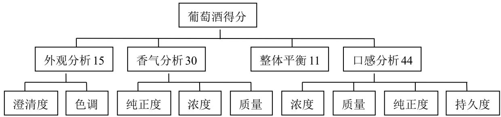

<details>
<summary>flowchart</summary>

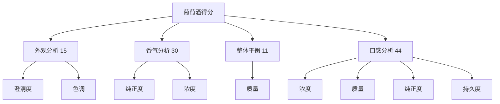
</details>

图 5-1 葡萄酒评分指标体系

附件 1. 中有两组评酒员分别对红、葡萄酒对各个二级指标进行评价得分，根据这些分数可以计算出每个评酒员对每个样品葡萄酒的总体得分。每一样品葡萄酒都有十个总分数，为了缩小每个评酒员之间评分差异，去除每一样品葡萄酒所得分的一个最高分与一个最低分，对最后剩下的八个评酒员的分数求平均成绩作为每个组队每个样品的最后成绩。

在附件 1. 中出现了 3 个异常值，有两个二级指标对应值中出现了超过这个二级指标的最大值，还有一个二级指标对应值为 0，这些都不符合逻辑，因此此处用该样本中异常值对应的二级指标用平均值代替。

## 5.1.2 附件 2. 数据处理

对于附件 2. 中的酿酒葡萄的理化指标和葡萄酒的理化指标中，有些指标是经过多次测量，给出多次测量的值，而且这些指标还分为一级指标、二级指标，这些数据无法直接使用，因此先对其做一些预处理。

首先，将多次测量同一指标的几列数据加总求平均，得到这个指标的平均数值，用其表示这个指标的数值。

然后对这些数据做分析，发现其中存在一些高度异常值，例如：在酿酒红葡萄的 vc 指标对应第 10 个样品是 10.25，明显高于同类其它值几十倍。这样的值分析时影响较大，因此需要找出这些数据中存在的异常值，对其进行适当处理。

高度异常值处理：首先求出每个表格中每列数据的均值（ $\mu_j$ ）和标准差（ $\sigma_j$ ），然后对各列进行查找，满足下面条件的 $\left|a_{ij} - \mu_j\right| > 3\sigma_j$ ( $j = 1,2,\dots n$ ) 值作为异常值，记住并标识此异常值位置，最后对各列中出现的高度异常值的位置用该列的均值代替。

## 5.1.3 附件 3. 数据处理

附件 3. 给出的数据分别是关于白葡萄酒、红葡萄酒、白葡萄及红葡萄的各类芳香物质含量。

首先对这些样品按照序号重新排序，然后对附件 3. 这四张表中的空格做处理，根据表格中注释，可以在这些没有值的地方进行补上 0 做为此处的值。

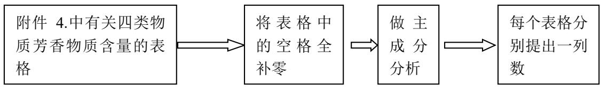

<details>
<summary>flowchart</summary>

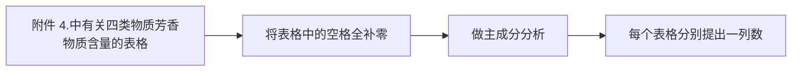
</details>

图 5-2 附件 2 的数据处理流程

在本文中对附件 3.采用的是主成分分析法，主要是由于其中的四张表格里面有很多空格，虽然按照注释中，将其补为 0，但是在这些表格中，含有的 0 过多，做别的分析影响都会比较多，由于主成分分析法的特点，所以对数据用主成分分析，将芳香物质含量列表分别降维成四个一维数列。

根据查阅资料可以得到，做主成分分析时，当所选取的主成分累计贡献率大于 $85\%$ 时，几乎能解释这些数据的全部[1]。当红葡萄的芳香物质做主成分分析选取8个主成分时累计贡献可以达到 $88.607\%$ ，因此此张表格选取8个主成分对其做综合得分；当白葡萄的芳香物质做主成分分析选取9个主成分时累计贡献率达到 $85.064\%$ ，因此这张表格选取9个主成分对其做综合得分。

## 5.2 问题 1 求解

## 5.2.1 配对 T 检验

对两组数据进行显著性检验的方法有多种，例如：两样本独立 T 检验、两两配对 T 检验、非参 T 检验等。

由于评酒员所喝的都是葡萄酒，且都是红葡萄酒或是白葡萄酒，因此这两列平均数并不是完全独立的两列数据。两样本独立 T 检验是两列独立的样本做的显著性，并不适合此类情况；两两配对 T 检验是检验两列不完全独立的样本的显著性，与本例情况适合；非参 T 检验虽然也符合本例的情况，但是根据非参和经典的 T 检验而言，一般能做经典 T 检验时不会考虑非参检验。

结合上述分析可以了解，由于此题符合做两两配对 T 检验条件，因此本文采用两两

配对 T 检验。

采用上述 5.1.1 中的预处理完的数据，运用 SPSS19.0 做两两配对 T 检验可以得到白葡萄酒两组平均数据的显著性，如表 1. 所示：

表 1. 白葡萄酒平均成绩配对 T 检验

<table><tr><td colspan="9">成对样本检验</td></tr><tr><td rowspan="4">第一组白-第二组白</td><td colspan="5">成对差分</td><td></td><td></td><td></td></tr><tr><td rowspan="2">均值</td><td rowspan="2">标准差</td><td rowspan="2">均值的标准误</td><td colspan="2">差分的95%置信区间</td><td rowspan="2">t</td><td rowspan="2">df</td><td rowspan="2">Sig.(双侧)</td></tr><tr><td>下限</td><td>上限</td></tr><tr><td>-2.33</td><td>5.14</td><td>0.97</td><td>-4.33</td><td>-0.34</td><td>-2.4</td><td>27</td><td>0.023</td></tr></table>

表 1.两组白葡萄酒平均成绩配对 T 检验结果显示，Sig 的值 p=0.023<0.05，因此可以知道这两组评酒员在 0.05 的显著性水平上，对于白葡萄酒的评酒结果是具有显著差异的。

对于红葡萄酒的两组平均成绩，也进行做配对 T 检验，经采用 SPSS19.0 可以得到对其检验后的检验数据指标，如表 2. 所示：

表 2. 红葡萄酒平均成绩配对 T 检验

<table><tr><td colspan="9">成对样本检验</td></tr><tr><td rowspan="4">第一组红-第二组红</td><td colspan="5">成对差分</td><td></td><td></td><td></td></tr><tr><td rowspan="2">均值</td><td rowspan="2">标准差</td><td rowspan="2">均值的标准误</td><td colspan="2">差分的95%置信区间</td><td rowspan="2">t</td><td rowspan="2">df</td><td rowspan="2">Sig.(双侧)</td></tr><tr><td>下限</td><td>上限</td></tr><tr><td>2.31</td><td>5.40</td><td>1.04</td><td>0.18</td><td>4.45</td><td>2.23</td><td>26</td><td>0.035</td></tr></table>

表 2.两组红葡萄酒平均成绩配对 T 检验结果显示，Sig 的值 p=0.035<0.05，因此可以知道这两组评酒员在 0.05 的显著性水平上，对于红葡萄酒的评酒结果是具有显著差异的。

综合上述证明可以得到两组红、白葡萄酒对应的两组评酒员所给每种酒的平均成绩是具有显著性的，因此可以知道两组数据是具有显著性的。

## 5.2.2 信度分析

信度分析的方法一般用于评价问卷的稳定性或可靠性，它是检验用问卷对同一事物进行重复测量后所得结果的一致性，判断问卷中的不同问题是否针对同一个目标所设的[2]。即信度分析的作用是检验问卷量表中的题目能否反映调查意图，以及所得数据的可靠性怎样。

在评价这两组评酒员对这些样品酒评分哪个更可靠性时，本文采用的是信度分析，因为附件给出的是每组是十个评酒员，而评酒员相当于是做问卷的人，评酒的每个小指标就相当于是同一个题目，他们对同一种酒进行评价，就相当于问卷中的同一个目标。然后运用一致性检验这十个评酒员对每一种葡萄酒的品尝，根据各个指标的得分情况做信度分析，其中信度分析采用的是 Cronbach α 系数。

首先，对白葡萄酒的两个表格进行分析，将每个样品酒的小指标得分作为变量，十个瓶酒员作为被调查人，对28种酒做了信度分析，得到第一组白葡萄酒的评分Cronbach $\alpha$ 系数和第二组白葡萄酒的评分Cronbach $\alpha$ 系数，如表3.所示：

表 3. 白葡萄酒各样品评分 Cronbach α 系数

<table><tr><td>组一α值</td><td>0.882</td><td>0.942</td><td>0.625</td><td>0.761</td><td>0.902</td><td>0.920</td><td>0.776</td><td>0.859</td><td>0.876</td><td>0.931</td></tr><tr><td>组二α值</td><td>0.759</td><td>0.833</td><td>0.924</td><td>0.852</td><td>0.658</td><td>0.627</td><td>0.799</td><td>0.867</td><td>0.882</td><td>0.832</td></tr><tr><td>组一α值</td><td>0.928</td><td>0.904</td><td>0.922</td><td>0.873</td><td>0.878</td><td>0.923</td><td>0.894</td><td>0.877</td><td>0.723</td><td>0.762</td></tr><tr><td>组二α值</td><td>0.883</td><td>0.879</td><td>0.824</td><td>0.614</td><td>0.846</td><td>0.831</td><td>0.701</td><td>0.727</td><td>0.674</td><td>0.840</td></tr><tr><td>组一α值</td><td>0.895</td><td>0.896</td><td>0.734</td><td>0.857</td><td>0.739</td><td>0.829</td><td>0.912</td><td>0.811</td><td></td><td></td></tr><tr><td>组二α值</td><td>0.863</td><td>0.820</td><td>0.443</td><td>0.834</td><td>0.918</td><td>0.836</td><td>0.828</td><td>0.625</td><td></td><td></td></tr></table>

从表 3. 中可以看到，两组对应每种白葡萄酒的 Cronbach α 系数分别是多少。为了方便观测那组系数的偏高个数多，画出一个两组系数的描述图，如图下所示：

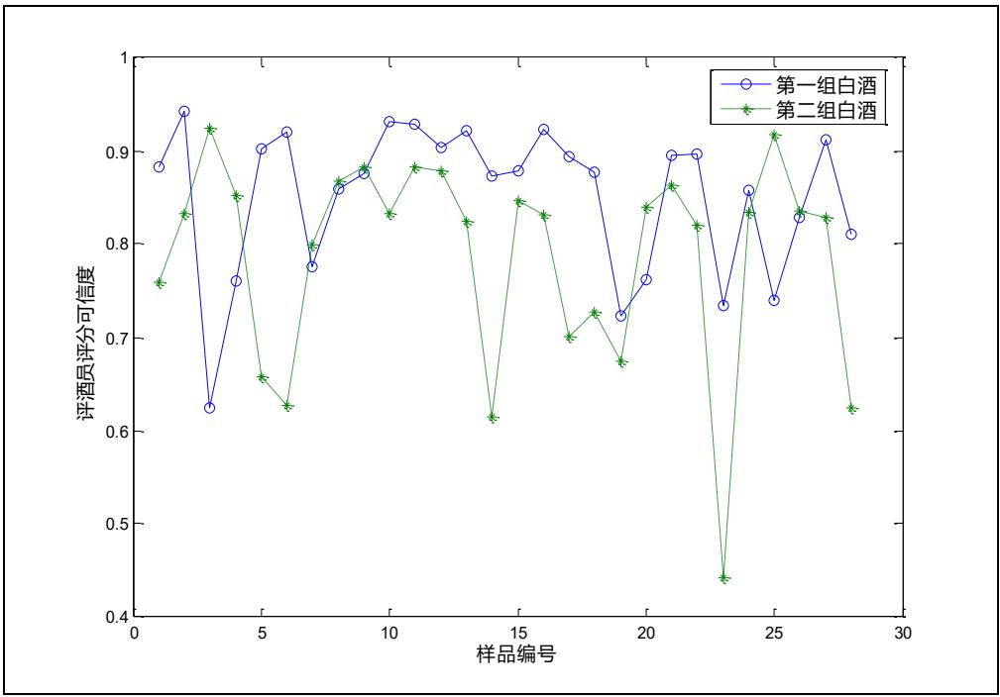

<details>
<summary>line</summary>

| 样品编号 | 第一组白酒 (评酒员评分可信度) | 第二组白酒 (评酒员评分可信度) |
| --- | --- | --- |
| 1 | ~0.88 | ~0.76 |
| 2 | ~0.94 | ~0.83 |
| 3 | ~0.63 | ~0.92 |
| 4 | ~0.76 | ~0.85 |
| 5 | ~0.90 | ~0.66 |
| 6 | ~0.92 | ~0.63 |
| 7 | ~0.78 | ~0.80 |
| 8 | ~0.86 | ~0.87 |
| 9 | ~0.88 | ~0.88 |
| 10 | ~0.93 | ~0.83 |
| 11 | ~0.93 | ~0.88 |
| 12 | ~0.90 | ~0.88 |
| 13 | ~0.92 | ~0.82 |
| 14 | ~0.87 | ~0.61 |
| 15 | ~0.88 | ~0.85 |
| 16 | ~0.92 | ~0.83 |
| 17 | ~0.90 | ~0.70 |
| 18 | ~0.88 | ~0.73 |
| 19 | ~0.72 | ~0.67 |
| 20 | ~0.76 | ~0.84 |
| 21 | ~0.90 | ~0.86 |
| 22 | ~0.90 | ~0.82 |
| 23 | ~0.73 | ~0.44 |
| 24 | ~0.86 | ~0.83 |
| 25 | ~0.74 | ~0.92 |
| 26 | ~0.83 | ~0.83 |
| 27 | ~0.91 | ~0.83 |
| 28 | ~0.81 | ~0.62 |
</details>

图 5-3 白葡萄酒 Cronbach α 系数

从图 5-3 中可以明确的看出，圆点都普遍分布在星点之上，圆点代表第一组评酒员，星点代表第二组评酒员。因此第一组的 Cronbach α 系数普遍比第二组 Cronbach α 系数大，据统计表 3. 可以得到，第一组的 Cronbach α 系数比第二组 Cronbach α 系数大的概率在 71.43%，且第一组的平均 Cronbach α 系数为 0.851 比第二组的平均 Cronbach α 系数 0.786 大，因此第一组的白葡萄酒的评分比第二组的白葡萄酒评分更可信。

然后，对红葡萄酒的两个表格进行分析，将每个样品酒的小指标得分作为变量，十个瓶酒员作为被调查人，对 27 种红葡萄酒做了信度分析，得到第一组红葡萄酒的评分 Cronbach α 系数和第二组红葡萄酒的评分 Cronbach α 系数，如表 4. 所示：

表 4. 红葡萄酒各样品评分 Cronbach α 系数

<table><tr><td>组一α值</td><td>0.846</td><td>0.825</td><td>0.744</td><td>0.857</td><td>0.810</td><td>0.853</td><td>0.877</td><td>0.656</td><td>0.565</td></tr><tr><td>组二α值</td><td>0.833</td><td>0.426</td><td>0.725</td><td>0.792</td><td>0.344</td><td>0.565</td><td>0.797</td><td>0.802</td><td>0.636</td></tr><tr><td>组一α值</td><td>0.569</td><td>0.763</td><td>0.904</td><td>0.668</td><td>0.636</td><td>0.851</td><td>0.202</td><td>0.835</td><td>0.734</td></tr><tr><td>组二α值</td><td>0.731</td><td>0.664</td><td>0.584</td><td>0.501</td><td>0.644</td><td>0.807</td><td>0.628</td><td>0.326</td><td>0.730</td></tr><tr><td>组一α值</td><td>0.778</td><td>0.575</td><td>0.861</td><td>0.812</td><td>0.721</td><td>0.840</td><td>0.789</td><td>0.734</td><td>0.678</td></tr><tr><td>组二α值</td><td>0.828</td><td>0.714</td><td>0.782</td><td>0.486</td><td>0.561</td><td>0.046</td><td>0.827</td><td>0.827</td><td>0.694</td></tr></table>

从表 4. 中不能很清晰的看出，哪组 Cronbach α 系数大于另一组的更多，因此将其做成关于样品红葡萄酒的描述统计图，如下图 5-4:

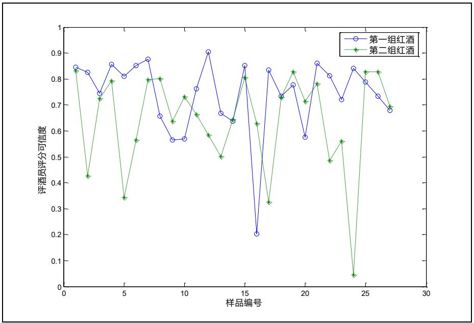

<details>
<summary>line</summary>

| 样品编号 | 第一组红酒 (评酒员评分可信度) | 第二组红酒 (评酒员评分可信度) |
| --- | --- | --- |
| 1 | ~0.85 | ~0.83 |
| 2 | ~0.83 | ~0.43 |
| 3 | ~0.75 | ~0.73 |
| 4 | ~0.86 | ~0.79 |
| 5 | ~0.81 | ~0.35 |
| 6 | ~0.85 | ~0.57 |
| 7 | ~0.88 | ~0.80 |
| 8 | ~0.66 | ~0.80 |
| 9 | ~0.57 | ~0.64 |
| 10 | ~0.57 | ~0.73 |
| 11 | ~0.76 | ~0.66 |
| 12 | ~0.90 | ~0.59 |
| 13 | ~0.67 | ~0.50 |
| 14 | ~0.64 | ~0.64 |
| 15 | ~0.85 | ~0.81 |
| 16 | ~0.20 | ~0.63 |
| 17 | ~0.83 | ~0.33 |
| 18 | ~0.73 | ~0.73 |
| 19 | ~0.78 | ~0.83 |
| 20 | ~0.58 | ~0.71 |
| 21 | ~0.86 | ~0.78 |
| 22 | ~0.81 | ~0.49 |
| 23 | ~0.72 | ~0.56 |
| 24 | ~0.84 | ~0.05 |
| 25 | ~0.79 | ~0.83 |
| 26 | ~0.73 | ~0.83 |
| 27 | ~0.68 | ~0.70 |
</details>

图 5-4 红葡萄酒 Cronbach α 系数

从图 5-4 中可以大致的看出，第一组的评酒员对所有红葡萄酒的 Cronbach α 系数普遍比第二组的偏高。据对表 4. 统计可以知道，第一组的评酒员对所有红葡萄酒的 Cronbach α 系数比第二组的系数大的概率为 62.96%>37.04%，且第一组的平均 Cronbach α 系数为 0.74 比第二组的平均 Cronbach α 系数 0.64 大，因此对于红葡萄酒的评价，第一组的数据更可靠。

综合上述可以得到白葡萄酒所得到评分成绩中，第一组数据比第二组数据更可靠；同理可得红葡萄酒的评分成绩中，也是第一组数据比第二组数据更可靠。

## 5.3 问题 2 求解

## 5.3.1 前期准备

在解此问时，所运用到的数据所涉及附件 2. 的酿酒葡萄的理化指标及葡萄酒平均分数，而求解此问关系到前期的数据处理及数据分析，数据分析及处理过程如下如：

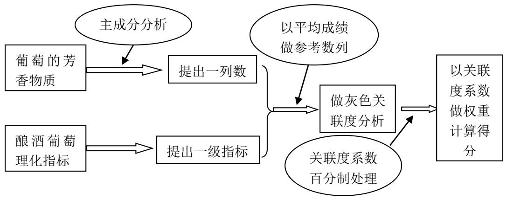

<details>
<summary>flowchart</summary>

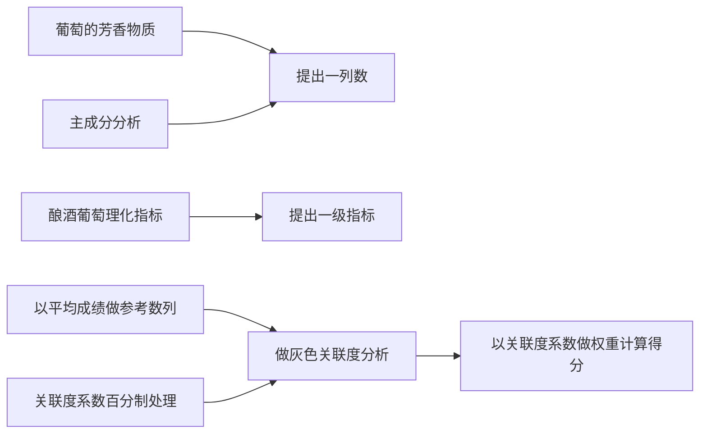
</details>

图 5-5 问题 2. 分析图

在此问题中，求解的过程分析如图 5-5。本题采用的附件 3. 的数据主要是根据主成分提取的数列，用其与附件 2. 中的一级指标做于同一级指标，然后用问题 1 中求出第一组评酒员给出的平均成绩作为参考数列，用上述提出的数列做灰色关联度分析。

由于酿酒葡萄的好坏直接影响到葡萄酒的质量，因此可以采用葡萄酒的平均分数做参考数列对酿酒葡萄的理化指标做关联度分析。将求解到各指标的关联度系数折算作为求解酿酒葡萄的综合分数的权重。

## 5.3.2 模型I建立

灰色系统理论建模的主要任务是根据具体灰色系统的行为特征数据，充分开发并利用不多的数据中的显信息和隐信息，寻找因素间或因素本身的数学关系[3]。而灰色系统理论提出了一种新的分析方法——关联度分析方法，即根据因素之间发展态势的相似或相异程度来衡量因素间关联的程度，它揭示了事物动态关联的特征与程度。

灰色关联度分析不需要过多的数据，也不需要所给的数据满足什么典型的分析，因此在做关联度分析时对数据要求比较低，做出来的效果能满足要求。

## （1）确定比较对象和参考数列

选择的评价指标有有酿酒葡萄的30个一级指标和芳香物质提出的一个指标及加上一个评酒员给出的平均分数数列作为参考数列，因此一共32个评价指标，评价对象区分白葡萄和红葡萄，白葡萄酒有28个评价对象，红葡萄酒有27个评价对象。

为了方便表示，在此处设评价对象有m个，评价指标有n个，参考数列为设参考数列为 $x_{0}=\left\{x_{0}(k)\mid k=1,2,\cdots,n\right\}$ ，比较数列为 $x_{i}=\left\{x_{i}(k)\mid k=1,2,\cdots,n\right\}$ 但是在本文中i=1，2，…,m，此处设评价对象有m个，评价指标有n个。

## (2) 将待分析的数据进行初始化处理

一般来讲，实际问题中的不同数列往往具有不同的量纲，而在计算关联系数时，要求量纲要相同。因此，需首先对各种数据进行无量纲化。另外，为了易于比较，要求所有数列有公共的交点。为了解决上述两个问题，先对给定数列进行变换。

## （3）计算灰色关联系数

$$
\xi_ {i} (k) = \frac {\min _ {s} \min _ {t} \left| x _ {0} (t) - x _ {s} (t) \right| + \rho \max _ {s} \max _ {t} \left| x _ {0} (t) - x _ {s} (t) \right|}{\left| x _ {0} (k) - x _ {i} (k) \right| + \rho \max _ {s} \max _ {t} \left| x _ {0} (t) - x _ {s} (k) \right|} \tag {1}
$$

为比较数列 $x_{i}$ 对参考数列 $x_0$ 在第 $k$ 个指标上的关联系数，其中 $\rho \in [0,1]$ 为分辨系数。其中，称 $\min_{s} \min_{t} \left| x_0(t) - x_s(t) \right|$ 、 $\max_{s} \max_{t} \left| x_0(k) - x_s(k) \right|$ 分别是两级最小差及两级最大差。

一般来讲，分辨系数 $\rho$ 越大，分辨率越大；分辨系数 $\rho$ 越小，分辨率越小。在本文中，选择分辨系数 $\rho$ 为0.5。

## （4）计算灰色加权关联度

灰色加权关联度的计算公式为:

$$
r _ {i} = \sum_ {k = 1} ^ {n} w _ {i} \xi_ {i} (k) \tag {2}
$$

其中， $r_{i}$ 为第 i 个评价对象对理想对象的灰色加权关联度。

经过运用Matlab7.0编程可以得到，每个指标相对于葡萄酒的质量的灰色关联度（程序见附录1）。根据红葡萄与白葡萄的指标不同与对象不同，得到的关联度也不尽相同，经程序运行之后可以得到它们分别的关联度。

## (5) 将关联度折算成权重

由于关联度系数可以将其看做对葡萄酒的影响大小，既是权重。在一般思想中，权重相加之和应该是等于1的，因此就可以将关联度经过一个算法将其折算成符合这种条件的权重，且不改变原来所占权重的大小。

$$
w _ {i} ^ {\prime} = \frac {r _ {i}}{\sum_ {i = 1} ^ {n} r _ {i}} \tag {3}
$$

经函数处理后的关联度转换成每个指标的权重如下表:

表 5. 白葡萄对应各指标权重

<table><tr><td>指标序号</td><td>1</td><td>2</td><td>3</td><td>4</td><td>5</td><td>6</td><td>7</td><td>8</td></tr><tr><td>权重</td><td>0.033</td><td>0.034</td><td>0.033</td><td>0.032</td><td>0.033</td><td>0.033</td><td>0.029</td><td>0.033</td></tr><tr><td>指标序号</td><td>9</td><td>10</td><td>11</td><td>12</td><td>13</td><td>14</td><td>15</td><td>16</td></tr><tr><td>权重</td><td>0.033</td><td>0.033</td><td>0.033</td><td>0.033</td><td>0.032</td><td>0.025</td><td>0.023</td><td>0.033</td></tr><tr><td>指标序号</td><td>17</td><td>18</td><td>19</td><td>20</td><td>21</td><td>22</td><td>23</td><td>24</td></tr><tr><td>权重</td><td>0.033</td><td>0.034</td><td>0.033</td><td>0.033</td><td>0.032</td><td>0.033</td><td>0.033</td><td>0.033</td></tr><tr><td>指标序号</td><td>25</td><td>26</td><td>27</td><td>28</td><td>29</td><td>30</td><td>31</td><td></td></tr><tr><td>权重</td><td>0.034</td><td>0.034</td><td>0.033</td><td>0.034</td><td>0.031</td><td>0.033</td><td>0.031</td><td></td></tr></table>

从表5.中可以看到是灰色关联度转换成权重对应每个指标的值。

表 6. 红葡萄对应各指标权重

<table><tr><td>指标序号</td><td>1</td><td>2</td><td>3</td><td>4</td><td>5</td><td>6</td><td>7</td><td>8</td></tr><tr><td>权重</td><td>0.034</td><td>0.035</td><td>0.031</td><td>0.032</td><td>0.026</td><td>0.032</td><td>0.032</td><td>0.033</td></tr><tr><td>指标序号</td><td>9</td><td>10</td><td>11</td><td>12</td><td>13</td><td>14</td><td>15</td><td>16</td></tr><tr><td>权重</td><td>0.03</td><td>0.033</td><td>0.032</td><td>0.032</td><td>0.033</td><td>0.031</td><td>0.03</td><td>0.035</td></tr><tr><td>指标序号</td><td>17</td><td>18</td><td>19</td><td>20</td><td>21</td><td>22</td><td>23</td><td>24</td></tr><tr><td>权重</td><td>0.034</td><td>0.034</td><td>0.035</td><td>0.034</td><td>0.034</td><td>0.034</td><td>0.033</td><td>0.033</td></tr><tr><td>指标序号</td><td>25</td><td>26</td><td>27</td><td>28</td><td>29</td><td>30</td><td>31</td><td></td></tr><tr><td>权重</td><td>0.034</td><td>0.034</td><td>0.032</td><td>0.035</td><td>0.031</td><td>0.022</td><td>0.03</td><td></td></tr></table>

从表中可以看到，经过转换后的权重相加是为1的，因此满足对同一个总体的权重相加是为1的要求。其中指标序号是根据重组值的指标排列的。

## 5.3.3 模型I求解

根据5.3.2中计算到的每个指标关于酿酒葡萄的权重，可以根据计算到的权重对应每个指标的大小进行加权求和可以得到酿酒葡萄的最后综合得分，即是：

$$
y _ {j} = \sum_ {i = 1} ^ {n} w _ {i} ^ {\prime} x _ {j i} \tag {4}
$$

其中， $y_{j}$ 表示第 j 个葡萄样本的综合得分， $x_{ji}$ 表示第 j 个葡萄样本的第 i 个指标值。

根据式子（4）可以得到两组酿酒葡萄的综合得分，然后再根据最后的综合得分来划分葡萄等级。经查阅划分葡萄酒的等级资料，发现最出名的葡萄酒产地法国是将葡萄酒分为四类，然而葡萄酒的质量又能直接反应酿酒葡萄的质量，因此此处采用的是4分位数来划分葡萄等级，分别将红、白葡萄划分四个等级。

四分位数是将所有数值按大小顺序排列并分成四等分，处于三个分割点位置的得分

就是四分位数，最小的四分位数成为下四分位数。

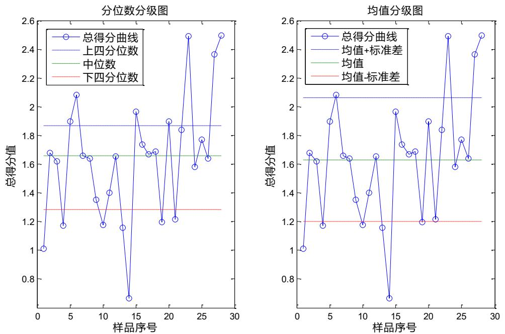  
图 5-6 白葡萄四分位图

从上述图显示，左边的图时以中位数划分的四分位，右边是以均值划分的的四分位图。从5-6中白葡萄的等级界限和每个等级区间的个数。

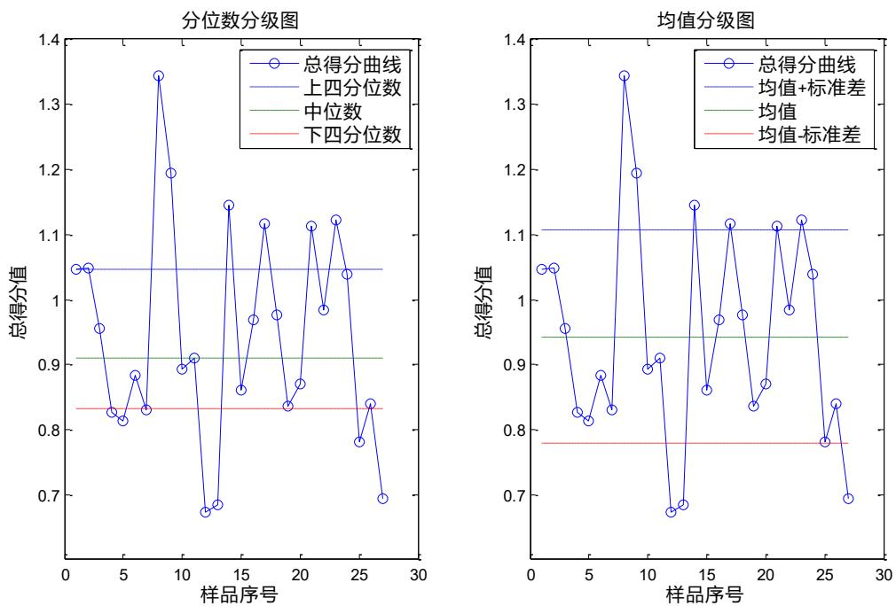  
图 5-7 红葡萄四分位图

图5-7中左边是图时以中位数划分的四分位，右边是以均值划分的的四分位图。从图中可以看到红葡萄的等级划分界限及每个等级的个数。

然后根据Q聚类划分，可以做出聚类划分图如下：

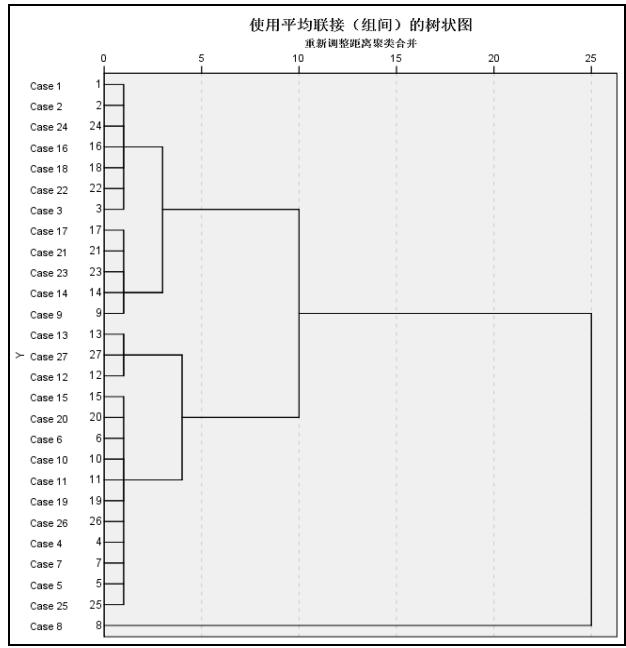

<details>
<summary>dendrogram</summary>

| Case | Cluster Group |
| --- | --- |
| Case 1 | Top Cluster |
| Case 2 | Top Cluster |
| Case 24 | Top Cluster |
| Case 16 | Middle Cluster |
| Case 18 | Middle Cluster |
| Case 22 | Middle Cluster |
| Case 3 | Middle Cluster |
| Case 17 | Middle Cluster |
| Case 21 | Middle Cluster |
| Case 23 | Middle Cluster |
| Case 14 | Middle Cluster |
| Case 9 | Bottom Cluster |
| Case 13 | Bottom Cluster |
| Case 27 | Bottom Cluster |
| Case 12 | Bottom Cluster |
| Case 15 | Bottom Cluster |
| Case 20 | Bottom Cluster |
| Case 6 | Bottom Cluster |
| Case 10 | Bottom Cluster |
| Case 11 | Bottom Cluster |
| Case 19 | Bottom Cluster |
| Case 26 | Bottom Cluster |
| Case 4 | Bottom Cluster |
| Case 7 | Bottom Cluster |
| Case 5 | Bottom Cluster |
| Case 25 | Bottom Cluster |
| Case 8 | Bottom Cluster |
</details>

图 5-8 左图红葡萄 Q 聚类

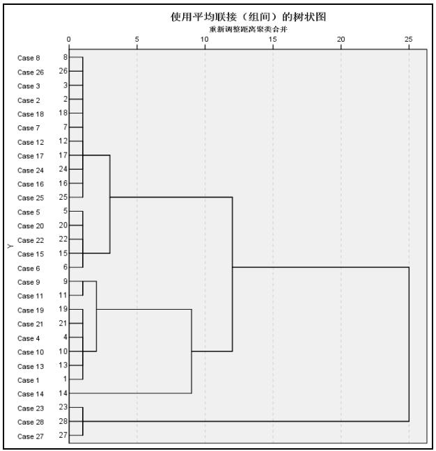

<details>
<summary>dendrogram</summary>

| Case | Group间 (Group间) | Reconstructed Distance to Cluster A Merge |
| --- | --- | --- |
| Case 8 | 8 | ~1.5 |
| Case 26 | 26 | ~1.5 |
| Case 3 | 3 | ~1.5 |
| Case 2 | 2 | ~1.5 |
| Case 18 | 18 | ~1.5 |
| Case 7 | 7 | ~1.5 |
| Case 12 | 12 | ~1.5 |
| Case 17 | 17 | ~4.0 |
| Case 24 | 24 | ~1.5 |
| Case 16 | 16 | ~1.5 |
| Case 25 | 25 | ~9.0 |
| Case 5 | 5 | ~1.5 |
| Case 20 | 20 | ~1.5 |
| Case 22 | 22 | ~1.5 |
| Case 15 | 15 | ~4.0 |
| Case 6 | 6 | ~14.0 |
| Case 9 | 9 | ~2.0 |
| Case 11 | 11 | ~2.0 |
| Case 19 | 19 | ~9.0 |
| Case 21 | 21 | ~2.0 |
| Case 4 | 4 | ~2.0 |
| Case 10 | 10 | ~9.0 |
| Case 13 | 13 | ~2.0 |
| Case 1 | 1 | ~2.0 |
| Case 14 | 14 | ~9.0 |
| Case 23 | 23 | ~2.0 |
| Case 28 | 28 | ~25.0 |
| Case 27 | 27 | ~2.0 |
</details>

图 5-9 右图白葡萄 Q 聚类

根据上述两图可以知道，做加权求和得到的分数做做Q聚类时得到划分葡萄等级的情况。可以根据红、白葡萄划分的需要（一般为3到5类），从树状图中对应葡萄的种类归类。

## 5.3.4 模型I改进

在前面计算葡萄样品的综合成绩是用一个加权求和，求出来的分数相差很大，得分比较离散，而且在此处计算时只是用简单的线性求和，为了缩小综合成绩的分数和更合理的计算综合成绩，因此在模型 I 中的求综合成绩部分进行改进。

秩和比综合评价法是将一个矩阵，通过秩的转换，获得无量纲统计RSR；在此基础上，运用参数统计分析的概念与方法，研究RSR的分布；以RSR值对评价对象的优劣直接排序，从而对评价对象作出综合评价[3]。

## (1) 编秩

将m个评价对象的n个评价指标排列成m行n列的原始数据表。编出每个指标各评价对象的秩，其中效益型指标从小到大编秩，成本型指标从大到小编秩，由于酿酒葡萄到葡萄酒的过程是一个提取的过程，因此可以将其都当做是效益型指标，同一指标数据相同者编平均秩。得到的秩矩阵记为 $R=(R_{ji})_{m\times n}$ 。

## (2) 计算秩和比 (WRSR)

经过灰色关联度分析得到的权重是各个指标不相等的权重值，因此在计算秩和比时应该采用的权重不同时，计算加权秩和比（WRSR），其计算公式为：

$$
W R S R _ {j} = \frac {1}{m} \sum_ {i = 1} ^ {n} w _ {i} R _ {j i} \tag {5}
$$

其中， $w_{i}$ 为第 i 个评价指标的权重，由于权重的取值需要客观，才能真实的反应情况。因此本文中此处采用上述灰色关联度转换后的权重既是，作为此处的权重，这样能避免将所有的指标取相同的权重。

## （3）计算概率单位

编秩WRSR频率分布表，列出各组频数 $f_{j}$ ，计算各组累计频数 $cf_{i}$ ，计算累计频率，既

是 $p_{i}=cf_{i}/n$ ，然后将 $p_{i}$ 转换为概率单位Probit $_{i}$ , Probit $_{i}$ 为标准正态分布的 $p_{i}$ 分位数加5。

## (4) 计算直线回归方程

以累计频率所对应的概率单位Probit $_{i}$ 为自变量，以WRSR $_{i}$ 值为因变量，计算直线回归方程，即为：

$$
\mathrm{WRSR} _ {i} = a + b \times \text {Probit} _ {i} \tag {6}
$$

经过计算可以得到具体的式子为:

红葡萄综合得分: $\mathrm{WRSR}_{i}=0.69407-0.034509\times\mathrm{Probit}_{i}$

白葡萄综合得分: $WRSR_{i}=0.40519-0.02216\times Probit_{i}$

根据秩和比综合评价法的思想，通过Matlab7.0进行编程运行计算，可以得到两组葡萄内不同样品的综合评价分数。

经过运用秩和比综合评价得到的综合分数组距是比较小的，因此在进行划分葡萄等级时可以采用Q型聚类，其根据葡萄的分类可以画出聚类图，如下：

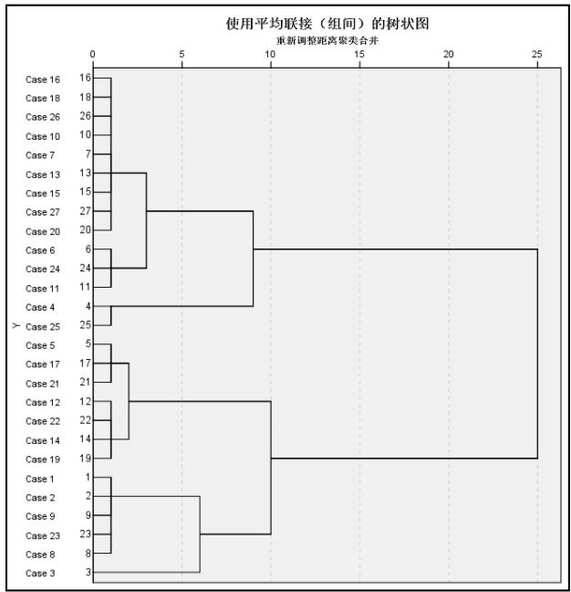

<details>
<summary>dendrogram</summary>

| Case | Branch Length |
| --- | --- |
| Case 16 | ~1 |
| Case 18 | ~1 |
| Case 26 | ~1 |
| Case 10 | ~1 |
| Case 7 | ~1 |
| Case 13 | ~3 |
| Case 15 | ~1 |
| Case 27 | ~9 |
| Case 20 | ~1 |
| Case 6 | ~9 |
| Case 24 | ~3 |
| Case 11 | ~1 |
| Case 4 | ~9 |
| > Case 25 | ~1 |
| Case 5 | ~1 |
| Case 17 | ~2 |
| Case 21 | ~1 |
| Case 12 | ~9 |
| Case 22 | ~1 |
| Case 14 | ~3 |
| Case 19 | ~9 |
| Case 1 | ~1 |
| Case 2 | ~6 |
| Case 9 | ~1 |
| Case 23 | ~9 |
| Case 8 | ~1 |
| Case 3 | ~6 |
</details>

图5-10左图秩和比白葡萄聚类图

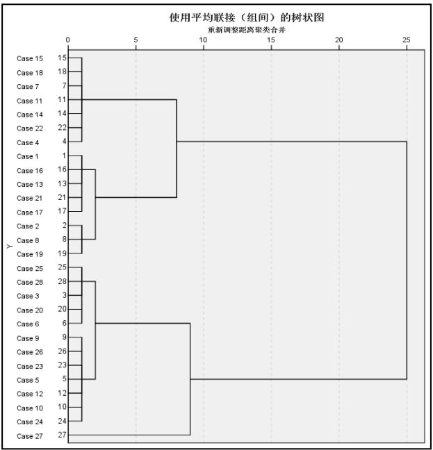

<details>
<summary>dendrogram</summary>

| Case | Cluster Group |
| --- | --- |
| Case 15 | Top Cluster (0-5) |
| Case 18 | Top Cluster (0-5) |
| Case 7 | Top Cluster (0-5) |
| Case 11 | Middle Cluster (0-5) |
| Case 14 | Middle Cluster (0-5) |
| Case 22 | Middle Cluster (0-5) |
| Case 4 | Middle Cluster (0-5) |
| Case 1 | Bottom Cluster (0-5) |
| Case 16 | Bottom Cluster (0-5) |
| Case 13 | Bottom Cluster (0-5) |
| Case 21 | Middle Cluster (0-5) |
| Case 17 | Bottom Cluster (0-5) |
| Case 2 | Bottom Cluster (0-5) |
| Case 8 | Bottom Cluster (0-5) |
| Case 19 | Bottom Cluster (0-5) |
| Case 25 | Bottom Cluster (0-5) |
| Case 28 | Middle Cluster (0-5) |
| Case 3 | Middle Cluster (0-5) |
| Case 20 | Middle Cluster (0-5) |
| Case 6 | Middle Cluster (0-5) |
| Case 9 | Middle Cluster (0-5) |
| Case 26 | Middle Cluster (0-5) |
| Case 23 | Middle Cluster (0-5) |
| Case 5 | Middle Cluster (0-5) |
| Case 12 | Bottom Cluster (0-5) |
| Case 10 | Bottom Cluster (0-5) |
| Case 24 | Bottom Cluster (0-5) |
| Case 27 | Bottom Cluster (0-5) |
</details>

图5-11右图秩和比红葡萄聚类图

从上图中可以看到，根据划分的葡萄的等级数不同，可以依次对红、白葡萄样本进行归类，根据一般划分情况为3-5类，划分情况见下表：

表 7. 秩和比综合评价红、白葡萄等级划分

<table><tr><td colspan="6">按五个等级划分葡萄样品</td></tr><tr><td>等级</td><td>个数</td><td>红葡萄样品编号</td><td>等级</td><td>个数</td><td>白葡萄样品编号</td></tr><tr><td>1</td><td>5</td><td>1,2,8,9,23</td><td>1</td><td>8</td><td>1,2,8,13,16,17,19,21</td></tr><tr><td>2</td><td>1</td><td>3</td><td>2</td><td>5</td><td>3,6,20,25,28</td></tr><tr><td>3</td><td>2</td><td>4,25</td><td>3</td><td>7</td><td>4,7,11,14,15,18,22</td></tr><tr><td>4</td><td>7</td><td>5,12,14,17,19,21,22</td><td>4</td><td>7</td><td>5,9,10,12,23,24,26</td></tr><tr><td>5</td><td>12</td><td>6,7,10,11,13,15,16,18,20,24,26,27</td><td>5</td><td>1</td><td>27</td></tr></table>

按四个等级划分葡萄样品

<table><tr><td>1</td><td>6</td><td>1,2,3,8,9,23</td><td>1</td><td>8</td><td>1,2,8,13,16,17,19,21</td></tr><tr><td>2</td><td>2</td><td>4, 25</td><td>2</td><td>6</td><td>3,5,6,9,10,12</td></tr><tr><td>3</td><td>7</td><td>5,12,14,17,19,21,22</td><td>3</td><td>13</td><td>4,7,11,14,15,18,22,20,23,24,25,26,28</td></tr><tr><td>4</td><td>12</td><td>6,7,10,11,13,15,16,18,24,26,27,20</td><td>4</td><td>1</td><td>27</td></tr><tr><td colspan="6">按三个等级划分葡萄样品</td></tr><tr><td>1</td><td>6</td><td>1,2,3,8,9,23</td><td>1</td><td>15</td><td>1,2,4,7,8,13,14,15,16,17,18,19,21,22,11</td></tr><tr><td>2</td><td>14</td><td>4,6,7,10,11,13,15,16,18,20,24,25,26,27</td><td>2</td><td>12</td><td>3,5,6,9,10,23,24,25,26,20,28,12</td></tr><tr><td>3</td><td>7</td><td>5,12,14,17,19,21,22</td><td>3</td><td>1</td><td>27</td></tr></table>

根据改进的方法可以从表7.中详细的可以看出当红、白葡萄级别分为3-5类时，各种葡萄的分类情况。

## 5.4 问题 3 求解

## 5.4.1 模型II准备

问题3主要是通过数据来分析酿酒葡萄的理化指标与葡萄酒的理化指标之间的联系。首先对酿酒葡萄与葡萄酒的理化指标做相关性分析，其中两组的理化指标都另外加有一个芳香物质的指标，是前期经过主成分分析处理的芳香物质提取的一列数据，而且两组的理化指标都是采用一级指标。

经过SPSS19.0软件对这两组指标进行做相关性分析，能够发现，在葡萄酒中的理化指标能在酿酒葡萄的理化指标中找到与之对应的高度线性相关指标，因此这两组数据存在一定的线性因果关系，所以为模型的建立与求解做准备。

## 5.4.2 模型建立II与求解

偏最小二乘回归提供一种多对多线性回归模型的方法，特别当两组变量的个数很多，且具有多重相关性，而观测数据的数列又较少时，用偏最小二乘回归建立的模型具有传统的检点回归分析等方法所没有的优点。

这两组理化指标存在着观测数据较少而变量过多的情况，因此采用偏最小二乘回归建立模型。

设自变量酿酒葡萄的理化指标的观测数据矩阵记为 $A=(a_{ij})$ ，因变量葡萄酒的理化指标的观测数据矩阵记为 $B=(b_{ij})$ 。

（1）数据标准化，首先应该对两个数据矩阵进行标准化，标准化后的 $a_{ij}$ 、 $b_{ij}$ 将各指标值转换成标准化指标值 $\tilde{a}_{ij}$ 、 $\tilde{b}_{ij}$ 。  
（2）求相关系数矩阵，根据标准化后的两个数据矩阵求相关系数矩阵。从这个相关矩阵中可以看出这些指标的相关是呈什么状态。  
（3）然后提出自变量组合因变量组的成分，使用Matlab软件，可以求得的各对成分分。  
（4）根据提出的15成分可以建立标准化指标变量与成分变量之间的回归方程。  
(5) 将步骤 (3) 中成分 $u_{i}$ 代入步骤 (4) 中 $\tilde{y}_{i}$ 的回归方程, 得到标准化指标变量之间的回归方程, 然后将标准化变量还原成原始变量 $y_{j}, x_{j}$ , 得到的回归方程为:

$$
Y = A X + B \tag {7}
$$

式子（7）是一个含有15个方程的代表式，其中A为一个系数矩阵，由于该系数矩阵过大，详细请见附录1.，B为一个常数，其矩阵为：

$$
B = [ - 1 5 5. 3 4 0, - 4. 8 7 1, - 3. 3 9 2, - 5. 5 6 6, - 1. 4 0 0, - 0. 2 8 8, 1 0 4. 0 4 0, 6 5. 3 8 8, 4. 9 7 8, - 1. 8 9 2 ] ^ {T}
$$

通过上述回归方程可以拟合得到与之相对应的数值，根据拟合值与原值做的拟合图

如下：

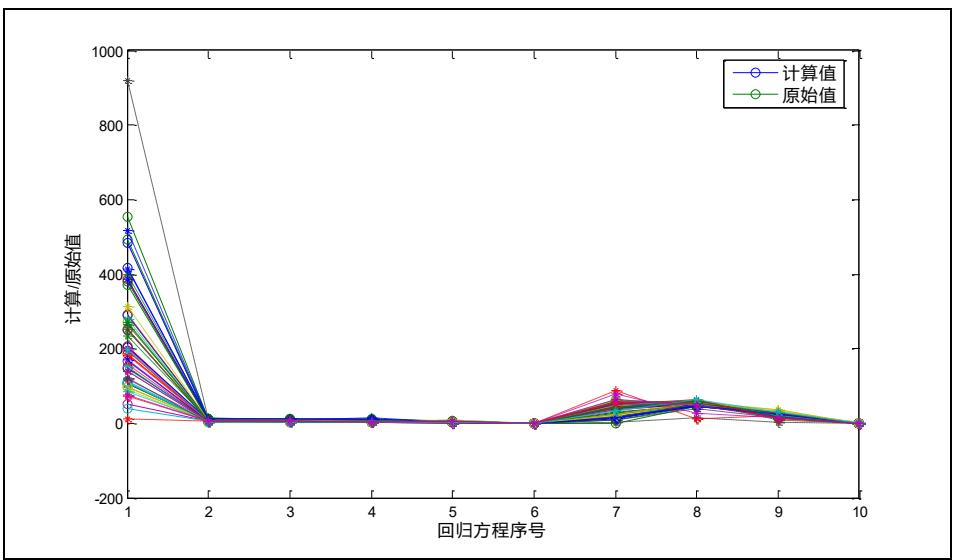

<details>
<summary>line</summary>

| 回归方程序号 | 计算值 | 原始值 |
| --- | --- | --- |
| 1 | ~480 | ~550 |
| 2 | ~10 | ~10 |
| 3 | ~10 | ~10 |
| 4 | ~10 | ~10 |
| 5 | ~5 | ~5 |
| 6 | ~5 | ~5 |
| 7 | ~50 | ~80 |
| 8 | ~50 | ~60 |
| 9 | ~20 | ~30 |
| 10 | ~5 | ~5 |
</details>

图 5-12 拟合图

从上图中可以大致看出，拟合的值与原值相差不是很大，开始时能看到明显的红、蓝分开，其余都重合效果较好。

## (6) 模型的解释与检验

由于此处建立的偏最小二乘回归模型中，是选用了31个指标，因此在模型检验中如果采用绘制回归系数图及直方图，将会有几十个图，因此不能采用普通常用模型检验图，为了更直观的查看，将其误差做成相对误差图，如下：

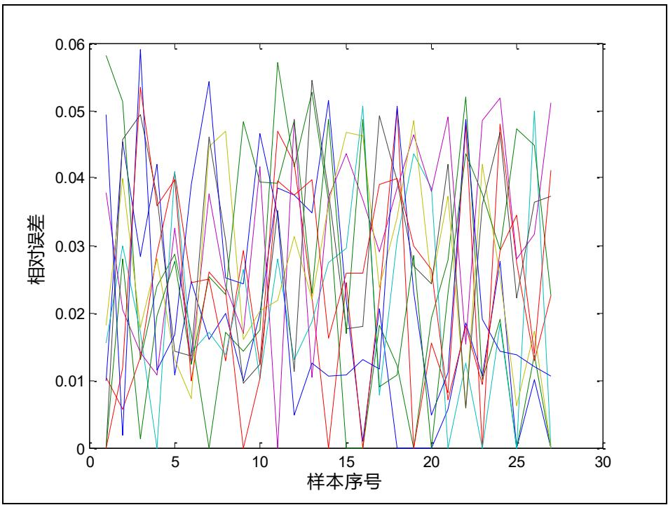

<details>
<summary>line</summary>

| 样本序号 | 红色线 (相对误差) | 黑色线 (相对误差) | 绿色线 (相对误差) | 橙色线 (相对误差) | 紫色线 (相对误差) | 蓝色线 (相对误差) | 红色线 (相对误差) | 绿色线 (相对误差) | 棕色线 (相对误差) |
| --- | --- | --- | --- | --- | --- | --- | --- | --- | --- |
| 1 | ~0.010 | ~0.058 | ~0.058 | ~0.038 | ~0.018 | ~0.049 | ~0.010 | ~0.016 | ~0.016 |
| 2 | ~0.006 | ~0.045 | ~0.051 | ~0.028 | ~0.040 | ~0.028 | ~0.028 | ~0.028 | ~0.030 |
| 3 | ~0.014 | ~0.049 | ~0.014 | ~0.014 | ~0.014 | ~0.059 | ~0.053 | ~0.014 | ~0.014 |
| 4 | ~0.036 | ~0.042 | ~0.028 | ~0.028 | ~0.028 | ~0.036 | ~0.036 | ~0.028 | ~0.028 |
| 5 | ~0.040 | ~0.014 | ~0.028 | ~0.014 | ~0.014 | ~0.014 | ~0.014 | ~0.014 | ~0.014 |
| 6 | ~0.025 | ~0.025 | ~0.025 | ~0.025 | ~0.025 | ~0.025 | ~0.025 | ~0.025 | ~0.025 |
| 7 | ~0.025 | ~0.054 | ~0.025 | ~0.025 | ~0.025 | ~0.054 | ~0.025 | ~0.025 | ~0.025 |
| 8 | ~0.025 | ~0.025 | ~0.025 | ~0.025 | ~0.025 | ~0.025 | ~0.025 | ~0.025 | ~0.025 |
| 9 | ~0.029 | ~0.017 | ~0.017 | ~0.017 | ~0.017 | ~0.017 | ~0.017 | ~0.017 | ~0.017 |
| 10 | 0 | 0.039 | 0.039 | 0.039 | 0.039 | 0.039 | 0.039 | 0.039 | 0.039 |
| 11 | 0.039 | 0.039 | 0.039 | 0.039 | 0.039 | 0.039 | 0.039 | 0.039 | 0.039 |
| 12 | 0.039 | 0.039 | 0.039 | 0.039 | 0.039 | 0.039 | 0.039 | 0.039 | 0.039 |
| 13 | 0.039 | 0.039 | 0.039 | 0.039 | 0.039 | 0.039 | 0.039 | 0.039 | 0.039 |
| 14 | 0.039 | 0.545 | 545 | 545 | 545 | 545 | 545 | 545 | 545 |
| 15 | 545 | 545 | 545 | 545 | 545 | 545 | 545 | 545 | 545 |
| 16 | 545 | 545 | 545 | 545 | 545 | 545 | 545 | 545 | 545 |
| 17 | 545 | 545 | 545 | 545 | 545 | 545 | 545 | 545 | 545 |
| 18 | 545 | 545 | 545 | 545 | 545 | 545 | 545 | 545 | 545 |
| 19 | 545 | 545 | 545 | 545 | 545 | 545 | 545 | 545 | 545 |
| 20 | 545 | 545 | 545 | 545 | 545 | 545 | 545 | 545 | 545 |
| 21 | 545 | 545 | 545 | 545 | 545 | 545 | 545 | 545 | 545 |
| 22 | 545 | 545 | 545 | 545 | 545 | 545 | 545 | 545 | 545 |
</details>

图 5-13 误差分析图

从上图中可以看出，相对误差是控制在0.06以内，因此建立的偏最小二乘回归模型的拟合是能够接受的，即说明酿酒葡萄与葡萄酒的理化指标之间存在线性关系，能够运用该模型用酿酒葡萄的理化指标对葡萄酒的理化指标做预测，

## 5.5 问题 4 求解

## 5.5.1 影响分析

对问题4中的酿酒葡萄的理化指标与葡萄酒的理化指标对葡萄酒的质量影响分析，采用的是因果分析法。

因果分析法是是通过因果图表现出来，因果图又称特性要因图、鱼刺图或石川图，是为了寻找产生某种质量问题的原因[4]。因果分析法是是按事物之间的因果关系，知因测果或倒果查因。因果预测分析是整个预测分析的基础。

问题4中各个事物之间的因果分析图如下:

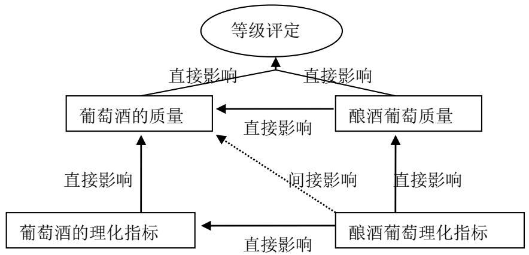

<details>
<summary>flowchart</summary>

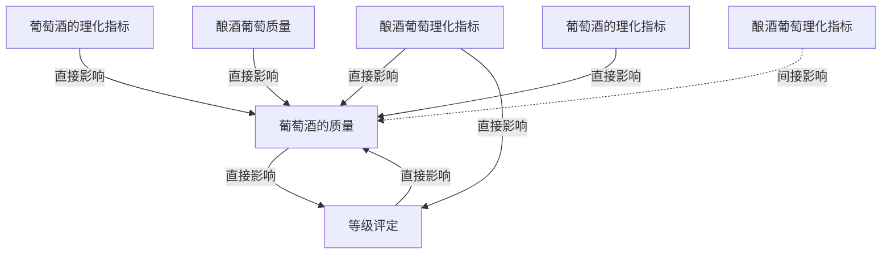
</details>

图 5-14 因果分析图

从上图中可以看出，根据题中指出酿酒葡萄理化指标直接影响酿酒葡萄的质量，酿酒葡萄质量直接影响葡萄等级的评定；而经过相关性分析可以知道酿酒葡萄理化指标可以直接影响葡萄酒的理化指标，而葡萄酒的理化指标又能直接影响葡萄酒的质量，葡萄酒的质量又直接影响葡萄酒的等级评定，其中酿酒葡萄质量又能直接影响葡萄酒的质量。

因此根据因果分析图可以得到酿酒葡萄的理化指标与葡萄酒的理化指标能对葡萄酒的质量有影响。

## 5.5.2 模型III建立与求解

首先用方法一分别做酿酒葡萄与葡萄酒理化指标（都含芳香物质一列指标）和葡萄酒质量的评定平均分做逐步分析，删除概率小于0.05的指标，然后再此基础上建立多元回归分析，经分析结果显示关于白葡萄理化指标及白葡萄酒理化指标与白葡萄酒质量之间的模型只选取了2个指标，且只有一个指标是存在与葡萄酒的理化指标的；而另外对对应的两类理化指标与红葡萄酒质量建立的模型也只选取3个指标，因此用这种方法删除的指标建立的模型解释过于片面性，不能说明总体的情况。

方法二分别用红、白葡萄的理化指标做与葡萄酒质量的相关分析，根据分析结果删除一些相关性小于0.1的指标。在利用红、白葡萄酒的理化指标做与葡萄酒质量的相关分析，根据各相关指标的相关性大小删除小于0.1的指标。然后对剩下指标做主成分分析，根据贡献率提取主成分。

首先做酿酒白葡萄与白葡萄酒理化指标的主成分分析，当提取 14 个主成分时，累计贡献率达到 90.463%，然后对提取的主成分做关于白葡萄酒质量的多元线性回归，建立的模型如下：

$$
\begin{array}{l} Y = 0. 1 6 1 X _ {1} - 1. 7 5 7 X _ {2} - 1. 9 1 5 _ {3} - 0. 0 1 6 X _ {4} + 0. 7 0 6 X _ {5} + 1. 6 4 7 X _ {6} - 0. 9 7 1 X _ {7} - 0. 8 5 4 X _ {8} \tag {7} \\ + 1. 7 8 5 X _ {9} - 0. 9 6 3 X _ {1 0} + 1. 4 8 5 X _ {1 1} + 0. 9 1 7 X _ {1 2} + 0. 4 5 2 X _ {1 3} - 0. 4 8 1 X _ {1 4} + 7 4. 9 6 9 \\ \end{array}
$$

其中 $Y$ 是白葡萄酒10名评酒员打分均值， $X_{i}$ 表示理化指标提取的主成分第 $i$ 个因子得分。运用建立多元线性模型对所选取的葡萄酒平均分做拟合，得到拟合后的残差极值分析如下表：

表 8. 白葡萄酒拟合残差统计

<table><tr><td></td><td>极小值</td><td>极大值</td><td>均值</td><td>标准偏差</td></tr><tr><td>预测值</td><td>63.8806</td><td>82.8692</td><td>74.9688</td><td>4.38901</td></tr><tr><td>残差</td><td>-4.1035</td><td>3.68119</td><td>0</td><td>1.75365</td></tr><tr><td>标准 预测值</td><td>-2.526</td><td>1.8</td><td>0</td><td>1</td></tr><tr><td>标准 残差</td><td>-1.624</td><td>1.457</td><td>0</td><td>0.694</td></tr></table>

从表格中可以看到极大残差与极小残差值，在规定葡萄酒质量的总分为 100 分的情况下，做预测的极大、极小值都低于 5 以下，在可以接受的范围。

然后运用酿酒红葡萄与红葡萄的理化指标主成分分析，提取 12 个主成分时累计贡献率达到了 85% 以上，然后用提取的主成分与所选取葡萄酒平均评分做多元线性拟合，建立一个关于计算红葡萄酒质量得分的模型，如下：

$$
\begin{array}{l} y = 2. 9 8 3 x _ {1} - 2. 9 9 2 x _ {2} + 1. 0 3 2 x _ {3} + 3. 6 5 5 x _ {4} - 0. 2 2 4 x _ {5} + 0. 2 4 5 x _ {6} + 1. 2 4 6 x _ {7} + 0. 7 5 5 x _ {8} \tag {8} \\ - 1. 2 3 8 x _ {9} - 1. 5 8 4 x _ {1 0} + 1. 2 1 2 x _ {1 1} - 0. 9 5 4 x _ {1 2} + 7 2. 9 5 8 \\ \end{array}
$$

其中 y 为红葡萄酒 10 名评酒员打分均值， $x_{j}$ 表示理化指标提取的主成分第 j 个因子得分。运用建立多元线性模型对所选取的葡萄酒平均分做拟合，得到拟合后的残差极值分析如下表：

表 9. 红葡萄酒拟合残差统计

<table><tr><td></td><td>极小值</td><td>极大值</td><td>均值</td><td>标准偏差</td><td>N</td></tr><tr><td>预测值</td><td>58.4718</td><td>86.0498</td><td>72.9583</td><td>6.39734</td><td>27</td></tr><tr><td>残差</td><td>-8.16373</td><td>6.00957</td><td>.00000</td><td>3.75585</td><td>27</td></tr><tr><td>标准 预测值</td><td>-2.264</td><td>2.046</td><td>.000</td><td>1.000</td><td>27</td></tr><tr><td>标准 残差</td><td>-1.595</td><td>1.174</td><td>.000</td><td>.734</td><td>27</td></tr></table>

a. 因变量: 葡萄酒质量评分

从表格中可以看到极大残差与极小残差值，在规定葡萄酒质量的总分为 100 分的情况下，做预测的极大、极小值都低于 10 以下，在可以接受的范围。

通过建立模型III可以说明酿酒葡萄和葡萄酒的理化指标对葡萄酒的质量有影响，而且能够用这两个理化指标来评价葡萄酒的质量。

## 6. 模型的评价

## 6.1 模型的优点

（1）改进模型I中运用的秩和比综合评价法采用的权重是经过运用灰色关联度系数求占总体比重得到，比直接都取相同的权重更具客观。  
(2) 对模型I、II、III中运用的数据芳香物质处理采用主成分分析 (PCA)能解释芳香物质的 $85\%$ 以上且又很好的避免对有些物质含量为0的需要处理而达到了对芳香物质的降维作用。  
（3）模型Ⅲ中采用的偏最小二乘回归分析能够对那些指标多但观测样本少的问题具有很强的通用性。

（4）因果分析法可以使复杂问题变得更清楚，方便理解。

## 6.2 模型的缺点

（1）模型Ⅱ中做回归分析时没有考虑指标与评定结果之间存在其他非线性关系，而仅考虑线性关系。  
（2）在考虑酿酒葡萄理化指标与葡萄酒理化指标对质量的影响时没有剔除它们之间的影响。  
（3）在做酿酒葡萄的等级划分是直接以葡萄酒的质量作为导向的，没有考虑葡萄酒的质量存在酿酒技术的差异。

## 7. 模型推广

在本文中主要是建立了三个模型和问题 1 求解中运用到配对 T 检验和信度分析。其中运用到配对 T 检验和信度分析不需要修改就可以得到很广的运用，而其它三个建立的模型，根据现实情况做适当的修改，可以使其得到很广的运用。

在配对 T 检验主要可以做关于两列数据不完全独立时，可以检验这两列数据的显著性，一般是用于统计类问题。而在做信度分析时主要是对问卷量表做内部一致性检验及在制作量表时，对量表问卷做修改或删减时也会采用到一致性检验，因此在这两类方法中，主要是运用于解决统计类问题。

模型I中采用到了灰色关联度分析和秩和比综合分析法。而灰色关联度分析是灰色系统理论的一个分支。目前，灰色系统理论已成功地应用于工程控制、经济管理、未来学研究、生态系统及复杂多变的农业系统中，并取得了可喜的成就。灰色系统理论有可能对社会、经济等抽象系统进行分析、建模、预测、决策和控制，它有可能成为人们认识客观系统改造客观系统的一个新型的理论工具。秩和比综合分析法是一种新的综合评价方法，这种方法建立的模型主要是运用于医疗卫生领域的多指标综合评价、统计预测预报、统计质量控制等方面。

模型II采用的是偏最小二乘法回归分析，这种方法集中了主成分、典型相关性和线性回归分析方法的特点。这模型对那种需要做回归分析但是指标比较多而样本观测量比较少的一些问题。例如在做现行碳外汇等研究方向分析，多采用的都是此类方法。

模型中运用到的因果分析法是在做决策、项目管理等多复杂因素问题中运用到，这种方法可以使问题清楚明朗。

## 8. 参考文献

[1] 杜强，贾丽艳，SPSS统计分析从入门到精通 [M]，北京：人民邮电出版社，2011(9): 331-335。  
[2] 徐秋艳，SPSS 统计分析方法及应用[M]，北京：中国水利水电出版社，2011:200-212。  
[3] 司守奎，数学建模算法与程序[M]，北京：清华大学出版社，2007(5)：11-26。  
[4] 张文彤, SPSS统计分析基础教程(第二版)[M], 北京: 高校出版社, 2011:327-336。  
[5] 蔡建琼，于惠芳等，SPSS 统计分析实例精选[M]，北京：清华大学出版社，2006:292-307。

## 附录

## 一：使用软件工具

SPSS 19.0 和 Matlab

## 二：特殊说明

1、SPSS 软件处理的相关方法和结果及 matlab 源程序（电子稿）详见附件。  
2、matlab 运行须知：关于第二问程序运行时，有三处调用了 input 函数需要输入数据：第一处若选择对红葡萄分级，则输入 1，若选择对白葡萄分级，则输入 2；第二处若第一处输入 1，则此处输入 8，若第一处输入 2，则此处输入 10；第三处若选择简单加权求和，则输入 1，若选择秩和比综合评价，则输入 2。

## 三：Matlab 源程序

附录 1.

第二问源程序

```matlab
%%%%%%%%%%%%%%%酿酒葡萄的分级%%%%%%%%%%%%%%%%%%%%%%
clc,clear
%%%%%%%%%%%%%%%以下是对哪种葡萄分级进行选择%%%%%%%%%%%%
nn=input('红葡萄分级输入1，白葡萄分级输入2。请选择:(');
if nn==1
    gj=xlsread('data.xls',1);%导入红葡萄芳香物质数据矩阵
else
    gj=xlsread('data.xls',2);%导入白葡萄芳香物质数据矩阵
end
%%%%%%%%%%%%%以下对芳香物质进行主成分分析提取%%%%%%%%%%
gj=gj';
gj=zscore(gj); %数据标准化
r=corrcoef(gj); %计算相关系数矩阵
[x,y,z]=pcacov(r); %y 为 r 的特征值，z 为各个主成分的贡献率
contr=cumsum(z);%计算累积贡献率
f=repmat(sign(sum(x)),size(x,1),1);
x=x.*f; %修改特征向量的正负号
num=input('请选项主成分的个数:(');
df=gj*x(:,1:num); %计算各个主成分的得分
disp('主成分分析综合分值:(');
tf=df*z(1:num)/100%计算综合得分
%%%%%%以下导入相应葡萄理化指标并对其进行高度异常值处理%%%%
if nn==1
    gg=xlsread('data.xls',3);
else
    gg=xlsread('data.xls',4);
end
[p,q]=size(gg);
mu=mean(gg);sig=std(gg); %求均值和标准差
k=1;
for j=2:q
```

```matlab
for i=1:p
    if abs(gg(i,j)-mu(j))>3*sig(j)
        gg(i,j)=mu(j);
        hangbiao(k)=i;
        liebiao(k)=j;
        k=k+1;
    end
end
end
xiabiao=[hangbiao;liebiao];
x=gg';
x=[x;tf'];
%%%%%%%%%以下利用灰色关联理论计算得出各指标的权重%%%%%%%
[m,n]=size(x);
for i=1:m
x(i,:)=x(i,:)/x(i,1); %标准化数据
end
data=x;
ck=data(1,:); %提出参考数列
bj=data(2:end,:); %提出比较数列
m2=size(bj,1); %求比较数列的个数
for j=1:m2
t(j,:)=bj(j,:)-ck;
end
mn=min(min(abs(t')); %求最小差
mx=max(max(abs(t')); %求最大差
rho=0.5; %分辨系数设置
ksi=(mn+rho*mx)./(abs(t)+rho*mx); %求关联系数
r=sum(ksi')/n;%求关联度
disp('各指标权重:');
r=r/sum(r)%计算各指标权重
%%%%%%%%%%以下选择求综合评价得分方法%%%%%%%%%%%%%
mm=input('简单加权求和输入 1，秩和比求和输入 2。请选择:')
zonfen=[];
if mm==1
%%%%%%%%%%简单加权求综合评分方法%%%%%%%%%%
    zonfen=zeros(1,n);
    for j=1:n
        for i=2:m
            zonfen(j)=zonfen(j)+x(i,j)*r(j);
        end
    end
else
%%%%%%%%%%以下为秩比求综合评价方法%%%%%%%%%
```

```matlab
w=r;
if nn==1
    a=xlsread('data.xls',3); %导入红葡萄理化指标
    ra=xlsread('data.xls',9) %导入红葡萄编秩矩阵
else
    a=xlsread('data.xls',4); %导入白葡萄理化指标
    ra=xlsread('data.xls',10) %导入白葡萄编秩矩阵
end
[n,m]=size(ra); %计算矩阵 sa 的维数
RSR=mean(ra,2)/n  %计算秩和比
W=repmat(w,[n,1]);
WRSR=m*mean(ra.*W,2)/n  %计算加权秩和比
p=[1:n]/n;   %计算累积频率
p(end)=1-1/(4*n) %修正最后一个累积频率
Probit=norminv(p,0,1)+5  %计算标准正态分布的 p 分位数+5
X=[ones(n,1),Probit'];%构造一元线性回归分析的数据矩阵
[ab,abint,r,rint,stats]=regress(WRSR,X);
WRSRfit=ab(1)+ab(2)*Probit  %计算 WRNR 的估计值
[sWRSRfit,ind]=sort(WRSRfit,'descend');
zonfen=WRSR';
end
disp('各葡萄样品综合评价总得分:');
zonfen
[rs,rind]=sort(zonfen,'descend');
%%%%%%%%%%%%以下为画出相关图程序%%%%%%%%%%%%
Q11=prctile(rs,25);
Q12=prctile(rs,50);
Q13=prctile(rs,75);
q11=[];
q12=[];
q13=[];
for i=1:n
    q11=[q11 Q11];
    q12=[q12 Q12];
    q13=[q13 Q13];
end
mu=mean(rs);sig=std(rs);
Q21=mu-sig;
Q22=mu;
Q23=mu+sig;
q21=[];
q22=[];
q23=[];
for i=1:n
```

```matlab
q21=[q21 Q21];
q22=[q22 Q22];
q23=[q23 Q23];
end
a=[rs',rind'];
a1=[[1:n]' a];
subplot(1,2,1),plot(1:n,zonfen,'o-');hold on
plot(1:n,q13,'--',1:n,q12,'--',1:n,q11,'--');
legend('总得分曲线','上四分位数','中位数','下四分位数');
xlabel('样品序号');
ylabel('总得分值');
title('分位数分级图');
subplot(1,2,2),plot(1:n,zonfen,'o-');hold on
plot(1:n,q23,'--',1:n,q22,'--',1:n,q21,'--');
legend('总得分曲线','均值+标准差','均值','均值-标准差');
xlabel('样品序号');
ylabel('总得分值');
title('均值分级图');
```

有第二问程序运行可得拟合方程系数矩阵:

表 10 偏最小二乘回归系数矩阵

<table><tr><td colspan="10">系数</td></tr><tr><td> $A_1$ </td><td> $A_2$ </td><td> $A_3$ </td><td> $A_4$ </td><td> $A_5$ </td><td> $A_6$ </td><td> $A_7$ </td><td> $A_8$ </td><td> $A_9$ </td><td> $A_{10}$ </td></tr><tr><td>0.0010</td><td>0.0002</td><td>0.0001</td><td>0.0002</td><td>0.0001</td><td>0.0000</td><td>-0.0006</td><td>-0.0003</td><td>0.0006</td><td>0.0001</td></tr><tr><td>0.3107</td><td>0.0018</td><td>0.0021</td><td>0.0026</td><td>-0.0009</td><td>0.0001</td><td>-0.0315</td><td>0.0002</td><td>-0.0098</td><td>-0.0012</td></tr><tr><td>54.9390</td><td>0.2680</td><td>0.3328</td><td>0.4140</td><td>-0.2001</td><td>0.0091</td><td>-5.4273</td><td>0.1312</td><td>-1.9043</td><td>-0.2252</td></tr><tr><td>0.2841</td><td>0.0053</td><td>0.0045</td><td>0.0050</td><td>0.0013</td><td>0.0002</td><td>-0.0372</td><td>-0.0054</td><td>0.0018</td><td>0.0001</td></tr><tr><td>1.3039</td><td>0.0507</td><td>0.0394</td><td>0.0423</td><td>0.0218</td><td>0.0022</td><td>-0.2334</td><td>-0.0660</td><td>0.0880</td><td>0.0092</td></tr><tr><td>2.1026</td><td>0.0285</td><td>0.0257</td><td>0.0292</td><td>0.0033</td><td>0.0011</td><td>-0.2507</td><td>-0.0234</td><td>-0.0181</td><td>-0.0026</td></tr><tr><td>7.4709</td><td>0.0057</td><td>0.0234</td><td>0.0338</td><td>-0.0456</td><td>-0.0001</td><td>-0.6655</td><td>0.0658</td><td>-0.3513</td><td>-0.0407</td></tr><tr><td>0.7349</td><td>0.0055</td><td>0.0058</td><td>0.0070</td><td>-0.0015</td><td>0.0002</td><td>-0.0771</td><td>-0.0013</td><td>-0.0197</td><td>-0.0024</td></tr><tr><td>0.0432</td><td>0.0004</td><td>0.0004</td><td>0.0005</td><td>0.0000</td><td>0.0000</td><td>-0.0048</td><td>-0.0002</td><td>-0.0009</td><td>-0.0001</td></tr><tr><td>153.5700</td><td>3.0134</td><td>2.5425</td><td>2.8194</td><td>0.7980</td><td>0.1245</td><td>-20.5190</td><td>-3.1679</td><td>1.4837</td><td>0.1137</td></tr><tr><td>2.4842</td><td>0.0631</td><td>0.0514</td><td>0.0562</td><td>0.0215</td><td>0.0026</td><td>-0.3659</td><td>-0.0737</td><td>0.0673</td><td>0.0066</td></tr><tr><td>2.5131</td><td>0.0466</td><td>0.0396</td><td>0.0441</td><td>0.0114</td><td>0.0019</td><td>-0.3293</td><td>-0.0475</td><td>0.0160</td><td>0.0010</td></tr><tr><td>4.1258</td><td>0.0776</td><td>0.0659</td><td>0.0733</td><td>0.0194</td><td>0.0032</td><td>-0.5432</td><td>-0.0798</td><td>0.0296</td><td>0.0019</td></tr><tr><td>2.8906</td><td>0.0349</td><td>0.0323</td><td>0.0371</td><td>0.0019</td><td>0.0014</td><td>-0.3347</td><td>-0.0256</td><td>-0.0376</td><td>-0.0050</td></tr><tr><td>0.3880</td><td>0.0042</td><td>0.0040</td><td>0.0046</td><td>-0.0001</td><td>0.0002</td><td>-0.0437</td><td>-0.0026</td><td>-0.0066</td><td>-0.0008</td></tr><tr><td>-0.0090</td><td>0.0087</td><td>0.0062</td><td>0.0064</td><td>0.0053</td><td>0.0004</td><td>-0.0198</td><td>-0.0137</td><td>0.0267</td><td>0.0029</td></tr><tr><td>-0.1186</td><td>0.0033</td><td>0.0020</td><td>0.0019</td><td>0.0027</td><td>0.0001</td><td>0.0027</td><td>-0.0063</td><td>0.0157</td><td>0.0017</td></tr><tr><td>0.0681</td><td>0.0121</td><td>0.0088</td><td>0.0091</td><td>0.0068</td><td>0.0005</td><td>-0.0345</td><td>-0.0182</td><td>0.0330</td><td>0.0036</td></tr><tr><td>11.1190</td><td>0.4674</td><td>0.3616</td><td>0.3871</td><td>0.2072</td><td>0.0199</td><td>-2.0743</td><td>-0.6185</td><td>0.8568</td><td>0.0900</td></tr><tr><td>-4.6535</td><td>0.0103</td><td>-0.0047</td><td>-0.0109</td><td>0.0367</td><td>0.0007</td><td>0.3819</td><td>-0.0626</td><td>0.2604</td><td>0.0299</td></tr><tr><td>1.0991</td><td>0.0171</td><td>0.0150</td><td>0.0169</td><td>0.0031</td><td>0.0007</td><td>-0.1364</td><td>-0.0157</td><td>-0.0027</td><td>-0.0006</td></tr><tr><td>1.0594</td><td>0.0970</td><td>0.0718</td><td>0.0754</td><td>0.0512</td><td>0.0042</td><td>-0.3216</td><td>-0.1409</td><td>0.2394</td><td>0.0258</td></tr><tr><td>-0.0164</td><td>-0.0004</td><td>-0.0003</td><td>-0.0004</td><td>-0.0001</td><td>0.0000</td><td>0.0024</td><td>0.0005</td><td>-0.0004</td><td>0.0000</td></tr><tr><td>-0.1039</td><td>-0.0022</td><td>-0.0018</td><td>-0.0020</td><td>-0.0006</td><td>-0.0001</td><td>0.0143</td><td>0.0024</td><td>-0.0015</td><td>-0.0001</td></tr><tr><td>12.3980</td><td>0.1000</td><td>0.1032</td><td>0.1224</td><td>-0.0215</td><td>0.0038</td><td>-1.3180</td><td>-0.0320</td><td>-0.3110</td><td>-0.0379</td></tr><tr><td>1.2643</td><td>0.0229</td><td>0.0196</td><td>0.0218</td><td>0.0055</td><td>0.0009</td><td>-0.1645</td><td>-0.0232</td><td>0.0066</td><td>0.0003</td></tr><tr><td>-21.6510</td><td>-0.1826</td><td>-0.1860</td><td>-0.2197</td><td>0.0327</td><td>-0.0070</td><td>2.3207</td><td>0.0685</td><td>0.5191</td><td>0.0635</td></tr><tr><td>-6.9660</td><td>-0.1762</td><td>-0.1435</td><td>-0.1569</td><td>-0.0599</td><td>-0.0074</td><td>1.0241</td><td>0.2054</td><td>-0.1862</td><td>-0.0181</td></tr><tr><td>-24.2090</td><td>-0.3764</td><td>-0.3306</td><td>-0.3720</td><td>-0.0667</td><td>-0.0153</td><td>3.0016</td><td>0.3454</td><td>0.0626</td><td>0.0145</td></tr><tr><td>-4.3846</td><td>0.1178</td><td>0.0725</td><td>0.0691</td><td>0.0994</td><td>0.0054</td><td>0.1044</td><td>-0.2278</td><td>0.5705</td><td>0.0637</td></tr><tr><td>-1.2811</td><td>0.0379</td><td>0.0236</td><td>0.0227</td><td>0.0311</td><td>0.0017</td><td>0.0224</td><td>-0.0719</td><td>0.1770</td><td>0.0197</td></tr></table>

## 附录 2.

## 第三问源程序

%%%以下为两理化指标联系程序%%%

```matlab
clc,clear
pz=xlsread('data.xls',7);
gg=pz;
[p,q]=size(gg);
mu=mean(gg);sig=std(gg); %求均值和标准差
k=1;
for j=1:q
    for i=1:p
        if abs(gg(i,j)-mu(j))>3*sig(j)
            gg(i,j)=mu(j);
            hangbiao(k)=i;
            liebiao(k)=j;
            k=k+1;
        end
    end
end
xiabiao=[hangbiao;liebiao];
pz=gg;
mu=mean(pz);sig=std(pz); %求均值和标准差
disp('相关系数矩阵:');
rr=corrcoef(pz)%求相关系数矩阵
data=zscore(pz); %数据标准化,变量记做 X*和
n=31;m=10; %n 是自变量的个数,m 是因变量
x0=pz(:,1:n);y0=pz(:,n+1:end); %原始的自变量
e0=data(:,1:n);f0=data(:,n+1:end); %标准化后的
num=size(e0,1);%求样本点的个数
chg=eye(n); %w 到 w*变换矩阵的初始化
for i=1:n
    %以下计算 w, w*和 t 的得分向量,
    matrix=e0'*f0*f0'*e0;
    [vec,val]=eig(matrix); %求特征值和特征
```

```matlab
val=diag(val); %提出对角线元素，即提出特征值
[val,ind]=sort(val,'descend');
w(:,i)=vec(:,ind(1)); %提出最大特征值对应的特征向量
w_star(:,i)=chg*w(:,i); %计算 w*的取值
t(:,i)=e0*w(:,i); %计算成分 ti 的得分
alpha=e0'*t(:,i)/(t(:,i)'*t(:,i)); %计算 alpha_i
chg=chg*(eye(n)-w(:,i)*alpha'); %计算 w 到 w*的变换矩阵
e=e0-t(:,i)*alpha'; %计算残差矩阵
e0=e;
%以下计算 ss(i)的值
beta=t\f0; %求回归方程的系数，数据标准化，没有常数项
cancha=f0-t*beta; %求残差矩阵
ss(i)=sum(sum(cancha.^2)); %求误差平方和
%以下计算 press(i)
for j=1:num
    t1=t(:,1:i);f1=f0;
    she_t=t1(j,:);she_f=f1(j,:);
    t1(j,:)=[];f1(j,:)=[];%删除第 j 个观测值
    beta1=[t1,ones(num-1,1)]\f1;%求回归分析的系数
    cancha=she_f-she_t*beta1(1:end-1,:)-beta1(end,:);%求残差
    press_i(j)=sum(cancha.^2); %求误差平方和
end
press(i)=sum(press_i);
Q_h2(1)=1;
if i>1
    Q_h2(i)=1-press(i)/ss(i-1);
end
if Q_h2(i)<0.0975
    fprintf('提出的成分个数 r=%d\n',i); break
end
end
beta_z=t\f0; %求 Y*关于 t 的回归系数
xishu=w_star*beta_z; %求 Y*关于 X*的回归系数，每一列是一个回归方程
mu_x=mu(1:n);mu_y=mu(n+1:end); %提出自变量和因变量的均值
sig_x=sig(1:n);sig_y=sig(n+1:end); %提出自变量和因变量的标准差
ch0=mu_y-(mu_x./sig_x*xishu).*sig_y; %计算原始数据回归方程的常数项
for i=1:m
xish(:,i)=xishu(:,i)./sig_x'*sig_y(i); %计算原始数据回归方程的系数
end
disp('回归方程的系数矩阵:');
sol=[ch0;xish] %显示回归方程的系数矩阵
xx=[ones(num,1) pz(:,1:n)];
yy=xx*sol;
plot(1:10,yy','o-',1:10,y0','*--')
```

legend('计算值','原始值')

xlabel('回归方程序号');

ylabel('计算/原始值');

epsilon=y0-yy;

delta=abs(epsilon./y0);

0%0%0%0%0%0%0%0%0%0%0%0%0%0%0%0%0%0%0%0%0%0%0%0%0%0%0%0%0%0%0%0%0%0%0%0%0%0%0%0%0%0%0%0%0%0%0%