# 2012 高教社杯全国大学生数学建模竞赛

## 承 诺 书

我们仔细阅读了 中 国大学生数学建模竞赛的竞赛规则

我们完全明 白 <sub>，</sub> 在竞赛开始后参赛队员不能以任何方式 （包括电话<sub>、</sub> 电子邮件<sub>、</sub> 网上咨询等） 与队外的任何人 （包括指导教师） 研究 讨论与赛题有关的 问题

我们知道<sub>，</sub> 抄袭别人的成果是违反竞赛规则的 如果引用别人的成果或其他公开的资料 （包括网上查到的资料 ）<sub>，</sub> 必须按照规定的参考文献的表述方式在正文引用处和参考文献中 明确列出

我们郑重承诺<sub>，</sub> 严格遵守竞赛规则<sub>，</sub> 以保证竞赛的公正 公平性<sub>。</sub> 如有违反竞赛规则的行为 我们将受到严肃处理

我们授权全国大学生数学建模竞赛组委会<sub>，</sub> 可将我们的论文以任何形式进行公开展示 （包括进行网上公示 在书籍 期刊和其他媒体进行正式或非正式发表等）<sub>。</sub>

我们参赛选择的题号是 （从 A/B/C/D 中选择一项填写 ）<sub>：</sub> A

我们的参赛报名号为 （如果赛区设置报名号的话）<sub>：</sub>

所属学校 （请填写完整的全名 ）<sub>：</sub> 南昌大学

参赛队员 (打印并签名) <sub>：</sub> 1<sub>.</sub> 吴鹏昆

2 <sub>.</sub> 吴园 园

3 <sub>.</sub> 雷建萍

指导教师或指导教师组负责人 (打印并签名)<sub>：</sub> 教练组

日 期 <sub>：</sub> 2 0 1 2 年 9 月 1 0 日

赛区评阅编号 （ 由赛区组委会评阅前进行编号） <sub>：</sub>

# 2012 高教社杯全国大学生数学建模竞赛

## 编 号 专 用 页

赛区评阅编号 （ 由赛区组委会评阅前进行编号） <sub>：</sub>

赛区评阅记录 （可供赛区评阅时使用 ） <sub>：</sub>

<table><tr><td>评阅人</td><td></td><td></td><td></td><td></td><td></td><td></td><td></td><td></td><td></td><td></td></tr><tr><td>评分</td><td></td><td></td><td></td><td></td><td></td><td></td><td></td><td></td><td></td><td></td></tr><tr><td>备注</td><td></td><td></td><td></td><td></td><td></td><td></td><td></td><td></td><td></td><td></td></tr></table>

全国统一编号 （ 由赛区组委会送交全国前编号） <sub>：</sub>

全国评阅编号 （ 由全国组委会评阅前进行编号） <sub>：</sub>

# 葡萄酒的综合评价

## 摘要

本文围绕影响葡萄酒质量的相关指标 建立数学评价模型 对葡萄酒进行综合评价

对于 问 题一 <sub>，</sub> 首先要分析两组结果是否有显著性差异 <sub>，</sub> 首先依据 matlab 中 的norm<sub>p</sub>lot 函数绘图 <sub>，</sub> 判定两组评价结果服从正态分布<sub>，</sub> 且适用 t-检验 : 双样本等方差假设<sub>。</sub> 利用 excel 求出概率 <sub>p</sub> 值<sub>，</sub> 使之与设定的显著性水平比较<sub>，</sub> 得出结论为 <sub>：</sub> 白葡萄酒的两组评价结果差异性较显著 红葡萄酒的则无显著性差异

其次 要确定哪组结果更可信 引入准确度和稳定性分析<sub>。</sub> 准确度通过熵值法对附件三中 的芳香物质指标进行综合评价确定葡萄酒香气排名作为标准 再选出 附件一中两组评酒员对香气的打分得到香气排名与之相 比的偏差得到 稳定性利用方差分析得到综合二者分析 第二组数据均优于第一组 所以第二组数据的可信度更高

对于问题二 先用 SPSS19 0 软件对酿酒葡萄的理化指标进行降维进行主成分分析从而确定各理化指标的权重 得到其综合得分 而葡萄酒的质量则利用第一问 中可信度更高的第二组数据进行处理 得出各葡萄酒质量的评价得分 再将以上两类指标的得分通过 BP 神经网络模型进行训练学习 实现酿酒葡萄的五级划分 红葡萄分级结果如下{A 级 （ 2 3 9 2 3 ） B 级 （ 5 1 4 1 7 1 9 2 0 2 1 ） C 级 （ 4 1 3 1 6 2 2 2 4 2 6 ） D 级（ 1 8 1 0 1 2 2 5 ） E 级 （ 6 7 1 1 1 5 1 8 ） } <sub>;</sub> 白 葡 萄 分 级 结 果 如 下 <sub>：</sub> {A 级 （ 5 1 5 2 7 ） B级 （ 9 1 0 2 3 2 4 2 5 2 8 ） <sub>，</sub> C 级 （ 3 6 1 4 1 7 1 8 2 0 2 1 2 2 ） <sub>，</sub> D 级 （ 1 2 4 7 1 2 1 3 1 9 2 6 ） <sub>，</sub>E 级 （ 8 1 1 1 6 ） } <sub>。</sub>

对于问题三 先利用 BP 神经网络对酿酒葡萄和葡萄酒的理化指标定性判断得到两者有很大联系 再通过 SPSS 软件的相关分析确定所有理化指标间 的相关性 对结果进行提炼后 相关性较明显的为 （部分）<sub>：</sub> 葡萄酒中 的单宁与 VC 含量 PH 值等正相关 与L\*负相关 酒总黄酮与花色苷 PH 值 出汁率正相关 L\*与单宁负相关 详细结果见附录二<sub>。</sub>

对于问题四 首先要研究酿酒葡萄和葡萄酒理化指标对葡萄酒质量的影响 首先搜索资料确定酿酒葡萄和葡萄酒理化指标对葡萄酒质量的影响方式 再通过熵值法确定其影响权重<sub>。</sub>

其次 为了验证是否能用理化指标来评价葡萄酒的质量 则通过由理化指标计算出来的葡萄酒质量排名与题中评酒员打分得到的排名进行偏差比较 得出结论为 <sub>：</sub> 能用理化指标来评价葡萄酒的质量<sub>。</sub>

关键字<sub>：</sub> t-检验 熵值法 BP 神经网络 SPSS19<sub>.</sub> 0 软件 主成分分析

## 一<sub>、</sub> 问题重述

## 1 <sub>.</sub> 1 问题的背景

确定葡萄酒质量时一般是通过聘请一批有资质的评酒员进行品评<sub>。</sub> 每个评酒员在对葡萄酒进行品尝后对其分类指标打分 然后求和得到其总分 从而确定葡萄酒的质量酿酒葡萄的好坏与所酿葡萄酒的质量有直接的关系 葡萄酒和酿酒葡萄检测的理化指标会在一定程度上反映葡萄酒和葡萄的质量

## 1 2 问题的提出

## 1 <sub>.</sub>2<sub>.</sub> 1 问题一的提 出

问题一经过提炼<sub>，</sub> 可以分为 以下两个问题<sub>：</sub>

问题 1 1 分析附件 1 中两组评价结果有无显著性差异

问题 1 2 分析附件 1 中两组评酒员 的评价结果 哪一组结果更可信

## 1 <sub>.</sub>2<sub>.</sub>2 问题二 的提 出

问题 2 根据酿酒葡萄的理化指标和葡萄酒的质量对这些酿酒葡萄进行分级<sub>。</sub>

## 1 <sub>.</sub>2<sub>.</sub>3 问题三的提 出

问题 3 分析酿酒葡萄与葡萄酒的理化指标之间的联系

## 1 <sub>.</sub>2<sub>.</sub>4 问题四 的提 出

问题四经过提炼<sub>，</sub> 可以分为 以下两个问题<sub>：</sub>

问题 4 1 分析酿酒葡萄和葡萄酒的理化指标其对葡萄酒质量的影响

问题 4 2 论证能否用酿酒葡萄和葡萄酒的理化指标来评价葡萄酒的质量

## 二<sub>、</sub> 问题分析

## 2<sub>.</sub>1 问题一的分析

对于问题 1 1 首先 依据题意设定显著性水平<sub>α</sub> 值<sub>。</sub> 对结果进行判断是否符合正态分布<sub>，</sub> 再通过 excel 分别对两组葡萄酒的评价结果进行显著性分析<sub>，</sub> 得到概率<sub>p</sub>值<sub>。</sub>将<sub>p</sub>值与设定的显著性水平进行比较<sub>，</sub> 即可得到两组评价结果的显著性水平的结论<sub>。</sub>

对于问题 1 2 要分析两组结果的可信度 也就是需要分析两组结果的准确度和稳定性 判断两组数据的准确度 先通过熵值法对附件三中 的芳香物质指标进行综合评价确定葡萄酒香气排名 再由两组评酒员对香气打分得到的排名与之相 比的偏差得到稳定性利用方差进行分析 综合准确度和稳定性 确定哪组数据更为可信

## 2<sub>.</sub>2 问题二的分析

对于问题 2<sub>，</sub> 酿酒葡萄的理化指标数据繁多且有一级<sub>、</sub> 二级指标<sub>，</sub> 可以先采用主成分分析法对归一化后的理化指标进行降维处理 求得酿酒葡萄理化指标的综合得分 葡萄酒的质量利用第一问结论中可信度高的一组数据进行处理 得出质量的评价得分<sub>。</sub> 再将以上两类指标的得分通过 BP 神经网络进行训练 实现酿酒葡萄的分级

## 2<sub>.</sub>3 问题三的分析

对于问题 3 先将数据进行归一化处理 在此基础上考量两类指标的联系 先利用BP 神经网络对两大类理化指标判断是否有联系 如有联系 再通过 SPSS 相关分析确定所有理化指标间的相关性

## 2<sub>.</sub>4 问题四 的分析

对于问题 4 1<sub>，</sub> 先搜索资料确定酿酒葡萄和葡萄酒理化指标对葡萄酒质量的影响方式 再通过熵值法确定理化指标对葡萄酒质量的影响 另外 将理化指标通过 SPSS 降维分析 也可以判断理化指标对葡萄酒质量的影响<sub>。</sub>

对于问题 4 2 用熵值法求出理化指标对葡萄酒质量的影响后 得到 由理化指标计算出来的葡萄酒质量排名 将该排名与题中评酒员打分得到的排名进行偏差比较得出结论 <sub>。</sub>

## 三<sub>、</sub> 模型假设

1) 假设附件中 的数据真实准确<sub>；</sub>  
2) 假设葡萄酒质量的确定是由每个评酒员在对葡萄酒进行品尝后对其分类指标打分<sub>，</sub>然后求和得到其总分<sub>；</sub>  
3) 假设评酒员 的评价结果仅由评酒员 的打分进行确定<sub>；</sub>  
4) 假设两组评酒员 的评分是相互独立和认真负责的<sub>；</sub>  
5) 假设两组评酒员评分显著性分析属于双样本等方差假设

## 四 <sub>、</sub> 符号说明

<table><tr><td> $s_k$ </td><td>第k组评酒员对葡萄酒评分的总方差的均值</td></tr><tr><td> $s_i^{(k)}$ </td><td>第k组评酒员对第i种葡萄酒评价分的方差</td></tr><tr><td> $x_{ij}^{(k)}$ </td><td>为第k组第j个评酒员对第i种葡萄酒的评分</td></tr><tr><td> $\overline{x_i^{(k)}}$ </td><td>第k组第i种葡萄酒的评分的均值</td></tr><tr><td>n</td><td>酿酒葡萄的品种数</td></tr><tr><td> $h_i$ </td><td>第k种酿酒葡萄基于熵值法的香气的综合得分</td></tr><tr><td> $f_k$ </td><td>第k种酿酒葡萄基于评酒员打分时香气的综合得分</td></tr><tr><td> $y_{ij}^{(k)}$ </td><td>第i个评酒员在酿酒葡萄对第k种酿酒葡萄的第j项香气指标的打分</td></tr><tr><td>p</td><td>两种求法下酿酒葡萄香气排名的偏差</td></tr><tr><td> $a_i$ </td><td>评酒员打分时第i中酿酒葡萄的排名</td></tr><tr><td> $b_i$ </td><td>基于熵值法的第i中酿酒葡萄的排名</td></tr><tr><td> $y_j^{(k)}$ </td><td>表示第看k主成分27种葡萄线性回归的预测值</td></tr><tr><td> $c_i^{(k)}$ </td><td>表示第k主成分第i理化指标的回归系数</td></tr></table>

## 五<sub>、</sub> 模型建立与求解

## 5<sub>.</sub>1 问题一的求解

## 5 1 1 显著性分析模型的建立与求解

## 5<sub>.</sub>1<sub>.</sub>1<sub>.</sub>1 模型 的前期准备

## 1 ） 两组评酒员 的打分服从分布的确定

依据 matlab 中 的 norm<sub>p</sub>lot<sub>，</sub> 判定两组评酒员 的打分结果是否服从正态分布<sub>。</sub> 绘图结果如下<sub>：</sub>

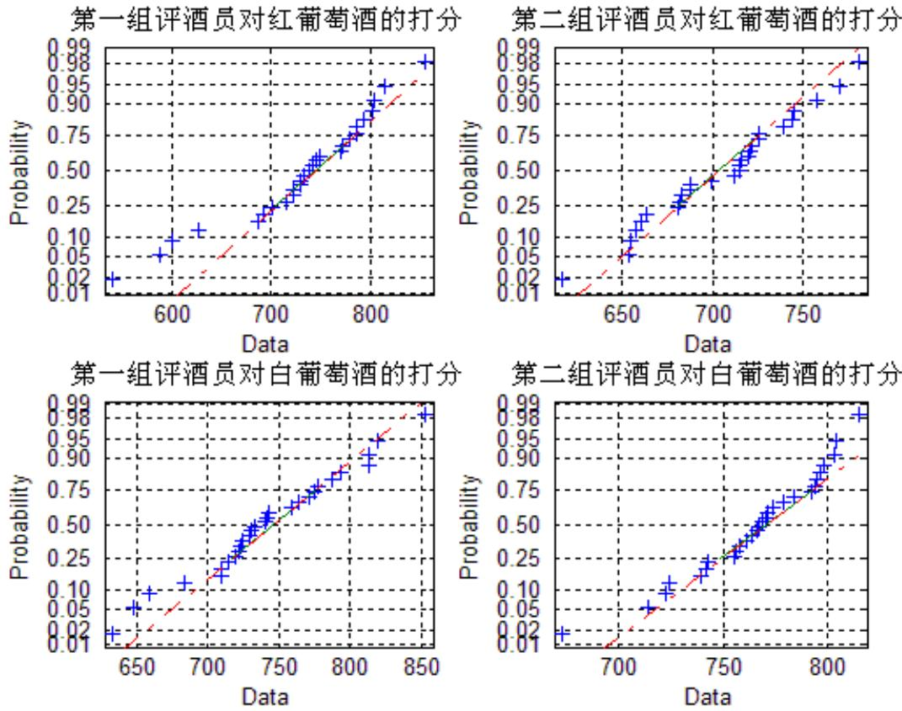  
图 1 数据是否符合正态分布的判定

上图的四个子图 中<sub>，</sub> 数据都近似在一条直线上<sub>，</sub> 可以判定这四组数据符合正态分布<sub>。</sub>

## 2） 假设检验方式的确定

对于红葡萄酒 27 种样品和 白葡萄酒 28 种样品 依据统计学相关知识 得出此时针对所求的显著性差异的评定均属于小样本检验 即利用 t 检验 并转换为 P 值检验

## 3） 两组评酒员对红 白葡萄酒的汇总得分的处理

依据题意<sub>，</sub> 对于每一种葡萄酒的得分<sub>，</sub> 由十个评酒员在对其进行品尝后对分类指标的打分求和得到<sub>，</sub> 结果如下表<sub>：</sub>

<table><tr><td>葡萄酒编号</td><td>1</td><td>2</td><td>3</td><td>4</td><td>5</td><td>6</td><td>7</td><td>8</td><td>9</td></tr><tr><td>第一组得分</td><td>627</td><td>803</td><td>804</td><td>686</td><td>733</td><td>722</td><td>715</td><td>723</td><td>815</td></tr><tr><td>第二组得分</td><td>681</td><td>740</td><td>746</td><td>712</td><td>721</td><td>663</td><td>653</td><td>660</td><td>782</td></tr><tr><td>葡萄酒编号</td><td>10</td><td>11</td><td>12</td><td>13</td><td>14</td><td>15</td><td>16</td><td>17</td><td>18</td></tr><tr><td>第一组得分</td><td>742</td><td>701</td><td>539</td><td>746</td><td>730</td><td>587</td><td>749</td><td>793</td><td>599</td></tr><tr><td>第二组得分</td><td>688</td><td>616</td><td>683</td><td>688</td><td>726</td><td>657</td><td>699</td><td>745</td><td>654</td></tr><tr><td>葡萄酒编号</td><td>19</td><td>20</td><td>21</td><td>22</td><td>23</td><td>24</td><td>25</td><td>26</td><td>27</td></tr><tr><td>第一组得分</td><td>786</td><td>786</td><td>771</td><td>772</td><td>856</td><td>780</td><td>692</td><td>738</td><td>730</td></tr><tr><td>第二组得分</td><td>726</td><td>758</td><td>722</td><td>716</td><td>771</td><td>715</td><td>682</td><td>720</td><td>715</td></tr></table>

表一 两组评酒员对 27 种红葡萄酒的打分

<table><tr><td>葡萄酒编号</td><td>1</td><td>2</td><td>3</td><td>4</td><td>5</td><td>6</td><td>7</td><td>8</td><td>9</td><td>10</td></tr><tr><td>第一组得分</td><td>820</td><td>742</td><td>853</td><td>794</td><td>710</td><td>684</td><td>775</td><td>714</td><td>729</td><td>743</td></tr><tr><td>第二组得分</td><td>779</td><td>758</td><td>756</td><td>769</td><td>815</td><td>755</td><td>742</td><td>723</td><td>804</td><td>798</td></tr><tr><td>葡萄酒编号</td><td>11</td><td>12</td><td>13</td><td>14</td><td>15</td><td>16</td><td>17</td><td>18</td><td>19</td><td>20</td></tr><tr><td>第一组得分</td><td>723</td><td>633</td><td>659</td><td>720</td><td>724</td><td>740</td><td>788</td><td>731</td><td>722</td><td>778</td></tr><tr><td>第二组得分</td><td>714</td><td>724</td><td>739</td><td>771</td><td>784</td><td>673</td><td>803</td><td>767</td><td>764</td><td>766</td></tr><tr><td>葡萄酒编号</td><td>21</td><td>22</td><td>23</td><td>24</td><td>25</td><td>26</td><td>27</td><td>28</td><td></td><td></td></tr><tr><td>第一组得分</td><td>764</td><td>710</td><td>759</td><td>733</td><td>771</td><td>813</td><td>648</td><td>813</td><td></td><td></td></tr><tr><td>第二组得分</td><td>792</td><td>794</td><td>774</td><td>761</td><td>795</td><td>743</td><td>770</td><td>796</td><td></td><td></td></tr></table>

表二 两组评酒员对 28 种 白葡萄酒的得分

## 4） 显著性水平<sub>α</sub> 的确定

显著性水平是指当原假设实际上是正确的时 检验统计量落在拒绝域的概率 常用的显著性水平为 <sub>：</sub> $\alpha = 0 . 0 1 ; \alpha = 0 . 0 5 ; \alpha = 0 . 1$ 。

在该处<sub>，</sub> 我们将显著性水平定义如下表所示<sub>：</sub>

<table><tr><td>概率p值</td><td>0≤p≤0.01</td><td>0.01&lt;p≤0.05</td><td>0.05&lt;p≤0.1</td><td>0.1&lt;p≤1</td></tr><tr><td>显著性水平</td><td>差异性极显著</td><td>差异性显著</td><td>差异性较显著</td><td>差异性不显著</td></tr></table>

表三 显著性水平的定义

## 5<sub>.</sub> 1 <sub>.</sub> 1 <sub>.</sub>2 模型 的 建立

依据统计学中假设检验相关知识<sub>，</sub> 利用 t 检验建立模型如下<sub>：</sub>

原假设 $H _ { 0 } : u _ { 1 } = u _ { 2 }$ <sub>；</sub> 备择假设 $\begin{array} { r l } { H _ { 1 } \colon } & { { } u _ { 1 } \neq u _ { 2 } } \end{array}$

检验统计量为 :

$$
t = \frac {(\bar {x _ {1}} - \bar {x _ {2}}) - (u _ {1} - u _ {2})}{\sqrt {\frac {s _ {1} ^ {2}}{n _ {1}} + \frac {s _ {2} ^ {2}}{n _ {2}}}}
$$

自 由度为 <sub>：</sub>

$$
v = \frac {\left(\frac {s _ {1} {} ^ {2}}{n _ {1}} + \frac {s _ {2} {} ^ {2}}{n _ {2}}\right)}{\frac {\left. \left(\frac {s _ {1} {} ^ {2}}{n _ {1}}\right) ^ {2} \right.}{n _ {1} - 1} + \frac {\left(\frac {s _ {2} {} ^ {2}}{n _ {2}}\right) ^ {2}}{n _ {2} - 1}}
$$

所以 <sub>，</sub> 目 标函数为 <sub>：</sub>

$$
\left\{ \begin{array}{l} p = 2 \times (1 - \Phi (t)) \\ t = \frac {\left(\bar {x _ {1}} - \bar {x _ {2}}\right)}{\sqrt {\frac {s _ {1} ^ {2}}{n _ {1}} + \frac {s _ {2} ^ {2}}{n _ {2}}}} \end{array} \right.
$$

注 <sub>：</sub> $u _ { 1 } = \frac { \varkappa } { \mathcal { F } }$ 一组评酒员 的打分的均值<sub>；</sub> $u _ { 2 } = \frac { 5 5 } { 5 }$ 二组评酒员 的打分的均值<sub>；</sub>

Φ( )t 为标准正态分布函数值

## 5<sub>.</sub> 1 <sub>.</sub> 1 <sub>.</sub>3 模型 的 求解

利用 excel 中数据分析工具箱求解<sub>。</sub> 结合题 目 中给定数据<sub>。</sub> 本次显著性分析应采用t-检验 : 双样本等方差假设<sub>。</sub>

具体求解步骤为 <sub>：</sub>

第一步<sub>：</sub> 将原始数据输入 excel<sub>；</sub>

第二步<sub>：</sub> 选择 <sup>“</sup>工具<sup>”</sup> 菜单中 的 <sup>“</sup>数据分析<sup>”</sup><sub>；</sub>

第三步<sub>：</sub> 在 <sup>“</sup>数据分析<sup>”</sup> 对话框中选择 <sup>“</sup>t-检验 : 双样本等方差假设<sup>”</sup><sub>；</sub>

第四步<sub>：</sub> 将变量对应填入弹出 的对话框 单击 <sup>“</sup>确定<sup>”</sup> 即可

结果显示如下<sub>：</sub>

<table><tr><td colspan="3">t-检验:双样本等方差假设(红葡萄酒)</td><td colspan="3">t-检验:双样本等方差假设(白葡萄酒)</td></tr><tr><td></td><td>变量 1</td><td>变量 2</td><td></td><td>变量 1</td><td>变量 2</td></tr><tr><td>平均</td><td>730.555556</td><td>705.148148</td><td>平均</td><td>742.6071</td><td>765.3214286</td></tr><tr><td>方差</td><td>5391.41026</td><td>1582.43875</td><td>方差</td><td>2705.284</td><td>1005.48545</td></tr><tr><td>观测值</td><td>27</td><td>27</td><td>观测值</td><td>28</td><td>28</td></tr><tr><td>合并方差</td><td>3486.9245</td><td></td><td>合并方差</td><td>1855.385</td><td></td></tr><tr><td>假设平均差</td><td>0</td><td></td><td>假设平均差</td><td>0</td><td></td></tr><tr><td>df</td><td>52</td><td></td><td>df</td><td>54</td><td></td></tr><tr><td>t Stat</td><td>1.58090569</td><td></td><td>t Stat</td><td>-1.97309</td><td></td></tr><tr><td>P(T&lt;=t)单尾</td><td>0.05998189</td><td></td><td>P(T&lt;=t)单尾</td><td>0.026807</td><td></td></tr><tr><td>t 单尾临界</td><td>1.67468915</td><td></td><td>t 单尾临界</td><td>1.673565</td><td></td></tr><tr><td>P(T&lt;=t)双尾</td><td>0.11996378</td><td></td><td>P(T&lt;=t)双尾</td><td>0.053613</td><td></td></tr><tr><td>t 双尾临界</td><td>2.00664676</td><td></td><td>t 双尾临界</td><td>2.004879</td><td></td></tr></table>

对显示结果整理<sub>，</sub> 得到下表<sub>：</sub>

<table><tr><td></td><td>p</td><td>显著性水平</td><td>备注</td></tr><tr><td>红葡萄酒</td><td>0.119</td><td>无显著性差异</td><td>p值稍大于0.1</td></tr><tr><td>白葡萄酒</td><td>0.053</td><td>差异性较显著</td><td></td></tr></table>

表四 两组评酒员 的评价结果有无显著性差异的结果

## 5<sub>.</sub> 1 <sub>.</sub> 1 <sub>.</sub>4 结 果 分析

将题 目 中 的两组评酒员对红 白葡萄酒的打分进行处理得到对应的总分作出红葡萄酒和 白葡萄酒的两组得分的柱形图进行直观分析

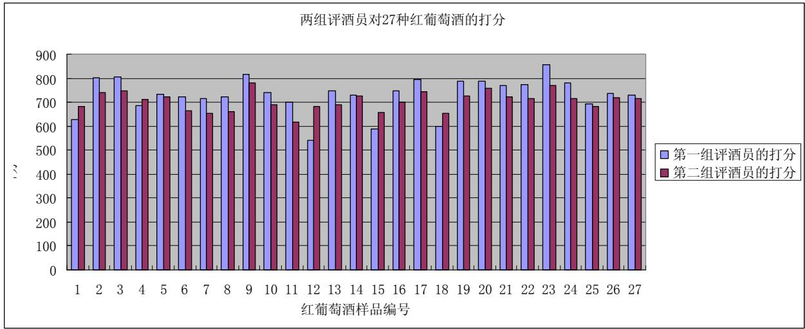

<details>
<summary>bar</summary>

| 红葡萄酒样品编号 | 第一组评酒员的打分 | 第二组评酒员的打分 |
| --- | --- | --- |
| 1 | ~630 | ~685 |
| 2 | ~810 | ~745 |
| 3 | ~815 | ~755 |
| 4 | ~690 | ~715 |
| 5 | ~740 | ~730 |
| 6 | ~730 | ~670 |
| 7 | ~720 | ~660 |
| 8 | ~730 | ~665 |
| 9 | ~825 | ~790 |
| 10 | ~750 | ~695 |
| 11 | ~705 | ~625 |
| 12 | ~550 | ~685 |
| 13 | ~755 | ~695 |
| 14 | ~735 | ~730 |
| 15 | ~595 | ~660 |
| 16 | ~755 | ~705 |
| 17 | ~800 | ~750 |
| 18 | ~605 | ~660 |
| 19 | ~795 | ~730 |
| 20 | ~795 | ~765 |
| 21 | ~780 | ~730 |
| 22 | ~780 | ~720 |
| 23 | ~860 | ~775 |
| 24 | ~790 | ~720 |
| 25 | ~695 | ~685 |
| 26 | ~745 | ~725 |
| 27 | ~735 | ~720 |
</details>

图二 红葡萄酒的两组评价得分柱形图

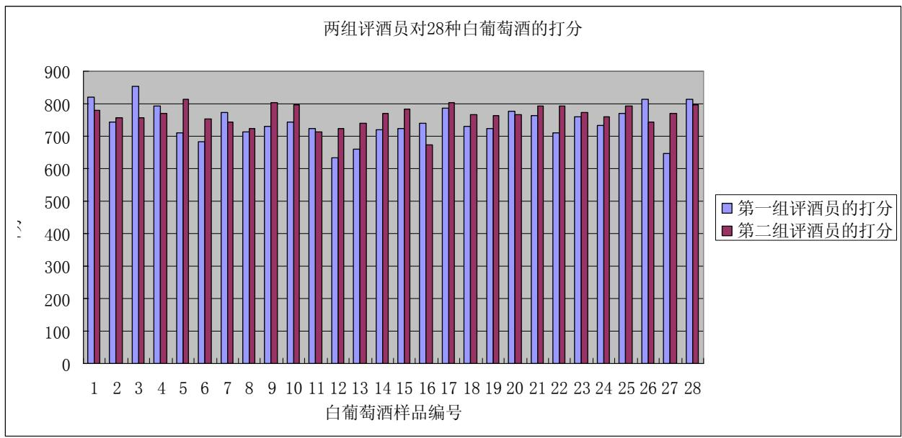

<details>
<summary>bar</summary>

| 白葡萄酒样品编号 | 第一组评酒员的打分 | 第二组评酒员的打分 |
| --- | --- | --- |
| 1 | ~825 | ~785 |
| 2 | ~745 | ~760 |
| 3 | ~855 | ~760 |
| 4 | ~795 | ~775 |
| 5 | ~715 | ~815 |
| 6 | ~685 | ~755 |
| 7 | ~775 | ~745 |
| 8 | ~720 | ~725 |
| 9 | ~735 | ~805 |
| 10 | ~745 | ~800 |
| 11 | ~725 | ~715 |
| 12 | ~635 | ~725 |
| 13 | ~665 | ~745 |
| 14 | ~725 | ~775 |
| 15 | ~725 | ~785 |
| 16 | ~745 | ~675 |
| 17 | ~790 | ~805 |
| 18 | ~730 | ~765 |
| 19 | ~725 | ~765 |
| 20 | ~780 | ~765 |
| 21 | ~765 | ~795 |
| 22 | ~715 | ~795 |
| 23 | ~760 | ~775 |
| 24 | ~735 | ~760 |
| 25 | ~770 | ~795 |
| 26 | ~815 | ~745 |
| 27 | ~650 | ~770 |
| 28 | ~815 | ~800 |
</details>

图三 白葡萄酒的两组评价得分柱形图

分析发现 两组评酒员对两种葡萄酒的评分差异均不明显 所以 对于两种葡萄酒来说<sub>，</sub> 两组评酒员 的评分结果都应该都不会有显著性差异或者差异性较显著<sub>。</sub> 但是<sub>，</sub> 白葡萄酒的两组评酒员打分差异性会稍大于红葡萄酒

该模型求解出来的结果反映<sub>，</sub> 红葡萄酒的两组数据无显著性差异<sub>，</sub> 白葡萄酒的则是

差异性较显著<sub>，</sub> 与上述分析是一致的<sub>。</sub>

## 5<sub>.</sub>1<sub>.</sub>2 可信度分析模型的建立与求解

## 5 1 2 1 准确度的求解

判断两组数据的准确度 先通过熵值法对附件三中 的芳香物质指标进行综合评价确定葡萄酒香气排名 再由两组评酒员对香气打分得到的排名与之相 比的偏差得到

## 1 ） 基于熵值法的香气排名

## a<sub>、</sub> 熵值法简介

在信息论中 熵是对不确定性的一种度量<sub>。</sub> 信息量越大 不确定性就越小 熵也就越小 信息量越小 不确定性越大 熵也越大 根据熵的特性 我们可以通过计算熵值来判断一个事件的随机性及无序程度 也可以用熵值来判断某个指标的离散程度 指标的离散程度越大 该指标对综合评价的影响越大

## b<sub>、</sub> 熵值法求解香气排名

具体步骤如下<sub>：</sub>

第一步<sub>：</sub> 指标的标准化处理 由于各项指标的计量单位并不统一 因此在使用前需要先进行标准化处理 处理公式为<sub>：</sub>

$$
x _ {i j} ^ {\prime} = \left[ \frac {x _ {i j} - \min (x _ {1 j} , x _ {2 j} , . . . , x _ {n j})}{\max (x _ {1 j} , x _ {2 j} , . . . , x _ {n j}) - \min (x _ {1 j} , x _ {2 j} , . . . , x _ {n j})} \right] \times 1 0 0
$$

第二步<sub>：</sub> 计算第 j 项指标下第 i 种酿酒葡萄所占的 比重<sub>。</sub> 计算公式为

$$
p _ {i j} = \frac {X _ {i j}}{\sum_ {i = 1} ^ {n} X _ {i j}} \quad , (i = 1, 2 \dots , n, j = 1, 2 \dots , m)
$$

第三步<sub>：</sub> 计算第 j 项指标的熵值<sub>。</sub> 计算公式为 <sub>：</sub>

$$
e _ {j} = - k \sum_ {i = 1} ^ {n} p _ {i j} \ln (p _ {i j}) (k > 0, k = 1 / \ln (n), e _ {j} \geq 0)
$$

第四步<sub>：</sub> 计算第 $j \dot { . }$ 项指标的差异系数<sub>。</sub> 对第<sub>j</sub>项指标<sub>，</sub> 指标值的差异越大<sub>，</sub> 对方案评价的左右就越大<sub>，</sub> 熵值就越小<sub>，</sub> 计算公式<sub>：</sub>

$$
g _ {j} = \frac {1 - e _ {j}}{m - E _ {e}} \left(E _ {e} = \sum_ {j = 1} ^ {m} e _ {j}, 0 \leq g _ {i} \leq 1, \sum_ {j = 1} ^ {m} g _ {j} = 1\right)
$$

第五步<sub>：</sub> 求权值<sub>。</sub> 计算公式为 <sub>：</sub>

$$
w _ {j} = \frac {g _ {j}}{\sum_ {j = 1} ^ {m} g _ {j}} \quad (1 \leq j \leq m)
$$

第六步<sub>：</sub> 计算各酿酒葡萄的综合得分<sub>：</sub>

$$
h _ {i} = \sum_ {j = 1} ^ {m} w _ {j} \bullet p _ {i j} \quad (i = 1, 2,... n)
$$

第七步<sub>：</sub> 将各酿酒葡萄综合得分进行降序排列 得到基于熵值法的香气排名

## 2） 基于评酒员打分的香气排名

针对两组评酒员打分的数据 先挑选出香气该项的评分 再对其求和得到各酿酒葡萄的得分<sub>。</sub> 计算公式如下<sub>：</sub>

$$
f _ {k} = \sum_ {i = 1} ^ {1 0} \sum_ {j = 1} ^ {3} y _ {i j} ^ {(k)} \quad k = (1, 2..., n)
$$

将各酿酒葡萄在香气方面的得分 $\mathcal { f } _ { k }$ 进行降序排列<sub>，</sub> 得到基于评酒员打分的香气排名 <sub>。</sub>

## 3） 准确度的确定

将以上两种数据确定的排名 进行比较 得到两组数据下的偏差 公式如下<sub>：</sub>

$$
p = \sqrt {\sum_ {i = 1} ^ {n} (a _ {i} - b _ {i}) ^ {2}}
$$

式中 <sub>，</sub> $a _ { i }$ 为评酒员打分时第 i 中酿酒葡萄的排名 <sub>；</sub> $b _ { _ i }$ 为基于熵值法的第 i 中酿酒葡萄的排名 n 为酿酒葡萄的品种数

求解结果整理后如下表<sub>：</sub>

<table><tr><td></td><td colspan="2">根据酿酒葡萄芳香指标</td><td colspan="2">根据葡萄酒芳香指标</td><td colspan="2">根据两个芳香指标</td></tr><tr><td></td><td>红葡萄酒</td><td>白葡萄酒</td><td>红葡萄酒</td><td>白葡萄酒</td><td>红葡萄酒</td><td>白葡萄酒</td></tr><tr><td>第一组</td><td>38.41%</td><td>35.97%</td><td>36.49%</td><td>31.63%</td><td>35.12%</td><td>37.76%</td></tr><tr><td>第二组</td><td>31.55%</td><td>34.18%</td><td>29.36%</td><td>28.83%</td><td>27.98%</td><td>31.63%</td></tr></table>

表五 两组评酒员基于不同情况下的准确度比较

由上表得<sub>：</sub> 不论在哪一种情况下<sub>，</sub> 对于红葡萄酒和 白葡萄酒<sub>，</sub> 第二组数据的准确性都好于第一组<sub>。</sub>

## 5<sub>.</sub> 1 <sub>.</sub>2<sub>.</sub>2 稳定 性 的 求解

## 1 ） 模型的建立

稳定性的求解可以引入方差分析<sub>。</sub> 二者方差<sub>，</sub> 表明 了两组数据的波动程度<sub>。</sub>

根据统计学中方差分析知识得到 目 标函数<sub>：</sub>

$$
\left\{ \begin{array}{l} s _ {k} = \frac {\sum_ {i = 1} ^ {n} s _ {i} ^ {(k)}}{n} \quad (k = 1, 2) \\ s _ {i} ^ {(k)} = \sqrt {\frac {\sum_ {j = 1} ^ {1 0} (x _ {i j} ^ {(k)} - \overline {{x _ {i} ^ {(k)}}}) ^ {2}}{1 0 - 1}} \\ \overline {{x _ {i} ^ {k}}} = \frac {\sum_ {j = 1} ^ {1 0} x _ {i j} ^ {(k)}}{1 0} \end{array} \right.
$$

注 <sub>：</sub> $s _ { k }$ 为第 k组评酒员对葡萄酒评分的总方差的均值<sub>；</sub> ${ S _ { i } ^ { ( k ) } }$ 为第 组评酒员对第 种葡萄酒评价分的方差<sub>；</sub> $x _ { i j } ^ { ( k ) }$ 为第 组第 个评酒员对第 种红葡萄酒的评分<sub>；</sub> $x _ { i } ^ { ( k ) }$ 为第 组第 i种红葡萄酒的评分的均值 <sub>;</sub> <sup>n</sup> 为酿酒葡萄的品种数<sub>。</sub>

## 2） 模型的求解

根据模型的 目 标函数可以直接用 matlab 编写程序 (源程序见附录) 求解后整理得下表<sub>：</sub>

<table><tr><td></td><td>第一组评酒员</td><td>第二组评酒员</td></tr><tr><td>红葡萄酒方差</td><td>7.4628</td><td>5.6201</td></tr><tr><td>白葡萄酒方差</td><td>10.9648</td><td>7.1405</td></tr><tr><td>平均方差</td><td>9.2137</td><td>6.3803</td></tr></table>

表六 两组评酒员对红 白葡萄就评分的方差

将两组评酒员评价的结果得方差比较绘图如下<sub>：</sub>

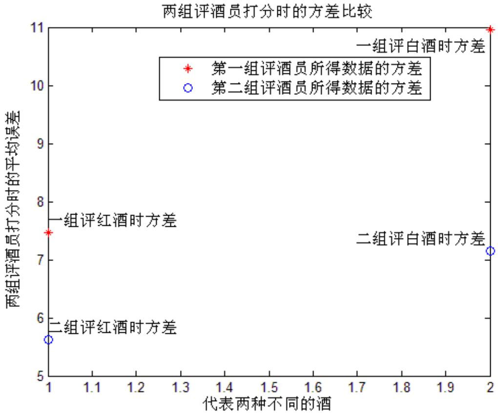

<details>
<summary>scatter</summary>

| 组别 | 代表两种不同的酒 | 两组评酒员打分时的平均误差 |
| --- | --- | --- |
| 第一组评酒员所得数据的方差 | 1 | ~7.5 |
| 第二组评酒员所得数据的方差 | 1 | ~5.6 |
| 第一组评白酒时方差 | 2 | 11 |
| 第二组评白酒时方差 | 2 | ~7.2 |
</details>

图 四 两组评酒员对红 白葡萄就评分的方差比较

依据表五的数据和图 四直观分析 可以得出第二组评酒员在对红 白葡萄酒分别评分时的方差均明显小于第一组 所以可靠性强于第一组 并且 可与第一小 问差异性的结论互相检验<sub>，</sub> 表明结果的一致性<sub>。</sub>

## 5<sub>.</sub> 1 <sub>.</sub>2<sub>.</sub>3 可信度 的 确 定

对两组评酒员评价结果的准确度和稳定性进行分析 发现第二组数据均优于第一组<sub>。</sub> 于是 得出结论<sub>：</sub> 第二组数据的可信度高于第一组<sub>。</sub>

## 5<sub>.</sub>2 问题二的求解

酿酒葡萄的理化指标采用主成分分析法对归一化后的理化指标进行降维处理 求得酿酒葡萄理化指标的综合得分<sub>。</sub> 葡萄酒的质量利用第一问结论中可信度高的一组数据进行处理<sub>，</sub> 得出质量的评价得分<sub>。</sub> 酿酒葡萄评价标准如下流程图所示<sub>：</sub>

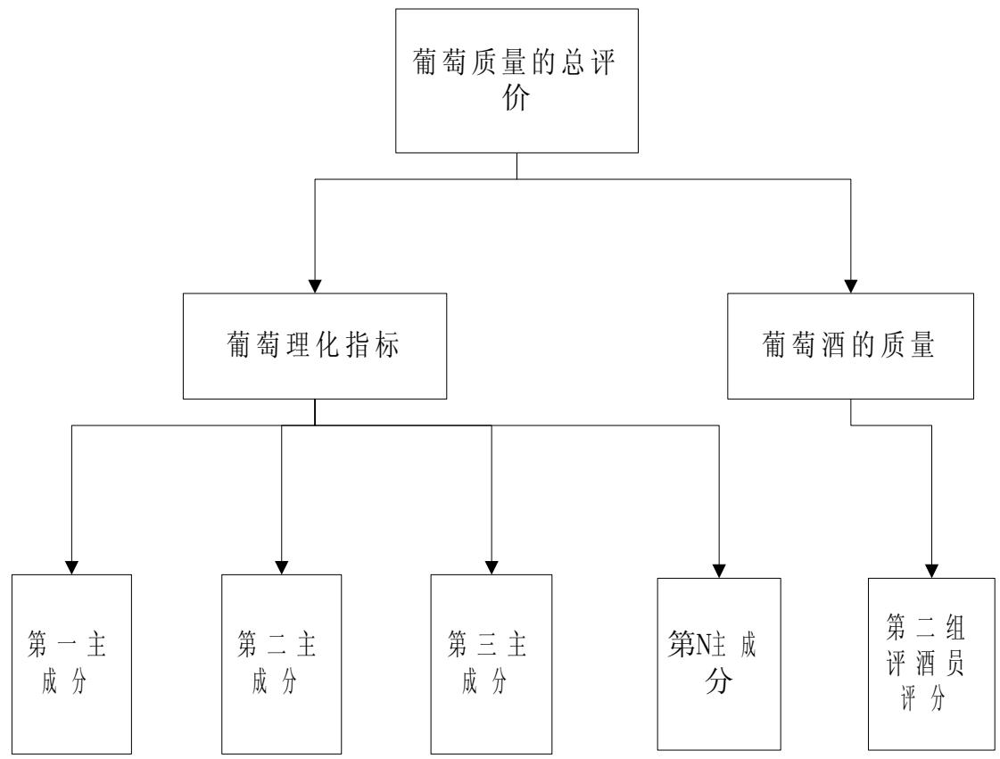

<details>
<summary>flowchart</summary>

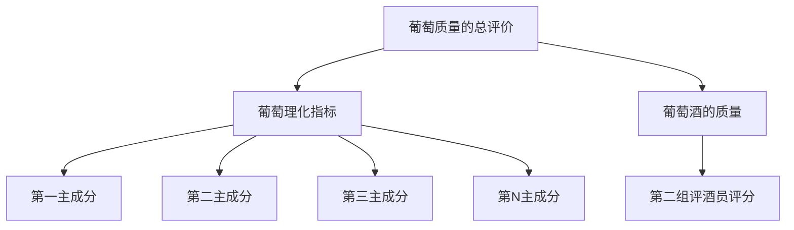
</details>

## 5<sub>.</sub>2<sub>.</sub>1 模型的前期准备

## 5<sub>.</sub>2<sub>.</sub>1<sub>.</sub>1 葡萄酒质量指标的评价得分

结合题意 葡萄酒的质量将 由每个评酒员在对葡萄酒进行品尝后对其分类指标打分 然后求和得到总分确定 根据问题一中对两组评酒员打分可信度的确定 发现第二组的可信度以一定优势大于第一组 所以 将第二问评酒员打分的数据作为葡萄酒质量的评价指标较为合适

步骤如下<sub>：</sub>

第一步<sub>：</sub> 对题 目 中第二组评酒员对葡萄酒打分的数据进行求和 得到每一种葡萄酒的总分 从而得到葡萄酒的质量排名 <sub>；</sub>

第二步<sub>：</sub> 根据每一种葡萄酒质量排名 <sub>，</sub> 在 0\~1 内赋予一定的评价分数<sub>。</sub>

每一种葡萄酒得到的质量排名得分如下表所示<sub>：</sub>

<table><tr><td>葡萄酒编号</td><td>1</td><td>2</td><td>3</td><td>4</td><td>5</td><td>6</td><td>7</td><td>8</td><td>9</td></tr><tr><td>质量得分</td><td>0.231</td><td>0.808</td><td>0.885</td><td>0.462</td><td>0.654</td><td>0.192</td><td>0.039</td><td>0.154</td><td>1</td></tr><tr><td>葡萄酒编号</td><td>10</td><td>11</td><td>12</td><td>13</td><td>14</td><td>15</td><td>16</td><td>17</td><td>18</td></tr><tr><td>质量得分</td><td>0.346</td><td>0</td><td>0.308</td><td>0.385</td><td>0.731</td><td>0.115</td><td>0.423</td><td>0.846</td><td>0.077</td></tr><tr><td>葡萄酒编号</td><td>19</td><td>20</td><td>21</td><td>22</td><td>23</td><td>24</td><td>25</td><td>26</td><td>27</td></tr><tr><td>质量得分</td><td>0.769</td><td>0.923</td><td>0.692</td><td>0.577</td><td>0.962</td><td>0.5</td><td>0.263</td><td>0.615</td><td>0.539</td></tr></table>

表七 27 种红葡萄酒的质量得分

<table><tr><td>葡萄酒编号</td><td>1</td><td>2</td><td>3</td><td>4</td><td>5</td><td>6</td><td>7</td><td>8</td><td>9</td><td>10</td></tr><tr><td>质量得分</td><td>0.67</td><td>0.33</td><td>0.30</td><td>0.52</td><td>1</td><td>0.26</td><td>0.19</td><td>0.07</td><td>0.96</td><td>0.89</td></tr><tr><td>葡萄酒编号</td><td>11</td><td>12</td><td>13</td><td>14</td><td>15</td><td>16</td><td>17</td><td>18</td><td>19</td><td>20</td></tr><tr><td>质量得分</td><td>0.04</td><td>0.11</td><td>0.15</td><td>0.59</td><td>0.70</td><td>0</td><td>0.93</td><td>0.48</td><td>0.41</td><td>0.44</td></tr><tr><td>葡萄酒编号</td><td>21</td><td>22</td><td>23</td><td>24</td><td>25</td><td>26</td><td>27</td><td>28</td><td></td><td></td></tr><tr><td>质量得分</td><td>0.74</td><td>0.78</td><td>0.63</td><td>0.37</td><td>0.81</td><td>0.22</td><td>0.56</td><td>0.85</td><td></td><td></td></tr></table>

表八 28 种 白葡萄酒的质量得分

## 5<sub>.</sub>2<sub>.</sub>1<sub>.</sub>2 酿酒葡萄理化指标的评价得分

酿酒葡萄理化指标数据繁多且包含一级 二级指标 直接求取比较困难 在此 通过 SPSS19 0 中 降维两种方法同时求解得到指标中 的主成分及各指标所占的 比重

SPSS19 0 降维并结合 matlab 求各指标比重的步骤如下<sub>：</sub>

第一步<sub>：</sub> 将题 目 中一级理化指标的进行处理通过 excel 导入到 SPSS 中 <sub>；</sub>

第二步<sub>：</sub> 通过 SPSS 中 <sup>“</sup>分析—描述统计—描述<sup>”</sup> 对数据进行标准化处理<sub>，</sub> 以消除量纲的影响<sub>；</sub>

第三步<sub>：</sub> 对标准化处理后的数据进行降维<sub>，</sub> 具体为 <sup>“</sup>分析—降维—因子分析<sup>”</sup><sub>；</sub>

第四步<sub>：</sub> 保证各主成分的贡献率之和大于 80%的情况下求出主成分 并根据贡献率确定各主成分所占的 比重<sub>；</sub>

第五步<sub>：</sub> 结合各主成分所占的 比重和各主成分内部所含的各指标所占的 比重确定最后的各指标所占的权重 利用 matlab 软件求解

求解后各主成分所给予的贡献率如下<sub>：</sub>

<table><tr><td>主成分</td><td>主成分的贡献率(%)</td><td>合计贡献率(%)</td></tr><tr><td>1</td><td>18.993</td><td>18.993</td></tr><tr><td>2</td><td>17.569</td><td>36.561</td></tr><tr><td>3</td><td>11.838</td><td>48.4</td></tr><tr><td>4</td><td>7.251</td><td>55.561</td></tr><tr><td>5</td><td>6.356</td><td>62.007</td></tr><tr><td>6</td><td>5.415</td><td>67.422</td></tr><tr><td>7</td><td>5.122</td><td>72.544</td></tr><tr><td>8</td><td>4.568</td><td>77.111</td></tr><tr><td>9</td><td>3.971</td><td>81.082</td></tr><tr><td>10</td><td>3.541</td><td>84.623</td></tr></table>

表九 27 种红葡萄的主成分贡献分析

<table><tr><td>主成分</td><td>主成分的贡献率(%)</td><td>合计贡献率(%)</td></tr><tr><td>1</td><td>22.961</td><td>22.961</td></tr><tr><td>2</td><td>16.892</td><td>39.853</td></tr><tr><td>3</td><td>12.931</td><td>52.784</td></tr><tr><td>4</td><td>9.705</td><td>62.489</td></tr><tr><td>5</td><td>6.871</td><td>69.361</td></tr><tr><td>6</td><td>5.674</td><td>75.035</td></tr><tr><td>7</td><td>4.454</td><td>79.489</td></tr><tr><td>8</td><td>3.839</td><td>83.328</td></tr></table>

表十 28 种 白葡萄的主成分贡献分析

通过以上求解可以得到 30 种理化指标分别对葡萄酒质量的影响比重如下图所示<sub>：</sub>

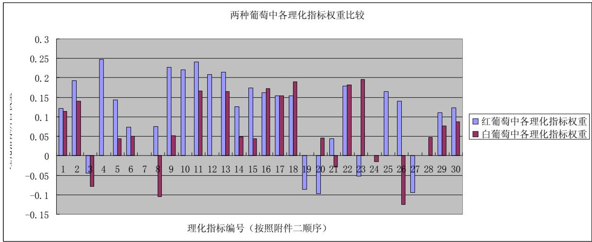

<details>
<summary>bar</summary>

| 理化指标编号 | 红葡萄中各理化指标权重 | 白葡萄中各理化指标权重 |
| --- | --- | --- |
| 1 | ~0.125 | ~0.115 |
| 2 | ~0.195 | ~0.145 |
| 3 | ~-0.04 | ~-0.075 |
| 4 | ~0.25 | — |
| 5 | ~0.145 | ~0.045 |
| 6 | ~0.075 | ~0.05 |
| 7 | — | — |
| 8 | ~0.075 | ~-0.1 |
| 9 | ~0.23 | ~0.055 |
| 10 | ~0.225 | — |
| 11 | ~0.245 | ~0.17 |
| 12 | ~0.21 | — |
| 13 | ~0.215 | ~0.165 |
| 14 | ~0.13 | ~0.05 |
| 15 | ~0.175 | ~0.045 |
| 16 | ~0.165 | ~0.175 |
| 17 | ~0.155 | ~0.155 |
| 18 | ~0.155 | ~0.19 |
| 19 | ~-0.085 | — |
| 20 | ~-0.095 | ~0.045 |
| 21 | ~0.045 | ~-0.025 |
| 22 | ~0.18 | ~0.185 |
| 23 | ~-0.045 | ~0.195 |
| 24 | — | ~-0.01 |
| 25 | ~0.165 | — |
| 26 | ~0.145 | ~-0.12 |
| 27 | ~-0.09 | — |
| 28 | — | ~0.05 |
| 29 | ~0.115 | ~0.08 |
| 30 | ~0.125 | ~0.09 |
</details>

图五 30 种理化指标对红<sub>、</sub> 白葡萄酒理化指标的影响 比重  
通过该图<sub>，</sub> 发现 30 中理化指标一般对两种酒的影响是接近的<sub>，</sub> 这也是符合实际的<sub>。</sub>

将上述比重与酿酒葡萄 自 身 的数据进行相乘 得到酿酒葡萄理化指标的评价 得分如下表所示<sub>：</sub>

<table><tr><td>葡萄酒编号</td><td>1</td><td>2</td><td>3</td><td>4</td><td>5</td><td>6</td><td>7</td><td>8</td><td>9</td></tr><tr><td>质量得分</td><td>0.966</td><td>0.915</td><td>0.944</td><td>0.542</td><td>0.652</td><td>0.605</td><td>0.600</td><td>0.934</td><td>1</td></tr><tr><td>葡萄酒编号</td><td>10</td><td>11</td><td>12</td><td>13</td><td>14</td><td>15</td><td>16</td><td>17</td><td>18</td></tr><tr><td>质量得分</td><td>0.551</td><td>0.709</td><td>0.550</td><td>0.638</td><td>0.805</td><td>0.602</td><td>0.649</td><td>0.630</td><td>0.541</td></tr><tr><td>葡萄酒编号</td><td>19</td><td>20</td><td>21</td><td>22</td><td>23</td><td>24</td><td>25</td><td>26</td><td>27</td></tr><tr><td>质量得分</td><td>0.699</td><td>0.530</td><td>0.783</td><td>0.674</td><td>0.898</td><td>0.604</td><td>0.481</td><td>0.48</td><td>0.550</td></tr></table>

表十一 27 种红葡萄的理化指标得分

<table><tr><td>葡萄酒编号</td><td>1</td><td>2</td><td>3</td><td>4</td><td>5</td><td>6</td><td>7</td><td>8</td><td>9</td><td>10</td></tr><tr><td>质量得分</td><td>0.57</td><td>0.72</td><td>0.83</td><td>0.63</td><td>0.78</td><td>0.82</td><td>0.80</td><td>0.58</td><td>0.71</td><td>0.73</td></tr><tr><td>葡萄酒编号</td><td>11</td><td>12</td><td>13</td><td>14</td><td>15</td><td>16</td><td>17</td><td>18</td><td>19</td><td>20</td></tr><tr><td>质量得分</td><td>0.7</td><td>0.74</td><td>0.65</td><td>0.67</td><td>0.91</td><td>0.62</td><td>0.59</td><td>0.81</td><td>0.68</td><td>0.76</td></tr><tr><td>葡萄酒编号</td><td>21</td><td>22</td><td>23</td><td>24</td><td>25</td><td>26</td><td>27</td><td>28</td><td></td><td></td></tr><tr><td>质量得分</td><td>0.65</td><td>0.64</td><td>0.79</td><td>0.90</td><td>0.80</td><td>0.76</td><td>1</td><td>0.78</td><td></td><td></td></tr></table>

表十二 28 种 白葡萄的理化指标得分

综合葡萄酒质量指标的评价得分和酿酒葡萄理化指标的评价得分可以 分别使用综合指数评价和 BP 神经网络两种方法得到<sub>。</sub>

## 5 2 2 基于综合指数评价的酿酒葡萄分级模型的建立与求解

## 5<sub>.</sub>2<sub>.</sub> 1 <sub>.</sub>2 模型 的 建立

## 1） 综合指数评价的简介

综合指数法是指在确定一套合理的经济效益指标体系 的基础上 对各项经济效益指标个体指数加权平均 <sub>，</sub> 计算 出 经济效益综合值<sub>，</sub> 用 以综合评价经济效益 的一种方法 即将一组相 同或不 同指数值通过统计学处理 使不 同计量单位 性质 的指标值标准化 最后转化成一个综合指数 以准确地评价工作 的综合水平 综合指数值越大 工作质量越好 指标多少不 限

综合指数法将各项经济效益指标转化为 同度量 的个体指数 便于将各项经济效益指标综合起来 以综合经济效益指数为企业间综合经济效益评 比排序 的依据各项指标 的权数是根据其重要程度决定 的 体现 了 各项指标在经济效益综合值 中作用 的大小 综合指数法 的基本思路则是利用 层次分析法计算 的权重和模糊评判法取得 的数值进行累乘 然后相加 最后计算 出 经济效益指标 的综合评价指数为 了简化计算 模型只考虑 5 个主成分 下面以红葡萄为例建立模型 步骤如下<sub>：</sub>

2) 五个主成分回归方程的建立

$$
y _ {j} ^ {\mathrm{(k)}} = \sum_ {i = 1} ^ {\mathrm{n}} c _ {i} ^ {\mathrm{(k)}} r _ {j i} ^ {\mathrm{(k)}} j = 1: 2 7 \quad \mathrm{n} = 1 1, 4, 3, 3, 3 \quad \mathrm{k} = 1: 5
$$

式中 $y _ { j } ^ { \left( \mathbf { k } \right) }$ 表示第看 k 主成分 27 种葡萄线性回归的预测值<sub>，</sub> $c _ { i } ^ { ( \mathbf { k } ) }$ 表示第 k 主成分第 i 理化指标的回归系数 $r _ { \ddot { \mu } } ^ { \mathrm { \scriptsize ~ ( k ) } }$ 第 k 主成分理化指标的无纲量化数据矩阵

3) 酿酒葡萄的理化指标对葡萄等级的影响的得分

$$
I = \sum d _ {i j} \times \omega_ {i} \quad i = 5, j = 2 7
$$

式中 $d _ { i }$ 表示功率系数<sub>，</sub> 功效系数求法为 <sub>：</sub>

$$
d _ {i j} = \frac {y _ {i j} - \min (y _ {i j})}{\max (y _ {i j}) - \min (y _ {i j})}
$$

以所有参评对象中某项指标的最大值和最小值分别作为该指标的满意度和不允许值<sub>。</sub>式 $\omega _ { i }$ 为第 i 种主成分的权重<sub>，</sub> 由各主成分的当前贡献率求得<sub>。</sub>

4） 酿酒葡萄的理化指标和评酒员对葡萄酒的评分对葡萄等级划分影响的综合得分计算公式为 <sub>：</sub>

$$
s = \alpha \cdot I + (1 - \alpha) M
$$

式 $\alpha$ 为酿酒葡萄的理化指标对葡萄等级的影响的得分权重 I表示酿酒葡萄的理化指标对葡萄等级的影响的得分 M评酒员对葡萄酒的评分 <sub>s</sub>为总合分

5） 根据步骤 4 中计算的得分对 27 中葡萄进行排序<sub>，</sub> 利用平均区间划分葡萄的等级<sub>。</sub>

## 5<sub>.</sub>2<sub>.</sub> 1 <sub>.</sub>3 模型 的 求解

$$
\alpha = 0. 5
$$

对红葡萄的分类为 5 个等级<sub>：</sub>

第 一等 级 <sub>：</sub> 2 <sub>，</sub> 3 <sub>，</sub> 2 3 <sub>，</sub> 9

第 二 等 级 <sub>：</sub> 2 1 <sub>，</sub> 2 0 <sub>，</sub> 1 9 <sub>，</sub> 1 7 <sub>，</sub> 1 4

第 三等 级 <sub>：</sub> 1 <sub>，</sub> 2 2 <sub>，</sub> 5 <sub>，</sub>

第 四 等 级 <sub>：</sub> 1 0 <sub>，</sub> 4 <sub>，</sub> 1 3 <sub>，</sub> 1 6 <sub>，</sub> 8 <sub>，</sub> 2 7 <sub>，</sub> 2 4 <sub>，</sub> 2 6

第 五 等 级 <sub>：</sub> 1 8 <sub>，</sub> 1 1 <sub>，</sub> 7 <sub>，</sub> 1 5 <sub>，</sub> 2 5 <sub>，</sub> 6 <sub>，</sub> 1 2

$$
\alpha = 0. 8
$$

对红葡萄的分类为 5 个等级<sub>：</sub>

第 一等 级 <sub>：</sub> 2 <sub>，</sub> 3 <sub>，</sub> 2 3 <sub>，</sub> 9

第 二 等 级 <sub>：</sub> 1 4 <sub>，</sub> 1 <sub>，</sub> 8

第 三等 级 <sub>：</sub> 2 2 <sub>，</sub> 5 <sub>，</sub> 1 7 <sub>，</sub> 1 9 <sub>，</sub> 2 1

第 四 等 级 <sub>：</sub> 6 <sub>，</sub> 1 0 <sub>，</sub> 4 <sub>，</sub> 2 6 <sub>，</sub> 2 7 <sub>，</sub> 1 3 <sub>，</sub> 1 6 <sub>，</sub> 2 4 <sub>，</sub> 2 0

第 五 等 级 <sub>：</sub> 1 8 <sub>，</sub> 2 5 <sub>，</sub> 7 <sub>，</sub> 1 1 <sub>，</sub> 1 2 <sub>，</sub> 1 1 <sub>，</sub> 1 5

由等级划分结果可看出权重不同 对有的葡萄排名影响很大 而对有的排名影响很小因此该方法具有较强的主观主观因素 在此基础上我们神经网络算法进行求解 避免人为赋予权重带来的误差

## 5 2 3 基于 BP 神经网络的酿酒葡萄分级模型的建立与求解

## 5<sub>.</sub>2<sub>.</sub>3<sub>.</sub> 1 模型前期准备

## 1 ） 简介与原理

人工神经网络是在现代神经科学的基础上提出和发展起来的 旨在反映人脑结构及功能的一种抽象数学模型 这种网络依靠系统的复杂程度 通过调整内部大量节点之间相互连接的关系 从而达到处理信息的 目 的 人工神经网络具有 自 学习和 自适应的能力 可以通过预先提供的一批相互对应的输入－输出数据 分析掌握两者之间潜在的规律 最终根据这些规律 用新的输入数据来推算输出结果 这种学习分析的过程被称为<sup>“</sup> 训 练 <sup>”</sup>

BP 网络的学习过程可分为信号的正向传播和误差的逆向传播两部分 在正向传播的过程中 信号作用于输入层 经过隐层处理后到达输出层 由输出层输出结果信号如果结果信号和期望的输出不符 则进入误差的逆向传播过程 将输出误差以某种形式通过隐层向输入层逐层反向传递 并将误差分摊给该层的所有单元 对这些单元的权值进行修正<sub>。</sub> 不断重复此过程<sub>，</sub> 直到网络输出 的误差小于设定值到或进行到预先设定的学习次数为止<sub>。</sub>

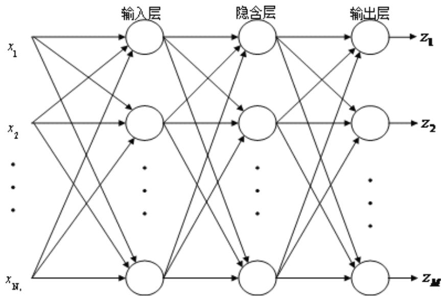

<details>
<summary>flowchart</summary>

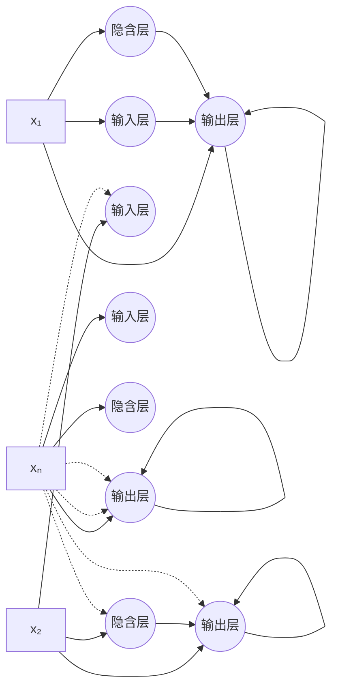
</details>

图六 神经网络示意图

## 2） 酿酒葡萄理化指标和葡萄酒质量的数据处理

对数据进行归一化<sub>，</sub> 以消除不同量纲带来的影响<sub>。</sub> 公式为 <sub>：</sub>

$$
d _ {i j} = \frac {y _ {i j} - \min (y _ {i j})}{\max (y _ {i j}) - \min (y _ {i j})}
$$

## 5<sub>.</sub>2<sub>.</sub>3<sub>.</sub>2 神经网络模型的设计

在神经网络的设计过程中 <sub>，</sub> 首先需要设置允许精度和最多学习次数等参数<sub>。</sub>我们设置 $e p s = 0 . 6 5 { \times } 1 0 ^ { \wedge } { - } 3 , ~ Z = 5 0 0 0 0 0$ 。

题 目 要求我们对酿酒葡萄进行质量分级 酿酒葡萄的质量由酿酒葡萄的理化指标和葡萄酒的质量两方面得到 所以 该神经网络应该设计为 2 个输入 1 个输出 所以中 间只需要一个隐含层 为 了保证训练效果 该层设置了 5 个节点

前面已经得到了 27 种红葡萄酒和 28 种 白葡萄酒的两个输入端的得分<sub>。</sub> 对葡萄等级划分<sub>，</sub> 我们采用 A<sub>、</sub> B<sub>、</sub> C<sub>、</sub> D<sub>、</sub> E 五级划分<sub>。</sub> 五级对应的值如下表所示<sub>：</sub>

<table><tr><td>输出值</td><td>0~0.2</td><td>0.2~0.4</td><td>0.4~0.6</td><td>0.6~0.8</td><td>0.8~1</td></tr><tr><td>对应等级</td><td>A</td><td>B</td><td>C</td><td>D</td><td>E</td></tr></table>

表十三 酿酒葡萄等级划分标准

结合题 目 中要求 可设计对应输入输出如下表所示的神经网络 （输入 1 输入 2 均为酿酒葡萄所对应的指标的排名 ）<sub>：</sub>

<table><tr><td>输入1</td><td>1</td><td>3</td><td>6</td><td>8</td><td>11</td><td>14</td><td>17</td><td>20</td><td>22</td><td>25</td><td>27</td></tr><tr><td>输入2</td><td>1</td><td>3</td><td>6</td><td>8</td><td>11</td><td>14</td><td>17</td><td>20</td><td>22</td><td>25</td><td>27</td></tr><tr><td>输出</td><td>1</td><td>0.9</td><td>0.8</td><td>0.7</td><td>0.6</td><td>0.5</td><td>0.4</td><td>0.3</td><td>0.2</td><td>0.1</td><td>0</td></tr></table>

表十四 设计红葡萄对应的神经网络的输入输出参数设置

<table><tr><td>输入1</td><td>1</td><td>3</td><td>6</td><td>9</td><td>12</td><td>14</td><td>17</td><td>20</td><td>23</td><td>26</td><td>28</td></tr><tr><td>输入2</td><td>1</td><td>3</td><td>6</td><td>9</td><td>12</td><td>14</td><td>17</td><td>20</td><td>23</td><td>26</td><td>28</td></tr><tr><td>输出</td><td>1</td><td>0.9</td><td>0.8</td><td>0.7</td><td>0.6</td><td>0.5</td><td>0.4</td><td>0.3</td><td>0.2</td><td>0.1</td><td>0</td></tr></table>

表十五 设计红葡萄对应的神经网络的输入输出参数设置

## 5<sub>.</sub>2<sub>.</sub>3<sub>.</sub>3 神经网络训练过程

BP 神经网络的训练可分为如下8步<sub>：</sub>

(1) 初始化BP 神经网络<sub>。</sub> 用 (0 1) 内 的随机数给各连接权值赋初值<sub>。</sub> 设置误差函数e 允许精度 <sub>eps</sub> 和最多学习次数L<sub>；</sub>  
(2) 随机选取一个样本进行学习 <sub>，</sub> 并设其期望输出 <sub>；</sub>  
(3) 对于隐含层的每个节点<sub>，</sub> 计算隐含节点的输入和输出 <sub>；</sub>  
(4) 利用 网络期望输出和实际输出 <sub>，</sub> 计算误差函数对输出层的各神经元的偏导数<sub>；</sub>  
(5) 利用隐含层到输出层的连接权值 输出层和隐含层的输出计算误差函数对隐含层各神经元的偏导数<sub>；</sub>  
(6) 修正神经网络中 的连接权值  
(7) 计算网络输出误差函数<sub>；</sub>  
(8) 判断输出误差E和设定的e<sub>p</sub>s 的大小关系 <sub>。</sub> 若E<e<sub>p</sub>s或当前学习次数大于最多学习次数L<sub>，</sub> 则该算法结束<sub>。</sub> 否则<sub>，</sub> 选择下一个学习样本<sub>，</sub> 返回第二步进行下一轮学习 <sub>。</sub>

## 5 2 3 4 神经网络模型的有效性测试

通过上表十四 表十五 可以针对红葡萄和 白葡萄分别建立神经网络模型 该神经网络模型再通过以上训练过程后 再求出想同的输入下的实际输出 所对应的设置输出和实际输出可比较如下表

<table><tr><td>设置输出</td><td>1</td><td>0.9</td><td>0.8</td><td>0.7</td><td>0.6</td><td>0.5</td><td>0.4</td><td>0.3</td><td>0.2</td><td>0.1</td><td>0</td></tr><tr><td>实际输出</td><td>1.00</td><td>0.88</td><td>0.82</td><td>0.69</td><td>0.60</td><td>0.50</td><td>0.40</td><td>0.30</td><td>0.20</td><td>0.10</td><td>0.00</td></tr></table>

表十六 红葡萄对应的神经网络的输出 比较

<table><tr><td>设置输出</td><td>1</td><td>0.9</td><td>0.8</td><td>0.7</td><td>0.6</td><td>0.5</td><td>0.4</td><td>0.3</td><td>0.2</td><td>0.1</td><td>0</td></tr><tr><td>实际输出</td><td>0.97</td><td>0.93</td><td>0.80</td><td>0.68</td><td>0.60</td><td>0.51</td><td>0.42</td><td>0.27</td><td>0.18</td><td>0.07</td><td>0.05</td></tr></table>

表十七 白葡萄对应的神经网络的输出 比较

另外 利用设置输出和实际输出进行比较 利用相对偏差求偏差<sub>。</sub> 设对事件 设置输出为 $a _ { i }$ <sub>，</sub> 实际输出为 $b _ { i } ,$ 则相对误差为 <sub>：</sub>

$$
Z_{\mathrm{i}} = \frac{|a_{i} - b_{i}|}{b_{i}}\times 100\%
$$

对于所有样本<sub>，</sub> 则可以利用下面公式求取<sub>：</sub>

$$
Z = \frac {\sum_ {i = 1} ^ {1 1} Z _ {i}}{1 1}
$$

对以上两组值进行发现 发现对红葡萄神经网络的相对误差为 =2 11% 白葡萄神经网络的相对误差为 =5 65%<sub>。</sub> 这两个误差都非常小<sub>，</sub> 说明经过本次神经网络训练后<sub>，</sub>实际输出与设置输出 的值非常吻和<sub>。</sub> 可以用这两组神经网络求取相关结果<sub>。</sub>

## 5 2 3 5 神经网络模型的结果

由 以上检验 发现该题的神经网络模型可以对所有酿酒葡萄进行质量分级 具体的质量分级如下表所示<sub>：</sub>

<table><tr><td colspan="9">酿酒葡萄(红葡萄酒)等级划分(基于神经网络训练)</td></tr><tr><td rowspan="2">A等级</td><td>葡萄号</td><td>2</td><td>3</td><td>9</td><td>23</td><td></td><td></td><td></td></tr><tr><td>综合得分</td><td>0.8079</td><td>0.8978</td><td>0.9826</td><td>0.9297</td><td></td><td></td><td></td></tr><tr><td rowspan="2">B等级</td><td>葡萄号</td><td>5</td><td>14</td><td>17</td><td>19</td><td>20</td><td>21</td><td></td></tr><tr><td>综合得分</td><td>0.6666</td><td>0.6713</td><td>0.6605</td><td>0.6865</td><td>0.6668</td><td>0.7075</td><td></td></tr><tr><td rowspan="2">C等级</td><td>葡萄号</td><td>4</td><td>13</td><td>16</td><td>22</td><td>24</td><td>26</td><td>27</td></tr><tr><td>综合得分</td><td>0.4597</td><td>0.4277</td><td>0.4592</td><td>0.5979</td><td>0.5026</td><td>0.547</td><td>0.5132</td></tr><tr><td rowspan="2">D等级</td><td>葡萄号</td><td>1</td><td>8</td><td>10</td><td>12</td><td>25</td><td></td><td></td></tr><tr><td>综合得分</td><td>0.3694</td><td>0.2516</td><td>0.3756</td><td>0.337</td><td>0.2714</td><td></td><td></td></tr><tr><td rowspan="2">E等级</td><td>葡萄号</td><td>6</td><td>7</td><td>11</td><td>15</td><td>18</td><td></td><td></td></tr><tr><td>综合得分</td><td>0.199</td><td>0.041</td><td>0.0376</td><td>0.0936</td><td>0.0515</td><td></td><td></td></tr></table>

表十八 酿酒红葡萄等级划分

<table><tr><td colspan="10">酒葡萄(白葡萄酒)等级划分(基于神经网络训练)</td></tr><tr><td rowspan="2">A等级</td><td>葡萄号</td><td>5</td><td>15</td><td>27</td><td></td><td></td><td></td><td></td><td></td></tr><tr><td>综合得分</td><td>0.8421</td><td>0.9033</td><td>0.9404</td><td></td><td></td><td></td><td></td><td></td></tr><tr><td rowspan="2">B等级</td><td>葡萄号</td><td>9</td><td>10</td><td>23</td><td>24</td><td>25</td><td>28</td><td></td><td></td></tr><tr><td>综合得分</td><td>0.6761</td><td>0.67</td><td>0.6429</td><td>0.722</td><td>0.7801</td><td>0.7619</td><td></td><td></td></tr><tr><td rowspan="2">C等级</td><td>葡萄号</td><td>3</td><td>6</td><td>14</td><td>17</td><td>18</td><td>20</td><td>21</td><td>22</td></tr><tr><td>综合得分</td><td>0.515</td><td>0.4669</td><td>0.4398</td><td>0.4577</td><td>0.5946</td><td>0.498</td><td>0.4714</td><td>0.4734</td></tr><tr><td rowspan="2">D等级</td><td>葡萄号</td><td>1</td><td>2</td><td>4</td><td>7</td><td>12</td><td>13</td><td>19</td><td>26</td></tr><tr><td>综合得分</td><td>0.3724</td><td>0.3873</td><td>0.3803</td><td>0.3811</td><td>0.2407</td><td>0.2074</td><td>0.3842</td><td>0.3616</td></tr><tr><td rowspan="2">E等级</td><td>葡萄号</td><td>8</td><td>11</td><td>16</td><td></td><td></td><td></td><td></td><td></td></tr><tr><td>综合得分</td><td>0.0891</td><td>0.1136</td><td>0.0133</td><td></td><td></td><td></td><td></td><td></td></tr></table>

表十九 酿酒 白葡萄等级划分

## 5<sub>.</sub>2<sub>.</sub>4 结果 的分析

通过模型的前期准备求得各种酿酒葡萄的理化指标综合值 排名和葡萄酒的质量综合值 排名之后 利用 matlab 对这两种值所得到的排名绘走势图 得到下图 <sub>：</sub>

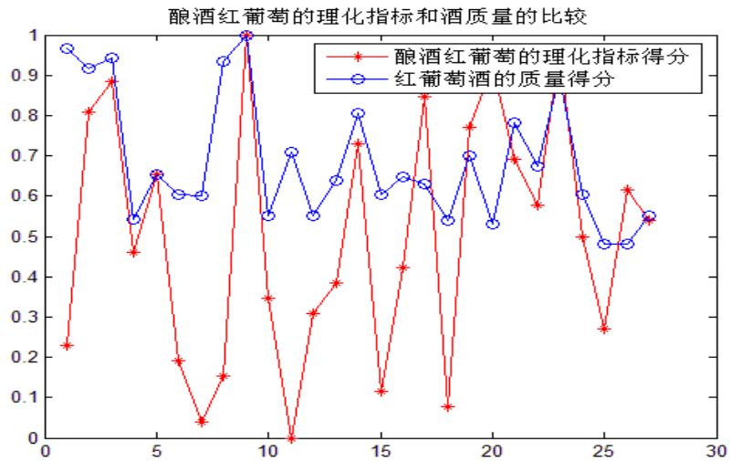

<details>
<summary>line</summary>

| X | 酿酒红葡萄的理化指标得分 | 红葡萄酒的质量得分 |
| --- | --- | --- |
| 1 | ~0.23 | ~0.97 |
| 2 | ~0.81 | ~0.92 |
| 3 | ~0.89 | ~0.95 |
| 4 | ~0.46 | ~0.54 |
| 5 | ~0.65 | ~0.65 |
| 6 | ~0.19 | ~0.60 |
| 7 | ~0.04 | ~0.60 |
| 8 | ~0.15 | ~0.94 |
| 9 | 1.0 | 1.0 |
| 10 | ~0.35 | ~0.55 |
| 11 | 0.0 | ~0.71 |
| 12 | ~0.31 | ~0.55 |
| 13 | ~0.38 | ~0.64 |
| 14 | ~0.73 | ~0.81 |
| 15 | ~0.11 | ~0.60 |
| 16 | ~0.42 | ~0.65 |
| 17 | ~0.85 | ~0.63 |
| 18 | ~0.08 | ~0.54 |
| 19 | ~0.77 | ~0.70 |
| 20 | ~0.87 | ~0.53 |
| 21 | ~0.69 | ~0.78 |
| 22 | ~0.58 | ~0.68 |
| 23 | ~0.87 | ~0.87 |
| 24 | ~0.50 | ~0.60 |
| 25 | ~0.27 | ~0.48 |
| 26 | ~0.62 | ~0.48 |
| 27 | ~0.54 | ~0.55 |
</details>

图七 基于酿酒红葡萄的理化指标和红葡萄酒质量的排名 的 比较图

由该图发现 第 2 3 9 17 23 种酿酒红葡萄和红葡萄酒的排名都非常靠前 应该被分在比较好的等级 第 7 8 11 15 18 种酿酒红葡萄和红葡萄酒的排名都非常靠后<sub>，</sub> 应该被分在比较低的等级<sub>。</sub> 将这种定性分析与所求出来的等级划分<sub>，</sub> 发现完全一致 所以 所求得的酿酒红葡萄的等级划分是正确的

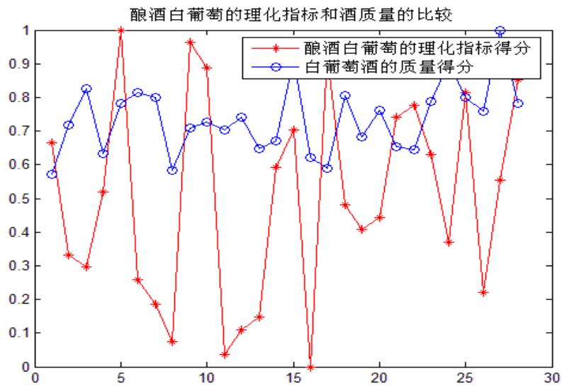

<details>
<summary>line</summary>

| X | 酿酒白葡萄的理化指标得分 | 白葡萄酒的质量得分 |
| --- | --- | --- |
| 1 | ~0.66 | ~0.57 |
| 2 | ~0.33 | ~0.72 |
| 3 | ~0.30 | ~0.83 |
| 4 | ~0.52 | ~0.63 |
| 5 | 1.00 | ~0.78 |
| 6 | ~0.26 | ~0.81 |
| 7 | ~0.18 | ~0.80 |
| 8 | ~0.07 | ~0.58 |
| 9 | ~0.96 | ~0.71 |
| 10 | ~0.89 | ~0.73 |
| 11 | ~0.04 | ~0.70 |
| 12 | ~0.11 | ~0.74 |
| 13 | ~0.14 | ~0.65 |
| 14 | ~0.59 | ~0.67 |
| 15 | ~0.70 | ~0.88 |
| 16 | 0.00 | ~0.62 |
| 17 | ~0.88 | ~0.59 |
| 18 | ~0.48 | ~0.81 |
| 19 | ~0.41 | ~0.68 |
| 20 | ~0.44 | ~0.76 |
| 21 | ~0.74 | ~0.65 |
| 22 | ~0.78 | ~0.64 |
| 23 | ~0.63 | ~0.79 |
| 24 | ~0.37 | ~0.88 |
| 25 | ~0.81 | ~0.80 |
| 26 | ~0.22 | ~0.76 |
| 27 | ~0.55 | 1.00 |
| 28 | ~0.85 | ~0.78 |
</details>

图八 基于酿酒 白葡萄的理化指标和 白葡萄酒质量的排名 的 比较图

由该图发现 第 5 9 种酿酒 白葡萄和 白葡萄酒的排名都非常靠前 应该被分在比较好的等级 第 8 11 种酿酒 白葡萄和 白葡萄酒的排名都非常靠后 应该被分在比较低的等级 将这种定性分析与所求出来的等级划分 发现完全一致 所以 所求得的酿酒白葡萄的等级划分也是正确的<sub>。</sub>

另外 将综合指数评价和 BP 神经网络两种方法得到的结果放在一起进行对比 发现答案非常接近<sub>。</sub> 这也在相互验证两种方法正确性的情况下的证明 了结果的正确性<sub>。</sub>

## 5<sub>.</sub>3 问题三的求解

## 5 3 1 数据的归一化处理

题 目 中原来给出 的数据非常复杂且大小标准不一 跟前面一样 在此可以用 以下公式对其进行归一化处理 以消除不同量纲带来的影响

$$
d _ {i j} = \frac {y _ {i j} - \min (y _ {i j})}{\max (y _ {i j}) - \min (y _ {i j})}
$$

## 5 3 2 基于神经网络的定性分析

经过分析 发现酿酒葡萄约有 30 个理化指标 葡萄酒约有 9 各理化指标 这两者之间可以先简单的根据因果假设是由酿酒葡萄的理化指标决定了葡萄酒的理化指标 至于两者之间是否可以有这样的联系 以及联系的紧密 可以根据此设计神经网络 用酿酒葡萄的理化指标作为输入端 葡萄酒的理化指标作为输出端 让经过学习之后 最后输出一个值 该值与原来的值进行比较 误差是否在可以接受 他们误差越好 表明他们中 间这种联系越大<sub>。</sub>

该神经网络模型设计如下<sub>：</sub>

学习参数等参数以及训练过程都与 问题二中 的神经网络模型一样<sub>。</sub>

在此处设计时 仅仅改动的是输入 输出和隐含层节点数 该模型的输入改为酿酒葡萄的理化指标 输出为葡萄酒的理化指标 中 间给予两个隐含层 并分别给予 30 个节点<sub>，</sub> 让其进行学习 <sub>。</sub>

该神经网络学习 出来之后的结果为 <sub>：</sub> 两者经过学习 误差为 2 59% 误差是非常小的<sub>。</sub> 所以<sub>，</sub> 基于神经网络可以初步判断<sub>，</sub> 酿酒葡萄的理化指标和葡萄酒的理化指标之间是有联系的<sub>，</sub> 并且联系很紧密<sub>。</sub>

## 5 3 3 酿酒葡萄与葡萄酒的理化指标相关性分析

在前面通过神经网络判断出两者之间联系很紧密<sub>。</sub> 但是两者之间的具体关系还需要进行定量分析<sub>。</sub>

利用 SPSS 软件所有理化指标进行相关性分析<sub>，</sub> 得出所有量化之间 的相关性关系 <sub>。</sub>其中选取之后的酿酒葡萄的理化指标和葡萄酒的理化指标之间有较大相关性指标见附录二<sub>。</sub>

## 5<sub>.</sub>3<sub>.</sub>4 结果 的分析

依据 SPSS 分析得<sub>：</sub> 对于红葡萄酒 葡萄酒的花色苷与酿酒葡萄的蛋 白质 总酚单宁层正相关<sub>；</sub> 单宁则与 VC<sub>、</sub> PH 值正相关<sub>，</sub> 和果皮颜色 L 负相关<sub>；</sub> 总酚与 VC<sub>、</sub> 花色苷 PH 值 出汁率正相关 酒总黄酮与蛋 白质 花色苷 PH 值 出汁率正相关

对于 白葡萄酒 葡萄酒单宁与酿酒葡萄的氨基酸 总酚 还原糖等正相关 总酚与氨基酸 蛋 白质 单宁 葡萄总黄酮等正相关<sub>，</sub> 果梗比负相关<sub>；</sub> 酒总黄酮与蛋 白质 苹

果酸<sub>、</sub> 总酚等正相关<sub>。</sub>

## 5<sub>.</sub>4 问题四 的求解

## 5 4 1 定性分析理化指标对葡萄酒质量的影响

经过查阅大量的相关文献 得出葡萄的品质与葡萄酒的质量是有直接影响关系的葡萄的品质决定因素主要有含糖量<sub>、</sub> 含酸量<sub>，</sub> 花甘林<sub>， p</sub>h 值等含糖量在一定范围 内是与葡萄酒的质量成正比的 含酸量要在一定的范围 内 （一般在 6 /L\~10） 才能酿成 口 味较好的葡萄酒 太低会导致 口 味瑟 颜色不光泽 太高会导致酒的味道过酸 用来酿造葡萄酒 的 Ph 值一般在 （ 3 0\~3 6 ）

各种理化指标对葡萄酒质量的影响可以分为三种<sub>：</sub> 第一种为理化指标越大 葡萄酒质量越好 第二种为理化指标越小 葡萄酒质量越好 第三种为理化指标在一个规定值内 葡萄酒质量好 基于这三种不同影响 这些理化指标可以根据题意分类如下<sub>：</sub>

<table><tr><td>影响方向</td><td>葡萄品质的理化指标</td></tr><tr><td>越高越好</td><td>氨基酸,蛋白质,vc含量,花色苷鲜重,多酚氧化酶活力,褐变度,葡萄总黄酮,白藜芦醇,黄酮醇,总糖,还原糖,可溶性固形物,干物质含量,果穗质量,百粒质量,出汁率,果皮颜色(红葡萄酒)</td></tr><tr><td>中间值好</td><td>酒石酸,苹果酸,柠檬酸,总酚,单宁,ph值(3~3.6),可溶性固形物,固酸比果梗比,果皮质量(g),果皮颜色(白葡萄酒)</td></tr><tr><td>越低越好</td><td>DPPH自由基1/IC50(g/L)</td></tr></table>

表二十 定性分析葡萄品质的量化指标对葡萄酒的影响

## 5 4 2 定量分析理化指标对葡萄酒质量的影响

基于以上定性分析之后 需要根据题 目 中给出 的数据定量分析每一个指标对葡萄酒质量的影响<sub>。</sub> 因为题 目 中数据较多且没有明显地规律性<sub>，</sub> 所以采用熵值法对题 目 中数据进行分析得到每个指标对葡萄酒质量影响的权重

此处采用 的熵值法计算步骤与 问题一一致<sub>。</sub>

分别考虑两种理化指标对葡萄酒的质量的影响<sub>。</sub> 计算分以下三种情况<sub>：</sub>

1 ） 算出酿酒葡萄理化指标对葡萄质量的影响得分  
2） 算出葡萄酒理化指标对葡萄质量的影响得分  
3 ） 算出酿酒葡萄和葡萄酒的理化指标一起对葡萄质量的影响得分  
通过以上三种情况下的计算 得到了理化指标对葡萄酒质量的影响的权重

## 5 4 3 基于定量分析求得的权重的葡萄酒质量的准确度

通过 5 4 2 求得三种情况下每一种理化指标对葡萄酒质量的影响 将该权重结合题 目中 的理化指标数据求得质量 得到一组排名 将该质量与附件 1 中得到的质量排名进行对比 得到两者之间的排位误差如下表<sub>：</sub>

<table><tr><td colspan="2">根据酿酒葡萄芳香指标</td><td colspan="2">根据葡萄酒芳香指标</td><td colspan="2">根据两个芳香指标</td></tr><tr><td>红葡萄酒</td><td>白葡萄酒</td><td>红葡萄酒</td><td>白葡萄酒</td><td>红葡萄酒</td><td>白葡萄酒</td></tr><tr><td>6.6667</td><td>6.4286</td><td>4.8148</td><td>10.5926</td><td>6.074</td><td>5.5871</td></tr></table>

表五 两组评酒员基于不同情况下的准确度比较

通过上表求出来的误差与对应的葡萄酒品种数相除 得到数据除了基于 白葡萄酒本身 的 10 5926 外 误差都小于 25% 均在可以接受范围 内 <sub>。</sub>

所以 得出结论<sub>：</sub> 可以用葡萄和葡萄酒的理化指标来评价葡萄酒的质量

## 六<sub>、</sub> 模型的改进

对于问题二 利用综合指数评价求解后 在此基础上进行改进 引入神经网络算法进行葡萄质量的等级划分<sub>，</sub> 发现处在中 间等级的葡萄品种最多<sub>，</sub> 符合现实情况<sub>，</sub> 结果较为理想<sub>。</sub>

对于问题三 我们利用 39 个因素之间 的相关性来判断葡萄酒的理化指标与酿酒葡萄的理化指标之间的联系 得到的是相关系数 而不能确定两者之间的函数关系 所以我们可以进行如下改进<sub>，</sub> 首先通过主成分分析方法确定比重比较大的一些理化指标<sub>，</sub> 忽略一些次要的理化指标 再通过线性回归方法 用 excel 回归工具箱直接求解生出报告分析其残差图和拟合曲线 判断拟合效果 得到的结论是葡萄酒的理化指标与酿酒葡萄的理化指标之间具有一定的线性关系

对于问题四 题 目 要求我们分析理化指标与葡萄质量之间的联系 理化指标中大多数的因子只与葡萄的外观色泽 口感有关 而缺乏香气的理化指标 故我们建立的模型并不完善 因此我们可以做出假设附件三中 的芳香物质是葡萄香气的理化指标 并将其考虑到我们的模型中 这样结果更加合理

## 七<sub>、</sub> 模型评价与推广

## 7<sub>.</sub>1 模型的优点

1 <sub>、</sub> 模型对问题的考虑较全面<sub>，</sub> 问题一中评定哪组数据更可信的模型既考虑了准确度又考虑了稳定性<sub>；</sub>  
2<sub>、</sub> 利用 附件 3 的芳香物质含量确定了香气对葡萄酒的质量比较标准<sub>，</sub> 思路独特新颖<sub>；</sub>  
3<sub>、</sub> 对问题一<sub>，</sub> 进行了正态分布的验证<sub>，</sub> 使结果更加可靠<sub>；</sub>  
4 对问题二<sub>，</sub> 我们既用 了综合评价指数模型<sub>，</sub> 又用 了神经网络模型<sub>，</sub> 二者可相互检验保证结论的可信度<sub>；</sub>  
5 对理化指标利用主成分分析法进行降维处理 大大简化了计算量  
6 利用主成分分析法 熵值法客观地确定权重

## 7<sub>.</sub>2 模型的缺点

1 问题一中显著性水平的确定主观性较弄<sub>，</sub> 评判标准缺乏实际资料支持<sub>；</sub>  
2<sub>、</sub> 对于熵值计算<sub>，</sub> 对数据依赖性强<sub>；</sub>

3 对于综合指数模型 人为确定酿酒葡萄理化指标对葡萄质量的权重 结果有一定的主观性<sub>；</sub>  
4<sub>、</sub> 问题三<sub>，</sub> 采用相关分析确定所有理化指标的两两相关度<sub>，</sub> 而没有从回归分析的角度衡量因变量葡萄酒理化指标与 自变量酿酒葡萄理化指标的关系

## 7<sub>.</sub>3 模型的推广

本文共有六个模型 共用 了三种综合评价的方法 神经网络 熵值法 综合指数评价 还用 了多种数据处理的方法 方差分析 主成分分析 归一化 极差法 每个问题在这些方法的基础上都得到了较好的解决 对于神经网络 它适合多种模型 可以用在综合评价模型 也可用在预测模型 熵值法比较简单 具有一定的通用型 综合指数评价也是基于主成分分析得到的权重<sub>，</sub> 是客观确定权重的方法<sub>，</sub> 在综合评价的时候值得借鉴<sub>。</sub> 本文的模型比较全面<sub>，</sub> 可以用来解决影响力方面的 问题<sub>，</sub> 如北京奥运会对文化影响的评估<sub>。</sub>

## 八<sub>、</sub> 参考文献

【 1 】 袁卫<sub>，</sub> 庞皓<sub>，</sub> 曾五一<sub>，</sub> 贾俊平<sub>，</sub> 统计学 （第三版）<sub>，</sub> 北京<sub>：</sub> 高等教育出版社<sub>，</sub> 2009  
【2】 卓金武<sub>，</sub> 魏永生<sub>，</sub> 秦健<sub>，</sub> 李必文<sub>，</sub> matlab在数学建模中 的应用 <sub>，</sub> 北京航空大学出版社 2 0 1 1 4  
【 3 】 林杰斌<sub>，</sub> 刘 明德<sub>，</sub> SPSS 1 1 0与统计模型构建<sub>，</sub> 北京<sub>：</sub> 清华大学出版社<sub>，</sub> 2003  
【4】 李运 李记明 姜忠军 统计分析在葡萄酒质量评价中 的应用 酿酒科技 2009年第 四期 （ 总第178期 ）  
【5】 王丽娜<sub>，</sub> 宁夏产区酿酒葡萄品质与葡萄酒质量的研究<sub>，</sub> 西北农林科技大学<sub>，</sub> 2011<sub>.</sub> 5  
【6】 林翠香<sub>，</sub> 基于数据挖掘的葡萄酒质量识别<sub>，</sub> 中南大学<sub>，</sub> 2010 5  
【7】 不详 BP神经网络算法ht t<sub>p</sub> : //www hudon<sub>g</sub> com/wi k i /b<sub>p</sub>%E7%A5%9E%E7%BB%8F%E7%BD%9 1 %E7%BB%9C%E7%AE%9 7%E6%B3%9 5&<sub>pr</sub> d= <sub>s o au</sub>t <sub>o</sub> d<sub>o c</sub> l i <sub>s</sub> t 2 0 1 2 9 8  
【8】 不详 人工神经网络ht t<sub>p</sub> : //ba i ke ba i du c om/v i ew/ 1 9 743 htm 2 0 1 2 9 8  
【 9 】 不详 熵值法 ht t<sub>p</sub> : //wenku ba i du c om/v i ew/c 7 7984 1 da8 1 1 443 1 b90 dd8 78 html2 0 1 2 9 8

## 九<sub>、</sub> 附录

## 附录一 <sub>、</sub> matlab 源程序

## 1 1 问 题一 的 matlab 程序

## 1<sub>.</sub>1<sub>.</sub>1 判断数据是否符合正态分布

```matlab
%判断评价结果数据是否符合正态分布
clc
load clhsjfile
r1=sum(red1,2)';
r2=sum(red2,2)';
w1=sum(white1,2)';
w2=sum(white2,2)';
%通过 normplot 函数判断四个打分值是否符合正态分布
subplot(2,2,1)
normplot(r1)
title('第一组评酒员对红葡萄酒的打分')
subplot(2,2,2)
normplot(r2)
title('第二组评酒员对红葡萄酒的打分')
subplot(2,2,3)
normplot(w1)
title('第一组评酒员对白葡萄酒的打分')
subplot(2,2,4)
normplot(w2)
title('第二组评酒员对白葡萄酒的打分')
```

## 1<sub>.</sub>1<sub>.</sub>2 求解两组评酒员评酒时数据的方差

```matlab
clear all
clc
clf
%调出对题目数据处理后的各评酒员对不同酒的打分
load clhsjfile
%求出在评价红酒是两组评酒员评价时的方差
for i=1:27
    %求出两组评酒员评价时的平均值
    r1(i)=sum(red1(i,:))/10;
    r2(i)=sum(red2(i,:))/10;
end
%用评酒员评价红酒时与以上求出的平均值比较求出相应方差
for i=1:27
    fch1(i)=0;
    fch2(i)=0;
    for j=1:10
        fch1(i)=fch1(i)+(red1(i,j)-r1(i))^2;
        fch2(i)=fch2(i)+(red2(i,j)-r2(i))^2;
    end
    fchj1(i)=sqrt(fch1(i)/9);
    fchj2(i)=sqrt(fch2(i)/9);
end
%求出两组评酒员对红酒评价时的平均方差
fchjpj1=(sum(fchj1))/27;
fchjpj2=(sum(fchj2))/27;

%求出在评价白酒是两组评酒员评价时的方差
for i=1:28
    %求出两组评酒员评价时的平均值
    w1(i)=sum(white1(i,:))/10;
    w2(i)=sum(white2(i,:))/10;
```

<sub>en</sub>d  
%用评酒员评价 白酒时与以上求出 的平均值比较求出相应方差  
```matlab
for i=1:28
    fcb1(i)=0;
    fcb2(i)=0;
    for j=1:10
        fcb1(i)=fcb1(i)+(white1(i,j)-w1(i))^2;
        fcb2(i)=fcb2(i)+(white2(i,j)-w2(i))^2;
    end
    fcbj1(i)=sqrt(fcb1(i)/9);
    fcbj2(i)=sqrt(fcb2(i)/9);
```  
<sub>en</sub>d

%求出两组评酒员对 白酒评价时的平均方差  
```matlab
fcbjpj1=(sum(fcbj1))/28;
fcbjpj2=(sum(fcbj2))/28;
```

%求出对以上两种酒评价时<sub>，</sub> 两组评酒员 的平均方差  
```javascript
fcpj1=(fchjpj1+fcbjpj1)/2;
fcpj2=(fchjpj2+fcbjpj2)/2;
```

%表述出评价时误差结果  
```txt
disp('描述红酒时，两组评酒员打分时的方差分别为：')
[fchjpj1 fchjpj2]
disp('描述白酒时，两组评酒员打分时的方差分别为：')
[fcbjpj1 fcbjpj2]
disp('综合后，两组评酒员打分时的方差分别为：')
[fcpj1 fcpj2]
```

%绘图直观表述出结果  
```matlab
jb=[1 2];
zu1=[fchjpj1 fcbjpj1];
zu2=[fchjpj2 fcbjpj2];
plot(jb,zu1,'r*',jb,zu2,'bo')
title('两组评酒员打分时的方差比较');
xlabel('代表两种不同的酒');
ylabel('两组评酒员打分时的平均误差');
text(1,fchjpj1+0.2,'一组评红酒时方差')
text(2-0.3,fcbjpj1-0.3,'一组评白酒时方差')
text(1,fchjpj2+0.2,'二组评红酒时方差')
text(2-0.3,fcbjpj2+0.2,'二组评白酒时方差')
legend('第一组评酒员所得数据的方差','第二组评酒员所得数据的方差')
```

## 1 1 3 基于熵值法判断两组数据的准确度

%以下用熵值法基于芳香物质数据求取葡萄酒香气质量 已达到对评酒员评价准确度的 目 的

%该处使用 的芳香物质数据仅为两种酿酒葡萄的数据

```txt
clear all
clc
```

%将评委打分香气的值进行排序 得出评委得分的排名 以利于对比

```txt
load xqdffile redxq1 redxq2 whitexq1 whitexq2
```

%对葡萄酒质量按照香气的值从小到大进行排序并给予分数

```txt
[hjxq1,hjxqpm1]=sort(redxq1);
[bjxq1,bjxqpm1]=sort(whitexq1);
[hjxq2,hjxqpm2]=sort(redxq2);
[bjxq2,bjxqpm2]=sort(whitexq2);
```

%导入附件三中 的芳香物质的数据

```txt
load fxwzfile
```

%求取两组评酒员在评价两种酒时在芳香物质方面得到的得分排名 以利于接下来判断准确度

```javascript
[z1,hpm1]=sort(hjxqpm1);
[z2,hpm2]=sort(hjxqpm2);
[z3,bpm1]=sort(bjxqpm1);
[z4,bpm2]=sort(bjxqpm2);
```

%首先求红葡萄酒的

%将数值标准化处理 处理为 0\~1 之间

[hfxwz 1 minhfxwz maxhfxwz]=premnmx(hfxwz<sup>'</sup>);

hf<sub>xwz</sub> 1 =hf<sub>xwz</sub> 1 <sup>'</sup> <sub>;</sub>

hfxwz=(hfxwz 1 + 1 )/2 <sup>\*</sup> 1 00 ;

%计算每个指标下各葡萄酒所占的比重

sumh=sum(hfxwz);

f<sub>or</sub> i= 1 <sub>:</sub> 5 5

for j = 1 : 27

ph(j <sub>,</sub> i)=hfxwz(j <sub>,</sub> i)/sumh(i) ;

<sub>en</sub>d

%计算每一项指标的熵值

k= 1 /log(27) ;

f<sub>or</sub> i= 1 <sub>:</sub> 5 5

eh(i)=0 ;

for j = 1 : 27

if ph(j <sub>,</sub>i)==0

eh(i)=eh(i) ;

<sub>e</sub>l<sub>se</sub>

eh(i)=eh(i)+ph(j <sub>,</sub> i) <sup>\*</sup> l o g(ph(j <sub>,</sub> i)) ;

<sub>en</sub>d

<sub>en</sub>d

eh(i)=-k<sup>\*</sup> eh(i) ;

<sub>en</sub>d

%计算每一项指标的差异系数

Eh=sum(eh);

gh=( 1 -eh)/(5 5 -Eh) ;

%求权重

Gh=sum(gh);

<sub>w</sub>h=<sub>g</sub>h/Gh<sub>;</sub>

%根据上述权重求取由该法求得的质量得分

f<sub>or</sub> i= 1 <sub>:</sub> 27

sh(i)=0 ;

for j = 1 : 5 5

sh(i)=sh(i)+wh(j ) <sup>\*</sup>ph(i <sub>,</sub>j ) ;

<sub>en</sub>d

<sub>en</sub>d

[f<sub>,</sub>hj pm] =sort(sh) ;

%将两种排名升序<sub>，</sub> 得到 1:27 在两种排名 中所占的排位<sub>，</sub> 在进行求解误差

[ q 1 <sub>,</sub> i 1 ] =sort(hj pm) ;

[q2 <sub>,</sub> i2] =sort(hpm 1 ) ;

[q3 <sub>,</sub> i3 ] =sort(hpm2) ;

dis<sub>p</sub>(<sup>'</sup>对于红葡萄酒 第一组评酒员打分时得到的排名 平均排位误差为 <sub>：</sub> <sup>'</sup>)

hj pj wc 1 =sum(ab s(i 1 -i2))/27/2 7

dis<sub>p</sub>(<sup>'</sup>对于红葡萄酒<sub>，</sub> 第二组评酒员打分时得到的排名 <sub>，</sub> 平均排位误差为 <sub>：</sub> <sup>'</sup>)

hjpjwc2=sum(abs(i 1 -i3 ))/27/27

%以下比较两者之间的准确性

if hjpjwc 1 <hjpjwc2

dis (<sup>'</sup>对于红葡萄酒而言 第一组评酒员 比第二组更准确<sup>'</sup>)

<sub>e</sub>l<sub>se</sub>

dis<sub>p</sub>(<sup>'</sup>对于红葡萄酒而言<sub>，</sub> 第二组评酒员 比第一组更准确<sup>'</sup>)

<sub>en</sub>d

%以下求 白葡萄酒的

%将数值标准化处理 处理为 0\~1 之间

[bfxwz 1 minbfxwz maxbfxwz]=premnmx(bfxwz<sup>'</sup>);

bf<sub>xwz</sub> 1 =bf<sub>xwz</sub> 1 <sup>'</sup> <sub>;</sub>

bfxwz=(bfxwz 1 + 1 )/2 <sup>\*</sup> 1 00 ;

%计算每个指标下各葡萄酒所占的比重

sumb=sum(bfxwz);

f<sub>or</sub> i= 1 <sub>:</sub> 5 5

for j = 1 : 2 8

pb (j <sub>,</sub> i)=b fxwz(j <sub>,</sub> i)/sumb (i) ;

```matlab
end
%计算每一项指标的熵值
k=1/log(28);
for i=1:55
    eb(i)=0;
    for j=1:28
        if pb(j,i)==0
            eb(i)=eb(i);
        else
            eb(i)=eb(i)+pb(j,i)*log(pb(j,i));
        end
    end
    eb(i)=-k*eb(i);
end
%计算每一项指标的差异系数
Eb=sum(eb);
gb=(1-eb)/(55-Eb);

%求权重
Gb=sum(gb);
wb=gb/Gb;
%根据上述权重求取由该法求得的质量得分
for i=1:28
    sb(i)=0;
    for j=1:55
        sb(i)=sb(i)+wb(j)*pb(i,j);
    end
end
[f,bjpm]=sort(sb);
%将两种排名升序，得到 1:28 在两种排名中所占的排位，在进行求解误差
[q4,i4]=sort(bjpm);
[q5,i5]=sort(bpm1);
[q6,i6]=sort(bpm2);
disp('对于白葡萄酒，第一组评酒员打分时得到的排名，平均排位误差为：')
bjpjwc1=sum(abs(i4-i5))/28/28
disp('对于白葡萄酒，第二组评酒员打分时得到的排名，平均排位误差为：')
bjpjwc2=sum(abs(i4-i6))/28/28
%以下比较两者之间的准确性
if hjpjwc1<hjpjwc2
    disp('对于白葡萄酒而言，第一组评酒员比第二组更准确')
else
    disp('对于白葡萄酒而言，第二组评酒员比第一组更准确')
end
```

## 1 2 问 题二 的 matlab 程序

## 1<sub>.</sub>2<sub>.</sub>1 神经网络训练的主程序

```matlab
%以下进行神经网络的训练并求出分级
clear all
clc
clf
%导入题目中求取的酒质量得分和酿酒葡萄理化指标得分
load lhzbdffile
load zldffile
%对已有数据进行升序，以利于之后取得神经网络训练所需数据
[hptlhdf,a,b]=premnmx(hptlhdf);
hptlhdf=(1+hptlhdf)/2;
[bptlhdf,a,b]=premnmx(bptlhdf);
bptlhdf=(1+bptlhdf)/2;
[hlhdfsx q1]=sort(hptlhdf);
[blhdfsx q2]=sort(bptlhdf);
[hzldfsx q3]=sort(hjzldf);
[bzldfsx q4]=sort(bjzldf);
```

%首先对红酒进行神经训练并分级  
```matlab
hjxl1=[hlhdfsx(1) hlhdfsx(3) hlhdfsx(6) hlhdfsx(8) hlhdfsx(11) hlhdfsx(14) ...
    hlhdfsx(17) hlhdfsx(20) hlhdfsx(22) hlhdfsx(25) hlhdfsx(27)];
hjxl2=[hzldfsx(1) hzldfsx(3) hzldfsx(6) hzldfsx(8) hzldfsx(11) hzldfsx(14) ...
    hzldfsx(17) hzldfsx(20) hzldfsx(22) hzldfsx(25) hzldfsx(27)];
hjxl3=0:0.1:1;
```

%以下开始进行神经网络训练  
```javascript
p=[hjxl1;hjxl2];
t=hjxl3;
bounds=[0 1;0 1];
net=newff(bounds,[2,5,1],{'tansig','tansig','purelin'},'traingdx');
net.trainparam.show=1000;
net.trainparam.lr=0.05;
net.trainparam.epochs=500000;
net.trainparam.goal=0.65e-4;
net=train(net,p,t);
```

%检验该神经网络  
```matlab
t1=sim(net,p);
fc1=0;
for i=2:11
    fc1=fc1+abs((t1(i)-t(i))/t(i));
end
disp('本次神经网络输出的误差为：')
pjfc1=fc1/11
if pjfc1<0.1
    disp('该神经网络的输出误差小于 0.1.可以使用')
else
    disp('该神经网络的输出误差大于 0.1，需重新设定参数')
end
```  
%以下将源数据带入得到分级结果

```txt
pn=[hptlhdf;hjzldf];
hjfjsz=sim(net,pn);
%将结果进行分级（~0.2 为 E 级，0.2~0.4 为 D 级，0.4~0.6 为 C 级，0.6~0.8 为 B 级，0.8~为 A 级）
```

```matlab
i1=0;i2=0;i3=0;i4=0;i5=0;
for i=1:27
    if hjffsz(i)>=0.8
        i1=i1+1;
        ha(1,i1)=i;
        ha(2,i1)=hjfjsz(i);
    elseif hjffsz(i)>=0.6&&hjfjsz(i)<0.8
        i2=i2+1;
        hb(1,i2)=i;
        hb(2,i2)=hjfjsz(i);
    elseif hjffsz(i)>=0.4&&hjfjsz(i)<0.6
        i3=i3+1;
        hc(1,i3)=i;
        hc(2,i3)=hjfjsz(i);
    elseif hjffsz(i)>=0.2&&hjfjsz(i)<0.4
        i4=i4+1;
        hd(1,i4)=i;
        hd(2,i4)=hjfjsz(i);
    else
        i5=i5+1;
        he(1,i5)=i;
        he(2,i5)=hjfjsz(i);
    end
end
ha,hb,hc,hd,he
```

%以下 白酒进行神经训练并分级  
```matlab
bjxl1=[blhdfsx(1) blhdfsx(3) blhdfsx(6) blhdfsx(9) blhdfsx(12) blhdfsx(14) ...
    blhdfsx(17) blhdfsx(20) blhdfsx(23) blhdfsx(26) blhdfsx(28)];
bjxl2=[bzldfsx(1) bzldfsx(3) bzldfsx(6) bzldfsx(9) bzldfsx(12) bzldfsx(14) ...
    bzldfsx(17) bzldfsx(20) bzldfsx(23) bzldfsx(26) bzldfsx(28)];
bjxl3=0:0.1:1;
```

%以下开始进行神经网络训练  
```javascript
p=[bjxl1;bjxl2];
t=bjxl3;
bounds=[0 1;0 1];
net=newff(bounds,[2,5,1],{'tansig','tansig','purelin'},'traingdx');
net.trainparam.show=1000;
net.trainparam.lr=0.05;
net.trainparam.epochs=500000;
net.trainparam.goal=0.65e-3;
net=train(net,p,t);
```

%检验该神经网络  
```matlab
t2=sim(net,p);
fc2=0;
for i=2:11
    fc2=fc2+abs((t2(i)-t(i))/t(i));
end
disp('本次神经网络输出的误差为：')
pjfc2=fc2/11
if pjfc2<0.1
    disp('该神经网络的输出误差小于 0.1.可以使用')
else
    disp('该神经网络的输出误差大于 0.1，需重新设定参数')
```  
<sub>en</sub>d

%以下将源数据带入得到分级结果  
```txt
pn=[bptlhdf;bjzldf];
bjfjsz=sim(net,pn);
%将结果进行分级（~0.2为E级，0.2~0.4为D级，0.4~0.6为
```

```matlab
i1=0;i2=0;i3=0;i4=0;i5=0;
for i=1:28
    if bjffsz(i)>=0.8
        i1=i1+1;
        ba(1,i1)=i;
        ba(2,i1)=bjfjsz(i);
    elseif bjffsz(i)>=0.6&&bjfjsz(i)<0.8
        i2=i2+1;
        bb(1,i2)=i;
        bb(2,i2)=bjfjsz(i);
    elseif bjffsz(i)>=0.4&&bjfjsz(i)<0.6
        i3=i3+1;
        bc(1,i3)=i;
        bc(2,i3)=bjfjsz(i);
    elseif bjffsz(i)>=0.2&&bjfjsz(i)<0.4
        i4=i4+1;
        bd(1,i4)=i;
        bd(2,i4)=bjfjsz(i);
    else
        i5=i5+1;
        be(1,i5)=i;
        be(2,i5)=bjfjsz(i);
    end
end
ba,bb,bc,bd,be
```

%以下将两者葡萄的两个指标的得分画在一起进行对比  
```csv
clc
clf
load lhzbdffile
load zldffile
plot(1:27,hjzldf,'r*-',1:27,hptlhdf,'bo-');
title('酿酒红葡萄的理化指标和酒质量的比较')
legend('酿酒红葡萄的理化指标得分','红葡萄酒的质量得分')
figure
plot(1:28,bjzldf,'r*-',1:28,bptlhdf,'bo-');
title('酿酒白葡萄的理化指标和酒质量的比较')
```

title(<sup>'</sup>酿酒 白葡萄的理化指标和酒质量的 比较<sup>'</sup>)

le<sub>g</sub>end(<sup>'</sup>酿酒 白葡萄的理化指标得分<sup>' '</sup> 白葡萄酒的质量得分<sup>'</sup>)

## 1<sub>.</sub>2<sub>.</sub>2 葡萄酒质量得分的求取

%通过评酒员评酒时的分数对酒进行排名 并将每种酒依据排名高低给予质量得分

<sub>c</sub>l<sub>ear a</sub>ll

<sub>c</sub>l<sub>c</sub>

load clhsj file red2 white2

hjj z=sum(red2 <sub>,</sub>2)<sup>'</sup> ;

bjj z=sum(white2 2)<sup>'</sup> ;

%对葡萄酒质量进行按照从小到大进行排序并给予分数

[hj <sub>,</sub>hj pm] =sort(hjj z) ;

[bj <sub>,</sub>bj pm] =sort(bjj z) ;

hj df=linspace(0 <sub>,</sub> 1 <sub>,</sub>27) ;

bj df=linspace(0 1 2 8) ;

%对于红酒和 白酒<sub>，</sub> 按照样品升序排列给予分数

[hj sx<sub>,</sub>hj i] =sort(hj p m) ;

[bj sx<sub>,</sub>bj i] =sort(bj p m) ;

%以下对于红酒给予分数

f<sub>or</sub> i=1 <sub>:</sub> 27

hj zldf(i)=hj df(hj i(i)) ;

end

%以下对于 白酒给予分数

f<sub>or</sub> i=1 <sub>:</sub> 28

bj zldf(i)=bj df(bj i(i)) ;

end

dis<sub>p</sub>(<sup>'</sup>以下为红葡萄酒按照质量得到的分数<sub>：</sub> <sup>'</sup>)

hjzldf

dis<sub>p</sub>(<sup>'</sup> 以下为 白葡萄酒按照质量得到的分数<sub>：</sub> <sup>'</sup>)

bjzldf

%绘出红酒按照样品对质量排名 的走势图

plot(hj sx<sub>,</sub>hj zldf<sub>,</sub> <sup>'</sup> r<sup>\*</sup> - <sup>'</sup> )

title(<sup>'</sup>红葡萄酒质量排名走势图<sup>'</sup>)

xlabel(<sup>'</sup> 红葡萄酒样 品 代码<sup>'</sup>)

<sub>y</sub>label(<sup>'</sup>红葡萄酒按照质量排名得分<sup>'</sup>)

%绘出 白酒按照样品对质量排名 的走势图

fi<sub>gure</sub>

plot(bj sx<sub>,</sub>bj zldf<sub>,</sub> <sup>'</sup> bo- <sup>'</sup> )

title(<sup>'</sup> 白葡萄酒质量排名走势图<sup>'</sup>)

xlabel(<sup>'</sup> 白 葡萄酒样 品 代码<sup>'</sup>)

<sub>y</sub>label(<sup>'</sup> 白葡萄酒按照质量排名得分<sup>'</sup>)

%保存各葡萄酒的质量得分

save zldffile  hj zldf bj zldf

## 1<sub>.</sub>2<sub>.</sub>3 理化指标得分的求取

%根据求出 的各理化指标所占比重并将附件二中数据量化后的值得到各酿酒葡萄的理化指标得分

<sub>c</sub>l<sub>ear a</sub>ll

<sub>c</sub>l<sub>c</sub>

%导入各理化指标所占的权重

l<sub>oa</sub>d lh<sub>z</sub>b<sub>qz</sub>fil<sub>e</sub>

%导入红 白葡萄量化后的各理化指标的值

load hbptlhhsj file

%首先求 27 种红葡萄的理化指标得分 （分数越高越好）

f<sub>or</sub> i= 1 <sub>:</sub> 27

hptlhdfys(i)=0 ;

for j = 1 : 3 0

hptlhdfys (i)=hptlhdfys (i)+hlhqz(j ) <sup>\*</sup> lhhj (i <sub>,</sub>j ) ;

<sub>en</sub>d

hptlhdfmax=max(hptlhdfys);

h<sub>p</sub>tlhdf=h<sub>p</sub>tlhdf<sub>ys</sub>/h<sub>p</sub>tlhdf<sub>max;</sub>

dis<sub>p</sub>(<sup>'</sup>27 种酿酒红葡萄的理化指标得分为 <sub>：</sub> <sup>'</sup>)

h<sub>p</sub>tlhdf

plot( 1 : 2 7 hptlhdf <sup>'</sup>r<sup>\*</sup> - <sup>'</sup>)

title(<sup>'</sup>27 种酿酒红葡萄的理化指标得分走势图<sup>'</sup>)

xlabel(<sup>'</sup>27 种 酿酒 红葡萄<sup>'</sup>)

<sub>y</sub>label(<sup>'</sup>各红葡萄 的 得分<sup>'</sup>)

%首先求 28 种 白葡萄的理化指标得分 （分数越高越好）

f<sub>or</sub> i= 1 <sub>:</sub> 2 8

bptlhdfys(i)=0 ;

for j = 1 : 3 0

bptlhdfys (i)=bptlhdfys (i)+blhqz(j ) <sup>\*</sup> lhbj (i <sub>,</sub>j ) ;

<sub>en</sub>d

<sub>en</sub>d

bptlhdfmax=max(bptlhdfys);

b<sub>p</sub>tlhdf=b<sub>p</sub>tlhdf<sub>ys</sub>/b<sub>p</sub>tlhdf<sub>max;</sub>

dis<sub>p</sub>(<sup>'</sup>28 种酿酒 白葡萄的理化指标得分为 <sub>：</sub> <sup>'</sup>)

b<sub>p</sub>tlhdf

fi<sub>gure</sub>

p lot( 1 : 2 8 <sub>,</sub>bptlhdf<sub>,</sub> <sup>'</sup>b o - <sup>'</sup>)

title(<sup>'</sup>28 种酿酒 白葡萄的理化指标得分走势图<sup>'</sup>)

xlabel(<sup>'</sup>2 8 种 酿酒 白 葡 萄<sup>'</sup>)

<sub>y</sub>label(<sup>'</sup>各 白 葡萄 的 得分<sup>'</sup>)

<sub>save</sub> lh<sub>z</sub>bdffil<sub>e</sub> h<sub>p</sub>tlhdf b<sub>p</sub>tlhdf

## 1 <sub>.</sub>3 问 题 三 的 matlab 程 序

## 1<sub>.</sub>3<sub>.</sub>1 神经网络的定性分析

%以下进行神经网络的训练并求出分级

<sub>c</sub>l<sub>ear a</sub>ll

<sub>c</sub>l<sub>c</sub>

<sub>c</sub>lf

%导入附件二中 的理化指标

l<sub>oa</sub>d lh<sub>z</sub>bfil<sub>e</sub>

%首先对红酒理化指标进行神经训练

%以下开始进行神经网络训练

p=hlhzb ( : <sub>,</sub> 1 : 3 0) <sup>'</sup> ;

t=hlhzb ( : 3 1 : 3 9) <sup>'</sup> ;

[pn minp maxp tn mint maxt]=premnmx(p t);

b ounds ( 1 : 3 0 <sub>,</sub> 1 )=- 1 ;

bounds( 1 : 3 0 2)= 1 ;

net=newff(bounds <sub>,</sub> [ 3 0 <sub>,</sub> 3 0 <sub>,</sub> 3 0 <sub>,</sub> 9 ] <sub>,</sub> { <sup>'</sup>tansig<sup>'</sup> <sub>,</sub> <sup>'</sup>tansig<sup>'</sup> <sub>,</sub> <sup>'</sup>tansig<sup>'</sup> <sub>,</sub> <sup>'</sup>purelin<sup>'</sup> } <sub>,</sub> <sup>'</sup>traingdx<sup>'</sup>) ;

n<sub>e</sub>t.tr<sub>a</sub>in<sub>pa</sub>r<sub>a</sub>m. <sub>s</sub>h<sub>ow</sub>= 1 000 <sub>;</sub>

n<sub>e</sub>t.tr<sub>a</sub>in<sub>pa</sub>r<sub>a</sub>m. lr=0 . 05 <sub>;</sub>

n<sub>e</sub>t.tr<sub>a</sub>in<sub>pa</sub>r<sub>a</sub>m. <sub>epoc</sub>h<sub>s</sub>=5 00000 <sub>;</sub>

n<sub>e</sub>t.tr<sub>a</sub>in<sub>pa</sub>r<sub>a</sub>m. <sub>goa</sub>l=0 . 65 <sub>e</sub>-3 <sub>;</sub>

net=train(net<sub>,</sub>pn<sub>,</sub>tn) ;

%检验该神经网络

tn 1 =sim(net<sub>,</sub>pn) ;

t 1 =po stmnmx(tn 1 <sub>,</sub>mint<sub>,</sub>maxt) ;

f<sub>c</sub> 1 =0 <sub>;</sub>

f<sub>or</sub> i= 1 <sub>:</sub> 9

for j = 1 : 27

if t(i <sub>,</sub>j )==0

f<sub>c</sub> 1 =f<sub>c</sub> 1 <sub>;</sub>

<sub>e</sub>l<sub>se</sub>

fc 1 =fc 1 +ab s ((t 1 (i <sub>,</sub>j ) -t(i <sub>,</sub>j ))/t(i <sub>,</sub>j )) ;

<sub>en</sub>d

<sub>en</sub>d

<sub>en</sub>d

dis<sub>p</sub>(<sup>'</sup>本次神经网络输出 的误差为 <sub>：</sub> <sup>'</sup>)

pj fc 1 =fc 1 /27/9

```matlab
if pjfc1<0.1
    disp('该神经网络的输出误差小于 0.1.两者之间是有联系的')
else
    disp('该神经网络的输出误差大于 0.1，两者之间没有联系')
end
```

## 1 4 问 题 四 的 matlab 程序

## 1<sub>.</sub>4<sub>.</sub>1 基于熵值法的定量分析并判定求质量时准确度

%以下用熵值法基于酿酒葡萄求取葡萄酒质量

```txt
clear all
clc
```

%将评委打分的值进行排序 得出评委得分的排名 以利于对比

```txt
load clhsjfile red2 white2
```

```matlab
hjjz=sum(red2,2)';
bjjz=sum(white2,2)
```

%对葡萄酒质量进行按照从小到大进行排序并给予分数

```javascript
[hj,hjpm]=sort(hjjz);
[bj,bjpm]=sort(bjjz);
```

%导入附件二中 的酿酒葡萄的数据

```txt
load fj2clhsjfile
```

%首先求红葡萄酒的

%将数值标准化处理 处理为 0\~1 之间

```javascript
[hjlh1,minfj2hj,maxfj2hj]=premnmx(fj2hj');
hjlh=((hjlh1+1)/2*100)';
```

%计算每个指标下各葡萄酒所占的比重

```javascript
sumh=sum(hjlh);
```

```matlab
for i=1:30
    for j=1:27
        ph(j,i)=hjlh(j,i)/sumh(i);
    end
end
```

%计算每一项指标的熵值

```matlab
k=1/log(27);
for i=1:30
    eh(i)=0;
    for j=1:27
        if ph(j,i)==0
            eh(i)=eh(i);
        else
            eh(i)=eh(i)+ph(j,i)*log(ph(j,i));
        end
    end
    eh(i)=-k*eh(i);
end
```

%计算每一项指标的差异系数

```javascript
Eh=sum(eh);
gh=(1-eh)/(30-Eh);
```

%求权重

```javascript
Gh=sum(gh);
wh=gh/Gh;
```

%根据上述权重求取由该法求得的质量得分

```matlab
for i=1:27
    sh(i)=0;
    for j=1:30
        sh(i)=sh(i)+wh(j)*ph(i,j);
    end
end
[f,hpm]=sort(sh);
```

%将两种排名升序 得到 1:27 在两种排名 中所占的排位 在进行求解误差

```matlab
[q1,i1]=sort(hjpm);
[q2,i2]=sort(hpm);
disp('对于红葡萄酒，两种方式得到的排名的，平均排位误差为：')
pjwc=sum(abs(i1-i2))/27
if pjwc<27*0.25
    disp('对于红葡萄酒而言，两种方式所带来的排位误差小于四分之一，说明理化指标可以用来直接求取质量')
else
    disp('对于红葡萄酒而言，两种方式所带来的排位误差大于四分之一，结果不太理想')
end

%以下求白葡萄酒的
%将数值标准化处理，处理为 0~1 之间
[bjlh1,minfj2bj,maxfj2bj]=premnmx(fj2bj');
bjlh1=bjlh1';
bjlh=(bjlh1+1)/2*100;
%计算每个指标下各葡萄酒所占的比重
sumb=sum(bjlh);
for i=1:30
    for j=1:28
        pb(j,i)=bjlh(j,i)/sumb(i);
    end
end
%计算每一项指标的熵值
k=1/log(28);
for i=1:30
    eb(i)=0;
    for j=1:28
        if pb(j,i)==0
            eb(i)=eb(i);
    else
        eb(i)=eb(i)+pb(j,i)*log(pb(j,i));
    end
end
eb(i)=-k*eb(i);
end
%计算每一项指标的差异系数
Eb=sum(eb);
gb=(1-eb)/(30-Eb);

%求权重
Gb=sum(gb);
wb=gb/Gb;
%根据上述权重求取由该法求得的质量得分
for i=1:28
    sb(i)=0;
    for j=1:30
        sb(i)=sb(i)+wb(j)*pb(i,j);
    end
end
[f,bpm]=sort(sb);
%将两种排名升序，得到 1:28 在两种排名中所占的排位，在进行求解误差
[q3,i3]=sort(hjpm);
[q4,i4]=sort(hpm);
disp('对于白葡萄酒，两种方式得到的排名的，平均排位误差为：')
pjwc=sum(abs(i3-i4))/28
if pjwc<28*0.25
    disp('对于白葡萄酒而言，两种方式所带来的排位误差小于四分之一，说明理化指标可以用来直接求取质量')
else
    disp('对于白葡萄酒而言，两种方式所带来的排位误差大于四分之一，结果不太理想')
end
```

## 1 4 2 基于 SPSS 降维后的定量分析并判定求质量时准确度

```txt
clear all
clc
```

%将评委打分的值进行排序 得出评委得分的排名 以利于对比

load clhsj file red2 white2

hjj z=sum(red2 <sub>,</sub>2)<sup>'</sup> ;

bjj z=sum(white2 <sub>,</sub>2)<sup>'</sup> ;

%对葡萄酒质量进行按照从小到大进行排序并给予分数

[hj <sub>,</sub>hj pm] =sort(hjj z) ;

[bj <sub>,</sub>bj pm] =sort(bjj z) ;

%将 s<sub>p</sub>ss 中求得的主成分导入 得到各 自所占的 比重

l<sub>oa</sub>d lh<sub>z</sub>b<sub>qz</sub>fil<sub>e</sub>

%导入保存好的附件二中 的葡萄酒的数据

load fj 2clhsj file

%首先求红葡萄方面的

%对红葡萄酒的理化指标进行归一化

[hj zbpn 1 <sub>,</sub>minfj 2hj <sub>,</sub>maxfj 2hj ] =premnmx(fj 2hj <sup>'</sup>) ;

hjzbpn=hjzbpn 1 <sup>'</sup>;

f<sub>or</sub> i= 1 <sub>:</sub> 27

F (i)=0 ;

for j = 1 : 3 0

F (i)=F (i)+hlhqz(j ) <sup>\*</sup>hj zbpn(i <sub>,</sub>j ) ;

<sub>en</sub>d

<sub>en</sub>d

[f<sub>,</sub>hpm] =sort(F) ;

%将两种排名升序 得到 1:27 在两种排名 中所占的排位 在进行求解误差

[ q 1 <sub>,</sub> i 1 ] =sort(hj pm) ;

[q2 <sub>,</sub> i2] =sort(hpm) ;

dis<sub>p</sub>(<sup>'</sup>对于红葡萄酒 两种方式得到的排名 的 平均排位误差为 <sub>：</sub> <sup>'</sup>)

pj wc=sum(ab s(i 1 -i2))/27

if pjwc<27 <sup>\*</sup>0 .25

dis<sub>p</sub>(<sup>'</sup>对于红葡萄酒而言<sub>，</sub> 两种方式所带来的排位误差小于四分之一<sub>，</sub> 说明理化指标可以用来直接求取质量<sup>'</sup>)

<sub>e</sub>l<sub>se</sub>

dis<sub>p</sub>(<sup>'</sup>对于红葡萄酒而言<sub>，</sub> 两种方式所带来的排位误差大于四分之一<sub>，</sub> 结果不太理想<sup>'</sup>)

<sub>en</sub>d

%以下求 白葡萄方面的

%对白葡萄酒的理化指标进行归一化

[bj zbpn 1 minfj 2bj maxfj 2bj ]=premnmx(fj 2bj <sup>'</sup>) ;

bjzbpn=bjzbpn 1 <sup>'</sup>;

f<sub>or</sub> i= 1 <sub>:</sub> 2 8

F 1 (i)=0 ;

for j = 1 : 3 0

F 1 (i)=F 1 (i)+blhqz(j ) <sup>\*</sup>bj zbpn(i <sub>,</sub>j ) ;

<sub>en</sub>d

<sub>en</sub>d

[f<sub>,</sub>bpm] =sort(F 1 ) ;

%将两种排名升序 得到 1:28 在两种排名 中所占的排位 在进行求解误差

[q3 <sub>,</sub> i3 ] =sort(bjpm) ;

[q4 <sub>,</sub> i4] =sort(bpm) ;

dis<sub>p</sub>(<sup>'</sup>对于 白葡萄酒<sub>，</sub> 两种方式得到的排名 的<sub>，</sub> 平均排位误差为 <sub>：</sub> <sup>'</sup>)

pjwc=sum(abs(i3 -i4))/2 8

if pjwc<2 8 <sup>\*</sup>0 .25

dis<sub>p</sub>(<sup>'</sup>对于红葡萄酒而言 两种方式所带来的排位误差小于四分之一 说明理化指标可以用来直接求取质量<sup>'</sup>)

<sub>e</sub>l<sub>se</sub>

dis (<sup>'</sup>对于红葡萄酒而言 两种方式所带来的排位误差大于四分之一 结果不太理想<sup>'</sup>)

<sub>en</sub>d

## 附录二<sub>、</sub> 问题三的答案

2 1 酿酒红葡萄和红葡萄酒之间理化指标较为显著的关系

<table><tr><td></td><td>花色苷</td><td>单宁</td><td>总酚</td><td>酒总黄酮</td><td>白藜芦醇</td><td>DPPH半抑制体积</td><td>L*(D65)</td><td>a*(D65)</td><td>b*(D65)</td></tr><tr><td>氨基酸总量</td><td></td><td></td><td></td><td>0.398</td><td></td><td></td><td></td><td></td><td></td></tr><tr><td>蛋白质</td><td>0.559</td><td></td><td></td><td></td><td></td><td></td><td></td><td></td><td>-0.437</td></tr><tr><td>VC含量0</td><td></td><td>0.404</td><td>0.411</td><td></td><td></td><td></td><td></td><td></td><td></td></tr><tr><td>花色苷</td><td>0.583</td><td></td><td>0.39</td><td>0.433</td><td></td><td></td><td></td><td></td><td></td></tr><tr><td>酒石酸</td><td></td><td></td><td></td><td></td><td></td><td></td><td></td><td>-0.438</td><td>-0.43</td></tr><tr><td>苹果酸</td><td></td><td></td><td></td><td></td><td></td><td></td><td></td><td></td><td></td></tr><tr><td>柠檬酸</td><td></td><td></td><td></td><td></td><td></td><td></td><td></td><td></td><td></td></tr><tr><td>多酚氧化酶活力</td><td></td><td></td><td></td><td></td><td></td><td></td><td></td><td></td><td></td></tr><tr><td>褐变度</td><td></td><td></td><td></td><td></td><td></td><td></td><td></td><td></td><td></td></tr><tr><td>DPPH自由基1/IC50</td><td>0.517</td><td></td><td></td><td></td><td></td><td></td><td></td><td></td><td></td></tr><tr><td>总酚</td><td>0.579</td><td></td><td></td><td></td><td></td><td></td><td></td><td></td><td></td></tr><tr><td>单宁</td><td>0.536</td><td></td><td></td><td></td><td></td><td></td><td>-0.479</td><td></td><td></td></tr><tr><td>葡萄总黄酮</td><td>0.506</td><td></td><td></td><td></td><td></td><td></td><td></td><td></td><td></td></tr><tr><td>白藜芦醇</td><td></td><td></td><td></td><td></td><td></td><td></td><td></td><td></td><td></td></tr><tr><td>黄酮醇</td><td></td><td></td><td></td><td></td><td></td><td></td><td></td><td></td><td></td></tr><tr><td>总糖</td><td></td><td></td><td></td><td></td><td></td><td></td><td></td><td></td><td></td></tr><tr><td>还原糖</td><td></td><td></td><td></td><td></td><td></td><td></td><td></td><td></td><td></td></tr><tr><td>可溶性固形物</td><td></td><td></td><td></td><td></td><td></td><td></td><td></td><td></td><td></td></tr><tr><td>PH值</td><td>0.468</td><td>0.393</td><td>0.447</td><td>0.456</td><td></td><td></td><td></td><td></td><td></td></tr><tr><td>可滴定酸</td><td></td><td></td><td></td><td></td><td></td><td></td><td></td><td></td><td></td></tr><tr><td>固酸比</td><td></td><td></td><td></td><td></td><td></td><td></td><td></td><td></td><td>-0.478</td></tr><tr><td>干物质含量</td><td></td><td></td><td></td><td></td><td></td><td></td><td></td><td>-0.403</td><td></td></tr><tr><td>果穗质量</td><td></td><td></td><td></td><td></td><td></td><td></td><td></td><td></td><td></td></tr><tr><td>百粒质量</td><td></td><td></td><td></td><td></td><td></td><td></td><td></td><td>0.409</td><td></td></tr><tr><td>果梗比</td><td></td><td></td><td></td><td></td><td></td><td></td><td></td><td></td><td></td></tr><tr><td>出汁率</td><td>0.472</td><td></td><td>0.403</td><td>0.423</td><td></td><td></td><td></td><td></td><td></td></tr><tr><td>果皮质量</td><td></td><td></td><td></td><td></td><td></td><td></td><td></td><td></td><td></td></tr><tr><td>L*</td><td>-0.44</td><td>-0.407</td><td></td><td></td><td></td><td></td><td></td><td></td><td></td></tr><tr><td>a*(+红;-绿)</td><td></td><td></td><td></td><td></td><td></td><td></td><td></td><td></td><td></td></tr><tr><td>b*(+黄;-蓝)</td><td></td><td></td><td></td><td></td><td></td><td></td><td></td><td></td><td></td></tr></table>

2 2 酿酒白 葡萄和 白 葡萄酒之间理化指标较为显著的关系

<table><tr><td></td><td>单宁</td><td>总酚</td><td>酒总黄酮</td><td>白藜芦醇</td><td>DPPH 半抑制体积</td><td>L*(D65)</td><td>a*(D65)</td><td>b*(D65)</td><td>b*(D65)</td></tr><tr><td>氨基酸总量</td><td>0.424</td><td>0.476</td><td></td><td></td><td></td><td>-0.4</td><td></td><td></td><td></td></tr><tr><td>蛋白质</td><td></td><td>0.418</td><td>0.608</td><td></td><td></td><td></td><td>0.459</td><td></td><td>-0.44</td></tr><tr><td>VC 含量 0</td><td></td><td></td><td></td><td></td><td></td><td></td><td></td><td></td><td></td></tr><tr><td>花色苷</td><td></td><td></td><td></td><td></td><td></td><td></td><td></td><td></td><td></td></tr><tr><td>酒石酸</td><td></td><td></td><td></td><td></td><td></td><td></td><td></td><td></td><td>-0.43</td></tr><tr><td>苹果酸</td><td></td><td></td><td>0.468</td><td></td><td></td><td></td><td>0.386</td><td></td><td></td></tr><tr><td>柠檬酸</td><td></td><td></td><td></td><td></td><td></td><td></td><td></td><td></td><td></td></tr><tr><td>多酚氧化酶活力</td><td></td><td>-0.41</td><td></td><td></td><td></td><td></td><td></td><td></td><td></td></tr><tr><td>褐变度</td><td></td><td></td><td></td><td></td><td></td><td></td><td></td><td></td><td></td></tr><tr><td>DPPH 自由基1/IC50</td><td>0.413</td><td>0.454</td><td></td><td></td><td>0.395</td><td></td><td></td><td></td><td></td></tr><tr><td>总酚</td><td>0.425</td><td>0.543</td><td>0.738</td><td></td><td>0.411</td><td></td><td>0.425</td><td></td><td></td></tr><tr><td>单宁</td><td>0.572</td><td>0.57</td><td></td><td></td><td>0.419</td><td></td><td></td><td></td><td></td></tr><tr><td>葡萄总黄酮</td><td>0.492</td><td>0.585</td><td>0.692</td><td></td><td>0.421</td><td></td><td>0.453</td><td></td><td></td></tr><tr><td>白藜芦醇</td><td></td><td></td><td></td><td></td><td></td><td></td><td></td><td></td><td></td></tr><tr><td>黄酮醇</td><td></td><td>0.381</td><td>0.607</td><td></td><td></td><td></td><td></td><td></td><td></td></tr><tr><td>总糖</td><td></td><td></td><td></td><td>-0.38</td><td></td><td>-0.54</td><td></td><td>0.521</td><td></td></tr><tr><td>还原糖</td><td>0.407</td><td></td><td></td><td></td><td></td><td>-0.48</td><td></td><td>0.482</td><td></td></tr><tr><td>可溶性固形物</td><td></td><td></td><td></td><td></td><td></td><td>-0.6</td><td></td><td>0.631</td><td></td></tr><tr><td>PH 值</td><td></td><td></td><td></td><td></td><td></td><td></td><td></td><td></td><td></td></tr><tr><td>可滴定酸</td><td></td><td></td><td></td><td></td><td></td><td></td><td></td><td></td><td></td></tr><tr><td>固酸比</td><td></td><td></td><td></td><td></td><td></td><td></td><td></td><td></td><td>-0.48</td></tr><tr><td>干物质含量</td><td></td><td></td><td></td><td></td><td></td><td>-0.71</td><td></td><td>0.664</td><td></td></tr><tr><td>果穗质量</td><td></td><td></td><td></td><td></td><td></td><td>0.44</td><td>0.445</td><td>-0.52</td><td></td></tr><tr><td>百粒质量</td><td></td><td></td><td></td><td></td><td></td><td>0.439</td><td>0.448</td><td>-0.48</td><td></td></tr><tr><td>果梗比</td><td></td><td>-0.43</td><td>-0.52</td><td></td><td></td><td></td><td>-0.47</td><td></td><td></td></tr><tr><td>出汁率</td><td></td><td></td><td></td><td></td><td></td><td>0.692</td><td>0.412</td><td>-0.77</td><td></td></tr><tr><td>果皮质量</td><td>0.401</td><td>0.42</td><td></td><td></td><td></td><td></td><td></td><td></td><td></td></tr><tr><td>L*</td><td></td><td></td><td></td><td></td><td></td><td></td><td></td><td></td><td></td></tr><tr><td>a*(+红;-绿)</td><td></td><td></td><td></td><td></td><td></td><td></td><td></td><td></td><td></td></tr><tr><td>b*(+黄;-蓝)</td><td></td><td></td><td></td><td></td><td></td><td></td><td></td><td></td><td></td></tr></table>