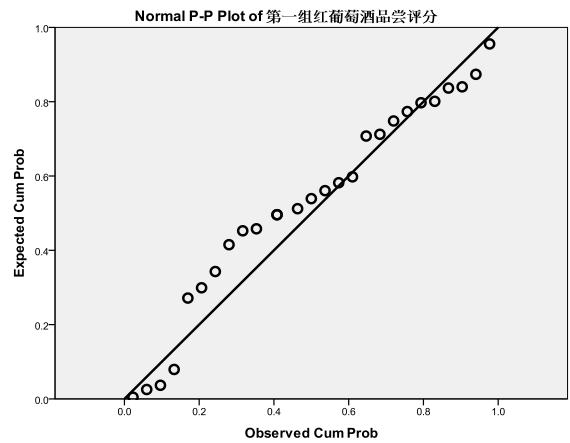
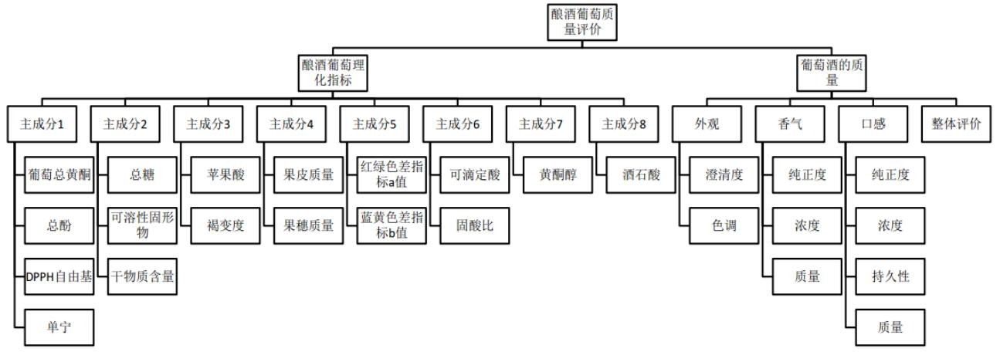
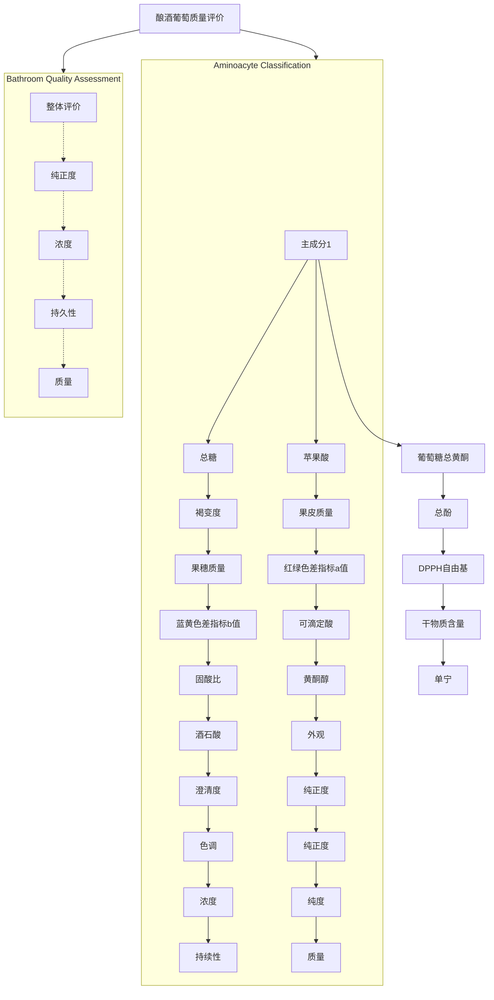
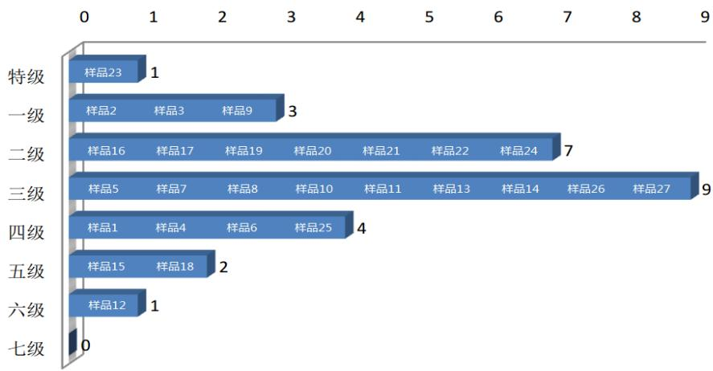
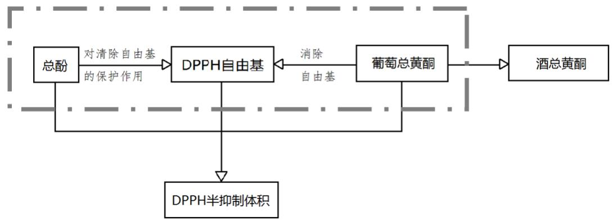
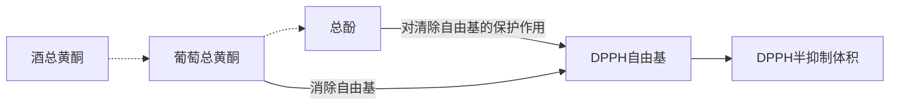
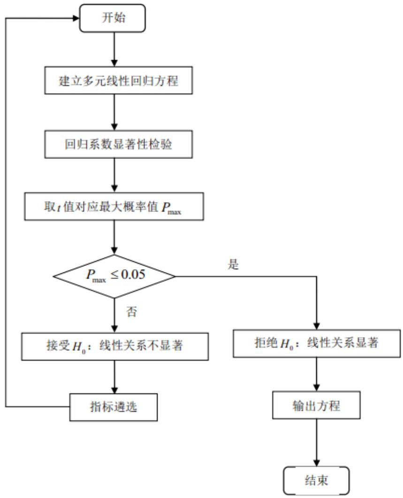
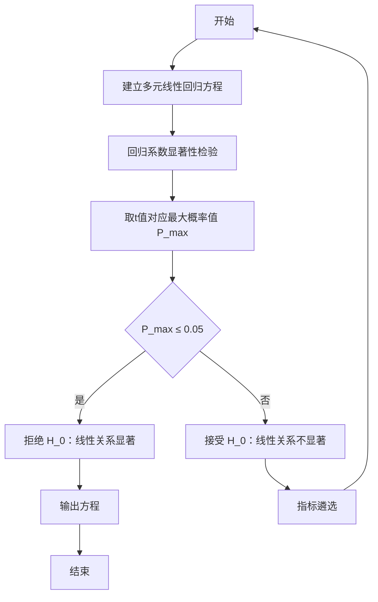
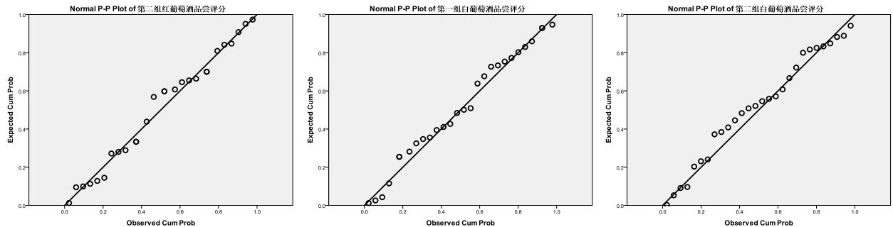

# 葡萄酒的评价

## 摘 要

本文运用多种相关分析、综合评价和线性回归等方法解决了葡萄酒质量的评价问题。

对于问题一，首先通过单样本 检验等方法确定了各葡萄酒样本评分数据的概率分布，从而确定了显著性差异模型的建立，接着考虑两组评分数据的配对关系约束，引入Wilcoxon符号秩检验法来进行显著性差异的假设检验。结果显示对于红、白葡萄酒，两个品酒组的评价结果均存在显著性差异。最后利用秩相关分析，引入肯德尔和谐系数法评定评酒组的评分信度，评价结果显示对于红葡萄酒，第一组品酒员的品尝得分更为可信，而对于白葡萄酒则是第二组品酒员在可信度方面占优。

问题二，运用主成分分析法进行指标遴选，构建酿酒葡萄质量的综合评价指标体系，并利用该指标体系建立基于综合评价的酿酒葡萄分级模型，对酿酒葡萄进行分级。结果发现样本葡萄大多集中在二、三级，红葡萄样本中样本 23 质量最优，为特级葡萄；样本12 质量相对欠缺，属六级葡萄。

问题三中，采用研究两组变量之间相关关系的多元统计方法——典型相关分析，识别并量化两组变量——酿酒葡萄与葡萄酒的理化指标——之间的关系。分析结果如下：第一，增大酿酒葡萄果皮的含量对葡萄酒中 半抑制体积含量的增加有重要影响；第二，酿酒葡萄中的苹果酸不仅能促发酵，还能给对红葡萄酒起主要呈色作用的花色苷和对花色苷起中等辅色作用的单宁物质起保护作用，使得红葡萄酒呈色亮丽；第三，在葡萄总黄酮消除自由基的抗氧化作用和总酚保护清除自由基的共同作用下，酿酒葡萄中的DPPH 自由基转化为葡萄酒中的 DPPH 半抑制体积。

对于问题四，首先在问题三分析酿酒葡萄与葡萄酒的理化指标间联系的基础上，在保留葡萄酒指标的前提下，剔除酿酒葡萄指标中某些认为可以被用于表示对应葡萄酒指标的部分。接着，利用筛选后的指标建立多元线性回归模型，探究酿酒葡萄和葡萄酒的理化指标对葡萄酒质量的影响。经检验样本组的线性回归模型评价值与评分值的显著性差异检验，用葡萄和葡萄酒的理化指标来评价葡萄酒的质量是可行的。

本文综合秩相关分析评价、基于层次分析法的综合评价、典型相关分析、多元线性回归等模型，结合 MATLAB、SPSS、SAS 和 EXCEL 等软件，对葡萄酒质量的评价问题进行了多角度的分析，并给出了利用理化指标评价葡萄酒质量的模型。在文章的最后对模型的适用范围做出了推广，在实际应用中有较大的参考价值。

关键词：秩相关 主成分分析 层次分析综合评价 典型相关分析 多元线性回归

## 一、问题重述

确定葡萄酒质量时一般是通过聘请一批有资质的评酒员进行品评。每个评酒员在对葡萄酒进行品尝后对其分类指标打分，然后求和得到其总分，从而确定葡萄酒的质量。酿酒葡萄的好坏与所酿葡萄酒的质量有直接的关系，葡萄酒和酿酒葡萄检测的理化指标会在一定程度上反映葡萄酒和葡萄的质量。附件 1 给出了某一年份一些葡萄酒的评价结果，附件2 和附件3 分别给出了该年份这些葡萄酒的和酿酒葡萄的成分数据。请尝试建立数学模型讨论下列问题：

1. 分析附件1 中两组评酒员的评价结果有无显著性差异，哪一组结果更可信？  
2. 根据酿酒葡萄的理化指标和葡萄酒的质量对这些酿酒葡萄进行分级。  
3. 分析酿酒葡萄与葡萄酒的理化指标之间的联系。  
4．分析酿酒葡萄和葡萄酒的理化指标对葡萄酒质量的影响，并论证能否用葡萄和葡萄酒的理化指标来评价葡萄酒的质量？

## 二、问题分析

## 2.1 问题一的分析

问题一要求比较两组评价结果的是否存在差异，并建立合理的评价模型以判断两组结果在可信程度方面的优劣。首先，我们从问题分析可以得出品酒员对葡萄酒样本的品尝评分是属于感官评价，具有较大的主观性。因此，我们先从问题所给的数据入手，分析四组品酒结果中对不同样本打分分布。依靠葡萄酒样本评分的概率分布，建立显著性差异模型。由于品酒员间存在评价尺度、评价位置和评价方向等方面的差异，不同组别的品酒员对同一酒样的评价结果存在着差异。此时不适用参数检验的方法，而只能用非参数统计方法来处理。

对主观评分结果合理性的评价，仅仅局限于评分之间表面的数值关系是不够的。因此，考虑采取秩相关分析法建立评价模型，将评分结果的具体数值部分予以丢弃，只保留各评分秩大小关系的信息，以给出数据中最稳固、最一般的关系，度量整体评分结果在可信度方面的优劣。

## 2.2 问题二的分析

酿酒葡萄，是指以酿造葡萄酒为主要生产目的的葡萄品种[1]。问题二要求分析确定合理的评价指标体系，并运用该评价指标体系对酿酒葡萄进行分级。显而易见，该问题要求我们建立一个评价模型。

评价体系主要包含两方面指标：

第一个方面是葡萄酒的质量。这包括外观、香气、口感、整体四方面的评分。外观包括澄清度和色调，香气包括纯正度、浓度和质量，口感则通过纯正度、浓度、持久性和质量体现。

第二个方面酿酒葡萄自身的理化指标。如附加二中的葡萄总黄酮、总酚、单宁、果皮质量等27 个指标。对于这27 个酿酒葡萄自身的理化指标，根据多个样本得到的数据分析出其内在的关系，将相关性显著的指标合并，则可以使得计算简单。

那么由以上的分析可以构建综合评价指标体系，建立模型进行多指标综合评价.基于综合评价的结果，即可对酿酒葡萄进行分级。

## 2.3 问题三的分析

问题三中，题目要求分析酿酒葡萄与葡萄酒的理化指标之间的联系。酿酒葡萄和葡萄酒分别存在多个理化指标，若采用简单相关分析的方法，只是孤立考虑了单个 与单个 间的相关，而没有考虑 、 变量组内部各变量间的相关。酿酒葡萄经发酵酿成葡萄酒的化学过程，使得两组变量间有许多简单相关系数，使问题显得复杂，难以从整体描述。因此，考虑采用研究两组变量之间相关关系的多元统计方法——典型相关分析，识别并量化酿酒葡萄与葡萄酒的理化指标两组变量之间的关系，考虑两组变量的线性组合，并研究它们之间的相关系数p(u,v)。

## 2.4 问题四的分析

问题四中，需要我们通过酿酒葡萄和葡萄酒的理化指标，得到对葡萄酒的质量的评价，并论证是否可行。因此，首先考虑在问题三的基础上，针对酿酒葡萄与葡萄酒理化指标之间的联系和它们与葡萄酒质量之间的相关性进行指标的筛选。随后，期望建立一个线性回归模型，通过该模型来得到对葡萄酒质量的评价。

由于要论证能否用葡萄和葡萄酒的理化指标来评价葡萄酒的质量，初步认为在建立线性回归模型时对样本进行随机遴选，选中的样本作为示例样本组建立线性回归方程，未选中的样本作为检验样本组对模型的可行性进行验证。

## 三、模型假设

1. 假设各样本能真实客观地反映酿酒葡萄与葡萄酒的情况；  
2. 葡萄酒的质量只与酿酒葡萄的好坏有关，忽略酿造过程中的温度、湿度、人为干扰等其他因素的影响；  
3. 不考虑理化性质的二级指标；  
4. 每组评酒员的打分不受上个酒样品的影响，即各评分数据间独立；

四、符号说明

<table><tr><td>序号</td><td>符号</td><td>符号说明</td></tr><tr><td>1.</td><td>m</td><td>品酒员个数</td></tr><tr><td>2.</td><td>n</td><td>样本数</td></tr><tr><td>3.</td><td>j</td><td>样本序数</td></tr><tr><td>4.</td><td>i</td><td>指标序数</td></tr><tr><td>5.</td><td> $r_{ii'}$ </td><td>第i个指标与第 $i'$ 个指标的相关系数</td></tr><tr><td>6.</td><td>p</td><td>一级评价指标中的指标序数</td></tr><tr><td>7.</td><td>q</td><td>二级评价指标中的指标序数</td></tr><tr><td>8.</td><td>y</td><td>酿酒葡萄质量综合评价值</td></tr><tr><td>9.</td><td>B</td><td>每一酿酒葡萄样本所在级别</td></tr><tr><td>10.</td><td>X</td><td>酿酒葡萄理化指标</td></tr><tr><td>11.</td><td>Y</td><td>葡萄酒的理化指标</td></tr><tr><td>12.</td><td>β</td><td>线性回归系数</td></tr><tr><td>13.</td><td>V</td><td>典型变量</td></tr><tr><td>14.</td><td>W</td><td>解释变量</td></tr></table>

## 五、模型建立与求解

## 5.1 问题一的模型建立与求解

问题一要求分析两组评酒员的评价结果有无显著性差异，并判断两组结果在可信程度方面的优劣。我们认为由以下三个步骤组成：

步骤一：葡萄酒样本评分概率分布的确定，其目的是确定显著性差异模型的类型；

步骤二：两组评酒员评价结果的显著性差异模型的建立，主要通过Wilcoxon符号秩检验法进行显著性差异的假设检验；

步骤三：建立秩相关分析评价模型，并通过该模型判断两组品酒员评价结果在可信度方面的优劣。

## 5.1.1 数据的预处理

经过对数据的查找，我们发现部分原始数据存在异常，另外有些类型数据存在缺失，在此我们将其正常化处理。

## （1）缺失数据的处理

对于数据中存在的缺失现象，本文采用均值替换法对这种缺失数据进行处理。

均值替换法就是将该项目剔除异常数据后取整剩余数据的平均值来替换异常或缺失数据的方法，即：

$$
x _ {m} ^ {*} = \frac {1}{9} \left[ \sum_ {k = 1, k \neq m} ^ {1 0} x _ {k} \right] \quad (m = 1, 2, \dots , 1 0)
$$

其中， ${ \boldsymbol { x } _ { m } } ^ { * }$ 为缺失值。

由于不同品酒师对同一样本相同项目的打分值差别不大，所以认为采用均值替换法来处理缺失数据是可行的。以“酒样品20”色调数据为例进行修补，得到修正后的数据如下表所示。

表1 红葡萄酒样品20 色调数据修补

<table><tr><td>品酒员</td><td>1号</td><td>2号</td><td>3号</td><td>4号</td><td>5号</td><td>6号</td><td>7号</td><td>8号</td><td>9号</td><td>10号</td></tr><tr><td>修补前</td><td>6</td><td>6</td><td>4</td><td>---</td><td>6</td><td>6</td><td>8</td><td>6</td><td>6</td><td>8</td></tr><tr><td>修补后</td><td>6</td><td>6</td><td>4</td><td>6</td><td>6</td><td>6</td><td>8</td><td>6</td><td>6</td><td>8</td></tr></table>

注：表中“---”代表数据缺失

## （2）异常数据的修正

原始数据中，有的数据明显比两侧的数据过大或过小，显然是不合理数据。

例如，第一组白葡萄酒品尝评分的数据中，可能由于手工输入的误差，品酒员7 对样品3 持久性评分的数据相对于相邻各品酒员的评分发生了明显的突变现象。这种数据异常有可能对数据挖掘的结果产生不利影响。

表2 第一组白葡萄酒品尝评分样本3 持久性数值异常

<table><tr><td>品酒员</td><td>1号</td><td>2号</td><td>3号</td><td>4号</td><td>5号</td><td>6号</td><td>7号</td><td>8号</td><td>9号</td><td>10号</td></tr><tr><td>持久性</td><td>7</td><td>5</td><td>7</td><td>5</td><td>6</td><td>7</td><td>77</td><td>5</td><td>6</td><td>7</td></tr></table>

对于类似的异常数据采取“先剔除，后替换”的策略，对异常数据进行修正。

## 5.1.2 各葡萄酒样本评分数据概率分布的确定

对两组品酒员差异性评价的假设检验一般要求数据符合正态分布。统计规律表明，正态分布有极其广泛的实际背景，生产与科学实验中很多随机变量的概率分布都可以近似地用正态分布来描述[2]。因此，对葡萄酒质量的评分进行正态性检验有助于我们分析得出该评分是否科学、合理。

首先，计算针对每一个样本10 个品酒员的评分均值，即

$$
\overline {{x}} = \frac {\sum_ {m = 1} ^ {1 0} x _ {m n}}{1 0} \quad (m = 1, 2, \dots , 1 0 \quad n = 1, 2, \dots , 1 0)
$$

其次，利用SPSS 统计软件中的P-P 图和单样本K-S 检验，对数据集两组品酒员分别对红、白葡萄酒品尝得到的四组评价结果（见附录8.1.2）进行了正态分布检验，若样点在正态分布P-P 图上呈直线散布，则被检验数据基本上成一条直线[3]。



<details>
<summary>qq</summary>

| Observed Cum Prob | Expected Cum Prob |
| --- | --- |
| ~0.05 | ~0.02 |
| ~0.08 | ~0.03 |
| ~0.12 | ~0.04 |
| ~0.15 | ~0.09 |
| ~0.17 | ~0.28 |
| ~0.22 | ~0.31 |
| ~0.26 | ~0.35 |
| ~0.30 | ~0.42 |
| ~0.34 | ~0.46 |
| ~0.38 | ~0.46 |
| ~0.42 | ~0.50 |
| ~0.48 | ~0.52 |
| ~0.52 | ~0.55 |
| ~0.56 | ~0.57 |
| ~0.59 | ~0.59 |
| ~0.62 | ~0.61 |
| ~0.66 | ~0.71 |
| ~0.70 | ~0.72 |
| ~0.74 | ~0.75 |
| ~0.78 | ~0.78 |
| ~0.81 | ~0.80 |
| ~0.84 | ~0.81 |
| ~0.87 | ~0.84 |
| ~0.91 | ~0.84 |
| ~0.95 | ~0.88 |
| ~0.98 | ~0.96 |
</details>

图1 第一组红葡萄酒评价结果的正态P-P 图和K-S 检验结果

One-Sample Kolmogorov-Smirnov Test

<table><tr><td colspan="2"></td><td>第一组红葡萄酒品尝得分</td></tr><tr><td>No</td><td></td><td>27</td></tr><tr><td rowspan="2"> $Normal\ Parameters^{a,b}$ </td><td>Mean</td><td>73.0778</td></tr><tr><td>Std. Deviation</td><td>7.36093</td></tr><tr><td rowspan="3">Most Extreme Differences</td><td>Absolute</td><td>.156</td></tr><tr><td>Positive</td><td>.089</td></tr><tr><td>Negative</td><td>-.156</td></tr><tr><td>Kolmogorov-Smirnov Z</td><td></td><td>.812</td></tr><tr><td>Asymp. Sig. (2-tailed)</td><td></td><td>.525</td></tr></table>

a. Test distribution is Normal.  
b. Calculated from data.

从图 1 可以看出第一组（其余三组见附录 8.1-图 8.1）数据的散点分别近似为一条直线，且与对角线大致重叠；双边检验结果 $p = 0 . 5 2 5 > 0 . 0 5$ 。因此可以认为品酒员对葡萄酒的评分服从正态分布。

## 5.1.3 两组评价结果的显著性差异评价

上述检验显示各类葡萄酒得分情况属于正态总体，为了进一步说明品酒员评分的科学性以及两个评分组评分的可信度，需要检查两组给出的评分是否有显著性差异，即对数据进行显著性检验。

两配对样本非参数检验一般用于同一研究对象分别给予两种不同处理的效果比较[4]。因为两组品酒员分别对同一样本组进行评分，故两组数据为配对数据。对于两组配对数据的检验，需要引入适用于T 检验中的成对比较，但并不要求成对数据之差 $D _ { i }$ 服从正态分布，只要求对称分布即可[5]的 Wilcoxon符号秩检验法，用来决定两个样本是否来自相同的或相等的总体。其检验步骤（以红葡萄为例）如下：

Step1. 提出假设： $H _ { 0 }$ ：两组品酒员对酒样本的评价结果是相同的；

$H _ { 1 }$ ：两组品酒员对酒样本的评价结果是不同的。

Step2. 选定显著性水平 $\alpha = 0 . 0 5 , n _ { 1 } = n _ { 2 } = 2 7$

Step3. 根据样本值计算成对观测数据之差 $D _ { i }$ ，并将 $D _ { i }$ 的绝对值按大小顺序编上等级。最小的数据等级为 1，第二小的数据等级为 2，以此类推（若有数据相等的情形，则取这几个数据排序的平均值作为其等级）（见附录8.1.3）。

Step4. 等级编号完成后恢复正负号，分别求出正等级之和 $T ^ { + }$ 和负等级之和T<sup></sup> ，选择 $T ^ { + }$ 和 $T ^ { - }$ 中较小的一个作为威尔科克森检验统计量T。

Step5. 统计量T的均值和方差分别为 $E \big ( T \big )$ 和 $D \big ( T \big )$ ，确定检验统计量

$$
z = \frac {T - E (t)}{\sqrt {D (t)}} \sim N (0, 1)
$$

近似服从于标准正态分布。

Step6. 查正态分布表可得 $- z _ { \alpha / 2 } = - z _ { 0 . 0 5 / 2 } = - 1 . 9 6$ 的值，确定 $H _ { 0 }$ 的拒绝域为

$$
z = \frac {T - E (t)}{\sqrt {D (t)}} = \frac {T - \frac {n (n + 1)}{4}}{\sqrt {\frac {n (n + 1) (2 n + 1)}{2 4}}} \leq - 1. 9 6
$$

根据样本值计算的检验统计量的观测值

$$
z = \frac {T - E (t)}{\sqrt {D (t)}} = \frac {T - \frac {n (n + 1)}{4}}{\sqrt {\frac {n (n + 1) (2 n + 1)}{2 4}}} \approx - 2. 5 3 <   - 1. 9 6
$$

所以应拒绝 $H _ { 0 }$ ，即在显著性水平 $\alpha = 0 . 0 5$ 下，认为两个品酒组对红葡萄酒的评价结果是不同的，即存在显著性差异。

类似地，对于两个品酒组白葡萄酒的评价结果（见附录 ），可以得到

$$
z = \frac {T - E (t)}{\sqrt {D (t)}} \approx - 2. 2 3 <   - 1. 9 6
$$

因此，两组品酒员对红、白葡萄酒的评价结果均存在显著性差异。

## 5.1.4 秩相关分析评价模型的建立

感官分析（特别是描述分析）是评价葡萄酒质量高低的重要方法 。然而，在葡萄酒的感官评价中，由于品酒员间存在评价尺度、评价位置和评价方向等方面的差异，不同组别的品酒员对同一酒样的评价结果存在显著性差异。因此，判断不同组别品酒员对葡萄酒质量的评价结果在可信程度方面的优劣尤为重要。

评鉴主评的评分信度主要采用肯德尔和谐系数法来评定。肯德尔和谐系数是指“以等级次序排列或以等级次序表示的变量之间的相关”，它常用来刻画多个评价者对某一事物评判或评分的一致性程度[8]。设有m个品酒员对 j 个样本评分，用肯德尔和谐系数法分析评分的一致性，步骤如下：

Step1. 对附件1 葡萄酒品尝评分表中的数据进行秩变换（见附录 8.1.4）；

Step2. 计算和谐系数 ，建立秩相关分析评价模型，其目的是度量品酒组的整体评分效果；

令和谐系数

$$
\omega = Q / \left[ \frac {1}{1 2} \times m ^ {2} (j ^ {3} - j) \right]
$$

其中，<sub>Q</sub>为每个被评样本所得等级秩数之和 $R _ { m j }$ 与所有等级分的平均数 $\bar { R }$ 之差的平方和，即： $Q = \sum _ { m = 1 } ^ { 1 0 } \bigl ( R _ { m j } - \overline { { R } } \bigr ) ^ { 2 }$

为计算方便，可将上式化为： $Q = \sum _ { m = 1 } ^ { 1 0 } { R _ { m j } } ^ { 2 } - \frac { \left( \sum _ { m = 1 } ^ { 1 0 } R _ { m j } \right) ^ { 2 } } { j }$

Step3. 进行显著性检验。

本文令10 个品酒员为一个品酒组，分别对27 个红葡萄酒样本和 28 个白葡萄酒样本进行评分，第m个品酒员对第 j 个样本的评分秩为 $r _ { m j }$ ，则 $R _ { _ { m j } } = \sum _ { m = 1 } ^ { 1 0 } r _ { m j }$ 为品酒组对第j个样本的评秩之和。显然，当品酒组意见比较一致时，各个秩和 $R _ { 1 } , R _ { 2 } , \cdots , R _ { n }$ 之间差距较大，而当品酒组意见分歧较大时， $R _ { 1 } , R _ { 2 } , \cdots , R _ { n }$ 差距较小。

解得四组评分结果 $\omega$ 值如下：

表3 各组品酒员对葡萄酒品尝得分 值

<table><tr><td>组别</td><td>第一组红葡萄酒品尝得分</td><td>第二组红葡萄酒品尝得分</td><td>第一组白葡萄酒品尝得分</td><td>第二组白葡萄酒品尝得分</td></tr><tr><td> $\omega$ 值</td><td>0.044366788</td><td>0.043314652</td><td>0.040039039</td><td>0.041112055</td></tr></table>

本文样本数 $j > 7$ ，检验统计量为 $\chi ^ { 2 } , \chi ^ { 2 } = m \big ( j - 1 \big ) \omega \circ \chi ^ { 2 }$ 服从自由度为 j 的 $\chi ^ { 2 }$ 分布。$\chi ^ { 2 }$ 的计算值如表4 所示，如果 $\chi ^ { 2 } > \chi _ { ( m ) \alpha }$ ，那么有 $1 0 0 \big ( 1 - \alpha \big )$ 的把握可以断定10 个品酒员的评分存在相关。

表4 各组品酒员对葡萄酒品尝得分检验结果

<table><tr><td>组别</td><td>第一组红葡萄酒品尝得分</td><td>第二组红葡萄酒品尝得分</td><td>第一组白葡萄酒品尝得分</td><td>第二组白葡萄酒品尝得分</td></tr><tr><td> $\chi^2$ </td><td>11.53536508</td><td>11.26180952</td><td>10.81054064</td><td>11.10025493</td></tr></table>

由表 可知，对于红葡萄酒，第一组品尝得分存在相关的概率大于第二组品尝得分存在相关的概率，即第一组品酒员的评价结果更为可信；而对于白葡萄酒，第二组存在相关的概率大于第一组，即是第二组品酒员的评价结果更为可信。因此，本文后续分析中，对于红葡萄酒质量评价结果选用第一组品尝得分，对于白葡萄酒质量评价结果选用第二组品尝得分。

## 5.2 问题二的模型建立与求解

问题二要求我们建立模型，可以根据酿酒葡萄自身的理化指标和酿造后葡萄酒的质量情况，对酿酒葡萄进行分级。为解决该问题，我们通过以下步骤来评价与分级酿酒葡萄。

步骤一：酿酒葡萄27 种指标之间的关系研究，目的是构建评价模型的指标体系；

步骤二：建立综合评价模型，并通过该模型对步骤一得到的指标进行多指标综合评价，以对酿酒葡萄进行分级。

## 5.2.1 分级综合评价指标体系的构建

## 1. 酿酒葡萄27 种指标的遴选

对于酿酒葡萄而言，虽然每种指标在成因上互不相同，但是不同的指标之间往往具有相关性，其产生的原因是有潜在的因素对酿酒葡萄的各指标起支配作用。为了找到这些潜在因素以及相应的支配作用，本文选用主成分分析法 对这些问题做以解决，步骤如下：

Step1. 为消除不同变量的量纲的影响，首先需要对变量进行标准化中处理；

本部分涉及到的指标共27个，样本对象27个，第 j 个样本的第i个指标值为 $F _ { i j }$ ，将各标准化值按如下方式进行标准化为 $\widetilde { F } _ { i j }$ ：

$$
\widetilde {F} _ {i j} = \frac {F _ {i j} - \overline {{F}} _ {i}}{s _ {i}} \tag {1}
$$

其中 $\overline { { F } } _ { i }$ 和 $s _ { i }$ 分别为i指标的均值和标准差。标准化的目的在于消除不同变量的量纲的影响，而且标准化转化不会改变变量的相关系数。

Step2. 计算标准化数据的相关系数阵，求出相关系数矩阵的特征值和特征向量。

记第<sub>i</sub>个指标与第 $i ^ { \prime }$ 个指标的相关系数为<sub>r</sub> ，其计算方法为： $r _ { i i ^ { \prime } }$

$$
r _ {i i ^ {\prime}} = \frac {\sum_ {k = 1} ^ {2 7} \tilde {F} _ {i k} \tilde {F} _ {i ^ {\prime} k}}{2 7 - 1}, i, i ^ {\prime} = 1, 2, \dots , 2 7
$$

则相关系数矩阵为 $\boldsymbol { R } = \left( \boldsymbol { r } _ { i i ^ { \prime } } \right) _ { 2 7 \times { 2 7 } }$ ，其中， $r _ { i i } = 1 , \quad r _ { i i ^ { \prime } } = r _ { i ^ { \prime } i }$

Step3：计算特征值与特征向量；

计算相关系数矩阵 的特征值 $\lambda _ { 1 } \geq \lambda _ { 2 } \geq \cdots \geq \lambda _ { 2 7 } ^ { } $ ，及其对应的特征向量$\xi _ { 1 } , \xi _ { 2 } , \cdots , \xi _ { 2 }$ ，其中 $\xi _ { 1 } = \left( \mu _ { 1 i } , \mu _ { 2 i } , \cdots , \mu _ { 2 7 i } \right) ^ { T }$ ，由特征向量组成27 个新的指标变量：

$$
\left\{ \begin{array}{l} Y _ {1} = \mu_ {1, 1} \tilde {F} _ {1} + \mu_ {2, 1} \tilde {F} _ {2} + \dots + \mu_ {2 7, 1} \tilde {F} _ {2 7} \\ Y _ {2} = \mu_ {1, 2} \tilde {F} _ {1} + \mu_ {2, 2} \tilde {F} _ {2} + \dots + \mu_ {2 7, 2} \tilde {F} _ {2 7} \\ \dots \dots \\ Y _ {2 7} = \mu_ {1, 2 7} \tilde {F} _ {1} + \mu_ {2, 2 7} \tilde {F} _ {2} + \dots + \mu_ {2 7, 2 7} \tilde {F} _ {2 7} \end{array} \right.
$$

其中， $Y _ { i }$ 为第<sub>i</sub>主成分， $i = 1 , 2 , \cdots , 2 7$

Step4. 确定<sub>p</sub>个主成分，进行统计分析。

根据以上步骤，本文利用 统计软件，首先求得各指标的相关性系数表（见附件 ），从表中可以发现，某些指标具有很强的相关性，如果直接用这些指标对酿酒葡萄质量进行分级，不仅会使得运算量过大，同时还会造成信息的重叠，影响分级的客观性。主成分分析可以把多个指标转化成少数几个不相关的综合指标。以红葡萄为例，相应主成分的特征值和累计贡献率如下表：

表5 红葡萄特征值和累计贡献率

<table><tr><td rowspan="2">主成分</td><td colspan="3">提取平方和载入</td><td colspan="3">旋转平方和载入</td></tr><tr><td>合计</td><td>方差的%</td><td>累计%</td><td>合计</td><td>方差的%</td><td>累计%</td></tr><tr><td>1</td><td>6.966</td><td>23.221</td><td>23.221</td><td>5.196</td><td>17.318</td><td>17.318</td></tr><tr><td>2</td><td>4.940</td><td>16.467</td><td>39.687</td><td>4.458</td><td>14.859</td><td>32.177</td></tr><tr><td>3</td><td>3.737</td><td>12.457</td><td>52.144</td><td>3.135</td><td>10.451</td><td>42.629</td></tr><tr><td>4</td><td>2.840</td><td>9.467</td><td>61.611</td><td>2.712</td><td>9.039</td><td>51.668</td></tr><tr><td>5</td><td>1.999</td><td>6.663</td><td>68.274</td><td>2.690</td><td>8.968</td><td>60.636</td></tr><tr><td>6</td><td>1.742</td><td>5.808</td><td>74.082</td><td>2.565</td><td>8.552</td><td>69.187</td></tr><tr><td>7</td><td>1.418</td><td>4.728</td><td>78.810</td><td>2.257</td><td>7.523</td><td>76.711</td></tr><tr><td>8</td><td>1.270</td><td>2.234</td><td>83.044</td><td>1.900</td><td>6.333</td><td>83.044</td></tr></table>

在累计方差为 83.044%的前提下分析得到八个主成分，这八个主成分提供了附件 2酿酒红葡萄的理化指标中 的信息，满足主成分分析原则。从表 还可以看到，主成分1 和2 的累计贡献率较大，这就可以解释为主成分 1 与主成分 2 可能是酿酒葡萄分级最重要的指标。

由以上分析利用 SPSS统计软件计算得到主成分分析正交解见附录8.2.1。

正交解说明，红葡萄理化指标当中，主成分 为葡萄总黄酮、总酚、 自由基和单宁的组合，主成分 2 为总糖、可溶性固形物和干物质含量的组合，主成分3 为苹果酸和褐变度的组合，主成分4 为果皮质量与果穗质量的组合，主成分 5 为红绿色差指标a 值和黄蓝色差指标 b 值的组合，主成分 6 为可滴定酸和固酸比的组合，主成分 7 为黄酮醇，主成分8 为酒石酸。这组合说明葡萄总黄酮、总酚、DPPH 自由基和单宁，总糖、可溶性固形物和干物质含量，苹果酸和褐变度，果皮质量与果穗质量，红绿色差指标 a值、黄蓝色差指标 b 值和白藜芦醇，可滴定酸和固酸比可能在同一方面对酿酒葡萄分级起重要作用，而黄酮醇、酒石酸分别在不同角度影响酿酒葡萄的质量与分级。

## 2.指标体系的初步建立

根据酿酒葡萄指标遴选分析与已知葡萄酒质量评分规则，以红葡萄为例，酿酒葡萄理化指标 $R _ { \mathrm { 1 } }$ 、葡萄酒质量 $R _ { 2 }$ 是评价葡萄质量的一级指标，其中一级指标——酿酒葡萄理化指标 $R _ { \mathrm { 1 } }$ 进一步分为主成分1 至主成分8 的八个二级指标，葡萄酒质量 $R _ { 2 }$ 分为外观、香气、口感、整体的四个二级指标讨论。八个二级指标和四个二级指标下面又分别进一步分为17 个和10 个三级指标，故三级指标共 27 个。

综上可得，酿酒葡萄质量评价指标体系构架为：

图2 酿酒葡萄质量评价指标体系构架表  


<details>
<summary>flowchart</summary>


</details>

## 5.2.2基于综合评价的酿酒葡萄分级模型的建立

## 1. 数据的预处理

## （1）评价指标类型的一致化处理

在已建立的指标体系中，指标集可能同时含有“极大型”和“极小型”指标，我们分别称之为优质因子和劣质因子，也存在“中间型”指标。因此在评价之前必须将评价指标的类型进行一致化处理，即要统一化为极大型指标。

极小型指标：对于某个极小型指标 ，通过平移变换 $x _ { i }$ $x _ { i } ^ { \prime } = M _ { i } - x _ { i } ( x _ { i } > 0 , i = 1 , 2 , . . . , 2 7 )$ 其中 $M _ { i }$ 为指标 $x _ { i }$ 可能取到的最大值。

中间型指标：对于某个中间型指标 ，要将其化为极大型指标，令 $x _ { i }$

$$
x _ {i} ^ {\prime} = \left\{ \begin{array}{l} \frac {2 \big (x _ {i} - m _ {i} \big)}{M _ {i} - m _ {i}}, m _ {i} \leq x _ {i} \leq \frac {1}{2} \big (M _ {i} + m _ {i} \big) \\ \frac {2 \big (M _ {i} - x _ {i} \big)}{M _ {i} - m _ {i}}, \frac {1}{2} \big (M _ {i} + m _ {i} \big) \leq x _ {i} \leq M _ {i} \end{array} \right.
$$

其中 $M _ { i }$ 、 $m _ { i }$ 分别为 $x _ { i }$ 可能取值的最大值和最小值。

## （2）评价指标的无量纲化处理

本文的各个评价指标之间由于各自的度量单位及数量级的差别，而存在着不可公度性，这就为确定综合评价指标带来了困难和问题。此时，可以通过一些常用的数学变换，即数据的无量纲化，来消除原始指标数据的差异影响。

本文采用极差化的方法，对 n 个样本 27 项三级指标的指标值 $x _ { i j } \ ( j = 1 , 2 , . . . , n$ ；$i = 1 , 2 , . . . , 2 7 )$ 做无量纲化处理，令

$$
M _ {i} = \max \left\{x _ {1, i}, x _ {2, i},..., x _ {n, i} \right\}, \quad m _ {i} = \left\{x _ {1, i}, x _ {2, i},..., x _ {n, i} \right\}
$$

则新的指标为

$$
x _ {i j} ^ {*} = \frac {x _ {i j} - m _ {i}}{M _ {i} - m _ {i}} \in [ 0, 1 ]
$$

即 ${ x _ { i j } } ^ { * } \left( j = 1 , 2 , . . . , n ; i = 1 , 2 , . . . , 2 7 \right)$ 为无量纲化的指标值。

## 2.运用层次分析法（AHP）确定评价指标权重[9]

考虑到酿酒葡萄的分级不仅仅是由葡萄或葡萄酒内的一种成分决定的，并且每一种成分对分级的影响也不一样。为了确定各指标对酿酒葡萄分级影响的权值，本文采用层次分析法和综合评价法[9]进行酿酒葡萄的评价。

对于层次分析法中的判断矩阵，根据不同理化性质在样本中的分布情况以及不同样本的评分结果，确定各个指标之间的相对重要程度，可以得到如下判断矩阵表（以红葡萄为例）：

表6 判断矩阵表

<table><tr><td></td><td>因子1</td><td>因子2</td><td>因子3</td><td>因子4</td><td>因子5</td><td>因子6</td><td>因子7</td><td>因子8</td></tr><tr><td>因子1</td><td>1.0000</td><td>1.1655</td><td>1.6571</td><td>1.9159</td><td>1.9311</td><td>2.0250</td><td>2.3020</td><td>2.7346</td></tr><tr><td>因子2</td><td>0.8580</td><td>1.0000</td><td>1.4218</td><td>1.6439</td><td>1.6569</td><td>1.7375</td><td>1.9751</td><td>2.3463</td></tr><tr><td>因子3</td><td>0.6035</td><td>0.7033</td><td>1.0000</td><td>1.1562</td><td>1.1654</td><td>1.2221</td><td>1.3892</td><td>1.6502</td></tr><tr><td>因子4</td><td>0.5219</td><td>0.6083</td><td>0.8649</td><td>1.0000</td><td>1.0079</td><td>1.0569</td><td>1.2015</td><td>1.4273</td></tr><tr><td>因子5</td><td>0.5178</td><td>0.6035</td><td>0.8581</td><td>0.9921</td><td>1.0000</td><td>1.0486</td><td>1.1921</td><td>1.4161</td></tr><tr><td>因子6</td><td>0.4938</td><td>0.5755</td><td>0.8183</td><td>0.9461</td><td>0.9536</td><td>1.0000</td><td>1.1368</td><td>1.3504</td></tr><tr><td>因子7</td><td>0.4344</td><td>0.5063</td><td>0.7198</td><td>0.8323</td><td>0.8389</td><td>0.8797</td><td>1.0000</td><td>1.1879</td></tr><tr><td>因子8</td><td>0.3657</td><td>0.4262</td><td>0.6060</td><td>0.7006</td><td>0.7062</td><td>0.7405</td><td>0.8418</td><td>1.0000</td></tr></table>

得到判断矩阵后，求得其最大特征向量，将该特征向量归一化处理后即可得到各影响分级程度指标的权向量（以红葡萄为例，白葡萄见附录 8.2.1）：

$$
\begin{array}{l} w = \left(0. 0 2 5 3 3 8, 0. 0 5 0 6 7 7, 0. 0 3 7 0 3 1, 0. 0 4 9 3 7 5, 0. 0 9 8 7 4 9, 0. 0 2 4 9 6 6, 0. 0 3 3 2 8 8, \right. \\ 0. 0 3 3 2 8 8, 0. 0 9 1 5 4 3, 0. 0 5 5 7 4 4, 0. 0 2 7 1 4 9, 0. 0 2 6 9 9 9, 0. 0 2 5 4 1 3, 0. 0 2 4 7 1, \\ 0. 0 3 0 1 6, 0. 0 2 9 7 0 4, 0. 0 2 9 6 0 1, 0. 0 3 1 5 5 2, 0. 0 3 1 3 7 3, 0. 0 2 8 4 9 5, 0. 0 2 5 9 2 9, \\ 0. 0 2 7 4 0 1, 0. 0 2 6 5 9 5, 0. 0 2 6 4 2, 0. 0 2 5 0 7 2, 0. 0 4 5 2 9 6, 0. 0 3 8 1 3 1) \\ \end{array}
$$

表7 各影响分级程度指标的权重汇总表

<table><tr><td>澄清度</td><td>色调</td><td>纯正度</td><td>浓度</td><td>质量</td><td>纯正度</td><td>浓度</td></tr><tr><td>0.025338</td><td>0.050677</td><td>0.037031</td><td>0.049375</td><td>0.098749</td><td>0.024966</td><td>0.033288</td></tr><tr><td>持久性</td><td>质量</td><td>整体评价</td><td>葡萄总黄酮</td><td>总酚</td><td>DPPH自由基</td><td>单宁</td></tr><tr><td>0.033288</td><td>0.091543</td><td>0.055744</td><td>0.027149</td><td>0.026999</td><td>0.025413</td><td>0.02471</td></tr><tr><td>总糖</td><td>可溶性固形物</td><td>干物质含量</td><td>苹果酸</td><td>褐变度</td><td>果皮质量</td><td>果穗质量</td></tr><tr><td>0.03016</td><td>0.029704</td><td>0.029601</td><td>0.031552</td><td>0.031373</td><td>0.028495</td><td>0.025929</td></tr><tr><td>a*(+红;-绿)</td><td>b*(+黄;-蓝)</td><td>可滴定酸</td><td>固酸比</td><td>黄酮醇</td><td colspan="2">酒石酸(g/L)</td></tr><tr><td>0.027401</td><td>0.026595</td><td>0.02642</td><td>0.025072</td><td>0.045296</td><td>0.038131</td><td></td></tr></table>

此时判断矩阵的最大特征根为 8，随机一致性指标 $C I ^ { ( 1 ) } = 0 . 0 1 3 , C R ^ { ( 2 ) } = C R ^ { ( 3 ) } = 0 < 0 . 1 0 ,$ 组合一致性比率指标为： $\begin{array} { r } { C { \boldsymbol { R } } = C { \boldsymbol { R } } ^ { ( 1 ) } + C { \boldsymbol { R } } ^ { ( 2 ) } + C { \boldsymbol { R } } ^ { ( 3 ) } = 0 . 0 2 9 < 0 . 1 , } \end{array}$ ，表明判断矩阵具有满意一致性，可以作为评价因子的权向量。

## 3. 综合评价模型的建立

酿酒葡萄综合评价模型是通过一定的数学模型或算法将多个指标的评价值“合成”一个综合评价值，实现对酿酒葡萄质量的综合评价以分级。线型加权求和法因计算简单而广泛采用。设x 为第 $x _ { p }$ $p$ 个一级评价指标所得评价值，x 为第p个一级评价指标的第 $x _ { p q }$ $q$ 个二级评价指标所得的评价值， $x _ { p q i }$ 为第p个一级评价指标，第 $q$ 个二级评价指标的第i个三级评价指标所得的评价值。将酿酒葡萄分级综合评价指标所得的评价值以相应的权重系数来加权，其加权和作为酿酒葡萄质量的综合评价值 $y$ ：

$$
\begin{array}{l} y = \sum w _ {p} \left(x _ {p}\right) x _ {p}; \\ x _ {p} = \sum w _ {p q} \left(x _ {p q}\right) x _ {p q}; \\ x _ {p q} = \sum w _ {p q i} \left(x _ {p q i}\right) x _ {p q i}; \\ \end{array}
$$

综上可知，酿酒葡萄综合评价模型为：

$$
\left\{ \begin{array}{l} y = \sum w _ {p} \left(x _ {p}\right) x _ {p} \\ x _ {p} = \sum w _ {p q} \left(x _ {p q}\right) x _ {p q} \\ x _ {p q} = \sum w _ {p q i} \left(x _ {p q i}\right) x _ {p q i} \\ x _ {p} = f \left(R _ {p}\right) \\ x _ {p q} = f \left(R _ {p q}\right) \\ x _ {p q i} = f \left(R _ {p q i}\right) \end{array} \right.
$$

其中， $w _ { p } \left( x _ { p } \right)$ 为第 $p$ 个一级评价指标的权重值， $w _ { p q } \left( x _ { p q } \right)$ 为第p个一级评价指标的第q个二级评价指标的权重值， $w _ { p q i } \left( x _ { p q i } \right)$ 为第 $p$ 个一级评价指标，第q个二级评价指标的第i个三级评价指标的权重值，其值见各影响分级程度指标的权重汇总表（表 7）。

根据酿酒葡萄质量评价指标体系构架，有

$$
\begin{array}{l} y = w _ {1} \left(x _ {1}\right) f \left(R _ {1}\right) + w _ {2} \left(x _ {2}\right) f \left(R _ {2}\right) \\ = \sum_ {q = 1} ^ {1 0} w _ {1 q} \left(x _ {1 q}\right) f \left(R _ {1 q}\right) + \sum_ {q = 1} ^ {1 7} w _ {2 q} \left(x _ {2 q}\right) f \left(R _ {2 q}\right) \\ = \sum_ {i = 1} ^ {4} w _ {1 1 i} \left(x _ {1 1 i}\right) f \left(R _ {1 1 i}\right) + \sum_ {i = 1} ^ {3} w _ {1 2 i} \left(x _ {1 2 i}\right) f \left(R _ {1 2 i}\right) + \sum_ {i = 1} ^ {2} w _ {1 3 i} \left(x _ {1 3 i}\right) f \left(R _ {1 3 i}\right) + \sum_ {i = 1} ^ {2} w _ {1 4 i} \left(x _ {1 4 i}\right) f \left(R _ {1 4 i}\right) \\ + \sum_ {i = 1} ^ {2} w _ {1 5 i} \left(x _ {1 5 i}\right) f \left(R _ {1 5 i}\right) + \sum_ {i = 1} ^ {2} w _ {1 6 i} \left(x _ {1 6 i}\right) f \left(R _ {1 6 i}\right) + w _ {1 7 i} \left(x _ {1 7 i}\right) f \left(R _ {1 7 i}\right) + w _ {1 8 i} \left(x _ {1 8 i}\right) f \left(R _ {1 8 i}\right) \\ + \sum_ {i = 1} ^ {2} w _ {2 1 i} \left(x _ {2 1 i}\right) f \left(R _ {2 1 i}\right) + \sum_ {i = 1} ^ {3} w _ {2 2 i} \left(x _ {2 2 i}\right) f \left(R _ {2 2 i}\right) + \sum_ {i = 1} ^ {4} w _ {2 3 i} \left(x _ {2 3 i}\right) f \left(R _ {2 3 i}\right) + w _ {2 4 i} \left(x _ {2 4 i}\right) f \left(R _ {2 4 i}\right) \\ \end{array}
$$

综合评价值 y的大小与酿酒葡萄的等级高低呈正相关关系，即综合评价值y越大，酿酒葡萄质量越好，等级越高。

## 4. 酿酒葡萄的分级阶梯模型的建立

就葡萄的质量的评价值 y对酿酒葡萄进行分级，葡萄质量的评价值越高，葡萄质量 越好，级别数越靠前（越小）；反之，葡萄质量的评价值越低，葡萄质量越差，分级所 得的级别数越靠后（越大）。于是，建立分级阶梯模型来确定酿酒葡萄的级别数B

评价值 $y$ 分段阶梯模型标准确定如下表所示：

表8 葡萄分级阶梯模型标准设定

<table><tr><td>级别数 $B$ </td><td>super</td><td> $1^{st}$ </td><td> $2^{sec}$ </td><td> $3^{rd}$ </td><td> $4^{th}$ </td><td> $5^{th}$ </td><td> $6^{th}$ </td><td> $7^{th}$ </td></tr><tr><td>评价值 $y$ </td><td>[0.8,1]</td><td>[0.7,0.8)</td><td>[0.6,0.7)</td><td>[0.5,0.6)</td><td>[0.4,0.5)</td><td>[0.3,0.4)</td><td>[0.2,0.3)</td><td>[0,0.2)</td></tr></table>

则有葡萄质量分级阶梯模型为：

$$
B = f (y) = \left\{ \begin{array}{l l} \text {super} & 0. 8 \leq y \leq 1. 0 \\ 1 ^ {s t} & 0. 7 \leq y <   0. 8 \\ 2 ^ {\sec} & 0. 6 \leq y <   0. 7 \\ 3 ^ {r d} & 0. 5 \leq y <   0. 6 \\ 4 ^ {t h} & 0. 4 \leq y <   0. 5 \\ 5 ^ {t h} & 0. 3 \leq y <   0. 4 \\ 6 ^ {t h} & 0. 2 \leq y <   0. 3 \\ 7 ^ {t h} & 0 \leq y <   0. 2 \end{array} \right.
$$

## 5.2.3 模型的求解——酿酒葡萄质量分级

利用Excel 统计软件，求得各样本酿酒葡萄综合评价指标值与分级情况如下。

图表9 红葡萄各样本综合评价指标值与分级

<table><tr><td>葡萄样品</td><td>1</td><td>2</td><td>3</td><td>4</td><td>5</td><td>6</td><td>7</td></tr><tr><td>评价值</td><td>0.40</td><td>0.71</td><td>0.71</td><td>0.49</td><td>0.59</td><td>0.46</td><td>0.52</td></tr><tr><td>分级</td><td> $4^{th}$ </td><td> $1^{st}$ </td><td> $1^{st}$ </td><td> $4^{th}$ </td><td> $3^{rd}$ </td><td> $4^{th}$ </td><td> $3^{rd}$ </td></tr><tr><td>葡萄样品</td><td>8</td><td>9</td><td>10</td><td>11</td><td>12</td><td>13</td><td>14</td></tr><tr><td>评价值</td><td>0.59</td><td>0.75</td><td>0.55</td><td>0.50</td><td>0.23</td><td>0.57</td><td>0.58</td></tr><tr><td>分级</td><td> $3^{rd}$ </td><td> $1^{st}$ </td><td> $3^{rd}$ </td><td> $3^{rd}$ </td><td> $6^{th}$ </td><td> $3^{rd}$ </td><td> $3^{rd}$ </td></tr><tr><td>葡萄样品</td><td>15</td><td>16</td><td>17</td><td>18</td><td>19</td><td>20</td><td>21</td></tr><tr><td>评价值</td><td>0.33</td><td>0.64</td><td>0.63</td><td>0.33</td><td>0.68</td><td>0.63</td><td>0.64</td></tr><tr><td>分级</td><td> $5^{th}$ </td><td> $2^{sec}$ </td><td> $2^{sec}$ </td><td> $5^{th}$ </td><td> $2^{sec}$ </td><td> $2^{sec}$ </td><td> $2^{sec}$ </td></tr><tr><td>葡萄样品</td><td>22</td><td>23</td><td>24</td><td>25</td><td>26</td><td>27</td><td></td></tr><tr><td>评价值</td><td>0.64</td><td>0.80</td><td>0.63</td><td>0.46</td><td>0.53</td><td>0.54</td><td></td></tr><tr><td>分级</td><td> $2^{sec}$ </td><td>super</td><td> $2^{sec}$ </td><td> $4^{th}$ </td><td> $3^{rd}$ </td><td> $3^{rd}$ </td><td></td></tr></table>



<details>
<summary>bar</summary>

| Category | Sample Count |
| --- | --- |
| 特级 | 23 |
| 一级 | 2, 3, 9 |
| 二级 | 16, 17, 19, 20, 21, 22, 24 |
| 三级 | 5, 7, 8, 10, 11, 13, 14, 26, 27 |
| 四级 | 1, 4, 6, 25 |
| 五级 | 15, 18 |
| 六级 | 12 |
| 七级 | 0 |
</details>

样本葡萄分级情况

结合以上图表可以得到：

（1） 27 个酿酒葡萄样本中品质最优的为样本 23，品质最劣的为样本 12；  
（2） 样本集中的酿酒葡萄主要集中在二级与三级范围内，特级（最优级）与七级（最劣级）的样本个数分别为 和 。越高级别的酿酒葡萄对各项指标趋于最优的要求相对较高，而越低级别的酿酒葡萄对各项指标远离最优的要求也相对较高，因此，要求越高，达到标准的样本数越少。

## 5.3 问题三的模型建立与求解

问题三要求分析酿酒葡萄与葡萄酒的理化指标之间的联系。这个问题对酿酒葡萄和葡萄酒的理化指标两组变量的关系分析提出了要求，对此本文从以下两个步骤进行回答：

步骤一：建立典型相关分析模型，其目的是分析酿酒葡萄与葡萄酒的理化指标之间的典型相关关系；

步骤二：根据上面的分析给出酿酒葡萄与葡萄酒的理化指标之间的联系。

## 5.3.1典型相关分析模型的建立

为了研究酿酒葡萄与葡萄酒的理化指标之间的相关性，令酿酒葡萄为输入变量，葡萄酒为输出变量，采用典型相关分析法。它是利用主成分思想，分别找出输入变量与输出变了的线性组合，然后讨论线性组合之间的相关关系[10]。

典型相关分析模型的建立具体步骤如下：

Step1. 建立原始矩阵；

根据表格中原油数据，我们设酿酒葡萄的理化指标记为 $X = ( X _ { 1 } , X _ { 2 } , \cdots , X _ { 5 5 } ) ^ { \prime }$ ，葡萄酒的理化指标记为 $Y = ( Y _ { 1 } , Y _ { 2 } , \cdots , Y _ { 9 } ) ^ { \prime }$ ，Z为30 9 总体的27 次中心化观测数据阵：

$$
Z = \left[ \begin{array}{c c c c c c} X _ {1, 1} & \dots & X _ {1, 3 0} & Y _ {1, 1} & \dots & Y _ {1, 9} \\ \vdots & \ddots & \vdots & \vdots & \ddots & \vdots \\ X _ {5 5, 1} & \dots & X _ {5 5, 3 0} & Y _ {5 5, 1} & \dots & Y _ {5 5, 9} \end{array} \right] = \left( \begin{array}{c c} X _ {5 5 \times 3 0}, Y _ {5 5 \times 9} \end{array} \right) ^ {\prime}
$$

Step2. 对原始数据进行标准化变换并计算相关系数矩阵；

我们利用问题二中公式（1）对酿酒葡萄和葡萄酒的理化指标数据进行标准化处理，然后计算两样本间的相关系数矩阵R，并将R分为

$$
R = \left[ \begin{array}{c c} R _ {1 1} & R _ {1 2} \\ R _ {2 1} & R _ {2 2} \end{array} \right]
$$

其中， $R _ { 1 1 }$ $R _ { 2 2 }$ 分别为酿酒葡萄和葡萄酒指标内的相关系数阵， $R _ { 1 2 }$ $R _ { 2 1 }$ 为酿酒葡萄指标与萄酒指标间的相关系数阵。

Step3. 求典型相关系数及典型变量；

首先求 $A = R _ { 1 1 } ^ { - 1 } R _ { 1 2 } R _ { 2 2 } ^ { - 1 } R _ { 2 1 }$ 的特征根 $\lambda _ { i } ^ { 2 }$ ，特征向量 $S _ { 1 } \alpha _ { i }$ $B = R _ { 2 2 } ^ { - 1 } R _ { 2 1 } R _ { 1 1 } ^ { - 1 } R _ { 1 2 }$ 的特征根 $\lambda _ { i } ^ { 2 }$ ，特征向量 $S _ { 2 } \beta _ { i }$ ，则有

$$
\alpha_ {i} = S _ {1} ^ {- 1} (S _ {1} \alpha_ {i}), \beta_ {i} = S _ {2} ^ {- 1} (S _ {2} \beta_ {i})
$$

则随机变量酿酒葡萄的理化指标 X 和葡萄酒的理化指标Y的典型相关系数为 ，典型变量为

$$
\left[ \begin{array}{l} V _ {1} = \alpha_ {1} ^ {\prime} X \\ W _ {1} = \beta_ {1} ^ {\prime} Y \end{array} ; \left[ \begin{array}{l} V _ {2} = \alpha_ {2} ^ {\prime} X \\ W _ {2} = \beta_ {2} ^ {\prime} Y \end{array} ; \dots ; \left[ \begin{array}{l} V _ {t} = \alpha_ {t} ^ {\prime} X \\ W _ {t} = \beta_ {t} ^ {\prime} Y \end{array} \right. \right. (t \leq 5 5) \right.
$$

Step4. 检验各典型相关系数的显著性。

对典型相关系数 $\lambda _ { i }$ 进行显著性检验。在作两组变量酿酒葡萄的理化指标 X 和葡萄酒的理化指标Y的典型相关分析之前，首先应检验两组变量是否相关；如果不相关，即<sub>cov( , ) 0X Y </sub> ，则讨论的两组变量的典型相关就毫无意义。

## 5.3.2典型相关模型的求解

附件 2 中包含 27 个红葡萄样本和 28 个白葡萄样本 2 组指标共 39 个指标的原始数据。其中，30 个是酿酒葡萄的理化指标，如下表所示。

表10 30个酿酒葡萄理化指标

<table><tr><td> $x_1$ </td><td> $x_2$ </td><td> $x_3$ </td><td> $x_4$ </td><td> $x_5$ </td><td> $x_6$ </td></tr><tr><td>氨基酸总量</td><td>蛋白质</td><td>VC含量</td><td>花色苷</td><td>酒石酸</td><td>苹果酸</td></tr><tr><td> $x_7$ </td><td> $x_8$ </td><td> $x_9$ </td><td> $x_{10}$ </td><td> $x_{11}$ </td><td> $x_{12}$ </td></tr><tr><td>柠檬酸</td><td>多酚氧化酶活力E</td><td>褐变度</td><td>DPPH自由基1/IC50</td><td>总酚</td><td>单宁</td></tr><tr><td> $x_{13}$ </td><td> $x_{14}$ </td><td> $x_{15}$ </td><td> $x_{16}$ </td><td> $x_{17}$ </td><td> $x_{18}$ </td></tr><tr><td>葡萄总黄酮</td><td>白藜芦醇</td><td>黄酮醇</td><td>总糖</td><td>还原糖</td><td>可溶性固形物</td></tr><tr><td> $x_{19}$ </td><td> $x_{20}$ </td><td> $x_{21}$ </td><td> $x_{22}$ </td><td> $x_{23}$ </td><td> $x_{24}$ </td></tr><tr><td>PH值</td><td>可滴定酸</td><td>固酸比</td><td>干物质含量</td><td>果穗质量</td><td>百粒质量</td></tr><tr><td> $x_{25}$ </td><td> $x_{26}$ </td><td> $x_{27}$ </td><td> $x_{28}$ </td><td> $x_{29}$ </td><td> $x_{30}$ </td></tr><tr><td>果梗比(%)</td><td>出汁率(%)</td><td>果皮质量</td><td>L*</td><td>a*(+红;-绿)</td><td>b*(+黄;-蓝)</td></tr></table>

除此之外，9 个是葡萄酒的理化指标： $x _ { 3 1 }$ 花色苷(mg/L)， $x _ { 3 2 }$ 单宁(mmol/L)，$x _ { 3 3 }$ 总酚(mmol/L)， $x _ { 3 4 } $ 酒总黄酮(mmol/L)， $x _ { 3 5 }$ 白藜芦醇(mg/L)， $x _ { 3 6 } $ DPPH半抑制体积（IV50） 1/IV50(uL)， $x _ { 3 7 }  \mathrm { ~ L ^ { * } ( D 6 5 ) }$ ， $x _ { 3 8 }  \mathrm { ~ a } ^ { * } ( \mathrm { D } 6 5 )$ $x _ { 3 9 }  ~ \mathsf { b } ^ { * } ( \mathsf { D } 6 5 )$ 。

利用 SPSS 软件对酿酒葡萄和葡萄酒的理化指标进行了典型相关分析，结果如下：

表11 典型相关系数

<table><tr><td>序号</td><td>1</td><td>2</td><td>3</td><td>4</td><td>5</td><td>6</td><td>7</td><td>8</td><td>9</td></tr><tr><td>典型相关系数</td><td>0.995</td><td>0.969</td><td>0.956</td><td>0.931</td><td>0.865</td><td>0.845</td><td>0.758</td><td>0.611</td><td>0.490</td></tr><tr><td>Prop Var</td><td>0.001</td><td>0.008</td><td>0.011</td><td>0.018</td><td>0.034</td><td>0.038</td><td>0.057</td><td>0.085</td><td>0.103</td></tr></table>

第一、第二、第三、第四对典型变量之间的典型相关系数都大于 0.9。由此可见这四对典型变量的解释能力比较强，并且相应典型变量之间密切相关。但要确定典型变量相关性的显著程度，需要进行典型相关系数的显著性检验。通过 SAS 检验结果如表 12所示：

表12 典型相关系数检验表

<table><tr><td colspan="4">Test that remaining correlations are zero:</td></tr><tr><td></td><td>Wilk&#x27;s</td><td>DF</td><td>Sig.</td></tr><tr><td>1</td><td>0.000</td><td>159.840</td><td>&lt;0.0001</td></tr><tr><td>2</td><td>0.000</td><td>147.920</td><td>&lt;0.0001</td></tr><tr><td>3</td><td>0.000</td><td>134.580</td><td>0.0002</td></tr><tr><td>4</td><td>0.001</td><td>119.780</td><td>0.0252</td></tr><tr><td>5</td><td>0.014</td><td>103.520</td><td>0.3337</td></tr><tr><td>6</td><td>0.058</td><td>85.792</td><td>0.686</td></tr><tr><td>7</td><td>0.202</td><td>66.608</td><td>0.9605</td></tr><tr><td>8</td><td>0.475</td><td>46.000</td><td>0.996</td></tr><tr><td>9</td><td>0.759</td><td>24.000</td><td>0.9925</td></tr></table>

显著性结果表明，在 0.01 的显著性水平下，前三对典型变量之间相关关系显著。标准化后的典型变量的系数来建立典型相关模型见表 13。

表13 典型相关模型

<table><tr><td>序号</td><td>典型相关模型</td></tr><tr><td rowspan="3">1</td><td> $V_1 = 0.17x_{10} - 0.16x_{19} - 0.18x_{20} - 1.02x_{27}$ </td></tr><tr><td> $W_1 = 4.13x_{36}$ </td></tr><tr><td> $V_2 = 0.14x_3 - 0.29x_4 + 0.25x_5 - 0.58x_6$ </td></tr><tr><td rowspan="3">2</td><td> $+0.37x_{11} - 0.47x_{12} + 0.54x_{13} + 0.36x_{20} - 0.35x_{28}$ </td></tr><tr><td> $W_2 = -1.90x_{31} + 0.72x_{32} + 0.31x_{33} + 0.53x_{36} - 0.61x_{37}$ </td></tr><tr><td> $V_3 = 0.26x_2 + 0.36x_4 + 0.25x_9 + 0.56x_{10} + 0.55x_{11}$ </td></tr><tr><td rowspan="2">3</td><td> $+0.56x_{13} + 0.30x_{19} - 0.28x_{20} + 0.28x_{21} + 0.44x_{26}$ </td></tr><tr><td> $W_3 = 0.27x_{31} + 0.24x_{32} + 0.30x_{33} + 0.58x_{34} + 0.2x_{35} + 0.43x_{36} - 0.35x_{37} - 0.19x_{38}$ </td></tr></table>

根据典型变量重要程度及系数大小，从建立的典型相关模型可以看出，葡萄酒各指标受酿酒葡萄各指标变动的作用程度可用三对典型相关变量予以综合描述。

第一对，典型变量主要将DPPH 半抑制体积从各种酿酒葡萄指标中分离出来（典型载荷为4.13），与果皮质量呈现最大相关（相应典型载荷为-1.02）。由此可见，葡萄酒中的 半抑制体积主要来自于葡萄的果皮，同时，酿酒葡萄中的 自由基含量、PH值、可滴定酸含量也对其有一定的影响。因此，增大酿酒葡萄果皮的含量对葡萄酒中DPPH 半抑制体积含量的增加有重要影响。

第二对，典型变量将花色苷及单宁从 个葡萄酒指标中分离出来（典型载荷为和 ），酿酒葡萄指标中与之相对应的解释变量是苹果酸、葡萄总黄酮和单宁（典型载荷为-0.58、0.54 和-0.47）。显而易见的，葡萄酒中和酿酒葡萄中的单宁具有较强的相关性，葡萄酒中的花色苷（类黄酮化合物）主要来源于酿酒葡萄中的葡萄总黄酮。值得注意的是，酿酒葡萄中的苹果酸不仅使得葡萄的发酵顺利进行，还保护着对红葡萄酒起主要呈色作用的花色苷和对花色苷起中等辅色作用的单宁物质，使得红葡萄酒呈现漂亮的宝石红色。

第三对，典型变量将酒总黄酮和DPPH半抑制体积从9个葡萄酒指标中分离出来（典型载荷为 和 ），酿酒葡萄指标中与之相对应的解释变量是 自由基、葡萄总黄酮和总酚（典型载荷为 和 ）。在葡萄总黄酮消除自由基的抗氧化作用和总酚对清除自由基保护的共同作用下，酿酒葡萄中的 DPPH 自由基转化为葡萄酒中的半抑制体积。它们之间的对应关系可以用下图表示：



<details>
<summary>flowchart</summary>


</details>

图3 变量之间的对应关系

## 5.4 问题四的模型建立与求解

问题四要求分析酿酒葡萄和葡萄酒的理化指标对葡萄酒质量的影响，并论证是否可行。由于酿酒葡萄和葡萄酒的多个理化指标为自变量，因变量只有葡萄酒质量一个，故首先建立多元线性回归模型，后进行显著性差异检验。具体步骤如下：

Step1：对样本进行随机筛选，选择 $n \big ( n < N \big )$ 个进行分析；

Step2：在问题三分析酿酒葡萄与葡萄酒的理化指标间联系的基础上对样本指标进行初步筛选；

Step3：利用筛选后的指标与葡萄酒质量评价结果，建立多元线性回归模型；

Step4：然后根据剩下的 $\left( N - n \right)$ 个样本对的酿酒葡萄和葡萄酒的理化指标，对葡萄酒质量求解得到的多元线性回归方程进行验证。

## 5.4.1 建立多元线性回归模型

## 对酿酒葡萄和葡萄酒的理化指标的初级筛选

多元线性回归方程的建立要求指标之间互不相关，即无多重共线性。因此，本文在问题三分析酿酒葡萄与葡萄酒的理化指标间联系的基础上，在保留葡萄酒指标的前提下，剔除酿酒葡萄指标中某些认为可以被用于表示对应葡萄酒指标的部分。初步筛选后，留下酿酒葡萄和葡萄酒的共 23 个理化指标，结果见附件表 8.4.4。

## 2. 建立评价葡萄酒质量的多元线性回归模型

## （1）建立多元线性回归模型

涉及 $p$ 个自变量的多元线性回归模型可表示为

$$
\left\{ \begin{array}{c} y = \beta_ {0} + \beta_ {1} x _ {1} + \beta_ {2} x _ {2} + \dots + \beta_ {p} x _ {p} + \varepsilon \\ \varepsilon \sim N (0, \sigma^ {2}) \end{array} \right.
$$

为了方便，我们通过n组实际观察数据实际观察数据而引入矩阵记号：

$$
Y = \left[ \begin{array}{c} y _ {1} \\ y _ {2} \\ \vdots \\ y _ {n} \end{array} \right], X = \left[ \begin{array}{c c c c} x _ {1 1} & x _ {1 2} & \dots & x _ {1 p} \\ x _ {2 1} & x _ {2 2} & \dots & x _ {2 p} \\ \vdots & \vdots & & \vdots \\ x _ {n 1} & x _ {n 2} & \dots & x _ {n p} \end{array} \right], \beta = \left[ \begin{array}{c} \beta_ {1} \\ \beta_ {2} \\ \vdots \\ \beta_ {n} \end{array} \right], \varepsilon = \left[ \begin{array}{c} \varepsilon_ {1} \\ \varepsilon_ {2} \\ \vdots \\ \varepsilon_ {n} \end{array} \right]
$$

其中 X 成为模型设计矩阵，是常数矩阵， $Y$ 与 $\varepsilon$ 是随机向量，且

$$
Y \sim N _ {n} (X \beta , \sigma^ {2} I), \varepsilon \sim N _ {n} (0, \sigma^ {2} I) \quad (I \text {为} n \text {阶单位阵}),
$$

$\varepsilon$ 是不可观测的随机误差向量， $\beta$ 是回归系数构成的向量，是未知待定的常数向量。

## （2）回归系数 $\beta$ 的最小二乘估计

选取 $\beta$ 的一个估计值，记为 $\hat { \beta }$ ，使随机误差 $\varepsilon$ 的平方和达到最小，即

$$
\begin{array}{l} \min _ {\beta} \varepsilon^ {T} \bullet \varepsilon = \min _ {\beta} (Y - X \beta) ^ {T} (Y - X \beta) \\ = (Y - X \hat {\beta}) ^ {T} (Y - X \hat {\beta}) \stackrel {\text {def}} {=} Q (\hat {\beta}) \\ \end{array}
$$

由最小二乘法的要求，由多元函数取得极值的必要条件可求解回归参数的标准方程如下

$$
\left\{ \begin{array}{l} \frac {\partial Q}{\partial \beta_ {0}} \Bigg | _ {\beta_ {0} = \hat {\beta} _ {0}} = 0 \\ \frac {\partial Q}{\partial \beta_ {i}} \Bigg | _ {\beta_ {i} = \hat {\beta} _ {i}} = 0 (j = 1, 2, \dots , p) \end{array} \right.
$$

可以证明任意给定的 X ，Y，正规方程组总有解，虽然当 X 不满秩时，其解不唯一，但对任意一组解 $\hat { \beta }$ 都能使残差平方和最小， $Q ( { \hat { \beta } } ) = \operatorname* { m i n } _ { \beta } Q ( \beta )$ 。

特别地，当 X 秩时，即 $r ( X ) = r ( X ^ { T } X ) = p$ ，则正规方程组的解为 $\hat { \beta } = ( X ^ { T } X ) ^ { - 1 } X ^ { T } Y$ 即为回归系数的估计值。

## （3）逐步回归分析

由于建立回归模型时，不是每一个因子对 y 的影响程度都很大。从而我们通过逐步回归的方法（剔除优选法）来对因子进行筛选。其具体过程如下：

Step1: 建立多元线性回归方程

Step2: 进行回归系数显著性检验，取t值对应最大概率值 $P _ { \mathrm { m a x } }$ ；

Step3: 判断 $P _ { \mathrm { m a x } }$ 是否 0.05，若满足则进入 step5，若不满足，进入 step4；

Step4: 则可接受 $H _ { 0 }$ ，即这个指标与因变量线性关系不显著，将指标剔除，返回Step1；

Step5: 则可拒绝 $H _ { 0 }$ ，则所有指标与因变量线性关系显著，输出方程，结束。



<details>
<summary>flowchart</summary>


</details>

图4 逐步回归分析流程图

## （4）多元回归模型的求解

首先，利用 MATLAB 软件将红葡萄和对应红葡萄酒的 27 个样本随机抽取了 20 个样本（见附录表8.4.1）。然后利用这20 个样本的指标值通过 SPSS软件进行求解，得到酿酒葡萄和葡萄酒的理化指标对葡萄酒质量的七元线性回归方程

$$
\begin{array}{l} y = 7 9 7. 5 7 9 + 0. 8 6 2 x _ {1} - 1. 8 2 x _ {2} + 0. 3 8 5 x _ {3} \\ - 1. 0 8 1 x _ {4} - 6 5. 7 8 3 x _ {5} + 9 4 0. 4 4 9 x _ {6} + 7. 1 2 6 x _ {7} \\ \end{array}
$$

其中最后筛选和剔除后剩下评价葡萄酒质量的指标为：葡萄酒质量与葡萄理化指标黄酮醇 $x _ { 1 }$ 、可溶性固体物 $x _ { 2 }$ 、果穗质量 $x _ { 3 }$ 、百粒质量 $x _ { 4 } \circ \mathsf { a } ^ { \ast } ( + \sharp \mathbb { Z } ; ~ - \sharp \mathbb { Z } ) ~ x _ { 5 }$ 、葡萄酒理化指标DPPH 半抑制体积（IV50） $x _ { 6 }$ 以及 $\mathrm { L } ^ { \ast } ( \mathrm { D } 6 5 ) x _ { 7 }$

## （5）回归模型的显著性检验

为表明酿酒葡萄和葡萄酒的理化指标与葡萄酒质量有密切的关系，我们利用统计软件SPSS 对求解得到的七元线性回归模型进行了显著性检验，结果如下：

## A）判定系数

表14 模型汇总

<table><tr><td>模型</td><td>R</td><td>R 方</td><td>调整 R 方</td><td>标准估计的误差</td></tr><tr><td>1</td><td> $.950^a$ </td><td>.902</td><td>.844</td><td>32.817</td></tr></table>

通过表 X 可以得到，复相关系数 $R = 0 . 9 5 0$ ，多重判定系数 $R ^ { 2 } = 0 . 9 0 2$ ；调整后的$R ^ { 2 } = 0 . 8 4 4$ 。调整后 $R ^ { 2 }$ 的值越大，模型的拟合效果越好。

## B）回归方程的显著性检验

表15 方差分析表

<table><tr><td>模型</td><td></td><td>平方和</td><td>df</td><td>均方</td><td>F</td><td>Sig.</td></tr><tr><td rowspan="3">1</td><td>回归</td><td>118413.803</td><td>7</td><td>16916.258</td><td>15.708</td><td> $.000^a$ </td></tr><tr><td>残差</td><td>12923.147</td><td>12</td><td>1076.929</td><td></td><td></td></tr><tr><td>总计</td><td>131336.950</td><td>19</td><td></td><td></td><td></td></tr></table>

由上表可知 $F = 1 5 . 7 0 8$ $F > F 0 . 0 5 ( 7 , 2 0 ) = 2 . 5 1$ ，回归方程显著，即自变量和因变量存在明显的函数关系。

## C）回归系数的显著性检验

表16 回归系数表

<table><tr><td rowspan="2" colspan="2">模型</td><td colspan="2">非标准化系数</td><td>标准系数</td><td rowspan="2">t</td><td rowspan="2">Sig.</td></tr><tr><td>B</td><td>标准误差</td><td>试用版</td></tr><tr><td rowspan="8">1</td><td>(常量)</td><td>797.579</td><td>108.653</td><td></td><td>7.341</td><td>.000</td></tr><tr><td>黄酮醇(mg/kg)</td><td>.862</td><td>.209</td><td>.471</td><td>4.130</td><td>.001</td></tr><tr><td>可溶性固形物 g/l</td><td>-1.820</td><td>.418</td><td>-.447</td><td>-4.357</td><td>.001</td></tr><tr><td>果穗质量/g</td><td>.385</td><td>.094</td><td>.807</td><td>4.106</td><td>.001</td></tr><tr><td>百粒质量/g</td><td>-1.081</td><td>.289</td><td>-.814</td><td>-3.746</td><td>.003</td></tr><tr><td>a*(+红;-绿)</td><td>-65.783</td><td>21.221</td><td>-.454</td><td>-3.100</td><td>.009</td></tr><tr><td>DPPH 半抑制体积 (IV50) 1/IV50(uL)</td><td>940.449</td><td>117.720</td><td>1.560</td><td>7.989</td><td>.000</td></tr><tr><td>L*(D65)</td><td>7.126</td><td>1.187</td><td>1.724</td><td>6.003</td><td>.000</td></tr></table>

表16 给出了模型对7 个变量的偏回归系数是否等于 0 的T 检验结果。t值分别等于7.341、4.130、-4.357、4.106、-3.746、-3.100、7.989 和 6.003，概率 p 值都小于显著性水平0.05，因此认为偏相关系数 $\beta$ 显著不等于0，每一个指标都和因变量线性相关显著。

综上，酿酒葡萄和葡萄酒的理化指标与葡萄酒质量存在有密切的关系。

## 5.4.2 多元线性回归模型的论证

在 5.4.1 七元线性回归模型的基础上，将未选中的 7 个样本作为检验样本组，对模型的可行性进行验证，样本质量值的评分如下：

表17 检验样本组7 个样本的葡萄酒质量值

<table><tr><td>红葡萄</td><td>样品6</td><td>样品7</td><td>样品11</td><td>样品16</td><td>样品17</td><td>样品19</td><td>样品27</td></tr><tr><td>计算值</td><td>733.96</td><td>654.25</td><td>709.45</td><td>740.12</td><td>796.04</td><td>761.78</td><td>821.37</td></tr><tr><td>评分值</td><td>722</td><td>715</td><td>701</td><td>749</td><td>793</td><td>786</td><td>730</td></tr></table>

套用5.1.3 中的显著性差异模型，令 $H _ { 0 }$ ：七元线性回归模型对品酒员的评价结果是相同的； $H _ { 1 }$ ：两组品酒员对酒样本的评价结果是不同的。

利用统计软件 SPSS进行Wilcoxon 符号秩检验，结果如表18 所示。

检验统计量<sup>b</sup>

<table><tr><td></td><td>V2 - V1</td></tr><tr><td>Z</td><td> $-.676^a$ </td></tr><tr><td>渐近显著性(双侧)</td><td>.499</td></tr></table>

a. 基于正秩。  
b. Wilcoxon 带符号秩检验

由表 X 可知，P0.05，故接受原假设，认为酿酒葡萄和葡萄酒的理化指标与葡萄酒的质量之间的关系足够密切，通过 5.4.1 中得到的七元线性回归方程来评价葡萄酒质量的做法是可行的。

## 六、模型的评价、改进与推广

对于问题一，首先运用了配对样本 符号秩检验法对两组评酒员的评价结果进行判别是否有显著性差异。由于在此为主观评分类结果的特殊性，类似于体育比赛中对运动员进行打分。比如高水平比赛中，由于被评价对象的水平比较接近，水平较差的评分者难以区别不出被评价对象水平的高低，而力求给保稳分。这种评分者的打分的分值波动小，具有一定的隐蔽性，用极端数据和偏差分析很难判断出来。但是，即使该某评分者总是力求给出中间分，其评分结果的序次很难与最后得分的序次具有较高的一致性。因此，采用秩相关分析具有相对的合理性及良好的可推广性。

其次，通过肯德尔和谐系数法分析评价结果的可信度的方法，比计算原始数据的矩相关系数更能反映评分者评分与最后得分之间的关系。模型的不足之处在于仅考虑了评分者评分与最后得分的一致性大小关系。若要全面衡量评分者评分的可信性以及合理性，还必须对评分者评分的相对稳定性作评价。可以考虑进行偏差分析（偏差分析可以很好地反映个评分者的稳定性好坏），即评分者的评分结果与最后得分之间距离

$$
d ^ {2} = \sum_ {i = 1} ^ {n} (x _ {i} - \overline {{x}}) (x _ {i} - \overline {{x}}) ^ {\prime},
$$

通过每个评分者的一致性与稳定性建立综合评价模型

$$
y = w _ {1} (x _ {1}) \bullet x _ {1} + w _ {2} (x _ {2}) \bullet x _ {2}
$$

对每一项赋予一定的权重值就可以计算出每个评分者的评价得分，这样才能综合的反映出每个评分者的可信度高低。

对于问题二，本文在建立层次结构时，在常规三个层次的基础上增加了两级准则层，从而有效地避免了单一层次分析法指标权重值偏离的现象。其次，运用层次分析法建立比较矩阵运用了主成分分析中的贡献度来赋值，有效地避免了主观感受对两指标间影响

程度进行赋值的人为因素。

对于问题三，能良好的反映出两组变量的指标之间多对多联系的典型相关分析，可推广性很强。例如，为了研究扩张性财政政策实施以后对宏观经济发展的影响，就需要考察有关财政政策的一系列指标如财政支出总额的增长率、财政赤字增长率、国债发行额的增长率、税率降低率等与经济发展的一系列指标如国内生产总值增长率、就业增长率、物价上涨率等两组变量之间的相关程度。

对于问题四，通过逐步回归分析将指标集中指标筛选剔除，余下能充分反映线性关系的小部分指标来得到相应结果。显然，逐步回归分析之前的指标集中的指标数越多，模型的效果会越好。因此，对于模型的改进，考虑加入附件 3 中葡萄和葡萄酒的芳香物质的指标。

## 七、参考文献

[1] 百度百科，酿酒葡萄，http://baike.baidu.com/view/2684347.htm，2012年9月10日；  
[2] 百度百科，正态分布，http://baike.baidu.com/view/45379.htm，2012年9月9日；  
[3] 曾怀恩 黄声享，基于Kriging方法的空间数据插值研究，地球信息科学，10（7）,2008；  
[4] 陈平 魏鹏超，两配对样本非参数检验在公司绩效评价中的应用探讨，《财会通讯》，2010年20期：59-60，2010年；  
[5] MBA智库百科，http://wiki.mbalib.com/wiki/%E5%A8%81%E5%B0%94%E7%A7%91%E5%85%8B%E6%A3%AE%E7%AC%A6%E5%8F%B7%E7%A7%A9%E6%A3%80%E9%AA%8C，2012年9月9日；  
[6] Stone H, Sidel JL, Oliver S et al. Sensory evaluation by quantitative descriptive analysis  
[J]. Food Technology, 1974, 28(11)24-34;  
[7] Stone H, Sidel JL, Bloomquist J. Quantitative descriptive analysis [J]. Cereal Foods World, 1980, 25; 624-634；  
[8] 司林波 黄钦，研究生招生面试评分信度模型分析，《中国高教研究》，2008年第7期：33-35,2008年；  
[9] 姜启源 谢金星 叶俊，数学模型（第三版）北京，高等教育出版社，2006.9.12；  
[10] 姜婧 张启平，典型相关分析的交叉效率模型及其在钢铁行业的应用，工业技术经济，2011年第1期（总第207期）：108-113，2011年1月。

## 八、附录

## 8.1 问题一附录

## 8.1.1异常数据的修正

附件1 第一组白葡萄酒品尝评分中品酒员 9 对样品8 持久性的评分出现异常，经修正后分值为6。

## 8.1.2 个葡萄酒样本评分数据概率分布确定的附录

## 1. P-P图具体操作步骤如下：

打开数据文件，选择【分析】（Analyze）菜单，单击【描述统计】（Descriptive Statistics）命令下的【P-P 图】（P-P Plots）命令。

  
图8.1 第二组红葡萄酒，第一组、第二组白葡萄酒评价结果的正态 P-P 图

2. 在 SPSS中用非参数分析方法对数据资料进行正态性检验：

1）读取文件第一组红葡萄酒品尝得分.xlsx。  
2）依次按 Aanlyze，Nonparametric Tests，1-sample K-S 顺序逐一单击鼠标键，展开One-sample Kolmogorov-Smimov Test 对话框。  
3）选择 Varoooo2 变量进入 Test Variable 对话框。  
4）由于要对数据资料进行正态分布检验，故在distribution框中选中Normal复选项。

One-Sample Kolmogorov-Smirnov Test

<table><tr><td colspan="2"></td><td>第二组红葡萄酒品尝得分</td></tr><tr><td>N</td><td></td><td>27</td></tr><tr><td rowspan="2"> $Normal\ Parameters^{a,b}$ </td><td>Mean</td><td>70.5148</td></tr><tr><td>Std. Deviation</td><td>3.97799</td></tr><tr><td rowspan="3">Most Extreme Differences</td><td>Absolute</td><td>.124</td></tr><tr><td>Positive</td><td>.078</td></tr><tr><td>Negative</td><td>-.124</td></tr><tr><td>Kolmogorov-Smirnov Z</td><td></td><td>.644</td></tr><tr><td>Asymp. Sig. (2-tailed)</td><td></td><td>.801</td></tr></table>

a. Test distribution is Normal.  
b. Calculated from data.

One-Sample Kolmogorov-Smirnov Test

<table><tr><td></td><td>第一组白葡萄品尝得分</td></tr></table>

<table><tr><td>N</td><td></td><td>28</td></tr><tr><td rowspan="2"> $Normal Parameters^{a,b}$ </td><td>Mean</td><td>74.1500</td></tr><tr><td>Std. Deviation</td><td>4.84902</td></tr><tr><td rowspan="3">Most Extreme Differences</td><td>Absolute</td><td>.086</td></tr><tr><td>Positive</td><td>.063</td></tr><tr><td>Negative</td><td>-.086</td></tr><tr><td>Kolmogorov-Smirnov Z</td><td></td><td>.453</td></tr><tr><td>Asymp. Sig. (2-tailed)</td><td></td><td>.986</td></tr></table>

a. Test distribution is Normal.  
b. Calculated from data.

One-Sample Kolmogorov-Smirnov Test

<table><tr><td colspan="2"></td><td>第二组白葡萄品尝得分</td></tr><tr><td>N</td><td></td><td>28</td></tr><tr><td rowspan="2"> $Normal\ Parameters^{a,b}$ </td><td>Mean</td><td>76.5321</td></tr><tr><td>Std. Deviation</td><td>3.17094</td></tr><tr><td rowspan="3">Most Extreme Differences</td><td>Absolute</td><td>.122</td></tr><tr><td>Positive</td><td>.076</td></tr><tr><td>Negative</td><td>-.122</td></tr><tr><td>Kolmogorov-Smirnov Z</td><td></td><td>.648</td></tr><tr><td>Asymp. Sig. (2-tailed)</td><td></td><td>.796</td></tr></table>

a. Test distribution is Normal.  
b. Calculated from data.

## 8.1.3 显著性差异评价附录

表8.1 红葡萄酒显著性差异检验表

<table><tr><td>样本编号</td><td>第一组评分结果</td><td>第二组评分结果</td><td>分数差值</td><td>绝对差值</td><td>秩次</td><td>符号秩次-</td><td>符号秩次+</td></tr><tr><td>125</td><td>69.20</td><td>68.20</td><td>1.00</td><td>1.00</td><td>2</td><td></td><td>2</td></tr><tr><td>127</td><td>73.00</td><td>71.50</td><td>1.50</td><td>1.50</td><td>4</td><td></td><td>4</td></tr><tr><td>107</td><td>71.50</td><td>65.30</td><td>6.20</td><td>6.20</td><td>20</td><td></td><td>20</td></tr><tr><td>110</td><td>74.20</td><td>68.80</td><td>5.40</td><td>5.40</td><td>12.5</td><td></td><td>12.5</td></tr><tr><td>111</td><td>70.10</td><td>61.60</td><td>8.50</td><td>8.50</td><td>25.5</td><td></td><td>25.5</td></tr><tr><td>120</td><td>79.20</td><td>75.80</td><td>3.40</td><td>3.40</td><td>8</td><td></td><td>8</td></tr><tr><td>116</td><td>74.90</td><td>69.90</td><td>5.00</td><td>5.00</td><td>11</td><td></td><td>11</td></tr><tr><td>124</td><td>78.00</td><td>71.50</td><td>6.50</td><td>6.50</td><td>23</td><td></td><td>23</td></tr><tr><td>119</td><td>78.60</td><td>72.60</td><td>6.00</td><td>6.00</td><td>19</td><td></td><td>19</td></tr><tr><td>118</td><td>59.90</td><td>65.40</td><td>-5.50</td><td>5.50</td><td>14</td><td>14.00</td><td></td></tr><tr><td>106</td><td>72.20</td><td>66.30</td><td>5.90</td><td>5.90</td><td>18</td><td></td><td>18</td></tr><tr><td>104</td><td>68.60</td><td>71.20</td><td>-2.60</td><td>2.60</td><td>6</td><td>6.00</td><td></td></tr><tr><td>113</td><td>74.60</td><td>68.80</td><td>5.80</td><td>5.80</td><td>16.5</td><td></td><td>16.5</td></tr><tr><td>122</td><td>77.20</td><td>71.60</td><td>5.60</td><td>5.60</td><td>15</td><td></td><td>15</td></tr><tr><td>117</td><td>79.30</td><td>74.50</td><td>4.80</td><td>4.80</td><td>9</td><td></td><td>9</td></tr><tr><td>101</td><td>62.70</td><td>68.10</td><td>-5.40</td><td>5.40</td><td>12.5</td><td>12.50</td><td></td></tr><tr><td>102</td><td>80.30</td><td>74.00</td><td>6.30</td><td>6.30</td><td>21.5</td><td></td><td>21.5</td></tr><tr><td>103</td><td>80.40</td><td>74.60</td><td>5.80</td><td>5.80</td><td>16.5</td><td></td><td>16.5</td></tr><tr><td>108</td><td>72.30</td><td>66.00</td><td>6.30</td><td>6.30</td><td>21.5</td><td></td><td>21.5</td></tr><tr><td>112</td><td>53.90</td><td>68.30</td><td>-14.40</td><td>14.40</td><td>27</td><td>27.00</td><td></td></tr><tr><td>105</td><td>73.30</td><td>72.10</td><td>1.20</td><td>1.20</td><td>3</td><td></td><td>3</td></tr><tr><td>123</td><td>85.60</td><td>77.10</td><td>8.50</td><td>8.50</td><td>25.5</td><td></td><td>25.5</td></tr><tr><td>115</td><td>58.70</td><td>65.70</td><td>-7.00</td><td>7.00</td><td>24</td><td>24.00</td><td></td></tr><tr><td>126</td><td>73.80</td><td>72.00</td><td>1.80</td><td>1.80</td><td>5</td><td></td><td>5</td></tr><tr><td>109</td><td>81.50</td><td>78.20</td><td>3.30</td><td>3.30</td><td>7</td><td></td><td>7</td></tr><tr><td>121</td><td>77.10</td><td>72.20</td><td>4.90</td><td>4.90</td><td>10</td><td></td><td>10</td></tr><tr><td>114</td><td>73.00</td><td>72.60</td><td>0.40</td><td>0.40</td><td>1</td><td></td><td>1</td></tr><tr><td></td><td></td><td></td><td></td><td></td><td></td><td>83.50</td><td>294.5</td></tr></table>

表8.2 白葡萄酒显著性差异检验表

<table><tr><td>样本编号</td><td>第一组品尝得分</td><td>第二组品尝得分</td><td>分数差值</td><td>绝对差值</td><td>秩次</td><td>符号秩次-</td><td>符号秩次+</td></tr><tr><td>226</td><td>81.30</td><td>74.30</td><td>7.00</td><td>7</td><td>21</td><td></td><td>21</td></tr><tr><td>205</td><td>71.00</td><td>81.50</td><td>-10.50</td><td>10.5</td><td>27</td><td>27</td><td></td></tr><tr><td>204</td><td>79.40</td><td>76.90</td><td>2.50</td><td>2.5</td><td>10</td><td></td><td>10</td></tr><tr><td>223</td><td>75.90</td><td>77.40</td><td>-1.50</td><td>1.5</td><td>4.5</td><td>4.5</td><td></td></tr><tr><td>220</td><td>77.80</td><td>76.60</td><td>1.20</td><td>1.2</td><td>3</td><td></td><td>3</td></tr><tr><td>219</td><td>77.20</td><td>76.40</td><td>0.80</td><td>0.8</td><td>1</td><td></td><td>1</td></tr><tr><td>228</td><td>81.30</td><td>79.60</td><td>1.70</td><td>1.7</td><td>7</td><td></td><td>7</td></tr><tr><td>211</td><td>72.30</td><td>71.40</td><td>0.90</td><td>0.9</td><td>2</td><td></td><td>2</td></tr><tr><td>215</td><td>72.40</td><td>78.40</td><td>-6.00</td><td>6</td><td>19</td><td>19</td><td></td></tr><tr><td>214</td><td>72.00</td><td>77.10</td><td>-5.10</td><td>5.1</td><td>17</td><td>17</td><td></td></tr><tr><td>212</td><td>63.30</td><td>72.40</td><td>-9.10</td><td>9.1</td><td>26</td><td>26</td><td></td></tr><tr><td>218</td><td>73.10</td><td>76.70</td><td>-3.60</td><td>3.6</td><td>15</td><td>15</td><td></td></tr><tr><td>213</td><td>65.90</td><td>73.90</td><td>-8.00</td><td>8</td><td>24</td><td>24</td><td></td></tr><tr><td>221</td><td>76.40</td><td>79.20</td><td>-2.80</td><td>2.8</td><td>12.5</td><td>12.5</td><td></td></tr><tr><td>210</td><td>74.30</td><td>79.80</td><td>-5.50</td><td>5.5</td><td>18</td><td>18</td><td></td></tr><tr><td>207</td><td>77.50</td><td>74.20</td><td>3.30</td><td>3.3</td><td>14</td><td></td><td>14</td></tr><tr><td>201</td><td>82.00</td><td>77.90</td><td>4.10</td><td>4.1</td><td>16</td><td></td><td>16</td></tr><tr><td>203</td><td>78.20</td><td>75.60</td><td>2.60</td><td>2.6</td><td>11</td><td></td><td>11</td></tr><tr><td>216</td><td>74.00</td><td>67.30</td><td>6.70</td><td>6.7</td><td>20</td><td></td><td>20</td></tr><tr><td>202</td><td>74.20</td><td>75.80</td><td>-1.60</td><td>1.6</td><td>6</td><td>6</td><td></td></tr><tr><td>206</td><td>68.40</td><td>75.50</td><td>-7.10</td><td>7.1</td><td>22</td><td>22</td><td></td></tr><tr><td>222</td><td>71.00</td><td>79.40</td><td>-8.40</td><td>8.4</td><td>25</td><td>25</td><td></td></tr><tr><td>208</td><td>70.40</td><td>72.30</td><td>-1.90</td><td>1.9</td><td>8</td><td>8</td><td></td></tr><tr><td>217</td><td>78.80</td><td>80.30</td><td>-1.50</td><td>1.5</td><td>4.5</td><td>4.5</td><td></td></tr><tr><td>209</td><td>72.90</td><td>80.40</td><td>-7.50</td><td>7.5</td><td>23</td><td>23</td><td></td></tr><tr><td>225</td><td>77.10</td><td>79.50</td><td>-2.40</td><td>2.4</td><td>9</td><td>9</td><td></td></tr><tr><td>224</td><td>73.30</td><td>76.10</td><td>-2.80</td><td>2.8</td><td>12.5</td><td>12.5</td><td></td></tr><tr><td>227</td><td>64.80</td><td>77.00</td><td>-12.20</td><td>12.2</td><td>28</td><td>28</td><td></td></tr><tr><td></td><td></td><td></td><td></td><td></td><td></td><td>301</td><td>105</td></tr></table>

## 8.1.4 秩相关分析评价模型附录

表8.3 第一组红葡萄酒秩变换结果

<table><tr><td></td><td>1</td><td>2</td><td>3</td><td>4</td><td>5</td><td>6</td><td>7</td><td>8</td><td>9</td><td>10</td></tr><tr><td>1</td><td>4</td><td>13</td><td>19</td><td>8</td><td>11</td><td>8</td><td>4</td><td>6</td><td>14</td><td>2</td></tr><tr><td>2</td><td>11</td><td>11</td><td>5</td><td>11</td><td>17</td><td>16</td><td>14</td><td>10</td><td>23</td><td>11</td></tr><tr><td>3</td><td>5</td><td>8</td><td>14</td><td>12</td><td>5</td><td>22</td><td>11</td><td>2</td><td>20</td><td>26</td></tr><tr><td>4</td><td>8</td><td>19</td><td>20</td><td>16</td><td>13</td><td>15</td><td>16</td><td>11</td><td>7</td><td>12</td></tr><tr><td>5</td><td>18</td><td>3</td><td>11</td><td>10</td><td>6</td><td>10</td><td>9</td><td>9</td><td>27</td><td>7</td></tr><tr><td>6</td><td>25</td><td>21</td><td>15</td><td>23</td><td>19</td><td>18</td><td>18</td><td>15</td><td>25</td><td>24</td></tr><tr><td>7</td><td>16</td><td>16</td><td>18</td><td>21</td><td>8</td><td>11</td><td>24</td><td>13</td><td>9</td><td>9</td></tr><tr><td>8</td><td>12</td><td>24</td><td>25</td><td>17</td><td>23</td><td>23</td><td>10</td><td>14</td><td>10</td><td>5</td></tr><tr><td>9</td><td>23</td><td>22</td><td>21</td><td>14</td><td>7</td><td>24</td><td>25</td><td>20</td><td>18</td><td>25</td></tr><tr><td>10</td><td>6</td><td>5</td><td>2</td><td>2</td><td>2</td><td>2</td><td>3</td><td>1</td><td>3</td><td>3</td></tr><tr><td>11</td><td>17</td><td>7</td><td>9</td><td>6</td><td>20</td><td>9</td><td>6</td><td>8</td><td>15</td><td>27</td></tr><tr><td>12</td><td>2</td><td>4</td><td>6</td><td>15</td><td>4</td><td>20</td><td>19</td><td>7</td><td>19</td><td>18</td></tr><tr><td>13</td><td>9</td><td>23</td><td>17</td><td>5</td><td>12</td><td>17</td><td>22</td><td>16</td><td>5</td><td>19</td></tr><tr><td>14</td><td>19</td><td>20</td><td>12</td><td>18</td><td>25</td><td>13</td><td>17</td><td>19</td><td>11</td><td>23</td></tr><tr><td>15</td><td>13</td><td>15</td><td>26</td><td>19</td><td>27</td><td>21</td><td>7</td><td>22</td><td>16</td><td>13</td></tr><tr><td>16</td><td>1</td><td>6</td><td>3</td><td>1</td><td>15</td><td>6</td><td>12</td><td>4</td><td>4</td><td>1</td></tr><tr><td>17</td><td>15</td><td>18</td><td>22</td><td>24</td><td>24</td><td>19</td><td>27</td><td>21</td><td>24</td><td>8</td></tr><tr><td>18</td><td>26</td><td>25</td><td>24</td><td>25</td><td>9</td><td>25</td><td>15</td><td>23</td><td>21</td><td>14</td></tr><tr><td>19</td><td>7</td><td>10</td><td>7</td><td>13</td><td>14</td><td>14</td><td>8</td><td>25</td><td>6</td><td>15</td></tr><tr><td>20</td><td>3</td><td>1</td><td>1</td><td>3</td><td>3</td><td>4</td><td>1</td><td>5</td><td>1</td><td>4</td></tr><tr><td>21</td><td>22</td><td>9</td><td>13</td><td>9</td><td>21</td><td>7</td><td>5</td><td>24</td><td>17</td><td>6</td></tr><tr><td>22</td><td>27</td><td>26</td><td>23</td><td>26</td><td>26</td><td>27</td><td>26</td><td>26</td><td>22</td><td>21</td></tr><tr><td>23</td><td>10</td><td>2</td><td>4</td><td>4</td><td>1</td><td>1</td><td>2</td><td>3</td><td>2</td><td>16</td></tr><tr><td>24</td><td>20</td><td>17</td><td>10</td><td>7</td><td>16</td><td>12</td><td>13</td><td>17</td><td>12</td><td>20</td></tr><tr><td>25</td><td>24</td><td>14</td><td>16</td><td>27</td><td>22</td><td>26</td><td>20</td><td>27</td><td>13</td><td>22</td></tr><tr><td>26</td><td>21</td><td>27</td><td>27</td><td>22</td><td>10</td><td>5</td><td>23</td><td>12</td><td>26</td><td>10</td></tr><tr><td>27</td><td>14</td><td>12</td><td>8</td><td>20</td><td>18</td><td>3</td><td>21</td><td>18</td><td>8</td><td>17</td></tr></table>

表8.4 第二组红葡萄酒秩变换结果

<table><tr><td></td><td>1</td><td>2</td><td>3</td><td>4</td><td>5</td><td>6</td><td>7</td><td>8</td><td>9</td><td>10</td></tr><tr><td>1</td><td>6</td><td>20</td><td>23</td><td>8</td><td>11</td><td>2</td><td>5</td><td>8</td><td>4</td><td>20</td></tr><tr><td>2</td><td>23</td><td>24</td><td>18</td><td>27</td><td>16</td><td>24</td><td>24</td><td>6</td><td>27</td><td>25</td></tr><tr><td>3</td><td>27</td><td>14</td><td>19</td><td>26</td><td>12</td><td>18</td><td>13</td><td>22</td><td>21</td><td>26</td></tr><tr><td>4</td><td>9</td><td>5</td><td>2</td><td>14</td><td>1</td><td>10</td><td>1</td><td>16</td><td>16</td><td>6</td></tr><tr><td>5</td><td>10</td><td>17</td><td>20</td><td>2</td><td>3</td><td>19</td><td>11</td><td>11</td><td>14</td><td>7</td></tr><tr><td>6</td><td>13</td><td>6</td><td>15</td><td>17</td><td>14</td><td>13</td><td>6</td><td>18</td><td>8</td><td>11</td></tr><tr><td>7</td><td>17</td><td>21</td><td>8</td><td>23</td><td>26</td><td>21</td><td>22</td><td>19</td><td>25</td><td>9</td></tr><tr><td>8</td><td>7</td><td>7</td><td>21</td><td>4</td><td>8</td><td>1</td><td>2</td><td>17</td><td>1</td><td>3</td></tr><tr><td>9</td><td>24</td><td>22</td><td>22</td><td>16</td><td>22</td><td>27</td><td>23</td><td>27</td><td>15</td><td>14</td></tr><tr><td>10</td><td>8</td><td>11</td><td>9</td><td>5</td><td>13</td><td>14</td><td>7</td><td>9</td><td>11</td><td>17</td></tr><tr><td>11</td><td>2</td><td>2</td><td>1</td><td>9</td><td>2</td><td>3</td><td>4</td><td>1</td><td>6</td><td>2</td></tr><tr><td>12</td><td>1</td><td>1</td><td>6</td><td>3</td><td>5</td><td>11</td><td>12</td><td>4</td><td>9</td><td>12</td></tr><tr><td>13</td><td>14</td><td>3</td><td>4</td><td>18</td><td>20</td><td>12</td><td>25</td><td>12</td><td>17</td><td>13</td></tr><tr><td>14</td><td>11</td><td>9</td><td>25</td><td>12</td><td>24</td><td>16</td><td>21</td><td>24</td><td>3</td><td>22</td></tr><tr><td>15</td><td>18</td><td>8</td><td>24</td><td>6</td><td>15</td><td>26</td><td>20</td><td>25</td><td>22</td><td>18</td></tr><tr><td>16</td><td>15</td><td>18</td><td>16</td><td>13</td><td>17</td><td>20</td><td>19</td><td>26</td><td>18</td><td>21</td></tr><tr><td>17</td><td>3</td><td>10</td><td>10</td><td>7</td><td>4</td><td>4</td><td>9</td><td>3</td><td>7</td><td>8</td></tr><tr><td>18</td><td>12</td><td>12</td><td>26</td><td>10</td><td>6</td><td>5</td><td>8</td><td>13</td><td>5</td><td>5</td></tr><tr><td>19</td><td>20</td><td>25</td><td>7</td><td>20</td><td>7</td><td>22</td><td>16</td><td>14</td><td>2</td><td>15</td></tr><tr><td>20</td><td>4</td><td>13</td><td>14</td><td>24</td><td>27</td><td>15</td><td>14</td><td>10</td><td>23</td><td>10</td></tr><tr><td>21</td><td>21</td><td>23</td><td>13</td><td>19</td><td>18</td><td>17</td><td>26</td><td>15</td><td>19</td><td>19</td></tr><tr><td>22</td><td>26</td><td>27</td><td>27</td><td>25</td><td>21</td><td>25</td><td>27</td><td>23</td><td>24</td><td>23</td></tr><tr><td>23</td><td>25</td><td>19</td><td>11</td><td>21</td><td>9</td><td>23</td><td>3</td><td>5</td><td>20</td><td>27</td></tr><tr><td>24</td><td>5</td><td>15</td><td>5</td><td>22</td><td>25</td><td>7</td><td>15</td><td>20</td><td>26</td><td>16</td></tr><tr><td>25</td><td>22</td><td>26</td><td>12</td><td>11</td><td>19</td><td>8</td><td>17</td><td>7</td><td>12</td><td>24</td></tr><tr><td>26</td><td>16</td><td>16</td><td>17</td><td>1</td><td>10</td><td>9</td><td>18</td><td>2</td><td>10</td><td>1</td></tr><tr><td>27</td><td>19</td><td>4</td><td>3</td><td>15</td><td>23</td><td>6</td><td>10</td><td>21</td><td>13</td><td>4</td></tr></table>

表8.5 第一组白葡萄酒秩变换结果

<table><tr><td></td><td>1</td><td>2</td><td>3</td><td>4</td><td>5</td><td>6</td><td>7</td><td>8</td><td>9</td><td>10</td></tr><tr><td>1</td><td>9</td><td>18</td><td>9</td><td>27</td><td>28</td><td>25</td><td>17</td><td>20</td><td>24</td><td>21</td></tr><tr><td>2</td><td>22</td><td>9</td><td>2</td><td>7</td><td>19</td><td>7</td><td>6</td><td>17</td><td>13</td><td>6</td></tr><tr><td>3</td><td>10</td><td>25</td><td>5</td><td>12</td><td>15</td><td>22</td><td>28</td><td>23</td><td>17</td><td>26</td></tr><tr><td>4</td><td>7</td><td>19</td><td>6</td><td>19</td><td>22</td><td>21</td><td>11</td><td>15</td><td>19</td><td>8</td></tr><tr><td>5</td><td>18</td><td>22</td><td>10</td><td>23</td><td>25</td><td>20</td><td>21</td><td>2</td><td>20</td><td>14</td></tr><tr><td>6</td><td>11</td><td>20</td><td>12</td><td>18</td><td>9</td><td>9</td><td>14</td><td>6</td><td>4</td><td>9</td></tr><tr><td>7</td><td>5</td><td>24</td><td>25</td><td>20</td><td>27</td><td>24</td><td>22</td><td>21</td><td>21</td><td>27</td></tr><tr><td>8</td><td>16</td><td>7</td><td>18</td><td>8</td><td>10</td><td>13</td><td>25</td><td>3</td><td>22</td><td>4</td></tr><tr><td>9</td><td>8</td><td>11</td><td>23</td><td>24</td><td>23</td><td>6</td><td>13</td><td>8</td><td>7</td><td>18</td></tr><tr><td>10</td><td>14</td><td>12</td><td>17</td><td>16</td><td>20</td><td>10</td><td>12</td><td>10</td><td>15</td><td>5</td></tr><tr><td>11</td><td>3</td><td>2</td><td>1</td><td>2</td><td>3</td><td>8</td><td>9</td><td>1</td><td>3</td><td>2</td></tr><tr><td>12</td><td>27</td><td>5</td><td>13</td><td>25</td><td>7</td><td>14</td><td>23</td><td>7</td><td>8</td><td>15</td></tr><tr><td>13</td><td>20</td><td>3</td><td>14</td><td>1</td><td>2</td><td>11</td><td>7</td><td>4</td><td>1</td><td>1</td></tr><tr><td>14</td><td>23</td><td>14</td><td>19</td><td>6</td><td>13</td><td>23</td><td>18</td><td>13</td><td>23</td><td>22</td></tr><tr><td>15</td><td>12</td><td>4</td><td>20</td><td>9</td><td>26</td><td>16</td><td>19</td><td>16</td><td>26</td><td>3</td></tr><tr><td>16</td><td>24</td><td>28</td><td>15</td><td>15</td><td>11</td><td>19</td><td>15</td><td>11</td><td>11</td><td>19</td></tr><tr><td>17</td><td>25</td><td>26</td><td>24</td><td>11</td><td>14</td><td>28</td><td>20</td><td>27</td><td>28</td><td>12</td></tr><tr><td>18</td><td>26</td><td>21</td><td>26</td><td>28</td><td>16</td><td>17</td><td>1</td><td>26</td><td>25</td><td>13</td></tr><tr><td>19</td><td>6</td><td>15</td><td>21</td><td>13</td><td>5</td><td>26</td><td>26</td><td>5</td><td>16</td><td>10</td></tr><tr><td>20</td><td>15</td><td>10</td><td>22</td><td>3</td><td>21</td><td>27</td><td>24</td><td>12</td><td>5</td><td>16</td></tr><tr><td>21</td><td>2</td><td>6</td><td>16</td><td>14</td><td>17</td><td>3</td><td>16</td><td>9</td><td>2</td><td>23</td></tr><tr><td>22</td><td>4</td><td>13</td><td>27</td><td>5</td><td>8</td><td>18</td><td>8</td><td>14</td><td>14</td><td>7</td></tr><tr><td>23</td><td>13</td><td>8</td><td>7</td><td>4</td><td>24</td><td>4</td><td>4</td><td>22</td><td>9</td><td>20</td></tr><tr><td>24</td><td>19</td><td>16</td><td>28</td><td>22</td><td>18</td><td>15</td><td>27</td><td>18</td><td>27</td><td>28</td></tr><tr><td>25</td><td>17</td><td>23</td><td>8</td><td>10</td><td>6</td><td>1</td><td>5</td><td>28</td><td>10</td><td>24</td></tr><tr><td>26</td><td>28</td><td>27</td><td>11</td><td>21</td><td>12</td><td>12</td><td>10</td><td>24</td><td>12</td><td>17</td></tr><tr><td>27</td><td>21</td><td>17</td><td>3</td><td>26</td><td>4</td><td>5</td><td>3</td><td>25</td><td>18</td><td>25</td></tr><tr><td>28</td><td>1</td><td>1</td><td>4</td><td>17</td><td>1</td><td>2</td><td>2</td><td>19</td><td>6</td><td>11</td></tr></table>

表8.6 第二组白葡萄酒秩变换结果

<table><tr><td></td><td>1</td><td>2</td><td>3</td><td>4</td><td>5</td><td>6</td><td>7</td><td>8</td><td>9</td><td>10</td></tr><tr><td>1</td><td>18</td><td>3</td><td>7</td><td>20</td><td>6</td><td>16</td><td>21</td><td>4</td><td>3</td><td>16</td></tr><tr><td>2</td><td>2</td><td>1</td><td>8</td><td>1</td><td>2</td><td>22</td><td>1</td><td>23</td><td>1</td><td>2</td></tr><tr><td>3</td><td>26</td><td>4</td><td>1</td><td>26</td><td>18</td><td>7</td><td>10</td><td>2</td><td>24</td><td>8</td></tr><tr><td>4</td><td>5</td><td>25</td><td>2</td><td>11</td><td>3</td><td>8</td><td>11</td><td>1</td><td>4</td><td>21</td></tr><tr><td>5</td><td>15</td><td>27</td><td>14</td><td>2</td><td>1</td><td>2</td><td>18</td><td>8</td><td>2</td><td>10</td></tr><tr><td>6</td><td>20</td><td>22</td><td>16</td><td>23</td><td>24</td><td>3</td><td>12</td><td>6</td><td>27</td><td>23</td></tr><tr><td>7</td><td>12</td><td>14</td><td>28</td><td>27</td><td>26</td><td>27</td><td>27</td><td>5</td><td>22</td><td>17</td></tr><tr><td>8</td><td>27</td><td>5</td><td>9</td><td>10</td><td>28</td><td>12</td><td>5</td><td>9</td><td>9</td><td>9</td></tr><tr><td>9</td><td>16</td><td>8</td><td>17</td><td>25</td><td>25</td><td>26</td><td>22</td><td>3</td><td>28</td><td>22</td></tr><tr><td>10</td><td>24</td><td>15</td><td>3</td><td>21</td><td>4</td><td>13</td><td>25</td><td>16</td><td>17</td><td>6</td></tr><tr><td>11</td><td>28</td><td>11</td><td>11</td><td>19</td><td>22</td><td>23</td><td>26</td><td>10</td><td>10</td><td>27</td></tr><tr><td>12</td><td>17</td><td>9</td><td>12</td><td>24</td><td>13</td><td>9</td><td>13</td><td>7</td><td>14</td><td>4</td></tr><tr><td>13</td><td>8</td><td>12</td><td>10</td><td>8</td><td>15</td><td>14</td><td>7</td><td>21</td><td>19</td><td>19</td></tr><tr><td>14</td><td>21</td><td>6</td><td>4</td><td>4</td><td>10</td><td>4</td><td>14</td><td>20</td><td>18</td><td>13</td></tr><tr><td>15</td><td>4</td><td>19</td><td>26</td><td>12</td><td>12</td><td>17</td><td>4</td><td>13</td><td>23</td><td>14</td></tr><tr><td>16</td><td>9</td><td>28</td><td>23</td><td>13</td><td>8</td><td>19</td><td>6</td><td>24</td><td>12</td><td>3</td></tr><tr><td>17</td><td>22</td><td>13</td><td>27</td><td>14</td><td>27</td><td>18</td><td>15</td><td>14</td><td>15</td><td>5</td></tr><tr><td>18</td><td>25</td><td>16</td><td>24</td><td>7</td><td>19</td><td>20</td><td>19</td><td>22</td><td>13</td><td>7</td></tr><tr><td>19</td><td>3</td><td>17</td><td>18</td><td>17</td><td>16</td><td>1</td><td>2</td><td>12</td><td>5</td><td>18</td></tr><tr><td>20</td><td>13</td><td>2</td><td>19</td><td>22</td><td>20</td><td>24</td><td>28</td><td>28</td><td>20</td><td>25</td></tr><tr><td>21</td><td>10</td><td>26</td><td>22</td><td>18</td><td>17</td><td>21</td><td>8</td><td>25</td><td>16</td><td>26</td></tr><tr><td>22</td><td>19</td><td>10</td><td>25</td><td>28</td><td>11</td><td>28</td><td>16</td><td>17</td><td>6</td><td>24</td></tr><tr><td>23</td><td>1</td><td>23</td><td>13</td><td>9</td><td>21</td><td>6</td><td>23</td><td>15</td><td>7</td><td>20</td></tr><tr><td>24</td><td>6</td><td>18</td><td>5</td><td>3</td><td>7</td><td>5</td><td>9</td><td>18</td><td>11</td><td>1</td></tr><tr><td>25</td><td>11</td><td>7</td><td>15</td><td>6</td><td>23</td><td>11</td><td>24</td><td>19</td><td>21</td><td>12</td></tr><tr><td>26</td><td>23</td><td>20</td><td>20</td><td>15</td><td>14</td><td>25</td><td>20</td><td>26</td><td>26</td><td>28</td></tr><tr><td>27</td><td>14</td><td>21</td><td>6</td><td>5</td><td>5</td><td>15</td><td>17</td><td>11</td><td>8</td><td>15</td></tr><tr><td>28</td><td>7</td><td>24</td><td>21</td><td>16</td><td>9</td><td>10</td><td>3</td><td>27</td><td>25</td><td>11</td></tr></table>

## 8.2 问题二附录

## 8.2.1 指标的遴选附录

1. 红葡萄主成分分析正交解如下：

Rotated Component Matrix<sup>a</sup>

<table><tr><td rowspan="2"></td><td colspan="8">Component</td></tr><tr><td>1</td><td>2</td><td>3</td><td>4</td><td>5</td><td>6</td><td>7</td><td>8</td></tr><tr><td>葡萄总黄酮(mmol/kg)</td><td>.893</td><td>.015</td><td>-.050</td><td>.055</td><td>-.031</td><td>.106</td><td>.095</td><td>.031</td></tr><tr><td>总酚(mmol/kg)</td><td>.888</td><td>.136</td><td>.057</td><td>-.111</td><td>-.111</td><td>.185</td><td>.168</td><td>.005</td></tr><tr><td>DPPH自由基1/IC50(g/L)</td><td>.836</td><td>-.169</td><td>-.022</td><td>.037</td><td>.025</td><td>.226</td><td>.344</td><td>.050</td></tr><tr><td>单宁(mmol/kg)</td><td>.813</td><td>.008</td><td>.230</td><td>-.052</td><td>-.084</td><td>-.208</td><td>.238</td><td>.067</td></tr><tr><td>出汁率(%)</td><td>.739</td><td>.041</td><td>.040</td><td>-.038</td><td>-.130</td><td>.056</td><td>-.181</td><td>-.087</td></tr><tr><td>花色苷mg/100g鲜重</td><td>.705</td><td>.059</td><td>.565</td><td>-.131</td><td>-.113</td><td>.168</td><td>.095</td><td>.071</td></tr><tr><td>蛋白质mg/100g</td><td>.568</td><td>-.260</td><td>-.129</td><td>-.011</td><td>-.087</td><td>.450</td><td>.282</td><td>.336</td></tr><tr><td>L*</td><td>-.553</td><td>-.362</td><td>-.142</td><td>.289</td><td>.191</td><td>.273</td><td>.189</td><td>-.238</td></tr><tr><td>总糖g/L</td><td>.057</td><td>.922</td><td>-.011</td><td>-.100</td><td>.073</td><td>.053</td><td>.009</td><td>-.074</td></tr><tr><td>可溶性固形物g/l</td><td>.068</td><td>.909</td><td>.081</td><td>.002</td><td>-.039</td><td>-.059</td><td>.015</td><td>-.073</td></tr><tr><td>干物质含量g/100g</td><td>.114</td><td>.905</td><td>.133</td><td>-.164</td><td>.021</td><td>-.147</td><td>.038</td><td>.175</td></tr><tr><td>还原糖g/L</td><td>-.148</td><td>.783</td><td>.017</td><td>-.115</td><td>.013</td><td>-.058</td><td>-.039</td><td>.084</td></tr><tr><td>氨基酸总量mg/100gfw</td><td>.136</td><td>.622</td><td>-.332</td><td>-.332</td><td>.031</td><td>-.064</td><td>.409</td><td>.137</td></tr><tr><td>VC含量(mg/L)</td><td>.055</td><td>-.472</td><td>-.135</td><td>-.170</td><td>.119</td><td>-.139</td><td>.121</td><td>-.456</td></tr><tr><td>苹果酸(g/L)</td><td>.168</td><td>.168</td><td>.829</td><td>-.221</td><td>.265</td><td>-.026</td><td>-.159</td><td>.025</td></tr><tr><td>褐变度ΔA/g*g*min*ml</td><td>.262</td><td>-.105</td><td>.825</td><td>-.185</td><td>-.092</td><td>.113</td><td>.273</td><td>.012</td></tr><tr><td>多酚氧化酶活力E(A/min·g·ml)</td><td>-.043</td><td>.169</td><td>.679</td><td>.156</td><td>-.297</td><td>.106</td><td>.288</td><td>.055</td></tr><tr><td>果皮质量(g)</td><td>-.005</td><td>-.021</td><td>.042</td><td>.882</td><td>-.208</td><td>-.239</td><td>.132</td><td>-.080</td></tr><tr><td>果穗质量/g</td><td>-.044</td><td>-.261</td><td>-.109</td><td>.802</td><td>-.065</td><td>.172</td><td>-.181</td><td>.101</td></tr><tr><td>百粒质量/g</td><td>-.093</td><td>-.194</td><td>-.196</td><td>.773</td><td>-.110</td><td>-.160</td><td>-.215</td><td>-.234</td></tr><tr><td>a*(+红;-绿)</td><td>-.322</td><td>.009</td><td>-.084</td><td>-.101</td><td>.896</td><td>.047</td><td>-.077</td><td>.028</td></tr><tr><td>b*(+黄;-蓝)</td><td>-.148</td><td>.240</td><td>.094</td><td>-.048</td><td>.870</td><td>-.035</td><td>-.231</td><td>.238</td></tr><tr><td>白藜芦醇(mg/kg)</td><td>.011</td><td>-.216</td><td>-.064</td><td>-.235</td><td>.836</td><td>.210</td><td>.279</td><td>-.036</td></tr><tr><td>可滴定酸(g/l)</td><td>-.071</td><td>.350</td><td>-.117</td><td>.124</td><td>-.092</td><td>-.849</td><td>-.116</td><td>-.145</td></tr><tr><td>固酸比</td><td>.116</td><td>.106</td><td>.256</td><td>-.049</td><td>.116</td><td>.806</td><td>-.043</td><td>.185</td></tr><tr><td>PH值</td><td>.324</td><td>.043</td><td>-.514</td><td>-.068</td><td>-.028</td><td>.668</td><td>.042</td><td>-.121</td></tr><tr><td>黄酮醇(mg/kg)</td><td>.225</td><td>.169</td><td>.141</td><td>.003</td><td>.010</td><td>.031</td><td>.872</td><td>.105</td></tr><tr><td>果梗比(%)</td><td>.246</td><td>-.187</td><td>.231</td><td>-.380</td><td>-.117</td><td>.096</td><td>.698</td><td>-.004</td></tr><tr><td>酒石酸(g/L)</td><td>.206</td><td>.105</td><td>-.285</td><td>-.178</td><td>.092</td><td>.226</td><td>.099</td><td>.793</td></tr><tr><td>柠檬酸(g/L)</td><td>-.025</td><td>-.002</td><td>.409</td><td>-.094</td><td>.207</td><td>.033</td><td>.111</td><td>.769</td></tr></table>

2.白葡萄相关性系数表见附件 8

3.白葡萄主成分分析

表8.7 白葡萄特征值和累计贡献率

<table><tr><td>主成分</td><td>提取平方和载入</td><td>旋转平方和载入</td></tr></table>

<table><tr><td></td><td>合计</td><td>方差的%</td><td>累计%</td><td>合计</td><td>方差的%</td><td>累计%</td></tr><tr><td>1</td><td>5.830</td><td>19.434</td><td>19.434</td><td>4.624</td><td>15.412</td><td>15.412</td></tr><tr><td>2</td><td>4.927</td><td>16.422</td><td>35.856</td><td>3.282</td><td>10.940</td><td>26.352</td></tr><tr><td>3</td><td>3.630</td><td>12.102</td><td>47.958</td><td>3.108</td><td>10.358</td><td>36.711</td></tr><tr><td>4</td><td>2.081</td><td>6.935</td><td>54.893</td><td>2.963</td><td>9.877</td><td>46.587</td></tr><tr><td>5</td><td>1.889</td><td>6.297</td><td>61.190</td><td>2.080</td><td>6.932</td><td>53.519</td></tr><tr><td>6</td><td>1.655</td><td>5.516</td><td>66.705</td><td>2.059</td><td>6.862</td><td>60.381</td></tr><tr><td>7</td><td>1.523</td><td>5.077</td><td>71.782</td><td>1.864</td><td>6.215</td><td>66.596</td></tr><tr><td>8</td><td>1.280</td><td>4.266</td><td>76.049</td><td>1.850</td><td>6.167</td><td>72.763</td></tr><tr><td>9</td><td>1.238</td><td>4.127</td><td>80.175</td><td>1.825</td><td>6.083</td><td>78.846</td></tr><tr><td>10</td><td>1.002</td><td>3.340</td><td>83.516</td><td>1.401</td><td>4.670</td><td>83.516</td></tr></table>

在累计方差为 的前提下分析得到十个主成分，这十个主成分提供了附件酿酒白葡萄的理化指标中 83.516%的信息，满足主成分分析原则。

由以上分析利用 SPSS统计软件计算得到主成分分析正交解如下：

Rotated Component Matrix<sup>a</sup>

<table><tr><td rowspan="2"></td><td colspan="10">Component</td></tr><tr><td>1</td><td>2</td><td>3</td><td>4</td><td>5</td><td>6</td><td>7</td><td>8</td><td>9</td><td>10</td></tr><tr><td>可溶性固形物 g/l</td><td>.896</td><td>-.014</td><td>.130</td><td>.216</td><td>.128</td><td>.086</td><td>.069</td><td>.001</td><td>-.136</td><td>.131</td></tr><tr><td>总糖 g/L</td><td>.833</td><td>-.070</td><td>.112</td><td>.059</td><td>-.005</td><td>.009</td><td>-.020</td><td>-.023</td><td>.004</td><td>.281</td></tr><tr><td>干物质含量 g/100g</td><td>.792</td><td>.071</td><td>.084</td><td>.069</td><td>-.147</td><td>.215</td><td>-.352</td><td>.005</td><td>.147</td><td>-.056</td></tr><tr><td>还原糖 g/L</td><td>.786</td><td>-.087</td><td>.055</td><td>-.145</td><td>-.276</td><td>.109</td><td>-.154</td><td>.088</td><td>.198</td><td>-.052</td></tr><tr><td>出汁率(%)</td><td>-.657</td><td>-.162</td><td>-.067</td><td>-.285</td><td>.002</td><td>.238</td><td>-.077</td><td>-.169</td><td>-.186</td><td>.419</td></tr><tr><td>果穗质量/g</td><td>-.630</td><td>.144</td><td>-.115</td><td>-.146</td><td>-.289</td><td>.055</td><td>.370</td><td>-.076</td><td>.301</td><td>-.019</td></tr><tr><td>总酚(mmol/kg)</td><td>-.217</td><td>.889</td><td>.086</td><td>-.039</td><td>-.167</td><td>.167</td><td>.093</td><td>.156</td><td>.082</td><td>.106</td></tr><tr><td>葡萄总黄酮 (mmol/kg)</td><td>-.233</td><td>.881</td><td>.069</td><td>-.065</td><td>-.234</td><td>.154</td><td>.162</td><td>.042</td><td>.093</td><td>-.043</td></tr><tr><td>单宁(mmol/kg)</td><td>.436</td><td>.781</td><td>.032</td><td>-.101</td><td>-.029</td><td>-.108</td><td>-.110</td><td>-.161</td><td>-.070</td><td>.077</td></tr><tr><td>a*(+红;-绿)</td><td>.004</td><td>-.015</td><td>-.886</td><td>.276</td><td>.105</td><td>-.035</td><td>-.074</td><td>.004</td><td>.127</td><td>-.023</td></tr><tr><td>L*</td><td>.099</td><td>.148</td><td>.854</td><td>-.107</td><td>.093</td><td>.054</td><td>-.285</td><td>.118</td><td>.054</td><td>.083</td></tr><tr><td>b*(+黄;-蓝)</td><td>.314</td><td>-.162</td><td>.806</td><td>-.128</td><td>.095</td><td>.133</td><td>-.273</td><td>.187</td><td>.049</td><td>.158</td></tr><tr><td>DPPH自由基 1/IC50 (g/L)</td><td>.299</td><td>.403</td><td>.565</td><td>-.071</td><td>-.038</td><td>-.219</td><td>.245</td><td>-.039</td><td>.081</td><td>-.066</td></tr><tr><td>可滴定酸(g/l)</td><td>.007</td><td>.099</td><td>.251</td><td>-.860</td><td>.105</td><td>.047</td><td>.165</td><td>-.089</td><td>.073</td><td>.252</td></tr><tr><td>固酸比</td><td>.147</td><td>-.084</td><td>-.266</td><td>.856</td><td>-.088</td><td>.063</td><td>-.091</td><td>.085</td><td>-.070</td><td>-.200</td></tr><tr><td>PH值</td><td>.160</td><td>.033</td><td>-.052</td><td>.789</td><td>.088</td><td>-.082</td><td>-.066</td><td>-.160</td><td>.135</td><td>.384</td></tr><tr><td>果梗比(%)</td><td>-.079</td><td>-.318</td><td>-.067</td><td>-.169</td><td>.773</td><td>-.019</td><td>-.209</td><td>-.001</td><td>.093</td><td>-.084</td></tr><tr><td>VC含量(mg/L)</td><td>-.243</td><td>.006</td><td>.205</td><td>-.200</td><td>.653</td><td>-.376</td><td>.079</td><td>.081</td><td>-.243</td><td>-.010</td></tr><tr><td>酒石酸</td><td>.292</td><td>-.109</td><td>.019</td><td>.412</td><td>.627</td><td>.487</td><td>-.012</td><td>-.036</td><td>-.021</td><td>.027</td></tr><tr><td>蛋白质 mg/100g</td><td>.002</td><td>.412</td><td>.120</td><td>-.161</td><td>-.490</td><td>.014</td><td>.018</td><td>.466</td><td>.076</td><td>.273</td></tr><tr><td>苹果酸</td><td>-.083</td><td>.190</td><td>.110</td><td>-.283</td><td>-.071</td><td>.808</td><td>-.045</td><td>-.083</td><td>.141</td><td>.050</td></tr><tr><td>柠檬酸</td><td>.185</td><td>.046</td><td>-.082</td><td>.169</td><td>-.017</td><td>.582</td><td>.060</td><td>.278</td><td>-.223</td><td>-.197</td></tr><tr><td>氨基酸总量 mg/100gfw</td><td>.420</td><td>.124</td><td>.292</td><td>.139</td><td>-.055</td><td>.518</td><td>.140</td><td>-.199</td><td>.362</td><td>-.001</td></tr><tr><td>果皮质量(g)</td><td>-.128</td><td>.188</td><td>-.159</td><td>-.031</td><td>-.188</td><td>.219</td><td>.806</td><td>-.105</td><td>.009</td><td>.088</td></tr><tr><td>百粒质量/g</td><td>-.203</td><td>-.041</td><td>-.071</td><td>-.352</td><td>.054</td><td>-.208</td><td>.714</td><td>.056</td><td>-.136</td><td>-.028</td></tr><tr><td>褐变度 $\Delta$ </td><td>.035</td><td>-.052</td><td>.183</td><td>-.002</td><td>-.001</td><td>-.058</td><td>-.062</td><td>.875</td><td>-.061</td><td>.144</td></tr><tr><td>A/g*g*min*ml</td><td></td><td></td><td></td><td></td><td></td><td></td><td></td><td></td><td></td><td></td></tr><tr><td>黄酮醇(mg/kg)</td><td>.070</td><td>.585</td><td>-.119</td><td>.160</td><td>.074</td><td>.194</td><td>-.022</td><td>.655</td><td>.158</td><td>-.100</td></tr><tr><td>白藜芦醇(mg/kg)</td><td>-.024</td><td>-.019</td><td>-.155</td><td>-.037</td><td>-.037</td><td>.028</td><td>-.107</td><td>.024</td><td>.892</td><td>-.081</td></tr><tr><td>多酚氧化酶活力E(A/min·g·ml)</td><td>-.170</td><td>-.274</td><td>-.328</td><td>-.041</td><td>.020</td><td>-.026</td><td>-.044</td><td>.004</td><td>-.650</td><td>-.303</td></tr><tr><td>花色苷mg/100g鲜重</td><td>-.234</td><td>-.131</td><td>-.203</td><td>.141</td><td>.175</td><td>.121</td><td>-.092</td><td>-.325</td><td>-.066</td><td>-.745</td></tr></table>

正交解说明，白葡萄理化指标当中，主成分 为可溶性固形物、总糖、干物质含量和还原糖的组合，主成分 为总酚、葡萄总黄酮和单宁的组合，主成分 为红绿色差指标 值、黄蓝色差指标 值和亮度值 的组合，主成分 为可滴定酸、固酸比和 值的组合，主成分 为 含量，主成分 为苹果酸，主成分 为果皮质量，主成分 为褐变度，主成分 为白藜芦醇，主成分 为花色苷。这组合说明可溶性固形物、总糖、干物质含量和还原糖，总酚、葡萄总黄酮和单宁，红绿色差指标 a 值、黄蓝色差指标 b值和亮度值L，可滴定酸、固酸比和PH 值可能在同一方面对酿酒葡萄分级起重要作用，而 VC 含量、苹果酸、果皮质量、褐变度、白藜芦醇、花色苷分别在不同角度影响酿酒葡萄的分级。

## 4. 各元素间的比较矩阵

<table><tr><td></td><td>葡萄酒质量</td><td>葡萄理化指标</td></tr><tr><td>葡萄酒质量</td><td>1</td><td>1</td></tr><tr><td>葡萄理化指标</td><td>1</td><td>1</td></tr></table>

<table><tr><td></td><td>外观分析</td><td>香气分析</td><td>口感分析</td><td>平衡/整体评价</td></tr><tr><td>外观分析</td><td>1.00</td><td>0.50</td><td>0.34</td><td>1.36</td></tr><tr><td>香气分析</td><td>2.00</td><td>1.00</td><td>1.50</td><td>2.73</td></tr><tr><td>口感分析</td><td>2.93</td><td>0.67</td><td>1.00</td><td>4.00</td></tr><tr><td>平衡/整体评价</td><td>0.73</td><td>0.37</td><td>0.25</td><td>1.00</td></tr></table>

<table><tr><td></td><td>澄清度</td><td>色调</td></tr><tr><td>澄清度</td><td>1</td><td>0.5</td></tr><tr><td>色调</td><td>2</td><td>1</td></tr></table>

<table><tr><td></td><td>纯正度</td><td>浓度</td><td>质量</td></tr><tr><td>纯正度</td><td>1.00</td><td>0.75</td><td>0.38</td></tr><tr><td>浓度</td><td>1.33</td><td>1.00</td><td>0.50</td></tr><tr><td>质量</td><td>2.67</td><td>2.00</td><td>1.00</td></tr></table>

酿红葡萄酒葡萄的各因子比较矩阵

<table><tr><td></td><td>因子1</td><td>因子2</td><td>因子3</td><td>因子4</td><td>因子5</td><td>因子6</td><td>因子7</td><td>因子8</td></tr><tr><td>因子1</td><td>1</td><td>1.165489</td><td>1.657066</td><td>1.91592</td><td>1.931088</td><td>2.025023</td><td>2.302007</td><td>2.734565</td></tr><tr><td>因子2</td><td>0.858009</td><td>1</td><td>1.421778</td><td>1.643877</td><td>1.656891</td><td>1.737488</td><td>1.975143</td><td>2.346281</td></tr><tr><td>因子3</td><td>0.603476</td><td>0.703345</td><td>1</td><td>1.156212</td><td>1.165366</td><td>1.222053</td><td>1.389206</td><td>1.650245</td></tr><tr><td>因子4</td><td>0.521942</td><td>0.608318</td><td>0.864893</td><td>1</td><td>1.007917</td><td>1.056946</td><td>1.201515</td><td>1.427286</td></tr><tr><td>因子5</td><td>0.517843</td><td>0.60354</td><td>0.8581</td><td>0.992145</td><td>1</td><td>1.048644</td><td>1.192078</td><td>1.416075</td></tr><tr><td>因子6</td><td>0.493821</td><td>0.575543</td><td>0.818295</td><td>0.946122</td><td>0.953613</td><td>1</td><td>1.136781</td><td>1.350387</td></tr><tr><td>因子7</td><td>0.434404</td><td>0.506292</td><td>0.719835</td><td>0.832282</td><td>0.838872</td><td>0.879677</td><td>1</td><td>1.187905</td></tr><tr><td>因子8</td><td>0.365689</td><td>0.426206</td><td>0.605971</td><td>0.700631</td><td>0.706178</td><td>0.740529</td><td>0.841818</td><td>1</td></tr></table>

<table><tr><td></td><td>因子11</td><td>因子12</td><td>因子13</td><td>因子14</td></tr><tr><td>因子11</td><td>1</td><td>1.005541</td><td>1.068311</td><td>1.098709</td></tr><tr><td>因子12</td><td>0.99449</td><td>1</td><td>1.062424</td><td>1.092655</td></tr><tr><td>因子13</td><td>0.936057</td><td>0.941244</td><td>1</td><td>1.028455</td></tr><tr><td>因子14</td><td>0.910159</td><td>0.915202</td><td>0.972333</td><td>1</td></tr></table>

<table><tr><td></td><td>因子31</td><td>因子32</td></tr><tr><td>因子31</td><td>1</td><td>1.005724</td></tr><tr><td>因子32</td><td>0.994308</td><td>1</td></tr></table>

<table><tr><td></td><td>因子21</td><td>因子22</td><td>因子23</td></tr><tr><td>因子21</td><td>1</td><td>1.015368</td><td>1.018881</td></tr><tr><td>因子22</td><td>0.984865</td><td>1</td><td>1.00346</td></tr><tr><td>因子23</td><td>0.981469</td><td>0.996552</td><td>1</td></tr><tr><td></td><td>因子41</td><td>因子42</td><td rowspan="3"></td></tr><tr><td>因子41</td><td>1</td><td>1.098962</td></tr><tr><td>因子42</td><td>0.90995</td><td>1</td></tr></table>

<table><tr><td></td><td>因子51</td><td>因子52</td></tr><tr><td>因子51</td><td>1</td><td>1.030308</td></tr><tr><td>因子52</td><td>0.970584</td><td>1</td></tr></table>

<table><tr><td></td><td>因子61</td><td>因子62</td></tr><tr><td>因子61</td><td>1</td><td>1.053778</td></tr><tr><td>因子62</td><td>0.948966</td><td>1</td></tr></table>

5、酿白葡萄酒葡萄的因子比较矩阵

<table><tr><td></td><td>因子1</td><td>因子2</td><td>因子3</td><td>因子4</td><td>因子5</td><td>因子6</td><td>因子7</td><td>因子8</td><td>因子9</td><td>因子10</td></tr><tr><td>因子1</td><td>1</td><td>1.408725</td><td>1.487859</td><td>1.56043</td><td>2.223326</td><td>2.246034</td><td>2.479842</td><td>2.499191</td><td>2.533542</td><td>3.300459</td></tr><tr><td>因子2</td><td>0.709862</td><td>1</td><td>1.056174</td><td>1.107689</td><td>1.578254</td><td>1.594373</td><td>1.760345</td><td>1.77408</td><td>1.798465</td><td>2.342869</td></tr><tr><td>因子3</td><td>0.672107</td><td>0.946814</td><td>1</td><td>1.048776</td><td>1.494312</td><td>1.509575</td><td>1.666719</td><td>1.679724</td><td>1.702811</td><td>2.218261</td></tr><tr><td>因子4</td><td>0.640849</td><td>0.90278</td><td>0.953493</td><td>1</td><td>1.424816</td><td>1.439369</td><td>1.589204</td><td>1.601604</td><td>1.623618</td><td>2.115096</td></tr><tr><td>因子5</td><td>0.449777</td><td>0.633612</td><td>0.669204</td><td>0.701845</td><td>1</td><td>1.010214</td><td>1.115375</td><td>1.124078</td><td>1.139528</td><td>1.484469</td></tr><tr><td>因子6</td><td>0.445229</td><td>0.627206</td><td>0.662438</td><td>0.694749</td><td>0.98989</td><td>1</td><td>1.104098</td><td>1.112713</td><td>1.128007</td><td>1.469461</td></tr><tr><td>因子7</td><td>0.403251</td><td>0.56807</td><td>0.599981</td><td>0.629246</td><td>0.896559</td><td>0.905716</td><td>1</td><td>1.007803</td><td>1.021655</td><td>1.330915</td></tr><tr><td>因子8</td><td>0.400129</td><td>0.563672</td><td>0.595336</td><td>0.624374</td><td>0.889618</td><td>0.898704</td><td>0.992258</td><td>1</td><td>1.013745</td><td>1.320611</td></tr><tr><td>因子9</td><td>0.394704</td><td>0.55603</td><td>0.587264</td><td>0.615908</td><td>0.877556</td><td>0.886519</td><td>0.978804</td><td>0.986442</td><td>1</td><td>1.302705</td></tr><tr><td>因子10</td><td>0.302988</td><td>0.426827</td><td>0.450804</td><td>0.472792</td><td>0.673641</td><td>0.680522</td><td>0.751363</td><td>0.757225</td><td>0.767633</td><td>1</td></tr></table>

<table><tr><td></td><td>因子 11</td><td>因子 12</td><td>因子 13</td><td>因子 14</td></tr><tr><td>因子 11</td><td>1</td><td>1.07624</td><td>1.13187</td><td>1.140677</td></tr><tr><td>因子 12</td><td>0.929161</td><td>1</td><td>1.051689</td><td>1.059872</td></tr><tr><td>因子 13</td><td>0.883494</td><td>0.950851</td><td>1</td><td>1.007781</td></tr><tr><td>因子 14</td><td>0.876673</td><td>0.94351</td><td>0.992279</td><td>1</td></tr></table>

<table><tr><td></td><td>因子 21</td><td>因子 22</td><td>因子 23</td></tr><tr><td>因子 21</td><td>1</td><td>1.009408</td><td>1.138373</td></tr><tr><td>因子 22</td><td>0.990679</td><td>1</td><td>1.127762</td></tr><tr><td>因子 23</td><td>0.878447</td><td>0.886712</td><td>1</td></tr></table>

<table><tr><td></td><td>因子 31</td><td>因子 32</td><td>因子 33</td></tr><tr><td>因子 31</td><td>1</td><td>1.037754</td><td>1.099283</td></tr><tr><td>因子 32</td><td>0.96362</td><td>1</td><td>1.059291</td></tr><tr><td>因子 33</td><td>0.909684</td><td>0.944028</td><td>1</td></tr></table>

<table><tr><td></td><td>因子 41</td><td>因子 42</td><td>因子 43</td></tr><tr><td>因子 41</td><td>1</td><td>1.004695</td><td>1.089718</td></tr><tr><td>因子 42</td><td>0.995327</td><td>1</td><td>1.084626</td></tr><tr><td>因子 43</td><td>0.917669</td><td>0.921977</td><td>1</td></tr></table>

6. 红酿酒葡萄的权重

<table><tr><td rowspan="4">葡萄质量</td><td rowspan="4">葡萄酒质量</td><td rowspan="4">0.5</td><td rowspan="2">外观分析</td><td rowspan="2">0.15203</td><td rowspan="2">0.076015</td><td>澄清度</td><td>0.333333</td><td>0.025338</td><td></td></tr><tr><td>色调</td><td>0.666667</td><td>0.050677</td><td></td></tr><tr><td rowspan="2">香气分析</td><td rowspan="2">0.37031</td><td rowspan="2">0.185155</td><td>纯正度</td><td>0.2</td><td>0.037031</td><td></td></tr><tr><td>浓度</td><td>0.266667</td><td>0.049375</td><td></td></tr><tr><td rowspan="23"></td><td rowspan="6"></td><td rowspan="6"></td><td></td><td></td><td></td><td>质量</td><td>0.533333</td><td>0.098749</td><td></td></tr><tr><td rowspan="4">口感分析</td><td rowspan="4">0.366172</td><td rowspan="4">0.183086</td><td>纯正度</td><td>0.136364</td><td>0.024966</td><td></td></tr><tr><td>浓度</td><td>0.181818</td><td>0.033288</td><td></td></tr><tr><td>持久性</td><td>0.181818</td><td>0.033288</td><td></td></tr><tr><td>质量</td><td>0.5</td><td>0.091543</td><td></td></tr><tr><td>平衡/整体评价</td><td>0.111489</td><td>0.055744</td><td></td><td></td><td></td><td></td></tr><tr><td rowspan="17">葡萄理化指标</td><td rowspan="17">0.5</td><td rowspan="4">因子1</td><td rowspan="4">0.208543</td><td rowspan="4">0.104271</td><td>因子11</td><td>0.260369</td><td>0.027149</td><td>葡萄总黄酮</td></tr><tr><td>因子12</td><td>0.258934</td><td>0.026999</td><td>总酚</td></tr><tr><td>因子13</td><td>0.24372</td><td>0.025413</td><td>DPPH自由基</td></tr><tr><td>因子14</td><td>0.236977</td><td>0.02471</td><td>单宁</td></tr><tr><td rowspan="3">因子2</td><td rowspan="3">0.178931</td><td rowspan="3">0.089466</td><td>因子21</td><td>0.337117</td><td>0.03016</td><td>总糖</td></tr><tr><td>因子22</td><td>0.332014</td><td>0.029704</td><td>可溶性固形物</td></tr><tr><td>因子23</td><td>0.330869</td><td>0.029601</td><td>干物质含量</td></tr><tr><td rowspan="2">因子3</td><td rowspan="2">0.12585</td><td rowspan="2">0.062925</td><td>因子31</td><td>0.501427</td><td>0.031552</td><td>苹果酸</td></tr><tr><td>因子32</td><td>0.498573</td><td>0.031373</td><td>褐变度</td></tr><tr><td rowspan="2">因子4</td><td rowspan="2">0.108847</td><td rowspan="2">0.054424</td><td>因子41</td><td>0.523574</td><td>0.028495</td><td>果皮质量</td></tr><tr><td>因子42</td><td>0.476426</td><td>0.025929</td><td>果穗质量</td></tr><tr><td rowspan="2">因子5</td><td rowspan="2">0.107992</td><td rowspan="2">0.053996</td><td>因子51</td><td>0.507464</td><td>0.027401</td><td>a*(+红;-绿)</td></tr><tr><td>因子52</td><td>0.492536</td><td>0.026595</td><td>b*(+黄;-蓝)</td></tr><tr><td rowspan="2">因子6</td><td rowspan="2">0.102983</td><td rowspan="2">0.051491</td><td>因子61</td><td>0.513092</td><td>0.02642</td><td>可滴定酸</td></tr><tr><td>因子62</td><td>0.486908</td><td>0.025072</td><td>固酸比</td></tr><tr><td>因子7</td><td>0.090592</td><td>0.045296</td><td>因子71</td><td></td><td>0.045296</td><td>黄酮醇</td></tr><tr><td>因子8</td><td>0.076262</td><td>0.038131</td><td>因子81</td><td></td><td>0.038131</td><td>酒石酸(g/L)</td></tr></table>

7. 白酿酒葡萄的权重

<table><tr><td rowspan="17">葡萄质量</td><td rowspan="10">葡萄酒质量</td><td rowspan="10">0.5</td><td rowspan="2">外观分析</td><td rowspan="2">0.15203</td><td rowspan="2">0.076015</td><td>澄清度</td><td>0.333333</td><td>0.025338</td></tr><tr><td>色调</td><td>0.666667</td><td>0.050677</td></tr><tr><td rowspan="3">香气分析</td><td rowspan="3">0.37031</td><td rowspan="3">0.185155</td><td>纯正度</td><td>0.2</td><td>0.037031</td></tr><tr><td>浓度</td><td>0.266667</td><td>0.049375</td></tr><tr><td>质量</td><td>0.533333</td><td>0.098749</td></tr><tr><td rowspan="4">口感分析</td><td rowspan="4">0.366172</td><td rowspan="4">0.183086</td><td>纯正度</td><td>0.136364</td><td>0.024966</td></tr><tr><td>浓度</td><td>0.181818</td><td>0.033288</td></tr><tr><td>持久性</td><td>0.181818</td><td>0.033288</td></tr><tr><td>质量</td><td>0.5</td><td>0.091543</td></tr><tr><td>平衡/整体评价</td><td>0.111489</td><td>0.055744</td><td></td><td></td><td>0.055744</td></tr><tr><td rowspan="7">葡萄理化指标</td><td rowspan="7">0.5</td><td rowspan="4">因子1</td><td rowspan="4">0.208543</td><td rowspan="4">0.104271</td><td>因子11</td><td>0.260369</td><td>0.027149</td></tr><tr><td>因子12</td><td>0.258934</td><td>0.026999</td></tr><tr><td>因子13</td><td>0.24372</td><td>0.025413</td></tr><tr><td>因子14</td><td>0.236977</td><td>0.02471</td></tr><tr><td rowspan="3">因子2</td><td rowspan="3">0.178931</td><td rowspan="3">0.089466</td><td>因子21</td><td>0.337117</td><td>0.03016</td></tr><tr><td>因子22</td><td>0.332014</td><td>0.029704</td></tr><tr><td>因子23</td><td>0.330869</td><td>0.029601</td></tr><tr><td rowspan="10"></td><td rowspan="10"></td><td rowspan="10"></td><td rowspan="2">因子3</td><td rowspan="2">0.12585</td><td rowspan="2">0.062925</td><td>因子31</td><td>0.501427</td><td>0.031552</td></tr><tr><td>因子32</td><td>0.498573</td><td>0.031373</td></tr><tr><td rowspan="2">因子4</td><td rowspan="2">0.108847</td><td rowspan="2">0.054424</td><td>因子41</td><td>0.523574</td><td>0.028495</td></tr><tr><td>因子42</td><td>0.476426</td><td>0.025929</td></tr><tr><td rowspan="2">因子5</td><td rowspan="2">0.107992</td><td rowspan="2">0.053996</td><td>因子51</td><td>0.507464</td><td>0.027401</td></tr><tr><td>因子52</td><td>0.492536</td><td>0.026595</td></tr><tr><td rowspan="2">因子6</td><td rowspan="2">0.102983</td><td rowspan="2">0.051491</td><td>因子61</td><td>0.513092</td><td>0.02642</td></tr><tr><td>因子62</td><td>0.486908</td><td>0.025072</td></tr><tr><td>因子7</td><td>0.090592</td><td>0.045296</td><td>因子71</td><td>1</td><td>0.045296</td></tr><tr><td>因子8</td><td>0.076262</td><td>0.038131</td><td>因子81</td><td>1</td><td>0.038131</td></tr></table>

8、白葡萄各影响分级程度指标的权重汇总如下：

<table><tr><td>澄清度</td><td>色调</td><td>纯正度</td><td>浓度</td><td>质量</td><td>纯正度</td></tr><tr><td>0.025338</td><td>0.050677</td><td>0.037031</td><td>0.049375</td><td>0.098749</td><td>0.024966</td></tr><tr><td>浓度</td><td>持久性</td><td>质量</td><td>整体评价</td><td>可溶性固形物</td><td>总糖</td></tr><tr><td>0.033288</td><td>0.033288</td><td>0.091543</td><td>0.055744</td><td>0.02501</td><td>0.023238</td></tr><tr><td>干物质含量</td><td>还原糖 g/L</td><td>总酚(mmol/kg)</td><td>葡萄总黄酮</td><td>单宁(mmol/kg)</td><td>a*(+红;-绿)</td></tr><tr><td>0.022096</td><td>0.021925</td><td>0.022829</td><td>0.022616</td><td>0.020054</td><td>0.021583</td></tr><tr><td>L*</td><td>b*(+黄;-蓝)</td><td>可滴定酸(g/1)</td><td>固酸比</td><td>PH值</td><td>VC含量(mg/L)</td></tr><tr><td>0.020798</td><td>0.019634</td><td>0.020299</td><td>0.020204</td><td>0.018628</td><td>0.041501</td></tr><tr><td>苹果酸</td><td>果皮质量(g)</td><td>褐变度Δ</td><td>白藜芦醇(mg/kg)</td><td>花色苷</td><td></td></tr><tr><td>0.041081</td><td>0.037208</td><td>0.03692</td><td>0.036419</td><td>0.027957</td><td></td></tr></table>

9、随机一致性指标

<table><tr><td>n</td><td>1</td><td>2</td><td>3</td><td>4</td><td>5</td><td>6</td><td>7</td><td>8</td><td>9</td><td>10</td><td>11</td><td>12</td><td>13</td><td>14</td><td>15</td></tr><tr><td>RI</td><td>0</td><td>0</td><td>0.58</td><td>0.90</td><td>1.12</td><td>1.24</td><td>1.32</td><td>1.41</td><td>1.45</td><td>1.49</td><td>1.51</td><td>1.54</td><td>1.56</td><td>1.58</td><td>1.59</td></tr></table>

## 8.2.2 分级评价模型的建立附录

1. 红葡萄标准化处理结果和白葡萄标准化处理结果见附件 9  
2. 白葡萄酒中各个指标对目标层酿酒葡萄的权重为下表所示：

<table><tr><td>澄清度</td><td>色调</td><td>纯正度</td><td>浓度</td><td>质量</td><td>纯正度</td><td>浓度</td><td>持久性</td></tr><tr><td>0.0253</td><td>0.05068</td><td>0.037031</td><td>0.049375</td><td>0.098749</td><td>0.024966</td><td>0.033288</td><td>0.033288351</td></tr><tr><td>质量</td><td>整体评价</td><td>可溶性固形物</td><td>总糖 g/L</td><td>干物质含量</td><td>还原糖</td><td>总酚</td><td>葡萄总黄酮</td></tr><tr><td>0.0915</td><td>0.05574</td><td>0.02501</td><td>0.023238</td><td>0.022096</td><td>0.021925</td><td>0.022829</td><td>0.022616025</td></tr><tr><td>单宁</td><td>a*(+红;-绿)</td><td>L*</td><td>b*(+黄;-蓝)</td><td>可滴定酸</td><td>固酸比</td><td>PH值</td><td>VC含量(mg/L)</td></tr><tr><td>0.0201</td><td>0.02158</td><td>0.020798</td><td>0.019634</td><td>0.020299</td><td>0.020204</td><td>0.018628</td><td>0.04150076</td></tr><tr><td>苹果酸</td><td>果皮质量</td><td>褐变度</td><td>白藜芦醇</td><td>花色苷鲜重</td><td></td><td></td><td></td></tr><tr><td>0.0411</td><td>0.03721</td><td>0.03692</td><td>0.036419</td><td>0.027957</td><td></td><td></td><td></td></tr></table>

## 3. 白葡萄各样本综合评价指标值

表8.8 白葡萄各样本综合评价指标值

<table><tr><td>葡萄样品</td><td>1</td><td>2</td><td>3</td><td>4</td><td>5</td><td>6</td><td>7</td></tr><tr><td>评价值</td><td>0.70</td><td>0.54</td><td>0.59</td><td>0.66</td><td>0.41</td><td>0.41</td><td>0.62</td></tr><tr><td>分级</td><td> $1^{st}$ </td><td> $3^{rd}$ </td><td> $3^{rd}$ </td><td> $2^{sec}$ </td><td> $4^{th}$ </td><td> $4^{th}$ </td><td> $2^{sec}$ </td></tr><tr><td>葡萄样品</td><td>8</td><td>9</td><td>10</td><td>11</td><td>12</td><td>13</td><td>14</td></tr><tr><td>评价值</td><td>0.41</td><td>0.48</td><td>0.56</td><td>0.43</td><td>0.25</td><td>0.36</td><td>0.44</td></tr><tr><td>分级</td><td> $4^{th}$ </td><td> $4^{th}$ </td><td> $3^{rd}$ </td><td> $4^{th}$ </td><td> $6^{th}$ </td><td> $5^{th}$ </td><td> $4^{th}$ </td></tr><tr><td>葡萄样品</td><td>15</td><td>16</td><td>17</td><td>18</td><td>19</td><td>20</td><td>21</td></tr><tr><td>评价值</td><td>0.56</td><td>0.47</td><td>0.69</td><td>0.53</td><td>0.46</td><td>0.55</td><td>0.56</td></tr><tr><td>分级</td><td> $3^{rd}$ </td><td> $4^{th}$ </td><td> $2^{sec}$ </td><td> $3^{rd}$ </td><td> $4^{th}$ </td><td> $3^{rd}$ </td><td> $3^{rd}$ </td></tr><tr><td>葡萄样品</td><td>22</td><td>23</td><td>24</td><td>25</td><td>26</td><td>27</td><td>28</td></tr><tr><td>评价值</td><td>0.50</td><td>0.51</td><td>0.48</td><td>0.56</td><td>0.64</td><td>0.31</td><td>0.69</td></tr><tr><td>分级</td><td> $3^{rd}$ </td><td> $3^{rd}$ </td><td> $4^{th}$ </td><td> $3^{rd}$ </td><td> $2^{sec}$ </td><td> $5^{th}$ </td><td> $2^{sec}$ </td></tr></table>

## 8.3 问题三附录

## 8.3.1 典型相关分析

<table><tr><td>proc cancorr data=_proj_.fk;</td></tr><tr><td>var _COL1 _COL2 _COL3 _COL4</td></tr><tr><td>_COL5 _COL6 _COL7 _COL8 _COL9</td></tr><tr><td>_COL10 _COL11</td></tr><tr><td>_COL12 _COL13 _COL14 _COL15</td></tr><tr><td>_COL16 _COL17 _COL18 _COL19</td></tr><tr><td>_COL20 _COL21</td></tr><tr><td>_COL22 _COL23 _COL24 _COL25</td></tr><tr><td>_COL26 _COL27 L__COL29 _COL30;</td></tr><tr><td>with _COL31 _COL32 _COL33</td></tr><tr><td>_COL34 _COL35 _COL36 L__D65_</td></tr><tr><td>A__D65_B__D65_;</td></tr><tr><td>run; quit;</td></tr></table>

## 8.3.2 Sas输出结果

<table><tr><td colspan="2">The CANCORR</td></tr><tr><td colspan="2">Procedure</td></tr><tr><td colspan="2">Canonical Correlation</td></tr><tr><td colspan="2">Analysis</td></tr><tr><td colspan="2">Adjusted</td></tr><tr><td>Approximate</td><td>Square</td></tr><tr><td>Canonical</td><td>Canonical</td></tr><tr><td>Standard</td><td>Canonical</td></tr><tr><td>Correlation</td><td>Correlation</td></tr><tr><td>Error</td><td>Correlation</td></tr></table>

<table><tr><td>1</td><td>0.995211</td><td>0.991933</td></tr><tr><td>0.001300</td><td>0.990446</td><td></td></tr><tr><td>2</td><td>0.969058</td><td>0.945198</td></tr><tr><td>0.008291</td><td>0.939074</td><td></td></tr><tr><td>3</td><td>0.956550</td><td>0.930115</td></tr><tr><td>0.011569</td><td>0.914988</td><td></td></tr><tr><td>4</td><td>0.931041</td><td>0.892306</td></tr><tr><td>0.018121</td><td>0.866837</td><td></td></tr><tr><td>5</td><td>0.865289</td><td>0.762136</td></tr><tr><td>0.034194</td><td>0.748725</td><td></td></tr><tr><td>6</td><td>0.845662</td><td>.</td></tr><tr><td>0.038764</td><td>0.715145</td><td></td></tr><tr><td>7</td><td>0.758226</td><td>0.646146</td></tr><tr><td>0.057848</td><td>0.574906</td><td></td></tr><tr><td>8</td><td>0.611388</td><td>0.404807</td></tr><tr><td>0.085216</td><td>0.373795</td><td></td></tr><tr><td>9</td><td>0.490927</td><td>0.245674</td></tr><tr><td>0.103286</td><td>0.241010</td><td></td></tr></table>

Test of H0: The canonical correlations in the

Eigenvalues of Inv(E)\*H current row and all that follow are zero = CanRsq/(1-CanRsq)

<table><tr><td>Likelihood</td><td colspan="3">Approximate</td></tr><tr><td></td><td colspan="2">Eigenvalue</td><td>Difference</td></tr><tr><td>Proportion</td><td colspan="2">Cumulative</td><td>Ratio</td></tr><tr><td>F Value</td><td>Num DF</td><td>Den DF</td><td>Pr &gt; F</td></tr></table>

<table><tr><td></td><td>1</td><td>103.6664</td><td>88.2531</td></tr><tr><td>0.7194</td><td>0.7194</td><td>0.00000010</td><td></td></tr><tr><td>3.25</td><td>270</td><td>159.84</td><td>&lt;.0001</td></tr><tr><td></td><td>2</td><td>15.4133</td><td>4.6502</td></tr><tr><td>0.1070</td><td>0.8263</td><td>0.00000997</td><td></td></tr><tr><td>2.19</td><td>232</td><td>147.92</td><td>&lt;.0001</td></tr><tr><td></td><td>3</td><td>10.7631</td><td>4.2535</td></tr><tr><td>0.0747</td><td>0.9010</td><td>0.00016371</td><td></td></tr><tr><td>1.78</td><td>196</td><td>134.58</td><td>0.0002</td></tr><tr><td></td><td>4</td><td>6.5096</td><td>3.5299</td></tr><tr><td>0.0452</td><td>0.9462</td><td>0.00192572</td><td></td></tr><tr><td>1.40</td><td>162</td><td>119.78</td><td>0.0252</td></tr><tr><td></td><td>5</td><td>2.9797</td><td>0.4691</td></tr><tr><td>0.0207</td><td>0.9668</td><td>0.01446142</td><td></td></tr><tr><td>1.09</td><td>130</td><td>103.52</td><td>0.3337</td></tr><tr><td></td><td>6</td><td>2.5106</td><td>1.1581</td></tr><tr><td>0.0174</td><td>0.9843</td><td>0.05755217</td><td></td></tr><tr><td>0.90</td><td>100</td><td>85.792</td><td>0.6860</td></tr><tr><td></td><td>7</td><td>1.3524</td><td>0.7555</td></tr><tr><td>0.0094</td><td>0.9937</td><td>0.20204026</td><td></td></tr><tr><td>0.65</td><td>72</td><td>66.608</td><td>0.9605</td></tr><tr><td></td><td>8</td><td>0.5969</td><td>0.2794</td></tr><tr><td>0.0041</td><td>0.9978</td><td>0.47528380</td><td></td></tr><tr><td>0.45</td><td>46</td><td>46</td><td>0.9960</td></tr><tr><td></td><td>9</td><td>0.3175</td><td></td></tr><tr><td>0.0022</td><td>1.0000</td><td>0.75899040</td><td></td></tr><tr><td>0.35</td><td>22</td><td>24</td><td>0.9925</td></tr></table>

Multivariate Statistics and F Approximations

S=9 M=10 N=7

<table><tr><td colspan="2"></td><td colspan="2">Statistic</td></tr><tr><td>Value</td><td>F Value</td><td>Num DF</td><td>Den</td></tr><tr><td>DF</td><td>Pr &gt; F</td><td></td><td></td></tr></table>

<table><tr><td colspan="2"></td><td colspan="2">Wilks&#x27; Lambda</td></tr><tr><td>0.00000010</td><td></td><td>3.25</td><td>270</td></tr><tr><td>159.84</td><td>&lt;.0001</td><td></td><td></td></tr><tr><td></td><td></td><td colspan="2">Pillai&#x27;s Trace</td></tr><tr><td>6.36492538</td><td></td><td>1.93</td><td>270</td></tr><tr><td>216</td><td>&lt;.0001</td><td></td><td></td></tr></table>

<table><tr><td rowspan="2">Trace</td><td colspan="2">Hotelling-Lawley</td></tr><tr><td>144.10948086</td><td>7.72</td></tr><tr><td>270</td><td>62.846</td><td>&lt;.0001</td></tr><tr><td colspan="3">Roy&#x27;s Greatest</td></tr><tr><td>Root</td><td>103.66636934</td><td>82.93</td></tr><tr><td>30</td><td>24</td><td>&lt;.0001</td></tr></table>

NOTE:

F Statistic for Roy's Greatest Root is an upper bound. 1 2

The CANCORR Procedure

Canonical Correlation Analysi

Raw Canonical Coefficients for the VAR Variables

<table><tr><td>V1</td><td>V2</td><td>V3</td></tr><tr><td>V4</td><td>V5</td><td></td></tr></table>

<table><tr><td>_COL1</td><td>氨基酸总量mg/100gfw</td></tr><tr><td>2.8375621E-6</td><td>0.0000563499</td></tr><tr><td>0.0002130867</td><td>-0.000208389</td></tr><tr><td>0.0001522384</td><td></td></tr><tr><td>_COL2</td><td>蛋白质mg/100g</td></tr><tr><td>0.0009555603</td><td>-0.000514716</td></tr><tr><td>-0.001446732</td><td>0.0013079563</td></tr><tr><td>-0.012042568</td><td></td></tr></table>

<table><tr><td>_COL3</td><td>VC含量(mg/L)</td></tr><tr><td>0.0231640381</td><td>0.1009254687</td></tr><tr><td>0.0693214075</td><td>-0.027772247</td></tr><tr><td>-0.250579582</td><td></td></tr></table>

<table><tr><td>_COL4</td><td>花色苷mg/100g鲜重</td></tr><tr><td>0.0057075879</td><td>-0.003552114</td></tr><tr><td>0.011282816</td><td>-0.000470638</td></tr><tr><td>-0.000802931</td><td></td></tr></table>

<table><tr><td>_COL5</td><td>酒石酸(g/L)</td></tr><tr><td>0.003447964</td><td>0.0893729646</td></tr><tr><td>0.0147415535</td><td>0.1231684506</td></tr><tr><td>0.0094209531</td><td></td></tr></table>

<table><tr><td>_COL6</td><td>苹果酸(g/L)</td></tr><tr><td>0.034841638</td><td>-0.184531226</td></tr><tr><td>-0.103207119</td><td>-0.01186258</td></tr><tr><td>-0.052464748</td><td></td></tr></table>

<table><tr><td>_COL7</td><td>柠檬酸(g/L)</td></tr><tr><td>0.026021002</td><td>-0.04650814</td></tr><tr><td>-0.045045272</td><td>-0.074610922</td></tr><tr><td>-0.134186735</td><td></td></tr></table>

<table><tr><td>_COL8</td><td>多酚氧化酶活力E</td></tr><tr><td>(A/min g·ml)</td><td>-0.003098431</td></tr><tr><td>-0.005421559</td><td>0.0069646102</td></tr><tr><td>0.0210185967</td><td>0.0164462499</td></tr><tr><td>_COL9</td><td>褐变度 $\Delta A/g*g*min*ml$ </td></tr><tr><td>-0.000035288</td><td>-0.000515777</td></tr><tr><td>0.0001822099</td><td>-0.000641781</td></tr><tr><td>0.0015541754</td><td></td></tr></table>

<table><tr><td>_COL10</td><td>DPPH自由基1/IC50 (g/L)</td></tr><tr><td>0.1680045671</td><td>-0.623117175</td></tr><tr><td>-0.902937743</td><td>-2.730587132</td></tr><tr><td>-0.010176605</td><td></td></tr></table>

<table><tr><td>_COL11</td><td>总酚(mmol/kg)</td></tr><tr><td>-0.008718836</td><td>0.059861779</td></tr><tr><td>0.1136482501</td><td>0.20898738</td></tr><tr><td>0.0621219707</td><td></td></tr></table>

<table><tr><td>_COL12</td><td>单宁(mmol/kg)</td></tr><tr><td>0.0154013992</td><td>-0.067340073</td></tr><tr><td>-0.055177023</td><td>-0.073956548</td></tr></table>

<table><tr><td>0.0172989176</td><td></td><td>V6</td><td>V7</td><td>_COL20</td><td>可滴定酸(g/l)</td></tr><tr><td>_COL13</td><td>葡萄总黄酮(mmol/kg)</td><td>V8</td><td>V9</td><td>0.2842953893</td><td>0.9434600585</td></tr><tr><td>-0.039628792</td><td>0.1251551601</td><td></td><td></td><td>0.2339691226</td><td>-0.624661207</td></tr><tr><td>0.1005154541</td><td>-0.25828439</td><td>_COL1</td><td>氨基酸总量mg/100gfw</td><td>_COL21</td><td>固酸比</td></tr><tr><td>0.0358632638</td><td></td><td>-0.000239481</td><td>0.0004071198</td><td>0.0483526951</td><td>0.0850373153</td></tr><tr><td>_COL14</td><td>白藜芦醇(mg/kg)</td><td>-0.000032928</td><td>-0.000718546</td><td>0.0020691772</td><td>-0.083561914</td></tr><tr><td>-0.020160726</td><td>0.0433284089</td><td>_COL2</td><td>蛋白质mg/100g</td><td>_COL22</td><td>干物质含量g/100g</td></tr><tr><td>0.0441190486</td><td>0.0262898964</td><td>0.0116838068</td><td>0.0030974237</td><td>0.2557711822</td><td>0.2907024422</td></tr><tr><td>0.1181781911</td><td></td><td>-0.01035539</td><td>-0.008476989</td><td>-0.126134843</td><td>-0.003465728</td></tr><tr><td>_COL15</td><td>黄酮醇(mg/kg)</td><td>_COL3</td><td>VC含量(mg/L)</td><td>_COL23</td><td>果穗质量/g</td></tr><tr><td>0.0052897574</td><td>0.0048025136</td><td>0.0269959218</td><td>-0.076061212</td><td>-0.003803701</td><td>-0.003806235</td></tr><tr><td>-0.004089473</td><td>0.024204594</td><td>-0.055386882</td><td>-0.110264252</td><td>0.0007300695</td><td>-0.002155653</td></tr><tr><td>-0.02359164</td><td></td><td>_COL4</td><td>花色苷mg/100g鲜重</td><td>_COL24</td><td>百粒质量/g</td></tr><tr><td>_COL16</td><td>总糖g/L</td><td>-0.008124946</td><td>0.0002527806</td><td>-0.000482539</td><td>0.0006457787</td></tr><tr><td>-0.003107495</td><td>-0.002103545</td><td>-0.003231182</td><td>0.0024635893</td><td>-0.001877701</td><td>0.0033874612</td></tr><tr><td>-0.009665785</td><td>-0.002546521</td><td>_COL5</td><td>酒石酸(g/L)</td><td>_COL25</td><td>果梗比(%)</td></tr><tr><td>0.0299471534</td><td></td><td>-0.029010956</td><td>-0.143943668</td><td>-0.110381389</td><td>0.4862888168</td></tr><tr><td>_COL17</td><td>还原糖g/L</td><td>-0.021212028</td><td>0.191191934</td><td>-0.05361565</td><td>-0.514294117</td></tr><tr><td>-0.005296203</td><td>0.0059293532</td><td>_COL6</td><td>苹果酸(g/L)</td><td>_COL26</td><td>出汁率(%)</td></tr><tr><td>0.0095201495</td><td>0.0162300726</td><td>0.1739926597</td><td>0.0588939728</td><td>-0.014473306</td><td>-0.000773022</td></tr><tr><td>0.001971925</td><td></td><td>-0.035835738</td><td>-0.048721729</td><td>0.0299549282</td><td>0.0478888581</td></tr><tr><td>_COL18</td><td>可溶性固形物g/l</td><td>_COL7</td><td>柠檬酸(g/L)</td><td>_COL27</td><td>果皮质量(g)</td></tr><tr><td>0.0130294586</td><td>0.0115345282</td><td>-0.047018075</td><td>0.2230302713</td><td>3.5419965111</td><td>6.1494361329</td></tr><tr><td>0.0059397209</td><td>0.0052844102</td><td>-0.094338768</td><td>-0.326667871</td><td>-2.479875502</td><td>0.0506881944</td></tr><tr><td>-0.051652208</td><td></td><td>_COL8</td><td>多酚氧化酶活力E</td><td>L_</td><td>L*</td></tr><tr><td>_COL19</td><td>PH值</td><td>(A/min g ml)</td><td>0.0095731728</td><td>0.2275474901</td><td>0.2590003056</td></tr><tr><td>-0.157297953</td><td>-0.753897735</td><td>0.0074824195</td><td>0.0070552578</td><td>0.3431969493</td><td>0.034153551</td></tr><tr><td>-0.975190464</td><td>-0.005747072</td><td>-0.056301071</td><td></td><td>_COL29</td><td>a*(+红;-绿)</td></tr><tr><td>-0.973984275</td><td></td><td>_COL9</td><td>褐变度 $\Delta A/g*g*min*ml$ </td><td>-0.027155534</td><td>0.0324278158</td></tr><tr><td>_COL20</td><td>可滴定酸(g/l)</td><td>0.0003145178</td><td>0.0011649921</td><td>-0.137761495</td><td>0.0121034463</td></tr><tr><td>-0.178743314</td><td>0.2328972728</td><td>0.0018407112</td><td>-0.000587342</td><td>_COL30</td><td>b*(+黄;-蓝)</td></tr><tr><td>0.0199142208</td><td>0.0419597797</td><td>_COL10</td><td>DPPH自由基1/IC50(g/L)</td><td>-0.269817817</td><td>-0.290750218</td></tr><tr><td>0.2005696429</td><td></td><td>-0.856834245</td><td>4.8816683478</td><td>-0.348593628</td><td>0.0769164999</td></tr><tr><td>_COL21</td><td>固酸比</td><td>-4.409256605</td><td>-1.317573453</td><td></td><td></td></tr><tr><td>-0.029468148</td><td>0.0148145964</td><td>_COL11</td><td>总酚(mmol/kg)</td><td></td><td></td></tr><tr><td>0.0196704111</td><td>0.0158851081</td><td>-0.049881234</td><td>-0.257250724</td><td colspan="2">Raw Canonical Coefficients for the WITH Variables</td></tr><tr><td>0.0387872046</td><td></td><td>0.0206896625</td><td>0.1675036993</td><td></td><td></td></tr><tr><td>_COL22</td><td>干物质含量g/100g</td><td>_COL12</td><td>单宁(mmol/kg)</td><td></td><td></td></tr><tr><td>0.0204140059</td><td>-0.06719046</td><td>-0.052265987</td><td>-0.019874045</td><td></td><td></td></tr><tr><td>-0.09956079</td><td>0.0000795522</td><td>0.0206494826</td><td>0.0300965612</td><td>W1</td><td>W2</td></tr><tr><td>0.2026549679</td><td></td><td>_COL13</td><td>葡萄总黄酮(mmol/kg)</td><td>W4</td><td>W5</td></tr><tr><td>_COL23</td><td>果穗质量/g</td><td>0.1304343144</td><td>0.1369834158</td><td></td><td></td></tr><tr><td>0.0009226424</td><td>-0.000328171</td><td>0.0852500047</td><td>-0.233168995</td><td>_COL31</td><td>花色苷(mg/L)</td></tr><tr><td>-0.000664587</td><td>0.0008421493</td><td></td><td></td><td>0.0017549354</td><td>-0.009123219</td></tr><tr><td>0.0021893876</td><td></td><td>_COL14</td><td>白藜芦醇(mg/kg)</td><td>-0.005088945</td><td>0.0012125284</td></tr><tr><td>_COL24</td><td>百粒质量/g</td><td>0.0363066514</td><td>0.036216309</td><td>0.0134027279</td><td></td></tr><tr><td>-0.00033491</td><td>-0.000296952</td><td>0.0094319299</td><td>0.0341342917</td><td>_COL32</td><td>单宁(mmol/L)</td></tr><tr><td>0.0003315596</td><td>-0.000071839</td><td>1</td><td></td><td>0.1460435408</td><td>0.2106151022</td></tr><tr><td>0.0002491003</td><td></td><td>3</td><td></td><td>-0.149197431</td><td>0.5654849423</td></tr><tr><td>_COL25</td><td>果梗比(%)</td><td></td><td></td><td>-0.574577783</td><td></td></tr><tr><td>0.0074536305</td><td>-0.177580672</td><td colspan="2">The CANCORR Procedure</td><td>_COL33</td><td>总酚(mmol/L)</td></tr><tr><td>-0.271073317</td><td>-0.126459027</td><td></td><td></td><td>-0.006846347</td><td>0.1033113659</td></tr><tr><td>0.347040685</td><td></td><td></td><td></td><td>0.0755118998</td><td>-1.304030331</td></tr><tr><td>_COL26</td><td>出汁率(%)</td><td colspan="2">Canonical Correlation Analysis</td><td>0.7189990192</td><td></td></tr><tr><td>-0.00778194</td><td>0.0075592687</td><td></td><td></td><td>_COL34</td><td>酒总黄酮(mmol/L)</td></tr><tr><td>0.0210159944</td><td>0.0197597583</td><td></td><td></td><td>-0.004683938</td><td>-0.05503808</td></tr><tr><td>-0.073640792</td><td></td><td colspan="2">Raw Canonical Coefficients for the VAR Variables</td><td>0.2622669098</td><td>0.1301276586</td></tr><tr><td>_COL27</td><td>果皮质量(g)</td><td></td><td></td><td>-0.258560653</td><td></td></tr><tr><td>-1.01754365</td><td>-2.556461176</td><td></td><td></td><td>_COL35</td><td>白藜芦醇(mg/L)</td></tr><tr><td>0.8284266413</td><td>-1.35887675</td><td></td><td></td><td>-0.009991485</td><td>0.0426643011</td></tr><tr><td>4.5100103523</td><td></td><td>V6</td><td>V7</td><td>0.0859272135</td><td>0.0889189214</td></tr><tr><td>L_</td><td>L*</td><td>V8</td><td>V9</td><td>0.1277809546</td><td></td></tr><tr><td>-0.04688782</td><td>-0.052072948</td><td></td><td></td><td>_COL36</td><td>DPPH半抑制体积(IV50)</td></tr><tr><td>0.1328248589</td><td>-0.023565972</td><td>_COL15</td><td>黄酮醇(mg/kg)</td><td>1/IV50(uL)</td><td>-4.124557919</td></tr><tr><td>-0.058355115</td><td></td><td>-0.00615021</td><td>-0.00804198</td><td>4.2156905978</td><td>0.7395143935</td></tr><tr><td>_COL29</td><td>a*(+红;-绿)</td><td>0.0022308587</td><td>0.0291044266</td><td>-1.308537606</td><td>5.9586875668</td></tr><tr><td>-0.03449403</td><td>0.0037690212</td><td>_COL16</td><td>总糖g/L</td><td>L_D65_</td><td>L*(D65)</td></tr><tr><td>0.1158270314</td><td>-0.070639233</td><td>-0.02913582</td><td>0.00352834</td><td>-0.020467281</td><td>-0.018046699</td></tr><tr><td>0.0043001704</td><td></td><td>-0.001697994</td><td>0.0001883679</td><td>-0.064735343</td><td>-0.050745365</td></tr><tr><td>_COL30</td><td>b*(+黄;-蓝)</td><td>_COL17</td><td>还原糖g/L</td><td>0.1481041122</td><td></td></tr><tr><td>-0.020426919</td><td>0.0090690615</td><td>0.0027112116</td><td>-0.018585038</td><td>a_D65_</td><td>a*(D65)</td></tr><tr><td>0.0512087037</td><td>0.017139359</td><td>0.0096594032</td><td>-0.014527302</td><td>0.0042293785</td><td>-0.005797949</td></tr><tr><td>0.0765115107</td><td></td><td>_COL18</td><td>可溶性固形物g/l</td><td>-0.065343123</td><td>-0.071288023</td></tr><tr><td></td><td></td><td>0.0238487147</td><td>-0.012187349</td><td>0.025090639</td><td></td></tr><tr><td></td><td></td><td>0.0081087171</td><td>0.0527114293</td><td>b_D65_</td><td>b*(D65)</td></tr><tr><td rowspan="3" colspan="2">Raw Canonical Coefficients for the VAR Variables</td><td rowspan="3">_COL19</td><td rowspan="3">PH值</td><td>-0.013867944</td><td>0.0008243472</td></tr><tr><td>-0.029729763</td><td>0.1499803385</td></tr><tr><td>1.4635188998</td><td>-2.643304062</td></tr></table>

Raw Canonical Coefficients for the WITH Variables

<table><tr><td>W6</td><td>W7</td></tr><tr><td>W8</td><td>W9</td></tr><tr><td>_COL31</td><td>花色苷(mg/L)</td></tr><tr><td>0.0086974395</td><td>0.0066809724</td></tr><tr><td>0.0080035503</td><td>0.0001648498</td></tr><tr><td>_COL32</td><td>单宁(mmol/L)</td></tr><tr><td>-0.015602651</td><td>1.0502914247</td></tr><tr><td>-0.187530929</td><td>-0.468401246</td></tr><tr><td>_COL33</td><td>总酚(mmol/L)</td></tr><tr><td>0.1204171557</td><td>-0.60043383</td></tr><tr><td>-1.480035377</td><td>0.1739633545</td></tr><tr><td>_COL34</td><td>酒总黄酮(mmol/L)</td></tr><tr><td>0.566820461</td><td>-0.08126177</td></tr><tr><td>0.2156977864</td><td>-0.346548832</td></tr><tr><td>_COL35</td><td>白藜芦醇(mg/L)</td></tr><tr><td>-0.172721423</td><td>0.2364504497</td></tr><tr><td>0.1979905321</td><td>-0.62065193</td></tr><tr><td>_COL36</td><td>DPPH半抑制体积(IV50)</td></tr><tr><td>1/IV50(uL)</td><td>-7.120326884</td></tr><tr><td>-2.830765645</td><td>22.889538685</td></tr><tr><td>28.219376105</td><td></td></tr><tr><td>L_D65_</td><td>L*(D65)</td></tr><tr><td>0.1306133482</td><td>0.1063533897</td></tr><tr><td>0.0384353683</td><td>0.0297884135</td></tr><tr><td>a_D65_</td><td>a*(D65)</td></tr><tr><td>0.0605439529</td><td>0.0318237442</td></tr><tr><td>0.0531161437</td><td>0.0369630121</td></tr><tr><td>b_D65_</td><td>b*(D65)</td></tr><tr><td>0.1191630281</td><td>0.0010193787</td></tr><tr><td>0.0258226567</td><td>-0.002694052</td></tr><tr><td>1</td><td></td></tr><tr><td>4</td><td></td></tr></table>

The CANCORR Procedure  
Canonical Correlation Analysis

Standardized Canonical Coefficients for the VAR Variables

<table><tr><td>V1</td><td>V2</td><td>V3</td></tr><tr><td>V4</td><td>V5</td><td></td></tr><tr><td>_COL1</td><td colspan="2">氨基酸总量mg/100gfw</td></tr><tr><td>0.0036</td><td>0.0722</td><td>0.2732</td></tr><tr><td>-0.2672</td><td>0.1952</td><td></td></tr><tr><td>_COL2</td><td colspan="2">蛋白质mg/100g</td></tr><tr><td>0.0546</td><td>-0.0294</td><td>-0.0827</td></tr><tr><td>0.0747</td><td>-0.6880</td><td></td></tr><tr><td>_COL3</td><td colspan="2">VC含量(mg/L)</td></tr><tr><td>0.0318</td><td>0.1385</td><td>0.0951</td></tr><tr><td>-0.0381</td><td>-0.3439</td><td></td></tr><tr><td>_COL4</td><td colspan="2">花色苷mg/100g鲜重</td></tr><tr><td>0.4642</td><td>-0.2889</td><td>0.9177</td></tr><tr><td>-0.0383</td><td>-0.0653</td><td></td></tr><tr><td>_COL5</td><td colspan="2">酒石酸(g/L)</td></tr><tr><td>0.0095</td><td>0.2458</td><td>0.0405</td></tr><tr><td>0.3387</td><td>0.0259</td><td></td></tr><tr><td>_COL6</td><td colspan="2">苹果酸(g/L)</td></tr><tr><td>0.1097</td><td>-0.5811</td><td>-0.3250</td></tr><tr><td>-0.0374</td><td>-0.1652</td><td></td></tr><tr><td>_COL7</td><td colspan="2">柠檬酸(g/L)</td></tr><tr><td>0.0324</td><td>-0.0579</td><td>-0.0561</td></tr><tr><td>-0.0929</td><td>-0.1670</td><td></td></tr><tr><td>_COL8</td><td colspan="2">多酚氧化酶活力E</td></tr><tr><td>(A/min g·ml)</td><td colspan="2">-0.0363</td></tr><tr><td>-0.0635</td><td>0.0816</td><td>0.2463</td></tr><tr><td>0.1927</td><td></td><td></td></tr><tr><td>_COL9</td><td colspan="2">褐变度 $\Delta A/g*g*min*ml$ </td></tr></table>

<table><tr><td>-0.0111</td><td>-0.1629</td><td>0.0575</td></tr><tr><td>-0.2027</td><td>0.4908</td><td></td></tr><tr><td rowspan="2">_COL10 (g/L)</td><td colspan="2">DPPH自由基1/IC50</td></tr><tr><td colspan="2">0.0171</td></tr><tr><td>-0.0633</td><td>-0.0918</td><td>-0.2775</td></tr><tr><td>-0.0010</td><td></td><td></td></tr><tr><td>_COL11</td><td colspan="2">总酚(mmol/kg)</td></tr><tr><td>-0.0544</td><td>0.3734</td><td>0.7088</td></tr><tr><td>1.3035</td><td>0.3875</td><td></td></tr><tr><td>_COL12</td><td colspan="2">单宁(mmol/kg)</td></tr><tr><td>0.1076</td><td>-0.4705</td><td>-0.3855</td></tr><tr><td>-0.5167</td><td>0.1209</td><td></td></tr><tr><td>_COL13</td><td colspan="2">葡萄总黄酮(mmol/kg)</td></tr><tr><td>-0.1717</td><td>0.5423</td><td>0.4355</td></tr><tr><td>-1.1191</td><td>0.1554</td><td></td></tr><tr><td>_COL14</td><td colspan="2">白藜芦醇(mg/kg)</td></tr><tr><td>-0.0862</td><td>0.1853</td><td>0.1887</td></tr><tr><td>0.1125</td><td>0.5055</td><td></td></tr><tr><td>_COL15</td><td colspan="2">黄酮醇(mg/kg)</td></tr><tr><td>0.1716</td><td>0.1558</td><td>-0.1327</td></tr><tr><td>0.7853</td><td>-0.7654</td><td></td></tr><tr><td>_COL16</td><td colspan="2">总糖g/L</td></tr><tr><td>-0.0721</td><td>-0.0488</td><td>-0.2244</td></tr><tr><td>-0.0591</td><td>0.6951</td><td></td></tr><tr><td>_COL17</td><td colspan="2">还原糖g/L</td></tr><tr><td>-0.1572</td><td>0.1760</td><td>0.2825</td></tr><tr><td>0.4817</td><td>0.0585</td><td></td></tr><tr><td>_COL18</td><td colspan="2">可溶性固形物g/l</td></tr><tr><td>0.2444</td><td>0.2164</td><td>0.1114</td></tr><tr><td>0.0991</td><td>-0.9690</td><td></td></tr><tr><td>_COL19</td><td colspan="2">PH值</td></tr><tr><td>-0.0364</td><td>-0.1746</td><td>-0.2258</td></tr><tr><td>-0.0013</td><td>-0.2256</td><td></td></tr><tr><td>_COL20</td><td colspan="2">可滴定酸(g/l)</td></tr><tr><td>-0.2775</td><td>0.3616</td><td>0.0309</td></tr><tr><td>0.0651</td><td>0.3114</td><td></td></tr><tr><td>_COL21</td><td colspan="2">固酸比</td></tr><tr><td>-0.2861</td><td>0.1438</td><td>0.1910</td></tr><tr><td>0.1542</td><td>0.3766</td><td></td></tr><tr><td>_COL22</td><td colspan="2">干物质含量g/100g</td></tr><tr><td>0.0457</td><td>-0.1505</td><td>-0.2230</td></tr><tr><td>0.0002</td><td>0.4539</td><td></td></tr><tr><td>_COL23</td><td colspan="2">果穗质量/g</td></tr><tr><td>0.1226</td><td>-0.0436</td><td>-0.0883</td></tr><tr><td>0.1119</td><td>0.2909</td><td></td></tr><tr><td>_COL24</td><td colspan="2">百粒质量/g</td></tr><tr><td>-0.0377</td><td>-0.0334</td><td>0.0373</td></tr><tr><td>-0.0081</td><td>0.0280</td><td></td></tr><tr><td>_COL25</td><td colspan="2">果梗比(%)</td></tr><tr><td>0.0075</td><td>-0.1787</td><td>-0.2728</td></tr><tr><td>-0.1272</td><td>0.3492</td><td></td></tr><tr><td>_COL26</td><td colspan="2">出汁率(%)</td></tr><tr><td>-0.0519</td><td>0.0504</td><td>0.1402</td></tr><tr><td>0.1318</td><td>-0.4913</td><td></td></tr><tr><td>_COL27</td><td colspan="2">果皮质量(g)</td></tr><tr><td>-0.0590</td><td>-0.1483</td><td>0.0480</td></tr><tr><td>-0.0788</td><td>0.2616</td><td></td></tr><tr><td>L_</td><td>L*</td><td></td></tr><tr><td>-0.3169</td><td>-0.3519</td><td>0.8977</td></tr><tr><td>-0.1593</td><td>-0.3944</td><td></td></tr><tr><td>_COL29</td><td colspan="2">a*(+红;-绿)</td></tr><tr><td>-0.1180</td><td>0.0129</td><td>0.3963</td></tr><tr><td>-0.2417</td><td>0.0147</td><td></td></tr><tr><td>_COL30</td><td colspan="2">b*(+黄;-蓝)</td></tr><tr><td>-0.1529</td><td>0.0679</td><td>0.3833</td></tr><tr><td>0.1283</td><td>0.5727</td><td></td></tr></table>

<table><tr><td></td><td>_COL2</td><td>蛋白质</td></tr><tr><td colspan="3">mg/100g</td></tr><tr><td>0.6675</td><td>0.1770</td><td>-0.5916</td></tr><tr><td>-0.4843</td><td></td><td></td></tr><tr><td></td><td>_COL3</td><td>VC含量(mg/L)</td></tr><tr><td>0.0370</td><td>-0.1044</td><td>-0.0760</td></tr><tr><td>-0.1513</td><td></td><td></td></tr><tr><td></td><td>_COL4</td><td>花色苷</td></tr><tr><td colspan="3">mg/100g鲜重</td></tr><tr><td>-0.6608</td><td>0.0206</td><td>-0.2628</td></tr><tr><td>0.2004</td><td></td><td></td></tr><tr><td></td><td>_COL5</td><td>酒石酸(g/L)</td></tr><tr><td>-0.0798</td><td>-0.3958</td><td>-0.0583</td></tr><tr><td>0.5258</td><td></td><td></td></tr><tr><td></td><td>_COL6</td><td>苹果酸(g/L)</td></tr><tr><td>0.5479</td><td>0.1855</td><td>-0.1129</td></tr><tr><td>-0.1534</td><td></td><td></td></tr><tr><td></td><td>_COL7</td><td>柠檬酸(g/L)</td></tr><tr><td>-0.0585</td><td>0.2776</td><td>-0.1174</td></tr><tr><td>-0.4066</td><td></td><td></td></tr><tr><td></td><td>_COL8</td><td>多酚氧化酶活</td></tr><tr><td colspan="2">力E(A/min g ml)</td><td>0.1122</td></tr><tr><td>0.0877</td><td>0.0827</td><td>-0.6597</td></tr><tr><td></td><td>_COL9</td><td>褐变度</td></tr><tr><td colspan="3"> $\Delta A/g*g*min*ml$ </td></tr><tr><td>0.0993</td><td>0.3679</td><td>0.5813</td></tr><tr><td>-0.1855</td><td></td><td></td></tr><tr><td></td><td>_COL10</td><td>DPPH自由基</td></tr><tr><td colspan="2">1/IC50(g/L)</td><td>-0.0871</td></tr><tr><td>0.4961</td><td>-0.4481</td><td>-0.1339</td></tr><tr><td></td><td>_COL11</td><td>总酚(mmol/kg)</td></tr><tr><td>-0.3111</td><td>-1.6045</td><td>0.1290</td></tr><tr><td>1.0447</td><td></td><td></td></tr><tr><td></td><td>_COL12</td><td>单宁(mmol/kg)</td></tr><tr><td>-0.3651</td><td>-0.1388</td><td>0.1443</td></tr><tr><td>0.2103</td><td></td><td></td></tr><tr><td></td><td>_COL13</td><td>葡萄总黄酮</td></tr><tr><td colspan="2">(mmol/kg)</td><td>0.5652</td></tr><tr><td>0.5935</td><td>0.3694</td><td>-1.0103</td></tr><tr><td></td><td>_COL14</td><td>白藜芦醇</td></tr><tr><td colspan="2">(mg/kg)</td><td>0.1553</td></tr><tr><td>0.1549</td><td>0.0403</td><td>0.1460</td></tr><tr><td>1</td><td></td><td></td></tr><tr><td>5</td><td></td><td></td></tr></table>

The CANCORR Procedure  
Canonical Correlation Analysi

Standardized Canonical Coefficients for the VAR Variables

<table><tr><td>V6</td><td>V7</td><td>V8</td></tr><tr><td>V9</td><td></td><td></td></tr><tr><td></td><td>_COL15</td><td>黄酮醇(mg/kg)</td></tr><tr><td>-0.1995</td><td>-0.2609</td><td>0.0724</td></tr><tr><td>0.9443</td><td></td><td></td></tr><tr><td></td><td>_COL16</td><td>总糖g/L</td></tr><tr><td>-0.6763</td><td>0.0819</td><td>-0.0394</td></tr><tr><td>0.0044</td><td></td><td></td></tr><tr><td></td><td>_COL17</td><td>还原糖g/L</td></tr><tr><td>0.0805</td><td>-0.5516</td><td>0.2867</td></tr><tr><td>-0.4311</td><td></td><td></td></tr><tr><td></td><td>_COL18</td><td>可溶性固形物</td></tr><tr><td>g/l</td><td></td><td>0.4474</td></tr><tr><td>-0.2286</td><td>0.1521</td><td>0.9888</td></tr><tr><td></td><td>_COL19</td><td>PH值</td></tr><tr><td>0.1113</td><td>0.8660</td><td>0.3389</td></tr><tr><td>-0.6121</td><td></td><td></td></tr><tr><td></td><td>_COL20</td><td>可滴定酸(g/l)</td></tr><tr><td>0.4413</td><td>1.4646</td><td>0.3632</td></tr><tr><td>-0.9697</td><td></td><td></td></tr><tr><td></td><td>_COL21</td><td>固酸比</td></tr><tr><td>0.4695</td><td>0.8256</td><td>0.0201</td></tr><tr><td>-0.8113</td><td></td><td></td></tr><tr><td></td><td>_COL22</td><td>干物质含量0.5729</td></tr><tr><td>g/100g</td><td></td><td></td></tr><tr><td>0.6511</td><td>-0.2825</td><td>-0.0078</td></tr><tr><td></td><td>_COL23</td><td>果穗质量/g</td></tr><tr><td>-0.5054</td><td>-0.5058</td><td>0.0970</td></tr><tr><td>-0.2864</td><td></td><td></td></tr><tr><td></td><td>_COL24</td><td>百粒质量/g</td></tr><tr><td>-0.0543</td><td>0.0727</td><td>-0.2114</td></tr><tr><td>0.3814</td><td></td><td></td></tr><tr><td></td><td>_COL25</td><td>果梗比(%)</td></tr><tr><td>-0.1111</td><td>0.4893</td><td>-0.0539</td></tr><tr><td>-0.5175</td><td></td><td></td></tr><tr><td></td><td>_COL26</td><td>出汁率(%)</td></tr><tr><td>-0.0966</td><td>-0.0052</td><td>0.1998</td></tr><tr><td>0.3195</td><td></td><td></td></tr><tr><td></td><td>_COL27</td><td>果皮质量(g)</td></tr><tr><td>0.2054</td><td>0.3566</td><td>-0.1438</td></tr><tr><td>0.0029</td><td></td><td></td></tr><tr><td></td><td>L_</td><td>L*</td></tr><tr><td>1.5378</td><td>1.7504</td><td>2.3194</td></tr><tr><td>0.2308</td><td></td><td></td></tr><tr><td></td><td>_COL29</td><td>a*(+红;-绿)</td></tr><tr><td>-0.0929</td><td>0.1110</td><td>-0.4714</td></tr><tr><td>0.0414</td><td></td><td></td></tr><tr><td></td><td>_COL30</td><td>b*(+黄;-蓝)</td></tr><tr><td>-2.0198</td><td>-2.1765</td><td>-2.6094</td></tr><tr><td>0.5758</td><td></td><td></td></tr></table>

Standardized Canonical Coefficients for the WITH Variables

<table><tr><td>W1</td><td>W2</td><td>W3</td></tr><tr><td>W4</td><td>W5</td><td></td></tr><tr><td>_COL31</td><td colspan="2">花色苷(mg/L)</td></tr><tr><td>0.3648</td><td>-1.8963</td><td>-1.0578</td></tr><tr><td>0.2520</td><td>2.7859</td><td></td></tr><tr><td>_COL32</td><td colspan="2">单宁(mmol/L)</td></tr><tr><td>0.5014</td><td>0.7231</td><td>-0.5122</td></tr><tr><td>1.9413</td><td>-1.9726</td><td></td></tr><tr><td>_COL33</td><td colspan="2">总酚(mmol/L)</td></tr><tr><td>-0.0206</td><td>0.3116</td><td>0.2277</td></tr><tr><td>-3.9329</td><td>2.1685</td><td></td></tr><tr><td>_COL34</td><td colspan="2">酒总黄酮(mmol/L)</td></tr><tr><td>-0.0136</td><td>-0.1600</td><td>0.7624</td></tr><tr><td>0.3783</td><td>-0.7516</td><td></td></tr><tr><td>_COL35</td><td colspan="2">白藜芦醇(mg/L)</td></tr><tr><td>-0.0260</td><td>0.1112</td><td>0.2239</td></tr><tr><td>0.2317</td><td>0.3330</td><td></td></tr><tr><td>_COL36</td><td colspan="2">DPPH半抑制体积(IV50)</td></tr><tr><td>1/IV50(uL)</td><td>-0.5140</td><td>0.5253</td></tr><tr><td>0.0922</td><td>-0.1631</td><td>0.7425</td></tr><tr><td>L__D65_</td><td>L*(D65)</td><td></td></tr><tr><td>-0.6965</td><td>-0.6141</td><td>-2.2030</td></tr><tr><td>-1.7269</td><td>5.0401</td><td></td></tr><tr><td>a__D65_</td><td>a*(D65)</td><td></td></tr><tr><td>0.1156</td><td>-0.1585</td><td>-1.7862</td></tr><tr><td>-1.9487</td><td>0.6859</td><td></td></tr><tr><td>b__D65_</td><td>b*(D65)</td><td></td></tr><tr><td>-0.1499</td><td>0.0089</td><td>-0.3213</td></tr><tr><td>1.6208</td><td>2.0183</td><td></td></tr></table>

Standardized Canonical Coefficients for the WITH Variables

<table><tr><td>W6</td><td>W7</td><td>W8</td></tr><tr><td>W9</td><td></td><td></td></tr><tr><td></td><td>_COL31</td><td>花色苷(mg/L)</td></tr><tr><td>1.8078</td><td>1.3887</td><td>1.6636</td></tr><tr><td>0.0343</td><td></td><td></td></tr><tr><td></td><td>_COL32</td><td>单宁(mmol/L)</td></tr><tr><td>-0.0536</td><td>3.6057</td><td>-0.6438</td></tr></table>

<table><tr><td>-1.6081</td><td></td><td></td></tr><tr><td></td><td>_COL33</td><td>总酚(mmol/L)</td></tr><tr><td>0.3632</td><td>-1.8109</td><td>-4.4637</td></tr><tr><td>0.5247</td><td></td><td></td></tr><tr><td></td><td>_COL34</td><td>酒总黄酮</td></tr><tr><td>(mmol/L)</td><td></td><td></td></tr><tr><td>1.6477</td><td>-0.2362</td><td>0.6270</td></tr><tr><td>-1.0074</td><td></td><td></td></tr><tr><td></td><td>_COL35</td><td>白藜芦醇(mg/L)</td></tr><tr><td>-0.4501</td><td>0.6161</td><td>0.5159</td></tr><tr><td>-1.6173</td><td></td><td></td></tr><tr><td></td><td>_COL36</td><td>DPPH半抑制体</td></tr><tr><td>积(IV50)</td><td>1/IV50(uL)</td><td>-0.8873</td></tr><tr><td>-0.3528</td><td>2.8524</td><td>3.5165</td></tr><tr><td></td><td>L__D65_</td><td>L*(D65)</td></tr><tr><td>4.4448</td><td>3.6193</td><td>1.3080</td></tr><tr><td>1.0137</td><td></td><td></td></tr><tr><td></td><td>a__D65_</td><td>a*(D65)</td></tr><tr><td>1.6550</td><td>0.8699</td><td>1.4520</td></tr><tr><td>1.0104</td><td></td><td></td></tr><tr><td></td><td>b__D65_</td><td>b*(D65)</td></tr><tr><td>1.2878</td><td>0.0110</td><td>0.2791</td></tr><tr><td>-0.0291</td><td></td><td></td></tr><tr><td>1</td><td></td><td></td></tr><tr><td>6</td><td></td><td></td></tr></table>

The CANCORR Procedure

<table><tr><td colspan="2">Canonical Structure</td></tr><tr><td></td><td>Correlations</td></tr><tr><td colspan="2">Between the VAR Variables and Their</td></tr><tr><td colspan="2">Canonical Variables</td></tr></table>

<table><tr><td>V1</td><td>V2</td><td>V3</td></tr><tr><td>V4</td><td>V5</td><td></td></tr><tr><td>_COL1</td><td colspan="2">氨基酸总量mg/100gfw</td></tr><tr><td>0.2014</td><td>0.3960</td><td>0.1991</td></tr><tr><td>0.3398</td><td>0.0740</td><td></td></tr><tr><td>_COL2</td><td colspan="2">蛋白质mg/100g</td></tr><tr><td>0.4881</td><td>0.2250</td><td>0.2566</td></tr><tr><td>-0.0090</td><td>-0.3561</td><td></td></tr><tr><td>_COL3</td><td colspan="2">VC含量(mg/L)</td></tr><tr><td>0.0643</td><td>0.0255</td><td>-0.1390</td></tr><tr><td>-0.3302</td><td>-0.3545</td><td></td></tr><tr><td>_COL4</td><td colspan="2">花色苷mg/100g鲜重</td></tr><tr><td>0.9025</td><td>-0.1318</td><td>0.3579</td></tr><tr><td>-0.0137</td><td>0.0751</td><td></td></tr><tr><td>_COL5</td><td colspan="2">酒石酸(g/L)</td></tr><tr><td>-0.1162</td><td>0.1877</td><td>0.1827</td></tr><tr><td>0.3132</td><td>0.1112</td><td></td></tr><tr><td>_COL6</td><td colspan="2">苹果酸(g/L)</td></tr><tr><td>0.4243</td><td>-0.5082</td><td>0.2347</td></tr><tr><td>0.0286</td><td>0.2346</td><td></td></tr><tr><td>_COL7</td><td colspan="2">柠檬酸(g/L)</td></tr><tr><td>-0.0712</td><td>-0.2283</td><td>0.0776</td></tr><tr><td>0.1896</td><td>-0.0268</td><td></td></tr><tr><td>_COL8</td><td colspan="2">多酚氧化酶活力E</td></tr><tr><td>(A/min g ml)</td><td colspan="2">0.0309</td></tr><tr><td>-0.4054</td><td>-0.0028</td><td>0.2853</td></tr><tr><td>0.0953</td><td></td><td></td></tr><tr><td>_COL9</td><td colspan="2">褐变度 $\Delta A/g*g*min*ml$ </td></tr><tr><td>0.4621</td><td>-0.3826</td><td>0.2516</td></tr><tr><td>0.1012</td><td>0.0748</td><td></td></tr><tr><td>_COL10</td><td colspan="2">DPPH自由基1/IC50</td></tr><tr><td>(g/L)</td><td colspan="2">0.3541</td></tr><tr><td>0.1769</td><td>0.5553</td><td>-0.1799</td></tr><tr><td>-0.1121</td><td></td><td></td></tr><tr><td>_COL11</td><td colspan="2">总酚(mmol/kg)</td></tr><tr><td>0.7079</td><td>0.3045</td><td>0.5482</td></tr><tr><td>-0.0819</td><td>-0.0509</td><td></td></tr><tr><td>_COL12</td><td colspan="2">单宁(mmol/kg)</td></tr><tr><td>0.8441</td><td>0.2027</td><td>0.2216</td></tr><tr><td>-0.1952</td><td>-0.0036</td><td></td></tr></table>

<table><tr><td>_COL13</td><td colspan="2">葡萄总黄酮(mmol/kg)</td></tr><tr><td>0.5761</td><td>0.3930</td><td>0.5647</td></tr><tr><td>-0.2664</td><td>0.0016</td><td></td></tr><tr><td>_COL14</td><td colspan="2">白藜芦醇(mg/kg)</td></tr><tr><td>0.2927</td><td>0.2411</td><td>0.0631</td></tr><tr><td>-0.0701</td><td>0.1956</td><td></td></tr><tr><td>_COL15</td><td colspan="2">黄酮醇(mg/kg)</td></tr><tr><td>0.6155</td><td>0.1794</td><td>0.1468</td></tr><tr><td>0.3997</td><td>-0.1186</td><td></td></tr><tr><td>_COL16</td><td colspan="2">总糖g/L</td></tr><tr><td>0.1919</td><td>0.2949</td><td>0.0033</td></tr><tr><td>0.3039</td><td>0.3142</td><td></td></tr><tr><td>_COL17</td><td colspan="2">还原糖g/L</td></tr><tr><td>-0.0153</td><td>0.1707</td><td>0.0355</td></tr><tr><td>0.5879</td><td>0.3615</td><td></td></tr><tr><td>_COL18</td><td colspan="2">可溶性固形物g/l</td></tr><tr><td>0.2918</td><td>0.2058</td><td>-0.0056</td></tr><tr><td>0.2970</td><td>0.2290</td><td></td></tr><tr><td>_COL19</td><td colspan="2">PH值</td></tr><tr><td>-0.2661</td><td>0.1047</td><td>0.3049</td></tr><tr><td>0.1828</td><td>-0.3384</td><td></td></tr><tr><td>_COL20</td><td colspan="2">可滴定酸(g/l)</td></tr><tr><td>0.2019</td><td>0.2616</td><td>-0.2781</td></tr><tr><td>-0.1587</td><td>0.1291</td><td></td></tr><tr><td>_COL21</td><td colspan="2">固酸比</td></tr><tr><td>-0.2182</td><td>-0.2155</td><td>0.2795</td></tr><tr><td>0.2316</td><td>-0.0239</td><td></td></tr><tr><td>_COL22</td><td colspan="2">干物质含量g/100g</td></tr><tr><td>0.2845</td><td>0.1692</td><td>0.0939</td></tr><tr><td>0.4287</td><td>0.3609</td><td></td></tr><tr><td>_COL23</td><td colspan="2">果穗质量/g</td></tr><tr><td>0.1197</td><td>0.0138</td><td>-0.1461</td></tr><tr><td>-0.1646</td><td>-0.0833</td><td></td></tr><tr><td>_COL24</td><td colspan="2">百粒质量/g</td></tr><tr><td>-0.1235</td><td>-0.0141</td><td>-0.1002</td></tr><tr><td>-0.1950</td><td>-0.0371</td><td></td></tr><tr><td>_COL25</td><td colspan="2">果梗比(%)</td></tr><tr><td>0.2582</td><td>-0.1697</td><td>0.0710</td></tr><tr><td>0.1281</td><td>0.0797</td><td></td></tr><tr><td>_COL26</td><td colspan="2">出汁率(%)</td></tr><tr><td>-0.1355</td><td>-0.1555</td><td>0.4384</td></tr><tr><td>-0.0489</td><td>-0.3158</td><td></td></tr><tr><td>_COL27</td><td colspan="2">果皮质量(g)</td></tr><tr><td>-0.0716</td><td>-0.0067</td><td>-0.0661</td></tr><tr><td>-0.1015</td><td>-0.1200</td><td></td></tr><tr><td>L_</td><td colspan="2">L*</td></tr><tr><td>-0.8249</td><td>-0.3348</td><td>0.2060</td></tr><tr><td>0.0505</td><td>-0.0994</td><td></td></tr><tr><td>_COL29</td><td colspan="2">a*(+红;-绿)</td></tr><tr><td>0.2480</td><td>0.2063</td><td>-0.1534</td></tr><tr><td>-0.0005</td><td>0.1636</td><td></td></tr><tr><td>_COL30</td><td colspan="2">b*(+黄;-蓝)</td></tr><tr><td>-0.7931</td><td>-0.3395</td><td>0.2196</td></tr><tr><td>0.0989</td><td>-0.0470</td><td></td></tr></table>

Correlations Between the VAR Variables and Their Canonical Variables

<table><tr><td>V6</td><td>V7</td><td>V8</td></tr><tr><td>V9</td><td></td><td></td></tr><tr><td></td><td>_COL1</td><td>氨基酸总量</td></tr><tr><td>mg/100gfw</td><td></td><td>-0.0682</td></tr><tr><td>0.5017</td><td>-0.1403</td><td>-0.1675</td></tr><tr><td></td><td>_COL2</td><td>蛋白质</td></tr><tr><td>mg/100g</td><td></td><td></td></tr><tr><td>0.2904</td><td>-0.1087</td><td>-0.2130</td></tr><tr><td>-0.0847</td><td></td><td></td></tr><tr><td></td><td>_COL3</td><td>VC含量(mg/L)</td></tr><tr><td>-0.1369</td><td>0.1105</td><td>0.0755</td></tr><tr><td>-0.0628</td><td></td><td></td></tr><tr><td></td><td>_COL4</td><td>花色苷</td></tr><tr><td>mg/100g鲜重</td><td></td><td></td></tr><tr><td>-0.0740</td><td>-0.0151</td><td>0.0099</td></tr><tr><td>0.0020</td><td></td><td></td></tr><tr><td></td><td>_COL5</td><td>酒石酸(g/L)</td></tr><tr><td>-0.2154</td><td>0.0744</td><td>-0.3040</td></tr><tr><td>0.0111</td><td></td><td></td></tr><tr><td></td><td>_COL6</td><td>苹果酸(g/L)</td></tr><tr><td>0.2974</td><td>0.0399</td><td>-0.1644</td></tr><tr><td>0.0336</td><td></td><td></td></tr><tr><td></td><td>_COL7</td><td>柠檬酸(g/L)</td></tr><tr><td>0.0379</td><td>0.1416</td><td>-0.2834</td></tr><tr><td>-0.1834</td><td></td><td></td></tr><tr><td></td><td>_COL8</td><td>多酚氧化酶活</td></tr><tr><td colspan="2">力E(A/min g ml)</td><td>-0.0755</td></tr><tr><td>-0.0360</td><td>0.1046</td><td>-0.1766</td></tr><tr><td></td><td>_COL9</td><td>褐变度</td></tr><tr><td colspan="2"> $\Delta A/g*g*min*ml$ </td><td></td></tr><tr><td>0.1802</td><td>-0.0021</td><td>0.1577</td></tr><tr><td>0.1231</td><td></td><td></td></tr><tr><td></td><td>_COL10</td><td>DPPH自由基</td></tr><tr><td colspan="2">1/IC50(g/L)</td><td>-0.1888</td></tr><tr><td>0.1141</td><td>-0.1343</td><td>0.2167</td></tr><tr><td></td><td>_COL11</td><td>总酚(mmol/kg)</td></tr><tr><td>0.1122</td><td>-0.0115</td><td>0.1120</td></tr><tr><td>0.0586</td><td></td><td></td></tr><tr><td></td><td>_COL12</td><td>单宁(mmol/kg)</td></tr><tr><td>0.0351</td><td>0.0925</td><td>0.0651</td></tr><tr><td>0.1015</td><td></td><td></td></tr><tr><td></td><td>_COL13</td><td>葡萄总黄酮</td></tr><tr><td colspan="2">(mmol/kg)</td><td>0.1036</td></tr><tr><td>-0.0506</td><td>0.1031</td><td>0.0032</td></tr><tr><td></td><td>_COL14</td><td>白藜芦醇</td></tr><tr><td colspan="2">(mg/kg)</td><td>0.0286</td></tr><tr><td>0.0301</td><td>-0.3256</td><td>0.0541</td></tr><tr><td>1</td><td></td><td></td></tr><tr><td>7</td><td></td><td></td></tr></table>

The CANCORR Procedure

Canonical Structure

<table><tr><td></td><td>Correlations</td></tr><tr><td colspan="2">Between the VAR Variables and Their Canonical Variables</td></tr></table>

<table><tr><td>V6</td><td>V7</td><td>V8</td></tr><tr><td>V9</td><td></td><td></td></tr><tr><td></td><td>_COL15</td><td>黄酮醇(mg/kg)</td></tr><tr><td>-0.0423</td><td>0.2550</td><td>0.0175</td></tr><tr><td>0.0902</td><td></td><td></td></tr><tr><td></td><td>_COL16</td><td>总糖g/L</td></tr><tr><td>0.0904</td><td>0.3641</td><td>-0.0837</td></tr><tr><td>0.2205</td><td></td><td></td></tr><tr><td></td><td>_COL17</td><td>还原糖g/L</td></tr><tr><td>0.1822</td><td>0.0711</td><td>-0.0261</td></tr><tr><td>-0.0260</td><td></td><td></td></tr><tr><td></td><td>_COL18</td><td>可溶性固形物</td></tr><tr><td>g/l</td><td></td><td>0.1849</td></tr><tr><td>0.4230</td><td>-0.0804</td><td>0.2906</td></tr><tr><td></td><td>_COL19</td><td>PH值</td></tr><tr><td>-0.2724</td><td>0.1671</td><td>-0.0398</td></tr><tr><td>-0.0788</td><td></td><td></td></tr><tr><td></td><td>_COL20</td><td>可滴定酸(g/l)</td></tr><tr><td>-0.0140</td><td>0.1910</td><td>0.1419</td></tr><tr><td>0.1446</td><td></td><td></td></tr><tr><td></td><td>_COL21</td><td>固酸比</td></tr><tr><td>0.1201</td><td>-0.0207</td><td>-0.1749</td></tr><tr><td>-0.1280</td><td></td><td></td></tr><tr><td></td><td>_COL22</td><td>干物质含量</td></tr><tr><td>g/100g</td><td></td><td>0.2511</td></tr><tr><td>0.3196</td><td>-0.1033</td><td>0.0387</td></tr><tr><td></td><td>_COL23</td><td>果穗质量/g</td></tr><tr><td>-0.1666</td><td>-0.2962</td><td>0.0974</td></tr><tr><td>-0.2965</td><td></td><td></td></tr><tr><td></td><td>_COL24</td><td>百粒质量/g</td></tr><tr><td>-0.0862</td><td>0.0122</td><td>-0.0542</td></tr><tr><td>0.0824</td><td></td><td></td></tr><tr><td></td><td>_COL25</td><td>果梗比(%)</td></tr></table>

<table><tr><td>-0.4095</td><td>0.2718</td><td>0.1192</td></tr><tr><td>0.0450</td><td></td><td></td></tr><tr><td></td><td>_COL26</td><td>出汁率(%)</td></tr><tr><td>-0.2648</td><td>-0.0645</td><td>0.2757</td></tr><tr><td>-0.0338</td><td></td><td></td></tr><tr><td></td><td>_COL27</td><td>果皮质量(g)</td></tr><tr><td>0.1283</td><td>0.0684</td><td>0.1466</td></tr><tr><td>0.0994</td><td></td><td></td></tr><tr><td></td><td>L_</td><td>L*</td></tr><tr><td>-0.1106</td><td>0.1276</td><td>0.0433</td></tr><tr><td>0.0971</td><td></td><td></td></tr><tr><td></td><td>_COL29</td><td>a*(+红;-绿)</td></tr><tr><td>0.1878</td><td>-0.0046</td><td>-0.3243</td></tr><tr><td>-0.1217</td><td></td><td></td></tr><tr><td></td><td>_COL30</td><td>b*(+黄;-蓝)</td></tr><tr><td>-0.1560</td><td>0.1171</td><td>-0.0947</td></tr><tr><td>0.1241</td><td></td><td></td></tr></table>

Correlations Between the WITH Variables and Their Canonical Variables

<table><tr><td>W1</td><td>W2</td><td>W3</td></tr><tr><td>W4</td><td>W5</td><td></td></tr><tr><td>_COL31</td><td colspan="2">花色苷(mg/L)</td></tr><tr><td>0.9191</td><td>-0.2119</td><td>0.2687</td></tr><tr><td>-0.0209</td><td>0.1368</td><td></td></tr><tr><td>_COL32</td><td colspan="2">单宁(mmol/L)</td></tr><tr><td>0.8872</td><td>0.3147</td><td>0.2361</td></tr><tr><td>0.0123</td><td>0.0601</td><td></td></tr><tr><td>_COL33</td><td colspan="2">总酚(mmol/L)</td></tr><tr><td>0.8761</td><td>0.2997</td><td>0.3045</td></tr><tr><td>-0.1096</td><td>0.1712</td><td></td></tr><tr><td>_COL34</td><td colspan="2">酒总黄酮(mmol/L)</td></tr><tr><td>0.6778</td><td>0.2339</td><td>0.5799</td></tr><tr><td>-0.0967</td><td>-0.0201</td><td></td></tr><tr><td>_COL35</td><td colspan="2">白藜芦醇(mg/L)</td></tr><tr><td>0.5419</td><td>0.5095</td><td>0.1979</td></tr><tr><td>-0.2040</td><td>0.3084</td><td></td></tr><tr><td>_COL36</td><td colspan="2">DPPH半抑制体积(IV50)</td></tr><tr><td>1/IV50(uL)</td><td>0.7695</td><td>0.3485</td></tr><tr><td>0.4324</td><td>-0.0638</td><td>0.1571</td></tr><tr><td>L__D65_</td><td>L*(D65)</td><td></td></tr><tr><td>-0.9588</td><td>-0.2250</td><td>-0.0544</td></tr><tr><td>-0.0126</td><td>-0.0665</td><td></td></tr><tr><td>a__D65_</td><td>a*(D65)</td><td></td></tr><tr><td>0.7721</td><td>0.4303</td><td>-0.3524</td></tr><tr><td>-0.1041</td><td>0.0023</td><td></td></tr><tr><td>b__D65_</td><td>b*(D65)</td><td></td></tr><tr><td>0.6689</td><td>0.5684</td><td>-0.1875</td></tr><tr><td>0.2464</td><td>0.2305</td><td></td></tr></table>

Correlations Between the WITH Variables and Their Canonical Variables

<table><tr><td>W6W9</td><td>W7</td><td>W8</td></tr><tr><td></td><td>_COL31</td><td>花色苷(mg/L)</td></tr><tr><td>-0.0227</td><td>0.0879</td><td>0.0525</td></tr><tr><td>0.0896</td><td></td><td></td></tr><tr><td></td><td>_COL32</td><td>单宁(mmol/L)</td></tr><tr><td>0.0543</td><td>0.1978</td><td>-0.0146</td></tr><tr><td>0.1098</td><td></td><td></td></tr><tr><td></td><td>_COL33</td><td>总酚(mmol/L)</td></tr><tr><td>0.0502</td><td>0.0405</td><td>-0.0167</td></tr><tr><td>0.0643</td><td></td><td></td></tr><tr><td></td><td>_COL34</td><td>酒总黄酮</td></tr><tr><td>(mmol/L)</td><td></td><td></td></tr><tr><td>0.3453</td><td>0.0235</td><td>0.1397</td></tr><tr><td>0.0249</td><td></td><td></td></tr><tr><td></td><td>_COL35</td><td>白藜芦醇(mg/L)</td></tr><tr><td>-0.1929</td><td>0.0148</td><td>0.3072</td></tr><tr><td>-0.3730</td><td></td><td></td></tr><tr><td></td><td>_COL36</td><td>DPPH半抑制体</td></tr></table>

<table><tr><td>积(IV50)</td><td>1/IV50(uL)</td><td>-0.0003</td></tr><tr><td>0.1149</td><td>0.1506</td><td>0.1866</td></tr><tr><td></td><td>L__D65_</td><td>L*(D65)</td></tr><tr><td>0.0136</td><td>0.1230</td><td>-0.0849</td></tr><tr><td>-0.0070</td><td></td><td></td></tr><tr><td></td><td>a__D65_</td><td>a*(D65)</td></tr><tr><td>0.0878</td><td>-0.1928</td><td>0.1763</td></tr><tr><td>-0.0877</td><td></td><td></td></tr><tr><td></td><td>b__D65_</td><td>b*(D65)</td></tr><tr><td>0.1273</td><td>-0.2492</td><td>0.0291</td></tr><tr><td>-0.0360</td><td></td><td></td></tr><tr><td>1</td><td></td><td></td></tr><tr><td>8</td><td></td><td></td></tr></table>

The CANCORR Procedure

Canonical Structure

<table><tr><td>Correlations Between the VAR Variables and the Canonical Variables of the WITH Variables</td></tr></table>

<table><tr><td>W1</td><td>W2</td><td>W3</td></tr><tr><td>W4</td><td>W5</td><td></td></tr></table>

<table><tr><td>_COL1</td><td colspan="2">氨基酸总量mg/100gfw</td></tr><tr><td>0.2005</td><td>0.3837</td><td>0.1904</td></tr><tr><td>0.3164</td><td>0.0640</td><td></td></tr><tr><td>_COL2</td><td colspan="2">蛋白质mg/100g</td></tr><tr><td>0.4858</td><td>0.2180</td><td>0.2454</td></tr><tr><td>-0.0084</td><td>-0.3082</td><td></td></tr><tr><td>_COL3</td><td colspan="2">VC含量(mg/L)</td></tr><tr><td>0.0640</td><td>0.0247</td><td>-0.1330</td></tr><tr><td>-0.3074</td><td>-0.3068</td><td></td></tr><tr><td>_COL4</td><td colspan="2">花色苷mg/100g鲜重</td></tr><tr><td>0.8982</td><td>-0.1277</td><td>0.3423</td></tr><tr><td>-0.0127</td><td>0.0650</td><td></td></tr><tr><td>_COL5</td><td colspan="2">酒石酸(g/L)</td></tr><tr><td>-0.1156</td><td>0.1819</td><td>0.1747</td></tr><tr><td>0.2916</td><td>0.0962</td><td></td></tr><tr><td>_COL6</td><td colspan="2">苹果酸(g/L)</td></tr><tr><td>0.4223</td><td>-0.4925</td><td>0.2245</td></tr><tr><td>0.0266</td><td>0.2030</td><td></td></tr><tr><td>_COL7</td><td colspan="2">柠檬酸(g/L)</td></tr><tr><td>-0.0709</td><td>-0.2212</td><td>0.0742</td></tr><tr><td>0.1766</td><td>-0.0232</td><td></td></tr><tr><td>_COL8</td><td colspan="2">多酚氧化酶活力E</td></tr><tr><td>(A/min g·ml)</td><td colspan="2">0.0307</td></tr><tr><td>-0.3928</td><td>-0.0027</td><td>0.2656</td></tr><tr><td>0.0824</td><td></td><td></td></tr><tr><td>_COL9</td><td colspan="2">褐变度 $\Delta A/g*g*min*ml$ </td></tr><tr><td>0.4599</td><td>-0.3707</td><td>0.2407</td></tr><tr><td>0.0943</td><td>0.0648</td><td></td></tr><tr><td>_COL10</td><td colspan="2">DPPH自由基1/IC50</td></tr><tr><td>(g/L)</td><td colspan="2">0.3524</td></tr><tr><td>0.1714</td><td>0.5311</td><td>-0.1675</td></tr><tr><td>-0.0970</td><td></td><td></td></tr><tr><td>_COL11</td><td colspan="2">总酚(mmol/kg)</td></tr><tr><td>0.7045</td><td>0.2951</td><td>0.5244</td></tr><tr><td>-0.0762</td><td>-0.0441</td><td></td></tr><tr><td>_COL12</td><td colspan="2">单宁(mmol/kg)</td></tr><tr><td>0.8400</td><td>0.1964</td><td>0.2119</td></tr><tr><td>-0.1818</td><td>-0.0032</td><td></td></tr><tr><td>_COL13</td><td colspan="2">葡萄总黄酮(mmol/kg)</td></tr><tr><td>0.5733</td><td>0.3808</td><td>0.5402</td></tr><tr><td>-0.2480</td><td>0.0014</td><td></td></tr><tr><td>_COL14</td><td colspan="2">白藜芦醇(mg/kg)</td></tr><tr><td>0.2913</td><td>0.2337</td><td>0.0604</td></tr><tr><td>-0.0653</td><td>0.1693</td><td></td></tr><tr><td>_COL15</td><td colspan="2">黄酮醇(mg/kg)</td></tr><tr><td>0.6126</td><td>0.1739</td><td>0.1404</td></tr><tr><td>0.3721</td><td>-0.1027</td><td></td></tr><tr><td>_COL16</td><td colspan="2">总糖g/L</td></tr><tr><td>0.1910</td><td>0.2858</td><td>0.0032</td></tr><tr><td>0.2829</td><td>0.2719</td><td></td></tr><tr><td>_COL17</td><td colspan="2">还原糖g/L</td></tr><tr><td>-0.0153</td><td>0.1654</td><td>0.0340</td></tr><tr><td>0.5473</td><td>0.3128</td><td></td></tr><tr><td>_COL18</td><td colspan="2">可溶性固形物g/l</td></tr><tr><td>0.2904</td><td>0.1994</td><td>-0.0054</td></tr><tr><td>0.2765</td><td>0.1982</td><td></td></tr><tr><td>_COL19</td><td colspan="2">PH值</td></tr><tr><td>-0.2648</td><td>0.1014</td><td>0.2917</td></tr><tr><td>0.1702</td><td>-0.2928</td><td></td></tr><tr><td>_COL20</td><td colspan="2">可滴定酸(g/l)</td></tr><tr><td>0.2010</td><td>0.2535</td><td>-0.2660</td></tr><tr><td>-0.1478</td><td>0.1117</td><td></td></tr><tr><td>_COL21</td><td colspan="2">固酸比</td></tr><tr><td>-0.2172</td><td>-0.2088</td><td>0.2674</td></tr><tr><td>0.2156</td><td>-0.0207</td><td></td></tr><tr><td>_COL22</td><td colspan="2">干物质含量g/100g</td></tr><tr><td>0.2831</td><td>0.1639</td><td>0.0898</td></tr><tr><td>0.3991</td><td>0.3123</td><td></td></tr><tr><td>_COL23</td><td colspan="2">果穗质量/g</td></tr><tr><td>0.1191</td><td>0.0134</td><td>-0.1397</td></tr><tr><td>-0.1532</td><td>-0.0721</td><td></td></tr><tr><td>_COL24</td><td colspan="2">百粒质量/g</td></tr><tr><td>-0.1229</td><td>-0.0137</td><td>-0.0959</td></tr><tr><td>-0.1816</td><td>-0.0321</td><td></td></tr><tr><td>_COL25</td><td colspan="2">果梗比(%)</td></tr><tr><td>0.2570</td><td>-0.1644</td><td>0.0679</td></tr><tr><td>0.1192</td><td>0.0689</td><td></td></tr><tr><td>_COL26</td><td colspan="2">出汁率(%)</td></tr><tr><td>-0.1349</td><td>-0.1507</td><td>0.4194</td></tr><tr><td>-0.0455</td><td>-0.2732</td><td></td></tr><tr><td>_COL27</td><td colspan="2">果皮质量(g)</td></tr><tr><td>-0.0713</td><td>-0.0064</td><td>-0.0632</td></tr><tr><td>-0.0945</td><td>-0.1039</td><td></td></tr><tr><td>L_</td><td>L*</td><td></td></tr><tr><td>-0.8209</td><td>-0.3244</td><td>0.1971</td></tr><tr><td>0.0470</td><td>-0.0860</td><td></td></tr><tr><td>_COL29</td><td colspan="2">a*(+红;-绿)</td></tr><tr><td>0.2468</td><td>0.1999</td><td>-0.1468</td></tr><tr><td>-0.0005</td><td>0.1415</td><td></td></tr><tr><td>_COL30</td><td colspan="2">b*(+黄;-蓝)</td></tr><tr><td>-0.7893</td><td>-0.3290</td><td>0.2100</td></tr><tr><td>0.0921</td><td>-0.0407</td><td></td></tr></table>

Correlations Between th VAR Variables and the Canonical Variables of the WITH Variables

<table><tr><td>W6</td><td>W7</td><td>W8</td></tr><tr><td>W9</td><td></td><td></td></tr><tr><td></td><td>_COL1</td><td>氨基酸总量</td></tr><tr><td>mg/100gfw</td><td></td><td>-0.0576</td></tr><tr><td>0.3804</td><td>-0.0858</td><td>-0.0822</td></tr><tr><td></td><td>_COL2</td><td>蛋白质</td></tr><tr><td>mg/100g</td><td></td><td></td></tr><tr><td>0.2456</td><td>-0.0824</td><td>-0.1302</td></tr><tr><td>-0.0416</td><td></td><td></td></tr><tr><td></td><td>_COL3</td><td>VC含量(mg/L)</td></tr><tr><td>-0.1158</td><td>0.0838</td><td>0.0461</td></tr><tr><td>-0.0308</td><td></td><td></td></tr><tr><td></td><td>_COL4</td><td>花色苷</td></tr><tr><td>mg/100g鲜重</td><td></td><td></td></tr><tr><td>-0.0626</td><td>-0.0114</td><td>0.0060</td></tr><tr><td>0.0010</td><td></td><td></td></tr><tr><td></td><td>_COL5</td><td>酒石酸(g/L)</td></tr><tr><td>-0.1821</td><td>0.0564</td><td>-0.1858</td></tr><tr><td>0.0054</td><td></td><td></td></tr><tr><td></td><td>_COL6</td><td>苹果酸(g/L)</td></tr><tr><td>0.2515</td><td>0.0303</td><td>-0.1005</td></tr><tr><td>0.0165</td><td></td><td></td></tr><tr><td></td><td>_COL7</td><td>柠檬酸(g/L)</td></tr><tr><td>0.0320</td><td>0.1073</td><td>-0.1733</td></tr><tr><td>-0.0900</td><td></td><td></td></tr><tr><td></td><td>_COL8</td><td>多酚氧化酶活</td></tr><tr><td colspan="2">力E(A/min g ml)</td><td>-0.0638</td></tr><tr><td>-0.0273</td><td>0.0640</td><td>-0.0867</td></tr><tr><td></td><td>_COL9</td><td>褐变度</td></tr></table>

<table><tr><td colspan="3"> $\Delta A/g*g*min*ml$ </td></tr><tr><td>0.1524</td><td>-0.0016</td><td>0.0964</td></tr><tr><td>0.0604</td><td></td><td></td></tr><tr><td></td><td>_COL10</td><td>DPPH自由基</td></tr><tr><td>1/IC50 (g/L)</td><td></td><td>-0.1597</td></tr><tr><td>0.0865</td><td>-0.0821</td><td>0.1064</td></tr><tr><td></td><td>_COL11</td><td>总酚(mmol/kg)</td></tr><tr><td>0.0949</td><td>-0.0087</td><td>0.0685</td></tr><tr><td>0.0288</td><td></td><td></td></tr><tr><td></td><td>_COL12</td><td>单宁(mmol/kg)</td></tr><tr><td>0.0297</td><td>0.0701</td><td>0.0398</td></tr><tr><td>0.0498</td><td></td><td></td></tr><tr><td></td><td>_COL13</td><td>葡萄总黄酮</td></tr><tr><td>(mmol/kg)</td><td></td><td>0.0876</td></tr><tr><td>-0.0384</td><td>0.0631</td><td>0.0016</td></tr><tr><td></td><td>_COL14</td><td>白藜芦醇</td></tr><tr><td>(mg/kg)</td><td></td><td>0.0242</td></tr><tr><td>0.0228</td><td>-0.1991</td><td>0.0265</td></tr><tr><td>1</td><td></td><td></td></tr><tr><td>9</td><td></td><td></td></tr></table>

The CANCORR Procedure

Canonical Structure Correlations Between the VAR Variables and the Canonical Variables of the WITH Variables

<table><tr><td>W6</td><td>W7</td><td>W8</td></tr><tr><td>W9</td><td></td><td></td></tr><tr><td></td><td>_COL15</td><td>黄酮醇(mg/kg)</td></tr><tr><td>-0.0358</td><td>0.1934</td><td>0.0107</td></tr><tr><td>0.0443</td><td></td><td></td></tr><tr><td></td><td>_COL16</td><td>总糖g/L</td></tr><tr><td>0.0764</td><td>0.2761</td><td>-0.0512</td></tr><tr><td>0.1083</td><td></td><td></td></tr><tr><td></td><td>_COL17</td><td>还原糖g/L</td></tr><tr><td>0.1541</td><td>0.0539</td><td>-0.0160</td></tr><tr><td>-0.0127</td><td></td><td></td></tr><tr><td></td><td>_COL18</td><td>可溶性固形物</td></tr><tr><td>g/l</td><td></td><td>0.1564</td></tr><tr><td>0.3207</td><td>-0.0491</td><td>0.1426</td></tr><tr><td></td><td>_COL19</td><td>PH值</td></tr><tr><td>-0.2304</td><td>0.1267</td><td>-0.0243</td></tr><tr><td>-0.0387</td><td></td><td></td></tr><tr><td></td><td>_COL20</td><td>可滴定酸(g/l)</td></tr><tr><td>-0.0118</td><td>0.1448</td><td>0.0868</td></tr><tr><td>0.0710</td><td></td><td></td></tr><tr><td></td><td>_COL21</td><td>固酸比</td></tr><tr><td>0.1016</td><td>-0.0157</td><td>-0.1069</td></tr><tr><td>-0.0629</td><td></td><td></td></tr><tr><td></td><td>_COL22</td><td>干物质含量</td></tr><tr><td>g/100g</td><td></td><td>0.2124</td></tr><tr><td>0.2423</td><td>-0.0632</td><td>0.0190</td></tr><tr><td></td><td>_COL23</td><td>果穗质量/g</td></tr><tr><td>-0.1409</td><td>-0.2246</td><td>0.0596</td></tr><tr><td>-0.1456</td><td></td><td></td></tr><tr><td></td><td>_COL24</td><td>百粒质量/g</td></tr><tr><td>-0.0729</td><td>0.0093</td><td>-0.0331</td></tr><tr><td>0.0405</td><td></td><td></td></tr><tr><td></td><td>_COL25</td><td>果梗比(%)</td></tr><tr><td>-0.3463</td><td>0.2061</td><td>0.0729</td></tr><tr><td>0.0221</td><td></td><td></td></tr><tr><td></td><td>_COL26</td><td>出汁率(%)</td></tr><tr><td>-0.2240</td><td>-0.0489</td><td>0.1686</td></tr><tr><td>-0.0166</td><td></td><td></td></tr><tr><td></td><td>_COL27</td><td>果皮质量(g)</td></tr><tr><td>0.1085</td><td>0.0519</td><td>0.0896</td></tr><tr><td>0.0488</td><td></td><td></td></tr><tr><td></td><td>L_</td><td>L*</td></tr><tr><td>-0.0935</td><td>0.0967</td><td>0.0265</td></tr><tr><td>0.0477</td><td></td><td></td></tr><tr><td></td><td>_COL29</td><td>a*(+红;-绿)</td></tr></table>

<table><tr><td>0.1588</td><td>-0.0035</td><td>-0.1983</td></tr><tr><td>-0.0598</td><td></td><td></td></tr><tr><td></td><td>_COL30</td><td>b* (+黄;-蓝)</td></tr><tr><td>-0.1319</td><td>0.0888</td><td>-0.0579</td></tr><tr><td>0.0609</td><td></td><td></td></tr></table>

Correlations Between the WITH Variables and the Canonical Variables of the VAR Variables

<table><tr><td>V1</td><td>V2</td><td>V3</td></tr><tr><td>V4</td><td>V5</td><td></td></tr><tr><td>_COL31</td><td colspan="2">花色苷(mg/L)</td></tr><tr><td>0.9147</td><td>-0.2053</td><td>0.2570</td></tr><tr><td>-0.0194</td><td>0.1183</td><td></td></tr><tr><td>_COL32</td><td colspan="2">单宁(mmol/L)</td></tr><tr><td>0.8830</td><td>0.3050</td><td>0.2258</td></tr><tr><td>0.0114</td><td>0.0520</td><td></td></tr><tr><td>_COL33</td><td colspan="2">总酚(mmol/L)</td></tr><tr><td>0.8719</td><td>0.2904</td><td>0.2912</td></tr><tr><td>-0.1020</td><td>0.1481</td><td></td></tr><tr><td>_COL34</td><td colspan="2">酒总黄酮(mmol/L)</td></tr><tr><td>0.6745</td><td>0.2266</td><td>0.5547</td></tr><tr><td>-0.0900</td><td>-0.0174</td><td></td></tr><tr><td>_COL35</td><td colspan="2">白藜芦醇(mg/L)</td></tr><tr><td>0.5393</td><td>0.4937</td><td>0.1893</td></tr><tr><td>-0.1899</td><td>0.2669</td><td></td></tr><tr><td>_COL36</td><td colspan="2">DPPH半抑制体积(IV50)</td></tr><tr><td>1/IV50(uL)</td><td>0.7658</td><td>0.3377</td></tr><tr><td>0.4136</td><td>-0.0594</td><td>0.1359</td></tr><tr><td>L_D65_</td><td>L*(D65)</td><td></td></tr><tr><td>-0.9542</td><td>-0.2180</td><td>-0.0520</td></tr><tr><td>-0.0117</td><td>-0.0575</td><td></td></tr><tr><td>a_D65_</td><td>a*(D65)</td><td></td></tr><tr><td>0.7684</td><td>0.4170</td><td>-0.3371</td></tr><tr><td>-0.0969</td><td>0.0020</td><td></td></tr><tr><td>b_D65_</td><td>b*(D65)</td><td></td></tr><tr><td>0.6657</td><td>0.5508</td><td>-0.1794</td></tr><tr><td>0.2294</td><td>0.1994</td><td></td></tr></table>

Correlations Between the WITH Variables and the Canonical Variables of the VAR Variables

<table><tr><td>V6</td><td>V7</td><td>V8</td></tr><tr><td>V9</td><td></td><td></td></tr><tr><td></td><td>_COL31</td><td>花色苷(mg/L)</td></tr><tr><td>-0.0192</td><td>0.0666</td><td>0.0321</td></tr><tr><td>0.0440</td><td></td><td></td></tr><tr><td></td><td>_COL32</td><td>单宁(mmol/L)</td></tr><tr><td>0.0459</td><td>0.1500</td><td>-0.0089</td></tr><tr><td>0.0539</td><td></td><td></td></tr><tr><td></td><td>_COL33</td><td>总酚(mmol/L)</td></tr><tr><td>0.0424</td><td>0.0307</td><td>-0.0102</td></tr><tr><td>0.0316</td><td></td><td></td></tr><tr><td></td><td>_COL34</td><td>酒总黄酮</td></tr><tr><td>(mmol/L)</td><td></td><td></td></tr><tr><td>0.2920</td><td>0.0178</td><td>0.0854</td></tr><tr><td>0.0122</td><td></td><td></td></tr><tr><td></td><td>_COL35</td><td>白藜芦醇(mg/L)</td></tr><tr><td>-0.1632</td><td>0.0112</td><td>0.1878</td></tr><tr><td>-0.1831</td><td></td><td></td></tr><tr><td></td><td>_COL36</td><td>DPPH半抑制体</td></tr><tr><td>积(IV50)</td><td>1/IV50(uL)</td><td>-0.0003</td></tr><tr><td>0.0872</td><td>0.0921</td><td>0.0916</td></tr><tr><td></td><td>L__D65_</td><td>L*(D65)</td></tr><tr><td>0.0115</td><td>0.0933</td><td>-0.0519</td></tr><tr><td>-0.0035</td><td></td><td></td></tr><tr><td></td><td>a__D65_</td><td>a*(D65)</td></tr><tr><td>0.0743</td><td>-0.1462</td><td>0.1078</td></tr><tr><td>-0.0431</td><td></td><td></td></tr><tr><td></td><td>b__D65_</td><td>b*(D65)</td></tr><tr><td>0.1076</td><td>-0.1889</td><td>0.0178</td></tr><tr><td>-0.0177</td><td></td><td></td></tr></table>

## 8.4 问题四附录

1. Matlab 随机出 27 中 20 个不重复的随机数

```matlab
a=randperm(27);
    for i=1:1:20
        s(i)=a(i);
    end
s
```

2. 通过SPSS进行线性回归分析

1、读取 excel 文件。  
2、依次按分析，回归，线性顺序逐一单击鼠标键，展开线性回归对话框。

3、将葡萄酒质量作为因变量，葡萄酒和葡萄的理化指标作为自变量进行线性回归操作。

3. 通过SPSS进行显著性检验

1、数据导入；  
2、依次点击分析，非参数检验，旧对话框，2 个相关样本；  
3、将“V1”、“V2”依次选入右边“检验对”框中；  
4、选择“Wilcoxon匹配样本对符号秩”复选框；  
5、点击进入“选项”对话框，选择检验方法，勾选“描述性”、“四分位数”；  
6、点击确定进行两配对样本显著性检验。

4.筛选后的23个指标

<table><tr><td>1</td><td>2</td><td>3</td><td>4</td><td>5</td><td>6</td><td>7</td><td></td></tr><tr><td>氨基酸总量</td><td>柠檬酸</td><td>多酚氧化酶活力</td><td>白藜芦醇</td><td>黄酮醇</td><td>总糖</td><td>还原糖</td><td></td></tr><tr><td>8</td><td>9</td><td>10</td><td>11</td><td>12</td><td>13</td><td>14</td><td></td></tr><tr><td>可溶性固形物</td><td>干物质含量</td><td>果穗质量</td><td>百粒质量</td><td>果梗比(%)</td><td>a*(+红;-绿)</td><td>b*(+黄;-蓝)</td><td></td></tr><tr><td>15</td><td>16</td><td>17</td><td>18</td><td>19</td><td>20</td><td>21</td><td>22</td></tr><tr><td>单宁</td><td>总酚</td><td>酒总黄酮(</td><td>白藜芦醇</td><td>DPPH 半抑制体积</td><td>L*(D65)</td><td>a*(D65)</td><td>b*(D65)</td></tr></table>