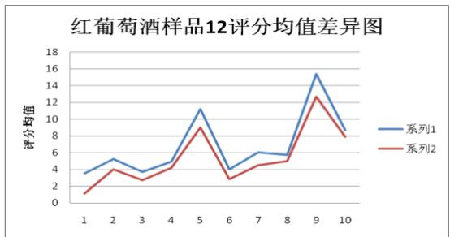
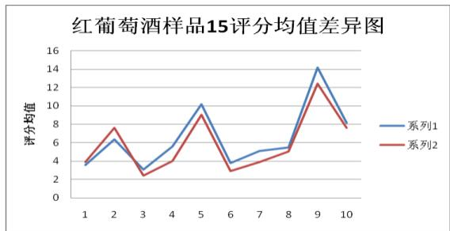
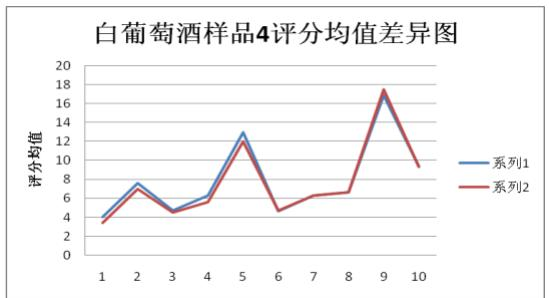
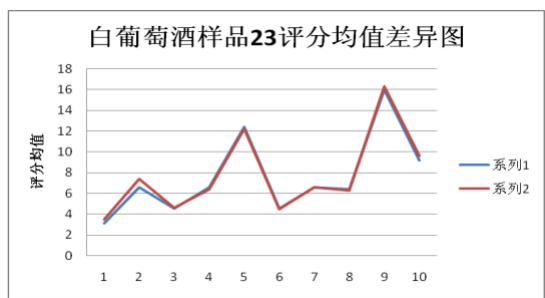
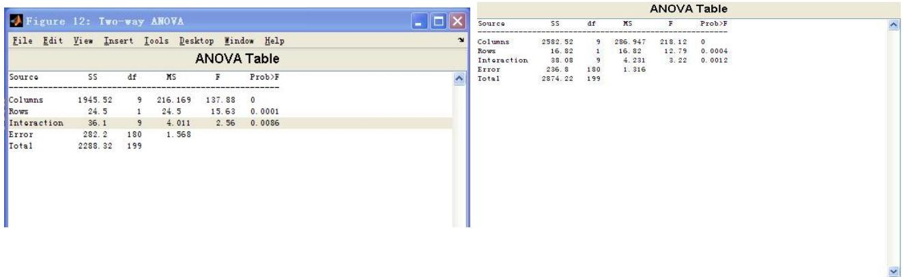
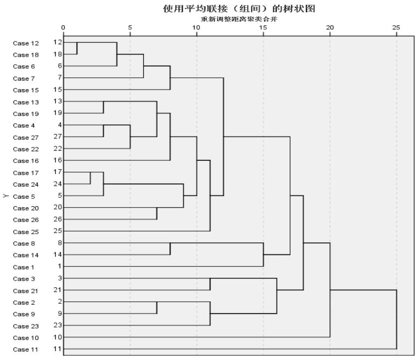

# 2012 高教社杯全国大学生数学建模竞赛

## 承 诺 书

我们仔细阅读了中国大学生数学建模竞赛的竞赛规则.

我们完全明白，在竞赛开始后参赛队员不能以任何方式（包括电话、电子邮件、网上咨询等）与队外的任何人（包括指导教师）研究、讨论与赛题有关的问题。

我们知道，抄袭别人的成果是违反竞赛规则的, 如果引用别人的成果或其他公开的资料（包括网上查到的资料），必须按照规定的参考文献的表述方式在正文引用处和参考文献中明确列出。

我们郑重承诺，严格遵守竞赛规则，以保证竞赛的公正、公平性。如有违反竞赛规则的行为，我们将受到严肃处理。

我们授权全国大学生数学建模竞赛组委会，可将我们的论文以任何形式进行公开展示（包括进行网上公示，在书籍、期刊和其他媒体进行正式或非正式发表等）。

我们参赛选择的题号是（从 A/B/C/D 中选择一项填写）： A

（隐去论文作者相关信息）

日期： 2012 年 9 月 10 日

赛区评阅编号（由赛区组委会评阅前进行编号）：

# 2012 高教社杯全国大学生数学建模竞赛

## 编 号 专 用 页

赛区评阅编号（由赛区组委会评阅前进行编号）：

赛区评阅记录（可供赛区评阅时使用）：

<table><tr><td>评阅人</td><td></td><td></td><td></td><td></td><td></td><td></td><td></td><td></td><td></td><td></td></tr><tr><td>评分</td><td></td><td></td><td></td><td></td><td></td><td></td><td></td><td></td><td></td><td></td></tr><tr><td>备注</td><td></td><td></td><td></td><td></td><td></td><td></td><td></td><td></td><td></td><td></td></tr></table>

全国统一编号（由赛区组委会送交全国前编号）：

全国评阅编号（由全国组委会评阅前进行编号）：

# 葡萄酒质量的评价

## 摘 要

葡萄酒质量的好坏主要依赖于评酒员的感观评价，由于人为主观因素的影响，对于酒质量的评价总会存在随机差异，为此找到一种简单有效的客观方法来评酒，就显得尤为重要了。本文通过研究酿酒葡萄的好坏与所酿葡萄酒的质量的关系，以及葡萄酒和酿酒葡萄检测的理化指标的关系，以及葡萄酒理化指标与葡萄酒质量的关系，旨在通过客观数据建立数学模型，用客观有效的方法来评价葡萄酒质量。

首先，采用双因子可重复方差分析方法，对红、白葡萄酒评分结果分别进行检验，利用 Matlab 软件得到样品酒各个分析结果，结合 数据分析，发现对于红葡酒有的评价结果存在显著性差异，对于白葡萄酒只有53%的评价结果存在显著性差异。通过比较可知，两组评酒员对红葡萄酒的评分结果更具有显著性差异，而对于白葡萄酒的评分，评价差异性较为不明显。为了评价两组结果的可信度，借助 Alpha 模型用克伦巴赫 系数衡量，并结合F检验，得出红葡萄酒第一组评酒员的评价结果可信度更高，而对白葡萄酒的品尝评分，第二组评酒员的评价结果可信度更高。综合来看，主观因素对葡萄酒质量的评价具有不确定性。

结合已分析出的两组品酒师可靠性结果，对葡萄酒的理化指标进行加权平均，最终得出十位品酒师对样品酒的综合评价得分。将每一样品酒的综合得分与其所对应酿酒葡萄的理化指标（一级指标）共同构成一个数据矩阵，采用聚类分析法，利用 SPSS 软件对葡萄酒样进行分类，根据分类的结果以及各葡萄样品酒综合得分最终将酿酒葡萄分为A（优质）、B（良好）、C（中等）、D（差）四个等级，客观地反映了酿酒葡萄的理化指标与葡萄酒质量之间的联系。

为了分析酿酒葡萄与葡萄酒理化指标之间的联系，采用相关分析法，能有效地反映出两者间的联系，取与葡萄各成分相关性显著的葡萄酒理化指标，与葡萄成分做多元线性回归得出葡萄酒理化指标与酿酒葡萄的拟合方程，从而反映酿酒葡萄与葡萄酒理化指标之间的联系。

由于已经通过回归分析建立了酿酒葡萄和葡萄酒理化指标之间的关系，因此从酿酒葡萄成分对葡萄酒的理化指标的影响，再研究出葡萄酒理化指标与葡萄酒质量的联系，便可作为一个桥梁，反映出葡萄与葡萄酒理化指标对葡萄酒的质量的作用。研究葡萄酒理化指标与葡萄酒质量的联系，需要运用变量间的相关性及 系数法分析葡萄酒的理化指标与葡萄酒质量评价指标的相关性，通过比较选出与葡萄酒评价的一级指标相关性程度大的葡萄酒成分，进行回归分析法，建立酿酒葡萄的理化指标与葡萄酒质量之间的拟合方程，结合各个质量一级指标的权重，从而完成了从葡萄酒成分对葡萄酒质量的客观评价。综合计算结果，与酿酒葡萄分级的结果吻合，所以分析结果较客观。

关键词：葡萄酒 双重多因素分析 数据分析 Alpha模型 聚类分析及欧式距离

相关性分析 多元回归 <sup>P</sup>earson 系数法

## 1. 问题重述

葡萄酒的感官质量是评价葡萄酒质量优劣的重要标志。确定葡萄酒质量时一般是通过聘请一批有资质的评酒员进行品评。每个评酒员在对葡萄酒进行品尝后对其分类指标打分，然后求和得到其总分，从而确定葡萄酒的质量。酿酒葡萄的好坏与所酿葡萄酒的质量有直接的关系，葡萄酒和酿酒葡萄检测的理化指标会在一定程度上反映葡萄酒和葡萄的质量，可辅助感官检查。附件1给出了某一年份一些葡萄酒的评价结果，附件2和附件3分别给出了该年份这些葡萄酒的和酿酒葡萄的成分数据。试建立数学模型求解下列问题：

1. 分析附件1中两组评酒员的评价结果有无显著性差异，哪一组结果更可信？  
2. 根据酿酒葡萄的理化指标和葡萄酒的质量对这些酿酒葡萄进行分级。  
3. 分析酿酒葡萄与葡萄酒的理化指标之间的联系。  
4．分析酿酒葡萄和葡萄酒的理化指标对葡萄酒质量的影响，并论证能否用葡萄和葡萄酒的理化指标来评价葡萄酒的质量？

## 2. 问题分析

酿酒葡萄的好坏与所酿葡萄酒的质量有直接的关系，葡萄酒和酿酒葡萄检测的理化指标会在一定程度上反映葡萄酒和葡萄的质量，本题要求通过酿酒葡萄的理性指标和酿酒师给予的评分，综合考虑酿酒葡萄的理性指标与葡萄酒的质量的关系。

问题一：

要求对两组评酒员评价结果有无差异性进行分析，并分析得出哪一组的品酒员的结果更具有可信。

通过绘制每个样品酒的均值评分差异图，对每个样品酒的两组评酒员在各个指标的均值进行比较，发现对于红葡萄的评价，两组评酒员还是存在着显著性的差异的，而对于白葡萄酒的评价，两组评酒员的差异性并不是很明显，列举部分红、白葡萄酒评分差异图如下：



<details>
<summary>line</summary>

| Category | 系列1 | 系列2 |
| --- | --- | --- |
| 1 | ~3.5 | ~1.0 |
| 2 | ~5.2 | ~4.0 |
| 3 | ~3.8 | ~2.6 |
| 4 | ~4.8 | ~4.2 |
| 5 | ~11.2 | ~9.0 |
| 6 | ~4.0 | ~2.8 |
| 7 | ~6.0 | ~4.4 |
| 8 | ~5.8 | ~5.0 |
| 9 | ~15.2 | ~12.6 |
| 10 | ~8.6 | ~7.8 |
</details>



<details>
<summary>line</summary>

| Category | 系列1 | 系列2 |
| --- | --- | --- |
| 1 | ~3.6 | ~4.0 |
| 2 | ~6.4 | ~7.6 |
| 3 | ~3.0 | ~2.4 |
| 4 | ~5.4 | ~4.0 |
| 5 | ~10.2 | ~9.0 |
| 6 | ~3.8 | ~2.9 |
| 7 | ~5.1 | ~3.8 |
| 8 | ~5.4 | ~5.0 |
| 9 | ~14.2 | ~12.4 |
| 10 | ~7.8 | ~7.6 |
</details>

图表 1 红葡萄酒样品 12 差异图（左边），系列 1 为第二组品酒员打分均值，系列 2 为第一组品酒员打分均值。

图表 2 红葡萄酒样品 15 差异图（右边），横坐标为 10 个指标变量，包括澄清度、色调、香气纯正度、香气浓度、香气质量、口感纯正度、口感浓度、口感质量以及整体评价。  


<details>
<summary>line</summary>

| Category | 系列1 | 系列2 |
| --- | --- | --- |
| 1 | ~4 | ~3.5 |
| 2 | ~7.5 | ~6.8 |
| 3 | ~4.8 | ~4.5 |
| 4 | ~6.2 | ~5.5 |
| 5 | ~13 | ~12 |
| 6 | ~4.8 | ~4.8 |
| 7 | ~6.2 | ~6.2 |
| 8 | ~6.5 | ~6.5 |
| 9 | ~17 | ~17.5 |
| 10 | — | ~9.2 |
</details>



<details>
<summary>line</summary>

| Category | 系列1 | 系列2 |
| --- | --- | --- |
| 1 | ~3.2 | ~3.8 |
| 2 | ~6.6 | ~7.5 |
| 3 | ~4.8 | ~4.6 |
| 4 | ~6.4 | ~6.4 |
| 5 | ~12.4 | ~12.4 |
| 6 | ~4.6 | ~4.6 |
| 7 | ~6.6 | ~6.6 |
| 8 | ~6.4 | ~6.4 |
| 9 | ~16.2 | ~16.2 |
| 10 | ~9.2 | ~9.2 |
</details>

针对两组评酒员在大量差异图中表现出来对红、白葡萄酒的评价存在差异，对红、白葡萄酒进行分开地显著性检验。

第一步，利用每个样品酒都具有两组评酒员的评价结果，对两组结果进行双因子可重复方差分析，得出题中给出的 27种葡萄样品酒各个分析结果。比较 27 个显著性检验的结果，若具有显著性差异的样品酒占总样品酒的比例高于 $\beta$ ，有足够的把握认定两组评酒员的评价结果具有显著性差异。

第二步，对两组评酒员给予红、白葡萄酒的打分进行可信性分析，将红、白葡萄酒分别进行可信度分析，比较两组评酒员对不同种类葡萄酒的评价是否具有各自的优势。

在进行双因子多重分析和可信性分析之前，需要对原先数据进行如下处理：

1.对于附件1给出的数据，先将两组品酒员的评价结果按着样品酒进行统一划分，每一样品酒对应着两种评价结果。将每一样品酒的评价结果组成评价矩阵，矩阵以葡萄酒的评价指标为列项，共 10列，以每个评酒员作为横向量，共 20行。  
2.针对红葡萄酒样品 20 评酒员 4 号对色调的评分缺失，利用同组评酒员对红葡萄酒样品20色调评分的平均值作为 4号评酒员的评分值。

做可信度分析时，将两组的 27 种酒样品评价结果组成两组评价总矩阵，以葡萄酒的评价指标为列项，共 10列，以每个评酒员作为横向量，共 270行，分别用 SPSS19.0对两组矩阵进行信度分析，目的是对量表的可靠性与有效性进行检验，判断出哪一组可信度更高。

## 问题二：

问题二要求对酿酒葡萄进行分级，酿酒葡萄的成分直接影响葡萄酒的质量，选取优质营养成分高的酿酒葡萄酿酒，保证了葡萄酒的营养价值和保健价值。但是葡萄酒质量优劣，不单单从营养成分和养身价值上考虑，一瓶优质的葡萄酒，还得具备着可观赏性，纯正的口感、芬芳的酒香等优点，而这些优点，都得由评酒员来给出评价。

所以，对酿酒葡萄进行分级，不单单从葡萄的成分上考虑，还得结合最终酿成的葡萄酒质量综合考虑。因此将酿酒葡萄的各成分与评价员给予所酿成的葡萄酒的质量打分综合起来，进行聚类分析，将酿酒葡萄依据综合指数进行分类，结合聚类分析的结果以及综合指标的分数将葡萄划分等级。依据：

在进行据聚类分析之前，需要对原始数据进行预先处理

1. 分别计算附件一中评酒员各项评分指标的权重并加和，最后求取 10位评酒员的权重平均值作为葡萄酒样品的综合评价指标。  
2. 用酿酒葡萄各项理化指标（多次测得的取平均值）以及酒样的综合指标形成一个31列28行的原始资料阵，并用 SPSS 的 标准化将数据标准化。

## 问题三：

酿酒葡萄和葡萄酒的理化指标都很多，为了找出它们之间的联系，首先将葡萄的成分与葡萄酒的理性指标列成一个大矩阵，分析葡萄成分与葡萄酒理想指标的相关性，找出它们之间相关性大的指标，与葡萄成分做多元线性回归得出葡萄酒理化指标与酿酒葡萄的拟合方程，从而反映酿酒葡萄与葡萄酒理化指标之间的联系。

1. 酿酒葡萄的成分和葡萄酒的理化指标列成一个大矩阵。  
2. 通过 SPSS软件做相关性分析，选取与葡萄酒理化指标相关性程度大的葡萄酒成分 个指标，建立拟合方程。

## 问题四：

酿酒葡萄的理化指标并不能直接与葡萄酒的质量建立联系，由于在问题 中已经通过相关性分析建立了酿酒葡萄和葡萄酒理化指标之间的关系，因此我们分析葡萄酒的理化指标与葡萄酒质量的相关性，计算相关性系数 通过比较选出系数高的即与葡萄酒质量指标相关性程度大的葡萄酒成分，进而用回归分析法建立酿酒葡萄的理化指标与葡萄酒质量之间的关系。

1．附表一中列出了十位品酒员对葡萄酒外观、香气和口感分析三者的数据，用Matlab7.6.0b，分别对四项指标求 27（28）种红（白）葡萄酒样品权重平均值作为葡萄酒质量的评价指标。  
2. 通过 SPSS 软件作因子分析分析两者之间的相关性，选取与葡萄酒质量指标相关性程度大的葡萄酒成分 个指标，建立拟合方程。

## 3. 符号说明

<table><tr><td> $\alpha^{*}$ </td><td>显著性水平</td></tr><tr><td> $\beta$ </td><td>置信度</td></tr><tr><td>SST</td><td>误差平方和</td></tr><tr><td>SSA</td><td>行组间误差</td></tr><tr><td>SSB</td><td>列组间误差</td></tr><tr><td>SSE</td><td>组内误差</td></tr><tr><td> $\alpha$ </td><td>克伦巴赫系数</td></tr><tr><td> $d_{ij}$ </td><td>明考斯基距离</td></tr><tr><td> $d_{ij}(2)$ </td><td>欧式距离</td></tr></table>

## 4. 模型假设

（1） 假设数据来源真实有效  
（2） 假设各变量的相差微小，各坐标对欧式距离的贡献是同等的且变差大小相同，欧氏距离效果理想。  
（3） 假设酿酒工艺条件相同，无其他人为因素影响  
（4） $A l p h a \leq 0 . 3 5$ 为低信度 ， $0 . 3 5 \leq C r o n b a c h \ A l p h a \leq 0 . 7$ 则尚可，若

Cronbach $A l p h a \ge 0 . 7$ 则属于高信度。假设组一与组二评分分别处于不同信度区间，可信度差异明显。

## 5. 建模过程

## 5.1. 问题一的建模与求解

模型建立：

## 利用双因素可重复方差分析结合 0-1分析检验两组评酒员的评价结果有无显著性差异

1.双因子可重复方差分析的统计模型 。假设在两因子方差分析中，因子A共有r个水平，记作 $A _ { 1 } , A _ { 2 } , . . . , A _ { r }$ ，每个水平下，进行 次试验，因子B共有 个水平。一个典型的双因子方差分析的数据结构如下表所示。

表格 1 双因子可重复方差分析的数据结构

<table><tr><td rowspan="2">因子A</td><td colspan="4">因子B</td></tr><tr><td> $B_1$ </td><td> $B_2$ </td><td>...</td><td> $B_k$ </td></tr><tr><td rowspan="3"> $A_1$ </td><td> $x_{11}$ </td><td> $x_{12}$ </td><td>...</td><td> $x_{1k}$ </td></tr><tr><td>⋮</td><td>⋮</td><td>⋮</td><td>⋮</td></tr><tr><td> $x_{t1}$ </td><td> $x_{t2}$ </td><td></td><td> $x_{tk}$ </td></tr><tr><td>⋮</td><td>...</td><td>...</td><td></td><td>...</td></tr><tr><td rowspan="3"> $A_r$ </td><td> $x_{11}$ </td><td> $x_{12}$ </td><td>...</td><td> $x_{1k}$ </td></tr><tr><td>⋮</td><td>⋮</td><td>⋮</td><td>⋮</td></tr><tr><td> $x_{t1}$ </td><td> $x_{t2}$ </td><td>...</td><td> $x_{tk}$ </td></tr></table>

$x _ { t k }$ 为因子 的某个水平下第 试验所得结果， $A _ { i }$ 表示因子 A 的第 个水平，$i = 1 , 2 , . . . , r$ 。第 列数据为因子 的第 个水平下所考察的变量取值，每一列为一个总体， =1,2，…， 。所以一个两因子方差分析的数据结构表里，共有 $r \times t + k$ 个总体，在本题中， $r = 2 , k = 1 0 , t = 1 0$ 。下表给出因子 所对应的各个指标：

<table><tr><td> $B$ </td><td> $B_{1}$ </td><td> $B_{2}$ </td><td> $B_{3}$ </td><td> $B_{4}$ </td><td> $B_{5}$ </td><td> $B_{6}$ </td><td> $B_{7}$ </td><td> $B_{8}$ </td><td> $B_{9}$ </td><td> $B_{10}$ </td></tr><tr><td>指标</td><td>外观澄清度</td><td>外观色调</td><td>香气纯正度</td><td>香气浓度</td><td>香气质量</td><td>口感纯正度</td><td>口感浓度</td><td>口感持久性</td><td>口感质量</td><td>整体得分</td></tr></table>

给出双因子可重复方差分析的原假设和备择假设：

$H _ { 0 1 }$ :两组评酒员的评价结果不存在差异. $\Leftrightarrow H _ { 0 2 }$ :两组评酒员的评价结果存在着差异.

$H _ { 1 1 }$ :各个指标对评价结果不存在影响 $\Leftrightarrow H _ { 1 2 }$ :各个指标对评价结果存在影响

当原假设 $H _ { 0 1 }$ 为真时，说明两组评酒员的评价结果不存在显著性差异，反之称两组评酒员的评价结果存在着显著性影响因素。当原假设 $H _ { 1 1 }$ 为真时，说明选取的各个指标对评价结果没有显著性影响，在本题中，显然原假设 $H _ { 1 1 }$ 是不成立的，后续的检验将证明这点。

2.两因子方差分析的方差分解。

(1)误差平方和。每一个观察值 $x _ { i j }$ 与总平均值 $\mathbf { \Pi } _ { x } ^ { = }$ 之间的离差平方和称为误差平方和，记作

$$
S S T = \sum_ {i = 1} ^ {r} \sum_ {j = 1} ^ {k} \left(x _ {i j} - \overline {{x}}\right) ^ {2}
$$

其中 $\overline { { \ v { x } } } = \sum _ { i = 1 } ^ { r } \sum _ { j = 1 } ^ { k } x _ { i j } \ / \ r k t$ ，称为总均值。

(2)行组间误差。双因子误差平方和分解的第一部分，称为行组间误差，记作

$$
S S A = \sum_ {i = 1} ^ {r} k \left(\bar {x} _ {i.} - \bar {x}\right) ^ {2}
$$

(3)列组间误差。双因子误差平方和分解的第二部分，称为列组间误差，记作SSB

$$
S S B = \sum_ {j = 1} ^ {k} r \left(x _ {. j} - \bar {x}\right) ^ {2}
$$

(4)组内误差。双因子误差平方和分解的第三部分，称为组内误差，记作SSE

$$
S S E = \sum_ {i = 1} ^ {r} \sum_ {j = 1} ^ {k} \left(x _ {i j} - \bar {x} _ {i.} - \bar {x} _ {. j} + \bar {x}\right) ^ {2}
$$

行组间误差衡量的是行因子不同水平之间的差异，列组间误差衡量的是列因子不同水平之间的差异。它们的误差值中既包含随即误差也包含了因子影响的系统误差。所以判断行（列）因子是否有显著性影响，主要考察行（列）组间误差和组内误差之间的差异大小。如果行（列）组间误差和组内误差很接近，就认为行（列）因子无显著性影响。反之，认为行（列）因子有显著性影响。

两因子方差分析的检验统计量。

$$
\frac {S S T}{\sigma^ {2}} \sim \chi^ {2} (n - 1)
$$

其中 $n = \boldsymbol { r } \cdot \boldsymbol { k } \cdot t$ 。

根据单因素方差分析推导，有行组间误差服从自由度为 的 $\chi ^ { 2 }$ 分布

$$
\frac {S S A}{\sigma^ {2}} \sim \chi^ {2} (r - 1)
$$

列组间误差服从自由度为 的 $\chi ^ { 2 }$ 分布

$$
\frac {S S B}{\sigma^ {2}} \sim \chi^ {2} (k - 1)
$$

剩余的列组服从自由度为 $r k t - r - k + 1$ 的 $\chi ^ { 2 }$ 分布

$$
\frac {S S E}{\sigma^ {2}} \sim \chi^ {2} (r k t - r - k + 1)
$$

则两因素方差分析的检验统计量为如下两个：

（1） 行检验统计量。

$$
F _ {A} = \frac {M S A}{M S E} \sim F (r - 1, r k t - r - k + 1)
$$

（2） 列检验统计量。

$$
F _ {B} = \frac {M S B}{M S E} \sim F (k - 1, r k t - r - k + 1)
$$

双因子可重复方差分析的结果判定

当显著性水平为 $\alpha$ 时，如果 $F _ { \scriptscriptstyle A } > F _ { 1 - \alpha } \left( r - 1 , r k t - r - k + 1 \right)$ ，拒绝 $H _ { 0 1 }$ ，说明两组评酒员的评价结果存在显著性差异；等价的 值检验是，当 $P _ { A }$ 值 ${ \mathit { \Omega } } \ll$ 时，拒绝原假设 $H _ { 0 1 }$ ；综合来讲，当 $F _ { _ A } > F _ { _ { 1 - \alpha } } \left( r - 1 , r k t - r - k + 1 \right)$ ，或 $P _ { A }$ 值< $\alpha$ 时，拒绝原假设 $H _ { 0 1 }$

## 0-1数据分析

在给定 $\alpha ^ { * } = 0 . 0 5$ 条件下，对于有 个样品酒来说（红葡萄酒 $m = 2 7$ ，白葡萄酒 $m = 2 8 \mathrm { ~ ) }$ 定义函数：

$$
Y _ {i} = \left\{ \begin{array}{l l} 1 & p _ {i} \leq 0. 0 5 \\ 0 & p _ {i} > 0. 0 5 \end{array} \quad i = 1, 2, \dots , m \right. \tag {1}
$$

其中 $p _ { i }$ 为每个样品酒的 $P _ { A }$ 值。

给定置信度：

$$
\beta = \frac {\sum Y _ {i}}{m} \tag {2}
$$

对 个样品酒的双因子可重复方差检验后，得出 $\beta$ 值，则认为在置信水平 $\beta$ 下，两组评酒员的评价结果存在着显著性差异。

## Alpha 模型进行可靠性分析

克伦巴赫 $\alpha$ 系数:测度内部一致性的一个指标, $\alpha$ 与皮尔逊 系数都是一样的范围在0—1 之间，如果为负值则表明表中某些项目的内容是其他一些项目的反面；越接近于1，则量表中项目的内部一致性越是高，可信度越大。根据量表中的项目数和各项之间的相关系数 计算得出

$$
\alpha = \frac {k r}{1 + (k - 1) r}
$$

当量表中项目 增加时， 值也会增大；同时，项目之间的相关系数 较高时， 也会比较大。这里的 是指各项与其他各项之和计算相关系数的平均值。

## 模型求解：

## 双因子可重复方差分析模型检验

利用Matlab7.6.0的 函数对已经预处理的数据进行双因子可重复方差分析，可以得到每个样品酒的检验结果，列举两个检验结果如下所示：



<details>
<summary>other</summary>

| Source | SS | df | MS | F | Prob>F |
| --- | --- | --- | --- | --- | --- |
| Columns | 2582.52 | 9 | 286.947 | 218.12 | 0 |
| Rows | 16.82 | 1 | 16.82 | 12.79 | 0.0004 |
| Interaction | 38.08 | 9 | 4.231 | 3.22 | 0.0012 |
| Error | 236.8 | 180 | 1.316 | — | — |
| Total | 2874.22 | 199 | — | — | — |
</details>

提取每个样品酒的 所对应 值，然后结合公式（1）、公式（2）进行 0-1分析，

得到红、白葡萄酒的各个样品酒的 $p _ { i }$ 如下：

图表 3 模型检验结果

<table><tr><td colspan="15">红葡萄酒 $p_i$ 值以及 $Y_i$ 值,得到 $\beta = 0.703$ </td></tr><tr><td> $p_i$ </td><td>0.18971</td><td>0.00001</td><td>0.00040</td><td>0.00212</td><td>0.16314</td><td>0.00138</td><td>0.00486</td><td>0.00334</td><td>0.02476</td><td>0.00000</td><td>0.00002</td><td>0.00011</td><td>0.36479</td><td>0.21870</td></tr><tr><td> $Y_i$ </td><td>0</td><td>1</td><td>1</td><td>1</td><td>0</td><td>1</td><td>1</td><td>1</td><td>1</td><td>1</td><td>1</td><td>1</td><td>0</td><td>0</td></tr><tr><td> $p_i$ </td><td>0.00046</td><td>0.80100</td><td>0.00021</td><td>0.56414</td><td>0.17544</td><td>1.00000</td><td>0.00002</td><td>0.04686</td><td>0.01131</td><td>0.00017</td><td>0.00086</td><td>0.00112</td><td>0.00045</td><td></td></tr><tr><td> $Y_i$ </td><td>1</td><td>0</td><td>1</td><td>0</td><td>0</td><td>0</td><td>1</td><td>1</td><td>1</td><td>1</td><td>1</td><td>1</td><td>1</td><td></td></tr><tr><td colspan="15">白葡萄酒 $p_i$ 值以及 $Y_i$ 值,得到 $\beta = 0.535$ </td></tr><tr><td> $p_i$ </td><td>0.00103</td><td>0.00001</td><td>0.10777</td><td>0.31115</td><td>0.50613</td><td>0.01060</td><td>0.34940</td><td>0.67936</td><td>0.00329</td><td>0.00460</td><td>0.00008</td><td>0.08585</td><td>0.00011</td><td>0.20310</td></tr><tr><td> $Y_i$ </td><td>1</td><td>1</td><td>0</td><td>0</td><td>0</td><td>1</td><td>0</td><td>0</td><td>1</td><td>1</td><td>1</td><td>0</td><td>1</td><td>0</td></tr><tr><td> $p_i$ </td><td>0.01714</td><td>0.03333</td><td>0.01381</td><td>0.19476</td><td>0.00339</td><td>0.44078</td><td>0.00034</td><td>0.00005</td><td>0.68334</td><td>0.46710</td><td>0.00031</td><td>0.16632</td><td>0.13648</td><td>0.00001</td></tr><tr><td> $Y_i$ </td><td>1</td><td>1</td><td>1</td><td>0</td><td>1</td><td>0</td><td>1</td><td>1</td><td>0</td><td>0</td><td>1</td><td>0</td><td>0</td><td>1</td></tr></table>

## 模型结果分析

分析图标 3的结果，可以知道，对于红葡萄酒来说，对 27个葡萄酒样品评分检验中，有70.3%的评价结果中，两组评酒员的评价结果存在着显著性差异（置信水平为95%）。对于白葡萄酒的 28个葡萄样品评分的检验，只有 53%的评价结果中，两组评酒员的评价结果存在显著性检验（置信水平为 95%）。这样的结果，符合之前问题分析中，各个组队样品酒的评分均值差异图。即：两组评酒员对红葡萄的评分结果更具有显著性差异，而对于白葡萄酒的评分，两组评酒员的评价差异性较不明显。

## Alpha 模型的可靠性分析

## 1. 利用SPSS19.0 进行可靠性统计量对红葡萄酒的两组品酒员评分的分析

<table><tr><td colspan="4">第一组红葡萄酒案例处理汇总</td></tr><tr><td colspan="2"></td><td>N</td><td>%</td></tr><tr><td rowspan="3">案例</td><td>有效</td><td>268</td><td>99.3</td></tr><tr><td>已排除</td><td>2</td><td>.7</td></tr><tr><td>总计</td><td>270</td><td>100.0</td></tr></table>

<table><tr><td colspan="4">第二组红葡萄酒案例处理汇总</td></tr><tr><td colspan="2"></td><td>N</td><td>%</td></tr><tr><td rowspan="3">案例</td><td>有效</td><td>270</td><td>100.0</td></tr><tr><td>已排除</td><td>0</td><td>.0</td></tr><tr><td>总计</td><td>270</td><td>100.0</td></tr></table>

<table><tr><td colspan="3">第一组红葡萄酒可靠性统计量</td></tr><tr><td>Cronbach&#x27;s Alpha</td><td>基于标准化项的Cronbachs Alpha</td><td>项数</td></tr><tr><td>.874</td><td>.906</td><td>10</td></tr></table>

<table><tr><td colspan="3">第二组红葡萄酒可靠性统计量</td></tr><tr><td>Cronbach&#x27;s Alpha</td><td>基于标准化项的Cronbachs Alpha</td><td>项数</td></tr><tr><td>.750</td><td>.786</td><td>10</td></tr></table>

若将某一项目从量表中剔除，则量表的平均得分、方差（每个项目得分与剩余各项目得分间的相关系数、以该项目为自变量所有其他项目为应变量建立回归方程的 $R ^ { 2 }$ 值以及 值将会改变。有表知第一组数据中剔除了两项， $\alpha _ { 1 }$ 增加到0.874，第一组评酒员红葡萄酒的 $\alpha _ { \mathrm { 1 } } = 0 . 8 7 4 > \mathrm { C r o n b a c h } \alpha _ { \mathrm { 2 } } = 0 . 7 5 0$ ，组2尚有35%的内容未曾涉及，故信度不高。

表格 2 第一组红葡萄酒

<table><tr><td colspan="2"></td><td>平方和</td><td>df</td><td>均方</td><td>F</td><td>Sig</td></tr><tr><td colspan="2">人员之间</td><td>4947.218</td><td>267</td><td>18.529</td><td></td><td></td></tr><tr><td>人员内部</td><td>项之间</td><td>31938.494</td><td>9</td><td>3548.722</td><td>1516.417</td><td>.000</td></tr><tr><td></td><td>残差</td><td>5623.506</td><td>2403</td><td>2.340</td><td></td><td></td></tr><tr><td></td><td>总计</td><td>37562.000</td><td>2412</td><td>15.573</td><td></td><td></td></tr><tr><td colspan="2">总均值 = 7.31</td><td>42509.218</td><td>2679</td><td>15.868</td><td></td><td></td></tr></table>

<table><tr><td rowspan="2"></td><td rowspan="2">类内相关性</td><td colspan="2">95% 置信区间</td><td colspan="4">使用真值 0 的 F 检验</td></tr><tr><td>下限</td><td>上限</td><td>值</td><td>df1</td><td>df2</td><td>Sig</td></tr><tr><td>单个测量</td><td>.409b</td><td>.362</td><td>.460</td><td>7.918</td><td>267</td><td>2403</td><td>.000</td></tr><tr><td>平均测量</td><td>.874c</td><td>.850</td><td>.895</td><td>7.918</td><td>267</td><td>2403</td><td>.000</td></tr></table>

表格 3 第二组红葡萄酒

<table><tr><td></td><td>平方和</td><td>df</td><td>均方</td><td>F</td><td>Sig</td></tr><tr><td>人员之间</td><td>1232.544</td><td>269</td><td>4.582</td><td></td><td></td></tr><tr><td>人员内部 项之间</td><td>34017.040</td><td>9</td><td>3779.671</td><td>3293.639</td><td>.000</td></tr><tr><td>残差</td><td>2778.260</td><td>2421</td><td>1.148</td><td></td><td></td></tr><tr><td>总计</td><td>36795.300</td><td>2430</td><td>15.142</td><td></td><td></td></tr><tr><td>总均值 = 7.05</td><td>38027.844</td><td>2699</td><td>14.090</td><td></td><td></td></tr></table>

<table><tr><td rowspan="2"></td><td rowspan="2">类内相关性</td><td colspan="2">95% 置信区间</td><td colspan="4">使用真值 0 的 F 检验</td></tr><tr><td>下限</td><td>上限</td><td>值</td><td>df1</td><td>df2</td><td>Sig</td></tr><tr><td>单个测量</td><td>.230</td><td>.191</td><td>.276</td><td>3.993</td><td>269</td><td>2421</td><td>.000</td></tr><tr><td>平均测量</td><td>.750</td><td>.703</td><td>.792</td><td>3.993</td><td>269</td><td>2421</td><td>.000</td></tr></table>

分析比较两者的F检验表明, $F _ { 1 } = 5 1 6 . 4 1 7 \langle F _ { 2 } = 3 2 9 3 . 6 3 9$ ,组2的显著性更强，而 $p _ { 1 }$ 、$p _ { 2 }$ 均小于0.01，表示两组该量表的重复度量效果良好。综合分析结果表明，组一的评酒员可信度更高。

## （2）可靠性统计量对白葡萄酒的两组品酒员评分进行分析

同样利用SPSS可靠性分析，建立Alpha模型对白葡萄酒的品酒员评分数据进行检验，发现不同种类的酒，因其酿造，成分的不同，品酒员对葡萄口感，质量的分析评价上有差异，得出第一组品酒员白葡萄酒的 $\alpha _ { 1 } = 0 . 7 6 3 < C r o n b a c h \alpha _ { 2 } = 0 . 8 3 8$ $S _ { 1 } = 7 . 4 3 < S _ { 2 } = 7 . 6 3$ $F _ { 1 } = 1 2 7 0 . 3 6 1 < F _ { 2 } = 4 8 9 1 . 4 6 3$ ,组2的显著性更强， $p _ { 1 } \cdot p _ { 2 }$ 均小于0.01 表示两组该量表的重复度量效果良好。综合分析结果表明，白葡萄酒组二的品酒员可信度更高。

## 5.2. 问题二的建模与求解

## 模型建立：聚类分析及欧式距离

对样品和指标（变量）进行分类主要采用聚类分析法 ，而求取样品以及类之间的距离有多种方法，其中主要使用欧式距离和最短距离法。

## （1） 数据标准化

由于所选数据的量纲和数值大小都不一致，数值的变化范围也不同，因此必须首先对所选数据进行标准化处理，如果有n个样本，个样本有m个指标，则每个变量可表示为 ， $x _ { i j }$

均值

$$
\bar {x} _ {j} = \frac {1}{n} \sum_ {i = 1} ^ {n} x _ {i j}
$$

标准方差

$$
s _ {j} = \sqrt {\frac {1}{n - 1} \sum_ {i = 1} ^ {n} \left(x _ {i j} - \overline {{x}} _ {i j}\right) ^ {2}}
$$

则标准化后

$$
x _ {i j} ^ {*} = \frac {x _ {i j} - \overline {{x}} _ {j}}{s _ {j}} \quad \left(s _ {j} \neq 0\right)
$$

## （2）聚类

距离：对样品进行聚类时，“靠近”往往由某种距离来刻画。若每个样品有 $p$ 个指标，故每个样品可以看成 $p$ 维空间中的一个点， 个样品就组成 $p$ 维空间中的 个点，样品与指标构成一个矩阵，此时就可以用距离来度量样品之间的接近程度。

令 $x _ { i j }$ 表示第 个样品的第j个指标， $d _ { i j }$ 表示第i个样品与第 $j$ 个样品之间的距离，最常见最直观的计算距离的方法是：

明考斯基距离( )

$$
d _ {i j} = \left[ \sum_ {k = 1} ^ {p} \left(x _ {i k} - x _ {j k}\right) ^ {q} \right] ^ {1 / q}
$$

当 $q = 1$ 时，

$$
d _ {i j} (1) = \sum_ {k = 1} ^ {p} \left| x _ {i k} - x _ {j k} \right| \quad \text {即为绝对距离}
$$

当 $q = 2$ 时，

$$
d _ {i j} (2) = \left[ \sum_ {k = 1} ^ {p} \left(x _ {i k} - x _ {j k}\right) ^ {2} \right] ^ {1 / 2} \quad \text {即为欧氏距离}
$$

当 $q = \infty$ 时

$$
d _ {i j} (\infty) = \max _ {1 \leq k \leq p} \left| x _ {i k} - x _ {j k} \right| \quad \text {称为切比雪夫距离。}
$$

当各变量的测量值相差悬殊时，为了计算的准确性，需先将数据标准化，然后用标准化后的数据进行计算。

系统聚类;，将 个样品各自看成一类，然后规定样品之间的距离和类与类之间的距离。开始，因每个样品自成一类，类与类之间的距离与样品之间的距离是相等的，选择距离最小的一对并成一个新类，计算新类与其他类的距离，再将距离最近的两类合并，这样每次少一类，直至所有的样品都成一类为止，最终完成养分的分类。计算类与类之

间的距离主要有：

## （1）最短距离法：

设 $G _ { p }$ 、 $G _ { q }$ 、 $G _ { r }$ 分别为一类，则最短距离的计算公式为：

$$
D _ {k} (p, q) = \min \{d _ {j l} \big | j \in G _ {p}, l \in G _ {q} \}
$$

此时将类 $G _ { p }$ 与类 $G _ { q }$ 合并为类 $G _ { r }$ ，则任意的类 $G _ { k }$ 和 $G _ { r }$ 的距离公式为

$$
D _ {k r} ^ {2} = \min _ {X _ {i} \in G _ {k}, X _ {j} \in G _ {r}} d _ {i j} = \min \left\{\min _ {X _ {i} \in G _ {k}, X _ {j} \in G _ {p}} d _ {i j}, \min _ {X _ {i} \in G _ {k}, X _ {j} \in G _ {q}} d _ {i j} \right\} = \min \left\{D _ {k p}, D _ {k q} \right\}
$$

依次下去，最终完成对样品的分类。

## (2)最长距离法

$$
D _ {k} (p, q) = \max \left\{d _ {j l} \mid j \in G _ {p}, l \in G _ {q} \right\}
$$

将类 $G _ { p }$ 与类 $G _ { q }$ 合并为类 $G _ { r }$ ，则任意的类 $G _ { \boldsymbol { k } }$ 和 $G _ { r }$ 的距离公式为

$$
D _ {k r} ^ {2} = \max _ {X _ {i} \in G _ {k}, X _ {j} \in G _ {r}} d _ {i j} = \max \left\{\max _ {X _ {i} \in G _ {k}, X _ {j} \in G _ {p}} d _ {i j}, \max _ {X _ {i} \in G _ {k}, X _ {j} \in G _ {q}} d _ {i j} \right\} = \max \left\{D _ {k p}, D _ {k q} \right\}
$$

## （3）类平均法

$$
G _ {G} (p, q) = \frac {1}{L K} \sum_ {i \in G _ {p}} \sum_ {j \in G _ {q}} d _ {i j}
$$

将类 $G _ { p }$ 与类 $G _ { q }$ 合并为类 $G _ { r }$ ，则任意的类 $G _ { k }$ 和 $G _ { r }$ 的距离公式为

$$
D _ {k r} ^ {2} = \frac {1}{n _ {k} n _ {r}} \sum_ {X _ {i} \in G _ {k}} \sum_ {X _ {j} \in G _ {r}} d _ {i j} ^ {2} = \frac {1}{n _ {k} n _ {r}} (\sum_ {X _ {i} \in G _ {k}} \sum_ {X _ {j} \in G _ {p}} d _ {i j} ^ {2} + \sum_ {X _ {i} \in G _ {k}} \sum_ {X _ {j} \in G _ {p}} d _ {i j} ^ {2}) = \frac {n _ {p}}{n _ {r}} D _ {k p} ^ {2} + \frac {n _ {q}}{n _ {r}} D _ {k q} ^ {2}
$$

## （4）重心法

$$
D _ {c} (p, q) = d _ {\bar {X} _ {q} \bar {X} _ {q}}
$$

将类 $G _ { p }$ 与类 $G _ { q }$ 合并为类 $G _ { r }$ ，则任意的类 $G _ { k }$ 和 $G _ { r }$ 的距离公式为

$$
D _ {k r} ^ {2} = \frac {n _ {p}}{n _ {r}} D _ {k p} ^ {2} + \frac {n _ {q}}{n _ {r}} D _ {k q} ^ {2} - \frac {n _ {p} n _ {q}}{n _ {r} ^ {2}} D _ {p q} ^ {2},
$$

## 模型求解：根据欧式距离对酿酒葡萄分类

## （1）对红葡萄酒进行分类

将附件中的组一评酒员评价标准，算出各项所占权重并加和，最终求得十位品酒员对每个葡萄酒样品的平均值，作为 27 种酒样品的综合评价指标，并用葡萄酒的综合指标以及酿酒葡萄的理化指标形成一个31列28 行的原始资料阵，将其数据标准化，通过spss 进行聚类分析，得到酒样品的八个类别，并列出每个酒样品所对应的综合指标，得出下表以及聚类分析树状图



<details>
<summary>dendrogram</summary>

| Case | Cluster Group |
| --- | --- |
| Case 12 | 0~5 |
| Case 18 | 0~5 |
| Case 6 | 0~5 |
| Case 7 | 0~5 |
| Case 15 | 0~5 |
| Case 13 | 0~5 |
| Case 19 | 0~5 |
| Case 4 | 0~5 |
| Case 27 | 0~5 |
| Case 22 | 0~5 |
| Case 16 | 0~5 |
| Case 17 | 0~5 |
| Case 24 | 0~5 |
| Case 5 | 0~5 |
| Case 20 | 0~5 |
| Case 26 | 0~5 |
| Case 25 | 0~5 |
| Case 8 | 0~10 |
| Case 14 | 0~10 |
| Case 1 | 0~10 |
| Case 3 | 0~15 |
| Case 21 | 0~15 |
| Case 2 | 0~15 |
| Case 9 | 0~15 |
| Case 23 | 0~15 |
| Case 10 | 0~20 |
| Case 11 | 0~25 |
</details>

图表3：不同来源红葡萄酒聚类分析

表格 4 葡萄酒的分类与综合评价指标

<table><tr><td rowspan="2">第一类</td><td>酒样品</td><td>12</td><td>18</td><td>6</td><td>7</td><td>15</td><td></td></tr><tr><td>综合评价指标</td><td>6.984</td><td>7.623</td><td>8.985</td><td>8.897</td><td>7.309</td><td></td></tr><tr><td rowspan="4">第二类</td><td>酒样品</td><td>13</td><td>19</td><td>4</td><td>16</td><td>27</td><td>22</td></tr><tr><td>综合评价指标</td><td>9.395</td><td>9.753</td><td>8.45</td><td>9.348</td><td>9.135</td><td>9.529</td></tr><tr><td></td><td>17</td><td>24</td><td>5</td><td>20</td><td>26</td><td></td></tr><tr><td></td><td>9.901</td><td>9.706</td><td>9.071</td><td>9.817</td><td>9.139</td><td></td></tr><tr><td rowspan="2">第三类</td><td>酒样品</td><td>25</td><td></td><td></td><td></td><td></td><td></td></tr><tr><td>综合评价指标</td><td>8.571</td><td></td><td></td><td></td><td></td><td></td></tr><tr><td rowspan="2">第四类</td><td>酒样品</td><td>8</td><td>14</td><td></td><td></td><td></td><td></td></tr><tr><td>综合评价指标</td><td>9.003</td><td>9.204</td><td></td><td></td><td></td><td></td></tr><tr><td rowspan="2">第五类</td><td>酒样品</td><td>1</td><td></td><td></td><td></td><td></td><td></td></tr><tr><td></td><td>7.79</td><td></td><td></td><td></td><td></td><td></td></tr><tr><td rowspan="2">第六类</td><td>酒样品</td><td>3</td><td>21</td><td>2</td><td>9</td><td>23</td><td></td></tr><tr><td>综合评价指标</td><td>10.074</td><td>9.669</td><td>10.201</td><td>10.138</td><td>10.716</td><td></td></tr><tr><td rowspan="2">第七类</td><td>酒样品</td><td>10</td><td></td><td></td><td></td><td></td><td></td></tr><tr><td>综合评价指标</td><td>9.204</td><td></td><td></td><td></td><td></td><td></td></tr><tr><td rowspan="2">第八类</td><td>酒样品</td><td>11</td><td></td><td></td><td></td><td></td><td></td></tr><tr><td>综合评价指标</td><td>8.662</td><td></td><td></td><td></td><td></td><td></td></tr></table>

观察表中数据，不难发现红葡萄酒样品 1、10、11、25单独化为一类，而不与综合指标相近的酒品类为一组，根据这四种葡萄酒的理化指标以及酿酒葡萄的成分对综合指标相近的组类进行分析比较，得出酒品 1的花色苷含量高达 408.028 mg/100g 鲜重，单宁 22.019 mol/kg、总酚 23.604、总黄酮 9.480mmol/kg、顺式白藜芦醇 3.195mg/kg 均高于第一类酒样品理化指标的数据。红葡萄酒样品 10、11、花色苷含量较低，白藜芦醇含量较高，样品25氨基酸含量较低，果穗质量含量较高，均与指标相近的类别的理化指标数据有较大差异。据资料 分析得，新酒主要以花色苷为主色调，陈酒种单宁起主导作用。有单宁存在，花色苷将减少。氨基酸的含量与人体血液中的氨基酸有着密切联系，与脯氨酸成负相关，但与缬氨酸成正相关。这些含量的高低会影响葡萄酒口感、色泽、纯正度，从而评酒员对酒的分数存在差异。因此，聚类分析结果在对各项理化指标进行数据处理时，达不到组间距离。

结合综合指标的高低以及聚类分析的结果，以及每一种酿酒葡萄所对应的红葡萄酒样品，将酿酒葡萄分为 A、B、C、D。分别代表优质、良好、中等、差四个等级：如下表

表格 5 酿酒葡萄（红）的等级划分

<table><tr><td rowspan="2">A</td><td>葡萄样品</td><td>3</td><td>21</td><td>2</td><td>9</td><td>23</td><td></td></tr><tr><td>综合评价指标</td><td>10.074</td><td>9.669</td><td>10.201</td><td>10.138</td><td>10.716</td><td></td></tr><tr><td rowspan="4">B</td><td>葡萄样品</td><td>13</td><td>19</td><td>4</td><td>16</td><td>27</td><td>22</td></tr><tr><td>综合评价指标</td><td>9.395</td><td>9.753</td><td>8.45</td><td>9.348</td><td>9.135</td><td>9.529</td></tr><tr><td></td><td>17</td><td>24</td><td>5</td><td>20</td><td>26</td><td></td></tr><tr><td></td><td>9.901</td><td>9.706</td><td>9.071</td><td>9.817</td><td>9.139</td><td></td></tr><tr><td rowspan="2">C</td><td>葡萄样品</td><td>25</td><td>8</td><td>14</td><td>11</td><td>10</td><td></td></tr><tr><td>综合评价指标</td><td>8.571</td><td>9.003</td><td>9.204</td><td>8.662</td><td>9.204</td><td></td></tr><tr><td rowspan="2">D</td><td>葡萄样品</td><td>12</td><td>18</td><td>6</td><td>7</td><td>15</td><td>1</td></tr><tr><td>综合评价指标</td><td>6.984</td><td>7.623</td><td>8.985</td><td>8.897</td><td>7.309</td><td>7.79</td></tr></table>

## （1）对酿酒葡萄（白）进行分类

由问题一知，第二组评酒员对白葡萄酒评价可信度更高，用聚类分析的欧式距离可分出不同组类，根据综合指标的高低划分出 A、B、C、D（分别代表优质、良好、中等、差）四个等级：其中葡萄样品 氨基酸总量5022. $1 4 \mathrm { m g } / 1 0 0 \mathrm { g }$ 、酒石酸 11.790g/L、不含柠檬酸、葡萄 $2 5 ^ { * }$ 花色苷含量较低、葡萄 $2 7 ^ { * }$ 褐变度、黄酮醇含量均远远高于同组水平、因此这 3 种酿酒葡萄的理化指标与其综合指标相近的组类有一定的差异而达不到组间距离，单独分为一组。

表格 6 酿酒葡萄（白）的等级划分

<table><tr><td rowspan="2">A</td><td>葡萄样品</td><td>17</td><td>22</td><td></td><td></td><td></td><td></td><td></td></tr><tr><td>综合指标</td><td>10.148</td><td>9.915</td><td></td><td></td><td></td><td></td><td></td></tr><tr><td rowspan="2">B</td><td>葡萄样品</td><td>6</td><td>18</td><td>7</td><td>15</td><td> $27^*$ </td><td>1</td><td>13</td></tr><tr><td>综合指标</td><td>9.492</td><td>9.682</td><td>9.237</td><td>9.802</td><td>9.554</td><td>9.785</td><td>9.331</td></tr><tr><td rowspan="2">C</td><td>葡萄样品</td><td>5</td><td>20</td><td>9</td><td>28</td><td>4</td><td>14</td><td>21</td></tr><tr><td>综合指标</td><td>10.236</td><td>9.582</td><td>10.02</td><td>9.957</td><td>9.695</td><td>9.65</td><td>9.971</td></tr><tr><td rowspan="4">D</td><td>葡萄样品</td><td>23</td><td>26</td><td>2</td><td>12</td><td>10</td><td>24</td><td></td></tr><tr><td>综合指标</td><td>9.599</td><td>9.299</td><td>9.503</td><td>9.092</td><td>10.058</td><td>9.591</td><td></td></tr><tr><td>葡萄样品</td><td>8</td><td>11</td><td>19</td><td> $25^*$ </td><td>16</td><td> $3^*$ </td><td></td></tr><tr><td>综合指标</td><td>9.025</td><td>8.942</td><td>9.604</td><td>10.02</td><td>8.503</td><td>9.3</td><td></td></tr></table>

## 5.3. 问题三的建模与求解

## 模型建立

## 相关性分析

相关分析是描述两个变量间关系的密切程度，主要由相关系数值表示，当相关系数的绝对值越接近于1，则表示两个变量间的相关性越显著。双变量系数测量的主要指标有卡方类测量、Spearman相关系数、pearson相关系数等，由于酿酒葡萄和葡萄酒的数据为定距数据，则在进行两者间的相关性检验时用pearson相关系数来判断，其公式为：

$$
r = \frac {\sum (x _ {i} - \bar {x}) (y _ {i} - \bar {y})}{\sqrt {\sum (x _ {i} - \bar {x}) ^ {2} \sum (y _ {i} - \bar {y}) ^ {2}}}
$$

Pearson简单相关系数检验统计量为：

$$
t = \frac {r \sqrt {n - 2}}{\sqrt {1 - r ^ {2}}}
$$

其中 统计量服从 个自由度的 分布。

## 回归分析

多元回归分析是研究多个变量之间关系的回归分析方法，确定变量之间数量的可能形式，并用数学模型表示如下：

$$
Y = \beta_ {0} + \sum_ {i = 1} ^ {k} \beta_ {i} X _ {i} + \varepsilon
$$

其中 为截距项， 为偏回归系数， $\beta _ { 0 }$ $\beta _ { i }$ $\varepsilon$ 为残差项。

## 多元回归方程及其显著性检验

建立模型，要对模型进行拟合度检验，回归方程的显著性检验就是检验样本回归方程的变量的线性关系是否显著，即能否根据样本来推断总体回归方程中的多个回归系数中至少有一个不等于0，主要是说明样本回归方程 $r ^ { 2 }$ 的显著性。检验的方法用方差分析，这时因变量 的总体变异系本分解为回归平方和与误差平方和，即表示为：

$$
L _ {y y} = Q + U
$$

其中

$$
L _ {y y} = \sum_ {i = 1} ^ {N} (y _ {i} - \bar {y}) ^ {2} = \sum_ {i = 1} ^ {N} y _ {i} ^ {2} - \frac {1}{n} (\sum_ {i = 1} ^ {N} y _ {i}) ^ {2}
$$

$$
Q = \sum_ {i = 1} ^ {N} \left(y _ {i} - \hat {y}\right) ^ {2}
$$

$$
U = \sum_ {i = 1} ^ {N} (\hat {y} _ {i} - \overline {{y}}) ^ {2}
$$

此外可以用 检验对整个回归进行显著性检验，即 与所考虑的k个变量自变量是否有显著性线性关系，即公式为：

$$
F = \frac {U / k}{Q / (n - k - 1)}
$$

检验的时候分别与 的临界值进行比较，若 $F \geq F _ { 0 . 0 1 } \left( k , n - k - 1 \right)$ ，认为回归高度显著 或称在0.01水平上显著；

$F _ { 0 . 0 5 } \left( k , n - k - 1 \right) \leq F \leq F _ { 0 . 0 1 } \left( k , n - k - 1 \right)$ 。认为回归在0.05水平上显著；

$F _ { 0 . 1 } \left( k , n - k - 1 \right) \leq F \leq F _ { 0 . 0 5 } \left( k , n - k - 1 \right)$ 则称回归在0.01水平上显著。

若 $F < F _ { 0 . 1 } \left( k , n - k - 1 \right)$ ，则回归不显著，此时 与这 个自变量的线性关系就不确切。

表格 7 多元线性回归方差分析表

<table><tr><td>变差来源</td><td>平方和</td><td>自由度</td><td>均方</td><td>Fit</td></tr><tr><td>回归</td><td> $U = \sum_{t=1}^{N} \left( \hat{y}_t - \overline{y} \right)^2 = \sum_{t=1}^{N} b_t l_{iy}$ </td><td>k</td><td>U/k</td><td> $U/kS^2$ </td></tr><tr><td>剩余</td><td> $Q = \sum_{t=1}^{N} \left( y_t - \hat{y} \right)^2 = l_{yy} - U$ </td><td>n-k-1</td><td> $S^2 = \frac{Q}{n-k-1}$ </td><td></td></tr><tr><td>总和</td><td> $l_{yy} = \sum_{t=1}^{N} \left( y_t - \overline{y} \right)^2$ </td><td>n-1</td><td></td><td></td></tr></table>

## 模型求解

葡萄酒的花色苷与酿酒葡萄个别指标的相关性

Correlations

<table><tr><td></td><td></td><td>花色苷</td><td>苹果酸</td><td>褐变度</td><td>DPPH自由基</td><td>总酚</td><td>单宁</td><td>葡萄总黄酮</td><td>黄酮醇</td><td>果梗比</td><td>J1</td></tr><tr><td rowspan="3">花色苷</td><td>Pearson Correlation</td><td>1</td><td>.633**</td><td>.696**</td><td>.655**</td><td>.728**</td><td>.688**</td><td>.566**</td><td>.352</td><td>.477*</td><td>.923**</td></tr><tr><td>Sig. (2-tailed)</td><td></td><td>.000</td><td>.000</td><td>.000</td><td>.000</td><td>.000</td><td>.002</td><td>.071</td><td>.012</td><td>.000</td></tr><tr><td>N</td><td>27</td><td>27</td><td>27</td><td>27</td><td>27</td><td>27</td><td>27</td><td>27</td><td>27</td><td>27</td></tr><tr><td rowspan="3">苹果酸</td><td>Pearson Correlation</td><td>.633**</td><td>1</td><td>.644**</td><td>.052</td><td>.193</td><td>.235</td><td>.052</td><td>.056</td><td>.230</td><td>.693**</td></tr><tr><td>Sig. (2-tailed)</td><td>.000</td><td></td><td>.000</td><td>.795</td><td>.334</td><td>.237</td><td>.797</td><td>.782</td><td>.249</td><td>.000</td></tr><tr><td>N</td><td>27</td><td>27</td><td>27</td><td>27</td><td>27</td><td>27</td><td>27</td><td>27</td><td>27</td><td>27</td></tr><tr><td rowspan="3">褐变度</td><td>Pearson Correlation</td><td>.696**</td><td>.644**</td><td>1</td><td>.295</td><td>.361</td><td>.473*</td><td>.236</td><td>.421*</td><td>.498**</td><td>.767**</td></tr><tr><td>Sig. (2-tailed)</td><td>.000</td><td>.000</td><td></td><td>.135</td><td>.064</td><td>.013</td><td>.237</td><td>.029</td><td>.008</td><td>.000</td></tr><tr><td>N</td><td>27</td><td>27</td><td>27</td><td>27</td><td>27</td><td>27</td><td>27</td><td>27</td><td>27</td><td>27</td></tr><tr><td rowspan="3">DPPH自由基</td><td>Pearson Correlation</td><td>.655**</td><td>.052</td><td>.295</td><td>1</td><td>.857**</td><td>.645**</td><td>.836**</td><td>.428*</td><td>.501**</td><td>.567**</td></tr><tr><td>Sig. (2-tailed)</td><td>.000</td><td>.795</td><td>.135</td><td></td><td>.000</td><td>.000</td><td>.000</td><td>.026</td><td>.008</td><td>.002</td></tr><tr><td>N</td><td>27</td><td>27</td><td>27</td><td>27</td><td>27</td><td>27</td><td>27</td><td>27</td><td>27</td><td>27</td></tr><tr><td rowspan="3">总酚</td><td>Pearson Correlation</td><td>.728**</td><td>.193</td><td>.361</td><td>.857**</td><td>1</td><td>.755**</td><td>.895**</td><td>.346</td><td>.391*</td><td>.613**</td></tr><tr><td>Sig. (2-tailed)</td><td>.000</td><td>.334</td><td>.064</td><td>.000</td><td></td><td>.000</td><td>.000</td><td>.077</td><td>.044</td><td>.001</td></tr><tr><td>N</td><td>27</td><td>27</td><td>27</td><td>27</td><td>27</td><td>27</td><td>27</td><td>27</td><td>27</td><td>27</td></tr><tr><td rowspan="3">单宁</td><td>Pearson Correlation</td><td>.688**</td><td>.235</td><td>.473*</td><td>.645**</td><td>.755**</td><td>1</td><td>.688**</td><td>.385*</td><td>.350</td><td>.661**</td></tr><tr><td>Sig. (2-tailed)</td><td>.000</td><td>.237</td><td>.013</td><td>.000</td><td>.000</td><td></td><td>.000</td><td>.047</td><td>.074</td><td>.000</td></tr><tr><td>N</td><td>27</td><td>27</td><td>27</td><td>27</td><td>27</td><td>27</td><td>27</td><td>27</td><td>27</td><td>27</td></tr><tr><td rowspan="3">葡萄总黄酮</td><td>Pearson Correlation</td><td>.566**</td><td>.052</td><td>.236</td><td>.836**</td><td>.895**</td><td>.688**</td><td>1</td><td>.263</td><td>.269</td><td>.441*</td></tr><tr><td>Sig. (2-tailed)</td><td>.002</td><td>.797</td><td>.237</td><td>.000</td><td>.000</td><td>.000</td><td></td><td>.186</td><td>.175</td><td>.021</td></tr><tr><td>N</td><td>27</td><td>27</td><td>27</td><td>27</td><td>27</td><td>27</td><td>27</td><td>27</td><td>27</td><td>27</td></tr><tr><td rowspan="3">黄酮醇</td><td>Pearson Correlation</td><td>.352</td><td>.056</td><td>.421*</td><td>.428*</td><td>.346</td><td>.385*</td><td>.263</td><td>1</td><td>.633**</td><td>.408*</td></tr><tr><td>Sig. (2-tailed)</td><td>.071</td><td>.782</td><td>.029</td><td>.026</td><td>.077</td><td>.047</td><td>.186</td><td></td><td>.000</td><td>.035</td></tr><tr><td>N</td><td>27</td><td>27</td><td>27</td><td>27</td><td>27</td><td>27</td><td>27</td><td>27</td><td>27</td><td>27</td></tr><tr><td rowspan="3">果梗比</td><td>Pearson Correlation</td><td>.477*</td><td>.230</td><td>.498**</td><td>.501**</td><td>.391*</td><td>.350</td><td>.269</td><td>.633**</td><td>1</td><td>.502**</td></tr><tr><td>Sig. (2-tailed)</td><td>.012</td><td>.249</td><td>.008</td><td>.008</td><td>.044</td><td>.074</td><td>.175</td><td>.000</td><td></td><td>.008</td></tr><tr><td>N</td><td>27</td><td>27</td><td>27</td><td>27</td><td>27</td><td>27</td><td>27</td><td>27</td><td>27</td><td>27</td></tr><tr><td rowspan="3">花色苷</td><td>Pearson Correlation</td><td>.923**</td><td>.693**</td><td>.767**</td><td>.567**</td><td>.613**</td><td>.661**</td><td>.441*</td><td>.408*</td><td>.502**</td><td>1</td></tr><tr><td>Sig. (2-tailed)</td><td>.000</td><td>.000</td><td>.000</td><td>.002</td><td>.001</td><td>.000</td><td>.009</td><td>.035</td><td>.008</td><td></td></tr><tr><td>N</td><td>27</td><td>27</td><td>27</td><td>27</td><td>27</td><td>27</td><td>27</td><td>27</td><td>27</td><td>27</td></tr></table>

\*\*. Correlation is significant at the 0.01 level (2-tailed).  
\*. Correlation is significant at the 0.05 level (2-tailed).

由表可知，以上各个变量与葡萄酒中的花色苷的 p 都小于 0.01，则可认为在 0.01的显著性水平下，以上各个变量与葡萄酒中的花色苷都显著相关，可做回归分析观察葡萄酒中的花色苷与酿酒葡萄中的果梗比, 苹果酸, 葡萄总黄酮, 多酚氧化酶活力, 黄酮醇, 单宁, 褐变度, DPPH 自由基, 花色苷, 总酚，输出结果如下：

Model Summary<sup>b</sup>

<table><tr><td>Model</td><td>R</td><td>R Square</td><td>Adjusted R Square</td><td>Std. Error of the Estimate</td><td>Durbin-Watson</td></tr><tr><td>1</td><td> $.956^a$ </td><td>.913</td><td>.859</td><td>86.42450</td><td>2.063</td></tr></table>

a. Predictors: (Constant), 果梗比, 苹果酸, 葡萄总黄酮, 多酚氧化酶活力, 黄酮醇, 单宁, 褐变度,  
DPPH自由基, 花色苷, 总酚  
b. Dependent Variable: J1

又表可知调整的判定系数为 0.859，可认为方程的拟合性比较高，即被解释变量被模型解释的部分较多，为能解释的部分较少。

ANOVA<sup>b</sup>

<table><tr><td colspan="2">Model</td><td>Sum of Squares</td><td>df</td><td>Mean Square</td><td>F</td><td>Sig.</td></tr><tr><td rowspan="3">1</td><td>Regression</td><td>1256309.167</td><td>10</td><td>125630.917</td><td>16.820</td><td> $.000^a$ </td></tr><tr><td>Residual</td><td>119507.118</td><td>16</td><td>7469.195</td><td></td><td></td></tr><tr><td>Total</td><td>1375816.285</td><td>26</td><td></td><td></td><td></td></tr></table>

a. Predictors: (Constant), 果梗比, 苹果酸, 葡萄总黄酮, 多酚氧化酶活力, 黄酮醇, 单宁, 褐变度,  
DPPH自由基, 花色苷, 总酚  
b. Dependent Variable: J1

一依据该表可进行回归方程的显著性检验，由表我们可以知道 F 检验统计量和 P值分别为16.820、0，在 0.01的显著性水平下，由于概率 P 值小于显著性水平 0.01，则拒绝原假设，认为被解释变量个解释变量间存在显著的线性关系，可建立线性回归模型。由此在对方程中个系数进行检验，结果如下：

## 多元线性回归模型的求解

根据相关性的分析，葡萄酒中的花色苷与酿酒葡萄中的果梗比, 苹果酸, 葡萄总黄酮,多酚氧化酶活力 黄酮醇 单宁 褐变度 自由基 花色苷 总酚中相关性较大的几项，用SPSS 分析多元线性回归，得出线性关系的拟合方程。

<table><tr><td colspan="4">输入/移去的变量b</td></tr><tr><td>模型</td><td>输入的变量</td><td>移去的变量</td><td>方法</td></tr><tr><td>1</td><td>总酚,多酚氧化酶活力,苹果酸,果梗比,黄酮醇,DPPH自由基,褐变度,花色苷,单宁,葡萄总黄酮</td><td>.</td><td>输入</td></tr><tr><td>2</td><td>.</td><td>多酚氧化酶活力</td><td>向后(准则:F-to-remove &gt;= .100 的概率)。</td></tr><tr><td>3</td><td>.</td><td>褐变度</td><td>向后(准则:F-to-remove &gt;= .100 的概率)。</td></tr><tr><td>4</td><td>.</td><td>花色苷</td><td>向后(准则:F-to-remove &gt;= .100 的概率)。</td></tr><tr><td>5</td><td>.</td><td>黄酮醇</td><td>向后(准则:F-to-remove &gt;= .100 的概率)。</td></tr></table>

表格 8 葡萄酒花色苷与葡萄理化指标的多元线性回归输入/移出变量

由于当P<0.01时，因变量与变量之间的相关性显著，结合向后推移法，剔除了多酚氧化酶活力、褐变度、花色苷、黄酮醇、筛选出最吻合的变量。

<table><tr><td colspan="7">系数a</td></tr><tr><td rowspan="2" colspan="2">模型</td><td colspan="2">非标准化系数</td><td>标准系数</td><td rowspan="2">t</td><td rowspan="2">Sig.</td></tr><tr><td>B</td><td>标准误差</td><td>试用版</td></tr><tr><td rowspan="7">5</td><td>(常量)</td><td>6.234</td><td>0</td><td></td><td>10.3</td><td>0</td></tr><tr><td>果梗比</td><td>-1</td><td>0.13</td><td>-0.005</td><td>-4.701E+13</td><td>0</td></tr><tr><td>苹果酸</td><td>-1.67</td><td>0.65</td><td>-0.017</td><td>-1.0759E+14</td><td>0</td></tr><tr><td>葡萄总黄酮</td><td>3</td><td>0.38</td><td>1.014</td><td>4.04267E+15</td><td>0</td></tr><tr><td>单宁</td><td>0.89</td><td>0.71</td><td>0.4</td><td>22.7</td><td>0</td></tr><tr><td>DPPH自由基</td><td>0.72</td><td>0.68</td><td>0.32</td><td>-10.9</td><td>0</td></tr><tr><td>总酚</td><td>0.13</td><td>0.32</td><td>0.068</td><td>-6.6</td><td>0</td></tr></table>

表格 9 葡萄酒花色苷与葡萄理化指标的多元线性回归变量筛选结果及系数

<table><tr><td colspan="5">模型汇总</td></tr><tr><td>模型</td><td>R</td><td>R 方</td><td>调整 R 方</td><td>标准 估计的误差</td></tr><tr><td>1</td><td>.874</td><td>.890</td><td>.579</td><td>.3580</td></tr><tr><td>2</td><td>.874</td><td>.829</td><td>.513</td><td>.3494</td></tr><tr><td>3</td><td>.860</td><td>.778</td><td>.491</td><td>.3203</td></tr><tr><td>4</td><td>.845</td><td>.755</td><td>.467</td><td>.3118</td></tr><tr><td>5</td><td>.825</td><td>.715</td><td>.449</td><td>.3080</td></tr></table>

表格 10 葡萄酒花色苷与葡萄理化指标的多元线性回归 R 方及标准估计的误差

根据R方值的大小，可判断出多元线性回归方程的契合度，观察模型后退 5次得到R 方值与标准估计的误差， $\mathrm { ~ R ~ } ^ { 2 } \ = 0 . 7 1 5$ ，可知方程的吻合性较高。最后得到葡萄酒花色苷与葡萄理化指标的线性回归方程为

$$
y = - x _ {1} - 1. 6 7 0 x _ {2} + 3 x _ {3} + 0. 8 9 0 x _ {4} + 0. 7 2 0 x _ {5} + 0. 1 3 0 x _ {6} + 6. 2 3 4 \text {(其中} x _ {1}, x _ {2},
$$

$x _ { 3 }$ $f _ { 1 } ( x _ { i } )$ 分别代表葡萄果梗比、苹果酸、葡萄总黄酮、单宁、DPPH自由基、总酚含量、葡萄酒花色苷）

以上方程可代表，每1单位的果梗比、苹果酸、葡萄总黄酮、单宁、DPPH自由基、总酚含量的变化所引起葡萄酒花色苷的变化。从而反映了酿酒葡萄与葡萄酒理化指标的联系。

## 5.4. 问题四的建模与求解

## 模型建立

首先，寻求如何应用葡萄酒的理化指标对葡萄酒质量进行综合评价，然后结合问题三中，酿酒葡萄与葡萄酒之间的联系，我们便可以从酿酒葡萄的理化指标进行对葡萄酒质量的客观评价。

（1） 变量间的相关性及 系数法。

一般|r|>0.95,存在显著性相关；|r|<0.3 关系极弱，认为不相关。0.5≤|r|≤0.8中度相关、 $0 . 3 { \leqslant } | \mathbf { r } | { \leqslant } 0 . 5$ 认为低度相关。

Pearson系数法：对定距变量的数据进行计算。公式为

$$
r = \frac {\sum_ {i = 1} ^ {n} (x _ {i} - \bar {x}) (y _ {i} - \bar {y})}{\sqrt {\sum_ {i = 1} ^ {n} (x _ {i} - \bar {x}) ^ {2} \sum_ {i = 1} ^ {n} (y _ {i} - \bar {y}) ^ {2}}}
$$

（其中 为相关系数； $\overline { { x } }$ 、 $\overline { { y } }$ 分别是变量 x、y 的均值； $x _ { i }$ 、 $y _ { i }$ 分别是变量 、 的

## 第 个观测值）

使用 SPSS19.0,对葡萄酒的理化指标之间相似或不相似测量，进行距离相关分析以考察相互接近程度。

首先设 $f _ { k }$ ，其中 ，分别为外观、香气、口感和整体评价的评价指标综合得分函数，令 $x _ { i } \setminus \ x _ { j } \setminus \ x _ { m }$ 分别表示为葡萄酒的理化指标，通过 SPSS 19.0 作分析两者之间的相关性，选取相关性较大的 个指标 $( 2 \leqslant n \leqslant 1 0 )$ 作为 $f _ { k } ( x _ { i } )$ 的相关性指标

$$
x _ {i}, x _ {j}, x _ {m} \dots
$$

建立回归方程如下：

$$
\left\{ \begin{array}{l} f _ {1} = f \left(x _ {i}, x _ {j}, x _ {m} \dots\dots\right) \\ f _ {2} = f \left(x _ {k}, x _ {p}, x _ {z} \dots\dots\right) \\ f _ {3} = f \left(x _ {i}, x _ {p}, x _ {l} \dots\dots\right) \\ f _ {2} = f \left(x _ {i}, x _ {j}, x _ {m} \dots\dots\right) \end{array} \right.
$$

## （2） 多元线性回归模型的建立

若因变量 与解释变量 $\mathrm { X } _ { 1 } , \mathrm { X } _ { 2 } , \mathrm { X } _ { 3 } , \mathrm { X } _ { 4 }$ ……具有线性关系，它们之间的线性回归模型可表示为：

$$
\mathrm{Y} = \mathrm{b} _ {0} + \mathrm{b} _ {1} \mathrm{X} _ {1} + \mathrm{b} _ {2} \mathrm{X} _ {2} + \dots + \mathrm{b} _ {k} \mathrm{X} _ {k} + \mu
$$

其中 $\mu$ 为随机扰动项观测值。对于第 个观测值：

$$
\mathrm{Y} = \mathrm{b} _ {0} + \mathrm{b} _ {1} \mathrm{X} _ {1 i} + \mathrm{b} _ {2} \mathrm{X} _ {2 i} + \dots + \mathrm{b} _ {k} \mathrm{X} _ {k i} + \mu \quad i = 1, 2 \dots n
$$

即：

$$
\left[ \begin{array}{c} Y _ {1} \\ Y _ {2} \\ \vdots \\ Y _ {n} \end{array} \right] = \left[ \begin{array}{c c c c c} 1 & x _ {1 1} & x _ {2 1} & \dots & x _ {k 1} \\ 1 & x _ {1 2} & x _ {2 2} & \dots & x _ {k 2} \\ \dots & \dots & \dots & \dots & \dots \\ 1 & x _ {1 n} & x _ {2 n} & \dots & x _ {k n} \end{array} \right] \left[ \begin{array}{c} b _ {0} \\ b _ {1} \\ b _ {2} \\ \vdots \\ b _ {k} \end{array} \right] + \left[ \begin{array}{c} \mu_ {1} \\ \mu_ {2} \\ \vdots \\ \mu_ {n} \end{array} \right]
$$

也即： $Y = X b + \mu$

假定：

$$
\begin{array}{l} E \left(\mu_ {i}\right) = 0 \\ V a r \left(\mu_ {i}\right) = E \left(\mu_ {i} ^ {2}\right) = \sigma_ {u} ^ {2} \quad i = 1, 2 \dots , n \\ C o v \left(\mu_ {i}, \mu_ {j}\right) = 0 \quad i \neq j, \quad i, j = 1, 2 \dots , n \\ C o v \left(x _ {j}, \mu_ {i}\right) = 0 \quad j = 1, 2 \dots , k \quad i = 1, 2 \dots n \\ \mu \sim N \big (0, \sigma_ {u} ^ {2} J _ {n} \big) \\ \end{array}
$$

## （3） 拟合方程的显著性检验

方差分析表：

<table><tr><td>离差名称</td><td>平方和</td><td>自由度</td><td>均方差</td></tr><tr><td>回归</td><td>RSS</td><td>K</td><td>RSS/k</td></tr><tr><td>残差</td><td>ESS</td><td>n-k-1</td><td>ESS/n-k-1</td></tr><tr><td>总离差</td><td>TSS</td><td>n-1</td><td></td></tr></table>

检验： 与解释变量 $x _ { 1 } , x _ { 2 } , \cdots x _ { k }$ 之间的线性关系是否显著。

1.

$$
H _ {0}: b _ {1} = b _ {2} = \dots = b _ {k} = 0
$$

$$
H _ {1}: b _ {i} \text {不全为} 0 \quad (i = 1, 2, \dots , k)
$$

2.

$$
F = \frac {R S S / k}{E S S / n - k - 1} \sim F (k, n - k - 1)
$$

$$
\text {或} F = \frac {R ^ {2} / k}{\left(1 - \mathrm{R} ^ {2}\right) / (n - k - 1)} \quad k: \text {解释变量个数}
$$

3. 查表得： $\operatorname { F } _ { \alpha } \left( k , n - k - 1 \right)$

4. 若 $\mathrm { F } { \mathrm { > F } } _ { \alpha }$ ，拒绝 $H _ { 0 }$ ，回归方程显著

$\mathrm { F } { < } \mathrm { F } _ { \alpha }$ ，接受 $H _ { 0 }$ ，回归方程不显著

（4） 建立葡萄酒理化指标与葡萄酒质量之间的关系

通过评价指标知道，外观、香气、口感和整体评价在整个葡萄酒的评价中所占权重是不同的，各个权重定义为： $\hat { \sigma } _ { 1 } \setminus \hat { \sigma } _ { 2 } \setminus \hat { \sigma } _ { 3 } \setminus \hat { \sigma } _ { 4 }$ ，我们定义葡萄酒的总评分值 的函数为：

$$
F = \partial_ {1} f _ {1} + \partial_ {2} f _ {2} + \partial_ {3} f _ {3} + \partial_ {4} f _ {4}
$$

通过对 的比较，我们便可以客观地从一种葡萄酒的含量来判断葡萄酒的质量了。由问题三，我们已经知道，酿酒葡萄与葡萄酒的理化指标之间存在着联系。于是，我们通过酿酒葡萄与葡萄酒的联系，然后通过对葡萄酒成分进行 评分，就得到了酿酒葡萄与葡萄质量之间的联系了。

## 模型求解

## 变量间的相关性及 系数法的求解

首先，“近似矩阵”表格给出的是各变量之间的相似矩阵，图中以线框标注了相关系数较大的几对变量。分析外观与红葡萄酒成分的相关性得到

近似矩阵

<table><tr><td rowspan="2"></td><td colspan="12">值向量间的相关性</td></tr><tr><td>外观分析</td><td>花色苷</td><td>单宁(mmol/kg)</td><td>总酚(mmol/kg)</td><td>总黄酮(mmol/kg)</td><td>白藜芦醇(mg/kg)</td><td>DPPH半抑制体积</td><td>L*(D65)</td><td>a*(D65)</td><td>b*(D65)</td><td>H平均</td><td>C平均</td></tr><tr><td>外观分析</td><td>1.000</td><td>.377</td><td>.343</td><td>.372</td><td>.294</td><td>.453</td><td>.369</td><td>-.599</td><td>.375</td><td>-.081</td><td>.399</td><td>.311</td></tr><tr><td>花色苷</td><td>.377</td><td>1.000</td><td>.744</td><td>.765</td><td>.664</td><td>.124</td><td>.676</td><td>-.822</td><td>-.365</td><td>-.302</td><td>.099</td><td>-.428</td></tr><tr><td>单宁(mmol/kg)</td><td>.343</td><td>.744</td><td>1.000</td><td>.921</td><td>.837</td><td>.331</td><td>.915</td><td>-.768</td><td>-.298</td><td>.017</td><td>-.150</td><td>-.291</td></tr><tr><td>总酚(mmol/kg)</td><td>.372</td><td>.765</td><td>.921</td><td>1.000</td><td>.904</td><td>.486</td><td>.953</td><td>-.802</td><td>-.305</td><td>.016</td><td>-.166</td><td>-.299</td></tr><tr><td>总黄酮(mmol/kg)</td><td>.294</td><td>.664</td><td>.837</td><td>.904</td><td>1.000</td><td>.399</td><td>.926</td><td>-.702</td><td>-.270</td><td>-.020</td><td>-.144</td><td>-.277</td></tr><tr><td>白藜芦醇(mg/kg)</td><td>.453</td><td>.124</td><td>.331</td><td>.486</td><td>.399</td><td>1.000</td><td>.528</td><td>-.352</td><td>.239</td><td>.214</td><td>-.026</td><td>.259</td></tr><tr><td>DPPH半抑制体积</td><td>.369</td><td>.676</td><td>.915</td><td>.953</td><td>.926</td><td>.528</td><td>1.000</td><td>-.753</td><td>-.243</td><td>.073</td><td>-.173</td><td>-.226</td></tr><tr><td>L*(D65)</td><td>-.599</td><td>-.822</td><td>-.768</td><td>-.802</td><td>-.702</td><td>-.352</td><td>-.753</td><td>1.000</td><td>-.042</td><td>-.120</td><td>-.003</td><td>-.036</td></tr><tr><td>a*(D65)</td><td>.375</td><td>-.365</td><td>-.298</td><td>-.305</td><td>-.270</td><td>.239</td><td>-.243</td><td>-.042</td><td>1.000</td><td>.311</td><td>.320</td><td>.975</td></tr><tr><td>b*(D65)</td><td>-.081</td><td>-.302</td><td>.017</td><td>.016</td><td>-.020</td><td>.214</td><td>.073</td><td>-.120</td><td>.311</td><td>1.000</td><td>-.709</td><td>.507</td></tr><tr><td>H平均</td><td>.399</td><td>.099</td><td>-.150</td><td>-.166</td><td>-.144</td><td>-.026</td><td>-.173</td><td>-.003</td><td>.320</td><td>-.709</td><td>1.000</td><td>.138</td></tr><tr><td>C平均</td><td>.311</td><td>-.428</td><td>-.291</td><td>-.299</td><td>-.277</td><td>.259</td><td>-.226</td><td>-.036</td><td>.975</td><td>.507</td><td>.138</td><td>1.000</td></tr></table>

这是一个相似性矩阵

图表 5 外观分析与红葡萄酒理化指标的相关系矩阵

从上表可以看出外观分析与花色苷、单宁、总酚、总黄酮、白藜芦醇、DPPH半抑制体积、L\*(D65)、a\*(D65)、H平均、C平均含量相关系较大，与其余的成分相关性很弱。

近似矩阵

<table><tr><td rowspan="2"></td><td colspan="12">值向量间的相关性</td></tr><tr><td>花色苷</td><td>单宁(mmol/kg)</td><td>总酚(mmol/kg)</td><td>总黄酮(mmol/kg)</td><td>白藜芦醇(mg/kg)</td><td>DPPH半抑制体积</td><td>L*(D65)</td><td>a*(D65)</td><td>b*(D65)</td><td>H平均</td><td>C平均</td><td>香气分析</td></tr><tr><td>花色苷</td><td>1.000</td><td>.744</td><td>.765</td><td>.664</td><td>.124</td><td>.676</td><td>-.822</td><td>-.365</td><td>-.302</td><td>.099</td><td>-.428</td><td>.287</td></tr><tr><td>单宁(mmol/kg)</td><td>.744</td><td>1.000</td><td>.921</td><td>.837</td><td>.331</td><td>.915</td><td>-.768</td><td>-.298</td><td>.017</td><td>-.150</td><td>-.291</td><td>.507</td></tr><tr><td>总酚(mmol/kg)</td><td>.765</td><td>.921</td><td>1.000</td><td>.904</td><td>.486</td><td>.953</td><td>-.802</td><td>-.305</td><td>.016</td><td>-.166</td><td>-.299</td><td>.534</td></tr><tr><td>总黄酮(mmol/kg)</td><td>.664</td><td>.837</td><td>.904</td><td>1.000</td><td>.399</td><td>.926</td><td>-.702</td><td>-.270</td><td>-.020</td><td>-.144</td><td>-.277</td><td>.529</td></tr><tr><td>白藜芦醇(mg/kg)</td><td>.124</td><td>.331</td><td>.486</td><td>.399</td><td>1.000</td><td>.528</td><td>-.352</td><td>.239</td><td>.214</td><td>-.026</td><td>.259</td><td>.492</td></tr><tr><td>DPPH半抑制体积</td><td>.676</td><td>.915</td><td>.953</td><td>.926</td><td>.528</td><td>1.000</td><td>-.753</td><td>-.243</td><td>.073</td><td>-.173</td><td>-.226</td><td>.557</td></tr><tr><td>L*(D65)</td><td>-.822</td><td>-.768</td><td>-.802</td><td>-.702</td><td>-.352</td><td>-.753</td><td>1.000</td><td>-.042</td><td>-.120</td><td>-.003</td><td>-.036</td><td>-.398</td></tr><tr><td>a*(D65)</td><td>-.365</td><td>-.298</td><td>-.305</td><td>-.270</td><td>.239</td><td>-.243</td><td>-.042</td><td>1.000</td><td>.311</td><td>.320</td><td>.975</td><td>-.025</td></tr><tr><td>b*(D65)</td><td>-.302</td><td>.017</td><td>.016</td><td>-.020</td><td>.214</td><td>.073</td><td>-.120</td><td>.311</td><td>1.000</td><td>-.709</td><td>.507</td><td>-.080</td></tr><tr><td>H平均</td><td>.099</td><td>-.150</td><td>-.166</td><td>-.144</td><td>-.026</td><td>-.173</td><td>-.003</td><td>.320</td><td>-.709</td><td>1.000</td><td>.138</td><td>.093</td></tr><tr><td>C平均</td><td>-.428</td><td>-.291</td><td>-.299</td><td>-.277</td><td>.259</td><td>-.226</td><td>-.036</td><td>.975</td><td>.507</td><td>.138</td><td>1.000</td><td>-.047</td></tr><tr><td>香气分析</td><td>.287</td><td>.507</td><td>.534</td><td>.529</td><td>.492</td><td>.557</td><td>-.398</td><td>-.025</td><td>-.080</td><td>.093</td><td>-.047</td><td>1.000</td></tr></table>

这是一个相似性矩阵

图表 6 香气分析与葡萄酒理化指标的相关系矩阵

从香气分析与红葡萄酒理化指标的相关系分析，得出与单宁、总酚、总黄酮、白藜芦醇 、DPPH 半抑制体积 、L\*(D65)相关性较为显著。

近似矩阵

<table><tr><td rowspan="2"></td><td colspan="12">值向量间的相关性</td></tr><tr><td>花色苷</td><td>单宁(mmol/kg)</td><td>总酚(mmol/kg)</td><td>总黄酮(mmol/kg)</td><td>白藜芦醇(mg/kg)</td><td>DPPH半抑制体积</td><td>L*(D65)</td><td>a*(D65)</td><td>b*(D65)</td><td>H平均</td><td>C平均</td><td>口感分析</td></tr><tr><td>花色苷</td><td>1.000</td><td>.744</td><td>.765</td><td>.664</td><td>.124</td><td>.676</td><td>-.822</td><td>-.365</td><td>-.302</td><td>.099</td><td>-.428</td><td>-.043</td></tr><tr><td>单宁(mmol/kg)</td><td>.744</td><td>1.000</td><td>.921</td><td>.837</td><td>.331</td><td>.915</td><td>-.768</td><td>-.298</td><td>.017</td><td>-.150</td><td>-.291</td><td>.358</td></tr><tr><td>总酚(mmol/kg)</td><td>.765</td><td>.921</td><td>1.000</td><td>.904</td><td>.486</td><td>.953</td><td>-.802</td><td>-.305</td><td>.016</td><td>-.166</td><td>-.299</td><td>.331</td></tr><tr><td>总黄酮(mmol/kg)</td><td>.664</td><td>.837</td><td>.904</td><td>1.000</td><td>.399</td><td>.926</td><td>-.702</td><td>-.270</td><td>-.020</td><td>-.144</td><td>-.277</td><td>.430</td></tr><tr><td>白藜芦醇(mg/kg)</td><td>.124</td><td>.331</td><td>.486</td><td>.399</td><td>1.000</td><td>.528</td><td>-.352</td><td>.239</td><td>.214</td><td>-.026</td><td>.259</td><td>.469</td></tr><tr><td>DPPH半抑制体积</td><td>.676</td><td>.915</td><td>.953</td><td>.926</td><td>.528</td><td>1.000</td><td>-.753</td><td>-.243</td><td>.073</td><td>-.173</td><td>-.226</td><td>.463</td></tr><tr><td>L*(D65)</td><td>-.822</td><td>-.768</td><td>-.802</td><td>-.702</td><td>-.352</td><td>-.753</td><td>1.000</td><td>-.042</td><td>-.120</td><td>-.003</td><td>-.036</td><td>-.231</td></tr><tr><td>a*(D65)</td><td>-.365</td><td>-.298</td><td>-.305</td><td>-.270</td><td>.239</td><td>-.243</td><td>-.042</td><td>1.000</td><td>.311</td><td>.320</td><td>.975</td><td>.195</td></tr><tr><td>b*(D65)</td><td>-.302</td><td>.017</td><td>.016</td><td>-.020</td><td>.214</td><td>.073</td><td>-.120</td><td>.311</td><td>1.000</td><td>-.709</td><td>.507</td><td>.505</td></tr><tr><td>H平均</td><td>.099</td><td>-.150</td><td>-.166</td><td>-.144</td><td>-.026</td><td>-.173</td><td>-.003</td><td>.320</td><td>-.709</td><td>1.000</td><td>.138</td><td>-.472</td></tr><tr><td>C平均</td><td>-.428</td><td>-.291</td><td>-.299</td><td>-.277</td><td>.259</td><td>-.226</td><td>-.036</td><td>.975</td><td>.507</td><td>.138</td><td>1.000</td><td>.271</td></tr><tr><td>口感分析</td><td>-.043</td><td>.358</td><td>.331</td><td>.430</td><td>.469</td><td>.463</td><td>-.231</td><td>.195</td><td>.505</td><td>-.472</td><td>.271</td><td>1.000</td></tr></table>

这是一个相似性矩阵

图表 7 口感分析与葡萄酒理化指标的相关系矩阵

同样可以发现，口感分析与单宁、总酚、总黄酮、白藜芦醇、DPPH 半抑制体积、b\*(D65)、H 平均有相关性。

近似矩阵

<table><tr><td rowspan="2"></td><td colspan="12">值向量间的相关性</td></tr><tr><td>花色苷</td><td>单宁(mmol/kg)</td><td>总酚(mmol/kg)</td><td>总黄酮(mmol/kg)</td><td>白藜芦醇(mg/kg)</td><td>DPPH半抑制体积</td><td>L*(D65)</td><td>a*(D65)</td><td>b*(D65)</td><td>H平均</td><td>C平均</td><td>整体评价</td></tr><tr><td>花色苷</td><td>1.000</td><td>.744</td><td>.765</td><td>.664</td><td>.124</td><td>.676</td><td>-.822</td><td>-.365</td><td>-.302</td><td>.099</td><td>-.428</td><td>-.135</td></tr><tr><td>单宁(mmol/kg)</td><td>.744</td><td>1.000</td><td>.921</td><td>.837</td><td>.331</td><td>.915</td><td>-.768</td><td>-.298</td><td>.017</td><td>-.150</td><td>-.291</td><td>.296</td></tr><tr><td>总酚(mmol/kg)</td><td>.765</td><td>.921</td><td>1.000</td><td>.904</td><td>.486</td><td>.953</td><td>-.802</td><td>-.305</td><td>.016</td><td>-.166</td><td>-.299</td><td>.297</td></tr><tr><td>总黄酮(mmol/kg)</td><td>.664</td><td>.837</td><td>.904</td><td>1.000</td><td>.399</td><td>.926</td><td>-.702</td><td>-.270</td><td>-.020</td><td>-.144</td><td>-.277</td><td>.376</td></tr><tr><td>白藜芦醇(mg/kg)</td><td>.124</td><td>.331</td><td>.486</td><td>.399</td><td>1.000</td><td>.528</td><td>-.352</td><td>.239</td><td>.214</td><td>-.026</td><td>.259</td><td>.445</td></tr><tr><td>DPPH半抑制体积</td><td>.676</td><td>.915</td><td>.953</td><td>.926</td><td>.528</td><td>1.000</td><td>-.753</td><td>-.243</td><td>.073</td><td>-.173</td><td>-.226</td><td>.396</td></tr><tr><td>L*(D65)</td><td>-.822</td><td>-.768</td><td>-.802</td><td>-.702</td><td>-.352</td><td>-.753</td><td>1.000</td><td>-.042</td><td>-.120</td><td>-.003</td><td>-.036</td><td>-.185</td></tr><tr><td>a*(D65)</td><td>-.365</td><td>-.298</td><td>-.305</td><td>-.270</td><td>.239</td><td>-.243</td><td>-.042</td><td>1.000</td><td>.311</td><td>.320</td><td>.975</td><td>.256</td></tr><tr><td>b*(D65)</td><td>-.302</td><td>.017</td><td>.016</td><td>-.020</td><td>.214</td><td>.073</td><td>-.120</td><td>.311</td><td>1.000</td><td>-.709</td><td>.507</td><td>.529</td></tr><tr><td>H平均</td><td>.099</td><td>-.150</td><td>-.166</td><td>-.144</td><td>-.026</td><td>-.173</td><td>-.003</td><td>.320</td><td>-.709</td><td>1.000</td><td>.138</td><td>-.449</td></tr><tr><td>C平均</td><td>-.428</td><td>-.291</td><td>-.299</td><td>-.277</td><td>.259</td><td>-.226</td><td>-.036</td><td>.975</td><td>.507</td><td>.138</td><td>1.000</td><td>.339</td></tr><tr><td>整体评价</td><td>-.135</td><td>.296</td><td>.297</td><td>.376</td><td>.445</td><td>.396</td><td>-.185</td><td>.256</td><td>.529</td><td>-.449</td><td>.339</td><td>1.000</td></tr></table>

这是一个相似性矩阵

图表 8 平衡及整体评价与红葡萄酒理化指标的相关系矩阵

平衡及整体评价与单宁、总酚、总黄酮、白梨芦醇、DPPH半抑制体积、b\*（D65）、H平均、C平均相关。

## 多元线性回归模型的求解

根据相关性的分析，得出外观分析与红葡萄酒理化指标相关性较大的几项，用 SPSS

分析多元线性回归，得出方程的线性关系。

<table><tr><td colspan="4">输入/移去的变量b</td></tr><tr><td>模型</td><td>输入的变量</td><td>移去的变量</td><td>方法</td></tr><tr><td>1</td><td>C平均,L*(D65),H平均,白藜芦醇(mg/kg),总黄酮(mmol/kg),单宁(mmol/kg),花色苷,总酚(mmol/kg),DPPH半抑制体积,a*(D65)</td><td>.</td><td>输入</td></tr><tr><td>2</td><td>.</td><td>DPPH半抑制体积</td><td>向后(准则:F-to-remove&gt;=.100的概率)。</td></tr><tr><td>3</td><td>.</td><td>单宁(mmol/kg)</td><td>向后(准则:F-to-remove&gt;=.100的概率)。</td></tr><tr><td>4</td><td>.</td><td>总酚(mmol/kg)</td><td>向后(准则:F-to-remove&gt;=.100的概率)。</td></tr><tr><td>5</td><td>.</td><td>a*(D65)</td><td>向后(准则:F-to-remove&gt;=.100的概率)。</td></tr><tr><td>6</td><td>.</td><td>C平均</td><td>向后(准则:F-to-remove&gt;=.100的概率)。</td></tr><tr><td>7</td><td>.</td><td>总黄酮(mmol/kg)</td><td>向后(准则:F-to-remove&gt;=.100的概率)。</td></tr><tr><td colspan="2">b.因变量:外观分析.</td><td></td><td></td></tr></table>

表格 11 外观分析与葡萄酒理化指标的多元线性回归输入/移出变量

由于当P<0.01 时，因变量与变量之间的相关性显著，结合向后推移法，剔除了单宁、总酚、总黄酮、DPPH半抑制体积、a\*(D65)、H 平均、C平均，筛选出最吻合的变量。

<table><tr><td colspan="6">系数a</td></tr><tr><td rowspan="2">模型</td><td colspan="2">非标准化系数</td><td>标准系数</td><td rowspan="2">t</td><td rowspan="2">Sig.</td></tr><tr><td>B</td><td>标准 误差</td><td>试用版</td></tr><tr><td>(常量)</td><td>6.442</td><td>0.663</td><td></td><td>9.719</td><td>0</td></tr><tr><td>花色苷</td><td>-0.001</td><td>0.001</td><td>-0.377</td><td>-1.548</td><td>0.010</td></tr><tr><td>白藜芦醇(mg/kg)</td><td>0.237</td><td>0.158</td><td>0.218</td><td>1.497</td><td>0.009</td></tr><tr><td>L*(D65)</td><td>-0.031</td><td>0.009</td><td>-0.83</td><td>-3.236</td><td>0.004</td></tr></table>

表格 12 外观分析与红葡萄酒理化指标的多元线性回归变量筛选结果及系数

<table><tr><td colspan="5">模型汇总</td></tr><tr><td>模型</td><td>R</td><td>R 方</td><td>调整 R 方</td><td>标准 估计的误差</td></tr><tr><td>7</td><td>.794</td><td>.630</td><td>.563</td><td>.5197</td></tr></table>

表格 13 外观分析与红葡萄酒理化指标的多元线性回归 R 方及标准估计的误差

根据 R 方值的大小，可判断出多元线性回归方程的契合度，观察模型后退 7 次得到 R方值与标准估计的误差， $\mathrm { ~ \tt ~ R ~ } ^ { 2 } { \mathrm { ~ \tt ~ = 0 . 6 3 0 ~ } }$ ，可知方程的吻合性较高。最后得到外观分析与红葡萄红酒理化指标的线性回归方程为

$$
f _ {1} \left(x _ {i}\right) = 0. 0 0 1 x _ {1} + 0. 2 3 7 x _ {2} + 0. 0 3 1 x _ {3} + 6. 4 4 2 \text {(其中} x _ {1}, x _ {2}, x _ {3},
$$

$f _ { 1 } ( x _ { i } )$ 分别代表花色苷、白藜芦醇(mg/kg)、L\*(D65)的含量、外观综合评分）

同样对香气分析与红葡萄酒理化指标的相关性进行多元回归分析，剔除了总酚、DPPH

半抑制体积 、L\*(D65)筛选出相关性最吻合的变量如下表所示。

<table><tr><td colspan="6">系数</td></tr><tr><td rowspan="2">模型</td><td colspan="2">非标准化系数</td><td>标准系数</td><td rowspan="2">t</td><td rowspan="2">Sig.</td></tr><tr><td>B</td><td>标准误差</td><td>试用版</td></tr><tr><td>(常量)</td><td>4.798</td><td>.284</td><td></td><td>16.888</td><td>.000</td></tr><tr><td>单宁(mmol/kg)</td><td>.045</td><td>.062</td><td>.217</td><td>.728</td><td>.004</td></tr><tr><td>总黄酮(mmol/kg)</td><td>.043</td><td>.062</td><td>.214</td><td>.695</td><td>.001</td></tr><tr><td>白藜芦醇(mg/kg)</td><td>.279</td><td>.148</td><td>.335</td><td>1.882</td><td>.003</td></tr></table>

表格 14 香气分析与红葡萄酒理化指标的多元线性回归变量筛选结果及系数

<table><tr><td colspan="7">Anovaf</td></tr><tr><td colspan="2">模型</td><td>平方和</td><td>df</td><td>均方</td><td>F</td><td>Sig.</td></tr><tr><td rowspan="3">1</td><td>回归</td><td>3.766</td><td>6</td><td>.628</td><td>2.213</td><td>.085</td></tr><tr><td>残差</td><td>5.673</td><td>20</td><td>.284</td><td></td><td></td></tr><tr><td>总计</td><td>9.439</td><td>26</td><td></td><td></td><td></td></tr><tr><td rowspan="3">2</td><td>回归</td><td>3.754</td><td>5</td><td>.751</td><td>2.773</td><td>.045</td></tr><tr><td>残差</td><td>5.685</td><td>21</td><td>.271</td><td></td><td></td></tr><tr><td>总计</td><td>9.439</td><td>26</td><td></td><td></td><td></td></tr><tr><td rowspan="3">3</td><td>回归</td><td>3.724</td><td>4</td><td>.931</td><td>3.583</td><td>.021</td></tr><tr><td>残差</td><td>5.715</td><td>22</td><td>.260</td><td></td><td></td></tr><tr><td>总计</td><td>9.439</td><td>26</td><td></td><td></td><td></td></tr><tr><td rowspan="3">4</td><td>回归</td><td>3.662</td><td>3</td><td>1.221</td><td>4.859</td><td>.009</td></tr><tr><td>残差</td><td>5.777</td><td>23</td><td>.251</td><td></td><td></td></tr><tr><td>总计</td><td>9.439</td><td>26</td><td></td><td></td><td></td></tr><tr><td rowspan="3">5</td><td>回归</td><td>3.540</td><td>2</td><td>1.770</td><td>7.202</td><td>.004</td></tr><tr><td>残差</td><td>5.898</td><td>24</td><td>.246</td><td></td><td></td></tr><tr><td>总计</td><td>9.439</td><td>26</td><td></td><td></td><td></td></tr></table>

表格 15 香气分析与红葡萄酒理化指标的多元线性回归方差

结合方差的处理结果以及所筛选出来的变量，我们可得出香气分析与红葡萄酒理化指标的线性回归方程为

$$
f _ {2} \left(x _ {i}\right) = 0. 0 4 5 x _ {1} + 0. 0 4 3 x _ {2} + 0. 2 7 9 x _ {3} + 4. 7 9 8 (\text {其中} x _ {1}, x _ {2}, x _ {3}, f _ {2} \left(x _ {i}\right)
$$

分别代表单宁、总黄酮(mmol/kg)、白藜芦醇（mg/kg）的含量、香气分析综合评分）

同理，对口感与红葡萄酒理化指标进行多元回归分析，剔除了 b\*(D65)筛选出相关性最吻合的变量如下表所示。

<table><tr><td></td><td></td><td>系数a</td><td></td><td></td><td></td></tr><tr><td rowspan="2">模型</td><td colspan="2">非标准化系数</td><td>标准系数</td><td rowspan="2">t</td><td rowspan="2">Sig.</td></tr><tr><td>B</td><td>标准误差</td><td>试用版</td></tr><tr><td>(常量)</td><td>10.633</td><td>.440</td><td></td><td>24.149</td><td>.000</td></tr><tr><td>单宁(mmol/kg)</td><td>.246</td><td>.110</td><td>.797</td><td>2.240</td><td>.006</td></tr><tr><td>总酚(mmol/kg)</td><td>-.545</td><td>.171</td><td>-1.534</td><td>-3.185</td><td>.004</td></tr><tr><td>总黄酮(mmol/kg)</td><td>.253</td><td>.092</td><td>.840</td><td>2.744</td><td>.010</td></tr><tr><td>白藜芦醇(mg/kg)</td><td>.748</td><td>.198</td><td>.603</td><td>3.774</td><td>.001</td></tr><tr><td>H平均</td><td>-.298</td><td>.084</td><td>-.470</td><td>-3.552</td><td>.002</td></tr></table>

表格 16 口感分析与红葡萄酒理化指标的多元线性回归变量筛选结果及系数

根据 R 方值的大小，可判断出多元线性回归方程的契合度，观察模型后退 3 次得到 方值与标准估计的误差， ，可知方程的吻合性较高。最后得到口感分析与葡

<table><tr><td colspan="5">模型汇总</td></tr><tr><td>模型</td><td>R</td><td>R 方</td><td>调整 R 方</td><td>标准 估计的误差</td></tr><tr><td>1</td><td>.813</td><td>.661</td><td>.536</td><td>.6111253</td></tr><tr><td>2</td><td>.810</td><td>.656</td><td>.553</td><td>.5995965</td></tr><tr><td>3</td><td>.803</td><td>.644</td><td>.559</td><td>.5955063</td></tr></table>

表格 17 口感分析与红葡萄酒理化指标的多元线性回归 R 方及标准估计的误差  
红萄酒理化指标的线性回归方程为

$$
f _ {3} (x _ {i}) = 0. 2 4 6 x _ {1} - 0. 5 4 5 x _ {2} + 0. 2 5 3 x _ {3} + 0. 7 4 8 x _ {4} + 0. 2 9 8 x _ {5} + 1 0. 6 3 3
$$

（其中 $x _ { 1 } \circ \ x _ { 2 } \circ \ x _ { 3 } \circ \ x _ { 4 } \circ \ x _ { 5 } \circ \ f _ { 3 } ( x _ { i } )$ 分别代表单宁、总酚、总黄酮(mmol/kg)、白藜芦醇（mg/kg）、H平均的含量、口感分析综合评分）

对平衡及整体评价与红葡萄酒理化指标进行多元回归分析，白藜芦、DPPH 半抑制体积 、b\*(D65)。筛选出相关性最吻合的变量如下表所示

<table><tr><td colspan="6">系数a</td></tr><tr><td rowspan="2">模型</td><td colspan="2">非标准化系数</td><td>标准系数</td><td rowspan="2">t</td><td rowspan="2">Sig.</td></tr><tr><td>B</td><td>标准误差</td><td>试用版</td></tr><tr><td>(常量)</td><td>7.616</td><td>.386</td><td></td><td>19.710</td><td>.000</td></tr><tr><td>总黄酮(mmol/kg)</td><td>.078</td><td>.025</td><td>.456</td><td>3.133</td><td>.005</td></tr><tr><td>H平均</td><td>-.164</td><td>.051</td><td>-.456</td><td>-3.225</td><td>.004</td></tr><tr><td>C平均</td><td>.021</td><td>.006</td><td>.528</td><td>3.626</td><td>.001</td></tr></table>

表格 18 平衡及整体评价与红葡萄酒理化指标的多元线性回归变量筛选结果及系数

根据R方值的大小，可判断出多元线性回归方程的契合度，观察模型后退 4次得到方值与标准估计的误差， $R ^ { 2 } { = } 0 . 6 5 5$ ，可知方程的吻合性较高。

<table><tr><td colspan="5">模型汇总</td></tr><tr><td>模型</td><td>R</td><td>R 方</td><td>调整 R 方</td><td>标准 估计的误差</td></tr><tr><td>1</td><td>.774</td><td>.800</td><td>.479</td><td>.3680</td></tr><tr><td>2</td><td>.774</td><td>.799</td><td>.503</td><td>.3594</td></tr><tr><td>3</td><td>.760</td><td>.678</td><td>.501</td><td>.3603</td></tr><tr><td>4</td><td>.745</td><td>.655</td><td>.497</td><td>.3618</td></tr></table>

表格 19 平衡及整体评价与葡萄酒理化指标的多元线性回归 R 方及标准估计误差

最后得到平衡及整体评价与红葡萄酒理化指标的方程

$$
f _ {4} (x _ {i}) = 0. 0 7 8 x _ {1} - 0. 1 6 4 x _ {2} + 0. 2 1 x _ {3} + 7. 6 1 6
$$

（其中 $x _ { 1 } \setminus \ x _ { 2 } \setminus \ x _ { 3 } \setminus \ f _ { 4 } ( x _ { i } )$ 分别代表总黄酮(mmol/kg)、H平均、C平均的含量、平衡及整体评价综合评分）

（3） $f _ { k }$ 在红葡萄酒指标中占的百分比分别为 $\hat { \sigma } _ { 1 } \setminus \hat { \sigma } _ { 2 } \setminus \hat { \sigma } _ { 3 } \setminus \hat { \sigma } _ { 4 }$ ，从数据中可知，百分比依次为：

$$
(\partial_ {1}, \partial_ {2}, \partial_ {3}, \partial_ {4}) = (15 \%, 30 \%, 44 \%, 11 \%)
$$

则建立如下方程

$$
F = \partial_ {1} f _ {1} (x _ {i}) + \partial_ {2} f _ {2} (x _ {i}) + \partial_ {3} f _ {3} (x _ {i}) + \partial_ {4} f _ {4} (x _ {i})
$$

综合结果得 0.15 ( ) 0.3 ( ) 0.44 ( ) 0.11 ( )F f x f x f x f x = + + +

综合问题三和问题四的结果，我们可以看出葡萄酒的花色苷与酿酒葡萄的各项成分指标具有相关性，并存在线性回归方程，酿酒葡萄某一成分的含量的增加或较少都会引起葡萄酒花色苷含量的变化，即酿酒葡萄对葡萄酒的理化指标具有一定联系，而葡萄酒的理化指标与葡萄酒质量（外观、香气、口感、平衡及整体）综合评分同样具有相关性，并存在线性回归方程，即葡萄酒的理化指标与葡萄酒质量具有一定的联系，综合以上两点，葡萄酒的理化指标以及酿酒葡萄的理化指标，共同影响葡萄酒质量的好坏。

## 6. 模型的综合评价

## 模型的优点

在于将评价葡萄酒质量评价的各个指标影响因素都考虑在内，给各个指标赋以权重，综合考虑这些指标对葡萄酒质量的影响。在显著性和可靠性分析中，充分考虑了各个指标对葡萄酒质量的影响，选取了符合题意的双因素多重方差分析和信度检验方法，可知模型是合理有效的。在对酿酒葡萄进行分级中，合理借用分析软件做聚类分析，将性质相似的成分聚为一类，简化变量，是处理数据的有效手段，再采用主成分分析法，找出影响葡萄酒质量的主要类别因素，进而根据聚类分析中使用最广泛的欧式距离对酿酒葡萄进行分级，使模型具有很好的适度性。在分析酿酒葡萄与葡萄酒的理化指标之间的联系时，采用了相关性分析法和多元线性回归，很有效地建立了两者间的联系。

## 模型的缺点

是在酿酒葡萄分级中，欧氏距离与各变量的量纲有关，没有考虑指标间的相关性，也没有考虑各变量方差的不同。

在寻求葡萄酒理化指标和葡萄酒的外观分析、香气分析、口感分析以及整体评价的函数关系，回归只用了线性回归，分析过程中，依然得知其若干相关性很强的指标不具有线性相关。

## 模型的改进

针对问题三酿酒葡萄与葡萄酒联系的研究，可以使用双重筛选逐步回归分析，其结果会更好。对于葡萄酒理化指标和葡萄的外观分析、香气分析、口感分析以及整体评价做回归分析，应尝试多种非线性回归分析进行比较，选择回归程度最好的一种。

## 模型的推广

本文所涉及的模型主要建立在多元统计分析上，适用于统计量庞大，多变量对因变量、多变量对多变量的问题解答。

## 7. 参考文献

[1] 肖宇谷，《数学》，北京：中国财经经济出版社，2010年  
[2] 于秀林 任雪松，《多元统计分析》，北京：中国统计出版社，1999 年  
[3] 柴菊花，《昌黎产区 7个单品种干红葡萄酒氨基酸分析》，《中国酿造》，2010年  
[4] 孙沛杰 孙立颖，《葡萄中单宁对生产葡萄酒的影响》，《酿酒》，1998 年  
[5] 李运 李记明 姜忠军，《统计分析在葡萄酒质量评价中的应用》，《酿酒科技》，2009 年  
[6] 李记明，《关于葡萄品质的评价指标》，《中外葡萄与葡萄酒》，1999 年  
[7] 李记明 李华，《葡萄酒成分分析与质量研究》，《食品与发酵工业》，1994年  
[8] 马腾 赵丽 李军，《2008年份昌黎原产地葡萄酒理化特性的统计分析》，《河北科技师范学院学报》，2012年  
[9] 许凤华 李述山 张英，《基于双重筛选的多因变量偏最小二乘逐步回归法》，《统计与决策》，2008 年

## 8. 附录

附录 1：Matlab 程序方差分析  
%\*\*\*\*\*\*\*\*\*以下程序是对各个红葡萄酒样品进行双因子可重复方差分析\*\*\*\*\*\*\*%  
```matlab
X=input('请输入红葡萄酒预处理过的数据矩阵') % 预处理过数据在附件中。
X=input("")
p1=ones(27,3);
for i=1:27
    h_g=20*i-19;
B=X(h_g:(20*i),:);
p=anova2(B,10);          %利用 anova2 函数进行方差分析
p1(i,:)=p;
end
p1;                          %每个样品酒 3 个检验结果的 P 值，共 27 组
dd=p1(:,2)              %导出每个样品酒在行检验 P 值
pp=zeros(1,27)
for i=1:27
if dd(i)<0.05
    pp(i)=1
else
end

end
sum(pp)                  %求出 Yi 值的总和
```

%\*\*\*\*\*\*\*\*\*以下程序是对各个红葡萄酒样品进行双因子可重复方差分析\*\*\*\*\*\*\*%  
```matlab
X=input('请输入白葡萄酒预处理过的数据矩阵')
p2=ones(28,3);
for i=1:28
    h_g=20*i-19;
B=Y(h_g:(20*i),:);
p=anova2(B,10);          %利用 anova2 函数进行方差分析
p2(i,:)=p;
end
p2;                            %每个样品酒 3 个检验结果的 P 值，共 28 组
dd=p1(:,2)              %导出白葡萄酒每个样品酒在行检验 P 值
pp=zeros(1,28)
```

```txt
for i=1:28
if dd(i)<0.05
    pp(i)=1
else
end

end
sum(pp)                      %求出白葡萄酒 Yi 值的总和
```  
附录 2：Matlab 程序

以下程序求解各个葡萄酒的 4项综合评分

X=input('请输入预处理过的数据矩阵')

```matlab
pj=zeros(28,4)
for i=1:28
    t=zeros(1,4)
    h_g=20*i-19;
B=XX(h_g:(20*i),:);
    B1=B(:,1:2)                      %构建可观性评价矩阵
    B11=B1(:,1)*5/15+B1(:,2)*10/15
    t(1,1)=mean(B11)                  %得到可观性评价综合分数
    B2=B(:,2:5)
    B22=B2(:,1)*6/30+B2(:,2)*8/30+B2(:,3)*16/30      %得到香气评价综合分数
    t(1,2)=mean(B22)
    B3=B(:,6:9)
    B33=B3(:,1)*6/44+B3(:,2)*8/44+B3(:,3)*8/44+B3(:,4)*22/44     %得到口感评价综合分数
    t(1,3)=mean(B33)
    B4=B(:,10)
    t(1,4)=mean(B4)
    pj(i,:)=t                          %指标变量的 4 项综合评分
end
```