# 2012高教社杯全国大学生数学建模竞赛

## 承 诺 书

我们仔细阅读了中国大学生数学建模竞赛的竞赛规则.

我们完全明白，在竞赛开始后参赛队员不能以任何方式（包括电话、电子邮件、网上咨询等）与队外的任何人（包括指导教师）研究、讨论与赛题有关的问题。

我们知道，抄袭别人的成果是违反竞赛规则的, 如果引用别人的成果或其他公开的资料（包括网上查到的资料），必须按照规定的参考文献的表述方式在正文引用处和参考文献中明确列出。

我们郑重承诺，严格遵守竞赛规则，以保证竞赛的公正、公平性。如有违反竞赛规则的行为，我们将受到严肃处理。

我们授权全国大学生数学建模竞赛组委会，可将我们的论文以任何形式进行公开展示（包括进行网上公示，在书籍、期刊和其他媒体进行正式或非正式发表等）。

（隐去论文作者相关信息等）

赛区评阅编号（由赛区组委会评阅前进行编号）：

# 2012高教社杯全国大学生数学建模竞赛

## 编 号 专 用 页

赛区评阅编号（由赛区组委会评阅前进行编号）：

赛区评阅记录（可供赛区评阅时使用）：

<table><tr><td>评阅人</td><td></td><td></td><td></td><td></td><td></td><td></td><td></td><td></td><td></td><td></td></tr><tr><td>评分</td><td></td><td></td><td></td><td></td><td></td><td></td><td></td><td></td><td></td><td></td></tr><tr><td>备注</td><td></td><td></td><td></td><td></td><td></td><td></td><td></td><td></td><td></td><td></td></tr></table>

全国统一编号（由赛区组委会送交全国前编号）：

全国评阅编号（由全国组委会评阅前进行编号）：

# 基于递归算法的建筑外表面光伏电池布局优化分析与设计

## 摘要

本文主要研究的是设计太阳能小屋时，根据相关数据，一方面选择光伏电池和逆变器、确定光伏电池组件分组阵列、另一方面选择最优倾斜角，确定最佳朝向，从而最大化发电总量，同时最小化单位发电量费用的问题。

针对问题一：首先确定最优化目标为总利润。通过运用直散分离原理和 Hay模型，得到小屋各个表面实际接收的光照强度；将各表面隔离分析，由题目所给数据可得北墙和东墙利润为负，故予以排除；在此基础上，进一步对电池板作优先级排序，然后将原问题归纳为无约束二维剪切排样问题，构造基于贪心原则的递归算法，运用C程序编程解决问题，得到电池板的原始铺设方案。而针对存在障碍物（如窗户、门）的表面，分别采用分割子区间和扣除重补的方法，得到最佳方案，计算得 35 年总发电量为 46.3 万千瓦时，每单位发电量成本为 0.405元/千瓦时，投资将在 27.5年时回收。

针对问题二：利用上文提到的 Hay模型，得到以倾斜角 s为自变量的斜面实际辐射强度 的函数表达式，通过建立无约束最优化问题的模型，用Matlab解出最优倾斜角为 31.6°，即为使斜面受到最大光照辐射的倾斜角度。通过对各时刻年均水平面总辐射强度进行三次样条插值处理，找出大同市一天中辐射最强的峰值时刻，利用最佳朝向经验公式，解出最佳朝向为正南偏西4°48′。然后，根据问题一的相关结论，得出最佳铺排方案，求得总发电量为 54.2 万千瓦时，每单位发电量成本为 0.381元/千瓦时，投资回收年限为 25.6年。

针对问题三：根据附件 7给出的建筑要求，并考虑前两问的结论，设计出一个新的小屋，运用 AutoCAD 和 SketchUp 绘制出四立面图和透视图。采用问题一的程序铺设电池板，得出最佳方案,其中总发电量为 71.3万千瓦时，每单位发电量成本为0.392元/千瓦时，回收期限为26.5 年。

关键词： 光伏组件 Hay模型 无约束二维剪切排样 递归算法

无约束最优化 三次样条插值

## 1.问题的重述与分析

## 1.1问题的重述

随着人类科技和社会的逐渐发展，越来越多的人开始意识到清洁能源和可持续发展的重要性，因此，采用太阳能电池板自供电的小屋应运而生。这种太阳小屋不仅将太阳能转化成电能供给家用电器，还能将多余的部分输入电网；不仅具有一定的经济意义，还能很大程度上解决电力资源稀缺的问题。

在搭建这类小屋时，研究光伏电池在小屋外表面的优化铺设是很重要的问题，这也是问题一、二中的主要难点。因为每种型号的电池各自参数不同，而且，还需要逆变器将直流电转换成 220V 的交流电才能供家庭使用。所以在实际中，我们需要考虑光伏电池搭配和逆变器选择方案，使小屋的全年太阳能光伏发电总量尽可能大，单位发电量的费用尽可能小，并计算出小屋光伏电池 35 年寿命期内的发电总量、经济效益和投资的回收年限。

而在问题三中，还要根据附件7给出的小屋建筑要求，为大同市重新设计一个小屋，画出小屋的外形图，并为之优化铺设光伏电池，给出铺设及分组连接方式，选配逆变器，计算相应结果。

## 1.2 问题的分析

总的来说，光伏电池的优化铺设问题，就是考虑如何最大化总发电量，同时最小化每单位发电量的成本的二维矩形下料布局问题。

针对问题一：在光能的利用方面，需要考虑诸多因素的影响，如太阳辐射强度、光线入射角、环境、建筑物所处的地理纬度、地区的气候与气象条件、安装部位及方式（贴附或架空）等。另外家庭用电量的多少，逆变器是否装在室外也是需要考虑的问题。

而要解决这一问题，我们的思路是：

1) 提取相关气象数据，转化为光伏电池表面实际接收到的光能。  
2) 确定目标变量。  
3) 将小屋这个主体拆分成 5个对象进行隔离筛选。  
4) 根据各型号电池板的相关参数，进行优先级排序。  
5) 编写C程序，采用递归算法求解电池板型号和数目。  
6) 铺设电池板，选择逆变器，优化结果

针对问题二：需要考虑架空的含义；考虑东西南北四面墙上的电池板是否也要架空处理；以及屋顶上的电池板之间的距离、朝向。而且在这一题中，最佳朝向和最优倾角是两个必须首先解决的问题，只有清楚了这两个关键，我们才能设计出架空处理情况下的最优铺设。

我们的相应思路是：

1) 基于问题1 的相关结果求出最优倾角。

2) 根据相关资料，求出最佳朝向。  
3) 分析架空含义，给出有效的铺设结构  
4) 运用问题1 的相关结论，解出最优铺设方案。

针对问题三：需要考虑附件 7中的相关参数要求；需要考虑如何设计可以最有利与铺设电池板；需要参考问题 1和问题 2中已有结论。问题3本质上来说是问题1和问题 2结论结果的再利用、再检验。

我们的思路如下：

1) 参考问题1、问题2中结论，根据附件 7设计小屋结构。  
2) 根据小屋结构，运用结论，最优化铺设。

## 2.假设与符号说明

## 2.1 假设

假设 1：未来的 35 年间山西省大同市太阳辐射强度与附件 4 所给典型气象年的逐时参数及个方向辐射强度情况相同。

假设2：太阳小屋的周围环境因素（如温度、天气）对光伏电池板的效率无影响。

假设3：光伏电池自带蓄电池，即输入功率大于额定功率时，可将多余的太阳能储存，在太阳辐射较小时放出，无能量浪费。

假设4：逆变器安装在室内，不占用外墙面积。而且不同表面的电池不能共用一台逆变器。

假设5：考量投资年限时，不考虑折现率。

假设6：家庭用电很小可忽略不计，将所有太阳能发电量均视作流入电网。

假设7：为了简化起见，小屋东西南北四面外墙实际接收的太阳辐射均直接采用附件4中相应数据。

假设8：在架空处理中，可以用支撑杆将光伏电池的四个角都架起来，即电池板的四个顶点可以不接触小屋表面。

## 2.2 符号说明

<table><tr><td>δ</td><td>太阳赤纬角</td></tr><tr><td>ω</td><td>时角</td></tr><tr><td>α</td><td>太阳高度角</td></tr><tr><td>φ</td><td>山西省大同市地理纬度</td></tr><tr><td>H</td><td>太阳水平面总辐射强度</td></tr><tr><td> $H_b$ </td><td>太阳直射辐射强度</td></tr><tr><td> $H_b'$ </td><td>太阳法向直射辐射强度</td></tr><tr><td> $H_d$ </td><td>太阳水平面散射辐射强度</td></tr><tr><td> $H_t$ </td><td>倾斜面上总辐射强度</td></tr><tr><td> $H_{rt}$ </td><td>倾斜面上地面反射辐射强度</td></tr><tr><td> $H_{dt}$ </td><td>倾斜面上散射辐射强度</td></tr><tr><td> $H_{bt}$ </td><td>倾斜面上太阳直射辐射强度</td></tr><tr><td> $R_b$ </td><td>倾斜面上太阳直射辐射强度 $H_{bt}$ 与法向直射辐射强度 $H_b$ 之比</td></tr><tr><td>s</td><td>光伏电池板倾角</td></tr><tr><td>ρ</td><td>地物表面反射率,取值8%</td></tr><tr><td>f</td><td>太阳常数修正系数</td></tr><tr><td>n</td><td>一年中的天数,从1月1日开始记序</td></tr><tr><td> $I_{sc}$ </td><td>太阳常数,取值1367W/ $m^2$ </td></tr></table>

## 3.模型与求解

## 3.1 问题一

根据问题分析中所述思路，展开问题一的建模与求解。

## 3.1.1获得有效光强数据

光伏电池是将光能转化为电能的元件，因此要计算最大发电量，必须先获得小屋各个表面收到光照的强度数据。

根据假设 7，小屋的东西南北墙的光照强度直接采用附件 4中相应的东南西北向总辐射强度数据。而屋顶作为一个斜面，附件中并没有给出相应数据，因此需要我们自己进行一些处理。

李荣玲在《个性化的平面太阳能接收器件最优安装角度研究》<sup>【1】</sup>中提到了一些有效地将水平面辐射强度转化为倾斜面辐射强度的模型和公式，在下面的转化工作中我们将多次引用。

首先，根据附件 6，我们可以得到一系列非常有用的变量，如太阳赤纬角 $\delta$ 、太阳高度角 和时角 $\omega$ 。

其次在水平面上，根据直散分离原理，总辐射等于直接辐射和散射辐射之和，并没有地面反射辐射。而直接辐射等于法向直接辐射与该时刻的太阳高度角的正弦值之积。具体如下式：

$$
H = H _ {b} + H _ {d}, \quad H _ {b} = H _ {b} ^ {\prime} * \sin \alpha \tag {1}
$$

式中 $H$ 为太阳水平面总辐射强度， $H _ { b }$ 为太阳直射辐射强度， $H _ { b } ^ { ' }$ 为法向直射辐射强度， $\alpha$ 为太阳高度角， $H _ { d }$ 为太阳水平面散射辐射强度。

然而，到了倾斜面场合中，太阳辐射总量等于地面反射辐射强度、散射辐射强度和太阳直射辐射强度之和。因为此时地面的反射可以到达斜面上。

$$
H _ {t} = H _ {b t} + H _ {d t} + H _ {n} \tag {2}
$$

式中 $H _ { t }$ 为太阳直射辐射强度为倾斜面上总辐射强度， $H _ { b t }$ 为倾斜面上太阳直射辐射强度， $H _ { d t }$ 为倾斜面上散射辐射强度， $H _ { r t }$ 为倾斜面上地面反射辐射强度。

下面是式中各部分的计算：

## 1） 倾斜面上太阳直射辐射强度 $H _ { b t }$

引入参数 $R _ { b }$ ，其所代表的意义为倾斜面上太阳直射辐射强度 $H _ { b t }$ 与水平面上直射辐射强度 $H _ { b }$ 之比

$$
R _ {b} = \frac {H _ {b t}}{H _ {b}} \tag {3}
$$

$$
R _ {b} = \frac {\cos (\phi - s) \cos \delta \sin \omega_ {s} + (\frac {\pi}{1 8 0}) \omega_ {s} \sin (\phi - s) \sin \delta}{\cos \phi \cos \delta \sin \omega_ {h} + (\frac {\pi}{1 8 0}) \omega_ {h} \sin (\phi) \sin \delta} \tag {4}
$$

其中， $\mathrm { s }$ 为屋顶的倾角， $\delta$ 为太阳纬度角， $\omega _ { s }$ 为倾斜面上的日落时角， $\omega _ { h }$ 为水平面上的日落时角， $\phi$ 为大同市的纬度。而倾斜面上的日落时角 $\omega _ { s }$ 可用如下公式进行计算：

$$
\omega_ {s} = \min \{\omega_ {s}, \cos^ {- 1} [ - \tan (\phi - s) \tan \delta ] \} \tag {5}
$$

因此，由 $R _ { b }$ 和水平面上直射辐射强度 $H _ { b }$ 作积，即可得到倾斜面上太阳直射辐射强度 $H _ { b t }$

## 2） 倾斜面上地面反射辐射强度 $H _ { r t }$

其计算表达式为：

$$
H _ {r t} = 0. 5 \rho H (1 - \cos s) \tag {6}
$$

其中， 为水平面上总辐射量， $\rho$ 为地物表面反射率，这里我们取反射率为 8%。

## 3）倾斜面上散射辐射强度 $H _ { d t }$

对于倾斜面上的直射强度和地面反射强度，大多数的模型的算法都是相同的，唯一不同的就在于散射辐射强度的计算。一般来说，有五种采用各向异性观点的模型——Tamps-Coulson,Perez，Hay，Klucker 和 Bugler 都能很好地解决这一问题.而 Hay 模型更适用于南面朝向的屋顶。因此我们使用的也是 Hay 模型来求解倾斜面上散射辐射强度 $H _ { d t }$ C

Hay 模型认为倾斜面上散射辐射强度由太阳光盘的辐射量和天空中均匀分布的散射辐射量两部分组成，具体公式如下：

$$
H _ {d t} = H _ {d} [ \frac {H _ {b}}{H _ {o}} R _ {b} + 0. 5 (1 - \frac {H _ {b}}{H _ {o}}) (1 + \cos s) ] \tag {7}
$$

其中 $H _ { b }$ 为太阳直射辐射强度， $H _ { d }$ 为太阳水平面散射辐射强度， $H _ { 0 }$ 为大气层外水平面上的辐射总量。

$$
H _ {o} = \frac {2 4}{\pi} f I _ {s c} (\cos \phi \cos \delta \sin \omega_ {h} + \frac {\pi}{1 8 0} \omega_ {h} \sin \phi \sin \delta) \tag {8}
$$

其中 $I _ { s c }$ 是太阳常数 $t 2 1$ ，这里取值 $1 3 6 7 \mathbb { W } / m ^ { 2 }$ ， f为太阳常数修正系数。n为一年中天数、

$$
f = 1 + 0. 0 3 4 \cos [ 0. 9 8 6 3 (n - 5) ]
$$

综上所述，求倾斜面上的太阳辐射总量公式综合为：

$$
H _ {t} = H _ {b} R _ {b} + H _ {d} [ \frac {H _ {b}}{H _ {o}} R _ {b} + 0. 5 (1 - \frac {H _ {b}}{H _ {o}}) (1 + \cos s) ] + 0. 5 \rho H (1 - \cos s) \tag {9}
$$

运用公式 9，整理附件 4中的第2至第 4列数据，代入计算可得山西省大同市一年 365 天，每天 24 时刻的倾斜角为 0.185 rad 的斜面的太阳辐射总量。全部结果请见【附件包】。这里仅摘取1月3 日的作为例子呈现：

表1：倾斜面太阳辐射总量处理结果举例

<table><tr><td>时刻</td><td>δ(度)</td><td>sin α</td><td> $R_b$ </td><td> $H_0 (W/m^2)$ </td><td> $H_t (W/m^2)$ </td></tr><tr><td>0</td><td>-22.84</td><td>-0.931</td><td>1.455</td><td>3740.72</td><td>0.000</td></tr><tr><td>1</td><td>-22.84</td><td>-0.861</td><td>1.455</td><td>3740.72</td><td>0.000</td></tr><tr><td>2</td><td>-22.84</td><td>-0.749</td><td>1.455</td><td>3740.72</td><td>0.000</td></tr><tr><td>3</td><td>-22.84</td><td>-0.603</td><td>1.455</td><td>3740.72</td><td>0.000</td></tr><tr><td>4</td><td>-22.84</td><td>-0.432</td><td>1.455</td><td>3740.72</td><td>0.000</td></tr><tr><td>5</td><td>-22.84</td><td>-0.250</td><td>1.455</td><td>3740.72</td><td>0.000</td></tr><tr><td>6</td><td>-22.84</td><td>-0.068</td><td>1.455</td><td>3740.72</td><td>0.000</td></tr><tr><td>7</td><td>-22.84</td><td>0.102</td><td>1.455</td><td>3740.72</td><td>0.000</td></tr><tr><td>8</td><td>-22.84</td><td>0.248</td><td>1.455</td><td>3740.72</td><td>8.264</td></tr><tr><td>9</td><td>-22.84</td><td>0.360</td><td>1.455</td><td>3740.72</td><td>187.643</td></tr><tr><td>10</td><td>-22.84</td><td>0.431</td><td>1.455</td><td>3740.72</td><td>405.921</td></tr><tr><td>11</td><td>-22.84</td><td>0.455</td><td>1.455</td><td>3740.72</td><td>471.026</td></tr><tr><td>12</td><td>-22.84</td><td>0.431</td><td>1.455</td><td>3740.72</td><td>361.166</td></tr><tr><td>13</td><td>-22.84</td><td>0.360</td><td>1.455</td><td>3740.72</td><td>389.949</td></tr><tr><td>14</td><td>-22.84</td><td>0.248</td><td>1.455</td><td>3740.72</td><td>233.494</td></tr><tr><td>15</td><td>-22.84</td><td>0.102</td><td>1.455</td><td>3740.72</td><td>170.453</td></tr><tr><td>16</td><td>-22.84</td><td>-0.068</td><td>1.455</td><td>3740.72</td><td>-41.845</td></tr><tr><td>17</td><td>-22.84</td><td>-0.250</td><td>1.455</td><td>3740.72</td><td>0.017</td></tr><tr><td>18</td><td>-22.84</td><td>-0.432</td><td>1.455</td><td>3740.72</td><td>0.000</td></tr><tr><td>19</td><td>-22.84</td><td>-0.603</td><td>1.455</td><td>3740.72</td><td>0.000</td></tr><tr><td>20</td><td>-22.84</td><td>-0.749</td><td>1.455</td><td>3740.72</td><td>0.000</td></tr><tr><td>21</td><td>-22.84</td><td>-0.861</td><td>1.455</td><td>3740.72</td><td>0.000</td></tr><tr><td>22</td><td>-22.84</td><td>-0.931</td><td>1.455</td><td>3740.72</td><td>0.000</td></tr><tr><td>23</td><td>-22.84</td><td>-0.955</td><td>1.455</td><td>3740.72</td><td>0.000</td></tr></table>

（资料来源：附件 4）

正如上表所示，1月3日16时的 值为负。这是因为在附件4 所给数据中，水平面总辐射量中没有给出天空散射的部分，因此在太阳低于地表面时，总辐射量为正，但法向直射辐射与散射辐射均为 0.

## 3.1.2 确定最优化目标

求最大化总发电量，同时最小化每单位发电量的成本的多目标规划问题，有多种解决思路。我们这里采用将多目标规划转化为单目标规划的方法。即分析两者关系，得出一个同时关系着两者的新的目标变量。

于是根据总发电量和每单位发电量的费用，我们可以得到销售电力的总收入以及总成本。具体过程见下式：

$$
Y = Q ^ {*} p, T C = Q ^ {*} A C
$$

其中 Y为总收入，TC为总成本，Q为总发电量，p为电价，AC为每单位发电量的费用。

由此可得，总利润 R为：

$$
R = Y - T C = Q ^ {*} (p - A C)
$$

所以如果要同时最大化总发电量和最小化每单位的发电成本，则总利润也将最大化。反过来说虽然不成立，但是总利润最大化，也可以视作题目要求的“全年太阳能光伏发电总量尽可能大，而单位发电量的费用尽可能小”得到了满足。

因此我们可以选择总利润作为我们最终优化的目标变量。

## 3.1.3 隔离筛选

由于在小屋的不同表面上，所有型号的电池都不能进行串、并联连接，即各表面的铺设互相没有影响；而且，我们的最终优化目标是总利润。显然各表面之间的利润无联系。因此我们可以把小屋的 5 个表面分离开来进行单个分析。这样一来，问题也将变得相对简单。

利用隔离分析法，我们可以首先排除安装在北面墙壁的情况。因为，正如上文所说，要使得总利润最大，那么必须满足在每面墙上安装的光伏电池都能至少盈利。而北向作为光照强度最小的一个面，所有型号的光伏电池如果在上面安装的话，即使是未来 35 年的总发电收入都将小于它目前的成本价格。通过 Excel计算相关数据得到下表:：

表2：北面墙安装各型号电池的利润表

<table><tr><td>型号</td><td>价格(元)</td><td>面积(m2)</td><td>单位价格(元/m2)</td><td>北面单位收益(元/m2)</td><td>北面单位利润(元/m2)</td></tr><tr><td>A1</td><td>3203.50</td><td>1.28</td><td>2509.32</td><td>350.11</td><td>-2159.22</td></tr><tr><td>A2</td><td>4842.50</td><td>1.94</td><td>2498.20</td><td>345.95</td><td>-2152.25</td></tr><tr><td>A3</td><td>2980.00</td><td>1.28</td><td>2334.25</td><td>388.77</td><td>-1945.48</td></tr><tr><td>A4</td><td>4023.00</td><td>1.64</td><td>2456.36</td><td>343.04</td><td>-2113.32</td></tr><tr><td>A5</td><td>3650.50</td><td>1.64</td><td>2232.52</td><td>311.44</td><td>-1921.08</td></tr><tr><td>A6</td><td>4395.50</td><td>1.94</td><td>2267.60</td><td>314.14</td><td>-1953.46</td></tr><tr><td>B1</td><td>3312.50</td><td>1.64</td><td>2025.81</td><td>337.01</td><td>-1688.80</td></tr><tr><td>B2</td><td>4000.00</td><td>1.94</td><td>2063.56</td><td>340.75</td><td>-1722.81</td></tr><tr><td>B3</td><td>2625.00</td><td>1.47</td><td>1785.54</td><td>332.23</td><td>-1453.31</td></tr><tr><td>B4</td><td>3000.00</td><td>1.63</td><td>1844.02</td><td>307.69</td><td>-1536.33</td></tr><tr><td>B5</td><td>3500.00</td><td>1.94</td><td>1803.80</td><td>332.23</td><td>-1471.57</td></tr><tr><td>B6</td><td>3687.50</td><td>1.94</td><td>1900.43</td><td>316.01</td><td>-1584.42</td></tr><tr><td>B7</td><td>3125.00</td><td>1.67</td><td>1873.50</td><td>311.64</td><td>-1561.86</td></tr><tr><td>C1</td><td>480.00</td><td>1.43</td><td>335.66</td><td>267.72</td><td>-67.94</td></tr><tr><td>C2</td><td>278.40</td><td>0.94</td><td>296.41</td><td>236.32</td><td>-60.10</td></tr><tr><td>C3</td><td>480.00</td><td>1.58</td><td>304.72</td><td>243.21</td><td>-61.51</td></tr><tr><td>C4</td><td>432.00</td><td>1.54</td><td>280.52</td><td>223.68</td><td>-56.84</td></tr><tr><td>C5</td><td>480.00</td><td>1.54</td><td>311.69</td><td>248.57</td><td>-63.11</td></tr><tr><td>C6</td><td>19.20</td><td>0.11</td><td>174.47</td><td>139.03</td><td>-35.43</td></tr><tr><td>C7</td><td>19.20</td><td>0.11</td><td>173.44</td><td>139.03</td><td>-34.41</td></tr><tr><td>C8</td><td>38.40</td><td>0.22</td><td>175.88</td><td>140.18</td><td>-35.70</td></tr><tr><td>C9</td><td>57.60</td><td>0.33</td><td>176.36</td><td>140.18</td><td>-36.18</td></tr><tr><td>C10</td><td>57.60</td><td>0.29</td><td>198.35</td><td>158.18</td><td>-40.17</td></tr><tr><td>C11</td><td>240.00</td><td>1.17</td><td>204.91</td><td>163.55</td><td>-41.37</td></tr></table>

（资料来源：附件三）

虽然上表中只考虑了光伏电池本身的成本（一块电池板的价格为每峰瓦价格与组件功率之积），并未考虑逆变器的成本。而且未考虑附件3中提及的弱光照强度下，光伏电池效率的降低。不过尽管在成本已经缩小、收入已经扩大的情况下，各型号电池在北向的收入仍远小于成本。由此说明北面光照强度太小，不适合安装光伏电池。而东墙、西墙、南墙和屋顶均存在有利润为正的电池型号。

因此接下来只需考虑东墙、西墙、南墙和屋顶的电池铺设布局。而进一步考虑了逆变器的成本以后，我们发现，东墙的成本也将超过收入。

经计算，东墙的有效使用面积为 24.23 （包括上方三角形区域，去除下方门形区域），而在东墙拥有最大单位面积利润的是 C1型号电池板，为 301.41$\overline { { \mathcal { T } } } \overline  { \} } m ^ { 2 }$ 。这样一来，两者之积即为东墙的最大可能利润，约为 7303 元。由此，只能选择型号为 SN1、SN2、SN3、SN4、SN11、SN12 的逆变器，才能保证东墙的总利润为正。然后我们可以根据这六种逆变器的每单位功率的费用，与之前保持利润为正的型号电池的每单位功率利润相比较，若前者大于后者，即可判定东墙亏损。结果如下表所示：

表3：各型号电池每单位功率利润与逆变器每单位功率的费用比较

<table><tr><td rowspan="2">电池型号</td><td rowspan="2">每单位功率利润(元/W)</td><td colspan="6">逆变器单位功率费用(元/W)</td></tr><tr><td>SN1</td><td>SN2</td><td>SN3</td><td>SN4</td><td>SN11</td><td>SN12</td></tr><tr><td>C1</td><td>4.310</td><td></td><td></td><td></td><td></td><td></td><td></td></tr><tr><td>C2</td><td>4.306</td><td></td><td></td><td></td><td></td><td></td><td></td></tr><tr><td>C3</td><td>4.316</td><td></td><td></td><td></td><td></td><td></td><td></td></tr><tr><td>C4</td><td>4.308</td><td></td><td></td><td></td><td></td><td></td><td></td></tr><tr><td>C5</td><td>4.309</td><td></td><td></td><td></td><td></td><td></td><td></td></tr><tr><td>C6</td><td>4.302</td><td>7.250</td><td>5.625</td><td>5.625</td><td>4.313</td><td>5.625</td><td>4.313</td></tr><tr><td>C7</td><td>4.356</td><td></td><td></td><td></td><td></td><td></td><td></td></tr><tr><td>C8</td><td>4.303</td><td></td><td></td><td></td><td></td><td></td><td></td></tr><tr><td>C9</td><td>4.279</td><td></td><td></td><td></td><td></td><td></td><td></td></tr><tr><td>C10</td><td>4.309</td><td></td><td></td><td></td><td></td><td></td><td></td></tr><tr><td>C11</td><td>4.316</td><td></td><td></td><td></td><td></td><td></td><td></td></tr></table>

（资料来源：附件三、附件五）

由上表可得，SN1、SN2、SN3 与 SN11 的单位功率费用远超过电池的利润，因此可以排除。而虽然 C3、C7和C11还可以负担 SN4与SN12的费用，但是由于这里假设的是逆变器一直满负荷运转，所以实际情况的费用还将更高一些，因此也可以予以排除。

综上所述，由于成本大于收入，在之后的优化布局的过程中，我们可以不予考虑东墙和北墙。

## 3.1.4 优先级排序

为了下一步编程的方便性与有效性，为了在设计铺设的时候能够确定优先使用何种类型的电池板，我们在这一阶段做了筛选排序的工作。

因为优化的最终目标是小屋的总利润最大，而面积相对一定时，越大的单位面积利润就可以导致更大的利润。因此我们的排序依据就是每种类型的光伏电池的单位面积利润。下表列出东面、西面、南面与屋顶的排序结果。各型号的具体单位面积利润详见【附录】。

表4：东面、西面、南面与屋顶的排序结果

<table><tr><td>优先级序号</td><td>南面</td><td>东面</td><td>西面</td><td>屋顶</td></tr><tr><td>1</td><td>C1</td><td>C1</td><td>C1</td><td>A3</td></tr><tr><td>2</td><td>C5</td><td>C5</td><td>C5</td><td>B3</td></tr><tr><td>3</td><td>B3</td><td>C3</td><td>C3</td><td>B5</td></tr><tr><td>4</td><td>C3</td><td>C2</td><td>C2</td><td>B2</td></tr><tr><td>5</td><td>B5</td><td>C4</td><td>C4</td><td>B1</td></tr><tr><td>6</td><td>C2</td><td>C11</td><td>C11</td><td>B6</td></tr><tr><td>7</td><td>C4</td><td>C10</td><td>C10</td><td>B7</td></tr><tr><td>8</td><td>A3</td><td>C8</td><td>C8</td><td>B4</td></tr><tr><td>9</td><td>B1</td><td>C7</td><td>C9</td><td>A1</td></tr><tr><td>10</td><td>B2</td><td>C9</td><td>C7</td><td>A4</td></tr><tr><td>11</td><td>B6</td><td>C6</td><td>C6</td><td>A2</td></tr><tr><td>12</td><td>B7</td><td>B3</td><td>B3</td><td>C1</td></tr><tr><td>13</td><td>B4</td><td>B5</td><td>B5</td><td>C5</td></tr><tr><td>14</td><td>C11</td><td>B4</td><td>B4</td><td>A5</td></tr><tr><td>15</td><td>C10</td><td>B7</td><td>B7</td><td>A6</td></tr><tr><td>16</td><td>C8</td><td>B6</td><td>B6</td><td>C3</td></tr><tr><td>17</td><td>C9</td><td>B1</td><td>B1</td><td>C2</td></tr><tr><td>18</td><td>C7</td><td>B2</td><td>A3</td><td>C4</td></tr><tr><td>19</td><td>C6</td><td>A3</td><td>B2</td><td>C11</td></tr><tr><td>20</td><td>A1</td><td>A5</td><td>A5</td><td>C10</td></tr><tr><td>21</td><td>A4</td><td>A6</td><td>A6</td><td>C8</td></tr><tr><td>22</td><td>A5</td><td>A4</td><td>A4</td><td>C9</td></tr><tr><td>23</td><td>A2</td><td>A1</td><td>A1</td><td>C7</td></tr><tr><td>24</td><td>A6</td><td>A2</td><td>A2</td><td>C6</td></tr></table>

（资料来源：附录）

有了这样一个优先级顺序，我们算法的目标、步骤和标准就有了依据，编程的思路就更加清晰。这样一来可以利用递归算法编写C程序，利用计算机的力量解决这一问题。

## 3.1.5 算法与编程

如果不考虑门窗等障碍物，就可以将光伏电池布局问题归结为经典的矩形毛料无约束二维剪切排样问题<sup>【3】</sup>：将 $\mathrm { L } \times \mathbb { W }$ 切成 m种毛料，第i种毛料尺寸为 $1 _ { \mathrm { i } } \times \mathrm { w } _ { \mathrm { i } }$ 价值为 $\mathrm { f _ { i } } , ~ 1 { \leqslant } \mathrm { i } { \leqslant } \mathrm { m }$ 。排样目标为板材所含毛料总价值最大，其中每种毛料在板材中出现的次数无约束，并且所有剪切均与矩形的长或宽平行。排样问题属于一类组合优化问题，由于备选排样方式所形成的集合很大，具有极高的计算复杂度，精确搜索通常只适用于小规模排样问题。因此采用基于贪心原则的递归算法求解该问题。

设电池板方向固定，建立递归式。设 $\mathrm { L } _ { \mathrm { m i n } } \equiv$ 电池板的最小边长，并以各自的长与宽 $\mathrm { { x } } \times \mathrm { { y } }$ 重新命名每种型号的电池板。记 $\mathrm { F } \left( \mathrm { x } , \mathrm { y } \right)$ 为给定墙面上 $\mathtt { X } \times \mathtt { y }$ 大小区域的的利润。将电池板 $1 _ { \mathrm { i } } \times \mathrm { w } _ { \mathrm { i } }$ 放在板块的左下角，然后用一条剪切线沿其上边界或右边界，将板块中的剩余区域分成 2个小版块。

其中对电池板 $1 _ { \mathrm { i } } \times \mathrm { w } _ { \mathrm { i } }$ 的枚举顺序基于贪心原则，即单位面积的利润越大，越优先枚举，优先排样。并且对于每块电池板 $1 _ { \mathrm { i } } \times \mathrm { w } _ { \mathrm { i } }$ ，存在水平放置和竖直放置两种状态，同样纳入考虑。

设两种分割方式所得排样方式的总利润分别为 $\mathrm { F _ { w i } }$ 和 $\mathrm { F _ { L i } }$ ，则

$$
\mathrm{F} _ {\mathrm{Wi}} = \mathrm{f} _ {\mathrm{i}} + F (\mathrm{x}, \mathrm{y-w} _ {\mathrm{i}}) + F (\mathrm{x-l} _ {\mathrm{i}}, \mathrm{w} _ {\mathrm{i}}), \quad \mathrm{F} _ {\mathrm{Li}} = \mathrm{f} _ {\mathrm{i}} + F (\mathrm{l} _ {\mathrm{i}}, \mathrm{y-w} _ {\mathrm{i}}) + F (\mathrm{x-l} _ {\mathrm{i}}, \mathrm{y})
$$

因此有递归式：

$$
F (\mathrm{x}, \mathrm{y}) = \max _ {\mathrm{i}} \left\{\mathrm{F} _ {\mathrm{Wi}} | \mathrm{x} \geq \mathrm{l} _ {\mathrm{i}} \text {且} \mathrm{y} \geq \mathrm{w} _ {\mathrm{i}}, \quad \mathrm{F} _ {\mathrm{li}} | \mathrm{x} \geq \mathrm{l} _ {\mathrm{i}} \text {且} \mathrm{y} \geq \mathrm{w} _ {\mathrm{i}} \right\};
$$

$$
F (\mathrm{x}, \mathrm{y}) = 0, \text {当} \mathrm{x} <   \mathrm{L} _ {\min} \text {或} \mathrm{y} <   \mathrm{L} _ {\min}; 0 \leq x \leq L, 0 \leq y \leq W, i = 1, \dots , m.
$$

算法伪代码如下：

设递归函数 RectFun $\left( \operatorname { x } , \operatorname { y } \right)$ 返回值为给定墙面上 $\mathrm { { x } } \times \mathrm { { y } }$ 大小区域的的利润。

Step1：令 $\operatorname { F } \left( { \mathrm { x } } , { \mathrm { y } } \right) = 0$ ，若 $\mathrm { { X } ^ { \left. L _ { \operatorname* { m i n } } \right. } }$ 或 $\scriptstyle \mathrm { y } \langle \mathrm { L } _ { \mathrm { m i n } }$ ，则转 ${ \mathrm { S t e p 6 } }$

$\mathrm { S t e p 2 }$ ：若所有电池板尝试已完成，则转 ${ \mathrm { S t e p 6 } }$ 。

Step3：若 $\tt X ^ { \triangleleft }$ 正在枚举的电池板的长或 y<正在枚举的电池板的宽，则转Step5。

Step4：令 ， ，并且比较两种切割方法，得 $F ( \mathrm { x } , \mathrm { y } ) { = } \mathrm { m a x } \{ \mathrm { F _ { W i } , F _ { L i } } \}$ ，并转 ${ \mathrm { S t e p 6 } }$

Step5：基于贪心原则尝试下一块电池板，其中包括水平放置和竖直放置两种形态，转 $\mathrm { S t e p 2 }$ 。

Step6：返回 $\mathrm { F } \left( \mathrm { x } , \mathrm { y } \right)$

详细 C语言代码见【附录】

运行 C程序，容易得出了西墙和屋顶的电池板原始的铺设方案。然而，南墙上有一扇门与两扇窗户，而且其中一扇窗户是呈圆形，直接铺设势必得不到可行解。因此我们需要采取分割子区域的方法，针对障碍物，对南墙进行分区，分成三块子区域（含圆形窗户的灰色矩形区、门上的绿色矩形区和含方形窗户的蓝色矩形区），再分别运用上述算法：

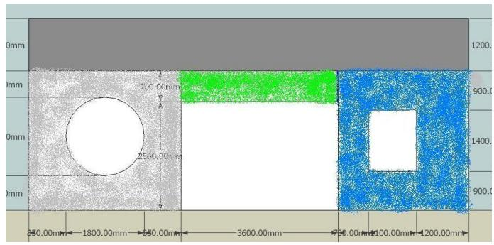

<details>
<summary>text_image</summary>

0mm
1200.
0mm
50.00mm
900.0
0mm
250.00 mm
1400.
0mm
900.0
950.0mm ← 1800.0mm ← 950.0mm ← 3600.0mm ← 950.0mm ← 100.0mm ← 1200.0mm
</details>

图1：南墙分区示意图

运行上述程序。最后得到包含型号与相对应的数量两方面的结果。详见下表：

表5：屋顶、西墙和南墙原始方案表

<table><tr><td colspan="4">屋顶</td><td colspan="5">西墙</td><td colspan="5">南墙</td></tr><tr><td>型号</td><td>A3</td><td>C8</td><td>C10</td><td>C1</td><td>C2</td><td>C6</td><td>C8</td><td>C10</td><td>C1</td><td>C2</td><td>C6</td><td>C7</td><td>C10</td></tr><tr><td>数量</td><td>48</td><td>9</td><td>2</td><td>8</td><td>8</td><td>4</td><td>1</td><td>3</td><td>2</td><td>8</td><td>32</td><td>6</td><td>1</td></tr></table>

（资料来源：附件包）

## 3.1.6优化、选择与结果呈现

由于西墙上无障碍物，因此原始方案即为最佳方案。，根据电池型号和数量，不难得出西墙上光伏电池的铺设方案，如下图所示：

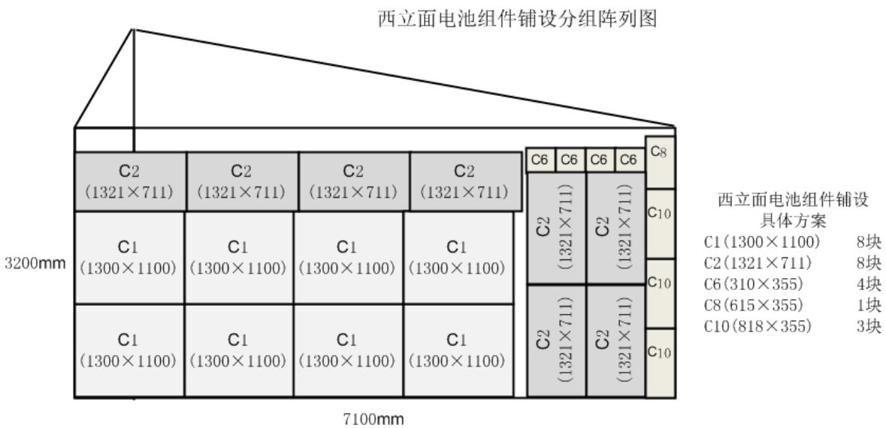

<details>
<summary>treemap</summary>

| 组成部分 | 备注 |
| --- | --- |
| C2 (1321×711) | 具体方案 |
| C1 (1300×1100) | 具体方案 |
| C1 (1300×1100) | 具体方案 |
| C1 (1300×1100) | 具体方案 |
| C2 (1321×711) | 具体方案 |
| C2 (1321×711) | 具体方案 |
| C2 (1321×711) | 具体方案 |
| C6 (C6) | 具体方案 |
| C6 (C6) | 具体方案 |
| C6 (C6) | 具体方案 |
| C8 (C8) | 具体方案 |
| C10 (C10) | 具体方案 |
| C2 (1321×711) | 具体方案 |
| C2 (1321×711) | 具体方案 |
| C2 (1321×711) | 具体方案 |
| C2 (1321×711) | 具体方案 |
| C2 (1321×711) | 具体方案 |
| C2 (1321×711) | 具备 |
| C2 (1321×711) | 具备 |
| C2 (1321×711) | 具备 |
| C2 (1321×711) | 具备 |
| C2 (1321×711) | 具备 |
| C2 (1321×711) | 具备 |
| C2 (1321+711) | 具备 |
| C2 (1321+711) | 具备 |
| C2 (1321+711) | 具备 |
| C2 (1321+711) | 具备 |
| C2 (1321+711) | 具备 |
| C2 (1321+711) | 具备 |
</details>

西立面电池组件分组连接方式示意图  
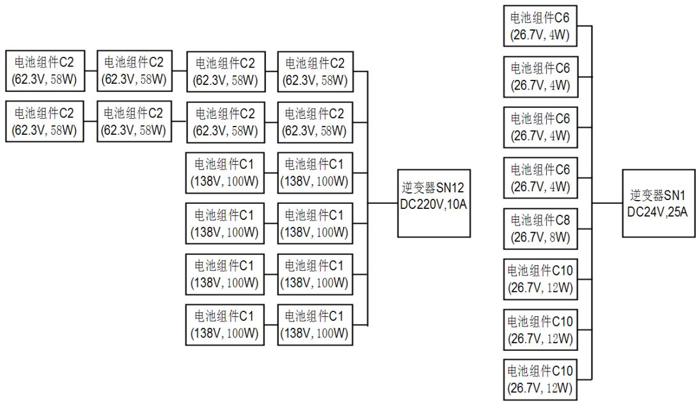

<details>
<summary>flowchart</summary>

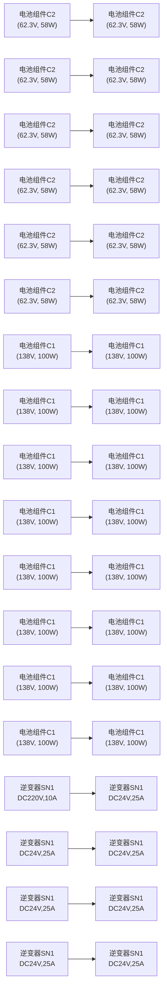
</details>

而针对南墙考虑，原始方案只是得出没有考虑逆变器时的最优电池板安排。而考虑了逆变器以后，单位面积上的成本就会增加，而且某些型号由于功率过小，会导致逆变器的功率浪费，从而间接地增加成本，例如 C6。因此，我们人工地分出对型号与数量进行了相对的调整，得出了相对最优的最终方案：

表6：南墙最终方案表

<table><tr><td colspan="4">南墙</td></tr><tr><td>型号</td><td>C1</td><td>C2</td><td>C10</td></tr><tr><td>数量</td><td>2</td><td>8</td><td>10</td></tr></table>

南立面电池组件铺设分组阵列图  
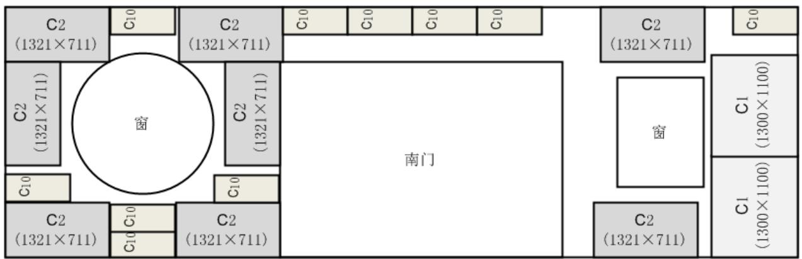

<details>
<summary>text_image</summary>

C2
(1321×711)
窗
C2
(1321×711)
南门
C2
(1321×711)
窗
C2
(1321×711)
C1
(1300×1100)
C1
(1300×1100)
</details>

南立面电池组件分组连接方式示意图  
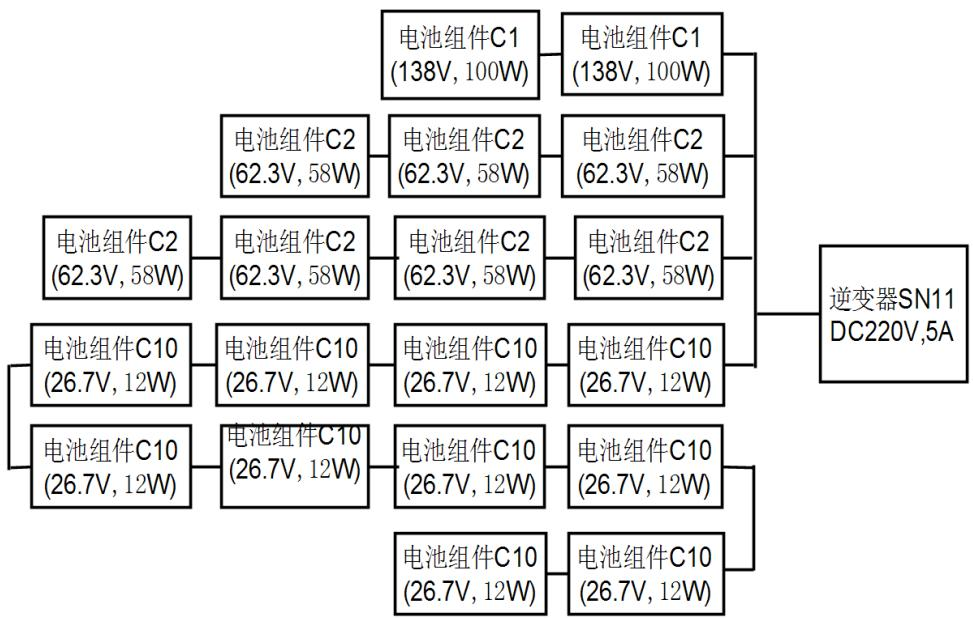

<details>
<summary>flowchart</summary>

This image displays a hierarchical classification tree for an electrical component, showing the distribution of battery components (C1, C2, C10) and their associated voltage ratings (V, W) to produce a final DC220V 5A inverter SN11.
</details>

最后对于屋顶，采用扣除重补的方法，在原始方案的基础上，除去覆盖到天窗的那些电池板，然后再按优先级使用面积小的电池板，充填剩余的空白区域，得到最优解：

表 7：屋顶最终方案表

<table><tr><td colspan="3">屋顶</td></tr><tr><td>型号</td><td>A3</td><td>C10</td></tr><tr><td>数量</td><td>43</td><td>8</td></tr></table>

屋顶电池组件铺设分组阵列图  
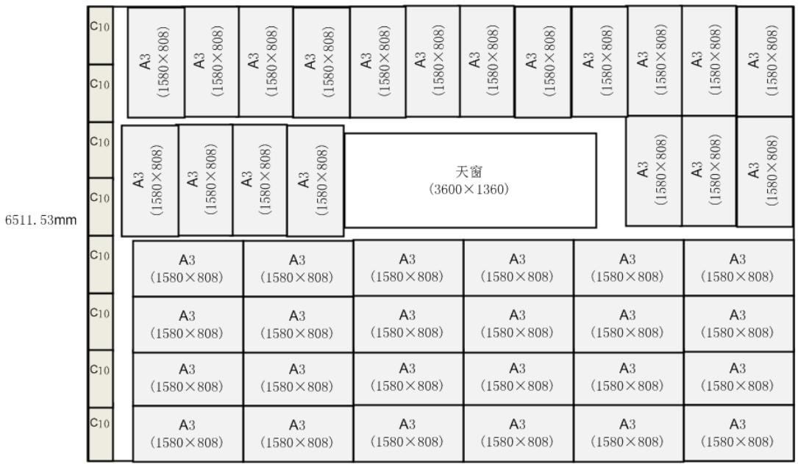

<details>
<summary>text_image</summary>

6511.53mm
C10
A3
(1580×808)
C10
A3
(1580×808)
C10
A3
(1580×808)
C10
A3
(1580×808)
C10
A3
(1580×808)
A3
(1580×808)
A3
(1580×808)
A3
(1580×808)
A3
(1580×808)
A3
(1580×808)
A3
(1580×808)
A3
(1580×808)
A3
(1580 × 808)
A3
(1580 × 808)
A3
(1580 × 808)
A3
(1580 × 808)
A3
(1580 × 808)
A3
(1580 × 808)
A3
(1580 × 808)
A3
(1580 × 8<nl>
A3
(1580 × 808)
A3
(1580 × 808)
A3
(1580 × 808)
A3
(1580 × 808)
A3
(1580 × 808)
A3
(1580 × 808)
A3
(1580 × 808)
A2
(1580 × 808)
A3
(1580 × 808)
A3
(1580 × 808)
A3
(1580 × 808)
A3
(1580 × 808)
A3
(1580 × 808)
A3
(1580 × 808)
A3
天窗
(3600×1360)
A3
(1580 × 808)
A3
(1580 × 808)
A3
(1580 × 808)
A3
(1580 × 808)
A3
(1580 × 808)
A3
(1580 × 808)
A3
(1580 × 808)
C10
A3
(1580× 808)
A3
(1580× 808)
A3
(1580× 808)
A3
(1580× 808)
A3
(1580× 808)
A3
(1580× 808)
A3
(1580× 808)
A3
(1580× 808)
C10
A3
(1580× 808)
A3
(1580× 808)
A3
(1580× 808)
A3
(1580× 80<nl>
A2
(1579× 799)<fcel>A2
(1579× 799)<fcel>A2
(1579× 799)<fcel>A2
(1579× 799)<fcel>A2
(1579× 799)<fcel>A2
(1579× 799)<fcel>A2
(1579× 799)<fcel>A2
(1579×<nl>
C10<fcel>A2
(1579× 799)<fcel>A2
(1579× 799)<fcel>A2
(1579× 799)<fcel>A2
(1579× 799)<fcel>A2
(1579× 799)<fcel>A2
(1579× 799)<fcel>A2
(1579+ 799)<fcel>A2<nl>
C10<fcel>A2
(1579× 799)<fcel>A2
(1579× 799)<fcel>A2
(1579× 799)<fcel>A2
(1579× 799)<fcel>A2
(1579× 799)<fcel>A2
(1579+ 799)<fcel>A2
(1579+ 799)<fcel>A2<nl>
C10<fcel>A2
(1579× 799)<fcel>A2
(1579× 799)<fcel>A2
(1579× 799)<fcel>A2
(1579× 799)<fcel>A2
(1579+ 799)<fcel>A2
(1579+ 799)<fcel>A2
(1579+ 799)<fcel>A2<nl>
</details>

10100mm

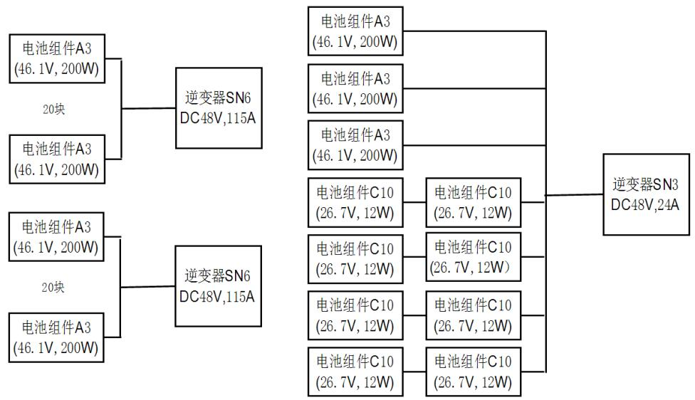

<details>
<summary>flowchart</summary>

This image displays a hierarchical classification tree for an electrical component, showing the relationships between different battery modules (A3 and C10) and their corresponding DC48V voltage ratings.
</details>

综上所述，问题一中的电池板铺设与逆变器选择问题就得到了解决。然后就可以得出总发电量、每单位发电量费用、总成本和回收年限等经济效应数据。其中，由于前 10 年、第 11 至 25 年、26 至 35 年的转化效率不一，因此在求回收年限时需分段判断。本方案的相关数据见下表：

表8：问题一最终经济效益表

<table><tr><td>平面</td><td>器件型号</td><td>数量</td><td>成本(元)</td><td>年收益(元)</td></tr><tr><td rowspan="4">南立面</td><td>C1</td><td>2</td><td></td><td rowspan="4">384.2</td></tr><tr><td>C2</td><td>8</td><td>3763.2</td></tr><tr><td>C10</td><td>10</td><td></td></tr><tr><td>SN11</td><td>1</td><td>4500</td></tr><tr><td rowspan="7">西立面</td><td>C1</td><td>8</td><td></td><td rowspan="7">550.12</td></tr><tr><td>C2</td><td>8</td><td></td></tr><tr><td>C6</td><td>4</td><td>6355.2</td></tr><tr><td>C8</td><td>1</td><td></td></tr><tr><td>C10</td><td>3</td><td></td></tr><tr><td>SN12</td><td>1</td><td>6900</td></tr><tr><td>SN1</td><td>1</td><td>2900</td></tr><tr><td rowspan="4">屋顶</td><td>A3</td><td>43</td><td></td><td rowspan="4">6410.6</td></tr><tr><td>C10</td><td>8</td><td>128600.8</td></tr><tr><td>SN6</td><td>2</td><td>30000</td></tr><tr><td>SN3</td><td>1</td><td>4500</td></tr><tr><td colspan="3">总成本(元)</td><td>187519.2</td><td></td></tr><tr><td colspan="3">总年收益(元)</td><td>7344.92</td><td></td></tr><tr><td colspan="3">35年总收益(元)</td><td>231365</td><td></td></tr><tr><td colspan="3">35年总利润(元)</td><td>43845.78</td><td></td></tr><tr><td colspan="3">总发电量(千瓦时)</td><td>462729.96</td><td></td></tr><tr><td colspan="3">每单位发电量成本(元/千瓦时)</td><td>0.405</td><td></td></tr><tr><td colspan="3">回收年限(年)</td><td>27.5</td><td></td></tr></table>

## 3．2 问题二

问题 2考虑的是在架空处理下的最优化铺设问题，此时我们需要先考虑最优倾角和最佳朝向。然后根据这两者来确定架空的模式与结构，最后得出最优铺设方案。

## 3.2.1 最优倾角

倾斜角的大小直接关系到光伏电池接收到的实际辐射强度的大小。而最优倾角的定义，就是能使电池板接收到最大光照强度的角度。因此，我们的目标就是以倾斜角 s 作为自变量，最大化倾斜面总辐射强度 $H _ { t }$ ，然后求出使之达到最大值时的s的值。

首先，s 与 $H _ { t }$ 的关系可以用公式 9 来描述：

$$
H _ {t} = H _ {b} R _ {b} + H _ {d} [ \frac {H _ {b}}{H _ {o}} R _ {b} + 0. 5 (1 - \frac {H _ {b}}{H _ {o}}) (1 + \cos s) ] + 0. 5 \rho H (1 - \cos s)
$$

即 $H _ { t }$ 可以表示为关于 s 的一元简单函数。那么接下来所处理的就是一个无约束最优化问题，即求一元简单函数最大值的问题，我们将利用 Matlab 中的fminbnd函数处理<sup>【4】</sup>。它的数学原理就是采用一维搜索的方法，解单变量的无约束最优化问题。虽然这个函数是求最小值的，但是我们可以先将 $H _ { t }$ 的表达式两边取负，则此时它的最小值就是 的最大值。

另外，在使用附件 4 的数据时，还要考虑附件 3 和附件 1 中提到的 A、C 组的太阳光辐照阀值的特殊情况。我们以最低辐射强度 $2 0 0 \textrm { ‰}$ 为例。首先在matlab 中创立一个 M 文件，将方程 9 输入进去，具体代码详见【附件包】中“CUMCM\_Q2\_bestangle.m”。然后调用 fminbnd 函数：

$$
\mathrm{x} = \text {fminbnd} (\text {@CUMCM\_Q2\_bestangle}, 0, 9 0)
$$

然后得到问题的解：

$$
\mathrm{x} = 3 1. 6 0 7 6
$$

最后即可得到三种情况的计算结果。如下表所示，在山西省大同市的最优倾斜角为 31. $6 3 ^ { \circ } ~ \pm 0 . 0 2 ^ { \circ }$ ，大于太阳小屋自身屋顶的倾斜角度。

表9：三种约束情况下的最佳倾角

<table><tr><td>PV电池类型</td><td>最低辐射强度限值 (W/ m2)</td><td>最佳倾角 (°)</td></tr><tr><td>A单晶硅电池</td><td>200</td><td>31.6076</td></tr><tr><td>B多晶硅电池</td><td>80</td><td>31.6522</td></tr><tr><td>C薄膜电池</td><td>30</td><td>31.6536</td></tr></table>

（资料来源：附件四）

## 3.2.2 最佳朝向

光伏电池方阵的朝向用方位角来描述，即方阵的垂直面与正南方向的夹角（偏东设定为负角度，偏西设定为正角度）。一般而言，朝向正南（即方阵垂直与正南的夹角为0°）时，光伏电池方阵发电量最大。然而，在晴朗的夏天，太阳辐射能量的最大时刻在中午稍后，因此光伏电池方阵的方位稍微向西偏一些时，在午后时刻可以获得最大发电功率。影响朝向设置的制约因素很多，于此，我们希望通过已有数据，获得最大发电功率时的朝向。道客巴巴在线文档分享平台的一份文档提到<sup>【5】</sup>，若将方位角调整到一天中负荷的峰值时刻和发电峰值时刻一致时，可达到最大发电功率的目标，并可参考下述最佳朝向经验公式，方位角=（一天中负荷的峰值时刻（24小时制） $- 1 2 ) \ \times 1 5 ^ { \circ } \ +$ （当地经度-116°）。

就一年而言，每天负荷的峰值时刻不尽相同，因此由附件 4统计 t时刻年均水平面总辐射强度，统计结果如下表：

表10：t时刻年均水平面总辐射强度表

<table><tr><td>时刻t</td><td>0</td><td>1</td><td>2</td><td>3</td><td>4</td><td>5</td></tr><tr><td>t时刻年均水平面总辐射强度( $W/m^2$ )</td><td>0</td><td>0</td><td>0</td><td>0</td><td>0</td><td>0.24</td></tr><tr><td>时刻t</td><td>6</td><td>7</td><td>8</td><td>9</td><td>10</td><td>11</td></tr><tr><td>t时刻年均水平面总辐射强度( $W/m^2$ )</td><td>16.52</td><td>69.97</td><td>171.24</td><td>300.75</td><td>424.14</td><td>504.76</td></tr><tr><td>时刻t</td><td>12</td><td>13</td><td>14</td><td>15</td><td>16</td><td>17</td></tr><tr><td>t时刻年均水平面总辐射强度( $W/m^2$ )</td><td>544.96</td><td>546.88</td><td>493.02</td><td>404.69</td><td>293.68</td><td>164.21</td></tr><tr><td>时刻t</td><td>18</td><td>19</td><td>20</td><td>21</td><td>22</td><td>23</td></tr><tr><td>t时刻年均水平面总辐射强度( $W/m^2$ )</td><td>67.11</td><td>14.84</td><td>0.167</td><td>0</td><td>0</td><td>0</td></tr></table>

注意到部分时刻年均水平面总辐射强度为 0，选取时刻 5 到时刻 20 的数据导入 TableCurve2D 自动曲线拟合与方程式估计系统，对数据进行三次样条插值<sup>【6】</sup>，即对于一系列形值点，通过求解三弯矩方程组得出曲线函数组，从而形成一条光滑曲线。具体插值结果如下图：

时刻5到时刻20年均水平面总辐射强度三位样条插值图  
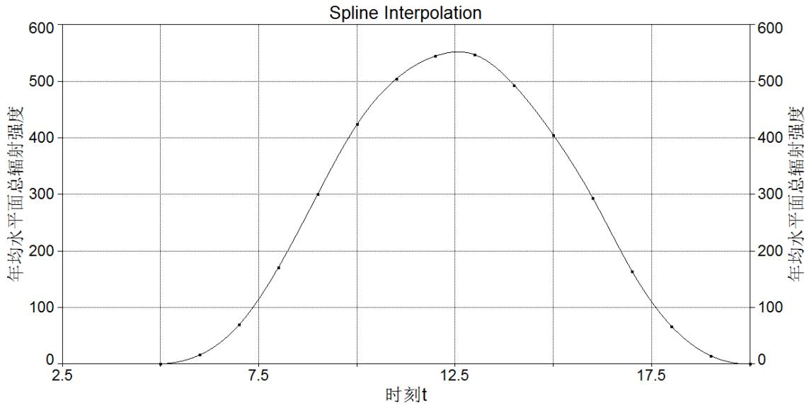

<details>
<summary>line</summary>

| 时刻t | 年均水平面总辐射强度 |
| --- | --- |
| ~4.5 | 0 |
| ~6.0 | ~10 |
| ~7.0 | ~70 |
| ~8.0 | ~170 |
| ~9.0 | ~300 |
| ~10.0 | ~425 |
| ~11.0 | ~505 |
| ~12.0 | ~550 |
| ~12.5 | ~550 |
| ~13.5 | ~490 |
| ~15.0 | ~405 |
| ~16.0 | ~290 |
| ~17.0 | ~165 |
| ~18.0 | ~65 |
| ~19.0 | ~10 |
| ~20.0 | 0 |
</details>

由插值后结果，将一天中负荷的峰值时刻=12.5代入上述公式，并结合附件6 关于大同经度的数据， $( 1 2 . 5 - 1 2 ) \times 1 5 ^ { \circ } + ( 1 1 3 ^ { \circ } 1 8 ^ { \prime } - 1 1 6 ^ { \circ } ) = 4 ^ { \circ } 4 8 ^ { \prime }$ ，因此得到最佳朝向为正南偏西 4°48′。

## 3.2.3 架空处理

得到最优倾斜角与最佳朝向之后，将其运用到最优化铺设中，因此需要对电池板进行架空处理。而屋顶的架空处理一般分为两种，一种是对单块电池板进行架空，要求每块电池板至少有一个顶点接触房屋表面；第二种是对多块电池板一起架空，如下图所示，即对每块电池板四个角进行支撑，允许电池板四个顶点均脱离表面。

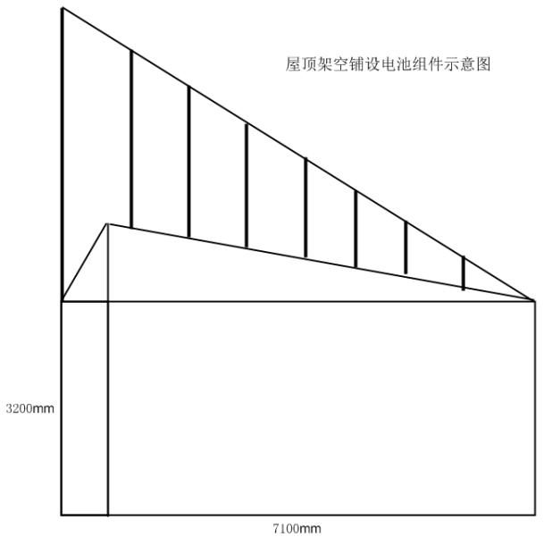

<details>
<summary>text_image</summary>

屋顶架空铺设电池组件示意图
3200mm
7100mm
</details>

考虑第一种架空方式，虽然可以使每块电池板的倾斜角和朝向均达到最优，但是随着太阳从峰值位置逐渐下落，会产生电池板之间的相互遮挡问题，降低光能转化效率。

但是第二种方式就可以避免这种问题，所有的电池板可以铺成一个平面，则在一天中的任何时候都不会有阴影产生，同时，这种架空方式也可以保证每块板达到最优倾角和最佳朝向，而且受光照面积也较大。

最后，由于假设 7，这里不考虑东西南北四面墙的架空处理。

## 3.2.3 结果呈现

由上文得，问题二中东西南北四面墙的铺设方案与问题一相同。由于最佳朝向为正南偏西 4°48′，所以电池板阵列东面的支撑杆要稍长于西面的支撑杆，但是由于偏离的角度很小，因此屋顶仍可以看做是一个矩形，按问题一中的递归算法进行求解。得到以下结果：

屋顶电池组件铺设分组阵列图  
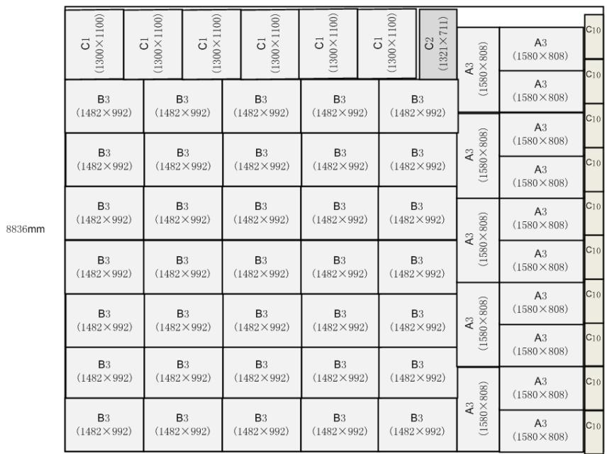

<details>
<summary>heatmap</summary>

| Category | C1 (1300×1100) | C1 (1300×1100) | C1 (1300×1100) | C1 (1300×1100) | C1 (1300×1100) | C1 (1300×1100) | C2 (1321×711) |
| --- | --- | --- | --- | --- | --- | --- | --- |
| A3 (1580×808) | — | — | — | — | — | — | C10 |
| A3 (1580×808) | — | — | — | — | — | — | C10 |
| A3 (1580×808) | — | — | — | — | — | — | C10 |
| B3 (1482×992) | — | B3 (1482×992) | B3 (1482×992) | B3 (1482×992) | B3 (1482×992) | B3 (1482×992) | A3 (1580×808) |
| A3 (1580×808) | — | — | — | — | — | — | C10 |
| B3 (1482×992) | B3 (1482×992) | B3 (1482×992) | B3 (1482×992) | B3 (1482×992) | B3 (1482×992) | B3 (1482×992) | A3 (1580×808) |
| A3 (1580×808) | — | — | — | A3 (1580×808) | — | — | C10 |
| B3 (1482×992) | B3 (1482×992) | B3 (1482×992) | B3 (1482×992) | B3 (1482×992) | B3 (1482×992) | B3 (1482×992), B3 (1482×992) | A3 (1580×808) |
| A3 (1580×808) | — | — | — | A3 (1580×808) | — | — | C10 |
| B3 (1482×992) | B3 (1482×992) | B3 (14B2×992) | B3 (1482×992) | B3 (1482×992) | B3 (1482×992) | B3 (1482×992), B3 (1482×992) | A3 (1580×808) |
</details>

10100mm

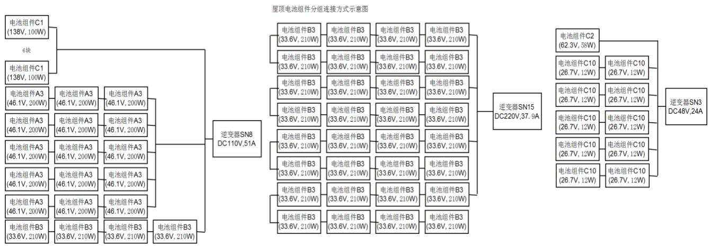

<details>
<summary>flowchart</summary>

```mermaid
graph LR
  subgraph Module_Groups
  A["电池组件C1\n(138V, 100W)"] --> B["6块"]
  C["电池组件C1\n(138V, 100W)"] --> D["电池组件A3\n(46.1V, 200W)"]
  E["电池组件A3\n(46.1V, 200W)"] --> F["电池组件A3\n(46.1V, 200W)"]
  G["电池组件A3\n(46.1V, 200W)"] --> H["电池组件A3\n(46.1V, 200W)"]
  I["电池组件A3\n(46.1V, 200W)"] --> J["电池组件A3\n(46.1V, 200W)"]
  K["电池组件A3\n(46.1V, 200W)"] --> L["电池组件A3\n(46.1V, 200W)"]
  M["电池组件A3\n(46.1V, 200W)"] --> N["电池组件A3\n(46.1V, 200W)"]
  O["电池组件A3\n(46.1V, 200W)"] --> P["电池组件A3\n(46.1V, 200W)"]
  Q["电池组件A3\n(46.1V, 200W)"] --> R["电池组件A3\n(46.1V, 200W)"]
  S["电池组件B3\n(33.6V, 210W)"] --> T["电池组件B3\n(33.6V, 210W)"]
  U["电池组件B3\n(33.6V, 210W)"] --> V["电池组件B3\n(33.6V, 210W)"]
  W["电池组件B3\n(33.6V, 210W)"] --> X["电池组件B3\n(33.6V, 210W)"]
  Y["电池组件B3\n(33.6V, 210W)"] --> Z["电池组件B3\n(33.6V, 210W)"]
  AA["电池组件B3\n(33.6V, 210W)"] --> AB["电池组件B3\n(33.6V, 210W)"]
  AC["电池组件B3\n(33.6V, 210W)"] --> AD["电池组件B3\n(33.6V, 210W)"]
  AE["电池组件B3\n(33.6V, 210W)"] --> AF["电池组件B3\n(33.6V, 210W)"]
  AG["电池组件B3\n(33.6V, 210W)"] --> AH["电池组件B3\n(33.6V, 210W)"]
  AI["电池组件B3\n(33.6V, 210W)"] --> AJ["电池组件B3\n(33.6V, 210W)"]
  AK["电池组件B3\n(33.6V, 210W)"] --> AL["电池组件B3\n(33.6V, 210W)"]
  AM["电池组件B3\n(33.6V, 210W)"] --> AN["电池组件B3\n(33.6V, 210W)"]
  AO["电池组件B3\n(33.6V, 210W)"] --> AP["电池组件B3\n(33.6V, 210W)"]
  AQ["电池组件B3\n(33.6V, 210W)"] --> AR["电池组件B3\n(33.6V, 210W)"]
  AS["电池组件B3\n(33.6V, 210W)"] --> AT["电池组件B3\n(33.6V, 210W)"]
  AU["电池组件B3\n(33.6V, 210W)"] --> AV["电池组件B3\n(33.6V, 210W)"]
  AW["电池组件B3\n(33.6V, 210W)"] --> AX["电池组件B3\n(33.6V, 210W)"]
  AY["电池组件C2\n(62.3V, 58W)"] --> Z["逆变器SN3 DC48V,24A"]
  AA["电池组件C10\n(26.7V, 12W)"] --> AA
  AB["电池组件C10\n(26.7V, 12W)"] --> AB
  AC["电池组件C10\n(26.7V, 12W)"] --> AC
  AD["电池组件C10\n(26.7V, 12W)"] --> AD
  AE["电池组件C10\n(26.7V, 12W)"] --> AE
  AF["电池组件C10\n(26.7V, 12W)"] --> AF
  AG["电池组件C10\n(26.7V, 12W)"] --> AG
  AH["电池组件C10\n(26.7V, 12W)"] --> AH
  AI["电池组件C10\n(26.7V, 12W)"] --> AI
  AJ["逆变器SN5 DC220V,37.9A"] --> SN5
  AK["逆变器SN5 DC220V,37.9A"] --> SN5
  AL["逆变器SN5 DC220V,37.9A"] --> SN5
  AM["逆变器SN5 DC220V,37.9A"] --> SN5
  ANF["逆变器SN5 DC220V,37.9A"] --> SN5
  AO["逆变器SN5 DC220V,37.9A"] --> SN5
  AP["逆变器SN5 DC220V,37.9A"] --> SN5
  AQ["逆变器SN5 DC220V,37.9A"] --> SN5
  AR["逆变器SN5 DC220V,37.9A"] --> SN5
  AS["逆变器SN5 DC220V,37.9A"] --> SN5
  AT["逆变器SN5 DC220V,37.9A"] --> SN5
  AU["逆变器SN5 DC220V,37.9A"] --> SN5
  AV["逆变器SN5 DC220V,37.9A"] --> SN5
  AW["逆变器SN5 DC220V,37.9A"] --> SN5
  AX["逆变器SN5 DC220V,37.9A"] --> SN5
  AZ["逆变器SN5 DC220V,37.9A"] --> SN5
  BA["逆变器SN5 DC220V,37.9A"] --> SN5
  BC["逆变器SN5 DC220V,37.9A"] --> SN5
  BD["逆变器SN5 DC220V,37.9A"] --> SN5
  BE["逆变器SN5 DC220V,37.9A"] --> SN5
  BF["逆变器SN5 DC220V,37.9A"] --> SN5
  BG["逆变器SN5 DC220V,37.9A"] --> SN5
  BH["逆变器SN5 DC220V,37.9A"] --> SN5
  BI["逆变器SN5 DC220V,37.9A"] --> SN5
  BJ["逆变器SN5 DC220V,37.9A"] --> SN5
  BK["逆变器SN5 DC220V,37.9A"] --> SN5
  BL["逆变器SN5 DC220V,37.9A"] --> SN5
  BM["逆变器SN5 DC220V,37.9A"] --> SN5
  BN["逆变器SN5 DC220V,37.9A"] --> SN5
  BO["逆变器SN5 DC220V,37.9A"] --> SN5
  BP["逆变器SN5 DC220V,37.9A"] --> SN5
  BR["逆变器SN5 DC220V,37.9A"] --> SN5
  BS["逆变器SN5 DC220V,37.9A"] --> SN5
  BT["逆变器SN5 DC220V,37.9A"] --> SN5
  BU["逆变器SN5 DC220V,37.9A"] --> SN5
  BV["逆变器SN5 DC220V,37.9A"] --> SN5
  BW["逆变器SN5 DC220V,37.9A"] --> SN5
  BX["逆变器SN5 DC220V,37.9A"] --> SN5
  BY["逆变器SN5 DC220V,37.9A"] --> SN5
  BB["逆变器SN5 DC220V,37.9A"] --> SN5
  BC["逆变器SN5 DC220V,37.9A"] --> SN5
  CD["逆变器SN5 DC220V,37.9A"] --> SN5
  CE["逆变器SN5 DC220V,37.9A"] --> SN5
  CF["逆变器SN5 DC220V,37.9A"] --> SN5
  CG["逆变器SN5 DC220V,37.9A"] --> SN5
  CH["逆变器SN5 DC220V,37.9A"] --> SN5
  CI["逆变器SN5 DC220V,37.9A"] --> SN5
  CJ["逆变器SN5 DC220V,37.9A"] --> SN5
  CK["逆变器SN5 DC220V,37.9A"] --> SN5
  CL["逆变器SN5 DC220V,37.9A"] --> SN5
  CM["逆变器SN5 DC220V,37.9A"] --> SN5
  CN["逆变器SN5 DC220V,37.9A"] --> SN5
  CO["逆变器SN5 DC220V,37.9A"] --> SN5
  CP["逆变器SN5 DC220V,37.9A"] --> SN5
  CR["逆变器SN5 DC220V,37.9A"] --> SN5
  CS["逆变器SN5 DC220V,37.9A"] --> SN5
  CT["逆变器SN5 DC220V,37.9A"] --> SN5
  CU["逆变器SN5 DC220V,37.9A"] --> SN5
  CV["逆变器SN5 DC220V,37.9A"] --> SN5
  CW["逆变器SN5 DC220V,37.9A"] --> SN5
  CX["逆变器SN5 DC220V,37.9A"] --> SN5
  CY["逆变器SN5 DC220V,37.9A"] --> SN5
  CZ["逆变器SN5 DC220V,37.9A"] --> SN5
```
</details>

表11：问题二最终经济效益表

<table><tr><td>平面</td><td>器件型号</td><td>数量</td><td>成本(元)</td><td>年收益(元)</td></tr><tr><td rowspan="4">南立面</td><td>C1</td><td>2</td><td></td><td rowspan="4">384.2</td></tr><tr><td>C2</td><td>8</td><td>3763.2</td></tr><tr><td>C10</td><td>10</td><td></td></tr><tr><td>SN11</td><td>1</td><td>4500</td></tr><tr><td rowspan="7">西立面</td><td>C1</td><td>8</td><td></td><td rowspan="7">550.12</td></tr><tr><td>C2</td><td>8</td><td></td></tr><tr><td>C6</td><td>4</td><td>6355.2</td></tr><tr><td>C8</td><td>1</td><td></td></tr><tr><td>C10</td><td>3</td><td></td></tr><tr><td>SN12</td><td>1</td><td>6900</td></tr><tr><td>SN1</td><td>1</td><td>2900</td></tr><tr><td rowspan="8">屋顶</td><td>B3</td><td>35</td><td rowspan="2">140309.4</td><td rowspan="8">7672</td></tr><tr><td>A3</td><td>15</td></tr><tr><td>C1</td><td>6</td><td></td></tr><tr><td>C2</td><td>1</td><td></td></tr><tr><td>C10</td><td>10</td><td></td></tr><tr><td>SN3</td><td>1</td><td>4500</td></tr><tr><td>SN8</td><td>1</td><td>15300</td></tr><tr><td>SN15</td><td>1</td><td>22000</td></tr><tr><td colspan="3">总成本(元)</td><td>206527.8</td><td></td></tr><tr><td colspan="3">总年收益(元)</td><td>8606.32</td><td></td></tr><tr><td colspan="3">35年总收益(元)</td><td>271099.1</td><td></td></tr><tr><td colspan="3">35年总利润(元)</td><td>64571.28</td><td></td></tr><tr><td colspan="3">总发电量(千瓦时)</td><td>542198.2</td><td></td></tr><tr><td colspan="3">每单位发电量成本(元/千瓦时)</td><td>0.381</td><td></td></tr><tr><td colspan="3">回收年限(年)</td><td>25.6</td><td></td></tr></table>

## 3．3 问题三

问题三要解决的是设计一个新的小屋，并为这个小屋铺设最优的光伏电池的问题。因此我们首先要构建一个满足建筑要求的小屋。

## 3.3.1 构建小屋

小屋的设计有两个关键因素，一是附件 7中的建筑要求，二是上文中得出的结论。如何既满足设计要求，又能有利于电池板最优铺设问题的求解，是十分值得考虑的问题。

针对每面墙的各型号电池板优先级列表，我们将小屋的每面墙设计成恰好能铺设整数块最优电池板的大小。而屋顶的倾角也十分接近问题 2中得出的最优倾角。另外我们选择全部采用贴附安装的方式，使得电池板的倾斜角即为最优倾角。

具体信息如下：建筑屋顶最高点距地面高度为 5.4m，满足小于 5.4m的建筑要求，而其倾斜角为 $3 0 . 6 ^ { \circ }$ ；室内使用空间最低净空高度距地面高度为 2.976m，满足大于 2.8m 的建筑要求；建筑总投影面积包括（挑檐、挑雨棚的投影面积）为14.6×4.1+2.6×1.2=62.98 ㎡，满足小于 74 ㎡的建筑要求；建筑平面体型长边为14.6 米，满足小于15m，最短边4.1m，满足大于3m；窗地比和窗墙比数据如下表，满足建筑要求：

表12：小屋建筑信息表

<table><tr><td></td><td>面积计算步骤</td><td>开窗面积(m2)</td><td>墙宽(m)</td><td>墙高(m)</td><td>窗墙比</td></tr><tr><td>东立面</td><td>1.9×1.426</td><td>2.709</td><td>4.1</td><td>2.976</td><td>0.222</td></tr><tr><td>南立面</td><td>1.5×0.992×2</td><td>2.976</td><td>14.6</td><td>2.976</td><td>0.068</td></tr><tr><td>西立面</td><td>1.9×1.426</td><td>2.709</td><td>4.1</td><td>2.976</td><td>0.222</td></tr><tr><td>北立面</td><td>3×0.992</td><td>2.976</td><td>14.6</td><td>2.976</td><td>0.068</td></tr><tr><td>屋顶</td><td>1.65×1.6</td><td>2.640</td><td></td><td></td><td></td></tr><tr><td colspan="3">总开窗面积(m2)</td><td colspan="3">14.011</td></tr><tr><td colspan="3">房屋地板面积(m2)</td><td colspan="3">59.86</td></tr><tr><td colspan="3">窗地比</td><td colspan="3">0.234</td></tr></table>

综上所述，小屋的全部参数满足附件 7 所给的全部要求。而下面分别是用AutoCAD制作的小屋的四立面图和由 SketchUp 生成的小屋立体透视图：

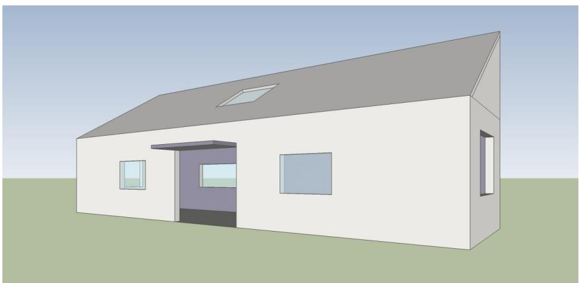

<details>
<summary>natural_image</summary>

3D architectural rendering of a modern two-story house with a sloped roof and open door, set against a plain green background (no text or symbols)
</details>

图2：小屋立体透视图

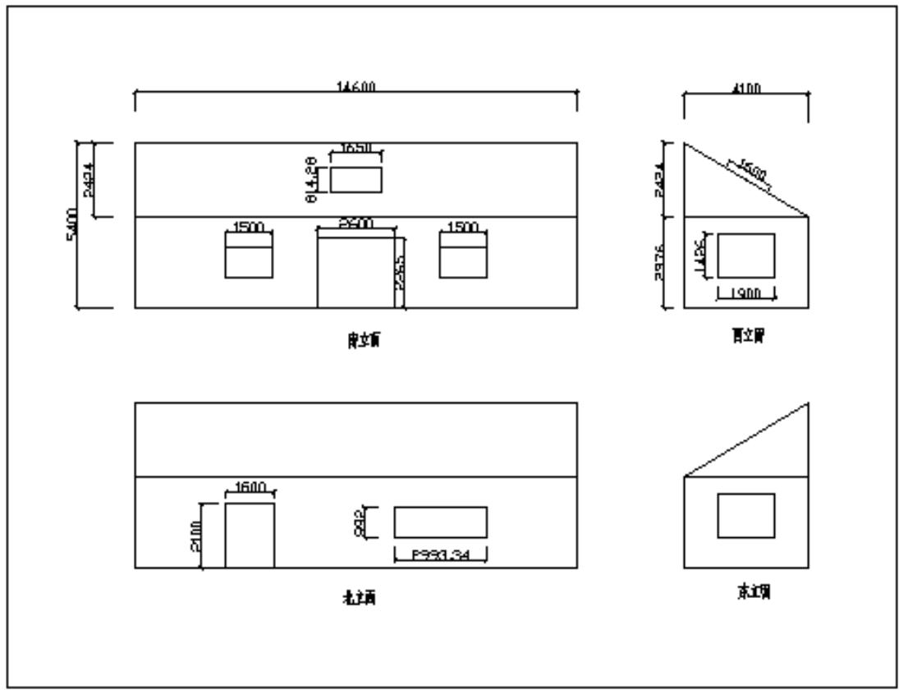

<details>
<summary>text_image</summary>

14600
5400
2424
1500
1650
814.28
1500
2900
1500
2255
4100
2434
1450
2976
1900
西立窗
北立窗
2100
1600
292
P993.34
东立窗
</details>

图3：小屋的四立面图

## 3.3.2 最优化铺设

构建了新的小屋之后，运用问题一的相关结论，可以很方便地得出以下结果：

表13：问题三最终经济效益表

<table><tr><td>平面</td><td>器件型号</td><td>数量</td><td>成本(元)</td><td>年收益(元)</td></tr><tr><td rowspan="3">南立面</td><td>B3</td><td>22</td><td rowspan="2">58306.8</td><td rowspan="3">2447.87</td></tr><tr><td>C2</td><td>2</td></tr><tr><td>SN15</td><td>1</td><td>22000</td></tr><tr><td rowspan="2">西立面</td><td>C1</td><td>6</td><td>2880</td><td rowspan="2">241.6</td></tr><tr><td>SN11</td><td>1</td><td>4500</td></tr><tr><td rowspan="3">屋顶</td><td>A3</td><td>52</td><td>154960</td><td rowspan="3">8623.17</td></tr><tr><td>SN6</td><td>1</td><td>15000</td></tr><tr><td>SN15</td><td>1</td><td>22000</td></tr><tr><td colspan="3">总成本(元)</td><td>279646.8</td><td></td></tr><tr><td colspan="3">总年收益(元)</td><td>11312.64</td><td></td></tr><tr><td colspan="3">35年总收益(元)</td><td>356348.2</td><td></td></tr><tr><td colspan="3">35年总利润(元)</td><td>76701.36</td><td></td></tr><tr><td colspan="3">总发电量(千瓦时)</td><td>712696.3</td><td></td></tr><tr><td colspan="3">每单位发电量成本(元/千瓦时)</td><td>0.392</td><td></td></tr><tr><td colspan="3">回收年限(年)</td><td>26.5</td><td></td></tr></table>

而具体的光伏电池组件阵列图和连接方式限于篇幅，不在此呈现，详细请见【附录】。

## 4.模型优化与改进

## 4.1 算法改进

基于贪心原则的递归算法得到的都是局部最优解，并非全局最优解，但是时间开销较小，在数据规模不太大的情况下是较为有效的方法。对于一般的矩形毛料无约束二维剪切排样问题，若毛料的长宽存在适当的公约数，可以作为边长对矩形板材进行网格化处理，从而减小数据规模。当问题数据规模较小时，可以考虑精确搜索各种组合优化的情况，从而得到最优解；当问题数据规模较大时，由于这是一个NP-hard 问题，精确搜索的运算量过于大，多采用基于某种原则的近似算法，比如我们采用的基于贪心原则的递归算法，也可采用最优化理论的三大非经典算法，模拟退火、神经网络以及遗传算法<sup>【7】</sup>进行改进，从而有效降低运算量。

然而实际生活中，理想的矩形毛料无约束二维剪切排样问题较少，经常出现一些障碍物。本篇对障碍物多采用人工分区局部优化的办法，因为在递归算法中，障碍物相对板材的位置随着不断的切割，一直在发生变化，甚至可能出现障碍物被切分的情况，因此难于有效满足障碍物的约束。因此，可引进人工智能的思想，使计算机程序可根据板材上障碍物的性质模拟人工分区实时更新策略，尽可能满足障碍物的约束。

## 4.1投资折现率

在考虑上文中的投资回报期限时，我们假设折现率为零，因此未来每年的现金流入的价值就等于其现值。但是在实际生活中，由于银行利息以及通货膨胀等因素的影响，要求投资者考虑对其未来的收入进行一个折现，这样才能真正体现其未来收入的现时价值。

因此，我们在模型的改进中进入内部收益率概念，以此来衡量该投资决策的汇报速度。内部收益率指的是使未来的现金流入的现值等于目前现金流出的折现率，若内部收益率大于现行银行存款利率，则说明该投资的回收期限较短，反之，则说明该投资回收较慢，收益率甚至不如银行存款。

为了求出内部收益率 r，我们根据年金公式列出方程，如下：

$$
\frac {C _ {1}}{\mathrm{r}} (1 - \frac {1}{(1 + \mathrm{r}) ^ {1 0}}) + \frac {C _ {2}}{\mathrm{r}} (\frac {1}{(1 + \mathrm{r}) ^ {1 0}} - \frac {1}{(1 + \mathrm{r}) ^ {2 5}}) + \frac {C _ {3}}{\mathrm{r}} (\frac {1}{(1 + \mathrm{r}) ^ {2 5}} - \frac {1}{(1 + \mathrm{r}) ^ {3 5}}) = 1 8 7 5 1 9. 2
$$

其中 $\mid C _ { 1 } = 7 3 4 4 . 9 , C _ { 2 } = 6 6 1 0 . 4 , C _ { 3 } = 5 8 7 6$ ，调用 Matlab 中主要用于求解代数方程的solve函数求解，具体调用格式如下：

$$
\text {solve} (^ {\prime} 7 3 4 4. 9 / \mathrm{x} * (1 - 1 / ((1 + \mathrm{x}) ^ {\wedge} 1 0)) + 6 6 1 0. 4 / \mathrm{x} * ((1 / ((1 + \mathrm{x}) ^ {\wedge} 1 0)) - (1 / ((1 + \mathrm{x}) ^ {\wedge} 1 0)))
$$

$$
\mathrm{x}) ^ {\wedge} 2 5)) + 5 8 7 6 / \mathrm{x} * \left(\left(1 / \left((1 + \mathrm{x}) ^ {\wedge} 2 5)\right) - (1 / \left((1 + \mathrm{x}) ^ {\wedge} 3 5)\right)\right) - 1 8 7 5 1 9. 2 ^ {\prime}\right)
$$

得到多个解，其中只有一组实数解，为 1.28%，因此在问题一的情况下，该投资的内部收益率为 1.28%，小于一年期存款利率 3.3%，因此，可以说该投资的回收期限较长。

## 5.参考文献

【1】李荣玲，个性化的平面太阳能接收器件最优安装角度研究[D]，东华大学，2009，14 页-21 页  
【2】禹秉熙，方伟，姚海顺等，神舟 3号飞船上太阳辐射测量[J]，空间科学学报，24（2）：123-191.2004.  
【3】崔耀东，黄健民，张显全，矩形毛料无约束二维剪切排样的递归算法[J]，计算机辅助设计与图形学学报，07:948-951,2006  
【4】苏金明，刘波，张莲花等，Matlab 工具箱应用[M]，北京：电子工业出版社，2004，199 页-201 页  
【5】道客巴巴，太阳能板的安装角度计算方式，  
http://www.doc88.com/p-291945520472.html，2012-09-09  
【6】百度百科，三次样条插值，  
http://baike.baidu.com/view/2326225.htm，2012-9-9  
【7】百度文库，数学建模竞赛中应当掌握的十类算法，  
http://wenku.baidu.com/view/4b9a5ceef8c75fbfc77db283.html，  
2012-09-10  
【8】David G.Luenberger,Investment Science[M]，北京，中国人民大学出版社，2005，29 页-31 页

## 附录

附录一：各型号电池板单位面积利润

<table><tr><td>型号</td><td>单位价格(元)</td><td>南面利润(元/m2)</td><td>北面利润(元/m2)</td><td>东面利润(元/m2)</td><td>西面利润(元/m2)</td><td>屋顶利润(元/m2)</td></tr><tr><td>A1</td><td>2509.32</td><td>163.41</td><td>-2159.22</td><td>-1123.76</td><td>-441.36</td><td>1306.39</td></tr><tr><td>A2</td><td>2498.20</td><td>142.78</td><td>-2152.25</td><td>-1129.10</td><td>-454.80</td><td>1272.19</td></tr><tr><td>A3</td><td>2334.25</td><td>633.68</td><td>-1945.48</td><td>-795.66</td><td>-37.89</td><td>1902.90</td></tr><tr><td>A4</td><td>2456.36</td><td>162.41</td><td>-2113.32</td><td>-1098.77</td><td>-430.15</td><td>1282.31</td></tr><tr><td>A5</td><td>2232.52</td><td>145.00</td><td>-1921.08</td><td>-999.99</td><td>-392.97</td><td>1161.74</td></tr><tr><td>A6</td><td>2267.60</td><td>130.56</td><td>-1953.46</td><td>-1024.38</td><td>-412.08</td><td>1156.12</td></tr><tr><td>B1</td><td>2025.81</td><td>546.93</td><td>-1688.80</td><td>-692.08</td><td>-35.21</td><td>1647.15</td></tr><tr><td>B2</td><td>2063.56</td><td>537.74</td><td>-1722.81</td><td>-715.03</td><td>-50.86</td><td>1650.18</td></tr><tr><td>B3</td><td>1785.54</td><td>750.69</td><td>-1453.31</td><td>-470.74</td><td>176.81</td><td>1835.30</td></tr><tr><td>B4</td><td>1844.02</td><td>504.93</td><td>-1536.33</td><td>-626.31</td><td>-26.58</td><td>1509.45</td></tr><tr><td>B5</td><td>1803.80</td><td>732.44</td><td>-1471.57</td><td>-489.00</td><td>158.55</td><td>1817.05</td></tr><tr><td>B6</td><td>1900.43</td><td>512.01</td><td>-1584.42</td><td>-649.80</td><td>-33.86</td><td>1543.68</td></tr><tr><td>B7</td><td>1873.50</td><td>505.61</td><td>-1561.86</td><td>-640.16</td><td>-32.72</td><td>1523.02</td></tr><tr><td>C1</td><td>335.66</td><td>813.04</td><td>-67.94</td><td>301.41</td><td>608.06</td><td>1270.90</td></tr><tr><td>C2</td><td>296.41</td><td>717.54</td><td>-60.10</td><td>265.93</td><td>536.60</td><td>1121.69</td></tr><tr><td>C3</td><td>304.72</td><td>738.81</td><td>-61.51</td><td>274.02</td><td>552.59</td><td>1154.75</td></tr><tr><td>C4</td><td>280.52</td><td>679.20</td><td>-56.84</td><td>251.74</td><td>507.94</td><td>1061.74</td></tr><tr><td>C5</td><td>311.69</td><td>754.85</td><td>-63.11</td><td>279.82</td><td>564.53</td><td>1179.96</td></tr><tr><td>C6</td><td>174.47</td><td>422.07</td><td>-35.43</td><td>156.38</td><td>315.62</td><td>659.85</td></tr><tr><td>C7</td><td>173.44</td><td>423.10</td><td>-34.41</td><td>157.40</td><td>316.65</td><td>660.87</td></tr><tr><td>C8</td><td>175.88</td><td>425.58</td><td>-35.70</td><td>157.69</td><td>318.25</td><td>665.32</td></tr><tr><td>C9</td><td>176.36</td><td>425.11</td><td>-36.18</td><td>157.21</td><td>317.78</td><td>664.85</td></tr><tr><td>C10</td><td>198.35</td><td>480.35</td><td>-40.17</td><td>178.06</td><td>359.24</td><td>750.88</td></tr><tr><td>C11</td><td>204.91</td><td>496.80</td><td>-41.37</td><td>184.26</td><td>371.58</td><td>776.50</td></tr></table>

## 附录二：C程序源代码

1.CUMCM\_Q1\_屋顶\_step1.cpp

#include<stdio.h>

#include<math.h>

//记录各型号电池参数

typedef struct PVrect {

```txt
char* type; //产品型号
int x; //产品长度
int y; //产品宽度
double value; //产品权值
}PVrect;

int xx=10100, yy=6511.53;
PVrect data[24];
int min=310;
int choice=24;
int PVrect_result[24]={0};

double RectFun(int x,int y)
{
    double result=0;
    double result_1=0,result_2=0;
    int i,j;
    if(x<min||y<min)
    {
        return result;
    }
    else
    {
        for(i=0;i<choice;i++)
        {
            for(j=0;j<=1;j++)
            {
                if(j==0)
                {
                    if(x>=data[i].x&&y>=data[i].y)
```

```c
{
    PVrect_result[i]++;
```

result\_1=data[i].value\*data[i].x\*data[i].y/1000000+RectFun(x-data [i].x,data[i].y)+RectFun(x,y-data[i].y);

result\_2=data[i].value\*data[i].x\*data[i].y/1000000+RectFun(x-data [i].x,y)+RectFun(data[i].x,y-data[i].y);

```txt
if(result_1>=result_2)
{
    return result_1;
}
else
{
    return result_2;
}
}
}
else
{
    if(x>=data[i].y&&y>=data[i].x)
    {
        PVrect_result[i]++;
```

result\_1=data[i].value\*data[i].x\*data[i].y/1000000+RectFun(x-data [i].y,data[i].x)+RectFun(x,y-data[i].x);

result\_2=data[i].value\*data[i].x\*data[i].y/1000000+RectFun(x-data [i].y,y)+RectFun(data[i].y,y-data[i].x);

```c
if(result_1>=result_2)
{
    return result_1;
```

```txt
}
else
{
    return result_2;
}
}
}
}
}
}
}
}
int main()
{
    int i;
    double max;
    //各型号电池参数
```

```javascript
data[0]. type="A3"; data[0]. x=1580; data[0]. y=808;
data[0]. value=1902.904;
data[1]. type="B3"; data[1]. x=1482; data[1]. y=992;
data[1]. value=1835.303;
data[2]. type="B5"; data[2]. x=1956; data[2]. y=992;
data[2]. value=1817.046;
data[3]. type="B2"; data[3]. x=1956; data[3]. y=991;
data[3]. value=1650.181;
data[4]. type="B1"; data[4]. x=1650; data[4]. y=991;
data[4]. value=1647.149;
data[5]. type="B6"; data[5]. x=1956; data[5]. y=992;
data[5]. value=1543.677;
data[6]. type="B7"; data[6]. x=1668; data[6]. y=1000;
data[6]. value=1523.021;
```

<table><tr><td>data[7]. type=&quot;B4&quot;; data[7]. value=1509.451;</td><td>data[7]. x=1640;</td><td>data[7]. y=992;</td></tr><tr><td>data[8]. type=&quot;A1&quot;; data[8]. value=1306.385;</td><td>data[8]. x=1580;</td><td>data[8]. y=808;</td></tr><tr><td>data[9]. type=&quot;A4&quot;; data[9]. value=1282.311;</td><td>data[9]. x=1651;</td><td>data[9]. y=992;</td></tr><tr><td>data[10]. type=&quot;A2&quot;; data[10]. value=1272.19;</td><td>data[10]. x=1956;</td><td>data[10]. y=991;</td></tr><tr><td>data[11]. type=&quot;C1&quot;; data[11]. value=1270.905;</td><td>data[11]. x=1300;</td><td>data[11]. y=1100;</td></tr><tr><td>data[12]. type=&quot;C5&quot;; data[12]. value=1179.962;</td><td>data[12]. x=1400;</td><td>data[12]. y=1100;</td></tr><tr><td>data[13]. type=&quot;A5&quot;; data[13]. value=1161.74;</td><td>data[13]. x=1650;</td><td>data[13]. y=991;</td></tr><tr><td>data[14]. type=&quot;A6&quot;; data[14]. value=1156.116;</td><td>data[14]. x=1956;</td><td>data[14]. y=991;</td></tr><tr><td>data[15]. type=&quot;C3&quot;; data[15]. value=1154.749;</td><td>data[15]. x=1414;</td><td>data[15]. y=1114;</td></tr><tr><td>data[16]. type=&quot;C2&quot;; data[16]. value=1121.689;</td><td>data[16]. x=1321;</td><td>data[16]. y=711;</td></tr><tr><td>data[17]. type=&quot;C4&quot;; data[17]. value=1061.736;</td><td>data[17]. x=1400;</td><td>data[17]. y=1100;</td></tr><tr><td>data[18]. type=&quot;C11&quot;; data[18]. value=776.4981;</td><td>data[18]. x=1645;</td><td>data[18]. y=712;</td></tr><tr><td>data[19]. type=&quot;C10&quot;; data[19]. value=750.8778;</td><td>data[19]. x=818;</td><td>data[19]. y=355;</td></tr><tr><td>data[20]. type=&quot;C8&quot;; data[20]. value=665.3232;</td><td>data[20]. x=615;</td><td>data[20]. y=355;</td></tr><tr><td>data[21]. type=&quot;C9&quot;; data[21]. value=664.8453;</td><td>data[21]. x=920;</td><td>data[21]. y=355;</td></tr><tr><td>data[22]. type=&quot;C7&quot;; data[22]. value=660.8709;</td><td>data[22]. x=615;</td><td>data[22]. y=180;</td></tr><tr><td>data[23]. type=&quot;C6&quot;; data[23]. value=659.8465;</td><td>data[23]. x=310;</td><td>data[23]. y=355;</td></tr></table>

```c
max=RectFun(xx, yy);
printf("%lf\n", max);
for(i=0;i<choice;i++)
{
    if(PVrect_result[i]>0)
        printf("%s\n", data[i].type);
}
return 0;
}
```

2. CUMCM\_Q1\_屋顶\_step1.cpp  
```c
#include<stdio.h>
#include<math.h>
//根据 step1 确定各块数量
double max=118931.628405;
//记录各型号电池参数
typedef struct PVrect
{
    char* type;   //产品型号
    int x; //产品长度
    int y; //产品宽度
    double value; //产品权值
}PVrect;
PVrect data[2];
int main()
{
    double sum;
    double temp;
```

```txt
double min=max;
int mini;
int minj;
int mink;
data[0].type="A3";      data[0].x=1580;       data[0].y=808;
data[0].value=1902.904;
data[1].type="C10";     data[1].x=818;       data[1].y=355;
data[1].value=750.8778;
data[2].type="C8";     data[2].x=615;       data[2].y=355;
data[2].value=665.3232;
int i,j,k;
for(i=1;i<=50;i++)
{
    for(j=1;j<=40;j++)
    {
        for(k=1;k<=40;k++)
        {

            sum=i*data[0].x*data[0].y*data[0].value/1000000+j*data[1].x*data[1].y*data[1].value/1000000+k*data[2].x*data[2].y*data[2].value/1000000;
            temp=sum-max;
            if(temp<=0)
                temp=-temp;
            else
                continue;

            if(temp<min&&(double(i*data[0].x*data[0].y)/1000000+double(j*data[1].x*data[1].y)/1000000+double(k*data[2].x*data[2].y)/1000000)<(10.1 *6.511))
            {
                min=temp;
                mini=i;
```

```txt
minj=j;
mink=k;
}
}
}
}
printf("%s %d\n%s %d\n%s %d\n",data[0].type,mini,data[1].type,minj,data[2].type,mink);
printf("%lf\n",mini*data[0].x*data[0].y*data[0].value/1000000+minj*data[1].x*data[1].y*data[1].value/1000000+mink*data[2].x*data[2].y*data[2].value/1000000);
printf("%lf\n",double(mini*data[0].x*data[0].y)/1000000+double(minj*data[1].x*data[1].y)/1000000+double(mink*data[2].x*data[2].y)/1000000);
return 0;
}
```

以下文件与上面类似，就不累述，请见【附件包】

3. CUMCM\_Q1\_贪心\_南面.cpp  
4. CUMCM\_Q1\_西面\_step1.cpp  
5. CUMCM\_Q1\_西面\_step2.cpp  
6. CUMCM\_Q1\_屋顶\_step1.cpp  
7. CUMCM\_Q1\_屋顶\_step2.cpp

## 附录三：Matlab源代码

1.CUMCM\_Q2\_bestangle.m

function f=myfun(x)

%日期序号

day=xlsread('data.xls',1,'B2:B8761');

%水平面总辐射强度

H=xlsread('data.xls',1,'E2:E8761');

%水平面散射辐射强度

```matlab
Hd=xlsread('data.xls',1,'F2:F8761');
%法向直射辐射强度，×sina 等于 Hb
Hb_sina=xlsread('data.xls',1,'G2:G8761');
%赤纬角
sigma=xlsread('data.xls',1,'H2:H8761');
%时角
w=xlsread('data.xls',1,'I2:I8761');
%当地纬度
weidu=40.1;
%太阳高度角 a 的 sin 值
sina=xlsread('data.xls',1,'K2:K8761');
%水平面日落时角，弧度表示
wh=xlsread('data.xls',1,'M2:M8761');
%倾斜面日落时角，弧度表示
ws=xlsread('data.xls',1,'N2:N8761');
Ho=xlsread('data.xls',1,'Q2:Q8761');
P=0.08;
PI=3.1416;
rad=2*PI/360;
result=0;
for k=1:8760

r=(cos(rad*(weidu-x))*cos(rad*sigma(k,1))*sin(ws(k,1))+ws(k,1)*sin(rad*(weidu-x))*sin(rad*sigma(k,1)))/(cos(rad*(weidu))*cos(rad*sigma(k,1))*sin(wh(k,1))+wh(k,1)*sin(rad*(weidu))*sin(rad*sigma(k,1)));
    Hb=Hb_sina(k,1)*sina(k,1);

t=Hb*r+Hd(k,1)*((Hb/Ho(k,1))*r+0.5*(1-(Hb/Ho(k,1)))*(1+cos(rad*x)))+0.5*P*H(k,1)*(1-cos(rad*x));
    %与最低辐射量限值比较
    if(t>=200)
```

```matlab
result=result+t;

    end

end

f=-result;
```

## 附录三：问题 3 的结果

南立面电池组件铺设分组阵列图

<table><tr><td rowspan="2">B3(1482×992)</td><td rowspan="2">B3(1482×992)</td><td rowspan="2">B3(1482×992)</td><td rowspan="2">B3(1482×992)</td><td>C2(1321×711)</td><td>C2(1321×711)</td><td rowspan="2">B3(1482×992)</td><td rowspan="2">B3(1482×992)</td><td rowspan="2">B3(1482×992)</td><td rowspan="2">B3(1482×992)</td></tr><tr><td rowspan="3" colspan="2">南门</td></tr><tr><td>B3(1482×992)</td><td>B3(1482×992)</td><td>窗户南</td><td>B3(1482×992)</td><td>B3(1482×992)</td><td>窗户南</td><td>B3(1482×992)</td><td>B3(1482×992)</td></tr><tr><td>B3(1482×992)</td><td>B3(1482×992)</td><td>B3(1482×992)</td><td>B3(1482×992)</td><td>B3(1482×992)</td><td>B3(1482×992)</td><td>B3(1482×992)</td><td>B3(1482×992)</td></tr></table>

南立面电池组件分组连接方式示意图  
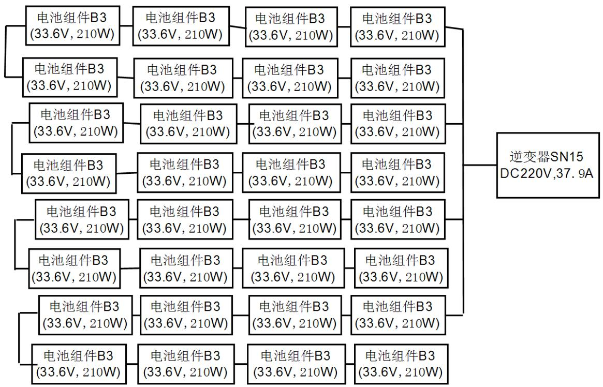

<details>
<summary>flowchart</summary>

This image displays a hierarchical classification tree for an electrical component (likely a DC220V,37.9A) based on battery module configurations and power ratings.
</details>

屋顶电池组件铺设分组阵列图

<table><tr><td>A3(1580×808)</td><td>A3(1580×808)</td><td>A3(1580×808)</td></tr><tr><td>A3(1580×808)</td><td>A3(1580×808)</td><td>A3(1580×808)</td></tr><tr><td>A3(1580×808)</td><td>A3(1580×808)</td><td>A3(1580×808)</td></tr><tr><td>A3(1580×808)</td><td>A3(2000×808)</td><td>A3(1580×808)</td></tr><tr><td>A3(1580×808)</td><td>A3(1580×808)</td><td>A3(1580×808)</td></tr><tr><td>A3(1580×808)</td><td>A3(1580×808)</td><td>A3(1580×80B)</td></tr><tr><td>A3(1580×808)</td><td rowspan="2">大鼠</td><td>A3(1580×808)</td></tr><tr><td>A3(1580×808)</td><td>A3(1580×808)</td></tr><tr><td>A3(1580×808)</td><td>A3(1580×808)</td><td>A3(1580×808)</td></tr><tr><td>A3(1580×808)</td><td>A3(1580×808)</td><td>A3(1580×808)</td></tr><tr><td>A4(1580×808)</td><td>A3(1580×808)</td><td>A3(1580×808)</td></tr><tr><td>A3(1580×808)</td><td>A3(1580×808)</td><td>A3(1580×808)</td></tr><tr><td>A3(1580×808)</td><td>A3(158O×808)</td><td>A3(1580×808)</td></tr></table>

屋顶电池组件分组连接方式示意图  
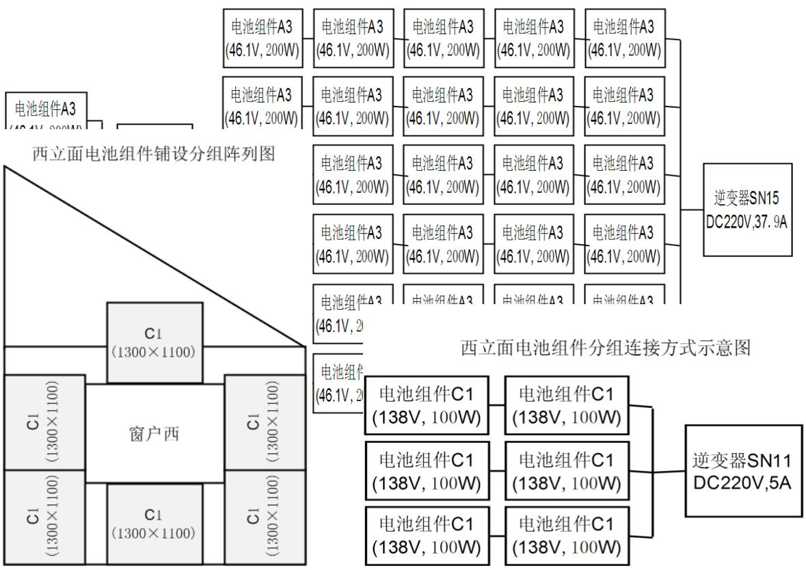

<details>
<summary>flowchart</summary>

This image displays a two-stage layout diagram for a solar cell assembly system, showing the distribution of battery components (A3 and C1) across different sections (Window West and Window West), connected via an AC/DC module, and finally to the final connection method.
</details>