# 2012 高教社杯全国大学生数学建模竞赛

# 编号专用页

赛区评阅编号（由赛区组委会评阅前进行编号）：

赛区评阅记录（可供赛区评阅时使用）：

<table><tr><td>评阅人</td><td></td><td></td><td></td><td></td><td></td><td></td><td></td><td></td><td></td><td></td></tr><tr><td>评分</td><td></td><td></td><td></td><td></td><td></td><td></td><td></td><td></td><td></td><td></td></tr><tr><td>备注</td><td></td><td></td><td></td><td></td><td></td><td></td><td></td><td></td><td></td><td></td></tr></table>

全国统一编号（由赛区组委会送交全国前编号）：

全国评阅编号（由全国组委会评阅前进行编号）：

# 太阳能小屋的设计

## 摘要

本文对太阳能小屋的光伏电池铺设问题进行了分析, 给出合理假设, 建立优化模型, 解决了题目所提出的问题。

针对问题一，首先建立斜面上太阳辐射量的计算模型，选择光伏电池时，利用单位性价比，选出 B3 类型的多晶硅电池，对南面屋顶进行贴附式铺设。利用 auto CAD 软件作出铺设图(见图 5 所示)。然后，通过对逆变器的综合评比，选出合适的逆变器 SM14，并画出 $6W_{1} \times 3$ 分组阵列图。同理，选取 C1 类型的薄膜电池对靠北面的屋顶进行铺设并作出分组阵列图及组件连接方式。通过运用 Matlab 软件编程，计算出 C 类电池每个型号每块铺设 4 个墙面的 35 年的总利润，并和成本比较得到四周墙面都不适合铺设光伏电池。所以本文不考虑铺设四周的墙面，最后计算得出投资的回收年限为 26.3226 年，35 年发电 $435620 kw \cdot h$ ，效益为 47086 元。

针对问题二，采用架空式铺设光伏电池并重新考虑问题一。首先运用网格搜索法，计算得出最优的倾斜角38.1°，根据大同地区赤纬角以及太阳高度角计算出两电池板之间的水平间隔距离，可以用auto CAD软件画出铺设图，选择合适的逆变器，通过优化计算，给出电池组件分组阵列图及组件连接方式，最后计算得出投资的回收年限为23.927年，35年发电652470kw·h，效益为80046元。

针对问题三，首先详细分析了小屋设计要求，建立了规划模型。利用 Matlab 软件编程得到适合的长和宽，并画出小屋的设计图和光伏电池铺设示意图。给出电池组件分组阵列图及组件连接方式，最后计算得出投资的回收年限为 23.0525 年，35 年总的发电量为 699960 kw·h，效益为 108360 元。

最后对结果进行分析，结果较好的符合要求，并对模型进行评价推广以及需要改进的地方。

关键词：最佳倾斜角 分组阵列 光伏电池 atuo CAD软件 赤纬角

## 一、问题的重述

## 1.1 问题的背景及要求

在设计太阳能小屋时，需在建筑物外表面（屋顶及外墙）铺设光伏电池，光伏电池组件所产生的直流电需要经过逆变器转换成220V交流电才能供家庭使用，并将剩余电量输入电网。不同种类的光伏电池每峰瓦的价格差别很大，且每峰瓦的实际发电效率或发电量还受诸多因素的影响，如太阳辐射强度、光线入射角、环境、建筑物所处的地理纬度、地区的气候与气象条件、安装部位及方式（贴附或架空）等。因此，在太阳能小屋的设计中，研究光伏电池在小屋外表面的优化铺设是很重要的问题。

附件 1-7 提供了相关信息。请参考附件提供的数据，对下列三个问题，分别给出小屋外表面光伏电池的铺设方案，使小屋的全年太阳能光伏发电总量尽可能大，而单位发电量的费用尽可能小，并计算出小屋光伏电池 35 年寿命期内的发电总量、经济效益（当前民用电价按 0.5 元/kWh 计算）及投资的回收年限。

在求解每个问题时，都要求配有图示，给出小屋各外表面电池组件铺设分组阵列图形及组件连接方式（串、并联）示意图，也要给出电池组件分组阵列容量及选配逆变器规格列表。

在同一表面采用两种或两种以上类型的光伏电池组件时，同一型号的电池板可串联，而不同型号的电池板不可串联。在不同表面上，即使是相同型号的电池也不能进行串、并联连接。应注意分组连接方式及逆变器的选配。

## 1.2 问题的提出

问题 1：请根据山西省大同市的气象数据，仅考虑贴附安装方式，选定光伏电池组件，对小屋（见附件 2）的部分外表面进行铺设，并根据电池组件分组数量和容量，选配相应的逆变器的容量和数量。

问题 2：电池板的朝向与倾角均会影响到光伏电池的工作效率，请选择架空方式安装光伏电池，重新考虑问题 1。

问题 3：根据附件 7 给出的小屋建筑要求，请为大同市重新设计一个小屋，要求画出小屋的外形图，并对所设计小屋的外表面优化铺设光伏电池，给出铺设及分组连接方式，选配逆变器，计算相应结果。

## 二、问题的分析

本题首先需要考虑太阳辐射强度，这直接影响光伏电池板发电的强弱。而这其中：水平面总辐射强度=水平面直射辐射强度+水平面散射辐射强度。

法向直射辐射强度：这个与水平面辐射强度无关，表示垂直于辐射方向的平面上接收到的直射辐射。也包括到达该平面的所有方向的直射辐射。

东向总辐射强度：朝向正东方向的平面上，单位面积上接收到的辐射功率，包括直射和散射。

法向直射辐射强度：正对太阳的平面上，单位面积上接收到的直射辐射功率。

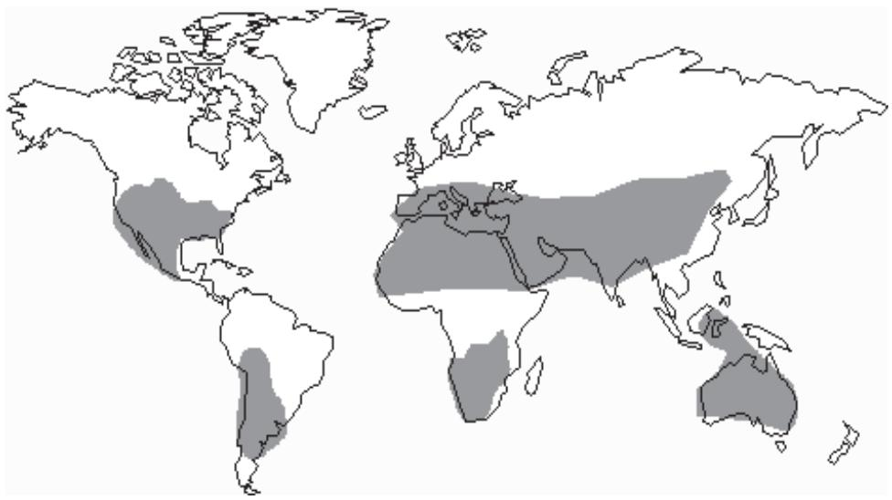

<details>
<summary>geo</summary>

| Region | Status |
| --- | --- |
| North America | Highlighted |
| South America | Highlighted |
| Europe | Highlighted |
| Africa | Highlighted |
| Asia | Highlighted |
| Australia | Highlighted |
| Middle East | Highlighted |
| Central Asia | Highlighted |
| Southeast Asia | Highlighted |
| South America (West) | Highlighted |
| South America (East) | Highlighted |
| South America (Central) | Highlighted |
| South America (South) | Highlighted |
| South America (North) | Highlighted |
| South America (South) | Highlighted |
| South America (East) | Highlighted |
| South America (West) | Highlighted |
| South America (Central) | Highlighted |
| South America (South) | Highlighted |
| South America (North) | Highlighted |
| South America (South) | Highlighted |
| South America (East) | Highlighted |
| South America (West) | Highlighted |
| South America (Central) | Highlighted |
| South America (South) | Highlighted |
| South America (East) | Highlighted |
| South America (West) | Highlighted |
| South America (Central) | Highlighted |
| South America (South) | Highlighted |
| South America (East) | Highlighted |
| South America (West) | Highlighted |
| South America (Central) | Highlighted |
| South America (South) | Highlighted |
| South America (North) | Highlighted |
| South America (South) | Highlighted |
| South America (East) | Highlighted |
| South America (West) | Highlighted |
| South America (East) | Highlighted |
| South America (Central) | Highlighted |
| South America (South) | Highlighted |
| South America (East) | Highlighted |
| South America (West) | Highlighted |
| South America (Central) | Highlighted |
| South America (South) | Highlighted |
| South America (North) | Highlighted |
| South America (South) | Highlighted |
| South America (East) | Highlighted |
| South America (Central) | Highlighted |
| South America (South) | Highlighted |
| South America (East) | Highlighted |
| South America (West) | Highlighted |
| South America (Central) | Highlighted |
| South America (South) | Highlighted |
| South America (East) | Highlighted |
| South America (West) | Highlighted |
| South America (Central) | Highlighted |
| South America (East) | Highlighted |
| South America (West) | Highlighted |
| South America (Central) | Highlighted |
| South America (South) | Highlighted |
| South America (East) | Highlighted |
| South America (West) | Highlighted |
| South America (Central) | Highlighted |
| South America (South) | Highlighted |
| South America (East) | Highlighted |
| South America (Central) | Highlighted |
| South America (South) | Highlighted |
| South America (East) | Highlighted |
| South America (West) | Highlighted |
| South America (Central) | Highlighted |
| South America (South) | Highlighted |
| South America (East) | Highlighted |
| South America (Central) | Highlighted |
| South America (West) | Highlighted |
| South America (Central) | Highlighted |
| South America (South) | Highlighted |
| South America (East) | Highlighted |
| South America (West) | Highlighted |
| South America (Central) | Highlighted |
| South America (South) | Highlighted |
| South America (East) | Highlighted |
| South America (West) | Highlighted |
| South America (East) | Highlighted |
| South America (Central) | Highlighted |
| South America (South) | Highlighted |
| South America (East) | Highlighted |
| South America (West) | Highlighted |
| South America (Central) | Highlighted |
| South America (East) | Highlighted |
| South America (West) | Highlighted |
| South America (Central) | Highlighted |
| South America (South) | Highlighted |
| South America (West) | Highlighted |
| South America (Central) | Highlighted |
| South America (East) | Highlighted |
| South America (West) | Highlighted |
| South America (Central) | Highlighted |
| South America (East) | Highlighted |
| South America (West) | Highlighted |
| South America (Central) | Highlighted |
| South America (South) | Highlighted |
| South America (East) | Highlighted |
| South America (West) | Highlighted |
| South America (East) | Highlighted |
| South America (Central) | Highlighted |
| South America (South) | Highlighted |
| South America (West) | Highlighted |
| South America (Central) | Highlighted |
| South America (East) | Highlighted |
| South America (West) | Highlighted |
| South America (Central) | Highlighted |
| South America (South) | Highlighted |
| South America (East) | Highlighted |
| South America (West) | Highlighted |
| South America (Central) | Highlighted |
| South America (East) | Highlighted |
| South America (West) | Highlighted |
| South America (East) | Highlighted |
| South America (Central) | Highlighted |
| South America (South) | Highlighted |
| South America (East) | Highlighted |
| South America (West) | Highlighted |
| South America (Central) | Highlighted |
| South America (East) | Highlighted |
| South America (South) | Highlighted |
| South America (East) | Highlighted |
| South America (West) | Highlighted |
| South America (Central) | Highlighted |
| South America (East) | Highlighted |
| South America (West) | Highlighted |
| South America (Central) | Highlighted |
| South America (East) | Highlighted |
| South America (West) | Highlighted |
| South America (Central) | Highlighted |
| South America (South) | Highlighted |
| South America (West) | Highlighted |
| South America (Central) | Highlighted |
| South America (South) | Highlighted |
| South America (East) | Highlighted |
| South America (West) | Highlighted |
| South America (Central) | Highlighted |
| South America (East) | Highlighted |
| South America (West) | Highlighted |
| South America (Central) | Highlighted |
| South America (East) | Highlighted |
| South America (West) | Highlighted |
</details>

图 1 全球太阳能充裕范围图

注释：太阳辐射主要与所处经纬度及气候类型相关，由图可以直观看出，本题所给出的山西省大同市位于全球太阳能充裕区范围内。

小屋顶面有一定的夹角, 没有这个角度的数据, 因此首先要计算斜面上的总的辐射, 再求太阳的总辐射量时需要考虑的问题有:

(1). 电池板的安装和铺设，考虑到墙面和屋顶有些地方不能安装电池板，于是采用分割法。对屋顶和墙面进行合理的分区。划分得到的区域相对比较规则，对每一个区域来说经过安装完最大电池板后，所剩余的面积不多。将所有区域都安装好了电池板后，再对电池板进行简单的调整，尽可能使得区域之间的交界处空余出一块电池组件的面积，此时得到的电池组件数量便达到最大。  
(2). 不同面所需要的数据是不同的，比如南面只考虑南向总辐射强度，其中南向总辐射强度就包含了直射和散射两种(阴雨天气除外)。而法向直射辐射强度则表示一天中最大的辐射强度，一般不进行计算，除了是跟随着太阳转的智能电池板才采用这组数据，  
(3). 对于太阳能电池的面积，可以采用非线性优化模型来进行求解。需要满足的约束条件有面积尽可能的不超过屋顶和墙面的面积，还有就是多个光伏组件串联后可以再进行并联，并联的光伏组件端电压相差不应超过 10%。同一分组阵列中的组件在安装时，应尽可能保证具有相同的太阳辐射条件（朝向、倾角等）。

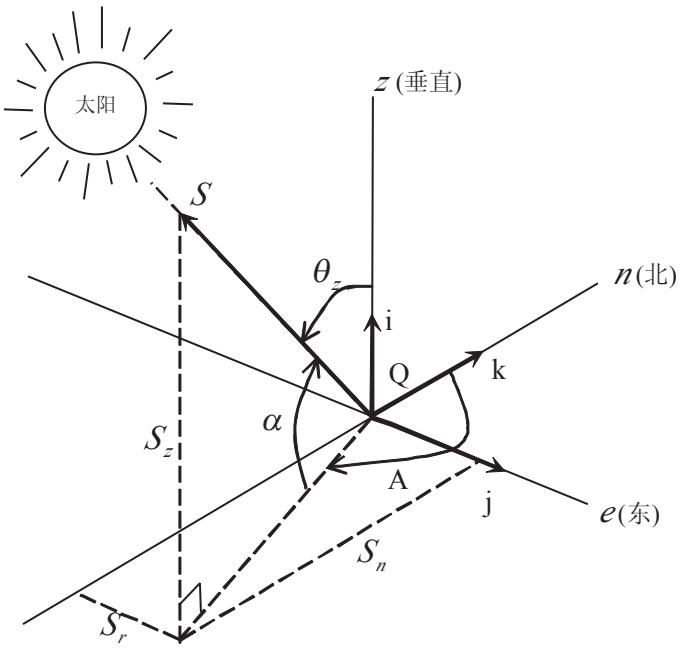

<details>
<summary>text_image</summary>

太阳
S
θz
i
Q
k
n(北)
α
A
j
e(东)
Sz
Sn
Sr
z(垂直)
</details>

图 2 太阳辐射示意图

其次，对于屋顶及墙面电池组件的选择问题，我们主要考虑在一面上安装同一种电池组件，在阳光充足的面，比如屋顶，可以在A单晶硅电池中任意选取一个型号的组件进行计算，再在B多晶硅电池中任意选取一个型号进行计算，比较A和B的优劣，在较优的型号类别中再进行计算。考虑到铺设的安全、实用及美观，电池板不超出墙面及屋顶所规定的面积。铺设安排的方法为：墙面及屋顶所规定的可用面积除以一块电池组件的面积，会得到一个电池组件数，取整数。然后人工安排电池组件，如果不能安排完，就在电池组件数上减一，最后达到铺设的最优化。

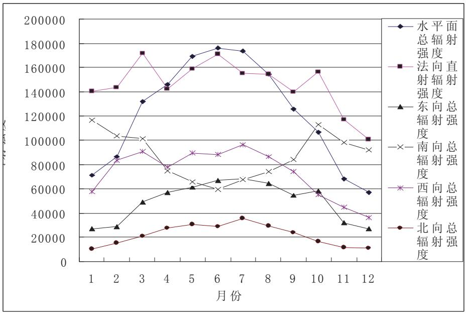

<details>
<summary>line</summary>

| 月份 | 水平面总辐射强度 | 法向直射强度 | 东向总辐射强度 | 南向总辐射强度 | 西向总辐射强度 | 北向总辐射强度 |
| --- | --- | --- | --- | --- | --- | --- |
| 1 | ~72000 | ~142000 | ~28000 | ~117000 | ~59000 | ~12000 |
| 2 | ~88000 | ~145000 | ~30000 | ~104000 | ~85000 | ~17000 |
| 3 | ~133000 | ~173000 | ~50000 | ~102000 | ~92000 | ~22000 |
| 4 | ~147000 | ~144000 | ~57000 | ~76000 | ~80000 | ~29000 |
| 5 | ~170000 | ~160000 | ~62000 | ~66000 | ~91000 | ~32000 |
| 6 | ~178000 | ~173000 | ~68000 | ~61000 | ~89000 | ~31000 |
| 7 | ~175000 | ~156000 | ~69000 | ~69000 | ~97000 | ~37000 |
| 8 | ~155000 | ~155000 | ~65000 | ~75000 | ~88000 | ~31000 |
| 9 | ~127000 | ~142000 | ~55000 | ~85000 | ~75000 | ~25000 |
| 10 | ~108000 | ~157000 | ~59000 | ~114000 | ~57000 | ~18000 |
| 11 | ~69000 | ~118000 | ~33000 | ~99000 | ~46000 | ~13000 |
| 12 | ~58000 | ~102000 | ~28000 | ~93000 | ~37000 | ~12500 |
</details>

图 3 小屋各平面辐射强度分布图

从图中可以看出，北面每月总的辐射强度相对较低，全年总量也相对较低。因此从效率和成本以及时间等方面的考虑，对于全年辐射总量小的方向，不考虑铺设电池组件。即使铺设后可以收回成本，且铺设成本价格也不高，但是利润很低，且回收时间长。为了简化计算，只对屋顶朝南的面和东西南三面铺设电池组件。

针对问题一，要求根据山西省大同市的气象数据，仅考虑贴附安装方式，选定光伏电池组件，对小屋的部分外表面进行铺设，小屋分为屋顶和四周，分开来计算，先算靠南面的屋顶，接着计算靠背面的屋顶，最后计算四周墙面的铺设情况，并根据电池组件分组数量和容量，选配相应的逆变器的容量和数量。选择最优的光伏电池板与逆变器进行优化组合变得至关重要。

针对问题二，由于电池板的朝向与倾角均会影响到光伏电池的工作效率，要求选择架空方式安装光伏电池，再重新考虑问题1。

并网光伏发电系统中，最佳倾角是指能获得全年最大光辐射量的组件倾角。通过调整组件的放置支架得到光伏组件支架有可变倾角和固定倾角2种形式，可变倾角适用于大型光伏发电系统；固定倾角支架相对较为简单，一般按能获得全年最大辐射量的组件放置角度来制作。该小屋设计规模较小，主要用于光伏发电系统的研究与验证。故文中采用固定倾角方式的支架。首先，确定光伏阵列的最佳倾角。然后，再进行后续计算。

针对问题三，根据附件7给出的小屋建筑要求，要求为大同市重新设计一个小屋，要求画出小屋的外形图，并对所设计小屋的外表面优化铺设光伏电池，给出铺设及分组连接方式，选配逆变器，最后计算相应结果。所以，如何设计一座发挥最大面积进行屋顶采光的小屋便成为了问题的关键。小屋的常规数据及约束条件的说明(见表1)。

表 1 小屋设计相关符合的说明

<table><tr><td>序号</td><td>名称</td><td>符号</td><td>约束条件</td></tr><tr><td>1</td><td>长</td><td>a</td><td> $a \leq 15$ </td></tr><tr><td>2</td><td>宽</td><td>b</td><td> $b \geq 3$ </td></tr><tr><td>3</td><td>地面面积</td><td> $S_{\text{地}} = a \times b$ </td><td></td></tr><tr><td>4</td><td>房屋最高点</td><td>H</td><td> $H \leq 5.4$ </td></tr><tr><td>5</td><td>最低净室高</td><td>h</td><td> $h \geq 2.8$ </td></tr><tr><td>6</td><td>南开窗面积</td><td> $S_s$ </td><td></td></tr><tr><td>7</td><td>北开窗面积</td><td> $S_n$ </td><td></td></tr><tr><td>8</td><td>东开窗面积</td><td> $S_e$ </td><td></td></tr><tr><td>9</td><td>西开窗面积</td><td> $S_w$ </td><td></td></tr><tr><td>10</td><td>南墙面积</td><td> $S'_s = a \times h^*$ </td><td> $\frac{S_s}{S'_s} \leq 0.5$ </td></tr><tr><td>11</td><td>北墙面积</td><td> $S'_n = a \times h^*$ </td><td> $\frac{S_n}{S'_n} \leq 0.3$ </td></tr><tr><td>12</td><td>东墙面积</td><td> $S'_e = b \times h^*$ </td><td> $\frac{S_e}{S'_e} \leq 0.35$ </td></tr><tr><td>13</td><td>西墙面积</td><td> $S'_w = b \times h^*$ </td><td> $\frac{S'_w}{S'_w} \leq 0.35$ </td></tr></table>

因为屋顶倾斜角度大小，必须先在满足最佳斜面倾斜角的前提下，再考虑最低净室高，从而尽可能的使底面积最大，要使得安装电池组件的面积最大，即窗子全部取最小的情况。所以，需要满足：

$$
5. 4 - \tan \beta \times b \geq 2. 8, \text {其中} \beta = \phi \pm (5 ^ {\circ} \sim 1 0 ^ {\circ})
$$

在已经确定最佳倾斜角度为 38.1 度的情况下，可以综合四个面考虑，尽可能使发电量多的面面积最大。

## 三、模型的假设

1. 假设所给数据真实可靠;  
2. 假设每年都以 365 天计算;  
3. 假设单个平面只用一种光伏电池进行铺设;  
4. 假设某一时刻的辐射强度为一小时内的平均辐射强度；  
5. 假设本题所给出的附件 4 的气象数据可以看作是未来 35 年的平均水平;  
6. 假设逆变器安装在室内不占用外表面空间，且不会出现老化停运现象；  
7. 假设在实际发电量计算时可以不考虑 $AM$ 值的影响, 只与电池表面接收到的太阳总辐射量的参数有关;  
8. 假设本文投资金额只与选用的光伏电池和逆变器有关，不考虑铺设安装及线路连接等相关工艺所花销的人工费用。

## 四、问题一

## 4.1 倾斜面上太阳辐射量的计算模型 $^{[2]}$

## 4.1.1 模型的建立：

计算光伏系统的发电量时，需要用到太阳辐射量和温度等气象数据。所给的数据是水平面上的辐射量，而光伏方阵往往是有一定倾角的，因此要把所记录的数据转换为倾斜面上的相应值。水平面(地表面)和倾斜面(阵列面)上获得的辐射量均符合光的直射散射分离原理(即：总辐射=直接辐射+散射辐射)。不同之处在于光伏阵列面上获得的辐射还包括了地面的反射辐射，而地表自身就没有。假设散射辐射和地面的反射辐射都是各向同性的，那么光伏阵列面上获得的散射辐射和天空状况有关，而其获得的反射辐射与地表状况有关。由上所述有：

$$
Q _ {P} = S _ {P} + D _ {P} \tag {1.1}
$$

其中， $Q_{P}$ ：为水平面接收到的总辐射， $MJ/m^{2}$ ； $S_{P}$ ：为水平面接收到的直接辐射， $MJ/m^{2}$ ； $D_{P}$ ：为水平面接收到的散射辐射， $MJ/m^{2}$ 。

倾斜面接收到的辐射，一般采用 Klient 和 Theilacher 提出的倾斜面辐射量计算模型：

$$
Q _ {T} = S _ {T} + D _ {T} + R _ {T} \tag {1.2}
$$

其中， $Q_{T}$ ：为倾斜面接收到的总辐射， $MJ/m^{2}$ ； $S_{T}$ ：为倾斜面接收到的直接辐射， $MJ/m^{2}$ ； $D_{T}$ ：为倾斜面接收到的散射辐射， $MJ/m^{2}$ ； $R_{T}$ ：为倾斜面接收到的反射辐射， $MJ/m^{2}$ 。

由式(1.1)(1.2)可知，只要知道水平面接收到的总辐射 $Q_{P}$ ，以及水平面接收到的直接辐射 $S_{P}$ ，就可以求出倾斜面接收到的直接辐射 $S_{T}$ 、散射辐射 $D_{T}$ 、反射辐射 $R_{T}$ 。然后，通过式(1.2)求出倾斜面接收到的总辐射 $Q_{T}$ 。下面是 $S_{T}$ 、 $D_{T}$ 和 $R_{T}$ 的求解方程。

## 4.1.2 倾斜面接收到的直接辐射

倾斜面接收到的直接辐射 $S_{T}$ 可以利用水平面接收到的直接辐射 $S_{P}$ 求出，有

$$
S _ {T} = R _ {B} S _ {P} \tag {1.3}
$$

其中， $R_{B}$ 为倾斜面上的直接辐射量与水平面上直接辐射量之比，其表达式如下：

$$
R _ {B} = \frac {\cos (\varphi - \beta) \cos \delta \sin \omega_ {T} + \frac {\pi}{1 8 0} \omega_ {T} \sin (\varphi - \beta) \sin \delta}{\cos \varphi \cos \delta \sin \omega_ {P} + \frac {\pi}{1 8 0} \omega_ {P} \sin \varphi \sin \delta} \tag {1.4}
$$

式中， $\varphi$ 是当地纬度； $\beta$ 是光伏阵列的倾角； $\delta$ 为太阳赤纬角； $\omega_{P}$ 为水平面日落时角； $\omega_{T}$ 为倾斜面日落时角。

$\delta$ 、 $\omega_{P}$ 和 $\omega_{T}$ 的具体表达式为:

$$
\delta = 2 3. 4 5 \sin \left[ \frac {2 \pi}{3 6 5} (2 8 4 + n) \right] \tag {1.5}
$$

其中，n 为一年中第几天。如在春分，n=81，则 $\delta=0$ 。从春分开始的第 d 天的太阳赤纬角为

$$
\delta = 2 3. 4 5 \sin \left[ \frac {2 \pi d}{3 6 5} \right] \tag {1.6}
$$

$$
\omega_ {P} = \arccos (- \tan \varphi \tan \delta) \tag {1.7}
$$

$$
\omega_ {T} = \min \{\omega_ {P}, \arccos (- \tan \varphi \tan \delta) \} \tag {1.8}
$$

## 4.1.3 倾斜面接收到的散射辐射

目前采用较多的是 Hay 的天空散射各向异性模型:

$$
D _ {T} = (Q _ {P} - S _ {P}) [ \frac {S _ {T}}{O _ {P}} + \frac {1}{2} (1 - \frac {S _ {P}}{O _ {P}}) (1 + \cos \beta) ] \tag {1.9}
$$

其中， $Q_{p}$ 是大气层外水平面上的太阳辐射量， $MJ/m^{2}$ ;

$$
O _ {P} = \frac {2 4}{\pi} I _ {S C} [ 1 + 0. 0 3 3 \cos (\frac {3 6 0 n}{3 6 5}) ] \times [ \cos \varphi \cos \delta \sin \omega_ {P} + \frac {2 \pi \omega_ {P}}{3 6 0} \sin \varphi \sin \delta ] \tag {1.10}
$$

式中， $I_{SC}$ 为太阳常数，一般取 $I_{SC}=1367W/m^{2}$ 。

由于 $O_{P}$ 计算繁琐，不易获取，为了简化计算模型，本文假定散射辐射和反射辐射都是各向同性的，此时：

$$
D _ {T} = \frac {1}{2} (Q _ {P} - S _ {P}) (1 + \cos \beta) \tag {1.11}
$$

这样就可以计算出 $D_{T}$ 来。

## 4.1.4 倾斜面接收到的反射辐射

地面的反射辐射为各向同性时:

$$
R _ {T} = \frac {1}{2} \rho_ {R} Q _ {P} (1 - \cos \beta) \tag {1.12}
$$

其中， $\rho_{R}$ 为地表反射率；不同地面的反射率不同，本文选用反射率为 25% 进行计算。因此，求倾斜面上太阳辐射量的公式可改为：

$$
Q _ {T} = R _ {B} S _ {P} + \frac {1}{2} (Q _ {P} - S _ {P}) (1 + \cos \beta) + \frac {1}{2} \rho_ {R} Q _ {P} (1 - \cos \beta) \tag {1.13}
$$

根据公式(2.13)，可以将任意水平面上的太阳辐射数据转化成斜面上太阳辐射数据，基本的计算步骤如下。

1）确定所需倾角 $\beta$ 和系统所在地的纬度 $\varphi$ ;  
2）找到水平面上的月平均太阳能辐射资料；  
3）确定一天的水平面上日落时间角 $\omega_{T}$ 和倾斜面上的日落时间角 $\omega_{P}$ ;  
4）计算每天倾斜面与水平面上直接辐射量之比 $R_{B}$ ;  
5）计算每天每小时直接太阳辐射量 $S_{T}$ ;  
6）计算每天每小时天空散射辐射量 $D_{T}$ ;  
7）确定地表反射率 $\rho_{R}$ ，计算地面反射辐射量 $R_{T}$ ;  
8）3种辐射量相加得到倾斜面上全年太阳辐射总量 $Q_{T}$ 。

由于整个计算过程比较复杂，故通过 matlab7.0 编写程序来实现。

## 4.2 光伏电池的选用

首先考虑对于同一平面采用同一型号的电池，要使得小屋全年太阳能光伏电池发电量尽可能大，而单位发电量的费用尽可能小，这是一个双目标规划问题。也就是，使每平米的光伏电池的转化率尽可能大，而所花销的费用尽可能小。为了便于计算，引入光伏电池每平方米的性价比这一概念(即:性价比=转换率/每平米电池的价格)。将双目标规划转为但目标问题，性价比越高说明该电池越优。

表 2 电池类型及相应的性价比值

<table><tr><td>电池类型</td><td>A1</td><td>A2</td><td>A3</td><td>A4</td><td>A5</td><td>A6</td><td></td><td></td><td></td><td></td><td></td></tr><tr><td>性价比</td><td>0.0541</td><td>0.0517</td><td>0.0632</td><td>0.0535</td><td>0.0508</td><td>0.0495</td><td></td><td></td><td></td><td></td><td></td></tr><tr><td>电池类型</td><td>B1</td><td>B2</td><td>B3</td><td>B4</td><td>B5</td><td>B6</td><td>B7</td><td></td><td></td><td></td><td></td></tr><tr><td>性价比</td><td>0.0621</td><td>0.0622</td><td>0.0671</td><td>0.0617</td><td>0.0665</td><td>0.061</td><td>0.0604</td><td></td><td></td><td></td><td></td></tr><tr><td>电池类型</td><td>C1</td><td>C2</td><td>C3</td><td>C4</td><td>C5</td><td>C6</td><td>C7</td><td>C8</td><td>C9</td><td>C10</td><td>C11</td></tr><tr><td>性价比</td><td>0.1237</td><td>0.1258</td><td>0.1276</td><td>0.1289</td><td>0.127</td><td>0.0891</td><td>0.0949</td><td>0.0891</td><td>0.0888</td><td>0.104</td><td>0.1083</td></tr></table>

$$
\left\{ \begin{array}{l} \text {Max: 总发电量} \\ \text {Min: 总费用} \end{array} \Rightarrow \left\{ \begin{array}{l} \text {Max: 转化率} \\ \text {Min: 每平米电池的费用} \end{array} \Rightarrow \text {Max: } \frac {\text {转化率}}{\text {每平米电池的价格}} \right. \right.
$$

针对屋顶阳光充足，所以要求转换的太阳能越多越好。经过比较 $A$ （单晶体电池）、 $B$ （多晶体电池）、 $C$ （薄膜电池）三种型号电池，我们根据实际实践和理论论证选取A或 $B$ 中的一种铺设靠光照强度的面，因为 $C$ 的转换率较 $A$ 和 $B$ 而言，它转化率低得多，对于屋顶的光伏电池的铺设我们就从 $A$ 、 $B$ 类电池中选取，通过Matlab7.0编程计算性价比，（如上一页的表2所示)得出各类电池的性价比。在辐射强度大的时候， $B3$ 的性价比最高，（程序见附件(c1-1)）为了计算方便每个平面只是选用一种光伏电池进行铺设，所以，本文选用 $B3$ 多晶体硅电池进行铺设。当光照强度弱的时候，如四周的墙面，靠北面的屋顶综合考虑选用C1薄膜电池。

## 4.3 南面屋顶的铺设及逆变器的选用 $^{[3]}$

结合实际情况。南面屋顶光照比较强，考虑性价比，选用选定多晶硅电池 B3，进行铺设，屋顶有一个水槽不能铺设，于是采用分割法。对屋顶和墙面进行合理的分区。划分得到的区域相对比较规则，对每一个区域来说经过安装完最大电池板后，所剩余的面积不多。将所有区域都安装好了电池板后，再对电池板进行简单的调整，尽可能使得区域之间的交界处空余出一块电池组件的面积，此时得到的电池组件数量便达到最大；

排列电池时，铺设原则：电池组件不可分割，门窗不铺设电池组件，电池组件铺设时不超出墙的边界。

为了简化计算，一面墙上尽可能只铺设一种电池组件，最多采用两种电池组件进行铺设。

铺设方法：采用分割法，将墙面尽可能大的矩形区域分割出来，直到划分完所有面积。对每个矩形区域采用“一刀切”约束进行求解。对得到的结果进行调整，使得边界之间的面积尽可能的大，尽可能再增加一块电池组件。此时得到的结果基本上是最优解

“一刀切”是指在切割一个排样方案中的矩形件时,沿矩形件边的切割线可以将板材分割成2部分,称切割线是贯通的。

排样方案中的 “一刀切” 约束有以下 2 种情况:

1）完全 “一刀切”。在排样方案中, 沿任一矩形件边的切割线都是贯通的, 这种情况如图 1（a）所示。将矩形件在板材上连续横排或连续纵排, 容易实现 “一刀切” 且切割效率最高, 但排样结果不一定是最优的, 特别是在多规格且同一种规格的矩形件数量比较少的情况下, 完全 “一刀切” 使板材的利用率不够高。

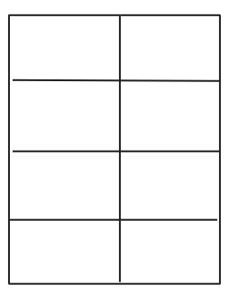

<details>
<summary>natural_image</summary>

Simple grid of six empty rectangular cells with no text or symbols
</details>

(a)完全“一刀切”

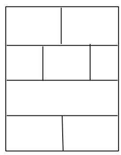

<details>
<summary>natural_image</summary>

Simple geometric diagram of a rectangular block divided into five equal parts (no text or symbols)
</details>

(b)准 “一刀切”

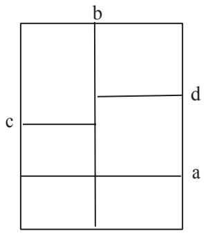

<details>
<summary>text_image</summary>

b
c
d
a
</details>

(c)准 “一刀切”  
图 4 “一刀切” 示意图

2）准 “一刀切”。在排样方案中至少有一条切割线是贯通的, 切割后形成的 2 块板材也分别至少有一条切割线是贯通的, 以保证可以将板材上的全部矩形件以贯通方式切割, 如图 1（b）、(c) 所示。 图 1(c) 中, 先沿 a 线切割后, 再沿 b 线即可 “一刀切”, 然后再分别沿 c 线和 d 线切割. 。这样就可以切割出所有矩形件。因此, 认为这样的排样方案也满足 “一刀切” 要求。

综上所述, 按准 “一刀切” 的要求排样, 可以最大限度地提高的利用率。因此, 算法设计主要考虑满足准 “一刀切” 的排样优化问题。

本文利用计算机辅助设计软件 auto CAD 精确的绘画出设计图，小屋顶面能够铺设 36 块光伏电池板，如图 5 所示：

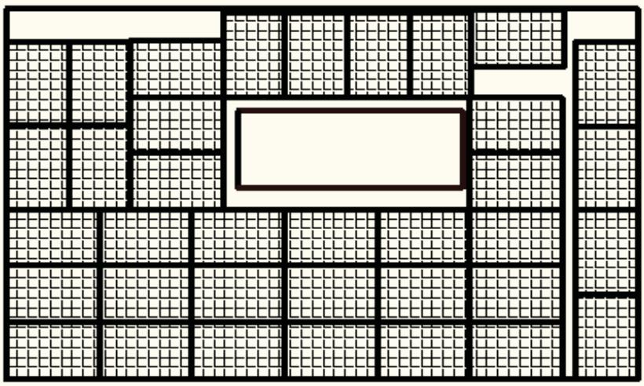

<details>
<summary>natural_image</summary>

Grid layout diagram with a central rectangular block surrounded by smaller squares and lines (no text or symbols)
</details>

图 5 多晶硅电池 B3 铺南面屋顶设示意图

当考虑只使用一个逆变器时，总功率： $210 \times 36 = 7560$ W。则只有 SN9、SN16、两种类型的逆变器的额定功率 8kw，满足大于等于总功率 7560 W 且最接近。两种逆变器的允许输入电压不同。

## 方案一：安装 SN9 逆变器

①最小串联数=逆变器最小输入电压/组件最高的电压(开路电压)= $\frac{99}{33.6}=2.94$  
即：最小的串联数为 3。  
②最大串联数=逆变器最大输入电压/组件最高的电压(开路电压)= $\frac{150}{33.6}=4.446$  
即：最大的串联数为 4。  
③最大的并联数=逆变器额定电流/组件最高的电流(短路电压)= $\frac{101}{8.33}=12.12$  
即：最大的并联数为 12。

只使用一个逆变器时每组串联 4 个，然后将 9 组进行并联时，该方案可行。
方案二：安装一个 SM16 逆变器

①最小串联数=逆变器最小输入电压/组件最高的电压（开路电压）= $\frac{180}{33.6}=5.36$  
即：最小的串联数为 6。  
②最大串联数=逆变器最大输入电压/组件最高的电压（开路电压）= $\frac{300}{33.6}=8.9286$  
即：最大的串联数为 8。

③最大的并联数=逆变器额定电流/组件最高的电流（短路电压）= $\frac{48.4}{8.33}=5.81$

即：最大的并联数为 5。

当并联时两边的电压差不小于 10%(即：要求每组串联的块数要相同)。此时不满足附件 1 中的限制条件——“多个光伏组件串联后可以再进行并联，并联的光伏组件端电压相差不应超过 10%”。所以该种方案应舍去。

当考虑使用两个逆变器时，则总功率： $210 \times 36 / 2 = 3780 \quad W$ 。则只有 SN6、SN8、SN14 三种类型的逆变器的额定功率 4kw，满足大于等于总功率 3780W 且最接近。

而三种逆变器的允许输入电压各不相同。

## 方案三：考虑安装两个 SN6 逆变器

①最小串联数=逆变器最小输入电压/组件最高的电压（开路电压）= $\frac{42}{33.6}=1.25$  
②最大串联数=逆变器最大输入电压/组件最高的电压（开路电压）= $\frac{64}{33.6}=1.9$

不满足输入电压范围的条件。(舍去)

## 方案四：安装两个 SN8 逆变器

①最小串联数=逆变器最小输入电压/组件最高的电压（开路电压）= $\frac{99}{33.6}=2.94$ 即：最小的串联数为3。  
②最大串联数=逆变器最大输入电压/组件最高的电压（开路电压）= $\frac{150}{33.6}=4.46$ 即：最大的串联数为4。  
③最大的并联数=逆变器额定电流/组件最高的电流（短路电压）= $\frac{54}{8.33}=6.12$ 即：最大的并联数为6。

综合得到，将 B3 电池板每组串联 3 个，然后将 6 组进行并联，再分别用两个逆变器进行连接，该方案可行。

## 方案五：安装两个 SM14 逆变器

①最小串联数=逆变器最小输入电压/组件最高的电压（开路电压）= $\frac{180}{33.6}=5.36$ 即：最小的串联数为6。  
②最大串联数=逆变器最大输入电压/组件最高的电压（开路电压）= $\frac{300}{33.6}=8.9286$ 即：最大的串联数为8。  
③最大的并联数=逆变器额定电流/组件最高的电流（短路电压）= $\frac{25.3}{8.33}=3.037$ 即：可以得到最大的并联数为3。

由上述可以得到，将 B3 电池板每组串联 6 个，然后将 3 组进行并联，用一个逆变器进行连接。同理可用一个逆变器进行相同的连接。下图给出一个逆变器的电池组件分组阵列图。（见图 6 所示）

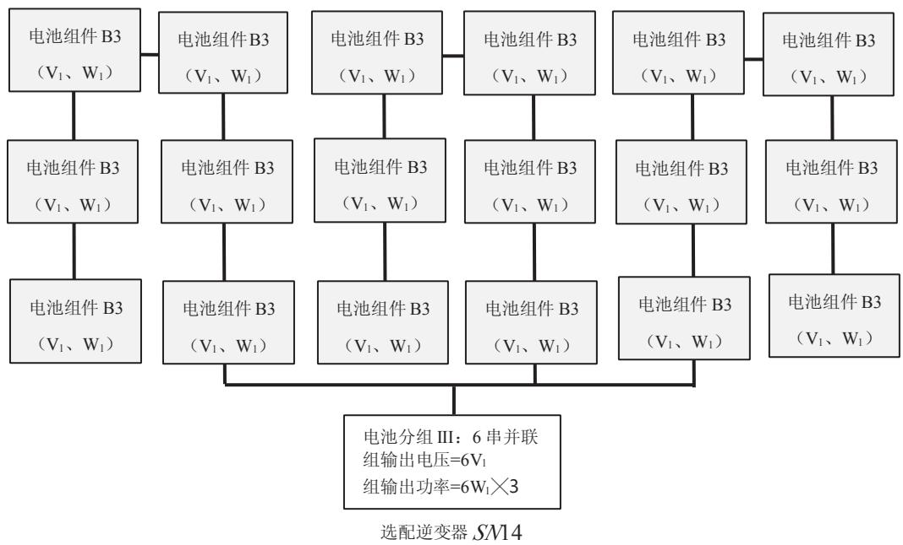

<details>
<summary>flowchart</summary>

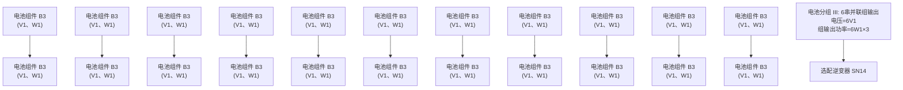
</details>

图 6 选配 SM14 逆变器形成的 $6W_{1} \times 3$ 分组阵列图

综合比较，以上各方案，SN8 和 SN14 比 SN9 价格和转换效率都要好，SN8 和 SN14 价格相同，且使用任何一个都能满足要求，最后，由于 SN14 的逆变效率要高于 SN8，故选用 SN14。

综上所述，在使用两个 SM14 逆变器时，每组串联 6 个，然后将 3 组进行并联，达到最终经济效益的最大。

## 4.4 北面屋顶的铺设及逆变器的选用

背面的屋顶，根据实际情况，此面的太阳辐射强度较弱，只能采用 C 薄膜电池进行铺设，综合考虑投资费用和经济回收效率，又考虑转换率和功率，采用 C1 进行铺设最合理。铺设 C1 我们同样使用计算机辅助设计软件 auto CAD 画出设计图，总共可以铺设 9 块电池板。(如图 7 所示)

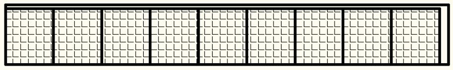

<details>
<summary>natural_image</summary>

Grid pattern with uniform squares and vertical lines, no text or symbols present
</details>

图 7 薄膜电池 C1 铺设北面屋顶示意图

北面屋顶逆变器的选择

采用 C1 时考虑逆变器，C1 的开路电流达到 138V，故逆变器只能在输入功率大于 138v 的逆变器中进行筛选。

综合考虑，此面只使用一个逆变器，则总功率： $100 \times 9 = 900$ W。

满足以上两个条件的，只有 SM12 逆变器最为合适。即：

①最小串联数=逆变器最小输入电压/组件最高的电压（开路电压）= $\frac{180}{99}=1.8182$  
即：最小的串联数为 2。

②最大串联数=逆变器最大输入电压/组件最高的电压（开路电压）= $\frac{300}{99}=3.003$

即：最大的串联数为 3。

③最大的并联数=逆变器额定电流/组件最高的电流（短路电压）= $\frac{10}{1.22}=8.1967$

即：最大的并联数为 8。

综合得到, 使用一个逆变器时每组串联 3 个, 然后将 3 组进行并联最优。(见图 8 所示)

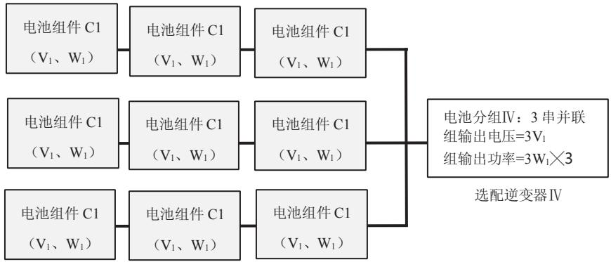

<details>
<summary>flowchart</summary>

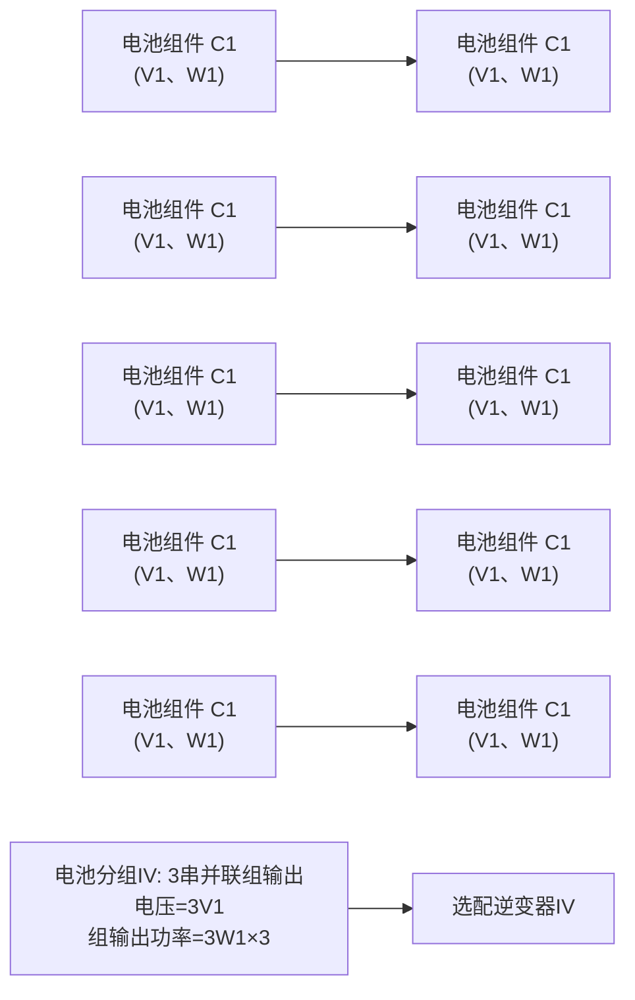
</details>

图 8 选配 SM12 逆变器形成的 $3W_{1} \times 3$ 分组阵列图

## 4.5 小屋四周太阳能电池板的铺设：

对于小屋四个外表面铺设，首先，四周只有太阳的散射强度，根据附件，可以知道总的辐射强度不大，所以考虑采用 C 类电池组件。

参照屋顶的计算方法，编写 MATLAB 程序进行计算(详见附录)；算法过程如下:

1、将东南西北四个方向总辐射的数据中辐射量小于 $30W / m^{2}$ 的数据变为0；  
2、把每一时刻的数据看为这个小时的平均值，对四个方位的数据全年的值求和，得到四面每平米一年的发电量；  
3、没有加入逆变效率和没有加入转换率时，把这一年的数据看为每年的平均值，计算四面每平米35年的理论发电量；  
4、计算四面每平米35年的总经济；  
5、计算 C 薄膜电池每块电池的价格；  
6、考虑转换率，但不加入逆变效率，计算 C 薄膜电池每块电池贴在四面 35 年的总经济；  
7、C类电池每块贴在四面35年的总利润；

根据 MATLAB 程序运行结果得到如下的表，见附件 (c1-2) 从表中看出每块的盈利很小，但是没有考虑逆变器。

表 3 各种 C 类电池每块安装在不同墙面 35 年的收益

<table><tr><td>电池类型</td><td>东面墙</td><td>西面墙</td><td>南面墙</td><td>北面墙</td></tr><tr><td>C1</td><td>102.8899</td><td>834.5242</td><td>565.9434</td><td>-425.2825</td></tr><tr><td>C2</td><td>67.6454</td><td>491.8139</td><td>336.1029</td><td>-238.5651</td></tr><tr><td>C3</td><td>127.5572</td><td>859.6887</td><td>590.9254</td><td>-400.9743</td></tr><tr><td>C4</td><td>121.7463</td><td>780.032</td><td>538.3773</td><td>-353.4752</td></tr><tr><td>C5</td><td>123.7177</td><td>855.2714</td><td>586.7202</td><td>-404.3967</td></tr><tr><td>C6</td><td>-8.4469</td><td>20.7931</td><td>10.0592</td><td>-29.5555</td></tr><tr><td>C7</td><td>-5.7118</td><td>23.7009</td><td>12.9036</td><td>-26.9451</td></tr><tr><td>C8</td><td>-16.884</td><td>41.6038</td><td>20.1331</td><td>-59.1068</td></tr><tr><td>C9</td><td>-25.6221</td><td>61.8719</td><td>29.7531</td><td>-88.7847</td></tr><tr><td>C10</td><td>-6.0376</td><td>81.7458</td><td>49.5207</td><td>-69.4092</td></tr><tr><td>C11</td><td>-6.1862</td><td>359.8757</td><td>225.4955</td><td>-270.4492</td></tr></table>

从上表中可以看到：最大利润的是 C3 型号电池安装在西面墙上，C3 的各项参数为 U = 99V，I = 1.65A，P = 100W，尺寸大小为 $1414 \times 1100 \times 35$ 。

根据电压选择逆变器价格最低的为 SN7，价格为 10200 元，考虑上逆变效率要盈利则最小的电池块数为 $n=\frac{10200}{859.68*0.9}=13.1831$ 块；

西面墙的最大面积 $S=7.1*3.2+7.1*1.2/2=26.9800$ ;

理论铺设块数为 $n=\frac{26.9800}{1.414\times1.114}=17.1280$ 为 17 块

根据 auto CAD 软件画出铺设图如下图:

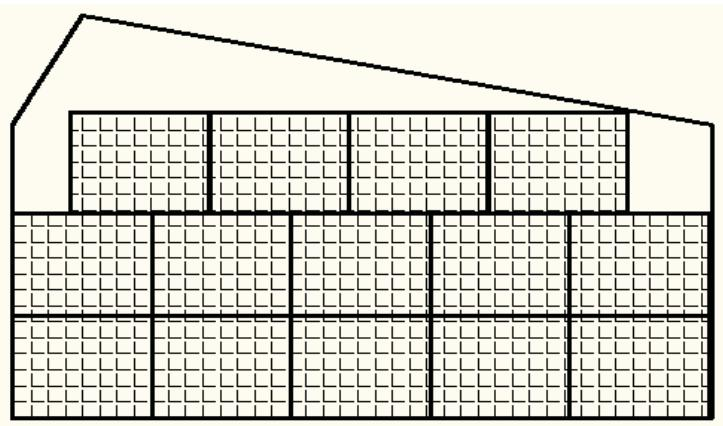

<details>
<summary>natural_image</summary>

Geometric diagram of a house with a triangular roof and stacked rectangular blocks (no text or symbols)
</details>

图 9 西面光伏电池的铺设示意图

实际上只能铺设 14 块；则盈利为 $14 \times 859.6887 \times 0.9 - 10200 = 632.0776$ 元，这个盈利太小了，如果在现实生活中考虑人工费等费用，则安装在四周的墙面上的电池不但不会盈利反而会亏损，综上每块最大盈利的 C3 型号电池的盈利如此，那么在以后的铺设中不铺设四周的墙面。

## 4.6 总的发电量、成本和投资回收年限的计算

通过分析计算总的发电量、成本和投资回收年限这几个是很容易计算的，它们这几个有以下的关系：

每块电池的价格 = 每峰瓦的价格 × 开路电压 × 短路电流

电池的成本 = 电池的块数(n) × 每块电池的价格

一年的发电量(Power) $= \sum_{i = 1}^{365}\sum_{j = 0}^{23}\mathrm{Q}_{\mathrm{ij}}\times$ 转换效率 $(\eta)\times$ 逆变效率

利润 = 35 年的发电量 × 0.5 - 电池成本 - 逆变器成本

式中 $Q_{i,j}$ 为每时刻的光照强度

经过 MATLAB 编程计算可以得到总的发电量、成本以及投资回收年限。（见附件（c1-3））设屋顶，总的发电量包括南北两面屋顶的发电量，其中 35 年总的发电量 435620 千瓦时，35 年的经济效益 47086 元，拿回成本的年份 26.3226 年。

## 五、问题二

## 5.1 最佳倾角的计算 $^{[2]}$

根据上面所述，有必要利用计算机程序来求最佳倾角。本文设计的算法是对 $-90^{\circ} \sim 90^{\circ}$ 内的以 0.1 为步长进行网格搜索，每一个倾斜角下可求出年总辐射量，并比较辐射量得到最大值，此时为最优的倾斜角(流程图见图 10，程序见附件 c2-1)。

最终得到，最优的倾斜角度为 $38.1^{\circ}$ 。

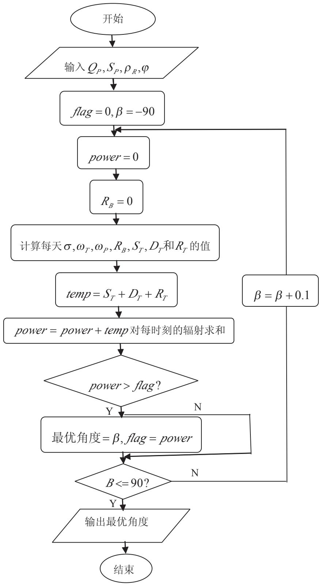

<details>
<summary>flowchart</summary>

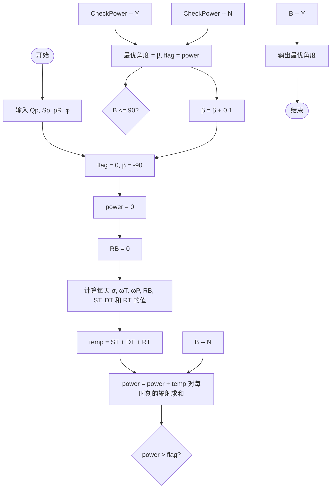
</details>

图 10 架空式光伏电池阵列最优倾斜角计算软件流程图

## 5.2 光伏电池板之间距离 D 的确定

## (1) 间距 D 的确定原则

在北半球，对应最大日照辐射接收量的平面为朝向正南。阵列倾角确定后，要注意南北向前后阵列间要留出合理的间距，以免前后出现阴影遮挡，前后间距 D 为: 冬至日（每年当中物体在太阳下阴影长度最长的时日）9:00——15:00 时间段, 组件之间南北方向无阴影遮挡，光伏方阵阵列间距应不小于 D。（如图 11 所示）

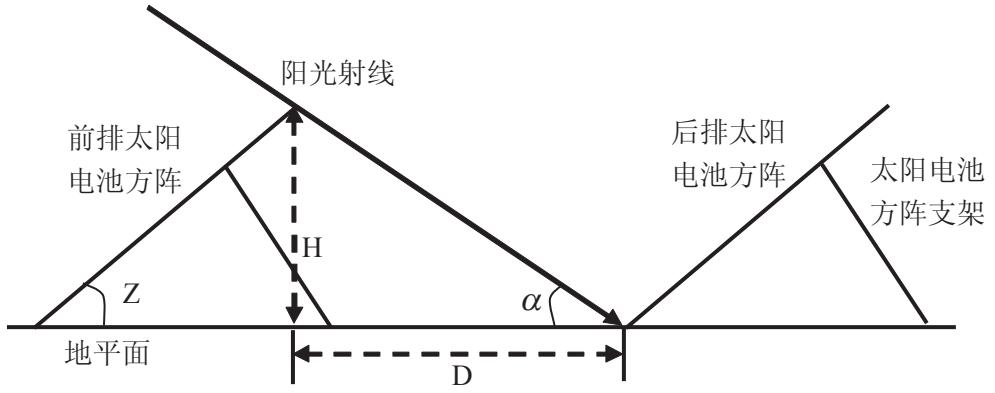

<details>
<summary>text_image</summary>

阳光射线
前排太阳
电池方阵
H
Z
地平面
后排太阳
电池方阵
α
D
太阳电池
方阵支架
</details>

图 11 架空电池板排列示意图

## (3) 赤纬角的确定

因为，太阳中心与地心的连线与赤道平面的夹角称赤纬角。所以，北半球冬至日太阳在南回归线，赤纬角为 $-23.5^{\circ}$ 。

## (4) 太阳高度角的确定

太阳高度角为太阳光线与地表水平面之间的夹角,根据公式

$$
\sin \alpha = \sin \phi \cdot \sin \delta + \cos \phi \cdot \cos \delta \cdot \cos \omega \tag {2.1}
$$

$$
\sin A = \frac {\sin \omega \cdot \cos \delta}{\cos \alpha} \tag {2.2}
$$

其中， $\alpha$ 为太阳高度角， $\omega$ 为时角， $\delta$ 为当时的太阳赤纬， $\phi$ 为当地的纬度(大同的纬度为 $40.1^{o}$ )。

## (5) 间距 D 的确定:

$$
D = \cos \beta \times L \tag {2.3}
$$

由于，投影长度：

$$
L = \frac {H}{\tan \alpha} \tag {2.4}
$$

所以，间距：

$$
D = \frac {\cos \beta \times H}{\tan \alpha} \tag {2.5}
$$

式中：D 为阵列间距；H 为阵列高度； $\beta$ 为最佳倾角 $38.1^{\circ}$ 。

采用固定倾角的支架，依旧采用问题一中求出单位面积的性价比最高的 B3 多晶硅电池。通常采用竖向排布，根据附件的数据 B3 的长宽参数为 $1482 \times 992$ ，通过 Matlab 编程计算得到 D = 0.2045m。（程序见附件 (c2-2)）

## 5.3 架空式屋顶的铺设

因屋顶有一定的倾斜角度，不便于计算和铺设。所以，把光伏电池投影到水平面进行计算，同一问题用计算机辅助设计软件 auto CAD精确的绘画出示意图。(如图 11 所示)

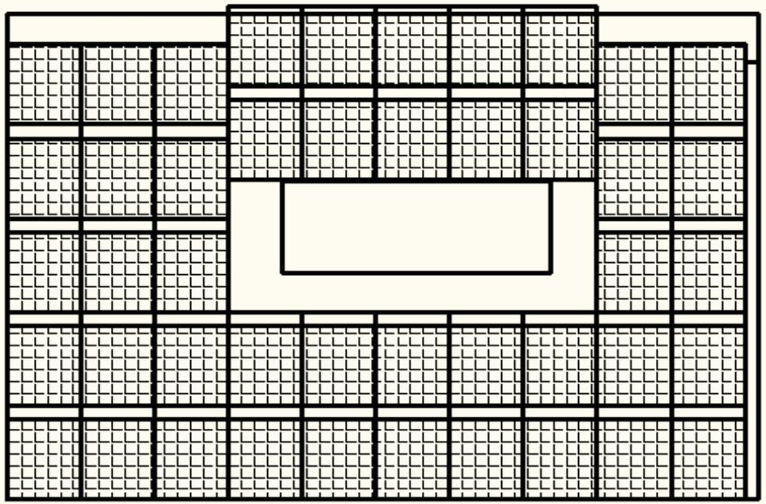

<details>
<summary>natural_image</summary>

Architectural floor plan with grid layout and central rectangular area (no text or symbols)
</details>

图 12 架空铺设屋顶平面图

## 5.4 逆变器的选取

电池组的最大总功率： $210 \times 45 = 9545 \quad W$ 。为了实际考虑，价格要低，转换率要高，则选取的几个逆变器的总功率最好和逆变器的总的额定功率相近，但是额定功率大了和小了都不合适，为了方便计算，采用一个逆变器，从所给的型号中 SM12 的额定功率正好功率接近最大功率；

最小串联数=逆变器最小输入电压/组件最高的电压（开路电压）= $\frac{250}{33.6}=7.4405$ ，即最小的串联数为6。

最大串联数=逆变器最大输入电压/组件最高的电压（开路电压）= $\frac{800}{33.6}=23.8095$ ，即最大的串联数为23。

最大的并联数=逆变器额定电流/组件最高的电流（短路电压）= $\frac{48.4}{8.33}=5.81$ ，即最大的并联数为5。

综上可以得到, 将 $B3$ 电池板每组串联 9 个, 然后将 5 组进行并联。(如下页图 12 所示)

经过 Matlab 编程计算可以得到总的发电量, 成本以及投资回收年限。(见附件(c2-3)) 以架空的方式铺设南面屋顶, 其中 35 年总的发电量 562470 千瓦时, 35 年的经济效益 80046 元, 拿回成本需要 23.9270 年。

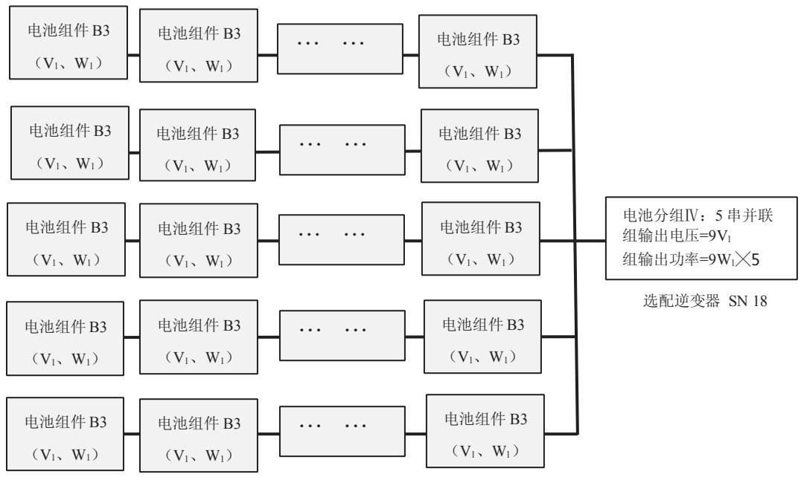

<details>
<summary>flowchart</summary>

This diagram illustrates the classification of a 5串并联电池组 (Battery Group IV) based on their voltage and power output, showing how individual battery components are grouped together.
</details>

图 13 选配 SM12 逆变器形成的 $9W_{1} \times 5$ 分组阵列图

## 六、问题三

## 6.1 小屋规划模型的建立与求解:

对于问题三，要求设计小屋，小屋外表面要铺设光伏电池，根据前面两问的分析和计算，在此同样只是铺设屋顶、、，在第一问中算出了性价比最大的电池型号是B3进行铺设，它的尺寸为 $1482\times992\times35(mm\times mm\times mm)$ ，采用架空方式安装，根据问题二的结论，最优的倾斜角为 $38.1^{\circ}$ ，要使小屋设计的更优化，这是空余的地方尽量的少，采用架空方式安装，根据实际情况，采用竖向铺设，用已经确定最佳倾斜角度为38.1度，屋顶面积只是和长宽有关，设计就是要使长和宽达到的最优解

设新设计的小屋的长为 a，宽为 b，则

$$
a = w \times n,
$$

$$
b = l \times \cos \delta + D
$$

上式中 w 为电池的宽，m, n 为任意的常数，1 为电池的长， $\delta$ 为倾斜角，D 为两电池的铺设间距；电池的块数 number = m × n，要使设计效果最好，即是一个目标规划问题，

Max: number,

$$
S. t \left\{ \begin{array}{l} b \geq 3 \\ a \leq 1 5 \\ s \leq 7 4 \end{array} \right. \tag {3.1}
$$

通过上式，计算得出：面积 $S = a \times b - D \times n$ ，通过 Matlab 编程，程序（见附件 (c3-1)）
计算得到：a=13.888, b=5.2785, number=56。

## 6.2 铺设电池组件及逆变器的选择

先取窗子最小的情况，然后进行铺设电池组件，尽可能铺设多的电池组件，铺设完成后可适当增加窗子的面积到最大，可增大小屋的明亮程度。

屋顶铺设 光伏电池的块数为 56 块, 光伏电池的最大总的功率为 $P_{总} = 210 \times 56 = 11760(w)$ 选择一个逆变器, 纵观逆变器型号选择 SM18 型号的逆变器, 只有它的额定功率大于总的功率。

电池组的串并联情况：

①最小串联数=逆变器最小输入电压/组件最高的电压（开路电压）= $\frac{330}{33.6}=9.8214$ ，即最小的串联数为10。  
②最大串联数=逆变器最大输入电压/组件最高的电压（开路电压）= $\frac{800}{33.6}=23.8095$ ，即最大的串联数为24。  
③最大的并联数=逆变器额定电流/组件最高的电流（短路电压）= $\frac{40}{8.33}=4.8019$ ，即最大的并联数为4。

每组串联 14 个电池，并联 4 组；

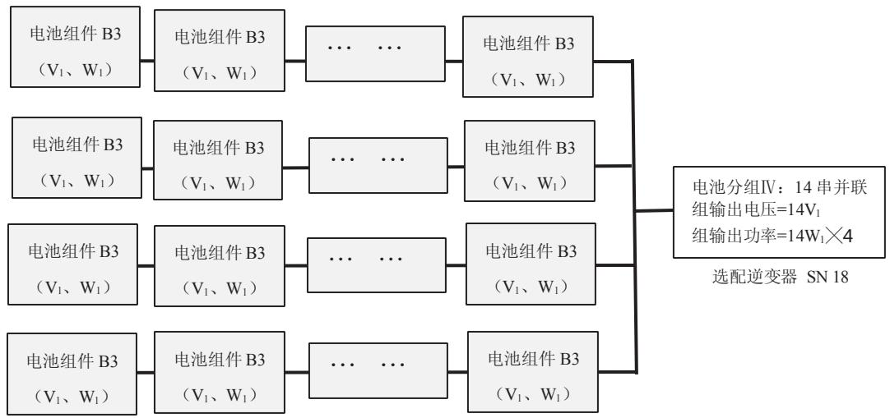

<details>
<summary>flowchart</summary>

This diagram illustrates the architecture of a 14-branch inverter (SN 18) for selecting an optocoupler with specific voltage and power configurations.
</details>

图 14 选配 SM18 逆变器形成的 $14W_{1} \times 4$ 分组阵列图

通过程序计算得到结果，其中 35 年总的发电量 699960 千瓦时，35 年的经济效益 108360 元，拿回成本的年份 23.0525 年。

## 6.3 小屋的设计

屋顶铺设采用架空铺设，每一块电池的与水平面的夹角为38.1度，它们的水平投影距离 $D=0.2045m$ ，屋顶的斜度不影响结果，本文没有考虑光伏电池铺设四周的墙壁，所以设计小屋的采光要求和小屋的高度没有太大的约束，只要满足条件即可，在此给出小屋的俯视图；其他面的设计满足条件，采用美学原理设计门窗；设计图(如下图15所示):

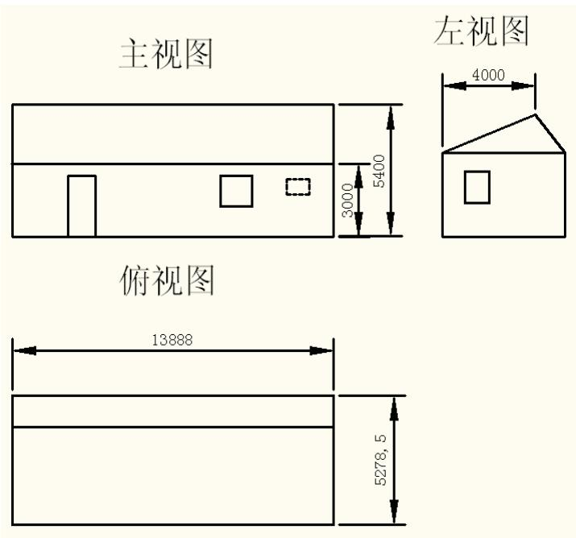

<details>
<summary>text_image</summary>

主视图
左视图
3000
5400
4000
俯视图
13888
5278.5
</details>

图 15 小屋设计图

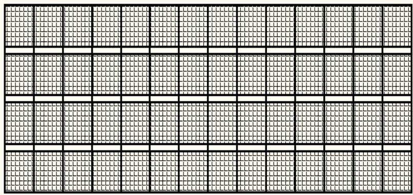

<details>
<summary>natural_image</summary>

Grid pattern with uniform black lines on white background, no text or symbols present
</details>

图 16 屋顶架空铺设平面图

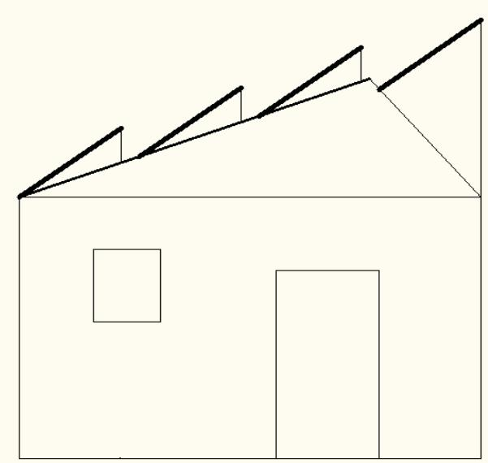

<details>
<summary>natural_image</summary>

Simple line drawing of a house with roof and door, no text or symbols present
</details>

图 17 电池板架空铺设侧视图

由于四周不铺设电池板，所以门窗的设计只需要满足采光要求即可。

## 七、结果的分析与检验

本文中的计算结果(如下表 4):

表 4 计算结果汇总表

<table><tr><td></td><td>发电量 kw.h</td><td>利润(元)</td><td>回收成本年限</td></tr><tr><td>问题一</td><td>435620</td><td>47086</td><td>26.3226</td></tr><tr><td>问题二</td><td>562470</td><td>80046</td><td>23.9270</td></tr><tr><td>问题三</td><td>699960</td><td>108360</td><td>23.0525</td></tr></table>

从以上结果分析可以看出:

1）结果满足本题要求，结果均是在满足约束条件下运用 Matlab 编程计算得到的结果，真实可信；  
2）结果满足客观事实，第二问结果优于第一问，第三问结果优于第二问，这与预测值吻合；  
3）结果由局部最优，到整体最优。这与贪婪算法的特点相吻合，很好的对计算结果进行了检验。

## 八、模型的评价、改进与推广

## 模型评价

1. 运用的数学工具简单，模型清楚易懂，可读性好，实用性强。  
2. 对于任意倾斜面上辐射量计算模型具有通用性  
3. 引入性价比，将双目标规划问题转化为单一目标规划问题。降低了解题难度更方便的

## 模型的改进与推广

对于总太阳辐射强度的计算，考虑到一天中天阳辐射式一个连续的过程，可以对一天的辐射强度进行样条差值，然后求和，并作为一天太阳辐射强度的总和。

针对问题二及问题三，采用架空铺设时，均采用的是固定式安装。所以可以将光伏电池板由固定式安装改进为可调式安装，即：将光伏电池板安不同的季节、月份进行调整，以达到每一个季节、月份的最优。除此之外，还可以考虑将架空铺设的可调式光伏电池板进一步改进为智能式调控，可以随时追踪太阳光照，以使光伏电池板的发电功率达到每一个时刻的最优。最终整合为每年发电量的最大，达到经济效益的最大化。

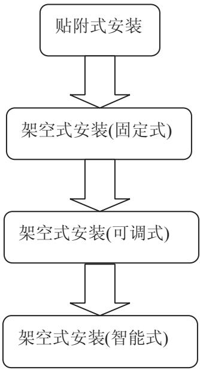

<details>
<summary>flowchart</summary>

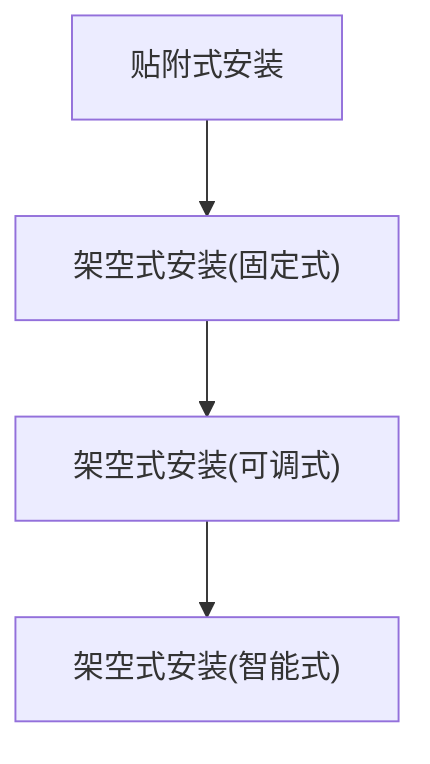
</details>

图 18 光伏电池板铺设模式改进示意图

## 九、参考文献

[1] 郭强，张甜，张志刚．AutoCAD 2010 从入门到精通[M]. 北京：清华大学出版社，2011.11：30-139。  
[2] 陈卓武．基于 LabVIEW 的固定式光伏阵列最佳倾角的研究[D]. 中山大学硕士学位论文，2010。  
[3] 李宁峰, 于国才. 屋顶太阳能光伏发电系统的设计 [J]. 江苏电机工程, 2012, 31(3): 43\~47。  
[4] 马炫, 张亚龙. 基于遗传算法的大规模矩形件优化排样 [J]. 智能系统学报, 2007, 2(5): 61-67。  
[5] 龚纯，王正林．精通 MATLAB 最优化计算 [M]．北京：电子工业出版社，2009.4:10-119。

## 附录

程序部分:

<table><tr><td>程序编号</td><td>C1—1</td><td>文件名称</td><td>Ratio.m</td><td>说明</td><td>每平方光伏电池的性价比</td></tr><tr><td colspan="6">% 每平方的性价比</td></tr><tr><td colspan="6">clear,clc</td></tr><tr><td colspan="6">%% 读入数据</td></tr><tr><td colspan="6">data=xlsread(&#x27;cumcm2012B_附件3_三种类型的光伏电池(A单晶硅B多晶硅C非晶硅薄膜)组件设计参数和市场价格.xls&#x27;);</td></tr><tr><td colspan="6">pice=[14.9 12.5 4.8];</td></tr><tr><td colspan="6">long=data(:,2);%长</td></tr><tr><td colspan="6">wide=data(:,3);%宽</td></tr><tr><td colspan="6">U=data(:,4);%电压</td></tr><tr><td colspan="6">I=data(:,5);%电流</td></tr><tr><td colspan="6">eta=data(:,6);%转换率</td></tr><tr><td colspan="6">P=U.*I;</td></tr><tr><td colspan="6">S=long.*wide/1000;</td></tr><tr><td colspan="6">%% 每平米价格</td></tr><tr><td colspan="6">for i=1:6</td></tr><tr><td colspan="6">p1(i)=P(i)*pice(1)/S(i);</td></tr><tr><td colspan="6">end %A单晶硅</td></tr><tr><td colspan="6">for i=7:13</td></tr><tr><td colspan="6">p1(i)=P(i)*pice(2)/S(i);</td></tr><tr><td colspan="6">end %B多晶硅</td></tr><tr><td colspan="6">for i=14:24</td></tr><tr><td colspan="6">p1(i)=P(i)*pice(3)/S(i);</td></tr><tr><td colspan="6">end %C非晶硅薄膜</td></tr><tr><td colspan="6">%% 每平方的性价比</td></tr><tr><td colspan="6">ratio=eta./p1&#x27;;</td></tr></table>

<table><tr><td>程序编号</td><td>C1—2</td><td>文件名称</td><td>profit.m</td><td>说明</td><td>c类电池每块安装在四面墙上的35年利润</td></tr><tr><td colspan="6">clc;clear;close alldata=xlsread(&#x27;cumcm2012B附件4_山西大同典型气象年逐时参数及各方向辐射强度.xls&#x27;);data1=data(:,end-3:end);%东南西北的辐射数据data2=data1;data2(find(data2&lt;30))=0;he=sum(data2);mpower=he./1000;%每平米一年的发电量power=mpower*10+mpower*15*0.9+mpower*10*0.8;%每平米35年的发电量没有加入逆变效率price=power*0.5;</td></tr></table>

```matlab
% 每平米的面积35年的经济效益 没有加入转换率
data3=xlsread('cumcm2012B_附件3_三种类型的光伏电池(A单晶硅B多晶硅C非晶硅薄膜)组件设计参数和市场价格.xls');
  pice=4.8;
long=data3(:,2);%长
wide=data3(:,3);%宽
U=data3(:,4);%电压
I=data3(:,5);%电流
eta=data3(:,6);%转换率
P=U.*I;
S=long.*wide/1000000;
price1=pice.*P;%每块电池的价格
lr=zeros(24,4);
for i=1:24
    lr(i,:)=price*S(i)*eta(i)-price1(i);
    %每块电池不考虑逆变器时35年的利润
end
clr=lr(14:24,:) 
% c类电池每块安装在四面墙上的35年利润
```

```matlab
程序编号 C1—3 文件名称 Account1.m 说明 第一问的相关计算程序
clc;clear;close all
%% 数据的读入
data=xlsread('cumcm2012B附件4_山西大同典型气象年逐时参数及各方向辐射强度.xls');
data1=data(:,3);%水平面总辐射强度
data2=data(:,4);%水平面散射辐射强度
data3=data1-data2;%水平面上直射强度
hpi=40.1*pi/180;%大同的纬度
%% 参数符号说明
%phi是当地纬度；beta是光伏阵列的倾角；delta为太阳赤纬角；
%omegap为水平面日落时角；romegat为倾斜面日落时角。
%Rb为倾斜面上的直接辐射量与水平面上直接辐射量之比
%
Rb=(cos(hpi-beta).*cos(delta).*sin(omegat)+pi/180*sin(hpi-beta)sin(delta))./(cos(hpi)*cos(delta)*sin(omegap)+pi/180*omegap*sin(hpi)*sin(delta))
% delta=23.5*sin((2*pi*(284+n))/365)*pi/180;
% omegap=acos(-tan(hpi)*tan(delta));
% omegat=min(omegap,acos(-tan(hpi-beta)*tan(delta)));
%% 南面屋顶
```

```matlab
%选用36块B3多晶硅电池 用两个SN14逆变器
% B3的参数U=33.6; I=8.33; 价格12.5 尺寸1482*992 转换率15.98%
% 逆变器的价格 price2=15300 逆变效率94%
n=1:365;
delta=23.5*sin((2*pi*(284+n))/365)*pi/180;
omegat=zeros(1,365);
omegap=zeros(1,365);
beta=acos(6400/6511.53);%倾斜角
for i=1:365
    omegap(i)=acos(-tan(hpi)*tan(delta(i)));
    omegat(i)=min(omegap(i),acos(-tan(hpi-beta).*tan(delta(i))));
Rb(i)=(cos(hpi-beta).*cos(delta(i)).*sin(omegat(i))+pi/180*sin(hpi-beta)*sin(delta(i)))./(cos(hpi)*cos(delta(i))*sin(omegap(i))+pi/180*omegap(i)*sin(hpi)*sin(delta(i)));
end
data4=zeros(365,1);
for i=1:365

data4(24*i-23:24*i,1)=data3(24*i-23:24*i,1).*Rb(i)+(1+cos(beta)).*data2(24*i-23:24*i,1)/2+(1-cos(beta)).*data1(24*i-23:24*i,1)/2*0.25;

end
data5=data4;
data5(find(data5<80))=0;
%南面屋顶光伏电池每年每平米的总光照强度
power1=sum(data5);

U=33.6; I=8.33; %B3的电压电流
S=1.482*0.992; %B4的面积
m=36; %光伏电池的数目
price1=m*12.5*U*I; %光伏电池的费用
price2=15300*2;%逆变器SN14的费用
g1=power1*S*m/1000*0.1598*0.94; %每年所发电经济效益
%% 北面屋顶
%选C1 SN12
    %选用9块C1多晶硅电池 用一个SN12逆变器
    % C1的参数U=138; I=1.22; 价格12.5 尺寸1300*1100 转换率6.99%
    % 逆变器的价格 6900 逆变效率94%

beta=acos(700/1389.24);%倾斜角
for i=1:365
    omegap(i)=acos(-tan(hpi)*tan(delta(i)));
    omegat(i)=min(omegap(i),acos(-tan(hpi-beta).*tan(delta(i))));
```

```matlab
Rb(i)=(cos(hpi-beta).*cos(delta(i)).*sin(omegat(i))+pi/180*sin(hpi-beta)*sin(delta(i)))./(cos(hpi)*cos(delta(i))*sin(omegap(i))+pi/180*omegap(i)*sin(hpi)*sin(delta(i)));
end
data4=zeros(365,1);
for i=1:365

data4(24*i-23:24*i,1)=data3(24*i-23:24*i,1).*Rb(i)+(1+cos(beta)).*data2(24*i-23:24*i,1)/2+(1-cos(beta)).*data1(24*i-23:24*i,1)/2*0.25;
end
data5=data4;
data5(find(data5<30))=0;
%北面屋顶光伏电池每年每平米的总光照强度
power2=sum(data5);

n=9;
U1=138; I1=1.22; %B3的电压电流
S=1.300*1.100;
price3=n*4.8*U1*I1;%光伏电池的成本费用
price4=6900; %SN12逆变器的费用

g2=power2*S*n*0.0635/1000*0.94;%北面屋顶光伏电池每年所发电能量

%% 输出结果
g1+g2;
g=(g1+g2)*0.5; %光伏电池每年所发电能量的效益
price=price1+price2+price3+price4; %成本费用
G=g*10+g*15*0.9+g*10*0.8;
disp('35年总的发电量')
G/0.5
disp('35年的经济效益')
G-price
%计算拿回成本的年份
disp('拿回成本的年份')
if price/g<10
    nian=price/g
end
if (price/g>10)&(price/g<25)
    nian=(price-g*10)/(g*0.9)+10
else
    nian=(price-g*10-g*15*0.9)/(g*0.8)+25
end
```

<table><tr><td>程序编号</td><td>C2—1</td><td>文件名称</td><td>zyjd.m</td><td>说明</td><td>计算光伏电池的最优倾斜角</td></tr><tr><td colspan="6">clc;clear;close all</td></tr><tr><td colspan="6">%% 数据的读入</td></tr><tr><td colspan="6">data=xlsread(&#x27;cumcm2012B附件4_山西大同典型气象年逐时参数及各方向辐射强度.xls&#x27;);</td></tr><tr><td colspan="6">data1=data(:,3);%水平面总辐射强度</td></tr><tr><td colspan="6">data2=data(:,4);%水平面散射辐射强度</td></tr><tr><td colspan="6">data3=data1-data2;%水平面上直射强度</td></tr><tr><td colspan="6">hpi=40.1*pi/180;%大同的纬度</td></tr><tr><td colspan="6">%% 参数符号说明</td></tr><tr><td colspan="6">%phi是当地纬度;beta是光伏阵列的倾角;delta为太阳赤纬角;</td></tr><tr><td colspan="6">%omegap为水平面日落时角;romegat为倾斜面日落时角。</td></tr><tr><td colspan="6">%Rb为倾斜面上的直接辐射量与水平面上直接辐射量之比</td></tr><tr><td colspan="6">%</td></tr><tr><td colspan="6">Rb=(cos(hpi-beta).*cos(delta).*sin(omegat)+pi/180*sin(hpi-beta)sin(delta))./(cos(hpi)*cos(delta)*sin(omegap)+pi/180*omegap*sin(hpi)*sin(delta))</td></tr><tr><td colspan="6">% delta=23.5*sin((2*pi*(284+n))/365)*pi/180;</td></tr><tr><td colspan="6">% omegap=acos(-tan(hpi)*tan(delta));</td></tr><tr><td colspan="6">% omegat=min(omegap,acos(-tan(hpi-beta)*tan(delta)));</td></tr><tr><td colspan="6">n=1:365;</td></tr><tr><td colspan="6">delta=23.5*sin((2*pi*(284+n))/365)*pi/180;</td></tr><tr><td colspan="6">omegat=zeros(1,365);</td></tr><tr><td colspan="6">omegap=zeros(1,365);</td></tr><tr><td colspan="6">flag=0;</td></tr><tr><td colspan="6">for du =-90:0.1:90</td></tr><tr><td colspan="6">beta=du*pi/180;</td></tr><tr><td colspan="6">for i=1:365</td></tr><tr><td colspan="6">omegap(i)=acos(-tan(hpi)*tan(delta(i)));</td></tr><tr><td colspan="6">omegat(i)=min(omegap(i),acos(-tan(hpi-beta).*tan(delta(i)));</td></tr><tr><td colspan="6">Rb(i)=(cos(hpi-beta).*cos(delta(i)).*sin(omegat(i))+pi/180*sin(hpi-beta)*sin(delta(i)))./(cos(hpi)*cos(delta(i))*sin(omegap(i))+pi/180*omegap(i)*sin(hpi)*sin(delta(i)));</td></tr><tr><td colspan="6">end</td></tr><tr><td colspan="6">data4=zeros(364,1);</td></tr><tr><td colspan="6">for i=1:365</td></tr><tr><td colspan="6">data4(24*i-23:24*i,1)=data3(24*i-23:24*i,1).*Rb(i)+(1+cos(beta)).*data2(24*i-23:24*i,1)/2+(1-cos(beta)).*data1(24*i-23:24*i,1)/2*0.25;</td></tr><tr><td colspan="6">end</td></tr><tr><td colspan="6">data5=data4;</td></tr><tr><td colspan="6">data5(find(data5&lt;80))=0;</td></tr><tr><td colspan="6">power=sum(data5);</td></tr></table>

```txt
if power>flag
        flag=power;
        zyj=du;
    end
end
disp('最佳倾角')
zyj
```

<table><tr><td>程序编号</td><td>C2—2</td><td>文件名称</td><td>Space.m</td><td>说明</td><td>第二问架空铺设计电池板之间的间距</td></tr><tr><td colspan="6">clear,clc;close all% omega%时角% delta%赤纬角% alpha%太阳高度角% A%太阳方位角hpi=40.1*pi/180;%大同的纬度omega=45*pi/180;n=1:365;delta=38.1*pi/180;H=1.482;%sin(alpha)=sin(hpi).*sin(delta)+cos(hpi)*cos(delta)*sin(omega);%sin(A)=sin(omega).*cos(delta)./cos(alpha)alpha=asin(sin(hpi).*sin(delta)+cos(hpi)*cos(delta)*sin(omega));A=asin(sin(omega).*cos(delta)./cos(alpha));D=cos(A)*H/tan(alpha)</td></tr></table>

<table><tr><td>程序编号</td><td>C2—3</td><td>文件名称</td><td>Account2.m</td><td>说明</td><td>第二问架空铺设计相应算程序</td></tr><tr><td colspan="6">clc;clear;close all%% 数据的读入data=xlsread(&#x27;cumcm2012B附件4_山西大同典型气象年逐时参数及各方向辐射强度.xls&#x27;);data1=data(:,3);%水平面总辐射强度data2=data(:,4);%水平面散射辐射强度data3=data1-data2;%水平面上直射强度hpi=40.1*pi/180;%大同的纬度%% 参数符号说明%phi是当地纬度;beta是光伏阵列的倾角;delta为太阳赤纬角;%omegap为水平面日落时角;romegat为倾斜面日落时角。%Rb为倾斜面上的直接辐射量与水平面上直接辐射量之比%Rb=(cos(hpi-beta).*cos(delta).*sin(omegat)+pi/180*sin(hpi-beta)sin(delt</td></tr></table>

```matlab
a))./(cos(hpi)*cos(delta)*sin(omegap)+pi/180*omegap*sin(hpi)*sin(delta)
)
% delta=23.5*sin((2*pi*(284+n))/365)*pi/180;
% omegap=acos(-tan(hpi)*tan(delta));
% omegat=min(omegap,acos(-tan(hpi-beta)*tan(delta)));

%% 架空铺设
    %选用45块B3多晶硅电池 用一个SN17逆变器
    % B3的参数U=33.6; I=8.33; 价格12.5 尺寸1482*992 转换率15.98%
    % 逆变器的价格 price2=43750   逆变效率97.3%
n=1:365;
beta=38.1*pi/180;%倾斜角
delta=23.5*sin((2*pi*(284+n))/365)*pi/180;
omegat=zeros(1,365);
omegap=zeros(1,365);

for i=1:365
    omegap(i)=acos(-tan(hpi)*tan(delta(i)));
    omegat(i)=min(omegap(i),acos(-tan(hpi-beta).*tan(delta(i)));

Rb(i)=(cos(hpi-beta).*cos(delta(i)).*sin(omegat(i))+pi/180*sin(hpi-beta)*sin(delta(i)))./(cos(hpi)*cos(delta(i))*sin(omegap(i))+pi/180*omegap(i)*sin(hpi)*sin(delta(i)));
end
data4=zeros(365,1);
for i=1:365

data4(24*i-23:24*i,1)=data3(24*i-23:24*i,1).*Rb(i)+(1+cos(beta)).*data2(24*i-23:24*i,1)/2+(1-cos(beta)).*data1(24*i-23:24*i,1)/2*0.25;

end
data5=data4;
data5(find(data5<80))=0;
 %屋顶光伏电池每年每平米的总光照强度
power1=sum(data5);

U=33.6; I=8.33; %B3的电压电流
S=1.482*0.992; %B4的面积
m=45; %光伏电池的数目
price1=m*12.5*U*I; %光伏电池的费用
price2=43750;%逆变器SN14的费用
g1=power1*S*m/1000*0.1598*0.973; %每年所发电经济效益
```

```matlab
%% 输出结果
disp('35年总的发电量')
G=g1*10+g1*15*0.9+g1*10*0.8
disp('经济效益')
g=g1*0.5;  %光伏电池每年所发电能量的效益
price=price1+price2; %成本费用
G*0.5-price
%计算拿回成本的年份
disp('拿回成本的年份')
if price/g<10
    nian=price/g
end
if (price/g>10)&(price/g<25)
    nian=(price-g*10)/(g*0.9)+10
else
    nian=(price-g*10-g*15*0.9)/(g*0.8)+25
end
```

<table><tr><td>程序编号</td><td>C3—1</td><td>文件名称</td><td>Account3.m</td><td>说明</td><td>计算小屋最优的长和宽</td></tr><tr><td colspan="6">clc ;clear;close allnumber=0;f=1.482*cos(38.1*pi/180)+0.2045;for n=1:fix(15/0.992)for m=3:40L=0.992*n;W=f*m-0.2045;S=L*W;if (S&lt;=74)if number&lt;m*nnumber=m*n;a=L;b=W;endendendendnumberab</td></tr><tr><td>程序编号</td><td>C3—2</td><td>文件名称</td><td>Account4.m</td><td>说明</td><td>第三问设计中的程序</td></tr><tr><td colspan="6">clc;clear;close all</td></tr><tr><td colspan="6">%% 数据的读入</td></tr><tr><td colspan="6">data=xlsread('cumcm2012B附件4_山西大同典型气象年逐时参数及各方向辐射强度.xls');</td></tr><tr><td colspan="6">data1=data(:,3);%水平面总辐射强度</td></tr><tr><td colspan="6">data2=data(:,4);%水平面散射辐射强度</td></tr><tr><td colspan="6">data3=data1-data2;%水平面上直射强度</td></tr><tr><td colspan="6">hpi=40.1*pi/180;%大同的纬度</td></tr><tr><td colspan="6">%% 参数符号说明</td></tr><tr><td colspan="6">%phi是当地纬度;beta是光伏阵列的倾角;delta为太阳赤纬角;</td></tr><tr><td colspan="6">%omegap为水平面日落时角;romegat为倾斜面日落时角。</td></tr><tr><td colspan="6">%Rb为倾斜面上的直接辐射量与水平面上直接辐射量之比</td></tr><tr><td colspan="6">%</td></tr><tr><td colspan="6">Rb=(cos(hpi-beta).*cos(delta).*sin(omegat)+pi/180*sin(hpi-beta)sin(delta))./(cos(hpi)*cos(delta)*sin(omegap)+pi/180*omegap*sin(hpi)*sin(delta))</td></tr><tr><td colspan="6">% delta=23.5*sin((2*pi*(284+n))/365)*pi/180;</td></tr><tr><td colspan="6">% omegap=acos(-tan(hpi)*tan(delta));</td></tr><tr><td colspan="6">% omegat=min(omegap,acos(-tan(hpi-beta)*tan(delta)));</td></tr><tr><td colspan="6">%% 架空铺设</td></tr><tr><td colspan="6">%选用56块B3多晶硅电池 用一个SN18逆变器</td></tr><tr><td colspan="6">% B3的参数U=33.6; I=8.33; 价格12.5 尺寸1482*992 转换率15.98%</td></tr><tr><td colspan="6">% 逆变器的价格 price2=54700 逆变效率97.3%</td></tr><tr><td colspan="6">n=1:365;</td></tr><tr><td colspan="6">beta=38.1*pi/180;%倾斜角38.1</td></tr><tr><td colspan="6">delta=23.5*sin((2*pi*(284+n))/365)*pi/180;</td></tr><tr><td colspan="6">omegat=zeros(1,365);</td></tr><tr><td colspan="6">omegap=zeros(1,365);</td></tr><tr><td colspan="6">for i=1:365</td></tr><tr><td colspan="6">omegap(i)=acos(-tan(hpi)*tan(delta(i)));</td></tr><tr><td colspan="6">omegat(i)=min(omegap(i),acos(-tan(hpi-beta).*tan(delta(i))))</td></tr><tr><td colspan="6">Rb(i)=(cos(hpi-beta).*cos(delta(i)).*sin(omegat(i))+pi/180*sin(hpi-beta)*sin(delta(i)))./(cos(hpi)*cos(delta(i))*sin(omegap(i))+pi/180*omegap(i)*sin(hpi)*sin(delta(i)));</td></tr><tr><td colspan="6">end</td></tr><tr><td colspan="6">data4=zeros(365,1);</td></tr><tr><td colspan="6">for i=1:365</td></tr><tr><td colspan="6">data4(24*i-23:24*i,1)=data3(24*i-23:24*i,1).*Rb(i)+(1+cos(beta)).*data2</td></tr></table>

```matlab
(24*i-23:24*i,1)/2+(1-cos(beta)).*data1(24*i-23:24*i,1)/2*0.25;

end
data5=data4;
data5(find(data5<80))=0;
%屋顶光伏电池每年每平米的总光照强度
power1=sum(data5);

U=33.6; I=8.33; %B3的电压电流
S=1.482*0.992; %B4的面积
m=56; %光伏电池的数目
price1=m*12.5*U*I; %光伏电池的费用
price2=45700;%逆变器SN17的费用
g1=power1*S*m/1000*0.1598*0.973; %每年所发电经济效益

%% 输出结果
disp('35年总的发电量')
G=g1*10+g1*15*0.9+g1*10*0.8
disp('经济效益')
g=g1*0.5; %光伏电池每年所发电能量的效益
price=price1+price2; %成本费用
%计算拿回成本的年份
G*0.5-price
disp('拿回成本的年份')
if price/g<10
    nian=price/g
end
if (price/g>10)&(price/g<25)
    nian=(price-g*10)/(g*0.9)+10
else
    nian=(price-g*10-g*15*0.9)/(g*0.8)+25
end
```