# 2012高教社杯全国大学生数学建模竞赛

## 承 诺 书

我们仔细阅读了中国大学生数学建模竞赛的竞赛规则.

我们完全明白，在竞赛开始后参赛队员不能以任何方式（包括电话、电子邮件、网上咨询等）与队外的任何人（包括指导教师）研究、讨论与赛题有关的问题。

我们知道，抄袭别人的成果是违反竞赛规则的, 如果引用别人的成果或其他公开的资料（包括网上查到的资料），必须按照规定的参考文献的表述方式在正文引用处和参考文献中明确列出。

我们郑重承诺，严格遵守竞赛规则，以保证竞赛的公正、公平性。如有违反竞赛规则的行为，我们将受到严肃处理。

我们授权全国大学生数学建模竞赛组委会，可将我们的论文以任何形式进行公开展示（包括进行网上公示，在书籍、期刊和其他媒体进行正式或非正式发表等）。

我们参赛选择的题号是（从 A/B/C/D 中选择一项填写）： B

我们的参赛报名号为（如果赛区设置报名号的话）：

所属学校（请填写完整的全名）： XXXX

参赛队员 (打印并签名) ：1. XXX

2. （隐去论文作者相关信息等）

3. XXX

指导教师或指导教师组负责人 (打印并签名)： XXXX

日期： 2012 年 9 月 10 日

赛区评阅编号（由赛区组委会评阅前进行编号）：

# 2012高教社杯全国大学生数学建模竞赛

## 编 号 专 用 页

赛区评阅编号（由赛区组委会评阅前进行编号）：

赛区评阅记录（可供赛区评阅时使用）：

<table><tr><td>评阅人</td><td></td><td></td><td></td><td></td><td></td><td></td><td></td><td></td><td></td><td></td></tr><tr><td>评分</td><td></td><td></td><td></td><td></td><td></td><td></td><td></td><td></td><td></td><td></td></tr><tr><td>备注</td><td></td><td></td><td></td><td></td><td></td><td></td><td></td><td></td><td></td><td></td></tr></table>

全国统一编号（由赛区组委会送交全国前编号）：

全国评阅编号（由全国组委会评阅前进行编号）：

# 太阳能小屋的设计

## 摘要

本文在太阳能应用与太阳能小屋设计的实际背景下，对逆变器与光伏电池的选择、配对，光伏电池的铺设以及房屋的设计建立了相关模型进行研究。

为了简化问题，首先我们定义了收益这一指标，并在每一问中都根据收益来剔除出不满足要求的光伏电池或组。

针对问题一，在仅考虑贴附安装方式情况下，对小屋部分表面铺设光伏电池，并选配相应逆变器要使得年发电量尽可能大，单位发电费用尽量低。为此，本文建立了多目标规划模型，考虑到模型求解的复杂性，本文设计了一个启发式算法，利用 Matlab 软件构造 0-1 矩阵来模拟实际铺设，得到了一个优化的铺设方式，结果为：开头全年发电量为 1580735kw·h，年发电量为 497942kw·h，纯收入为73195 元，投资的回报年限为 23.7年，单位发电成本为 0.353元。

针对问题二，架空方式安装光伏电池的情况下，光伏电池可选择不同的倾角和朝向。本文首先建立了多目标规划模型(同题一),并证明取得最优解的必要条件是最佳倾角与朝向。因此,本文又建立了无约束优化模型，根据相关知识，光伏电池最佳倾角近似等于当地纬度即 40°，最佳朝向为正南偏西，具体的优化计算利用Excel 进行小范围的一维等步长搜索，得到最佳倾角与水平面呈 38°，最佳朝向与正南方向呈 22°（偏西）,然后转化为问题一，求解结果为：开头全年发电量为 23685kw·h，35 年发电量为 746100 kw·h，纯收入为 122374 元，投资的回报年限为21.1 年，单位发电成本为 0.336元。

问题三要求按规范设计一个小屋,并对所设计小屋的外表面优化铺设光伏电池。本文在利用前两题的成果的前提下，建立了非线性规划模型，利用 Lingo 求解，得出小屋的具体建筑尺寸，然后转化为问题一并求解，得到房屋的长为 15m，宽为 3.3m,朝南墙的高度为 2.8m。结果为：35 年发电量为 805968 kw·h，单位发电成本为0.332元。

本文在建模的过程中，通过实际收益来控制光伏电池与组的选择，尽量考虑到实际情况，所以模型具有良好的实际应用性和较强的可扩展性。

关键词：多目标规划，0-1矩阵模拟，无约束优化，非线性规划

## 一、 问题重述

太阳能小屋需在建筑物外表面（屋顶及外墙）铺设光伏电池，光伏电池组件所产生的直流电需要经过逆变器转换成 220V交流电才能供家庭使用，并将剩余电量输入电网。已知不同种类的光伏电池每峰瓦的价格差别很大，且每峰瓦的实际发电效率或发电量还受诸多因素的影响，如太阳辐射强度、光线入射角、环境、建筑物所处的地理纬度、地区的气候与气象条件、安装部位及方式（贴附或架空）等。

现在要求根据附件中相关信息，对下列三个问题，分别给出小屋外表面光伏电池的铺设方案，并给出图示，使小屋的全年太阳能光伏发电总量尽可能大，而单位发电量的费用尽可能小，并计算出小屋光伏电池 35年寿命期内的发电总量、经济效益（当前民用电价按 元 计算）及投资的回收年限。

问题1：根据山西省大同市的气象数据，仅考虑贴附安装方式，选定光伏电池组件，对小屋的部分外表面进行铺设，并根据电池组件分组数量和容量，选配相应的逆变器的容量和数量。

问题2：电池板的朝向与倾角均会影响到光伏电池的工作效率，请选择架空方式安装光伏电池，重新考虑问题 1。

问题3：根据附件 7给出的小屋建筑要求，请为大同市重新设计一个小屋，要求画出小屋的外形图，并对所设计小屋的外表面优化铺设光伏电池，给出铺设及分组连接方式，选配逆变器，计算相应结果。

## 二、 问题分析

## 2.1对大同市时间的理解:

由于地理经纬度差异的存在，大同当地时间是北京时间减一小时，即数据库中的时间为当地时间。在后续计算中利用的是当地时间即数据库时间。

## 2.2对附件中各方向辐射强度的理解：

附件中东南西北四个方向的总辐射值是可以通过水平面总辐射，散射辐射，法相辐射推算求得。又因为小屋朝正南，所以房屋东南西北四个侧面的辐射强度等于附件中东南西北面的总辐射强度；对于房顶的两个侧面，我们需要通过水平面总辐射强度，水平面散射辐射强度以及法向直射辐射强度计算得到。

## 2.3对任意面上光辐射总强度的理解：

本题中任意面的光辐射强度由直接辐射强度，散射辐射强度与反射辐射强度之和组成，经计算验证了在本问题中反射辐射强度对于总的光辐射强度的影响相对较小，因此本题忽略反射辐射的影响，但反射辐射可以解释部分数据出现的不合理现象。

## 2.4对最优铺设方式的理解：

对于本题中太阳能小屋所发的电是接入电网的，不需要考虑夏季发电过多而冬季发电过少所导致的季节分配不合理性，只需要考虑全年发电量最大即可。

2.5

## 2.6对于各种参数的理解：

峰瓦，即在标准测试条件下太阳能电池组件或方阵的额定最大输出功率，在此将附件3的电池组建功率作为其峰瓦值，可得到不同电池的成本价。

## 2.7对小屋总发电量最大的理解：

由于小屋总发电量为各表面的发电量总和，因为不同面之间发电量是独立无关的，因此追求总发电量的最大值等同于追求各个面的最大发电量。

## 2.8对串并联问题的理解

串并联的前提条件照附件 1中的要求，并且由于不同种类电池之间的太阳光辐照阈值存在差异，导致在某些时刻若两种不同电池并联会出现一段有电压一段舞电压的情况，因此不同种类之间的电池不可互相并联。

## 三、 模型假设

假设一：该全年气象数据可以代表大同市未来 35年的典型气象数据;

假设二：每块电池板只考虑表面光照面积所接受的光能，不考虑由深度遮光带来的影响;

假设三：一个逆变器和若干个光伏电池组成一组，一组中的光伏电池必须安排在同一个表面上，但它们可以随意的分布在表面的任何位置，且逆变器不铺设在表面，即其不占用表面面积。

假设四：本题中的成本费用只计算光伏电池与逆变器的成本费不计算安装费用

假设五：逆变器与光伏电池相连必须要满足开路电压之和小于逆变器的上限

## 四、 符号系统

H<sub>。。。。。。。。。。。。。</sub>水平面上的总辐射强度

Hd<sub>。。。。。。。。。。。</sub>水平面散射辐射强度

Ib<sub>。。。。。。。。。。。。。。</sub>法相直射辐射强度

β<sub>。。。。。。。。。。。。。。</sub>倾斜面与水平面的夹角

α<sub>s。。。。。。。。。。。。。。</sub>太阳高度角

Γ<sub>s。。。。。。。。。。。。。</sub>太阳方位角

Γ<sub>n。。。。。。。。。。。。。</sub>斜面方位角，即斜面法线在水平面的投影与当地正南方向的夹角。向西为取正角，向东取负角。

It<sub>。。。。。。。。。。。。。。</sub>倾斜面上的太阳辐射总量

I<sub>bt。。。。。。。。。。。。。</sub>倾斜面上由直接太阳辐射引起的辐射量

I<sub>dt。。。。。。。。。。。。。。</sub>倾斜面上由散射辐射引起的辐射量

I <sub>。。。。。。。。。。。。。。</sub>倾斜面上由地面反射引起的辐射量

Q<sub>ki</sub>.............小屋外第 k个表面上第i 组（组为一个逆变器与若干个光伏电池的有效组合）

η ............小屋外第 k个表面上第i 组中第j 个光伏电池的转化效率

S 小屋外第 k个表面的表面积

S ...........小屋外第 k个表面上第 i 组内第j 个光伏电池的表面积

Cki..........小屋外第 k 个表面上第 i 组的成本

P............小屋外第 k个表面上全年有效辐射强度。这是一个变量，对于 A类，B 类，C 类电池是不同的

Pi..............第 i 组中的逆变器的额定功率

Pocij.........第 i 组中第 j 个光伏电池的组件功率

Ui.............第 i 组中的逆变器的电压上限

Uocij........第 i 组内第j 个光伏电池的开路电压

## 五、 模型建立

## 5.1倾斜面上的太阳总辐射的计算

在实际工程中，对于确定的地点，通常可以知道该地点全年各月水平面的平均太阳辐射资料（总辐射量、直接辐射量和散射辐射量）。我们采用 Klein 提出的计算方法：倾斜面的太阳辐射总量 $\mathrm { I } _ { \mathrm { t } }$ 由直接太阳辐射量 ${ \mathrm { I } } _ { \mathrm { b t } } .$ 、散射辐射量 $\mathrm { I _ { d t } }$ 和地面反射量 $\mathrm { I _ { r t } }$ 三部分组成，即：

$$
I _ {t} = I _ {b t} + I _ {d t} + I _ {r t} \tag {5-1}
$$

## 5.1.1倾斜面上太阳直接辐射量 $\mathrm { I _ { b t } }$ 的计算:

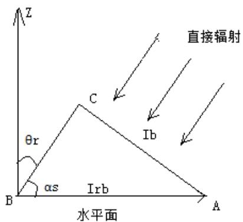

<details>
<summary>text_image</summary>

Z
直接辐射
θr
C
Ib
αs
IrB
水平面
B
A
</details>

如图 5-1，我们假设太阳光线垂直于一

假想面AC，现要将其换算成斜面 AB 上的直接辐射通量 $\mathrm { I _ { r b } }$ ，在 $\triangle \mathrm { A B C }$ 中显然有：

$$
I _ {r b} / I _ {b} = A C / A B = \cos \theta_ {r} \Rightarrow I _ {r b} = I _ {b} \cos \theta_ {r} \tag {5-2}
$$

式中 $\theta _ { r }$ 为斜面AB 上的太阳光线入射角。

[1]根据相关资料分析可知 $\theta _ { r }$ 可由下式确定:

$$
\cos \theta_ {r} = \cos \beta \sin \alpha_ {s} + \sin \beta \cos \alpha_ {s} \cos (\gamma_ {s} - \gamma_ {n}) \tag {5-3}
$$

太阳高度角： $\sin \alpha _ { s } = \sin \phi \cdot \sin \delta + \cos \phi \cdot \cos \delta \cdot \cos \omega$

赤纬角： $\delta = 2 3 . 4 5 \sin \left( { \frac { 2 \pi { \left( { 2 8 4 + n } \right) } } { 3 6 5 } } \right)$ ，其中 为日期序号，例如，1 月 1 日为 ，3月22日为 【附件】

时角： $\omega = 1 5 { \left( t _ { s } - 1 2 \right) }$ ，时角是以正午 12 点为 0 度开始算，每一小时为 15度，上午为负下午为正，即10 点和14 点分别为-30 度和30 度。

太阳方位角： $\sin \gamma _ { s } = { \frac { - \sin \omega \cdot \cos \delta } { \cos \alpha } }$

所以，将式（5-3）化简可以得到：

$$
\begin{array}{l} \cos \theta_ {r} = \sin \delta \sin \Phi \cos \beta - \sin \delta \cos \Phi \sin \beta \cos \gamma_ {n} + \\ \cos \delta \cos \Phi \cos \beta \cos \omega + \cos \delta \sin \beta \sin \gamma_ {n} \sin \omega \\ + \cos \delta \sin \Phi \sin \beta \cos \gamma_ {n} \cos \omega \tag {5-3} \\ \end{array}
$$

综上，任意倾斜面上的太阳直射总辐射为： $I _ { r b } = I _ { n } \cos \theta _ { r }$ (5-4)

## 5.1.2倾斜面上散射辐射量 Idt 与反射辐射量 Irt 的计算:

[2]1970年liu和jordan 提出了各向同性漫射模型，该模型认为：各斜面上的散射辐射Idt 只与当地水平面散射辐射与斜面倾斜角有关；反射辐射量 Irt 只与地面反射率ρ，水平面总辐射强度 It 与斜面倾斜角β有关,并给出理论公式：

$$
I _ {d t} = H _ {d} \cos^ {2} (\beta / 2)
$$

$$
I _ {r t} = H \rho \sin^ {2} (\beta / 2) \tag {5-5}
$$

以上分析可知任意倾斜面上的总辐射量为：

$$
I _ {t} = I _ {b} \cos \theta_ {r} + H _ {d} \cos^ {2} (\beta / 2) + H \rho \sin^ {2} (\beta / 2) \tag {5-6}
$$

至此，任意斜面上的总辐射量理论公式推导结束，然后将理论公式与本题数据相结合。

## 5.1.3理论公式的化简与检验

首先分析各方向实测辐射强度，发现以下几点特征:

①北面辐射强度始终为水平面散射辐射强度的一半；  
②在上午西北两面的总辐射强度始终相等，在下午东北两面的总辐射强度始终相等且都等于水平面散射辐射强度的一半。

故我们猜测:①北面辐射只由散射辐射引起,即认为北侧墙始终没有直射；②在上午西面无直射只有散射辐射，在下午东面无直射只有散射辐射。

所以可以认为大同市的实际数据中反射辐射所占比重很小，故本文在后续计算中剔除理论公式中的最后一项，即理论公式可简化为：

$$
I _ {t} = I _ {b} \cos \theta_ {r} + H _ {d} \cos^ {2} (\beta / 2) \tag {5-7}
$$

由于式5-7是理论公式在实际数据下的简化，我们有必要对这个公式的准确性做一个检验。

通过式 5-7利用水平面总辐射强度，水平面散射强度，法向直射辐射强度数据来计算东南西北面总辐射强度并与实测值做比较（具体计算结果见电子版内文件）。最后得到南北误差均在 5%以内，东西误差在 10%以内。但是部分数据误差很大，我们对这种情况做以下解释：相对误差大的数据都处于傍晚，其实测值本身就不大，也就是说此时的绝对误差不大，这里可以认为是由反射引起的误差，在总辐射强度不大的情况下 ，反射强度引起的误差就显示出来了。但这些数据都较小且这部分数据量也少，因此这些误差对发电量而言是微不足道的，所以认为简化后的理论公式用于计算大同市不同时间不同斜面的太阳辐射强度是合理的。

## 5.2.问题一求解

## 5.2.1对问题一的理解与分析

对收益的定义：对于任何一个光伏电池以及由光伏电池组成的组在 35 年寿命期内所发的电以 0.5元每度的折算为钱减去光伏电池的价格（对于组则减去组内所有电池的价格与逆变器的价格）

在实际情况中，太阳能发电至少要使得收益为正，否则就没有实际利用价值，为此本文对收益做了一个判别标准：若收益为负，则剔除该种光伏电池或者剔除改组；这在接下去三个问题中都起到了很好的简化作用。

定义组的含义：若干电池组在串并联（串并联必须满足题设条件）后与合适的一个逆变器组成一个组 Qi。并且任意一个铺设完毕后的表面上的最小单位为组，即表面上不存在不与逆变器相连的光伏电池。所以铺设是由一组一组进行的，但是一组内的光伏电池可以在一个表面上任意分布。

## 5.2.1问题一模型的建立

问题一实质是一个具有多个目标的组合优化问题，为此我们需要建立一个多目标规划模型。

两个目标：1.使小屋的全年太阳能光伏发电总量 P 尽可能大;2.使单位发电量的费用W尽可能小。

约束条件：任意面上的铺设都必须在该表面以内，不得露出表面

建立多目标规划模型如下：

$$
\begin{array}{l} P = \max \sum_ {k = 1} ^ {K} \sum_ {i = 1} ^ {I} \sum_ {j = 1} ^ {J} P _ {k} \eta_ {k i j} S _ {k i j}; \\ \mathrm{W} = \max (\mathrm{P} / \sum_ {\mathrm{k} = 1} ^ {\mathrm{K}} \sum_ {\mathrm{i} = 1} ^ {\mathrm{I}} \mathrm{C} _ {\mathrm{ki}}) \\ \text {s.t.} \left\{ \begin{array}{l} \sum_ {\mathrm{i}} \sum_ {i} S _ {k i j} \leq S _ {k} \\ \sum_ {j} U _ {o c i j} \leq U _ {i} \\ \sum_ {j} P _ {o c i j} \leq P _ {i} \end{array} \right. \\ \end{array}
$$

由于总发电量为各个房子面的发电量的总和，而不同面之间发电量是独立无关，因此追求总发电量的最大值等同于追求各个面的最大发电量。模型可简化为六个表面的模型：

$$
\begin{array}{l} P = \max \sum_ {i = 1} ^ {I} \sum_ {j = 1} ^ {J} P _ {k} \eta_ {k i j} S _ {k i j}; \quad \mathrm{k=1,..,6} \\ \mathrm{W} = \max (\mathrm{P} / \sum_ {\mathrm{i} = 1} ^ {\mathrm{I}} \mathrm{C} _ {\mathrm{i}}) \\ \text {s.t.} \left\{ \begin{array}{l} \sum_ {\mathrm{i}} \sum_ {i} S _ {k i j} \leq S _ {k} \\ \sum_ {j} U _ {o c i j} \leq U _ {i} \\ \sum_ {j} P _ {o c i j} \leq P _ {i} \end{array} \right. \\ \end{array}
$$

## 5.2.2 问题简化

## 对这两个目标的简化理解：

1.对于使发电量总量大的理解：面积一定的情况下，通常普通光照是无法超过标准测量下的 1000w/m2，则在光照幅度一定的情况下发电量大实则取决于转换效率。那么在取电池时则倾向于取转换效率高的电池。  
2.使单位发电量成本小的问题：在发电量一定的情况下尽可能追求发电成本的最小化，或者在发电成本一定的情况下追求发电量的最大化

由于上述模型中的可供选择的组的数量繁多，而有些甚至是不合理的（比如亏本的），且每个表面上组的选取往往决定了该表面的最大年发电率与最低单位发电成本，因此我们考虑尽可能简化问题。

首先，针对不同表面，其全年的光强度分布是不同的，所以对于一个特定的表面我们一定能在所有的组中找到一部分组使得全年发电总量尽可能大，且单位发电费用又尽可能小。为此我们需要寻找这些好的组。

因为组中包括了光伏电池，根据实际情况，我们必须考虑光伏电池的收益，如果在某一特定面上，某种光伏电池在 35 年使用年限内都无法收回成本（在此先不包括逆变器的成本），那么在该面上的最小单元内就不应该包含该种光伏电池。这种合理的剔除部分光伏电池的做法为问题带来了极大的简化。这样做虽然是较为粗略的，但一定是精确的排除掉某些一定不符合盈利条件的电池

因此在设计各表面的优化铺设方案时，都要对所有房面进行部分电池的排除，首先，我们利用式 5-7得到了小屋房顶上两个倾斜表面全年逐小时的辐射强度（具体表格见附件）。

作为一个实例，我们不妨先对东面墙做处理：

利用 excel 表格我们统计出东面墙的结果如下：

<table><tr><td>辐射强度范围w/m2</td><td>0~30</td><td>30~80</td><td>80~200</td><td>&gt;200</td></tr><tr><td>全年强度总和w·h</td><td>15540</td><td>56513</td><td>119959</td><td>402439</td></tr></table>

<table><tr><td>产品型号</td><td>组件功率(w)</td><td>长(mm)</td><td>宽(mm)</td><td>开路电压(Voc)</td><td>转换效率η(%)</td><td>产品成本</td><td>35年收益</td><td>单位面积收益</td></tr><tr><td>A1</td><td>215</td><td>1580</td><td>808</td><td>46.1</td><td>16.84%</td><td>3203.5</td><td>-1841</td><td>&lt;0</td></tr><tr><td>A2</td><td>325</td><td>1956</td><td>991</td><td>46.91</td><td>16.64%</td><td>4842.5</td><td>-2798</td><td>&lt;0</td></tr><tr><td>A3</td><td>200</td><td>1580</td><td>808</td><td>46.1</td><td>18.70%</td><td>2980</td><td>-1467</td><td>&lt;0</td></tr><tr><td>A4</td><td>270</td><td>1651</td><td>992</td><td>38.1</td><td>16.50%</td><td>4023</td><td>-2310</td><td>&lt;0</td></tr><tr><td>A5</td><td>245</td><td>1650</td><td>991</td><td>37.73</td><td>14.98%</td><td>3650.5</td><td>-2098</td><td>&lt;0</td></tr><tr><td>A6</td><td>295</td><td>1956</td><td>991</td><td>45.92</td><td>15.11%</td><td>4395.5</td><td>-2539</td><td>&lt;0</td></tr><tr><td>B1</td><td>265</td><td>1650</td><td>991</td><td>37.91</td><td>16.21%</td><td>3312.5</td><td>-1132</td><td>&lt;0</td></tr><tr><td>B2</td><td>320</td><td>1956</td><td>991</td><td>45.98</td><td>16.39%</td><td>4000</td><td>-1386</td><td>&lt;0</td></tr><tr><td>B3</td><td>210</td><td>1482</td><td>992</td><td>33.6</td><td>15.98%</td><td>2625</td><td>-692</td><td>&lt;0</td></tr><tr><td>B4</td><td>240</td><td>1640</td><td>992</td><td>36.9</td><td>14.80%</td><td>3000</td><td>-1019</td><td>&lt;0</td></tr><tr><td>B5</td><td>280</td><td>1956</td><td>992</td><td>44.8</td><td>15.98%</td><td>3500</td><td>-949</td><td>&lt;0</td></tr><tr><td>B6</td><td>295</td><td>1956</td><td>992</td><td>45.1</td><td>15.20%</td><td>3687.5</td><td>-1261</td><td>&lt;0</td></tr><tr><td>B7</td><td>250</td><td>1668</td><td>1000</td><td>37.83</td><td>14.99%</td><td>3125</td><td>-1068</td><td>&lt;0</td></tr><tr><td>C1</td><td>100</td><td>1300</td><td>1100</td><td>138</td><td>6.99%</td><td>480</td><td>431</td><td>301</td></tr><tr><td>C2</td><td>58</td><td>1321</td><td>711</td><td>62.3</td><td>6.17%</td><td>278.4</td><td>250</td><td>266</td></tr><tr><td>C3</td><td>100</td><td>1414</td><td>1114</td><td>99</td><td>6.35%</td><td>480</td><td>432</td><td>274</td></tr><tr><td>C4</td><td>90</td><td>1400</td><td>1100</td><td>115.4</td><td>5.84%</td><td>432</td><td>388</td><td>251</td></tr><tr><td>C5</td><td>100</td><td>1400</td><td>1100</td><td>100</td><td>6.49%</td><td>480</td><td>431</td><td>280</td></tr><tr><td>C6</td><td>4</td><td>310</td><td>355</td><td>26.7</td><td>3.63%</td><td>19.2</td><td>17</td><td>156</td></tr><tr><td>C7</td><td>4</td><td>615</td><td>180</td><td>12.6</td><td>3.63%</td><td>19.2</td><td>17</td><td>157</td></tr><tr><td>C8</td><td>8</td><td>615</td><td>355</td><td>26.7</td><td>3.66%</td><td>38.4</td><td>34</td><td>157</td></tr><tr><td>C9</td><td>12</td><td>920</td><td>355</td><td>26.7</td><td>3.66%</td><td>57.6</td><td>51</td><td>157</td></tr><tr><td>C10</td><td>12</td><td>818</td><td>355</td><td>26.7</td><td>4.13%</td><td>57.6</td><td>52</td><td>178</td></tr><tr><td>C11</td><td>50</td><td>1645</td><td>712</td><td>55</td><td>4.27%</td><td>240</td><td>216</td><td>184</td></tr></table>

（其余屋面的表格详见附件）

由上表我们可以发现以下规律：

北面墙体：无论装何种电池都无法收回成本，因此，北面墙体不予铺光伏电池；西面墙体: 可以铺设 B,C 两类光伏电池；南面墙体：可以铺设 B,C 两类光伏电池；东面墙体：只能铺设 C 类光伏电池；屋顶的朝北侧：只能铺设 C 类光伏电池；屋顶的朝南侧：可以铺设 A,B,C 三类光伏电池。

可知对于任意一个表面，都有对应的合理的光伏电池可供选择，选择单位面积盈利较多并且转换效率又高的光伏电池，再利用这些光伏电池进行串并联的组合结合有效的逆变器得到合理优化的排布方案。

## 5.2.3 模型求解

为了得到此方案，我们设计了一个矩阵模拟算法，这实际上是一个启发式算法，首先要将电池按优劣进行排序后输入到算法中，作为输入值，而优劣的判别标准则为一种光伏电池在其产品寿命中的单位面积盈利状况和转换效率的综合指标。

经过判别后，然后进入这个算法：先摆放最优电池，使得摆放个数最大，其次再摆放次优的，并使之摆放个数最大，依次类推最终得到一个较优的摆放方式，使得发电总量最大，单位发电费用最小。

具体算法步骤如下：

1.输入若干个以进行优劣排序后的电池，a，b，c.....

2.将房屋表面每隔 10mm 设置一个点，每个点就是矩阵上的一个值，例如若表面为 10000mm\*5000mm，那么这个表面就有 1000\*500 个点，我们用一个1000\*500的矩阵来表示这个表面，并且这是一个 0-1矩阵，0代表该点是空的，未被填充的，1代表该点已被填充。由此我们可以通过这个矩阵得知该表面是否还有剩余面积可被电池所填充的。  
3.对于任意一个电池，我们可以用一个全为 1 的矩阵来表示该电池，其维数即为电池长宽缩小 10倍  
4.利用 a 电池矩阵来填充墙面矩阵，电池可以倾斜放置，只要使得放置的 a电池尽可能多。  
5.在 a电池放置结束后，开始同理放置 b电池，依次对c，d等电池进行操作，直到放不下电池为止，此时当矩阵中为 1 的位置输出一个点，由于又 1 的位置都是被电池填满的位置，最后就输出了一个电池排布图。  
6.最后放置的电池要与逆变器结合，据此对 5 得到的排布方式进行微调，直到满足逆变器要求  
7.最终得到一个较好的排布方式，算法结束。

## 5.2.3.1 分别考虑六个表面的分组排布情况

东面墙体：只可选择 C 类光伏电池，上表给出了 C 类各电池在单位面积上的总收益值，总收益值与电池转换效率、电池成本有关，为了得到尽可能大的年发电总量与尽可能小的单位发电量费用，通过分析单位面积的收益值与转换效率选取相对较优的两个电池，C1，C10。由于C1 优于C10,首先要将尽量多的 C1进行铺设，再铺设C1 对空隙进行填充。

利用上述算法编写 matlab程序，具体代码见附录。将东面墙体表面以矩阵形式表示，并运行程序得到排布图以及各参数如下：

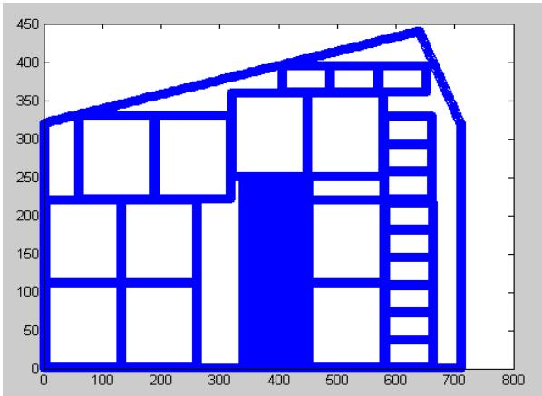

<details>
<summary>wireframe</summary>

| X | Y |
| --- | --- |
| 0 | ~325 |
| 100 | ~340 |
| 200 | ~360 |
| 300 | ~380 |
| 400 | ~400 |
| 500 | ~420 |
| 600 | ~440 |
| 700 | ~325 |
</details>

<table><tr><td></td><td>组合</td><td>功率</td><td>各支路电压(*支路数)</td><td>逆变器允许电压输入范围</td><td>逆变器种类</td><td>逆变器成本</td><td>光伏电池成本</td><td>发电所获得的钱</td><td>利润</td></tr><tr><td>东面</td><td>C1*10C10*10</td><td>1120w</td><td>276(*5)267(*1)</td><td>180-300v</td><td>SN12</td><td>6900</td><td>5376</td><td>9595</td><td>负值</td></tr></table>

由表中利润一栏可知该分组阵列的利润是负值，即该分组阵列无法获得经济效益，即便空余的边角面积整合在一起再放置 C1 或 C10 电池，计算发现 35 年所取得的利润也不及逆变器的成本。则东面墙不装任何光伏电池。

朝北斜面的单位面积盈利率过低，不装：

通过数据可知北面没有一种光伏电池是有盈利的，说明朝北是亏损的。

将其余面和东面一样进行处理，得到以下结果：

对于南面：  
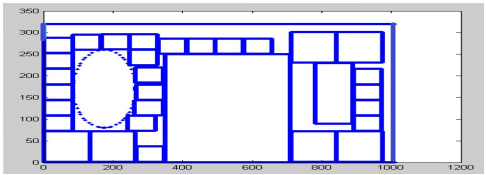

<details>
<summary>wireframe</summary>

| X | Y |
| --- | --- |
| 0 | ~75 |
| 0 | ~285 |
| 100 | ~285 |
| 100 | ~145 |
| 100 | ~75 |
| 100 | ~285 |
| 150 | ~285 |
| 150 | ~145 |
| 150 | ~75 |
| 150 | ~285 |
| 200 | ~285 |
| 200 | ~145 |
| 200 | ~75 |
| 200 | ~285 |
| 250 | ~285 |
| 250 | ~145 |
| 250 | ~75 |
| 250 | ~285 |
| 300 | ~285 |
| 300 | ~145 |
| 300 | ~75 |
| 300 | ~285 |
| 350 | ~285 |
| 350 | ~145 |
| 350 | ~75 |
| 350 | ~285 |
| 400 | ~285 |
| 400 | ~145 |
| 400 | ~75 |
| 400 | ~285 |
| 450 | ~285 |
| 450 | ~145 |
| 450 | ~75 |
| 450 | ~285 |
| 500 | ~285 |
| 500 | ~145 |
| 500 | ~75 |
| 500 | ~285 |
| 600 | ~285 |
| 600 | ~145 |
| 600 | ~75 |
| 600 | ~285 |
| 700 | ~285 |
| 700 | ~145 |
| 700 | ~75 |
| 700 | ~285 |
| 750 | ~315 |
| 750 | ~145 |
| 750 | ~75 |
| 750 | ~285 |
| 800 | ~315 |
| 800 | ~145 |
| 800 | ~75 |
| 800 | ~285 |
| 900 | ~315 |
| 900 | ~145 |
| 900 | ~75 |
| 900 | ~285 |
| 950 | ~315 |
| 950 | ~145 |
| 950 | ~75 |
| 950 | ~285 |
</details>

<table><tr><td></td><td>组合</td><td>功率</td><td>各支路电压(*支路数)</td><td>逆变器允许电压输入范围</td><td>逆变器种类</td><td>逆变器成本</td><td>光伏电池成本</td><td>发电所获得的钱</td><td>利润</td></tr><tr><td>南面</td><td>C2*6C10*21</td><td>600w</td><td>186.9*2186.9*3</td><td>180-300v</td><td>SN11</td><td>4500</td><td>2880</td><td>9249</td><td>1869</td></tr></table>

电池组件连接分组阵列输出电压及功率示意图：

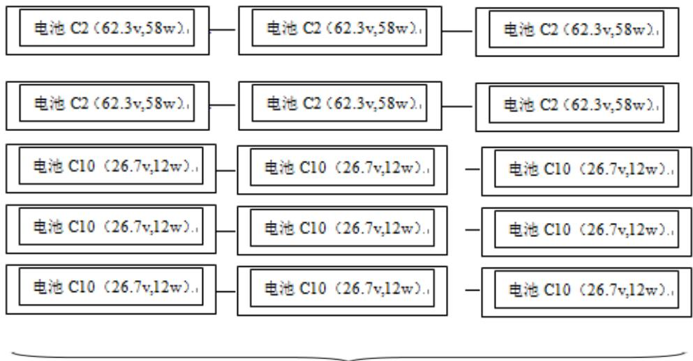

<details>
<summary>flowchart</summary>

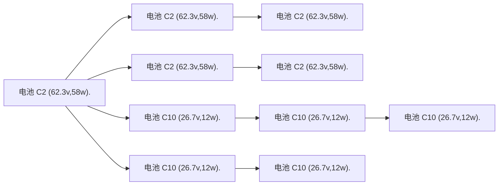
</details>

$$
C _ {1 0} * 7
$$

电池分组I：5串并联组输出电压=186.9v组输出功率=600w

西面：  
当考虑利用 B类电池时  
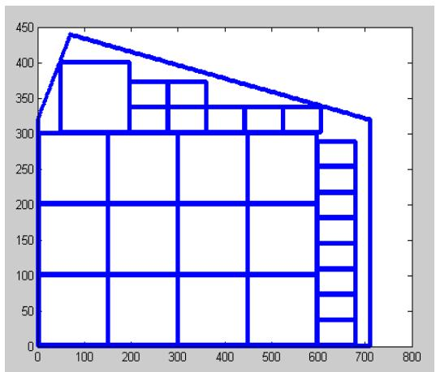

<details>
<summary>wireframe</summary>

| X | Y |
| --- | --- |
| 0 | ~325 |
| 70 | 440 |
| 680 | 320 |
| 610 | 340 |
| 610 | 290 |
| 610 | 250 |
| 610 | 220 |
| 610 | 180 |
| 610 | 150 |
| 610 | 120 |
| 610 | 80 |
| 610 | 40 |
| 610 | 0 |
| 200 | 400 |
| 200 | 375 |
| 200 | 340 |
| 200 | 300 |
| 200 | 100 |
| 160 | 100 |
| 310 | 100 |
| 310 | 375 |
| 310 | 340 |
| 310 | 300 |
| 310 | 100 |
| 460 | 100 |
| 460 | 340 |
| 460 | 340 |
| 460 | 300 |
| 460 | 100 |
| 610 | 340 |
| 610 | 340 |
| 610 | 290 |
| 610 | 250 |
| 610 | 220 |
| 610 | 180 |
| 610 | 150 |
| 610 | 80 |
| 610 | 40 |
| 610 | 0 |
</details>

只考虑 C类光伏电池  
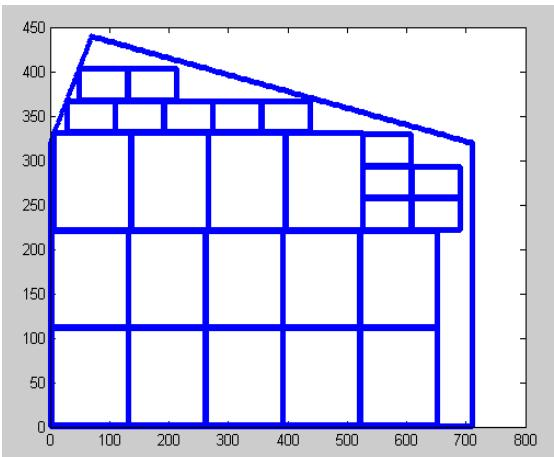

<details>
<summary>wireframe</summary>

| X | Y |
| --- | --- |
| 0 | 325 |
| 70 | 440 |
| 680 | 320 |
| 660 | 290 |
| 660 | 260 |
| 660 | 220 |
| 530 | 330 |
| 430 | 370 |
| 210 | 400 |
| 140 | 400 |
| 140 | 365 |
| 140 | 330 |
| 140 | 220 |
| 260 | 330 |
| 360 | 330 |
| 460 | 330 |
| 530 | 330 |
| 610 | 330 |
| 610 | 290 |
| 610 | 260 |
| 610 | 220 |
| 660 | 220 |
| 660 | 115 |
| 660 | 0 |
| 260 | 115 |
| 140 | 115 |
| 140 | 0 |
| 260 | 0 |
| 360 | 0 |
| 460 | 0 |
| 530 | 0 |
| 610 | 0 |
| 710 | 0 |
| 710 | 320 |
| 710 | 220 |
| 710 | 115 |
| 710 | 0 |
</details>

<table><tr><td>有B类电池</td><td>组合</td><td>功率</td><td>各支路电压(*支路数)</td><td>逆变器允许电压输入范围</td><td>逆变器种类</td><td>逆变器成本</td><td>光伏电池成本</td><td>发电所获得的钱</td><td>利润</td></tr><tr><td>西面</td><td>B3*12C10*20</td><td>2910w</td><td>134.4*3133.5*3</td><td>99-150v</td><td>SN8</td><td>15300</td><td>32652</td><td>34741</td><td>负值</td></tr></table>

<table><tr><td>无B类电池</td><td>组合</td><td>功率</td><td colspan="2">各支路电压(*支路数)</td><td>逆变器允许电压输入范围</td><td>逆变器种类</td><td>逆变器成本</td><td>光伏电池成本</td><td>发电所获得的钱</td><td>利润</td></tr><tr><td>西面</td><td>C1*14C10*10</td><td>1520w</td><td>276*7267*1</td><td colspan="2">180-300v</td><td>SN12</td><td>6900</td><td>7296</td><td>19731</td><td>5535</td></tr></table>

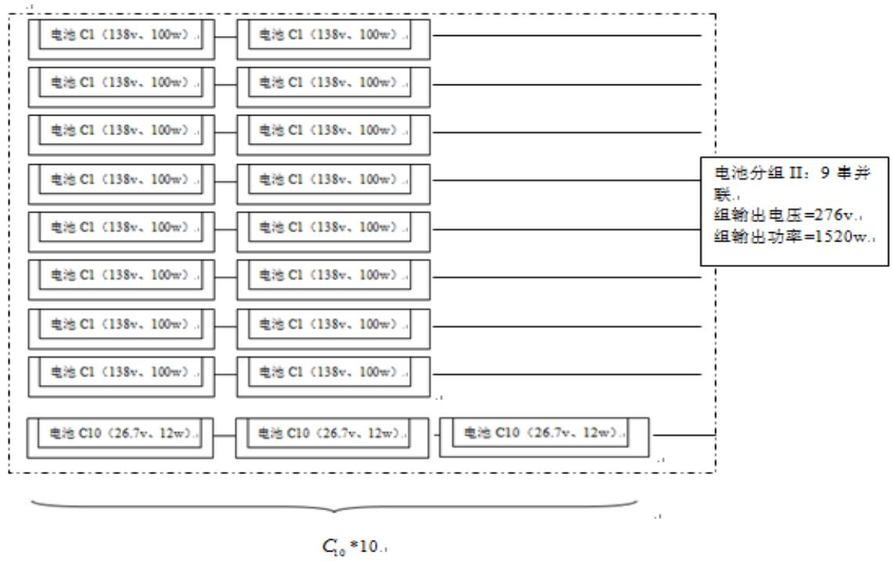

<details>
<summary>flowchart</summary>

This diagram illustrates the power distribution and component grouping structure of a battery, showing how individual battery modules (C1 and C10) are grouped into specific voltage and power ranges.
</details>

屋顶朝南斜面：  
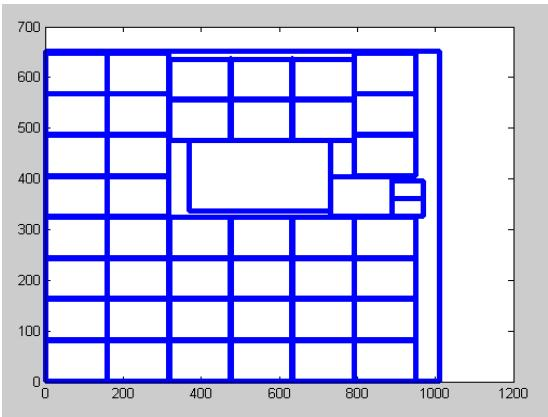

<details>
<summary>wireframe</summary>

| X | Y |
| --- | --- |
| 0 | 650 |
| 1000 | 650 |
| 0 | 330 |
| 950 | 330 |
| 950 | 400 |
| 850 | 400 |
| 750 | 475 |
| 400 | 475 |
| 350 | 330 |
| 350 | 630 |
| 200 | 630 |
| 1000 | 630 |
</details>

<table><tr><td></td><td>组合</td><td>功率</td><td>各支路电压(*支路数)</td><td>逆变器允许电压输入范围</td><td>逆变器种类</td><td>逆变器成本</td><td>光伏电池成本</td><td>发电所获得的钱</td><td>利润</td></tr><tr><td>南斜面</td><td>A3*40</td><td>8000w</td><td>230.5*8</td><td>180-300v</td><td>SN16</td><td>35000</td><td>119200</td><td>204981</td><td>50781</td></tr></table>

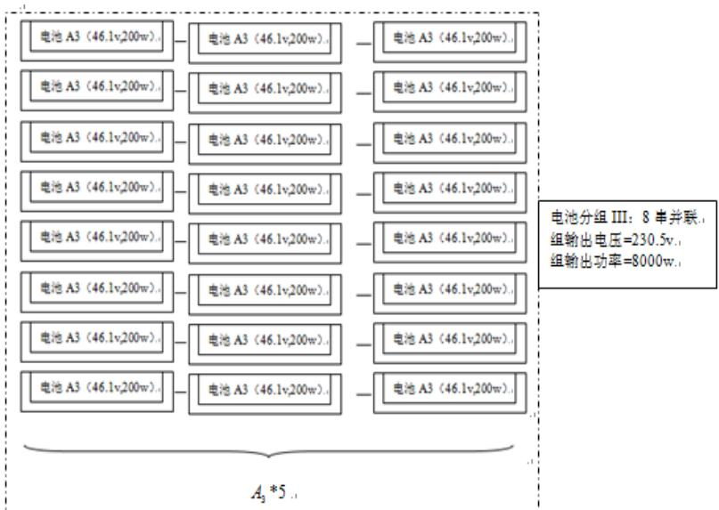

<details>
<summary>flowchart</summary>

This diagram illustrates the power distribution and output calculation logic for a 8-branch system, showing how individual battery modules (A3) are grouped together to produce an output power of 8000W.
</details>

<table><tr><td></td><td>组合</td><td>功率</td><td>各支路电压(*支路数)</td><td>逆变器电压范围</td><td>逆变器种类</td><td>逆变器成本</td><td>光伏电池成本</td><td>发电所获得的钱</td><td>利润</td></tr><tr><td>南面</td><td>C2*6C10*21</td><td>600w</td><td>186.9*2186.9*3</td><td>180-300v</td><td>SN11</td><td>4500</td><td>2880</td><td>9249</td><td>1869</td></tr><tr><td>西面</td><td>C1*14C10*10</td><td>1520w</td><td>276*7267*1</td><td>180-300v</td><td>SN12</td><td>6900</td><td>7296</td><td>19731</td><td>5535</td></tr><tr><td>南斜面</td><td>A3*40</td><td>8000w</td><td>230.5*8</td><td>180-300v</td><td>SN16</td><td>35000</td><td>119200</td><td>204981</td><td>50781</td></tr></table>

由三面铺设，得到结果为 35 年发电量为 497942kw·h，经济效益为 73195 元，投资的回报年限为 23.7年，单位发电成本为 0.353元

## 5.3 问题二的求解

对于架空方式安装光伏电池时，光伏电池板的朝向与倾角就可以得到改变，而倾角与朝向都很大程度上影响了光伏电池的工作效率。在此我们需要找到光伏电池板的最优倾角与最佳朝向。

在此我们只考虑屋顶上的电池板进行架空处理，而对墙面上的电池板不做架空处理。

我们的最终目标与第一问一致，所以建立多目标规划模型如下：

$$
\begin{array}{l} P = \max \sum_ {k = 1} ^ {K} \sum_ {i = 1} ^ {I} \sum_ {j = 1} ^ {J} P _ {k} \eta_ {k i j} S _ {k i j}; \\ \mathrm{W} = \max (\mathrm{P} / \sum_ {\mathrm{k} = 1} ^ {\mathrm{K}} \sum_ {\mathrm{i} = 1} ^ {\mathrm{I}} \mathrm{C} _ {\mathrm{ki}}) \\ \text {s.t.} \left\{ \begin{array}{l} \sum_ {\mathrm{i}} \sum_ {i} S _ {k i j} \leq S _ {k} \\ \sum_ {j} U _ {o c i j} \leq U _ {i} \\ \sum_ {j} P _ {o c i j} \leq P _ {i} \end{array} \right. \\ \end{array}
$$

其中 $\mathrm { P _ { k } }$ 不再是一个确定值，它随着电池板倾角与朝向而变化，显然 $\boldsymbol { \mathsf { \Pi } } _ { \mathsf { \Pi } } ^ { \mathsf { \Pi } } \eta _ { \mathrm { k i j } }$ 是关于辐射强度 $\mathrm { P _ { k } }$ 的阶梯递增函数，所以全年太阳能光伏发电总量 P 是 $\mathrm { P _ { k } }$ 的递增函数。因此该多目标规划的最优解的必要条件是倾角与朝向取到最佳朝向与倾角。

所以下面寻找最佳倾角与最佳朝向，[3]参考相关文献得到如下模型：

模型一：对于附在符合均匀或近似均衡的独立光伏系统，太阳辐射均匀性对光伏系统的影响很大，对其进行量化处理时很有必要的。为此，可以引入一个量化参数，即辐射累计偏差δ，其数学表达式为：

$$
\delta = \sum_ {i} ^ {1 2} | H _ {\beta} - \overline {{H}} _ {\beta} | M (i)
$$

式中， $H _ { \mathbf { \Gamma } _ { t \beta } }$ 为倾角为 β 的斜面上个月平均太阳辐射量； $\overline { { H } } _ { \ t \beta }$ 为该斜面上年平均太阳辐射量； $M ( i )$ 为第i 月的天数。可见， $\boldsymbol { \mathcal { S } }$ 的大小直接反映了全国辐射的均匀性， $\delta _ { \parallel }$ 越小辐射均匀性越好。按照附在符合均匀或近似均衡的独立光伏系统的要求，理想情况当然是选择某个倾角是的 $\overline { { \boldsymbol { H } _ { \mathbf { \Lambda } _ { t \beta } } } }$ 为最大值、 $\delta$ 为最小值。但实际情况是，而这所对应的倾角有一定的间隔，因此选择太阳电池组件的倾角时，只考虑 $\overline { { \boldsymbol { H } _ { \mathbf { \Lambda } _ { t \beta } } } }$ 为最大值或 $\boldsymbol { \mathscr { S } }$ 取最小值必然会有片面性，应当在二者多对应的倾角之间进行优选。为此，需要定义一个新的量来描述倾斜面上太阳辐射的综合特性，称其为鞋面辐射系数，以 K表示，其数学表示式为

$$
K = \frac {3 6 \overline {{\mathcal {H}}} _ {t \beta} - \delta}{3 6 \mathcal {H}}
$$

式中， $\overline { { H } }$ 为水平面上的年平均太阳辐射量。由于 $\overline { { \boldsymbol { H } _ { \mathbf { \Lambda } _ { t \beta } } } }$ 和 $\mathcal { S }$ 都与太阳电池组件的倾角有关，所以当 K取极大值是，应当有

$$
\frac {d K}{d \beta} = 0
$$

求解上式，即可求得最佳倾角。可利用上述方法，采用 Excel 进行计算，取步长为 ，计算出大同市的最佳辐射倾角。由于利用此模型求解过于复杂，下面介绍另一种模型。

模型二：

Hottel 和Woertz（1942）提出的各项同性模型假定，倾斜面上的漫射辐射和地面反射辐射之和是不变的，无论它的方向如何。这种情况下，倾斜面上的太阳辐射就等于光束贡献和水平面上的漫射之和。入射到倾斜面上的太阳总辐射估算为：

$$
I = H _ {b} R _ {b} + H _ {d} R _ {d} + H \rho R _ {r}
$$

式中， $\begin{array} { c } { { R _ { d } = { \cos } ^ { 2 } { \displaystyle \frac { \beta } { 2 } } } } \\ { { { } } } \\ { { R _ { r } = { \sin } ^ { 2 } { \displaystyle \frac { \beta } { 2 } } } } \end{array}$ ，β 为倾斜角。

$$
R _ {r} = \sin^ {2} \frac {\beta}{2}
$$

根 据 平 面 入 射 角 的 概 念 ， 该 公 式 转 化 为 ：$I = I _ { { b } } \cos \theta + H _ { { d } } \cos ^ { 2 } { \frac { \beta } { 2 } } + H \rho \sin ^ { 2 } { \frac { \beta } { 2 } }$ ，第三项相对前两项很小，可以忽略。

$$
\begin{array}{l} \cos \theta = \sin \delta \sin \phi \cos \beta \\ - \sin \delta \cos \phi \sin \beta \cos \gamma \\ + \cos \delta \cos \phi \cos \beta \cos \omega \\ + \cos \delta \sin \phi \sin \beta \cos \gamma \cos \omega \\ + \cos \delta \sin \beta \sin \gamma \sin \omega \\ \end{array}
$$

采用 Excel 进行计算，取步长为 $1 ^ { \circ }$ ，依次算得各个倾斜角对应的斜面辐射值，通过比较，计算出大同市的最佳辐射倾角。为 38 度。同样，利用该模型可以得到最佳的朝向，由于最佳朝向是正南偏西的，通过 Excel 进行计算，取步长为 <sub>，</sub>当全年辐射大于200 的总和最大时停止搜索，解得最佳的朝向为南偏西 $2 2 ^ { \circ }$ （具体计算过程见附件 Excel 表）

斜面  
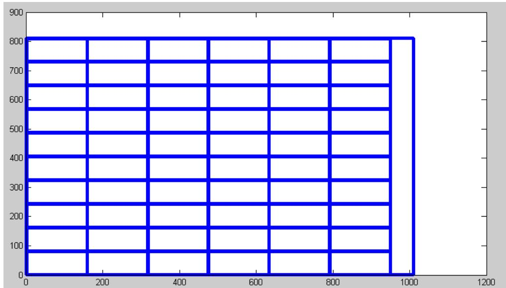

<details>
<summary>wireframe</summary>

| X | Y |
| --- | --- |
| 0 | 810 |
| 950 | 810 |
| 950 | 730 |
| 950 | 640 |
| 950 | 540 |
| 950 | 440 |
| 950 | 340 |
| 950 | 240 |
| 950 | 140 |
| 950 | 80 |
| 1000 | 810 |
| 1000 | 730 |
| 1000 | 640 |
| 1000 | 540 |
| 1000 | 440 |
| 1000 | 340 |
| 1000 | 240 |
| 1000 | 140 |
| 1000 | 80 |
</details>

<table><tr><td></td><td>组合</td><td>功率</td><td>电压</td><td>逆变器电压范围</td><td>逆变器</td><td>逆变器成本</td><td>光伏电池成本</td><td>发电所获得的钱</td><td>利润</td></tr><tr><td>大斜面II</td><td>A3*60</td><td>12000w</td><td>230.5*8230.5*4</td><td>180-300v</td><td>SN16SN14</td><td>50300</td><td>178800</td><td>344070</td><td>114970</td></tr></table>

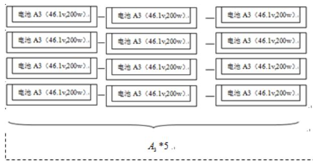

<details>
<summary>flowchart</summary>

This diagram illustrates a hierarchical classification or grouping structure for '电池 A3 (46.1v,200w)', showing how different battery types are grouped into specific sub-categories with associated values.
</details>

电池分组II：4 患并联组输出电压=230.5v.组输出功率=4000w..


<details>
<summary>natural_image</summary>

3D rendering of a modern building with a grid of blue-tinted panels on top, no text or symbols visible.
</details>

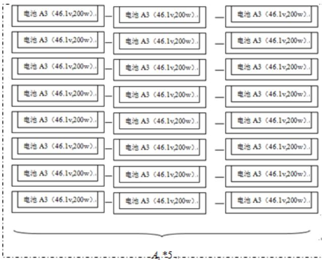

<details>
<summary>flowchart</summary>

This diagram illustrates a hierarchical classification or classification structure for '电池 A3 (46.1v,200w)', showing how different sub-categories are grouped into three main levels.
</details>

电池分组ⅡI 组输出电压=230.5v. 组输出功率=8000w.

## 5.3 问题三的求解

从问题一中考虑如何铺设使达到多目标的优化，以及问题二中在房子倾角和朝向可变情况下的求解结果，问题三考虑延续前两者所共有的特点。

## 5.3.1 对于房子外观尺寸的理解

在问题二求解过后，可得针对纬度一定的地区，其实房顶与水平面都存在一个理想的倾角使其吸收的太阳辐射能尽可能大，并且通过问题一中解得北面及面向北面的倾斜面无法满足铺设条件，这样相当于使斜面面积和西、南面极大化，简易得将房子的外观构造定型为以下结构。（图）

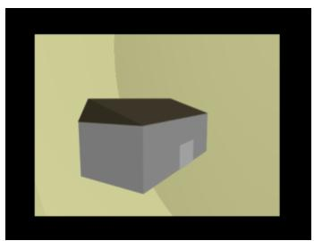

<details>
<summary>natural_image</summary>

Simple 3D-rendered gray house icon with no text or symbols
</details>

转变为

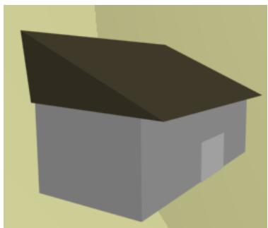

<details>
<summary>natural_image</summary>

Simple 3D illustration of a house with a dark roof and gray facade (no text or symbols)
</details>

## 5.3.2 确定房子外观尺寸

以满足附件 7中小屋建筑要求为约束，使每个假定的可铺设的房屋平面得以接受的光辐射能为目标函数，建立一个非线性规划模型。

其中结合实际情况，参考《民用住宅设计规范》，认为给房屋加上一个 1.2m\*2m的门，通过 lingo 解得最优解为长 15m，宽为 3.3m，朝南墙的高度为 2.8m（详见附件）。结果如下：

南面：  
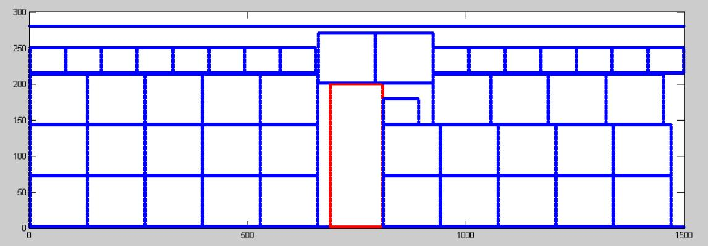

<details>
<summary>wireframe</summary>

| X | Y |
| --- | --- |
| 0 | 280 |
| ~650 | 270 |
| ~650 | 200 |
| ~850 | 180 |
| ~850 | 140 |
| ~900 | 140 |
| ~1450 | 140 |
| ~1450 | 210 |
| ~1450 | 250 |
| ~1450 | 280 |
</details>

<table><tr><td></td><td>组合</td><td>功率</td><td>电压</td><td>逆变器电压范围</td><td>逆变器种类</td><td>逆变器成本</td><td>光伏电池成本</td><td>发电所获得的钱</td></tr><tr><td>东面</td><td>C2*40C10*9</td><td>24280</td><td>249*10240*1</td><td>180-300v</td><td>SN13</td><td>10300</td><td>11654</td><td>36171</td></tr></table>

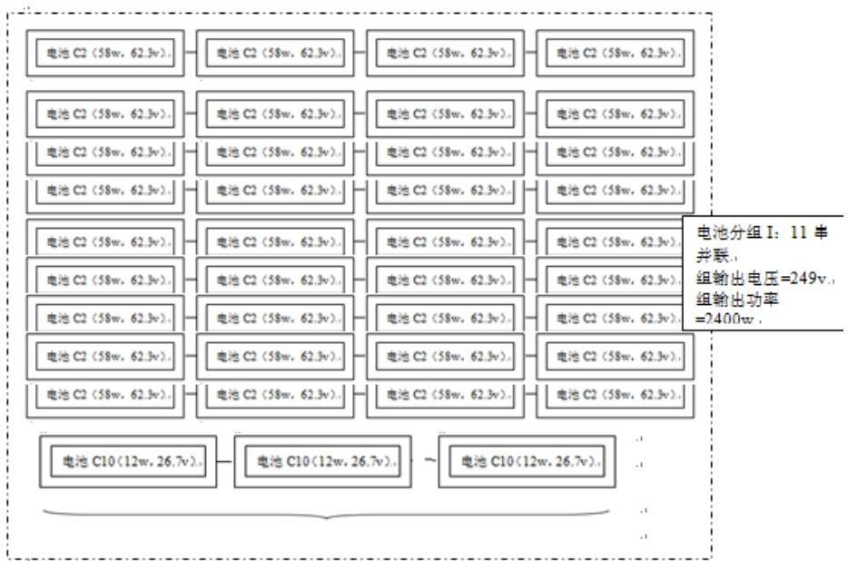

<details>
<summary>flowchart</summary>

This image displays a hierarchical system architecture or power distribution diagram for a distributed 11-segment battery, showing the breakdown of voltage and power outputs from individual battery modules (C2, C10) to their final output.
</details>

C0 \*9..

西面  
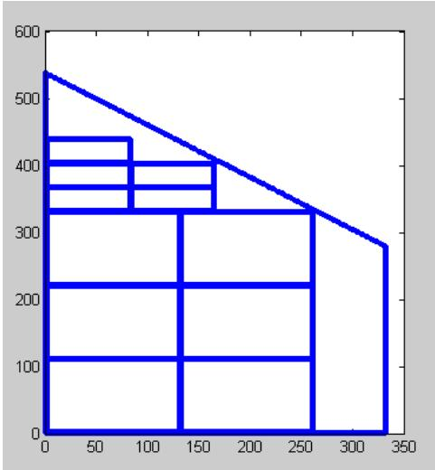

<details>
<summary>wireframe</summary>

| X | Y |
| --- | --- |
| 0 | ~540 |
| 85 | 440 |
| 85 | 400 |
| 85 | 370 |
| 85 | 330 |
| 160 | 400 |
| 160 | 370 |
| 160 | 330 |
| 260 | 330 |
| 260 | 220 |
| 260 | 110 |
| 330 | 280 |
| 330 | 0 |
</details>

<table><tr><td></td><td>组合</td><td>功率</td><td>电压</td><td>逆变器电压范围</td><td>逆变器种类</td><td>逆变器成本</td><td>光伏电池成本</td><td>发电所获得的钱</td></tr><tr><td>西面</td><td>C1*6C10*10</td><td>1120w</td><td>276*3267*1</td><td>180-300v</td><td>SN11</td><td>4500</td><td>3456</td><td>6024</td></tr></table>

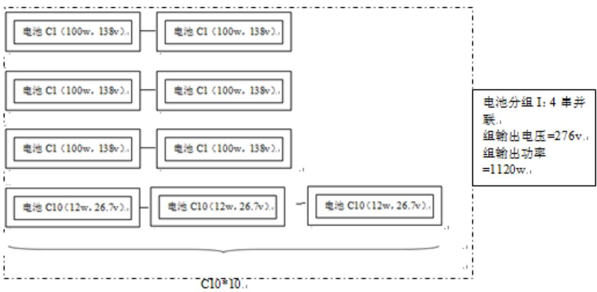

<details>
<summary>flowchart</summary>

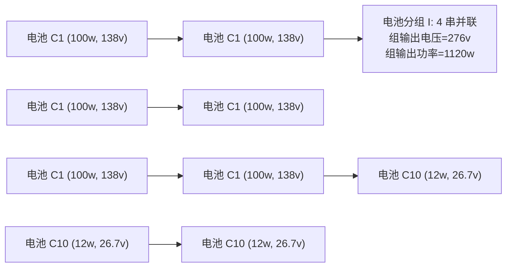
</details>

斜面（加挑檐）：  
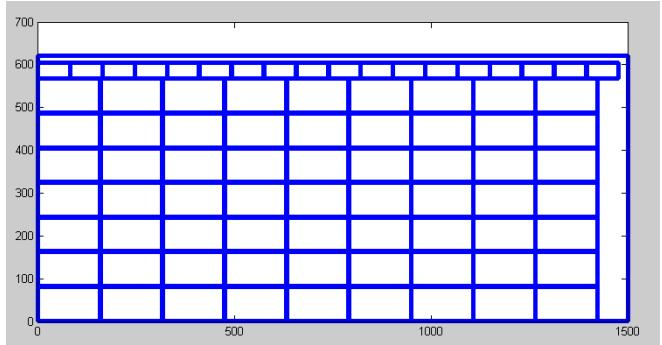

<details>
<summary>wireframe</summary>

| X | Y |
| --- | --- |
| ~1400 | ~620 |
| ~1400 | ~580 |
| ~1400 | ~530 |
| ~1400 | ~480 |
| ~1400 | ~430 |
| ~1400 | ~380 |
| ~1400 | ~330 |
| ~1400 | ~280 |
| ~1400 | ~230 |
| ~1400 | ~180 |
| ~1400 | ~130 |
| ~1400 | ~80 |
| ~1400 | ~30 |
| ~1400 | ~60 |
| ~1400 | ~90 |
| ~1400 | ~120 |
| ~1400 | ~150 |
| ~1400 | ~180 |
| ~1400 | ~210 |
| ~1400 | ~240 |
| ~1400 | ~270 |
| ~1400 | ~300 |
| ~1400 | ~330 |
| ~1400 | ~360 |
| ~1400 | ~390 |
| ~1400 | ~420 |
| ~1400 | ~450 |
| ~1400 | ~480 |
| ~1400 | ~510 |
| ~1400 | ~540 |
| ~1400 | ~570 |
| ~1400 | ~600 |
| ~1400 | ~630 |
| ~1400 | ~660 |
| ~1400 | ~690 |
| ~1400 | ~720 |
| 1500 | 620 |
| 1500 | 580 |
| 1500 | 530 |
| 1500 | 480 |
| 1500 | 430 |
| 1500 | 380 |
| 1500 | 330 |
| 1500 | 280 |
| 1500 | 23 |
| 1500 | 18 |
| 1500 | 13 |
| 1500 | 8 |
| 1500 | 3 |
</details>

<table><tr><td></td><td>组合</td><td>功率</td><td>电压</td><td>逆变器电压范围</td><td>逆变器种类</td><td>逆变器成本</td><td>光伏电池成本</td><td>发电所获得的收益</td></tr><tr><td>斜面</td><td>A3*63C10*18</td><td>12816w</td><td>230.5*8230.5*4240.3*2</td><td>180-300v</td><td>SN15SN16</td><td>57000</td><td>188776</td><td>366813</td></tr></table>

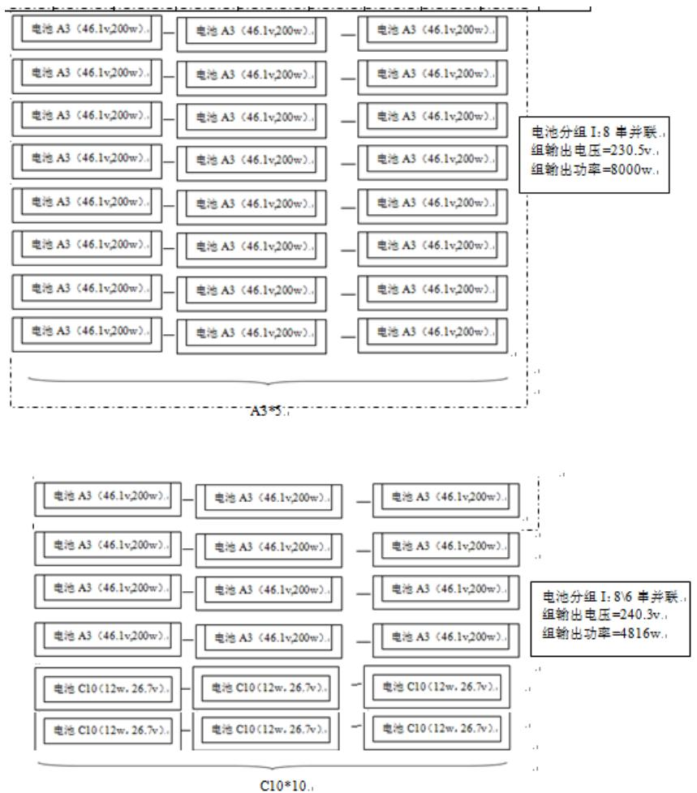

得到小屋的35 年发电量为805968 kw·h，单位发电成本为0.332 元。

## 六、 模型分析

本文将此问题转化为一个多目标规划模型，在对单位发电量所需的最低成本先进行约束的前提下来求解最大发电量。

若考虑将逆变器与不同电池组合，显然问题会因为组合数过多而停滞，因此人为的在求得每一种光伏电池在 35 年寿命周期的单位面积的盈利率后，以转换效率为先选择较优的光伏电池和逆变器进行组合，虽然无法得到最优解，但保证了结果的合理性以及优良性，并且通过手工补差，事实上屋面的剩余面积已经对解不具有太大的影响，因此认为此模型是可操作的，并且可求得较优的解。

## 七、 模型推广

本文综合利用多目标规划模型，非线性规划模型等。在实际生活工作中，多目标规划是常常遇见的问题，即所要考虑的目标不单单是一个，当有多个目标时，我们要求得一个相对优化的解，使得它在多个目标里能综合考虑各个目标。在多目标模型中，除了本题这种处理办法，还可以利用目标达到法，设置权值将多目标问题转化为单目标问题，也可以利用罚函数法，或者可以把某一个目标转化成约束，但是对于不同的问题性质有不同的合适的处理方法，不能对于不同的多目标问题都采用同一种方法。所以此模型能解决许多单目标模型无法解决的问题。可以说本文建立的多目标模型是具有普遍实际意义的，具有极强的实际应用能力。另外，在本文中利用了 矩阵来模拟表面的铺设情况，其实除了本题之外，利用矩阵来一一对应的代表实际问题是简单而有效的，例如图论算法便是将实际问题抽象成了矩阵，为问题解决带来了极大的便利。综上，本文中用到的方法都是有良好的普适性与可推广性的。

## 八、 结论

将问题简化为一个多规划模型，在对单位发电量所消耗的成本进行约束后，求解得问题一的结果为开头全年发电量为 1580735kw·h，35 年发电量为497942kw·h，35 年纯收入为 73195 元，投资的回报年限为 23.7 年，单位发电成本为 0.353 元。

问题二中求得最佳倾角为 38°，最佳的朝向为南偏西 22°,最终的结果为开头全年发电量为 23685kw·h，为 35 年发电量为 746100 kw·h，35 年纯收入为122374元，投资的回报年限为 21.1年，单位发电成本为 0.336元。

问题三的结果为房屋的长为 15m，宽为 3.3m,朝南墙的高度为 2.8m，35 年发电量为 805968 kw·h，单位发电成本为 0.332 元。

该模型在有效的计算后对模型进行了正确的简化，剔除了部分无效的数据，使所需处理的数据量大幅度下降，且通过对单位面积的盈利率等概念的认知加快求解过程，使求得的解较好的贴合目标函数

不过模型无法精确得事先完全的搜索找到一个铺排的最优解，只是在人为的加以对某一目标的约束后求得的较优的解，且在光伏电池和逆变器的配对过程中需要一些人为的判断。

## 九、 参考文献

[1]芳荣升等，太阳能应用 p64，北京，中国农业机械出版社，1997 年  
[2] Majid Ghassemi,太阳能可再生能源与环境 p39,北京，人民邮电出版社，2010年

[3]沈辉,太阳能光伏发电技术，北京，化学工业出版社，2005年

## 附录

问题一：  
东立面：  
```matlab
clc,clear;
m=710;n=440;
dong(1:1:m,1:1:n)=0; %初始赋 0
for i=1:1:640
    dong(i,floor(321+i*12/64):1:440)=2;
end
for i=1:1:640
    dong(i,floor(320+(710-i)*12/7):1:440)=2;
end
for i=1:1:710
    if i<640
        j=floor(321+i*12/64);
    else
        j=floor(320+(710-i)*12/7);
    end
    dong(i,j)=1;
end
dong(340:1:450,1:1:250)=1;%门标记
dong(1,1:1:320)=1;dong(710,1:1:320)=1;dong(1:1:710,1)=1;%墙面下面三边
dong1=ones(130,110)*2;      %先生成 C1 的矩阵
dong1(1,:)=1;dong1(130,:)=1;dong1(:,1)=1;dong1(:,110)=1;
for x=2:1:579   %710-130
    for y=2:1:329
        if any(any(dong(x:1:x+129,y:1:y+109)))==0
            dong(x:1:x+129,y:1:y+109)=dong1;
        end
    end
end
dong2=ones(82,36)*2;          %先生成 C10 的矩阵
dong2(1,:)=1;dong2(82,:)=1;dong2(:,1)=1;dong2(:,36)=1;
for x=2:1:628   %710-82
    for y=2:1:404
        if any(any(dong(x:1:x+81,y:1:y+35)))==0
            dong(x:1:x+81,y:1:y+35)=dong2;
        end
    end
end
for i=1:1:m
    for j=1:1:n
```

```matlab
if dong(i,j)==1
            plot(i,j,'b.');hold on;
        end
    end
end
```

南立面：  
```matlab
clc,clear;
m=1010;n=320;
xi(1:1:m,1:1:n)=0;%初始赋 0
nan(1,:)=1;nan(m,:)=1;nan(:,1)=1;nan(:,n)=1;%sibian
for x=85:1:265    %门窗：边界标 1，内部标 2
    for y=80:1:260
        d=sqrt((x-175)^2+(y-170)^2);
        if abs(d-90)<10^(-1)
            nan(x,y)=1;
        end
        if d<90
            nan(x,y)=2;
        end
    end
end
nan(350:1:710,1:1:250)=1;    %两扇门
nan(351:1:709,2:1:249)=2;
nan(780:1:890,90:1:230)=1;
nan(781:1:889,91:1:229)=2;
nan1=ones(132,71)*2;      %先生成 C2 的矩阵
nan1(1,:)=1;nan1(132,:)=1;nan1(:,1)=1;nan1(:,71)=1;
for x=2:1:878 %1010-132
    for y=2:1:249
        if any(any(nan(x:1:x+131,y:1:y+70)))==0
            nan(x:1:x+131,y:1:y+70)=nan1;
        end
    end
end
nan2=ones(82,36)*2;      %先生成 C10 的矩阵
nan2(1,:)=1;nan2(82,:)=1;nan2(:,1)=1;nan2(:,36)=1;
for x=2:1:928 %1010-82
    for y=2:1:284
        if any(any(nan(x:1:x+81,y:1:y+35)))==0
            nan(x:1:x+81,y:1:y+35)=nan2;
        end
    end
end
```

```matlab
for i=1:1:m
    for j=1:1:n
        if nan(i,j)==1
            plot(i,j,'b.');hold on;
        end
    end
End
```

西立面：  
```matlab
clc,clear;
m=710;n=440;
xi(1:1:m,1:1:n)=0;%初始赋 0
for i=1:1:70
    xi(i,floor(320+i*12/7):1:440)=2;
end
for i=70:1:710
    xi(i,floor(320+(710-i)*12/64):1:440)=2;
end
for i=1:1:710
    if i<70
        j=floor(320+i*12/7);
    else
        j=floor(320+(710-i)*12/64);
    end
    xi(i,j)=1;
end
xi(1,1:1:320)=1;xi(710,1:1:320)=1;xi(1:1:710,1)=1;%sanbian
xi1=ones(130,110)*2;%先生成 C1 的矩阵
xi1(1,:)=1;xi1(130,:)=1;xi1(:,1)=1;xi1(:,110)=1;
for x=2:1:580 %710-130
    for y=2:1:330
        if any(any(xi(x:1:x+129,y:1:y+109)))==0
            xi(x:1:x+129,y:1:y+109)=xi1;
        end
    end
end
xi3=ones(82,36)*2;      %先生成电池矩阵 C10
xi3(1,:)=1;xi3(82,:)=1;xi3(:,1)=1;xi3(:,36)=1;
for x=2:1:628
    for y=2:1:404
        if any(any(xi(x:1:x+81,y:1:y+35)))==0
            xi(x:1:x+81,y:1:y+35)=xi3;
        end
    end
```

```matlab
end
for i=1:1:m
    for j=1:1:n
        if xi(i,j)==1
            plot(i,j,'b.');hold on;
        end
    end
End
```

南斜面：  
```matlab
clc,clear;
m=1010;n=651;
nanxie(1:1:m,1:1:n)=0;%初始赋 0
nanxie(370:1:730,336:1:475)=1;
nanxie(371:1:729,337:1:474)=2;
nanxie(1,:)=1;nanxie(1010,:)=1;nanxie(:,1)=1;nanxie(:,651)=1;
nanxie1=ones(158,81)*2;    %先生成 A3 的矩阵
nanxie1(1,:)=1;nanxie1(158,:)=1;nanxie1(:,1)=1;nanxie1(:,80)=1;
for x=2:1:852      %1010-158
    for y=2:1:570
        if any(any(nanxie(x:1:x+157,y:1:y+80)))==0
            nanxie(x:1:x+157,y:1:y+80)=nanxie1;
        end
    end
end
nanxie2=ones(82,36)*2;     %先生成 C10 的矩阵
nanxie2(1,:)=1;nanxie2(82,:)=1;nanxie2(:,1)=1;nanxie2(:,36)=1;
for x=2:1:928 %1010-82
    for y=2:1:615
        if any(any(nanxie(x:1:x+81,y:1:y+35)))==0
            nanxie(x:1:x+81,y:1:y+35)=nanxie2;
        end
    end
end

for i=1:1:m
    for j=1:1:n
        if nanxie(i,j)==1
            plot(i,j,'b.');hold on;
        end
    end
End
```

北斜面：  
```matlab
clc,clear;
m=1010;n=139;
beixiemian(1:1:m,1:1:n)=1;%初始赋
beixiemian(2:1:m-1,2:1:n-1)=0;
beixiemian1=ones(130,110)*2;    %先生成 C1 的矩阵
beixiemian1(1,:)=1;beixiemian1(130,:)=1;beixiemian1(:,1)=1;beixiemian1(:,110)=1;
for x=2:1:880 %1010-130
    for y=2:1:29
        if any(any(beixiemian(x:1:x+129,y:1:y+109)))==0
            beixiemian(x:1:x+129,y:1:y+109)=beixiemian1;
        end
    end
end
beixiemian2=ones(82,36)*2;      %先生成 C10 的矩阵
beixiemian2(1,:)=1;beixiemian2(82,:)=1;beixiemian2(:,1)=1;beixiemian2(:,36)=1;
for x=2:1:928 %1010-82
    for y=2:1:103
        if any(any(beixiemian(x:1:x+81,y:1:y+35)))==0
            beixiemian(x:1:x+81,y:1:y+35)=beixiemian2;
        end
    end
end
for i=1:1:m
    for j=1:1:n
        if beixiemian(i,j)==1
            plot(i,j,'b.');hold on;
        end
    end
End
```

## 问题二：

南斜面：  
```matlab
clc,clear;
m=1010;n=812;
nanxie(1:1:m,1:1:n)=0;%初始赋 0
nanxie(1,:)=1;nanxie(1010,:)=1;nanxie(:,1)=1;nanxie(:,812)=1;
nanxie1=ones(158,81)*2;%先生成 A3 的矩阵
nanxie1(1,:)=1;nanxie1(158,:)=1;nanxie1(:,1)=1;nanxie1(:,80)=1;
for x=2:1:852 %1010-158
```

```matlab
for y=2:1:731
    if any(any(nanxie(x:1:x+157,y:1:y+80)))==0
        nanxie(x:1:x+157,y:1:y+80)=nanxie1;
    end
end
end
nanxie2=ones(82,36)*2;%先生成 C10 的矩阵
nanxie2(1,:)=1;nanxie2(82,:)=1;nanxie2(:,1)=1;nanxie2(:,36)=1;
for x=2:1:928 %1010-82
    for y=2:1:776
        if any(any(nanxie(x:1:x+81,y:1:y+35)))==0
            nanxie(x:1:x+81,y:1:y+35)=nanxie2;
    end
end
end

for i=1:1:m
    for j=1:1:n
        if nanxie(i,j)==1
            plot(i,j,'b.');hold on;
    end
end
end
```

## 问题三：

南面：

```matlab
clc,clear;
m=1500;n=280;
xi(1:1:m,1:1:n)=0;%初始赋 0
nanmian(1,:)=1;nanmian(m,:)=1;nanmian(:,1)=1;nanmian(:,n)=1;%sibian
nanmian(690:1:810,1:1:200)=3;%一扇门
nanmian(691:1:809,2:1:199)=2;
nanmian1=ones(132,71)*2;%先生成 C2 的矩阵
nanmian1(1,:)=1;nanmian1(132,:)=1;nanmian1(:,1)=1;nanmian1(:,71)=1;
jishu=0;
for x=2:1:1368 %1500-132
    for y=2:1:209
        if any(any(nanmian(x:1:x+131,y:1:y+70)))==0
            nanmian(x:1:x+131,y:1:y+70)=nanmian1;jishu=jishu+1;
        end
    end
end
jishu
```

```matlab
nanmian2=ones(82,36)*2;%先生成 C10 的矩阵
nanmian2(1,:)=1;nanmian2(82,:)=1;nanmian2(:,1)=1;nanmian2(:,36)=1;
jishu=0;
for x=2:1:1418 %1500-82
    for y=2:1:244
        if any(any(nanmian(x:1:x+81,y:1:y+35)))==0
            nanmian(x:1:x+81,y:1:y+35)=nanmian2;jishu=jishu+1;
        end
    end
end
jishu
for i=1:1:m
    for j=1:1:n
        if nanmian(i,j)==1
            plot(i,j,'b.');hold on;
        end
        if nanmian(i,j)==3
            plot(i,j,'r.');hold on;
        end
    end
end
```

西面：  
```matlab
clc,clear;
m=332;n=539;
xi(1:1:m,1:1:n)=0;%初始赋 0
for i=1:1:332
    j=floor(539-i*259/332);
    xi(i,j)=1;
end
for i=1:1:332
    for j=floor(540-i*259/332):1:539;
        xi(i,j)=2;
    end
end
xi(1,:)=1;xi(332,1:1:280)=1;xi(:,1)=1;%sanbian
xi1=ones(130,110)*2;%先生成 C1 的矩阵
xi1(1,:)=1;xi1(130,:)=1;xi1(:,1)=1;xi1(:,110)=1;
for x=2:1:202 %332-130
    for y=2:1:429
        if any(any(xi(x:1:x+129,y:1:y+109)))==0
            xi(x:1:x+129,y:1:y+109)=xi1;
    end
```

```matlab
end
end
xi3=ones(82,36)*2;%先生成电池矩阵 C10
xi3(1,:)=1;xi3(82,:)=1;xi3(:,1)=1;xi3(:,36)=1;
for x=2:1:250
    for y=2:1:503
        if any(any(xi(x:1:x+81,y:1:y+35)))==0
            xi(x:1:x+81,y:1:y+35)=xi3;
        end
    end
end
for i=1:1:m
    for j=1:1:n
        if xi(i,j)==1
            plot(i,j,'b.');hold on;
        end
    end
end
```

南斜面：  
```matlab
clc,clear;
m=1500;n=621;
nanxiemian(1:1:m,1:1:n)=0;%初始赋 0
nanxiemian(1,:)=1;nanxiemian(1500,:)=1;nanxiemian(:,1)=1;nanxiemian(:,621)=1;
nanxiemian1=ones(158,81)*2;%先生成 A3 的矩阵
nanxiemian1(1,:)=1;nanxiemian1(158,:)=1;nanxiemian1(:,1)=1;nanxiemian1(:,80)=1;
for x=2:1:1342 %1500-158
    for y=2:1:540
        if any(any(nanxiemian(x:1:x+157,y:1:y+80)))==0
            nanxiemian(x:1:x+157,y:1:y+80)=nanxiemian1;
        end
    end
end
nanxiemian2=ones(82,36)*2;%先生成 C10 的矩阵
nanxiemian2(1,:)=1;nanxiemian2(82,:)=1;nanxiemian2(:,1)=1;nanxiemian2(:,36)=1;
for x=2:1:1418 %1500-82
    for y=2:1:585
        if any(any(nanxiemian(x:1:x+81,y:1:y+35)))==0
            nanxiemian(x:1:x+81,y:1:y+35)=nanxiemian2;
        end
    end
end
```

```matlab
for i=1:1:m
    for j=1:1:n
        if nanxiemian(i,j)==1
            plot(i,j,'b.');hold on;
        end
    end
end
```

## 第三小题 Lingo:

MODEL:  
```matlab
SETS:
    WINDOW/1,2,3,4/:SIZE;
    HOUSE/1,2,3/:CHICUN;
ENDSETS
MAX=946688*0.05*(CHICUN(1)*CHICUN(3)-1.2*2-SIZE(2))+559477*0.05*(CHICUN(2)*CHICUN(3)-SIZE(3))+1622474*0.15*(CHICUN(1)*CHICUN(2)/0.788);
@FOR(HOUSE(I):
    CHICUN(I)>=0);
@FOR(WINDOW(J):
    SIZE(J)>=0);
CHICUN(1)<=15;
CHICUN(2)>=3;
CHICUN(1)*CHICUN(2)<=74;
CHICUN(3)>=2.8;
@SUM(WINDOW(K):SIZE(K)>=CHICUN(1)*CHICUN(2)*0.2;
SIZE(1)<=0.35*(CHICUN(2)*CHICUN(3)+0.5*CHICUN(2)*CHICUN(2)*0.781);
SIZE(2)<=0.5*CHICUN(1)*CHICUN(3);
SIZE(3)<=0.35*(CHICUN(2)*CHICUN(3)+0.5*CHICUN(2)*CHICUN(2)*0.781);
SIZE(4)<=0.3*CHICUN(1)*(CHICUN(3)+0.781*CHICUN(2));
CHICUN(3)+0.781*CHICUN(2)<=5.4;
END
```