# B 题 太阳能小屋的设计

## 摘要

本题要求设计一个太阳能光伏电池的铺设方案，使得太阳能小屋的年发电量尽可能大，同时单位发电量的费用尽可能小。为此我们首先研究了了太阳能发电原理，然后运用太阳能辐射原理以及布格——朗伯定律，计算出每种型号光伏电池在小屋的不同表面的发电年收益率，经过计算我们得出了A类型光伏电池铺设在小屋顶面不能收益等（见附录）有益于简化模型的结论。

在模型建立过程中，我们首先通过计算每种型号光伏电池在不同表面的收益率的大小，进而选择各个表面要铺设的光伏电池型号。由于不同型号的电池不能串联，我们规定每个表面铺设多于两种型号的光伏电池，来进一步优化了模型。

问题一，在模型求解中，我们使用 Excel 软件，首先穷举出每个表面铺设一种型号光伏电池的 35 年收益，然后穷举出每个表面铺设两种型号光伏电池时的收益。最后得出最优解是年收入为：13330 元，35 年的收益 320536 元。铺设方案见模型求解，当民用电价 0.5 元 / kWh 不变时，小屋的投资回收年限为：7 年。

针对问题二，我们考虑到小屋表面电池板的朝向与倾角均会影响到光伏电池的工作效率。在问题一的基础上，我们为了使房顶能够获取最大的辐射能，通过查阅文献，并通过相关计算得出：当大倾斜面的光伏电池的倾斜角度为 $5^{\circ}$ ，小倾斜面的光伏电池的倾斜角度为 $45^{\circ}$ ，光伏电池的朝向为北偏西 $23.10^{\circ}$ 时电池所受到的辐射最强，太阳能小屋的收益最大。

针对问题三，我们充分利用前两问的结果，我们注意到房屋的北面和东面的太阳能辐射较弱，所以我们选择在这两面设计了最大窗墙比。同时对太阳能小屋的朝向和屋顶的角度进行了优化，使得小屋的表面尽可能大，接收的总辐射强度最大，最后建立模型求出经济效益。

关键词: 多目标 整数规划 Excel 软件

## 一、问题重述

在设计太阳能小屋时，需在建筑物外表面（屋顶及外墙）铺设光伏电池，光伏电池组件所产生的直流电需要经过逆变器转换成 220V 交流电才能供家庭使用，并将剩余电量输入电网。不同种类的光伏电池每峰瓦的价格差别很大，且每峰瓦的实际发电效率或发电量还受诸多因素的影响，如太阳辐射强度、光线入射角、环境、建筑物所处的地理纬度、地区的气候与气象条件、安装部位及方式（贴附或架空）等。因此，在太阳能小屋的设计中，研究光伏电池在小屋外表面的优化铺设是很重要的问题。

附件 1-7 提供了相关信息。请参考附件提供的数据，对下列三个问题，分别给出小屋外表面光伏电池的铺设方案，使小屋的全年太阳能光伏发电总量尽可能大，而单位发电量的费用尽可能小，并计算出小屋光伏电池 35 年寿命期内的发电总量、经济效益（当前民用电价按 0.5 元/kWh 计算）及投资的回收年限。

在求解每个问题时，都要求配有图示，给出小屋各外表面电池组件铺设分组阵列图形及组件连接方式（串、并联）示意图，也要给出电池组件分组阵列容量及选配逆变器规格列表。

在同一表面采用两种或两种以上类型的光伏电池组件时，同一型号的电池板可串联，而不同型号的电池板不可串联。在不同表面上，即使是相同型号的电池也不能进行串、并联连接。应注意分组连接方式及逆变器的选配。

问题 1: 请根据山西省大同市的气象数据, 仅考虑贴附安装方式, 选定光伏电池组件, 对小屋 (见附件 2) 的部分外表面进行铺设, 并根据电池组件分组数量和容量, 选配相应的逆变器的容量和数量。

问题 2: 电池板的朝向与倾角均会影响到光伏电池的工作效率，请选择架空方式安装光伏电池，重新考虑问题 1。

问题 3: 根据附件 7 给出的小屋建筑要求, 请为大同市重新设计一个小屋, 要求画出小屋的外形图, 并对所设计小屋的外表面优化铺设光伏电池, 给出铺设及分组连接方式, 选配逆变器, 计算相应结果。

## 二、问题分析

通过对题意分析和查阅文献得知: 由附件6 和查询资料参考相关概念可知, 大地表面 (即水平面) 和方振面 (即倾斜面) 上所接收到的辐射量没有地面反射分量, 而太阳电池方振面上所接受到的辐射量包括地面反射分量:

$$
Q _ {p} = S _ {p} + D _ {p}, \quad Q _ {T} = S _ {T} + D _ {T} + R _ {T}
$$

余弦定律：

$$
S _ {p} = S _ {D} * \sin \alpha
$$

$$
S _ {T} = S _ {D} * \cos \theta
$$

$$
D _ {T} = D _ {p} (1 + \cos Z) / 2
$$

$$
R _ {_ T} = Q _ {_ p} * (1 - \cos Z) / 2
$$

其中符号分别表示: $Q_{p}$ 水平面总辐射; $S_{p}$ 水平直接辐射; $D_{p}$ 水平面散射辐射; $Q_{T}$ 倾斜面总辐射; $S_{T}$ 倾斜面直接辐射; $D_{T}$ 倾斜面直接辐射; $Q(x)$ 单位面积的发电量。

结合附件 6 相关概念和附件 5 大同市气象年气象资料，对气象资料的各相关参量进行了处理，详细见（附件）。

再有附件 1，知道小屋的高度、方位、表面局部布局和各个边的尺寸；附件 3 三种类型的光伏电池和附件 5 逆变器的参数及价格。如何做到小屋全年发电量尽可能大、单位发电量费用尽可能小呢？

## 2.1 问题一的分析

只考虑小屋表面采用贴附的方式，小屋的外部构造固定，欲要提高全年的发电量、和降低单位发电量的费用。首先，选择逆变器和光伏电池组件，先从SN1-SN18型号的逆变器中，选出各逆变器对应的光伏电池连接方式，比较个连接方式最优相比较；其次，针对某一逆变器，采用结合逆变器的功率、工作电压范围、满足光伏组件正常工作，采用控制变量的方法，只允许相同型号的光伏组件进行串联。多个光伏组件串联后可以再进行并联，并联的光伏组件端电压相差不应超过 $10\%$ 和各器件的价格，再结合当地的气象资料，选出最优化的逆变器与光伏电池组件组合；再者，根据选出来的逆变器与光伏电池组件组合和小屋的外表面布局、各种类型的光伏电池最低工作强度，利用综合评价整数规划得出最优的光伏电池铺设设计；最后，根据大同市的气象年气象数据，对各个面上的光伏电池一年发电量累加求和，计算求解多少年可以回收总的花费费用。

## 2.2 问题二的分析

在问题一的基础上，光伏电池的安装方式由原来的贴附改为现在的架空，相比之下改变了光伏电池的安装角度，由于角度的改变改变了太阳能电池板表面的接收的总的光辐射强度。

对于问题二，需重新考虑光辐射强度对于不同类型的光伏电池组件（光伏电池组件启动发电时其表面所应接受到的最低辐射量限值，单晶硅和多晶硅电池启动发电的表面总辐射量≥80W/m²、薄膜电池表面总辐射量≥30W/m²）的选择，在考虑各方面的因素的前提下，选择出来最合适的逆变器与光伏电池组件组合，再结合房屋的外表面的边长、局部不能安装的限制条件，利用综合评价整数规划得出最优的光伏电池铺设设计；最后，根据大同市的气象年气象数据，对各个面上的光伏电池一年发电量累加求和，计算求解多少年可以回收总的花费费用。

## 2.3 问题三的分析

在设计房屋时，首先根据问题一和问题二的分析结果考虑在哪几个面上铺设光伏电池组件，哪面墙接收到的太阳光照最强，然后根据小屋的建筑要求，尽可能使接收墙面的面积增大，进而来设计房屋和光伏电池铺设方案。在此基础上，再考虑房屋的朝向问题，在这里假设当太阳平行于黄道平面，太阳高度角为零时，太阳能房屋的东立面与此时的光线垂直，这样就可以使房屋在一年内接收到的太阳光最多，查阅相关资料可得此时房屋的朝向。

## 三、问题假设

1. 不考虑因自然灾害对光伏电池组件发电的影响；  
2.各光伏组件致密排列，连接线路不占用表面面积；  
3.逆变器不占用小屋的外表面积；  
4. 各个光伏电池尺寸大小固定，不可分割。

## 四、符号说明

x 回收年限;  
$S'$ 安装全部总的开支；  
s 一年产出电能折合总的人民币；  
$SN_{i}$ 各个你电器的电压（ $i=1,2,\ldots18$ ）；  
$SB_{i}^{\prime}$ 各个逆变器的单价（ $i=1,2,\ldots18$ ）；  
$H_{1}$ 夏半年接收的平均日辐射量；  
$H_{2}$ 冬半年接收的平均日辐射量；  
$H_{T}$ 倾斜面上所接收到的太阳辐射总量；  
$H_{bT}$ 直接辐射量;  
$H_{dT}$ 天空散射辐射量;  
$H_{rT}$ 地面反射辐射量;  
$\overline{H_{T}}$ 全年平均日辐射量;  
$H_{b}$ 水平面上直接辐射量；  
$\phi$ 是当地纬度;  
$\beta$ 是倾角；  
$\delta$ 太阳赤纬;  
$H_{d}$ 为水平面上散射辐射量；  
H 总辐射量;  
$H_{0}$ 为大气层外水平面上辐射量；  
$\rho$ 为地面反射率;  
$I_{sc}$ 为太阳常数。

## 五、模型建立与求解

## 5.1 模型一的建立与求解

根据题意可知，18种逆变器和24种可选电池组、固定的小屋外边面构造、同时考虑光照等因素的复杂问题，欲要做到全年太阳能光伏发电总量尽可能大和单位发电量的费用尽可能少两个目标，建立多目标整数规划模型。对于这个复杂问题，将复杂问题简单化。当只考虑24种光伏电池作为自变量时，其他因素均假设为理想状态（均为恒一固定量），以一年发电总量为因变量：

$$
W _ {z} = \iint \eta_ {z} * d _ {t} d w _ {z}, \quad z = 1, 2,.. 2 4
$$

$W_{z}$ 为第 $z$ 个电池一年产出电能， $dw_{z}$ 第 $z$ 个电池的一年中不同时间光伏电池发电功率的函数（一年的功率大小受太阳的方位角、太阳的高度角、地球的纬度影响）， $d_{t}$ 时间的导数， $\eta_{z}$ 对应第 $z$ 电池的转化率。

选出功率较高的光伏电池的同时，考虑光伏电池的市场价格和与之对应的逆变器（同时也要考虑逆变器的价格、工作电压范围、额定功率和逆变转化率），建立两个目标函数：

$$
\max W _ {z} ^ {\prime} = n _ {z} \iint \eta_ {z} * d _ {t} d w * \eta_ {i} ^ {\prime} \quad z = 1, 2,.. 2 4 \quad i = 1, 2,.., 1 8
$$

$$
\min M = S _ {z} * n _ {j} + S _ {i} ^ {\prime}
$$

$W_{z}^{\prime}$ 第 $z$ 种 $n_z$ 个光伏电池在第 $i$ 个逆变器一年所产最大电能总量， $n_z$ 表示 $n_z$ 个光伏电池， $\eta_i^\prime$ 表示第i逆变器的转化效率。

查询资料可知间最大发电量赋予权重 $k1$ ，单位费用为 $k2(k2 < 0)$ ，建立总的目标规划函数：

$$
Q _ {z i} = k 1 * \max W ^ {\prime} = k 2 * \min M
$$

$Q_{zi}$ 选中第 z 种光伏电池和第 i 种逆变器时的最优化值。利用 lingo 程序对模型进行求解，得出最优化的结果：

根据求得最优化配置方案，同时还要考虑小屋的东、西、南、北、顶面的光照强度，有强度不同和小屋外墙壁结构布局两个因素，以上问题的结果上选取发电效率最高、单位发电量目标函数最大的合理的光伏电池和逆变器组合，以下图示为几个顶面的光伏电池的布局，各个墙壁面分布光伏电池和逆变器组件如图1所示：

综合以上，模型建立方案。小屋外表面所用材料总开支为 $s'$ ，一年发电量折合人民币为为s，所需年限为x年：

$$
S ^ {\prime} = x * S
$$

<table><tr><td></td><td>对应面所选光伏电池</td><td>对应面所选逆变器</td></tr><tr><td>顶立面</td><td>33个C5、24个C10</td><td>SN14</td></tr><tr><td>东立面</td><td>12个B3、2个C2</td><td>SN13</td></tr><tr><td>南立面</td><td>8个B3、2个C1</td><td>SN12</td></tr><tr><td>西立面</td><td>12个C3</td><td>SN12</td></tr></table>

最优规划（图一）

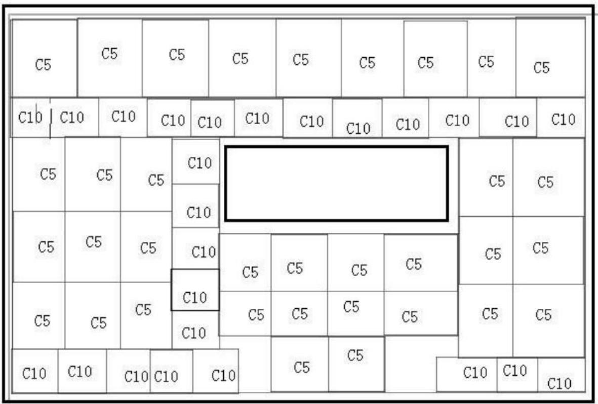

text_image

C5
C5
C5
C5
C5
C5
C5
C5
C10
C10
C10
C10
C10
C10
C10
C10
C10
C10
C10
C10
C10
C10
C5
C5
C5
C10
C10
C10
C10
C10
C10
C10
C10
C10
C10
C10
C10
C10
C10
C10
C10
C10
C10
C10
C10
C10
C10
C10
C10
C10
C1<nl>C5
C5
C5
C10
C10
C10
C5
C5
C5
C5
C5
C5
C5
C5
C5
C5
C5
C5
C5
C5
C5
C5
C5
C5
C5
C5
C5
C5
C5
C5
C5
C5
C5
C5
C5
C5
C5
C5
C5
C5

小屋顶层光伏电池的结构布局（图二）

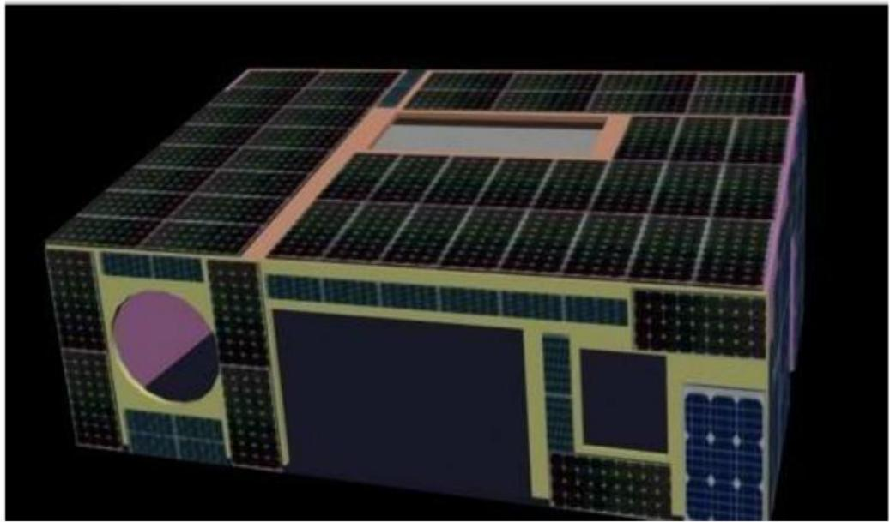

natural_image

3D rendering of a solar panel farm with grid panels and a central circular component (no text or symbols visible)

铺设效果（图三）

电池费用：17222.4元，总收益：75977.74元，35年赢利43455元。

<table><tr><td></td><td>年收入</td><td>35年收入</td><td>费用</td></tr><tr><td>顶面</td><td>2,460.81</td><td>77,515.66</td><td>32,522.40</td></tr><tr><td>东</td><td>4,965.00</td><td>143,737.00</td><td>12,660.00</td></tr><tr><td>南</td><td>980.5</td><td>30,885.86</td><td>28,860.00</td></tr><tr><td>西</td><td>4,923.83</td><td>155,100.61</td><td>12,660.00</td></tr><tr><td>总计</td><td>13,330.14</td><td>407239.13</td><td>86,702.40</td></tr></table>

## 5.2 问题二的模型的建立与求解

地面应用的独立光伏发电系统，方阵面通常朝向赤道，相对地平面有一定倾角。倾角不同，各个月份方阵面接收到的太阳辐射量差别很大。目前普遍认为，所取方阵倾角应使全年辐射量最弱的月份能得到最大的太阳辐射量为好，

推荐方阵倾角在当地纬度的基础上再增加15-20°。选择倾角时，还应尽量使方阵面上冬半年的平均日辐射量 $H_{2}$ 达到最大值，但不一定要使水平辐射量最弱的月份获得最大的辐射量。当然，同时还要兼顾全年平均日辐射量 $\overline{H_{T}}$ 二不能太小。众所周知，在倾斜面上所接收到的太阳辐射总量 $H_{T}$ ，由直接辐射量 $H_{bT}$ 、天空散射辐射量 $H_{dT}$ 及地面反射辐射量 $H_{rT}$ 三部分组成，即

$$
H _ {T} = H _ {\mathrm{bT}} + H _ {\mathrm{dT}} + H _ {\mathrm{rT}}
$$

$H_{\mathrm{bT}}$ 与水平面上直接辐射量 $H_{\mathrm{b}}$ 之间有如下关系：

$$
H _ {\mathrm{bT}} = H _ {\mathrm{b}} * R _ {\mathrm{b}}
$$

对于朝向赤道的倾斜面，两者的比值由下式确定：

$$
R _ {\mathrm{b}} = \frac {\cos (\phi - \beta) * \cos \delta * \sin \omega_ {\mathrm{rT}} + \frac {\pi}{1 8 0} \omega_ {\mathrm{rT}} * \sin (\phi - \beta) * \sin \delta}{\cos \phi * \cos \delta * \sin \omega_ {\mathrm{s}} + \frac {\pi}{1 8 0} \omega_ {\mathrm{t}} * \sin \phi * \sin \delta}
$$

式中， $\phi$ 是当地纬度， $\beta$ 是倾角，太阳赤纬 $\delta$ 可近似表示成：

$$
\delta = 23.45\sin \left[ \frac{360}{365} (284 + n) \right]
$$

其中，n 为一年中从元旦算起的天数。

水平面上日落时角：

$$
\omega_ {\mathrm{t}} = \cos^ {- 1} \left(- \tan \phi * \tan \delta\right)
$$

倾斜面上日落时角：

$$
\omega_ {\mathrm{fT}} = \min \left\{\omega_ {\mathrm{t}}, \cos^ {- 1} \left[ - \tan (\phi - \beta) * \tan \delta \right] \right\}
$$

实际上, 在北半球, 南半边天空全年平均散射辐射量显然要比北半边大, 而南半球则正相反, 可见天空散射辐射并不是均匀分布的。后来有些文献对这些模型又进行了分析比较, 得到表达式为:

$$
H _ {\mathrm{dT}} = H _ {\mathrm{d}} \left[ \frac {H - H _ {d}}{H _ {o}} R _ {b} + \frac {1}{2} (1 + \cos \beta) (1 - \frac {H - H _ {d}}{H _ {o}}) \right]
$$

式中， $H_{\mathrm{d}}$ 和 $H$ 分别为水平面上散射辐射及总辐射量， $H_{\circ}$ 为大气层外水平面上辐射量，它可由一下式求出：

$$
H _ {o} = \frac {2 4}{\pi} I _ {s c} \left[ 1 + 0. 0 3 3 \frac {3 6 0 n}{3 6 5} \right] (\cos \phi * \cos \delta * \sin \omega + \frac {\pi}{1 8 0} \omega_ {s} * \sin \phi * \sin \delta)
$$

其中， $I_{\mathrm{sc}}$ 为太阳常数。

地面反射辐射量的表达式为

$$
H _ {\mathrm{rT}} = \frac {1}{2} \rho H (1 - \cos \beta)
$$

式中， $\rho$ 为地面反射率，一般情况下 $\rho = 0.2$

将式（二）、（七）及（九）代人式（一）即可得到倾斜面上太阳辐射总量的表达式：

$$
H _ {T} = H _ {b} * R _ {b} + H _ {d} \left[ \frac {H - H _ {d}}{H _ {o}} R _ {b} + \frac {1}{2} (1 + \cos \beta) (1 - \frac {H - H _ {d}}{H _ {o}}) \right] + \frac {\rho}{2} H (1 - \cos \beta)
$$

对于确定的地点, 如已知全年各月的水平太阳辐射资料, 即可确定夏半年和冬半年的月份范围, 由式 (十) 算出不同倾斜面上全年各月的太阳辐射量, 从而得出 $H_{1}$ 及 $H_{2}$ 值, 进行分析比较后即可确定最佳倾角。对于光伏方阵的工作情况, 通常可从 $(\phi - 5)$ 开始, 每隔 $5^{\circ}$ , 到 $(\phi + 25)$ 共取七种倾角进行计算。从计算结果可以发现, 随着倾角增大, $H_{1}$ 下降很快, $H_{2}$ 而逐渐上升, 达最大值后又变小。而全年平均日辐射量 $\overline{H_{T}}$ 在 $\phi$ 附近达最大值, 然后又下降。由于各地的 $H_{1} 、 H_{2} 、 \overline{H_{T}}$ 变化的快慢不同, 最佳倾角可以根据以下三种不同情况, 分别选取:

1、在倾角增大时， $H_{2}$ 达到某一最大值，同时始终有 $H_{1} > H_{2}$ ，这时就取 $H_{2}$ 达最大值时所对应的角度为方阵倾角。

2、在 $H_{2}$ 到达最大值之前, 已有 $H_{1} < H_{2}$ 产这表明夏天的辐射量已削弱太多, 倾角不宜过大, 这时可取 $H_{1} = H_{2}$ 时所对应的角度作为方阵倾角。

3、在以上角度范围内，始终有 $H_{1} < H_{2}$ ，而且倾角越大， $\overline{H_T}$ 越小，这时方阵倾角可取相应于 $\overline{H_T}$ 最大值的角度。

由以上可知，在北纬 $40.1^{\circ}$ 的大同，光伏电池最佳倾角约为 $45^{\circ}$ 。就此可得到光伏电池的铺设外形图：

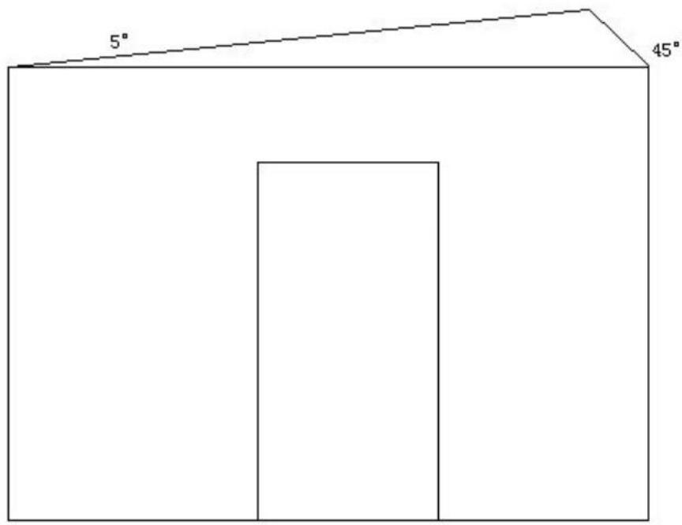

text_image

5°
45°

东立面（图四）

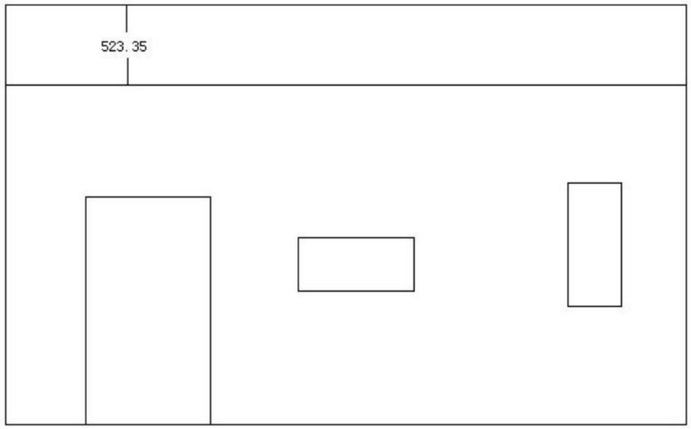

text_image

523.35

北立面（图五）

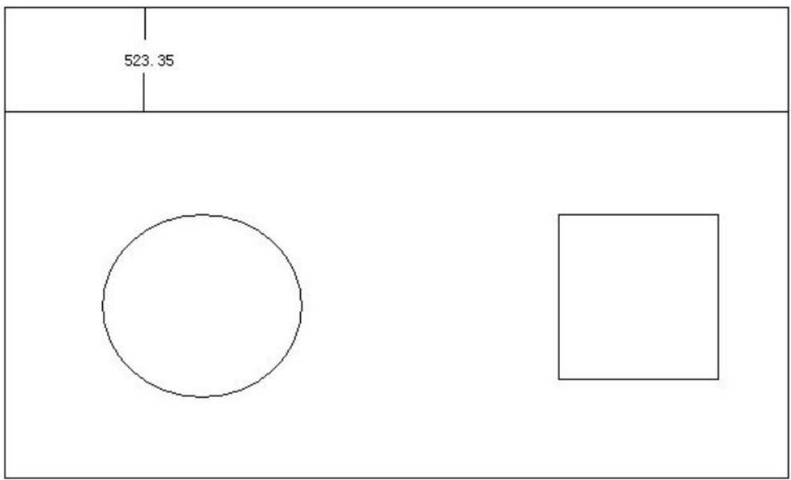

text_image

523.35

南立面（图六）

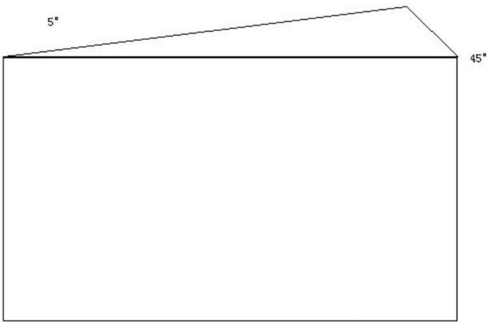

text_image

5°
45°

西立面（图七）

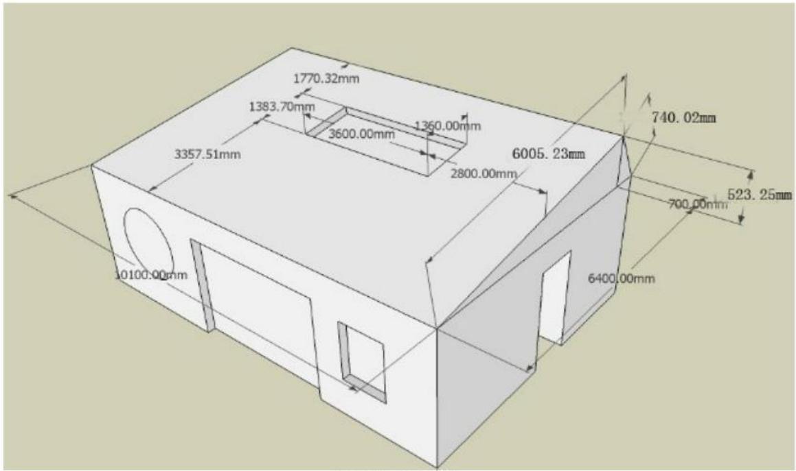

text_image

1770.32mm
1383.70mm
3600.00mm
1360.00mm
3357.51mm
2800.00mm
6005.23mm
740.02mm
523.25mm
700.00mm
10100.00mm
6400.00mm

顶视图（图八）

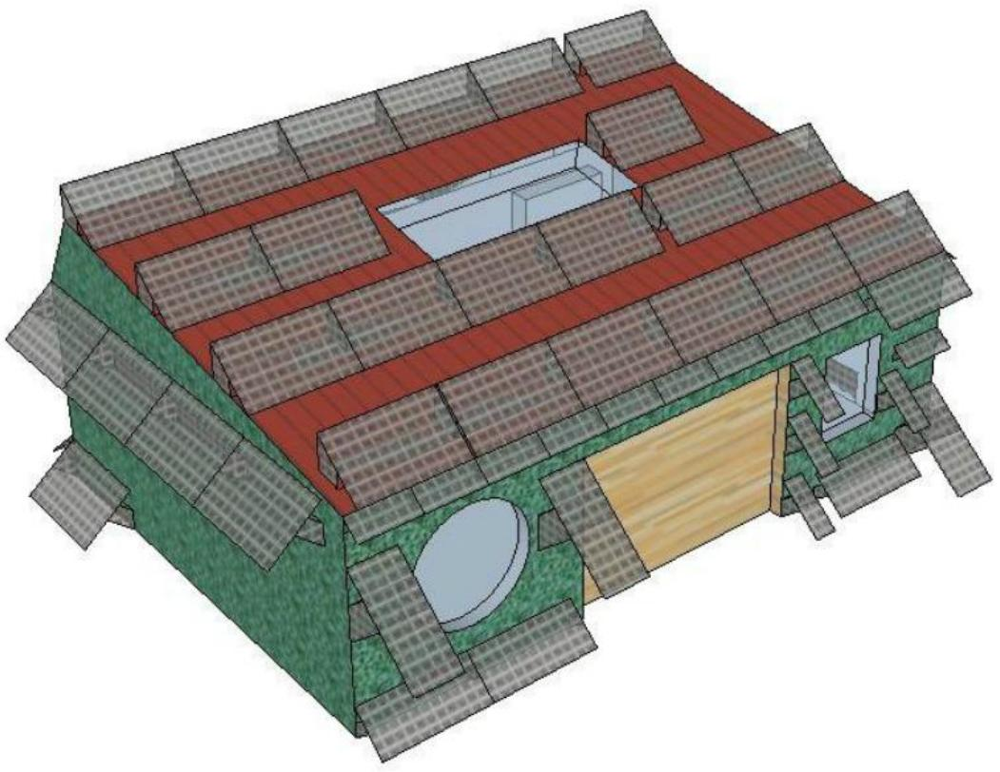

natural_image

3D architectural rendering of a house with solar panels and green roof (no text or symbols)

光伏电池铺设效果图（图九）

按照问题一的计算方法，计算得到：

<table><tr><td></td><td>每年收入</td><td>35年收入</td><td>各面费用</td></tr><tr><td>顶立面</td><td>4205.43</td><td>100971.04</td><td>37917.15</td></tr><tr><td>东立面</td><td>4965.00</td><td>143737.00</td><td>12660.00</td></tr><tr><td>南立面</td><td>980.50</td><td>30885.86</td><td>28860.00</td></tr><tr><td>西立面</td><td>4923.83</td><td>151100.61</td><td>12660.00</td></tr><tr><td>总计</td><td>15074.16</td><td>426694.50</td><td>92097.15</td></tr></table>

分析题意北立面安装光伏电池不能再35年中收回年限，所以只安装了东、南、西、顶立面，投产后每年总收入15074.16元，五个面的总投入92097.15元，算得6年收回成本。35年总的收入426694.50元。

## 5.3 问题三的求解

首先，先考虑房屋的朝向问题，经查阅资料可知：地球在公转时，地轴与黄道平面的夹角为 $66.5^{\circ}$ ，为了使太阳能小屋在一年内能接收到更多的阳光，假设当光线从平行于赤道的方向照射过来时，且时角 $\omega = -90^{\circ}$ ，太阳高度角 $\alpha = 0^{\circ}$ 时，光线的方向和房屋的东立面垂直，即太阳能小屋的朝向由原来的南北方向改为北偏西 $23.5^{\circ}$ 。

现在考虑房屋的形状，根据前两问的分析，小屋的北立面和南立面接收的太阳光最少，如果在这两个面上铺设光伏电池，则可能出现亏损的情况，因此，在设计房屋时将不在这两面铺设光伏电池，由于上午光照强度比下午的弱，所以将窗尽可能不装在西立面上。根据小屋的建筑要求，现设计如下：

建筑屋顶最高点距地面高度为 $5.4\mathrm{m}$ ，建筑平面体型长边应 $15\mathrm{m}$ ，最短边 $4.93\mathrm{m}$ ，室内使用空间最低净空高度距地面高度为 $2.8\mathrm{m}$ ，建筑总投影面积（包括挑檐、挑雨棚的投影面积）为 $74\mathrm{m}^2$ ，

北立面： $\frac{S_{\text{窗}}}{S_{\text{墙}}} = 0.30$ $S_{\text{窗}} = 1.5\mathrm{m} * 2.8\mathrm{m} = 4.2\mathrm{m}^2$

南立面： $\frac{S_{\text{窗}}}{S_{\text{墙}}} = 0.50$ $S_{\text{窗}} = 2.80 \mathrm{~m} * 2.47 \mathrm{~m} = 6.92 \mathrm{~m}^2$

东立面： $\frac{S_{\text{窗}}}{S_{\text{墙}}} = 0.35$ $S_{\text{窗}} = 6.0\mathrm{m} * 2.45\mathrm{m} = 14.7\mathrm{m}^2$

北立面：不设计装窗户。

得到的太阳能房屋的外观尺寸图如下：

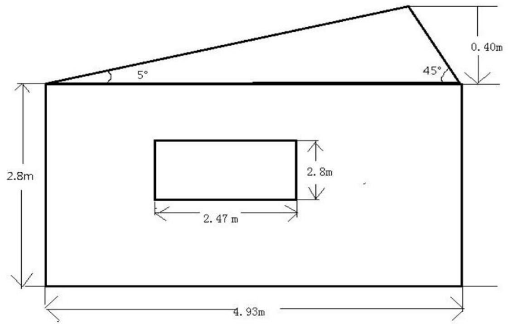

text_image

5°
45°
0.40m
2.8m
2.8m
2.47 m
4.93m

南立面（图十）

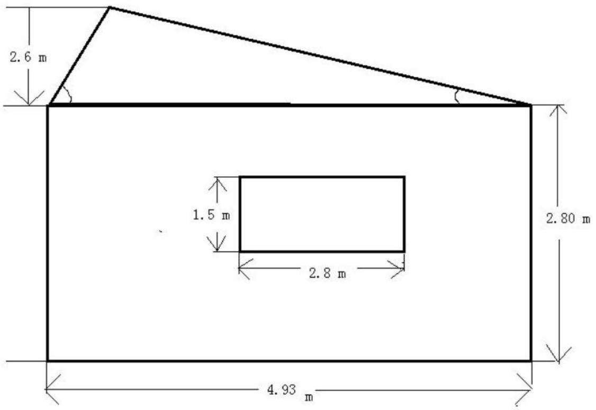

text_image

2.6 m
1.5 m
2.8 m
2.80 m
4.93 m

北立面（图十一）

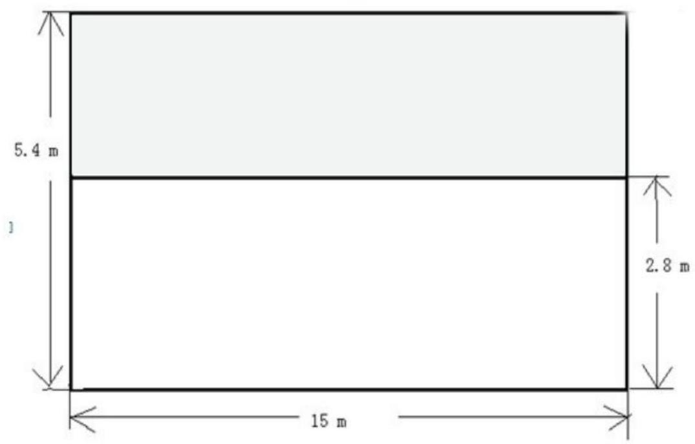

text_image

5.4 m
2.8 m
15 m

西立面（图十二）  
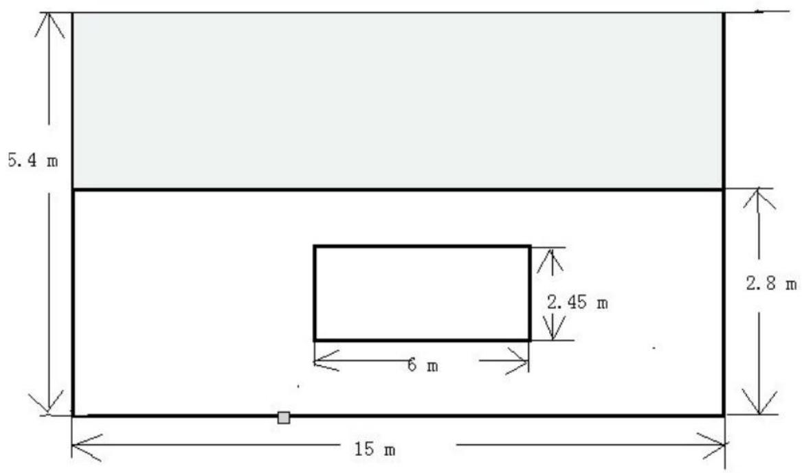

text_image

5.4 m
2.8 m
2.45 m
6 m
15 m

东立面（图十三）

屋顶采用架空式架空方式安装光伏电池，其铺设方式同问题二的铺设方式，设计多目标规模型求解：

<table><tr><td></td><td>每年收入</td><td>35年收入</td><td>各面费用</td></tr><tr><td>顶立面</td><td>6096.52</td><td>129040.38</td><td>37592.00</td></tr><tr><td>东立面</td><td>6819.30</td><td>183307.95</td><td>33841.25</td></tr><tr><td>西立面</td><td>6594.96</td><td>207741.24</td><td>24972.20</td></tr><tr><td>总计</td><td>19510.78</td><td>520089.60</td><td>96405.45</td></tr></table>

在新的设计墙壁上重新铺设光伏电池板，达到单位面积的发电量最大、单位面积的所支付费用最小。由运算结果可知：每年总收入为19510.78元，35年光电收入520089.60元，各个墙壁安装光伏电池和逆变器花费总计19510.78元，由每年总的收入和安装费用关系可计算得回收年限为4.94年。

## 六 、模型的评价

1、在求解问题一时，从单一吸收光能最强、效率最好的入手，目标明确，将复杂问题简单化，减少了计算量，可得出较高工作效率、经济型的光伏电池与逆变器的相应配置从而缩小了回收年限。  
2、对于同样的问题，如果考虑以逆变器的规格范围为限制条件，利用穷举法列举满足限制条件的发光电池组合（如附录四），与模型相比运算量较大，且所求结果有太多的不确定性，所求结果年限远远大于采用模型所需时间。  
3、建立问题二的求解模型时，因为只考虑架空式安装光伏电池，我可以改变房屋的形状，进而假想成贴附式安装方式来解决问题，这样可以使问题简单化，更好的解决问题。  
4、考虑问题三时，为了，使小屋的全年太阳能光伏发电总量尽可能大，而单位发电量的费用尽可能小，由分析可知，在设计太阳能小屋时，并非需在建筑物每个外表面（屋顶及外墙）铺设光伏电池，考虑到北面和南面在一年中接收到的阳光最少，所以我们放弃了在南面和北面铺设光伏电池。为了使顶面、东面和西面接收到更多的阳光，我们改变了房屋的朝向，最大限度的利用了光伏电池的发电效率。  
5、设计房屋的形状时，根据房屋的设计要求，最大化了房屋在东面、西面和顶面的可安装光伏电池的面积，从而能够让太阳能小屋在一年内生产出更多的电能。  
6、择光伏电池的型号，由于先算出每种型号的盈利情况，再挑选适合每个面的光伏电池型号，这样使造价达到了最低。  
7、根据题中逆变器的选择要求，在同一个面中尽可能的采用同种型号的电池组件，这样可以使逆变器的费用降到最低。

## 七、参考文献

[1]. 韩中庚 数学建模方法及其应用 （第二版）  
[2].2007年第三期(总第35卷，第197期，《光伏屋顶利国利民》；  
[3]. 太阳能学报（第十三卷，第一期），《固定式光伏方阵最佳倾角的分析》；  
[4]. 天津城市建设学院学报（第十五卷，第一期），《太阳辐射接受面最佳倾角的计算与分析》；  
[5].工程设计学报（第十六卷，第五期）《固定式太阳能光伏板最佳倾角设计方法研究》；  
[6]. 太阳能学报（第十三卷，第一期）《我国最佳倾角的计算及其变化》；  
[7]. 《太阳能应用技术》，中国社会出版社，第一版，2005年。