# 2012高教社杯全国大学生数学建模竞赛

## 承 诺 书

我们仔细阅读了中国大学生数学建模竞赛的竞赛规则.

我们完全明白，在竞赛开始后参赛队员不能以任何方式（包括电话、电子邮件、网上咨询等）与队外的任何人（包括指导教师）研究、讨论与赛题有关的问题。

我们知道，抄袭别人的成果是违反竞赛规则的, 如果引用别人的成果或其他公开的资料（包括网上查到的资料），必须按照规定的参考文献的表述方式在正文引用处和参考文献中明确列出。

我们郑重承诺，严格遵守竞赛规则，以保证竞赛的公正、公平性。如有违反竞赛规则的行为，我们将受到严肃处理。

我们授权全国大学生数学建模竞赛组委会，可将我们的论文以任何形式进行公开展示（包括进行网上公示，在书籍、期刊和其他媒体进行正式或非正式发表等）。

我们参赛选择的题号是（从 A/B/C/D 中选择一项填写）： B

我们的参赛报名号为（如果赛区设置报名号的话）：

所属学校（请填写完整的全名）： 江西财经大学

参赛队员 (打印并签名) ：1. 张 毅

2. 黄超强

3. 万 腾

指导教师或指导教师组负责人 (打印并签名)： 建模指导组

日期： 2012 年 9 月 10 日

赛区评阅编号（由赛区组委会评阅前进行编号）：

# 2012高教社杯全国大学生数学建模竞赛

## 编 号 专 用 页

赛区评阅编号（由赛区组委会评阅前进行编号）：

赛区评阅记录（可供赛区评阅时使用）：

<table><tr><td>评阅人</td><td></td><td></td><td></td><td></td><td></td><td></td><td></td><td></td><td></td><td></td></tr><tr><td>评分</td><td></td><td></td><td></td><td></td><td></td><td></td><td></td><td></td><td></td><td></td></tr><tr><td>备注</td><td></td><td></td><td></td><td></td><td></td><td></td><td></td><td></td><td></td><td></td></tr></table>

全国统一编号（由赛区组委会送交全国前编号）：

全国评阅编号（由全国组委会评阅前进行编号）：

# 太阳能小屋光伏电池铺设方案研究与设计

## 摘要

本文在光伏电池组件贴附和架空两种安装方式下，对为使小屋全年太阳能光伏发电总量尽可能大、单位发电量费用尽可能小，应如何选择光伏电池组件的类型、铺设方式、连接方式及逆变器的选配规格进行了研究；并基于两方之间的关系为大同市设计出一种符合题目要求且发电功效最大的小屋。

问题一，在对光伏电池组件进行贴附安装的方式下，本问题的关键在于每个表面上的光伏电池组件该如何铺设，然而每个面上的可铺设区域是不规则的，即使编程也很难求解，故本文采取人工“铺设”的方法，将用不同型号的电池组件分别对顶面和东、南、西、北五个面进行铺设，得出每一种型号的电池在每一面尽可能多的铺设块数。然后根据此型号的总块数及相应参数选择合适的逆变器。之后，根据此面 年内各个时刻的辐射强度，结合电池的转换效率及逆变器的逆变效率计算出发电总量、单位发电量费用，并依据以全年发电总量尽可能大、单位发电费用尽可能小为目标函数，以光伏电池组件的可串并联性等约束条件建立的贴附安装优化模型选择适合此面的光伏电池组件型号、铺设块数及分组阵列连接方式。计算显示只有顶面和西面有可行方案（投资回收年限不超过 年），两面上各自最优方案为：选用的电池、逆变器型号分别为 、 和C2、SN11，顶面 A3-SN15 组合 35 年发电总量达到 392495kWh，单位发电量费用为 0.375元 ，西面 组合 年发电总量达到 、单位发电量费用为元/kWh。

问题二，在对光伏电池组件进行架空安装的方式下，结合实际，本文考虑只对顶面电池采用架空方式安装，其它四面的安装方式仍为贴附方式，并将顶面所有的电池安装在与屋顶水平面夹角为大同市的最佳倾斜角的平面上，采用与问题一中相同的优化模型即可得出架空安装方式下的最优方案。问题的关键在于求出大同市集热器的最佳倾斜角度，本文使用穷举法求出使得倾斜面上总辐射强度最高时的倾斜面与水平面的夹角即为大同市的最佳倾斜角。最后,计算出一个最优顶面铺设方案为：选用电池型号 、逆变器型号 SN15，35 年发电总量达到 424900kWh，单位发电量费用为 0.375 元/kWh。

问题三，此问题是在符合小屋建筑要求的情况下，重新设计小屋，并对所设计小屋的外表面优化铺设光伏电池，选配逆变器，使小屋全年的太阳能光伏发电总量尽可能大，而单位发电量的费用尽可能小。在小屋外形设计上，为满足上述要求，小屋的最佳设计方案应使小屋外表面全年总辐射达到最大。那么小屋的设计则可简化为一个单目标优化模型，以外表面总辐射为目标函数，小屋的建筑要求为约束条件。其中，顶面与水平面之间的夹角应为问题二中的最佳倾角 。最后得出小屋长 米，宽 米，净空高米，总高 米，东西两面门窗面积为 平米，南北两面分别为 和 平米。在设计出小屋各个墙面的门窗面积之后，考虑到门窗位置的设置对光伏电池的铺设也会产生很大的影响。因此，需要对小屋各个表面的门窗位置进行合理的设置，即要考虑光伏电池的铺设面积也要考虑小屋的美观性及原有的结构性。综合考虑上述因素后，计算得出只有顶面和南面有可行方案，两面上各自的最优方案为：选用的电池、逆变器型号分别为 A3、SN15 和 B3、SN12，顶面 A3-SN15 组合 35 年发电总量达到 392495kWh，单位发电量费用为 0.375 元/kWh，西面 B3-SN12 组合达到 102273kWh、0.427 元/kWh。

关键词：太阳能小屋设计；光伏电池；铺设方案；逆变器；最佳倾斜角

## 一 问题重述

在设计太阳能小屋时，需要在建筑物外屋顶及外墙铺设光伏电池，光伏电池组件所产生的直流电需要经过逆变器转换成 交流电才能供家庭使用，并将剩余电量输入电网。不同种类的光伏电池每峰瓦的价格差别很大，且每峰瓦的实际发电效率或发电量还受太阳辐射强度、光线入射角、环境、建筑物所处的地理纬度、地区的气候与气象条件、安装部位及方式（贴附或架空）等诸多因素的影响。因此，在太阳能小屋的设计中，研究光伏电池在小屋外表面的优化铺设是很重要的问题。

参考附件提供的数据，对以下三个问题，分别给出小屋外表面光伏电池的铺设方案，使小屋的全年太阳能光伏发电总量尽可能大，且单位发电量的费用尽可能小，并计算出小屋光伏电池35年寿命期内的发电总量、经济效益（当前民用电价：0.5 元/kWh）及投资的回收年限。

每个问题都需配有图示，给出小屋各外表面电池组件铺设分组阵列图形及组件连接方式（串、并联）示意图，也要给出电池组件分组阵列容量及选配逆变器规格列表。

在同一表面采用两种或两种以上类型的光伏电池组件时，同一型号的电池板可串联，而不同型号的电池板不可串联。在不同表面上，即使是相同型号的电池也不能进行串、并联连接。应注意分组连接方式及逆变器的选配。

问题 ：根据山西省大同市的气象数据，仅考虑贴附安装方式，选定光伏电池组件，对小屋的部分外表面进行铺设，并根据电池组件分组数量和容量，选配相应的逆变器的容量和数量。

问题 2：电池板的朝向与倾角均会影响到光伏电池的工作效率，选择架空方式安装光伏电池，重新考虑问题 1。

问题 3：根据附件 7 给出的小屋建筑要求，需为大同市重新设计一个小屋，要求画出小屋的外形图，并对所设计小屋的外表面优化铺设光伏电池，给出铺设及分组连接方式，选配逆变器，计算相应结果。

## 二 问题分析

本题主要在贴附和架空两种光伏电池组件安装方式下，研究在小屋全年太阳能光伏发电总量尽可能大、单位发电量费用尽可能小的情况下，应如何选择光伏电池组件的类型、铺设方式、连接方式及逆变器的选配规格。最后，基于两种安装方式中较好的一种，按照所给的小屋建筑要求及小屋全年太阳能光伏发电总量尽可能大、单位发电量费用尽可能小的原则，设计小屋的外形图，并给出相应的光伏电池组件的类型、铺设方式、分组阵列连接方式及逆变器的选配规格。

在光伏电池组件贴附安装方式下，考虑到安装、串并联不同的光伏电池组件需要较高的技术成本以及不同类型组件所覆盖的墙面会使房屋的美观程度受到较大影响；另外，同一面选用不同的逆变器也会使电池组件和逆变器的安装增加较大难度，所以本文考虑在同一面墙上要贴相同的电池组件，并且同一面只考虑使用一个逆变器。首先将 24种不同型号的电池组件依照铺设块数尽可能多的的原则对小屋顶面、东面、南面、西面、北面的可铺设部分进行铺设，然后根据铺设块数分别计算得出不同型号的电池组件在不同面上铺设所需要选择的逆变器、相应的发电成本，以及 年的发电总量、发电费用，最后依据发电总量尽可能大、单位发电量费用尽可能小的原则以及光伏电池组件的可串并联性选择合适的组件选择、铺设及分组阵列连接方式方案。

问题二，在光伏电池组件架空安装方式下，本文考虑将所有的电池组件安装在与屋顶水平面夹角为大同市的最佳倾斜角的平面上，采用贴附安装优化模型即可得出架空安装方式下的合适方案。

问题三，此问题是在符合小屋建筑要求的情况下，重新设计小屋，并对所设计小屋的外表面优化铺设光伏电池，选配逆变器，使小屋的全年太阳能光伏发电总量尽可能大，而单位发电量的费用尽可能小。在小屋外形设计上，为使满足上述要求，小屋的最佳设计方案应使小屋外表面全年总辐射达到最大。那么小屋的设计则可简化为一个单目标优化模型，以外表面总辐射为目标函数，小屋的建筑要求为约束条件。其中，顶面与水平面之间的夹角应为问题二中的最佳倾角 。在设计出小屋各个墙面的门窗面积之后，门窗位置的设置对光伏电池的铺设也会产生很大的影响。因此，需要对小屋各个表面的门窗位置进行合理的设置，即要考虑光伏电池的铺设面积也要考虑小屋的美观性及原有的结构性。综合考虑上述因素后，计算得出可行方案。

## 三 模型假设

依据问题分析，对模型做出如下合理假设：

[1] 不考虑气温对光伏电池组件的转换效率产生影响；  
[2] 不考虑气温对逆变器的逆变效率产生影响；  
[3] 假设太阳光的辐射强度在任意一个时刻内均匀增大；  
[4] 假设所有电池组件的使用寿命都不小于 35年；  
[5] 假设电池组件阵列发出的电都能够及时销售给电网，不产生蓄电；  
[6] 不考虑光的反射对光照强度产生的影响；  
[7] 假设小屋周围无遮挡物影响光照；  
[8] 假设民用电价 35年内一直不变；  
[9] 不考虑电池组件和逆变器自身费用以外的任何发电费用；  
[10]成块的光伏电池组件不可分割；  
[11]不考虑货币时间价值或贴现率；  
[12]架空安装不会使电池阵列的转换效率发生变化；  
[13]假设地球是一个球体；  
[14]同一表面超过一个逆变器会使安装成本增加很多；  
[15]不同型号的光伏电池组件连接需要付出较高的成本；  
[16]假设每一年的对应时刻的地球上的光照强度是相同的。

## 四 符号说明

$\alpha$ 太阳高度角；  
$A$ 太阳方位角;  
$\theta _ { \textup T }$ 太阳入射角；  
$I _ { D N }$ 太阳法线辐射强度；  
$I _ { d H }$ 水平面散射辐射强度；  
$\lambda _ { n }$ 第 个逆变器的逆变效率;  
$I _ { k }$ 第k个表面的辐射强度;  
$P _ { n }$ 第 个逆变器的价格;

$N _ { i , j }$ 选用第 种类型光伏第 个型号的组件数;

$\eta _ { i , j } ^ { * }$ 为第 种类型光伏第 个型号组件调整后的转换效率;

$P _ { i , j }$ 每块第 种类型光伏第 个型号组件的价格;

$\beta ^ { 0 }$ 大同市集热器倾斜角。

## 五 贴附安装优化模型建立与问题一求解

## 一）相关概念

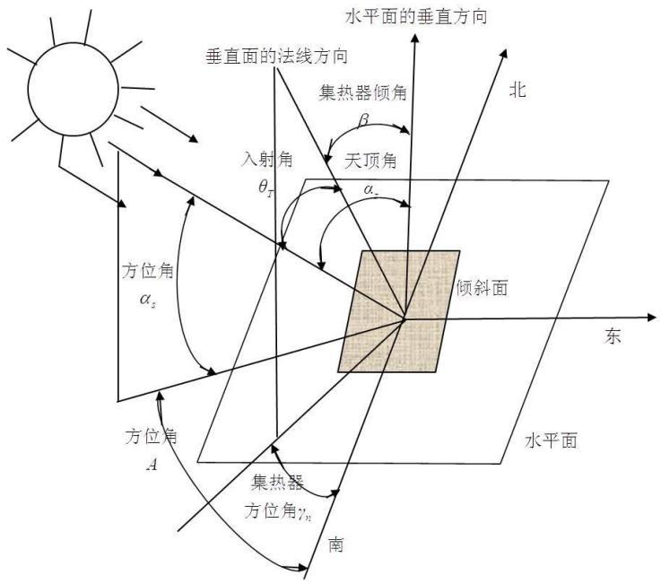

<details>
<summary>flowchart</summary>

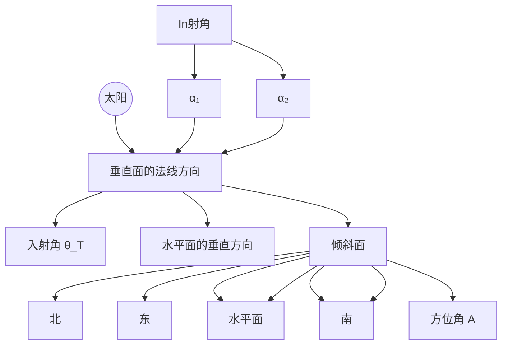
</details>

图-1 几种角度空间示意图

## 1、时角

时角是以正午 12 点为 0 度开始算，每一小时为 15 度，上午为负下午为正，即 10点和14点分别为-30度和 30度。因此，时角的计算公式为

$$
\omega = 1 5 (t _ {s} - 1 2) \quad (\text {度}) \tag {1}
$$

其中 $t _ { s }$ 为太阳时（单位：小时）。

## 2、赤纬角

赤纬角也称为太阳赤纬，即太阳直射纬度，其计算公式近似为

$$
\delta = 2 3. 4 5 \sin \left(\frac {2 \pi (2 8 4 + n)}{3 6 5}\right) \quad (\text {度}) \tag {2}
$$

其中 为日期序号。

## 3、太阳高度角

太阳高度角是太阳相对于地平线的高度角，这是以太阳视盘面的几何中心和理想地平线所夹的角度。太阳高度角可以使用下面的算式，经由计算得到很好的近似值：

$$
\sin \alpha = \sin \phi \sin \delta + \cos \phi \cos \delta \cos \omega \tag {3}
$$

其中 $\alpha$ 为太阳高度角， $\omega$ 为时角， $\delta$ 为当时的太阳赤纬， $\phi$ 为当地的纬度(大同的纬度为 )。

## 4、太阳方位角

太阳方位角是太阳在方位上的角度，它通常被定义为从北方沿着地平线顺时针量度的角。

下面的两个公式可以用来计算近似的太阳方位角，不过因为公式是使用余弦函数，所以方位角永远是正值，因此，角度永远被解释为小于 180度，而必须依据时角来修正。当时角为负值时 (上午)，方位角的角度小于 180 度，时角为正值时 (下午)，方位角应该大于180度，即要取补角的值。

$$
\cos A = \frac {\sin \delta \cos \phi - \cos \omega \cos \delta \sin \phi}{\cos \alpha} \tag {4}
$$

## 5、太阳入射角 $( \theta _ { \mathrm { T } } )$

太阳光线与集热器表面法线之间的夹角,称为太阳光线的入射角。可以由下式确定

$$
\begin{array}{l} \cos \theta_ {T} = \sin \delta (\sin \varphi \cos \beta - \cos \varphi \sin \beta \cos \gamma_ {n}) \tag {5} \\ + \cos \delta \cos \omega (\cos \phi \cos \beta + \sin \phi \sin \beta \cos \gamma_ {n}) + \cos \delta \sin \beta \sin \gamma_ {n} \sin \omega \\ \end{array}
$$

式中， $\beta$ ——斜面的倾角，即集热器倾角（面向南倾角为正）；

$\gamma _ { n }$ 斜面的方位角，即集热器的方位角，与太阳方位角同样按顺时针计量。

利用式（5）可以计算出任何地理位置、任何季节、任何时刻、任何斜面上的太阳光线入射角，从而对太阳能集热器的设计做出最佳的选择。

对于北半球来说，太阳能集热器通常是朝南放置的，对这些面向赤道的集热器，其方位角 $\gamma _ { n } = 0$ ，式（5）可以简化为

$$
\cos \theta_ {T} = \sin \delta \sin (\varphi - \beta) + \cos \delta \cos \omega \cos (\phi - \beta) \tag {6}
$$

## 二）问题一分析

由于不同面的光照强度不同，且不同面上的电池组件既不能串联也不能并联，故需要对不同的表面进行优化求解。而所给的光照强度是相对应于水平面上的，而本问题中求解屋顶面上的电池组件阵列产生的电量时，电池组件矩阵是贴附在倾斜平面上的，所以需要将水平面上的总辐射强度转换为倾斜面上总辐射强度，查阅相关资料得倾斜角为的平面上的直射辐射强度可以由式（7）确定，

$$
I _ {D \theta} = I _ {D N} \cos \theta_ {T} \tag {7}
$$

其中， $I _ { D N }$ 为太阳法线辐射强度；

倾斜面上的散射强度由式（8）确定

$$
I _ {d \theta} = I _ {d H} \cos^ {2} (\frac {\beta}{2}) \tag {8}
$$

其中， $I _ { d H }$ 为水平面散射辐射强度；

则屋顶倾斜面上的总辐射强度为： $I _ { t \theta } = I _ { D \theta } + I _ { d \theta }$

求解本问题的关键在于每个面上的光伏电池组件该如何铺设，然而，每个面上的可铺设区域是不规则的，这给铺设造成了很大的麻烦，即使编程也很难求解，本文采取将种（由于 这 种型号电池组件单位价格的转换效率很低，而且部分组件还不能找到合适的逆变器，肯定不会出现在可参考的方案中，故本文将不会对这 5种型号的组件进行讨论）不同型号的电池组件分别对顶面、东面、南面、西面、北面按照铺设的块数越多越好的原则进行手工铺设，得出最多铺设块数。然后根据相应型号下一定数目该组件的总功率，选择合适的逆变器，计算出此种方案下此面的发电总成本，接着，根据此面 年内各个时刻的辐射总强度，结合组件的转换效率以及逆变器的逆变效率计算出发电总量、发电成本，并依据全年发电总量尽可能大、单位发电费用尽可能小的原则以及光伏电池组件的可串并联性选择合适此面的组件选择、铺设及分组阵列连接方式方案。最终算出五个面各自的满意方案即可。

## 三）目标函数及约束条件分析

## 1、目标函数

由问题一分析可知，模型有两个目标——全年发电总量尽可能大和单位发电量的费用尽可能小，即

## 1）全年发电量 尽可能大

$$
\max \quad W = \lambda_ {i} ^ {*} W ^ {0}
$$

其中， $\boldsymbol { \lambda } _ { i } ^ { * }$ 为第i个逆变器的处理后逆变效率， $\lambda _ { i } ^ { * } = \left\{ \begin{array} { l l } { 0 } & { I _ { k } < 8 0 , i = 1 , 2 } \\ { 0 } & { I _ { k } < 3 0 , i = 3 } \\ { \lambda _ { n } } & { I _ { k } \geq 8 0 , i = 1 , 2 } \\ { \lambda _ { n } } & { I _ { k } \geq 3 0 , i = 3 } \end{array} \right.$

式 中 ， $\lambda _ { n }$ 为 第 个 逆 变 器 的 逆 变 效 率 ， $I _ { k }$ 为 第 个 面 的 辐 射 强 度 ，$k = 0 , 1 , 2 , 3 ,$ 4分别代表顶面、东面、南面、西面、北面。将A单晶硅电池、B多晶硅电池和C 薄膜电池分别编号为第 1、2、3三种类型，处理逆变器的逆变效率是考虑到第 1、2种型号的电池组件需在光照强度不小于 80情况下工作，第 3种型号的电池组件需在光照强度不小于30的情况下工作。 $W ^ { 0 }$ 为所有组件的发电总功率， $W ^ { 0 } = \sum _ { i = 1 } ^ { 3 } \sum _ { j = 1 } ^ { n _ { i } } W _ { i , j } \eta _ { _ { i , j } } ^ { * }$

其中， $W _ { i , j }$ 为第 种类型光伏第 个型号组件的总辐射强度值， $W _ { i , j } = I _ { k } S _ { i , j } , S _ { i , j }$ 为第 种 类 型 光 伏 第 个 型 号 组 件 的 面 积 ， $n _ { i }$ 为 第 种 类 型 光 伏 的 型 号数$( n _ { 1 } = 6 , n _ { 2 } = 7 , n _ { 3 } = 1 1 )$ C

$\eta _ { i , j } ^ { * }$ 为第 种类型光伏第<sub>j</sub>个型号组件调整后的转换效率

$$
\eta_ {i, j} ^ {*} = \left\{ \begin{array}{l l} \eta_ {i, j} & 1 \leq y \leq 1 0 \\ 0. 9 \eta_ {i, j} & 1 1 \leq y \leq 2 5 \\ 0. 8 \eta_ {i, j} & y > 2 5 \end{array} \right.
$$

其中， $\eta _ { i , j }$ 为第 种类型光伏第 个型号组件调整前转换效率，这是由于所有光伏组件在0～10年效率按100%，10～25年按照90%折算，25年后按80%折算。

此外，光照强度小于 200时，组件1转换效率小于原转换效率的 5%，本文采用 5%，光照强度为 时，组件 转换效率提高 ，即

$$
\eta_ {i, j} ^ {0} = \left\{ \begin{array}{l} 5 \% \eta_ {i, j} ^ {*} (i = 1, j \in [ 1, 6 ]), I _ {k} <   2 0 0 \\ (1 + 1 \%) \eta_ {i, j} ^ {*} (i = 3, j \in [ 1, 2 ]), I _ {k} = 2 0 0 \end{array} \right.
$$

## 2）单位发电量费用 尽可能小

发电总费用为逆变器价格与电池组件价格之和，即

$$
\sum_ {i = 1} ^ {3} \sum_ {j = 1} ^ {n _ {i}} P _ {i, j} N _ {i, j} + P _ {n}
$$

35年的总发电量为 $\sum _ { y = 1 } ^ { 3 5 } W _ { y }$ ，故单位发电量费用 目标函数为

$$
\min \quad P = \frac {\sum_ {i = 1} ^ {3} \sum_ {j = 1} ^ {n _ {i}} P _ {i , j} N _ {i , j} + P _ {n}}{\sum_ {y = 1} ^ {3 5} W _ {y}}
$$

其中， $P _ { n }$ 为第 个逆变器的价格， $P _ { i , j } = W _ { i , j } ^ { 0 } p _ { i }$ 为每块第 种类型光伏第 个型号组件的价格， $\mathcal { W } _ { i , j } ^ { 0 }$ 为第 种类型光伏第 个型号组件的额定功率， $p _ { i }$ 为第 种类型电池组件的单位价格， $N _ { i , j }$ 为选用第 种类型光伏第 个型号的组件数， $W _ { y }$ 为电池组件阵列的第 年的发电总量。

## 2、约束条件

1）选用的组件数必为正整数，

$$
N _ {i, j} \in N ^ {+}
$$

2）贴附或架空的所有组件面积之和不能超过对应面上可铺设面积，

$$
\sum_ {i = 1} ^ {3} \sum_ {j = 1} ^ {n _ {i}} S _ {i, j} N _ {i, j} \leq S _ {k}
$$

其中， $S _ { k } ( k = 0 , 1 , 2 , 3 , 4 )$ 为第 面的可铺设面积。

3）每一面上所有组件功率和应在所选逆变器的允许输入功率范围之内，

$$
\sum_ {i = 1} ^ {3} \sum_ {j = 1} ^ {n _ {i}} W _ {_ {i, j}} ^ {0} N _ {i, j} \in W _ {0}
$$

其中， $W _ { 0 }$ 为第 面上所选用的逆变器的允许输入功率范围。

4）每一面上所有组件阵列的电压应在所选逆变器的允许输入电压范围之内，

$$
U _ {k} \in U
$$

$U _ { k }$ 为第k面上电池组件阵列电压，U为第 面上所选逆变器的允许输入电压范围。

## 四）贴附安装优化模型的建立

根据上述目标函数和约束条件分析，可得以下优化模型

$$
\begin{array}{l} \max \quad W = \lambda_ {i} ^ {*} \sum_ {i = 1} ^ {3} \sum_ {j = 1} ^ {n _ {i}} W _ {i, j} \eta_ {_ {i, j}} ^ {*} \\ \min \quad P = \frac {\sum_ {i = 1} ^ {3} \sum_ {j = 1} ^ {n _ {i}} P _ {i , j} N _ {i , j} + P _ {n}}{\sum_ {y = 1} ^ {3 5} W _ {y}} \\ \text {s.t.} \left\{ \begin{array}{l} N _ {i, j} \in N ^ {+} \\ \sum_ {i = 1} ^ {3} \sum_ {j = 1} ^ {n _ {i}} S _ {i, j} N _ {i, j} \leq S _ {k} (k = 0, 1, 2, 3, 4) \\ \sum_ {i = 1} ^ {3} \sum_ {j = 1} ^ {n _ {i}} W _ {i, j} ^ {0} N _ {i, j} \in W _ {0} \\ U _ {k} \in U \end{array} \right. \\ \end{array}
$$

## 五）问题一求解

将相应参数代入上述贴附安装优化模型即可求得各面的合适光伏电池组件铺设方案，求解发现对东面、南面、北面铺设电池组件没有一种方案能够使投资回收年限在 35年以内，故本文考虑不在东、南、北三面铺设光伏电池组件，只考虑光照强度较大的且有铺设方案可以使投资回收年限在 35年以内的顶面和西面。具体如下：

## 1、顶面

表 1 8 满意的顶面电池组件铺设方案

<table><tr><td>电池型号</td><td>铺设块数</td><td>逆变器型号</td><td>发总电量(kWh)</td><td>单位发电量费用(kWh/元)</td><td>经济效益(元)</td><td>投资回收年限</td></tr><tr><td>A3</td><td>42</td><td>SN15</td><td>392494.995</td><td>0.37493472</td><td>196247.5</td><td>26</td></tr><tr><td>A1</td><td>42</td><td>SN 15</td><td>353455.386</td><td>0.44290455</td><td>176727.7</td><td>31</td></tr><tr><td>A1</td><td>42</td><td>SN 16</td><td>353455.386</td><td>0.4796843</td><td>176727.7</td><td>34</td></tr><tr><td>B1</td><td>32</td><td>SN 15</td><td>351773.927</td><td>0.36387006</td><td>175887</td><td>25</td></tr><tr><td>C4</td><td>32</td><td>SN 12</td><td>121996.696</td><td>0.16987345</td><td>60998.35</td><td>11</td></tr><tr><td>C4</td><td>32</td><td>SN 4</td><td>111613.998</td><td>0.18567564</td><td>55807</td><td>12</td></tr><tr><td>C3</td><td>32</td><td>SN 13</td><td>135682.184</td><td>0.18911842</td><td>67841.09</td><td>13</td></tr><tr><td>C11</td><td>44</td><td>SN 12</td><td>93280.5222</td><td>0.18717734</td><td>46640.26</td><td>12</td></tr></table>

从表 中我们可以大体看出，发电总量较高的方案一般经济效益、单位发电费用都比较高，并且投资回收年限也较长，发电量较低的方案则一般反之。这些不同的方案可以为用户提供一个比较好的方案选择参考，如果希望发电总量高、经济效益高，则可以选择方案 A3-SN15、A1-SN15、A1-SN16、B1-SN15 这前四种方案，如果侧重于投资回收期较短的则可以考虑后面四种方案。

根据全年发电总量尽可能大和单位发电量的费用尽可能小的目标需求，从表1我们可以看出电池型号为A3，逆变器型号为SN15的电池组件铺设方案是一个相对比较好的铺设方案，它的发电总量是最高的，并且单位发电费用也相对较低。此方案的在顶面的电池组件铺设分组阵列图形及组件连接方式示意图分别如图-2和图-3 所示：

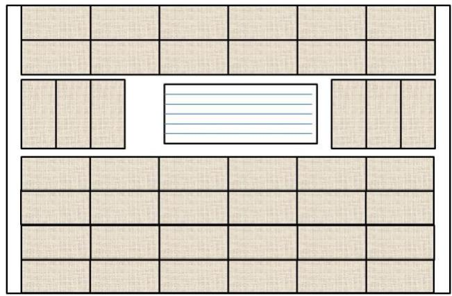

<details>
<summary>text_image</summary>

Grid layout diagram with beige squares and a central white rectangle containing horizontal lines, likely for pattern or layout analysis.
</details>

图-2 A3-SN15 方案下顶面电池组件贴附铺设分组阵列图形

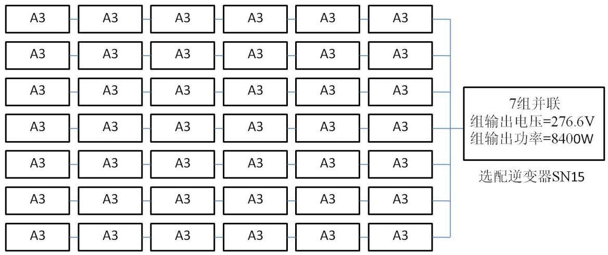

<details>
<summary>flowchart</summary>

This diagram illustrates the power distribution and selection logic for a 7-phase inverter SN15, showing how multiple modules (A3) are combined to produce a single output.
</details>

图-3 A3-SN15方案下顶面电池组件连接方式示意图

实际上，在顶面可以安装 43块 A3光伏电池组件，但是增加这一块会使这些电池组件不能够满足题中所给的 多个光伏组件串联后可以再进行并联，并联的光伏组件端电压相差不应超过10%”的原则，故采用在顶面安装 42块的A3光伏电池组件方案。

A3-SN15方案的电池组件分组阵列容量及选配逆变器规格列表如表 2所示：

表 2 A3-SN15 阵列容量及逆变器规格列表

<table><tr><td colspan="2">电池型号</td><td>A3</td></tr><tr><td colspan="2">铺设块数</td><td>42</td></tr><tr><td colspan="2">阵列容量(W)</td><td>8400</td></tr><tr><td colspan="2">逆变器型号</td><td>SN15</td></tr><tr><td rowspan="3">逆变器的规格</td><td>额定电压(V)</td><td>220</td></tr><tr><td>额定电流(A)</td><td>37.9</td></tr><tr><td>允许电压范围(V)</td><td>180~300</td></tr></table>

## 2、西面

表 3  
5 满意的西面电池组件铺设方案

<table><tr><td>电池型号</td><td>铺设块数</td><td>逆变器型号</td><td>发总电量(kWh)</td><td>单位发电量费用(kWh/元)</td><td>经济效益(元)</td><td>投资回收年限</td></tr><tr><td>C2</td><td>21</td><td>SN11</td><td>31452.5378</td><td>0.32895279</td><td>15726.27</td><td>22</td></tr><tr><td>C3</td><td>12</td><td>SN11</td><td>31021.8995</td><td>0.3307341</td><td>15510.95</td><td>23</td></tr><tr><td>C5</td><td>12</td><td>SN11</td><td>30997.4151</td><td>0.33099534</td><td>15498.71</td><td>23</td></tr><tr><td>C2</td><td>21</td><td>SN3</td><td>28775.726</td><td>0.35955305</td><td>14387.86</td><td>25</td></tr><tr><td>C4</td><td>12</td><td>SN11</td><td>27892.8974</td><td>0.32895279</td><td>13946.45</td><td>24</td></tr></table>

根据全年发电总量尽可能大和单位发电量的费用尽可能小的目标需求，从表我们可以看出电池型号为C2，逆变器型号为 SN11 的电池组件铺设方案是一个相对比较好的铺设方案，它的发电总量是最高的，并且单位发电费用也相对较低。此方案的在西面的电池组件铺设分组阵列图形及组件连接方式示意图分别如图 和图 所示：

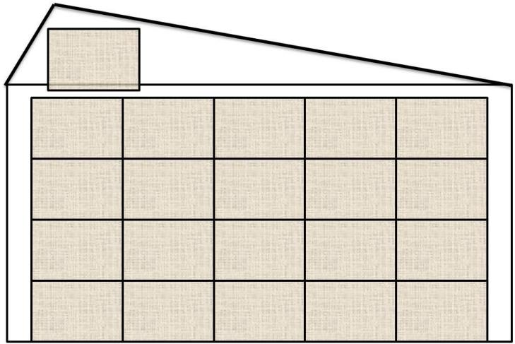

<details>
<summary>natural_image</summary>

Simple geometric diagram of a house with a triangular roof and 3x3 grid of squares (no text or symbols)
</details>

图-4 C2-SN11 方案下西面电池组件贴附铺设分组阵列图形

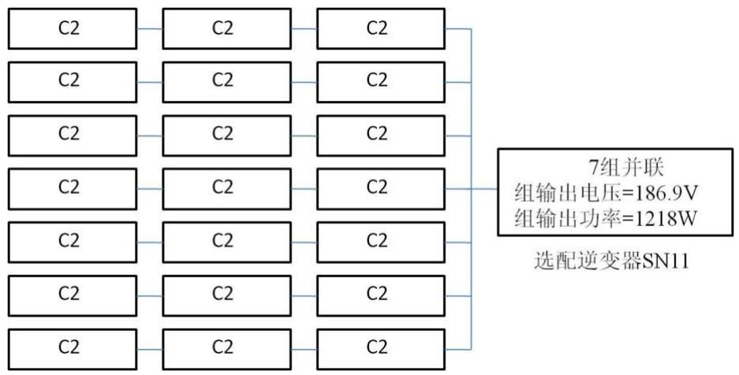

<details>
<summary>flowchart</summary>

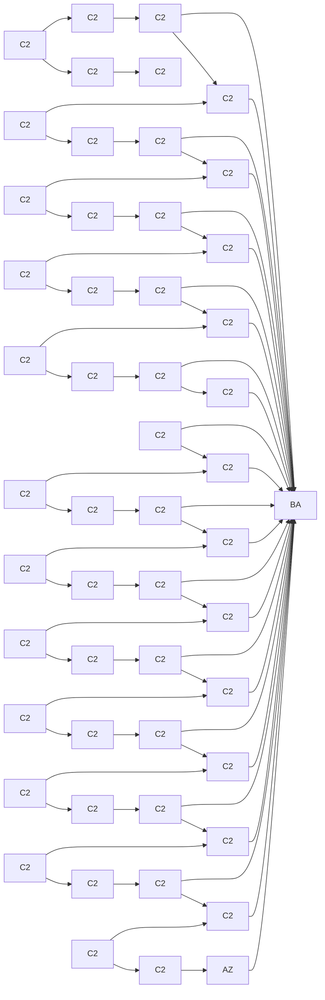
</details>

图-5 C2-SN11方案下西面电池组件连接方式示意图

C2-SN11 方案的电池组件分组阵列容量及选配逆变器规格列表如表 4所示：

表 4 C2-SN11 阵列容量及逆变器规格列表

<table><tr><td colspan="2">电池型号</td><td>C2</td></tr><tr><td colspan="2">铺设块数</td><td>21</td></tr><tr><td colspan="2">阵列容量(W)</td><td>1218</td></tr><tr><td colspan="2">逆变器型号</td><td>SN11</td></tr><tr><td rowspan="3">逆变器的规格</td><td>额定电压(V)</td><td>220</td></tr><tr><td>额定电流(A)</td><td>5</td></tr><tr><td>允许电压范围(V)</td><td>180~300</td></tr></table>

## 六 问题二求解

## 一）问题分析

在光伏电池组件架空安装方式下，由于如果考虑在东、南、西、北四面进行光伏电池组件的架空安装，将会不仅使小屋的美观程度受到很大影响，而且由于小屋四面是垂直于水平面的，此时四面的辐射强度是最高的，电池组件的倾斜安装会造成辐射强度降低，影响发电。故在架空安装方式下，本文只考虑顶面的安装方式为架空方式。其他四面的安装方式为贴附。

本文考虑将所有的电池安装在与屋顶水平面夹角为大同市的最佳倾斜角的平面上，采用与问题一中相同的优化模型即可得出架空安装方式下的合适方案。

关于大同市集热器最佳倾斜角，本文采用穷举法求出使得倾斜面上总辐射强度最高时的倾斜面与水平面的夹角即为大同市集热器最佳倾斜角，则求解最佳倾斜角模型建立如下：

$$
\max \quad I _ {t \theta} = I _ {D N} \cos \theta_ {T} + I _ {d H} \cos^ {2} (\frac {\beta^ {0}}{2})
$$

$$
s. t. \quad \beta^ {0} \in [ 0 ^ {\circ}, 9 0 ^ {\circ} ]
$$

其中，为 $I _ { D N }$ 为太阳法线辐射强度， $I _ { d H }$ 为水平面散射辐射强度， $\theta _ { T }$ 为太阳入射角，可以由式（6）求解得出， $\beta ^ { 0 }$ 为大同市集热器倾斜角。

编程求出最佳倾斜角为34.1。

## 二）问题二求解

## 1、顶面

由利用大同市的最佳倾斜角以及贴附安装优化模型可以求出顶面的合适光伏电池组件铺设方案如下：

表 5 架空安装方式下7种满意的顶面电池组件铺设方案

<table><tr><td>电池型号</td><td>铺设块数</td><td>逆变器型号</td><td>发总电量(kWh)</td><td>单位发电量费用(kWh/元)</td><td>经济效益(元)</td><td>投资回收年限</td></tr><tr><td>A3</td><td>42</td><td>SN15</td><td>424900</td><td>0.37493</td><td>212450</td><td>26</td></tr><tr><td>A1</td><td>42</td><td>SN 15</td><td>382640</td><td>0.4091</td><td>191320</td><td>28</td></tr><tr><td>B1</td><td>32</td><td>SN 15</td><td>377600</td><td>0.339</td><td>188800</td><td>23</td></tr><tr><td>C4</td><td>32</td><td>SN 12</td><td>130530</td><td>0.1588</td><td>65266</td><td>11</td></tr><tr><td>C3</td><td>32</td><td>SN 13</td><td>145180</td><td>0.1768</td><td>72588</td><td>12</td></tr><tr><td>C11</td><td>44</td><td>SN 12</td><td>99807</td><td>0.1749</td><td>49903</td><td>12</td></tr><tr><td>C5</td><td>32</td><td>SN 4</td><td>119420</td><td>0.1735</td><td>59712</td><td>12</td></tr></table>

对比表 5 和表 1，容易看出，采取架空方式安装光伏电池组件后，相同铺设方案的发电总量明显提高了，并且单位发电量费用下降，说明采取架空方式后提高了光伏电池组件的发电效率。

此外从表 中可以看出电池型号为 ，逆变器型号为 的电池组件铺设方案是一个相对比较好的铺设方案，它的发电总量是最高的，并且单位发电费用也相对较低。此方案的在顶面的电池组件铺设分组阵列图形及组件连接方式示意图分别如图-6和图-7所示：

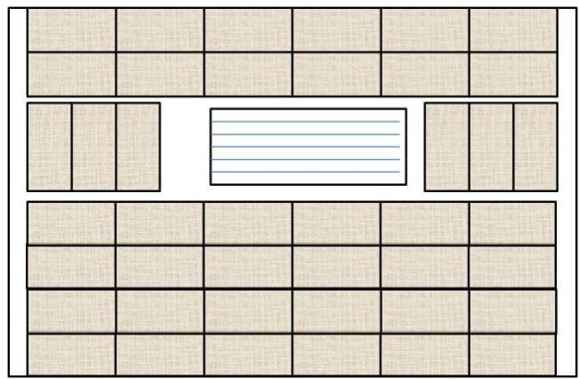

<details>
<summary>text_image</summary>

Grid layout diagram with beige squares and a central rectangular frame containing horizontal lines, likely for pattern or layout analysis.
</details>

图-6 A3-SN15 方案下顶面电池组件架空铺设分组阵列图形

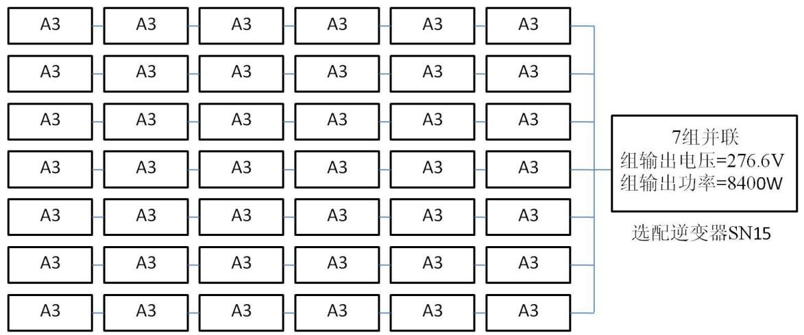

<details>
<summary>flowchart</summary>

This diagram illustrates the power distribution and selection logic for a 7-phase inverter SN15, showing how multiple input modules (A3) are combined to select the output.
</details>

图-7 A3-SN15方案下顶面电池组件连接方式示意图

实际上，在顶面可以安装 43块 A3光伏电池组件，但是增加这一块会使这些电池组件不能够满足题中所给的“多个光伏组件串联后可以再进行并联，并联的光伏组件端电压相差不应超过 的原则，故采用在顶面安装 块的 光伏电池组件方案。

方案的电池组件分组阵列容量及选配逆变器规格列表如表 所示：

表 6 A3-SN15 阵列容量及逆变器规格列表

<table><tr><td colspan="2">电池型号</td><td>A3</td></tr><tr><td colspan="2">铺设块数</td><td>42</td></tr><tr><td colspan="2">阵列容量(W)</td><td>8400</td></tr><tr><td colspan="2">逆变器型号</td><td>SN15</td></tr><tr><td rowspan="3">逆变器的规格</td><td>额定电压(V)</td><td>220</td></tr><tr><td>额定电流(A)</td><td>37.9</td></tr><tr><td>允许电压范围(V)</td><td>180~300</td></tr></table>

## 2、西面

对于东、南、西、北四个面来说，由于安装方式仍然为贴附，所以光伏电池组件的安装方案同问题一中所求得的各个方案，而问题一中的适合方案只有在西面才有合适的方案：

表 7  
5 种满意的西面电池组件铺设方案

<table><tr><td>电池型号</td><td>铺设块数</td><td>逆变器型号</td><td>发总电量(kWh)</td><td>单位发电量费用(kWh/元)</td><td>经济效益(元)</td><td>投资回收年限</td></tr><tr><td>C2</td><td>21</td><td>SN11</td><td>31452.5378</td><td>0.32895279</td><td>15726.27</td><td>22</td></tr><tr><td>C3</td><td>12</td><td>SN11</td><td>31021.8995</td><td>0.3307341</td><td>15510.95</td><td>23</td></tr><tr><td>C5</td><td>12</td><td>SN11</td><td>30997.4151</td><td>0.33099534</td><td>15498.71</td><td>23</td></tr><tr><td>C2</td><td>21</td><td>SN3</td><td>28775.726</td><td>0.35955305</td><td>14387.86</td><td>25</td></tr><tr><td>C4</td><td>12</td><td>SN11</td><td>27892.8974</td><td>0.32895279</td><td>13946.45</td><td>24</td></tr></table>

根据全年发电总量尽可能大和单位发电量的费用尽可能小的目标需求，从表我们可以看出电池型号为C2，逆变器型号为 SN11 的电池组件铺设方案是一个相对比较好的铺设方案，它的发电总量是最高的，并且单位发电费用也相对较低。此方案的在西面的电池组件铺设分组阵列图形及组件连接方式示意图分别如图-8和图-9所示：

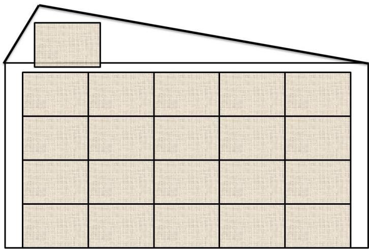

<details>
<summary>natural_image</summary>

Simple geometric diagram of a house with a triangular roof and 3x3 grid of squares (no text or symbols)
</details>

图-8 C2-SN11 方案下西面电池组件贴附铺设分组阵列图形

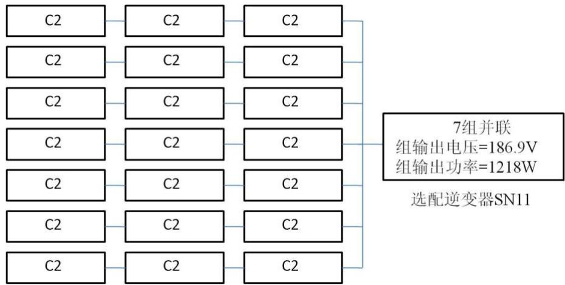

<details>
<summary>flowchart</summary>


</details>

图-9 C2-SN11方案下西面电池组件连接方式示意图

方案的电池组件分组阵列容量及选配逆变器规格列表如表 所示：

表 8 C2-SN11 阵列容量及逆变器规格列表

<table><tr><td colspan="2">电池型号</td><td>C2</td></tr><tr><td colspan="2">铺设块数</td><td>21</td></tr><tr><td colspan="2">阵列容量(W)</td><td>1218</td></tr><tr><td colspan="2">逆变器型号</td><td>SN11</td></tr><tr><td rowspan="3">逆变器的规格</td><td>额定电压(V)</td><td>220</td></tr><tr><td>额定电流(A)</td><td>5</td></tr><tr><td>允许电压范围(V)</td><td>180~300</td></tr></table>

## 七 小屋优化设计模型建立与问题三求解

## 一）问题分析

此问题是在符合小屋建筑要求的情况下，重新设计小屋，并对所设计小屋的外表面优化铺设光伏电池，选配逆变器，使小屋的全年太阳能光伏发电总量尽可能大，而单位发电量的费用尽可能小。

当铺设光伏电池时，首要条件是必须清楚小屋外形设计，且设计好的小屋需使小屋的全年太阳能光伏发电总量尽可能大，而单位发电量的费用尽可能小，则小屋的最佳设计方案应使小屋外表面全年总辐射达到最大。那么小屋的设计则可简化为一个单目标优化模型，以外表面总辐射为目标函数，小屋的建筑要求为约束条件。其中，顶面与水平面之间的夹角应为问题二中的最佳倾角 34.1°。

在设计好小屋后，光伏电池的铺设方案则可在问题一及问题二结果的基础上进行优化。对在问题一中未铺设光伏电池的墙面应重新考虑铺设方案。

## 二）目标函数及约束条件分析

## 1、目标函数

全年总辐射强度最大：

$$
\max \quad w = \sum_ {k = 1} ^ {5} i _ {k} s _ {k}
$$

$i _ { k }$ 为第 个面的全年辐射强度， 为全年总辐射强度， $s _ { k }$ 为第k个面的面积。

## 2、约束分析

由于南面门较大，且光照最强，若按小屋建筑要求南面窗墙比不大于 0.5 则会使窗户面积过小，可能计算出的门窗面积都不够一块普通门的大小。因此应适当调整南面窗墙比，可以人为的为南面窗墙比设定下限。查阅相关资料，发现下限的设置没有一个统一的标准，因此此处就以题中给出的小屋南面窗墙比（0.41）为依据，并适当的将下限调整为 。因为此处仅借鉴一个小屋的南面窗墙比，因此将下限设定为 不失一般性，更符合实际。

小屋建筑要求：

$$
\left\{ \begin{array}{l} x y \leq 7 4 \\ 0 \leq x \leq 1 5 \\ 3 \leq y \leq \sqrt {7 4} \\ x \geq y \\ H \leq 5. 4 \\ z \geq 2. 8 \\ S / (\mathrm{xy}) \geq 0. 2 \\ \mathrm{k} _ {1} / \mathrm{S} _ {2} \leq 0. 3 5 \\ \mathrm{k} _ {2} / \mathrm{S} _ {2} \leq 0. 3 5 \\ 0. 3 5 \leq \mathrm{k} _ {3} / \mathrm{S} _ {1} \leq 0. 5 \\ \mathrm{k} _ {4} / \mathrm{S} _ {1} \leq 0. 3 \end{array} \right.
$$

为小屋长， 为小屋宽， 为小屋最高点距地面的高度， 为净空高度， $k _ { 1 }$ 为东面墙门窗面积， $k _ { 2 }$ 为西面墙门窗面积， $k _ { 3 }$ 为南面墙门窗面积， $k _ { 4 }$ 为北面墙门窗面积， $S _ { 1 }$ 为南面墙面积， $S _ { 2 }$ 为西面墙面积， 为四面墙面积总和。

## 三）模型建立

依据上述分析，可建立以下单目标规划模型：

$$
\begin{array}{l} \text {max} \quad w = \sum_ {k = 1} ^ {5} i _ {k} s _ {k} \\ s. t. \left\{ \begin{array}{l} x y \leq 7 4 \\ 0 \leq x \leq 1 5 \\ 3 \leq y \leq \sqrt {7 4} \\ x \geq y \\ H \leq 5. 4 \\ z \geq 2. 8 \\ S / (\mathrm{xy}) \geq 0. 2 \\ \mathrm{k} _ {1} / \mathrm{S} _ {2} \leq 0. 3 5 \\ \mathrm{k} _ {2} / \mathrm{S} _ {2} \leq 0. 3 5 \\ 0. 3 5 \leq \mathrm{k} _ {3} / \mathrm{S} _ {1} \leq 0. 5 \\ \mathrm{k} _ {4} / \mathrm{S} _ {1} \leq 0. 3 \end{array} \right. \\ \end{array}
$$

## 四）问题三求解

## 1、小屋设计

依据小屋优化设计模型可求得小屋最佳设计方案。利用附录中程序 5 得结果如表 9所示：

表 9 小屋最佳设计方案

<table><tr><td>长</td><td>宽</td><td>净空高度</td><td>屋顶最高点距地面高度</td><td>东墙门窗面积</td><td>西墙门窗面积</td><td>南墙门窗面积</td><td>北墙门窗面积</td></tr><tr><td>15</td><td>4.5</td><td>2.8</td><td>5.4</td><td>4.4</td><td>4.4</td><td>14.7</td><td>7</td></tr></table>

根据表中数据可知，小屋长15米，而宽只有 4.5米，这主要是因为南面光强最强，使小屋长尽可能的长符合模型的目标，即使小屋外表面全年总辐射最强。从人的感官分析也可推断，因为南面光强最强，那么南面面积就越大越好，因此求解结果也符合人的第一感觉。

## 2、门窗位置设计及光伏电池铺设

在设计出小屋各个墙面的门窗面积之后，门窗位置的设置对光伏电池的铺设也会产生很大的影响，因此，需要对小屋各个表面的门窗位置进行合理的设置。即要考虑光伏电池的铺设也要考虑小屋的美观性及结构性。

## 1）顶面

从表 9 数据可知，小屋的面积为 67.5 平米，问题一的小屋面积为 64.6 平米，两者面积相差不大，因此顶面上用于采光的天窗也可保持问题一中小屋的长宽。根据问题二中得出的最佳铺设方案可知，小屋顶面光伏电池规格为 1580×808，因此，顶面的天窗应为正中偏上位置，其光伏电池铺设图如图-10 所示：

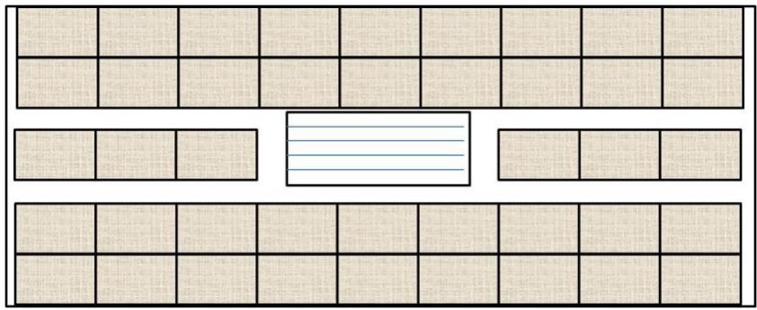

<details>
<summary>text_image</summary>

Grid layout diagram with a central rectangular box containing three horizontal lines, surrounded by smaller empty cells.
</details>

图-10 顶面光伏电池铺设图

若按实际长度计算，在天窗左右两旁的电池可以铺设 块，而此处只铺设 块，这是出于光伏电池串并联的考虑才减少一块。因为天窗左右两旁铺设 块，则电池总块数为43，很难进行串并联，同时也会由于天窗位置左右的移动则容易影响小屋内部的采光。天窗左右两旁铺设6块则不仅可以使电池串并联问题解决、天窗位置可以居中，使小屋内部采光均匀，且美观性更佳。图中天窗的位置在顶面上并不是居中，而稍微向上偏移，这是考虑到小屋北面也有一部分顶面，因此向上偏移一点则更接近小屋的正中，使小屋采光更均匀。

其电池组件连接方式如图-11所示。

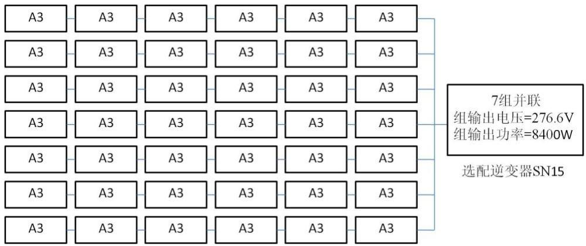

<details>
<summary>text_image</summary>

A3 A3 A3 A3 A3 A3
A3 A3 A3 A3 A3 A3
A3 A3 A3 A3 A3 A3
A3 A3 A3 A3 A3 A3
A3 A3 A3 A3 A3 A3
A3 A3 A3 A3 A3 A3
A3 A3 A3 A3 A3 A3
A3 A3 A3 A3 A3 A3
A3 A3 A3 A3
A3 A3 A3 A3 A3
A3
7组并联
组输出电压=276.6V
组输出功率=8400W
选配逆变器SN15
A3 A3
A3
A3
A3
A3
A3
</details>

图-11 A3-SN15方案下顶面电池组件连接方式示意图

## 2）南面

南面门窗面积为14.7 平方米。因为门窗都有一定的规格，因此保持门的面积不变（9平方米），而改变窗户的大小以及形状来寻求最佳铺设方案。为使可铺设面积达到最大而整体结构不变，将窗户设为两扇完全相同的窗户并位于门的两侧。在电池铺设过程中，可以对窗户的位置及长宽比进行微调，但窗户的最高点应不高于门的最高点且窗户的面积不能发生变化。

由于南面属于对称图形，且门最高点距小屋屋檐仅有 0.3 米的高度，因此在电池铺设过程中，可以只对右半面（或左半面）进行铺设，而左半面（或右半面）则按相同方式铺设即可。

用 19 种（由于 C6\~C10 这 5 种型号电池组件单位价格的转换效率很低，而且部分组件还不能找到合适的逆变器，肯定不会出现在可参考的方案中，故本文将不会对这 5种型号的组件进行讨论）规格的电池一一铺设南面，大致可以分为以下 3种铺设方式。

方式一：窗户长1.75 米，高1.6米，离地 0.9米，居中；如图-12  
方式二：窗户长1.87 米，高1.5米，离地 1米，居中；如图-13

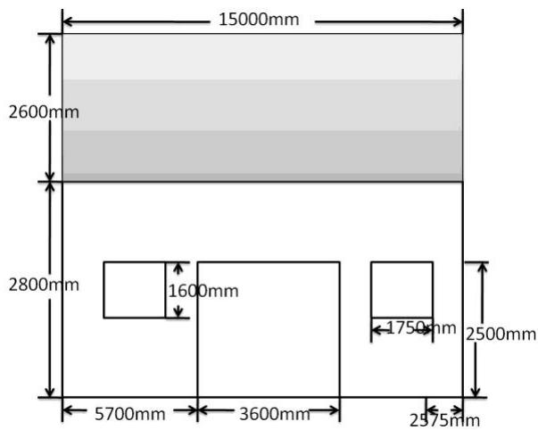

<details>
<summary>text_image</summary>

15000mm
2600mm
2800mm
1600mm
5700mm 3600mm
1750mm 2500mm
2975mm
</details>

图-12 南立面门窗设置方式一

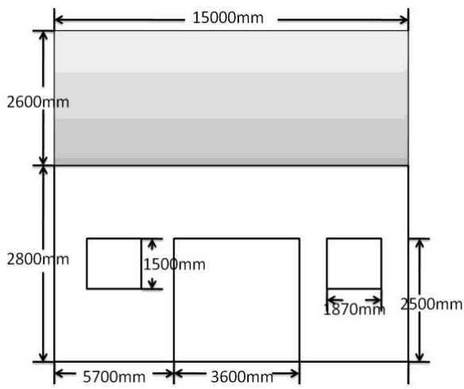

<details>
<summary>text_image</summary>

15000mm
2600mm
2800mm
1500mm
5700mm 3600mm
1870mm 2500mm
</details>

图-13 南立面门窗设置方式二

方式三：窗户长 1.75 米，高 1.6 米，离地 0.9 米，向左（或向右）偏移 0.6 米；如图-14

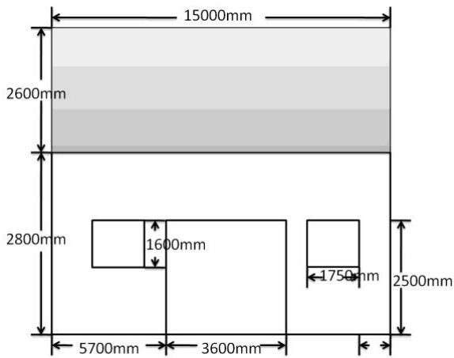

<details>
<summary>text_image</summary>

15000mm
2600mm
2800mm
1600mm
5700mm 3600mm
1750mm 2500mm
</details>

图-14 南立面门窗设置方式三

通过19种铺设方案的对比，得出如表 10 所示满意方案。

表 10 7种满意的顶面电池组件铺设方案

<table><tr><td>电池型号</td><td>铺设块数</td><td>逆变器型号</td><td>发总电量(kWh)</td><td>单位发电量费用(kWh/元)</td><td>经济效益(元)</td><td>投资回收年限</td></tr><tr><td>B3</td><td></td><td>SN12</td><td>102272.9791</td><td>0.426798949</td><td>51136.4895</td><td>30</td></tr><tr><td>B3</td><td></td><td>SN13</td><td>102272.9791</td><td>0.460043312</td><td>51136.4895</td><td>32</td></tr><tr><td>B3</td><td></td><td>SN4</td><td>93568.8958</td><td>0.466501177</td><td>46784.4479</td><td>33</td></tr><tr><td>B1</td><td></td><td>SN12</td><td>82420.80157</td><td>0.485617699</td><td>41210.4007</td><td>34</td></tr><tr><td>C2</td><td></td><td>SN11</td><td>35809.5309</td><td>0.2811542</td><td>17904.7654</td><td>19</td></tr><tr><td>C1</td><td></td><td>SN11</td><td>33690.9167</td><td>0.304533121</td><td>16845.4583</td><td>21</td></tr><tr><td>C3</td><td></td><td>SN1</td><td>22093.31064</td><td>0.305069716</td><td>11046.6553</td><td>21</td></tr></table>

根据全年发电总量尽可能大和单位发电量的费用尽可能小的目标需求，从表我们可以看出电池型号为B3，逆变器型号为 SN12的电池组件铺设方案是一个相对比较好的铺设方案，它的发电总量是最高的，并且单位发电费用也相对较低。此方案的在西面的电池组件铺设分组阵列图形及组件连接方式示意图分别如图-15和图-16 所示。

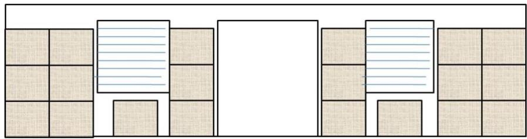

<details>
<summary>natural_image</summary>

Abstract layout diagram with beige rectangular blocks and white space, no text or symbols present
</details>

图-15 南面光伏电池铺设图

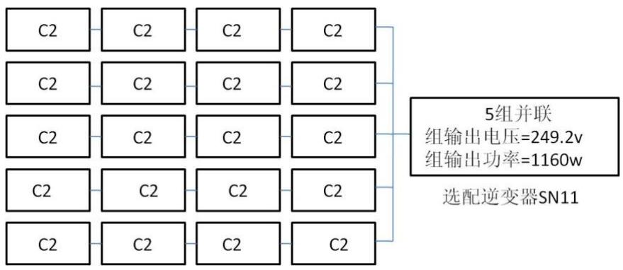

<details>
<summary>flowchart</summary>

This diagram illustrates the power distribution architecture of a 5-group and 11-bridge in an optocoupler (SN11), showing how multiple modules are combined to produce a single output.
</details>

图-16 C2-SN12 方案下南面电池组件连接方式示意图

## 3）西面

根据表中数据可知，西面窗户面积为 4.4 平米，因此可将窗户设计为落地窗。考虑其长宽比会影响电池铺设，将长设为 2.2 米，高为 2 米，并居中，此时可铺设面积最大化。利用问题二求得的前 3种满意方案的电池对西面重新铺设，计算相应的投资回收期，最后发现这3种电池铺设方案的投资回收期均超过 35年。因此，西面不铺设光伏电池。

## 4）北面

根据表9数据可知，北面门窗面积为7平米，由于门的尺寸有一定的规格，因此门的大小可保持，而窗户的大小则可以人工调节使总门窗面积为 7平米，使可铺设面积最大。问题一中北面所有电池铺设方案中 35 年总收益都小于成本，因此挑选前 5 种收益与成本差值最小的方案，依据这 种方案的电池规格对北面窗户长宽比及位置进行设置，如图 ，这种情况下可铺设面积最大。

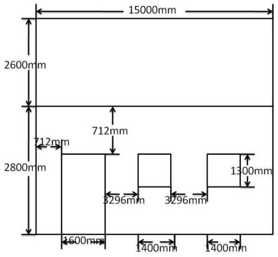

<details>
<summary>text_image</summary>

15000mm
2600mm
712mm
712mm
2800mm
3296mm
3296mm
1300mm
1600mm
1400mm
1400mm
</details>

图-15 北立面门窗设置方式

利用问题一求得的前5种满意方案的电池对北面重新铺设，计算相应的投资回收期，最后发现这3种电池铺设方案的投资回收期均超过 35年。因此，北面不铺设光伏电池。

## 5）东面

根据表9数据显示，东面门窗面积和西面门窗面积相等，而东面光强弱于西面，从对西面的铺设方案的讨论中可得出西面不用铺设光伏电池，因此，东面则更加不用铺设光伏电池。

## 3、小屋设计图

根据上述讨论，得出小屋设计图如图-16\~图-20。

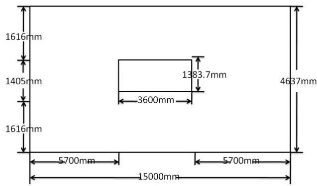

<details>
<summary>text_image</summary>

1616mm
1405mm
1616mm
3600mm
1383.7mm
5700mm
15000mm
5700mm
4637mm
</details>

图-16 顶面天窗设置方式

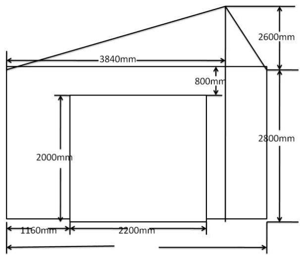

<details>
<summary>text_image</summary>

3840mm
800mm
2600mm
2000mm
1160mm
2200mm
2800mm
</details>

图-17 东立面门窗设置方式

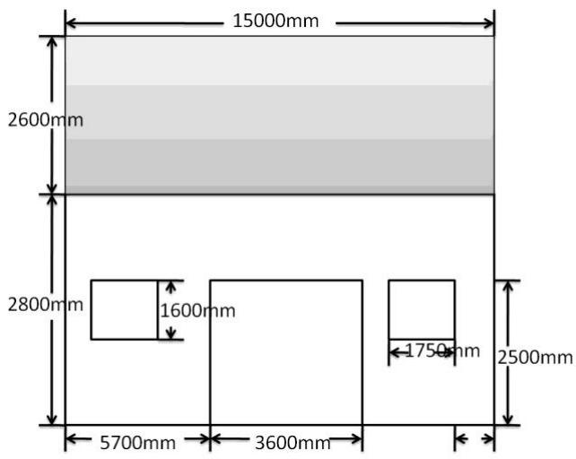

<details>
<summary>text_image</summary>

15000mm
2600mm
2800mm
1600mm
5700mm
3600mm
1750mm
2500mm
</details>

图-18 南立面门窗设置方式

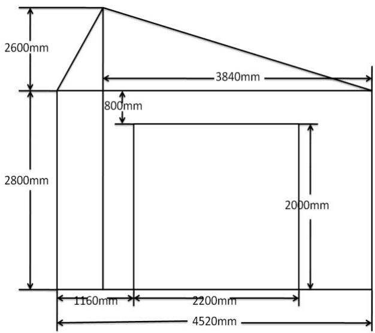

<details>
<summary>text_image</summary>

2600mm
3840mm
800mm
2800mm
1160mm
2200mm
4520mm
2000mm
</details>

图-19 西立面门窗设置方式

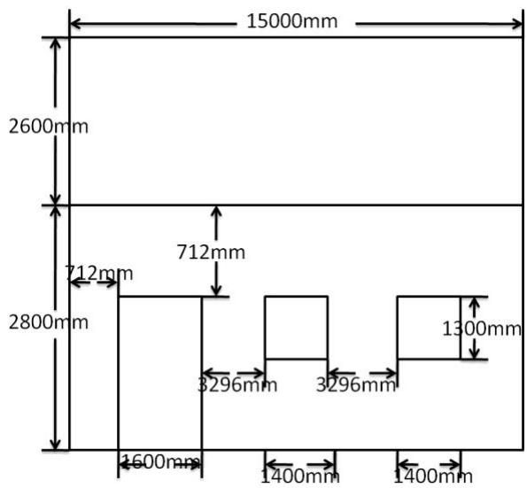

<details>
<summary>text_image</summary>

15000mm
2600mm
712mm
712mm
2800mm
3296mm
3296mm
1300mm
1600mm
1400mm
1400mm
</details>

图-20 北立面门窗设置方式

## 八 模型改进方向

由于太阳能小屋的光伏电池组件铺设及小屋的重新设计是一个很复杂的问题，所以本文所建立的模型在实际运用时仍然存在改进空间，为使模型更具实用性，可以考虑从以下几个方向对模型进行改进：

1、考虑同一面使用不同型号的光伏电池组件进行铺设。虽然不同型号的电池铺设在同一表面不够美观，而且会使电池组件的串并联方式变得复杂，逆变器的选择也会变得不简单，但是从经济效益来讲还是值得考虑的。  
2、考虑同一面使用一个或者多个逆变器。有些逆变器虽然功率较高，但是价格过于昂贵，可以考虑使用多个小功率但是价格比较低的逆变器来代替，这样就有可能找到一种更好的方案。  
3、考虑允许小屋偏离正南朝向的小屋设计。由于本文所建模型是建立在小屋为正南朝向的基础之上的，是否存在一种偏离正南方向的小屋设计的更好方案为未可知。

## 参考文献

[1] 戎卫国，建筑节能原理与技术，武汉：华中科技大学出版社，2010，188\~195  
[2] 方荣生，太阳能应用技术，北京：中国农业机械出版社，1985，41\~78  
[3] 唐润生，吕恩荣，集热器最佳倾角的选择，云南：太阳能学报，1988，Vol.9,No.4  
[4] 王炳忠，申彦波，从资源角度对太阳能装置最佳倾角的讨论，北京：太阳能，2010，17\~20  
[5] 聂洪达等，房屋建筑学，北京：北京大学出版社，2007,258\~279  
[6] 李庆林，王平阳，杨帆，倾斜面上太阳辐射计算与最佳位置确定，节能技术，2008，Vol.26,No.152  
[7] 沈仲晃，太陽能電池安裝角度與電能輸出之研究，技术学刊，2005，Vol.20,No.1

## 附录

程序 1：  
```matlab
function [Wall Mall year P c nb] = GUOSAI_1_result()

Wall = [];    % 35 年总发电量
Mall = [];    % 35 年总收益
year = [];    % 投资回收期
P = [];      % 成本
c = [];      % 单位成本
nb = [];      % 所选逆变器型号
% 顶面
% 东面 : num = [42 25 42 32 32 25 32 25 35 32 25 25 32 31 54 32 32 32 0 0 0 0 0 44];
% 南面 : num = [7 1 1 1 1 1 1 1 2 1 1 1 1 1 8 1 1 1 0 0 0 0 0 7];
% 北面 : num = [25 19 25 21 21 19 21 19 12 21 19 19 18 23 36 19 22 22 0 0 0 0 0 30];
% 西面 : num = [17 9 17 12 12 9 12 9 14 12 9 9 12 12 21 12 12 12 0 0 0 0 0 17];
% 东面 :
num = [15 6 15 9 9 6 9 6 10 9 6 6 9 12 15 10 10 10 0 0 0 0 0 12];
for i = 1:24
    [W M y p cc nbb] = GUOSAI_1_xl(i, num(i), 2);
    n = size(nbb, 2);
    Wall(i, l:n) = W';
    Mall(i, l:n) = M';
    year(i, l:n) = y;
    P(i, l:n) = p';
    c(i, l:n) = cc';
    nb(i, l:n) = nbb';
end
```

程序 2：  
```matlab
function [Wall Mall year P c nb] = GUOSAI_1_xl(n, num, choose)

if num == 0
    Wall = [];
    Mall = [];
    year = [];
    P = [];
    c = [];
    nb = [];
    return;
end
load II;
load BF;
load NB;
IDN = II(:, 1) - II(:, 2); % 水平面辐射强度
IDH = II(:, 2); % 水平面散射辐射强度
% bb = acos(6.4/(sqrt(1.2^2+6.4^2))); % 角度
bb = 40.16373/180*pi; % 第二问
if choose == 1      % 顶面
    IO = IDN*cos(bb) + IDH*(cos(bb/2)^2); % 顶面总辐射
elseif choose == 2 % 东面
```

```matlab
IO = II(:, 3);
elseif choose == 3 % 南面
    IO = II(:, 4);
elseif choose == 4 % 西面
    IO = II(:, 5);
else          % 北面
    IO = II(:, 6);
end
B = BF(:, 2);
ZH = zeros(1, 8760);
WO = 0;
xx = zeros(1, 24);
xx(n) = 1;
ZH(1, 1:8760) = xx*BF(:, 5);
if n < 7
    ZH(IO < 200) = xx*BF(:, 5)*0.05;
    ZH(IO < 80) = 0;
    WO = WO + ZH*B(n)*IO;
end
if n > 13
    ZH(IO == 200) = xx*BF(:, 5)*1.05;
    ZH(IO < 30) = 0;
    WO = WO + ZH*B(n)*IO;
end
if n >= 7 && n <= 13
    WO = WO + sum(B(n)*IO*(xx*BF(:, 5)));
end
WO = WO*num; % 实际功率

W = num*xx*BF(:, 1); % 额定功率
```

% 选择逆变器  
```matlab
nb = [];
for i = 1:18
    if W <= NB(i, 8) && W >= NB(i, 7)
        nb = [nb, i];
    end
end
```

% 计算在选定逆变器条件下的逆变功率

<div class="mineru-algorithm" style="white-space: pre-wrap; font-family:monospace;">
$Wnb = W0*NB(nb, 3)/1000; \quad \%$  逆变功
 $M = 0.5 * Wnb; \%$  这一年的收益
</div>

% 电板和逆变器的成本

<div class="mineru-algorithm" style="white-space: pre-wrap; font-family:monospace;">
$P = BF(n, 1) * BF(n, 6) * num; \quad \%$  电板价格
 $P = P + NB(nb, 4); \quad \%$  加上逆变器成本
</div>

% 35年的发电总量  
```matlab
Wnb1 = Wnb*10;      % 前 10 年
Wnb2 = Wnb*15*0.9;   % 中 15 年
```

```matlab
Wnb3 = Wnb*10*0.8; % 后 10 年
Wall1 = Wnb1 + Wnb2 + Wnb3; % 35 年的总发电量
Mall1 = Wall*0.5; % 总经济效益
```

% 单位电量的发电成本

```txt
c = P./Wall;
```

% 投资回收年限(year)

```matlab
year = [];
n = size(nb, 2);
for k = 1:n
    if P(k) - Wnb1(k)*0.5 <= 0
        for i = 1:10
            if P(k) - Wnb1*i/10*0.5 <= 0
                year(k) = i;
                break;
            end
        end
    elseif P(k) - (Wnb1(k)+Wnb2(k))*0.5 <= 0
        for i = 1:15
            if P(k) - (Wnb1(k)+Wnb2(k)*i/15)*0.5 <= 0
                year(k) = 10+i;
                break;
            end
        end
    else
        for i = 1:10
            if P(k) - (Wnb1(k)+Wnb2(k)+Wnb3(k)*i/10)*0.5 <= 0
                year(k) = 25+i;
                break;
            end
        end
    end
end
if isempty(year)
    year(1:n) = 0;
end
```

## 程序 3：

```matlab
function [C, ceq] = GUOSAI_3_ys(x)
    C = [-x(4) + 2.8;x(3) - 5.4;x(2) - x(1);x(2) - sqrt(74);-x(1);x(1) - 15; 3 - x(2);x(1)*x(2) - 74;...
        x(5) - 0.35*x(2)*x(4); x(6) - 0.35*x(2)*x(4);x(7) - 0.5*x(1)*x(4);-x(7) + 0.35*x(1)*x(4);...
        x(8) - 0.3*x(1)*x(4);0.2*(x(1)*x(2)) - (x(5) + x(6) + x(7) + x(8));];
ceq = [];
```

## 程序 4：

```txt
function [f g] = GUOSAI_3_fun(x)
```

```matlab
load II;
load BF;
load NB;
IDN = I(:, 3); % 水平面法向辐射强度
IDH = I(:, 2); % 水平面散射辐射强度
bb = 34.1/180*pi; % 第二问倾斜角
nn = 1:24;
w = (nn - 12)*15/180*pi; % 1*24(一天)
N = 1:365;
w1 = 23.45*sin(360*(284+N)/365)/180*pi; % 1*365(一年)
for i = 1:365
    for j = 1:24
        t((i-1)*24+j)      =   acos(sin(w1(i))*sin(40.1/180*pi      -      bb)      +
cos(w1(i))*cos(w(j))*cos(40.1/180*pi - bb));
    end
end
    IO = sum(IDN.*cos(t)' + IDH*(cos(bb/2)^2)); % 顶面总辐射
% 东面
    I4 = sum(I(:, 4));
% 南面
    I5 = sum(I(:, 5));
% 西面
    I6 = sum(I(:, 6));
% 北面
    I7 = sum(I(:, 7));

k = (x(3) - x(4))/sin(bb);
f = -(I0*k*x(1) + I(4)*x(2)*x(4) + I(5)*x(1)*x(4) + I(6)*x(2)*x(4) + I(7)*x(1)*x(4));
```

## 程序 5：

```matlab
function [x, f] = ShuDian_3_youhua()

x0 = [10; 6; 5.4; 2.3; 5; 5; 7; 7];
x0 = [15; 4.5; 5.4; 2.8; 4.43; 4.43; 14.7; 7];
[x, f]=fmincon('GUOSAI_3_fun', x0, [], [], [], [], [], [], 'GUOSAI_3_ys');
```