# 太阳能小屋的的优化设计

## 摘要

本文针对太阳能小屋的设计问题，采用了构造函数的方法，得出电池板的优劣评判函数，从而确定了不同电池板的优先度，进而确定了电池板的组合方式以及如何选择逆变器，最后得到了小屋的投资成本，经济效益以及回收年限。计算得知A3 板的性能最好，故安放电池时优先考虑 A3，若墙面剩下的面积不足以排下A3，则考虑性能仅低于 A3的电池板，排在剩下的墙面，直到无法排下任何一块电池为止，这样就解决了电池的安放问题。在逆变器的选择上，优先考虑额定功率大于电池板阵列功率的逆变器，在其基础上优先选择效率高并且价钱低的逆变器。在太阳辐射的计算中，利用了立体几何中的向量法，用以求解光线与电池板的夹角，从而计算出电池板所接受的辐射强度。

针对三个问题我们分别建立了三个模型，每个模型都单独计算出每一面墙是否盈利，以此来判断该面墙是否应铺设太阳能电池。由于北面墙没有太阳光直射，只有散射光辐射，所以对北面墙估算，发现即使使用最好性能的电池，且将墙上所有的地方都贴上，依然是亏本，所以北面墙上不贴太阳能电池。

针对问题一：在考虑贴附情况下，计算知光伏电池 35 年寿命期内的发电总量为 515120kWh，经济效益 257560 元，总投资额 188430 元；每度电的成本为 0.365元/kWh，投资的回收年限 24.49年；

针对问题二：我们采取架空方式来对屋顶进行分析，找到在这种情况下的最优设计方案，有利于顶面得到更多的太阳辐射，故只需要将电池板与水平面调到合适的夹角，利用网格搜索法找到了水平面与电池板的最优夹角为 42.97度，电池板的朝向为正南偏西 1～2 度。光伏电池 35 年寿命期内的发电总量为568880kWh，经济效益为 284440 元，总投资额 188430 元；每度电的成本为 0.33元/kWh，投资的回收年限为 22.07年；

针对问题三：，通过前两问分析知屋顶产生的利润最大，所以在设计时我们建立一个优化模型，求出在所给的约束条件下的最大顶面，从而可以得到最优的设计方案。光伏电池 35年寿命期内的发电总量 884700kWh，经济效益 442350元，总投资额275610元，每度电的成本 0.311 元/kWh；投资的回收年限 20.667年。

关键词 性能函数 优化模型 非线性规划 辐射强度

## 第一部分 问题重述

在设计太阳能小屋时，需在建筑物外表面（屋顶及外墙）铺设光伏电池，光伏电池组件所产生的直流电需要经过逆变器转换成 220V交流电才能供家庭使用，并将剩余电量输入电网。不同种类的光伏电池每峰瓦的价格差别很大，且每峰瓦的实际发电效率或发电量还受诸多因素的影响，如太阳辐射强度、光线入射角、环境、建筑物所处的地理纬度、地区的气候与气象条件、安装部位及方式（贴附或架空）等。因此，在太阳能小屋的设计中，研究光伏电池在小屋外表面的优化铺设是很重要的问题。

对下列三个问题，分别给出小屋外表面光伏电池的铺设方案，使小屋的全年太阳能光伏发电总量尽可能大，而单位发电量的费用尽可能小，并计算出小屋光伏电池35年寿命期内的发电总量、经济效益（当前民用电价按 0.5元/kWh计算）及投资的回收年限。

在求解每个问题时，都要求配有图示，给出小屋各外表面电池组件铺设分组阵列图形及组件连接方式（串、并联）示意图，也要给出电池组件分组阵列容量及选配逆变器规格列表。

在同一表面采用两种或两种以上类型的光伏电池组件时，同一型号的电池板可串联，而不同型号的电池板不可串联。在不同表面上，即使是相同型号的电池也不能进行串、并联连接。应注意分组连接方式及逆变器的选配。

问题一：根据山西省大同市的气象数据，仅考虑贴附安装方式，选定光伏电池组件，对小屋的部分外表面进行铺设，并根据电池组件分组数量和容量，选配相应的逆变器的容量和数量；

问题二：电池板的朝向与倾角均会影响到光伏电池的工作效率，选择架空方式安装光伏电池，重新考虑问题 1；

问题三：根据小屋建筑要求，为大同市重新设计一个小屋，画出小屋的外形图，并对所设计小屋的外表面优化铺设光伏电池，给出铺设及分组连接方式，选配逆变器，计算相应结果。

## 第二部分 问题分析

（1）本文旨在研究在使用光伏电池进行太阳能发电时如何安排小屋表面的电池组件，使其在有效期内获得最高效率的电能，且转换费用最小，属于带有约束条件的优化组合问题。

对于问题一和问题二，太阳能电池板在小屋外如何铺设，受到了诸多因素的影响，如：太阳辐射强度、光线入射角、环境、地区的气候与气象条件、安装部位、电池组件的连接方式和逆变器的功率要求等，通过比较分析可以得到影响太阳能电池板影响的关键因素，又因为每个面的地理位置、所接受的太阳辐射和面积尺寸不同，因此不能对所有面一概而论,即应该针对每个面接收阳光辐射的特点，来制定其所对应的铺设方案。对各种太阳能电池的分析可知。

1.单晶硅电池成本高、转换效率高，当辐照强度低于 200W/㎡时，电池的转换效率<转换效率的 5%；  
2.多晶硅电池转换效率和价格略低于单晶硅；  
3.非晶硅薄膜电池可以吸收辐射很弱的光，价格低廉，但是它的转换效率低。

4.所有光伏组件在 0～10年效率按100%，10～25 年按照90%折算，25 年后按80%折算

为了得到更多的电能，应该在能够强烈吸收阳光的面上使用转换效率较高的电池；在光辐照较弱和变化太大（即虽然在一定的时间内光辐射强度较大，但是在大部分时间里光辐射强度较低），可以采用非晶硅薄膜电池，同时节约了成本。通过性能函数来缺定最优太阳能电池铺设方案的确定。

问题一，由于太阳能小屋已经给出，所有不能够改变小屋的结构，只能是通过不断的优化找到每一面墙的最优铺设方案

问题二，要求电池板采取架空方式，是为了更好的接收太阳辐射。该架空方式最大优势在于顶面电池组件可以根据所在地的纬度自行设计其倾斜角，所要达到的目的是使太阳在一天中有更多的时间直射电池板。由分析知用架空方式安装太阳能电池时，由于条件的限制，墙的四周不能使用架空方式来安装电池，因此在问题二中四面墙的处理方案与问题一中的方法完全一致，只能在屋顶使用架空方式来安装太阳能电池板。

问题三具有很大的开放性，可以自行设计房子的构造，对问题一和问题二分析知

1.由于窗子和门的位置或形状设计的不合理浪费了大量的空间；  
2.屋顶的接收到的光照辐度大，可以使用转换效率高的太阳能电池；

但是对于山西大同的房子要保证其采光，即窗子一定要位于南面，且要满足高度、边长等的比例要求。通过问题一和问题二可以得到 35年内盈利最多的一面墙，自行设计的时候就要充分发挥盈利多得墙的优势，即在满足各条件要求的情况下，使其面积达到最大。

## 第三部分 符号说明与模型假设

## 一．符号说明

1.P表示组输出功率；  
2. i=1,2,…，24 表示第i个型号电池的输出功率；  
3. $X _ { \mathfrak { b } }$ 表示问题一中单位面积太阳能电池的价格；  
4.Q 表示价格；  
5. $S _ { \sharp }$ 表示每个型号电池的面积；  
6. $X _ { \beta }$ 表示单位面积的有效发电功率；  
7.K表示大于 0的比例系数；  
8. $X _ { \mathrm { i } }$ i=1,2,3,4,5 表示问题一中顶、东、西、南、北各个面的净收入；  
$X _ { \mathrm { i l } }$ i=1,2,3,4,5 表示问题一中5个面由太阳能发电所得到的收入；  
10. $X _ { i 2 }$ i=1,2,3,4,5 表示问题一中5个面安装太阳能的成本；  
11. $X _ { \mathrm { i } 3 }$ i=1,2,3,4,5 表示问题一中安装逆变器的费用；

12.X表示总的净收入；  
13.D表示 35年的总发电量；  
14. $\eta \%$ 表示电池组件的转换效率；  
15.H表示经济效益；  
16.n表示回收年限；  
17. $X _ { \mathrm { m } }$ 表示问题一中太阳能电池发电产生的效益；  
18. $D _ { \mathrm { i j } } \mathrm { i = 1 , 2 , 3 } \ ; \quad \mathrm { j = 1 , 2 , \cdots , ~ 5 }$ ，表示 在第 i问题下，第 j个面太阳能电池 35年的发电量；  
19. $B _ { \mathrm { i } } , ~ \mathrm { i = 1 } , 2 , 3 , 4 , 5$ ,表示第i面安装太阳能电池的总费用；  
20.F表示由太阳能电池发一度电的成本；  
21. $Y _ { \mathrm { b } }$ 表示问题二中单位面积太阳能电池的价格；  
22. $Y _ { \mathrm { i } } { \mathrm { i } } = 1 , 2 , 3 , 4 , 5$ 表示问题二中顶、东、西、南、北各个面的净收入；  
23. $Y _ { \mathrm { i l } } \mathrm { i } { = } 1 , 2 , 3 , 4 , 5$ 表示问题二中5个面由太阳能发电所得到的收入；  
24. $Y _ { i 2 } \gets 1 , 2 , 3 , 4 , 5$ 表示问题二中5个面安装太阳能的成本；  
25. $Y _ { \mathrm { i } 3 } ^ { \mathrm { ~ ~ } \mathrm { i } = 1 , 2 , 3 , 4 , 5 }$ 表示问题二中安装逆变器的费用；  
26. $Y _ { \mathrm { m } }$ 表示问题二中太阳能电池发电产生的效益；  
27. $Z _ { \mathrm { { b } } }$ 表示问题三中单位面积太阳能电池的价格；  
28. $Z _ { \mathrm { i } } { \mathrm { i } } = 1 , 2 , 3 , 4 , 5$ 表示问题三中顶、东、西、南、北各个面的净收入；  
29. $Z _ { \mathrm { i } 1 } \mathrm { i } { = } 1 , 2 , 3 , 4 , 5$ 表示问题三中5个面由太阳能发电所得到的收入；  
30. $Z _ { i 2 } \mathrm { i } { = } 1 , 2 , 3 , 4 , 5$ 表示问题三中5个面安装太阳能的成本；  
31. $Z _ { \mathrm { i } 3 } \mathrm { i } \mathrm { = } 1 , 2 , 3 , 4 , 5$ 表示问题三中安装逆变器的费用；  
32. $Z _ { \mathrm { m } }$ 表示问题三中太阳能电池发电产生的效益；  
33. $S _ { 1 ^ { \setminus } } \ S _ { 2 ^ { \setminus } } \ S _ { 3 ^ { \setminus } } \ S _ { 4 }$ 表示第三问中南、东、西、北各面窗户的面积；  
34. $S _ { z }$ 表示第三问中开窗户的总面积；  
35. $S _ { \mathrm { c l } }$ 表示C1型号电池的面积；

36. $S _ { \mathrm { f z } }$ 表示小屋房间地面的面积。

## 二．模型假设

1.在安装太阳能电池时，任意两块电池组件可以相连放置，即认为不会漏电，也不会影响两块电池的正常工作；  
2.在该太阳能电池有效的使用寿命期间内，当地电价不会发生改变，即按照 0.5元/kWh 计算；  
3.东西两面墙三角形与长方形连接的地方可以放置电池板，认为连接处与其他地方的凹凸程度近似；  
4.山西大同采用北京时间，即不考虑时差因素所带来的影响；  
5.所得到的逐时参数及各个方向参数是该单位时间段的平均值，而非瞬时值；  
6.单晶硅、多晶硅和薄膜电池的使用寿命均在 35年以上，即在使用的 35年间不考虑更换电池的情况，所使用的各种型号的电池不会损坏，均正常工作;  
7.在安装电池时，假如剩余的安装空间比电池安装面积，则安装时可做适当的变化使其能够安装。

## 第四部分 模型准备

对这个问题进过分析发现，解决这个问题的关键在于：

（1）对三种类型的光伏电池经行分类；  
（2）某一面墙可以使用那些类型的光伏电池；  
（3）选择各种型号的电池的使用顺序。

由聚类分析发现可以将 A和B 作为第一类，C 作为第二类。

由于光伏分组阵列的端电压应满足逆变器直流输入电压范围，当电压低于其范围下限时，逆变器将停止运行。此时光伏发电系统不输出电力，即认为系统不能发电，应在发电量计算中予以剔除。在此可通过电池表面太阳光辐照阈值（光伏电池组件启动发电时其表面所应接受到的最低辐射量限值，单晶硅和多晶硅电池启动发电的表面总辐射量≥80W/m<sup>2</sup>、薄膜电池表面总辐射量 $\geqslant 3 0 \mathbb { W } /  { \mathrm { m } } ^ { 2 } )$ ）进行判断。得到顶部只能用第一类，四周的墙只能用第二类

对题目所给的附件 3：三种类型的光伏电池（A 单晶硅、B 多晶硅、C 非晶硅薄膜）组件设计参数和市场价格。进行从新组合找到了两个新的参数。

单位面积太阳能电池的价格

$$
X _ {\alpha} = (P _ {i} * Q) / S
$$

单位面积的有效发电功率

$$
X _ {\beta} = \frac {P _ {\mathrm{i}}}{S _ {\text {组}}} * \eta \%
$$

对这两个变量进行量纲分析发现它们之间可以构成一个函数表达式量纲分析过程

$$
X _ {\alpha} \text {的单位是元} / \mathfrak {m} ^ {2}
$$

$$
X _ {\beta} \text {的单位是} \mathrm{W} / \mathrm{m} ^ {2}
$$

$$
\frac {W}{\mathrm{m} ^ {2}} / \frac {\text {元}}{\mathrm{m} ^ {2}} = W / \text {元}
$$

函数表达式

$$
F (X _ {\alpha}, X _ {\beta}) = K \frac {X _ {\alpha}}{X _ {\beta}}
$$

由对 F的单位进行分析知 F的函数意义是单位价格的发电功率，所以可以知F值越大，则说明该种产品的性能越好，应优先选用它。

定义该函数为性能函数，通过用 matlab编程计算出各类光伏电池的性能值，计算结果如下表所示。

表一：第一类电池性价比

<table><tr><td>A1</td><td>A2</td><td>A3</td><td>A4</td><td>A5</td><td>A6</td><td></td></tr><tr><td>2. 5092</td><td>2. 4794</td><td>2. 7863</td><td>2. 4585</td><td>2. 232</td><td>2. 2514</td><td></td></tr><tr><td>B1</td><td>B2</td><td>B3</td><td>B4</td><td>B5</td><td>B6</td><td>B7</td></tr><tr><td>2. 0263</td><td>2. 0488</td><td>1. 9975</td><td>1. 85</td><td>1. 9975</td><td>1. 9</td><td>1. 87</td></tr></table>

表二：第二类电池性价比表

<table><tr><td>C1</td><td>C2</td><td>C3</td><td>C4</td><td>C5</td><td>C6</td></tr><tr><td>0.3355</td><td>0.2962</td><td>0.3048</td><td>0.2803</td><td>0.3115</td><td>0.1742</td></tr><tr><td>C7</td><td>C8</td><td>C9</td><td>C10</td><td>C11</td><td></td></tr><tr><td>0.1742</td><td>0.1757</td><td>0.1757</td><td>0.1982</td><td>0.205</td><td></td></tr></table>

从表中可知在第一类中 A3=2.7863最大，在第二类中 C1=0.3355 最大，所以在确定最优铺设方案时在使用第一类是最先使用 A3，在使用第二类铺设时最先使用C1。

表三：每个逆变器的额定容量

<table><tr><td>SN1</td><td>SN2</td><td>SN3</td><td>SN4</td><td>SN5</td><td>SN6</td></tr><tr><td>600</td><td>1200</td><td>1152</td><td>2304</td><td>3504</td><td>5520</td></tr><tr><td>SN7</td><td>SN8</td><td>SN9</td><td>SN10</td><td>SN11</td><td>SN12</td></tr><tr><td>3300</td><td>5610</td><td>11110</td><td>22220</td><td>1100</td><td>2200</td></tr><tr><td>SN13</td><td>SN14</td><td>SN15</td><td>SN16</td><td>SN17</td><td>SN18</td></tr><tr><td>3344</td><td>5566</td><td>8338</td><td>10648</td><td>26000</td><td>26000</td></tr></table>

## 第五部分 模型的建立与求解

## 问题一 模型的建立与求解

## 1.模型的建立

## （1）铺设时电池型号的选择

根据小屋各个外表面的情况选择其对应类型的电池来铺设，每一类中不同型号的电池铺设的先后顺序是通过性能函数的值来确定的。

目标函数的计算公式

$$
X _ {\mathrm{i}} = X _ {i 1} - X _ {i 2} - X _ {\mathrm{i3}}
$$

总净收入的计算公式

$$
X = X _ {\mathrm{i}}
$$

小屋光伏电池 35年寿命期内的发电总量计算公式

$$
D = 2 ^ {*} X _ {\mathrm{i1}} ^ {*} \eta \%
$$

小屋光伏电池35年寿命期内的经济效益（光伏电池35年寿命期内的总收入）计算公式

$$
H = X_{\mathrm{il}} * \eta \%
$$

回收年限的计算公式

$$
\mathrm{n} = (X _ {\mathrm{i2}} + X _ {\mathrm{i3}}) / X _ {\mathrm{m}}
$$

## 2.模型的求解

各个面的小屋各外表面电池组件铺设分组阵列图形及组件连接方式（串、并联）示意图

（1）屋顶电池组件铺设分组阵列图形及组件连接方式（串、并联）示意图由分析知屋顶是用第一类电池来铺设，其最优铺设方案由电池的性能函数知，其最优铺设方案应使用 A3来铺设。

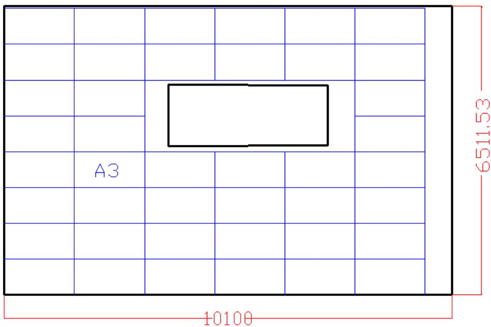

<details>
<summary>text_image</summary>

A3
10100
6511.53
</details>

图1 屋顶电池板排列方式

由计算在顶面使用的电池数

$$
\mathrm{A} 3 = 4 2
$$

由计算知其组输出功率

$$
P = 42^{*}P_{3}
$$

$$
\mathrm{P} = 8 4 0 0 \mathrm{W}
$$

通过计算应采用3 号和15号即SN3和SN15 型的逆变器，计算得逆变器的成本为

$$
X _ {\mathrm{i3}} = 3 9 2 8 0 \text {元。}
$$

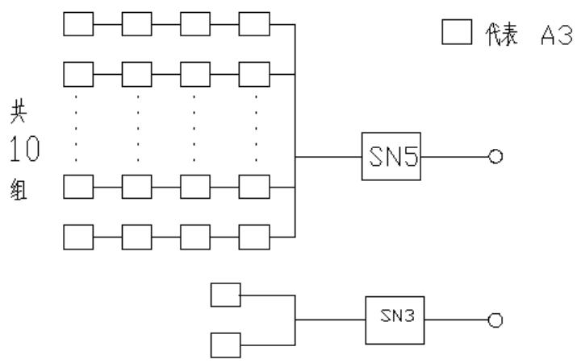

<details>
<summary>flowchart</summary>

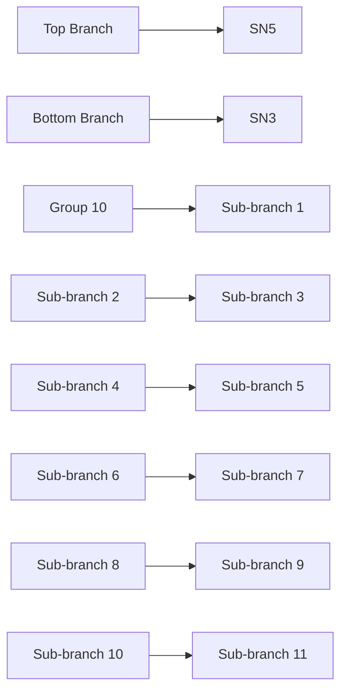
</details>

图2组件连接方式（串、并联）示意图

经过计算可得顶面采用 A3太阳能电池板总发电量

$$
D _ {1 1} \text {为} 4 0 4 0 0 0 \mathrm{kWh},
$$

由于当地电价为 0.5元/kWh，所以可知 35年的总收益为

$$
2 0 2 0 0 0 \text {元},
$$

在安装太阳能电池板时所要支付的费用为

$$
1 2 5 0 0 0 \text {元}
$$

（2）南面墙壁电池组件铺设分组阵列图形及组件连接方式（串、并联）示意图，

由于已知该墙面是使用第二类电池来铺设其最优铺设方案由电池的性能函数知，应使用C1来铺设，才能达到最优。

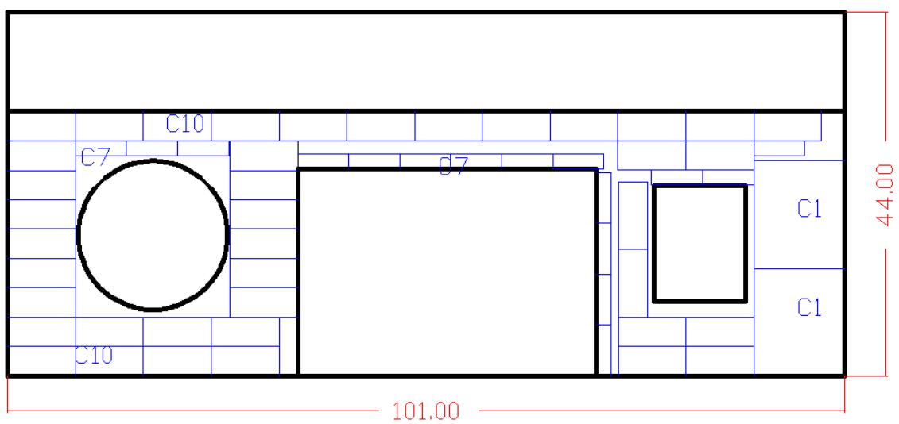

<details>
<summary>text_image</summary>

C10
C7
C7
C1
C1
C10
44.00
101.00
</details>

图3南面电池板排列方式

由上述排列方式可以得到南面墙所用的各种类型的太阳能电池板的数量分别为

2 个 C1，16 个 C7，40 个 C10

$$
P = 2 ^ {*} P _ {1 4} + 1 6 ^ {*} P _ {2 0} + 4 0 ^ {*} P _ {2 3}
$$

$$
\mathrm{P} = 7 4 4 \mathrm{W}
$$

所以采用 SN11 型号的逆变器，逆变器的费用为

4500 元

南面墙壁安装太阳能的费用为

3897.6 元

35 年发电量为 26684kWh

若将太阳能发的电全部按照当地电价 0.5 元/kWh计算，得发电的收益为

12541.4 元

则与不安装太阳能电池相比，在35年内可以多获得的价钱为

12541.4-4500-3897.6=4143.8 元

其电池和逆变器的连接方式如下图：

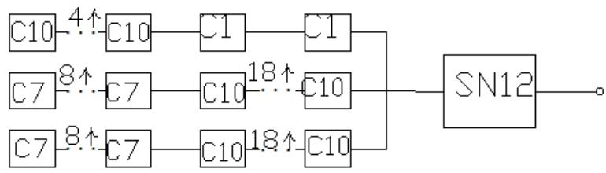

<details>
<summary>flowchart</summary>

```mermaid
graph LR
  A["C10"] -->|"4↑"| B["C10"]
  C["C7"] -->|"8↑"| D["C7"]
  E["C7"] -->|"8↑"| F["C7"]
  B -->|"C1"| G["C1"]
  D -->|"C10"| H["C10"]
  F -->|"C10"| I["C10"]
  G -->|"18↑"| J["SN12"]
  H -->|"18↑"| J
  I -->|"18↑"| J
  J --> O((""))
  style A fill:#f9f9f9,stroke:#333,stroke-width:2px
```
</details>

图4组件连接方式（串、并联）示意图

（3）同理可得东面墙上电池板的排列情况，如下图：

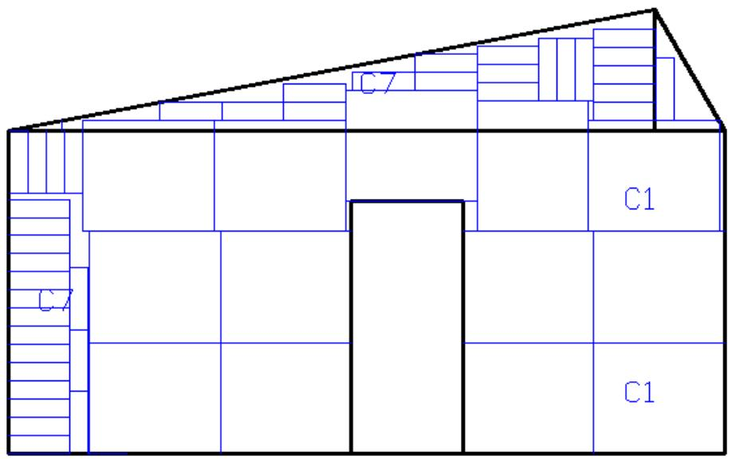

<details>
<summary>text_image</summary>

C7
C1
C7
C1
</details>

图5 东面墙各电池板的排列方式

其逆变器的连接方式如下：  
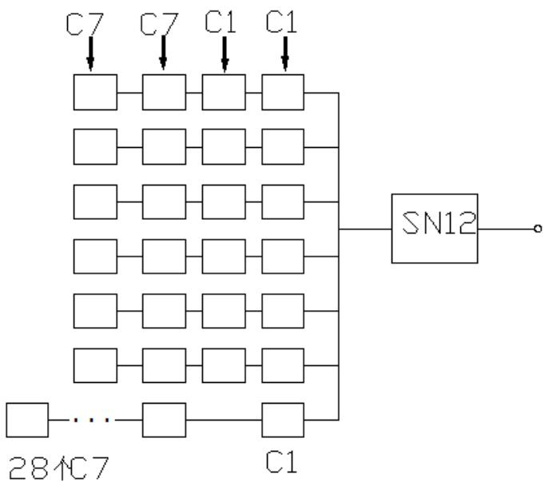

<details>
<summary>flowchart</summary>

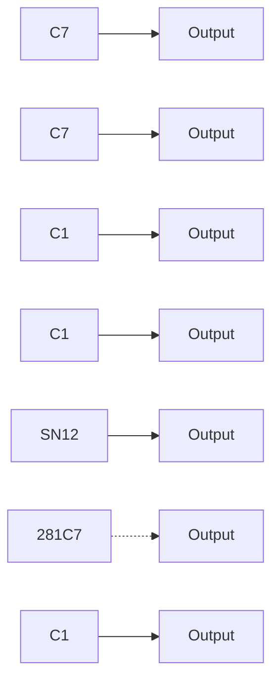
</details>

图6 组件连接方式（串、并联）示意图

东面墙壁使用的电池情况如下：13个C1,40 个C7，总发电量

$$
D _ {2} = 3. 0 0 0 6 \mathrm{e} + 0 0 4 \mathrm{kWh},
$$

总的收益

$$
X _ {3} = 1 5 0 0 3 \text {元},
$$

安装太阳能电池板的成本

$$
X _ {3 2} = 7 0 0 8 \text {元},
$$

在确定电池的排列方式后，即可确定逆变器的排列方式，确定使用 SN12 型号的逆变器.

该逆变器的费用

$$
X _ {3 3} = 6 9 0 0 \text {元},
$$

总收益

$$
X _ {3 1} = 1 5 0 0 3 * 0. 9 4 - 7 0 0 8 - 6 9 0 0,
$$

即相对于不安装电池板的价钱优势为

$$
X _ {3} = 1 0 8 5. 8 2 \text {元。}
$$

（4）同理，可得西面墙的电池排列情况：如下图：

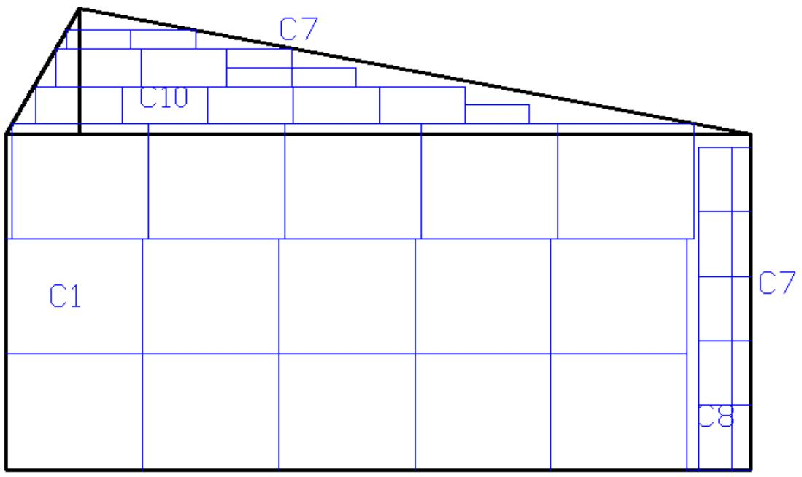

<details>
<summary>text_image</summary>

C7
C10
C1
C7
C8
</details>

图7 西面墙电池的排列情况  
西面墙使用电池板的具体情况如下：15 个C1，11个C7,5个C8，7个C10;  
西面墙的电池组件及逆变器的排列方式如下：

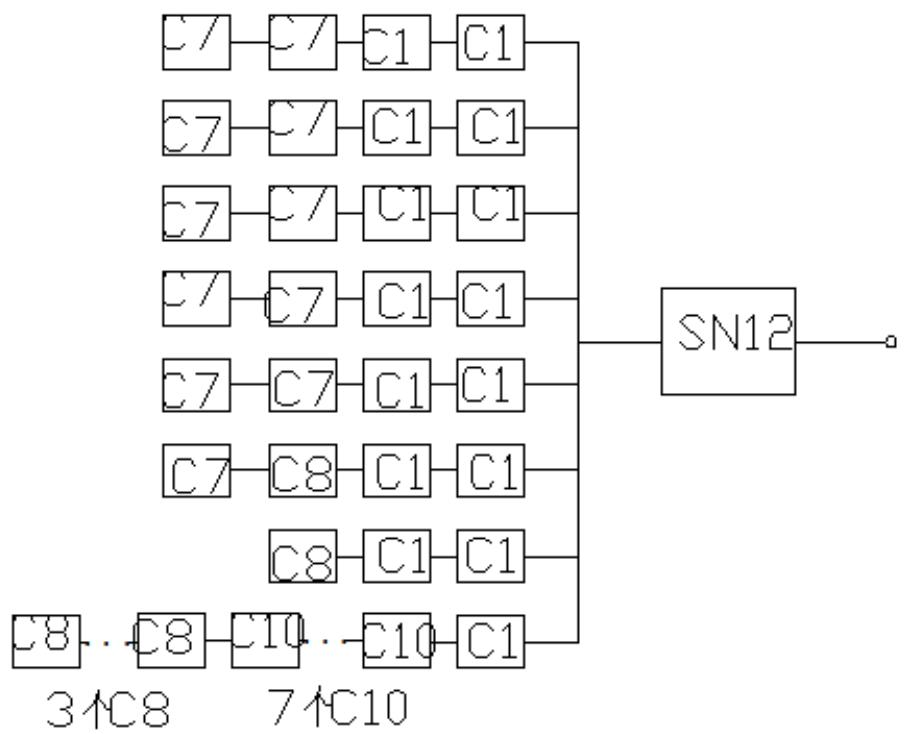

<details>
<summary>flowchart</summary>

This diagram illustrates a hierarchical logic or data processing workflow where multiple input/output blocks (C7-C10, C8-C10) are combined to produce an output labeled SN12.
</details>

图8组件连接方式（串、并联）示意图

西面墙的费用计算：

35年将所有太阳能发电量

$$
D _ {4} = 4 8 7 7 0 \mathrm{kWh},
$$

将所有发的电按照当地电价进行估值，可得 22921.9元。

太阳能电池发电所得利益

$$
X _ {4 1} = 1 5 8 7 1
$$

安装太阳能电池时的成本

$$
X _ {4 2} = 5 5 4 8 \text {元}
$$

逆变器所需费用

$$
X _ {4 3} = 6 9 0 0 \text {元}
$$

净利益

$$
X _ {4} = 3 4 2 2. 2 \text {元}
$$

## （5）北面的最优方案

其最优方案为假设使用 C1将北面全部铺满，这时是最优铺设方案由程序计算的铺设电池的成本费用为

11040 元

太阳能电池产生的价值为

10064 元

由于从上面计算结果知道的收入小于支出，所以该面不应铺设太阳能电池板表4选配逆变器规格列表。

<table><tr><td></td><td>所以电池组件功率之和</td><td>使用地逆变器</td></tr><tr><td>顶部</td><td>8400</td><td>SN3 和 SN15</td></tr><tr><td>东面</td><td>744</td><td>SN12</td></tr><tr><td>南面</td><td>1460</td><td>SN11</td></tr><tr><td>西面</td><td>1668</td><td>SN12</td></tr><tr><td>北面</td><td>——</td><td>——</td></tr></table>

小屋光伏电池35年寿命期内的发电总量

$$
D _ {2} = 5 1 5 1 2 0 \mathrm{kWh}
$$

小屋光伏电池35年寿命期内的经济效益

H=257560 元

回收年限

24.49 年

## 问题二的模型建立与求解

## 1.模型的建立

## （1）铺设时电池型号的选择

根据小屋各个外表面的情况选择其对应类型的电池来铺设，每一类中不同型号的电池铺设的先后顺序是通过性能函数的值来确定的。

各个外表面的净收入的计算公式

$$
Y _ {\mathrm{i}} = Y _ {i 1} - Y _ {i 2} - Y _ {i 3}
$$

总净收入的计算公式

$$
Y = Y _ {\mathrm{i}}
$$

小屋光伏电池35 年寿命期内的发电总量计算公式

$$
D_2 = 2 * Y_{\text{il}} * \eta \%
$$

小屋光伏电池35 年寿命期内的经济效益（光伏电池 35年寿命期内的总收入）计算公式

$$
H = Y_{\mathrm{i1}} * \eta \%
$$

回收年限的计算公式

$$
\mathrm{n} = (Y _ {\mathrm{i2}} + Y _ {\mathrm{i3}}) / Y _ {\mathrm{m}}
$$

## （2）太阳能电池板的倾角和朝向

因为阳光在电池板的辐射=水平面散射+阳光与板夹角的正弦值乘以垂直辐射，想要增加阳光在板上的辐射，应该增大阳光与板的夹角。

为了计算阳光和板的夹角，引入太阳高度角，太阳方位角，时角等概念。

## 1. 太阳时

时间的计量以地球自转为依据，地球自转一周，计 24 太阳时，当太阳达到正南处为 12:00。钟表所指的时间也称为平太阳时（简称为平时），我国采用东经120度经圈上的平太阳时作为全国的标准时间，即“北京时间”。（注：大同的经度为 ）。

## 2. 时角

时角是以正午 12点为0度开始算，每一小时为 15度，上午为负下午为正，即10点和 14点分别为-30度和30度。因此，时角的计算公式为

$$
\omega = 1 5 (t _ {s} - 1 2) \quad (\text {度}),
$$

其中 $t _ { s }$ 为太阳时（单位：小时）。

## 3. 赤纬角

赤纬角也称为太阳赤纬，即太阳直射纬度，其计算公式近似为

$$
\delta = 2 3. 4 5 \sin \left(\frac {2 \pi (2 8 4 + n)}{3 6 5}\right) \quad (\text {度}),
$$

其中 为日期序号，例如，1月1日为 ，3月22日为 $n = 8 1$

## 4. 太阳高度角

太阳高度角是太阳相对于地平线的高度角，这是以太阳视盘面的几何中心和理想地平线所夹的角度。太阳高度角可以使用下面的算式，经由计算得到很好的近似值：

$$
\sin \alpha = \sin \phi \cdot \sin \delta + \cos \phi \cdot \cos \delta \cdot \cos \omega ,
$$

其中 $\alpha$ 为太阳高度角， $\omega$ 为时角， $\delta$ 为当时的太阳赤纬， $\phi$ 为当地的纬度(大同的纬度为 )。

## 5. 太阳方位角 。

太阳方位角是太阳在方位上的角度，它通常被定义为从北方沿着地平线顺时针量度的角。它可以利用下面的公式，经由计算得到良好的近似值，但是因为反正弦值，也就是 $x = \sin ^ { - 1 } \left( y \right)$ 有两个以上的解，但只有一个是正确的，所以必需小心的处理。

$$
\sin A = \frac {- \sin \omega \cdot \cos \delta}{\cos \alpha}.
$$

下面的两个公式也可以用来计算近似的太阳方位角，不过因为公式是使用余弦函数，所以方位角永远是正值，因此，角度永远被解释为小于 180 度，而必须依据时角来修正。当时角为负值时 (上午)，方位角的角度小于 180 度，时角为正值时 (下午)，方位角应该大于 180度，即要取补角的值。

$$
\begin{array}{l} \cos A = \frac {\sin \delta \cdot \cos \phi - \cos \omega \cdot \cos \delta \cdot \sin \phi}{\cos \alpha}, \\ \cos A = \frac {\sin \delta - \sin \alpha \cdot \sin \phi}{\cos \alpha \cdot \cos \phi}, \\ \end{array}
$$

其中 为太阳的方位角， $\alpha$ 为太阳高度角， $\omega$ 为时角， $\delta$ 为当时的太阳赤纬，$\phi$ 为当地的地理纬度(大同的纬度为 )。

因此，在不同的季节、不同的纬度，太阳升起的方位角是不同的，不一定是从正东方升起。在夏季时，较高纬度地区太阳可以从东偏北 $5 0 ^ { \circ }$ °到 $6 0 ^ { \circ }$ 甚至更高角度升起，在西偏北同样的角度落下；冬季时可以从东偏南 $5 0 ^ { \circ }$ 或者更多升起，在西偏南 $5 0 ^ { \circ }$ 或以上落下。所以我们在夏天时可以说：“一轮红日从东北方升起，在西北方落下”。如图：

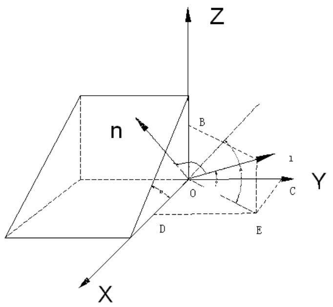

<details>
<summary>text_image</summary>

Z
n
B
1
O
Y
C
D
E
X
</details>

图9 阳光与斜面的倾斜角

斜面表示屋顶，直线 l 代表入射光线，直线 n代表斜面的法向量建立空间直角坐标系，可知斜面的法向量

$$
\vec {n} = (1, 0, \tan \beta)
$$

$O D = k , \frac { O C } { O D } = \tan ( 1 8 0 - A ) , O E = \sqrt { O C ^ { 2 } + O D ^ { 2 } } , \frac { O B } { O E } = \tan \alpha$ ，即光线的向量为

$$
\vec {l} = (O D, O C, O B) = (1, - \tan A, \tan \alpha \sqrt {1 + \tan^ {2} A}),
$$

则直线与法向量夹角的余弦值

$$
\cos \theta = \frac {\vec {n} \cdot \vec {l}}{\left| \vec {n} \right| \cdot \left| \vec {l} \right|} = \frac {1 + \tan \alpha \tan \beta \sqrt {1 + \tan^ {2} A}}{\sqrt {1 + \tan^ {2} \beta} \sqrt {1 + \tan^ {2} A + \tan^ {2} \alpha (1 + \tan^ {2} A)}}
$$

又因为直线与平面夹角的正弦值等于直线与该平面法向量夹角的余弦值，$\sin \theta ^ { \prime } { = } \cos \theta$ ，则斜面的辐射量为水平面散射+ 乘以垂直辐射，即斜面的辐射量为水平面散射+ 乘以垂直辐射。

太阳电池方阵的方位角是方阵的垂直面与正南方向的夹角（向东偏设定为负角度，向西偏设定为正角度）。一般情况下，方阵朝向正南（即方阵垂直面与正南的夹角为 $0 ^ { \circ }$ ）时，太阳电池发电量是最大的。在偏离正南（北半球） $3 0 ^ { \circ }$ °度时，方阵的发电量将减少约 10％～15％；在偏离正南（北半球） $6 0 ^ { \circ }$ °时，方阵的发电 量将减少约 20％～30％。但是，在晴朗的夏天，太阳辐射能量的最大时刻是在中午稍后，因此方阵的方位稍微向西偏一些时，在午后时刻可获得最大发电功率。 在不同的季节，太阳电池方阵的方位稍微向东或西一些都有获得发电量最大的时候。方阵设置场所受到许多条件的制约，例如，在地面上设置时土地的方位角、在屋顶上设置时屋顶的方位角，或者是为了躲避太阳阴影时的方位角，以及布置规划、发电效率、设计规划、建设目的等许多因素都有关系。 如果要将方位角调整到在一天中负荷的峰值时刻与发电峰值时刻一致时，请参考下述的公式。至于并网发电的场合，希望综合考虑以上各方面的情况来选定方位角。方位角 ＝（一天中负荷的峰值时刻（24小时制）－12）×15＋（经度－116） 10月9日北京的太阳电池方阵处于不同方位角时，日射量与时间推移的关系曲线。在不同的季节，各个方位的日射量峰值产生时刻是不一样的。 2. 倾斜角是太阳电池方阵平面与水平地面的夹角，并希望此夹角是方阵一年中发电量为最大时的最佳倾斜角度。 一年中的最佳倾斜角与当地的地理纬度有关，当纬度较高时，相应的倾斜角也大。但是，和方位角一样，在设计中也要考虑到屋顶的倾斜角及积雪滑落的倾斜角（斜率大于 50％-60％）等方面的限制条件。对于积雪滑落的倾斜角，即使在积雪期发电量少而年总发电量也存在增加的情况，因此，特别是在并网发电的系统中， 并不一定优先考虑积雪的滑落，此外，还要进一步考虑其它因素。 对于正南（方位角为 $0 ^ { \circ }$ 度），倾斜角从水平（倾斜角为 $0 ^ { \circ }$ °度）开始逐渐向最佳的倾斜角过渡时，其日射量不断增加直到最大值，然后再增加倾斜角其日射量不断 减少。特别是在倾斜角大于 $5 0 ^ { \circ } \sim 6 0 ^ { \circ }$ 以后，日射量急剧下降，直至到最后的垂直放置时，发电量下降到最小。方阵从垂直放置到 10°～20°的倾斜放置都 有实际的例子。对于方位角不为 $0 ^ { \circ }$ 度的情况，斜面日射量的值普遍偏低，最大日射量的值是在与水平面接近的倾斜角度附近。

因此，电池板的朝向应该向西偏一点。

东西南北面的辐射都已知，而且产生的电能都很少，电能的主要来源是屋顶，现控制屋顶电池板的倾角，来提高电池接受总辐射量，即电池的工作效率。

使用编程求解，十二个月分别最适宜倾角表

表5 12个月适宜的太阳能倾斜角

<table><tr><td>1</td><td>2</td><td>3</td><td>4</td><td>5</td><td>6</td></tr><tr><td>23.49</td><td>40.68</td><td>34.9</td><td>57.8</td><td>57.8</td><td>57.8</td></tr><tr><td>7</td><td>8</td><td>9</td><td>10</td><td>11</td><td>12</td></tr><tr><td>52.13</td><td>52.13</td><td>34.95</td><td>40.68</td><td>29.22</td><td>23.49</td></tr></table>

再从全年考虑，最适宜夹角为 42.97度。35年发电量为568880kWh。

而每个月都更换倾角所发的电，发现两者相差不大，但是经常改变太阳能电池板的倾角非常麻烦，并且有部分电池可能是固定的，无法改变其倾角，综上所述：应该选择42.9 度，即电池板与屋顶的夹角为 32.33度。

由于房屋的大小没有变化，电池的排布和上述问题一样，

## 2.模型的求解

计算可知，35 年所产生的经济效益 284440 元，总投资为 188430 元，总发电量 568880kWh，单位发电量费用为 0.33 元/kWh，投资的回收年限 20.07 年小屋光伏电池35年寿命期内的发电总量

$$
\mathrm{D} = 5 6 8 8 8 0 \mathrm{kWh}
$$

小屋光伏电池 35年寿命期内的经济效益

$$
\mathrm{H} = 2 8 4 4 4 0 \text {元}
$$

小屋光伏电池开始的总投资为

$$
\mathrm{C} = 1 8 8 4 3 0 \text {元}
$$

小屋光伏电池的每度电的成本费用

$$
\mathrm{F} = 0. 3 3 1 \text {元 / 度}
$$

小屋光伏电池投资回收年限

$$
\mathrm{n} = 2 2. 0 7 \text {年}
$$

## 问题三的优化模型

## 1.模型的建立

## （1）铺设时电池型号的选择

根据小屋各个外表面的情况选择其对应类型的电池来铺设，每一类中不同型号的电池铺设的先后顺序是通过性能函数的值来确定的。

## （1）小屋的设计方案

## a.小屋的建筑要求

限定小屋使用空间高度为：建筑屋顶最高点距地面高度≤5.4m, 室内使用空间最低净空高度距地面高度为≥2.8m；建筑总投影面积（包括挑檐、挑雨棚的投影面积）为≤74m<sup>2</sup>；建筑平面体型长边应≤15m，最短边应 $\geqslant 3 \mathfrak { m }$ ；建筑采光要求至少应满足窗地比（开窗面积与房间地板面积的比值，可不分朝向） $\geqslant 0 . \ 2$ 的要求；建筑节能要求应满足窗墙比（开窗面积与所在朝向墙面积的比值）南墙 $\leqslant$ 0.50、东西墙≤0.35、北墙≤0.30。建筑设计朝向可以根据需要设计，允许偏离正南朝向。

## b.小屋的建筑方案

根据小屋的建筑要求建立一个非线性规划模型。模型表达式如下。

## （1）目标函数

$$
\text {Max} \quad \mathrm{s} = a ^ {*} \mathrm{c}
$$

## （2）约束条件

$$
\left\{ \begin{array}{l} c = \sqrt {2 . 6 ^ {2} + b ^ {2}} \\ a ^ {*} b \leq 7 4 \\ 0 \leq a \leq 1 5 \\ b \geq 3 \end{array} \right.
$$

## 2.通过 lingo 软件求解得

$$
\mathrm{a} = 1 5 0 0 0
$$

$$
\mathrm{b} = 5 5 4 7
$$

## 3.小屋的立体设计图

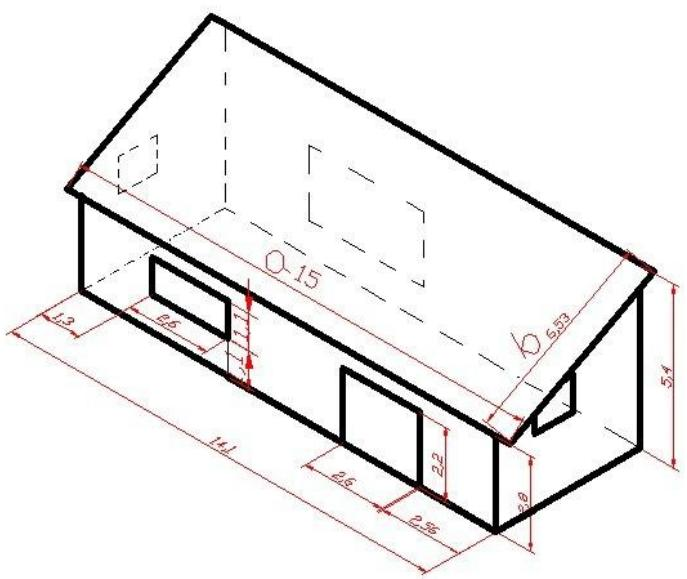

<details>
<summary>text_image</summary>

Ø-15
Ø 6.53
1.3
8.6
14.1
2.2
6.6
2.95
2.8
5.4
</details>

10图，小屋的设计图

图形说明：

1.挑檐的的设计是左右两边为 450mm，前后没有挑檐；  
2.东西面的设计完全一致（包过窗户的设计）；  
3.窗户的设计，东南西北，每一面墙上各一个大小分别为：

$$
\mathrm{S} _ {1} = 2 ^ {*} \mathrm{S} _ {\mathrm{C} _ {1}}; S _ {2} = S _ {C _ {1}}; S _ {3} = S _ {C _ {1}}; S _ {4} = 6 ^ {*} S _ {C _ {1}}
$$

总面积;

$$
\begin{array}{l} S _ {z} = S _ {1} + S _ {2} + S _ {3} + S _ {4} \\ S _ {\mathrm{z}} = 1 0 S _ {C _ {1}} \\ S _ {\mathrm{z}} = 1 4. 3 \\ \end{array}
$$

房间地面的总面积：

$$
S _ {\mathrm{fz}} = 4. 9 * 1 4. 1 = 6 9. 0 9
$$

因为

$$
S _ {\mathrm{z}} / S _ {\mathrm{fz}} = 0. 2 0 7 > 0. 2
$$

所以该小屋设计的合理。

各个面的小屋各外表面电池组件铺设分组阵列图形每一面净收入的计算公式

$$
Z _ {\mathrm{i}} = Z _ {i 1} - Z _ {i 2} - Z _ {\mathrm{i}}
$$

总净收入的计算公式

小屋光伏电池35年寿命期内的发电总量计算公式：

$$
D_3 = 2 * Z_{\text{il}} * \eta \%
$$

小屋光伏电池35年寿命期内的经济效益（光伏电池 35年寿命期内的总收入）计

算公式：

$$
H = Z_{\mathrm{i1}}*\eta \%
$$

回收年限的计算公式：

$$
\mathrm{n} = (Z _ {\mathrm{i2}} + Z _ {\mathrm{i3}}) / Z _ {\mathrm{m}}
$$

组件连接方式（串、并联）示意图及电池组件分组阵列容量

## 2.模型的求解

## （1）顶部的最优铺设方案

由性能函数知应最优铺设方案是采用A3来铺设

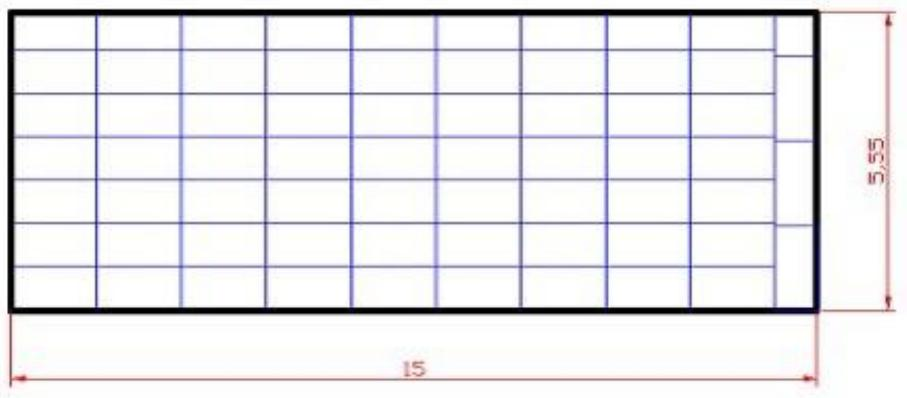

<details>
<summary>text_image</summary>

ln
ln
15
</details>

图11，屋顶的最优铺设方案

最优铺设方案使用的电池板个数

$$
\mathrm{A} 3 = 6 6 \text {个}
$$

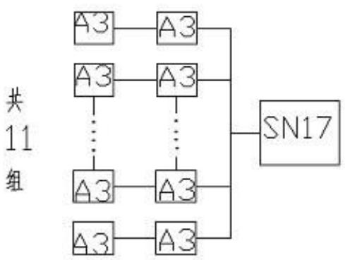

<details>
<summary>flowchart</summary>

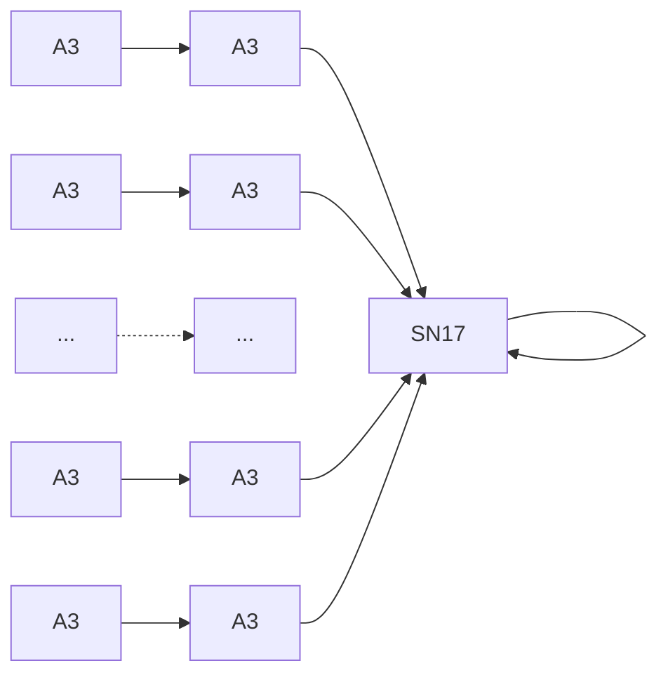
</details>

图 12 组件连接方式（串、并联）示意图

其组输出功率为

$$
P = 6 6 ^ {*} P _ {3}
$$

$$
\mathrm{P=13200W}
$$

因此采用SN17型号的逆变器，35年该面的太阳能电池发电所得的利益

$$
Z _ {1 1} = 3 9 4 9 3 0 \text {元}
$$

太阳能电池的成本

$$
Z _ {1 2} = 1 9 4 0 0 0 \text {元}
$$

逆变器的费用

$$
Z _ {1 3} = 4 3 7 5 0 \text {元}
$$

净利益

$$
Z _ {1} = 1 6 2 7 2 0 \text {元}
$$

（2）东面的最优铺设方案

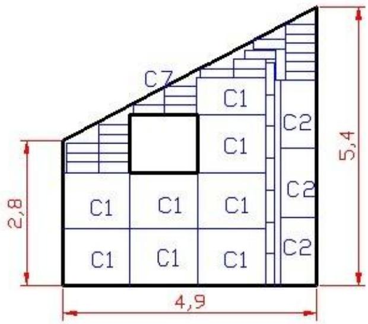

<details>
<summary>text_image</summary>

C7
C1
C2
C1
C2
C1
C1
C1
C2
2,8
5,4
4,9
</details>

图13，东面的最优铺设方案  
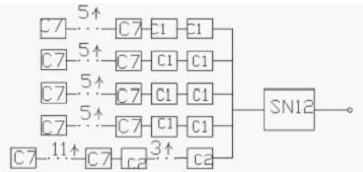

<details>
<summary>flowchart</summary>

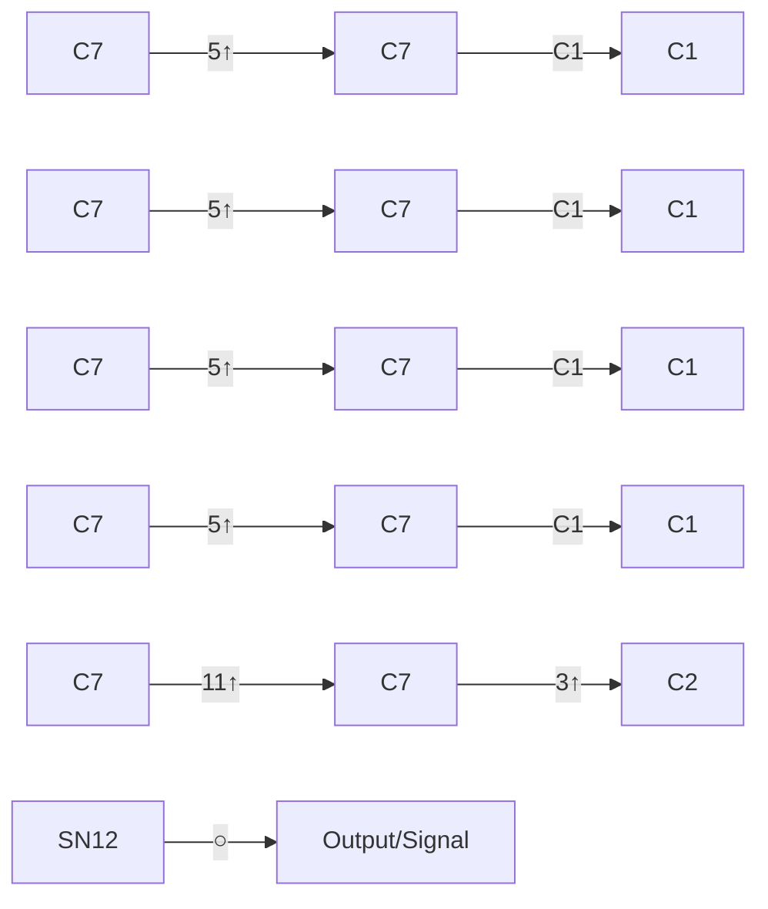
</details>

图14组件连接方式（串、并联）示意图 35 年该面的太阳能电池发电所得的利益

$$
Z _ {2 1} = 1 0 2 2 7 \text {元}
$$

太阳能电池的成本

$$
Z _ {2 2} = 5 0 6 8. 8 \text {元}
$$

逆变器的费用

$$
Z _ {2 3} = 4 5 0 0 \text {元}
$$

净利益

$$
Z _ {1} = 4 4. 5 8 \text {元}
$$

（3）南面最优铺设方案

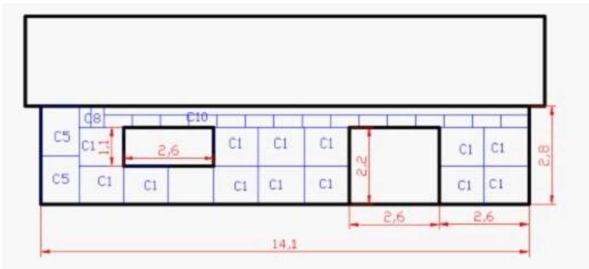

<details>
<summary>text_image</summary>

C5
C8
C10
C1
C1
C1
C1
C1
C1
C1
C1
C1
C1
C1
C1
C1
C1
C1
C1
C1
C1
C1
C1
C1
C1
C1
C1
C1
C1
C1
C1
C1
C1
C1
C1
C1
C1<fcel>2,6
2,6
2,6
2,6
2,6
2,6
2,6
2,6
2,6
2,6
2,6
2,6
2,6
2,6
2,6
2,6
2,6
2,6
2,6
2,6
2,6
2,6
2,6
2,6
2,6
</details>

图15南面的最优太阳能电池铺设方案

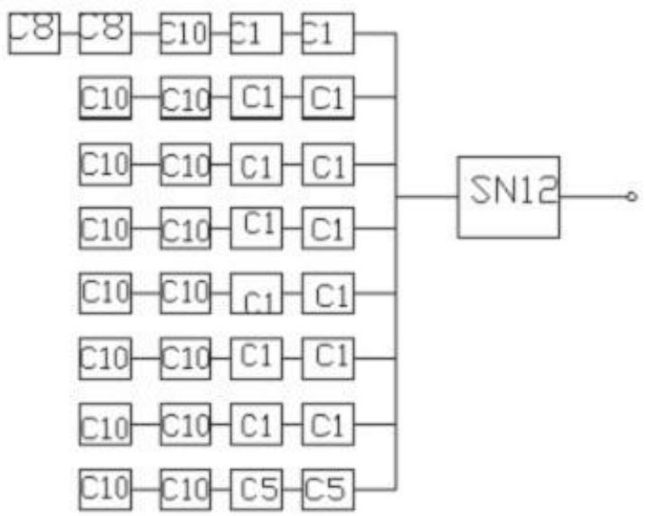

<details>
<summary>flowchart</summary>

```mermaid
graph LR
  C8["C8"] --> C10["C10"]
  C8 --> C1["C1"]
  C10["C10"] --> C1["C1"]
  C10 --> C10["C10"]
  C10 --> C1["C1"]
  C10 --> C10["C10"]
  C10 --> C1["C1"]
  C10 --> C10["C10"]
  C10 --> C1["C1"]
  C10 --> C10["C10"]
  C10 --> C5["C5"]
  C5 --> SN12["SN12"]
  SN12 --> Output((""))
  SN12 --> Output
```
</details>

图16组件连接方式（串、并联）示意图

35年该面的太阳能电池发电所得的利益

$$
Z _ {3 1} = 2 7 3 8 9 \text {元}
$$

太阳能电池的成本

$$
Z _ {3 2} = 7 6 9 9. 2 \text {元}
$$

逆变器的费用

$$
Z _ {3 3} = 4 5 0 0 \text {元}
$$

净利益

$$
Z _ {3} = 1 3 5 4 6. 4 \text {元}
$$

## （4）北面的最优方案

其最优方案为假设使用 C1将北面全部铺满，这时是最优铺设方案由程序计算的铺设电池的成本费用为

$$
2 5 4 4 0 \text {元}
$$

太阳能电池产生的价值为

$$
2 3 1 9 3 \text {元}
$$

由于从上面计算结果知道的收入小于支出，所以该面不应铺设太阳能电池板小屋光伏电池35年寿命期内的发电总量

$$
D = 8 8 4 7 0 0 \mathrm{kWh}
$$

小屋光伏电池35年寿命期内的经济效益

$$
\mathrm{H} = 4 4 2 3 5 0 \text {元}
$$

小屋光伏电池的每度电的成本费用

$$
\mathrm{F} = 0. 3 1 1 \text {元 / 度}
$$

回收年限

$$
\mathrm{n} = 2 0. 6 6 7 \text {年}
$$

表6选配逆变器规格列表。

<table><tr><td></td><td>所以电池组件功率之和</td><td>使用地逆变器</td></tr><tr><td>顶部</td><td>13200</td><td>SN17</td></tr><tr><td>东面</td><td>1056</td><td>SN11</td></tr><tr><td>南面</td><td>1896</td><td>SN12</td></tr><tr><td>西面</td><td>1056</td><td>SN11</td></tr><tr><td>北面</td><td>——</td><td>——</td></tr></table>

## 第六部分 模型评价及改进

模型优点：该问题最难也最重要的一步就是确定电池板的排列方式，为此我们构造了性能函数，将本题中影响电池板是否被选择的主要因素简洁明了的用数学方法表示出来，根据性能函数值来确定用以铺设小屋的电池板，从而无需考虑电池板的所有组合方案，大大减少了工作量；当确定电池板的排列方式后，再根据逆变器对功率的要求，优先考虑转换功率大的逆变器，即可得到逆变器的型号和数量。该模型可以推广到现实中的一些问题，实际应用性较强。

模型的缺点就是还没有完全考虑到所有影响选择电池板的因素，即考虑不够完全。

改进方向：实际问题中要考虑的因素将更多，模型将更加复杂，这就要求我们构造的性能函数更加全面。进行有针对性的调整，这样虽然不一定能找到最佳值，但总可以找到比较优的解，当运算量很大时，这是实际可行的方法。

## 参考文献

[1] 同济大学数学系，工程数学线性代数，高等教育出版社，2007.1。  
[2] 叶其孝，大学生数学建模竞赛辅导教材（二），湖南教育出版社，1996.12。  
[3] 全国大学生数学建模竞赛组委会编，全国大学生数学建模竞赛优秀论文汇编，中国物价出版社，2002.3。  
[4] 盛骤，概率论与数理统计第四版，浙江大学，高等教育出版社，2008.06。

## 附录

```matlab
Matlab 程序一:
clc,clear
%第一问主函数
%屋顶
radio1=roof_radio;
broad1(24)=0;
area=[1.58*0.808 1.966*0.991 1.58*0.808 1.651*0.991 1.65*0.991
1.956*0.991 1.65*0.991 1.956*0.991 1.482*0.992 1.64*0.992 1.956*0.992
1.956*992 1.668*1 1.3*1.1 1.321*0.711 1.414*1.114 1.4*1.1 1.4*1.1
0.310*0.355 0.615*0.180 0.615*0.355 0.92*0.355 0.818*0.355
1.645*0.712];
broad1(3)=42;
[COST1,VALUE1]=cost_value(broad1,radio1');
%东面
radio2=xlsread('weather.xls','E1:E8760');
broad2(24)=0;
broad2(14)=13;
broad2(20)=40;
[COST2,VALUE2]=cost_value(broad2,radio2);
%南面
radio3=xlsread('weather.xls','F1:F8760');
broad3(24)=0;
broad3(14)=2;
broad3(20)=16;
broad3(23)=40;
[COST3,VALUE3]=cost_value(broad3,radio3);
%西面
radio4=xlsread('weather.xls','G1:G8760');
broad4(24)=0;
broad4(14)=14;
broad4(20)=14;
broad4(21)=4;
broad4(23)=13;
[COST4,VALUE4]=cost_value(broad4,radio4);
%北面不管怎么排布，都是亏本，不予考虑
year_value=VALUE1*40*0.94/42+VALUE1*2*0.86/42+0.94*(VALUE2+VALUE3+VALUE4)
year_electricity=year_value*2
total_cost=COST1+COST2+COST3+COST4
total_value=year_value*(10+15*0.9+10*0.8)
total_electricity=2*total_value
```

程序二：  
```matlab
clc,clear
%第二问按年主函数
%此程序运行时间10分钟左右
X=xlsread('weather.xls','B1:D8760');
Y=xlsread('weather.xls','I1:J8760');
efficiency=xlsread('classical.xls','G3:G26');
W=xlsread('classical.xls','C3:C26');
ts=Y(:,1)+1;
n=ceil((Y(:,2)+1)/24);
level_radio=X(:,1);
scattering_radio=X(:,2);
vertical_radio=X(:,3);
[m,o]=size(X);
max=0;
a(m)=0;A(m)=0;c(m)=0;C(m)=0;cant_radio(m)=0;
broad(24)=0;
area=[1.58*0.808 1.966*0.991 1.58*0.808 1.651*0.991 1.65*0.991
1.956*0.991 1.65*0.991 1.956*0.991 1.482*0.992 1.64*0.992 1.956*0.992
1.956*992 1.668*1 1.3*1.1 1.321*0.711 1.414*1.114 1.4*1.1 1.4*1.1
0.310*0.355 0.615*0.180 0.615*0.355 0.92*0.355 0.818*0.355
1.645*0.712];
broad(3)=42;
for i=1:m
    if vertical_radio(i)>0
        u=ts(i);
        v=n(i);
        [j,k]=sun_azimuth(u,v);
        a(i)=j;A(i)=k;
    end
end
for cita=0.01:0.01:1.57
    for i=1:8760
        %c为直线与法向量的余弦值，即直线与平面的正弦值

c(i)=(1+tan(cita)*tan(a(i))*sqrt(1+tan(A(i))^2))/sqrt(1+tan(cita)^2)/sqrt(1+tan(A(i))^2+tan(a(i))^2*(1+tan(A(i))^2));
        cant_direct(i)=abs(c(i))*vertical_radio(i);
        cant_radio(i)=cant_direct(i)+scattering_radio(i);
    end
    [COST1,VALUE1]=cost_value(broad,cant_radio');
    if max<VALUE1;
        max=VALUE1;
        CI=cita;
```

```matlab
end
end
disp('倾角:')
CI/pi*180
disp('最大价值:')
max
%东面
radio2=xlsread('weather.xls','E1:E8760');
broad2(24)=0;
broad2(14)=13;
broad2(20)=40;
[COST2, VALUE2]=cost_value(broad2, radio2);
%南面
radio3=xlsread('weather.xls','F1:F8760');
broad3(24)=0;
broad3(14)=2;
broad3(20)=16;
broad3(23)=40;
[COST3, VALUE3]=cost_value(broad3, radio3);
%西面
radio4=xlsread('weather.xls','G1:G8760');
broad4(24)=0;
broad4(14)=14;
broad4(20)=14;
broad4(21)=4;
broad4(23)=13;
[COST4, VALUE4]=cost_value(broad4, radio4);
%北面不管怎么排布，都是亏本，不予考虑
year_value=max*40*0.94/42+max*2*0.86/42+0.94*(VALUE2+VALUE3+VALUE4)
total_cost=COST1+COST2+COST3+COST4
total_value=year_value*(10+15*0.9+10*0.8)
程序三:
clc, clear
%第三问主程序
%改造后的屋顶
X=xlsread('weather.xls','B1:D8760');
Y=xlsread('weather.xls','I1:J8760');
ts=Y(:,1)+1;
n=ceil((Y(:,2)+1)/24);
level_radio=X(:,1);
scattering_radio=X(:,2);
vertical_radio=X(:,3);
[m, o]=size(X);
a(m)=0;A(m)=0;c(m)=0;C(m)=0;cant_radio(m)=0;
```

```matlab
for i=1:m
    if vertical_radio(i)>0
        u=ts(i);
        v=n(i);
        [j,k]=sun_azimuth(u,v);
        a(i)=j;A(i)=k;
    end
end
%选择最适宜角度
for i=1:m

c(i)=(1+tan(0.75)*tan(a(i))*sqrt(1+tan(A(i))^2))/sqrt(1+tan(0.75)^2)/sqrt(1+tan(A(i))^2+tan(a(i))^2*(1+tan(A(i))^2));
    cant_direct(i)=abs(c(i))*vertical_radio(i);
    cant_radio(i)=cant_direct(i)+scattering_radio(i);
end
broad1(24)=0;
broad1(3)=66;
[COST1, VALUE1]=cost_value(broad1, cant_radio');
%东面
radio2=xlsread('weather.xls','E1:E8760');
broad2(24)=0;
broad2(14)=7;
broad2(15)=4;
broad2(20)=31;
[COST2, VALUE2]=cost_value(broad2, radio2);
%南面
radio3=xlsread('weather.xls','F1:F8760');
broad3(24)=0;
broad3(14)=14;
broad3(18)=2;
broad3(22)=2;
broad3(23)=15;
[COST3, VALUE3]=cost_value(broad3, radio3);
%西面
radio4=xlsread('weather.xls','G1:G8760');
broad4(24)=0;
broad4(14)=8;
broad4(15)=4;
broad4(20)=31;
[COST4, VALUE4]=cost_value(broad4, radio4);
%北面不管怎么排布，都是亏本，不予考虑
year_value=(VALUE2+VALUE3+VALUE4)*0.94+0.973*VALUE1
total_cost=COST1+COST2+COST3+COST4
```

```matlab
total_value=year_value*(10+15*0.9+10*0.8)
程序四:
function [COST, value]=cost_value(broad, radio)
%本函数用于计算价值和成本
area=[1.58*0.808 1.966*0.991 1.58*0.808 1.651*0.991 1.65*0.991
1.956*0.991 1.65*0.991 1.956*0.991 1.482*0.992 1.64*0.992 1.956*0.992
1.956*992 1.668*1 1.3*1.1 1.321*0.711 1.414*1.114 1.4*1.1 1.4*1.1
0.310*0.355 0.615*0.180 0.615*0.355 0.92*0.355 0.818*0.355
1.645*0.712];
Sradio=position_radio(broad, radio, area);%调用辐射量函数
value=Sradio/1000*0.5;%计算出一年所发电的钱
W=xlsread('classical.xls','C3:C26');
%计算每块板的价格
for i=1:24
    if i<=6
        cost(i)=W(i)*14.9;
    elseif i>6&i<=13
        cost(i)=W(i)*12.5;
    else
        cost(i)=W(i)*4.8;
    end
end
COST=sum(cost.*broad);
程序五:
clc,clear
%本程序用于计算F值，用以比较电池板的性能优劣
area=[1.58*0.808 1.966*0.991 1.58*0.808 1.651*0.991 1.65*0.991
1.956*0.991 1.65*0.991 1.956*0.991 1.48Z*0.992 1.64*0.992 1.956*0.992
1.956*0.992 1.668*1 1.3*1.1 1.321*0.711 1.414*1.114 1.4*1.1 1.4*1.1
0.310*0.355 0.615*0.180 0.615*0.355 0.9Z*0.355 0.818*0.355
1.645*0.712];
W=xlsread('classical.xls','C3:C26');
efficiency=xlsread('classical.xls','G3:G26');
for i=1:24
    if i<=6
        cost(i)=W(i)*14.9;
    elseif i>6&i<=13
        cost(i)=W(i)*12.5;
    else
        cost(i)=W(i)*4.8;
    end
end
X1=cost./area;
X2=W'./area;
```

```matlab
F=X1.*efficiency'./X2
程序六:
function Sradio=position_radio(broad, radiation, area, efficiency, W)
%本函数用于计算某个面一年的总辐射量
%broad 表示第 i 种板的数量
%radiation 代表每平方米辐射量
%area 代表第 i 种板的面积
%efficiency 代表第 i 板的转化效率
%SradioAB 代表 AB 类板转化后的能量
%SradioC 代表 C 类板转化后的能量，单位：WH
%W 代表第 i 板的功率
[m, n]=size(broad);
[u, v]=size(radiation);
SradioAB(n)=0;SradioC(n)=0;
efficiency=xlsread('classical.xls','G3:G26');
W=xlsread('classical.xls','C3:C26');
for i=1:n
    if i<=6&broad(i)>0
        for j=1:u
            if radiation(j)>=80&radiation(j)<200

SradioAB(i)=SradioAB(i)+radiation(j)*broad(i)*area(i)*efficiency(i)*0.05;
        elseif radiation(j)>=200&radiation(j)<=1000

SradioAB(i)=SradioAB(i)+radiation(j)*broad(i)*area(i)*efficiency(i);
        elseif radiation(j)>1000
            SradioAB(i)=SradioAB(i)+W(i);
        end
    end
    elseif i>6&i<=13&broad(i)>0
        for j=1:u
            if radiation(j)>=80&radiation(j)<=1000

SradioAB(i)=SradioAB(i)+radiation(j)*broad(i)*area(i)*efficiency(i);
        elseif radiation(j)>1000
            SradioAB(i)=SradioAB(i)+W(i);
        end
    end
    elseif i>13&broad(i)>0&i<=15
        for j=1:u
            if radiation(j)>=30&radiation(j)<=1000

SradioC(i)=SradioC(i)+radiation(j)*broad(i)*area(i)*(efficiency(i)+0.
```

```matlab
01);
elseif radiation(j)>1000
    SradioAB(i)=SradioAB(i)+W(i);
end
end
elseif i>15&broad(i)>0
    for j=1:u
        if radiation(j)>=30&radiation(j)<=1000
SradioC(i)=SradioC(i)+radiation(j)*broad(i)*area(i)*(efficiency(i));
    elseif radiation(j)>1000
        SradioAB(i)=SradioAB(i)+W(i);
    end
end
end
end
Sradio=sum(SradioAB)+sum(SradioC);
程序七:
function cant_radio=roof_radio()
%本函数用于计算屋顶所接受到的辐射
%level_radio 表示水平总辐射
%scattering_radio 表示水平总散射
%vertical_radio 表示垂直总辐射
%a 表示太阳高度角
%A 表示太阳方位角
%b 表示屋顶的倾角
%cant_radio 代表屋顶所受的辐射
%
X=xlsread('weather.xls','B1:D8760');
Y=xlsread('weather.xls','I1:J8760');
ts=Y(:,1)+1;
n=ceil((Y(:,2)+1)/24);
level_radio=X(:,1);
scattering_radio=X(:,2);
vertical_radio=X(:,3);
[m, o]=size(X);
a(m)=0;A(m)=0;c(m)=0;C(m)=0;cant_radio(m)=0;
for i=1:m
    if vertical_radio(i)>0
        u=ts(i);
        v=n(i);
        [j,k]=sun_azimuth(u,v);
        a(i)=j;A(i)=k;
    end
```

```matlab
end
for i=1:m

c(i)=(1+tan(0.1845)*tan(a(i))*sqrt(1+tan(A(i))^2))/sqrt(1+tan(0.1845)^2)/sqrt(1+tan(A(i))^2+tan(a(i))^2*(1+tan(A(i))^2));
    cant_direct(i)=abs(c(i))*vertical_radio(i);
    cant_radio(i)=cant_direct(i)+scattering_radio(i);
End
程序八:
function [b,A]=sun_azimuth(ts,n)
%本函数用于计算太阳高度角和太阳方位角
w=15*(ts-12);%时角
r=23.45*sin(2*pi*(284+n)/365);%太阳直射纬度角
a=sin(41.01/180*pi)*sin(r/180*pi)+cos(40.01/180*pi)*cos(r/180*pi)*cos(w/180*pi);
b=asin(a);%太阳高度角
B=-sin(w/180*pi)*cos(r/180*pi)/cos(b);%太阳方位角的 sin 值
C=(sin(r/180*pi)-a*sin(40.01/180*pi))/cos(b)/cos(40.01*pi/180);
A=asin(B)/pi*180;
程序九:
clc,clear
%第二问分月份的主函数
%本程序运行时间半小时以上
X=xlsread('weather.xls','B1:D8760');
Y=xlsread('weather.xls','I1:J8760');
ts=Y(:,1)+1;
n=ceil((Y(:,2)+1)/24);
level_radio=X(:,1);
scattering_radio=X(:,2);
vertical_radio=X(:,3);
[m,o]=size(X);
max1=0;max2=0;max3=0;max4=0;max5=0;max6=0;max7=0;max8=0;max9=0;max10=0;max11=0;max12=0;
a(m)=0;A(m)=0;c(m)=0;C(m)=0;cant_radio(m)=0;
broad(24)=0;
area=[1.58*0.808 1.966*0.991 1.58*0.808 1.651*0.991 1.65*0.991
1.956*0.991 1.65*0.991 1.956*0.991 1.482*0.992 1.64*0.992 1.956*0.992
1.956*992 1.668*1 1.3*1.1 1.321*0.711 1.414*1.114 1.4*1.1 1.4*1.1
0.310*0.355 0.615*0.180 0.615*0.355 0.92*0.355 0.818*0.355
1.645*0.712];
broad(3)=42;
for i=1:m
    if vertical_radio(i)>0
        u=ts(i);
```

```matlab
v=n(i);
[j,k]=sun_azimuth(u,v);
a(i)=j;A(i)=k;
end
end
%一月份
for cita=0.01:0.1:1.57
    for i=1:744
        %c 为直线与法向量的余弦值，即直线与平面的正弦值
c(i)=(1+tan(cita)*tan(a(i))*sqrt(1+tan(A(i))^2))/sqrt(1+tan(cita)^2)/sqrt(1+tan(A(i))^2+tan(a(i))^2*(1+tan(A(i))^2));
    cant_direct(i)=abs(c(i))*vertical_radio(i);
    cant_radio(i)=cant_direct(i)+scattering_radio(i);
end
[COST1,VALUE1]=cost_value(broad,cant_radio(1:744)');
if max1<VALUE1;
    max1=VALUE1;
    CI1=cita;
end
end
%二月份
for cita=0.01:0.1:1.57
    for i=745:1416
        %c 为直线与法向量的余弦值，即直线与平面的正弦值
c(i)=(1+tan(cita)*tan(a(i))*sqrt(1+tan(A(i))^2))/sqrt(1+tan(cita)^2)/sqrt(1+tan(A(i))^2+tan(a(i))^2*(1+tan(A(i))^2));
    cant_direct(i)=abs(c(i))*vertical_radio(i);
    cant_radio(i}=cant_direct(i)+scattering_radio(i);
end
[COST2,VALUE2]=cost_value(broad,cant_radio(745:1416)');
if max2<VALUE2;
    max2=VALUE2;
    CI2=cita;
end
end
%三月份
for cita=0.01:0.1:1.57
    for i=1417:2160
        %c 为直线与法向量的余弦值，即直线与平面的正弦值
c(i)=(1+tan(cita)*tan(a(i))*sqrt(1+tan(A(i))^2))/sqrt(1+tan(cita)^2)/sqrt(1+tan(A(i))^2+tan(a(i))^2*(1+tan(A(i))^2));
```

```matlab
cant_direct(i)=abs(c(i))*vertical_radio(i);
cant_radio(i)=cant_direct(i)+scattering_radio(i);
end
[COST3, VALUE3]=cost_value(broad, cant_radio(1417:2160)');
if max3<VALUE3;
    max3=VALUE3;
    CI3=cita;
end
end
%四月份
for cita=0.01:0.1:1.57
    for i=2161:2880
        %c 为直线与法向量的余弦值，即直线与平面的正弦值
c(i)=(1+tan(cita)*tan(a(i))*sqrt(1+tan(A(i))^2))/sqrt(1+tan(cita)^2)/sqrt(1+tan(A(i))^2+tan(a(i))^2*(1+tan(A(i))^2));
    cant_direct(i)=abs(c(i))*vertical_radio(i);
    cant_radio(i)=cant_direct(i)+scattering_radio(i);
end
[COST4, VALUE4]=cost_value(broad, cant_radio(2161:2880)');
if max4<VALUE4;
    max4=VALUE4;
    CI4=cita;
end
end
%五月份
for cita=0.01:0.1:1.57
    for i=2881:3624
        %c 为直线与法向量的余弦值，即直线与平面的正弦值
c(i)=(1+tan(cita)*tan(a(i))*sqrt(1+tan(A(i))^2))/sqrt(1+tan(cita)^2)/sqrt(1+tan(A(i))^2+tan(a(i))^2*(1+tan(A(i))^2));
    cant_direct(i)=abs(c(i))*vertical_radio(i);
    cant_radio(i}=cant_direct(i)+scattering_radio(i);
end
[COST5, VALUE5]=cost_value(broad, cant_radio(2881:3624)');
if max5<VALUE5;
    max5=VALUE5;
    CI5=cita;
end
end
%六月份
for cita=0.01:0.1:1.57
    for i=3625:4344
```

%c为直线与法向量的余弦值，即直线与平面的正弦值  
```matlab
c(i)=(1+tan(cita)*tan(a(i))*sqrt(1+tan(A(i))^2))/sqrt(1+tan(cita)^2)/sqrt(1+tan(A(i))^2+tan(a(i))^2*(1+tan(A(i))^2));
    cant_direct(i)=abs(c(i))*vertical_radio(i);
    cant_radio(i)=cant_direct(i)+scattering_radio(i);
end
[COST6, VALUE6]=cost_value(broad,cant_radio(3625:4344)');
if max6<VALUE6;
    max6=VALUE6;
    CI6=cita;
end
end
%七月份
for cita=0.01:0.1:1.57
    for i=4345:5088
        %c 为直线与法向量的余弦值，即直线与平面的正弦值
c(i)=(1+tan(cita)*tan(a(i))*sqrt(1+tan(A(i))^2))/sqrt(1+tan(cita)^2)/sqrt(1+tan(A(i))^2+tan(a(i))^2*(1+tan(A(i))^2));
    cant_direct(i)=abs(c(i))*vertical_radio(i);
    cant_radio(i)=cant_direct(i)+scattering_radio(i);
end
[COST7, VALUE7]=cost_value(broad,cant_radio(4345:5088)');
if max7<VALUE7;
    max7=VALUE7;
    CI7=cita;
end
end
%八月份
for cita=0.01:0.1:1.57
    for i=5089:5832
        %c 为直线与法向量的余弦值，即直线与平面的正弦值
c(i)=(1+tan(cita)*tan(a(i))*sqrt(1+tan(A(i))^2))/sqrt(1+tan(cita)^2)/sqrt(1+tan(A(i))^2+tan(a(i))^2*(1+tan(A(i))^2));
    cant_direct(i)=abs(c(i))*vertical_radio(i);
    cant_radio(i}=cant_direct(i)+scattering_radio(i);
end
[COST8, VALUE8]=cost_value(broad,cant_radio(5089:5832)');
if max8<VALUE8;
    max8=VALUE8;
    CI8=cita;
end
```

```matlab
end
%九月份
for cita=0.01:0.1:1.57
    for i=5833:6552
        %c 为直线与法向量的余弦值，即直线与平面的正弦值

c(i)=(1+tan(cita)*tan(a(i))*sqrt(1+tan(A(i))^2))/sqrt(1+tan(cita)^2)/sqrt(1+tan(A(i))^2+tan(a(i))^2*(1+tan(A(i))^2));
    cant_direct(i)=abs(c(i))*vertical_radio(i);
    cant_radio(i)=cant_direct(i)+scattering_radio(i);
end
[COST9, VALUE9]=cost_value(broad, cant_radio(5833:6552)');
if max9<VALUE9;
    max9=VALUE9;
    CI9=cita;
end
end
%十月份
for cita=0.01:0.1:1.57
    for i=6553:7296
        %c 为直线与法向量的余弦值，即直线与平面的正弦值

c(i)=(1+tan(cita)*tan(a(i))*sqrt(1+tan(A(i))^2))/sqrt(1+tan(cita)^2)/sqrt(1+tan(A(i))^2+tan(a(i))^2*(1+tan(A(i))^2));
    cant_direct(i)=abs(c(i))*vertical_radio(i);
    cant_radio(i}=cant_direct(i)+scattering_radio(i);
end
[COST10, VALUE10]=cost_value(broad, cant_radio(6553:7296)');
if max10<VALUE10;
    max10=VALUE10;
    CI10=cita;
end
end
%十一月份
for cita=0.01:0.1:1.57
    for i=7297:8016
        %c 为直线与法向量的余弦值，即直线与平面的正弦值

c(i)=(1+tan(cita)*tan(a(i))*sqrt(1+tan(A(i))^2))/sqrt(1+tan(cita)^2)/sqrt(1+tan(A(i))^2+tan(a(i))^2*(1+tan(A(i))^2));
    cant_direct(i)=abs(c(i))*vertical_radio(i);
    cant_radio_i)=cant_direct(i)+scattering_radio(i);
end
[COST11, VALUE11]=cost_value(broad, cant_radio(7297:8016)');
```

```matlab
if max11<VALUE11;
    max11=VALUE11;
    CI11=cita;
end
end
%十二月份
for cita=0.01:0.1:1.57
    for i=8017:8760
        %c 为直线与法向量的余弦值，即直线与平面的正弦值

c(i)=(1+tan(cita)*tan(a(i))*sqrt(1+tan(A(i))^2))/sqrt(1+tan(cita)^2)/sqrt(1+tan(A(i))^2+tan(a(i))^2*(1+tan(A(i))^2));
    cant_direct(i)=abs(c(i))*vertical_radio(i);
    cant_radio(i)=cant_direct(i)+scattering_radio(i);
end
[COST12, VALUE12]=cost_value(broad, cant_radio(8017:8760)');
if max12<VALUE12;
    max12=VALUE12;
    CI12=cita;
end
end
CI=[CI1 CI2 CI3 CI4 CI5 CI6 CI7 CI8 CI9 CI10 CI11 CI12]/pi*180
VALUE=max1+max2+max3+max4+max5+max6+max7+max8+max9+max10+max11+max12
Lingo 程序:
model:
max=a*(2.6^2+b^2)^0.5;
a*b<=74;
a<=15;
b>=3;
end
```