# 太阳能小屋优化设计

## 摘 要

本文针对太阳能小屋设计问题，对小屋的每个墙面分别给出具体的电池铺设方案，计算方案效能并重新设计了效能更好的太阳能小屋。

针对问题一，考虑贴附安装方式，首先建立任意斜面太阳能辐射量的模型，得到该小屋各墙面的太阳能辐射值；其次根据各逆变器的功率、电压、电流约束，在电池寿期内的使用效率，建立组件匹配筛选模型，得到逆变器与光伏电池的所有可行匹配，根据不同墙面的太阳辐射强度以及光伏电池转换效率，计算出各个电池阵列在不同墙面的发电量及设备成本，以最大收益率为目标函数对电池阵列单位面积收益进行排序；最后根据门窗分布位置与面积限制，选择收益率最高的组件优先进行铺设。绘出了各墙面的组件阵列分布及电池组件连接方式，并计算太阳能小屋的发电效益指标如下表所示：

<table><tr><td>设备成本</td><td>35年总发电量</td><td>回收年限</td><td>35年总盈利</td><td>单位发电量成本</td></tr><tr><td>16.596万元</td><td>46.787万千瓦时</td><td>23.72年</td><td>6.796万元</td><td>0.36元/度</td></tr></table>

针对问题二，由于电池的朝向与倾角均会影响电池工作效率，在采用架空式铺设方法时，首先考虑最优倾角和最优的方位角，建立最佳倾角模型

$$
\theta_ {b} = \arctan [ \frac {2 \frac {I _ {b}}{I} + 2 \frac {I _ {b}}{I _ {0}} (1 - \frac {I _ {b}}{I})}{\frac {I _ {b}}{I} + \frac {I _ {b}}{I _ {0}} (1 - \frac {I _ {b}}{I}) + 1} \times \frac {\tan^ {2} \phi \tan \omega + \frac {\pi}{1 8 0} \omega}{\tan \phi (\tan \omega - \frac {\pi}{1 8 0} \omega)} ]
$$

得到全年最优倾角为 32 度；最优方位角采用搜索算法，在方位角的取值区间-180\~180°内，采用固定步长的方法计算全年的太阳辐射强度，得到使全年太阳辐射强度最强的方位角为 20 度；其次，据最优倾角和方位角，按照问题一的选配模型对光伏电池组件重新铺设，绘出了各墙面的组件阵列分布及电池组件连接方式，并得出太阳能小屋的发电效益指标如下：

<table><tr><td>设备成本</td><td>35年总发电量</td><td>回收年限</td><td>35年总盈利</td><td>单位发电量成本</td></tr><tr><td>16.596万元</td><td>53.494千瓦时</td><td>20.6年</td><td>10.151万元</td><td>0.31元/度</td></tr></table>

与贴附式设计方案相比，架空式方案总发电量增加14.3%，总盈利增加 49.4%，单位发电量的成本比原来降低 12.7%。另外给出了大同地区每月太阳板最优倾角和方位角，指出在人工费用允许的情况下，通过每月调节太阳板倾角和方位角可以得到更高的盈利。

针对问题三，总结了原太阳能小屋设计的不足，在完全使用投影面积的情况下，设计了朝向为南偏西 20度，屋顶倾角为 32度的小屋，以最大收益及最大发电量为目标，规划了新的光伏电池铺设方案，绘出了各墙面的组件阵列分布及电池组件连接方式，并得出太阳能小屋的发电效益指标如下：

<table><tr><td>设备成本</td><td>35年总发电量</td><td>回收年限</td><td>35年总盈利</td><td>单位发电量成本</td></tr><tr><td>23.422 万元</td><td>76.222 千瓦时</td><td>20.4 年</td><td>14.692 万元</td><td>0.31 元/度</td></tr></table>

与原太阳能小屋的设计方案相比，总发电量增加 42.5%，总盈利增加 44.7%，而单位发电量的成本与原来持平。结果表明，自建太阳小屋的各项性能较优。

关键字： 太阳能 太阳辐射 光伏电池 倾角 优化铺设

## 一、问题重述

在设计太阳能小屋时，需在建筑物外表面及屋顶铺设光伏电池组件，电池组件所产生的直流电需要经过逆变器转化成 220V交流电才能供家庭使用，并将剩余电量输入电网。不同种类的光伏电池每峰瓦的价格差别很大，且每峰瓦的实际发电效率或发电量还受诸多因素的影响，在太阳能小屋的设计中，研究光伏电池在小屋外表面的优化铺设是很重要的问题。

题目中给出了大同市一年的气象数据和一座标明了建筑尺寸的小屋以及房屋的建筑标准，还给出的电池组件以及逆变器的选择要求。要求给出小屋外表面光伏电池的铺设方案，使小屋的全年太阳能光伏发电总量尽可能大，而单位发电量的费用尽可能小，并计算出小屋光伏电池 35 年寿命期内的发电总量、经济效益（当前民用电价按 0.5元/千瓦时计算）及投资的回收年限。

根据以上信息，完成下列问题：

问题 1：请根据山西省大同市的气象数据，仅考虑贴附安装方式，选定光伏电池组件，对小屋的部分外表面进行铺设，并根据电池组件分组数量和容量，选配相应的逆变器的容量和数量。

问题 2：电池板的朝向与倾角均会影响到光伏电池的工作效率，请选择架空方式安装光伏电池，重新考虑问题 1。

问题 3：根据给出的小屋建筑要求，请为大同市重新设计一个小屋，要求画出小屋的外形图，并对所设计小屋的外表面优化铺设光伏电池，给出铺设及分组连接方式，选配逆变器，计算相应结果。

## 二、问题分析

本题是一个优化方案问题，对小屋设计合适的光伏电池铺设方案，使总发电量最大，经济效益最好。考虑到所需的设备是由 18种逆变器和24种光伏电池组合而成，且在电压、电流、功率参数的限制下，因此本问题是一个有限组合的寻优问题；同时考虑到要使得发电量最大和单位发电成本最小，因此本文将该双目标规划问题的优化目标统一为总盈利一个指标，可以分析出光伏电池的最优配置。

可以先对大同市的光照强度数据进行分析，找出光照规律，再对不同的逆变器分配合适的电池板，列出所有可能的组合情况，最后计算每种组合的发电量以及经济效益进行择优选择，再根据房屋的设计尺寸设计铺设方案。

对于第一问，仅考虑贴附式安装方式，只需要根据太阳辐射情况选择合适的电池板和逆变器，对小屋进行安装设计，无需考虑电池板的朝向和倾角。

对于第二问，在第一问的基础上要设计电池板的朝向和倾角，使其全年接受的太阳辐射达到最大，再根据小屋尺寸重新进行铺设。

对于第三问，根据所给的小屋建筑要求，重新设计一个小屋，调整小屋的朝向使其接受的光照尽可能大，四周及屋顶可利用的铺设面积尽可能大。

## 三、模型假设

1、假设电池表面接受太阳辐射的转化率不受温度和 AM 值的影响。  
2、假设未来35年内居民用电价维持在当前的 0.5元/千瓦时保持不变。  
3、假设电池板只有一个面吸收太阳辐射进行发电。  
4、假设大同市气候不发生剧烈变化，气象辐射强度统计数据具有代表性。

5、假设太阳能小屋周围无其他建筑物、树木遮挡阳光。  
6、不考虑太阳能发电设备的损坏和维护成本。

四、符号说明

<table><tr><td>符号</td><td>意义</td></tr><tr><td> $\phi$ </td><td>大同的地理纬度</td></tr><tr><td> $\gamma$ </td><td>受辐射平面面的方位角</td></tr><tr><td> $\omega$ </td><td>时角</td></tr><tr><td> $t_s$ </td><td>太阳时</td></tr><tr><td> $\delta$ </td><td>赤纬角</td></tr><tr><td>I</td><td>倾斜面上的太阳总辐射强度</td></tr><tr><td> $I_{b_0}$ </td><td>水平面的太阳直射强度</td></tr><tr><td> $I_b$ </td><td>倾斜角为 $\theta$ 的倾斜面所受到的太阳直射辐射强度</td></tr><tr><td> $R_b$ </td><td>倾斜面与水平面上直接辐射量之比</td></tr><tr><td> $\omega_{sr}$ </td><td>日出时角</td></tr><tr><td> $\omega_{ss}$ </td><td>日落时角</td></tr><tr><td> $I_{d_0}$ </td><td>水平面上的散射强度</td></tr><tr><td> $I_d$ </td><td>倾斜面上的散射强度</td></tr><tr><td> $I_0$ </td><td>大气层外水平面太阳辐射强度</td></tr><tr><td> $U_{j_{\min}}$ </td><td>j型逆变器允许输入的最小电压</td></tr><tr><td> $U_{j_{\max}}$ </td><td>j型逆变器允许输入的最大电压</td></tr><tr><td> $I_j$ </td><td>j型逆变器允许输入的额定电流</td></tr><tr><td> $P_{SN}$ </td><td>j型逆变器允许输入的额定功率</td></tr><tr><td> $U_i$ </td><td>第i种光伏电池组件的开路电压</td></tr><tr><td> $I_i$ </td><td>第i种光伏电池组件的短路电流</td></tr><tr><td> $P_i$ </td><td>第i种光伏电池组件的额定功率</td></tr></table>

## 五、模型建立与求解

## 5.1问题一 贴附式设计

## 5.1.1倾斜面受辐射强度计算

太阳辐射通过地球表面的大气层时，一部分光线直接到达地面，这部分辐射称为直射辐射。而另一部分辐射被大气中的空气分子及尘埃等散射，而散射部分中到达地面的部分被称为散射辐射。到达地面的散射太阳辐射和直接太阳辐射之和称为总辐射。而一个电池板所受的太阳辐射强度受其所处空间位置及安装姿态等因素影响。因此要求得一块电池板所受太阳辐射强度，必须分析出其在不同姿态时，直射辐射和散射辐射强度的改变规律。

## 5.1.1.1 直射辐射

太阳总辐射的一个主要组成部分是直射辐射。一个受辐射平面的直射辐射强度不仅与太阳法向直射辐射强度有关，还和辐射光线与受辐射平面的夹角有关。以下分析直射辐射强度和光线与受辐射平面的夹角的变化规律。

首先，受辐射平面与水平面的夹角，即倾斜角为 $\theta$ ，所以太阳直射的入射光线与受辐射平面的夹角 的计算公式为<sup>[1]</sup>：

$$
\cos \alpha = (\sin \phi \cos \theta - \cos \phi \sin \theta \cos \gamma) \sin \delta + (\cos \phi \cos \theta + \tag {1}
$$

$$
\sin \phi \sin \theta \cos \gamma) \cos \delta \cos \omega + \sin \theta \sin \gamma \cos \delta \sin \omega
$$

其中， $\phi$ 为大同的地理纬度； $\gamma$ 为受辐射平面面的方位角； $\omega$ 为时角； $\delta$ 为赤纬角。

赤纬角(δ)，即太阳直射纬度，其计算公式近似为：

$$
\delta = 2 3. 4 5 \sin \left(\frac {2 \pi (2 8 4 + n)}{3 6 5}\right) \quad (\text {度}), \tag {2}
$$

其中，n为一年中的第n天。

时角(ω)是以正午12时为0度开始计算的，每一小时为15度，上午为负，下午为正。其计算公式为：

$$
\omega = 1 5 (t _ {s} - 1 2) \quad (\text {度}),
$$

其中， $t _ { s }$ 为太阳时（单位：小时）

由计算公式可知，当 $\theta = 0 , \gamma = 0$ 时，受辐射平面为水平面，可知此时的阳光入射角为：

$$
\cos \alpha_ {0} = \sin \phi \sin \delta + \cos \phi \cos \delta \cos \omega \tag {3}
$$

通常气象站统计的太阳辐射强度都是水平面的太阳辐射强度。所以在已知水平面的太阳直射强度为 $I _ { b _ { 0 } }$ 的情况下，倾斜角为 $\theta$ 的倾斜面所受到的太阳直射辐射强度为：

$$
I _ {b} = I _ {b _ {0}} \times R _ {b} \tag {4}
$$

其中， $R _ { b }$ 为倾斜面与水平面上直接辐射量之比。

采用 klein推导且经修正计算后， $R _ { b }$ 的计算公式为<sup>[2]</sup>：

$$
R _ {b} = [ \frac {\pi}{1 8 0} (\omega_ {s s} - \omega_ {s r}) \sin \delta (\sin \phi \cos \theta - \cos \phi \sin \theta \cos \gamma) + \cos \delta (\sin \omega_ {s s} - \sin \omega_ {s r}) \times
$$

$$
(\cos \phi \cos \theta + \sin \phi \sin \theta \cos \gamma) + (\cos \omega_ {s s} - \cos \omega_ {s r}) \cos \delta \sin \theta \sin \gamma ] \times \tag {5}
$$

$$
[ 2 (\cos \phi \cos \delta \sin \omega + \frac {\pi}{1 8 0} \sin \phi \sin \delta) ] ^ {- 1}
$$

式中， $\omega _ { s r }$ 和 $\omega _ { s s }$ 分别表示为日出时角和日落时角，其值可由 Bushell 提出的解决方法确定如下式<sup>[3]</sup>：

$$
\omega_ {s r} = - \min \left\{ \begin{array}{l} \omega_ {s} \\ \left| - \arccos (- \frac {a}{D}) + \arcsin (\frac {c}{D}) \right| \end{array} \right.
$$

$$
\omega_ {s s} = \min \left\{ \begin{array}{l} \omega_ {s} \\ \arccos (- \frac {a}{D}) + \arcsin (\frac {c}{D}) \end{array} \right. \tag {6}
$$

其中，

$$
a = \sin \delta (\sin \phi \cos \theta - \cos \phi \sin \theta \cos \gamma)
$$

$$
b = \cos \delta (\cos \phi \cos \theta + \sin \phi \sin \theta \cos \gamma)
$$

$$
c = \cos \delta \sin \theta \sin \gamma
$$

$$
D = \sqrt {b ^ {2} + c ^ {2}}
$$

由上面的公式可知，在 0， $\gamma = 0$ 时，即平面处于水平位置，可得：

$$
\omega_ {s s} = - \omega_ {s r} = \omega = \arccos (- \tan \delta \tan \phi) \tag {7}
$$

进而可计算验证得到 $R _ { d } = 1$

根据以上公式可算出任意倾斜角下处于不同方位角的倾斜面上的太阳直射辐射量。进而可以算出每一天，每一月以及每一年的一个倾斜面处于何种倾斜角和方位角可接受到最大的太阳直射辐射量。

## 5.1.1.2 散射辐射

散射辐射是由于空气分子和尘埃等对太阳光线辐射产生辐射作用，使太阳光线以漫射形式到达地表。对于散射强度的计算模型有很多，而 Ray 异质分布模型与现实情况有较高的相符度，所以本文采用 Ray 异质分布模型计算散射辐射强度。

在此模型中，受辐射平面上的散射辐射强度是由太阳光盘的辐射量和大气层均匀分布的散射辐射量组成的，因此可知其计算公式为<sup>[4]</sup>：

$$
I _ {d} = I _ {d _ {0}} [ \frac {I _ {b _ {0}}}{I _ {0}} R _ {b} + 0. 5 (1 - \frac {I _ {b _ {0}}}{I _ {0}}) (1 + \cos \theta) ] \tag {8}
$$

其中， $I _ { d _ { 0 } }$ 为水平面上的散射强度； $R _ { b }$ 是倾斜面上与水平面上直射辐射强度之比；

$I _ { 0 }$ 为大气层外水平面太阳辐射强度，其值可由下式确定：

$$
I _ {0} = \frac {2 4}{\pi} I _ {_ {s c}} (1 + 0. 0 3 3 \cos \frac {3 6 0 n}{3 6 5}) (\cos \phi \cos \delta \sin \omega_ {0} + \frac {2 \pi \omega_ {0}}{3 6 0} \sin \phi \sin \delta) \tag {9}
$$

其中， $I _ { _ { s c } }$ 是太阳常数，取1353 /W m ;

由前述可知， $\omega _ { s s }$ 为水平面上日落时角，其值可按以下公式计算得出：

$$
\omega_ {s s} = \arccos (- \tan \phi \tan \delta) \tag {10}
$$

## 5.1.1.3 总辐射强度

太阳光线总辐射强度为散射辐射强度和直射辐射强度之和。所以由以上分析可知，可得总辐射强度I 的计算公式为：

$$
\begin{array}{l} I = I _ {b} + I _ {d} \\ = I _ {b _ {0}} R _ {b} + I _ {d _ {0}} [ \frac {I _ {b _ {0}}}{I _ {0}} R _ {b} + 0. 5 (1 - \frac {I _ {b _ {0}}}{I _ {0}}) (1 + \cos \theta) ] \tag {11} \\ \end{array}
$$

针对题目中的太阳小屋，其南向和北向屋顶因为其朝向是正南或正北方向的，所以南向和北向屋顶的方位角 $\gamma = 0$ 。由于屋顶具有一定坡度，所以其南向屋顶倾斜角为 $\theta _ { s } = \arctan { \frac { 1 2 0 0 m m } { 6 4 0 0 m m } }$ ，北向屋顶的倾斜角为 $\theta _ { n } = \arctan { \frac { 7 0 0 m m } { 1 2 0 0 m m } }$ C

现已知南、北向屋顶的方位角和倾斜角，通过上述计算倾斜面的太阳辐射强度的计算公式，利用 MATLAB软件计算得到南、北向屋顶在一年中不同月份所接受的太阳能辐射强度（如下图所示）。

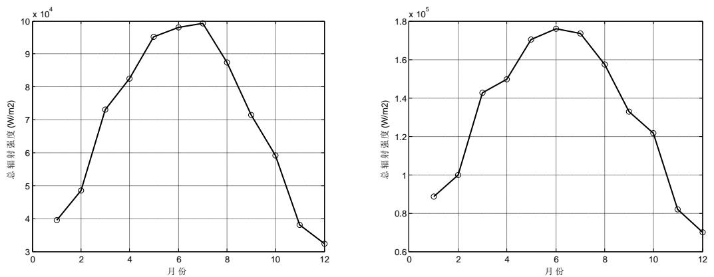  
图1 南、北向屋顶辐射强度

根据曲线图中的曲线趋势可以发现，在一年中，夏季由于太阳直射点在北半球，所以总辐射强度的值较高。而且 6月的总辐射值最高，与夏至日在 6月份的现实相符。而在冬季太阳辐射强度最低。为了更好地观察分析两屋顶太阳辐射强度值在一年中的变化规律，将南、北向屋顶各个月的辐射强度和如下表所示：

表1 南、北向屋顶辐射强度表

<table><tr><td>月份</td><td>一月</td><td>二月</td><td>三月</td><td>四月</td><td>五月</td><td>六月</td></tr><tr><td>南向房顶光强和(W/m2)</td><td>88743.16</td><td>99835.84</td><td>142529.6</td><td>149806.5</td><td>170353.5</td><td>176125.5</td></tr><tr><td>北向房顶光强和(W/m2)</td><td>39420.32</td><td>48448.15</td><td>73148.1</td><td>82530.63</td><td>95241.99</td><td>97959.09</td></tr><tr><td>月份</td><td>七月</td><td>八月</td><td>九月</td><td>十月</td><td>十一月</td><td>十二月</td></tr><tr><td>南向房顶光强和(W/m2)</td><td>173398</td><td>157448.1</td><td>132859.8</td><td>121491.9</td><td>81851.87</td><td>70166.47</td></tr><tr><td>北向房顶光强和(W/m2)</td><td>99197.3</td><td>87463.55</td><td>71362.11</td><td>59165.99</td><td>38132.63</td><td>32419.21</td></tr></table>

由表中的数据可知，每个月份中，北向屋顶的太阳辐射总强度总比南向屋顶的受辐射总强度低。其原因主要是北向屋顶所受到的太阳直射辐射强度比较低。

## 5.1.2 铺设方案

## 5.1.2.1 可行匹配方案

通过附件中的数据可知，逆变器的价格相对昂贵，在整个太阳能发电设备中占很大比重，所以在设计过程中，要尽量提高逆变器的利用率。而且考虑到工程应用中强调的易操作性和易维护性，连接在同一个逆变器上的光伏电池组件应尽量使用同一型号规格的组件。所以首先在不考虑如何在房子外表面排布的情况下，研究将同种规格的光伏电池组件连接到不同逆变器上尽可能得使目标利益得到最大化。

在研究一个逆变器上如何连接同种规格的电池组件时，优化设计方案的目标是：尽可能得使太阳屋的全年太阳能发电总量实现最大，并且单位发电量的费用尽可能小。也就是说，设计一个逆变器和一种光伏电池组件组合方案要使电池组件的单位面积收益实现最大化。其目标函数为

$$
\max \quad \frac {M _ {\text {电}} - M _ {\text {阵}}}{S _ {\text {阵}}}
$$

其中， $M _ { \oplus }$ 为在35年内组件组合通过太阳能发电所产生的价值； $M _ { \mathfrak { p } _ { \sharp } }$ 为组件组合及逆变器所需费用； $\mathrm { S } _ { \beta \ddag }$ 为组件组合的面积。

在逆变器和组件组合方案设计时，要尽量使得目标函数的值增大。但考虑到太阳房外表面形状等的一些限制，实现目标函数值最大的方案可能并不能安装到太阳房的外表面，所以针对同一逆变器的不同方案，根据其目标函数的值大小做出排序，供之后在房子上安装选择使用。

由于逆变器器件自身性能的一些限制，所以针对任一逆变器，连接在其上的光伏电池组件组合排布要满足以下条件：

1. 串联的光伏电池组件的端电压值应处于逆变器允许的输入电压范围内；  
2. 电池组件的并联电路总电流值应小于逆变器直流输入的额定电流；  
3. 光伏电池组件的总功率小于逆变器的额定功率。

用i表示光伏电池组件列表中的第i种光伏电池组件，j表示逆变器型号列表中的第j种逆变器。根据以上分析，可以列出其约束条件为：

$$
\left\{ \begin{array}{l} U _ {j _ {\min}} \leq x _ {i} \times U _ {i} \leq U _ {j _ {\max}} \\ y _ {i} I _ {i} \leq I _ {j} \\ x _ {i} y _ {i} P _ {i} \leq P _ {S N} \\ i \in (1, 2 4), j \in (1, 1 8) \end{array} \right.
$$

其中， $U _ { j _ { \operatorname* { m i n } } }$ $U _ { j _ { \operatorname* { m a x } } }$ $I _ { j }$ 和 $P _ { S N }$ 依次表示j型逆变器允许输入的最小电压，最大电压，额定电流和额定功率； $U _ { i }$ ， $I _ { i }$ 和 $P _ { i }$ 表示第i种光伏电池组件的开路电压，短路电流和额定功率； $x _ { i }$ 表示在组合中一条串联支路上电池组件的个数； $y _ { i }$ 表示在组合中并联支路的条数。

在考虑使电池组合方案使单位面积收益尽可能地增大时，根据单位面积收益的计算公式可以推知：

假设电价在未来的 35 年之内均保持不变，为每千瓦时 0.5 元。则此组件组合在35 年内产生的电能价值为：

$$
M _ {\text {电}} = 0. 5 \times D _ {\text {总}} \left(D _ {\text {总}} \text {为} 3 5 \text {年内电池组合产生的总电量}\right)
$$

电池组合的成本为：

$$
M _ {\text {阵}} = x _ {i} y _ {i} S _ {i} + S _ {S N j},
$$

其中 $S _ { i }$ ， $S _ { S N j }$ 分别表示第i种电池组件和 $j$ 型逆变器的单价。

则光伏电池组排列的数学约束模型为：

$$
\begin{array}{l} \max \quad \frac {M _ {\text {电}} - M _ {\text {阵}}}{S _ {\text {阵}}} \\ S. t \left\{ \begin{array}{l} U _ {j _ {\min}} \leq x _ {i} \times U _ {i} \leq U _ {j _ {\max}} \\ y _ {i} I _ {i} \leq I _ {j} \\ x _ {i} y _ {i} P _ {i} \leq P _ {S N} \\ i \in (1, 2 4), j \in (1, 1 8) \\ M _ {\text {阵}} = x _ {i} y _ {i} S _ {i} + S _ {S N j} \end{array} \right. \tag {12} \\ \end{array}
$$

## 5.1.2.2 阵列排布设计

当每一型号的逆变器与不同光伏电池组件组成的组合由其单位面积收益值的大小排序后，可将这些组合按其排序先后应用到太阳小屋的不同墙面及屋顶上。通过判断组合是否符合墙面的要求再对这些电池组合方案进行筛选以及进一步的优化，从而制定出最优的光伏电池组件铺设方案。

在使用某一方案的光伏电池组件组合铺设一个墙面或房顶时，其最大的限制条件是面积限制，即光伏电池组件组合的面积和不得超过墙体的面积。其约束条件的数学公式表达即为：

$$
x _ {i} y _ {i} S _ {i} \leq S \tag {13}
$$

其中， $S _ { i }$ 表示第i种电池组件的单个面积，S 表示需要优化的墙体或屋顶的面积。

其次，墙体中的门窗和屋顶的天窗因其透光及流通等需要，不能铺设光伏电池组件。又因电池组件有一定的尺寸标准，所以门窗、天窗相对与墙体和屋顶的位置对光伏电池组件组合的选择有一定影响。因此在铺设过程中，要防止电池组件覆盖到门窗或天窗。

根据逆变器连接光伏电池组件组合的约束条件可知，当任一逆变器连接单一规格的光伏电池组件时，任一逆变器所形成的组合数是有限的，根据经过软件MATLAB的仿真模拟计算，不同逆变器形成的组合数列表如下：

表 2 逆变器匹配数表

<table><tr><td>逆变器型号</td><td>SN1</td><td>SN2</td><td>SN3</td><td>SN4</td><td>SN5</td><td>SN6</td><td>SN7</td><td>SN8</td><td>SN9</td></tr><tr><td>组合数</td><td>191</td><td>386</td><td>264</td><td>538</td><td>823</td><td>1297</td><td>694</td><td>1190</td><td>2382</td></tr><tr><td>逆变器型号</td><td>SN10</td><td>SN11</td><td>SN12</td><td>SN13</td><td>SN14</td><td>SN15</td><td>SN16</td><td>SN17</td><td>SN18</td></tr><tr><td>组合数</td><td>4776</td><td>239</td><td>530</td><td>789</td><td>1364</td><td>7072</td><td>2644</td><td>9560</td><td>7839</td></tr></table>

由表中各型号的逆变器所能形成的组合数可以看出，所有型号的逆变器形成的电池组件组合数是非常庞大的数字，为 种。显然，在这些组合方案中，只有部分方案符合墙体及屋顶对其安装铺设的要求，而且有些方案是会造成亏损的，即其产生的电量价值低于其器件成本。

针对逆变器和光伏电池组件组合的筛选及优化，屋顶和每个墙体对电池组合要求有较大差别，所以接下来将不同墙面进行分类讨论，以使每个墙面及屋顶的单位面积收益达到最大，最终使整体最优。

## 1. 东墙铺设方案

通过以上建立的逆变器和电池组件组合模型和铺设规则，依据处于东墙的光伏电池组件每单位面积收益值大小排序（下表仅列出位于前 7 的组合），可以分析出最适合东墙的电池组件组合铺设方式。

表 3 东墙铺设方案表

<table><tr><td>逆变器</td><td>电池</td><td>串联个数</td><td>并联个数</td><td>35年盈利(元)</td><td>每平米盈利(元)</td><td>所占面积( $m^2$ )</td></tr><tr><td>SN12</td><td>C1</td><td>2</td><td>8</td><td>-187.02</td><td>-8.17</td><td>22.88</td></tr><tr><td>SN12</td><td>C3</td><td>3</td><td>5</td><td>-606.58</td><td>-25.67</td><td>23.62</td></tr><tr><td>SN12</td><td>C2</td><td>4</td><td>6</td><td>-1039.14</td><td>-46.10</td><td>22.54</td></tr><tr><td>SN11</td><td>C3</td><td>3</td><td>3</td><td>-723.95</td><td>-51.06</td><td>14.17</td></tr><tr><td>SN12</td><td>C1</td><td>2</td><td>7</td><td>-1026.14</td><td>-51.25</td><td>20.02</td></tr><tr><td>SN12</td><td>C4</td><td>2</td><td>7</td><td>-1613.53</td><td>-74.83</td><td>21.56</td></tr><tr><td>SN4</td><td>C2</td><td>1</td><td>25</td><td>-1906.86</td><td>-81.20</td><td>23.48</td></tr></table>

由上表中的数据可知，在所有电池组件组合应用于东墙时，所有的方案均会造成亏损，即使是最好的组合仍然会在35年之内每单位面积亏损 8.17 元。考虑到要使单位发电量的费用尽可能的减少，所以东墙不铺设光伏电池组件阵列。

## 2.南墙铺设方案

根据山西大同的典型气象年逐时各方向辐射强度统计数据可知，南墙的太阳辐射量在四面墙中的受辐射量比重最大，所以应充分利用南墙的空间，尽可能在南墙的表面铺设光伏电池组件以充分利用其强的光照。但是，南墙有很大一部分面积被门窗所占用，光伏电池组件的铺设受到很大的限制。在所有的逆变器和电池组件组合南向铺设后，只有下表所示的两种方案可以铺设到南墙上而且最终有盈利。

表 4 南墙铺设方案表

<table><tr><td>逆变器</td><td>电池</td><td>串联个数</td><td>并联个数</td><td>35年盈利(元)</td><td>每平米盈利(元)</td><td>所占面积(m2)</td></tr><tr><td>11</td><td>15</td><td>4</td><td>2</td><td>811.22</td><td>107.96</td><td>7.51</td></tr><tr><td>3</td><td>15</td><td>1</td><td>8</td><td>169.64</td><td>22.57</td><td>7.51</td></tr></table>

通过表中的数据可以明显地发现，两种方案中电池组件所占用的面积相同，但使用逆变器型号为SN11的方案单位面积收益为 107.96元，明显高于使用逆变器型号为SN3的方案单位面积收益（22.57元）。所以，在南墙的光伏电池组件铺设方案选择型号为SN11的逆变器，型号为C2的光伏电池组件，其连接方式为共两条并联支路，每条支路上串联 4 各电池组件。最终在 35 年内，共盈利 811.21元。具体的安装铺设图和联接方式图列如下图。（相应的电池组件及逆变器规格表见附录一）

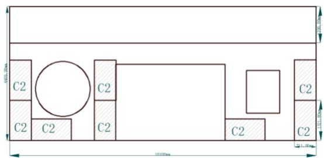

<details>
<summary>text_image</summary>

C2
C2
C2
C2
C2
C2
C2
C2
10.00mm
10.00mm
10.00mm
</details>

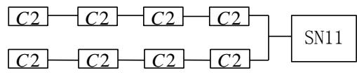

<details>
<summary>flowchart</summary>

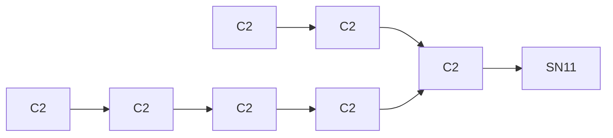
</details>

图2 南墙太阳板铺设图（左图）和电池组件联接图（右图）

## 3.西墙铺设方案

由所给数据分析，山西大同的典型气象年逐时各方向辐射强度统计数据可知，西向墙体在每天的上午由于其不受太阳直射，所以总辐射强度比较低。而在每天的下午，西墙受到太阳直射，其总辐射强度增大很多。而且在每天的 17时，西墙受到的总辐射强度异常强烈。所以西墙每年受到的太阳辐射量很大。而且西墙是一整块墙壁，没有门窗的限制。因此，在西墙应尽量铺满光伏电池组件。通过将所有电池组件组合西向铺设并按其单位面积收益排序后，得到下表所示的数据（列出排序在前的部分数据）

表 5 西墙铺设方案表

<table><tr><td>逆变器</td><td>电池</td><td>串联个数</td><td>并联个数</td><td>35年盈利(元)</td><td>每平米盈利(元)</td><td>所占面积( $m^2$ )</td></tr><tr><td>12</td><td>14</td><td>2</td><td>8</td><td>7128.67</td><td>311.56</td><td>22.88</td></tr><tr><td>12</td><td>14</td><td>2</td><td>7</td><td>5375.08</td><td>268.48</td><td>20.02</td></tr><tr><td>12</td><td>16</td><td>3</td><td>5</td><td>6251.87</td><td>264.59</td><td>23.62</td></tr><tr><td>11</td><td>16</td><td>3</td><td>3</td><td>3391.12</td><td>239.20</td><td>14.17</td></tr><tr><td>12</td><td>15</td><td>4</td><td>6</td><td>5335.95</td><td>236.71</td><td>22.54</td></tr><tr><td>11</td><td>14</td><td>2</td><td>4</td><td>2514.33</td><td>219.78</td><td>11.44</td></tr></table>

由表中数据可知，第一列所示的电池组件组合可以达到最高的盈利，但是这种组合方式在西墙的铺设过程中是不能实现的。而第二列所示的电池组件组合虽然在盈利有所降低，但其占用面积较小，可以在西墙实现其安装铺设。所以，在西墙的光伏电池组件铺设方案选择型号为SN12的逆变器，型号为C1的光伏电池组件，其连接方式为共 8 条并联支路，每条支路上串联 2 各电池组件。最终在35年内，共盈利 7128.67 元。具体的安装铺设图和联接方式图列如下图所示。

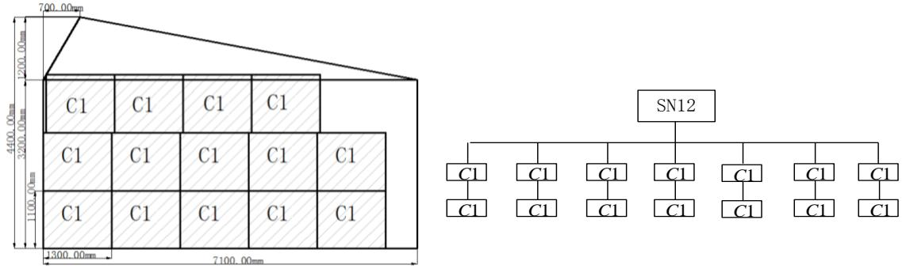  
图3 西墙太阳板铺设图（左图）和电池组件联接图（右图）

## 4.北墙铺设方案

由于大同处于北半球的北回归线以北，所以太阳的直射点终年都不会位于其北边。因此，这里房屋的北墙始终接受不到太阳的直射，其接受的太阳总辐射量即为其接受的散射辐射量。由此可知，北墙的总辐射强度始终处于一个较低的水平。通过将所有电池组件组合北向铺设并按其单位面积收益排序后，得到下表所示的数据（列出排序在前的部分数据）

表 6 北墙铺设方案表

<table><tr><td>逆变器</td><td>电池</td><td>串联个数</td><td>并联个数</td><td>35年盈利(元)</td><td>每平米盈利(元)</td><td>所占面积( $m^2$ )</td></tr><tr><td>SN12</td><td>20</td><td>23</td><td>14</td><td>-8445.22</td><td>-236.923</td><td>35.6454</td></tr><tr><td>4</td><td>20</td><td>5</td><td>68</td><td>-8948.31</td><td>-237.747</td><td>37.638</td></tr><tr><td>4</td><td>20</td><td>5</td><td>67</td><td>-8918.19</td><td>-240.483</td><td>37.0845</td></tr><tr><td>4</td><td>20</td><td>5</td><td>66</td><td>-8888.07</td><td>-243.302</td><td>36.531</td></tr><tr><td>12</td><td>20</td><td>22</td><td>14</td><td>-8378.04</td><td>-245.722</td><td>34.0956</td></tr><tr><td>12</td><td>23</td><td>11</td><td>11</td><td>-8641.97</td><td>-245.949</td><td>35.13719</td></tr></table>

由表中数据可以观察出，任意的电池组件组合铺设到北向墙面上后，在 35年内其亏损均高达 元之多，所以为避免出现此类较大的亏损，北墙不铺设光伏电池阵列。

## 5.南向屋顶铺设方案

南向屋顶由于其在整个日出到日落时间段都有阳光直射，所以南向屋顶受到的太阳辐射量最大。所以在南向屋顶要尽可能铺设电池组件阵列。通过将所有电池组件组合屋顶铺设并按其单位面积收益排序后，得到下表所示的数据（列出排序在前的部分数据）

表7 南向屋顶铺设方案表

<table><tr><td>逆变器</td><td>电池</td><td>串联个数</td><td>并联个数</td><td>35年盈利(元)</td><td>每平米盈利(元)</td><td>所占面积( $m^2$ )</td></tr><tr><td>15</td><td>8</td><td>6</td><td>4</td><td>56724.91</td><td>1219.33</td><td>46.52</td></tr><tr><td>15</td><td>7</td><td>7</td><td>4</td><td>54059.74</td><td>1180.75</td><td>45.78</td></tr><tr><td>15</td><td>8</td><td>5</td><td>4</td><td>43604.09</td><td>1124.75</td><td>38.76</td></tr><tr><td>15</td><td>7</td><td>6</td><td>4</td><td>43194.06</td><td>1100.67</td><td>39.24</td></tr><tr><td>12</td><td>8</td><td>6</td><td>1</td><td>12781.23</td><td>1098.95</td><td>11.63</td></tr><tr><td>14</td><td>14</td><td>2</td><td>20</td><td>62409.43</td><td>1091.07</td><td>57.2</td></tr></table>

由表中数据可知，第一列所示的电池组件组合可以达到最高的盈利，但是这种组合方式在南向屋顶的铺设过程中是不能实现的。而第二列所示的电池组件组合虽然在盈利有所降低，但其占用面积较小，可以在南向屋顶实现其安装铺设。所以，在南向屋顶的光伏电池组件铺设方案选择型号为SN15的逆变器，型号为的光伏电池组件，其连接方式为共 条并联支路，每条支路上串联 个电池组件。最终在35年内，共盈利 54059.74元。具体的安装铺设图和联接方式图列如下图。

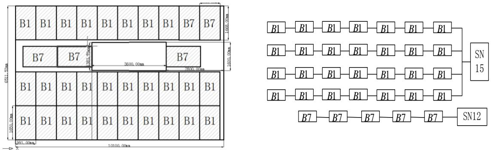  
图4 南向屋顶太阳板铺设图（左图）和电池组件联接图（右图）

## 6.北向屋顶铺设方案

通过将所有电池组件组合北向屋顶铺设并按其单位面积收益排序后，得到下表所示的数据（列出排序在前的部分数据）

表8 北向屋顶铺设方案表

<table><tr><td>逆变器</td><td>电池</td><td>串联个数</td><td>并联个数</td><td>35年盈利(元)</td><td>每平米盈利(元)</td><td>所占面积( $m^2$ )</td></tr><tr><td>11</td><td>14</td><td>2</td><td>4</td><td>1814.781</td><td>158.6347</td><td>11.44</td></tr><tr><td>11</td><td>15</td><td>4</td><td>3</td><td>1008.366</td><td>89.46738</td><td>11.27077</td></tr><tr><td>3</td><td>15</td><td>1</td><td>14</td><td>1047.787</td><td>79.68425</td><td>13.14923</td></tr><tr><td>3</td><td>15</td><td>1</td><td>13</td><td>651.5164</td><td>53.35923</td><td>12.21</td></tr><tr><td>11</td><td>14</td><td>2</td><td>3</td><td>236.0859</td><td>27.51583</td><td>8.58</td></tr><tr><td>11</td><td>18</td><td>2</td><td>3</td><td>236.0859</td><td>25.55042</td><td>9.24</td></tr></table>

由表中数据可知，可实现最大盈利的电池组件组合恰好可以很好的安装铺设于北向屋顶。因此北向屋顶的光伏电池组件铺设方案为：型号为 的逆变器，型号为C1的光伏电池组件，其连接方式为共 4 条并联支路，每条支路上串联 2个电池组件。最终在 35 年内，共盈利 1814.78 元。具体的安装铺设图和联接方式图列如下图。

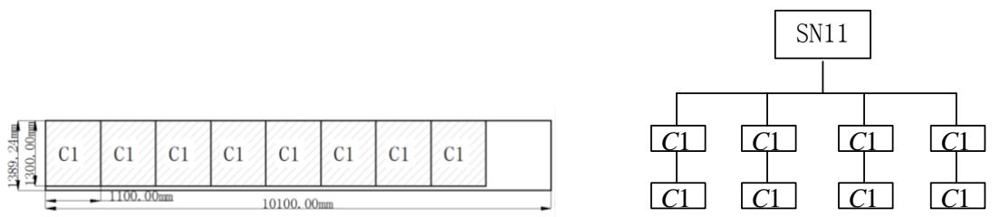  
图5 北向屋顶太阳板铺设图（左图）和电池组件联接图（右图）

在依照以上铺设方案对太阳小屋进行铺设后各面墙体及屋顶在 35 年之内的发电量、成本及盈利情况如下表所示

表 9 贴附式铺设结果

<table><tr><td>指标</td><td>设备成本(元)</td><td>总发电量(千瓦时)</td><td>回收年限</td><td>总盈利(元)</td><td>单位发电量成本(元)</td></tr><tr><td>南墙</td><td>6727.2</td><td>15057</td><td>—</td><td>798</td><td>0.45</td></tr><tr><td>西墙</td><td>13620</td><td>37989</td><td>—</td><td>5375</td><td>0.36</td></tr><tr><td>南向屋顶</td><td>137275</td><td>394515.7</td><td>—</td><td>59973</td><td>0.35</td></tr><tr><td>北向屋顶</td><td>8340</td><td>20307.7</td><td>—</td><td>1813.86</td><td>0.41</td></tr><tr><td>总体</td><td>165962.2</td><td>467869.5</td><td>23.72</td><td>67959.89</td><td>0.36</td></tr></table>

由表中的数据可知，依此方案铺设太阳小屋，则在 35 年内，总发电量可达467869.5 千瓦时，总盈利为 67959.89 元，单位面积收益为 0.36 元。

## 5.2问题二 架空式安装

在之前的光伏电池组件贴附式安装分析过程中，太阳辐射到电池组件表面的能量始终是影响电池组件发电量大小的重要影响因素。而太阳辐射到电池组件表面的总能量和光线与电池板的夹角有直接关系。在贴附式安装设计中，光伏电池组件安装的倾斜角和方位角是根据房屋自身的结构和方位决定的。因此，在贴附式安装设计中，电池板的倾斜角和方位角并不能使其处于接受太阳辐射能量的最佳角度。

而在架空式安装设计中，电池板的安装角度可以不受房屋墙面的影响。所以在架空式设计中，可以调节每一个光伏电池组件的倾斜角和方位角，使其可以最大限度地接受太阳辐射能量。下面，主要分析在大同市当地，如何确定倾斜面的最佳倾斜角和方位角使其接受太阳辐射能量最大。

## 5.2.1 最佳倾斜角

在贴附式设计中，我们计算得到一个倾斜面的倾斜角和其接受辐射量的关系公式。但要从计算公式中直接求得对应最大太阳总辐射量的倾斜面倾角非常复杂繁琐。而通过分析已知的条件可知，在从秋分日到次年的春分日的冬半年中，太阳辐射的直射点在南半球，即太阳赤纬为负值。已知大同的纬度为 $\phi$ ，则有$( \phi - \theta ) < \phi$ 。因此，倾斜面上日出时角 $\omega _ { s t }$ 和水平面上日出时角 $\omega _ { s }$ 相等。这时便可以直接推导出最佳倾斜角的数学表达式。

在北半球的冬半年，已知 $\omega _ { s t } = \omega _ { s }$ ，于是，倾斜角为 的倾斜面上的太阳总

辐射强度的计算公式可改写为：

$$
I = (I _ {b _ {0}} + \frac {I _ {b} I _ {d}}{I _ {0}}) R _ {b} + \frac {I _ {d}}{2 I _ {0}} (I _ {0} - I _ {b}) (1 + \cos \theta) \tag {14}
$$

对于大同这一确定的地理位置，其太阳辐射量为常值，所以将斜面接受的太阳辐射强度I 对倾斜角 求导，并且令 $\frac { d I } { d \theta } = 0$ ，可得：

$$
\frac {d R _ {b}}{d \theta} = \frac {\sin \theta}{2 (1 + I _ {d} / I _ {0}) I _ {b}} \times \frac {I _ {d}}{I _ {0}} (I _ {0} - I _ {b}) \tag {15}
$$

同时将 $R _ { b }$ 对倾斜角 求导，可得：

$$
\frac {d R _ {b}}{d \theta} = \sin \theta [ (\sin \phi \cot \theta - \cos \phi) \cos \delta \sin \omega - \frac {\pi}{1 8 0} \omega (\sin \phi + \tag {16}
$$

$$
\cos \phi \cot \theta) \sin \delta ] \times (\cos \phi \cos \delta \sin \omega + \frac {\pi}{1 8 0} \sin \phi \sin \delta) ^ {- 1}
$$

将 $\cos \omega = - \tan \phi \tan \delta$ 代入上式，可以得出最佳的倾斜角为：

$$
\theta_ {b} = \arctan [ \frac {2 \frac {I _ {b}}{I} + 2 \frac {I _ {b}}{I _ {0}} (1 - \frac {I _ {b}}{I})}{\frac {I _ {b}}{I} + \frac {I _ {b}}{I _ {0}} (1 - \frac {I _ {b}}{I}) + 1} \times \frac {\tan^ {2} \phi \tan \omega + \frac {\pi}{1 8 0} \omega}{\tan \phi (\tan \omega - \frac {\pi}{1 8 0} \omega)} ] \tag {17}
$$

当 $\frac { I _ { b } } { I } = 0$ 时，即直射辐射强度为 0时，若假设大气中散射辐射具有各向同性，则最佳倾斜角 $\theta _ { b } = 0$ 。然而由上述公式可知，此时 $\theta _ { b } \neq 0$ ，这正好是大气散射各向异性的最好佐证。

而对于春分日到当年的秋分日，即北半球的夏半年，倾斜面上日出时角 $\omega _ { s t }$ 和水平面上日出时角 $\omega _ { s }$ 不相等。由于计算极其复杂，所以确切简明的计算公式难以求得。但是实际情况显示出，夏半年的最佳倾斜角接近于 ，有时还会变为负值，所以有冬半年的计算公式求出的值仍有一定的借鉴意义。

当然，除了用于求得全年平均接受太阳最大辐射量所对应的倾斜角，还可以算出每个月所对应的倾斜角。可知，在冬季，最佳倾斜角的值较大，而夏天的值偏小，往往接近于0，有的甚至为负值。因此，可根据需要每个月进行倾斜角调整以接受最强的太阳辐射强度。

## 5.2.2 最佳方位角

关于倾斜面接受最大太阳辐射强度所对应的最佳方位角的确定，可以采用对太阳辐射强度关于方位角的表达式求导得出其最佳方位角的值。但这是一个超然函数，其计算极其复杂。而且求导对于安装倾角为负的情况而言，结果失真必较严重。因此，鉴于以上考虑，本文采用步进对比的方法可以较精确的确定最佳方位角。

确定最佳方位角的步进对比方法的计算步骤为：在方位角的-180°\~180°的取值区间内，取每1<sup></sup>为一个步进值，以之前建立的太阳辐射强度关于方位角的表达式为依据，通过软件仿真进行计算，取太阳辐射强度最大值所对应的方位角为最佳方位角。

针对本题中太阳小屋所处的地理位置，通过上述分析得到的公式，利用MATLAB 软件仿真计算，得到面向正南的倾斜面在倾斜角和方位角不同时，其接受到的太阳辐射强度的变化情况（如下图所示）。

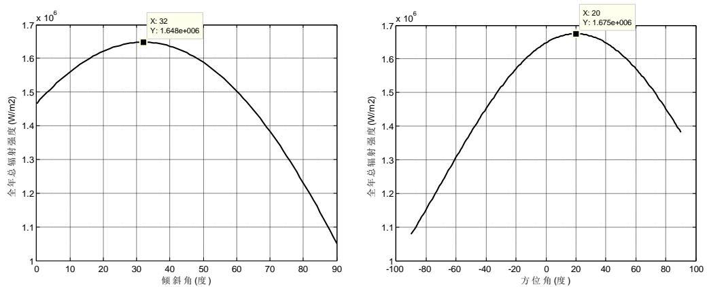  
图6 辐射强度随倾斜角、方位角变化图

由图中的倾斜面接受的全年总辐射强度随倾斜面的倾斜角及方位角变化曲线可以看出，倾斜角和方位角太大或太小均会导致倾斜面接收到的太阳辐射强度降低，而当倾斜角为32<sup></sup>，方位角为 $2 0 ^ { \circ }$ 时，全年总辐射强度达到最大值。所以若光伏电池组件安装后不再修正其角度，则组件接受最大年辐射强度对应的最佳倾斜角为32°，最佳方位角为20°。

## 5.2.3 铺设方案

在已知全年太阳辐射强度最大值对应的最佳倾斜角和最佳方位角情况下，架空式的铺设方案要通过改变贴附式电池组件阵列的倾斜角和方位角达到提高太阳能利用率。

首先，在屋顶上，光伏电池组件阵列的安装角度可以任意改变，所以在之前贴附式安装设计的基础上，将每一个光伏电池组件的与水平面的夹角设置为32<sup></sup>，

并将其方位角设置为 $2 0 ^ { \circ }$ 。这种设置可以使屋顶的电池组件在以一年为周期的时间里，其所接受的太阳辐射总强度达到最大值。

而在墙体上安装的光伏电池的安装倾斜角改变比较受限制，而且墙体上安装的光伏电池改变其倾斜角和方位角后，考虑到在实际应用中会占用较大的空间，造成一定的不方便，所以墙体上的光伏电池安装铺设方法仍然沿用贴附式安装的

设计方案。

因此在分析盈利问题时，四面墙体的总发电量和设备成本保持不变。而只有屋顶的铺设有所改变，即铺设方式不变，而只是将光伏电池组件的倾斜角和方位角做出一定的改变。

所以当屋顶铺设的电池组件的倾斜角为最佳倾斜角32 ，其方位角为最佳方位角 $2 0 ^ { \circ }$ 时，屋顶在 35年内的发电量、成本及盈利情况如下表所示。

表10 架空式铺设结果

<table><tr><td>指标</td><td>设备成本(元)</td><td>总发电量(千瓦时)</td><td>回收年限(年)</td><td>总盈利(元)</td><td>单位发电量层本(元)</td></tr><tr><td>南墙</td><td>6727.2</td><td>15057</td><td>—</td><td>798</td><td>0.447</td></tr><tr><td>西墙</td><td>13620</td><td>37989</td><td>—</td><td>5375</td><td>0.359</td></tr><tr><td>屋顶</td><td>137275</td><td>481894.4</td><td>—</td><td>95332</td><td>0.28</td></tr><tr><td>总体</td><td>165962.2</td><td>534939.3</td><td>20.6</td><td>101505</td><td>0.31</td></tr></table>

由表中数据可知，当采用架空式铺设方法时，在 35年内，总发电为534939千瓦时，总盈利为101505 元，单位发电量成本为 0.31元。与贴附式设计方案相比，总发电量增加14.3%，总盈利增加49.4%，而单位发电量的成本比原来降低。所以从两种铺设方式的结果对比可以发现，架空式铺设方式比贴附式的铺设方式有明显的优势。

在一年中随着时间的变化，太阳的直射纬度会不断变化，即赤纬角会不断改<sup>4.5</sup>变。因此，对于一个确定的地理位置，其接受太阳辐射最大值所对应的最佳倾斜4角和方位角也会随之改变。所以，本文分析了每个季度中倾斜面接受的太阳辐射3.5度强度随倾斜面的倾斜角和方位角不同的变化规律（如下图所示）。3<sup>射</sup>

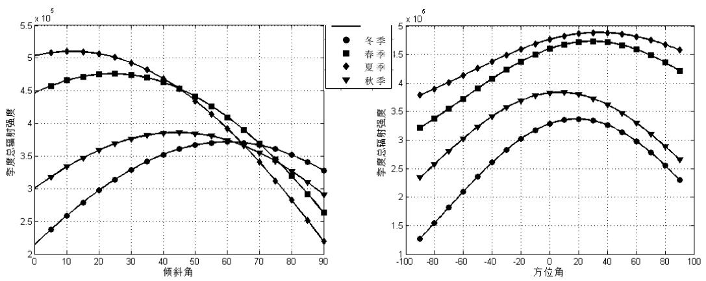

<details>
<summary>line</summary>

| 倾斜角 | 冬季 (x 10^5) | 春季 (x 10^5) | 夏季 (x 10^5) | 秋季 (x 10^5) |
| --- | --- | --- | --- | --- |
| 0 | ~2.2 | ~4.5 | ~5.05 | ~3.0 |
| 10 | ~2.6 | ~4.65 | ~5.1 | ~3.3 |
| 20 | ~3.0 | ~4.75 | ~5.05 | ~3.6 |
| 30 | ~3.3 | ~4.75 | ~4.95 | ~3.75 |
| 40 | ~3.5 | ~4.7 | ~4.8 | ~3.85 |
| 50 | ~3.7 | ~4.5 | ~4.5 | ~3.85 |
| 60 | ~3.75 | ~4.25 | ~4.1 | ~3.75 |
| 70 | ~3.65 | ~3.9 | ~3.7 | ~3.6 |
| 80 | ~3.55 | ~3.2 | ~3.1 | ~3.3 |
| 90 | ~3.3 | ~2.65 | ~2.2 | ~2.9 |

| 方位角 | 冬季 (x 10^5) | 春季 (x 10^5) | 夏季 (x 10^5) | 秋季 (x 10^5) |
| --- | --- | --- | --- | --- |
| -90 | ~1.3 | ~3.2 | ~3.8 | ~2.35 |
| -80 | ~1.55 | ~3.4 | ~3.95 | ~2.6 |
| -70 | ~1.85 | ~3.6 | ~4.1 | ~2.8 |
| -60 | ~2.1 | ~3.75 | ~4.25 | ~3.0 |
| -50 | ~2.4 | ~3.95 | ~4.45 | ~3.2 |
| -40 | ~2.65 | ~4.15 | ~4.65 | ~3.4 |
| -30 | ~2.85 | ~4.35 | ~4.85 | ~3.6 |
| -20 | ~3.05 | ~4.55 | ~5.05 | ~3.75 |
| -10 | ~3.25 | ~4.7 | ~5.25 | ~3.8 |
| 0 | ~3.35 | ~4.8 | ~5.4 | ~3.85 |
| 10 | ~3.4 | ~4.85 | ~5.45 | ~3.85 |
| 20 | ~3.4 | ~4.9 | ~5.45 | ~3.8 |
| 30 | ~3.35 | ~4.9 | ~5.45 | ~3.7 |
| 40 | ~3.25 | ~4.85 | ~5.45 | ~3.6 |
| 50 | ~3.15 | ~4.75 | ~5.4 | ~3.45 |
| 60 | ~3.05 | ~4.65 | ~5.35 | ~3.3 |
| 70 | ~2.85 | ~4.55 | ~5.25 | ~3.1 |
| 80 | ~2.65 | ~4.4 | ~5.15 | ~2.9 |
| 90 | ~2.3 | ~4.2 | ~4.95 | ~2.65 |
</details>

图7 不同季节辐射强度随倾斜角、方位角变化图

由图中的倾斜面接受的各季度总辐射强度随倾斜面的倾斜角及方位角变化曲线可以看出，不同季节中，最佳倾斜角及最佳方位角的取值是均不相同。夏季由于太阳的直射点位于北半球，太阳的高度角相对较高，所以倾斜面的最佳倾斜角值是四季中最小的；而冬季正好相反，较低的太阳高度角导致最佳倾斜角值偏大。

因此，若安装后的光伏电池组件阵列的安装角度仍可以改变，则为了获得更大的太阳辐射强度，可以根据上图中每个季度对应的最佳倾斜角和方位角对电池组件阵列进行调整，使其以最佳角度接受太阳辐射。

为了更精确地提高光伏电池接受太阳辐射能量，将电池板接受的最大太阳辐射强度所对应的最佳倾斜角和方位角精确到每个月份。通过计算得到不同月份中的最佳倾斜角和最佳方位角数据列入下表：

表11 各月最佳角度表

<table><tr><td>月份</td><td>一月</td><td>二月</td><td>三月</td><td>四月</td><td>五月</td><td>六月</td><td>七月</td><td>八月</td><td>九月</td><td>十月</td><td>十一月</td><td>十二月</td></tr><tr><td>最佳倾斜角(度)</td><td>62</td><td>56</td><td>39</td><td>21</td><td>12</td><td>9</td><td>9</td><td>17</td><td>30</td><td>45</td><td>58</td><td>61</td></tr><tr><td>最佳方位角(度)</td><td>16</td><td>31</td><td>27</td><td>24</td><td>39</td><td>35</td><td>42</td><td>27</td><td>18</td><td>-2</td><td>8</td><td>7</td></tr></table>

通过对每个月的最佳倾斜角和最佳方位角的确定，可以发现每个月的取值都不同。所以若要进一步提高光伏电池的发电量，可以每个月都调节电池阵列的放置方向以最佳的角度接受太阳辐射能量。

当然，太阳的辐射角度时刻都在变化，如果可以实现电池角度对光线的实时跟踪，即电池阵列的倾斜角和方位角时刻都对应与接受最大太阳辐射强度，那么就可以在这方面实现对太阳能的最大限度的利用。

## 5.3问题三 自建太阳屋

在研究前两个问题的过程中发现，太阳辐射强度较大的南面墙体由于门窗所占面积较大使得可用于铺设电池板的面积大为减小，并且门窗位置和形状规划不合理浪费了大量可铺设电池板的面积。所以南面墙体的太阳能利用率并不高。因此，在本问题中，通过按照相关的建筑要求自建太阳屋实现太阳能的高利用率。

自建太阳屋的设计的原则是：

1. 优先考虑太阳辐射强度较强的房屋表面设置；  
2. 着重考虑设备的优选和铺设方式的优化设计。

自建太阳屋的设计思路如下：

首先，通过前两问的分析可以发现，屋顶受到的太阳辐射最强烈也最持久。所以要优先考虑屋顶的设计。由于在大同当地的全年太阳辐射强度最大值对应的最佳倾斜角为 $3 2 ^ { \circ }$ ，最佳方位角为 $2 0 ^ { \circ }$ ，所以屋顶的倾斜角设定为32<sup></sup>，方位角为20<sup></sup>以接受最大的太阳辐射强度值。为简化描述，假设房子的形状尺寸如下图所示：

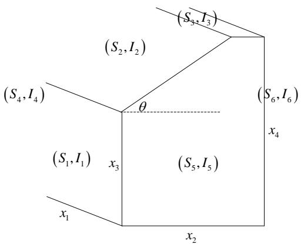

<details>
<summary>text_image</summary>

(S₃,I₃)
(S₂,I₂)
(S₄,I₄)
θ
(S₁,I₁)
x₃
(S₅,I₅)
x₁
x₂
(S₆,I₆)
x₄
</details>

图 8 自建房屋示意图

其次不同墙面的接受太阳辐射强度大小不同，所以其面积也相应应取不同的值。在此，为简化模型的建立，先假设电池阵列的面积是可连续变化的。则在设计过程中，目标就是使房屋各个表面所接受的太阳辐射强度总和达到最大值，即在太阳屋的设计中目标函数为:

$$
Q = \max \sum_ {1} ^ {i = 6} I _ {i} S _ {i}
$$

其中， $Q$ 为房屋各个表面所接受的太阳辐射强度总和； $I _ { i }$ 为第i表面所接受的太阳辐射强度； $S _ { i }$ 为第i表面的表面积。

在设计房屋的过程中，房屋的尺寸除了要使目标函数达到最大值，还会受到一些约束。而其约束条件主要是房屋建筑要求的限定，主要约束有以下：

1. 建筑屋顶最高点距地面高度≤5.4m；  
2. 室内使用空间最低净空高度距地面高度为≥2.8m；  
3. 建筑总投影面积为≤74m<sup>2</sup>；  
4. 建筑平面体型长边应≤15m；  
5. 建筑平面体型最短边应≥3m。

所以在优化房屋尺寸设计过程中的约束条件为：

$$
\left\{ \begin{array}{l} x _ {4} \leq 5. 4 \\ x _ {3} \geq 2. 8 \\ x _ {1} x _ {2} \leq 7 4 \\ 3 \leq x _ {1} \leq 1 5 \\ 3 \leq x _ {2} \leq 1 5 \end{array} \right.
$$

其中， $x _ { 1 }$ 为南墙的宽度； $x _ { 2 }$ 为东墙的宽度； $x _ { 3 }$ 为南墙的高度， $x _ { 4 }$ 为北墙的高度而各个外表面的面积可由下列计算公式求得：

$$
\begin{array}{l} S _ {1} = x _ {1} x _ {3} \\ S _ {2} = \frac {x _ {1} (x _ {4} - x _ {3})}{\sin \theta} \\ S _ {3} = x _ {1} (x _ {2} - \frac {x _ {4} - x _ {3}}{\tan \theta}) \tag {18} \\ S _ {4} = S _ {5} = \frac {x _ {2} (x _ {3} + x _ {4})}{2} \\ S _ {6} = x _ {1} x _ {4} \\ \end{array}
$$

在优化房屋尺寸的模型中，各个外表面的面积均按其连续值计算，而在实际光伏电池铺设的过程中，由于电池组件是有确定的尺寸的，所以在一面墙体上能产生电能的面积通常不等于其实际面积。因此，在连续性的优化模型的基础上，结合光伏电池组件的器件尺寸，对模型进行了进一步的修正。最终得到太阳屋的结构形状及尺寸规格如下图所示。

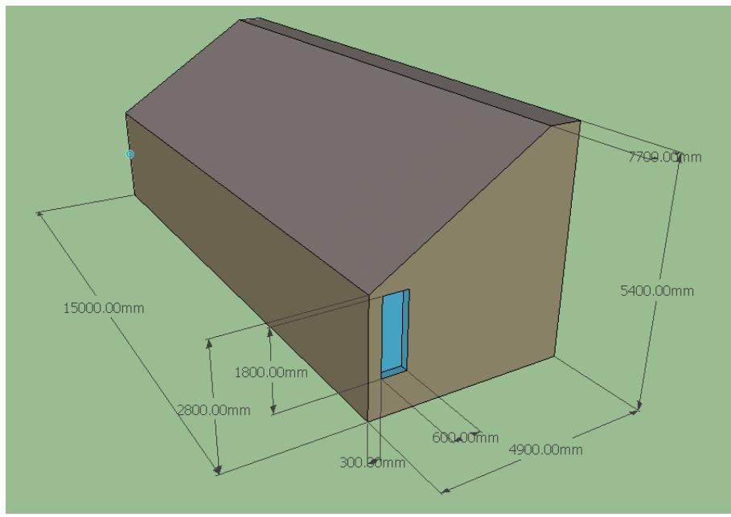

<details>
<summary>text_image</summary>

15000.00mm
2800.00mm
1800.00mm
300.00mm
600.00mm
4900.00mm
7700.00mm
5400.00mm
</details>

图9 自建太阳屋立体图

关于太阳屋的各个外表面的光伏电池组件阵列设计的确定，本问题仍沿用前两问的组合排布规律，由此得到各表面的最优电池组件联接方式和各表面的最优铺设方式。

经由以上分析计算，得到房屋南向屋顶的光伏电池组件的联接方式和铺设方式如下图所列：

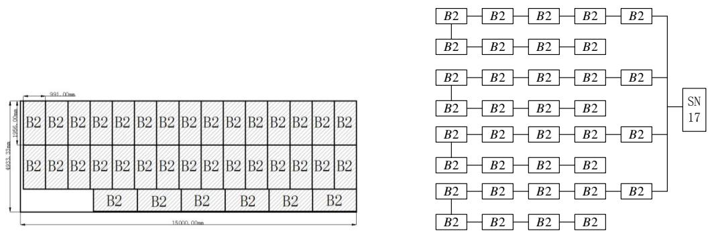  
图 南向屋顶太阳板铺设图（左图）和电池组件联接图（右图）

由图示可知，在南向屋顶的光伏电池组件铺设方案选择型号为SN15的逆变器，型号为B1的光伏电池组件，其连接方式为共 4 条并联支路，每条支路上串联7各电池组件。（相应的电池组件及逆变器规格表见附录二）

由于篇幅有限，因此其他表面的光伏电池组件的联接方式和铺设方式记录于附表中。

在依照设计的铺设方案对自建太阳小屋进行铺设后，各面墙体及屋顶在 35年之内的发电量、成本及盈利情况如下表所示。

表12 自建房屋铺设结果

<table><tr><td>指标</td><td>设备成本(元)</td><td>总发电量(千瓦时)</td><td>回收年限</td><td>总盈利(元)</td><td>单位发电量成本(元)</td></tr><tr><td>南墙</td><td>21820</td><td>90153</td><td>—</td><td>23261</td><td>0.24</td></tr><tr><td>西墙</td><td>8820</td><td>23373</td><td>—</td><td>2868</td><td>0.38</td></tr><tr><td>东墙</td><td>8820</td><td>23373</td><td>—</td><td>2888</td><td>0.38</td></tr><tr><td>南向屋顶</td><td>187750</td><td>603603</td><td>—</td><td>114066</td><td>0.31</td></tr><tr><td>水平屋顶</td><td>7005.6</td><td>21672</td><td>—</td><td>3834</td><td>0.32</td></tr><tr><td>总体</td><td>234215.6</td><td>762218</td><td>20.4</td><td>146917</td><td>0.31</td></tr></table>

由上表所示的数据可知，自建太阳小屋在 35 年之内的总发电量为 762218千瓦时，总盈利为146917元，单位发电量成本为 0.31元。与架空式设计方案相比，总发电量增加42.5%，总盈利增加44.7%，而单位发电量的成本与原来持平。所以从两种设计的结果对比可以发现，自建太阳小屋的各项性能较优。

## 六、模型评价

## 6.1 优点

1. 在任一倾斜面所接受的太阳辐射强度的计算中，认为散射辐射具有各向异性的特征，使得辐射强度的计算更加符合实际情况。  
2. 在确定倾斜面的最佳方位角时，由于求导方式的难解性，运用步进搜索算法将其值较为简便精确地求出。  
3. 在架空式安装设计中，求出每个季度以及每个月份的最佳倾斜角和方位角，如此每季度或每月都可以调整电池组件为最佳角度，从而提高对太阳能的利用率。

## 6.2 缺点

1. 在逆变器与电池组件匹配设计过程中，对于每个逆变器，只考虑了单一规格的光伏电池组件与其匹配，未考虑多种规格的电池组件对其可能形成更优的组合。  
2. 在架空式安装设计过程中，最佳倾斜角和最佳方位角的确定都是独立的，并没有考虑两者之间的相互影响，可能会对其值的精确度有一定影响。  
3. 在自建太阳小屋的设计中，仅考虑了增大发电量，而没有考虑房屋在实际使用过程中的其他决定因素。

## 参考文献

[1] 达菲J A，贝克曼W A. 太阳能-热能转换过程[M]. 北京：科学出版社，1980  
[2] 杨金焕，毛家俊，陈中华，不同方位倾斜面上太阳辐射量及最佳倾角的计算，上海交通大学学报，2002  
[3] Bushnell R H.A solution for sunrise and sunset hour angleson a tilted surface without a singularity at zero[J].Solar Energy,1982,28(4):359  
[4] 沈 辉，曾祖勤. 太阳能光伏发电技术[M]. 北京：化学工业出版社，2005  
[5] 太阳能热利用术语，http://www.newenergy.org.cn/html/0067/2006710\_10760\_4.html，2012.9.8

## 附录一：

问题一中电池组件及逆变器规格表：

表 1 南墙规格表

<table><tr><td></td><td>型号</td><td>个数</td></tr><tr><td>电池板</td><td>C2</td><td>8</td></tr><tr><td>逆变器</td><td>SN11</td><td>1</td></tr></table>

表 2 西墙规格表

<table><tr><td></td><td>型号</td><td>个数</td></tr><tr><td>电池板</td><td>C1</td><td>14</td></tr><tr><td>逆变器</td><td>SN12</td><td>1</td></tr></table>

表 3南侧房顶规格表

<table><tr><td></td><td>型号</td><td>个数</td></tr><tr><td>电池板</td><td>B1</td><td>28</td></tr><tr><td></td><td>B7</td><td>5</td></tr><tr><td>逆变器</td><td>SN15</td><td>1</td></tr><tr><td></td><td>SN12</td><td>1</td></tr></table>

表4 北侧房顶规格表

<table><tr><td></td><td>型号</td><td>个数</td></tr><tr><td>电池板</td><td>C1</td><td>8</td></tr><tr><td>逆变器</td><td>SN11</td><td>1</td></tr></table>

## 附录二：

自建小屋各墙面布局示意图

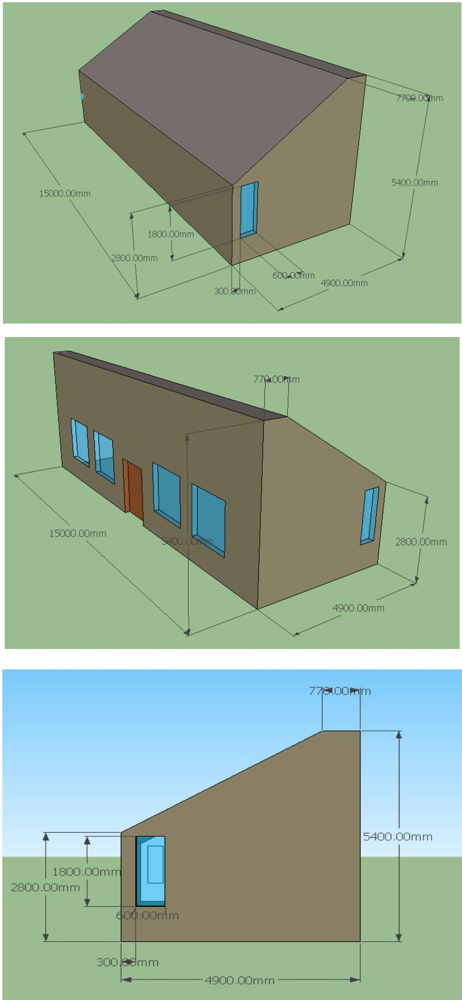  
图1 自建太阳能小屋3D图

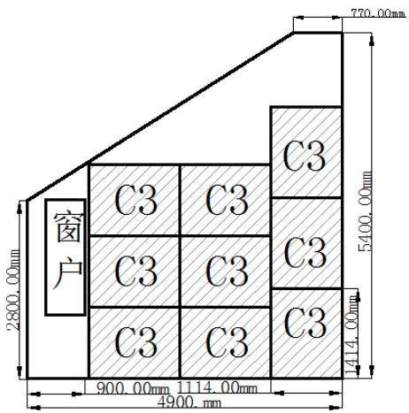

<details>
<summary>text_image</summary>

窗户
C3 C3
C3 C3
C3 C3
C3
900.00mm 1114.00mm
4900 mm
770.00mm
5400.00mm
1414.00mm
</details>

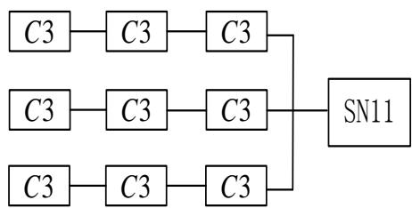

<details>
<summary>flowchart</summary>

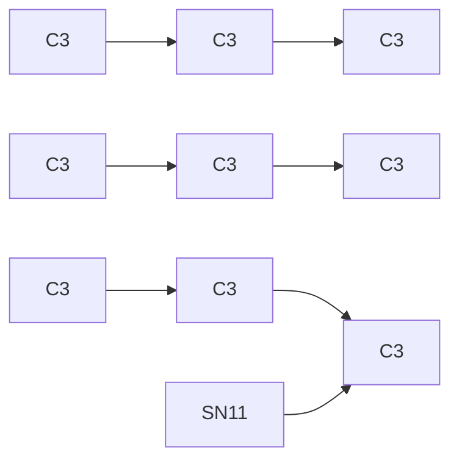
</details>

图 1自建房东面墙太阳板安装和光伏电池连接示意图

表1 自建房东墙逆变器型号和数目

<table><tr><td></td><td>型号</td><td>个数</td></tr><tr><td>电池板</td><td>C3</td><td>9</td></tr><tr><td>逆变器</td><td>SN11</td><td>1</td></tr></table>

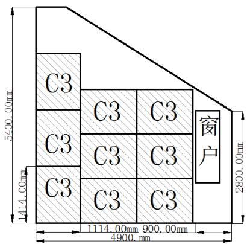

<details>
<summary>text_image</summary>

C3
C3
C3
C3
C3
窗
户
5400.00mm
414.00mm
2800.00mm
1114.00mm 900.00mm
4900. mm
</details>

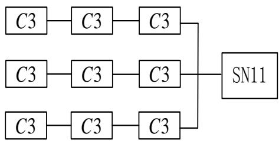

<details>
<summary>flowchart</summary>

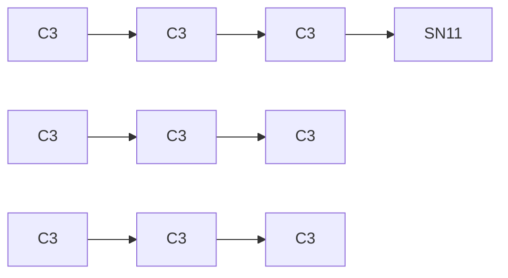
</details>

图 2自建房西面墙太阳板安装和光伏电池连接示意图

表2 自建房东墙逆变器型号和数目

<table><tr><td></td><td>型号</td><td>个数</td></tr><tr><td>电池板</td><td>C3</td><td>9</td></tr><tr><td>逆变器</td><td>SN11</td><td>1</td></tr></table>

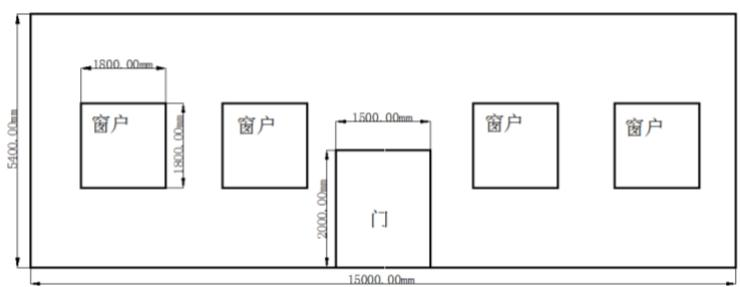

<details>
<summary>text_image</summary>

5400.00mm
1800.00mm
1800.00mm
窗户
窗户
门
1500.00mm
2000.00mm
窗户
窗户
15000.00mm
</details>

图 3自建房北面墙示意图

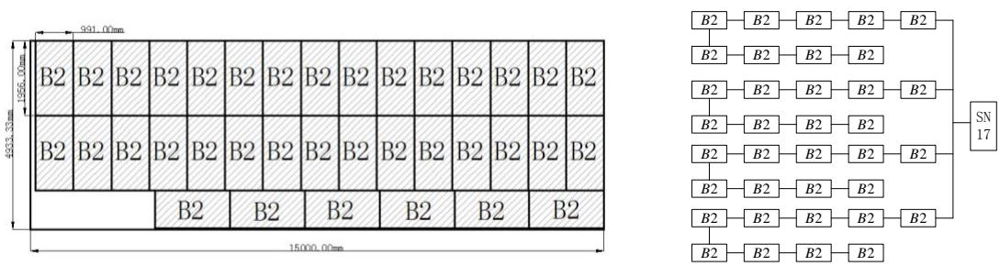  
图 4自建房斜顶太阳板安装和光伏电池连接示意图

表3 自建房斜顶逆变器型号和数目

<table><tr><td></td><td>型号</td><td>个数</td></tr><tr><td>电池板</td><td>B2</td><td>36</td></tr><tr><td>逆变器</td><td>SN17</td><td>1</td></tr></table>

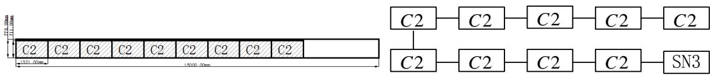  
图 5自建房平顶太阳板安装和光伏电池连接示意图

表3 自建房平顶逆变器型号和数目

<table><tr><td></td><td>型号</td><td>个数</td></tr><tr><td>电池板</td><td>C2</td><td>9</td></tr><tr><td>逆变器</td><td>SN3</td><td>1</td></tr></table>

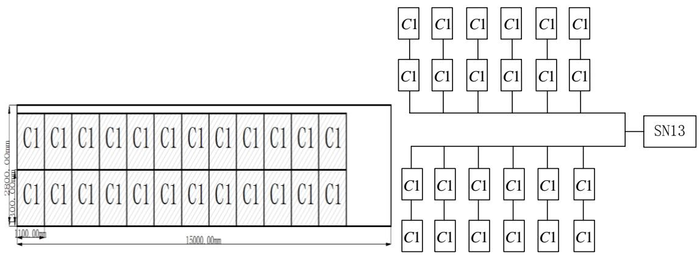  
图 6自建房南墙太阳板安装和光伏电池连接示意图

表4 自建房平顶逆变器型号和数目

<table><tr><td></td><td>型号</td><td>个数</td></tr><tr><td>电池板</td><td>C1</td><td>24</td></tr><tr><td>逆变器</td><td>SN13</td><td>1</td></tr></table>

## 附录三

3.1 计算逆变器匹配方案  
```matlab
clear;clc
a=xlsread('cumcm.xls','sheet1','B1:F24');%电池的信息
b=xlsread('cumcm.xls','sheet2','A1:M18');%逆变器的信息
P=b(:,3).*b(:,4);
pai=[];pai2=[];
for k=1:18%第k种逆变器
    for h=1:24%第h种电池
        for i=1:65
            if i*a(h,3)>b(k,5)&&i*a(h,3)<b(k,6)
                pai=[pai;k,h,i];

        end
    end
end
end
[m,n]=size(pai);
for i=1:m
    for j=1:600
        if j*a(pai(i,2),1)*pai(i,3)<=P(pai(i,1))&&j*a(pai(i,2),4)<=b(pai(i,1),4)
            pai2=[pai2;pai(i,:),j];
        %break
    end
end
end
```

3.2计算屋顶盈利  
```matlab
clear;clc
a=xlsread('cumcm.xls','sheet1','B1:H24');%电池的信息
b=xlsread('cumcm.xls','sheet2','A1:M18');%逆变器的信息
c=xlsread('cumcm.xls','sheet3','B1:G24');%发电量
d=xlsread('cumcm.xls','sheet3','A27:D37304');%排列信息
Q=[];
f=6;%方向，屋顶为2
N=100;%各面的面积
r=[];
for i=1:37278
    q=d(i,3)*d(i,4)*c(d(i,2),f)*b(d(i,1),10)*0.5*31.5-b(d(i,1),13)-d(i,3)*d(i,4)*a(d(i,2),6);
    q_=q/(d(i,3)*d(i,4)*a(d(i,2),7));
    Q=[Q;d(i,:),q,q_,(d(i,3)*d(i,4)*a(d(i,2),7))];
```

```matlab
if (d(i,3)*d(i,4)*a(d(i,2),7))>N
            r=[r;i];
        end
    end
    Q(r,:)=[];
```

3.3计算最佳角度  
```matlab
clear;clc
fushe=xlsread('cumcm.xls','sheet','E4:K8763');
dc=xlsread('cumcm.xls','sheet1','B1:J24');
sp_zs=fushe(:,1)-fushe(:,2);
n_zs=fushe(:,5)-0.5*fushe(:,2);
d_zs=fushe(:,4)-0.5*fushe(:,2);
x_zs=fushe(:,6)-0.5*fushe(:,2);
fdl=[];
for m=1:24
for i=1:91
    for j=1:91
        a=(i-1)*pi/180;b=(j-46)*pi/180;
        sa=sin(a);ca=cos(a);
        sb=sin(b);cb=cos(b);
        if sb<0
            fushe_ry=-d_zs*sa*sb+n_zs*sa*cb+sp_zs*ca+fushe(:,2)*(pi-a)/pi;
        else fushe_ry=x_zs*sa*sb+n_zs*sa*cb+sp_zs*ca+fushe(:,2)*(pi-a)/pi;
        end
        for k=1:8760
            if fushe_ry(k)<dc(m,9)
                fushe_ry(k)=0;
            end
            if fushe_ry(k)<200
                fushe_ry(k)=fushe_ry(k)*dc(m,8);
            end
        end
        S(i,j)=sum(fushe_ry*dc(m,1)/1000)/1000;

    end
end
s=max(max(S));
fdl=[fdl;s];
end
[x y]=find(S==max(max(S)))
```

3.4计算任意角度时的盈利  
```txt
clear;clc
```

```matlab
fushe=xlsread('cumcm.xls','sheet','E4:K8763');
dc=xlsread('cumcm.xls','sheet1','B1:K24');
nbq=xlsread('cumcm.xls','sheet2','A1:M18');%逆变器的信息
d=xlsread('cumcm.xls','sheet3','A27:D37304');%排列信息
sp_zs=fushe(:,1)-fushe(:,2);
n_zs=fushe(:,5)-0.5*fushe(:,2);
d_zs=fushe(:,4)-0.5*fushe(:,2);
x_zs=fushe(:,6)-0.5*fushe(:,2);
fdl=[];
N=26;%各面的面积
a=pi/2;%倾斜角
b=pi/2;%方位角
for m=1:24
    sa=sin(a);ca=cos(a);
    sb=sin(b);cb=cos(b);
    if sb<0
        fushe_ry=-d_zs*sa*sb+n_zs*sa*cb+sp_zs*ca+fushe(:,2)*(pi-a)/pi;
    else fushe_ry=x_zs*sa*sb+n_zs*sa*cb+sp_zs*ca+fushe(:,2)*(pi-a)/pi;
    end
    for k=1:8760
        if fushe_ry(k)<dc(m,9)
            fushe_ry(k)=0;
        end
        if fushe_ry(k)<200
            fushe_ry(k)=fushe_ry(k)*dc(m,8);
        end
        fushe_ry(k)=fushe_ry(k)*dc(m,10);
    end
S(m)=sum(fushe_ry*dc(m,1)/1000)/1000;
end
S=S';c=S;Q=[];r=[];
for i=1:37278
q=d(i,3)*d(i,4)*c(d(i,2))*nbq(d(i,1),10)*0.5*31.5-nbq(d(i,1),13)-d(i,3)*d(i,4)*dc(d(i,2),6);
    q_=q/(d(i,3)*d(i,4)*dc(d(i,2),7));
Q=[Q;d(i,:),q,d(i,3)*d(i,4)*c(d(i,2))*nbq(d(i,1),10)*0.5,q_,(d(i,3)*d(i,4)*dc(d(i,2),7)),c(d(i,2))];
    if (d(i,3)*d(i,4)*dc(d(i,2),7))>N
        r=[r;i];
    end
end
Q(r,:)=[];
```

## 3.5计算太阳不同倾斜角、方位角时的光强

clear all;clc

alpha00=1:90;

```matlab
alpha0=alpha00*pi/180;
n0=length(alpha0);
fai=40.1*pi/180;%纬度
gama=0*pi/180;%房屋方位角
Isc=1353;
AA=xlsread('工作表.xlsx');
n=length(AA(:,1));
I_bb=AA(:,4)-AA(:,5);
I_dd=AA(:,5);
I_b0=zeros(365,1);%每一天的直射能量
I_d0=zeros(365,1);%每一天的辐射能量
for i=1:365
for j=1:24
    I_b0(i)=I_b0(i)+I_bb((i-1)*24+j);
    I_d0(i)=I_d0(i)+I_dd((i-1)*24+j);
end
end
for ii=1:n0
    ii
%alpha=10*pi/180;%斜面偏角
alpha=alpha0(ii);
for i=1:365
    deta(i)=pi/180*23.45*sin((2*pi*(284+i))/365);%
    w0(i)=acos(-tan(fai)*tan(deta(i)));%水平面上日落时
I0(i)=24/pi*Isc*(1+0.033*cos(360*i/365))*(cos(fai)*cos(deta(i))*sin(w0(i))+2*pi*w0(i)/360*sin(fai)*sin(deta(i)));%
    %%大气外水平面太阳辐射强度
    w(i)=0;
    a(i)=sin(deta(i))*(sin(fai)*cos(alpha)-cos(fai)*sin(alpha)*cos(gama));
    b(i)=cos(deta(i))*(cos(fai)*cos(alpha)+sin(fai)*sin(alpha)*cos(gama));
    c(i)=cos(deta(i))*sin(alpha)*sin(gama);
    D(i)=sqrt(b(i)^2+c(i)^2);
    w_ss1(i)=acos(-a(i)/D(i))+asin(c(i)/D(i));
    w_sr1(i)=abs(-acos(-a(i)/D(i))+asin(c(i)/D(i)));
    w_ss(i)=min(w0(i),w_ss1(i));
    w_sr(i)=-min(w0(i),w_sr1(i));
R_b_1(i)=pi/180*(w_ss(i)-w_sr(i))*(sin(deta(i))*(sin(fai)*cos(alpha)-cos(fai)*sin(alpha)*cos(gama));
R_b_2(i)=cos(deta(i))*(sin(w_ss(i))-sin(w_sr(i))*(cos(fai)*cos(alpha)+sin(fai)*sin(alpha)*cos(gama));
    R_b_3(i)=(cos(w_ss(i))-cos(w_sr(i))*cos(deta(i))*sin(alpha)*sin(gama);
    R_b_4(i)=2*(cos(fai)*cos(deta(i))*sin(w0(i))+pi/180*sin(fai)*sin(deta(i)));
    R_b0(i)=(R_b_1(i)+R_b_2(i)+R_b_3(i));
```

```matlab
R_b(i)=R_b0(i)/R_b_4(i);
k=i;
%C_theta(k)=(sin(fai)*cos(alpha)-cos(fai)*sin(alpha)*cos(gama))*sin(deta(k))+(cos(fai)*cos(alpha)+sin(fai)*sin(alpha)*cos(gama))*cos(deta(k))*cos(w(k))+sin(alpha)*sin(gama)*cos(deta(k))*sin(w(k));
%C_theta0(k)=sin(fai)*sin(deta(k))+cos(fai)*cos(deta(k))*cos(w(k));
I_b(k)=I_b0(k)*R_b(k);
I_d(k)=I_d0(k)*(I_b0(k)*R_b(k)/I0(k)+0.5*(1-I_b0(k)/I0(k))*(1+cos(alpha)));
I(k)=I_b(k)+I_d(k);
end
w=w'*pi/180;%时角
deta=deta';%赤纬角
BB=[31,28,31,30,31,30,31,31,30,31,30,31];
CC=[0,31,59,90,120,151,181,212,243,273,304,334];
I_m=zeros(12,1);
for i=1:12
    for j=1:BB(i)
        I_m(i)=I_m(i)+I(CC(i)+j);
    end
end
II_m(:,ii)=I_m;
end
plot(alpha00,II_m,'linewidth',2);
II_m=II_m';
xlabel('倾斜角 alpha');
ylabel('月辐射量');
grid on
```