# 太阳能小屋的设计

## 摘要

设计太阳能小屋 研究光伏电池在小屋外表面的优化铺设问题 本文利用松弛解法的思想 先将实际问题数学化 再将数学问题实际化 得到最优的铺设方案 并取得了较好的经济收益。

针对第一个问题 利用贴附方式对小屋部分外表面进行光伏电池的铺设的工作 因为 电价是固定的 最大光伏发电总量也代表着最大收益 本文以最大收益额和最小单位发电量的费用为 目 标函数建立第一个模型 并利用松弛解法求得它们的上下界 斜面上辐射量可根据已有光学关系求得 再根据太阳光在不同墙面的年辐射量和不同 电池的转化效率计算出每块电池在不同面一年内单位面积转化出 的 电能 在铺设电池板的过程中 我们以利润最大为 目 标 针对每个面选择性价比最高的 电池组件 并根据调整串并联 选择性价比最高的逆变器 我们最终得到的结果为对屋顶南面 南立面 西立面三个面铺设光伏电池 小屋在 35 年内获得的光伏发电总能量为 542027 7KW 收益约 7 6万元 在第 25 年收回投资

针对第二个问题 我们采用逐步搜索的方法 先改变电池板的朝 向和倾角来获取更多的辐射量 我们先控制方位角不变 选择最优的倾角 再以最大发电量最大作为 目 标建立模型 得到相应的倾角 $\beta = 3 6 . 6 ^ { \circ }$ 和朝 向角 $\gamma = 7 . 6 ^ { \circ }$ 我们只对屋顶的光伏电池进行架空安装 并且将屋顶背阳面拓展成与 向 阳面衔接 使得总的有效辐射面增加 计算方式同第一个模型 能够比原来多安装 6 块 A3 电池 收益也相应增加 其他墙面的贴附方式不变 小屋在 35 年 内获得的光伏发电总能量为 692088 52KW 收益约为 12 8145 万元 在第 19 年收回投资

针对问题三 设计太阳小屋能够转化光能 使受益最大就需要尽可能大的接受面积和尽可能多的光照强度 通过对一二问 的分析得到 房屋顶的太阳辐射对整体的影响最大 所以重点是使得屋顶的面积足够大 以 问题二解得的倾角和朝向角可提高接收的光照强度 以理想收益最大的 目 标函数 通过问题一松弛解法估计各个面最划算的 电池板和附录中对房屋要求的限制作为条件 解得优化的小屋长 15m 宽 3 5m 高 2 8m 见图 1 1 然后按照现实的排列进行改进 计算总成本为 245840 元 35 年总发电量 7461 10kw总收益 127215 元 在第 23 年收回投资

关键词： 方位角 最佳倾角 松弛解法

## 一、 问题重述

在设计太阳能小屋时， 需在建筑物外表面 （屋顶及外墙） 铺设光伏电池， 光伏电池组件所产生的直流电需要经过逆变器转换成 220V 交流电才能供家庭使用 并将剩余电量输入电网 不同种类的光伏电池每峰瓦的价格差别很大 且每峰瓦的实际发电效率或发电量还受诸多因素的影响 如太阳辐射强度 光线入射角 环境 建筑物所处的地理纬度 地区的气候与气象条件 安装部位及方式 （贴附或架空） 等 因此 在太阳能小屋的设计中 研究光伏电池在小屋外表面的优化铺设是很重要的 问题

依据附件提供的相关信息 参考附件数据 对下列三个问题 分别给出小屋外表面光伏电池的铺设方案 使小屋的全年太阳能光伏发电总量尽可能大 而单位发电量的费用尽可能小 并计算出小屋光伏电池 35 年寿命期内 的发电总量 经济效益 （ 当前民用电价按 0 5 元/kWh 计算） 及投资的回收年限

在求解每个问题时 都要求配有图示 给出小屋各外表面电池组件铺设分组阵列图形及组件连接方式 （ 串 并联） 示意图 也要给出 电池组件分组阵列容量及选配逆变器规格列表

在同一表面采用两种或两种 以上类型的光伏电池组件时 同一型号的 电池板可串联 而不同型号的 电池板不可串联 在不同表面上 即使是相同型号的 电池也不能进行串 并联连接 应注意分组连接方式及逆变器的选配

请根据山西省大同市的气象数据 仅考虑贴附安装方式 选定光伏电池组件 对小屋的部分外表面进行铺设 并根据电池组件分组数量和容量 选配相应的逆变器的容量和数量

电池板的朝 向与倾角均会影响到光伏电池的工作效率， 请选择架空方式安装光伏电池 重新考虑问题 1 。

根据小屋建筑要求 请为大同市重新设计一个小屋 要求画出小屋的外形图 并对所设计小屋的外表面优化铺设光伏电池 给出铺设及分组连接方式 选配逆变器 计算相应结果

## 二、 问题分析

问题一仅考虑贴附安装方式 选定光伏电池组件 对小屋的部分外表进行铺设 使小屋全年的太阳能光伏发电总量尽可能大 而单位发电量的费用尽可能小 电量的单价是相同的 均为 0 5 元/千瓦时 总发电量最大 即收益最大 所以本文我们考虑的是最大收益和最小成本 目 标函数确定后 考虑铺设方式 可以根据逆变器考虑电池组件的排放 也可以先安排电池组件 再选择最好的逆变器 我们选用 的是先铺设电池组件然后考虑逆变器的选择 最大收益的求解 必须要知道每块电池在不同面的性价比 因而比价电池的性价比是至关重要的 确定电池后就能确定逆变器 最终的铺设方案就可以求出 。

问题二是在第一问 的基础上可以架空安装电池组件 太阳 的辐射量和时间与方位角有关 所以我们可以先固定方位角不变 选取最佳的倾角使得问题简单化 然后考虑综合分析两个因素 倾角和方向角对太阳辐射量的影响 可以 以辐射量最大为 目 标 也是发电量最大 逐步逼近最优解得方法 来求得最优时的倾角和方向角 然后再考虑 35年的利润和回报 与贴附安装时进行比较

问题三设计小屋要获得最大收益就要提高接收光照强度和扩大接收面积 一方面把第二问解得的偏角带入 另一方面先根据第一问各个面的最大收益电池组件排列在满足建筑要求的情况下界的理想最大收益， 估计出小屋的大体形状， 然后再根据实际情况排列 电池得到最优解。

## 三、 模型假设

1 假设每一年的光辐射强度基本不变  
2 假设在 35 年试用期内 ， 各电池组件和逆变器不会出现意外损坏的情况  
3 假设导线上的损失可相对忽略不计  
4 假设架空安装电池板不会造成成本的增加  
5 假设逆变器安装在室内 不 占用小屋的外表面面积

## 四 、 符号说明

： 地表的平均反射率  
$\beta$ ： 屋顶平面与水平面的倾角  
$\phi$ ： 当地的纬度  
$\delta$ ： 太阳赤纬角  
$\omega$ ： 时角  
$H _ { t }$ 表示在斜面倾角为 $\beta$ 时 第 个时刻的每平米太阳辐射量  
$H _ { h }$ ： 水平面总辐射强度  
$H _ { d }$ 水平面散射辐射强度  
$H _ { b }$ ： 法相直射辐射强度  
$H _ { \dot { u } }$ $\scriptstyle i = 1 , 2 , 3 , 4 .$ 分别表示东西南北面的每平米太阳总辐射量  
$S _ { i }$ ： 表示第 个电池组件的面积  
$p _ { i }$ ： 表示第 个电池组件的单价  
$A _ { j }$ 不同面的有效铺设总面积  
$D$ ： 小屋部分面铺设光伏电池组的总成本  
$m _ { i }$ ： 小屋部分面铺设光伏电池组在不同年限的单位年收益额  
$a _ { j }$ ： 一年内每个时刻第 j 个墙面所对应的辐射强度  
$b _ { _ { i j } }$ ： 表示第 块电池在第 j 个面一年所接收的辐射产生的 电能  
$S S _ { _ { j } }$ ： 表示第 j 个墙面对应的每平米年辐射量  
$\eta _ { i }$ ： 表示第 i 个型号电池的转化率  
$n _ { \ddot { y } }$ ： 表示第 j 个平面对应第 i 种型号的个数  
$d _ { i }$ 为 0 1 变量 当选用这个逆变器时 取值为 1 不取用时取值为 0  
$c _ { i } :$ ： 第 个逆变器的成本  
$w _ { i }$ ： 第 个逆变器对应的输入功率  
$d _ { j }$ ： 第 j 个墙面上对应的每平米的年辐射量  
$\mathrm { f } _ { _ { \it { i j } } }$ ： 表示第 j 个墙面上第 i 种电池年发电量

## 五、 模型建立与求解

## 5. 1 问 题一

## 5 . 1 . 1 模型准 备

先铺设电池组件 附件 2 中提到不同面的 电池组件不能串联也不能并联 所以只能将房屋的每个面分开讨论最佳的贴附方式 即分为南面屋顶 北面屋顶 东 西 南北面六个面 针对每个面考虑电池组件的铺设方法和铺设数量 因为不同 电池组件价格不同 有的价格昂贵 但对光能的转化率高 有的便宜 但转化率却低 为 了 防止在 35年内投资得不到回收 我们以铺设电池组件的年收益最大为 目 标函数建立优化模型 使得每个面的光伏发电总收益最大 在最快的时间 内 回收成本 如果 35 年投资仍然得不到回收 这个面就不铺设光伏电池 大同市一年的每个小时的光辐射强度已经给出 但是每块电池一年接收的能量不同 我们要先计算出每块电池一年的接收总量 将辐射强度转化为具体的能量值才能决定电池的性价比 选择最优的 电池种类 然后再根据已确定的 电池组件种类及其个数选择最优的逆变器 使得所需要的逆变器费用最少 从而达到一个面的全局优化 总发电量最大 费用最少 即收益最大

## 5 . 1 . 2 模型建 立

## (1)计算每块电池单位面积一年接收总光能量

参考附件 4 大同市典型年气象数据 发现房屋的东西南北四个面的总辐射强度已经给出 ， 而具有坡度 $\beta$ 的房顶的太阳辐射量却是未知的 $H _ { t }$ ， 可根据给出水平面总辐射强度 $H _ { h }$ 水平面散射辐射强度 $H _ { d }$ 法向直射辐射强度 $H _ { b }$ 查阅有关资料和参考附件 6的基础知识 找到地表斜面上辐射量 $H _ { t }$ 与 $H _ { h } , H _ { d } , H _ { b }$ 的 关系 [1]

根据倾角 的不同可以将房顶分为 向 阳和背阳两种情况 即 Hay 模型[2]进行求解：

朝向赤道倾斜角斜面上太阳辐射总量表达式：

$$
H _ {t} = H _ {b} \cdot R _ {b} + H _ {d} [ \frac {H _ {h} - H _ {d}}{H _ {0}} R _ {b} + \frac {1}{2} (1 + \cos \beta) (1 - \frac {H _ {h} - H _ {d}}{H _ {0}}) ] + \frac {\rho}{2} H _ {h} (1 - \cos \beta)
$$

并将其记为 $H _ { t } = f ( H _ { b } , H _ { d } , H _ { h } , w _ { s } , \delta )$

$H _ { 0 }$ 为大气层外层水平辐射量 其为 ：

$$
H _ {0} = \frac {2 4}{\pi} I s c [ 1 + 0. 0 3 3 \frac {3 6 0 n}{3 6 5} ] (\cos \phi \cdot \cos \delta \sin w _ {s} + \frac {\pi}{1 8 0} w _ {s} \cdot \sin \phi \sin \delta)
$$

co s ( ) co s sin  − + π Ws sin( ) sin− 法相系数： = 1 80 π cos cos sin + sin sin 1 80

太阳赤纬度： $\delta = 2 3 . 4 5 \sin [ \frac { 3 6 0 } { 3 6 5 } ( 2 8 4 + n ) ]$

水平面上的 日落时角 $\nu _ { \mathrm { { s } } } = \cos ^ { - 1 } [ - \tan \phi \cdot \tan \delta ]$

倾斜面上 日落时角 ： $\mathcal { W } _ { s s } = \operatorname* { m i n } \{ \mathcal { W } _ { s } , \cos ^ { - 1 } [ - \tan ( \phi - \beta ) \cdot \tan \delta ] \}$

这里的 $\beta $ 房屋倾斜板的夹角 示意图如下：背 向 赤 道 倾 斜 面 上 的 太 阳 辐 射 总 量 表 达 式 与 朝 向 太 阳 的 关 系 一 致 ，${ \cal H } _ { t } = { \cal f } _ { 2 } ( { \cal H } _ { b } , { \cal H } _ { d } , { \cal H } _ { h } , w _ { s } , \delta )$ ， 其中只有法相系数因为方向 的变化而不同，

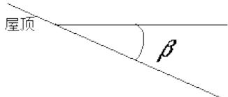

text_image

屋顶
β

图 1 β 角 的示意图

$$
R _ {b} = [ \frac {\pi}{1 8 0} (w _ {s s} - w _ {s t}) \sin \delta (\sin \phi \cos \beta - \cos \phi \sin \beta \cos \gamma) + \cos \delta (\sin w _ {s s} - \sin w _ {s t}) \times
$$

$$
(\cos \phi \cos \beta + \sin \phi \sin \beta \cos \gamma) + (\cos w _ {s s} - \cos w _ {s t}) \cos \delta \sin \beta \sin \gamma ] \times
$$

$$
[ 2 (\cos \phi \cos \delta \sin w _ {s} + \frac {\pi}{1 8 0} w _ {s} \sin \delta \sin \phi) ] ^ {- 1}
$$

根据进一步的推理得到 斜面上的 日 出时角 ： $w _ { s t } = - \operatorname* { m i n } \left\{ \frac { \ d \ w _ { \ell } } { \ d z } \right. - \frac { \ d } { \ d z } \left( \frac { - a } { \ d z } \right) + \arcsin ( \frac { \ d c } { \ d z } )$

w斜面上的 日 落时角 ： min= arccos( -a ) arcco s (+B B

s in (s in co s co s s in co s )     ⎧ = − co s (co s co s sin sin co s )     = + 其中 cos sin sin= 2 2⎪⎩ = +

对于南面的屋顶的 $\beta$ 角 的大小为 ： $\tan \beta = { \frac { 3 } { 1 6 } }$ ，代 $\lambda \beta$ 的值 利用 matlab 编程计算屋顶表面的光辐射强度 （具体程序见附录一 ） 得到一年 365 天南面屋顶 依据此理也可以得到北面屋顶的接收辐射强度

将辐射强度转化为直流电能 计算一块电池单位面积里一年接收的光能总量 设 $a _ { j }$ 为第 j 个墙面每个时刻的光辐射强度 它是关于 t 的一个函数 $a _ { \scriptscriptstyle j } ( t )$ 对时间积分

$$
d _ {j} = \int_ {M _ {1}} ^ {M _ {2}} a _ {\mathrm{j}} (t) d t \quad M _ {1}, M _ {2} \text {为上下界}
$$

但是不 同 的 电池组件对光的敏感程度不 同 单 晶硅和多 晶硅 电池不能接收小于$8 0 \mathrm { W } / \mathrm { m } ^ { 2 }$ 的辐射强度 而光辐射强度弱于 $3 0 \mathrm { W } / \mathrm { m } ^ { 2 }$ 时 所有的 电池组件都不能够吸收转化光能。

1d⎧ = M 0 . 9 5 ( ) 2 0 0 ( ) 8 0     ⋅ > ≥ Md 对 A 类电池 2 = M ( ) 2 0 0 ( )   ≤ 1 2   ⎪ = +（ d ） i = 1 , 2 . . . 6

对 B 类电池 $b _ { i j } = \eta _ { i } \int _ { M _ { a } } ^ { M _ { b } } a ( t ) d t \qquad a ( t ) \geq 8 0 \qquad i = 7 , 8 . 1 3$

1d⎧ = 1 . 0 1 ( ) 2 0 0 ( ) 3 0     ⋅ > ≥ M 对 C 类电池 2 = M Md ( ) 2 0 0 ( )   ≤ 1 2  = +（ d ） i = 1 4 , 1 5 . . 2 4

因此， 在计算不同的 电池一年的光能接收总量时要考虑是否符合光能接收的范围 。

利用 matlab[5]编程求解 （程序附录二） 得到 24 种电池一年里对光辐射强度的单位面积的产生直流电量 具体结果见附录三 通过表格可以发现 型号 A3 具有较好的光电转化率同时有较高的性价比 所以在铺设电池板的时候需要优先考虑

## (2) 电池组件的铺设

考虑每个面的 电池板组件摆放 先选择最好的 电池种类， 然后考虑摆放的方式

建立模型如下：

每一块电池板的年发电量为 ： $f _ { i j } = d _ { j } s _ { i } \eta _ { i } , i = 1 , 2 , 3 . . . 2 4$

目 标函数为最大发电量和最小成本：

$$
\max \quad z = \sum_ {i = 1} ^ {2 4} f _ {i j} x _ {i} - p _ {i} x _ {i}
$$

$$
s. t. \left\{ \begin{array}{l} \text {电池组件刚性摆放，不能折叠裁剪} \\ \text {窗户和门的位置不能铺设电池组件} \\ \text {铺设的电池组件总面积小于每个面的有效铺设面积} \\ \text {铺设的组合累计长和宽不能超过房屋的长和宽} \\ \text {铺设的效益最好，不会因为电池成本高而不能回收投资} \\ \text {每种电池组件的数量为整数} \end{array} \right.
$$

这是一个符合实际情况的模型 但是我们无法上述约束条件转化成数学条件进行编程实现 因为 电池组件是刚性的 无法折叠或者剪切 所以本文采用置换松弛解法的思想 先将实际问题数学化 不考虑电池组件的刚性特征 得到最佳的铺设方案即铺设电池的种类和个数 求得最大收益的值作为我们的最优值的上界 并确定电池的种类 然后用这种电池对面进行实际铺设 铺设的数量越接近这个上界 说明我们的优化程度越高 。

目 标函数与实际模型相同 以直流发电量最大为 目 标函数 约束条件简化如下

1 ） 设定电池的总面积小于被铺面的有效铺设面积  
2） 每种电池组件的数量为整数

建立模型如下：

$$
z = \max \sum_ {i = 1} ^ {2 4} f _ {i j} x _ {i}
$$

. .

$$
\sum_ {i = 1} ^ {2 4} S _ {i} x _ {i} \leq A _ {j}
$$

$$
x _ {i} \in Z ^ {+}
$$

利用 li 软件进行求解 （程序见附录四 ） 得到每个面的数学最优解 即理论的最优电池和 电池的数量 再将数学结果应用到实际问题中 列举法铺设电池组件 得到的' 为我们铺设的最大收益 以单位发电量费用最小作为 目 标 以一定的常数限制发电量建立下列模型

$$
z = \min (\sum_ {i = 1} ^ {2 4} c _ {i} x _ {i} / z ^ {\prime})
$$

. .

$$
z ^ {\prime} = \sum_ {i = 1} ^ {2 4} f _ {i j} x _ {i} \geq z
$$

$$
\sum_ {i = 1} ^ {2 4} S _ {i} x _ {i} \leq A _ {j}
$$

$$
x _ {i} \in N \quad \forall i
$$

综合最大的发电量和单位发电量的费用最小可以得到 把收益最大作为 目 标函数引进年限 N 电价以及电池板与逆变器的转换率 κ 出去电池板的成本 便可以得到粗略的利润最大， 来作为后来进一步优化的依据。 并且， 通过最大利润的引导， 通过 lingo软件编程求解得到影响收益的主要因素 即选择的 电池板。

$$
z = \max \sum_ {i = 1} ^ {2 4} (0. 5 \times N \cdot f _ {i j} x _ {i} \kappa - p _ {i} x _ {i})
$$

. .

$$
\sum_ {i = 1} ^ {2 4} S _ {i} x _ {i} \leq A _ {j}
$$

$$
x _ {i} \in Z ^ {+}
$$

这样可以得到实际的最优的铺设方案 然后考虑逆变器的选择以及串并联方式的选择 使得所有电池组件转换光能得到的直流电转化成可用 的交流电

## (3) 逆变器的选择及串并联方式的确定

通过最大利润的引导 来选择电池板的类型 通过不断调节串并联以及符合逆变器的工作条件 我们以逆变器的最小投资作为 目 标函数

根据铺设电池组件的种类和逆变器的所能输入的最大电压数 计算电池组件串联的最大个数 然后优先分配此种串联方式 然后将每串组件并联起来 依据逆变器的最大容量再确定并联的最大串数 不同的 电池组件并联时先控制串联的个数让并联电压不超过 10% 从而确定电池组件的串并联方式和逆变器的控制范围

1 ) ${ \it W } \leq \sum x _ { i } w _ { i } , i = 1 , 2 , 3 . . . 1 8$ 选用 的逆变器的功率符合电池组件总功率的要求  
2) $\sum u \le \sum \mathrm { x } _ { \mathit { i } } u _ { \mathit { i } } , i = 1 , 2 . . 1 8$ 选用 的逆变器的 电压符合电池组件串联电压的要求  
3 ) $\mid \sum u _ { \scriptscriptstyle { t 1 } } - \sum u _ { \scriptscriptstyle { t 2 } } \mid < 0 . 1 \cdot \sum u _ { \scriptscriptstyle { t 1 } }$ 并联两电压的相差不超过其的 0 1

得到下列模型：

$$
z = \min \sum_ {i} c _ {i} \cdot x _ {i}
$$

$$
s. t \left\{ \begin{array}{l} \sum w _ {j} \leq \sum \mathrm{x} _ {i} W _ {i} \quad i = 1, 2.. 1 8 \\ \sum u \leq \sum \mathrm{x} _ {i} u _ {i} \\ | \sum u _ {t 1} - \sum u _ {t 2} | <   0. 1 \cdot \sum u _ {t 1} \\ x _ {i} \in N \end{array} \right.
$$

## 5 . 1 . 3 模型 求解

最大利润模型的求解， 通过编写 lingo 程序实现其最优解， 并且确定几种电池的性价比较高 （ 除去逆变器的 ）。

表 1 最大利润下的各面电池板的排列

<table><tr><td>墙立面</td><td>35年的利润(元)</td><td>电池板</td></tr><tr><td>东</td><td>5847</td><td>17*C1, 2*C7</td></tr><tr><td>南</td><td>13252</td><td>13*C1, 6*C7</td></tr><tr><td>西</td><td>14196</td><td>18*C1, 1*C2, 1*C10</td></tr><tr><td>北</td><td>0</td><td>无</td></tr><tr><td>南面屋顶</td><td>150058</td><td>45*A3, 1*B3</td></tr><tr><td>背面屋顶</td><td>0</td><td>无</td></tr></table>

电池板的排列和逆变器的选择

以南面屋顶的铺设方案的求解为例

利用 lingo 编程 （见附录三） 求理论上的最优方案 用 45 块 A3 电池对其铺设可得到最大收益 将理论结果应用到实际中 我们采用 A3 电池对南面屋顶进行实际铺设经过多次铺设 我们得到最大的铺设数量为 43 块 接近理论的 43 块 电池的铺设具体位置如图 2 所示：

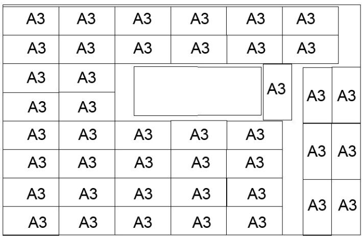

text_image

A3	A3	A3	A3	A3
A3	A3	A3	A3	A3
A3	A3
A3	A3
A3	A3	A3	A3
A3	A3	A3	A3
A3	A3	A3	A3
A3	A3	A3	A3
A3	A3	A3	A3
A3	A3	A3	A3

图 2 南面屋顶的 电池组件摆放情况

确定好电池铺设的位置后 考虑电池的连接方式 选用合适额逆变器 逆变器的选择 腰考虑两个条件 及直流输入电压的范围和最大容量

南面屋顶的 电池总功率 $\mathit { W } { = } 2 0 0 { \times } 4 3 { = } 8 6 0 0 \mathrm { W }$ 可以选择一个逆变器或者两个逆变器使其总容量满足 8600W 的需求即可 考虑到逆变器 SN1-10 的 电压输入范围很小而 A3 电池属于额定电压较大的 电池 因此我们仅从逆变器 SN11-18 中考虑

综合多次比较优化 使用一个逆变器 最实惠且满足容量要求的 我们可以选择逆变器 SN16 价格为 35000 元 容量为 10648W 性价比最高 使用两个逆变器 我们可以选择逆变器 SN13 和 SN14 价格为 25600 元 总 的容量为 8910W

我们将 43 个电池分为 2 组 一组为 5 个 A3 电池串联再并联 总功率为 5000W配用逆变器 SN14， 第二组为 3 串 6 个 A3 电池串联再并联的组合， 总功率为 3200W，配用逆变器 SN13

电池组件分组示意图如下：

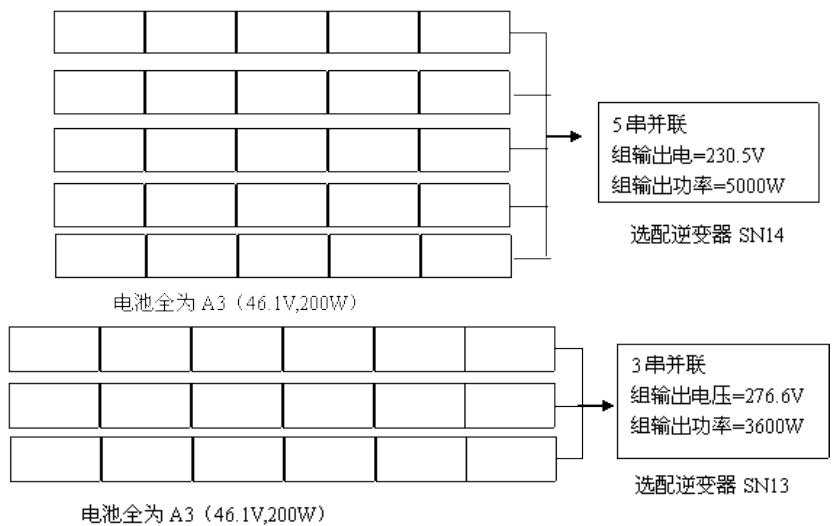

flowchart

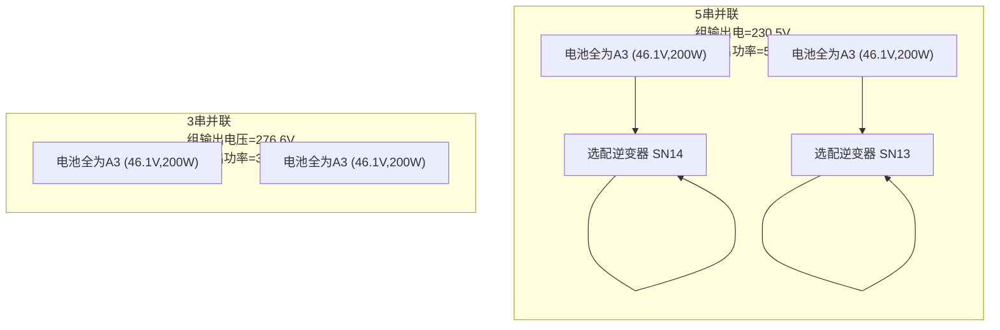

图 3 南面屋顶电池组件的连接示意图

计算 35 年的发电总量 我们分段考虑每年的发电总量：

表 2 分段的发电量

<table><tr><td>年限</td><td>发电量(KW)</td></tr><tr><td>1-10( $W_{1}$ )</td><td>14149.82</td></tr><tr><td>11-25( $W_{2}$ )</td><td>12735.12</td></tr><tr><td>26-35( $W_{3}$ )</td><td>11320.42</td></tr></table>

所以 35 年的总发电量 $\begin{array} { r } { \boldsymbol { { W } } = 1 0 \boldsymbol { { W } } _ { 1 } + 1 5 \boldsymbol { { W } } _ { 2 } + 1 0 \boldsymbol { { W } } _ { 3 } } \end{array}$ ， 计算结果 为 474 1 80KW 。

根据发电量 计算收益情况 电量价格为 0 5 元/kWh 具体收益见表 3：

表 3 南面屋顶的各项收益

<table><tr><td>年限</td><td>每一年的总收入(元)</td><td>年限内的总收入(元)</td></tr><tr><td>1-10</td><td>7074.91</td><td>70749.1</td></tr><tr><td>11-25</td><td>6367.56</td><td>95513.4</td></tr><tr><td>26-35</td><td>5660.21</td><td>56602.1</td></tr></table>

35 年 由发 电得到 的总收入为 222864 6 元。

再计算铺设电池花费的成本：

成本=43 块 A3 电池的成本+逆变器的价格

$$
Z = 4 3 \times 2 9 8 0 + 1 0 3 0 0 + 1 5 3 0 0 = 1 5 3 7 4 0 \text {元。}
$$

则 由南面屋顶带来的收益为总收益减去铺设电池组件的成本 得到纯利润为 69124 6元 即在南面屋顶铺设光伏电池会获得收益 因此确定在南面铺设电池的方案

再计算其他面铺设电池组件的情况 由于版面页数限制 本文不再给出具体的求解过程 计算出 的结果显示如表 4：

表 4 所有面的 电池铺设情况

<table><tr><td>房屋各面</td><td>铺设电池数量及其种类</td><td>逆变器</td><td>电池组件间的串并联方式以及逆变器的控制范围</td><td>总成本(元)</td><td>35年发电总量(W)</td><td>35年总收益(元)</td></tr><tr><td>南面屋顶</td><td>43×A3</td><td>SN13SN14</td><td>5×5A3+SN143×6A3+SN13</td><td>153740</td><td>445729000</td><td>222864.6</td></tr><tr><td>南立面</td><td>6×A34×C211×C611×C10</td><td>SN12</td><td>6A3+4C2+11C6+11C10+SN12</td><td>26738</td><td>55064000</td><td>27532</td></tr><tr><td>西立面</td><td>14×C148×C7</td><td>SN12</td><td>14C1+48C7+SN12</td><td>14542</td><td>41234520</td><td>20617.26</td></tr><tr><td>东立面</td><td>13×C133×C7</td><td>SN12</td><td>13C1+33C7+SN12</td><td>13524</td><td>23694000</td><td>11847</td></tr><tr><td>北面屋顶</td><td rowspan="2" colspan="6">不铺设电池组件,接受的光线少,35年内连电池组件的成本都无法回收</td></tr><tr><td>北立面</td></tr></table>

南立面 东立面和西立面的具体电池组件铺设方式和位置如图 4 图 5 图 6 所示：

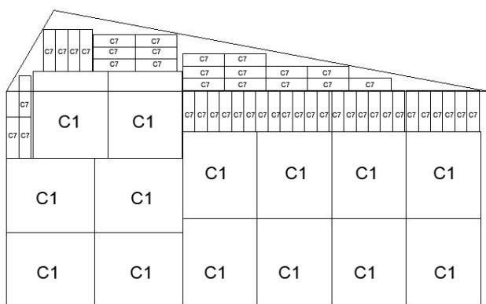

text_image

C7 C7 C7 C7 C7 C7
C7 C7
C7 C7
C7 C7
C7 C7
C7 C7
C7 C7
C7 C7
C7 C7
C7 C7
C7 C7
C7 C7
C7 C7
C7 C7
C7 C7
C7 C7
C7 C7
C7 C7
C7 C7
C7 C7
C7 C7
c1 C1
C1
C1
C1
C1
C1
C1
C1
C1
C1
C1
C1
C1
C1
C1
C1
C1
C1
C1
C1
C1
C1
C1
C1
C1
C1
C1
C1
C1
C1
C1
C1
C1
C1
C7

图 4 西立面电池组件摆放情况

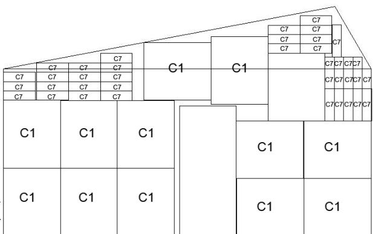

text_image

C7
C7
C7
C7
C7
C7
C7
C7
C7
C7
C7
C7
C7
C7
C7
C7
C7
C7
C7
C7
C7
C7
C7
C7
C7
C7
C7
C7
C7
C7
C7
C7
C7
C7
c1
c1
c1
c1
c1
c1
c1

图 5 东立面电池组件摆放情况

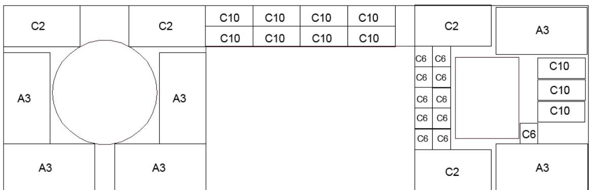

text_image

C2
C2
C10
C10
C10
C10
C10
C2
A3
A3
A3
C6
C6
C6
C6
C6
C6
C6
C6
C10
C10
C10
C6
C6
C2
A3

图 6 南立面电池组件摆放情况

由表 4 可以看出 东立面铺设电池和逆变器后 投资在 35 年内无法得到回收 所以我们决定在东立面不铺设任何电池组件

由于东立面不铺设电池 下面仅给出南立面和西立面的 电池组件连接方式示意图 ：

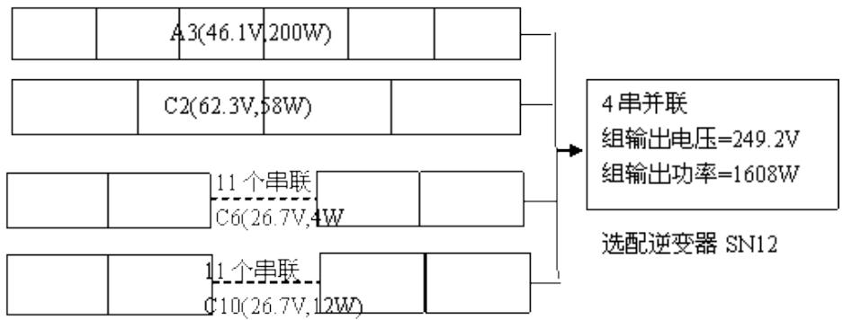

flowchart

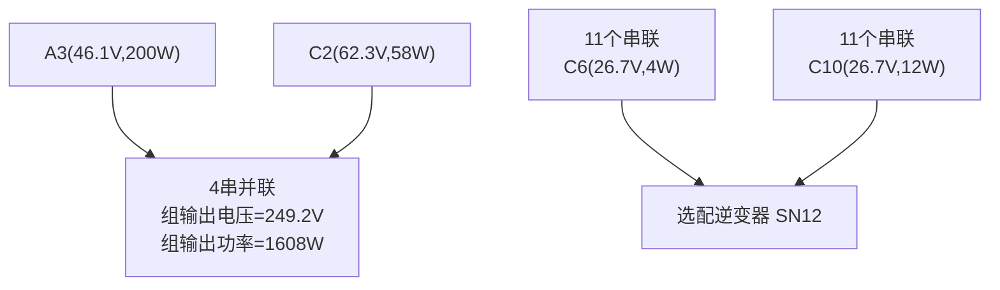

图 7 南立面电池组件连接示意图

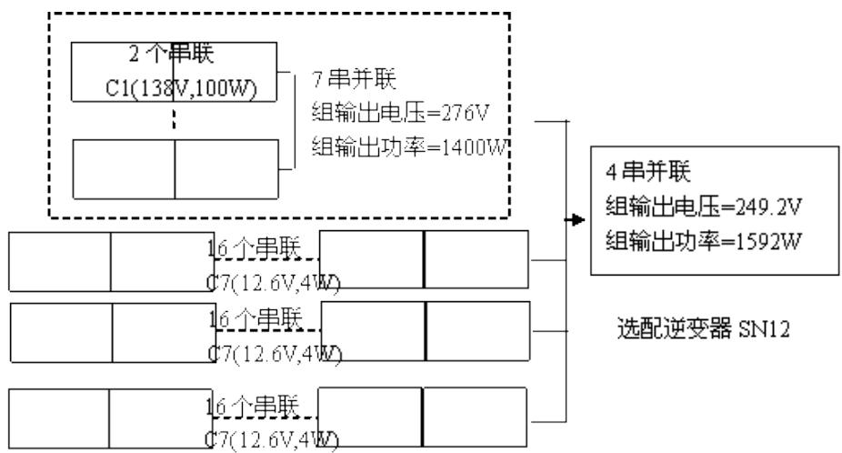

flowchart

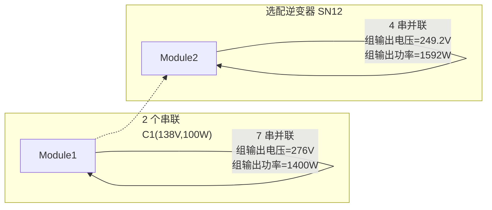

图 8 西立面电池组件连接示意图

因此全屋的 电池组件铺设情况是铺设南面屋顶 南立面和东立面

依据题 目 要求给出小屋外表面光伏电池的铺设方案并计算出小屋光伏电池 35 年寿命期内 的发电总量 经济效益及投资的回收年限 小屋外表的光伏电池铺设方案见图 2图 4 图 6。 下面计算 35 年的总发电量和经济效益。

各铺设面的总发电量在表 3 已经给出 ， 只需将屋顶南面， 南立面， 西立面的 35 年总发电量加起来就是小屋的 35 年总发电量 总发电量为 474180KW

根据电价 计算经济效益 每个面的经济效益计算结果如表 5 所示

表 5 铺设面的 35 年效益一览表

<table><tr><td>年限\房屋铺设面</td><td>屋顶南面(单位年收益/元)</td><td>南立面(单位年收益/元)</td><td>西立面(单位年收益/元)</td><td>年限内的总收益(元)/总成本</td></tr><tr><td>1-10年( $m_1$ )</td><td>7074.91</td><td>874.03</td><td>654.52</td><td>86034.6</td></tr><tr><td>11-25年( $m_2$ )</td><td>6367.56</td><td>786.63</td><td>589.06</td><td>116148.75</td></tr><tr><td>26-35年( $m_3$ )</td><td>5660.21</td><td>699.23</td><td>523.61</td><td>68830.5</td></tr><tr><td>1-35年总收益</td><td>222864.6</td><td>27532</td><td>20617.26</td><td>271013.85</td></tr><tr><td>总成本(电池+逆变器)</td><td>153740</td><td>26738</td><td>14542</td><td>195020</td></tr></table>

3 5 年 的 总 收入 为 27 1 0 1 3 85 元 成本 为 1 95020 元 所 以 3 5 年净赚 的 利 润 为 75993 8 元

投资的回收年限计算：

在前 10 年内 发电量每年保持不变 10 年共获得的利润为 3 个面 10 年的总收益为 86034 6 元 低于成本D的价格 （ 195020 元） 所以在前十年内投资还不能够回收再考虑第二段年限 1 1-25 年 电池的发电效率降低为原来的 90% 15 年内获得利润为1 16148.75 元， 加上前十年的利润， 投资可以 回收。

计算第几年投资得到回收， 第二段年限内每年 3 个面的总收益为 7743 25 元，

$$
D = 1 0 m _ {1} + n m _ {2}
$$

解得 n 的值为 14 0749 所以在第 25 年 内可以 回收投资

表 6 理想收益和实际最优比较表

<table><tr><td>墙立面</td><td>东</td><td>南</td><td>西</td><td>南面屋顶</td></tr><tr><td>理想最大收益</td><td>5847</td><td>13252</td><td>14196</td><td>150058</td></tr><tr><td>实际最大收益</td><td>5223</td><td>7694</td><td>12975.26</td><td>94724.6</td></tr><tr><td>相对误差</td><td>0.107</td><td>0.419</td><td>0.086</td><td>0.369</td></tr></table>

由结果分析得 光电池刚性和墙的限制 影响着最大收益的实现

## 5. 2 问 题二

## 5 . 2 . 1 模型准 备

由于太阳辐射强度与太阳 的高度角和时间有关 我们可以通过调节电池板的倾角和朝 向来使得电池板的 电池板年接受的太阳辐射总和最多 便于得到最大的发电量 我们首先根据房屋面向正南方向 以产生的直流电量最大为 目 标 对四个侧面以及侧面进行优化 第二步 根据求解得到的最优倾角 再对朝向角 即方位角进行优化 综合上述步骤 再对倾角和房屋的方位角进行优化

## 5. 2. 2 模型 的建立

第一个模型， 根据方位角 γ 不变的条件下， 分别对不同的墙面根据不同的倾角来选择最优的发电量

$$
\begin{array}{l} z = \max \sum_ {i} \mathrm{SS} _ {\mathrm{j}} \eta_ {i} s _ {i} n _ {i} \\ s. t \left\{ \begin{array}{l} a _ {j} (t) = f _ {j} \left(H b, H d, H h, \beta , w, \delta\right) \\ S S _ {j} = \int_ {M _ {1}} ^ {M _ {2}} a _ {j} (t) d t \quad M _ {1}, M _ {2} \text {表示t的上下界} \\ 0 \leq \beta \leq \frac {\pi}{2} \\ s _ {i} n _ {i} \leq A _ {j} \\ n _ {i} \in \mathrm{N}, i = 1, 2.. 2 4 \end{array} \right. \\ \end{array}
$$

第二个模型 因为较优的倾角 已经在模型一中能够得到 可以预测在朝 向角 的影响下倾角会有变化 但是在朝向角偏移较小的情况下不会有显著变化 同样以各电池板在平面上产生的直流电量最大作为 目 标 以墙面的形状和每平米的辐射量作为条件 建立模型。

$$
\begin{array}{l} z = \max \sum_ {i} \mathrm{SS} _ {\mathrm{j}} \eta_ {i} s _ {i} n _ {i} \\ s. t \left\{ \begin{array}{l} a _ {j} (t) = f _ {j} \left(H b, H d, H h, \beta , w, \delta , \gamma\right) \\ S S _ {j} = \int_ {M _ {1}} ^ {M _ {2}} a _ {j} (t) d t \quad M _ {1}, M _ {2} \text {表示t的上下界} \\ 0 \leq \beta \leq \frac {\pi}{2} \\ - \frac {\pi}{3} \leq \gamma \leq \frac {\pi}{3} \\ s _ {i} n _ {i} \leq A _ {j} \\ n _ {i} \in \mathrm{N}, i = 1, 2.. 2 4 \end{array} \right. \\ \end{array}
$$

## 5 2 3 模型求解

对于模型一 利用 H 模型 通过编写 tl b 程序 （程序见附录五） 采用近似逼近的方法 分别对六个面进行同样的运行 确定不同的倾角 $\beta$ 对转化成直流电量的影响只有对房顶的 向 阳和背离赤道的面进行优化 得到最大值时对应的 $\beta { = } 3 7 . 3 ^ { \circ }$ 得到的结果符合实际操作 一般房屋的侧面不会进行倾斜来实现光能发电 只有在房顶有较大的发展和架空 将向 阳房顶倾角上调 26 7o 背阳房顶架空按逆时针上调 90 3o

对于模型二 同样利用 Ha 模型 （程序见附录六） 分别对 $\beta , ~ \gamma$ 进行逼近 同样也只对房屋顶面进行调整 求得 $\beta { = } 3 6 . 6 ^ { \circ } , ~ \gamma { = } 7 . 6 ^ { \circ }$ 即 电池板平面倾角上调至 $\beta { = } 3 6 . 6 ^ { \circ }$ 同时房屋的朝 向角南偏西 7 6o 房顶每平米的年太阳辐射量为 $1 . 7 2 \times 1 0 ^ { 6 } \mathcal { W } \cdot h$ 采用 A3型号的光电池对其房顶进行排列 架空的 电池平面使得房顶接受太阳辐射总量显著增加 下列是南面屋顶电池架空方式排列情况如图 9 电池间的连接方式 如图 10 而南立面和西立面不采用架空方式铺设光伏电池 因此铺设方案同模型 5 1 中 的方案 此处不再给出 图示 （西立面电池铺设方案和 电池连接方式示意图分别见图 4 图 8 南立面见图 6 和 图 7 ）

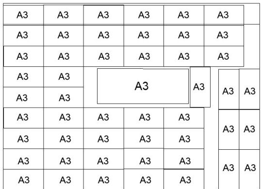

text_image

A3	A3	A3	A3	A3
A3	A3	A3	A3	A3
A3	A3	A3	A3	A3
A3	A3	A3	A3	A3
A3	A3	A3	A3	A3
A3	A3	A3	A3	A3
A3	A3	A3	A3	A3
A3	A3	A3	A3	A3
A3	A3	A3	A3	A3

图 9 南面屋顶架空电池摆放图

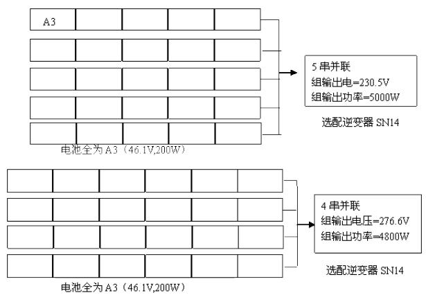

flowchart

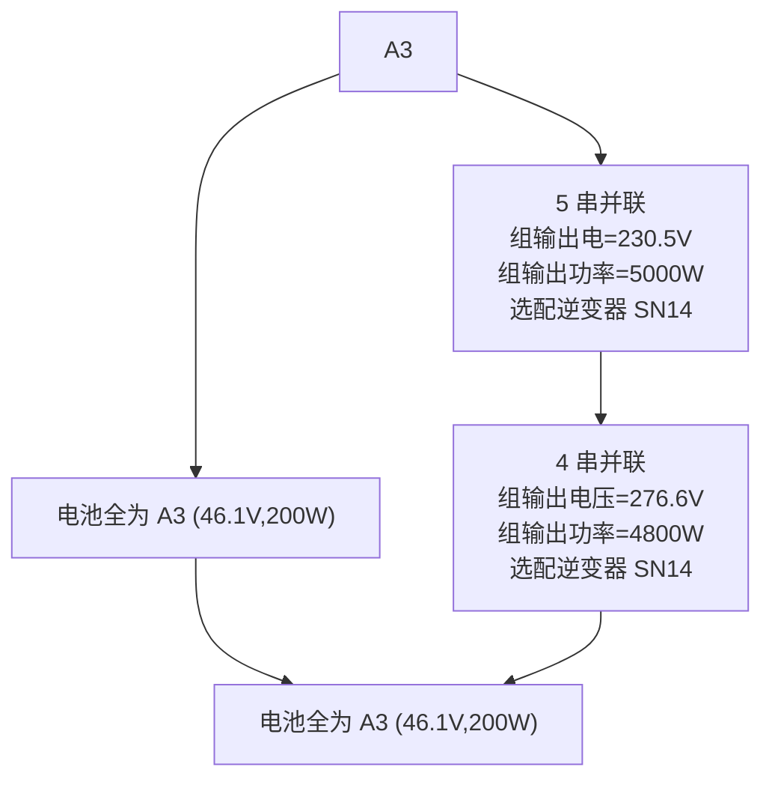

图 10 电池组件的串并联连接方式示意图

计算小屋在 35 年的总发电量和经济效益 总结各面的收益情况见表 7

表 7 架空安装方式下小屋 35 年收益情况一览表

<table><tr><td>年限\房屋铺设面</td><td>屋顶南面(单位年收益/元)</td><td>南立面(单位年收益/元)</td><td>西立面(单位年收益/元)</td><td>年限内的总收益(元)/总成本</td></tr><tr><td>1-10年( $m_1$ )</td><td>9457</td><td>874.03</td><td>654.52</td><td>109855.5</td></tr><tr><td>11-25年( $m_2$ )</td><td>8511.3</td><td>786.63</td><td>589.06</td><td>148304.85</td></tr><tr><td>26-35年( $m_3$ )</td><td>7565.6</td><td>699.23</td><td>523.61</td><td>87884.4</td></tr><tr><td>1-35年总收益</td><td>297895</td><td>27532</td><td>20617.26</td><td>346044.26</td></tr><tr><td>成本</td><td>176620</td><td>26738</td><td>14542</td><td>217900</td></tr></table>

35 年的总收入为 346044 26 元 电池板的成本为 21 79 万元 所以 35 年净赚的利润为1 2 . 8 1 45 万元 。

在前十年内依然不能够回收投资 同 5 1 中 的模型 在第二个年限段内获得投资$D = 1 0 m _ { 1 } + n m _ { 2 }$

求得 n 的值为 10 9279， 即在第 21 年能够收回投资 。

## 5. 3 问 题三

## 5 3 1 模型准备

由第二问知当屋顶与水平面夹角为 $3 6 . 6 ^ { \circ }$ 房屋整体南偏西 $7 . 6 ^ { \circ }$ 时所获得的辐射量最大 所以我们以此偏角为 已知条件归入小屋的优化设计中 假设此时各个面收益最大的 电池板不变 并且在考虑小屋的长宽高时 满足附件 6 中 的要求 至于窗户和 门 的设置 题 目 没有强制要求将门窗设置在某个面上 因此 我们将门窗放在北面或者东面不设置在电池铺设的三个面上

## 5 3 2 模型建立

目 标函数：

$$
z = \max \sum_ {i, j} \mathrm{b} _ {i j} s _ {i} x _ {i j} \quad i = 1.. 2 4, j = 1.. 6
$$

约束条件：

$$
\text {s.t.} \left\{ \begin{array}{l} \text {屋顶最高点距地面高度} \leq 5. 4 \mathrm{m}: h + y \tan \beta \leq 5. 4 \\ \text {室内最低净空高度} \geq 2. 8 \mathrm{m}: h > 2. 8 \\ \text {建筑总投影面积} \leq 7 4 \mathrm{m} ^ {2}: x \cdot y <   7 4 \\ \text {建筑平面长边} \leq 1 5 m: 3 <   x \leq 1 5 \\ \text {建筑平面短边} \geq 3 m: 3 \leq y \leq 1 5 \\ \text {窗地比} \geq 0. 2: n n + 2 x x + b b \leq 0. 2 \cdot x y \\ \text {东、西墙窗地比} \leq 0. 3 5: \mathrm{xx} <   0. 3 5 (\mathrm{hy} + \tan \beta \mathrm{y} ^ {2}) \\ \text {南墙窗地比} \leq 0. 5 0: \mathrm{nn} <   0. 5 \mathrm{xh} \\ \text {北墙窗地比} \leq 0. 3 0: \mathrm{bb} <   0. 3 \mathrm{x(h} + \tan \beta \mathrm{y}) \end{array} \right.
$$

## 5 3 3 模型求解

利用 lin o 软件进行求解 （程序见附录七） 得到理论上的最大利润 以此时小屋的形状为优化的模型 长 15m 宽 3 5m 高 2 8m

设计的房屋简化图形如下：

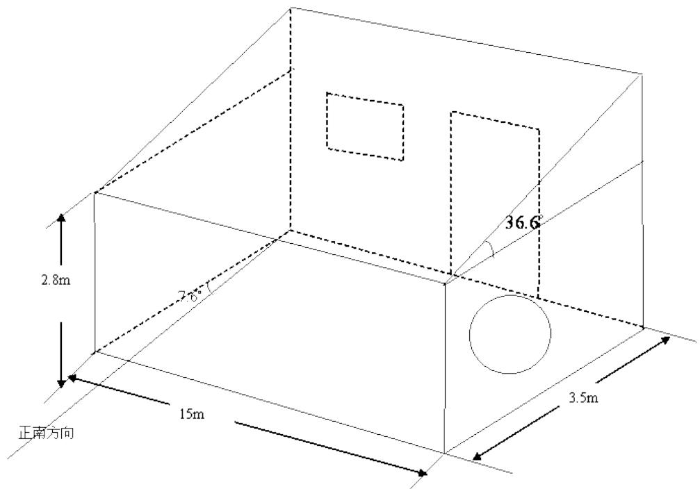

text_image

2.8m
7.6°
正南方向
15m
36.6°
3.5m

图 1 1 小屋的立体图形

然后再利用 5 1 中 的模型考虑每个面的光伏电池铺设方案 求解后得到的具体铺设方案和 电池的连接方式示意图在正文中不再给出 详见附录八。

表 8 小屋铺设电池的种类以及连接方式

<table><tr><td>房屋铺设面</td><td>屋顶顶面</td><td>南立面</td><td>西立面</td></tr><tr><td>电池板型号及个数</td><td>3A3+40C6+10C10</td><td>8C1+20C7</td><td>20B3+11C7+10C2</td></tr><tr><td>逆变器型号及个数</td><td>2个SN14</td><td>SN11</td><td>SN8</td></tr></table>

表 9 小屋 35 年收益情况一览表

<table><tr><td>年限\房屋铺设面</td><td>屋顶南面(单位年收益/元)</td><td>南立面(单位年收益/元)</td><td>西立面(单位年收益/元)</td><td>年限内的总收益(元)/总成本</td></tr><tr><td>1-10 年( $m_{1}$ )</td><td>89101</td><td>25317</td><td>3617.5</td><td>118045</td></tr><tr><td>11-25 年( $m_{2}$ )</td><td>120300</td><td>34178</td><td>4883.6</td><td>159361.6</td></tr><tr><td>26-35 年( $m_{3}$ )</td><td>71286</td><td>20254</td><td>2894</td><td>94434</td></tr><tr><td>1-35 年总收益</td><td>280687</td><td>79749</td><td>12219</td><td>373055</td></tr><tr><td>成本</td><td>166044</td><td>70795</td><td>9002.4</td><td>245840</td></tr></table>

3 5 年 的 总 收入 为 3 73 05 5 元 成 本 为 245 840 元 所 以 3 5 年 净赚 的 利 润 为 1 272 1 5元 。

总成本为 245840 在前十年内依然不能够回收投资 同 5 1 中 的模型 在第二个年限段内获得投资 $D = 1 0 m _ { 1 } + n m _ { 2 }$

求得 n 的值为 12 0288 即在第 23 年能够收回投资

## 六、 模型优化与评价

## 6 1 模型 5 1 的分析

模型 5 1 是将全局优化问题化为多部分内部优化再达到全局优化的 问题 因此在模型的优化程度上可能会有所下降 但是建立的模型就显得相对简单 且能快速有效的解决实际问题。

5 1 建立的模型是以最大收益额为主要 目 标函数 因此利用此模型 能更有效的解决要求效益高的实际问题 而对要求总发电量最大的 问题得出 的结果并不一定是最优解 对于铺设电池的选择是采用松弛解法在各个面求得最合适的 电池板可以减少盲 目排板的情况 但受到各个墙面形状和 门窗位置的限制使墙面有效面积不能充分利用 可能各个面得到的 电池板安排与实际结果有所差别 从而使得到的经济效益比预期偏低

## 6 2 模型 5 2 的分析

我们采用 了 已有的 ho 模型使得操作的起来较为简单 由于此模型也是近似计算所带来的误差会影响结果的准确性 这不仅为架空安装提供了较好的依据 其推广也会使得在更多的领域出现进一步优化 这里忽略了架空安装的难度和费用 会造成利润有较大的误差

## 6 . 3 模型 5 . 3 的 分析

在计算小屋的形状前假设各个面受益最大的 电池板不变 而在小屋偏角和形状改变时各个面受益最大的 电池板可能会有所变化影响收益结果的计算 对于此问题可以通过逐个带入筛选出更加精确的结果

通过立体图形知重新设计的小屋仅仅在北边 东边留有窗户 而为增加接收辐射面积在南面没有窗户 与实际情况有所差异 可以把南面空域面积与收益偏低的 电池板撤下该加一面窗户增加采光量

## 七、 参考文献

[1]严湘华， 庾汉成 西宁地区利用太阳能采暖各参数计算与分析[J] 青海大学学报，2007 ， 25 (2) ： 8 9-9 1 .  
[2]杨金焕， 毛家俊， 陈中华 不同方位倾斜面上太阳辐射量及最佳倾角 的计算[J] 上海交通大学学报 ， 2002 3 6 （ 7 ） ： 1 032- 1 03 6  
[3 ] 杨金焕 . 固 定 式光伏方 阵最佳倾角 的 分析 [J] .太 阳 能学报 ， 1 992 1 3 ( 1 ) : 86-92 .  
[4]刘振宇， 冯华， 杨仁刚. 山西不同地区太阳辐射量及最佳倾角分析[J].山西农业大学学报 .20 1 1 3 1 (3 ) : 272-276 .  
[5]萧树铁 大学数学实验[M] 北京:高等教育出版社 1999  
[6]姜启源 谢金星 叶俊 数学模型[M] 北京:高等教育出版社 1987

## 附录

附录三： 电池在每个面一年的单位面积接收的光能量

<table><tr><td>种类</td><td>东</td><td>南</td><td>西</td><td>北</td><td>上向阳</td><td>背向阳</td></tr><tr><td>A1</td><td>86932.04</td><td>168539.4</td><td>133052.1</td><td>21478.26</td><td>305477.6</td><td>19618.71</td></tr><tr><td>A2</td><td>85899.59</td><td>166537.7</td><td>131472</td><td>21223.18</td><td>301849.6</td><td>19385.7</td></tr><tr><td>A3</td><td>96533.79</td><td>187154.7</td><td>147747.9</td><td>23850.56</td><td>339218</td><td>21785.62</td></tr><tr><td>A4</td><td>85176.88</td><td>165136.5</td><td>130365.8</td><td>21044.62</td><td>299310</td><td>19222.6</td></tr><tr><td>A5</td><td>77330.28</td><td>149924</td><td>118356.4</td><td>19105.96</td><td>271737.2</td><td>17451.79</td></tr><tr><td>A6</td><td>78001.37</td><td>151225</td><td>119383.5</td><td>19271.77</td><td>274095.4</td><td>17603.24</td></tr><tr><td>B1</td><td>84642.05</td><td>163348.4</td><td>128891.5</td><td>21371.38</td><td>294725.1</td><td>19350.96</td></tr><tr><td>B2</td><td>85581.94</td><td>165162.3</td><td>130322.7</td><td>21608.69</td><td>297997.8</td><td>19565.84</td></tr><tr><td>B3</td><td>83441.08</td><td>161030.7</td><td>127062.6</td><td>21068.15</td><td>290543.3</td><td>19076.39</td></tr><tr><td>B4</td><td>77279.6</td><td>149139.8</td><td>117680</td><td>19512.43</td><td>269088.9</td><td>17667.75</td></tr><tr><td>B5</td><td>83441.08</td><td>161030.7</td><td>127062.6</td><td>21068.15</td><td>290543.3</td><td>19076.39</td></tr><tr><td>B6</td><td>79368.24</td><td>153170.6</td><td>120860.6</td><td>20039.79</td><td>276361.6</td><td>18145.25</td></tr><tr><td>B7</td><td>78271.71</td><td>151054.5</td><td>119190.8</td><td>19762.92</td><td>272543.5</td><td>17894.56</td></tr><tr><td>C1</td><td>40569.61</td><td>73054.88</td><td>61133.57</td><td>17134.14</td><td>127148.3</td><td>8384.637</td></tr><tr><td>C2</td><td>35810.37</td><td>64484.78</td><td>53961.97</td><td>15124.13</td><td>112232.4</td><td>7401.031</td></tr><tr><td>C3</td><td>36855.08</td><td>66366.02</td><td>55536.22</td><td>15565.35</td><td>115506.6</td><td>7616.945</td></tr><tr><td>C4</td><td>33895.06</td><td>61035.84</td><td>51075.83</td><td>14315.22</td><td>106229.7</td><td>7005.19</td></tr><tr><td>C5</td><td>37667.63</td><td>67829.21</td><td>56760.64</td><td>15908.53</td><td>118053.2</td><td>7784.877</td></tr><tr><td>C6</td><td>21068.34</td><td>37938.37</td><td>31747.48</td><td>8897.989</td><td>66029.78</td><td>4354.253</td></tr><tr><td>C7</td><td>21068.34</td><td>37938.37</td><td>31747.48</td><td>8897.989</td><td>66029.78</td><td>4354.253</td></tr><tr><td>C8</td><td>21242.45</td><td>38251.91</td><td>32009.85</td><td>8971.526</td><td>66575.48</td><td>4390.239</td></tr><tr><td>C9</td><td>21242.45</td><td>38251.91</td><td>32009.85</td><td>8971.526</td><td>66575.48</td><td>4390.239</td></tr><tr><td>C10</td><td>23970.31</td><td>43164.04</td><td>36120.41</td><td>10123.61</td><td>75124.79</td><td>4954.013</td></tr><tr><td>C11</td><td>24782.86</td><td>44627.23</td><td>37344.83</td><td>10466.78</td><td>77671.39</td><td>5121.945</td></tr></table>

附录八： 自主设计房子三面的光伏电池贴附方式和 电池连接示意图

<table><tr><td>CG</td><td>CG</td><td>CG</td><td>CG</td><td>CG</td><td>CG</td><td>CG</td><td>CG</td><td>CG</td><td>CG</td><td>CG</td><td>CG</td><td>CG</td><td>CG</td><td>CG</td><td>CG</td><td>CG</td><td>CG</td><td>CG</td><td>CG</td><td>CG</td><td>CG</td><td>CG</td><td>CG</td><td>CG</td><td>CG</td><td>CG</td><td>CG</td><td>CG</td><td>CG</td><td>CG</td><td>CG</td><td>CG</td><td>CG</td><td colspan="2"></td></tr><tr><td colspan="3">A3</td><td colspan="2">A3</td><td colspan="3">A3</td><td colspan="3">A3</td><td colspan="3">A3</td><td colspan="3">A3</td><td colspan="3">A3</td><td colspan="3">A3</td><td colspan="3">A3</td><td colspan="3">A3</td><td colspan="3">A3</td><td>C10</td><td>C10</td><td colspan="2"></td></tr><tr><td colspan="3">A3</td><td colspan="2">A3</td><td colspan="3">A3</td><td colspan="3">A3</td><td colspan="3">A3</td><td colspan="3">A3</td><td colspan="3">A3</td><td colspan="3">A3</td><td colspan="3">A3</td><td colspan="3">A3</td><td colspan="3">A3</td><td>C10</td><td>C10</td><td colspan="2"></td></tr><tr><td colspan="3">A3</td><td colspan="2">A3</td><td colspan="3">A3</td><td colspan="3">A3</td><td colspan="3">A3</td><td colspan="3">A3</td><td colspan="3"></td><td colspan="3">A3</td><td colspan="3">A3</td><td colspan="3">A3</td><td colspan="3">A3</td><td>C10</td><td>C10</td><td colspan="2"></td></tr><tr><td colspan="3">A3</td><td colspan="2">A3</td><td colspan="3">A3</td><td colspan="3">A3</td><td colspan="3">A3</td><td colspan="3">A3</td><td colspan="3">A3</td><td colspan="3">A3</td><td colspan="3">A3</td><td colspan="3">A3</td><td colspan="3">A3</td><td>C10</td><td>C10</td><td colspan="2"></td></tr></table>

南面屋顶的 电池摆放方式

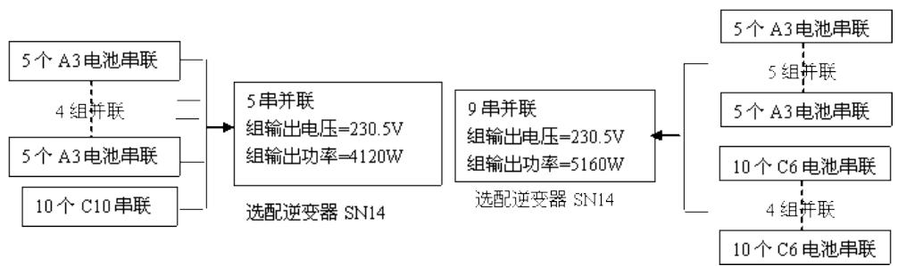

flowchart

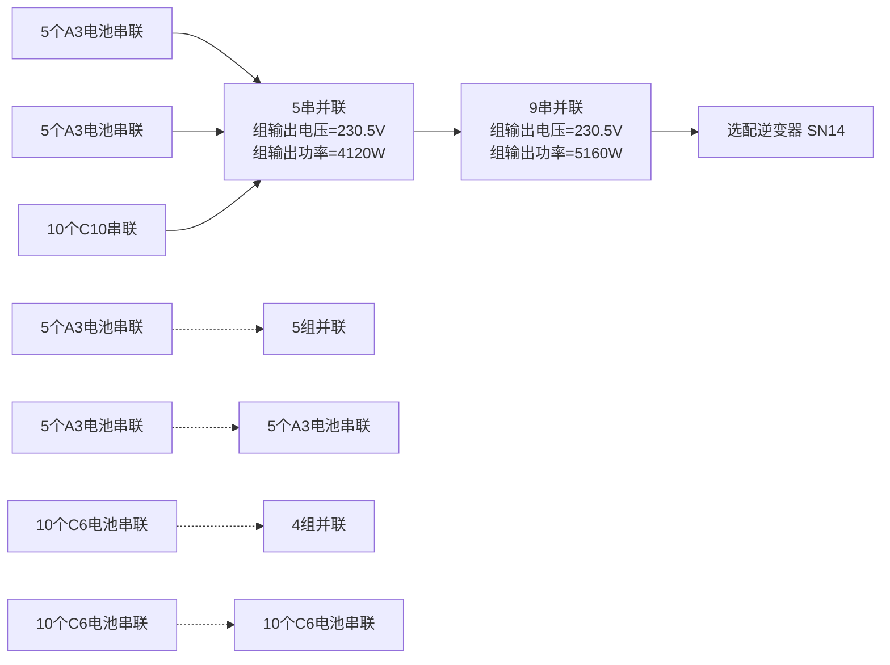

南面屋顶的 电池连接示意图

<table><tr><td>C2</td><td>C2</td><td>C2</td><td>C2</td><td>C2</td><td>C2</td><td>C2</td><td>C2</td><td>C2</td><td>C2</td><td>C2</td><td>C7</td><td></td></tr><tr><td>B3</td><td>B3</td><td>B3</td><td colspan="2">B3</td><td>B3</td><td>B3</td><td>B3</td><td>B3</td><td>B3</td><td>B3</td><td>B3</td><td></td></tr><tr><td>B3</td><td>B3</td><td>B3</td><td colspan="2">B3</td><td>B3</td><td>B3</td><td>B3</td><td>B3</td><td>B3</td><td>B3</td><td>B3</td><td></td></tr></table>

南立面的 电池摆放方式

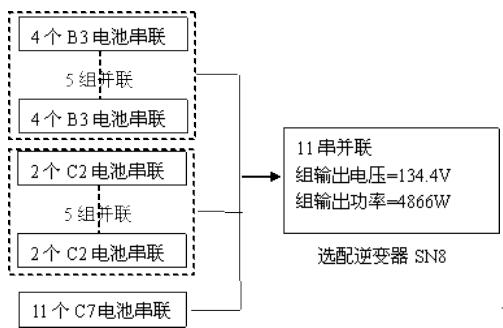

flowchart

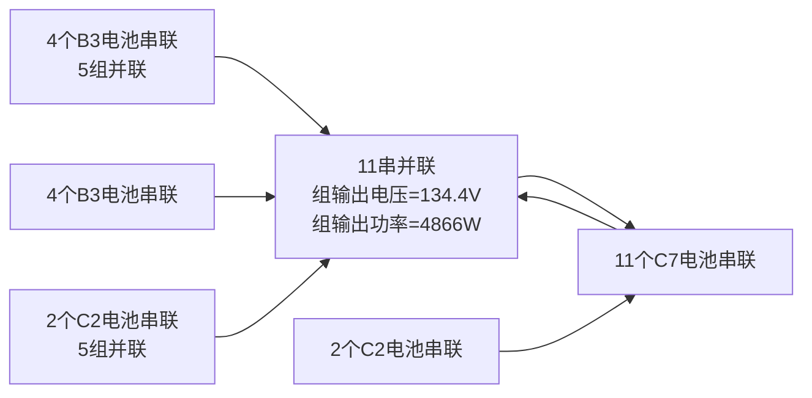

南立面的 电池连接示意图

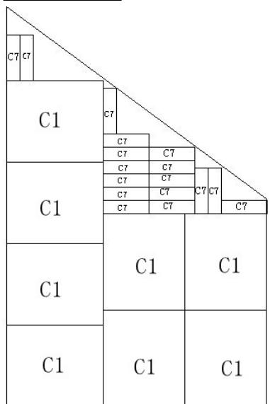

text_image

C7 C7
C1
C7
C7 C7
C7 C7
C7 C7
C7 C7
C1
C1
C1
C1
C1

西立面的 电池摆放图

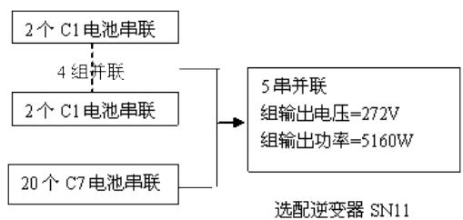

flowchart

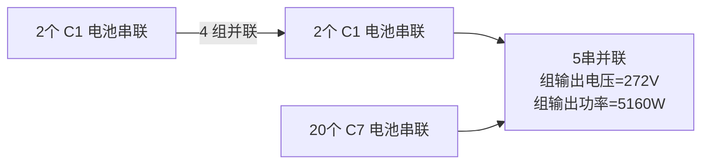

西立面的 电池连接示意图