# 脑卒中发病环境因素分析及干预

摘要

脑卒中是急性脑循环障碍迅速导致局限性或弥漫性脑功能缺损的临床事件，是较常见的急性脑血管病，是目前人类疾病的三大死亡原因之一，本文就针对脑卒中发病率与这种疾病的诱发因素进行了探讨，其中引起脑卒中发病的危险因素很多，本文主要针对脑卒中的发病环境因素进行分析。结合题目中所给出的数据，分别统计各个年份之下病人的基本信息，在 EXCEL 和 SPSS 软件中对数据进行处理和分析。其中把脑卒中发病人数作为因变量，以题目所给出的 8个环境因素作为自变量，运用相关系数分析和多元回归分析考察四个季度脑卒中发病人数与同期气象因素指标的关系，从中找出相关的关键因素并列出发病预报方程，再较合理的假设下，对各个模型进行求解，得到了较好的结果。

针对问题一：本问采用在同一年份下分别进行统计性别发病人数和职业中发病的人数，而年龄是在性别的前提下进行分段统计人数，在 EXCEL 进行排序和数据处理，得出了发病人群男性总人数比女性总人数更多，在 30岁以下和90岁以上，女性患脑卒中概率比男性患脑卒中的病率更大。而在31岁到 90岁之间，男性患脑卒中的概率比女性患脑卒中的概率更大，尤其在81-90岁之间男性患脑卒中的概率是女性患脑卒中概率的8.242344倍，农民工发病人数所占总发病人数的比例最多。

针对问题二：本问首先对数据进行天换周的处理，在对周按春夏秋冬四个季度进行分类，再利用相关系数分析找出四个季度的分别相关的关键因素，在建立多元回归方程，求得四个季度中每周脑卒中发病与气温、气压、相对湿度的关系为：

春季：y=6542.537-5.875x2−7.690x−2.324x8

夏季：y=−7984.99+8.223x2−1.423x+1.130x7

秋季：y=1544.383-1.268x2+8.086x−7.471x7

冬季： 2 6 822 7

针对问题三：结合问题一中的统计信息和问题二四个季度单因素分析下相关性以及搜集的相关诱导脑卒中发病率的因素进行给出合理的意见，使得高危人群可以起到预防的作用。

关键词：相关系数分析 环境因素 多元回归分析 脑卒中

## 一、问题重述

## 1.1 问题背景

脑卒中（Stroke）是脑中风的学名，是一种突然起病的脑血液循环障碍性疾病。又叫脑血管意外。是指在脑血管疾病的病人，因各种诱发因素引起脑内动脉狭窄，闭塞或破裂，而造成急性脑血液循环障碍，临床上表现为一过性或永久性脑功能障碍的症状和体征．脑卒中分为缺血性脑卒中和出血性脑卒中。临床表现以猝然昏扑、不省人事或突然发生口眼歪斜、半身不遂、舌强言蹇、智力障碍为主要特征。脑中风包括缺血性中风（短暂性脑缺血发作、动脉粥样硬化性血栓性脑梗塞、腔隙性脑梗塞、脑栓塞）、出血性中风（脑出血、蛛网膜下腔出血）、高血压脑病和血管性痴呆四大类。据流行病学调查，不同季节的脑卒中发病率不同。寒冷的冬季发病率最高，春季气候转暖，脑中风发病率也开始下降，夏季发病率最低，秋季又开始上升。 入秋及早春时节也易发生脑卒中。因为此时节最易受寒流侵袭，寒流袭击，气温骤降，日内最高气温与最低气温之差太大。对于刚刚度过的炎热夏季或刚刚感受到春天融融暖意的人们，突来的气候变化会使之不适，对老年人和具有脑卒中高危因素的人能带来灾难。

许多医生有这样的体验，气温骤降，街道、商场会显得冷清，医院却恰恰相反，此时急诊室病人明显增多，脑出血、脑血栓病人比平日明显增多。

## 1.2 有关情况

近年来，随着人们生活水平的不断提高，人们的饮食结构发生了巨大的变化，急性脑卒中是危害人类健康的三大疾病之一，其具有发病率高、死亡率高、致残率高的特征，严重危害人类的身心健康和给患者和家里带来了严重的经济负担以及心里压力。脑卒中的发病受多种因素综合的影响，并且一旦发生，多数患者治疗的效果不能令人满意，完全恢复正常者只占少数，大多数患者会留下严重的后遗症。结合各国际国内科学研究表明，确定脑卒中是一种可以预防、可干预的一类疾病，因此本文通过某城市各家医院的病例数据信息以及相应期间当地逐日气象资料进行数据处理，找出导致脑卒中疾病发病的关键因子，并建立发病预报模型，为广大市民防范患于未然和医疗机构、医疗行政管理部门制定防治计划提供有价值的参考，是研究气象因素与疾病关系的目的和意义所在。

## 1.3问题提出

脑卒中（俗称脑中风）是目前威胁人类生命的严重疾病之一，它的发生是一个漫长的过程，一旦得病就很难逆转。这种疾病的诱发已经被证实与环境因素，包括气温和湿度之间存在密切的关系。对脑卒中的发病环境因素进行分析，其目的是为了进行疾病的风险评估，对脑卒中高危人群能够及时采取干预措施，也让尚未得病的健康人，或者亚健康人了解自己得脑卒中风险程度，进行自我保护。同时，通过数据模型的建立，掌握疾病发病率的规律，对于卫生行政部门和医疗机构合理调配医务力量、改善就诊治疗环境、配置床位和医疗药物等都具有实际的指导意义。

数据（见Appendix-C1）来源于中国某城市各家医院 2007年1月至 2010年12月的脑卒中发病病例信息以及相应期间当地的逐日气象资料（Appendix-C2）。请你们根据题目提供的数据，回答以下问题：

1．根据病人基本信息，对发病人群进行统计描述。  
2．建立数学模型研究脑卒中发病率与气温、气压、相对湿度间的关系。  
3．查阅和搜集文献中有关脑卒中高危人群的重要特征和关键指标，结合1、2中所得结论，对高危人群提出预警和干预的建议方案。

## 二、模型的假设与符号说明

## 1.1模型的假设

1、假设题目所给的数据都是可靠的、真实的；  
2、假设问题二中只考虑题目中所给出的 8 个环境因素指标，其它的环境因素指标对模型的建立不受影响；  
3、假设问题一中在统计的性别、年龄的时候数据缺失、有误的可以忽略不计；  
4、该城市为我国一典型城市，全国人口比例适用于该市人口比例。

## 1.2 符号说明

<table><tr><td>符号设定</td><td>符号说明</td></tr><tr><td> $x_i$ </td><td>第i个环境因素指标</td></tr><tr><td>y</td><td>周发病人数回归方程</td></tr></table>

## 四、问题分析

根据问题重述，可以知道这是一个脑卒中发病与环境因素的问题。该问题的关键在于从所给出环境因素指标中找到关键影响指标，并通过分析后建立模型，掌握疾病发病率的规律，对脑卒中高危人群及时采取干预措施和建议。

针对问题一：要根据题目给出的数据，我们分别找出对应年份下性别、年龄、职业三个特征在发病中发病人数的情况。由于相同年龄段下男性和女性的发病情况可能会有所不同，所以我们考虑对年龄段分析发病情况时，我们分别在男性和女性下对其分段统计发病的总人数，这样计算出来的结果更准确和合理。

对于问题二：首先在问题一的基础上统计每一天的发病人数和每一周的发病人数，按春夏秋冬四个季度进行分类。然后对四个季度的数据进行相关分析，分别以脑卒中每天和每周的发病人数为因变量，对应每一天和每一周环境因素的指标作为自变量，运用对发病人数和指标进行相关分析，日和周的相关系数哪个更大，再对相对系数更大的进行两两之间的单因素相关分析得出相关的关键因素，再对关键因素进行多元回归分析，得到回归方程即脑卒中发病率与气温、气压、相对湿度间的关系式。

对于问题三：要对高危人群提出预警和干预的方案，我们通过查找相关脑卒中发病的重要特征情况进行预防和通过以上问题的分析，分析在不同的季度中，哪个因素的影响更大，哪个因素影响更小，分别做出相应的预防工作。

## 四、模型的建立和求解

## 4.1问题一的解答

根据问题分析，我们需要先把 2007 年至 2010 年脑卒中发病信息中对应的年份在EXCEL 里进行整理，同年份的放在一起。同时在处理数据时把出现有误的数据进行忽略考虑。

## 4.1.1 发病人数性别比率

先分析性别在脑卒中发病人群的情况，首先对四年中各年的性别进行统计，最后得到 至 年脑卒中发病的男女性别总数，再利用同一年份下分别计算出脑卒中男性、女性的发病人数比上这年中发病总人数，得出男性和女性发病人数占总发病人数的

比值（表 1）。

表1：2007-2010年男性和女性分别在同年中男女所占的比值：

<table><tr><td></td><td>2007</td><td>2007</td><td>2009</td><td>2010</td></tr><tr><td>男性</td><td>7250</td><td>10309</td><td>5204</td><td>10492</td></tr><tr><td>女性</td><td>5871</td><td>8668</td><td>4738</td><td>9143</td></tr><tr><td>男性所占比</td><td>0.5525</td><td>0.5432</td><td>0.5203</td><td>0.5347</td></tr><tr><td>女性所占比</td><td>0.4474</td><td>0.4568</td><td>0.4797</td><td>0.4653</td></tr></table>

根据以上统计出四年中男性和女性的人数，我们可以得到如下所示的图形：（图 1）

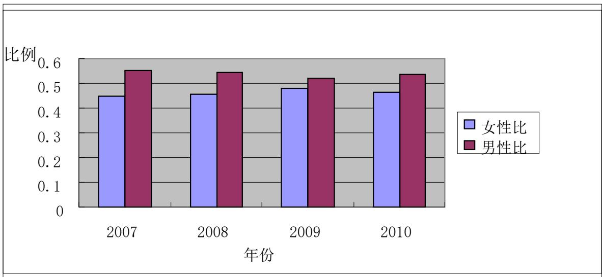

bar

| 年份 | 女性比 | 男性比 |
| --- | --- | --- |
| 2007 | ~0.46 | ~0.57 |
| 2008 | ~0.47 | ~0.56 |
| 2009 | ~0.49 | ~0.53 |
| 2010 | ~0.48 | ~0.55 |

图1：2007-2010年脑卒中男性和女性所占同年中发病总数的比例

根据2012年中国人口普查资料，得到如下表 2。

表2 各年龄段男女性别占总人口的比重

<table><tr><td rowspan="2"></td><td colspan="2">占总人口比重</td></tr><tr><td>男性</td><td>女性</td></tr><tr><td>21岁以下</td><td>0.1041</td><td>0.0934</td></tr><tr><td>21-30</td><td>0.1074</td><td>0.1044</td></tr><tr><td>31-40</td><td>0.0956</td><td>0.0909</td></tr><tr><td>41-50</td><td>0.0903</td><td>0.0837</td></tr><tr><td>51-60</td><td>0.0585</td><td>0.0571</td></tr><tr><td>61-70</td><td>0.0313</td><td>0.0324</td></tr><tr><td>71-80</td><td>0.0182</td><td>0.0196</td></tr><tr><td>81-90</td><td>0.0055</td><td>0.065</td></tr><tr><td>91岁以上</td><td>0.0005</td><td>0.0008</td></tr></table>

由表1与表2男女性别分别占总人口的比重值可以计算得到男女性别患脑卒中发病率，如下所示：

表3：各阶段间男女患脑卒的概率

<table><tr><td>年龄阶段</td><td>21岁以下</td><td>21-30</td><td>31-40</td><td>41-50</td><td>51-60</td></tr><tr><td>男/女</td><td>0.531914</td><td>0.988496</td><td>1.594677</td><td>1.334791</td><td>1.178931</td></tr><tr><td>年龄阶段</td><td>61-70</td><td>71-80</td><td>81-90</td><td>91岁以上</td><td></td></tr><tr><td>男/女</td><td>1.209081</td><td>1.044607</td><td>8.242344</td><td>0.750449</td><td></td></tr></table>

由以上表格数据可以知道，30 岁以下和 90 岁以上，女性患脑卒中概率比男性患脑卒中的病率更大。而在 31岁到90岁之间，男性患脑卒中的概率比女性患脑卒中的概率更大，尤其在81-90岁之间男性患脑卒中的概率是女性患脑卒中概率的 8.242344倍。

## 4.1.2 男性和女性中的每一年龄段的所占总人数比

由于考虑到男女脑卒中发病阶段的年龄可能会有所不同，为了更能精确对发病人群信息的了解，我们分别统计在男性和女性下年龄阶段的发病人数情况。还有考虑到发病年龄的范围比较大以及在 20岁以下和91岁以上发病人数相对比较少，所以我们把它们归为一个段，其他的都是以十岁为一个阶段，分别得到相应的男性和女性下年龄阶段总发病人数的数据（见附表一）：

利用附表一的数据我们分别可以计算出男性和女性在这四年中男性总发病人数和女性总发病人数占四年总发病人数的比值情况，得出的结果分别如下：（表4、图2）：

表4：男性在这四年中年龄阶段下发病所占总发病人数的比：

<table><tr><td>年龄</td><td>20岁以下</td><td>21-30</td><td>31-40</td><td>41-50</td><td>51-60</td></tr><tr><td>所占比列</td><td>0.003068</td><td>0.004332</td><td>0.017417</td><td>0.059108</td><td>0.1529</td></tr><tr><td>年龄</td><td>61-70</td><td>71-80</td><td>81-90</td><td>91岁以上</td><td></td></tr><tr><td>所占比例</td><td>0.258302</td><td>0.344092</td><td>0.151997</td><td>0.008784</td><td></td></tr></table>

根据附表一统计的数据，得出对应的图 2如下所示：  
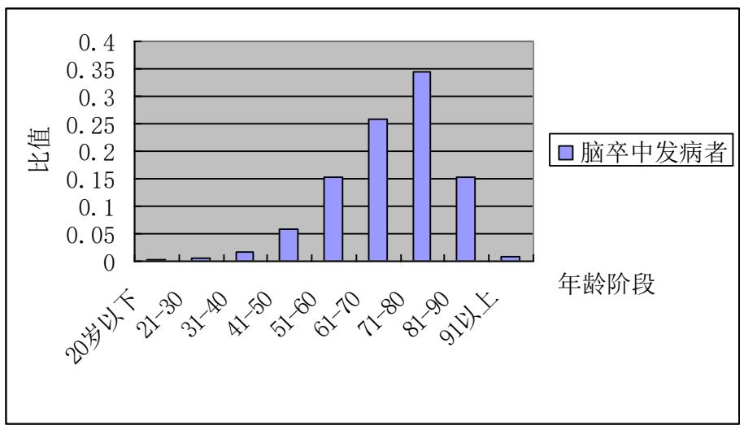

bar

| 年龄阶段 | 比值 |
| --- | --- |
| 20岁以下 | ~0.005 |
| 21-30 | ~0.01 |
| 31-40 | ~0.02 |
| 41-50 | ~0.06 |
| 51-60 | ~0.15 |
| 61-70 | ~0.26 |
| 71-80 | ~0.35 |
| 81-90 | ~0.15 |
| 91以上 | ~0.01 |

图 2：2007-2010年总的男性发病人数占总发病人数的比例

由以上的图表：结合这四年男性中年龄脑卒中发病的数据，可以知道男性在大概71-80 阶段以下的年龄段中脑卒中发病人数随着年龄的增长发病人数也在不断的逐步的上升，在71-80阶段以上脑卒中发病的情况随着年龄的增加发病人数的情况相对在不断的减少，对于阶段中的 71-80年龄之间的发病人数达到最大。

表5：女性在这四年中年龄阶段下发病人数占总发病人数的比：

<table><tr><td>年龄</td><td>20岁以下</td><td>21-30</td><td>31-40</td><td>41-50</td><td>51-60</td></tr><tr><td>所占比列</td><td>0.005175</td><td>0.00426</td><td>0.010385</td><td>0.041046</td><td>0.126589</td></tr><tr><td>年龄</td><td>61-70</td><td>71-80</td><td>81-90</td><td>91岁以上</td><td></td></tr><tr><td>所占比例</td><td>0.221143</td><td>0.354737</td><td>0.217939</td><td>0.018728</td><td></td></tr></table>

同理根据附表二统计的数据，我们可以画出如下图：（图3）

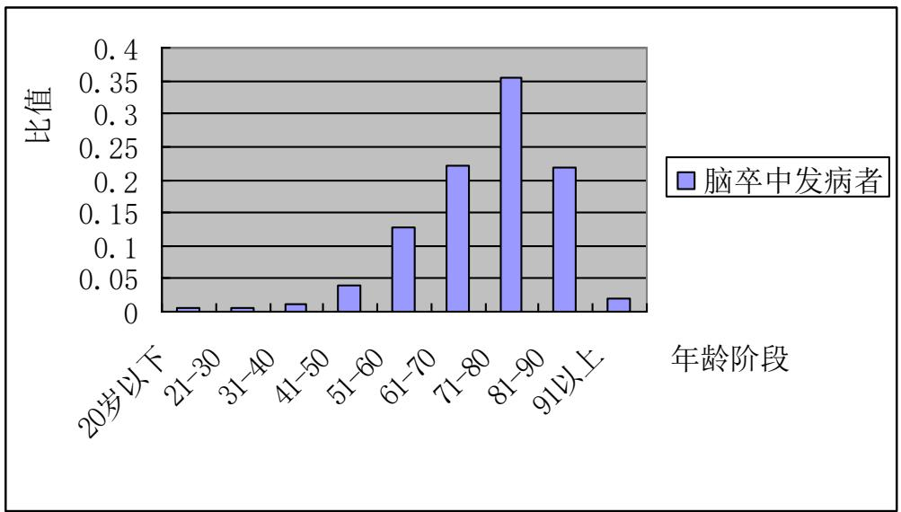

bar

| 年龄阶段 | 比值 |
| --- | --- |
| 20岁以下 | ~0.01 |
| 21-30 | ~0.01 |
| 31-40 | ~0.02 |
| 41-50 | ~0.04 |
| 51-60 | ~0.13 |
| 61-70 | ~0.23 |
| 71-80 | ~0.36 |
| 81-90 | ~0.22 |
| 91以上 | ~0.02 |

图 3：2007-2010年女性发病人数占四年总发病人数的比

同理由以上的图表并且结合这四年中女性中年龄的数据得出的结论可以看出，女性也大概在71-80阶段以下的年龄中脑卒中发病人数随着年龄的增长发病人数也在不断的逐步的上升，在71-80 阶段以上脑卒中发病的情况随着年龄的增加发病人数相对也在不断的减少，对于分段中的 71-80岁之间的发病人数达到最大。

综合以上分别在男女性别之下的分析，我们可以看出男性和女性的发病人数最多的阶段都在71-80岁之间，并且他们之间随着年龄的波动发病人数的变化大小大致也相同，没有很明显的差别。

## 4.1.3不同职业发病率

利用附表二数据，在 EXCEL 中根据职业代表中的数字进行从大到小排序，分别统计出各年不同类型职业的发病人数，再进行四年对应相同职业发病人数的合并，从而可以计算出四年中各个职业脑卒中总发病人数占四年职业总发病人数的比。（表 6）

表 6：2007-2010年四年中各个职业总发病人数与总发病人数的比值

<table><tr><td>职业</td><td>农民</td><td>工人</td><td>退休人</td><td>教师</td><td>渔民</td></tr><tr><td>比值</td><td>0.48025</td><td>0.078259</td><td>0.106963</td><td>0.003481</td><td>0.001052</td></tr><tr><td>职业</td><td>医务人员</td><td>职工</td><td>离职人员</td><td>空格</td><td></td></tr><tr><td>比值</td><td>0.001457</td><td>0.011883</td><td>0.028056</td><td>0.288591</td><td></td></tr></table>

为了直接可以知道发病人群在这些职业中的发病情况，我们画出扇形图形如图4所示：

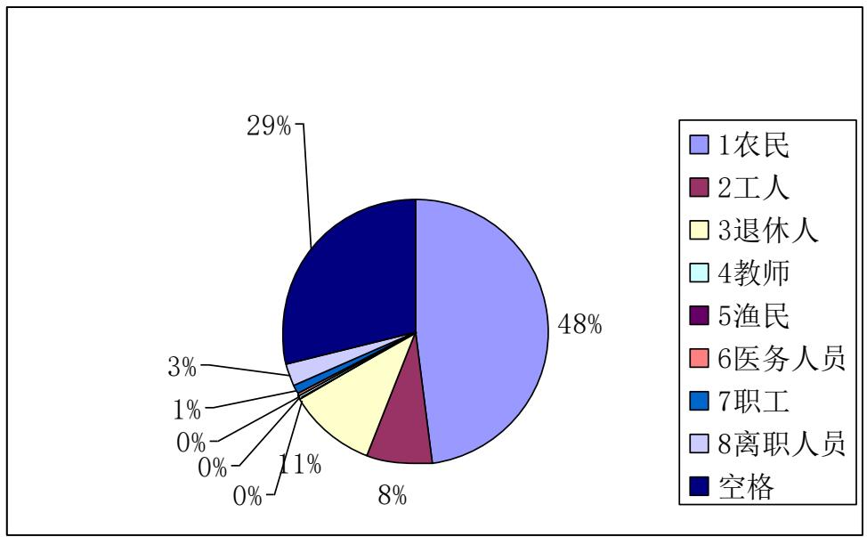

pie

| Category | Percentage |
| --- | --- |
| 1农民 | 48% |
| 2工人 | 8% |
| 3退休人 | 11% |
| 4教师 | 0% |
| 5渔民 | 0% |
| 6医务人员 | 0% |
| 7职工 | 1% |
| 8离职人员 | 3% |
| 空格 | 29% |

图 4：2007-2010年不同类型职业之间脑卒中发病比例

再根据统计好的各职业数据，我们可以得到它们的柱形图形如图5 所示：

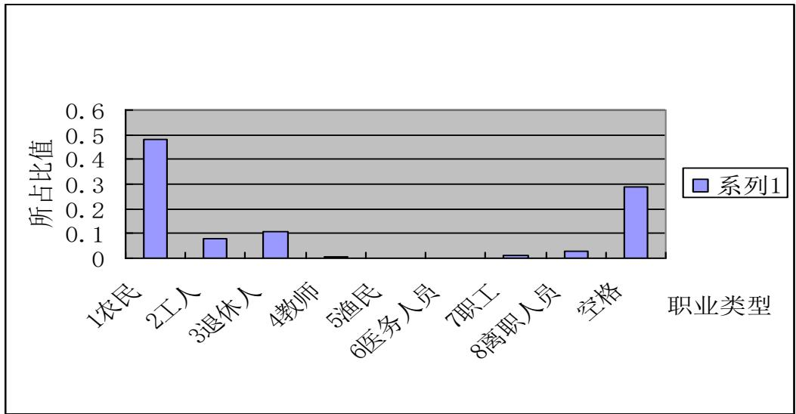

bar

| 职业类型 | 所占比值 |
| --- | --- |
| 1农民 | ~0.49 |
| 2工人 | ~0.08 |
| 3退休人 | ~0.11 |
| 4教师 | ~0.01 |
| 5渔民 | 0 |
| 6医务人员 | 0 |
| 7职工 | ~0.02 |
| 8离职人员 | ~0.03 |
| 空格 | ~0.29 |

图 5：2007-2010年不同职业总发病人数占总发病人数的比

结合职业发病统计的数据表七和表八，在这些职业类型中，发病人群工人所占的比例达到最大，教师、渔民、医务人员三者脑卒中发病所占的比例相对很小。

## 4.2 问题二的解答

对文件 Appendix-C2 中所给的某城市各家医院 2007 年 1 月至 2010 年 12 月的脑卒中发病病例信息以及相应期间当地的逐日气象的数据进行处理对应每一天的发病人数（附录一），再统计2010 年这座城市的发病人数为 61783人。

## 4.2.1每一个季度以当天的环境因素与当天发病人数直接进行单因素相关分析

对题目所给的数据进行数据处理，统计每一季度每一天的发病人数，以日发病人数为因变量，环境8个因素作为自变量进行单因素相关分析。

春季单因素的相关分析显示：这座城市春季脑卒中日平均气压、最高气压、最小相对湿度呈正相关，与最低气温、平均气温、最高气温、最低气温、平均相对湿度负相关。结果见表7和图6。

表7：春季脑卒中日发病人数与环境因素的相关系数

<table><tr><td>环境因素</td><td>平均气压</td><td>最高气压</td><td>最低气压</td><td>平均气温</td><td>最高气温</td><td>最低气温</td><td>平均相对湿度</td><td>最小相对湿度</td></tr><tr><td>脑卒中</td><td>0.005</td><td>0.009</td><td>-0.004</td><td>-0.093</td><td>-0.079</td><td>-0.082</td><td>-0.034</td><td>0.017</td></tr></table>

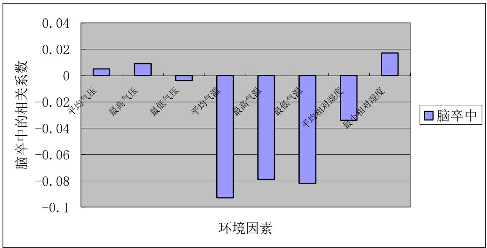

bar

| 环境因素 | 脑卒中的相关系数 |
| :--- | :--- |
| 平均气压 | ~0.005 |
| 最高气压 | ~0.01 |
| 最低气压 | ~-0.003 |
| 平均气温 | ~-0.092 |
| 最高气温 | ~-0.078 |
| 最低气温 | ~-0.081 |
| 平均相对湿度 | ~-0.034 |
| 最小相对湿度 | ~0.017 |

图6：春季脑卒中日发病人数与环境因素的相关系数

夏季单因素的相关分析显示：这座城市春季脑卒中日平均气压、最高气压、最低气压呈显著正相关，与最低气温、平均气温、最高气温呈正相关，与平均相对湿度、最小

相对湿度呈负相关。结果见表 8和图7。

表8：夏季脑卒中日发病人数与环境因素的相关系数

<table><tr><td>环境因素</td><td>平均气压</td><td>最高气压</td><td>最低气压</td><td>平均气温</td><td>最高气温</td><td>最低气温</td><td>平均相对湿度</td><td>最小相对湿度</td></tr><tr><td>脑卒中</td><td>0.137</td><td>0.138</td><td>0.138</td><td>0.013</td><td>0.017</td><td>0.008</td><td>-0.065</td><td>-0.057</td></tr></table>

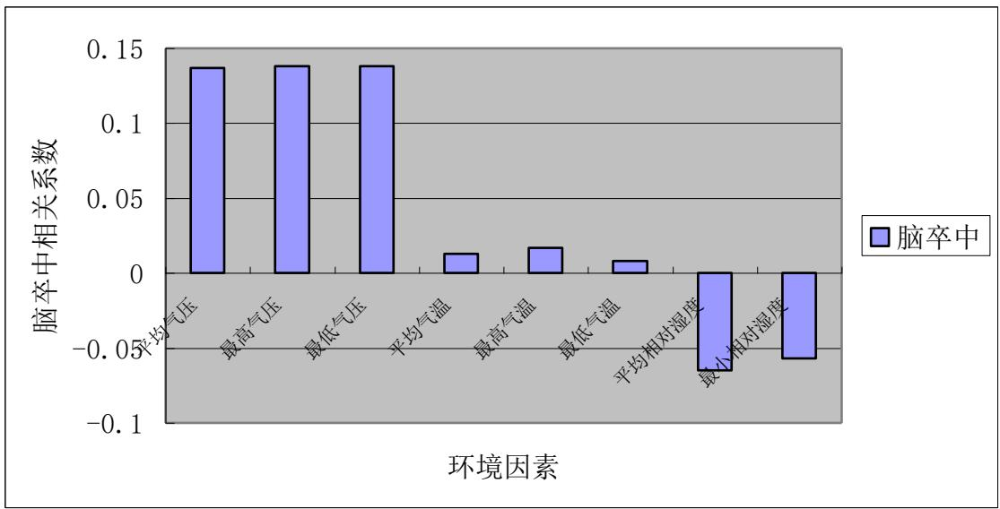

bar

| 环境因素 | 脑卒中相关系数 |
| --- | --- |
| 平均气压 | ~0.14 |
| 最高气压 | ~0.14 |
| 最低气压 | ~0.14 |
| 平均气温 | ~0.015 |
| 最高气温 | ~0.02 |
| 最低气温 | ~0.01 |
| 平均相对湿度 | ~-0.06 |
| 最小相对湿度 | ~-0.05 |

图 7：夏季脑卒中日发病人数与环境因素的相关系数

秋季单因素的相关分析显示：这座城市秋季脑卒中日平均气压、最高气压、最低气压呈负相关，与最低气温、平均气温、最高气温呈正相关，与平均相对湿度、最小相对湿度呈负相关。结果见表 9和图8。

表9：秋季脑卒中日发病人数与环境因素的相关系数

<table><tr><td>环境因素</td><td>平均气压</td><td>最高气压</td><td>最低气压</td><td>平均气温</td><td>最高气温</td><td>最低气温</td><td>平均相对湿度</td><td>最小相对湿度</td></tr><tr><td>脑卒中</td><td>-0.049</td><td>-0.060</td><td>-0.037</td><td>0.077</td><td>0.080</td><td>0.064</td><td>-0.025</td><td>-0.045</td></tr></table>

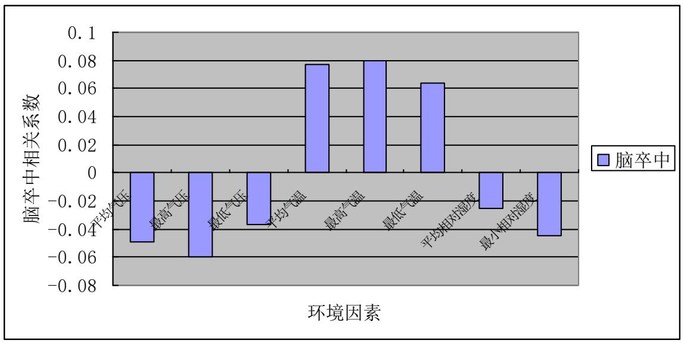

bar

| 环境因素 | 脑卒中相关系数 |
| --- | --- |
| 平均气压 | ~-0.05 |
| 最高气压 | ~-0.06 |
| 最低气压 | ~-0.035 |
| 平均气温 | ~0.078 |
| 最高气温 | ~0.08 |
| 最低气温 | ~0.064 |
| 平均相对湿度 | ~-0.025 |
| 最小相对湿度 | ~-0.045 |

图8：秋季脑卒中日发病人数与环境因素的相关系数

秋季单因素的相关分析显示：这座城市春季脑卒中日平均气压、最高气压、最低气压呈正相关，与最低气温、平均气温、最高气温、平均相对湿度、最小相对湿度呈负相关。结果见表10和图 8。

表10：冬季脑卒中日发病人数与环境因素的相关系数

<table><tr><td>环境因素</td><td>平均气压</td><td>最高气压</td><td>最低气压</td><td>平均气温</td><td>最高气温</td><td>最低气温</td><td>平均相对湿度</td><td>最小相对湿度</td></tr><tr><td>脑卒中</td><td>0.103</td><td>0.115*</td><td>0.095</td><td>-0.093</td><td>-0.058</td><td>-0.110*</td><td>-0.156**</td><td>-0.028</td></tr></table>

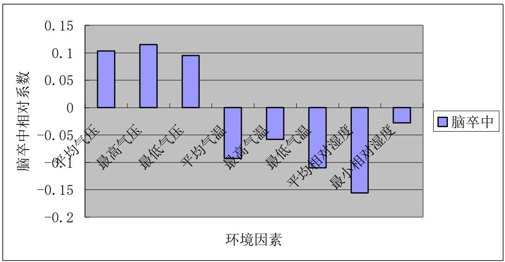

bar

| 环境因素 | 脑卒中相对系数 |
| --- | --- |
| 平均气压 | ~0.105 |
| 最高气压 | ~0.115 |
| 最低气压 | ~0.095 |
| 平均气温 | ~-0.09 |
| 最高气温 | ~-0.06 |
| 最低气温 | ~-0.11 |
| 平均相对湿度 | ~-0.155 |
| 最小相对湿度 | ~-0.03 |

图8：冬季脑卒中日发病人数与环境因素的相关系数

## 4.2.2以周脑卒中的发病人数与周天气的环境因素指标进行单因素相关分析

对附录一进行处理，将发病人数按周合并，环境因素中的平均气压、平均气温、平均相对湿度取一周当中的中位数，最高气压、最高气温取一周当中的最大数，最低气压、最低气温、最小相对湿度取一周当中最小的（附录三），再按春夏秋冬四个季度进行分类（附录四），用SPSS 对四个季度的数据分别进行单因素分析。

春季单因素相关分析显示：这座城市春季脑卒中周发病人数与最高气压、最低气压呈正相关，与最小相对湿度呈负相关，与平均气温、最高气温、最低气温、最小相对湿度呈显著负相关，与平均气压无明显关系。结果见表 11和图10。

表11：春季脑卒中周发病人数与环境因素的相关系数

<table><tr><td>环境因素</td><td>平均气压</td><td>最高气压</td><td>最低气压</td><td>平均气温</td><td>最高气温</td><td>最低气温</td><td>平均相对湿度</td><td>最小相对湿度</td></tr><tr><td>脑卒中</td><td>-0.008</td><td>0.034</td><td>0.031</td><td>-0.11</td><td>-0.123</td><td>-0.132</td><td>-0.089</td><td>-0.211</td></tr></table>

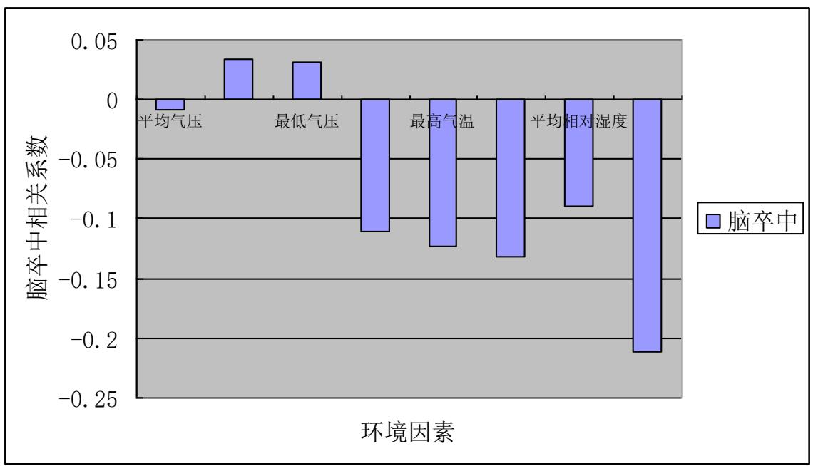

bar

| 环境因素 | 脑卒中相关系数 |
| --- | --- |
| 平均气压 | ~-0.01 |
| 最低气压 | ~0.035 |
| 最高气温 | ~-0.11 |
| 平均相对湿度 | ~-0.12 |
| (未标注) | ~-0.13 |
| (未标注) | ~-0.09 |
| (未标注) | ~-0.21 |

图 10：春季脑卒中周发病人数与环境因素的相关性

夏季单因素相关分析显示：这座城市夏季脑卒中周发病人数与平均气压、最高气压最低气压呈显著正相关，与最高气温、最小相对湿度呈正相关，与平均气温、最低气温、平均相对湿度呈负相关。结果见表 12和图11。

表12：夏季脑卒中周发病人数与环境因素的相关系数

<table><tr><td>环境因素</td><td>平均气压</td><td>最高气压</td><td>最低气压</td><td>平均气温</td><td>最高气温</td><td>最低气温</td><td>平均相对湿度</td><td>最小相对湿度</td></tr><tr><td>脑卒中</td><td>0.246</td><td>0.279*</td><td>0.246</td><td>-0.032</td><td>0.015</td><td>-0.053</td><td>-0.079</td><td>0.011</td></tr></table>

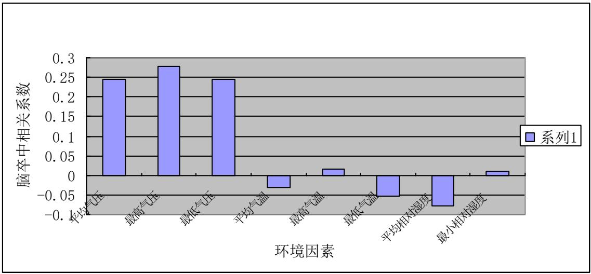

bar

| 环境因素 | 脑卒中相关系数 |
| :--- | :--- |
| 平均气压 | ~0.25 |
| 最高气压 | ~0.28 |
| 最低气压 | ~0.25 |
| 平均气温 | ~-0.03 |
| 最高气温 | ~0.02 |
| 最低气温 | ~-0.05 |
| 平均相对湿度 | ~-0.08 |
| 最小相对湿度 | ~0.01 |

图 11：夏季脑卒中周发病人数与环境因素的相关性

秋季单因素相关分析显示：这座城市秋季脑卒中周发病人数与最低气温呈显著正相关，与最低气压、平均气温、平均相对湿度呈正相关，与平均气压、最小相对湿度呈负相关，与最高气压呈显著负相关。结果见表 13 和图12。

表13：秋季脑卒中周发病人数与环境因素的相关系数

<table><tr><td>环境因素</td><td>平均气压</td><td>最高气压</td><td>最低气压</td><td>平均气温</td><td>最高气温</td><td>最低气温</td><td>平均相对湿度</td><td>最小相对湿度</td></tr><tr><td>脑卒中</td><td>-0.060</td><td>-0.122</td><td>0.095</td><td>0.095</td><td>0.084</td><td>0.159</td><td>0.056</td><td>-0.041</td></tr></table>

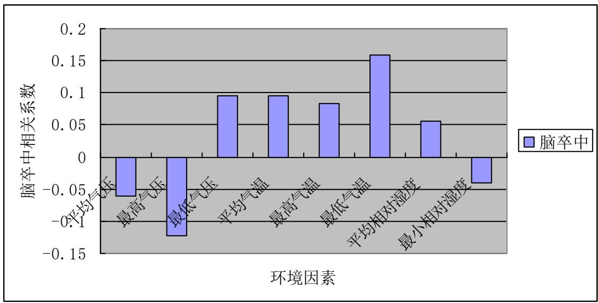

bar

| 环境因素 | 脑卒中相关系数 |
| --- | --- |
| 平均气压 | ~-0.06 |
| 最高气压 | ~-0.12 |
| 最低气压 | ~0.10 |
| 平均气温 | ~0.10 |
| 最高气温 | ~0.08 |
| 最低气温 | ~0.16 |
| 平均相对湿度 | ~0.06 |
| 最小相对湿度 | ~-0.04 |

图 12：秋季脑卒中周发病人数与环境因素的相关性

冬季单因素相关分析显示：这座城市秋季脑卒中周发病人数与平均气压、最高气压、呈显著正相关，与最低气压呈正相关，与平均气温、最高气温、最低气温、平均相对湿度、最小相对湿度呈显著负相关。结果见表 14 和图13。

表14：冬季脑卒中周发病人数与环境因素的相关系数

<table><tr><td>环境因素</td><td>平均气压</td><td>最高气压</td><td>最低气压</td><td>平均气温</td><td>最高气温</td><td>最低气温</td><td>平均相对湿度</td><td>最小相对湿度</td></tr><tr><td>脑卒中</td><td>0.196</td><td>0.200</td><td>0.016</td><td>-0.260</td><td>-0.111</td><td>-0.141</td><td>-0.120</td><td>-0.332*</td></tr></table>

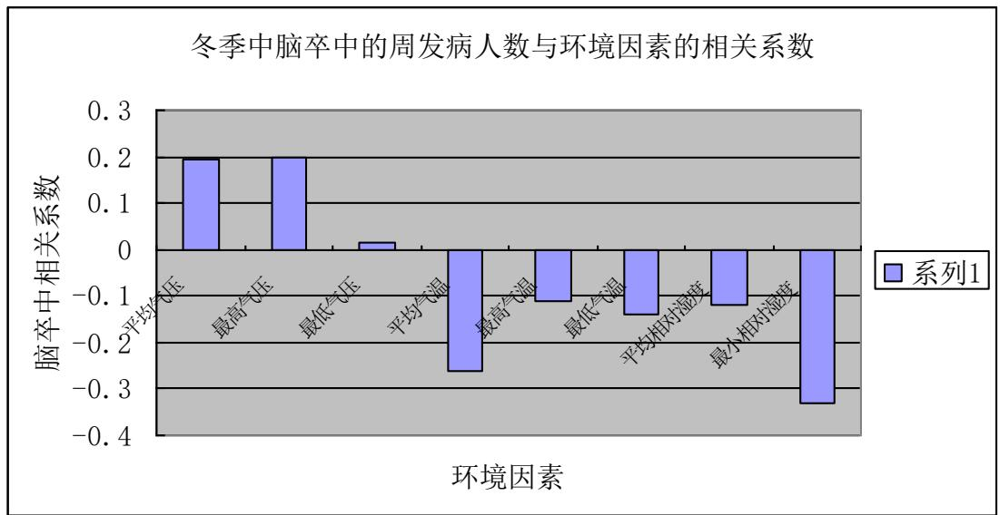

bar

| 环境因素 | 脑卒中相关系数 |
| --- | --- |
| 平均气压 | 0.2 |
| 最高气压 | 0.2 |
| 最低气压 | ~0.02 |
| 平均气温 | ~-0.26 |
| 最高气温 | ~-0.11 |
| 最低气温 | ~-0.14 |
| 平均相对湿度 | ~-0.12 |
| 最小相对湿度 | ~-0.33 |

图 13：秋季脑卒中周发病人数与环境因素的相关性

发病人数每一季度按周合并的相关性更大，所以直接对按周合并的单因素之间进行两两分析，找出相关的关键因素。

## 4.2.3各环境因素之间的单因素分析

以环境因素之间两两进行直接单因素相关分析，结果：春季当周的最高气压与平均气压呈显著正相关，与最低气压、平均气温、最高气温、平均相对湿度呈显著负相关。最低气温与平均气压呈显著负相关，与最低气压、平均气温、最高气温、平均相对湿度呈显著正相关。最小相对湿度与平均气压呈正相关，与最低气压、平均气温、最高气温、平均相对湿度呈负相关。结果见表 15。

表15：春季环境因素之间的相关系数（当周）

<table><tr><td></td><td>平均气压</td><td>最低气压</td><td>平均气温</td><td>最高气温</td><td>平均相对湿度</td></tr><tr><td>最高气压</td><td>0.922**</td><td>-0.902**</td><td>-0.902**</td><td>-0.827**</td><td>-0.910**</td></tr><tr><td>最低气温</td><td>-0.822**</td><td>0.959**</td><td>0.959**</td><td>0.911**</td><td>0.943**</td></tr><tr><td>最小相对湿度</td><td>0.057</td><td>-0.158</td><td>-0.158</td><td>-0.139</td><td>-0.114</td></tr></table>

夏季当周的最高气压与平均气压、最低气压呈显著正相关，与平均气温、最高气温、平均相对湿度负相关。最低气温与平均气压、最低气压呈负相关，与平均气温、最高气温、平均相对湿度呈显著正相关。最小相对湿度与平均气温、最高气温呈显著正相关，与最低气压、平均气压、平均相对湿度呈负相关，结果见表16。

表16：夏季环境因素之间的相关系数（当周）

<table><tr><td>最高气压</td><td>平均气压.841**</td><td>最低气压.665**</td><td>平均气温-.171</td><td>最高气温-.251</td><td>最低相对湿度-.083</td></tr><tr><td>最低气温</td><td>-.185</td><td>-.159</td><td>.913**</td><td>.802**</td><td>-.375**</td></tr><tr><td>平均相对湿度</td><td>-.285*</td><td>-.290*</td><td>.950**</td><td>.868**</td><td>-.105</td></tr></table>

秋季单周最高气压与平均气压、最低气压呈显著正相关，与平均气温、最高气温呈显著负相关、与平均相对湿度负相关。最低气温与平均气压、最低气压呈显著负相关，与平均气温、最高气温呈显著正相关，与平均相对湿度呈正相关。平均相对湿度与平均气压、最低气压呈显著负相关，与平均气温、最高气温呈显著正相关、与平均相对湿度正相关，结果表17。

表17：秋季环境因素之间的相关系数（当周）

<table><tr><td>最高气压</td><td>平均气压0.928**</td><td>最低气压0.758**</td><td>平均气温-0.884**</td><td>最高气温-0.815**</td><td>最低相对湿度-0.280*</td></tr><tr><td>最低气温</td><td>-0.862**</td><td>-0.736**</td><td>0.946**</td><td>0.875**</td><td>0.158</td></tr><tr><td>平均相对湿度</td><td>-0.924**</td><td>-0.834**</td><td>0.985**</td><td>0.948**</td><td>0.289*</td></tr></table>

冬季单周最高气压与平均气压、最低气压呈显著正相关，与平均气温、最高气温呈显著负相关、与平均相对湿度负相关。最低气温与平均气压、最低气压呈显著负相关，与平均气温、最高气温呈显著正相关，与平均相对湿度呈正相关。平均相对湿度与平均气压、最低气压、平均相对湿度呈负相关，与平均气温、最高气温呈显著正相关，结果见表18。

表18：冬季环境因素之间的相关系数（单周）

<table><tr><td>最高气压</td><td>平均气压0.821**</td><td>最低气压0.661**</td><td>最高气温-0.486**</td><td>最低气温-0.660**</td><td>平均相对湿度-0.134</td></tr><tr><td>平均气温</td><td>-0.780**</td><td>-0.681**</td><td>0.850**</td><td>0.770**</td><td>0.236</td></tr><tr><td>最小相对湿度</td><td>-0.117</td><td>-0.107</td><td>0.330*</td><td>0.362**</td><td>-0.083</td></tr></table>

由上式表格分别得出四个季度三个相关的关键因素，春季、冬季是最高气压、最低气温、最小相对湿度；夏季、秋季是最高气压、最低气温、平均相对湿度。

## 4.2.4建立回归方程

以环境因素的三个相关键的因数为自变量，脑卒中当天发病人数作为因变量将当周的环境因素和当周的发病人数直接进行多元线性回归分析，可以得到四个季度的回归方程即脑卒中发病率与气温、气压、相对湿度的关系：

春季的周发病人数的回归方程为：

$$
y = 6 5 4 2. 5 3 7 - 5. 8 7 5 x _ {2} - 7. 6 9 0 x _ {6} - 2. 3 2 4 x _ {8}
$$

回归模型的方差分析 F=1.376，P=0.261，回归系数 B=-7984.999 的 t 检验为t=-1.856，P=0.070，决定系数 R2=0.079 即脑卒中的发病有 7.9％的发病人数有这三个因素决定。

夏季的周发病人数的回归方程为：

$$
y = - 7 9 8 4. 9 9 + 8. 2 2 3 x _ {2} - 1. 4 2 3 x _ {6} + 1. 1 3 0 x _ {7}
$$

回归模型的方差分析 F=1.978，P=0.130，回归系数 B=6542.537 的 t 检验为 t=1.460，P=0.151，决定系数R2=0.110 即脑卒中的发病有 11％的发病人数有这三个因素决定。

秋季的周发病人数的回归方程为：

$$
y = 1 5 4 4. 3 8 3 - 1. 2 6 8 x _ {2} + 8. 0 8 6 x _ {6} - 7. 4 7 1 x _ {7}
$$

回归模型的方差分析 F=1.273，P=0.294，回归系数 B=1544.383 的 t 检验为 t=0.371，P=0.712，决定系数R2=0.074 即脑卒中的发病有 7.4％的发病人数有这三个因素决定。

冬季的周发病人数的回归方程为：

$$
y = - 1 5 8 4. 9 5 2 + 1. 9 3 0 x _ {2} - 3. 9 1 3 x _ {6} - 1. 8 2 2 x _ {7}
$$

回归模型的方差分析 F=2.662，P=0.058，回归系数 B=-6000.671 的 t 检验为t=-1.353，P=0.182，决定系数 R2=0.148 即脑卒中的发病有 14.8％的发病人数有这三个因素决定。

## 4.3问题三的解答：

一、根据查阅和搜集出有关脑卒中高危人群发病率的的重要特征，对于高危人群中的人们应该平时要注意的地方有：

(1)、控制高血压，坚持长期服药，并长期观察血压的变化，以便及时处理。  
(2)、注意合理饮食，减少盐分、油脂的摄入，改善血脂异常，减少饮酒量，一定要保持在一定的范围内，因为大量饮酒史脑卒中的重要危险因素。  
(3) 、饮食适量：一般而言，一日三餐均以微饱即可，切勿暴饮暴食，特别夜晚人

体代谢较慢，耗能较少，故晚餐更应“忍三分饥，吃七分饱”。

(4)、高蛋白饮食：可降低脑卒中复发率，达到有效预防。

(5)、坚持体育锻炼和体力活动，从中可以促进胆固醇分解从而降低血脂，降低血小板的凝集性，排除精神的紧张和疲劳。

(6)、保持情绪平稳，防治过度疲劳。

(7)、注意脑卒中的长期预防

① 向病人或家属讲述脑卒中的高危因素。高危因素包括高血压、吸烟、肥胖、气象条件、其他因素(精神、心理因素、暴饮暴食、用力过猛等)。  
② 帮助病人找出自己的不良习惯和生活方式。良好的生活方式：是指饮食有关，起居有常，注意劳逸结合，适量睡眠，坚持锻炼身体，同时还应具备宽松、愉快、乐观的心理状态。  
③ 帮助病人及家属了解或掌握脑卒中的复发先兆。脑卒中的症状多在数月、数日乃至数小时前发生。它预示着疾病将复发是非常危险的信号，但它并非一定要复发。若能早期发现，并采取一定的预防治疗措施，常能够避免复发。

二、脑卒中发病率与气候关系密切，在气温骤降或寒冷的冬季其发病率、致残率明显增加。故在季节变化或气温变化时注意保暖，并密切关注血压变化是预防脑卒中和降低脑卒中致残率及复发率的有效方法之一。结合问题二在四个季度下单因素的分析，可以知道在不同季节下，注意气候变化是预警和干预高危发病人群的重要手段之一，得出的建议方案如下：

1、在春季，在气温、湿度相对越大的情况下可以有助于减少脑卒中的发病率，虽然最高气压和最低气压对发病率的影响并不是很显著，但是高危人群还是要尽量少去爬高山和地平线处于很低的地方。  
2、在夏季，高危人群一定要注意防暑，不要在气温很高时出去干活之类，还有不要去那些气压很低的地方，可以减少脑卒中的发病率。  
3、在秋季，高危人群同样也要注意防暑，不要长久呆在炎热的地方，可以出去游走些高处的地方，比如爬高山之类，同时可以放松心情也助于身体得到了锻炼。  
4、在冬季，高危人群要防止太干燥的地方，保持相对的湿度能够有助于较少脑卒中的发病率。在这个期间，人们尽量少去些高山或低谷之类的地方。

## 六、模型的评价

## 优点：

1、在问题一的解答过程中，运用数据和图形相结合，能使我们所要的结论明白直了。  
2、本文先利用EXCEL 进行数据的处理和统计，操作起来简单方便。  
3、利用SPSS 软件对以处理好的数据先进行相关系数分析，确保建立模型的正确性。再找出影响发病的关键气象因子，从而建立发病预报模型，为病人预防脑卒中发病有重要价值。  
4、通过每一季度的日发病人数与环境因素的相关系数分析和每一季度的周发病人数与环境因素的相关分析比较，用较大的相关系数得出的回归方程更好。

## 缺点：

1、处理数据时可能存在些数据的遗失，可能计算出来的结果没有达到最佳值。

## 参考文献

[1] 刘华, 胡鑫. 老年脑卒中病人发病前生活事件相关性调查及健康教育[J].护理研究,2006, 20 (2): 307-308.  
[2] 郭国际. 急性脑卒中发病与时辰、周围日及季节相关性探讨[J]. 同济医院大学学报，2001. 30 (5): 473-475.  
[3] 尚明谦, 任旭东, 郭兰芹.缺血性脑卒中发病时间周期性差异及相关因素分析[J]. 实用老年医学, 1996, 10 (3): 118-119.  
[4] 熊淑娟. 急性进展脑硬梗死的影响因素及预防措施[J]. 中国综合临床, 2007. 23 (9):805-806.  
[5] 董蕙青, 李雄, 安爱萍等. 南宁市脑卒中疾病死亡与气象要素关系的关系[J]. 广西科学院学报. 2005, 21 (2):127-129.  
[6] 钟学礼. 各类脑血管疾病诊断要点[J]. 中华神经科学杂志, 1996, 29 (6): 379.  
[7] 刘世玲, 刘济跃, 李志莉等. 脑血管病发与气候要素关系[J]. 临床神经病学杂志,1999, 12 (2): 76-78.  
[8] K A, BeruBe.Electron microscopy of urban airborne particulate matter [J]. Microscopy and Analysis, 1997; (Sep) : 11-13.  
[9] 王维治, 罗祖明. 神经病学[M]. 5 版. 北京: 人民卫生出版社, 2001:134-135.  
[10] Marler JR, Price TR. Clark GL , et al.Morning increase in onset of ischaemic strok[J]. Stroke. 1989, 20 (4): 473-476.  
[11] 王文志, 吴升平, 洪震等. 我国三城市开展社区人群干预九年脑卒中发病率的变化[J]. 中华老年人心脑血管杂志, 2002, 4: 30--33.  
[12] 吴彦元, 吴兆苏等. 北京地区冠心病、脑卒中发病与气象关系的探讨[J]. 中华流行病学杂志, 1990, 11 (2): 88-91.  
[13] 印佩芳, 马辛宇, 袁军等. 脑卒中与天气过程等关系[J]. 气象, 1993, 19 (2): 44-47.  
[14] 魏风英. 现代气候统计诊断预测技术[D]. 气象出版社, 1999:214-218.

附表一：

<table><tr><td>年龄</td><td>男性</td><td>女性</td></tr><tr><td>20岁以下</td><td>102</td><td>147</td></tr><tr><td>21-30</td><td>144</td><td>121</td></tr><tr><td>31-40</td><td>579</td><td>295</td></tr><tr><td>41-50</td><td>1965</td><td>1166</td></tr><tr><td>51-60</td><td>5083</td><td>3596</td></tr><tr><td>61-70</td><td>8587</td><td>6282</td></tr><tr><td>71-80</td><td>11439</td><td>10077</td></tr><tr><td>81-90</td><td>5053</td><td>6191</td></tr><tr><td>91以上</td><td>292</td><td>532</td></tr></table>

附表二：

<table><tr><td>职业年份</td><td>2007</td><td>2008</td><td>2009</td><td>2010</td></tr><tr><td>农民</td><td>7223</td><td>10007</td><td>1532</td><td>10903</td></tr><tr><td>工人</td><td>772</td><td>1266</td><td>1505</td><td>1291</td></tr><tr><td>退休人</td><td>1903</td><td>2496</td><td>127</td><td>2081</td></tr><tr><td>教师</td><td>38</td><td>63</td><td>70</td><td>44</td></tr><tr><td>渔民</td><td>19</td><td>36</td><td>7</td><td>3</td></tr><tr><td>医务人员</td><td>22</td><td>21</td><td>35</td><td>12</td></tr><tr><td>职工</td><td>49</td><td>100</td><td>293</td><td>292</td></tr><tr><td>离职人员</td><td>403</td><td>805</td><td>22</td><td>503</td></tr><tr><td>空格</td><td>2719</td><td>4199</td><td>6351</td><td>4557</td></tr></table>

附录三：

<table><tr><td>发病人数</td><td>平均气压</td><td>最高气压</td><td colspan="2">最低气压</td><td>平均气温</td><td>最高气温</td><td colspan="2">最低气温</td><td colspan="2">平均相对湿度</td><td>最小相对湿度</td></tr><tr><td>251</td><td>1026.6</td><td>1030.7</td><td colspan="2">1023.3</td><td>5.45</td><td>9.9</td><td colspan="2">1.7</td><td colspan="2">84</td><td>30</td></tr><tr><td>201</td><td>1030.2</td><td>1031.9</td><td colspan="2">1029.9</td><td>2.7</td><td>5.9</td><td colspan="2">4.7</td><td colspan="2">-1.4</td><td>51</td></tr><tr><td>199</td><td>1027.5</td><td>1030.7</td><td colspan="2">1027.2</td><td>4.6</td><td>6.1</td><td colspan="2">5.5</td><td colspan="2">3.1</td><td>74</td></tr><tr><td>181</td><td>1028.4</td><td>1030.5</td><td colspan="2">1029.2</td><td>5.1</td><td>6.6</td><td colspan="2">6.8</td><td colspan="2">2.1</td><td>54</td></tr><tr><td>187</td><td>1026.4</td><td>1031.7</td><td colspan="2">1029.3</td><td>4.2</td><td>6.2</td><td colspan="2">6</td><td colspan="2">0</td><td>50</td></tr><tr><td>182</td><td>1020.8</td><td>1022.7</td><td colspan="2">1020.3</td><td>10.5</td><td>14.3</td><td colspan="2">9</td><td colspan="2">6.2</td><td>57</td></tr><tr><td>154</td><td>1018.2</td><td>1024.3</td><td colspan="2">1015.7</td><td>8.8</td><td>14.4</td><td colspan="2">10.4</td><td colspan="2">5.2</td><td>61</td></tr><tr><td>175</td><td>1019.7</td><td>1020.8</td><td colspan="2">1018.7</td><td>8.8</td><td>10.3</td><td colspan="2">10.4</td><td colspan="2">6.5</td><td>67</td></tr><tr><td>243</td><td>1019.6</td><td>1022.8</td><td colspan="2">1017.6</td><td>12.1</td><td>17.2</td><td colspan="2">12</td><td colspan="2">8.3</td><td>73</td></tr><tr><td>241</td><td>1023.7</td><td>1029.6</td><td colspan="2">1016.8</td><td>6.7</td><td>13.1</td><td colspan="2">4.9</td><td colspan="2">2.4</td><td>57</td></tr><tr><td>231</td><td>1020.8</td><td>1027.2</td><td colspan="2">1017.3</td><td>8.1</td><td>10.8</td><td colspan="2">9</td><td colspan="2">6.5</td><td>52</td></tr><tr><td>210</td><td>1023.3</td><td>1025.8</td><td colspan="2">1010.8</td><td>11</td><td>17.1</td><td colspan="2">9.1</td><td colspan="2">6.4</td><td>65</td></tr><tr><td>213</td><td>1011.5</td><td>1012.7</td><td colspan="2">1009.6</td><td>17.7</td><td>19.5</td><td colspan="2">21.4</td><td colspan="2">12.5</td><td>58</td></tr><tr><td>293</td><td>1021.9</td><td>1026.3</td><td colspan="2">1016.3</td><td>11.8</td><td>15.5</td><td colspan="2">13.1</td><td colspan="2">8.3</td><td>49</td></tr><tr><td>249</td><td>1018.1</td><td>1022</td><td colspan="2">1016.4</td><td>15.5</td><td>18.4</td><td colspan="2">19.1</td><td colspan="2">11.7</td><td>46</td></tr><tr><td>230</td><td>1011.8</td><td>1016.8</td><td colspan="2">1009.7</td><td>16.1</td><td>22.5</td><td colspan="2">12</td><td colspan="2">11.5</td><td>53</td></tr><tr><td>228</td><td>1015.8</td><td>1021</td><td colspan="2">1013.3</td><td>18.4</td><td>20.7</td><td colspan="2">17.9</td><td colspan="2">13</td><td>43</td></tr><tr><td>267</td><td>1010.5</td><td>1019.6</td><td colspan="2">1008</td><td>19.2</td><td>22.7</td><td colspan="2">19.9</td><td colspan="2">16</td><td>65</td></tr><tr><td>241</td><td>1010.8</td><td>1017.3</td><td colspan="2">1008.8</td><td>20.9</td><td>23.9</td><td colspan="2">22.3</td><td colspan="2">16.2</td><td>43</td></tr><tr><td>229</td><td>1010</td><td>1015.3</td><td colspan="2">1006.4</td><td>23.1</td><td>26.1</td><td colspan="2">27.2</td><td colspan="2">18.7</td><td>40</td></tr><tr><td>254</td><td>1005.3</td><td>1009.1</td><td colspan="2">1001</td><td>24.4</td><td>26.5</td><td colspan="2">28.8</td><td colspan="2">20.7</td><td>50</td></tr><tr><td>224</td><td>1007.1</td><td>1010.9</td><td colspan="2">1006.7</td><td>22.9</td><td>25.3</td><td colspan="2">21.4</td><td colspan="2">19.4</td><td>62</td></tr><tr><td>252</td><td>1008</td><td>1009.5</td><td colspan="2">1008.4</td><td>23.2</td><td>24.9</td><td colspan="2">23</td><td colspan="2">20.7</td><td>70</td></tr><tr><td>252</td><td>1007</td><td>1009.2</td><td colspan="2">1005.4</td><td>21.8</td><td>23</td><td colspan="2">21</td><td colspan="2">20.1</td><td>64</td></tr><tr><td>194</td><td>1007.3</td><td>1009</td><td colspan="2">1006.8</td><td>25.7</td><td>27.9</td><td colspan="2">25.8</td><td colspan="2">23.5</td><td>73</td></tr><tr><td>232</td><td>1002.5</td><td>1005.1</td><td colspan="2">1003</td><td>29.9</td><td>31.1</td><td colspan="2">30.3</td><td colspan="2">26.9</td><td>64</td></tr><tr><td>233</td><td>1002.6</td><td>1003.9</td><td colspan="2">1002.4</td><td>28.5</td><td>30.5</td><td colspan="2">31</td><td colspan="2">25.5</td><td>67</td></tr><tr><td>225</td><td>1000.1</td><td>1001.9</td><td colspan="2">999.5</td><td>26.5</td><td>28.6</td><td colspan="2">27.3</td><td colspan="2">24.7</td><td>77</td></tr><tr><td>252</td><td>1001.6</td><td>1003.2</td><td colspan="2">1000.9</td><td>29.8</td><td>32.8</td><td colspan="2">31.4</td><td colspan="2">26.6</td><td>61</td></tr><tr><td>196</td><td>1007</td><td>1008.1</td><td colspan="2">1007.2</td><td>31.4</td><td>33</td><td colspan="2">32.7</td><td colspan="2">27.6</td><td>60</td></tr><tr><td>265</td><td>1004.2</td><td>1007.6</td><td colspan="2">1003.5</td><td>32</td><td>33.4</td><td colspan="2">34.2</td><td colspan="2">28.7</td><td>55</td></tr><tr><td>257</td><td>1005</td><td>1006.5</td><td colspan="2">1001.6</td><td>30.6</td><td>31.2</td><td colspan="2">30.8</td><td colspan="2">27.7</td><td>62</td></tr><tr><td>255</td><td>1004.3</td><td>1008.8</td><td colspan="2">996.2</td><td>28.1</td><td>30.4</td><td colspan="2">30.4</td><td colspan="2">25.9</td><td>66</td></tr><tr><td>270</td><td>1005.6</td><td>1012</td><td colspan="2">1004.5</td><td>30.3</td><td>30.4</td><td colspan="2">33.6</td><td colspan="2">27</td><td>65</td></tr><tr><td>274</td><td>1007.1</td><td>1011.5</td><td colspan="2">1005.4</td><td>27.7</td><td>30.2</td><td colspan="2">28.5</td><td colspan="2">25.2</td><td>67</td></tr><tr><td>357</td><td>1008.5</td><td>1009.2</td><td colspan="2">1008.6</td><td>24.2</td><td>25.6</td><td colspan="2">23.7</td><td colspan="2">21.2</td><td>64</td></tr><tr><td>283</td><td>1010.4</td><td>1012.2</td><td colspan="2">1008.1</td><td>24.7</td><td>25.4</td><td colspan="2">28</td><td colspan="2">21.5</td><td>64</td></tr><tr><td>256</td><td>1007.6</td><td>1015.6</td><td colspan="2">1006.1</td><td>23</td><td>25.2</td><td colspan="2">24.2</td><td colspan="2">20.8</td><td>70</td></tr><tr><td>288</td><td>1013.3</td><td>1018.4</td><td colspan="2">1013.4</td><td>26.1</td><td>27.8</td><td colspan="2">24.5</td><td colspan="2">22.9</td><td>25</td></tr><tr><td>332</td><td>1014.6</td><td>1017.2</td><td colspan="2">1012.9</td><td>24.8</td><td>26.5</td><td colspan="2">26.4</td><td colspan="2">21.8</td><td>60</td></tr><tr><td>315</td><td>1018.3</td><td>1024.1</td><td colspan="2">1009</td><td>19</td><td>25.2</td><td colspan="2">20.9</td><td colspan="2">16.4</td><td>70</td></tr><tr><td>330</td><td>1023.4</td><td>1024.5</td><td colspan="2">1022.7</td><td>16.9</td><td>18.2</td><td colspan="2">21</td><td colspan="2">12.9</td><td>63</td></tr><tr><td>292</td><td>1020</td><td>1021.1</td><td colspan="2">1019</td><td>18.7</td><td>20.1</td><td colspan="2">21.1</td><td colspan="2">13.9</td><td>30</td></tr><tr><td>271</td><td>1024.7</td><td>1025.1</td><td colspan="2">1020.6</td><td>14.2</td><td>18.6</td><td colspan="2">16.2</td><td colspan="2">12.4</td><td>55</td></tr><tr><td>291</td><td>1023.3</td><td>1026.5</td><td colspan="2">1020.3</td><td>14.6</td><td>15.4</td><td colspan="2">17.2</td><td colspan="2">11.1</td><td>33</td></tr><tr><td>258</td><td>1023</td><td>1025.1</td><td colspan="2">1021.5</td><td>13.2</td><td>16.6</td><td colspan="2">13.4</td><td colspan="2">12.3</td><td>61</td></tr><tr><td>286</td><td>1027.7</td><td>1028.3</td><td colspan="2">1026.5</td><td>10.9</td><td>14.9</td><td colspan="2">12.3</td><td colspan="2">5.9</td><td>46</td></tr><tr><td>304</td><td>1024.1</td><td>1027.7</td><td colspan="2">1022.6</td><td>8.8</td><td>15.1</td><td colspan="2">12.1</td><td colspan="2">6.1</td><td>55</td></tr><tr><td>307</td><td>1027.4</td><td>1033.3</td><td colspan="2">1024.3</td><td>6.9</td><td>10.7</td><td colspan="2">9.7</td><td colspan="2">3.4</td><td>70</td></tr><tr><td>283</td><td>1020.5</td><td>1023.8</td><td colspan="2">1017.9</td><td>9</td><td>12</td><td colspan="2">8.1</td><td colspan="2">3.4</td><td>59</td></tr><tr><td>305</td><td>1021.7</td><td>1025.4</td><td colspan="2">1021</td><td>7.9</td><td>12.2</td><td colspan="2">8.5</td><td colspan="2">5.3</td><td>23</td></tr><tr><td>340</td><td>1024.1</td><td>1026</td><td colspan="2">1020.5</td><td>9.1</td><td>9.5</td><td colspan="2">8.7</td><td colspan="2">6.8</td><td>40</td></tr><tr><td>446</td><td>1027.6</td><td>1031.4</td><td colspan="2">1025.7</td><td>1.6</td><td>5</td><td colspan="2">4.2</td><td colspan="2">-1.4</td><td>43</td></tr><tr><td>396</td><td>1019.4</td><td>1023.7</td><td colspan="2">1016.2</td><td>8.7</td><td>11.5</td><td colspan="2">8.9</td><td colspan="2">4.8</td><td>0</td></tr><tr><td>371</td><td>1033.2</td><td>1037.1</td><td colspan="2">1032.1</td><td>2.2</td><td>5</td><td colspan="2">2.8</td><td colspan="2">0.8</td><td>64</td></tr><tr><td>406</td><td>1030.4</td><td>1035.2</td><td colspan="2">1024.5</td><td>1</td><td>5.7</td><td colspan="2">1.2</td><td colspan="2">0.2</td><td>22</td></tr><tr><td>436</td><td>1028.1</td><td>1031.3</td><td colspan="2">1025.4</td><td>-0.4</td><td>0.4</td><td colspan="2">0.5</td><td colspan="2">-1</td><td>0</td></tr><tr><td>408</td><td>1027.4</td><td>1029.6</td><td colspan="2">1027.4</td><td>0</td><td>0.8</td><td colspan="2">2.6</td><td colspan="2">-3.4</td><td>25</td></tr><tr><td>504</td><td>1030.3</td><td>1032.3</td><td colspan="2">1027.5</td><td>1.2</td><td>3.9</td><td colspan="2">3.4</td><td colspan="2">-1.9</td><td>48</td></tr><tr><td>486</td><td>1029.5</td><td>1035.3</td><td colspan="2">1020.5</td><td>5.2</td><td>12.6</td><td colspan="2">7.1</td><td colspan="2">0.4</td><td>47</td></tr><tr><td>484</td><td>1023.6</td><td>1030.8</td><td colspan="2">1018.4</td><td>4.9</td><td>10.1</td><td colspan="2">6.2</td><td colspan="2">0.9</td><td>35</td></tr><tr><td>449</td><td>1025.2</td><td>1028.8</td><td colspan="2">1021.4</td><td>8.4</td><td>12.1</td><td colspan="2">6.7</td><td colspan="2">3.6</td><td>42</td></tr><tr><td>458</td><td>1018.4</td><td>1022.8</td><td colspan="2">1019.1</td><td>12</td><td>16</td><td colspan="2">13.2</td><td colspan="2">6.4</td><td>43</td></tr><tr><td>413</td><td>1016.4</td><td>1020.6</td><td colspan="2">1014</td><td>11.9</td><td>13.2</td><td colspan="2">13.2</td><td colspan="2">8.8</td><td>20</td></tr><tr><td>402</td><td>1015.4</td><td>1017</td><td colspan="2">1016.2</td><td>12.8</td><td>14.4</td><td colspan="2">14.4</td><td colspan="2">9.5</td><td>20</td></tr><tr><td>426</td><td>1017.4</td><td>1021.8</td><td colspan="2">1018.4</td><td>12.4</td><td>15.1</td><td colspan="2">11.4</td><td colspan="2">8.2</td><td>49</td></tr><tr><td>424</td><td>1012.7</td><td>1016.7</td><td colspan="2">1009.2</td><td>14.7</td><td>16.7</td><td colspan="2">15.7</td><td colspan="2">12.3</td><td>40</td></tr><tr><td>402</td><td>1016.5</td><td>1017.6</td><td colspan="2">1015.5</td><td>15.1</td><td>16.8</td><td colspan="2">13.7</td><td colspan="2">12.1</td><td>45</td></tr><tr><td>400</td><td>1015.2</td><td>1020.5</td><td colspan="2">1014.6</td><td>16.5</td><td>18.4</td><td colspan="2">17.8</td><td colspan="2">12</td><td>38</td></tr><tr><td>410</td><td>1010.3</td><td>1013.4</td><td colspan="2">1009.4</td><td>21.2</td><td>22.9</td><td colspan="2">23.1</td><td colspan="2">16</td><td>44</td></tr><tr><td>440</td><td>1008.4</td><td>1013.7</td><td colspan="2">1006.7</td><td>19.5</td><td>22.2</td><td colspan="2">18.8</td><td colspan="2">15.7</td><td>33</td></tr><tr><td>398</td><td>1014</td><td>1017.2</td><td colspan="2">1009.4</td><td>17.7</td><td>24.2</td><td colspan="2">21.2</td><td colspan="2">13.8</td><td>56</td></tr><tr><td>386</td><td>1007.1</td><td>1010.5</td><td colspan="2">1005.9</td><td>23.6</td><td>25.5</td><td colspan="2">27.1</td><td colspan="2">19.8</td><td>42</td></tr><tr><td>331</td><td>1005.9</td><td>1010.4</td><td colspan="2">1001.8</td><td>23.2</td><td>25.4</td><td colspan="2">24.5</td><td colspan="2">19.6</td><td>42</td></tr><tr><td>385</td><td>1007.4</td><td>1009</td><td colspan="2">1008.5</td><td>23.7</td><td>25</td><td colspan="2">25.7</td><td colspan="2">19.6</td><td>58</td></tr><tr><td>328</td><td>1007.8</td><td>1008.1</td><td colspan="2">1007.5</td><td>22.5</td><td>24.7</td><td colspan="2">22.5</td><td colspan="2">20.8</td><td>71</td></tr><tr><td>367</td><td>1005.4</td><td>1007.1</td><td colspan="2">1001.6</td><td>24.1</td><td>29.2</td><td colspan="2">22.1</td><td colspan="2">22.1</td><td>77</td></tr><tr><td>329</td><td>1001.6</td><td>1006.8</td><td colspan="2">1001.5</td><td>22.8</td><td>25</td><td colspan="2">22.7</td><td colspan="2">20.3</td><td>85</td></tr><tr><td>409</td><td>1004.9</td><td>1007.3</td><td colspan="2">1003.9</td><td>29.4</td><td>32.9</td><td colspan="2">26.9</td><td colspan="2">24.8</td><td>63</td></tr><tr><td>375</td><td>1004.8</td><td>1008.2</td><td colspan="2">1002.8</td><td>30.5</td><td>33.3</td><td colspan="2">33.3</td><td colspan="2">27.2</td><td>60</td></tr><tr><td>313</td><td>1001.9</td><td>1005.2</td><td colspan="2">1002</td><td>30.5</td><td>31.1</td><td colspan="2">32.6</td><td colspan="2">26.7</td><td>68</td></tr><tr><td>277</td><td>1002.2</td><td>1005.3</td><td colspan="2">1002.4</td><td>30.1</td><td>32.5</td><td colspan="2">30.4</td><td colspan="2">27.1</td><td>67</td></tr><tr><td>355</td><td>1005.5</td><td>1006.5</td><td colspan="2">1003.9</td><td>29.2</td><td>30.6</td><td colspan="2">29</td><td colspan="2">26.9</td><td>68</td></tr><tr><td>294</td><td>1006.5</td><td>1007.8</td><td colspan="2">1005.2</td><td>29.1</td><td>29.8</td><td colspan="2">31.9</td><td colspan="2">26.5</td><td>69</td></tr><tr><td>313</td><td>1003.3</td><td>1006</td><td colspan="2">1003</td><td>28.8</td><td>30</td><td colspan="2">30.3</td><td colspan="2">25.2</td><td>76</td></tr><tr><td>305</td><td>1004.9</td><td>1007.6</td><td colspan="2">1003</td><td>29.1</td><td>30.4</td><td colspan="2">30.1</td><td colspan="2">26.3</td><td>73</td></tr><tr><td>267</td><td>1008.9</td><td>1010.4</td><td colspan="2">1009.6</td><td>25.9</td><td>26.7</td><td colspan="2">25.8</td><td colspan="2">22.3</td><td>69</td></tr><tr><td>359</td><td>1010.2</td><td>1014.4</td><td colspan="2">1007.9</td><td>24.5</td><td>25.3</td><td colspan="2">24.5</td><td colspan="2">20.9</td><td>62</td></tr><tr><td>288</td><td>1011.1</td><td>1015.7</td><td colspan="2">1010</td><td>26.1</td><td>27.5</td><td colspan="2">26.9</td><td colspan="2">23.1</td><td>73</td></tr><tr><td>284</td><td>1008.7</td><td>1010.9</td><td colspan="2">1007.9</td><td>26.2</td><td>27.4</td><td colspan="2">28</td><td colspan="2">23.6</td><td>79</td></tr><tr><td>264</td><td>1010.3</td><td>1019.7</td><td colspan="2">1008</td><td>26.3</td><td>27.9</td><td colspan="2">24</td><td colspan="2">24.8</td><td>69</td></tr><tr><td>353</td><td>1015.1</td><td>1017.5</td><td colspan="2">1015.8</td><td>20.7</td><td>22.2</td><td colspan="2">22.5</td><td colspan="2">18</td><td>67</td></tr><tr><td>331</td><td>1018.1</td><td>1022.8</td><td colspan="2">1013.8</td><td>19.5</td><td>23</td><td colspan="2">20.1</td><td colspan="2">17.3</td><td>66</td></tr><tr><td>312</td><td>1019.9</td><td>1022.1</td><td colspan="2">1020</td><td>20.2</td><td>23.4</td><td colspan="2">23.4</td><td colspan="2">16.2</td><td>66</td></tr><tr><td>320</td><td>1017.2</td><td>1023.6</td><td colspan="2">1012.7</td><td>22.4</td><td>24.1</td><td colspan="2">19.2</td><td colspan="2">20</td><td>62</td></tr><tr><td>350</td><td>1020</td><td>1022.5</td><td colspan="2">1018.6</td><td>17.1</td><td>17.5</td><td colspan="2">18.5</td><td colspan="2">14.4</td><td>62</td></tr><tr><td>326</td><td>1017.7</td><td>1021.5</td><td colspan="2">1017.1</td><td>16.5</td><td>18.5</td><td colspan="2">15.5</td><td colspan="2">14.8</td><td>80</td></tr><tr><td>325</td><td>1023.6</td><td>1027</td><td colspan="2">1020.3</td><td>13.3</td><td>16.1</td><td colspan="2">15.4</td><td colspan="2">8.5</td><td>67</td></tr><tr><td>313</td><td>1025.8</td><td>1031.3</td><td colspan="2">1020.1</td><td>10.1</td><td>13.8</td><td colspan="2">10</td><td colspan="2">6.3</td><td>50</td></tr><tr><td>294</td><td>1026</td><td>1027.5</td><td colspan="2">1024.5</td><td>8.1</td><td>12</td><td colspan="2">9.7</td><td colspan="2">4.7</td><td>56</td></tr><tr><td>334</td><td>1023.2</td><td>1034.5</td><td colspan="2">1020.3</td><td>10.7</td><td>13.7</td><td colspan="2">5</td><td colspan="2">4.6</td><td>44</td></tr><tr><td>340</td><td>1021.5</td><td>1028.1</td><td colspan="2">1019.8</td><td>9.6</td><td>14</td><td colspan="2">10.4</td><td colspan="2">5.5</td><td>43</td></tr><tr><td>305</td><td>1022.9</td><td>1028.2</td><td colspan="2">1021.4</td><td>8.1</td><td>10.1</td><td colspan="2">8.7</td><td colspan="2">2.4</td><td>61</td></tr><tr><td>264</td><td>1027.6</td><td>1037.7</td><td colspan="2">1027.7</td><td>3</td><td>8.4</td><td colspan="2">1.8</td><td colspan="2">-0.6</td><td>41</td></tr><tr><td>210</td><td>1030.1</td><td>1034.5</td><td colspan="2">1022.7</td><td>2.8</td><td>9.7</td><td colspan="2">3.5</td><td colspan="2">-0.6</td><td>63</td></tr><tr><td>205</td><td>1030.5</td><td>1032.2</td><td colspan="2">1028.1</td><td>3.5</td><td>5.3</td><td colspan="2">1.8</td><td colspan="2">2.3</td><td>44</td></tr><tr><td>198</td><td>1034.7</td><td>1036.5</td><td colspan="2">1027.2</td><td>-0.3</td><td>5.3</td><td colspan="2">2.4</td><td colspan="2">-4.1</td><td>57</td></tr><tr><td>186</td><td>1021.4</td><td>1032.3</td><td colspan="2">1020.5</td><td>6.5</td><td>8.1</td><td colspan="2">0.3</td><td colspan="2">3.7</td><td>36</td></tr><tr><td>162</td><td>1024.3</td><td>1027</td><td colspan="2">1021.3</td><td>5.4</td><td>8.2</td><td colspan="2">5.9</td><td colspan="2">1.5</td><td>45</td></tr><tr><td>233</td><td>1022.8</td><td>1025.1</td><td colspan="2">1023.1</td><td>8.9</td><td>11.5</td><td colspan="2">9.3</td><td colspan="2">7.6</td><td>76</td></tr><tr><td>241</td><td>1014.7</td><td>1024.6</td><td colspan="2">1009.6</td><td>9.5</td><td>17.5</td><td colspan="2">9.5</td><td colspan="2">5.6</td><td>66</td></tr><tr><td>188</td><td>1023.2</td><td>1030.5</td><td colspan="2">1022.6</td><td>5.6</td><td>8</td><td colspan="2">6.9</td><td colspan="2">3.2</td><td>64</td></tr><tr><td>180</td><td>1019.5</td><td>1025.7</td><td colspan="2">1013.8</td><td>6.4</td><td>9.2</td><td colspan="2">5.2</td><td colspan="2">5.8</td><td>74</td></tr><tr><td>199</td><td>1024.5</td><td>1028.8</td><td colspan="2">1019.3</td><td>5.9</td><td>7.6</td><td colspan="2">5.1</td><td colspan="2">3.5</td><td>66</td></tr><tr><td>191</td><td>1020.1</td><td>1026.8</td><td colspan="2">1020.9</td><td>9.5</td><td>11.9</td><td colspan="2">11</td><td colspan="2">7.1</td><td>44</td></tr><tr><td>195</td><td>1011.1</td><td>1019.2</td><td colspan="2">1009.5</td><td>15.9</td><td>18.7</td><td colspan="2">17.6</td><td colspan="2">10.4</td><td>55</td></tr><tr><td>167</td><td>1020.6</td><td>1021.8</td><td colspan="2">1019.1</td><td>8.9</td><td>12.1</td><td colspan="2">8.7</td><td colspan="2">6.4</td><td>62</td></tr><tr><td>187</td><td>1024</td><td>1028.9</td><td colspan="2">1021.1</td><td>9.9</td><td>11.9</td><td colspan="2">12.3</td><td colspan="2">6.3</td><td>56</td></tr><tr><td>225</td><td>1019.6</td><td>1021.9</td><td colspan="2">1018.8</td><td>15.6</td><td>18</td><td colspan="2">17.4</td><td colspan="2">9</td><td>48</td></tr><tr><td>196</td><td>1011.7</td><td>1013.8</td><td colspan="2">1009.6</td><td>17.5</td><td>19.1</td><td colspan="2">16</td><td colspan="2">14</td><td>72</td></tr><tr><td>204</td><td>1009.8</td><td>1016.3</td><td colspan="2">1006.9</td><td>18.3</td><td>19.1</td><td colspan="2">17.9</td><td colspan="2">15</td><td>38</td></tr><tr><td>182</td><td>1019</td><td>1019.9</td><td colspan="2">1018.1</td><td>18.6</td><td>20.9</td><td colspan="2">20</td><td colspan="2">14.3</td><td>37</td></tr><tr><td>202</td><td>1016.2</td><td>1017.8</td><td colspan="2">1009.4</td><td>20.3</td><td>25.7</td><td colspan="2">21.7</td><td colspan="2">13.1</td><td>35</td></tr><tr><td>206</td><td>1009.5</td><td>1015.4</td><td colspan="2">1008.3</td><td>21.6</td><td>27.5</td><td colspan="2">25.1</td><td colspan="2">18.5</td><td>45</td></tr><tr><td>198</td><td>1012.1</td><td>1012.7</td><td colspan="2">1010.8</td><td>19.8</td><td>23</td><td colspan="2">22.5</td><td colspan="2">16.4</td><td>47</td></tr><tr><td>187</td><td>1013.4</td><td>1013.8</td><td colspan="2">1011.4</td><td>21.6</td><td>24.7</td><td colspan="2">24.7</td><td colspan="2">16.3</td><td>46</td></tr><tr><td>207</td><td>1001.5</td><td>1006.9</td><td colspan="2">1002.4</td><td>23.8</td><td>26.4</td><td colspan="2">26.1</td><td colspan="2">19</td><td>48</td></tr><tr><td>191</td><td>1003.9</td><td>1006.3</td><td colspan="2">1003.3</td><td>24.5</td><td>27.1</td><td colspan="2">25.1</td><td colspan="2">22.1</td><td>63</td></tr><tr><td>175</td><td>1006.5</td><td>1008.8</td><td colspan="2">1001.9</td><td>27.5</td><td>29.4</td><td colspan="2">29.5</td><td colspan="2">23.3</td><td>71</td></tr><tr><td>173</td><td>1003.3</td><td>1005.7</td><td colspan="2">1000.8</td><td>27.3</td><td>29</td><td colspan="2">30</td><td colspan="2">23.6</td><td>53</td></tr><tr><td>229</td><td>1004</td><td>1005.5</td><td colspan="2">1002.2</td><td>27.2</td><td>30</td><td colspan="2">26.6</td><td colspan="2">23.6</td><td>65</td></tr><tr><td>181</td><td>1004.2</td><td>1007.9</td><td colspan="2">1002.8</td><td>28</td><td>31.7</td><td colspan="2">28.3</td><td colspan="2">25.5</td><td>67</td></tr><tr><td>185</td><td>1003.2</td><td>1005.7</td><td colspan="2">1003.9</td><td>30.8</td><td>32.2</td><td colspan="2">33.8</td><td colspan="2">28</td><td>65</td></tr><tr><td>217</td><td>1002.7</td><td>1004.2</td><td colspan="2">1002.1</td><td>28</td><td>33.7</td><td colspan="2">28.8</td><td colspan="2">24.3</td><td>63</td></tr><tr><td>225</td><td>1004.8</td><td>1006.6</td><td colspan="2">1002.8</td><td>25.5</td><td>25.8</td><td colspan="2">26</td><td colspan="2">23.3</td><td>77</td></tr><tr><td>205</td><td>1003</td><td>1004</td><td colspan="2">1002.8</td><td>26.8</td><td>28.5</td><td colspan="2">25.8</td><td colspan="2">24.9</td><td>83</td></tr><tr><td>241</td><td>1002.5</td><td>1009.1</td><td colspan="2">998.9</td><td>26.9</td><td>28</td><td colspan="2">27.2</td><td colspan="2">25.1</td><td>77</td></tr><tr><td>205</td><td>1008.2</td><td>1010</td><td colspan="2">1006.7</td><td>30.2</td><td>31.1</td><td colspan="2">31</td><td colspan="2">27.2</td><td>73</td></tr><tr><td>175</td><td>1008.7</td><td>1011.1</td><td colspan="2">1005.8</td><td>28.7</td><td>30.7</td><td colspan="2">29.2</td><td colspan="2">26</td><td>67</td></tr><tr><td>230</td><td>1012.7</td><td>1014</td><td colspan="2">1008.6</td><td>26.2</td><td>27.6</td><td colspan="2">23.3</td><td colspan="2">23.6</td><td>77</td></tr><tr><td>208</td><td>1010.3</td><td>1012</td><td colspan="2">1007.5</td><td>24.9</td><td>27.5</td><td colspan="2">27.2</td><td colspan="2">22.4</td><td>67</td></tr><tr><td>180</td><td>1012</td><td>1014.8</td><td colspan="2">1013.3</td><td>23</td><td>24.6</td><td colspan="2">23.6</td><td colspan="2">20.2</td><td>68</td></tr><tr><td>183</td><td>1013</td><td>1014.8</td><td colspan="2">1012</td><td>23.9</td><td>25.3</td><td colspan="2">22.8</td><td colspan="2">21</td><td>66</td></tr><tr><td>177</td><td>1014.7</td><td>1016.6</td><td colspan="2">1013.6</td><td>22.6</td><td>24.1</td><td colspan="2">24.3</td><td colspan="2">21.5</td><td>77</td></tr><tr><td>189</td><td>1016</td><td>1019.1</td><td colspan="2">1015.1</td><td>20.4</td><td>22.4</td><td colspan="2">22.6</td><td colspan="2">17.7</td><td>60</td></tr><tr><td>169</td><td>1020</td><td>1021</td><td colspan="2">1014.1</td><td>19.1</td><td>20.5</td><td colspan="2">20.2</td><td colspan="2">16.1</td><td>55</td></tr><tr><td>174</td><td>1017</td><td>1019.6</td><td colspan="2">1013.2</td><td>19.9</td><td>21</td><td colspan="2">23.2</td><td colspan="2">14.7</td><td>50</td></tr><tr><td>143</td><td>1018.2</td><td>1019.4</td><td colspan="2">1018.2</td><td>21.6</td><td>23.1</td><td colspan="2">24</td><td colspan="2">19.3</td><td>70</td></tr><tr><td>148</td><td>1022.3</td><td>1035.2</td><td colspan="2">1014.9</td><td>15.4</td><td>21.6</td><td colspan="2">14</td><td colspan="2">12</td><td>61</td></tr><tr><td>160</td><td>1017.8</td><td>1022.9</td><td colspan="2">1012.1</td><td>14.6</td><td>22.4</td><td colspan="2">9.4</td><td colspan="2">12.3</td><td>75</td></tr><tr><td>158</td><td>1031.3</td><td>1033.2</td><td colspan="2">1027</td><td>4.7</td><td>7.8</td><td colspan="2">5</td><td colspan="2">3.2</td><td>65</td></tr><tr><td>148</td><td>1021.6</td><td>1026.3</td><td colspan="2">1021.5</td><td>11.4</td><td>13.4</td><td colspan="2">12</td><td colspan="2">6.9</td><td>71</td></tr><tr><td>146</td><td>1026.8</td><td>1027.6</td><td colspan="2">1027.1</td><td>5.8</td><td>7.1</td><td colspan="2">7.7</td><td colspan="2">2.4</td><td>60</td></tr><tr><td>148</td><td>1021.4</td><td>1025.2</td><td colspan="2">1020</td><td>10.4</td><td>12.5</td><td colspan="2">10.2</td><td colspan="2">9.1</td><td>63</td></tr><tr><td>172</td><td>1029</td><td>1034.3</td><td colspan="2">1025.3</td><td>5.3</td><td>8</td><td colspan="2">3.5</td><td colspan="2">3.3</td><td>54</td></tr><tr><td>181</td><td>1022.6</td><td>1030.9</td><td colspan="2">1020.4</td><td>4.8</td><td>10.1</td><td colspan="2">4.8</td><td colspan="2">0.4</td><td>54</td></tr><tr><td>380</td><td>1021.2</td><td>1026.7</td><td colspan="2">1021.3</td><td>3.1</td><td>7.7</td><td colspan="2">3.7</td><td colspan="2">-1.4</td><td>58</td></tr><tr><td>376</td><td>1027.3</td><td>1030.1</td><td colspan="2">1022.8</td><td>0.9</td><td>6.4</td><td colspan="2">2</td><td colspan="2">-1.4</td><td>60</td></tr><tr><td>424</td><td>1029.2</td><td>1033.5</td><td colspan="2">1026.8</td><td>1.7</td><td>4.6</td><td colspan="2">2.6</td><td colspan="2">-2.5</td><td>48</td></tr><tr><td>374</td><td>1028.3</td><td>1033.3</td><td colspan="2">1019.9</td><td>5.1</td><td>15.6</td><td colspan="2">3.9</td><td colspan="2">1.4</td><td>57</td></tr><tr><td>359</td><td>1024.9</td><td>1031.1</td><td colspan="2">1023.3</td><td>6.3</td><td>9.6</td><td colspan="2">8.2</td><td colspan="2">1.6</td><td>64</td></tr><tr><td>371</td><td>1024.2</td><td>1025.8</td><td colspan="2">1020.3</td><td>6.1</td><td>8.3</td><td colspan="2">6.5</td><td colspan="2">4.6</td><td>67</td></tr><tr><td>327</td><td>1021.2</td><td>1031.6</td><td colspan="2">1014.9</td><td>7.7</td><td>14.2</td><td colspan="2">1.8</td><td colspan="2">5.5</td><td>65</td></tr><tr><td>373</td><td>1027.2</td><td>1031.8</td><td colspan="2">1023</td><td>2.4</td><td>7.5</td><td colspan="2">3.7</td><td colspan="2">-0.2</td><td>48</td></tr><tr><td>401</td><td>1014.1</td><td>1017.1</td><td colspan="2">1009.6</td><td>12.1</td><td>16.2</td><td colspan="2">9.1</td><td colspan="2">6.8</td><td>56</td></tr><tr><td>411</td><td>1015.8</td><td>1022.5</td><td colspan="2">1017.3</td><td>6.1</td><td>10.3</td><td colspan="2">6.4</td><td colspan="2">4.4</td><td>84</td></tr><tr><td>417</td><td>1027.2</td><td>1031.3</td><td colspan="2">1019.1</td><td>4.4</td><td>13</td><td colspan="2">4</td><td colspan="2">1.7</td><td>44</td></tr><tr><td>401</td><td>1017.1</td><td>1026.6</td><td colspan="2">1016.1</td><td>11</td><td>18</td><td colspan="2">13.1</td><td colspan="2">7.2</td><td>45</td></tr><tr><td>359</td><td>1019.4</td><td>1027.5</td><td colspan="2">1017.5</td><td>8.7</td><td>13.4</td><td colspan="2">7.2</td><td colspan="2">6.1</td><td>43</td></tr><tr><td>395</td><td>1022.8</td><td>1026.8</td><td colspan="2">1019</td><td>11.2</td><td>14.8</td><td colspan="2">14.1</td><td colspan="2">7.3</td><td>50</td></tr><tr><td>408</td><td>1017.2</td><td>1026.4</td><td colspan="2">1015.3</td><td>11.5</td><td>12.9</td><td colspan="2">11.8</td><td colspan="2">7.9</td><td>49</td></tr><tr><td>387</td><td>1024.2</td><td>1027.7</td><td colspan="2">1015.7</td><td>9.9</td><td>13.2</td><td colspan="2">9.2</td><td colspan="2">7</td><td>59</td></tr><tr><td>387</td><td>1014.1</td><td>1023.2</td><td colspan="2">1012.9</td><td>15</td><td>17.2</td><td colspan="2">15.3</td><td colspan="2">12</td><td>50</td></tr><tr><td>404</td><td>1016.7</td><td>1020.2</td><td colspan="2">1017.7</td><td>15.7</td><td>19.9</td><td colspan="2">18</td><td colspan="2">12.4</td><td>39</td></tr><tr><td>443</td><td>1008.8</td><td>1012.2</td><td colspan="2">1005.8</td><td>21.6</td><td>24.2</td><td colspan="2">21.2</td><td colspan="2">16.9</td><td>52</td></tr><tr><td>424</td><td>1014.2</td><td>1015.8</td><td colspan="2">1008.8</td><td>18.4</td><td>20.4</td><td colspan="2">16.9</td><td colspan="2">13.5</td><td>43</td></tr><tr><td>432</td><td>1009.2</td><td>1013.9</td><td colspan="2">1005.7</td><td>21.8</td><td>22.6</td><td colspan="2">23.6</td><td colspan="2">19.3</td><td>73</td></tr><tr><td>393</td><td>1010</td><td>1012.1</td><td colspan="2">1002.5</td><td>22.8</td><td>23.8</td><td colspan="2">21.2</td><td colspan="2">17.9</td><td>54</td></tr><tr><td>362</td><td>1013.6</td><td>1015.8</td><td colspan="2">1011.1</td><td>20.8</td><td>22.4</td><td colspan="2">23.9</td><td colspan="2">17.4</td><td>64</td></tr><tr><td>396</td><td>1009.3</td><td>1012.3</td><td colspan="2">1009.3</td><td>22.5</td><td>22.8</td><td colspan="2">22.1</td><td colspan="2">19.6</td><td>65</td></tr><tr><td>352</td><td>1004.8</td><td>1006.7</td><td colspan="2">1002.5</td><td>25.4</td><td>29.2</td><td colspan="2">26.5</td><td colspan="2">21.3</td><td>70</td></tr><tr><td>390</td><td>1005.6</td><td>1007</td><td colspan="2">1005.3</td><td>23.6</td><td>26.4</td><td colspan="2">24.5</td><td colspan="2">22.1</td><td>72</td></tr><tr><td>425</td><td>1004.6</td><td>1006.9</td><td colspan="2">1000.8</td><td>28.8</td><td>32</td><td colspan="2">25.3</td><td colspan="2">24.6</td><td>69</td></tr><tr><td>394</td><td>1002.6</td><td>1005.5</td><td colspan="2">1001.2</td><td>28.1</td><td>28.6</td><td colspan="2">31.2</td><td colspan="2">25.4</td><td>66</td></tr><tr><td>389</td><td>1006.7</td><td>1008.9</td><td colspan="2">1005.9</td><td>25.7</td><td>28.5</td><td colspan="2">25.9</td><td colspan="2">24.3</td><td>76</td></tr><tr><td>389</td><td>1009.3</td><td>1009.8</td><td colspan="2">1008.3</td><td>29.8</td><td>31.2</td><td colspan="2">33.2</td><td colspan="2">26.7</td><td>64</td></tr><tr><td>376</td><td>1003.1</td><td>1010.5</td><td colspan="2">1002.4</td><td>29.1</td><td>32.1</td><td colspan="2">30.3</td><td colspan="2">26.5</td><td>64</td></tr><tr><td>430</td><td>1006</td><td>1009.9</td><td colspan="2">1005.1</td><td>31.4</td><td>34.1</td><td colspan="2">34.4</td><td colspan="2">28.3</td><td>62</td></tr><tr><td>376</td><td>1003.4</td><td>1006.5</td><td>1003.7</td><td>31.5</td><td>35.2</td><td>33</td><td colspan="3">27.1</td><td>57</td><td></td></tr><tr><td>368</td><td>1010.3</td><td>1014.3</td><td colspan="2">1009.2</td><td>30.3</td><td>32.1</td><td colspan="2">33.3</td><td colspan="2">26</td><td>67</td></tr><tr><td>353</td><td>1009</td><td>1010.6</td><td colspan="2">1009.6</td><td>30.2</td><td>31.7</td><td colspan="2">29.3</td><td colspan="2">24.8</td><td>66</td></tr><tr><td>429</td><td>1009.1</td><td>1009.5</td><td colspan="2">1007.8</td><td>27.5</td><td>30.1</td><td colspan="2">30.7</td><td colspan="2">25.1</td><td>69</td></tr><tr><td>397</td><td>1007</td><td>1009.3</td><td colspan="2">1007.5</td><td>28.2</td><td>30.8</td><td colspan="2">29.1</td><td colspan="2">25.7</td><td>67</td></tr><tr><td>365</td><td>1011.5</td><td>1011.9</td><td colspan="2">1011.2</td><td>25.7</td><td>27</td><td colspan="2">26.1</td><td colspan="2">22.1</td><td>68</td></tr><tr><td>341</td><td>1014.2</td><td>1017.9</td><td colspan="2">1010.5</td><td>22.2</td><td>30.6</td><td colspan="2">23.6</td><td colspan="2">19.7</td><td>64</td></tr><tr><td>415</td><td>1017.8</td><td>1020.3</td><td colspan="2">1016.8</td><td>20.3</td><td>21.2</td><td colspan="2">20.2</td><td colspan="2">17.8</td><td>68</td></tr><tr><td>406</td><td>1016.8</td><td>1017.9</td><td colspan="2">1013.4</td><td>20.5</td><td>21.4</td><td colspan="2">23.6</td><td colspan="2">15.3</td><td>58</td></tr><tr><td>398</td><td>1016.3</td><td>1019.1</td><td colspan="2">1014.6</td><td>18.7</td><td>21.5</td><td colspan="2">18.5</td><td colspan="2">16.9</td><td>68</td></tr><tr><td>361</td><td>1019.1</td><td>1022</td><td colspan="2">1017.2</td><td>19.4</td><td>20.7</td><td colspan="2">20</td><td colspan="2">15.7</td><td>71</td></tr><tr><td>368</td><td>1026.4</td><td>1029</td><td colspan="2">1012.3</td><td>12.2</td><td>19.5</td><td colspan="2">14.2</td><td colspan="2">9.9</td><td>64</td></tr><tr><td>390</td><td>1025.4</td><td>1027.2</td><td colspan="2">1022.6</td><td>12.7</td><td>15.8</td><td colspan="2">16.6</td><td colspan="2">7.9</td><td>68</td></tr><tr><td>370</td><td>1021.1</td><td>1023.4</td><td colspan="2">1019.5</td><td>16.1</td><td>17.3</td><td colspan="2">18.5</td><td colspan="2">10.6</td><td>46</td></tr><tr><td>399</td><td>1024.8</td><td>1030.7</td><td colspan="2">1018.1</td><td>12.8</td><td>15.4</td><td colspan="2">11.7</td><td colspan="2">8.6</td><td>64</td></tr><tr><td>310</td><td>1020.7</td><td>1024.2</td><td colspan="2">1015.3</td><td>10.6</td><td>14.7</td><td colspan="2">13.9</td><td colspan="2">6.8</td><td>62</td></tr><tr><td>355</td><td>1020.5</td><td>1024.7</td><td colspan="2">1018</td><td>12.3</td><td>15.9</td><td colspan="2">15.4</td><td colspan="2">9.2</td><td>51</td></tr><tr><td>320</td><td>1018.6</td><td>1024</td><td colspan="2">1015.9</td><td>9.2</td><td>13.9</td><td colspan="2">8.8</td><td colspan="2">6</td><td>49</td></tr><tr><td>288</td><td>1020.9</td><td>1029</td><td colspan="2">1016.8</td><td>5.1</td><td>11.5</td><td colspan="2">1.8</td><td colspan="2">-0.7</td><td>47</td></tr><tr><td>199</td><td>1019.1</td><td>1028.3</td><td colspan="2">1017.3</td><td>7.5</td><td>9.3</td><td colspan="2">3.6</td><td colspan="2">1.7</td><td>54</td></tr><tr><td>68</td><td>1021.35</td><td>1025.9</td><td colspan="2">1019.6</td><td>4.25</td><td>6.4</td><td colspan="2">2.3</td><td colspan="2">-1</td><td>28</td></tr></table>

附录五：

春季：

<table><tr><td>发病人数</td><td>平均气压</td><td>最高气压</td><td>最低气压</td><td>平均气温</td><td>最高气温</td><td>最低气温</td><td>平均相对湿度</td><td>最小相对湿度</td></tr><tr><td>241</td><td>1023.7</td><td>1029.6</td><td>1016.8</td><td>6.7</td><td>13.1</td><td>4.9</td><td>2.4</td><td>57</td></tr><tr><td>231</td><td>1020.8</td><td>1027.2</td><td>1017.3</td><td>8.1</td><td>10.8</td><td>9</td><td>6.5</td><td>52</td></tr><tr><td>210</td><td>1023.3</td><td>1025.8</td><td>1010.8</td><td>11</td><td>17.1</td><td>9.1</td><td>6.4</td><td>65</td></tr><tr><td>213</td><td>1011.5</td><td>1012.7</td><td>1009.6</td><td>17.7</td><td>19.5</td><td>21.4</td><td>12.5</td><td>58</td></tr><tr><td>293</td><td>1021.9</td><td>1026.3</td><td>1016.3</td><td>11.8</td><td>15.5</td><td>13.1</td><td>8.3</td><td>49</td></tr><tr><td>249</td><td>1018.1</td><td>1022</td><td>1016.4</td><td>15.5</td><td>18.4</td><td>19.1</td><td>11.7</td><td>46</td></tr><tr><td>230</td><td>1011.8</td><td>1016.8</td><td>1009.7</td><td>16.1</td><td>22.5</td><td>12</td><td>11.5</td><td>53</td></tr><tr><td>228</td><td>1015.8</td><td>1021</td><td>1013.3</td><td>18.4</td><td>20.7</td><td>17.9</td><td>13</td><td>43</td></tr><tr><td>267</td><td>1010.5</td><td>1019.6</td><td>1008</td><td>19.2</td><td>22.7</td><td>19.9</td><td>16</td><td>65</td></tr><tr><td>241</td><td>1010.8</td><td>1017.3</td><td>1008.8</td><td>20.9</td><td>23.9</td><td>22.3</td><td>16.2</td><td>43</td></tr><tr><td>229</td><td>1010</td><td>1015.3</td><td>1006.4</td><td>23.1</td><td>26.1</td><td>27.2</td><td>18.7</td><td>40</td></tr><tr><td>254</td><td>1005.3</td><td>1009.1</td><td>1001</td><td>24.4</td><td>26.5</td><td>28.8</td><td>20.7</td><td>50</td></tr><tr><td>224</td><td>1007.1</td><td>1010.9</td><td>1006.7</td><td>22.9</td><td>25.3</td><td>21.4</td><td>19.4</td><td>62</td></tr><tr><td>449</td><td>1025.2</td><td>1028.8</td><td>1021.4</td><td>8.4</td><td>12.1</td><td>6.7</td><td>3.6</td><td>42</td></tr><tr><td>458</td><td>1018.4</td><td>1022.8</td><td>1019.1</td><td>12</td><td>16</td><td>13.2</td><td>6.4</td><td>43</td></tr><tr><td>413</td><td>1016.4</td><td>1020.6</td><td>1014</td><td>11.9</td><td>13.2</td><td>13.2</td><td>8.8</td><td>20</td></tr><tr><td>402</td><td>1015.4</td><td>1017</td><td>1016.2</td><td>12.8</td><td>14.4</td><td>14.4</td><td>9.5</td><td>20</td></tr><tr><td>426</td><td>1017.4</td><td>1021.8</td><td>1018.4</td><td>12.4</td><td>15.1</td><td>11.4</td><td>8.2</td><td>49</td></tr><tr><td>424</td><td>1012.7</td><td>1016.7</td><td>1009.2</td><td>14.7</td><td>16.7</td><td>15.7</td><td>12.3</td><td>40</td></tr><tr><td>402</td><td>1016.5</td><td>1017.6</td><td>1015.5</td><td>15.1</td><td>16.8</td><td>13.7</td><td>12.1</td><td>45</td></tr><tr><td>400</td><td>1015.2</td><td>1020.5</td><td>1014.6</td><td>16.5</td><td>18.4</td><td>17.8</td><td>12</td><td>38</td></tr><tr><td>410</td><td>1010.3</td><td>1013.4</td><td>1009.4</td><td>21.2</td><td>22.9</td><td>23.1</td><td>16</td><td>44</td></tr><tr><td>440</td><td>1008.4</td><td>1013.7</td><td>1006.7</td><td>19.5</td><td>22.2</td><td>18.8</td><td>15.7</td><td>33</td></tr><tr><td>398</td><td>1014</td><td>1017.2</td><td>1009.4</td><td>17.7</td><td>24.2</td><td>21.2</td><td>13.8</td><td>56</td></tr><tr><td>386</td><td>1007.1</td><td>1010.5</td><td>1005.9</td><td>23.6</td><td>25.5</td><td>27.1</td><td>19.8</td><td>42</td></tr><tr><td>331</td><td>1005.9</td><td>1010.4</td><td>1001.8</td><td>23.2</td><td>25.4</td><td>24.5</td><td>19.6</td><td>42</td></tr><tr><td>199</td><td>1024.5</td><td>1028.8</td><td>1019.3</td><td>5.9</td><td>7.6</td><td>5.1</td><td>3.5</td><td>66</td></tr><tr><td>191</td><td>1020.1</td><td>1026.8</td><td>1020.9</td><td>9.5</td><td>11.9</td><td>11</td><td>7.1</td><td>44</td></tr><tr><td>195</td><td>1011.1</td><td>1019.2</td><td>1009.5</td><td>15.9</td><td>18.7</td><td>17.6</td><td>10.4</td><td>55</td></tr><tr><td>167</td><td>1020.6</td><td>1021.8</td><td>1019.1</td><td>8.9</td><td>12.1</td><td>8.7</td><td>6.4</td><td>62</td></tr><tr><td>187</td><td>1024</td><td>1028.9</td><td>1021.1</td><td>9.9</td><td>11.9</td><td>12.3</td><td>6.3</td><td>56</td></tr><tr><td>225</td><td>1019.6</td><td>1021.9</td><td>1018.8</td><td>15.6</td><td>18</td><td>17.4</td><td>9</td><td>48</td></tr><tr><td>196</td><td>1011.7</td><td>1013.8</td><td>1009.6</td><td>17.5</td><td>19.1</td><td>16</td><td>14</td><td>72</td></tr><tr><td>204</td><td>1009.8</td><td>1016.3</td><td>1006.9</td><td>18.3</td><td>19.1</td><td>17.9</td><td>15</td><td>38</td></tr><tr><td>182</td><td>1019</td><td>1019.9</td><td>1018.1</td><td>18.6</td><td>20.9</td><td>20</td><td>14.3</td><td>37</td></tr><tr><td>202</td><td>1016.2</td><td>1017.8</td><td>1009.4</td><td>20.3</td><td>25.7</td><td>21.7</td><td>13.1</td><td>35</td></tr><tr><td>206</td><td>1009.5</td><td>1015.4</td><td>1008.3</td><td>21.6</td><td>27.5</td><td>25.1</td><td>18.5</td><td>45</td></tr><tr><td>198</td><td>1012.1</td><td>1012.7</td><td>1010.8</td><td>19.8</td><td>23</td><td>22.5</td><td>16.4</td><td>47</td></tr><tr><td>187</td><td>1013.4</td><td>1013.8</td><td>1011.4</td><td>21.6</td><td>24.7</td><td>24.7</td><td>16.3</td><td>46</td></tr><tr><td>411</td><td>1015.8</td><td>1022.5</td><td>1017.3</td><td>6.1</td><td>10.3</td><td>6.4</td><td>4.4</td><td>84</td></tr><tr><td>417</td><td>1027.2</td><td>1031.3</td><td>1019.1</td><td>4.4</td><td>13</td><td>4</td><td>1.7</td><td>44</td></tr><tr><td>401</td><td>1017.1</td><td>1026.6</td><td>1016.1</td><td>11</td><td>18</td><td>13.1</td><td>7.2</td><td>45</td></tr><tr><td>359</td><td>1019.4</td><td>1027.5</td><td>1017.5</td><td>8.7</td><td>13.4</td><td>7.2</td><td>6.1</td><td>43</td></tr><tr><td>395</td><td>1022.8</td><td>1026.8</td><td>1019</td><td>11.2</td><td>14.8</td><td>14.1</td><td>7.3</td><td>50</td></tr><tr><td>408</td><td>1017.2</td><td>1026.4</td><td>1015.3</td><td>11.5</td><td>12.9</td><td>11.8</td><td>7.9</td><td>49</td></tr><tr><td>387</td><td>1024.2</td><td>1027.7</td><td>1015.7</td><td>9.9</td><td>13.2</td><td>9.2</td><td>7</td><td>59</td></tr><tr><td>387</td><td>1014.1</td><td>1023.2</td><td>1012.9</td><td>15</td><td>17.2</td><td>15.3</td><td>12</td><td>50</td></tr><tr><td>404</td><td>1016.7</td><td>1020.2</td><td>1017.7</td><td>15.7</td><td>19.9</td><td>18</td><td>12.4</td><td>39</td></tr><tr><td>443</td><td>1008.8</td><td>1012.2</td><td>1005.8</td><td>21.6</td><td>24.2</td><td>21.2</td><td>16.9</td><td>52</td></tr><tr><td>424</td><td>1014.2</td><td>1015.8</td><td>1008.8</td><td>18.4</td><td>20.4</td><td>16.9</td><td>13.5</td><td>43</td></tr><tr><td>432</td><td>1009.2</td><td>1013.9</td><td>1005.7</td><td>21.8</td><td>22.6</td><td>23.6</td><td>19.3</td><td>73</td></tr><tr><td>393</td><td>1010</td><td>1012.1</td><td>1002.5</td><td>22.8</td><td>23.8</td><td>21.2</td><td>17.9</td><td>54</td></tr></table>

夏季:

<table><tr><td>发病人数</td><td>平均气压</td><td>最高气压</td><td>最低气压</td><td>平均气温</td><td>最高气温</td><td>最低气温</td><td>平均相对湿度</td><td>最小相对湿度</td></tr><tr><td>252</td><td>1008</td><td>1009.5</td><td>1008.4</td><td>23.2</td><td>24.9</td><td>23</td><td>20.7</td><td>70</td></tr><tr><td>252</td><td>1007</td><td>1009.2</td><td>1005.4</td><td>21.8</td><td>23</td><td>21</td><td>20.1</td><td>64</td></tr><tr><td>194</td><td>1007.3</td><td>1009</td><td>1006.8</td><td>25.7</td><td>27.9</td><td>25.8</td><td>23.5</td><td>73</td></tr><tr><td>232</td><td>1002.5</td><td>1005.1</td><td>1003</td><td>29.9</td><td>31.1</td><td>30.3</td><td>26.9</td><td>64</td></tr><tr><td>233</td><td>1002.6</td><td>1003.9</td><td>1002.4</td><td>28.5</td><td>30.5</td><td>31</td><td>25.5</td><td>67</td></tr><tr><td>225</td><td>1000.1</td><td>1001.9</td><td>999.5</td><td>26.5</td><td>28.6</td><td>27.3</td><td>24.7</td><td>77</td></tr><tr><td>252</td><td>1001.6</td><td>1003.2</td><td>1000.9</td><td>29.8</td><td>32.8</td><td>31.4</td><td>26.6</td><td>61</td></tr><tr><td>196</td><td>1007</td><td>1008.1</td><td>1007.2</td><td>31.4</td><td>33</td><td>32.7</td><td>27.6</td><td>60</td></tr><tr><td>265</td><td>1004.2</td><td>1007.6</td><td>1003.5</td><td>32</td><td>33.4</td><td>34.2</td><td>28.7</td><td>55</td></tr><tr><td>257</td><td>1005</td><td>1006.5</td><td>1001.6</td><td>30.6</td><td>31.2</td><td>30.8</td><td>27.7</td><td>62</td></tr><tr><td>255</td><td>1004.3</td><td>1008.8</td><td>996.2</td><td>28.1</td><td>30.4</td><td>30.4</td><td>25.9</td><td>66</td></tr><tr><td>270</td><td>1005.6</td><td>1012</td><td>1004.5</td><td>30.3</td><td>30.4</td><td>33.6</td><td>27</td><td>65</td></tr><tr><td>274</td><td>1007.1</td><td>1011.5</td><td>1005.4</td><td>27.7</td><td>30.2</td><td>28.5</td><td>25.2</td><td>67</td></tr><tr><td>385</td><td>1007.4</td><td>1009</td><td>1008.5</td><td>23.7</td><td>25</td><td>25.7</td><td>19.6</td><td>58</td></tr><tr><td>328</td><td>1007.8</td><td>1008.1</td><td>1007.5</td><td>22.5</td><td>24.7</td><td>22.5</td><td>20.8</td><td>71</td></tr><tr><td>367</td><td>1005.4</td><td>1007.1</td><td>1001.6</td><td>24.1</td><td>29.2</td><td>22.1</td><td>22.1</td><td>77</td></tr><tr><td>329</td><td>1001.6</td><td>1006.8</td><td>1001.5</td><td>22.8</td><td>25</td><td>22.7</td><td>20.3</td><td>85</td></tr><tr><td>409</td><td>1004.9</td><td>1007.3</td><td>1003.9</td><td>29.4</td><td>32.9</td><td>26.9</td><td>24.8</td><td>63</td></tr><tr><td>375</td><td>1004.8</td><td>1008.2</td><td>1002.8</td><td>30.5</td><td>33.3</td><td>33.3</td><td>27.2</td><td>60</td></tr><tr><td>313</td><td>1001.9</td><td>1005.2</td><td>1002</td><td>30.5</td><td>31.1</td><td>32.6</td><td>26.7</td><td>68</td></tr><tr><td>277</td><td>1002.2</td><td>1005.3</td><td>1002.4</td><td>30.1</td><td>32.5</td><td>30.4</td><td>27.1</td><td>67</td></tr><tr><td>355</td><td>1005.5</td><td>1006.5</td><td>1003.9</td><td>29.2</td><td>30.6</td><td>29</td><td>26.9</td><td>68</td></tr><tr><td>294</td><td>1006.5</td><td>1007.8</td><td>1005.2</td><td>29.1</td><td>29.8</td><td>31.9</td><td>26.5</td><td>69</td></tr><tr><td>313</td><td>1003.3</td><td>1006</td><td>1003</td><td>28.8</td><td>30</td><td>30.3</td><td>25.2</td><td>76</td></tr><tr><td>305</td><td>1004.9</td><td>1007.6</td><td>1003</td><td>29.1</td><td>30.4</td><td>30.1</td><td>26.3</td><td>73</td></tr><tr><td>267</td><td>1008.9</td><td>1010.4</td><td>1009.6</td><td>25.9</td><td>26.7</td><td>25.8</td><td>22.3</td><td>69</td></tr><tr><td>207</td><td>1001.5</td><td>1006.9</td><td>1002.4</td><td>23.8</td><td>26.4</td><td>26.1</td><td>19</td><td>48</td></tr><tr><td>191</td><td>1003.9</td><td>1006.3</td><td>1003.3</td><td>24.5</td><td>27.1</td><td>25.1</td><td>22.1</td><td>63</td></tr><tr><td>175</td><td>1006.5</td><td>1008.8</td><td>1001.9</td><td>27.5</td><td>29.4</td><td>29.5</td><td>23.3</td><td>71</td></tr><tr><td>173</td><td>1003.3</td><td>1005.7</td><td>1000.8</td><td>27.3</td><td>29</td><td>30</td><td>23.6</td><td>53</td></tr><tr><td>229</td><td>1004</td><td>1005.5</td><td>1002.2</td><td>27.2</td><td>30</td><td>26.6</td><td>23.6</td><td>65</td></tr><tr><td>181</td><td>1004.2</td><td>1007.9</td><td>1002.8</td><td>28</td><td>31.7</td><td>28.3</td><td>25.5</td><td>67</td></tr><tr><td>185</td><td>1003.2</td><td>1005.7</td><td>1003.9</td><td>30.8</td><td>32.2</td><td>33.8</td><td>28</td><td>65</td></tr><tr><td>217</td><td>1002.7</td><td>1004.2</td><td>1002.1</td><td>28</td><td>33.7</td><td>28.8</td><td>24.3</td><td>63</td></tr><tr><td>225</td><td>1004.8</td><td>1006.6</td><td>1002.8</td><td>25.5</td><td>25.8</td><td>26</td><td>23.3</td><td>77</td></tr><tr><td>205</td><td>1003</td><td>1004</td><td>1002.8</td><td>26.8</td><td>28.5</td><td>25.8</td><td>24.9</td><td>83</td></tr><tr><td>241</td><td>1002.5</td><td>1009.1</td><td>998.9</td><td>26.9</td><td>28</td><td>27.2</td><td>25.1</td><td>77</td></tr><tr><td>205</td><td>1008.2</td><td>1010</td><td>1006.7</td><td>30.2</td><td>31.1</td><td>31</td><td>27.2</td><td>73</td></tr><tr><td>175</td><td>1008.7</td><td>1011.1</td><td>1005.8</td><td>28.7</td><td>30.7</td><td>29.2</td><td>26</td><td>67</td></tr><tr><td>362</td><td>1013.6</td><td>1015.8</td><td>1011.1</td><td>20.8</td><td>22.4</td><td>23.9</td><td>17.4</td><td>64</td></tr><tr><td>396</td><td>1009.3</td><td>1012.3</td><td>1009.3</td><td>22.5</td><td>22.8</td><td>22.1</td><td>19.6</td><td>65</td></tr><tr><td>352</td><td>1004.8</td><td>1006.7</td><td>1002.5</td><td>25.4</td><td>29.2</td><td>26.5</td><td>21.3</td><td>70</td></tr><tr><td>390</td><td>1005.6</td><td>1007</td><td>1005.3</td><td>23.6</td><td>26.4</td><td>24.5</td><td>22.1</td><td>72</td></tr><tr><td>425</td><td>1004.6</td><td>1006.9</td><td>1000.8</td><td>28.8</td><td>32</td><td>25.3</td><td>24.6</td><td>69</td></tr><tr><td>394</td><td>1002.6</td><td>1005.5</td><td>1001.2</td><td>28.1</td><td>28.6</td><td>31.2</td><td>25.4</td><td>66</td></tr><tr><td>389</td><td>1006.7</td><td>1008.9</td><td>1005.9</td><td>25.7</td><td>28.5</td><td>25.9</td><td>24.3</td><td>76</td></tr><tr><td>389</td><td>1009.3</td><td>1009.8</td><td>1008.3</td><td>29.8</td><td>31.2</td><td>33.2</td><td>26.7</td><td>64</td></tr><tr><td>376</td><td>1003.1</td><td>1010.5</td><td>1002.4</td><td>29.1</td><td>32.1</td><td>30.3</td><td>26.5</td><td>64</td></tr><tr><td>430</td><td>1006</td><td>1009.9</td><td>1005.1</td><td>31.4</td><td>34.1</td><td>34.4</td><td>28.3</td><td>62</td></tr><tr><td>376</td><td>1003.4</td><td>1006.5</td><td>1003.7</td><td>31.5</td><td>35.2</td><td>33</td><td>27.1</td><td>57</td></tr><tr><td>368</td><td>1010.3</td><td>1014.3</td><td>1009.2</td><td>30.3</td><td>32.1</td><td>33.3</td><td>26</td><td>67</td></tr><tr><td>353</td><td>1009</td><td>1010.6</td><td>1009.6</td><td>30.2</td><td>31.7</td><td>29.3</td><td>24.8</td><td>66</td></tr></table>

秋季：

<table><tr><td>发病人数</td><td>平均气压</td><td>最高气压</td><td>最低气压</td><td>平均气温</td><td>最高气温</td><td>最低气温</td><td>平均相对湿度</td><td>最小相对湿度</td></tr><tr><td>357</td><td>1008.5</td><td>1009.2</td><td>1008.6</td><td>24.2</td><td>25.6</td><td>23.7</td><td>21.2</td><td>64</td></tr><tr><td>283</td><td>1010.4</td><td>1012.2</td><td>1008.1</td><td>24.7</td><td>25.4</td><td>28</td><td>21.5</td><td>64</td></tr><tr><td>256</td><td>1007.6</td><td>1015.6</td><td>1006.1</td><td>23</td><td>25.2</td><td>24.2</td><td>20.8</td><td>70</td></tr><tr><td>288</td><td>1013.3</td><td>1018.4</td><td>1013.4</td><td>26.1</td><td>27.8</td><td>24.5</td><td>22.9</td><td>25</td></tr><tr><td>332</td><td>1014.6</td><td>1017.2</td><td>1012.9</td><td>24.8</td><td>26.5</td><td>26.4</td><td>21.8</td><td>60</td></tr><tr><td>315</td><td>1018.3</td><td>1024.1</td><td>1009</td><td>19</td><td>25.2</td><td>20.9</td><td>16.4</td><td>70</td></tr><tr><td>330</td><td>1023.4</td><td>1024.5</td><td>1022.7</td><td>16.9</td><td>18.2</td><td>21</td><td>12.9</td><td>63</td></tr><tr><td>292</td><td>1020</td><td>1021.1</td><td>1019</td><td>18.7</td><td>20.1</td><td>21.1</td><td>13.9</td><td>30</td></tr><tr><td>271</td><td>1024.7</td><td>1025.1</td><td>1020.6</td><td>14.2</td><td>18.6</td><td>16.2</td><td>12.4</td><td>55</td></tr><tr><td>291</td><td>1023.3</td><td>1026.5</td><td>1020.3</td><td>14.6</td><td>15.4</td><td>17.2</td><td>11.1</td><td>33</td></tr><tr><td>258</td><td>1023</td><td>1025.1</td><td>1021.5</td><td>13.2</td><td>16.6</td><td>13.4</td><td>12.3</td><td>61</td></tr><tr><td>286</td><td>1027.7</td><td>1028.3</td><td>1026.5</td><td>10.9</td><td>14.9</td><td>12.3</td><td>5.9</td><td>46</td></tr><tr><td>304</td><td>1024.1</td><td>1027.7</td><td>1022.6</td><td>8.8</td><td>15.1</td><td>12.1</td><td>6.1</td><td>55</td></tr><tr><td>359</td><td>1010.2</td><td>1014.4</td><td>1007.9</td><td>24.5</td><td>25.3</td><td>24.5</td><td>20.9</td><td>62</td></tr><tr><td>288</td><td>1011.1</td><td>1015.7</td><td>1010</td><td>26.1</td><td>27.5</td><td>26.9</td><td>23.1</td><td>73</td></tr><tr><td>284</td><td>1008.7</td><td>1010.9</td><td>1007.9</td><td>26.2</td><td>27.4</td><td>28</td><td>23.6</td><td>79</td></tr><tr><td>264</td><td>1010.3</td><td>1019.7</td><td>1008</td><td>26.3</td><td>27.9</td><td>24</td><td>24.8</td><td>69</td></tr><tr><td>353</td><td>1015.1</td><td>1017.5</td><td>1015.8</td><td>20.7</td><td>22.2</td><td>22.5</td><td>18</td><td>67</td></tr><tr><td>331</td><td>1018.1</td><td>1022.8</td><td>1013.8</td><td>19.5</td><td>23</td><td>20.1</td><td>17.3</td><td>66</td></tr><tr><td>312</td><td>1019.9</td><td>1022.1</td><td>1020</td><td>20.2</td><td>23.4</td><td>23.4</td><td>16.2</td><td>66</td></tr><tr><td>320</td><td>1017.2</td><td>1023.6</td><td>1012.7</td><td>22.4</td><td>24.1</td><td>19.2</td><td>20</td><td>62</td></tr><tr><td>350</td><td>1020</td><td>1022.5</td><td>1018.6</td><td>17.1</td><td>17.5</td><td>18.5</td><td>14.4</td><td>62</td></tr><tr><td>326</td><td>1017.7</td><td>1021.5</td><td>1017.1</td><td>16.5</td><td>18.5</td><td>15.5</td><td>14.8</td><td>80</td></tr><tr><td>325</td><td>1023.6</td><td>1027</td><td>1020.3</td><td>13.3</td><td>16.1</td><td>15.4</td><td>8.5</td><td>67</td></tr><tr><td>313</td><td>1025.8</td><td>1031.3</td><td>1020.1</td><td>10.1</td><td>13.8</td><td>10</td><td>6.3</td><td>50</td></tr><tr><td>294</td><td>1026</td><td>1027.5</td><td>1024.5</td><td>8.1</td><td>12</td><td>9.7</td><td>4.7</td><td>56</td></tr><tr><td>230</td><td>1012.7</td><td>1014</td><td>1008.6</td><td>26.2</td><td>27.6</td><td>23.3</td><td>23.6</td><td>77</td></tr><tr><td>208</td><td>1010.3</td><td>1012</td><td>1007.5</td><td>24.9</td><td>27.5</td><td>27.2</td><td>22.4</td><td>67</td></tr><tr><td>180</td><td>1012</td><td>1014.8</td><td>1013.3</td><td>23</td><td>24.6</td><td>23.6</td><td>20.2</td><td>68</td></tr><tr><td>183</td><td>1013</td><td>1014.8</td><td>1012</td><td>23.9</td><td>25.3</td><td>22.8</td><td>21</td><td>66</td></tr><tr><td>177</td><td>1014.7</td><td>1016.6</td><td>1013.6</td><td>22.6</td><td>24.1</td><td>24.3</td><td>21.5</td><td>77</td></tr><tr><td>189</td><td>1016</td><td>1019.1</td><td>1015.1</td><td>20.4</td><td>22.4</td><td>22.6</td><td>17.7</td><td>60</td></tr><tr><td>169</td><td>1020</td><td>1021</td><td>1014.1</td><td>19.1</td><td>20.5</td><td>20.2</td><td>16.1</td><td>55</td></tr><tr><td>174</td><td>1017</td><td>1019.6</td><td>1013.2</td><td>19.9</td><td>21</td><td>23.2</td><td>14.7</td><td>50</td></tr><tr><td>143</td><td>1018.2</td><td>1019.4</td><td>1018.2</td><td>21.6</td><td>23.1</td><td>24</td><td>19.3</td><td>70</td></tr><tr><td>148</td><td>1022.3</td><td>1035.2</td><td>1014.9</td><td>15.4</td><td>21.6</td><td>14</td><td>12</td><td>61</td></tr><tr><td>160</td><td>1017.8</td><td>1022.9</td><td>1012.1</td><td>14.6</td><td>22.4</td><td>9.4</td><td>12.3</td><td>75</td></tr><tr><td>158</td><td>1031.3</td><td>1033.2</td><td>1027</td><td>4.7</td><td>7.8</td><td>5</td><td>3.2</td><td>65</td></tr><tr><td>148</td><td>1021.6</td><td>1026.3</td><td>1021.5</td><td>11.4</td><td>13.4</td><td>12</td><td>6.9</td><td>71</td></tr><tr><td>429</td><td>1009.1</td><td>1009.5</td><td>1007.8</td><td>27.5</td><td>30.1</td><td>30.7</td><td>25.1</td><td>69</td></tr><tr><td>397</td><td>1007</td><td>1009.3</td><td>1007.5</td><td>28.2</td><td>30.8</td><td>29.1</td><td>25.7</td><td>67</td></tr><tr><td>365</td><td>1011.5</td><td>1011.9</td><td>1011.2</td><td>25.7</td><td>27</td><td>26.1</td><td>22.1</td><td>68</td></tr><tr><td>341</td><td>1014.2</td><td>1017.9</td><td>1010.5</td><td>22.2</td><td>30.6</td><td>23.6</td><td>19.7</td><td>64</td></tr><tr><td>415</td><td>1017.8</td><td>1020.3</td><td>1016.8</td><td>20.3</td><td>21.2</td><td>20.2</td><td>17.8</td><td>68</td></tr><tr><td>406</td><td>1016.8</td><td>1017.9</td><td>1013.4</td><td>20.5</td><td>21.4</td><td>23.6</td><td>15.3</td><td>58</td></tr><tr><td>398</td><td>1016.3</td><td>1019.1</td><td>1014.6</td><td>18.7</td><td>21.5</td><td>18.5</td><td>16.9</td><td>68</td></tr><tr><td>361</td><td>1019.1</td><td>1022</td><td>1017.2</td><td>19.4</td><td>20.7</td><td>20</td><td>15.7</td><td>71</td></tr><tr><td>368</td><td>1026.4</td><td>1029</td><td>1012.3</td><td>12.2</td><td>19.5</td><td>14.2</td><td>9.9</td><td>64</td></tr><tr><td>390</td><td>1025.4</td><td>1027.2</td><td>1022.6</td><td>12.7</td><td>15.8</td><td>16.6</td><td>7.9</td><td>68</td></tr><tr><td>370</td><td>1021.1</td><td>1023.4</td><td>1019.5</td><td>16.1</td><td>17.3</td><td>18.5</td><td>10.6</td><td>46</td></tr><tr><td>399</td><td>1024.8</td><td>1030.7</td><td>1018.1</td><td>12.8</td><td>15.4</td><td>11.7</td><td>8.6</td><td>64</td></tr><tr><td>310</td><td>1020.7</td><td>1024.2</td><td>1015.3</td><td>10.6</td><td>14.7</td><td>13.9</td><td>6.8</td><td>62</td></tr></table>

<table><tr><td>发病人数</td><td>平均气压</td><td>最高气压</td><td>最低气压</td><td>平均气温</td><td>最高气温</td><td>最低气温</td><td>平均相对湿度</td><td>最小相对湿度</td></tr><tr><td>251</td><td>1026.6</td><td>1030.7</td><td>1023.3</td><td>5.45</td><td>9.9</td><td>1.7</td><td>84</td><td>30</td></tr><tr><td>201</td><td>1030.2</td><td>1031.9</td><td>1029.9</td><td>2.7</td><td>5.9</td><td>4.7</td><td>-1.4</td><td>51</td></tr><tr><td>199</td><td>1027.5</td><td>1030.7</td><td>1027.2</td><td>4.6</td><td>6.1</td><td>5.5</td><td>3.1</td><td>74</td></tr><tr><td>181</td><td>1028.4</td><td>1030.5</td><td>1029.2</td><td>5.1</td><td>6.6</td><td>6.8</td><td>2.1</td><td>54</td></tr><tr><td>187</td><td>1026.4</td><td>1031.7</td><td>1029.3</td><td>4.2</td><td>6.2</td><td>6</td><td>0</td><td>50</td></tr><tr><td>182</td><td>1020.8</td><td>1022.7</td><td>1020.3</td><td>10.5</td><td>14.3</td><td>9</td><td>6.2</td><td>57</td></tr><tr><td>154</td><td>1018.2</td><td>1024.3</td><td>1015.7</td><td>8.8</td><td>14.4</td><td>10.4</td><td>5.2</td><td>61</td></tr><tr><td>175</td><td>1019.7</td><td>1020.8</td><td>1018.7</td><td>8.8</td><td>10.3</td><td>10.4</td><td>6.5</td><td>67</td></tr><tr><td>243</td><td>1019.6</td><td>1022.8</td><td>1017.6</td><td>12.1</td><td>17.2</td><td>12</td><td>8.3</td><td>73</td></tr><tr><td>307</td><td>1027.4</td><td>1033.3</td><td>1024.3</td><td>6.9</td><td>10.7</td><td>9.7</td><td>3.4</td><td>70</td></tr><tr><td>283</td><td>1020.5</td><td>1023.8</td><td>1017.9</td><td>9</td><td>12</td><td>8.1</td><td>3.4</td><td>59</td></tr><tr><td>305</td><td>1021.7</td><td>1025.4</td><td>1021</td><td>7.9</td><td>12.2</td><td>8.5</td><td>5.3</td><td>23</td></tr><tr><td>340</td><td>1024.1</td><td>1026</td><td>1020.5</td><td>9.1</td><td>9.5</td><td>8.7</td><td>6.8</td><td>40</td></tr><tr><td>446</td><td>1027.6</td><td>1031.4</td><td>1025.7</td><td>1.6</td><td>5</td><td>4.2</td><td>-1.4</td><td>43</td></tr><tr><td>396</td><td>1019.4</td><td>1023.7</td><td>1016.2</td><td>8.7</td><td>11.5</td><td>8.9</td><td>4.8</td><td>0</td></tr><tr><td>371</td><td>1033.2</td><td>1037.1</td><td>1032.1</td><td>2.2</td><td>5</td><td>2.8</td><td>0.8</td><td>64</td></tr><tr><td>406</td><td>1030.4</td><td>1035.2</td><td>1024.5</td><td>1</td><td>5.7</td><td>1.2</td><td>0.2</td><td>22</td></tr><tr><td>436</td><td>1028.1</td><td>1031.3</td><td>1025.4</td><td>-0.4</td><td>0.4</td><td>0.5</td><td>-1</td><td>0</td></tr><tr><td>408</td><td>1027.4</td><td>1029.6</td><td>1027.4</td><td>0</td><td>0.8</td><td>2.6</td><td>-3.4</td><td>25</td></tr><tr><td>504</td><td>1030.3</td><td>1032.3</td><td>1027.5</td><td>1.2</td><td>3.9</td><td>3.4</td><td>-1.9</td><td>48</td></tr><tr><td>486</td><td>1029.5</td><td>1035.3</td><td>1020.5</td><td>5.2</td><td>12.6</td><td>7.1</td><td>0.4</td><td>47</td></tr><tr><td>484</td><td>1023.6</td><td>1030.8</td><td>1018.4</td><td>4.9</td><td>10.1</td><td>6.2</td><td>0.9</td><td>35</td></tr><tr><td>334</td><td>1023.2</td><td>1034.5</td><td>1020.3</td><td>10.7</td><td>13.7</td><td>5</td><td>4.6</td><td>44</td></tr><tr><td>340</td><td>1021.5</td><td>1028.1</td><td>1019.8</td><td>9.6</td><td>14</td><td>10.4</td><td>5.5</td><td>43</td></tr><tr><td>305</td><td>1022.9</td><td>1028.2</td><td>1021.4</td><td>8.1</td><td>10.1</td><td>8.7</td><td>2.4</td><td>61</td></tr><tr><td>264</td><td>1027.6</td><td>1037.7</td><td>1027.7</td><td>3</td><td>8.4</td><td>1.8</td><td>-0.6</td><td>41</td></tr><tr><td>210</td><td>1030.1</td><td>1034.5</td><td>1022.7</td><td>2.8</td><td>9.7</td><td>3.5</td><td>-0.6</td><td>63</td></tr><tr><td>205</td><td>1030.5</td><td>1032.2</td><td>1028.1</td><td>3.5</td><td>5.3</td><td>1.8</td><td>2.3</td><td>44</td></tr><tr><td>198</td><td>1034.7</td><td>1036.5</td><td>1027.2</td><td>-0.3</td><td>5.3</td><td>2.4</td><td>-4.1</td><td>57</td></tr><tr><td>186</td><td>1021.4</td><td>1032.3</td><td>1020.5</td><td>6.5</td><td>8.1</td><td>0.3</td><td>3.7</td><td>36</td></tr><tr><td>162</td><td>1024.3</td><td>1027</td><td>1021.3</td><td>5.4</td><td>8.2</td><td>5.9</td><td>1.5</td><td>45</td></tr><tr><td>233</td><td>1022.8</td><td>1025.1</td><td>1023.1</td><td>8.9</td><td>11.5</td><td>9.3</td><td>7.6</td><td>76</td></tr><tr><td>241</td><td>1014.7</td><td>1024.6</td><td>1009.6</td><td>9.5</td><td>17.5</td><td>9.5</td><td>5.6</td><td>66</td></tr><tr><td>188</td><td>1023.2</td><td>1030.5</td><td>1022.6</td><td>5.6</td><td>8</td><td>6.9</td><td>3.2</td><td>64</td></tr><tr><td>180</td><td>1019.5</td><td>1025.7</td><td>1013.8</td><td>6.4</td><td>9.2</td><td>5.2</td><td>5.8</td><td>74</td></tr><tr><td>146</td><td>1026.8</td><td>1027.6</td><td>1027.1</td><td>5.8</td><td>7.1</td><td>7.7</td><td>2.4</td><td>60</td></tr><tr><td>148</td><td>1021.4</td><td>1025.2</td><td>1020</td><td>10.4</td><td>12.5</td><td>10.2</td><td>9.1</td><td>63</td></tr><tr><td>172</td><td>1029</td><td>1034.3</td><td>1025.3</td><td>5.3</td><td>8</td><td>3.5</td><td>3.3</td><td>54</td></tr><tr><td>181</td><td>1022.6</td><td>1030.9</td><td>1020.4</td><td>4.8</td><td>10.1</td><td>4.8</td><td>0.4</td><td>54</td></tr><tr><td>380</td><td>1021.2</td><td>1026.7</td><td>1021.3</td><td>3.1</td><td>7.7</td><td>3.7</td><td>-1.4</td><td>58</td></tr><tr><td>376</td><td>1027.3</td><td>1030.1</td><td>1022.8</td><td>0.9</td><td>6.4</td><td>2</td><td>-1.4</td><td>60</td></tr><tr><td>424</td><td>1029.2</td><td>1033.5</td><td>1026.8</td><td>1.7</td><td>4.6</td><td>2.6</td><td>-2.5</td><td>48</td></tr><tr><td>374</td><td>1028.3</td><td>1033.3</td><td>1019.9</td><td>5.1</td><td>15.6</td><td>3.9</td><td>1.4</td><td>57</td></tr><tr><td>359</td><td>1024.9</td><td>1031.1</td><td>1023.3</td><td>6.3</td><td>9.6</td><td>8.2</td><td>1.6</td><td>64</td></tr><tr><td>371</td><td>1024.2</td><td>1025.8</td><td>1020.3</td><td>6.1</td><td>8.3</td><td>6.5</td><td>4.6</td><td>67</td></tr><tr><td>327</td><td>1021.2</td><td>1031.6</td><td>1014.9</td><td>7.7</td><td>14.2</td><td>1.8</td><td>5.5</td><td>65</td></tr><tr><td>373</td><td>1027.2</td><td>1031.8</td><td>1023</td><td>2.4</td><td>7.5</td><td>3.7</td><td>-0.2</td><td>48</td></tr><tr><td>401</td><td>1014.1</td><td>1017.1</td><td>1009.6</td><td>12.1</td><td>16.2</td><td>9.1</td><td>6.8</td><td>56</td></tr><tr><td>320</td><td>1018.6</td><td>1024</td><td>1015.9</td><td>9.2</td><td>13.9</td><td>8.8</td><td>6</td><td>49</td></tr><tr><td>288</td><td>1020.9</td><td>1029</td><td>1016.8</td><td>5.1</td><td>11.5</td><td>1.8</td><td>-0.7</td><td>47</td></tr><tr><td>199</td><td>1019.1</td><td>1028.3</td><td>1017.3</td><td>7.5</td><td>9.3</td><td>3.6</td><td>1.7</td><td>54</td></tr><tr><td>68</td><td>1021.35</td><td>1025.9</td><td>1019.6</td><td>4.25</td><td>6.4</td><td>2.3</td><td>-1</td><td>28</td></tr></table>