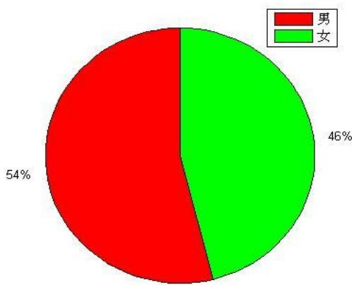
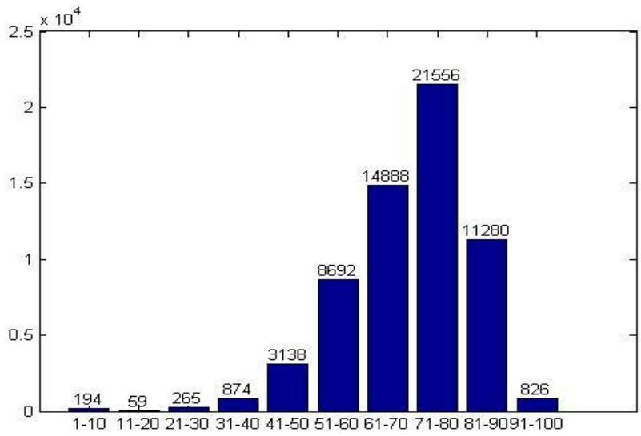
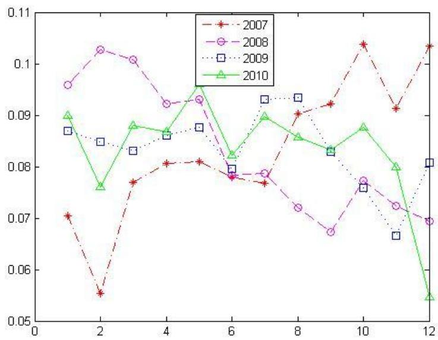
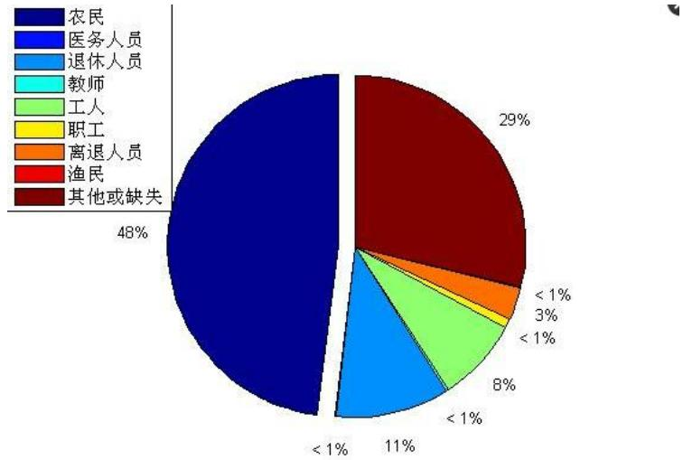
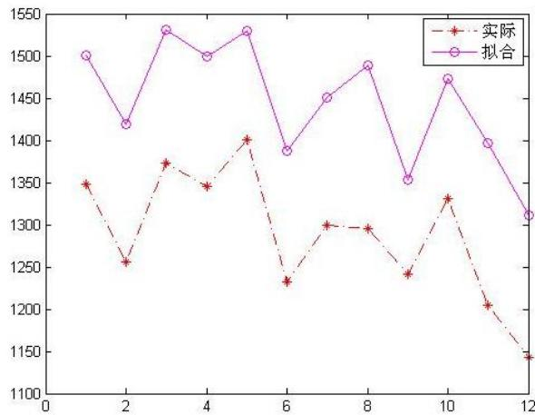
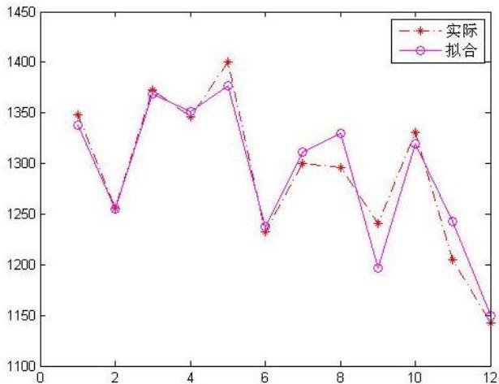
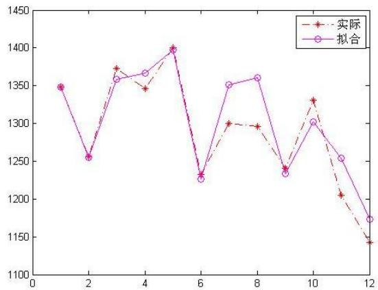
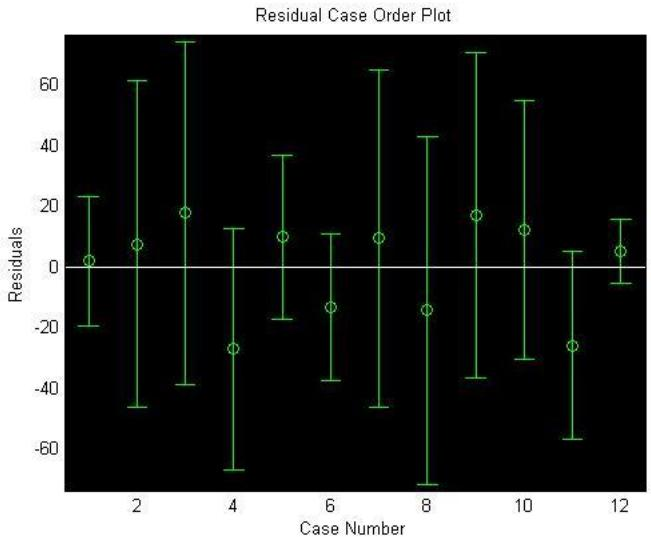
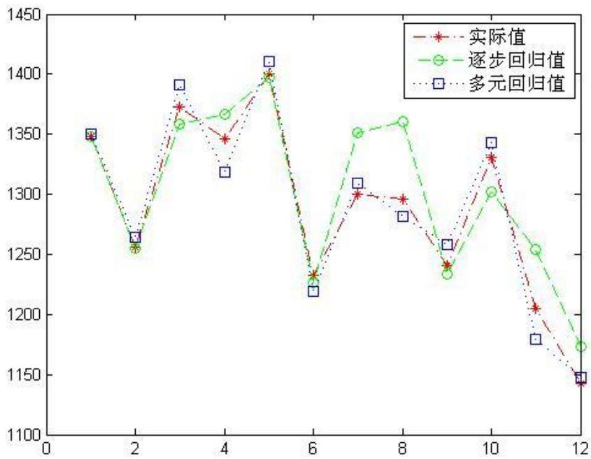
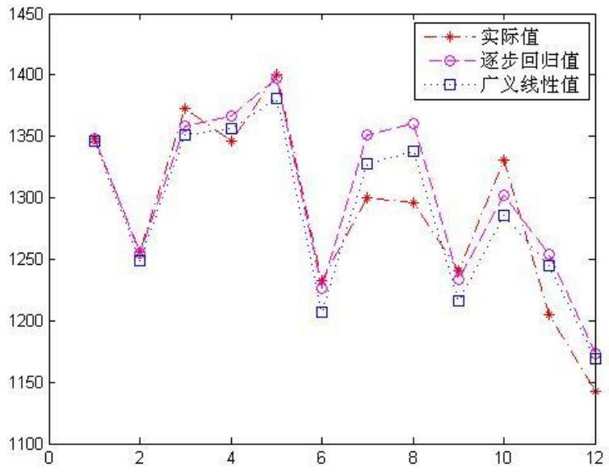

# 2012 高教社杯全国大学生数学建模竞赛

## 承 诺 书

我们仔细阅读了中国大学生数学建模竞赛的竞赛规则。

我们完全明白，在竞赛开始后参赛队员不能以任何方式（包括电话、电子邮件、网上咨询等）与队外的任何人（包括指导教师）研究、讨论与赛题有关的问题。

我们知道，抄袭别人的成果是违反竞赛规则的，如果引用别人的成果或其他公开的资料（包括网上查到的资料），必须按照规定的参考文献的表述方式在正文引用处和参考文献中明确列出。

我们郑重承诺，严格遵守竞赛规则，以保证竞赛的公正、公平性。如有违反竞赛规则的行为，我们将受到严肃处理。

我们参赛选择的题号是（从 A/B/C/D中选择一项填写）： C

我们的参赛报名号为（如果赛区设置报名号的话）： 4052

所属学校（请填写完整的全名）： XXXXXX

参赛队员 （打印并签名）：1.

2. （隐去论文作者相关信息等）

3.

指导教师或指导教师组负责人（打印并签名）：

日期： 2012 年 9 月 9 日

赛区评阅编号（由赛区组委会评阅前进行编号）：

# 2012 高教社杯全国大学生数学建模竞赛

## 编 号 专 用 页

赛区评阅编号（由赛区组委会评阅前进行编号）：

赛区评阅记录（可供赛区评阅时使用）：

<table><tr><td>评阅人</td><td></td><td></td><td></td><td></td><td></td><td></td><td></td><td></td><td></td><td></td></tr><tr><td>评分</td><td></td><td></td><td></td><td></td><td></td><td></td><td></td><td></td><td></td><td></td></tr><tr><td>备注</td><td></td><td></td><td></td><td></td><td></td><td></td><td></td><td></td><td></td><td></td></tr></table>

全国统一编号（由赛区组委会送交全国前编号）：

全国评阅编号（由全国组委会评阅前进行编号）：

# 基于逐步回归的脑卒中发病环境因素分析及干预模型

## 摘要

本文通过建立合理的假设，对某地区 2009-2010年脑卒中发病率与 8种气象因素进行了相关分析，并经多元逐步回归建立了脑卒中发病率的预报模型进行了定量分析，得到了较为合理的结论。考虑到发病率与气象因素的复杂关系，在逐步线性回归模型的基础上，引进广义线性回归模型(GLM)进行推广。

针对问题一，本文对性别、年龄段、职业和时间序列以及 4年的平均发病例数进行统计和分析，在删除了一些缺失或失真数据的基础上，对数据分别进行整理分析。最后，在性别方面，得到脑卒中发病率男性比女性的高。从年龄结构看，发病人数主要集中在50\~90这一年龄区间内，其所占比例达 81.10%。从职业结构看，农民的发病率最大。从各年的平均发病人数看，在各年季节交替月份的患病人数较多。

针对问题二，考虑到气温、气压和相对湿度对发病率的影响不确定，本文首先建立了Pearson相关分析模型，通过r值的大小来判断发病率与各指标是否存在着某种相关。经计算得出温度与发病率呈正相关，气压、相对湿度与发病率呈负相关，且各指标与发病率均呈弱相关，相关度并不显著。其次，考虑到发病率有可能受到多个因素的共同影响，于是用逐步线性回归模型对各因素逐步分析删除，最后得出脑卒中月平均发病率与平均气压、最大气压、最小气压、平均温度、最高温度和最高相对湿度这五个因素的一个多元回归线性预报模型，并进行了一定的定量分析。最后，考虑到逐步线性回归模型的各指标是相互独立性，而气压和温度之间存在相互作用，通过引入平均气压和平均温度交互项，对模型二进行了改进，得到了一个更优的模型。通过对模型的定量分析，本文预报模型具有实际应用价值。

针对问题三，脑卒中高危人群的重要特征有：偏瘫、失语、精神症状等，关键指标有：高血压、吸烟醉酒、血脂异常、糖尿病等。结合问题一、二的结论，分别针对高危人群提出预警和干预的建议方案。从这两个方案中得知：减少脑卒中发病率要从提高身体素质、疾病的认知和膳食均衡这三方面去考虑。

最后，考虑到逐步线性回归模型中脑卒中发病率与气象因素中的线性关系，而实际上，发病率与气象因素关系的复杂性线性关系并不足以充分刻画，本文在假设脑卒中发病例数与整个地区是一个小概率事件上，其实际分布接近于泊松分布，利用广义线性回归模型(GLM)进行推广，一定程度优化了逐步回归模型。

## 一、 问题重述

脑卒中（俗称脑中风）是目前威胁人类生命的严重疾病之一，它的发生是一个漫长的过程，一旦得病就很难逆转。这种疾病的诱发已经被证实与环境因素，包括气温和湿度之间存在密切的关系。对脑卒中的发病环境因素进行分析，其目的是为了进行疾病的风险评估，对脑卒中高危人群能够及时采取干预措施，也让尚未得病的健康人，或者亚健康人了解自己得脑卒中风险程度，进行自我保护。同时，通过数据模型的建立，掌握疾病发病率的规律，对于卫生行政部门和医疗机构合理调配医务力量、改善就诊治疗环境、配置床位和医疗药物等都具有实际的指导意义。

数据（见Appendix-C1）来源于中国某城市各家医院 2007 年 1 月至 2010 年 12 月的脑卒中发病病例信息以及相应期间当地的逐日气象资料（Appendix-C2）。请你们根据题目提供的数据，回答以下问题：

1．根据病人基本信息，对发病人群进行统计描述。  
2．建立数学模型研究脑卒中发病率与气温、气压、相对湿度间的关系。

3．查阅和搜集文献中有关脑卒中高危人群的重要特征和关键指标，结合1、2中所得结论，对高危人群提出预警和干预的建议方案。

## 二、 符号说明及名词定义

<table><tr><td>符号</td><td>符号说明</td></tr><tr><td>r</td><td>简单相关系数</td></tr><tr><td>y</td><td>脑卒中发病人数</td></tr><tr><td>x</td><td>回归分析解析变量(或指标)</td></tr><tr><td>β</td><td>回归方程的回归系数</td></tr><tr><td> $e_t$ </td><td>残差</td></tr><tr><td> $C_t$ </td><td>残差绝对值与实际值的百分比</td></tr><tr><td> $|e_t|$ </td><td>各个月份残差绝对值</td></tr><tr><td> $S_t$ </td><td>表示各月份的实际值</td></tr></table>

## 三、 基本假设

1. 假设4年中年与年间气象没有发生剧烈变化  
2. 假设发病人数不存在人口迁移的巨大变化

## 四、 问题分析

## 4.1 背景分析

脑卒中（Stroke）是脑中风的学名，是一种突然起病的脑血液循环障碍性疾病。又叫脑血管意外。是指在脑血管疾病的病人，因各种诱发因素引起脑内动脉狭窄，闭塞或破裂，而造成急性脑血液循环障碍，临床上表现为一过性或永久性脑功能障碍的症状和体征．脑卒中分为缺血性脑卒中和出血性脑卒中。根据统计中国每年发生脑卒中病人达200万，发病率高达120/10 万。现幸存中风病人 700万，其中450万病人不同程度丧失劳动力和生活不能自理。致残率高达 75%。尽管该病与高血压、心脏病等主要危险因素有关，但其发病往往受季节气候变化及其它外界因素的影响。

气象因素的变化对脑血管病发病的影响，国内外均有报道。多数研究指出，在冬季脑卒中的发病率有明显增加，发病率与温度有很大的关联，但也有研究指出，脑卒中发病率与季节没有明显的变化，这些日渐深入的研究结果不尽一致，主要是因为各地的地理气候特点差别较大以及社会因素、人种遗传等等方面的区别。为了更好的预防这种疾病，本文对2007-2010 年某地区脑卒中发病率与该地区相应的思念气象因素指标进行分析，初步验证了气象因素与脑卒中发病率之间的关系。

## 4.2 问题一分析

根据附件 1-4，本文以脑卒中发病人数，分别从发病时间、性别、年龄结构和职业进行数据整理分析，得到一些初步的结论，对脑卒中发病情况进行一些简单的分析与总结。

通过数据的初始处理发现题目所给的数据中存在空缺，对于数据的统计问题，数据的空缺是不可忽视的地方，要综合考虑空缺数据的作用以及给数据统计造成的影响大小，乔珠峰、田凤占和黄厚宽[1]等人指出：如果缺失的数据占总数据量的比例较小，认为缺失数据对原始数据的处理影响较小，可以忽略不计，如果缺失数据在总数据量中所占比例较大可能对原始数据的处理造成很大的影响，不能直接忽略，需要通过填补来完善数据才能进行计算。

对每个部分共计多少数据，缺失多少数据，删除多少数据以及剩余多少完整数据进行研究，通过对数据的进一步处理，得到男女患病比例的扇形图，将年龄结构处理后的数据转化成柱状图，据图分析患病人群所处的年龄段，根据这一结果结合脑卒中的患病原因分析不同年龄段患病的原因；对于按月份划分的数据，做出各年中每月患病人数与年份患病总人数比值的折线图，通过图示结果分析患病人数与月份之间的关系，从而反映气候的变化对脑卒中病发的影响情况，以及对此应做出的相关防御措施。

对于职业这一类别的数据，通过统计缺失数据所占的比例比较大，如果要对数据进行填补将会耗费很大的人力物力，对此认为获取这类缺失数据造成的代价太大，此外由于职业之一类别的数据分析没能对解题带来较大的帮助，而且职业指标的概念比较模糊无法准确描述这类数据的处理对现实生活和相关研究有何积极作用，因此本文不再对这一类别的数据进行统计分析。

## 4.3问题二分析

本文通过统计2007-2010年间的脑卒中月平均发病人数，对应选取 4年间的8个气象因子：平均气压、最高气压、最低气压、平均温度、最高温度、最低温度、平均相对湿度以及最低相对湿度，试图建立月平均发病率与气象因子之间的数学模型。通过查询资料得知发病率等于月发病人数与发病总人数的比值，但是使用发病率建立的模型所反映的变量之间的变化趋势不明显（无量纲化处理后的原因），故本文建立发病人数与气象因素之间的模型，再用发病人数除以总人数即可得到发病率与气象因子之见的数学模型。

首先建立基于Pearson 简单相关分析的模型，分析脑卒中月均患病人数与气象指标的相关关系，然后本文利用逐步回归分析建立月发病率与多项气象因素之间的预测模型，通过t 值检验，逐步剔除一些对因变量影响不大的指标，直到所有指标都通过 t值检验才终止计算，得到最终脑卒中月发病数与气象因素的预报模型。最后本文认为气压与温度之间存在一定的相互关系，在逐步回归模型的基础上通过引入交叉项对模型进行改进，进一步提高模型的拟合度，完善模型。

## 4.4问题三分析

通过查阅资料得到脑卒中高危人群的重要特征和关键指标，结合问题一和问题二得到的结论，分别对高危人群提出预警和干预的建议方案。对预警方案从生活、医疗和就医三个方面提出建议；对干预方案从脑卒中高危人群和非高危人群两方面提出建议。

## 五、 模型的建立与求解

## 5.1问题一模型的建立与求解

脑卒中是目前威胁人类健康的严重疾病之一，它的发生是一个漫长的过程，一旦得病就很难逆转。每年都有很多人患上脑卒中，本文通过对往年患病人群的数据进行统计，按发病人群的性别、年龄、发病年份和病人的职业进行归类总结。根据所得的结果分析脑卒中患病人群在年龄结构上的分布情况以及在不同职业、不同性别的分布情况。

## 5.1.1缺失数据的处理

通过初步分析，发现原始数据存在一些缺失，对于缺失的数据针对不同的情况有不同的处理方式。

2007-2010年间共61923 例脑卒中发病数，其中缺失信息数据经过整理得到下表

表1：缺失个数及其占总数据百分比

<table><tr><td>类别</td><td>性别</td><td>年龄</td><td>月份</td></tr><tr><td>缺失个数</td><td>12</td><td>151</td><td>38</td></tr><tr><td>所占百分比</td><td>0.0002%</td><td>0.24%</td><td>0.0006%</td></tr></table>

通过表1可以看到按性别、年龄和月份为类别的数据中，缺失数据的个数占总数的百分比都非常小，本文认为对总体统计处理所造成的影响很小，因此这三个类别的缺失数据可以采用直接删除数据，对剩余的数据进行统计分析。

## 5.1.2按不同类别统计数据

李翠花[2]曾总结了脑卒中的患病因素有高血压、心脏病、肥胖、糖尿病以及抽烟酗酒等

本文通过Excel对2007-2010年四年中脑卒中发病情况进行整理分析，分别从性别、年龄结构、发病时间和职业四个方面进行初步分析。

通过网上搜索资料得知脑卒中的发病与高血压、心脏病、肥胖、糖尿病和吸烟酗酒等有很大的关系，本文通过患病人群的性别分布、年龄结构以及患病人群的从事职业的统计结果分别分析脑卒中病因与相关统计结果的关系。

## 1）按性别统计

对于2007-2010年的数据，本文通过统计 4年中男性患者的总人数和女性患者的总人数，作出患病人群的性别比例，结果如下图

pie

| Category | Value (%) |
| --- | --- |
| 男 | 54 |
| 女 | 46 |

图 1：患病人群男女比例

根据图1得知男性患脑卒中的比例与女性患脑卒中的比例为 1:0.85，通过查阅资料和结合生活实际不难发现现实生活中的绝大部分男性（成年人）都有吸烟的生活的习性，而女性吸烟的人数比较少，通过前面的结论已经得知吸烟会导致脑卒中的病发，男性由于吸烟增加了脑卒中的病发，因此男性患脑卒中疾病的比例会大于女性。

同时随着社会的发展工作上的应酬变成了达成合作的必要条件，应酬时酒已经成为必不可少的一道菜肴，由于出面谈生意大部分是男性，前面已经分析得知过量的喝酒也是造成脑卒中病发的重要因素之一，从这个角度分析，男性患脑卒中的概率比女性要大，因此就整个男女集体来分析比较，脑卒中的患病人群中男性的比例会大于女性。据此我们也可以证实抽烟酗酒会增加脑卒中病发的概率，因此减少抽烟或者不抽烟以及不酗酒（适量饮酒）可以有效降低脑卒中的病发，同时也有利于身心健康。

## 2）按年龄分析

根据2007-2010年的数据，本文通过统计 4年中各个年龄段患病人数的总和作出直方图，据图分析相关结果（这里本文将 0 岁的儿童归结到 1-10 岁的年龄段，大于 100岁的人归结到91-100岁的年龄段）

histogram

| Bin | Frequency (x 10^4) |
| --- | --- |
| 1-10 | 194 |
| 11-20 | 59 |
| 21-30 | 265 |
| 31-40 | 874 |
| 41-50 | 3138 |
| 51-60 | 8692 |
| 61-70 | 14888 |
| 71-80 | 21556 |
| 81-90 | 11280 |
| 91-100 | 826 |

图2：患病人群的年龄段分布

对于年龄我们将1-10岁归为儿童，11-20 归为青少年，21-40为中年 41-60岁为中老年 61-100 归为老人。通过计算得知患病人数的平均值为 6177.2，据此可以得知患病人数大于平均值的年龄段、人数和所占比值如下表

表2：患病人数大于平均值的年龄段、人数和所占比值

<table><tr><td>年龄段</td><td>51-60</td><td>61-70</td><td>71-80</td><td>81-90</td></tr><tr><td>人数</td><td>8692</td><td>14888</td><td>21556</td><td>11280</td></tr><tr><td>所占比例</td><td>14.04%</td><td>24.04%</td><td>34.81%</td><td>18.21%</td></tr></table>

本文将患病人数大于平均值的年龄段段称为病症高发年龄段，因此脑卒中病症高发年龄段大部分为老年人。通过查阅资料得知老年人腹部脂肪容易堆积，形成向心性肥胖，肥胖者高血压的患病率较高，因为老年人容易患高血压；此外老年人新陈代谢能力降低，存在一定的代谢障碍容易患糖尿病；随着年龄的增加老年人接受刺激的能力也随之下降，患上心脏病的概率也增大，前面已知心脏病，高血压，糖尿病等都是引发脑卒中的发病因素，因此老年人患脑卒中的概率比较大，患病的人数也比其他年龄段多。通过分析得知老年人可以通过锻炼身体增强自身的抵抗能力和身体素质，用强健的体魄阻挡脑卒中的病发，同时还可以陶冶情操，修养身心。

此外据图 2 可得，31-50 岁的中年也有较大一部分的患病人数，其中还有儿童。伴随着社会的发展，中年人的生活习惯越来越没有规律，饮食也杂乱无章，由于不良的生活习惯会导致高血压、肥胖等症状的病发，所以也有较大一部分的中年人因此患病。对于儿童患病原因是由天性的遗传和缺乏维生素 K造成，因此儿童也有小部分的患者。中年人可以通过调整饮食结构和改善生活习惯来避免相关病症的发生，从而减少脑卒中的病发，对于儿童可以通过补充相关的维生素来抵抗病菌的入侵，提高免疫能力，减少病症的发生。

## 3)按月份分析

由于 2009 年患病人数比较少，而其他 3 年的数据相对较高，为了更直观的反映 4年数据之间的变化趋势，本文用每月的患病人数与年患病总数的比值画出折线图

line

| X | 2007 | 2008 | 2009 | 2010 |
|---|---|---|---|---|
| 1 | ~0.070 | ~0.096 | ~0.087 | ~0.090 |
| 2 | ~0.055 | ~0.103 | ~0.085 | ~0.076 |
| 3 | ~0.077 | ~0.101 | ~0.083 | ~0.088 |
| 4 | ~0.081 | ~0.092 | ~0.086 | ~0.087 |
| 5 | ~0.081 | ~0.093 | ~0.088 | ~0.096 |
| 6 | ~0.078 | ~0.078 | ~0.080 | ~0.082 |
| 7 | ~0.077 | ~0.079 | ~0.093 | ~0.090 |
| 8 | ~0.090 | ~0.072 | ~0.093 | ~0.086 |
| 9 | ~0.092 | ~0.067 | ~0.083 | ~0.083 |
| 10 | ~0.104 | ~0.077 | ~0.076 | ~0.088 |
| 11 | ~0.091 | ~0.072 | ~0.066 | ~0.080 |
| 12 | ~0.103 | ~0.069 | ~0.081 | ~0.055 |

图3：不同月份患病人数分布

从图中可以看出各年季节交替月份的患病人数比临近月份的患病人数较多，由于交替月份的气温的变化无常，白昼温差较大而且不易预测，老年人身体的抵抗力较弱，因此在季节交替的月份不少老年人就会因防备不及而发生脑子中等疾病，此外天气变冷时特别是冬春季节，气温偏低, 人体血管收缩明显，血压增高，危险因素控制不佳的情况下，容易发生心脑血管事件从而造成脑卒中的病发。所以，特别是对有危险因素如高血压、糖尿病、动脉硬化的老年人，在季节交换的月份要注意防寒保暖，做好防御疾病的相关措施，在春冬季节的时候要注意保暖，常到阳光充足的地方晒晒太阳，这样有利于对危险因素的控制，防止脑卒中的病发。

## 4)按职业分析

根据2007-2010年的数据，本文通过统计不同职业的患病人数得到下图

pie

| Category | Percentage |
| --- | --- |
| 农民 | 48% |
| 医务人员 | < 1% |
| 退休人员 | 11% |
| 教师 | < 1% |
| 工人 | 8% |
| 职工 | < 1% |
| 离退人员 | 3% |
| 渔民 | < 1% |
| 其他或缺失 | 29% |

图4：不同职业患病人数比例

根据图4本文抛开其他和缺失数据的选项，根据不同职业的患病人数进行分析，农民这一职业中脑卒中的患病人数最多，由于农民市场在野外劳作，长时间经受烈日的暴晒以及暴雨的冲洗容易导致脑卒中的病发；其次是退休人员，退休人员大多数和老人，老人容易患心脏病和高血压等疾病，由于这些疾病容易造成脑卒中的病发，所以退休人员中有较多的患病者；接着是工人，由于工人的工作环境比较恶劣，并且时常加班加点，造成体力活动过量，进而促使脑卒中的病发，所以工人占据一定的比例。

## 5.2问题二模型的建立与求解

## 5.2.1模型一：基于Pearson 简单相关分析的模型

相关关系是现象间不严格的依存关系，即个变量之间不存在确定性的关系，依据陈胜可[3]的总结：相关关系中当一个或几个相互联系的变量取一定数值时，与之相应的另一变量也会发生变化，但其关系值不是固定的，往往按照某种规律在一定范围内变化。

通过对附件给出的数据，首先计算气象因素月平均值和脑卒中月平均发病数具体数据如下表

表 3：2007-2010 年的月平均数据

<table><tr><td>月份</td><td>平均气压</td><td>最高气压</td><td>最低气压</td><td>平均气温</td><td>最高气温</td><td>最低气温</td><td>平均湿度</td><td>最低湿度</td><td>患病人数</td></tr><tr><td>1</td><td>11.74395</td><td>285.625</td><td>1024.48</td><td>3.758065</td><td>7.604032</td><td>0.841935</td><td>67.83065</td><td>51.00806</td><td>1348.25</td></tr><tr><td>2</td><td>1022.144</td><td>1024.994</td><td>1019.114</td><td>6.739347</td><td>10.88575</td><td>3.484698</td><td>70.70628</td><td>51.9572</td><td>1256.25</td></tr><tr><td>3</td><td>1019.225</td><td>1022.362</td><td>1015.985</td><td>10.34839</td><td>14.79516</td><td>6.644355</td><td>67.25</td><td>46.39516</td><td>1373</td></tr><tr><td>4</td><td>1017.117</td><td>1020.139</td><td>1014.057</td><td>13.38164</td><td>17.8093</td><td>9.648548</td><td>66.37554</td><td>46.12258</td><td>1346</td></tr><tr><td>5</td><td>1009.714</td><td>1011.883</td><td>1007.36</td><td>21.58629</td><td>26.7379</td><td>17.34435</td><td>64.41935</td><td>40.21774</td><td>1400.5</td></tr><tr><td>6</td><td>1005.694</td><td>1007.387</td><td>1003.871</td><td>24.47417</td><td>28.3075</td><td>21.60833</td><td>77.15833</td><td>58.58333</td><td>1232.5</td></tr><tr><td>7</td><td>1003.923</td><td>1005.584</td><td>1002.137</td><td>29.14839</td><td>33.26532</td><td>26.00806</td><td>73.83871</td><td>55.35484</td><td>1300</td></tr><tr><td>8</td><td>1006.024</td><td>1007.738</td><td>1004.261</td><td>28.8871</td><td>32.88226</td><td>25.94597</td><td>74.8871</td><td>56.19355</td><td>1295.75</td></tr><tr><td>9</td><td>1011.334</td><td>1013.048</td><td>1009.635</td><td>24.78</td><td>28.54333</td><td>22.04333</td><td>78.175</td><td>60.14167</td><td>1241</td></tr><tr><td>10</td><td>1018.21</td><td>1020.188</td><td>1016.358</td><td>19.43629</td><td>23.58871</td><td>16.01129</td><td>73.16935</td><td>50.54032</td><td>1330.5</td></tr><tr><td>11</td><td>1023.169</td><td>1025.4</td><td>1020.913</td><td>12.16667</td><td>16.5825</td><td>8.56</td><td>70.975</td><td>48.91667</td><td>1205</td></tr><tr><td>12</td><td>1023.33</td><td>1026.137</td><td>1020.61</td><td>6.805645</td><td>11.01855</td><td>3.379839</td><td>66.8629</td><td>46.97581</td><td>1142.5</td></tr></table>

若随机变量X、Y的联合分布是二维正态分布， $x _ { i }$ 和 $y _ { i }$ 分别为n次独立观测值，相关系数r的公式为

$$
r = \frac {\sum_ {i = 1} ^ {n} (x _ {i} - \bar {x}) (y _ {i} - \bar {y})}{\sqrt {\sum_ {i = 1} ^ {n} (x _ {i} - \bar {x}) ^ {2}} \sqrt {\sum_ {i = 1} ^ {n} (y _ {i} - \bar {y}) ^ {2}}} \tag {1}
$$

其中 ${ \overline { { x } } } = { \frac { 1 } { n } } \sum _ { i = 1 } ^ { n } x _ { i } \ , { \overline { { y } } } = { \frac { 1 } { n } } \sum _ { i = 1 } ^ { n } y _ { i }$ C

通过Matlab结合表 3的数据计算得到

表4：指标的相关关系r值

<table><tr><td>变量</td><td>平均气压</td><td>最高气压</td><td>最低气压</td><td>平均温度</td><td>最高温度</td><td>最低温度</td><td>平均湿度</td><td>最低湿度</td></tr><tr><td>r值</td><td>-0.1326</td><td>-0.1161</td><td>-0.1161</td><td>0.0952</td><td>0.1139</td><td>0.0743</td><td>-0.3798</td><td>-0.4005</td></tr></table>

简单相关系数r有如下性质

表 5：相关系数 r的性质

<table><tr><td>-1</td><td>完全负相关</td><td>(-1,-0.5)</td><td>强负相关</td><td>-0.5</td><td>中负相关</td></tr><tr><td>(-0.5,0)</td><td>弱负相关</td><td>0</td><td>无线性相关</td><td>(0,0.5)</td><td>弱正相关</td></tr><tr><td>0.5</td><td>中正相关</td><td>(0.5,1)</td><td>强正相关</td><td>1</td><td>完全正相关</td></tr></table>

结合表4和表5得知脑卒中的患病人数与各个自变量之间的关系如下表

表6：各个自变量与脑卒中的相关关系

<table><tr><td>变量</td><td>平均气压</td><td>最高气压</td><td>最低气压</td><td>平均温度</td><td>最高温度</td><td>最低温度</td><td>平均湿度</td><td>最低湿度</td></tr><tr><td>关系</td><td>弱负相关</td><td>弱负相关</td><td>弱负相关</td><td>弱正相关</td><td>弱正相关</td><td>弱正相关</td><td>弱负相关</td><td>弱负相关</td></tr></table>

## 5.2.2模型二：逐步回归模型

## 步骤一：多元线性回归方程的建立

多元线性回归方程[3-4]的基本公式

$$
y = \beta_ {0} + \beta_ {1} x _ {1} + \dots + \beta_ {m} x _ {m} + \varepsilon \tag {2}
$$

式中 $\beta _ { 0 } , \beta _ { 1 \ldots } \beta _ { m }$ 表示方程的回归系数，对于回归系数采用最小二乘法进行拟合，公式为

$$
\hat {\boldsymbol {\beta}} = (X ^ {T} X) ^ {- 1} X ^ {T} Y \tag {3}
$$

通过计算得到回归参数 $\beta _ { 0 } , \beta _ { 1 \ldots } \beta _ { m }$ 为[-22613 2274 -1020 -1227 538 -628 133 35-79]

从而得到多元线性回归方程

$$
y = - 2 2 6 1 3 + 2 2 7 4 x _ {1} - 1 0 2 0 x _ {2} - 1 2 2 7 x _ {3} + 5 3 8 x _ {4} - 6 2 8 x _ {5} + 1 3 3 x _ {6} + 3 5 x _ {7} - 7 9 x _ {8} \tag {2}
$$

通过Matlab软件对方程拟合度进行分析结果如下

line

| X | 实际 | 拟合 |
| --- | --- | --- |
| 1 | ~1350 | ~1500 |
| 2 | ~1255 | ~1420 |
| 3 | ~1375 | ~1530 |
| 4 | ~1345 | ~1500 |
| 5 | ~1400 | ~1530 |
| 6 | ~1235 | ~1390 |
| 7 | ~1300 | ~1450 |
| 8 | ~1295 | ~1490 |
| 9 | ~1240 | ~1355 |
| 10 | ~1330 | ~1475 |
| 11 | ~1205 | ~1400 |
| 12 | ~1145 | ~1310 |

图5：各个指标与患病人数的拟合图

对方程拟合优度进行检验得到决定系数 $R ^ { 2 } = 0 . 5 4$ 通过修正得 $R ^ { 2 } = 0 . 6 9$ $R ^ { 2 }$ 越大说明方程的拟合程度越好。

根据拟合优度的检验以及图5的拟合效果发现回归函数的拟合程度不高存在较大的误差，可能存在一些不相关的指标影响着模型的拟合，因此需要对方程作进一步分析。

## 步骤二：函数的误差分析

根据多元线性回归方程公式（4）利用表 3中各个自变量的数据进行预测，通过预测得到的数据与实际想比较，计算出回归方程的误差，本文通过残差进行检验，残差的

计算公式为：

$$
e _ {t} = y _ {i} - y _ {i} \tag {3}
$$

计算的得到的预测值和残差如下表

表7：预测值及残差

<table><tr><td>月份</td><td>实际</td><td>预测</td><td>残差 $e_t$ </td></tr><tr><td>1</td><td>1348.25</td><td>1501.3</td><td>-153.05</td></tr><tr><td>2</td><td>1256.25</td><td>1419.1</td><td>-162.85</td></tr><tr><td>3</td><td>1373</td><td>1530.4</td><td>-157.4</td></tr><tr><td>4</td><td>1346</td><td>1499.9</td><td>-153.9</td></tr><tr><td>5</td><td>1400.5</td><td>1530.2</td><td>-129.7</td></tr><tr><td>6</td><td>1232.5</td><td>1388.0</td><td>-155.5</td></tr><tr><td>7</td><td>1300</td><td>1450.8</td><td>-150.8</td></tr><tr><td>8</td><td>1295.75</td><td>1488.5</td><td>-192.75</td></tr><tr><td>9</td><td>1241</td><td>1353.4</td><td>-112.4</td></tr><tr><td>10</td><td>1330.5</td><td>1473.6</td><td>-143.1</td></tr><tr><td>11</td><td>1205</td><td>1396.1</td><td>-191.1</td></tr><tr><td>12</td><td>1142.5</td><td>1311.6</td><td>-169.1</td></tr></table>

根据表4中各个月份的残差值，分别计算出残差绝对值与实际数据的比值，公式

$$
C _ {t} = \frac {\left| e _ {t} \right|}{S _ {t}} \times 100 \% \quad i = 1, 2, 3 \dots 1 2 \tag {4}
$$

式中 $C _ { t }$ 表示残差绝对值与实际值的百分比， $\left| e _ { t } \right|$ 各个月份残差绝对值， $S _ { t }$ 表示各月份的实际值。理想的即误差较小的函数残差跟实际数据的比值百分比比较小。通过计算得到如下结果

表8：残差绝对值与实际值的百分比

<table><tr><td>月份</td><td>1</td><td>2</td><td>3</td><td>4</td><td>5</td><td>6</td></tr><tr><td>比值</td><td>11.35%</td><td>12.96%</td><td>11.46%</td><td>11.43%</td><td>9.2%</td><td>12.62%</td></tr><tr><td>月份</td><td>7</td><td>8</td><td>9</td><td>10</td><td>11</td><td>12</td></tr><tr><td>比值</td><td>11.6%</td><td>14.88%</td><td>9.05%</td><td>11.75%</td><td>15.85%</td><td>14.80%</td></tr></table>

通过上表的数据可以看出每个月份残差绝对值与实际值的百分比都超过了 10%，本文认为模拟出来的数据残差百分比超过 5%的公式，拟合程度不高，自变量中存在一些对拟合有影响的因素。

## 步骤三：逐步回归分析

题目需要分析脑卒中的发病率与气温、气压以及相对湿度间的关系，本文首先考虑8 个指标：平均气压、最高气压、最低气压、平均气温、最高气温、平均相对湿度和最低相对湿度共同作用对发病率的影响，由于一些对因变量影响不显著的指标降低了模型的拟合度，因此采用逐步分析回归剔除影响不显著的指标。

通过t检验逐步分析各个自变量对脑卒中发病率影响，对通过不了 t检验（对发病率影响很小）的自变量进行逐个的剔除，最终得到全部能通过 t值检验的数值指标作为最终函数的自变量，然后再对函数进行相关分析。

## t 检验

在回归模型中变量的选择是一个难题，在选择变量时，一方面希望尽可能不遗漏重要的影响变量，另一方面又要遵循参数节省原则，使自变量的个数尽可能少，因为当自变量数目较过大时，模型计算复杂，且会扩大估计方差，降低模型精度。

对于变量的筛选方法比较多，结合本题的情况本文采用向后选择变量法进行筛选，它是变量筛选的一种常用方法。它首先以全部自变量 $x _ { 1 } ~ - x _ { 8 }$ 作为解释变量拟合方程（公式4），然后每一步都在未通过 t检验的自变量中选择一个值最小的变量，将它从模型中删除，直到某一步之后所有的自变量都通过 t 检验。

通过Matlab软件求得 t值如下表

表9：各个自变量的 t值

<table><tr><td>x</td><td>x1</td><td>x2</td><td>x3</td><td>x4</td><td>x5</td><td>x6</td><td>x7</td><td>x8</td></tr><tr><td>t值</td><td>4.0125</td><td>-3.6197</td><td>-4.2583</td><td>0.9795</td><td>-2.1823</td><td>0.4217</td><td>1.2724</td><td>-2.3166</td></tr></table>

注：x1 平均气压,x2 最高气压,x3 最低气压,x4 平均气温,x5 最高气温,x6 最低气温,x7平均相对湿度,x8 最低相对湿度

根据查表得知 t 的临界值为 3.182，小于临界值的指标有 x4、x5、x7 和 x8。对于 t 的绝对值最小的自变量，认为该变量对脑卒中发病率的影响最低，可以剔除。根据表 5可以看出 x6 的 t 值绝对值最小，对因变量的影响最小，因此可以剔除 x6—平均相对湿度这一变量，根据向后选择变量法思想，删除 x6 这一指标后对剩余的 7 个自变量重新拟合回归方程，此时方程为

$$
y = - 2 2 8 0 3. 9 + 2 3 1 8. 6 6 x _ {1} - 1 0 5 6. 8 6 x _ {2} - 1 2 3 4. 7 x _ {3} + 7 4 9. 5 7 x _ {4} - 7 0 6. 6 1 x _ {5} + 2 6. 4 8 x _ {7} - 6 9. 3 3 x _ {8}
$$

通过Matlab软件对方程拟合度进行分析结果如下

line

| X | 实际 | 拟合 |
| --- | --- | --- |
| 1 | ~1348 | ~1338 |
| 2 | ~1255 | ~1255 |
| 3 | ~1370 | ~1368 |
| 4 | ~1348 | ~1350 |
| 5 | ~1400 | ~1375 |
| 6 | ~1235 | ~1238 |
| 7 | ~1300 | ~1312 |
| 8 | ~1295 | ~1330 |
| 9 | ~1240 | ~1198 |
| 10 | ~1330 | ~1320 |
| 11 | ~1205 | ~1242 |
| 12 | ~1142 | ~1150 |

图6：剔除x6后方程拟合图

据图可以看出用公式（7的拟合程度）较高，此外运算还得到决定系数 $R ^ { 2 } = 0 . 9 1 0 5$ 修正后的 $R ^ { 2 } = 0 . 7 5 4 0$ ，另外两个参数 $\mathrm { F } { = } 5 . 8 1 6 6$ 和 $\mathrm { P = 0 } . 0 5 4 1$ ,如果 F 小于置信区间$\mathrm { F _ { 0 . 0 5 } ( n , n - k - l ) = 6 . ~ 0 9 }$ ,P 大于基准值 0.05则认为变量之间的显著性较差，这里 F< $\mathbf { F } _ { 0 . 0 5 } ( \mathbf { n } , \mathbf { n } { - } \mathbf { k } { - } 1 )$ 且P>0.05 因此方程中可能还存在一些不相关的指标影响着模型的拟合。

根据t值检验的思想对剔除 $\mathrm { x 6 }$ 之后剩余的指标计算相应的 t值得到结果如下

表10：剔除 $\mathrm { x 6 }$ 之后各个自变量的 t值

<table><tr><td>x</td><td>x1</td><td>x2</td><td>x3</td><td>x4</td><td>x5</td><td>x6</td><td>x7</td><td>x8</td></tr><tr><td>t值</td><td>4.6707</td><td>-4.4175</td><td>-4.8175</td><td>3.7742</td><td>-3.6245</td><td>--</td><td>1.5596</td><td>-3.1098</td></tr></table>

注：--表示该指标已删除

此时通过查表得临界值 $\mathrm { t } _ { 0 . 0 2 5 } \left( 4 \right) { = } 2 . 7 7 6$ ，没有通过 t 检验的指标为 $\mathrm { x 7 }$ ，故决定再删除指标x7，对剩余指标进行拟合得出回归方程：

$$
y = - 2 4 9 7 1. 4 + 1 8 9 2. 6 3 x _ {1} - 8 5 6. 8 6 x _ {2} - 1 0 0 7. 8 5 x _ {3} + 5 3 3. 0 9 2 x _ {4} - 4 9 0. 5 3 8 x _ {5} - 3 8. 1 8 8 7 x _ {8} \tag {5}
$$

对方程拟合度进行分析如下

line

| X | 实际 | 拟合 |
| --- | --- | --- |
| 1 | ~1348 | ~1348 |
| 2 | ~1255 | ~1255 |
| 3 | ~1372 | ~1358 |
| 4 | ~1345 | ~1365 |
| 5 | ~1398 | ~1398 |
| 6 | ~1230 | ~1228 |
| 7 | ~1300 | ~1350 |
| 8 | ~1295 | ~1360 |
| 9 | ~1240 | ~1235 |
| 10 | ~1330 | ~1302 |
| 11 | ~1205 | ~1255 |
| 12 | ~1142 | ~1175 |

图7：剔除 $\mathrm { x 6 }$ 、 $\mathrm { x 7 }$ 后方程拟合图  
注：--表示该指标已删除

通过决定系数 $\mathrm { R } ^ { 2 } { = } 0 . 8 5 6 2$ 以及修正后的 $\mathrm { R ^ { 2 } { = } 0 . 6 8 3 5 }$ 结合图 7 可以得知方程的拟合程度较好，同时结合指标 F值和p值，由于 $\ F = 4 . ~ 9 6 0 0 > ~ \mathrm { F } _ { 0 . 0 5 } ( \mathrm { n } , \mathrm { n } - \mathrm { k } - 1 ) = 4 . ~ 9 5 , ~ \mathrm { p } = 0 . ~ 0 5 0 0$ 综合考虑各个系数分析，认为方程的拟合程度较好。

进一步讨论剩余指标是否通过 t值检验，对剔除 x6,x7指标之后的数据进行各指标

的 t 值求解，结果如下

表 11：剔除 $_ { \mathrm { { X 6 } , } }$ 、 $\mathrm { x 7 }$ 之后各个自变量的 t 值

<table><tr><td>x</td><td>x1</td><td>x2</td><td>x3</td><td>x4</td><td>x5</td><td>x6</td><td>x7</td><td>x8</td></tr><tr><td>t值</td><td>4.0256</td><td>-3.7430</td><td>-4.2109</td><td>3.3089</td><td>-3.1533</td><td>--</td><td>--</td><td>-3.3960</td></tr></table>

此时 t0.025(5)=2.571，从上表可以看出所有指标都通过了 t 检验，计算终止。因此可以得到最终脑卒中月发病数与气象因素的预报模型。

## 步骤四：结果分析

根据公式： $1 \overrightarrow { x } \vert \overrightarrow { P H } = \frac { 1 - \sqrt { 1 } + 1 \overrightarrow { x } \vert \overrightarrow { x } \vert \overrightarrow { x } \vert \cdot \vert \overrightarrow { x } \vert } { \sqrt { 1 } \overrightarrow { x } \vert \overrightarrow { x } \vert \cdot \vert \overrightarrow { x } \vert \cdot \vert \overrightarrow { x } \vert } \lambda \ast \lambda$ ，在调查样本不变的前提下，分析指标与发病人数的相关性等同于分析指标与发病率的相关性。

本题通过控制变量分析，即假设其他自变量不变（或者用相同的数据带入），针对某一自变量的变化趋势（或者带入不同的数据），研究因变量的变化，通过因变量的变化结果分析两个因素之间的内在联系。

由于公式(7)是线性函数，则当其他自变量保持不变时做如下分析：

平均气压的相关系数为 1892.63 ，可以认为脑卒中患病人数与平均气压呈正相关患病人数随着平均气压的增加而增加，根据相关系数的大小可以得知患病人数的变化趋势随着平均气压的改变会产生强烈的变化，因此可知平均气压在很大程度上影响着患病人数的数量。

最高气温的相关系数为-490.538 ，可以认为随着最高温度的增加，脑卒中的患病人数反而下降，因为相关系数相对较小，可以分析得最高气温的变化对脑卒中患病人数的变化影响程度不是很大。

最低相对湿度的相关系数为-38.188 ， 可以认为随着最低相对湿度的增加，脑卒中患病人数反而下降。由于相关系数很小仅为 38，由此可以认为最低相对湿度的变化对患病人数的作用比较小，只是微妙的影响。

## 5.2.3模型二的改进

从陈光红，张继泽[1]《气温和气压之间的短时变化关系》的结论中可知，气压在短时间内会随着气温的升高而增大。从微观角度上看，温度高，气体分子运动快，这就促进压强的增大，但随着温度的升高，气体分子便向周围扩散，则该区域内的气体分子数就会减少，导致压强降低。同样的，湿度与大气压强也存在着密切的关系。因此气压与温度之间因存在相互之作用姜启源[7]在考虑因素有相互作用时引入交叉因子来改善模型，就得考虑它们之间的交叉影响。因此，本文对逐步回归分析模型作进一步讨论。

本文引入一个气温与气压的交叉项 $x _ { 9 }$ ，由 $x _ { 1 } x _ { 4 }$ 得到，再结合逐步回归分析模型得到的回归方程（x），得到一个新的多元一次回归方程，其通式为：

$$
y = b _ {0} + b _ {1} x _ {1} + b _ {2} x _ {2} + b _ {3} x _ {3} + b _ {4} x _ {4} + b _ {5} x _ {5} + + b _ {8} x _ {8} + b _ {9} x _ {9} + \varepsilon \tag {6}
$$

根据题中所给数据，利用 Matlab 统计工具箱命令实现多元线性回归，求解出回归方程系数分别为：

表 12：

<table><tr><td>b</td><td>b0</td><td>b1</td><td>b2</td><td>b3</td><td>b4</td><td>b5</td><td>b8</td><td>b9</td></tr><tr><td>数值</td><td>-7375.8</td><td>2510.2</td><td>-1202</td><td>-1295</td><td>-29.7</td><td>-727.7</td><td>-52.6</td><td>0.8</td></tr></table>

因此可以得到多元回归方程为：

$$
y = - 7 3 7 5. 8 + 2 5 1 0. 2 x _ {1} - 1 2 9 5 x _ {3} - 2 9. 7 x _ {4} - 7 2 7. 7 x _ {5} - 5 2. 6 x _ {8} + 0. 8 x _ {9}
$$

随机误差项方差的估计  

error_bar

| Case Number | Mean Residual | Lower Bound | Upper Bound |
| --- | --- | --- | --- |
| 1 | ~2 | ~-20 | ~23 |
| 2 | ~7 | ~-46 | ~61 |
| 3 | ~18 | ~-39 | ~75 |
| 4 | ~-27 | ~-68 | ~12 |
| 5 | ~10 | ~-17 | ~37 |
| 6 | ~-13 | ~-37 | ~11 |
| 7 | ~9 | ~-46 | ~64 |
| 8 | ~-14 | ~-73 | ~43 |
| 9 | ~17 | ~-36 | ~70 |
| 10 | ~12 | ~-30 | ~55 |
| 11 | ~-26 | ~-56 | ~5 |
| 12 | ~5 | ~-5 | ~15 |

图8：残差分析

分析上图可知，最大绝对残差所占实际值的百分值为 2%<5%，通过 Matlab软件计算得出以下指标：

$$
\mathrm{R} ^ {2} = 0. 9 5 5 6; \quad \mathrm{F} = 1 2. 2 9 6 6 > \mathrm{F} _ {0. 0 5} (1 2, 4) = 5. 9 1; \quad \mathrm{P} = 0. 0 1 4 4 <   0. 0 5;
$$

综合上述指标说明模型的拟合优度和显著性都非常好。

本文通过比较模型二与模型三，分析这两个模型的残差的方差，得出模型二残差的方差 951.2834 大于模型三残差的方差 255.229。

line

| X | 实际值 | 逐步回归值 | 多元回归值 |
|---|---|---|---|
| 1 | ~1350 | ~1350 | ~1350 |
| 2 | ~1260 | ~1255 | ~1265 |
| 3 | ~1370 | ~1360 | ~1390 |
| 4 | ~1345 | ~1365 | ~1320 |
| 5 | ~1400 | ~1400 | ~1410 |
| 6 | ~1230 | ~1230 | ~1220 |
| 7 | ~1300 | ~1350 | ~1310 |
| 8 | ~1295 | ~1360 | ~1280 |
| 9 | ~1240 | ~1235 | ~1260 |
| 10 | ~1330 | ~1300 | ~1340 |
| 11 | ~1205 | ~1255 | ~1180 |
| 12 | ~1145 | ~1175 | ~1150 |

图9：拟合比较图

由上图可知，本文进一步探讨后做出的多元回归模型拟合值比未探讨前模型拟合值

要精确，说明指标间确实存在着关联性，此次探讨具有重大意义。

## 5.3 问题三的求解

脑卒中是一种严重危害人类健康的常见病，其死亡率、病残率非常高。目前，随着人们生活水平的逐渐提高，强烈地社会竞争力给人们身心造成的压力，使缺血性脑卒中的发病率逐渐上升，且发病年龄有提早趋势。因此对高危人群提出预警和干预的建议方案已是刻不容缓。

高危人群的重要特征有：偏瘫 、偏身感觉障碍、同向偏盲、失语、精神症状、排尿障碍及昏迷；也可出现皮质盲、丘脑性感觉障碍、共济失调 、构音障碍、眼肌麻痹、吞咽困难、交叉性瘫或四肢瘫痪、闭锁综合征。

高危人群的关键指标有：高血压、房颤和心瓣膜病、吸烟酗酒、血脂异常、糖尿病、很少进行体育运动、肥胖、有卒中家庭史。

本文针对不同的高危人群分别提出预警和干预。一般认为病轻者或处于亚健康的人群适合提出预警，而病重者适合提出干预。

问题一所得结论：脑卒中发病率大多数为男性高于女性，而这主要与男性的不良生活习性较多有关，男性吸烟醉酒者相对于女性来说占了很大一部分；脑卒中发病率在多数在年龄在50～90这一年龄区间内，其所占比例已达到 81.10%。

问题二所得结论：温度与发病率呈正相关，气压、湿度与发病率呈负相关，且各个自变量与脑卒中发病率呈弱相关；通过回归分析，有多个变量影响着发病人数，它们总体存在线性相关。

针对分析高危人群提出预警的建议方案：

1、从生活方面，多做有氧运动，增强体魄，改善饮食平衡，避免暴饮暴食，少吸烟少饮酒，生活有规律，尽量避免通宵熬夜，要注意气候变化，尤其是季节转变或气候骤变，特别是男性和老年人；  
2、从医疗方面，加强对疾病影响生活的宣传力度，提高高危人群对脑卒中及其关键指标的重视，积极去了解疾病产生原因和预防疾病到来；  
3、从就医时间，若发现自己同时具备几种易患因素，就应立即去医院就医。

针对分析高危人群提出干预的建议方案：

1、非脑卒中高危人群干预。结合减盐防控高血压项目干预，同步进行健康宣传。对于非脑卒中高危人群或无慢病史者，倡导健康生活方式；对有慢病史者，根据相关疾病诊治指南给予干预。  
2、脑卒中高危人群干预。针对每位脑卒中高危个体存在的主要危险因素，进行包括低盐膳食在内的健康指导、药物干预、介入或手术治疗干预。基地医院专科医师制定治疗干预方案，指导基层医疗卫生机构实施健康指导和药物干预；需进行介入或手术治疗的由基地医院进行诊治。

## 六、模型的推广

针对逐步回归分析对数据进行回归分析，得到的结果不是很理想，原因是本文处理得到的数据有些是不服从正态分布的，而多元线性回归模型对于处理响应变量是非正态分布时它并不适应。本文搜索相关资料时发现“广义线性模型”能够很好地处理响应变量处于非正态分布时的适应性。

广义线性模型由Nelder 和Wedderbum在1972 年提出，用于建立非正态响应变量的模型[2]。广义线性模型被广泛地应用于分类数据分析，或称定性数据分析。例如医学统计、生物统计、社会学统计等。

本文采用基于Matlab的广义线性模型，研究 Matlab 统计工具箱GLM模块的应用，给出广义线性Poisson 回归模型的 Matlab的算法，由此算法可知回归方程的通式为：

$$
\ln (y) = \beta_ {0} + \beta_ {1} x _ {1} + \beta_ {2} x _ {2} + \beta_ {3} x _ {3} + \beta_ {4} x _ {4} + \beta_ {5} x _ {5} + \beta_ {8} x _ {8} + \varepsilon \tag {7}
$$

根据 Matlab 软件中 Poisson 回归模型中的 glmfit 函数得到：

表 14

<table><tr><td>变量</td><td>bp(参数的估计)</td><td>sp.p(P值)</td></tr><tr><td>Intercept</td><td>-13.9395</td><td>0.0243</td></tr><tr><td>x1</td><td>1.4981</td><td>0.0000</td></tr><tr><td>x2</td><td>-0.6773</td><td>0.0000</td></tr><tr><td>x3</td><td>-0.7978</td><td>0.0000</td></tr><tr><td>x4</td><td>0.4176</td><td>0.0001</td></tr><tr><td>x5</td><td>-0.3838</td><td>0.0002</td></tr><tr><td>x8</td><td>0.0297</td><td>0.0001</td></tr></table>

$$
d p = 7. 1 7 3 7 <   \chi_ {0. 0 5} ^ {2} (1 6 - 6) = 1 2. 5 9 1 5
$$

根据上表得知该模型的各解释变量是显著的，由卡方检验（2）说明模型的预测误差不太大，现有的解释变量对脑卒中发病率的总体效果好。

将表14中的bp值代入公式（7）中得：

$$
\ln (y) = - 1 3. 9 3 9 5 + 1. 4 9 8 1 \times x _ {1} - 0. 6 7 7 3 \times x _ {2} - 0. 7 9 7 8 \times x _ {3} + 0. 4 1 7 6 \times x _ {4} - 0. 3 8 3 8 \times x _ {5} + 0. 0 2 9 7 \times x _ {8}
$$

经过转换得到：

$$
y = e ^ {- 1 3. 9 3 9 5 + 1. 4 9 8 \times x _ {1} - 0. 6 7 7 3 \times x _ {2} - 0. 7 9 7 8 \times x _ {3} + 0. 4 1 7 6 \times x _ {4} - 0. 3 8 3 8 \times x _ {5} + 0. 0 2 9 7 \times x _ {8}} \tag {8}
$$

用该Poisson模型中的 glmval函数进行拟合，得到：

表 15

<table><tr><td>月份</td><td>实际值</td><td>广义线性回归拟合值</td><td>残差 $e_t$ </td></tr><tr><td>1</td><td>1348.25</td><td>1346.3</td><td>1.95</td></tr><tr><td>2</td><td>1256.25</td><td>1249.1</td><td>7.15</td></tr><tr><td>3</td><td>1373</td><td>1350.8</td><td>22.2</td></tr><tr><td>4</td><td>1346</td><td>1356.4</td><td>-10.4</td></tr><tr><td>5</td><td>1400.5</td><td>1381.2</td><td>19.3</td></tr><tr><td>6</td><td>1232.5</td><td>1206.9</td><td>25.6</td></tr><tr><td>7</td><td>1300</td><td>1327.7</td><td>-27.7</td></tr><tr><td>8</td><td>1295.75</td><td>1338.0</td><td>-42.25</td></tr><tr><td>9</td><td>1241</td><td>1215.7</td><td>25.3</td></tr><tr><td>10</td><td>1330.5</td><td>1285.5</td><td>45</td></tr><tr><td>11</td><td>1205</td><td>1244.5</td><td>-39.5</td></tr><tr><td>12</td><td>1142.5</td><td>1169.0</td><td>-26.5</td></tr></table>

广义线性回归模型残差的方差 $\sum ( e _ { t } - \overline { { e } } ) ^ { 2 } = 8 3 3 . 0 6 5 1$

逐步回归模型残差的方差 $\sum ( e _ { t } - \overline { { e } } ) ^ { 2 } = 8 8 2 . 2 2 5 2$

line

| X | 实际值 | 逐步回归值 | 广义线性值 |
|---|---|---|---|
| 1 | ~1345 | ~1345 | ~1345 |
| 2 | ~1255 | ~1255 | ~1250 |
| 3 | ~1370 | ~1360 | ~1350 |
| 4 | ~1345 | ~1365 | ~1355 |
| 5 | ~1400 | ~1395 | ~1380 |
| 6 | ~1235 | ~1225 | ~1205 |
| 7 | ~1300 | ~1350 | ~1325 |
| 8 | ~1295 | ~1360 | ~1335 |
| 9 | ~1240 | ~1235 | ~1215 |
| 10 | ~1330 | ~1300 | ~1285 |
| 11 | ~1205 | ~1250 | ~1245 |
| 12 | ~1140 | ~1175 | ~1170 |

图10：拟合比较图

结合图10和这方差值可看出，广义线性回归模型拟合得比逐步回归模型较平稳些。

## 七、模型的评价

## 优点

1、本文对问题二由浅至深进行分析，先不考虑指标与脑卒中发病率的影响大小，采用多元线性回归分析统一纳入到回归方程中，然后对模型进行检验并深入讨论某些指标是否影响着脑卒中的发病率，并采用逐步回归分析逐一删除不影响或较小影响发病率的指标。通过此方法分析，让模型更加清晰易懂。  
2、在模型优化与改进中，对逐步回归分析模型作了进一步的探讨，了解到指标之间存在一定的关联性，并引入了一个交叉项指标，增加了模型拟合的精度。

## 缺点

1、在对大量数据进行处理的过程中，本文基本上采用平均值来代替，且对一些缺失或计录失真（如2200/1/5 等）或特殊数据（如02-03-1990等）都是采用直接删除法，有可能对原始数据的统计带来较大的误差。  
2、计算脑卒中的发病率时，由于数据中 2009的数据相对于其他三年的数据少的比较多，可能对回归预测模型会有影响。

## 七、参考文献

[1]乔珠峰、田凤占,黄厚宽，缺失数据处理方法的比较研究，北京交通大学计算机与信息学院 2006 年 6 月 5 日  
[2]聂庆华，克拉克（美），环境统计学与 Matlab 应用，北京，高等教育出版社 2010年1月  
[3] 陈光红，张继泽，气温和气压之间的短时变化关系，渤海学刊，1993 年第四期  
[4]金爱兰，邱晓光，脑卒中与气象因素关系分析，福建省南平市第一医院 2004年9月第9期  
[5]杨红波，师苹，脑卒中与气象因素的关系，张家口医学院 2002年第 19卷第6期  
[6]胡晓冬，董辰辉，MATLAB 从入门到精通，北京，人民邮电出版社 2010 年6月  
[7]姜启源，数学模型（第三版），北京，高等教育出版社，2008 年 3 月

## 八、附录附件