## 机器人避障问题

## 摘要

针对机器人避障问题，本文分别建立了机器人从区域中一点到达另一点的避障的最短路径、最短时间路径的非线性0-1整数规划模型。同时，本文为求带有NP属性的非线性0-1整数规划模型，构建了有效启发式算法，利用MATLAB软件编程，求得了 $0\rightarrow A$ 、 $0\rightarrow B$ 、 $0\rightarrow C$ 、 $0\rightarrow A\rightarrow B\rightarrow A\rightarrow C$ 的最短路径，同时得到了 $0\rightarrow A$ 的最短时间路径，求得的各类最短路径均是全局最优。

针对区域中一点到达另一点的避障的最短路径问题，首先，本文证明了圆弧位置设定在需要绕过障碍物的顶角上，且圆弧半径为10个单位时，能够使得机器人从区域中一点到达另一点的行进路径最短；其次，本文将最短路径选择问题转化成了最短路径的优选问题，根据避障条件，建立了具有较高普适性的避障最短路径的优化模型。为便于求解，本文巧妙地将此优化模型转化成了以可行路径不与障碍物边界相交、不与圆弧相交为约束条件，以机器人从区域中一点达到另一点避障路径最短为目标的0-1规划模型；再次，本文构建了两种有效的启发式算法，利用MATLAB软件编程求得了 $0 \rightarrow A$ 、 $0 \rightarrow B$ 、 $0 \rightarrow C$ 、 $0 \rightarrow A \rightarrow B \rightarrow A \rightarrow C$ 的最短路径，最短路径长分别为471.0372、853.7001、1088.1952、2725.1596，其中 $0 \dashrightarrow A$ 的最短路径为 $(0,0) \rightarrow (70.5063,213.1405) \rightarrow (75.975,219.1542) \rightarrow (300,300)$ ，对应圆弧的圆心坐标为(80,210)， $0 \rightarrow B$ 的最短路径，对应圆弧的圆心坐标：(60,300)、(150,435)、(220、470)、(220,530)、(150,600)， $0 \rightarrow C$ 经过的圆心：(410,100)、(230,60)、(720,520)，(720,600)，(500,200)， $0 \rightarrow A \rightarrow B \rightarrow C \rightarrow 0$ 经过的圆心：(410,100)，(230,60)，(80,210)，(220,530)，(150,600)，(270,680)，(370,680)，(430,680)，(670,730)，(540,730)，(720,520)，(720,600)，(500,200）。

针对最短时间路径问题，我们建立了从 o 点出发到任意目标点的 0-1 非线性整数规划模型，同时针对题意要求，具体构建了从 o 点出发到 A 的最短时间路径的 0-1 非线性整数规划模型，利用 LINGO 软件求解，获得了机器人从 o 点出发，到达 A 的最短时间路径，求得最短时间路径下转弯半径为 12.9885，同时最短时间路径时间长为 94.2283 个单位。相应圆弧的圆心坐标为（82.1414，207.9153），两切点坐标分别为（69.8045，211.9779）、（77.7492,220.1387）。

关键字：机器人避障 启发式算法 0-1 规划模型

## 一、问题重述

在一个800×800的平面场景图，在原点O(0, 0)点处有一个机器人，它只能在该平面场景范围内活动。图中有12个不同形状的区域是机器人不能与之发生碰撞的障碍物，障碍物的数学描述如下表：

<table><tr><td>编号</td><td>障碍物名称</td><td>左下顶点坐标</td><td>其它特性描述</td></tr><tr><td>1</td><td>正方形</td><td>(300, 400)</td><td>边长200</td></tr><tr><td>2</td><td>圆形</td><td></td><td>圆心坐标(550, 450), 半径70</td></tr><tr><td>3</td><td>平行四边形</td><td>(360, 240)</td><td>底边长140, 左上顶点坐标(400, 330)</td></tr><tr><td>4</td><td>三角形</td><td>(280, 100)</td><td>上顶点坐标(345, 210), 右下顶点坐标(410, 100)</td></tr><tr><td>5</td><td>正方形</td><td>(80, 60)</td><td>边长150</td></tr><tr><td>6</td><td>三角形</td><td>(60, 300)</td><td>上顶点坐标(150, 435), 右下顶点坐标(235, 300)</td></tr><tr><td>7</td><td>长方形</td><td>(0, 470)</td><td>长220, 宽60</td></tr><tr><td>8</td><td>平行四边形</td><td>(150, 600)</td><td>底边长90, 左上顶点坐标(180, 680)</td></tr><tr><td>9</td><td>长方形</td><td>(370, 680)</td><td>长60, 宽120</td></tr><tr><td>10</td><td>正方形</td><td>(540, 600)</td><td>边长130</td></tr><tr><td>11</td><td>正方形</td><td>(640, 520)</td><td>边长80</td></tr><tr><td>12</td><td>长方形</td><td>(500, 140)</td><td>长300, 宽60</td></tr></table>

在图1的平面场景中，障碍物外指定一点为机器人要到达的目标点（要求目标点与障碍物的距离至少超过10个单位）。规定机器人的行走路径由直线段和圆弧组成，其中圆弧是机器人转弯路径。机器人不能折线转弯，转弯路径由与直线路径相切的一段圆弧组成，也可以由两个或多个相切的圆弧路径组成，但每个圆弧的半径最小为10个单位。为了不与障碍物发生碰撞，同时要求机器人行走线路与障碍物间的最近距离为10个单位，否则将发生碰撞，若碰撞发生，则机器人无法完成行走。

机器人直线行走的最大速度为 $v_{0}=5$ 个单位/秒。机器人转弯时，最大转弯速度为 $v=v(\rho)=\frac{v_{0}}{1+\mathrm{e}^{10-0.1\rho^{2}}}$ ，其中 $\rho$ 是转弯半径。如果超过该速度，机器人将发生侧翻，无法完成行走。

请建立机器人从区域中一点到达另一点的避障最短路径和最短时间路径的数学模型。对场景图中4个点O(0,0)，A(300,300)，B(100,700)，C(700,640)，具体计算：

(1) 机器人从O(0,0)出发，O→A、O→B、O→C和O→A→B→C→O的最短路径。  
(2) 机器人从O (0, 0)出发，到达A的最短时间路径。

注：要给出路径中每段直线段或圆弧的起点和终点坐标、圆弧的圆心坐标以及机器人行走的总距离和总时间。

## 二、问题分析

## 2.1 求取最短路径的分析

本问题要求机器人从区域中一点到达另一点的避障最短路径。机器人只要做到转弯时的圆弧半径最小为10个单位、与障碍物最近距离单时刻保持大于10个单位，那么可行走的路径就有无数条，若想求得机器人从区域中一点到达另一点的避障最短路径，则需要建立避障的最短路径模型，而建立避障的最短路径模型有一定难度。根据对问题的分析，我们认为可以从简单做起，先确定小范围内最短路径条件，如圆弧位置的影响，圆弧半径的大小，避免与障碍物碰撞条件等，通过确定最短路径条件来建立避障的最短路径模型。对于最短路径的求取，我们可以通过确定穷举原则，利用穷举法来求解，当然也可以通过构建启发式算法的进行求解。

## 2.2 最短时间路径的分析

对于要建立最短时间路径模型来说，我们容易知道影响的因素有直线行走速度、转弯速度，同时还需要考虑使得最短时间路径条件，如圆弧位置（坐标）的影响，圆弧半径的大小，避免与障碍物碰撞条件等。对于直线行进，我们希望行进速度越大越好，对于机器人转弯时，转弯速度要有约束，要保证机器人不能发生侧翻。我们发现圆弧半径的大小与转弯速度紧密相连，从转弯速度公式来分析，当转弯半径增大时，最大转弯速度也增大，为在更短时间内行进到目标点，我们希望转弯速度为机器人的最大转弯速度较好，但有很大的可能是行进的路径不是最短的，即行进路径有很大可能在增加。于是，我们需要做的工作是，在满足最短时间路径条件时，找到一个圆弧的坐标位置，同时确定半径的大小，以求得最短时间路径。

## 三、模型假设

1. 将机器人看成一个质点;  
2. 半径不变时，机器人在行进、转弯过程中能一直保持最大的速度；

3.

## 四、符号说明

Z：避障最短路径；  
$a_{ij}$ ：圆弧i切点到圆弧j切点的直线距离，即机器人从圆弧i切点到圆弧j切点的直线路径， $i,j=1\ldots n,n=36,i\neq j$ ;  
$b_{ij}$ ：机器人从圆弧i行进至圆弧j切点时的转弯路径， $i,j=1\ldots n,n=36,i\neq j$ ;  
$x_{i}$ ：圆弧 i 的横坐标， $i=1..36$ ；  
$y_{i}$ ：圆弧i的纵坐标，j=1..36  
$\theta$ ：圆弧对应圆心角；  
$\rho$ ：圆弧的半径；

## 五、最短路径模型建立与求解

## 5.1 模型准备

## 5.1.1 确定圆弧位置与转弯半径

在建立机器人从区域中一点到达另一点的避障最短路径数学模型之前，我们需要考虑两个问题：

问题一：机器人从区域中一点到达另一点过程中，若中间有障碍物，则需要通过转弯来绕过障碍物，那么，在转弯半径一定的情况下，怎样设定最佳圆弧位置，使得绕行路径最短？

问题二：绕行路径是最短时，转弯半径的大小为多少？

针对考虑的问题一，我们取机器人从 O 到 A 点的行走过程来说明问题。在行走过程中要求机器人行走线路与障碍物的最短距离为 10 个单位，圆弧（转弯）半径最小为 10 个单位。我们先令机器人转弯半径为 10 个单位，根据机器人行走过程中的要求，我们易得两条极端的行走路径，如图 1。将路线 II 中圆弧 3 两切点线延长，两延长交路线 I，两交点处分别作半径为 10 个单位的圆弧，由此我们可得机器人从 O 到 A 点的行走时转弯中心坐标的范围，如图 2 中四边形 abcd。

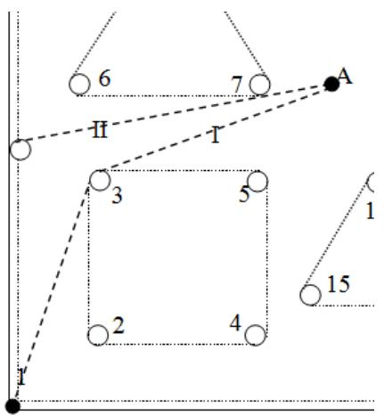

<details>
<summary>text_image</summary>

6
7
A
H
T
3
5
2
4
1
15
1
</details>

图 1 两条极端路径

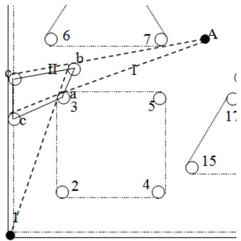

<details>
<summary>text_image</summary>

6
7
A
b
H
T
a
3
c
5
1'
2
4
15
1
</details>

图 2 转弯中心坐标的范围

图 1 中路线 I 是理想化路线，机器人不能沿 $800 \times 800$ 平面区域边界行走， $800 \times 800$ 平面区域边界也可以看成是一个障碍物，且有要求机器人行走线路与障碍物的最短距离为 10 个单位，实际上作这样的处理并不会影响我们说明问题。

我们假设在平面中有 $A(0,a)$ 和 $O(-A,0)$ 两点，中间有一正方形的障碍物，将图2进行转化，如图3.

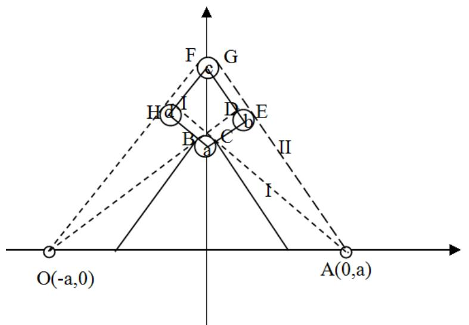

<details>
<summary>text_image</summary>

F
G
H a I
B a C
D b E
II
I
O(-a,0)
A(0,a)
</details>

图 3 最短路径证明图

图 3 中， $B, C...I$ 为切点，a, b, c, d 为圆弧圆心，四边形 abcd 为圆弧中心点的范围。

对于最佳圆弧位置确定，我们采用 “覆盖法”。我们容易知道，若路线 II 与 OA 构成的区域 II 能够完整覆盖线 I 与 OA 构成的区域 I，即区域 I 属于区域 II，那么区域 II 的周长一定大于区域 I，否则。

图 3 中路线 I 与 OA 构成的区域 I 周长为直线段 $OB + CA$ 长度、圆弧 BC 长、OA 长之和，区域 I 周长 $l_{1}$ 为

$$
l _ {1} = O B + C A + B C + O A
$$

机器人沿路线 I 的路径长 $c_{1}$ 可表示为

$$
c _ {1} = O B + C A + B C
$$

路线 II 与 OA 构成的区域 II 周长为直线段 $OH + FA$ 长度、圆弧 FG 长、OA 长之和，区域 II 周长 $l_{2}$ 为

$$
l _ {2} = O F + G A + F G + O A
$$

机器人沿路线 II 的路径长 $c_{2}$ 可表示为

$$
c _ {2} = O F + G A + F G
$$

显然我们知道区域 II 能够覆盖区域 I，即可得 $l_{2} > l_{1}$ ，进而可得到

$$
c _ {1} <   c _ {2}
$$

同理，在圆弧中心点的范围任意取一点作为机器人转弯圆弧中点，并作路线i，再将路线i与路线I做比较，可得到

$$
c _ {1} <   c _ {i}
$$

由此，我们可得出结论：机器人从区域中一点到达另一点过程中，当圆弧位置设定障碍物顶角上时，绕行路径最短，此时圆弧中心点坐标为障碍物顶角坐标。

针对考虑的问题二，为了更清晰说明绕行路径是最短时，转弯半径的大小为多少，我们基于最小圆弧半径条件下使圆弧半径增大。为了保证机器人与障碍物不发生碰撞，所以，需要保证大圆弧能够覆盖小圆弧对应圆的1/4圆弧。在设定好最佳圆弧位置情况下，增加圆弧半径，比较最短路径的变化。假设圆弧半径为 $R(R>10)$ ，对应最短路线如图4。

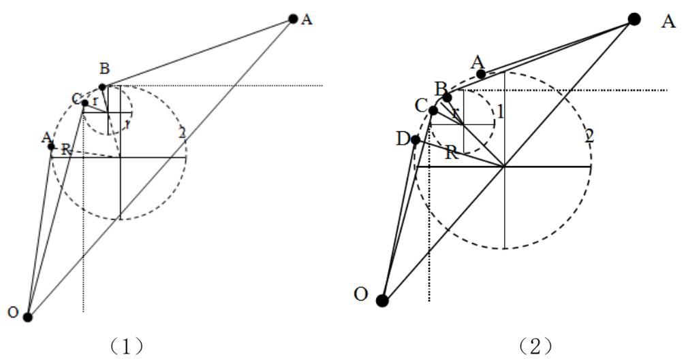  
图 4 圆弧半径为 R 最短路径

图 4（1）中 B 为两圆弧公共切点，C 为小圆弧切点 $(r=10)$ ，A 为大圆弧切点。图 4（2）中 A、D 为大圆弧切点，B、C 为小圆弧切点。

针对图 4（1）（2），根据“覆盖”思想与得出的结论，我们容易发现，当圆弧半径为 R（R>10）时，行进路线与 OA 构成的区域显然是能够完全覆盖圆弧半径为 r 时构成的区域，由此，可说明在圆弧位置设定为最佳的条件下，圆弧半径越小行进路径越短，而圆弧半径最小为 10 个单位，进而说明圆弧的半径为 10 个单位时，绕行路径最短。

根据考虑的两个问题与证明结果，我们可得出结论：要使得机器人从区域中一点到达另一点的行进路径最短，应使圆弧位置设定在需要绕过障碍物的顶角上最佳，此时圆弧中心点坐标为障碍物顶角坐标，并且此时圆弧的半径为10个单位。

## 5.1.2 问题的转化

在模型准备中我们已得出要使得机器人从区域中一点到达另一点的行进路径最短，应使圆弧位置设定在需要绕过障碍物的顶角上最佳，此时圆弧中心点坐标为障碍物顶角坐标，并且此时圆弧的半径为10个单位。因此，我们将800×800的平面场景图进行处理，处理原则有：

1. 每个障碍物的顶角都设定一个圆弧；  
2. 圆弧坐标为障碍物顶点坐标;  
3. 圆弧的半径设定为 10 个单位;

4. 给每一段圆弧从 $2 \ldots n$ 标号，0 点标记为 1、36。根据处理原则，得图 5。

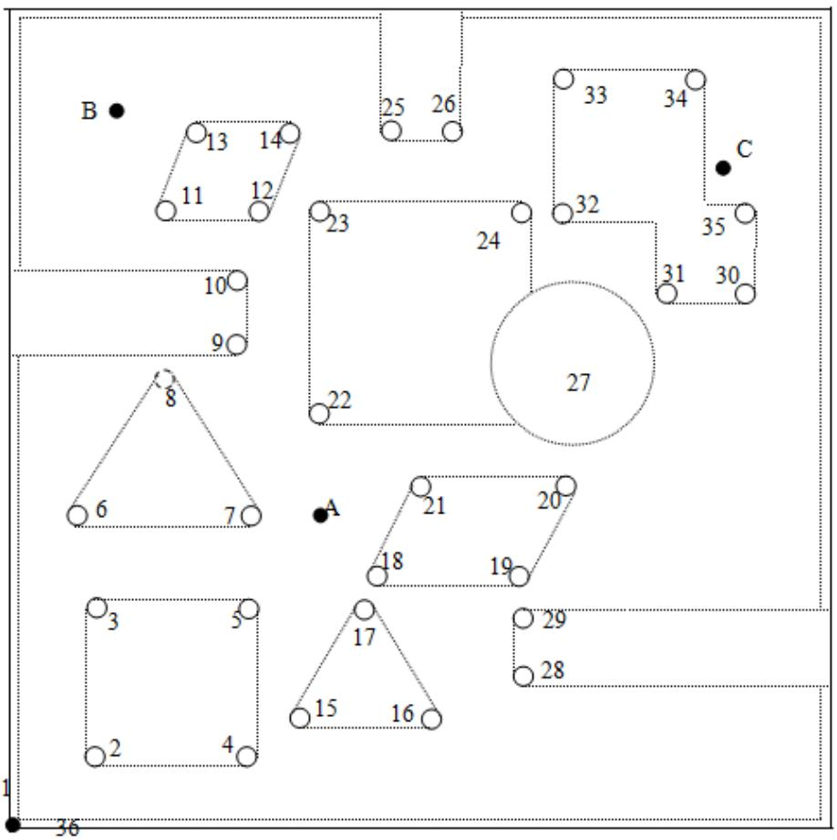

<details>
<summary>text_image</summary>

B
13 14
11 12
25 26
33 34
C
23
24
32
35
31 30
10
9
8
27
22
6 7
A
21 20
18 19
3 5
17
15 16
29
28
2
4
36
</details>

图 5 处理后800×800的平面场景图

在原问题中，若没进行确定圆弧位置与转弯半径以及平面场景的处理，原问题求解将会很难，并且所有的转弯点均是未知，经处理后，我们将问题转化为在已知转弯点，寻找合适的转弯点，使得路径最短，即我们将问题转化为了最短路径的优化问题。

## 5.2 避障最短路径模型的建立

问题转化为最短路径的优化问题后，我们易知优化的目标函数为机器人在行进过程中最短路径，通过 0-1 变量来选取经过的转弯点，因此可建立 0-1 规划模型。

## 5.2.1 目标函数

目标函数为机器人出区域中一点到达另一点的避障最短路径，避障最短路径Z为行进过程中直线路径与转弯路径之和，于是有

$$
\min Z = \sum_ {i = 1} ^ {n} \sum_ {j = 1} ^ {n} X _ {i j} (a _ {i j} + b _ {i j}) \tag {1}
$$

其中， $a_{ij}$ 为圆弧 i 切点到圆弧 j 切点的直线距离，即机器人从圆弧 i 切点到圆弧 j 切点的直线路径； $b_{ij}$ 为机器人从圆弧 i 行进至圆弧 j 切点时的转弯路径； $X_{ij}$ 为 0-1 变量，表示若选择行走圆弧 i 后行走圆弧 j， $X_{ij}$ 为 1，否则为 0， $i, j = 1 \ldots n, n = 36, i \neq j$ 。

我们设 $(x_{ik},y_{ik})$ 为圆弧i的切点坐标，i为各圆弧的编码， $i=1\ldots36$ ，k为切点的次序，k=1,2，如 $(x_{i1},y_{i1})$ 表示为圆弧i的第一个切点坐标。

机器人从圆弧 i 切点到圆弧 j 切点的直线路径 $a_{ij}$ 为

$$
a _ {i j} = \sqrt {(x _ {i 2} - x _ {j 2}) ^ {2} + (y _ {i 2} - y _ {j 1}) ^ {2}} \quad i, j = 1.. 3 6, i \neq j \tag {2}
$$

机器人从圆弧 i 行进至圆弧 j 切点时的 $b_{ij}$ 为

$$
b _ {i j} = \theta \rho \quad i, j = 1.. 3 6, i \neq j
$$

其中

$$
(x _ {i 1} - x _ {i 2}) ^ {2} + (y _ {i 1} - y _ {i 2}) ^ {2} = \rho^ {2} + \rho^ {2} - 2 \rho^ {2} \cos \theta \tag {3}
$$

$\rho$ 为转弯半径， $\rho=10$ 。

## 5.2.2 约束条件

## 1. 避障条件的约束

在本问题中，障碍物边界可分为直线段与圆弧两种情况，针对障碍物边界不同的两种情况，我们列出避障条件的约束：

## (1) 避障约束条件 1

任意一条可行路径与所有障碍物的边界线段间的最短距离大于 10 个单位.

设平面内有两条线段 AB 和 CD，A 点的坐标为 $(x_{i2}, y_{i2})$ ，B 点的坐标为 $(x_{j1}, y_{j1})$ ，C 点的坐标为 $(x_{p}, y_{p})$ ，D 点的坐标为 $(x_{q}, y_{q})$ ，其中 A、B 可视为圆弧的切点坐标，C、D 为圆弧的切点坐标 AB 线段两圆弧的切点的连线，CD 视为障碍物的某一条边界线段。

设 $P_{pq}^{m}$ 是直线 $AB$ 上的一点， $P_{pq}^{m}$ 点的坐标 $(x_{pq}^{m}, y_{pq}^{m})$ 可以表示为

$$
\left\{ \begin{array}{l} X = x _ {i 2} + s (x _ {j 1} - x _ {i 2}) \\ Y = y _ {i 2} + s (y _ {j 1} - y _ {i 2}) \end{array} \right.
$$

当参数 $0 \leq s \leq 1$ 时， $P_{pq}^{m}$ 是线段 $AB$ 上的点；当参数 $s < 0$ 时， $P_{pq}^{m}$ 是 $BA$ 延长线上的点；当参数 $s > 1$ 时， $P_{pq}^{m}$ 是 $AB$ 延长线上的点。

设 $Q_{ij}$ 是直线 $CD$ 上的一点， $Q_{ij}$ 点的坐标 $(U, V)$ 可以表示为

$$
\left\{ \begin{array}{l} U = x _ {P} + t (x _ {q} - x _ {p}) \\ Y = y _ {p} + s (y _ {q} - y _ {p}) \end{array} \right.
$$

当参数 $0 \leq t \leq 1$ 时， $Q_{ij}$ 是线段 $CD$ 上的点；当参数 $t < 0$ 时， $Q_{ij}$ 是 $DC$ 延长线上的点；当参数 $t > 1$ 时， $Q_{ij}$ 是 $CD$ 延长线上的点。

$P_{pq}^{m}$ , $Q_{ij}$ 两点之间的距离为

$$
\left| P _ {p q} ^ {m} Q _ {i j} \right| = \sqrt {(X - U) ^ {2} + (Y - V) ^ {2}}
$$

距离的平方为

$$
f (s, t) = \left| P _ {p q} ^ {m} Q _ {i j} \right| ^ {2} = (X - U) ^ {2} + (Y - V) ^ {2}
$$

$$
= \left[ (x _ {i 2} - x _ {p}) + s (x _ {j 1} - x _ {i 2}) - t (x _ {q} - x _ {p}) \right] ^ {2} + \left[ (y _ {i 2} - y _ {p}) + s (y _ {j 1} - y _ {i 2}) - t (y _ {q} - y _ {p}) \right] ^ {2}
$$

要求直线 AB，CD 之间的最短距离，也就是要求函数 $f(s,t)$ 的最小值。对 $f(s,t)$ 分别求关于 s，t 的偏导数，并令偏导数为零：

$$
\left\{ \begin{array}{l} \frac {\partial f (s , t)}{\partial s} = 0 \\ \frac {\partial f (s , t)}{\partial t} = 0 \end{array} \right.
$$

展开并整理后，得到下列方程组：

$$
\left\{ \begin{array}{r l} & [ (x _ {j 1} - x _ {i 2}) ^ {2} + (y _ {j 1} - y _ {i 2}) ^ {2} ] s \\ & - [ (x _ {j 1} - x _ {i 2}) (x _ {q} - x _ {p}) ^ {2} + (y _ {j 1} - y _ {i 2}) (y _ {q} - y _ {p}) ] t \\ & = (x _ {i 2} - x _ {j 1}) (x _ {i 2} - x _ {p}) + (y _ {i 2} - y _ {j 1}) (y _ {i 2} - y _ {p}) \\ & - [ (x _ {j 1} - x _ {i 2}) (x _ {q} - x _ {p}) + (y _ {j 1} - y _ {i 2}) (y _ {q} - y _ {p}) ] t \\ & + [ (x _ {q} - x _ {p}) ^ {2} + (y _ {q} - y _ {p}) ^ {2} ] t \\ & = (x _ {i 2} - x _ {p}) (x _ {q} - x _ {p}) + (y _ {i 2} - y _ {p}) (y _ {q} - y _ {p}) \end{array} \right.
$$

如果从这个方程组求出的参数 s，t 的值满足 $0 \leq s \leq 1$ ， $0 \leq t \leq 1$ ，说明 $P_{pq}^{m}$ 点落在线段 AB 上， $Q_{ij}$ 点落在线段 CD 上，这时 $P_{pq}^{m}Q_{ij}$ 的长度为

$$
\left| P _ {p q} ^ {m} Q _ {i j} \right| = \sqrt {(X - U) ^ {2} + (Y - V) ^ {2}}
$$

此时 $P_{pq}^{m}Q_{ij}$ 就是线段 AB 与 CD 的最短距离。

如果从方程组求出的参数 $s$ ， $t$ 的值不满足 $0 \leq s \leq 1$ ， $0 \leq t \leq 1$ ，说明不可能在线段 $AB$ 内部找到一点 $P_{pq}^{m}$ ，在线段 $CD$ 内部找到一点 $Q_{ij}$ ，使得 $P_{pq}^{m}Q_{ij}$ 的长度就是线段 $AB$ 与 $CD$ 的最短距离。这时，还需要进行考虑的是：平面中一个点到一条线段的最短距离。

设编号为 m 的障碍物的圆心坐标 $P_{pq}^{m}$ 和一条线段 AB，设 $P_{pq}^{m}$ 点的坐标为 $(x_{pq}^{m}, y_{pq}^{m})$ ，A 点的坐标为 $(x_{i2}, y_{i2})$ ，B 点的坐标为 $(x_{j1}, y_{j1})$ 。

此时，直线 AB 的参数形式的方程为

$$
\left\{ \begin{array}{l} x = x _ {i 2} + t (x _ {j 1} - x _ {i 2}) \\ y = y _ {i 2} + t (y _ {j 1} - y _ {i 2}) \end{array} \right.
$$

直线上的点 $(x,y)$ ，当参数 $0\leq t\leq1$ 时，是线段AB上的点；当参数t<0时，是BA延长线上的点；当参数t>1时，是AB延长线上的点。

通过 $P_{pq}^{m}$ 点，与直线 $AB$ 垂直的平面方程为

$$
(x _ {j 1} - x _ {i 2}) (x - x _ {p q} ^ {m}) + (y _ {j 1} - y _ {i 2}) (y - y _ {p q} ^ {m}) = 0
$$

下面求这个平面与直线 AB 的交点 $Q_{ij}$ 。显然， $P_{pq}^{m}Q_{ij} \perp AB$ ，所以 $Q_{ij}$ 点也是从 $P_{pq}^{m}$ 点向直线 AB 作垂线的垂足点。

将

$$
\left\{ \begin{array}{l} x = x _ {i 2} + t (x _ {j 1} - x _ {i 2}) \\ y = y _ {i 2} + t (y _ {j 1} - y _ {i 2}) \end{array} \right.
$$

代入平面方程，化简后解得

$$
t = \frac {(x _ {i 2} - x _ {p q} ^ {m}) (x _ {i 2} - x _ {j 1}) + (y _ {i 2} - y _ {p q} ^ {m}) (y _ {i 2} - y _ {j 1})}{(x _ {i 2} - x _ {j 1}) ^ {2} + (y _ {i 2} - y _ {j 1}) ^ {2}}
$$

然后，将上面得到的 t 的值代入直线方程，得到

$$
\left\{ \begin{array}{l} X = x _ {i 2} + t (x _ {j 1} - x _ {i 2}) \\ Y = y _ {i 2} + t (y _ {j 1} - y _ {i 2}) \end{array} \right.
$$

其中， $(X,Y)$ 为垂足点 $Q_{ij}$ 的坐标。

此时线段 $P_{pq}^{m}Q_{ij}$ 的长度，也就是 $P_{pq}^{m}$ 点到直线 $AB$ 的垂直距离为

$$
\left| P _ {p q} ^ {m} Q _ {i j} \right| = \sqrt {(X - x _ {p q} ^ {m}) ^ {2} + (Y - y _ {p q} ^ {m}) ^ {2}}
$$

如果前面求出的参数 $t$ 的值满足 $0 \leq t \leq 1$ ，说明垂足 $Q_{ij}$ 点落在线段 $AB$ 上，这时 $P_{pq}^{m} Q_{ij}$ 的长度就是 $P_{pq}^{m}$ 点到线段 $AB$ 的最短距离。

如果前面求出的参数 $t$ 的值满足 $t < 0$ ，说明垂足 $Q_{ij}$ 点不落在线段 $AB$ 上，而是落在 $BA$ 的延长线上，这时 $P_{pq}^{m}$ 点到线段 $AB$ 的最短距离，就是 $P_{pq}^{m}$ 点到 $A$ 点的距离，即 $\left|P_{pq}^{m}A\right| = \sqrt{(x_{i2} - x_{pq}^{m})^{2} + (y_{i2} - y_{pq}^{m})^{2}}$ 。

如果前面求出的参数 $t$ 的值满足 $t > 1$ ，说明垂足 $Q_{ij}$ 点不落在线段 $AB$ 上，而是落在 $AB$ 的延长线上，这时， $P_{pq}^{m}$ 点到线段 $AB$ 的最短距离，就是 $P_{pq}^{m}$ 点到 $B$ 点的距离，即 $\left|P_{pq}^{m}B\right| = \sqrt{(x_{j1} - x_{pq}^{m})^{2} + (y_{j1} - y_{pq}^{m})^{2}}$ 。

综上所述，即有平面内有两条线段最短距离为

$$
d _ {q p m} ^ {i j} = \left\{ \begin{array}{l l} \left| q _ {q p} ^ {m} Q _ {i j} \right| & 0 \leq s \leq 1, 0 \leq t \leq 1 \\ \min \left\{\left| q _ {q p} ^ {m} A \right|, \left| q _ {q p} ^ {m} B \right| \right\} & \text {否则} \end{array} \right.
$$

因此,我们可得到任意一条可行路径与所有障碍物的边界线段间的最短距离大于10个单位的约束条件

$$
\min \left\{d _ {p q m} ^ {i j} \right\} \geq 1 0 \tag {4}
$$

其中， $i,j=1,2\ldots n,n\leq36,\quad p,q=1,2\ldots k,k\leq4,\quad m=1,2\ldots m,m\leq12$

## (2) 避障约束条件 2

对于标号为 2 的圆形障碍物，它与机器人行走路线的最近距离为 10 个单位，为使满足与机器人行走路线的最近距离为 10 个单位要求，我们可以转化为圆形的圆心与障碍物间的最近为 80 个单位的问题，即把圆形与直线线段的最短路径问题转化为点到直线线段的的问题。

已知编号为 2 半径为 R（R = 70）的圆形障碍物，边界并不是直线段，且该圆形障碍物的圆形为 (550,450)。

根据平面中一定点到一条线段的最短距离计算办法，我们可得

$$
d _ {i j} = \left\{ \begin{array}{l} \left| O _ {2} Q _ {i j} \right| \quad 0 \leq s \leq 1, 0 \leq t \leq 1 \\ \min \left\{\left| O _ {2} A \right|, \left| O _ {2} B \right| \right\} \text {否则} \end{array} \right. \tag {5}
$$

因此，我们可得到圆形障碍物与平面内最近约束条件为

$$
\min \left\{d _ {i j} \right\} \geq R + 1 0 \quad i, j = 1, 2 \dots n, n \leq 3 6
$$

## 2. 各坐标点的约束

所有假设的坐标点都应在 $800 \times 800$ 平面场景内，于是有

$$
x _ {i 1}, x _ {i 2}, x _ {j 1}, y _ {i 1}, x _ {i 1}, y _ {i 2}, y _ {j 1}, x _ {p}, x, y _ {p}, y _ {p} \in \{0, 8 0 0 \}
$$

## 3. 各圆弧点行进先后次序的约束

机器人从某个圆弧出发行至下一圆弧，先后次序的约束有

$$
\begin{array}{l} x _ {i 1} \leq x _ {i 2} \\ y _ {i 1} \leq y _ {i 2} \\ x _ {j 1} \leq x _ {j 2} \\ y _ {j 2} \leq y _ {j 2} \tag {6} \\ x _ {i 2} \leq x _ {j 1} \\ y _ {i 2} \leq x _ {j 1} \\ \end{array}
$$

其中， $i,j=1..36,i\neq j$ 。

## 5.2.3 避障最短路径模型

综合上述，建立避障最短路径模型：

$$
\min Z = \sum_ {i = 1} ^ {n} \sum_ {j = 1} ^ {n} X _ {i j} (a _ {i j} + b _ {i j})
$$

$$
s. t \left\{ \begin{array}{l} Y _ {i j} \geq X _ {i j} \\ x _ {i 1} \leq x _ {i 2} \\ y _ {i 1} \leq y _ {i 2} \\ y _ {j 2} \leq y _ {j 2} \\ x _ {i 2} \leq x _ {j 1} \\ y _ {i 2} \leq x _ {j 1} \\ b _ {i j} = \theta \rho \quad i, j = 1.. 3 6, i \neq j \\ \left(x _ {i 1} - x _ {i 2}\right) ^ {2} + \left(y _ {i 1} - y _ {i 2}\right) ^ {2} = \rho^ {2} + \rho^ {2} - 2 \rho^ {2} \cos \theta \\ x _ {i 1}, x _ {i 2}, x _ {j 1}, y _ {i 1}, x _ {i 1}, y _ {i 2}, y _ {j 1}, x _ {p}, x, y _ {p}, y _ {p} \in (0, 8 0 0) \\ a _ {i j} = \sqrt {\left(x _ {i 2} - x _ {j 2}\right) ^ {2} + \left(y _ {i 2} - y _ {j 1}\right) ^ {2}} \quad i, j = 1.. 3 6, i \neq j \\ X _ {i j} = 0 \text {或} 1 (i, j = 1, 2,.. n, n \leq 3 6, i \neq j) \\ \min \left\{d _ {p q m} ^ {i j} \right\} \geq 1 0 \\ d _ {i j} \geq R + 1 0 \quad i, j = 1, 2... n, n \leq 3 6 \end{array} \right.
$$

## 5.3 基于避障条件转化下的最短路径简化模型

## 5.3.1 避障条件的转化

我们将任意一条可行路径与所有障碍物的边界线段间的最短距离大于 10 个单位转化为两直线不相交、与 2 号障碍物圆周均不相交、切点范围的的控制。

出于简化避障条件的 0-1 变量取值关系，我们进行符号补充：

$X_{ij}$ 为 0-1 变量，表示为 $X_{ij}=\begin{cases}1 & \text{选择走圆弧 } i \text{ 后行进圆弧 } j \\ 0 & \text{否则}\end{cases}$ $i,j=1,2,\ldots,n,n\leq36$

$y_{ij}^{'}$ 表示圆弧 i 与圆弧 j 的圆心 $(x_{j}, y_{j})$ 所构成的线段的纵坐标， $y_{ij}^{'} = \frac{x_{i} - x_{j}}{y_{i} - y_{j}} x$ ， $x \in (x_{i}, x_{j})$ 。

$y_{pq}^{m}$ 表示编号为 m 的区域内一顶点 $(x_{p}, y_{p})$ 与相邻顶点 $(x_{q}, y_{q})$ ，所构成的线段的纵坐标， $y_{pq}^{m} = \frac{x_{p} - x_{q}}{y_{p} - y_{q}} x, x \in (x_{p}, x_{q})$ 。当 m = 2 时，顶点表示以（550,450）为圆点，80 个单位为半径的圆上的点，相邻顶点坐标则表示为以圆点对称的点。

$Y_{ij}$ 为 0-1 变量，表示为 $Y_{ij}=\left\{\begin{aligned}0&\quad y_{ij}^{'}=y_{pq}^{m}\text{ 存在唯一解 }x\in(x_{p},x_{q}),\\ 1&\quad\text{ 否则 }\end{aligned}\right.$

我们将避障约束条件替换为

$$
Y _ {i j} \geq X _ {i j} \tag {7}
$$

## 5.3.2 基于避障条件转化下的最短路径简化模型

于是，我们可得避障最短路径简化模型

$$
\min Z = \sum_ {i = 1} ^ {n} \sum_ {j = 1} ^ {n} X _ {i j} (a _ {i j} + b _ {i j})
$$

$$
s. t \left\{ \begin{array}{l} Y _ {i j} \geq X _ {i j} \\ x _ {i 1} \leq x _ {i 2} \\ y _ {i 1} \leq y _ {i 2} \\ y _ {j 2} \leq y _ {j 2} \\ x _ {i 2} \leq x _ {j 1} \\ y _ {i 2} \leq x _ {j 1} \\ b _ {i j} = \theta \rho \quad i, j = 1.. 3 6, i \neq j \\ \left(x _ {i 1} - x _ {i 2}\right) ^ {2} + \left(y _ {i 1} - y _ {i 2}\right) ^ {2} = \rho^ {2} + \rho^ {2} - 2 \rho^ {2} \cos \theta \\ x _ {i 1}, x _ {i 2}, x _ {j 1}, y _ {i 1}, x _ {i 1}, y _ {i 2}, y _ {j 1}, x _ {p}, x, y _ {p}, y _ {p} \in (0, 8 0 0) \\ a _ {i j} = \sqrt {\left(x _ {i 2} - x _ {j 2}\right) ^ {2} + \left(y _ {i 2} - y _ {j 1}\right) ^ {2}} \quad i, j = 1.. 3 6, i \neq j \\ X _ {i j}, Y _ {i j} = 0 \text {或} 1 (i, j = 1, 2,.. n, n \leq 3 6, i \neq j) \end{array} \right.
$$

## 5.4 避障最短路径简化模型的求解

## 5.4.1 基于避障条件转化之下的最短路径的启发算法

对于避障最短路径的数学模型，是非线性 0-1 整数规划，具有 NP 属性。对于具体的区域与障碍物，通过巧妙地将避障条件转化为相交约束，同时结合任意两点间最短距离的 floyd 算法，我们构建出了能够对此问题规模求得全局最优解的较好算法。具体算法思想是：针对此模型的 NP 属性特征，即此问题搜索可行域的规模越发，运行时间倍增的不足，我们采用逐步缩减可行域的办法，将达到避障条件要求的所有可行路径搜索出。同时，通过用两切点标识圆弧路径的办法，将一个圆弧路径扩充为两个切点的表示，建立出具有扩充点的邻接矩阵，于是将问题转化为赋权图上两点的最小距离问题，采用 Floyd 算法，即可得出避障最短路径。具体算法步骤为：

Setp1：得出所有满足避障条件的可行路径，分三步逐步进行。

(1)对于 n 个圆弧路径，任意两个圆弧间构造切线段及出发点到各圆弧的切线段，由此形成初始的路径。判断每条路径中的直线段与各障碍物的边界线段是否相交，判断方法为将两线段进行矢量跨立。若相交，去除该条路径中的此直线段。  
(2)在（1）的基础上去除各条路径中的直线段与各圆弧路径对应圆周及2号圆形障碍物边界相交的部分。判断各条路径中的直线段与圆周是否相关的方法为：判断圆心到直线段的距离是否小于半径，若距离小于半径，则看垂足是否在线段上，垂足在此线段上则相交，否则不相交。若圆心到直线段的距离大于半径，则不相交。  
(3)依据避障条件，选取各切点在圆弧上的可取点范围，如图所示。

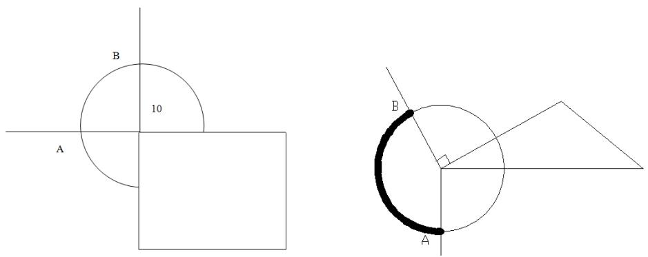

切点只能在 AB 上选取

判断条件为: 切点与圆心连线的向量与过圆心的两边界向量的夹角是否大于等于 90 度，若是，则在允许的取点范围。

基于以上（1）（2）（3）的剔除，剩余的路径即为满足避障条件的可行路径，而避障最短路径必是这些可行路径中的一条。

Step2：构造扩充的赋权邻接矩阵。将每一个圆弧路径，转化为由两个切点标识，给此两个切点间赋予边权为对应圆弧路径的弧长。对两切点间的是有直线段相连的，直接将直线段长度赋予给此两切点间的边权。由此对所有可行路径，构造有扩充点的赋权图的邻接矩阵。

Setp3: 利用 Floyd 算法求扩充赋权图上任意两点间的最短路径，即可转化为任意两点间的避障最短路径。

## 5.4.2 避障最短路径简化模型的求解过程与结果

根据构建的启发式算法步骤，利用 MATLAB 软件，我们可求解如下结果：

## (1) 寻找可行路径

根据避障约束条件 1，任意一条可行路径与所有障碍物的边界线段间均不相交，求得只满足路径线段与边界线段不相交时的可行路径如图 6。

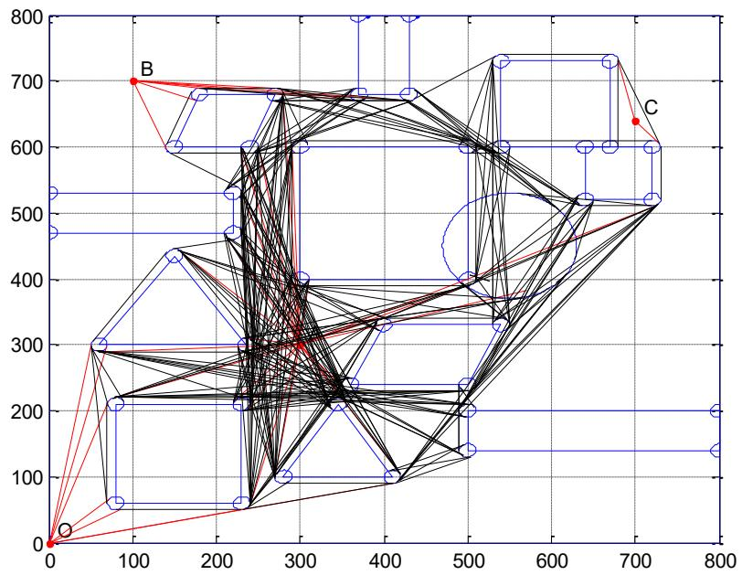

<details>
<summary>scatter</summary>

| Node | X | Y |
| --- | --- | --- |
| B | ~100 | ~700 |
| C | ~700 | ~640 |
</details>

图 6 可行路径图

只满足路径中的各直线段与各障碍物边界均不相交的可行路径既满足各直线段与各障碍物边界均不相交的要求，又同时满足与各圆弧路径对应的圆周及第2号障碍物圆

周均不相交的条件的可行路径如图 7。

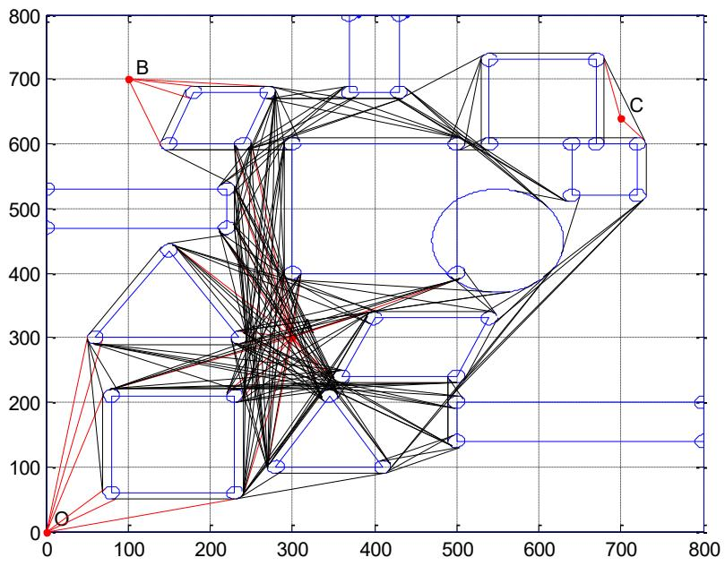

<details>
<summary>scatter</summary>

| Node | X | Y |
| --- | --- | --- |
| O | 0 | 0 |
| B | ~100 | 700 |
| C | ~700 | ~640 |
</details>

图 7 满足三条件的可行路径图

在满足算法 step1 中（1）（2）的基础上，剔除掉切点不在允许范围之内的路径线段，得出所有可行路径示意图，如图 8。

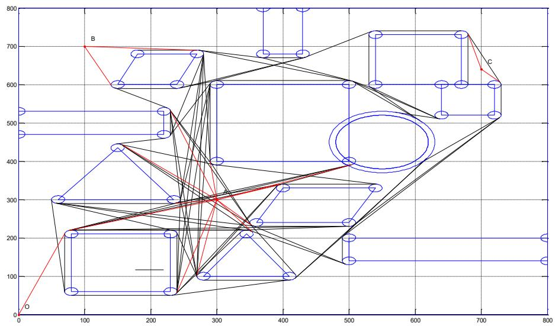

<details>
<summary>wireframe</summary>

| Node | X | Y |
| --- | --- | --- |
| O | 0 | 0 |
| B | ~100 | 700 |
| C | ~700 | ~640 |
</details>

图 8 所有可行路径示意图

（2）对于每条可行路径的直线段和圆弧段，构造扩充点，对任意两点间按要求赋权，则问题转化为在赋权图上求两点之间的最短距离。  
(3) 调用 Floyd 算法，先后求出 0-->A 的最短路径及相应最短路长，如图 9.

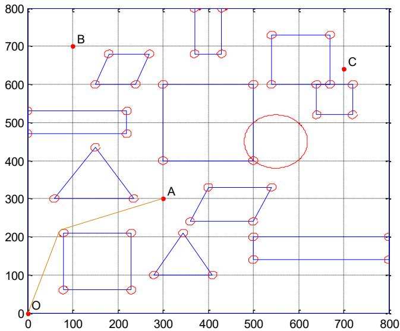

<details>
<summary>scatter</summary>

| Point | X | Y |
| --- | --- | --- |
| O | 0 | 0 |
| A | 300 | 300 |
| B | 100 | 700 |
| C | 700 | 640 |
</details>

图 9 O-->A 的最短路径

0--->A

<table><tr><td>路线序号</td><td>圆弧起点坐标</td><td>圆弧终点坐标</td><td>圆弧圆心坐标</td><td>最短路长</td></tr><tr><td>1</td><td>70.5063, 213.1405</td><td>75.975, 219.1542</td><td>80, 210</td><td>471.0372</td></tr></table>

同理，我们可得到 0-->B 的最短路径及相应最短路长、0-->C 的最短路径及相应最短路长、0-->A-->B-->C-->0 的最短路径及相应最短路长.

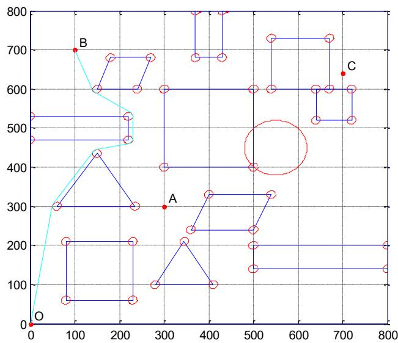

<details>
<summary>scatter</summary>

| Point | X | Y |
| --- | --- | --- |
| O | 0 | 0 |
| A | 300 | 300 |
| B | 100 | 700 |
| C | 700 | 640 |
</details>

图 10 0-->B 的最短路径

0-->B 的最短路径为:

(0, 0) --> (50.1354, 301.6396) --> (51.6795, 305.547) --> (141.6795, 440.547) --> (147.9621, 444.79) --> (222.038, 460.2096) --> (230, 470) --> (230, 530) --> (229.9563, 530.9242) --> (229.5746, 532.8954) --> (229.2564, 533.7791) --> (229.1263, 534.0782) --> (225.4971, 538.3544) --> (144.5036, 591.6465) --> (140.6922, 596.346) --> (100, 700)

对应圆弧的圆心坐标：(60,300)，(150,435)，(220,470)，(220,530)，(150,600)

最短路长为：853.7001

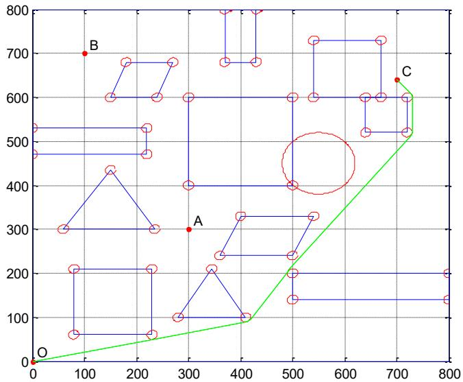

<details>
<summary>scatter</summary>

| Point | X | Y |
| --- | --- | --- |
| O | 0 | 0 |
| A | ~300 | 300 |
| B | ~100 | 700 |
| C | ~700 | ~640 |
</details>

图 11 O-->C 的最短路径图

0-->C 的最短路径为:

(0, 0) --> (232. 1147, 50. 2273) --> (232. 1694, 50. 2377) --> (412. 1695, 90. 2373) --> (418. 3435, 94. 4905) --> (491. 6536, 205. 5113) --> (492. 0569, 206. 0862) --> (727. 9298, 513. 924) --> (730, 520) --> (730, 600) --> (727. 7179, 606. 359) --> (700, 640)

经过的圆心：(410, 100)，(230, 60)，(720, 520)，圆心：(720, 600)，半径：10 圆心：(500, 200)，半径：10

最短路长为：1088.1952

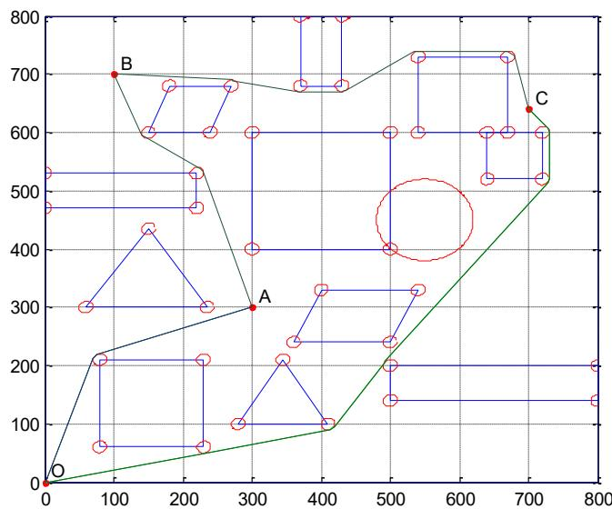

<details>
<summary>scatter</summary>

| Point | X | Y |
| --- | --- | --- |
| O | 0 | 0 |
| A | 300 | 300 |
| B | 100 | 700 |
| C | 700 | 640 |
</details>

图 12 O-->A-->B-->C-->O 的最短路径图

0-->A-->B-->C-->0 的最短路径为:

(0, 0) --> (70.5063, 213.1405) --> (75.975, 219.1542) --> (76.2776, 219.2811) --> (76.6064, 219.4067) --> (300, 300) --> (229.5746, 532.8954) --> (229.2564, 533.7791) --> (229.1263, 534.0782) --> (225.4971, 538.3544) --> (144.5036, 591.6465) --> (140.6922, 596.346) --> (100, 700) --> (270.5862, 689.9828) --> (272.0002, 689.799) --> (368.0003, 670.2035) --> (370, 670) --> (430, 670) --> (434.0793, 670.8716) --> (435.5886, 671.7056

$$
\begin{array}{l} \text {)} \dashrightarrow (5 3 4. 4 1 3 2, 7 3 8. 2 9 1 7) \dashrightarrow (5 4 0, 7 4 0) \dashrightarrow (6 7 0, 7 4 0) \dashrightarrow (6 7 9. 7 7 4 1, 7 3 2. 1 4 6 2) \dashrightarrow (7 0 \\ 0, 6 4 0) \dashrightarrow (7 2 7. 7 1 7 9, 6 0 6. 3 5 9) \dashrightarrow (7 3 0, 6 0 0) \dashrightarrow (7 3 0, 5 2 0) \dashrightarrow (7 2 7. 9 2 9 8, 5 1 3. 9 2 4) \dashrightarrow \\ \begin{array}{l} (4 9 2. 0 5 6 9, 2 0 6. 0 8 6 2) \dashrightarrow (4 9 1. 6 5 3 6, 2 0 5. 5 1 1 3) \dashrightarrow (4 1 8. 3 4 3 5, 9 4. 4 9 0 5) \dashrightarrow (4 1 2. 1 6 9 5, \\ 9 0. 2 3 7 3) \dashrightarrow (2 3 2. 1 6 9 4, 5 0. 2 3 7 7) \dashrightarrow (2 3 2. 1 1 4 7, 5 0. 2 2 7 3) \dashrightarrow (0, 0) \end{array} \\ \end{array}
$$

$$
\text {经过的圆心:} (4 1 0, 1 0 0), (2 3 0, 6 0), (8 0, 2 1 0), (2 2 0, 5 3 0), (1 5 0, 6 0 0), (2 7 0, 6 8 0),
$$

$$
(3 7 0, 6 8 0), (4 3 0, 6 8 0), (6 7 0, 7 3 0), (5 4 0, 7 3 0), (7 2 0, 5 2 0), (7 2 0, 6 0 0), (5 0 0, 2 0 0)
$$

$$
\text {最短路长为:} 2 7 2 5. 1 5 9 6 _ {\circ}
$$

本次求解，在搜索可行路径上程序运行时间为 10 分钟左右。

## 5.5 基于数值思想的改进算法

对每条路径，直接根据避障条件，判断它是否可行路径的方法——基于数值近似的线段间最短距离判别法。

线段间最短距离判别法：给定路径端点坐标，所有障碍物边界线段的坐标，分别在路径和某一边界线段上取一系列的点，求得这系列点之间的最短距离即为线段间最短距离的近似值，如果该近似值大于10，则认为路径与该边界线段的距离满足要求，否则不满足。直到该路径与所有的边界线段都满足距离要求，则该路径为可行路径并记录。易知，若线段间的一系列点取值越细密，结果越精确。

按照该算法，我们编写 MATLAB 程序得到的所有可行路径如下图:

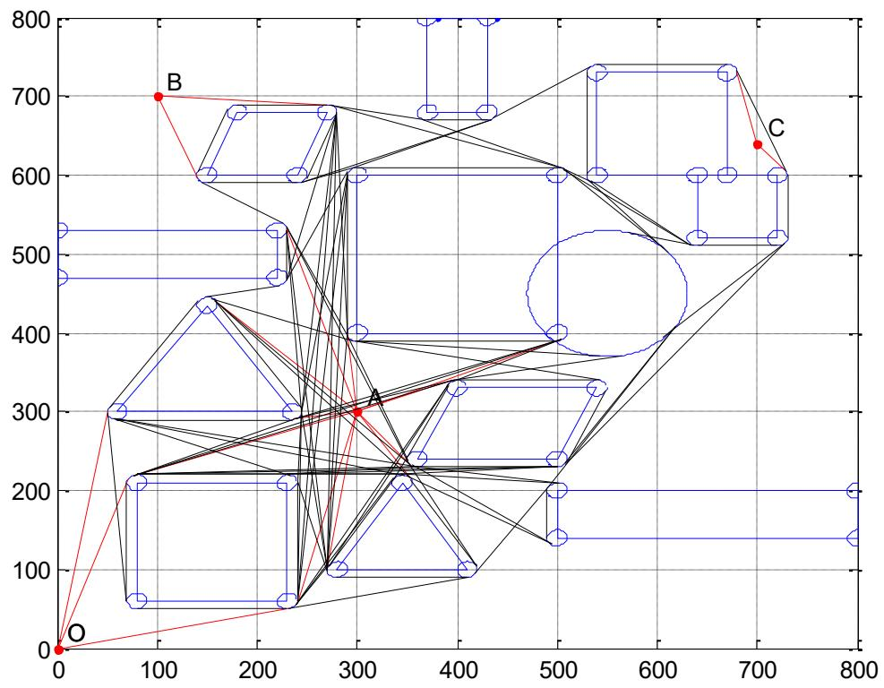

<details>
<summary>wireframe</summary>

| Point | X | Y |
| --- | --- | --- |
| O | 0 | 0 |
| B | ~100 | 700 |
| C | ~700 | ~640 |
</details>

对此可行路径集合，仍然使用基于避障条件转化之下的最短路径的启发算法的Step2、Step3步寻找最短路径，最短路径结果完全等同基于避障条件转化之下的最短路径的启发算法的结果，但是求解时间却大大缩减，说明该算法具有一定的有效性。

## 六、最短时间路径模型建立与求解

## 6.1 到任意目标点的避障最短时间路径模型的建立

基于问题一转化为最短路径的优化问题后，我们易知优化的目标函数为机器人在行进过程中最短时间路径，通过0-1变量来选取经过的转弯点的圆心坐标，两切点坐标及转弯半径，此时将转弯点的圆心坐标，两切点坐标及转弯半径均作为决策变量。因此，可建立 0-1 规划模型如下。

## 6.1.1 目标函数

目标函数为机器人出区域中一点到达另一点的避障最短时间路径，避障最短路径 Z 为行进过程中直线路径与转弯路径的时间取和，故有

$$
\min Z = \sum_ {i = 1} ^ {n} \sum_ {j = 1} ^ {n} X _ {i j} (\frac {a _ {i j}}{v _ {0}} + \frac {b _ {i j}}{v _ {\rho}}) \tag {8}
$$

其中， $a_{ij}$ 为切点 i 到切点 j 的直线距离； $b_{ij}$ 为机器人从切点 i 行进至 j 切点时的转弯路径； $X_{ij}$ 为 0-1 变量，表示若选择行走切点 $(x_{i}, y_{i})$ 后行走切点 $(x_{j}, y_{j})$ ， $X_{ij}$ 为 1，否则为 0， $i, j = 1 \ldots n, n = 36, i \neq j$ 。机器人从切点 i 到切点 j 的直线路径 $a_{ij}$ 为

$$
a _ {i j} = \sqrt {x _ {i} ^ {2} - y _ {i} ^ {2}} + \sqrt {(x _ {j} - 3 0 0) ^ {2} + (y _ {j} - 3 0 0) ^ {2}} \quad i, j = 1.. 3 6, i \neq j \tag {9}
$$

机器人从切点i行进至j切点时的 $b_{ij}$ 为

$$
b _ {i j} = \theta \rho_ {k} \quad i, j = 1.. 3 6, i \neq j
$$

其中

$$
(x _ {i} - x _ {j}) ^ {2} + (y _ {i} - y _ {j}) ^ {2} = \rho_ {i} + \rho_ {i} - 2 \rho_ {i} ^ {2} \cos \theta \tag {10}
$$

$\rho_{k}$ 为转弯半径。

## 6.1.2 约束条件

## 1. 避障条件的约束

原理与最短路径的避障条件的原理保持一致。

## 2. 各坐标点的约束

所有假设的坐标点都应在 $800 \times 800$ 平面场景内，于是有

$$
x _ {i 1}, x _ {i 2}, x _ {j 1}, y _ {i 1}, x _ {i 1}, y _ {i 2}, y _ {j 1}, x _ {p}, x, y _ {p}, y _ {p} \in \{0, 8 0 0 \}
$$

## 3. 各圆弧点行进先后次序的约束

机器人从某个圆弧出发行至下一圆弧，先后次序的约束有

$$
x _ {i 1} \leq x _ {i 2}
$$

$$
y _ {i 1} \leq y _ {i 2}
$$

$$
x _ {j 1} \leq x _ {j 2}
$$

$$
y _ {j 2} \leq y _ {j 2} \tag {11}
$$

$$
x _ {i 2} \leq x _ {j 1}
$$

$$
y _ {i 2} \leq x _ {j 1}
$$

其中， $i,j=1..36,i\neq j$ 。

## 4. 转弯半径、圆心、与切点的坐标关系。

转弯半径等于圆心 $(x_{0},y_{0})$ 与两个切点 $(x_{i},y_{i})$ ， $(x_{j},y_{j})$ 坐标的直线距离。

$$
\rho_ {k} = \sqrt {(x _ {0} - x _ {i}) ^ {2} + (y _ {0} - y _ {i}) ^ {2}}
$$

$$
\rho_ {k} = \sqrt {(x _ {0} - x _ {j}) ^ {2} + (y _ {0} - y _ {j}) ^ {2}}
$$

5. 转弯半径 $\rho_{i}$ 取值为：使 $\min\left(\frac{a_{ij}}{v_{0}}+\frac{b_{ij}}{v_{\rho}}\right)$ 满足的 $\rho$

## 6.1.3 避障最短时间路径模型

综合上述，建立避障最短时间路径模型是在：

$$
\min Z = \sum_ {i = 1} ^ {n} \sum_ {j = 1} ^ {n} X _ {i j} (\frac {a _ {i j}}{v _ {0}} + \frac {b _ {i j}}{v _ {\rho}})
$$

$$
s. t \left\{ \begin{array}{l} Y _ {i j} \geq X _ {i j} \\ x _ {i 1} \leq x _ {i 2} \\ y _ {i 1} \leq y _ {i 2} \\ y _ {j 2} \leq y _ {j 2} \\ x _ {i 2} \leq x _ {j 1} \\ y _ {i 2} \leq x _ {j 1} \\ b _ {i j} = \theta \rho_ {k} \quad i, j = 1.. 3 6, i \neq j \\ \left(x _ {i} - x _ {j}\right) ^ {2} + \left(y _ {i} - y _ {j}\right) ^ {2} = \rho_ {k} + \rho_ {k} - 2 \rho_ {k} ^ {2} \cos \theta \\ x _ {i 1}, x _ {i 2}, x _ {j 1}, y _ {i 1}, x _ {i 1}, y _ {i 2}, y _ {j 1}, x _ {p}, x, y _ {p}, y _ {p} \in (0, 8 0 0) \\ a _ {i j} = \sqrt {x _ {i} ^ {2} - y _ {i} ^ {2}} + \sqrt {\left(x _ {j} - 3 0 0\right) ^ {2} + \left(y _ {j} - 3 0 0\right) ^ {2}} \\ X _ {i j}, Y _ {i j} = 0 \text {或} 1 (i, j = 1, 2, \dots n, n \leq 3 6, i \neq j) \\ \rho_ {k} = \sqrt {\left(x _ {0} - x _ {i}\right) ^ {2} + \left(y _ {0} - y _ {i}\right) ^ {2}} \\ \rho_ {k} = \sqrt {\left(x _ {0} - x _ {j}\right) ^ {2} + \left(y _ {0} - y _ {j}\right) ^ {2}} \end{array} \right.
$$

## 6.2 求从 0-->A 的最短时间路径的简化模型

针对只求 0-->A 的最短时间路径, 我们具体问题具体分析, 建立了相应的简化模型。障碍物 5 左上角的顶点与圆弧的距离大于等于 10 的避障约束可以表述如下:

$$
d = \rho_ {i} - \sqrt {(8 0 - x _ {0}) ^ {2} + (2 1 0 - y _ {0}) ^ {2}} \geq 1 0
$$

于是，我们可得一条路径时间最短下的最优 $\rho$ 的简化模型

$$
\min Z = \sum_ {i = 1} ^ {n} \sum_ {j = 1} ^ {n} X _ {i j} (\frac {a _ {i j}}{v _ {0}} + \frac {b _ {i j}}{v _ {\rho}})
$$

$$
s. t \left\{ \begin{array}{l} d = \rho_ {i} - \sqrt {\left(8 0 - x _ {0}\right) ^ {2} + \left(2 1 0 - y _ {0}\right) ^ {2}} \geq 1 0 \\ b _ {i j} = \theta \rho_ {i} \quad i, j = 1.. 3 6, i \neq j \\ \left(x _ {i} - x _ {j}\right) ^ {2} + \left(y _ {i} - y _ {j}\right) ^ {2} = \rho_ {i} + \rho_ {i} - 2 \rho_ {i} ^ {2} \cos \theta \\ x _ {i 1}, x _ {i 2}, x _ {j 1}, y _ {i 1}, x _ {i 1}, y _ {i 2}, y _ {j 1}, x _ {p}, x, y _ {p}, y _ {p} \in (0, 8 0 0) \\ a _ {i j} = \sqrt {x _ {i} ^ {2} - x _ {j} ^ {2}} + \sqrt {\left(x _ {j} - 3 0 0\right) ^ {2} + \left(y _ {j} - 3 0 0\right) ^ {2}} \quad i, j = 1.. 3 6, i \neq j \\ X _ {i j} = 0 \text {或} 1 (i, j = 1, 2,.. n, n \leq 3 6, i \neq j) \end{array} \right.
$$

针对每一条可行路径，求出各路径对应的最优转弯半径 $\rho_{i}(i=1,2)$

则，最短时间路径的优化模型为:

$$
Z = \min \left\{\sum_ {i = 1} ^ {n} \sum_ {j = 1} ^ {n} X _ {i j} (\frac {a _ {i j}}{v _ {0}} + \frac {b _ {i j}}{v _ {\rho_ {1}}}), \sum_ {i = 1} ^ {n} \sum_ {j = 1} ^ {n} X _ {i j} (\frac {a _ {i j}}{v _ {0}} + \frac {b _ {i j}}{v _ {\rho_ {2}}}) \right\}
$$

## 6.3 求从 0-->A 的最短时间路径的模型求解

根据 0-->A 的最短时间路径的模型，利用 LINGO 软件编程，比较两条可行路径对应的最短时间，我们求得最短时间路径下转弯半径为 12.9885，同时最短时间路径时间长为 94.2283 个单位。相应圆弧的圆心坐标为（82.1414，207.9153），两切点坐标分别为（69.8045，211.9779）、（77.7492,220.1387）。

## 七、模型评价

## 7.1 模型优点

（1）确定路线思路循序渐进，本文先建立了有计算避障约束公式的普适性模型，再建立了以不取相交点来简化0-1变量取值关系的简化模型；  
（2）给出了二种启发式算法，最短路径即最短时间路径具有一定可信度。同时第一个启发算法可以求得全局最优解，第二个启发算法是针对问题的 NP 属性减少求解时间而构建的，两个算法都具有较重要的意义。

## 7.2 模型缺点

（1）本文将机器人看成一个质点，这将使机器人出现走区域边界的可能，可能会出现与实际不符合的情况；  
（2）模型将假设机器人在行进、转弯过程中能一直保持最大的速度，诚然，现实并非如此，所以我们得到的问题二的结果与实际最短时间路径会存在一定的误差。

## 参考文献

[1] 吴建国. 数学建模案例精编 [M], 北京: 中国水电出版社, 2006, 210  
[2] 杨秀月等. 系统建模[M], 北京: 国防工业出版社, 2006.5  
[3] 张志涌等. 精通 MATLAB6.5 版 [M]. 北京：北京航空航天大学出版社，2003, 3

## 附录

MATLAB 程序清单：clear

distancebetweenlines.m 计算两线段间近似最短路径  
```matlab
function mind=distancebetweenlines(A,B,C,D,M)
Ax=A(1);Ay=A(2);
Bx=B(1);By=B(2);
Cx=C(1);Cy=C(2);
Dx=D(1);Dy=D(2);
if (A(1)-B(1))~=0
    k=(By-Ay)/(Bx-Ax);
    b=By-k*Bx;
    ABXXL=linspace(A(1),B(1),M);
    ABYXL=k.*ABXXL+b;
else
    ABXXL=linspace(A(1),B(1),M);
    ABYXL=linspace(A(2),B(2),M);
end
if (C(1)-D(1))~=0
    k=(Dy-Cy)/(Dx-Cx);
    b=Dy-k*Dx;
    CDXXL=linspace(C(1),D(1),M);
    CDYXL=k.*CDXXL+b;
else
    CDXXL=linspace(C(1),D(1),M);
    CDYXL=linspace(C(2),D(2),M);
```

```julia
end
mind=100000;
for i=1:M
    for j=1:M
        if sqrt((ABXXL(i)-CDXXL(j))^2+(ABYXL(i)-CDYXL(j))^2)<=mind
            mind=sqrt((ABXXL(i)-CDXXL(j))^2+(ABYXL(i)-CDYXL(j))^2);
        end
    end
end
```

FLOYD1.m Folyd 算法求最短路径和最短路程  
```matlab
function [L,R]=FLOYD1(w,s,t)
n=size(w,1);
D=w;
path=zeros(n,n);
%ÔÔÎÂÊDZê×¼floydËã¨
for i=1:n
    for j=1:n
        if D(i,j)~=inf
            path(i,j)=j;
        end
    end
end
for k=1:n
    for i=1:n
        for j=1:n
            if D(i,k)+D(k,j)<D(i,j)
                D(i,j)=D(i,k)+D(k,j);
                path(i,j)=path(i,k);
            end
        end
    end
end
L=zeros(0,0);
R=s;
while 1
    if s==t
        L=fliplr(L);
        L=[0,L];
        return
    end
    L=[L,D(s,t)];
    R=[R,path(s,t)];
    s=path(s,t);
end
```

huchang.m 已知圆心和圆上2点，计算弧长  
```matlab
function z=huchang(A,B,C,r)
%CÎ^aÔ^2DÄ×ø±ê
%A,BÎ^aÔ^2»;¶Ëμã×ø±ê,rÎ^a°ë³⁄₄¶
D=dot(A-C,B-C)/(norm(A-C)*norm(B-C));%£ä£i£ÎØÏÀ¿μã»ý
theta=acos(D);%»;¶È±íʳ⁄₄
z=theta*r;
iscycleIntersect.m …………………判断线段是否和圆相交
function z=iscycleIntersect(line,A,r)
if (line(3)-line(1))~=0
    k=(line(4)-line(2))/(line(3)-line(1));
    b=line(2)-k*line(1);
    d=abs(k*A(1)-A(2)+b)/sqrt(k^2+1);
    [x y]=solve(['x*(' num2str(k) '-y+(' num2str(b) ')=0'],...
    ['(y-(' num2str(A(2)) '))*(' num2str(k) ')=(' ' num2str(A(1)) '-x']);
```

```matlab
else
    x=line(3);y=A(2);
    d=abs(line(3)-A(1));
end
x=double(x);y=double(y);
if d>=r-0.5
    z=0;
elseif (y-line(4))*(y-line(2))>0
    z=0;
else
    z=1;
end
islineIntersect.m          ……判断两线段是否相交
function z=islineIntersect(A,B,C,D)
Ax=A(1);Ay=A(2);
Bx=B(1);By=B(2);
Cx=C(1);Cy=C(2);
Dx=D(1);Dy=D(2);
if ((Bx-Ax)*(Dy-Cy)-(By-Ay)*(Dx-Cx))*((Bx-Ax)*(Dy-Cy)-(By-Ay)*(Dx-Cx))~=0
    r=((Ay-Cy)*(Dx-Cx)-(Ax-Cx)*(Dy-Cy))/((Bx-Ax)*(Dy-Cy)-(By-Ay)*(Dx-Cx));
    s=((Ay-Cy)*(Bx-Ax)-(Ax-Cx)*(By-Ay))/((Bx-Ax)*(Dy-Cy)-(By-Ay)*(Dx-Cx));
    if r>0&&r<=1&&s>0&&s<=1
        z=1;
    else
        z=0;
    end
else
    z=0;
end
linedistance.m          ……判断切点是否位于可行圆弧上
function z=linedistance(A,B)
a=B(1:2)-B(3:4);
b=B(5:6)-B(3:4);
c=A-B(3:4);
theta1=acos(dot(a,c)/(norm(a)*norm(c)))*180/pi;
theta2=acos(dot(b,c)/(norm(b)*norm(c)))*180/pi;
if theta1>=90-0.5&&theta2>=90-0.5
    z=0;
else
    z=1;
end
method1.m          ……启发式算法计算所有可行路径
clear
clc
close all
theta=0:pi/100:2*pi;
zb{1}=[300 400;500 400;500 600;300 600];
zb{2}=[550 450;80 80];
zb{3}=[360 240;500 240;540 330;400 330 Haiti];
zb{4}=[280 100;410 100;345 210 Haiti];
zb{5}=[80 60;230 60;230 210;80 210 Haiti];
zb{6}=[60 300;235 300;150 435 Haiti];
zb{7}=[0 470;220 470;220 530;0 530 Haiti];
zb{8}=[150 600;240 600;270 680;180 680 Haiti];
zb{9}=[370 680;430 680;430 800;370 800 Haiti];
zb{10}=[540 600;670 600;670 730;540 730 Haiti];
zb{11}=[640 520;720 520;720 600;640 600 Haiti];
zb{12}=[500 140;800 140;800 200;500 200 Haiti];
zb{13}=[0 0;800 0;800 800;0 800 Haiti];
zb{14}=[0 0 79];
```

```matlab
zb{15}=[300 300 65];
zb{16}=[100 700 66];
zb{17}=[700 640 67];
%**********************************************************************1ÆËãÇØÓÒÀÚËÙÓеÄÖ±Ïßεķ½³Ì**********************************************************************
**
lines=[];kxyh=[];
for i=1:length(zb)
    temp=zb{i};
    if size(zb{i},1)==2
        x=temp(2,1)*cos(theta)+temp(1,1);
        y=temp(2,2)*sin(theta)+temp(1,2);
        plot(x,y,'b-');hold on
    elseif size(temp,1)==3
        temp0=temp+[-10 -10;10 -10;0 10];
        for j=1:size(temp,1)
            if j==size(temp,1)   tt=1; else   tt=j+1; end
            lines=[lines [temp(j,1);temp(j,2);temp(tt,1);temp(tt,2)]];
        end
        plot([temp(:,1);temp(1,1)],[temp(:,2);temp(1,2)],'b-');hold on
    elseif size(temp,1)==4
        if i==13
            temp0=temp+[10 10;-10 10;-10 -10;10 -10];
        else
            temp0=temp+[-10 -10;10 -10;10 10;-10 10];
        end
        for j=1:size(temp,1)
            if j==size(temp,1) tt=1; else tt=j+1;end
            lines=[lines [temp(j,1);temp(j,2);temp(tt,1);temp(tt,2)]];
        end
        plot([temp(:,1);temp(1,1)],[temp(:,2);temp(1,2)],'b-');hold on
    elseif size(temp,1)==1

plot(temp(1),temp(2),'r.','MarkerSize',12);text(temp(1)+10,temp(2)+20,char(
temp(3)));hold on
    end
    if i<=12&i~=2
        for j=1:size(temp,1)
            temp1=temp(j,:);
            x=10*cos(theta)+temp1(1);
            y=10*sin(theta)+temp1(2);
            plot(x,y,'b-');hold on
        end
    end
end
axis([0 800 0 800]);grid on
%**********************************************************************¼ÆËãÇØÓÒÀÚËÙÓеÂÔ²»¡¶ÎµÄ·½³Ì**********************************************************************
**
kkk=1;
for i=1:length(zb)-4
    temp5=zb{i};if i==2 pp=1;else pp=size(temp5);end
    for j=1:pp
        if ~ismember(temp5(j,1),[0,800]) & ~ismember(temp5(j,2),[0,800])
            if j==1 ppp=size(temp5,1); else ppp=j-1; end
            if j==size(temp5,1) tt=1; else tt=j+1;end

kxyh(:,kkk)=[temp5(ppp,1);temp5(ppp,2);temp5(j,1);temp5(j,2);temp5(tt,1);te
mp5(tt,2)];
            yxzb(1:2,kkk)=temp5(j,:);
            if i==2 yxzb(3,kkk)=80;else yxzb(3,kkk)=10;end
            kkk=kkk+1;
        end
```

```matlab
end
end
%  
\*\*\*\*\*\*\*\*\*\*\*\*\*\*\*\*\*\*\*\*\*\*\*\*\*\*\*\*\*\*\*\*\*\*\*\*\*\*\*\*\*\*\*\*\*\*\*\*\*\*\*\*\*\*\*\*\*\*\*\*\*\*\*\*\*\*\*\*\*\*\*\*\*\*\*\*\*\*\*\*\*\*\*\*\*\*\*\*\*\*\*\*\*\*\*\*\*\*\*\*\*  
yxbh=0;  
for i=1:4  
    %\*\*\*\*\*\*\*\*\*\*\*\*\*\*\*\*\*\*\*\*\*\*\*\*\*\*\*\*\*  
    x=[];y=[];z=[];kk=1;  
    temp=zb{13+i};A=temp(1:2);  
    for j=1:12  
        temp2=zb{j};  
        if j==2  
            r=70;temp2=temp2(1,:);  
        else  
            r=10;  
        end  
        for k=1:size(temp2,1)  
            B=temp2(k,:);  
            if ~ismember(B(1),[0,800]) & ~ismember(B(2),[0,800])  
                [x(:,kk) y(:,kk)]=qiedian(A,B,r);  
                z=[z kk];  
                kk=kk+1;  
            end  
        end  
    end
end

qdzb=[reshape(x,1,2*length(x));reshape(y,1,2*length(y));reshape([z;z],1,2*length(z))];  
    %\*\*\%\*\$\ *\ *\ *\ *\ *\ *\ *\ *\ *\ *\ *\ *\ *\ *\ *\ *\ *\ *\ *\ *\ *\ *\ *\ *\ *\ *\ *\ *\ *\ *\ *\ *\ *\ *\ *\ *\ *\ *\ *\ *\ *\ *\ *\ *\ *\ *\ *\ *\ *\ *\ *\ *\ *\ *\ *\ *\ *\ *\ *\ *\ *\ *\ *\ *\ *\ *\ *\ *\ *\ *\ *\ *\ *\ *\ *\ *\ * * * * * * * * * * * * * * * * * * * * * * * * * * * * * * * * * * * * * * * * * * * * * * * * * * * * * * * * * * * * * * * * * * * * * * * * * * * * * * * * * * * * * * * * * * * * * * * * * * * * ***(a,b,c,d,e,f,g,h,i,k,l,m,n',n',n',n',n',n')  
    for p=1:length(qdzb)  
        %\*\$\*%\* \* \* \* \* \* \* \* \* \* \* \* \* \* \* \* \* \* \* \* \* \* \* \* \* \* \* \* \* \* \* \* \* \* \* \* \* \* \* \* \* \* \* \* \* \* \* \* \* \* \* \\    for q=1:length(lines)  
temp3(p,q)=islineIntersect(temp,qdzb(1:2,p),lines(1:2,q),lines(3:4,q));  
    if temp3(p,q)>0 break;end  
    end  
    %\* \$ \$ \$ \$ \$ \$ \$ \$ \$ \$ \$ \$ \$ \$ \$ \$ \$ \$ \$ \$ \$ \$ \$ \$ \$ \$ \$ \$ \$ \$ \$ \$ \$ \$ \$ \$ \$ \$ \$ \$ \$ \$ \$ \$ \$ \$ \$ \$ \$ \$ \$ \$ \$ \$ \$ \$ \$ \$ \$ \$ \$ \$ \$ \$ \$ \$ \$ \$ \$ \$ \$ \$ \$ \$ \$ \$ \$ \$ \$ \$ \$ \$ \$ \$ \$ \$ \$ #\$ ①#\$ ②#\$ ③#\$ ④#\$ ⑤#\$ ⑥#\$ ⑦#\$ ⑧#\$ ⑨#\$ ⑩#\$ ⑪#\$ ⑫#\$ ⑬#\$ ⑭#\$ ⑮#\$ ⑯#\$ ⑰#\$ ⑱#\$ ⑲#\$ ⑳#\$ ⑵#\$ ⑳#\$ ⑴#\$ ⑵#\$ ⑳#\$ ⑤#\$ ④#\$ ③#\$ ②#\$ ①#\$ ②#\$ ①#\$ ①#\$ ①#\$ ①#\$ ①#\$ ①#\$ ①#\$ ①#\$ ①#\$ ①#\$ ①#\$ ①#\$ ①#\$ ①#\$ ①#\$ ①#\$ ①#\$ ①#\$ ①#\$ ①#\$ ②#\$ ②#\$ ②#\$ ②#\$ ②#\$ ②#\$ ②#\$ ②#\$ ②#\$ ②#\$ ②#\$ ②#\$ ②#\$ ②#\$ ②#\$ ②#\$ ②#\$ ②#\$ ②#\$ ②#\$ ③#\$ ③#\$ ④#\$ ⑤#\$ ⑥#\$ ⑦#\$ ⑧#\$ ⑨#\$ ⑩#\$ ⑪#\$ ⑫#\$ ⑬#\$ ⑭#\$ ⑮#\$ ⑯#\$ ⑰#\$ ⑱#\$ ⑲#\$ ㉑\:#0000000000000000000000000000000000000000000000000000000000000000000000000000000000000000000000000000
```

```matlab
pmat([length(yxzb)+i],1,length(ind{i}));qdzb(3,ind{i})];
end
%%%******************************ÎÂÃæ¼ÆËã,÷,öÔ²ÓëÔ²Ö®¼äµ¿ÉDD·¾¶**************************
*
yykxlj=[];
for i=1:length(yxzb)
    for j=i+1:length(yxzb)
        temp6=yuanyuanqiexian(yxzb(1:2,i),yxzb(3,i),yxzb(1:2,j),yxzb(3,j));
        temp7=[];
        for k=1:size(temp6,2)
            %******************************ÂжÏÓëÕ±Ï߶β»Ïཻ**************************
*           for L=1:length(lines)

temp7(k,L)=islineIntersect(temp6(1:2,k),temp6(3:4,k),lines(1:2,L),lines(3:4,L));
        end
        %******************************ÂжÏÓëÔ²»¡¶Î²»Ïཻ**************************
**           for L=(length(lines)+1):(length(lines)+length(yxzb))

temp7(k,L)=iscycleIntersect(temp6(:,k),yxzb(1:2,L-length(lines)),yxzb(3,L-length(lines)));
        end
        %******************************ÂжÏÇеãÊÇ·ñλÓÚ¿ÉDDÔ²»¡ÉÏ**************************
***           if
linedistance(temp6(1:2,k),kxyh(:,i))==0&&linedistance(temp6(3:4,k),kxyh(:,j))==0

temp7(k,(length(lines)+length(yxzb)+1):(length(lines)+length(yxzb)+length(kxyh)))=0;
        else

temp7(k,(length(lines)+length(yxzb)+1):(length(lines)+length(yxzb)+length(kxyh)))=1;
        end
        end
        ind2=find(sum(temp7,2)==0);
        if ~isempty(ind2)
            yykxlj=[yykxlj [temp6(:,ind2);repmat([i;j],1,length(ind2))]];
        end
    end
end
for i=1:length(yykxlj)
    plot(yykxlj([1 3],i),yykxlj([2 4],i),'k-');hold on
end
save D11
method2.m          ...............线段距离判别法计算所有可行路径
clear
clc
close all
theta=0:pi/100:2*pi;
zb{1}=[300 400;500 400;500 600;300 600];
zb{2}=[550 450;80 80];
zb{3}=[360 240;500 240;540 330;400 330 Haiti];
zb{4}=[280 100;410 100;345 210 Haiti];
zb{5}=[80 60;230 60;230 210;80 210 Haiti];
zb{6}=[60 300;235 300;150 435 Haiti];
zb{7}=[0 470;220 470;220 530;0 530 Haiti];
zb{8}=[150 600;240 600;270 680;180 680 Haiti];
```

```matlab
zb{9}=[370 680;430 680;430 800;370 800];
zb{10}=[540 600;670 600;670 730;540 730];
zb{11}=[640 520;720 520;720 600;640 600];
zb{12}=[500 140;800 140;800 200;500 200];
zb{13}=[0 0 79];
zb{14}=[0 0 79];
zb{15}=[300 300 65];
zb{16}=[100 700 66];
zb{17}=[700 640 67];
%**********************************************************************1ÆÆÃÇØÓÒÂÚÆÙÓеÄÖÎߧεķ½³Ì**************************
**
lines=[];kxyh=[];
for i=1:length(zb)
    temp=zb{i};
    if size(zb{i},1)==2
        x=temp(2,1)*cos(theta)+temp(1,1);
        y=temp(2,2)*sin(theta)+temp(1,2);
        plot(x,y,'b-');hold on
    elseif size(temp,1)==3
        temp0=temp+[-10 -10;10 -10;0 10];
        for j=1:size(temp,1)
            if j==size(temp,1)   tt=1; else   tt=j+1; end
            lines=[lines [temp(j,1);temp(j,2);temp(tt,1);temp(tt,2)]];
        end
        plot([temp(:,1);temp(1,1)],[temp(:,2);temp(1,2)],'b-');hold on
    elseif size(temp,1)==4
        if i==13
            temp0=temp+[10 10;-10 10;-10 -10;10 -10];
        else
            temp0=temp+[-10 -10;10 -10;10 10;-10 10];
        end
        for j=1:size(temp,1)
            if j==size(temp,1) tt=1; else tt=j+1;end
            lines=[lines [temp(j,1);temp(j,2);temp(tt,1);temp(tt,2)]];
        end
        plot([temp(:,1);temp(1,1)],[temp(:,2);temp(1,2)],'b-');hold on
    elseif size(temp,1)==1

plot(temp(1),temp(2),'r.','MarkerSize',12);text(temp(1)+10,temp(2)+20,char(
temp(3)));hold on
    end
    if i<=12&i~=2
        for j=1:size(temp,1)
            temp1=temp(j,:);
            x=10*cos(theta)+temp1(1);
            y=10*sin(theta)+temp1(2);
            plot(x,y,'b-');hold on
        end
    end
end
axis([0 800 0 800]);grid on
%**********************************************************************ÆÆÃÇØÓÒÂÚÆÙÓеÄÖ²»¡¶ÎµÄ·½³Ì**************************
**
kkk=1;
for i=1:length(zb)-4
    temp5=zb{i};if i==2 pp=1;else pp=size(temp5);end
    for j=1:pp
        if ~ismember(temp5(j,1),[0,800]) & ~ismember(temp5(j,2),[0,800])
            if j==1 ppp=size(temp5,1); else ppp=j-1; end
            if j==size(temp5,1) tt=1; else tt=j+1;end
```

```matlab
kxyh(:,kkk)=[temp5(ppp,1);temp5(ppp,2);temp5(j,1);temp5(j,2);temp5(tt,1);temp5(tt,2)];
        yxzb(1:2,kkk)=temp5(j,:);
        if i==2 yxzb(3,kkk)=80;else yxzb(3,kkk)=10;end
        kkk=kkk+1;
    end
end
end
%  
***************************ÎÂÃæ¼ÆËãËÄ,öµãO,A,B,Cµ½,÷,öÔ²»;µÀ¿ÉDD·¾¶**********
yxbh=0;
for i=1:4
    %***************************¼ÆËãËÄ,öµãµ½,÷Ô°µÀÇеã×ø±ê**********
*
    x=[];y=[];z=[];kk=1;
    temp=zb{13+i};A=temp(1:2);
    for j=1:12
        temp2=zb{j};
        if j==2
            r=70;temp2=temp2(1,:);
        else
            r=10;
        end
        for k=1:size(temp2,1)
            B=temp2(k,:);
            if ~ismember(B(1),[0,800]) & ~ismember(B(2),[0,800])
                [x(:,kk) y(:,kk)]=qiedian(A,B,r);
                z=[z kk];
                kk=kk+1;
            end
        end
    end
end

qdzb=[reshape(x,1,2*length(x));reshape(y,1,2*length(y));reshape([z;z],1,2*length(z))];
    %***************************ÅĐΠÎÊÇ·ñΪ¿ÉDD·¾¶**********
    temp3=ones(length(qdzb),length(lines));
    for p=1:length(qdzb)
        %***************************ÅĐΠÏÕëÖ†Ïß\Pͳä³⁄àÀËĐ¡ÓÚ10µ¥Î»**********
*****
    for q=1:length(lines)
        if
    distancebetweenlines(A,qdzb(1:2,p),lines(1:2,q),lines(3:4,q),100)>=10-0.01
        temp3(p,q)=0;
        else
            temp3(p,q)=1;
        end
    end
end
ind{i}=find(sum(temp3,2)==0);temp4=ind{i};
for p=1:length(temp4)
    plot([A(1) qdzb(1,temp4(p))],[A(2) qdzb(2,temp4(p))],'r-');hold on
end

dykxlj{i,1}=[repmat(A',1,length(ind{i}}});[qdzb(1,ind{i});qdzb(2,ind{i})];repmat([length(yxzb)+i],1,length(ind{i}));qdzb(3,ind{i})];
end
%%%***************************ÏÂÃæ¼ÆËã,÷,öÔ²ÓëÔ²Ö®¼äµÀ¿ÉDD·¾¶**********
*
yykxlj=[];
for i=1:length(yxzb)
```

```matlab
for j=i+1:length(yxzb)
    temp6=yuanyuanqiexian(yxzb(1:2,i),yxzb(3,i),yxzb(1:2,j),yxzb(3,j));
    temp7=[];
    for k=1:size(temp6,2)
        %******************************ÅжÏÕëÖ±Ï߶μä¾àÀËĐ¡ÓÚ10µ¥Î»*******************************
*****
        for L=1:length(lines)

temp7(k,L)=distancebetweenlines(temp6(1:2,k),temp6(3:4,k),lines(1:2,L),lines(3:4,L),100);
        if
distancebetweenlines(temp6(1:2,k),temp6(3:4,k),lines(1:2,L),lines(3:4,L),100)>=10-.01
            temp7(k,L)=0;
        else
            temp7(k,L)=1;
        end
    end
end
ind2=find(sum(temp7,2)==0);
if ~isempty(ind2)
yykxlj=[yykxlj [temp6(:,ind2);repmat([i;j],1,length(ind2))]];
end
end
end
for i=1:length(yykxlj)
plot(yykxlj([1 3],i),yykxlj([2 4],i),'k-');hold on
end
```

```matlab
qiedian.m
function [x,y]=qiedian(A,B,r)
[b k]=solve(['(k*' num2str(B(1)) '-' num2str(B(2)) '+b)^2=' num2str(r)'^2*(1+k^2)'],...
    ['(k*' num2str(A(1)) '-' num2str(A(2)) '+b)=0']);
['(k*' num2str(B(1)) '-' num2str(B(2)) '+b)^2=' num2str(r)'^2*(1+k^2)');
['(k*' num2str(A(1)) '-' num2str(A(2)) '+b)=0'];
k=double(k);
b=double(b);
for i=1:length(k)
    ['x*' num2str(k(i)) '-y+' num2str(b(i)) '=0'];
    ['(y-' num2str(B(2))')*' num2str(k(i)) '=' num2str(B(1)) '-x'];
    [x(i) y(i)]=solve(['x*(' num2str(k(i)) '-y+(' num2str(b(i)) ')=0'],...
        ['(y-(' num2str(B(2))'))*' ' num2str(k(i)) ')=(' ' num2str(B(1)) '-x']);
end
x=double(x);y=double(y);
xslj.m
function xslj(yxzb,sykxd,ROA)
OA=['(' num2str(sykxd(1,ROA(1))) ',' num2str(sykxd(1,ROA(1))) ')'];
for i=2:length(ROA)
    OA=[OA ['--Switch(' num2str(sykxd(1,ROA(i))) ',' num2str(sykxd(2,ROA(i))) ')']);
    B(i)=sykxd(3,ROA(i));
end
BB=unique(B);
s=hist(B,BB);
t=yxzb(:,BB(find(s>=2)));
YX=[];
for i=1:size(t,2)
    YX=[YX 'Ô²ĐÄ£°(' num2str(t(1,i)) ',' num2str(t(2,i)) ')£¬°Ë³⁄₄£°'
num2str(t(3,i)) '      '];
end
```

```matlab
disp([OA]);
disp(['¾-¹ýμÃÕ²Ðì°Ë¾¶Îª' YX]);
yuanyuanqiexian.m …………………计算圆和圆的四条切线和切点
function [x]=yuanyuanqiexian(A,r1,B,r2)
[b k]=solve(['(k*' num2str(A(1)) '-' num2str(A(2)) '+b)^2=' num2str(r1)'^2*(1+k^2)'],...
['(k*' num2str(B(1)) '-' num2str(B(2)) '+b)^2=' num2str(r2)'^2*(1+k^2)']);
k=double(real(k));
b=double(real(b));
for i=1:length(k)
    temp5=solve(['x*(' num2str(k(i)) '-y+(' num2str(b(i)) ')=0'],...
        ['(y-(' num2str(A(2)) '))*(' num2str(k(i)) ')=(' num2str(A(1)) '-x']);
    x(1,i)=double(temp5.x);x(2,i)=double(temp5.y);
    temp5=solve(['x*(' num2str(k(i)) '-y+(' num2str(b(i)) ')=0'],...
        ['(y-(' num2str(B(2)) '))*(' num2str(k(i)) ')=(' num2str(B(1)) '-x']);
    x(3,i)=double(temp5.x);x(4,i)=double(temp5.y);
end
x=double(x);
if length(k)==2
    x(1,3)=A(1)-r1;x(2,3)=A(2);x(3,3)=B(1)-r1;x(4,3)=B(2);
    x(1,4)=A(1)+r1;x(2,4)=A(2);x(3,4)=B(1)+r1;x(4,4)=B(2);
end
zdlj.m ………………构造距离矩阵，并调用Folyd算法求最短路径
clear
clc
load D11
%**********************************************************************ÁĐ³ÕЁÙÓĐ¿ЁĐеÄ·¾¶¼º¶ÔÓ|µÄ¶µã**********
***
sykxlj=[yykxlj];
for i=1:size(dykxlj,1)
    sykxlj=[sykxlj dykxlj{i}];
end
ddzb=[yxzb [0;0;10] [300;300;10] [100;700;10]
[700;640;10]]; %¶¥µã×øtê°¬Of¬Af¬Bƒ¬C
sykxd0=[sykxlj([1:2 5],:) sykxlj([3:4 6],:)];
sykxd=unique(sykxd0','rows');sykxd=sykxd';
%***********************************************************************FolydËã·¾ÆËãOÀƒ¬OBƒ¬OCµÄ×i¶Î·¾¶°Î·³Î**********
****
dis=ones(length(sykxd),length(sykxd))*inf;
for i=1:length(sykxlj)
    C=find((ismember(sykxd',(sykxlj([1:2 5],i))','rows'))');
    D=find((ismember(sykxd',(sykxlj([3:4 6],i))','rows'))');
    dis(C,D)=sqrt((sykxlj(1,i)-sykxlj(3,i))^2+(sykxlj(2,i)-sykxlj(4,i))^2);
    dis(D,C)=dis(C,D);
end
for i=1:length(sykxd)
    for j=i+1:length(sykxd)
        if sykxd(3,i)==sykxd(3,j)
dis(i,j)=huchang(sykxd(1:2,i),sykxd(1:2,j),ddzb(1:2,sykxd(3,i)),ddzb(3,sykxd(3,i)));
    end
    dis(j,i)=dis(i,j);
end
end
dis=real(dis);
[LOA,ROA]=FLOYD1(dis,1,107);
[LOB,ROB]=FLOYD1(dis,1,20);
[LOC,ROC]=FLOYD1(dis,1,198);
[LAB,RAB]=FLOYD1(dis,107,20);
[LBC,RBC]=FLOYD1(dis,20,198);
```

```matlab
disp('O-->AµÄ×î¶Î·¾¶Îª£°')
xslj(yxzb,sykxd,ROA)
disp(['×ܳ¤¶ÈΪ£°' num2str(LOA(end))])
disp('O-->BuÄ×î¶Î·¾¶Îª£°')
xslj(yxzb,sykxd,ROB)
disp(['×ܳ¤¶ÈΪ£°' num2str(LOB(end))])
disp('O-->CuÄ×î¶Î·¾¶Îª£°')
xslj(yxzb,sykxd,ROC)
disp(['×ܳ¤¶ÈΪ£°' num2str(LOC(end))])
disp('O-->A-->B-->C-->OµÄ×î¶Î·¾¶Îª£°')
xslj(yxzb,sykxd,[ROA(1:end-1) RAB(1:end-1) RBC(1:end-1) rot90(ROC,2)])
disp(['×ܳ¤¶ÈΪ£°' num2str(LOA(end)+LAB(end)+LBC(end)+LOC(end))])
hold on
plot(sykxd(1,ROA),sykxd(2,ROA),'b-') ;
plot(sykxd(1,ROB),sykxd(2,ROB),'r-') ;
plot(sykxd(1,ROC),sykxd(2,ROC),'g-') ;
plot(sykxd(1,[ROA RAB RBC]),sykxd(2,[ROA RAB RBC]),'k-') ;hold off
```

LINGO 程序（请用 lingo9.0 以后版本）

LING01.1g4 ……问题 2 优化模型 1（障碍 5 左上角转弯）

```matlab
data:
x1=0;y1=0;
x2=300;y2=300;
dx=80;dy=210;
v0=5;
enddata
```

<div class="mineru-algorithm" style="white-space: pre-wrap; font-family:monospace;">
$\mathrm{min} = \mathrm{OD} + \mathrm{EA} + \mathrm{DE}$;
</div>

<div class="mineru-algorithm" style="white-space: pre-wrap; font-family:monospace;">
!满足（x3，y3）和（x4，y4）为切点；
 $(x3-x1)*(y3-y0)-(y3-y1)*(x3-x0)=0;$ $(x4-x2)*(y4-y0)-(y4-y2)*(x4-x0)=0;$
</div>

!半径减去圆心到顶点的距离必须大于等于10个单位，即保证顶点与圆弧的最短距离大于等于10;

```txt
d=((dx-x0)^2+(dy-y0)^2)^(1/2);
r=((x3-x0)^2+(y3-y0)^2)^(1/2);
r-d>=10;
```

!切点到边界线的距离必须大于10;

```javascript
x3<=dx;
y3>=dy;
x4<=dx;
y4>=dy;
```

!直线段所需时间;

<div class="mineru-algorithm" style="white-space: pre-wrap; font-family:monospace;">
$0D = ((x3-x1)^2 + (y3-y1)^2)^(1/2)/v0;$ $EA = ((x4-x2)^2 + (y4-y2)^2)^(1/2)/v0;$
</div>

!圆弧段所需时间;

```txt
v=v0/(1+@exp(10-0.1*r^2));
theta=@acos(((x4-x0)*(x3-x0)+(y4-y0)*(y3-y0))/r);
DE=theta*r/v;
LINGO2.lg4          ……问题 2 优化模型 1（障碍 5 右下角转弯）
model:
data:
x1=0;y1=0;
x2=300;y2=300;
dx=230;dy=60;
v0=5;
enddata

min=OD+EA+DE;
```

<div class="mineru-algorithm" style="white-space: pre-wrap; font-family:monospace;">
!满足（x3，y3）和（x4，y4）为切点；
 $(x3-x1)*(x3-x0)+(y3-y0)*(y3-y1)=0;$ $(x4-x2)*(x4-x0)+(y4-y2)*(y4-y0)=0;$
</div>

!半径减去圆心到顶点的距离必须大于等于10个单位，即保证顶点与圆弧的最短距离大于等于10;

```javascript
d=((dx-x0)^2+(dy-y0)^2)^(1/2);
r=((x3-x0)^2+(y3-y0)^2)^(1/2);
r=((x4-x0)^2+(y4-y0)^2)^(1/2);
r-d>=10;
```

!切点到边界线的距离必须大于10;

```txt
x3>=dx;
y3<=dy;
x4>=dx;
y4<=dy;
```

!直线段所需时间;

```javascript
OD=((x3-x1)^2+(y3-y1)^2)^(1/2)/v0;
EA=((x4-x2)^2+(y4-y2)^2)^(1/2)/v0;
!圆弧段所需时间;
v=v0/(1+@exp(10-0.1*r^2));
theta=@acos(((x4-x0)*(x3-x0)+(y4-y0)*(y3-y0))/r^2);
DE=theta*r/v;
```