# 2012高教社杯全国大学生数学建模竞赛

## 承 诺 书

我们仔细阅读了中国大学生数学建模竞赛的竞赛规则.

我们完全明白，在竞赛开始后参赛队员不能以任何方式（包括电话、电子邮件、网上咨询等）与队外的任何人（包括指导教师）研究、讨论与赛题有关的问题。

我们知道，抄袭别人的成果是违反竞赛规则的, 如果引用别人的成果或其他公开的资料（包括网上查到的资料），必须按照规定的参考文献的表述方式在正文引用处和参考文献中明确列出。

我们郑重承诺，严格遵守竞赛规则，以保证竞赛的公正、公平性。如有违反竞赛规则的行为，我们将受到严肃处理。

我们授权全国大学生数学建模竞赛组委会，可将我们的论文以任何形式进行公开展示（包括进行网上公示，在书籍、期刊和其他媒体进行正式或非正式发表等）。

我们参赛选择的题号是（从 A/B/C/D 中选择一项填写）： D

我们的参赛报名号为（如果赛区设置报名号的话）：

所属学校（请填写完整的全名）： 江西科技师范大学

参赛队员 (打印并签名) ：1. 徐潇

2. 程威

3. 邓星辉

指导教师或指导教师组负责人 (打印并签名)： 毛志强

日期： 2012 年 9 月 10 日

赛区评阅编号（由赛区组委会评阅前进行编号）：

# 2012高教社杯全国大学生数学建模竞赛

## 编 号 专 用 页

赛区评阅编号（由赛区组委会评阅前进行编号）：

赛区评阅记录（可供赛区评阅时使用）：

<table><tr><td>评阅人</td><td></td><td></td><td></td><td></td><td></td><td></td><td></td><td></td><td></td><td></td></tr><tr><td>评分</td><td></td><td></td><td></td><td></td><td></td><td></td><td></td><td></td><td></td><td></td></tr><tr><td>备注</td><td></td><td></td><td></td><td></td><td></td><td></td><td></td><td></td><td></td><td></td></tr></table>

全国统一编号（由赛区组委会送交全国前编号）：

全国评阅编号（由全国组委会评阅前进行编号）：

# 机器人避障问题

## 摘要

为了研究机器人避障最短路径问题，本文引用文献[1]关于自然最短路径的拉绳理论。采用 Lingo 软件编写优化程序，结合 AutoCAD 绘图软件验证，以及可行方案的枚举比较，得出以下结论。

问题一，机器人从 O（0,0）出发，到达A、B、C 的最短路径长度分别为：

<table><tr><td>起点</td><td>终点</td><td>最短路径</td><td>直线段数</td><td>弧线段数</td></tr><tr><td rowspan="3">O</td><td>A</td><td>471.04</td><td>2</td><td>1</td></tr><tr><td>B</td><td>853.71</td><td>6</td><td>5</td></tr><tr><td>C</td><td>1090.32</td><td>6</td><td>5</td></tr></table>

在求解以上问题的基础上，为了求解依次通过 O、A、B、C、O的最短路径，采用在途中点增加半径为10 单位的过渡圆弧（其圆心坐标是待解参数）的方法，继续依据拉绳理论以及Lingo编程，得出最短路径周长为：2730.052整个路径及途经点分布如下图所示：

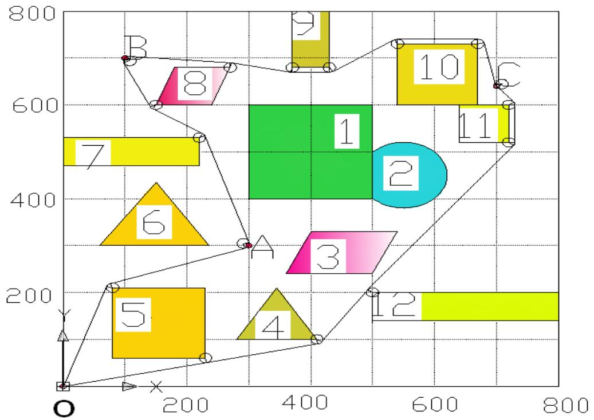

<details>
<summary>bubble</summary>

| Point | X | Y |
| --- | --- | --- |
| 1 | ~450 | ~600 |
| 2 | ~550 | ~450 |
| 3 | ~450 | ~300 |
| 4 | ~400 | ~200 |
| 5 | ~150 | ~200 |
| 6 | ~150 | ~350 |
| 7 | ~100 | ~500 |
| 8 | ~200 | ~650 |
| 9 | ~400 | ~800 |
| 10 | ~600 | ~700 |
| 11 | ~700 | ~600 |
| 12 | ~650 | ~200 |
</details>

问题二，由于该问题是针对时间优化，所以过渡圆弧的半径也是待解变量，仍然采用Longo软件编程求解，得出最短时间为94.2283 秒，过渡圆弧的半径 12.98747。

关键词：拉绳理论；优化；Lingo；AutoCAD；枚举比较

## 一、重述问题

图1是一个800×800的平面场景图，在原点O(0, 0)点处有一个机器人，它只能在该平面场景范围内活动。图中有12个不同形状的区域是机器人不能与之发生碰撞的障碍物，障碍物的数学描述如下表：

<table><tr><td>编号</td><td>障碍物名称</td><td>左下顶点坐标</td><td>其它特性描述</td></tr><tr><td>1</td><td>正方形</td><td>(300, 400)</td><td>边长200</td></tr><tr><td>2</td><td>圆形</td><td></td><td>圆心坐标(550, 450), 半径70</td></tr><tr><td>3</td><td>平行四边形</td><td>(360, 240)</td><td>底边长140, 左上顶点坐标(400, 330)</td></tr><tr><td>4</td><td>三角形</td><td>(280, 100)</td><td>上顶点坐标(345, 210), 右下顶点坐标(410, 100)</td></tr><tr><td>5</td><td>正方形</td><td>(80, 60)</td><td>边长150</td></tr><tr><td>6</td><td>三角形</td><td>(60, 300)</td><td>上顶点坐标(150, 435), 右下顶点坐标(235, 300)</td></tr><tr><td>7</td><td>长方形</td><td>(0, 470)</td><td>长220, 宽60</td></tr><tr><td>8</td><td>平行四边形</td><td>(150, 600)</td><td>底边长90, 左上顶点坐标(180, 680)</td></tr><tr><td>9</td><td>长方形</td><td>(370, 680)</td><td>长60, 宽120</td></tr><tr><td>10</td><td>正方形</td><td>(540, 600)</td><td>边长130</td></tr><tr><td>11</td><td>正方形</td><td>(640, 520)</td><td>边长80</td></tr><tr><td>12</td><td>长方形</td><td>(500, 140)</td><td>长300, 宽60</td></tr></table>

在平面场景中，障碍物外指定一点为机器人要到达的目标点（要求目标点与障碍物的距离至少超过10个单位）。规定机器人的行走路径由直线段和圆弧组成，其中圆弧是机器人转弯路径。机器人不能折线转弯，转弯路径由与直线路径相切的一段圆弧组成，也可以由两个或多个相切的圆弧路径组成，但每个圆弧的半径最小为 10 个单位。为了不与障碍物发生碰撞，同时要求机器人行走线路与障碍物间的最近距离为 10个单位，否则将发生碰撞，若碰撞发生，则机器人无法完成行走。机器人直线行走的最大速度为$\nu _ { 0 } = 5$ 个单位/秒。机器人转弯时，最大转弯度为 $\nu = \nu ( \rho ) = \frac { \nu _ { 0 } } { 1 + \mathrm { e } ^ { 1 0 - 0 . 1 \rho ^ { 2 } } }$ ，其中 是转弯半径。如果超过该速度，机器人将发生侧翻，无法完成行走。要求建立机器人从区域中一点到达另一点的避障最短路径和最短时间路径的数学模型。对场景图中4个点O(0,0)，A(300,300)，B(100, 700)，C(700, 640)，具体计算：

(1) 机器人从O(0, 0)出发， O→A、O→B、O→C和 $O \to A \to B \to C \to O$ 的最短路径。

(2) 机器人从O (0, 0)出发，到达A的最短时间路径。

注：要给出路径中每段直线段或圆弧的起点和终点坐标、圆弧的圆心坐标以及机器人行走的总距离和总时间。

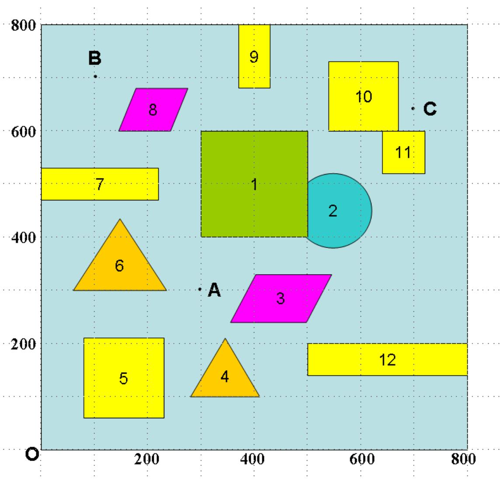

<details>
<summary>bubble</summary>

| Point | X | Y |
| --- | --- | --- |
| 1 | ~400 | ~600 |
| 2 | ~550 | ~450 |
| 3 | ~400 | ~250 |
| 4 | ~350 | ~150 |
| 5 | ~150 | ~150 |
| 6 | ~150 | ~350 |
| 7 | ~100 | ~500 |
| 8 | ~250 | ~650 |
| 9 | ~400 | ~750 |
| 10 | ~650 | ~700 |
| 11 | ~700 | ~550 |
| 12 | ~750 | ~150 |
</details>

图1 800×800平面场景图

## 二、问题分析

1、对于问题一，求从原点 O（0, 0）绕过障碍物到达 A、B、C 的最短路径，根据文献[1]介绍的拉绳理论，途径障碍物拐角处的过渡圆弧半径就是机器人转弯所允许的最小半径（10 个单位）。我们采用拉绳子的方法寻找可能的最短路径（如求 O 和 A 之间的最短路径，我们就可以连接 和 之间的一段绳子，以拐角处的圆弧为支撑拉紧，那么这段绳子的长度便是 O到A的一条可能的最短路径），接着采用枚举比较列出O到每个目标点的可能路径的最短路径，然后比较其大小可得出 的最短距离。原点O（0，0）经过中间的若干点绕过障碍物到达目标点最后回到原点 O（0，0），然后对各种可能存在的路径依次进行枚举比较，求得最短路径。

关于求解 问题，与上述从从O点分别到A、B、C 三点的求解方式基本相同，最大的不同是不仅在障碍物拐点处有过渡圆弧，在途中点 A、B、C 处必须加设过渡圆弧，并且这三个过渡圆弧的圆心坐标有待求解。

2、对于问题二，求从原点 O（0，0）出发，机器人到达 A 点的最短时间路径，与第一问不同的是时间变量受到路径和速度的两种变量的影响，且经过圆弧路径时速度和半径相关，并在半径增大时无限接近于 5,考虑速度 v 和 s 去建立所费时间 T 的

优化模型，并用Lingo 编程求解。

## 四、模型求解

## 1、求解从O（0,0）到目标点 A（300,300）的最短路径

如图一，存在着从障碍 5 的上方经过和下方经过两条路径，通过 CAD 作图并直接量取尺寸，两条路径的长度见表一。所以得出 O点到A点最短距离为471.04 单位。

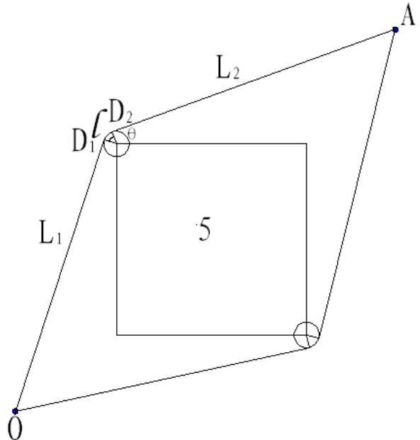

<details>
<summary>text_image</summary>

L₁
D₁
D₂
θ
5
L₂
A
O
</details>

图一： 路线图

<table><tr><td>路径</td><td>直线 $L_1$ </td><td> $Z_1$ </td><td>直线 $L_2$ </td><td> $L_{总}$ </td></tr><tr><td>一(上方)</td><td>224.5</td><td>9.05</td><td>237.49</td><td>471.04</td></tr><tr><td>二(下方)</td><td>237.49</td><td>11.14</td><td>249.8</td><td>498.43</td></tr></table>

表一：O A→ 路径长

还可以采用Lingo 编程模型验证拉绳理论。设过渡弧圆心 $O _ { 1 } \left( x _ { o } , y _ { o } \right)$ ，半径为 ，两切点分别为： $\begin{array} { r l } { D _ { 1 } \left( x _ { 1 } , y _ { 1 } \right) , } & { { } D _ { 2 } \left( x _ { 2 } , y _ { 2 } \right) } \end{array}$ 。

目标函数为 $\operatorname* { m i n } Z = l _ { 1 } + l _ { 2 } + l _ { 3 }$

有以下约束条件：

$$
l _ {1} = \sqrt {x _ {1} ^ {2} + y _ {1} ^ {2}}, l _ {2} = r \cdot \theta , l _ {3} = \sqrt {(3 0 0 - x _ {2}) ^ {2} + (3 0 0 - y _ {2}) ^ {2}}
$$

因为 $O D _ { 1 } , D _ { 2 } A$ 于圆相切，所以

$$
\overrightarrow {O D _ {1}} \cdot \overrightarrow {D _ {1} O} = 0 \Rightarrow x _ {1} \cdot \left(x _ {1} - x _ {o}\right) + y _ {1} \cdot \left(y _ {1} - y _ {o}\right) = 0
$$

$$
\overrightarrow {O _ {1} D _ {2}} \cdot \overrightarrow {D _ {2} A} = 0 \Rightarrow (3 0 0 - x _ {2}) \cdot (x _ {o} - x _ {2}) + (3 0 0 - y _ {2}) \cdot (y _ {o} - y _ {2}) = 0
$$

因为 $D _ { 1 } , D _ { 2 }$ 在圆 $O _ { 1 }$ 上，根据 $\left( x - a \right) ^ { 2 } + \left( y - b \right) ^ { 2 } = r ^ { 2 }$

使得 $( x _ { 1 } - x _ { o } ) ^ { 2 } + ( y _ { 2 } - y _ { o } ) ^ { 2 } = r ^ { 2 }$

$$
(x _ {2} - x _ {o}) ^ {2} + (y _ {2} - y _ {o}) ^ {2} = r ^ {2}
$$

在 $\angle D _ { 1 } O _ { 1 } D _ { 2 } = { \frac { \overrightarrow { D _ { 1 } O _ { 1 } } \cdot \overrightarrow { D _ { 2 } O _ { 1 } } } { r ^ { 2 } } }$

$$
\rightarrow \angle D _ {1} O _ {1} D _ {2} = \arccos \frac {(x _ {1} - x _ {o}) \cdot (x _ {2} - x _ {o}) + (y _ {1} - y _ {o}) \cdot (y _ {2} - y _ {o})}{r ^ {2}}
$$

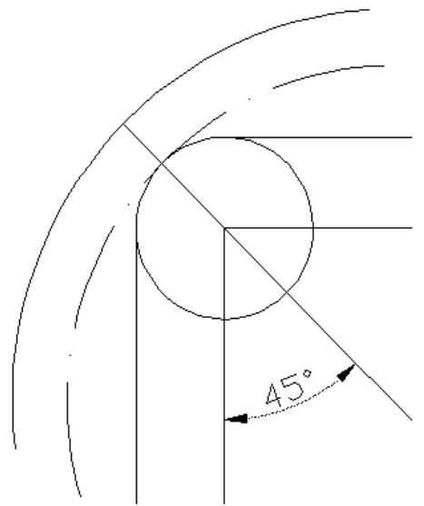

<details>
<summary>text_image</summary>

45°
</details>

图（1）

我们结合图形，对最优解路径中的圆弧的圆心判定必定在左顶角的角平分线上，且作如下说明：假设经过左顶角的切线和圆弧为拉紧的绳子构成，由拉绳原理我们知道圆弧切点两端的拉力是相等的，且原点 O（0,0）和 A（300,300），正方形 5的左顶点构成对称结构，所以圆弧顶点、正方形 的左上角点，未知圆弧的圆心一定共线且在对称结构的对称线上。（注：此对称结构非标准的几何对称，而是力学向量对称）。

由上面原理可得到圆心在k=−1上，故 $x _ { o } - 8 0 = 2 1 0 - y _ { o }$

因为最小保护范围为 10，我们可以知道路径的活动范围

得到， $( x _ { O } - 8 0 ) ^ { 2 } + ( 2 1 0 - y _ { O } ) ^ { 2 } + 1 0 = r$

$$
r \geq 1 0, x _ {1} <   8 0, y _ {2} > 2 1 0
$$

根据Lingo 编程求解（见附录4），最短路径为471.04， $O _ { 1 } ( 8 0 , 2 1 0 )$ 与 AutoCAD 作图所测量的结果一致。

## 2、求解从O（0,0）到目标点 B（100,700）的最短路径

如下图二至图七，解决的是 O 到目标点 B 的最短路径问题，图中给出了可能的六条路径的最短路径（图中的黑线所示），我们可以分别计算出六条可能路径的最短路径的长度，然后进行比较，取最小者就是 O 到目标点 B 的最优路径。黑线表示的就是通过拐点的圆为支撑而拉紧的绳子，这样计算出绳子的长度就是 O 到 B 点的最短路径。可以通过 CAD 的标注，得出表二中的数据。我们可以用对比法，得出路径四最短，所以得出O点到B 点最短距离 853.71。

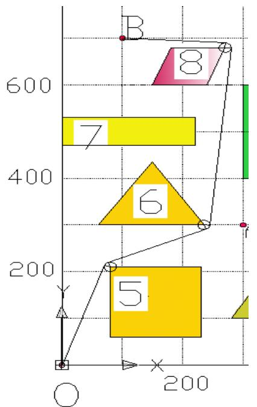

<details>
<summary>text_image</summary>

B
8
7
6
5
Y
O
200
X
</details>

图二： 路径 1

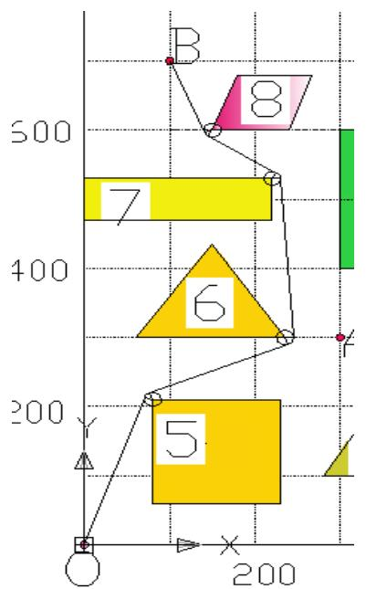

<details>
<summary>text_image</summary>

B
8
7
6
5
Y
200
X
200
</details>

图三： 路径 2

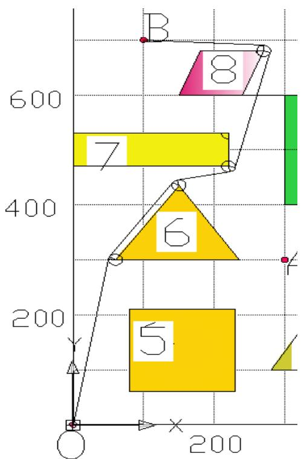

<details>
<summary>text_image</summary>

B
8
7
6
5
200
X
Y
</details>

图四： 路径3

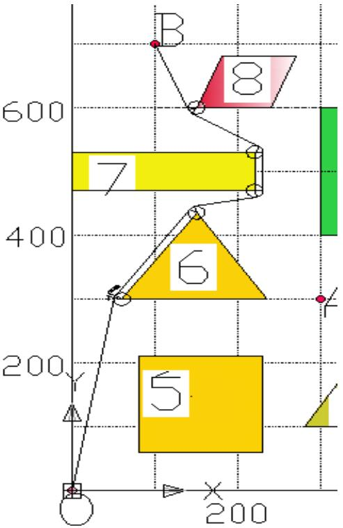

<details>
<summary>text_image</summary>

B
8
7
6
5
200
200
</details>

图五：O B→ 路径 4

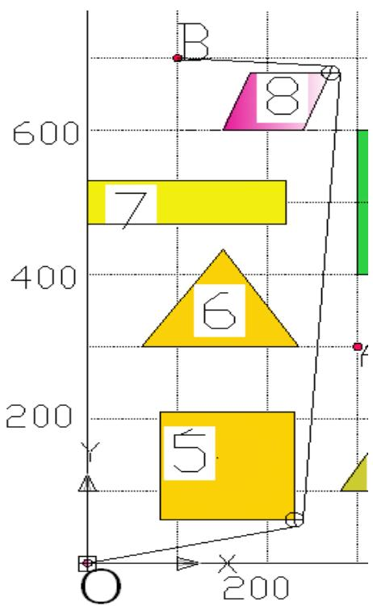

<details>
<summary>bar</summary>

| Shape | Height |
| --- | --- |
| 5 | ~200 |
| 6 | ~350 |
| 7 | ~500 |
| 8 | ~650 |
</details>

图六： 路径 5

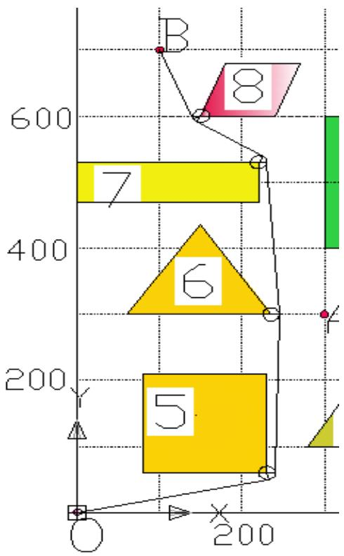

<details>
<summary>text_image</summary>

B
8
7
6
5
Y
200
X
200
</details>

图七： 路径 6

<table><tr><td>路径</td><td> $L_1$ </td><td> $l_1$ </td><td> $L_2$ </td><td> $l_2$ </td><td> $L_3$ </td><td> $l_3$ </td><td> $L_4$ </td><td> $l_4$ </td><td> $L_5$ </td><td> $l_5$ </td><td> $L_6$ </td><td> $L_{总}$ </td></tr><tr><td>一</td><td>224.50</td><td>8.37</td><td>178.12</td><td>10.67</td><td>381.59</td><td>16.05</td><td>170.88</td><td></td><td></td><td></td><td></td><td>990.16</td></tr><tr><td>二</td><td>224.50</td><td>9.05</td><td>176.96</td><td>12.69</td><td>230.49</td><td>9.24</td><td>96.95</td><td>6.15</td><td>111.36</td><td></td><td></td><td>877.38</td></tr><tr><td>三</td><td>305.78</td><td>4.23</td><td>162.25</td><td>7.78</td><td>75.66</td><td>11.43</td><td>216.16</td><td>17.46</td><td>170.88</td><td></td><td></td><td>971.58</td></tr><tr><td>四</td><td>305.78</td><td>4.23</td><td>162.25</td><td>7.78</td><td>75.66</td><td>13.66</td><td>60</td><td>9.89</td><td>96.95</td><td>6.15</td><td>111.36</td><td>853.70</td></tr><tr><td>五</td><td>237.49</td><td>12..94</td><td>621.29</td><td>15.77</td><td>170.88</td><td></td><td></td><td></td><td></td><td></td><td></td><td>1058.35</td></tr><tr><td>六</td><td>237.49</td><td>13.37</td><td>240.05</td><td>0.86</td><td>230.49</td><td>9.24</td><td>96.95</td><td>6.15</td><td>111.36</td><td></td><td></td><td>945.95</td></tr></table>

表二： 路径长

## 3、求解从O（0,0）到目标点 C（700,640）的最短路径

如下图八，解决的是 O 到目标点 C 的最短路径问题。采用与上述相同的方法可以分别计算出六条可能的最短路径（图形省略），然后进行比较，取最小者就是 O 到目标点C 的最优路径，可以通过 CAD的标注，得出表三中的数据。我们可以用对比法，得出路径一最短，所以得出 O点到C 点最短距离 1090.312。

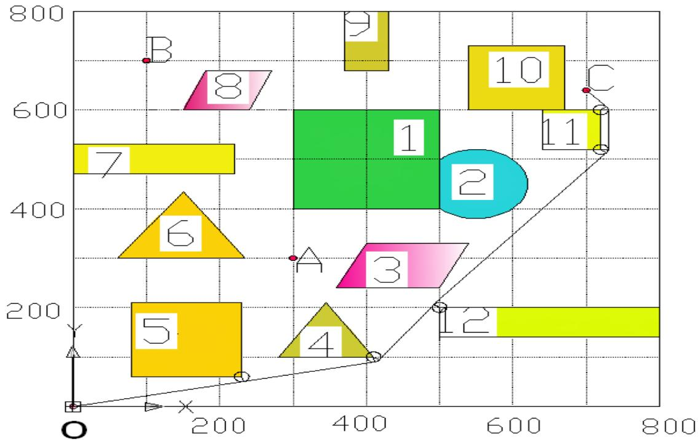

<details>
<summary>bubble</summary>

| Point | X | Y |
| --- | --- | --- |
| 1 | ~400 | ~600 |
| 2 | ~500 | ~450 |
| 3 | ~400 | ~300 |
| 4 | ~400 | ~150 |
| 5 | ~200 | ~200 |
| 6 | ~200 | ~350 |
| 7 | ~100 | ~500 |
| 8 | ~200 | ~600 |
| 9 | ~400 | ~750 |
| 10 | ~600 | ~650 |
| 11 | ~700 | ~550 |
| 12 | ~500 | ~200 |
| A | ~300 | ~300 |
| B | ~150 | ~700 |
| C | ~700 | ~650 |
</details>

图八：O C路线图 1

<table><tr><td>路径</td><td> $L_1$ </td><td> $l_1$ </td><td> $L_2$ </td><td> $l_2$ </td><td> $L_3$ </td><td> $l_3$ </td><td> $L_4$ </td><td> $l_4$ </td><td> $L_{总}$ </td></tr><tr><td rowspan="3">一</td><td>237.49</td><td>0.06</td><td>184.39</td><td>7.69</td><td>133.04</td><td>0.70</td><td>387.81</td><td>6.54</td><td></td></tr><tr><td> $L_5$ </td><td> $l_5$ </td><td> $L_6$ </td><td> $l_6$ </td><td> $L_7$ </td><td> $l_7$ </td><td> $L_8$ </td><td></td><td></td></tr><tr><td>80</td><td>9.01</td><td>43.59</td><td></td><td></td><td></td><td></td><td></td><td>1090.31</td></tr><tr><td rowspan="4">二</td><td> $L_1$ </td><td> $l_1$ </td><td> $L_2$ </td><td> $l_2$ </td><td> $L_3$ </td><td> $l_3$ </td><td> $L_4$ </td><td> $l_4$ </td><td></td></tr><tr><td>224.50</td><td>12.28</td><td>420.36</td><td>9.05</td><td>356.09</td><td>6.66</td><td>80</td><td>6.89</td><td></td></tr><tr><td> $L_5$ </td><td> $l_5$ </td><td> $L_6$ </td><td> $l_6$ </td><td> $L_7$ </td><td> $l_7$ </td><td> $L_8$ </td><td></td><td></td></tr><tr><td>43.59</td><td></td><td></td><td></td><td></td><td></td><td></td><td></td><td>1159.41</td></tr><tr><td rowspan="4">三</td><td> $L_1$ </td><td> $l_1$ </td><td> $L_2$ </td><td> $l_2$ </td><td> $L_3$ </td><td> $l_3$ </td><td> $L_4$ </td><td> $l_4$ </td><td></td></tr><tr><td>305.78</td><td>4.23</td><td>162.25</td><td>7.78</td><td>75.95</td><td>9.45</td><td>151.55</td><td>7.30</td><td></td></tr><tr><td> $L_5$ </td><td> $l_5$ </td><td> $L_6$ </td><td> $l_6$ </td><td> $L_7$ </td><td> $l_7$ </td><td> $L_8$ </td><td></td><td></td></tr><tr><td>151.33</td><td>1.73</td><td>119.16</td><td>5.93</td><td>130</td><td>13.55</td><td>94.34</td><td></td><td>1240.33</td></tr><tr><td rowspan="4">四</td><td> $L_1$ </td><td> $l_1$ </td><td> $L_2$ </td><td> $l_2$ </td><td> $L_3$ </td><td> $l_3$ </td><td> $L_4$ </td><td> $l_4$ </td><td></td></tr><tr><td>237.49</td><td>8.10</td><td>187.95</td><td>9.59</td><td>156.60</td><td>8.41</td><td>356.09</td><td>6.66</td><td></td></tr><tr><td> $L_5$ </td><td> $l_5$ </td><td> $L_6$ </td><td> $l_6$ </td><td> $L_7$ </td><td> $l_7$ </td><td> $L_8$ </td><td></td><td></td></tr><tr><td>80.21</td><td>6.89</td><td>43.59</td><td></td><td></td><td></td><td></td><td></td><td>1101.57</td></tr><tr><td rowspan="4">五</td><td> $L_1$ </td><td> $l_1$ </td><td> $L_2$ </td><td> $l_2$ </td><td> $L_3$ </td><td> $l_3$ </td><td> $L_4$ </td><td> $l_4$ </td><td></td></tr><tr><td>237.49</td><td>12.66</td><td>544.15</td><td>10.58</td><td>151.33</td><td>1.73</td><td>119.16</td><td>5.93</td><td></td></tr><tr><td> $L_5$ </td><td> $l_5$ </td><td> $L_6$ </td><td> $l_6$ </td><td> $L_7$ </td><td> $l_7$ </td><td> $L_8$ </td><td></td><td></td></tr><tr><td>130</td><td>13.55</td><td>94.34</td><td></td><td></td><td></td><td></td><td></td><td>1320.91</td></tr><tr><td rowspan="4">六</td><td> $L_1$ </td><td> $l_1$ </td><td> $L_2$ </td><td> $l_2$ </td><td> $L_3$ </td><td> $l_3$ </td><td> $L_4$ </td><td> $l_4$ </td><td></td></tr><tr><td>224.50</td><td>8.37</td><td>178.12</td><td>10.08</td><td>306.31</td><td>10.02</td><td>151.33</td><td>1.73</td><td></td></tr><tr><td> $L_5$ </td><td> $l_5$ </td><td> $L_6$ </td><td> $l_6$ </td><td> $L_7$ </td><td> $l_7$ </td><td> $L_8$ </td><td></td><td></td></tr><tr><td>119.16</td><td>5.93</td><td>130</td><td>13.55</td><td>94.34</td><td></td><td></td><td></td><td>1253.44</td></tr></table>

表三：O C→ 路径

## 4、求解关于O A B C O→ → → → 的问题

关于这个问题，与上述从从O点分别到A、B、C 三点的求解方式基本相同，最大的不同是不仅在障碍物拐点处有过渡圆弧，在途中点 A、B、C 处必须加设过渡圆弧，并且这三个过渡圆弧的圆心坐标有待求解。

以途中A处须加设的过渡圆弧为例，如图九：

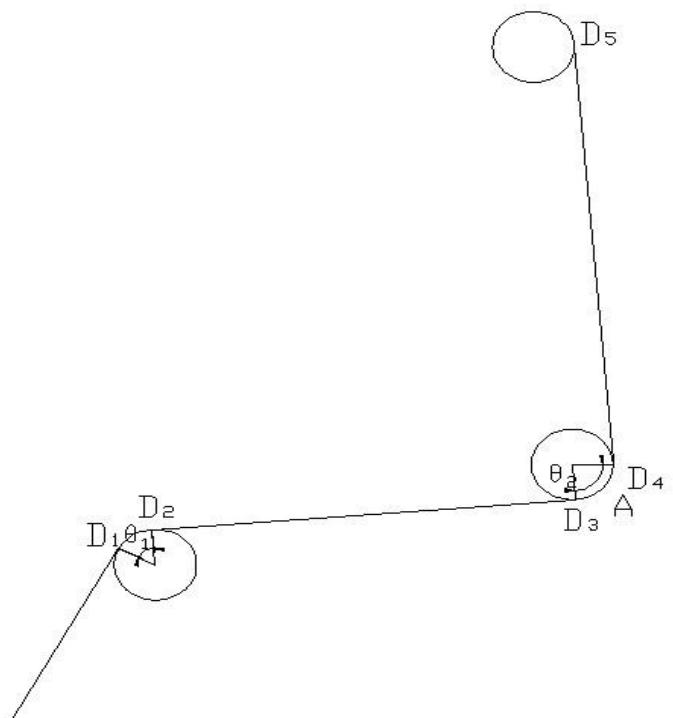

<details>
<summary>text_image</summary>

D5
θ
D4
A
D3
D2
D1θ1
</details>

图九

关于 $\mathrm { D 1 } \to \mathrm { D 2 } \to \mathrm { D 3 } \to \mathrm { D 4 } \to \mathrm { D 5 }$ 的最短路径，其中 $\mathrm { D } _ { 1 } ( 7 0 . 5 1 , 2 1 3 . 1 4 )$ 的坐标已经在问题一的求解中得到，其他各点及过渡圆弧的圆心均为待求解未知点。

目标函数

$$
\min Z = 1 0 \cdot \theta_ {1} + \sqrt {\left(x _ {0} - 8 0\right) ^ {2} + \left(y _ {0} - 2 1 0\right) ^ {2} - 4 0 0} + 1 0 \cdot \theta_ {2} + \sqrt {\left(\left(x _ {0} - 2 2 0\right) ^ {2} + \left(y _ {0} - 5 3 0\right) ^ {2}\right)};
$$

假定： $D _ { 2 } ( x _ { 2 } , y _ { 2 } ) , D _ { 3 } ( x _ { 3 } , y _ { 3 } ) , D _ { 4 } ( x _ { 4 } , y _ { 4 } ) , O _ { 4 } ( x _ { o } , y _ { o } )$ ，由图形可得约束条件如下，

a. O1D2 · D2D3 = 0 ⇒ (x2 −80) · (x3 − x2) + (y2 − 210) · (y3 − y2) = 0  
b. (x3 − x0)·(x3 − x2) +(y3 − y0)·(y3 − y2) = 0

|D2O5| = r = 10 ⇒ (x2 −80)2 + (y₂ − 210)2 = 100

$$
\left| D _ {3} O _ {A} \right| = r = 1 0 \Rightarrow (x _ {3} - x _ {0}) ^ {2} + (y _ {3} - y _ {0}) ^ {2} = 1 0 0
$$

D{O5·D2D{5 d. ⇒ θ1 = a cos(((x1 −80) · (x2 −80) + (y1 − 210)· (y2 − 210)) /100) |D{O5|.|D\_{2O5]|  
e. $x _ { 3 } < 3 0 0 , y _ { 3 } < 3 0 0$

根据 Lingo 编程求解（见附录 1），求得 $D _ { 1 } D _ { 2 } + D _ { 2 } D _ { 3 }$ +圆弧 ${ \cal D } _ { 3 } { \cal D } _ { 4 } + { \cal D } _ { 4 } { \cal D } _ { 5 }$ 的最短路径为 491.40,经过 A 点的圆弧的圆心坐标为（290.98,304.31）。

同理，还可根据 Lingo 编程求解（见附录 2\~3）依次得出经过 B、C 点处的两圆弧和线段的长度，用Lingo 求得最优解：分别为 288.24、143.29。.经过 B 点的圆弧圆心坐标为（107.97,693.96），经过 C 点的圆弧圆心坐标为（708.99,644.39）。

确定以上过渡圆弧后，即可根据 AutoCAD 作图测量得出其他路径段的长度，以及最短路径总长为2730.052。途中各点坐标见附录 6。


<details>
<summary>wireframe</summary>

| Point | X | Y |
| --- | --- | --- |
| A | ~300 | ~300 |
| B | ~150 | ~700 |
| C | ~700 | ~650 |
| 1 | ~450 | ~600 |
| 2 | ~550 | ~450 |
| 3 | ~400 | ~250 |
| 4 | ~400 | ~150 |
| 5 | ~150 | ~200 |
| 6 | ~150 | ~350 |
| 7 | ~150 | ~500 |
| 8 | ~250 | ~650 |
| 9 | ~450 | ~800 |
| 10 | ~650 | ~750 |
| 11 | ~700 | ~600 |
| 12 | ~750 | ~200 |
</details>

## 5、求解关于机器人从 O（0,0）行走到目标点 A（300,300）的最短时间的问题

设 两个切点为 $D _ { 1 } ( x _ { 1 } , y _ { 2 } ) , D _ { 2 } ( x _ { 2 } , y _ { 2 } )$ 。所切拐点处的圆弧的圆心 $0 _ { 2 }$ 坐标为$( x _ { o } , y _ { o } )$ 。

<sup>2</sup> <sup>2</sup><sub>1 1</sub>x y+ r.θ <sup>2</sup> <sup>2</sup>(300 ) (300 ) x y  − + − 目标函数为：min Z = + 5 v 5

约束条件有如下：

机器人在圆弧上的行进速度 $\nu = \nu ( \rho ) = \frac { \nu _ { 0 } } { 1 + \mathrm { e } ^ { 1 0 - 0 . 1 \rho ^ { 2 } } }$

根据切线于圆的关系， $\overrightarrow { O _ { 2 } D _ { 1 } } \cdot \overrightarrow { D _ { 1 } O } = 0$

$$
\begin{array}{l} \Rightarrow x _ {1} \cdot (x _ {d _ {1}} - x _ {O}) + y _ {1} \cdot (y _ {1} - y _ {O}) = 0 \\ \overrightarrow {O _ {2} D _ {2}} \cdot \overrightarrow {D _ {2} A} = 0 \\ \Rightarrow (3 0 0 - x _ {2}) \cdot (x O - x _ {2}) + (3 0 0 - y _ {2}) \cdot (y _ {O} - y _ {2}) = 0 \\ \end{array}
$$

因为我们知道两切点 $D _ { 1 } ( x _ { 1 } , y _ { 1 } ) , D _ { 2 } ( x _ { 2 } , y _ { 2 } )$ 都在圆上。

可以知道： $( x _ { 1 } - x _ { O } ) ^ { 2 } + ( y _ { 1 } - y _ { O } ) ^ { 2 } = r ^ { 2 }$

$$
(x _ {2} - x _ {O}) ^ {2} + (y _ {2} - y _ {O}) ^ {2} = r ^ {2}
$$

$$
\angle D _ {1} O _ {2} D _ {2} = \arccos \frac {(x _ {1} - x _ {O}) \cdot (x _ {2} - x _ {O}) + (y _ {1} - y _ {O}) \cdot (y _ {2} - y _ {O})}{\mathrm{r} ^ {2}}
$$

在前面求解中，我们已知圆心应该在斜率 的直线上，故 $x _ { 0 } - 8 0 = 2 1 0 - y$ 。

$$
\Rightarrow \sqrt {\left(x _ {O} - 8 0\right) ^ {2} + \left(2 1 0 - y _ {O}\right) ^ {2}} + 1 0 = r ^ {2}, \quad \text {且} r > 1 0, x _ {1} <   8 0, y _ {2} > 2 1 0
$$

根据 Lingo 编程求解（见附录 5），最短时间为 94.22830 秒， $r = 1 2 . 9 8 7 4 7$ 单位，单位/秒。

机器人所经过点的坐标，圆弧的圆心坐标，以及行走的总时间和总路程如下图：

<table><tr><td></td><td>起点 O</td><td>经过点 D1</td><td>经过点 D2</td><td>圆弧圆心</td><td>终点 A</td></tr><tr><td>坐标</td><td>0,0</td><td>69.78,211.95</td><td>77.72,220.11</td><td>82.11,207.89</td><td>300,300</td></tr><tr><td>总距离</td><td colspan="5">471.13</td></tr><tr><td>总时间</td><td colspan="5">94.2283 秒</td></tr></table>

## 五、参考文献

参考文献：

[1]：http://wenku.baidu.com/view/606c2a094a7302768e99399a.html

## 六、附录

使用软件名称：AutoCAD 、 LINGO

Lingo 使用的程序如下：

附录1:12D题第一问解（A点过渡圆）：  
```txt
min=10*(sita1+sita2)+@sqrt((xo-80)^2+(yo-210)^2-400)+@sqrt((xo-220)^2+(yo-530)^2);
(xd2-80)*(xd3-xd2)+(yd2-210)*(yd3-yd2)=0;
(xd3-xo)*(xd3-xd2)+(yd3-yo)*(yd3-yd2)=0;
(xd4-xo)*(220-xo)+(yd4-yo)*(530-yo)=0;
(xd2-80)^2+(yd2-210)^2=100;
(xd3-xo)^2+(yd3-yo)^2=100;
(xd4-xo)^2+(yd4-yo)^2=100;
(300-xo)^2+(300-yo)^2=100;
sita1=@acos(((70.50597-80)*(xd2-80)+(213.1406-210)*(yd2-210))/100);
sita2=@acos(((xd3-xo)*(xd4-xo)+(yd3-yo)*(yd4-yo))/100);
xd3<300;yd3<300;
```

附录2：12D题解第一问解（B点过渡圆）  
```txt
min=10*(sita1+sita2)+@sqrt((xo-150)^2+(yo-600)^2)+@sqrt((xo-270)^2+(yo-680)^2);
(xd2-150)*(xd3-xd2)+(yd2-600)*(yd3-yd2)=0;
(xd3-xo)*(xd3-xd2)+(yd3-yo)*(yd3-yd2)=0;
(xd4-xo)*(270-xo)+(yd4-yo)*(680-yo)=0;
(xd2-150)^2+(yd2-600)^2=100;
(xd3-xo)^2+(yd3-yo)^2=100;
(xd4-xo)^2+(yd4-yo)^2=100;
(100-xo)^2+(700-yo)^2=100;
sita1=@acos(((144.5033-150)*(xd2-150)+(591.6462-600)*(yd2-600))/100);
sita2=@acos(((xd3-xo)*(xd4-xo)+(yd3-yo)*(yd4-yo))/100);
xd3<100;yd3<700;yd4>700;xd4>100;
```  
附录3：12D题解第一问解(C点过渡圆)

```txt
min=10*(sita1+sita2+sita3)+@sqrt((xo-670)^2+(yo-730)^2-400)+@sqrt((xo-720)^2+(yo-600)^2-400);
(xd2-670)*(xd3-xd2)+(yd2-730)*(yd3-yd2)=0;
(xd3-xo)*(xd3-xd2)+(yd3-yo)*(yd3-yd2)=0;
(xd4-xo)*(xd4-xd5)+(yd4-yo)*(yd4-yd5)=0;
(xd5-xD4)*(xd5-720)+(yd5-yD4)*(yd5-600)=0;
(xd2-670)^2+(yd2-730)^2=100;
(xd3-xo)^2+(yd3-yo)^2=100;
(xd4-xo)^2+(yd4-yo)^2=100;
(700-xo)^2+(640-yo)^2=100;
(xd5-720)^2+(yd5-600)^2=100;
sita1=@acos(((670-670)*(xd2-670)+(740-730)*(yd2-730))/100);
sita2=@acos(((xd3-xo)*(xd4-xo)+(yd3-yo)*(yd4-yo))/100);
sita3=@acos(((xd5-720)*10+(yd5-600)*0)/100);
```

```txt
xd3<700;yd3>640;xd4>700;yd4<640;xd2>670;yd2>730;yd5>600;xd5>720;
```  
附录4：12D题第一问解（OA）

```txt
min=@sqrt(xd1^2+yd1^2)+r*sita@sqrt((300-xd2)^2+(300-yd2)^2);
xd1*(xd1-xo)+yd1*(yd1-yo)=0;
(300-xd2)*(xo-xd2)+(300-yd2)*(yo-yd2)=0;
(xd1-xo)^2+(yd1-yo)^2=r^2;
(xd2-xo)^2+(yd2-yo)^2=r^2;
sita=@acos(((xd1-xo)*(xd2-xo)+(yd1-yo)*(yd2-yo))/r^2);
xo-80=210-yo;
@sqrt((xo-80)^2+(210-yo)^2)+10=r;
r>10;xd1<80;yd2>210;
```  
附录5：第二问最短时间

```txt
model:
min=@sqrt(xd1^2+yd1^2)/5+r*sita/v+@sqrt((300-xd2)^2+(300-yd2)^2)/5;
v=5/(1+@exp(10-0.1*r^2));
xd1*(xd1-xo)+yd1*(yd1-yo)=0;
(300-xd2)*(xo-xd2)+(300-yd2)*(yo-yd2)=0;
(xd1-xo)^2+(yd1-yo)^2=r^2;
(xd2-xo)^2+(yd2-yo)^2=r^2;
sita=@acos(((xd1-xo)*(xd2-xo)+(yd1-yo)*(yd2-yo))/r^2);
xo-80=210-yo;
@sqrt((xo-80)^2+(210-yo)^2)+10=r;
r>10;xd1<80;yd2>210;
end
```  
附录6： 最短路径途中各关键点坐标及路段距离

<table><tr><td>编号</td><td>坐标</td><td>相邻点距</td></tr><tr><td>O起点</td><td>0, 0</td><td></td></tr><tr><td>D1</td><td>70.51, 213.14</td><td>224.4994</td></tr><tr><td>D2</td><td>76.7366, 219.4525</td><td>9.1919</td></tr><tr><td>D3</td><td>294.2516, 294.2609</td><td>230.2126</td></tr><tr><td>D4</td><td>300.5154, 307.3092</td><td>15.4177</td></tr><tr><td>D5</td><td>229.5428, 532.9891</td><td>236.5742</td></tr><tr><td>D6</td><td>225.4967, 538.3538</td><td>6.8553</td></tr><tr><td>D7</td><td>144.5033, 591.6462</td><td>96.9536</td></tr><tr><td>D8</td><td>140.8546, 595.9551</td><td>5.7241</td></tr><tr><td>D9</td><td>98.8430, 689.879</td><td>102.7528</td></tr><tr><td>D10</td><td>108.8299, 703.9252</td><td>20.1728</td></tr><tr><td>D11</td><td>270.8585, 689.9631</td><td>162.3116</td></tr><tr><td>D12</td><td>272,689.80</td><td>3.0001</td></tr><tr><td>D13</td><td>368,670.20</td><td>98.4886</td></tr><tr><td>D14</td><td>370,670</td><td>3.0001</td></tr><tr><td>D15</td><td>430,670</td><td>60</td></tr><tr><td>D16</td><td>435.5878, 671.7068</td><td>5.9291</td></tr><tr><td>D17</td><td>534.4122, 738.2932</td><td>119.1638</td></tr><tr><td>D18</td><td>540,740</td><td>5.9291</td></tr><tr><td>D19</td><td>670,740</td><td>130</td></tr><tr><td>D20</td><td>679.7739,732.1146</td><td>13.5742</td></tr><tr><td>D21</td><td>699.2112, 642.275</td><td>92.0426</td></tr><tr><td>D22</td><td>701.3098, 637.9795</td><td>4.8316</td></tr><tr><td>D23</td><td>727.6967, 606.3845</td><td>39.4527</td></tr><tr><td>D24</td><td>730,600</td><td>6.9654</td></tr><tr><td>D25</td><td>730,520</td><td>80</td></tr><tr><td>D26</td><td>727.9377, 513.9178</td><td>6.5381</td></tr><tr><td>D27</td><td>492.0623, 206.0822</td><td>387.8144</td></tr><tr><td>D28</td><td>491.6552, 205.5103</td><td>0.7021</td></tr><tr><td>D29</td><td>418.3448, 94.4897</td><td>133.0413</td></tr><tr><td>D30</td><td>412.1693, 90.2381</td><td>7.6852</td></tr><tr><td>D31</td><td>230,60</td><td>184.3909</td></tr><tr><td>D32</td><td>232.1149, 50.2262</td><td>0.0557</td></tr><tr><td>O终点</td><td>0, 0</td><td>237.4868</td></tr><tr><td colspan="3">以下为途中各过渡圆弧的圆心坐标</td></tr><tr><td>O1</td><td>80,210</td><td rowspan="16"></td></tr><tr><td>O2</td><td>290.976, 304.3092</td></tr><tr><td>O3</td><td>229.5428, 532.9891</td></tr><tr><td>O4</td><td>150,600</td></tr><tr><td>O5</td><td>107.9714, 693.9621,</td></tr><tr><td>O6</td><td>272.689, 798</td></tr><tr><td>O7</td><td>370,680</td></tr><tr><td>O8</td><td>430,680</td></tr><tr><td>O9</td><td>540,730</td></tr><tr><td>O10</td><td>670,730</td></tr><tr><td>O11</td><td>708.9851, 644.3896</td></tr><tr><td>O12</td><td>720,600</td></tr><tr><td>O13</td><td>720,520</td></tr><tr><td>O14</td><td>500,200</td></tr><tr><td>O15</td><td>410,100</td></tr><tr><td>O16</td><td>230, 60</td></tr></table>