题目: D

参赛队员：队员1\_王剑清 队员2\_容帅 队员3\_徐伟伟

指导教师：教练组

单位：江西财经职业学院

# 2012 高教社杯全国大学生数学建模竞赛

## 承诺书

我们仔细阅读了中国大学生数学建模竞赛的竞赛规则.

我们完全明白，在竞赛开始后参赛队员不能以任何方式（包括电话、电子邮件、网上咨询等）与队外的任何人（包括指导教师）研究、讨论与赛题有关的问题。

我们知道，抄袭别人的成果是违反竞赛规则的，如果引用别人的成果或其他公开的资料（包括网上查到的资料），必须按照规定的参考文献的表述方式在正文引用处和参考文献中明确列出。

我们郑重承诺，严格遵守竞赛规则，以保证竞赛的公正、公平性。如有违反竞赛规则的行为，我们将受到严肃处理。

我们授权全国大学生数学建模竞赛组委会，可将我们的论文以任何形式进行公开展示（包括进行网上公示，在书籍、期刊和其他媒体进行正式或非正式发表等）。

我们参赛选择的题号是（从 A/B/C/D 中选择一项填写）：\_\_\_\_ D

我们的参赛报名号为（如果赛区设置报名号的话）：\_\_\_\_

所属学校（请填写完整的全名）：\_\_\_\_ 江西财经职业学院

参赛队员 (打印并签名) : 1. 王剑清

2. 容帅

3. 徐伟伟

指导教师或指导教师组负责人 (打印并签名): \_\_\_\_ 教练组 \_\_\_\_

日期：2012年9月10日

赛区评阅编号（由赛区组委会评阅前进行编号）：

# 2012 高教社杯全国大学生数学建模竞赛

## 编号专用页

赛区评阅编号（由赛区组委会评阅前进行编号）：

赛区评阅记录（可供赛区评阅时使用）：

<table><tr><td>评阅人</td><td></td><td></td><td></td><td></td><td></td><td></td><td></td><td></td><td></td><td></td></tr><tr><td>评分</td><td></td><td></td><td></td><td></td><td></td><td></td><td></td><td></td><td></td><td></td></tr><tr><td>备注</td><td></td><td></td><td></td><td></td><td></td><td></td><td></td><td></td><td></td><td></td></tr></table>

全国统一编号（由赛区组委会送交全国前编号）：

全国评阅编号（由全国组委会评阅前进行编号）：

# 基于蚁群算法的机器人避障问题

## 摘要

机器人的开发与应用已成为当今学术界和工业界的研究热点之一。大部分机器人只能接受人类的指挥，或者运行预先编排好的程序，如何利用人工智能技术制定机器人的行动原则，一直是机器人应用领域的难题。本文采用了蚁群算法、局部优化模型等智能算法，对机器人在平面场景图中行走并躲避障碍物的问题进行了研究，得到了最短路径和最短时间路径的算法。

对于问题一，在寻找 $O \to A$ 的最短路径时，由于可能遇到的障碍物较少，直接观察便不难看出最短路径只会出现一段圆弧，并能估计出这段圆弧可能出现的大致范围，关键便是确定出这一段圆弧的起点和终点。于是，我们以这段圆弧的起点和终点作为决策变量，以总长度最短为目标函数，构造了一个优化模型，用lingo软件运行，得到圆弧的起点为（70.50596，213.1406），终点为（70.60640，219.4066）。最终，我们计算出 $O \to A$ 的最短路径长度为471.0372，路径详见表1。

在寻找 $O \to B$ 、 $O \to C$ 、 $O \to A \to B \to C \to O$ 的最短路径时，可能遇到的障碍物很多，路线很复杂。首先，我们将路线图简化为一个赋权网络图，并利用蚁群算法，找出了最短路径的大致路线。然后将这条路线分割为几段，每段路线只绕开一个障碍物。这样，我们就可以利用寻找 $O \to A$ 的最短路径时同样的优化模型，求出每一段的最短路径，最后将每段最短路径求和，得出 $O \to B$ 的最短路径为854.3759、 $O \to C$ 的最短路径为1088.1951、 $O \to A \to B \to C \to O$ 的最短路径为2737.765，路径详见表2、表3、表4。

问题二需要寻找出 $O \rightarrow A$ 的最短时间路径，我们将问题一中的优化模型做了修改，以总时间最短为目标函数，以圆弧的两个切点以及圆弧的半径为决策变量，用 lingo 软件运行，得到圆弧的两个切点为（69.03197,213.5456）、（84.87669,199.5555），半径为 11.52688，最短时间为 97.91781 秒，路径详见表 5。

关键词：人工智能；蚁群算法；优化模型；最短路径；机器人避障

## 一、问题重述

在一个 $800 \times 800$ 的平面场景图，在原点 $O(0,0)$ 点处有一个机器人，它只能在该平面场景范围内活动。图中有12个不同形状的区域是机器人不能与之发生碰撞的障碍物。障碍物外指定一点为机器人要到达的目标点（要求目标点与障碍物的距离至少超过10个单位）。规定机器人的行走路径由直线段和圆弧组成，其中圆弧是机器人转弯路径。机器人不能折线转弯，转弯路径由与直线路径相切的一段圆弧组成，也可以由两个或多个相切的圆弧路径组成，但每个圆弧的半径最小为10个单位。为了不与障碍物发生碰撞，同时要求机器人行走线路与障碍物间的最近距离为10个单位，否则将发生碰撞，若碰撞发生，则机器人无法完成行走。场景图中4个点 $O(0,0), A(300,300), B(100,700), C(700,640)$ 。

机器人直线行走的最大速度为 $v_{0}=5$ 个单位/秒。机器人转弯时，最大转弯速度为 $v=v(\rho)=\frac{v_{0}}{1+\mathrm{e}^{10-0.1\rho^{2}}}$ ，其中 $\rho$ 是转弯半径。如果超过该速度，机器人将发生侧翻，无法完成行走。

(1) 机器人从 $O(0,0)$ 出发， $O \rightarrow A$ 、 $O \rightarrow B$ 、 $O \rightarrow C$ 和 $O \rightarrow A \rightarrow B \rightarrow C \rightarrow O$ 的最短路径。  
(2) 机器人从 $O(0,0)$ 出发，到达A的最短时间路径。

## 二、问题分析

## 2.1 问题一分析

1. 问题一中第一个问要求定点 $O = (0,0)$ 按照一定的行走规则绕过障碍物到达目标点的最短路径，我们先可以包络线画出机器人行走的危险区域，这样的话，拐角处就是一个半径为10个单位的四分之一圆弧，通过那么然后采用拉绳子的方法寻找可能的最短路径（比如求 $O$ 和 $A$ 之间的最短路径，我们就可以连接 $O$ 和 $A$ 之间的一段绳子，以拐角处的圆弧为支撑拉紧，那么这段绳子的长度便是 $O$ 到 $A$ 的一条可能的最短路径），然后采用穷举法列出 $O$ 到每个目标点的可能路径的最短路径，然后比较其大小便可得出 $O$ 到目标点的最短路径。  
2. 第二问要求定点 $O(0,0)$ 经过中间的若干点按照一定的规则绕过障碍物到达目标点后在回到 $O(0,0)$ ，这使我们考虑就不仅仅是经过障碍物拐点的问题，也应该考虑经过路径中的目标点处转弯的问题，这时简单的线圆结构就不能解决这种问题，我们在拐点及途中目标点处都采用最小转弯半径的形式，也可以适当的变换拐点处的拐弯半径，使机器人能够沿直线通过途中的目标点，然后建立优化模型对这两种方案分别进行优化，最终求得最短路径。

## 2.2 问题二分析

问题二中要求定点 $O(0,0)$ 按照一定的行走规则绕过障碍物到达目标点A的最短时间路径，我们先可以包络线画出机器人行走的危险区域，这样的话，拐角处就是以一个半径为10个单位的四分之一圆弧，通过那么然后采用拉绳子的方法寻找可能的最短时间路径，然后采用穷举法列出 $O$ 到每个目标点的可能路径的最短时间路径，然后比较其行走时间长短得出 $O$ 到目标点A的最短时间路径。

## 三、基本假设

1. 假设机器人的自身宽度忽略不计。这样，机器人的运动可以看成是一个点的移动。  
2. 假设机器人直线行走和转弯时均以最大速度运行。  
3. 假设障碍物始终是题目所给的 12 个不同形状的区域，且位置，大小等性质一直不变。

## 四、符号说明

<table><tr><td>符号</td><td>说明</td></tr><tr><td> $v_0$ </td><td>直线行走时最大速度</td></tr><tr><td> $\rho$ </td><td>转弯半径</td></tr><tr><td> $S_i$ </td><td> $O \to A$ 的最短路径中第i个分段的长度</td></tr><tr><td> $L_i$ </td><td> $O \to B$ 的最短路径中第i个分段的长度</td></tr><tr><td> $L'_i$ </td><td> $O \to C$ 的最短路径中第i个分段的长度</td></tr><tr><td> $t_{\min}$ </td><td> $O \to A$ 的最短时间</td></tr><tr><td> $B_i B_j$ </td><td>表示 $B_i \to B_j$ 的弧长</td></tr><tr><td> $|B_i B_j|$ </td><td>表示 $B_i \to B_j$ 的直线长度</td></tr></table>

## 五、模型的建立与求解

## 5.1 问题一的求解

## 5.1.1 求 $O \rightarrow A$ 最短路径的优化模型

平面内两点最短的路径是以OA两点为端点的直线段长度，但是连接这两点的线段于障碍物相交，所以设法尝试绕过障碍物及其危险区域的其他路径。障碍物是一个正方形，这个正方形的中心位于OA连线的下方，所以机器人从障碍物的上方绕过障碍物的路径为最短路径。

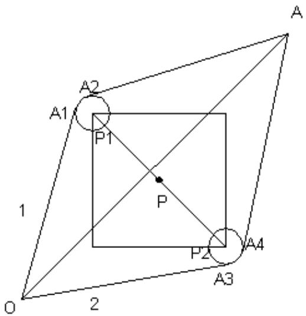

<details>
<summary>text_image</summary>

A
A1
P1
P
P2
A4
O
2
1
A
</details>

图 1 $O \rightarrow A$ 路径示意图

如图 1 所示， $O \rightarrow A$ 的最短路径由直线 $OA_{1}$ 和 $A_{2}A$ ，以及一条与它们相切的圆弧

$A_{1}A_{2}$ 构成，其中 $A_{1}$ 、 $A_{2}$ 为切点。圆弧 $A_{1}A_{2}$ 以 $P_{1}(80,210)$ 为圆心，10 为半径。

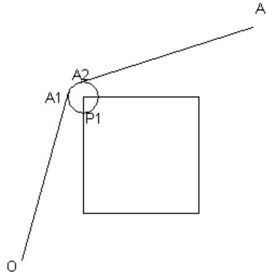

<details>
<summary>text_image</summary>

A
A1
A2
P1
O
</details>

图 2 $O \rightarrow A$ 最短路径图

设切点坐标为 $A_{1}(x_{1},y_{1})$ ， $A_{2}(x_{2},y_{2})$ ，可以计算出这三段路径的长度：

$$
O A _ {1} = s _ {1} = \sqrt {\left(x _ {1} - 0\right) ^ {2} + \left(y _ {1} - 0\right) ^ {2}},
$$

$$
A _ {1} A _ {2} = s _ {2} = 2 a r c \sin \frac {\sqrt {\left(x _ {1} - x _ {2}\right) ^ {2} + \left(y _ {1} - y _ {2}\right) ^ {2}}}{2 0} \cdot r,
$$

$$
A _ {2} A = s _ {3} = \sqrt {\left(x _ {2} - 3 0 0\right) ^ {2} + \left(y _ {2} - 3 0 0\right) ^ {2}} 。
$$

下面我们以 $x_{1}, y_{1}$ , $x_{2}, y_{2}$ 为决策变量, 以路径总长度最短为目标函数:

$$
\text {Min} \quad s = \sum_ {s _ {1}} ^ {3} s _ {i}
$$

约束条件：圆弧半径 $r = 10$

$OA_{1} \perp A_{1}P$ ， $A_{1}$ 为切点， $\Delta OA_{1}P$ 成直角三角形，满足勾股定理：

$$
O A _ {1} ^ {2} + A _ {1} P ^ {2} = O P ^ {2}
$$

$A_{2}A_{1}\perp PA_{1}$ ， $A_{1}$ 为切点， $\Delta A_{2}A_{1}P$ 成直角三角形，满足勾股定理：

$$
A _ {2} A _ {1} ^ {2} + P A _ {1} ^ {2} = A _ {2} P
$$

$A_{1}, A_{2}$ 点均在圆弧上。

综上，构造如下优化模型：

$$
\text {Min} \quad s = \sum_ {s _ {1}} ^ {3} s _ {i} = \sqrt {x _ {1} ^ {2} + y _ {1} ^ {2}} + \sqrt {\left(x _ {1} - 3 0 0\right) ^ {2} + \left(y _ {2} - 3 0 0\right) ^ {2}} + 2 0 t
$$

$$
s. t. \left\{ \begin{array}{c} x _ {1} \leq 8 0 \\ x _ {1} \geq 7 0 \\ y _ {1} \leq 2 2 0 \\ y _ {1} - \sqrt {1 0 0 - \left(x _ {1} - 8 0\right) ^ {2}} = 2 1 0 \\ x _ {1} ^ {2} + y _ {1} ^ {2} + 1 0 0 = 5 0 5 0 0 \\ \left(x _ {1} - 3 0 0\right) ^ {2} + \left(y _ {2} - 3 0 0\right) ^ {2} + 1 0 0 = 5 6 5 0 0 \\ \sin t = \frac {\sqrt {\left(x _ {1} - x _ {2}\right) ^ {2} + \left(y _ {1} - y _ {2}\right) ^ {2}}}{2 0} \end{array} \right.
$$

求解上述模型（见附录 1 中 lingo 程序），得到结果如下：

OA 最短路径长度:

$$
s _ {\min} = 4 7 1. 0 3 7 2
$$

两个圆弧切点坐标:

$$
A _ {1} = (7 0. 5 0 5 9 6, 2 1 3. 1 4 0 6)
$$

$$
A _ {2} = (7 6. 6 0 6 4 0, 2 1 9. 4 0 6 6)
$$

机器人从 $O(0,0)$ 点出发到达A点最短路径可以用下表表示:

表 1 $O \to A$ 的最短路径

<table><tr><td>分段</td><td>起点</td><td>终点</td><td>线段类型</td><td>长度</td></tr><tr><td>1</td><td>(0, 0)</td><td>(70.50596,213.1406)</td><td>直线</td><td>224.4994</td></tr><tr><td>2</td><td>(70.50596,213.1406)</td><td>(70.6064,219.4066)</td><td>以(80, 210)为圆心的弧线</td><td>9.1105</td></tr><tr><td>3</td><td>(70.6064,219.4066)</td><td>(300, 300)</td><td>直线</td><td>237.4273</td></tr><tr><td colspan="4">总长度</td><td>471.0372</td></tr></table>

## 5.1.2 求 $O \to B$ 最短路径的模型

## 5.1.2.1 利用蚁群算法选择 $O \to B$ 的最短路线

在本节中，我们将路线图简化为一个赋权网络图，并利用蚁群算法，找出最短路径的大致路线。

蚁群算法原理是对自然界蚂蚁的寻径方式进行模拟而得出的一种仿生算法。蚂蚁在运动过程中，能够在它所经过的路径上留下一种称为外激素（pheromone）的物质进行信息传递，而且蚂蚁在运动过程中能够感知这种物质，并以此指导自己的运动方向，因此由大量蚂蚁组成的蚂蚁集体行为便表现出一种信息正反馈现象：某一路径上走过的蚂蚁越多，则后来者选择该历经的概率就越大。

## 1、构造赋权网络图

我们把平面上的一些点编号，并将它们之间的距离关系简化为网络图。如果节点直接可以直线到达而不遇到障碍物，则它们之间的边的权重为直线距离，否则它们之间没有边。如下：

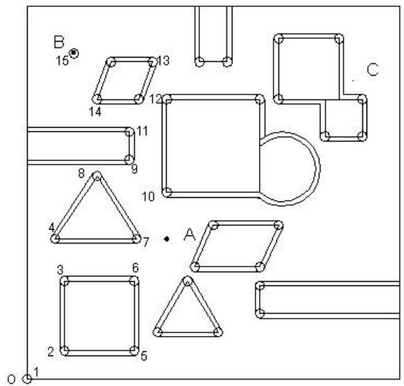

<details>
<summary>text_image</summary>

B
15
13
14
12
C
11
9
8
10
A
4
7
3
6
2
5
O 1
</details>

图 3 节点编号图  
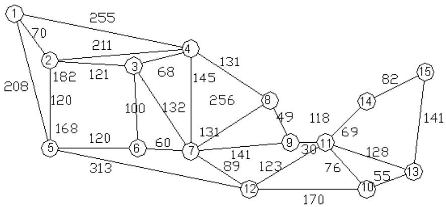

<details>
<summary>flowchart</summary>

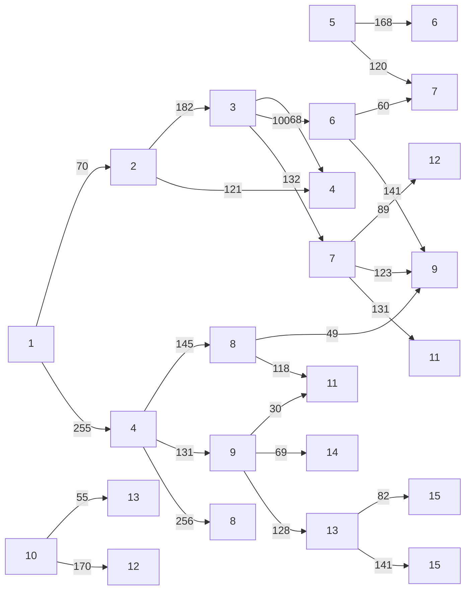
</details>

图 4 赋权网络图

2、用蚁群算法求上述简化网络图中从 $O \rightarrow B$ 的最短路径。

## 1）蚁群算法模型

将点 $1 \rightarrow 15$ 是否在路径上分别取值为0到1，这样就形成了15位的0，1序列，从而计算这条路径的距离。将距离作为信息素的一个映射变量，由于要求最短路，所以可以使用倒数或者相对距离作为信息素浓度。这样就可以获得每只蚂蚁的转移概率，若转移概率大于全局转移因子，则进行全局转移；否则以一定得步长进行转移。这样就可以逐步向全局最优解靠近。

## 2）执行步骤

第一步 初始化 N 只蚂蚁。实际上就是 N 条道路，并计算当前的蚂蚁位置。

第二步 初始化运行参数，开始迭代。

第三步 在迭代补数范围内，计算转移概率，如果小于全局转移概率就进行小范围的搜索，否则进行大范围的搜索。

第四步 更新信息素，记录状态，准备进行下一次迭代。

第五步 转第三步

第六步 输出结果

## 3）编程实现

源代码程序详见附录 2

## 4）结果分析

运行结果如下:

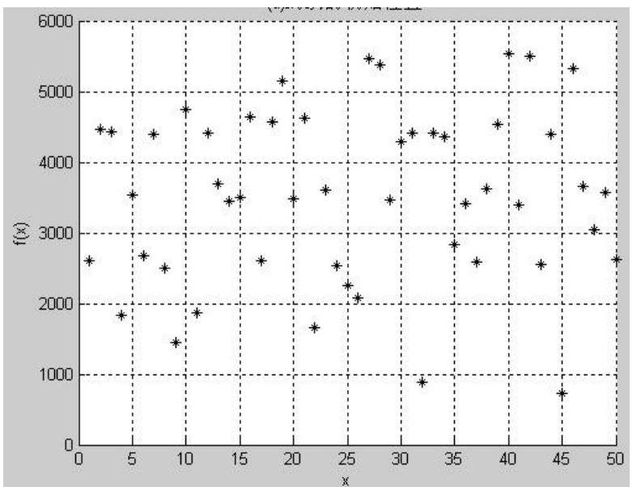

<details>
<summary>scatter</summary>

| x | f(x) |
| --- | --- |
| ~1 | ~2600 |
| ~2 | ~4500 |
| ~3 | ~4450 |
| ~4 | ~1850 |
| ~6 | ~3550 |
| ~7 | ~2700 |
| ~8 | ~4400 |
| ~9 | ~2500 |
| ~10 | ~1450 |
| ~11 | ~4750 |
| ~12 | ~1900 |
| ~13 | ~4400 |
| ~14 | ~3700 |
| ~15 | ~3450 |
| ~16 | ~3500 |
| ~17 | ~4650 |
| ~18 | ~2600 |
| ~19 | ~5150 |
| ~21 | ~3500 |
| ~22 | ~4650 |
| ~23 | ~1650 |
| ~24 | ~3600 |
| ~25 | ~2550 |
| ~26 | ~2250 |
| ~27 | ~2050 |
| ~28 | ~5450 |
| ~29 | ~5350 |
| ~30 | ~3450 |
| ~31 | ~4300 |
| ~32 | ~4400 |
| ~33 | ~900 |
| ~34 | ~4400 |
| ~35 | ~4350 |
| ~36 | ~2850 |
| ~37 | ~3400 |
| ~38 | ~2600 |
| ~39 | ~3650 |
| ~40 | ~4550 |
| ~41 | ~5550 |
| ~42 | ~3400 |
| ~43 | ~5500 |
| ~44 | ~2550 |
| ~45 | ~750 |
| ~46 | ~5350 |
| ~47 | ~3650 |
| ~48 | ~3050 |
| ~49 | ~3550 |
| ~50 | ~2650 |
</details>

图 5 蚂蚁的初始位置

图 5 表示了 50 只蚂蚁的初始状态的无序分布情况。

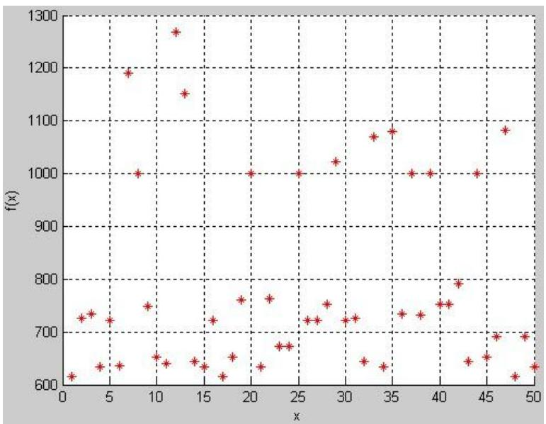

<details>
<summary>scatter</summary>

| x | f(x) |
| --- | --- |
| ~1 | ~620 |
| ~2 | ~730 |
| ~3 | ~740 |
| ~4 | ~640 |
| ~5 | ~720 |
| ~6 | ~640 |
| ~8 | ~1190 |
| ~9 | ~1000 |
| ~10 | ~750 |
| ~11 | ~650 |
| ~12 | ~640 |
| ~13 | ~1270 |
| ~14 | ~1150 |
| ~15 | ~640 |
| ~16 | ~630 |
| ~17 | ~720 |
| ~18 | ~620 |
| ~19 | ~760 |
| ~20 | ~1000 |
| ~21 | ~630 |
| ~22 | ~760 |
| ~23 | ~670 |
| ~24 | ~670 |
| ~25 | ~1000 |
| ~26 | ~720 |
| ~27 | ~720 |
| ~28 | ~750 |
| ~29 | ~1020 |
| ~30 | ~720 |
| ~31 | ~730 |
| ~32 | ~640 |
| ~33 | ~1070 |
| ~34 | ~630 |
| ~35 | ~1080 |
| ~36 | ~730 |
| ~37 | ~1000 |
| ~38 | ~730 |
| ~39 | ~1000 |
| ~40 | ~750 |
| ~41 | ~750 |
| ~42 | ~790 |
| ~43 | ~640 |
| ~44 | ~1000 |
| ~45 | ~650 |
| ~46 | ~690 |
| ~47 | ~1080 |
| ~48 | ~620 |
| ~49 | ~690 |
| ~50 | ~630 |
</details>

图 6 蚂蚁的最终位置

图 6 表示蚂蚁移动后的位置，优化后蚂蚁实现了两级分化，这样我们就得到了最优解。

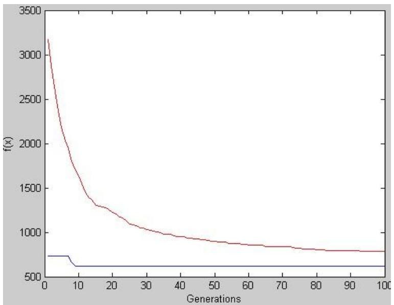

<details>
<summary>line</summary>

| Generations | Red Line (f(x)) | Blue Line (f(x)) |
| --- | --- | --- |
| 0 | ~3150 | ~750 |
| 10 | ~1400 | ~620 |
| 20 | ~1250 | ~620 |
| 30 | ~1050 | ~620 |
| 40 | ~950 | ~620 |
| 50 | ~900 | ~620 |
| 60 | ~850 | ~620 |
| 70 | ~830 | ~620 |
| 80 | ~800 | ~620 |
| 90 | ~780 | ~620 |
| 100 | ~780 | ~620 |
</details>

图 7 信息素浓度的平均值和最优值

图 7 分别是平均和最优的变化曲线，从中可以知道，算法收敛速度很快，效果很快，效果较好。

最短路是 $1 \rightarrow 4 \rightarrow 8 \rightarrow 9 \rightarrow 11 \rightarrow 14 \rightarrow 15$ 。染色体是：100100011010011.运行时间是0.3910.

因此 $O \rightarrow B$ 的最短路径如下图所示:

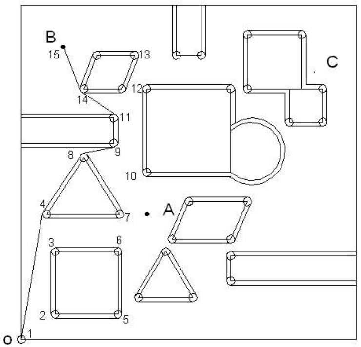

<details>
<summary>text_image</summary>

B
15
13
14
12
11
8
9
10
C
4
7
A
3
6
2
5
O
</details>

图 8 $O \rightarrow B$ 最短路线示意图

## 5.1.2.2 用优化模型求解 $O \to B$ 的分段路径长度

在上一节中，我们已经确定了最短路的运行路线是按照图3中的节点 $1\rightarrow 4\rightarrow 8\rightarrow 9\rightarrow 11\rightarrow 14\rightarrow 15$ ，但是这个简化图中距离只考虑了直线，而没有考虑实际行走中的圆弧长度。因此，我们将这条路线进行分段，使得每段路线只绕开一个障碍物。

基于以上分析, 将从 $O \to B$ 这条路线分为 $L_{1}(O \to B_{3})$ 、 $L_{2}(B_{3} \to B_{6})$ 、 $L_{3}(B_{6} \to B_{9})$ 、 $L_{4}(B_{9} \to B_{12})$ 、 $L_{5}(B_{12} \to B)$ 五段路线, 分别计算它们的长度, 然后再相加, 从而求出 $O \to B$ 的最短路径。

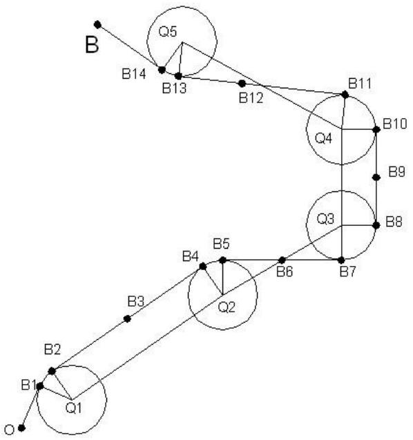

<details>
<summary>text_image</summary>

B
Q5
B14
B13
B12
B11
Q4
B10
B9
Q3
B8
B5
B4
B6
B7
Q2
B3
B2
Q1
B1
O
</details>

图 9 $O \rightarrow B$ 最短路径图

1. 求 $O \to B_{3}$ 的最短路径的模型:

与 5.1.1 中求 $O \rightarrow A$ 的最短路径时所构造的优化模型类似，在求 $O \rightarrow B_{3}$ 的最短路径时，我们将 O 点、 $B_{3}$ 点、 $Q_{1}$ 点的坐标作为路线起点 $(a, b)$ 、终点 $(c, d)$ 为和圆弧圆心坐标 $(m, n)$ 的变量值。即：a = 0, b = 0; c = 100, d = 378; m = 60, n = 300.

将切点坐标为 $B_{1}(x_{1},y_{1})$ ， $B_{2}(x_{2},y_{2})$ 作为决策变量，以 $O\rightarrow B_{3}$ 长度最短为目标函数，构造如下优化模型：

$$
\text {Min} \quad s = \sqrt {\left(x _ {1} - m\right) ^ {2} + \left(y _ {1} - n\right) ^ {2}} + \sqrt {\left(x _ {1} - c\right) ^ {2} + \left(y _ {2} - d\right) ^ {2}} + 2 0 t
$$

$$
s. t. \left\{ \begin{array}{c} x _ {1} \leq m + 1 0 \\ x _ {1} \geq m \\ y _ {1} \leq n + 1 0 \\ y _ {1} - \sqrt {1 0 0 - \left(x _ {1} - m\right) ^ {2}} = n \\ \left(x _ {1} - a\right) ^ {2} + \left(y _ {1} - b\right) ^ {2} + 1 0 0 = m ^ {2} + n ^ {2} \\ \left(x _ {1} - c\right) ^ {2} + \left(y _ {2} - d\right) ^ {2} + 1 0 0 = (m - c) ^ {2} + (n - d) ^ {2} \\ \sin t = \frac {\sqrt {\left(x _ {1} - x _ {2}\right) ^ {2} + \left(y _ {1} - y _ {2}\right) ^ {2}}}{2 0} \end{array} \right.
$$

求解上述模型（见附录 3 中 lingo 程序），得到结果如下:

$OB_{3}$ 最短路径长度:

$$
s _ {\min} = 3 9 7. 0 9 8 6
$$

两个圆弧切点坐标:

$$
B _ {1} = (5 0. 1 3 5 3, 3 0 1. 6 3 9 6)
$$

$$
B _ {2} = (5 1. 6 7 9 5, 3 0 5. 5 4 7)
$$

## 2、求 $B_{3}\rightarrow B_{6}$ 的最短路径模型：

利用与上一段路线相同的优化模型，将 $B_{3}$ 点、 $B_{6}$ 点、 $Q_{2}$ 点的坐标作为路线起点 $(a,b)$ 、终点 $(c,d)$ 为和圆弧圆心坐标 $(m,n)$ 的变量值。即：

$$
a = 1 0 0, b = 3 7 8; c = 1 8 5, d = 4 5 2. 5; m = 1 5 0, n = 4 3 5.
$$

同样用附录3中lingo程序，求解优化模型，得到 $B_{3}B_{6}$ 最短路径长度。

同理我们可以计算出其他分段路线的最短路径。

综上，我们得出 $O \rightarrow B$ 的最短路径。

表 2 $O \rightarrow B$ 的最短路径

<table><tr><td>分段</td><td>起点</td><td>终点</td><td>线段类型</td><td>长度</td></tr><tr><td>1</td><td>(0,0)</td><td>(50.1353,301.6396)</td><td>直线</td><td>305.7777</td></tr><tr><td>2</td><td>(50.1353,301.6396)</td><td>(51.6795,305.547)</td><td>以(60,300)为圆心的弧线</td><td>5.88</td></tr><tr><td>3</td><td>(51.6795,305.547)</td><td>(141.6795,440.547)</td><td>直线</td><td>162.2498</td></tr><tr><td>4</td><td>(141.6795,440.547)</td><td>(147.9621,444.79.0)</td><td>以(150,435)为圆心的弧线</td><td>7.7756</td></tr><tr><td>5</td><td>(147.9621,444.79.0)</td><td>(222.0379,460.2099)</td><td>直线</td><td>75.6637</td></tr><tr><td>6</td><td>(222.0379,460.2099)</td><td>(230,470)</td><td>以(220,470)为圆心的弧线</td><td>13.6557</td></tr><tr><td>7</td><td>(230,470)</td><td>(230,530)</td><td>直线</td><td>60</td></tr><tr><td>8</td><td>(230,530)</td><td>(225.5026,538.3538)</td><td>以(220,530)为圆心的弧线</td><td>9.8883</td></tr><tr><td>9</td><td>(225.5026,538.3538)</td><td>(144.5033,591.6462)</td><td>直线</td><td>96.9536</td></tr><tr><td>10</td><td>(144.5033,591.6462)</td><td>(140.6892,596.3523)</td><td>以(150,600)为圆心的弧线</td><td>6.1545</td></tr><tr><td>11</td><td>(140.6892,596.3523)</td><td>(100,700)</td><td>直线</td><td>110.377</td></tr><tr><td colspan="4">总长</td><td>854.3759</td></tr></table>

## 5.1.3 从 $O \to C$ 最短路径模型

在本节中，我们同样采用 5.1.2 中求 $O \rightarrow B$ 的算法：先用蚁群算法选择出最短行走路线，再将路线分段，分别计算各段的长度，然后再相加，从而求出 $O \rightarrow C$ 的最短路径。

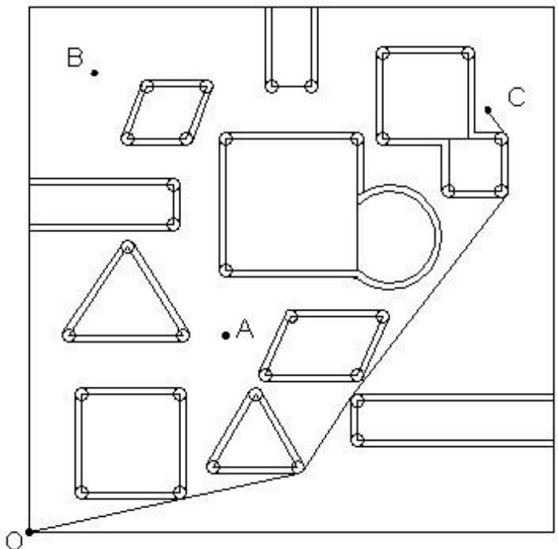

<details>
<summary>natural_image</summary>

Pure geometric diagram with labeled points A, B, C and lines, no text or symbols present
</details>

图 10 $O \rightarrow C$ 路径示意图

在平面 $O \to C$ 的范围内找出了较为理想的路线(如图3)，机器人行走此路线达到B，这条路线由六条线段与五段圆弧组成，如果直接计算这条路线长度是求解不出的，我们可以把路径图抽象为以下的几何图形（见图4），先将路线分为 $L_{1}^{\prime}(OC_{3})$ 、 $L_{2}^{\prime}(C_{3}C_{6})$ 、 $L_{3}^{\prime}(C_{6}C_{9})$ 、 $L_{4}^{\prime}(C_{9}C_{12})$ 、 $L_{5}^{\prime}(C_{12}C)$ 五段路线，然后再相加，便可求出 $O \to C$ 的最短路径。

表 3 $O \rightarrow C$ 的最短路径

<table><tr><td>分段</td><td>起点</td><td>终点</td><td>线段类型</td><td>长度</td></tr><tr><td>1</td><td>(0,0)</td><td>(232.1149,50.2262)</td><td>直线</td><td>237.4868</td></tr><tr><td>2</td><td>(232.1149,50.2262)</td><td>(232.1721,50.2381)</td><td>以(230,60)为圆心的弧线</td><td>0.0557</td></tr><tr><td>3</td><td>(232.1721,50.2381)</td><td>(412.1693,90.2381)</td><td>直线</td><td>184.3909</td></tr><tr><td>4</td><td>(412.1693,90.2381)</td><td>(418.3448,94.4897)</td><td>以(410,100)为圆心的弧线</td><td>7.6852</td></tr><tr><td>5</td><td>(418.3448,94.4897)</td><td>(491.6552,205.5103)</td><td>直线</td><td>133.0413</td></tr><tr><td>6</td><td>(491.6552,205.5103)</td><td>(492.0623,206.0822)</td><td>以(500,200)为圆心的弧线</td><td>0.7021</td></tr><tr><td>7</td><td>(492.0623,206.0822)</td><td>(727.9377,513.9178)</td><td>直线</td><td>387.8144</td></tr><tr><td>8</td><td>(727.9377,513.9178)</td><td>(730,520)</td><td>以(720,520)为圆心的弧线</td><td>6.5381</td></tr><tr><td>9</td><td>(730,520)</td><td>(730,600)</td><td>直线</td><td>80</td></tr><tr><td>10</td><td>(730,600)</td><td>(728.0503,605.9324)</td><td>以(720,600)为圆心的弧线</td><td>6.8916</td></tr><tr><td>11</td><td>(728.0503,605.9324)</td><td>(700,640)</td><td>直线</td><td>43.589</td></tr><tr><td colspan="4">总长</td><td>1088.1951</td></tr></table>

## 5.1.4 求 $O \rightarrow A \rightarrow B \rightarrow C \rightarrow O$ 最短路径启发式模型

本节 5.1.2 和 5.1.3 中求 OB、OC 的模型方法相同，不再赘述。我们用路线图和线路表列出结果。

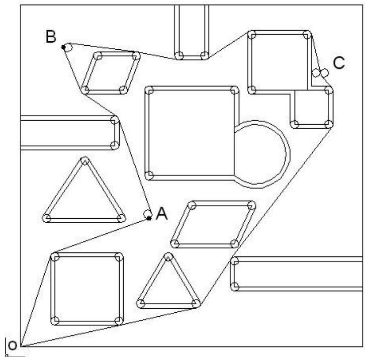

<details>
<summary>text_image</summary>

B
A
C
O
</details>

图 11 $O \rightarrow A \rightarrow B \rightarrow C \rightarrow O$ 最短路线图

表 4 $O \to A \to B \to C \to O$ 的最短路径

<table><tr><td>分段</td><td>起点</td><td>终点</td><td>线段类型</td><td>长度</td></tr><tr><td>1</td><td>(0,0)</td><td>(70.50596,213.1406)</td><td>直线</td><td>224.4994</td></tr><tr><td>2</td><td>(70.50596,213.1406)</td><td>(76.6064,219.4066)</td><td>以(80,210)为圆心的弧线</td><td>9.1105</td></tr><tr><td>3</td><td>(76.6064,219.4066)</td><td>(300,300)</td><td>直线</td><td>237.4273</td></tr><tr><td>4</td><td>(300,300)</td><td>(306.0528,312.6871)</td><td>以(296.6062,309.4065)为圆心的弧线</td><td>15.5905</td></tr><tr><td>5</td><td>(306.0528,312.6871)</td><td>(229.4525,533.2814)</td><td>直线</td><td>233.5166</td></tr><tr><td>6</td><td>(229.4525,533.2814)</td><td>(225.496,538.3535)</td><td>以(220,530)为圆心的弧线</td><td>6.5459</td></tr><tr><td>7</td><td>(225.496,538.3535)</td><td>(144.5027,591.6462)</td><td>直线</td><td>96.9536</td></tr><tr><td>8</td><td>(144.5027,591.6462)</td><td>(140.7174,596.2861)</td><td>以(150,600)为圆心的弧线</td><td>6.0832</td></tr><tr><td>9</td><td>(140.7174,596.2861)</td><td>(100.0022,696.2865)</td><td>直线</td><td>107.7033</td></tr><tr><td>10</td><td>(100.0022,696.2865)</td><td>(111.2403,709.9228)</td><td>以(110.0077,700)为圆心的弧线</td><td>20.7566</td></tr><tr><td>11</td><td>(111.2403,709.9228)</td><td>(271.2403,689.9228)</td><td>直线</td><td>161.2452</td></tr><tr><td>12</td><td>(271.2403,689.9228)</td><td>(272.0022,689.798)</td><td>以(270,680)为圆心的弧线</td><td>0.77</td></tr><tr><td>13</td><td>(272.0022,689.798)</td><td>(368,670.202)</td><td>直线</td><td>97.7996</td></tr><tr><td>14</td><td>(368,670.202)</td><td>(370,670)</td><td>以(370,680)为圆心的弧线</td><td>2.0136</td></tr><tr><td>15</td><td>(370,670)</td><td>(430,670)</td><td>直线</td><td>60</td></tr><tr><td>16</td><td>(430,670)</td><td>(431.2708,671.7068)</td><td>以(430,680)为圆心的弧线</td><td>5.9291</td></tr><tr><td>17</td><td>(431.2708,671.7068)</td><td>(530.0951,738.2932)</td><td>直线</td><td>119.1638</td></tr><tr><td>18</td><td>(530.0951,738.2932)</td><td>(540, 740)</td><td>以(540,730)为圆心的弧线</td><td>5.9291</td></tr><tr><td>19</td><td>(540, 740)</td><td>(670, 740)</td><td>直线</td><td>130</td></tr><tr><td>20</td><td>(670, 740)</td><td>(679.7675,732.1438)</td><td>以(670,730)为圆心的弧线</td><td>13.5474</td></tr><tr><td>21</td><td>(679.7675,732.1438)</td><td>(699.7689,641.6437)</td><td>直线</td><td>92.1954</td></tr><tr><td>22</td><td>(699.7689,641.6437)</td><td>(700, 640)</td><td>以(690,640)为圆心的弧线</td><td>2.1867</td></tr><tr><td>23</td><td>(700, 640)</td><td>(702.6928,633.1732)</td><td>以(710,640)为圆心的弧线</td><td>7.5142</td></tr><tr><td>24</td><td>(702.6928,633.1732)</td><td>(727.3094,606.8268)</td><td>直线</td><td>36.0555</td></tr><tr><td>25</td><td>(727.3094,606.8268)</td><td>(730, 600)</td><td>以(80, 210)为圆心的弧线</td><td>7.5142</td></tr><tr><td>26</td><td>(730,600)</td><td>(730,520)</td><td>直线</td><td>80</td></tr><tr><td>27</td><td>(730,520)</td><td>(727.9377,513.9178)</td><td>以(720, 600)为圆心的弧线</td><td>6.5381</td></tr><tr><td>28</td><td>(727.9377,513.9178)</td><td>(492.0623,206.0822)</td><td>直线</td><td>387.8144</td></tr><tr><td>29</td><td>(492.0623,206.0822)</td><td>(491.6552,205.5103)</td><td>以(500, 200)为圆心的弧线</td><td>0.7021</td></tr><tr><td>30</td><td>(491.6552,205.5103)</td><td>(418.3448,94.4897)</td><td>直线</td><td>133.0413</td></tr><tr><td>31</td><td>(418.3448,94.4897)</td><td>(412.1693,90.2381)</td><td>以(410, 100)为圆心的弧线</td><td>7.6852</td></tr><tr><td>32</td><td>(412.1693,90.2381)</td><td>(232.1721,50.2381)</td><td>直线</td><td>184.3909</td></tr><tr><td>33</td><td>(232.1721,50.2381)</td><td>(232.1149,50.2262)</td><td>以(230, 60)为圆心的弧线</td><td>0.0557</td></tr><tr><td>34</td><td>(232.1149,50.2262)</td><td>(0,0)</td><td>直线</td><td>237.4868</td></tr><tr><td colspan="4">总长</td><td>2737.765</td></tr></table>

## 5.2 问题二的求解： $O \rightarrow A$ 最短时间路径的优化模型

本节，我们将问题一中的模型的目标函数改为总时间最短，并把运行的圆弧半径也作为决策变量即可。

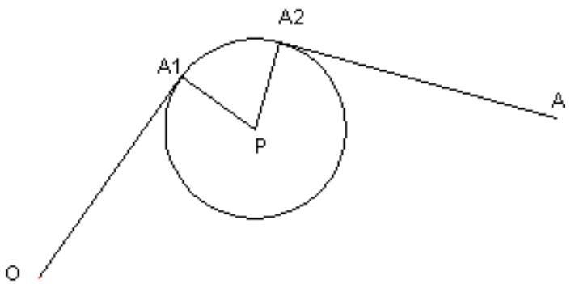

<details>
<summary>text_image</summary>

A1
A2
P
O
A
</details>

图 12 $O \rightarrow A$ 最短时间路径图

可以计算出机器人各分段的最短时间路径，进而求出从 $O \rightarrow A$ 的总距离和总时间设 $t_{1}$ 、 $t_{2}$ 、 $t_{3}$ 分别为机器人在 $OA_{1}$ 段、 $A_{1}A_{2}$ 段和 $A_{2}A$ 段的行走时间。

由于机器人直线行走的最大速度为 $v_{0}=5$ 个单位/秒，机器人转弯时，最大转弯速度为 $v=v(\rho)=\frac{v_{0}}{1+e^{10-0.1\rho^{2}}}$ ，其中 $\rho$ 是转弯半径。所以

$$
t _ {1} = \frac {\sqrt {\left(x _ {1} - 0\right) ^ {2} + \left(y _ {1} - 0\right) ^ {2}}}{v _ {0}}
$$

$$
t _ {2} = 2 a r c \sin \frac {r (1 + e ^ {1 0 - 0 . 1 \rho^ {2}}) \sqrt {\left(x _ {1} - x _ {2}\right) ^ {2} + \left(y _ {1} - y _ {2}\right) ^ {2}}}{v _ {0}}
$$

$$
t _ {3} = \frac {\sqrt {\left(x _ {2} - 3 0 0\right) ^ {2} + \left(y _ {2} - 3 0 0\right) ^ {2}}}{v _ {0}}
$$

以总时间最短为目标函数： $t_{\min}=\sum_{t=1}^{3}t_{i}$ ;

约束条件：圆弧半径大于10，即 $r\geq10$ ；

$OA_{1} \perp A_{1}P$ ， $A_{1}$ 为切点， $\Delta OA_{1}P$ 成直角三角形， $OA_{1}^{2} + A_{1}P^{2} = OP^{2}$ ;

$A_{2}A_{1}\perp PA_{1}$ ， $A_{1}$ 为切点， $\Delta A_{2}A_{1}P$ 成直角三角形， $A_{2}A_{1}^{2}+PA_{1}^{2}=A_{2}P$ ；

综上，建立优化模型如下：

$$
\text {Min} \quad t = \sum_ {t = 1} ^ {3} t _ {i} = \frac {\sqrt {\left(x _ {1} - 0\right) ^ {2} + \left(y _ {1} - 0\right) ^ {2}}}{5} + \frac {\sqrt {\left(x _ {2} - 3 0 0\right) ^ {2} + \left(y _ {2} - 3 0 0\right) ^ {2}}}{5} + \frac {2 r t}{v}
$$

$$
s, t \left\{ \begin{array}{c} r \geq 1 0 \\ x _ {1} \leq 8 0 + r \\ x _ {1} \geq 8 0 - r \\ y _ {1} \leq 2 1 0 + r \\ \left(x _ {1} - 8 0\right) ^ {2} + \left(y _ {1} - 2 1 0\right) ^ {2} = r ^ {2} \\ \left(x _ {1} - 0\right) ^ {2} + \left(y _ {1} - 0\right) ^ {2} + r ^ {2} = 5 0 5 0 0 \\ \left(x _ {2} - 3 0 0\right) ^ {2} + \left(y _ {2} - 3 0 0\right) ^ {2} + r ^ {2} = 5 6 5 0 0 \\ v = \frac {5}{1 + e ^ {1 0 - 0 . 1 \rho^ {2}}} \\ \sin \theta = \frac {\sqrt {\left(x _ {1} - x _ {2}\right) ^ {2} + \left(y _ {1} - y _ {2}\right) ^ {2}}}{2 r} \end{array} \right.
$$

用 lingo 求解上述模型（程序见附录 4），得到结果如下：

最短时间:

$$
t _ {\min} = 9 4. 5 6 4 8 7
$$

最短时间的路径长度:

$$
S = 4 7 2. 4 0 7 9
$$

两切点坐标:

$$
A _ {1} = (6 9. 0 5 4 5 7, 2 1 3. 5 3 9 5)
$$

$$
A _ {2} = (7 6. 1 6 4 7 7, 2 2 0. 8 4 5 4)
$$

半径:

$$
r = 1 1. 5 0 3 5 1
$$

具体路径见下表:

表 5 $O \rightarrow A$ 最短时间路径

<table><tr><td>分段</td><td>起点</td><td>终点</td><td>线段类型</td><td>时间(s)</td></tr><tr><td>1</td><td>(0, 0)</td><td>(69.05457, 213.5395)</td><td>直线</td><td>44.88548</td></tr><tr><td>2</td><td>(69.05457, 213.5395)</td><td>(76.16477, 220.8454)</td><td>以(80, 210)为圆心的弧线</td><td>2.19561</td></tr><tr><td>3</td><td>(76.16477, 220.8454)</td><td>(300, 300)</td><td>直线</td><td>47.48376</td></tr><tr><td colspan="4">总时间</td><td>94.56487</td></tr></table>

## 六、模型的评价

## 6.1 模型优点：

1. 运用多个方案对路径进行优化，在相对优化之中取得最优解。  
2. 模型优化后用解析几何进行求解，精确度较高。  
3. 模型简单易懂，便于实际检验及应用。

## 6.2 模型缺陷:

1. 此模型适于全局规划，获得精确解却失去了效率。  
2. 在障碍物较多时，且形状不规则时，模型需要进一步改进。

## 参考文献

[1]汪晓银，邹庭荣，数学软件与数学实验，北京：科学出版社，2008。  
[2]汪晓银，周保平，数学建模与数学实验，北京：科学出版社，2010。  
[3]张琨，高思超，毕靖，MATLAB2010 从入门到精通，北京：电子工业出版社，2011  
[4]谢金星，薛毅，优化建模与 LINDO/LINGO 软件，北京：清华大学出版社，2005  
[5]袁新生，邵大宏，郁时炼，LINDO 和 Excel 在数学建模中的应用，北京：科学出版社，2007

## 附录：

附录1：求OA最短路径路径的lingo程序  
```julia
model:
sets:
qiedian/1..2/:x,y;
endsets
min=(x(1)^2+y(1)^2)^(1/2)+((x(2)-300)^2+(y(2)-300)^2)^(1/2)+20*t;
x(1)^2+y(1)^2+100=80^2+210^2;
(x(2)-300)^2+(y(2)-300)^2+100=(80-300)^2+(210-300)^2;
@sin(t)=(((x(1)-x(2))^2+(y(1)-y(2))^2)^(1/2))/20;
@for(qiedian(I):x(I)<=80);
@for(qiedian(I):x(I)>=70);
@for(qiedian(I):y(I)<=220);
@for(qiedian(I):y(I)-(100-(x(I)-80)^2)^(1/2)=210);
END
```

附录 2：蚁群算法 matlab 程序  
```csv
function shortroad_ant_main
% Ant main program
clear all;close all;clc;%清屏
tic;%计时开始
Ant=50;Ger=100;%运行参数初始化
power=[0 70 1000276 208 100010001000100010001000100010001000
70 0 141 211 120 182 10001000100010001000100010001000
1000141 0 68 168 100 132 1000500 100010001000100010001000
276 211 68 0 10001000145 131 100010001000100010001000
208 120 168 10000 120 10001000100010001000313 100010001000
1000182 100 1000120 0 60 1000100010001000100010001000
10001000132 145 100060 0 131 141 1000100089 100010001000
10001000500 131 10001000131 49 10O O 1O O O O O O O O O O O O O O O O O O O O O O O O O O O O O O O O O O O O O O O O O O O O O O O O O O O O O O O O O O O O O O O O O O O O O O O O O O O O O O O O O O O O O O O O O O O O O O O O O O O O OO
1OOOOOOOOOOOOOOOOOOOOOOOOOOOOOOOOOOOOOOOOOOOOOOOOOOOOOOOOOOOOOOOOOOOOOOOOOOOOOOOOOOOOOOOOOOOOOOOOOOOOOOOOOOOOOOOOOOOOOOOOOOOOOOOOOOOOOOOOOOOOOOOOOOOOOOOOOOOOOOOOOOOOOOOOOOOOOOOOOOO
1OOOOOOOOOOOOOOOOOOOOOOOOOOOOOOOOOOOOOOOOOOOOOOOOOOOO
76 17O 55 1OooOIOO
1OooOIOOIOOIOIOIOIOIOIOIOIOIOIOIOIOIOIOIOIOIOIOIOIOIOIOIOIOIOIOIOIOIOIOIOIOIOIOIOIOIOIOIOIOIOIOIOIOIOIOIOIOIOIOIOIOIOIOIOIOIOIOIOIOIOIOIOIOIOIOIOIOIOIOIOIOIOIOIOIOIOIOIOIOIOIOIOIOIOIOIOIOIOIOIOIOIOIOIOIOIOIOIOIOI
76 49 76 49 76 49 76 49 76 49 76 49 76 49 76 49 76
76 49 76 49 76 49 76 49 76 49 76
76 49 76 49 76 49 76 49 76
76 49 76 49 76 49 76
76 49 76 49 76
76 49 76 49
76 49 76
76 49 76
76 49
76
```

% 初始化蚂蚁位置  
```txt
v=init_population(Ant,PN);
v(:,1)=1;v(:,PN)=1;%始点和终点纳入路径
%把距离当信息素浓度
```

```matlab
fit=short_road_fun(v,power);
%距离越小越好，所以要和信息素浓度相对应。
T0 = max(fit)-fit;
% 画出图形
figure(1);grid on;hold on;
plot(fit,'k*');
title('(a)蚂蚁的初始位置');
xlabel('x');ylabel('f(x)');
% 初始化
vmfit=[];vx=[];
P0=0.2;    % P0----全局转移选择因子
P=0.8;    % P ----信息素蒸发系数
%C=[];
% 开始寻优
for i_ger=1:Ger
  lamda=1/i_ger; % 转移步长参数
  [T_Best(i_ger),BestIndex]=max(T0);%最大信息素浓度
  for j_g=1:Ant % 求取全局转移概率
    r=T0(BestIndex)-T0(j_g);%与最佳的蚂蚁的距离
    Prob(i_ger,j_g)=r/T0(BestIndex);%应该以多大的速率向它靠拢
  end
  for j_g_tr=1:Ant
    if Prob(i_ger,j_g_tr)<P0
      %局部转移----小动作转移
      M=rand(1,PN)<lamda;
      temp=v(j_g_tr,:)-2.*(v(j_g_tr,:).*M)+M;
    else
      %全局转移----大步伐转移
      M=rand(1,PN)<P0;
      temp=v(j_g_tr,:)-2.*(v(j_g_tr,:).*M)+M;
    end
    %始点和终点重新加入。即不能在移动过程中发生改变。
    temp(:,1)=1;temp(:,end)=1;
    if short_road_fun(temp,power)<short_road_fun(v(j_g_tr,:),power)
      %记录
      v(j_g_tr,:)=temp;
    end
  end
  %信息素更新，准备下一次迭代
  fit=short_road_fun(v,power);
  T0 = (1-P)*T0+(max(fit)-fit);%信息素蒸发
  [sol,indb]=min(fit);
  v(1,:)=v(indb,:);%记录本次迭代的状态
  media=mean(fit);
  vx=[vx sol];
```

```matlab
vmfit=[vmfit media];
end
% % % % % % % % % % % % % % % % % % % % % % % % % %
%%% 最后结果
disp(sprintf('\n')); %空一行
% 显示最优解及最优值
disp(sprintf('Shortroad is %s',num2str(find(v(indb,:)))));%num2str数据转换成字符。
disp(sprintf('Mininum is %d',sol));
v(indb,:) 
% 图形显示最优结果
figure(2);grid on;hold on;
plot(fit,'r*');
title('蚂蚁的最终位置');
xlabel('x');
ylabel('f(x)');
% 图形显示最优及平均函数值变化趋势
figure(3);
plot(vx);
title('最优,平均函数值变化趋势');
xlabel('Generations');ylabel('f(x)');
hold on;plot(vmfit,'r');hold off;
runtime=toc%时间结束
end
%%
function fit=short_road_fun(v,power)
[vm vn]=size(v);
fit=zeros(vm,1);%记录每一条路径的距离
for i=1:vm
    I=find(v(i,:)==1);%寻找在路径上的点
    [Im,In]=size(I);
    for j=1:In-1
        fit(i)=fit(i)+power(I(j),I(j+1));%求路径的距离
    end
end
end
%%
%Function init_population
function v=init_population(n1,s1)
v=round(rand(n1,s1));%初始化所有的蚂蚁
end
```

附录3 求OB最短路径路径的lingo程序

```txt
model:
sets:
qiedian/1..2/:x,y;
```

endsets

DATA:

a=0;

b=0;

c=100;

d=378;

m=60;

n=300;

ENDDATA

$\min = ((x(1)-a)^{2} + (y(1)-b)^{2})^{(1/2)} + ((x(2)-c)^{2} + (y(2)-d)^{2})^{(1/2)} + 20*t;$

$(x(1)-a)^{2}+(y(1)-b)^{2}+100=m^{2}+n^{2};$

$(x(2)-c)^{2}+(y(2)-d)^{2}+100=(m-c)^{2}+(n-d)^{2};$

@sin(t)=(((x(1)-x(2))^2+(y(1)-y(2))^2)^(1/2))/20;

@for(qiedian(I):y(I)<=n+10);

@for(qiedian(I):(x(I)-m)^2+(y(I)-n)^2=100);

END

附录4：求OA最短时间路径的lingo程序

model:

sets:

qiedian/1..2/:x,y;

endsets

DATA:

a=0;

b=0;

c=300;

d=300;

m=80;

n=210;

ENDDATA

$\text{min} = (((x(1)-a)^2 + (y(1)-b)^2)^{(1/2)}) / 5 + (((x(2)-c)^2 + (y(2)-d)^2)^{(1/2)}) / 5 + 2 * r * t / (v);$

@exp(10-0.1\*r^2)=5/v-1;

@sin(t)=(((x(1)-x(2))^2+(y(1)-y(2))^2)^(1/2))/(2\*r);

r>=10;

$(x(1)-a)^{2}+(y(1)-b)^{2}+r^{2}=m^{2}+n^{2};$

$(x(2)-c)^{2}+(y(2)-d)^{2}+r^{2}=(m-c)^{2}+(n-d)^{2};$

```txt
@for(qiedian(I):x(I)<=m+r);
@for(qiedian(I):x(I)>=m-r);
@for(qiedian(I):y(I)<=n+r);
@for(qiedian(I):(x(I)-m)^2+(y(I)-n)^2=r^2);
```

## END