# D 题 机器人避障问题

## 摘 要

本文综合运用分析法、图论方法、非线性规划方法，讨论了机器人避障最短路径和最短时间路径求解问题。

针对问题一，首先，通过分析，建立了靠近障碍物顶点处转弯得到的路径最短、转弯时圆弧的半径最小时和转弯圆弧的圆心为障碍物的顶点时路径最短、转弯在中间目标点附近时，中间目标点位于弧段中点有最短路径的三个原理，基于三个原理，其次对模型进行变换，对障碍物进行加工，扩充为符合条件的新的区域并在转弯处圆角化构成障碍图，并通过扩充的跨立实验，得到切线和圆弧是否在可避障区的算法，第三，计算起点、中间目标点和最终目标点和各圆弧及圆弧之间的所有可避障切线和圆弧路径，最后给这些定点赋一个等于切线长度或弧度的权值构成一个网络图，然后利用 Dijkstra 算法求出了 O-A、O-B，O-C 的最短路径为 O-A：471.0372 个单位，O-B：853.7001 个单位，O-C：1086.0677 个单位；对于需要经中间目标点的路径，可运用启发规则分别以相邻的目标点作为起点和终点计算，确定路径的大致情况，在进一步调整可得到 O-A-B-C-O的最短路径为 2748.699 个单位。

针对问题二，主要研究的是由出发点到达目标点 A 点的最短时间路径，我们在第一问的基础上考虑路径尽可能短且圆弧转弯时的圆弧尽量靠近障碍物的顶点，即确定了圆弧半径最小时的圆弧内切于要确定的圆弧时存在最小时间路径，建立以总时间最短为目标函数，采用非线性规划模型通过 Matlab 编程求解出最短时间路径为最短时间路程为 472.4822 个单位，其中圆弧的圆心坐标为，最短时间为 94.3332 秒。圆弧两切点的坐标分别为（70.88,212.92）、（77.66,219.87）。

关键字： Dijkstra算法 跨立实验 分析法 非线性规划模型

## 一.问题的重述

图是一个800×800的平面场景图，在原点O(0, 0)点处有一个机器人，它只能在该平面场景范围内活动。图中有12个不同形状的区域是机器人不能与之发生碰撞的障碍物，障碍物的数学描述如下表：

<table><tr><td>编号</td><td>障碍物名称</td><td>左下顶点坐标</td><td>其它特性描述</td></tr><tr><td>1</td><td>正方形</td><td>(300, 400)</td><td>边长200</td></tr><tr><td>2</td><td>圆形</td><td></td><td>圆心坐标(550, 450), 半径70</td></tr><tr><td>3</td><td>平行四边形</td><td>(360, 240)</td><td>底边长140, 左上顶点坐标(400, 330)</td></tr><tr><td>4</td><td>三角形</td><td>(280, 100)</td><td>上顶点坐标(345, 210), 右下顶点坐标(410, 100)</td></tr><tr><td>5</td><td>正方形</td><td>(80, 60)</td><td>边长150</td></tr><tr><td>6</td><td>三角形</td><td>(60, 300)</td><td>上顶点坐标(150, 435), 右下顶点坐标(235, 300)</td></tr><tr><td>7</td><td>长方形</td><td>(0, 470)</td><td>长220, 宽60</td></tr><tr><td>8</td><td>平行四边形</td><td>(150, 600)</td><td>底边长90, 左上顶点坐标(180, 680)</td></tr><tr><td>9</td><td>长方形</td><td>(370, 680)</td><td>长60, 宽120</td></tr><tr><td>10</td><td>正方形</td><td>(540, 600)</td><td>边长130</td></tr><tr><td>11</td><td>正方形</td><td>(640, 520)</td><td>边长80</td></tr><tr><td>12</td><td>长方形</td><td>(500, 140)</td><td>长300, 宽60</td></tr></table>

在图1的平面场景中，障碍物外指定一点为机器人要到达的目标点(要求目标点与障碍物的距离至少超过10个单位)。规定机器人的行走路径由直线段和圆弧组成，其中圆弧是机器人转弯路径。机器人不能折线转弯，转弯路径由与直线路径相切的一段圆弧组成，也可以由两个或多个相切的圆弧路径组成，但每个圆弧的半径最小为10个单位。为了不与障碍物发生碰撞，同时要求机器人行走线路与障碍物间的最近距离为10个单位，否则将发生碰撞，若碰撞发生，则机器人无法完成行走。

机器人直线行走的最大速度为 $\nu _ { 0 } = 5$ 个单位/秒。机器人转弯时，最大转弯速度为 $\nu = \nu ( \rho ) = \frac { \nu _ { _ 0 } } { 1 + \mathrm { e } ^ { 1 0 - 0 . 1 \rho ^ { 2 } } }$ ，其中 $\rho$ 是转弯半径。如果超过该速度，机器人将发生侧翻，无法完成行走。

请建立机器人从区域中一点到达另一点的避障最短路径和最短时间路径的数学模型。对场景图中4个点O(0, 0)，A(300, 300)，B(100, 700)，C(700, 640)，具体计算：

(1) 机器人从O(0, 0)出发，O→A、O→B、O→C和O→A→B→C→O的最短路径。  
(2) 机器人从O (0, 0)出发，到达A的最短时间路径。

注：要给出路径中每段直线段或圆弧的起点和终点坐标、圆弧的圆心坐标以及机器人行走的总距离和总时间。

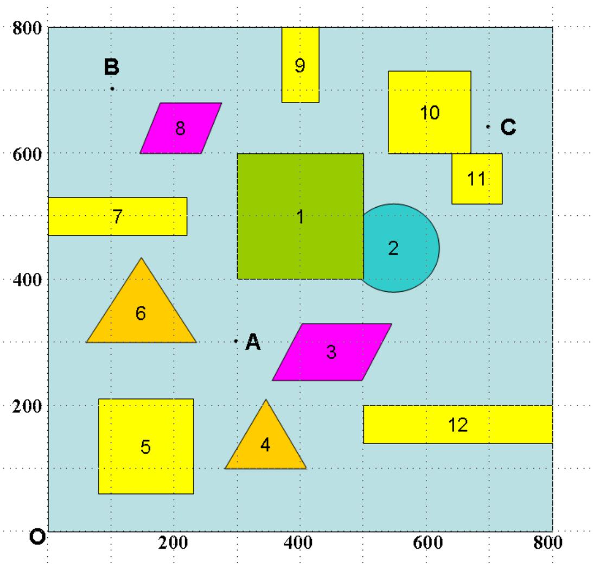

<details>
<summary>bubble</summary>

| Shape | X | Y |
| --- | --- | --- |
| 1 | ~400 | ~600 |
| 2 | ~550 | ~480 |
| 3 | ~400 | ~280 |
| 4 | ~350 | ~150 |
| 5 | ~150 | ~200 |
| 6 | ~150 | ~350 |
| 7 | ~100 | ~500 |
| 8 | ~250 | ~650 |
| 9 | ~400 | ~750 |
| 10 | ~650 | ~700 |
| 11 | ~700 | ~550 |
| 12 | ~750 | ~200 |
</details>

图 800×800平面场景图

## 二.问题的分析

本问题的难点在于机器人要到达指定的目标点需要满足以下两个约束条件：

1. 机器人的行走路径由直线段和圆弧组成，不能折线转弯，转弯路径由与直线路径相切的一段圆弧组成，且每个圆弧的半径最小为10个单位；  
2. 要求机器人行走线路与障碍物间的最近距离为10个单位。

因此，我们在建立模型求解机器人到达目标点的最短路径时需优先考虑这两个约束条件。

首先我们可以根据约束条件将机器人行走的危险区域进行扩张，即所有的障碍物都向外扩张了10个单位。机器人所走的路径都是直线与圆弧的构成，故存在线和弧、弧与弧之间的切线，可以考虑在所有代表出发点与其它圆弧之间切线的顶点与源点连成一条边，权值均为0，同理在所有代表目标点到其它圆弧切线的顶点与终点连成一条边，权值均为0，这样题目就转化成了求源点到达终点之间的最短路径问题了。

对于问题二，要求最短时间路径，则要考虑的是要以最大速度行走。直线行走时就是最大速度，但在转弯圆弧处因为转弯半径越小，行走的速度就越慢，则需在第一问的前提下增大圆弧的半径，则圆弧的转弯半径和圆心都不确定，通过建立模型确定O-A之间的转弯时圆弧的半径和圆心。

## 三、模型的基本假设

根据对该问题的分析，本文对所建立的模型提出以下基本假设：

2.机器人行走过程中不会意外停止  
3.图中所给数据障碍物都是真实的  
4.机器人能够抽象成点来处理

1.机器人的性能足够好，能准确地沿圆弧转弯

## 四、符号说明

指每段路径的长度  
$\nu _ { 0 }$ ：机器人直线行走时的最大速度  
：机器人的最大转弯速度  
：每段路径所用的时间

## 五、模型的建立与求解

## 5.1 模型的准备

## 模型的准备一

首先给出以下三个前提及其证明：

1.靠近障碍物顶点处转弯得到的路径最短

如图1所示：

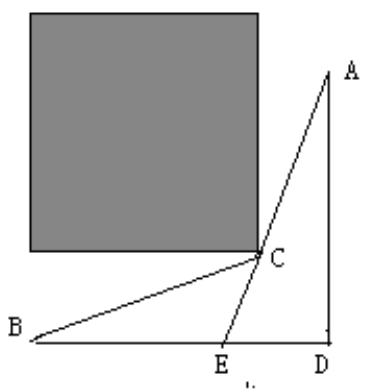

<details>
<summary>text_image</summary>

A
B
C
E
D
</details>

图 1

设A为起点，B为终点，矩形的阴影部分是障碍区，C为障碍物的顶点，D为障碍物外任意一点，连接AD，BD，AC，BC延长交AD于E点，因为在三角形中两边之和大于第三边，所以有：

$$
\mathrm{BD} + \mathrm{DE} > \mathrm{BE}; \quad \mathrm{BE} = \mathrm{BC} + \mathrm{CE};
$$

$$
\mathrm{AE} + \mathrm{CE} > \mathrm{AC}; \quad \mathrm{AD} = \mathrm{AE} + \mathrm{DE};
$$

两个不等式相加，得：AE+DE+AE+CE>BE+AC；

即： $\mathrm { B D + A D } { \mathrm { > A C + B C . } }$

于是，得证由A到B在顶点C处转弯时为最短路径。

2.转弯时圆弧的半径最小时路径最短和转弯圆弧的圆心为障碍物的顶点时路径最短

要证明机器人转弯时圆弧的半径最小时路径最短，则可以把P到A的路径比拟成一条弹性绳，由于路径要绕过障碍物，故要拉长弹性绳以绕过障碍物，由于机器人转弯时只能是走圆弧路径且有圆弧半径约束，即可以在障碍物的顶点处加入圆环，将其圆心固定在顶点处，由于弹性绳的弹性势能 $E _ { p }$ 和伸长量 存在如下能量关系： $E _ { p } = \frac { 1 } { 2 } k \Delta x ^ { 2 }$ ，故弹性绳弹性势能最小时伸长量最小，此时正是路径最短的情况：

如图 2 所示：

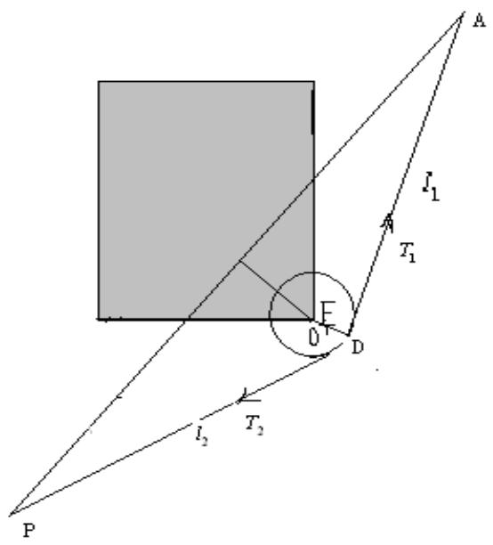

<details>
<summary>text_image</summary>

A
l₁
T₁
F
0
D
l₂
T₂
P
</details>

图 2

根据最小势能原理可知，当弹性体平衡时，系统势能最小。即弹性体在自由条件下，有由高势能向低势能转化的趋势。现在将圆环看成也有弹性，在如图所示的条件下为初始状态。圆环受力为F，此时圆环有缩小的趋势，随着圆环的缩小系统趋于平衡，弹性绳有最小势能。由能量守恒也可以说明，弹性绳的弹性势能转化为弹性圆环的弹性势能，于是弹性绳的弹性势能减小。

因此，随着圆环的半径的减小，弹性绳的势能减小，即最短路径变短。所以转弯时圆弧的半径最小时路径最短。转弯圆弧的圆心为障碍物的顶点时路径最短。

3.转弯在中间目标点附近时，中间目标点位于弧段中点有最短路径

当机器人从O点出发不能直接到达另一目标点，而需经过中间目标点A时，则必须在A点转弯处形成一个圆弧，中间目标点位于弧段中点时且半径最小时有最短路径，下面给予证明：由上述2的证明可仍然采用此证法，设从两转向处引

出一根弹性绳，要使其经过A 点，如图所示，在其自然伸长的前提下，必定会在A 点出弯折。由于机器人有转弯时圆弧的半径最小时路径最短，从两转向处引出一根弹性绳，要使其经过A 点，如图所示，在其自然伸长的前提下，必定会在A 点出弯折。由于机器人有最小转弯半径约束，故在A 处加一最小转弯半经的圆，即r=10个单位，使其受力平衡时，即为路径的最优解。

根据以上证明作出如下图形(图3)：

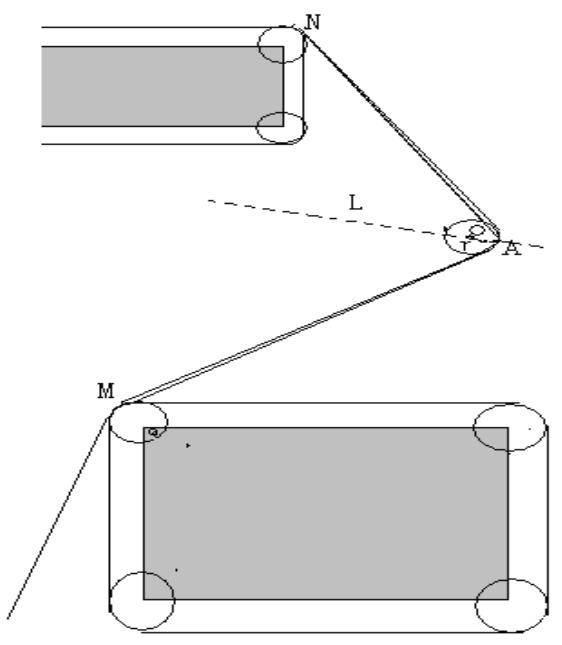

<details>
<summary>text_image</summary>

N
L
A
M
</details>

图 3

作法：过A点分别作圆上 M,N的切线，作 的角平分线，在 上距离A点 10 个单位处选取一点 O，以 O 为圆心，10 个单位为半径，作圆 O，再过 M,N分别作圆O的切线，即为路径。

## 模型准备二：

## 切线的剔除：

基于上述准备一的三个前提条件和题中给出的两约束条件即（1）机器人的行走路径由直线段和圆弧组成，不能折线转弯，转弯路径由与直线路径相切的一段圆弧组成，且每个圆弧的半径最小为10个单位（2）要求机器人行走线路与障碍物间的最近距离为10个单位。故存在一些不符合要求的切线，要将这些切线剔除，可做示意图如下：

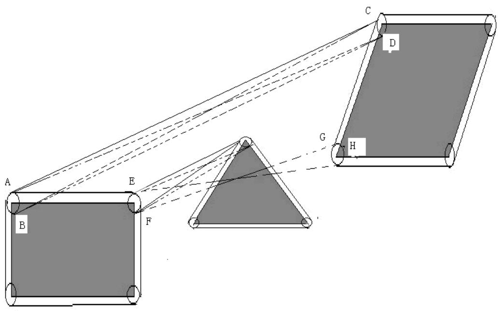

<details>
<summary>text_image</summary>

A
B
E
F
G
H
C
D
</details>

图 4

如图所示，阴影部分为障碍物，用圆来代表弧，AC、BC、AD、BD、EH、FG分别如图示的切线，由于AD、BC、BD、FG、EH经过障碍物，所以要剔除，AC为符合要求切线。(图中应该剔除的切线用虚线表示)。

## 模型准备三

由上准备一和准备三可知，对于机器人转弯的路径按照一个圆弧、两个圆弧、三个圆弧等多个圆弧枚举出转弯的情况：

转过了一个圆弧,如图5:

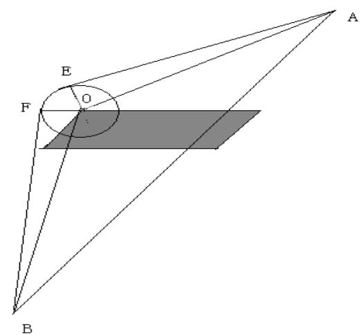

<details>
<summary>text_image</summary>

A
E
O
F
B
</details>

图 5

如图，设 $B ( x _ { 1 } , y _ { 1 } ) , ( ) ( x _ { 2 } , y _ { 2 } ) , \ A (  x _ { 3 } , y _ { 3 } ) \quad$ ，E、F的坐标分别为 $\left( x _ { 4 } , y _ { 4 } \right)$ 和 $\left( x _ { 5 } , y _ { 5 } \right)$

$B O = a \ , B A = b \ , O A = c$ , 则: $\angle B O F = a r \cos \frac { r } { a } , \angle B O A = a r \cos \frac { a ^ { 2 } + c ^ { 2 } - b ^ { 2 } } { 2 a c }$

$$
\angle A O E = a r \cos \frac {r}{c},
$$

又 $\angle E O F = 2 \pi - \angle B O F - \angle B O A - \angle A O E = \theta$ ，可知：

$$
a = \sqrt {\left(x _ {2} - x _ {1}\right) ^ {2} + \left(y _ {2} - y _ {1}\right) ^ {2}},
$$

$$
b = \sqrt {(x _ {3} - x _ {1}) ^ {2} + (y _ {3} - y _ {1}) ^ {2}},
$$

$$
c = \sqrt {\left(x _ {3} - x _ {2}\right) ^ {2} + \left(y _ {3} - y _ {2}\right) ^ {2}},
$$

故B到 A的路径长度为： $L _ { { \scriptscriptstyle B } - A } = \left| B F \right| + \widehat { F } \widehat { E } + \left| E A \right|$

其中， ${ \hat { F } } { \hat { E } } = r \theta , \ \left| B F \right| = { \sqrt { a ^ { 2 } - r ^ { 2 } } } , \ \left| E A \right| = { \sqrt { c ^ { 2 } - r ^ { 2 } } }$

即 $L _ { _ { B - A } } = r \theta + \sqrt { a ^ { 2 } - r ^ { 2 } } + \sqrt { c ^ { 2 } - r ^ { 2 } }$

并且利用相切的关系可以得出下面两个方程： $\left\{ \begin{array} { l l } { a ^ { 2 } - r ^ { 2 } = \sqrt { \left( x _ { 5 } - x _ { 1 } \right) ^ { 2 } + \left( y _ { 5 } - y _ { 1 } \right) ^ { 2 } } } \\ { \sqrt { \left( x _ { 5 } - x _ { 2 } \right) ^ { 2 } + \left( y _ { 5 } - y _ { 2 } \right) ^ { 2 } } = r } \end{array} \right.$

可以解出切点 $F ( x _ { 5 } , y _ { 5 } )$ ，同理可以解出切点 $E ( x _ { 4 } , y _ { 4 } )$ 。

转过了两个圆弧，如图6：

情况一：

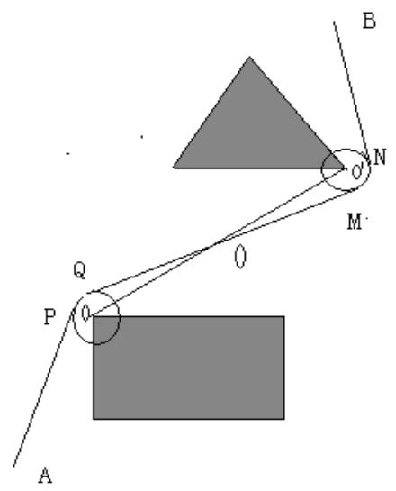

<details>
<summary>text_image</summary>

B
N
O'
M
Q
P
O
A
</details>

图 6

假设两圆心坐标分别为 $O ( x _ { 1 } , y _ { 1 } )$ 和 $O ^ { \prime } ( x _ { 2 } , y _ { 2 } )$ ,半径均为 ， $0$ 点坐标为$( x _ { 3 } , y _ { 3 } )$ ，则容易求得:

$$
\left\{ \begin{array}{l} x _ {3} = \frac {x _ {1} + x _ {2}}{2}, \\ y _ {3} = \frac {y _ {1} + y _ {2}}{2}, \end{array} \right.
$$

这样我们就可以利用只有一个圆弧中的方法，先求A到O，再求O到B，于是分两段就可以求解。同理如果有更多的转弯，同样可按照此种方法分解。

情况二：

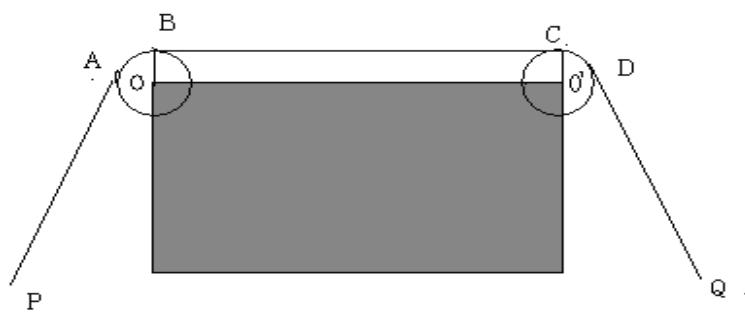

<details>
<summary>text_image</summary>

A
B
O
C
θ
D
P
Q
</details>

图 7

设圆心坐标分别为 $O ( x _ { 2 } , y _ { 2 } )$ 和 $\dot { O ^ { \prime } } ( x _ { 3 } , y _ { 3 } )$ ,半径均为 ， $P ( x _ { 1 } , y _ { 1 } ) , Q ( x _ { 4 } , y _ { 4 } )$ 的长为 $a , O O$ 长为 , 长为 ， 长为 ， 长为 $e \ ; \angle P O O ^ { ' } = \alpha _ { 1 }$ $\angle P O A = \alpha _ { 2 }$ $\angle Q O O = \alpha _ { 3 }$ $\angle Q O D = \alpha _ { 4 }$ $\angle A O B = \theta _ { 1 }$ $\angle C O D = \theta _ { 2 }$ ；由这些点的几何关系可以得到：

$$
a = \sqrt {\left(x _ {2} - x _ {1}\right) ^ {2} + \left(y _ {2} - y _ {1}\right) ^ {2}},
$$

$$
b = \sqrt {(x _ {3} - x _ {2}) ^ {2} + (y _ {3} - y _ {2}) ^ {2}},
$$

$$
c = \sqrt {\left(x _ {3} - x _ {1}\right) ^ {2} + \left(y _ {3} - y _ {1}\right) ^ {2}},
$$

$$
d = \sqrt {\left(x _ {4} - x _ {2}\right) ^ {2} + \left(y _ {4} - y _ {2}\right) ^ {2}},
$$

$$
e = \sqrt {\left(x _ {4} - x _ {3}\right) ^ {2} + \left(y _ {4} - y _ {3}\right) ^ {2}}.
$$

其 中 ： $\alpha _ { 1 } = a r \cos \frac { a ^ { 2 } + b ^ { 2 } - c ^ { 2 } } { 2 a b } \ : \ : \ : , \quad \alpha _ { 2 } = a r \cos \frac { r } { a } \ : \ : \ : , \quad \alpha _ { 3 } = \arg \frac { b ^ { 2 } + e ^ { 2 } - d ^ { 2 } } { 2 b e } \ : \ : \ : .$

$$
\alpha_ {4} = a r \cos \frac {r}{e}, \theta_ {1} = \frac {3 \pi}{2} - \alpha_ {1} - \alpha_ {2}, \theta_ {2} = \frac {3 \pi}{2} - \alpha_ {3} - \alpha_ {4}.
$$

则 $\left| P A \right| = \sqrt { a ^ { 2 } - r ^ { 2 } } \ , \hat { A } \hat { B } = r \theta _ { 1 } , \left| B C \right| = b \ , \hat { C } \hat { D } = r \theta _ { 2 } , \left| D Q \right| = \sqrt { e ^ { 2 } - r ^ { 2 } }$

所以： $L = \left| P A \right| + \hat { A } \hat { B } + \left| B C \right| + \hat { C } \hat { D } + \left| D Q \right|$

情况三:

当障碍物本身是个圆弧时：

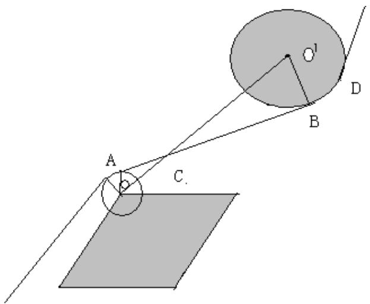

<details>
<summary>text_image</summary>

Geometric diagram showing two circles and a plane with labeled points A, B, C, D and center O', likely illustrating a theorem or proof.
</details>

图 8

此种情况计算路径的方法同情况二。

综上几种情况的讨论，可以知道：机器人的避障路径都是由以上几种情况组成，故我们在求由O 点到各目标点时路径长度都可以将路径分解成以上几种情况来求解。

## 5.2模型的建立与求解

## 5.2.1问题一的模型建立与求解

模型的建立：

题中给出了 12 个多边形障碍物的区域，故我们根据图中的约束条件利用Matlab(程序见附录一)将障碍物扩充为如图 9：

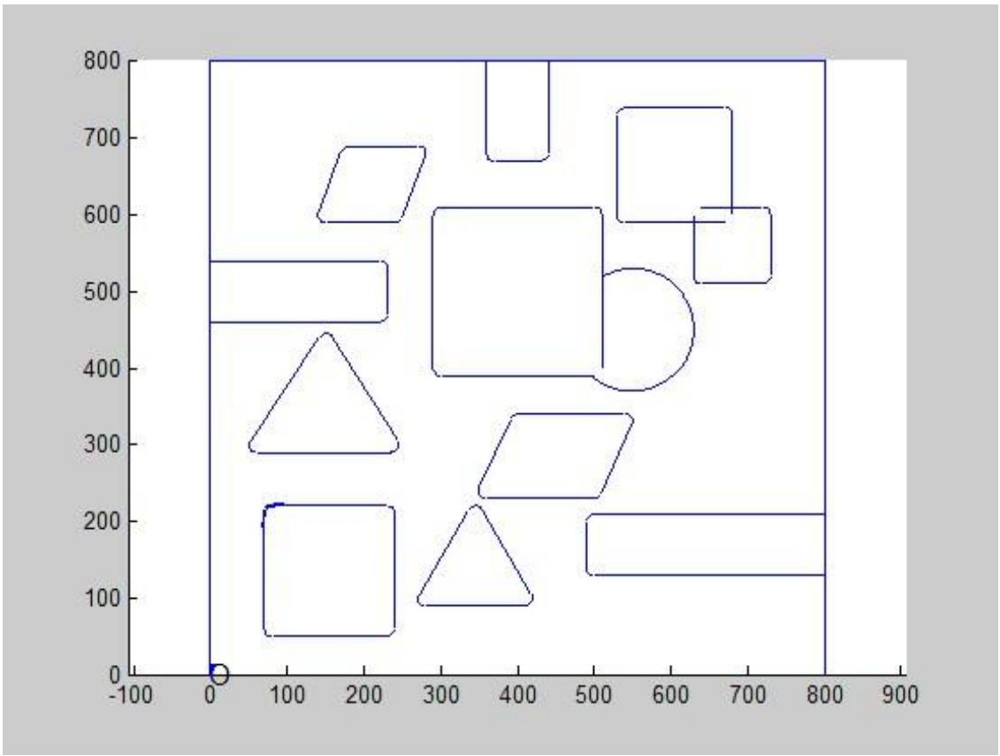

<details>
<summary>wireframe</summary>

| Shape | X (range) | Y (range) |
| --- | --- | --- |
| Circle | 0~10 | 0~10 |
| Rectangle | 50~800 | 50~210 |
| Triangle | 50~400 | 90~450 |
| Square | 300~750 | 390~690 |
| Circle | 400~650 | 370~530 |
| Square | 400~750 | 510~740 |
| Triangle | 350~450 | 90~220 |
| Rectangle | 50~800 | 130~210 |
| Square | 350~450 | 670~800 |
| Square | 350~450 | 670~800 |
| Square | 550~750 | 590~740 |
| Square | 650~750 | 510~610 |
</details>

图 9

即形成一个新的障碍区域，先求出所有的切线，包括出发点和目标点到所有圆弧的切线以及所有圆弧与圆弧之间的切线，给这些定点赋一个等于切线长度的权值，如果某两条切线有一个公切圆弧，则代表这两条曲线的顶点是一条直线的两个端点，边上的权值等于这两条切线之间的劣弧长度。那么在所有代表出发点与其它圆弧之间切线的顶点与源点连成一条边，权值均为0，同理在所有代表目标点到其它圆弧切线的顶点与终点连成一条边，权值均为0，这样题目就转化成了求源点到达终点之间的最短路径问题了，这里最短路径就是指经过所有顶点与边的权值之和最小。

对于最短路径的求解，有以下步骤：

1）画出出发点和目标点和各个圆弧的切线，以及圆弧与圆弧之间的切线，

但是切线有可能经过障碍物的内部或危险区域，也可能出现切线重复的状况，既有很多不合理的切线，再根据约束条件我们对模型做了以下修正：

⚫ 检验切线两个端点是否在障碍物内部。  
⚫ 检验切线两切线是否相交  
⚫ 检验圆弧所对应的圆心，即障碍物的顶点到切线的距离是否小于 10。

除上述三个指标外还需考虑一种特殊情况，即公切线在一个圆弧上只有一个切点(如图 10)

因此我们作如下规定:如果某条切线与某段圆弧相切，且切点不在切线的端点上，则该切线为不合理。

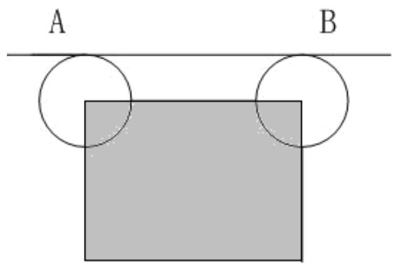

<details>
<summary>text_image</summary>

A
B
</details>

图 10

2）然后将不合理的切线剔除，假设剔除过后有m条合理切线，那么就有 个顶点，设这些点的权值 $E _ { i } ~ _ { ( } 1 \leq i \leq m )$ ，即第 条合理曲线的长度。 为边的权值，即第 条弧的长度。  
3）然后把路径确定下来，按照求得权值矩阵给图中的顶点及边长赋值。利用Dijkstra算法对其求解出最短路径。

根据上述的模型通过编程求解和几何求解求出了最短路径，并且求出了最短路径中每段直线段或圆弧的起点和终点坐标、圆弧的圆心坐标。

## 模型的结果

通过编程求解得出最短路径的线路坐标和最短路径：

表一 各线路的最短路径

<table><tr><td>路径</td><td>最短路径的坐标线路</td><td>最短路径的长度(个单位)</td></tr><tr><td>0-A</td><td>(0,0)→(70.506,213.1406)→(76.6064,219.4066)→(300,300)</td><td>471.0372</td></tr><tr><td>0-B</td><td>(0,0)→(50.1353,301.6396)→(52.0372,306.0493)→(147.96,444.799)→(152.4059,444.7062)→(224.4721,461.0557)→(230,470)→(230,530)→(225.4967,538.3538)→(144.5033,591.6462)→(140.6912,596.3458)→(100,700)</td><td>853.7001</td></tr><tr><td>0-C</td><td>(0,0)→(232.5242,50.3238)→(232.1693,50.2381)→(412.1693,90.2381)→(418.3448,94.4897)→(492.5671,507.4329)→(506.1273,208.9125)→(727.9377,513.9178)→(730,520)→(730,600)→(728.9443,604.4721)→(700,640)</td><td>1086.0677</td></tr><tr><td>0-A-B-C-0</td><td>(0,0)→(70.506,213.1406)→(76.6215,219.412)→(294.4385,298.5652)→(289.9197,306.5856)→(229.4072,533.36169)→(225.4967,538.3538)→(144.5033,591.6462)→(140.865,595.9316)→(98.9499,690.0466)→(108.9534,704.0772)→(270.8686,689.9622)→(272,689.798)→(368,670.798)→(370,670)→(430,670)→(435.5878,738.2932)→(534.4122,738.2932)→(540,740)→(670,740)→(639.7738,732.1149)→(699.2162,642.2645)→(701.3151,637.9688)→(710.2187,602.0799)→(730,600)→(730,520)→(727.9377,513.9178)→(506.1273,208.9125)→(492.5671,507.4329)→(418.3448,94.4897)→(412.1693,90.2381)→(232.1693,50.2381)→(232.5242,50.3238)→(0,0)</td><td>2748.699</td></tr></table>

其中：

O-A:

圆弧圆心坐标为（80,210）。

O-B:

圆弧圆心坐标依次为：（60,300），（345,210），（220,470），（220,530），（150,600）。

O-C:

圆弧圆心坐标依次为（230,60），（410,100），（500,200），（720,520），（720,600）。

O-A-B-C-O:

圆 弧 圆 心 的 坐 标 ： A （ 299.327,309.9773 ）， B （ 108.0849,694.115 ）， C（708.990,644.3794）（其他圆心在障碍物的顶点时未列出，只列出了在 A,B,C三个目标点的圆心坐标）。

各路径最短线路图如下：

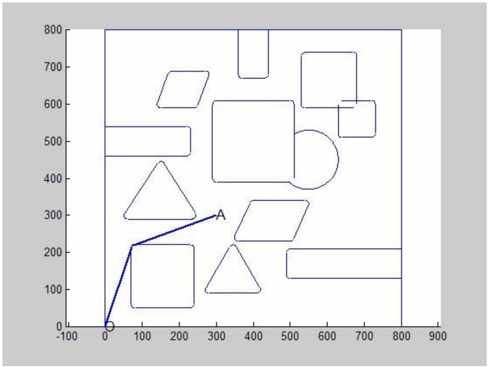

<details>
<summary>scatter</summary>

| Shape | X | Y |
| --- | --- | --- |
| Circle | 0 | 0 |
| Line Segment | 0~300 | 0~300 |
| Shape A | ~75 | ~220 |
| Shape A | ~240 | ~290 |
| Shape A | ~360 | ~100 |
| Shape A | ~410 | ~220 |
| Shape A | ~500 | ~130 |
| Shape A | ~510 | ~210 |
| Shape A | ~550 | ~330 |
| Shape A | ~630 | ~510 |
| Shape A | ~680 | ~600 |
| Shape A | ~720 | ~730 |
| Shape A | ~440 | ~670 |
| Shape A | ~440 | ~800 |
| Shape A | ~230 | ~680 |
| Shape A | ~230 | ~460 |
| Shape A | ~160 | ~680 |
| Shape A | ~160 | ~380 |
| Shape A | ~160 | ~290 |
| Shape A | ~160 | ~290 |
| Shape A | ~230 | ~290 |
| Shape A | ~360 | ~390 |
| Shape A | ~440 | ~390 |
| Shape A | ~510 | ~390 |
| Shape A | ~510 | ~530 |
| Shape A | ~510 | ~530 |
| Shape A | ~510 | ~460 |
| Shape A | ~510 | ~460 |
| Shape A | ~510 | ~370 |
| Shape A | ~510 | ~370 |
| Shape A | ~510 | ~230 |
| Shape A | ~510 | ~230 |
| Shape A | ~510 | ~130 |
| Shape A | ~800 | ~130 |
| Shape A | ~800 | ~210 |
| Shape A | ~800 | ~800 |
| Shape A | ~800 | ~800 |
| Shape A | ~800 | ~800 |
| Shape A | ~800 | ~800 |
| Shape A | ~800 | ~800 |
| Shape A | ~800 | ~800 |
| Shape A | ~800 | ~800 |
| Shape A | ~800 | ~800 |
</details>

图 11 O-A 的最短路径  
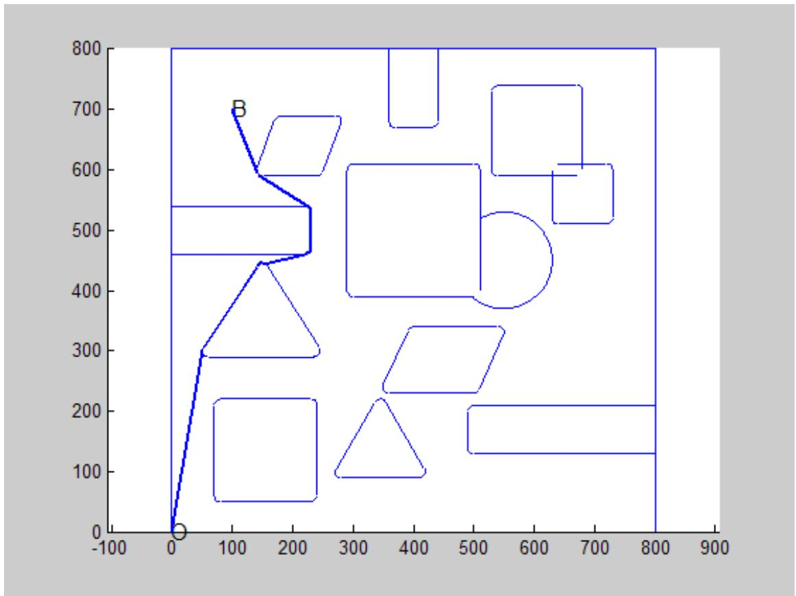

<details>
<summary>line</summary>

| Point | X | Y |
| --- | --- | --- |
| Start | 0 | 0 |
| B | ~10 | ~700 |
| B | ~150 | ~600 |
| B | ~230 | ~540 |
| B | ~230 | ~460 |
| B | ~230 | ~450 |
| B | ~230 | ~440 |
| B | ~230 | ~430 |
| B | ~230 | ~420 |
| B | ~230 | ~410 |
| B | ~230 | ~400 |
| B | ~230 | ~390 |
| B | ~230 | ~380 |
| B | ~230 | ~370 |
| B | ~230 | ~360 |
| B | ~230 | ~350 |
| B | ~230 | ~340 |
| B | ~230 | ~330 |
| B | ~230 | ~320 |
| B | ~230 | ~310 |
| B | ~230 | ~300 |
| B | ~230 | ~290 |
| B | ~230 | ~280 |
| B | ~230 | ~270 |
| B | ~230 | ~260 |
| B | ~230 | ~250 |
| B | ~230 | ~240 |
| B | ~230 | ~230 |
| B | ~230 | ~220 |
| B | ~230 | ~210 |
| B | ~230 | ~200 |
| B | ~230 | ~190 |
| B | ~230 | ~180 |
| B | ~230 | ~170 |
| B | ~230 | ~160 |
| B | ~230 | ~150 |
| B | ~230 | ~140 |
| B | ~230 | ~130 |
| B | ~230 | ~120 |
| B | ~230 | ~110 |
| B | ~230 | ~100 |
| B | ~230 | ~90 |
| B | ~230 | ~80 |
| B | ~230 | ~70 |
| B | ~230 | ~60 |
| B | ~230 | ~50 |
| B | ~230 | ~40 |
| B | ~230 | ~30 |
| B | ~230 | ~20 |
| B | ~230 | ~10 |
| B | 0~800 | 8~800 |
| Point B(Start) | 0 | 0 |
</details>

图 12 O-B 的最短路径

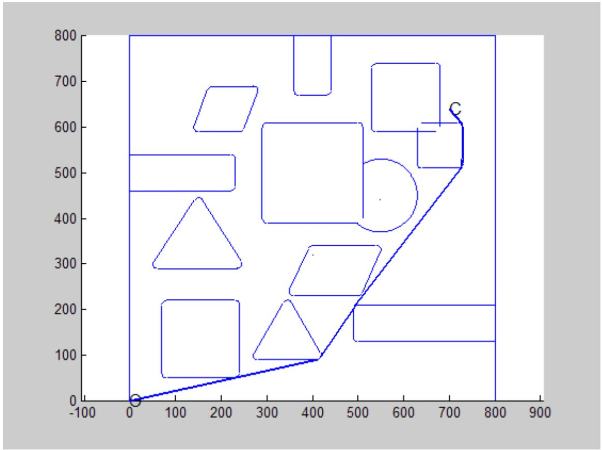

<details>
<summary>wireframe</summary>

| Shape | X (range) | Y (range) |
| --- | --- | --- |
| Circle | 0~800 | 0~800 |
| Triangle | 150~400 | 90~450 |
| Rectangle | 50~800 | 50~600 |
| Square | 350~750 | 350~750 |
| Circle | 400~650 | 350~650 |
| Rectangle | 400~650 | 400~650 |
| Square | 400~650 | 400~650 |
| Square | 400~650 | 400~650 |
| Square | 400~650 | 400~650 |
| Square | 400~650 | 400~650 |
| Square | 400~650 | 400~800 |
| Square | 400~650 | 400~800 |
| Square | 400~650 | 400~800 |
| Square | 400~650 | 400~800 |
| Square | 400~650 | 400~800 |
| Square | 400~650 | 800~800 |
| Square | 400~650 | 800~800 |
| Square | 400~650 | 800~800 |
| Square | 400~650 | 800~800 |
| Square | 400~650 | 800~800 |
| Square | 400~800 | 130~220 |
| Square | 400~800 | 130~220 |
| Square | 400~800 | 130~220 |
| Square | 400~800 | 130~220 |
| Square | 400~800 | 130~220 |
| Square | 400~800 | 210~221 |
| Square | 400~800 | 213 |
| Square | 425~815 | 133 |
| Square | 425~815 | 213 |
| Square | 425~815 | 213 |
| Square | 425~815 | 213 |
| Square | 425~815 | 213 |
| Square | 425~815 | 213 |
| Square | 425~815 | 213 |
| Square | 425~815 | ~213 |
| Square | 425~815 | ~213 |
| Square | 425~815 | ~213 |
| Square | 425~815 | ~213 |
| Square | 425~815 | ~213 |
| Square | 425~815 | ~213 |
</details>

图 13 O-C 的最短路径

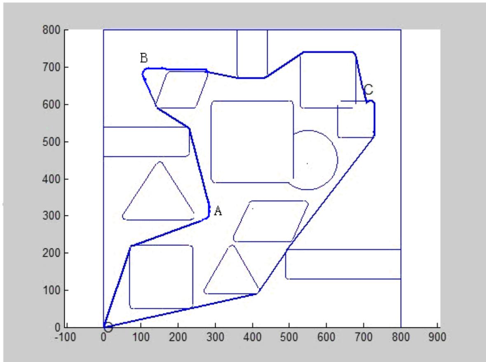

<details>
<summary>line</summary>

| Point | X | Y |
| --- | --- | --- |
| A | ~280 | ~300 |
| B | ~150 | ~690 |
| C | ~720 | ~610 |
</details>

图 14 O-A-B-C-O 最短路径图

## 5.2.2问题二模型的建立与求解

## 模型分析

由第一问的模型可知，当转弯圆弧的圆心在顶点时，行走路径越靠近两点连线，且圆弧半径越小路径越短，所花的时间也就越少；但根据最大转弯速度为$\nu = \nu ( \rho ) = \frac { \nu _ { 0 } } { 1 + \mathrm { e } ^ { 1 0 - 0 . 1 \rho ^ { 2 } } }$ ，其中 $\rho$ 是转弯半径，圆弧半径越小转弯的速度也就越慢，所花的时间又更长，基于这两者结合，将转弯路径的圆弧与问题一中 O点到A点圆弧相内切，如图 15所示

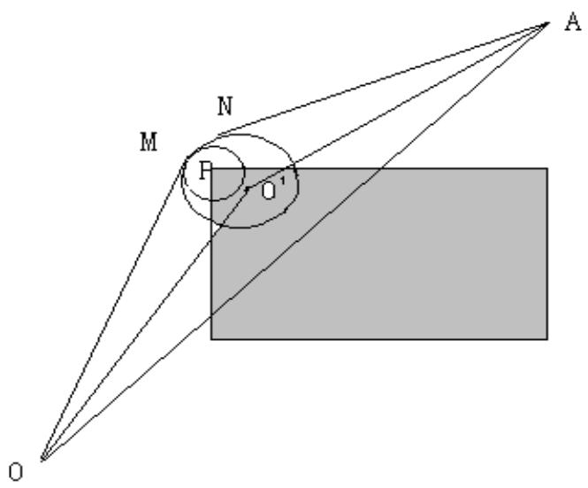

<details>
<summary>text_image</summary>

O
M
N
F
O'
A
</details>

图 15

设圆弧的圆心为 $\textit { O } \left( x , y \right)$ ，问题一中的顶点圆心为 （80,210）， $O P = l$

$$
O O ^ {\prime} = a, O ^ {\prime} A = b, O A = c, \angle O O ^ {\prime} A = \alpha_ {1}, \angle O O ^ {\prime} M = \alpha_ {2}, \angle A O ^ {\prime} N = \alpha_ {3}, \angle M O ^ {\prime} N = \theta ;
$$

则有 $a = \sqrt { x ^ { 2 } + y ^ { 2 } } \ , b = \sqrt { \left( 3 0 0 - x \right) ^ { 2 } + \left( 3 0 0 - y \right) ^ { 2 } } \ , c = \sqrt { 3 0 0 ^ { 2 } + 3 0 0 ^ { 2 } } = 4 2 4 . 2 6 4 .$

$$
\alpha_ {1} = a r \cos \frac {a ^ {2} + b ^ {2} - c ^ {2}}{2 a b}, \quad \alpha_ {2} = a r \cos \frac {r}{a}, \quad \alpha_ {3} = a r \cos \frac {r}{b}, \quad l _ {1} = \sqrt {a ^ {2} - r ^ {2}},
$$

$l _ { 2 } = r \theta$ $l _ { 3 } = \sqrt { b ^ { 2 } - r ^ { 2 } }$ ， 故 可 列 出 时 间 的 计 算 表 达 式 为 $t _ { 1 } = \frac { l _ { 1 } } { \nu _ { 0 } }$

$$
t _ {2} = \frac {l _ {2}}{\frac {v _ {0}}{1 + e ^ {1 0 - 0 . 1 r ^ {2}}}}, t _ {3} = \frac {l _ {3}}{v _ {0}}
$$

要确定出时间的最短路径，我们采用非线性规划模型求解，建立时间最短的目标函数。

## 模型的建立与求解

机器人从 O 点到 A 点，由第一问得最短路径，设第一段线段所用时间为 $t _ { 1 }$ ,第二段圆弧段所用时间为 $t _ { 2 }$ ，第三段线段所用时间为 $t _ { 3 }$ , 为两圆心的距离，那么目标函数可以表示为：

$$
\min t = t _ {1} + t _ {2} + t _ {3}
$$

$$
s. t = \left\{ \begin{array}{l} r = l + 1 0 \\ r > = 1 0 \\ x, y > 0 \end{array} \right.
$$

利用 Matlab 编程求得总时间最小为 秒，最小时间总路程为 472.4822个单位，其中转弯处圆弧圆心坐标为<sup>(81.430,209.41)</sup>，此时圆弧的半径为 11.197个单位，圆弧两切点的坐标分别为（70.88,212.92）、（77.66,219.87）。

## 六、模型的评价

## 模型的优点：

1. 模型简单易懂，对一般过路障问题实用。  
2. 问题一中利用权值网络对问题的整体把握，有全局包揽局部的效果，避免了只考虑小部分的情况。  
3. 对问题建立模型前，通过一些定理的证明及模型准备为模型的建立提供了理论的支撑，避免了出现泛泛而谈。

## 模型的缺点：

1. 此模型利用整体把握的考虑，但由于它遍历计算的节点很多，计算具体数值时可能存在一定的误差，效率也会更低。  
2. 当障碍物为其他极其不规则的形状时，模型需考虑多几方面的情形，要对模型进行适当的修改。

## 七、参考文献

[1]姜启源，数学模型，北京，高等教育出版社 ，2003  
[2] 尤承业，解析几何，北京，北京大学出版社，2004  
[3]周培德，计算几何—算法与设计，北京清华大学出版社，2005  
[4]王文波，数学建模及其基础知识详解，武汉，武汉大学出版社，2005  
[5]祝红芳 王从庆，机器人路径规划的元胞自动机算法，江西，江西科学，第27 卷第 1 期，36-40,2009.2  
[6]龚劬，图论与网络最优化算法，重庆，重庆大学出版社，2009  
[7]李明哲,图论及其算法,北京，机械工业出版社，2010  
[8]王桂平,图论算法理论、实现及运用，北京，北京大学出版社，2011

## 附 录

## 附录一

## 路径图的 Matlab 程序:

运行的约束条件：  
```matlab
open fig1.fig

text(0,0,'O','fontsize',12);

text(300,300,'A','fontsize',12);

R=10;

O=[80 210];

P1=[70.5060 213.1406];

P2=[76.6054 219.4066];

line([0 70.5060],[0 ,213.1406],'LineWidth',2);
```

```matlab
an1=angle(complex(P1(1)-O(1),P1(2)-O(2)));

an2=angle(complex(P2(1)-O(1),P2(2)-O(2)));

if an2<0

    an2=an2+2*pi;

end

an=linspace(an1,an2,50);

plot(O(1)+R*cos(an),O(2)+R*sin(an),'LineWidth',2);
```

```javascript
dot1=[76.6054,219.4066];
dot2=[300,300];
line([dot1(1) dot2(1)],[dot1(2) dot2(2)],'LineWidth',2);
```

OA  
```matlab
open fig1.fig

text(0,0,'O','fontsize',12);

text(300,300,'A','fontsize',12);

R=10;

O=[80 210];

P1=[70.5060 213.1406];

P2=[76.6054 219.4066];

line([0 70.5060],[0 ,213.1406],'LineWidth',2);
```

```matlab
an1=angle(complex(P1(1)-O(1),P1(2)-O(2)));
an2=angle(complex(P2(1)-O(1),P2(2)-O(2)));
if an2<0
    an2=an2+2*pi;
end
an=linspace(an1,an2,50);
plot(O(1)+R*cos(an),O(2)+R*sin(an),'LineWidth',2);
```

```javascript
dot1=[76.6054,219.4066];
dot2=[300,300];
line([dot1(1) dot2(1)],[dot1(2) dot2(2)],'LineWidth',2);
```

OB  
```matlab
open fig1.fig

text(0,0,'O','fontsize',12);

text(100,700,'B','fontsize',12);
```

```matlab
R=10;
O=[0 0];

dot1=0;
dot2=[50.1353,301.6396];
linePic(dot1,dot2);

O1=[60,300];
P1=[50.1353,301.6396];
P2=[50.1353,301.6396];
arcPic(O1,P1,P2,R)

dot1=[51.6797,305.5746];dot2=[141.6979,439.6089];
linePic(dot1,dot2);

P1=[141.6979,439.6089];
P2=[150,444.0343];
O1=[150,435];
arcPic(O1,P1,P2,R);

dott=[150,444.0343, 222.1970,460.2429];
dot1=dott(1:2);dot2=dott(3:4);
linePic(dot1,dot2);

arcc=[222.1970,460.2429, 230,470, 220,470];
P1=arcc(1:2);
P2=arcc(3:4);
O1=arcc(5:6);
arcPic(O1,P1,P2,R);
```

```javascript
dott=[230 470 230 530];

dot1=dott(1:2);dot2=dott(3:4);

linePic(dot1,dot2);
```

```matlab
arcc=[ 230 530 225.4967 538.3538 220,530 ];
P1=arcc(1:2);
P2=arcc(3:4);
O1=arcc(5:6);
arcPic(O1,P1,P2,R);
```

```matlab
dott=[225.4967 538.3538 144.5033 591.6462];
dot1=dott(1:2);dot2=dott(3:4);
linePic(dot1,dot2);
```

```matlab
arcc=[ 144.5033 591.6462 140.6916 596.3458 150 600 ];
P1=arcc(1:2);
P2=arcc(3:4);
O1=arcc(5:6);
arcPic(O1,P1,P2,R);
```

```javascript
dott=[140.6916 596.3458 100 700];
dot1=dott(1:2);dot2=dott(3:4);
linePic(dot1,dot2);
```

```matlab
% £"0,0£© £"50.1353,301.6396£©
% £"50.1353,301.6396£©    £"51.6797,305.5746£©   £"60,300£©    10
% £"51.6797,305.5746£©    £"141.6979,439.6089£©
% £"141.6979,439.6089£©    £"150,444.0343£©   £"150,435£©    10
% £"150,444.0343£©      £"222.1970,460.2429£©
% £"222.1970,460.2429£©    £"230,470£©   £"220,470£©    10
% £"230,470£©   £"230,530£©
% £"230,530£©   £"225.4967,538.3538£©   £"220,530£©    10
% £"225.4967,538.3538£©    £"144.5033,591.6462£©
% £"144.5033,591.6462£©    £"140.6916,596.3458£©   £"150,600£©    10
% £"140.6916,596.3458£©    £"100,700£©
```

## OABCO

```matlab
open fig1.fig

text(0,0,'O','fontsize',12);

text(700,640,'C','fontsize',12);

R=10;

O=[0 0];
```

```toml
data={ [0 0 70.506 213.1406 ]
[70.506,213.1406 76.6215,219.412 80,210 ]
[76.6215 219.412 294.4385,298.5652 ]
[294.4385,298.5652 289.9197,306.5856 290.8727 304.0857 ]
[289.9197 306.5856 229.4072,533.3617 ]
[229.4072,533.3617 225.4967,538.3538 220,530 ]
[225.4967,538.3538 144.5033,591.6462 ]
```

```txt
[144.5033,591.6462 140.865,595.9316 150,600 ]
[140.865,595.9316 98.9499,690.0466 ]
[98.9499,690.0466 108.9534,704.0772 108.0849,694.115 ]
[ 108.9534,704.0772 270.8686,689.9622 ]
[ 270.8686,689.9622 272 689.798 270,680 ]
[ 272 689.798 368,670.798 ]
[ 368,670.798 370,670 370,680]
[ 370,670 430,670 ]
[430,670 435.5878 671.8432 430,680 ]
[435.5878 671.8432 534.4122 738.2932 ]
[534.4122 738.2932 540,740 540,730 ]
[ 540,740 670,740 ]
[670,740 679.7738,732.1149 670,730 ]
[679.7738,732.1149 699.2162,642.2645 ]
[ 699.2162,642.2645 701.3151,637.9688 708.99,644.3794 ]
[ 701.3151,637.9688 710.2187 602.0799 ]
[710.2187 602.0799 730,600 720,600 ]
[ 730,600 730,520 ]
[730,530 727.9377 513.9178 720,520 ]
[ 727.9377 513.9178 492.0623 206.0822 ]
[ 492.0623 206.0822 491.6552,205.5103 550,450 ]
[ 491.6552,205.5103 418.3448,94.4897 ]
[418.3448,94.4897 412.1693,90.2381 400,330 ]
[ 412.1693,90.2381 232.1693,50.2381 ]
[ 232.1693,50.2381 232.1149,50.2262 230,60 ]
[ 232.1149,50.2262 0,0 ]}
for i=1:length(data)
    if length(data{i})==4
        dot1=data{i}(1:2);dot2=data{i}(3:4);
        linePic(dot1,dot2);
```

```matlab
else
    P1=data{i}(1:2);
    P2=data{i}(3:4);
    O1=data{i}(5:6);
    arcPic(O1,P1,P2,R);
end
end
```

运行的约束条件：  
```matlab
open fig1.fig
text(0,0,'O','fontsize',12);
text(300,300,'A','fontsize',12);
R=10;
O=[80 210];
P1=[70.5060 213.1406];
P2=[76.6054 219.4066];
line([0 70.5060],[0 ,213.1406],'LineWidth',2);

an1=angle(complex(P1(1)-O(1),P1(2)-O(2)));
an2=angle(complex(P2(1)-O(1),P2(2)-O(2)));
if an2<0
    an2=an2+2*pi;
end
an=linspace(an1,an2,50);
plot(O(1)+R*cos(an),O(2)+R*sin(an),'LineWidth',2);

dot1=[76.6054,219.4066];
```

```javascript
dot2=[300,300];
line([dot1(1) dot2(1)],[dot1(2) dot2(2)],'LineWidth',2);
```

OA  
```matlab
open fig1.fig

text(0,0,'O','fontsize',12);

text(300,300,'A','fontsize',12);

R=10;

O=[80 210];

P1=[70.5060 213.1406];

P2=[76.6054 219.4066];

line([0 70.5060],[0 ,213.1406],'LineWidth',2);
```

```matlab
an1=angle(complex(P1(1)-O(1),P1(2)-O(2)));

an2=angle(complex(P2(1)-O(1),P2(2)-O(2)));

if an2<0

    an2=an2+2*pi;

end

an=linspace(an1,an2,50);

plot(O(1)+R*cos(an),O(2)+R*sin(an),'LineWidth',2);
```

```javascript
dot1=[76.6054,219.4066];
dot2=[300,300];
line([dot1(1) dot2(1)],[dot1(2) dot2(2)],'LineWidth',2);
```  
OB

```matlab
open fig1.fig
text(0,0,'O','fontsize',12);
text(100,700,'B','fontsize',12);
R=10;
O=[0 0];

dot1=0;
dot2=[50.1353,301.6396];
linePic(dot1,dot2);

O1=[60,300];
P1=[50.1353,301.6396];
P2=[50.1353,301.6396];
arcPic(O1,P1,P2,R)

dot1=[51.6797,305.5746];dot2=[141.6979,439.6089];
linePic(dot1,dot2);

P1=[141.6979,439.6089];
P2=[150,444.0343];
O1=[150,435];
arcPic(O1,P1,P2,R);

dott=[150,444.0343, 222.1970,460.2429];
dot1=dott(1:2);dot2=dott(3:4);
linePic(dot1,dot2);

arcc=[222.1970,460.2429, 230,470, 220,470];
P1=arcc(1:2);
```

```matlab
P2=arcc(3:4);

O1=arcc(5:6);

arcPic(O1,P1,P2,R);
```

```javascript
dott=[230 470 230 530];

dot1=dott(1:2);dot2=dott(3:4);

linePic(dot1,dot2);
```

```matlab
arcc=[ 230 530 225.4967 538.3538 220,530 ];
P1=arcc(1:2);
P2=arcc(3:4);
O1=arcc(5:6);
arcPic(O1,P1,P2,R);
```

```matlab
dott=[225.4967 538.3538 144.5033 591.6462];
dot1=dott(1:2);dot2=dott(3:4);
linePic(dot1,dot2);
```

```matlab
arcc=[ 144.5033 591.6462 140.6916 596.3458 150 600 ];
P1=arcc(1:2);
P2=arcc(3:4);
O1=arcc(5:6);
arcPic(O1,P1,P2,R);
```

```javascript
dott=[140.6916 596.3458 100 700];
```

```matlab
dot1=dott(1:2);dot2=dott(3:4);
linePic(dot1,dot2);

% £"0,0£© £"50.1353,301.6396£©
% £"50.1353,301.6396£©    £"51.6797,305.5746£©   £"60,300£©    10
% £"51.6797,305.5746£©    £"141.6979,439.6089£©
% £"141.6979,439.6089£©    £"150,444.0343£©   £"150,435£©    10
% £"150,444.0343£©      £"222.1970,460.2429£©
% £"222.1970,460.2429£©    £"230,470£©   £"220,470£©    10
% £"230,470£©   £"230,530£©
% £"230,530£©   £"225.4967,538.3538£©   £"220,530£©    10
% £"225.4967,538.3538£©    £"144.5033,591.6462£©
% £"144.5033,591.6462£©    £"140.6916,596.3458£©   £"150,600£©    10
% £"140.6916,596.3458£©    £"100,700£©
```

## OABCO

```matlab
open fig1.fig

text(0,0,'O','fontsize',12);

text(700,640,'C','fontsize',12);

R=10;

O=[0 0];
```

```txt
data={ [0 0 70.506 213.1406 ]
[70.506,213.1406 76.6215,219.412 80,210 ]
[76.6215 219.412 294.4385,298.5652 ]
[294.4385,298.5652 289.9197,306.5856 290.8727 304.0857 ]
```

```txt
[289.9197 306.5856 229.4072,533.3617 ]
[229.4072,533.3617 225.4967,538.3538 220,530 ]
[225.4967,538.3538 144.5033,591.6462 ]
[144.5033,591.6462 140.865,595.9316 150,600 ]
[140.865,595.9316 98.9499,690.0466 ]
[98.9499,690.0466 108.9534,704.0772 108.0849,694.115 ]
[ 108.9534,704.0772 270.8686,689.9622 ]
[ 270.8686,689.9622 272 689.798 270,680 ]
[ 272 689.798 368,670.798 ]
[ 368,670.798 370,670 370,680]
[ 370,670 430,670 ]
[430,670 435.5878 671.8432 430,680 ]
[435.5878 671.8432 534.4122 738.2932 ]
[534.4122 738.2932 540,740 540,730 ]
[ 540,740 670,740 ]
[670,740 679.7738,732.1149 670,730 ]
[679.7738,732.1149 699.2162,642.2645 ]
[ 699.2162,642.2645 701.3151,637.9688 708.99,644.3794 ]
[ 701.3151,637.9688 710.2187 602.0799 ]
[710.2187 602.0799 730,600 720,600 ]
[ 730,600 730,520 ]
[730,530 727.9377 513.9178 720,520 ]
[ 727.9377 513.9178 492.0623 206.0822 ]
[ 492.0623 206.0822 491.6552,205.5103 550,450 ]
[ 491.6552,205.5103 418.3448,94.4897 ]
[418.3448,94.4897 412.1693,90.2381 400,330 ]
[ 412.1693,90.2381 232.1693,50.2381 ]
[ 232.1693,50.2381 232.1149,50.2262 230,60 ]
[ 232.1149,50.2262 0,0 ]}
```

```matlab
for i=1:length(data)

    if length(data{i})==4
        dot1=data{i}(1:2);dot2=data{i}(3:4);

        linePic(dot1,dot2);

    else

        P1=data{i}(1:2);

        P2=data{i}(3:4);

        O1=data{i}(5:6);

        arcPic(O1,P1,P2,R);

    end

end
```

第二问的到达A的最短时间路径程序：  
```txt
a=sqrt(x^2+y^2);
b=sqrt((300-x)^2+(300-y)^2);
c=300*sqrt(2);
a1=arccos((a^2+b^2-c^2)/2*a*b);
a2=arccos(r/a);
a3=arccos(r/b);
a4=2*pi-a1-a2-a3;
l1=sqrt(a^2-r^2);
l2=r*a4;
l3=sqrt(b^2-r^2);
m=sqrt((x-80)^2+(y-210)^2);
t=(l1/5)+l2*(1+exp(10-0.1*r^2))/5+(l3/5)
```

```matlab
a1=p1(1)-x(1)+j*(p1(2)-x(2));
a2=p2(1)-x(1)+j*(p2(2)-x(2));
angleA=(angle(a1)-angle(a2))*180/pi

function [L,tanpt] = tanline(pt1,r1,pt2,r2)
% %±3/4°~ÊýÊÇÓÃÀ´Có¹/₂â¹/₂Ô²Ö®³/4äµÄ¹«ÇĐÏßµÄ
x1 = pt1(1);
y1=pt1(2);
x2=pt2(1);
y2=pt2(2);
warning off MATLAB:divideByZero
tanpt =[];
Flag=0;
if r2<r1
    Flag=1;
    temp = r2; r2=r1;r1=temp;
    temp = x2; x2=x1;x1=temp;
    temp = y2; y2=y1;y1=temp;
end

D = sqrt((x1-x2)^2 + (y1-y2)^2);
theta = acos((r2-r1)/D);
alpha = atan2(y1-y2,x1-x2);
wai1 = alpha+theta;
wai2 = alpha-theta;
tanpt{1} = [r2*cos(wai1) + x2, r2*sin(wai1) + y2];
tanpt{1} = [tanpt{1};[r1*cos(wai1) + x1, r1*sin(wai1) + y1] ];
tanpt{2} = [r2*cos(wai2) + x2, r2*sin(wai2) + y2];
tanpt{2} = [tanpt{2};[r1*cos(wai2) + x1, r1*sin(wai2) + y1] ];
```

```matlab
theta = acos((r2+r1)/D);
wai1 = alpha+theta;
wai2 = alpha-theta;
tanpt{3} = [r2*cos(wai1) + x2, r2*sin(wai1) + y2];
tanpt{3} = [tanpt{3};[r1*cos(wai1+pi) + x1, r1*sin(wai1+pi) + y1] ];
tanpt{4} = [r2*cos(wai2) + x2, r2*sin(wai2) + y2];
tanpt{4} = [tanpt{4};[r1*cos(wai2+pi) + x1, r1*sin(wai2+pi) + y1] ];
if Flag==0
    for i=1:4
        tanpt{i} =tanpt{i}([2 1],:);
    end
end
%ÂĐÎλ;μÄ×ßÎÒf¬Ë³Ê±Õë0 orÀæʱÕë1
%if °ë³⁄₄νǣ”-pi£¬-pi/2£©ÇÒÔ²ÐÀ½Ç£”pi/2£¬pi£©ÇÉDÎʱ£¬Ë³ 0£»
%»òÕß EäËÛÇÉDÎ Âú×㣰°ë³⁄₄νÇ>Ô²ÐÀ½ÇΪ˳ 0£»
%ÆäËûΪÄæʱÕë 1
for i=1:4
    yxj=angle(complex(tanpt{i}(2,1)-pt1(1),(tanpt{i}(2,2)-pt1(2))));
    bjj=angle(complex(tanpt{i}(1,1)-pt1(1),(tanpt{i}(1,2)-pt1(2))));
    if bjj<-pi/2 & yxj>pi/2
        dir=1;
    else
        if bjj>yxj
            dir=1;
        else
            dir=0;
        end
    end
    dir1=dir;
```

```matlab
yxj=angle(complex(tanpt{i}(1,1)-pt2(1),tanpt{i}(1,2)-pt2(2)));
bjj=angle(complex(tanpt{i}(2,1)-pt2(1),tanpt{i}(2,2)-pt2(2)));
if bjj<-pi/2 & yxj>pi/2
    if bjj<-pi/2 & yxj>pi/2
        dir=0;
    else
        if bjj>yxj
            dir=0;
        else
            dir=1;
        end
    end
    dir=[dir1 dir];
    tanpt{i}=[tanpt{i}; dir];

end
end
```

for i=1:4

```matlab
x1=tanpt{i}(1,1);y1=tanpt{i}(1,2);x2=tanpt{i}(2,1);y2=tanpt{i}(2,2);
    b(i) = (x1*y2-x2*y1)/(x1-x2);
    k(i) = (y1-y2)/(x1-x2);
end
```

```matlab
L = [k;b]';
    %%%%%%%%%%%:LΪD±ÂÊ° ͽس¼àf>>
    %%%%%%%%%%%£°tanptΪ4ÌÕÇDİߵĵĵã×ø±ê

V0=[80 210];
v_0=5;
hold on
T=[0 0];
W=[300 300];
R=10:0.01:50;
answ=[];
for i=1:length(R)
    V=[V0(1)+sqrt(2)/2*(R(i)-10) V0(2)-sqrt(2)/2*(R(i)-10)];
TV=sqrt((T(1)-V(1))^2+(T(2)-V(2))^2);
TW=sqrt((T(1)-W(1))^2+(T(2)-W(2))^2);
VW=sqrt((V(1)-W(1))^2+(V(2)-W(2))^2);
alpha1=acos((TV^2+VW^2-TW^2)/(2*TV*VW));
alpha2=acos(R(i)/TV);
alpha3=acos(R(i)/VW);
alpha4=2*pi-alpha1-alpha2-alpha3;%alpha4ΪתÍäÔ²ÐĽÇ
TS1=sqrt(TV^2-R(i)^2);%TS1,TS2¾ùΪԲ»¡ÇDİß%
S2W=sqrt(VW^2-R(i)^2);
S1S2hu=R(i)*alpha4;
result=(TS1+S1S2hu*(1+exp(10-0.1*R(i)^2))+S2W)/v_0;
answ=[answ result];

end
[B,IX] = sort(answ);
```

```matlab
minR=R(IX(1));
minV=B(1);
plot(R,answ);
plot(minR,minV,'O');
xlabel('R');ylabel('time(μ¥Î»/Ãë)');

minR,minV

open fig1.fig;
R=12.99;
%t=94.2283;
V0=[80 210];
v_0=5;

T=[0 0];
W=[300 300];
O1=[V0(1)+sqrt(2)/2*(R-10) V0(2)-sqrt(2)/2*(R-10)];
% %±¾°~ÊyÊCÓÃÀ´Çó½â½Բծ¼äµÃ¹«ÇÐÏßµÃ
[L,tanpt] = tanline(T,0,O1,R) ;

line([tanpt{2}(1,1) tanpt{2}(2,1)],[tanpt{2}(1,2) tanpt{2}(2,2)]);
an1=tanpt{2}(2,:);

[L,tanpt] = tanline(W,0,O1,R) ;

line([tanpt{1}(1,1) tanpt{1}(2,1)],[tanpt{1}(1,2) tanpt{1}(2,2)]);
an2=tanpt{1}(2,:);
%y=arcPic(O1,an1,an2,R)
```