题目： D 题

参赛队员：队员1 黄武 队员2 易世勇 队员3 罗佛玉

指导教师： 教练组

单位： 南昌理工学院

# 2012高教社杯全国大学生数学建模竞赛

## 承 诺 书

我们仔细阅读了中国大学生数学建模竞赛的竞赛规则.

我们完全明白，在竞赛开始后参赛队员不能以任何方式（包括电话、电子邮件、网上咨询等）与队外的任何人（包括指导教师）研究、讨论与赛题有关的问题。

我们知道，抄袭别人的成果是违反竞赛规则的, 如果引用别人的成果或其他公开的资料（包括网上查到的资料），必须按照规定的参考文献的表述方式在正文引用处和参考文献中明确列出。

我们郑重承诺，严格遵守竞赛规则，以保证竞赛的公正、公平性。如有违反竞赛规则的行为，我们将受到严肃处理。

我们参赛选择的题号是（从 A/B/C/D 中选择一项填写）： D

我们的参赛报名号为（如果赛区设置报名号的话）：

所属学校（请填写完整的全名）： 南昌理工学院

参赛队员 (打印并签名) ：1. 黄武

2. 易世勇

3. 罗佛玉

指导教师或指导教师组负责人 (打印并签名)： 教练组

日期： 2012 年 9 月 10 日

赛区评阅编号（由赛区组委会评阅前进行编号）：

# 2012高教社杯全国大学生数学建模竞赛

## 编 号 专 用 页

赛区评阅编号（由赛区组委会评阅前进行编号）：

赛区评阅记录（可供赛区评阅时使用）：

<table><tr><td>评阅人</td><td></td><td></td><td></td><td></td><td></td><td></td><td></td><td></td><td></td><td></td></tr><tr><td>评分</td><td></td><td></td><td></td><td></td><td></td><td></td><td></td><td></td><td></td><td></td></tr><tr><td>备注</td><td></td><td></td><td></td><td></td><td></td><td></td><td></td><td></td><td></td><td></td></tr></table>

全国统一编号（由赛区组委会送交全国前编号）：

全国评阅编号（由全国组委会评阅前进行编号）：

# 机器人避障问题

## 摘 要

本文是机器人避障路线设计问题，要求我们建立机器人从区域中一点到达另一点的避障最短路径和最短时间路径的数学模型。

针对问题一，为使机器人不与障碍物碰撞，在原障碍物的边界向外延伸 10个单位，并在顶点处以半径为10 个单位向外做圆，形成一条机器人行走的“安全路径”，即机器人可以贴着“安全路径”行走。

首先，通过证明可以在众多的行走路线中适当减少些路径，再由这些潜在的最短路径，利用图论的知识对其进行最短路径的求解，通过 Floyd 算法得到机器人从 O(0, 0)出发， O→A、O→B、O→C 和O→A→B→C→O 的折线最短距离分别为：471.041 、853.088 、1092.819、2716.431 折线最短总时间分别为：96.018、179.241、233.329、568.318。然后，对模型一进行优化，考虑机器人圆弧转弯路径，通过定理的证明可知在半径最小时并把拐弯圆弧的圆心定在各个端点。运用几何定理对每段最短路径分段处理，联立方程组建立模型二，利用 lingo12 求解各切点即每次的起点与终点坐标。最后，利用matlab7.0求解直线和弧长及行走时间（结果见表五至表八）。

针对问题二，求解 到A的最短时间路径，此时最短时间与最短线路、最短线路上拐弯次数以及拐弯半径的大小有关，由拐弯半径与速度的函数关系式：$\nu = \nu ( r ) = 5 / ( 1 + e ^ { 1 0 - 0 . 1 r ^ { 2 } } )$ 用 matlab7.0 绘制图像分析和探讨可知：在半径满足时，机器人拐弯速度趋近极大值 。所以，在一定的半径范围之内，速度不再是限制时间最小的约束条件，那么最短时间的确定就可以转化成最短路径的求解。因此，在拐弯时速度不再发生改变时，半径越小对最短拐弯时间越有利。对于怎么样去确定合适的半径使得行走的时间最短，我们利用问题一中求解的由O到 的最短线路中切点的坐标来确定模型三中机器人行走直线段的方程。并利用题目的数据及相关的限制条件对问题二建立非线性目标规划的搜索模型，并利用 lingo对其进行搜索，从而找到最合适半径 $r = 1 3 . 1 8 8 7$ 以及此时对应的拐弯圆弧的圆心坐标 。随着拐弯半径及圆心的改变会使得搜索出来路径中的切点发生改变得到两切点坐标为$T _ { \scriptscriptstyle 3 } ( 7 2 . 8 3 2 , 2 1 1 . 0 3 8 )$ 、 ，此时机器人拐弯行走路程的最短时间为：T = 94.2182 (s) 。

关键词： 机器人避撞 图论 Floyd算法 非线性目标规划 最佳半径

## 一 问题重述

图1是一个800×800的平面场景图，在原点O(0, 0)点处有一个机器人，它只能在该平面场景范围内活动。图中有12个不同形状的区域是机器人不能与之发生碰撞的障碍物，障碍物的数学描述如下表：

<table><tr><td>编号</td><td>障碍物名称</td><td>左下顶点坐标</td><td>其它特性描述</td></tr><tr><td>1</td><td>正方形</td><td>(300,400)</td><td>边长200</td></tr><tr><td>2</td><td>圆形</td><td></td><td>圆心坐标(550,450),半径70</td></tr><tr><td>3</td><td>平行四边形</td><td>(360,240)</td><td>底边长140,左上顶点坐标(400,330)</td></tr><tr><td>4</td><td>三角形</td><td>(280,100)</td><td>上顶点坐标(345,210),右下顶点坐标(410,100)</td></tr><tr><td>5</td><td>正方形</td><td>(80,60)</td><td>边长150</td></tr><tr><td>6</td><td>三角形</td><td>(60,300)</td><td>上顶点坐标(150,435),右下顶点坐标(235,300)</td></tr><tr><td>7</td><td>长方形</td><td>(0,470)</td><td>长220,宽60</td></tr><tr><td>8</td><td>平行四边形</td><td>(150,600)</td><td>底边长90,左上顶点坐标(180,680)</td></tr><tr><td>9</td><td>长方形</td><td>(370,680)</td><td>长60,宽120</td></tr><tr><td>10</td><td>正方形</td><td>(540,600)</td><td>边长130</td></tr><tr><td>11</td><td>正方形</td><td>(640,520)</td><td>边长80</td></tr><tr><td>12</td><td>长方形</td><td>(500,140)</td><td>长300,宽60</td></tr></table>

在图1的平面场景中，障碍物外指定一点为机器人要到达的目标点（要求目标点与障碍物的距离至少超过 个单位）。规定机器人的行走路径由直线段和圆弧组成，其中圆弧是机器人转弯路径。机器人不能折线转弯，转弯路径由与直线路径相切的一段圆弧组成，也可以由两个或多个相切的圆弧路径组成，但每个圆弧的半径最小为10个单位。为了不与障碍物发生碰撞，同时要求机器人行走线路与障碍物间的最近距离为10个单位，否则将发生碰撞，若碰撞发生，则机器人无法完成行走。

机器人直线行走的最大速度为 $\nu _ { 0 } = 5$ 个单位/秒。机器人转弯时，最大转弯速度为$\nu = \nu ( \rho ) = \frac { \nu _ { 0 } } { 1 + \mathrm { e } ^ { 1 0 - 0 . 1 \rho ^ { 2 } } }$ ，其中 是转弯半径。如果超过该速度，机器人将发生侧翻，无法完

成行走。

要求我们建立机器人从区域中一点到达另一点的避障最短路径和最短时间路径的数学模型。对场景图中4个点O(0, 0)，A(300, 300)，B(100, 700)，C(700, 640)具体计算：

(1) 机器人从O(0, 0)出发，O→A、O→B、O→C和O→A→B→C→O的最短路径。  
(2) 机器人从O (0, 0)出发，到达A的最短时间路径。

注：要给出路径中每段直线段或圆弧的起点和终点坐标、圆弧的圆心坐标以及机器人行走的总距离和总时间。

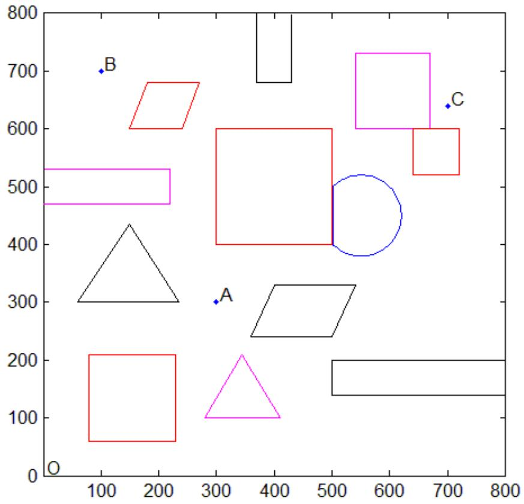

<details>
<summary>bubble</summary>

| Shape | X | Y |
| --- | --- | --- |
| Triangle | ~100 | ~300 |
| Triangle | ~250 | ~300 |
| Triangle | ~350 | ~100 |
| Triangle | ~400 | ~200 |
| Rectangle | ~100 | ~60 |
| Rectangle | ~250 | ~680 |
| Rectangle | ~400 | ~400 |
| Rectangle | ~500 | ~330 |
| Rectangle | ~500 | ~780 |
| Rectangle | ~650 | ~730 |
| Rectangle | ~700 | ~640 |
| Circle | ~550 | ~450 |
| Circle | ~550 | ~520 |
| Circle | ~550 | ~380 |
| Circle | ~550 | ~500 |
| Circle | ~550 | ~400 |
| Circle | ~550 | ~380 |
| Circle | ~550 | ~380 |
| Circle | ~550 | ~380 |
| Circle | ~550 | ~380 |
| Circle | ~550 | ~380 |
| Circle | ~550 | ~380 |
| Circle | ~550 | ~380 |
| Circle | ~550 | ~380 |
| Circle | ~55 | ~470 |
| Circle | ~250 | ~470 |
| Circle | ~250 | ~530 |
| Circle | ~250 | ~530 |
| Circle | ~250 | ~530 |
| Circle | ~250 | ~530 |
| Circle | ~250 | ~530 |
| Circle | ~250 | ~530 |
| Circle | ~250 | ~530 |
| Circle | ~250 | ~530 |
| Circle | ~25 | 700 |
| Circle | ~25 | 780 |
| Circle | ~25 | 800 |
| Circle | ~25 | 800 |
| Circle | ~25 | 800 |
| Circle | ~25 | 800 |
| Circle | ~25 | 800 |
| Circle | ~25 | 800 |
| Circle | ~25 | 800 |
| Circle | ~25 | 800 |
| Circle | ~25 | 800 |
| Square (Top) | ~420 | 680 |
| Square (Bottom) | ~420 | 780 |
| Square (Right) | ~660 | 640 |
| Square (Left) | ~660 | 640 |
| Square (Right) | ~660 | 640 |
| Square (Left) | ~660 | 730 |
| Square (Right) | ~660 | 730 |
| Square (Left) | ~660 | 730 |
| Square (Right) | ~660 | 730 |
| Square (Left) | ~660 | 730 |
| Square (Right) | ~660 | 730 |
| Square (Left) | ~660 | 730 |
| Square (Right) | ~660 | 730 |
| Triangle (Top) | ~150 | 680 |
| Triangle (Top) | ~150 | 730 |
| Triangle (Top) | ~150 | 730 |
| Triangle (Top) | ~150 | 730 |
| Triangle (Top) | ~150 | 730 |
| Triangle (Top) | ~150 | 730 |
| Triangle (Top) | ~150 | 730 |
| Triangle (Top) | ~150 | 730 |
| Diamond (Top) | ~150 | 730 |
| Diamond (Top) | ~150 | 730 |
| Diamond (Top) | ~150 | 730 |
| Diamond (Top) | ~150 | 730 |
| Diamond (Top) | ~150 | 730 |
| Diamond (Top) | ~150 | 730 |
| Diamond (Top) (Right) | ~150 | 730 |
| Diamond (Top) (Right) | ~150 | 730 |
| Diamond (Top) (Right) | ~150 | 730 |
| Diamond (Top) (Right) | ~150 | 730 |
| Diamond (Top) (Right) | ~150 | 730 |
| Diamond (Top) (Right) | ~180 | 730 |
| Diamond (Top) (Right) | ~180 | 730 |
| Diamond (Top) (Right) | ~180 | 730 |
| Diamond (Top) (Right) | ~180 | 730 |
| Diamond (Top) (Right) | ~180 | 730 |
| Diamond (Top) (Right) | ~180 | 798 |
| Diamond (Top) (Right) | ~180 | 798 |
| Diamond (Top) (Right) | ~180 | 798 |
| Diamond (Top) (Right) | ~180 | 798 |
| Diamond (Top) (Right) | ~180 | 798 |
| Diamond (Top) (Right) | ~180 | 798 |
| Diamond (Bottom Left) | ~180 | 688 |
| Diamond (Bottom Left) | ~180 | 732 |
| Diamond (Bottom Left) | ~180 | 732 |
| Diamond (Bottom Left) | ~180 | 732 |
| Diamond (Bottom Left) | ~180 | 732 |
| Diamond (Bottom Left) | ~180 | 732 |
| Diamond (Bottom Left) | ~180 | 732 |
| Diamond (Bottom Left) | ~180 | 644 |
| Diamond (Bottom Left) | ~180 | 644 |
| Diamond (Bottom Left) | ~180 | 644 |
| Diamond (Bottom Left) | ~180 | 644 |
| Diamond (Bottom Left) | ~180 | 644 |
</details>

图1 800×800平面场景图

## 二 问题分析

问题一：求解两点之间通过拐弯来避免碰撞的最短路径。可以利用图论中的有关模型对其进行求解，考虑到障碍物之间有多条路径，这对模型的建立与求解增加了很大的难度。所以，首先我们通过一些简单定理的证明，从所有的路径中找到潜在的最短路径。从而通过图论确定最短路径的折线走法。对于具体拐弯路径的确定，由有关定理知，以半径为 10 作为所有拐弯的拐弯半径，是最佳拐弯半径。并以各个已知的节点坐标作为拐弯圆弧的圆心。由此，得到 O→A、O→B、O→C 和O→A→B→C→O 的最短路径及

总用时间。

问题二：要求解最短时间的路径，其路径并不是等于问题一中的最短路径，但是可以借助其最短路径中切点的坐标来确定最短时间路径的直线方程。接下来就是怎么样寻找两条直线间用时最短的圆弧，也就是对于圆弧圆心以及半径的确定，又由拐弯速度与拐弯半径的关系表达式知道最佳拐弯半径的一定范围。由此，我们可以借助已有的条件建立非线性的目标规划模型，利用 lingo的搜索功能进行求解。

## 三 模型假设

为了使得模型便于建立和求解，我们对模型提出了如下的假设：

1.目标点与障碍物的距离至少超过 10个单位；  
2.机器人在可行进范围内的道路平坦，不会出现其他细微因素对机器人行走造成不必要的影响；  
3.不计机器人的能量消耗；  
4.不计机器人由于转向或者变速所产生的时间消耗；  
5.机器人在直线路径中始终保持最大速度 $\mathrm { V } _ { 0 } = 5$ 个单位/秒的速度做匀速运动；  
6.机器人在转弯路径中始终保持最大速度 $\nu = \nu ( \rho ) = \frac { \nu _ { 0 } } { 1 + \mathrm { e } ^ { 1 0 - 0 . 1 \rho ^ { 2 } } }$ 做匀速运动；

## 四 符号说明

<table><tr><td>符号</td><td>定义</td></tr><tr><td> $Q_{ij}$ </td><td>按逆时针方向顺序第i个障碍物的第j个顶点的坐标</td></tr><tr><td> $Q_{ij}'$ </td><td>表示两直线与圆 $Q_{ij}$ 相切后的交点,也是折线转折点。</td></tr><tr><td> $l'$ </td><td>表示两直线与圆 $Q_{ij}$ 相切后的交点, $P_1$ 与 $P_2$ 之间的劣弧长度。</td></tr><tr><td> $v_0$ </td><td>表示机器人直线行走的最大速度。</td></tr><tr><td>v</td><td>表示机器人转弯行走的最大速度。</td></tr><tr><td>r</td><td>机器人的转弯半径。</td></tr><tr><td> $T_1$ </td><td>表示机器人从O点出发到A点的所经过曲线的时间。</td></tr><tr><td> $T_{2}$ </td><td>表示机器人从O点出发到A点的所经过直线距离的时间。</td></tr></table>

## 五 模型前准备

## 5.1 平面场景图形处理：

考虑到机器人不能折线转弯，每个圆弧的半径最小为 10 个单位。因此，我们以障碍物的每个顶点为圆心，半径为 10个单位作圆弧。用 $\mathrm { Q _ { i j } }$ 表示：按逆时针方向顺序第 个障碍物的第 个顶点的坐标。得表一：

表一 障碍物各顶点为圆心的点坐标

<table><tr><td>编号</td><td>障碍物名称</td><td>Qij圆心坐标</td></tr><tr><td>1</td><td>正方形</td><td> $Q_{11}(300,400)$  $Q_{12}(500,400)$  $Q_{13}(500,,600)$  $Q_{14}(300,600)$ </td></tr><tr><td>3</td><td>平行四边形</td><td> $Q_{31}(360,240)$  $Q_{32}(500,240)$  $Q_{33}(540,330)$  $Q_{34}(400,330)$ </td></tr><tr><td>4</td><td>三角形</td><td> $Q_{41}(280,100)$  $Q_{32}(410,100)$  $Q_{33}(345,210)$ </td></tr><tr><td>5</td><td>正方形</td><td> $Q_{51}(80,60)$  $Q_{52}(230,60)$  $Q_{53}(230,210)$  $Q_{54}(80,210)$ </td></tr><tr><td>6</td><td>三角形</td><td> $Q_{61}(60,300)$  $Q_{62}(150,435)$  $Q_{63}(235,300)$ </td></tr><tr><td>7</td><td>长方形</td><td> $Q_{71}(0,470)$  $Q_{72}(220,470)$  $Q_{73}(220,530)$  $Q_{74}(0,530)$ </td></tr><tr><td>8</td><td>平行四边形</td><td> $Q_{81}(150,600)$  $Q_{82}(240,600)$  $Q_{83}(270,680)$  $Q_{84}(180,680)$ </td></tr><tr><td>9</td><td>长方形</td><td> $Q_{91}(370,680)$  $Q_{92}(430,680)$  $Q_{93}(430,800)$  $Q_{94}(370,800)$ </td></tr><tr><td>10</td><td>正方形</td><td> $Q_{10.1}(540,600)$  $Q_{10.2}(670,600)$  $Q_{10.3}(670,730)$  $Q_{10.4}(540,730)$ </td></tr><tr><td>11</td><td>正方形</td><td> $Q_{11.1}(640,520)$  $Q_{11.2}(720,520)$  $Q_{11.3}(720,600)$  $Q_{11.4}(640,600)$ </td></tr><tr><td>12</td><td>长方形</td><td> $Q_{12.1}(500,140)$  $Q_{11.2}(800,140)$  $Q_{11.3}(800,200)$  $Q_{11.4}(500,200)$ </td></tr></table>

根据题目要求，在图 1的平面场景中，机器人行走线路与障碍物间的最近距离为 10个单位。因此，我们将障碍物在原有大小的基础上扩大 10 个单位。此时，所有障碍物都在基本安全区的保护范围之内，如图 2所示：

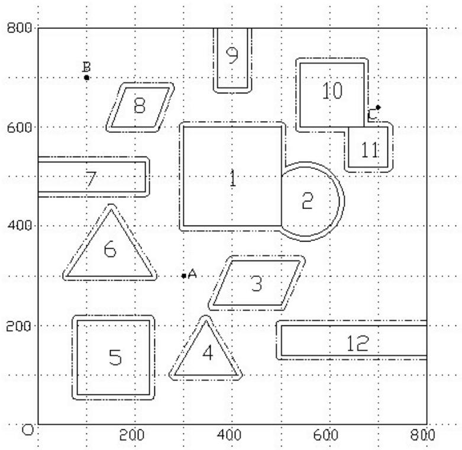

<details>
<summary>bubble</summary>

| Point | X | Y |
| --- | --- | --- |
| A | ~300 | ~300 |
| B | ~100 | ~700 |
| C | ~700 | ~650 |
| 1 | ~400 | ~600 |
| 2 | ~550 | ~450 |
| 3 | ~400 | ~250 |
| 4 | ~350 | ~150 |
| 5 | ~150 | ~200 |
| 6 | ~150 | ~350 |
| 7 | ~100 | ~500 |
| 8 | ~250 | ~650 |
| 9 | ~400 | ~800 |
| 10 | ~650 | ~700 |
| 11 | ~700 | ~600 |
| 12 | ~750 | ~200 |
</details>

图2 障碍物在原有大小的基础上扩大 10个单位示意图

## 5.2 潜在最短路径搜索：

若要在最短时间内到达目的地 A、B、C 则必须需找到最短路径。因此，我们需要对机器人在所有可行域上的行走路线进行粗略的过滤和筛选。

## 5.2.1 对于无障碍物的情况下

通过模型前准备，根据两点间直线最短原理，连接 OA、OB、OC 及 O-A-B-C-O 可得对应的最短直线距离。

## 5.2.2 对于忽略转弯路径的理想情况下

我们取两直线与圆 $\mathrm { Q _ { i j } }$ 相切后的交点 $\mathrm { Q _ { i j } ^ { ' } ( x , y ) }$ 为转折点，如图3。此时，机器人行驶路线以折线形式组成。

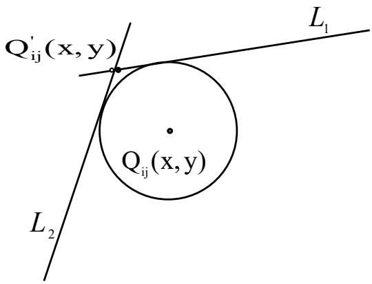

<details>
<summary>text_image</summary>

Q'_{ij}(x,y)\nL_1\nQ_{ij}(x,y)\nL_2
</details>

图3 直线转折点示意图

机器人在安全行驶区可以有无数条行驶路线使之最终安全到达目的地，转折点可在允许范围内选取任意点，我们需要在科学合理的理论基础上对所有可行路线进行筛选，找到基本的潜在最短路线来缩小计算量，提高计算效率及准确度。

定理一：绕障碍物线性探索最短路径

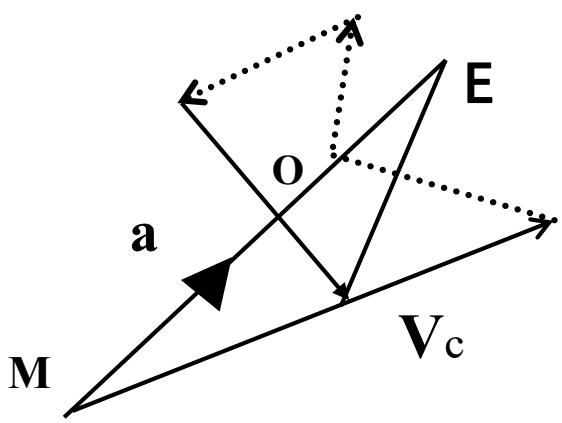

<details>
<summary>text_image</summary>

M
a
O
E
Vc
</details>

图4 示意图

当运动物体M沿探索线 a前进，如果碰到障碍物 O，则O的顶点必定分布在 A的两侧，且部分边是M可见的(图中的实线部分)，部分边是不可见的(虚线边)，吧M可见的障碍物的顶点分成两组，矢量 a左侧的顶点归入 L组，右侧归入 R组。另外设 VL和VR分别是L和R组中离a最远的两个顶点。如果VL比VR离a更远，则令C=R，否则令C=L,VC就是登陆点。M绕过障碍物时首先向登陆点靠近。

找到登陆点后，接着就是如何绕过障碍物 O，先把 S 与登陆点 VC 连接，再把 VC 与

E连接，。视VC为当前点，记作 P，如果PE不与障碍物香蕉，表明已经绕过障碍物，称此P点位M绕过障碍物 O的分离点。否则把当前点从 P出发顺着或逆着 O的边界移动到下一个顶点上。

绕过一个障碍物后，如果后面还有障碍物，就把当前点作为新的起点重复上述过程，知道绕过所有障碍物到达终点 E。

运用以上原理经过逐步搜索可以找到机器人从 O出发分别到A、B、C 以及O-A-B-C-O的初步最短路径，分析发现：所有初步确定的最短路径都以障碍物顶点为转弯点。

因此，在考虑出现障碍物但忽略转弯路径的理想情况下，我们以两直线路径与障碍物顶点为圆心，10个单位为半径的圆 $\mathrm { Q _ { i j } }$ 相切后的交点 $\mathrm { Q _ { i j } ^ { ' } ( x , y ) }$ 为转折点，此时，机器人行驶路线以折线形式组成。

## 5.2.3对于考虑转弯路径的实际情况下

根据题目要求，机器人不能折线转弯，转弯路径由与直线路径相切的一段圆弧组成，也可以由两个或多个相切的圆弧路径组成，但每个圆弧的半径最小为 10 个单位。所以我们以 10 个单位为半径对各障碍物进行安全包裹，由定理一确定了初步筛选的最短路径以障碍物各顶点为转弯点的规律，在实际情况下，机器人行走路径由直线—圆弧—直线组成。如下示意图2：

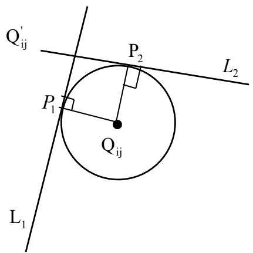

<details>
<summary>text_image</summary>

Q'_{ij} \n P_2 \n L_2 \n P_1 \n Q_{ij} \n L_1
</details>

图5 示意图

我们引入凸集定理证明劣弧 $P _ { 1 } P _ { 2 } < \mathrm { P } _ { 1 } \mathrm { Q } ^ { ' } + \mathrm { P } _ { 2 } \mathrm { Q } ^ { ' }$ .为模型优化做准备。

## 定理二：最短路凸集定理

(分离定理) 对平面中的凸集 R与R外的一点 K，存在直线 l , l 分离 R与K，即R与K分别位于 l 的两侧（注：对一般的凸 集 R与R外的一点K，则存在超平面分 离R

与 K）。

证明：

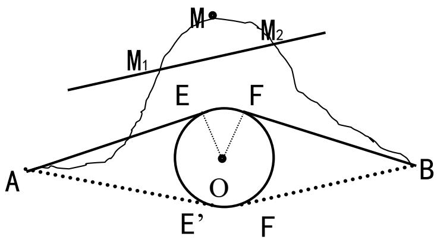

<details>
<summary>text_image</summary>

M
M₁
M₂
E
F
A
O
B
E'
F
</details>

图 6 示意图

如图3所示，由AE、EF、FB及 $\mathrm { A E ^ { \prime } }$ ′，E′ $\mathrm { F ^ { \prime } }$ $\mathrm { F ^ { \prime } }$ B围成的区域 R 是一凸集。利用分离定理易证最短径不可能经过 R外的点，我们采用反证法：设 $\Gamma$ 为最短路径，Γ过R外的一点M，则必存在直 线l分离M与R，由于路径 Γ是连续曲线，由 A沿Γ到M，必交 l 于 M1，由 M 沿 Γ 到 B 又必交 l 于 M2。这样，直线 段 M1M2 的长度必小于路 径M1MM2的长度，与Γ是 A到B的最短路径矛盾，至此，我们已证明最短路径必在凸集 R内。不妨设路径经圆的上方到达 B点，则弧EF 必在路径F上，又直线段 AE是由 A至E的最短路径，直线 FB 是由 F 到 B 的最短路径。与此同时，若可行区域的边界是光滑曲面。则最短路径必由下劣弧组成，它们或者是空间中的自然最短曲线，或者是可行区域的边界弧。而且，组成最短路径的各段弧在连接点处必定相切。

根据定理二我们可以确定：在出现障碍物且考虑转弯路径的实际情况下，两直线与圆 $Q _ { i j }$ 相切后的交点 $P _ { 1 }$ 和 $P _ { 2 }$ 之间的劣弧长比两切点与两直线交点的距离之和更短。即：

劣弧 $\mathrm { P } _ { 1 } \mathrm { P } _ { 2 } < \mathrm { P } _ { 1 } \mathrm { Q } _ { \mathrm { i j } } ^ { \prime } + \mathrm { P } _ { 2 } \mathrm { Q } _ { \mathrm { i j } } ^ { \prime }$

结合定理一和定理二可以确定:转弯最短路径是由折线最短路径的优化求解获得。

最后，综合以上定理分析运用 CAD图上作业法可以剔除掉明显不是最短路的行走路线，可得机器人从O到 A、B、C三点及O-A-B-C-O的潜在最短路径分块筛选得如下图示：

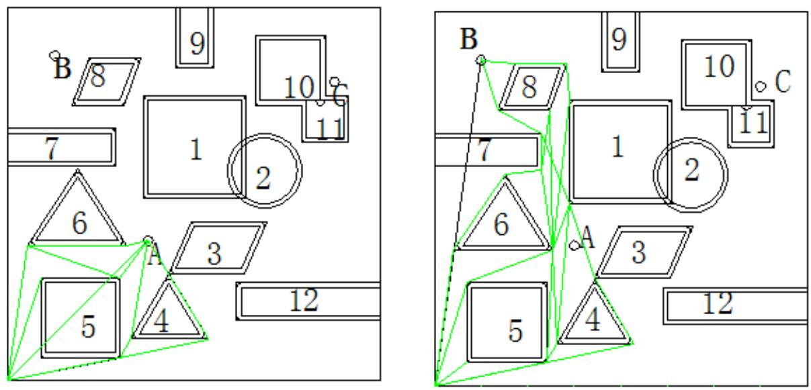  
图7 (O-A与O-B之间可能的最短路径)

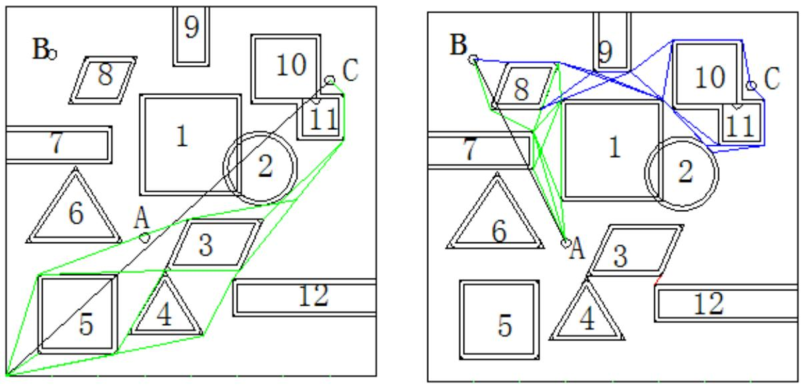  
图8（O-C与A-B-C之间可能的最短路径）

## 六 模型的建立与求解

本文研究的是机器人避障设计问题，找到达指定目标点的最短路径和时间，将路线图转化为网络图，运用图论知识求解最短路径和最短时间，采用逐步优化法建立模型。

## （一）问题(1)及其求解

通过模型前准备及问题分析，我们首先将忽略转弯路径理想情况下筛选的折线转弯最短路径网转化为网络图形，引用图论知识寻找折线转弯最短路径。由定理一二可得：转弯最短路径是由折线最短路径的优化求解获得。因此，我们首先必须对折线最短路径进行求解。

## 模型一：

以逆时针方向第i个障碍物的第 个顶点的圆心 $Q _ { \mathrm { i j } }$ 的下表序号表示折线最短距离转折点，将折线最短路线网进行处理转化为图论网络图形。

根据已知位置点的坐标和连接情况，利用 Matlab 绘制出 O-A、O-B、O-C 的潜在最短路径赋权图，再通过对 A-B和B-C的最短路求解可得 O-A-B-C-O的潜在最短路径。

## （一）其中，O-A 折线赋权图如下：

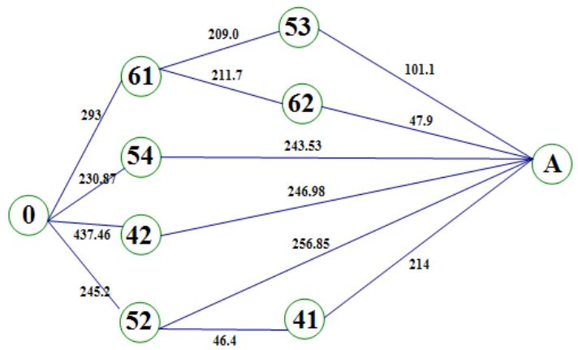

<details>
<summary>flowchart</summary>

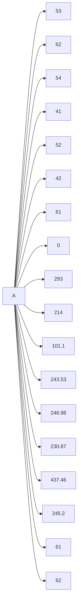
```mermaid
graph LR
  A["A"] --> 53["53"]
  A --> 62["62"]
  A --> 54["54"]
  A --> 41["41"]
  A --> 52["52"]
  A --> 42["42"]
  A --> 61["61"]
  A --> 0["0"]
  A --> 293["293"]
  A --> 214["214"]
  A --> 101.1["101.1"]
  A --> 243.53["243.53"]
  A --> 246.98["246.98"]
  A --> 230.87["230.87"]
  A --> 437.46["437.46"]
  A --> 245.2["245.2"]
  A --> n61["61"]
  A --> n62["62"]
```
</details>

图9 O-A折线路径赋权图

本文采用Floyd 算法对数据进行处理，求出网络中任意两点间的最短路。

$D = ( d _ { _ { i j } } ) _ { _ { m \times n } } \ , l _ { _ { i j } }$ 为v到v的距离。为了计算方便，令网络计划的权矩阵为

$$
d _ {i j} = \left\{ \begin{array}{l l} l _ {i j} & \text {当} (v _ {i}, v _ {j}) \in E \\ \infty & \text {其他} \end{array} \right.
$$

算法基本步骤为：

（1） 输入权矩阵 ${ \cal D } ^ { ( 0 ) } = { \cal D } \ ,$ O  
<sub>（2） 计算</sub> <sub>其中</sub> min[ , ]<sup>(</sup> <sup>)</sup> <sup>(</sup> <sup>−1)</sup> <sup>(</sup> <sup>−1)</sup> <sup>(</sup> <sup>−1)</sup>= + <sup>k</sup><sub>kj</sub><sup>k</sup><sub>ik</sub><sup>k</sup><sub>ij</sub><sup>k</sup>d<sub>ij</sub> d d d  
（3） $D ^ { ( n ) } = \big ( d _ { i j } ^ { ( n ) } \big ) _ { n \times n }$ 中元素 $d _ { i j } ^ { ( n ) }$ 就是 的最短路长。

根据以上步骤，首先计算 O-A的最短路径。

权矩阵 D 为：

$$
\begin{array}{c} v _ {1} \quad v _ {2} \quad v _ {3} \quad v _ {4} \quad v _ {5} \quad v _ {6} \quad v _ {7} \quad v _ {8} \quad v _ {9} \\ v _ {1} \left[ \begin{array}{c c c c c c c c c} 0 & 2 9 3 & 2 3 0. 9 & 4 3 7. 5 & 2 4 5. 2 & \infty & \infty & \infty & \infty \\ v _ {2} & 2 9 0 & 0 & \infty & \infty & \infty & 2 0 9 & 2 1 1. 7 & \infty & \infty \\ v _ {3} & 2 3 0. 8 7 & \infty & 0 & \infty & \infty & \infty & \infty & \infty & 2 3 4. 5 \\ v _ {4} & 4 3 7. 5 & \infty & \infty & 0 & \infty & \infty & \infty & \infty & 2 4 6. 9 \\ A = v _ {5} & \square 2 4 5. 2 & \infty & \infty & \infty & 0 & \infty & \infty & 4 6. 4 & 2 5 6. 9 \\ v _ {6} & \infty & 2 0 9 & \infty & \infty & \infty & 0 & \infty & \infty & 1 0 1. 1 \\ v _ {7} & \infty & 2 1 1. 7 & \infty & \infty & \infty & \infty & 0 & \infty & 4 7. 9 \\ v _ {8} & \infty & \infty & \infty & \infty & 4 6. 4 & \infty & \infty & 0 & 2 1 4 \\ v _ {9} & \infty & \infty & 2 4 3. 5 & 2 4 6. 9 & 2 5 6. 9 & 1 0 1. 1 & 4 7. 9 & 2 1 4 & 0 \end{array} \right] \end{array}
$$

利用Matlab软件编程求解得：O-A的折线最短路径为 474.4；所需最短时间为：94.88在平面图中如图10:

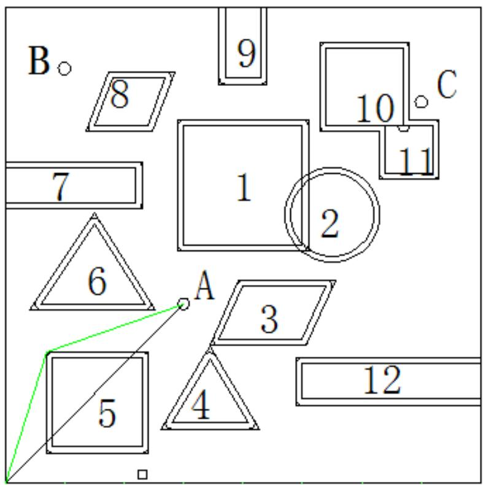

<details>
<summary>text_image</summary>

B
8
9
10
C
7
1
2
6
A
3
5
4
12
</details>

图10 O-A折线最短路径

同理，按求解O-A 折线最短路的基本步骤，通过 floyd算法（程序见附录 1.1）可以依次求解O-B、O-C及 A-B、B-C的最短路，同时可以得到 O-A-B-C-O 的最短回路。在求解过程中只是将各个的赋权矩阵代入程序进行计算。（各赋权矩阵见附录 1.2）

## （二）O-B折线最短路径求解：

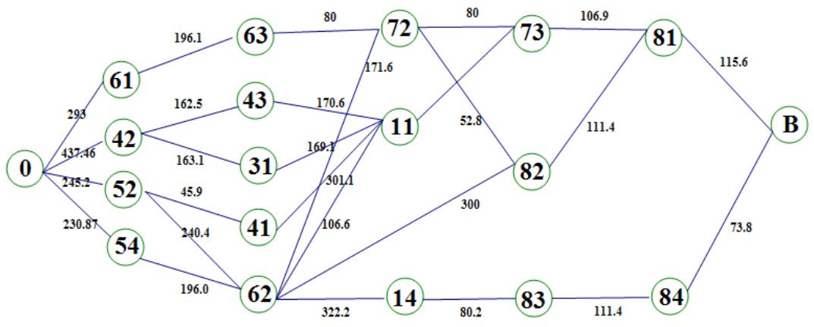

<details>
<summary>flowchart</summary>

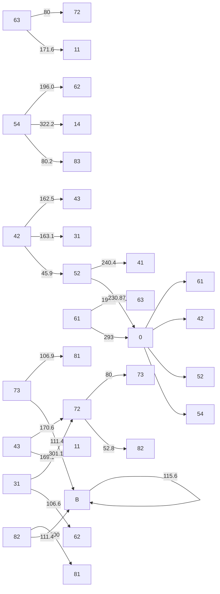
```mermaid
graph LR
  n0["0"] --> 61["61"]
  n0 --> 42["42"]
  n0 --> 52["52"]
  n0 --> 54["54"]
  n61["61"] -->|196.1| 63["63"]
  n61 -->|293| n0
  n42["42"] -->|162.5| 43["43"]
  n42 -->|163.1| 31["31"]
  n42 -->|45.9| n52["52"]
  n52 -->|240.4| 41["41"]
  n52 -->|230.87| n0
  n54["54"] -->|196.0| 62["62"]
  n63["63"] -->|80| 72["72"]
  n63 -->|171.6| 11["11"]
  n43["43"] -->|170.6| n72["72"]
  n43 -->|169.1| n11["11"]
  n31["31"] -->|301.1| n72
  n31 -->|106.6| n62["62"]
  n54 -->|322.2| 14["14"]
  n54 -->|80.2| 83["83"]
  n72 -->|80| 73["73"]
  n72 -->|52.8| 82["82"]
  n73["73"] -->|106.9| 81["81"]
  n73 -->|111.4| B["B"]
  n82["82"] -->|300| n81["81"]
  n82 -->|111.4| B
  B -->|73.8| B
  B -->|115.6| B
```
</details>

图10 O-B折线路径赋权图

利用Matlab软件编程求解得：O-B折线最短路径为 871.6；所需最短时间为：174.32；在平面图中如图11：

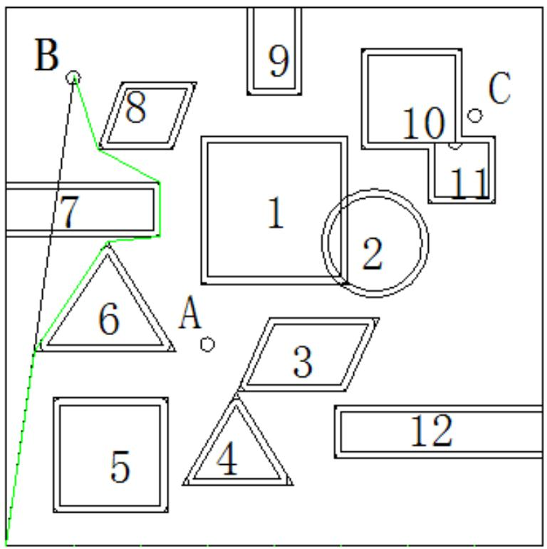

<details>
<summary>text_image</summary>

B
8
7
6
A
9
10
C
2
3
4
5
11
12
</details>

图11 O-B折线最短路径

## （三）O-C折线最短路径求解:

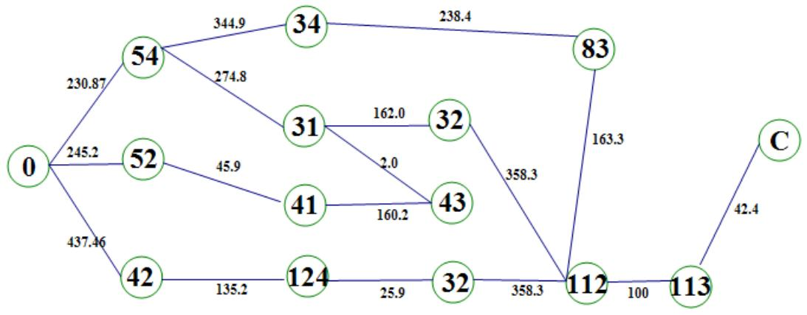

<details>
<summary>flowchart</summary>

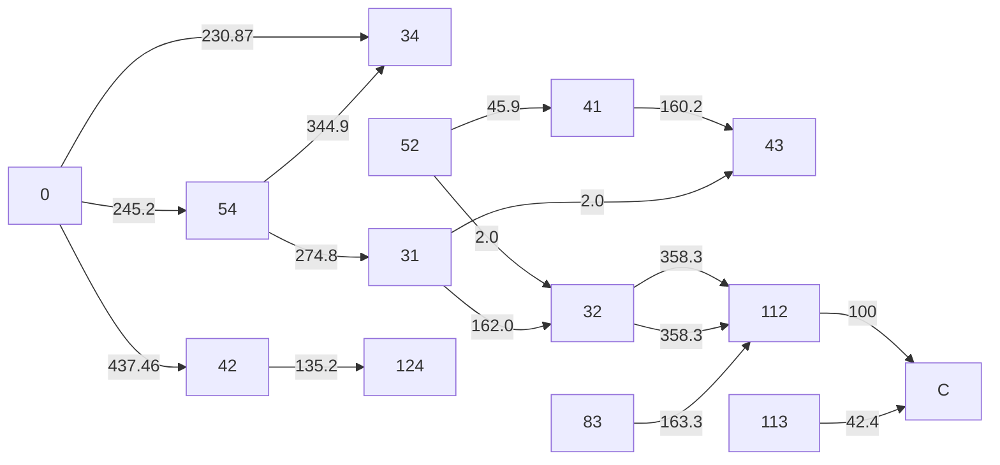
```mermaid
graph LR
  n0["0"] -->|245.2| n54["54"]
  n0 -->|230.87| n34["34"]
  n0 -->|437.46| n42["42"]
  n54 -->|344.9| n34
  n54 -->|274.8| n31["31"]
  n52["52"] -->|45.9| n41["41"]
  n52 -->|2.0| n32["32"]
  n42 -->|135.2| n124["124"]
  n41 -->|160.2| n43["43"]
  n31 -->|162.0| n32
  n31 -->|2.0| n43
  n32 -->|358.3| n112["112"]
  n32 -->|358.3| n112
  n83["83"] -->|163.3| n112
  n112 -->|100| C
  n113["113"] -->|42.4| C
```
</details>

图11 O-C折线路径赋权图G

利用Matlab软件编程求解得：O-C折线最短路径为 1099.3；所需最短时间为：129.86在平面图中如图12：

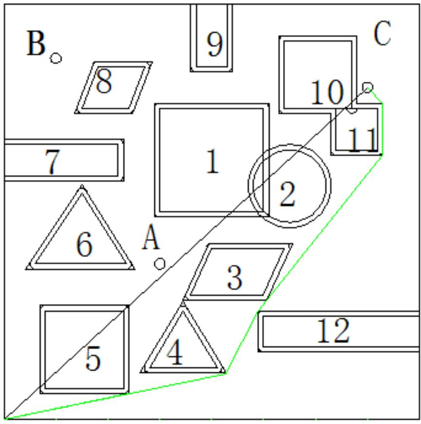

<details>
<summary>text_image</summary>

B。
8
9
C
7
1
2
10
11
6
A
3
5
4
12
</details>

图12 O-C折线最短路径

（四）A-B和B-C折线最短路径求解  
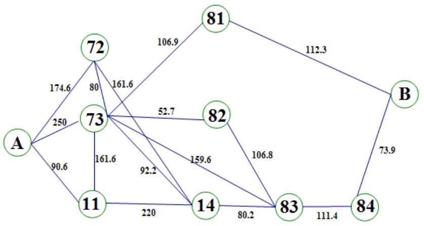

<details>
<summary>flowchart</summary>

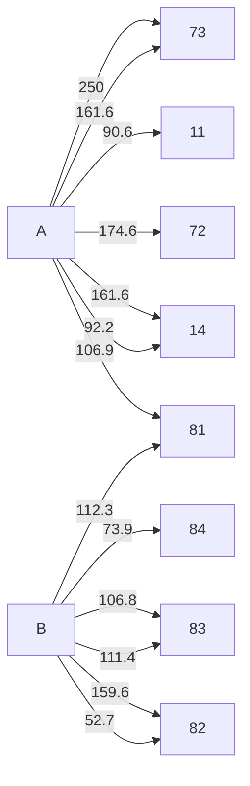
```mermaid
graph LR
  A["A"] -->|250| 73["73"]
  A -->|90.6| 11["11"]
  A -->|174.6| 72["72"]
  A -->|161.6| 14["14"]
  A -->|106.9| 81["81"]
  A -->|161.6| 73["73"]
  A -->|92.2| 14["14"]
  B["B"] -->|112.3| 81["81"]
  B -->|73.9| 84["84"]
  B -->|106.8| 83["83"]
  B -->|159.6| 82["82"]
  B -->|111.4| 83["83"]
  B -->|52.7| 82["82"]
```
</details>

图13 A-B折线路径赋权图G  
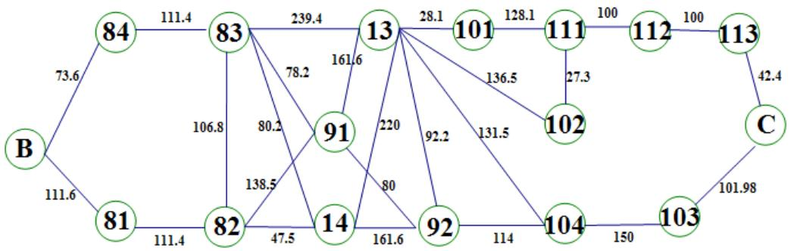

<details>
<summary>flowchart</summary>

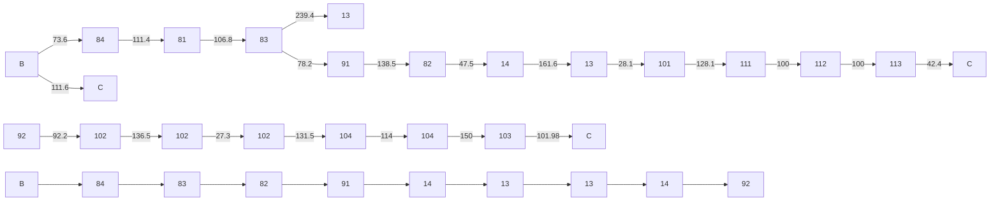
```mermaid
graph LR
  A["B"] -->|73.6| B["84"]
  A -->|111.6| C["C"]
  B -->|111.4| D["81"]
  D -->|106.8| E["83"]
  E -->|239.4| F["13"]
  E -->|78.2| G["91"]
  G -->|138.5| H["82"]
  H -->|47.5| I["14"]
  I -->|161.6| J["13"]
  J -->|28.1| K["101"]
  K -->|128.1| L["111"]
  L -->|100| M["112"]
  M -->|100| N["113"]
  N -->|42.4| O["C"]
  P["92"] -->|92.2| Q["102"]
  Q -->|136.5| R["102"]
  R -->|27.3| S["102"]
  S -->|131.5| T["104"]
  T -->|114| U["104"]
  U -->|150| V["103"]
  V -->|101.98| W["C"]
  X["B"] --> Y["84"]
  Y --> Z["83"]
  Z --> AA["82"]
  AA --> AB["91"]
  AB --> AC["14"]
  AC --> AD["13"]
  AD --> AE["13"]
  AE --> AF["14"]
  AF --> AG["92"]
```
</details>

图14 B-C折线路径赋权图G

利用Matlab软件编程求解得：

A-B折线最短路径为 469.2；所需最短时间为：93.84

B-C 折线最短路径为 709.18；所需最短时间为：141.836

对应的折线最短路径在平面图中如下图所示：

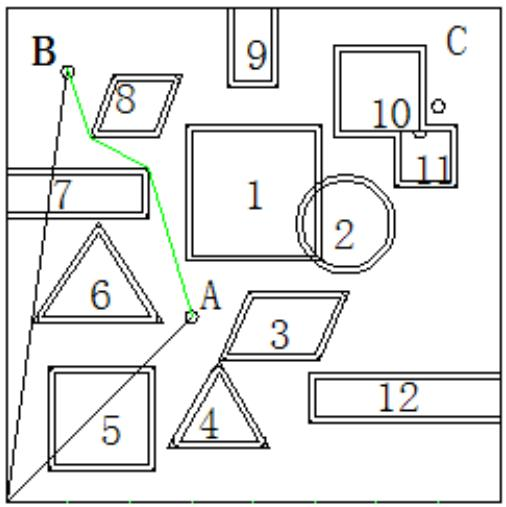

<details>
<summary>text_image</summary>

B
8
9
C
7
1
10
11
6
2
A
3
5
4
12
</details>

图15 A-B折线最短路径

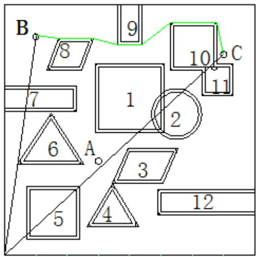

<details>
<summary>text_image</summary>

B
8
9
10
C
7
1
2
6
A
3
5
4
11
12
</details>

图16 B-C折线最短路径

结合以上对O-A和O-C的最短路径，可得O-A-B-C-O的最短回路折线段总长度为：2752.08 所需最短时间为：550.416。

如图15所示：

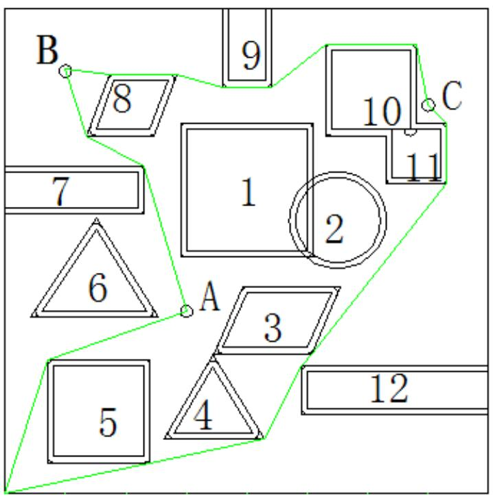

<details>
<summary>text_image</summary>

B
8
9
10
C
7
1
2
6
A
3
5
4
12
</details>

图 15 O-A-B-C-O 的最短回路

## 模型二：

通过模型前准备定理分析，我们对折线最短路进一步优化得到由直线-圆弧-直线

组成的最短路径模型即为最优模型。

由定理二可知：在出现障碍物且考虑转弯路径的实际情况下，两直线与圆 $\mathrm { Q _ { i j } }$ 相切后的交点 $\mathrm { { P _ { 1 } } }$ 和 $\mathrm { P } _ { 2 }$ 之间的劣弧长较两切点与两直线交点的距离之和短。即：劣弧$\mathrm { P } _ { 1 } \mathrm { P } _ { 2 } < \mathrm { P } _ { 1 } \mathrm { Q } _ { \mathrm { \scriptsize ~ i j } } ^ { \mathrm { ' } } + \mathrm { P } _ { 2 } \mathrm { Q } _ { \mathrm { \scriptsize ~ i } } ^ { \mathrm { ' } }$ 根据模型一的求解可以得到折线最短路径中每段直线段、两线段与圆相切后的交点坐标。

根据几何定理对模型一中的折线最短路在路径中每段直线段、圆弧段的起点和终点坐标、圆弧圆心坐标进行求解：

已知折线最短路线的每段直线起始坐标及外切圆的圆心，求出每段直线与圆的切点坐标，进而求解得到两切点间的劣弧长。对于每一条最短路径中的每一段弧长 及切点坐标的求解，我们采用分段求解法，以 O-A的最短路为例进行求解：

取O-A的最短路径如图 16所示：

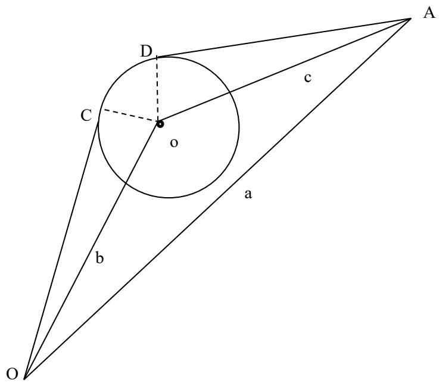

<details>
<summary>text_image</summary>

A
D
C
o
c
a
b
O
</details>

图16 O-A最短路径示意图

其中，设 $0 ( \mathrm { x _ { 1 } } , \ \mathrm { y _ { 1 } } )$ 为起点， $\mathrm { B } \left( \mathrm { x } _ { 2 } , \mathrm { y } _ { 2 } \right)$ 为相对于 A的终点， $\mathrm { ~ C ~ } ( \mathrm { x } _ { 3 } , \mathrm { y } _ { 3 } )$ 和 $\mathrm { D ( x _ { 4 } , \ y _ { 4 } ) }$ 分别为机器人经过拐点分别于隔离危险线拐角小圆弧的切点，圆心为 $0 ~ ( \mathrm { x } _ { 5 } , ~ \mathrm { y } _ { 5 } )$ ，圆的半径为r，AB的长度为 a，AO的长度为b，BO 的长度为c，角度 $\scriptstyle \angle A O B = \alpha , \quad \angle A O C = \beta$ $\angle B O D = \gamma$ $\angle C O D = \theta$ .求 A B 的长度，设为 L.

解法如下：

由上图可得有以下关系： $\left\{ \begin{array} { l l } { \mathbf { a } = \sqrt { \left( x _ { 2 } - x _ { 1 } \right) ^ { 2 } + \left( y _ { 2 } - y _ { 1 } \right) ^ { 2 } } } \\ { \mathbf { b } = \sqrt { \left( x _ { 5 } - x _ { 1 } \right) ^ { 2 } + \left( y _ { 5 } - y _ { 1 } \right) ^ { 2 } } } \\ { \mathbf { c } = \sqrt { \left( x _ { 5 } - x _ { 2 } \right) ^ { 2 } + \left( y _ { 5 } - y _ { 2 } \right) ^ { 2 } } } \end{array} \right.$

在ΔAOB中：

$$
\alpha = \operatorname{arc} \cos (\frac {b ^ {2} + c ^ {2} - a ^ {2}}{2 b c})
$$

在 ${ \tt R t } \Delta { \cal A O C }$

$$
\beta = \arccos \frac {r}{b}
$$

在 中：

$$
\gamma = \arccos \frac {r}{c}
$$

所以：

$$
\theta = 2 \pi - \alpha - \beta - \gamma
$$

从而可得：

$$
L = \sqrt {b ^ {2} - r ^ {2}} + \sqrt {c ^ {2} - r ^ {2}} + r \theta
$$

综合以上分析<sup>：</sup>

联立方程组利用 lingo 求解切点即每次的起始点与终点坐标，利用 matlab 求解直线和弧长及行走时间。（程序见附录 1.3）结果见如下表格：

表五 O-A最短路结果

<table><tr><td>0-A</td><td>起点坐标</td><td>终点坐标</td><td>圆弧圆心坐标</td><td>直线或弧长长度</td><td>行走时间</td></tr><tr><td>线段一</td><td>(0,0)</td><td>(70.50596,213.1406)</td><td></td><td>224.5</td><td>44.8991</td></tr><tr><td>圆弧一</td><td>(70.50596,213.1406)</td><td>(76.60640,219,4066)</td><td>(80,210)</td><td>9.051</td><td>3.6204</td></tr><tr><td>线段二</td><td>(76.60640,219,4066)</td><td>(300,300)</td><td></td><td>237.49</td><td>47.4973</td></tr><tr><td>总路程长</td><td colspan="4">471.04</td><td>96.0181</td></tr></table>

表六 O-B最短路结果

<table><tr><td>O-B</td><td>起点坐标</td><td>终点坐标</td><td>圆弧圆心坐标</td><td>直线或弧长长度</td><td>行走时间</td></tr><tr><td>线段一</td><td>(0,0)</td><td>(50.1352,301.6356)</td><td></td><td>305.778</td><td>61.1553</td></tr><tr><td>圆弧一</td><td>(50.1352,301.6356)</td><td>(51.6978,305.5736)</td><td>(60,300)</td><td>4.2663</td><td>1.7021</td></tr><tr><td>线段二</td><td>(51.6978,305.5736)</td><td>(141.6979,439.6087)</td><td></td><td>161.4473</td><td>32.2894</td></tr><tr><td>圆弧二</td><td>(141.6979,439.6087)</td><td>(150.001,444.03)</td><td>(150,434)</td><td>9.7835</td><td>3.9178</td></tr><tr><td>线段三</td><td>(150.001,444.03)</td><td>(222.1902,460.034)</td><td></td><td>73.987</td><td>14.7975</td></tr><tr><td>圆弧三</td><td>(222.1902,460.034)</td><td>(230,470)</td><td>(220,470)</td><td>13.4992</td><td>5.2994</td></tr><tr><td>线段四</td><td>(230,470)</td><td>(230,530)</td><td></td><td>60</td><td>12</td></tr><tr><td>圆弧四</td><td>(230,530)</td><td>(225.4967,538.353)</td><td>(220,530)</td><td>9.87</td><td>3.956</td></tr><tr><td>线段五</td><td>(225.4967,538.353)</td><td>(144.5032,591.6461)</td><td></td><td>96.954</td><td>19.394</td></tr><tr><td>圆弧五</td><td>(144.5032,591.6461)</td><td>(140.692,596.355)</td><td>(150,600)</td><td>6.1474</td><td>2.458</td></tr><tr><td>线段六</td><td>(140.692,596.355)</td><td>(100,700)</td><td></td><td>111.3554</td><td>22.27105</td></tr><tr><td>总路程长</td><td colspan="4">853.0881</td><td>179.24055</td></tr></table>

表七 O-C最短路结果

<table><tr><td>0-C</td><td>起点坐标</td><td>终点坐标</td><td>圆弧圆心坐标</td><td>直线或弧长长度</td><td>行走时间</td></tr><tr><td>线段一</td><td>(0,0)</td><td>(422.087,90.0817)</td><td></td><td>431.5927</td><td>86.3157</td></tr><tr><td>圆弧一</td><td>(422.087,90.0817)</td><td>(428.691,94.915)</td><td>(410,100)</td><td>8.4308</td><td>3.37235</td></tr><tr><td>线段二</td><td>(428.691,94.915)</td><td>(491.122,204.6015)</td><td></td><td>126.2051</td><td>25.2418</td></tr><tr><td>圆弧二</td><td>(491.122,204.6015)</td><td>(492.202,206.259)</td><td>(500,200)</td><td>1.9822</td><td>0.79254</td></tr><tr><td>线段三</td><td>(492.202,206.259)</td><td>(727.9376,513.9175)</td><td></td><td>387.5884</td><td>77.51772</td></tr><tr><td>圆弧三</td><td>(727.9376,513.9175)</td><td>(730,520)</td><td>(500,240)</td><td>6.54</td><td>2.6153</td></tr><tr><td>线段四</td><td>(730,520)</td><td>(730,600)</td><td></td><td>80</td><td>16</td></tr><tr><td>圆弧四</td><td>(730,600)</td><td>(727.718,606.359)</td><td>(720,600)</td><td>6.8915</td><td>2.7567</td></tr><tr><td>线段五</td><td>(727.718,606.359)</td><td>(700,640)</td><td></td><td>43.589</td><td>8.7174</td></tr><tr><td>总路程长</td><td colspan="4">1092.8197</td><td>223.3295</td></tr></table>

表八 O-A-B-C-O 最短路结果

<table><tr><td>O-A-B-C-O</td><td>起点坐标</td><td>终点坐标</td><td>圆弧圆心坐标</td><td>直线或弧长长度</td><td>行走时间</td></tr><tr><td>线段一</td><td>(0,0)</td><td>(70.50596,213.1406)</td><td></td><td>224.5</td><td>44.8991</td></tr><tr><td>圆弧一</td><td>(70.50596,213.1406)</td><td>(76.60640,219,4066)</td><td>(80,210)</td><td>9.051</td><td>3.6204</td></tr><tr><td>线段二</td><td>(76.60640,219,4066)</td><td>(291.122,296.6015)</td><td></td><td>227.999</td><td>47.4973</td></tr><tr><td>圆弧二</td><td>(291.122,296.6015)</td><td>(297.2536,309.0812)</td><td>(287,306)</td><td>15.1822</td><td>6.07284</td></tr><tr><td>线段三</td><td>(297.2536,309.0812)</td><td>(229.572,532.895)</td><td></td><td>233.83</td><td>46.753</td></tr><tr><td>圆弧三</td><td>(229.572,532.895)</td><td>(225.4967,538.3538)</td><td>(220,530)</td><td>6.9516</td><td>2.7801</td></tr><tr><td>线段四</td><td>(225.4967,538.3538)</td><td>(144.5023,591.6460)</td><td></td><td>96.692</td><td>19.391</td></tr><tr><td>圆弧四</td><td>(144.5023,591.6460)</td><td>(140.6915,596.3455)</td><td>(150,600)</td><td>6.1474</td><td>2.4588</td></tr><tr><td>线段五</td><td>(140.6915,596.3455)</td><td>(105.7133,685.447)</td><td></td><td>95.731</td><td>19.142</td></tr><tr><td>圆弧五</td><td>(105.7133,685.447)</td><td>(115.6078,699.083)</td><td>(115,689.1)</td><td>20.0354</td><td>8.015</td></tr><tr><td>线段六</td><td>(115.6078,699.083)</td><td>(270.592,689.991)</td><td></td><td>155.245</td><td>31.049</td></tr><tr><td>圆弧六</td><td>(270.592,689.991)</td><td>(272.012,689.7952)</td><td>(270,680)</td><td>1.442</td><td>0.581</td></tr><tr><td>线段七</td><td>(272.012,689.7952)</td><td>(366.755,670.224)</td><td></td><td>96.7</td><td>19.341</td></tr><tr><td>圆弧七</td><td>(366.755,670.224)</td><td>(369.324,671)</td><td>(370,680)</td><td>2.601</td><td>1.039</td></tr><tr><td>线段八</td><td>(369.324,671)</td><td>(429.324,670)</td><td></td><td>60</td><td>12</td></tr><tr><td>圆弧八</td><td>(429.324,670)</td><td>(435.11,671.851)</td><td>(429,680)</td><td>6.17</td><td>2.456</td></tr><tr><td>线段九</td><td>(435.11,671.851)</td><td>(533.881,738.289)</td><td></td><td>119.13</td><td>23.831</td></tr><tr><td>圆弧九</td><td>(533.881,738.289)</td><td>(539.567,740)</td><td>(540,730)</td><td>5.915</td><td>2.367</td></tr><tr><td>线段十</td><td>(539.567,740)</td><td>(439.567, 730.15)</td><td></td><td>130</td><td>26</td></tr><tr><td>圆弧十</td><td>(439.567, 730.15)</td><td>(679.323,732.122)</td><td>(670,730)</td><td>13.502</td><td>5.4</td></tr><tr><td>线段十一</td><td>(679.323,732.122)</td><td>(699.482,642.358)</td><td></td><td>92.1</td><td>18.42</td></tr><tr><td>圆弧十一</td><td>(699.482,642.358)</td><td>(700,640)</td><td>(709,644)</td><td>4.686</td><td>1.8743</td></tr><tr><td>线段十二</td><td>(700,640)</td><td>(727.718,606.359)</td><td></td><td>43.589</td><td>8.7174</td></tr><tr><td>圆弧十二</td><td>(727.718,606.359)</td><td>(730,600)</td><td>(720,600)</td><td>6.8915</td><td>2.7567</td></tr><tr><td>线段十三</td><td>(730,600)</td><td>(730,520)</td><td></td><td>80</td><td>16</td></tr><tr><td>圆弧十三</td><td>(730,520)</td><td>(727.9376,513.9175)</td><td>(500,240)</td><td>6.54</td><td>2.6153</td></tr><tr><td>线段十四</td><td>(727.9376,513.9175)</td><td>(492.202,206.259)</td><td></td><td>387.5884</td><td>77.51772</td></tr><tr><td>圆弧十四</td><td>(492.202,206.259)</td><td>(491.122,204.6015)</td><td>(500,200)</td><td>1.9822</td><td>0.79254</td></tr><tr><td>线段十五</td><td>(491.122,204.6015)</td><td>(428.691,94.915)</td><td></td><td>126.2051</td><td>25.2418</td></tr><tr><td>圆弧十五</td><td>(428.691,94.915)</td><td>(422.087,90.0817)</td><td>(410,100)</td><td>8.4308</td><td>3.37235</td></tr><tr><td>线段十六</td><td>(422.087,90.0817)</td><td>(0,0)</td><td></td><td></td><td>86.3157</td></tr><tr><td>总路程长</td><td colspan="4">2716.4303</td><td>568.31735</td></tr></table>

## （二）问题(2)及其求解

问题要求求解的是由 到 的最短时间，最短时间的确定与最短线路有关，还与最短线路上拐弯次数以及拐弯半径的大小有关，由拐弯半径与速度的函数关系式：

$$
v = v (r) = 5 / \left(1 + e ^ {1 0 - 0. 1 r ^ {2}}\right) \text {可以用} \mathrm{matlab} \text {绘制出其大致图像如下:}
$$

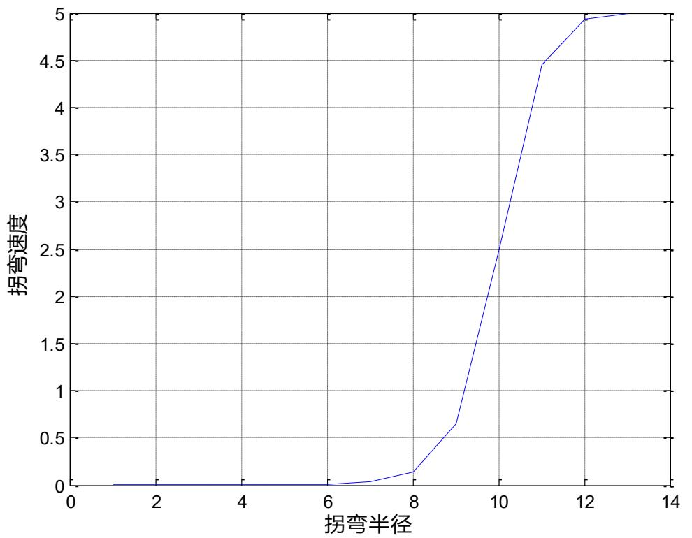

<details>
<summary>line</summary>

| 拐弯半径 | 拐弯速度 |
| --- | --- |
| 1 | ~0.02 |
| 2 | ~0.02 |
| 3 | ~0.02 |
| 4 | ~0.02 |
| 5 | ~0.02 |
| 6 | ~0.03 |
| 7 | ~0.06 |
| 8 | ~0.15 |
| 9 | ~0.65 |
| 10 | ~2.5 |
| 11 | ~4.45 |
| 12 | ~4.95 |
| 13 | ~5.05 |
</details>

图17 拐弯半径与速度的函数关系

由此我们可以大致分析得到在半径满足 $1 0 < r \leq 1 4$ 时，机器人拐弯时间最少。因为如果 过大时机器人拐弯的速度一定，但是拐弯弧度会有所增加，因此增加了其拐弯时间，从而使得总用时增大。如下图所示：假设有两大小圆其半径分别为： $r _ { 1 } ~ r _ { 2 }$ 在机器人的最外危险区域一点内切，先欲使经过该最外危险区域一点选择一条由 $O _ { \scriptscriptstyle 1 }$ 到 $A _ { 2 }$ 的最短时间的路径。 $O _ { \scriptscriptstyle 1 }$ 和 $A _ { 2 }$ 与半径为 $r _ { 1 }$ 的切点分别为 $\mathcal { Q } _ { 1 } ~ \mathcal { Q } _ { 2 }$ 点， $O _ { \imath }$ 和 $A _ { 2 }$ 与半径为 $r _ { \scriptscriptstyle 2 }$ 的切点分别为 $Q _ { 3 } \ Q _ { 4 }$ 点，现过 $O _ { 1 }$ 与 $A _ { 2 }$ 分别作同心圆并与 $\mathcal { Q } _ { 1 } \mathcal { Q } _ { 2 }$ 相交，再过 $Q _ { 3 } \ Q _ { 4 }$ 向同心圆延长并交同心圆上与 两点。若 $1 4 \leq r _ { 1 } < r _ { 2 }$ ，由机器人的速度与拐弯半径的关系，其速度已近接近极大值，速度不再是限制时间最小的约束条件，那最短时间的确定就可以转化成最短路径的求解。由下图可得：

由 $O _ { \imath }$ 到 $Q _ { 4 }$ 到 $Q _ { 3 }$ 再到 $A _ { 2 }$ 的距离是大于由 $O _ { \imath }$ 到 $Q _ { \imath }$ 到 $Q _ { 2 }$ 再到 $A _ { 2 }$ 的距离的。即说明在拐弯速度不再发生改变时，半径越小对最短拐弯时间越有利。

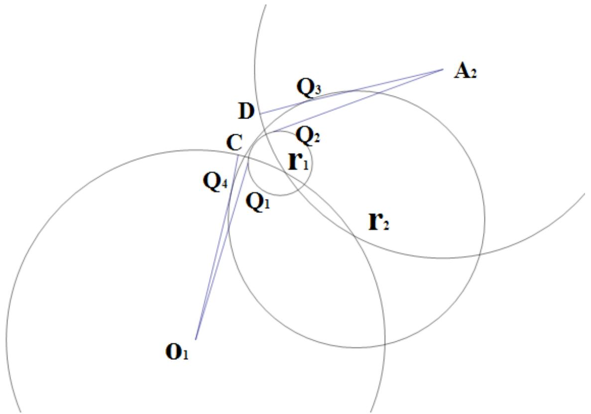

<details>
<summary>text_image</summary>

A₂
Q₃
D
C
Q₂
r₁
Q₄
Q₁
r₂
O₁
</details>

图 18

因此，在问题二的处理中，我们利用 lingo 的搜索功能对拐弯的半径及其圆心进行搜索。

在模型一种我们已经得到由 到 A 的最短路径，以及两切点的坐标$\mathcal { Q } _ { 1 } ( \mathbf { x } _ { 1 } , y _ { 1 } ) \ Q _ { 2 } ( x _ { 2 } , y _ { 2 } )$ 我们考虑用起点终点以及切点来确定最短时间时的切线方程，作为搜索拐弯弧度的圆心以及半径的前提条件，在搜索出来的最短时间的路径中其切点坐标将会改变，不再是原来的切点坐标。据此我们建立非线性规划的搜索模型，来确定拐弯的圆心以及半径：

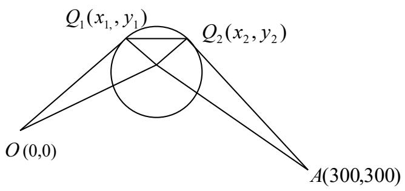

<details>
<summary>text_image</summary>

Q₁(x₁,y₁)
Q₂(x₂,y₂)
O(0,0)
A(300,300)
</details>

图 19

首 先 由 两 点 坐 标 建 立 两 条 切 线 的 方 程 ：Q2(76.60,219.4)A (300,300)

直线： $x _ { \scriptscriptstyle 1 } \times \frac { 7 0 . 5 1 } { 2 1 3 . 1 4 } = y _ { \scriptscriptstyle 1 }$ 直线： $\ Q _ { 2 } A \colon \ ( x _ { _ 2 } - 3 0 0 ) \times \frac { 3 0 0 - 2 1 9 . 4 } { 3 0 0 - 7 6 . 6 0 } = y _ { _ 1 } - 3 0 0$

由上述条件以及题目对机器人的行走路径的限制，并以拐弯行走的最短时间作为目标函数，建立非线性目标规划的搜索模型：

$$
M i n = T _ {1} + T _ {2}
$$

$$
\left\{ \begin{array}{l} x _ {1} \times (2 1 3. 1 4 / 7 0. 5 1) = y _ {1} \\ (3 0 0 - 2 1 9. 4) / (3 0 0 - 7 6. 6 0) \times \left(x _ {2} - 3 0 0\right) = y _ {2} \\ \left(x _ {1} - x _ {0}\right) ^ {2} + \left(y _ {1} - y _ {0}\right) ^ {2} = r ^ {2} \\ \left(x _ {2} - x _ {0}\right) ^ {2} + \left(y _ {2} - y _ {0}\right) ^ {2} = r ^ {2} \\ V = V _ {0} / \left(1 + e ^ {(1 0 - 0. 1 \times r ^ {2})}\right) \\ \alpha = a \cos \left(\frac {2 r ^ {2} - \left(x _ {1} - x _ {2}\right) ^ {2} - \left(y _ {1} - y _ {2}\right) ^ {2}}{2 r ^ {2}}\right) \\ S _ {1} = a \times r \\ S _ {2} = \sqrt {\left(x _ {1}\right) ^ {2} + \left(y _ {1}\right) ^ {2}} + \sqrt {\left(x _ {2} - 3 0 0\right) ^ {2} + \left(y _ {2} - 3 0 0\right) ^ {2}} \\ T _ {1} = S _ {1} / V \\ T _ {2} = S _ {2} / V \\ r - \sqrt {\left(x _ {0} - 8 0\right) ^ {2} + \left(y _ {0} - 2 1 0\right) ^ {2}} > 1 0 \\ r > 1 0 \quad V _ {0} = 5 \end{array} \right.
$$

利用lingo 软件求解(程序见附录2.1)得到：如下结果，并得到最短时间为：94.2182 (s).此时的最佳拐弯半径为：r =13.1887。

<table><tr><td>O-A</td><td>起点坐标</td><td>终点坐标</td><td>圆弧圆心坐标</td><td>直线或弧长长度</td><td>行走时间</td></tr><tr><td>线段一</td><td>(0,0)</td><td>(72.83187,211.0379)</td><td></td><td>223.09</td><td>44.618</td></tr><tr><td>圆弧一</td><td>(72.83187,211.0379)</td><td>(78.7772,217.1403)</td><td>(82.285,207.8)</td><td>11.974</td><td>2.3862</td></tr><tr><td>线段二</td><td>(78.7772,217.1403)</td><td>(300,300)</td><td></td><td>236.07</td><td>47.214</td></tr><tr><td>总路程长</td><td colspan="4">471.134</td><td>94.2182</td></tr></table>

## 七 模型的评价与推广

1、本文通过对机器人避障问题的全面考虑，对于折线转弯理想模型我们引入绕障碍物线性探索最短路径定理，接着引入凸集最短路定理对实际转弯模型进行科学合理的优化，为最短路模型的逐步筛选提供了科学可靠的理论依据。在科学合理的理论基础上对所有可行路线进行筛选，大大缩小了计算量，提高了计算效率，可以很好的确保结果的准确度。  
2、对于问题一，找到达指定目标点的最短路径和时间，本文将路线图转化为网络图，运用图论知识求解最短路径和最短时间，采用 floyd算法逐步优化建立模型。这中网络图形转换法在很多领域都可以得到很好的推广与实践，如：管道运输问题、交通道路选择问题等。  
3、在最短路优化模型的建立中，我们以逐步优化、分段处理的方法，在找到折线最短路的基础上进一步优化，利用几何定理对每一段最短路进行计算求解，思路清晰，方法通俗易懂，但对于大规模的网络具有一定得局限性。

## 八 参考文献

【1】姜启源 谢金星 叶俊，《数学模型（第三版）》，北京：高等教育出版社，2003  
【2】赵静 数学建模与数学实验 北京：高等教育出版社 2001.11  
【3】朱德通 《最优化模型与实验》 同济大学出版社 2003.4  
【4】教材编写组《运筹学（第三版）》 清华大学出版社  
【5】 肖华勇,实用数学建模与软件应用,西北工业大学出版社,2010,8.

## 附录：

1.1<sub>function</sub> <sub>[D,R]=floyd4(A)</sub>  
```matlab
%ÓÃfloydËã ·”ʵÏÖÇÓËÏÒÂÁ¼µãÕ®¼äµÄ×ζη³Ì¡£
%² ÎÊýDΪÁ¬Ï”ͼµÆ”³⁄4ØÕó
A=[0 293 230.87 437.5 245.2 inf inf inf inf
293 0 inf inf inf 209 211.7 inf inf
230.87 inf 0 inf inf inf inf inf 243.53
437.5 inf inf 0 inf inf inf inf 246.9
245.2 inf inf inf 0 inf inf 46.4 256.85
inf 209 inf inf inf 0 inf inf 101.1
inf 211.7 inf inf inf inf 0 inf 47.9
inf inf inf inf 46.4 inf inf 0 214
inf inf 243.53 246.9 256.9 101.1 47.9 214 0];
D=A;n=length(D);
for i=1:n
    for j=1:n
        R(i,j)=i;% ,³Â·³⁄₄¶³ÕÕµ
    end
    R
end
for k=1:n
    for i=1:n
        for j=1:n
            if D(i,k)+D(k,j)<D(i,j)
                D(i,j)=D(i,k)+D(k,j)% ,üРD(i,j)£¬ËµÃ÷Ï”¹ýkµÄ·³Ì,üØÏ
                R(i,j)=R(k,j);% ,üÐÂR(i,j)£¬ĐèҪϔ¹ýk
            end
        end
    end
    k
    D R
end
function [P u]=func2(w,k1,k2)
n = length(w);
U = w;
m = 1;
while m <= n
    for i = 1:n;
        for j = 1:n;
            if U(i,j)>U(i,m) + U(m,j)
                U(i,j) = U(i,m) + U(m,j);
        end
```

```matlab
end
    end
    m = m + 1;
end
u = U(k1,k2);
P1=zeros(1,n);
k = 1;
P1(k) = k2;
V = ones(1,n) * 100;
kk = k2;
while kk~=k1
    for i = 1:n
        V(1,i) = U(k1,kk) - w(i,kk);
        if V(1,i) == U(k1,i)
            P1(k+1)=i;
            kk=i;
            k=k+1;
        end
    end
end
k=1;
wrow = find(P1~=0);
for j=length(wrow):(-1):1
    P(k) = P1(wrow(j));
    k=k+1;
end
P;
```

## 1.2

0到B点的赋权矩阵：  
```txt
A=[0 293 437.46 245.2 230.87 inf inf inf inf inf inf inf inf
inf inf inf inf
293 0 inf inf inf 196.1 inf inf inf inf inf inf inf inf inf
inf
437.46 inf 0 inf inf inf 162.5 163.1 inf inf inf inf inf inf inf
inf inf inf
245.2 inf inf 0 inf inf inf inf 45.9 240.4 inf inf inf inf inf
inf inf inf
230.87 inf inf inf 0 inf inf inf inf 196 inf inf inf inf inf inf
inf
inf 196.1 inf inf inf 0 inf inf inf inf 80 inf inf inf inf inf
inf
inf inf 162.5 inf inf inf 0 inf inf inf inf 170.6 inf inf inf inf
inf inf
```

```txt
inf inf 163.1   inf inf inf inf 0   inf inf 169.1   inf inf inf inf inf inf
inf inf
inf inf inf 45.9    inf inf inf inf 0   200.2   301.3   inf inf inf inf inf
inf inf inf
inf inf inf 240.4   196 inf inf inf 200.2   0   171.6   106.6   322.2   inf
300 inf inf inf inf
inf inf inf inf inf 80   inf inf inf 171.6   0   inf inf 80   131.1   inf inf
inf inf
inf inf inf inf inf 170.6   169.1   301.3   106.6   inf 0   inf 161.6   inf
inf inf inf inf
inf inf inf inf inf inf inf inf 322.2   inf inf 0   inf inf 80.2   inf
inf inf
inf inf inf inf inf inf inf inf 80   161.6   inf 0   inf inf 106.9   inf
inf
inf inf inf inf inf inf inf inf 300 131.1   inf inf inf 0   inf 111.4
inf inf
inf inf inf inf inf inf inf inf inf 80.2   inf inf 0   inf 111.4
inf
inf inf inf inf inf inf inf inf inf 106.9   111.4   inf 0
inf 115.6
inf inf inf inf inf inf inf inf inf inf 111.4   inf 0
73.8
inf inf inf inf inf inf inf inf inf inf 115.6   73.8
0];
```

0到C点的赋权矩阵：  
```txt
A=[0 230.87 245.2 437.46 inf inf inf inf inf inf inf inf inf
230.87 0 inf inf 344.9 274.8 inf inf inf inf inf inf inf inf
245.2 inf 0 inf inf inf 45.9 inf inf inf inf inf inf inf
437.46 inf inf 0 inf inf inf 135.2 inf inf inf inf inf inf
inf 344.9 inf inf 0 inf inf inf inf inf inf 238.4 inf inf inf
inf 274.8 inf inf inf 0 inf inf 162 2 inf inf inf inf
inf inf 45.9 inf inf inf 0 inf inf 160.2 inf inf inf inf
inf inf inf 135.2 inf inf inf 0 inf inf 25.9 inf inf inf
inf inf inf inf inf 162 inf inf 0 inf inf inf 358.3 inf inf
inf inf inf inf inf 2 160.2 inf inf 0 inf inf inf inf
inf inf inf inf inf inf 25.9 inf inf 0 inf 358.3 inf
inf inf inf inf 238.4 inf inf inf inf inf 0 163.3 inf
inf inf inf inf inf inf inf 358.3 inf 358.3 163.3 0 100
inf inf inf inf inf inf inf inf inf 100 0 42.4
inf inf inf inf inf inf inf inf 42.4 0];
```

A到B点的赋权矩阵：  
```txt
A=[0 174.6 250 90.6 inf inf inf inf inf inf
174.6 0 80 inf inf inf inf inf 161.6 inf inf inf
250 80 0 161.6 159.6 52.7 106.9 92.2 inf inf inf
```

```txt
90.6    inf 161.6   0   inf inf inf 220 inf inf inf
inf inf 159.6   inf 0   106.8   inf inf inf 111.4   inf
inf inf 52.7    inf 106.8   0   inf inf inf inf inf
inf inf 106.9    inf inf inf 0   inf inf inf 112.3
inf 161.6   92.2    220 inf inf inf 0   80.2    inf inf
inf inf inf inf inf inf 80.2    0   111.4   inf
inf inf inf inf 111.4   inf inf inf 111.4   0   73.9
inf inf inf inf inf inf 112.3   inf inf 73.9    0];
```  
B到C点的赋权矩阵：

```txt
A=[0 73.6 111.6 inf inf inf inf inf inf inf inf inf
inf
73.6 0 inf 111.4 inf inf inf inf inf inf inf inf inf
111.6 inf 0 inf 111.4 inf inf inf inf inf inf inf inf
inf 111.4 inf 0 106.8 78.2 80.2 239.4 inf inf inf inf inf inf
inf inf
inf inf 111.4 106.8 0 138.5 47.5 inf inf inf inf inf inf inf
inf inf
inf inf inf 78.2 138.5 0 inf 161.6 80 inf inf inf inf inf inf
inf
inf inf inf 80.2 47.5 inf 0 220 161.6 inf inf inf inf inf inf
inf
inf inf inf 239.4 inf 161.6 220 0 92.2 28.1 131.5 inf 136.5 inf
inf inf inf
inf inf inf inf inf 80 161.6 92.2 0 inf 114 inf inf inf inf inf
inf inf inf inf inf inf inf 28.1 inf 0 inf 128.1 inf inf inf inf
inf inf inf inf inf inf inf 131.5 114 inf 0 inf inf 150 inf inf inf
inf inf inf inf inf inf inf inf 128.1 inf 0 27.3 inf 100 inf inf
inf inf inf inf inf inf 136.5 inf inf inf 27.3 0 inf inf inf inf
inf inf inf inf inf inf inf inf 150 inf inf 0 inf inf 101.98
inf inf inf inf inf inf inf inf inf 100 inf inf 0 100 in
inf inf inf inf inf inf inf inf inf inf 100 0 42.4
inf inf inf inf inf inf inf inf 101.98 42.4 0];
```

## 1.3

Lingo解：  
```javascript
model:
(x3-x5)^2+(y3-y5)^2=100;
(x2-x4)^2+(y2-y4)^2+100=(x2-x5)^2+(y2-y5)^2;
(x4-x5)^2+(y4-y5)^2=100;
(x1-x3)^2+(y1-y3)^2+100=(x1-x5)^2+(y1-y5)^2;
x4<80;x4>70;y4<220;y4>210;
```

```matlab
x3<80;x3>70;y3<220;y3>210;
x1=0;y1=0;
x2=300;y2=300;
x5=80;y5=210;
end
```  
MATLAB解：

```matlab
function result=zongchang11(T,W,V,r)
T=[0,0];V=[80,210];W=[300,300];r=10;
TV=sqrt((T(1)-V(1))^2+(T(2)-V(2))^2);
TW=sqrt((T(1)-W(1))^2+(T(2)-W(2))^2);
VW=sqrt((V(1)-W(1))^2+(V(2)-W(2))^2);
alpha1=acos((TV^2+VW^2-TW^2)/(2*TV*VW));
alpha2=acos(r/TV);
alpha3=acos(r/VW);
alpha4=2*pi-alpha1-alpha2-alpha3;%alpha4Î^a×^aÎäÔ^2ÐĽÇ
TS1=sqrt(TV^2-r^2)%TS1,S2W¾ùÎ^aÔ^2»¡ÇÐÏß%
S2W=sqrt(VW^2-r^2)
S1S2hu=r*alpha4
result=TS1+S1S2hu+S2W;
```  
2.1

```matlab
model:
min=t1+t2;
y1=(213.1406/70.50596)*x1;
y2-300=((300-219.4066)/(300-76.60640))* (x2-300);
(x1-X0)^2+(y1-Y0)^2=r^2;
(x2-X0)^2+(y2-Y0)^2=r^2;
r>10;
v0=5;
vr=v0/(1+@exp(10-0.1*r^2));
jd=@acos((2*r^2-(x1-x2)^2-(y1-y2)^2)/(2*r^2));
hc=jd*r;
t1=@sqrt(x1^2+y1^2)/v0+@sqrt((x2-300)^2+(y2-300)^2)/v0;
t2=hc/vr;r-@sqrt((X0-80)^2+(Y0-210)^2)>10;end
```