题目： D (只写题号 A、B、C 或 D)

参赛队员：队员1 刘军荣 队员2 苟俊豪 队员 3 刘凯

指导教师：教练组

单位：九江职业技术学院

# 2012高教社杯全国大学生数学建模竞赛

## 承 诺 书

我们仔细阅读了中国大学生数学建模竞赛的竞赛规则.

我们完全明白，在竞赛开始后参赛队员不能以任何方式（包括电话、电子邮件、网上咨询等）与队外的任何人（包括指导教师）研究、讨论与赛题有关的问题。

我们知道，抄袭别人的成果是违反竞赛规则的, 如果引用别人的成果或其他公开的资料（包括网上查到的资料），必须按照规定的参考文献的表述方式在正文引用处和参考文献中明确列出。

我们郑重承诺，严格遵守竞赛规则，以保证竞赛的公正、公平性。如有违反竞赛规则的行为，我们将受到严肃处理。

我们参赛选择的题号是（从 A/B/C/D 中选择一项填写）： D

我们的参赛报名号为（如果赛区设置报名号的话）：

所属学校（请填写完整的全名）： 九江职业技术学院

参赛队员 (打印并签名) ：1. 刘军荣

2. 苟俊豪

3. 刘凯

指导教师或指导教师组负责人 (打印并签名)： 教练组

日期： 2012 年 9 月 10 日

赛区评阅编号（由赛区组委会评阅前进行编号）：

# 2012高教社杯全国大学生数学建模竞赛

## 编 号 专 用 页

赛区评阅编号（由赛区组委会评阅前进行编号）：

赛区评阅记录（可供赛区评阅时使用）：

<table><tr><td>评阅人</td><td></td><td></td><td></td><td></td><td></td><td></td><td></td><td></td><td></td><td></td></tr><tr><td>评分</td><td></td><td></td><td></td><td></td><td></td><td></td><td></td><td></td><td></td><td></td></tr><tr><td>备注</td><td></td><td></td><td></td><td></td><td></td><td></td><td></td><td></td><td></td><td></td></tr></table>

全国统一编号（由赛区组委会送交全国前编号）：

全国评阅编号（由全国组委会评阅前进行编号）：

# 机器人避障行走的最短路径问题

## 摘要

本文研究机器人避障问题，针对一个正方形平面区域内存在12个不同几何形状的障碍物，由出发点到达目标点的避障最短路径和避障最短时间路径的两个问题。

我们采用“拉绳法”解决避障最短路径问题，即问题一的解决思路为：对于 个凸多边形障碍物，都以其几何图形的所有顶点为圆心， 为半径设定障碍限定区域，对于唯一的圆形障碍物，则设定其半径增大 个单位的同心圆作为障碍限定区域。那么，在该存在圆形限定区域的行走最短路径，必定是由若干个线圆结构组成，每个线圆结构都是由直线段和圆与之相切的采用最小转弯半径转过障碍物顶点的圆弧构成，这些线圆结构之间也都是相切的。对于途中遇到内公切线、外公切线、圆形障碍物等三种变形线圆结构时，我们都将它们变换成基本线圆结构来处理。对于途中经过若干个节点再到达目标点的情况，我们考虑在每个节点位置设计一个过节点的动圆，依然采用最小转弯半径的圆弧方式通过这些节点，使得这些节点恰好处于该转弯弧段（优弧）的中点位置。

我们采用“自然下垂法”和“拉绳法”相结合的方式解决避障最短时间路径问题，即问题二的解决思路为：由于问题一已经找到了从 到 最短路径，如果要缩短行走时间，只能适当增加转弯半径（即 $\rho > 1 0 ^ { \circ } )$ ，用以增大圆弧行走距离，从而提高走圆弧时的速度。因此，我们设计一个圆心坐标 $( m , n )$ 、半径（ $\rho$ 略大于10）的动圆，保持自然下垂方式，使其始终跟圆心在第5个障碍物左上顶点，半径为10的定圆内切（定圆始终在动圆的上半圆内内切），从而转化为可以用“拉绳法”解决的问题了。然后在$8 0 \leq m \leq 8 4$ $2 0 6 \leq n \leq 2 1 0$ 和 ${ \sqrt { \left( m - 8 0 \right) ^ { 2 } + \left( n - 2 1 0 \right) ^ { 2 } } } = \rho - 1 0$ 的条件下求时间目标函数$t ( m , n , \rho )$ 最小。

问题一，我们通过比较可能的有效路径的长度，得到各个最短路径。

O→A的最短路径距离：471.0372

O→B的最短路径距离：861.3865

O→C的最短路径距离：1091.3

O→A→B→C→O的最短路径距离：2773.023

其中，线圆结构路径上的各起终点坐标见正文中表格一。

问题二，我们通过简单编程优化计算，得到最短时间路径，并采用MATLAB严格做出路径图，吻合度非常好。

O→A：最短总时间为94.2283，总距离为472.0657。

<table><tr><td></td><td>起点坐标</td><td>终点坐标</td><td>圆心坐标和半径</td></tr><tr><td>直线段一</td><td>O(0, 0)</td><td>(69.8072, 211.9813)</td><td></td></tr><tr><td>圆弧段</td><td>(69.8072, 211.9813)</td><td>(77.7492, 220.1394)</td><td>(82.14,207.92)、12.9843</td></tr><tr><td>直线段二</td><td>(77.7492, 220.1394)</td><td>A(300,300)</td><td></td></tr></table>

【关键词】 避障 最短路径 最短时间路径 拉绳法 自然下垂法

## 一、问题重述

图1是一个800×800的平面场景图，在原点O(0, 0)点处有一个机器人，它只能在该平面场景范围内活动。图中有12个不同形状的区域是机器人不能与之发生碰撞的障碍物，障碍物的数学描述如下表：

<table><tr><td>编号</td><td>障碍物名称</td><td>左下顶点坐标</td><td>其它特性描述</td></tr><tr><td>1</td><td>正方形</td><td>(300, 400)</td><td>边长200</td></tr><tr><td>2</td><td>圆形</td><td></td><td>圆心坐标(550, 450), 半径70</td></tr><tr><td>3</td><td>平行四边形</td><td>(360, 240)</td><td>底边长140, 左上顶点坐标(400, 330)</td></tr><tr><td>4</td><td>三角形</td><td>(280, 100)</td><td>上顶点坐标(345, 210), 右下顶点坐标(410, 100)</td></tr><tr><td>5</td><td>正方形</td><td>(80, 60)</td><td>边长150</td></tr><tr><td>6</td><td>三角形</td><td>(60, 300)</td><td>上顶点坐标(150, 435), 右下顶点坐标(235, 300)</td></tr><tr><td>7</td><td>长方形</td><td>(0, 470)</td><td>长220, 宽60</td></tr><tr><td>8</td><td>平行四边形</td><td>(150, 600)</td><td>底边长90, 左上顶点坐标(180, 680)</td></tr><tr><td>9</td><td>长方形</td><td>(370, 680)</td><td>长60, 宽120</td></tr><tr><td>10</td><td>正方形</td><td>(540, 600)</td><td>边长130</td></tr><tr><td>11</td><td>正方形</td><td>(640, 520)</td><td>边长80</td></tr><tr><td>12</td><td>长方形</td><td>(500, 140)</td><td>长300, 宽60</td></tr></table>

在图1的平面场景中，障碍物外指定一点为机器人要到达的目标点（要求目标点与障碍物的距离至少超过10个单位）。规定机器人的行走路径由直线段和圆弧组成，其中圆弧是机器人转弯路径。机器人不能折线转弯，转弯路径由与直线路径相切的一段圆弧组成，也可以由两个或多个相切的圆弧路径组成，但每个圆弧的半径最小为10个单位。为了不与障碍物发生碰撞，同时要求机器人行走线路与障碍物间的最近距离为10个单位，否则将发生碰撞，若碰撞发生，则机器人无法完成行走。

机器人直线行走的最大速度为 $\nu _ { 0 } = 5$ 个单位/秒。机器人转弯时，最大转弯速度为 $\nu = \nu ( \rho ) = \frac { \nu _ { 0 } } { 1 + \mathrm { e } ^ { 1 0 - 0 . 1 \rho ^ { 2 } } }$ ，其中 是转弯半径。如果超过该速度，机器人将发生侧

翻，无法完成行走。

请建立机器人从区域中一点到达另一点的避障最短路径和最短时间路径的数学模型。对场景图中4个点O(0, 0)，A(300, 300)，B(100, 700)，C(700, 640)，具体计算：

(1) 机器人从O(0, 0)出发，O→A、O→B、O→C和O→A→B→C→O的最短路径。  
(2) 机器人从O (0, 0)出发，到达A的最短时间路径。

注：要给出路径中每段直线段或圆弧的起点和终点坐标、圆弧的圆心坐标以及机器人行走的总距离和总时间。

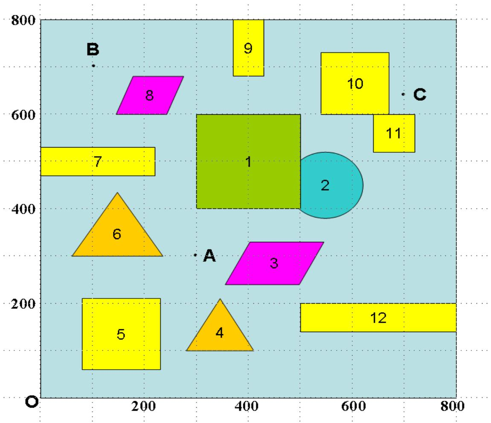

<details>
<summary>bubble</summary>

| Point | X | Y |
| --- | --- | --- |
| 1 | ~400 | ~600 |
| 2 | ~550 | ~450 |
| 3 | ~400 | ~250 |
| 4 | ~350 | ~150 |
| 5 | ~150 | ~200 |
| 6 | ~150 | ~350 |
| 7 | ~100 | ~500 |
| 8 | ~250 | ~650 |
| 9 | ~400 | ~750 |
| 10 | ~600 | ~700 |
| 11 | ~650 | ~550 |
| 12 | ~650 | ~200 |
</details>

图1 800×800平面场景图

## 二、问题分析

1、问题一中要求机器人 O（O, O）按照一定的行走规则绕过障碍物到达目标点的最短路径，我们先可以包络线画出机器人行走的危险区域，这样的话，拐角处就是一个半径为10的圆弧，通过采用拉绳子的方法寻找可能的最短路径（比如求 O 和A之间的最短路径，我们就可以连接 O 和A之间的一段绳子，以拐角处的圆弧为支撑拉紧，那么这段绳子的长度便是 O 到A的一条可能的最短路径），然后采用穷举法列出 O 到每个目标点的可能路径的最短路径，然后比较其大小便可得出 O 到目标点的最短路径。最后要求机器人 O（0,0）经过中间的若干点按照一定的规则绕过障碍物到达目标点，这使我们考虑就不仅仅是经过障碍物拐点的问题，也应该考虑经过路径中的目标点处转弯的问题，这时简单的线圆结构就不能解决这种问题，我们在拐点及途中目标点处都采用最小转弯半径的形式，也可以适当的变换拐点处的拐弯半径，使机器人能够沿直线通过途中的目标点，然后建立优化模型对这两种方案分别进行优化，最终求得最短路径。  
2、问题二中要求机器人 O（0， 0）出发按照一定规则绕过障碍物到达目标点的最短时间路径，先分析出半径分别对速度和路程的影响程度，可以大致确定最短时间路径的模型为两线一弧，然后我们再采取拉绳法和自然下垂法确定转弯圆的圆心影响因素，再在一定限定条件下通过 MATLAB 搜索求出最优的圆心坐标及半径值。

## 三、模型的假设

1. 假设机器人能够抽象成点来处理。  
2. 假设机器人在直线段和圆弧线段行走时始终保持最大速度不变。  
3. 假设文中涉及的数据取小数点后 4位，考虑到机器人的工程精度（含制作工艺精度、行走、控制误差），这样的精度足矣。

## 四、符号说明

<table><tr><td>符号</td><td>符号说明</td></tr><tr><td>L</td><td>路径的总长度</td></tr><tr><td>l1</td><td>第j段圆弧的长度</td></tr><tr><td>r</td><td>转弯半径</td></tr><tr><td>t</td><td>最短时间路径的总时间</td></tr></table>

## 五、模型建立与求解

## 第一问模型

## 5.1 最短路径模型

1. 起点直接到终点最短路径的数学模型（拉绳法 1）

结论一<sup>【1】</sup>：具有圆形限定区域的最短路径是由两部分组成的：一部分是平面上的自然最短路径（即直线段），另一部分是限定区域的部分边界，这两部分是相切的，互相连接的（即问题分析中的拉绳子拉到最紧时的状况）。则两点之间的最短路径中的转弯半径我们应该按照最小的转弯半径来算才能达到最优。

有了结论一，我们可以认为，起点到目标点之间如果存在一定数量的障碍物，其最短路径都是由若干个线圆结构所组成。其中最简单的基本线圆结构模型图如下。

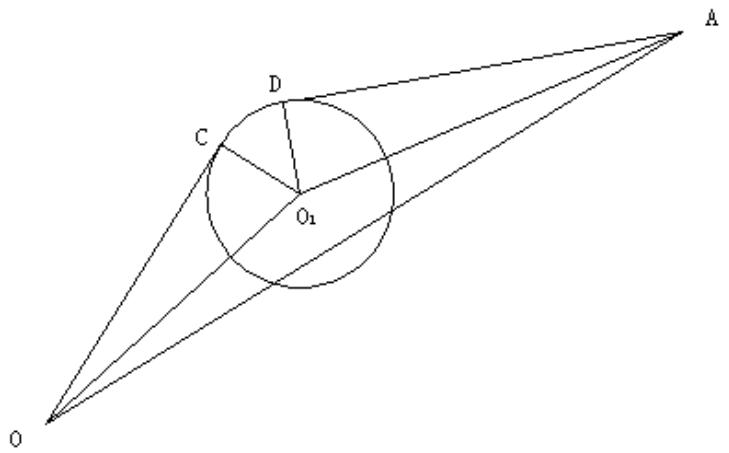

<details>
<summary>text_image</summary>

C
D
O₁
A
O
</details>

图2 基本线圆结构

设 $O ( x _ { 1 } , y _ { 1 } )$ 为起点， $A ( x _ { 2 } , y _ { 2 } )$ 为目标点， $C ( x _ { 3 } , y _ { 3 } )$ 和 $D ( x _ { 4 } , y _ { 4 } )$ 分别为机器人经过拐点分别于隔离危险线拐角小圆弧的切点，圆心为 $O _ { 1 } ( x _ { 5 } , y _ { 5 } )$ ，圆的半径为r，OA 的长度为a， $O _ { 1 } 0$ 的长度为 b，OA 的长度为 c，角度 $\angle O O _ { 1 } A = \alpha$ $\angle O O _ { 1 } C = \beta$ $\angle A O _ { 1 } D = \gamma$ $\angle C O _ { 1 } D$ .求$O C D A$ 的长度，设为L.

解法如下：

如上图可得有以下关系：

$$
\Delta \mathrm{OO} _ {1} A: a = \sqrt {(x _ {2} - x _ {1}) ^ {2} - (y _ {2} - y _ {1}) ^ {2}}, b = \sqrt {(x _ {5} - x _ {1}) ^ {2} + (y _ {5} - y _ {1}) ^ {2}}, c = \sqrt {(x _ {5} - x _ {2}) ^ {2} + (y _ {5} - y _ {2}) ^ {2}}
$$

$$
\alpha = \operatorname{arc} \cos (\frac {b ^ {2} + c ^ {2} - a ^ {2}}{2 b c})
$$

在 $R t \Delta O O _ { 1 } C$

$$
\beta = \arccos \frac {r}{b}
$$

在 $R t \Delta O O _ { 1 } C ^ { \scriptscriptstyle \perp }$ 中：

$$
\gamma = \arccos \frac {r}{c}
$$

所以：

$$
\theta = 2 \pi - \alpha - \beta - \gamma
$$

从而可得：

$$
L = \sqrt {b ^ {2} - r ^ {2}} + \sqrt {c ^ {2} - r ^ {2}} + r \theta
$$

而对于下面几种变形结构我们不能直接采用基本线圆结构来解决，需要做简单的变换，将其转化成若干个基本线圆结构来处理。

情况一：

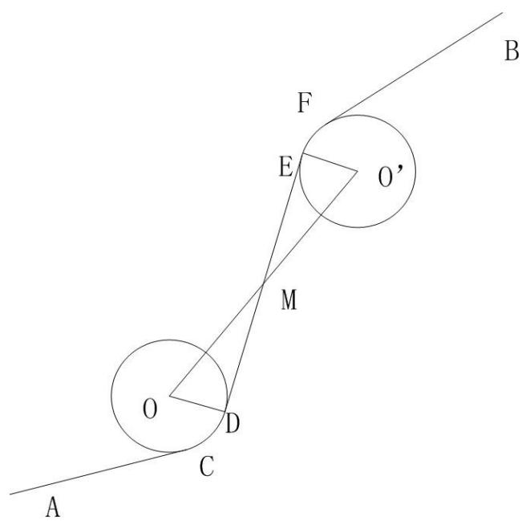

<details>
<summary>text_image</summary>

A
O
C
D
M
E
F
O'
B
</details>

图3 变形线圆结构一

我们假设两圆心坐标分别为 $O ( x _ { 1 } , y _ { 1 } )$ 和 $O ^ { \prime } ( x _ { 2 } , y _ { 2 } )$ ,半径均为r，M点坐标为 $( x _ { 3 } , y _ { 3 } )$ 那么我们很容易可以求得: $x _ { 3 } = \frac { x _ { 1 } + x _ { 2 } } { 2 } , y _ { 3 } = \frac { y _ { 1 } + y _ { 2 } } { 2 }$

这样我们就可以利用结论一中的方法，先求 A 到 M，再求 M 到 B，这样分两段就可以求解。同理如果有更多的转弯，我们同样可以按照此种方法分解。

情况二：

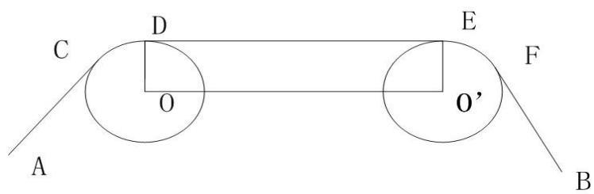

<details>
<summary>text_image</summary>

C
D
E
O
F
A
O'
B
</details>

图4 变形线圆结构二

这里我们依然设圆心坐标分别为 $O ( x _ { 1 } , y _ { 1 } )$ 和 $O ^ { \prime } ( x _ { 2 } , y _ { 2 } )$ ,半径均为r，这样我们可以得

到：

$$
K _ {O O ^ {\prime}} = \frac {y _ {2} - y _ {1}}{x _ {2} - x _ {1}}
$$

那么 $O O ^ { \prime }$ 直线方程为：

$$
y = K _ {O O ^ {\prime}} (x - x _ {1}) + y _ {1}
$$

因为公切线DE与 $O O ^ { \prime }$ 平行，那么 DE的直线方程可以表示为：

$$
y = K _ {O O ^ {\prime}} (x - x _ {1}) + y _ {1} + C
$$

其中：

$$
C = r \sqrt {1 + K _ {o o ^ {\prime}} ^ {2}}
$$

那么把公切线的方程于圆的方程联立，渴可以求得切点 D和E的坐标。这样用 D和E任意一点作为分割点都可以将上图分割成两个图 3所示的线圆结构，这样就可以对其进行求解。同理多个这样的转弯时，用同样的方法可以进行分割。

情况三：

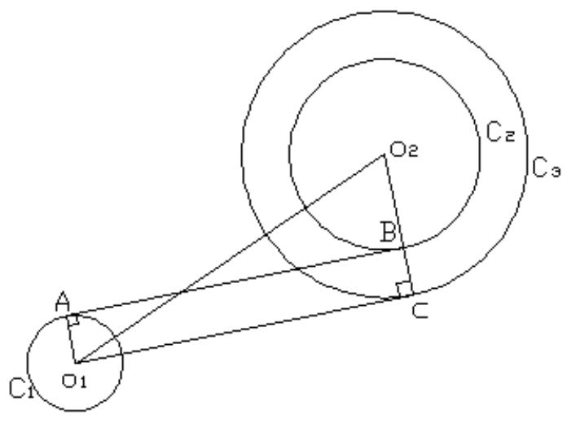

<details>
<summary>text_image</summary>

C1
O1
A
B
C2
C3
C
</details>

图5 变形线圆结构三

如图5，设的圆心为 $O _ { 1 } \left( x _ { 1 } , y _ { 1 } \right) , C _ { 2 }$ 的圆心为 $O _ { 2 } \left( x _ { 2 } , y _ { 2 } \right)$ ，C 半径为 r， $C _ { 2 }$ 半径为R，$\mathrm { R } > \mathrm { r } .$ ,取半径为R+r为半径 $O _ { 2 }$ 为圆心作辅助圆 $C _ { 3 }$ ，过A点和B点作 $C _ { 1 }$ 和 $C _ { 2 }$ 的公切线AB,且过圆心O 向 $O _ { 3 }$ 作切线 $O _ { 1 } C$ ,由几何知识可知 $O _ { 1 } C$ 平行AB。

过圆 $C _ { 3 }$ 上一点 $\mathrm { C } \left( { x _ { 0 } , y _ { 0 } } \right)$ 的切线方程的求法：

可对方程 $C _ { 3 }$ ： $( x _ { 1 } - a ) ^ { 2 } + ( y _ { 1 } - b ) ^ { 2 } = ( R + r ) ^ { 2 }$ 两边求导，可得C点的切线的斜率为：$y ^ { \prime } | { = } ( x _ { 0 } - x _ { 2 } ) / ( y _ { 0 } - y _ { 2 } )$ ，由点斜式我们可得过圆上一点 A的切线方程为：

$$
(x _ {0} - x _ {2}) (x _ {1} - x _ {2}) + (y _ {0} - y _ {2}) (y _ {1} - y _ {2}) = (R + r) ^ {2}
$$

则过圆外一点 $O _ { 1 } \left( x _ { 1 } , y _ { 1 } \right)$ 的切线方程组为：

$$
(x _ {0} - x _ {2}) (x _ {1} - x _ {2}) + (y _ {0} - y _ {2}) (y _ {1} - y _ {2}) = (R + r) ^ {2}, \quad (x _ {1} - a) ^ {2} + (y _ {1} - b) ^ {2} = (R + r) ^ {2}
$$

解得球出C点的坐标，再由 C点和 $O _ { 1 }$ 解得它们之间的切线方程。设 C和 $O _ { 1 }$ 的方程为

$A { \mathrm { x } } ^ { + } B ^ { + } C { = } 0$ ，则可得出AB 的方程为： ${ \mathrm { A x } } + { \mathrm { B } } + { \mathrm { C } } _ { 1 } = 0$ ，由平行线的公式可知： $r = \frac { \mid c _ { 1 } - c \mid } { \sqrt { A ^ { 2 } + B ^ { 2 } } }$ 求出 $C _ { 1 }$ 的值。最后求出公切线 AB的切线方程。<sup>【2】</sup>

再转化为基本的线弧模型求解：

当求两圆的外公切线时可转化为上述的求两圆内内公切线，修改数据即可求得，再同样转化为线弧基本模型求解。

## 2. 起点经过途中节点到达终点的数学模型（拉绳法 2）

结论二<sup>【1】</sup>：对于从起点经过若干点然后再到达目标点的状况，因为不能走折线路径，我们就必须考虑在经过路径中的一个目标点时转弯的状况。如果一个圆环可以绕着环上一个定点转动，那么过圆环外两定点连接一根绳子，并以该圆环为支撑拉紧绳子，达到平衡状态时，圆心与该顶点以及两条切线的延长线的交点共线。

有了以上这个结论，我们可以建立以下模型。

如图 6，要求求出机器人从 A 绕过障碍物经过 M 点到达目标点 B 的最短路径，我们采用以下方法：

用一根钉子使一个圆环定在 M点，使这个圆环能够绕 M点转动。然后连接 A和B的绳子并以这些转弯处的圆弧为支撑（这里转弯处圆弧的半径均按照最小转弯半径来计算），拉紧绳子，那么绳子的长度就是 A 到 B 的最短距离。我们可以把路径图抽象为以下的几何图形。下面我们对这段路径求解：

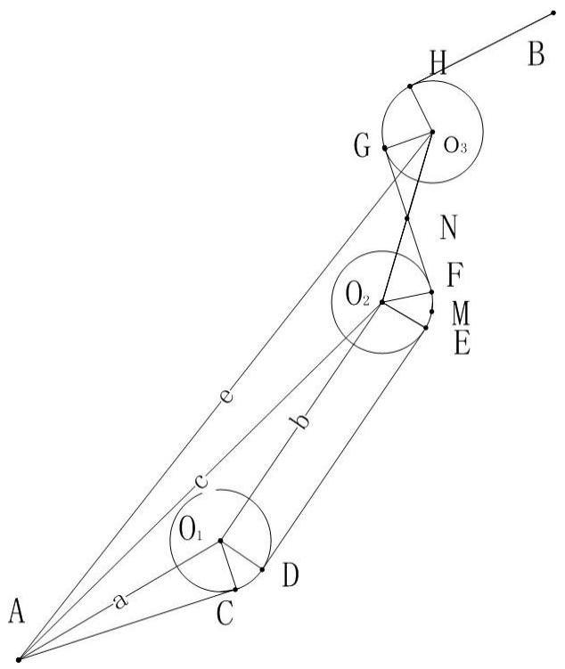

<details>
<summary>text_image</summary>

A
a
C
D
O₁
c
b
O₂
F
M
E
G
O₃
H
B
</details>

图6 变形线圆结构四

如图， $\mathtt { A } ( x _ { 1 } , y _ { 1 } )$ 是起点， $3 ( x _ { 2 } , y _ { 2 } )$ 是终点， $O _ { 1 } \left( x _ { 3 } , y _ { 3 } \right)$ 和 $O _ { 3 } \left( x _ { 4 } , y _ { 4 } \right)$ 是两个固定的圆，$O _ { 2 }$ 是一个可以绕M(p，q)点转动的圆环，三个圆的半径均为 r，C、D、E、F、G、H均为切点。a、b、c、e，f 分别是 $\mathtt { A } O _ { \mathtt { i } }$ $O _ { 1 } O _ { 2 }$ $\mathrm { A } O _ { 2 }$ $\mathrm { A } O _ { 3 }$ $O _ { 2 } O _ { 3 }$ 的长度。A、B、 $O _ { 1 }$ $O _ { 3 }$ 均是已知点， $O _ { 2 }$ 是未知点。那么最短路径就可以表示为：

$$
\mathrm{L} = | \mathrm{AC} | + \widehat {\mathrm{CD}} + | \mathrm{DE} | + \widehat {\mathrm{EF}} + | \mathrm{FG} | + \widehat {\mathrm{GH}} + | \mathrm{HB} |
$$

因为 $O _ { 2 }$ 点的坐标未知，所以我们就不能用模型一中的线圆结构对其进行求解。故得先求出 $O _ { 2 }$ 点的坐标。设 $O _ { 2 }$ 坐标为（m，n）， $\angle A O _ { 1 } C$ $\angle A O _ { 1 } O _ { 2 }$ $\angle A O _ { 2 } O _ { 1 }$ $\angle A O _ { 2 } O _ { 3 }$ $\angle O _ { 3 } O _ { 2 } F$ 分别为 $\alpha _ { i } ( i = 1 , ~ 2 , ~ 3 , ~ 4 , ~ 5 )$ $\angle C O _ { 1 } D$ $\angle E O , F$ $\angle E O , M$ 分别为 $\theta _ { 1 }$ 、 $\theta _ { \gamma }$ 、 $\theta$ 。这样便 有 以 下 关 系 ： $a = \sqrt { \left( x _ { 1 } - x _ { 3 } \right) ^ { 2 } + \left( y _ { 1 } - y _ { 3 } \right) ^ { 2 } }$ $b = \sqrt { \left( x _ { 3 } - m \right) ^ { 2 } + \left( y _ { 3 } - n \right) ^ { 2 } }$

$$
, e = \sqrt {\left(x _ {1} - x _ {4}\right) ^ {2} + \left(y _ {1} - y _ {4}\right) ^ {2}}, f = \sqrt {\left(x _ {4} - m\right) ^ {2} + \left(y _ {4} - n\right) ^ {2}}
$$

在 $R t \Delta A O _ { 1 } C$ 中：

$$
\alpha_ {1} = \arccos \frac {r}{a}
$$

在 $\Delta { \cal { A } } O _ { 1 } O _ { 2 }$ 中：

$$
\alpha_ {2} = \arccos \frac {a ^ {2} + b ^ {2} - c ^ {2}}{2 a b}
$$

$$
\alpha_ {3} = \arccos \frac {b ^ {2} + c ^ {2} - a ^ {2}}{2 b c}
$$

在 $\Delta { \cal { A } } O _ { 2 } O _ { 3 }$ 中：

$$
\alpha_ {4} = \arccos \frac {c ^ {2} + f ^ {2} - e ^ {2}}{2 c f}
$$

在 $R t \Delta N O _ { 2 } F$ 中：

$$
\alpha_ {5} = \arccos \frac {2 r}{f}
$$

则： $\theta _ { 1 } = \frac { 3 \pi } { 2 } - \alpha _ { 1 } - \alpha _ { 2 }$ , $\theta _ { 1 } = \frac { 3 \pi } { 2 } - \alpha _ { 3 } - \alpha _ { 4 } - \alpha _ { 5 }$

又因为 $M O _ { 2 }$ 一定会在 $\angle E O , F$ 的角平分线上，所以满足：

$$
\theta = \frac {\theta_ {2}}{2}
$$

$\theta _ { 2 }$ 我们采用向量的形式来求，易知 $\overrightarrow { O _ { 1 } O _ { 2 } }$ 的一个方向向量：

$$
\vec {l} _ {1} = (1, \frac {y _ {3} - m}{x _ {3} - n})
$$

而 $\overrightarrow { O _ { 2 } E }$ 与 $\overrightarrow { O _ { 1 } O _ { 2 } }$ 垂直，故其一个方向向量：

$$
\vec {l} _ {2} = (1, - \frac {x _ {3} - n}{y _ {3} - m})
$$

而：

$$
\overrightarrow {O _ {2} M} = (p - m, q - n)
$$

所以：

$$
\theta = \operatorname{arc} \cos \frac {\vec {l _ {2}} \bullet \overrightarrow {O _ {2} M}}{| \vec {l _ {2}} | | \overrightarrow {O _ {2} M} |}
$$

综合以上式子可以求得 $O _ { 2 }$ 的坐标，从而可以得出路径的长为：

$$
L = \sqrt {a ^ {2} - r ^ {2}} + \theta_ {1} r + b + \theta_ {2} r + 2 \sqrt {\left(\frac {f}{2}\right) ^ {2} - r ^ {2}} + l _ {0}
$$

$l _ { 0 }$ =错误!未找到引用源。+HB，这可以采用起点直接到达终点的数学模型来求解。

## 第一问结果：

## 1.各最短路径距离（程序见附录一）

O→A的最短路径如图 6.，其路径距离：471.0372

O→B的最短路径如图7， 其路径距离：861.3865

O→C的最短路径如图8， 其路径距离：1091.3

O→A→B→C→O的最短路径如图9， 其路径距离：2773.023

## 2. 其各段路径的具体数据见表格一。

表格一：各段路径的数据

<table><tr><td></td><td>路径</td><td>起点坐标</td><td>终点坐标</td><td>圆弧圆心坐标</td><td>圆弧半径</td><td>直线长或弧长</td><td>机器人行走总时间</td></tr><tr><td rowspan="3">0→A</td><td>线段一</td><td>0, 0</td><td>70.506,213.1406</td><td></td><td></td><td>224.4994</td><td>44.8999</td></tr><tr><td>圆弧一</td><td>70.506,213.1406</td><td>76.6064,219.4066</td><td>80, 210</td><td>10</td><td>9.051</td><td>3.6204</td></tr><tr><td>线段二</td><td>76.6064,219.4066</td><td>300,300</td><td></td><td></td><td>237.4868</td><td>47.4974</td></tr><tr><td colspan="2">机器人行走总路程</td><td></td><td></td><td></td><td></td><td>471.0372</td><td>96.0177</td></tr><tr><td colspan="8"></td></tr><tr><td rowspan="4">0→B</td><td>线段一</td><td>0, 0</td><td>50.1356,301.7306</td><td></td><td></td><td>305.8724</td><td>61.1745</td></tr><tr><td>圆弧一</td><td>50.1356,301.7306</td><td>51.6795,305.5470</td><td>60, 300</td><td>10</td><td>4.2662</td><td>1.7065</td></tr><tr><td>线段二</td><td>51.6795,305.5470</td><td>141.6795,440.357</td><td></td><td></td><td>162.2498</td><td>32.45</td></tr><tr><td>圆弧二</td><td>141.6795,440.357</td><td>149.658,444.0328</td><td>150, 435</td><td>10</td><td>9.8648</td><td>3.9459</td></tr><tr><td rowspan="7"></td><td>线段三</td><td>149.658,444.0328</td><td>222.193,460.2429</td><td></td><td></td><td>78.2430</td><td>15.6486</td></tr><tr><td>圆弧三</td><td>222.193,460.2429</td><td>230,470</td><td>220,470</td><td>10</td><td>13.4993</td><td>5.3997</td></tr><tr><td>线段四</td><td>230,470</td><td>230,530</td><td></td><td></td><td>60</td><td>12</td></tr><tr><td>圆弧四</td><td>230,530</td><td>225.4967,538.353</td><td>220,530</td><td>10</td><td>9.8883</td><td>3.9553</td></tr><tr><td>线段五</td><td>225.4967,538.353</td><td>144.5033,591.646</td><td></td><td></td><td>96.9532</td><td>19.3906</td></tr><tr><td>圆弧五</td><td>144.5033,591.646</td><td>140.6916,596.346</td><td>150,600</td><td>10</td><td>6.1474</td><td>2.4590</td></tr><tr><td>线段六</td><td>140.6916,596.346</td><td>100,700</td><td></td><td></td><td>121.3553</td><td>24.2711</td></tr><tr><td colspan="2">机器人行走总路程</td><td></td><td></td><td></td><td></td><td>861.3865</td><td>182.4012</td></tr><tr><td colspan="8"></td></tr><tr><td rowspan="7"> $0 \rightarrow C$ </td><td>线段一</td><td>0,0</td><td>422.0870,90.0817</td><td></td><td></td><td>431.5928</td><td>86.3186</td></tr><tr><td>圆弧一</td><td>422.0870,90.0817</td><td>428.6909,94.9149</td><td>410,100</td><td>10</td><td>8.4369</td><td>3.3748</td></tr><tr><td>线段二</td><td>428.6909,94.9149</td><td>491.1217,204.602</td><td></td><td></td><td>125.2093</td><td>25.0419</td></tr><tr><td>圆弧二</td><td>491.1217,204.602</td><td>492.1217,206.260</td><td>500,200</td><td>10</td><td>1.8564</td><td>0.7426</td></tr><tr><td>线段三</td><td>492.1217,206.260</td><td>727.9377,513.918</td><td></td><td></td><td>387.5882</td><td>77.5176</td></tr><tr><td>圆弧三</td><td>727.9377,513.918</td><td>730,520</td><td>720,520</td><td>10</td><td>6.4352</td><td>2.5741</td></tr><tr><td>线段四</td><td>730,520</td><td>730,600</td><td></td><td></td><td>80</td><td>16</td></tr><tr><td rowspan="2"></td><td>圆弧四</td><td>730,600</td><td>727.7178,606.359</td><td>720,600</td><td>10</td><td>6.6429</td><td>2.6572</td></tr><tr><td>线段五</td><td>727.7178,606.359</td><td>700,640</td><td></td><td></td><td>43.5890</td><td>8.7178</td></tr><tr><td colspan="2">机器人行走路程</td><td></td><td></td><td></td><td></td><td>1091.3</td><td>222.9446</td></tr><tr><td colspan="8"></td></tr><tr><td rowspan="12"> $0 \rightarrow A \rightarrow B \rightarrow C \rightarrow 0$ </td><td>线段一</td><td>0,0</td><td>70.506,213.1406</td><td></td><td></td><td>224.4995</td><td>44.8999</td></tr><tr><td>圆弧一</td><td>70.506,213.1406</td><td>76.7368,219.4526</td><td>80,210</td><td>10</td><td>9.1892</td><td>3.6757</td></tr><tr><td>线段二</td><td>76.7368,219.4526</td><td>294.2635,294.547</td><td></td><td></td><td>230.1241</td><td>46.0248</td></tr><tr><td>圆弧二</td><td>294.2635,294.547</td><td>300.5403,306.997</td><td>291,304</td><td>10</td><td>15.4296</td><td>6.1718</td></tr><tr><td>线段三</td><td>300.5403,306.997</td><td>229.5403,532.997</td><td></td><td></td><td>236.8903</td><td>47.3781</td></tr><tr><td>圆弧三</td><td>229.5403,532.997</td><td>225.4967,538.354</td><td>220,530</td><td>10</td><td>6.8443</td><td>2.7377</td></tr><tr><td>线段四</td><td>225.4967,538.354</td><td>144.3033,591.646</td><td></td><td></td><td>91.1208</td><td>18.2241</td></tr><tr><td>圆弧四</td><td>144.3033,591.646</td><td>140.8699,595.921</td><td>150,600</td><td>10</td><td>2.9094</td><td>1.1636</td></tr><tr><td>线段五</td><td>140.8699,595.921</td><td>198.8699,689.921</td><td></td><td></td><td>110.4536</td><td>22.0907</td></tr><tr><td>圆弧五</td><td>198.8699,689.921</td><td>108.861,703.9629</td><td>108,694</td><td>10</td><td>20.7720</td><td>8.3088</td></tr><tr><td>线段六</td><td>108.861,703.9629</td><td>270.861,538.3538</td><td></td><td></td><td>202.5593</td><td>40.5119</td></tr><tr><td>圆弧六</td><td>270.861,538.3538</td><td>272,689.798</td><td>270,680</td><td>10</td><td>1.1515</td><td>0.4606</td></tr><tr><td rowspan="16"></td><td>线段七</td><td>272,689.798</td><td>368,670.202</td><td></td><td></td><td>97.9796</td><td>19.5959</td></tr><tr><td>圆弧七</td><td>368,670.202</td><td>370,670</td><td>370,680</td><td>10</td><td>2.0136</td><td>0.8054</td></tr><tr><td>线段八</td><td>370,670</td><td>430.670</td><td></td><td></td><td>60</td><td>12</td></tr><tr><td>圆弧八</td><td>430,670</td><td>435.5878,671.707</td><td>470,680</td><td>10</td><td>5.9291</td><td>2.3716</td></tr><tr><td>线段九</td><td>435.5878,671.707</td><td>534.4122,738.293</td><td></td><td></td><td>119.1638</td><td>23.8328</td></tr><tr><td>圆弧九</td><td>534.4122,738.293</td><td>540,740</td><td>540,730</td><td>10</td><td>5.9291</td><td>2.3716</td></tr><tr><td>线段十</td><td>540,740</td><td>670,740</td><td></td><td></td><td>130</td><td>26</td></tr><tr><td>圆弧十</td><td>670,740</td><td>679.7973,732.003</td><td>670,730</td><td>10</td><td>13.6909</td><td>5.4764</td></tr><tr><td>线段十一</td><td>679.7973,732.003</td><td>698.2027,641.997</td><td></td><td></td><td>91.8694</td><td>18.3739</td></tr><tr><td>圆弧十一</td><td>698.2027,641.997</td><td>700.4833,637.405</td><td>708,644</td><td>10</td><td>5.1851</td><td>2.0740</td></tr><tr><td>线段十二</td><td>700.4833,637.405</td><td>727.5167,600.596</td><td></td><td></td><td>40.9878</td><td>8.1976</td></tr><tr><td>圆弧十二</td><td>727.5167,600.596</td><td>730,600</td><td>720,600</td><td>10</td><td>7.2021</td><td>2.88.8</td></tr><tr><td>线段十三</td><td>730,600</td><td>730,520</td><td></td><td></td><td>80</td><td>16</td></tr><tr><td>圆弧十三</td><td>730,520</td><td>727.9377,513.918</td><td>720,520</td><td>10</td><td>6.4352</td><td>2.5741</td></tr><tr><td>线段十四</td><td>727.9377,513.918</td><td>492.1217,206.260</td><td></td><td></td><td>387.5884</td><td>77.5177</td></tr><tr><td>圆弧十四</td><td>492.1217,206.260</td><td>491.1217,204.602</td><td>500,200</td><td>10</td><td>1.8564</td><td>0.7526</td></tr><tr><td rowspan="3"></td><td>线段十五</td><td>491.1217,204.602</td><td>428.6909,94.9149</td><td></td><td></td><td>125.2093</td><td>25.0419</td></tr><tr><td>圆弧十五</td><td>428.6909,94.9149</td><td>422.0870,90.0817</td><td>410,100</td><td>10</td><td>8.4369</td><td>3.3748</td></tr><tr><td>线段十六</td><td>422.0870,90.0817</td><td>0,0</td><td></td><td></td><td>431.5928</td><td>86.3186</td></tr><tr><td colspan="4">机器人行走总路程</td><td></td><td></td><td>2773.023</td><td>577.1975</td></tr></table>

## 3.各最短路径示意图

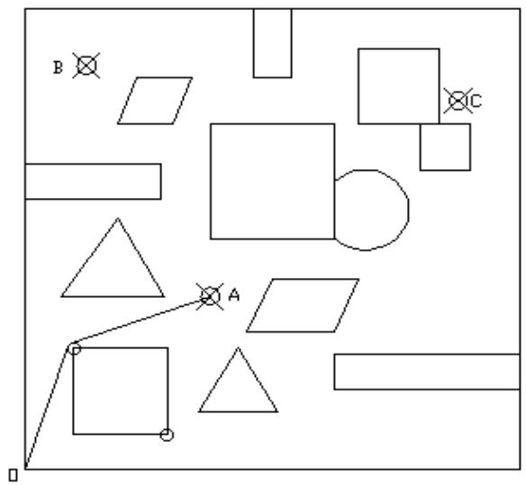

<details>
<summary>text_image</summary>

B
A
C
</details>

图 7 O → A

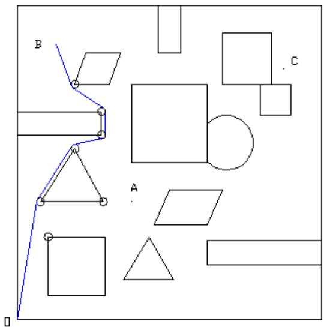

<details>
<summary>text_image</summary>

B
C
A
</details>

图 8

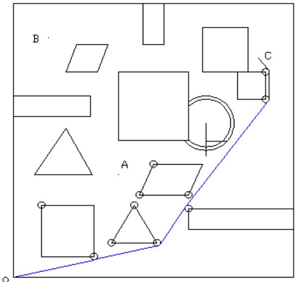

<details>
<summary>text_image</summary>

B
C
A
</details>

图9 O→C

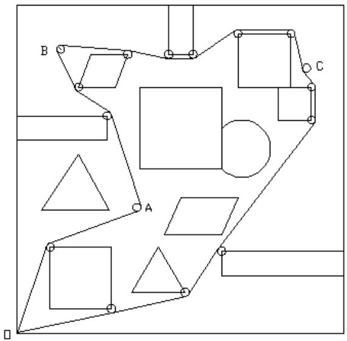

<details>
<summary>natural_image</summary>

Geometric diagram with labeled points A, B, C and various shapes (squares, triangles, circles) on a grid background, no text or symbols present.
</details>

图10 O → A→ B →C →O

## 第二问模型：

## 5.2．最短时间路径模型

分析：由于第一问已经计算出机器人从O到达A的最短路径为两线一圆，而其中圆弧半径为10个单位，根据问题所给的规则，机器人直线行走的速度理应保持最大速度$\nu _ { 0 } = 5$ ，但走圆弧的最大转弯速度与转弯半径密切相关：

$$
v = v (\rho) = \frac {v _ {0}}{1 + \mathrm{e} ^ {1 0 - 0 . 1 \rho^ {2}}},
$$

显然行走在最短路径中的圆弧时速度只有 $\frac { \nu _ { _ 0 } } { 2 }$ ，耗费了宝贵的时间。

因此我们考虑第二问的解决思路是适当增加转弯半径（即 $\rho > 1 0 ~ )$ ，用以增大圆弧距离，从而提高走圆弧的速度。但因为 $\operatorname* { l i m } _ { \rho \to \infty } \frac { \nu _ { 0 } } { 1 + \mathrm { e } ^ { 1 0 - 0 . 1 \rho ^ { 2 } } } = 5$ ，事实上，当 $\rho$ 取14时，$\nu ( \rho ) \approx 4 . 9 9 9 7$ 已非常接近最大直行速度5了，这时候还不与干脆走直线。于是我们确定转弯半径取值范围大致为

$$
1 0 <   \rho \leq 1 4,
$$

那么，考虑多圆结构就不合适了，只需在第一问从O到A的两线一圆最短路径中，适当增加那个圆弧的转弯半径即可。考虑机器人行走规则，增加转弯半径的模型依据如下：

（1）以圆心在第5个障碍物左上顶点，半径为10的圆为一个定圆（参照圆10）。  
（2）以圆心为动点 $\mathcal Q ( m , n )$ 、半径为 $\rho > 1 0$ 的圆为一个动圆，保持动圆始终跟定圆内切（定圆始终在动圆内）。  
（3）采用“拉绳法”和“自然下垂法”相结合的办法，其中“拉绳法”原理同问题一，只是支撑圆弧替换为动圆，而“自然下垂法”是指：当绳子两端O、A拉紧时，动圆可以绕着定圆自然下垂摆动，并保持定圆始终在动圆的上半圆内切，以实现最短路径。如图？所示。  
（4）在机器人沿着由直线段一、动圆圆弧段、直线段二组成的最短路径的基础上，以行走时间最短为目标函数编程搜索出最佳位置的动圆参数：动圆圆心坐标 $( m , n )$ 、动圆半径 $\rho$ 。  
（5）搜索算法的优化至少有：根据平面几何中“两个内切圆的圆心距离等于动圆半径与定圆半径的差”的定理可优化减少一个参数，比如 $\rho$ ；剩下的两个参数 可依据动圆半径 $\rho$ 最大为14，有 $8 0 \leq m \leq 8 4 , 2 0 6 \leq n \leq 2 1 0$ 。

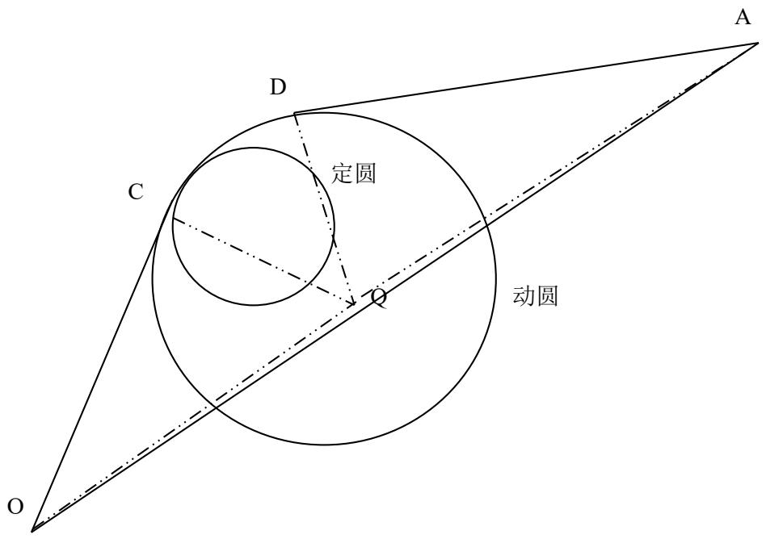

<details>
<summary>text_image</summary>

定圆
动圆
</details>

图11

综上所述，建立数学模型如下：

设动圆圆心坐标(m,n)、动圆半径 ，总时间为 ，则有：

$$
\mid O A \mid = \sqrt {(3 0 0 - 0) ^ {2} + (3 0 0 - 0) ^ {2}};
$$

$$
\mid O Q \mid = \sqrt {(m - 0) ^ {2} + (n - 0) ^ {2}} ;
$$

$$
\mid A Q \mid = \sqrt {(3 0 0 - m) ^ {2} + (3 0 0 - n) ^ {2}}
$$

$$
\angle O Q A = a r \cos \frac {\left| O Q \right| ^ {2} + \left| A Q \right| ^ {2} - \left| O A \right| ^ {2}}{2 \left| O Q \right\| A Q \mid}
$$

$$
\angle O Q C = a r \cos \frac {\rho}{| O Q |},
$$

$$
\angle A Q D = a r \cos \frac {\rho}{| A Q |},
$$

$$
\theta = \angle C Q D = 2 \pi - \angle O Q A - \angle O Q C - \angle A Q D
$$

最小目标函数为：

$$
\text {Min} \quad t = \frac {1}{5} (\sqrt {m ^ {2} + n ^ {2} - \rho^ {2}} + \sqrt {(3 0 0 - m) ^ {2} + (3 0 0 - n) ^ {2} - \rho^ {2}} + \rho \theta (1 + e ^ {1 0 - 0. 1 \rho^ {2}})
$$

且满足条件： $8 0 \leq m \leq 8 4 , 2 0 6 \leq n \leq 2 1 0 , \sqrt { ( m - 8 0 ) ^ { 2 } + ( n - 2 1 0 ) ^ { 2 } } = \rho - 1 0$

根据精度要求，我们取搜索步长为0.01，编程（程序见附录二shiian.m）易计算得出动圆的三个参数 $m , n , \rho$ 即为最佳动圆位置。

## 2．切点计算模型

设切点为 $C ( x , y )$ ，由切点在圆弧上有式（1）成立：

$$
(m - x) ^ {2} + (n - y) ^ {2} = \rho^ {2} \tag {1}
$$

再由切点与起终点所连向量分别垂直于相应切点与圆心所连向量，有式子：

$$
\overrightarrow {O C} \cdot \overrightarrow {C Q} = 0 \Rightarrow x (x - m) + y (y - n) = 0 \tag {2}
$$

求解由（1）、（2）组成的方程组，可得切点坐标 $C ( x , y )$

类似地，另一个切点 坐标也满足如下方程组：

$$
\left\{ \begin{array}{l} (m - x) ^ {2} + (n - y) ^ {2} = \rho^ {2} \\ (x - 3 0 0) (x - m) + (y - 3 0 0) (y - n) = 0 \end{array} \right.
$$

同理可求得切点D坐标。（程序见附录二qiedian.m）

## 第二问结果：

1．计算机器人从O到达A的行走最短总时间T=94.2283，总距离为472.0657。此时机器人转弯路径圆弧的圆心坐标为（ ），转弯半径为 。  
2．机器人从O到达A的最短时间路径，依次为直线段一、圆弧段、直线段二。直线段一的起点和终点坐标分别为（0，0）和（69.8072，211.9813），圆弧段的起点和终点分别为（69.8072，211.9813）和（77.7492，220.1394），直线段二的起点和终点坐标分别为（77.7492，220.1394）和（300,300）。直接采用MATLAB软件连接上述点作图11（程序见附录二huatu.m），吻合度非常好。

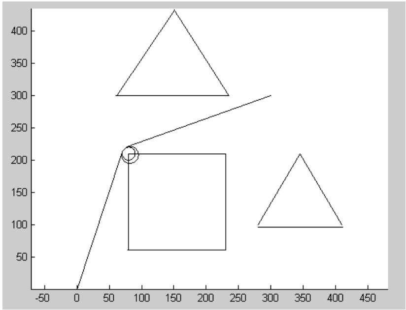

<details>
<summary>line</summary>

| X | Y |
| --- | --- |
| 0 | 0 |
| ~85 | ~210 |
| ~230 | ~210 |
| ~290 | ~300 |
| ~410 | ~100 |
| ~350 | ~210 |
</details>

图12

## 六．模型的分析与推广

本题中是平面规则障碍物，但现实生活中我们所遇均为不规则立体障碍物，此模型便失去了实用价值。

因此我们对实际问题作如下处理。首先，对于立体障碍物，高度为 h 的机器人在 h内（包含h）的高度存在障碍机器人便不能通行。根据图论思想，我们将 h（包含h）高内的障碍物平面化，即可转化为平面障碍问题。

而对于平面障碍问题，我们可以用一下基本方法处理是复杂问题简单化。

方法一：相似替代法（用规则几何形替代不规则的）

要求：1不规则几何形应包含于规则几何形区域内。

2不可使路径因为代替而变化或不可用。

注：要求并非一成不变，而是会随具体问题而变化！

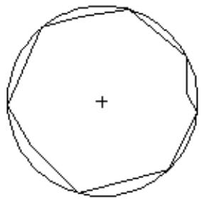

<details>
<summary>natural_image</summary>

Geometric diagram of a regular octagon with a plus sign at the center (no text or labels)
</details>

图 13

方法二：切割法（把不规则的几何形切割为数个规则的几何形）注：虚线为切割线。

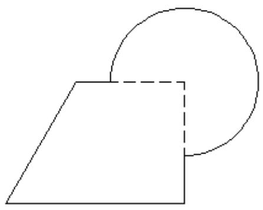

<details>
<summary>natural_image</summary>

Simple geometric diagram with a parallelogram and a circle, no text or symbols present.
</details>

图 14

当然方法并不限定，具体的问题具体分析，开阔思路会有更多的方式处理，但是处理的主要目标是将复杂问题简单化

这样便可推广求如空间不规则障碍的最优路径等更复杂的问题！我们模型实用范围以及使用意义就更大了！

## 七．模型评价

## 1模型优点

1）把几个模型均转化为基本的线弧模型，过程简单。  
2）模型简单明了，易让人接受且使用性高。  
3）求时间利用MATLAB 搜索求最优解，大大减少计算量。

## 2模型缺陷

1）求最短路径时计算量大。  
2）值比较精确但计算量较大。

## 参考文献

[1] 行走机器人避障问题

http://wenku.baidu.com/view/606c2a094a7302768e99399a.html

访问时间：2012-9-8

[2] 张广平等，两圆内外公切线方程的求法，甘肃教育学院学报（自然科学版），第 14卷增刊 1,页码 66-67，访问时间：2000-6

## 附录一

1.计算机器人从O（0,0）点出发，到达A点的最短路径程序（zongchang.m）

%求解一次转弯所经路线总长

%t：初始点v:转弯圆弧圆心 w:到达点

```matlab
function result=zongchang(t,w,v,r)
tv=sqrt((t(1)-v(1))^2+(t(2)-v(2))^2);
tw=sqrt((t(1)-w(1))^2+(t(2)-w(2))^2);
wv=sqrt((w(1)-v(1))^2+(w(2)-v(2))^2);
a1=acos((tv^2+wv^2-tw^2)/(2*tv*wv));
a2=acos(r/tv);
a3=acos(r/wv);
thet=2*pi-a1-a2-a3;
result=sqrt(tv^2-r^2)+sqrt(wv^2-r^2)+r*thet;
```

## 2．求圆与直线的交点

```javascript
syms x y
[x,y]=solve('(x-410)^2+(y-100)^2=100','y=(240-100)/(500-230)*(x-410)+100-10*sqrt(1+((100-60)/(410-230))^2)',x,y
```

## 附录二

1．计算机器人从O (0, 0)出发，到达A的最短时间程序（shijian.m）

```matlab
sj=[];k=0;
for m=82:0.01:84
    for n=206:0.01:210
        oa=sqrt((300-0)^2+(300-0)^2);
        oq=sqrt((m-0)^2+(n-0)^2);
        aq=sqrt((300-m)^2+(300-n)^2);
        d1=acos((oq^2+aq^2-oa^2)/(2*oq*aq));
        p=10+sqrt((m-80)^2+(n-210)^2);
        d2=acos(p/oq);
        d3=acos(p/aq);
        d4=2*pi-d1-d2-d3;
        t5=sqrt(m^2+n^2-p^2)+sqrt((300-m)^2+(300-n)^2-p^2)+p*d4*(1+exp(10-0.1*p^2));
        k=k+1;sj(1,k)=t5;sj(2,k)=m;sj(3,k)=n;
    end
end
[C,I]=min(sj(1,:));
t=C/5
m=sj(2,I)
n=sj(3,I)
```

2．求两个切点的程序（qiedian.m）

$$
\begin{array}{l} \% [ \mathrm{m}, \mathrm{n} ] = \text {solve} (^ {\prime} \mathrm{m} ^ {\wedge} 2 - 8 2. 1 4 * \mathrm{m} + \mathrm{n} ^ {\wedge} 2 - 2 0 7. 9 2 * \mathrm{n} = 0 ^ {\prime}, ^ {\prime} (\mathrm{m} - 8 2. 1 4) ^ {\wedge} 2 + (\mathrm{n} - 2 0 7. 9 2) ^ {\wedge} 2 = (1 2. 9 8 4 3) ^ {\wedge} 2 ^ {\prime}) \\ [ \mathrm{m}, \mathrm{n} ] = \text {solve} (^ {\prime} (\mathrm{m} - 3 0 0) * (\mathrm{m} - 8 2. 1 4) + (\mathrm{n} - 3 0 0) * (\mathrm{n} - 2 0 7. 9 2) = 0 ^ {\prime}, ^ {\prime} (\mathrm{m} - 8 2. 1 4) ^ {\wedge} 2 + (\mathrm{n} - 2 0 7. 9 2) ^ {\wedge} 2 = (1 2. 9 8 4 3) ^ {\wedge} 2 ^ {\prime}) \end{array}
$$

3．画出机器人从O (0, 0)出发，到达A的最短时间的路径程序(huatu.m)

```matlab
hold on
x=[60,235,150];y=[300,300,435];
line(x,y)
x=[80 80 230 230];y=[60 210 210 60];
line(x,y)
x=[280 345 410];y=[100 210 100];
line(x,y)
r=10;alpha=0:pi/50:2*pi;x=80+r*cos(alpha);y=210+r*sin(alpha);
plot(x,y,'-')
r=12.9843;alpha=0:pi/50:2*pi;x=82.14+r*cos(alpha);y=207.92+r*sin(alpha);
plot(x,y,'-')
axis equal
x=[0,69.8072];y=[0,211.9813];
line(x,y)
x=[77.7492,300];y=[220.1394,300];
line(x,y)
```