## 机器人避障问题

## 【摘要】

本文主要是对机器人在一个平面区域内的通过不同障碍物到指定目标点进行研究，首先通过机器人与障碍物的最小安全距离对不同障碍物的禁区进行了划分见图 1，把障碍物划分为有顶点和无顶点两大类。然后证明了机器人在障碍物顶点处转弯路径最优，转弯半径最小路径最优，转弯圆心在障碍物顶点处（圆行障碍物在圆心）路径最优。

问题一对于起点和目标点的的路线先用拉绳子的方法确定了可能的最短路线，然后用穷举法确定最佳路径。机器人的行进又分单目标点和多目标点两种情况。

针对单目标点问题，先对只进行一次转弯的过程建立了基本线圆组合结构的解法即模型一。然后对多次转弯问题中的直线路径与圆弧路径的不同的位置关系推导出了计算模型即模型二。对O-A是基本的线圆组合，直接用模型一求解得到0-A的最短路径长为471.0372个单位，所用时间为96.0178秒具体情况见文中表1。对O-B和O-C 都是先用模型二对路线进行基本分割，然后用模型一进行求解得到O-B最短路径长为853.7127个单位，所用总时间为 179.0851秒，具体见表 2。得到O-C 最短路径长为1087.6个单位，所用时间为221.9秒，具体见表 3。

针对多目标点问题，由于机器人不能直线转向，所以在经过目标点时，应该提前转向，且中间目标点应该在转弯弧上。因此先建立优化模型（模型三）对进行中间目标点处转弯圆弧圆心搜索求解。求出中间目标点转弯圆心后，用把中间目标点的圆心看做“障碍物”的办法把问题转化为单目标点问题。然后利用模型二和模型一进行求解，解得O-A-B-C-O 的最短路径长为 2812.52 个单位，所用时间为 585.6712 秒，具体见附表 1。

对于问题二，在问题一求出的最短路的基础上，根据转弯半径和速度的关系，在问题一求出的最短路径的模型的基础上，进行路线优化，建立以最短时间为目标的非线性规划模型，求解得最短时间为 94.22825 秒，转弯半径为 12.9886 个单位，转弯圆心坐标为（82.1414，207.1387），具体结果见表 5。

关键词：基本线圆组合 拉绳子法 穷举法 非线性规划 中间目标点转弯圆心

## 1 问题重述

附图1是一个800×800的平面场景图，在原点O(0, 0)点处有一个机器人，它只能在该平面场景范围内活动。图中有12个不同形状的区域是机器人不能与之发生碰撞的障碍物，障碍物的数学描述如下表：

<table><tr><td>编号</td><td>障碍物名称</td><td>左下顶点坐标</td><td>其它特性描述</td></tr><tr><td>1</td><td>正方形</td><td>(300, 400)</td><td>边长200</td></tr><tr><td>2</td><td>圆形</td><td></td><td>圆心坐标(550, 450), 半径70</td></tr><tr><td>3</td><td>平行四边形</td><td>(360, 240)</td><td>底边长140, 左上顶点坐标(400, 330)</td></tr><tr><td>4</td><td>三角形</td><td>(280, 100)</td><td>上顶点坐标(345, 210), 右下顶点坐标(410, 100)</td></tr><tr><td>5</td><td>正方形</td><td>(80, 60)</td><td>边长150</td></tr><tr><td>6</td><td>三角形</td><td>(60, 300)</td><td>上顶点坐标(150, 435), 右下顶点坐标(235, 300)</td></tr><tr><td>7</td><td>长方形</td><td>(0, 470)</td><td>长220, 宽60</td></tr><tr><td>8</td><td>平行四边形</td><td>(150, 600)</td><td>底边长90, 左上顶点坐标(180, 680)</td></tr><tr><td>9</td><td>长方形</td><td>(370, 680)</td><td>长60, 宽120</td></tr><tr><td>10</td><td>正方形</td><td>(540, 600)</td><td>边长130</td></tr><tr><td>11</td><td>正方形</td><td>(640, 520)</td><td>边长80</td></tr><tr><td>12</td><td>长方形</td><td>(500, 140)</td><td>长300, 宽60</td></tr></table>

在图1的平面场景中，障碍物外指定一点为机器人要到达的目标点（要求目标点与障碍物的距离至少超过10个单位）。规定机器人的行走路径由直线段和圆弧组成，其中圆弧是机器人转弯路径。机器人不能折线转弯，转弯路径由与直线路径相切的一段圆弧组成，也可以由两个或多个相切的圆弧路径组成，但每个圆弧的半径最小为10个单位。为了不与障碍物发生碰撞，同时要求机器人行走线路与障碍物间的最近距离为10个单位，否则将发生碰撞，若碰撞发生，则机器人无法完成行走。

机器人直线行走的最大速度为 $\nu _ { 0 } = 5$ 个单位/秒。机器人转弯时，最大转弯速度为$\nu = \nu ( \rho ) = \frac { \nu _ { 0 } } { 1 + \mathrm { e } ^ { 1 0 - 0 . 1 \rho ^ { 2 } } }$ ，其中 $\rho$ 是转弯半径。如果超过该速度，机器人将发生侧翻，无法完成行走。

请建立机器人从区域中一点到达另一点的避障最短路径和最短时间路径的数学模型。对场景图中4个点O(0, 0)，A(300, 300)，B(100, 700)，C(700, 640)，具体计算：

(1) 机器人从O(0, 0)出发，O→A、O→B、O→C和O→A→B→C→O的最短路径。  
(2) 机器人从O (0,0)出发，到达A的最短时间路径。

注：要给出路径中每段直线段或圆弧的起点和终点坐标、圆弧的圆心坐标以及机器人行走的总距离和总时间。

## 2 问题分析

本问题主要是对机器人在一个平面区域内的通过不同障碍物到指定目标点进行研究，首先通过观察发现障碍物不同，因此我们先要对机器人通过不同的障碍物的情况进行讨论。在行进过程中转弯位置，转弯的半径，转弯圆心的不同都会影响路径的优劣。因此我们要先确定最佳转弯位置、半径和转弯圆心。

对于问题一，分单目标点和多目标点两种情况。针对单目标点问题，从已知点到指定点有多条路径可以选择，可以先用拉绳子的办法确定可能的最短路线，然后用穷举法确定最短路径。由于机器人不能折线转弯，转弯路径由与直线路径相切的圆弧组成，因此可以把路径看成由多个基本线圆组合而成，然后在对基本线圆结构建立求解模型。针对多目标点问题，不能简单的处理为求解每个两点之间的最短路径之和，因为机器人不能直线转向，所以在经过目标点时，应该考虑提前转向，且中间目标点应该在转弯弧上。因此对于中间目标点处转弯圆弧圆心的确定可以建立优化模型进行搜索求解。求出中间目标点转弯圆心后可以把中间目标点的圆心看做“障碍物”进行研究，这样问题就转化为了单目标点问题。

对于问题二，可以根据转弯半径和速度的关系，在问题一求出的最短路径的模型的基础上，进行路线优化，即建立以最短时间为目标的非线性规划模型，进行求解最短时间。

## 3 模型假设

为了简化计算，给出如下模型合理性的假设：

【1】假设所有障碍物是固定不动的；  
【2】机器人性能足够好，能准确地沿圆弧转弯；  
【3】假设机器人在初始时的速度为5个单位每秒；  
【4】假设机器人在直线切入弧线时的速度是瞬间变化完成的；  
【5】机器人行走过程中不会意外停止；  
【6】忽略影响机器人行走非最小转弯半径以及最小安全距离因素。

## 4 符号说明

为了简化对问题的分析和对数字的处理，做出如下符号规定：

<table><tr><td> $d_m$ </td><td>第m条直线路径长度</td></tr><tr><td> $u_n$ </td><td>第n条弧线路径长度</td></tr><tr><td>S</td><td>最短路径总长度</td></tr><tr><td>T</td><td>最短路径所用时间</td></tr><tr><td> $v_0$ </td><td>机器人直线行进速度</td></tr><tr><td> $v_p$ </td><td>机器人转弯速度</td></tr></table>

## 5模型的建立与求解

## 5.1最短路径模型（问题一）

从已知点到指定点有多条路径可以选择，可以先用拉绳子的办法确定可能的最短路线，然后用穷举法确定最短路径。在行进过程中转弯位置，转弯的半径，转弯圆心的不同都会影响路径的优劣。因此我们要先确定最佳转弯位置、半径和转弯圆心。本问题中对于路径的求解分为单目标路径和多目标路径两种，因此在本问题中我们分开讨论。

## 5.1.1单目标点模型（只有起点和终点）

由于机器人不能折线转弯，转弯路径由与直线路径相切的圆弧组成，因此对于本问题可以把路径看成由多个基本线圆组合而成。

## 5.1.1.1 相关推论及证明

把机器人的行进路线看成一根有弹性的绳子，根据实际情况我们推论：禁区顶点处

变向路径最小，转弯半径最小路径最短，转弯弧圆心在顶点路径最短。

## 【1】禁区划分

由于机器人行进过程中与障碍物有最小距离的限制，因此我们先画出包络障碍物的禁区，对于有圆形障碍物来说，禁区还是一个圆，对于有顶点的障碍物来说禁区拐角处为一个圆弧，具体如图 1：

图1 禁区示意图  
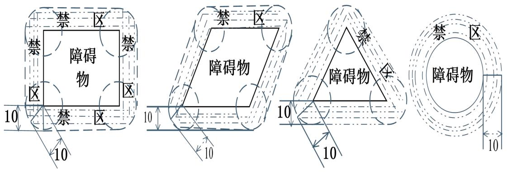

<details>
<summary>text_image</summary>

禁区
禁
障碍物
10
禁区
10
禁区
10
障碍物
10
禁区
障碍物
10
10
</details>

## 【2】障碍物有顶点

## （1）禁区顶点变向路径最小

如下图2 所示，机器人从指定的 A点到C点，需要进行变向，从图形可以看出来，在禁区边缘变向总路径会最小，下面我们进行证明：

图2 禁区顶点处变向图  
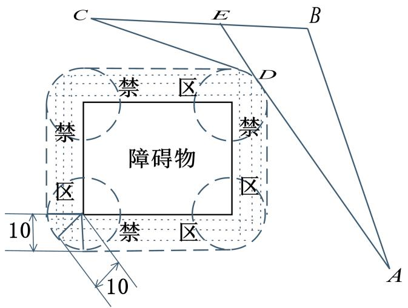

<details>
<summary>text_image</summary>

C
E
B
D
禁区
禁
禁
区
障碍物
10
禁区
A
10
</details>

假设D点为禁区顶点，先不考虑转弯半径等因素，其中B为禁区外任意一点，AD变延长线交BC于E 点。由三角形的任意两边之和大于第三边可以得到：

$$
A B + B E > A D + D E
$$

$$
E C + D E > D C
$$

两式相加得到：

$$
A B + B E + E C + D E > A D + D E + D C
$$

化简得到：

$$
A B + B C > A D + D C
$$

即，由A点到B 点，选择在顶点D处转向，总路径最短。推论得证。

## （2）转弯半径最小路径最短

机器人从A 点到B点需要绕过禁区，在禁区顶点附近（前面已证）转弯。选择的转弯半径越小，得到的路径越短。下面从物理学的角度进行证明：

如下图3 所示，将A到 B的路径看做一条可伸缩的绳子。假设其两点相连时，绳子自然伸长。如线段AB。由于机器人要绕过禁区，因此拉长绳子绕过禁区，又因为机器人有最小转弯半径为10，禁区直径也为 10，因此可以把绳子直接绕过禁区边缘。

由于绳子的弹性势能 $E _ { P }$ 与伸长量L的关系为：

$$
E _ {P} = \frac {1}{2} k \Delta L ^ {2}
$$

因此绳子伸长量最小时，路径最短。

图3 机器人过障碍转弯半径  
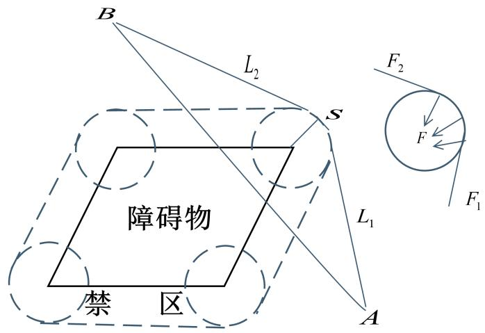

<details>
<summary>text_image</summary>

B
L₂
S
障碍物
禁 区
L₁
A
F₂
F
F₁
</details>

根据最小势能原理<sup>[1]</sup> 可知，当弹性体平衡时，系统势能最小。即弹性体在自由条件下，有由高势能向低势能转化的趋势。现在将圆环看成也有弹性，在如图所示的条件下为初始状态。圆环受力如图所示，此时圆环有缩小的趋势，随着圆环的缩小系统趋于平衡，弹性绳有最小势能。由能量守恒也可以说明，绳子的弹性势能转化为弹性圆环的弹性势能，于是弹性绳的弹性势能减小。

因此，随着圆环的半径的减小，绳子的势能减小，即最短路径变短。所以最小转弯半径最小路径最短得证。

## （3）转弯弧圆心在顶点路径最短

机器人在禁区顶点附近转弯时，转弯弧的圆心在顶点上，路径最短。

下面进行证明：

如下图4所示，圆O和圆O’均过最远点D它们的半径分别为R和R’。其中圆O的圆心在垂线上。 $L _ { 1 } ^ { \phantom { + } }$ S、 、 $\mathrm { L } _ { 2 }$ L和 $\therefore$ 、 $\mathbf { S ^ { \prime } }$ 、 $\mathrm { ~ L ~ } _ { 2 } ^ { \prime }$ 分别为过A、B点向圆 $0 \ddag \mathbb { I } 0 ^ { \prime }$ 所引切线段和所夹圆弧长度。则需证明：

$$
L _ {1} + S + L _ {2} <   L _ {1} ^ {\prime} + S ^ {\prime} + L _ {2} ^ {\prime}
$$

因为两圆圆心不同在过点 D 所引的垂线上，且两圆交于点 D，因此它们只能有两种关系——相交或相切。若两圆相切，由几何定理知切点、圆心 O、圆心 $_ { 0 } \mathbf { \cdot }$ ’三点共线。因点 D 和圆心O均在过D所作直线AB的垂线上，圆 $\therefore \therefore 0 ^ { \prime }$ ’在垂线外，故两圆不会相切，只能相交。要过点D则必有圆O’上点到直线AB的最大距离大于圆 O上点到直线AB的最大距离。运用上文已证得的结论可得到：

$$
L _ {1} + S + L _ {2} <   L _ {1} ^ {\prime} + S ^ {\prime} + L _ {2} ^ {\prime}
$$

因此推论得证。

图4 机器人过障碍转弯圆心位置  
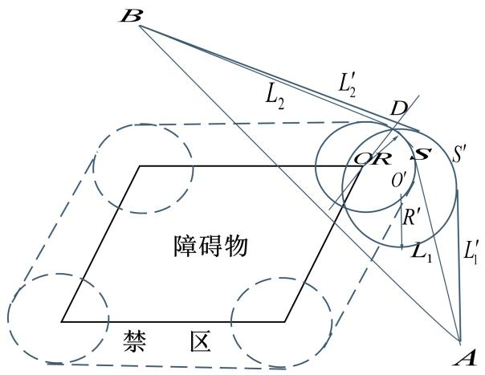

<details>
<summary>text_image</summary>

B
L₂
L′₂
D
S
OR
O′
R′
L₁
L′₁
A
禁区
障碍物
</details>

## （4）结论分析

结合（1）（2）（3）证明得到结论：

机器人过有顶点的障碍物时，沿以顶点为圆心，最小转弯半径为半径的圆弧转弯路径最短，在本题中机器人的最小转弯半径和机器人与障碍物的最小安全距离相等。因此对于本题来说，机器人沿禁区边缘转弯路径最短。

## 【3】障碍物为圆的情况

在前面我们已经证明了障碍物有顶点的情况下，机器人过禁区时沿禁区边缘圆弧转弯路径最小。下面就机器人通过圆形障碍物的情况是否符合以上结论进行讨论。

如图5，分别是机器人通过圆形禁区的 3种情况，其中a图为机器人人沿禁区边缘进行转弯的。b图为机器人沿以圆形障碍物边上一点为圆形，最小转弯半径为转弯半径的弧转弯图，c图为机器人沿一个刚好绕过禁区的圆弧转弯的情况。

图5 机器人通过圆形障碍物  
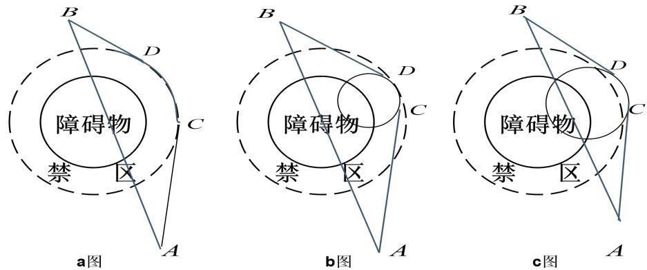

由以上用弹性绳的方法进行证明发现，b图转弯路径最小，但是经过了禁区，因此不可行，另外两种方案a图路径明显要比c图小。因此机器人过禁区时沿禁区边缘圆弧转弯路径最小得结论同样适用于障碍物位圆的情况。转弯半径为：

$\rho = r + d \qquad ( \sharp \sharp r$ 为障碍物半径，d为机器人距离障碍物的最小安全距离）

## 5.1.1.2 模型的建立

经过以上证明得到，起点到目标点中间不管有多少障碍物，最短路径都是由若干个相切的直线和圆弧构成的，前面已经证明机器人经过所有障碍物时，禁区边缘转弯路径最短，因此转弯圆弧半径为危险区域半径。所以在下面模型中经过障碍物转弯时，都以障碍物顶点为转弯弧圆心，最小转弯半径r为转弯半径。

## 【1】途中转弯一次的模型（模型一）

如图6所示，已知机器人要从起点 $\texttt { A (  { x _ { 1 } } ,  { y _ { 1 } } ) }$ 点出发绕过障碍物到终点 $\mathrm { B } ( x _ { 2 } , y _ { 2 } )$ 途中从以障碍物顶点 $\mathrm { ~ D ~ } \left( \boldsymbol { x } _ { 3 } , \boldsymbol { y } _ { 3 } \right)$ 为圆心，r为半径的弧上转弯，切点为C和E。需要求C点和E点坐标，以及 $A \hat { C } \hat { E } B$ 的长度。

图6 机器人过障碍物转弯图  
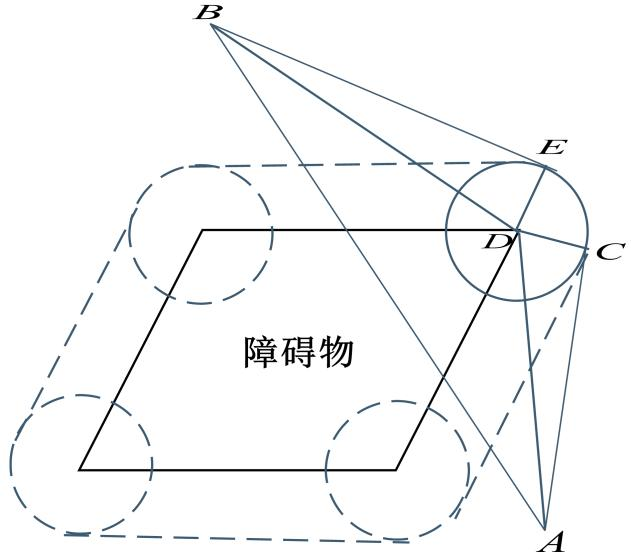

<details>
<summary>text_image</summary>

B
E
D
C
障碍物
A
</details>

根据两点距离公式：

$$
A B = \sqrt {\left(x _ {1} - x _ {2}\right) ^ {2} + \left(y _ {1} - y _ {2}\right) ^ {2}}
$$

$$
A D = \sqrt {\left(x _ {1} - x _ {3}\right) ^ {2} + \left(y _ {1} - y _ {3}\right) ^ {2}}
$$

$$
B D = \sqrt {\left(x _ {3} - x _ {2}\right) ^ {2} + \left(y _ {3} - y _ {2}\right) ^ {2}}
$$

由于C点和E点是切点，所以

$$
D E \perp \mathrm{BE} \quad D C \perp \mathrm{AC}
$$

根据勾股定理：

$$
B E = \sqrt {B D ^ {2} - r} = \sqrt {(x _ {3} - x _ {2}) ^ {2} + (y _ {3} - y _ {2}) ^ {2} - r}
$$

$$
A C = \sqrt {A D ^ {2} - r} = \sqrt {\left(x _ {1} - x _ {3}\right) ^ {2} + \left(y _ {1} - y _ {3}\right) ^ {2} - r}
$$

## ◆切点坐标的确定

假设C点坐标为 $( \mathbf { \Phi } _ { X _ { i } } , \mathbf { \Phi } _ { y _ { i } } )$ ，E点坐标为 $( \boldsymbol { \mathbf { \mathit { x } } } _ { j } , \boldsymbol { \mathbf { \mathit { y } } } _ { j } )$ 。那么根据两点距离公式还有：

$$
\begin{array}{l} \left\{ \begin{array}{l} B E = \sqrt {\left(x _ {2} - x _ {j}\right) ^ {2} + \left(y _ {2} - y _ {j}\right) ^ {2}} \\ D E = \sqrt {\left(x _ {3} ^ {2} - x _ {j}\right) ^ {2} + \left(y _ {3} - y _ {j}\right) ^ {2}} \end{array} \right. \\ \left\{ \begin{array}{l} A C = \sqrt {\left(x _ {1} - x _ {i}\right) ^ {2} + \left(y _ {1} - y _ {i}\right) ^ {2}} \\ D C = \sqrt {\left(x _ {3} ^ {2} - x _ {i}\right) ^ {2} + \left(y _ {3} - y _ {i}\right) ^ {2}} \end{array} \right. \\ \end{array}
$$

综上所述，对于E 点坐标就有：

$$
\left\{ \begin{array}{l} \sqrt {\left(x _ {3} - x _ {2}\right) ^ {2} + \left(y _ {3} - y _ {2}\right) ^ {2} - r} = \sqrt {\left(x _ {2} - x _ {j}\right) ^ {2} + \left(y _ {2} - y _ {j}\right) ^ {2}} \\ \sqrt {\left(x _ {3} ^ {2} - x _ {j}\right) ^ {2} + \left(y _ {3} - y _ {j}\right) ^ {2}} = r \end{array} \right.
$$

对于C点坐标：

$$
\left\{ \begin{array}{l} \sqrt {\left(x _ {1} - x _ {3}\right) ^ {2} + \left(y _ {1} - y _ {3}\right) ^ {2} - r} = \sqrt {\left(x _ {1} - x _ {i}\right) ^ {2} + \left(y _ {1} - y _ {i}\right) ^ {2}} \\ \sqrt {\left(x _ {3} ^ {2} - x _ {i}\right) ^ {2} + \left(y _ {3} - y _ {i}\right) ^ {2}} = r \end{array} \right.
$$

解以上方程组即可得到两个切点 C和E的坐标。

## ◆转弯弧长的确定

在 $\Delta A D B$ 中，根据余弦定理：

$$
\angle A D C = a r c C O S \frac {A D ^ {2} + B D ^ {2} - A B ^ {2}}{2 A D \times B D}
$$

在 $R t \Delta A C D$ 中：

$$
\angle A D C = \operatorname{arcCOS} \frac {r}{A D}
$$

在 $R t \Delta B E D$ 中：

$$
\angle B D E = \operatorname{arcCOS} \frac {r}{B D}
$$

对于 $\angle C D E$ 就有：

$$
\angle C D E = 2 \pi - \angle A D C - \angle B D E - \angle A D B
$$

因此弧 $\hat { C } \hat { E }$ 的长度就为：

$$
\hat {C} \hat {E} = r \times \angle C D E
$$

## ◆总路径和总时间的确定

机器人途中转弯一次路径长度就为

$$
S = A C + B E + \hat {C} \hat {E}
$$

所用时间就为

$$
T = \frac {A C}{v _ {0}} + \frac {B E}{v _ {0}} + \frac {\hat {C} \hat {E}}{v _ {\rho}}
$$

## 【2】途中转弯多次的模型（模型二）

机器人在从起点到终点的过程中，如果障碍物多的话，机器人需要通过多次转弯才能到达目标点，多次转弯可以分解成由多个两次转弯和一次转弯组成，而在两次转弯的过程中，两个转弯弧度的公切线分为内公切线和外公切线两种。

## ◆沿内公切线前进的情况

如图7所示，机器人从起始点 $\mathrm { A } ( x _ { 1 } , y _ { 1 } )$ 到目标点 $\mathrm { B } ( x _ { 2 } , y _ { 2 } )$ 要经过两个障碍物，途中从障碍物内侧转两次弯，已知两个障碍物转弯处的顶点为 $\mathrm { D } ( x _ { 3 } , y _ { 3 } )$ $\mathrm { F } ( x _ { 4 } , y _ { 4 } )$ ,圆 D 和圆F 的半径均为r。

图7 内公切线路径图  
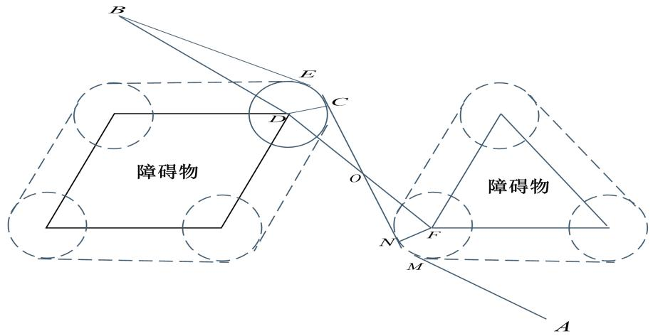

<details>
<summary>text_image</summary>

B
E
C
D
障碍物
O
N
F
M
障碍物
A
</details>

两圆心连线与内切线交点为 $0 ( x _ { 5 } , y _ { 5 } )$ 点。易证：

$$
R t \Delta D C O \cong R t \Delta F N O
$$

因此O点为线段DF的中点，根据中点坐标公式：

$$
\left\{ \begin{array}{l} x _ {5} = \frac {x _ {3} + x _ {4}}{2} \\ y _ {5} = \frac {y _ {3} + y _ {4}}{2} \end{array} \right.
$$

确定O点坐标后，用模型一就可以分别求出 $A \hat { M } \hat { N } O$ 和 $O \hat { C } \hat { E } B$ 的长度，以及确定 C、E、M、N 点坐标。

## ◆沿外公切线前进的情况

如图8所示，机器人从起始点 $\mathrm { A } ( x _ { 1 } , y _ { 1 } )$ 到目标点 $\mathrm { B } ( x _ { 2 } , y _ { 2 } )$ 要经过两个障碍物，途中从障碍物外侧转两次弯，已知两个障碍物转弯处的顶点为 $\mathbb { M } ( x _ { 3 } , y _ { 3 } ) , \ \mathbb { N } ( x _ { 4 } , y _ { 4 } )$ ,圆 M 和圆N 的半径均为r。

图8 外公切线路径  
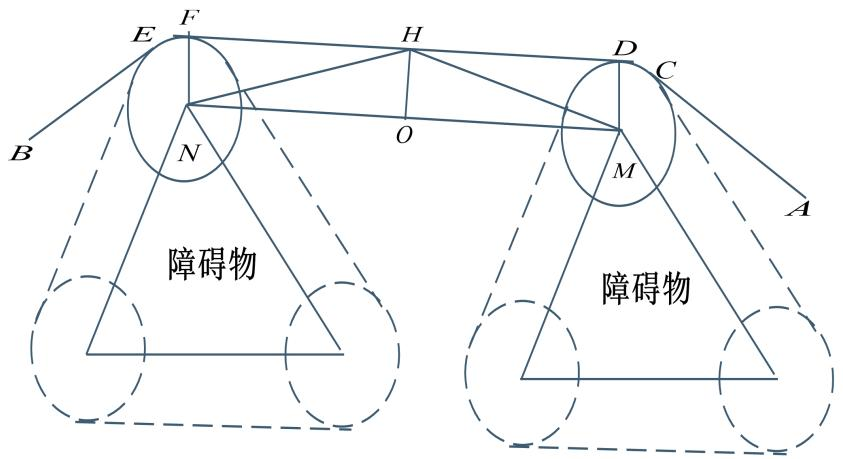

<details>
<summary>text_image</summary>

障碍物
障碍物
</details>

在两圆心的的连线上找出中点 $\mathrm { 0 } ( x _ { 5 } , y _ { 5 } )$ ，过 O点作DF垂线，交DF于H $( x _ { a } , y _ { a } )$ 点。

$$
O M = O N = \frac {1}{2} \sqrt {\left(x _ {3} - x _ {4}\right) ^ {2} + \left(y _ {3} - y _ {4}\right) ^ {2}}
$$

根据中点坐标公式可得O点坐标：

$$
\left\{ \begin{array}{l} x _ {5} = \frac {x _ {3} + x _ {4}}{2} \\ y _ {5} = \frac {y _ {3} + y _ {4}}{2} \end{array} \right.
$$

由于 $M D \bot \mathrm { D F } , \mathrm { N F } \bot \mathrm { D F }$ ,所以四变形 MNDF 为矩形，因此H也为DF 的中点,且$\mathrm { H O = r }$

根据勾股定理：

$$
\begin{array}{l} H N = \sqrt {O H ^ {2} + O N ^ {2}} = \sqrt {\frac {1}{4} (x _ {3} - x _ {4}) ^ {2} + \frac {1}{4} (y _ {3} - y _ {4}) ^ {2} + r ^ {2}} \\ \mathrm{HO} = \sqrt {(x _ {a} - \frac {x _ {3} + x _ {4}}{2}) ^ {2} + (y _ {a} - \frac {y _ {3} + y _ {4}}{2}) ^ {2}} \\ \end{array}
$$

因此对于H点坐标就有：

$$
\left\{ \begin{array}{l} \sqrt {(x _ {a} - \frac {x _ {3} + x _ {4}}{2}) ^ {2} + (y _ {a} - \frac {y _ {3} + y _ {4}}{2}) ^ {2}} = r \\ \sqrt {\frac {1}{4} (x _ {3} - x _ {4}) ^ {2} + \frac {1}{4} (y _ {3} - y _ {4}) ^ {2}} = \sqrt {(x _ {a} - x _ {4}) ^ {2} + (y _ {a} - y _ {4}) ^ {2}} \end{array} \right.
$$

解上面方程组可以求出 H 点坐标 $( x _ { a } , y _ { a } )$ ，确定 H 点坐标后，就可以用模型一分别求出路径 $A \hat { C } \hat { D } H$ 和 $H \hat { F } \hat { E } B$ 长度，以及切点C、D、E、F坐标。以及所用时间。

## 5.1.1.3 模型计算

假设机器人从起始点到目标点经过的路径有m条直线，长度分别为 $d _ { m }$ ，有n条弧线，长度分别为 $u _ { n }$ ，则机器人到达目标点的总路为

$$
s = \sum_ {m = 1} ^ {m} d _ {m} + \sum_ {n = 1} ^ {n} u _ {n}
$$

途中所用时间为：

$$
T = \frac {\sum_ {m = 1} ^ {m} d _ {m}}{v _ {0}} + \frac {\sum_ {n = 1} ^ {n} u _ {n}}{v _ {\rho}}
$$

其中 $\nu _ { \rho } = \frac { \nu _ { 0 } } { 1 + \mathrm { e } ^ { 1 0 - 0 . 1 \rho ^ { 2 } } }$ ，<sub></sub>是转弯半径。

## 【1】O-A的最短路径

如图9所示，根据前文证明，O-A 点可能的最短路线有两条，从 5 号障碍物左上角处拐弯，或从5 号障碍物右下角处拐弯。

图9 O-A可能最佳路线

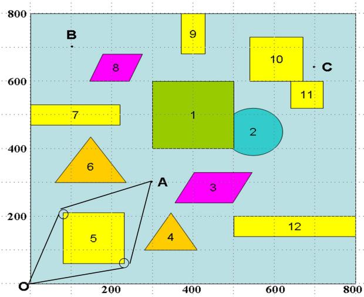

<details>
<summary>bubble</summary>

| Shape | X | Y |
| --- | --- | --- |
| 1 | ~400 | ~600 |
| 2 | ~550 | ~450 |
| 3 | ~400 | ~250 |
| 4 | ~350 | ~150 |
| 5 | ~150 | ~200 |
| 6 | ~150 | ~350 |
| 7 | ~50 | ~500 |
| 8 | ~250 | ~600 |
| 9 | ~400 | ~750 |
| 10 | ~650 | ~650 |
| 11 | ~700 | ~550 |
| 12 | ~650 | ~200 |
</details>

两条路线都为基本的线圆组合，用模型一可直接求解，用 MATLAB 程序解得，两条路径分别为471.0372，505.9853个单位，因此最佳总路程为从障碍物5左上经过路线，总路程为S 471.0372个单位；总时间T 96.0178 秒，经过二条直线段和一以条以(80 210)为圆心半径r 10的弧线段，途中具体情况如表1：

表1 O-A最短路径途中情况

<table><tr><td></td><td>起点坐标点</td><td>终点坐标点</td><td>转弯弧圆心</td><td>距离</td><td>时间</td></tr><tr><td rowspan="2">直线1</td><td>0</td><td>70.50595</td><td rowspan="2">-</td><td rowspan="2">224.4994</td><td rowspan="2">44.9</td></tr><tr><td>0</td><td>213.1405</td></tr><tr><td rowspan="2">弧线1</td><td>70.50595</td><td>76.60645</td><td>80</td><td rowspan="2">9.051</td><td rowspan="2">3.7402</td></tr><tr><td>213.1405</td><td>219.4066</td><td>210</td></tr><tr><td rowspan="2">直线2</td><td>76.60645</td><td>300</td><td rowspan="2">-</td><td rowspan="2">237.4868</td><td rowspan="2">47.4974</td></tr><tr><td>219.4066</td><td>300</td></tr><tr><td>总和</td><td>-</td><td>-</td><td>-</td><td>471.0372</td><td>96.1376</td></tr></table>

## 【2】O-B的最短路

如图 10 所示，机器人从 O 到 B 点有三条可能最短路线，在路径途中经过多次转弯到达目标点，因此先用模型二把路径分为若干个基本线圆组合，然后用模型一对每个线圆组合求解，可得出答案。

图10 O-B 可能最佳路线  
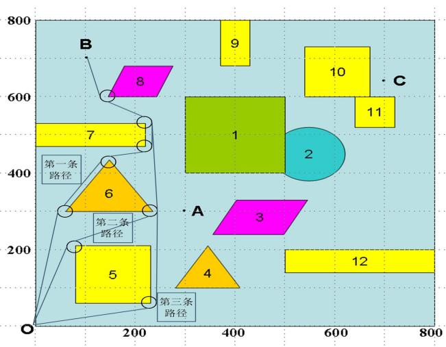

<details>
<summary>bubble</summary>

| Point | X | Y |
| --- | --- | --- |
| 1 | ~350 | ~400 |
| 2 | ~550 | ~400 |
| 3 | ~400 | ~250 |
| 4 | ~350 | ~150 |
| 5 | ~150 | ~150 |
| 6 | ~150 | ~350 |
| 7 | ~100 | ~500 |
| 8 | ~200 | ~600 |
| 9 | ~400 | ~750 |
| 10 | ~600 | ~650 |
| 11 | ~650 | ~550 |
| 12 | ~650 | ~200 |
</details>

经 MATLAB 计算可得到三条路线的路程分别为853.7127 ，865.4391,901.299 个单位；最佳总路程为路线一，总路程为S 853.7127个单位；总时间T 179.0851秒，经过六条直线段和五条分别以 (60 300) ， (150 435) ， (220 470) ， (220 530) ， (150 600) 为圆心半径r 10的弧线段，具体起始点如表2：

表2 O-B 最短路径途中情况

<table><tr><td></td><td colspan="2">起点坐标点</td><td colspan="2">终点坐标点</td><td>转弯弧圆心</td><td>距离</td><td>时间</td></tr><tr><td>直线1</td><td>0</td><td>0</td><td>50.136</td><td>301.649</td><td>-</td><td>305.78</td><td>61.156</td></tr><tr><td>弧线1</td><td>50.136</td><td>301.649</td><td>51.6564</td><td>305.512</td><td>60 300</td><td>4.188</td><td>1.6752</td></tr><tr><td>直线2</td><td>51.6564</td><td>305.512</td><td>157.5493</td><td>428.4419</td><td>-</td><td>162.25</td><td>32.45</td></tr><tr><td>弧线2</td><td>157.5493</td><td>428.4419</td><td>159.9754</td><td>435.7009</td><td>150 435</td><td>7.854</td><td>3.1416</td></tr><tr><td>直线3</td><td>159.9754</td><td>435.7009</td><td>229.2334</td><td>466.1602</td><td>-</td><td>75.66</td><td>15.132</td></tr><tr><td>弧线3</td><td>229.2334</td><td>466.1602</td><td>230</td><td>470</td><td>220 470</td><td>13.6136</td><td>5.44544</td></tr><tr><td>直线4</td><td>230</td><td>470</td><td>230</td><td>530</td><td>-</td><td>60</td><td>12</td></tr><tr><td>弧线4</td><td>230</td><td>530</td><td>225.1602</td><td>538.5658</td><td>220 530</td><td>9.9484</td><td>3.97936</td></tr><tr><td>直线5</td><td>225.1602</td><td>538.5658</td><td>144.4749</td><td>591.6149</td><td>-</td><td>96.95</td><td>19.39</td></tr><tr><td>弧线5</td><td>144.4749</td><td>591.6149</td><td>140.6933</td><td>596.3414</td><td>150 600</td><td>6.1087</td><td>2.44348</td></tr><tr><td>直线6</td><td>140.6933</td><td>596.3414</td><td>100</td><td>700</td><td>-</td><td>111.36</td><td>22.272</td></tr><tr><td>总和</td><td colspan="2">-</td><td colspan="2">-</td><td>-</td><td>853.7127</td><td>179.085</td></tr></table>

## 【2】O-C的最短路径

如图 11 所示，机器人从 O 到 C 点有三条可能最短路线，在路径途中经过多次转弯到达目标点，因此先用模型二把路径分为若干个基本线圆组合，然后用模型一对每个线圆组合求解，可得出答案。

特别要说明的是在 O-C的第二条路径中，通过前文的证明，经过圆形障碍物的转弯半径应该为 $R + \rho = 7 0 $ 0

图11 O-C 可能最佳路线  
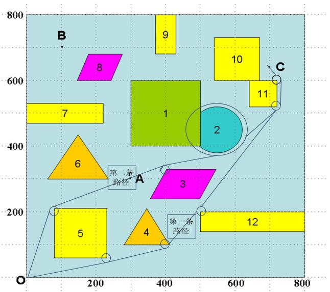

<details>
<summary>text_image</summary>

B
9
10
8
7
6
1
2
C
A
3
第二条
路径
4
第一条
路径
5
12
O
</details>

经 MATLAB 计算得到距离分别为1087.6，1117.418个单位，最佳总路径为路线一，总距离为 S 1087.6 个单位；总时间T 221.9 秒，经过五条直线段和四条分别以(410 100) ， (500 200) ， (720 540) ， (720 600) 为圆心半径 $r = 1 0$ 的弧线段，途中具体情况如表3：

表3 O-C 最短路径途中情况

<table><tr><td></td><td>起点坐标点</td><td>终点坐标点</td><td>转弯弧圆心</td><td>距离</td><td>时间</td></tr><tr><td>直线1</td><td>0 0</td><td>412.0796 90.2186</td><td>-</td><td>421.84</td><td>84.368</td></tr><tr><td>弧线1</td><td>412.0796 90.2186</td><td>418.2907 94.4085</td><td>410 100</td><td>7.6794</td><td>3.0718</td></tr><tr><td>直线2</td><td>418.2907 94.4085</td><td>491.6205.4275</td><td>-</td><td>133.04</td><td>26.608</td></tr><tr><td>弧线2</td><td>491.6205.4275</td><td>492 206</td><td>500 200</td><td>0.6981</td><td>0.2792</td></tr><tr><td>直线3</td><td>492 206</td><td>727.8719513.8328</td><td>-</td><td>387.81</td><td>77.562</td></tr><tr><td>弧线3</td><td>727.8719513.8328</td><td>730 520</td><td>720 540</td><td>6.4577</td><td>2.5751</td></tr><tr><td>直线4</td><td>730 520</td><td>730 600</td><td>-</td><td>80</td><td>16</td></tr><tr><td>弧线4</td><td>730 600</td><td>727.7715606.2932</td><td>720 600</td><td>6.8068</td><td>2.7227</td></tr><tr><td>直线5</td><td>727.7715606.2932</td><td>700 640</td><td>-</td><td>43.59</td><td>8.718</td></tr><tr><td>总和</td><td>-</td><td>-</td><td>-</td><td>1087.6</td><td>221.9048</td></tr></table>

## 5.1.2 经过多个目标点（O-A-B-C-O）

本问题的特点是要经过中间若干个目标点后在回到起点，不能简单的处理为求解每个两点之间的最短路径之和，因为机器人不能直线转向，所以在经过目标点时，应该考虑提前转向，且中间目标点应该在转弯弧上。因此对于中间目标点处转弯圆弧圆心的确定为本题的一个难点。

## ◆经过中间目标点的路径（模型三）

如图12所示已知点 $B \left( x _ { 2 } , y _ { 2 } \right) , C ( x _ { 3 } , y _ { 3 } )$ 分别为两个障碍物的顶点，且机器人要绕过B点障碍物经过中间目标点 $A ( x _ { 1 } , y _ { 1 } )$ 到另一个障碍物顶点转弯。其中 $A ( x _ { 1 } , y _ { 1 } )$ 为在圆心为$O \left( x _ { a } , y _ { b } \right)$ 半径为 R 的圆上。由于点 $B \left( x _ { 2 } , y _ { 2 } \right)$ $C ( x _ { 3 } , y _ { 3 } )$ 分别引同侧相切于圆心为$O \left( x _ { a } , y _ { b } \right)$ 的圆的切线，因此我们需要用点 $B \left( x _ { 2 } , y _ { 2 } \right)$ 和点 $C ( x _ { 3 } , y _ { 3 } )$ 来确定圆心 $O \big ( x _ { a } , y _ { b } \big )$ 的位置。

图12 机器人经过中途目标点图

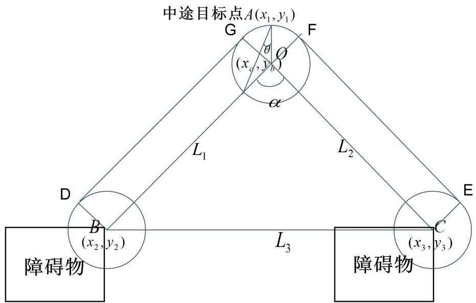

<details>
<summary>text_image</summary>

中途目标点A(x₁,y₁)
G
F
θ
(xₐ,yᵦ)
O
α
L₁
L₂
D
B
(x₂,y₂)
E
C
(x₃,y₃)
障碍物
L₃
障碍物
</details>

由于需要确定的圆心 $O \big ( x _ { a } , y _ { b } \big )$ 是以R为半径点 $A ( x _ { 1 } , y _ { 1 } )$ 为圆上一点，所以需要进行搜索求解求出要确定的圆心。这样就将目标转化为距离和弧长最短的目标模型。

$$
\text {Min} z = (\pi - \alpha) \times r + l _ {1} + l _ {2}
$$

根据点 $A ( x _ { 1 } , y _ { 1 } )$ 是圆上一点的关系就可以 $A ( x _ { 1 } , y _ { 1 } )$ 点为圆心R为半径搜索得出圆心$O \left( x _ { a } , y _ { b } \right)$ ，那么得出关系为：

$$
x _ {a} = x _ {1} + r \times \sin \theta
$$

$$
y _ {a} = y _ {1} - r \times \cos \theta
$$

将上述关系转化为圆的标准方程可以得到：

$$
(x _ {a} - x _ {1}) ^ {2} + (y _ {a} - y _ {1}) ^ {2} = r ^ {2}
$$

根据两点直接的距离公式可以得出以下条件：

$$
(x _ {a} - x _ {2}) ^ {2} + (y _ {a} - y _ {2}) ^ {2} = l _ {1} ^ {2}
$$

$$
(x _ {a} - x _ {3}) ^ {2} + (y _ {a} - y _ {3}) ^ {2} = l _ {2}
$$

$$
(x _ {2} - x _ {3}) ^ {2} + (y _ {2} - y _ {3}) ^ {2} = l _ {3} ^ {2}
$$

由于 $_ { D G }$ 与 $E F$ 是两个圆的同侧公切线，两圆的半径相等而 $_ { D G }$ 与OB 和 $O C$ 与 $E F$ 是矩形的对边，所以 $D G = O B = L _ { 1 }$ $E F = O C = L _ { 2 }$

在 $\Delta B O C$ 中由余弦定理可以得出：

$$
\cos \alpha = \frac {l _ {1} ^ {2} + l _ {2} ^ {2} - l _ {3} ^ {2}}{2 \times l _ {1} \times l _ {2}}
$$

最后我们建立的模型为：

$$
\text {Min} z = (\pi - \alpha) \times R + L _ {1} + L _ {2}
$$

$$
\left\{ \begin{array}{l} \left(x _ {a} - x _ {1}\right) ^ {2} + \left(y _ {a} - y _ {1}\right) ^ {2} = r ^ {2} \\ \left(x _ {a} - x _ {2}\right) ^ {2} + \left(y _ {a} - y _ {2}\right) ^ {2} = l _ {1} ^ {2} \\ \left(x _ {a} - x _ {3}\right) ^ {2} + \left(y _ {a} - y _ {3}\right) ^ {2} = l _ {2} ^ {2} \\ \left(x _ {2} - x _ {3}\right) ^ {2} + \left(y _ {2} - y _ {3}\right) ^ {2} = l _ {3} ^ {2} \\ \cos \alpha = \frac {l _ {1} ^ {2} + l _ {2} ^ {2} - l _ {3} ^ {2}}{2 \times l _ {1} \times l _ {2}} \end{array} \right.
$$

根据上面模型我们可以求解出A和B圆心坐标，由于C点的圆心与其他附近的圆是交错相切，根据交错相切时切线与圆心的连线的交点是两圆心的的中间点（前文已经证明）可以得出与同侧相切时对应的点 $B ( c , d )$ 和 $C ( e , f )$ 的坐标，所以我们只需套用上面同侧相切的模型求解C点的圆心坐标。C点的圆心与C的连线刚好与 $B ( c , d )$ 到圆的切线垂直，即点C是 $B ( c , d )$ 与圆相交的切点。

通过本模型可以求出两个障碍物中间为中途目标点的线圆组合，其他情况的线圆组合可用模型一和模型二进行求解。

## ◆模型计算

如图13所示，通过前文证明以及单目标点的计算模型，可以得到从O 点出发，经过A、B、C三点在回到O点的最短路线只有一条。首先利用模型三算出A、B、C三点处转弯弧度的圆心坐标，然后用模型二把路径转化为若干个基本线圆组合。利用模型一计算。

图 13 O-A-B-C-O 最短路径  
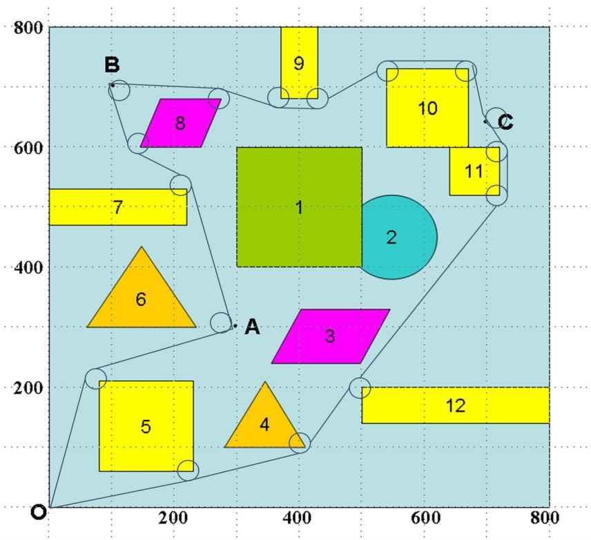

<details>
<summary>bubble</summary>

| Point | X | Y |
| --- | --- | --- |
| 1 | ~350 | ~400 |
| 2 | ~550 | ~450 |
| 3 | ~400 | ~250 |
| 4 | ~350 | ~150 |
| 5 | ~150 | ~200 |
| 6 | ~150 | ~350 |
| 7 | ~100 | ~500 |
| 8 | ~200 | ~650 |
| 9 | ~400 | ~750 |
| 10 | ~600 | ~650 |
| 11 | ~700 | ~550 |
| 12 | ~700 | ~200 |
</details>

利用 MATLAB 编程计算得到，机器人从 $O  A  B  C  O$ 最佳总路程为

S 2812.52个单位；总时间T 585.6712秒，一共经过十六条直线段和十五条分别以(80 210) (290.8855 304.1141) , (220 530) , (150 600) , (108.2296 694.3191) , (270 680) ,(370 680) , (420 680) , (540 730) , (670 730) , (709.7933,642.0227) (700 640) , (720 600) ,(500 200) , (410 100) 为圆心半径 r  10 的弧线段，具体起始点如附表 1：

表4 经过多目标点最短路径途中部分情况

<table><tr><td></td><td>起点坐标点</td><td>终点坐标点</td><td>转弯弧圆心</td><td>距离</td><td>时间</td></tr><tr><td>直线1</td><td>00</td><td>70.5059213.1405</td><td>-</td><td>224.4994</td><td>44.8999</td></tr><tr><td>弧线1</td><td>70.5059213.1405</td><td>76.6064219.4066</td><td>80210</td><td>9.25</td><td>3.7</td></tr><tr><td>直线2</td><td>76.6064219.4066</td><td>294.1547294.6636</td><td>-</td><td>229.98</td><td>45.996</td></tr><tr><td>弧线2</td><td>294.1547294.6636</td><td>281.3443301.7553</td><td>290.8855304.1141</td><td>15.3589</td><td>6.1436</td></tr><tr><td>...</td><td>...</td><td>...</td><td>...</td><td>...</td><td>...</td></tr><tr><td>直线14</td><td>727.9377513.9178</td><td>492.0623206.0822</td><td>-</td><td>387.81</td><td>77.562</td></tr><tr><td>弧长14</td><td>492.0623206.0822</td><td>491.6552205.5103</td><td>500200</td><td>0.6981</td><td>0.2792</td></tr><tr><td>直线15</td><td>491.6552205.5103</td><td>412.138790.2314</td><td>-</td><td>133.04</td><td>26.608</td></tr><tr><td>弧线15</td><td>412.138790.2314</td><td>418.334894.4085</td><td>410100</td><td>7.6794</td><td>3.0718</td></tr><tr><td>直线16</td><td>418.334894.4085</td><td>0 0</td><td>-</td><td>421.84</td><td>84.368</td></tr><tr><td>总和</td><td colspan="3"></td><td>2812.52</td><td>585.6712</td></tr></table>

## 5.2最短时间路径模型（问题二）

## ◆模型分析

本问题是研究机器人从O点出发绕过障碍物 5 到达A 的最短时间，根据问题一所求最短路，可以知道最短时间路线也是从障碍物5的左上通过，机器人所有的时间由直线段和弧线段两部分时间组成。由于最短时间和最短距离不是同一条路线，因此在求最短时间时先要确定最短时间的路径。机器人靠近障碍物时距离障碍物的最近距离不能少于10个单位。所以根据机器人在行走路线中要避免遇到的障碍物和影响其行动的范围来确定机器人行走的范围。

机器人转弯时最大转弯速度为:

$$
v = v (\rho) = \frac {v _ {0}}{1 + \mathrm{e} ^ {1 0 - 0 . 1 \rho^ {2}}}
$$

机器人经过圆弧时间为：

$$
t = \frac {\alpha \rho}{v _ {\rho}}
$$

由上式可以看出当转弯半径变小时，机器人速度也变小，而机器人通过的圆弧长度也变小。t的变化不好确定。

当机器人转弯半径增大时，转弯速度也增大，而机器人通过的圆弧长度也随着增大。t的变化不好确定。

因此对于转弯时间t随转弯半径 $\rho$ 的变化关系，没有直接的线性关系。而对于转弯半径 $\rho$ 的变化在题目中是有限制的， $\rho$ 过大会发生碰撞。 $\rho$ 过小（小于10）会发生侧翻。

所以我们可以根据 $\rho$ 的变化范围，建立最小时间的非线性规划模型，对t最小时的 $\rho$ 进行搜索求解。

## ◆模型准备：

如图 14 所示，已知 $O \big ( x _ { 1 } , y _ { 1 } \big )$ 是起始点， $A \left( x _ { 2 } , y _ { 2 } \right)$ 是终点， $P ( x _ { 3 } , y _ { 3 } )$ 是障碍物 5 的左上顶点。假设机器人在 $\mathrm { ~ C ~ } ( x _ { c } , y _ { c } )$ 处以 $\mathrm { N } \left( x , y \right)$ 为圆心， $r$ 为半径转弯，经弧 $\hat { B } \hat { C }$ ,在$\mathrm { B } ( x _ { b } , y _ { b } )$ 点转弯，可以得到最短时间路径。连结BC，做ND⊥于BC。ON长度为a，AN长度为 $b$ ，切线OC的长度为s ，切线AB 的长度为s 。 $s _ { 1 }$ $s _ { 2 }$

令 $B D = d$ ，由于B点和C点为切点，所以

$$
\angle D N B = \frac {1}{2} \theta
$$

$$
B D = \frac {1}{2} B C
$$

图14 最短时间示意图  
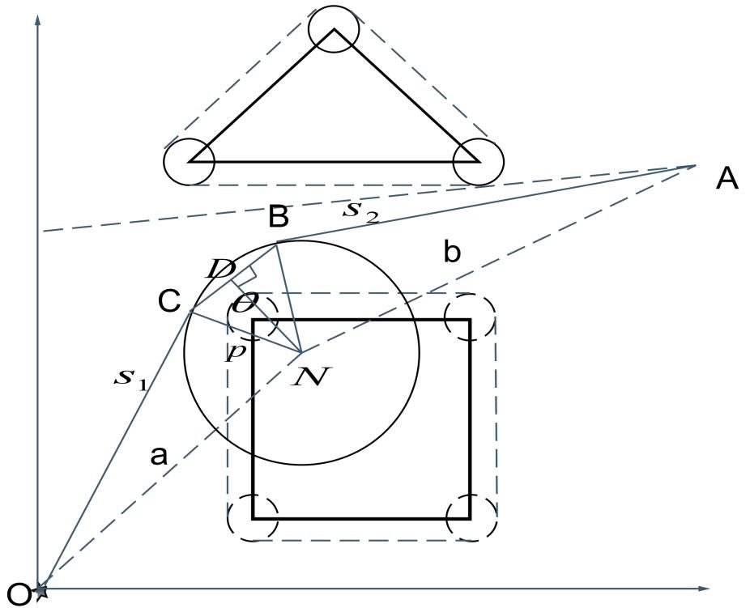

<details>
<summary>text_image</summary>

A
B s₂
C D b
D
θ
p N
s₁
a
O
</details>

由两点之间的距离公式得出：

$$
a = \sqrt {(x - x _ {1}) ^ {2} + (y - y _ {1}) ^ {2}}
$$

$$
b = \sqrt {(x - x _ {2}) ^ {2} + (y - y _ {2}) ^ {2}}
$$

因为B点和C 点是切点，所以：

$$
\sqrt {(x _ {c} - x) ^ {2} + (y _ {c} - y) ^ {2}} = r
$$

$$
\sqrt {\left(x _ {b} - x\right) ^ {2} + \left(y _ {b} - y\right) ^ {2}} = r
$$

根据勾股定理可以得到：

$$
s _ {1} = \sqrt {a ^ {2} - r ^ {2}}
$$

$$
s _ {2} = \sqrt {b ^ {2} - r ^ {2}}
$$

根据距离公式：

$$
B C = \sqrt {\left(x _ {b} - x _ {c}\right) ^ {2} + \left(y _ {b} + y _ {c}\right) ^ {2}}
$$

在RtNBD中

$$
\sin \left(\frac {\theta}{2}\right) = \frac {\sqrt {\left(x _ {b} - x _ {c}\right) ^ {2} + \left(y _ {b} + y _ {c}\right) ^ {2}}}{2 \times r}
$$

所以

$$
l = 2 r \times \arcsin (\frac {\sqrt {(x _ {b} - x _ {c}) ^ {2} + (y _ {b} - y _ {c}) ^ {2}}}{2 r})
$$

## ◆目标分析

根据机器人行走的直线距离和速度以及弧线长度和对应的弧线速度建立最短时间的目标：

$$
M i n = \frac {s _ {1} + s _ {2}}{v _ {o}} + \frac {l}{v _ {p}}
$$

## ◆约束分析

根据机器人与障碍物的距离至少要超过10个单位可以得到半径r的约束条件，即必须使圆弧离障碍物10个以上的单位：

$$
r - \sqrt {(x - x _ {3}) ^ {2} + (y - y _ {3}) ^ {2}} \geq 1 0
$$

对于两个切点的范围：

$$
x _ {c} <   8 0
$$

$$
y _ {b} > 2 1 0
$$

根据问题一证明的结论圆心在障碍物以内的距离最短可以得出约束条件为：

$$
8 0 \leq x \leq 2 3 0
$$

$$
0 <   y \leq 2 1 0
$$

因为机器人不能直线转弯，转弯路径由与直线路径相切的一段圆弧组成，因此对于C、B两点来说，必须保证是切点：

C、B 两点在圆上，与圆心的距离为半径r：

$$
\sqrt {(x _ {c} - x) ^ {2} + (y _ {c} - y) ^ {2}} = r
$$

$$
\sqrt {\left(x _ {b} - x\right) ^ {2} + \left(y _ {b} - y\right) ^ {2}} = r
$$

$\triangle \Nu { 0 } \mathrm { C }$ 和 $\triangle \mathrm { A B N }$ 必须是直角三角形，B 点和C点为两直角边交点。

$$
s _ {1} = \sqrt {a ^ {2} - r ^ {2}}
$$

$$
s _ {2} = \sqrt {b ^ {2} - r ^ {2}}
$$

## ◆模型的建立与求解

综合以上条件，建立时间最短的优化模型：

$$
M i n = \frac {s _ {1} + s _ {2}}{v _ {o}} + \frac {l}{v _ {p}}
$$

$$
\begin{array}{l} s \left\{ \begin{array}{l} r - \sqrt {\left(x - x _ {3}\right) ^ {2} + \left(y - y _ {3}\right) ^ {2}} \geq 1 0 \\ r = \sqrt {\left(x _ {b} - x\right) ^ {2} + \left(y _ {b} - y\right) ^ {2}} \\ r = \sqrt {\left(x _ {c} - x\right) ^ {2} + \left(y _ {c} - y\right) ^ {2}} \\ s _ {2} = \sqrt {\left(x - x _ {2}\right) ^ {2} + \left(y - y _ {2}\right) ^ {2} - r ^ {2}} \\ s _ {1} = \sqrt {\left(x - x _ {1}\right) ^ {2} + \left(y - y _ {1}\right) ^ {2} - r ^ {2}} \\ 8 0 <   x <   2 3 0 \\ y _ {b} > 2 1 0 \\ x _ {c} <   8 0 \\ 0 <   y <   2 1 0 \end{array} \right. \end{array}
$$

用Lingor软件编程求得最短时间为 94.22825 秒，转弯半径为 $r = 1 2 . 9 8 8 6$ ，具体结果见表5：

表5 O-A 最短时间路径途中情况

<table><tr><td></td><td>起点坐标点</td><td>终点坐标点</td><td>转弯弧圆心</td><td>距离</td><td>时间</td></tr><tr><td>直线1</td><td>0 0</td><td>69.8045211.9779</td><td>-</td><td>223.1755</td><td>44.6351</td></tr><tr><td>弧线1</td><td>69.8045211.9779</td><td>77.74918220.1387</td><td>82.1414207.9153</td><td>11.7899</td><td>2.360433</td></tr><tr><td>直线2</td><td>77.74918220.1387</td><td>0 0</td><td>-</td><td>236.1636</td><td>47.23272</td></tr><tr><td>总和</td><td colspan="3">-</td><td>471.129</td><td>94.22825</td></tr></table>

## ◆结果分析

把结果同问题一比较发现最短路径未必所用时间最少，关键在于转弯半径和转弯圆心的选择。因此机器人在转弯过程中的转弯半径和转弯圆心的确定，对路线的优劣有着不可避免的影响。

## 6 模型推广与评价

## ◆模型改进

本题障碍物并不是太多，当障碍物多的时候利用本题目所用的穷举法是不现实的。

我们在做题目的时候有如下一些想法，先划去障碍物的危险区，再求出所有的切线，包括出发点和目标点到所有圆弧的切线以及所有圆弧与圆弧之间的切线，然后把这些相交联的线看成是最小生成树，和最短路。

假设机器人从起点 R 到到目标点 $M _ { 0 }$ ，路径一定是由圆弧和线段组成，设有 m 条线

段，n条圆弧。那么目标函数可以表示为：

$$
\begin{array}{l} M i n = \sum_ {i = 1} ^ {m} d _ {i} + \sum_ {j = 1} ^ {n} l _ {j} \\ \left\{ \begin{array}{l} r \geq 1 \\ k \geq 1 \end{array} \right. \\ \end{array}
$$

利用 matlab 或者 lingo 等计算机软件，用最编程求最优解。此程序可以起到起点到目标点之间的路径进行优化求解

## ◆模型评价

优点：

本模型简单易懂，便于实际检验及应用，可以应用到机动车驾驶证考试、城市汽车运输等一系列实际生活问题，主要优点；

1、运用多个方案对路径进行优化，在相对优化之中取得最优解。  
2、模型优化后用解析几何进行求解，精确度较高。

缺点：

1、利用解析几何进行求解，精确度较高的前提计算时间比较慢，所以此模型利用起来效率比较低。  
2、当障碍物足够多的时候本模型并不适合。

## 参考文献

[1]吴家龙 《弹性力学》 北京：高等教育出版社，2001  
[2] 姜启源 谢金星，数学建模，北京：高等教育出版社，2003年；  
[3] 李 涛 贺勇军，应用数学篇，北京：电子工业出版社，2000 年。

## 7附录

附表 1：经过多目标点最短路径途中具体情况

<table><tr><td></td><td>起点坐标点</td><td>终点坐标点</td><td>转弯弧圆心</td><td>距离</td><td>时间</td></tr><tr><td rowspan="2">直线1</td><td>0</td><td>70.5059</td><td rowspan="2">-</td><td rowspan="2">224.4994</td><td rowspan="2">44.8999</td></tr><tr><td>0</td><td>213.1405</td></tr><tr><td rowspan="2">弧线1</td><td>70.5059</td><td>76.6064</td><td>80</td><td rowspan="2">9.25</td><td rowspan="2">3.7</td></tr><tr><td>213.1405</td><td>219.4066</td><td>210</td></tr><tr><td rowspan="2">直线2</td><td>76.6064</td><td>294.1547</td><td rowspan="2">-</td><td rowspan="2">229.98</td><td rowspan="2">45.996</td></tr><tr><td>219.4066</td><td>294.6636</td></tr><tr><td rowspan="2">弧线2</td><td>294.1547</td><td>281.3443</td><td>290.8855</td><td rowspan="2">15.3589</td><td rowspan="2">6.1436</td></tr><tr><td>294.6636</td><td>301.7553</td><td>304.1141</td></tr><tr><td rowspan="2">直线3</td><td>281.3443</td><td>229.8206</td><td rowspan="2">-</td><td rowspan="2">236.83</td><td rowspan="2">47.366</td></tr><tr><td>301.7553</td><td>531.8855</td></tr><tr><td rowspan="2">弧长3</td><td>229.8206</td><td>225.4967</td><td>220</td><td rowspan="2">6.8068</td><td rowspan="2">2.7228</td></tr><tr><td>531.8855</td><td>537.6459</td><td>530</td></tr><tr><td rowspan="2">直线4</td><td>225.4967</td><td>144.5033</td><td rowspan="2">-</td><td rowspan="2">96.95</td><td rowspan="2">19.39</td></tr><tr><td>537.6459</td><td>591.6462</td></tr><tr><td rowspan="2">弧长4</td><td>144.5033</td><td>140.8565</td><td>150</td><td rowspan="2">5.7596</td><td rowspan="2">2.3038</td></tr><tr><td>591.6462</td><td>595.9507</td><td>600</td></tr><tr><td rowspan="2">直线5</td><td>140.8565</td><td>99.08612</td><td rowspan="2">-</td><td rowspan="2">103.16</td><td rowspan="2">20.632</td></tr><tr><td>595.9507</td><td>690.2698</td></tr><tr><td rowspan="2">弧线5</td><td>99.08612</td><td>109.113</td><td>108.296</td><td rowspan="2">20.7694</td><td rowspan="2">8.3078</td></tr><tr><td>690.2698</td><td>704.2802</td><td>694.3191</td></tr><tr><td rowspan="2">直线6</td><td>109.113</td><td>270.8817</td><td rowspan="2">-</td><td rowspan="2">162.4</td><td rowspan="2">32.48</td></tr><tr><td>704.2802</td><td>689.9611</td></tr><tr><td rowspan="2">弧长6</td><td>270.8817</td><td>272</td><td>270</td><td rowspan="2">1.0472</td><td rowspan="2">0.4188</td></tr><tr><td>689.9611</td><td>689.7980</td><td>680</td></tr><tr><td rowspan="2">直线7</td><td>272</td><td>368</td><td rowspan="2">-</td><td rowspan="2">97.98</td><td rowspan="2">19.596</td></tr><tr><td>689.7980</td><td>670.282</td></tr><tr><td rowspan="2">弧线7</td><td>368</td><td>370</td><td>370</td><td rowspan="2">2.0944</td><td rowspan="2">0.8378</td></tr><tr><td>670.282</td><td>670</td><td>680</td></tr><tr><td rowspan="2">直线8</td><td>370</td><td>430</td><td rowspan="2">-</td><td rowspan="2">60</td><td rowspan="2">12</td></tr><tr><td>670</td><td>670</td></tr><tr><td rowspan="2">弧长8</td><td>430</td><td>435.5878</td><td>420</td><td rowspan="2">5.9341</td><td rowspan="2">2.3736</td></tr><tr><td>670</td><td>671.7068</td><td>680</td></tr><tr><td rowspan="2">直线9</td><td>435.5878</td><td>534.4115</td><td rowspan="2">-</td><td rowspan="2">119.16</td><td rowspan="2">23.832</td></tr><tr><td>671.7068</td><td>738.2932</td></tr><tr><td rowspan="2">弧线9</td><td>534.4115</td><td>540</td><td>540</td><td rowspan="2">5.9341</td><td rowspan="2">2.3736</td></tr><tr><td>738.2932</td><td>740</td><td>730</td></tr><tr><td rowspan="2">直线10</td><td>540</td><td>670</td><td rowspan="2">-</td><td rowspan="2">130</td><td rowspan="2">26</td></tr><tr><td>740</td><td>740</td></tr><tr><td>弧长10</td><td>670</td><td>679.9126</td><td>670</td><td>14.3846</td><td>5.7538</td></tr><tr><td></td><td>740</td><td>731.3196</td><td>730</td><td></td><td></td></tr><tr><td>直线 11</td><td>679.9126731.3196</td><td>690.9183648.6458</td><td>-</td><td>83.403</td><td>16.6806</td></tr><tr><td>弧线 11</td><td>690.9183648.6458</td><td>693.5095643.1538</td><td>709.7933642.0227</td><td>6.17</td><td>2.468</td></tr><tr><td>直线 12</td><td>693.5095643.1538</td><td>727.3214606.8116</td><td>-</td><td>129.6305</td><td>25.9261</td></tr><tr><td>弧长 12</td><td>727.3214606.8116</td><td>730600</td><td>720600</td><td>7.4928</td><td>2.997</td></tr><tr><td>直线 13</td><td>730600</td><td>730520</td><td>-</td><td>80</td><td>16</td></tr><tr><td>弧线 13</td><td>730520</td><td>727.9377513.9178</td><td>720520</td><td>6.4577</td><td>2.583</td></tr><tr><td>直线 14</td><td>727.9377513.9178</td><td>492.0623206.0822</td><td>-</td><td>387.81</td><td>77.562</td></tr><tr><td>弧长 14</td><td>492.0623206.0822</td><td>491.6552205.5103</td><td>500200</td><td>0.6981</td><td>0.2792</td></tr><tr><td>直线 15</td><td>491.6552205.5103</td><td>412.138790.2314</td><td>-</td><td>133.04</td><td>26.608</td></tr><tr><td>弧线 15</td><td>412.138790.2314</td><td>418.334894.4085</td><td>410100</td><td>7.6794</td><td>3.0718</td></tr><tr><td>直线 16</td><td>418.334894.4085</td><td>0 0</td><td>-</td><td>421.84</td><td>84.368</td></tr><tr><td>总和</td><td colspan="3">-</td><td>2812.52</td><td>585.6712</td></tr></table>

附图

附图1 800×800平面场景图  
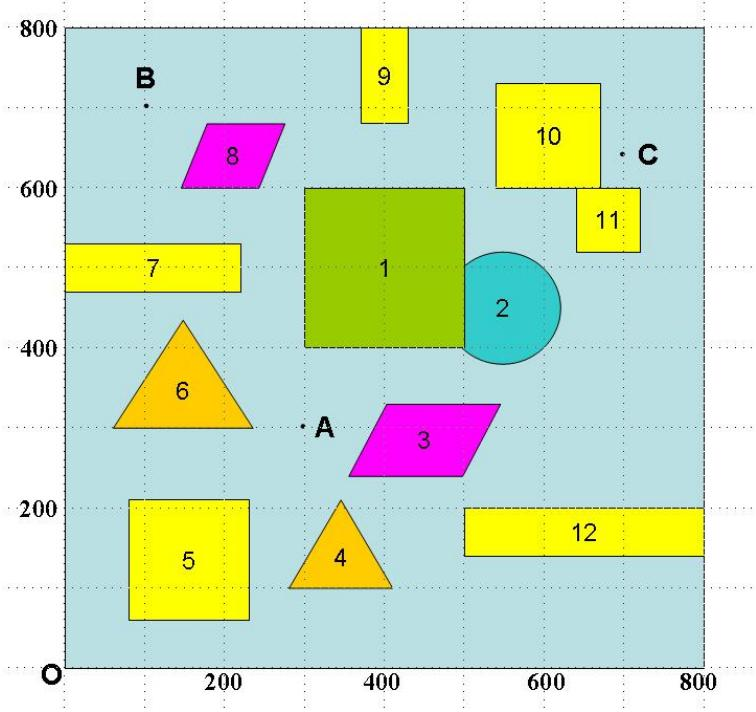

<details>
<summary>bubble</summary>

| Shape | X | Y |
| --- | --- | --- |
| 1 | ~400 | ~600 |
| 2 | ~550 | ~450 |
| 3 | ~400 | ~250 |
| 4 | ~350 | ~150 |
| 5 | ~150 | ~150 |
| 6 | ~150 | ~350 |
| 7 | ~100 | ~500 |
| 8 | ~250 | ~650 |
| 9 | ~400 | ~750 |
| 10 | ~600 | ~700 |
| 11 | ~700 | ~550 |
| 12 | ~650 | ~200 |
</details>

程序一：基本线圆组合计算程序（仅以 0-A为例，其它类似）  
```matlab
clc
o=[0, 0];
c=[80, 210];
m=[300, 300];
r=10;
oc=sqrt((o(1)-c(1))^2+(o(2)-c(2))^2);
om=sqrt((o(1)-m(1))^2+(o(2)-m(2))^2);
cm=sqrt((c(1)-m(1))^2+(c(2)-m(2))^2);
a1=acos((oc^2+cm^2-om^2)/(2*oc*cm));
a2=acos(r/oc);
a3=acos(r/cm);
a4=2*pi-a1-a2-a3;
d1=sqrt(oc^2-r^2);
d2=sqrt(cm^2-r^2);
d3=r*a4;
dd=d1+d2+d3
```

程序二：求A，B点所在的圆心坐标（以 A为例）；  
```matlab
%%%求经过（A）点弧的圆心坐标
clc
clear
%%%坐标
A=[300, 300];          %所求圆弧上的坐标
B=[80, 210];          %一边圆心的坐标
C=[220, 530];          %另一边圆心的坐标
R=10;                    %圆的半径
sita=[-pi:0.0001:pi];          %搜索圆心坐标的范围
for i=1:length(sita)
0=[A(1)+R*sin(sita(i)), A(2)-R*cos(sita(i))];
l1=sqrt((0(1)-B(1))^2+(0(2)-B(2))^2);
l2=sqrt((0(1)-C(1))^2+(0(2)-C(2))^2);
l3=sqrt((B(1)-C(1))^2+(B(2)-C(2))^2);
afa=acos((11^2+12^2-13^2)/(2*11*12));
L(i)=11+12+R*(pi-afa);            %直线与弧长的路程
end
sita(find(L==min(L)))      %最短路程
min(L)
[A(1)+R*sin(sita(find(L==min(L)))), A(2)-R*cos(sita(find(L==min(L)))))]     %
圆心坐标
```

程序三：求C点所在圆的圆心坐标；  
```txt
clc
clear
%%%坐标
```

```matlab
A=[700, 640];
C=[720, 600];
B=[670, 730];
R=10;
sita=[(51/90)*pi/2:0.001:(80/90)*pi/2];
for i=1:length(sita)
O=[A(1)+R*sin(sita(i)), A(2)+R*cos(sita(i))];
l1=sqrt((0(1)-B(1))^2+(0(2)-B(2))^2);
l2=sqrt((0(1)-C(1))^2+(0(2)-C(2))^2);
l3=sqrt((B(1)-C(1))^2+(B(2)-C(2))^2);
afa=acos((11^2+12^2-13^2)/(2*11*12))
afa1=acos(20/11)
afa2=acos(20/12)
L(i)=sqrt(11^2-400)+sqrt(12^2-400)+R*(afa-afa1-afa2);
end
sita(find(L==min(L)))
min(L)
[A(1)+R*sin(sita(find(L==min(L)))), A(2)+R*cos(sita(find(L==min(L)))))]
```

程序四：问题二求最短时间路径lingo 程序  
```txt
min=@sqrt((x-300)^2+(y-300)^2-r^2)/5+@sqrt(x^2+y^2-r^2)/5+2*r*@asin(d/(2*r))
/5*(1+@exp(10-0.1*r^2));
d=@sqrt((xc-xb)^2+(yc-yb)^2);
@sqrt((xb)^2+(yb)^2+r^2)=@sqrt(x^2+y^2);
@sqrt((xc-300)^2+(yc-300)^2+r^2)=@sqrt((x-300)^2+(y-300)^2);
init:
x=80;
y=210;
endinit
xb<=80;
yc>210;
r=@sqrt((xb-x)^2+(yb-y)^2);
r=@sqrt((xc-x)^2+(yc-y)^2);
r>@sqrt((80-x)^2+(210-y)^2)+10;
x>80;
x<200;
y<210;
```