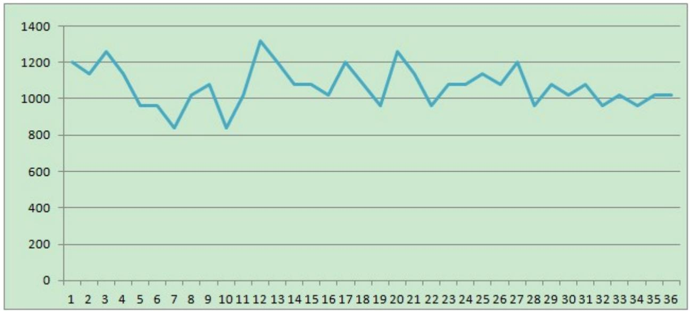
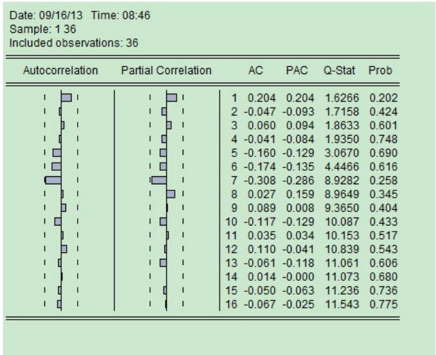
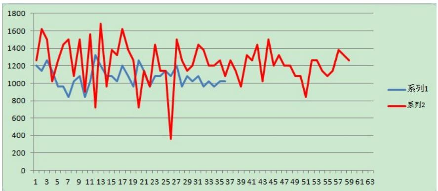
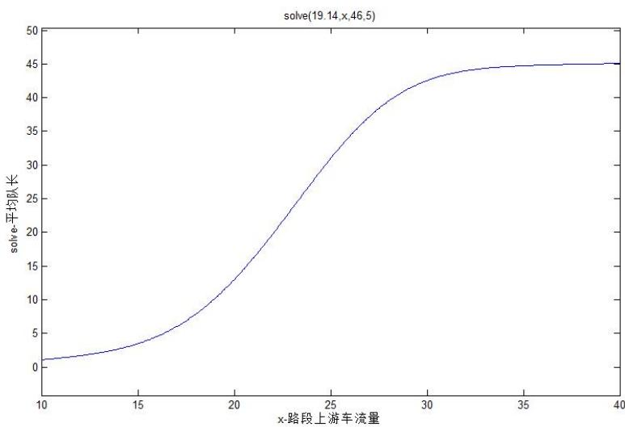
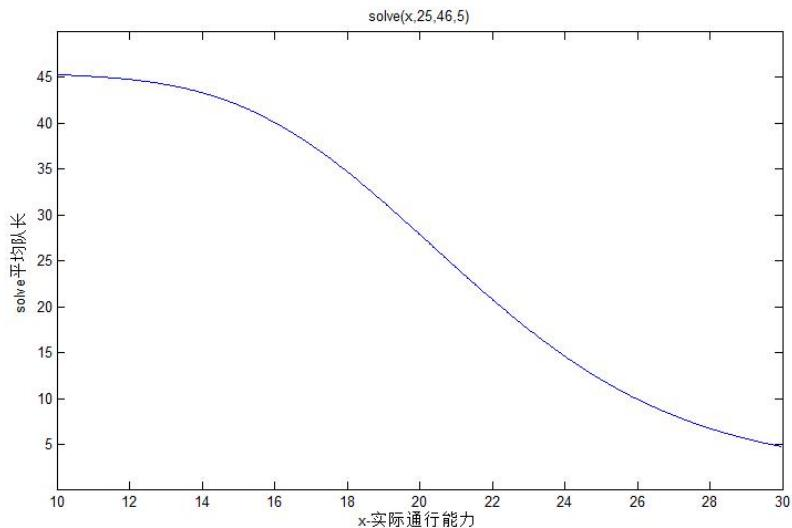
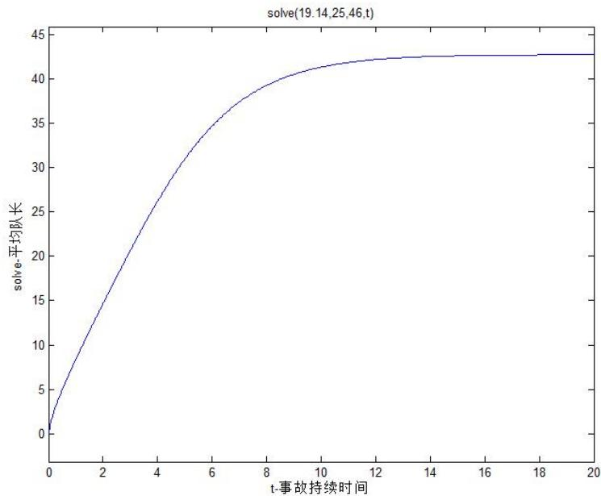
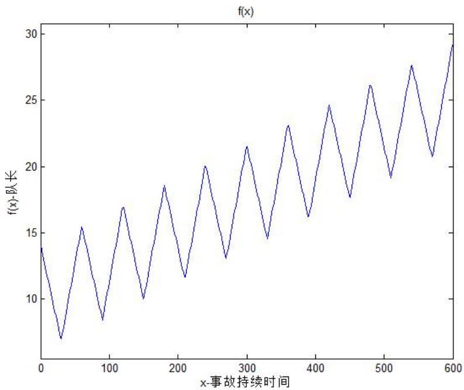
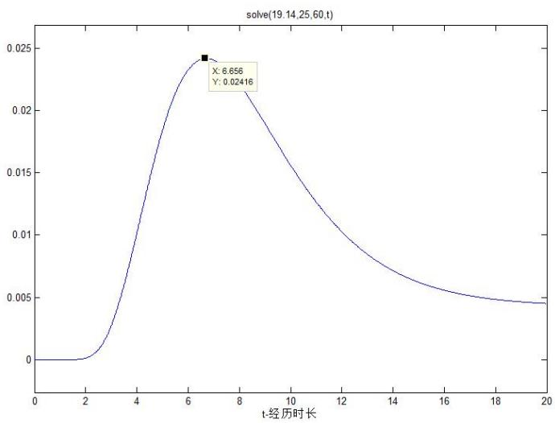
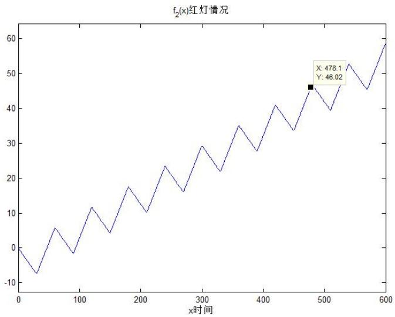
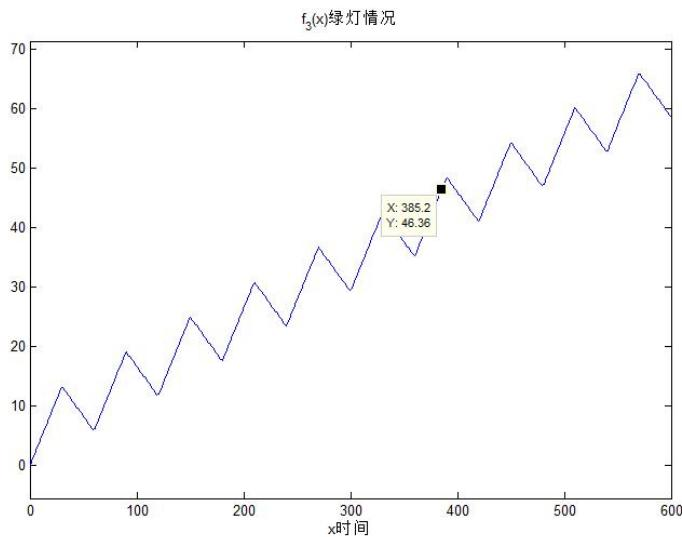

# 2013高教社杯全国大学生数学建模竞赛

## 承 诺 书

我们仔细阅读了《全国大学生数学建模竞赛章程》和《全国大学生数学建模竞赛参赛规则》（以下简称为”竞赛章程和参赛规则”，可从全国大学生数学建模竞赛网站下载）。

我们完全明白，在竞赛开始后参赛队员不能以任何方式（包括电话、电子邮件、网上咨询等）与队外的任何人（包括指导教师）研究、讨论与赛题有关的问题。

我们知道，抄袭别人的成果是违反竞赛章程和参赛规则的，如果引用别人的成果或其他公开的资料（包括网上查到的资料），必须按照规定的参考文献的表述方式在正文引用处和参考文献中明确列出。

我们郑重承诺，严格遵守竞赛章程和参赛规则，以保证竞赛的公正、公平性。如有违反竞赛章程和参赛规则的行为，我们将受到严肃处理。

我们授权全国大学生数学建模竞赛组委会，可将我们的论文以任何形式进行公开展示（包括进行网上公示，在书籍、期刊和其他媒体进行正式或非正式发表等）。

我们参赛选择的题号是（从A/B/C/D中选择一项填写）： A

我们的参赛报名号为（如果赛区设置报名号的话）： A0114

所属学校（请填写完整的全名）： 厦门大学

参赛队员（打印并签名）： 1. 王钰聪

2. 刘世尧

3. 李文然

指导教师或指导教师组负责人（打印并签名）： 谭 忠

（论文纸质版与电子版中的以上信息必须一致，只是电子版中无需签名。以上内容请仔细核对，提交后将不再允许做任何修改。如填写错误，论文可能被取消评奖资格。）

日期： 2013 年 9 月 15 日

赛区评阅编号（由赛区组委会评阅前进行编号）：

# 2013高教社杯全国大学生数学建模竞赛

# 编 号 专 用 页

赛区评阅编号（由赛区组委会评阅前进行编号）：

赛区评阅记录（可供赛区评阅时使用）：

<table><tr><td>评阅人</td><td></td><td></td><td></td><td></td><td></td><td></td><td></td><td></td><td></td><td></td></tr><tr><td>评分</td><td></td><td></td><td></td><td></td><td></td><td></td><td></td><td></td><td></td><td></td></tr><tr><td>备注</td><td></td><td></td><td></td><td></td><td></td><td></td><td></td><td></td><td></td><td></td></tr></table>

全国统一编号（由赛区组委会送交全国前编号）：

全国评阅编号（由全国组委会评阅前进行编号）：

# 车道被占用对城市道路通行能力的影响

## 摘 要

车道被占用是指因交通事故、路边停车、占道施工等因素，导致车道或道路横断面通行能力在单位时间内降低的现象。车道被占用的情况种类繁多、复杂，正确估算车道被占用对城市道路通行能力的影响程度，将为交通管理部门正确引导车辆行驶、审批占道施工、设计道路渠化方案、设置路边停车位和设置非港湾式公交车站等提供理论依据。

针对问题一，通过对视频1中交通事故发生至撤离期间,各种数据的采集，确定了事故横断面实际通行能力，运用Gibbs抽样仿真方法，通过excel软件解决数据缺失问题，并用eviews进行ARMA模型拟合，发现实际通行能力的变化过程为 $\lvert y _ { t } = - 2 . 0 2 3 2 + \epsilon _ { t } - 0 . 7 2 4 3 \epsilon _ { t - 1 } -$ $0 . 2 7 5 7 \epsilon _ { t - 2 }$

针对问题二，我们结合视频 ，采用与问题一同样的方法对视频 进行数据采集和分析，得到了横断面的实际通行能力，并将视频1和视频2仔细对比，通过视频1和视频2中对交通事故发生至撤离期间,事故所处横断面实际通行能力，运用SPSS软件进行两独立样本的曼―惠特尼 检验，再根据路段附近交通设置，车辆流向比例，司机心理，周围地形等因素，分析出产生差异的原因是主要是在不同车道车辆流量的比例。

针对问题三，通过分析视频1塞车情况，分别建立非稳态排队论模型和分段差分方程模型，并运用matlab软件编程绘制图像，解释出视频1中路段车辆排队长度与事故横断面实际通行能力、事故持续时间、路段上游车流量间的关系为：实际通行能力越大交通事故所影响的路段车辆排队长度越小，或者说路段车辆排队长度增长越慢；路段上游车流量越大交通事故所影响的路段车辆排队长度越大，或者说路段车辆排队长度增长越快；事故持续时间越长，交通事故所影响的路段车辆排队长度越大。

针对问题四，利用问题三所建立的模型和题目所给数据，如果采用非稳态排队论模型，运用matlab软件求解，得出从事故发生开始，经过6.656分钟，车辆排队长度将到达上游路口；如果通过分段差分方程模型，事故发生时上游路口刚好是绿灯时需要经过6.42分钟，事故发生时上游路口刚好是红灯时需要经过7.97分钟，与上一模型所得结果相吻合。说明两模型有很高的合理性和实用性。

【关键词】通行能力 Gibbs抽样仿真 ARMA模型拟合 曼―惠特尼U检验 非稳态排队论 分段差分方程

## 1 问题重述

车道被占用是指因交通事故、路边停车、占道施工等因素，导致车道或道路横断面通行能力在单位时间内降低的现象。一条车道被占用，也可能降低路段所有车道的通行能力。附件中视频1和视频2的两个交通事故处于同一路段的同一横断面，且完全占用两条车道。

问题1：根据视频1（附件1），描述视频中交通事故发生至撤离期间,事故所处横断面实际通行能力的变化过程。

问题2：根据问题1所得结论，结合视频2（附件2），分析说明同一横断面交通事故所占车道不同对该横断面实际通行能力影响的差异。

问题3：构建数学模型，分析视频1（附件1）中交通事故所影响的路段车辆排队长度与事故横断面实际通行能力、事故持续时间、路段上游车流量间的关系。

问题4：假如视频1（附件1）中的交通事故所处横断面距离上游路口变为140米，路段下游方向需求不变，路段上游车流量为1500pcu/h,事故发生时车辆初始排队长度为零，且事故持续不撤离。请估算，从事故发生开始，经过多长时间，车辆排队长度将到达上游路口。

## 2 模型假设

1. 视频中所统计数据真实可靠。  
2. 排队所占车道车辆数与对应车道行驶方向车辆数成正比，即：车道一车辆数：车道二车辆数：车道三车辆数=0.21:0.44:0.35。  
3. 除事故车辆外的其他车辆严格遵守交通规则，红灯停，绿灯行。  
4. 车辆到达率与正在排队车辆数量无关，无论有多少车在排队，车辆到达率不变。  
5. 车辆来源是无限的。  
6. 堵车期间该路段没有其他交通事故发生。  
7. 在堵车状况下相邻两辆车车头之间间距为7米。

## 3 符号说明

• y . . . . . . . . . . . ....t时刻视频1实际通行能力  
ϵ . . . . . . . . t时刻的误差  
• I . . . . . . . . . . . . . . . . . . . . . . . . . . . . . . . . . . . . .  
$i ^ { 2 } = - 1$

• t . . . . ....堵车持续时间  
• λ<sub>j</sub> . . . . . . . . . . . . . . . j状态下的车辆到达率  
• µ<sub>j</sub> . . . . . . . . . . ....j状态下的车辆离开率  
• P<sub>j</sub> (t) . . . . . . . . . . . ... t时刻为状态j的概率  
• A . . . . . . . . . . . . . . . . . . . . . . . . . . . . . . . . . . . . . . . . . . . . . . . . . . . . . . . . . . . . . . . 常微分方程组系数矩阵  
• x<sub>k</sub> . . . . . . ....矩阵A的第k个特征值  
e . . . . . . 自然指数e ≈ 2.718  
• c<sub>k</sub> . . . . . . . . . ....常微分方程通解系数  
• m(t) . . . . . . . . . . ... t时刻的平均车辆数  
• s(t) . . . . . . . . . . . . . . . . . . . .... t时刻路段车辆排队长度  
• a . . . . . . . .... 小区1进出的车净到达率  
• a<sub>2</sub> . . . . . . . . .... 小区2进出的车净到达率  
• λ′ . . . . . . . . . . . ....红灯时的上游路口到达率  
• λ′ . . . . . . . . . . . . . . . . . . . ....绿灯时的上游路口到达率  
• P′(t) . . . . . . . . . . . . . . . . . . . . ......t时刻状态j下的概率变化率  
...平均车间距与平均车长之和  
• r . . . . . . . . . . ....第k个特征值对应的特征向量  
• P<sub>i</sub> . . . . . . . . . . . . . . . . . . . . . . . . . . . . . .......车道i所含排队车辆数占总排队车辆数比例  
• P{N(t + ∆t) | N(t)} . . . . . .t时刻状态为N(t)时，t + ∆t时刻状态为N(t + ∆t)的条件概率

## 4 模型的建立与求解

## 4.1 问题一

## 4.1.1 问题一的分析

为分析事故所处横断面实际通行能力的变化，首先对视频 中交通事故发生至撤离期间的录像进行处理，数出以 为时间间隔，红绿灯交替 为一个周期时单位时间内横断面通过的车量个数，计算实际通行能力。由于视频中有多处出现片段的中断，影响计数，为了得到完整的数据，同时考虑到经过横断面的车辆数为随机数这一情况，我们选用 抽样仿真方法，对缺失的数据进行填补。用填补后的数据绘制折线图，描述交通事故发生至撤离期间,事故所处横断面实际通行能力的变化过程。

## 4.1.2 问题一的解答

## 4.1.2.1数据的处理与分析：

①对视频1中事故所处横断面通过车辆进行计数：

对经过事故所处横断面的车辆进行计数，按照规定，只考虑四轮及以上机动车、电瓶车的交通流量，且换算成标准车当量数，根据《公路工程技术标准》（JTGB01-2003）规定的换算标准[1]，对视频中符合要求的车辆数据进行换算。

具体换算规则如下：

表1：四轮以上车辆折算规则

<table><tr><td>车型</td><td>载荷及功率</td><td>折算系数</td></tr><tr><td>小客车</td><td>额定座位≤19座</td><td>1.0</td></tr><tr><td>大客车</td><td>额定座位≥19座</td><td>1.5</td></tr><tr><td>小型货车</td><td>载质量≤2吨</td><td>1.0</td></tr><tr><td>大型货车</td><td>载质量≥2吨</td><td>1.5</td></tr></table>

从视频可知事故发生时间为16:42:32附近，所以我们以30s为时间间隔，以16:42:30为时间起点，开始计数。数据结果如下：

表2：视频1车辆计数及当量转换

<table><tr><td>时间</td><td>小车</td><td>大车</td><td>当量转换</td><td>通行能力</td><td>时间</td><td>小车</td><td>大车</td><td>当量转换</td><td>通行能力</td></tr><tr><td>42:30</td><td>7</td><td>2</td><td>10</td><td>1200</td><td>43:00</td><td>8</td><td>1</td><td>9.5</td><td>1140</td></tr><tr><td>43:30</td><td>9</td><td>1</td><td>10.5</td><td>1260</td><td>44:00</td><td>8</td><td>1</td><td>9.5</td><td>1140</td></tr><tr><td>44:30</td><td>8</td><td>0</td><td>8</td><td>960</td><td>45:00</td><td>8</td><td>0</td><td>8</td><td>960</td></tr><tr><td>45:30</td><td>7</td><td>1</td><td>8.5</td><td>1020</td><td>46:00</td><td>7</td><td>1</td><td>8.5</td><td>1020</td></tr><tr><td>46:30</td><td>9</td><td>0</td><td>9</td><td>1080</td><td>47:00</td><td>7</td><td>0</td><td>7</td><td>840</td></tr><tr><td>47:30</td><td>7</td><td>1</td><td>8.5</td><td>1020</td><td>48:00</td><td>11</td><td>0</td><td>11</td><td>1320</td></tr><tr><td>48:30</td><td>10</td><td>0</td><td>10</td><td>1200</td><td>49:00</td><td>9</td><td>0</td><td>9</td><td>1080</td></tr><tr><td>49:30</td><td>9</td><td>0</td><td>9</td><td>1080</td><td>50:00</td><td>7</td><td>1</td><td>8.5</td><td>1020</td></tr><tr><td>50:30</td><td>10</td><td>0</td><td>10</td><td>1200</td><td>51:00</td><td>9</td><td>0</td><td>9</td><td>1080</td></tr><tr><td>51:30</td><td>8</td><td>0</td><td>8</td><td>960</td><td>52:00</td><td>9</td><td>1</td><td>10.5</td><td>1260</td></tr><tr><td>52:30</td><td>8</td><td>1</td><td>9.5</td><td>1140</td><td>53:00</td><td>8</td><td>0</td><td>8</td><td>960</td></tr><tr><td>53:30</td><td>9</td><td>0</td><td>9</td><td>1080</td><td>54:00</td><td>9</td><td>0</td><td>9</td><td>1080</td></tr><tr><td>54:30</td><td>8</td><td>1</td><td>9.5</td><td>1140</td><td>55:00</td><td>9</td><td>0</td><td>9</td><td>1080</td></tr><tr><td>55:30</td><td>10</td><td>0</td><td>10</td><td>1200</td><td>56:00</td><td>8</td><td>0</td><td>8</td><td>960</td></tr><tr><td>56:30</td><td>9</td><td>0</td><td>9</td><td>1080</td><td>57:00</td><td>7</td><td>1.5</td><td>8.5</td><td>1020</td></tr><tr><td>57:30</td><td>9</td><td>0</td><td>9</td><td>1080</td><td>58:00</td><td>8</td><td>0</td><td>8</td><td>960</td></tr><tr><td>58:30</td><td>7</td><td>1</td><td>8.5</td><td>1020</td><td>59:00</td><td>7</td><td>1</td><td>8.5</td><td>1020</td></tr></table>

注：粗体部分数据为 抽样仿真方法预测数据。  
②用Gibbs抽样仿真方法进行处理：  
理论依据[5]：

Gibbs抽样表现为一个Markov链形式的MonteCarlo方法，其良好的性质可用于许多随机系统的分析、多元分布的随机数产生。Gibbs抽样的基本原理：假设X,Y等大写字母表示随机变量或随机向量；[X],[Y] 代表其相应的概率分布； $[ X | Y ] , [ Y | X ]$ 则表示条件分布。在二元的情况下，如果[X—Y]和[Y—X]已知，不论[X,Y]知道与否，都可以通过以下步骤产生服从[X,Y]的随机点列 $\{ ( x , y ) _ { m } \} = \{ ( x _ { 1 } , y _ { 1 } ) , ( x _ { 2 } , y _ { 2 } ) , \ldots , ( x _ { n } , y _ { n } ) , \ldots \}$ ,，该点列的“边缘数列” $\{ ( x ) _ { n } \} = \{ x _ { 1 } , x _ { 2 } , \ldots , x _ { n } , \ldots \} , \{ ( y ) _ { n } \} = \{ y _ { 1 } , y _ { 2 } , \ldots , y _ { n } , \ldots \}$ 分别服从[ X,Y ] 的边缘分布[X]、[Y]，且具良好的性质 $\operatorname* { l i m } _ { n  \infty } { \frac { 1 } { n } } \sum _ { k = m + 1 } ^ { m + n } g ( x _ { k } , y _ { k } ) = E [ g ( x , y ) ]$

Step 1 任意选取X 的一个可能取值点x1，根据 $[ Y | X ~ = ~ x _ { 1 } ]$ 产生随机数y1，随机数对 $( x _ { 1 } , y _ { 1 } )$ 成为随机点列 $\left\{ ( x , y ) _ { n } \right\}$ 中第一个点；

Step 2 根据 $[ X | Y = y _ { 1 } ] ^ { \vec { y } \prime }$ 生随机数 $x _ { 2 }$ ，根据 $[ Y | X = x _ { 2 } ] ^ { \vec { r } / \vec { r } }$ 生随机数 $\mathrm { . y } 2$ ，随机数对 $( x _ { 2 } , y _ { 2 } )$ 成为随机点列 $( x , y ) _ { n }$ 中第二个点；

Step3重复以上过程n次，我们即能得到所需要的随机点列 $( x , y ) _ { n }$

上游路是红灯还是绿灯对交通事故横断面实际通行能力会造成一定的影响，所以红灯和绿灯作为两种情况分开考虑，计算不同情况下通行能力出现的条件概率。对视频中缺失片段数据进行补全，将已知片段按周期分开得到表3：

表3：事故发生至撤离期间红绿灯交替对应车辆当量

<table><tr><td>红灯</td><td>10</td><td>10.5</td><td>8</td><td>7</td><td>9</td><td>8.5</td><td>10</td><td>10</td><td>8</td><td>9.5</td><td>9.5</td><td>9.5</td></tr><tr><td>绿灯</td><td>9.5</td><td>9.5</td><td>8</td><td>8.5</td><td>7</td><td>11</td><td>9</td><td>9</td><td>10.5</td><td>8</td><td>9</td><td>9</td></tr></table>

根据表二统计的数据（通行能力已知部分）可得，横断面可能出现的车辆数集合为$( 7 , 8 , 8 . 5 , 9 , 9 . 5 , 1 0 , 1 0 . 5 , 1 1 )$ ），对应用数字 $( 1 , 2 , 3 , 4 , 5 , 6 , 7 , 8 )$ 分别表示这 个数。运用 抽样填充缺失数据只要掌握缺失数据的属性与其他属性之间的条件分布，就能够利用这些分布产生数据,因此我们对数据进行整理得出条件概率分布表如下：

表4：[车辆当量|红绿灯]条件概率分布表

<table><tr><td rowspan="2">交通灯\标号</td><td>1</td><td>2</td><td>3</td><td>4</td><td>5</td><td>6</td><td>7</td><td>8</td><td></td></tr><tr><td>7</td><td>8</td><td>8.5</td><td>9</td><td>9.5</td><td>10</td><td>10.5</td><td>11</td><td>合计</td></tr><tr><td>红灯</td><td> $\frac{1}{12}$ </td><td> $\frac{2}{12}$ </td><td> $\frac{1}{12}$ </td><td> $\frac{1}{12}$ </td><td> $\frac{3}{12}$ </td><td> $\frac{3}{12}$ </td><td> $\frac{1}{12}$ </td><td>0</td><td>100%</td></tr><tr><td>红灯</td><td> $\frac{1}{12}$ </td><td> $\frac{2}{12}$ </td><td> $\frac{1}{12}$ </td><td> $\frac{3}{12}$ </td><td> $\frac{2}{12}$ </td><td>0</td><td> $\frac{1}{12}$ </td><td> $\frac{1}{12}$ </td><td>100%</td></tr></table>

我们使用Excel 来实现Gibbs 抽样仿真。首先使用rand()命令产生随机数数列。在Excel中， $\operatorname { r a n d } ( ) ^ { \frac { 1 } { \gamma } }$ 生的是0 到1 之间均匀分布的随机数，因而所产生的随机数小于0.6的概率就是0.6。使用的excel命令见附录1。

填补未知数据结果如下：

表5：Gibbs抽样仿真填补数据结果

<table><tr><td>时间</td><td>车辆当量</td><td>通行能力</td><td>时间</td><td>车辆当量</td><td>通行能力</td><td>时间</td><td>车辆当量</td><td>通行能力</td></tr><tr><td>56:00</td><td>8</td><td>960</td><td>56:30</td><td>9</td><td>1080</td><td>57:00</td><td>8.5</td><td>1020</td></tr><tr><td>57:30</td><td>9</td><td>1080</td><td>58:00</td><td>8</td><td>960</td><td>58:30</td><td>8.5</td><td>1020</td></tr><tr><td>59:00</td><td>8.5</td><td>1020</td><td>49:30</td><td>9</td><td>1080</td><td>53:30</td><td>9</td><td>1080</td></tr></table>

将补全后的数据，运用Excel画出折线图如下：



<details>
<summary>line</summary>

| X | Value |
| --- | --- |
| 1 | ~1200 |
| 2 | ~1140 |
| 3 | ~1260 |
| 4 | ~1140 |
| 5 | ~960 |
| 6 | ~960 |
| 7 | ~840 |
| 8 | ~1020 |
| 9 | ~1080 |
| 10 | ~840 |
| 11 | ~1000 |
| 12 | ~1320 |
| 13 | ~1200 |
| 14 | ~1080 |
| 15 | ~1080 |
| 16 | ~1020 |
| 17 | ~1200 |
| 18 | ~1080 |
| 19 | ~960 |
| 20 | ~1260 |
| 21 | ~1140 |
| 22 | ~960 |
| 23 | ~1080 |
| 24 | ~1080 |
| 25 | ~1140 |
| 26 | ~1080 |
| 27 | ~1200 |
| 28 | ~960 |
| 29 | ~1080 |
| 30 | ~1020 |
| 31 | ~1080 |
| 32 | ~960 |
| 33 | ~1020 |
| 34 | ~960 |
| 35 | ~1020 |
| 36 | ~1020 |
</details>

由于数据呈现不平稳波动，因此我们考虑运用eviews的ARIMA模型对数据进行拟合，我们定义开始时间t = 0，做出自相关图如下：



<details>
<summary>funnel</summary>

| | Autocorrelation | Partial Correlation | AC | PAC | Q-Stat | Prob |
| --- | --- | --- | --- | --- | --- | --- |
| 1 | 0.204 | 0.204 | 0.204 | 0.204 | 1.6266 | 0.202 |
| 2 | -0.047 | -0.093 | -0.047 | -0.093 | 1.7158 | 0.424 |
| 3 | 0.060 | 0.094 | 0.060 | 0.094 | 1.8633 | 0.601 |
| 4 | -0.041 | -0.084 | -0.041 | -0.084 | 1.9350 | 0.748 |
| 5 | -0.160 | -0.129 | -0.160 | -0.129 | 3.0670 | 0.690 |
| 6 | -0.174 | -0.135 | -0.174 | -0.135 | 4.4466 | 0.616 |
| 7 | -0.308 | -0.286 | -0.308 | -0.286 | 8.9282 | 0.258 |
| 8 | 0.027 | 0.159 | 0.027 | 0.159 | 8.9649 | 0.345 |
| 9 | 0.089 | 0.008 | 0.089 | 0.008 | 9.3650 | 0.404 |
| 10 | -0.117 | -0.129 | -0.117 | -0.129 | 10.087 | 0.433 |
| 11 | 0.035 | 0.034 | 0.035 | 0.034 | 10.153 | 0.517 |
| 12 | 0.110 | -0.041 | 0.110 | -0.041 | 10.839 | 0.543 |
| 13 | -0.061 | -0.118 | -0.061 | -0.118 | 11.061 | 0.606 |
| 14 | 0.014 | -0.000 | 0.014 | -0.000 | 11.073 | 0.680 |
| 15 | -0.050 | -0.063 | -0.050 | -0.063 | 11.236 | 0.736 |
| 16 | -0.067 | -0.025 | -0.067 | -0.025 | 11.543 | 0.775 |
</details>

发现自相关图不稳定，因此对其进行一阶差分得到自相关图，并进行单位根ADF检验：

Date: 09/16/13 Time: 08:37

Sample: 1 36

Included observations: 35

<table><tr><td colspan="2">Autocorrelation</td><td colspan="2">Partial Correlation</td><td>AC</td><td>PAC</td><td>Q-Stat</td><td>Prob</td></tr><tr><td></td><td></td><td></td><td></td><td>1</td><td>-0.342</td><td>-0.342</td><td>4.4545</td></tr><tr><td></td><td></td><td></td><td></td><td>2</td><td>-0.262</td><td>-0.429</td><td>7.1528</td></tr><tr><td></td><td></td><td></td><td></td><td>3</td><td>0.161</td><td>-0.158</td><td>8.2062</td></tr><tr><td></td><td></td><td></td><td></td><td>4</td><td>0.043</td><td>-0.077</td><td>8.2840</td></tr><tr><td></td><td></td><td></td><td></td><td>5</td><td>-0.059</td><td>-0.036</td><td>8.4333</td></tr><tr><td></td><td></td><td></td><td></td><td>6</td><td>0.099</td><td>0.124</td><td>8.8673</td></tr><tr><td></td><td></td><td></td><td></td><td>7</td><td>-0.335</td><td>-0.359</td><td>14.071</td></tr><tr><td></td><td></td><td></td><td></td><td>8</td><td>0.156</td><td>-0.156</td><td>15.234</td></tr><tr><td></td><td></td><td></td><td></td><td>9</td><td>0.241</td><td>0.053</td><td>18.117</td></tr><tr><td></td><td></td><td></td><td></td><td>10</td><td>-0.276</td><td>-0.128</td><td>22.063</td></tr><tr><td></td><td></td><td></td><td></td><td>11</td><td>-0.007</td><td>-0.037</td><td>22.065</td></tr><tr><td></td><td></td><td></td><td></td><td>12</td><td>0.177</td><td>-0.006</td><td>23.834</td></tr><tr><td></td><td></td><td></td><td></td><td>13</td><td>-0.136</td><td>-0.106</td><td>24.920</td></tr><tr><td></td><td></td><td></td><td></td><td>14</td><td>0.080</td><td>-0.034</td><td>25.312</td></tr><tr><td></td><td></td><td></td><td></td><td>15</td><td>-0.005</td><td>-0.048</td><td>25.314</td></tr><tr><td></td><td></td><td></td><td></td><td>16</td><td>-0.087</td><td>0.030</td><td>25.827</td></tr></table>

Null Hypothesis: DX has a unit root

Exogenous: Constant

Lag Length: 1 (Automatic - based on SIC, maxlag=8)

<table><tr><td colspan="2"></td><td>t-Statistic</td><td>Prob.*</td></tr><tr><td colspan="2">Augmented Dickey-Fuller test statistic</td><td>-7.145431</td><td>0.0000</td></tr><tr><td rowspan="3">Test critical values:</td><td>1% level</td><td>-3.646342</td><td></td></tr><tr><td>5% level</td><td>-2.954021</td><td></td></tr><tr><td>10% level</td><td>-2.615817</td><td></td></tr></table>

\*MacKinnon (1996) one-sided p-values

Augmented Dickey-Fuller Test Equation

Dependent Variable: D(DX

Method; Least Squares

Date: 09/16/13. Time: 09:52

Sample (adiusted): 4 36

Included observations: 33 after adjustments

<table><tr><td>Variable</td><td>Coefficient</td><td>Std. Error</td><td>t-Statistic</td><td>Prob.</td></tr><tr><td>DX(-1)</td><td>-1.910866</td><td>0.267425</td><td>-7.145431</td><td>0.0000</td></tr><tr><td>D(DX(-1))</td><td>0.429937</td><td>0.163176</td><td>2.634799</td><td>0.0132</td></tr></table>

发现在显著性水平0.05下可以拒绝一个单位根的原假设，所以一阶差分后序列已经稳定。由于一阶差分自相关系数在2阶和3阶出落在2倍标准差边缘，因此考虑用ma（2）进行尝试，最终选择拟合程度最好的模型为ARMA(0，2).拟合R方为0.411.拟合图形如下：

Dependent Variable: D(X)

Method: Least Sguares

Date: 09/16/13 Time: 08:13

Sample (adiusted); 2.36

Included observations: 35 after adjustments

Convergence achieved after 18 iterations

MA Backcast 0 1

<table><tr><td>Variable</td><td>Coefficient</td><td>Std. Error</td><td>t-Statistic</td><td>Prob.</td></tr><tr><td>C</td><td>-2.023179</td><td>1.664548</td><td>-1.215452</td><td>0.2331</td></tr><tr><td>MA(1)</td><td>-0.724266</td><td>0.168687</td><td>-4.293551</td><td>0.0002</td></tr><tr><td>MA(2)</td><td>-0.275717</td><td>0.171623</td><td>-1.606527</td><td>0.1180</td></tr><tr><td>R-squared</td><td>0.411052</td><td colspan="2">Mean dependent var</td><td>-5.142857</td></tr><tr><td>Adjusted R-squared</td><td>0.374243</td><td colspan="2">S.D. dependent var</td><td>139.8607</td></tr><tr><td>S.E. of regression</td><td>110.6365</td><td colspan="2">Akaike info criterion</td><td>12.33219</td></tr><tr><td>Sum squared resid</td><td>391693.9</td><td colspan="2">Schwarz criterion</td><td>12.46551</td></tr><tr><td>Log likelihood</td><td>-212.8134</td><td colspan="2">Hannan-Quinn criter.</td><td>12.37821</td></tr><tr><td>F-statistic</td><td>11.16710</td><td colspan="2">Durbin-Watson stat</td><td>2.097176</td></tr><tr><td>Prob(F-statistic)</td><td>0.000210</td><td></td><td></td><td></td></tr><tr><td>Inverted MA Roots</td><td>1.00</td><td>-.28</td><td></td><td></td></tr></table>

因此拟合曲线为

$$
y _ {t} = - 2. 0 2 3 2 + \epsilon_ {t} - 0. 7 2 4 3 \epsilon_ {t - 1} - 0. 2 7 5 7 \epsilon_ {t - 2}
$$

结合视频对图像进行分析，横断面的实际通行能力呈现上下波动的不稳定状态，但整体都在一条直线上下波动。在第二个时间点下降是因为车祸发生的时间刚好是上一次绿灯通过大量车到达车祸截面，由于人们原本还在自己选择的车道上，但是当发现车祸后，均会转移到右转车道，因此右转车道在开始短时间内可以顺利通行，当其他车道挤过来时，会产生排队效应，降低该车道的实际通行能力，因此第二个时间点的实际通行能力会比第一个时间点低。加上上游路口红绿灯是以60S为周期，所以整个截面通行能力呈现上下波动的情况。

## 4.2 问题二

## 4.2.1 问题二的分析

根据视频 的处理方法同样统计出视频 中的各项数据，然后分别从 周期、上游路口为红灯和上游路口为绿灯的时候的通行能力将两种不同横断面的情况进行对比，利用非参数检验中两独立样本的曼-惠特尼U检验对两组通行能力差异进行对比，并根据结果进行相应的分析。

## 4.2.2 问题二的解答

## 4.2.2.1理论准备[6]：

曼-惠特尼U检验通过对两个样本的平均秩的研究实现推断。其零假设是样本来自的两总体的分布无显著差异。基本步骤是：

①首先将两样本数据 $( X _ { 1 } , X _ { 2 } , \cdots , X _ { m } )$ 和 $( Y _ { 1 } , Y _ { 2 } , \cdots , Y _ { n } )$ 混合并按升序排序，得到每个数据各自的秩 $R _ { i }$ .  
②分别对样本 $( X _ { 1 } , X _ { 2 } , \cdot \cdot \cdot , X _ { m } )$ 和 $( Y _ { 1 } , Y _ { 2 } , \cdots , Y _ { n } )$ 的秩求平均，得到两个平均秩 $W _ { x } / m$ 和 $W _ { y } / n$ ,其中 $W _ { x }$ 、 $W _ { y }$ 成为秩和统计量。  
③计算样本 $( X _ { 1 } , X _ { 2 } , \cdots , X _ { m } )$ 每个秩先于样本 $( Y _ { 1 } , Y _ { 2 } , \cdots , Y _ { n } )$ 每个秩的个数 $U _ { 1 }$ ,以及样本 $( Y _ { 1 } , Y _ { 2 } , \cdots , Y _ { n } )$ 每个秩先于样本 $( X _ { 1 } , X _ { 2 } , \cdots , X _ { m } )$ 每个秩的个数 $U _ { 2 }$ 。即 $U _ { 1 } = W _ { x } { - } 1 / 2 m ( m { + }$ 1), $U _ { 2 } = W _ { y } - 1 / 2 n ( n + 1 )$ ,且 $U _ { 1 } + U _ { 2 } = m * n$

④计算Wilcoxon W统计量。Wilcoxon W为上述 $U _ { 1 }$ 和 $U _ { 2 }$ 中较小者对应的秩和。

⑥计算曼-惠特尼U统计量。即 $U = W - { \frac { 1 } { 2 } } k ( k + 1 )$

在大样本下，U统计量近似服从正态分布，计算方法是

$$
Z = \frac {U - \frac {1}{2} m n}{\sqrt {\frac {1}{1 2} m n (m + n + 1)}}
$$

## 4.2.2.2数据收集：

我们视频2的数据收集是在17:34:30开始收集的，并以30S为周期统计一次，因此我们记17:34:30为 ${ \displaystyle t = 0 } ,$ ,并以此类推，获取实际通行能力如下：

表6：视频2车辆计数及当量转换

<table><tr><td>时间t</td><td>0.5</td><td>1</td><td>1.5</td><td>2</td><td>2.5</td><td>3</td><td>3.5</td><td>4</td><td>4.5</td><td>5</td><td>5.5</td><td>6</td></tr><tr><td>车流量pcu/h</td><td>1260</td><td>1620</td><td>1500</td><td>1020</td><td>1260</td><td>1440</td><td>1500</td><td>1080</td><td>1500</td><td>900</td><td>1560</td><td>720</td></tr><tr><td>时间t</td><td>6.5</td><td>7</td><td>7.5</td><td>8</td><td>8.5</td><td>9</td><td>9.5</td><td>10</td><td>10.5</td><td>11</td><td>11.5</td><td>12</td></tr><tr><td>车流量pcu/h</td><td>1680</td><td>960</td><td>1380</td><td>1320</td><td>1620</td><td>1380</td><td>1260</td><td>720</td><td>1140</td><td>960</td><td>1440</td><td>1140</td></tr><tr><td>时间t</td><td>12.5</td><td>13</td><td>13.5</td><td>14</td><td>14.5</td><td>15</td><td>15.5</td><td>16</td><td>16.5</td><td>17</td><td>17.5</td><td>18</td></tr><tr><td>车流量pcu/h</td><td>1140</td><td>360</td><td>1500</td><td>1260</td><td>1140</td><td>1200</td><td>1440</td><td>1380</td><td>1200</td><td>1200</td><td>1260</td><td>1080</td></tr><tr><td>时间t</td><td>18.5</td><td>19</td><td>19.5</td><td>20</td><td>20.5</td><td>21</td><td>21.5</td><td>22</td><td>22.5</td><td>23</td><td>23.5</td><td>24</td></tr><tr><td>车流量pcu/h</td><td>1260</td><td>1140</td><td>960</td><td>1320</td><td>1260</td><td>1440</td><td>1020</td><td>1500</td><td>1200</td><td>1320</td><td>1200</td><td>1200</td></tr><tr><td>时间t</td><td>24.5</td><td>25</td><td>25.5</td><td>26</td><td>26.5</td><td>27</td><td>27.5</td><td>28</td><td>28.5</td><td>29</td><td>29.5</td><td></td></tr><tr><td>车流量pcu/h</td><td>1080</td><td>1080</td><td>840</td><td>1260</td><td>1260</td><td>1140</td><td>1080</td><td>1140</td><td>1380</td><td>1320</td><td>1260</td><td></td></tr></table>

## 4.2.2.3问题解答：

首先先以60S为周期对视频1和2横断面实际通行能力的差异进行比较，利用SPSS进行曼-惠特尼U检验操作得：

<table><tr><td colspan="3">Mann-Whitney U</td><td>508</td></tr><tr><td colspan="3">Wilcoxon W</td><td>1174</td></tr><tr><td colspan="3">Z</td><td>-4.272</td></tr><tr><td colspan="3">渐近显著性(双侧)</td><td>0.0000</td></tr><tr><td>变量</td><td>N</td><td>秩均值</td><td>秩和</td></tr><tr><td>1</td><td>36</td><td>32.61</td><td>1174</td></tr><tr><td>2</td><td>59</td><td>57.39</td><td>3386</td></tr><tr><td>总数</td><td>95</td><td></td><td></td></tr></table>

由表格可知，检验p值小于0.05，因此我们要拒绝原假设，且视频2的秩均值大于视频1.即可以认为以60S为周期时同一横断面交通事故所占车道不同对该横断面实际通行能力的影响有显著差异，且视频2的实际通行能力比视频1大。

然后用同样的方法，分别对上游路口为红灯和上游路口为绿灯时的实际通行能力差异进行比较，同样利用SPSS进行曼-惠特尼U检验操作得，红灯时候的结果如下：

<table><tr><td colspan="3">Mann-Whitney U</td><td>97</td></tr><tr><td colspan="3">Wilcoxon W</td><td>268</td></tr><tr><td colspan="3">Z</td><td>-3.712</td></tr><tr><td colspan="3">渐近显著性(双侧)</td><td>0.0000</td></tr><tr><td>变量</td><td>N</td><td>秩均值</td><td>秩和</td></tr><tr><td>1</td><td>18</td><td>14.89</td><td>268</td></tr><tr><td>2</td><td>30</td><td>30.27</td><td>908</td></tr><tr><td>总数</td><td>48</td><td></td><td></td></tr></table>

由表格可知，检验p值小于0.05，因此我们要拒绝原假设，且视频2的秩均值大于视频1.即可以认为在红灯时同一横断面交通事故所占车道不同对该横断面实际通行能力的影响有显著差异。且视频2的实际通行能力比视频1大。

绿灯时候的结果利用SPSS进行曼-惠特尼U检验操作得：

<table><tr><td colspan="3">Mann-Whitney U</td><td>151</td></tr><tr><td colspan="3">Wilcoxon W</td><td>322</td></tr><tr><td colspan="3">Z</td><td>-2.421</td></tr><tr><td colspan="3">渐近显著性(双侧)</td><td>0.01547</td></tr><tr><td>变量</td><td>N</td><td>秩均值</td><td>秩和</td></tr><tr><td>1</td><td>18</td><td>17.89</td><td>322</td></tr><tr><td>2</td><td>29</td><td>27.79</td><td>806</td></tr><tr><td>总数</td><td>47</td><td></td><td></td></tr></table>

由表格可知，检验p值小于0.05，因此我们要拒绝原假设，且视频2的秩均值大于视频1.即可以认为在绿灯时同一横断面交通事故所占车道不同对该横断面实际通行能力的影响有显著差异。且视频2的实际通行能力比视频1大。

综合上述三个检验，我们可以认为同一横断面交通事故所占车道不同对该横断面实际通行能力影响有显著差异，且这里视频2的实际通行能力比视频1大。我们画出折线图进行比较如下：



<details>
<summary>line</summary>

| Category | 系列1 | 系列2 |
| --- | --- | --- |
| 1 | ~1200 | ~1280 |
| 2 | ~1150 | ~1630 |
| 3 | ~1270 | ~1500 |
| 4 | ~1050 | ~1050 |
| 5 | ~980 | ~1250 |
| 6 | ~970 | ~1400 |
| 7 | ~850 | ~1480 |
| 8 | ~1000 | ~1100 |
| 9 | ~1080 | ~1500 |
| 10 | ~850 | ~950 |
| 11 | ~1320 | ~1580 |
| 12 | ~1200 | ~720 |
| 13 | ~1150 | ~1700 |
| 14 | ~1080 | ~980 |
| 15 | ~1100 | ~1350 |
| 16 | ~1050 | ~1320 |
| 17 | ~1200 | ~1630 |
| 18 | ~1100 | ~1450 |
| 19 | ~980 | ~1350 |
| 20 | ~1250 | ~1250 |
| 21 | ~1150 | ~720 |
| 22 | ~1050 | ~1150 |
| 23 | ~1080 | ~980 |
| 24 | ~1100 | ~1450 |
| 25 | ~1120 | ~1150 |
| 26 | ~1150 | ~360 |
| 27 | ~1200 | ~1500 |
| 28 | ~980 | ~1250 |
| 29 | ~1080 | ~1150 |
| 30 | ~980 | ~1350 |
| 31 | ~1080 | ~1450 |
| 32 | ~980 | ~1380 |
| 33 | ~1020 | ~1220 |
| 34 | ~980 | ~1220 |
| 35 | ~1020 | ~1250 |
| 36 | — | ~1150 |
| 37 | — | ~1280 |
| 38 | — | ~980 |
| 39 | — | ~1320 |
| 40 | — | ~1280 |
| 41 | — | ~1450 |
| 42 | — | ~1020 |
| 43 | — | ~1520 |
| 44 | — | ~1220 |
| 45 | — | ~1320 |
| 46 | — | ~1220 |
| 47 | — | ~1220 |
| 48 | — | ~1180 |
| 49 | — | ~1150 |
| 50 | — | ~850 |
| 51 | — | ~1280 |
| 52 | — | ~1280 |
| 53 | — | ~1150 |
| 54 | — | ~1120 |
| 55 | — | ~1380 |
| 56 | — | ~1320 |
| 57 | — | ~1280 |
| 58 | — | — |
| 59 | — | — |
</details>

我们以视频1为比较基准，分别计算60S为周期，绿灯和红灯时候视频2中截面通行能力的变化率，其中通行能力取各个情况下的均值作为比较。计算可得 内视频 相对于视频1 的通行能力变化率为14.455%。绿灯时候的变化率为18.344%.红灯时候的变化率为10.345%.

根据路面的实际情况造成这种结果的原因有如下：

①由于到下游路口直行和左转流量比例总共为 当人们从上游路口进入时，会按照自己意愿选择车道，因此大部分人会在直行和左转车道上，所以当这个两条道路被堵时，道路上车为了通行必须拐到右转车道，这种类似插队的行为效率较低，造成时间浪费，而相反，如果是右转车道和直行车道被堵时，这两个车道的流量比例总共为 ，那么时间浪费的次数会相对第一种情况较少，因此通行能力会更好。所以当上游路口为绿灯的时候，车流量较大，直行道和左转车道的数量会较多，因此相对于红灯时造成的排队效应会更大，时间浪费更多，所以绿灯变化率会比红灯时候大。

②由于小区路口在右转车道边上，如果左转和直行车道被堵，那么当右转车道队长到小区路口时，小区车的出入就会受到影响，同时也会影响右边车道的流通，而如果当右边车道和直行车道被堵时，即使右边车道队长到小区门口，对左边车道通行的影响也不会太大。

## 4.3 问题三

## 4.3.1 问题三的分析

当发生交通事故之后，没有大量的车流入，原因是当时是红灯，半分钟之后，有大量的车辆流入，原因是红灯变为了绿灯，视频中参与到排队的流入车辆包括了上游路口进入的车辆和小区出口出来的车辆，没有参加排队的车辆包括了从小区入口去小区的车辆和从事故横断面离开的车辆，进过检验，发现车辆流入是一个服从泊松分布的随机过程，且三个车道被堵住了两个，所以考虑建立单服务窗口排队论模型，然而这与通常的稳态排队论问题不同，我们决定重新审视排队论问题中的生灭过程，求解非稳态排队论通解，得出路段车辆排队长度与事故横断面实际通行能力、事故持续时间、路段上游车流量间的关系。

再考虑到流入车辆，流出车辆和堵塞在排队的车辆的守恒关系，我们选择建立简单的差分方程模型，再考虑到红绿灯对流入量的影响，我们选择建立分段差分方程来建立路段车辆排队长度与事故横断面实际通行能力、事故持续时间、路段上游车流量间的关系。

其中通过对视频1的仔细观察，我们发现当靠小区出口的道路排队队长超过小区路口位置的时候，小区出来的车会进入道路的车辆会增加队长，但在小区路口等待的车辆却不增加队长，针对这一情况完善我们的模型。

## 4.3.2 问题三的数据处理

对于问题三，我们考虑到不仅是上游路口有车流入，两个小区也有车流入和流出，因此我们定义一个净流入的车流量为上游路口车流入量加上从小区流入路段的车流量再减去流入小区的车流量，将这个净车流量作为到达的人数，并利用SPSS进行泊松分布的检验得到结果如下：

单样本 Kolmogorov-Smirnov 检验 3

<table><tr><td colspan="2"></td><td>VAR00003</td></tr><tr><td>N</td><td></td><td>19</td></tr><tr><td>Poisson 参数a,b</td><td>均值</td><td>1.894737</td></tr><tr><td rowspan="3">最极端差别</td><td>绝对值</td><td>.249</td></tr><tr><td>正</td><td>.249</td></tr><tr><td>负</td><td>-.150</td></tr><tr><td colspan="2">Kolmogorov-Smirnov Z</td><td>1.085</td></tr><tr><td colspan="2">渐近显著性(双侧)</td><td>.190</td></tr></table>

a. 检验分布为 Poisson 分布。  
b. 根据数据计算得到

由检验结果可知，p值为0.19，所以在置信水平0.05下我们可以接受原假设，即净流入车流量与泊松分布无显著差异，即满足泊松分布。

当左转车道的队列长度排到第一个小区口时，这个小区口的车就无法进入到车道上，此时能流入到车道的车流量只有上游路口的流入加上第一个小区的净流出，同样我们将此时的净车流量作为到达人数，并利用SPSS进行泊松分布的检验得到结果如下：

单样本 Kolmogorov-Smirnov 检验 3

<table><tr><td colspan="2"></td><td>VAR00005</td></tr><tr><td>N</td><td></td><td>19</td></tr><tr><td>Poisson 参数a,b</td><td>均值</td><td>1.894737</td></tr><tr><td rowspan="3">最极端差别</td><td>绝对值</td><td>.196</td></tr><tr><td>正</td><td>.196</td></tr><tr><td>负</td><td>-.150</td></tr><tr><td colspan="2">Kolmogorov-Smirnov Z</td><td>.856</td></tr><tr><td colspan="2">渐近显著性(双侧)</td><td>.457</td></tr></table>

a. 检验分布为 Poisson 分布。  
b. 根据数据计算得到

由检验结果可知，p值为0.457，所以在置信水平0.05下我们可以接受原假设，即净流入车流量与泊松分布无显著差异，即满足泊松分布。

考虑到我们要进行红绿灯的分段计算，因此我们分别对红灯和绿灯时的净车流量进行泊松检验分别得到如下结果：

单样本 Kolmogorov-Smirnov 检验 3

<table><tr><td colspan="2"></td><td>VAR00007</td></tr><tr><td>N</td><td></td><td>5</td></tr><tr><td>Poisson 参数a,b</td><td>均值</td><td>3.600000</td></tr><tr><td rowspan="3">最极端差别</td><td>绝对值</td><td>.306</td></tr><tr><td>正</td><td>.274</td></tr><tr><td>负</td><td>-.306</td></tr><tr><td colspan="2">Kolmogorov-Smirnov Z</td><td>.685</td></tr><tr><td colspan="2">渐近显著性(双侧)</td><td>.736</td></tr></table>

a. 检验分布为 Poisson 分布。  
b. 根据数据计算得到。

单样本 Kolmogorov-Smirnov 检验 3

<table><tr><td colspan="2"></td><td>VAR00009</td></tr><tr><td>N</td><td></td><td>14</td></tr><tr><td>Poisson 参数a,b</td><td>均值</td><td>1.285714</td></tr><tr><td rowspan="3">最极端差别</td><td>绝对值</td><td>.276</td></tr><tr><td>正</td><td>.154</td></tr><tr><td>负</td><td>-.276</td></tr><tr><td colspan="2">Kolmogorov-Smirnov Z</td><td>1.034</td></tr><tr><td colspan="2">渐近显著性(双侧)</td><td>.235</td></tr></table>

a. 检验分布为 Poisson 分布。  
b. 根据数据计算得到

由检验结果可知，p值分别为0.736和0.235，所以在置信水平0.05下我们可以接受原假设，即红灯和绿灯时候的净流入车流量与泊松分布无显著差异，即满足泊松分布。

## 4.3.3 问题三的模型的建立

## （一）第一种方法：非稳态排队论模型

生灭过程是描述生物系统中生灭现象的一种随机过程。在车辆堵塞排队中，车辆的到达和离去就是一种生灭现象。[8]因此，可用生灭过程来解决车辆堵塞造成的排队问题。生灭过程的定义如下：设一个系统具有可数个状态（车辆数）0，1，2,···,或有限个状态0,1,2···,m,令系统在时刻t 的状态记为N(t ), 在任一时刻t ,若系统处于 $\mathbf { \nabla } \cdot \mathbf { N } ( \mathrm { t } \ ) = \mathrm { j } .$ ,则在时间区间 $( \mathbf { t } ; t + \Delta t )$ 内，只能转移到相邻的状态或者保持状态不变，而不允许有两次或者更多的转移。其转移的概率如下：

(1)由状态j转移到 $( \mathrm { \partial j } + 1 )$ 的概率如下：

$$
P \{N (t + \Delta t) = j + 1 \mid N (t) = j \} = \lambda_ {j} \Delta t + o (\Delta t)
$$

(2)由状态j转移到( j-1)的概率为：

$$
P \{N (t + \Delta t) = j - 1 \mid N (t) = j \} = \mu_ {j} \Delta t + o (\Delta t)
$$

(3)状态保持不变的概率为：

$$
P \{N (t + \Delta t) = j \mid N (t) = j \} = 1 - (\lambda_ {j} + \mu_ {j}) \Delta t + o (\Delta t)
$$

上述各式中， $\lambda _ { j }$ 为到达率， $\mu _ { j }$ 为离开率， $\lambda _ { j } , \mu _ { j }$ 均为正常数，且只与状态j有关。

下面建立堵车过程的微分方程组

由堵车过程的前提条件可知，状态 $N ( t + \Delta t ) = j .$ ,只能由三种状态转移而来，即 $N ( t ) =$ $j ; N ( t ) = j - 1 ; N ( t ) = j + 1$ .由全概率公式，得

$$
P _ {j} (t + \Delta t) = \lambda_ {j - 1} \Delta t P _ {j - 1} (t) + (1 - (\lambda_ {j} + \mu_ {j}) \Delta t) P _ {j} (t) + \mu_ {j} \Delta t P _ {j + 1} (t) + o (\Delta t)
$$

所以

$$
\lim _ {\Delta t \to \infty} \frac {P _ {j} (t + \Delta t) - P _ {j} (t)}{\Delta t} = \lambda_ {j - 1} P _ {j - 1} (t) - (\lambda_ {j} + \mu_ {j}) P _ {j} (t) + \mu_ {j + 1} P _ {j + 1} (t)
$$

即：

$$
P _ {j} ^ {\prime} (t) = \lambda_ {j - 1} P _ {j - 1} (t) - (\lambda_ {j} + \mu_ {j}) P _ {j} (t) + \mu_ {j + 1} P _ {j + 1} (t) \tag {1}
$$

当j = 0时，

$$
P _ {0} ^ {\prime} (t) = \mu_ {1} P _ {1} (t) - \lambda_ {0} P _ {0} (t) \tag {2}
$$

考虑道路车辆容纳量有限,最大容纳量 $\mathbf { n } ,$ ,则：

$$
P _ {n} ^ {\prime} (t) = \lambda_ {n - 1} P _ {n - 1} (t) - \mu_ {n} P _ {n} (t) \tag {3}
$$

上述公 $\Re ( 1 ) ( 2 ) ( 3 )$ 组成堵车过程的微分方程组：

$$
\left\{ \begin{array}{l} P _ {0} ^ {\prime} (t) = \mu P _ {1} (t) - \lambda P _ {0} (t) \\ P _ {j} ^ {\prime} (t) = \lambda P _ {j - 1} (t) - (\lambda + \mu) P _ {j} (t) + \mu P _ {j + 1} (t) \qquad (j = 1, 2, \dots , n - 1) \\ P _ {n} ^ {\prime} (t) = \lambda P _ {n - 1} (t) - \mu P _ {n} (t) \end{array} \right.
$$

考虑到交通堵塞不是一般的排队论问题，来的车往往比离开的车多，造成了交通堵塞，所以交通堵塞问题中的λ到达率， $\mu { \mathrm { ~ } }$ 离开率的比值 $\begin{array} { r } { \frac { \lambda } { \mu } > 1 } \end{array}$ ，这样一来，上面的常微分方程组中 $P _ { j } ( t )$ 是随着时间变化而变化的因变量，所以不能只考虑稳态方程的解，下面考虑此方程组的通解：

方程组即为： $\frac { \overrightarrow { d P } } { \overrightarrow { d t } } = A \overrightarrow { P }$

其中：

$$
A = \left( \begin{array}{c c c c c} - \lambda & \mu & 0 & \dots & \dots \\ \lambda & - \lambda - \mu & \mu & 0 & \dots \\ \dots & \dots & \dots & \dots & \dots \\ \dots & \dots & \lambda & - \lambda - \mu & \mu \\ \dots & \dots & 0 & \lambda & - \mu \end{array} \right)
$$

$$
\overrightarrow {P} = \left( \begin{array}{c} P _ {0} (t) \\ P _ {1} (t) \\ \dots \\ P _ {n} (t) \end{array} \right)
$$

我们来求解形如 $\mid \vec { P } = \vec { r } e ^ { x t }$ 的解，其中x为矩阵A的特征值，r为x对应的特征向量；则特征方程| $x I - A \mid = 0$ 的解如下:

$$
\mid x I - A \mid =
$$

$$
\left| \begin{array}{c c c c c c} x + \lambda & - \mu & & & & \\ - \lambda & x + \lambda + \mu & - \mu & & & \\ & - \lambda & x + \lambda + \mu & - \mu & & \\ \dots & \dots & \dots & \dots & \dots & \dots \\ & & & - \lambda & x + \lambda + \mu & - \mu \\ & & & & - \lambda & x + \mu \end{array} \right|
$$

$$
= A _ {n + 1} - \mu A _ {n} - \lambda A _ {n} + \lambda \mu A _ {n - 1}
$$

其中： $A _ { n } =$

$$
\left| \begin{array}{c c c c c c} x + \lambda & - \mu & & & & \\ - \lambda & x + \lambda + \mu & - \mu & & & \\ & - \lambda & x + \lambda + \mu & - \mu & & \\ \dots & \dots & \dots & \dots & \dots & \dots \\ & & & - \lambda & x + \lambda + \mu & - \mu \\ & & & & - \lambda & x + \mu \end{array} \right|
$$

是一个 $\cdot n \times n$ 的行列式。

所以 $A _ { n + 1 } = ( x + \lambda + \mu ) A _ { n } - \lambda \mu A _ { n - 1 } ,$

所以 $\mid x I - A \mid = ( x + \lambda + \mu ) A _ { n } - \lambda \mu A _ { n - 1 } - \mu A _ { n } - \lambda A _ { n } + \lambda \mu A _ { n - 1 } = x A _ { n }$

显然 $x = 0$ 是其中一个特征值，由| $A _ { n } \mid = 0 ^ { \overrightarrow { \mathrm { H } } }$ 以求得其他特征值：

$$
A _ {n} = \frac {(x + \lambda + \mu + \sqrt {- \Delta} i) ^ {n + 1} - (x + \lambda + \mu - \sqrt {- \Delta} i) ^ {n + 1}}{2 ^ {n + 1} \sqrt {- \Delta} i}
$$

其中 $\Delta = { \sqrt { a ^ { 2 } - 4 b c } } , a = x + \lambda + \mu , b = - \mu , c = - \lambda$

设复角 $\theta \mathcal { J } \mathcal { J } a + \sqrt { 4 b c - a ^ { 2 } } i$ 的复角，

由 $A _ { n } = 0$ 得：

$$
(\cos \theta + i \sin \theta) ^ {n + 1} = [ \cos (2 \Pi - \theta) + i \sin (2 \Pi - \theta) ] ^ {n + 1}
$$

即：

$$
(\cos \theta + i \sin \theta) ^ {n + 1} = (\cos \theta - i \sin \theta) ^ {n + 1}
$$

进而

$$
\cos ((n + 1) \theta) + i \sin ((n + 1) \theta) = \cos ((n + 1) \theta) - i \sin ((n + 1) \theta)
$$

所以 $\sin ( ( n + 1 ) \theta ) = 0$ ,则 $\begin{array} { r } { \theta = \frac { k \Pi } { n + 1 } , k = 1 , 2 , \cdots , n } \end{array}$

由cos( kΠ = a = x+λ+µ <sub>n+1</sub> ) √<sub>4bc</sub> √<sub>4λµ</sub>

得

$$
x _ {k} = 2 \sqrt {\lambda \mu} \cos \frac {k \Pi}{n + 1} - \lambda - \mu , k = 1, 2, \dots , n
$$

所以A的 $\lceil n + 1$ 个特征值 $x _ { 0 } , x _ { 1 } , \cdots , x _ { n }$ 和对应的 $\lceil n + 1$ 特征向量 ${ \overrightarrow { r _ { 0 } } } , { \overrightarrow { r _ { 1 } } } , \dots , { \overrightarrow { r _ { n } } } ;$ ; 其中:

$$
\left\{ \begin{array}{l} x _ {0} = 0 \\ x _ {k} = 2 \sqrt {\lambda \mu} \cos \frac {k \Pi}{n + 1} - \lambda - \mu \qquad (k > 0) \end{array} \right.
$$

由均值不等式，当 $\lambda \neq \mu$ 时， $\lambda + \mu > 2 { \sqrt { \lambda \mu } }$ ,所以 $x _ { k } < 0$

用matlab可求得特征向量

$$
\overrightarrow {r _ {j} ^ {\prime}} = \left( \begin{array}{c} r _ {(j, 1)} \\ r _ {(j, 2)} \\ \dots \\ r _ {(j, n)} \end{array} \right)
$$

所以方程的通解为：

$$
\overrightarrow {P} = \sum_ {k = 0} ^ {n} c _ {k} e ^ {x _ {k} t} \overrightarrow {r _ {k}}
$$

初始状况下有k辆车已经在排队，则初始条件 $P _ { k } ( 0 ) = 1 , P _ { j } ( 0 ) = 0 ( j \neq k$ 时)从而有：

$$
\left\{ \begin{array}{l l} 0 = c _ {0} r _ {(0, 0)} + c _ {1} r _ {(1, 0)} + \dots + c _ {n} r _ {(n, 0)} & (1) \\ \dots \\ 1 = c _ {0} r _ {(0, k)} + c _ {1} r _ {(1, k)} + \dots + c _ {n} r _ {(n, k)} & (k) \\ \dots \\ 0 = c _ {0} r _ {(0, n)} + c _ {1} r _ {(1, n)} + \dots + c _ {n} r _ {(n, n)} & (n) \end{array} \right.
$$

于是得到任意塞车时刻t时，在排队的车辆的数量为j的概率为：

$$
P _ {j} (t) = \sum_ {k = 0} ^ {n} c _ {k} e ^ {x _ {k} t} r (k, j)
$$

平均队长（辆）

$$
m (t) = \sum_ {i = 0} ^ {n} i P _ {i} (t) = \sum_ {i = 0} ^ {n} i \sum_ {k = 0} ^ {n} c _ {k} e ^ {x _ {k} t} r (k, i)
$$

路段车辆排队长度（米）

$$
s (t) = l _ {0} m (t) * \max \{P _ {i} \} = 0. 4 4 l _ {0} m (t)
$$

考虑到当路段右转车道车辆排队长度超过小区路口的时候，下游小区车辆无法进出，所以车辆到达率:

$$
\lambda = \left\{ \begin{array}{c c} \lambda_ {0} + a _ {1} - a _ {2} & (0. 2 1 l _ {0} m (t) <   6 0) \\ \lambda_ {0} - a _ {2} & (0. 2 1 l _ {0} m (t) \geq 6 0) \end{array} \right.
$$

其中： $\lambda _ { 0 }$ 是单位时间上游路口流入车量， $a _ { 1 }$ 是单位时间小区路口流入车量， $a _ { 2 }$ 是单位时间驶入第二小区车量， $\mu$ 为实际通行能力。

这时初始条件变为 $P _ { k } ( t _ { 0 } ) = 1 , P _ { j } ( t _ { 0 } ) = 0 ( j \neq k \mathbb { H } ^ { \dagger } )$ )，其他不变。



<details>
<summary>line</summary>

| x-路段上游车流量 | solve-平均队长 |
| --- | --- |
| 10 | ~1.2 |
| 15 | ~3.5 |
| 20 | ~13.5 |
| 25 | ~30.5 |
| 30 | ~42.5 |
| 35 | ~44.8 |
| 40 | ~45.0 |
</details>

上图是用 根据以上非稳态排队论模型做出的路段车辆排队长度与路段上游车流量的关系图，发现路段上游车流量越大，路段车辆排队长度越大，塞车越严重，直到赌满到路口为止。说明上游车流量大的路段需要对交通事故的发生做好防范，以免造成严重的交通堵塞，这一现象实际情况一致，很好的反应了实际问题，说明此模型具有很高的实用价值。



<details>
<summary>line</summary>

| x-实际通行能力 | solve平均队长 |
| --- | --- |
| 10 | 45 |
| 12 | ~44.8 |
| 14 | ~43.5 |
| 16 | ~40.5 |
| 18 | ~35.5 |
| 20 | ~29.5 |
| 22 | ~23.5 |
| 24 | ~17.5 |
| 26 | ~12.5 |
| 28 | ~8.5 |
| 30 | 5 |
</details>

上图是用matlab根据以上非稳态排队论模型做出的路段车辆排队长度与横断面实际通行能力的关系图，发现横断面实际通行能力越大，路段车辆排队长度越小，拥堵程度越轻。说明横断面实际通行能力差的地方需要多提醒人们注意交通安全，以免造成严重的交通堵塞，这一现象与实际情况一致，很好的反应了实际问题，说明此模型具有使用价值。



<details>
<summary>line</summary>

| t-事故持续时间 | solve-平均队长 |
| --- | --- |
| 0 | 0 |
| 2 | ~15 |
| 4 | ~26 |
| 6 | ~35 |
| 8 | ~39 |
| 10 | ~41 |
| 12 | ~42 |
| 14 | ~42.5 |
| 16 | ~42.5 |
| 18 | ~42.5 |
| 20 | ~42.5 |
</details>

上图是用matlab根据以上非稳态排队论模型做出的路段车辆排队长度与事故持续时间的关系图，发现事故持续时间越久，路段车辆排队长度越长，塞车越严重。

说明发生交通事故之后，交警应该尽快解决交通问题，使得交通恢复正常运作，这一现象与实际情况一致，很好的反应了实际问题，说明此模型具有使用价值。

## (二)第二种方法：分段差分方程模型

考虑红绿对流入车辆的影响，当红灯的时候上游路口流入量为 $| \lambda _ { 1 } ^ { \prime } .$ ,当绿灯的时候上游路口流入量为 $\lambda _ { 2 } ^ { \prime } ,$ ,小区路口流入量 $\mathrm { i } a _ { 1 } ,$ 小区路口流出量 $\mathbf { \lambda } _ { a _ { 2 } } ,$ 道路通行能力 $\mu$ ；

考虑到红灯和绿灯的持续时间都是 秒，即 $\Delta t = 3 0$ 秒，队长的变化量由于红绿灯不同时刻不同而不同，由于视频1中事故发生时正好是红灯亮的时候，

于是：

$$
s (t + \Delta t) - s (t) = \left\{ \begin{array}{c c} \lambda_ {1} ^ {\prime} - \mu + a _ {1} - a _ {2} & (t \in (6 0 k, 6 0 k + 3 0)) \\ \lambda_ {2} ^ {\prime} - \mu + a _ {1} - a _ {2} & (t \in (6 0 k + 3 0, 6 0 k + 6 0)) \end{array} \right.
$$

其中事故持续时间t的单位是秒， $k = 1 , 2 , \cdots$

令w<sub>1</sub> = λ′ − µ + a<sub>1</sub> − a<sub>2</sub> ,w<sub>2</sub> = λ′ − µ + a<sub>1</sub> − a<sub>2</sub>

解此差分方程得到

$$
s (t) = \left\{ \begin{array}{c c} s (0) + k (w _ {1} + w _ {2}) + w _ {1} (t - 6 0 k) & (t \in (6 0 k, 6 0 k + 3 0)) \\ s (0) + k (w _ {1} + w _ {2}) + w _ {1} + w _ {2} (t - 6 0 k - 3 0) & (t \in (6 0 k + 3 0, 6 0 k + 6 0)) \end{array} \right.
$$

用matlab做出下图(程序见附录2)得到视频1中队长时间图如下：



<details>
<summary>line</summary>

| x-事故持续时间 | f(x)-队长 |
| --- | --- |
| 0 | ~14 |
| 30 | ~7 |
| 60 | ~15.5 |
| 90 | ~8.5 |
| 120 | ~17 |
| 150 | ~10 |
| 180 | ~18.5 |
| 210 | ~11.5 |
| 240 | ~20 |
| 270 | ~13 |
| 300 | ~21.5 |
| 330 | ~14.5 |
| 360 | ~23 |
| 390 | ~16.5 |
| 420 | ~24.5 |
| 450 | ~17.5 |
| 480 | ~26 |
| 510 | ~19 |
| 540 | ~27.5 |
| 570 | ~21 |
| 600 | ~29 |
</details>

可以发现，当红灯的时候，加入排队的车辆少，排队车辆在减少，绿灯的时候有大量车辆涌入，排队车辆增多，总体来说，通行能力小于车辆流入速度，总体成队长上升的趋势，队长周期性变化，细致的描绘的车队长变化过程，很好的反应了客观事实。从表达式中还可以看出：实际通行能力越大路段车辆排队长度越小，或者说增长越慢；路段上游车流量越大路段车辆排队长度越大，或者说增长越快。

## 4.3.4 问题三的解答

无论是从采用非稳态排队论模型得到的

$$
m (t) = \sum_ {i = 0} ^ {n} i P _ {i} (t) = \sum_ {i = 0} ^ {n} i \sum_ {k = 0} ^ {n} c _ {k} e ^ {x _ {k} t} r (k, i)
$$

上看；还是从采用分段差分方程模型得到的

$$
s (t) = \left\{ \begin{array}{c c} s (0) + k (w _ {1} + w _ {2}) + w _ {1} (t - 6 0 k) & (t \in (6 0 k, 6 0 k + 3 0)) \\ s (0) + k (w _ {1} + w _ {2}) + w _ {1} + w _ {2} (t - 6 0 k - 3 0) & (t \in (6 0 k + 3 0, 6 0 k + 6 0)) \end{array} \right.
$$

上看，都可以得出一致的结论：实际通行能力越大交通事故所影响的路段车辆排队长度越小，或者说增长越慢；路段上游车流量越大交通事故所影响的路段车辆排队长度越大，或者说增长越快；事故持续时间越长，交通事故所影响的路段车辆排队长度越大。再次说明两模型的合理性和实用性。

## 4.4 问题四

## 4.4.1 问题四的分析

考虑到事故发生在距离路口140米处，不再有小区1车辆进出参加排队，但是却有车辆进出小区2，于是改变问题三中两种模型的参数，针对上游车流量为1500pcu/h，用排队论模型进行求解，再考虑到红绿灯对队长的影响，分别假设事故发生时间是在红灯开始时刻和绿灯开始时刻，用分段差分方程求解。

## 4.4.2 问题四的数据处理

数据收集：由于两个小区均有车辆进出，因此我们在计算车辆流入的时候应该将两个小区车辆的进出一起考虑，我们以每30S统计在事故发生之后两个小区车辆的净流入，并按照问题1的方法将缺失的数据补全记小区1为靠近下游路口的小区，记小区1为靠近下游路口的小区，小区2为靠近上游路口的小区。结果如下：

<table><tr><td>时间t</td><td>0.5</td><td>1</td><td>1.5</td><td>2</td><td>2.5</td><td>3</td><td>3.5</td><td>4</td><td>4.5</td><td>5</td><td>5.5</td><td>6</td></tr><tr><td>小区1</td><td>3</td><td>3</td><td>0</td><td>1</td><td>1</td><td>0</td><td>1</td><td>2</td><td>0</td><td>1</td><td>1</td><td>1</td></tr><tr><td>小区2</td><td>0</td><td>0</td><td>-1</td><td>0</td><td>-2</td><td>-1</td><td>0</td><td>0</td><td>-1</td><td>0</td><td>-1</td><td>-1</td></tr><tr><td>时间t</td><td>6.5</td><td>7</td><td>7.5</td><td>8</td><td>8.5</td><td>9</td><td>9.5</td><td>10</td><td>10.5</td><td>11</td><td>11.5</td><td>12</td></tr><tr><td>小区1</td><td>1</td><td>2</td><td>0</td><td>2</td><td>0</td><td>2</td><td>0</td><td>0</td><td>0</td><td>1</td><td>0</td><td>2</td></tr><tr><td>小区2</td><td>0</td><td>-3</td><td>-1</td><td>-1</td><td>0</td><td>0</td><td>0</td><td>-1</td><td>0</td><td>-1</td><td>0</td><td>0</td></tr><tr><td>时间t</td><td>12.5</td><td>13</td><td>13.5</td><td>14</td><td>14.5</td><td>15</td><td>15.5</td><td>16</td><td>16.5</td><td>17</td><td>17.5</td><td>18</td></tr><tr><td>小区1</td><td>0</td><td>1</td><td>1</td><td>1</td><td>0</td><td>0</td><td>0</td><td>1</td><td>0</td><td>0</td><td>0</td><td>1</td></tr><tr><td>小区2</td><td>0</td><td>-4</td><td>-1</td><td>0</td><td>-1</td><td>-1</td><td>-1</td><td>-1</td><td>-1</td><td>0</td><td>0</td><td>0</td></tr></table>

由于问题三已经检验到达车辆率服从泊松分布，因此我们分别计算两个小区的净到达率分别为0.89辆/0.5min和-0.67辆/0.5min。

## 4.4.3 基于问题四确定两种模型的具体形式

第一种方法：非稳态排队论模型

为方便计算，先计算出堵到路口需要的车辆，考虑到车队中直走车辆所占比例为44%,所占比例最重，中间道路往往最长，所以 $S ( T ) = 0 . 4 4 M l _ { 0 } = 1 4 0$ ,其中 ${ } ^ { 1 } l _ { 0 } = 7$ （米）为平均车距和平均车长之和，求出 $M = 4 6$ ，考虑到系统的最大容量 $\begin{array} { r } { M _ { m a x } = \frac { 1 4 0 \times 3 } { l _ { 0 } } = 6 0 } \end{array}$ ,随着时间的变化，当概率 $P _ { 4 6 } ( t _ { 1 } ) = \operatorname* { m a x } P _ { 4 6 } ( t )$ 的时候也就是排队最有可能排到路口的时候，因为超过这个时间点的时候，队长应该更长，所以概率会下降，在这个时间点之前，由于队长还不够长，到达的概率就会低于这点的概率。

于是用matlab，做出 $P _ { 4 6 } ( t ) = \sum _ { k = 0 } ^ { 6 0 } c _ { k } e ^ { x _ { k } t } r ( k , 4 6 )$ 关于时间的图像，求出最大值时的t值就是到达时间。其中： $\lambda = 2 5 , \mu = 1 9 . 1 4$

$$
\left\{ \begin{array}{l} x _ {0} = 0 \\ x _ {k} = 2 \sqrt {\lambda \mu} \cos \frac {k \Pi}{n + 1} - \lambda - \mu \qquad (k > 0) \end{array} \right.
$$

用matlab可求得对应特征向量

$$
\overrightarrow {r _ {j} ^ {\prime}} = \left( \begin{array}{c} r _ {(j, 1)} \\ r _ {(j, 2)} \\ \dots \\ r _ {(j, n)} \end{array} \right)
$$

$$
\left\{ \begin{array}{l l} 0 = c _ {0} r _ {(0, 0)} + c _ {1} r _ {(1, 0)} + \dots + c _ {n} r _ {(n, 0)} & (1) \\ \dots \\ 1 = c _ {0} r _ {(0, k)} + c _ {1} r _ {(1, k)} + \dots + c _ {n} r _ {(n, k)} & (k) \\ \dots \\ 0 = c _ {0} r _ {(0, n)} + c _ {1} r _ {(1, n)} + \dots + c _ {n} r _ {(n, n)} & (n) \end{array} \right.
$$

## 第二种方法：分段差分方程模型

针对红绿灯切换的情况，乐观估计当事故发生是红灯的时候，根据视频1的数据，将路段上游车流量为1500pcu/h（25puc/min）,按视频1的红绿灯到达车流量比例分配为：红灯到达率 $\begin{array} { r } { \lambda _ { 1 } ^ { \prime } = 1 5 0 0 \times \frac { 1 . 6 1 } { 1 . 6 1 + 1 7 . 4 4 } = 2 . 1 1 } \end{array}$ ;

绿灯到达率 $\begin{array} { r } { \lambda _ { 2 } ^ { \prime } = 1 5 0 0 \times \frac { 1 7 . 4 4 } { 1 . 6 1 + 1 7 . 4 4 } = 2 2 . 8 9 } \end{array}$

$$
s (t + \Delta t) - s (t) = \left\{ \begin{array}{c c} \lambda_ {1} ^ {\prime} - \mu - a _ {2} & (t \in (6 0 k, 6 0 k + 3 0)) \\ \lambda_ {2} ^ {\prime} - \mu - a _ {2} & (t \in (6 0 k + 3 0, 6 0 k + 6 0)) \end{array} \right.
$$

令 $\mathbf { \dot { \sigma } } w _ { 1 } = \lambda _ { 1 } ^ { \prime } - \mu - a _ { 2 } , w _ { 2 } = \lambda _ { 2 } ^ { \prime } - \mu - a _ { 2 }$

解得：

$$
s (t) = \left\{ \begin{array}{c c} s (0) + k (w _ {1} + w _ {2}) + w _ {1} (t - 6 0 k) & (t \in (6 0 k, 6 0 k + 3 0)) \\ s (0) + k (w _ {1} + w _ {2}) + w _ {1} + w _ {2} (t - 6 0 k - 3 0) & (t \in (6 0 k + 3 0, 6 0 k + 6 0)) \end{array} \right.
$$

悲观估计当事故发生时，上游路口为绿灯的情况，

$$
s (t + \Delta t) - s (t) = \left\{ \begin{array}{c c} \lambda_ {2} ^ {\prime} - \mu - a _ {2} & (t \in (6 0 k, 6 0 k + 3 0)) \\ \lambda_ {1} ^ {\prime} - \mu - a _ {2} & (t \in (6 0 k + 3 0, 6 0 k + 6 0)) \end{array} \right.
$$

令 $\cdot w _ { 1 } ^ { \prime } = \lambda _ { 2 } ^ { \prime } - \mu - a _ { 2 } , w _ { 2 } ^ { \prime } = \lambda _ { 1 } ^ { \prime } - \mu - a _ { 2 }$

解得：

$$
s (t) = \left\{ \begin{array}{c c} s (0) + k (w _ {1} ^ {\prime} + w _ {2} ^ {\prime}) + w _ {1} ^ {\prime} (t - 6 0 k) & (t \in (6 0 k, 6 0 k + 3 0)) \\ s (0) + k (w _ {1} ^ {\prime} + w _ {2} ^ {\prime}) + w _ {1} ^ {\prime} + w _ {2} ^ {\prime} (t - 6 0 k - 3 0) & (t \in (6 0 k + 3 0, 6 0 k + 6 0)) \end{array} \right.
$$

## 4.4.4 问题四的解答

对于排队论模型，用matlab做出下图（程序见附录3），可知当状态为46辆车时的最大概率在6.656分钟到达，所以经过6.656分钟辆排队长度将到达上游路口。



<details>
<summary>line</summary>

| t | Y |
| --- | --- |
| 6.656 | 0.02416 |
</details>

对于考虑红绿灯的分段差分方程模型，乐观估计当事故发生时是红灯时，用matlab做出下图（程序见附录3），由下图可知在478.1秒的时候，第一次到达46辆车，所以经过7.97分钟辆排队长度将到达上游路口。



<details>
<summary>line</summary>

| x | Y |
| --- | --- |
| 478.1 | 46.02 |
</details>

悲观估计当事故发生时是绿灯时，用matlab做出下图（程序见附录3），由下图可知在386.2秒的时候，第一次到达46辆车，所以经过6.42分钟辆排队长度将到达上游路口。



<details>
<summary>line</summary>

| x时间 | f3(x) |
| --- | --- |
| 385.2 | 46.36 |
</details>

综上所述，根据排队论模型，从事故发生开始，经过6.656分钟，车辆排队长度将到达上游路口；根据差分方程模型，事故发生时上游路口刚好是绿灯时需要经过6.42分钟，事故发生时上游路口刚好是红灯时需要经过7.97分钟。

## 5 模型的优缺点

模型优点：对于问题三，我们从不同的角度建立了两个模型来解释视频 中的车辆排队长度与其他三种因素之间的关系。首先，排队模型根据灭生原理合理的解释了因交通事故造成的堵塞问题，并且利用非稳态的解法求解出了排队模型的通解。而且这种排队模型能够较好的考虑到当队长到达小区1路口时候，由于小区1的车辆无法进出而产生的另一种排队模型。另一种分段差分方程的模型则比较好的考虑了红绿灯周期的问题，根据红绿灯交替的周期建立了模型，并且在问题四求解的时候可以极端的考虑最好和最差情况下所需要的时间,使得模型对问题的分析更全面，更科学，更严谨。

模型缺点：排队论的模型没有体现出红绿灯的周期性，而分段差分方程则没考虑车辆到达的随机性。需要将两者结合起来观察可以得到更合理的结果，不够完美。

模型改进：在进行排队建模时，可以考虑加入红绿灯的周期，建立一种类似分段的排队论模型，但是由于周期性模型的参数和初始值会不断改变，在计算过程中需要不断变换参数，计算量比较大，因此放在模型改进中。

## 参考文献

[1] 百度文库，车辆折算系数,下载地址如下  
<sub>http:</sub>//<sub>wenku.baidu.com</sub>/<sub>view</sub>/<sub>3a9f8aed5ef7ba0d4a733b0b.html</sub>，2013.9.13。  
[2] 全国大学生数学建模竞赛组委会,高教社杯全国大学生数学建模竞赛论文格式规范,北京，2009。  
[3] 韩中庚，数学建模竞赛获奖论文精选与点评，北京：科学出版社，2007。  
[4] 姜启源、谢金星、叶俊，数学模型，北京，高等教育出版社，2011年。

[5] 王怡、周力，运用Gibbs抽样解决数据缺失，统计与决策，第12期：155页至156页，2011。  
[6] 薛薇，SPSS统计分析方法及应用第三版，北京：电子工业出版社，2013。  
[7] 王习娟，M | M | 1 | C 排队论系统非稳态解分析，连云港师范高等专科学校学报,第二期：46页至50页，2003年6月。  
[8] 百度文库，运筹学第十章,下载地址如下  
http://doc.mbalib.com/view/5fbb3a21a3e1583c2684b7f967e388bb.<sub>html</sub>，2013.9.14。

## 附录

## 附录1 Gibbs抽样仿真的实现

问题一用<sub>excel</sub>软件实现<sub>G</sub>i<sub>bbs</sub> 抽样仿真，实现语句如下：

①用<sub>rand()</sub>语句得到0―1间随机分布的随机数  
②再用如下语句实现<sub>G</sub>i<sub>bbs</sub>抽样仿真

```txt
=IF(E2=1, IF(D3<0.0833, 1, IF(D3<0.25, 2, IF(D3<0.3333, 3,
    IF(D3<0.5, 4, IF(D3<0.6667, 5, IF(D3<0.9167, 6, IF(D3<1, 7, 8))))))), 
    IF(D3<0.0833, 1, IF(D3<0.3333, 2, IF(D3<0.4167, 3, IF(D3<6667, 4,
    IF(D3<0.8333, 5, IF(D3<0.8333, 6, IF(D3<0.9167, 7, 8))))))) )
=IF(E2=2, IF(D3<0.0833, 1, IF(D3<0.25, 2, IF(D3<0.3333, 3,
    IF(D3<0.5, 4, IF(D3<0.6667, 5, IF(D3<0.9167, 6, IF(D3<1, 7, 8))))))), 
    IF(D3>0.0833, 1, IF(D3<0.3333, 2, IF(D3<0.4167, 3, IF(D3<6667, 4,
    IF(D3<0.8333, 5, IF(D3<0.8333, 6, IF(D3<0.9167, 7, 8)))))))
```

## 附录2 排队情况的matlab实现

%调用f函数，输入命令ezplot(’f(t)’,[0,600]);输出时间-队长曲线%第三问视频1中的排队情况

```matlab
function m=f(t) y=0; for k=0:20
    %时间上限为20
    if t<(30+60*k)&&t>=(60*k)
        y=14+k*1.53-7.15*(t-60*k)/30;
        %14是初始车辆数
    elseif t>=(30+60*k)&&t<(60*k+60)
        y=14+k*1.53-7.15+8.68*(t-30-60*k)/30;
    else y=y;
end
end
m=y;
end
```

## 附录3 非稳态排队论和分段差分方程的matlab程序

问题三、问题四建立了排队论模型和差分方程模型，<sub>matlab</sub>程序实现如下：

①排队论模型的<sub>matlab</sub>实现，输出为队长：

%调用<sub>solve</sub>函数用<sub>ezplot</sub>画曲线

%3<sub>.</sub>1首先输入命令<sub>ezplot(’solve(x,</sub>2<sub>5,4</sub>6<sub>,5)’,[</sub>10<sub>,</sub>30<sub>]);</sub>

%3<sub>.</sub>2其次输入命令<sub>ezplot(’solve(</sub>19<sub>.</sub>1<sub>4,x,4</sub>6<sub>,5)’,[</sub>10<sub>,4</sub>0<sub>]);</sub>

%3<sub>.</sub>3最后输入命令<sub>ezplot(’solve(</sub>19<sub>.</sub>1<sub>4,</sub>2<sub>5,4</sub>6<sub>,t)’,[</sub>0<sub>,</sub>20<sub>]);</sub>

%得到三张图表示路段车辆排队长度与事故横断面实际通行能力、事故持续时间、路段上游车流量间的关系function uu=solve1(u,w,n,t)

%输入参数的含义：

%<sub>u</sub>表示单位时间通过的车辆数<sub>mu</sub>，即服务完成的对象个数<sub>.</sub>输入19<sub>.</sub>1<sub>4</sub>

%<sub>w</sub>表示单位时间到达车辆数<sub>lambda.</sub>输入2<sub>5.</sub>

%<sub>n</sub>表示排队长度。输入<sub>4</sub>6<sub>.</sub>

%<sub>t</sub>表示排队时间

a0=1;

%赋初值

%通过大循环求解a(n-1,,n)

```matlab
for f=1:n
    e(f)=sqrt(4*w*u)*cos(f*pi/(n+1));
    a(1,f)=e(f)/(e(f)-u);
    for i=2:n-1
        a(i,f)=(w-e(f)-(w/a(i-1,f)))/(w+u-e(f)-(w/a(i-1,f)));
    end
    for i=2:n
        s=a0;
        p=1;
        for k=1:i-1
            s =a(k,f)*s ;
        end
        if i<n
            for o=1:i
                p =(a(o,f)-1)*p;
            end
            else
                for o=1:i-1
                    p =(a(o,f)-1)*p;
                end
            end
            rr(i,f)=s/p;
    end
    rr(1,f)=a0/(a(1,f)-1);
```

```javascript
end rr(n,:)=-rr(n,:);
```

%求解<sub>x</sub>，已知矩阵<sub>Q</sub>的特征值

%构造矩阵<sub>Q</sub>

```matlab
Q=zeros(n+1,n+1); Q(1,1)=-w; Q(1,2)=u; Q(n+1,n)=w; Q(n+1,n+1)=-u;
for i=1:n-1
    Q(i+1,i)=w;
    Q(i+1,i+1)=-w-u;
    Q(i+1,i+2)=u;
end
```

%用<sub>matlab</sub>工具箱函数<sub>e</sub>i<sub>g</sub>求特征值<sub>x,</sub>特征向量<sub>r</sub>

```javascript
x=eig(Q); [r,aa]=eig(Q);
```

%构造矩阵<sub>B</sub>

```matlab
B(1)=1; for i=1:n
    B(i+1)=0;
end B=B';
```

%解线性方程r c=B

```matlab
c=r\B;
c=c';
%su=c(1)*(w/u)^n;
```

%循环求平均队长达到n值的概率

```matlab
ss=0;
    for k=1:n+1
        ss=c(k)*2.718^(x(k)*t)*r(46,k)+ss;
    end
m=ss;
```

%得到结果，平均队长达到n值的概率为m

%求平均队长

```matlab
uu=0;
for i=1:n+1
    ss=0;
    for k=1:n+1
        ss=c(k)*2.718^(x(k)*t)*r(i,k)+ss;
    end
    uu=(i-1)*ss+uu;
end
end
```

②排队论模型的<sub>matlab</sub>实现，输出为概率：

%调用<sub>solve</sub>1函数用<sub>ezplot</sub>画曲线，输入命令<sub>ezplot(’solve</sub>2<sub>(</sub>19<sub>.</sub>1<sub>4,</sub>2<sub>5,4</sub>6<sub>,t)’,[</sub>0<sub>,</sub>20<sub>]);</sub>

%得到车辆排队长度将到达上游路口的时间，即图像最高点

```javascript
function uu=solve2(u,w,n,t)
```

%输入参数的含义：

%<sub>u</sub>表示单位时间通过的车辆数<sub>mu</sub>，即服

务完成的对象个数<sub>.</sub>输入19<sub>.</sub>1<sub>4</sub>

%<sub>w</sub>表示单位时间到达车辆数<sub>lambda.</sub>输入2<sub>5.</sub>

%<sub>n</sub>表示排队长度。输入<sub>4</sub>6<sub>.</sub>

%<sub>t</sub>表示排队时间

```txt
a0=1;
```

%赋初值

%通过大循环求解<sub>a(n-</sub>1<sub>,,n)</sub>

```matlab
for f=1:n
    e(f)=sqrt(4*w*u)*cos(f*pi/(n+1));
    a(1,f)=e(f)/(e(f)-u);
    for i=2:n-1
        a(i,f)=(w-e(f)-(w/a(i-1,f)))/(w+u-e(f)-(w/a(i-1,f)));
    end
    for i=2:n
        s=a0;
        p=1;
        for k=1:i-1
            s =a(k,f)*s ;
        end
        if i<n
            for o=1:i
                p =(a(o,f)-1)*p;
            end
            else
                for o=1:i-1
                    p =(a(o,f)-1)*p;
                end
            end
            rr(i,f)=s/p;
    end
    rr(1,f)=a0/(a(1,f)-1);
end rr(n,:)=-rr(n,:);
```

%求解<sub>x</sub>，已知矩阵<sub>Q</sub>的特征值

%构造矩阵<sub>Q</sub>  
```matlab
Q=zeros(n+1,n+1); Q(1,1)=-w; Q(1,2)=u; Q(n+1,n)=w; Q(n+1,n+1)=-u;
for i=1:n-1
    Q(i+1,i)=w;
    Q(i+1,i+1)=-w-u;
    Q(i+1,i+2)=u;
end
```

%用<sub>matlab</sub>工具箱函数<sub>e</sub>i<sub>g</sub>求特征值<sub>x,</sub>特征向量<sub>r</sub>  
```javascript
x=eig(Q); [r,aa]=eig(Q);
```

%构造矩阵<sub>B</sub>  
```matlab
B(1)=1; for i=1:n
    B(i+1)=0;
end B=B';
```

%解线性方程r c=B  
```matlab
c=r\B;  c=c';
%su=c(1)*(w/u)^n;
```  
%循环求平均队长达到n值的概率

```matlab
ss=0;
    for k=1:n+1
        ss=c(k)*2.718^(x(k)*t)*r(46,k)+ss;
    end
m=ss;
```

%得到结果，平均队长达到n值的概率为m

③分段差分方程matlab实现（绿灯）

%调用f3函数，输入命令ezplot(’f3(t)’,[0,600]);输出时间-队长曲线

%第四问差分模型，求解当发生事故时上游路口恰好绿灯的情况下，车辆数目与时间的关系

%做出图像，通过车辆数目实际值的分析，得到车辆排队长度将到达上游路口的时间

function m=f3(t) y=0; for k=0:90  
%时间上限为90  
```txt
if t<(30+60*k)&&t>=(60*k)
    y=k*5.86+13.32*(t-60*k)/30;
elseif t>=(30+60*k)&&t<(60*k+60)
    y=k*5.86+13.32-7.46*(t-30-60*k)/30;
    %13.32-7.46=5.82
```

%其中22<sub>.</sub>86为绿灯时候每半分钟的到达的车辆，2<sub>.</sub>11为红灯时候每半分钟的到达的车辆

%半分钟的车辆通行能力为8<sub>.</sub>9辆，从小区离开的车辆每半分钟为0<sub>.</sub>6<sub>7</sub>

```matlab
%2.11-8.9-0.67=-7.46, 22.89-8.9-0.67=13.32
    else
        y=y;
    end
end
m=y;
end
```

④分段差分方程<sub>matlab</sub>实现（红灯）

%调用<sub>f</sub>2函数，输入命令<sub>ezplot(’f</sub>2<sub>(t)’,[</sub>0<sub>,</sub>600<sub>]);</sub>输出时间<sub>-</sub>队长曲线

%第四问差分模型，求解当发生事故时上游路口恰好红灯的情况下，车辆数目与时间的关系

%做出图像，通过车辆数目实际值的分析，得到车辆排队长度将到达上游路口的时间

```matlab
function m=f2(t) y=0; for k=0:90
```

%时间上限为90

```matlab
if t<(30+60*k) &&t>=(60*k)
    y=k*5.86-7.46*(t-60*k)/30;
else
    if t>=(30+60*k) &&t<(60*k+60)
    y=k*5.86-7.46+13.32*(t-30-60*k)/30;
    %13.32-7.46=5.82
    %其中22.86为绿灯时候每半分钟的到达的车辆，2.11为红灯时候每半分钟的到达的车辆
    %半分钟的车辆通行能力为8.9辆，从小区离开的车辆每半分钟为0.67
    %2.11-8.9-0.67=-7.46, 22.89-8.9-0.67=13.32
    else
        y=y;
    end
end
m=y;
end
```