# 2013 高教社杯全国大学生数学建模竞赛

## 承诺书

我们仔细阅读了《全国大学生数学建模竞赛章程》和《全国大学生数学建模竞赛参赛规则》（以下简称为“竞赛章程和参赛规则”，可从全国大学生数学建模竞赛网站下载）。

我们完全明白，在竞赛开始后参赛队员不能以任何方式（包括电话、电子邮件、网上咨询等）与队外的任何人（包括指导教师）研究、讨论与赛题有关的问题。

我们知道，抄袭别人的成果是违反竞赛章程和参赛规则的，如果引用别人的成果或其他公开的资料（包括网上查到的资料），必须按照规定的参考文献的表述方式在正文引用处和参考文献中明确列出。

我们郑重承诺，严格遵守竞赛章程和参赛规则，以保证竞赛的公正、公平性。如有违反竞赛章程和参赛规则的行为，我们将受到严肃处理。

我们授权全国大学生数学建模竞赛组委会，可将我们的论文以任何形式进行公开展示（包括进行网上公示，在书籍、期刊和其他媒体进行正式或非正式发表等）。

我们参赛选择的题号是（从 A/B/C/D 中选择一项填写）：\_\_\_\_ A \_\_\_\_

我们的参赛报名号为（如果赛区设置报名号的话）：\_\_\_\_ 11\_\_\_\_

所属学校（请填写完整的全名）：\_\_\_\_ 上海交通大学

参赛队员 (打印并签名) : 1. 印定豪

2. 赵鹭天

3. 赵方舟

指导教师或指导教师组负责人 (打印并签名): 数模指导组

（论文纸质版与电子版中的以上信息必须一致，只是电子版中无需签名。以上内容请仔细核对，提交后将不再允许做任何修改。如填写错误，论文可能被取消评奖资格。）

日期：2013年9月16日

# 2013 高教社杯全国大学生数学建模竞赛

## 编号专用页

赛区评阅编号（由赛区组委会评阅前进行编号）：

赛区评阅记录（可供赛区评阅时使用）：

<table><tr><td>评阅人</td><td></td><td></td><td></td><td></td><td></td><td></td><td></td><td></td><td></td><td></td></tr><tr><td>评分</td><td></td><td></td><td></td><td></td><td></td><td></td><td></td><td></td><td></td><td></td></tr><tr><td>备注</td><td></td><td></td><td></td><td></td><td></td><td></td><td></td><td></td><td></td><td></td></tr></table>

全国统一编号（由赛区组委会送交全国前编号）：

全国评阅编号（由全国组委会评阅前进行编号）：

# 基于差分方程和元胞自动机的交通阻塞模型

## 摘要

针对题目要求，我们建立了两个预测事故发生后阻塞道路上的交通情况。分别利用了两个不同的模型，对交通状况与事故持续时间，车辆通行量以及上游车来源量进行了估计与研究。

第一个模型是差分方程模型。该模型对下一个步长内进入的车辆进行了估计。利用从视频内统计的数据，我们给出了车流量近似表达式，同时提出一个带随机量的差分方程。通过解这样一个方程，我们得到了一个震荡增加的随机函数。该模型的特点是解的速度快，解的趋势较好把握，同时能够得出符合实际的结论。

第二个模型是元胞自动机模型。考虑第一个模型不显然性，我们利用元胞自动机简明易懂的特点，将汽车看成有规律，坚固且只有有限个状态（速度）的物体。利用生活中的一些规则，将其数学化后进行计算机实验。我们同样利用了视频里的统计数据，对其进行计算后得到一系列队伍长度与各个参数的关系。该模型以随机性强，符合现实情况。虽然同样不能给出显示表达式，但是我们能够通过动画演示将其具现化。

在文中将两种模型进行了多次比较。利用视频里的一段堵车的摄影，我们分别用两种模型平均值的趋势，得到。同时我们也利用一些相同的数据代入，计算车流到达路口时时间长度。最后，我们得出两种模型其实是对一类问题的两种表述这一结论，从而增加了对同一类问题的求解方式。

关键词：差分方程，元胞自动机，交通阻塞模型，数值模拟

## 1 问题重述

在城市道路交通中难免会由于交通事故、修路活动、违章停车导致的车道占用现象，严重影响道路的通行能力。本文通过分析研究同一路段同一截面两次交通事故的车流通行状况监控录像，建立了能够模拟出现车道占用现象后车流通行状况的几个模型，希望能够对交通管理部门正确引导交通、优化由于施工、停车导致的车道占用方案提供理论依据。

我们需要研究的问题有：找到一个能够衡量道路通行能力的指标，通过观察记录监控视频中的车辆通行状况来找到事故发生后道路通行能力随时间的变化规律；分别统计记录事故发生在不同位置时道路的通行状况，来找出导致道路通行能力不同的因素；通过建立模型来模拟事故发生前后车流通行情况来找出车辆不同的事故持续时间、不同的上游车流量以及不同的道路实际通行能力对排队长度的影响；利用构建的模型来模拟上游路口距离事故发生地点140米、下游需求量不变、事故发生不撤离为条件下车辆排队队尾何时到达上游路口。

## 2 道路实际通行能力问题研究

## 2.1 现象观察

观察附件中视频 1 和视频 2 两份文件，我们看到问题研究的对象是一条三车道的城市道路，每条车道宽度均为 3.25m 左右，事故发生位置距离上游第一个路口的距离和距离下游第一个路口的距离均为 240m；同时，事故发生位置到上游第一个路口之间有两个小区入口，会有随机的流量较小的车流进出。

在视频的开始，道路没有事故发生，车辆均行驶通畅，没有发生拥堵现象。之后事故发生，完全的占据了两条车道，视频1中事故占据了车道二和车道三，视频2中事故占据了车道一和车道二；与此同时我们看到，道路实际通行能力显著下降，车辆在行驶到接近事故位置时均选择减速缓行，较靠近事故位置车辆的减速，也传递到了较远离事故位置的车辆，直观上可以看到整体通行速度下降，但尚未出现拥堵现象；事故发生一段时间后，由于上游来车流量的阶段性上升以及事故发生位置车辆的滞留，出现了明显的拥堵现象，排队长度一度达到120m左右，但拥堵的排队现象往往在排队产生后的几分钟内慢慢消解，整体路况恢复基本正常；在不断出现阶段性的拥堵和正常通行后，事故移除，路况恢复正常，通行能力恢复正常，排队通过事故位置的车流得到释放，车流量接近正常状态下实际通行能力，经过短时间的车流释放后，道路路况恢复正常。

## 2.2 问题分析

我们的研究问题是在两段视频中,事故发生所造成的道路实际通行能力发生的变化。首先我们要明确道路实际通行能力的概念内涵。实际通行能力刻画的是在给定道路条件下,道路所能通过的最大交通流量;最大交通流量可以通过理论估计,也可以通过实际测量。

我们首先考虑通过实际测量来确定实际通行能力。实际通行能力刻画的是可能的最大交通流量，因此实际的交通流量只有当它达到饱和的时候，才能反映实际通行能力。在研究问题，道路存在两种基本状态，一是有事故车辆占用车道的状态，二是无事故车辆占用车道的状态。

通过对视频的观察我们可以大致确定道路实际通行能力的变化趋势。事故发生，道路被事故车辆占用，此时道路实际通行能力大幅下降，而在事故发生到移除的这段时间内，道路条件不发生变化，因此实际通行能力不变；事故移除后，被占用车道恢复通畅，此时道路条件和事故发生前完全一样，因此道路实际通行能力将上升恢复到事故发生前的状态。基于这样的分析，我们只需要确定有事故车辆占用车道和无事故车辆占用车道两种状态下的道路实际通行能力。

在有事故车辆占用车道的状态下，观看视频我们发现，出现过多个周期的道路饱和状态，即道路已经发生拥堵的状态，这种状态下的交通流量可以近似认为是该状态下的道路实际通行能力。因此要测量有事故车辆占用车道状态下的实际通行能力，我们需要采集在事故发生之后事故位置横截面的交通流量数据。

## 道路饱和状态

道路通行量达到最大，
上游来车不能再增加
道路横截面交通流量
的状态。

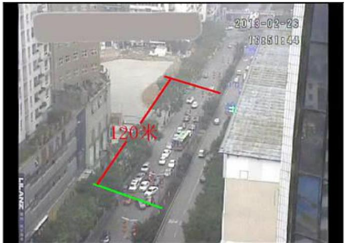

<details>
<summary>text_image</summary>

2018-02-23
13651449
120米
</details>

图 1 发生事故时车流饱和状态图示  
而对于没有事故车辆占道的情况，由于视频没有相应的道路饱和时刻，我们采取理论分析的办法估计这种状态下道路的实际通行能力。

## 2.3 数据采集

由于不同种类的车型对于道路交通压力的贡献大小不一样，并且不同种类的车型运输的客运量也不同，我们对过往各个路口与事故横截面的车辆进行了分类记录。由于小轿车与面包车的体积与运输能力比较相近，我们将小轿车与面包车归为一类车。我们将所有车型分成了三类，分别为小轿车与面包车、大客车、电瓶车。我们在网络上查找了不同车型对应的标准车当量（pcu），通过统计计算单位时间内通过道路某一横截面的标准车当量的多少来确定道路的通行能力。

我们通过观看视频，人工计数的方法，统计了视频中特定时间段中，通过事故位置横截面的三种类型的车辆数目。

## 2.3.1 不同车型所对应的标准车当量（pcu）[1]

<table><tr><td>车型</td><td>标准车当量(pcu)</td></tr><tr><td>小轿车/面包车</td><td>1</td></tr><tr><td>大客车</td><td>3.5</td></tr><tr><td>电瓶车</td><td>0.5</td></tr></table>

表格 1 不同车型对应标准车当量

## 2.3.2 视频 1-事故车辆占用车道二与车道三时的实际通行能力

我们选择了视频 1 中道路出现显著饱和状态的视频片段，记录下了该片段的起始和结束时间点，计数了这段时间内的交通流量，统计结果如下。

<table><tr><td></td><td>开始时间</td><td>结束时间</td><td>小轿车/面包车</td><td>大客车</td><td>电瓶车</td><td>总pcu</td><td>总时间</td></tr><tr><td>1</td><td>16:42:32</td><td>16:44:47</td><td>27</td><td>5</td><td>5</td><td>47</td><td>0:01:45</td></tr><tr><td>2</td><td>16:47:58</td><td>16:49:38</td><td>33</td><td>1</td><td>8</td><td>40.5</td><td>0:01:40</td></tr><tr><td>3</td><td>16:52:42</td><td>16:56:05</td><td>91</td><td>4</td><td>17</td><td>113.5</td><td>0:05:23</td></tr><tr><td>总数</td><td></td><td></td><td>151</td><td>10</td><td>30</td><td>201</td><td>0:08:48</td></tr></table>

表格 2 视频 1 中道路实际通行能力统计

## 2.3.3 视频 2-事故车辆占用车道一与车道二时的实际通行能力

<table><tr><td></td><td>开始时间</td><td>结束时间</td><td>小轿车/面包车</td><td>大客车</td><td>电瓶车</td><td>总pcu</td><td>总时间</td></tr><tr><td>1</td><td>17:41:46</td><td>17:43:19</td><td>39</td><td>3</td><td>11</td><td>55</td><td>0:01:33</td></tr><tr><td>2</td><td>17:50:04</td><td>17:53:55</td><td>69</td><td>4</td><td>31</td><td>98.5</td><td>0:03:51</td></tr><tr><td>3</td><td>17:54:51</td><td>17:57:06</td><td>42</td><td>6</td><td>26</td><td>76</td><td>0:02:15</td></tr><tr><td>4</td><td>17:58:51</td><td>18:01:08</td><td>36</td><td>5</td><td>11</td><td>59</td><td>0:02:17</td></tr><tr><td>5</td><td>18:02:06</td><td>18:03:34</td><td>29</td><td>4</td><td>3</td><td>44.5</td><td>0:01:28</td></tr><tr><td>总数</td><td></td><td></td><td>215</td><td>22</td><td>82</td><td>333</td><td>0:11:24</td></tr></table>

表格 3 视频 2 中道路实际通行能力统计

## 2.4 道路实际通行能力计算

## 2.4.1 有事故车辆占道时最大通行能力的估计

我们在视频 1 和视频 2 中分别找到了 3 段道路明显饱和的时间和 5 段道路明显饱和的时间。我们分别计算了在这 3 个饱和时间段和 5 个饱和时间段内通过的标准车当量的总数以及这些时间段的总时长。用通过的标准车当量的总数除以总时长，这样就计算出了两种不同位置的事故条件下道路单位时间内通过的标准车当量，也就是道路的实际通行能力。

<table><tr><td></td><td>视频 1</td><td>视频 2</td></tr><tr><td>标准车当量总数(pcu)</td><td>201</td><td>333</td></tr><tr><td>总时长(h)</td><td>0.147</td><td>0.190</td></tr><tr><td>实际通行能力(pcu/s)</td><td>0.3805</td><td>0.4867</td></tr></table>

表格 4 道路实际通行能力计算

## 2.4.2 事故车辆占道时最大通行能力的估计

在无事故车辆占用车道的状态下，因为道路上只是不时地来车，道路上的车流通行量显然没有达到道路的实际通行能力。所以，我们只能用理论来估计无事故车辆状态下，道路的实际通行能力。

根据文献(信号灯控制下的交通流模型)中的分析我们可以得到道路的通行能力q与道路上的车辆密度 $\rho$ 、车辆首尾相接时形成堵塞的最大密度 $\rho_{m}$ 以及车辆密度接近0时车辆的最大行驶速度 $v_{m}$ 存在以下关系 $^{[2]}$ :

$$
q (\rho) = v _ {\mathrm{m}} \rho (1 - \frac {\rho}{\rho_ {\mathrm{m}}})
$$

q为关于 $\rho$ 的二次函数且二次项系数小于0，所以，当 $q(\rho)$ 的导数等于0时 $q(\rho)$ 取到最大值。

$$
\frac {\mathrm{dq} (\rho)}{\mathrm{d} \rho} = \mathrm{v} _ {\mathrm{m}} (1 - \frac {2 \rho}{\rho_ {\mathrm{m}}})
$$

$\rho = \frac{\rho_{\mathrm{m}}}{2}$ 时q取最大值。所以，只要估算出车辆首尾相接时形成堵塞的最大密度 $\rho_{\mathrm{m}}$ 以及车辆密度接近0时车辆的最大行驶速度 $\mathbf{v}_{\mathrm{m}}$ ，就能够估算出道路畅通时的最大通行能力。

我们需要估算的道路最大通行能力以PCU/s为单位，所以我们在估计最大密度 $\rho_{m}$ 时采用的单位是PCU/m，估计最大行驶速度 $v_{m}$ 时采用的单位是m/s。

由于电瓶车的最大行驶速度远低于小轿车和大客车，电瓶车难以形成首尾相接的阻塞，并且电瓶车对于总通行量的贡献较少，我们在估计最大通行能力时忽略了电瓶车的影响。

## 2.4.3 $\rho_{m}$ 的估计

对于不同的道路，车辆首尾相接形成堵塞时车辆的最大密度不同，所以估计这条道路上堵塞车辆的最大密度的最好方法是观察分析视频。

我们在视频 1 中找到了四个车辆形成首尾相接的阻塞的时刻，我们分别统计了这四个时刻首尾相接排队的小轿车数量和大客车数量，并利用道路隔离栏上的路灯杆作为标度估计了排队的长度，记录数据如下：

<table><tr><td></td><td>小轿车/面包车</td><td>大客车</td><td>PCU</td><td>排队长度(m)</td><td>车密度 $\rho_{\text{m}}$ </td></tr><tr><td>1</td><td>21</td><td>1</td><td>24.5</td><td>80</td><td>0.3063</td></tr><tr><td>2</td><td>20</td><td>2</td><td>27</td><td>80</td><td>0.3375</td></tr><tr><td>3</td><td>23</td><td>1</td><td>26.5</td><td>80</td><td>0.3313</td></tr><tr><td>4</td><td>24</td><td>2</td><td>31</td><td>90</td><td>0.3444</td></tr><tr><td>平均</td><td></td><td></td><td></td><td></td><td>0.3299</td></tr></table>

我们对四次采样得到的最大密度 $\rho_{m}$ 取了平均值以减小估算误差，估计这条道路上堵塞车辆的最大密度约为0.33pcu/m。

## 2.4.4 $\mathbf{v}_{\mathrm{m}}$ 的估计

因为达到车辆行驶最大速度的条件为车辆密度接近与 0，我们在视频中事故发生前选出了三段整条道路上车数小于 2 的片段，并对这三段视频中走在最前面的车的车速进行了估测。

我们分别利用路灯杆作为标尺，利用屏幕右上角的秒表读取时间，得到了三辆作为采样对象的汽车的速度。根据视频中出现的 120 标记大约有三个路灯杆间距的长度，我们估算第 6 个路灯杆到第 2 个路灯杆之间的距离大约有 160m。

于是，我们便估计 $v_{m}$ 的数值大约有22.8m/s。

<table><tr><td>车辆</td><td>经过第6个路灯杆的时间</td><td>经过第2个路灯杆的时间</td><td>Δt/s</td><td>距离(m)</td><td>速度(m/s)</td></tr><tr><td>1</td><td>16:39:14</td><td>16:39:22</td><td>8</td><td>160</td><td>20</td></tr><tr><td>2</td><td>16:40:09</td><td>16:40:16</td><td>7</td><td>160</td><td>22.8</td></tr><tr><td>3</td><td>16:41:07</td><td>16:41:14</td><td>7</td><td>160</td><td>22.8</td></tr></table>

估算好 $\rho_{m}$ 与 $v_{m}$ 后，我们就可以计算道路畅通时的最大通行能力了。

$$
\mathrm{q} _ {\mathrm{m}} = \mathrm{q} \left(\frac {\rho_ {\mathrm{m}}}{2}\right) = \frac {\mathrm{v} _ {\mathrm{m}} * \rho_ {\mathrm{m}}}{4} = \frac {2 2 . 8 * 0 . 3 3}{4} \approx 1. 9 \mathrm{pcu/s}
$$

现在我们可以回答第一个问题。在事故发生后，道路实际通行能力由正常状态下1.95pcu/s 下降到 0.3805pcu/s，之后在事故移除后，道路实际通行能力上升恢复到正常水平，即1.95pcu/s。

## 2.5 不同事故位置影响的分析

在观察视频的过程中,我们主要发现了两种因素可能会使得事故发生的位置不同时,道路的通行能力不同:

## a) 由于非机动车道位于道路右侧，发生于不同车道的事故对非机动车的通行影响一定不同。

在观察视频时,我们发现了后方车辆对于两种不同位置的交通事故的反应的一个明显的不同:当事故发生在车道二与车道三时,也就是只有最边缘的一条车道畅通时,机动车与非机动车只能都从右侧的小口通过,而当事故发生在车道一与车道二时,机动车只能从最内侧畅通的车道通过,然而非机动车还可以选择从道路最右侧事故车辆与路边之间的一个小缝隙中通过,并且大多数非机动车死机都倾向于走右侧的小缝隙。

于是，我们猜想导致视频 1 与视频 2 事故发生在不同位置时道路实际通行能力不同的一个因素在于发生在车道一与车道二的交通事故给非机动车在道路的最右侧留下了一个缝隙，使得车道一与车道二发生交通事故的情形能够额外通过非机动车。我们假设是从右侧缝隙额外通过的非机动车使得事故发生在车道二与车道三时道路的实际通行能力小于事故发生在车道一与车道二时道路的实际通行能力。

## b) 由于两个视频中最左侧车道和最右侧车道所承担的交通压力不一定相同，不同位置的交通事故也可能会对通行带来不同的影响。

若事故后车道二与车道三堵塞，排在正在通过事故截面的汽车队伍内的所有汽车中，处于车道一的汽车不用换道就能通过，而处于车道二和车道三的汽车需要分别经历一次换道和两次换道，才能通过事故截面。所以如果视频一与视频二中，处于最左侧和最右侧车道的车辆比例不同，也会使得两段视频中道路的通行能力不同。

当一辆车只有在换道后才能通过事故横截面时，它往往要等待旁边的另一辆车经过。在这个等待时间内，这辆车所在的车道本应能够通行一辆车。所以，我们假设当车辆需要进行一次换道才能通行时，这辆车对于道路通行量的贡献变为其本身的2倍。同理需要换两次道才能通行的车辆对道路通行量的贡献变为其本身的3倍。

为了研究两个视频中最左侧车道与最右侧车道承担的交通压力的不同,我们分别在两个视频中随机选择了 5 分钟事故中的片段,统计了其中不同车道所承担的交通压力占总体的比例。

因为只有在即将经过事故横截面处的换道对车流的通行有明显的减慢作用,我们只统计车辆在开始等待经过事故横截面时所处的车道来决定这些车辆需要换道在次数。因为电瓶车通行中不存在换道现象的影响，所以我们只统计机动车的数量来推算三条车道分别承担的交通压力。

下面为我们统计的数据:

<table><tr><td colspan="2">车道</td><td colspan="2">车道一</td><td colspan="2">车道二</td><td colspan="2">车道三</td></tr><tr><td colspan="2">车型</td><td>小轿车</td><td>大客车</td><td>小轿车</td><td>大客车</td><td>小轿车</td><td>大客车</td></tr><tr><td rowspan="2">视频一</td><td>数量</td><td>31</td><td>3</td><td>29</td><td>3</td><td>15</td><td>0</td></tr><tr><td>pcu</td><td colspan="2">41.5</td><td colspan="2">39.5</td><td colspan="2">15</td></tr><tr><td rowspan="2">视频二</td><td>数量</td><td>11</td><td>0</td><td>36</td><td>1</td><td>36</td><td>7</td></tr><tr><td>pcu</td><td colspan="2">11</td><td colspan="2">39.5</td><td colspan="2">60.5</td></tr></table>

表格 5 不同车道来车流量统计

于是，我们计算出了两段视频中三条车道所承担的通行量占总通行量的百分比：

<table><tr><td>车道</td><td>车道一所占百分比</td><td>车道二所占百分比</td><td>车道三所占百分比</td></tr><tr><td>视频一</td><td>43.2</td><td>41.1</td><td>15.6</td></tr><tr><td>视频二</td><td>9.9</td><td>35.6</td><td>54.5</td></tr></table>

表格 6 不同车道车流量百分比统计

所以，为了验证我们的假设，我们应该把视频 2 中从右侧缝隙通过的那部分标准车当量扣除，来对比两种事故情形下道路的实际通行能力。因为视频 2 中大部分电瓶车是从道路右侧的缝隙通过的，所以我们就把视频 2 中电瓶车对于标准车当量总数贡献的那部分来代替右侧缝隙通过的把这车当量。

<table><tr><td></td><td>视频 1</td><td>视频 2</td></tr><tr><td>标准车当量总数(pcu)</td><td>201</td><td>292(扣除电瓶车)</td></tr></table>

由表 1.1 中的百分比数据，我们就可以估算两段视频中三条车道所占的标准车当量了。按照假设，当车辆需要进行一次换道才能通行时，这辆车对于道路通行量的贡献变为其本身的 2 倍，需要换两次道才能通行的车辆对道路通行量的贡献变为其本身的 3 倍，我们可以计算两个视频中考虑换道现象造成的影响的等效标准车当量总数，从而计算两个事故中道路的等效实际通行能力（pcu/小时）。

<table><tr><td></td><td>视频 1</td><td>视频 2</td></tr><tr><td>车道一的标准车当量(pcu)</td><td>87</td><td>29</td></tr><tr><td>车道二的标准车当量(pcu)</td><td>83</td><td>104</td></tr><tr><td>车道三的标准车当量(pcu)</td><td>31</td><td>159</td></tr><tr><td>等效标准车当量总数(pcu)</td><td> $87 + 83 \times 2 + 31 \times 3 = 346$ </td><td> $29 \times 3 + 104 \times 2 + 159 = 454$ </td></tr><tr><td>总时长(小时)</td><td>0.147</td><td>0.190</td></tr><tr><td>等效实际通行能力(pcu/h)</td><td>2353</td><td>2389</td></tr></table>

表格 7 等效实际通行能力计算

这样，我们得到的两种事故中道路等效的实际通行能力分别为 2353 pcu/小时和 2389 pcu/小时，就非常接近了。说明造成两个视频中道路实际通行能力不同的因素有：发生于不同车道的事故对非机动车的通行影响不同；不同车道分担的交通压力不同，使得车辆在通过事故点时需要换道的次数不同。

所以，我们就找到了导致事故位置不同对交通的影响力不同的两个原因：

1) 视频 2 中交通事故占据了靠街两个车道,迫使机动车和非机动车进行分流——机动车将驶入靠路中心的车道,而非机动车将通过事故车辆和街道之间的缝隙直接通过事故现场,因此减少了唯一剩下的车道的行车压力,并且避免了机动车和非机动车共用一条道路的互相干扰了;

2) 不同道路的流量比例不同，由于改道过程的存在，唯一可通行道路距离来车原本道路越远，通过事故位置的耗时越长；

## 3 车辆排队长度建模分析

## 模型一 差分方程模型

## 1 模型假设

针对该模型，我们提出了如下的合理假设：

1.1 排队长度与排队车辆的标准车当数成正比;  
1.2 整个过程中不再有新的交通事故发生；  
1.3 小区路口出入的车流量和上游路口右转的车流量稳定不变;  
1.4 在事故车辆占道状态下道路实际通行能力不变;

## 2 记号说明

<table><tr><td>记号</td><td>意义</td><td>单位</td></tr><tr><td>q</td><td>从上游路口进入事故路段的总车流量</td><td>pcu/s</td></tr><tr><td> $q_d$ </td><td>上游直行车流量</td><td>pcu/s</td></tr><tr><td> $\widetilde{q_d}$ </td><td>上游直行车每相位周期内的平均瞬时车流量</td><td>pcu/s</td></tr><tr><td> $XQ_1$ </td><td>小区路口1开入小区的车流</td><td>pcu/s</td></tr><tr><td> $XQ_2$ </td><td>小区路口2开出小区的车流</td><td>pcu/s</td></tr><tr><td> $q_r$ </td><td>上游路口右转车车流量</td><td>pcu/s</td></tr><tr><td>C</td><td>道路通行能力</td><td>pcu/s</td></tr><tr><td>α</td><td>每单位标准车当量对应排队长度的比例常数</td><td>m/pcu</td></tr><tr><td>l</td><td>排队长度</td><td>m</td></tr><tr><td>t</td><td>事故发生时间</td><td>s</td></tr><tr><td> $t_{mod}$ </td><td>事故发生相位时间 = t (mod 60)</td><td>s</td></tr><tr><td>L</td><td>事故发生位置到上游路口距离</td><td>m</td></tr><tr><td>v</td><td>上游来车从路口到事故位置平均车速</td><td>m/s</td></tr></table>

表格 8 模型一记号说明

## 3 模型建立

根据假设 1.11.1，我们可以通过对排队车辆标准当量数的分析来得到排队长度的表达式。首先，排队车量标准当量数的增加变化分别来自：

i. 增加：上游来车车流；从小区路口开出的车流

ii. 减少：通过事故位置横截面的离开车流；向小区路口开入的车流

首先考虑两个小区路口进出的车流，由于小区路口进出车流不受信号灯控制且流量较小，我们近似认为小区路口的车流流量恒定不变。注意到靠前小区路口（小区路口1）只有开入到小区的车流，靠后小区路口只有从小区开出的车流。

$$
X Q _ {1} (t) = \overline {{X Q _ {1}}}
$$

$$
X Q _ {2} (t) = \overline {{X Q _ {2}}}
$$

因此我们只需分析上游来车车流随时间的变化和通过事故位置横截面的离开车流随时间的变化情况。

上游来车流量随时间的变化规律较为复杂，我们在 4 中会有详细的讨论，我们先假设已经求出了上游通过路口横截面的瞬时车流量关于时间的函数 $q(t)$ 。

然后我们考虑瞬时离开车流量的变化。不难得知，当来车车流量小于道路通行能力且没有车辆排队通过事故位置的情况下，所有车流都能通畅通过事故位置，此时离开车流量等于来车车流量；而当来车车流量大于道路通行能力或有车辆排队的情况下，道路通行能力达到饱和，此时的离开车流量就等于道路通行能力。为了方便描述这一规律，我们定义一个函数：

$$
\sigma (x) = \left\{ \begin{array}{l l} x & \quad x \geq 0 \\ 0 & \quad x <   0 \end{array} \right. \quad \text {I}
$$

我们可以列出差分方程:

$$
l _ {n + 1} = \sigma \left(l _ {n} + \alpha * \left(- C + q \left(t _ {n} - \frac {(L - l _ {n})}{v}\right) - X Q _ {1} + X Q _ {2}\right) * (t _ {n + 1} - t _ {n})\right) \quad \text {II}
$$

注意 $q\left(t_n - \frac{(L - l_n)}{v}\right)$ ，差分方程所表示的排队车辆标准车当量数增加的量应该是来到队伍末尾的车流流量，而这段车流流量即在 $\frac{(L - l_n)}{v}$ 时间之前经过路口的车流流量。

## 4 路口来车流量分析

查看事故路段上游路口交通组织方案，我们看到，由于路口下方道路禁止左转，上游来车只可能路口左方道路开来的直行车和路口上方道路开来的右转车。下面我们分别分析上游正面来车和上游右转来车的车流流量。

## 4.1 上游正面来车流量

观察视频我们可以发现,上游正面来车的流量随时间进行着明显的周期性震荡,这是由于上游正面来车受红绿灯控制所导致的。如图所示,上游正面来车在第一相位时能够正常通过路口，而在第二相位时，正面来车无法正常通过路口，需要排队等候红灯变为绿灯。因此在每个连续的 60s 时间段内，只有处于第一相位的 30s 上游来车的流量为正值。

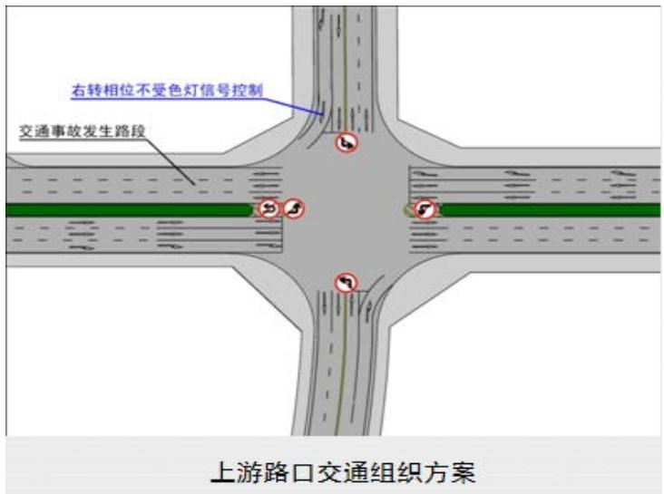

<details>
<summary>text_image</summary>

右转相位不受色灯信号控制
交通事故发生路段
上游路口交通组织方案
</details>

图 2 上游路口交通组织方案

与此同时，在处于第一相位的 30s 内，来车量的也并非服从简单的均匀分布。观察视频我们可以看到，在第二相位期间，上游来车流量全部累积到路口，形成排队通过路口的车队；当红灯变为绿灯时，这些累积的车辆在短时间内释放，正面来车流量快速上升至一个很大的值，然后慢慢变小恢复到正常值。下面我们就具体的分析这一过程中的流量变化。

我们考察红灯线位置截面的车流流量。由定义我们可以直接得到，车流流量 $q(x,t)$ 由车流密度 $\rho(x,t)$ 和车流速度 $v(x,t)$ 共同决定 $^{[2]}$ ：

$$
q (x, t) = \rho (x, t) v (x, t)
$$

$v(x,t)=0$ 时，车流密度达到最大， $\rho(x,t)=\rho_{max}$ ; 当 $\rho(x,t)=0$ 时，车流速度达到最大， $v(x,t)=v_{max}$ 。这两种情况我们称为平衡状态，而在非平衡状态下，根据文献(晏启鹏 2000)中的分析我们可以得到车流流量与车流密度的关系是：

$$
q (\rho) = v _ {m a x} \rho \left(1 - \frac {\rho}{\rho_ {m a x}}\right) \tag {III}
$$

我们的目的是要描述车流流量 q 在红灯变为绿灯之后的时间段内随时间的变化过程，已经车流流量 q 是关于车流密度 $\rho$ 的函数，我们只需要分析车流密度 $\rho$ 随时间的变化过程即可。

由定义，最大车流密度是车流速度为 0，车流平均车距为 0 时的车流密度在，则此时道路空间的体积全部被车辆本身的体积占据。假设车流中车辆的平均长度为 d，车辆的平均车距为 l，那么我们可以得到公式：

$$
\frac {\rho_ {m a x}}{\rho} = \frac {l + d}{d} \quad \text {IV}
$$

分析红灯变为绿灯后平均车距的变化。变为绿灯后，最靠前的车辆开始加速，与后面的车辆车距拉大，经过 $\Delta t$ 的时间后，后面的车辆同样开始加速；我们假设车辆从开始加速达到最大速度经历一个匀加速过程，因此我们近似认为平均车距 l 正比于时间 t：

$$
l = k t \quad \mathrm{V}
$$

我们联立 III，IV 和 V 得到：

$$
q (t) = v _ {m a x} \rho_ {m a x} \frac {d}{k t + d} (1 - \frac {d}{k t + d}) \quad t \leq t _ {0} \quad \mathrm{VI}
$$

注意到，公式 VI 描述的是排队车辆形成的密集车辆阵内的车流密度，那么，当这个车辆阵完全穿过指定横截面时，车流密度会发生一个瞬时的下降。由于正面来车流量在不考虑信号灯的条件下是一个常值 $q_{d}$ ， $q(t)$ 将下降到这一常值后保持稳定。这样我们就得到了第一相位的一个 30s 周期内正面来车流量的变化规律（已将系数简化）：

$$
q _ {d} (t) = \left\{ \begin{array}{c c} a q _ {d} \cdot \frac {1}{m t + 1} (1 - \frac {1}{m t + 1}) & t \leq t _ {a} \\ q _ {d} & t > t _ {a} \end{array} \right\} \quad \text {VII}
$$

在使用 matlab 进行数值模拟时我们发现，如果直接采用公式 VII 进行模拟，由于模拟采用的离散值，而该函数在曲线阶段均为凸函数，且斜率变化较大，因此会出现明显的偏小的误差——实际模拟中正面车流流量的均值将小于连续函数给出的车流流量均值。因此我们采取阶梯函数近似的办法来描述第一相位时车流流量随时间的变化规律：

$$
\begin{array}{r} q _ {d} (t) = \left(\chi_ {[ 0, 2)} (t _ {m o d}) \cdot 3 + \chi_ {[ 2, 1 0)} (t _ {m o d}) \cdot 5 + \chi_ {[ 1 0, 1 2)} (t _ {m o d}) \cdot 4 + \chi_ {[ 1 2, 3 0)} (t _ {m o d}) \cdot 1\right) \cdot \frac {6 0}{7 2} \cdot \widetilde {q _ {d}} (t) \\ \text {VIII} \end{array}
$$

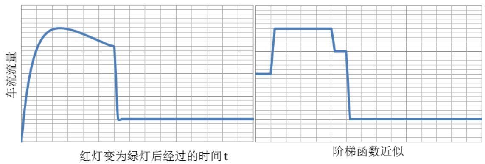

<details>
<summary>line</summary>

| 时间点 | 车流流量 |
| --- | --- |
| t1 | ~0 |
| t2 | ~0.8 |
| t3 | ~0.9 |
| t4 | ~0.85 |
| t5 | ~0.75 |
| t6 | ~0.7 |
| t7 | ~0.15 |
| t8 | ~0.15 |
| t9 | ~0.15 |
| t10 | ~0.15 |
| t11 | ~0.15 |
| t12 | ~0.15 |
| t13 | ~0.15 |
| t14 | ~0.15 |
| t15 | ~0.15 |
| t16 | ~0.15 |
| t17 | ~0.15 |
| t18 | ~0.15 |
| t19 | ~0.15 |
| t20 | ~0.15 |
| t21 | ~0.15 |
| t22 | ~0.15 |
| t23 | ~0.15 |
| t24 | ~0.15 |
| t25 | ~0.15 |
| t26 | ~0.15 |
| t27 | ~0.15 |
| t28 | ~0.15 |
| t29 | ~0.15 |
| t30 | ~0.15 |
| t31 | ~0.15 |
| t32 | ~0.15 |
| t33 | ~0.15 |
| t34 | ~0.15 |
| t35 | ~0.15 |
| t36 | ~0.15 |
| t37 | ~0.15 |
| t38 | ~0.15 |
| t39 | ~0.15 |
| t40 | ~0.15 |
| t41 | ~0.15 |
| t42 | ~0.15 |
| t43 | ~0.15 |
| t44 | ~0.15 |
| t45 | ~0.15 |
| t46 | ~0.15 |
| t47 | ~0.15 |
| t48 | ~0.15 |
| t49 | ~0.15 |
| t50 | ~0.15 |
| t51 | ~0.15 |
| t52 | ~0.15 |
| t53 | ~0.15 |
| t54 | ~0.15 |
| t55 | ~0.15 |
| t56 | ~0.15 |
| t57 | ~0.15 |
| t58 | ~0.15 |
| t59 | ~0.15 |
| t60 | ~0.15 |
| t61 | ~0.15 |
| t62 | ~0.15 |
| t63 | ~0.15 |
| t64 | ~0.15 |
| t65 | ~0.15 |
| t66 | ~0.15 |
| t67 | ~0.15 |
| t68 | ~0.15 |
| t69 | ~0.15 |
| t70 | ~0.15 |
| t71 | ~0.15 |
| t72 | ~0.15 |
| t73 | ~0.15 |
| t74 | ~0.15 |
| t75 | ~0.15 |
| t76 | ~0.15 |
| t77 | ~0.15 |
| t78 | ~0.15 |
| t79 | ~0.15 |
| t80 | ~0.15 |
| t81 | ~0.15 |
| t82 | ~0.15 |
| t83 | ~0.15 |
| t84 | ~0.15 |
| t85 | ~0.15 |
| t86 | ~0.15 |
| t87 | ~0.15 |
| t88 | ~0.15 |
| t89 | ~0.15 |
| t90 | ~0.15 |
| t91 | ~0.15 |
| t92 | ~0.15 |
| t93 | ~0.15 |
| t94 | ~0.15 |
| t95 | ~0.15 |
| t96 | ~0.15 |
| t97 | ~0.15 |
| t98 | ~0.15 |
| t99 | ~0.15 |
| t100 | ~0.15 |

图中包含两个子图，分别对应“红灯变为绿灯后经过的时间t”和“阶梯函数近似”。由于图像分辨率较低且无具体数据标签，表中数值均为基于网格线的估算值。
</details>

图 3 第一相位时车流流量变化

同时我们发现，不仅在一个周期内车流量变化存在明显的规则变化，在不同时间的不同周期内内的车流量也存在明显的变化。视频前部分的相位周期中周期总车流量较小，在视频后部分的相位周期中周期总车流量较大——这可能是由于下班晚高峰到来的影响。画出相位周期内平均车流流量随时间的变化，进行线性拟合，统计量 $R^{2}=0.9196$ ，因此可以近似认为在研究时间段内单个周期总车流量呈线性增长：

$$
\widetilde {q _ {d}} (t) = \beta t + \gamma \quad \mathrm{IX}
$$

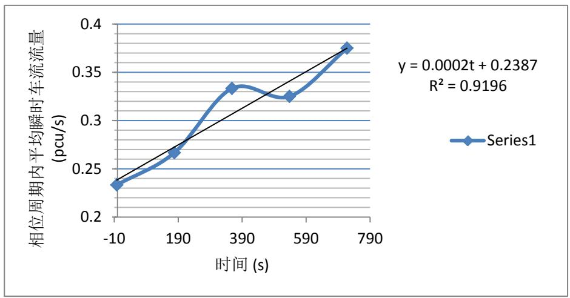

<details>
<summary>line</summary>

| 时间 (s) | Series1 (pcu/s) |
| --- | --- |
| -10 | ~0.235 |
| 190 | ~0.265 |
| 390 | ~0.335 |
| 590 | ~0.325 |
| 790 | ~0.375 |
</details>

图 4 前方来车相位周期内平均瞬时车流量的变化

加入第一相位和第二相位差别的考虑,我们得到最终的正面来车车流量的函数:

$$
q _ {d} (t) = \left(\chi_ {[ 0, 2)} (t _ {m o d}) \cdot 3 + \chi_ {[ 2, 1 0)} (t _ {m o d}) \cdot 5 + \chi_ {[ 1 0, 1 2)} (t _ {m o d}) \cdot 4 + \chi_ {[ 1 2, 3 0)} (t _ {m o d}) \cdot 1\right) \cdot \frac {6 0}{7 2} (\beta t + \gamma) \cdot
$$

$$
(1 - \chi_ {[ 3 0, 6 0)} (t _ {m o d})) \quad X
$$

其中因子 $((1-\chi_{[30,60)})$ 含义是当 $t_{mod} \in [30,60)$ 时， $q_{d}=0$ 。

## 4.2 路口右转来车流量

由于上游的右转相位不受红色信号灯控制, 故可认为右转来车是连续稳定的车流。同时统计显示右转来车相位周期内平均瞬时车流量随机震荡变化, 没有明显的增减变化, 故认为上游右转来车为常数值。

$$
q _ {r} = \overline {{q _ {r}}} \quad \mathrm{XI}
$$

综合以上的讨论，将公式 X 和公式 XII 相加我们可以得到整个上游来车流量随时间的变化规律。

## 5 参数估计

根据图 4 前方来车相位周期内平均瞬时车流量的变化中 Excel 的回归分析，我们可以得到公式 $\widetilde{q_{d}}(t)=\beta t+\gamma$ IX 的参数估计：

$$
\widetilde {q _ {d}} (t) = \beta t + \gamma = 0. 0 0 0 2 \cdot t + 0. 2 3 8 7
$$

公式中时间t是指时间点到16:42:32的秒数差。如16:45:30对应的时间 $t = 178 \, s$ 。

我们统计了若干个相位周期右转来车的流量，得到了平均值为:

$$
\overline {{q _ {r}}} = 0. 0 5 p c u / s
$$

<table><tr><td>开始时间</td><td>结束时间</td><td>小轿车</td><td>大客车</td><td>电瓶车</td><td>PCU</td></tr><tr><td>16:42:00</td><td>16:43:00</td><td>2</td><td>0</td><td>0</td><td>2</td></tr><tr><td>16:45:00</td><td>16:46:00</td><td>3</td><td>0</td><td>1</td><td>3.5</td></tr><tr><td>16:47:00</td><td>16:48:00</td><td>2</td><td>0</td><td>3</td><td>3.5</td></tr><tr><td>16:50:00</td><td>16:51:00</td><td>1</td><td>0</td><td>1</td><td>1.5</td></tr><tr><td>16:53:00</td><td>16:54:00</td><td>4</td><td>0</td><td>1</td><td>4.5</td></tr></table>

表格 9 上游右转来车流量统计

然后考虑道路实际通行能力 C。在前面的讨论已经指出道路在饱和状态下的交通量即是道路实际通行能力的近似，我们统计了若干个饱和周期内的道路流量，计算出了视频 1 中事故位置横截面的道路实际通行能力：

$$
C = 0. 3 8 0 6 2 p c u / s
$$

<table><tr><td>开始时间</td><td>结束时间</td><td>小轿车</td><td>大客车</td><td>电瓶车</td><td>PCU</td></tr><tr><td>16:42:32</td><td>16:44:47</td><td>27</td><td>5</td><td>5</td><td>47</td></tr><tr><td>16:47:58</td><td>16:49:38</td><td>33</td><td>1</td><td>8</td><td>40.5</td></tr><tr><td>16:52:42</td><td>16:56:05</td><td>91</td><td>4</td><td>17</td><td>113.5</td></tr></table>

表格 10 上游正面来车流量统计

我们统计了16:45:00到16:58:00之间小区路口的车流变化，计算得到了两个小区路口进出车流的均值：

$$
X Q _ {1} (t) = \overline {{X Q _ {1}}} = 0. 0 2 0 8 3 p c u / s
$$

$$
X Q _ {2} (t) = \overline {{X Q _ {2}}} = 0. 0 4 6 4 7 4 p c u / s
$$

我们还需要估计上游来车从路口到排队队伍末端的平均速度, 观察视频我们给出估计值为:

$$
\hat {v} = 1 0 m / s
$$

最后我们还需要确定比例常数 $\alpha$ ，即每pcu的排队车辆所占的排队长度。我们截取了四张车辆排队图，统计各自的排队长度和排队标准车当量数，计算得到比例常数为：

$$
\alpha = 4. 8 \text {m / pcu}
$$

这样我们就得到视频 1 中该模型的所有参数。

## 6 模型求解和分析

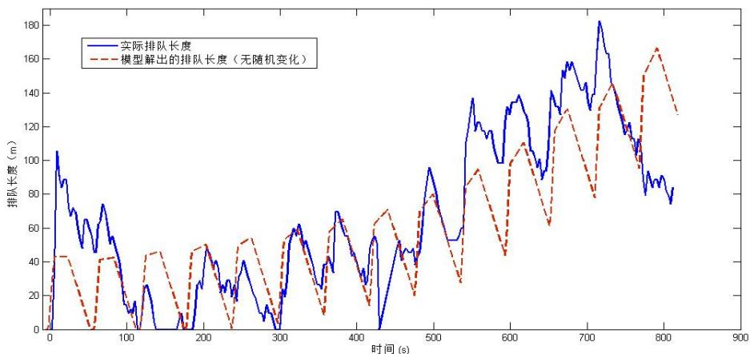

<details>
<summary>line</summary>

| 时间 (s) | 实际排队长度 (m) | 模型解出的排队长度 (m) |
| --- | --- | --- |
| 0 | 0 | 0 |
| ~10 | ~105 | ~43 |
| ~20 | ~85 | ~43 |
| ~30 | ~70 | ~35 |
| ~40 | ~65 | ~25 |
| ~50 | ~50 | ~15 |
| ~60 | ~65 | ~10 |
| ~70 | ~75 | ~42 |
| ~80 | ~55 | ~42 |
| ~90 | ~45 | ~42 |
| ~100 | ~15 | ~15 |
| ~110 | ~10 | ~10 |
| ~120 | ~25 | ~45 |
| ~130 | ~10 | ~45 |
| ~140 | 0 | ~45 |
| ~150 | 0 | ~35 |
| ~160 | 0 | ~25 |
| ~170 | 0 | ~15 |
| ~180 | 0 | ~5 |
| ~190 | 0 | ~10 |
| ~200 | ~25 | ~45 |
| ~210 | ~45 | ~48 |
| ~220 | ~48 | ~48 |
| ~230 | ~35 | ~35 |
| ~240 | ~25 | ~25 |
| ~250 | ~25 | ~25 |
| ~260 | ~40 | ~52 |
| ~270 | ~35 | ~52 |
| ~280 | ~25 | ~45 |
| ~290 | ~15 | ~35 |
| ~300 | 0 | 0 |
| ~310 | ~20 | ~35 |
| ~320 | ~45 | ~45 |
| ~330 | ~60 | ~60 |
| ~340 | ~62 | ~62 |
| ~350 | ~55 | ~55 |
| ~360 | ~45 | ~45 |
| ~370 | ~35 | ~35 |
| ~380 | ~45 | ~45 |
| ~390 | ~68 | ~68 |
| ~400 | ~65 | ~65 |
| ~410 | ~45 | ~45 |
| ~420 | ~35 | ~35 |
| ~430 | 0 | 0 |
| ~440 | 25 | 35 |
| ~450 | 45 | 62 |
| ~460 | 48 | 70 |
| ~470 | 45 | 68 |
| ~480 | 48 | 62 |
| ~490 | 95 | 78 |
| ~500 | 85 | 82 |
| ~510 | 75 | 78 |
| ~520 | 75 | 72 |
| ~530 | 75 | 68 |
| ~540 | 115 | 82 |
| ~550 | 138 | 92 |
| ~560 | 122 | 95 |
| ~570 | 118 | 92 |
| ~580 | 118 | 88 |
| ~590 | 118 | 82 |
| ~600 | 98 | 72 |
| ~610 | 132 | 98 |
| ~620 | 138 | 110 |
| ~630 | 138 | 112 |
| ~640 | 128 | 108 |
| ~650 | 118 | 98 |
| ~660 | 98 | 92 |
| ~670 | 92 | 82 |
| ~680 | 142 | 118 |
| ~690 | 158 | 132 |
| ~700 | 158 | 132 |
| ~710 | 142 | 122 |
| ~720 | 132 | 112 |
| ~730 | 182 | 132 |
| ~740 | 162 | 145 |
| ~750 | 148 | 148 |
| ~760 | 132 | 138 |
| ~770 | 122 | 128 |
| ~780 | 112 | 118 |
| ~790 | 98 | 148 |
| ~800 | 92 | 165 |
| ~810 | 88 | 168 |
| ~820 | 78 | 162 |
| ~830 | 82 | 148 |
| ~840 | — | — |
| ~850 | — | — |
| ~860 | — | — |
| ~870 | — | — |
| ~880 | — | — |
| ~890 | — | — |
</details>

图 5 未加入随机变化的模型解

利用我们分析得到的差分方程和估计得到的参数,我们可以解出排队长度随时间变化的关系。下面是由 matlab 解出的 l-t 图:

观察图 5 未加入随机变化的模型，我们可以看到模型反映出，排队长度将在每个相位周期(60s)中震荡变化——这是因为进入第一相位后，上游车流急速上升，超过道路实际通行能力，因此排队长度迅速上升；而在离开第一相位，进入第二相位后，上游正面车流变为零，因此排队长度持续下降——模型很好地解释了排队长度的震荡变化。实际排队长度的变化表现出了更剧烈的上下震荡，但单位相周期内的平均排队长度依然有规律地随着时间增长，并且增长趋势和模型解是十分接近的。

## 6.1 随机性的加入

模型很好地解释了排队长度的大致变化趋势,但是由于现有模型中假设道路实际通行能力C，上游侧面车流量 $q_{r}$ ，小区车流 $XQ_{1},XQ_{2}$ 稳定不变以及排除信号灯作用的上游正面车流量 $\widetilde{q_{d}}$ 线性稳定变化，这和实际情况是有很大出入的。

显然，小区车流 $XQ_{1},XQ_{2}$ 和上游侧面车流量 $q_{r}$ 都不是稳定不变，而是围绕平均值上下震荡的，有时会一次性来三四辆车，有时一分钟内到来的车仅一辆左右。同样，排除信号灯作用的上游正面车流量 $\widetilde{q_{d}}$ 虽然随时间大致呈线性增长的变化趋势，但实际情况依然是震荡上升的。最后，特别值得注意的是，道路实际通行能力C同样存在着随机的震荡，这是因为当车辆有序排队通过事故位置时，有较快的车速，而当不同车道的车流开始争抢通过事故位置时，就会出现短时的阻塞，车辆通过速度较慢。

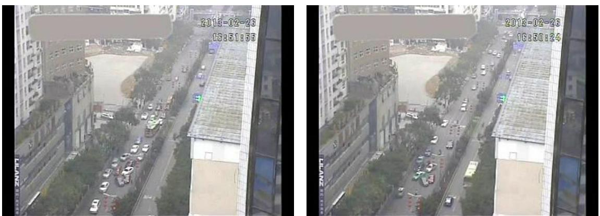  
图 6 有序高速通过（左图）和抢道低速通过（右图）

因此，要让我们的模型解更符合真实情况，我们必须将各个量的随机振动纳入模型。我们使用卡方分布 $\chi^{2}$ 描述这些随机量的震荡。由于 $\widetilde{q_{d}}$ ， $q_{r}$ ， $XQ_{1},XQ_{2}$ 这四个车流量的变化较为剧烈，我们假设它们服从均匀分布，即

$$
\widetilde {q _ {d}} \sim \overline {{\overline {{q _ {d}}}}} U _ {[ 0, 2 ]}, \qquad q _ {r} \sim \overline {{q _ {r}}} U _ {[ 0, 2 ]}, \qquad X Q _ {1} \sim \overline {{X Q _ {1}}} U _ {[ 0, 2 ]}, \qquad X Q _ {2} \sim \overline {{X Q _ {2}}} U _ {[ 0, 2 ]}
$$

道路实际通行能能力的变化相对较小，我们假设它满足自由度为 5 的卡方分布，即：

$$
C \sim \bar {C} \frac {\chi^ {2} (5)}{5}
$$

由于随机性的加入，每次模型求解得出的排队长度变化规律不尽相同，下图列举其中一些不同的排队长度变化情况，图中红色虚线表示实际排队长度。

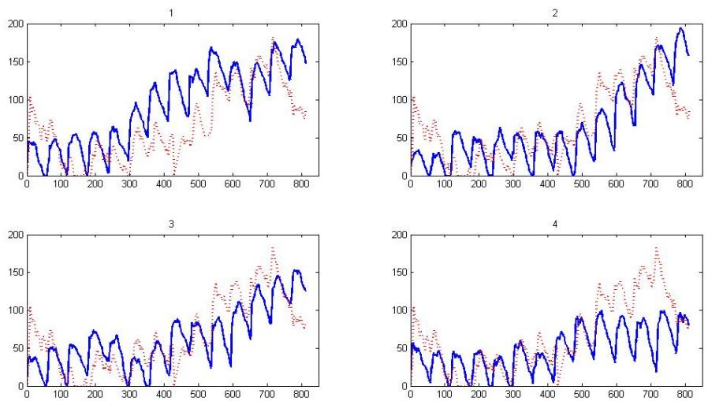  
图 7 加入随机变化的模型解

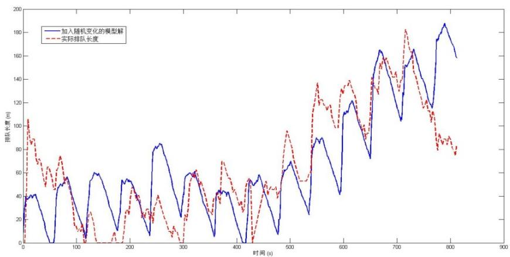

<details>
<summary>line</summary>

| 时间 (s) | 加入随机变化的模型解 (m) | 实际排队长度 (m) |
| --- | --- | --- |
| 0 | ~25 | ~10 |
| 50 | ~40 | ~85 |
| 100 | ~55 | ~60 |
| 150 | ~30 | ~10 |
| 200 | ~55 | ~45 |
| 250 | ~80 | ~20 |
| 300 | ~60 | ~60 |
| 350 | ~40 | ~30 |
| 400 | ~45 | ~45 |
| 450 | ~55 | ~45 |
| 500 | ~70 | ~95 |
| 550 | ~85 | ~135 |
| 600 | ~110 | ~135 |
| 650 | ~165 | ~140 |
| 700 | ~150 | ~180 |
| 750 | ~175 | ~110 |
| 800 | ~185 | ~85 |
| 820 | ~160 | ~80 |
</details>

图 8 一个和实际排队长度符合的较好的随机模型解

通过上面两幅图我们可以看到加入了随机变化的模型解形态变化更加不规则，波动幅度更大，更加符合实际中排队长度的变化；同时在诸多随机模型解中也出现了一定比例的和实际排队长度非常接近的模型解。可以认为随机变化的加入是符合实际的。

## 6.2 误差分析

Matlab 数值实验显示正面来车流量是决定排队长度的最重要因素，合理的秒数正面来车流量的变化是成功建模的关键。在该差分方程模型中，我们已经充分考虑相位周期内由于交通信号灯导致的流量变化和几个相位周期之间由于晚高峰到来导致的变化，在大部分时间段中，模型解都和实际排队长度符合的很好，但在0\~60s 和 750s\~810s 两个相位周期内模型解和实际值偏差始终非常大。观察视频我们发现是这两个相位周期中上游来车流量偏离我们的线性估计很远——0\~60s中的上游正面来车流量十分大，而750s\~810s 十分小。这说明我们的线性估计是不能完全合理描述相位周期间正面来车流量的变化，但由于偏离的混沌性和数据的有限性，做出更好估计的难度较大。

## 6.3 控制变量分析

除去时间参数t外，模型中还有两个主要的自变量是道路通行能力C和上游正面来车流量 $q_{d}$ ，我们固定二者之一不变，那么排队长度就变成了关于时间参数t和另一变量的函数，因此可以做出三维图分析其变化规律。

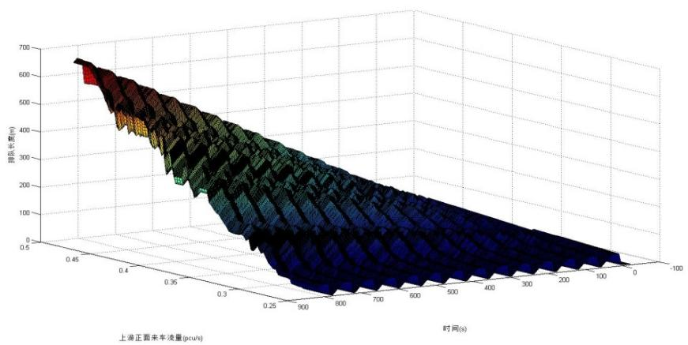

<details>
<summary>surface_3d</summary>

| 上海正面来车凌量 (pcu/s) | 时间(s) | 副队长度(m) |
| --- | --- | --- |
| 0.25~0.5 | -100~900 | ~650 ~0 |
</details>

图 9 固定道路实际通行能力后排队长度的变化

固定道路实际通行能力，我们看到在任何一个上游来车流量值下，排队长度依然呈现震荡变化；在上游来车流量较小时，道路通行能力能够释放所有的来车，因此每个相位周期后排队长度都能减小为零，而当上游来车流量较大时，道路通行能力不足以释放所有的来车，因此排队长度不断振荡上升。固定上游来车流量后的排队长度的变化类似。

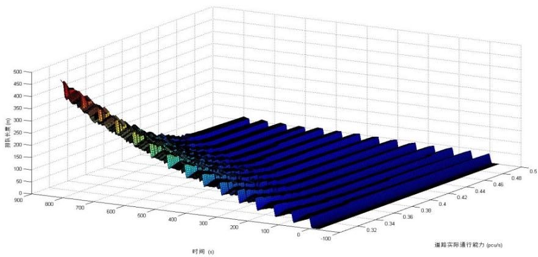

<details>
<summary>surface_3d</summary>

| 时间 (s) | 道路实际通行能力 (pcu/s) | 压压长度 (m) |
| --- | --- | --- |
| 0~900 | 0.1~0.5 | 0~450 |
</details>

图 10 固定上游正面来车流量后排队长度的变化

为了获得排队长度和自变量更细致的关系，我们固定时间t = 800s，分析排队长度随时间的变化规律。

当道路通行能力固定时，我们看到排队长度随上游来车流量线性增长，Origin得出线性分析的统计量 $R^{2}=0.97872$ ，非常接近1，说明线性关系非常明显。

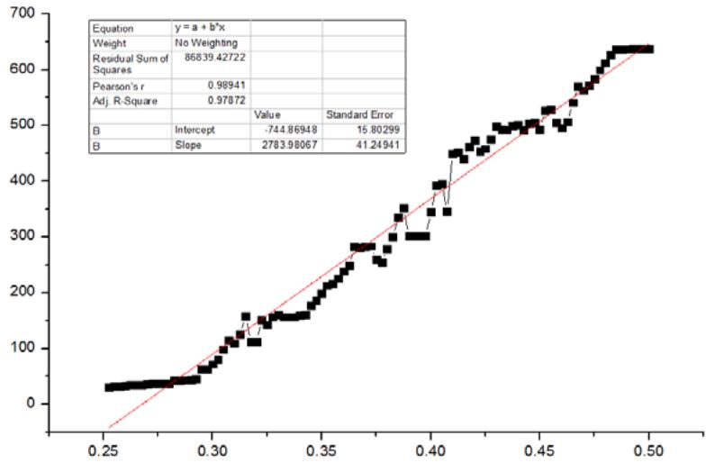

<details>
<summary>qq</summary>

| Metric | Value | Standard Error |
| --- | --- | --- |
| Intercept | -744.86948 | 15.80299 |
| Slope | 2783.98067 | 41.24941 |
</details>

图 11 t=800s 时排队长度随上游来车量的变化

同样我们固定上游来车流量，分析排队长度随道路通行能力的变化规律。观察图形我们看到排队长度与道路通行能力呈现反相关关系，我们使用 Origin 执行指数回归分析得到统计量 $R^{2} = 0.9746$ ，非常接近 1，说明负指数关系非常明显。

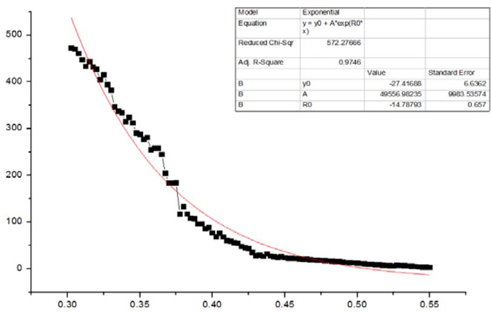

<details>
<summary>scatter</summary>

| Model | Value | Standard Error |
| --- | --- | --- |
| B | -27.41688 | 6.6362 |
| A | 49556.98235 | 9983.53574 |
| B | -14.78793 | 0.657 |
</details>

图 12 t=800s 时排队长度随道路通行能力的变化

综合以上的分析, 我们总结控制变量条件下, 排队长度 l 和事故发生时间 t, 道路通行能力 C 以及上游来车流量 q 之前的关系:

1) 排队长度 l 随事故发生时间 t 上下振荡变化，当上游来车流量相对道路通行能力较小时，排队长度稳定振荡变化；当上游来车流量相对道路通行能力较大时，排队长度持续振荡上升；

2) 排队长度 l 与上游来车流量 q 呈线性相关;  
3) 排队长度 l 与道路通行能力 C 呈负指数相关。

## 7 模型评价

## 7.1 模型优点

1) 差分方程结构简单，易于求解，计算复杂度低；  
2) 对每个相位周期内正面来车流量的变化进行了非常细致的分析，把握住了影响排队长度的核心因素；  
3) 模型参数较少，易于进行对实际情况的模拟。

## 7.2 模型缺点

1) 直接认为排队长度正比于排队车当量数，未考虑不同密度的排队车辆队伍；  
2) 模型可能出现车流量可取任何连续值，不符合车辆数为离散整数的实际情况。

## 8 求解问题 4

下面我们使用该差分方程模型求解问题 4。

首先分析问题 4 中模型参数的变化。问题 4 中事故发生位置改变，事故位置距上游路口距离由 240m 变为 140m；同时改变的还有小区路口对排队长度的影响，此时小区路口 2 将变成处在事故位置下游，故小区路口 2 对队伍长度的影响消去。另一方面，上游车流量变为固定值 1500 pcu/h，而不再是随时间呈线性增长。考虑了这几个因素的变化后，我们再次求解模型。

考虑两种求解方法，第一种是不考虑随机变化，直接计算每个时刻排队长度期望值的变化，第二种是考虑随机变化，进行若干组实验然后计算排队长度达到140m的平均值。

## 8.1 方法一

不考虑随机变化，则给得出唯一确定的模型解，画出模型解曲线：

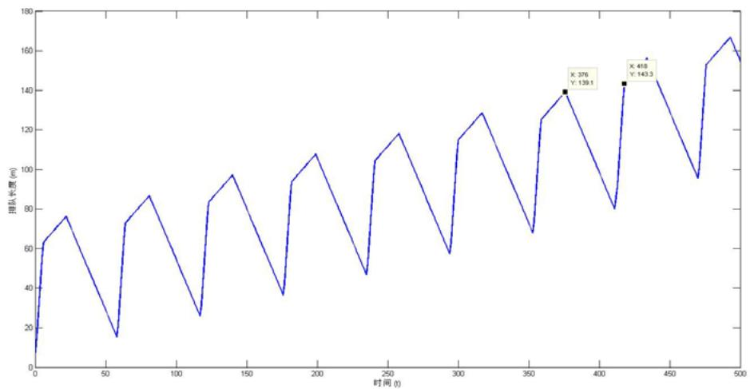

<details>
<summary>line</summary>

| Time (t) | Queue Length (m) |
| --- | --- |
| 376 | 139.1 |
| 418 | 143.3 |
</details>

图 13 无随机变化模型求解问题 4

在无随机变化模型的解曲线上循迹，我们可以看到在 $t_{1}=376s$ 处，排队长度达到l=139.1m，已经非常接近140，但之后排队长度开始迅速下降，知道 $t_{2}=418s$ 时，排队长度达到l=143.3m。由于实际情况中随机振动的存在，我们可以近似认为排队长度达到140m的时间点处于 $t_{1},t_{2}$ 之间

$$
t = \frac {t _ {1} + t _ {2}}{2} = 3 9 7 s
$$

故在事故发生397s后排队长度到达上游路口。

## 8.2 方法二

考虑随机变化，那么每次模型模拟中求得的时间值都不同，我们进行 10000 次数值模拟，记录每次模拟中排队长度到达140m的时间。

我们计算得到平均的排队长度达到路口的时间为:

$$
\bar {t} = 3 3 9. 8 5 3 6 s
$$

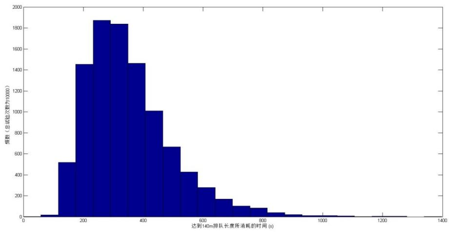

<details>
<summary>histogram</summary>

| Bin (s) | Frequency |
| --- | --- |
| 50~100 | ~20 |
| 100~150 | ~520 |
| 150~200 | ~1460 |
| 200~250 | ~1870 |
| 250~300 | ~1840 |
| 300~350 | ~1470 |
| 350~400 | ~1010 |
| 400~450 | ~670 |
| 450~500 | ~430 |
| 500~550 | ~280 |
| 550~600 | ~170 |
| 600~650 | ~110 |
| 650~700 | ~90 |
| 700~750 | ~40 |
| 750~800 | ~20 |
| 800~850 | ~10 |
| 850~900 | ~5 |
| 900~950 | ~2 |
| 950~1000 | ~1 |
| 1000~1050 | ~1 |
| 1050~1100 | ~1 |
| 1150~1250 | ~1 |
</details>

图 14 随机模型中排队长度达到路口所花时间的直方图

可以看出时间 $t$ 具有明显的分布规律，我们对 $\log(t)$ 进行Jarque-Bera检验（正太回归检验的一种）[3]，得到的P-value为 $\mathrm{p} = 0.2475$ ，即在 $\log(t)$ 服从正太分布的条件下，出现实际数据中分布的概率为0.2475。因此我们可以接受原假设，即时间t服从对数正态分布。

## 模型二 元胞自动机模型[4]

## 1 模型假设

针对本问题，我们提供了这样的一些假设：

1) 每一辆车的状态只与其附近车的状态相关  
2) PCU 的比例也代表占有时间与道路的比例，只考虑小型车辆，大型车辆将等价于几辆小型车之和。  
3) 排队长度与在之后一段连续的车辆成正比例关系。  
4) 事故截面可通过车辆随机变化。  
5) 车流量会随时间有所增加。

## 2 符号说明

<table><tr><td>符号</td><td>说明</td><td>单位</td></tr><tr><td> $road(i,j)$ </td><td>第i道第j个位置车辆的速度</td><td>格/s</td></tr><tr><td>v</td><td>车的速度</td><td>格/s</td></tr><tr><td>p</td><td>前面有车时慢速减少的概率</td><td>\</td></tr><tr><td>q</td><td>无意识减速概率</td><td>\</td></tr><tr><td>&lt;&lt;;;&gt;&gt;</td><td>车辆从前者位置变道到后者位置的概率</td><td>\</td></tr><tr><td>Q(t)</td><td>t时刻从红绿灯口出现的车辆数量</td><td>PCU/s</td></tr><tr><td> $\overline{Q}$ </td><td>红绿灯口平均出现的车辆数量</td><td>PCU/s</td></tr></table>

表格 11 元胞自动机模型符号说明

## 3 模型构造

## 3.1 格点道路

道路被看作是一个个格子组成的, 由于题目要求的是 3 道口, 因而是有 $3 \times n$ 个格子组成, 每个“车辆”占一个格子。简单来说, 也就是

$$
r o a d (i, j) = \left\{ \begin{array}{l l} v & (\text {如果第} i \text {道第} j \text {列有车且速度为} v) \\ 0 & (\text {无车}) \end{array} \right.
$$

## 3.2 速度

每一辆车都有一个速度，而这个速度有下限与上限：

$$
1 \leq r o a d (i, j) \leq 4
$$

取 1 就代表了 5m/s, 而 4 代表了 20m/s。这里取 1 而不取 0 的概率是由于这样可以区分无车的格点以及有车的格点。

每一辆车每一个步长（1s），如果前方v个格子内没有其他汽车，那么它就会行走v个格子。也就是

$$
r o a d (i, j - v) = r o a d (i, j); r o a d (i, j) = 0
$$

## 3.3 “急躁”的司机

司机在前方无人的状态下会加速。在这里也就是,如果前方v个格子内都没有车，那么司机在移动v个格子后会将速度加到 $v+1$ 。但是由于城市速度限制，我们假定v最大只能达到4。

## 3.4 被迫减速

如果司机前方v个格子内有其他车辆（假设距离为k），那么司机会移到该车之后，而且速度会减少。这种减少有两种方法，一种是慢慢减少，另一种是急速刹车，也就是减少到一个定值（假定是2），这里由于速度不大，假设刹车不会引起其他事故。具体来表示，也就是

$$
r o a d (i, j - k + 1) = \left\{ \begin{array}{c c} {{j - k}} & {{\quad (\text {慢慢减少}, \text {概率} p)}} \\ {{2}} & {{\quad (\text {急刹车}, \text {概率} 1 - p)}} \end{array} , r o a d (i, j) = 0 \right.
$$

## 3.5 事故现场附近的“谨慎”

司机看到前方事故现场，不管正前方道路是否在事故现场只内，他们通常会倾向于减速。在该模型中，我们用以下式子表示：

$$
r o a d (i, j) = 2 \quad (\text {如果} j \leq 8)
$$

## 3.6 无意识的变速

驾驶时由于各种各样的原因，很容易速度就会产生改变，因此假定每一个步长内有q的可能性减速1，也有p的可能性增加1。不过减速不能使汽车速度小于1。

$$
r o a d (i, j) - = 1 \quad (\text {以} q \text {的概率成立})
$$

## 3.7 改道

司机有时会选择改道以超过其他车辆或者进入更加畅通的区域, 所以他会选择在前面有车的情况下改道。只要有 $road(i,j-k)>0(k=1,2,3)$ 三个条件中有1个成立，司机就有可能选择改道。因而这里假设了各个改道的几率。

$$
\ll r o a d (i _ {1}, j), r o a d (i _ {2}, j) \gg = p _ {i _ {1} i _ {2}}
$$

$p_{i_{1}i_{2}}$ 也就是 $i_{1}$ 道改道至 $i_{2}$ 道的概率（假定 $p_{i,i}$ 为不变道的概率），很显然要满足以下一些关系：

$$
\sum_ {j = 1} ^ {3} p _ {i, j} = 1, p _ {i, j} \geq 0
$$

这个公式表示了车辆守恒，而另外一个公式为

$$
p _ {1, 3} = p _ {3, 1} = 0
$$

这表明了不可能跳过 2 道直接在 1，3 道之间转变。

改道同时也会造成速度的改变,由于改道需要调整方向,不可能以高速运行,因此我们假设司机改道后会减速到1。而改道同时也会造成后面的汽车减速,所以我们假定改道后,新道路上之后的司机会以同样的概率减速至1或2。

## 3.8 小区与右拐

图中的小区是一个较轻微的影响因素。由于小区来往车辆较多，我们假定小区出来的车也算在这样一个车流里面，且出现在第一道的第20格之上（通过视频距离估计这一结果）。

从远处红绿灯右拐到该处的车辆也是一个轻微的因素。由于红灯不会限制车辆右拐通行，因而车辆能够源源不断地到这条道路之上。由于只有少数车辆拐入，我们根据前面收集的数据，给其以一个平均的影响因子（也就是每秒钟增加在该处增加1的可能性）。

## 3.9 下班高峰影响

很显然，视频 1 所在时间是接近下班时间，时间不断增加的同时下班车流量也不断变大。而显然可以知道这种变大的速率不断减少，因此我们假定这个增加量是以对数增加，通过视频确定相应的系数，以简化这个模型的复杂度。具体阐述为

$$
Q (t) = \overline {{Q}} + c \times t + \varepsilon (t)
$$

c是有待确定的常数，而 $\varepsilon(t)$ 是一个随机数，用于增加随机性以符合现实情况。

## 3.10 拥堵

在正前方很短距离有车时，司机会选择减速，这样的减速就会造成一定的拥堵。我们假定司机有 0.85 的几率减速到 1，有 0.15 的几率减速到 2，这样的减速是造成拥堵的主要原因。

## 4 数值实验

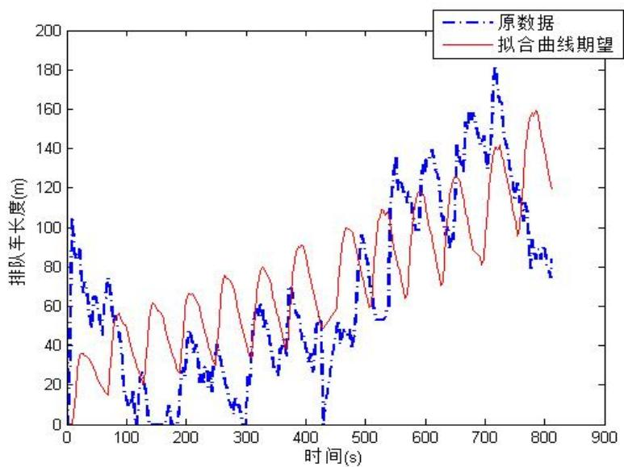

<details>
<summary>line</summary>

| 时间(s) | 原数据 (m) | 拟合曲线期望 (m) |
| --- | --- | --- |
| 0 | ~100 | 0 |
| 50 | ~60 | ~35 |
| 100 | ~70 | ~55 |
| 150 | ~20 | ~60 |
| 200 | ~45 | ~65 |
| 250 | ~25 | ~75 |
| 300 | ~10 | ~80 |
| 350 | ~60 | ~90 |
| 400 | ~40 | ~100 |
| 450 | ~50 | ~110 |
| 500 | ~95 | ~120 |
| 550 | ~135 | ~135 |
| 600 | ~140 | ~140 |
| 650 | ~155 | ~155 |
| 700 | ~180 | ~140 |
| 750 | ~120 | ~160 |
| 800 | ~85 | ~120 |
</details>

图 15 元胞自动机模型解曲线与实际值的对比

蓝色虚线是真实图像，而红色实线是元胞自动机模型的平均曲线（即进行很多次的模拟后各个时间点的平均排队长度）。元胞自动机模型没有先在原点附近上下震荡后方上升，我们可以看见，它是一个不断增加的模型，基本如此，它同样也能够很好地解释模型中出现的现象。它们的增加速率几乎相同，也就是说进入该路段的车流量的确如模型假设的是在不断上涨的。同样地，大量的波动会导致元胞自动机模型的某次模拟能够接近这个真实情况，真实情况某些波动就能够得到很好的表示。

瞬时排队队伍数量数-事故发生时间的之关系对于这样的自动机，我们能够通过计算机，通过这些规则进行模拟，从而得到车辆运动的动画。

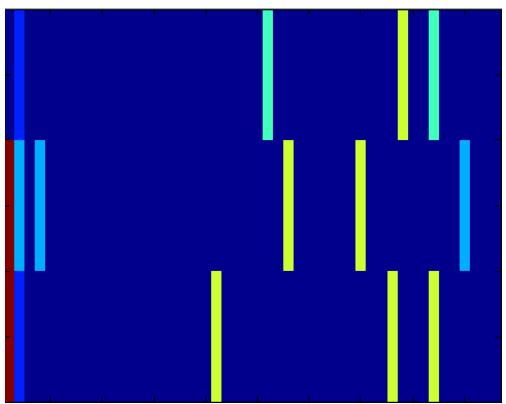

<details>
<summary>natural_image</summary>

Abstract geometric pattern with blue and yellow vertical bars on a dark background (no text or symbols)
</details>

图 16 元胞自动机模型动画截图

在固定了一定的数量事故截面可通过的车辆与上游车流量后,我们用 Matlab 对该模型的排队汽车数量与事故持续时间进行了数值实验。结果比较符合我们在视频中所观察到的曲线。

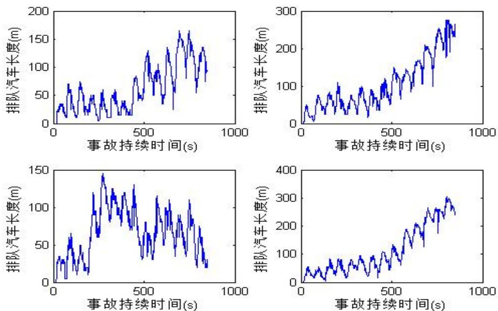  
图 17 元胞自动机模型解曲线

这是一个先震荡后上升的曲线，可见每秒汽车当量增加数 $Q(t)$ 随着时间增加而不断变大，从而导致该队伍不断变长。但是这样增加的变化率，也就是 $\frac{d}{dt}Q(t)$ ,我们假定其在这一期间一直线性增加，也就是说

$$
\mathrm{Q(t)} \sim \mathrm{ct}
$$

## 4.1 排队长度平均值与道路通行能力和事故持续时间两个变量之间的关系

在固定了一定的上游车流量后,我们通过改变模型中代表事故截面可通过车辆的参数和代表事故发生时间的参数来研究排队长度平均值与事故截面可通过的车辆和事故持续时间两个变量之间的关系。

由于排队长度一直在随时间波动, 我们首先取了在整个事故持续的时间段内, 排队长度达到的最大值作为衡量排队长度平均值的指标。

由于我们的模型中存在很多随机因素, 为了得到一个能够反映实际情况的值, 我们对于每一组相同的参数值都做了 50 次计算, 取 50 次数值试验的平均值作为衡量排队长度的指标。

下图为选取上游来车辆随时间的变化函数为 $Q(t)=860+0.72\times t$ （单位：PCU/h）时，50次实验中计算出的最大排队长度的平均值关于事故截面每小时可通过的车的数量以及事故持续时间两个变量的图像。

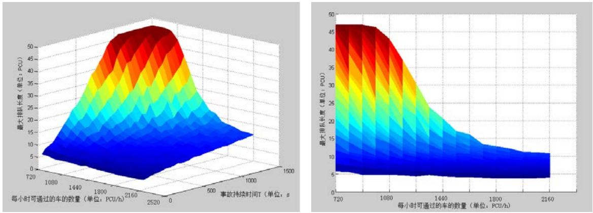  
图 18 道路通行能力固定时排队长度的变化情况

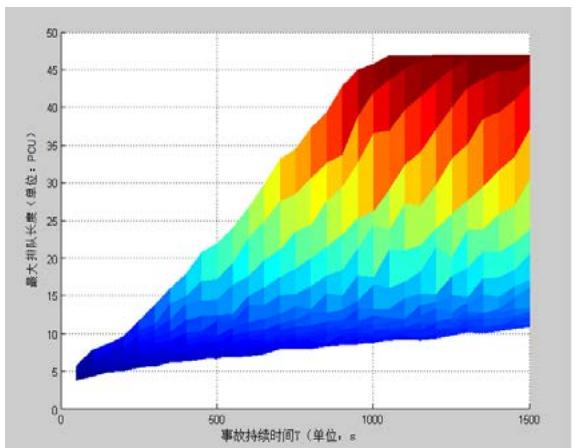

<details>
<summary>heatmap</summary>

| 事故持续时间T (s) | 最大排队长度 (单位: PCU) |
| --- | --- |
| 0 | ~4.5 |
| 250 | ~10 |
| 500 | ~18 |
| 750 | ~30 |
| 1000 | ~45 |
| 1250 | ~46 |
| 1500 | ~46 |
</details>

图 19

我们可以沿事故持续时间坐标轴来观察这个三维图像（如图 18），来观察最大排队长度与事故截面每小时可通过车辆之间的关系。忽略图2.2 左上角由于拥堵达到饱和使得排队长度出现的平台，我们可以发现最大排队长度与事故截面每小时可通过车辆大致呈反比。

同样，我们可以沿每小时可通过车辆坐标轴来观察这个三维图像，忽略图 19 右上角由于拥堵达到饱和使得排队长度出现的平台，我们可以发现最大排队长度与事故持续时间大致呈正

比。

下面我们就来分别研究最大排队长度和这两个变量之间的关系。

## 4.2 排队队伍最大量-事故截面可通过车辆之关系

同样，为了得到一个能够反映实际情况的值，我们对于每一组相同的参数值都做了 50 次计算，取 50 次数值试验的平均值作为衡量排队长度的指标。

下图为选取事故持续时间为 800 秒（s），上游来车辆随时间的变化函数为

$$
Q (t) = 8 6 0 + 0. 7 2 * t
$$

此时，50 次实验中计算出的最大排队长度的平均值关于事故截面每小时可通过的车的数量的图像。

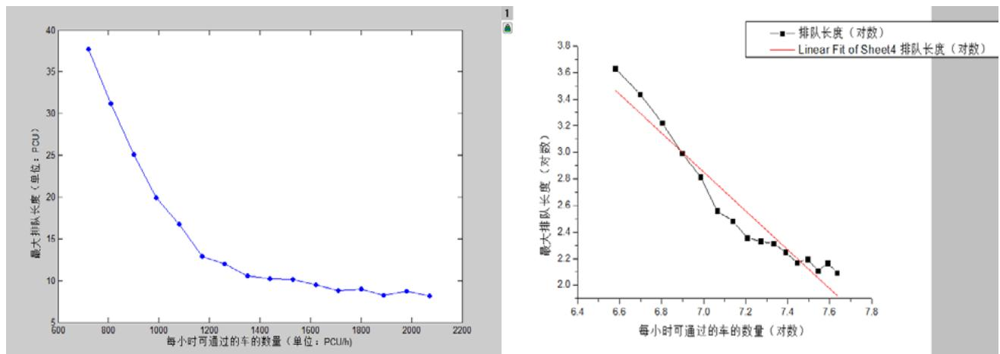  
图 20 最大排队长度随道路通行能力的变化

从图像我们可以观察出排队长度大致与每小时可通过的车的数量成反比例关系，于是我们假设排队长度L与每小时通过的车数Q有这样的关系： $L = A * Q^{-\alpha}$ ，A与 $\alpha$ 皆为大于零的常数。我们将横轴与纵轴数据分别都取对数，因为 $\ln L = -\alpha \ln Q + \ln A$ ，所以这样就可以转化为用线性拟合的方法来确定常数 $\alpha$ 与A。  
如图 2.1.2 即为我们用软件 Origin 对取对数后的数据进行线性拟合的图像。

<table><tr><td>Equation</td><td>y = a + b*x</td><td></td><td></td></tr><tr><td>Weight</td><td>No Weighting</td><td></td><td></td></tr><tr><td>Residual Sum of Squares</td><td>0.25175</td><td></td><td></td></tr><tr><td>Pearson&#x27;s r</td><td>-0.96562</td><td></td><td></td></tr><tr><td>Adj. R-Square</td><td>0.92759</td><td></td><td></td></tr><tr><td></td><td></td><td>Value</td><td>Standard Error</td></tr><tr><td rowspan="2">排队长度(对数)</td><td>Intercept</td><td>13.09432</td><td>0.75799</td></tr><tr><td>Slope</td><td>-1.4632</td><td>0.10528</td></tr></table>

拟合得到的直线解析式为： $\ln L = -1.4632\ln Q + 13.09432$ ，统计量 $R^{2} = 0.9324$ ，拟合效果良好。从而得到常数 $\alpha$ 与A大致的数值为 $\alpha = 1.5$ ， $A = 4.8 * 10^{5}$ 。

所以，我们得到的排队长度L与事故截面实际通行能力Q成反比，关系

式大致为:

$$
L = 4. 8 * 1 0 ^ {5} * Q ^ {- 1. 5}
$$

## 4.3 排队队伍最大量(L)-事故持续时间(T)之关系

下图为选取事故截面可通过车辆为 1350（PCU/h），上游来车辆随时间的变化函数为 $Q(t)=860+0.72\times t$ （单位：PCU/h）时，50 次实验中计算出的最大排队长度的平均值关于事故截面每小时可通过的车的数量的图像。

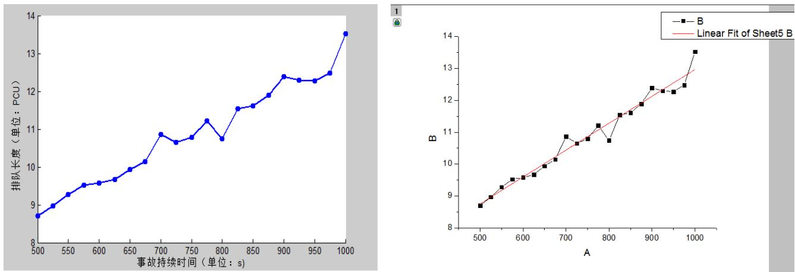  
图 21 最大排队长度随事故持续时间的变化

用软件 Origin 对图像进行线性拟合，拟合得到的直线解析式为:

$$
L = 8. 4 \times 1 0 ^ {- 3} \times T + 4. 5
$$

<table><tr><td>Equation</td><td>y = a + b*x</td><td></td><td></td></tr><tr><td>Weight</td><td>No Weighting</td><td></td><td></td></tr><tr><td>Residual Sum of Squares</td><td>1.10033</td><td></td><td></td></tr><tr><td>Pearson&#x27;s r</td><td>0.98428</td><td></td><td></td></tr><tr><td>Adj. R-Square</td><td>0.96717</td><td></td><td></td></tr><tr><td></td><td></td><td>Value</td><td>Standard Error</td></tr><tr><td rowspan="2">B</td><td>Intercept</td><td>4.53887</td><td>0.26542</td></tr><tr><td>Slope</td><td>0.00843</td><td>3.46896E-4</td></tr></table>

我们看到线性回归的统计量 $R^{2}=0.96717$ ，非常接近于1，这是一个很大的数值，因此我们可以认为最大排队长度和时间具有明显的线性关系。

## 5 问题四的数值求解

由于事故现场又往上游路口方向移动了 100m, 因此我们可以知道一个小区已经不再提供车流量, 积累出足够排队长度的时间可能变长。但是与此同时, 离开上游车源更加近, 使得车辆能够更快地来到事故现场, 积累出足够排队长度的的时间会变短。综合这两方面原因, 很难说明时间比原来是变长还是变短, 因此我们通过数值模拟进行分析。

从前文的数据采集，我们得到一些背景条件：

<table><tr><td>通行能力(PCU/h)</td><td>上游直行车辆(PCU/h)</td><td>右转车辆-小区(PCU/h)</td></tr><tr><td>1370</td><td>1500</td><td>108</td></tr></table>

## 5.1 解法一

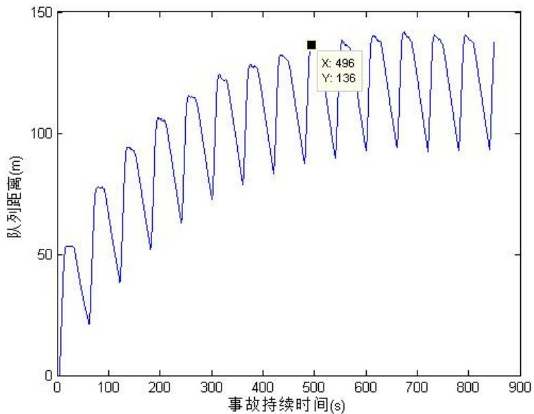

<details>
<summary>line</summary>

| 事故持续时间(s) | 队列距离(m) |
| --- | --- |
| 496 | 136 |
</details>

图 22 平均排队长度随事故持续时间的变化

第一是利用路程的平均来求平均时间。我们可以得到排队汽车的长度与时间的关系。但当我们把许多这样的长度取得平均，我们就能得到以上的图像，这里的长度也就代表着经过 t 时刻后排队长度的期望值。而当这个期望值为 137.5，也就是小于车身的 4m 时，我们就认为它已经到达了队伍的末端。从而 496s 就是这样所算得的平均。

## 5.2 解法二

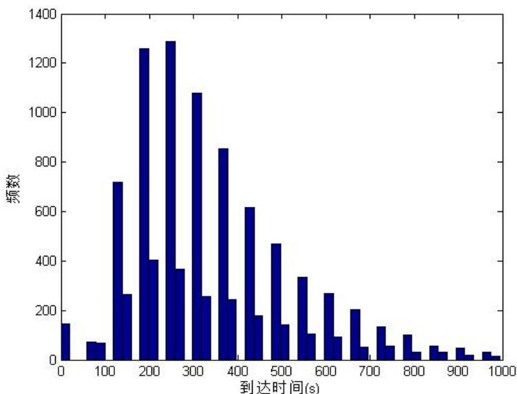

<details>
<summary>histogram</summary>

| 到达时间 (s) | 频数 |
| --- | --- |
| 0~25 | ~150 |
| 25~50 | ~70 |
| 50~75 | ~70 |
| 75~100 | ~720 |
| 100~125 | ~260 |
| 125~150 | ~1260 |
| 150~175 | ~400 |
| 175~200 | ~1290 |
| 200~225 | ~370 |
| 225~250 | ~1080 |
| 250~275 | ~260 |
| 275~300 | ~860 |
| 300~325 | ~240 |
| 325~350 | ~620 |
| 350~375 | ~180 |
| 375~400 | ~470 |
| 400~425 | ~140 |
| 425~450 | ~340 |
| 450~475 | ~110 |
| 475~500 | ~270 |
| 500~525 | ~90 |
| 525~550 | ~200 |
| 550~575 | ~50 |
| 575~600 | ~140 |
| 600~625 | ~60 |
| 625~650 | ~110 |
| 650~675 | ~30 |
| 675~700 | ~60 |
| 700~725 | ~40 |
| 725~750 | ~50 |
| 750~775 | ~20 |
| 775~800 | ~30 |
| 800~825 | ~15 |
</details>

图 23 元胞自动机模型中队伍到达路口时间的直方图分布

第二种是利用平均时间所求得的平均。如果我们假定在排队长度大于等于140m时算作达到路口，那么通过不断地进行数值实验，就可以得到如上的直方图。与差分方程模型中一样，时间的分布满足对数正太分布，其平均值为：

$$
\bar {t} = 3 4 1 \mathrm{s}
$$

## 6 模型评价

## 6.1 模型优点

1) 简明易懂，能够以一些很常见的规则描述一个比较复杂的系统，有一定的预测效果。  
2) 能够描述出具体车辆的具体状态，并以动画的形式呈现，因此比较有直观感觉。  
3) 构建的参数一般能够确定一个系统模式，因此选定正确的参数就能够得到翔实的数据。  
4) 引入了各种概率，考虑了变道、加速、减速等常见行为，比较贴近实际。

## 6.2 模型缺点

在后续的数值实验中，我们发现这个模型还是存在一定的问题的。

1) 实际道路上存在不同种类的车型，大货车所占的体积以及它运行的速度均与小轿车有较大的区别。而我们的模型中以一个 PCU 作为一个车辆单位，把道路分成了小格，相当于只考虑了一种车型，所以为了更好地模拟实际情况，应该可以对不同的车型进行分类讨论。

2) 实际生活中的司机在决定是否换道时会考虑很多因素，如将要换到的车道前方空余的距离，或自己在下一个路口需要转弯还是直行。而在我们的程序中设置的在下一时刻是否换道的判断大多来自随机判断，因为加过多的与人类逻辑相符的判断条件可能会影响程序运行的速度，而且不在事故点附近的换道现象对通行能力的影响较小。如果需要将车辆运动情况模拟得更接近实际，可能需要加入更多的逻辑判断条件。

## 参考文献

[1] Wikipedia, Passenger car equivalent, http://en.wikipedia.org/wiki/Passenger\_car\_equivalent, 访问日期：2013/9/13  
[2] 龙小强 晏启鹏，信号灯控制下的交通流模型，西安交通大学学报，第 35 卷 第 3 期: 301—305，2000 年 6 月  
[3]Mathworks,DocumentationCenter-jbtest,
http://www.mathworks.cn/cn/help/stats/jbtest.html, 访问日期：2013/9/16.  
[4]Wikipedia,Nagel Schreckenberg Model, http://en.wikipedia.org/wiki/Nagel%E2%80%93Schreckenberg\_model,访问日期:2013/9/13

## 附录

1. 差分方程模型的 Matlab 代码  
```matlab
function l=SimulateTraffic(v)

dt=1;                      %模拟单位步长
alph=4.8;                     %排队标准车当量数对排队长度的换算
比例 m/pcu
beta=1.5;                    %离散模拟矫正系数
RightFlow=180/3600;              %上游左转弯车流量
Xiaoqu1=75/3600;
Xiaoqu2=167/3600;
L=240;                    %距离上游路口距离
Capacity=1370/3600;          %道路实际通行能力
%v=10;                    %上游来车平均车速
TTotal=812;                  %总模拟时长
delay=26;

function StraightFlow=StraightFlow(t)
    StraightFlow=0.0002*t+0.2387;
end

function dStraightFlow=dStraightFlow(t)
    tmod=mod(t,60);
    if (tmod>30)
        dStraightFlow=0;
    end
    if (tmod<=2)
        dStraightFlow=StraightFlow(t)*60/72*3*beta*dt;
    end
    if ((tmod>2)&&(tmod<=10))
        dStraightFlow=StraightFlow(t)*60/72*5*beta*dt;
    end
    if ((tmod>10)&&(tmod<=12))
        dStraightFlow=StraightFlow(t)*60/72*4*beta*dt;
    end
    if((tmod>12)&&(tmod<=30))
        dStraightFlow=StraightFlow(t)*60/72*1*beta*dt;
    end
end
```

```matlab
function dRightFlow=dRightFlow(t)
    dRightFlow=RightFlow*dt;
end

function dPCU=pcuIncrease(t,l)

dPCU=-Capacity*dtchi2rnd(5)/5*+(dStraightFlow(t-(L-l)/v)+dRightFlow(t-(L-l)/v)+-Xiaoqu1*dt+Xiaoqu2*dt)*2*rand(1);
    end

T=-delay:dt:TTotal;
l(1)=0;
sum=0;
for i=1:(TTotal/dt+delay)
    tmp=l(i)+pcuIncrease(i*dt,l(i))*alph;
    sum=sum+dStraightFlow(i*dt-(L-l(i))/v)*dt;
    if (tmp<0)
        l(i+1)=0;
    else
        l(i+1)=tmp;
    end
end
sum=sum/TTotal;
plot(T,l);
end
```

## 2. 差分方程模型解第四问

```matlab
function tFull=SolveProblem4()
    dt=1;                      %模拟单位步长
    alph=4.8;                     %排队标准车当量数对排队长度的换算比例 m/pcu
    beta=1.5;                    %离散模拟矫正系数
    RightFlow=180/3600;          %上游右转来车流量
    Xiaoqu1=75/3600;
    L=140;                       %上游来车平均车速
    TTotal=1500;                 %距离上游路口距离
    Capacity=1370/3600;         %道路实际通行能力
    v=10;                            %总模拟时长
    delay=14;
    StraightFlow=1500/3600;        %上游正面来车流量
```

```matlab
function dStraightFlow=dStraightFlow(t)
    tmod=mod(t,60);
    if (tmod>30)
        dStraightFlow=0;
    end
    if (tmod<=2)
        dStraightFlow=StraightFlow*60/72*3*beta*dt;
    end
    if ((tmod>2)&&(tmod<=10))
        dStraightFlow=StraightFlow*60/72*5*beta*dt;
    end
    if ((tmod>10)&&(tmod<=12))
        dStraightFlow=StraightFlow*60/72*4*beta*dt;
    end
    if((tmod>12)&&(tmod<=30))
        dStraightFlow=StraightFlow*60/72*1*beta*dt;
    end
end

function dRightFlow=dRightFlow(t)
    dRightFlow=RightFlow*dt;
end

function dPCU=pcuIncrease(t,l)

dPCU=-Capacity*dt*chi2rnd(5)/5+(dStraightFlow(t-(L-l)/v)+dRightFlow(t-(L-l)/v)-Xiaoqu1 *dt)*2*rand(1);
    end

T=-delay:dt:TTotal;
l(1)=0;
sum=0;
tFull=0;
for i=1:(TTotal/dt+delay)
    tmp=l(i)+pcuIncrease(i*dt,l(i))*alph;
    sum=sum+dStraightFlow(i*dt-(L-l(i))/v)*dt;
    if (tmp<0)
        l(i+1)=0;
    else
        l(i+1)=tmp;
    end
    if (l(i)>=140)
        tFull=i*dt-delay;
    break
```

```matlab
end
end
sum=sum/TTotal;
%plot(T,l);
end
```

3. 元胞自动机模型的 Matlab 实现  
```txt
%%%%%%%%%%%%%%%%%%%%%%%%%%%%%%%%%%%%%%%%%%%%%%%%%%%%%%%%%%%%%%%%%%%%%%%%%%%%%%%%%%%%%%%%%%%%%%%%%%%%%%%%%%%%%%%%%%%%%%%%%%%%%%%%%%%%%%%%%%%%%%%%%%%%%%%%%%%%%%%%%%%%%%%%%%%%%%%%%%%%%%%%%%%%%%%%%%%%%%%%%%%%%%                      交通自动机模
```

型
%%%%%%

```txt
%%%输入 step，也就是时间，输出车辆流的性态与最后车流长度变化%%%
```

```matlab
function [count,queue]=automata(step,pa,in)
    %road_length = 48;
    road_length = 16;                      %道路总长度
    road = zeros(3,road_length);          %车辆速度矩阵，有车辆处矩阵数值大于0，
为车辆速度，无车辆处矩阵数值小于0
    %estate_in = 92;
    right_in = 180-75;
    pa = pa/3600;
    queuemax = 0;
    count = 0;
    for i=2:3
        road(i,1) = 7;               %事故位置，二，三车道设置为不畅通
    end

    road_next = road;                    %新建车辆位置矩阵
    for t=1:step
        time(t)=t;                   %时间，用于作排队长度-时间图用
```

```txt
%%%%%%%%%%%%
%%%%%%%%%%%%
%%%%%%%%%%%%
%%%%%%%%%%%%
%%%%%%%%%%%%
%%%%%%%%%%%%
%%%%%%%%%%%%%
面%%%%%%%%%%%%
%%%%%%%%%%%%%
%%%%%%%%%%%%%
面%%%%%%%%%%%%
%%%%%%%%%%%%%
在一车道最前位置的车辆以 0.4 的概率 1s 内通过事故截面
%%%%%%%%%%%%%
在第二车道最前位置的车有 0.1 的机会改道到一车
```

```matlab
道%%%%%%%%%
%%%%%%%%%在第三车道最前位置的车有 0.1 的机会改道到二车道%%%%%%%%%
%%%%%%%%%%%%%%%%%%%%%%%%%%%%%%%%%%%%%%%%%%%
% pass = rand(1);

if(pass<pa)
    road_next(1,2)=0;
    if(rand(1)>0.9)&&(road_next(2,2)>0)
        road_next(1,2)=1;          %改道后速度为 1，以下相同
        road_next(2,2)=0;
    elseif (rand(1)>0.8)&&(road_next(3,2)>0)&&(road_next(2,2)==0)
        road_next(2,2)=1;
        road_next(3,2)=0;
    end
end

%%%%%%%%%%%%%%%%%%%%%%%%%%%%%%%%%%%%%
%%%%%%%%%%%%%%%%%%%%%
%%%%%%%%%%%%%%%%%%%%车辆的加速与减速
%%%%%%%%%%%%%%%%%%%%%%%%%%%
%%在碰撞到其他车辆前，司机选择减速至 j-k(相差距离)或者某个固定值 2%%%
%%%如果在道路一快要到达队首，司机会加速冲过事故或者减速慢行%%%%
%%%如果在一段路内没有碰到其他人，司机选择加速通过，直至速度达到 4%%%
%%%如果是百分比设置百分比设置百分比设置百分比设置百分比设置百分比设置百分比设置百分比设置百分比设置百分比设置百分比设置百分比设置百分比设置百分比设置百分比设置百分比设置百分比设置百分比设置百分比设置百分比设置百分比设置百分比设置百分比设置百分比设置百分比设置百分比设置百分比设置百分比设置百分比设置百分比设置百分比设置百分比设置百分比设置百分比设置percent
for j=3:road_length
    for i=1:3
        if(road_next(i,j)>0)
            if(j-road_next(i,j)<2)      %如果车速足够通过无障碍下的事故结点
                note = true;                 %note 查看是否会撞到其他车辆
                for k=j-1:-1:2
                    if(road_next(i,k)>0)
                        road_next(i,j)=0;
                        if(rand(1)>0.9)
                            road_next(i,k+1)=j-k;   %减速到(j-k)*5 m/s 的车辆
                        else
                            road_next(i,k+1)=min(j-k,1);
                        end
                    note = false;
                    break;
```

```matlab
end
    end
    if ((note)&&(i==1))          %如果是第一道，可以冲过去或减速慢行
        pass = rand(1);
        if(pass>0.5)
            road_next(i,j)=0;
        else
            road_next(i,j)=0;
            road_next(i,2)=1;
        end
    elseif ((note)&&(i>1))      %如果是第二，三道，只能到达道的队首，
等待改道
        road_next(i,j)=0;
        road_next(i,2)=1;
    end
else
    note = true;                  %note 查看是否会撞到其他车辆
    for k=j-1:-1:j-road_next(i,j)
        if road_next(i,k)>0
            road_next(i,j)=0;
            road_next(i,k+1)=j-k;
            note = false;
            break;
        end
    end
    if(note)                %未撞到其他车辆，选择加速，加速到 4 则
不变
        if(road_next(i,j)<4)
            road_next(i,j-road_next(i,j)) = road_next(i,j)+1;
        else
            road_next(i,j-road_next(i,j)) = road_next(i,j);
        end
        road_next(i,j)=0;
    end
end
end
end
end

%%%%%%%%%%%%%%%%%%%%%%%%%%%%%%%%%%%%
```

```matlab
%%其中改道的概率分别是 P(1,2)=.1,P(2,1)=.3,P(2,3)=.1,P(3,2)=.2%%%
%%%%%%%%%%%%%其中 P(i,j)指从 i 车道改道 j 车道的概率%%%%%%%%%%
%%%%%%%%%%%%%%%%
%%%%%%%%%%%%%%%%
for j=3:road_length
    if
(road_next(1,j)>0)&&(road_next(2,j)==0)&&(road_next(1,j-1)||road_next(1,j-2)||road_next(1,max(j-3,1))) %一道到二道
        temp = rand(1);
        if(temp>0.9)
            road_next(2,j)=1;
            road_next(1,j)=0;
        end
        for k=j:min(j+3,road_length)
            if(road_next(2,k)>0)
                road_next(2,k)=min(road_next(2,k),1);
            end
        end
    end

    if
(road_next(2,j)>0)&&(road_next(1,j)==0)&&(road_next(2,j-1)||road_next(2,j-2)||road_next(2,max(j-3,1))) %二道到一道
        temp = rand(1);
        if(temp>0.85)
            road_next(1,j)=1;
            road_next(2,j)=0;
        end
        for k=j:min(j+3,road_length)
            if(road_next(1,k)>0)
                road_next(1,k)=min(road_next(1,k),1);
            end
        end
    end

    if
(road_next(2,j)>0)&&(road_next(3,j)==0)&&(road_next(2,j-1)||road_next(2,j-2)||road_next(2,max(j-3,1))) %二道到三道
        temp = rand(1);
        if(temp>0.9)
            road_next(3,j)=1;
            road_next(2,j)=0;
```

```matlab
end
    for k=j:min(j+3,road_length)
        if(road_next(3,k)>0)
            road_next(3,k)=min(road_next(3,k),3);
        end
    end
end

if
(road_next(3,j)>0)&&(road_next(2,j)==0)&&(road_next(3,j-1)||(road_next(3,j-2)||(road_next(3,max(j-3,1))) %三道到二道
    temp = rand(1);
    if(temp>0.85)
        road_next(2,j)=1;
        road_next(3,j)=0;
    end
    for k=j:min(j+3,road_length)
        if(road_next(2,k)>0)
            road_next(2,k)=min(road_next(2,k),2);
        end
    end
end

end

%%%%%%%%%%%%%%%%%%%%%%%%%%%%%%%%%%%%
```

```matlab
for j=3:road_length                      %随机变速模块
    for i=1:3
        temp=rand(1);
        if(temp>0.8)&&(temp<0.85)&&(road_next(i,j)>0)&&(road_next(i,j)<4)
            road_next(i,j) = road_next(i,j)+1;
        elseif(temp>0.8)&&(road_next(i,j)>1)&&(road_next(i,j)<=4)
            road_next(i,j) = road_next(i,j)-1;
        end
```

```txt
end

for i=1:3
    if (j<=8)&&(road_next(i,j)>0)
        road_next(i,j)=2;
    end
end

for i=1:3
    if (road_next(i,j-1)>0)&&(road_next(i,j)>0)
        temp = rand(1);
        road_next(i,j)=min(road_next(i,j-1),2*(temp>0.85)+1*(temp<=0.85));
    end
end
end

%%%%%%%%%%%%%%
%%%%%%%%%%%%%%
%%%%%%%%%%%%%%
%%%%%%%%%%%%%%
%%%%%%%%%%%%%%
%%%%%%%%%%%%%%
%%%%%%%%%%%%%%
%%%%%%%%%%%%%%
%%%%%%%%%%%%%%
%%%%%%%%%%%%%%
%%%%%%%%%%%%%%
%%%%%%%%%%%%%%
%%%%%%%%%%%%%%
%%%%%%%%%%%%%%
%%%%%%%%%%%%%%
%%%%%%%%%%%%%%
%%%%%%%%%%%%%%
%%%%%%%%%%%%%%
%%%%%%%%%%%%%%
%%%%%%%%%%%%%%
%%%%%%%%%%%%%%
%%%%%%%%%%%%%%
%%%%%%%%%%%%%%
%%%%%%%%%%%%%%
%%%%%%%%%%%%%%
%%%%%%%%%%%%%
%%%%%%%%%%%%%%
%%%%%%%%%%%%%%
%%%%%%%%%%%%%%
%%%%%%%%%%%%%%
%%%%%%%%%%%%%%
%%%%%%%%%%%%%%
%%%%%%%%%%%%%%
%%%%%%%%%%%%%%
%%%%%%%%%%%%%%
%%%%%%%%%%%%%%
%%%%%%%%%%%%%%
%%%%%%%%%%%%%%
%%%%%%%%%%%%%%
%%%%%%%%%%%%%%
%%%%%%%%%%%%%%
%%%%%%%%%%%%%%
%%%%%%%%%%%%%%
%%%%%%%%%%%%%%
%%%%%%%%%%%%%%
%%%%%%%%%%%%%%
%%%%%%%%%%%%%%
%%%%%%%%%%%%%%
%%%%%%%%%%%%%%
%%%%%%%%%%%%%%
%%%%%%%%%%%%%%, 30s 内大于 0, 30s 小于 0%%%%%%%
%%%%%%%%%%%%%%
%%%%%%%%%%%%%%
%%%%%%%%%%%%%%
%%%%%%%%%%%%%%
%%%%%%%%%%%%%%
%%%%%%%%%%%%%%
%%%%%%%%%%%%%%
%%%%%%%%%%%%%%
%%%%%%%%%%%%%%
%%%%%%%%%%%%%%
%%%%%%%%%%%%%%
%%%%%%%%%%%%%%
%%%%%%%%%%%%%%
%%%%%%%%%%%%%%
%%%%%%%%%%%%%%
%%%%%%%%%%%%%%
%%%%%%%%%%%%%%
%%%%%%%%%%%%%%
%%%%%%%%%%%%%%
%%%%%%%%%%%%%%
%%%%%%%%%%%%%%
%%%%%%%%%%%%%%
%%%%%%%%%%%%%%
%%%%%%%%%%%%%%
%%%%%%%%%%%%
```

```matlab
sflow = in/3600+(0.0002*t);
%sflow = in/3600;
v0 = 2;
for i=1:3
    if (road_next(i,road_length)==0)&(mod(t,60)<10)
        temp = rand(1);
        if(temp<(right_in*(i==1)/3600+sflow./3.*2)*2.1)
        road_next(i,road_length-1)=v0;
        count = count+1;
        end
    elseif (road_next(i,road_length)==0)&(mod(t,60)<20)&(mod(t,60)>=10)
        temp = rand(1);
        if(temp<(right_in*(i==1)/3600+sflow./3.*2)*0.45)
        road_next(i,road_length)=v0;
        count = count+1;
        end
    elseif (road_next(i,road_length)==0)&(mod(t,60)<30)&(mod(t,60)>=20)
        temp = rand(1);
        if(temp<(right_in*(i==1)/3600+sflow./3.*2)*0.45)
```

```matlab
road_next(i,road_length)=v0;
count = count+1;
end
end
end
if(road_next(1,road_length)==0)&(mod(t,60)>=30)
    temp = rand(1);
    if(temp<right_in/3600)
        road_next(1,road_length)=v0;
        count = count+1;
    end
end

%temp = rand(1);
%if(road_next(1,20)==0)&(temp<estate_in/3600)
%     road_next(1,20) = 2;
%end

road = road_next;

%%%%%%%%%%%%%%%
%%%%%%%%%%%%%%%
%%%%%%%%%%%%%%%
%%%%%%%%%%%%%%%
%%%%%%%%%%%%%%作出流量图
像%%%%%%%%%%%%%%%
%%%%%%%%%%%%%%%
%%%%%%%%%%%%%%%
%%%%%%%%%%%%%%%
%%%%%%%%%%%%%%%
%%%%%%%%%%%%%%%
%%%%%%%%%%%%%%

%imagesc(road_next);
%title(['t=',num2str(t)]);
%drawnow
%pause(0.001)
%f=getframe;
%f=frame2im(f);
%[X,map]=rgb2ind(f,256);
%if t==1
%       imwrite(X,map,'ex_imwrite.gif','DelayTime',0.1);
%else
%       imwrite(X,map,'ex_imwrite.gif','WriteMode','Append','DelayTime',0.1);
%end
```

```erlang
%%%%%%%%%%%%%%%%%%%%%%%%%%%%%%%%%%%%%%%%%%%%%%%%%%%%%%%%%%%%%%%%%%%%%%%%%%%%%%%%%%%%%%%%%%%%%%%%%%%%%%%%%%%%%%%%%%%%%%%%%%%%%%%%%%%%%%%%%%%%%%%%%%%%%%%%%%%%%%%%%%%%%%%%%%%%%%%%%%%%%%%%%%%%%%%%%%%%%%%%%%%
```

```matlab
for i=1:3
    length(i)=0;
    for j=2:road_length
        if(road_next(i,j)>0)
            length(i) = length(i)+1;
        else
            break;
        end
    end
end
queue(t)=4*sum(length);
```

```txt
plot(time,queue)
ylabel('排队汽车长度(m)')
xlabel('事故持续时间(s)')
end
```

## 4. 元胞自动机模型解决第四问的 Matlab 实现

```matlab
function me=histogramofauto()
%%%%%%%%%%%%%%%
%%%%
%histogramofauto 用于作元胞自动机模型时间分布直方图%
%%%%%%%%%%%%%%%
%%%%
p = experiNagal(1000,1370,1500);
for i=1:10000
p = [p,experiNagal(1000,1370,1500)];
end
hist(p,50);
xlabel('到达时间(s)');
ylabel('频数');
me=mean(p);
end
```

```matlab
function lengthstat()
[count,mat]=lengthplot(850,1370,1500);
for i=1:1000
    [count,temp] =lengthplot(850,1370,1500);
    mat=mat+temp;
end
mat = mat/1000;
i=1:850;
plot(i,mat)
end
```